# arxiv digest (quant-ph + cond-mat) — 2026-04-24

*51 papers · 4 highlighted*  
_⏳ in progress: 51/95 papers processed (file updates after each one)_

## ⭐ Highlighted (4)

*Papers by authors on your watch list. Full entries appear only once in their normal category below.*

- ⭐ [Algorithmic Locality via Provable Convergence in Quantum Tensor Networks](http://arxiv.org/abs/2604.21919v1) — Sarang Gopalakrishnan
- ⭐ [Symplectic split-operator method for the time-dependent unitary Tavis-Cummings model](http://arxiv.org/abs/2604.21778v1) — Andrii G. Sotnikov, Denys I. Bondar
- ⭐ [Generalized stochastic spin-wave theory for open quantum spin systems](http://arxiv.org/abs/2604.21574v1) — Rosario Fazio
- ⭐ [Quantum jump correlations in long-range dissipative spin systems](http://arxiv.org/abs/2604.21513v1) — Rosario Fazio

## quantum information and computing (22)

### [Dual-use quantum hardware for quantum resource generation and energy storage](http://arxiv.org/abs/2604.21913v1)

**Authors:** Vaibhav Sharma, Yiming Wang, Shouvik Sur  
**Type:** theory · **PDF:** <https://arxiv.org/pdf/2604.21913v1>  
**Analysis basis:** full PDF text, analyzed in chunks

📷 Fig 1

 
FIG. 1. The same quantum hardware can serve either as a quantum battery or a quantum sensor because the process of charging a quantum battery generates quantum resources. Here, we demonstrate a concrete protocol where the quantum hardware remains agnostic of its intended use until a time t = t∗where a suitable metrological resource peaks. One can then choose to either time-evolve into a fully charged quantum battery or perform quantum sensing. As a bonus, after sensing, there exists a finite probability to obtain a fully charged battery.

📷 Fig 2

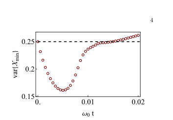 
FIG. 2. Time-evolution of the variance of the numerically optimized squeezed two-mode operator Xmin. Here, we have fixed (n, ω0, gn) = (4, 1, 1/ √

📷 Fig 3

 
FIG. 3. (a) Protocol combining charging (for time 2t1 with λ(t) = 1) and sensing (for time ts with λ(t) = 0) using the two coupled superconducting LC resonator based quantum battery model in Eq. 6. (b) Bloch sphere representation of the evolution of quantum state during this protocol, starting from a discharged state |ψi⟩to a partially charged state |ψm⟩ while sensing an unknown parameter ϕ for time ts.

📷 Fig 4

 
FIG. 4. A schematic portrayal of potential inter-connectivity among standard quantum technologies. Here, X →Y implies Y enabled by X. This work enumerates such relationships between a quantum battery and a quantum sensor. Solid (dashed) arrows indicate established (hypothesized) proto- cols. The hypothetical protocols can be devised by combining the protocols developed here and in Refs. [59, 60].

📷 Fig 5

 
FIG. 5. Time evolution of the optimal angles for which the variance of the two-mode quadrature ˆ Xθ,η,ϕ is minimized.

📷 Fig 6

 
FIG. 6. Time evolution of the variance of the optimal quadrature ˆ Xθ,η,ϕ for (a) n = 3 and (b) n = 6. The best squeezing is obtained at a finite short time in both cases.

📷 Fig 7

 
FIG. 7. Time evolution of the optimal angles for which the variance of the two-mode quadrature ˆ Xθ,η,ϕ is minimized for (a)–(c) n = 3 and (d)–(f) n = 6.

**Main problem.** Investigating whether quantum hardware can be designed for dual-use, specifically to simultaneously serve as a quantum battery for energy storage and a quantum sensor for metrology.

**Main result.** The authors demonstrate that the protocols used for fast quantum battery charging (with a collective advantage) can be interrupted to perform high-precision quantum sensing, and vice versa, allowing for modular hardware that switches functions without extra cost.

**Method.** The study uses analytical derivations (short-time expansions, Heisenberg picture) and numerical exact diagonalization to evaluate energy storage, squeezing, and Quantum Fisher Information.

**Summary.** This paper proposes a way to use the same quantum hardware for two different tasks: storing energy in a quantum battery and performing high-precision sensing. By using non-linear coupling in superconducting resonators, the authors show that the process of charging a battery naturally creates the entangled states needed for advanced sensing. This allows for a modular architecture where a single device can switch between being a sensor and a power source. The results demonstrate that both processes can benefit from collective quantum advantages simultaneously.

Detailed structure

**Model / system.** The proposed platform consists of two coupled superconducting LC resonators (bosonic modes) with a non-linear charging Hamiltonian, which can also be mapped to a system of N spin-1/2 particles under one-axis twisting.

**Key observables.** Energy stored (Delta E), charging power, Quantum Fisher Information (QFI), quantum squeezing (quadrature variance), and number operator variance.

**Important parameters / regimes.** Large N limit, non-linearity parameter n, coupling strength g_n, and the temporal structure of the protocol (t_c, t_s).

**Assumptions / limitations.** The charging advantage is specifically valid for finite-size systems; in the true thermodynamic limit with Kac normalization, the advantage is lost.

**Figures summary.** Figure 1 illustrates the dual-use concept and the temporal window for sensing; Figure 3 shows the schematic of the combined charging and sensing protocol and the Bloch sphere evolution.

**Paper structure.** The paper introduces the dual-use concept, establishes the theoretical mapping between battery charging and resource generation, presents the superconducting circuit implementation, provides analytical derivations for squeezing and QFI, and concludes with the implications for modular quantum architectures.

**Why it may be interesting.** It connects the fields of quantum thermodynamics (batteries) and quantum metrology, showing that the 'speed' required for both tasks allows for a unified hardware approach, which is highly relevant for developing scalable quantum technologies.

Abstract

Quantum resources such as entanglement form the backbone of quantum technologies and their efficient generation is a central objective of modern quantum platforms. Independently, quantum batteries have emerged as nanoscale devices that utilize collective quantum effects to store energy with a charging advantage over classical strategies. Here, we show that these two pursuits can co-exist: protocols for fast generation of resourceful quantum states can simultaneously charge a quantum battery with a collective advantage, and conversely, a quantum battery protocol with a charging advantage can produce resource-rich states. Using this connection, we propose an integrated hardware protocol on superconducting circuits in which each experimental run can interchangeably accomplish either quantum battery charging, or quantum sensing through generation of metrologically useful states. Our results establish that quantum resources and stored energy are distinct yet co-producable quantities, opening the door to modular quantum architectures that dynamically switch between sensing and energy-storage functions, thereby producing additional functionalities without extra hardware cost.

### [A Universal Quantum Information Preserving Photonic Switch for Scalable Quantum Networks](http://arxiv.org/abs/2604.21902v1)

**Authors:** Jiapeng Zhao, Stéphane Vinet, Amir Minoofar, Michael Kilzer, Lucas Wang, Galan Moody, Vijoy Pandey, Ramana Kompella, Reza Nejabati  
**Type:** both · **PDF:** <https://arxiv.org/pdf/2604.21902v1>  
**Analysis basis:** full PDF text, analyzed in chunks

📷 Fig 1

 
FIG. 1: Switched Quantum Network. Conceptual quantum network centered around the quantum switch. The system ensures quantum state integrity and entanglement preservation while providing encoding-agnostic operation across diverse modalities. The switch supports time- and space-multiplexed utilization of shared critical resources whilst providing a scalable framework for the interconnection of quantum computers and quantum sensor.

📷 Fig 2

 
FIG. 2: Architecture of the Universal Quantum Switch. The input quantum state converters (QSCs) enable conversion to path-encoding to ensure quantum information is routed through two identical photonic switches. The output QSCs convert the quantum information back to the desired output encoding modality. Both QSCs can be implemented in either an integrated or pluggable manner with an arbitrary combination of encoding modality.

📷 Fig 3

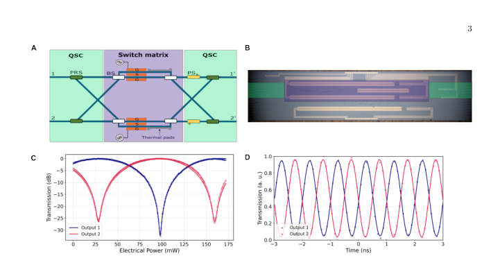 
FIG. 3: Schematic of the quantum switch. (a) Simplified sketch of the device for polarization encoding. (b) TFLN photonic integrated circuit combining both QSCs and the switch matrix, respectively highlighted in green and purple. (c) Normalized optical power when varying the driving voltage of TO phase shifters to characterize the half-wave power and ER of MZI. (d) Fast switching between two output ports when driving the EO modulator with a sinusoidal waveform at 1 GHz rate to determine half-wave voltage.

📷 Fig 4

 
FIG. 4: Quantum state tomography (a) Simplified sketch of the experimental setup for quantum characterization. An entangled photon source produces polarization-entangled photons at 1551.72 nm (signal) and 1564.68 nm (idler). The signal photon is routed through the UQS. After the PIC, both photons are sent to the polarization tomography system. Reconstructed density matrices for the input ρin (b) and output ρout (c) for connection 1 →1 (input →output ports). A fidelity F(ρin, ρout) = 0.98 is obtained with purity Tr(ρ2 out) = 1.

📷 Fig 5

 
FIG. 5: Dynamic switching. (a) Dynamic switching of the device when driving the EO modulator with a rectangular pulse at 1 MHz. The gated section used for quantum state tomography is shown in the shaded region. Reconstructed density matrices for the input ρin (b) and output ρout (c) for connection 2 →1 (input → output ports). A fidelity F(ρin, ρout) = 0.90 is obtained with purity Tr(ρ2 out) = 1.

📷 Fig 6

 
FIG. 6: Scaling potential of the UQS. (a) UQS fidelity as a function of PDL per PRS. b UQS fidelity as a function of PER of PRS and ER of MZI. c UQS fidelity and IL as a function of dimension N. Note that the IL floor comes from the high coupling loss in the current chip. A low loss (≤1 dB) design can be implemented to reduce the IL floor to 2 dB.

📷 Fig 7

 
FIG. 7: Polarization entangled photon source. Polarization entangled photons are generated in a fiber-based Sagnac interferometer via spontaneous four-wave mixing (SFWM) in a AlGaAs chip. The interferometer is actively locked using a probe laser with a servo controller.

**Main problem.** The lack of a scalable, dynamic, and encoding-agnostic switching paradigm for routing fragile quantum entanglement in heterogeneous quantum networks without introducing significant decoherence.

**Main result.** Demonstration of a Universal Quantum Switch (UQS) in thin-film lithium niobate that achieves high-speed (up to 1 GHz) routing of entangled states with minimal decoherence (<= 4%) and dimension-independent fidelity.

**Method.** The researchers developed a 2x2 prototype using a Beneš topology with dual-actuation (thermo-optic and electro-optic) and used quantum state tomography to verify the preservation of polarization-entangled photon pairs.

**Summary.** This paper presents a new type of photonic switch designed for the quantum internet. Using thin-film lithium niobate technology, the authors created a device that can route quantum information between different paths without destroying the delicate entanglement. The switch is extremely fast, capable of operating at gigahertz speeds, and is designed to be scalable so that larger networks can be built without increasing the error rate. This provides a vital building block for connecting different types of quantum computers and sensors into a unified, global network.

Detailed structure

**Model / system.** A thin-film lithium niobate (TFLN) photonic integrated circuit (PIC) featuring a three-stage architecture: Input Quantum State Converters, a non-blocking switch matrix, and Output Quantum State Converters.

**Key observables.** Uhlmann fidelity, purity, polarization extinction ratio (PER), polarization-dependent loss (PDL), and insertion loss (IL).

**Important parameters / regimes.** Switching speeds up to 1 GHz (EO) and 5 kHz (TO); decoherence penalty <= 4%; average fidelity > 94%; insertion loss ~5.2 dB.

**Assumptions / limitations.** The input is an ideal polarization-entangled Bell state; the model assumes a weighted Pauli channel to account for hardware-induced noise.

**Figures summary.** Figure 1 shows the conceptual network; Figure 2 details the UQS architecture; Figure 3 illustrates the device layout and modulator characteristics; Figure 4 presents the experimental setup and reconstructed density matrices; Figure 6 shows scaling projections for fidelity and loss.

**Paper structure.** The paper introduces the scalability problem in quantum networks, proposes the UQS architecture, describes the TFLN experimental implementation, details the characterization of switching performance and hardware-induced noise, and concludes with a projection of the architecture's scalability.

**Why it may be interesting.** This work is highly relevant to quantum optics and open quantum systems as it demonstrates a method for high-speed routing of qubits while maintaining coherence, providing a hardware-level solution to the decoherence challenges in large-scale photonic quantum networks.

Abstract

Quantum networks are a keystone of the quantum internet. However, existing implementations remain largely confined to static point-to-point links due to the absence of a switching paradigm capable of dynamically routing fragile quantum entanglement without introducing decoherence. Here, we propose the Universal Quantum Switch, a foundational building block allowing on-demand, non-blocking, and encoding-agnostic routing of quantum information, as well as seamless modality conversion between disparate quantum platforms. We develop a prototype in thin-film lithium niobate and experimentally demonstrate robust switching with $\le 4\%$ decoherence via thermo-optic modulation and high-speed electro-optic switching of arbitrary entangled states at 1 MHz. Moreover, we show that our platform can support reconfiguration speeds up to 1 GHz. To our knowledge, this work represents the first demonstration of multi-node dynamic entanglement distribution at these speeds. Complementing these experimental results, we project the architecture's scalability, showing dimension-independent decoherence, and provide a scalable, interoperable building block for heterogeneous quantum network fabrics.

### [Loss-biased fault-tolerant quantum error correction](http://arxiv.org/abs/2604.21876v1)

**Authors:** Laura Pecorari, Gavin K. Brennen, Stanimir S. Kondov, Guido Pupillo  
**Type:** theory · **PDF:** <https://arxiv.org/pdf/2604.21876v1>  
**Analysis basis:** full PDF text, analyzed in chunks

📷 Fig 1

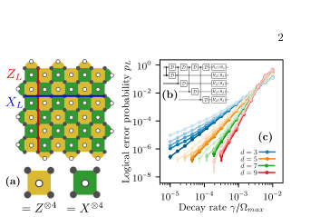 
FIG. 1. (a) Rotated surface code, stabilizers and logical oper- ators. (b) Stabilizer readout circuit simulated with different success probability of not finding an atom in the Rydberg state before a CZ gate. (c) Surface code logical error proba- bility versus Rydberg decay rate, γ/Ωmax with time-optimal laser pulses. Data are for 100, 90, 75, 50, 0% success proba- bility that an atom is not in the Rydberg state immediately before a the next gate (from dark to light color shading).

📷 Fig 2

 
FIG. 2. (a) Schematic level structure. (b) Logical error scal- ing ν such that pL ∝γν versus success probability, pdepl., of inter-gate ionization for distance-3 surface codes. Back- to-back gate schedules produce a non-fault-tolerant scaling ⌈d/4⌉, while perfect inter-gate ionization restores the fault- tolerant Pauli scaling of ⌈d/2⌉for Pauli errors. If losses are properly handled in software with a loss-aware decoder, the optimal erasure-like scaling of d can be achieved (light blue). Error bars fall within the marker size.

📷 Fig 3

 
FIG. 3. Occurrences of hook error strings caused by single decay events that degrade fault tolerance. Number hook er- rors for (a) ionization enforced after each gate with success probabilities ranging from 0% to 100% and (b) perfect ion- ization only enforced at selected circuit locations (see main text). (c) Probability of each hook error string at fixed decay rate γ = 5×10−5Ωmax (far below the surface code threshold).

**Main problem.** Investigating how fast QEC cycles in neutral-atom processors introduce non-Markovian, correlated errors due to Rydberg excitation hopping and residual populations, which degrade fault-tolerant scaling.

**Main result.** The authors propose 'loss-biasing'—converting Rydberg excitations into atom loss via mid-circuit ionization—to transform correlated errors into erasure-like noise, thereby restoring fault-tolerant logical error scaling.

**Method.** The study uses Monte Carlo simulations of Lindblad dynamics, randomized compiling to derive Pauli error models, and the Stim/PyMatching framework to simulate surface codes and decode syndromes.

**Summary.** This paper addresses the degradation of fault tolerance in neutral-atom quantum computers caused by correlated Rydberg errors during fast QEC cycles. The authors propose a technique called 'loss-biasing,' where unwanted Rydberg excitations are intentionally converted into atom loss through mid-circuit ionization. This transformation turns difficult-to-correct correlated errors into detectable erasure errors, which can be handled more efficiently by decoders. The method allows for faster QEC cycles and restores the optimal scaling of logical error rates, offering a practical path toward large-scale, fault-tolerant Rydberg computing.

Detailed structure

**Model / system.** A neutral-atom processor using Rydberg-blockade CZ gates, modeled as a three-level system (|0>, |1>, |r>) with a Hamiltonian including Rydberg-Rydberg interactions and Lindblad operators for decay.

**Key observables.** Logical error probability (pL), logical error scaling exponent (nu), and stabilizer measurement outcomes (X and Z).

**Important parameters / regimes.** Rydberg decay rate (gamma), ionization success probability (p_depl), and QEC cycle time (aiming for sub-millisecond scales).

**Assumptions / limitations.** Assumes a data-ancilla blockade for certain ionization schedules and focuses primarily on the surface code architecture.

**Figures summary.** Includes a schematic of the atomic level structure, plots of logical error scaling versus ionization success probability, and comparisons of different stabilizer readout circuit schedules.

**Paper structure.** The paper identifies the problem of non-Markovian errors in fast QEC cycles, introduces the loss-biasing mechanism, provides numerical evidence for error suppression and scaling restoration, and discusses experimental implementation in alkaline-earth-like atoms.

**Why it may be interesting.** It addresses a critical bottleneck in scaling Rydberg-based quantum computers, providing a hardware-driven strategy to mitigate complex, non-Markovian noise by leveraging erasure-aware decoding.

Abstract

We investigate the limits of quantum error correction (QEC) in neutral-atom processors approaching high-fidelity gates and fast cycle times. We show that shorter QEC cycles amplify platform-specific errors, notably Rydberg excitation hopping, and hinder decay of residual Rydberg population, leading to non-Markovian correlated errors that degrade logical performance. To address this, we introduce loss biasing, where spurious Rydberg excitations are rapidly converted into atom loss via mid-circuit ionization, transforming errors into erasure-like noise and suppressing their propagation. Loss biasing restores the fault-tolerant logical error scaling for intra-cycle Pauli errors; furthermore, we argue that when supported with loss-aware decoding, it can achieve the optimal scaling of erasures while enabling shorter QEC cycles with reduced hardware overhead. We outline an implementation using fast autoionization in alkaline-earth(-like) atoms, establishing loss biasing as a practical route toward fault-tolerant quantum computing with sub-millisecond QEC cycles.

### [Enhancing Coherence of Spin Centers in p-n Diodes via Optimization Algorithms](http://arxiv.org/abs/2604.21874v1)

**Authors:** Jonatan A. Posligua, David E. Stewart, Denis R. Candido  
**Type:** theory · **PDF:** <https://arxiv.org/pdf/2604.21874v1>  
**Analysis basis:** full PDF text, analyzed in chunks

📷 Fig 1

 
FIG. 1: (a) Schematic of a 4H-SiC pnn+ diode operated in the reverse bias regime with embedded spin centers, non- depleted charges, and surface traps responsible for the leakage current. (b) Schematic of the multi-variable linewidth optimization algorithm via the scale-gradient descent method. The linewidth is first calculated for an initial set of diode design parameters p, and then autonomously minimized using a scaled gradient descent method. Iterations are performed until convergence of the linewidth is achieved, resulting in a final set of design parameter.

📷 Fig 2

 
FIG. 2: Electrostatic properties of a 4H-SiC pnn+ diode: (a) Electric potential along the diode’s z-direction calculated for reverse bias voltages ranging from −50 to −800 V. (b) Same for the electric field. (c) Total charge carrier density as a function of position within the diode’s z-direction calculated using the solution to Poisson’s equation to evaluate ρc in Eq. (2) for reverse voltages ranging from −50 to −400 V. The depletion boundaries ˜dn are shown for each reverse bias value. (d) Same for the optical linewidth as a function of the spin center’s position within the diode’s n-region (i.e., zdef). The doping densities used to generate all the sub-figures are Na = 7×1018cm−3, Nn =...

📷 Fig 3

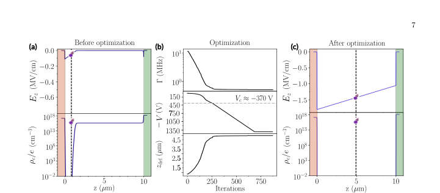 
FIG. 3: Single-parameter linewidth optimization with respect to the bias voltage. The initial design parameters are Na = 7 × 1018 cm−3, Nn = 4 × 1015 cm−3, Nd = 1.01 × 1019 cm−3, T = 300 K, V = −5 V, dl = dr = 0.4 µm and d = 10 µm. (a) Electric field and carrier density profiles for the initial parameters. (b) Optical linewidth, reverse bias voltage, and optimal spin center position as a function of iteration number. (c) Final electric field and carrier density profiles for the optimal design parameters.

📷 Fig 4

 
FIG. 4: (a) Single-type parameter linewidth optimization with respect to doping densities for small bias voltage of V = −5 V, Nn ≪Na ≈Nd, with Nn = 4 × 1015 cm−3, Na = 7 × 1018 cm−3, and Nd = 1.01 × 1019 cm−3, T = 300 K, dl = dr = 0.4 µm, d = 10 µm. The upper panel shows the reduction in linewidth Γ vs. iteration number, the lower panels show the corresponding doping densities and spin center position. (b) Same as (a), but for Na = Nn = Nd = 1019 cm−3 as initial conditions. (c) Density plot of depletion length within the intrinsic region (dn) as a function of Nn/Na and V .

📷 Fig 5

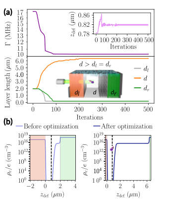 
FIG. 5: Optimization with respect to the lengths of the diode’s doping layers. The initial parameters for this simulation are Na = 7×1018 cm−3, Nn = 4×1015 cm−3, Nd = 1.01 × 1019 cm−3, T = 300 K, V = −15 V, and dl = dr = d = 1 µm. Upper panel: Linewidth reduction and inset showing spin center’s position as a function of iteration number. Lower panel: Evolution of d, dl, and dr that allows for minimal optical linewidth Γ. The size of the lightly-doped n-region is considerably bigger than that of the bulk p and n+-regions. This is a consequence of both charge conservation and the application of our electric noise model.

📷 Fig 6

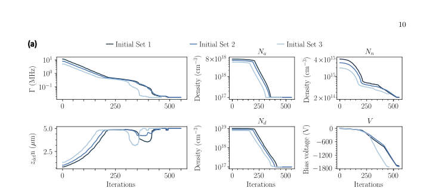 
FIG. 6: Optimization process for 3 different sets of initial design parameters with displayed iteration-by-iteration behavior of the linewidth Γ, optimal spin center position and the diode’s design parameters Na, Nn, Nd, and V for dl = dr = 0.4 µm and d = 10 µm. The voltages used for “Initial Set 1”, “Initial Set 2”, and “Initial Set 3” are −5 V, −6 V, and −7 V, respectively. (b) Same for dl = dr = 0.04 µm and d = 1 µm. (c) Same for dl = dr = 0.004 µm and d = 0.1 µm.

📷 Fig 7

 
Fig. 6. The left panels show the behavior of Γ and the spin center position as a function of iteration number, whereas the plots on the right side show the correspond- ing variations of all doping densities and bias voltage. Our optimization with respect to these diode parame- ters shows an overall two-order-of-magnitude decrease in the linewidth. Here, smaller linewidths are achieved by decreasing doping densities, increasing the magnitude of the bias voltage, and placing the spin defect at the center of the diode. Similarly to the results found with respect to a single type of parameters in Secs . V A and V B, optimization was obtained via the decreases in the den- sity of fluctuators and...

📷 Fig 8

 
FIG. 7: (a) Optimization process for 3 different sets of initial design parameters with displayed iteration-by-iteration behavior of the linewidth Γ, optimal spin center position and the diode’s design parameters Na, Nn, Nd, and V for dl = dr = 0.04 µm and d = 1 µm. The voltages used for “Initial Set 1”, “Initial Set 2”, and “Initial Set 3” are −5 V, −6 V, and −7 V, respectively. (b) Same as (a) but for d = 0.1 µm.

📷 Fig 9

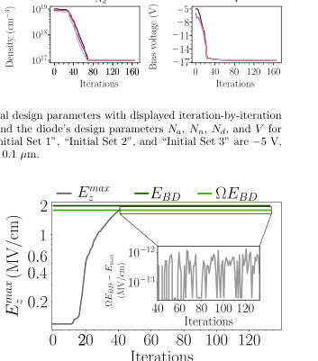 
FIG. 8: Maximum electric field [Emax z ] inside the diode as a function of the iteration. Horizontal lines represent the electric field breakdown value EBD, and a fraction of ΩEBD (Ω&lt; 1) set as the numerical threshold of the elec- tric field. Inset shows ΩEBD −Emax z demonstrating that the maximum value of the electric field never surpasses ΩEBD.

📷 Fig 10

 
FIG. 9: Cause and effect of leakage current present in a 4H-SiC pnn+ diode. (a) Effective density neff pro- duced by leakage current at thermal equilibrium as a function of depth from the diode’s surface for reverse bias voltages ranging from −500 to −1100 V. The depth- dependence of the densities is modeled as a half-Gaussian profile, where its maximum value occurs at the surface of the diode, and it decays as a function of depth in- side the diode. This is pictorially evidenced in Fig. 1(a). (b) Optical linewidth calculated from electric and mag- netic SND as a function of the spin center’s separation from the volume containing fluctuators. The linewidths are calculated for the same...

**Main problem.** Determining the optimal set of diode design parameters (doping, voltage, and geometry) to maximize the spin coherence of divacancy centers in 4H-SiC p-n diodes by minimizing optical linewidth.

**Main result.** The study demonstrates that increasing reverse bias voltage and reducing doping densities can achieve sub-MHz linewidths, and that placing spin centers deeper from the surface mitigates leakage current-induced noise.

**Method.** A scaled gradient descent optimization algorithm that combines numerical solutions of the Poisson equation with a formalism for calculating charge noise from non-depleted regions and leakage currents.

**Summary.** This paper addresses how to maximize the coherence of spin centers in silicon carbide-based p-n diodes. By using a scaled gradient descent algorithm, the authors optimize parameters like doping density, bias voltage, and device geometry to minimize optical linewidth. They find that depleting free carriers through high reverse bias and reducing doping can significantly suppress charge noise. Additionally, they show that placing spin centers away from the surface helps mitigate noise from leakage currents, providing a roadmap for designing high-performance quantum hardware.

Detailed structure

**Model / system.** The system consists of divacancy spin centers embedded in 4H-SiC p-n (and p-i-n) diodes under reverse bias, modeled via Poisson's equation and Kubo's line-shape theory.

**Key observables.** Optical linewidth (FWHM), electric potential, electric field, and carrier density profiles.

**Important parameters / regimes.** Reverse-bias voltage, doping densities (Na, Nd), layer thicknesses, spin center depth, and temperature (300 K).

**Assumptions / limitations.** Assumes a 'slow noise' regime with Gaussian line-shapes, isotropic noise, and that leakage current noise is negligible if spin centers are deeper than 100 nm from the surface.

**Figures summary.** Figure 1 shows the diode schematic and the optimization algorithm flow; Figure 3 illustrates the evolution of electric fields and carrier densities during voltage optimization; Figure 4 shows the optimization progress for doping and geometry.

**Paper structure.** The paper introduces the problem of spin coherence in diodes, describes the physical noise models and electrostatic modeling, presents the development of the gradient descent optimization algorithm, and concludes with results from single- and multi-parameter optimization scenarios.

**Why it may be interesting.** It provides a practical engineering framework for improving the coherence of solid-state qubits by optimizing the electrical environment, which is crucial for developing scalable quantum networks and sensors.

Abstract

Solid-state spin defects hold great promise as building blocks for various quantum technologies. Embedding spin centers in $p$-$n$ diodes under reverse bias has proved to be a powerful strategy to narrow the optical linewidth and increase spin coherence, while also enabling control of the photoluminescence wavelength via Stark shift. Given the multitude of parameters influencing spin centers in diodes (e.g., doping densities and profiles, temperature, bias voltage, spin center position), a question that has not yet been answered is: which set of these design parameters maximizes spin center coherence? In this work, we address this question by developing a scaled gradient descent optimization algorithm that minimizes the optical linewidth of spin centers by combining the numerical solution of a diode's Poisson equation with calculated charge noise from the non-depleted regions. Our optimization is performed for both single- and multiple-parameter cases for divacancies in SiC $p$-$i$-$n$ diodes, including reverse-bias voltage, doping density and profile, and diode total length. Importantly, the optimization is subject to realistic physical constraints, such as small operating bias voltages, avoidance of the dielectric breakdown regime and physical thresholds for doping density. Additionally, due to the leakage current at reverse bias voltages, we develop a new formalism to investigate its influence on coherence. We show that the corresponding noise can be mitigated by implanting spin defects away from the diode's surfaces. Our work provides guidance on experimentally relevant diodes for hosting spin centers with the narrowest optical linewidths and longest coherence times.

### [High-performance cellular automaton decoders for quantum repetition and toric code](http://arxiv.org/abs/2604.21866v1)

**Authors:** Don Winter, Thiago L. M. Guedes, Markus Müller  
**Type:** theory · **PDF:** <https://arxiv.org/pdf/2604.21866v1>  
**Analysis basis:** full PDF text, analyzed in chunks

📷 Fig 1

 
Fig. 1 shows the logical error rate pL for various sys- tem sizes. In the sub-threshold regime (p &lt; 0.5), in- creasing the system size provides better protection, as errors are suppressed more effectively with additional physical qubits. This value pc ≡p = 0.5 is called the QEC threshold. In this regime, pL scales with pλ(d), with λ(d) = (d + 1)/2 and d = n, corresponding to the min- imum number of physical errors for which the matching decoder gives a logical error. Another code which, however, is capable to protect against both Z- and X-errors is the toric code [57], shown in Fig. 2. The toric code is defined on a n × n regular square lattice with periodic boundary conditions, i.e., a...

📷 Fig 2

 
FIG. 2. Illustration of a distance d = 5 toric code with qubits (black circles) on edges of a regular d × d lattice under pe- riodic boundaries. Qubits in parenthesis wrap around the torus. The minimum-weight logical operators X1 L and X2 L are vertical and horizontal strings of single-qubit Pauli-X oper- ators. Logical Z-operators are omitted. The stabilizers of the toric code are either of pure X- (red stars) or Z-type (blue plaquettes). A X-error (red dot) anti-commutes with two Z-stabilizers, causing two defects (blue shades). A Z- error (blue dot) causes the star syndrome (red shades). Any X error configuration which forms a (product of) stabilizer generator(s) commutes with the...

📷 Fig 3

 
FIG. 1. Analytical logical error rate pL as function of bit- flip error rate p for the ML decoder (Eq. 1) of the repetition code. Different colors correspond to different code distances d (equivalent to number of qubits n making up the repetition code), the dashed red line marks the QEC threshold pc = 0.5.

📷 Fig 4

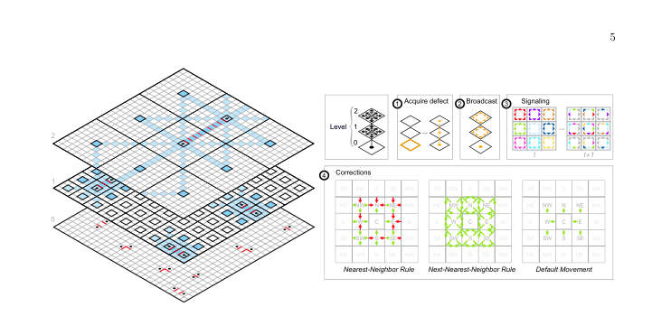 
FIG. 3. Sketch of Harrington’s hierarchical CA decoder. On the left, we show a distance-27 toric code from the perspective of the three hierarchy levels Harrington’s decoder imposes. Error correction is accomplished by moving defects (black circles) which are close towards each other thereby correcting the errors (red lines) which separate them. At the lowest level (0), one- and some two-qubit errors are corrected within at most two CA steps. Defects which have no other defect in their local neighborhood move towards the center of their colony (group of Q × Q cells) marked in thick black lines at the next hierarchy level (1). At level-1, defects located at colony centers communicate by...

📷 Fig 5

 
FIG. 4. Logical error rate pL as function of bit-flip error rate p for Harrington’s toric code decoder under code capacity noise for different code distances d (color code). The dashed red line marks the QEC threshold pc ≈4.5%. The black dashed line corresponds to fits of the function f(p, d) = A(d)pλ(d). In the inset we show the effective code distance λ(d) as function of code distance d. The purple line in the inset corresponds to the function λ(d) = 2log3(d) ≈d0.631, as discussed in the main text. Numerical data was obtained for 104 to 106 Monte Carlo shots until statistical uncertainty is small relative to the measured values. Standard sampling errors are represented by black error bars.

📷 Fig 6

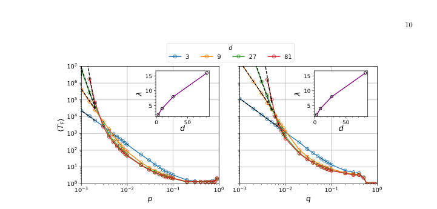 
FIG. 5. Average logical lifetime ⟨TF ⟩as function of phenomenological bit-flip error rate p on data qubits (left panel) and rate q on measurements (right panel) for toric codes of distance d (color code) under corrections by Harrington’s decoder. In the left panel we set q = 0 and in the right p = 0. Dashed black lines correspond to fits of the function g(d, p) = B(d)p−λ(d) with λ(d) shown in the insets. The purple line in the inset corresponds to λ(d) = d0.631 in both panels. Although a non-zero threshold is mathematically guaranteed [1], a precise asymptotic value is not deducible from this data as the crossing points continue to drift toward lower error rates for the simulated distances....

📷 Fig 7

 
FIG. 6. Average logical lifetimes ⟨TF ⟩as function of data, measurement, and signal noise with respective rates p, q, and psig for Harrington’s decoder on toric codes of distance d (color coded). The lines of less opacity in the background correspond to performance curves under sole data noise, cf., left panel of Fig. 5. The dashed colored lines correspond to data, measurement and CountSignal noise, while the solid lines correspond to data, measurement and CountSignal and FlipSignal noise. The devastating effect of FlipSignal noise becomes apparent when p, q &lt; 10−2. In this regime, larger lattice sizes show worse performance than small ones. Sole CountSignal noise (dashed lines) is less...

📷 Fig 8

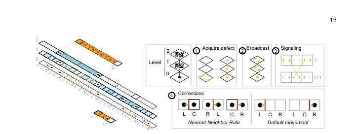 
FIG. 7. Sketch of Harrington’s decoder confined to one dimension. On the left, we show a distance-27 repetition code from the perspective of the three hierarchy levels Harrington’s decoder imposes. Error correction is accomplished by moving close-by defects (black circles) towards each other, thereby correcting the errors (red and orange lines) which separate them. At the lowest level (0), one- and some two-qubit errors are corrected within at most two time steps, while defects that have no other defect in their neighborhood are moved towards their colony center (marked in black thick lines at the next level). At the next level (1), CountSignals (colored in blue; shade corresponds to amount...

📷 Fig 9

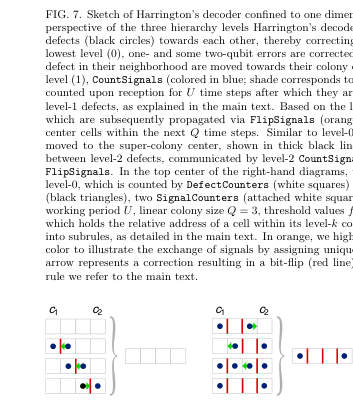 
FIG. 8. All possible error configurations of qubits within a block. Data-qubit errors (red bars) generate a syndrome (black circles) between two colony centers C1 and C2. The green arrows indicate the local update prescribed by the cor- rection rule. Configurations with zero or one error (left) are corrected to the trivial configurations with no errors between the centers, whereas configurations with two or three errors (right) are completed to the nontrivial configuration with three errors between the centers.

📷 Fig 10

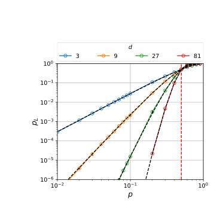 
FIG. 9. Logical error rate pL as function of data qubit error rate p for Harrington’s decoder confined to one dimension under code capacity noise on distance-d repetition codes. The red dashed line marks the QEC threshold at pc = 1/2. The dashed black lines correspond to the (analytical) performance of a global concatenated majority voting (pL = (pmaj)m(p), as explained in the main text). Each data point was obtained from 104 to 106 Monte Carlo shots until statistical uncertainty is small relative to the measured values. Standard errors are represented by black error bars.

**Main problem.** The need for scalable, low-latency, and robust decoding architectures for large-scale quantum error correction (QEC) to overcome the computational bottlenecks of global decoders.

**Main result.** The introduction of SCALA, a non-hierarchical cellular automaton decoder that achieves a higher code-capacity threshold (approx. 7.5%) and superior sub-threshold scaling compared to hierarchical designs, while remaining robust to signaling and measurement noise.

**Method.** The authors present a new family of non-hierarchical cellular automaton (CA) decoders (SCALA) and benchmark them against the hierarchical Harrington decoder using Monte Carlo simulations and Markov process analysis.

**Summary.** This paper introduces SCALA, a novel non-hierarchical cellular automaton decoder designed for efficient quantum error correction. Unlike previous hierarchical approaches that rely on complex multi-level structures, SCALA uses local, parallelizable rules that maintain constant computational resources regardless of system size. The results demonstrate that SCALA provides a higher error threshold and better scaling for the toric code while being significantly more resilient to noise in the decoding process itself. This makes it a highly promising candidate for real-time decoding on scalable quantum hardware.

Detailed structure

**Model / system.** The study focuses on quantum error-correcting codes, specifically the 1D quantum repetition code and the 2D toric code, under various noise models including code-capacity, phenomenological, and signaling noise.

**Key observables.** Logical error rate (pL), code-capacity threshold (pc), effective code distance (lambda), and average logical lifetime (T_F).

**Important parameters / regimes.** Physical error rate (p), measurement error rate (q), code distance (d), and colony size (Q).

**Assumptions / limitations.** The analysis assumes a local decoding paradigm where complexity is decoupled from system size and assumes logical failures occur as rare, independent events in the geometric distribution regime.

**Figures summary.** Figures illustrate logical error rates vs. physical error rates, the hierarchical structure of the Harrington decoder, the internal state and local rules of the SCALA decoder, and the impact of finite-size effects and noise on decoder performance.

**Paper structure.** The paper introduces the problem of scalable decoding, presents the SCALA architecture, compares it to hierarchical CA decoders, evaluates performance/scaling/robustness metrics, analyzes the mathematical scaling of logical lifetime, and discusses finite-size error mechanisms.

Abstract

Execution of quantum algorithms on large-scale quantum computers will require extremely low logical error rates, which necessitates the development of scalable decoding architectures. Local decoders are promising candidates for this task, as they avoid the communication and data processing bottlenecks inherent in global decoding strategies. Cellular automaton (CA) decoders represent a distinct class of local decoders, offering a path toward the low-latency, real-time decoding required for practical applications. In this work, we present SCALA (Signaling CA with Local Attraction), a novel non-hierarchical cellular automaton decoder for quantum repetition and toric codes. By evaluating SCALA alongside the hierarchical CA decoder proposed by Harrington, we provide a direct comparison between non-hierarchical and renormalization-group-style local decoding strategies. We characterize SCALA across three key metrics: Performance, scalability, and robustness. Our results show that SCALA achieves a code-capacity threshold of approximately $p_c\approx 7.5\%$ and provides strong sub-threshold scaling of about $p_L\propto p^{d/4}$ on the toric code. In terms of scalability, our non-hierarchical design ensures that the local computational resources remain independent of system size, yielding a modular local architecture suitable for hardware implementation. Finally, SCALA demonstrates strong robustness to qubit measurement errors and noise within the decoder itself, a critical advantage for real-time decoding on noisy hardware. Our results establish SCALA as a high-performance, scalable, and robust local decoder for scalable quantum error correction.

### [Replay-buffer engineering for noise-robust quantum circuit optimization](http://arxiv.org/abs/2604.21863v1)

**Authors:** Akash Kundu, Sebastian Feld  
**Type:** theory · **PDF:** <https://arxiv.org/pdf/2604.21863v1>  
**Analysis basis:** full PDF text, analyzed in chunks

📷 Fig 1

 
Figure 2: 1-qubit compiling of Haar-random target unitaries with RX, RY, RZ(±π/128) gates. (Left) Suc- cess probability and mean fidelity at tolerances 0.99, 0.999, and 0.9999, where ReaPER+ performs best over- all. (Right) mean circuit length with std. dev. error bars versus tolerance; although all methods require deeper circuits at higher accuracy and exhibit a similar growth rate with tightening tolerance, ReaPER+ maintains a consistently lower circuit-length offset, giving the best accuracy-length tradeoff across all tolerance levels.

📷 Fig 2

 
Figure 3 compares replay strategies on the smaller-scale systems. ReaPER+ achieves the low- est energy error among prioritized methods with competitive circuit compactness; fixed ReaPER (ω=0.4 for BEH2, ω=0.6 for H2O) produces the most compact circuits, reflecting the longer-horizon credit assignment at larger scale (full ω sensitivity in Appendix I). Uniform replay yields superfi- cially shorter circuits but at substantially higher energy error, indicating early trapping in local min- ima. As shown in Table 2, OptCRLQAS with ReaPER+ (denoted as “OptCRLQAS + ReaPER+”) achieves the lowest energy error across 5-, 6-, and 8-qubit QAS problems, outperforming non-RL baselines such as DQAS [36],...

📷 Fig 3

 
Figure 3: Replay-buffer design controls circuit compactness in QAS. For 6-BEH2 and 8-H2O, ReaPER+ variants yield the lowest total, CNOT, and rotation gate counts compared to PER and uniform replay (mean ± std over seeds). ω=0 recovers PER; ω=1 gives fully reliability-adjusted replay.

📷 Fig 4

 
Figure 4: Efficiency and performance on 12-qubit H2O. (Left) OptCRLQAS reduces wall-clock time per episode by 67.5% over CRLQAS [19]. (Right) ReaPER achieves the lowest minimum energy error and fastest convergence across all replay baselines.

📷 Fig 5

 
Figure 5: Weighted transfer matrix for BEH2 under noiseless and noisy transfer. Buffer transfer reduces steps to chemical accuracy by 47-58% and improves final energy by up to 90.2% across all noise settings, yield- ing composite scores of 19.2-35.8%. The strongest score (35.8%) is driven by the largest energy improvement at p2=0.001.

📷 Fig 6

 
Figure 6: Weighted transfer matrix for H2O under noiseless and noisy transfer. Step reductions range from 49.8% to 84.8%, and energy improvements reach 46.7% under combined noise (p1=0.001, p2=0.005), yielding the highest score of 28.7%.

📷 Fig 7

 
Figure 8: ReaPER+ progressively concentrates buffer mass toward higher-fidelity transitions (fidelity ≥0.95) while retaining broader early-training coverage, consistent with its annealed transition from PER-like exploration to ReaPER-like reliability-aware sampling. PER maintains broader low-fidelity coverage through- out training, while ReaPER shows intermediate concentration behavior.

📷 Fig 8

 
Figure 9: LunarLander-v3 validation of ReaPER+. (Left) rolling success rate (300-episode window). (Middle) ReaPER+ (blue) reaches a higher success rate faster and maintains a higher asymptotic level than fixed ReaPER (red) and PER (green). (Right) normalized cumulative-return AUC. ReaPER+ accumulates +9% more return over the full training run, confirming improved sample efficiency on a dense-reward classical benchmark. All methods use identical DQN agents, only the replay mechanism differs.

📷 Fig 9

 
Figure 9 summarizes two complementary metrics. Left: the 300-episode rolling success rate (frac- tion of episodes exceeding the +200 solved threshold). ReaPER+ reaches a higher success rate earlier in training and sustains a higher asymptotic level (≈60% at episode 4500) compared with fixed ReaPER (≈50%) and PER (≈55%). Right: the normalized area under the reward curve (AUC), computed as the per-episode running mean of the cumulative return, shifted and normalized to [0, 1]. ReaPER+ achieves a +9% AUC advantage over both baselines by episode 5000, indicating better sample efficiency throughout training.

**Main problem.** Deep reinforcement learning for quantum circuit optimization and architecture search suffers from inefficient replay buffers, high computational costs in curriculum learning, and poor transferability from noiseless to noisy environments.

**Main result.** The proposed ReaPER+ strategy achieves 4-32x gains in sample efficiency, while OptCRLQAS reduces wall-clock time by up to 67.5% and the transfer scheme reduces steps to chemical accuracy by up to 90%.

**Method.** The authors introduce ReaPER+ (an annealed replay rule transitioning from TD-error to reliability-aware sampling), OptCRLQAS (an amortized evaluation framework), and a lightweight replay-buffer transfer scheme for noise-robustness.

**Summary.** This paper presents a suite of reinforcement learning enhancements designed to make quantum circuit optimization more efficient and robust to hardware noise. By engineering the replay buffer to transition from exploration to reliability-aware sampling, the authors significantly accelerate training and improve circuit quality. They also introduce methods to reduce the computational overhead of evaluating quantum circuits and to leverage noiseless simulations to jumpstart learning on noisy hardware. These advancements are crucial for scaling variational quantum algorithms in the NISQ era.

Detailed structure

**Model / system.** The study applies these methods to quantum circuit compilation (1-qubit and 2-qubit unitaries) and Quantum Architecture Search (QAS) for molecular Hamiltonians (BeH2, H2O) and the 5-qubit Heisenberg model.

**Key observables.** Success probability, fidelity, circuit compactness (gate/CNOT count), energy error (Ha), and wall-clock time.

**Important parameters / regimes.** Annealing exponent (omega_tau), timescale (T_ann), prioritization strength (alpha), and noise strength (p1, p2).

**Assumptions / limitations.** The replay-buffer transfer scheme assumes shared state and action spaces between source and target environments; the study focuses on the replay buffer as the primary algorithmic lever.

**Figures summary.** Figure 1 provides a framework overview (buffer engineering, amortized learning, and noise-aware transfer); Figure 2 shows 1-qubit compilation performance; Figure 3 illustrates circuit compactness; Figure 9 shows validation on the LunarLander-v3 benchmark.

**Paper structure.** The paper introduces the bottlenecks in RL-based quantum optimization, presents the three proposed algorithmic improvements (ReaPER+, OptCRLQAS, and Buffer Transfer), validates them through quantum compilation and QAS tasks, and provides a domain-agnostic test on a classical RL benchmark.

Abstract

Deep reinforcement learning (RL) for quantum circuit optimization faces three fundamental bottlenecks: replay buffers that ignore the reliability of temporal-difference (TD) targets, curriculum-based architecture search that triggers a full quantum-classical evaluation at every environment step, and the routine discard of noiseless trajectories when retraining under hardware noise. We address all three by treating the replay buffer as a primary algorithmic lever for quantum optimization. We introduce ReaPER$+$, an annealed replay rule that transitions from TD error-driven prioritization early in training to reliability-aware sampling as value estimates mature, achieving $4-32\times$ gains in sample efficiency over fixed PER, ReaPER, and uniform replay while consistently discovering more compact circuits across quantum compilation and QAS benchmarks; validation on LunarLander-v3 confirms the principle is domain-agnostic. Furthermore we eliminate the quantum-classical evaluation bottleneck in curriculum RL by introducing OptCRLQAS which amortizes expensive evaluations over multiple architectural edits, cutting wall-clock time per episode by up to $67.5\%$ on a 12-qubit optimization problem without degrading solution quality. Finally we introduce a lightweight replay-buffer transfer scheme that warm-starts noisy-setting learning by reusing noiseless trajectories, without network-weight transfer or $ε$-greedy pretraining. This reduces steps to chemical accuracy by up to $85-90\%$ and final energy error by up to $90\%$ over from-scratch baselines on 6-, 8-, and 12-qubit molecular tasks. Together, these results establish that experience storage, sampling, and transfer are decisive levers for scalable, noise-robust quantum circuit optimization.

### [Deterministic generation of grid states with programmable nonlinear bosonic circuits](http://arxiv.org/abs/2604.21824v1)

**Authors:** Yanis Le Fur, Javier Lalueza-Puértolas, Carlos Sánchez Muñoz, Alberto Muñoz de las Heras, Alejandro González-Tudela  
**Type:** theory · **PDF:** <https://arxiv.org/pdf/2604.21824v1>  
**Analysis basis:** full PDF text, analyzed in chunks

📷 Fig 1

 
FIG. 1. Symmetry-enforced state preparation for the 0-logical state. (a) Wigner representations of the initial squeezed vacuum state with r = 6 dB (i), displacement (ii), Kerr evolution (iii), and a final correction displacement ˆUD(iβcorr) (iv). Panel (v) represents the Wigner after applying three cycles of the protocol described in Algorithm 1 with initial squeezing r = 6 dB. (b) Expectation value ⟨ˆQ1⟩[dB] versus correction amplitude βcorr for a single-cycle generated state and for different values of initial squeezing r in different red shades. (c) ⟨ˆQ0⟩[dB] saturation for an increasing number of cycles of the symmetry-enforced states across different squeezing regimes (in red shades)....

📷 Fig 2

 
FIG. 2. Wigner distributions and logical state infidelities for phased-comb states. (a) Wigner distributions of the phased-comb logical states |˜0PC,j⟩(ncycles = 1, 2, and 3 cycles, left to right) and |˜1PC,j⟩(ncycles = 0, 1, and 2 cycles, left to right) using a squeezing parameter of r = 10 dB and the protocol described in Algorithm 1, but without the correction step. (b,c) Logical state infidelity Iµ (µ ∈{0, 1}) as a function of the Kerr uncertainty ∆χmax (b) and the boson loss rate normalized to the Kerr strength κ/χ (c). The infidelity is evaluated for a 3-cycle state (µ = 0, blue squares) and a 2-cycle state (µ = 1, red rhombus) at a squeezing of r = 7.8 dB. Data points represent an...

📷 Fig 3

 
FIG. 3. Performance of QEC codes. (a) Near-optimal channel infidelity ˜Ie = 1−˜Fe as a function of the photon loss probability γ. (b) Channel infidelity versus the number of state legs at a fixed loss probability γ = 10−2. Performance is compared across four encodings: phased-comb (red rhombus), comb (blue rhombus), Gaussian-truncated GKP (red circles), and the trivial encoding {|0⟩, |1⟩} (dashed line). All codes are evaluated with the same number of legs. Parameters: (a) µ = 0 logical states generated with 3 cycles and µ = 1 logical states with 2 cycles. (b) Truncation level of the cavity NR = 500 except for the 5 cycle case where NR = 1200 to ensure convergence. (a,b) Squeezing is fixed...

**Main problem.** The challenge of deterministically generating bosonic grid states, such as GKP states, for quantum error correction without relying on probabilistic protocols or complex auxiliary qubit systems.

**Main result.** The authors propose a deterministic protocol using programmable nonlinear bosonic circuits that generates a new class of 'phased-comb' states, which are scalable and provide error-correction performance comparable to standard GKP states.

**Method.** The protocol uses an iterative 'leg-doubling' process involving the concatenation of squeezing, displacement, and Kerr-type nonlinear operations applied to an initial squeezed vacuum state.

**Summary.** This paper presents a method to deterministically create a new class of quantum error-correcting states called 'phased-comb' states using simple nonlinear bosonic operations. Unlike standard GKP states, which are difficult to generate deterministically, these states emerge naturally from programmable circuits using squeezing, displacement, and Kerr nonlinearities. The authors show that these states are scalable and offer robust protection against photon loss. Furthermore, they demonstrate that a universal set of quantum gates can be implemented within this new encoding.

Detailed structure

**Model / system.** A platform-agnostic single-mode harmonic oscillator (applicable to photonic or microwave regimes) subject to Kerr nonlinearity, displacement, and squeezing operations, with noise modeled via the Lindblad master equation for boson loss.

**Key observables.** GKP squeezing operators (Q0, Q1), Wigner distributions, channel fidelity, photon number, and quadrature measurements (x and p).

**Important parameters / regimes.** Squeezing (r), Kerr strength (chi*t), displacement amplitude (alpha), number of circuit cycles, and boson loss rate (kappa).

**Assumptions / limitations.** The protocol assumes access to Kerr nonlinearities and treats boson loss as the dominant decoherence mechanism; it also assumes an optimal recovery operation for fidelity bounds.

**Figures summary.** Fig 1 shows Wigner evolution and symmetry correction; Fig 2 illustrates the scaling of phased-comb states and infidelity under Kerr uncertainty; Fig 3 compares channel infidelity against photon loss probability.

**Paper structure.** The paper introduces the problem of GKP generation, proposes a circuit-based protocol, analyzes the resulting phased-comb states and their scalability, evaluates error-correction performance under loss, and demonstrates the implementation of a universal gate set.

**Why it may be interesting.** It provides a scalable, deterministic alternative to standard GKP encoding by relaxing symmetry constraints, which is highly relevant for developing hardware-efficient bosonic quantum error correction in circuit QED and quantum optics.

Abstract

Bosonic quantum error correction enables hardware-efficient protection of quantum information by encoding logical qubits in harmonic oscillators. Bosonic grid states, such as Gottesman-Kitaev-Preskill (GKP) states, are particularly promising due to their potential to correct small displacements and boson loss. However, their generation remains challenging, typically relying on probabilistic protocols or auxiliary qubit systems. Here, we propose deterministic protocols for generating bosonic grid states using programmable nonlinear bosonic circuits composed solely of squeezing, displacement, and Kerr operations. We show that aiming to enforce GKP symmetries in the output of these circuits yields states with competitive performance with respect to current realizations, but whose quality saturates with increasing circuit depth due to imperfect symmetry restoration. Instead, we find that these bosonic circuits naturally give rise to a distinct class of states, that we label as phased-comb states, which are unitarily related to standard grid states but feature an intrinsic phase structure. We demonstrate that these states define a scalable bosonic quantum error-correcting code with near-optimal performance under boson loss comparable to that of approximate GKP states. We further analyze their logical operations and show how to implement a universal gate set for them. Our results establish programmable nonlinear bosonic circuits as a viable route towards the generation of scalable bosonic quantum error-correcting states beyond standard GKP encodings.

### [Variance Geometry of Exact Pauli-Detecting Codes: Continuous Landscapes Beyond Stabilizers](http://arxiv.org/abs/2604.21800v1)

**Authors:** Arunaday Gupta, Baisong Sun, Xi He, Bei Zeng  
**Type:** theory · **PDF:** <https://arxiv.org/pdf/2604.21800v1>  
**Analysis basis:** full PDF text, analyzed in chunks

📷 Fig 1

 
FIG. 1: Schematic behavior of the attainable spectrum ΣK(E) = {λ∗(P) : P detects E, rank(P) = K}. In the unrestricted setting studied here, nonempty spectra are observed to be closed intervals. Stabilizer codes occupy only discrete values within these intervals. Under symmetry-compatible restrictions, the attainable set may shrink to a smaller interval, reduce to a singleton, or become empty, while remaining interval-like whenever nonempty.

**Main problem.** The paper investigates the geometric structure of the space of exact quantum error-detecting codes, specifically whether these codes form isolated solutions or continuous families.

**Main result.** The authors demonstrate that exact Pauli-detecting codes often form continuous, connected landscapes, with stabilizer codes representing only a discrete, measure-zero subset of a much larger continuum of nonadditive codes.

**Method.** The study uses an operator-theoretic approach linking error detection to joint higher-rank numerical ranges, combined with Stiefel-manifold optimization and representation theory to analyze symmetry-restricted settings.

**Summary.** This paper provides a new geometric perspective on quantum error correction by showing that the space of exact Pauli-detecting codes is a continuous landscape rather than a collection of discrete points. By introducing the signature norm, the authors unify stabilizer, nonadditive, and symmetric codes into a single framework. They reveal that stabilizer codes are merely special, discrete cases within a much larger continuum of possible codes. The work also explores how imposing symmetries like cyclic or permutation invariance affects the availability and structure of these code families.

Detailed structure

**Model / system.** The model consists of rank-K quantum code projectors acting on an n-qubit Hilbert space, subject to Knill-Laflamme error-detection conditions for a prescribed set of Pauli error operators.

**Key observables.** The signature norm (lambda*), which is the Euclidean norm of the vector of Pauli expectation values on the maximally mixed code state, and the signature spectrum (the set of all attainable lambda* values).

**Important parameters / regimes.** Code rank (K), number of qubits (n), error set (E), and symmetry groups (cyclic and permutation symmetries).

**Assumptions / limitations.** The analysis focuses on exact error-detecting codes rather than approximate recovery, and assumes a fixed, finite tuple of Pauli error operators.

**Figures summary.** Figure 1 illustrates the continuous landscape of the unrestricted spectrum, the discrete nature of stabilizer codes within that landscape, and how symmetry-compatible restrictions can shrink the spectrum to a singleton or an empty set.

**Paper structure.** The paper progresses from notation and preliminaries to the introduction of variance-based signatures, followed by a framework for symmetry, a classification of two-qubit codes, and numerical optimization techniques.

Abstract

Exact quantum codes detecting a prescribed set of Pauli errors are approached through algebraic constructions--stabilizer, codeword-stabilized, permutation-invariant, topological, and related families. Geometrically, exact Pauli detection is governed by joint higher-rank numerical ranges of these Pauli operators, whose structure for rank $\geq 2$ is largely uncharted. From this viewpoint, we show that such codes often form connected continuous families rather than collections of disjoint solution regions. These families are characterized by a single scalar derived from the Knill-Laflamme conditions: denoted $λ^*$, it is the Euclidean norm of the signature vector of Pauli expectation values on the maximally mixed code state, and provides a one-parameter summary of the code's joint Pauli variance profile. Within these continuous landscapes, stabilizer codes occupy only discrete, measure-zero subsets of the attainable $λ^*$-spectrum, exposing a largely unexplored continuum of genuinely nonadditive exact codes. We establish this picture by analyzing the geometry of higher-rank operator compressions, and extend it to symmetry-restricted settings where cyclic and permutation symmetries are imposed on both the error model and the code projector. Small-system cases reveal interval, singleton, and empty regimes through eigenvalue interlacing and symmetry-sector decompositions; larger systems are treated numerically via Stiefel-manifold optimization and symmetry-adapted parameterizations. In every unrestricted and symmetry-compatible case analyzed, the attainable $λ^*$-spectrum forms a single closed interval whenever nonempty--although a general proof remains open. These results place stabilizer, symmetric, and nonadditive code families within a unified higher-rank variance framework, suggesting a continuous geometric perspective on the landscape of exact quantum codes.

### [Rigorous Security Proofs for Practical Quantum Key Distribution](http://arxiv.org/abs/2604.21791v1)

**Authors:** Devashish Tupkary  
**Type:** theory · **PDF:** <https://arxiv.org/pdf/2604.21791v1>  
**Analysis basis:** full PDF text, analyzed in chunks

📷 Fig 1

 
Figure 2.1: Schematic of a beam splitter with two input ports (left and bottom) and two output ports (right and top).

📷 Fig 2

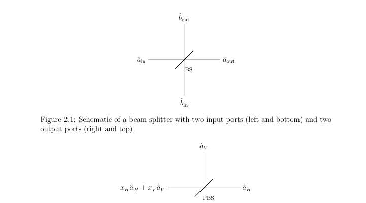 
Figure 2.2: Idealized polarizing beam splitter (PBS) that routes the horizontal and vertical polarization components of the input mode into separate spatial output modes.

📷 Fig 3

 
Figure 2.3: Schematic of a threshold (on/off) detector. In the imperfect model, η denotes the overall detection efficiency and pdc the dark-count probability per detection window.

📷 Fig 4

 
Figure 3.1: Schematic of a quantum key distribution (QKD) protocol. The task is to establish a shared secret key between two distant parties, Alice and Bob. The protocol relies on trusted quantum devices operated within secure perimeters, access to local true random number generators (TRNGs), an authenticated classical channel, and an insecure quantum channel that may be fully controlled by an adversary. Figure from [52].

📷 Fig 5

 
Figure 3.2: Schematic of an active detection setup using threshold detectors.

📷 Fig 6

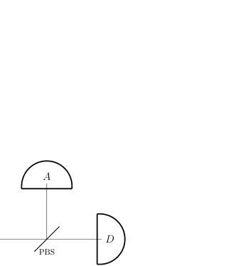 
Figure 3.3: Schematic of the passive detection setup using theshold detectors.

📷 Fig 7

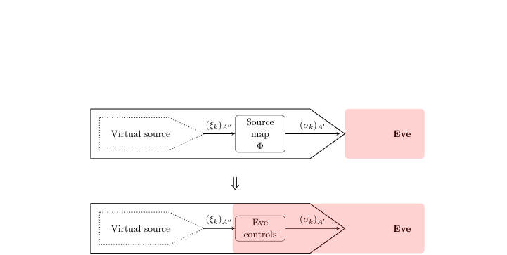 
Figure 3.4: Schematic illustrating the use of a source map. A virtual source prepares (ξk)A′′, which is mapped to the real emitted state (σk)A′ by a source map Ψ. Then, one can “give” Eve control over the source map (meaning that she is allowed to perform any operation she wants in place of the source map). The security of the latter implies security of the former, as argued rigorously in Lemma 7.4.1.

📷 Fig 8

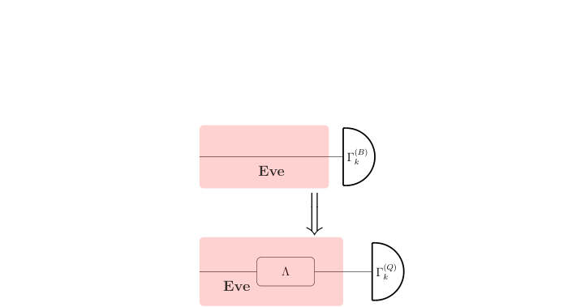 
Figure 3.5: An infinite-dimensional POVM can be modelled as a squashing map Λ followed by a finite-dimensional POVM. Giving the squashing map Λ to Eve allows us to restrict our analysis to the finite-dimensional POVM.

📷 Fig 9

 
Figure 4.1: Expected key rate for fixed-length protocols eRfixed(t) for various values of t, key rate upon acceptance for fixed-length protocols Rfixed(t) plotted for various values of t, and the expected key rate for variable-length protocol plotted eRvariable, plotted for a fixed honest behaviour of the channel.

📷 Fig 10

 
Figure 4.2: Expected key rate for fixed-length protocols eRfixed(t) for various values of t, key rate upon acceptance for fixed-length protocols Rfixed(t) plotted for various values of t, and the expected key rate for variable-length protocol plotted eRvariable, for an unpredictable honest behaviour.

**Main problem.** The need for rigorous security proofs for practical Quantum Key Distribution (QKD) protocols that account for realistic hardware imperfections like imperfect detectors, variable-length keys, and non-ideal authentication.

**Main result.** The thesis establishes security proofs for variable-length QKD against coherent attacks, resolves flaws in the postselection technique, and demonstrates that phase error rates can be bounded even with imperfect, approximately characterized detectors.

**Method.** The work utilizes advanced information-theoretic frameworks including the Entropy Accumulation Theorem (EAT), Marginal-constrained EAT (MEAT), Entropic Uncertainty Relations (EUR), and the postselection technique.

**Summary.** This thesis provides a comprehensive set of rigorous security proofs for practical Quantum Key Distribution. It addresses critical gaps between theory and practice by handling variable-length keys, imperfect detectors, and realistic authentication. Key achievements include resolving long-standing mathematical flaws in postselection techniques and developing a framework for security certification. The work serves as both a collection of new technical results and a unified reference for QKD security analysis.

Detailed structure

**Model / system.** The study focuses on QKD protocols such as BB84 and decoy-state BB84 using weak coherent pulses, modeled via Poissonian photon-number distributions and quantum optical components like beam splitters and threshold detectors.

**Key observables.** Key rates, phase error rates, photon-number statistics (zero and single-photon components), and detection probabilities.

**Important parameters / regimes.** Channel loss (dB), detector efficiency, dark-count probability, basis-efficiency mismatch, and finite-size effects (number of signals sent).

**Assumptions / limitations.** The analysis primarily addresses IID collective attacks and extends them to coherent attacks; it also considers realistic, non-ideal authentication and imperfect detector models.

**Figures summary.** Schematics of QKD architectures and detection setups, performance plots of key rates vs. loss for various protocols, and comparisons of different proof techniques (MEAT, EUR, PS) regarding key rate efficiency.

**Paper structure.** The thesis is organized into chapters covering: variable-length QKD security, extending postselection to coherent attacks, phase error estimation with imperfect detectors, a general security analysis using MEAT, and the impact of realistic authentication assumptions.

**Why it may be interesting.** This work is highly relevant to quantum optics and quantum information researchers as it provides the rigorous mathematical foundation necessary to transition QKD from idealized theoretical models to robust, certified physical implementations using real-world hardware.

Abstract

This thesis is concerned with rigorous security analyses of practical Quantum Key Distribution (QKD) protocols, using a variety of modern proof techniques. The main results are as follows. First, we establish a security proof for variable-length QKD protocols against IID collective attacks, and extend this result to coherent attacks using the postselection technique. In doing so, we resolve a long-standing flaw in the application of the postselection technique to QKD, thereby placing it on a rigorous mathematical footing. Second, we develop a method to bound phase error rates in entropic uncertainty relation-based and phase error rate-based proofs, using only the observed statistics of the protocol, even when detectors are imperfect and only approximately characterized. This removes a key assumption of identical detector behaviour and enables these techniques to be applied in realistic settings. Third, we present a very general security analysis based on the marginal-constrained entropy accumulation theorem. The resulting framework can be readily adapted to practical imperfections and side channels, and is suitable for certification efforts. Finally, we show that the security of QKD protocols under realistic authentication assumptions can be reduced to the standard idealized setting, where authentication is assumed to behave honestly, with only minor protocol modifications. A distinctive feature of this thesis is its unified presentation of several major QKD security proof frameworks using consistent protocol descriptions and notation. Consequently, this thesis is intended not only as a collection of new technical results, but also as a useful reference for understanding rigorous security analysis in quantum key distribution.

### [Partial oracles quantum algorithm framework -- Part I: Analysis of in-place operations](http://arxiv.org/abs/2604.21788v1)

**Authors:** Fintan M. Bolton  
**Type:** theory · **PDF:** <https://arxiv.org/pdf/2604.21788v1>  
**Analysis basis:** full PDF text, analyzed in chunks

📷 Fig 1

 
FIG. 1. Overview of partial oracle iterations. At each iteration stage j, a search is executed to

📷 Fig 2

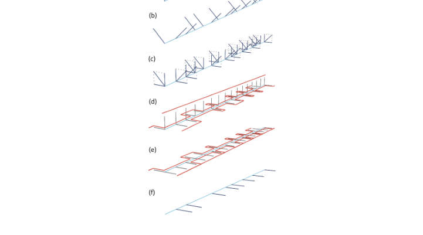 
FIG. 2. First partial oracle iteration showing: (a) the initial equal superposition state; (b) index

📷 Fig 3

 
Figure 2 shows a visualization of the Grover-Long algorithm, implementing the first

📷 Fig 4

 
Figure 3 shows a visualization of the modified Grover-Long algorithm, implementing

📷 Fig 5

 
FIG. 3. Second (and subsequent) partial oracle iteration: (a) index states remaining after the

📷 Fig 6

 
Figure 4 shows the corresponding circuit for the majority oracle function, which requires

📷 Fig 7

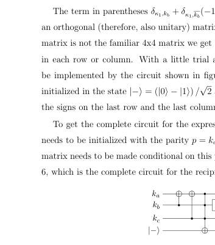 
FIG. 6. Reciprocal majority gate

📷 Fig 8

 
Figure 7 shows the corresponding circuit for the choose function, which requires just two

📷 Fig 9

 
FIG. 7. Circuit for the choose function Ch(a, b, c)

📷 Fig 10

 
FIG. 8. Reciprocal choose gate

**Main problem.** The paper addresses the lack of an explicit construction for the search iteration operator within the 'partial oracles' quantum algorithm framework, which aims to potentially achieve exponential speedup beyond Grover's algorithm.

**Main result.** The author provides the missing construction for the search iteration operator for in-place oracle functions and introduces the 'reciprocal transform' and the QFrame Python library for automating circuit construction.

**Method.** The framework uses a reciprocal transform in Walsh-Hadamard space, a chain rule for decomposing complex transforms, and the Z3 Problver for deriving matrix elements for bit-shifting functions.

**Summary.** This paper develops a method to implement a quantum search algorithm that uses multi-bit oracles to progressively narrow down a search space. By introducing the 'reciprocal transform,' the author provides a way to manipulate Walsh functions to enable efficient searching. While the current implementation is limited to in-place operations that are classically reversible, the framework provides a blueprint for achieving exponential speedup via out-of-place operations. The work also includes a new Python library, QFrame, to automate the creation of these complex quantum circuits.

Detailed structure

**Model / system.** The model is a quantum computing framework utilizing $n$-qubit index registers, Walsh-Hadamard transforms, and multi-bit oracle functions $f(x): \{0, 1\}^n 	o \{0, 1\}^n$ using a zero-matching convention.

**Important parameters / regimes.** The distinction between in-place operations (no quantum advantage yet) and out-of-place operations (required for quantum advantage).

**Assumptions / limitations.** The oracle function $f(x)$ is assumed to be a bijective (one-to-one) function, and the current derivation relies on the 'match on all zeros' convention.

**Figures summary.** Figure 1 shows the nested structure of partial oracle iterations; Figures 2 and 3 visualize the transition of states through the reciprocal transform; Figures 4-12 illustrate specific quantum circuits for SHA-256 components like Majority, Choose, and modulo addition.

**Paper structure.** The paper introduces the partial oracles framework, provides the construction for in-place operators, defines the reciprocal transform and its chain rule, applies these to SHA-256 components, introduces the QFrame library, and concludes with limitations and future work.

Abstract

The partial oracles framework is a quantum search algorithm that has the potential to exceed the quadratic speedup of Grover's algorithm, up to a theoretical maximum of an exponential speedup. Until now, however, the framework has lacked an explicit method for constructing the operator that represents the search iteration. In this paper, we provide the missing construction, for the special case of an oracle function definable using only in-place operations (that is, where the calculated result of the oracle function can be read just from the qubits in the search index). The restriction to in-place operations means that the current work does not yet exhibit quantum advantage: oracle functions constructed using only in-place operations are always classically reversible. To demonstrate quantum advantage, it will be necessary to extend this construction method to include out-of-place operations (part II). As part of the construction of the search iteration operator, we define a new type of transform, the reciprocal transform, which is applied to the oracle function. We show that the reciprocal transform obeys a chain rule, which makes it possible to break down complex transforms into simple steps. To illustrate the practical application of this search method, we apply the reciprocal transform to elementary operations from the SHA-256 hash algorithm: addition modulo $2^n$, the $Maj(a, b, c)$ function, the $Ch(a, b, c)$ function, and the bit shift functions. We also introduce the QFrame python library, which is used to automate the construction of quantum circuits that represent reciprocal transforms.

### [Photon Sorting with a Quantum Emitter](http://arxiv.org/abs/2604.21758v1)

**Authors:** Kasper H. Nielsen, Etienne Corminboeuf, Benedikt Tissot, Love A. Pettersson, Sven Scholz, Arne Ludwig, Leonardo Midolo, Anders S. Sørensen, Peter Lodahl, Ying Wang, Stefano Paesani  
**Type:** both · **PDF:** <https://arxiv.org/pdf/2604.21758v1>  
**Analysis basis:** full PDF text, analyzed in chunks

📷 Fig 1

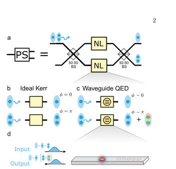 
FIG. 1. Photon sorter building blocks. a. Sketch of the photon sorter implementation using a nonlinear photonic in- teraction between two balanced beam splitters (a nonlinear Mach-Zehnder interferometer). Ideally, individual photons will exit through the upper port, whereas the two-photon component will exit through the lower. b. Illustration of an ideal single-mode Kerr nonlinearity where a one-photon state acquires no phase shift, whereas a two-photon state re- ceives a phase shift of π. c. Illustration of the nonlinear response of a two-level system. The photon states receive ap- proximately the same phase as in the ideal Kerr case, but the interaction distorts the two-photon wavepacket...

📷 Fig 2

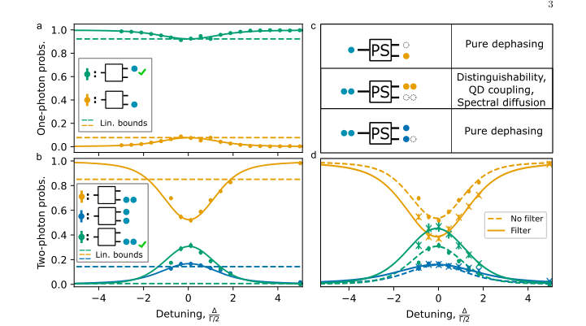 
FIG. 2. Photon sorter performance characterisation. a. Probabilities of detecting the one-photon state in the upper (green) or lower (orange) output port of the photon sorter as a function of the detuning ∆between the input field and the QD, normalised to the QD linewidth Γ/2. The dashed lines correspond to a linear optical beam splitter with a reflectivity matching the one-photon statistics at ∆= 0. b. Probabilities of detecting two photons in the upper mode (orange), two photons in the lower mode (green) or one photon each in both modes (blue) as a function of the detuning ∆. An ideal photon sorter would transfer the two photons into the lower mode completely. The dashed lines correspond...

📷 Fig 3

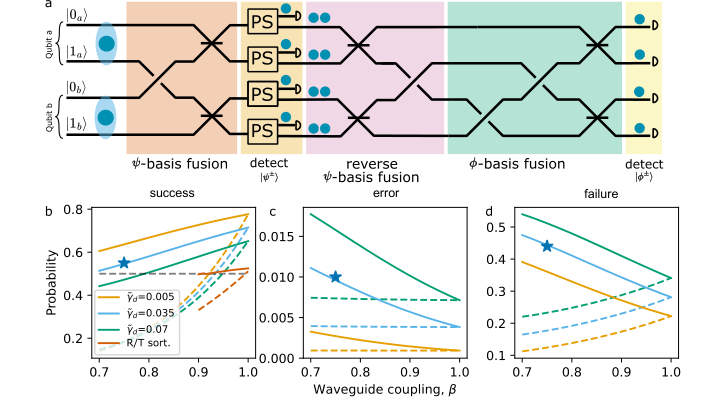 
FIG. 3. Photon sorter for BSMs. a. Illustration of a nonlinear BSMs using photon sorters. The first block (in orange) corresponds to a linear optical |ψ⟩-fusion. Photons from the ψ± states are incident individually on the photon sorter, so a direct measurement follows (yellow). Photons from ϕ± bunch after the first fusion block and are split away by the photon sorters. Consecutively, a reversed-|ψ⟩-fusion (pink) and a |ϕ⟩-basis fusion (green) are performed. We evaluate the performance of photon-sorter-boosted BSMs by analysing their b. success, c. error, and d. failure probabilities. Here, failures denote detected measurement patterns unassociated with any valid state, while errors...

📷 Fig 4

 
FIG. 4. Advances towards applications. a. Loss thresh- old of the FBQC architecture introduced in Ref. [16], when using photon sorting to boost fusion performance, as a func- tion of β. The two curves assume no pure dephasing, with and without spectral diffusion. The black dashed line de- notes the threshold using linear optical BSMs. b. Perfor- mance of a repeater network for QKD using the DLCZ pro- tocol [4], comparing linear optical BSMs (black dashed line), and photon-sorter-boosted nonlinear BSMs. The latter in- cludes a state-of-the-art scenario achieved solely by improv- ing the β = 0.98 [39] (blue), and an ideal noiseless photon sorter [18] (orange). During initial entanglement...

**Main problem.** The fundamental 50% success probability limit of Bell state measurements (BSMs) in linear optics introduces high hardware overhead and low noise tolerance in photonic quantum computing and communication.

**Main result.** The authors demonstrate a passive photon-sorting circuit using a single quantum dot that achieves a 62% sorting success probability and enables BSMs with a 57% success rate, exceeding the linear-optical limit.

**Method.** The researchers use a nonlinear Mach-Zehnder interferometer (MZI) where a single-sided nanobeam waveguide with a mirror creates an effective chiral interaction with a quantum dot, utilizing photon scattering to spatially separate one- and two-photon components.

**Summary.** This paper presents an experimental demonstration of a photon sorter that uses the nonlinear scattering of a single quantum dot to distinguish between one- and two-photon states. By implementing this in a Mach-Zehnder interferometer, the authors achieved a Bell state measurement success probability of 57%, which is higher than the 50% limit imposed by standard linear optics. This advancement provides a scalable path toward more efficient photonic quantum computing and more robust quantum repeater networks.

Detailed structure

**Model / system.** The physical platform consists of a semiconductor quantum dot (QD) embedded in a nanophotonic waveguide, modeled using input-output theory and a two-level system Hamiltonian that accounts for photon scattering, pure dephasing, and spectral diffusion.

**Key observables.** Photon-number distribution (one- and two-photon statistics), BSM success/error/failure probabilities, and joint temporal intensity (JTI) distributions.

**Important parameters / regimes.** Waveguide coupling efficiency (beta), QD linewidth (Gamma), pure de/spectral diffusion rates, and the 50% linear-optics BSM limit.

**Assumptions / limitations.** The analysis assumes a single-sided waveguide can effectively mimic a chiral system via a mirror, and performance comparisons often assume post-selection to account for experimental losses.

**Figures summary.** Fig 1: Schematic of the nonlinear MZI and the QD-waveguide interface. Fig 2: Photon statistics and sorting performance as a function of detuning and temporal filtering. Fig 3: Dependence of BSM metrics on coupling efficiency and dephasing. Fig 4: Comparison of loss thresholds in FBQC architectures.

**Paper structure.** The paper introduces the problem of probabilistic BSMs, describes the experimental setup and nonlinear mechanism, presents the experimental demonstration of photon sorting, provides theoretical modeling of noise and scattering, and concludes with applications to FBQC and quantum repeaters.

**Why it may be interesting.** This work is highly relevant for quantum optics and open quantum systems researchers as it demonstrates how controlled nonlinearities in a dissipative, single-emitter system can be harnessed to surpass fundamental limits in quantum information protocols.

Abstract

High-quality photonic Bell state measurements (BSMs) enable scalable universal quantum computing and long distance quantum communication. However, when implemented with linear optics, BSMs are fundamentally probabilistic, introducing substantial hardware overheads and limiting noise tolerance in photonic quantum computing architectures. Nonlinear interactions at the single-photon level can overcome these limitations by enabling near-deterministic photon-photon gates. Here, we demonstrate a passive photon-sorting circuit based on the induced nonlinearity arising from photon scattering in a solid-state quantum emitter. The scattering is implemented in a directional waveguide-emitter coupling interface and embedded on-chip into a linear optical circuit, through which we demonstrate sorting of one- and two-photon components with a success probability of 62%. We find that the current system can enable BSMs with a 57% post-selected success probability without ancillary photons, exceeding the linear-optical limit of 50%, and can be readily improved to >65% with design optimisations.

### [Entanglement of two optical emitters mediated by a terahertz channel](http://arxiv.org/abs/2604.21723v1)

**Authors:** Yanis Le Fur, Diego Martín-Cano, Carlos Sánchez Muñoz  
**Type:** theory · **PDF:** <https://arxiv.org/pdf/2604.21723v1>  
**Analysis basis:** full PDF text, analyzed in chunks

📷 Fig 1

 
FIG. 1. Physical system and energy-level landscape. (a) Schematic of the entanglement generation setup, consisting of two quantum emitters driven by carrier (blue) and sideband (green) optical fields, which are coupled to a shared THz channel (here represented by a ring waveguide or cavity). (b) Energy levels of an atom coupled to a carrier-laser. (Left) Bare system basis showing optical transitions in the laboratory frame; (Right) Dressed-state basis highlighting the emerging THz transitions within a Rabi doublet (red). (c) Energy levels of a dressed-atom coupled to a sideband laser: Dressed states split by THz frequencies couple to laser photons (left) developing a secondary dressed...

📷 Fig 2

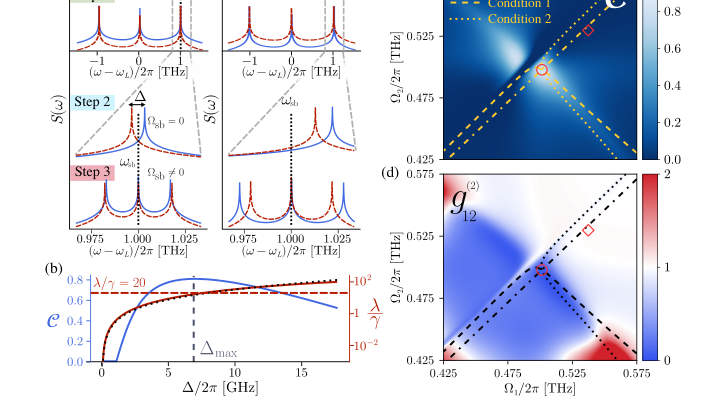 
FIG. 2. Optimizing entanglement via optical measurements (a) Emission spectrum in the visible regime for each individual emitter, centered at the laser frequency ωL for the case of both optimal and sub-optimal spectral alignments. (Top) Spectra in the absence of sideband drives (Ωsb = 0) obtained in Step 1, resulting in Mollow triplets with THz sideband splittings. (Middle) Zoom of the higher-energy Mollow sideband peaks, aligned symmetrically about ωsb at the end of Step 2. (Bottom) Formation of secondary Mollow spectra upon activation of the sideband drive Ωsb, which should be spectrally overlapping at the end of Step 3. (b) Concurrence C (blue, solid) and Liouvillian gap λ—computed...

📷 Fig 3

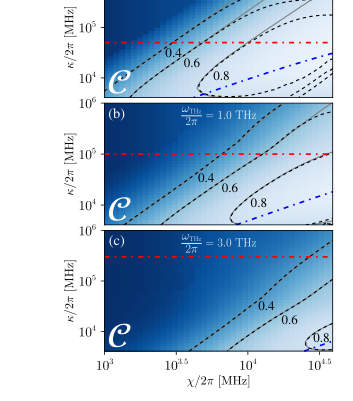 
FIG. 3. Maximal stationary concurrence C versus cavity loss rate κ and emitter-cavity coupling χ, found by optimizing the doubly dressed angle ˜θ and the doubly dressed frequency ˜ΩR at every (κ, χ) pair (the rest of parameters are fixed by Conditions 0-2). Calculations were performed using the GRWA framework Eq. (4) and (5) and subsequently veri- fied against the full model from (1). The dash-dotted lines represent the different condition we have imposed for our analytical findings: the adiabatic elimination of the cavity κ ≥2c1s1χ (blue) and the RWA on the dissipation of the cavity ωTHz ≥10κ (red). Panels correspond to cavity fre- quencies of (a) ωTHz/2π = 0.5 THz, (b) ωTHz/2π = 1.0 THz...

📷 Fig 4

 
FIG. 4. Quantum State tomography (QST) and re- construction Fidelity. (a) Schematic of the QST acquisi- tion protocol for two emitters radiating in the visible regime, based on joint photodetection (b) Reconstructed matrix for the maximally-entangled Bell state |Φ−⟩= |ge⟩−|eg⟩ √

**Main problem.** The lack of a coherent interface between addressable qubits and terahertz (THz) quantum channels, which prevents the development of THz-based quantum networks.

**Main result.** The authors demonstrate a protocol to generate and stabilize steady-state entanglement (concurrence C > 0.9) between two optical emitters using a THz channel, with all control and measurement performed via optical means.

**Method.** The study uses a driven-dissipative protocol involving dressed-state engineering via visible-light driving and a sideband optical drive to stabilize a dark state, analyzed using a Generalized Rotating Wave Approximation (GRWA) and a master equation approach.

**Summary.** This paper proposes a method to create steady-state entanglement between two optical emitters using a terahertz channel as a mediator. By using strong visible-light driving to create 'dressed' states, the authors show that THz transitions can be activated and controlled entirely through optical means. The protocol achieves high entanglement (concurrence > 0.9) and is robust against cavity losses. This establishes a practical framework for building hybrid quantum networks that connect optical qubits with THz quantum technologies.

Detailed structure

**Model / system.** The system consists of two non-identical polar quantum emitters (two-level systems) coupled to a lossy single-mode THz resonator in the bad-cavity limit, driven by both a carrier and a sideband optical field.

**Key observables.** Concurrence (C), Liouvillian gap (lambda), second-order cross-correlation function (g12(2)), and fluorescence/ring-down measurements.

**Important parameters / regimes.** THz frequency (0.5, 1.0, 3.0 THz), emitter decay rate (gamma/2pi approx 39.79 MHz), bad-cavity limit (kappa >> chi), and Rabi frequencies (Omega/2pi approx 500 GHz).

**Assumptions / limitations.** The use of the bad-cavity limit (adiabatic elimination of the cavity mode), the validity of the Rotating Wave Approximation (RWA), and the restriction of the maximum Rabi frequency to 0.5 THz for experimental feasibility.

**Figures summary.** Fig 1 shows the experimental setup schematic; Fig 2 illustrates concurrence as a function of dressing parameters; Fig 4 presents the Quantum State Tomography (QST) protocol, reconstructed density matrices, and fidelity maps.

**Paper structure.** The paper introduces the THz quantum interface problem, describes the physical model and Hamiltonian derivation using GRWA, presents the entanglement generation protocol and parameter optimization, details the optical-only measurement/tomography strategy, and concludes with error mitigation and scalability discussions.

**Why it may be interesting.** It presents a novel hybrid visible-THz interface that uses reservoir engineering (driven-dissipative dynamics) to create entanglement, offering a way to bridge disparate frequency regimes in quantum networks.

Abstract

Quantum technologies in the terahertz (THz) require a coherent interface between addressable qubits and THz quantum channels -- a capacity that so far, remains largely underdeveloped. Here, we propose and demonstrate the generation of steady-state entanglement between polar quantum emitters, mediated by THz photons. We exploit strong visible-light driving of the emitters to create Rabi-split dressed eigenstates whose energy separation can be optically tuned into the THz regime. The polar nature of the emitters activates THz transitions within these eigenstates, allowing them to couple to a THz photonic mode that induces collective dissipative dynamics. A coherent driving and control of these effective THz emitters is achieved by using a sideband optical drive with detuning close to the THz transition frequency. The resulting interplay of collective dissipation and driving activates a mechanism to generate steady-state entanglement with high values of the concurrence ($C>0.9$), attainable under experimentally feasible parameters. Crucially, both coherent manipulation and quantum state tomography are implemented entirely through optical means, avoiding direct THz control and detection. This establishes a hybrid visible-THz quantum interface in which a THz channel mediates qubit-qubit entanglement (a key operational requirement for THz quantum technologies) while remaining optically accessible.

### [Near-Term Reduction in Nonlocal Gate Count from Distributed Logical Qubits](http://arxiv.org/abs/2604.21722v1)

**Authors:** Bruno Avritzer, Nathan Sankary  
**Type:** theory · **PDF:** <https://arxiv.org/pdf/2604.21722v1>  
**Analysis basis:** full PDF text, analyzed in chunks

📷 Fig 1

 
Figure 2: The cut which allows an equal partition of the d = 7 4.8.8 color code. In this case, there are two 4.8.8 blocks, each with its own set of stabilizer ancillas, and each split 50-50 across two processors. As indicated by the grey and purple dots, in one of the two logical qubits, one ancilla for one of the green octagon checks is allocated to processor B. Since this stabilizer is split 4 to 4, this does not increase the amount of PNL gates, but allows strict adherence to the qubit requirements. The total number of PNL gates is thus 4*7=28, less than the 31 required if the codes are PL.

📷 Fig 2

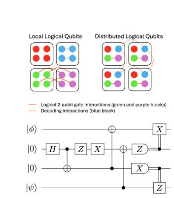 
Figure 1: Distributed logical qubits require PNL stabilizer measurements as opposed to PNL transversal gate implementations (top). In this work, these PNL gates are mainly implemented by gate teleportation (bottom, |ψ⟩as the control and |ϕ⟩as the target).

📷 Fig 3

 
Figure 4: With distribution of a logical qubit block over multiple processors, larger distances (and therefore reductions in PNL CNOTs) may be required to realize advantage if error correction is performed after each logical CNOT. Assuming the logical qubit is cut once per processor resulting in one partition per processor (2 processors require 1 cut resulting in 2 partitions), so that all two-qubit gates are processor-local, the minimum distance threshold required for an overall PNL reduction scales roughly linearly in the number of processors.

📷 Fig 4

 
Figure 3: In the two processor (two logical qubit) case (top), in the 4.8.8 family distributed codes see advantage at and above d = 7, and the overall trend is in agreement with the scaling behavior previously cited. By contrast, the 6.6.6 family of codes sees advantage only at d = 9 due to the structure of the stabilizers making near-equal bipartitions costly in terms of cut stabilizer weight (bottom).

📷 Fig 5

 
Figure 6: In the fully distributed case, split distillation qubits are allocated on the same processors as split computational qubits. This reduces the per-processor qubit requirements for magic factories while keeping distillation and injection operations PL no matter which qubit is postselected. The total number of PNL gates is O(d), resulting from the syndrome extractions within the individual codes.

📷 Fig 6

 
Figure 5: Two methods of realizing universality in fault-tolerant systems: magic state injection (a) and code switching (b, adapted from[17]). Although these methods differ in their circuit realizations, in both cases there are regimes where they benefit and suffer from distributed execution across processors.

📷 Fig 7

 
Figure 7: Comparison of overhead between (a) fully distributed, (b) fully local, and (c) partially local magic factories. The fully distributed factory performs best for small circuits, whereas for large circuits, it has a slightly higher total qubit overhead, but the size of each individual processor can be smaller than that of the magic factory in (b) and a lower number of PNL gates is required compared to (b), although this is network topology-dependent. Approach (c) performs worse in terms of PNL gates, but may have some advantages in meeting network topology constraints.

📷 Fig 8

 
Figure 8: When 3D and 2D codes are both split across processors, code switching may be performed processor-locally. With sufficient connectivity, this can reduce qubit overhead compared to single processors with both codes by allowing multiple logical qubits to interact with the tetrahedral code processor-locally.

📷 Fig 9

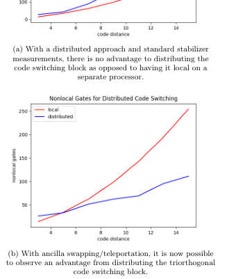 
Figure 9: Comparison of local vs distributed code switching costs for two different forms of stabilizer measurement.

📷 Fig 10

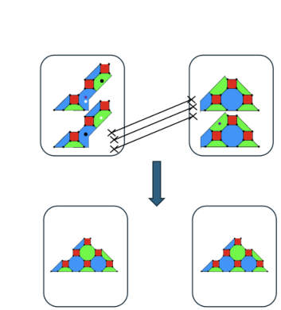 
Figure 10: By swapping (data to data) or teleporting (data to ancilla) the qubits from the split code into local structures, non-Clifford resources can be acquired with significantly fewer PNL gates, assuming there is a long chain of switching or distillation required due to circuit gate structure. This can then be undone or partially undone to execute chains of CNOTs, which can then become local as well.

**Main problem.** Minimizing the number of processor-nonlocal (PNL) operations in distributed quantum computing architectures to reduce the overhead caused by noisy or low-speed inter-processor interconnects.

**Main result.** The authors demonstrate a 10% reduction in PNL gates using an asymmetric allocation of the 4.8.8 color code, showing that these advantages scale significantly with increasing code distance and number of processors.

**Method.** The study uses constraint programming (CP-SAT via Google OR-Tools) for qubit allocation and evaluates various universality methods including magic state distillation, code switching, and logical swaps.

**Summary.** This paper addresses the challenge of reducing expensive non-local operations in distributed quantum computing. By optimizing how logical qubits are partitioned across multiple processors using color codes, the authors achieve a 10% reduction in non-local gate counts. They further show that these benefits scale with larger code distances and provide a framework for evaluating the trade-offs between different methods for achieving universal quantum computation, such as magic state distillation and code switching.

Detailed structure

**Model / system.** A modular/distributed quantum computing architecture utilizing distributed logical qubits encoded in the square-octagon (4.8.8) and 6.6.6 color code families.

**Key observables.** Processor-nonlocal (PNL) gate count, code distance (d), and qubit overhead.

**Important parameters / regimes.** Code distance (d), number of processors, and the ratio of one-qubit to two-qubit transversal gates.

**Assumptions / limitations.** Assumes a setting where syndrome extraction occurs after every logical gate and that the number of physical qubits (including ancillas) is kept to a minimum.

**Figures summary.** Figure 1 shows PNL gate implementation via gate teleportation; Figure 2 illustrates asymmetric code splitting; Figure 3 displays PNL gate trends for 4.8.8 and 6.6.6 codes; Figure 4 shows scaling of distance thresholds; Figures 5-7 compare universality methods and magic state factory overheads; Figures 8-11 discuss dynamic swaps, code switching, and circuit partitioning strategies.

**Paper structure.** The paper introduces the problem of PNL gate reduction, presents a qubit allocation technique using color codes, evaluates methods for achieving universal gate sets (MSI, code switching, swaps), analyzes scaling laws for different code families, and concludes with discussion on circuit partitioning and scalability.

Abstract

Modular quantum computing architectures require error correction schemes that remain effective in the presence of noisy inter-processor operations. As such, minimizing the number of such operations on logical circuits partitioned across quantum processors is a primary objective of distributed quantum computing. In this work, we develop basic techniques for qubit allocation using an exemplar color code family and explore generalizations to other color codes. In particular, we show that a 10% reduction in processor-nonlocal gates is achievable in a setting where syndrome extraction occurs after every logical gate, as in today's devices, and that this scales to significantly greater advantages in the multi-qubit case. We also explore methods of achieving universal gate sets efficiently in this distributed logical setting and evaluate the trade-offs of multiple approaches such as magic state distillation, code switching, and a new method based on logical swaps. Finally, we discuss some considerations for an allocation algorithm for these architectures to perform scalably and connect it to existing work on quantum circuit partitions.

### [Lagrange: Operating Italy's First Publicly-Accessible Quantum Computer for Research and Education](http://arxiv.org/abs/2604.21695v1)

**Authors:** Paolo Viviani, Fabrizio Bertone, Giacomo Vitali, Emanuele Dri, Federico Stirano, Giuseppe Caragnano, Francesco Lubrano, Antonino Nespola, Olivier Terzo, Matteo Cocuzza, Bartolomeo Montrucchio, Giovanna Turvani, Gianluca Bertaina, Marco Coisson, Davide Calonico, Fabrizio Pirri, Pietro Asinari  
**Type:** experiment · **PDF:** <https://arxiv.org/pdf/2604.21695v1>  
**Analysis basis:** full PDF text, analyzed in chunks

📷 Fig 1

 
Fig. 1. Conceptual architecture of the Lagrange software stack. The QC Gate- way transparently authorises job submissions based on budget, reservations, and fair access rate limits. A web portal gives the user visibility to these criteria.

📷 Fig 2

 
Fig. 2. Sequence diagram of the job submission and completion flow.

**Main problem.** Developing a software management stack to enable secure, fair, and multi-institutional access to an on-premises superconducting quantum computer.

**Main result.** The implementation of the Lagrange middleware successfully managed over 240,000 jobs with 98% uptime, enabling shared use for researchers and students across multiple institutions.

**Method.** A modular, Python-based middleware acting as a transparent reverse proxy that intercepts vendor API calls to enforce project budgets, user quotas, and authentication via Keycloak.

**Summary.** This paper describes the deployment of Lagrange, the first publicly accessible quantum computing infrastructure in Italy. It details a custom-built middleware layer that allows multiple institutions to share an IQM Spark superconducting quantum computer through a transparent proxy. The system manages complex requirements like project-based billing, user authentication, and fair resource allocation without requiring users to change their standard Qiskit or Cirq workflows. The authors demonstrate the system's success through high uptime and its unique integration into university curricula and examinations.

Detailed structure

**Model / system.** The Lagrange platform utilizes an IQM Spark five-qubit superconducting quantum computer with a star topology, hosted at Politecnico di Torino.

**Key observables.** QPU execution time, job throughput, system uptime, qubit fidelity metrics, and cryostat diagnostics.

**Important parameters / regimes.** Budget measured in QPU milliseconds, per-user concurrency limit of 2.5 million shots, and 10 Gbps fiber interface.

**Assumptions / limitations.** The middleware assumes the vendor's REST API structure remains compatible with the proxy interception method.

**Figures summary.** Figure 1 shows the conceptual architecture of the Lagrange software stack; Figure 2 is a sequence diagram of the end-to-end job submission and reporting flow; Table I details Nginx routing; Table II defines the resource hierarchy.

**Paper structure.** The paper introduces the management challenge, describes the hardware and infrastructure, details the software architecture and plugin design, reports on operational metrics and educational impact, and discusses limitations.

Abstract

We describe the design, implementation, and nine-month operational experience of the software management stack for Lagrange, an IQM Spark five-qubit superconducting quantum computer jointly acquired by LINKS Foundation, Politecnico di Torino and the Italian National Institute of Metrological Research (INRiM), and managed by LINKS. Lagrange is, to our knowledge, the first quantum computer in Italy that is fully operational and accessible to students and researchers from multiple institutions under formal service agreements, and to the general public under commercial agreements. When installed in mid-2025, the IQM Spark hardware was delivered by the vendor with authentication only: no billing, project management or fair usage enforcement were provided. We developed a modular middleware layer that filled that gap without modifying any vendor client software, by intercepting API calls through a proxy that enforces project-based budgets, reservation-aware authorisation, and per-user fairness policies. The middleware adopts a plugin architecture that cleanly separates vendor-specific logic from site-specific policies, enabling reuse across different quantum hardware backends and deployment contexts. Since entering production in September 2025, the system has processed over 240,000 quantum jobs totalling more than 1 week of QPU execution time, with greater than 98% uptime. Notably, students at Politecnico di Torino regularly use the machine during both lectures and formal examinations -- a practice we believe to be unique in Europe. We report on the system architecture, the operational lessons learned, and the infrastructure choices that made this deployment possible.

### [Bipartite entanglement under frequency comb pumping in parametric Josephson circuits](http://arxiv.org/abs/2604.21692v1)

**Authors:** Mikael Vartiainen, Ilari Lilja, Ekaterina Mukhanova, Kirill Petrovnin, Gheorghe Sorin Paraoanu, Pertti Hakonen  
**Type:** both · **PDF:** <https://arxiv.org/pdf/2604.21692v1>  
**Analysis basis:** full PDF text, analyzed in chunks

📷 Fig 1

 
FIG. 1. Schematic of the experimental microwave setup working around 5.8 GHz frequency. The experiment is controlled by a GHz frequency lock-in signal analyzer, which also generates the required parametric pumps. The employed components are denoted in the frame on the right. The detection is performed using digital heterodyning [51]. For details of the operation, see text.

📷 Fig 2

 
FIG. 2. Illustration of the mode-coupling sequence beyond the two-mode squeezed modes in the case of two parametric pumps. The dotted lines represent two-mode squeezing. We call these the first-order correlations between modes. However, because A and B are squeezed by P1, and B and C are squeezed by P2, there will be a beam-splitter correlation between A and C. Since these correlations grow proportionally to the product of two pump amplitudes, they are called second-order correlations between modes. These correlations are contained within the model and can be seen by expanding the unitary evolution operator generated by the Hamiltonian. In this figure, only first- order correlations are...

📷 Fig 3

 
FIG. 3. Mode frequencies marked by ±(2m +1), for m = 0,...,21 and a 30-mode subgraph (contains modes denoted by dashed lines) constructed for a system with 15 symmetrically placed pumps. We are investigating the bipartite entanglement of the pair (-1, 1), inside the dashed square. Each edge represents a TMS term in the Hamiltonian. The weight for each edge is specified by the corresponding classical pump amplitude. Edges generated by P0 are indicated by red. We can see that the center pair (-1, 1) has 15 neighbors while the furthest pairs ±27,±29 have only 8 neighbors. This shows that as we traverse the graph further away from the center pair (-1, 1), each new added mode will not entangle...

📷 Fig 4

 
FIG. 5. Logarithmic negativity (a) and purity (b) of a 1, ..., 15 pump systems. We compare the theoretical predictions for symmetric (solid line, red, green, magenta) and asymmetric (dashed line, blue, yellow, cyan) systems with different parameter values. First, we have put all phases of the pumps equal to 0 and added no noise. Second, we have chosen all phases of the pumps randomly (random φk in the inset pump amplitude) and added no noise. Third, we have chosen all phases randomly and put a constant amount of noise θ = π

📷 Fig 5

 
FIG. 4. Building up the asymmetric pump configuration: The basic TMS entanglement sequence is produced by pumps P0 and P2, with their half frequencies denoted by red (P0) and blue (P2) lines. The third pump is placed so that the distance ∆2 to P0 is different from ∆1 between P0 and P2. The dashed lines illustrate the sequence of P-2 added frequencies "Mi" with M referring to the mode frequencies established by pumps P0 and P2: extra mode frequency Mi is entangled with mode M. Below is the graphical description of a system with asymmetric pumps. Red edges represent TMS by P0, blue edges represent TMS by pump P2 and black edges represent TMS by subsequent asymmetric pumps.

📷 Fig 6

 
FIG. 9. Purity (scale given by the color bar) obtained from a) theory and b) experiment of symmetrically pumped system with first pump fixed at α1 = 0.44κ (αE = 0.15κ). In all configurations, all pumps 2,...,11 have the same pump amplitude that is grows from 0 to 0.44κ (αE = 0...0.15κ). Phases of the pumps were chosen at random. Due to low purity in the experiment, we apply the quantum limited ( ¯n = 1) attenuator channel with θ = 2π/7. The overlaid black curve in (a) is the purity of a system where each pump configuration has the same total power.

📷 Fig 7

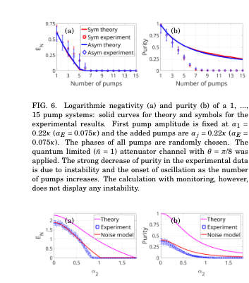 
FIG. 7. Logarithmic negativity (a) and purity (b) of a 2 pump system where the first pump is fixed at α1 = 1.15κ (αE = 0.28κ) and the second pump grows from 0 to 1.81κ (αE = 0...0.44κ). Phases of the pumps were chosen at random. One can notice that in the case with no noise, even when the second pump is at 0, experimental results show very low purity. To account for this, the quantum limited ( ¯n = 1) attenuator channel with θ = 2π/7 was applied.

**Main problem.** Investigating how bipartite entanglement and purity are redistributed in a Josephson parametric circuit when driven by multiple pump tones (frequency comb pumping).

**Main result.** Adding more pump tones reduces bipartite entanglement between specific mode pairs by redistributing correlations across a larger network of modes and introducing entanglement with additional idler frequencies.

**Method.** The study combines experimental measurements in a superconducting JPA with a theoretical Gaussian conditional-dynamics model using a Riccati equation for the covariance matrix.

**Summary.** This paper explores the effects of frequency comb pumping on entanglement in superconducting parametric circuits. Using a Josephson Parametric Amplifier, the authors demonstrate that increasing the number of pump tones redistributes bipartite entanglement across a larger network of modes. They compare symmetric and asymmetric pumping configurations, finding that while more pumps increase connectivity, they simultaneously diminish the entanglement between specific mode pairs. The results highlight the fundamental trade-offs in generating large-scale cluster states in the microwave regime.

Detailed structure

**Model / system.** A Josephson Parametric Amplifier (JPA) in a three-wave mixing regime, modeled as a quadratic Hamiltonian describing spontaneous parametric down-conversion (SPDC) in a cavity.

**Key observables.** Logarithmic negativity (entanglement monotone) and purity.

**Important parameters / regimes.** Number of pump tones (up to 15), pump amplitude, pump phase, symmetric vs. asymmetric pumping configurations, and cavity loss rate.

**Assumptions / limitations.** The relative phases of pump tones were not controlled experimentally and were treated as random in simulations; the environment is assumed to be Markovian and frequency-independent.

**Figures summary.** Figure 1 shows the experimental setup; Figure 2 illustrates mode-coupling sequences; Figures 5-6 show entanglement and purity decay with increasing pump number; Figures 8-9 show amplitude sweeps and equipower contours.

**Paper structure.** The paper introduces the problem of multi-mode entanglement in microwave circuits, describes the experimental JPA setup, presents the theoretical Gaussian model, compares symmetric and asymmetric pumping topologies, and concludes with experimental validation of entanglement redistribution.

**Why it may be interesting.** It provides critical insights into the scalability of continuous-variable cluster state generation in the microwave domain, specifically addressing how multi-mode connectivity impacts the entanglement of individual mode pairs.

Abstract

The creation of high-quality cluster states in superconducting microwave circuits is a relevant ingredient in continuous-variable quantum computing. Although large-scale cluster states have been established in optical systems, dissipation prevents their direct applicability to the microwave realm. Recent improvements in superconducting parametric circuits, in particular Josephson parametric amplifiers (JPA) and traveling wave parametric amplifiers (TWPA), have permitted substantial progress in producing entangled states using microwave photons. In this paper, we examine experimentally and theoretically the effects of numerous parametric pump tones on the degree of two-mode squeezing in a quantum circuit and apply it to the JPA. We find that additional pumps diminish the initial two-mode correlations achieved with a single pump by redistributing it among a larger network of modes and by introducing entanglement with additional idler frequencies. Taking into account the actual heterodyne measurement conditions, the experimental results are consistent with theoretical expectations.

### [Spectral Diffusion Mitigation with a Laser Pulse Sequence](http://arxiv.org/abs/2604.21659v1)

**Authors:** Kilian Unterguggenberger, Alok Gokhale, Aleksei Tsarapkin, Wentao Zhang, Katja Höflich, Herbert Fotso, Tommaso Pregnolato, Laura Orphal-Kobin, Tim Schröder  
**Type:** both · **PDF:** <https://arxiv.org/pdf/2604.21659v1>  
**Analysis basis:** full PDF text, analyzed in chunks

📷 Fig 1

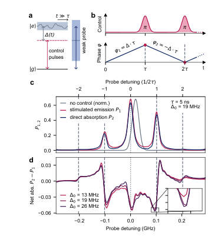 
FIG. 1. Simulated light-matter interaction. a. Simpli- fied level scheme. Spectral diffusion is indicated as a time- dependent transition energy from the ground state |g⟩to the excited state |e⟩. b. Control sequence consisting of N π-pulses with interpulse delay τ (top) and accumulation of relative phase (bottom). c. Stimulated emission and direct absorp- tion spectra of a two-level system after a periodic sequence of N = 12 π-pulses. The absorption spectrum without control is a Gaussian with a FWHM of 2 √

📷 Fig 2

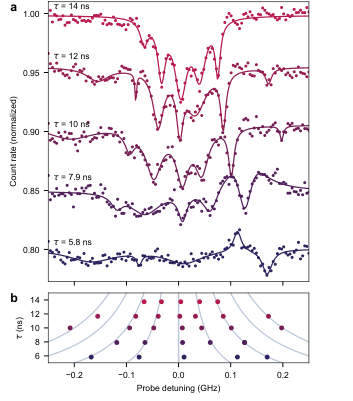 
FIG. 3. Effect of the interpulse delay. a. Controlled spectra for different interpulse delays τ. The fits are sums of five to seven Lorentzians. Here, the count rate is normalized to the outermost data points. Individual spectra are offset by 0.05 for visual clarity. b. Satellite feature positions extracted from the fits. The simulated positions of ±n/2τ are shown as gray lines.

📷 Fig 3

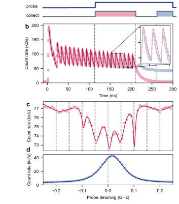 
FIG. 2. Controlled absorption spectrum of a single NV center. a. Experimental sequence. The control field (red) consists of N = 21 periodic π-pulses. The probe field (blue) is turned on after 11 pulses. Collected photon detection events are inte- grated in time windows (light red and blue). b. Time-resolved fluorescence signal of the NV center for a probe detuning of zero (light red) and -0.25 GHz (light gray). A Master equation fit with an additional decay term is shown as a red line. The time windows are indicated by dashed and dotted lines. Here the interpulse delay τ = 10 ns. c. Controlled spectrum fitted with a sum of seven Lorentzians. Dashed lines indicate ex- pected satellite...

📷 Fig 4

 
FIG. 5. Temporal evolution of the spectrum. Four spectra (left column) and the corresponding time window (right col- umn, shaded region) are shown. The last spectrum shows the uncontrolled linewidth (blue). The pulse carrier frequency is indicated by the dotted gray line. Here, the interpulse delay τ = 10 ns and the number of control pulses N = 5.

📷 Fig 5

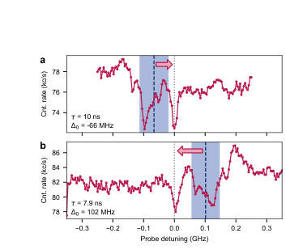 
FIG. 4. Detuned pulse carrier frequency. a-b. Controlled spectra with different detunings ∆0 and interpulse delays τ are shown (red). The uncontrolled resonance is shown in blue (centered at the dashed line, FWHM represented by shaded region). A red arrow indicates the spectral shift achieved by the control pulses to the pulse carrier frequency (dotted gray line).

**Main problem.** Mitigating spectral diffusion (inhomogeneous broadening) in solid-state quantum emitters to improve the quality of single-photon sources and entanglement generation.

**Main result.** The researchers experimentally demonstrated that a periodic sequence of optical pi-pulses can refocus the resonance of an NV center, reducing the linewidth from 104 MHz to 27 MHz and allowing for tunable spectral control.

**Method.** The protocol uses a periodic sequence of Gaussian pi-pulses to flip the phase accumulation sign, effectively nullifying the average phase shift from slow spectral diffusion. The effect was verified using photoluminescence excitation spectroscopy on a single NV center.

**Summary.** This paper presents a method to mitigate spectral diffusion in solid-state quantum emitters using a periodic sequence of optical pi-pulses. By applying these pulses, the researchers were able to refocus the optical resonance of an NV center in diamond, significantly narrowing its linewidth toward the lifetime limit. The technique also allows for the redistribution of spectral weight to a user-defined target frequency. This all-optical approach provides a scalable way to engineer the properties of single-photon emitters for quantum technologies.

Detailed structure

**Model / system.** A single nitrogen-vacancy (NV) center in diamond, modeled as a two-level quantum system subject to time-dependent, random detuning (Gaussian noise) and driven by a periodic laser pulse sequence.

**Key observables.** Absorption spectrum, stimulated emission, net absorption, and fluorescence time traces.

**Important parameters / regimes.** Interpulse delay (tau) of 10 ns, lifetime limit of ~12.9 MHz, and reduction of linewidth from 104 MHz to 27 MHz.

**Assumptions / limitations.** The system is treated as a two-level system under the Rotating Wave Approximation (RWA) and independent rate approximation; spectral diffusion is modeled as slow Gaussian noise.

**Figures summary.** Fig 1 shows simulations of the pulse sequence and resulting spectral features; Fig 2 compares uncontrolled vs. controlled experimental spectra; Fig 3 shows the effect of interpulse delay; Fig 4 demonstrates frequency tunability; Fig 5 shows the temporal evolution of the refocusing effect.

**Paper structure.** The paper introduces the problem of spectral diffusion, presents a theoretical/simulated model of the pi-pulse protocol, details the experimental implementation on an NV center, demonstrates the reduction of linewidth and spectral tunability, and concludes with discussion on temporal dynamics and limitations.

**Why it may be interesting.** This work is highly relevant to quantum optics and open quantum systems as it demonstrates a purely coherent control method to mitigate environmental noise (spectral diffusion) in a solid-state platform without requiring external feedback or mechanical tuning.

Abstract

The optical spectrum of a quantum system is jointly determined by the properties of the emitter and the driving field. All-optical spectral control can hence be a promising method to engineer the properties of single photon emitters for quantum technological applications. It was proposed that driving a two-level system with a periodic sequence of optical pi-pulses during the excited state lifetime shifts the emission and absorption maximum to an arbitrarily detuned pulse carrier frequency, enabling the mitigation of spectral diffusion in noisy emitters. In this article, we report on the first experimental observation of this effect. We implement the protocol on a solid-state emitter and reduce its inhomogeneously broadened optical linewidth close to the lifetime limit. By detuning the excitation laser, we are able to concentrate approximately half of the absorption to a freely selectable target frequency. Our approach is solely based on properties of coherently evolving quantum systems, rendering it applicable to a wide range of individual and ensembles of quantum emitters.

### [Speed-oriented quantum circuit backend](http://arxiv.org/abs/2604.21656v1)

**Authors:** Sören Wilkening  
**Type:** theory · **PDF:** <https://arxiv.org/pdf/2604.21656v1>  
**Analysis basis:** full PDF text, analyzed in chunks

📷 Fig 1

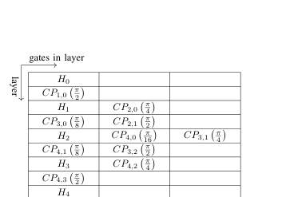 
Figure 2: Visualization of the gates array within the circuit_t data structure for a 5-qubit QFT without swaps. The gate indices represent their target/control qubits.

📷 Fig 2

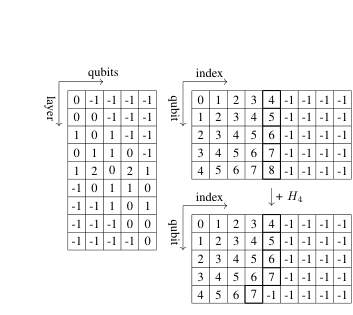 
Figure 3: Visualization of gate_index (left) and last_layer_of_qubit (top and bottom right) within the circuit_t data structure for a 5-qubit QFT without swaps. The table on the bottom right shows how the data structure is adjusted after applying an additional Hadamard gate to qubit 4, eliminating the previously applied gate. The thick boxes indicate the current head of the list for the respective qubit. Whenever a gate is to be applied to specific qubits, its potential layer position is read from this array.

📷 Fig 3

 
Figure 4: Comparison of running times for building the QFT circuit across state-of-the-art software packages. For all instance sizes, our quantum circuit backend generates the QFT circuit faster than any other available package. Furthermore, the improved variant approaches the theoretical limit of generating and storing quantum circuits, suggesting that no significantly faster single- threaded implementation can be achieved.

📷 Fig 4

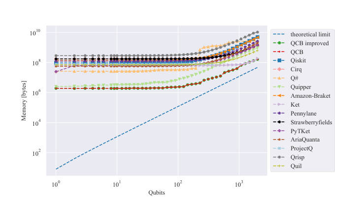 
Figure 5: Comparison of memory requirements for building the QFT circuit across state-of-the-art software packages. Compared to all packages except Ket, our new circuit backend requires less memory. For large instances, Ket achieves a slight advantage; however, we expect this advantage to diminish for larger circuits, as our algorithm approaches the theoretical minimum of the data required for storage. Both variants of our implementation require the same memory, as they use the same underlying data structure.

**Main problem.** The increasing classical preprocessing time required for quantum circuit generation (QCG) is becoming a bottleneck for large-scale quantum computing, potentially diminishing any potential quantum advantage.

**Main result.** The developed C-based backend (QCB) achieves significantly faster circuit generation and lower memory usage than major frameworks like Qiskit and Q#, with speed improvements reaching up to 1,748,000x for 2000-qubit QFT circuits.

**Method.** The authors implemented a lightweight, high-throughput backend in C using a layered circuit representation (2D array) and lookup tables for O(1) access to gate placement and qubit occupancy.

**Summary.** This paper introduces a new, high-performance software backend designed specifically for the rapid generation of large-scale quantum circuits. By implementing the backend in C and using optimized data structures like layered arrays and lookup tables, the authors demonstrate massive speedups compared to industry-standard tools like Qiskit. This efficiency is crucial for applications like combinatorial optimization, where minimizing classical overhead is essential to maintaining quantum advantage. The tool also significantly reduces the memory footprint required for large-scale circuit construction.

Detailed structure

**Model / system.** The study focuses on the generation of large-scale quantum circuits, using the Quantum Fourier Transform (QFT) as the primary benchmark algorithm for systems up to 2000 qubits.

**Key observables.** Runtime (generation speed) and memory consumption (RAM usage).

**Important parameters / regimes.** Number of qubits (up to 2000); circuit depth; classical preprocessing time.

**Assumptions / limitations.** The 'swap' optimization is limited to a constant number of iterations for efficiency; the comparison assumes scaling behavior will continue to approach the theoretical storage limit.

**Figures summary.** Visualizations of the 5-qupect QFT circuit and its layered data structure; lookup tables for gate and qubit tracking; log-scale comparisons of runtime and memory usage across various software packages.

**Paper structure.** Introduction of the classical bottleneck problem; description of the C-based software architecture and data structures; presentation of gate insertion and depth reduction algorithms; benchmarking results against existing frameworks (Qiskit, Q#, etc.) regarding speed and memory; discussion of limitations and future work.

Abstract

We present a new software package for efficient quantum circuit generation, designed to achieve optimal runtime performance. Despite being in an early stage of development, our implementation demonstrates significant advantages over existing tools. Using the quantum Fourier transform (QFT) as a benchmark, we show that our backend can generate circuits for systems with up to 2000 qubits faster than widely used frameworks such as Qiskit and Q#. This improvement is particularly relevant for applications where classical preprocessing time, including circuit generation, must be minimized to not diminish any potential quantum advantage - for example, in combinatorial optimization tasks. Additionally, our software provides high-level primitives for bit- and integer-level manipulations, offering a simplified interface for integration with high-level quantum programming languages.

### [Composite quantum gates simultaneously compensated for multiple errors](http://arxiv.org/abs/2604.21594v1)

**Authors:** Hristo Tochev, Nikolay Vitanov  
**Type:** theory · **PDF:** <https://arxiv.org/pdf/2604.21594v1>  
**Analysis basis:** full PDF text, analyzed in chunks

📷 Fig 1

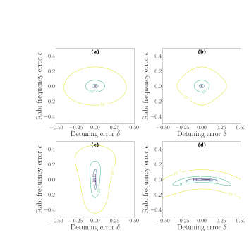 
FIG. 1. (Color online) Infidelity of X gate versus the detuning error δ and the Rabi frequency error ϵ for (a) single π pulse, (b) CORPSE, (c) B3r pulse, (d) B3d pulse. The contours depict infidelity of 10−4 (innermost) to 10−1 (outermost).

📷 Fig 2

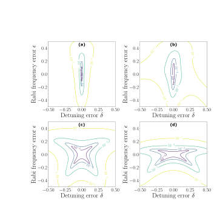 
FIG. 2. (Color online) Infidelity of X gate versus the detuning error δ and the Rabi frequency error ϵ for (a) B5 pulse, (b) BB1 pulse, (c) U5a pulse, (d) U5b pulse. The contours depict infidelity of 10−4 (innermost) to 10−1 (outermost).

📷 Fig 3

 
FIG. 3. (Color online) Infidelity of X gate versus the detuning error δ and the Rabi frequency error ϵ for seven pulses: (a) U7a, (b) U7b, (c) X7a, (d) X7b sequences. The contours depict infidelity of 10−4 (innermost) to 10−1 (outermost).

📷 Fig 4

 
FIG. 4. (Color online) Infidelity of X gate versus the detuning error δ and the Rabi frequency error ϵ for nine pulses: (a) U9a, (b) U9b, (c) X9a, (d) X9b sequences. The contours depict infidelity of 10−4 (innermost) to 10−1 (outermost).

📷 Fig 5

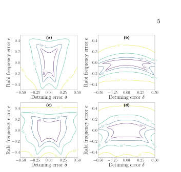 
FIG. 5. (Color online) Infidelity of X gate versus the detuning error δ and the Rabi frequency error ϵ for eleven pulses: (a) U11a, (b) U11b, (c) X11a, (d) X11b sequences. The contours depict infidelity of 10−4 (innermost) to 10−1 (outermost).

📷 Fig 6

 
FIG. 6. (Color online) Infidelity of X gate versus the detuning error δ and the Rabi frequency error ϵ for thirteen pulses: (a) U13a, (b) U13b, (c) X13a, (d) X13b sequences. The contours depict infidelity of 10−4 (innermost) to 10−1 (outermost).

📷 Fig 7

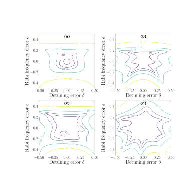 
FIG. 7. Infidelity of X gate versus the detuning error δ and the Rabi frequency error ϵ for non-symmetric CP optimized through Eq. (8). (a) X5c, (b) X7c, (c) X9c, (d) X11c. The pa- rameters of the pulses can be found in Table I. The contours depict infidelity of 10−4 (innermost) to 10−1 (outermost).

📷 Fig 8

 
FIG. 8. (Color online) Infidelity of Hadamard gate versus the detuning error δ and the Rabi frequency error ϵ for CP op- timized through Eq. (8). (a) H3 with length 3, (b) H4 with length 4, (c) H5 with length 5, (d) H6 with length 6. The pa- rameters of the pulses can be found in Table II. The contours depict infidelity of 10−4 (innermost) to 10−1 (outermost).

📷 Fig 9

 
FIG. 9. (Color online) Infidelity of Hadamard gate versus the detuning error δ and the Rabi frequency error ϵ for CP op- timized through Eq. (8). (a) H7, (b) H8, (c) H10, (d) H15. The parameters of the pulses can be found in Table II. The contours depict infidelity of 10−4 (innermost) to 10−1 (outer- most).

**Main problem.** Systematic control errors, including Rabi frequency, detuning, and pulse duration, prevent the realization of high-fidelity single-qubit gates.

**Main result.** The authors derived new composite pulse sequences (Xn and Hn families) that simultaneously compensate for amplitude, detuning, and duration errors, outperforming standard universal sequences in broader error domains.

**Method.** The construction uses two strategies: derivative-based cancellation of error terms in the full SU(2) unitary using Cayley-Klein parametrization, and direct numerical minimization of average gate infidelity.

**Summary.** This paper presents a new class of composite pulse sequences designed to implement high-fidelity X and Hadamard gates. Unlike previous methods that target only one type of error, these new sequences simultaneously compensate for Rabi frequency, detuning, and pulse duration errors. By using both analytical derivative cancellation and numerical optimization, the authors provide both closed-form symmetric solutions and optimized asymmetric sequences. The results show that longer sequences can significantly expand the robustness window against systematic control drifts.

Detailed structure

**Model / system.** A single-qubit quantum system described by a standard Hamiltonian with control parameters for Rabi frequency and detuning, specifically targeting X and Hadamard gates.

**Key observables.** Gate fidelity and average gate infidelity.

**Important parameters / regimes.** Rabi frequency error (epsilon), detuning error (delta), pulse duration (T), and pulse number (N).

**Assumptions / limitations.** The interaction is assumed to be coherent and pulses are modeled as rectangular; the sequences may be more sensitive to non-rectangular pulse shapes compared to universal sequences.

**Figures summary.** Figures compare infidelity contours for various pulse sequences (X and Hadamard gates) against epsilon and delta, demonstrating the robustness windows and the superiority of the new sequences over existing ones.

**Paper structure.** The paper introduces the error problem, presents two construction strategies (derivative-based and minimization), analyzes symmetric and asymmetric pulse sequences for X and Hadamard gates, and discusses the trade-offs between sequence length and robustness.

**Why it may be interesting.** This work provides practical, high-order error suppression techniques for single-qubit control, which is essential for improving gate fidelities in NISQ-era hardware and trapped-ion or superconducting platforms.

Abstract

Systematic control errors remain a primary obstacle to realizing high-fidelity single-qubit gates. We introduce composite pulse sequences that implement X and Hadamard gates while simultaneously compensating amplitude (Rabi-frequency), detuning (frequency), and duration errors. Our construction uses two complementary strategies: (i) derivative-based cancellation of error terms in the full unitary (not just the transition probability), formulated via the Cayley-Klein parametrization, and (ii) direct minimization of the average gate infidelity over prescribed error ranges. We derive symmetric five-pulse solutions with closed-form phases that cancel all first-order terms (including the mixed derivative), and numerically optimize longer sequences -- up to 15 pulses -- to achieve higher-order suppression. We also show that standard ``universal'' five-pulse sequences (U5a/U5b) emerge as simple phase-shifted instances of our symmetric solutions, yielding broad robustness to both detuning and amplitude errors. Finally, we construct variable-area sequences for $R_x(π/2)$, which, up to virtual Z rotations, benchmark the Hadamard gate. Across all families we observe the expected trade-off between sequence length and robustness window, with substantial boosts in fidelity over large error domains.

### [Pulse Shaping for Superconducting Qubits](http://arxiv.org/abs/2604.21565v1)

**Authors:** Animesh Patra, Ankur Raina  
**Type:** both · **PDF:** <https://arxiv.org/pdf/2604.21565v1>  
**Analysis basis:** full PDF text, analyzed in chunks

📷 Fig 1

 
Figure 1: The potential energy profile and eigenenergies for the harmonic oscillator (solid red) and the anharmonic oscillator (solid green) in ℏ= 1 units. The energy separation (equivalently, the transition frequency ωh) between the eigenstates of the harmonic oscillator is equal. For the aim of building a transmon qubit, an anharmonic oscillator is considered. Each energy separation (equivalently, the transition frequencies ω01, ω12 and so on) is different. Differing energy separation allows to form a computational subspace from |0⟩and |1⟩. While the rest of the states, like the |2⟩state, form the leakage subspace.

📷 Fig 2

 
Figure 2: (a)The transition probability of the square and the triangular pulse from Magnus expansion truncated at second order for δ = 0.5, A0 = π. (b) Numerical simulation of exact dynamics shown by RWA Hamiltonian of Eq.5 for square and triangular pulse at δ = 0.5, A0 = π. The simulation is carried out using QuTiP in Python.

📷 Fig 3

 
Figure 3: (a) The square pulse (green line) and the Gaussian pulse (red line). The square pulse is analytically easier to study however, (b) it’s baseband frequency spectrum has wider sidelobes than the Gaussian pulse.

📷 Fig 4

 
Figure 4: (a) The solid-green, dashed-red, and dash-dotted blue lines are all Gaussian pulses with decreasing pulse duration. (b) Shorter pulses have a wider frequency spread. Broader frequency support increases the chances of overlap with the unwanted transition frequency.

📷 Fig 5

 
Figure 5: A schematic of the three-level model. The first two levels form the computational subspace with a transition frequency of ω1. The σx 01 and σy 01 promote transition inside the computational subspace. However, the σy 01 contribution is the unwanted term arising in the first-order Magnus expansion. The DRAG protocol helps eliminate this and the coupling to the leakage state (arrows shown in red). AC Stark effect contributions emerge at the second order in the expansion (σz 01 and σz 12 terms).

📷 Fig 6

 
Figure 6: (a)A schematic illustrating the in-phase I(t) and the quadrature Q(t) component for a standard gaussion DRAG pulse. (b) Numerical simulation of exact dynamics shown by RWA Hamiltonian of Eq.21 for Gaussian and Gaussian DRAG pulse for anharmonicity ∆= −450 MHz, peak pulse amplitude A0 = 200 MHz/2π, pulse width (standard deviation) σ = 6.5 and coupling between |0⟩−|1⟩states as λ = √

📷 Fig 7

 
Figure 7: Schematic of the hardware essential for pulse generation. The in-phase (I) and quadrature signals (Q) from the arbitrary waveform generator (AWG) combine with the sinusoid from the local oscillator (LO) in the IQ mixer.

📷 Fig 8

 
Figure 8: Overlap of the discrete Fourier transform Xd(f) images due to improper sampling (fs ≤ 2f).

📷 Fig 9

 
Figure 9: Even though aliasing can be used to generate RF signals, the amplitude shows a sinc(πx) roll-off. The alternating shades of grey denote the different higher Nyquist zones.

📷 Fig 10

 
Figure 10: Schematic of a basic phase-locked loop configuration.

**Main problem.** Achieving high-fidelity control of superconducting qubits by mitigating errors such as leakage to higher energy levels, unwanted rotations, and hardware-induced distortions.

**Main result.** The paper provides a unified framework for pulse design, demonstrating that techniques like DRAG, active cancellation, and echo sequences can significantly suppress leakage and crosstalk errors.

**Method.** The authors use the Magnus expansion for analytical error analysis, QuTiP for numerical simulations, and a detailed study of the hardware signal chain (AWG, IQ mixing).

**Summary.** This paper serves as a pedagogical guide to pulse shaping for superconducting transmon qubits. It explains how to design microwave pulses to prevent leakage into non-computational states using the DRAG technique. The authors also bridge the gap between theory and practice by discussing how hardware imperfections like IQ imbalance and LO noise impact qubit fidelity. Finally, it extends these concepts to two-quubit gates, detailing strategies to mitigate crosstalk and ZZ interactions.

Detailed structure

**Model / system.** The study focuses on superconducting transmon qubits, modeled as weakly anharmonic multi-level systems (including at least a three-level model) driven by microwave pulses.

**Key observables.** Transition probabilities (P0->1), gate fidelity, and error coefficients for various Hamiltonian terms (e.g., sigma_x, sigma_z, sigma_z tensor sigma_z).

**Important parameters / regimes.** Pulse envelope (A(t)), detuning (delta), anharmonicity (Delta), pulse duration (T), and hardware parameters like sampling rate (fs) and IQ imbalance.

**Assumptions / limitations.** Initial analysis assumes a two-level system; DRAG assumes pulses start and end at zero; the system is driven resonantly; environmental noise is largely excluded from the scope.

**Figures summary.** Figures illustrate energy level differences between harmonic and anharmonic oscillators, pulse spectral properties (Fourier spectra), DRAG pulse components, the hardware signal chain, and error-mitigation pulse sequences.

**Paper structure.** The paper progresses from a pedagogical introduction to two-level Rabi oscillations, moves to multi-level transmon dynamics and DRAG techniques, addresses hardware-induced signal distortions, and concludes with complex two-qubit gate error mitigation strategies.

**Why it may be interesting.** It provides a rigorous bridge between abstract control theory (Magnus expansion) and the practical engineering of pulse shapes, which is highly relevant for anyone working on the control of open quantum systems or high-fidelity gate implementation.

Abstract

High-fidelity control of superconducting qubits requires carefully shaped microwave pulses that account for multiple error channels. In this work, we present a pedagogical introduction to pulse-shaping techniques for transmon qubits, aiming to provide a unified, accessible framework that integrates physical intuition for pulse design, analytical understanding of gate-level descriptions, and practical considerations of hardware. This article further aims to serve as a guide for students and early researchers entering superconducting quantum computing. We begin by examining simple pulse envelopes and their spectral properties, highlighting how finite bandwidth leads to leakage outside the computational subspace. These observations motivate the introduction of the derivative removal by adiabatic gate (DRAG) technique, which uses a quadrature component proportional to the pulse's time derivative to suppress off-resonant excitations. We analyze the single-qubit case using the Magnus expansion, which provides a clear understanding of the order-by-order introduction of error channels. We discuss the practical hardware realities of control pulse generation, focusing on arbitrary waveform generators (AWG), local oscillators (LO), and IQ mixing. Common imperfections are discussed in terms of their impact on the effective pulse shape and qubit Hamiltonian. Finally, we extend the discussion to two-qubit operations, focusing on the cross-resonance gate and the emergence of effective interactions.

### [Suppressing the Erasure Error of Fusion Operation in Photonic Quantum Computing](http://arxiv.org/abs/2604.21475v1)

**Authors:** Xiangyu Ren, Yuexun Huang, Zhemin Zhang, Yuchen Zhu, Tsung-Yi Ho, Antonio Barbalace, Zhiding Liang  
**Type:** both · **PDF:** <https://arxiv.org/pdf/2604.21475v1>  
**Analysis basis:** full PDF text, analyzed in chunks

📷 Fig 1

 
Fig. 3. Optimizing a Max-Cut problem using 6-qubit QAOA program on PQC simulator [24]. We use the RUS boosted fusion method (m = 6), and simulate the fusion erasure at 0, 5% and 10% respectively, while fixing the fusion failure at 25%. Left: Optimization of QAOA expectation value. Right: Quantum circuit execution time per tuning iteration.

📷 Fig 2

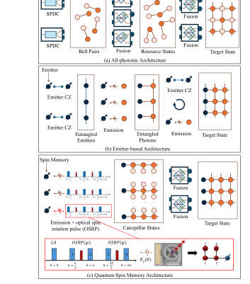 
Fig. 2. The comparison among different PQC architecture and their corre- sponding graph state generation schemes. The excitation pulses for generating a caterpillar state are demonstrated in the red box of (c). Specifically, longitudinal-acoustic excitation LA( π

📷 Fig 3

 
Fig. 4. (a)-(c) Graph state measurement patterns that establish loss-tolerance. (d) Tree-encoded fusion scheme. (e) Preparing tree-encoded logical qubit from caterpillar states. (f) Simulation of the fusion schemes. We compare these schemes with varying encoding parameters (m, b = 1, 2, 4, 8), by performing 103 fusion trials per data point to measure success rates.

📷 Fig 4

 
Fig. 5. (a) Average number of tree branches that successfully prepared for logical qubit encoding parameter b, when the preparation parameter bprep = 5 and bprep = 6 (by simulation). (b) Photon resource breakdown analysis for parameter bprep, when given the maximum length of caterpillar is 30-qubit. Dashed lines represent the #photon sources used for branch preparation. (c) Execution time analysis for the tree-encoding parameter b, under a noise model that pfail = 2% and peras = 25%.

📷 Fig 5

 
Fig. 6. Details of our MemTree compiler. (a) The hierarchical generation of target state based on BBT. (b) Our compiler framework for building BBT. (c) The overall pipeline for target state generation, from a time direction prospective. Each slice corresponds to a time step in the cycles.

📷 Fig 6

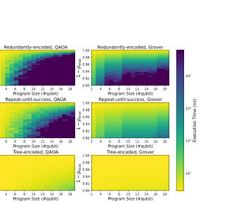 
Fig. 8. Execution time comparison between tree-encoded scheme and baselines.

📷 Fig 7

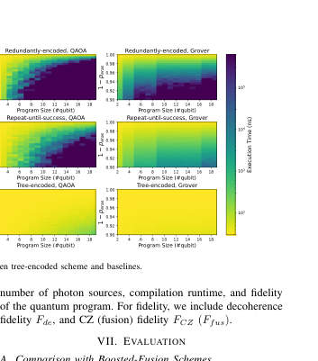 
Fig. 8 and Fig. 9 present the comparison of our tree- encoded fusion scheme with the redundantly-encoded and RUS fusion schemes under the hardware configurations of the quantum spin memory architecture. In this comparison, all fusion schemes are integrated in MemTree with the same compilation algorithm. While fixing the fusion failure rate pfail = 0.25 (thus 1 −pfail = 0.75), we compare the program execution time and the number of required photon sources. The program size (#qubit) varies from 2-qubit to 20- qubit, and the erasure rate during fusion (peras) varies from 0% to 10%. Due to the extremely large simulation overhead when the program size scales up, we truncate the execution time to...

📷 Fig 8

 
Fig. 9. Number of required photon sources comparison between tree-encoded scheme and baselines.

📷 Fig 9

 
Fig. 10. Comparison of MemTree with OneAdapt [74] and OneAdapt-ET. (a) The average execution time of quantum programs, when peras = 0, the results are evaluated on OneAdapt without erasure-tolerance strategy. The error bars represent the value range with a statistical 95% CI (confidence interval), over 1000 times of experiment and each with 2 × 104 shots. (b) Number of required photon sources. (c) Total compilation runtime of compilers.

📷 Fig 10

 
Fig. 11. Comparison on decoherence errors and CZ errors between OneAdapt [74], RLGS [38] and MemTree.

**Main problem.** Addressing the 'fusion erasure' error caused by photon loss in photonic quantum computing, which is often more damaging than fusion failure and neglected by existing compilers.

**Main result.** The proposed MemTree compiler and tree-encoded fusion scheme achieve exponential improvements in execution time and significantly higher fidelity compared to state-of-the-art compilers, with successful proof-of-concept validation on real hardware.

**Method.** A new compilation framework (MemTree) using a hierarchical 'divide-and-conquer' approach with Mixed-Integer Programming and a tree-encoded fusion strategy to suppress erasure errors via redundant branches and indirect measurements.

**Summary.** This paper addresses the critical issue of fusion erasure errors in photonic quantum computing, which arise from photon loss. The authors introduce a new encoding strategy called tree-encoded fusion and a hierarchical compiler named MemTree. This framework optimizes the generation of graph states by balancing fusion success against resource overhead. Simulations and real hardware experiments demonstrate that this approach significantly reduces execution time and improves computational fidelity compared to existing state-of-the-art methods.

Detailed structure

**Model / system.** A photonic quantum computing architecture based on quantum spin memory (semiconductor quantum dots) that generates caterpillar states (linear graph states) for measurement-based quantum computation (MBQC).

**Key observables.** Execution overhead (time and photon resources), fidelity, fusion success rate, and QAOA performance metrics (PST and IST).

**Important parameters / regimes.** Fusion failure rate (p_fail), fusion erasure rate (p_eras), number of branches (b), and number of preparation attempts (b_prep).

**Assumptions / limitations.** Assumes a realistic hardware noise model for photon loss and fusion failure based on experimental data; assumes the availability of a classical control path for feed-forward operations.

**Figures summary.** Fig 1: Type-II fusion gate mechanics; Fig 2: Comparison of PQC architectures; Fig 3: Impact of erasure rates on QAOA; Fig 4: Tree-encoded fusion mechanism and measurement rules; Fig 5: Scaling of resources and execution time; Fig 6: MemTree compiler pipeline; Fig 11: Fidelity comparison across benchmarks; Fig 13: Hardware performance comparison.

**Paper structure.** The paper introduces the problem of fusion erasure, compares different PQC architectures, proposes the tree-encoded fusion strategy and MemTree compiler, provides a detailed algorithmic breakdown using MIP, evaluates performance through large-scale simulations, and concludes with experimental validation on a real photonic platform.

**Why it may be interesting.** This work is highly relevant to quantum optics and open quantum systems researchers as it addresses the fundamental challenge of photon loss (erasure) in a scalable architecture, proposing a hardware-aware error-mitigation strategy that bridges the gap between theoretical error correction and experimental photonic implementation.

Abstract

Photonic quantum computing provides a promising route toward quantum computation by naturally supporting the measurement-based quantum computation (MBQC) model. In MBQC, programs are executed through measurements on a pre-generated graph state, whose construction largely depends on probabilistic fusion operations. However, fusion operations in PQC are vulnerable to two major error sources: fusion failure and fusion erasure. As a result, MBQC compilation must account for both error mechanisms to generate reliable and efficient photonic executions. Prior state-of-the-art MBQC compilation, represented by OneAdapt, is designed for all-photonic architectures and mainly focuses on handling fusion failures. Nevertheless, it does not explicitly model fusion erasures induced by photon loss, which can be substantially more damaging than fusion failures.   To mitigate fusion erasure errors, we introduce a new MBQC compilation scheme built upon the spin qubit quantum memory. We propose tree-encoded fusion, an encoding strategy that suppresses erasure errors during graph-state generation. We further incorporate this scheme into a compiler framework with algorithms that reduce the execution overhead of quantum programs. We evaluate the proposed framework using a realistic PQC simulator on six representative quantum algorithm benchmarks across multiple program scales. The results show that tree-encoded fusion achieves better robustness than alternative fusion-encoding strategies, and that our compiler provides exponential improvement over OneAdapt. In addition, we validate the feasibility of our approach through a proof-of-concept demonstration on real PQC hardware.

### [LightStim: A Framework for QEC Protocol Evaluation and Prototyping with Automated DEM Construction](http://arxiv.org/abs/2604.21472v1)

**Authors:** Xiang Fang, Ming Wang, Yue Wu, Sharanya Prabhu, Dean Tullsen, Narasinga Rao Miniskar, Frank Mueller, Travis Humble, Yufei Ding  
**Type:** theory · **PDF:** <https://arxiv.org/pdf/2604.21472v1>  
**Analysis basis:** full PDF text, analyzed in chunks

📷 Fig 1

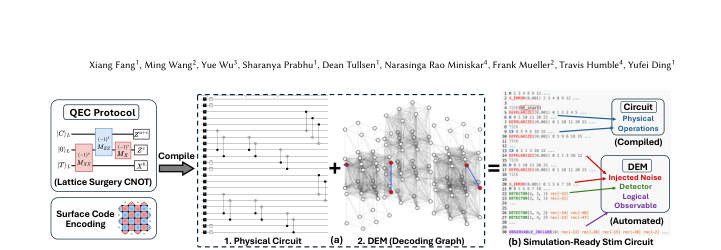 
Figure 1. (a) Dual burden on QEC protocol Compilation: Physical Circuit &amp; DEM. (b) Sample Stim circuit. Physical operations specified by the protocol and the rest are all automated in LightStim.

📷 Fig 2

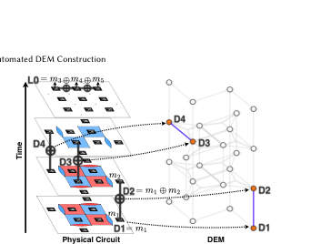 
Figure 3. Physical Circuit and DEM construction for surface code Z memory experiment.

📷 Fig 3

 
Figure 2. Pauli tableau representation of QEC systems. Stab: stabilizers; Log: logical operators.

📷 Fig 4

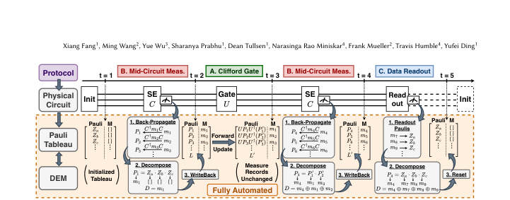 
Figure 4. Overview of LightStim’s Pauli Tracker workflow. The physical circuit drives a forward update of the record- augmented Pauli tableau, triggering DEM construction upon encountering measurements.

📷 Fig 5

 
Figure 5. Three realizations of Bell state teleportation cir- cuits: (a) transversal gates, (b,c) 𝑍𝑍/𝑋𝑋lattice surgery.

📷 Fig 6

 
Figure 6. Cross-code Lattice surgery between surface code and punctured quantum Reed-Muller (PQRM) code.

📷 Fig 7

 
Figure 7. Evaluation of memory experiments. (a) Surface code family. (b) BB code family. (c) QEC efficiency: LER per physical qubit. (d) Effect of SE circuit design on LER.

📷 Fig 8

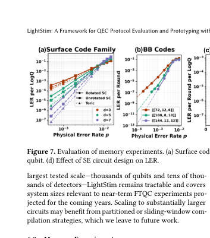 
Fig. 7 summarizes memory experiments across four axes. 1. Surface code family (Fig. 7a). We evaluate Z-basis mem- ory for the rotated, unrotated, and toric surface codes at 𝑑∈{3, 5, 7} under circuit-level noise. All three variants ex- hibit increasing LER suppression as 𝑑scales, aligned with theoretical results [29, 75]. Notably, at fixed 𝑑, LERrotated &gt; LERunrotated &gt; LERtoric under the threshold (0.8%), reflecting the benefit of increasing qubit redundancy (𝑑2, 2𝑑2−2𝑑+1, and 2𝑑2). The intuition is: when operating below the er- ror threshold, more physical qubits provide more syndrome information that enables more accurate decoding, so the additional redundancy yields lower LER despite the...

📷 Fig 9

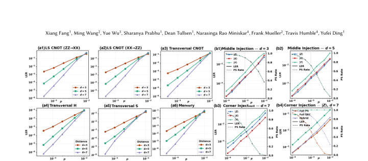 
Figure 8. Comprehensive evaluation of logical operations. (a) Transversal gates and lattice surgery operations of unrotated surface code against the memory baseline; (b) State injection of rotated surface code; (b1)-(b3) Two SE round, full post-selection; (b4) Different post-selection schemes.

📷 Fig 10

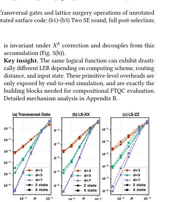 
Figure 9. LER of Bell-state teleportation circuit implemented in (a) transversal gates and (b,c) lattice surgery.

**Main problem.** The manual construction of Detector Error Models (DEM) for complex quantum error correction (QEC) protocols is tedious, error-prone, and unscalable for advanced operations like lattice surgery.

**Main result.** The authors present LightStim, a framework that automates DEM construction concurrently with circuit compilation, enabling efficient prototyping of complex, heterogeneous QEC protocols.

**Method.** The framework uses a Pauli tracker to augment a Pauli tableau with measurement records, employing Clifford conjugation and back-propagation to automatically identify detectors and logical observables.

**Summary.** LightStim is a new automated framework designed to simplify the evaluation of complex quantum error correction protocols. By automatically constructing the necessary error models from physical circuits, it removes the need for manual, error-prone annotations. The framework allows researchers to quickly prototype and simulate advanced operations like lattice surgery and magic state distillation. This capability significantly accelerates the discovery and optimization of new fault-tolerant quantum computing architectures.

Detailed structure

**Model / system.** The framework operates on stabilizer-based quantum error-correcting codes, including surface, toric, BB, and punctured quantum Reed-Muller (PQRM) codes, using a circuit-level noise model.

**Key observables.** Logical Error Rate (LER), detectors (vertices), logical observables (targets), and post-selection rate.

**Important parameters / regimes.** Code distance (d), physical error rate (p), routing distance (r_inter), and X/Z error asymmetry.

**Assumptions / limitations.** The framework assumes the use of Clifford gates and Pauli-based error models.

**Figures summary.** Figure 1 shows the dual burden of QEC compilation; Figure 2 illustrates the Pauli tableau; Figure 3 maps circuits to DEM components; Figure 4 details the LightStim workflow; Figures 5-6 show lattice surgery and cross-code protocols; Figures 11-12 demonstrate the evolution of the tableau for teleportation.

**Paper structure.** The paper introduces the manual bottleneck in QEC evaluation, presents the LightStim framework and its automated Pauli tracking algorithm, validates it against established benchmarks, demonstrates its utility through complex protocol prototyping (cross-code lattice surgery), and analyzes error scaling in logical operations.

Abstract

Fault-tolerant quantum computing increasingly demands rigorous, circuit-level evaluation of diverse quantum error correction (QEC) protocols and efficient prototyping of new ones. Such evaluation requires both the physical circuit and its Detector Error Model (DEM) to simulate end-to-end logical error rates. However, DEM construction today is performed by manual annotation, a tedious and error-prone process that effectively limits evaluation to simple memory experiments. We present LightStim, a framework that automates DEM construction concurrently with circuit compilation by maintaining a Pauli tableau augmented with measurement records, with no protocol-specific input required. We benchmark LightStim across protocols from memory experiments to end-to-end distillation circuits; cross-validation against public implementations confirms exact detector and observable counts and consistent logical error rates. LightStim additionally accelerates the exploration of new protocols, which we demonstrate through a novel heterogeneous cross-code lattice surgery design between surface and punctured quantum Reed-Muller codes. These capabilities together make LightStim a unified infrastructure for systematic QEC protocol evaluation and exploration.

### [Dynamical Regimes of Two Qubits Coupled through a Transmission Line](http://arxiv.org/abs/2604.21463v1)

**Authors:** Fabio Borrelli, Giovanni Miano, Carlo Forestiere  
**Type:** theory · **PDF:** <https://arxiv.org/pdf/2604.21463v1>  
**Analysis basis:** full PDF text, analyzed in chunks

📷 Fig 1

 
FIG. 1. Two identical superconducting qubits capacitively coupled through a transmission line of length d. The qubits, with shunt capacitance C and Josephson energy EJ, are connected symmetrically at the two ends x = 0 and x = d through coupling capacitances Cg.

📷 Fig 2

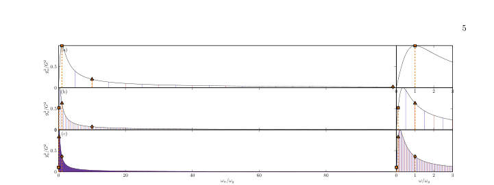 
FIG. 2. Normalized squared coupling strengths g2 n/G2 of the odd (red line) and even (blue line) sectors versus the normalized mode frequency ωn/ωg for three values of the TL mode spacing: (a) ωTL = 10 ωg, (b) ωTL = ωg, and (c) ωTL = 0.1ωg. The insets display a zoom of the interval ωn/ωg ∈[0, 3], highlighting the low frequency modes. The vertical markers denote three representative qubit frequencies: ωq = 0.1 ωTL (square), ωq = ωTL (triangle), and ωq = 10 ωTL (diamond).

📷 Fig 3

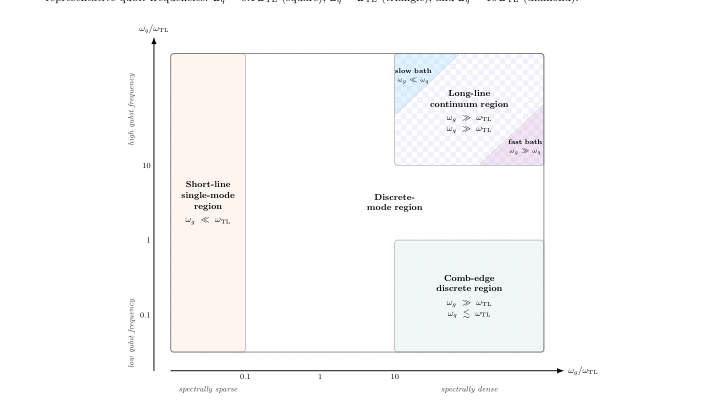 
FIG. 3. Schematic classification of the operating regions in the plane spanned by the ratios ωg/ωTL and ωq/ωTL.

📷 Fig 4

 
FIG. 4. Schematic representation of the long-line (contin- uum) mapping: the transmission line decomposes into two independent reservoir channels (even/odd parity), each char- acterized by a Drude–Lorentz spectral density and coupled to the two-qubit system through the collective operators L± = ˆσ(1) y ± ˆσ(2) y .

📷 Fig 5

 
FIG. 5. Real and imaginary parts of the correlation function C(t) at T = 0 for the discrete [Eq. (23)] and continuum [Eq. (28)] models. The left column, panels (a), (c), and (e), shows Re{C(t)}; the right column, panels (b), (d), and (f), shows Im{C(t)}. The three rows correspond to ωTL/ωg = 10, 1, and 0.1, from top to bottom.

📷 Fig 6

 
FIG. 6. Drude–Lorentz spectral density J(ω) normalized to the reorganization rate λ plotted as a function of frequency for different normalized bath relaxation rates γ/ωq, illustrating the broadening of the spectrum and the shift of the maximum at ω = γ.

📷 Fig 7

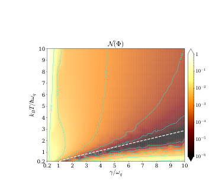 
FIG. 7. BLP non-Markovianity measure N(Φ) for a single qubit capacitively coupled to a finite TL of length d, termi- nated by a short circuit in the long line region ωTL ≪ωg. The measure is shown as a function of the normalized bath temperature kBT/ℏωq (vertical axis) and the normalized bath relaxation rate γ1q/ωq (horizontal axis), over the range 0 ≤ kBT/ℏωq, γ1q/ωq ≤10. The reorganization rate is fixed to λ1q = 0.1 ωq. The white curve marks the condition defined by Eq. (34). The green curves are contour lines of constant N(Φ), highlighting different levels of non-Markovianity.

📷 Fig 8

 
FIG. 8. BLP non-Markovianity measure N(Φ) for the re- duced dynamics of two qubits coupled through a finite TL in the long-line region ωTL ≪ωg, shown as a function of the normalized bath temperature kBT/ℏωq (vertical axis) and normalized bath relaxation rate γ/ωq (horizontal axis), in the range 0.2 ≤kBT/ℏωq, γ/ωq ≤10. The reorganization rate is fixed at λ = 0.1 ωq. The contour lines indicate constant values of N(Φ) and thus highlight different regions of non- Markovian behavior.

📷 Fig 9

 
FIG. 9. Comparison between HEOM (solid-line), GKLS (dashed-line) and TCL2 (dash dot line) simulations for the populations of two qubits, shown for kBT/ℏωq = 7 and different values of γ/ωq. The BLP measures are (a) NΦ(γ/ωq = 0.2, kBT/ℏωq = 7) = 1.61, (b) NΦ(3, 7) = 5.6 · 10−4, (c) NΦ(7, 7) = 1.11 · 10−5. The initial state is one of the orthogonal states in the pair that maximizes the BLP measure.

📷 Fig 10

 
FIG. 10. Comparison between HEOM (solid-line), GKLS (dashed-line) and TCL2 (dash dot line) simulations for the populations of two qubits, shown for γ/ωq = 7 and different values of T, i.e. (a) kBT/ℏωq = 0.2 and (b) kBT/ℏωq = 3. The BLP measures are NΦ(γ/ωq = 7, kBT/ℏωq = 0.2) = 7.8 · 10−2 and NΦ(γ/ωq = 7, kBT/ℏωq = 3) = 4.25 · 10−5. The initial state is one of the orthogonal states in the pair that maximizes the BLP measure.

**Main problem.** The paper seeks to establish a unified framework for classifying the dynamical regimes of two superconducting qubits coupled via a finite-length transmission line, specifically determining when the line acts as a continuous reservoir, a multi-mode coupler, or a single-mode cavity.

**Main result.** The authors identify three distinct regimes (long-line continuum, comb-edge discrete, and short-line single-mode) and demonstrate how collective coupling reshapes the non-Markovianity landscape compared to single-qubit systems.

**Method.** The study uses circuit quantization to derive the Hamiltonian and employs the Hierarchical Equations of Motion (HEOM) to numerically solve the non-perturbative dynamics, comparing results against TCL2 and GKLS master equations.

**Summary.** This paper provides a unified description of the dynamics of two superconducting qubits coupled through a finite-length transmission line. By analyzing the hierarchy of frequency scales, the authors classify the system into continuum, multi-mode, and single-mode regimes. They use the HEOM method to show how the transmission line can act as a structured reservoir and how collective coupling affects non-Markovian information backflow. The work also evaluates the accuracy of standard Markovian and perturbative approximations in these complex environments.

Detailed structure

**Model / system.** Two identical superconducting transmon qubits capacitively coupled symmetrically to a finite-length transmission line, where the line modes are separated into even- and odd-parity sectors.

**Key observables.** Breuer-Laine-Piilo (BLP) measure of non-Markovianity, ground-state population, trace distance, and qubit population evolution.

**Important parameters / regimes.** Qubit frequency (omega_q), transmission line mode spacing (omega_TL), coupling scale (omega_g), temperature (T), and reorganization rate (lambda).

**Assumptions / limitations.** Qubits are treated as two-level systems; the transmission line is modeled as a truncated set of bosonic modes; the continuum limit assumes a Drude-Lorentz spectral density.

**Figures summary.** Schematics of the circuit setup, maps of non-Markovianity (BLP measure) across parameter spaces, comparisons of HEOM, TCL2, and GKLS dynamics, and convergence tests for mode expansion.

**Paper structure.** The paper begins with circuit quantization and Hamiltonian derivation, progresses to the classification of frequency-dependent dynamical regimes, analyzes non-Markovianity using the BLP measure, and concludes with a validation of master equation approximations and mode convergence.

**Why it may be interesting.** It provides a rigorous bridge between circuit-level parameters and open quantum system theory, offering a unified description of memory effects and collective dissipation in cQED architectures.

Abstract

We investigate the reduced dynamics of two identical superconducting qubits capacitively coupled through a finite-length transmission line. Starting from circuit quantization, we derive a circuit Hamiltonian that naturally separates the line modes into even- and odd-parity sectors coupled to collective qubit operators. Depending on the hierarchy between the qubit frequency $ω_q$, the mode spacing $ω_{TL}$, and the coupling scale $ω_g$, the line acts either as a structured reservoir or as a discrete few-mode coupler. In the long-line continuum limit, each sector is described by a Drude--Lorentz spectral density and the dynamics is solved with the hierarchical equations of motion. Using the Breuer--Laine--Piilo measure, we identify the parameter region in which the reduced dynamics exhibits non-Markovian relaxation. In the short-line limit, the continuum description breaks down and the dynamics becomes respectively multimode or single-mode. This establishes a unified cQED picture of the dynamical regimes of finite-length transmission lines in superconducting-circuit architectures.

## numerical methods (4)

### ⭐ [Algorithmic Locality via Provable Convergence in Quantum Tensor Networks](http://arxiv.org/abs/2604.21919v1)

**Highlighted author(s):** Sarang Gopalakrishnan  
**Authors:** Siddhant Midha, Yifan F. Zhang, Daniel Malz, Dmitry A. Abanin, Sarang Gopalakrishnan  
**Type:** theory · **PDF:** <https://arxiv.org/pdf/2604.21919v1>  
**Analysis basis:** full PDF text, analyzed in chunks

📷 Fig 1

 
FIG. 1. (a) Algorithmic locality in tensor networks: The ef- fect of a perturbation at the center of the network on the fixed-point messages living on edges of the graph decays ex- ponentially with distance from perturbation. Loops (see Eq. (6)) and clusters (see Eq. (7)) built out of the fixed-point mes- sages inherit the locality subsequently. (b) Phase diagram of injective PEPS: Theorem 1 shows existence (for all 0 ≤ε &lt; 1) and uniqueness (for ε &lt; ε∗= O(1/∆)) of fixed points, where ∆is the degree of the graph. Theorem 2 shows convergence of cluster expansion for ε &lt; ε∗∗= O  min{1/D, (D/∆)∆/2} 

**Main problem.** Establishing rigorous theoretical foundations for Tensor Network Belief Propagation (TN-BP), specifically proving the existence, uniqueness, and efficient convergence of fixed points and the validity of cluster expansions for higher-dimensional tensor networks.

**Main result.** The authors prove 'algorithmic locality,' demonstrating that local perturbations in a PEPS lead to exponentially decaying changes in BP fixed points and local observables, thereby providing a rigorous guarantee for the efficiency of TN-BP.

**Method.** The work utilizes message-passing dynamics analysis, Banach contraction mapping, and cluster expansion techniques from lattice statistical mechanics to bound errors and prove convergence.

**Summary.** This paper provides the first end-to-end rigorous theory for using Belief Propagation to evaluate higher-dimensional tensor networks like PEPS. It proves that for a class of strongly injective states, the algorithm converges efficiently and that local updates can be performed locally due to 'algorithmic locality.' This bridges the gap between the widely used numerical practice of TN-BP and provable algorithmic performance, ensuring that local expectation values can be computed with controlled accuracy in polynomial time.

Detailed structure

**Model / system.** The study focuses on Projected Entangled Pair States (PEPS) defined on graphs with bounded degree, specifically focusing on a class of strongly injective tensors.

**Key observables.** Partition function, local expectation values, and connected correlation functions.

**Important parameters / regimes.** Injectivity parameter (epsilon), bond dimension (D), maximum vertex degree (Delta), and the thresholds for uniqueness (epsilon*) and cluster expansion convergence (epsilon**).

**Assumptions / limitations.** The analysis assumes the PEPS are strongly injective and that the bond dimension and vertex degree are O(1).

**Figures summary.** Figure 1(a) illustrates the concept of algorithmic locality via decaying perturbations; Figure 1(b) presents a phase diagram showing the different regimes of injectivity, uniqueness, and hardness.

**Paper structure.** The paper progresses from defining PEPS and BP notation, to proving the existence and uniqueness of BP fixed points, then analyzing loop/cluster expansion convergence, and finally establishing the theorem of algorithmic locality.

Abstract

Belief propagation has recently emerged as a powerful framework for evaluating tensor networks in higher dimensions, combining computational efficiency with provable analytical guarantees. In this work, we develop the first end-to-end theory of tensor network belief propagation for a class of projected entangled pair states satisfying \emph{strong injectivity}. We show that when the injectivity parameter exceeds a constant threshold, BP fixed points can be found efficiently, and a cluster-corrected BP algorithm computes physical quantities to $1/\mathrm{poly}(N)$ error in $\mathrm{poly}(N)$ time for an $N$ qubit system. We identify a striking phenomenon we term \emph{algorithmic locality}: local perturbations of the tensor network affect the BP fixed point with an influence decaying rapidly with distance. As a result, updates to the fixed point after a local perturbation can be carried out using only local recomputation. Moreover, through the cluster expansion, this locality extends to observables, implying that local expectation values can be approximated from local data with controlled accuracy. Our results provide the first rigorous guarantee for the effectiveness of tensor-network belief propagation on a wide class of many-body states, bridging a gap between widely used numerical practice and provable algorithmic performance.

### [Efficient Classical Simulation of Heuristic Peaked Quantum Circuits](http://arxiv.org/abs/2604.21908v1)

**Authors:** David Kremer, Nicolas Dupuis  
**Type:** theory · **PDF:** <https://arxiv.org/pdf/2604.21908v1>  
**Analysis basis:** full PDF text, analyzed in chunks

📷 Fig 1

 
FIG. 1: The three stages of the iterative contraction method. (a) The transpiled circuit is split at the temporal midpoint into a left circuit CL and a right circuit CR, with an identity MPO inserted between them. (b) The greedy unswapping procedure: qubit pairs in the MPO are ranked by bond dimension, and swaps are applied from the left, right, or both sides. Swaps that reduce the bond dimension are accepted, yielding the decomposition M = PL ˜ MPR. (c) Rewiring: the extracted permutations PL and PR are absorbed into the remaining circuits by removing existing transpilation SWAPs, reindexing qubits, and re-transpiling to linear connectivity.

📷 Fig 2

 
FIG. 2: Overview of the iterative contraction procedure. Starting from a small MPO between the left and right circuits, the method cycles through three stages: (1) absorption of circuit layers into the MPO, which causes it to grow; (2) unswapping, which extracts permutations PL and PR and reduces the MPO to a smaller ˜ M; and (3) rewiring, which propagates the extracted permutations into the remaining circuits and re-transpiles to linear connectivity.

📷 Fig 3

 
FIG. 3: Total number of tensor elements in the MPO during contraction. Blue points correspond to the absorption stage and red points to the unswapping stage. (a) MPO size as a function of two-qubit unitaries consumed from the circuit. Three regimes are visible: an initial phase (0–300 unitaries) with rapid absorption–unswapping cycling; a transition phase (300–700) where unswapping becomes progressively more effective; and a final phase (700+) where unswapping reduces the MPO almost completely, allowing long absorption runs. (b) The same quantity plotted against wall-clock time. The full contraction completes in 4,059 seconds on a single Nvidia A100 GPU. The dense cluster of iterations in...

📷 Fig 4

 
FIG. 4: Frequency of the top 20 most-sampled bitstrings from 1,000 samples drawn from the contracted MPS. The peak bitstring (ID 0) appears approximately 110 times (∼11%), consistent with the designed peak weight of ∼10%. The sharp separation from the remaining bitstrings confirms successful recovery of the peak.

**Main problem.** The paper challenges a recent claim of heuristic quantum advantage by demonstrating that 'peaked' quantum circuits, which were thought to be classically intractable, can be efficiently simulated.

**Main result.** The authors developed a tensor network contraction method that can simulate a 56-qubit peaked circuit in approximately one hour on a single GPU, outperforming the execution time of the original quantum hardware.

**Method.** The method uses an iterative Matrix Product Operator (MPO) contraction process involving absorption, a new 'unswapping' heuristic to greedily undo permutations, and rewiring to manage bond dimension growth.

**Summary.** This paper provides a classical simulation technique that efficiently breaks the claimed quantum advantage of certain peaked quantum circuits. By using a 'unswapping' heuristic within a tensor network framework, the authors can undo the permutations intended to make these circuits hard to simulate. They demonstrate that a 56-qubit circuit, previously thought to require years of classical computation, can be simulated in just one hour on a single GPU. This result suggests that the specific construction of these circuits is structurally vulnerable to classical tensor network methods.

Detailed structure

**Model / system.** The study focuses on peaked quantum circuits characterized by a mirror-like $UU^\dagger$ structure, specifically targeting the 56-qubit HQAP construction executed on Quantinuum's H2 trapped-ion processor.

**Key observables.** MPO bond dimension, peak bitstring weight, and the frequency distribution of sampled bitstrings.

**Important parameters / regimes.** SVD singular value cutoff ($\epsilon = 2 	imes 10^{-3}$), maximum bond dimension ($\chi_{max} = 8192$), and the unswapping threshold ($	au = 10^6$ tensor elements).

**Assumptions / limitations.** The method assumes the circuit can be represented as a 1D tensor network via transpilation and relies on the presence of identifiable permutation/swap structures.

**Figures summary.** Figure 1 illustrates the three stages of contraction (splitting, unswapping, rewiring); Figure 2 shows the iterative cycle; Figure 3 shows MPO size dynamics and wall-clock time; Figure 4 shows the recovered bitstring frequency distribution.

**Paper structure.** The paper introduces the problem of challenging quantum advantage claims, describes the proposed MPO contraction and unswapping algorithm, presents performance benchmarks on 56-qubit circuits, and discusses the implications for the hardness of peaked circuits.

Abstract

Peaked quantum circuits, whose output distribution is sharply concentrated on a single bitstring, have emerged as a promising candidate for verifiable quantum advantage, as the correctness of the quantum output can be checked by simply comparing against the known peak. Recent work by Gharibyan et al. arXiv:2510.25838 claimed heuristic quantum advantage using peaked circuits executed on Quantinuum's 56-qubit H2 processor. These peaked circuits concentrate their output on a single hidden bitstring by training a shallow simulable circuit variationally and inserting an obfuscated permutation to increase the depth to a level that makes classical simulation intractable, with estimated runtimes of years for the largest instances. We show that these circuits can be efficiently simulated classically. We describe a method that efficiently performs a full tensor network contraction, allowing near-exact sampling and extraction of the peaked bitstring. The method exploits the mirrored structure of the circuit and iteratively cancels both halves into a Matrix Product Operator (MPO), and avoids the obfuscated permutation by greedily reducing the MPO bond dimension through a process we call unswapping. The method can fully contract and extract the peak of the largest circuit in approximately one hour on a single GPU, around half the time it took to run on the quantum hardware.

### ⭐ [Symplectic split-operator method for the time-dependent unitary Tavis-Cummings model](http://arxiv.org/abs/2604.21778v1)

**Highlighted author(s):** Andrii G. Sotnikov, Denys I. Bondar  
**Authors:** Roman Ovsiannikov, Kurt Jacobs, Andrii G. Sotnikov, Denys I. Bondar  
**Type:** theory · **PDF:** <https://arxiv.org/pdf/2604.21778v1>  
**Analysis basis:** full PDF text, analyzed in chunks

📷 Fig 1

 
FIG. 1. Evolution of the eigenvalues of the covariance matrix (2) for Holstein–Primakoff approach (orange and blue solid lines), QuTip solver (red and green dashed lines), and our algorithm 1 with method=Linear (light green and brown dotted lines) with parame- ters ωc = 2π × 2.4 GHz, ωs = 2π × 3.6 GHz, g = 2π × 10 MHz, Λ = 2π × 1 GHz and ω = 2π × 6 GHz.

📷 Fig 2

 
FIG. 2. Time of the one step evolution for Qutip solver (green line), our algorithm 1 with method=Exp (blue line), and with method=Linear (orange line).

**Main problem.** Developing an efficient, memory-efficient, and unitarity-preserving numerical method for simulating the time-dependent dynamics of the Tavis-Cummings model, specifically overcoming the quadratic scaling of standard solvers when including counter-rotating terms.

**Main result.** The authors present a symplectic split-operator method that achieves linear scaling in both time and memory relative to the system dimension. The method is shown to be highly accurate and more efficient than QuTiP or block-diagonal exponentiation, especially for large Hilbert space dimensions.

**Method.** A second-order symmetric Trotter-Suzuki (Strang) splitting scheme that exploits Hamiltonian decomposition into diagonal and tridiagonal parts. The method uses basis re-indexing (permutation) to switch between bases and implements the propagator via either block-diagonal exponentiation or a Cayley/Crank-Nicolson approach using the Thomas algorithm.

**Summary.** This paper introduces a new numerical method for simulating the time-dependent Tavis-Cummings model. By using a symplectic split-operator approach and clever basis re-indexing, the authors transform the problem into a series of tridiagonal operations. This allows the computational complexity to scale linearly with the system size, rather than quadratically. The method is particularly useful for studying hybrid quantum systems, like NV centers in microwave cavities, where strong driving and counter-rotating terms are present.

Detailed structure

**Model / system.** The closed, undamped Tavis-Cummings model, which describes a multilevel spin system (such as NV centers in diamond) interacting with a cavity mode. The Hamiltonian includes time-dependent spin frequency modulation and terms beyond the rotating-wave approximation.

**Key observables.** Evolution of the eigenvalues of the cavity quadrature covariance matrix (related to X and Y quadrature components).

**Important parameters / regimes.** Cavity frequency, spin frequency, coupling strength, modulation amplitude, and the total Hilbert space dimension D.

**Assumptions / limitations.** The method is specifically tailored to Hamiltonians that can be decomposed into diagonal and tridiagonal parts via basis re-ordering; it assumes a truncated Fock basis for the cavity mode.

**Figures summary.** Figure 1 compares the evolution of covariance matrix eigenvalues using the Holstein-Primakoff approximation, QuTiP, and the proposed algorithm. Figure 2 illustrates the computational runtime scaling of QuTiP, block-diagonal exponentiation, and the proposed linear method as a function of the system dimension.

**Paper structure.** The paper introduces the computational bottleneck of standard solvers, defines the Tavis-Cummings Hamiltonian, details the split-operator algorithm and basis re-indexing technique, presents two realizations of the propagator (block-diagonal and Cayley), validates the method against QuTiP and the Holstein-Primakoff approximation, and concludes with a complexity analysis.

**Why it may be interesting.** This is highly relevant for researchers in cavity QED and many-body dynamics because it provides a scalable way to simulate large-scale spin-cavity systems in the non-RWA regime, which is computationally prohibitive with standard tools.

Abstract

We present a fast, memory-efficient, unitarity-preserving numerical method beyond the rotating-wave approximation for the closed Tavis-Cummings model in which a multilevel spin system interacts with a cavity mode. This model can describe the interaction of an ensemble of spins with a cavity mode in which the spin frequency and other parameters are time-dependent. The method exploits the fact that, while the Tavis-Cummings model is not tri-diagonal, it can be brought into tri-diagonal form by a change of basis that can be implemented purely by re-indexing (permuting basis elements), which is a fast operation. By truncating the Fock basis of the cavity mode, the computational complexity of the method is linear in the total dimension of the coupled system, both in time and memory. The method can be employed to simulate any closed quantum system whose Hamiltonian terms can be brought into tri-diagonal form.

### [Dynamical mean-field theory for dense spin systems at finite temperature](http://arxiv.org/abs/2604.21563v1)

**Authors:** Przemysław Bieniek, Timo Gräßer, Götz S. Uhrig  
**Type:** theory · **PDF:** <https://arxiv.org/pdf/2604.21563v1>  
**Analysis basis:** full PDF text, analyzed in chunks

📷 Fig 1

 
Figure 1: Three types of systems used for benchmarking: nearest-neighbor ferro- magnet (a) and antiferromagnet (b) on a 2D square lattice with periodic boundary conditions and (c) infinite-range system with random couplings (number of sites not representative of the system used in numerics). Black dots represent lattice sites and the blue (red) lines negative (positive) couplings which are ferromagnetic (antifer- romagnetic) in character.

📷 Fig 2

 
Figure 2: Comparison of correlations obtained in spinDMFT (green) and in a ferro- magnet (blue) and antiferromagnet (red) at different temperatures, which are de- picted by different symbols. The considered finite-size systems are a 2D square 4×5 lattice with nearest-neighbor negative/positive couplings, see Fig. 1. Note that there is an incidental overlap of the spinDMFT curve at βJQ = 2.5 and the AFM curve at βJQ = 2. The error bars for spinDMFT and finite-size data are smaller than the width of the curves.

📷 Fig 3

 
Figure 3: Comparison of correlations obtained in spinDMFT (green) and in an infinite-range system with random couplings (purple) at different temperatures (de- picted by different symbols). The considered finite-size system is 12 spins coupled in a random fashion, the curve is obtained by averaging over 1000 coupling configura- tions. The error bars resulting from the averaging and the spinDMFT error bars are smaller than the width of the curves.

📷 Fig 4

 
Figure 4: Comparison of correlations obtained in spinDMFT (green) and in a ferro- magnetic system (blue) at different temperatures (signified by the symbols) in the presence of an external magnetic field (Bz/JQ = 0.5). We depict the x x correlation in (a), x y correlation in (b) and zz correlation in (c). Note the very different y-axis scales used for (a) and (c). The considered finite-size system is a 2D square 4 × 5 lattice with nearest-neighbor negative couplings. In (c), note the incidental overlap of the spinDMFT curves at βJQ = 1.5, 2 and the FM curve at βJQ = 2.5. The error bars resulting from time discretization and averaging over the distribution of mean fields for spinDMFT are...

📷 Fig 5

 
Figure 5: Comparison of correlations obtained in spinDMFT (green) and in an an- tiferromagnetic system (red) at different temperatures (signified by the symbols) in the presence of an external magnetic field (Bz/JQ = 0.5). We depict the x x correla- tion in (a), x y correlation in (b) and zz correlation in (c). The considered finite-size system is a 2D square 4 × 5 lattice with nearest-neighbor positive couplings. The errorbars for spinDMFT and the finite-size data are smaller than the width of the curves.

📷 Fig 6

 
Figure 6: Comparison of correlations obtained in spinDMFT (green) and in an infinite-range system with random couplings (purple) at different temperatures (sig- nified by the symbols) in the presence of an external magnetic field (Bz/JQ = 0.5). We depict the x x correlation in (a), x y correlation in (b) and zz correlation in (c). The considered finite-size system is 12 spins coupled in a random fashion, the curve was obtained by averaging over 250 coupling configurations. The spinDMFT error bars are smaller than the width of the curves. The finite-size data has noticeable errors due to the averaging over the Gaussian distributed couplings.

📷 Fig 7

 
Figure 7: Dependence of the spin expectation value on the magnetic field in ferro- magnetic spinDMFT at a range of temperatures.

📷 Fig 8

 
Figure 8: Dependence of the spin expectation value without an external magnetic field on temperature (blue points) and a numerically obtained spline function fitted to the points(red line).

📷 Fig 9

 
Figure 9: Comparison of correlations obtained in spinDMFT (green line) and in a spin glass mean-field theory developed in Ref. [30] (gray crosses) at different tem- peratures (specified above the curves). In the spin glass data, there are errors due to the graphical extraction of the published data; they are roughly of the size of the crosses. The error bars of spinDMFT are smaller than the line widths.

**Main problem.** Extending the spinDMFT (dynamical mean-field theory for spins) method from infinite temperature to finite temperature to compute imaginary-time correlations and thermodynamic quantities in dense spin systems.

**Main result.** The authors successfully developed a finite-temperature spinDMFT framework that accurately captures ferromagnetic phase transitions and shows excellent agreement with exact results for random-coupling systems, though it struggles with antiferromagnetic order.

**Method.** A single-site approximation using a time-dependent, Gaussian-distributed mean field, implemented via Monte Carlo sampling and numerical iteration to achieve self-consistency.

**Summary.** This paper presents an extension of the spinDMFT method to finite temperatures, allowing for the calculation of thermodynamic quantities and imaginary-time correlations in dense spin systems. By approximating the environment as a time-dependent Gaussian mean field, the authors bypass the exponential scaling of the Hilbert space. The method is validated against exact results for ferromagnetic and random-coupling models, successfully capturing the reduction of critical temperature due to dynamical fluctuations. However, the current implementation faces challenges in accurately modeling antiferromagnetic order.

Detailed structure

**Model / system.** Isotropic Heisenberg model for S=1/2 spins in the limit of large coordination number (z -> infinity), including ferromagnetic, antiferromagnetic, and random-coupling (spin glass-like) regimes.

**Key observables.** Spin expectation values, time-ordered imaginary-time spin correlations, and spin autocorrelations.

**Important parameters / regimes.** Inverse temperature (beta), coupling constants (JL, JQ), and external magnetic field (B).

**Assumptions / limitations.** The method assumes the infinite-coordination limit (z -> infinity) allows for a Gaussian-distributed mean field and the use of Wick's theorem, and it assumes site-independent coupling moments for translation-invariant systems.

**Figures summary.** Figures show benchmarks against FM, AFM, and random-coupling systems; magnetization curves vs. magnetic field; and a comparison of spinDMFT correlations against established spin glass mean-field theory.

**Paper structure.** The paper introduces the spinDMFT extension to finite temperature, derives the single-site effective model using the cavity method and Trotterization, details the numerical implementation (Monte Carlo and Chebyshev expansion), benchmarks the method against finite-size and random-coupling systems, and discusses limitations regarding antiferromagnetism.

**Why it may be interesting.** This work provides a powerful numerical tool for studying the dynamics of many-body spin systems at finite temperatures, which is highly relevant for understanding thermalization and phase transitions in many-body dynamics.

Abstract

In recent years, a method for computing spin dynamics at infinite temperature (spinDMFT) was developed. It utilizes the ideas of dynamical mean-field theory for fermions: single-site approximation and a self-consistency condition to approximate time-dependent spin correlations. In this work, we develop a crucial extension of the method to systems at finite temperature, able to compute imaginary-time correlations and thermodynamical quantities. We benchmark the method by comparison to results in finite-size systems, obtaining very good agreement with correlations in a random-coupling system, good agreement for a ferromagnetic system and large discrepancies in the case of an antiferromagnet. We note the appearance of ferromagnetic order in the method. We discuss possible extensions and potential applications of the approach.

## statistical mechanics (8)

### [Novel dynamics for an inertial polar tracer in an active bath](http://arxiv.org/abs/2604.21762v1)

**Authors:** Jing-Bo Zeng, Ji-Hui Pei  
**Type:** theory · **PDF:** <https://arxiv.org/pdf/2604.21762v1>  
**Analysis basis:** full PDF text, analyzed in chunks

📷 Fig 1

 
FIG. 1. A chevron-shaped rigid tracer (shown in red) , composed of a collection of beads and immersed in an active bath, is characterized by its opening angle ϕ, length a, and width b. Each bead is coupled to ABPs via the WCA force.

📷 Fig 2

 
FIG. 2. Typical trajectories of CM from the reduced dynamics in different dynamical regimes: (a) ABP regime; (b) CABP regime; (c)(d) chaotic regime; (e) zigzag ABP. In each column, the figure in the bottom displays trajectories in the presence of noise, while the figure in the top depicts trajectories in the zero-noise limit. As the column changes, r varies, while σ = 10.6 and b = 2.95 are fixed.

📷 Fig 3

 
FIG. 3. The dependence of the diffusion coefficient on r, with fixed σ = 4.5 and b = 1. For a given r, a larger number of bath particles N corresponds to a lower noise strength, depicted in different colors.

📷 Fig 4

 
FIG. 4. Comparison of the velocity autocorrelation func- tions between linear approximation of the reduced dynam- ics (shown in orange) and simulations of composite system (shown in blue). (a)-(c) shows for the ABP regime, (d)-(f) are for the CABP-regime.

**Main problem.** Investigating the complex, non-equilibrium dynamics of an inertial (underdamped) polar tracer immersed in an active bath of Brownian particles.

**Main result.** The tracer's reduced dynamics are mapped to a stochastic Lorenz equation, revealing four distinct dynamical regimes: active Brownian motion (ABP), chiral active Brownian motion (CABP), chaotic motion, and zigzag ABP motion.

**Method.** The authors use the projection-operator formalism and quasi-static expansion to integrate out bath degrees of freedom, followed by a mapping to the Lorenz system and moment-closure techniques for analytical predictions.

**Summary.** This paper explores how the inertia of a particle affects its motion when placed in an active environment. By mathematically mapping the system to the Lorenz equations, the authors show that unlike overdamped particles, inertial tracers can exhibit much richer behaviors, including circular motion, chaos, and zigzagging. They provide analytical formulas for key transport properties like diffusion and propulsion speed. This work demonstrates that the physical properties of a tracer, such as its mass and shape, can fundamentally change its dynamical class.

Detailed structure

**Model / system.** A 2D, chevron-shaped, rigid, inertial polar tracer interacting via WCA potential with a dilute bath of independent, overdamped Active Brownian Particles (ABPs).

**Key observables.** Propulsion speed, velocity covariance, effective diffusion coefficient, and velocity autocorrelation functions.

**Important parameters / regimes.** Tracer mass (M), moment of inertia (I), number of bath particles (N), and the effective Lorenz parameter (r).

**Assumptions / limitations.** Assumes a separation of timescales between the heavy tracer and light bath particles, and employs a second-order normal moment closure (Gaussian approximation) for fluctuations.

**Figures summary.** Figure 1 shows the tracer geometry; Figure 2 displays trajectories in different dynamical regimes; Figure S1 illustrates Lorenz equation bifurcations; Figure S2 compares predicted vs. simulated propulsion velocity.

**Paper structure.** The paper begins with a microscopic model of the tracer-bath interaction, derives the reduced stochastic dynamics using projection operators, maps these dynamics to the Lorenz system to classify motion regimes, and concludes with analytical derivations of transport properties validated by numerical simulations.

**Why it may be interesting.** The mapping of active matter dynamics to the Lorenz system provides a bridge between non-equilibrium statistical mechanics and classical chaos, offering insights into how inertia and shape-induced coupling can drive spontaneous symmetry breaking and complex trajectories.

Abstract

A polar tracer immersed in an active bath is known to be propelled forward and therefore activated. Here we report that the induced dynamics of an inertial tracer can be much richer than expected. We investigate a heavy polar tracer immersed in a bath of independent active Brownian particles. Using the projection-operator formalism to integrate out the bath, we show that the tracer's reduced dynamics can be mapped to a stochastic Lorenz equation. According to the attractors in the Lorenz equation, the tracer motion is classified into several different dynamical regimes, including active Brownian motion, chiral active Brownian motion, complex chaotic motion, and zigzag active Brownian motion. For certain regimes, we derive analytical expressions for the propulsion speed, the velocity covariance, and the effective diffusion coefficient. Numerical simulations corroborate these theoretical predictions.

### [Birth, Death, and Replication at Surfaces: Universal Laws of Autocatalytic Dynamics](http://arxiv.org/abs/2604.21586v1)

**Authors:** Denis S. Grebenkov  
**Type:** theory · **PDF:** <https://arxiv.org/pdf/2604.21586v1>  
**Analysis basis:** full PDF text, analyzed in chunks

📷 Fig 1

 
FIG. 1. A schematic view of autocatalytic reactions on a sur- face partitioned into three subsets (here, M = 2): an absorb- ing region Γ0 (in red) that destroys particles via A+Γ0 →Γ0; an inert region Γ1 (in gray) that reflects particles back into the bulk; and a catalytic region Γ2 (in green) that replicates particles via a binary splitting A + Γ2 →2A + Γ2. Each of three subsets can be composed of multiple pieces. In the shown random realization, a single particle started from x0 diffuses towards the surface and then branches into two copies on Γ2; one of them reaches an absorbing region Γ0 and dis- appears, whereas the other produces two more offsprings on another piece of the catalytic...

📷 Fig 2

 
FIG. 2. Time evolution of the population size N(t) for a diffusion-reaction system with diffusivity D = 1 in a hol- low cylinder of radii R = 0.2 and L = 1, with the outer perfectly absorbing surface (κ0 = ∞) and the inner au- tocatalytic surface with reactivity κ2. The starting point x0 is on the inner surface. Three regimes are shown for κ2 = 0.9 κc 2 (subcritical, dash-dotted line), κ2 = κc 2 (criti- cal, dashed line), and κ2 = 1.1 κc 2 (supercritical, solid line), with κc 2 = D/(R ln(L/R)) ≈3.11. Arbitrary units are used. (a) Probability 1 −Q0(t|x0) of having at least one particle at time t; (b) Distribution Qk(t|x0) at two times: t = 0.1 (thin lines) and t = 5 (thick lines); (c) Mean...

**Main problem.** Understanding the dynamics of surface-mediated autocatalytic processes where replication (branching) and loss (absorption) are triggered at interfaces, specifically predicting the transition between population extinction and explosive growth.

**Main result.** The derivation of a unified theoretical framework consisting of a nonlinear integral equation and an equivalent Fokker-Planck equation with nonlinear Robin-type boundary conditions, which identifies three distinct dynamical regimes (subcritical, critical, and supercritical).

**Method.** A probabilistic approach using a generating function for the population size, combined with renewal-type integral equations and the transformation into backward diffusion equations.

**Summary.** This paper provides a unified mathematical framework to study autocatalytic processes that occur at interfaces. By treating particles as diffusing in a bulk medium and reacting at the boundaries, the author derives equations that describe the full statistics of the population size. The study identifies three universal regimes: subcritical (extinction), critical (steady-state), and supercritical (explosive growth). These findings are applicable to diverse fields including catalysis, biofilm growth, and viral infections.

Detailed structure

**Model / system.** Particles diffusing in a bulk medium that interact with specific surface regions of a confining domain, where they can undergo absorption, reflection, or branching (replication).

**Key observables.** Probability distribution of population size, statistical moments (mean and second-order), survival probability, and the generating function.

**Important parameters / regimes.** Surface reactivity (kappa), diffusion coefficient (D), and the principal eigenvalue (lambda_0) which determines the asymptotic regime.

**Assumptions / limitations.** Particles undergo ordinary diffusion with constant diffusivity; the boundary is partitioned into a finite number of regions; the initial state is a single particle.

**Figures summary.** Figure 1 shows a schematic of a partitioned surface with different reaction types; Figure 2 illustrates population dynamics (persistence, distribution, and moments) in a hollow cylinder across different reactivity regimes.

**Paper structure.** The paper introduces the problem of surface-mediated autocatalysis, develops a mathematical framework using generating functions and integral equations, establishes an equivalent PDE description with nonlinear boundary conditions, and concludes with numerical illustrations of the identified dynamical regimes.

**Why it may be interesting.** The framework for describing stochastic branching and absorption at boundaries is highly relevant to open quantum systems and non-equilibrium dynamics, particularly for modeling dissipation and particle-interface interactions.

Abstract

Autocatalytic processes underlie diverse systems in which replication is triggered at interfaces, including heterogeneous catalysis on solid substrates, enzyme activity at membranes, viral infections, biofilm growth, and spatially structured ecosystems. In a typical scenario, particles move in a bulk medium and interact with surface regions, where they may either disappear or reproduce through branching, splitting or fission. Here, we develop a general theoretical framework to understand such surface-mediated autocatalytic processes. We show that the interplay between loss and replication at surfaces gives rise to rich population dynamics. For this purpose, we derive a renewal-type nonlinear integral equation for the generating function of the population size, providing access to its full probability distribution and statistical moments. We further establish an equivalent description in terms of a Fokker-Planck equation with nonlinear Robin-type boundary conditions that encode surface reactions. Our results identify distinct dynamical regimes and universal scaling laws, and provide a unified framework to predict when surface activity promotes extinction or explosive growth. These findings offer quantitative insight into catalytic efficiency, metabolic regulation, and population persistence in spatially heterogeneous environments.

### ⭐ [Generalized stochastic spin-wave theory for open quantum spin systems](http://arxiv.org/abs/2604.21574v1)

**Highlighted author(s):** Rosario Fazio  
**Authors:** Zejian Li, Anna Delmonte, Rosario Fazio  
**Type:** theory · **PDF:** <https://arxiv.org/pdf/2604.21574v1>  
**Analysis basis:** full PDF text, analyzed in chunks

📷 Fig 1

 
Figure 1. Semiclassical representation of driven-dissipative spin dynamics with the generalized framework of spin-wave quantum trajectories (SWQT). (a) Sketch of a variable-range interacting spin model on a two-dimensional (2D) lattice. The spins are driven with an external field h and interact via a variable-range coupling J(α) ij , whose strength decays as a power law of the distance with exponent α. The spins are subjected to local decay (at rate γ), and the dissipative dynamics is unraveled into quantum trajectories via continuous monitoring. (b) In our semiclassical treatment, each spin is bosonized around its classical polarization. Here, Oxyz depicts the lab frame and O˜xi˜yi˜zi is...

📷 Fig 2

 
Figure 3. Benchmark of the spin-wave quantum trajectories (SWQT) with heterodyne (het.) unraveling for a 2 × 2 spin system with h = 2γ, J = 0.5γ, and nearest-neighbor interactions (α = ∞) for the following physical quantities: (a) single- trajectory expectation values on the first site ⟨ˆσx,y,z 1 ⟩; (b) single-trajectory two-point correlation function X2 [cf. Eq. (33)]; (c) trajectory-averaged and site-averaged spin observables ⟨ˆσx,y,z⟩; (d) trajectory-averaged two-point correlation function X2. They are plotted as a function of time and shown together with the numerically exact solutions (see legend). The simulations are performed with a fixed time step γδt = 10−4 and trajectory averages...

📷 Fig 3

 
Figure 5. Steady-state results for a system with N = 6 × 6, α = 1 in the steady state, obtained with spin-wave quan- tum trajectories. (a) Magnetization order parameter X2 as a function of the external drive h and the dissipation γ. (b) Trajectory-averaged spin-wave density ϵ. In both panels, the mean-field (MF) phase boundary is marked with a dashed line (see legend).

📷 Fig 4

 
Figure 4. (a) SWQT heterodyne dynamics for a single trajec- tory with N = 6 × 6, h = J, γ = 0.6J and α = 1 showing the symmetry-breaking behavior. (b) Distribution of mx along trajectories for different values of γ (see legend) showing the bimodality of the trajectory ensemble.

📷 Fig 5

 
Figure 7. Steady-state magnetization X2 as a function of γ in a 10 × 10 lattice, for different interaction ranges represented by α, shown together with the mean-field result (see legend).

📷 Fig 6

 
Figure 6. Steady-state results for the same quantities as in Fig. 5 with α = 1 and h = J, as a function of the dissi- pation γ and system size N = L × L (legend shared across both panels). (a) Magnetization order parameter X2 shown together with the mean-field (MF) result. Inset: finite-size scaling of the results with γc/J = 1.02±0.07, β = 0.46±0.10, ν = 1.00 ± 0.05 extracted from a collapsing analysis, with the vertical dotted line marking the extracted critical point. (b) Trajectory-averaged spin-wave density ϵ.

📷 Fig 7

 
Figure 8. Finite-size scaling parameters as a function of inter- action range represented by 1/α showing the crossover of uni- versality class, where the vertical dotted line marks α = d = 2. (a) Critical point γc, with the mean-field (MF) value γc/J = 1 marked with a horizontal dotted line. (b) Magnetization crit- ical exponent β, with the mean-field value β = 1/2 marked with a horizontal dotted line and the value for 2D Ising uni- versality class β = 1/8 marked with a dash-dotted line. (c) Correlation length critical exponent ν with the horizontal dot- ted line marking the value ν = 1 for both the mean-field and the 2D Ising universality class.

📷 Fig 8

 
Figure 9. SWQT quantum jump (QJ) benchmark results for a N = 4 × 4 spin lattice with J = 2γ and α = ∞: steady-state average magnetization mx,y,z obtained using SWQT with the QJ unraveling, together with the exact solution (see legend), as a function of the external field h.

📷 Fig 9

 
Figure 10. SWQT quantum jump (QJ) results for a 2D spin lattice with J = 7γ and α = ∞: steady-state average magne- tization mz as a function of the external field h for different system sizes, shown together with the mean-field solution (see legend).

**Main problem.** Developing an efficient semiclassical framework to solve the open quantum dynamics of driven-dissipative spin systems, specifically overcoming the limitations of conventional spin-wave theories in regimes with short-range interactions and local quantum jumps.

**Main result.** The proposed Spin-Wave Quantum Trajectories (SWQT) framework successfully captures phase transitions, including a crossover from Mean-Field to 2D Ising universality classes, and accurately describes symmetry-breaking dynamics and first-order transitions.

**Method.** A semiclassical approach using a Gaussian ansatz, higher-order Holstein-Primakoff expansion, and a quaternion-based non-singular parametrization of local comoving frames to simulate quantum trajectories (heterodyne and quantum-jump).

**Summary.** This paper introduces a new semiclassical method called Spin-Wave Quantum Trajectories (SWQT) for simulating driven-dissipative spin systems. By using local comoving frames and a quaternion formalism, the method avoids coordinate singularities and handles both continuous and discrete quantum measurement processes. The framework is shown to be highly efficient and capable of capturing complex phenomena like universality class crossovers and first-order phase transitions. It is particularly useful for studying large-scale interacting spins where exact methods are computationally impossible.

Detailed structure

**Model / system.** A 2D periodic lattice of interacting spins subject to Lindblad master equation dynamics, featuring variable-range power-law interactions and local dissipation.

**Key observables.** Local and site-averaged magnetization (sx, sy, sz), two-point correlation functions, and spin-wave density (epsilon).

**Important parameters / regimes.** Interaction exponent (alpha) controlling range, dissipation rate (gamma), external driving field (h), and interaction strength (J).

**Assumptions / limitations.** The state is assumed to remain within a Gaussian manifold, and the approximation is most valid in the low spin-wave density regime.

**Figures summary.** Figure 1 shows the 2D lattice model; Figure 2 illustrates the universality class crossover as a function of interaction range; Figure 3 provides a benchmark comparison against exact solutions for a small system; Figure 4 shows single-trajectory dynamics.

**Paper structure.** The paper introduces the scientific problem, defines the physical models and Lindblad dynamics, details the SWQT mathematical framework (including quaternion formalism and bosonization), presents numerical benchmarks against exact solutions, and demonstrates application to phase transitions and universality crossovers.

**Why it may be interesting.** It provides a powerful, scalable tool for simulating large-scale non-equilibrium many-body dynamics and phase transitions in open quantum systems, bridging the gap between mean-field and short-range regimes.

Abstract

We propose a semiclassical framework for solving open quantum dynamics in driven-dissipative spin systems. Our method consists of generalized spin-wave approximations tailored to describing quantum trajectories unravelled from the master equation, and generically applies to regimes beyond the reach of conventional spin-wave theories, including short-range interactions and local quantum jumps, enabling the efficient simulation of large-scale interacting spins. We illustrate the versatility of our framework by studying a variable-range driven-dissipative Ising model on a 2D lattice. When the dissipation acts along the drive axis, we find a continuous phase transition breaking the $\mathbb{Z}_2$ symmetry, and demonstrate that the interaction range, when tuned from fully-connected to nearest-neighbour, profoundly alters the universality class of the criticality. With the dissipation along the interaction axis, we show the emergence of a first-order transition. Demonstrated with both state-diffusion and quantum-jump types of trajectory dynamics, our framework provides a powerful toolbox for the efficient semiclassical description of non-equilibrium dynamics and many-body phases in spin systems.

### [Dean-Kawasaki fluctuating hydrodynamics for backscattering hard rods](http://arxiv.org/abs/2604.21553v1)

**Authors:** Mrinal Jyoti Powdel  
**Type:** theory · **PDF:** <https://arxiv.org/pdf/2604.21553v1>  
**Analysis basis:** full PDF text, analyzed in chunks

📷 Fig 1

 
Figure 1: Mass density, q0(x, t), momentum density, q1(x, t) and energy density, q2(x, t)/2 of a system of backscattering hard rods of length a = 1 at different times. The solid lines represents theory and the circles represent the results from molecular dynamics. Here, the initial positions and velocities are drawn from a gaussian distribution (6) with σx = 5 and T = 1. The numerical results have been obtained after averaging over 5 × 106 realizations.

📷 Fig 2

 
Figure 2: Unequal space-time correlation of mass densities for a hard rod system consisting of N = 400 backscattering hard rods each of length a = 0.01 for a) γ = 0.0005 and b) γ = 2. Here, we have set x′ = 0, t′ = 0. The black dashed lines represent theory (Eq. (23)) and the colored circles represent results from molecular dynamics for different values of τ = t −t′, where we have also subtracted off fluctuations due to finite size effects. Initially, all the hard rods are distributed uniformly in the region [−10, 10] and the velocities were drawn from a gaussian distribution with temperature or variance, T = 1. The boundary conditions imposed are periodic. On the left, we see that for τ &lt;&lt;...

**Main problem.** Understanding how a stochastic velocity-flipping perturbation breaks the integrability of a one-dimensional hard-rod system and changes its transport properties.

**Main result.** The system undergoes a transition from ballistic to diffusive transport, where the correlation of mass densities spreads ballistically for short times (t << 1/gamma) and diffusively for long times (t >> 1/gamma).

**Method.** The study employs the Dean-Kawasaki fluctuating hydrodynamic formulation, mapping the backscattering hard rods to non-interacting run-and-tumble particles and solving the resulting stochastic partial differential equations.

**Summary.** This paper investigates how adding a stochastic flipping mechanism to a 1D hard-rod system breaks its integrability. By using a hydrodynamic approach, the author shows that this perturbation causes the system's transport properties to transition from ballistic to diffusive behavior. The study provides an analytical description of how density correlations evolve over different time scales relative to the flipping rate. The theoretical results are successfully validated using molecular dynamics simulations.

Detailed structure

**Model / system.** A one-dimensional system of backscattering hard rods (BHR) of length 'a' that undergo elastic collisions and periodic velocity sign flips at a rate 'gamma'.

**Key observables.** Phase space densities (PSDs), conserved densities (mass, momentum, and energy), and two-time density-density correlations.

**Important parameters / regimes.** Flipping rate (gamma), rod length (a), density (rho), temperature (T), and the time scales relative to the inverse flipping rate (1/gamma).

**Assumptions / limitations.** The derivation assumes a Poisson process for flipping events and focuses on the long-time regime where initial fluctuations have decayed.

**Figures summary.** Figure 1 compares theoretical predictions for mass, momentum, and energy densities against molecular dynamics simulations. Figure 2 shows the unequal space-time correlation of mass densities, demonstrating the transition from ballistic to diffusive scaling at different flipping rates.

**Paper structure.** The paper introduces the BHR model, maps it to run-and-tumble particles, derives the hydrodynamic equations using the Dean-Kawasaki framework, provides analytical solutions for correlations in various geometries, and validates results via molecular dynamics simulations.

Abstract

We study a system of backscattering hard rods in one dimension. Contrary to the usual ballistic hard rods, these hard rods flip the sign of their velocities with a rate $γ$. This leads to the decay of the odd moments of velocity while preserving the even moments: the number of conserved quantities in the system becomes half. The introduction of the flipping rate, $γ$, is a kind of integrability-breaking perturbation. One expects a change in the transport properties in the system due to the integrability breaking. We show using a Dean-Kawasaki fluctuating hydrodynamic formulation that for $t \gg 1/γ$, the two-time density density correlation spreads in a diffusive manner, and for $t \ll 1/γ$, the correlation spreads ballistically.

### [The CriticalSet problem: Identifying Critical Contributors in Bipartite Dependency Networks](http://arxiv.org/abs/2604.21537v1)

**Authors:** Sebastiano A. Piccolo, Andrea Tagarelli  
**Type:** theory · **PDF:** <https://arxiv.org/pdf/2604.21537v1>  
**Analysis basis:** full PDF text, analyzed in chunks

📷 Fig 1

 
Fig. 1. An example of bipartite dependency graph of contributors (𝑐𝑖) and items (𝑖𝑗). The shaded subgraph denotes to the Critical Set of size 3, which corresponds to the set {𝑐1, 𝑐2, 𝑐3}, as their removal causes the isolation of items 𝑖1–𝑖5.

📷 Fig 2

 
Fig. 2. Coverage curves on real datasets (selection).

📷 Fig 3

 
Fig. 3. Zoomed-in comparison between MinCov, ShapleyCov, Forward Greedy and SHC. The letter indicates the synthetic graph configuration (refer to Table 3).

📷 Fig 4

 
Fig. 4. Running time comparison between MinCov, ShapleyCov, FG, and SHC.

**Main problem.** Identifying a subset of critical contributors in a bipartite dependency network whose removal isolates the largest number of items, a problem characterized by supermodular 'all-or-nothing' coverage.

**Main result.** The authors prove the problem is NP-hard and propose two new methods, ShapleyCov and MinCov, which significantly outperform traditional centrality and greedy algorithms in both accuracy and scalability.

**Method.** The paper introduces ShapleyCov, a centrality measure derived from the Shapley value of a coalitional game, and MinCov, a linear-time iterative peeling algorithm that accounts for connection redundancy.

**Summary.** This paper addresses the challenge of finding critical nodes in bipartite networks where dependencies follow an 'all-or-nothing' logic. Unlike standard submodular optimization, this problem is supermodular and computationally difficult. The authors develop a new centrality measure based on the Shapley value and a highly efficient peeling algorithm called MinCov. Their approach scales to massive networks like Wikipedia and provides much more accurate identification of critical nodes than traditional methods like PageRank or betweenness centrality.

Detailed structure

**Model / system.** The study uses a bipartite graph model B = (C, I, E) where C represents contributors, I represents items, and E represents dependency edges. Real-world applications include Wikipedia, open-source software, and supply chains.

**Key observables.** The primary metric is the Area Under the Coverage Curve (AUC), which measures the normalized cumulative number of items covered as the budget k increases.

**Important parameters / regimes.** Key parameters include the budget k, the degree distribution exponent alpha, the maximum degree D, and redundancy metrics such as the fraction of degree-one items (phi_I).

**Assumptions / limitations.** The model assumes a bipartite structure, uniform item importance, and a strict 'all-or-nothing' (AND logic) loss condition where an item is only lost if all its contributors are removed.

**Figures summary.** Figure 1 visually demonstrates the CriticalSet problem in a bipartite graph; other figures show coverage curves and performance comparisons across various datasets.

**Paper structure.** The paper begins by formalizing the CriticalSet problem and proving its NP-hardness, then introduces the game-theoretic ShapleyCov and the MinCov algorithm, followed by extensive experimental validation on large-scale real-world and synthetic networks, and concludes with discussions on limitations and future extensions.

Abstract

Identifying critical nodes in complex networks is a fundamental task in graph mining. Yet, methods addressing an all-or-nothing coverage mechanics in a bipartite dependency network, a graph with two types of nodes where edges represent dependency relationships across the two groups only, remain largely unexplored. We formalize the CriticalSet problem: given an arbitrary bipartite graph modeling dependencies of items on contributors, identify the set of k contributors whose removal isolates the largest number of items. We prove that this problem is NP-hard and requires maximizing a supermodular set function, for which standard forward greedy algorithms provide no approximation guarantees. Consequently, we model CriticalSet as a coalitional game, deriving a closed-form centrality, ShapleyCov, based on the Shapley value. This measure can be interpreted as the expected number of items isolated by a contributor's departure. Leveraging these insights, we propose MinCov, a linear-time iterative peeling algorithm that explicitly accounts for connection redundancy, prioritizing contributors who uniquely support many items. Extensive experiments on synthetic and large-scale real datasets, including a Wikipedia graph with over 250 million edges, reveal that MinCov and ShapleyCov significantly outperform traditional baselines. Notably, MinCov achieves near-optimal performance, within 0.02 AUC of a Stochastic Hill Climbing metaheuristic, while remaining several orders of magnitude faster.

### ⭐ [Quantum jump correlations in long-range dissipative spin systems](http://arxiv.org/abs/2604.21513v1)

**Highlighted author(s):** Rosario Fazio  
**Authors:** Giulia Salatino, Anna Delmonte, Zejian Li, Rosario Fazio, Alberto Biella  
**Type:** theory · **PDF:** <https://arxiv.org/pdf/2604.21513v1>  
**Analysis basis:** full PDF text, analyzed in chunks

📷 Fig 1

 
FIG. 1. (a) Sketch of the dissipative phase diagram in the long-range limit: the yellow region corresponds to the mean- field ferromagnetic phase (FM), while the violet region corre- sponds to the mean-field paramagnetic phase (PM), featuring strongly and weakly correlated quantum jumps, respectively. The dashed line represents the shrinking of the FM phase due to an increased α, reflecting the buildup of correlations between spins. Correlations between quantum jumps are cap- tured through (b) a cluster mean-field (cMF) approximation, which fully accounts for short-range correlations, or (c) a cu- mulant expansion approximation, which captures lower-order long-range correlations.

📷 Fig 2

 
FIG. 3. Probability distribution P(n1, n2) for γtf = 20, Nc = 2, γ/J = 0.5, α = 1.1. (a) Ferromagnetic phase. (b) Paramagnetic phase.

📷 Fig 3

 
FIG. 2. Evolution of P(n1) in the tilted mean-field approx- imation with Nc = 1 in ferromagnetic (a) and paramagnetic (b) phases. α = 1.1.

📷 Fig 4

 
FIG. 4. Connected joint distribution P(n1, n2) −P(n1)P(n2) with Nc = 2, γ/J = 0.5, γtf = 20, and (a) h = 1.0 (b) h = 2.5. α = 1.1.

📷 Fig 5

 
FIG. 5. Growth rate of the covariance of the number of jumps in time from the cluster mean field approximation with Nc = 2, 4, 6, h = 1.0, γtf = 10, α = 1.1.

📷 Fig 6

 
FIG. 6. Steady-state rate of change of the covariance between the numbers of jumps on sites 1 and 1 + d as a function of the dissipation γ on the periodic spin chain with h = J, obtained with the cumulant expansion approach to the tilted Lindblad equation. (a) Results for α = 0 and different system sizes N (see legend). Due to the infinite-range interaction, the two-site jump correlation is independent of the distance d. (b) Results for α = 1.1 and nearest-neighbor sites (d = 1), for different system sizes N [legend shared with panel (a)]. (c) Results for α = 1.1 and different distances d (see legend), for a fixed system size of N = 30.

📷 Fig 7

 
FIG. 7. Inverse of (a) average (b) variance of waiting time distribution at α = 1.1 &lt; αC. The dotted line represents mean-field, the vertical dashed lines represent the separation between the two regions predicted by cluster mean-field. Clus- ter mean-field converges and confirms the presence of two dis- tinct regions.

📷 Fig 8

 
FIG. 8. Inverse of (a) average (b) variance of waiting time distribution at α = 2.0 ≃αC. The dotted line represents the mean-field, the vertical dashed lines represent the separation between the two regions predicted by cluster mean-field. Clus- ter mean-field shrinks more and more the area corresponding to finite variance.

📷 Fig 9

 
FIG. 9. Cluster mean field results for the steady-state magnetization |⟨ˆσx⟩| as a function of the dissipation rate γ at h = J for different cluster size Nc and interaction range α (see legend).

**Main problem.** Characterizing nonequilibrium phase transitions in long-range dissipative spin systems using the statistical properties of quantum jump trajectories rather than standard steady-state order parameters.

**Main result.** The study demonstrates that quantum jump correlations, such as waiting-time distributions and full counting statistics, provide clear signatures of ferromagnetic and paramagnetic phases, with jump correlations exhibiting spatial anti-correlation in the ordered phase.

**Method.** The authors employ a quantum trajectory framework using a tilted Lindbladian approach for full counting statistics, combined with Cluster Mean-Field (cMF) theory and a second-order cumulant expansion to capture short- and long-range correlations.

**Summary.** This paper investigates how the statistics of quantum jumps can be used to identify nonequilibrium phase transitions in long-range dissipative spin systems. By analyzing the spatial and temporal correlations of detection events, the authors show that jump-based observables can distinguish between ferromagnetic and paramagnetic phases. They specifically highlight how the interaction range (alpha) affects the structure of these correlations. The work demonstrates that trajectory-resolved observables serve as powerful probes for collective behavior in open quantum many-body systems.

Detailed structure

**Model / system.** A 1D periodic spin chain with power-law long-range interactions (parameterized by alpha) and dissipation via spontaneous emission (Lindblad master equation) featuring a transverse field and ferromagnetic coupling.

**Key observables.** Full counting statistics of quantum jumps, waiting-time distributions (WTD), spatial and temporal correlations of detection events, and the covariance of jump counts.

**Important parameters / regimes.** Interaction range (alpha), dissipation rate (gamma), interaction strength (J), and external transverse field (h).

**Assumptions / limitations.** The Cluster Mean-Field approximation assumes translational invariance among unmonitored clusters and relies on convergence with increasing cluster size; the cumulant expansion is a second-order truncation.

**Figures summary.** Figure 1 shows the phase diagram and approximation schemes; Figures 2-4 illustrate the evolution of jump probability distributions and joint distributions showing anti-correlation; Figure 5 shows the growth rate of covariance; Figure 6 shows distance-dependent correlations; Figure 9 shows magnetization vs. dissipation rate.

**Paper structure.** The paper introduces the problem of characterizing dissipative phases via trajectories, defines the long-range spin model, details the tilted Lindbladian and approximation methods (cMF and cumulant expansion), presents results for jump correlations and waiting-time distributions across different interaction ranges, and concludes with convergence and applicability notes.

**Why it may be interesting.** It provides a novel way to identify phase transitions in open many-body systems using monitoring-based information (jumps), which is highly relevant for researchers working on measurement-induced phase transitions and the dynamics of driven-dissipative systems.

Abstract

We characterize nonequilibrium phases in long-range dissipative spin systems through the statistical properties of quantum jump trajectories. While the average dynamics governed by the Lindblad master equation provides access to steady-state expectation values of order parameters, the quantum trajectory framework reveals features encoded in the spatial and temporal correlations of detection events. Focusing on a model exhibiting a paramagnetic-to-ferromagnetic phase transition, we investigate the full counting statistics of quantum jumps using a tilted Lindbladian approach. We combine this with cluster mean-field and cumulant expansion techniques, which allow us to capture, respectively, the short- and long-range structure of jump correlations. In addition, we study the waiting-time distributions of detection events. We show that quantum jump correlations display clear signatures of the underlying phases and reveal distinct dynamical features across the transition. Our results highlight the potential of trajectory-resolved observables as probes of collective behavior in open quantum many-body systems and provide new insights into the role of long-range interactions in shaping nonequilibrium dynamics.

### [How to quantify long-time rotational motion in molecular systems](http://arxiv.org/abs/2604.21512v1)

**Authors:** Romain Simon, Hadrien Bobas, François Villemot, Jean-Louis Barrat, Ludovic Berthier  
**Type:** theory · **PDF:** <https://arxiv.org/pdf/2604.21512v1>  
**Analysis basis:** full PDF text, analyzed in chunks

📷 Fig 1

 
FIG. 3. Test of Euler vector method on (a) a confined and (b) a free angular random walk. In (b) no Fickian regime is reached at large times because the angular displacement is bounded, preventing the definition of Drot using Eq. (1) for the diffusive model.

📷 Fig 2

 
FIG. 4. Test of integral method on (a) a confined and (b) a free angular random walk. In (a) an erroneous Fickian regime appears due to an accumulation of small errors.

📷 Fig 3

 
FIG. 5. (a) The time evolution of the amplitude of the to- tal Euler vector |Ω(t, 0)| representing the rotation matrix be- tween times 0 and t leads to a bounded angular displacement 0 ≤θ(t) ≤π. (b) When an angular threshold θT = 1 is in- troduced (horizontal dashed line), the amplitude of the Euler vectors |Ω(Ti−1, Ti)| is now computed in the time intervals between threshold crossings (vertical dashed lines). (c) The accumulated angular displacement |ϕ(t)| defined in Eq. (28) leads to an unbounded angular displacement that no longer saturates to π (dashed line).

📷 Fig 4

 
FIG. 6. Test of threshold method on (a) a confined and (b) a free angular random walk. The threshold method properly captures both the plateau regime of confined angular motion and the Fickian regime of freely diffusive one.

📷 Fig 5

 
Fig. 3(a). The conclusion is that the threshold method is in prin- ciple able to capture the correct physical behaviour in both limits of a confined and a free angular random walk, unlike the conventional methods that failed in either one of these two cases. We now demonstrate numerically that this is the case. In the following (Sec. V), a series of mod- els of increasing complexity is considered to test further the applicability of the threshold method in Eq. (28). We use Eq. (28) to measure the mean-squared angular displacement ∆ϕ2(t) in both confined and free angular random walks, see Fig. 6. For the confined random walk in Fig. 6(a) with θc = 0.2, ϵ = 0.05 and τ = 1, we set θT = 2.0....

📷 Fig 6

 
FIG. 7. (a) Time dependence of the mean-squared angu- lar displacement for various average escape times τj from τj = 102 to 5 × 106 using the threshold method. (b) The extracted rotational diffusion constant Drot scales inversely with τj (dashed line). The integral method provides correct results for small τj but leads to erroneous estimates of Drot at large τj, reminiscent of literature results.

📷 Fig 7

 
FIG. 8. (a) Mean-squared angular displacement for the model described in Sec. V B, with intermittent cage escapes de- scribed by the Pareto distribution (29) with α = 1.2. The Fickian regime is reached near t ≈106. The rotational diffu- sion constant is incorrectly estimated by the integral method, and it is not accessible when using the bounded amplitude of the Euler vector. (b, c) Van Hove distributions of angular displacements at two different times. For t = 104 in (b) it is described by the superposition of caged dynamics (vertical dotted lines are ±θc) with exponential tails (dashed lines). For t = 106 in (c) the distribution has nearly converged to its Gaussian limit (dashed line).

📷 Fig 8

 
FIG. 9. (a) Mean-squared angular displacement for the model described in Sec. V C, with intermittent cage escapes de- scribed by the Pareto distribution (29) with α = 0.7. A sub- diffusive regime is reached at large times with ∆ϕ2 ∼tα. The integral method predicts an incorrect Fickian regime, while a determination of the sub-diffusive exponent is impossible using the Euler vector. (b, c) Van Hove distributions of an- gular displacements at two different times. For t = 104 in (b) it is described by the superposition of caged dynamics (vertical dotted lines are ±θc) with exponential tails (dashed lines). For t = 106 the distribution has nearly converged to its non-Gaussian asymptotic limit...

**Main problem.** Existing methods for quantifying long-time rotational motion in molecular systems fail in complex dynamics (slow, heterogeneous, or intermittent), leading to inconsistent results regarding the glass transition and the Debye-Stokes-Einstein relation.

**Main result.** The authors introduce a new empirical threshold method that accurately captures rotational dynamics from diffusive fluids to arrested solids, resolving the mathematical flaws of previous Euler-vector and integral-based approaches.

**Method.** A novel threshold method that interpolates between the Euler vector and integral methods by resetting the rotation reference frame whenever an angular threshold theta_T is reached.

**Summary.** This paper addresses the failure of standard mathematical techniques to quantify rotational motion in complex molecular systems like supercooled liquids. The authors show that previous methods either saturate prematurely or accumulate errors due to the non-commutative nature of 3D rotations. They propose a new 'threshold method' that resets the rotation frame at specific intervals to maintain accuracy. This method successfully tracks the transition from diffusive to arrested motion and can handle anomalous, non-Gaussian dynamics. This provides a more reliable way to study the decoupling of rotation and translation near the glass transition.

Detailed structure

**Model / system.** The study focuses on 3D rigid bodies in molecular fluids, specifically supercooled liquids approaching the glass transition, using Continuous Time Random Walk (CTRW) models to simulate free, confined, and intermittent rotational dynamics.

**Key observables.** Mean-squared angular displacement (MSAD), rotational diffusion constant (D_rot), and van Hove angular distributions.

**Important parameters / regimes.** Angular threshold (theta_T), confinement angle (theta_c), rotation amplitude (epsilon), and the power-law exponent (alpha) for anomalous diffusion.

**Assumptions / limitations.** The method assumes a separation of scales between short-time dynamics and the threshold parameter; the mathematical derivation uses the Ito interpretation of stochastic differential equations.

**Figures summary.** Figure 1 shows the mathematical conversion between rotation matrices and vectors; Figure 2 displays trajectories of different random walk models; Figure 3 and 4 demonstrate the failure of Euler and integral methods; Figure 5 illustrates the proposed threshold method; Figures 6-9 show the method's success in capturing Fickian, caged, and sub-diffusive regimes.

**Paper structure.** The paper identifies flaws in existing methods, demonstrates their failure in specific regimes, introduces the new threshold method, validates it using various CTRW-based benchmark models, and provides a mathematical derivation of the underlying stochastic process.

**Why it may be interesting.** The paper provides a robust framework for studying non-equilibrium dynamics and anomalous diffusion in rotational degrees of freedom, which is highly relevant to understanding many-body dynamics and the breakdown of standard transport relations in complex systems.

Abstract

We show that all existing methods quantifying rotational motion in molecular fluids eventually fail in systems undergoing complex rotational motion characterised by slow, heterogeneous, or intermittent dynamics. This impacts in particular the study of rotational dynamics in molecular supercooled liquids near their glass transition, as well as discussions of the decoupling between rotational and translational motion and violations of the Debye-Stokes-Einstein relation. We present a brief overview of existing methods and explain why none of them can accurately capture the evolution of rotational dynamics from a diffusive fluid to an arrested solid, thus resolving inconsistent literature results. We then introduce an empirical method that efficiently solves all issues. We benchmark our method devising a family of continuous time random walk models for rotational dynamics. Our method correctly quantifies the statistics of free and caged rotational motion, as well as non-Gaussian and non-Fickian rotational dynamics, and should allow a better characterisation of dynamic heterogeneity in the rotational motion of supercooled molecular fluids.

### [Catalytic quantum thermodynamics beyond additivity and reduced-state monotones](http://arxiv.org/abs/2604.21509v1)

**Authors:** Ali Can Günhan, Onur Pusuluk, Thomas Oikonomou, G. Baris Bagci  
**Type:** theory · **PDF:** <https://arxiv.org/pdf/2604.21509v1>  
**Analysis basis:** full PDF text, analyzed in chunks

📷 Fig 1

 
FIG. 1. Thermo-majorization curves for the common initial product state ρuc SM = ρ β2 S ⊗ρ β1 M (black), the allowed classically correlated final state ρcc SM with χ = 5 × 10−2 (blue), the forbidden classically correlated final state ρcc SM with χ = 6.5 × 10−2 (red), the forbidden discordant final state ρ qc SM with λ = 9.47 × 10−2 (purple dashed), and the common thermal reference state (gray dashed), for Eg = 0, Ee = 2, β1 = 0.1, β2 = 0.2, β3 = 1, and βb = 2. In all three final-state examples, the initial state, the thermal reference state, and the final marginals are identical; only the correlation structure of the final joint state is changed. In particular, ρ qc SM(λ = 9.47 × 10−2) has...

**Main problem.** The paper addresses the incompleteness of standard additive Rényi-based frameworks in describing catalytic quantum thermodynamics, specifically regarding how the catalyst's contribution is accounted for and how correlations affect thermodynamic accessibility.

**Main result.** The authors develop a non-additive divergence framework that makes the catalyst's thermodynamic role explicit and proves that in correlated catalysis, reduced-state data and scalar correlation measures are insufficient to characterize thermodynamic accessibility.

**Method.** The study utilizes Quantum Resource Theory (QRT), non-additive (pseudo-additive) divergences, and thermo-majorization analysis, supported by explicit finite-dimensional constructions and perturbation theory.

**Summary.** This paper introduces a new thermodynamic framework based on non-additive divergences to better account for the role of catalysts in quantum thermal transformations. In the uncorrelated regime, this framework makes the catalyst's contribution to the second law explicitly visible and provides tighter constraints for approximate catalysis. In the correlated regime, the authors demonstrate that the specific structure of system-catalyst correlations is crucial, meaning that simple measures like mutual information or marginal states cannot fully predict if a transformation is possible. This work highlights the necessity of a joint-state-sensitive description for complex quantum thermodynamic processes.

Detailed structure

**Model / system.** The model involves a quantum system (S) and a catalyst (M) undergoing thermal transformations in contact with a heat bath at inverse temperature beta, considering both uncorrelated and correlated (system-catalyst) regimes.

**Key observables.** Non-additive free energies, Rényi divergences, mutual information, work distance, and thermo-majorization verdicts.

**Important parameters / regimes.** Order parameter alpha, trace-distance error epsilon, catalyst dimension d_M, and correlation parameters chi (classical) and lambda (discordant).

**Assumptions / limitations.** The analysis focuses on finite-dimensional regimes and assumes energy-conserving transformations that preserve thermal states.

**Figures summary.** Figure 1 visually demonstrates thermo-majorization curves for various states, showing how different correlation structures (classical vs. discordant) lead to different accessibility verdicts despite identical marginals.

**Paper structure.** The paper introduces the problem of incomplete catalyst accounting, develops a new non-additive divergence framework, applies it to uncorrelated catalysis (including approximate catalysis), extends the analysis to correlated catalysis to show the insufficiency of reduced-state data, and concludes with implications for future compositional principles.

**Why it may be interesting.** This is highly relevant for researchers in open quantum systems and many-body dynamics as it provides new tools for understanding how correlations and finite-size effects fundamentally limit the feasibility of thermodynamic processes.

Abstract

The generalized second laws of quantum thermodynamics are usually formulated in terms of Rényi divergences and the associated family of generalized free energies. In catalytic thermal transformations, this framework typically certifies the existence of a suitable catalyst but does not make the catalytic contribution explicit in the resulting system-level inequalities. Here we develop a complementary formulation based on non-additive divergences, whose pseudo-additive structure yields a family of generalized free energies with an explicit catalyst-dependent correction term. For uncorrelated catalytic thermal transformations, we show that this leads to non-additive second-law relations that make the catalytic contribution explicit and provide nontrivial constraints on admissible catalysts when the catalyst is returned only approximately. We also analyze correlated catalytic thermal transformations and show, through explicit finite-dimensional examples, that reduced-state data are generally insufficient to characterize thermodynamic accessibility: the thermo-majorization behavior of the joint transformation can change while the system and catalyst marginals remain fixed, and even states with identical marginals and the same mutual information can exhibit different thermo-majorization accessibility. Our results show that non-additivity can be thermodynamically informative in uncorrelated catalysis, whereas correlated catalysis generally requires a genuinely joint-state-sensitive description beyond reduced-state monotones.

## strongly correlated electrons (7)

### [Cryogenic shock exfoliation for ultrahigh mobility rhombohedral graphite nanoelectronics](http://arxiv.org/abs/2604.21912v1)

**Authors:** Ludwig Holleis, Youngjoon Choi, Canxun Zhang, Jack H. Farrell, Gabriel Bargas, Audrey Hsu, Zexing Chen, Ian Sackin, Wenjie Zhou, Yi Guo, Thibault Charpentier, Yifan Jiang, Benjamin A. Foutty, Aidan Keough, Martin E. Huber, Takashi Taniguchi, Kenji Watanabe, Andrew Lucas, Andrea F. Young  
**Type:** both · **PDF:** <https://arxiv.org/pdf/2604.21912v1>  
**Analysis basis:** full PDF text, analyzed in chunks

📷 Fig 1

 
FIG. 1. Cryogenic shock exfoliation of rhombohedral graphene. (a) Step-by-step illustration of the cryogenic shock exfoliation process. (b) Optical micrograph taken in the visible and (c) infrared. Bright regions in the infrared image correspond to rhombohedral stacking order. (d-f) Scanning microwave impedance microscopy images in the regions marked in panel c. Area of select contiguous rhombohedral domains are indicated. (g) Total flake area versus non-Bernal stacking fraction for multilayer graphene flakes. Shaded ovals are centered on the geometric mean for x-axis and arithmetic mean for the y-axis, and spanning one standard deviation. (h) Distribution of single-stacking-order,...

📷 Fig 2

 
FIG. 2. Real-space characterization of device uniformity. (a) Atomic force micrograph of a 13-layer dual-gated RMG device. Inset: optical micrograph. (b) Penetration field capacitance CP measured across the accessible range of ne and D. (c) Real space magnetization M determined by local magnetometry. A fringe magnetic field image is acquired by modulating the back gate across a phase boundary separating a spin-polarized half-metal (point ‘X’ in panel b) and a non-magnetic phase. Standard Fourier-domain algorithms are then used to reconstruct M from the measured fringe fields (see Methods).

📷 Fig 3

 
Fig. 2a shows optical and atomic force micrographs of a dual-graphite gated 13-layer RMG device fabricated from a cryogenic shock exfoliated flake using the methods of the pre-

📷 Fig 4

 
FIG. 3. Transverse magnetic focusing. (a) Single-particle band structure of rhombohedral 13-layer graphene at D = 0. The inset shows the Fermi surface at the dashed line (EF = 160 meV), corresponding to ne ≈1013 cm−2. (b) Simulations of the current magnitude |J| for a fully ballistic Boltzmann model with applied magnetic field B = 135 mT, corresponding to the first TMF resonance. (c) TMF data at ne = 1013 cm−2 for four contact configurations along the different edges of the devices. (d) TMF data for the ‘South’ edge as a function of temperature. (e) First TMF peak for at T=2.0K, (f) 78.0K, (g) 138.0K, and (h) 198.0K. The blue shaded region is the peak area Apeak. (i) Temperature-dependence...

📷 Fig 5

 
FIG. 4. Ballistic, diffusive, and hydrodynamic electron transport regimes in RMG. (a) nSOT Biot–Savart imaging of 10 µA current flow at ne = 1013 cm−2, D = 0 V/nm. (b) Simulation of current flow in the ballistic regime (ℓee = 200 µm, ℓmr = 200 µm), obtained by solving the quantum kinetic equation (see Methods). (c) nSOT image at ne = 0.6 × 1012 cm−2, D = 0 V/nm, close to charge neutrality. (d) Simulation in the diffusive regime (ℓee = 50 nm, ℓmr = 10 µm). (e) nSOT image at ne = 6.5 × 1012 cm−2, D = 0.41 V/nm, in the spin- and valley-unpolarized single-surface regime. (f) Simulation in the hydrodynamic regime (ℓee = 50 nm, ℓmr = 200 µm). Scale bar: 1 µm for all images. (g)...

**Main problem.** The utility of rhombohedral multilayer graphene (RMG) for studying correlated electron physics is limited by the scarcity and small size of rhombohedral stacking in natural graphite, which is prone to converting to Bernal stacking.

**Main result.** The authors developed 'cryogenic shock exfoliation' and low-pressure assembly to produce large-area, high-yield RMG devices with ultrahigh mobility, demonstrating hydrodynamic electron flow and uniform spin magnetism.

**Method.** A new cryogenic shock exfoliation technique uses rapid liquid nitrogen immersion to induce shear stress for Bernal-to-rhombohedral conversion, combined with low-pressure van der Waals assembly and nanoSQUID-on-tip imaging.

**Summary.** This paper introduces a breakthrough fabrication technique called 'cryogenic shock exfoliation' to produce large-scale rhombohedral graphene. By overcoming the scarcity of this metastable stacking, the authors create high-yield, high-mobility devices. They demonstrate advanced electronic phenomena, including ultrahigh mobility, uniform spin magnetism, and a crossover between Poiseuille and porous hydrodynamic electron flow. This work transforms rhombohedral graphene into a scalable platform for studying strongly correlated physics.

Detailed structure

**Model / system.** The physical system consists of 13-layer rhombohedral multilayer graphene (RMG) heterostructures, analyzed using a tight-binding Hamiltonian and a quantum kinetic equation for a 2D electron liquid.

**Key observables.** Transverse magnetic focusing peaks, nanoSQUID-on-tip magnetization imaging, sheet resistance, and current density profiles.

**Important parameters / regimes.** Electron-electron scattering length (lee), momentum-relaxing mean free path (lmr), Gurzhi length, and effective mass (m* approx 0.075 me).

**Assumptions / limitations.** The transport model assumes an isotropic 2D electron liquid and uses a two-rate relaxation-time approximation.

**Figures summary.** Figure 1 illustrates the cryogenic shock process and IR microscopy; subsequent figures show magnetization imaging, transport measurements (TMF), and simulations of current flow in different geometries.

**Paper structure.** The paper introduces a new fabrication method, demonstrates the increase in RMG yield and area, characterizes the high-quality transport properties via magnetometry and TMF, and concludes with a detailed study of hydrodynamic electron flow regimes.

**Why it may be interesting.** The study provides a high-quality experimental platform for observing many-body hydrodynamic effects and electron-electron scattering dynamics in a 2D system, which is highly relevant to many-body dynamics.

Abstract

Rhombohedral multilayer graphene (RMG) offers a highly tunable platform for correlated electron physics, featuring field-effect control of magnetic, superconducting, and topological phases[1-24]. The promise of these materials has been held back by the limited abundance of rhombohedral stacking in natural graphite, which constrains both sample yield and useful area. Here we introduce 'cryogenic shock exfoliation' to produce large area rhombohedral graphene flakes which, combined with a low-pressure van der Waals assembly technique that preserves stacking order, enable highly uniform devices exceeding 1300 $μm^2$ with fabrication yields of 90%. Using scanning nanoSQUID-on-tip imaging, we demonstrate uniform spin magnetism over the full central 10 times 10 $μm^2$ area of our devices. Transverse magnetic focusing reveals a disorder mean free path exceeding 200 $μm$ at low temperatures. Within the flat surface bands of RMG[20], we observe a size-driven crossover from Poiseuille to porous electron flow in the intermediate-temperature regime of strong electron-electron hydrodynamics[16, 25], providing a further signature of ultrahigh device quality. Our approach overcomes a key materials bottleneck in the fabrication of mesoscopic rhombohedral graphene devices, paving the way for incorporating strongly correlated phases into two-dimensional nanoelectronics.

### [$3d_{z^2}$ orbital delocalization and magnetic collapse in superconducting (La,Pr)$_3$Ni$_2$O$_{7-δ}$ films](http://arxiv.org/abs/2604.21899v1)

**Authors:** Xiaoyang Chen, Wenliang Zhang, Fei Peng, Ting Cui, Guangdi Zhou, Zezhong Li, Jaewon Choi, Lizhi Xu, Yiu-Fung Chiu, Stefano Agrestini, Sahil Tippireddy, Haoliang Huang, Heng Wang, Xianfeng Wu, Peng Li, Jin-Feng Jia, Mirian Garcia-Fernandez, Yi Lu, Er-Jia Guo, Qi-Kun Xue, Zhuoyu Chen, Donglai Feng, Ke-Jin Zhou  
**Type:** experiment · **PDF:** <https://arxiv.org/pdf/2604.21899v1>  
**Analysis basis:** full PDF text, analyzed in chunks

📷 Fig 1

 
FIG. 1. The O K- and Ni L3- X-ray absorption spec- tra. a,b, Schematic illustration of (La,Pr)3Ni2O7−δ films designed with varying compressive strain (a) and oxygen content (b). The LPNO/SLAO3 is superconducting at low temperature while the other samples are insulating. c,d, O K-XAS measured at σ polarisation (c) and π polarisation (d). e,f, Ni L3-XAS measured at σ polarisation (e) and π polarisation (f). XAS were measured in total fluorescence yield (TFY) mode at 20 K with a grazing incidence angle of 20◦, where π polarization predominantly probes out-of-plane orbital states, while σ polarization probes in-plane orbital states.

📷 Fig 2

 
Figure 3a shows the momentum-dependent magnetic exci- tations in LNO/LAO, along the two high-symmetrical direc- tions (see Methods). The damped harmonic oscillator (DHO) function was used to fit the magnons. The extracted magnon peaks (ωp) exhibit a dispersion overlapping with that of LNO bulk at ambient pressure (Fig. 3b) [8]. For a detailed com- parison, representative RIXS spectra at q∥= (−0.14, −0.14) (Fig. 3d) and q∥= (−0.06, −0.06) (Fig. 3e) are presented. In contrast to the LNO bulk, the magnons in the thin films are significantly damped. The extracted damping factor (γ) is ∼40 meV in the thin film twice of that in the LNO bulk. With the similar ωp and increased γ, the fitted...

📷 Fig 3

 
FIG. 2. The electronic excitations in the compressively strained (La,Pr)3Ni2O7−δ films. a,b, TFY XAS and energy-dependent RIXS maps at the Ni L3 edge. The RIXS spectra are normalized by the high-energy dd excitations with integrated intensity over the energy-loss window [0.6 eV, 3.0 eV]. Both XAS and RIXS were measured at a grazing incidence angle of 20◦with π polarization to enhance sensitivity to out-of-plane dz2 orbital states. The RIXS map of LNO bulk is adapted from Ref. [8]. c,d, Zoomed-in views of the RIXS maps shown in (a,b), highlighting the dd3 excitations. e, Integrated RIXS intensity over the incident-energy range [852.5 eV, 853.3 eV], corresponding to the resonance of the dd2...

📷 Fig 4

 
FIG. 3. Magnetic excitations in the compressively strained (La,Pr)3Ni2O7−δ films. a, Momentum-resolved RIXS intensity maps of the LNO/LAO film along the q∥= (H, H) and (H, 0) directions. The Brillouin zone is defined based on the pseudo-tetragonal lattice [8]. All spectra were measured at 20 K using π-polarized X-rays tuned to the magnon resonance (852.4 eV). Each RIXS spectrum was fitted with a pseudo-Voigt function for the elastic peak and a damped harmonic oscillator (DHO) function for the magnon exci- tation. The green filled circles denote the extracted magnon peak energies (ωp), with error bars representing the fitting uncertainties, which are smaller than the marker size (see details...

📷 Fig 5

 
FIG. 4. Spin-density-wave behavior in the compressively strained (La,Pr)3Ni2O7−δ films. a–e, SDW peaks of La3Ni2O7−δ bulk single crystals and compressively strained thin films. Spec- tra were measured along the (H, H) direction near the SDW wave vector (−0.25, −0.25) at 20 K with π-polarized X-rays tuned to the SDW resonance (852.4 eV). Intensities were normalized to the dd excitations at 1 eV, and each spectrum was fitted with a Lorentzian function. f,g, Temperature dependence of the SDW intensity (f) and correlation length (ξSDW) (g) for the bulk and thin film samples. The dashed line at 150 K indicates the SDW transition temperature of the bulk sample. The correlation length is defined...

**Main problem.** Understanding the microscopic electronic and magnetic evolution from the parent insulating phase to the superconducting phase in Ruddlesden-Popper nickelate thin films.

**Main result.** The study identifies a two-step evolution where both strain and oxygenation drive the delocalization of Ni 3d_z2 and O 2p_z orbitals, accompanied by the suppression of long-range spin-density-wave order.

**Method.** X-ray absorption spectroscopy (XAS) and resonant inelastic X-ray scattering (RIXS) were used to probe orbital-specific electronic states and magnetic excitations.

**Summary.** This paper investigates how the transition to superconductivity occurs in bilayer nickelate thin films. By tuning strain and oxygen levels, the researchers found that the Ni 3d_z2 and O 2p_z orbitals become more delocalized, which coincides with the collapse of long-range magnetic order. This suggests that the formation of a specific interlayer molecular orbital is a key prerequisite for superconductivity in these materials. The findings provide a roadmap for designing new superconducting oxides.

Detailed structure

**Model / system.** The physical system consists of (La,Pr)3Ni2O7-delta (LPNO) and La3Ni2O7 (LNO) Ruddlesden-Popper bilayer nickelate thin films, which can be tuned via compressive epitaxial strain and oxygen stoichiometry.

**Key observables.** Spectral weight transfer in O K-edge and Ni L-edge XAS, Ni 3d_z2 orbital itinerancy, dd orbital excitations, spin-density-wave (SDW) intensity/correlation length, and magnon bandwidth and damping.

**Important parameters / regimes.** Compressive strain (via SLAO and LAO substrates), oxygen content (delta), and the interlayer 3d_z2-2p_z-3d_z2 molecular orbital hybridization.

**Figures summary.** Figure 1 shows the experimental design for strain and oxygen tuning alongside XAS spectra; Figure 4 displays SDW peaks and RIXS spectra showing magnon spectral weight and damping.

**Paper structure.** The paper introduces the problem of nickelate superconductivity, describes the experimental tuning of strain and oxygen, presents XAS results showing orbital delocalization, details RIXS results regarding magnetic suppression and magnon behavior, and concludes with a proposed orbital-selective mechanism.

Abstract

The recent discovery of Ruddlesden-Popper (RP) nickelate thin-film superconductors has opened a new frontier in unconventional superconductivity. Its realization requires both compressive epitaxial strain and highly oxidative growth conditions, yet the microscopic pathway from the parent phase to the superconducting phase remains elusive. Here, X-ray absorption spectroscopy and resonant inelastic X-ray scattering are employed to track this evolution by independently tuning strain and oxygen content in (La,Pr)$_3$Ni$_2$O$_{7-δ}$ thin films. We uncover a remarkable two-step evolution. First, signatures of delocalization emerge in the same way upon two independent tunings: spectral weight transfers from an upper Hubbard-like peak to the hole-like peak associated with the O $2p_z$ state, and in parallel, the initially localized Ni $3d_{z^2}$ orbital becomes more itinerant, accompanied by the broadening and weakening of $dd$ orbital excitations. Second, as itinerancy increases, long-range spin-density-wave (SDW) order is suppressed in both intensity and correlation length, indicating direct competition with superconductivity. Yet, short-range magnons persist: they become damped, but their bandwidth remains unchanged. Our results paint a coherent picture in which both strain and oxygenation drive the RP bilayer nickelates towards superconducting instability, where the O $2p_z$ and Ni $3d_{z^2}$ orbitals become delocalized. Concomitantly, the long-range magnetic order loses coherence and is suppressed. These findings establish an orbital-selective route to RP nickelate superconductivity, in which the delocalization of the interlayer $3d_{z^2}$-$2p_z$-$3d_{z^2}$ molecular orbital and the robust short-range magnons upon the melting of SDW order are prerequisites, providing strong constraints for theory and a roadmap for designing nickelate superconductors.

### [Effect of Mn Substitution on Superconductivity in PrFeAs(O,F): Role of Magnetic Impurities](http://arxiv.org/abs/2604.21684v1)

**Authors:** Priya Singh, Konrad Kwatek, Tatiana Zajarniuk, Taras Palasyuk, Cezariusz Jastrzębski, A. Szewczyk, Michał Wierzbicki, Shiv J. Singh  
**Type:** both · **PDF:** <https://arxiv.org/pdf/2604.21684v1>  
**Analysis basis:** full PDF text, analyzed in chunks

📷 Fig 1

 
Figure 5 presents the analysis of thermally activated flux flow (TAFF) behavior

📷 Fig 2

 
Figure 7(a) presents a comparative analysis of the suppression of the superconducting transition

**Main problem.** Investigating how Mn substitution at the Fe site affects superconductivity, structural properties, and vortex dynamics in the iron-based superconductor PrFeAsO.

**Main result.** Mn acts as an efficient magnetic impurity that suppresses the superconducting transition temperature, reduces critical current density, and drives the system toward insulating-like behavior through magnetic pair-breaking.

**Method.** A combination of solid-state synthesis, X-ray diffraction, Raman spectroscopy, transport measurements (resistivity, magnetotransport), and DFT calculations.

**Summary.** This study examines the impact of Mn doping on the Pr-based iron-based superconductor PrFeAsO. The researchers found that Mn substitution at the Fe site acts as a strong magnetic impurity, leading to a systematic decrease in the superconducting transition temperature and the emergence of insulating-like resistivity. The work demonstrates that Mn-induced magnetic pair-breaking and disorder significantly degrade superconducting coherence and vortex pinning. Interestingly, the Pr-based system shows a relatively higher robustness to these impurities compared to La- or Sm-based counterparts.

Detailed structure

**Model / system.** The physical system is the 1111-family iron-based superconductor PrFe1-xMnxAsO0.7F0.3, characterized by a tetragonal ZrCuSiAs-type structure.

**Key observables.** Superconducting transition temperature (Tc), lattice parameters (c-axis), Raman mode frequencies, resistivity (rho), critical current density (Jc), upper critical field (Hc2), and vortex activation energy (U0).

**Important parameters / regimes.** Mn concentration (x = 0 to 0.1), magnetic impurity regime, and the Ioffe-Regel limit (mean free path comparable to Fe-Fe distance).

**Assumptions / limitations.** The suppression of superconductivity can be analyzed using the Abrikosov-Gor'kov framework for magnetic impurities.

**Figures summary.** Figure 1 shows XRD patterns and lattice evolution; Figure 2 displays Raman spectra evolution; Figure 3 presents temperature-dependent resistivity and RRR; Figure 4 shows magnetotransport and H-T phase diagrams; Figure 5 contains Arrhenius plots.

**Paper structure.** The paper begins with structural and vibrational analysis (XRD, Raman), moves to transport properties (resistivity, RRR), investigates magnetic and vortex dynamics (Hc2, Jc, U0), and concludes with a comparative analysis of the host material's robustness.

Abstract

We investigate Mn substitution at the Fe site in PrFe1-xMnxAsO0.7F0.3 (0 to 0.1) using structural, Raman, density functional theory (DFT), transport, and magnetic measurements. X-ray diffraction and Raman analyses confirm preferential Mn incorporation into the FeAs planes, accompanied by lattice expansion and suppression of Fe-related vibrational modes. Electrical transport reveals a systematic decrease of the superconducting transition temperature from 48 K (x = 0) to complete suppression at x = 0.1, together with low-temperature resistivity upturns evolving toward insulating-like behavior. Magnetization and magnetotransport measurements show degradation of superconducting coherence, critical current density, upper critical field, and vortex activation energy with increasing Mn content. The results demonstrate that Mn acts as an efficient magnetic impurity, strongly perturbing the electronic and magnetic environment of the FeAs layers. Comparative analysis indicates relatively enhanced robustness of superconductivity in the Pr-based system, highlighting the role of rare-earth-dependent electronic correlations in impurity effects.

### [Stable Wave-Function Zeros Indicate Exciton Topology](http://arxiv.org/abs/2604.21643v1)

**Authors:** Yoonseok Hwang, Henry Davenport, Frank Schindler  
**Type:** theory · **PDF:** <https://arxiv.org/pdf/2604.21643v1>  
**Analysis basis:** full PDF text, analyzed in chunks

📷 Fig 1

 
FIG. 1. Excitons in a one-dimensional inversion-symmetric lattice model. (a) Exciton spectrum as a function of total momentum p (see SM [38] for model details). The lowest gapped exciton band is shown in black. In this model, the lowest exciton band has Wannier center xexc = 1/2, while the conduction and valence bands have xc/v = 0. (b) EWF intensity |ϕk(p)|2 of the lowest exciton in (a), shown for p = 0 (dark gray) and p = π (red). The stable zero pattern agrees with sc = sv = 1/2 (see Tab. I).

**Main problem.** The paper seeks to establish a general, symmetry-based framework to relate the topological properties of excitons to the topology of their underlying electronic bands using stable wave-function zeros.

**Main result.** The authors demonstrate that crystalline symmetries enforce stable zeros in the exciton envelope wave function, which serve as topological fingerprints that constrain relative band Chern numbers and Wannier center shifts.

**Method.** The study employs a 'sewing-matrix' formalism and symmetry analysis of the exciton envelope wave function, utilizing Wilson loops and topological invariants like the Berry phase and Chern number.

**Summary.** This paper introduces a new way to identify the topology of excitons by looking at 'stable zeros' in their wave functions. By using the symmetries of a crystal, the authors show that certain parts of the exciton wave function must vanish at specific momenta. These zeros are not random; they act as a diagnostic tool that reveals the topological nature of both the exciton itself and the underlying electronic bands. This provides a model-independent method to study complex many-body excitations like excitons using tools similar to those used for single-particle electronic bands.

Detailed structure

**Model / system.** The work focuses on two-band excitons in crystalline solids, specifically analyzing 1D inversion-symmetric systems and 2D rotation-symmetric ($C_n$ for $n=2,3,4,6$) systems.

**Key observables.** Stable zeros in the exciton envelope wave function (EWF), exciton Chern number, relative band Chern number, and Wannier center shifts.

**Important parameters / regimes.** Symmetry eigenvalues at high-symmetry momenta, total momentum $p=0$, and the rotation order $n$.

**Assumptions / limitations.** The analysis assumes gapped two-band excitons in a non-interacting tight-binding framework with unitary crystalline symmetries.

**Figures summary.** Figure 1 shows the exciton spectrum in a 1D lattice and illustrates the intensity of the exciton envelope wave function at $p=0$ and $p=\pi$ to demonstrate stable zero patterns.

**Paper structure.** The paper introduces the problem of exciton topology, develops a mathematical framework using sewing matrices and symmetry relations, applies this to 1D and 2D systems to derive counting rules for topological invariants, and concludes with numerical verification and future directions.

Abstract

Excitons are bound states of electrons and holes whose band topology arises from an interplay between the topology of the underlying electronic bands and the structure of the electron-hole interaction. In crystalline solids, symmetry representations and topological invariants of the conduction and valence bands constrain the structure of the exciton envelope wave function. In particular, we show that crystalline symmetry can enforce stable zeros in the exciton wave function. These occur at high-symmetry momenta, including the optically accessible total momentum p=0. We work out how the stable zeros constrain both the relative exciton-band topology (the difference of exciton and non-interacting topological invariants) and the relative band topology (the difference of valence and conduction band invariants), all without requiring detailed knowledge of the band structure or interactions. We establish these results for two-band excitons in inversion- and rotation-symmetric systems in one and two dimensions, where the relevant topological invariants are the Berry phase in one dimension and the Chern number (modulo the rotation order) in two dimensions. In two dimensions, the exciton Chern number itself can also be constrained by zero patterns.

### [Pairing mechanism and superconductivity in 1313 phase La$_3$Ni$_2$O$_7$](http://arxiv.org/abs/2604.21533v1)

**Authors:** Cui-Qun Chen, Ming Zhang, Fan Yang, Dao-Xin Yao  
**Type:** theory · **PDF:** <https://arxiv.org/pdf/2604.21533v1>  
**Analysis basis:** full PDF text, analyzed in chunks

📷 Fig 1

 
FIG. 1. Crystal structures of high-pressure I4/mmm phase 2222 La3Ni2O7 and high-pressure P4/mmm phase 1313 La3Ni2O7. The blue, gray, and red balls represent La, Ni, and O atoms, respectively.

📷 Fig 2

 
FIG. 2. DFT+DMFT calculated momentum-resolved spectral functions A(k, ω) (a), imaginary parts of Matsubara self-energy functions Im P iωn (b) and orbital-resolved spectral functions A(k, ω) (c) at 230 K under 20 GPa. The inner and outer layers are indicated in Fig.1

📷 Fig 3

 
FIG. 4. (a) Distribution of the largest eigenvalue of the spin susceptibility matrix χs(q) in the BZ in the TL subsystem for U eff = 0.23 eV and JH = U eff/4. The susceptibility peaks at Q. (b) FS of the TL subsystem in the BZ at 20 GPa. As shown in (b), Q is nesting vector between the ε and γ pockets. (c) The largest pairing eigenvalue λ of the various pairing symmetries as function of the interaction strength U eff with fixed JH = U eff/4. (d) The distributions of the leading s- wave pairing gap function on the FS for U eff = 0.23 eV, exhibiting an s±-pattern.

📷 Fig 4

 
FIG. 3. Renormalized TL TB band structure (a) and FS (b). The blue-red color bar indicates the orbital weight of Ni- dx2−y2 and dz2 and the purple-yellow color bar represents the relative contributions from Ni atoms in the outer-layer and inner-layer.

📷 Fig 5

 
FIG. 5. (a) Band structures at different filling level nT L. The bands of the 1313 structure and bulk La4Ni3O10 are indicated by arrows for clarity in the energy window [-0.1,0.1] eV. (b) The critical interaction strength U eff c (red solid line) and the largest pairing eigenvalue λ (blue solid line) as function of doping δ. The orange dashed lines mark the values of U eff c and λ for the 1313 system, while the purple dashed lines indicate those for bulk La4Ni3O10. (c) Schematic of the intrinsic S-N- S Josephson Junction structure of 1313 La3Ni2O7, where the superconducting (S) and the normal (N) layers denote the TL and SL subsystems, respectively. (d) Tc/ρ0 as a function of the anisotropy...

**Main problem.** The study aims to determine the pairing mechanism and the origin of the significantly suppressed superconducting transition temperature (Tc approx 3.6 K) in the 1313 phase La3Ni2O7 compared to the bulk La4Ni3O10 phase.

**Main result.** The researchers identify that superconductivity resides in the trilayer (TL) subsystem with s-plus-minus pairing symmetry, and that Tc is suppressed due to both hole-doping in the TL subsystem and the single-layer (SL) subsystem acting as an S-N-S Josephson junction.

**Method.** The study employs Density Functional Theory combined with Dynamical Mean-Field Theory (DFT+DMFT) to investigate electronic correlations and the Random Phase Approximation (RPA) to analyze pairing symmetry.

**Summary.** This paper investigates why the 1313 phase of La3Ni2O7 has a much lower superconducting transition temperature than its bulk counterpart. Using advanced many-body methods, the authors show that superconductivity is primarily hosted in the trilayer subsystem. They find that the lower Tc is caused by hole-doping reducing pairing strength and the single-layer subsystem acting as a weak link that disrupts phase coherence. The study suggests that the higher-temperature superconductivity in this family is likely driven by the 2222 phase.

Detailed structure

**Model / system.** The system is the 1313 phase La3Ni2O7, a hybrid Ruddlesden-Popper nickelate consisting of alternating single-layer (SL) and trilayer (TL) subsystems, modeled using a renormalized Ni-eg orbital tight-binding Hamiltonian with Hubbard interactions.

**Key observables.** Spectral functions, Matsubara self-energy, orbital occupations, Fermi surface pockets (alpha, beta, gamma, epsilon), and pairing eigenvalue.

**Important parameters / regimes.** High pressure (20-23 GPa), Ni-eg orbital occupancy, Hubbard U and V interactions, Hund's coupling J, and the interlayer Josephson coupling strength.

**Assumptions / limitations.** The analysis assumes the validity of the DFT+DMFT and RPA framework for describing the electronic correlations and superconducting instabilities in this nickelate system.

**Figures summary.** Figure 1 shows the crystal structures of the high-pressure 2222 and 1313 phases.

**Paper structure.** The paper introduces the 1313 phase superconductivity, presents DFT+DMFT results regarding the insulating nature of the SL subsystem and metallic nature of the TL subsystem, uses RPA to derive the pairing symmetry, explains the two mechanisms for Tc suppression, and concludes with implications for the 2222 phase.

Abstract

Recently, the observation of superconductivity (SC) with $T_c$ $\approx$ 3.6 K in the pressurized 1313 La$_3$Ni$_2$O$_7$ has attracted considerable interest. Here, we systematically investigate the electronic properties and superconducting mechanism of 1313 La$_3$Ni$_2$O$_7$ using density functional theory plus dynamical mean-field theory (DFT+DMFT) and random phase approximation (RPA). Our DFT+DMFT calculations reveal that the single-layer (SL) subsystem exhibits nearly insulating behavior, with the $d_{z^2}$ orbital showing Mott physics, while the trilayer (TL) subsystem remains metallic. This indicates that SC primarily resides in the TL subsystem, whose Ni-$e_g$ orbitals are found to be hole-doped relative to bulk La$_4$Ni$_3$O$_{10}$. Based on DFT+DMFT-derived low-energy Hamiltonian, RPA-based analysis yields an $s^{\pm}$-wave pairing symmetry within the TL subsystem. Importantly, we identify two key factors that contribute to the significant suppression of $T_c$ in 1313 La$_3$Ni$_2$O$_7$ compared to bulk La$_4$Ni$_3$O$_{10}$. First, the hole doping in the TL subsystem, as established by DMFT, leads to a decreased pairing strength, as confirmed by RPA calculations -- a trend resembling that in bulk La$_4$Ni$_3$O$_{10}$. Second, the SL subsystem acts as a bridge connecting adjacent superconducting TL subsystems, thereby forming an S-N-S Josephson junction. The resulting interlayer Josephson coupling governs the phase coherence between TL subsystems and further suppresses the global $T_c$. Combinedly, our findings suggest that the high-$T_c$ phase in the RP La$_3$Ni$_2$O$_7$ family should be attributed to the 2222 La$_3$Ni$_2$O$_7$ rather than the 1313 La$_3$Ni$_2$O$_7$.

### [Symplectic symmetry of quadratic-band-touching Hamiltonians in two dimensions](http://arxiv.org/abs/2604.21524v1)

**Authors:** Igor F. Herbut, Samson C. H. Ling  
**Type:** theory · **PDF:** <https://arxiv.org/pdf/2604.21524v1>  
**Analysis basis:** full PDF text, analyzed in chunks

📷 Fig 1

 
Low-resolution page preview, page 2

📷 Fig 2

 
Low-resolution page preview, page 3

📷 Fig 3

 
Low-resolution page preview, page 4

📷 Fig 4

 
Low-resolution page preview, page 5

📷 Fig 5

 
Low-resolution page preview, page 6

📷 Fig 6

 
Low-resolution page preview, page 7

**Main problem.** The paper aims to identify and classify the internal low-energy symmetry group of two-dimensional Hamiltonians characterized by quadratic-band-touching (QBT).

**Main result.** The authors discover that the internal symmetry of QBT Hamiltonians is the unitary symplectic group USp(2N), and they demonstrate that the overlap of this symmetry with the orthogonal symmetry of Dirac systems is U(N).

**Method.** The study employs group theoretic analysis using a Majorana fermion representation, Lie algebra dimension counting, and Clifford algebra to identify the symmetry group and classify fermion bilinears.

**Summary.** This paper identifies that the internal symmetry of 2D quadratic-band-touching Hamiltonians is the unitary symplectic group USp(2N), contrasting with the O(2N) symmetry of Dirac-like systems. The authors classify all possible fermion bilinears under this group and construct a minimal interacting field theory. They also show that in systems containing both even and odd momentum terms, such as the honeycomb lattice, the symmetry reduces to the intersection U(N). This work provides a fundamental symmetry-based framework for understanding the low-energy physics of semimetals like bilayer graphene.

Detailed structure

**Model / system.** The model consists of a single-particle quadratic-band-touching Hamiltonian in two spatial dimensions, applicable to systems like Bernal-stacked bilayer graphene, checkerboard, and Kagome lattices.

**Key observables.** Fermion bilinears (masses and nematics), symmetry breaking patterns, and interaction coupling constants.

**Important parameters / regimes.** The number of fermion components (N), momentum-reversal symmetry (even vs. odd), and interaction coupling constants (g1, g2, g3).

**Assumptions / limitations.** The analysis assumes the Hamiltonian is even under momentum reversal for the USp(2N) result and focuses on the low-energy, massless limit.

**Paper structure.** The paper begins by identifying the USp(2N) symmetry for even Hamiltonians, proceeds to classify fermion bilinears and interaction terms, analyzes symmetry breaking patterns, and concludes by calculating the symmetry overlap for lattices like the honeycomb lattice.

Abstract

The internal low-energy symmetry of the massless Lorentz-invariant Dirac Hamiltonian in $2+1$ dimensions is known to be $O(2N)$, where $N$ is the number of two-component Dirac fermions. Here we point out that there exists an analogous internal symmetry of the single-particle quadratic-band-touching Hamiltonian in two spatial dimensions, and it is the unitary symplectic group, $USp(2N)$. All fermionic bilinears belong to one of the three small irreducible representations of this group. The interacting theory that respects the $USp(2N)$ symmetry and the spatial rotations is constructed and found to allow two independent interaction terms. When these interactions are infrared-relevant the symplectic symmetry either remains preserved or becomes spontaneously broken to $USp(N) \times USp(N)$. The symmetry in the lattices such as honeycomb to infinite order in the dispersion's expansion in powers of local momentum is given by the overlap of the symplectic and the orthogonal groups. We show that this overlap is $O(2N) \bigcap USp(2N) = U(N)$.

### [Single-crystal growth and magnetic, magnetoelectric, and optical properties of ferroaxial-type SrMn$_2$Ni$_6$Te$_3$O$_{18}$](http://arxiv.org/abs/2604.21460v1)

**Authors:** Ryoya Nakamura, Shinichiro Asai, Yusuke Nambu, Takatsugu Masuda, Kenta Kimura  
**Type:** experiment · **PDF:** <https://arxiv.org/pdf/2604.21460v1>  
**Analysis basis:** full PDF text, analyzed in chunks

📷 Fig 1

 
Figure 3(a) displays a transmission optical micrograph of the single crystal used for the EG

📷 Fig 2

 
Figure 4(a) shows the T dependence of magnetic susceptibility (defined as χm = M/H), where χm∥c and

📷 Fig 3

 
Figure 5(a) displays the NPD patterns recorded at various temperatures between 5 and 300 K. All

📷 Fig 4

 
Figure 6(a) presents the refined pattern together with the reliability factors, showing good agreement

📷 Fig 5

 
Figure 1. (Color online) Crystal structure of the AB2C6Te3O18-type compound. Green, purple, gray, yellow,

📷 Fig 6

 
Figure 2. (Color online) X-ray diffraction profiles of single-crystal and powdered samples, along with the

📷 Fig 7

 
Figure 3. (Color online) Distribution of FA domains in a SrMNTO single crystal visualized by the EG effect.

📷 Fig 8

 
Figure 4. (Color online) Temperature dependence of the magnetic susceptibility of SrMNTO under an

📷 Fig 9

 
Figure 5. (Color online) (a) Neutron powder diffraction patterns of SrMNTO at various temperatures

📷 Fig 10

 
Figure 6. (Color online) (a) Observed (open circle), Rietveld refined (red curve), and difference (blue curve)

**Main problem.** The study investigates the interplay between ferroaxial structural distortion and magnetic order in the newly grown SrMn2Ni6Te3O18 single crystals, specifically focusing on their magnetoelectric and optical properties.

**Main result.** The researchers identified a collinear bidirector-type antiferromagnetic structure with a transition temperature of 83 K and detected all independent magnetoelectric tensor components, including a sign reversal in the chi33 component.

**Method.** Single crystals were grown using the TeO2 self-flux method and characterized via neutron powder diffraction, magnetic susceptibility measurements, electrogyration imaging, and optical spectroscopy.

**Summary.** This paper reports the successful growth and characterization of SrMn2Ni6Te3O18 single crystals. The study reveals a complex antiferromagnetic state that breaks both parity and time-reversal symmetries, leading to a ferrotoroidal state. The researchers demonstrate significant magnetoelectric effects, including a notable sign reversal in the longitudinal magnetoelectric component. The findings show that the ferroaxial and magnetic properties are robust across different A-site cations in this oxide family.

Detailed structure

**Model / system.** The physical system is the ferroaxial-type magnetic oxide SrMn2Ni6Te3O18 (SrMNTO), which features Mn2+ and Ni2+ magnetic ions and a structural distortion involving the rotation of NiO6 octahedra.

**Key observables.** Magnetic transition temperature (TN), magnetic moments, magnetoelectric tensor components (chi11, chi12, chi33), and nonreciprocal directional dichroism (NDD).

**Important parameters / regimes.** TN = 83 K, effective magnetic moment approx 11.6-11.7 uB/f.u., Weiss temperature approx -113 K.

**Figures summary.** Fig 1: Crystal structure and ferroaxial rotation; Fig 2: XRD profiles and crystal photo; Fig 3: FA domain mapping via EG effect; Fig 4: Magnetic susceptibility and Curie-Weiss fits; Fig 5: Neutron diffraction patterns; Fig 6: Rietveld refinement of magnetic structure; Fig 7: Lattice constants and magnetic moments; Fig 8: Polarization dependence on magnetic field and cooling field; Fig 9: Optical absorption difference spectra.

**Paper structure.** The paper begins with crystal growth and structural characterization, followed by magnetic property analysis via susceptibility and neutron diffraction, then moves to magnetoelectric and electrogyration measurements, and concludes with optical spectroscopy and a comparison with the isostructural Pb-based compound.

Abstract

Single crystals of SrMn$_2$Ni$_6$Te$_3$O$_{18}$, a member of the ferroaxial-type magnetic oxide family $AB_{2}C_{6}$Te$_3$O$_{18}$ ($A$ = Pb, Sr; $B$ = Mn, Cd; $C$ = Ni, Co), have been successfully grown, and their structural, magnetic, magnetoelectric, and optical properties have been systematically studied. Imaging of the spatial distribution of electric-field-induced optical rotation reveals that the single crystals preferentially form single ferroaxial (FA) domains. Magnetization and neutron diffraction measurements show that Mn$^{2+}$ and Ni$^{2+}$ magnetic moments order antiferromagnetically at $T_{\rm N}$ = 83 K, forming a $c$-axis collinear bidirector-type antiferromagnetic structure. All independent magnetoelectric tensor components allowed by the magnetic point group 6/$m^{\prime}$ have been detected, and the $χ_{33}$ component exhibits a pronounced temperature-dependent anomaly, including a peak and a sign reversal. Preferential formation of single FA domains and a similar $χ_{33}$ anomaly are also observed in the isostructural compound PbMn$_2$Ni$_6$Te$_3$O$_{18}$. These findings suggest that the ferroaxial and magnetic characteristics within this structural framework are robust against Sr-Pb replacement.

## disordered systems and neural networks (1)

### [Disorder-induced crossover from phase-averaging to mode-mixing regimes in magnetic domain walls of a second-order topological insulator](http://arxiv.org/abs/2604.21702v1)

**Authors:** Dong Zhou, Zhe Hou  
**Type:** theory · **PDF:** <https://arxiv.org/pdf/2604.21702v1>  
**Analysis basis:** full PDF text, analyzed in chunks

📷 Fig 1

 
FIG. 1. (a) Cartoon illustration of the AB interferome- ter based on a 3D SOTI nanowire containing a magnetic do- main wall (DW) structure, where a magnetic flux Φ (indi- cated by the orange arrow) is threaded through the DW to tune the two-terminal conductance. Green arrows indicate the propagation of the THSs and TESs. On-site disorder is applied to the central scattering region encompassing the DW (shadowed area). (b) and (c): Schematic diagrams for the PAR at weak disorder and MMR at strong disorder in the magnetic DW. The black and green arrows denote the two co-propagating TESs. In (b), electrons traveling along the upper-right and lower-left arms acquire distinct dynam- ical phases...

📷 Fig 2

 
FIG. 2. Numerical results for quantum transport across the magnetic DW in a 3D SOTI. (a) Energy band struc- ture of a uniform SOTI nanowire with magnetization vector M = ( √

📷 Fig 3

 
FIG. 3. Statistics of conductance G and current density distribution at different disorder strengths: (a)–(c) Weak disorder (W = 0.1E0); (d)–(f) Moderate disorder (W = 2.2E0) at which the PAR occurs; (g)–(i) Strong disorder (W = 9.0E0) at which the MMR occurs. In (a, d, g) the numerically calculated probability distribution PG are present, which exhibit a Gaussian profile, a U-shaped profile, and a flat uniform profile, respectively. These results are in excellent agreement with theoretical predictions shown by red dashed curves. (b, e, h): The 3D visualization of the current density; (c, f, i): Cross-sectional current density plot at z = 0. For all panels, the magnetic flux is fixed at Φ =...

📷 Fig 4

 
FIG. 4. Global evolution of transport regimes driven by disorder. The colormap illustrates the integrated probability FG of the conductance as a function of the disorder strength W. The magnetic flux is fixed at Φ = 4π/9, the Fermi energy is EF = 0.02E0, and the statistics for each W are obtained from an ensemble of 3000 disorder configurations. The bin width is h = 0.01.

📷 Fig 5

 
Figure 3(g) displays the numerically calculated prob- ability distribution of the conductance G at strong dis- order (W = 9E0). In this regime, the transport resides in the MMR. The distribution is nearly uniform within [0, 1], in excellent agreement with the analytical predic- tion for PG (see red dashed line). In Fig. 3(h, i), we plot the spatial distribution of the current density Ji at the DW. Under strong disorder (W = 9E0), the 1D nature of the transport is destroyed as pronounced scattering occurs between the THSs, the TESs, and the 3D bulk states. The current is no longer confined to the hinges or the DW interface; instead, it spreads predominantly into the bulk, forming a...

📷 Fig 6

 
FIG. 5. Fano factor F as a function of the disorder strength W. The red and brown dashed curve at F = 1/4 and F = 1/3 denote the theoretical Fano factor values in the PAR and MMR, respectively. Here the magnetic flux is fixed at Φ = 4π/9, the Fermi energy is EF = 0.02E0, and the results are averaged over 3000 disorder configurations.

📷 Fig 7

 
FIG. 6. Effects of surface disorder and hinge disorder on the transport results. (a) Ensemble-averaged conductance ⟨G⟩ and (b) conductance fluctuation σG as functions of disorder strength W for surface disorder and hinge disorder. The red dashed curve denote the theoretical fitting for the hinge disor- der, yielding a fitting parameter χhinge ≈0.117. The magnetic flux is fixed at Φ = 4π/9, the Fermi energy is EF = 0.02E0, and the results for each W are averaged over 3000 disorder configurations.

📷 Fig 8

 
FIG. 7. Comparison of microscopic transport features under changing spatial locations of disorder at strong disorder (W = 9.0E0). (a)–(c) Surface-only disorder scenario: (a) Probability distribution PG; (b) 3D visualization of the “hollow” current density distribution; (c) Cross-sectional view of current at z = 0. (d)–(f) Hinge-only disorder scenario: (d) Probability distribution PG; (e) 3D visualization of the current density; (f) Cross-sectional view at z = 0. The red dashed curves in (a) and (d) show the analytical results of PG. The magnetic flux is fixed at Φ = 4π/9, the Fermi energy is EF = 0.02E0, and the statistical distributions of PG in (a) and (d) are each obtained from an...

**Main problem.** The study investigates the electronic transport properties and the disorder-induced crossover between two distinct transport regimes, the Phase-Averaging Regime (PAR) and the Mode-Mixing Regime (MMR), in the magnetic domain walls of a 3D second-order topological insulator.

**Main result.** The authors identify a clear crossover from PAR to MMR characterized by a two-step plateau structure in conductance fluctuations and the Fano factor, alongside an evolution of the conductance distribution from U-shaped to uniform.

**Method.** The researchers used the Non-Equilibrium Green's Function (NEGF) method for numerical simulations and developed analytical frameworks based on random-phase interference and Random Matrix Theory (RMT).

**Summary.** This paper explores how Anderson disorder drives a transition between two transport regimes in the magnetic domain walls of a second-order topological insulator. In the Phase-Averaging Regime, the 1D nature of the edge states is preserved despite random phases, while in the Mode-Mixing Regime, strong disorder induces scattering between different modes. The study provides specific signatures, such as two-step plateaus in conductance fluctuations and the Fano factor, to identify these regimes. These findings suggest that disorder engineering can be used to control electronic transport in topological devices.

Detailed structure

**Model / system.** A 3D second-order topological insulator (SOTI) nanowire featuring a magnetic domain wall that hosts two co-propagating 1D topological edge states, subject to Anderson-type disorder and external magnetic flux.

**Key observables.** Ensemble-averaged conductance, conductance fluctuations, conductance probability distribution, Fano factor, and local current density.

**Important parameters / regimes.** Disorder strength (W), magnetic flux (Phi), Fermi energy (Ef), and the spatial location of disorder (bulk, surface, or hinge).

**Assumptions / limitations.** The study assumes Anderson-type disorder and uses a tight-binding model on a cubic lattice; it also assumes the validity of the Landauer-Büttiker formalism for transport.

**Figures summary.** Figure 1 shows a cartoon of the AB interferometer; Figure 3 illustrates conductance statistics; Figure 4 shows the evolution of conductance distribution; Figure 5 plots the Fano factor transition; Figure 7 compares current density and probability distributions for surface vs. hinge disorder.

**Paper structure.** The paper introduces the SOTI system and domain wall model, presents numerical results for conductance and fluctuations, develops analytical models for the PAR and MMR regimes, investigates the impact of disorder location, and concludes with implications for device engineering.

Abstract

We investigate electronic transport across a magnetic domain wall (DW) in a three-dimensional (3D) second-order topological insulator subject to Anderson disorder. In the clean limit, the DW hosts two co-propagating one-dimensional (1D) topological edge states that act as the two arms of an effective Aharonov-Bohm (AB) interferometer, inducing a sinusoidal conductance oscillation. Upon the introduction of disorder, the AB oscillations are suppressed, while a half-quantized plateau of $0.5 e^2/h$ for the ensemble-averaged conductance emerges. Notably, within this plateau, the conductance fluctuation exhibits a distinctive two-step plateau structure, with values of $\sim 0.35 e^2/h$ at moderate disorder, followed by a second plateau at $\sim0.29 e^2/h$ under strong disorder. By developing theoretical frameworks that account for the random-phase interference and inter-mode mixing of the two arms, we identify the first fluctuation plateau as a signature of the phase-averaging regime (PAR) and the second as a signature of the mode-mixing regime (MMR). Furthermore, we show that, in the PAR the conductance follows a U-shaped beta distribution, while it evolves into a uniform distribution in the MMR. The Fano factor associated with shot noise is also computed, which exhibits a similar two-step plateau structure at $1/4$ and $1/3$, corresponding to the PAR and MMR, respectively. Our work provides a clear demonstration of the disorder-induced crossover from PAR to MMR, and highlights the crucial role of second-order conductance cumulants in identifying these transport regimes. The results suggest disorder-engineering as a powerful route for controlling electronic transport across DW-based devices.

## other (9)

### [Subsystem-Resolved Spectral Theory for Quantum Many-Body Hamiltonians](http://arxiv.org/abs/2604.21929v1)

**Authors:** MD Nahidul Hasan Sabit  
**Type:** theory · **PDF:** <https://arxiv.org/pdf/2604.21929v1>  
**Analysis basis:** full PDF text, analyzed in chunks

📷 Fig 1

 
Low-resolution page preview, page 2

📷 Fig 2

 
Low-resolution page preview, page 3

📷 Fig 3

 
Low-resolution page preview, page 4

📷 Fig 4

 
Low-resolution page preview, page 5

📷 Fig 5

 
Low-resolution page preview, page 6

📷 Fig 6

 
Low-resolution page preview, page 7

📷 Fig 7

 
Low-resolution page preview, page 8

📷 Fig 8

 
Low-resolution page preview, page 9

📷 Fig 9

 
Low-resolution page preview, page 10

📷 Fig 10

 
Low-resolution page preview, page 11

**Main problem.** The standard spectral theory of many-body Hamiltonians fails to capture how local interaction structures contribute to the global spectrum. The paper seeks to develop a framework that organizes spectral data according to the geometry of subsystems.

**Main result.** The paper proves that subsystem spectra are stable under local truncation and approximately additive for spatially separated subsystems, with errors decaying exponentially with distance. This relation becomes exact for finite-range interactions.

**Method.** The author uses operator algebra, spectral perturbation theory (specifically Hausdorff distance bounds), and interaction norm estimates to relate operator-level locality to spectral-level properties.

**Summary.** This paper introduces a 'subsystem-resolved' spectral theory for quantum many-body systems. Instead of looking only at the global spectrum, the framework organizes spectral data based on the interaction structure of various subsystems. The author demonstrates that the spectra of these subsystems are stable under local approximations and that the spectra of distant subsystems are approximately additive. This shows that the locality of physical interactions is reflected not just in the operators themselves, but also in the structure of the energy spectrum.

Detailed structure

**Model / system.** Quantum many-body Hamiltonians acting on a tensor product Hilbert space, where the Hamiltonian is composed of interaction terms with exponentially decaying strengths.

**Key observables.** Subsystem spectrum S(S) and the Hausdorff distance between spectra.

**Important parameters / regimes.** Interaction norm (Phi_mu), truncation radius (r), distance between subsystems (D), and interaction range (R).

**Assumptions / limitations.** The interactions must have a finite interaction norm, implying that interaction strengths decay exponentially with the diameter of their support.

**Paper structure.** The paper introduces a subsystem-based spectral framework, establishes the exponential locality and stability of subsystem Hamiltonians under truncation, proves the approximate additivity of spectra for disjoint subsystems, and concludes by noting the exactness in finite-range cases.

**Why it may be interesting.** This provides a static, spectral analogue to the dynamical Lieb-Robinson bounds, offering a new way to understand how the spatial geometry of a many-body system is encoded directly in its energy spectrum.

Abstract

We study spectral properties of quantum many-body Hamiltonians through a subsystem-based framework. Given a Hamiltonian of the form $H = \sum_{X \subseteq Λ} Φ(X)$ acting on a tensor product Hilbert space, we associate to each subset $S \subseteq Λ$ a subsystem Hamiltonian $H_S$ and its spectrum $\mathcal{S}(S) = σ(H_S)$. This produces a family of spectra indexed by subsystems, allowing spectral data to be organized according to interaction structure. We show that subsystem Hamiltonians admit local approximations: $H_S$ can be approximated by operators supported on finite neighborhoods with an error bounded by $\|H_S - H_{S,r}\| \le |S| e^{-μr} \|Φ\|_μ$. As a consequence, subsystem spectra are stable under truncation in the sense that $d_H(\mathcal{S}(S), σ(H_{S,r})) \le |S| e^{-μr} \|Φ\|_μ.$ We then prove that for disjoint subsets $S_1, S_2 \subseteq Λ$, the subsystem spectrum is approximately additive: $d_H\big(\mathcal{S}(S_1 \cup S_2), \mathcal{S}(S_1) + \mathcal{S}(S_2)\big) \le (|S_1| + |S_2|) e^{-μD} \|Φ\|_μ,$ where $D = d(S_1, S_2)$. In the finite-range case, this relation becomes exact. The results show that spectral properties reflect the locality of interactions not only at the level of operators, but also at the level of spectra. The framework provides a way to study many-body systems in which interaction geometry directly shapes spectral behavior.

### [Odd Physics Off the Diagonal: Constraining CP-violating SMEFT with Quantum Tomography](http://arxiv.org/abs/2604.21857v1)

**Authors:** Avalon Roberts, Patrick Dougan, Alexander Oh, Savanna Shaw  
**Type:** both · **PDF:** <https://arxiv.org/pdf/2604.21857v1>  
**Analysis basis:** full PDF text, analyzed in chunks

📷 Fig 1

 
Figure 1: The ϕtruth distribution at LO for the pro- cess pp →W +Z →e+νeµ+µ−with the inclusive setup of Ref. [25], applying the invariant mass cut 81 GeV &lt; Mµ+µ−&lt; 101 GeV. The upper panel shows the differential cross section dσ/dϕ∗ e in units of fb, comparing the SM prediction (red) with the SM + interference and SM + interference + quadratic contri- butions for ceven = 1.0 (solid) and codd = 1.0 (dashed). The middle and lower panels show the ratio to the SM for the interference and quadratic-only contributions, respectively.

📷 Fig 2

 
Figure 2: The real component of the spin density mat- rix of the W +Z system in the SM, showing the full spin structure of this process in the helicity basis. The un- physical small negative values along the central diag- onal are due partly to the statistical resolution of this study, and to NLO effects.

📷 Fig 3

 
Figure 3: The reconstructed SDMs for the interference terms of the CP-even OW (above) and CP-odd Of W (below) operators with the SM, separated into their real (left) and imaginary (right) components. The separ- ation of the off-diagonal structure between the CP-odd and CP-even into the imaginary and real parts of the SDM means that this can be used to set 2D limits on them.

📷 Fig 4

 
Figure 4: The reconstructed SDMs for the quadratic terms of the CP-even OW operator (left) and the CP-odd Of W operator (right) in the inclusive (top) selection setup and the fiducial (bottom) setup. It can be seen that some entries become falsely split between elements due to the neutrino reconstruction ambiguity. The unphysical small negative values along the central diagonal are due partly to the statistical resolution of this study, and to NLO effects.

📷 Fig 5

 
Figure 6: The ϕreco distribution at LO in QCD for the process pp →W +Z →e+νeµ+µ−with the fiducial setup of Ref. [25], applying the selections of Eq. (3.2), with the neutrino rapidity solution chosen at random from Eq. (16). The upper panel shows the differential cross section dσ/dϕ∗ e in units of fb, comparing the SM prediction (red) with the SM + interference and SM + interference + quadratic contributions for ceven = 1.0 (solid) and codd = 1.0 (dashed). The middle and lower panels show the ratio to the SM for the interference- only and quadratic contributions, respectively.

📷 Fig 6

 
Figure 5: A heatmap of the reconstructed azimuthal decay angle ϕreco versus the truth-level ϕtrue for the W boson, with the neutrino rapidity solution chosen at random from Eq. (16). The two diagonal bands reflect the two-fold ambiguity of Eq. (18), with each solution equally likely to be selected.

📷 Fig 7

 
Figure 7: 1D CL limits on OW and Of W derived with other operator fixed to zero and with the other oper- ator profiled over, for the shape-only and shape-plus- yield configurations of the ϕ, pZ T and SDM observables. The boxes represent 68% CL limit bounds, the lines represent 95% CL limit bounds. The limits are pro- duced within the fiducial selection.

📷 Fig 8

 
Figure 8: Expected joint confidence regions in the (cW , cf W ) plane derived from the positron azimuthal decay- angle distribution ϕ∗ e+ (top) and the reconstructed spin density matrix (bottom), each in shape-only (left) and shape-plus-yield (right) configurations, for the inclusive setup. The contours correspond to constant ∆χ2 with respect to the SM point at fixed confidence levels. Contour limits are extracted based on both a SM Asimov scenario, but also a set of NP Asimov setups with varying degrees of OW and Of W present in the dataset across the grid. This demonstrates of the SDM-based analysis’s ability to differentiate actual CP-even and CP-odd signatures from each other...

📷 Fig 9

 
Figure 9: Expected joint confidence regions in the (cW , cf W ) plane derived from the positron and anti-muon azimuthal decay-angle distributions, ϕ∗ e+ (top) and ϕ∗ µ+ with the fiducial selection of Eq. (14) applied and the neutrino rapidity reconstructed via the on-shell W-mass constraint of Eq. (16). The effect of the fiducial cuts and reconstruction ambiguity on the sensitivity of ϕ∗ e+ can be assessed by comparison with Figures 8a and 8b. Constraints from ϕ∗ µ+ are unaffected by neutrino reconstruction and so slightly exceed the strength of those from ϕ∗ e+.

📷 Fig 10

 
Figure 10: Expected joint confidence regions in the (cW , cf W ) plane derived from the positron and anti-muon azimuthal decay-angle distributions, pZ T (top) and the SDM (bottom) with the fiducial selection of Eq. (14) applied and the neutrino rapidity reconstructed. The differential nature of the pZ T distribution tail gives strong constraints of the SM Asimov, with a smaller contour area, A95% than achieved by the SDM with the addi- tion of cross-section information. The SDM however performs better by the same metric in the genuine BSM scenarios presented in the off-centre points of the Asimov grid. In these cases the SDM also show clearer differentiation between BSM hypotheses than pZ T...

**Main problem.** The difficulty in distinguishing CP-even from CP-odd SMEFT operators in diboson production due to degeneracies in traditional angular observables, particularly in the quadratic New Physics regime.

**Main result.** Reconstructing the Spin Density Matrix (SDM) via quantum tomography provides superior simultaneous sensitivity to both CP-even and CP-odd contributions and breaks the degeneracy found in traditional kinematic and angular variables.

**Method.** The authors use quantum tomography techniques, specifically the Wigner-Weyl formalism and Wigner P symbols, to reconstruct the Spin Density Matrix of a diboson system from decay kinematics.

**Summary.** This paper addresses the challenge of identifying new sources of CP violation in the electroweak sector of the Standard Model. By applying quantum tomography techniques typically used in quantum information science, the authors reconstruct the full Spin Density Matrix of W and Z boson decays. This approach allows them to distinguish between CP-even and CP-odd operators that appear identical in standard angular distributions. The results demonstrate that the SDM captures essential information from the quadratic New Physics regime, providing much stronger constraints on Beyond-SM physics.

Detailed structure

**Model / system.** The physical system is the bipartite spin state of a W and Z boson system produced in pp collisions (pp -> WZ -> e+nu_e mu+mu-), analyzed within the Standard Model Effective Field Theory (SMEFT) framework using dimension-six operators.

**Key observables.** Spin Density Matrix (SDM) elements, Fano coefficients, azimuthal decay angles (phi), and transverse momentum of the Z boson (pZ_T).

**Important parameters / regimes.** Wilson coefficients (c_W and c_W_f) representing CP-even and CP-odd physics, and the 13 TeV center-of-mass energy at the LHC.

**Assumptions / limitations.** The study assumes baryon and lepton number conservation, focuses on dimension-six operators in the Warsaw basis, and uses leading-order (LO) Monte Carlo simulations.

**Figures summary.** Figure 1 compares SM, interference, and quadratic distributions for angular variables; Figure 2 and 3 show reconstructed SDM components for SM and interference terms; Figure 4 illustrates the impact of neutrino reconstruction ambiguity on the SDM; Figure 10 shows joint confidence regions in the coefficient plane.

**Paper structure.** The paper introduces the CP-violation problem, defines the SMEFT framework and the diboson process, details the quantum tomography method for SDM reconstruction, presents simulation results comparing SDM to traditional observables, and concludes with a statistical analysis of sensitivity and limitations.

Abstract

New sources of charge-parity (CP) violation beyond those described in the Standard Model (SM) are required to explain the observed matter--antimatter asymmetry of the Universe. The Standard Model Effective Field Theory (SMEFT) provides a framework to introduce additional electroweak sources of CP-odd physics in a model-independent manner. However, these CP-violating signatures are mostly degenerate to CP-even SMEFT operators in polarisation-blind observables, distinguishable only in the SM-New Physics (NP) interference using the azimuthal decay angle. Using Quantum Tomography techniques, we present a new approach to constraining these NP effects. Reconstructing the spin density matrix (SDM) of a diboson system, we go beyond `interference resurrection' to exploit the full signature of the Beyond-SM physics, including the pure quadratic NP terms. We show that this approach provides superior simultaneous sensitivity to characteristic features of CP-even and CP-odd contributions, including effects not fully captured by traditional angular observables.

### [Unitary Time Evolution and Vacuum for a Quantum Stable Ghost](http://arxiv.org/abs/2604.21823v1)

**Authors:** Cédric Deffayet, Atabak Fathe Jalali, Aaron Held, Shinji Mukohyama, Alexander Vikman  
**Type:** theory · **PDF:** <https://arxiv.org/pdf/2604.21823v1>  
**Analysis basis:** full PDF text, analyzed in chunks

📷 Fig 1

 
FIG. 1. Side-view comparisons of probability densities for Ψ0 (solid) and Φ0 (dashed). Thus, for system (1), the ground state of the interacting ghost, Ψ0, is more confining than the ground state Φ0 of two corresponding decoupled oscillators x and y.

📷 Fig 2

 
FIG. 2. Top-down view of ground state probability densities: interacting, |Ψ0|2, (left) and decoupled, |Φ0|2, (right), both with imposed contours. This is another way to see that for system (1) the interacting vacuum with a ghost Ψ0 is more confining than the free vacuum Φ0.

📷 Fig 3

 
FIG. 3. Overlap c(t) ≡⟨Ψ0(0) | Ψ0(t)⟩of the numerically computed ground state Ψ0 and its time evolution Ψ0(t), with energy E0 ≈−0.162. For comparison, we include the expected dashed curves cos(E0t) and sin(−E0t).

📷 Fig 4

 
FIG. 4. The expectation values ⟨x2⟩12(t), ⟨y2⟩12(t), and de- coupled trajectories X2 0(t), Y 2 0 (t). We omit plotting b = 6, as the difference in graphs is visually indistinguishable: max t∈[0,T ]

📷 Fig 5

 
FIG. 5. Same as Fig. 4 but with an additional, interaction term δ ˆHI = αx2y2 for coupling constant α = 0.01.

**Main problem.** Investigating whether a quantum system containing a 'ghost' (a degree of freedom with negative kinetic energy) can exhibit stable, unitary time evolution and a well-defined vacuum despite having a Hamiltonian unbounded from below.

**Main result.** The authors prove that the system possesses a pure point spectrum, a unique and stable vacuum, and manifest unitarity due to the existence of a positive-definite integral of motion.

**Method.** The study employs canonical quantization, operator analysis using the spectral theorem and Beurling-Denoly criterion, and numerical verification via pseudo-spectral and split-operator methods.

**Summary.** This paper challenges the common belief that 'ghost' particles with negative kinetic energy necessarily lead to physical instabilities and loss of unitarity. By constructing a specific model where the Hamiltonian is the difference between two positive-definite operators, the authors demonstrate that a well-defined vacuum and unitary evolution can exist. They show that the energy spectrum remains discrete rather than continuous, which prevents the system from decaying into infinite energy states. This provides a theoretical framework for considering stable, higher-derivative or ghost-like degrees of freedom in quantum field theories.

Detailed structure

**Model / system.** A quantized mechanical system consisting of a standard harmonic oscillator coupled polynomially to a ghost oscillator with negative kinetic energy, described by a Hamiltonian that can be decomposed into the difference of two positive-definite operators.

**Key observables.** Ground state wavefunction, energy eigenvalues, overlap function, and expectation values for the squares of canonical variables (position and momentum).

**Important parameters / regimes.** Coupling constants gamma and c, frequency omega, and the stability regime defined by 2*gamma*c^2 >= |1 - omega^2|.

**Assumptions / limitations.** The stability proof relies on the existence of a specific additional positive-definite integral of motion (H_up) and the polynomial nature of the interaction potential.

**Figures summary.** Figure 1 compares probability densities of interacting vs. decoupled vacua; Figure 3 shows numerical stability of the ground state; Figure 4 demonstrates the boundedness of canonical variables; Figure 5 illustrates how the discrete spectrum enforces stability.

**Paper structure.** The paper introduces the problem of ghost instabilities, defines the interacting Hamiltonian and its decomposition into two positive-definite operators, provides analytical proofs for unitarity and stability using spectral theory, and concludes with numerical simulations and discussions on stability against perturbations.

Abstract

We quantize a classically stable system of a harmonic oscillator polynomially coupled to a ghost with negative kinetic energy. We prove that due to an integral of motion with a positive discrete spectrum: i) the Hamiltonian has a pure point spectrum unbounded in both directions, ii) the evolution is manifestly unitary, iii) the vacuum is well-defined, iv) expectation values for squares of canonical variables are bounded. Numerical solutions of the Schrödinger equation confirm these results. We argue that the discrete spectrum of the integral of motion enforces stability for extended interactions.

### [Robust continuous symmetry breaking and multiversality in the chiral Dicke model](http://arxiv.org/abs/2604.21820v1)

**Authors:** Nikolay Yegovtsev, Sayan Choudhury, W. Vincent Liu  
**Type:** theory · **PDF:** <https://arxiv.org/pdf/2604.21820v1>  
**Analysis basis:** full PDF text, analyzed in chunks

📷 Fig 1

 
FIG. 1. (Left: A schematic illustration of chiral Dicke model described in Eq. (1). Right: The ground-state phase diagram of this system showing the existence of the U(1)-symmetric normal phase (white region), and the U(1)-broken superradi- ant phase. The location of the phase boundary is given by Eq. (5).

📷 Fig 2

 
FIG. 2. Energy spectrum of Gaussian fluctuations above the mean-field ground state across different cuts through the phase diagram. The dashed black line corresponds to the expression in Eq. (9). The ϕ = 3π/8 trajectory shows that the two lower branches are almost degenerate, resulting in a large slope in Eq. (9). Parameters are ωz = 1.5ωc.

📷 Fig 3

 
FIG. 4. The energy branches for the case ϕ = 0.5 arccos (ωc/ωz), where two of the branches remain degener- ate in the normal phase. The dashed black curve corresponds to Eq. (10). These results correspond to ωz = 1.5ωc.

📷 Fig 4

 
FIG. 3. The energy of the lower polariton mode ε−from Eq. (8) along the critical line gc = ωzωc for various values of ωz. The top curve (green) is always above zero; the middle (orange) curve approaches zero only at ϕ = π/2, correspond- ing to the anti-Tavis-Cummings limit. The bottom (blue) curve reaches zero when ϕ = 0.5 arccos (ωc/ωz). The open marker corresponds to the energy along the cut ϕ = 3π/8 in Fig. 2.

**Main problem.** The study investigates the phase transitions and universality classes of a chiral Dicke model, specifically exploring the existence of 'multiversality' where different critical exponents govern the same phase transition.

**Main result.** The authors demonstrate that the chiral Dicke model exhibits a robust U(1) symmetry-broken superradiant phase and 'multiversality,' where the dynamical critical exponent changes from znu=1 to znu=1/2 along a specific line in parameter space.

**Method.** The study employs mean-field theory, Holstein-Primakoff transformation, and Bogoliubov analysis to determine the phase diagram and the spectrum of quantum fluctuations.

**Summary.** This paper introduces the chiral Dicke model, a generalization of the standard Dicke model with chiral light-matter coupling. It reveals that this model possesses a robust U(1) symmetry and a superradiant phase. Most significantly, the authors discover 'multiversality,' a phenomenon where the dynamical critical exponent of the phase transition depends on the path taken through the parameter space. This work provides a new platform for studying novel quantum phases and complex critical phenomena in cavity QED systems.

Detailed structure

**Model / system.** A chiral Dicke model consisting of an ensemble of N two-level atoms coupled to a two-mode cavity via chiral interactions, featuring an inherent U(1) symmetry associated with angular momentum conservation.

**Key observables.** Energy spectrum/branches, energy gap, dynamical critical exponent (znu), and the order parameter (atomic inversion/superradiant state amplitude).

**Important parameters / regimes.** Coupling strengths (g1, g2), cavity frequency (wc), atomic frequency (wz), nonlinearity (U), and the number of atoms (N).

**Assumptions / limitations.** The analysis focuses on the U=0 regime for analytical clarity and assumes a regime where energy remains bounded (4wc^2 > U^2 N^2).

**Figures summary.** Figure 1 provides a schematic of the chiral Dicke model; Figure 2 shows the energy spectrum in normal and superradiant phases for various coupling angles; Figure 3 plots the lower polariton mode energy along the critical line.

**Paper structure.** The paper introduces the chiral Dicke model, establishes the ground-state phase diagram using mean-field theory, analyzes the excitation spectrum and mode degeneracy using Bogoliubov transformations, and concludes by demonstrating multiversality and the robustness of the U(1) symmetry.

**Why it may be interesting.** It is highly relevant for researchers in quantum optics and many-body dynamics because it identifies a new mechanism for tuning universality classes and demonstrates a robust continuous symmetry breaking in light-matter systems.

Abstract

The Dicke model (DM) serves as a paradigm for understanding collective light-matter interactions. We introduce the chiral Dicke model, a generalization where an atomic ensemble couples to a two-mode cavity via chiral interactions. Unlike the standard DM, the chiral DM is endowed with an inherent continuous $U(1)$ symmetry associated with angular momentum conservation. The ground-state phase diagram and the associated quantum phase transitions are charted out, revealing a $U(1)$-broken superradiant phase that spans a broad parameter space. We demonstrate that the spectrum of quantum fluctuations is highly tunable in both the symmetric and broken phases. Strikingly, our calculations reveal that the system exhibits `multiversality', where distinct universality classes govern the transition between the same two phases. In particular, along a special line in parameter space, the dynamical critical exponent for the normal-superradiant phase transition changes from $zν=1$ to $zν=1/2$. Our work establishes the chiral Dicke model as a powerful platform to realize novel quantum phases and multiversal critical phenomena in light-matter coupled systems.

### [The clock ambiguity is back with a vengeance](http://arxiv.org/abs/2604.21805v1)

**Authors:** Ovidiu Cristinel Stoica  
**Type:** theory · **PDF:** <https://arxiv.org/pdf/2604.21805v1>  
**Analysis basis:** full PDF text, analyzed in chunks

📷 Fig 1

 
Low-resolution page preview, page 2

📷 Fig 2

 
Low-resolution page preview, page 3

📷 Fig 3

 
Low-resolution page preview, page 4

📷 Fig 4

 
Low-resolution page preview, page 5

📷 Fig 5

 
Low-resolution page preview, page 6

📷 Fig 6

 
Low-resolution page preview, page 7

📷 Fig 7

 
Low-resolution page preview, page 8

📷 Fig 8

 
Low-resolution page preview, page 9

📷 Fig 9

 
Low-resolution page preview, page 10

📷 Fig 10

 
Low-resolution page preview, page 11

**Main problem.** The paper addresses the 'clock ambiguity' in the Page-Wootters formalism, investigating whether the choice of clock and the resulting dynamics can be uniquely determined or if they are subject to an unphysical, maximal ambiguity.

**Main result.** The author proves a 'stronger' version of the clock ambiguity, showing that even under a non-interaction condition, the ambiguity extends to both histories and Hamiltonians, making different physical laws indistinguishable in the infinite-dimensional limit.

**Method.** The author uses mathematical proofs involving unitary transformations, spectral analysis (Minkowski sum of spectra), and the properties of rigged Hilbert spaces to demonstrate the unitary equivalence of physically distinct systems.

**Summary.** This paper investigates the fundamental problem of 'clock ambiguity' within the Page-Wotters formalism of emergent time. The author demonstrates that recent attempts to resolve this ambiguity by assuming no interaction between the clock and the rest of the world are mathematically flawed. Specifically, the author proves that in the limit of ideal clocks, the ambiguity is maximal, affecting both the observed histories and the underlying Hamiltonians. The paper concludes that resolving this ambiguity requires assigning physical meanings to operators rather than relying solely on relational algebraic properties.

Detailed structure

**Model / system.** The study utilizes the Page-Wootters (PW) framework, a stationary, timeless global state in a composite Hilbert space consisting of a clock subsystem and the rest of the world.

**Key observables.** Clock observables (time T and energy C) and world observables (position X and momentum P).

**Important parameters / regimes.** Continuous and discrete time regimes, bounded and unbounded time, and the infinite-dimensional limit for ideal clocks.

**Assumptions / limitations.** The total system satisfies a stationary Wheeler-DeWitt-type constraint (H|Psi>> = 0); the Hilbert spaces are assumed to be separable.

**Paper structure.** The paper begins by critiquing recent claims that non-interaction resolves clock ambiguity, then develops mathematical proofs for the persistence of ambiguity in both discrete and continuous time, demonstrates the 'maximal' nature of this ambiguity in infinite dimensions, and finally proposes a resolution via the assignment of physical meanings to operators.

**Why it may be interesting.** This is highly relevant for researchers in open quantum systems and quantum gravity, as it challenges the fundamental idea that spacetime and locality can emerge purely from relational properties without predefined physical structures.

Abstract

Page and Wootters (1983) showed how time and dynamics can emerge in a stationary system containing a clock. Albrecht (1995) later showed, for discrete time, that within this framework any dynamical evolution can be obtained simply by choosing a different clock.   Marletto and Vedral (2017) claimed that this ambiguity disappears assuming that the clock and the rest of the world do not interact. I show that their proof relies on an incorrect mathematical assumption. Also, eliminating the ambiguity completely would obstruct spacetime symmetries.   Whereas the original clock ambiguity concerns all possible histories of a discrete-time system evolving under arbitrary Hamiltonians, but not the Hamiltonians themselves, I prove a stronger version for continuous and discrete unbounded time: the ambiguity extends to both histories and Hamiltonians, including noninteracting ones. Only the dimension of the Hilbert space remains.   One might hope to dismiss the ambiguity as merely perspectival, but I show that this would predict incorrect correlations between outcomes and their records, making even knowledge impossible. Purely relational approaches therefore face both the stronger and the original clock ambiguity problems. The ambiguity is removed by taking into account the physical meaning of the operators.

### [Quantum-information diagnostics of cosmological perturbations with nontrivial sound speed in inflation](http://arxiv.org/abs/2604.21755v1)

**Authors:** Shi-Cheng Liu, Lei-Hua Liu, Bichu Li, Hai-Qing Zhang, Peng-Zhang He  
**Type:** theory · **PDF:** <https://arxiv.org/pdf/2604.21755v1>  
**Analysis basis:** full PDF text, analyzed in chunks

📷 Fig 1

 
Figure 1. The numerical results of rk in terms of log10 a for inflation, where we have k = 1 and H0 = 1 for simplicity.

📷 Fig 2

 
Figure 2. The numerical results of ϕk in terms of log10 a for inflation, where we have k = 1 and H0 = 1 for simplicity.

📷 Fig 3

 
Figure 3. The numerical results of Purity in terms of log10 a for inflation, where we have set k = 1 and H0 = 1.

📷 Fig 4

 
Figure 4. The numerical results of R´enyi Entropy and Von Neumann entropy in terms of log10 a for inflation, where we have set k = 1 and H0 = 1.

📷 Fig 5

 
Figure 5. The numerical results of Logarithmic negativity in terms of log10 a for inflation, where we have set k = 1 and H0 = 1.

**Main problem.** Investigating how a non-trivial sound speed (c_s != 1) in inflationary models dynamically reshapes the quantum-information diagnostics of cosmological perturbations.

**Main result.** A non-trivial sound speed significantly suppresses purity and enhances entropy production, effectively modulating the decoherence process and postponing the onset of classicality.

**Method.** The authors use a normalized Open Two-Mode Squeezed-State (OTMSS) framework and solve the Schrödinger evolution of squeezing parameters using a numerical regularization technique (x = tanh r_k).

**Summary.** This paper explores how fluctuations in the speed of sound during the early universe affect the quantum properties of primordial perturbations. By using an open-system quantum information framework, the authors show that a non-trivial sound speed increases the mixedness and entropy of these perturbations. This process modulates the transition from quantum fluctuations to classical structures, leaving distinct signatures in the entanglement and decoherence patterns of the early universe.

Detailed structure

**Model / system.** The system consists of scalar cosmological perturbations (mode pairs k and -k) in a spatially flat FLRW background during the inflationary epoch, modeled with a sound-speed-resonance (SSR) parametrization.

**Key observables.** Purity, von Neumann entropy, Renyi entropies (q=2 and q=1/2), and logarithmic negativity.

**Important parameters / regimes.** Sound speed (c_s), oscillation amplitude (xi), squeezing amplitude (r_k), squeezing phase (phi_k), and dissipation coefficient (u_2).

**Assumptions / limitations.** The study assumes the Bunch-Davies vacuum as the initial state and focuses on the inflationary regime using a Gaussian two-mode framework.

**Figures summary.** Figure 1 shows the evolution of squeezing amplitude; Figure 2 shows the reduction in squeezing phase oscillation; Figure 3 shows the decrease in purity; Figure 4 shows increased entropy oscillations; Figure 5 shows increased logarithmic negativity oscillations.

**Paper structure.** The paper defines the cosmological background and sound-speed model, constructs the quadratic Hamiltonian and OTMSS framework, derives the evolution equations for squeezing parameters, applies numerical regularization, and evaluates various quantum-information diagnostics.

Abstract

In this work, we systematically investigate the quantum-information diagnostics of cosmological perturbations with a nontrivial sound speed, utilizing a normalized open two-mode squeezed-state framework. Rather than introducing new observables, our analysis focuses on how a modified sound speed dynamically reshapes the Schrödinger evolution of the squeezing parameters ($r_k$ and $φ_k$). We demonstrate how these dynamical changes are inherited by the reduced density matrix of the observable sector. By employing a sound-speed-resonance parametrization, we derive and evaluate the purity, von Neumann entropy, Rényi entropies, and logarithmic negativity. To overcome the intrinsic multiscale stiffness of the post-inflationary equations, we introduce a bounded variable $x = \tanh r_k$ as a partial regularization, which enables reliable numerical simulations exclusively within the inflationary regime. Our numerical results reveal that a nontrivial sound speed significantly suppresses the purity of the reduced state, indicating enhanced effective mixedness. Simultaneously, it strongly amplifies and modulates both the entropic and entanglement diagnostics. More precisely, a nontrivial sound speed postpones the onset of classicality by modulating the decoherence process. Ultimately, we show that a nontrivial sound speed leaves distinct and identifiable quantum-information signatures within the entanglement structure of the early universe.

### [Testing Spontaneous Collapse Models with Coulomb Mediated Squeezing](http://arxiv.org/abs/2604.21705v1)

**Authors:** Suroj Dey, Peter Barker, Animesh Datta  
**Type:** theory · **PDF:** <https://arxiv.org/pdf/2604.21705v1>  
**Analysis basis:** full PDF text, analyzed in chunks

📷 Fig 1

 
FIG. 1. Two identical, levitated charged nanospheres of mass m and charges q and ηq, separated by a mean distance d. Both are harmonically trapped at angular frequency ω and coupled via V, the static Coulomb interaction.

📷 Fig 2

 
FIG. 2. Our proposed bounds for parameters in Table 1 and different choices as in II. We include the current best bounds provided by XENONnT [14], and LISA Pathfinder [26, 27]. Previous bounds from X-ray experiments [10, 28] and bulk-heating experiment [11–13].The grey-shaded region cor- responds to the theoretically excluded region [25]. The shaded vertical bars correspond to theoretical suggestions by Adler [29], and the red dot to a suggestion by Ghirardi, Rim- ini, and Weber [30].

📷 Fig 3

 
FIG. 3. Our bounds at choices of experimental parameters in IV considering a short-time Coulomb entanglement test of collapse models.

**Main problem.** Testing and constraining the parameters of spontaneous collapse models, specifically CSL and Diosi-Penrose, to address the quantum measurement problem.

**Main result.** The proposed method of detecting Coulomb-mediated squeezing in the differential mode of two nanospheres can provide bounds on the CSL collapse rate that are comparable to X-ray emission experiments and more robust against colored-noise extensions.

**Method.** Theoretical derivation of the steady-state covariance matrix and entanglement dynamics using a master equation approach in the Heisenberg picture.

**Summary.** This paper proposes a method to test spontaneous collapse models like CSL and Diosi-Penrose using the Coulomb interaction between two trapped nanospheres. By measuring the reduction in thermal variance (squeezing) in the differential mode, researchers can set competitive bounds on the collapse rate. The method is particularly notable because it remains robust even when the collapse noise is 'colored' (non-white), unlike current X-ray emission-based tests. The study also explores using Coulomb-mediated entanglement as a diagnostic tool for these fundamental models.

Detailed structure

**Model / system.** Two identical, charged nanospheres trapped harmonically and interacting via a static Coulomb potential, described by a master equation including CSL-induced decoherence and thermal noise.

**Key observables.** Steady-state position variance of the differential mode, quantum squeezing, and logarithmic negativity (entanglement).

**Important parameters / regimes.** CSL collapse rate (lambda_CSL), spatial resolution (r_CSL), mass (m), charge (q), trap frequency (omega), and temperature (T).

**Assumptions / limitations.** The nanospheres are treated as rigid bodies; the analysis assumes a regime of weak dissipation and specific approximations for the mass density distribution.

**Figures summary.** Figure 1 shows a schematic of the two-sphere setup; Figure 2 compares the proposed CSL bounds against existing limits from X-ray and other experiments.

**Paper structure.** The paper introduces the physical setup, derives the dynamics under collapse models, analyzes the steady-state squeezing and short-time entanglement, and compares the resulting bounds to existing experimental limits.

**Why it may be interesting.** It provides a novel mechanical approach to testing fundamental decoherence models and demonstrates high robustness against non-Markovian noise compared to traditional X-ray methods.

Abstract

We show that detecting steady-state Coulomb-mediated reduction in the thermal variance of the differential motional mode of two nanospheres can bound the Continuous Spontaneous Localization (CSL) parameter ($λ_{\text{CSL}}$). For realistic experimental parameters, the resulting bounds are comparable to those obtained from X-ray emission experiments and surpass those set by bulk-heating ones. Unlike these latter experiments, our bounds are robust against plausible coloured-noise extensions of collapse models. In the short-time regime, we find that a weak Coulomb-induced entanglement-based test between two charged nanospheres initialized in ground state can provide constraints on $λ_{\text{CSL}}$ comparable to limits set by early X-ray experiments.

### [The KMS and GNS Spectral Gap of Quantum Markov Semigroups](http://arxiv.org/abs/2604.21630v1)

**Authors:** Melchior Wirth  
**Type:** theory · **PDF:** <https://arxiv.org/pdf/2604.21630v1>  
**Analysis basis:** full PDF text, analyzed in chunks

📷 Fig 1

 
Low-resolution page preview, page 2

📷 Fig 2

 
Low-resolution page preview, page 3

📷 Fig 3

 
Low-resolution page preview, page 4

📷 Fig 4

 
Low-resolution page preview, page 5

📷 Fig 5

 
Low-resolution page preview, page 6

📷 Fig 6

 
Low-resolution page preview, page 7

📷 Fig 7

 
Low-resolution page preview, page 8

📷 Fig 8

 
Low-resolution page preview, page 9

📷 Fig 9

 
Low-resolution page preview, page 10

📷 Fig 10

 
Low-resolution page preview, page 11

**Main problem.** The paper investigates the relationship between different exponential decay rates (spectral gaps) of quantum Markov semigroups when measured with respect to various inner products induced by operator monotone functions.

**Main result.** The author proves that the exponential decay rate for the KMS inner product is bounded below by the decay rate for the GNS inner product, generalizing a previous conjecture for Gaussian systems to all quantum Markov semigroups with a faithful normal invariant state on arbitrary von Neumann algebras.

**Method.** The proof utilizes operator theory tools including operator monotone functions, the operator Jensen inequality, interpolation theory (Donoghue's theorem), and Moreau regularization of quadratic forms.

**Summary.** This paper resolves a conjecture regarding the relationship between different types of spectral gaps in quantum Markov semigroups. It proves that the decay rate in the KMS inner product is always at least as large as the decay rate in the GNS inner product. Crucially, the author shows that this result is not restricted to Gaussian systems but holds for any quantum Markov semigroup with a faithful normal invariant state. The findings also extend to a broad class of inner products defined by operator monotone functions.

Detailed structure

**Model / system.** The study focuses on quantum Markov semigroups (QMS) acting on von Neumann algebras, representing the time evolution of open quantum systems interacting with an environment.

**Key observables.** The spectral gaps (exponential decay rates) associated with different inner products (GNS, KMS, BKM, and f-dependent norms).

**Important parameters / regimes.** The operator monotone functions (f) used to define the inner products, and the modular operator (Delta) of the invariant state.

**Assumptions / limitations.** The results assume the existence of a faithful normal invariant state on the underlying von Neumann algebra.

**Paper structure.** The paper begins by defining the mathematical framework of QMS and various inner products, then presents an interpolation theorem for contractive maps, followed by the proof of the spectral gap inequality and an analysis of the symmetry and monotonicity of decay rates for specific families of functions.

**Why it may be interesting.** This is highly relevant for researchers in open quantum systems and quantum optics, as it provides a rigorous mathematical foundation for comparing dissipation rates and long-time stability across different physical representations of quantum states.

Abstract

We establish a relation between the exponential decay rates of quantum Markov semigroups with respect to different inner products. More precisely, it was conjectured by Fagnola, Poletti, Sasso and Umanità that for a Gaussian quantum Markov semigroup, the exponential decay rate with respect to the KMS inner product is bounded below by the exponential decay rate for the GNS inner product. We show that this is indeed the case and not limited to Gaussian quantum Markov semigroups, but holds for quantum Markov semigroups with a faithful normal invariant state on arbitrary von Neumann algebras. Additionally, the KMS inner product can be replaced by a whole class of inner products induced by operator monotone functions.

### [Quantum plasmonics with N emitters: bright hybrid continuum selection](http://arxiv.org/abs/2604.21560v1)

**Authors:** Georgii Semin, Hans-Rudolf Jauslin, Gérard Colas des Francs, Stéphane Guérin  
**Type:** theory · **PDF:** <https://arxiv.org/pdf/2604.21560v1>  
**Analysis basis:** full PDF text, analyzed in chunks

📷 Fig 1

 
FIG. 1. System of a quantum emitter coupled with QPP supported by the dielectric structure.

📷 Fig 2

 
FIG. 2. System of the N emitters coupled with the QPP supported by the metallic nanostructure.

**Main problem.** Developing an efficient, mode-selective effective Hamiltonian for multiple quantum emitters interacting with a complex quantum plasmon-polariton field in finite dielectric media.

**Main result.** The authors prove that the complex double-continuum structure can be reduced to a single hybrid continuum for each emitter, providing a mathematically simpler and more efficient model that is equivalent to the macroscopic Langevin approach.

**Method.** The study uses a Dissipative Born-Markov (DBM) decomposition, Lippmann-Schwinger equations for canonical quantization, and Löwdin orthogonalization to separate bright and dark modes.

**Summary.** This paper addresses the complexity of modeling multiple quantum emitters in plasmonic environments. It demonstrates that instead of dealing with separate electromagnetic and medium-induced continua, one can use a single 'hybrid' continuum for each emitter. This simplification preserves all physical accuracy, including the correct connection to the Green tensor, while significantly reducing the number of modes needed for numerical simulations. The use of Löwdin orthogonalization ensures the method remains stable even as the number of emitters increases.

Detailed structure

**Model / system.** A system of N quantum emitters (two-state systems) interacting with a quantum plasmon-polariton field supported by a finite-sized, inhomogeneous dielectric medium (such as a metallic nanoparticle).

**Key observables.** Effective coupling strengths, overlap coefficients between emitters, and the Local Density of States (LDOS) via the imaginary part of the Green tensor.

**Important parameters / regimes.** Number of emitters (N), dielectric coefficient (epsilon), uncoupling limit (uc), and the position of the emitters (r0).

**Assumptions / limitations.** Emitters are modeled as two-state systems, the interaction is treated in the dipolar approximation, and the validity of the DBM decomposition is assumed.

**Figures summary.** Figure 1 shows a single quantum emitter coupled to a dielectric structure; Figure 2 illustrates N emitters coupled to a metallic nanostructure.

**Paper structure.** The paper introduces the physical problem, develops the DBM decomposition for single and multiple emitters, compares the double-continuum and hybrid continuum approaches, proves their mathematical equivalence, and discusses numerical stability using Löwdin orthogonalization.

**Why it may be interesting.** It provides a rigorous theoretical bridge between microscopic canonical quantization and macroscopic Langevin models in nanophotonics, while offering a computationally efficient method for simulating many-body quantum plasmonic systems.

Abstract

We construct mode-selective effective models describing the interaction of the quantum plasmon-polariton field supported by a finite dielectric medium and one or several quantum emitters. The construction of the effective model is based on the decomposition of the field into bright modes relevant to the interaction with the emitters and dark modes, which do not interact with the emitters. We show that the quantum plasmon-polariton field can be represented equivalently by a double-continuum spectrum or by a single hybrid continuum spectrum for each emitter. The system of the electromagnetic field coupled to a finite medium is composed of two families of continuum modes, each of them with an infinite degeneracy. The two families are deformations of the free electromagnetic field and the free medium, induced by the interaction between them, as described by the Lippmann-Schwinger equations. We show that if there are $N$ emitters interacting with this plasmon-polariton field, the effective interaction involves a much smaller set of bosonic continuum modes: the interacting part of the continuum can be described by $N$ non-degenerate one-dimensional continua, one for each emitter. The representation of the interaction in terms of a single hybrid continuum spectrum coincides with the one within the macroscopic Langevin model with bulk medium. This coincidence is explained by an exact compensation of two terms, one in the coupling term of the Hamiltonian and the other one in a Green tensor identity.

