
# arxiv digest (quant-ph + cond-mat) — 2026-04-26

*26 papers · 11 relevant · 2 highlighted*  
_⏳ in progress: 26/144 papers processed (file updates after each one)_

## 🔥 Most relevant (11)

*Every paper with at least one nonzero topic score, sorted by best-matching score. 🔥 marks scores ≥3/5. Click the title to jump to the full entry below; click [arXiv] to open the paper page. `(secondary)` marks papers from de-prioritized cond-mat archives.*

- [Bipartite entanglement under frequency comb pumping in parametric Josephson circuits](#paper-2604.21692) [[arXiv]](http://arxiv.org/abs/2604.21692v1) — 🔥 `QC/QI experiment` **4/5** · 🔥 `entanglement & information structure` **4/5** · 🔥 `quantum optics experiment` **4/5** · 🔥 `dissipative systems` **3/5** · `correlated / nonlocal dissipation` **2/5** · `methods for driven-dissipative` **2/5** · `non-equilibrium dynamics` **2/5** · `quantum measurements` **2/5**
- [Spectral Diffusion Mitigation with a Laser Pulse Sequence](#paper-2604.21659) [[arXiv]](http://arxiv.org/abs/2604.21659v1) — 🔥 `QC/QI experiment` **4/5** · 🔥 `quantum optics experiment` **4/5** · 🔥 `dissipative systems` **3/5** · 🔥 `spintronics-quantum-optics interface` **3/5** · `interference shaping light` **2/5** · `non-equilibrium dynamics` **2/5** · `quantum measurements` **2/5**
- [Entanglement of two optical emitters mediated by a terahertz channel](#paper-2604.21723) [[arXiv]](http://arxiv.org/abs/2604.21723v1) — 🔥 `correlated / nonlocal dissipation` **4/5** · 🔥 `Tavis-Cummings & cavity-many-emitter` **3/5** · 🔥 `dissipative systems` **3/5** · 🔥 `entanglement & information structure` **3/5** · `methods for driven-dissipative` **2/5** · `non-equilibrium dynamics` **2/5**
- [Loss-biased fault-tolerant quantum error correction](#paper-2604.21876) [[arXiv]](http://arxiv.org/abs/2604.21876v1) — 🔥 `Rydberg arrays` **4/5** · 🔥 `correlated / nonlocal dissipation` **3/5** · 🔥 `dissipative systems` **3/5** · `methods for driven-dissipative` **2/5** · `non-equilibrium dynamics` **2/5** · `quantum measurements` **2/5**
- [Photon Sorting with a Quantum Emitter](#paper-2604.21758) [[arXiv]](http://arxiv.org/abs/2604.21758v1) — 🔥 `QC/QI experiment` **4/5** · 🔥 `quantum optics experiment` **4/5** · 🔥 `interference shaping light` **3/5** · `dissipative systems` **2/5** · `quantum measurements` **2/5**
- [Robust continuous symmetry breaking and multiversality in the chiral Dicke model](#paper-2604.21820) [[arXiv]](http://arxiv.org/abs/2604.21820v1) — 🔥 `Dicke superradiance` **4/5** · 🔥 `Tavis-Cummings & cavity-many-emitter` **4/5** · 🔥 `non-equilibrium universality` **4/5** · 🔥 `correlated cavity matter` **3/5**
- [Enhancing Coherence of Spin Centers in p-n Diodes via Optimization Algorithms](#paper-2604.21874) [[arXiv]](http://arxiv.org/abs/2604.21874v1) — 🔥 `spintronics-quantum-optics interface` **3/5** · `dissipative systems` **2/5**
- [Dual-use quantum hardware for quantum resource generation and energy storage](#paper-2604.21913) [[arXiv]](http://arxiv.org/abs/2604.21913v1) — `dissipative systems` **2/5** · `entanglement & information structure` **2/5** · `non-equilibrium dynamics` **2/5** · `quantum measurements` **2/5**
- [Rigorous Security Proofs for Practical Quantum Key Distribution](#paper-2604.21791) [[arXiv]](http://arxiv.org/abs/2604.21791v1) — `entanglement & information structure` **2/5** · `quantum measurements` **2/5**
- [The clock ambiguity is back with a vengeance](#paper-2604.21805) [[arXiv]](http://arxiv.org/abs/2604.21805v1) — `entanglement & information structure` **2/5** · `quantum measurements` **2/5**
- ⭐ [Algorithmic Locality via Provable Convergence in Quantum Tensor Networks](#paper-2604.21919) [[arXiv]](http://arxiv.org/abs/2604.21919v1) — `entanglement & information structure` **2/5**

## ⭐ Highlighted (2)

*Papers by authors on your watch list. Click the title to jump to the full entry below; click [arXiv] to open the paper page.*

- ⭐ [Algorithmic Locality via Provable Convergence in Quantum Tensor Networks](#paper-2604.21919) [[arXiv]](http://arxiv.org/abs/2604.21919v1) — Sarang Gopalakrishnan
- ⭐ [Symplectic split-operator method for the time-dependent unitary Tavis-Cummings model](#paper-2604.21778) [[arXiv]](http://arxiv.org/abs/2604.21778v1) — Andrii G. Sotnikov, Denys I. Bondar

## All papers (12, sorted by relevance)

*Papers from quant-ph and your primary cond-mat archives (quant-gas, stat-mech, str-el, dis-nn). Highlighted papers (⭐) come first, then everything else sorted by topic-relevance score, highest first.*

### ⭐ [Algorithmic Locality via Provable Convergence in Quantum Tensor Networks](http://arxiv.org/abs/2604.21919v1)

**Highlighted author(s):** Sarang Gopalakrishnan  
**Authors:** Siddhant Midha, Yifan F. Zhang, Daniel Malz, Dmitry A. Abanin, Sarang Gopalakrishnan  
**Type:** theory · **Category:** numerical methods · **PDF:** <https://arxiv.org/pdf/2604.21919v1>  
**Analysis basis:** full PDF text, analyzed in chunks
**Topic relevance:** `entanglement & information structure` **2/5**

📷 Fig 1

 
FIG. 1. (a) Algorithmic locality in tensor networks: The ef- fect of a perturbation at the center of the network on the fixed-point messages living on edges of the graph decays ex- ponentially with distance from perturbation. Loops (see Eq. (6)) and clusters (see Eq. (7)) built out of the fixed-point mes- sages inherit the locality subsequently. (b) Phase diagram of injective PEPS: Theorem 1 shows existence (for all 0 ≤ε &lt; 1) and uniqueness (for ε &lt; ε∗= O(1/∆)) of fixed points, where ∆is the degree of the graph. Theorem 2 shows convergence of cluster expansion for ε &lt; ε∗∗= O  min{1/D, (D/∆)∆/2} 

**Main problem.** Establishing rigorous theoretical foundations for Tensor Network Belief Propagation (TN-BP) in higher dimensions, specifically proving the existence, uniqueness, and convergence of fixed points and the validity of cluster expansions.

**Main result.** The authors prove 'algorithmic locality,' demonstrating that local perturbations in strongly injective PEPS lead to exponentially decaying changes in both BP fixed-point messages and local observables, enabling efficient classical simulation.

**Method.** The work utilizes message-passing dynamics, Banach contraction mapping, and cluster expansion techniques from lattice statistical mechanics to analyze the stability and convergence of TN-BP.

**Summary.** This paper provides the first end-to-end theory for Tensor Network Belief Propagation (TN-BP) in higher-dimensional PEPS. It proves that for sufficiently injective states, the BP algorithm converges to a unique fixed point that is stable under local perturbations. The authors introduce 'algorithmic locality,' showing that the impact of a local change decays exponentially with distance. This result justifies the use of local recomputation for efficient classical simulation of many-body quantum systems.

Detailed structure

**Model / system.** The study focuses on Projected Entangled Pair States (PEPS) defined on arbitrary graphs with a maximum degree and bond dimension, specifically focusing on the class of strongly injective tensors.

**Key observables.** Local expectation values, connected correlation functions, and the norm of the state (partition function).

**Important parameters / regimes.** Injectivity parameter (epsilon), bond dimension (D), maximum vertex degree (Delta), and correlation/decay length scales (xi).

**Assumptions / limitations.** The proofs are restricted to a subclass of PEPS satisfying 'strong injectivity' and assume the bond dimension and vertex degree are O(1).

**Figures summary.** Figure 1(a) illustrates the concept of algorithmic locality via decaying influence of perturbations; Figure 1(b) presents a phase diagram showing thresholds for existence, uniqueness, and cluster expansion convergence.

**Paper structure.** The paper begins with preliminaries on PEPS and Schatten norms, moves to proving the existence and uniqueness of BP fixed points, establishes the decay of loop activities, proves the central theorem of algorithmic locality, and concludes with error decomposition analysis.

**Why it may be interesting.** This provides a rigorous bridge between widely used numerical practices (like TN-BP) and provable algorithmic performance, offering a theoretical guarantee for the efficiency of classical simulations of many-body states.

Abstract

Belief propagation has recently emerged as a powerful framework for evaluating tensor networks in higher dimensions, combining computational efficiency with provable analytical guarantees. In this work, we develop the first end-to-end theory of tensor network belief propagation for a class of projected entangled pair states satisfying \emph{strong injectivity}. We show that when the injectivity parameter exceeds a constant threshold, BP fixed points can be found efficiently, and a cluster-corrected BP algorithm computes physical quantities to $1/\mathrm{poly}(N)$ error in $\mathrm{poly}(N)$ time for an $N$ qubit system. We identify a striking phenomenon we term \emph{algorithmic locality}: local perturbations of the tensor network affect the BP fixed point with an influence decaying rapidly with distance. As a result, updates to the fixed point after a local perturbation can be carried out using only local recomputation. Moreover, through the cluster expansion, this locality extends to observables, implying that local expectation values can be approximated from local data with controlled accuracy. Our results provide the first rigorous guarantee for the effectiveness of tensor-network belief propagation on a wide class of many-body states, bridging a gap between widely used numerical practice and provable algorithmic performance.

[↑ back to top](#top)

### ⭐ [Symplectic split-operator method for the time-dependent unitary Tavis-Cummings model](http://arxiv.org/abs/2604.21778v1)

**Highlighted author(s):** Andrii G. Sotnikov, Denys I. Bondar  
**Authors:** Roman Ovsiannikov, Kurt Jacobs, Andrii G. Sotnikov, Denys I. Bondar  
**Type:** theory · **Category:** numerical methods · **PDF:** <https://arxiv.org/pdf/2604.21778v1>  
**Analysis basis:** full PDF text, analyzed in chunks

📷 Fig 1

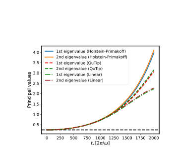 
FIG. 1. Evolution of the eigenvalues of the covariance matrix (2) for Holstein–Primakoff approach (orange and blue solid lines), QuTip solver (red and green dashed lines), and our algorithm 1 with method=Linear (light green and brown dotted lines) with parame- ters ωc = 2π × 2.4 GHz, ωs = 2π × 3.6 GHz, g = 2π × 10 MHz, Λ = 2π × 1 GHz and ω = 2π × 6 GHz.

📷 Fig 2

 
FIG. 2. Time of the one step evolution for Qutip solver (green line), our algorithm 1 with method=Exp (blue line), and with method=Linear (orange line).

**Main problem.** Developing an efficient, memory-efficient, and unitarity-preserving numerical method for simulating the time-dependent unitary dynamics of the Tavis-Cummings model, specifically overcoming the quadratic scaling of standard solvers like QuTiP.

**Main result.** The authors propose a symplectic split-operator method that achieves linear scaling in both time and memory by exploiting a basis re-indexing trick to transform the Hamiltonian into tridiagonal form. This method remains accurate beyond the rotating-wave approximation and outperforms standard solvers in large Hilbert-space dimensions.

**Method.** A second-order symmetric (Strang) Trotter-Suzuki propagation scheme using two realizations: a block-diagonal exponentiation approach and a Cayley/Crank-Nicolson approach using the Thomas algorithm for tridiagonal linear systems.

**Summary.** This paper introduces a new numerical method for simulating the time-dependent Tavis-Cummings model with much higher efficiency than standard tools. By using a split-operator approach and a clever basis re-indexing trick, the authors reduce the computational complexity to linear scaling with the system size. This allows for the simulation of much larger spin ensembles and longer time scales, even when including non-rotating-wave terms. The method is particularly useful for studying driven hybrid quantum systems like NV centers in diamond.

Detailed structure

**Model / system.** The closed, undamped, time-dependent Tavis-Cummings model, which describes a multilevel spin ensemble interacting with a single cavity mode, including time-dependent modulation of the spin frequency.

**Key observables.** Eigenvalues of the cavity quadrature covariance matrix (representing X and Y quadratures).

**Important parameters / regimes.** Cavity frequency, spin frequency, spin-cavity coupling strength, modulation amplitude and frequency, and the Hilbert-space dimension D.

**Assumptions / limitations.** The method is specifically tailored to Hamiltonians that can be decomposed into diagonal and tridiagonal parts via basis permutation; it assumes a closed (undamped) system.

**Figures summary.** Figure 1 compares the time evolution of covariance matrix eigenvalues against QuTiP and the Holstein-Primakoff approximation; Figure 2 compares the runtime per propagation step against the Hilbert-space dimension to demonstrate linear scaling.

**Paper structure.** The paper identifies the limitations of current solvers, introduces the Hamiltonian decomposition and basis re-indexing technique, presents two implementation realizations (Block-diagonal and Cayley), validates the method against QuTiP and the Holstein-Primakoff approximation, and discusses computational scaling and potential extensions.

**Why it may be interesting.** It provides a highly scalable tool for simulating large-scale cavity QED systems and spin ensembles, particularly in regimes where the rotating-wave approximation fails, which is crucial for studying driven-dissipative quantum dynamics and many-body effects in hybrid systems.

Abstract

We present a fast, memory-efficient, unitarity-preserving numerical method beyond the rotating-wave approximation for the closed Tavis-Cummings model in which a multilevel spin system interacts with a cavity mode. This model can describe the interaction of an ensemble of spins with a cavity mode in which the spin frequency and other parameters are time-dependent. The method exploits the fact that, while the Tavis-Cummings model is not tri-diagonal, it can be brought into tri-diagonal form by a change of basis that can be implemented purely by re-indexing (permuting basis elements), which is a fast operation. By truncating the Fock basis of the cavity mode, the computational complexity of the method is linear in the total dimension of the coupled system, both in time and memory. The method can be employed to simulate any closed quantum system whose Hamiltonian terms can be brought into tri-diagonal form.

[↑ back to top](#top)

### [Bipartite entanglement under frequency comb pumping in parametric Josephson circuits](http://arxiv.org/abs/2604.21692v1)

**Authors:** Mikael Vartiainen, Ilari Lilja, Ekaterina Mukhanova, Kirill Petrovnin, Gheorghe Sorin Paraoanu, Pertti Hakonen  
**Type:** both · **Category:** quantum information and computing · **PDF:** <https://arxiv.org/pdf/2604.21692v1>  
**Analysis basis:** full PDF text, analyzed in chunks
**Topic relevance:** 🔥 `QC/QI experiment` **4/5** · 🔥 `entanglement & information structure` **4/5** · 🔥 `quantum optics experiment` **4/5** · 🔥 `dissipative systems` **3/5** · `correlated / nonlocal dissipation` **2/5** · `methods for driven-dissipative` **2/5** · `non-equilibrium dynamics` **2/5** · `quantum measurements` **2/5**

📷 Fig 1

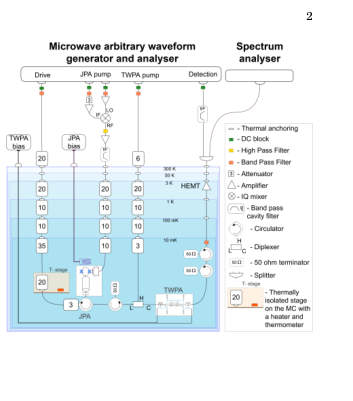 
FIG. 1. Schematic of the experimental microwave setup working around 5.8 GHz frequency. The experiment is controlled by a GHz frequency lock-in signal analyzer, which also generates the required parametric pumps. The employed components are denoted in the frame on the right. The detection is performed using digital heterodyning [51]. For details of the operation, see text.

📷 Fig 2

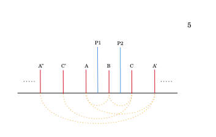 
FIG. 2. Illustration of the mode-coupling sequence beyond the two-mode squeezed modes in the case of two parametric pumps. The dotted lines represent two-mode squeezing. We call these the first-order correlations between modes. However, because A and B are squeezed by P1, and B and C are squeezed by P2, there will be a beam-splitter correlation between A and C. Since these correlations grow proportionally to the product of two pump amplitudes, they are called second-order correlations between modes. These correlations are contained within the model and can be seen by expanding the unitary evolution operator generated by the Hamiltonian. In this figure, only first- order correlations are...

📷 Fig 3

 
FIG. 3. Mode frequencies marked by ±(2m +1), for m = 0,...,21 and a 30-mode subgraph (contains modes denoted by dashed lines) constructed for a system with 15 symmetrically placed pumps. We are investigating the bipartite entanglement of the pair (-1, 1), inside the dashed square. Each edge represents a TMS term in the Hamiltonian. The weight for each edge is specified by the corresponding classical pump amplitude. Edges generated by P0 are indicated by red. We can see that the center pair (-1, 1) has 15 neighbors while the furthest pairs ±27,±29 have only 8 neighbors. This shows that as we traverse the graph further away from the center pair (-1, 1), each new added mode will not entangle...

📷 Fig 4

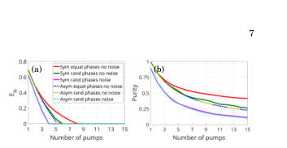 
FIG. 5. Logarithmic negativity (a) and purity (b) of a 1, ..., 15 pump systems. We compare the theoretical predictions for symmetric (solid line, red, green, magenta) and asymmetric (dashed line, blue, yellow, cyan) systems with different parameter values. First, we have put all phases of the pumps equal to 0 and added no noise. Second, we have chosen all phases of the pumps randomly (random φk in the inset pump amplitude) and added no noise. Third, we have chosen all phases randomly and put a constant amount of noise θ = π

📷 Fig 5

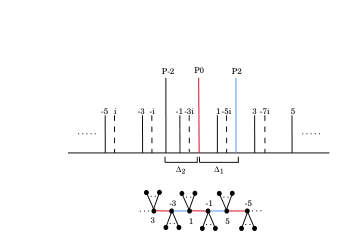 
FIG. 4. Building up the asymmetric pump configuration: The basic TMS entanglement sequence is produced by pumps P0 and P2, with their half frequencies denoted by red (P0) and blue (P2) lines. The third pump is placed so that the distance ∆2 to P0 is different from ∆1 between P0 and P2. The dashed lines illustrate the sequence of P-2 added frequencies "Mi" with M referring to the mode frequencies established by pumps P0 and P2: extra mode frequency Mi is entangled with mode M. Below is the graphical description of a system with asymmetric pumps. Red edges represent TMS by P0, blue edges represent TMS by pump P2 and black edges represent TMS by subsequent asymmetric pumps.

📷 Fig 6

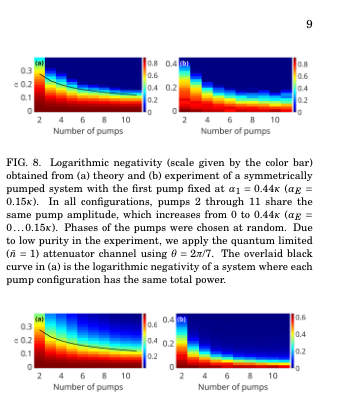 
FIG. 9. Purity (scale given by the color bar) obtained from a) theory and b) experiment of symmetrically pumped system with first pump fixed at α1 = 0.44κ (αE = 0.15κ). In all configurations, all pumps 2,...,11 have the same pump amplitude that is grows from 0 to 0.44κ (αE = 0...0.15κ). Phases of the pumps were chosen at random. Due to low purity in the experiment, we apply the quantum limited ( ¯n = 1) attenuator channel with θ = 2π/7. The overlaid black curve in (a) is the purity of a system where each pump configuration has the same total power.

📷 Fig 7

 
FIG. 7. Logarithmic negativity (a) and purity (b) of a 2 pump system where the first pump is fixed at α1 = 1.15κ (αE = 0.28κ) and the second pump grows from 0 to 1.81κ (αE = 0...0.44κ). Phases of the pumps were chosen at random. One can notice that in the case with no noise, even when the second pump is at 0, experimental results show very low purity. To account for this, the quantum limited ( ¯n = 1) attenuator channel with θ = 2π/7 was applied.

**Main problem.** Investigating how bipartite entanglement and purity are redistributed and diminished in a Josephson parametric circuit when using multiple pump tones (frequency combs) in symmetric and asymmetric configurations.

**Main result.** Adding additional pumps reduces bipartite entanglement between specific mode pairs by redistributing correlations across a larger network of modes and additional idler frequencies. In symmetric configurations, pump phases significantly affect entanglement, whereas in asymmetric configurations, the effect is minimal.

**Method.** The study combines experimental measurements in a Josephson Parametric Amplifier (JPA) with a theoretical Gaussian conditional-dynamics model using the Riccati equation and a graph-theoretical approach to describe mode couplings.

**Summary.** This paper explores the effects of frequency comb pumping on entanglement in superconducting parametric circuits. It demonstrates that while adding more pump tones can increase the complexity of the mode network, it simultaneously reduces the bipartite entanglement between any two specific modes. The researchers compare symmetric and asymmetric pumping configurations, finding that phase-dependent interference is a key factor in symmetric setups. The results provide insights into the challenges of scaling up continuous-variable cluster states in the microwave domain.

Detailed structure

**Model / system.** A superconducting microwave circuit featuring a Josephson Parametric Amplifier (JPA) with a SNAIL loop, operating in a three-wave mixing regime driven by a frequency comb of parametric pump tones.

**Key observables.** Logarithmic negativity (EN) for bipartite entanglement and purity (mu) of the quantum state.

**Important parameters / regimes.** Number of pump tones (up to 15), pump amplitudes, pump phases, cavity loss rate (gamma), coupling coefficient (kappa), and noise temperature of the TWPA.

**Assumptions / limitations.** The model assumes random pump phases to account for experimental lack of control, assumes all pump interactions are equally effective regardless of frequency separation, and ignores potential pump-induced mode hybridization.

**Figures summary.** Fig 1 shows the experimental setup; Fig 2-4 illustrate mode-coupling sequences and graph structures for symmetric/asymmetric pumps; Fig 5-6 compare EN and purity across different pump numbers and phase scenarios; Fig 7-9 show amplitude sweeps and power redistribution effects.

**Paper structure.** The paper begins with the experimental setup and hardware, moves to the mathematical framework of Gaussian dynamics and Hamiltonian modeling, compares symmetric vs. asymmetric pumping topologies using graph theory, presents experimental and theoretical results for entanglement and purity, and concludes with a discussion of limitations and stability.

**Why it may be interesting.** This work is highly relevant for researchers in quantum optics and open quantum systems as it explores the complex dynamics of multipartite entanglement generation and the impact of dissipation and measurement backaction on Gaussian bosonic networks.

Abstract

The creation of high-quality cluster states in superconducting microwave circuits is a relevant ingredient in continuous-variable quantum computing. Although large-scale cluster states have been established in optical systems, dissipation prevents their direct applicability to the microwave realm. Recent improvements in superconducting parametric circuits, in particular Josephson parametric amplifiers (JPA) and traveling wave parametric amplifiers (TWPA), have permitted substantial progress in producing entangled states using microwave photons. In this paper, we examine experimentally and theoretically the effects of numerous parametric pump tones on the degree of two-mode squeezing in a quantum circuit and apply it to the JPA. We find that additional pumps diminish the initial two-mode correlations achieved with a single pump by redistributing it among a larger network of modes and by introducing entanglement with additional idler frequencies. Taking into account the actual heterodyne measurement conditions, the experimental results are consistent with theoretical expectations.

[↑ back to top](#top)

### [Spectral Diffusion Mitigation with a Laser Pulse Sequence](http://arxiv.org/abs/2604.21659v1)

**Authors:** Kilian Unterguggenberger, Alok Gokhale, Aleksei Tsarapkin, Wentao Zhang, Katja Höflich, Herbert Fotso, Tommaso Pregnolato, Laura Orphal-Kobin, Tim Schröder  
**Type:** experiment · **Category:** quantum information and computing · **PDF:** <https://arxiv.org/pdf/2604.21659v1>  
**Analysis basis:** full PDF text, analyzed in chunks
**Topic relevance:** 🔥 `QC/QI experiment` **4/5** · 🔥 `quantum optics experiment` **4/5** · 🔥 `dissipative systems` **3/5** · 🔥 `spintronics-quantum-optics interface` **3/5** · `interference shaping light` **2/5** · `non-equilibrium dynamics` **2/5** · `quantum measurements` **2/5**

📷 Fig 1

 
FIG. 1. Simulated light-matter interaction. a. Simpli- fied level scheme. Spectral diffusion is indicated as a time- dependent transition energy from the ground state |g⟩to the excited state |e⟩. b. Control sequence consisting of N π-pulses with interpulse delay τ (top) and accumulation of relative phase (bottom). c. Stimulated emission and direct absorp- tion spectra of a two-level system after a periodic sequence of N = 12 π-pulses. The absorption spectrum without control is a Gaussian with a FWHM of 2 √

📷 Fig 2

 
FIG. 3. Effect of the interpulse delay. a. Controlled spectra for different interpulse delays τ. The fits are sums of five to seven Lorentzians. Here, the count rate is normalized to the outermost data points. Individual spectra are offset by 0.05 for visual clarity. b. Satellite feature positions extracted from the fits. The simulated positions of ±n/2τ are shown as gray lines.

📷 Fig 3

 
FIG. 2. Controlled absorption spectrum of a single NV center. a. Experimental sequence. The control field (red) consists of N = 21 periodic π-pulses. The probe field (blue) is turned on after 11 pulses. Collected photon detection events are inte- grated in time windows (light red and blue). b. Time-resolved fluorescence signal of the NV center for a probe detuning of zero (light red) and -0.25 GHz (light gray). A Master equation fit with an additional decay term is shown as a red line. The time windows are indicated by dashed and dotted lines. Here the interpulse delay τ = 10 ns. c. Controlled spectrum fitted with a sum of seven Lorentzians. Dashed lines indicate ex- pected satellite...

📷 Fig 4

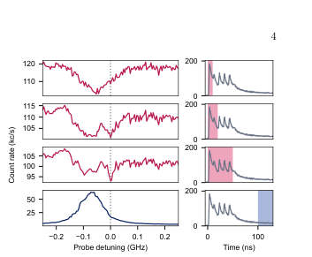 
FIG. 5. Temporal evolution of the spectrum. Four spectra (left column) and the corresponding time window (right col- umn, shaded region) are shown. The last spectrum shows the uncontrolled linewidth (blue). The pulse carrier frequency is indicated by the dotted gray line. Here, the interpulse delay τ = 10 ns and the number of control pulses N = 5.

📷 Fig 5

 
FIG. 4. Detuned pulse carrier frequency. a-b. Controlled spectra with different detunings ∆0 and interpulse delays τ are shown (red). The uncontrolled resonance is shown in blue (centered at the dashed line, FWHM represented by shaded region). A red arrow indicates the spectral shift achieved by the control pulses to the pulse carrier frequency (dotted gray line).

**Main problem.** Spectral diffusion in solid-state quantum emitters, caused by electric field noise, leads to inhomogeneous broadening that limits the quality of single-photon sources and entanglement generation.

**Main result.** The researchers experimentally demonstrated that a periodic sequence of optical pi-pulses can mitigate spectral diffusion, reducing the linewidth of an NV center from 104 MHz to 27 MHz and allowing for frequency-tunable absorption.

**Method.** The protocol uses a sequence of N periodic optical pi-pulses to refocus the spectrum. Photoluminescence excitation (PLE) spectroscopy was used to measure the resulting absorption and stimulated emission spectra.

**Summary.** This paper reports the first experimental observation of all-optical spectral control in a solid-state emitter. By applying a periodic sequence of laser pi-pulses to an NV center in diamond, the researchers were able to significantly reduce the inhomogeneously broadened linewidth. The method allows for the 'pinning' of the absorption spectrum to a target frequency, effectively mitigating the effects of spectral diffusion. This approach is universal and applicable to various individual or ensemble quantum emitters.

Detailed structure

**Model / system.** A single Nitrogen-Vacancy (NV) center in diamond, modeled as a two-level quantum system subject to a periodic control field and stochastic detuning (charge noise).

**Key observables.** Fluorescence count rate, absorption/stimulated emission spectra, and full-width at half-maximum (FWHM) linewidth.

**Important parameters / regimes.** Interpulse delay (tau) of 10 ns, excited state lifetime of 12.3 ns, and pulse sequence length of N = 21 pulses.

**Assumptions / limitations.** The system can be treated as a two-level system due to sufficient cyclicity; the detuning follows a Gaussian random distribution.

**Figures summary.** Figure 1 shows the theoretical simulation of the pulse sequence and resulting satellite features; Figure 2 presents the experimental observation of the effect; Figure 3 shows the dependence of satellite spacing on interpulse delay; Figure 4 demonstrates frequency tuning via the pulse carrier frequency; Figure 5 shows the temporal evolution of the spectrum with increasing pulse number.

**Paper structure.** The paper introduces the problem of spectral diffusion, presents a theoretical simulation of the pi-pulse control protocol, details the experimental implementation on an NV center, demonstrates linewidth reduction and frequency tuning, and concludes with discussion on universality and limitations.

**Why it may be interesting.** This work is highly relevant to quantum optics and open quantum systems as it demonstrates a purely coherent-control method to suppress environmental noise (spectral diffusion) in a solid-state platform without needing external feedback or static fields.

Abstract

The optical spectrum of a quantum system is jointly determined by the properties of the emitter and the driving field. All-optical spectral control can hence be a promising method to engineer the properties of single photon emitters for quantum technological applications. It was proposed that driving a two-level system with a periodic sequence of optical pi-pulses during the excited state lifetime shifts the emission and absorption maximum to an arbitrarily detuned pulse carrier frequency, enabling the mitigation of spectral diffusion in noisy emitters. In this article, we report on the first experimental observation of this effect. We implement the protocol on a solid-state emitter and reduce its inhomogeneously broadened optical linewidth close to the lifetime limit. By detuning the excitation laser, we are able to concentrate approximately half of the absorption to a freely selectable target frequency. Our approach is solely based on properties of coherently evolving quantum systems, rendering it applicable to a wide range of individual and ensembles of quantum emitters.

[↑ back to top](#top)

### [Entanglement of two optical emitters mediated by a terahertz channel](http://arxiv.org/abs/2604.21723v1)

**Authors:** Yanis Le Fur, Diego Martín-Cano, Carlos Sánchez Muñoz  
**Type:** theory · **Category:** other · **PDF:** <https://arxiv.org/pdf/2604.21723v1>  
**Analysis basis:** full PDF text, analyzed in chunks
**Topic relevance:** 🔥 `correlated / nonlocal dissipation` **4/5** · 🔥 `Tavis-Cummings & cavity-many-emitter` **3/5** · 🔥 `dissipative systems` **3/5** · 🔥 `entanglement & information structure` **3/5** · `methods for driven-dissipative` **2/5** · `non-equilibrium dynamics` **2/5**

📷 Fig 1

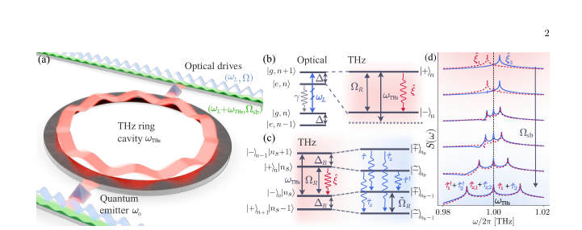 
FIG. 1. Physical system and energy-level landscape. (a) Schematic of the entanglement generation setup, consisting of two quantum emitters driven by carrier (blue) and sideband (green) optical fields, which are coupled to a shared THz channel (here represented by a ring waveguide or cavity). (b) Energy levels of an atom coupled to a carrier-laser. (Left) Bare system basis showing optical transitions in the laboratory frame; (Right) Dressed-state basis highlighting the emerging THz transitions within a Rabi doublet (red). (c) Energy levels of a dressed-atom coupled to a sideband laser: Dressed states split by THz frequencies couple to laser photons (left) developing a secondary dressed...

📷 Fig 2

 
FIG. 2. Optimizing entanglement via optical measurements (a) Emission spectrum in the visible regime for each individual emitter, centered at the laser frequency ωL for the case of both optimal and sub-optimal spectral alignments. (Top) Spectra in the absence of sideband drives (Ωsb = 0) obtained in Step 1, resulting in Mollow triplets with THz sideband splittings. (Middle) Zoom of the higher-energy Mollow sideband peaks, aligned symmetrically about ωsb at the end of Step 2. (Bottom) Formation of secondary Mollow spectra upon activation of the sideband drive Ωsb, which should be spectrally overlapping at the end of Step 3. (b) Concurrence C (blue, solid) and Liouvillian gap λ—computed...

📷 Fig 3

 
FIG. 3. Maximal stationary concurrence C versus cavity loss rate κ and emitter-cavity coupling χ, found by optimizing the doubly dressed angle ˜θ and the doubly dressed frequency ˜ΩR at every (κ, χ) pair (the rest of parameters are fixed by Conditions 0-2). Calculations were performed using the GRWA framework Eq. (4) and (5) and subsequently veri- fied against the full model from (1). The dash-dotted lines represent the different condition we have imposed for our analytical findings: the adiabatic elimination of the cavity κ ≥2c1s1χ (blue) and the RWA on the dissipation of the cavity ωTHz ≥10κ (red). Panels correspond to cavity fre- quencies of (a) ωTHz/2π = 0.5 THz, (b) ωTHz/2π = 1.0 THz...

📷 Fig 4

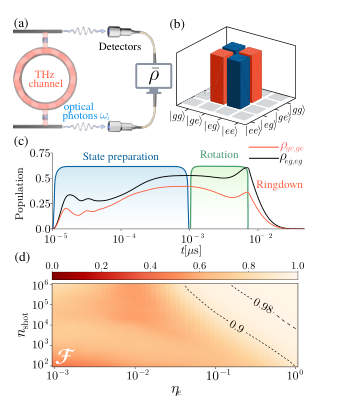 
FIG. 4. Quantum State tomography (QST) and re- construction Fidelity. (a) Schematic of the QST acquisi- tion protocol for two emitters radiating in the visible regime, based on joint photodetection (b) Reconstructed matrix for the maximally-entangled Bell state |Φ−⟩= |ge⟩−|eg⟩ √

**Main problem.** The lack of an efficient coherent interface in the terahertz (THz) spectrum hinders the development of THz-based quantum networks and the scaling of quantum technologies.

**Main result.** The authors demonstrate a method to generate and stabilize high-value steady-state entanglement (concurrence > 0.9) between two optical emitters using a THz channel, controllable entirely via optical means.

**Method.** The study uses the Generalized Rotating Wave Approximation (GRWA) and adiabatic elimination of the cavity mode to derive an effective master equation for dressed-state dynamics.

**Summary.** This paper proposes a way to create stable entanglement between two optical qubits using a terahertz channel. By using strong visible-light driving, the researchers create 'dressed' states that can be controlled and measured using only optical tools, avoiding the need for direct THz detection. The method achieves very high entanglement levels and is robust against various experimental imperfections. This establishes a practical framework for building larger quantum networks that bridge the gap between optical and THz frequencies.

Detailed structure

**Model / system.** The system consists of two non-identical polar quantum emitters (two-level systems) coupled to a lossy single-mode THz resonator in the bad-cavity limit, driven by both a visible-frequency carrier field and a THz-frequency sideband field.

**Key observables.** Concurrence (C), Liouvillian gap (lambda), second-order cross-correlation function (g2_12), and reconstructed density matrix fidelity.

**Important parameters / regimes.** THz frequency (0.5-3.0 THz), Rabi frequencies, cavity decay rate (kappa), emitter decay rate (gamma), and the dressing angle (theta).

**Assumptions / limitations.** The use of GRWA assumes the THz frequency is much larger than the coupling strength (omega_THz >> chi) and that the sideband driving is sufficiently weak.

**Figures summary.** Figures show the non-monotonic dependence of concurrence on the dressing angle, the optimization of parameters for dark state stabilization, and the reconstruction of the density matrix via quantum state tomography.

**Paper structure.** The paper introduces the THz interface problem, describes the physical model and Hamiltonian, details the parameter optimization for entanglement stabilization, proposes an optical quantum state tomography protocol, and evaluates experimental feasibility and error mitigation.

**Why it may be interesting.** It presents a novel hybrid visible-THz quantum interface that uses dissipation as a resource to stabilize entanglement, which is highly relevant for researchers working on reservoir engineering and quantum networks.

Abstract

Quantum technologies in the terahertz (THz) require a coherent interface between addressable qubits and THz quantum channels -- a capacity that so far, remains largely underdeveloped. Here, we propose and demonstrate the generation of steady-state entanglement between polar quantum emitters, mediated by THz photons. We exploit strong visible-light driving of the emitters to create Rabi-split dressed eigenstates whose energy separation can be optically tuned into the THz regime. The polar nature of the emitters activates THz transitions within these eigenstates, allowing them to couple to a THz photonic mode that induces collective dissipative dynamics. A coherent driving and control of these effective THz emitters is achieved by using a sideband optical drive with detuning close to the THz transition frequency. The resulting interplay of collective dissipation and driving activates a mechanism to generate steady-state entanglement with high values of the concurrence ($C>0.9$), attainable under experimentally feasible parameters. Crucially, both coherent manipulation and quantum state tomography are implemented entirely through optical means, avoiding direct THz control and detection. This establishes a hybrid visible-THz quantum interface in which a THz channel mediates qubit-qubit entanglement (a key operational requirement for THz quantum technologies) while remaining optically accessible.

[↑ back to top](#top)

### [Loss-biased fault-tolerant quantum error correction](http://arxiv.org/abs/2604.21876v1)

**Authors:** Laura Pecorari, Gavin K. Brennen, Stanimir S. Kondov, Guido Pupillo  
**Type:** theory · **Category:** quantum information and computing · **PDF:** <https://arxiv.org/pdf/2604.21876v1>  
**Analysis basis:** full PDF text, analyzed in chunks
**Topic relevance:** 🔥 `Rydberg arrays` **4/5** · 🔥 `correlated / nonlocal dissipation` **3/5** · 🔥 `dissipative systems` **3/5** · `methods for driven-dissipative` **2/5** · `non-equilibrium dynamics` **2/5** · `quantum measurements` **2/5**

📷 Fig 1

 
FIG. 1. (a) Rotated surface code, stabilizers and logical oper- ators. (b) Stabilizer readout circuit simulated with different success probability of not finding an atom in the Rydberg state before a CZ gate. (c) Surface code logical error proba- bility versus Rydberg decay rate, γ/Ωmax with time-optimal laser pulses. Data are for 100, 90, 75, 50, 0% success proba- bility that an atom is not in the Rydberg state immediately before a the next gate (from dark to light color shading).

📷 Fig 2

 
FIG. 2. (a) Schematic level structure. (b) Logical error scal- ing ν such that pL ∝γν versus success probability, pdepl., of inter-gate ionization for distance-3 surface codes. Back- to-back gate schedules produce a non-fault-tolerant scaling ⌈d/4⌉, while perfect inter-gate ionization restores the fault- tolerant Pauli scaling of ⌈d/2⌉for Pauli errors. If losses are properly handled in software with a loss-aware decoder, the optimal erasure-like scaling of d can be achieved (light blue). Error bars fall within the marker size.

📷 Fig 3

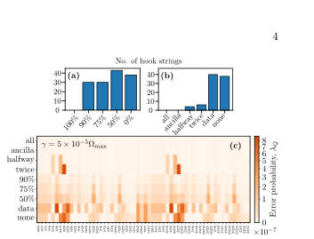 
FIG. 3. Occurrences of hook error strings caused by single decay events that degrade fault tolerance. Number hook er- rors for (a) ionization enforced after each gate with success probabilities ranging from 0% to 100% and (b) perfect ion- ization only enforced at selected circuit locations (see main text). (c) Probability of each hook error string at fixed decay rate γ = 5×10−5Ωmax (far below the surface code threshold).

**Main problem.** Shortening QEC cycles in neutral-atom processors leads to non-Markovian, correlated errors caused by Rydberg excitation hopping and residual Rydberg populations. The study investigates if these errors can be mitigated to restore fault-tolerant scaling.

**Main result.** The authors propose 'loss-biasing'—using mid-circuit ionization to convert Rydberg excitations into atom loss—which restores fault-tolerant Pauli error scaling and can achieve optimal erasure-like scaling when paired with loss-aware decoding.

**Method.** The study uses Lindblad master equation dynamics, Monte Carlo trajectory generation, and randomized compiling to derive effective Pauli error models, followed by large-scale surface code simulations using Stim and Pymatching.

**Summary.** This paper addresses the degradation of fault tolerance in neutral-atom quantum computers when QEC cycles are accelerated. It identifies that fast cycles amplify Rydberg-mediated correlated errors. By implementing 'loss-biasing'—converting unwanted Rydberg excitations into detectable atom loss via ionization—the authors show that one can restore fault-tolerant scaling and even approach optimal erasure-based performance. This provides a practical roadmap for achieving sub-millisecond QEC cycles in Rydberg-based architectures.

Detailed structure

**Model / system.** A neutral-atom processor platform using Rydberg-blockade CZ gates, modeled as a three-level system (|0>, |1>, |r>) in optical tweezers, specifically focusing on alkaline-earth-like atoms.

**Key observables.** Logical error probability, logical error scaling exponent (nu), stabilizer readout success probability, and noise entropy.

**Important parameters / regimes.** Rydberg decay rate to Rabi frequency ratio (gamma/Omega_max), ionization success probability (p_depl), and code distance (d).

**Assumptions / limitations.** Assumes a 'data-ancilla blockade' during ionization and focuses primarily on the rotated surface code architecture.

**Figures summary.** Figure 1 shows the surface code schematic and stabilizer readout success; Figure 2 illustrates the atomic level structure and the logical error scaling exponent versus ionization success probability.

**Paper structure.** The paper identifies the problem of high-speed QEC errors, introduces the loss-biasing mechanism, details the physical model and simulation framework, presents results on error scaling and fault tolerance restoration, and concludes with experimental implementation outlines.

**Why it may be interesting.** It addresses the intersection of open quantum systems (non-Markovian noise and Lindblad dynamics) and quantum computing, providing a physical strategy (ionization) to transform complex correlated noise into manageable erasure noise.

Abstract

We investigate the limits of quantum error correction (QEC) in neutral-atom processors approaching high-fidelity gates and fast cycle times. We show that shorter QEC cycles amplify platform-specific errors, notably Rydberg excitation hopping, and hinder decay of residual Rydberg population, leading to non-Markovian correlated errors that degrade logical performance. To address this, we introduce loss biasing, where spurious Rydberg excitations are rapidly converted into atom loss via mid-circuit ionization, transforming errors into erasure-like noise and suppressing their propagation. Loss biasing restores the fault-tolerant logical error scaling for intra-cycle Pauli errors; furthermore, we argue that when supported with loss-aware decoding, it can achieve the optimal scaling of erasures while enabling shorter QEC cycles with reduced hardware overhead. We outline an implementation using fast autoionization in alkaline-earth(-like) atoms, establishing loss biasing as a practical route toward fault-tolerant quantum computing with sub-millisecond QEC cycles.

[↑ back to top](#top)

### [Photon Sorting with a Quantum Emitter](http://arxiv.org/abs/2604.21758v1)

**Authors:** Kasper H. Nielsen, Etienne Corminboeuf, Benedikt Tissot, Love A. Pettersson, Sven Scholz, Arne Ludwig, Leonardo Midolo, Anders S. Sørensen, Peter Lodahl, Ying Wang, Stefano Paesani  
**Type:** both · **Category:** quantum information and computing · **PDF:** <https://arxiv.org/pdf/2604.21758v1>  
**Analysis basis:** full PDF text, analyzed in chunks
**Topic relevance:** 🔥 `QC/QI experiment` **4/5** · 🔥 `quantum optics experiment` **4/5** · 🔥 `interference shaping light` **3/5** · `dissipative systems` **2/5** · `quantum measurements` **2/5**

📷 Fig 1

 
FIG. 1. Photon sorter building blocks. a. Sketch of the photon sorter implementation using a nonlinear photonic in- teraction between two balanced beam splitters (a nonlinear Mach-Zehnder interferometer). Ideally, individual photons will exit through the upper port, whereas the two-photon component will exit through the lower. b. Illustration of an ideal single-mode Kerr nonlinearity where a one-photon state acquires no phase shift, whereas a two-photon state re- ceives a phase shift of π. c. Illustration of the nonlinear response of a two-level system. The photon states receive ap- proximately the same phase as in the ideal Kerr case, but the interaction distorts the two-photon wavepacket...

📷 Fig 2

 
FIG. 2. Photon sorter performance characterisation. a. Probabilities of detecting the one-photon state in the upper (green) or lower (orange) output port of the photon sorter as a function of the detuning ∆between the input field and the QD, normalised to the QD linewidth Γ/2. The dashed lines correspond to a linear optical beam splitter with a reflectivity matching the one-photon statistics at ∆= 0. b. Probabilities of detecting two photons in the upper mode (orange), two photons in the lower mode (green) or one photon each in both modes (blue) as a function of the detuning ∆. An ideal photon sorter would transfer the two photons into the lower mode completely. The dashed lines correspond...

📷 Fig 3

 
FIG. 3. Photon sorter for BSMs. a. Illustration of a nonlinear BSMs using photon sorters. The first block (in orange) corresponds to a linear optical |ψ⟩-fusion. Photons from the ψ± states are incident individually on the photon sorter, so a direct measurement follows (yellow). Photons from ϕ± bunch after the first fusion block and are split away by the photon sorters. Consecutively, a reversed-|ψ⟩-fusion (pink) and a |ϕ⟩-basis fusion (green) are performed. We evaluate the performance of photon-sorter-boosted BSMs by analysing their b. success, c. error, and d. failure probabilities. Here, failures denote detected measurement patterns unassociated with any valid state, while errors...

📷 Fig 4

 
FIG. 4. Advances towards applications. a. Loss thresh- old of the FBQC architecture introduced in Ref. [16], when using photon sorting to boost fusion performance, as a func- tion of β. The two curves assume no pure dephasing, with and without spectral diffusion. The black dashed line de- notes the threshold using linear optical BSMs. b. Perfor- mance of a repeater network for QKD using the DLCZ pro- tocol [4], comparing linear optical BSMs (black dashed line), and photon-sorter-boosted nonlinear BSMs. The latter in- cludes a state-of-the-art scenario achieved solely by improv- ing the β = 0.98 [39] (blue), and an ideal noiseless photon sorter [18] (orange). During initial entanglement...

**Main problem.** Linear-optical Bell state measurements (BSMs) are fundamentally limited to a 50% success probability, which increases hardware overhead and reduces noise tolerance in photonic quantum computing and communication architectures.

**Main result.** The authors demonstrate a passive photon-sorting circuit using a quantum dot that achieves a 62% success probability for sorting one- and two-photon components and a 57% post-selected BSM success probability, exceeding the linear-optical limit.

**Method.** The researchers use a nonlinear Mach-Zehnder interferometer (MZI) where photon scattering from a single quantum dot induces a nonlinear phase shift, combined with temporal filtering and input-output theory modeling.

**Summary.** This paper presents an experimental demonstration of a photon sorter that uses a single quantum dot to distinguish between one- and two-photon states. By leveraging the nonlinearity from photon scattering in a nanophotonic waveguide, the device achieves a BSM success rate of 57%, breaking the 50% limit of standard linear optics. This advancement has significant implications for scaling up fusion-based quantum computing and improving the efficiency of quantum repeater networks.

Detailed structure

**Model / system.** A single semiconductor quantum dot (QD) embedded in a nanobeam waveguide with a photonic crystal mirror to create an effectively chiral, single-sided coupling interface.

**Key observables.** One-photon and two-photon detection probabilities, second-order correlation function g(2)(0), transmission/reflection coefficients, and BSM success/error/failure rates.

**Important parameters / regimes.** Waveguide coupling efficiency (beta-factor), pure dephasing rate, spectral diffusion, pulse duration, and detuning from resonance.

**Assumptions / limitations.** The analysis assumes a two-level system approximation for the emitter and considers the impact of phonon-induced dephasing and spectral diffusion as primary error sources.

**Figures summary.** Figure 1 shows the MZI architecture and the nonlinear response of the emitter; Figure 2 presents photon statistics and detuning-dependent probabilities; Figure 3 compares BSM performance metrics; Figure 4 discusses scalability and loss thresholds in FBQC.

**Paper structure.** The paper introduces the problem of probabilistic BSMs, describes the experimental platform and MZI architecture, presents the experimental results for photon sorting, provides theoretical modeling of noise and scattering, and concludes with applications to FBQC and quantum repeaters.

**Why it may be interesting.** This work is highly relevant for quantum optics and open quantum systems researchers as it demonstrates how controlled light-matter interaction and nonlinearity can be harnessed to surpass fundamental limits of linear-optical quantum information processing.

Abstract

High-quality photonic Bell state measurements (BSMs) enable scalable universal quantum computing and long distance quantum communication. However, when implemented with linear optics, BSMs are fundamentally probabilistic, introducing substantial hardware overheads and limiting noise tolerance in photonic quantum computing architectures. Nonlinear interactions at the single-photon level can overcome these limitations by enabling near-deterministic photon-photon gates. Here, we demonstrate a passive photon-sorting circuit based on the induced nonlinearity arising from photon scattering in a solid-state quantum emitter. The scattering is implemented in a directional waveguide-emitter coupling interface and embedded on-chip into a linear optical circuit, through which we demonstrate sorting of one- and two-photon components with a success probability of 62%. We find that the current system can enable BSMs with a 57% post-selected success probability without ancillary photons, exceeding the linear-optical limit of 50%, and can be readily improved to >65% with design optimisations.

[↑ back to top](#top)

### [Robust continuous symmetry breaking and multiversality in the chiral Dicke model](http://arxiv.org/abs/2604.21820v1)

**Authors:** Nikolay Yegovtsev, Sayan Choudhury, W. Vincent Liu  
**Type:** theory · **Category:** other · **PDF:** <https://arxiv.org/pdf/2604.21820v1>  
**Analysis basis:** full PDF text, analyzed in chunks
**Topic relevance:** 🔥 `Dicke superradiance` **4/5** · 🔥 `Tavis-Cummings & cavity-many-emitter` **4/5** · 🔥 `non-equilibrium universality` **4/5** · 🔥 `correlated cavity matter` **3/5**

📷 Fig 1

 
FIG. 1. (Left: A schematic illustration of chiral Dicke model described in Eq. (1). Right: The ground-state phase diagram of this system showing the existence of the U(1)-symmetric normal phase (white region), and the U(1)-broken superradi- ant phase. The location of the phase boundary is given by Eq. (5).

📷 Fig 2

 
FIG. 2. Energy spectrum of Gaussian fluctuations above the mean-field ground state across different cuts through the phase diagram. The dashed black line corresponds to the expression in Eq. (9). The ϕ = 3π/8 trajectory shows that the two lower branches are almost degenerate, resulting in a large slope in Eq. (9). Parameters are ωz = 1.5ωc.

📷 Fig 3

 
FIG. 4. The energy branches for the case ϕ = 0.5 arccos (ωc/ωz), where two of the branches remain degener- ate in the normal phase. The dashed black curve corresponds to Eq. (10). These results correspond to ωz = 1.5ωc.

📷 Fig 4

 
FIG. 3. The energy of the lower polariton mode ε−from Eq. (8) along the critical line gc = ωzωc for various values of ωz. The top curve (green) is always above zero; the middle (orange) curve approaches zero only at ϕ = π/2, correspond- ing to the anti-Tavis-Cummings limit. The bottom (blue) curve reaches zero when ϕ = 0.5 arccos (ωc/ωz). The open marker corresponds to the energy along the cut ϕ = 3π/8 in Fig. 2.

**Main problem.** The study investigates the existence of robust continuous U(1) symmetry breaking and the phenomenon of multiversality in a generalized chiral Dicke model.

**Main result.** The authors demonstrate a robust U(1)-broken superradiant phase and identify 'multiversality,' where the dynamical critical exponent changes from znu=1 to znu=1/2 along a specific line in parameter space.

**Method.** The study employs mean-field theory, Holstein-Primakoff transformation, and Bogoliubov theory to analyze the ground-state phase diagram and the spectrum of quantum fluctuations.

**Summary.** This paper introduces the chiral Dicke model, a generalization of the standard Dicke model with chiral light-matter coupling. It shows that this model possesses a robust U(1) symmetry breaking that does not require fine-tuning. A key discovery is 'multiversality,' where the dynamical critical exponent of the phase transition changes depending on the path taken through the parameter space. The work provides a detailed map of the energy spectrum and the emergence of Goldstone modes in the superradiant phase.

Detailed structure

**Model / system.** The Chiral Dicke Model (CDM) consists of an ensemble of N two-level atoms coupled to two degenerate cavity modes via chiral interactions, featuring an inherent U(1) symmetry.

**Key observables.** The atomic inversion (order parameter), energy spectrum/branches, energy gap, and the dynamical critical exponent (znu).

**Important parameters / regimes.** Cavity frequency (omega_c), atomic frequency (omega_z), chiral coupling strengths (g1, g2), and the nonlinearity parameter (U).

**Assumptions / limitations.** The analysis focuses on the regime where the ground-state energy is bounded (4omega_c^2 > U^2N^2) and includes specific limits such as U=0 for analytical tractability.

**Figures summary.** Figure 1 provides a schematic of the model and the ground-state phase diagram; Figure 2 shows the evolution of energy branches across different paths in the coupling parameter space.

**Paper structure.** The paper introduces the chiral Dicke model, derives the ground-state phase diagram using mean-field theory, analyzes the excitation spectrum and mode degeneracy using Bogoliubov theory, and discusses the implications of multiversality and nonlinearity.

**Why it may be interesting.** It reveals how the universality class of a quantum phase transition can be tuned by changing the coupling trajectory, offering a new way to control critical phenomena in light-matter systems.

Abstract

The Dicke model (DM) serves as a paradigm for understanding collective light-matter interactions. We introduce the chiral Dicke model, a generalization where an atomic ensemble couples to a two-mode cavity via chiral interactions. Unlike the standard DM, the chiral DM is endowed with an inherent continuous $U(1)$ symmetry associated with angular momentum conservation. The ground-state phase diagram and the associated quantum phase transitions are charted out, revealing a $U(1)$-broken superradiant phase that spans a broad parameter space. We demonstrate that the spectrum of quantum fluctuations is highly tunable in both the symmetric and broken phases. Strikingly, our calculations reveal that the system exhibits `multiversality', where distinct universality classes govern the transition between the same two phases. In particular, along a special line in parameter space, the dynamical critical exponent for the normal-superradiant phase transition changes from $zν=1$ to $zν=1/2$. Our work establishes the chiral Dicke model as a powerful platform to realize novel quantum phases and multiversal critical phenomena in light-matter coupled systems.

[↑ back to top](#top)

### [Enhancing Coherence of Spin Centers in p-n Diodes via Optimization Algorithms](http://arxiv.org/abs/2604.21874v1)

**Authors:** Jonatan A. Posligua, David E. Stewart, Denis R. Candido  
**Type:** theory · **Category:** quantum information and computing · **PDF:** <https://arxiv.org/pdf/2604.21874v1>  
**Analysis basis:** full PDF text, analyzed in chunks
**Topic relevance:** 🔥 `spintronics-quantum-optics interface` **3/5** · `dissipative systems` **2/5**

📷 Fig 1

 
FIG. 1: (a) Schematic of a 4H-SiC pnn+ diode operated in the reverse bias regime with embedded spin centers, non- depleted charges, and surface traps responsible for the leakage current. (b) Schematic of the multi-variable linewidth optimization algorithm via the scale-gradient descent method. The linewidth is first calculated for an initial set of diode design parameters p, and then autonomously minimized using a scaled gradient descent method. Iterations are performed until convergence of the linewidth is achieved, resulting in a final set of design parameter.

📷 Fig 2

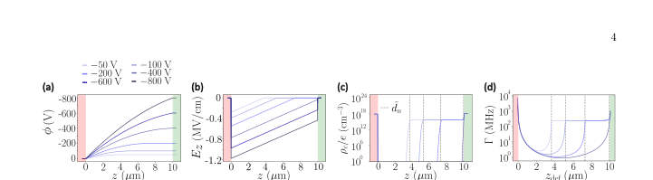 
FIG. 2: Electrostatic properties of a 4H-SiC pnn+ diode: (a) Electric potential along the diode’s z-direction calculated for reverse bias voltages ranging from −50 to −800 V. (b) Same for the electric field. (c) Total charge carrier density as a function of position within the diode’s z-direction calculated using the solution to Poisson’s equation to evaluate ρc in Eq. (2) for reverse voltages ranging from −50 to −400 V. The depletion boundaries ˜dn are shown for each reverse bias value. (d) Same for the optical linewidth as a function of the spin center’s position within the diode’s n-region (i.e., zdef). The doping densities used to generate all the sub-figures are Na = 7×1018cm−3, Nn =...

📷 Fig 3

 
FIG. 3: Single-parameter linewidth optimization with respect to the bias voltage. The initial design parameters are Na = 7 × 1018 cm−3, Nn = 4 × 1015 cm−3, Nd = 1.01 × 1019 cm−3, T = 300 K, V = −5 V, dl = dr = 0.4 µm and d = 10 µm. (a) Electric field and carrier density profiles for the initial parameters. (b) Optical linewidth, reverse bias voltage, and optimal spin center position as a function of iteration number. (c) Final electric field and carrier density profiles for the optimal design parameters.

📷 Fig 4

 
FIG. 4: (a) Single-type parameter linewidth optimization with respect to doping densities for small bias voltage of V = −5 V, Nn ≪Na ≈Nd, with Nn = 4 × 1015 cm−3, Na = 7 × 1018 cm−3, and Nd = 1.01 × 1019 cm−3, T = 300 K, dl = dr = 0.4 µm, d = 10 µm. The upper panel shows the reduction in linewidth Γ vs. iteration number, the lower panels show the corresponding doping densities and spin center position. (b) Same as (a), but for Na = Nn = Nd = 1019 cm−3 as initial conditions. (c) Density plot of depletion length within the intrinsic region (dn) as a function of Nn/Na and V .

📷 Fig 5

 
FIG. 5: Optimization with respect to the lengths of the diode’s doping layers. The initial parameters for this simulation are Na = 7×1018 cm−3, Nn = 4×1015 cm−3, Nd = 1.01 × 1019 cm−3, T = 300 K, V = −15 V, and dl = dr = d = 1 µm. Upper panel: Linewidth reduction and inset showing spin center’s position as a function of iteration number. Lower panel: Evolution of d, dl, and dr that allows for minimal optical linewidth Γ. The size of the lightly-doped n-region is considerably bigger than that of the bulk p and n+-regions. This is a consequence of both charge conservation and the application of our electric noise model.

📷 Fig 6

 
FIG. 6: Optimization process for 3 different sets of initial design parameters with displayed iteration-by-iteration behavior of the linewidth Γ, optimal spin center position and the diode’s design parameters Na, Nn, Nd, and V for dl = dr = 0.4 µm and d = 10 µm. The voltages used for “Initial Set 1”, “Initial Set 2”, and “Initial Set 3” are −5 V, −6 V, and −7 V, respectively. (b) Same for dl = dr = 0.04 µm and d = 1 µm. (c) Same for dl = dr = 0.004 µm and d = 0.1 µm.

📷 Fig 7

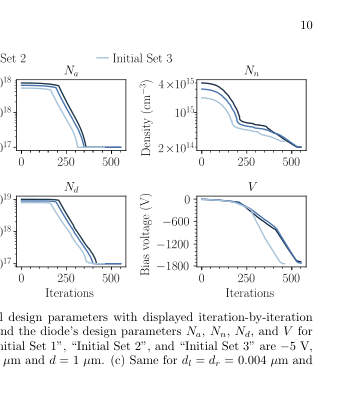 
Fig. 6. The left panels show the behavior of Γ and the spin center position as a function of iteration number, whereas the plots on the right side show the correspond- ing variations of all doping densities and bias voltage. Our optimization with respect to these diode parame- ters shows an overall two-order-of-magnitude decrease in the linewidth. Here, smaller linewidths are achieved by decreasing doping densities, increasing the magnitude of the bias voltage, and placing the spin defect at the center of the diode. Similarly to the results found with respect to a single type of parameters in Secs . V A and V B, optimization was obtained via the decreases in the den- sity of fluctuators and...

📷 Fig 8

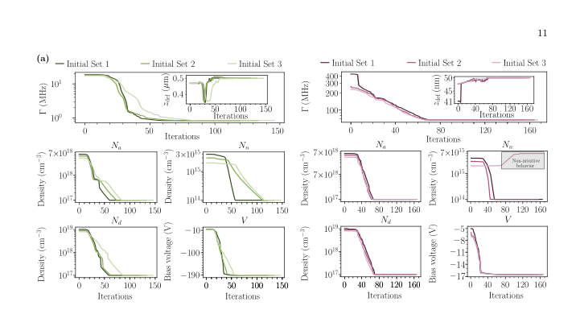 
FIG. 7: (a) Optimization process for 3 different sets of initial design parameters with displayed iteration-by-iteration behavior of the linewidth Γ, optimal spin center position and the diode’s design parameters Na, Nn, Nd, and V for dl = dr = 0.04 µm and d = 1 µm. The voltages used for “Initial Set 1”, “Initial Set 2”, and “Initial Set 3” are −5 V, −6 V, and −7 V, respectively. (b) Same as (a) but for d = 0.1 µm.

📷 Fig 9

 
FIG. 8: Maximum electric field [Emax z ] inside the diode as a function of the iteration. Horizontal lines represent the electric field breakdown value EBD, and a fraction of ΩEBD (Ω&lt; 1) set as the numerical threshold of the elec- tric field. Inset shows ΩEBD −Emax z demonstrating that the maximum value of the electric field never surpasses ΩEBD.

📷 Fig 10

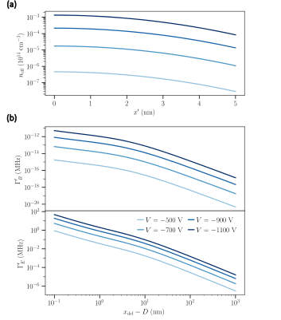 
FIG. 9: Cause and effect of leakage current present in a 4H-SiC pnn+ diode. (a) Effective density neff pro- duced by leakage current at thermal equilibrium as a function of depth from the diode’s surface for reverse bias voltages ranging from −500 to −1100 V. The depth- dependence of the densities is modeled as a half-Gaussian profile, where its maximum value occurs at the surface of the diode, and it decays as a function of depth in- side the diode. This is pictorially evidenced in Fig. 1(a). (b) Optical linewidth calculated from electric and mag- netic SND as a function of the spin center’s separation from the volume containing fluctuators. The linewidths are calculated for the same...

**Main problem.** Determining the optimal set of diode design parameters (doping, bias, and geometry) to maximize the spin coherence of embedded spin centers by minimizing optical linewidth.

**Main result.** The study demonstrates that a twenty-fold suppression of linewidth can be achieved via voltage optimization, and that noise from leakage current can be mitigated by placing spin defects deeper within the diode.

**Method.** A scaled gradient descent optimization algorithm combined with the numerical solution of the Poisson equation and a new formalism for leakage current-induced noise.

**Summary.** This paper presents an optimization framework to enhance the coherence of spin centers in silicon carbide-based diodes. By using a scaled gradient descent algorithm, the authors identify optimal doping profiles, voltages, and device geometries that minimize optical linewidth. The research specifically addresses how to balance the benefits of carrier depletion against the detrimental effects of leakage current. Ultimately, the work provides a practical guide for designing semiconductor devices for quantum technologies.

Detailed structure

**Model / system.** Solid-state spin defects (specifically divacancies) embedded in 4H-SiC p-n or p-i-n diodes operating under reverse bias.

**Key observables.** Optical linewidth (FWHM), electric potential, electric field, and carrier density profiles.

**Important parameters / regimes.** Reverse-bias voltage, doping densities (Na, Nn, Nd), layer thicknesses, temperature, and spin center depth.

**Assumptions / limitations.** The system operates in the slow noise regime where fluctuations are much faster than the coherence time, and the noise is assumed to be isotropic and Gaussian.

**Figures summary.** Figure 1 shows the diode schematic and the optimization algorithm; Figure 2 displays electric potential and field profiles; Figure 3 illustrates the evolution of linewidth suppression and optimal spin center position; Figure 4 and 5 show the results of doping and geometric optimization.

**Paper structure.** The paper introduces the problem of spin decoherence in diodes, establishes a mathematical framework for noise sources (charge and leakage), details the gradient descent optimization protocol with physical constraints, presents results for single and multi-parameter optimizations, and concludes with mitigation strategies.

**Why it may be interesting.** This work is relevant for quantum optics and open quantum systems as it provides a systematic way to engineer the environment (the electrical noise spectrum) to protect a quantum emitter from decoherence.

Abstract

Solid-state spin defects hold great promise as building blocks for various quantum technologies. Embedding spin centers in $p$-$n$ diodes under reverse bias has proved to be a powerful strategy to narrow the optical linewidth and increase spin coherence, while also enabling control of the photoluminescence wavelength via Stark shift. Given the multitude of parameters influencing spin centers in diodes (e.g., doping densities and profiles, temperature, bias voltage, spin center position), a question that has not yet been answered is: which set of these design parameters maximizes spin center coherence? In this work, we address this question by developing a scaled gradient descent optimization algorithm that minimizes the optical linewidth of spin centers by combining the numerical solution of a diode's Poisson equation with calculated charge noise from the non-depleted regions. Our optimization is performed for both single- and multiple-parameter cases for divacancies in SiC $p$-$i$-$n$ diodes, including reverse-bias voltage, doping density and profile, and diode total length. Importantly, the optimization is subject to realistic physical constraints, such as small operating bias voltages, avoidance of the dielectric breakdown regime and physical thresholds for doping density. Additionally, due to the leakage current at reverse bias voltages, we develop a new formalism to investigate its influence on coherence. We show that the corresponding noise can be mitigated by implanting spin defects away from the diode's surfaces. Our work provides guidance on experimentally relevant diodes for hosting spin centers with the narrowest optical linewidths and longest coherence times.

[↑ back to top](#top)

### [Dual-use quantum hardware for quantum resource generation and energy storage](http://arxiv.org/abs/2604.21913v1)

**Authors:** Vaibhav Sharma, Yiming Wang, Shouvik Sur  
**Type:** theory · **Category:** quantum information and computing · **PDF:** <https://arxiv.org/pdf/2604.21913v1>  
**Analysis basis:** full PDF text, analyzed in chunks
**Topic relevance:** `dissipative systems` **2/5** · `entanglement & information structure` **2/5** · `non-equilibrium dynamics` **2/5** · `quantum measurements` **2/5**

📷 Fig 1

 
FIG. 1. The same quantum hardware can serve either as a quantum battery or a quantum sensor because the process of charging a quantum battery generates quantum resources. Here, we demonstrate a concrete protocol where the quantum hardware remains agnostic of its intended use until a time t = t∗where a suitable metrological resource peaks. One can then choose to either time-evolve into a fully charged quantum battery or perform quantum sensing. As a bonus, after sensing, there exists a finite probability to obtain a fully charged battery.

📷 Fig 2

 
FIG. 2. Time-evolution of the variance of the numerically optimized squeezed two-mode operator Xmin. Here, we have fixed (n, ω0, gn) = (4, 1, 1/ √

📷 Fig 3

 
FIG. 3. (a) Protocol combining charging (for time 2t1 with λ(t) = 1) and sensing (for time ts with λ(t) = 0) using the two coupled superconducting LC resonator based quantum battery model in Eq. 6. (b) Bloch sphere representation of the evolution of quantum state during this protocol, starting from a discharged state |ψi⟩to a partially charged state |ψm⟩ while sensing an unknown parameter ϕ for time ts.

📷 Fig 4

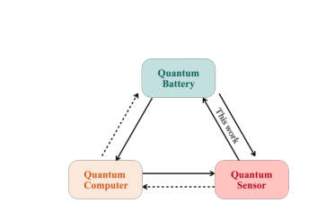 
FIG. 4. A schematic portrayal of potential inter-connectivity among standard quantum technologies. Here, X →Y implies Y enabled by X. This work enumerates such relationships between a quantum battery and a quantum sensor. Solid (dashed) arrows indicate established (hypothesized) proto- cols. The hypothetical protocols can be devised by combining the protocols developed here and in Refs. [59, 60].

📷 Fig 5

 
FIG. 5. Time evolution of the optimal angles for which the variance of the two-mode quadrature ˆ Xθ,η,ϕ is minimized.

📷 Fig 6

 
FIG. 6. Time evolution of the variance of the optimal quadrature ˆ Xθ,η,ϕ for (a) n = 3 and (b) n = 6. The best squeezing is obtained at a finite short time in both cases.

📷 Fig 7

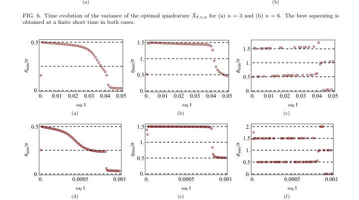 
FIG. 7. Time evolution of the optimal angles for which the variance of the two-mode quadrature ˆ Xθ,η,ϕ is minimized for (a)–(c) n = 3 and (d)–(f) n = 6.

**Main problem.** Investigating whether quantum hardware can be designed for dual-use, specifically to simultaneously serve as a quantum battery for energy storage and a quantum sensor for metrology.

**Main result.** The authors demonstrate that protocols for fast generation of resource-rich states (like squeezing or NOON-like states) can simultaneously charge a quantum battery with a collective advantage, allowing hardware to switch between sensing and storage functions.

**Method.** The study uses analytical derivations (short-time expansions, Heisenberg picture) and numerical methods (exact diagonalization) to map state preparation protocols to battery charging processes.

**Summary.** This paper proposes a way to make quantum hardware more efficient by allowing it to perform two tasks at once: storing energy and sensing external parameters. By using non-linear coupling in superconducting resonators, the authors show that the same process that creates useful quantum states for sensing also enables a 'charging advantage' for quantum batteries. This allows for a modular architecture where a single device can switch between being a sensor and a power source without extra hardware cost.

Detailed structure

**Model / system.** The primary platform is superconducting circuits, specifically two coupled superconducting LC resonators (bosonic modes) coupled via a Josephson junction, modeled by a non-linear Hamiltonian with a time-dependent coupling strength.

**Key observables.** Quantum Fisher Information (QFI), quantum squeezing (quadrature variance), energy stored (delta E), and charging power (delta E/T).

**Important parameters / regimes.** Number of excitations (n), coupling strength (g_n), time durations (t_s, t_1), and the non-linear regime (n > 1).

**Assumptions / limitations.** The charging advantage is valid for finite-size systems; in the thermodynamic limit with Kac-normalization, the advantage is lost.

**Figures summary.** Figure 1 illustrates the dual-use concept of switching between sensing and charging; Figure 3 shows the temporal protocol for sensing and charging; Figure 5 and 6 show the time evolution of optimal quadrature parameters and the peaks in squeezing variance.

**Paper structure.** The paper introduces the dual-use concept, establishes the mapping between state preparation and battery charging, analyzes the scaling of charging power and squeezing in non-linear bosonic models, proposes a specific temporal protocol for integrated sensing/charging, and provides analytical/numerical validation.

**Why it may be interesting.** It provides a unified framework for connecting quantum metrology and quantum thermodynamics, suggesting that the same collective quantum effects (entanglement/squeezing) drive both high-precision sensing and super-extensive energy storage.

Abstract

Quantum resources such as entanglement form the backbone of quantum technologies and their efficient generation is a central objective of modern quantum platforms. Independently, quantum batteries have emerged as nanoscale devices that utilize collective quantum effects to store energy with a charging advantage over classical strategies. Here, we show that these two pursuits can co-exist: protocols for fast generation of resourceful quantum states can simultaneously charge a quantum battery with a collective advantage, and conversely, a quantum battery protocol with a charging advantage can produce resource-rich states. Using this connection, we propose an integrated hardware protocol on superconducting circuits in which each experimental run can interchangeably accomplish either quantum battery charging, or quantum sensing through generation of metrologically useful states. Our results establish that quantum resources and stored energy are distinct yet co-producable quantities, opening the door to modular quantum architectures that dynamically switch between sensing and energy-storage functions, thereby producing additional functionalities without extra hardware cost.

[↑ back to top](#top)

### [Rigorous Security Proofs for Practical Quantum Key Distribution](http://arxiv.org/abs/2604.21791v1)

**Authors:** Devashish Tupkary  
**Type:** theory · **Category:** quantum information and computing · **PDF:** <https://arxiv.org/pdf/2604.21791v1>  
**Analysis basis:** full PDF text, analyzed in chunks
**Topic relevance:** `entanglement & information structure` **2/5** · `quantum measurements` **2/5**

📷 Fig 1

 
Figure 2.1: Schematic of a beam splitter with two input ports (left and bottom) and two output ports (right and top).

📷 Fig 2

 
Figure 2.2: Idealized polarizing beam splitter (PBS) that routes the horizontal and vertical polarization components of the input mode into separate spatial output modes.

📷 Fig 3

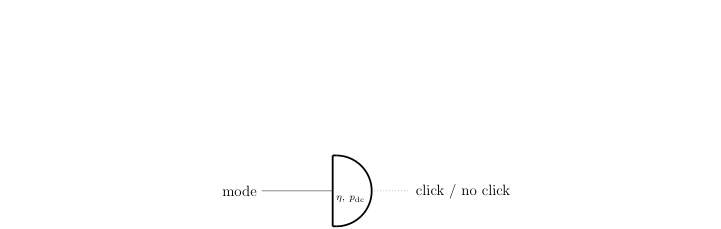 
Figure 2.3: Schematic of a threshold (on/off) detector. In the imperfect model, η denotes the overall detection efficiency and pdc the dark-count probability per detection window.

📷 Fig 4

 
Figure 3.1: Schematic of a quantum key distribution (QKD) protocol. The task is to establish a shared secret key between two distant parties, Alice and Bob. The protocol relies on trusted quantum devices operated within secure perimeters, access to local true random number generators (TRNGs), an authenticated classical channel, and an insecure quantum channel that may be fully controlled by an adversary. Figure from [52].

📷 Fig 5

 
Figure 3.2: Schematic of an active detection setup using threshold detectors.

📷 Fig 6

 
Figure 3.3: Schematic of the passive detection setup using theshold detectors.

📷 Fig 7

 
Figure 3.4: Schematic illustrating the use of a source map. A virtual source prepares (ξk)A′′, which is mapped to the real emitted state (σk)A′ by a source map Ψ. Then, one can “give” Eve control over the source map (meaning that she is allowed to perform any operation she wants in place of the source map). The security of the latter implies security of the former, as argued rigorously in Lemma 7.4.1.

📷 Fig 8

 
Figure 3.5: An infinite-dimensional POVM can be modelled as a squashing map Λ followed by a finite-dimensional POVM. Giving the squashing map Λ to Eve allows us to restrict our analysis to the finite-dimensional POVM.

📷 Fig 9

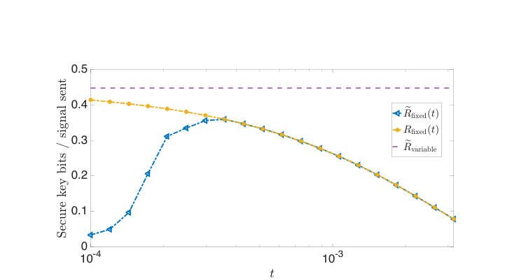 
Figure 4.1: Expected key rate for fixed-length protocols eRfixed(t) for various values of t, key rate upon acceptance for fixed-length protocols Rfixed(t) plotted for various values of t, and the expected key rate for variable-length protocol plotted eRvariable, plotted for a fixed honest behaviour of the channel.

📷 Fig 10

 
Figure 4.2: Expected key rate for fixed-length protocols eRfixed(t) for various values of t, key rate upon acceptance for fixed-length protocols Rfixed(t) plotted for various values of t, and the expected key rate for variable-length protocol plotted eRvariable, for an unpredictable honest behaviour.

**Main problem.** The need for rigorous security proofs for practical Quantum Key Distribution (QKD) protocols that account for realistic hardware imperfections like imperfect detectors, variable-length keys, and non-ideal authentication.

**Main result.** The thesis establishes security proofs for variable-length QKD against coherent attacks, develops methods to bound phase error rates with imperfect detectors, and provides a general security framework using the marginal-constrained entropy accumulation theorem.

**Method.** The author utilizes advanced information-theoretic tools including the Entropy Accumulation Theorem (EAT), Entropic Uncertainty Relations (EUR), the postselection technique, and De Finetti reductions.

**Summary.** This thesis provides a rigorous mathematical framework for the security of practical Quantum Key Distribution. It addresses long-standing gaps between idealized security models and real-world implementations, such as imperfect detectors and variable-length key generation. By introducing new bounds and unified proof techniques, the work enables more reliable certification of QKD hardware. Ultimately, it moves the field toward practical, deployment-ready quantum cryptography.

Detailed structure

**Model / system.** The study focuses on Quantum Key Distribution protocols, specifically BB84 and decoy-state BB84, involving quantum optical systems with weak coherent pulses, imperfect detectors, and authenticated classical channels.

**Key observables.** Key rates, phase error rates, photon-number statistics (zero and one-photon), and detection probabilities.

**Important parameters / regimes.** Channel loss (dB), detection efficiency, dark-count probability, basis-efficiency mismatch, and finite-size effects (number of signals sent).

**Assumptions / limitations.** Assumes trusted quantum devices and local true random number generators; focuses on security against IID collective and coherent attacks; assumes a specific model for delayed authentication.

**Figures summary.** Schematics of QKD protocol structures and detection setups; performance plots comparing key rates vs. loss for different protocols and proof techniques; and visualizations of error rate evolution under detector imperfections.

**Paper structure.** The thesis is structured by addressing specific technical challenges: extending proofs to variable-length protocols, applying postselection for coherent attacks, using EUR for imperfect detectors, implementing the MEAT framework, and analyzing authentication security.

**Why it may be interesting.** This work is highly relevant to quantum optics and quantum information as it provides the mathematical foundation for making quantum communication protocols robust against real-world hardware noise and side channels.

Abstract

This thesis is concerned with rigorous security analyses of practical Quantum Key Distribution (QKD) protocols, using a variety of modern proof techniques. The main results are as follows. First, we establish a security proof for variable-length QKD protocols against IID collective attacks, and extend this result to coherent attacks using the postselection technique. In doing so, we resolve a long-standing flaw in the application of the postselection technique to QKD, thereby placing it on a rigorous mathematical footing. Second, we develop a method to bound phase error rates in entropic uncertainty relation-based and phase error rate-based proofs, using only the observed statistics of the protocol, even when detectors are imperfect and only approximately characterized. This removes a key assumption of identical detector behaviour and enables these techniques to be applied in realistic settings. Third, we present a very general security analysis based on the marginal-constrained entropy accumulation theorem. The resulting framework can be readily adapted to practical imperfections and side channels, and is suitable for certification efforts. Finally, we show that the security of QKD protocols under realistic authentication assumptions can be reduced to the standard idealized setting, where authentication is assumed to behave honestly, with only minor protocol modifications. A distinctive feature of this thesis is its unified presentation of several major QKD security proof frameworks using consistent protocol descriptions and notation. Consequently, this thesis is intended not only as a collection of new technical results, but also as a useful reference for understanding rigorous security analysis in quantum key distribution.

[↑ back to top](#top)

### [The clock ambiguity is back with a vengeance](http://arxiv.org/abs/2604.21805v1)

**Authors:** Ovidiu Cristinel Stoica  
**Type:** theory · **Category:** other · **PDF:** <https://arxiv.org/pdf/2604.21805v1>  
**Analysis basis:** full PDF text, analyzed in chunks
**Topic relevance:** `entanglement & information structure` **2/5** · `quantum measurements` **2/5**

📷 Fig 1

 
Low-resolution page preview, page 2

📷 Fig 2

 
Low-resolution page preview, page 3

📷 Fig 3

 
Low-resolution page preview, page 4

📷 Fig 4

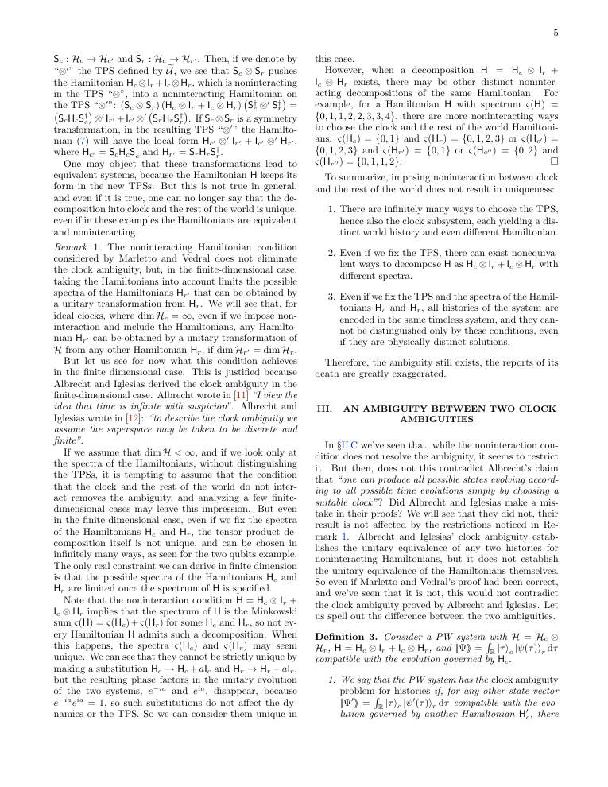 
Low-resolution page preview, page 5

📷 Fig 5

 
Low-resolution page preview, page 6

📷 Fig 6

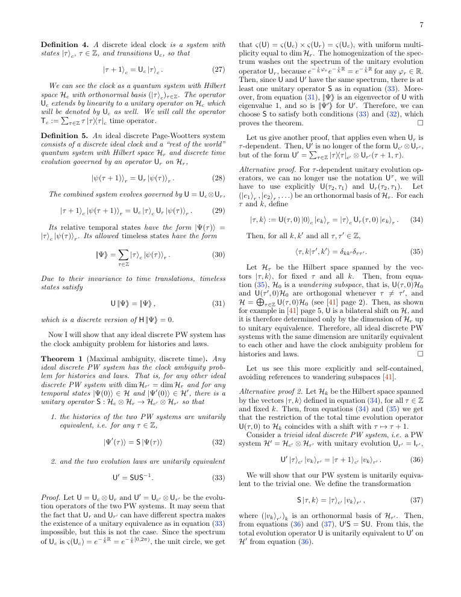 
Low-resolution page preview, page 7

📷 Fig 7

 
Low-resolution page preview, page 8

📷 Fig 8

 
Low-resolution page preview, page 9

📷 Fig 9

 
Low-resolution page preview, page 10

📷 Fig 10

 
Low-resolution page preview, page 11

**Main problem.** The paper addresses the 'clock ambiguity' in the Page-Wootters formalism, investigating whether the inability to uniquely identify a clock and its dynamics can be resolved by imposing a non-interaction condition between the clock and the rest of the world.

**Main result.** The author proves a 'maximal ambiguity' theorem, showing that the ambiguity extends to both histories and Hamiltonians and cannot be removed by a non-interaction condition; the ambiguity is only resolved by explicitly assigning physical meanings to operators.

**Method.** The author uses unitary transformation analysis, spectral analysis (Minkowski sum of spectra), and the properties of infinite-dimensional Hilbert spaces (Lebesgue measure and wandering subspaces) to demonstrate the equivalence of different physical setups.

**Summary.** This paper investigates the fundamental problem of 'clock ambiguity' in the Page-Wootters formalism, where different choices of clock subsystems can lead to different perceived dynamics. The author refutes the claim that assuming no interaction between the clock and the world can resolve this issue, instead proving that the ambiguity is even stronger than previously thought, affecting both histories and Hamiltonians. The results show that for ideal clocks, any two physical systems can be rendered indistinguishable via unitary transformations. Ultimately, the author argues that the ambiguity can only be resolved by explicitly assigning physical meanings to operators, rather than relying on purely relational emergence.

Detailed structure

**Model / system.** The model is the Page-Wootters (PW) framework, consisting of a stationary, timeless global state in a composite Hilbert space (H_c tensor H_r) where time emerges from entanglement between a clock subsystem and the rest of the world.

**Key observables.** Clock observables (time T and energy-like C) and world observables (position X and momentum P).

**Important parameters / regimes.** Continuous and discrete time regimes, bounded and unbounded time, and the dimension of the Hilbert space (specifically infinite-dimensional ideal clocks).

**Assumptions / limitations.** The universe is in a stationary state satisfying a Wheeler-DeWitt-type constraint; the paper assumes separable Hilbert spaces and focuses on ideal clocks.

**Paper structure.** The paper begins by critiquing previous attempts to resolve clock ambiguity via non-interaction, provides a mathematical proof of maximal ambiguity for both discrete and continuous time, explores the implications for the emergence of physical structures, and concludes by proposing that physical meaning must be pre-specified to resolve the ambiguity.

**Why it may be interesting.** This is highly relevant for researchers in quantum foundations and open quantum systems, as it challenges the idea that spacetime and dynamical laws can emerge purely from relational entanglement without pre-existing physical structures.

Abstract

Page and Wootters (1983) showed how time and dynamics can emerge in a stationary system containing a clock. Albrecht (1995) later showed, for discrete time, that within this framework any dynamical evolution can be obtained simply by choosing a different clock.   Marletto and Vedral (2017) claimed that this ambiguity disappears assuming that the clock and the rest of the world do not interact. I show that their proof relies on an incorrect mathematical assumption. Also, eliminating the ambiguity completely would obstruct spacetime symmetries.   Whereas the original clock ambiguity concerns all possible histories of a discrete-time system evolving under arbitrary Hamiltonians, but not the Hamiltonians themselves, I prove a stronger version for continuous and discrete unbounded time: the ambiguity extends to both histories and Hamiltonians, including noninteracting ones. Only the dimension of the Hilbert space remains.   One might hope to dismiss the ambiguity as merely perspectival, but I show that this would predict incorrect correlations between outcomes and their records, making even knowledge impossible. Purely relational approaches therefore face both the stronger and the original clock ambiguity problems. The ambiguity is removed by taking into account the physical meaning of the operators.

[↑ back to top](#top)

## Other papers (14)

*Papers from primary archives without highlighted authors or any topic match. Click to expand.*

Show other papers

### [A Universal Quantum Information Preserving Photonic Switch for Scalable Quantum Networks](http://arxiv.org/abs/2604.21902v1)

**Authors:** Jiapeng Zhao, Stéphane Vinet, Amir Minoofar, Michael Kilzer, Lucas Wang, Galan Moody, Vijoy Pandey, Ramana Kompella, Reza Nejabati  
**Type:** both · **Category:** quantum information and computing · **PDF:** <https://arxiv.org/pdf/2604.21902v1>  
**Analysis basis:** full PDF text, analyzed in chunks

📷 Fig 1

 
FIG. 1: Switched Quantum Network. Conceptual quantum network centered around the quantum switch. The system ensures quantum state integrity and entanglement preservation while providing encoding-agnostic operation across diverse modalities. The switch supports time- and space-multiplexed utilization of shared critical resources whilst providing a scalable framework for the interconnection of quantum computers and quantum sensor.

📷 Fig 2

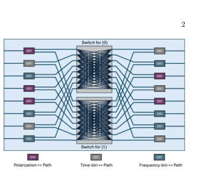 
FIG. 2: Architecture of the Universal Quantum Switch. The input quantum state converters (QSCs) enable conversion to path-encoding to ensure quantum information is routed through two identical photonic switches. The output QSCs convert the quantum information back to the desired output encoding modality. Both QSCs can be implemented in either an integrated or pluggable manner with an arbitrary combination of encoding modality.

📷 Fig 3

 
FIG. 3: Schematic of the quantum switch. (a) Simplified sketch of the device for polarization encoding. (b) TFLN photonic integrated circuit combining both QSCs and the switch matrix, respectively highlighted in green and purple. (c) Normalized optical power when varying the driving voltage of TO phase shifters to characterize the half-wave power and ER of MZI. (d) Fast switching between two output ports when driving the EO modulator with a sinusoidal waveform at 1 GHz rate to determine half-wave voltage.

📷 Fig 4

 
FIG. 4: Quantum state tomography (a) Simplified sketch of the experimental setup for quantum characterization. An entangled photon source produces polarization-entangled photons at 1551.72 nm (signal) and 1564.68 nm (idler). The signal photon is routed through the UQS. After the PIC, both photons are sent to the polarization tomography system. Reconstructed density matrices for the input ρin (b) and output ρout (c) for connection 1 →1 (input →output ports). A fidelity F(ρin, ρout) = 0.98 is obtained with purity Tr(ρ2 out) = 1.

📷 Fig 5

 
FIG. 5: Dynamic switching. (a) Dynamic switching of the device when driving the EO modulator with a rectangular pulse at 1 MHz. The gated section used for quantum state tomography is shown in the shaded region. Reconstructed density matrices for the input ρin (b) and output ρout (c) for connection 2 →1 (input → output ports). A fidelity F(ρin, ρout) = 0.90 is obtained with purity Tr(ρ2 out) = 1.

📷 Fig 6

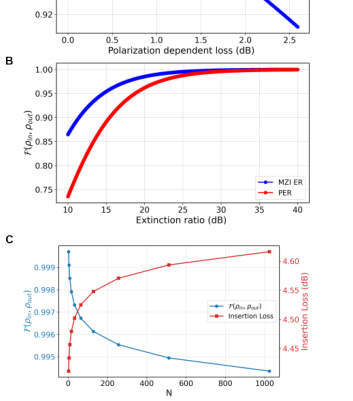 
FIG. 6: Scaling potential of the UQS. (a) UQS fidelity as a function of PDL per PRS. b UQS fidelity as a function of PER of PRS and ER of MZI. c UQS fidelity and IL as a function of dimension N. Note that the IL floor comes from the high coupling loss in the current chip. A low loss (≤1 dB) design can be implemented to reduce the IL floor to 2 dB.

📷 Fig 7

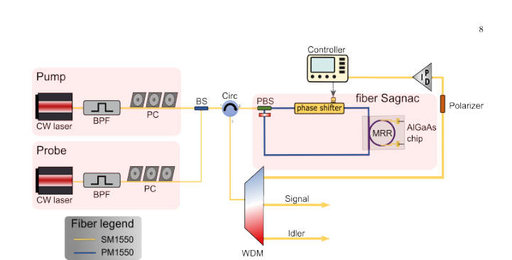 
FIG. 7: Polarization entangled photon source. Polarization entangled photons are generated in a fiber-based Sagnac interferometer via spontaneous four-wave mixing (SFWM) in a AlGaAs chip. The interferometer is actively locked using a probe laser with a servo controller.

**Main problem.** Existing quantum networks are limited to static, point-to-point links due to the lack of a switching paradigm that can dynamically route fragile entanglement without introducing decoherence or loss.

**Main result.** The authors demonstrate a Universal Quantum Switch (UQS) in thin-film lithium niobate that enables high-speed (up to 1 GHz) routing of arbitrary entangled states with minimal decoherence (less than 4%).

**Method.** The work combines a theoretical architecture for encoding-agnostic routing with an experimental prototype using thermo-optic and electro-optic modulation, validated via quantum state tomography and impedance-matched RF circuit optimization.

**Summary.** The paper presents a new 'Universal Quantum Switch' designed to enable scalable, multi-node quantum networks. Using thin-film lithium niobate technology, the researchers created a device that can route different types of quantum information (like polarization or time-bin encoding) without destroying the fragile entanglement. The switch operates at extremely high speeds, up to 1 GHz, and maintains very high fidelity. This provides a foundational building block for creating a complex, interconnected quantum internet.

Detailed structure

**Model / system.** A 2x2 thin-film lithium niobate (TFLN) photonic integrated circuit featuring a three-stage architecture: input/output quantum state converters (using polarization rotators) and a non-blocking switch matrix composed of Mach-Zehnder interferometers.

**Key observables.** Fidelity, purity, concurrence, Polarization Extinction Ratio (PER), Polarization Dependent Loss (PDL), and Insertion Loss (IL).

**Important parameters / regimes.** Switching speeds up to 1 GHz, decoherence penalty < 4%, and reconfiguration speeds up to 1 GHz.

**Assumptions / limitations.** Assumes negligible path mismatch between logical states, identical extinction ratios for switch matrix arms, and negligible photon crosstalk from different input ports.

**Figures summary.** Fig 1: Conceptual switched network; Fig 2: UQS architecture stages; Fig 3: TFLN implementation and 1 GHz switching plots; Fig 6: Scalability projections (fidelity/loss vs. dimension N); Fig 7: AlGaAs Sagnac photon source.

**Paper structure.** The paper introduces the scalability problem of quantum networks, proposes the UQS architecture, details the TFLN experimental implementation and RF optimization, presents performance benchmarking via tomography, and concludes with scalability projections.

**Why it may be interesting.** This is highly relevant to quantum optics and open quantum systems as it demonstrates a method to implement dynamic, high-speed routing of qubits while explicitly modeling and mitigating hardware-induced decoherence and noise.

Abstract

Quantum networks are a keystone of the quantum internet. However, existing implementations remain largely confined to static point-to-point links due to the absence of a switching paradigm capable of dynamically routing fragile quantum entanglement without introducing decoherence. Here, we propose the Universal Quantum Switch, a foundational building block allowing on-demand, non-blocking, and encoding-agnostic routing of quantum information, as well as seamless modality conversion between disparate quantum platforms. We develop a prototype in thin-film lithium niobate and experimentally demonstrate robust switching with $\le 4\%$ decoherence via thermo-optic modulation and high-speed electro-optic switching of arbitrary entangled states at 1 MHz. Moreover, we show that our platform can support reconfiguration speeds up to 1 GHz. To our knowledge, this work represents the first demonstration of multi-node dynamic entanglement distribution at these speeds. Complementing these experimental results, we project the architecture's scalability, showing dimension-independent decoherence, and provide a scalable, interoperable building block for heterogeneous quantum network fabrics.

[↑ back to top](#top)

### [Deterministic generation of grid states with programmable nonlinear bosonic circuits](http://arxiv.org/abs/2604.21824v1)

**Authors:** Yanis Le Fur, Javier Lalueza-Puértolas, Carlos Sánchez Muñoz, Alberto Muñoz de las Heras, Alejandro González-Tudela  
**Type:** theory · **Category:** quantum information and computing · **PDF:** <https://arxiv.org/pdf/2604.21824v1>  
**Analysis basis:** full PDF text, analyzed in chunks

📷 Fig 1

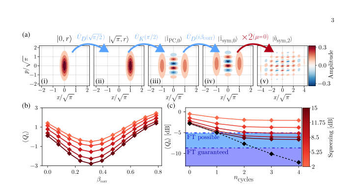 
FIG. 1. Symmetry-enforced state preparation for the 0-logical state. (a) Wigner representations of the initial squeezed vacuum state with r = 6 dB (i), displacement (ii), Kerr evolution (iii), and a final correction displacement ˆUD(iβcorr) (iv). Panel (v) represents the Wigner after applying three cycles of the protocol described in Algorithm 1 with initial squeezing r = 6 dB. (b) Expectation value ⟨ˆQ1⟩[dB] versus correction amplitude βcorr for a single-cycle generated state and for different values of initial squeezing r in different red shades. (c) ⟨ˆQ0⟩[dB] saturation for an increasing number of cycles of the symmetry-enforced states across different squeezing regimes (in red shades)....

📷 Fig 2

 
FIG. 2. Wigner distributions and logical state infidelities for phased-comb states. (a) Wigner distributions of the phased-comb logical states |˜0PC,j⟩(ncycles = 1, 2, and 3 cycles, left to right) and |˜1PC,j⟩(ncycles = 0, 1, and 2 cycles, left to right) using a squeezing parameter of r = 10 dB and the protocol described in Algorithm 1, but without the correction step. (b,c) Logical state infidelity Iµ (µ ∈{0, 1}) as a function of the Kerr uncertainty ∆χmax (b) and the boson loss rate normalized to the Kerr strength κ/χ (c). The infidelity is evaluated for a 3-cycle state (µ = 0, blue squares) and a 2-cycle state (µ = 1, red rhombus) at a squeezing of r = 7.8 dB. Data points represent an...

📷 Fig 3

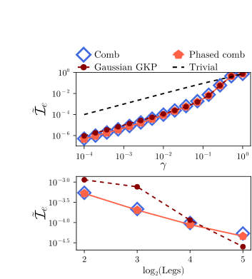 
FIG. 3. Performance of QEC codes. (a) Near-optimal channel infidelity ˜Ie = 1−˜Fe as a function of the photon loss probability γ. (b) Channel infidelity versus the number of state legs at a fixed loss probability γ = 10−2. Performance is compared across four encodings: phased-comb (red rhombus), comb (blue rhombus), Gaussian-truncated GKP (red circles), and the trivial encoding {|0⟩, |1⟩} (dashed line). All codes are evaluated with the same number of legs. Parameters: (a) µ = 0 logical states generated with 3 cycles and µ = 1 logical states with 2 cycles. (b) Truncation level of the cavity NR = 500 except for the 5 cycle case where NR = 1200 to ensure convergence. (a,b) Squeezing is fixed...

**Main problem.** The difficulty of deterministically generating non-Gaussian bosonic grid states, such as GKP states, which are essential for hardware-efficient quantum error correction.

**Main result.** The discovery of 'phased-comb states' generated by programmable nonlinear bosonic circuits that provide scalable error correction with performance comparable to GKP states and allow for a universal gate set.

**Method.** An iterative 'leg-doubling' protocol using a sequence of squeezing, displacement, and Kerr-type nonlinear operations to generate complex bosonic states.

**Summary.** This paper proposes a way to deterministically create bosonic states for quantum error correction using simple nonlinear circuits. While trying to create standard GKP states, the authors found that these circuits naturally produce a new class of 'phased-comb' states. These states are just as good at protecting information against photon loss and can be used to perform universal quantum logic gates. This approach is scalable and can be implemented in existing microwave or optical platforms.

Detailed structure

**Model / system.** A platform-agnostic nonlinear bosonic circuit (compatible with photonic or microwave modes) utilizing Kerr nonlinearity, displacement, and squeezing unitaries.

**Key observables.** GKP squeezing operators (Q0 and Q1), Wigner distributions, channel fidelity, and logical state infidelity.

**Important parameters / regimes.** Kerr strength, squeezing amplitude, number of circuit cycles, and boson loss rate.

**Assumptions / limitations.** Boson loss is treated as the dominant decoherence mechanism, and the error correction performance is evaluated against an optimal recovery operation.

**Figures summary.** Figure 1 shows the Wigner evolution of a single cycle and the saturation of symmetry restoration; Figure 3 shows the channel infidelity of phased-comb states versus photon loss probability.

**Paper structure.** The paper introduces the challenge of GKP generation, proposes a programmable circuit protocol, compares symmetry-enforced states versus phased-comb states, analyzes the error-correction performance and robustness of the new states, and demonstrates the implementation of a universal gate set.

**Why it may be interesting.** It provides a new class of error-correcting codes (phased-comb states) and a deterministic generation method that avoids the probabilistic nature of standard GKP protocols, which is highly relevant for scalable bosonic quantum computing.

Abstract

Bosonic quantum error correction enables hardware-efficient protection of quantum information by encoding logical qubits in harmonic oscillators. Bosonic grid states, such as Gottesman-Kitaev-Preskill (GKP) states, are particularly promising due to their potential to correct small displacements and boson loss. However, their generation remains challenging, typically relying on probabilistic protocols or auxiliary qubit systems. Here, we propose deterministic protocols for generating bosonic grid states using programmable nonlinear bosonic circuits composed solely of squeezing, displacement, and Kerr operations. We show that aiming to enforce GKP symmetries in the output of these circuits yields states with competitive performance with respect to current realizations, but whose quality saturates with increasing circuit depth due to imperfect symmetry restoration. Instead, we find that these bosonic circuits naturally give rise to a distinct class of states, that we label as phased-comb states, which are unitarily related to standard grid states but feature an intrinsic phase structure. We demonstrate that these states define a scalable bosonic quantum error-correcting code with near-optimal performance under boson loss comparable to that of approximate GKP states. We further analyze their logical operations and show how to implement a universal gate set for them. Our results establish programmable nonlinear bosonic circuits as a viable route towards the generation of scalable bosonic quantum error-correcting states beyond standard GKP encodings.

[↑ back to top](#top)

### [Efficient Classical Simulation of Heuristic Peaked Quantum Circuits](http://arxiv.org/abs/2604.21908v1)

**Authors:** David Kremer, Nicolas Dupuis  
**Type:** both · **Category:** numerical methods · **PDF:** <https://arxiv.org/pdf/2604.21908v1>  
**Analysis basis:** full PDF text, analyzed in chunks

📷 Fig 1

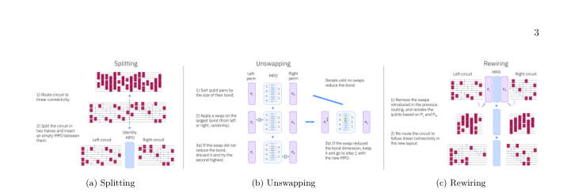 
FIG. 1: The three stages of the iterative contraction method. (a) The transpiled circuit is split at the temporal midpoint into a left circuit CL and a right circuit CR, with an identity MPO inserted between them. (b) The greedy unswapping procedure: qubit pairs in the MPO are ranked by bond dimension, and swaps are applied from the left, right, or both sides. Swaps that reduce the bond dimension are accepted, yielding the decomposition M = PL ˜ MPR. (c) Rewiring: the extracted permutations PL and PR are absorbed into the remaining circuits by removing existing transpilation SWAPs, reindexing qubits, and re-transpiling to linear connectivity.

📷 Fig 2

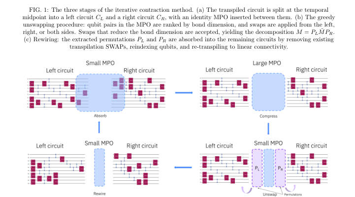 
FIG. 2: Overview of the iterative contraction procedure. Starting from a small MPO between the left and right circuits, the method cycles through three stages: (1) absorption of circuit layers into the MPO, which causes it to grow; (2) unswapping, which extracts permutations PL and PR and reduces the MPO to a smaller ˜ M; and (3) rewiring, which propagates the extracted permutations into the remaining circuits and re-transpiles to linear connectivity.

📷 Fig 3

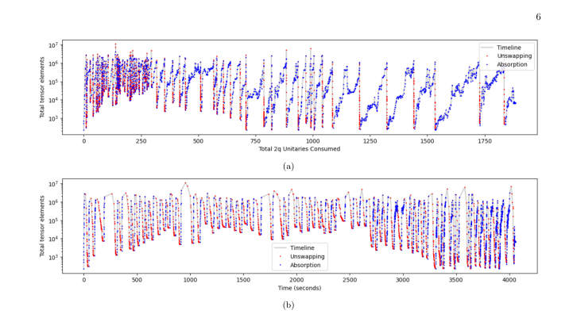 
FIG. 3: Total number of tensor elements in the MPO during contraction. Blue points correspond to the absorption stage and red points to the unswapping stage. (a) MPO size as a function of two-qubit unitaries consumed from the circuit. Three regimes are visible: an initial phase (0–300 unitaries) with rapid absorption–unswapping cycling; a transition phase (300–700) where unswapping becomes progressively more effective; and a final phase (700+) where unswapping reduces the MPO almost completely, allowing long absorption runs. (b) The same quantity plotted against wall-clock time. The full contraction completes in 4,059 seconds on a single Nvidia A100 GPU. The dense cluster of iterations in...

📷 Fig 4

 
FIG. 4: Frequency of the top 20 most-sampled bitstrings from 1,000 samples drawn from the contracted MPS. The peak bitstring (ID 0) appears approximately 110 times (∼11%), consistent with the designed peak weight of ∼10%. The sharp separation from the remaining bitstrings confirms successful recovery of the peak.

**Main problem.** Challenging a recent claim of heuristic quantum advantage by demonstrating that certain 'peaked' quantum circuits, previously thought to be classically intractable, can be efficiently simulated.

**Main result.** The authors developed an efficient tensor network contraction method that simulates a 56-qubit circuit in approximately one hour on a single GPU, outperforming the execution time of the original quantum hardware.

**Method.** An iterative tensor network contraction procedure involving circuit splitting, absorption of gates into a Matrix Product Operator (MPO), and a greedy 'unswapping' heuristic to extract hidden permutations and reduce bond dimension.

**Summary.** This paper refutes a claim of heuristic quantum advantage by showing that 'peaked' quantum circuits can be efficiently simulated classically. By using a new 'unswapping' technique within a tensor network framework, the authors can undo the permutations intended to make the circuits hard to simulate. They successfully simulated a 56-qubit circuit in about an hour, which was faster than the actual quantum hardware execution. This demonstrates that the complexity of these specific circuits arises from artificial structural obfuscation rather than genuine quantum hardness.

Detailed structure

**Model / system.** Peaked quantum circuits characterized by a mirrored (UU^dagger) structure and permutation-based obfuscation, specifically targeting circuits executed on Quantinuum's 56-qubit H2 trapped-ion processor.

**Key observables.** The peak bitstring (highest probability bitstring) and the peak weight (concentration of the output distribution).

**Important parameters / regimes.** MPO bond dimension, SVD singular value cutoff (epsilon), and the unswapping threshold for triggering contraction updates.

**Assumptions / limitations.** The method assumes the circuit possesses an underlying mirrored structure and that the error introduced by SVD compression is negligible.

**Figures summary.** Figure 1 shows the three stages of the contraction method (splitting, unswapping, rewiring); Figure 2 provides an overview of the iterative cycle; Figure 3 plots MPO size dynamics and wall-clock time across different contraction regimes; Figure 4 shows the frequency of the top 20 sampled bitstrings.

**Paper structure.** The paper introduces the problem of challenging quantum advantage claims, describes the proposed iterative MPO contraction and unswapping method, presents performance benchmarks on 56-qubit circuits, and discusses the limitations and implications for future circuit designs.

Abstract

Peaked quantum circuits, whose output distribution is sharply concentrated on a single bitstring, have emerged as a promising candidate for verifiable quantum advantage, as the correctness of the quantum output can be checked by simply comparing against the known peak. Recent work by Gharibyan et al. arXiv:2510.25838 claimed heuristic quantum advantage using peaked circuits executed on Quantinuum's 56-qubit H2 processor. These peaked circuits concentrate their output on a single hidden bitstring by training a shallow simulable circuit variationally and inserting an obfuscated permutation to increase the depth to a level that makes classical simulation intractable, with estimated runtimes of years for the largest instances. We show that these circuits can be efficiently simulated classically. We describe a method that efficiently performs a full tensor network contraction, allowing near-exact sampling and extraction of the peaked bitstring. The method exploits the mirrored structure of the circuit and iteratively cancels both halves into a Matrix Product Operator (MPO), and avoids the obfuscated permutation by greedily reducing the MPO bond dimension through a process we call unswapping. The method can fully contract and extract the peak of the largest circuit in approximately one hour on a single GPU, around half the time it took to run on the quantum hardware.

[↑ back to top](#top)

### [High-performance cellular automaton decoders for quantum repetition and toric code](http://arxiv.org/abs/2604.21866v1)

**Authors:** Don Winter, Thiago L. M. Guedes, Markus Müller  
**Type:** theory · **Category:** quantum information and computing · **PDF:** <https://arxiv.org/pdf/2604.21866v1>  
**Analysis basis:** full PDF text, analyzed in chunks

📷 Fig 1

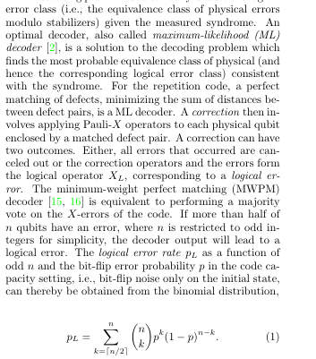 
Fig. 1 shows the logical error rate pL for various sys- tem sizes. In the sub-threshold regime (p &lt; 0.5), in- creasing the system size provides better protection, as errors are suppressed more effectively with additional physical qubits. This value pc ≡p = 0.5 is called the QEC threshold. In this regime, pL scales with pλ(d), with λ(d) = (d + 1)/2 and d = n, corresponding to the min- imum number of physical errors for which the matching decoder gives a logical error. Another code which, however, is capable to protect against both Z- and X-errors is the toric code [57], shown in Fig. 2. The toric code is defined on a n × n regular square lattice with periodic boundary conditions, i.e., a...

📷 Fig 2

 
FIG. 2. Illustration of a distance d = 5 toric code with qubits (black circles) on edges of a regular d × d lattice under pe- riodic boundaries. Qubits in parenthesis wrap around the torus. The minimum-weight logical operators X1 L and X2 L are vertical and horizontal strings of single-qubit Pauli-X oper- ators. Logical Z-operators are omitted. The stabilizers of the toric code are either of pure X- (red stars) or Z-type (blue plaquettes). A X-error (red dot) anti-commutes with two Z-stabilizers, causing two defects (blue shades). A Z- error (blue dot) causes the star syndrome (red shades). Any X error configuration which forms a (product of) stabilizer generator(s) commutes with the...

📷 Fig 3

 
FIG. 1. Analytical logical error rate pL as function of bit- flip error rate p for the ML decoder (Eq. 1) of the repetition code. Different colors correspond to different code distances d (equivalent to number of qubits n making up the repetition code), the dashed red line marks the QEC threshold pc = 0.5.

📷 Fig 4

 
FIG. 3. Sketch of Harrington’s hierarchical CA decoder. On the left, we show a distance-27 toric code from the perspective of the three hierarchy levels Harrington’s decoder imposes. Error correction is accomplished by moving defects (black circles) which are close towards each other thereby correcting the errors (red lines) which separate them. At the lowest level (0), one- and some two-qubit errors are corrected within at most two CA steps. Defects which have no other defect in their local neighborhood move towards the center of their colony (group of Q × Q cells) marked in thick black lines at the next hierarchy level (1). At level-1, defects located at colony centers communicate by...

📷 Fig 5

 
FIG. 4. Logical error rate pL as function of bit-flip error rate p for Harrington’s toric code decoder under code capacity noise for different code distances d (color code). The dashed red line marks the QEC threshold pc ≈4.5%. The black dashed line corresponds to fits of the function f(p, d) = A(d)pλ(d). In the inset we show the effective code distance λ(d) as function of code distance d. The purple line in the inset corresponds to the function λ(d) = 2log3(d) ≈d0.631, as discussed in the main text. Numerical data was obtained for 104 to 106 Monte Carlo shots until statistical uncertainty is small relative to the measured values. Standard sampling errors are represented by black error bars.

📷 Fig 6

 
FIG. 5. Average logical lifetime ⟨TF ⟩as function of phenomenological bit-flip error rate p on data qubits (left panel) and rate q on measurements (right panel) for toric codes of distance d (color code) under corrections by Harrington’s decoder. In the left panel we set q = 0 and in the right p = 0. Dashed black lines correspond to fits of the function g(d, p) = B(d)p−λ(d) with λ(d) shown in the insets. The purple line in the inset corresponds to λ(d) = d0.631 in both panels. Although a non-zero threshold is mathematically guaranteed [1], a precise asymptotic value is not deducible from this data as the crossing points continue to drift toward lower error rates for the simulated distances....

📷 Fig 7

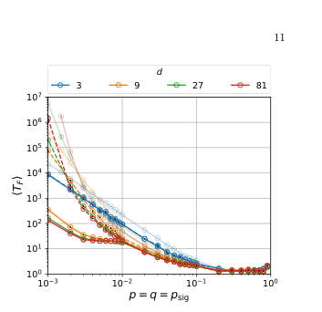 
FIG. 6. Average logical lifetimes ⟨TF ⟩as function of data, measurement, and signal noise with respective rates p, q, and psig for Harrington’s decoder on toric codes of distance d (color coded). The lines of less opacity in the background correspond to performance curves under sole data noise, cf., left panel of Fig. 5. The dashed colored lines correspond to data, measurement and CountSignal noise, while the solid lines correspond to data, measurement and CountSignal and FlipSignal noise. The devastating effect of FlipSignal noise becomes apparent when p, q &lt; 10−2. In this regime, larger lattice sizes show worse performance than small ones. Sole CountSignal noise (dashed lines) is less...

📷 Fig 8

 
FIG. 7. Sketch of Harrington’s decoder confined to one dimension. On the left, we show a distance-27 repetition code from the perspective of the three hierarchy levels Harrington’s decoder imposes. Error correction is accomplished by moving close-by defects (black circles) towards each other, thereby correcting the errors (red and orange lines) which separate them. At the lowest level (0), one- and some two-qubit errors are corrected within at most two time steps, while defects that have no other defect in their neighborhood are moved towards their colony center (marked in black thick lines at the next level). At the next level (1), CountSignals (colored in blue; shade corresponds to amount...

📷 Fig 9

 
FIG. 8. All possible error configurations of qubits within a block. Data-qubit errors (red bars) generate a syndrome (black circles) between two colony centers C1 and C2. The green arrows indicate the local update prescribed by the cor- rection rule. Configurations with zero or one error (left) are corrected to the trivial configurations with no errors between the centers, whereas configurations with two or three errors (right) are completed to the nontrivial configuration with three errors between the centers.

📷 Fig 10

 
FIG. 9. Logical error rate pL as function of data qubit error rate p for Harrington’s decoder confined to one dimension under code capacity noise on distance-d repetition codes. The red dashed line marks the QEC threshold at pc = 1/2. The dashed black lines correspond to the (analytical) performance of a global concatenated majority voting (pL = (pmaj)m(p), as explained in the main text). Each data point was obtained from 104 to 106 Monte Carlo shots until statistical uncertainty is small relative to the measured values. Standard errors are represented by black error bars.

**Main problem.** The need for scalable, low-latency, and robust decoding architectures for quantum error correction that avoid the communication bottlenecks of global decoding strategies.

**Main result.** The introduction of SCALA, a non-hierarchical cellular automaton decoder that achieves a higher code-capacity threshold (approx 7.5%) and superior sub-threshold scaling compared to hierarchical models.

**Method.** The authors present a new class of cellular automaton (CA) decoders (SCALA) and perform comparative Monte Carlo simulations against the hierarchical Harrington decoder and MWPM.

**Summary.** This paper introduces SCALA, a novel non-hierarchical cellular automaton decoder designed for real-time quantum error correction. Unlike previous hierarchical approaches, SCALA uses a decentralized, single-layer architecture that maintains constant local computational resources regardless of system size. The results demonstrate that SCALA provides a higher error threshold and better error suppression scaling than existing local decoders, while also being more resilient to noise within the decoder itself. This makes it a highly promising candidate for implementation in scalable quantum hardware like FPGAs or SFQ circuits.

Detailed structure

**Model / system.** The study focuses on quantum error-correcting codes, specifically the 1D quantum repetition code and the 2D toric code, under various noise models including code-capacity, phenomenological, and signaling noise.

**Key observables.** Logical error rate (pL), code-capacity threshold (pc), effective code distance (lambda), and average logical lifetime (T_F).

**Important parameters / regimes.** Physical error rate (p), measurement error rate (q), code distance (d), and the hierarchy levels/scales in the comparison baseline.

**Assumptions / limitations.** Assumes logical failures occur as rare, independent events in an absorbing Markov process; assumes a regime where the spectral radius of the transient matrix is less than 1.

**Figures summary.** Figures illustrate logical error rate scaling vs. error rate, the architecture of the toric code and hierarchical decoders, the internal state/logic of CA cells, and the impact of measurement and signaling noise.

**Paper structure.** The paper introduces the SCALA decoder, compares its performance and scaling to hierarchical CA decoders, analyzes its robustness to various noise models, and provides a mathematical framework for understanding logical failure mechanisms.

Abstract

Execution of quantum algorithms on large-scale quantum computers will require extremely low logical error rates, which necessitates the development of scalable decoding architectures. Local decoders are promising candidates for this task, as they avoid the communication and data processing bottlenecks inherent in global decoding strategies. Cellular automaton (CA) decoders represent a distinct class of local decoders, offering a path toward the low-latency, real-time decoding required for practical applications. In this work, we present SCALA (Signaling CA with Local Attraction), a novel non-hierarchical cellular automaton decoder for quantum repetition and toric codes. By evaluating SCALA alongside the hierarchical CA decoder proposed by Harrington, we provide a direct comparison between non-hierarchical and renormalization-group-style local decoding strategies. We characterize SCALA across three key metrics: Performance, scalability, and robustness. Our results show that SCALA achieves a code-capacity threshold of approximately $p_c\approx 7.5\%$ and provides strong sub-threshold scaling of about $p_L\propto p^{d/4}$ on the toric code. In terms of scalability, our non-hierarchical design ensures that the local computational resources remain independent of system size, yielding a modular local architecture suitable for hardware implementation. Finally, SCALA demonstrates strong robustness to qubit measurement errors and noise within the decoder itself, a critical advantage for real-time decoding on noisy hardware. Our results establish SCALA as a high-performance, scalable, and robust local decoder for scalable quantum error correction.

[↑ back to top](#top)

### [Lagrange: Operating Italy's First Publicly-Accessible Quantum Computer for Research and Education](http://arxiv.org/abs/2604.21695v1)

**Authors:** Paolo Viviani, Fabrizio Bertone, Giacomo Vitali, Emanuele Dri, Federico Stirano, Giuseppe Caragnano, Francesco Lubrano, Antonino Nespola, Olivier Terzo, Matteo Cocuzza, Bartolomeo Montrucchio, Giovanna Turvani, Gianluca Bertaina, Marco Coisson, Davide Calonico, Fabrizio Pirri, Pietro Asinari  
**Type:** experiment · **Category:** quantum information and computing · **PDF:** <https://arxiv.org/pdf/2604.21695v1>  
**Analysis basis:** full PDF text, analyzed in chunks

📷 Fig 1

 
Fig. 1. Conceptual architecture of the Lagrange software stack. The QC Gate- way transparently authorises job submissions based on budget, reservations, and fair access rate limits. A web portal gives the user visibility to these criteria.

📷 Fig 2

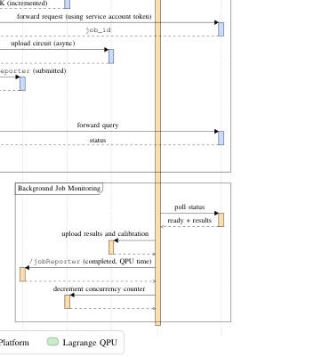 
Fig. 2. Sequence diagram of the job submission and completion flow.

**Main problem.** The lack of administrative, multi-tenant, and resource-management features in vendor-provided software for on-premises quantum computers, making it difficult to manage shared access for diverse research and educational groups.

**Main result.** The development and successful nine-month deployment of the 'Lagrange' software stack, which enables fair, budget-based, and multi-institutional access to an IQM Spark quantum computer with 98% uptime.

**Method.** A modular, Python-based middleware layer acting as a transparent reverse proxy that intercepts API calls to enforce project budgets, user authorization, and concurrency limits without requiring changes to user workflows.

**Summary.** This paper presents the implementation of 'Lagrange,' a software management stack designed to turn a single-user quantum computer into a multi-tenant research and educational resource. By using a transparent proxy architecture, the system allows researchers and students to use standard libraries like Qiskit and Cirq while the platform enforces institutional budgets and fair usage policies. The deployment has successfully managed hundreds of thousands of jobs with high reliability. It serves as a blueprint for institutions looking to host and share on-premises quantum hardware.

Detailed structure

**Model / system.** The Lagrange infrastructure manages an IQM Spark five-qubit superconducting quantum computer with a star topology, hosted at Politecnico di Torino and managed by the LINKS Foundation.

**Key observables.** QPU execution time, system uptime, qubit fidelity, cryostat diagnostics, and job throughput (over 240,000 jobs).

**Important parameters / regimes.** Budgeting measured in QPU milliseconds, a maximum concurrency limit of 2.5 million shots per user, and a 10 Gbps fiber interface.

**Assumptions / limitations.** The middleware assumes the ability to intercept and proxy the IQM REST API without modifying vendor client software and relies on the availability of a Keycloak instance for identity management.

**Figures summary.** Figure 1 shows the conceptual architecture of the Lagrange software stack and the QC Gateway; Figure 2 provides a sequence diagram of the end-to-end job submission and authorization workflow.

**Paper structure.** The paper introduces the management challenge, describes the hardware and infrastructure, details the middleware architecture and plugin design, reports on operational metrics and educational usage, and concludes with lessons learned.

Abstract

We describe the design, implementation, and nine-month operational experience of the software management stack for Lagrange, an IQM Spark five-qubit superconducting quantum computer jointly acquired by LINKS Foundation, Politecnico di Torino and the Italian National Institute of Metrological Research (INRiM), and managed by LINKS. Lagrange is, to our knowledge, the first quantum computer in Italy that is fully operational and accessible to students and researchers from multiple institutions under formal service agreements, and to the general public under commercial agreements. When installed in mid-2025, the IQM Spark hardware was delivered by the vendor with authentication only: no billing, project management or fair usage enforcement were provided. We developed a modular middleware layer that filled that gap without modifying any vendor client software, by intercepting API calls through a proxy that enforces project-based budgets, reservation-aware authorisation, and per-user fairness policies. The middleware adopts a plugin architecture that cleanly separates vendor-specific logic from site-specific policies, enabling reuse across different quantum hardware backends and deployment contexts. Since entering production in September 2025, the system has processed over 240,000 quantum jobs totalling more than 1 week of QPU execution time, with greater than 98% uptime. Notably, students at Politecnico di Torino regularly use the machine during both lectures and formal examinations -- a practice we believe to be unique in Europe. We report on the system architecture, the operational lessons learned, and the infrastructure choices that made this deployment possible.

[↑ back to top](#top)

### [Near-Term Reduction in Nonlocal Gate Count from Distributed Logical Qubits](http://arxiv.org/abs/2604.21722v1)

**Authors:** Bruno Avritzer, Nathan Sankary  
**Type:** theory · **Category:** quantum information and computing · **PDF:** <https://arxiv.org/pdf/2604.21722v1>  
**Analysis basis:** full PDF text, analyzed in chunks

📷 Fig 1

 
Figure 2: The cut which allows an equal partition of the d = 7 4.8.8 color code. In this case, there are two 4.8.8 blocks, each with its own set of stabilizer ancillas, and each split 50-50 across two processors. As indicated by the grey and purple dots, in one of the two logical qubits, one ancilla for one of the green octagon checks is allocated to processor B. Since this stabilizer is split 4 to 4, this does not increase the amount of PNL gates, but allows strict adherence to the qubit requirements. The total number of PNL gates is thus 4*7=28, less than the 31 required if the codes are PL.

📷 Fig 2

 
Figure 1: Distributed logical qubits require PNL stabilizer measurements as opposed to PNL transversal gate implementations (top). In this work, these PNL gates are mainly implemented by gate teleportation (bottom, |ψ⟩as the control and |ϕ⟩as the target).

📷 Fig 3

 
Figure 4: With distribution of a logical qubit block over multiple processors, larger distances (and therefore reductions in PNL CNOTs) may be required to realize advantage if error correction is performed after each logical CNOT. Assuming the logical qubit is cut once per processor resulting in one partition per processor (2 processors require 1 cut resulting in 2 partitions), so that all two-qubit gates are processor-local, the minimum distance threshold required for an overall PNL reduction scales roughly linearly in the number of processors.

📷 Fig 4

 
Figure 3: In the two processor (two logical qubit) case (top), in the 4.8.8 family distributed codes see advantage at and above d = 7, and the overall trend is in agreement with the scaling behavior previously cited. By contrast, the 6.6.6 family of codes sees advantage only at d = 9 due to the structure of the stabilizers making near-equal bipartitions costly in terms of cut stabilizer weight (bottom).

📷 Fig 5

 
Figure 6: In the fully distributed case, split distillation qubits are allocated on the same processors as split computational qubits. This reduces the per-processor qubit requirements for magic factories while keeping distillation and injection operations PL no matter which qubit is postselected. The total number of PNL gates is O(d), resulting from the syndrome extractions within the individual codes.

📷 Fig 6

 
Figure 5: Two methods of realizing universality in fault-tolerant systems: magic state injection (a) and code switching (b, adapted from[17]). Although these methods differ in their circuit realizations, in both cases there are regimes where they benefit and suffer from distributed execution across processors.

📷 Fig 7

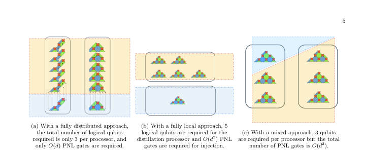 
Figure 7: Comparison of overhead between (a) fully distributed, (b) fully local, and (c) partially local magic factories. The fully distributed factory performs best for small circuits, whereas for large circuits, it has a slightly higher total qubit overhead, but the size of each individual processor can be smaller than that of the magic factory in (b) and a lower number of PNL gates is required compared to (b), although this is network topology-dependent. Approach (c) performs worse in terms of PNL gates, but may have some advantages in meeting network topology constraints.

📷 Fig 8

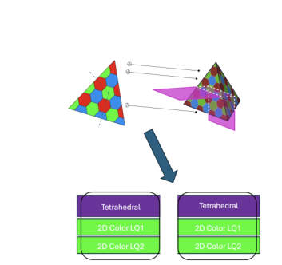 
Figure 8: When 3D and 2D codes are both split across processors, code switching may be performed processor-locally. With sufficient connectivity, this can reduce qubit overhead compared to single processors with both codes by allowing multiple logical qubits to interact with the tetrahedral code processor-locally.

📷 Fig 9

 
Figure 9: Comparison of local vs distributed code switching costs for two different forms of stabilizer measurement.

📷 Fig 10

 
Figure 10: By swapping (data to data) or teleporting (data to ancilla) the qubits from the split code into local structures, non-Clifford resources can be acquired with significantly fewer PNL gates, assuming there is a long chain of switching or distillation required due to circuit gate structure. This can then be undone or partially undone to execute chains of CNOTs, which can then become local as well.

**Main problem.** Minimizing the number of processor-nonlocal (PNL) operations in distributed quantum computing architectures to reduce the overhead caused by noisy or low-speed inter-processor interconnects.

**Main result.** The authors demonstrate that a 10% reduction in PNL gates is achievable in near-term, low-qubit-count devices using distributed logical qubits, with advantages scaling significantly in multi-qubit/multi-processor cases.

**Method.** The study uses qubit allocation techniques via a constraint programming satisfiability (CP-SAT) approach and evaluates various methods for universality, such as magic state distillation, code switching, and logical swaps.

**Summary.** This paper addresses the challenge of reducing expensive inter-processor communication in distributed quantum computing. By optimizing how logical qubits are partitioned across multiple processors using color codes, the authors show that the number of non-local gates can be reduced by 10% in near-term devices. The research also explores how different methods for achieving universal gate sets, such as code switching and magic state distillation, impact the scalability and overhead of these distributed architectures.

Detailed structure

**Model / system.** A modular, distributed quantum computing architecture utilizing error-correcting color codes, specifically the square-octagon (4.8.8) and 6.6.6 families, partitioned across multiple processors.

**Key observables.** Processor-nonlocal (PNL) gate count, code distance (d), and qubit overhead.

**Important parameters / regimes.** Code distance (d), number of processors, and the ratio of transversal to non-transversal gates.

**Assumptions / limitations.** The study assumes a setting where syndrome extraction occurs after every logical gate and adheres to minimal physical qubit requirements including ancillas.

**Figures summary.** Figure 1 illustrates PNL gate implementation via CNOT teleportation; Figure 2 shows a specific code cut for partitioning; Figure 3 compares PNL advantages across different code families; Figure 4 shows scaling of distance thresholds with processor count; Figures 5-11 detail universality methods, magic factory overheads, and partitioning strategies.

**Paper structure.** The paper introduces the problem of PNL reduction in distributed architectures, presents a qubit allocation method using color codes, evaluates universality approaches (MSI, code switching, swaps), analyzes scaling and architectural trade-offs, and concludes with implications for scalable allocation algorithms.

Abstract

Modular quantum computing architectures require error correction schemes that remain effective in the presence of noisy inter-processor operations. As such, minimizing the number of such operations on logical circuits partitioned across quantum processors is a primary objective of distributed quantum computing. In this work, we develop basic techniques for qubit allocation using an exemplar color code family and explore generalizations to other color codes. In particular, we show that a 10% reduction in processor-nonlocal gates is achievable in a setting where syndrome extraction occurs after every logical gate, as in today's devices, and that this scales to significantly greater advantages in the multi-qubit case. We also explore methods of achieving universal gate sets efficiently in this distributed logical setting and evaluate the trade-offs of multiple approaches such as magic state distillation, code switching, and a new method based on logical swaps. Finally, we discuss some considerations for an allocation algorithm for these architectures to perform scalably and connect it to existing work on quantum circuit partitions.

[↑ back to top](#top)

### [Odd Physics Off the Diagonal: Constraining CP-violating SMEFT with Quantum Tomography](http://arxiv.org/abs/2604.21857v1)

**Authors:** Avalon Roberts, Patrick Dougan, Alexander Oh, Savanna Shaw  
**Type:** both · **Category:** other · **PDF:** <https://arxiv.org/pdf/2604.21857v1>  
**Analysis basis:** full PDF text, analyzed in chunks

📷 Fig 1

 
Figure 1: The ϕtruth distribution at LO for the pro- cess pp →W +Z →e+νeµ+µ−with the inclusive setup of Ref. [25], applying the invariant mass cut 81 GeV &lt; Mµ+µ−&lt; 101 GeV. The upper panel shows the differential cross section dσ/dϕ∗ e in units of fb, comparing the SM prediction (red) with the SM + interference and SM + interference + quadratic contri- butions for ceven = 1.0 (solid) and codd = 1.0 (dashed). The middle and lower panels show the ratio to the SM for the interference and quadratic-only contributions, respectively.

📷 Fig 2

 
Figure 2: The real component of the spin density mat- rix of the W +Z system in the SM, showing the full spin structure of this process in the helicity basis. The un- physical small negative values along the central diag- onal are due partly to the statistical resolution of this study, and to NLO effects.

📷 Fig 3

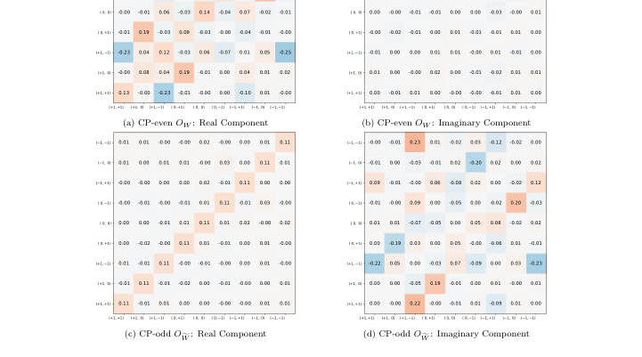 
Figure 3: The reconstructed SDMs for the interference terms of the CP-even OW (above) and CP-odd Of W (below) operators with the SM, separated into their real (left) and imaginary (right) components. The separ- ation of the off-diagonal structure between the CP-odd and CP-even into the imaginary and real parts of the SDM means that this can be used to set 2D limits on them.

📷 Fig 4

 
Figure 4: The reconstructed SDMs for the quadratic terms of the CP-even OW operator (left) and the CP-odd Of W operator (right) in the inclusive (top) selection setup and the fiducial (bottom) setup. It can be seen that some entries become falsely split between elements due to the neutrino reconstruction ambiguity. The unphysical small negative values along the central diagonal are due partly to the statistical resolution of this study, and to NLO effects.

📷 Fig 5

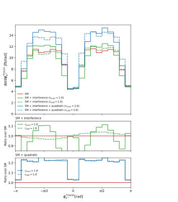 
Figure 6: The ϕreco distribution at LO in QCD for the process pp →W +Z →e+νeµ+µ−with the fiducial setup of Ref. [25], applying the selections of Eq. (3.2), with the neutrino rapidity solution chosen at random from Eq. (16). The upper panel shows the differential cross section dσ/dϕ∗ e in units of fb, comparing the SM prediction (red) with the SM + interference and SM + interference + quadratic contributions for ceven = 1.0 (solid) and codd = 1.0 (dashed). The middle and lower panels show the ratio to the SM for the interference- only and quadratic contributions, respectively.

📷 Fig 6

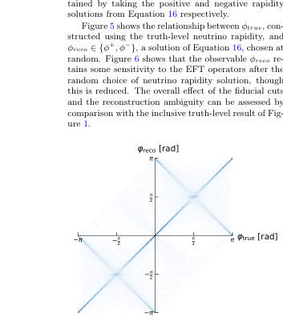 
Figure 5: A heatmap of the reconstructed azimuthal decay angle ϕreco versus the truth-level ϕtrue for the W boson, with the neutrino rapidity solution chosen at random from Eq. (16). The two diagonal bands reflect the two-fold ambiguity of Eq. (18), with each solution equally likely to be selected.

📷 Fig 7

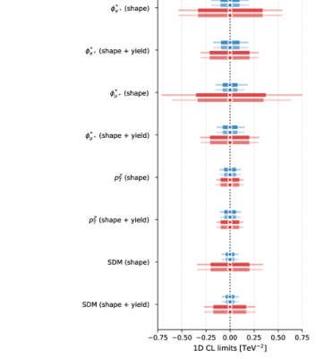 
Figure 7: 1D CL limits on OW and Of W derived with other operator fixed to zero and with the other oper- ator profiled over, for the shape-only and shape-plus- yield configurations of the ϕ, pZ T and SDM observables. The boxes represent 68% CL limit bounds, the lines represent 95% CL limit bounds. The limits are pro- duced within the fiducial selection.

📷 Fig 8

 
Figure 8: Expected joint confidence regions in the (cW , cf W ) plane derived from the positron azimuthal decay- angle distribution ϕ∗ e+ (top) and the reconstructed spin density matrix (bottom), each in shape-only (left) and shape-plus-yield (right) configurations, for the inclusive setup. The contours correspond to constant ∆χ2 with respect to the SM point at fixed confidence levels. Contour limits are extracted based on both a SM Asimov scenario, but also a set of NP Asimov setups with varying degrees of OW and Of W present in the dataset across the grid. This demonstrates of the SDM-based analysis’s ability to differentiate actual CP-even and CP-odd signatures from each other...

📷 Fig 9

 
Figure 9: Expected joint confidence regions in the (cW , cf W ) plane derived from the positron and anti-muon azimuthal decay-angle distributions, ϕ∗ e+ (top) and ϕ∗ µ+ with the fiducial selection of Eq. (14) applied and the neutrino rapidity reconstructed via the on-shell W-mass constraint of Eq. (16). The effect of the fiducial cuts and reconstruction ambiguity on the sensitivity of ϕ∗ e+ can be assessed by comparison with Figures 8a and 8b. Constraints from ϕ∗ µ+ are unaffected by neutrino reconstruction and so slightly exceed the strength of those from ϕ∗ e+.

📷 Fig 10

 
Figure 10: Expected joint confidence regions in the (cW , cf W ) plane derived from the positron and anti-muon azimuthal decay-angle distributions, pZ T (top) and the SDM (bottom) with the fiducial selection of Eq. (14) applied and the neutrino rapidity reconstructed. The differential nature of the pZ T distribution tail gives strong constraints of the SM Asimov, with a smaller contour area, A95% than achieved by the SDM with the addi- tion of cross-section information. The SDM however performs better by the same metric in the genuine BSM scenarios presented in the off-centre points of the Asimov grid. In these cases the SDM also show clearer differentiation between BSM hypotheses than pZ T...

**Main problem.** The difficulty in distinguishing CP-even from CP-odd SMEFT operators in diboson production due to degeneracies in traditional polarization-blind angular observables.

**Main result.** Quantum Tomography of the Spin Density Matrix (SDM) provides superior simultaneous sensitivity to CP-even and CP-odd contributions by exploiting off-diagonal imaginary components and quadratic NP terms.

**Method.** Reconstruction of the Spin Density Matrix using the Generalized Bloch Vector representation and the inverted Wigner-Weyl formalism applied to Monte Carlo simulated $WZ$ production events.

**Summary.** This paper proposes using Quantum Tomography techniques to improve searches for new physics in the electroweak sector. By reconstructing the Spin Density Matrix of $WZ$ production, the authors can distinguish between CP-even and CP-odd operators that otherwise appear degenerate in standard angular distributions. The method specifically exploits the off-diagonal elements of the density matrix to capture the full signature of Beyond-SM physics. This approach provides tighter and less degenerate constraints on SMEFT Wilson coefficients compared to traditional kinematic observables.

Detailed structure

**Model / system.** The bipartite spin state of a $W$ and $Z$ boson system produced in $pp$ collisions ($pp 	o WZ 	o e^+
u_e\mu^+\mu^-$) within the Standard Model Effective Field Theory (SMEFT) framework.

**Key observables.** Spin Density Matrix (SDM) elements, Fano coefficients, azimuthal decay angles ($\phi$), and transverse momentum of the $Z$ boson ($p^Z_T$).

**Important parameters / regimes.** SMEFT Wilson coefficients ($c_W$ and $c^f_W$), high-energy electroweak regime, and $140 	ext{ fb}^{-1}$ luminosity.

**Assumptions / limitations.** Leading-order (LO) accuracy, neglect of backgrounds and systematic uncertainties, and the use of the Warsaw basis for dimension-six operators.

**Figures summary.** Figure 1 shows angular distribution degeneracies; Figures 2-4 display reconstructed SDM components and the impact of neutrino reconstruction ambiguity; Figures 7-10 present 1D and 2D confidence intervals for Wilson coefficients.

**Paper structure.** The paper motivates the need for new CP-violation sources, identifies limitations in current SMEFT searches, introduces the Quantum Tomography approach, details the SDM reconstruction method, compares performance against traditional observables, and quantifies statistical sensitivity.

Abstract

New sources of charge-parity (CP) violation beyond those described in the Standard Model (SM) are required to explain the observed matter--antimatter asymmetry of the Universe. The Standard Model Effective Field Theory (SMEFT) provides a framework to introduce additional electroweak sources of CP-odd physics in a model-independent manner. However, these CP-violating signatures are mostly degenerate to CP-even SMEFT operators in polarisation-blind observables, distinguishable only in the SM-New Physics (NP) interference using the azimuthal decay angle. Using Quantum Tomography techniques, we present a new approach to constraining these NP effects. Reconstructing the spin density matrix (SDM) of a diboson system, we go beyond `interference resurrection' to exploit the full signature of the Beyond-SM physics, including the pure quadratic NP terms. We show that this approach provides superior simultaneous sensitivity to characteristic features of CP-even and CP-odd contributions, including effects not fully captured by traditional angular observables.

[↑ back to top](#top)

### [Partial oracles quantum algorithm framework -- Part I: Analysis of in-place operations](http://arxiv.org/abs/2604.21788v1)

**Authors:** Fintan M. Bolton  
**Type:** theory · **Category:** quantum information and computing · **PDF:** <https://arxiv.org/pdf/2604.21788v1>  
**Analysis basis:** full PDF text, analyzed in chunks

📷 Fig 1

 
FIG. 1. Overview of partial oracle iterations. At each iteration stage j, a search is executed to

📷 Fig 2

 
FIG. 2. First partial oracle iteration showing: (a) the initial equal superposition state; (b) index

📷 Fig 3

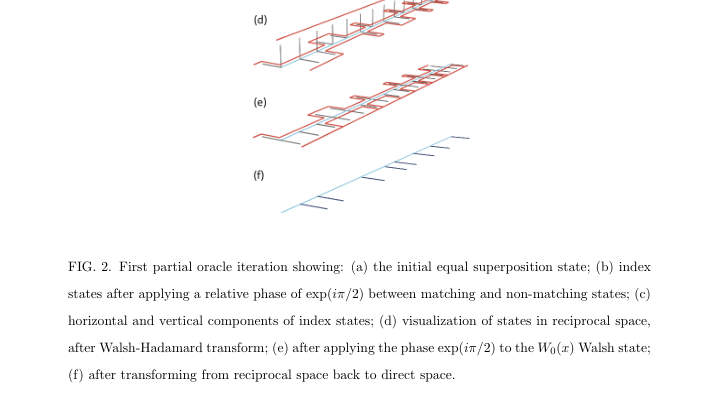 
Figure 2 shows a visualization of the Grover-Long algorithm, implementing the first

📷 Fig 4

 
Figure 3 shows a visualization of the modified Grover-Long algorithm, implementing

📷 Fig 5

 
FIG. 3. Second (and subsequent) partial oracle iteration: (a) index states remaining after the

📷 Fig 6

 
Figure 4 shows the corresponding circuit for the majority oracle function, which requires

📷 Fig 7

 
FIG. 6. Reciprocal majority gate

📷 Fig 8

 
Figure 7 shows the corresponding circuit for the choose function, which requires just two

📷 Fig 9

 
FIG. 7. Circuit for the choose function Ch(a, b, c)

📷 Fig 10

 
FIG. 8. Reciprocal choose gate

**Main problem.** The paper addresses the lack of an explicit method for constructing the search iteration operator within the 'partial oracles' quantum algorithm framework, which aims to potentially achieve exponential speedup over Grover's algorithm.

**Main result.** The author provides the missing construction for the search iteration operator for in-place oracle functions and introduces the 'reciprocal transform' to reorder Walsh functions in reciprocal space.

**Method.** The method utilizes a new 'reciprocal transform' that obeys a chain rule, allowing complex oracle functions to be decomposed into simple steps, and implements these using the QFrame Python library.

**Summary.** This paper develops a critical component of the partial oracles quantum algorithm framework by providing a method to construct search iteration operators. By introducing the 'reciprocal transform,' the author shows how complex, multi-bit oracle functions can be decomposed and implemented in quantum circuits. While the current focus on in-place operations does not yet prove quantum advantage, the work demonstrates the ability to invert simplified cryptographic primitives like SHA-256 components. The introduction of the QFrame library also provides a tool for automating the generation of these complex quantum circuits.

Detailed structure

**Model / system.** The framework uses a quantum computing model involving an n-qubit index register, multi-bit oracle functions, and operations in both direct (index) and reciprocal (Walsh function) spaces.

**Key observables.** The success of the algorithm is measured by the probability of finding the target index $x_s$ where all oracle bits satisfy a specific condition (e.g., all zeros).

**Important parameters / regimes.** The paper distinguishes between 'in-place' operations (where results are read from the index qubits) and 'out-of-place' operations; it also focuses on bijective (one-to-one) oracle functions.

**Assumptions / limitations.** The current construction is limited to in-place operations, which are classically reversible and thus do not yet demonstrate quantum advantage; the framework also assumes the oracle function is bijective.

**Figures summary.** Figure 1 shows the nested structure of partial oracle iterations; Figure 2 and 3 visualize the transition through Walsh-Hadamard and reciprocal transforms; Figures 4-12 illustrate specific quantum circuits for cryptographic primitives like Maj, Ch, and modulo addition.

**Paper structure.** The paper introduces the partial oracles framework, defines the reciprocal transform and its chain rule, provides the construction for in-place operators, demonstrates applications to SHA-256 components, and introduces the QFrame automation library.

Abstract

The partial oracles framework is a quantum search algorithm that has the potential to exceed the quadratic speedup of Grover's algorithm, up to a theoretical maximum of an exponential speedup. Until now, however, the framework has lacked an explicit method for constructing the operator that represents the search iteration. In this paper, we provide the missing construction, for the special case of an oracle function definable using only in-place operations (that is, where the calculated result of the oracle function can be read just from the qubits in the search index). The restriction to in-place operations means that the current work does not yet exhibit quantum advantage: oracle functions constructed using only in-place operations are always classically reversible. To demonstrate quantum advantage, it will be necessary to extend this construction method to include out-of-place operations (part II). As part of the construction of the search iteration operator, we define a new type of transform, the reciprocal transform, which is applied to the oracle function. We show that the reciprocal transform obeys a chain rule, which makes it possible to break down complex transforms into simple steps. To illustrate the practical application of this search method, we apply the reciprocal transform to elementary operations from the SHA-256 hash algorithm: addition modulo $2^n$, the $Maj(a, b, c)$ function, the $Ch(a, b, c)$ function, and the bit shift functions. We also introduce the QFrame python library, which is used to automate the construction of quantum circuits that represent reciprocal transforms.

[↑ back to top](#top)

### [Quantum-information diagnostics of cosmological perturbations with nontrivial sound speed in inflation](http://arxiv.org/abs/2604.21755v1)

**Authors:** Shi-Cheng Liu, Lei-Hua Liu, Bichu Li, Hai-Qing Zhang, Peng-Zhang He  
**Type:** theory · **Category:** other · **PDF:** <https://arxiv.org/pdf/2604.21755v1>  
**Analysis basis:** full PDF text, analyzed in chunks

📷 Fig 1

 
Figure 1. The numerical results of rk in terms of log10 a for inflation, where we have k = 1 and H0 = 1 for simplicity.

📷 Fig 2

 
Figure 2. The numerical results of ϕk in terms of log10 a for inflation, where we have k = 1 and H0 = 1 for simplicity.

📷 Fig 3

 
Figure 3. The numerical results of Purity in terms of log10 a for inflation, where we have set k = 1 and H0 = 1.

📷 Fig 4

 
Figure 4. The numerical results of R´enyi Entropy and Von Neumann entropy in terms of log10 a for inflation, where we have set k = 1 and H0 = 1.

📷 Fig 5

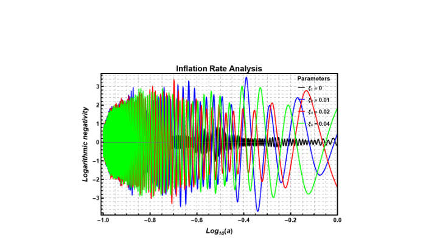 
Figure 5. The numerical results of Logarithmic negativity in terms of log10 a for inflation, where we have set k = 1 and H0 = 1.

**Main problem.** The study investigates how a non-trivial sound speed (specifically via sound-speed resonance) in the early universe affects the quantum-information signatures of cosmological perturbations.

**Main result.** A non-trivial sound speed significantly suppresses purity and enhances entropy production, effectively modulating the decoherence process and postponing the onset of classicality.

**Method.** The authors use an open-system normalized two-mode squeezed-state (OTMSS) framework and introduce a bounded variable x = tanh(rk) to regularize numerically stiff evolution equations.

**Summary.** This paper explores how fluctuations in the speed of sound during inflation leave imprints on the quantum entanglement and entropy of the early universe. By using an open-system framework, the authors show that a non-trivial sound speed enhances the mixedness of the system and alters the transition from quantum to classical behavior. The study provides specific quantum-information signatures, such as modulated logarithmic negativity and suppressed purity, that could potentially distinguish different inflationary models.

Detailed structure

**Model / system.** The system consists of scalar cosmological perturbations during the inflationary epoch within a spatially flat FLRW metric, featuring a sound-speed-resonance (SSR) parametrization.

**Key observables.** Purity, von Neumann entropy, Renyi entropies, and logarithmic negativity.

**Important parameters / regimes.** Sound speed (cs), SSR oscillation amplitude (xi), squeezing amplitude (rk), and squeezing phase (phi_k).

**Assumptions / limitations.** The study assumes the Bunch-Davies vacuum as the initial state and focuses on the inflationary regime due to numerical stability constraints.

**Figures summary.** Figure 1 shows the evolution of squeezing amplitude; Figure 2 shows the reduction in squeezing phase amplitude; Figure 3 illustrates the decrease in purity; Figure 4 and 5 show the enhancement of entropy and oscillations in logarithmic negativity.

**Paper structure.** The paper establishes the background and SSR model, derives the modified Hamiltonian, applies the OTMSS framework, performs numerical simulations using a regularized variable, and analyzes the resulting quantum-information diagnostics.

Abstract

In this work, we systematically investigate the quantum-information diagnostics of cosmological perturbations with a nontrivial sound speed, utilizing a normalized open two-mode squeezed-state framework. Rather than introducing new observables, our analysis focuses on how a modified sound speed dynamically reshapes the Schrödinger evolution of the squeezing parameters ($r_k$ and $φ_k$). We demonstrate how these dynamical changes are inherited by the reduced density matrix of the observable sector. By employing a sound-speed-resonance parametrization, we derive and evaluate the purity, von Neumann entropy, Rényi entropies, and logarithmic negativity. To overcome the intrinsic multiscale stiffness of the post-inflationary equations, we introduce a bounded variable $x = \tanh r_k$ as a partial regularization, which enables reliable numerical simulations exclusively within the inflationary regime. Our numerical results reveal that a nontrivial sound speed significantly suppresses the purity of the reduced state, indicating enhanced effective mixedness. Simultaneously, it strongly amplifies and modulates both the entropic and entanglement diagnostics. More precisely, a nontrivial sound speed postpones the onset of classicality by modulating the decoherence process. Ultimately, we show that a nontrivial sound speed leaves distinct and identifiable quantum-information signatures within the entanglement structure of the early universe.

[↑ back to top](#top)

### [Replay-buffer engineering for noise-robust quantum circuit optimization](http://arxiv.org/abs/2604.21863v1)

**Authors:** Akash Kundu, Sebastian Feld  
**Type:** theory · **Category:** quantum information and computing · **PDF:** <https://arxiv.org/pdf/2604.21863v1>  
**Analysis basis:** full PDF text, analyzed in chunks

📷 Fig 1

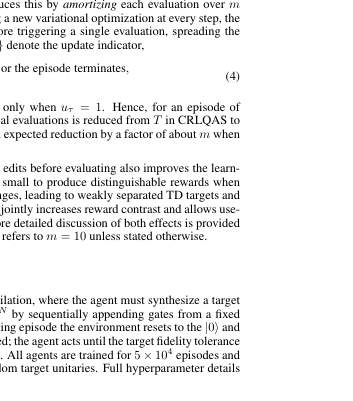 
Figure 2: 1-qubit compiling of Haar-random target unitaries with RX, RY, RZ(±π/128) gates. (Left) Suc- cess probability and mean fidelity at tolerances 0.99, 0.999, and 0.9999, where ReaPER+ performs best over- all. (Right) mean circuit length with std. dev. error bars versus tolerance; although all methods require deeper circuits at higher accuracy and exhibit a similar growth rate with tightening tolerance, ReaPER+ maintains a consistently lower circuit-length offset, giving the best accuracy-length tradeoff across all tolerance levels.

📷 Fig 2

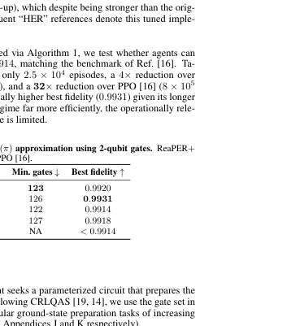 
Figure 3 compares replay strategies on the smaller-scale systems. ReaPER+ achieves the low- est energy error among prioritized methods with competitive circuit compactness; fixed ReaPER (ω=0.4 for BEH2, ω=0.6 for H2O) produces the most compact circuits, reflecting the longer-horizon credit assignment at larger scale (full ω sensitivity in Appendix I). Uniform replay yields superfi- cially shorter circuits but at substantially higher energy error, indicating early trapping in local min- ima. As shown in Table 2, OptCRLQAS with ReaPER+ (denoted as “OptCRLQAS + ReaPER+”) achieves the lowest energy error across 5-, 6-, and 8-qubit QAS problems, outperforming non-RL baselines such as DQAS [36],...

📷 Fig 3

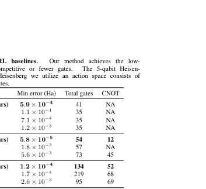 
Figure 3: Replay-buffer design controls circuit compactness in QAS. For 6-BEH2 and 8-H2O, ReaPER+ variants yield the lowest total, CNOT, and rotation gate counts compared to PER and uniform replay (mean ± std over seeds). ω=0 recovers PER; ω=1 gives fully reliability-adjusted replay.

📷 Fig 4

 
Figure 4: Efficiency and performance on 12-qubit H2O. (Left) OptCRLQAS reduces wall-clock time per episode by 67.5% over CRLQAS [19]. (Right) ReaPER achieves the lowest minimum energy error and fastest convergence across all replay baselines.

📷 Fig 5

 
Figure 5: Weighted transfer matrix for BEH2 under noiseless and noisy transfer. Buffer transfer reduces steps to chemical accuracy by 47-58% and improves final energy by up to 90.2% across all noise settings, yield- ing composite scores of 19.2-35.8%. The strongest score (35.8%) is driven by the largest energy improvement at p2=0.001.

📷 Fig 6

 
Figure 6: Weighted transfer matrix for H2O under noiseless and noisy transfer. Step reductions range from 49.8% to 84.8%, and energy improvements reach 46.7% under combined noise (p1=0.001, p2=0.005), yielding the highest score of 28.7%.

📷 Fig 7

 
Figure 8: ReaPER+ progressively concentrates buffer mass toward higher-fidelity transitions (fidelity ≥0.95) while retaining broader early-training coverage, consistent with its annealed transition from PER-like exploration to ReaPER-like reliability-aware sampling. PER maintains broader low-fidelity coverage through- out training, while ReaPER shows intermediate concentration behavior.

📷 Fig 8

 
Figure 9: LunarLander-v3 validation of ReaPER+. (Left) rolling success rate (300-episode window). (Middle) ReaPER+ (blue) reaches a higher success rate faster and maintains a higher asymptotic level than fixed ReaPER (red) and PER (green). (Right) normalized cumulative-return AUC. ReaPER+ accumulates +9% more return over the full training run, confirming improved sample efficiency on a dense-reward classical benchmark. All methods use identical DQN agents, only the replay mechanism differs.

📷 Fig 9

 
Figure 9 summarizes two complementary metrics. Left: the 300-episode rolling success rate (frac- tion of episodes exceeding the +200 solved threshold). ReaPER+ reaches a higher success rate earlier in training and sustains a higher asymptotic level (≈60% at episode 4500) compared with fixed ReaPER (≈50%) and PER (≈55%). Right: the normalized area under the reward curve (AUC), computed as the per-episode running mean of the cumulative return, shifted and normalized to [0, 1]. ReaPER+ achieves a +9% AUC advantage over both baselines by episode 5000, indicating better sample efficiency throughout training.

**Main problem.** Inefficiencies in Deep Reinforcement Learning for quantum circuit optimization, specifically regarding unreliable TD targets, high computational costs in architecture search, and the loss of useful data when transitioning from noiseless to noisy environments.

**Main result.** The introduction of ReaPER+ achieves 4-32x gains in sample efficiency and significantly reduces the steps to reach chemical accuracy (by 85-90%) while reducing wall-clock time per episode by up to 67.5%.

**Method.** The authors propose ReaPER+ (an annealed replay rule transitioning from TD-error prioritization to reliability-aware sampling), OptCRLQAS (an amortized curriculum learning approach), and a lightweight replay-buffer transfer scheme for noise-robustness.

**Summary.** This paper presents a suite of Reinforcement Learning enhancements designed to make quantum circuit optimization more efficient and robust to noise. By using an annealed replay strategy (ReaPER+), the authors bridge the gap between exploration and stability in training. They also introduce methods to reduce the computational overhead of evaluating quantum circuits and a way to reuse data from perfect simulators to jump-start training on noisy hardware. These improvements significantly accelerate the discovery of high-fidelity, compact quantum circuits for molecular simulations.

Detailed structure

**Model / system.** The research applies to quantum circuit compilation and Quantum Architecture Search (QAS) for molecular Hamiltonians (e.g., H2O, BeH2) and the Heisenberg model, operating in both noiseless and noisy (depolarizing noise) regimes.

**Key observables.** Success probability, circuit compactness (gate count/depth), energy error (chemical accuracy), and wall-clock time.

**Important parameters / regimes.** Annealing exponent (omega), annealing timescale (T_ann), noise strengths (p1, p2), and number of qubits (5, 6, 8, 12).

**Assumptions / limitations.** The study assumes fixed DQN/DDQN backbones and that the buffer transfer scheme requires shared state and action spaces between source and target environments.

**Figures summary.** Figure 1 outlines the three-part framework; Figure 2 shows 1-qubit compiling success/fidelity; Figure 3 compares circuit compactness; Figure 4 shows OptCRLQAS efficiency; Figure 8 shows replay buffer fidelity evolution; Figure 9 validates the method on the classical LunarLander task.

**Paper structure.** The paper introduces the three-part framework (buffer engineering, amortized learning, and noise-aware transfer), provides theoretical justification for the annealing rule, presents experimental results on quantum compilation and QAS tasks, validates the principle on a classical benchmark, and discusses limitations and future work.

Abstract

Deep reinforcement learning (RL) for quantum circuit optimization faces three fundamental bottlenecks: replay buffers that ignore the reliability of temporal-difference (TD) targets, curriculum-based architecture search that triggers a full quantum-classical evaluation at every environment step, and the routine discard of noiseless trajectories when retraining under hardware noise. We address all three by treating the replay buffer as a primary algorithmic lever for quantum optimization. We introduce ReaPER$+$, an annealed replay rule that transitions from TD error-driven prioritization early in training to reliability-aware sampling as value estimates mature, achieving $4-32\times$ gains in sample efficiency over fixed PER, ReaPER, and uniform replay while consistently discovering more compact circuits across quantum compilation and QAS benchmarks; validation on LunarLander-v3 confirms the principle is domain-agnostic. Furthermore we eliminate the quantum-classical evaluation bottleneck in curriculum RL by introducing OptCRLQAS which amortizes expensive evaluations over multiple architectural edits, cutting wall-clock time per episode by up to $67.5\%$ on a 12-qubit optimization problem without degrading solution quality. Finally we introduce a lightweight replay-buffer transfer scheme that warm-starts noisy-setting learning by reusing noiseless trajectories, without network-weight transfer or $ε$-greedy pretraining. This reduces steps to chemical accuracy by up to $85-90\%$ and final energy error by up to $90\%$ over from-scratch baselines on 6-, 8-, and 12-qubit molecular tasks. Together, these results establish that experience storage, sampling, and transfer are decisive levers for scalable, noise-robust quantum circuit optimization.

[↑ back to top](#top)

### [Subsystem-Resolved Spectral Theory for Quantum Many-Body Hamiltonians](http://arxiv.org/abs/2604.21929v1)

**Authors:** MD Nahidul Hasan Sabit  
**Type:** theory · **Category:** statistical mechanics · **PDF:** <https://arxiv.org/pdf/2604.21929v1>  
**Analysis basis:** full PDF text, analyzed in chunks

📷 Fig 1

 
Low-resolution page preview, page 2

📷 Fig 2

 
Low-resolution page preview, page 3

📷 Fig 3

 
Low-resolution page preview, page 4

📷 Fig 4

 
Low-resolution page preview, page 5

📷 Fig 5

 
Low-resolution page preview, page 6

📷 Fig 6

 
Low-resolution page preview, page 7

📷 Fig 7

 
Low-resolution page preview, page 8

📷 Fig 8

 
Low-resolution page preview, page 9

📷 Fig 9

 
Low-resolution page preview, page 10

📷 Fig 10

 
Low-resolution page preview, page 11

**Main problem.** The global spectrum of a many-body Hamiltonian fails to capture the inherent locality of interactions. The paper seeks to develop a subsystem-resolved spectral framework that organizes spectral data according to the geometry and interaction structure of subsystems.

**Main result.** The authors prove that subsystem Hamiltonians can be locally approximated with exponentially decaying error and that their spectra are stable under such truncations. Furthermore, they show that the spectra of spatially separated subsystems are approximately additive, becoming exact for finite-range interactions.

**Method.** The study uses an operator-algebraic framework, employing interaction norms to measure the decay of interaction strengths and spectral perturbation theory (Hausdorff distance) to relate operator-level approximations to spectral stability.

**Summary.** This paper introduces a new way to study the energy spectra of quantum many-body systems by looking at subsystems rather than just the global Hamiltonian. It demonstrates that the spectrum of a local region can be accurately approximated by looking at a finite neighborhood and that the spectra of two distant regions can be roughly added together. This proves that the locality of physical interactions is directly reflected in the structure of the system's energy levels. The framework provides a mathematical foundation for connecting interaction geometry to spectral behavior.

Detailed structure

**Model / system.** The framework applies to quantum many-body Hamiltonians acting on a tensor product Hilbert space, where the Hamiltonian is a sum of local interaction terms with exponentially decaying strengths.

**Key observables.** Subsystem spectrum (sigma(H_S)) and the Hausdorff distance between spectra.

**Important parameters / regimes.** Interaction norm (Phi_mu), subsystem radius (r), spatial separation (D), and interaction decay rate (mu).

**Assumptions / limitations.** The system is assumed to have a finite index set and interactions must satisfy a specific exponential decay condition (finite interaction norm).

**Paper structure.** The paper begins by defining a subsystem-based spectral framework and an interaction norm, then moves to proving the local approximability of subsystem Hamiltonians, followed by establishing spectral stability and the approximate additivity of spectra for distant subsystems.

**Why it may be interesting.** This work provides a static analogue to Lieb-Robinson bounds, offering a new way to understand how the geometry of interactions shapes the spectral properties of many-body systems, which is fundamental for understanding correlations and dynamics.

Abstract

We study spectral properties of quantum many-body Hamiltonians through a subsystem-based framework. Given a Hamiltonian of the form $H = \sum_{X \subseteq Λ} Φ(X)$ acting on a tensor product Hilbert space, we associate to each subset $S \subseteq Λ$ a subsystem Hamiltonian $H_S$ and its spectrum $\mathcal{S}(S) = σ(H_S)$. This produces a family of spectra indexed by subsystems, allowing spectral data to be organized according to interaction structure. We show that subsystem Hamiltonians admit local approximations: $H_S$ can be approximated by operators supported on finite neighborhoods with an error bounded by $\|H_S - H_{S,r}\| \le |S| e^{-μr} \|Φ\|_μ$. As a consequence, subsystem spectra are stable under truncation in the sense that $d_H(\mathcal{S}(S), σ(H_{S,r})) \le |S| e^{-μr} \|Φ\|_μ.$ We then prove that for disjoint subsets $S_1, S_2 \subseteq Λ$, the subsystem spectrum is approximately additive: $d_H\big(\mathcal{S}(S_1 \cup S_2), \mathcal{S}(S_1) + \mathcal{S}(S_2)\big) \le (|S_1| + |S_2|) e^{-μD} \|Φ\|_μ,$ where $D = d(S_1, S_2)$. In the finite-range case, this relation becomes exact. The results show that spectral properties reflect the locality of interactions not only at the level of operators, but also at the level of spectra. The framework provides a way to study many-body systems in which interaction geometry directly shapes spectral behavior.

[↑ back to top](#top)

### [Testing Spontaneous Collapse Models with Coulomb Mediated Squeezing](http://arxiv.org/abs/2604.21705v1)

**Authors:** Suroj Dey, Peter Barker, Animesh Datta  
**Type:** theory · **Category:** other · **PDF:** <https://arxiv.org/pdf/2604.21705v1>  
**Analysis basis:** full PDF text, analyzed in chunks

📷 Fig 1

 
FIG. 1. Two identical, levitated charged nanospheres of mass m and charges q and ηq, separated by a mean distance d. Both are harmonically trapped at angular frequency ω and coupled via V, the static Coulomb interaction.

📷 Fig 2

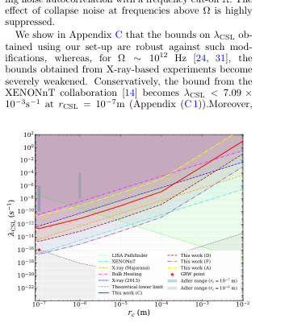 
FIG. 2. Our proposed bounds for parameters in Table 1 and different choices as in II. We include the current best bounds provided by XENONnT [14], and LISA Pathfinder [26, 27]. Previous bounds from X-ray experiments [10, 28] and bulk-heating experiment [11–13].The grey-shaded region cor- responds to the theoretically excluded region [25]. The shaded vertical bars correspond to theoretical suggestions by Adler [29], and the red dot to a suggestion by Ghirardi, Rim- ini, and Weber [30].

📷 Fig 3

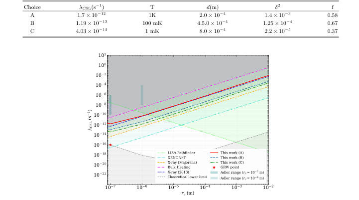 
FIG. 3. Our bounds at choices of experimental parameters in IV considering a short-time Coulomb entanglement test of collapse models.

**Main problem.** Finding experimental methods to test and constrain the parameters of Spontaneous Collapse Models (CSL and DP) that are more effective than current bulk-heating tests and robust against colored-noise extensions.

**Main result.** The study shows that detecting steady-state Coulomb-mediated position squeezing in two nanospheres can provide bounds on the CSL parameter that surpass bulk-heating tests and are robust against colored noise. Additionally, short-time entanglement-based tests can provide significant constraints on the collapse rate.

**Method.** The authors use a master equation approach to analyze the dynamics of two charged nanospheres, calculating steady-state covariance matrix elements and entanglement measures (logarithmic negativity) under various noise models.

**Summary.** This paper proposes a new experimental method to test spontaneous collapse models, such as CSL and Diosi-Penrose, using the Coulomb-mediated squeezing of two charged nanospheres. The authors demonstrate that observing the reduction in thermal variance of the differential motional mode can set bounds on the collapse rate that are more robust than current X-ray or bulk-heating experiments. Crucially, these proposed mechanical bounds remain effective even when considering more realistic colored-noise models. The study also suggests that detecting entanglement between the spheres at short times can serve as a powerful witness for these fundamental models.

Detailed structure

**Model / system.** The system consists of two identical, charged nanospheres of mass m and charge q trapped harmonically in a linear Paul trap, interacting via a static Coulomb potential. The dynamics are modeled using the CSL and Diosi-Penrose (DP) collapse models, incorporating both thermal noise and potential colored-noise extensions.

**Key observables.** Steady-state position variance of the differential mode, momentum variance, logarithmic negativity (entanglement), and X-ray emission rates.

**Important parameters / regimes.** CSL collapse rate (lambda_CSL), CSL correlation length (r_CSL), DP length scale (R_0), Coulomb coupling strength (delta^2), thermal occupancy (N), and noise frequency cut-off (Omega).

**Assumptions / limitations.** The particles within each system are treated as part of a rigid body; mass distributions are approximated as Gaussian densities; the analysis assumes the separation d is much larger than the collapse correlation length.

**Figures summary.** Figure 2 compares the proposed CSL bounds against existing limits from LISA Pathfinder, XENONnT, and X-ray experiments. Figure 3 shows logarithmic plots of entanglement-based bounds compared to various existing experimental limits.

**Paper structure.** The paper introduces the scientific problem of testing collapse models, describes the physical system and Coulomb interaction, derives the master equations for CSL and DP models, performs steady-state and short-time analysis for squeezing and entanglement, and concludes with a comparison of the proposed bounds against existing experimental literature.

**Why it may be interesting.** This paper is highly relevant to researchers in open quantum systems and quantum optics as it proposes a novel way to use mechanical squeezing and entanglement in trapped systems to probe fundamental decoherence models and non-Markovian noise.

Abstract

We show that detecting steady-state Coulomb-mediated reduction in the thermal variance of the differential motional mode of two nanospheres can bound the Continuous Spontaneous Localization (CSL) parameter ($λ_{\text{CSL}}$). For realistic experimental parameters, the resulting bounds are comparable to those obtained from X-ray emission experiments and surpass those set by bulk-heating ones. Unlike these latter experiments, our bounds are robust against plausible coloured-noise extensions of collapse models. In the short-time regime, we find that a weak Coulomb-induced entanglement-based test between two charged nanospheres initialized in ground state can provide constraints on $λ_{\text{CSL}}$ comparable to limits set by early X-ray experiments.

[↑ back to top](#top)

### [Unitary Time Evolution and Vacuum for a Quantum Stable Ghost](http://arxiv.org/abs/2604.21823v1)

**Authors:** Cédric Deffayet, Atabak Fathe Jalali, Aaron Held, Shinji Mukohyama, Alexander Vikman  
**Type:** theory · **Category:** other · **PDF:** <https://arxiv.org/pdf/2604.21823v1>  
**Analysis basis:** full PDF text, analyzed in chunks

📷 Fig 1

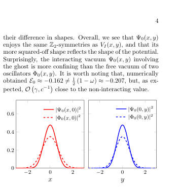 
FIG. 1. Side-view comparisons of probability densities for Ψ0 (solid) and Φ0 (dashed). Thus, for system (1), the ground state of the interacting ghost, Ψ0, is more confining than the ground state Φ0 of two corresponding decoupled oscillators x and y.

📷 Fig 2

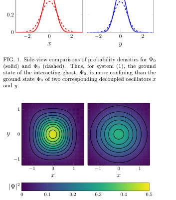 
FIG. 2. Top-down view of ground state probability densities: interacting, |Ψ0|2, (left) and decoupled, |Φ0|2, (right), both with imposed contours. This is another way to see that for system (1) the interacting vacuum with a ghost Ψ0 is more confining than the free vacuum Φ0.

📷 Fig 3

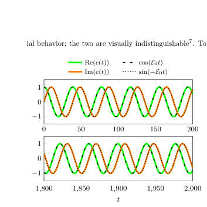 
FIG. 3. Overlap c(t) ≡⟨Ψ0(0) | Ψ0(t)⟩of the numerically computed ground state Ψ0 and its time evolution Ψ0(t), with energy E0 ≈−0.162. For comparison, we include the expected dashed curves cos(E0t) and sin(−E0t).

📷 Fig 4

 
FIG. 4. The expectation values ⟨x2⟩12(t), ⟨y2⟩12(t), and de- coupled trajectories X2 0(t), Y 2 0 (t). We omit plotting b = 6, as the difference in graphs is visually indistinguishable: max t∈[0,T ]

📷 Fig 5

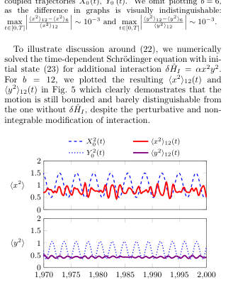 
FIG. 5. Same as Fig. 4 but with an additional, interaction term δ ˆHI = αx2y2 for coupling constant α = 0.01.

**Main problem.** Investigating whether a quantum system containing a 'ghost' (a degree of freedom with negative kinetic energy) can exhibit stable, unitary time evolution and a well-defined vacuum despite having a Hamiltonian unbounded from both above and below.

**Main result.** The authors prove that the system possesses a pure point spectrum and a well-defined, unique vacuum state, with the existence of a positive-definite integral of motion (H_up) ensuring stability and confinement.

**Method.** The study uses analytical mathematical frameworks (spectral theorem, Nelson's theorem, and Dirichlet forms) combined with numerical verification via pseudo-spectral and split-operator methods to solve the Schrödinger equation.

**Summary.** This paper challenges the common belief that 'ghost' particles with negative kinetic energy necessarily lead to physical instabilities and loss of unitarity. By using a specific polynomial coupling, the authors demonstrate that a system with an unbounded Hamiltonian can still have a stable, discrete spectrum and a well-defined vacuum. The stability is guaranteed by a hidden positive-definite integral of motion that confines the system's evolution. This provides a theoretical framework for considering stable quantum systems with indefinite metrics.

Detailed structure

**Model / system.** A canonically quantized system consisting of a standard harmonic oscillator coupled to a 'ghost' oscillator with negative kinetic energy via a polynomial interaction potential.

**Key observables.** Ground state wavefunction, energy eigenvalues, expectation values of canonical variables (x^2, y^2, px^2, py^2), and the overlap function c(t).

**Important parameters / regimes.** Coupling constants gamma and c, frequency omega, and the stability regime defined by 2*gamma*c^2 >= |1 - omega^2|.

**Assumptions / limitations.** The proof relies on the specific polynomial form of the interaction potential that allows for the existence of the H_up and H_down integrals of motion.

**Figures summary.** Figure 1 compares probability densities of the interacting vs. decoupled vacuum; Figure 3 shows numerical stability of the ground state; Figure 4 demonstrates the confinement of canonical variables; Figure 5 illustrates stability against perturbations.

**Paper structure.** The paper introduces the problem of ghost instabilities, defines the Hamiltonian and the specific coupling model, provides analytical proofs for unitarity and vacuum existence using the integral of motion, presents numerical simulations to verify these results, and discusses the stability of the spectrum against perturbations.

Abstract

We quantize a classically stable system of a harmonic oscillator polynomially coupled to a ghost with negative kinetic energy. We prove that due to an integral of motion with a positive discrete spectrum: i) the Hamiltonian has a pure point spectrum unbounded in both directions, ii) the evolution is manifestly unitary, iii) the vacuum is well-defined, iv) expectation values for squares of canonical variables are bounded. Numerical solutions of the Schrödinger equation confirm these results. We argue that the discrete spectrum of the integral of motion enforces stability for extended interactions.

[↑ back to top](#top)

### [Variance Geometry of Exact Pauli-Detecting Codes: Continuous Landscapes Beyond Stabilizers](http://arxiv.org/abs/2604.21800v1)

**Authors:** Arunaday Gupta, Baisong Sun, Xi He, Bei Zeng  
**Type:** theory · **Category:** quantum information and computing · **PDF:** <https://arxiv.org/pdf/2604.21800v1>  
**Analysis basis:** full PDF text, analyzed in chunks

📷 Fig 1

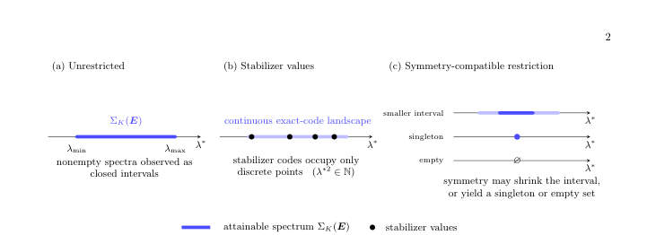 
FIG. 1: Schematic behavior of the attainable spectrum ΣK(E) = {λ∗(P) : P detects E, rank(P) = K}. In the unrestricted setting studied here, nonempty spectra are observed to be closed intervals. Stabilizer codes occupy only discrete values within these intervals. Under symmetry-compatible restrictions, the attainable set may shrink to a smaller interval, reduce to a singleton, or become empty, while remaining interval-like whenever nonempty.

**Main problem.** The paper investigates the geometric structure of the space of exact quantum codes that detect a prescribed set of Pauli errors, specifically determining if these codes form continuous families or isolated solutions.

**Main result.** The authors show that exact Pauli-detecting codes form continuous landscapes (intervals) rather than disjoint sets, and that stabilizer codes are merely a discrete, measure-zero subset of this larger continuum of nonadditive codes.

**Method.** The study uses an operator-theoretic framework linking error detection to joint higher-rank numerical ranges, combined with representation theory, Stiefel-manifold optimization, and analytical constructions of symmetric codewords.

**Summary.** This paper provides a new geometric perspective on quantum error detection by treating the space of valid codes as a continuous landscape. It introduces a scalar parameter, the signature norm, to characterize the variance profile of different code families. The central finding is that stabilizer codes are just a small, discrete part of a much larger, continuous set of nonadditive codes. The work also demonstrates how imposing symmetries can expand or contract the range of achievable error-detection parameters.

Detailed structure

**Model / system.** The model consists of rank-K quantum code projectors satisfying the Knill-Laflamme detection conditions for various Pauli error models, including distance-based, asymmetric, and symmetry-restricted (cyclic and permutation) error sets.

**Key observables.** The signature norm (lambda*), which is the Euclidean norm of the vector of Pauli expectation values on the maximally mixed code state, and the joint Pauli variance profile.

**Important parameters / regimes.** The code rank K, the number of qubits n, the error set E, and the symmetry groups (cyclic C_n and permutation S_n).

**Assumptions / limitations.** The focus is restricted to exact (rather than approximate) error-detecting codes, and the 'interval property' is presented as a strong empirical observation rather than a universal proof.

**Figures summary.** Figure 1 illustrates the continuous spectrum of attainable lambda* values, showing how stabilizer codes occupy discrete points and how symmetry constraints can shrink or empty the spectrum.

**Paper structure.** The paper progresses from notation and preliminaries to the introduction of variance-based signatures, followed by symmetry analysis, a classification of 2-qubit codes, and numerical optimization for larger systems.

Abstract

Exact quantum codes detecting a prescribed set of Pauli errors are approached through algebraic constructions--stabilizer, codeword-stabilized, permutation-invariant, topological, and related families. Geometrically, exact Pauli detection is governed by joint higher-rank numerical ranges of these Pauli operators, whose structure for rank $\geq 2$ is largely uncharted. From this viewpoint, we show that such codes often form connected continuous families rather than collections of disjoint solution regions. These families are characterized by a single scalar derived from the Knill-Laflamme conditions: denoted $λ^*$, it is the Euclidean norm of the signature vector of Pauli expectation values on the maximally mixed code state, and provides a one-parameter summary of the code's joint Pauli variance profile. Within these continuous landscapes, stabilizer codes occupy only discrete, measure-zero subsets of the attainable $λ^*$-spectrum, exposing a largely unexplored continuum of genuinely nonadditive exact codes. We establish this picture by analyzing the geometry of higher-rank operator compressions, and extend it to symmetry-restricted settings where cyclic and permutation symmetries are imposed on both the error model and the code projector. Small-system cases reveal interval, singleton, and empty regimes through eigenvalue interlacing and symmetry-sector decompositions; larger systems are treated numerically via Stiefel-manifold optimization and symmetry-adapted parameterizations. In every unrestricted and symmetry-compatible case analyzed, the attainable $λ^*$-spectrum forms a single closed interval whenever nonempty--although a general proof remains open. These results place stabilizer, symmetric, and nonadditive code families within a unified higher-rank variance framework, suggesting a continuous geometric perspective on the landscape of exact quantum codes.

[↑ back to top](#top)

