
# arxiv digest (quant-ph + cond-mat) — 2026-04-26

*92 papers · 52 relevant · 6 highlighted*  
_⏳ in progress: 92/144 papers processed (file updates after each one)_

## 🔥 Most relevant (52)

*Every paper with at least one nonzero topic score, sorted by best-matching score. 🔥 marks scores ≥3/5. Click the title to jump to the full entry below; click [arXiv] to open the paper page. `(secondary)` marks papers from de-prioritized cond-mat archives.*

- [BCS-BEC crossover of polaritonic condensates in mass-imbalanced semimetal/semiconductor microcavities](#paper-2604.21244) [[arXiv]](http://arxiv.org/abs/2604.21244v1) — 🔥 `correlated cavity matter` **5/5** · `Dicke superradiance` **2/5** · `Tavis-Cummings & cavity-many-emitter` **2/5** · `driven-dissipative phase transition` **2/5**
- ⭐ [Light-induced Self-Organization in Cooperative Free Space Atomic Arrays](#paper-2604.21012) [[arXiv]](http://arxiv.org/abs/2604.21012v1) — 🔥 `free-space correlated emission` **4/5** · 🔥 `analog quantum simulation` **3/5** · 🔥 `correlated / nonlocal dissipation` **3/5** · 🔥 `dissipative systems` **3/5** · 🔥 `driven-dissipative phase transition` **3/5** · 🔥 `exotic spin models in light-matter` **3/5** · 🔥 `non-equilibrium dynamics` **3/5** · `Dicke superradiance` **2/5** · `interference shaping light` **2/5** · `methods for driven-dissipative` **2/5** · `entanglement & information structure` **1/5**
- ⭐ [Quantum jump correlations in long-range dissipative spin systems](#paper-2604.21513) [[arXiv]](http://arxiv.org/abs/2604.21513v1) — 🔥 `correlated / nonlocal dissipation` **4/5** · 🔥 `dissipative systems` **4/5** · 🔥 `driven-dissipative phase transition` **4/5** · 🔥 `methods for driven-dissipative` **4/5** · 🔥 `quantum measurements` **4/5** · 🔥 `non-equilibrium dynamics` **3/5** · 🔥 `non-equilibrium universality` **3/5** · `measurement-induced transitions` **2/5**
- [Monitoring photon entanglement in coupled cavities](#paper-2604.21208) [[arXiv]](http://arxiv.org/abs/2604.21208v1) — 🔥 `entanglement & information structure` **4/5** · 🔥 `measurement-induced transitions` **4/5** · 🔥 `quantum measurements` **4/5** · 🔥 `dissipative systems` **3/5** · 🔥 `non-equilibrium dynamics` **3/5** · `Tavis-Cummings & cavity-many-emitter` **2/5** · `correlated / nonlocal dissipation` **2/5** · `methods for driven-dissipative` **2/5**
- [Bipartite entanglement under frequency comb pumping in parametric Josephson circuits](#paper-2604.21692) [[arXiv]](http://arxiv.org/abs/2604.21692v1) — 🔥 `QC/QI experiment` **4/5** · 🔥 `entanglement & information structure` **4/5** · 🔥 `quantum optics experiment` **4/5** · 🔥 `dissipative systems` **3/5** · `correlated / nonlocal dissipation` **2/5** · `methods for driven-dissipative` **2/5** · `non-equilibrium dynamics` **2/5** · `quantum measurements` **2/5**
- [Dynamical Regimes of Two Qubits Coupled through a Transmission Line](#paper-2604.21463) [[arXiv]](http://arxiv.org/abs/2604.21463v1) — 🔥 `correlated / nonlocal dissipation` **4/5** · 🔥 `dissipative systems` **4/5** · 🔥 `entanglement & information structure` **3/5** · 🔥 `methods for driven-dissipative` **3/5** · 🔥 `non-equilibrium dynamics` **3/5** · `Tavis-Cummings & cavity-many-emitter` **2/5** · `correlated cavity matter` **2/5**
- [Spectral Diffusion Mitigation with a Laser Pulse Sequence](#paper-2604.21659) [[arXiv]](http://arxiv.org/abs/2604.21659v1) — 🔥 `QC/QI experiment` **4/5** · 🔥 `quantum optics experiment` **4/5** · 🔥 `dissipative systems` **3/5** · 🔥 `spintronics-quantum-optics interface` **3/5** · `interference shaping light` **2/5** · `non-equilibrium dynamics` **2/5** · `quantum measurements` **2/5**
- [Thermalization Regimes in a Chaotic Tavis-Cummings Model](#paper-2604.20955) [[arXiv]](http://arxiv.org/abs/2604.20955v1) — 🔥 `Tavis-Cummings & cavity-many-emitter` **4/5** · 🔥 `non-equilibrium dynamics` **4/5** · 🔥 `correlated cavity matter` **3/5** · 🔥 `scars & prethermalization` **3/5** · `dissipative systems` **2/5** · `entanglement & information structure` **2/5** · `interference shaping light` **2/5**
- [Multidimensional semiclassical single- and double-quantum spectroscopy of anharmonic molecular polaritons](#paper-2604.21158) [[arXiv]](http://arxiv.org/abs/2604.21158v1) — 🔥 `Tavis-Cummings & cavity-many-emitter` **4/5** · 🔥 `correlated cavity matter` **4/5** · 🔥 `Keldysh / 2PI / non-Gaussian methods` **3/5** · 🔥 `dissipative systems` **3/5** · 🔥 `methods for driven-dissipative` **3/5** · `non-equilibrium dynamics` **2/5**
- [Bayesian Phase Stabilization at the Shot-Noise Limit for Scalable Quantum Networks](#paper-2604.21388) [[arXiv]](http://arxiv.org/abs/2604.21388v1) — 🔥 `QC/QI experiment` **4/5** · 🔥 `quantum measurements` **4/5** · 🔥 `quantum optics experiment` **4/5** · `dissipative systems` **2/5** · `entanglement & information structure` **2/5** · `interference shaping light` **2/5**
- [Collective Excitations and Stability of Nonequilibrium Polariton Supersolids](#paper-2604.21353) [[arXiv]](http://arxiv.org/abs/2604.21353v1) — 🔥 `correlated cavity matter` **4/5** · 🔥 `driven-dissipative phase transition` **4/5** · 🔥 `dissipative systems` **3/5** · 🔥 `non-equilibrium dynamics` **3/5** · `methods for driven-dissipative` **2/5** · `non-equilibrium universality` **2/5**
- [Observation of quantum multi-Mpemba effect in a trapped-ion system](#paper-2604.21320) [[arXiv]](http://arxiv.org/abs/2604.21320v1) — 🔥 `QC/QI experiment` **4/5** · 🔥 `dissipative systems` **4/5** · 🔥 `non-equilibrium dynamics` **4/5** · 🔥 `quantum optics experiment` **4/5** · `methods for driven-dissipative` **2/5**
- [Entanglement of two optical emitters mediated by a terahertz channel](#paper-2604.21723) [[arXiv]](http://arxiv.org/abs/2604.21723v1) — 🔥 `correlated / nonlocal dissipation` **4/5** · 🔥 `Tavis-Cummings & cavity-many-emitter` **3/5** · 🔥 `dissipative systems` **3/5** · 🔥 `entanglement & information structure` **3/5** · `methods for driven-dissipative` **2/5** · `non-equilibrium dynamics` **2/5**
- [Loss-biased fault-tolerant quantum error correction](#paper-2604.21876) [[arXiv]](http://arxiv.org/abs/2604.21876v1) — 🔥 `Rydberg arrays` **4/5** · 🔥 `correlated / nonlocal dissipation` **3/5** · 🔥 `dissipative systems` **3/5** · `methods for driven-dissipative` **2/5** · `non-equilibrium dynamics` **2/5** · `quantum measurements` **2/5**
- [Quantum plasmonics with N emitters: bright hybrid continuum selection](#paper-2604.21560) [[arXiv]](http://arxiv.org/abs/2604.21560v1) — 🔥 `Tavis-Cummings & cavity-many-emitter` **4/5** · 🔥 `correlated / nonlocal dissipation` **3/5** · 🔥 `dissipative systems` **3/5** · `Dicke superradiance` **2/5** · `correlated cavity matter` **2/5** · `methods for driven-dissipative` **2/5**
- [Photon Sorting with a Quantum Emitter](#paper-2604.21758) [[arXiv]](http://arxiv.org/abs/2604.21758v1) — 🔥 `QC/QI experiment` **4/5** · 🔥 `quantum optics experiment` **4/5** · 🔥 `interference shaping light` **3/5** · `dissipative systems` **2/5** · `quantum measurements` **2/5**
- [Robust continuous symmetry breaking and multiversality in the chiral Dicke model](#paper-2604.21820) [[arXiv]](http://arxiv.org/abs/2604.21820v1) — 🔥 `Dicke superradiance` **4/5** · 🔥 `Tavis-Cummings & cavity-many-emitter` **4/5** · 🔥 `non-equilibrium universality` **4/5** · 🔥 `correlated cavity matter` **3/5**
- [Condensate states in Fermi and Bose-Hubbard ladders](#paper-2604.21296) [[arXiv]](http://arxiv.org/abs/2604.21296v1) — 🔥 `scars & prethermalization` **4/5** · 🔥 `analog quantum simulation` **3/5** · 🔥 `non-equilibrium dynamics` **3/5** · `entanglement & information structure` **2/5** · `non-equilibrium universality` **2/5**
- [The Feedback Hamiltonian is the Score Function: A Diffusion-Model Framework for Quantum Trajectory Reversal](#paper-2604.21210) [[arXiv]](http://arxiv.org/abs/2604.21210v1) — 🔥 `methods for driven-dissipative` **4/5** · 🔥 `quantum measurements` **4/5** · 🔥 `dissipative systems` **3/5** · `non-equilibrium dynamics` **2/5**
- [Time-optimal Qubit Reset via Environmental Spectral Structure](#paper-2604.21230) [[arXiv]](http://arxiv.org/abs/2604.21230v1) — 🔥 `dissipative systems` **4/5** · 🔥 `correlated / nonlocal dissipation` **3/5** · `methods for driven-dissipative` **2/5** · `non-equilibrium dynamics` **2/5** · `quantum measurements` **2/5**
- [Magnetic-field control of interactions in alkaline-earth Rydberg atoms and applications to {\it XXZ} models](#paper-2604.21206) [[arXiv]](http://arxiv.org/abs/2604.21206v1) — 🔥 `Rydberg arrays` **4/5** · 🔥 `analog quantum simulation` **4/5** · 🔥 `exotic spin models in light-matter` **4/5**
- [Engineering molecular potential energy surfaces using magnetic cavity quantum electrodynamics](#paper-2604.20969) [[arXiv]](http://arxiv.org/abs/2604.20969v1) — 🔥 `correlated cavity matter` **4/5** · 🔥 `exotic spin models in light-matter` **3/5** · 🔥 `spintronics-quantum-optics interface` **3/5**
- [Time-Uniform Error Bound for Temporal Coarse Graining in Markovian Open Quantum Systems](#paper-2604.21366) [[arXiv]](http://arxiv.org/abs/2604.21366v1) — 🔥 `dissipative systems` **4/5** · 🔥 `methods for driven-dissipative` **4/5** · `non-equilibrium dynamics` **2/5**
- [HEOM-in-Calibration-Loop: Exposing Non-Markovian Bath Signatures That Markovian Calibration Elides in Superconducting-Qubit Tune-Up](#paper-2604.21458) [[arXiv]](http://arxiv.org/abs/2604.21458v1) — 🔥 `methods for driven-dissipative` **4/5** · 🔥 `dissipative systems` **3/5** · `non-equilibrium dynamics` **2/5**
- [Sufficient support size of measurements for quantum estimation](#paper-2604.21323) [[arXiv]](http://arxiv.org/abs/2604.21323v1) — 🔥 `quantum measurements` **4/5** · `dissipative systems` **2/5** · `methods for driven-dissipative` **2/5**
- [Qubit-efficient and gate-efficient encodings of graph partitioning problems for quantum optimization](#paper-2604.21123) [[arXiv]](http://arxiv.org/abs/2604.21123v1) — 🔥 `QC/QI experiment` **4/5**
- [Vertical Shuttling Protocols for Trapped Ions in Multi-Rail, Multi-Zone Surface Ion Trap Architectures](#paper-2604.21350) [[arXiv]](http://arxiv.org/abs/2604.21350v1) — 🔥 `QC/QI experiment` **4/5**
- [Birth, Death, and Replication at Surfaces: Universal Laws of Autocatalytic Dynamics](#paper-2604.21586) [[arXiv]](http://arxiv.org/abs/2604.21586v1) — 🔥 `driven-dissipative phase transition` **3/5** · 🔥 `non-equilibrium universality` **3/5** · `dissipative systems` **2/5** · `non-equilibrium dynamics` **2/5**
- [Dynamical mean-field theory for dense spin systems at finite temperature](#paper-2604.21563) [[arXiv]](http://arxiv.org/abs/2604.21563v1) — 🔥 `analog quantum simulation` **3/5** · `Keldysh / 2PI / non-Gaussian methods` **2/5** · `exotic spin models in light-matter` **2/5** · `non-equilibrium dynamics` **2/5** · `entanglement & information structure` **1/5**
- [Dean-Kawasaki fluctuating hydrodynamics for backscattering hard rods](#paper-2604.21553) [[arXiv]](http://arxiv.org/abs/2604.21553v1) — 🔥 `non-equilibrium dynamics` **3/5** · `Keldysh / 2PI / non-Gaussian methods` **2/5** · `dissipative systems` **2/5** · `non-equilibrium universality` **2/5**
- [A rigorous quasipolynomial-time classical algorithm for SYK thermal expectations](#paper-2604.21089) [[arXiv]](http://arxiv.org/abs/2604.21089v1) — 🔥 `entanglement & information structure` **3/5** · `Keldysh / 2PI / non-Gaussian methods` **2/5** · `non-equilibrium dynamics` **2/5**
- [Novel dynamics for an inertial polar tracer in an active bath](#paper-2604.21762) [[arXiv]](http://arxiv.org/abs/2604.21762v1) — 🔥 `non-equilibrium dynamics` **3/5** · `Keldysh / 2PI / non-Gaussian methods` **2/5** · `dissipative systems` **2/5**
- [Scalable surface ion trap design for magnetic quantum sensing and gradiometry](#paper-2604.21342) [[arXiv]](http://arxiv.org/abs/2604.21342v1) — 🔥 `QC/QI experiment` **3/5** · `quantum measurements` **2/5** · `spintronics-quantum-optics interface` **2/5**
- [Enhancing Coherence of Spin Centers in p-n Diodes via Optimization Algorithms](#paper-2604.21874) [[arXiv]](http://arxiv.org/abs/2604.21874v1) — 🔥 `spintronics-quantum-optics interface` **3/5** · `dissipative systems` **2/5**
- [Structured Quantum State Reconstruction via Physically Motivated Operator Selection](#paper-2604.21272) [[arXiv]](http://arxiv.org/abs/2604.21272v1) — 🔥 `entanglement & information structure` **3/5** · `quantum measurements` **2/5**
- [Ansätz Expressivity and Optimization in Variational Quantum Simulations of Transverse-field Ising Model Across System Sizes](#paper-2604.20961) [[arXiv]](http://arxiv.org/abs/2604.20961v1) — 🔥 `entanglement & information structure` **3/5**
- ⭐ [Cryogenic shock exfoliation for ultrahigh mobility rhombohedral graphite nanoelectronics](#paper-2604.21912) [[arXiv]](http://arxiv.org/abs/2604.21912v1) — 🔥 `non-equilibrium dynamics` **3/5**
- [Decomposing Fractional Quantum Hall Wave Functions via Operator Contraction Multiplication](#paper-2604.21434) [[arXiv]](http://arxiv.org/abs/2604.21434v1) — 🔥 `entanglement & information structure` **3/5**
- [Dual-use quantum hardware for quantum resource generation and energy storage](#paper-2604.21913) [[arXiv]](http://arxiv.org/abs/2604.21913v1) — `dissipative systems` **2/5** · `entanglement & information structure` **2/5** · `non-equilibrium dynamics` **2/5** · `quantum measurements` **2/5**
- [Pulse Shaping for Superconducting Qubits](#paper-2604.21565) [[arXiv]](http://arxiv.org/abs/2604.21565v1) — `QC/QI experiment` **2/5** · `dissipative systems` **2/5** · `non-equilibrium dynamics` **2/5**
- [Chaos Gated Tunneling Drives Molecular Reactivity in Astrophysical Environments](#paper-2604.21005) [[arXiv]](http://arxiv.org/abs/2604.21005v1) — `entanglement & information structure` **2/5** · `scars & prethermalization` **2/5** · `non-equilibrium dynamics` **1/5**
- [Random Access Codes: Explicit Constructions, Optimality, and Classical-Quantum Gaps](#paper-2604.21274) [[arXiv]](http://arxiv.org/abs/2604.21274v1) — `entanglement & information structure` **2/5** · `quantum measurements` **2/5**
- [Rigorous Security Proofs for Practical Quantum Key Distribution](#paper-2604.21791) [[arXiv]](http://arxiv.org/abs/2604.21791v1) — `entanglement & information structure` **2/5** · `quantum measurements` **2/5**
- [Suppressing the Erasure Error of Fusion Operation in Photonic Quantum Computing](#paper-2604.21475) [[arXiv]](http://arxiv.org/abs/2604.21475v1) — `dissipative systems` **2/5** · `quantum measurements` **2/5**
- [The clock ambiguity is back with a vengeance](#paper-2604.21805) [[arXiv]](http://arxiv.org/abs/2604.21805v1) — `entanglement & information structure` **2/5** · `quantum measurements` **2/5**
- [Third Quantization for Order Parameter (I): BCS-BEC crossover with macroscopically coherent state](#paper-2604.21288) [[arXiv]](http://arxiv.org/abs/2604.21288v1) — `Keldysh / 2PI / non-Gaussian methods` **2/5** · `correlated cavity matter` **2/5**
- [Universal Local Roughness from Disorder Crossover in Urban-Front Growth](#paper-2604.21437) [[arXiv]](http://arxiv.org/abs/2604.21437v1) — `non-equilibrium dynamics` **2/5** · `non-equilibrium universality` **2/5**
- [Adiabatic Error Cancellation in Berry Phase Estimation](#paper-2604.20952) [[arXiv]](http://arxiv.org/abs/2604.20952v1) — `quantum measurements` **2/5**
- ⭐ [Algorithmic Locality via Provable Convergence in Quantum Tensor Networks](#paper-2604.21919) [[arXiv]](http://arxiv.org/abs/2604.21919v1) — `entanglement & information structure` **2/5**
- [Composite quantum gates simultaneously compensated for multiple errors](#paper-2604.21594) [[arXiv]](http://arxiv.org/abs/2604.21594v1) — `Rydberg arrays` **2/5**
- [Effect of Mn Substitution on Superconductivity in PrFeAs(O,F): Role of Magnetic Impurities](#paper-2604.21684) [[arXiv]](http://arxiv.org/abs/2604.21684v1) — `Kondo & dissipative impurity` **2/5**
- [LightStim: A Framework for QEC Protocol Evaluation and Prototyping with Automated DEM Construction](#paper-2604.21472) [[arXiv]](http://arxiv.org/abs/2604.21472v1) — `quantum measurements` **2/5**

## ⭐ Highlighted (6)

*Papers by authors on your watch list. Click the title to jump to the full entry below; click [arXiv] to open the paper page.*

- ⭐ [Algorithmic Locality via Provable Convergence in Quantum Tensor Networks](#paper-2604.21919) [[arXiv]](http://arxiv.org/abs/2604.21919v1) — Sarang Gopalakrishnan
- ⭐ [Symplectic split-operator method for the time-dependent unitary Tavis-Cummings model](#paper-2604.21778) [[arXiv]](http://arxiv.org/abs/2604.21778v1) — Andrii G. Sotnikov, Denys I. Bondar
- ⭐ [Generalized stochastic spin-wave theory for open quantum spin systems](#paper-2604.21574) [[arXiv]](http://arxiv.org/abs/2604.21574v1) — Rosario Fazio
- ⭐ [Quantum jump correlations in long-range dissipative spin systems](#paper-2604.21513) [[arXiv]](http://arxiv.org/abs/2604.21513v1) — Rosario Fazio
- ⭐ [Cryogenic shock exfoliation for ultrahigh mobility rhombohedral graphite nanoelectronics](#paper-2604.21912) [[arXiv]](http://arxiv.org/abs/2604.21912v1) — Andrew Lucas
- ⭐ [Light-induced Self-Organization in Cooperative Free Space Atomic Arrays](#paper-2604.21012) [[arXiv]](http://arxiv.org/abs/2604.21012v1) — Susanne F. Yelin

## All papers (54, sorted by relevance)

*Papers from quant-ph and your primary cond-mat archives (quant-gas, stat-mech, str-el, dis-nn). Highlighted papers (⭐) come first, then everything else sorted by topic-relevance score, highest first.*

### ⭐ [Light-induced Self-Organization in Cooperative Free Space Atomic Arrays](http://arxiv.org/abs/2604.21012v1)

**Highlighted author(s):** Susanne F. Yelin  
**Authors:** Sara Molló-Guri, Oriol Rubies-Bigorda, Raphael Holzinger, Jonah S. Peter, Susanne F. Yelin  
**Type:** theory · **Category:** other · **PDF:** <https://arxiv.org/pdf/2604.21012v1>  
**Analysis basis:** full PDF text, analyzed in chunks
**Topic relevance:** 🔥 `free-space correlated emission` **4/5** · 🔥 `analog quantum simulation` **3/5** · 🔥 `correlated / nonlocal dissipation` **3/5** · 🔥 `dissipative systems` **3/5** · 🔥 `driven-dissipative phase transition` **3/5** · 🔥 `exotic spin models in light-matter` **3/5** · 🔥 `non-equilibrium dynamics` **3/5** · `Dicke superradiance` **2/5** · `interference shaping light` **2/5** · `methods for driven-dissipative` **2/5** · `entanglement & information structure` **1/5**

📷 Fig 1

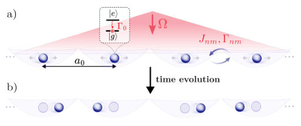 
Figure 1. (a) Schematic of an ordered array of N two-level quantum emitters with an initial nearest-neighbor separation a0 set by the trap center, which is of the order of the tran- sition wavelength λ0 = 2πc/ω0. The atoms are confined in shallow harmonic traps with frequency ω ≪Γ0, where Γ0 de- notes their spontaneous decay rate. Dipole interactions are induced by an external laser drive (Rabi frequency Ω) that acts uniformly on all atoms. Collective resonances emerge from the long-range coherent (dissipative) dipole-dipole inter- actions Jnm (Γnm). (b) The interplay of weak harmonic con- finement, continuous laser driving, and strong dipole-dipole interactions leads to the...

📷 Fig 2

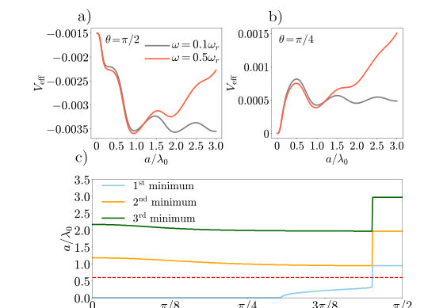 
Figure 2. Steady-state behavior for two atoms with iden- tical dipole moments d = [cos θ, i sin θ, 0] and electric field polarized along d. Effective potential for (a) θ = π/2 and (b) θ = π/4 as a function of the relative position a between the two atoms. (c) Local minima of the effective potential Veff with ω = 0.1ωr as a function of θ, corresponding to atomic separations at which the atoms are stationary and self-organized. The red dashed line denotes the initial sepa- ration a0 of the atoms at their trap equilibrium positions. All panels were obtained for a coherent driving rate Ω= 0.05Γ0, on resonance with the atomic frequency and with trap posi- tions separated by a0 = 0.6λ0.

📷 Fig 3

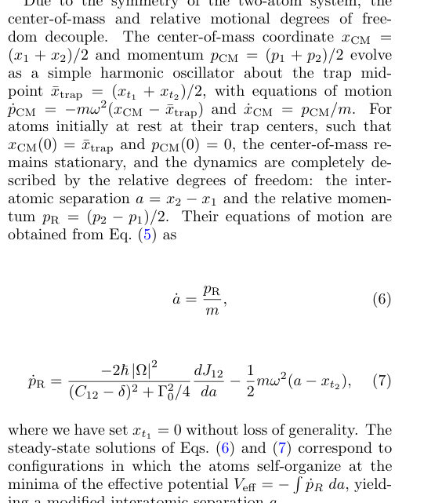 
Fig. 2a) and b) show the computed potentials as a function of relative atomic separation a for two dipole moment orientations d = [cos θ, i sin θ, 0], with θ = π/2 and θ = π/4, respectively. The electric field is polarized along the same direction as d, such that it maximizes the laser-atom interaction. Each local minimum corresponds to a stable steady-state separation at which the atoms can self-organize. The first three local minima are shown in Fig. 2c) as a function of the dipole orientation angle θ. The red dashed line indicates the initial atomic sepa- ration, corresponding to both atoms initially positioned at the centers of their respective traps (here chosen as a0 ≡xt2 −xt1 =...

📷 Fig 4

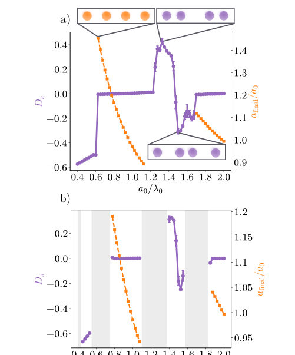 
Figure 3. Dimer strength Ds (purple circles) for a chain of (a) N = 4 atoms and (b) N = 10 atoms, with dipole and laser polarizations orientated along z. Ds = 0 indicates a uniformly ordered chain, Ds &gt; 0 corresponds to a fully dimerized chain, and Ds &lt; 0 to a dimerized chain with two unpaired atoms at the edges. The insets illustrate schematic representations of the self-organized configurations in each case. Larger values of |Ds| indicate a stronger contrast between the two alternating interatomic distances. For Ds ≈0, orange squares show the final interatomic spacing of the chain normalized to its initial value (afinal/a0). The shaded regions correspond to parameter regimes in which the...

📷 Fig 5

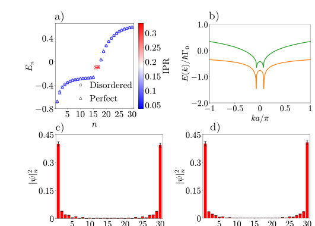 
Figure 4. a) Real part of the eigenvalue spectrum of the non-Hermitian Hamiltonians Heff for self-organized (circles) and perfectly dimerized (triangles) chains. Circles correspond to a single realization of a chain of N = 30 atoms with initial trap spacing a0 = 0.5λ. Initial disorder in the trap positions is uniformly distributed in [−0.01 a0, 0.01 a0], resulting in a self-organized dimerized chain with slight variations in the al- ternating separations. The spectrum of the most similar per- fectly dimerized configuration (see main text) largely overlaps with that of the self-organized chain. The inverse participa- tion ratio [IPR, Eq. (9)] is maximal for two nearly-degenerate eigenstates,...

📷 Fig 6

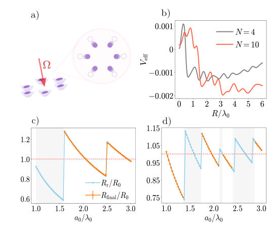 
Figure 5. a) Schematic of the trapped ring configuration showing gradual contraction of the ring radius over time. The dipoles are circularly polarized within the plane of the ring and the atoms are driven by a laser propagating perpendicular to that plane. b) Effective potential in the radial direction of the ring for different atom numbers, with initial interatomic distance a0 = 1.5λ0. c-d) Radii of the self-organized ring ge- ometries for (c) N = 4 and (d) N = 10 as a function of initial interatomic distance. The blue curves (Rr/R0) correspond to radial simulations without initial position disorder, while the orange curves (Rfinal/R0) show the results of full simulations with 1%...

**Main problem.** Investigating how laser-driven, cooperative dipole-dipole interactions in weakly trapped atomic arrays lead to light-induced self-organization and the emergence of modified ordered geometries.

**Main result.** The study identifies the emergence of topologically nontrivial dimerized configurations in linear chains and radial contraction/expansion in ring geometries, demonstrating that collective interactions can generate ordered structures even at large initial separations.

**Method.** Numerical solution of coupled Heisenberg-Langevin equations using a mean-field treatment and adiabatic elimination of internal optical degrees of freedom.

**Summary.** This paper explores how laser-driven atoms in free space can self-organize into specific patterns due to dipole-dipole interactions. In linear chains, the atoms form dimerized structures that host topologically protected edge states. In ring geometries, the atoms undergo radial expansion or contraction. These findings show that light can be used to create ordered, even topological, atomic architectures from initially disordered or widely spaced arrays.

Detailed structure

**Model / system.** Arrays of N two-level atoms in free space, subject to weak harmonic confinement in the x-y plane and driven by a plane-wave laser, interacting via vacuum-mediated dipole-dipole coupling.

**Key observables.** Atomic coherences, steady-state spatial configurations, dimer strength (Ds), Inverse Participation Ratio (IPR), Zak phase, and effective potential energy landscape.

**Important parameters / regimes.** Laser detuning (delta), Rabi frequency (Omega), decay rate (Gamma_0), trap frequency (omega), and initial interatomic spacing (a0).

**Assumptions / limitations.** Semiclassical regime for atom-laser interaction, Born-Markov limit, Rotating Wave Approximation, weak-driving regime, and adiabatic elimination of internal degrees of freedom.

**Figures summary.** Fig 1: Schematic of driven emitters and emergence of stationary configurations; Fig 2: Effective potentials for different dipole orientations; Fig 3: Dimer strength and lattice constant ratios; Fig 4: Localization of edge vs bulk states; Fig 5: Ring geometry setup and radial potential.

**Paper structure.** The paper begins with a two-emitter analytical model, extends to larger linear and ring ensembles, analyzes topological properties (Zak phase, IPR), validates approximations via numerical simulations, and discusses stability under disorder and experimental feasibility.

**Why it may be interesting.** It demonstrates how light-matter interactions in free space can spontaneously engineer topological states and subwavelength geometries, which is highly relevant for designing programmable quantum simulators and controlling collective emission.

Abstract

We investigate how laser-driven, cooperative dipole-dipole interactions in weakly trapped atomic arrays give rise to self-organized configurations. Starting from an analytically tractable two-emitter system, we identify the possible steady-state spatial arrangements accessible to the atoms. We then extend this analysis to larger ensembles in both linear and ring geometries. In linear chains, we demonstrate the emergence of topologically nontrivial dimerized configurations across a range of initial interatomic spacings. In ring geometries, we find that the system undergoes self-organized contraction and expansion, enabling access to length scales below those set by the trapping lattice. Our results demonstrate that collective light-matter interactions in free space can spontaneously generate modified ordered geometries, even when the emitters are initially separated by distances larger than their transition wavelength.

[↑ back to top](#top)

### ⭐ [Quantum jump correlations in long-range dissipative spin systems](http://arxiv.org/abs/2604.21513v1)

**Highlighted author(s):** Rosario Fazio  
**Authors:** Giulia Salatino, Anna Delmonte, Zejian Li, Rosario Fazio, Alberto Biella  
**Type:** theory · **Category:** statistical mechanics · **PDF:** <https://arxiv.org/pdf/2604.21513v1>  
**Analysis basis:** full PDF text, analyzed in chunks
**Topic relevance:** 🔥 `correlated / nonlocal dissipation` **4/5** · 🔥 `dissipative systems` **4/5** · 🔥 `driven-dissipative phase transition` **4/5** · 🔥 `methods for driven-dissipative` **4/5** · 🔥 `quantum measurements` **4/5** · 🔥 `non-equilibrium dynamics` **3/5** · 🔥 `non-equilibrium universality` **3/5** · `measurement-induced transitions` **2/5**

📷 Fig 1

 
FIG. 1. (a) Sketch of the dissipative phase diagram in the long-range limit: the yellow region corresponds to the mean- field ferromagnetic phase (FM), while the violet region corre- sponds to the mean-field paramagnetic phase (PM), featuring strongly and weakly correlated quantum jumps, respectively. The dashed line represents the shrinking of the FM phase due to an increased α, reflecting the buildup of correlations between spins. Correlations between quantum jumps are cap- tured through (b) a cluster mean-field (cMF) approximation, which fully accounts for short-range correlations, or (c) a cu- mulant expansion approximation, which captures lower-order long-range correlations.

📷 Fig 2

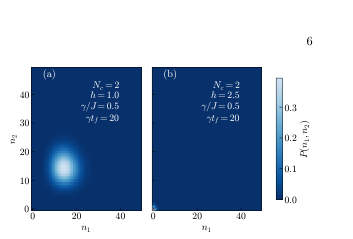 
FIG. 3. Probability distribution P(n1, n2) for γtf = 20, Nc = 2, γ/J = 0.5, α = 1.1. (a) Ferromagnetic phase. (b) Paramagnetic phase.

📷 Fig 3

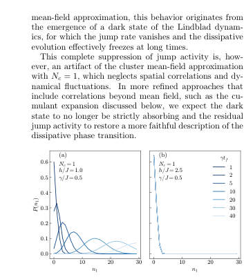 
FIG. 2. Evolution of P(n1) in the tilted mean-field approx- imation with Nc = 1 in ferromagnetic (a) and paramagnetic (b) phases. α = 1.1.

📷 Fig 4

 
FIG. 4. Connected joint distribution P(n1, n2) −P(n1)P(n2) with Nc = 2, γ/J = 0.5, γtf = 20, and (a) h = 1.0 (b) h = 2.5. α = 1.1.

📷 Fig 5

 
FIG. 5. Growth rate of the covariance of the number of jumps in time from the cluster mean field approximation with Nc = 2, 4, 6, h = 1.0, γtf = 10, α = 1.1.

📷 Fig 6

 
FIG. 6. Steady-state rate of change of the covariance between the numbers of jumps on sites 1 and 1 + d as a function of the dissipation γ on the periodic spin chain with h = J, obtained with the cumulant expansion approach to the tilted Lindblad equation. (a) Results for α = 0 and different system sizes N (see legend). Due to the infinite-range interaction, the two-site jump correlation is independent of the distance d. (b) Results for α = 1.1 and nearest-neighbor sites (d = 1), for different system sizes N [legend shared with panel (a)]. (c) Results for α = 1.1 and different distances d (see legend), for a fixed system size of N = 30.

📷 Fig 7

 
FIG. 7. Inverse of (a) average (b) variance of waiting time distribution at α = 1.1 &lt; αC. The dotted line represents mean-field, the vertical dashed lines represent the separation between the two regions predicted by cluster mean-field. Clus- ter mean-field converges and confirms the presence of two dis- tinct regions.

📷 Fig 8

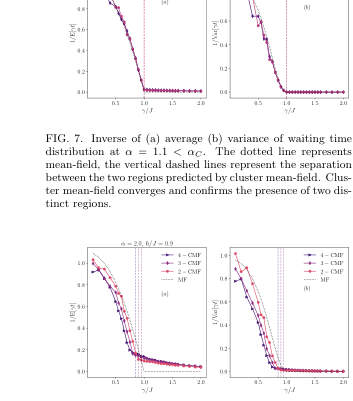 
FIG. 8. Inverse of (a) average (b) variance of waiting time distribution at α = 2.0 ≃αC. The dotted line represents the mean-field, the vertical dashed lines represent the separation between the two regions predicted by cluster mean-field. Clus- ter mean-field shrinks more and more the area corresponding to finite variance.

📷 Fig 9

 
FIG. 9. Cluster mean field results for the steady-state magnetization |⟨ˆσx⟩| as a function of the dissipation rate γ at h = J for different cluster size Nc and interaction range α (see legend).

**Main problem.** Characterizing nonequilibrium phase transitions in long-range dissipative spin systems using the statistical properties of quantum jump trajectories rather than standard steady-state order parameters.

**Main result.** The study demonstrates that quantum jump correlations (spatial and temporal) and waiting-time distributions serve as effective diagnostics for identifying paramagnetic and ferromagnetic phases, revealing distinct dynamical signatures like anti-correlated jumps in the FM phase.

**Method.** The authors employ a quantum trajectory framework using a tilted Lindbladian approach for full counting statistics, combined with cluster mean-field theory and second-order cumulant expansion to capture short- and long-range correlations.

**Summary.** This paper investigates how the statistics of quantum jumps can be used to identify phase transitions in long-range dissipative spin systems. By analyzing spatial and temporal correlations of detection events, the authors show that the ferromagnetic phase exhibits distinct anti-correlated jump patterns compared to the paramagnetic phase. They use a hierarchy of approximations, including cluster mean-field and cumulant expansion, to study how the interaction range affects these dynamics. The results highlight that trajectory-resolved observables are powerful probes for collective behavior in many-body open quantum systems.

Detailed structure

**Model / system.** A one-dimensional periodic spin chain with power-law decaying long-range interactions (parameterized by alpha) and dissipation via spontaneous emission, described by a Lindblad master equation.

**Key observables.** Quantum jump correlations (spatial and temporal), full counting statistics (FCS), waiting-time distributions (WTD), magnetization, and the covariance of jump counts.

**Important parameters / regimes.** Interaction range (alpha), dissipation rate (gamma), transverse field (h), interaction strength (J), and cluster size (Nc).

**Assumptions / limitations.** The cluster mean-field approximation assumes translational invariance among unmonitored clusters, and the cumulant expansion is a second-order truncation that may not be strictly controlled.

**Figures summary.** Figure 1 shows the phase diagram and the effectiveness of cMF and cumulant expansion; Figure 2 and 3 illustrate the evolution of jump probability distributions and joint distributions in different phases; Figure 6 and 7 show the covariance growth rate and waiting-time statistics across different interaction ranges.

**Paper structure.** The paper introduces the problem of characterizing dissipative phases via trajectories, defines the long-range spin model and Lindblad dynamics, presents the theoretical framework (tilted Lindbladian, cMF, and cumulant expansion), analyzes results for different interaction ranges (alpha=0, 1.1, 2.0), and concludes with a discussion on the utility of trajectory-resolved observables.

**Why it may be interesting.** It provides a new way to probe many-body physics and phase transitions in open quantum systems by looking at the statistics of measurement events (jumps) rather than just steady-state averages, which is highly relevant for continuous monitoring and measurement-induced dynamics.

Abstract

We characterize nonequilibrium phases in long-range dissipative spin systems through the statistical properties of quantum jump trajectories. While the average dynamics governed by the Lindblad master equation provides access to steady-state expectation values of order parameters, the quantum trajectory framework reveals features encoded in the spatial and temporal correlations of detection events. Focusing on a model exhibiting a paramagnetic-to-ferromagnetic phase transition, we investigate the full counting statistics of quantum jumps using a tilted Lindbladian approach. We combine this with cluster mean-field and cumulant expansion techniques, which allow us to capture, respectively, the short- and long-range structure of jump correlations. In addition, we study the waiting-time distributions of detection events. We show that quantum jump correlations display clear signatures of the underlying phases and reveal distinct dynamical features across the transition. Our results highlight the potential of trajectory-resolved observables as probes of collective behavior in open quantum many-body systems and provide new insights into the role of long-range interactions in shaping nonequilibrium dynamics.

[↑ back to top](#top)

### ⭐ [Cryogenic shock exfoliation for ultrahigh mobility rhombohedral graphite nanoelectronics](http://arxiv.org/abs/2604.21912v1)

**Highlighted author(s):** Andrew Lucas  
**Authors:** Ludwig Holleis, Youngjoon Choi, Canxun Zhang, Jack H. Farrell, Gabriel Bargas, Audrey Hsu, Zexing Chen, Ian Sackin, Wenjie Zhou, Yi Guo, Thibault Charpentier, Yifan Jiang, Benjamin A. Foutty, Aidan Keough, Martin E. Huber, Takashi Taniguchi, Kenji Watanabe, Andrew Lucas, Andrea F. Young  
**Type:** both · **Category:** strongly correlated electrons · **PDF:** <https://arxiv.org/pdf/2604.21912v1>  
**Analysis basis:** full PDF text, analyzed in chunks
**Topic relevance:** 🔥 `non-equilibrium dynamics` **3/5**

📷 Fig 1

 
FIG. 1. Cryogenic shock exfoliation of rhombohedral graphene. (a) Step-by-step illustration of the cryogenic shock exfoliation process. (b) Optical micrograph taken in the visible and (c) infrared. Bright regions in the infrared image correspond to rhombohedral stacking order. (d-f) Scanning microwave impedance microscopy images in the regions marked in panel c. Area of select contiguous rhombohedral domains are indicated. (g) Total flake area versus non-Bernal stacking fraction for multilayer graphene flakes. Shaded ovals are centered on the geometric mean for x-axis and arithmetic mean for the y-axis, and spanning one standard deviation. (h) Distribution of single-stacking-order,...

📷 Fig 2

 
FIG. 2. Real-space characterization of device uniformity. (a) Atomic force micrograph of a 13-layer dual-gated RMG device. Inset: optical micrograph. (b) Penetration field capacitance CP measured across the accessible range of ne and D. (c) Real space magnetization M determined by local magnetometry. A fringe magnetic field image is acquired by modulating the back gate across a phase boundary separating a spin-polarized half-metal (point ‘X’ in panel b) and a non-magnetic phase. Standard Fourier-domain algorithms are then used to reconstruct M from the measured fringe fields (see Methods).

📷 Fig 3

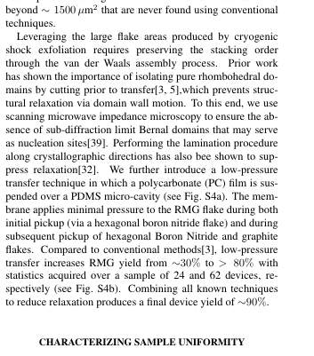 
Fig. 2a shows optical and atomic force micrographs of a dual-graphite gated 13-layer RMG device fabricated from a cryogenic shock exfoliated flake using the methods of the pre-

📷 Fig 4

 
FIG. 3. Transverse magnetic focusing. (a) Single-particle band structure of rhombohedral 13-layer graphene at D = 0. The inset shows the Fermi surface at the dashed line (EF = 160 meV), corresponding to ne ≈1013 cm−2. (b) Simulations of the current magnitude |J| for a fully ballistic Boltzmann model with applied magnetic field B = 135 mT, corresponding to the first TMF resonance. (c) TMF data at ne = 1013 cm−2 for four contact configurations along the different edges of the devices. (d) TMF data for the ‘South’ edge as a function of temperature. (e) First TMF peak for at T=2.0K, (f) 78.0K, (g) 138.0K, and (h) 198.0K. The blue shaded region is the peak area Apeak. (i) Temperature-dependence...

📷 Fig 5

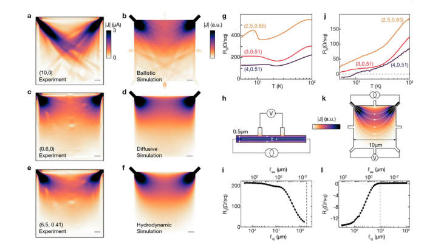 
FIG. 4. Ballistic, diffusive, and hydrodynamic electron transport regimes in RMG. (a) nSOT Biot–Savart imaging of 10 µA current flow at ne = 1013 cm−2, D = 0 V/nm. (b) Simulation of current flow in the ballistic regime (ℓee = 200 µm, ℓmr = 200 µm), obtained by solving the quantum kinetic equation (see Methods). (c) nSOT image at ne = 0.6 × 1012 cm−2, D = 0 V/nm, close to charge neutrality. (d) Simulation in the diffusive regime (ℓee = 50 nm, ℓmr = 10 µm). (e) nSOT image at ne = 6.5 × 1012 cm−2, D = 0.41 V/nm, in the spin- and valley-unpolarized single-surface regime. (f) Simulation in the hydrodynamic regime (ℓee = 50 nm, ℓmr = 200 µm). Scale bar: 1 µm for all images. (g)...

**Main problem.** The utility of rhombohedral multilayer graphene (RMG) for studying correlated electron physics is limited by the scarcity, small size, and structural instability of rhombohedral stacking in natural graphite.

**Main result.** The authors developed 'cryogenic shock exfoliation' and low-pressure assembly to produce large-area, high-yield RMG devices, demonstrating ultrahigh mobility and a crossover between Poiseuille and porous electron hydrodynamic flow.

**Method.** A new cryogenic shock exfoliation method uses rapid cooling in liquid nitrogen to induce shear stress for Bernal-to-rhombohedral conversion, combined with low-pressure van der Waals assembly and nanoSQUID-on-tip imaging.

**Summary.** This paper introduces a new fabrication technique called 'cryogenic shock exfoliation' to overcome the scarcity of rhombohedral graphene. By using rapid temperature changes to induce structural conversion, the authors produce large-area, high-quality rhombohedral flakes with 90% device yield. These high-purity devices allow for the observation of advanced electronic phenomena, including ultrahigh mobility and complex hydrodynamic electron flow. This advancement provides a scalable platform for exploring new correlated phases in 2D nanoelectronics.

Detailed structure

**Model / system.** The physical system consists of 13-layer rhombohedral multilayer graphene (RMG) heterostructures, analyzed using a tight-binding Hamiltonian and a quantum kinetic Boltzmann model for electron hydrodynamics.

**Key observables.** Transverse magnetic focusing (TMF) peaks, nanoSQUID-on-tip (nSOT) current imaging, magnetization, resistance (including bend resistance), and effective mass.

**Important parameters / regimes.** Disorder mean free path (> 200 um), electron-electron scattering length, Gurzhi length, device area (> 1300 um^2), and fabrication yield (~90%).

**Assumptions / limitations.** The transport model assumes an isotropic 2D electron liquid and uses a two-rate relaxation-time approximation for momentum-relaxing and momentum-conserving scattering.

**Figures summary.** Figure 1 shows the cryogenic shock process and structural uniformity via microscopy; Figure 4/S8/S9 present temperature-dependent resistance, current density maps, and simulations of hydrodynamic vs. diffusive flow regimes.

**Paper structure.** Introduction of the RMG bottleneck, description of the cryogenic shock and low-pressure assembly methods, characterization of structural uniformity, demonstration of ultrahigh mobility via TMF, and analysis of hydrodynamic transport regimes.

**Why it may be interesting.** The paper explores many-body electron-electron interactions and hydrodynamic regimes (Poiseuille vs. porous flow) in a highly tunable 2D system, which is relevant to the study of non-equilibrium dynamics in many-body systems.

Abstract

Rhombohedral multilayer graphene (RMG) offers a highly tunable platform for correlated electron physics, featuring field-effect control of magnetic, superconducting, and topological phases[1-24]. The promise of these materials has been held back by the limited abundance of rhombohedral stacking in natural graphite, which constrains both sample yield and useful area. Here we introduce 'cryogenic shock exfoliation' to produce large area rhombohedral graphene flakes which, combined with a low-pressure van der Waals assembly technique that preserves stacking order, enable highly uniform devices exceeding 1300 $μm^2$ with fabrication yields of 90%. Using scanning nanoSQUID-on-tip imaging, we demonstrate uniform spin magnetism over the full central 10 times 10 $μm^2$ area of our devices. Transverse magnetic focusing reveals a disorder mean free path exceeding 200 $μm$ at low temperatures. Within the flat surface bands of RMG[20], we observe a size-driven crossover from Poiseuille to porous electron flow in the intermediate-temperature regime of strong electron-electron hydrodynamics[16, 25], providing a further signature of ultrahigh device quality. Our approach overcomes a key materials bottleneck in the fabrication of mesoscopic rhombohedral graphene devices, paving the way for incorporating strongly correlated phases into two-dimensional nanoelectronics.

[↑ back to top](#top)

### ⭐ [Algorithmic Locality via Provable Convergence in Quantum Tensor Networks](http://arxiv.org/abs/2604.21919v1)

**Highlighted author(s):** Sarang Gopalakrishnan  
**Authors:** Siddhant Midha, Yifan F. Zhang, Daniel Malz, Dmitry A. Abanin, Sarang Gopalakrishnan  
**Type:** theory · **Category:** numerical methods · **PDF:** <https://arxiv.org/pdf/2604.21919v1>  
**Analysis basis:** full PDF text, analyzed in chunks
**Topic relevance:** `entanglement & information structure` **2/5**

📷 Fig 1

 
FIG. 1. (a) Algorithmic locality in tensor networks: The ef- fect of a perturbation at the center of the network on the fixed-point messages living on edges of the graph decays ex- ponentially with distance from perturbation. Loops (see Eq. (6)) and clusters (see Eq. (7)) built out of the fixed-point mes- sages inherit the locality subsequently. (b) Phase diagram of injective PEPS: Theorem 1 shows existence (for all 0 ≤ε &lt; 1) and uniqueness (for ε &lt; ε∗= O(1/∆)) of fixed points, where ∆is the degree of the graph. Theorem 2 shows convergence of cluster expansion for ε &lt; ε∗∗= O  min{1/D, (D/∆)∆/2} 

**Main problem.** Establishing rigorous theoretical foundations for Tensor Network Belief Propagation (TN-BP) in higher dimensions, specifically proving the existence, uniqueness, and convergence of fixed points and the validity of cluster expansions.

**Main result.** The authors prove 'algorithmic locality,' demonstrating that local perturbations in strongly injective PEPS lead to exponentially decaying changes in both BP fixed-point messages and local observables, enabling efficient classical simulation.

**Method.** The work utilizes message-passing dynamics, Banach contraction mapping, and cluster expansion techniques from lattice statistical mechanics to analyze the stability and convergence of TN-BP.

**Summary.** This paper provides the first end-to-end theory for Tensor Network Belief Propagation (TN-BP) in higher-dimensional PEPS. It proves that for sufficiently injective states, the BP algorithm converges to a unique fixed point that is stable under local perturbations. The authors introduce 'algorithmic locality,' showing that the impact of a local change decays exponentially with distance. This result justifies the use of local recomputation for efficient classical simulation of many-body quantum systems.

Detailed structure

**Model / system.** The study focuses on Projected Entangled Pair States (PEPS) defined on arbitrary graphs with a maximum degree and bond dimension, specifically focusing on the class of strongly injective tensors.

**Key observables.** Local expectation values, connected correlation functions, and the norm of the state (partition function).

**Important parameters / regimes.** Injectivity parameter (epsilon), bond dimension (D), maximum vertex degree (Delta), and correlation/decay length scales (xi).

**Assumptions / limitations.** The proofs are restricted to a subclass of PEPS satisfying 'strong injectivity' and assume the bond dimension and vertex degree are O(1).

**Figures summary.** Figure 1(a) illustrates the concept of algorithmic locality via decaying influence of perturbations; Figure 1(b) presents a phase diagram showing thresholds for existence, uniqueness, and cluster expansion convergence.

**Paper structure.** The paper begins with preliminaries on PEPS and Schatten norms, moves to proving the existence and uniqueness of BP fixed points, establishes the decay of loop activities, proves the central theorem of algorithmic locality, and concludes with error decomposition analysis.

**Why it may be interesting.** This provides a rigorous bridge between widely used numerical practices (like TN-BP) and provable algorithmic performance, offering a theoretical guarantee for the efficiency of classical simulations of many-body states.

Abstract

Belief propagation has recently emerged as a powerful framework for evaluating tensor networks in higher dimensions, combining computational efficiency with provable analytical guarantees. In this work, we develop the first end-to-end theory of tensor network belief propagation for a class of projected entangled pair states satisfying \emph{strong injectivity}. We show that when the injectivity parameter exceeds a constant threshold, BP fixed points can be found efficiently, and a cluster-corrected BP algorithm computes physical quantities to $1/\mathrm{poly}(N)$ error in $\mathrm{poly}(N)$ time for an $N$ qubit system. We identify a striking phenomenon we term \emph{algorithmic locality}: local perturbations of the tensor network affect the BP fixed point with an influence decaying rapidly with distance. As a result, updates to the fixed point after a local perturbation can be carried out using only local recomputation. Moreover, through the cluster expansion, this locality extends to observables, implying that local expectation values can be approximated from local data with controlled accuracy. Our results provide the first rigorous guarantee for the effectiveness of tensor-network belief propagation on a wide class of many-body states, bridging a gap between widely used numerical practice and provable algorithmic performance.

[↑ back to top](#top)

### ⭐ [Generalized stochastic spin-wave theory for open quantum spin systems](http://arxiv.org/abs/2604.21574v1)

**Highlighted author(s):** Rosario Fazio  
**Authors:** Zejian Li, Anna Delmonte, Rosario Fazio  
**Type:** theory · **Category:** statistical mechanics · **PDF:** <https://arxiv.org/pdf/2604.21574v1>  
**Analysis basis:** full PDF text, analyzed in chunks

📷 Fig 1

 
Figure 1. Semiclassical representation of driven-dissipative spin dynamics with the generalized framework of spin-wave quantum trajectories (SWQT). (a) Sketch of a variable-range interacting spin model on a two-dimensional (2D) lattice. The spins are driven with an external field h and interact via a variable-range coupling J(α) ij , whose strength decays as a power law of the distance with exponent α. The spins are subjected to local decay (at rate γ), and the dissipative dynamics is unraveled into quantum trajectories via continuous monitoring. (b) In our semiclassical treatment, each spin is bosonized around its classical polarization. Here, Oxyz depicts the lab frame and O˜xi˜yi˜zi is...

📷 Fig 2

 
Figure 3. Benchmark of the spin-wave quantum trajectories (SWQT) with heterodyne (het.) unraveling for a 2 × 2 spin system with h = 2γ, J = 0.5γ, and nearest-neighbor interactions (α = ∞) for the following physical quantities: (a) single- trajectory expectation values on the first site ⟨ˆσx,y,z 1 ⟩; (b) single-trajectory two-point correlation function X2 [cf. Eq. (33)]; (c) trajectory-averaged and site-averaged spin observables ⟨ˆσx,y,z⟩; (d) trajectory-averaged two-point correlation function X2. They are plotted as a function of time and shown together with the numerically exact solutions (see legend). The simulations are performed with a fixed time step γδt = 10−4 and trajectory averages...

📷 Fig 3

 
Figure 5. Steady-state results for a system with N = 6 × 6, α = 1 in the steady state, obtained with spin-wave quan- tum trajectories. (a) Magnetization order parameter X2 as a function of the external drive h and the dissipation γ. (b) Trajectory-averaged spin-wave density ϵ. In both panels, the mean-field (MF) phase boundary is marked with a dashed line (see legend).

📷 Fig 4

 
Figure 4. (a) SWQT heterodyne dynamics for a single trajec- tory with N = 6 × 6, h = J, γ = 0.6J and α = 1 showing the symmetry-breaking behavior. (b) Distribution of mx along trajectories for different values of γ (see legend) showing the bimodality of the trajectory ensemble.

📷 Fig 5

 
Figure 7. Steady-state magnetization X2 as a function of γ in a 10 × 10 lattice, for different interaction ranges represented by α, shown together with the mean-field result (see legend).

📷 Fig 6

 
Figure 6. Steady-state results for the same quantities as in Fig. 5 with α = 1 and h = J, as a function of the dissi- pation γ and system size N = L × L (legend shared across both panels). (a) Magnetization order parameter X2 shown together with the mean-field (MF) result. Inset: finite-size scaling of the results with γc/J = 1.02±0.07, β = 0.46±0.10, ν = 1.00 ± 0.05 extracted from a collapsing analysis, with the vertical dotted line marking the extracted critical point. (b) Trajectory-averaged spin-wave density ϵ.

📷 Fig 7

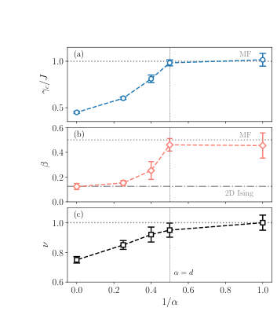 
Figure 8. Finite-size scaling parameters as a function of inter- action range represented by 1/α showing the crossover of uni- versality class, where the vertical dotted line marks α = d = 2. (a) Critical point γc, with the mean-field (MF) value γc/J = 1 marked with a horizontal dotted line. (b) Magnetization crit- ical exponent β, with the mean-field value β = 1/2 marked with a horizontal dotted line and the value for 2D Ising uni- versality class β = 1/8 marked with a dash-dotted line. (c) Correlation length critical exponent ν with the horizontal dot- ted line marking the value ν = 1 for both the mean-field and the 2D Ising universality class.

📷 Fig 8

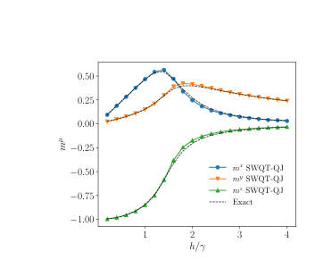 
Figure 9. SWQT quantum jump (QJ) benchmark results for a N = 4 × 4 spin lattice with J = 2γ and α = ∞: steady-state average magnetization mx,y,z obtained using SWQT with the QJ unraveling, together with the exact solution (see legend), as a function of the external field h.

📷 Fig 9

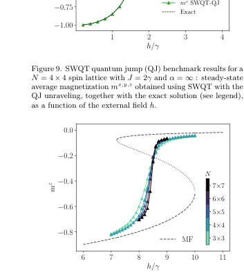 
Figure 10. SWQT quantum jump (QJ) results for a 2D spin lattice with J = 7γ and α = ∞: steady-state average magne- tization mz as a function of the external field h for different system sizes, shown together with the mean-field solution (see legend).

**Main problem.** Developing an efficient semiclassical framework to simulate the open quantum dynamics of large-scale driven-dissipative spin systems, specifically overcoming the limitations of conventional spin-wave theories in regimes with short-range interactions and local quantum jumps.

**Main result.** The proposed Generalized Stochastic Spin-Wave Theory (SWQT) successfully captures universality class crossovers (from Mean-Field to 2D Ising) and symmetry-breaking phase transitions, providing a scalable method that remains accurate even in the presence of local dissipation.

**Method.** A semiclassical approach using a Gaussian ansatz for quantum trajectories unraveled from the Lindblad master equation, utilizing a quaternion formalism for non-singular local comoving frames and a higher-order Holstein-Primakoff expansion.

**Summary.** This paper introduces a new semiclassical method called Generalized Stochastic Spin-Wave Theory (SWQT) to simulate large-scale open quantum spin systems. By using a quaternion-based approach to avoid coordinate singularities, the method can efficiently track quantum trajectories under both continuous monitoring and discrete quantum jumps. The authors demonstrate that the theory accurately captures the transition between different universality classes, such as the crossover from Mean-Field to 2D Ising behavior. This framework is particularly useful for studying driven-dissipative many-body physics where traditional spin-wave theories fail.

Detailed structure

**Model / system.** A 2D lattice of interacting spins with power-law interactions (tunable via exponent alpha) subject to Lindblad dissipation (local spin decay) and external driving, including both Z2-symmetric and non-symmetric models.

**Key observables.** Steady-state magnetization (m_x, m_y, m_z), two-point correlation functions (X2), spin-wave density (epsilon), and critical exponents (beta, nu).

**Important parameters / regimes.** Interaction range (alpha), dissipation rate (gamma), external driving strength (h), and system size (N).

**Assumptions / limitations.** The framework assumes the system can be adequately described by a Gaussian ansatz for the bosonic modes and is most effective in regimes of low spin-wave density.

**Figures summary.** Figure 1 illustrates the lattice and local comoving frames; Figure 2 shows the universality crossover as a function of interaction range; Figure 3 benchmarks the theory against exact small-system solutions; Figure 4 demonstrates symmetry breaking and bimodal magnetization distributions; Figure 8 presents finite-size scaling analysis.

**Paper structure.** The paper introduces the scientific problem and the SWQT framework, details the mathematical derivation using quaternions and Holstein-Primakoff mapping, presents numerical benchmarks against exact solutions, applies the method to study phase transitions and universality crossovers in variable-range models, and discusses the implementation of quantum-jump dynamics.

**Why it may be interesting.** It provides a powerful, scalable toolbox for studying non-equilibrium many-body phases and dissipative phase transitions in large-scale spin systems, bridging the gap between mean-field theory and full quantum simulations.

Abstract

We propose a semiclassical framework for solving open quantum dynamics in driven-dissipative spin systems. Our method consists of generalized spin-wave approximations tailored to describing quantum trajectories unravelled from the master equation, and generically applies to regimes beyond the reach of conventional spin-wave theories, including short-range interactions and local quantum jumps, enabling the efficient simulation of large-scale interacting spins. We illustrate the versatility of our framework by studying a variable-range driven-dissipative Ising model on a 2D lattice. When the dissipation acts along the drive axis, we find a continuous phase transition breaking the $\mathbb{Z}_2$ symmetry, and demonstrate that the interaction range, when tuned from fully-connected to nearest-neighbour, profoundly alters the universality class of the criticality. With the dissipation along the interaction axis, we show the emergence of a first-order transition. Demonstrated with both state-diffusion and quantum-jump types of trajectory dynamics, our framework provides a powerful toolbox for the efficient semiclassical description of non-equilibrium dynamics and many-body phases in spin systems.

[↑ back to top](#top)

### ⭐ [Symplectic split-operator method for the time-dependent unitary Tavis-Cummings model](http://arxiv.org/abs/2604.21778v1)

**Highlighted author(s):** Andrii G. Sotnikov, Denys I. Bondar  
**Authors:** Roman Ovsiannikov, Kurt Jacobs, Andrii G. Sotnikov, Denys I. Bondar  
**Type:** theory · **Category:** numerical methods · **PDF:** <https://arxiv.org/pdf/2604.21778v1>  
**Analysis basis:** full PDF text, analyzed in chunks

📷 Fig 1

 
FIG. 1. Evolution of the eigenvalues of the covariance matrix (2) for Holstein–Primakoff approach (orange and blue solid lines), QuTip solver (red and green dashed lines), and our algorithm 1 with method=Linear (light green and brown dotted lines) with parame- ters ωc = 2π × 2.4 GHz, ωs = 2π × 3.6 GHz, g = 2π × 10 MHz, Λ = 2π × 1 GHz and ω = 2π × 6 GHz.

📷 Fig 2

 
FIG. 2. Time of the one step evolution for Qutip solver (green line), our algorithm 1 with method=Exp (blue line), and with method=Linear (orange line).

**Main problem.** Developing an efficient, memory-efficient, and unitarity-preserving numerical method for simulating the time-dependent unitary dynamics of the Tavis-Cummings model, specifically overcoming the quadratic scaling of standard solvers like QuTiP.

**Main result.** The authors propose a symplectic split-operator method that achieves linear scaling in both time and memory by exploiting a basis re-indexing trick to transform the Hamiltonian into tridiagonal form. This method remains accurate beyond the rotating-wave approximation and outperforms standard solvers in large Hilbert-space dimensions.

**Method.** A second-order symmetric (Strang) Trotter-Suzuki propagation scheme using two realizations: a block-diagonal exponentiation approach and a Cayley/Crank-Nicolson approach using the Thomas algorithm for tridiagonal linear systems.

**Summary.** This paper introduces a new numerical method for simulating the time-dependent Tavis-Cummings model with much higher efficiency than standard tools. By using a split-operator approach and a clever basis re-indexing trick, the authors reduce the computational complexity to linear scaling with the system size. This allows for the simulation of much larger spin ensembles and longer time scales, even when including non-rotating-wave terms. The method is particularly useful for studying driven hybrid quantum systems like NV centers in diamond.

Detailed structure

**Model / system.** The closed, undamped, time-dependent Tavis-Cummings model, which describes a multilevel spin ensemble interacting with a single cavity mode, including time-dependent modulation of the spin frequency.

**Key observables.** Eigenvalues of the cavity quadrature covariance matrix (representing X and Y quadratures).

**Important parameters / regimes.** Cavity frequency, spin frequency, spin-cavity coupling strength, modulation amplitude and frequency, and the Hilbert-space dimension D.

**Assumptions / limitations.** The method is specifically tailored to Hamiltonians that can be decomposed into diagonal and tridiagonal parts via basis permutation; it assumes a closed (undamped) system.

**Figures summary.** Figure 1 compares the time evolution of covariance matrix eigenvalues against QuTiP and the Holstein-Primakoff approximation; Figure 2 compares the runtime per propagation step against the Hilbert-space dimension to demonstrate linear scaling.

**Paper structure.** The paper identifies the limitations of current solvers, introduces the Hamiltonian decomposition and basis re-indexing technique, presents two implementation realizations (Block-diagonal and Cayley), validates the method against QuTiP and the Holstein-Primakoff approximation, and discusses computational scaling and potential extensions.

**Why it may be interesting.** It provides a highly scalable tool for simulating large-scale cavity QED systems and spin ensembles, particularly in regimes where the rotating-wave approximation fails, which is crucial for studying driven-dissipative quantum dynamics and many-body effects in hybrid systems.

Abstract

We present a fast, memory-efficient, unitarity-preserving numerical method beyond the rotating-wave approximation for the closed Tavis-Cummings model in which a multilevel spin system interacts with a cavity mode. This model can describe the interaction of an ensemble of spins with a cavity mode in which the spin frequency and other parameters are time-dependent. The method exploits the fact that, while the Tavis-Cummings model is not tri-diagonal, it can be brought into tri-diagonal form by a change of basis that can be implemented purely by re-indexing (permuting basis elements), which is a fast operation. By truncating the Fock basis of the cavity mode, the computational complexity of the method is linear in the total dimension of the coupled system, both in time and memory. The method can be employed to simulate any closed quantum system whose Hamiltonian terms can be brought into tri-diagonal form.

[↑ back to top](#top)

### [BCS-BEC crossover of polaritonic condensates in mass-imbalanced semimetal/semiconductor microcavities](http://arxiv.org/abs/2604.21244v1)

**Authors:** Thi-Hau Nguyen, Minh-Tien Tran, Van-Nham Phan  
**Type:** theory · **Category:** strongly correlated electrons · **PDF:** <https://arxiv.org/pdf/2604.21244v1>  
**Analysis basis:** full PDF text, analyzed in chunks
**Topic relevance:** 🔥 `correlated cavity matter` **5/5** · `Dicke superradiance` **2/5** · `Tavis-Cummings & cavity-many-emitter` **2/5** · `driven-dissipative phase transition` **2/5**

📷 Fig 1

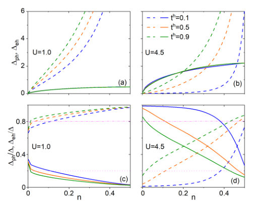 
FIG. 1. Condensate order parameters as functions of the ex- citation density n for different hole hopping amplitudes th at detuning parameter d = −0.5. The top row shows the exci- tonic ∆eh (solid lines) and the photonic ∆ph (dashed lines), while the bottom row displays their relative weights in the condensates for Coulomb interaction (a) and (c) U = 1 and (b) and (d) U = 4.5. The horizontal dotted and dashed- dotted lines mark the fractions of 20% and 80%, respectively.

📷 Fig 2

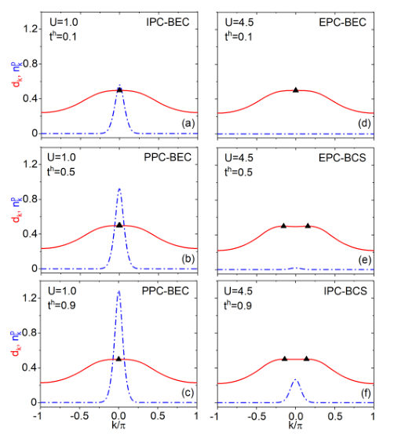 
FIG. 2. Momentum distributions of the electron-hole pair amplitude dk (red solid lines) and the photon density np k (blue dashed lines) in the first Brillouin zone along the k = (k, 0) direction for three different values of th with n = 0.1 at U = 1 (left column) and U = 4.5 (right column). The triangle symbols indicate the maximum position of dk.

📷 Fig 3

 
FIG. 3. Wave vector–resolved single-particle spectral func- tions of electrons Ae(k, ω) (red lines) and holes Ah(k, ω) (blue lines) along the k = (k, 0) direction (k &gt; 0) for the parameter set corresponding to the left column of Fig. 2. The spectra highlighted in purple mark the contributions at the Fermi mo- mentum.

📷 Fig 4

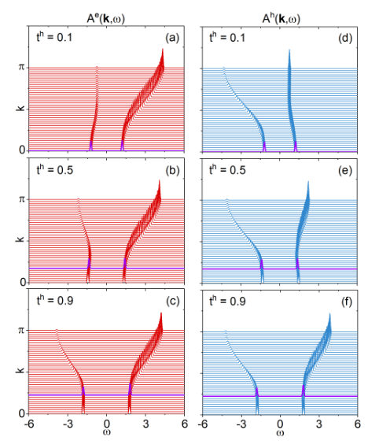 
FIG. 4. Wave vector–resolved single-particle spectral func- tions of electrons Ae(k, ω) (red lines) and holes Ah(k, ω) (blue lines) along the k = (k, 0) direction (k &gt; 0) for the parameter set corresponding to the right column of Fig. 2. The spec- tra highlighted in purple mark the contributions at the Fermi momentum.

📷 Fig 5

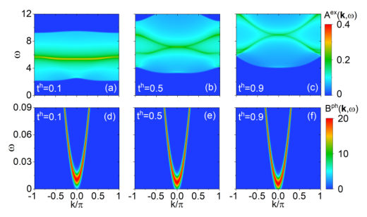 
FIG. 5. Intensity plot of the luminescence functions for exci- tonic polarization Aex(k, ω) (top) and for cavity photon mode Bph(k, ω) (bottom) along the k = (k, 0) direction for the pa- rameter set corresponding to the left column of Fig. 2.

📷 Fig 6

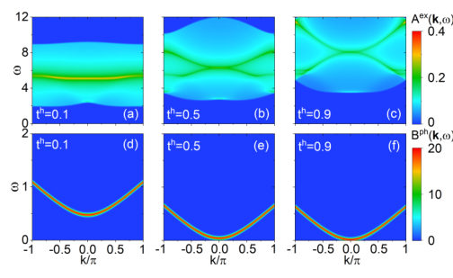 
FIG. 6. Intensity plot of the luminescence functions for exci- tonic polarization Aex(k, ω) (top) and for cavity photon mode Bph(k, ω) (bottom) along the k = (k, 0) direction for the pa- rameter set corresponding to the right column of Fig. 2.

📷 Fig 7

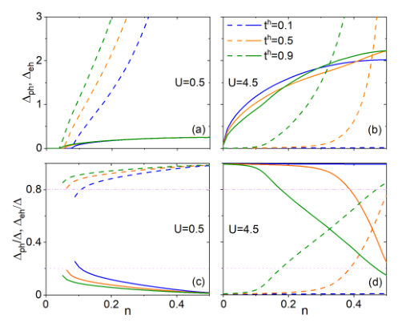 
FIG. 7. Condensate order parameters as functions of the ex- citation density n for different hole hopping amplitudes th at detuning parameter d = 1. The top row shows the excitonic ∆eh (solid lines) and the photonic ∆ph (dashed lines), while the bottom row displays their relative weights in the conden- sates for Coulomb interaction (a) and (c) U = 0.5 and (b) and (d) U = 4.5. The horizontal dotted and dashed-dotted lines mark the fractions of 20% and 80%, respectively.

📷 Fig 8

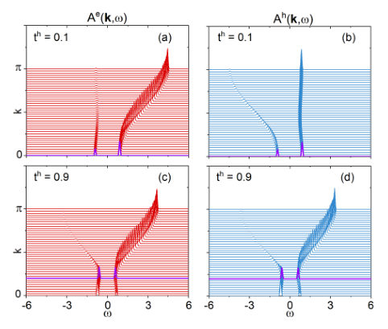 
FIG. 9. Wave-vector-resolved single-particle spectral func- tions of electrons Ae(k, ω) (red lines) and holes Ah(k, ω) (blue lines) along the k = (k, 0) direction (k &gt; 0) for d = 1, n = 0.05 and U = 4.5. The spectra highlighted in purple mark the contributions at the Fermi momentum.

📷 Fig 9

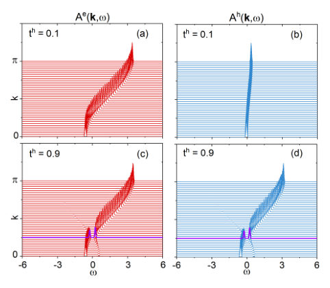 
FIG. 8. Wave-vector-resolved single-particle spectral func- tions of electrons Ae(k, ω) (red lines) and holes Ah(k, ω) (blue lines) along the k = (k, 0) direction (k &gt; 0) for d = 1, n = 0.05 and U = 0.5. The spectra highlighted in purple mark the contributions at the Fermi momentum.

📷 Fig 10

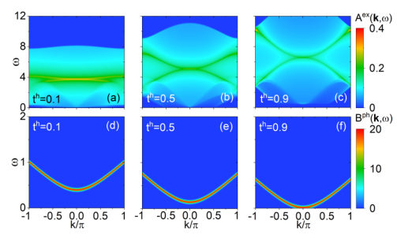 
FIG. 10. Intensity plot of the luminescence functions for exci- tonic polarization Aex(k, ω) (top) and for cavity photon mode Bph(k, ω) (bottom) along the k = (k, 0) direction at d = 1.0, n = 0.05, and U = 0.5.

**Main problem.** Investigating how electron-hole mass imbalance and Coulomb interaction strength influence the phase structures and the BCS-BEC crossover of polaritonic condensates in semiconductor and semimetal microcavities.

**Main result.** In the semiconductor regime, increasing density or reducing mass imbalance drives a crossover from BEC-type to BCS-type pairing, whereas the semimetallic regime favors BCS-type pairing unless Coulomb interaction and mass imbalance are sufficiently strong.

**Method.** The study employs the Unrestricted Hartree-Fock Approximation (UHFA) to self-consistently solve a two-band electron-hole-photon model.

**Summary.** This paper explores the transition between BEC and BCS regimes in polaritonic condensates within microcavities. It specifically examines how the difference in mass between electrons and holes, along with Coulomb strength, dictates whether the condensate is excitonic-like or photon-like. The study covers both semiconductor and semimetal regimes, showing that mass imbalance can stabilize tightly bound pairs. The findings are supported by predicted spectroscopic signatures in luminescence spectra.

Detailed structure

**Model / system.** A 2D electron-hole-photon system in a planar microcavity, modeled using a square lattice Hamiltonian that includes Coulomb attraction (Falicov-Kimball type) and light-matter coupling (Dicke type).

**Key observables.** Single-particle spectral functions (electrons and holes), luminescence spectra (excitonic polarization and cavity photons), and condensate order parameters (excitonic and photonic amplitudes).

**Important parameters / regimes.** Mass imbalance (hole hopping amplitude t_h), Coulomb interaction strength (U), band gap/detuning (d), and excitation density (n).

**Assumptions / limitations.** The system is treated in a quasi-thermal equilibrium limit, and the model assumes a square lattice geometry rather than a specific crystal structure.

**Figures summary.** Figures show momentum distributions of pairing amplitude and photon density, phase diagrams in the U-t_h plane, and intensity plots of luminescence spectra showing spectral weight shifts.

**Paper structure.** The paper introduces the physical problem and model, details the UHFA methodology, analyzes the semiconductor regime (BEC-BCS crossover), explores the semimetal regime, and concludes with spectroscopic signatures and a summary of phase transitions.

**Why it may be interesting.** It provides a unified framework for understanding the interplay between light-matter coupling and many-body correlations, specifically how mass asymmetry can tune the nature of quantum condensation.

Abstract

The impacts of the mass imbalance and Coulomb interaction on the complex phase structures of the polaritonic condensates and their Bardeen-Cooper-Schrieffer (BCS)--Bose-Einstein condensation (BEC) crossover in semiconductor and semimetal microcavities are investigated. In the framework of the unrestricted Hartree-Fock approximation, a two-band electron-hole model involving photon mode is analyzed by treating Coulomb attraction and light-matter coupling on equal footing. The single-particle spectral functions and the luminescence properties are then examined. In the semiconducting regime, a positive band gap stabilizes tightly bound excitons and yields predominantly BEC-type excitoniclike polaritonic condensates at low density, while increasing excitation density and reducing mass imbalance drives a continuous crossover toward BCS-type pairing with intermediate and photoniclike polaritonic character. In contrast, the semimetallic regime favors itinerant electron-hole pairing, with BCS-type condensates dominating and BEC excitoniclike coherence emerging only at sufficiently strong Coulomb interaction and large mass imbalance situations. The evolution of luminescence spectra provides clear spectroscopic signatures of these crossover phenomena, offering a unified framework for understanding and controlling polaritonic condensates in microcavity systems.

[↑ back to top](#top)

### [Monitoring photon entanglement in coupled cavities](http://arxiv.org/abs/2604.21208v1)

**Authors:** Moises Acero, Jeremiah Harrington, Oleg L. Berman, K. Ziegler  
**Type:** theory · **Category:** quantum information and computing · **PDF:** <https://arxiv.org/pdf/2604.21208v1>  
**Analysis basis:** full PDF text, analyzed in chunks
**Topic relevance:** 🔥 `entanglement & information structure` **4/5** · 🔥 `measurement-induced transitions` **4/5** · 🔥 `quantum measurements` **4/5** · 🔥 `dissipative systems` **3/5** · 🔥 `non-equilibrium dynamics` **3/5** · `Tavis-Cummings & cavity-many-emitter` **2/5** · `correlated / nonlocal dissipation` **2/5** · `methods for driven-dissipative` **2/5**

📷 Fig 1

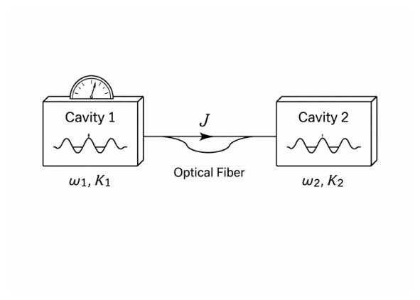 
FIG. 1. Two optical cavities coupled by an optical fiber are subject to repeated projective measurements in the left cavity.

📷 Fig 2

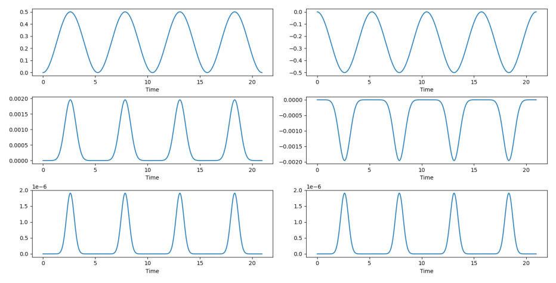 
FIG. 2. Unitary evolution: pe = 2|c0||cN| (left column) and the difference ∆= 2|c0||cN| cos ϕ of the probabilities of N00N states (right column) for N = 2, 10, 20. The time is given in units of ¯h/J.

📷 Fig 3

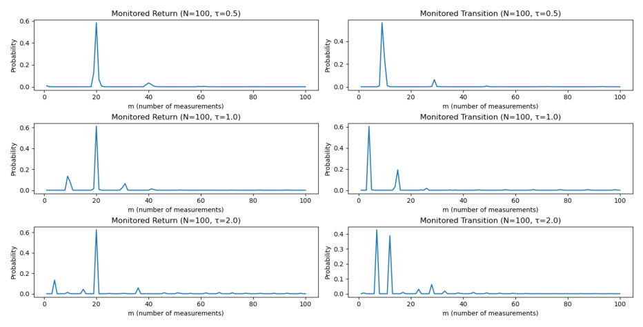 
FIG. 3. Monitored evolution: Probabilities of the return to the initial state |N, 0⟩(left) and the transition to the state |0, N⟩(right) for N = 100.

📷 Fig 4

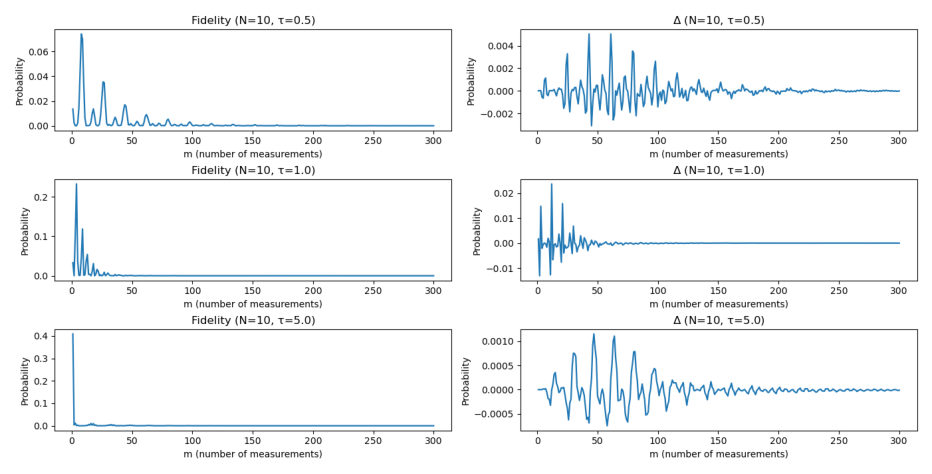 
FIG. 4. Probabilities of the monitored transition to a N00N state for N = 10 photons: fidelity |(⟨0, N| + ⟨N, 0|)|Ψt⟩|2/2 (left column) and the difference ∆of the N00N states (right column) for different time steps τ = 0.5, 1, 5.

📷 Fig 5

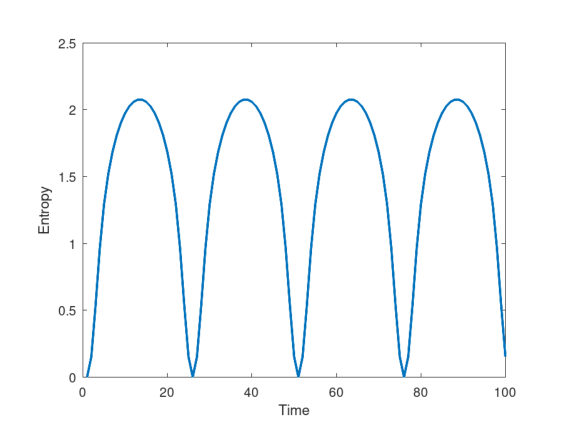 
FIG. 5. Time-periodic entanglement entropy for a unitary evolution in two coupled cavities with N = 20 photons. The time is given in units of ¯h/J.

📷 Fig 6

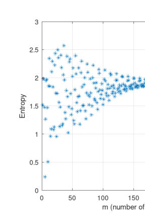 
FIG. 6. Entanglement entropy for N = 20 photons in two coupled cavities with Jτ/¯h = π/10.

📷 Fig 7

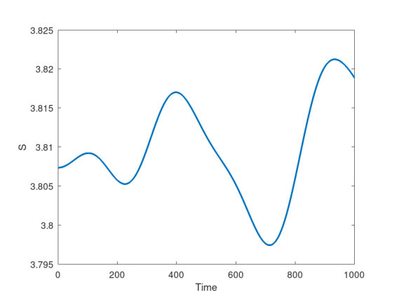 
FIG. 7. Entanglement entropy under a unitary evolution of photons, coupled to a single qubit with coupling strength Ω/ω = 0.1. The initial state is the superposition ρ0 = P15 n=1 | ↓, n⟩⟨↓, n|/15. The time is given in units of the inverse cavity frequency 1/ω.

📷 Fig 8

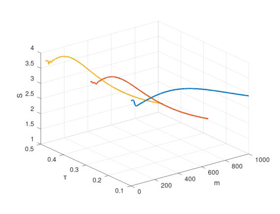 
FIG. 8. Entanglement entropy under a monitored evolution of photons, coupled to a single qubit with coupling strength Ω/ω = 0.1 for different time steps τ/ω between measurements. The initial state is the superposition ρ0 = P15 n=1 | ↓, n⟩⟨↓, n|/15.

**Main problem.** Investigating how repeated projective measurements (monitored evolution) can control, enhance, or stabilize photon entanglement and the formation of N00N states.

**Main result.** The study finds that entanglement is highly sensitive to the measurement time step, and while periodic measurements can increase entanglement entropy in coupled cavities, the fidelity of N00N-like states decays exponentially with the number of photons.

**Method.** The authors use a monitored quantum walk protocol involving periodic unitary evolution followed by projective measurements, analyzing the resulting density matrix and entanglement entropy.

**Summary.** This paper explores how repeated measurements can be used to manipulate photon entanglement in coupled cavities and qubit-cavity systems. It specifically looks at the formation of N00N states and how the timing of measurements affects entanglement entropy. The authors demonstrate that while measurements can stabilize certain entanglement features, they also lead to the decay of N00N state fidelity as photon number increases. Ultimately, the work suggests that the measurement protocol itself can serve as a control mechanism for quantum states.

Detailed structure

**Model / system.** The paper studies two primary systems: two harmonic cavities coupled by an optical fiber (described by a tunneling Hamiltonian) and the Jaynes-Cummings model (a single cavity coupled to a single qubit).

**Key observables.** Entanglement entropy (Rényi entropy), N00N state fidelity, phase sensitivity, transition and return probabilities, and the Husimi Q function.

**Important parameters / regimes.** Photon number (N), coupling strengths (J and Omega), measurement time step (tau), and the large N limit.

**Assumptions / limitations.** The initial state is assumed to be a pure Fock state |N, 0>, and certain calculations assume N is even.

**Figures summary.** Fig 1 shows a schematic of the coupled cavity system; Fig 2 compares unitary vs. monitored evolution for different photon numbers (N=2, 10, 20) regarding return probabilities and N00N state parameters; Fig 3 shows return probabilities.

**Paper structure.** The paper introduces the monitoring protocol, analyzes the coupled cavity system (N00N state formation and entanglement entropy), then extends the study to the Jaynes-Cummings model, and concludes with the implications for entanglement control.

**Why it may be interesting.** It provides insights into how measurement-induced dynamics can be used as a tool for entanglement engineering in photonic systems and cavity QED, a key area for quantum networking and sensing.

Abstract

We study the dynamics of $N$ photons in a Fock state, initially located inside one cavity, and coupled by an optical fiber to a second cavity. The entanglement of the photons is monitored by projective measurements, repeated with a fixed time step. This approach is applied to the formation of a photonic N00N state. We calculate the probability of the transition of $N$ photons from the left to the right cavity and the probability of the return of $N$ photons to the left cavity under repeated projective measurements. The entanglement is analyzed for the N00N state by its fidelity and its phase sensitivity, while for the entanglement between the states in the two cavities the entanglement entropy is calculated. In addition, we study the monitored evolution of photons in a single cavity, which are coupled to a single qubit, using the Jaynes-Cummings model. Photon entanglement is analyzed in terms of the entanglement entropy. In all these cases we find that entanglement is sensitive to the details of monitoring protocol, which can be used to control photon entanglement for specific applications.

[↑ back to top](#top)

### [Bipartite entanglement under frequency comb pumping in parametric Josephson circuits](http://arxiv.org/abs/2604.21692v1)

**Authors:** Mikael Vartiainen, Ilari Lilja, Ekaterina Mukhanova, Kirill Petrovnin, Gheorghe Sorin Paraoanu, Pertti Hakonen  
**Type:** both · **Category:** quantum information and computing · **PDF:** <https://arxiv.org/pdf/2604.21692v1>  
**Analysis basis:** full PDF text, analyzed in chunks
**Topic relevance:** 🔥 `QC/QI experiment` **4/5** · 🔥 `entanglement & information structure` **4/5** · 🔥 `quantum optics experiment` **4/5** · 🔥 `dissipative systems` **3/5** · `correlated / nonlocal dissipation` **2/5** · `methods for driven-dissipative` **2/5** · `non-equilibrium dynamics` **2/5** · `quantum measurements` **2/5**

📷 Fig 1

 
FIG. 1. Schematic of the experimental microwave setup working around 5.8 GHz frequency. The experiment is controlled by a GHz frequency lock-in signal analyzer, which also generates the required parametric pumps. The employed components are denoted in the frame on the right. The detection is performed using digital heterodyning [51]. For details of the operation, see text.

📷 Fig 2

 
FIG. 2. Illustration of the mode-coupling sequence beyond the two-mode squeezed modes in the case of two parametric pumps. The dotted lines represent two-mode squeezing. We call these the first-order correlations between modes. However, because A and B are squeezed by P1, and B and C are squeezed by P2, there will be a beam-splitter correlation between A and C. Since these correlations grow proportionally to the product of two pump amplitudes, they are called second-order correlations between modes. These correlations are contained within the model and can be seen by expanding the unitary evolution operator generated by the Hamiltonian. In this figure, only first- order correlations are...

📷 Fig 3

 
FIG. 3. Mode frequencies marked by ±(2m +1), for m = 0,...,21 and a 30-mode subgraph (contains modes denoted by dashed lines) constructed for a system with 15 symmetrically placed pumps. We are investigating the bipartite entanglement of the pair (-1, 1), inside the dashed square. Each edge represents a TMS term in the Hamiltonian. The weight for each edge is specified by the corresponding classical pump amplitude. Edges generated by P0 are indicated by red. We can see that the center pair (-1, 1) has 15 neighbors while the furthest pairs ±27,±29 have only 8 neighbors. This shows that as we traverse the graph further away from the center pair (-1, 1), each new added mode will not entangle...

📷 Fig 4

 
FIG. 5. Logarithmic negativity (a) and purity (b) of a 1, ..., 15 pump systems. We compare the theoretical predictions for symmetric (solid line, red, green, magenta) and asymmetric (dashed line, blue, yellow, cyan) systems with different parameter values. First, we have put all phases of the pumps equal to 0 and added no noise. Second, we have chosen all phases of the pumps randomly (random φk in the inset pump amplitude) and added no noise. Third, we have chosen all phases randomly and put a constant amount of noise θ = π

📷 Fig 5

 
FIG. 4. Building up the asymmetric pump configuration: The basic TMS entanglement sequence is produced by pumps P0 and P2, with their half frequencies denoted by red (P0) and blue (P2) lines. The third pump is placed so that the distance ∆2 to P0 is different from ∆1 between P0 and P2. The dashed lines illustrate the sequence of P-2 added frequencies "Mi" with M referring to the mode frequencies established by pumps P0 and P2: extra mode frequency Mi is entangled with mode M. Below is the graphical description of a system with asymmetric pumps. Red edges represent TMS by P0, blue edges represent TMS by pump P2 and black edges represent TMS by subsequent asymmetric pumps.

📷 Fig 6

 
FIG. 9. Purity (scale given by the color bar) obtained from a) theory and b) experiment of symmetrically pumped system with first pump fixed at α1 = 0.44κ (αE = 0.15κ). In all configurations, all pumps 2,...,11 have the same pump amplitude that is grows from 0 to 0.44κ (αE = 0...0.15κ). Phases of the pumps were chosen at random. Due to low purity in the experiment, we apply the quantum limited ( ¯n = 1) attenuator channel with θ = 2π/7. The overlaid black curve in (a) is the purity of a system where each pump configuration has the same total power.

📷 Fig 7

 
FIG. 7. Logarithmic negativity (a) and purity (b) of a 2 pump system where the first pump is fixed at α1 = 1.15κ (αE = 0.28κ) and the second pump grows from 0 to 1.81κ (αE = 0...0.44κ). Phases of the pumps were chosen at random. One can notice that in the case with no noise, even when the second pump is at 0, experimental results show very low purity. To account for this, the quantum limited ( ¯n = 1) attenuator channel with θ = 2π/7 was applied.

**Main problem.** Investigating how bipartite entanglement and purity are redistributed and diminished in a Josephson parametric circuit when using multiple pump tones (frequency combs) in symmetric and asymmetric configurations.

**Main result.** Adding additional pumps reduces bipartite entanglement between specific mode pairs by redistributing correlations across a larger network of modes and additional idler frequencies. In symmetric configurations, pump phases significantly affect entanglement, whereas in asymmetric configurations, the effect is minimal.

**Method.** The study combines experimental measurements in a Josephson Parametric Amplifier (JPA) with a theoretical Gaussian conditional-dynamics model using the Riccati equation and a graph-theoretical approach to describe mode couplings.

**Summary.** This paper explores the effects of frequency comb pumping on entanglement in superconducting parametric circuits. It demonstrates that while adding more pump tones can increase the complexity of the mode network, it simultaneously reduces the bipartite entanglement between any two specific modes. The researchers compare symmetric and asymmetric pumping configurations, finding that phase-dependent interference is a key factor in symmetric setups. The results provide insights into the challenges of scaling up continuous-variable cluster states in the microwave domain.

Detailed structure

**Model / system.** A superconducting microwave circuit featuring a Josephson Parametric Amplifier (JPA) with a SNAIL loop, operating in a three-wave mixing regime driven by a frequency comb of parametric pump tones.

**Key observables.** Logarithmic negativity (EN) for bipartite entanglement and purity (mu) of the quantum state.

**Important parameters / regimes.** Number of pump tones (up to 15), pump amplitudes, pump phases, cavity loss rate (gamma), coupling coefficient (kappa), and noise temperature of the TWPA.

**Assumptions / limitations.** The model assumes random pump phases to account for experimental lack of control, assumes all pump interactions are equally effective regardless of frequency separation, and ignores potential pump-induced mode hybridization.

**Figures summary.** Fig 1 shows the experimental setup; Fig 2-4 illustrate mode-coupling sequences and graph structures for symmetric/asymmetric pumps; Fig 5-6 compare EN and purity across different pump numbers and phase scenarios; Fig 7-9 show amplitude sweeps and power redistribution effects.

**Paper structure.** The paper begins with the experimental setup and hardware, moves to the mathematical framework of Gaussian dynamics and Hamiltonian modeling, compares symmetric vs. asymmetric pumping topologies using graph theory, presents experimental and theoretical results for entanglement and purity, and concludes with a discussion of limitations and stability.

**Why it may be interesting.** This work is highly relevant for researchers in quantum optics and open quantum systems as it explores the complex dynamics of multipartite entanglement generation and the impact of dissipation and measurement backaction on Gaussian bosonic networks.

Abstract

The creation of high-quality cluster states in superconducting microwave circuits is a relevant ingredient in continuous-variable quantum computing. Although large-scale cluster states have been established in optical systems, dissipation prevents their direct applicability to the microwave realm. Recent improvements in superconducting parametric circuits, in particular Josephson parametric amplifiers (JPA) and traveling wave parametric amplifiers (TWPA), have permitted substantial progress in producing entangled states using microwave photons. In this paper, we examine experimentally and theoretically the effects of numerous parametric pump tones on the degree of two-mode squeezing in a quantum circuit and apply it to the JPA. We find that additional pumps diminish the initial two-mode correlations achieved with a single pump by redistributing it among a larger network of modes and by introducing entanglement with additional idler frequencies. Taking into account the actual heterodyne measurement conditions, the experimental results are consistent with theoretical expectations.

[↑ back to top](#top)

### [Dynamical Regimes of Two Qubits Coupled through a Transmission Line](http://arxiv.org/abs/2604.21463v1)

**Authors:** Fabio Borrelli, Giovanni Miano, Carlo Forestiere  
**Type:** theory · **Category:** quantum information and computing · **PDF:** <https://arxiv.org/pdf/2604.21463v1>  
**Analysis basis:** full PDF text, analyzed in chunks
**Topic relevance:** 🔥 `correlated / nonlocal dissipation` **4/5** · 🔥 `dissipative systems` **4/5** · 🔥 `entanglement & information structure` **3/5** · 🔥 `methods for driven-dissipative` **3/5** · 🔥 `non-equilibrium dynamics` **3/5** · `Tavis-Cummings & cavity-many-emitter` **2/5** · `correlated cavity matter` **2/5**

📷 Fig 1

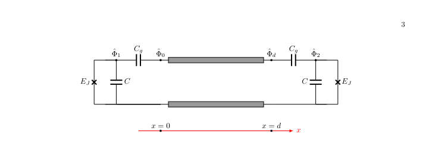 
FIG. 1. Two identical superconducting qubits capacitively coupled through a transmission line of length d. The qubits, with shunt capacitance C and Josephson energy EJ, are connected symmetrically at the two ends x = 0 and x = d through coupling capacitances Cg.

📷 Fig 2

 
FIG. 2. Normalized squared coupling strengths g2 n/G2 of the odd (red line) and even (blue line) sectors versus the normalized mode frequency ωn/ωg for three values of the TL mode spacing: (a) ωTL = 10 ωg, (b) ωTL = ωg, and (c) ωTL = 0.1ωg. The insets display a zoom of the interval ωn/ωg ∈[0, 3], highlighting the low frequency modes. The vertical markers denote three representative qubit frequencies: ωq = 0.1 ωTL (square), ωq = ωTL (triangle), and ωq = 10 ωTL (diamond).

📷 Fig 3

 
FIG. 3. Schematic classification of the operating regions in the plane spanned by the ratios ωg/ωTL and ωq/ωTL.

📷 Fig 4

 
FIG. 4. Schematic representation of the long-line (contin- uum) mapping: the transmission line decomposes into two independent reservoir channels (even/odd parity), each char- acterized by a Drude–Lorentz spectral density and coupled to the two-qubit system through the collective operators L± = ˆσ(1) y ± ˆσ(2) y .

📷 Fig 5

 
FIG. 5. Real and imaginary parts of the correlation function C(t) at T = 0 for the discrete [Eq. (23)] and continuum [Eq. (28)] models. The left column, panels (a), (c), and (e), shows Re{C(t)}; the right column, panels (b), (d), and (f), shows Im{C(t)}. The three rows correspond to ωTL/ωg = 10, 1, and 0.1, from top to bottom.

📷 Fig 6

 
FIG. 6. Drude–Lorentz spectral density J(ω) normalized to the reorganization rate λ plotted as a function of frequency for different normalized bath relaxation rates γ/ωq, illustrating the broadening of the spectrum and the shift of the maximum at ω = γ.

📷 Fig 7

 
FIG. 7. BLP non-Markovianity measure N(Φ) for a single qubit capacitively coupled to a finite TL of length d, termi- nated by a short circuit in the long line region ωTL ≪ωg. The measure is shown as a function of the normalized bath temperature kBT/ℏωq (vertical axis) and the normalized bath relaxation rate γ1q/ωq (horizontal axis), over the range 0 ≤ kBT/ℏωq, γ1q/ωq ≤10. The reorganization rate is fixed to λ1q = 0.1 ωq. The white curve marks the condition defined by Eq. (34). The green curves are contour lines of constant N(Φ), highlighting different levels of non-Markovianity.

📷 Fig 8

 
FIG. 8. BLP non-Markovianity measure N(Φ) for the re- duced dynamics of two qubits coupled through a finite TL in the long-line region ωTL ≪ωg, shown as a function of the normalized bath temperature kBT/ℏωq (vertical axis) and normalized bath relaxation rate γ/ωq (horizontal axis), in the range 0.2 ≤kBT/ℏωq, γ/ωq ≤10. The reorganization rate is fixed at λ = 0.1 ωq. The contour lines indicate constant values of N(Φ) and thus highlight different regions of non- Markovian behavior.

📷 Fig 9

 
FIG. 9. Comparison between HEOM (solid-line), GKLS (dashed-line) and TCL2 (dash dot line) simulations for the populations of two qubits, shown for kBT/ℏωq = 7 and different values of γ/ωq. The BLP measures are (a) NΦ(γ/ωq = 0.2, kBT/ℏωq = 7) = 1.61, (b) NΦ(3, 7) = 5.6 · 10−4, (c) NΦ(7, 7) = 1.11 · 10−5. The initial state is one of the orthogonal states in the pair that maximizes the BLP measure.

📷 Fig 10

 
FIG. 10. Comparison between HEOM (solid-line), GKLS (dashed-line) and TCL2 (dash dot line) simulations for the populations of two qubits, shown for γ/ωq = 7 and different values of T, i.e. (a) kBT/ℏωq = 0.2 and (b) kBT/ℏωq = 3. The BLP measures are NΦ(γ/ωq = 7, kBT/ℏωq = 0.2) = 7.8 · 10−2 and NΦ(γ/ωq = 7, kBT/ℏωq = 3) = 4.25 · 10−5. The initial state is one of the orthogonal states in the pair that maximizes the BLP measure.

**Main problem.** The paper seeks to establish a unified framework for classifying the dynamical regimes of two superconducting qubits coupled via a finite-length transmission line, specifically determining when the line acts as a continuous reservoir, a multi-mode coupler, or a single-mode cavity.

**Main result.** The authors identify three distinct regimes (long-line continuum, comb-edge discrete, and short-line single-mode) based on frequency hierarchies and demonstrate how collective coupling reshapes the non-Markovianity landscape compared to single-qubit systems.

**Method.** The study uses circuit quantization to derive a Hamiltonian and employs the Hierarchical Equations of Motion (HEOM) to numerically solve the dynamics, comparing results against TCL2 and GKLS master equation approximations.

**Summary.** This paper provides a unified description of how the length and frequency scales of a transmission line dictate the dynamics of coupled superconducting qubits. It identifies three regimes: a continuous reservoir, a discrete multi-mode coupler, and a single-mode cavity. The study highlights how collective coupling between qubits alters the landscape of information backflow (non-Markovianity). Furthermore, it quantifies the accuracy of standard master equation approximations in these different regimes.

Detailed structure

**Model / system.** Two identical superconducting transmon qubits capacitively coupled to the ends of a finite-length transmission line, where the line modes are separated into even- and odd-parity sectors.

**Key observables.** Breuer-Laine-Piilo (BLP) measure of non-Markovianity, ground-state population evolution, trace distance, and bath correlation functions.

**Important parameters / regimes.** Qubit frequency (omega_q), transmission line mode spacing (omega_TL), coupling scale (omega_g), temperature (T), and reorganization rate (lambda).

**Assumptions / limitations.** The qubits are treated as two-level systems; the continuum approximation is assumed valid only when the line is sufficiently long (omega_TL << omega_g, omega_q).

**Figures summary.** Figure 1 shows the circuit schematic; Figure 2 plots coupling strengths vs. frequency; Figure 5 shows correlation functions; Figure 9 compares HEOM, TCL2, and GKLS dynamics; Figure 13 shows population evolution in the discrete regime.

**Paper structure.** The paper begins with circuit quantization and Hamiltonian derivation, moves to the identification of frequency-based dynamical regimes, analyzes non-Markovianity using the BLP measure, evaluates the validity of various master equation approximations, and concludes with an error analysis of the continuum approximation.

**Why it may be interesting.** It provides a rigorous mapping of the transition between Markovian and non-Markovian dynamics in a multi-qubit system, which is crucial for designing scalable cQED architectures and understanding environmental memory effects.

Abstract

We investigate the reduced dynamics of two identical superconducting qubits capacitively coupled through a finite-length transmission line. Starting from circuit quantization, we derive a circuit Hamiltonian that naturally separates the line modes into even- and odd-parity sectors coupled to collective qubit operators. Depending on the hierarchy between the qubit frequency $ω_q$, the mode spacing $ω_{TL}$, and the coupling scale $ω_g$, the line acts either as a structured reservoir or as a discrete few-mode coupler. In the long-line continuum limit, each sector is described by a Drude--Lorentz spectral density and the dynamics is solved with the hierarchical equations of motion. Using the Breuer--Laine--Piilo measure, we identify the parameter region in which the reduced dynamics exhibits non-Markovian relaxation. In the short-line limit, the continuum description breaks down and the dynamics becomes respectively multimode or single-mode. This establishes a unified cQED picture of the dynamical regimes of finite-length transmission lines in superconducting-circuit architectures.

[↑ back to top](#top)

### [Spectral Diffusion Mitigation with a Laser Pulse Sequence](http://arxiv.org/abs/2604.21659v1)

**Authors:** Kilian Unterguggenberger, Alok Gokhale, Aleksei Tsarapkin, Wentao Zhang, Katja Höflich, Herbert Fotso, Tommaso Pregnolato, Laura Orphal-Kobin, Tim Schröder  
**Type:** experiment · **Category:** quantum information and computing · **PDF:** <https://arxiv.org/pdf/2604.21659v1>  
**Analysis basis:** full PDF text, analyzed in chunks
**Topic relevance:** 🔥 `QC/QI experiment` **4/5** · 🔥 `quantum optics experiment` **4/5** · 🔥 `dissipative systems` **3/5** · 🔥 `spintronics-quantum-optics interface` **3/5** · `interference shaping light` **2/5** · `non-equilibrium dynamics` **2/5** · `quantum measurements` **2/5**

📷 Fig 1

 
FIG. 1. Simulated light-matter interaction. a. Simpli- fied level scheme. Spectral diffusion is indicated as a time- dependent transition energy from the ground state |g⟩to the excited state |e⟩. b. Control sequence consisting of N π-pulses with interpulse delay τ (top) and accumulation of relative phase (bottom). c. Stimulated emission and direct absorp- tion spectra of a two-level system after a periodic sequence of N = 12 π-pulses. The absorption spectrum without control is a Gaussian with a FWHM of 2 √

📷 Fig 2

 
FIG. 3. Effect of the interpulse delay. a. Controlled spectra for different interpulse delays τ. The fits are sums of five to seven Lorentzians. Here, the count rate is normalized to the outermost data points. Individual spectra are offset by 0.05 for visual clarity. b. Satellite feature positions extracted from the fits. The simulated positions of ±n/2τ are shown as gray lines.

📷 Fig 3

 
FIG. 2. Controlled absorption spectrum of a single NV center. a. Experimental sequence. The control field (red) consists of N = 21 periodic π-pulses. The probe field (blue) is turned on after 11 pulses. Collected photon detection events are inte- grated in time windows (light red and blue). b. Time-resolved fluorescence signal of the NV center for a probe detuning of zero (light red) and -0.25 GHz (light gray). A Master equation fit with an additional decay term is shown as a red line. The time windows are indicated by dashed and dotted lines. Here the interpulse delay τ = 10 ns. c. Controlled spectrum fitted with a sum of seven Lorentzians. Dashed lines indicate ex- pected satellite...

📷 Fig 4

 
FIG. 5. Temporal evolution of the spectrum. Four spectra (left column) and the corresponding time window (right col- umn, shaded region) are shown. The last spectrum shows the uncontrolled linewidth (blue). The pulse carrier frequency is indicated by the dotted gray line. Here, the interpulse delay τ = 10 ns and the number of control pulses N = 5.

📷 Fig 5

 
FIG. 4. Detuned pulse carrier frequency. a-b. Controlled spectra with different detunings ∆0 and interpulse delays τ are shown (red). The uncontrolled resonance is shown in blue (centered at the dashed line, FWHM represented by shaded region). A red arrow indicates the spectral shift achieved by the control pulses to the pulse carrier frequency (dotted gray line).

**Main problem.** Spectral diffusion in solid-state quantum emitters, caused by electric field noise, leads to inhomogeneous broadening that limits the quality of single-photon sources and entanglement generation.

**Main result.** The researchers experimentally demonstrated that a periodic sequence of optical pi-pulses can mitigate spectral diffusion, reducing the linewidth of an NV center from 104 MHz to 27 MHz and allowing for frequency-tunable absorption.

**Method.** The protocol uses a sequence of N periodic optical pi-pulses to refocus the spectrum. Photoluminescence excitation (PLE) spectroscopy was used to measure the resulting absorption and stimulated emission spectra.

**Summary.** This paper reports the first experimental observation of all-optical spectral control in a solid-state emitter. By applying a periodic sequence of laser pi-pulses to an NV center in diamond, the researchers were able to significantly reduce the inhomogeneously broadened linewidth. The method allows for the 'pinning' of the absorption spectrum to a target frequency, effectively mitigating the effects of spectral diffusion. This approach is universal and applicable to various individual or ensemble quantum emitters.

Detailed structure

**Model / system.** A single Nitrogen-Vacancy (NV) center in diamond, modeled as a two-level quantum system subject to a periodic control field and stochastic detuning (charge noise).

**Key observables.** Fluorescence count rate, absorption/stimulated emission spectra, and full-width at half-maximum (FWHM) linewidth.

**Important parameters / regimes.** Interpulse delay (tau) of 10 ns, excited state lifetime of 12.3 ns, and pulse sequence length of N = 21 pulses.

**Assumptions / limitations.** The system can be treated as a two-level system due to sufficient cyclicity; the detuning follows a Gaussian random distribution.

**Figures summary.** Figure 1 shows the theoretical simulation of the pulse sequence and resulting satellite features; Figure 2 presents the experimental observation of the effect; Figure 3 shows the dependence of satellite spacing on interpulse delay; Figure 4 demonstrates frequency tuning via the pulse carrier frequency; Figure 5 shows the temporal evolution of the spectrum with increasing pulse number.

**Paper structure.** The paper introduces the problem of spectral diffusion, presents a theoretical simulation of the pi-pulse control protocol, details the experimental implementation on an NV center, demonstrates linewidth reduction and frequency tuning, and concludes with discussion on universality and limitations.

**Why it may be interesting.** This work is highly relevant to quantum optics and open quantum systems as it demonstrates a purely coherent-control method to suppress environmental noise (spectral diffusion) in a solid-state platform without needing external feedback or static fields.

Abstract

The optical spectrum of a quantum system is jointly determined by the properties of the emitter and the driving field. All-optical spectral control can hence be a promising method to engineer the properties of single photon emitters for quantum technological applications. It was proposed that driving a two-level system with a periodic sequence of optical pi-pulses during the excited state lifetime shifts the emission and absorption maximum to an arbitrarily detuned pulse carrier frequency, enabling the mitigation of spectral diffusion in noisy emitters. In this article, we report on the first experimental observation of this effect. We implement the protocol on a solid-state emitter and reduce its inhomogeneously broadened optical linewidth close to the lifetime limit. By detuning the excitation laser, we are able to concentrate approximately half of the absorption to a freely selectable target frequency. Our approach is solely based on properties of coherently evolving quantum systems, rendering it applicable to a wide range of individual and ensembles of quantum emitters.

[↑ back to top](#top)

### [Thermalization Regimes in a Chaotic Tavis-Cummings Model](http://arxiv.org/abs/2604.20955v1)

**Authors:** Sameer Dambal, Eric R. Bittner  
**Type:** both · **Category:** other · **PDF:** <https://arxiv.org/pdf/2604.20955v1>  
**Analysis basis:** full PDF text, analyzed in chunks
**Topic relevance:** 🔥 `Tavis-Cummings & cavity-many-emitter` **4/5** · 🔥 `non-equilibrium dynamics` **4/5** · 🔥 `correlated cavity matter` **3/5** · 🔥 `scars & prethermalization` **3/5** · `dissipative systems` **2/5** · `entanglement & information structure` **2/5** · `interference shaping light` **2/5**

📷 Fig 1

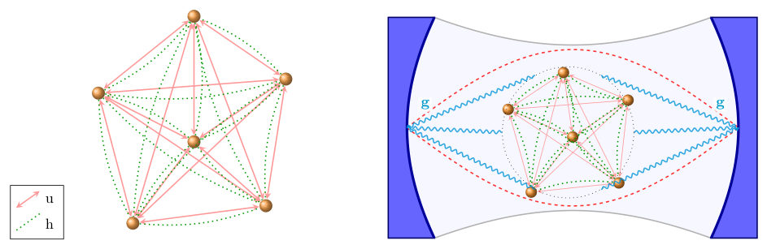 
FIG. 1: Overview of the excitonic system and cavity-mediated thermalization: (a) shows a network of excitons with complex coupling structures. The red lines depict exciton-exciton hoppings and the green dotted lines depict biexciton interactions. This makes the excitonic Hamiltonian non-integrable and promotes ETH-based thermalization. (b) shows a TC model where an optical microcavity couples with the complex excitonic network with the coupling constant g.

📷 Fig 2

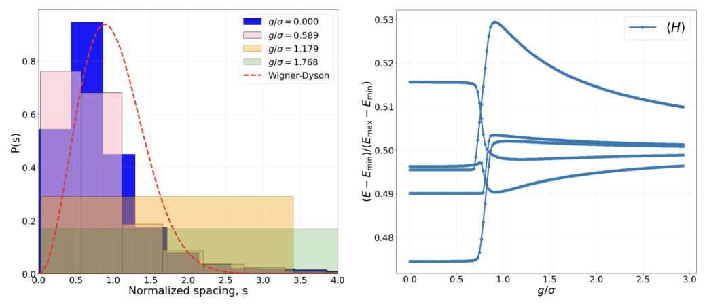 
FIG. 2: Spectral Statistics: (a) This describes the level spacing statistics of the eigenvalues of Hamiltonian in Eq. (1) projected in the N ≤2 excitation sector. We see that it resembles that of a Wigner-Dyson distribution (dotted red line) for small coupling strengths g/σ &lt; 1. However, the spectrum flattens for stronger couplings g/σ ≳1. These hint towards different regimes of thermalization; (b) This figure shows the normalized energy of the initial state for multiple realizations of the Hamiltonian. Each blue curve corresponds to one realization of σ and the random couplings drawn from a GUE. At g/σ &lt; 1, we see the energy of the initial state remains invariant and at g/σ &gt; 1, we see...

📷 Fig 3

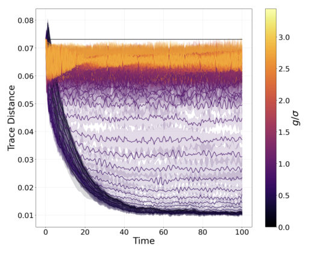 
FIG. 4: Trace Distance Decay: This figure plots the trace distance of a reduced system with time as a function of the ratio between the cavity-exciton coupling strength and thermalization rate. The initial state has 2 excitations in the cavity and g is the coupling strength of the cavity with the excitonic lattice. We run this simulation over 5 runs across multiple excitonic subspaces A and observe that the mean trace distances numerically converge to a statistically stable state. The shaded regions represent one standard deviation away from the mean and their narrowness at weak g/σ confirms that the subsystems consistently thermalize in the long-time limit.

📷 Fig 4

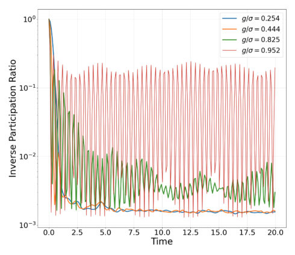 
FIG. 3: Inverse Participation Ratio: This plot shows the IPR in the two coupling regimes. At small coupling strengths g (blue, yellow), the IPR decays and saturates ≈1

📷 Fig 5

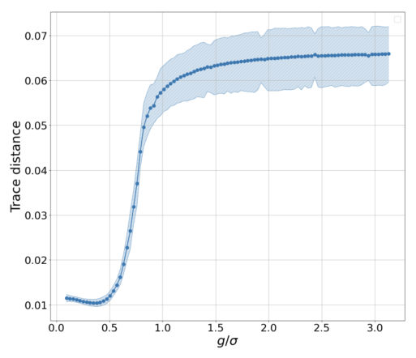 
FIG. 5: Transition from a thermalizing to a non-thermalizing regime: We see that at low polariton splittings, the trace distance of a reduced density matrix of excitons with its corresponding thermal state is close to zero and indicates a thermalization regime. As we increase the polariton splitting, it dominates the exciton coupling width and increases the final trace distance. This leads to a non-thermalizing regime close to g/σ ∼1.

📷 Fig 6

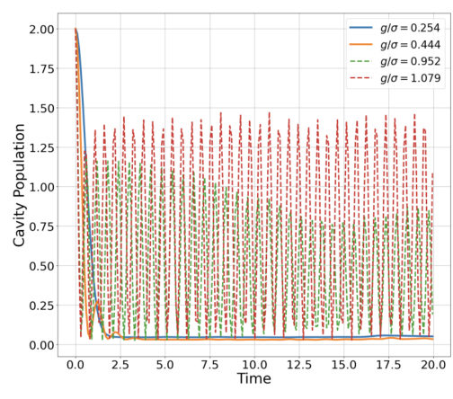 
FIG. 6: Cavity population dynamics: At small coupling strengths g (ergodic regime, solid lines), the cavity populations decay and attain a steady state after a short time. At stronger coupling strengths (non-ergodic regime, dotted lines), the cavity populations oscillate and do not decay at long times.

📷 Fig 7

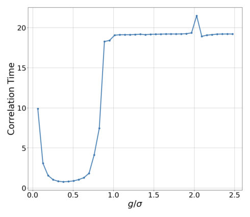 
FIG. 7: Correlation time of cavity populations: We see that if the polaritons are in the ergodic regime, the output photon statistics have a short correlation time. However, in the nonergodic regime, the correlation time increases until it saturates. This serves as a direct experimental observable that informs the underlying exciton coupling disorder σ.

**Main problem.** Investigating the transition between thermalizing (ergodic) and non-thermalizing (non-ergodic) regimes in a chaotic Tavis-Cummings model and how this affects quantum spectroscopy.

**Main result.** The authors demonstrate that tuning the cavity-exciton coupling strength g allows for a switch between a quantum chaos-driven thermalizing regime and a strong-coupling regime that suppresses ergodicity, and that this transition can be used to experimentally characterize material disorder sigma.

**Method.** Numerical simulations of the Tavis-Cummings model using random matrix theory (GUE) for disorder, combined with a proposed experimental framework using entangled-biphoton spectroscopy (EBS) and intensity interferometry.

**Summary.** This paper explores how the competition between cavity coupling and material disorder drives a transition between thermalizing and non-thermalizing dynamics in a Tavis-Cummings model. In the weak-coupling regime, quantum chaos promotes thermalization according to the Eigenstate Thermalization Hypothesis. In the strong-coupling regime, Rabi oscillations suppress ergodicity. The authors show that these dynamical changes are imprinted on photon statistics, offering a method to use entangled-biphoton spectroscopy to measure underlying exciton-coupling disorder.

Detailed structure

**Model / system.** A chaotic Tavis-Cummings model consisting of a single-mode optical microcavity interacting with a complex, non-integrable network of excitons featuring exchange coupling and biexciton interactions.

**Key observables.** Correlation times (tau_c) of cavity population, second-order correlation function g2(t+tau), level-spacing statistics, trace distance to thermal state, and Inverse Participation Ratio (IPR).

**Important parameters / regimes.** Cavity-exciton coupling strength (g), exciton-exciton coupling disorder (sigma), and the ratio g/sigma.

**Assumptions / limitations.** The system is treated in the two-excitation manifold with a resonance condition (no detuning) and assumes the energy density of the initial state lies in a region of finite energy density.

**Figures summary.** Figure 1 shows the exciton network and the TC model setup; Figure 3 displays IPR decay in different regimes; Figure 4 shows the decay of trace distance; Figure 5 illustrates the transition between thermalizing and non-thermalizing regimes.

**Paper structure.** The paper introduces the chaotic TC model, defines the Hamiltonian and disorder, analyzes the spectral and dynamical transition between ergodic and non-ergodic regimes using numerical diagnostics, and concludes by proposing an experimental spectroscopy method to extract material parameters.

**Why it may be interesting.** It bridges many-body dynamics (ETH and quantum chaos) with practical quantum optics, providing a way to use controllable cavity parameters to probe microscopic material disorder.

Abstract

This work investigates the emergent thermalization regimes in a chaotic Tavis-Cummings (TC) model and their implications in quantum spectroscopy. While the TC model is a cornerstone of cavity quantum electrodynamics, traditional treatments often overlook many-body effects that arise in the thermodynamic limit. We utilize the Eigenstate Thermalization Hypothesis to demonstrate that a non-integrable excitonic Hamiltonian within the material manifold drives local thermalization. By tuning the polariton splitting $g$, we observe two dynamical regimes: a thermalizing regime at low interactions driven by quantum chaos and ergodicity, and a non-thermalizing regime at high interactions where strong coupling suppresses ergodicity. We further show that these regimes have direct implications on output photon statistics, specifically influencing the correlation times $τ_c$ of the cavity population and the second-order correlation function $g^{(2)}(t+τ)$. We propose that entangled-biphoton spectroscopy serves as an ideal experimental platform to probe these effects and to allow the characterization of the underlying many-body exciton-coupling disorder $σ$ through coincidence measurements of the output. Taken together, these results exploit a naturally occurring many-body phenomenon to bridge theoretical predictions with experimental observables.

[↑ back to top](#top)

### [Multidimensional semiclassical single- and double-quantum spectroscopy of anharmonic molecular polaritons](http://arxiv.org/abs/2604.21158v1)

**Authors:** Michael Reitz, Harsh Bhakta, Wei Xiong, Joel Yuen-Zhou  
**Type:** both · **Category:** other · **PDF:** <https://arxiv.org/pdf/2604.21158v1>  
**Analysis basis:** full PDF text, analyzed in chunks
**Topic relevance:** 🔥 `Tavis-Cummings & cavity-many-emitter` **4/5** · 🔥 `correlated cavity matter` **4/5** · 🔥 `Keldysh / 2PI / non-Gaussian methods` **3/5** · 🔥 `dissipative systems` **3/5** · 🔥 `methods for driven-dissipative` **3/5** · `non-equilibrium dynamics` **2/5**

📷 Fig 1

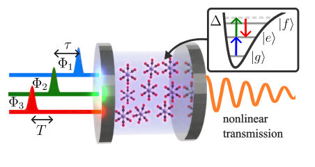 
FIG. 1. Schematics. An infrared optical cavity containing an ensemble of molecules (illustrated by W(CO)6 as, e.g., used in Refs. [35, 36]) is driven by a train of three input pulses (two pump, one probe) tagged by phases Φj and separated by time intervals τ and T. The cavity selectively couples to a molecular vibrational mode, which is modeled as a three-level system (3LS) with anharmonic shift ∆of the doubly excited state (see inset, which depicts a 2QC process). The nonlinear cavity transmission as a function of the pulse delay times is used to compute the 2D spectra.

📷 Fig 2

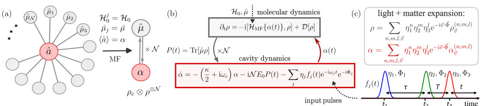 
FIG. 2. Overview of the semiclassical perturbative method for multidimensional cavity spectroscopy. (a) Factorizability of light and matter. The many-body system of N molecules described by dipole operators ˆµj coupled to a cavity mode ˆa is reduced to a much simplified mean-field system in the large-N limit under the assumption Hj 0 = H0, ˆµj = ˆµ. (b) Schematic illustration of the self-consistent, semiclassical method. The (single-molecule) matter component is evolved quantum mechanically, from which the molecular polarization feeding into the cavity field α(t) is computed. In turn, the classical cavity field feeds back into the evolution of the molecular density matrix. (c) Sketch of...

📷 Fig 3

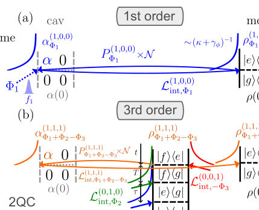 
FIG. 3. Feynman diagrams for the cavity (left) and molecular density matrix (right) at (a) linear and (b) third order. (a) At linear order, e.g., following the first pulse, the external input field creates a cavity coherence α(1,0,0) Φ1 , which in turn

📷 Fig 4

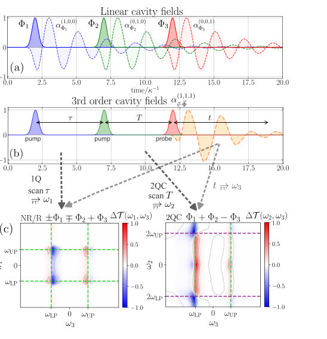 
FIG. 4. Schematic procedure to obtain phase-cycled 2D cav- ity spectra: Illustration of (a) linear and (b) nonlinear (3rd order) cavity fields (dashed shaded curves) generated by the Gaussian input pulses (solid shaded curves). Displayed is the real part only, with maxima normalized to unity. The DT signal arises from heterodyne detection, namely the interfer- ence between the linear probe (third pulse local oscillator) and 3rd order cavity fields. (c) Fourier transform along τ (T) as well as t gives rise to 1Q (2QC) spectra with frequency axes ω1 (ω2) vs. ω3, respectively. The 1Q spectra can be obtained in the R or NR configurations, corresponding to the phase sequences ±Φ1 ∓Φ2 + Φ3 (shown...

📷 Fig 5

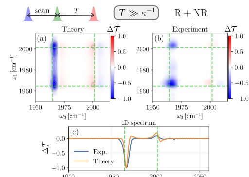 
FIG. 5. Comparison between (a) theoretical and (b) exper- imental results for the 2D 1Q spectra at long waiting times T ≫κ−1, for the sum of NR and R contributions. The waiting time was set to T = 18 κ−1 which corresponds to approxi- mately 55 ps. (c) Comparison of the resulting 1D spectra along ω3, obtained by integrating the 2D spectra over ω1. The green dashed lines in all plots indicate the linear polariton frequencies.

📷 Fig 6

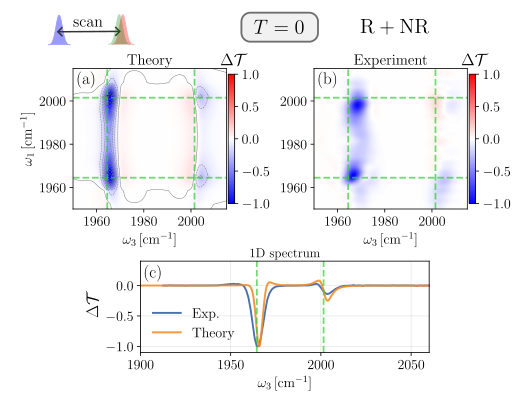 
FIG. 6. Comparison between (a) theoretical and (b) experi- mental results for the 2D 1Q spectra and (c) corresponding 1D spectra at short waiting times T = 0, for the sum of NR and R contributions. To reproduce these results, EID with β = 10.0 cm−1 was added (see SI S8 for details). All other parameters are the same as in Fig. 5 and Table I.

📷 Fig 7

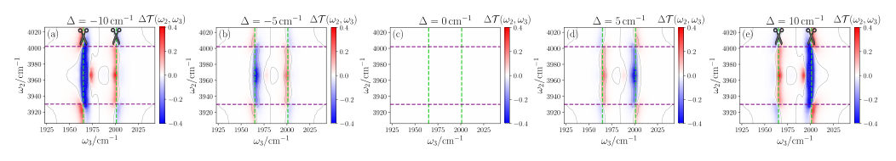 
FIG. 7. 2QC spectra as extracted from the phase combination Φ1 + Φ2 −Φ3 with varying degree of mechanical anharmonicity (a) ∆= −10 cm−1, (b) ∆= −5 cm−1, (c) ∆= 0 cm−1 (harm. limit), (d) ∆= 5 cm−1, (e) ∆= 10 cm−1. Green vertical lines indicate the single-polariton frequencies, while purple horizontal lines indicate the double-polariton frequencies. To isolate the effect of pure mechanical anharmonicity, we set the electrical anharmonicity to zero (δ = 0) and assume pure harmonic dephasing with γϕ = 6 cm−1 (γϕ = γge ϕ = γef ϕ ). All other parameters are identical to those listed in Table I. We chose an excitation time of τ = 26 fs. A movie of the spectra as a function of different excitation...

📷 Fig 8

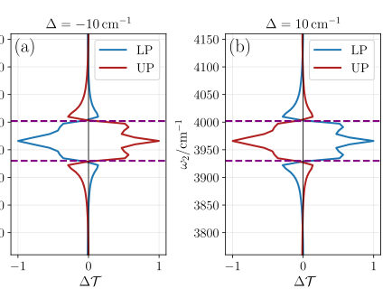 
FIG. 8. Vertical cuts of the 2QC spectra in Fig. 7 at fixed emission frequencies ω3 corresponding to the lower polariton ωLP and upper polariton ωUP, shown for (a) ∆= −10 cm−1

📷 Fig 9

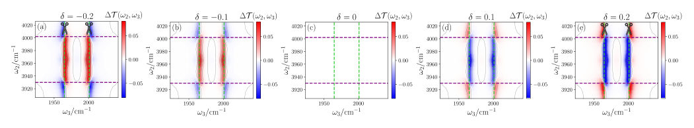 
FIG. 9. 2QC spectra as extracted from the phase combination Φ1 + Φ2 −Φ3 with varying degree of electrical anharmonicity (a) δ = −0.2, (b) δ = −0.1, (c) δ = 0 (harm. limit), (d) δ = 0.1, (e) δ = 0.2. Green vertical lines indicate the single-polariton frequencies, while purple horizontal lines indicate the double-polariton frequencies. To isolate the effect of pure electrical anharmonicity, we set the mechanical anharmonicity to zero (∆= 0) and assume pure harmonic dephasing with γϕ = 6 cm−1

📷 Fig 10

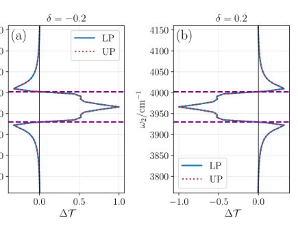 
FIG. 10. Vertical cuts of the 2QC spectra in Fig. 9 at fixed emission frequencies ω3 corresponding to the lower polariton ωLP and upper polariton ωUP, shown for (a) δ = −0.2 and (b) δ = 0.2. Each curve is normalized to its maximum absolute value. The dashed purple horizontal lines indicate the har- monic double-polariton energies.

**Main problem.** Developing an efficient theoretical framework for computing phase-resolved multidimensional (2D) single- and double-quantum spectroscopy of anharmonic molecular polaritons and explaining experimental anomalies like the polariton bleach effect.

**Main result.** The authors establish a semiclassical perturbative method that successfully reproduces experimental 1D and 2D spectra and provides a theoretical explanation for the polariton bleach effect via excitation-induced dephasing.

**Method.** A semiclassical approach using a perturbative expansion of the cavity field and molecular density matrix in terms of pulse amplitudes and phases, utilizing a discrete Fourier transform for phase-cycling.

**Summary.** This paper presents a new semiclassical method to simulate multidimensional spectroscopy of molecular polaritons. By expanding the response in pulse phases, the authors can isolate specific nonlinear pathways in 2D spectra. The framework successfully explains the 'polariton bleach effect' seen in experiments by incorporating excitation-induced dephasing. It also demonstrates how double-quantum spectroscopy can probe molecular anharmonicities. This work is highly relevant for designing and interpreting experiments in cavity-enhanced molecular platforms.

Detailed structure

**Model / system.** An ensemble of N molecules (modeled as three-level systems representing a vibrational ladder) strongly coupled to a single-mode confined photonic cavity in the large-N limit, governed by a Lindblad master equation.

**Key observables.** 2D single-quantum (1Q) spectra (rephasing and non-rephasing), 2D double-quantum coherence (2QC) spectra, and 1D differential transmission spectra.

**Important parameters / regimes.** Collective coupling strength (E0), molecular anharmonicity (mechanical and electrical), cavity decay rate (kappa), excitation-induced dephasing (EID), and pulse delays (tau and T).

**Assumptions / limitations.** Large-N limit, molecules are outside the ultrastrong-coupling regime (validating RWA), the cavity field is treated semiclassically (coherent state), and the vibrational Hilbert space is truncated to the two-excitation level.

**Figures summary.** Figure 1 shows the experimental setup and 2QC process; Figure 2 illustrates the mean-field reduction of the many-body system; Figure 3 presents Feynman diagrams for linear and third-order nonlinear pathways; Figure 4 details the 2D spectroscopy procedure; Figure 5 compares theoretical and experimental 1Q spectra.

**Paper structure.** The paper introduces the scientific problem and the physical model, develops the semiclassical perturbative framework and phase-resolved expansion, applies the method to 2D single- and double-quantum spectroscopy, benchmarks the theory against experimental data for W(CO)6, and investigates the role of excitation-induced dephasing.

**Why it may be interesting.** It provides a powerful tool for interpreting nonlinear spectroscopy in light-matter platforms, specifically addressing how cavity-mediated pulse overlap and anharmonicity influence many-body dynamics and coherence.

Abstract

We present a general and efficient approach to compute phase-resolved multidimensional spectra of anharmonic molecular polaritons, based on a semiclassical evolution of the molecular Hamiltonian and cavity field in the large-$\mathcal{N}$ limit of many molecules coupled to a confined photonic mode. By systematically expanding the response in both amplitudes and phases of the input fields, our method enables a transparent and computationally simple construction of phase-cycled two-dimensional single- and double-quantum polariton spectra from the underlying nonlinear signal components. Here, phase cycling acts as an analogue of phase matching with oblique pulses, allowing for the isolation of the contributing nonlinear pathways in Liouville space. We specialize to vibrational polaritons and benchmark the method through direct comparison with experimentally measured single-quantum spectra, providing an explanation for the longstanding puzzle of the polariton bleach effect observed at short waiting times. Further, we show how the imprint of various types of anharmonicities on the double-excitation manifold can be directly probed and analyzed through double-quantum coherence spectroscopy. Taken together, our results establish a practical and powerful framework for the modeling and interpretation of nonlinear spectroscopic experiments on strongly coupled light-matter platforms and for guiding the design of cavity-enhanced molecular platforms.

[↑ back to top](#top)

### [Bayesian Phase Stabilization at the Shot-Noise Limit for Scalable Quantum Networks](http://arxiv.org/abs/2604.21388v1)

**Authors:** Guang-Cheng Liu, Chao-Hui Xue, Fa-Xi Chen, Ming-Yang Zheng, Yi Yang, Li-Bo Li, Bin Wang, Bo-Wen Yang, Hai-Feng Jiang, Yong Wan, Ye Wang, Jiu-Peng Chen, Qiang Zhang, Jian-Wei Pan  
**Type:** both · **Category:** quantum information and computing · **PDF:** <https://arxiv.org/pdf/2604.21388v1>  
**Analysis basis:** full PDF text, analyzed in chunks
**Topic relevance:** 🔥 `QC/QI experiment` **4/5** · 🔥 `quantum measurements` **4/5** · 🔥 `quantum optics experiment` **4/5** · `dissipative systems` **2/5** · `entanglement & information structure` **2/5** · `interference shaping light` **2/5**

📷 Fig 1

 
FIG. 1. Phase stabilization performance comparison. Three-dimensional representation of the residual phase vari- ance as a function of measurement duration τ and photon flux µ for conventional MLE (pink surface) and prior-assisted Bayesian estimation (blue surface). The orange dotted curve represents the phase-diffusion noise floor (∝Dτ), and the pink dotted curve indicates the photon shot-noise limit (∝ (Γτ)−1), which sets the SNL for a static measurement. The black dashed curve shows the SNL for tracking a diffusing phase. The red solid line traces the minimum variance of con- ventional MLE, which scales as µ−1 and diverges as τ →0. In contrast, the blue solid line traces the Bayesian...

📷 Fig 2

 
FIG. 2. Experimental setup. (a) Blade ion trap with asymmetric electrode spacing designed for high-numerical-aperture fluorescence collection (NA=0.635). Photons are coupled into single-mode fibers (SM300) with nearly 50% coupling efficiency. At each node, the ion is first cooled and initialized in the state |S1/2, mJ = +1/2⟩. A two-step excitation protocol then proceeds as follows: a resonant π-pulse at 729 nm to prepare the metastable state |D5/2, mJ = +5/2⟩; a subsequent nanosecond 854 nm pulse then excites the ion to |P3/2, mJ = +3/2⟩with probability α, after which spontaneous decay emits a 393 nm photon. (b) Timing sequences for the two-step excitation protocol. For 10-km fiber links,...

📷 Fig 3

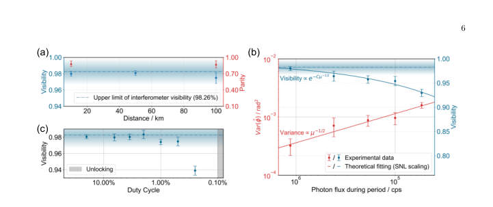 
FIG. 3. Experimental results. (a) Interferometric visibility (blue circles) and parity fringe (pink triangles) as a function of fiber distance (10 km and 100 km). The horizontal blue dashed line indicates the maximum achievable interferometric visibility (98.26%) of the system. Error bars represent ±1 standard deviation from multiple experimental realizations. (b) Residual phase variance (pink circles) and interferometric visibility (blue circles) versus detected photon flux for the 10 km link. The residual variance follows the theoretical SNL prediction (pink line), scaling as µ−1/2, confirming quantum-optimal tracking. (c) Interferometric visibility versus TDM duty cycle for the 10 km...

📷 Fig 4

 
FIG. 1. Numerical simulation of the phase stabilization algorithm performance. (a) Time series of phase evolution at 10 us integration time. The yellow curve (Phase diffusion) represents uncontrolled free phase diffusion. The red curve (Sta- bilization with conventional MLE) and blue curve (Stabilization with Bayesian estimation) demonstrate the phase stabilization effects of the conventional method and the prior-assisted recursive estimator, respectively. (b) Phase stabilization performance comparison. Scatter points and solid lines show the simulation performance of the conventional MLE (red solid, red circles) and the Bayesian estimation (blue solid, blue inverted triangles). The yellow...

📷 Fig 5

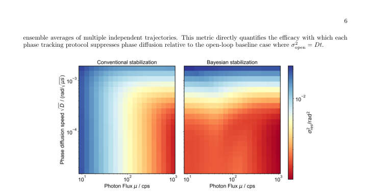 
FIG. 2. Performance comparison of phase tracking protocols. We set the measurement window duration to 100 us and residual phase variance (rad2, color scale) as a function of photon flux µ and diffusion rate √

📷 Fig 6

 
Fig. 2 presents a systematic comparison of conventional maximum-likelihood estimation versus our prior-assisted method incorporating outlier rejection. The simulations reveal several critical advantages of the prior-assisted ap- proach: Conventional estimation exhibits significant performance degradation at low photon flux , where shot noise gener- ates measurement outliers that destabilize the feedback loop. In contrast, our Bayesian approach maintains robust performance across all flux and diffusion regimes. The nonlinear innovation filter provides adaptive suppression of statistical outliers while preserving responsiveness to genuine phase variations. This advantage is most pronounced in...

📷 Fig 7

 
FIG. 3. Determining the optimal range for the threshold parameter κ. We set the residual phase variance (rad2, color scale) as a function of the threshold parameter κ and the measurement window duration τ for two constrained scenarios: (a) with a fixed diffusion coefficient D and (b) with a fixed photon flux µ. The optimal κ value for each condition is traced by the solid black line. The simulations determine the suitable range for κ to be [1, 1.5] in FI advantage region.

📷 Fig 8

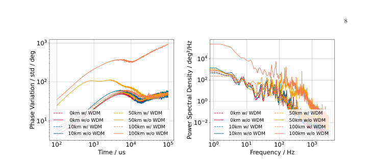 
FIG. 4. Phase evolution and noise power spectral density (PSD). The measured phase evolution over time (left) and its corresponding PSD (right) are shown for transmission distances of 0 km, 10 km, 50 km, and 100 km. The solid and dashed lines distinguish the results obtained with the wavelength-division stabilization system disabled (w/o WDM) and enabled (w/ WDM), respectively.

📷 Fig 9

 
FIG. 5. Phase evolution at 0 km (baseline, no additional fiber link). The data presented on a log-log scale exhibits a linear fit with a slope of 0.71, indicating a power-law exponent of σ ∝τ 0.71. The intercept of this fit yields a phase diffusion coefficient of D = (0.15◦/us0.71)2, which used directly to determine the prior parameters for the filter.

📷 Fig 10

 
FIG. 6. Schematic of the dual-band inter-node phase stabilization system architecture. Schematic of the hierar- chical dual-stabilization scheme for inter-node phase coherence, featuring two independent channels. The left channel (WDM Stabilization) suppresses fast fiber link noise using a Polarization Beam Splitter (PBS), Electrically Polarized Controller (EPC), and superconducting nanowire single-photon detector (SNSPD). The right channel (TDM Stabilization) compensates residual phase offset with an ´etalon, EPCs, and an AOM4/AOM5 cascade for switching between high-efficiency and high-count-rate SNSPDs. Polarization components (PBS/EPC) enable purification. System coordination is...

**Main problem.** Achieving high-precision optical phase stabilization in quantum networks is limited by a precision-delay trade-off, where rapid sampling leads to high shot noise and long integration leads to phase diffusion.

**Main result.** The development of a Bayesian phase estimator that achieves the shot-noise limit even with sparse photon counts, enabling high-visibility entanglement (over 97%) over 10 km and 100 km fiber links.

**Method.** A recursive Bayesian estimation framework implemented on an FPGA, utilizing a dual-band (WDM and TDM) stabilization architecture and a nonlinear innovation filter for outlier rejection.

**Summary.** This paper presents an integrated framework for stabilizing the optical phase in long-distance quantum networks. By using a Bayesian estimator on an FPGA, the researchers overcome the trade-off between measurement noise and phase diffusion. The system successfully maintains high entanglement fidelity and visibility over 100 km of fiber. This provides a scalable foundation for building practical quantum repeaters and long-distance quantum key distribution.

Detailed structure

**Model / system.** A quantum network consisting of two independent 40Ca+ trapped-ion nodes connected via 10 km and 100 km optical fibers, using a two-step excitation protocol and frequency conversion to the telecom C-band.

**Key observables.** Interferometric visibility, parity contrast, residual phase variance, and photon counting statistics.

**Important parameters / regimes.** Photon flux (~1 MHz), duty cycle (<= 6.5%), phase diffusion coefficient (D), and fiber distances (10 km and 100 km).

**Assumptions / limitations.** Phase noise is modeled as a Wiener process (though experimental data shows non-white scaling), and photon counting follows Poisson statistics.

**Figures summary.** Figure 1 compares MLE and Bayesian variance scaling; Figure 2 details the ion trap and dual-band architecture; Figure 3 shows visibility and parity contrast over distance and duty cycle; Figure 7 shows the FPGA architecture; Figure 8 shows photon count fits; Figure 9 outlines the experimental sequence.

**Paper structure.** The paper identifies the precision-delay trade-off, describes the dual-band hardware architecture, introduces the Bayesian mathematical framework, presents experimental results for 10 km and 100 km links, and concludes with an error budget analysis.

**Why it may be interesting.** It addresses a fundamental limit in quantum control and estimation theory (the precision-delay trade-off) and demonstrates how Bayesian inference can recover optimal scaling in photon-starved, non-Markovian noise environments.

Abstract

High-precision optical phase stabilization in quantum networks is fundamentally constrained by the strict photon-flux and duty-cycle limits required to avoid disturbing fragile quantum states. This challenge becomes especially critical when coordinating multiple independent light sources for multi-step quantum protocols. Here, we develop an integrated phase-stabilization framework that incorporates a Bayesian phase estimator to optimally extract information from sparse single-photon detection events. This approach outperforms conventional maximum-likelihood estimation and achieves the shot-noise limit under minimal photon flux. The framework enables real-time correction of combined phase noise from both nodal lasers and transmission fibers, facilitating a two-step excitation protocol for heralded entanglement generation between separate trapped-ion nodes via single-photon interference. Operating with a detected photon rate of approximately 1 MHz and a duty cycle less than or equal to 6.5%, the system maintains interferometric visibility greater than 97% over fiber links of 10 km and 100 km. This phase control yields deterministic ion-ion entanglement with parity contrast exceeding 85% at both distances, enabling device-independent quantum key distribution. Moreover, the resulting memory-memory entanglement at 10 km survives beyond the average time required to establish it -- a fundamental requirement for quantum repeaters. This work establishes a robust and scalable foundation for practical long-distance quantum networks.

[↑ back to top](#top)

### [Collective Excitations and Stability of Nonequilibrium Polariton Supersolids](http://arxiv.org/abs/2604.21353v1)

**Authors:** A. Grudinina, J. Cao, A. Kavokin, N. Voronova, A. Nalitov  
**Type:** theory · **Category:** quantum gases · **PDF:** <https://arxiv.org/pdf/2604.21353v1>  
**Analysis basis:** full PDF text, analyzed in chunks
**Topic relevance:** 🔥 `correlated cavity matter` **4/5** · 🔥 `driven-dissipative phase transition` **4/5** · 🔥 `dissipative systems` **3/5** · 🔥 `non-equilibrium dynamics` **3/5** · `methods for driven-dissipative` **2/5** · `non-equilibrium universality` **2/5**

📷 Fig 1

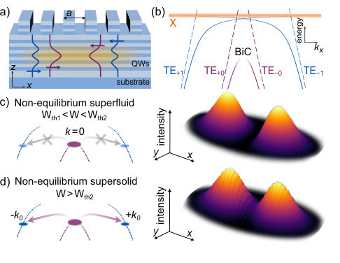 
FIG. 1. Schematic illustration of the system. (a) The nanostructured waveguide with the grating period a. Layers of different colors show embedded QWs; the wavy lines illus- trate fundamental photonic modes of the structure propagat- ing in the x direction, TE±0 (purple) and TE±1 (blue). (b) The real parts of the dispersion laws ε(p) of the 0 branch and E±1(p) of the ±1 branches are shown with the solid purple and blue lines, respectively. The dashed lines correspond to the photonic modes sketched in (a). The thick orange line in- dicates the exciton resonance. (c) Sketch of the condensation at k = 0 of the BiC branch (the dashed purple line) reached after the first threshold. (d) Sketch of...

📷 Fig 2

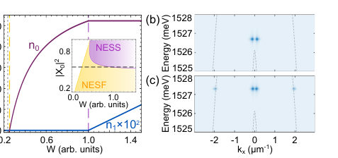 
FIG. 2. (a) Density of the order parameter components n0 (purple) and n1 (blue) vs. the pump power W. The dot- ted gray line indicates the value of W at which the effec- tive interaction changes sign, geff(W) &lt; 0, and the inter- action of negative-mass polaritons effectively becomes repul- sive; the yellow and lilac dashed lines mark the first and sec- ond thresholds. The inset shows phase boundaries for the condensed phase (NESF, yellow) and the supersolid phase (NESS, purple). The black dashed line indicates the value of the 0-mode Hopfield coefficient at which the calculations presented in the paper are performed. The PL intensity in reciprocal space for the NESF (b) and the NESS (c)...

📷 Fig 3

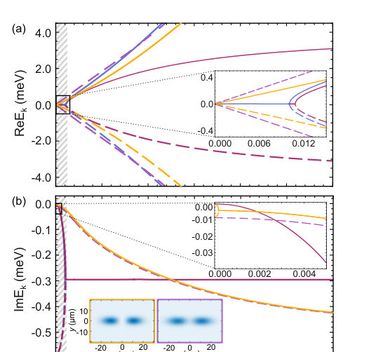 
FIG. 3. The excitation spectra Ek as a function of kx. Real (a) and imaginary (b) parts of Ek in the first band for the NESS (the purple, magenta, and lavender lines) and NESF (the yellow lines) phases. The solid lines in panels (a, b) correspond to the NG modes (see text), the dashed lines indi- cate the gapped modes. Parameters above the 2nd threshold: W = 1.05 Wth2, µ = 1 meV, n0 = 520 µm2, n1/n0 = 2×10−4; below the 2nd threshold: W = 2.5 Wth1 = 0.64 Wth2, n0 = 420 µm−2, µ = 0.9 meV. The insets in panels (a) and (b) show the smaller momentum range enlarged. The color-framed insets in (b) show the simulated PL distribu- tions in real space before (yellow) and after (purple) the sec- ond...

**Main problem.** Investigating the collective excitation spectra and dynamical stability of nonequilibrium polariton supersolids, specifically addressing how the phase remains stable despite a negative effective mass.

**Main result.** The study demonstrates that the supersolid phase is stabilized by attractive polariton interactions mediated by an incoherent exciton reservoir, which renormalizes the interaction strength to prevent collapse. It also identifies the emergence of two gapless Nambu-Goldstone modes as the smoking gun for the supersolid phase.

**Method.** Mean-field analysis using coupled Gross-Pitaevskii equations (GPEs) combined with a fluctuation analysis (Bogoliubov approach) and Lyapunov exponent calculation.

**Summary.** This paper explores the stability and excitations of a recently reported nonequilibrium polariton supersolid. The authors show that while the system's negative effective mass would typically lead to instability, the interaction with an incoherent exciton reservoir renormalizes the polariton interactions to a stabilizing regime. They identify the appearance of two distinct gapless Nambu-Goldstone modes as the definitive signature of the supersolid state. The work provides a theoretical foundation for understanding how dissipation and reservoir effects can drive and stabilize complex broken-symmetry phases.

Detailed structure

**Model / system.** A nonequilibrium system of exciton-polariton condensates in a Bound States in the Continuum (BiC) nanostructure, modeled via coupled GPEs for three polariton modes (0, +1, and -1) interacting with an incoherent exciton reservoir.

**Key observables.** Collective excitation spectra (real and imaginary parts), Nambu-Goldstone modes, Lyapunov exponents, and order parameter densities.

**Important parameters / regimes.** Pump power (W), effective interaction strength (g_eff), thresholds (W_th1, W_th2), and effective mass.

**Assumptions / limitations.** Adiabatic reservoir limit, quasi-1D approximation along the waveguide axis, and truncation of the fluctuation matrix to the first several bands.

**Figures summary.** Schematics of the nanostructured waveguide and energy dispersion; plots of density and phase distributions; and the excitation spectrum showing the transition from one to two gapless modes and the stability phase diagram.

**Paper structure.** The paper introduces the physical platform and the OPO-driven supersolid mechanism, presents the theoretical model and GPE framework, analyzes the excitation spectra and symmetry breaking, and concludes with a stability analysis and phase diagram.

**Why it may be interesting.** It provides a fundamental insight into how reservoir-mediated interactions can stabilize exotic non-equilibrium phases (supersolids) in systems with inherently unstable (negative mass) dispersions, which is highly relevant to open quantum systems and non-equilibrium many-body dynamics.

Abstract

Formation of nonequilibrium counterparts of supersolids, simultaneously characterized with spontaneous superfluid and crystalline order, was recently reported in incoherently pumped polariton condensates. We investigate collective excitation spectra of this phase and explicitly demonstrate the emergence of gapless Nambu-Goldstone modes due to spontaneously broken continuous phase and translation symmetries. For the recent implementation of the polariton nonequilibrium supersolidity in semiconductor metasurfaces [D. Trypogeorgos et al., Nature 639, 337 (2025)], we demonstrate the key role of attractive polariton interactions, mediated by the excitonic reservoir, for stability of the supersolid phase. Performing a thorough numerical investigation, we identify the conditions for existence of the diagonal and off-diagonal long-range order in negative-mass nonequilibrium supersolids.

[↑ back to top](#top)

### [Observation of quantum multi-Mpemba effect in a trapped-ion system](http://arxiv.org/abs/2604.21320v1)

**Authors:** Gang Xia, Yu-Jie Zheng, Jing Huang, Chun-Wang Wu, Yi Xie, Ting Chen, Wei Wu, Weibin Li, Hui Jing, Jie Zhang, Yan-Li Zhou, Ping-Xing Chen  
**Type:** both · **Category:** other · **PDF:** <https://arxiv.org/pdf/2604.21320v1>  
**Analysis basis:** full PDF text, analyzed in chunks
**Topic relevance:** 🔥 `QC/QI experiment` **4/5** · 🔥 `dissipative systems` **4/5** · 🔥 `non-equilibrium dynamics` **4/5** · 🔥 `quantum optics experiment` **4/5** · `methods for driven-dissipative` **2/5**

📷 Fig 1

 
FIG. 1. (a) Initial state dependent relaxation process. (b) The overlaps |a1| between the initial states ρ1,2,3 in and the SDM. a1 = 0 corresponds to the strong ME. (c) The quantum ME is witnessed by a single crossing of distance curves: the initial state ρ(2) in starts a greater distance from ρss than the initially closer state ρ(1) in but stabilizes first, for the reason having a smaller overlap |a1|. (d) The multi-ME is witnessed by two crossings and can not be understated by smaller overlap |a1| anymore. (e) Trapped ion setting. One Zeeman sublevel in the ground state and two Zeeman sublevels in D state are coupled by a bichromatic 729 nm laser beam with linewidth about 10 Hz. The two...

📷 Fig 2

 
FIG. 2. (a) Eigenspectra of L for three-level system and the corresponding time scale. The separation between λ1 and λ2 define a metastable manifold for times τ2 ≪t ≪τ1. (b)-(d) The relaxation speed v (blue lines) of a rotated initial random state as a function of s at time t = 0, τ2, τ1, and the overlap |a8|, |a2|, |a1| (red lines), respectively. The blue dashed line in (c) corresponds to v(τ2) = P5 i=2 aiλieλiτ2Ri , which is a good approximation of the exact speed v(τ2) = P8 i=1 aiλieλiτ2Ri (blue solid line).

📷 Fig 3

 
Fig. 3(e-h) presents results for another pair of initial states (s = π and s = 0.85π), which satisfy |af 1| &gt; |ac 1| (’f’ denotes the farther initial states and ’c’ the closer one). In contrast to the previous cases, they exhibit different dynamical behaviors. Although the state s = 0.85π is initially closer to the steady state than s = π, the two quickly reverse order; however, a subsequent crossing oc- curs at a later time, restoring the initial ordering. Thus, in this case, the normal ME is avoided, and the initially closer state relaxes faster [41]. This multi-ME is driven by the overtaking of their relaxation speeds v(t) before the system relaxes into the metastable manifold spanned by...

📷 Fig 4

 
FIG. 3. (a)-(d) Quantum ME. The distance D(t) (a) and relaxation speed v(t) (b) as functions of time t for different initial states s = 0.75π (initial farther) and s = 0.5π (initial closer). Open circle (◦) in the horizontal axis is the time scale τ2 while the full circle (•) is τ1. (c) The difference in distance ∆D(t) = Df(t)−Dc(t) and speed ∆v(t) = vf(t)−vc(t) between these two states (’f’ denotes the initial farther one and ’c’ the closer one). (d) The overlaps |a1|, |a2|, |a8| of the initial states s = 0.75π and s = 0.5π, respectively. (e)-(h) Quantum multi-ME for different initial states s = π and s = 0.85π. (i)-(l) No quantum ME for different initial states s = 0.65π and |0⟩.

📷 Fig 5

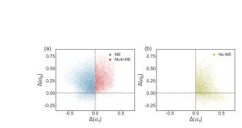 
FIG. 4. Phase diagram of the ME and Multi ME. The distri- bution of different types of ME as function of ∆|a8| and ∆|a1| (∆|ai| = |af i | −|ac i|) for (a) single crossing and two cross- ings and (b) no crossing. Here we randomly generate 50000 pairs of arbitrary initial pure states. Here, the ME occurs with approximately 87.7% probability when |af 8| &gt; |ac 8| and |af 1| &lt; |ac 1|, while the multi-ME occurs with approximately 96.8% probability when both |af 8| &gt; |ac 8| and |af 1| &gt; |ac 1| are satisfied.

**Main problem.** The study investigates the quantum multi-Mpemba effect (multi-ME), specifically exploring how relaxation trajectories of different initial states can cross multiple times during the relaxation to a steady state.

**Main result.** The researchers experimentally observed two trajectory crossings (multi-ME) in a trapped-ion system and developed a theoretical framework showing that these crossings are driven by the competition of different decay modes and relaxation speeds.

**Method.** The study combines experimental state tomography of a qutrit system with a theoretical framework based on relaxation speed and eigenmode expansion of the Lindblad master equation.

**Summary.** This paper reports the experimental observation of the quantum multi-Mpemba effect using a single trapped ion. While the standard Mpemba effect involves a single crossing of relaxation trajectories, this study demonstrates that trajectories can cross multiple times. The authors show that this phenomenon is driven by the interplay between different decay modes and their associated relaxation speeds. They provide a predictive phase diagram that links the occurrence of these effects to the initial state's overlap with the system's decay modes.

Detailed structure

**Model / system.** A single 40Ca+ ion in a blade-shaped linear Paul trap, acting as a three-level qutrit system coupled by a bichromatic 729 nm laser and subject to Markovian decay.

**Key observables.** Hilbert-Schmidt distance, trace distance, relaxation speed v(t), and overlaps with decay modes (SDM and fastest decay modes).

**Important parameters / regimes.** Time scales tau_1 (long-time) and tau_2 (short-time); decay rates gamma_1 and gamma_2; Rabi frequencies Omega_1 and Omega_2.

**Assumptions / limitations.** The dynamics are assumed to be Markovian, described by a Lindblad master equation.

**Figures summary.** Figures illustrate the distance trajectories, the occurrence of multiple crossings, and a phase diagram relating relaxation speed to initial state overlaps with various decay modes.

**Paper structure.** The paper introduces the multi-Mpemba effect, describes the experimental setup and qutrit implementation, presents the theoretical framework for relaxation speed, details the experimental observation of multiple crossings, and concludes with a comprehensive phase diagram.

**Why it may be interesting.** This work is highly relevant for researchers in open quantum systems and quantum optics as it challenges the long-time limit view of the Mpemba effect and provides a new way to understand transient non-equilibrium dynamics through relaxation speed.

Abstract

The quantum Mpemba effect (ME) in Markovian systems is conventionally explained by a smaller overlap between the initial state and the slowest decay mode (SDM). Such state, initially farther away from equilibrium or steady state, relaxes faster than closer ones, resulting to a crossing of their trajectories. This picture, by neglecting the transient dynamics, holds in the long-time limit. Here we experimentally observe multiple trajectory crossings (multi-ME) in the relaxation dynamics of a trapped ion. Such novel dynamics takes place in a unusual scenario where the initial state instead has a larger overlap with the SDM. We develop a theoretical framework based on relaxation speed to understand the multi-ME. We show that the initial relaxation speed is governed by the fastest decay mode, which together with the SDM overlap gives a phase diagram that reveals both the occurrence and the types of quantum ME observed in our experiment. Our study goes beyond the simple picture based on the long-time limit, tracks continuously the quantum ME dynamics, and establishes a comprehensive framework to describe the transient quantum relaxation.

[↑ back to top](#top)

### [Entanglement of two optical emitters mediated by a terahertz channel](http://arxiv.org/abs/2604.21723v1)

**Authors:** Yanis Le Fur, Diego Martín-Cano, Carlos Sánchez Muñoz  
**Type:** theory · **Category:** other · **PDF:** <https://arxiv.org/pdf/2604.21723v1>  
**Analysis basis:** full PDF text, analyzed in chunks
**Topic relevance:** 🔥 `correlated / nonlocal dissipation` **4/5** · 🔥 `Tavis-Cummings & cavity-many-emitter` **3/5** · 🔥 `dissipative systems` **3/5** · 🔥 `entanglement & information structure` **3/5** · `methods for driven-dissipative` **2/5** · `non-equilibrium dynamics` **2/5**

📷 Fig 1

 
FIG. 1. Physical system and energy-level landscape. (a) Schematic of the entanglement generation setup, consisting of two quantum emitters driven by carrier (blue) and sideband (green) optical fields, which are coupled to a shared THz channel (here represented by a ring waveguide or cavity). (b) Energy levels of an atom coupled to a carrier-laser. (Left) Bare system basis showing optical transitions in the laboratory frame; (Right) Dressed-state basis highlighting the emerging THz transitions within a Rabi doublet (red). (c) Energy levels of a dressed-atom coupled to a sideband laser: Dressed states split by THz frequencies couple to laser photons (left) developing a secondary dressed...

📷 Fig 2

 
FIG. 2. Optimizing entanglement via optical measurements (a) Emission spectrum in the visible regime for each individual emitter, centered at the laser frequency ωL for the case of both optimal and sub-optimal spectral alignments. (Top) Spectra in the absence of sideband drives (Ωsb = 0) obtained in Step 1, resulting in Mollow triplets with THz sideband splittings. (Middle) Zoom of the higher-energy Mollow sideband peaks, aligned symmetrically about ωsb at the end of Step 2. (Bottom) Formation of secondary Mollow spectra upon activation of the sideband drive Ωsb, which should be spectrally overlapping at the end of Step 3. (b) Concurrence C (blue, solid) and Liouvillian gap λ—computed...

📷 Fig 3

 
FIG. 3. Maximal stationary concurrence C versus cavity loss rate κ and emitter-cavity coupling χ, found by optimizing the doubly dressed angle ˜θ and the doubly dressed frequency ˜ΩR at every (κ, χ) pair (the rest of parameters are fixed by Conditions 0-2). Calculations were performed using the GRWA framework Eq. (4) and (5) and subsequently veri- fied against the full model from (1). The dash-dotted lines represent the different condition we have imposed for our analytical findings: the adiabatic elimination of the cavity κ ≥2c1s1χ (blue) and the RWA on the dissipation of the cavity ωTHz ≥10κ (red). Panels correspond to cavity fre- quencies of (a) ωTHz/2π = 0.5 THz, (b) ωTHz/2π = 1.0 THz...

📷 Fig 4

 
FIG. 4. Quantum State tomography (QST) and re- construction Fidelity. (a) Schematic of the QST acquisi- tion protocol for two emitters radiating in the visible regime, based on joint photodetection (b) Reconstructed matrix for the maximally-entangled Bell state |Φ−⟩= |ge⟩−|eg⟩ √

**Main problem.** The lack of an efficient coherent interface in the terahertz (THz) spectrum hinders the development of THz-based quantum networks and the scaling of quantum technologies.

**Main result.** The authors demonstrate a method to generate and stabilize high-value steady-state entanglement (concurrence > 0.9) between two optical emitters using a THz channel, controllable entirely via optical means.

**Method.** The study uses the Generalized Rotating Wave Approximation (GRWA) and adiabatic elimination of the cavity mode to derive an effective master equation for dressed-state dynamics.

**Summary.** This paper proposes a way to create stable entanglement between two optical qubits using a terahertz channel. By using strong visible-light driving, the researchers create 'dressed' states that can be controlled and measured using only optical tools, avoiding the need for direct THz detection. The method achieves very high entanglement levels and is robust against various experimental imperfections. This establishes a practical framework for building larger quantum networks that bridge the gap between optical and THz frequencies.

Detailed structure

**Model / system.** The system consists of two non-identical polar quantum emitters (two-level systems) coupled to a lossy single-mode THz resonator in the bad-cavity limit, driven by both a visible-frequency carrier field and a THz-frequency sideband field.

**Key observables.** Concurrence (C), Liouvillian gap (lambda), second-order cross-correlation function (g2_12), and reconstructed density matrix fidelity.

**Important parameters / regimes.** THz frequency (0.5-3.0 THz), Rabi frequencies, cavity decay rate (kappa), emitter decay rate (gamma), and the dressing angle (theta).

**Assumptions / limitations.** The use of GRWA assumes the THz frequency is much larger than the coupling strength (omega_THz >> chi) and that the sideband driving is sufficiently weak.

**Figures summary.** Figures show the non-monotonic dependence of concurrence on the dressing angle, the optimization of parameters for dark state stabilization, and the reconstruction of the density matrix via quantum state tomography.

**Paper structure.** The paper introduces the THz interface problem, describes the physical model and Hamiltonian, details the parameter optimization for entanglement stabilization, proposes an optical quantum state tomography protocol, and evaluates experimental feasibility and error mitigation.

**Why it may be interesting.** It presents a novel hybrid visible-THz quantum interface that uses dissipation as a resource to stabilize entanglement, which is highly relevant for researchers working on reservoir engineering and quantum networks.

Abstract

Quantum technologies in the terahertz (THz) require a coherent interface between addressable qubits and THz quantum channels -- a capacity that so far, remains largely underdeveloped. Here, we propose and demonstrate the generation of steady-state entanglement between polar quantum emitters, mediated by THz photons. We exploit strong visible-light driving of the emitters to create Rabi-split dressed eigenstates whose energy separation can be optically tuned into the THz regime. The polar nature of the emitters activates THz transitions within these eigenstates, allowing them to couple to a THz photonic mode that induces collective dissipative dynamics. A coherent driving and control of these effective THz emitters is achieved by using a sideband optical drive with detuning close to the THz transition frequency. The resulting interplay of collective dissipation and driving activates a mechanism to generate steady-state entanglement with high values of the concurrence ($C>0.9$), attainable under experimentally feasible parameters. Crucially, both coherent manipulation and quantum state tomography are implemented entirely through optical means, avoiding direct THz control and detection. This establishes a hybrid visible-THz quantum interface in which a THz channel mediates qubit-qubit entanglement (a key operational requirement for THz quantum technologies) while remaining optically accessible.

[↑ back to top](#top)

### [Loss-biased fault-tolerant quantum error correction](http://arxiv.org/abs/2604.21876v1)

**Authors:** Laura Pecorari, Gavin K. Brennen, Stanimir S. Kondov, Guido Pupillo  
**Type:** theory · **Category:** quantum information and computing · **PDF:** <https://arxiv.org/pdf/2604.21876v1>  
**Analysis basis:** full PDF text, analyzed in chunks
**Topic relevance:** 🔥 `Rydberg arrays` **4/5** · 🔥 `correlated / nonlocal dissipation` **3/5** · 🔥 `dissipative systems` **3/5** · `methods for driven-dissipative` **2/5** · `non-equilibrium dynamics` **2/5** · `quantum measurements` **2/5**

📷 Fig 1

 
FIG. 1. (a) Rotated surface code, stabilizers and logical oper- ators. (b) Stabilizer readout circuit simulated with different success probability of not finding an atom in the Rydberg state before a CZ gate. (c) Surface code logical error proba- bility versus Rydberg decay rate, γ/Ωmax with time-optimal laser pulses. Data are for 100, 90, 75, 50, 0% success proba- bility that an atom is not in the Rydberg state immediately before a the next gate (from dark to light color shading).

📷 Fig 2

 
FIG. 2. (a) Schematic level structure. (b) Logical error scal- ing ν such that pL ∝γν versus success probability, pdepl., of inter-gate ionization for distance-3 surface codes. Back- to-back gate schedules produce a non-fault-tolerant scaling ⌈d/4⌉, while perfect inter-gate ionization restores the fault- tolerant Pauli scaling of ⌈d/2⌉for Pauli errors. If losses are properly handled in software with a loss-aware decoder, the optimal erasure-like scaling of d can be achieved (light blue). Error bars fall within the marker size.

📷 Fig 3

 
FIG. 3. Occurrences of hook error strings caused by single decay events that degrade fault tolerance. Number hook er- rors for (a) ionization enforced after each gate with success probabilities ranging from 0% to 100% and (b) perfect ion- ization only enforced at selected circuit locations (see main text). (c) Probability of each hook error string at fixed decay rate γ = 5×10−5Ωmax (far below the surface code threshold).

**Main problem.** Shortening QEC cycles in neutral-atom processors leads to non-Markovian, correlated errors caused by Rydberg excitation hopping and residual Rydberg populations. The study investigates if these errors can be mitigated to restore fault-tolerant scaling.

**Main result.** The authors propose 'loss-biasing'—using mid-circuit ionization to convert Rydberg excitations into atom loss—which restores fault-tolerant Pauli error scaling and can achieve optimal erasure-like scaling when paired with loss-aware decoding.

**Method.** The study uses Lindblad master equation dynamics, Monte Carlo trajectory generation, and randomized compiling to derive effective Pauli error models, followed by large-scale surface code simulations using Stim and Pymatching.

**Summary.** This paper addresses the degradation of fault tolerance in neutral-atom quantum computers when QEC cycles are accelerated. It identifies that fast cycles amplify Rydberg-mediated correlated errors. By implementing 'loss-biasing'—converting unwanted Rydberg excitations into detectable atom loss via ionization—the authors show that one can restore fault-tolerant scaling and even approach optimal erasure-based performance. This provides a practical roadmap for achieving sub-millisecond QEC cycles in Rydberg-based architectures.

Detailed structure

**Model / system.** A neutral-atom processor platform using Rydberg-blockade CZ gates, modeled as a three-level system (|0>, |1>, |r>) in optical tweezers, specifically focusing on alkaline-earth-like atoms.

**Key observables.** Logical error probability, logical error scaling exponent (nu), stabilizer readout success probability, and noise entropy.

**Important parameters / regimes.** Rydberg decay rate to Rabi frequency ratio (gamma/Omega_max), ionization success probability (p_depl), and code distance (d).

**Assumptions / limitations.** Assumes a 'data-ancilla blockade' during ionization and focuses primarily on the rotated surface code architecture.

**Figures summary.** Figure 1 shows the surface code schematic and stabilizer readout success; Figure 2 illustrates the atomic level structure and the logical error scaling exponent versus ionization success probability.

**Paper structure.** The paper identifies the problem of high-speed QEC errors, introduces the loss-biasing mechanism, details the physical model and simulation framework, presents results on error scaling and fault tolerance restoration, and concludes with experimental implementation outlines.

**Why it may be interesting.** It addresses the intersection of open quantum systems (non-Markovian noise and Lindblad dynamics) and quantum computing, providing a physical strategy (ionization) to transform complex correlated noise into manageable erasure noise.

Abstract

We investigate the limits of quantum error correction (QEC) in neutral-atom processors approaching high-fidelity gates and fast cycle times. We show that shorter QEC cycles amplify platform-specific errors, notably Rydberg excitation hopping, and hinder decay of residual Rydberg population, leading to non-Markovian correlated errors that degrade logical performance. To address this, we introduce loss biasing, where spurious Rydberg excitations are rapidly converted into atom loss via mid-circuit ionization, transforming errors into erasure-like noise and suppressing their propagation. Loss biasing restores the fault-tolerant logical error scaling for intra-cycle Pauli errors; furthermore, we argue that when supported with loss-aware decoding, it can achieve the optimal scaling of erasures while enabling shorter QEC cycles with reduced hardware overhead. We outline an implementation using fast autoionization in alkaline-earth(-like) atoms, establishing loss biasing as a practical route toward fault-tolerant quantum computing with sub-millisecond QEC cycles.

[↑ back to top](#top)

### [Quantum plasmonics with N emitters: bright hybrid continuum selection](http://arxiv.org/abs/2604.21560v1)

**Authors:** Georgii Semin, Hans-Rudolf Jauslin, Gérard Colas des Francs, Stéphane Guérin  
**Type:** theory · **Category:** other · **PDF:** <https://arxiv.org/pdf/2604.21560v1>  
**Analysis basis:** full PDF text, analyzed in chunks
**Topic relevance:** 🔥 `Tavis-Cummings & cavity-many-emitter` **4/5** · 🔥 `correlated / nonlocal dissipation` **3/5** · 🔥 `dissipative systems` **3/5** · `Dicke superradiance` **2/5** · `correlated cavity matter` **2/5** · `methods for driven-dissipative` **2/5**

📷 Fig 1

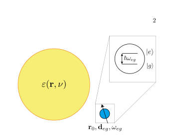 
FIG. 1. System of a quantum emitter coupled with QPP supported by the dielectric structure.

📷 Fig 2

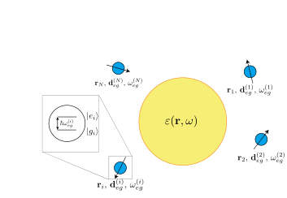 
FIG. 2. System of the N emitters coupled with the QPP supported by the metallic nanostructure.

**Main problem.** The paper seeks to develop an efficient, mode-selective effective model for the interaction between multiple quantum emitters and a quantum plasmon-polariton field in a finite dielectric medium, specifically reconciling the double-continuum structure with the single hybrid continuum used in macroscopic models.

**Main result.** The authors prove that the complex interaction with two separate continua can be reduced to a single, non-degenerate hybrid continuum for each emitter, and that this hybrid representation is mathematically equivalent to the macroscopic Langevin model.

**Method.** The study employs a Dark and Bright Mode (DBM) decomposition, utilizing the Lippmann-Schwinger equations, Green tensor formalism, and Löwdin orthogonalization to simplify the Hamiltonian.

**Summary.** This paper addresses the theoretical complexity of modeling multiple quantum emitters interacting with plasmonic fields in finite media. By using a bright/dark mode decomposition, the authors show that the interaction can be simplified from a complex double-continuum structure into a much simpler single hybrid continuum. They demonstrate that this simplified model is exactly consistent with established macroscopic Langevin approaches. This result provides a more efficient mathematical framework for simulating the dynamics of many emitters in nanophotonic structures.

Detailed structure

**Model / system.** The system consists of N two-level quantum emitters located in a finite, inhomogeneous dielectric medium (such as a metallic nanoparticle) interacting with a quantum plasmon-polariton field.

**Key observables.** The effective coupling strength and the Local Density of States (LDOS) related to the imaginary part of the Green tensor.

**Important parameters / regimes.** The number of emitters (N), the dielectric coefficient epsilon(x, nu), and the uncoupling limit (uc) where the medium-associated field vanishes.

**Assumptions / limitations.** The emitters are modeled as two-level systems, the interaction is treated within the dipolar approximation, and the coupling strength is assumed to be real and positive.

**Figures summary.** Figure 1 shows a schematic of a quantum emitter coupled to a plasmonic field in a dielectric structure; Figure 2 illustrates N emitters coupled to a metallic nanostructure.

**Paper structure.** The paper introduces the physical problem, develops the DBM decomposition for single and multiple emitters, compares the double-continuum and hybrid continuum approaches, proves the equivalence to the Langevin model via Green tensor identities, and discusses numerical implementation via Löwdin orthogonalization.

**Why it may be interesting.** It provides a rigorous theoretical bridge between microscopic canonical quantization and macroscopic Langevin models in nanophotonics, offering a computationally efficient way to model many-body interactions in complex plasmonic environments.

Abstract

We construct mode-selective effective models describing the interaction of the quantum plasmon-polariton field supported by a finite dielectric medium and one or several quantum emitters. The construction of the effective model is based on the decomposition of the field into bright modes relevant to the interaction with the emitters and dark modes, which do not interact with the emitters. We show that the quantum plasmon-polariton field can be represented equivalently by a double-continuum spectrum or by a single hybrid continuum spectrum for each emitter. The system of the electromagnetic field coupled to a finite medium is composed of two families of continuum modes, each of them with an infinite degeneracy. The two families are deformations of the free electromagnetic field and the free medium, induced by the interaction between them, as described by the Lippmann-Schwinger equations. We show that if there are $N$ emitters interacting with this plasmon-polariton field, the effective interaction involves a much smaller set of bosonic continuum modes: the interacting part of the continuum can be described by $N$ non-degenerate one-dimensional continua, one for each emitter. The representation of the interaction in terms of a single hybrid continuum spectrum coincides with the one within the macroscopic Langevin model with bulk medium. This coincidence is explained by an exact compensation of two terms, one in the coupling term of the Hamiltonian and the other one in a Green tensor identity.

[↑ back to top](#top)

### [Photon Sorting with a Quantum Emitter](http://arxiv.org/abs/2604.21758v1)

**Authors:** Kasper H. Nielsen, Etienne Corminboeuf, Benedikt Tissot, Love A. Pettersson, Sven Scholz, Arne Ludwig, Leonardo Midolo, Anders S. Sørensen, Peter Lodahl, Ying Wang, Stefano Paesani  
**Type:** both · **Category:** quantum information and computing · **PDF:** <https://arxiv.org/pdf/2604.21758v1>  
**Analysis basis:** full PDF text, analyzed in chunks
**Topic relevance:** 🔥 `QC/QI experiment` **4/5** · 🔥 `quantum optics experiment` **4/5** · 🔥 `interference shaping light` **3/5** · `dissipative systems` **2/5** · `quantum measurements` **2/5**

📷 Fig 1

 
FIG. 1. Photon sorter building blocks. a. Sketch of the photon sorter implementation using a nonlinear photonic in- teraction between two balanced beam splitters (a nonlinear Mach-Zehnder interferometer). Ideally, individual photons will exit through the upper port, whereas the two-photon component will exit through the lower. b. Illustration of an ideal single-mode Kerr nonlinearity where a one-photon state acquires no phase shift, whereas a two-photon state re- ceives a phase shift of π. c. Illustration of the nonlinear response of a two-level system. The photon states receive ap- proximately the same phase as in the ideal Kerr case, but the interaction distorts the two-photon wavepacket...

📷 Fig 2

 
FIG. 2. Photon sorter performance characterisation. a. Probabilities of detecting the one-photon state in the upper (green) or lower (orange) output port of the photon sorter as a function of the detuning ∆between the input field and the QD, normalised to the QD linewidth Γ/2. The dashed lines correspond to a linear optical beam splitter with a reflectivity matching the one-photon statistics at ∆= 0. b. Probabilities of detecting two photons in the upper mode (orange), two photons in the lower mode (green) or one photon each in both modes (blue) as a function of the detuning ∆. An ideal photon sorter would transfer the two photons into the lower mode completely. The dashed lines correspond...

📷 Fig 3

 
FIG. 3. Photon sorter for BSMs. a. Illustration of a nonlinear BSMs using photon sorters. The first block (in orange) corresponds to a linear optical |ψ⟩-fusion. Photons from the ψ± states are incident individually on the photon sorter, so a direct measurement follows (yellow). Photons from ϕ± bunch after the first fusion block and are split away by the photon sorters. Consecutively, a reversed-|ψ⟩-fusion (pink) and a |ϕ⟩-basis fusion (green) are performed. We evaluate the performance of photon-sorter-boosted BSMs by analysing their b. success, c. error, and d. failure probabilities. Here, failures denote detected measurement patterns unassociated with any valid state, while errors...

📷 Fig 4

 
FIG. 4. Advances towards applications. a. Loss thresh- old of the FBQC architecture introduced in Ref. [16], when using photon sorting to boost fusion performance, as a func- tion of β. The two curves assume no pure dephasing, with and without spectral diffusion. The black dashed line de- notes the threshold using linear optical BSMs. b. Perfor- mance of a repeater network for QKD using the DLCZ pro- tocol [4], comparing linear optical BSMs (black dashed line), and photon-sorter-boosted nonlinear BSMs. The latter in- cludes a state-of-the-art scenario achieved solely by improv- ing the β = 0.98 [39] (blue), and an ideal noiseless photon sorter [18] (orange). During initial entanglement...

**Main problem.** Linear-optical Bell state measurements (BSMs) are fundamentally limited to a 50% success probability, which increases hardware overhead and reduces noise tolerance in photonic quantum computing and communication architectures.

**Main result.** The authors demonstrate a passive photon-sorting circuit using a quantum dot that achieves a 62% success probability for sorting one- and two-photon components and a 57% post-selected BSM success probability, exceeding the linear-optical limit.

**Method.** The researchers use a nonlinear Mach-Zehnder interferometer (MZI) where photon scattering from a single quantum dot induces a nonlinear phase shift, combined with temporal filtering and input-output theory modeling.

**Summary.** This paper presents an experimental demonstration of a photon sorter that uses a single quantum dot to distinguish between one- and two-photon states. By leveraging the nonlinearity from photon scattering in a nanophotonic waveguide, the device achieves a BSM success rate of 57%, breaking the 50% limit of standard linear optics. This advancement has significant implications for scaling up fusion-based quantum computing and improving the efficiency of quantum repeater networks.

Detailed structure

**Model / system.** A single semiconductor quantum dot (QD) embedded in a nanobeam waveguide with a photonic crystal mirror to create an effectively chiral, single-sided coupling interface.

**Key observables.** One-photon and two-photon detection probabilities, second-order correlation function g(2)(0), transmission/reflection coefficients, and BSM success/error/failure rates.

**Important parameters / regimes.** Waveguide coupling efficiency (beta-factor), pure dephasing rate, spectral diffusion, pulse duration, and detuning from resonance.

**Assumptions / limitations.** The analysis assumes a two-level system approximation for the emitter and considers the impact of phonon-induced dephasing and spectral diffusion as primary error sources.

**Figures summary.** Figure 1 shows the MZI architecture and the nonlinear response of the emitter; Figure 2 presents photon statistics and detuning-dependent probabilities; Figure 3 compares BSM performance metrics; Figure 4 discusses scalability and loss thresholds in FBQC.

**Paper structure.** The paper introduces the problem of probabilistic BSMs, describes the experimental platform and MZI architecture, presents the experimental results for photon sorting, provides theoretical modeling of noise and scattering, and concludes with applications to FBQC and quantum repeaters.

**Why it may be interesting.** This work is highly relevant for quantum optics and open quantum systems researchers as it demonstrates how controlled light-matter interaction and nonlinearity can be harnessed to surpass fundamental limits of linear-optical quantum information processing.

Abstract

High-quality photonic Bell state measurements (BSMs) enable scalable universal quantum computing and long distance quantum communication. However, when implemented with linear optics, BSMs are fundamentally probabilistic, introducing substantial hardware overheads and limiting noise tolerance in photonic quantum computing architectures. Nonlinear interactions at the single-photon level can overcome these limitations by enabling near-deterministic photon-photon gates. Here, we demonstrate a passive photon-sorting circuit based on the induced nonlinearity arising from photon scattering in a solid-state quantum emitter. The scattering is implemented in a directional waveguide-emitter coupling interface and embedded on-chip into a linear optical circuit, through which we demonstrate sorting of one- and two-photon components with a success probability of 62%. We find that the current system can enable BSMs with a 57% post-selected success probability without ancillary photons, exceeding the linear-optical limit of 50%, and can be readily improved to >65% with design optimisations.

[↑ back to top](#top)

### [Robust continuous symmetry breaking and multiversality in the chiral Dicke model](http://arxiv.org/abs/2604.21820v1)

**Authors:** Nikolay Yegovtsev, Sayan Choudhury, W. Vincent Liu  
**Type:** theory · **Category:** other · **PDF:** <https://arxiv.org/pdf/2604.21820v1>  
**Analysis basis:** full PDF text, analyzed in chunks
**Topic relevance:** 🔥 `Dicke superradiance` **4/5** · 🔥 `Tavis-Cummings & cavity-many-emitter` **4/5** · 🔥 `non-equilibrium universality` **4/5** · 🔥 `correlated cavity matter` **3/5**

📷 Fig 1

 
FIG. 1. (Left: A schematic illustration of chiral Dicke model described in Eq. (1). Right: The ground-state phase diagram of this system showing the existence of the U(1)-symmetric normal phase (white region), and the U(1)-broken superradi- ant phase. The location of the phase boundary is given by Eq. (5).

📷 Fig 2

 
FIG. 2. Energy spectrum of Gaussian fluctuations above the mean-field ground state across different cuts through the phase diagram. The dashed black line corresponds to the expression in Eq. (9). The ϕ = 3π/8 trajectory shows that the two lower branches are almost degenerate, resulting in a large slope in Eq. (9). Parameters are ωz = 1.5ωc.

📷 Fig 3

 
FIG. 4. The energy branches for the case ϕ = 0.5 arccos (ωc/ωz), where two of the branches remain degener- ate in the normal phase. The dashed black curve corresponds to Eq. (10). These results correspond to ωz = 1.5ωc.

📷 Fig 4

 
FIG. 3. The energy of the lower polariton mode ε−from Eq. (8) along the critical line gc = ωzωc for various values of ωz. The top curve (green) is always above zero; the middle (orange) curve approaches zero only at ϕ = π/2, correspond- ing to the anti-Tavis-Cummings limit. The bottom (blue) curve reaches zero when ϕ = 0.5 arccos (ωc/ωz). The open marker corresponds to the energy along the cut ϕ = 3π/8 in Fig. 2.

**Main problem.** The study investigates the existence of robust continuous U(1) symmetry breaking and the phenomenon of multiversality in a generalized chiral Dicke model.

**Main result.** The authors demonstrate a robust U(1)-broken superradiant phase and identify 'multiversality,' where the dynamical critical exponent changes from znu=1 to znu=1/2 along a specific line in parameter space.

**Method.** The study employs mean-field theory, Holstein-Primakoff transformation, and Bogoliubov theory to analyze the ground-state phase diagram and the spectrum of quantum fluctuations.

**Summary.** This paper introduces the chiral Dicke model, a generalization of the standard Dicke model with chiral light-matter coupling. It shows that this model possesses a robust U(1) symmetry breaking that does not require fine-tuning. A key discovery is 'multiversality,' where the dynamical critical exponent of the phase transition changes depending on the path taken through the parameter space. The work provides a detailed map of the energy spectrum and the emergence of Goldstone modes in the superradiant phase.

Detailed structure

**Model / system.** The Chiral Dicke Model (CDM) consists of an ensemble of N two-level atoms coupled to two degenerate cavity modes via chiral interactions, featuring an inherent U(1) symmetry.

**Key observables.** The atomic inversion (order parameter), energy spectrum/branches, energy gap, and the dynamical critical exponent (znu).

**Important parameters / regimes.** Cavity frequency (omega_c), atomic frequency (omega_z), chiral coupling strengths (g1, g2), and the nonlinearity parameter (U).

**Assumptions / limitations.** The analysis focuses on the regime where the ground-state energy is bounded (4omega_c^2 > U^2N^2) and includes specific limits such as U=0 for analytical tractability.

**Figures summary.** Figure 1 provides a schematic of the model and the ground-state phase diagram; Figure 2 shows the evolution of energy branches across different paths in the coupling parameter space.

**Paper structure.** The paper introduces the chiral Dicke model, derives the ground-state phase diagram using mean-field theory, analyzes the excitation spectrum and mode degeneracy using Bogoliubov theory, and discusses the implications of multiversality and nonlinearity.

**Why it may be interesting.** It reveals how the universality class of a quantum phase transition can be tuned by changing the coupling trajectory, offering a new way to control critical phenomena in light-matter systems.

Abstract

The Dicke model (DM) serves as a paradigm for understanding collective light-matter interactions. We introduce the chiral Dicke model, a generalization where an atomic ensemble couples to a two-mode cavity via chiral interactions. Unlike the standard DM, the chiral DM is endowed with an inherent continuous $U(1)$ symmetry associated with angular momentum conservation. The ground-state phase diagram and the associated quantum phase transitions are charted out, revealing a $U(1)$-broken superradiant phase that spans a broad parameter space. We demonstrate that the spectrum of quantum fluctuations is highly tunable in both the symmetric and broken phases. Strikingly, our calculations reveal that the system exhibits `multiversality', where distinct universality classes govern the transition between the same two phases. In particular, along a special line in parameter space, the dynamical critical exponent for the normal-superradiant phase transition changes from $zν=1$ to $zν=1/2$. Our work establishes the chiral Dicke model as a powerful platform to realize novel quantum phases and multiversal critical phenomena in light-matter coupled systems.

[↑ back to top](#top)

### [Condensate states in Fermi and Bose-Hubbard ladders](http://arxiv.org/abs/2604.21296v1)

**Authors:** F. X. Liu, E. S. Ma, Z. Song  
**Type:** theory · **Category:** quantum gases · **PDF:** <https://arxiv.org/pdf/2604.21296v1>  
**Analysis basis:** full PDF text, analyzed in chunks
**Topic relevance:** 🔥 `scars & prethermalization` **4/5** · 🔥 `analog quantum simulation` **3/5** · 🔥 `non-equilibrium dynamics` **3/5** · `entanglement & information structure` **2/5** · `non-equilibrium universality` **2/5**

📷 Fig 1

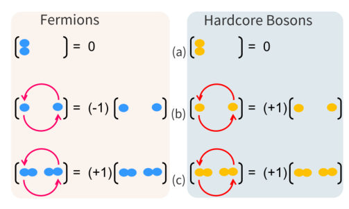 
FIG. 1. Comparison of the statistics of fermions and hardcore bosons. (a) Neither hardcore bosons nor fermions can occupy the same single-site state. (b) They obey different statistics when two single particles exchange their positions. (c) How- ever, when only pair states are considered, a local hardcore Bose pair and a Fermi pair obey the same statistics. This suggests that the hardcore boson counterpart of a fermionic model may possess pair eigenstates of the same form.

📷 Fig 2

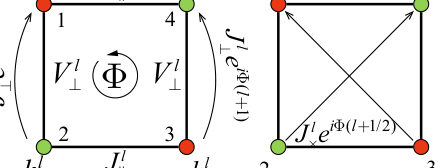 
FIG. 2. Schematic of the lattice structures associated with the Fermi and hardcore Bose Hamiltonians studied in this work. The plaquette corresponding to the Hamiltonians Hl F and Hl B given in Eqs. (16) and (43), respectively. All param- eters, including hopping amplitudes, nearest-neighbor inter- action strengths, and on-site potentials, are indicated in the panel. The complex hopping amplitudes induce a magnetic flux threading the plaquette.

📷 Fig 3

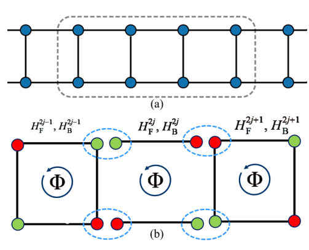 
FIG. 3. Schematic illustration of the decomposition of a lad- der structure associated with the Fermi and hardcore Bose Hamiltonians studied in this work. (a) The ladder Hamilto- nians HFL and H BL given in Eqs. (32) and (55 ), respectively, can be expressed as the sum of two types of plaquettes given in Eqs. (34, 35) and (57, 58), respectively. (b) Schematic illustration of the two types of plaquettes, the dotted circle encloses the two combined sites.

📷 Fig 4

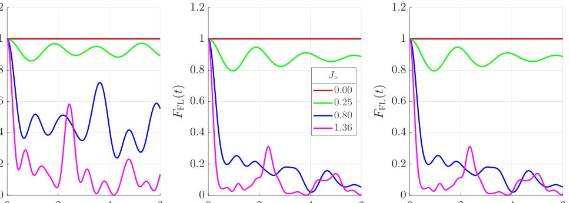 
FIG. 4. Fidelity dynamics of η-pairing states in the Fermi-Hubbard ladder under quench by next-nearest-neighbor hopping. The initial states are the exact eigenstates ψF n = (ηF)n|0⟩/(n! p

**Main problem.** The study investigates the relationship between many-particle quantum states in Fermi and Bose-Hubbard ladders, specifically whether they can share identical condensate-pair eigenstates and how stable these states are against perturbations.

**Main result.** The authors demonstrate that while fermions and hardcore bosons have different single-particle statistics, they share identical pair-state statistics, allowing for shared condensate-pair eigenstates. They find that these bosonic pair states are robust against next-nearest-neighbor hopping due to a restricted spectrum generating algebra, whereas fermionic states are unstable.

**Method.** The study uses Spectrum Generating Algebra (SGA) and a Restricted Spectrum Generating Algebra (RSGA) to construct exact eigenstates, alongside exact diagonalization and quantum quench simulations to study dynamic stability.

**Summary.** This paper explores how fermions and hardcore bosons can exhibit identical many-body quantum states when considering particle pairs. By using algebraic methods, the authors construct exact condensate-pair eigenstates for both species in ladder geometries. They demonstrate that while fermionic pairing is sensitive to next-nearest-neighbor hopping, the bosonic pair states remain stable due to a specific algebraic symmetry. This finding suggests a link between pair condensation and the phenomenon of Hilbert-space fragmentation.

Detailed structure

**Model / system.** The models consist of extended Fermi-Hubbard and hardcore Bose-Hubbard ladders, which can be realized in synthetic atomic ladders using optical lattices.

**Key observables.** Off-diagonal long-range order (ODLRO), fidelity (F(t)) during quantum quenches, and correlation functions in the dilute limit.

**Important parameters / regimes.** Hopping amplitudes (J_parallel, J_perp, J_x), density-density interactions (V), magnetic flux (Phi), and the hardcore boson limit (U -> infinity).

**Assumptions / limitations.** The correspondence between the two species is most clearly observed in the dilute limit and when considering only pair states.

**Figures summary.** Figure 1 illustrates the statistical similarities and differences between fermions and bosons at the single-particle and pair levels. Figure 2 shows the lattice geometry. Figure 4 displays the decay of fidelity in the Fermi-Hubbard ladder under next-nearest-neighbor hopping perturbations for different pair numbers and hopping strengths.

**Paper structure.** The paper begins by establishing the statistical equivalence of pairs, moves to the construction of exact eigenstates using SGA and RSGA, investigates the stability of these states via numerical quenching, and concludes with implications for Hilbert-space fragmentation.

**Why it may be interesting.** This paper is highly relevant for many-body dynamics and AMO physics as it explores the emergence of robust, non-thermalizing states (resembling quantum many-body scars) and provides a mechanism for Hilbert-space fragmentation in synthetic quantum systems.

Abstract

Although neither hardcore bosons nor fermions can occupy the same single-site state, they still obey different statistics, resulting in distinct many-particle quantum states, such as condensate states versus Fermi-liquid states. However, when only pair states are considered, the two can take the same form, since a local hardcore Bose pair and a Fermi pair obey the same statistics. In this work we demonstrate this by studying both Fermi and Bose extended Hubbard ladders, which can be realized experimentally in synthetic atomic ladders. A set of exact condensate-pair eigenstates for the Fermi ladder is constructed under SU(2) symmetry and can then be obtained by the spectrum generating algebra. The corresponding hardcore boson counterpart can be simply obtained by replacing fermionic operators with hardcore bosonic ones. Nevertheless, the boson-pair eigenstates are associated not with symmetry but with the restricted spectrum generating algebra. We also investigate the effect of next-nearest-neighbor hopping on the condensate states through numerical simulations of the dynamic response. The conclusions can be extended to a two-layer system. Our result reveals not only the resemblance of fermions to hardcore bosons, but also a possible mechanism of Hilbert-space fragmentation.

[↑ back to top](#top)

### [The Feedback Hamiltonian is the Score Function: A Diffusion-Model Framework for Quantum Trajectory Reversal](http://arxiv.org/abs/2604.21210v1)

**Authors:** Sagar Dubey, Alan John  
**Type:** theory · **Category:** quantum information and computing · **PDF:** <https://arxiv.org/pdf/2604.21210v1>  
**Analysis basis:** full PDF text, analyzed in chunks
**Topic relevance:** 🔥 `methods for driven-dissipative` **4/5** · 🔥 `quantum measurements` **4/5** · 🔥 `dissipative systems` **3/5** · `non-equilibrium dynamics` **2/5**

📷 Fig 1

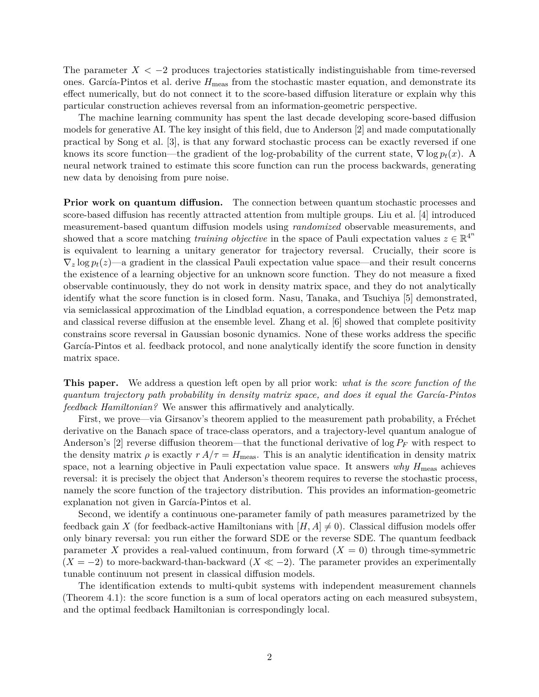 
Low-resolution page preview, page 2

📷 Fig 2

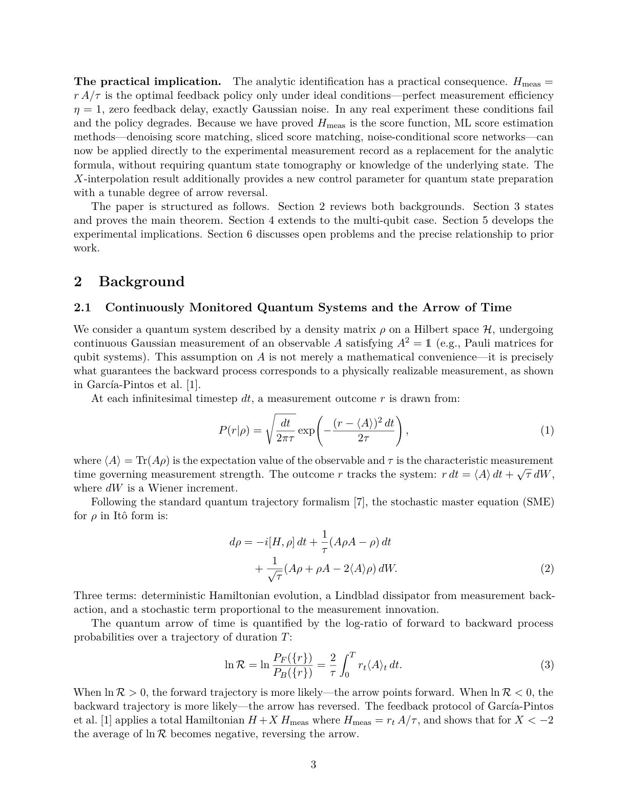 
Low-resolution page preview, page 3

📷 Fig 3

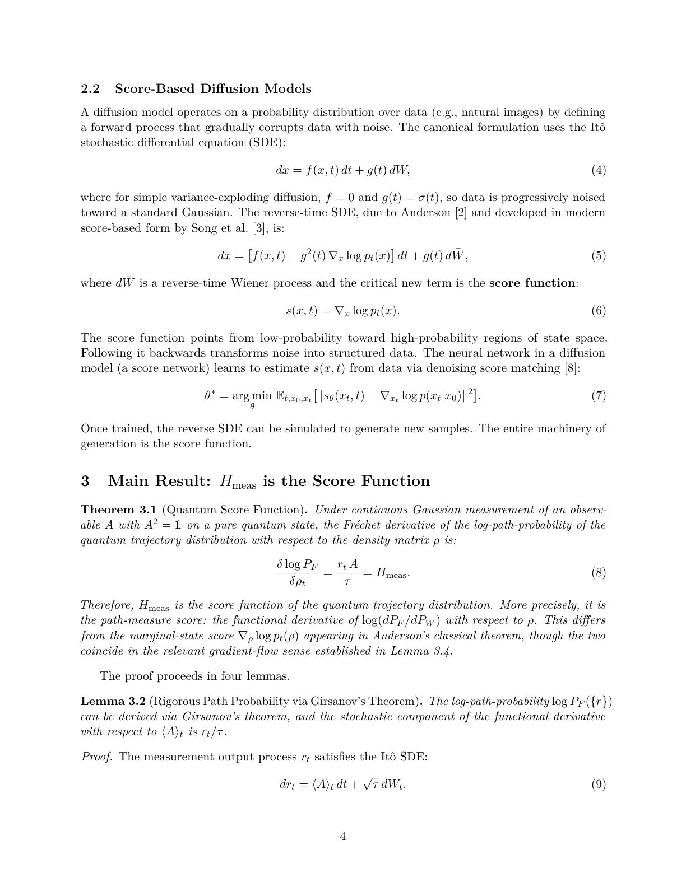 
Low-resolution page preview, page 4

📷 Fig 4

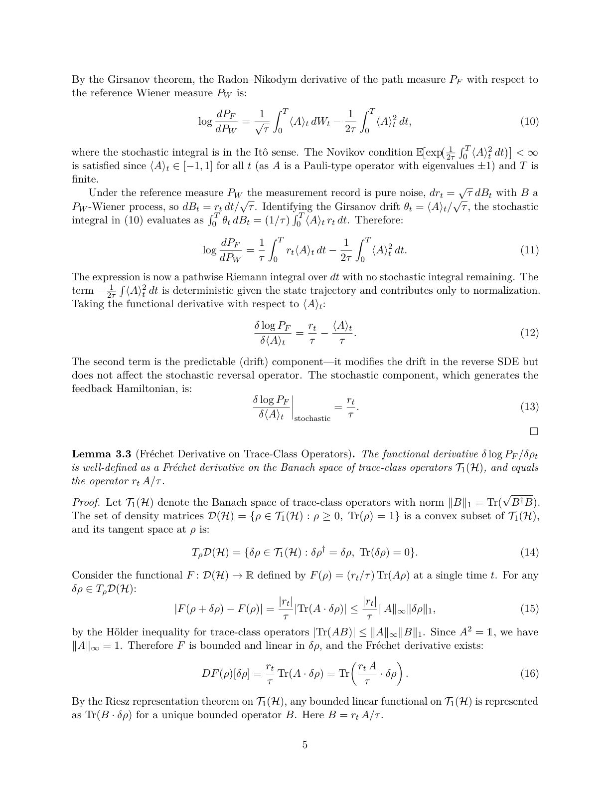 
Low-resolution page preview, page 5

📷 Fig 5

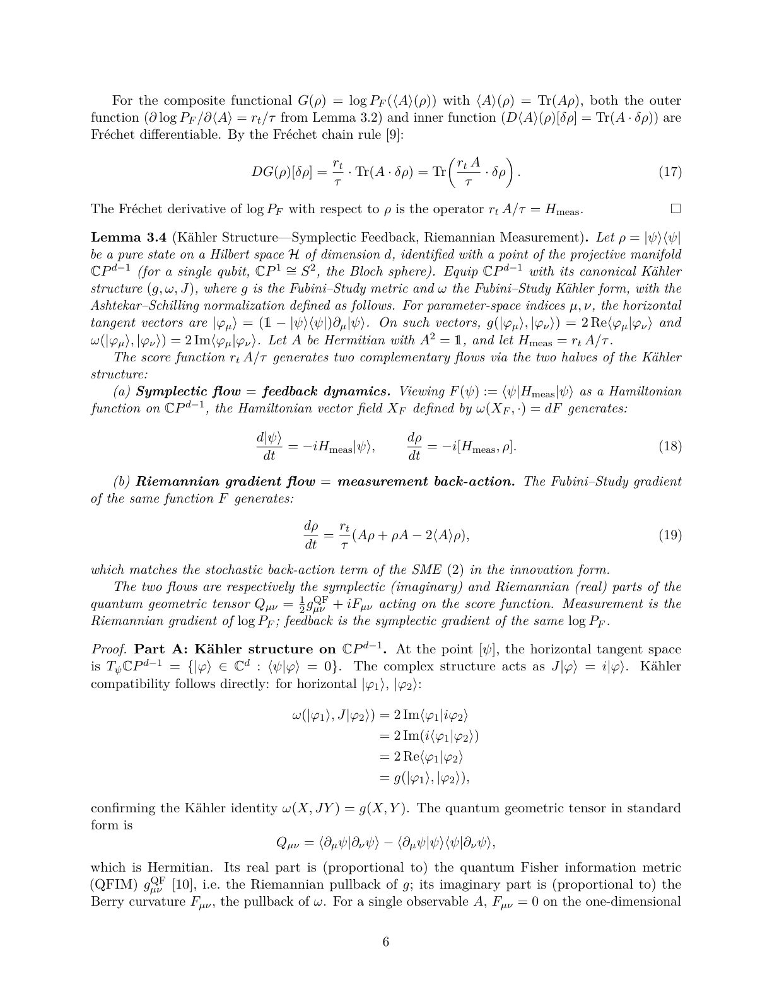 
Low-resolution page preview, page 6

📷 Fig 6

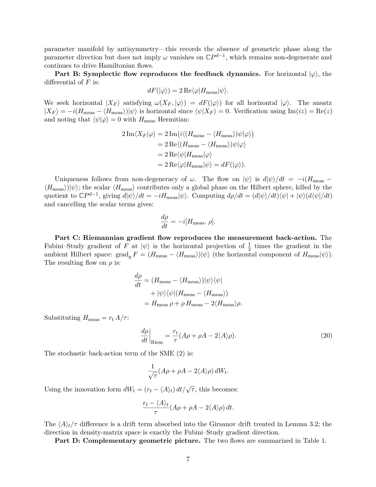 
Low-resolution page preview, page 7

📷 Fig 7

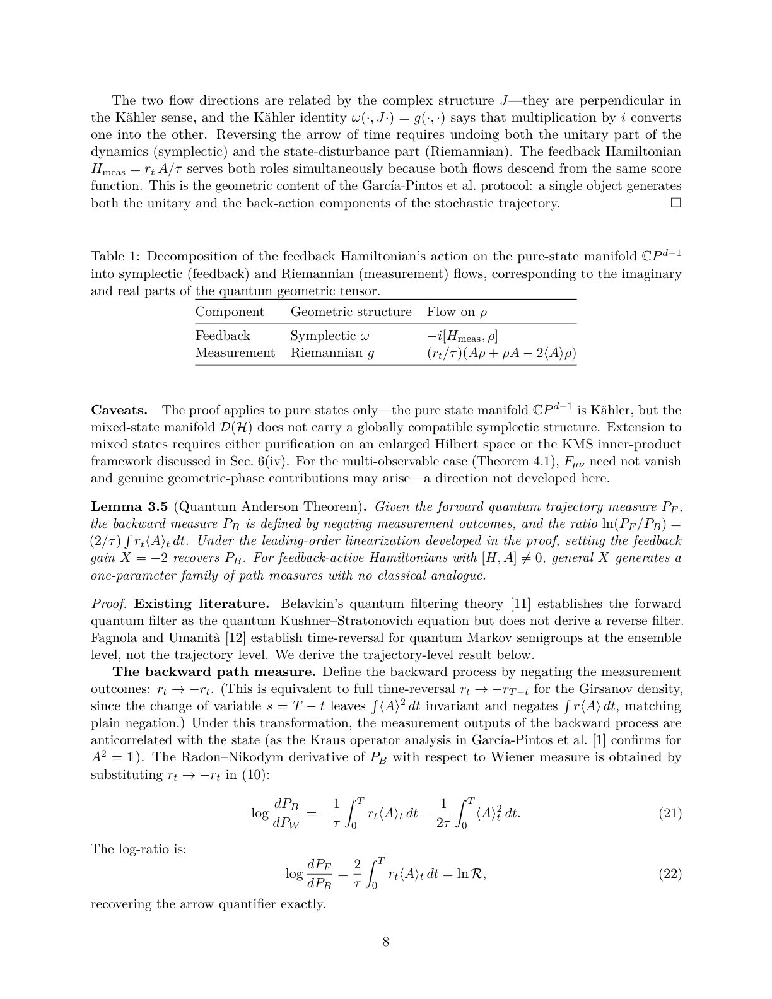 
Low-resolution page preview, page 8

📷 Fig 8

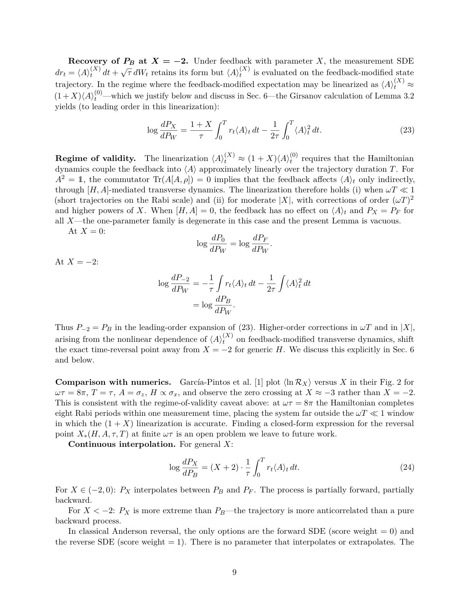 
Low-resolution page preview, page 9

📷 Fig 9

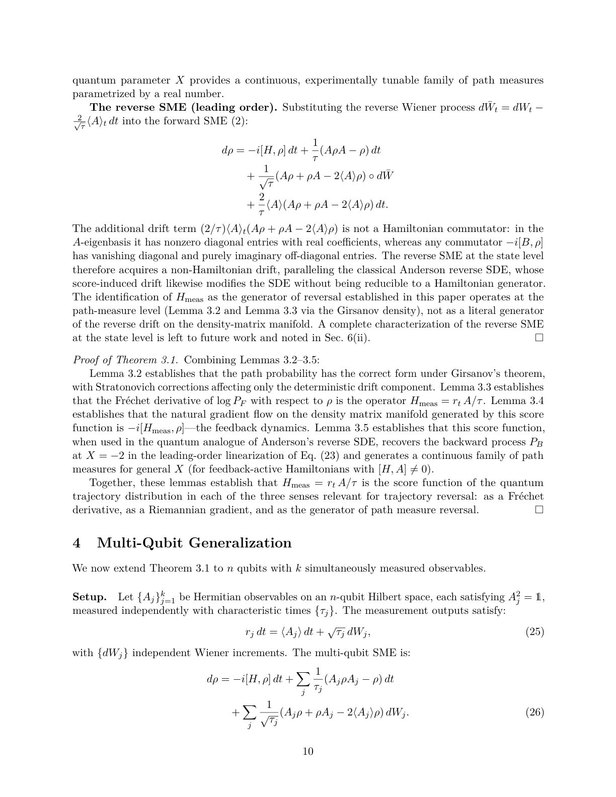 
Low-resolution page preview, page 10

📷 Fig 10

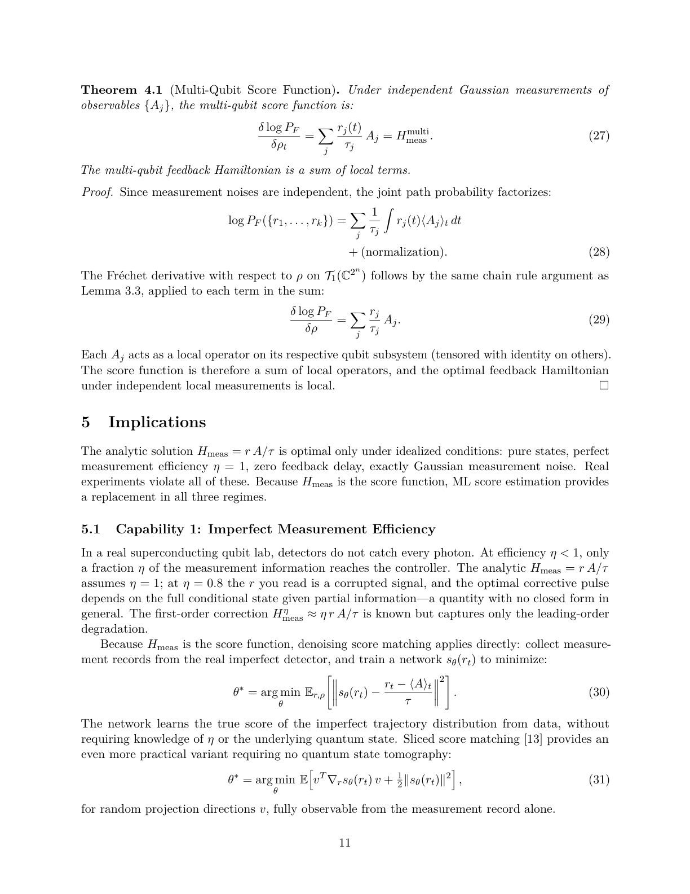 
Low-resolution page preview, page 11

**Main problem.** The paper seeks to explain the physical mechanism behind the García-Pintos feedback protocol for reversing the arrow of time in continuously monitored quantum systems and to establish a formal link between the feedback Hamiltonian and the score function used in machine learning diffusion models.

**Main result.** The authors prove that the feedback Hamiltonian is exactly the score function of the quantum trajectory distribution, providing an information-geometric foundation for trajectory reversal and enabling the use of ML score-matching methods for experimental quantum control.

**Method.** The study employs Girsanov's theorem, Fréchet differentiation on the Banach space of trace-class operators, and Kähler geometry on the pure-state projective manifold to derive the functional derivative of the log path probability.

**Summary.** This paper identifies that the specific Hamiltonian used to reverse the arrow of time in monitored quantum systems is mathematically equivalent to the score function in diffusion-based machine learning. By proving this identity, the authors show that quantum trajectory reversal is driven by the gradient of the path probability. This connection allows researchers to use powerful machine learning techniques, like denoising score matching, to estimate control protocols in real-world experiments where ideal models fail. The result also reveals that quantum feedback allows for a continuous tuning of the arrow of time, unlike the binary nature of classical diffusion reversal.

Detailed structure

**Model / system.** The model consists of continuously monitored quantum systems, specifically single and multi-qubit systems undergoing Gaussian measurement of an observable A, described by a Stochastic Master Equation (SME) in Itô form.

**Key observables.** The measurement outcome record (r_t) and the expectation value of the observable (A).

**Important parameters / regimes.** Feedback gain (X), measurement strength (tau), measurement efficiency (eta), and the weak-measurement/short-trajectory limit.

**Assumptions / limitations.** The derivation assumes pure state evolution, independent measurement channels, and relies on a linearization approximation that is valid in the weak-measurement limit.

**Paper structure.** The paper begins by defining the problem of time-reversal in quantum trajectories, moves to a mathematical proof identifying the feedback Hamiltonian as the score function using Girsanov and Fréchet derivatives, extends the result to multi-qubit systems, and concludes by discussing the implications for machine learning-based experimental control.

**Why it may be interesting.** This work provides a deep theoretical bridge between open quantum systems and generative machine learning, offering a new way to implement quantum control via score-matching and revealing a continuous family of path measures in quantum feedback that does not exist in classical diffusion.

Abstract

In continuously monitored quantum systems, the feedback protocol of García-Pintos, Liu, and Gorshkov reshapes the arrow of time: a Hamiltonian $H_{\mathrm{meas}} = r A / τ$ applied with gain $X$ tilts the distribution of measurement trajectories, with $X < -2$ producing statistically time-reversed outcomes. Why this specific Hamiltonian achieves reversal, and how the mechanism relates to score-based diffusion models in machine learning, has remained unexplained.   We compute the functional derivative of the log path probability of the quantum trajectory distribution directly in density-matrix space. Combining Girsanov's theorem applied to the measurement record, Fréchet differentiation on the Banach space of trace-class operators, and Kähler geometry on the pure-state projective manifold, we prove that $δ\log P_F / δρ= r A / τ= H_{\mathrm{meas}}$. The García-Pintos feedback Hamiltonian is the score function of the quantum trajectory distribution -- exactly the object Anderson's reverse-time diffusion theorem requires for trajectory reversal. The identification extends to multi-qubit systems with independent measurement channels, where the score is a sum of local operators.   Two consequences follow. First, the feedback gain $X$ generates a continuous one-parameter family of path measures (for feedback-active Hamiltonians with $[H, A] \neq 0$), with $X = -2$ recovering the backward process in leading-order linearization -- a structure absent from classical diffusion, where reversal is binary. Second, the score identification enables machine learning (ML) score estimation methods -- denoising score matching, sliced score matching -- to replace the analytic formula when its idealizations (unit efficiency, zero delay, Gaussian noise) fail in real experiments.

[↑ back to top](#top)

### [Time-optimal Qubit Reset via Environmental Spectral Structure](http://arxiv.org/abs/2604.21230v1)

**Authors:** Hong-Bo Huang, Hui Dong  
**Type:** theory · **Category:** quantum information and computing · **PDF:** <https://arxiv.org/pdf/2604.21230v1>  
**Analysis basis:** full PDF text, analyzed in chunks
**Topic relevance:** 🔥 `dissipative systems` **4/5** · 🔥 `correlated / nonlocal dissipation` **3/5** · `methods for driven-dissipative` **2/5** · `non-equilibrium dynamics` **2/5** · `quantum measurements` **2/5**

📷 Fig 1

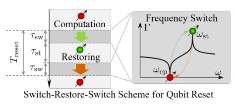 
FIG. 1. Illustration of the switch–restore–switch scheme for qubit reset using the environmental spectral structure. The qubit exhibits a frequency-dependent decoherence rate, Γ (ω). Initially, to perform a computational task, the qubit operates in the computational configuration (red) at the computation frequency ωcp with low decoherence, Γ (ωcp). After the com- putational task, it is switched over the switching duration τsw to the restoring configuration (green) at the restoring fre- quency ωst with rapid decoherence, Γ (ωst). In this configura- tion, the qubit undergoes strong decoherence and relaxes over the restoring duration, τst. Finally, it is switched back to the computational...

📷 Fig 2

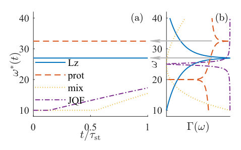 
FIG. 2. (a) Optimal control from Eq. (3). (b) Line shapes of four representative decoherence-rate spectra, Γ (ω), for SC- qubits. The blue solid, orange dashed, yellow dotted, and purple dash-dotted lines represent the Lz, prot, mix, and JQF spectra, respectively. The gray arrows indicate that the opti- mal control, ω∗, in (a) aligns with the peak of the spectrum in (b) for the Lz and prot spectra. For the mix and JQF spec- tra, the restoring frequency initially lies at the lower bound before gradually increasing.

📷 Fig 3

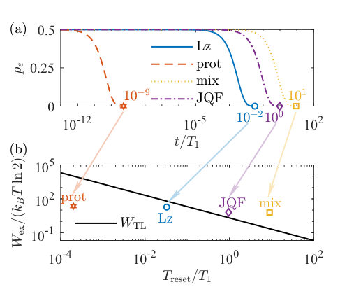 
FIG. 3. (a) Restoring process as a function of normalized time, t/T1. The blue solid, orange dashed, yellow dotted, and purple dash-dotted lines represent the Lz, prot, mix, and JQF spectra, respectively. The end of each restor- ing process is marked by a circle, hexagon, square, or dia- mond, indicating the order of magnitude of the normalized restoring time, τst/T1. The restoring time is shorter than the coherence time except for the non-engineered mix spec- trum. The precision is set to ϵ = 10−5. (b) Normalized extra work, Wex/ (kBT ln 2), with respect to normalized reset time, Treset/T1, for our switch–restore–switch scheme, com- pared with the lower bound for a constant...

📷 Fig 4

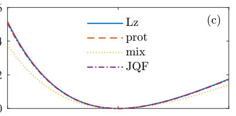 
FIG. 4. The fidelity, F, of our restoring process under three types of deviations: (a) population deviations, (b) coherence deviations, and (c) control-time deviations. The blue solid, orange dashed, yellow dotted, and purple dash-dotted lines represent the Lz, prot, mix, and JQF spectra, respectively. In all cases, F &gt; 99.999% over substantial deviation ranges. The reset precision is set to ϵ = 10−5.

**Main problem.** How to achieve the fastest possible qubit reset (information erasure) for qubit reuse in the NISQ era without compromising the high-fidelity requirements of computation.

**Main result.** The authors derive an optimal 'switch-restore-switch' strategy that can reduce reset times from over 100 ns to approximately 20 ns for specific engineered environments, while maintaining high reset precision and robustness.

**Method.** The problem is formulated as an optimal control problem solved using Pontryagin's minimum principle to determine the optimal frequency-tuning trajectory.

**Summary.** This paper addresses the bottleneck of slow qubit reset in quantum computing. By using optimal control theory, the authors show that tuning a qubit's frequency to exploit specific environmental spectral structures allows for a much faster reset process. Specifically, they propose a 'switch-restore-switch' protocol that can reduce reset times by several factors compared to passive relaxation. The study also quantifies the thermodynamic cost and proves the scheme is robust against typical experimental imperfections.

Detailed structure

**Model / system.** A frequency-tunable superconducting qubit coupled to a structural environment, modeled using a Lindblad master equation with a frequency-dependent decoherence rate and thermal equilibrium population.

**Key observables.** Reset time (T_reset), reset precision (epsilon), fidelity (F), and normalized extra work (W_ex).

**Important parameters / regimes.** Qubit frequency tuning range (Delta_omega ~ 2*pi * 3 GHz), switching duration (tau_sw ~ 10 ns), and four representative environmental spectra (L_z, prot, mix, JQF).

**Assumptions / limitations.** The qubit is frequency-tunable and the environment's spectral structure is known or can be engineered; the switching duration is fixed by qubit design.

**Figures summary.** Figure 3 shows the excited-state population dynamics and a comparison of extra work against thermodynamic bounds; Figure 4 demonstrates the robustness of the scheme against deviations in initial population, coherence, and control time.

**Paper structure.** The paper introduces the challenge of fast reset, defines the physical model and optimal control framework, evaluates the strategy across different environmental spectra, performs a thermodynamic analysis of the work cost, and concludes with a robustness analysis against experimental errors.

**Why it may be interesting.** This paper is highly relevant to open quantum systems and quantum optics as it treats the environmental spectral density not just as a source of noise, but as a controllable resource to accelerate dissipative processes like state preparation.

Abstract

Fast qubit reset is essential for qubit reuse in the noisy intermediate-scale quantum computing era, yet it conflicts with the weak decoherence required for high-fidelity computation. We solve the time-optimal reset problem for a frequency-tunable qubit coupled to a structural environment under realistic spectral and control constraints. The optimal strategy consists of a switch--restore--switch sequence, where the qubit is moved from a low-decoherence computational configuration to a high-decoherence restoring configuration and then returned for reuse. For superconducting qubits in four representative environments, this strategy reduces the reset time from typically $\gtrsim\SI{100}{\nano\second}$ to $\SI{20}{\nano\second}$, about $40\%$ of a typical two-qubit gate time, while achieving a reset precision of $10^{-5}$. Our results identify environmental spectral structure as a practical resource for rapid, high-fidelity qubit reset and provide a design principle for qubit reuse on qubit-limited processors.

[↑ back to top](#top)

### [Magnetic-field control of interactions in alkaline-earth Rydberg atoms and applications to {\it XXZ} models](http://arxiv.org/abs/2604.21206v1)

**Authors:** Masaya Kunimi, Takafumi Tomita  
**Type:** theory · **Category:** other · **PDF:** <https://arxiv.org/pdf/2604.21206v1>  
**Analysis basis:** full PDF text, analyzed in chunks
**Topic relevance:** 🔥 `Rydberg arrays` **4/5** · 🔥 `analog quantum simulation` **4/5** · 🔥 `exotic spin models in light-matter` **4/5**

📷 Fig 1

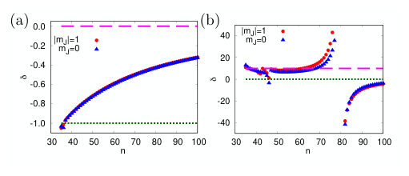 
FIG. 2. Principal quantum number dependence of the anisotropy parameter δ in the absence of the magnetic field. (a) 88Sr. The green dotted and magenta dashed lines repre- sent δ = −1 and δ = 0, respectively. (b) 174Yb. The green dotted and magenta dashed lines represent δ = 0 and δ = 10, respectively.

📷 Fig 2

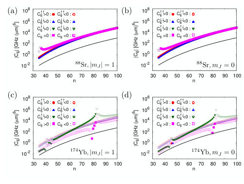 
FIG. 1. Principal quantum number dependence of the C6 parameters in the absence of the magnetic field for (a) 88Sr with |mJ| = 1, (b) 88Sr with mJ = 0, (c) 174Yb with |mJ| = 1, and (d) 174Yb with mJ = 0. The black solid line represents the n11 scaling as a guide to the eye.

📷 Fig 3

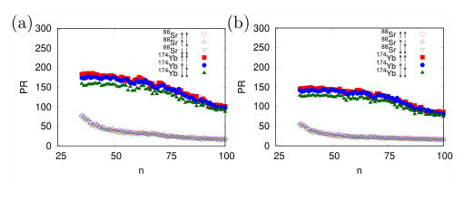 
FIG. 5. PR of the distribution of the Förster defects for (a) |mJ| = 1 and (b) mJ = 0. Here, ↑↑, ↑↓, and ↓↓represent the Förster defects ∆EF(n, ↑, ↑), ∆EF(n, ↑, ↓), and ∆EF(n, ↓, ↓), respectively.

📷 Fig 4

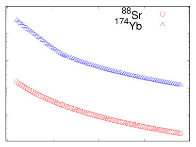 
FIG. 3. Principal-quantum-number dependence of the energy splittings of the intermediate P states. The energy splittings are evaluated as the maximum energy difference among the 3PJ states for 88Sr, and among the 3PJ and 1P1 states for 174Yb.

📷 Fig 5

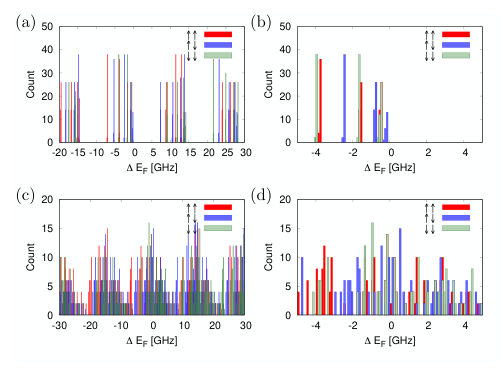 
FIG. 4. Histogram of Förster defects for (a) 88Sr with |mJ| = 1, (b) a magnified view of panel (a), (c) 174Yb with |mJ| = 1, and (d) a magnified view of panel (c). Here, ↑↑, ↑↓, and ↓↓ represent the Förster defects ∆EF(n, ↑, ↑), ∆EF(n, ↑, ↓), and ∆EF(n, ↓, ↓), respectively. We count the intermediate states satisfying Rc &gt; 0.1 nm to remove narrow resonances. The bin size is 0.1 GHz.

📷 Fig 6

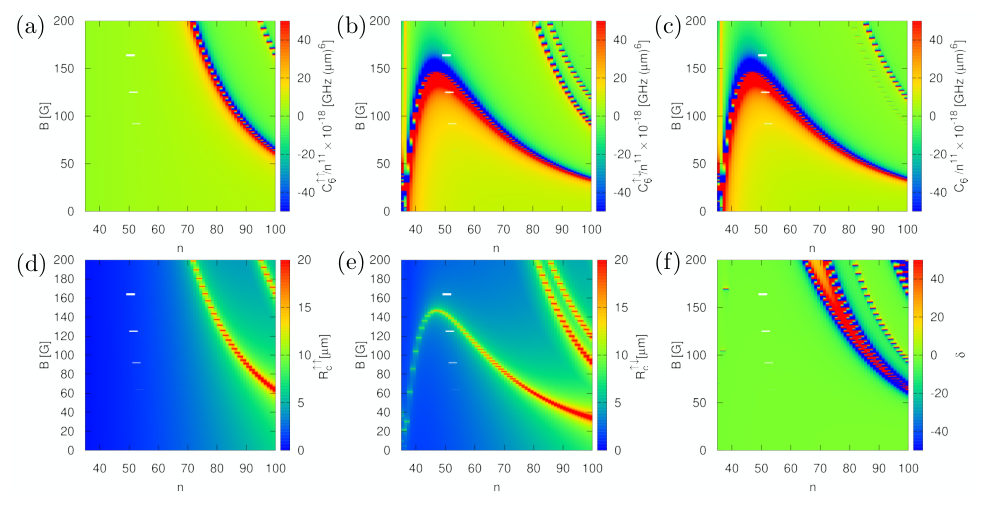 
FIG. 6. Magnetic field and principal quantum number dependence of various physical quantities for 88Sr with mJ = +1 at θ = π/2. (a) C↑↑ 6 , (b) C↑↓ 6 , (c) C6, (d) R↑↑ c , (e) R↑↓ c , and (f) anisotropy parameter δ. The white region indicates the absence of data due to strong S–D mixing.

📷 Fig 7

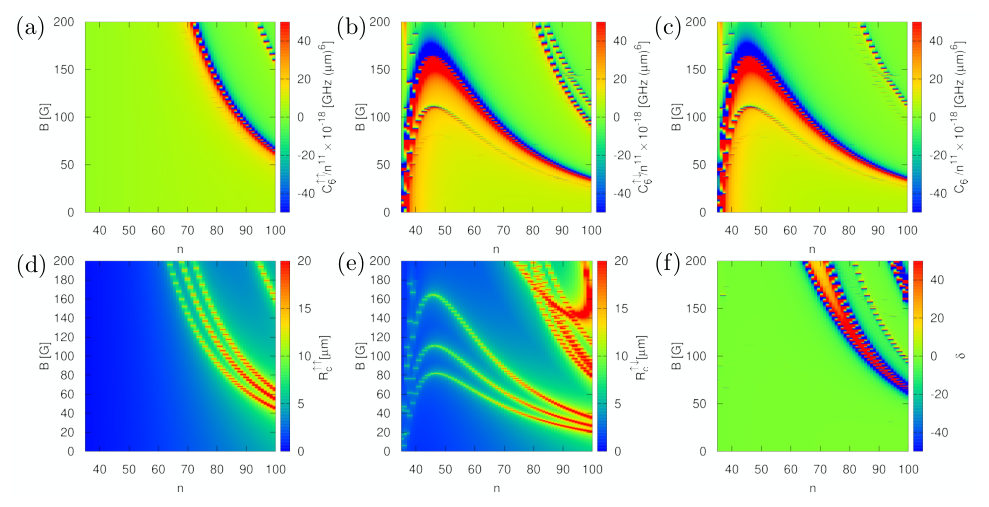 
FIG. 7. Magnetic field and principal quantum number dependence of various physical quantities of 88Sr with mJ = 0 at θ = π/2. (a) C↑↑ 6 , (b) C↑↓ 6 , (c) C6, (d) R↑↑ c , (e) R↑↓ c , and (f) anisotropy parameter δ.

📷 Fig 8

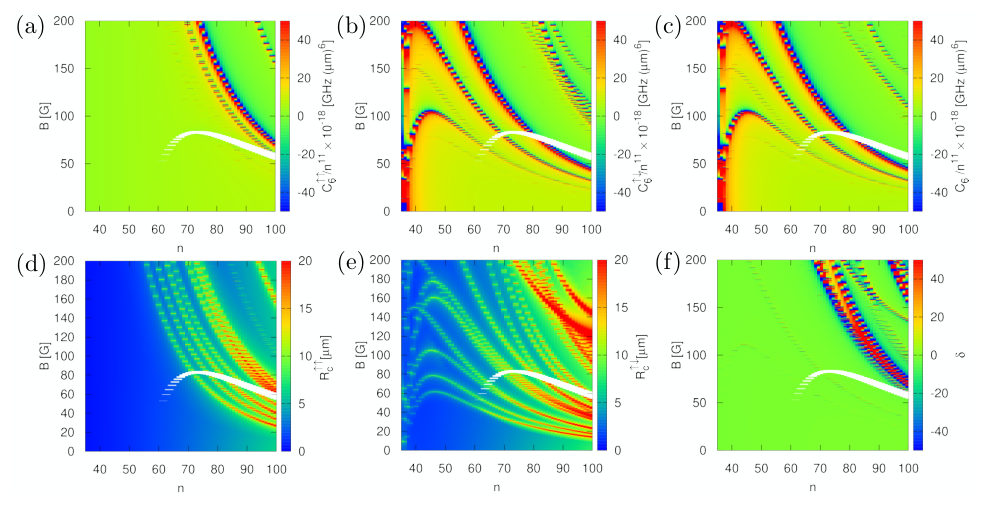 
FIG. 8. Magnetic field and principal quantum number dependence of various physical quantities of 88Sr with mJ = −1 at θ = π/2. (a) C↑↑ 6 , (b) C↑↓ 6 , (c) C6, (d) R↑↑ c , (e) R↑↓ c , and (f) anisotropy parameter δ. The white region indicates the absence of data due to strong S–D mixing.

📷 Fig 9

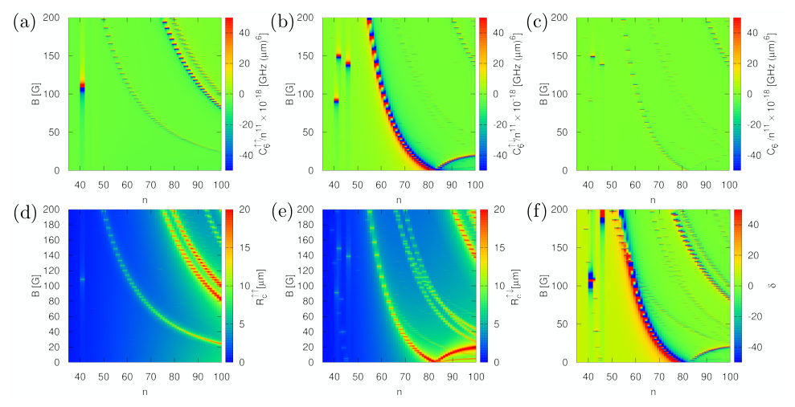 
FIG. 9. Magnetic field and principal quantum number dependence of various physical quantities of 174Yb with mJ = +1 for θ = π/2. (a) C↑↑ 6 , (b) C↑↓ 6 , (c) C6, (d) R↑↑ c , (e) R↑↓ c , and (f) anisotropy parameter δ.

📷 Fig 10

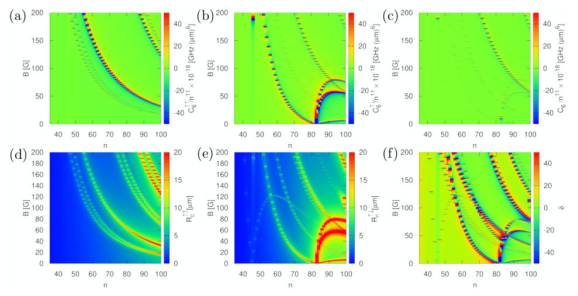 
FIG. 10. Magnetic field and principal quantum number dependence of various physical quantities of 174Yb with mJ = 0 for θ = π/2. (a) C↑↑ 6 , (b) C↑↓ 6 , (c) C6, (d) R↑↑ c , (e) R↑↓ c , and (f) anisotropy parameter δ.

**Main problem.** Investigating how magnetic fields can control the interactions between alkaline-earth-like Rydberg atoms to realize and tune XXZ-type quantum spin models.

**Main result.** The authors demonstrate that 174Yb exhibits significantly higher interaction anisotropy than 88Sr or alkali atoms due to strong spin-orbit coupling, allowing for the realization of large-anisotropy XXZ models and even supersolid phases without fine-tuning.

**Method.** The study uses Multichannel Quantum Defect Theory (MQDT) and second-order perturbation theory to derive effective Hamiltonians and calculate interaction coefficients.

**Summary.** This paper explores the use of magnetic fields to tune interactions in alkaline-earth Rydberg atoms. It highlights that 174Yb is particularly promising because its strong spin-orbit coupling leads to naturally large interaction anisotropy. The authors show that this allows for the simulation of complex many-body phenomena, such as the folded XXZ model in 1D and supersolid phases in 2D, with much greater ease than in traditional alkali-atom platforms.

Detailed structure

**Model / system.** The system consists of alkaline-earth-like Rydberg atoms (88Sr and 174Yb) in an effective spin-1/2 XXZ-type quantum spin model derived from Rydberg state pairs.

**Key observables.** Anisotropy parameter (delta), C6 coefficients, Forster defects, and domain-wall number.

**Important parameters / regimes.** Magnetic field strength (B), principal quantum number (n), and the anisotropy parameter (delta).

**Assumptions / limitations.** The study assumes the validity of second-order perturbation theory and approximates the interaction using only the leading-order dipole-dipole term.

**Figures summary.** Figures show the dependence of anisotropy and C6 coefficients on the principal quantum number and magnetic field for both 88Sr and 174Yb.

**Paper structure.** The paper introduces the problem, derives the effective XXZ Hamiltonian using MQDT, compares the interaction properties of Sr and Yb, explores magnetic field tuning, and discusses applications to 1D and 2D many-body systems.

**Why it may be interesting.** It provides a new platform (174Yb) for quantum simulation where complex spin models like the XXZ model can be realized with large anisotropy and high stability without the need for the precise fine-tuning required in alkali-atom systems.

Abstract

We study the magnetic-field dependence of the interactions between two alkaline-earth(-like) Rydberg atoms, ${}^{88}$Sr and ${}^{174}$Yb. Considering the pair of Rydberg states $|ns,{}^3S_1,m_J\rangle$ and $|(n+1)s,{}^3S_1,m_J\rangle$, we show that the effective Hamiltonian takes the form of an {\it XXZ}-type quantum spin model, as in the alkali-atom case [M. Kunimi and T. Tomita, Phys. Rev. A {\bf 112}, L051301 (2025)]. We find that the behavior of the anisotropy parameter for ${}^{174}$Yb at zero magnetic field is significantly different from that for other atomic species. This behavior originates from the strong spin-orbit coupling in ${}^{174}$Yb. We systematically calculate the interaction parameters of the {\it XXZ} model in the presence of a magnetic field and show that they can be tuned by the field. As applications to quantum many-body problems, we investigate one-dimensional systems in the large-anisotropy regime and show that the folded {\it XXZ} model can be realized in ${}^{174}$Yb systems without fine-tuning of the field. We also investigate two-dimensional square-lattice systems and show that a supersolid phase can emerge in the ground state at the mean-field level.

[↑ back to top](#top)

### [Engineering molecular potential energy surfaces using magnetic cavity quantum electrodynamics](http://arxiv.org/abs/2604.20969v1)

**Authors:** Lukas Weber, Leonardo dos Anjos Cunha, Johannes Flick, Shiwei Zhang  
**Type:** theory · **Category:** other · **PDF:** <https://arxiv.org/pdf/2604.20969v1>  
**Analysis basis:** full PDF text, analyzed in chunks
**Topic relevance:** 🔥 `correlated cavity matter` **4/5** · 🔥 `exotic spin models in light-matter` **3/5** · 🔥 `spintronics-quantum-optics interface` **3/5**

📷 Fig 1

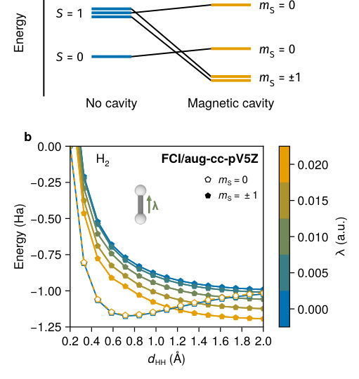 
FIG. 1. H2 coupled to a magnetic cavity. (a) Sketch of the lowest energy levels in cavity-coupled H2. Without light- matter coupling, there is a singlet (S = 0) bonding ground state and a triplet (S = 1) antibonding excited state. Under finite cavity coupling, through the quantum spin Zeeman ef- fect, the triplet splits into an mS = 0 singlet and an mS = ±1 doublet of lower energy. The mS = 0 states get shifted up- wards weakly by the diamagnetic coupling. (b) Potential en- ergy surfaces as a function of the bond length dHH and the cav- ity coupling λ, calculated using FCI in the aug-cc-pV5Z basis set. For each coupling, only the lowest energy mS = 0, ±1 states are shown. For clarity, in...

📷 Fig 2

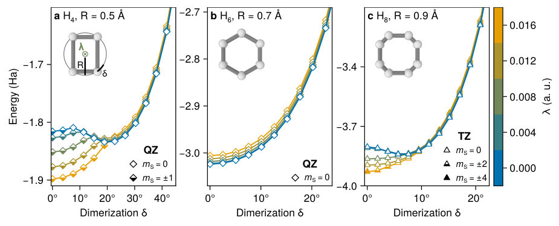 
FIG. 2. Potential energy surfaces of cavity-coupled hydrogen rings. For each dimerization angle δ and magnetic cavity coupling λ, only the lowest-energy spin state, mS, is shown. Calculations are performed using QED-UHF at a fixed ring radius R in the aug-cc-pVTZ (TZ) and in aug-cc-pVQZ (QZ) basis sets. The insets show a sketch of the ground state ring geometries outside of the cavity. The center of the ring is located at the origin, and the quantum magnetic field is perpendicular to the ring plane.

📷 Fig 3

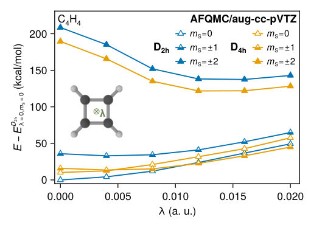 
FIG. 4. Stability of different cyclobutadiene geome- tries under magnetic cavity coupling. Energies as a function of the magnetic cavity coupling λ. The D2h and D4h geometries are fixed to their λ = 0 values (Table I). The statistical error bars are smaller than the markers.

📷 Fig 4

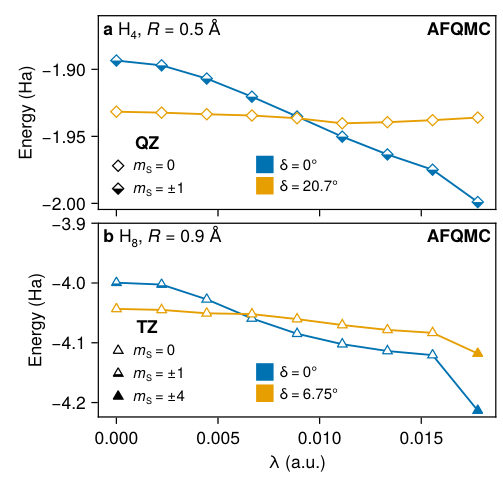 
FIG. 3. Stability of different hydrogen ring geometries under magnetic cavity coupling. Energies as a function of the magnetic cavity coupling λ, for the symmetric geometry (δ = 0) and the optimal QED-UHF geometry outside of the cavity (δ ̸= 0), calculated using QED-AFQMC in the aug- cc-pVTZ (TZ) and aug-cc-pVQZ (QZ) basis sets. For each dimerization angle δ and coupling, only the lowest-energy spin state, mS, is shown. The statistical error bars are smaller than the markers.

📷 Fig 5

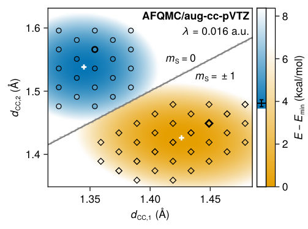 
FIG. 5. Potential energy surface of cyclobutadiene in the cavity. Perturbations of the two carbon-carbon bond lengths, dCC,1 and dCC,2, around the D4h/mS = ±1 (yellow) and D2h/mS = 0 (blue) equilibrium geometries. The out-of- cavity equilibrium carbon-carbon bond lengths are indicated by markers with thick outlines. The hydrogen-carbon bond lengths and angles are left constant. The color of the markers corresponds to the QED-AFQMC results in the aug-cc-pVTZ basis set. The colors in the background show a parabolic fit. The center of the fit is marked in white. On the left colorbar, the gap between the fitted energy minima is marked along with its statistical error. The magnetic cavity...

**Main problem.** Investigating how coupling molecules to a magnetic cavity quantum electrodynamics (QED) field can be used to engineer molecular potential energy surfaces and induce structural or geometric transitions.

**Main result.** Strong magnetic cavity coupling can invert the singlet-triplet gap in H2 and stabilize symmetric geometries in ring molecules (like H4, H8, and cyclobutadiene) that would otherwise undergo Jahn-Teller distortions.

**Method.** The study uses high-precision QED auxiliary-field quantum Monte Carlo (QED-AFQMC) alongside QED-unrestricted Hartree-Fock (QED-UHF) and full configuration interaction (QED-FCI) for benchmarking.

**Summary.** This paper explores how magnetic cavity QED can be used to manipulate the chemical properties of molecules. By coupling molecules to a magnetic cavity, the researchers show that one can stabilize symmetric structures in molecules that typically undergo Jahn-Teller distortions. The study also finds that strong coupling can invert spin gaps in H2 and that increasing molecular concentration enhances these cavity-induced effects. This provides a promising pathway for 'cavity-altered chemistry' using magnetic fields.

Detailed structure

**Model / system.** The model employs a Pauli-Fierz Hamiltonian in the Coulomb gauge to describe H2, hydrogen rings (Hn), and cyclobutadiene (C4H4) interacting with a single-mode magnetic cavity field, breaking the long-wavelength approximation.

**Key observables.** Potential energy surfaces (PES), singlet-triplet gaps, spin polarization (mS), dimerization angle (delta), and molecular geometry/symmetry.

**Important parameters / regimes.** Cavity coupling strength (lambda), photon frequency (Omega), molecule concentration (N), and the diamagnetic/Zeeman coupling terms.

**Assumptions / limitations.** Nuclei are treated as quasistatic within the Born-Oppenheimer approximation; the magnetic field is assumed to be aligned with the molecule's rotation axis; molecules are assumed to be far enough apart to avoid direct interaction.

**Figures summary.** Figure 1 shows energy level changes and PES for H2 under coupling; Figure 2 illustrates the transition from dimerized to symmetric configurations in H4, H6, and H8 rings.

**Paper structure.** The paper introduces the magnetic cavity QED problem, details the Hamiltonian and numerical methods (AFQMC/UHF), presents results for H2 and hydrogen rings, discusses the effects of molecular concentration, and concludes with a discussion on the limitations of the single-mode model and origin dependence.

**Why it may be interesting.** It demonstrates a unique mechanism for 'cavity-induced magnetism' and structural engineering that goes beyond the standard electrical cavity effects, offering a new way to control molecular symmetry and spin states via light-matter interaction.

Abstract

We investigate the effects of coupling a quantum-magnetic cavity field to molecules. Our high-precision auxiliary-field quantum Monte Carlo calculations capture the effect of the cavity field in the presence of electron correlations, and their interplay and competition. In H$_2$, we find that a strong enough cavity coupling makes the original bound ground state metastable, along with inverting the singlet-triplet gap. In ring molecules (e.g., H$_n$), the magnetic cavity coupling stabilizes symmetric geometries. As a consequence, open-shell rings such as H$_4$, H$_8$, or C$_4$H$_4$, which would undergo Jahn-Teller distortions outside of the cavity, obtain exotic spin or ring-current polarized, antiaromatic ground states. These effects are enhanced by increasing the molecule concentration inside the cavity. Our results suggest cavity quantum electrodynamics beyond the long-wavelength approximation as a promising avenue for cavity-altered chemistry.

[↑ back to top](#top)

### [Time-Uniform Error Bound for Temporal Coarse Graining in Markovian Open Quantum Systems](http://arxiv.org/abs/2604.21366v1)

**Authors:** Teruhiro Ikeuchi, Takashi Mori  
**Type:** theory · **Category:** statistical mechanics · **PDF:** <https://arxiv.org/pdf/2604.21366v1>  
**Analysis basis:** full PDF text, analyzed in chunks
**Topic relevance:** 🔥 `dissipative systems` **4/5** · 🔥 `methods for driven-dissipative` **4/5** · `non-equilibrium dynamics` **2/5**

📷 Fig 1

 
FIG. 1. Schematic picture of our result. Error bounds obtained previously increases with 𝑡linearly or exponentially. In contrast, our error bound stays small for an arbitrarily long time.

**Main problem.** Existing error bounds for approximations used to derive GKSL generators from the Redfield equation are either method-specific or diverge in the long-time limit, restricting their validity to short-time regimes.

**Main result.** The authors derive a unified, time-uniform error bound for a general class of 'temporal coarse graining' methods, ensuring the accuracy of the derived GKSL generator for arbitrarily long times.

**Method.** The authors introduce a 'temporal coarse graining' framework and use mathematical techniques such as Duhamel expansion, integration by parts, and superoperator norm analysis to establish the bound.

**Summary.** The paper addresses the fundamental problem of error accumulation in quantum master equation approximations. By introducing the concept of temporal coarse graining, the authors unify various approximation schemes like the Rotating-Wave Approximation and time-averaging. They prove that for these methods, the error between the approximate and exact dynamics remains bounded and does not grow with time. This result ensures that the simplified GKSL generators remain physically accurate even in the long-time limit, provided the dissipation is much slower than the bath correlation time.

Detailed structure

**Model / system.** A finite quantum system coupled to a thermal bath, described by a total Hamiltonian consisting of system, bath, and interaction terms, with dynamics governed by the Redlifield equation under the Born-Markov approximation.

**Key observables.** The error between the approximate GKSL dynamics and the Redfield dynamics, measured in the trace norm.

**Important parameters / regimes.** Bath correlation time (tau_B), dissipation timescale (tau_D), coarse-graining time (delta t), and the coupling strength (gamma).

**Assumptions / limitations.** The bath correlation functions must decay exponentially, the GKSL generator is assumed to be diagonalizable, and the system is in the weak-coupling (Born-Markov) regime.

**Figures summary.** Figure 1 provides a schematic comparison showing that the new error bound remains small and time-independent, whereas previous bounds increase linearly or exponentially with time.

**Paper structure.** The paper introduces the problem of diverging error bounds, defines the unified temporal coarse graining framework, provides the mathematical conditions for this framework, presents the time-uniform error theorem, and discusses limitations regarding many-body systems.

**Why it may be interesting.** This is highly relevant for researchers in open quantum systems as it provides a rigorous justification for using Lindblad-type master equations over long timescales, which is critical for studying steady states and long-term dissipation.

Abstract

Several approximation procedures, such as the full or partial rotating-wave, time-averaging, and geometric-arithmetic approximations, have been proposed to derive Gorini-Kossakowski-Sudarshan-Lindblad (GKSL) generators from the Born-Markov quantum master equation (e.g., the Redfield equation). Establishing rigorous error bounds for these approximations is of fundamental and practical importance. However, existing bounds face two major limitations: they are highly specific to individual methods, and, more critically, they diverge in the long-time limit, ensuring the accuracy of the derived GKSL generator only in short-time regimes. In this Letter, we resolve both issues by deriving a unified, rigorous error bound for a general class of approximation methods -- termed temporal coarse graining -- that encompasses all aforementioned schemes. Crucially, our error bound is time-uniform. This guarantees that GKSL generators obtained via temporal coarse graining remain accurate for arbitrarily long times, provided the dissipation timescale is significantly longer than the bath correlation timescale.

[↑ back to top](#top)

### [HEOM-in-Calibration-Loop: Exposing Non-Markovian Bath Signatures That Markovian Calibration Elides in Superconducting-Qubit Tune-Up](http://arxiv.org/abs/2604.21458v1)

**Authors:** Jun Ye  
**Type:** theory · **Category:** quantum information and computing · **PDF:** <https://arxiv.org/pdf/2604.21458v1>  
**Analysis basis:** full PDF text, analyzed in chunks
**Topic relevance:** 🔥 `methods for driven-dissipative` **4/5** · 🔥 `dissipative systems` **3/5** · `non-equilibrium dynamics` **2/5**

📷 Fig 1

 
Fig. 1. DAG Gantt of the RABI→{RAMSEY ∥T1} chain. Parallel execution saves 36.9 s (43 %) over serial; average scheduling latency is 9.62 µs.

📷 Fig 2

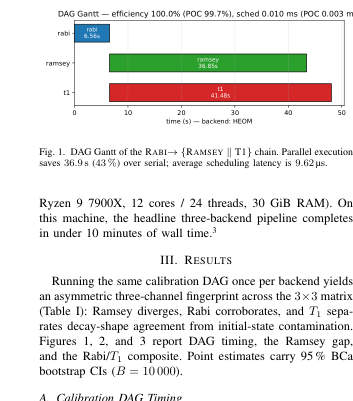 
Figure 1 shows that scheduler overhead is negligible relative to the HEOM simulation cost. Serial execution takes 84.89 s; with RABI on the critical path and {RAMSEY, T1} in parallel, runtime drops to 48.04 s (saving 36.9 s, 43 %), with overhead fraction 2.4 × 10−5 from the theoretical minimum4 and aver- age scheduling latency 9.62 µs (maximum 10.78 µs). Protocol durations are RABI 6.56 s, RAMSEY 36.85 s, and T1 41.48 s, placing T1 on the critical path.5 With scheduler overhead bounded at the µs level, the discriminative evidence shifts to channel-level dynamics in Sections III-B–III-D.

📷 Fig 3

 
Fig. 2. Ramsey coherent-channel gap. (a) Three-backend 30-point com- parison: HEOM recovers a revival envelope distinct from the mesolve Markovian tail, whose T ∗ 2 fit saturates at the exponential-model ceiling. (b) HEOM 50-point dense scan (30-point L-convergence audit in §III.B) with physical revival guard cleared: a2/a1 = 3.11 is 31.1× above the lower threshold of 0.1, and t2/t1 = 0.38 is 5.3× below the upper threshold of 2.

📷 Fig 4

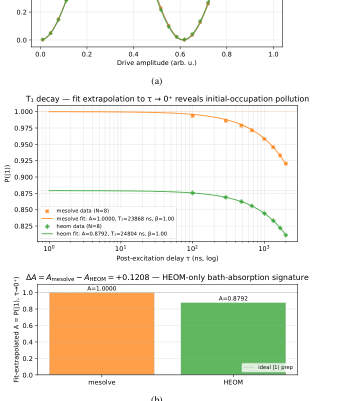 
Fig. 3. Rabi and T1 composite. (a) Rabi amplitude scan: HEOM pmax drops 2.17 % below mesolve while the π-amplitude shift is sub-resolution. (b) T1 decay: HEOM extrapolates to A = 0.879 at t = 0+, mesolve to A = 1.000; the β = 1 decay shape is identical to machine precision.

**Main problem.** Standard superconducting-qubit calibration frameworks use Markovian master equations that mask non-Markovian bath signatures, such as 1/f noise, by absorbing them into fit residuals.

**Main result.** Integrating an HEOM solver into the calibration loop allows for the recovery of physical revival envelopes and identifies bath-induced initial-state contamination that Markovian models elide.

**Method.** The study uses a pulse-level simulator to implement a multi-protocol calibration Directed Acyclic Graph (DAG) comparing a QuTiP 5.x HEOM solver against standard mesolve and sesolve backends.

**Summary.** This paper proposes a new approach to superconducting qubit calibration by integrating a non-Markovian Hierarchical Equations of Motion (HEOM) solver into the automated calibration loop. While standard Markovian methods hide 1/f noise signatures within fitting errors, the HEOM-in-loop approach successfully identifies physical revival envelopes and bath-induced initial state changes. The study demonstrates that this method significantly improves the accuracy of dephasing time (T2*) estimation. Ultimately, it turns bath structure into a quantifiable diagnostic rather than a hidden error source.

Detailed structure

**Model / system.** A simulated three-level transmon qubit subject to a non-Markovian 1/f (Burkend) bath with longitudinal coupling and a specific frequency-fluctuation spectral density.

**Key observables.** Ramsey T2* decay and revival envelopes, Rabi contrast (p_max), T1 decay shape (beta), and initial occupation (A).

**Important parameters / regimes.** 1/f noise parameters (A0, cutoffs), hierarchy depth (L=3), and 95% BCa bootstrap confidence intervals.

**Assumptions / limitations.** The study is performed on a pulse-level simulator without hardware validation; the bath is modeled using a specific Tier-1 espira-II decomposition.

**Figures summary.** The figures likely demonstrate the divergence between Markovian and HEOM fits in the Ramsey channel, specifically showing the recovery of the revival envelope and the discrepancy in T2* values.

**Paper structure.** The paper introduces the problem of Markovian elision, describes the HEOM-integrated calibration DAG, presents comparative results across Rabi, Ramsey, and T1 protocols, and concludes with the implications for diagnostic reporting.

**Why it may be interesting.** It provides a concrete methodology for using advanced open quantum system solvers (HEOM) to transform noise from a hidden nuisance into a diagnostic tool for characterizing non-Markovian environments in superconducting circuits.

Abstract

Closed-loop superconducting-qubit calibration has matured into DAG-orchestrated protocol chains, yet published frameworks treat the bath via a Markovian master equation or a phenomenological likelihood, absorbing bath structure into fit residuals instead of reporting it as a diagnostic. We integrate a QuTiP 5.x hierarchical-equations-of-motion (HEOM) solver driven by a Tier-1 1/f Burkard bath into a multi-protocol calibration DAG (Rabi -> {Ramsey || T1}) and benchmark it against sesolve and mesolve on a frozen platform in a pulse-level simulator (no hardware validation). The Ramsey channel carries the headline: the Markovian fit is censored by its exponential-family numerical ceiling, while HEOM recovers a physical revival envelope whose primary T2* separates from the Markovian reference by at least 13x at 95% independent-bootstrap confidence within the HEOM-feasible budget; the point-estimate ratio reaches >=28x on the 50-point primary-t1 grid and ~72x on the 30-point biexp-family tau_aw pivot at L=5. Rabi contrast falls 2.17% below mesolve on a noise-limited 30-point grid; the paired-bootstrap CI crosses zero, so this channel corroborates rather than independently establishes the non-Markovian signature. T1 decay shape matches across backends (beta=1.000), yet HEOM's initial occupation drops from 1.000 to 0.879 -- a bath-dressed contamination stable under a 16-point densification. The DAG adds 9.62 us average per-protocol scheduling overhead, no meaningful latency penalty at protocol granularity. HEOM-in-loop thereby changes what calibration reports: bath structure appears as a quantifiable residual rather than a hidden confound.

[↑ back to top](#top)

### [Sufficient support size of measurements for quantum estimation](http://arxiv.org/abs/2604.21323v1)

**Authors:** Koichi Yamagata  
**Type:** theory · **Category:** quantum information and computing · **PDF:** <https://arxiv.org/pdf/2604.21323v1>  
**Analysis basis:** full PDF text, analyzed in chunks
**Topic relevance:** 🔥 `quantum measurements` **4/5** · `dissipative systems` **2/5** · `methods for driven-dissipative` **2/5**

📷 Fig 1

 
Low-resolution page preview, page 2

📷 Fig 2

 
Low-resolution page preview, page 3

📷 Fig 3

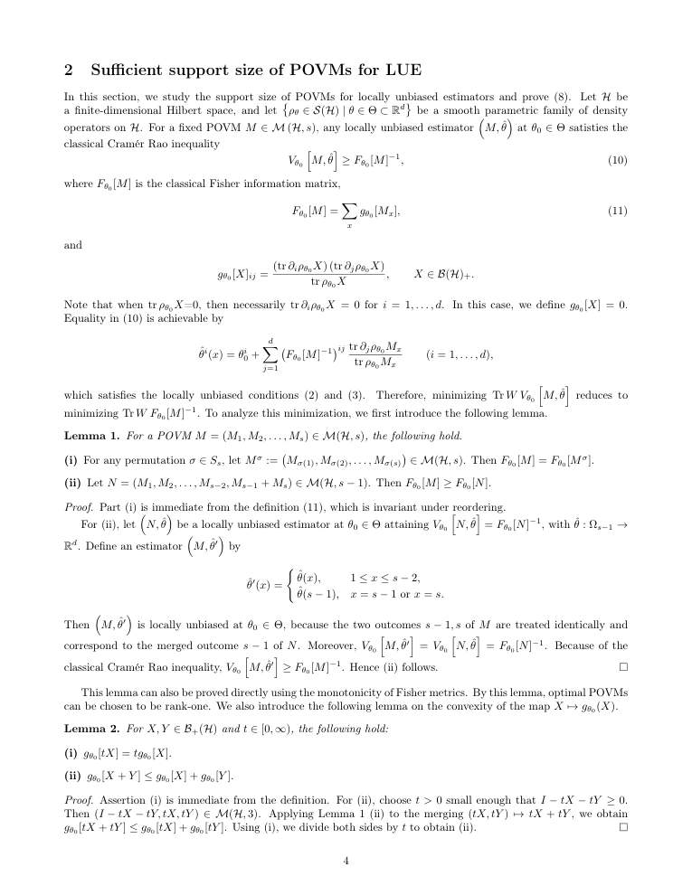 
Low-resolution page preview, page 4

📷 Fig 4

 
Low-resolution page preview, page 5

📷 Fig 5

 
Low-resolution page preview, page 6

📷 Fig 6

 
Low-resolution page preview, page 7

📷 Fig 7

 
Low-resolution page preview, page 8

📷 Fig 8

 
Low-resolution page preview, page 9

**Main problem.** The search for optimal quantum measurements (POVMs) in parameter estimation is difficult because the space of possible measurements is potentially infinite due to an unbounded number of outcomes.

**Main result.** The paper establishes explicit, finite upper bounds on the number of POVM outcomes required to achieve optimal performance in both locally unbiased and Bayesian estimation, proving that optimal measurements can be chosen as rank-one operators.

**Method.** The author uses a convex-analytic approach, extending Fujiwara's method and utilizing the concept of 'sufficient subspaces' and 'sufficient subalgebras' to reduce the optimization dimensionality.

**Summary.** This paper addresses the complexity of finding optimal quantum measurements for parameter estimation. It proves that one does not need to search through an infinite space of measurements, as an optimal POVM can always be found with a finite, bounded number of outcomes. Specifically, it provides tighter bounds on the required number of outcomes based on the dimension of the underlying Hilbert space and the structure of the parameter model. These results significantly reduce the computational search space for numerical optimization in quantum metrology.

Detailed structure

**Model / system.** A d-parameter family of density operators acting on a finite-dimensional Hilbert space.

**Key observables.** Classical Fisher Information Matrix (FIM) and the average weighted trace of the Mean Squared Error (MSE).

**Important parameters / regimes.** The dimension of the Hilbert space (dim H), the number of parameters (d), and the dimension of the Hermitian part of the sufficient subspace (dim Ah).

**Assumptions / limitations.** The density operator family is assumed to be smooth for local estimation; the weight matrix is real and positive definite; the Hilbert space is finite-dimensional.

**Paper structure.** The paper introduces the optimization problem, defines the local and Bayesian estimation settings, introduces sufficient subspaces, provides the support size bounds for both settings, analyzes the reduction via real subalgebras, and concludes with a qubit example.

**Why it may be interesting.** This provides a theoretical justification for using finite-dimensional numerical optimization in quantum metrology, which is essential for designing optimal sensing protocols in quantum optics and open quantum systems.

Abstract

In quantum estimation for a $d$-parameter family of density operators on a finite-dimensional Hilbert space $\mathcal{H}$, an estimator is specified by a pair $\left(M,\hatθ\right)$, where $M$ is a POVM with a finite outcome set $Ω$ and $\hatθ:Ω\to\mathbb{R}^{d}$ is a classical estimator map. Since the number of outcomes $\left|Ω\right|$ is a priori unbounded, the space of admissible POVMs is vast, which makes the search for optimal estimators difficult. In this paper, for the minimization of the weighted trace of the mean squared error among locally unbiased estimators, we prove that it suffices to consider POVMs with at most $\left({\rm dim}\,\mathcal{H}\right)^{2}+d(d+1)/2-1$ outcomes, and that an optimal measurement can be chosen to be rank-one. For the minimization of the average weighted trace of the mean squared error in Bayesian estimation, we show that it suffices to consider POVMs with at most $\left( {\rm dim}\, \mathcal{H}\right)^{2}$outcomes, and again an optimal POVM can be taken to be rank-one. Furthermore, when the model admits a real sufficient subalgebra, we show that the $\left( {\rm dim}\, \mathcal{H} \right)^{2}$ term in the above support-size bounds can be reduced in both the locally unbiased and Bayesian settings. These bounds substantially reduce the search space for optimal measurements and justify restricting numerical optimization to rank-one POVMs with finitely many outcomes.

[↑ back to top](#top)

### [Qubit-efficient and gate-efficient encodings of graph partitioning problems for quantum optimization](http://arxiv.org/abs/2604.21123v1)

**Authors:** Tristan Zaborniak, Prashanti Priya Angara, Vikram Khipple Mulligan, Hausi Müller, Ulrike Stege  
**Type:** both · **Category:** quantum information and computing · **PDF:** <https://arxiv.org/pdf/2604.21123v1>  
**Analysis basis:** full PDF text, analyzed in chunks
**Topic relevance:** 🔥 `QC/QI experiment` **4/5**

📷 Fig 1

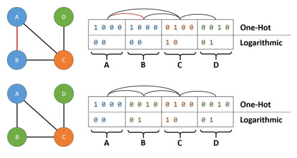 
Fig. 1: Small example graph colored improperly (upper row, violating edge colored red) and properly (bottom row). The tables contain bitstring assignments to each vertex under the one-hot and logarithmic encodings. Note that with 4 (|V |) vertices, 4 (|V |) qubits are required per vertex for one-hot encoding, and 2 (⌈log2 |V |⌉) qubits are required for logarithmic encoding. While the bitstrings are colored for visualization purposes, they do not refer to a particular color.

📷 Fig 2

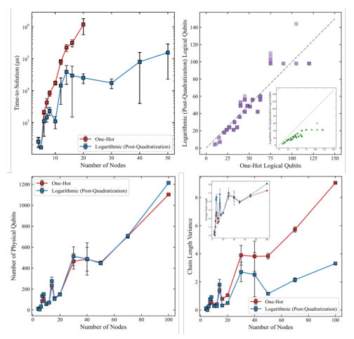 
Fig. 2: Upper left: TTS as a function of |V |. Upper right: Post- quadratization logical qubits per encoding; inset: pre-quadratization. Lower left: Physical qubits after minor embedding. Lower right: Chain length variance; inset: average chain length.

**Main problem.** Efficiently encoding graph partitioning problems, such as minimum graph coloring, for quantum optimization to reduce the qubit and gate overhead required on near-term quantum hardware.

**Main result.** The proposed logarithmic encoding achieves the information-theoretic minimum of qubits per vertex and significantly reduces two-qupi gate counts, leading to a 1-2 order of magnitude improvement in time-to-solution on a quantum annealer.

**Method.** A novel higher-order unconstrained binary optimization (HUBO) encoding using a lexicographic penalty system to minimize partition count, combined with Rosenberg quadratization to reduce terms to QUBO.

**Summary.** This paper presents a new way to map graph partitioning problems onto quantum hardware using significantly fewer qubits and gates. By using a logarithmic encoding instead of the traditional one-hot method, the authors reduce the resource requirements for problems like graph coloring. They introduce a clever penalty system that allows the quantum computer to find the minimum number of colors without extra variables. Experimental tests on a D-Wave quantum annealer show that this method drastically improves the speed and quality of solutions as problem sizes grow.

Detailed structure

**Model / system.** The study utilizes the D-Wave Advantage 2_1.11 quantum annealer (superconducting flux qubits on a Zephyr graph) and compares one-hot encoding against a new logarithmic encoding for label-symmetric graph partitioning problems.

**Key observables.** Time-to-solution (TTS), logical and physical qubit counts, CNOT gate counts, and chain length variance.

**Important parameters / regimes.** Number of vertices (|V|), number of edges (|E|), number of possible labels (k), and penalty coefficients for feasibility and optimality.

**Assumptions / limitations.** The encoding assumes the problem class is label-symmetric and pairwise-decomposable; the derived penalty bounds are sufficient but potentially conservative.

**Figures summary.** Figure 1 illustrates encoding differences; Figure 2 shows TTS increasing with graph size, logical qubit counts (with an inset for pre-quadratization), physical qubit counts after embedding, and chain length variance.

**Paper structure.** The paper introduces the problem and encoding types, presents the mathematical construction and lexicographic penalty system, provides proofs for penalty coefficient sufficiency, performs complexity and gate count analysis, and concludes with benchmarking on a quantum annealer.

Abstract

We introduce a qubit- and gate-efficient higher-order unconstrained binary optimization (HUBO) encoding for graph partitioning problems requiring label-count minimization. This widely applicable class of problems includes minimum graph coloring, minimum $k$-cut, and community detection. To the best of our knowledge, this is the first work to address the optimization versions of these problems in a quantum setting, rather than only their decision counterparts. Our construction encodes each $k$-valued vertex variable using $\lceil \log_2 k \rceil$ bits and employs a novel lexicographic penalty system that implicitly minimizes partition count without requiring dedicated indicator variables. We derive provably sufficient conditions on all penalty coefficients, including those arising from Rosenberg quadratization, guaranteeing feasibility and optimality of the lowest-energy solution. Analogous conditions are derived for a one-hot encoding to enable controlled comparison. We also show that our encoding reduces two-qubit gate count per QAOA layer from $Θ(|V||k|^2 + |E||k|)$ for the one-hot encoding to $Θ(|E| \cdot |k| \lceil\log_2 |k|\rceil)$. Benchmarking on a quantum annealer demonstrates that our logarithmic encoding significantly improves solution quality and time-to-solution for minimum graph coloring relative to one-hot encoding, with greater advantage as problem size increases.

[↑ back to top](#top)

### [Vertical Shuttling Protocols for Trapped Ions in Multi-Rail, Multi-Zone Surface Ion Trap Architectures](http://arxiv.org/abs/2604.21350v1)

**Authors:** Qirat Iqbal, Altaf H. Nizamani  
**Type:** both · **Category:** other · **PDF:** <https://arxiv.org/pdf/2604.21350v1>  
**Analysis basis:** full PDF text, analyzed in chunks
**Topic relevance:** 🔥 `QC/QI experiment` **4/5**

📷 Fig 1

 
Figure 1. Step by step multi-rail trap design (a) Single region trap with RF electrodes of width ‘b=c’ and ground (control) electrode ‘a’ in between, (b) Two trapping region (c) Set of segmented DC electrodes to control ion in z-direction (d) single trapping zone using RF and segemented DC electrodes (e) Dual trapping zones using multi rf electordes (f) Scalable four trapping zones with RF and control electrodes.

📷 Fig 2

 
Figure 2. (a) Top view of the optimized multi region trap design. (b) Illustrates the pseudo potential along with the local minima generated due to applied VRF to the RF electrodes

📷 Fig 3

 
Figure 3. Behavior of the trapping regions when an RF voltage 𝑽𝐑𝐅is applied to the central electrode. The red circle indicates the initial trapping region where ions can be confined. (a) Variation in the heights of two trapping regions as a function of the applied 𝑽𝐑𝐅 . (b) single trapping region illustrating the vertical displacement of the ion position achieved by gradually

📷 Fig 4

 
Figure 4. Variation in Trap parameters changed during shuttling in time ‘t’. (a) Change of voltages on the central electrode ‘VCE’. (b) Deviation in ion‘s position (c) Change of radial secular frequency from 1.55MHz to 2.4MHz.

📷 Fig 5

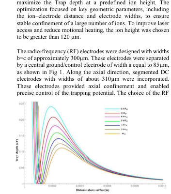 
Figure 5. Plot shows significant increase in trap depth upon decrease in ion height. The Ion height has been changed by applying VRF on the central electrode.

📷 Fig 6

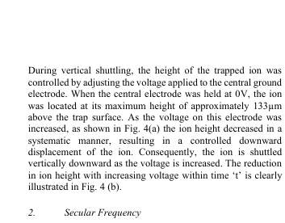 
Fig. 5 (c) shows a clear increase in the radial frequency as the ion is vertically shuttled over the time interval 𝑡. This increase is attributed to the enhanced confinement arising from the applied DC electrode potential. Despite this change, the secular frequency remains within an acceptable operating range and does not introduce any adverse effects on the trapping performance or experimental stability.

📷 Fig 7

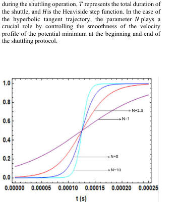 
Figure 6. Variation in voltages applied on central electrode depends strongly on the N parameter. Smaller N leads to linear trajectory.

📷 Fig 8

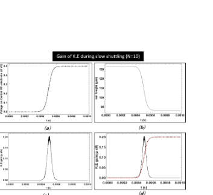 
Figure 7. Ion shuttling profile with 1ms time scale and N=10. (a) when voltage was increased from 0V to 100V on central RF electrode during 1ms (b) the ion is decreased from 134µm to 86µm, (c) the gain of K.E as the ion will experience a kick during shuttling so the gain is maximum (d) overlap of (a and c) show sharp rise of energy gain at voltage change duration.

📷 Fig 9

 
Figure 8. The maximum motional excitation induced during transport. Zoomed in parts show secular frequencies during shuttling while there is a gain in Kinetic energy of ion. (a) Radial frequency at ~2.2MHz (b) axial frequency at 300kHz (c) Total secular frequency with beats show axial while fluctuations refer to the radial frequency.

📷 Fig 10

 
Figure 9. Comparison of gain in kinetic energy as a function of time ‘t’ with different values of N parameters. It could be observed that N=2.5 gives less gain in motional energy.

**Main problem.** Optimizing vertical ion-shuttling protocols in multi-rail surface ion traps to minimize motional energy gain from both the transport process and anomalous heating.

**Main result.** The authors identified an optimal hyperbolic tangent (tanh) voltage ramp with a smoothness parameter N=2.5, demonstrating that vertical displacement of 86 um can be achieved with motional excitation limited to fewer than 8 quanta.

**Method.** The study uses electrostatic modeling with a gapless-plane approximation and compares different voltage trajectories (linear, sinusoidal, and tanh) to minimize kinetic energy gain and heating.

**Summary.** This paper presents an optimized method for vertically shuttling ions in a multi-zone surface trap. By using a specific hyperbolic tangent voltage ramp, the researchers found they could move ions vertically while keeping motional heating extremely low. The study balances the need for fast transport to avoid anomalous heating with the need for smooth movement to avoid kinetic energy gain. This protocol is crucial for maintaining the high-fidelity states required for quantum computing and sensing.

Detailed structure

**Model / system.** A microfabricated multi-rail, multi-zone surface-electrode ion trap featuring RF electrodes for radial confinement and segmented DC electrodes for axial confinement.

**Key observables.** Motional energy gain (mean motional quanta), kinetic energy gain, radial and axial secular frequencies, and anomalous heating rate.

**Important parameters / regimes.** Shuttling duration (0.45-0.5 ms), smoothness parameter N, ion-surface separation (86 to 134 um), and heating rate (3.1 quanta/ms).

**Assumptions / limitations.** Employs the gapless-plane approximation for electrode modeling and assumes anomalous heating scales as 1/h^4.

**Figures summary.** Figure 1 shows the trap design; Figure 2 illustrates the pseudopotential and local minima; Figure 3 shows the shift in trapping potential; Figure 7 illustrates the voltage ramp and ion displacement; Figure 8 shows trap parameter variations; Figure 9 compares kinetic energy gain for different N values.

**Paper structure.** The paper introduces the multi-rail trap architecture, describes the electrostatic and pseudopotential modeling, evaluates different shuttling trajectories, analyzes the impact of the smoothness parameter N and duration T, and concludes with an optimized protocol for quantum sensing.

**Why it may be interesting.** This work is highly relevant for researchers in quantum information and AMO physics as it provides a practical framework for high-fidelity control and transport of ions, which is essential for scalable quantum computing and sensing architectures.

Abstract

We investigate optimized vertical ion-shuttling protocols for trapped-ion applications across a range of ion-trap experiments, including three-dimensional gradient-measurement sensors, on-chip ion fluorescence collection and imaging, improved laser accessibility, and quantum information processing. In this work, we focus on minimizing motional energy gain during ion transport. Our findings indicate that anomalous heating becomes the dominant limiting factor only for shuttling durations exceeding $500~μ\mathrm{s}$, whereas the final motional excitation is strongly dependent on the selected transport protocol. Using a recently measured heating rate of $(3.1 \pm 0.35)$ quanta/ms at an ion--surface separation of $134 \pm 1.5~μ\mathrm{m}$, we demonstrate that the motional excitation can be restricted to fewer than eight quanta when the ion is vertically displaced by $86~μ\mathrm{m}$ from its initial position. These results enable adiabatic shuttling within $0.5~\mathrm{ms}$, thereby meeting the operational requirements for high-fidelity quantum sensing and coherent control.

[↑ back to top](#top)

### [Birth, Death, and Replication at Surfaces: Universal Laws of Autocatalytic Dynamics](http://arxiv.org/abs/2604.21586v1)

**Authors:** Denis S. Grebenkov  
**Type:** theory · **Category:** statistical mechanics · **PDF:** <https://arxiv.org/pdf/2604.21586v1>  
**Analysis basis:** full PDF text, analyzed in chunks
**Topic relevance:** 🔥 `driven-dissipative phase transition` **3/5** · 🔥 `non-equilibrium universality` **3/5** · `dissipative systems` **2/5** · `non-equilibrium dynamics` **2/5**

📷 Fig 1

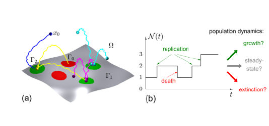 
FIG. 1. A schematic view of autocatalytic reactions on a sur- face partitioned into three subsets (here, M = 2): an absorb- ing region Γ0 (in red) that destroys particles via A+Γ0 →Γ0; an inert region Γ1 (in gray) that reflects particles back into the bulk; and a catalytic region Γ2 (in green) that replicates particles via a binary splitting A + Γ2 →2A + Γ2. Each of three subsets can be composed of multiple pieces. In the shown random realization, a single particle started from x0 diffuses towards the surface and then branches into two copies on Γ2; one of them reaches an absorbing region Γ0 and dis- appears, whereas the other produces two more offsprings on another piece of the catalytic...

📷 Fig 2

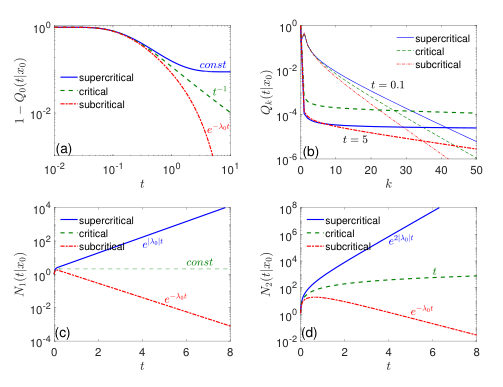 
FIG. 2. Time evolution of the population size N(t) for a diffusion-reaction system with diffusivity D = 1 in a hol- low cylinder of radii R = 0.2 and L = 1, with the outer perfectly absorbing surface (κ0 = ∞) and the inner au- tocatalytic surface with reactivity κ2. The starting point x0 is on the inner surface. Three regimes are shown for κ2 = 0.9 κc 2 (subcritical, dash-dotted line), κ2 = κc 2 (criti- cal, dashed line), and κ2 = 1.1 κc 2 (supercritical, solid line), with κc 2 = D/(R ln(L/R)) ≈3.11. Arbitrary units are used. (a) Probability 1 −Q0(t|x0) of having at least one particle at time t; (b) Distribution Qk(t|x0) at two times: t = 0.1 (thin lines) and t = 5 (thick lines); (c) Mean...

**Main problem.** Developing a unified theoretical framework to understand surface-mediated autocatalytic processes where replication and loss are triggered at interfaces.

**Main result.** The derivation of a nonlinear integral equation and an equivalent backward Fokker-Planck equation with nonlinear Robin-type boundary conditions, identifying three universal asymptotic regimes: subcritical, critical, and supercritical.

**Method.** A probabilistic approach using generating functions, renewal-type integral equations, and spectral analysis of the diffusion operator.

**Summary.** This paper provides a general theory for autocatalytic processes occurring at interfaces, such as enzyme activity or heterogeneous catalysis. By using a generating function approach, the author derives a backward Fokker-Planck equation with nonlinear boundary conditions. The study identifies three distinct regimes—subcritical, critical, and supercritical—based on the competition between surface absorption and branching. These results offer a unified way to predict whether surface activity leads to population extinction or exponential growth.

Detailed structure

**Model / system.** A diffusive population of particles in a bulk medium interacting with a partitioned boundary consisting of absorbing, catalytic (branching), and inert regions.

**Key observables.** Generating function G_s(t|x_0), probability distribution of population size Q_k(t|x_0), mean population size N_1(t|x_0), and survival probability.

**Important parameters / regimes.** Surface reactivities (kappa_m), diffusion coefficient (D), and the principal eigenvalue (lambda_0) which determines the dynamical regime.

**Assumptions / limitations.** Particles undergo ordinary diffusion with a constant diffusivity; the drift vector and diffusion matrix are time-independent and smooth.

**Figures summary.** Figure 1 shows a schematic of a partitioned surface with different reaction zones; Figure 2 illustrates population dynamics (survival probability, distribution, and moments) in a hollow cylinder across subcritical, critical, and supercritical regimes.

**Paper structure.** The paper introduces the problem of surface-mediated autocatalysis, develops a mathematical framework using generating functions and renewal equations, transforms these into a PDE description with nonlinear boundary conditions, performs spectral analysis to identify asymptotic regimes, and validates the theory with numerical simulations in a cylindrical geometry.

**Why it may be interesting.** The framework for nonlinear boundary conditions and the transition between extinction and explosive growth is highly relevant to the study of open quantum systems and non-equilibrium dynamics where boundaries drive population-like changes in quantum states or quasiparticle numbers.

Abstract

Autocatalytic processes underlie diverse systems in which replication is triggered at interfaces, including heterogeneous catalysis on solid substrates, enzyme activity at membranes, viral infections, biofilm growth, and spatially structured ecosystems. In a typical scenario, particles move in a bulk medium and interact with surface regions, where they may either disappear or reproduce through branching, splitting or fission. Here, we develop a general theoretical framework to understand such surface-mediated autocatalytic processes. We show that the interplay between loss and replication at surfaces gives rise to rich population dynamics. For this purpose, we derive a renewal-type nonlinear integral equation for the generating function of the population size, providing access to its full probability distribution and statistical moments. We further establish an equivalent description in terms of a Fokker-Planck equation with nonlinear Robin-type boundary conditions that encode surface reactions. Our results identify distinct dynamical regimes and universal scaling laws, and provide a unified framework to predict when surface activity promotes extinction or explosive growth. These findings offer quantitative insight into catalytic efficiency, metabolic regulation, and population persistence in spatially heterogeneous environments.

[↑ back to top](#top)

### [Dynamical mean-field theory for dense spin systems at finite temperature](http://arxiv.org/abs/2604.21563v1)

**Authors:** Przemysław Bieniek, Timo Gräßer, Götz S. Uhrig  
**Type:** theory · **Category:** numerical methods · **PDF:** <https://arxiv.org/pdf/2604.21563v1>  
**Analysis basis:** full PDF text, analyzed in chunks
**Topic relevance:** 🔥 `analog quantum simulation` **3/5** · `Keldysh / 2PI / non-Gaussian methods` **2/5** · `exotic spin models in light-matter` **2/5** · `non-equilibrium dynamics` **2/5** · `entanglement & information structure` **1/5**

📷 Fig 1

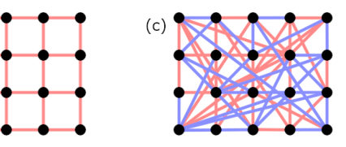 
Figure 1: Three types of systems used for benchmarking: nearest-neighbor ferro- magnet (a) and antiferromagnet (b) on a 2D square lattice with periodic boundary conditions and (c) infinite-range system with random couplings (number of sites not representative of the system used in numerics). Black dots represent lattice sites and the blue (red) lines negative (positive) couplings which are ferromagnetic (antifer- romagnetic) in character.

📷 Fig 2

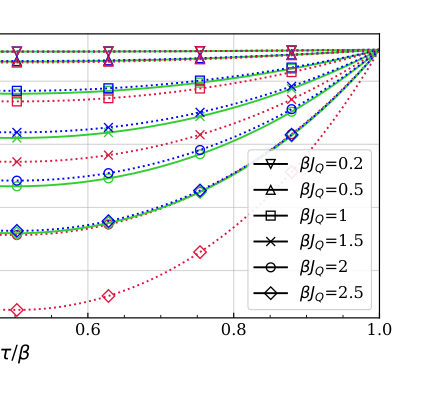 
Figure 2: Comparison of correlations obtained in spinDMFT (green) and in a ferro- magnet (blue) and antiferromagnet (red) at different temperatures, which are de- picted by different symbols. The considered finite-size systems are a 2D square 4×5 lattice with nearest-neighbor negative/positive couplings, see Fig. 1. Note that there is an incidental overlap of the spinDMFT curve at βJQ = 2.5 and the AFM curve at βJQ = 2. The error bars for spinDMFT and finite-size data are smaller than the width of the curves.

📷 Fig 3

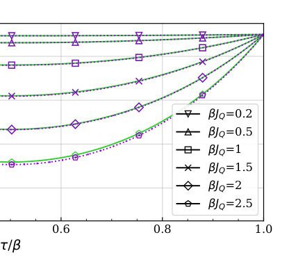 
Figure 3: Comparison of correlations obtained in spinDMFT (green) and in an infinite-range system with random couplings (purple) at different temperatures (de- picted by different symbols). The considered finite-size system is 12 spins coupled in a random fashion, the curve is obtained by averaging over 1000 coupling configura- tions. The error bars resulting from the averaging and the spinDMFT error bars are smaller than the width of the curves.

📷 Fig 4

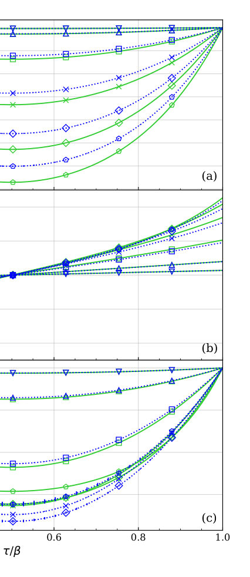 
Figure 4: Comparison of correlations obtained in spinDMFT (green) and in a ferro- magnetic system (blue) at different temperatures (signified by the symbols) in the presence of an external magnetic field (Bz/JQ = 0.5). We depict the x x correlation in (a), x y correlation in (b) and zz correlation in (c). Note the very different y-axis scales used for (a) and (c). The considered finite-size system is a 2D square 4 × 5 lattice with nearest-neighbor negative couplings. In (c), note the incidental overlap of the spinDMFT curves at βJQ = 1.5, 2 and the FM curve at βJQ = 2.5. The error bars resulting from time discretization and averaging over the distribution of mean fields for spinDMFT are...

📷 Fig 5

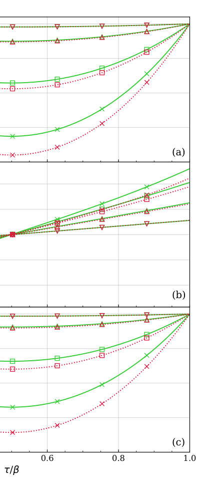 
Figure 5: Comparison of correlations obtained in spinDMFT (green) and in an an- tiferromagnetic system (red) at different temperatures (signified by the symbols) in the presence of an external magnetic field (Bz/JQ = 0.5). We depict the x x correla- tion in (a), x y correlation in (b) and zz correlation in (c). The considered finite-size system is a 2D square 4 × 5 lattice with nearest-neighbor positive couplings. The errorbars for spinDMFT and the finite-size data are smaller than the width of the curves.

📷 Fig 6

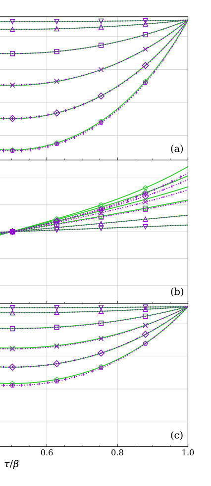 
Figure 6: Comparison of correlations obtained in spinDMFT (green) and in an infinite-range system with random couplings (purple) at different temperatures (sig- nified by the symbols) in the presence of an external magnetic field (Bz/JQ = 0.5). We depict the x x correlation in (a), x y correlation in (b) and zz correlation in (c). The considered finite-size system is 12 spins coupled in a random fashion, the curve was obtained by averaging over 250 coupling configurations. The spinDMFT error bars are smaller than the width of the curves. The finite-size data has noticeable errors due to the averaging over the Gaussian distributed couplings.

📷 Fig 7

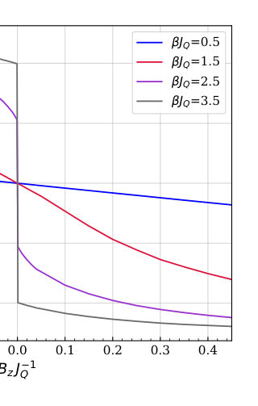 
Figure 7: Dependence of the spin expectation value on the magnetic field in ferro- magnetic spinDMFT at a range of temperatures.

📷 Fig 8

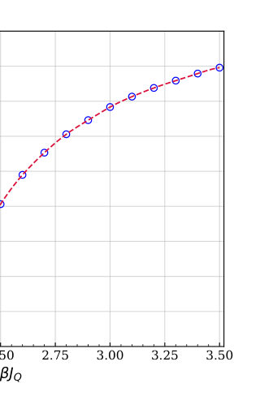 
Figure 8: Dependence of the spin expectation value without an external magnetic field on temperature (blue points) and a numerically obtained spline function fitted to the points(red line).

📷 Fig 9

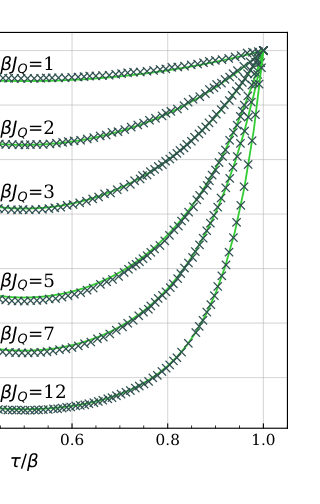 
Figure 9: Comparison of correlations obtained in spinDMFT (green line) and in a spin glass mean-field theory developed in Ref. [30] (gray crosses) at different tem- peratures (specified above the curves). In the spin glass data, there are errors due to the graphical extraction of the published data; they are roughly of the size of the crosses. The error bars of spinDMFT are smaller than the line widths.

**Main problem.** Extending the spinDMFT method from infinite temperature to finite temperatures to compute spin dynamics and thermodynamic quantities in dense spin systems.

**Main result.** The authors successfully developed a finite-temperature spinDMFT framework that accurately captures ferromagnetic phase transitions and spin correlations in random-coupling systems, though it struggles with antiferromagnetic order.

**Method.** A dynamical mean-field theory approach using a single-site approximation with a time-dependent, Gaussian-distributed mean field, implemented via Monte Carlo sampling and imaginary-time evolution.

**Summary.** This paper presents an extension of the spinDMFT method to finite temperatures, allowing for the study of spin dynamics and thermodynamics in dense spin systems. By approximating the environment as a time-dependent Gaussian mean field, the authors bypass the exponential scaling of the Hilbert space. The method shows excellent agreement with exact results for paramagnetic and ferromagnetic phases and reproduces known spin glass correlations. However, the current implementation faces challenges in capturing antiferromagnetic order due to the lack of broken translational symmetry in the single-site approximation.

Detailed structure

**Model / system.** Isotropic Heisenberg model for S=1/2 spins in the limit of large coordination number (dense systems), including ferromagnetic, antiferromagnetic, and random-coupling (spin glass-like) configurations.

**Key observables.** Spin expectation values, time-ordered imaginary-time spin correlations, and spin autocorrelations.

**Important parameters / regimes.** Inverse temperature (beta), coupling constants (JL, JQ), external magnetic field (B), and coordination number (z).

**Assumptions / limitations.** Assumes the environment field is Gaussian-distributed (justified by the large coordination number limit) and that the system is translationally invariant or homogeneous.

**Figures summary.** Schematics of benchmark systems; comparison of spinDMFT correlations against finite-size systems for FM and AFM models; magnetization curves and temperature dependence of spin expectation values; and validation against established spin glass theory.

**Paper structure.** The paper introduces the spinDMFT extension, derives the finite-temperature framework using the cavity method and Trotterization, details the numerical implementation via Monte Carlo and imaginary-time evolution, and concludes with benchmarking against finite-size systems and spin glass models.

**Why it may be interesting.** The development of a scalable method to study many-body dynamics and phase transitions in dense, long-range interacting systems is highly relevant to understanding the dynamics of large-scale quantum simulators and many-body spin systems.

Abstract

In recent years, a method for computing spin dynamics at infinite temperature (spinDMFT) was developed. It utilizes the ideas of dynamical mean-field theory for fermions: single-site approximation and a self-consistency condition to approximate time-dependent spin correlations. In this work, we develop a crucial extension of the method to systems at finite temperature, able to compute imaginary-time correlations and thermodynamical quantities. We benchmark the method by comparison to results in finite-size systems, obtaining very good agreement with correlations in a random-coupling system, good agreement for a ferromagnetic system and large discrepancies in the case of an antiferromagnet. We note the appearance of ferromagnetic order in the method. We discuss possible extensions and potential applications of the approach.

[↑ back to top](#top)

### [Dean-Kawasaki fluctuating hydrodynamics for backscattering hard rods](http://arxiv.org/abs/2604.21553v1)

**Authors:** Mrinal Jyoti Powdel  
**Type:** theory · **Category:** statistical mechanics · **PDF:** <https://arxiv.org/pdf/2604.21553v1>  
**Analysis basis:** full PDF text, analyzed in chunks
**Topic relevance:** 🔥 `non-equilibrium dynamics` **3/5** · `Keldysh / 2PI / non-Gaussian methods` **2/5** · `dissipative systems` **2/5** · `non-equilibrium universality` **2/5**

📷 Fig 1

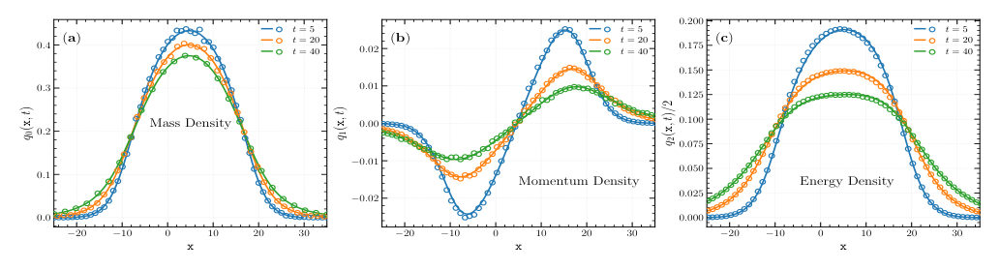 
Figure 1: Mass density, q0(x, t), momentum density, q1(x, t) and energy density, q2(x, t)/2 of a system of backscattering hard rods of length a = 1 at different times. The solid lines represents theory and the circles represent the results from molecular dynamics. Here, the initial positions and velocities are drawn from a gaussian distribution (6) with σx = 5 and T = 1. The numerical results have been obtained after averaging over 5 × 106 realizations.

📷 Fig 2

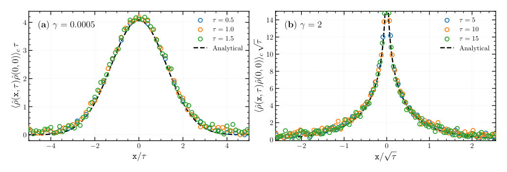 
Figure 2: Unequal space-time correlation of mass densities for a hard rod system consisting of N = 400 backscattering hard rods each of length a = 0.01 for a) γ = 0.0005 and b) γ = 2. Here, we have set x′ = 0, t′ = 0. The black dashed lines represent theory (Eq. (23)) and the colored circles represent results from molecular dynamics for different values of τ = t −t′, where we have also subtracted off fluctuations due to finite size effects. Initially, all the hard rods are distributed uniformly in the region [−10, 10] and the velocities were drawn from a gaussian distribution with temperature or variance, T = 1. The boundary conditions imposed are periodic. On the left, we see that for τ &lt;&lt;...

**Main problem.** Investigating how an integrability-breaking perturbation, specifically velocity-flipping (backscattering), affects the transport properties and the decay of conserved quantities in a one-dimensional system of hard rods.

**Main result.** The study demonstrates a transition in transport properties where the system exhibits ballistic spreading of density correlations at short time scales (t << 1/gamma) and transitions to diffusive spreading at long time scales (t >> 1/gamma).

**Method.** The authors employ the Dean-Kawasaki fluctuating hydrodynamics framework, mapping the backscattering hard rods to non-interacting run-and-tumble particles, and validate the analytical results using molecular dynamics simulations.

**Summary.** This paper explores how breaking the integrability of a 1D hard-rod system via velocity-flipping changes its transport dynamics. By using the Dean-Kawasaki approach, the authors show that the system undergoes a fundamental change in how correlations spread, moving from ballistic to diffusive behavior. This provides a clear example of how a single parameter, the flipping rate, can control the transition between different hydrodynamic regimes. The results are supported by both rigorous mathematical derivation and numerical simulations.

Detailed structure

**Model / system.** A one-dimensional system of N backscattering hard rods of length 'a' that undergo two-body elastic collisions and experience random velocity flips at a rate gamma.

**Key observables.** Phase space densities (PSDs), mass density, momentum density, energy density, and two-time density-density correlations.

**Important parameters / regimes.** Flipping rate (gamma), rod length (a), temperature (T), and the time regimes relative to the inverse flipping rate (t << 1/gamma and t >> 1/gamma).

**Assumptions / limitations.** The flipping process is assumed to be a Poisson process, the system is analyzed near a homogeneous stationary state, and the derivation assumes a limit of small time intervals (dt -> 0).

**Figures summary.** Figure 1 shows the evolution of mass, momentum, and energy densities with theoretical predictions matching MD simulations. Figure 2 compares space-time correlations for low and high backscattering rates, showing the transition from ballistic to diffusive scaling.

**Paper structure.** The paper introduces the backscattering hard rod model, maps it to run-and-tumble particles, derives the Dean-Kawasaki hydrodynamic equations, provides analytical solutions for density correlations, and validates the theory via molecular dynamics simulations and appendices covering bounded and infinite systems.

Abstract

We study a system of backscattering hard rods in one dimension. Contrary to the usual ballistic hard rods, these hard rods flip the sign of their velocities with a rate $γ$. This leads to the decay of the odd moments of velocity while preserving the even moments: the number of conserved quantities in the system becomes half. The introduction of the flipping rate, $γ$, is a kind of integrability-breaking perturbation. One expects a change in the transport properties in the system due to the integrability breaking. We show using a Dean-Kawasaki fluctuating hydrodynamic formulation that for $t \gg 1/γ$, the two-time density density correlation spreads in a diffusive manner, and for $t \ll 1/γ$, the correlation spreads ballistically.

[↑ back to top](#top)

### [A rigorous quasipolynomial-time classical algorithm for SYK thermal expectations](http://arxiv.org/abs/2604.21089v1)

**Authors:** Alexander Zlokapa  
**Type:** theory · **Category:** disordered systems and neural networks · **PDF:** <https://arxiv.org/pdf/2604.21089v1>  
**Analysis basis:** full PDF text, analyzed in chunks
**Topic relevance:** 🔥 `entanglement & information structure` **3/5** · `Keldysh / 2PI / non-Gaussian methods` **2/5** · `non-equilibrium dynamics` **2/5**

📷 Fig 1

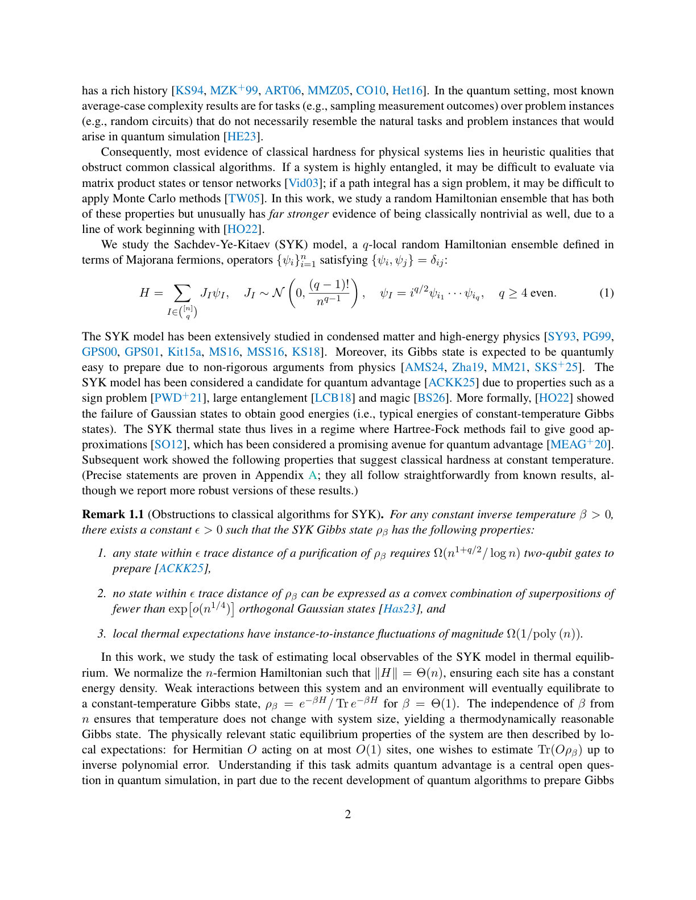 
Low-resolution page preview, page 2

📷 Fig 2

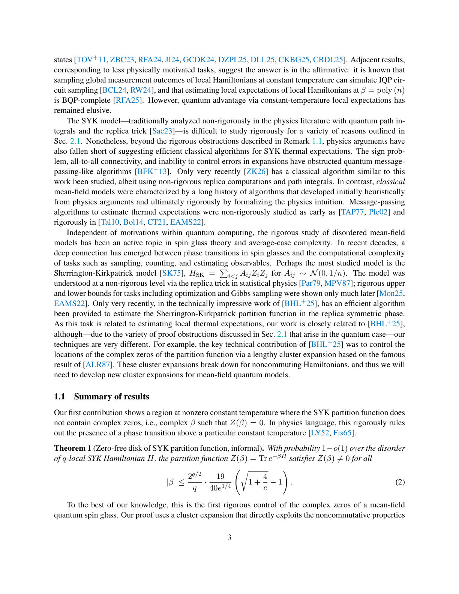 
Low-resolution page preview, page 3

📷 Fig 3

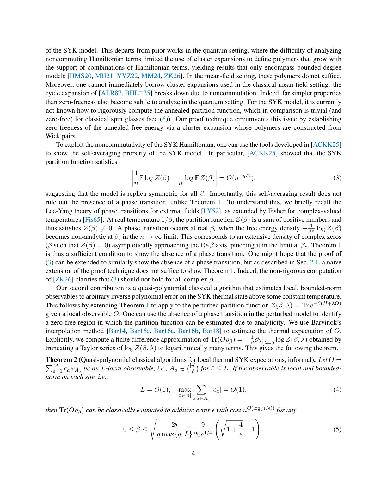 
Low-resolution page preview, page 4

📷 Fig 4

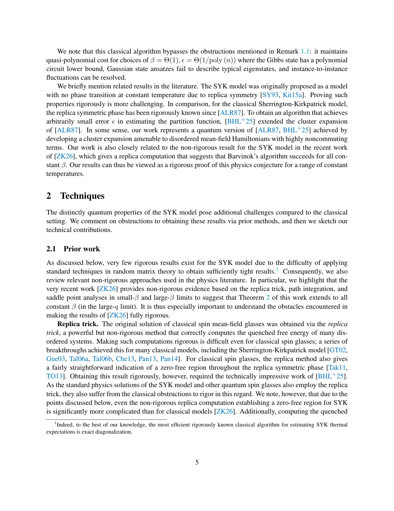 
Low-resolution page preview, page 5

📷 Fig 5

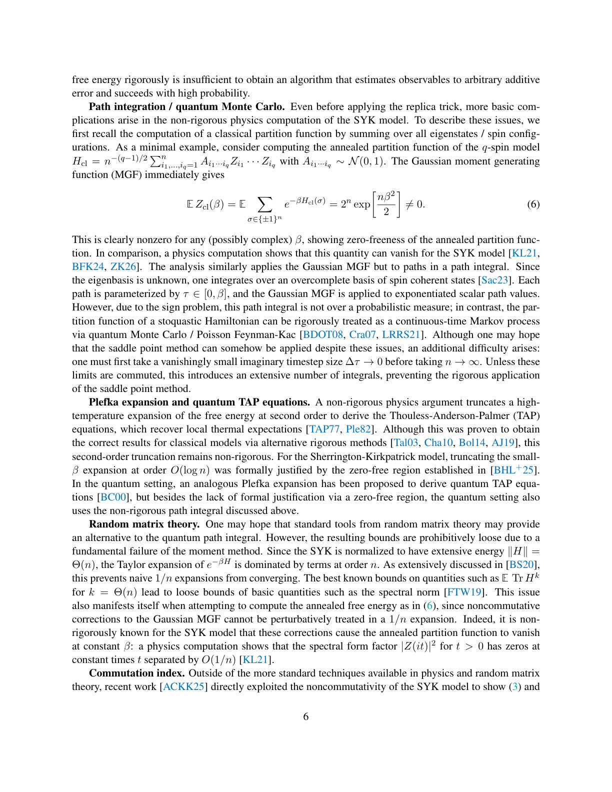 
Low-resolution page preview, page 6

📷 Fig 6

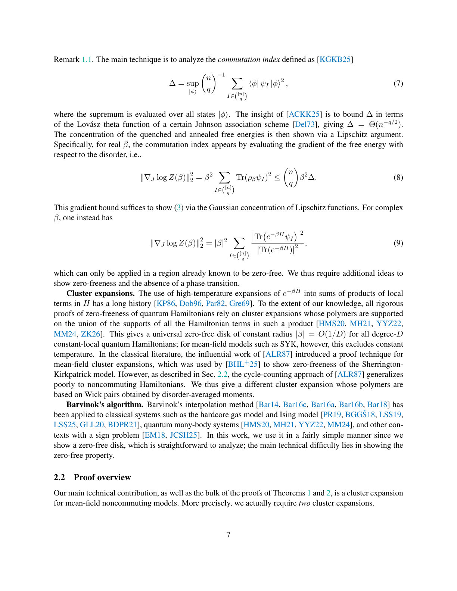 
Low-resolution page preview, page 7

📷 Fig 7

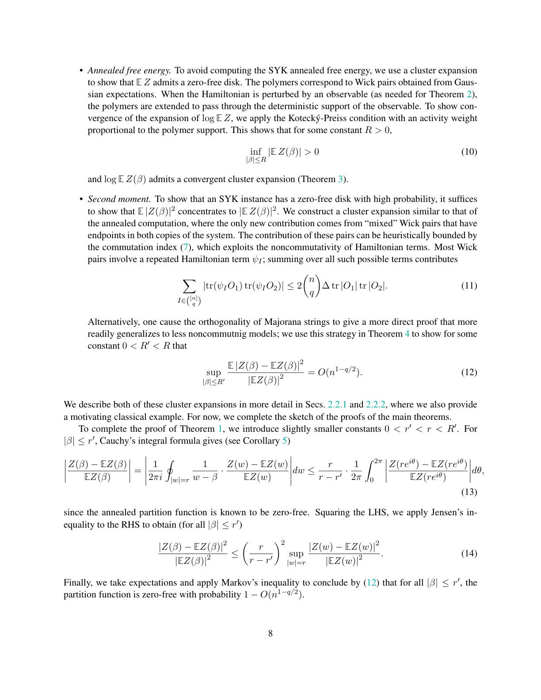 
Low-resolution page preview, page 8

📷 Fig 8

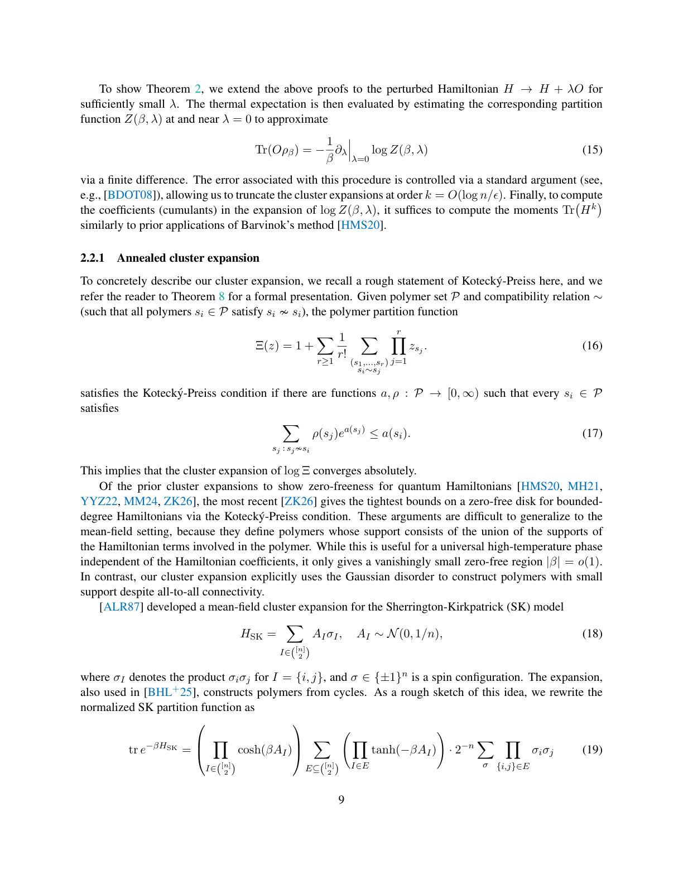 
Low-resolution page preview, page 9

📷 Fig 9

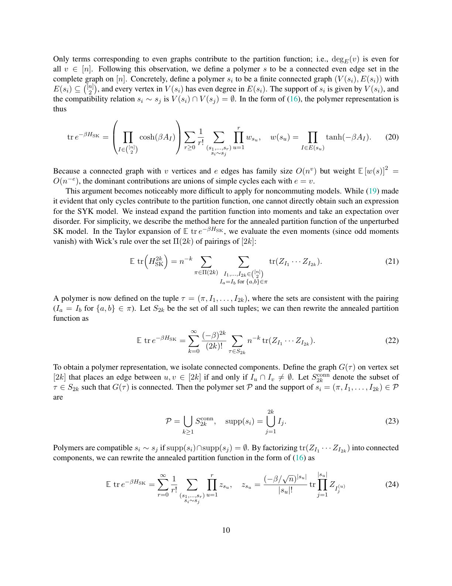 
Low-resolution page preview, page 10

📷 Fig 10

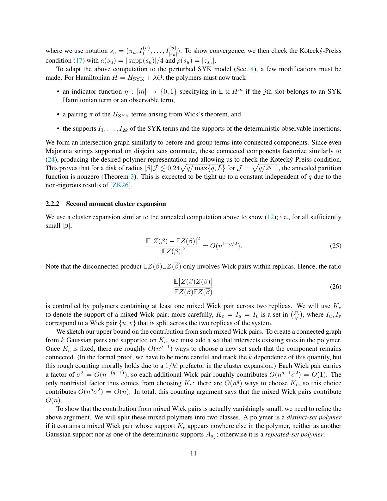 
Low-resolution page preview, page 11

**Main problem.** Determining whether estimating local thermal expectations in the Sachdev-Ye-Kitaev (SYK) model at constant temperature allows for quantum advantage, and developing a rigorous classical algorithm to perform this estimation.

**Main result.** The paper provides a rigorous proof of a quasipolunomial-time classical algorithm that estimates SYK local thermal expectations at sufficiently high constant temperatures.

**Method.** The author introduces a new Wick-pair cluster expansion for non-commuting mean-field systems and utilizes Barvinok's interpolation method to approximate the partition function.

**Summary.** This paper presents a rigorous classical algorithm capable of estimating local thermal expectations in the SYK model in quasipolynomial time. By developing a new cluster expansion based on Wick pairs, the author overcomes the mathematical challenges posed by the non-commutativity of the SYK Hamiltonian. The result establishes that at sufficiently high temperatures, the SYK model can be efficiently simulated classically. This provides important evidence regarding the limits of quantum advantage in disordered, highly entangled quantum systems.

Detailed structure

**Model / system.** The Sachdev-Ye-Kitaev (SYK) model, a $q$-local random Hamiltonian ensemble using Majorana fermions with Gaussian random couplings.

**Key observables.** Local thermal expectations of Hermitian operators (local observables) and the partition function.

**Important parameters / regimes.** Inverse temperature (beta), system size (n), interaction order (q), and error tolerance (epsilon).

**Assumptions / limitations.** The algorithm is restricted to the high-temperature regime (sufficiently large constant beta) and the large $n$ limit.

**Paper structure.** The paper defines the SYK model and the problem of thermal estimation, introduces a new Wick-pair cluster expansion, establishes a zero-free disk for the partition function in the complex beta plane, proves concentration of the quenched partition function around its mean, and concludes with the derivation of the quasipolynomial-time algorithm.

**Why it may be interesting.** This work is highly relevant for many-body dynamics as it provides a rigorous classical tool to simulate a model known for high entanglement and quantum chaos, potentially clarifying the boundaries of quantum advantage in disordered systems.

Abstract

Estimating local observables in Gibbs states is a central problem in quantum simulation. While this task is BQP-complete at asymptotically low temperatures, the possibility of quantum advantage at constant temperature remains open. The Sachdev-Ye-Kitaev (SYK) model is a natural candidate: at any constant temperature, its Gibbs states have polynomial quantum circuit complexity and are not described by Gaussian states. Rigorous analyses of the SYK model are difficult due to the failure of known techniques using random matrix theory, cluster expansions, and rigorous formulations of the quantum path integral and replica trick. Despite this, we give a rigorous proof of a quasipolynomial-time classical algorithm that estimates SYK local thermal expectations at sufficiently high constant temperature. Our result introduces a new Wick-pair cluster expansion that we expect to be broadly useful for disordered quantum many-body systems.

[↑ back to top](#top)

### [Novel dynamics for an inertial polar tracer in an active bath](http://arxiv.org/abs/2604.21762v1)

**Authors:** Jing-Bo Zeng, Ji-Hui Pei  
**Type:** theory · **Category:** statistical mechanics · **PDF:** <https://arxiv.org/pdf/2604.21762v1>  
**Analysis basis:** full PDF text, analyzed in chunks
**Topic relevance:** 🔥 `non-equilibrium dynamics` **3/5** · `Keldysh / 2PI / non-Gaussian methods` **2/5** · `dissipative systems` **2/5**

📷 Fig 1

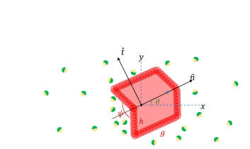 
FIG. 1. A chevron-shaped rigid tracer (shown in red) , composed of a collection of beads and immersed in an active bath, is characterized by its opening angle ϕ, length a, and width b. Each bead is coupled to ABPs via the WCA force.

📷 Fig 2

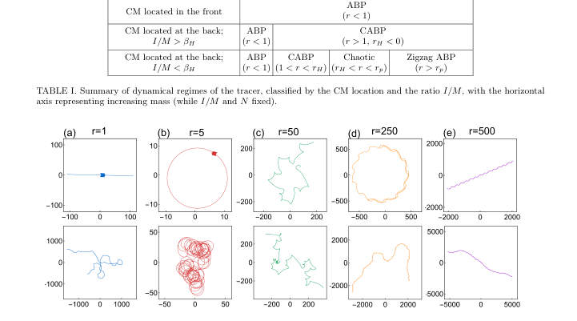 
FIG. 2. Typical trajectories of CM from the reduced dynamics in different dynamical regimes: (a) ABP regime; (b) CABP regime; (c)(d) chaotic regime; (e) zigzag ABP. In each column, the figure in the bottom displays trajectories in the presence of noise, while the figure in the top depicts trajectories in the zero-noise limit. As the column changes, r varies, while σ = 10.6 and b = 2.95 are fixed.

📷 Fig 3

 
FIG. 3. The dependence of the diffusion coefficient on r, with fixed σ = 4.5 and b = 1. For a given r, a larger number of bath particles N corresponds to a lower noise strength, depicted in different colors.

📷 Fig 4

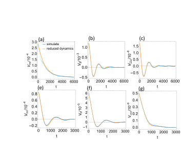 
FIG. 4. Comparison of the velocity autocorrelation func- tions between linear approximation of the reduced dynam- ics (shown in orange) and simulations of composite system (shown in blue). (a)-(c) shows for the ABP regime, (d)-(f) are for the CABP-regime.

**Main problem.** Investigating the complex, non-equilibrium dynamics of an inertial (underdamped) polar tracer immersed in an active bath of self-propelled particles.

**Main result.** The reduced dynamics of the tracer can be mapped to a stochastic Lorenz equation, revealing multiple dynamical regimes including chiral, chaotic, and zigzag motion.

**Method.** The authors use the projection-operator formalism and a quasi-static expansion to integrate out the bath, followed by a mapping to the Lorenz system and moment-closure methods for analytical predictions.

**Summary.** This paper explores how the inertia of a particle in an active bath leads to much richer dynamics than the standard overdamped case. By mapping the tracer's motion to the stochastic Lorenz equation, the authors identify several distinct states: standard active Brownian motion, chiral motion, chaotic trajectories, and zigzag patterns. They provide analytical tools to calculate diffusion and propulsion in these regimes. This work demonstrates how complex, emergent behaviors like chirality and chaos can arise from simple microscopic interactions.

Detailed structure

**Model / system.** A heavy, 2D, chevron-shaped rigid polar tracer interacting via WCA potential with a dilute bath of independent, overdamped Active Brownian Particles (ABPs).

**Key observables.** Propulsion speed, velocity covariance, effective diffusion coefficient, and velocity autocorrelation functions.

**Important parameters / regimes.** Lorenz parameters (r, sigma, b), mass (M), moment of inertia (I), and the ratio I/M.

**Assumptions / limitations.** The bath is dilute, the tracer is rigid, and there is a separation of timescales between the fast bath dynamics and slow tracer dynamics.

**Figures summary.** Figure 1 shows the tracer schematic; Figure 2 displays trajectories in different regimes (ABP, CABP, Chaotic, Zigzag); Figure 3 shows the diffusion coefficient dependence on the parameter r.

**Paper structure.** The paper begins with a microscopic description of the tracer-bath system, derives reduced stochastic dynamics using projection operators, maps these dynamics to the Lorenz equations, classifies the resulting dynamical regimes, and provides analytical expressions for transport properties validated by numerical simulations.

**Why it may be interesting.** The mapping of active matter dynamics to the Lorenz system provides a bridge between active matter physics and classical nonlinear dynamics, offering insights into how broken symmetries and chaos emerge in non-equilibrium systems.

Abstract

A polar tracer immersed in an active bath is known to be propelled forward and therefore activated. Here we report that the induced dynamics of an inertial tracer can be much richer than expected. We investigate a heavy polar tracer immersed in a bath of independent active Brownian particles. Using the projection-operator formalism to integrate out the bath, we show that the tracer's reduced dynamics can be mapped to a stochastic Lorenz equation. According to the attractors in the Lorenz equation, the tracer motion is classified into several different dynamical regimes, including active Brownian motion, chiral active Brownian motion, complex chaotic motion, and zigzag active Brownian motion. For certain regimes, we derive analytical expressions for the propulsion speed, the velocity covariance, and the effective diffusion coefficient. Numerical simulations corroborate these theoretical predictions.

[↑ back to top](#top)

### [Scalable surface ion trap design for magnetic quantum sensing and gradiometry](http://arxiv.org/abs/2604.21342v1)

**Authors:** Qirat Iqbal, Altaf Hussain Nizamani  
**Type:** both · **Category:** other · **PDF:** <https://arxiv.org/pdf/2604.21342v1>  
**Analysis basis:** full PDF text, analyzed in chunks
**Topic relevance:** 🔥 `QC/QI experiment` **3/5** · `quantum measurements` **2/5** · `spintronics-quantum-optics interface` **2/5**

📷 Fig 1

 
Fig. 2 demonstrates the trapping potential created above the surface of a flat ion trap configuration. In this illustration, the trapping region, referred to as RF-nil, ideally should possess a potential of zero where the ions can be trapped.

📷 Fig 2

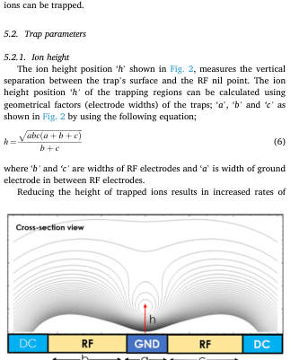 
Fig. 2. Cross-sectional representation of the trap potential, also referred to as pseudo-potential, demonstrates the contour plot above the surface area of a singular trap region. This illustration includes the positioning of the ground electrode with a width labeled ’a,’ alongside RF electrodes with widths ’b’ and ’c’ being equal. Additionally, the ion height above the surface is denoted as ’h.’ The potential within this setup is generated through the application of AC voltage (Vrf) to the RF electrodes. The standard electrode widths typically fall within the range of a few hundred micrometers.

📷 Fig 3

 
Fig. 1. The 171Yb + hyperfine 2S1/2 manifold, that contains four states; the

📷 Fig 4

 
Fig. 3. (a) Surface Paul trap design for four trapping regions. The long rails are RF-electrodes and side short rails are modeled as DC (control) electrodes. Whereas, four trapping zones, above the surface of the trap, are highlighted in red. (b) Cross section view of trap potential at one of trapping zones above the surface of the trap. (For interpretation of the references to color in this figure legend, the reader is referred to the Web version of this article.)

📷 Fig 5

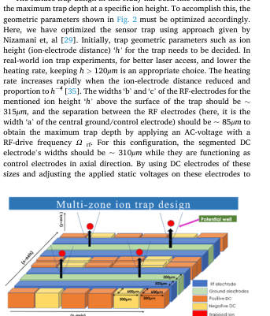 
Fig. 4. Illustrating a Multi-Zone Ion Trap Design in Three Dimensions: Demonstrating the trap’s approximate length along the x and z dimensions, while the trapped ions are positioned in the y dimension above the trap’s surface.

📷 Fig 6

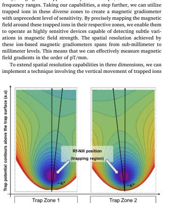 
Fig. 5. Approximately 6◦rotation of principal axis at the trapping regions due to mutual impact of RF electric field of multi-rails trap geometry.

**Main problem.** The need for a scalable, high-resolution surface ion trap architecture capable of ultra-sensitive magnetic field detection and precise magnetic field gradient measurement (gradiometry) across a wide frequency range.

**Main result.** The study presents a novel, scalable multi-rail surface Paul trap design that enables 2D magnetic field mapping and 3D gradient sensing with sub-millimeter spatial resolution and sensitivities in the pT/sqrt(Hz) range.

**Method.** A modeling and simulation-based approach using Mathematica and the analytic method by M. G. House to optimize electrode geometry and voltages for trap depth and stability.

**Summary.** This paper proposes a new design for a scalable surface ion trap intended for use as a high-precision magnetic field sensor and gradiometer. By using a multi-rail electrode architecture, the design allows for the simultaneous trapping of ions in multiple zones, enabling 2D magnetic field mapping. The study uses simulations to optimize the trap for high sensitivity (pT range) and wide frequency coverage (DC to RF). This advancement is significant for developing portable, high-resolution quantum sensors that can outperform current technologies like SQUIDs or NV centers.

Detailed structure

**Model / system.** A scalable surface Paul trap (microchip design) utilizing integrated electrodes on a semiconductor substrate, specifically using Ytterbium-171 (171Yb+) ions as a model species.

**Key observables.** Magnetic field sensitivity, magnetic field gradients, trap depth, secular frequencies, ion height, and fluorescence at 369 nm.

**Important parameters / regimes.** Sensitivity (1-100 pT/sqrt(Hz)), frequency range (DC to hundreds of MHz), spatial resolution (sub-millimeter), ion height (120-136 um), and RF drive frequency (22 MHz).

**Assumptions / limitations.** The trap geometry parameters are treated as species-independent; use of the gapless approximation for calculating the RF trapping pseudo-potential.

**Figures summary.** Fig 1 shows the 171Yb+ hyperfine structure; Fig 3 and 4 illustrate the multi-zone surface trap design and electrode layout; Fig 5 demonstrates the rotation of the principal axis.

**Paper structure.** The paper begins with the motivation for quantum sensing, compares existing magnetometry technologies, presents the novel multi-rail trap design and optimization, details the sensing mechanisms (bare and dressed states), and concludes with the scalability and potential for 2D/3D mapping.

**Why it may be interesting.** It presents a highly engineered approach to scaling ion-trap-based quantum sensors, combining electrode geometry optimization with advanced sensing techniques like dressed-state qubits to enhance coherence and sensitivity.

Abstract

Magnetic quantum sensors based on trapped ions utilize properties of quantum mechanics which have optimized precision and beat current limits in sensor technology. Trapped ions are highly sensitive in a large span of signal ranging from DC or static B-field to the radiofrequency range in 100s of MHz and can attain the sensitivity in the range of pT to sub pT . They are tuneable to frequencies of interest and can be used as a lock-in frequency detector. This modelling and simulation based study presents an innovative design of Surface Paul Traps, enabling the use of trapped ions as ultra-sensitive sensors for magnetic field detection and precise measurement of magnetic field gradients at a sub-millimeter spatial resolution. The novel design features multiple trapping regions, allowing for the mapping of magnetic fields across various ion-trapping zones. The study demonstrates groundbreaking advancements in ion manipulation and confinement through innovative chip architecture.

[↑ back to top](#top)

### [Enhancing Coherence of Spin Centers in p-n Diodes via Optimization Algorithms](http://arxiv.org/abs/2604.21874v1)

**Authors:** Jonatan A. Posligua, David E. Stewart, Denis R. Candido  
**Type:** theory · **Category:** quantum information and computing · **PDF:** <https://arxiv.org/pdf/2604.21874v1>  
**Analysis basis:** full PDF text, analyzed in chunks
**Topic relevance:** 🔥 `spintronics-quantum-optics interface` **3/5** · `dissipative systems` **2/5**

📷 Fig 1

 
FIG. 1: (a) Schematic of a 4H-SiC pnn+ diode operated in the reverse bias regime with embedded spin centers, non- depleted charges, and surface traps responsible for the leakage current. (b) Schematic of the multi-variable linewidth optimization algorithm via the scale-gradient descent method. The linewidth is first calculated for an initial set of diode design parameters p, and then autonomously minimized using a scaled gradient descent method. Iterations are performed until convergence of the linewidth is achieved, resulting in a final set of design parameter.

📷 Fig 2

 
FIG. 2: Electrostatic properties of a 4H-SiC pnn+ diode: (a) Electric potential along the diode’s z-direction calculated for reverse bias voltages ranging from −50 to −800 V. (b) Same for the electric field. (c) Total charge carrier density as a function of position within the diode’s z-direction calculated using the solution to Poisson’s equation to evaluate ρc in Eq. (2) for reverse voltages ranging from −50 to −400 V. The depletion boundaries ˜dn are shown for each reverse bias value. (d) Same for the optical linewidth as a function of the spin center’s position within the diode’s n-region (i.e., zdef). The doping densities used to generate all the sub-figures are Na = 7×1018cm−3, Nn =...

📷 Fig 3

 
FIG. 3: Single-parameter linewidth optimization with respect to the bias voltage. The initial design parameters are Na = 7 × 1018 cm−3, Nn = 4 × 1015 cm−3, Nd = 1.01 × 1019 cm−3, T = 300 K, V = −5 V, dl = dr = 0.4 µm and d = 10 µm. (a) Electric field and carrier density profiles for the initial parameters. (b) Optical linewidth, reverse bias voltage, and optimal spin center position as a function of iteration number. (c) Final electric field and carrier density profiles for the optimal design parameters.

📷 Fig 4

 
FIG. 4: (a) Single-type parameter linewidth optimization with respect to doping densities for small bias voltage of V = −5 V, Nn ≪Na ≈Nd, with Nn = 4 × 1015 cm−3, Na = 7 × 1018 cm−3, and Nd = 1.01 × 1019 cm−3, T = 300 K, dl = dr = 0.4 µm, d = 10 µm. The upper panel shows the reduction in linewidth Γ vs. iteration number, the lower panels show the corresponding doping densities and spin center position. (b) Same as (a), but for Na = Nn = Nd = 1019 cm−3 as initial conditions. (c) Density plot of depletion length within the intrinsic region (dn) as a function of Nn/Na and V .

📷 Fig 5

 
FIG. 5: Optimization with respect to the lengths of the diode’s doping layers. The initial parameters for this simulation are Na = 7×1018 cm−3, Nn = 4×1015 cm−3, Nd = 1.01 × 1019 cm−3, T = 300 K, V = −15 V, and dl = dr = d = 1 µm. Upper panel: Linewidth reduction and inset showing spin center’s position as a function of iteration number. Lower panel: Evolution of d, dl, and dr that allows for minimal optical linewidth Γ. The size of the lightly-doped n-region is considerably bigger than that of the bulk p and n+-regions. This is a consequence of both charge conservation and the application of our electric noise model.

📷 Fig 6

 
FIG. 6: Optimization process for 3 different sets of initial design parameters with displayed iteration-by-iteration behavior of the linewidth Γ, optimal spin center position and the diode’s design parameters Na, Nn, Nd, and V for dl = dr = 0.4 µm and d = 10 µm. The voltages used for “Initial Set 1”, “Initial Set 2”, and “Initial Set 3” are −5 V, −6 V, and −7 V, respectively. (b) Same for dl = dr = 0.04 µm and d = 1 µm. (c) Same for dl = dr = 0.004 µm and d = 0.1 µm.

📷 Fig 7

 
Fig. 6. The left panels show the behavior of Γ and the spin center position as a function of iteration number, whereas the plots on the right side show the correspond- ing variations of all doping densities and bias voltage. Our optimization with respect to these diode parame- ters shows an overall two-order-of-magnitude decrease in the linewidth. Here, smaller linewidths are achieved by decreasing doping densities, increasing the magnitude of the bias voltage, and placing the spin defect at the center of the diode. Similarly to the results found with respect to a single type of parameters in Secs . V A and V B, optimization was obtained via the decreases in the den- sity of fluctuators and...

📷 Fig 8

 
FIG. 7: (a) Optimization process for 3 different sets of initial design parameters with displayed iteration-by-iteration behavior of the linewidth Γ, optimal spin center position and the diode’s design parameters Na, Nn, Nd, and V for dl = dr = 0.04 µm and d = 1 µm. The voltages used for “Initial Set 1”, “Initial Set 2”, and “Initial Set 3” are −5 V, −6 V, and −7 V, respectively. (b) Same as (a) but for d = 0.1 µm.

📷 Fig 9

 
FIG. 8: Maximum electric field [Emax z ] inside the diode as a function of the iteration. Horizontal lines represent the electric field breakdown value EBD, and a fraction of ΩEBD (Ω&lt; 1) set as the numerical threshold of the elec- tric field. Inset shows ΩEBD −Emax z demonstrating that the maximum value of the electric field never surpasses ΩEBD.

📷 Fig 10

 
FIG. 9: Cause and effect of leakage current present in a 4H-SiC pnn+ diode. (a) Effective density neff pro- duced by leakage current at thermal equilibrium as a function of depth from the diode’s surface for reverse bias voltages ranging from −500 to −1100 V. The depth- dependence of the densities is modeled as a half-Gaussian profile, where its maximum value occurs at the surface of the diode, and it decays as a function of depth in- side the diode. This is pictorially evidenced in Fig. 1(a). (b) Optical linewidth calculated from electric and mag- netic SND as a function of the spin center’s separation from the volume containing fluctuators. The linewidths are calculated for the same...

**Main problem.** Determining the optimal set of diode design parameters (doping, bias, and geometry) to maximize the spin coherence of embedded spin centers by minimizing optical linewidth.

**Main result.** The study demonstrates that a twenty-fold suppression of linewidth can be achieved via voltage optimization, and that noise from leakage current can be mitigated by placing spin defects deeper within the diode.

**Method.** A scaled gradient descent optimization algorithm combined with the numerical solution of the Poisson equation and a new formalism for leakage current-induced noise.

**Summary.** This paper presents an optimization framework to enhance the coherence of spin centers in silicon carbide-based diodes. By using a scaled gradient descent algorithm, the authors identify optimal doping profiles, voltages, and device geometries that minimize optical linewidth. The research specifically addresses how to balance the benefits of carrier depletion against the detrimental effects of leakage current. Ultimately, the work provides a practical guide for designing semiconductor devices for quantum technologies.

Detailed structure

**Model / system.** Solid-state spin defects (specifically divacancies) embedded in 4H-SiC p-n or p-i-n diodes operating under reverse bias.

**Key observables.** Optical linewidth (FWHM), electric potential, electric field, and carrier density profiles.

**Important parameters / regimes.** Reverse-bias voltage, doping densities (Na, Nn, Nd), layer thicknesses, temperature, and spin center depth.

**Assumptions / limitations.** The system operates in the slow noise regime where fluctuations are much faster than the coherence time, and the noise is assumed to be isotropic and Gaussian.

**Figures summary.** Figure 1 shows the diode schematic and the optimization algorithm; Figure 2 displays electric potential and field profiles; Figure 3 illustrates the evolution of linewidth suppression and optimal spin center position; Figure 4 and 5 show the results of doping and geometric optimization.

**Paper structure.** The paper introduces the problem of spin decoherence in diodes, establishes a mathematical framework for noise sources (charge and leakage), details the gradient descent optimization protocol with physical constraints, presents results for single and multi-parameter optimizations, and concludes with mitigation strategies.

**Why it may be interesting.** This work is relevant for quantum optics and open quantum systems as it provides a systematic way to engineer the environment (the electrical noise spectrum) to protect a quantum emitter from decoherence.

Abstract

Solid-state spin defects hold great promise as building blocks for various quantum technologies. Embedding spin centers in $p$-$n$ diodes under reverse bias has proved to be a powerful strategy to narrow the optical linewidth and increase spin coherence, while also enabling control of the photoluminescence wavelength via Stark shift. Given the multitude of parameters influencing spin centers in diodes (e.g., doping densities and profiles, temperature, bias voltage, spin center position), a question that has not yet been answered is: which set of these design parameters maximizes spin center coherence? In this work, we address this question by developing a scaled gradient descent optimization algorithm that minimizes the optical linewidth of spin centers by combining the numerical solution of a diode's Poisson equation with calculated charge noise from the non-depleted regions. Our optimization is performed for both single- and multiple-parameter cases for divacancies in SiC $p$-$i$-$n$ diodes, including reverse-bias voltage, doping density and profile, and diode total length. Importantly, the optimization is subject to realistic physical constraints, such as small operating bias voltages, avoidance of the dielectric breakdown regime and physical thresholds for doping density. Additionally, due to the leakage current at reverse bias voltages, we develop a new formalism to investigate its influence on coherence. We show that the corresponding noise can be mitigated by implanting spin defects away from the diode's surfaces. Our work provides guidance on experimentally relevant diodes for hosting spin centers with the narrowest optical linewidths and longest coherence times.

[↑ back to top](#top)

### [Structured Quantum State Reconstruction via Physically Motivated Operator Selection](http://arxiv.org/abs/2604.21272v1)

**Authors:** Ayush Chambyal, Brijesh, Rakesh Sharma  
**Type:** theory · **Category:** quantum information and computing · **PDF:** <https://arxiv.org/pdf/2604.21272v1>  
**Analysis basis:** full PDF text, analyzed in chunks
**Topic relevance:** 🔥 `entanglement & information structure` **3/5** · `quantum measurements` **2/5**

📷 Fig 1

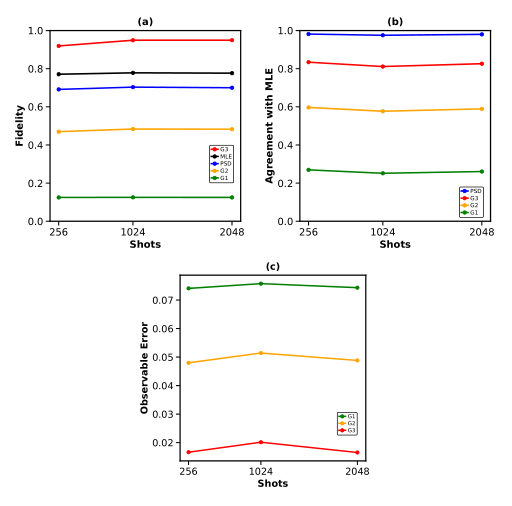 
FIG. 1. (a) Fidelity with respect to the ideal three-qubit GHZ state, (b) agreement with the MLE reconstruction, and (c) observable reconstruction error, shown as a function of mea- surement shots. The results demonstrate weak dependence on shot count and a clear hierarchy across models, with the G3 model achieving high accuracy using a reduced set of phys- ically motivated observables.

📷 Fig 2

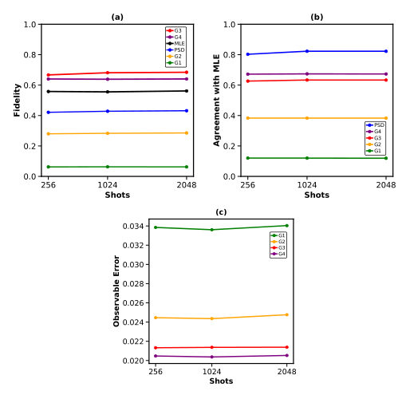 
FIG. 2. (a) Fidelity with respect to the ideal four-qubit GHZ state, (b) agreement with the MLE reconstruction, and (c) observable reconstruction error as a function of measurement shots.

📷 Fig 3

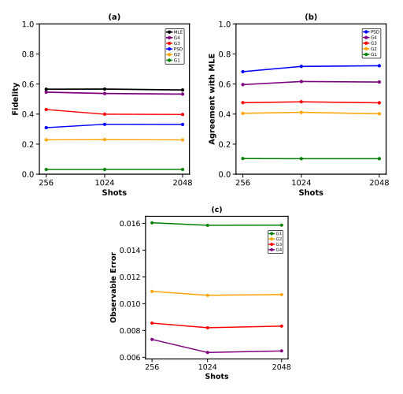 
FIG. 3. (a) Fidelity with respect to the ideal five-qubit GHZ state, (b) agreement with the MLE reconstruction, and (c) observable reconstruction error as a function of measurement shots.

📷 Fig 4

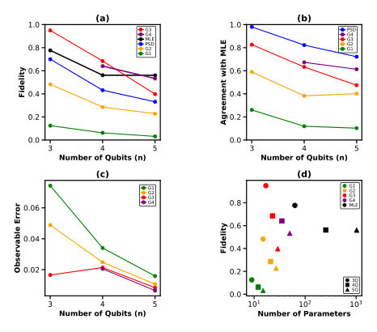 
FIG. 4. (a) Fidelity with respect to the ideal GHZ state, (b) agreement with the MLE reconstruction, (c) observable recon- struction error, and (d) fidelity as a function of the number of model parameters, shown for three-, four-, and five-qubit systems.

**Main problem.** Quantum State Tomography (QST) suffers from exponential scaling in measurement and computational costs, making the full reconstruction of multi-qubit systems impractical.

**Main result.** The SG-QST framework achieves high fidelity comparable to full reconstruction using significantly fewer parameters by restricting the operator space to physically relevant, hierarchical correlations.

**Method.** The authors develop Structured Gibbs Quantum State Tomography (SG-QST), which uses a Gibbs representation of the density matrix and a hierarchical inclusion of local, nearest-neighbor, and global observables.

**Summary.** This paper introduces a new method for quantum state reconstruction called SG-QST, which avoids the exponential complexity of standard tomography. By using a Gibbs representation and a hierarchical approach to include only physically relevant correlations, the method can reconstruct GHZ states with high fidelity using far fewer parameters. The study shows that capturing global coherence is the primary driver of accuracy. This approach offers a scalable path for characterizing larger quantum systems where full reconstruction is impossible.

Detailed structure

**Model / system.** The framework is benchmarked on multi-qubit GHZ states (3, 4, and 5 qubits) using a Gibbs-based Hamiltonian parametrization: rho = e^-H / Tr(e^-H).

**Key observables.** Pauli strings (X, Y, Z), specifically focusing on local, nearest-neighbor, and global coherence operators like X^n and Y^n.

**Important parameters / regimes.** Number of qubits (n=3, 4, 5), number of model parameters, and shot counts (256, 1024, 2048).

**Assumptions / limitations.** The effectiveness of the method assumes that the state's essential information is concentrated within a pre-selected, physically motivated subset of observables.

**Figures summary.** Figures show fidelity, agreement with MLE, and observable error for 3, 4, and 5-qubit systems, demonstrating a clear hierarchy of accuracy (G1 < G2 < G3) and the efficiency of the G3 model.

**Paper structure.** The paper identifies the scalability bottleneck of QST, proposes the SG-QST hierarchical Gibbs framework, benchmarks it against MLE and PSD methods using GHZ states, and analyzes the scaling of error and parameter efficiency.

**Why it may be interesting.** This is highly relevant for researchers in quantum information and many-body dynamics as it provides a scalable strategy for characterizing large-scale entanglement and multipartite correlations without the overhead of full tomography.

Abstract

Quantum state tomography (QST) scales exponentially in both measurement and computational cost, making full reconstruction impractical for multi-qubit systems. Existing approaches attempt to reduce this complexity, but do not explicitly restrict the operator space based on physically relevant correlations. We develop a structured QST framework in which the density matrix is reconstructed using a restricted set of observables in a Gibbs representation. The Structured Gibbs Quantum State Tomography (SG-QST) is built by progressively including local, nearest-neighbor, and global correlations. Benchmarking on three, four, and five-qubit. GHZ states shows that comparable fidelity can be achieved with significantly fewer parameters by restricting the operator space to physically relevant observables. These results demonstrate that physically motivated operator-space restriction enables efficient and interpretable quantum state reconstruction.

[↑ back to top](#top)

### [Ansätz Expressivity and Optimization in Variational Quantum Simulations of Transverse-field Ising Model Across System Sizes](http://arxiv.org/abs/2604.20961v1)

**Authors:** Ashutosh P. Tripathi, Nilmani Mathur, Vikram Tripathi  
**Type:** theory · **Category:** quantum information and computing · **PDF:** <https://arxiv.org/pdf/2604.20961v1>  
**Analysis basis:** full PDF text, analyzed in chunks
**Topic relevance:** 🔥 `entanglement & information structure` **3/5**

📷 Fig 1

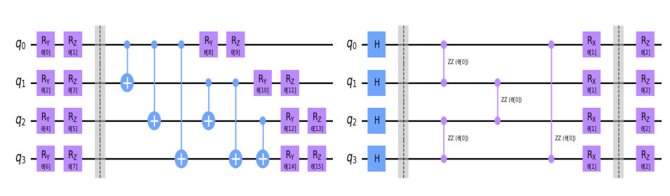 
Figure 1: Schematic of the VQE circuits for HEA (hardware efficient ans¨atz), HVA (Hamiltonian variational ans¨atz) and HVA-SB (symmetry-breaking) used in this work.

📷 Fig 2

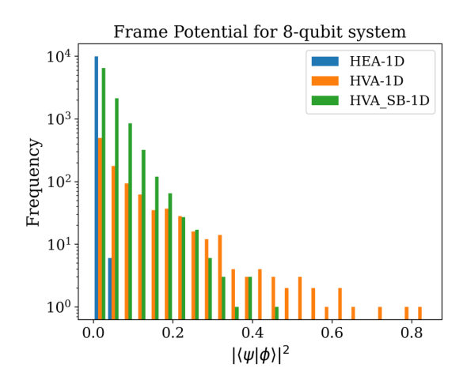 
Figure 2: Distribution of 1-degree norm for HEA, HVA and HVA-SB ans¨atze for pairs of states generated respectively from two random parameter sets. The frame potential F1 – the average of the 1-degree norm over random parameter sets – is a measure of expressivity. The Hamiltonian is 1D TFIM.

📷 Fig 3

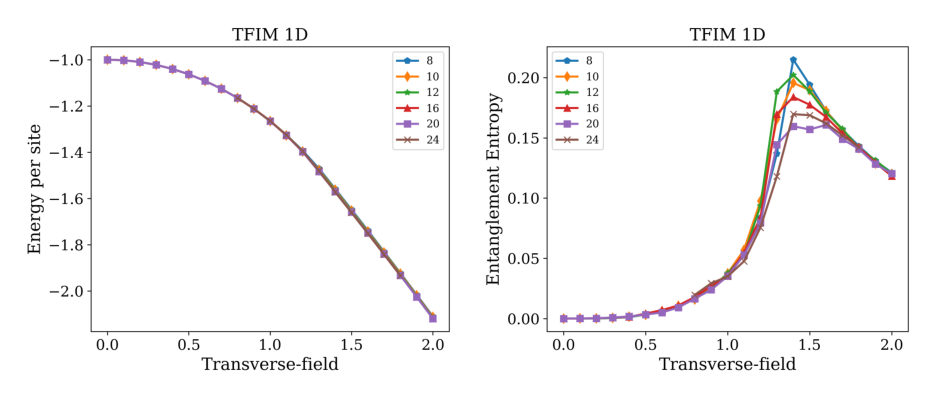 
Figure 3: Average energy and the von Neumann entanglement entropy for the ground state of the one dimensional TFIM at different lattice sizes.

📷 Fig 4

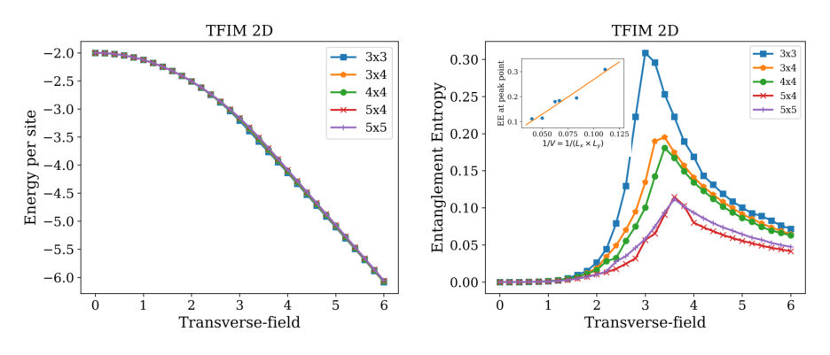 
Figure 4: Average energy and the von Neumann entanglement entropy for the ground state of the two dimensional TFIM at different lattice sizes.

📷 Fig 5

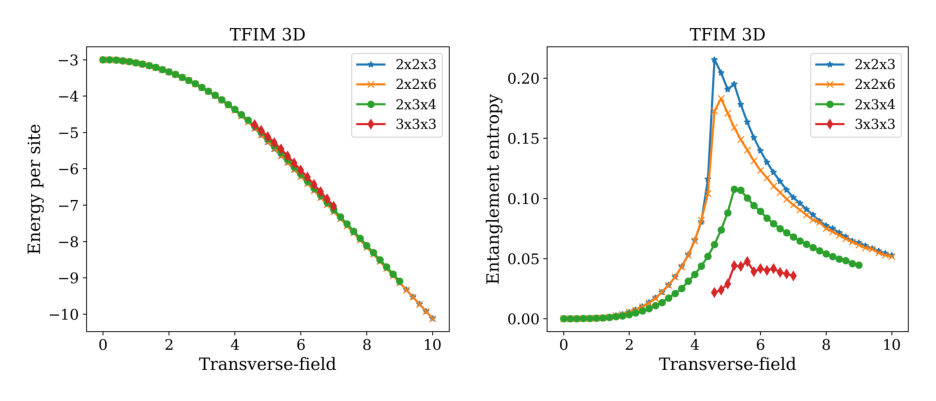 
Figure 5: Average energy and the von Neumann entanglement entropy for the ground state of the three dimensional TFIM at different lattice sizes.

📷 Fig 6

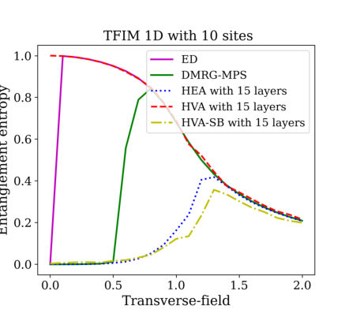 
Figure 6: A comparison between ED, DMRG and VQE methods for energy and entanglement entropy

📷 Fig 7

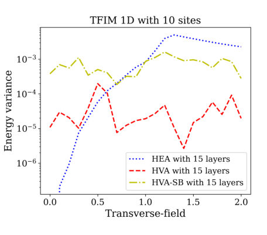 
Figure 7: Energy variance vs hx : TFIM 1-D with 10 sites

📷 Fig 8

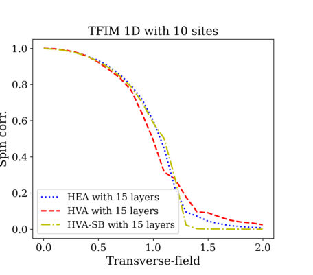 
Figure 8: Spin correlation, and Magnetization for 10 site 1D system

📷 Fig 9

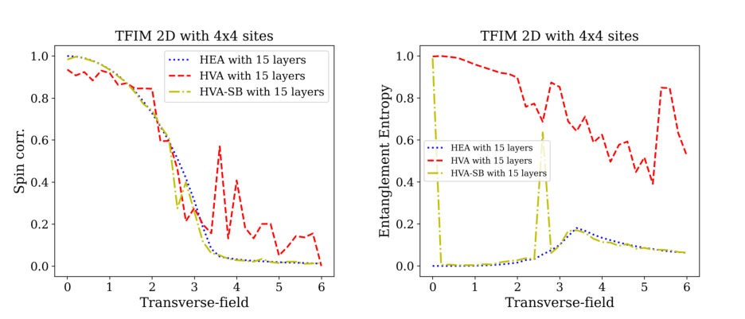 
Figure 9: Spin correlation and Entanglement per site calculation for 2D system of 4x4 dimensions

📷 Fig 10

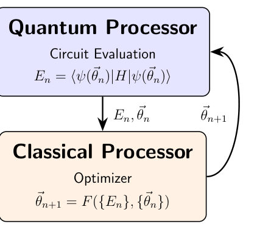 
Figure 10: VQE flowchart

**Main problem.** Investigating the trade-off between ansatz expressivity and optimization stability in the Variational Quantum Eigensolver (VQE) when simulating quantum phase transitions.

**Main result.** The study identifies a fundamental trade-off where hardware-efficient ansätze (HEA) provide smoother optimization landscapes but fail to capture entanglement, while physics-inspired ansätze (HVA) achieve higher fidelity but face more rugged optimization landscapes.

**Method.** The authors use the VQE algorithm with different ansätze (HEA, HVA, and HVA-SB) and optimizers (L-BFGS, COBYLA), benchmarking results against Exact Diagonalization and DMRG using GPU-accelerated state-vector simulations.

**Summary.** This paper evaluates the performance of different variational quantum circuit architectures for simulating the Transverse-field Ising Model. By comparing hardware-efficient and physics-inspired ansätze across 1D, 2D, and 3D lattices, the authors reveal a tension between the ease of optimization and the accuracy of captured entanglement. The results demonstrate that while physics-inspired models better capture critical phenomena, they are significantly harder to optimize as dimensionality increases. This work provides essential guidance for designing scalable VQE algorithms for many-body physics.

Detailed structure

**Model / system.** The Transverse-field Ising Model (TFIM) in 1D, 2D, and 3D dimensions, featuring ferromagnetic interactions and a transverse magnetic field.

**Key observables.** Ground-state energy, energy variance, von Neumann entanglement entropy, spin correlations, and magnetization.

**Important parameters / regimes.** Transverse field strength (h_x), system size (up to 27 spins), number of ansatz layers, and spatial dimensionality (1D, 2D, 3D).

**Assumptions / limitations.** The study assumes the chosen parameterized circuits can represent the ground state and that the classical optimizer can reach the global minimum; it operates within NISQ-era constraints.

**Figures summary.** Figures show VQE circuit structures (HEA vs HVA-SB), distribution of 1-design frame potential for expressivity, energy and entropy signatures of criticality across 1D, 2D, and 3D lattices, and a comparison of VQE performance against ED and DMRG.

**Paper structure.** The paper introduces the VQE problem and ansätze, details the TFIM model and simulation framework, quantifies ansatz expressivity and resource scaling, presents benchmarking results across dimensions, and concludes with optimization challenges and future directions.

**Why it may be interesting.** This paper is highly relevant for many-body dynamics and quantum computing as it provides critical insights into how circuit architecture and optimization strategies impact the ability to simulate phase transitions and entanglement in higher-dimensional quantum systems.

Abstract

We explore the application of the Variational Quantum Eigensolver (VQE) to investigate the ground state properties, particularly the entanglement entropy, of the Transverse Field Ising Model (TFIM) in one, two, and three dimensions, considering systems of up to 27 spins. By benchmarking VQE results against exact diagonalization and analyzing the entanglement properties across different system sizes and geometries, we assess the algorithm's effectiveness in capturing critical phenomena. Using results of TFIM, we also investigate how VQE's expressivity and optimization influence the simulation of highly entangled quantum states. We employ different ansätze: the hardware-efficient EfficientSU2 from Qiskit, the physics-inspired Hamiltonian Variational ansätz (HVA) and HVA with symmetry breaking, and benchmark their performance using energy variance, entanglement entropy, spin correlations, and magnetization. We further discuss the implications for scaling these methods to larger quantum systems.

[↑ back to top](#top)

### [Decomposing Fractional Quantum Hall Wave Functions via Operator Contraction Multiplication](http://arxiv.org/abs/2604.21434v1)

**Authors:** Dong-Hao Guan, Licheng Wang, Yuan Zhou, Ai-Lei He, Yi-Fei Wang  
**Type:** theory · **Category:** strongly correlated electrons · **PDF:** <https://arxiv.org/pdf/2604.21434v1>  
**Analysis basis:** full PDF text, analyzed in chunks
**Topic relevance:** 🔥 `entanglement & information structure` **3/5**

📷 Fig 1

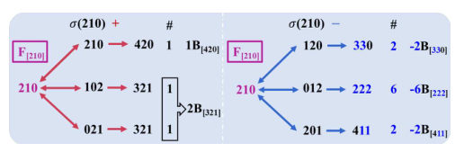 
FIG. 1. Schematic Diagram of decomposing ν = 1/2 Laugh- lin state with three particles based on the contraction rule in F −F type. We enumerate all permutations of [2, 1, 0] as σ(210) and add them termwise to λ = [2, 1, 0]. We also cal- culate the corresponding permutation signs(˜ε) and bosonic multiple occupation coefficients(#). Summing over all these terms yields the decomposition of ν = 1/2 Laughlin state.

📷 Fig 2

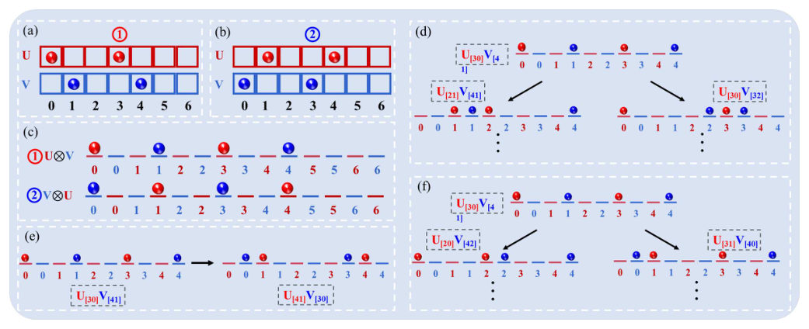 
FIG. 2. Root configurations of particle occupation and parts of squeezing operation in occupation language from the root configuration for Halperin (2, 2, 1) state with four particles filling in the “entangled” orbitals. “U” and “V” denote the degree of freedom (such as spin, layer, etc) colored with red and blue, respectively. Two root configurations are presented in (a) and (b). (c). “U” and “V” orbitals can be entangled each other and lead to “entangled orbtials”, which can be expressed as U ⊗V or V ⊗U. Particles squeezing occurs in (d) intra-color orbitals and (e),(f) inter-color orbitals. (e) U[41]V[30] can be obtained by squeezing particles of U[30]V[41]. Colors of the orbitals indicate...

📷 Fig 3

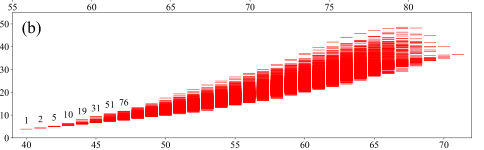 
FIG. 3. (Color online) Orbital entanglement spectra for (a) ν = 1/2 Laughlin and (b) Halperin (2, 2, 1) states with 16 particles in disk geometry. Here, each system is partitioned into two subsystems A and B. The bipartition parameters for (a) ν = 1/2 Laughlin state are N A = 8 and LA = 16, and (b) ν = 1/3 Halperin state are N A u = 4, N A v = 4, LA u = 12 and LA v = 12. N A is the number of particles in A subsystem, and two subspaces are partitioned at angular momentum LA. “u” (“v”) indicates various orbital degree of freedom.

**Main problem.** The mathematical difficulty of decomposing multi-component fractional quantum Hall (FQH) wave functions, such as Halperin states, due to the complexity of coupled Jastrow factors and the limitations of existing Jack polynomial methods.

**Main result.** The development of a general algebraic scheme for the exact decomposition of Laughlin and Halperin states, which reveals the underlying generalized Pauli principle and matches chiral Luttinger liquid theory predictions.

**Method.** An algebraic framework based on operator contraction multiplication using fermionic and bosonic operators, combined with the use of resultants and elementary symmetric polynomials to factorize coupled Jastrow factors.

**Summary.** This paper introduces a new algebraic method called 'operator contraction multiplication' to decompose complex fractional quantum Hall wave functions. While previous methods like Jack polynomials were limited in their ability to handle multi-component states, this new approach successfully decomposes Halperin states by factorizing coupled Jastrow factors. The method allows for large-scale computations of entanglement spectra that align with chiral Luttinger liquid theory. Ultimately, this framework provides a unified way to study both single- and multi-component FQH states and offers a path toward exploring more complex topological phases.

Detailed structure

**Model / system.** Fractional Quantum Hall (FQH) effect in the lowest Landau level (LLL) using disk geometry, specifically focusing on Laughlin states and multi-component Halperin states.

**Key observables.** Orbital entanglement spectra, edge excitation sequences, many-body density profiles, and root configurations.

**Important parameters / regimes.** Filling factors (e.g., nu = 1/m, Halperin (2,2,1)), particle number (up to 16 particles), and decomposition dimensions (exceeding 10^11).

**Assumptions / limitations.** The framework assumes the wave functions can be expressed via single-particle orbitals in the LLL, and Gaussian factors are omitted for simplicity in the algebraic derivation.

**Figures summary.** Figure 1 shows a schematic of the decomposition of a nu=1/2 Laughlin state using contraction rules; Figure 2 illustrates particle occupation and the squeezing process in orbitals; Figure 3 displays orbital entanglement spectra for Laughlin and Halperin states.

**Paper structure.** The paper introduces a new algebraic scheme for wave function decomposition, establishes fundamental contraction rules, extends the method to multi-component systems via resultants, applies the method to Halperin (2,2,1) states to uncover the generalized Pauli principle, and validates the approach through large-scale computation of entanglement spectra.

**Why it may be interesting.** The development of a new algebraic tool for decomposing complex many-body wave functions provides a powerful method for studying topological order and could be extended to more complex correlated systems like Fractional Chern Insulators.

Abstract

We develop a general algebraic scheme to decompose fractional quantum Hall (FQH) wave functions based on the operator contraction multiplication. By introducing fermionic and bosonic operators and establishing three fundamental contraction rules, we achieve an exact decomposition of Laughlin states. This approach naturally extends to multi-component systems by factorizing coupled Jastrow factors via resultants and elementary symmetric polynomials, enabling the first complete decomposition of Halperin states. For Halperin ($2,2,1$) state, we explicitly derive its basic expansion, identify root configurations, and reveal intra- and inter-color squeezing operators, thereby uncovering the underlying generalized Pauli principle. Using this method, we compute orbital entanglement spectra for up to $16$ particles with decomposition dimensions exceeding $10^{11}$, obtaining edge excitation sequences that precisely match chiral Luttinger liquid theory. Our framework breaks through the longstanding limitations of Jack polynomials, provides a unified decomposition for both single- and multi-component FQH states, and opens a new avenue for exploring wave functions for more complex FQH states.

[↑ back to top](#top)

### [Dual-use quantum hardware for quantum resource generation and energy storage](http://arxiv.org/abs/2604.21913v1)

**Authors:** Vaibhav Sharma, Yiming Wang, Shouvik Sur  
**Type:** theory · **Category:** quantum information and computing · **PDF:** <https://arxiv.org/pdf/2604.21913v1>  
**Analysis basis:** full PDF text, analyzed in chunks
**Topic relevance:** `dissipative systems` **2/5** · `entanglement & information structure` **2/5** · `non-equilibrium dynamics` **2/5** · `quantum measurements` **2/5**

📷 Fig 1

 
FIG. 1. The same quantum hardware can serve either as a quantum battery or a quantum sensor because the process of charging a quantum battery generates quantum resources. Here, we demonstrate a concrete protocol where the quantum hardware remains agnostic of its intended use until a time t = t∗where a suitable metrological resource peaks. One can then choose to either time-evolve into a fully charged quantum battery or perform quantum sensing. As a bonus, after sensing, there exists a finite probability to obtain a fully charged battery.

📷 Fig 2

 
FIG. 2. Time-evolution of the variance of the numerically optimized squeezed two-mode operator Xmin. Here, we have fixed (n, ω0, gn) = (4, 1, 1/ √

📷 Fig 3

 
FIG. 3. (a) Protocol combining charging (for time 2t1 with λ(t) = 1) and sensing (for time ts with λ(t) = 0) using the two coupled superconducting LC resonator based quantum battery model in Eq. 6. (b) Bloch sphere representation of the evolution of quantum state during this protocol, starting from a discharged state |ψi⟩to a partially charged state |ψm⟩ while sensing an unknown parameter ϕ for time ts.

📷 Fig 4

 
FIG. 4. A schematic portrayal of potential inter-connectivity among standard quantum technologies. Here, X →Y implies Y enabled by X. This work enumerates such relationships between a quantum battery and a quantum sensor. Solid (dashed) arrows indicate established (hypothesized) proto- cols. The hypothetical protocols can be devised by combining the protocols developed here and in Refs. [59, 60].

📷 Fig 5

 
FIG. 5. Time evolution of the optimal angles for which the variance of the two-mode quadrature ˆ Xθ,η,ϕ is minimized.

📷 Fig 6

 
FIG. 6. Time evolution of the variance of the optimal quadrature ˆ Xθ,η,ϕ for (a) n = 3 and (b) n = 6. The best squeezing is obtained at a finite short time in both cases.

📷 Fig 7

 
FIG. 7. Time evolution of the optimal angles for which the variance of the two-mode quadrature ˆ Xθ,η,ϕ is minimized for (a)–(c) n = 3 and (d)–(f) n = 6.

**Main problem.** Investigating whether quantum hardware can be designed for dual-use, specifically to simultaneously serve as a quantum battery for energy storage and a quantum sensor for metrology.

**Main result.** The authors demonstrate that protocols for fast generation of resource-rich states (like squeezing or NOON-like states) can simultaneously charge a quantum battery with a collective advantage, allowing hardware to switch between sensing and storage functions.

**Method.** The study uses analytical derivations (short-time expansions, Heisenberg picture) and numerical methods (exact diagonalization) to map state preparation protocols to battery charging processes.

**Summary.** This paper proposes a way to make quantum hardware more efficient by allowing it to perform two tasks at once: storing energy and sensing external parameters. By using non-linear coupling in superconducting resonators, the authors show that the same process that creates useful quantum states for sensing also enables a 'charging advantage' for quantum batteries. This allows for a modular architecture where a single device can switch between being a sensor and a power source without extra hardware cost.

Detailed structure

**Model / system.** The primary platform is superconducting circuits, specifically two coupled superconducting LC resonators (bosonic modes) coupled via a Josephson junction, modeled by a non-linear Hamiltonian with a time-dependent coupling strength.

**Key observables.** Quantum Fisher Information (QFI), quantum squeezing (quadrature variance), energy stored (delta E), and charging power (delta E/T).

**Important parameters / regimes.** Number of excitations (n), coupling strength (g_n), time durations (t_s, t_1), and the non-linear regime (n > 1).

**Assumptions / limitations.** The charging advantage is valid for finite-size systems; in the thermodynamic limit with Kac-normalization, the advantage is lost.

**Figures summary.** Figure 1 illustrates the dual-use concept of switching between sensing and charging; Figure 3 shows the temporal protocol for sensing and charging; Figure 5 and 6 show the time evolution of optimal quadrature parameters and the peaks in squeezing variance.

**Paper structure.** The paper introduces the dual-use concept, establishes the mapping between state preparation and battery charging, analyzes the scaling of charging power and squeezing in non-linear bosonic models, proposes a specific temporal protocol for integrated sensing/charging, and provides analytical/numerical validation.

**Why it may be interesting.** It provides a unified framework for connecting quantum metrology and quantum thermodynamics, suggesting that the same collective quantum effects (entanglement/squeezing) drive both high-precision sensing and super-extensive energy storage.

Abstract

Quantum resources such as entanglement form the backbone of quantum technologies and their efficient generation is a central objective of modern quantum platforms. Independently, quantum batteries have emerged as nanoscale devices that utilize collective quantum effects to store energy with a charging advantage over classical strategies. Here, we show that these two pursuits can co-exist: protocols for fast generation of resourceful quantum states can simultaneously charge a quantum battery with a collective advantage, and conversely, a quantum battery protocol with a charging advantage can produce resource-rich states. Using this connection, we propose an integrated hardware protocol on superconducting circuits in which each experimental run can interchangeably accomplish either quantum battery charging, or quantum sensing through generation of metrologically useful states. Our results establish that quantum resources and stored energy are distinct yet co-producable quantities, opening the door to modular quantum architectures that dynamically switch between sensing and energy-storage functions, thereby producing additional functionalities without extra hardware cost.

[↑ back to top](#top)

### [Pulse Shaping for Superconducting Qubits](http://arxiv.org/abs/2604.21565v1)

**Authors:** Animesh Patra, Ankur Raina  
**Type:** both · **Category:** quantum information and computing · **PDF:** <https://arxiv.org/pdf/2604.21565v1>  
**Analysis basis:** full PDF text, analyzed in chunks
**Topic relevance:** `QC/QI experiment` **2/5** · `dissipative systems` **2/5** · `non-equilibrium dynamics` **2/5**

📷 Fig 1

 
Figure 1: The potential energy profile and eigenenergies for the harmonic oscillator (solid red) and the anharmonic oscillator (solid green) in ℏ= 1 units. The energy separation (equivalently, the transition frequency ωh) between the eigenstates of the harmonic oscillator is equal. For the aim of building a transmon qubit, an anharmonic oscillator is considered. Each energy separation (equivalently, the transition frequencies ω01, ω12 and so on) is different. Differing energy separation allows to form a computational subspace from |0⟩and |1⟩. While the rest of the states, like the |2⟩state, form the leakage subspace.

📷 Fig 2

 
Figure 2: (a)The transition probability of the square and the triangular pulse from Magnus expansion truncated at second order for δ = 0.5, A0 = π. (b) Numerical simulation of exact dynamics shown by RWA Hamiltonian of Eq.5 for square and triangular pulse at δ = 0.5, A0 = π. The simulation is carried out using QuTiP in Python.

📷 Fig 3

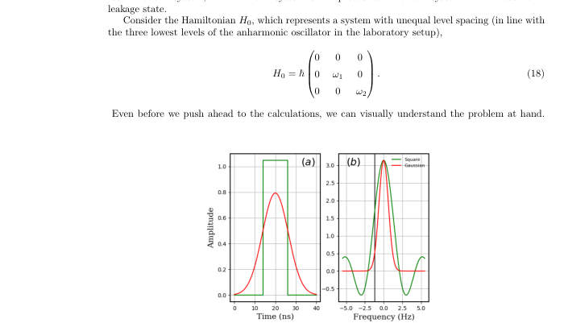 
Figure 3: (a) The square pulse (green line) and the Gaussian pulse (red line). The square pulse is analytically easier to study however, (b) it’s baseband frequency spectrum has wider sidelobes than the Gaussian pulse.

📷 Fig 4

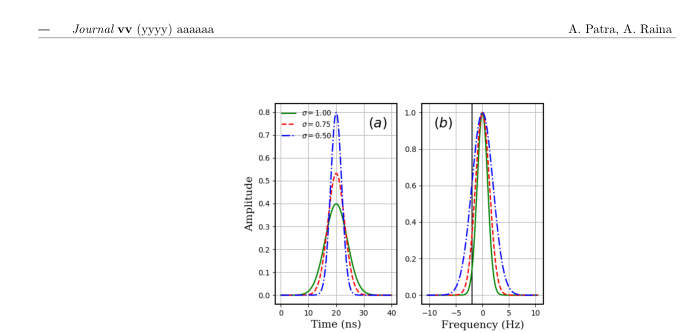 
Figure 4: (a) The solid-green, dashed-red, and dash-dotted blue lines are all Gaussian pulses with decreasing pulse duration. (b) Shorter pulses have a wider frequency spread. Broader frequency support increases the chances of overlap with the unwanted transition frequency.

📷 Fig 5

 
Figure 5: A schematic of the three-level model. The first two levels form the computational subspace with a transition frequency of ω1. The σx 01 and σy 01 promote transition inside the computational subspace. However, the σy 01 contribution is the unwanted term arising in the first-order Magnus expansion. The DRAG protocol helps eliminate this and the coupling to the leakage state (arrows shown in red). AC Stark effect contributions emerge at the second order in the expansion (σz 01 and σz 12 terms).

📷 Fig 6

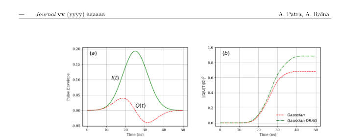 
Figure 6: (a)A schematic illustrating the in-phase I(t) and the quadrature Q(t) component for a standard gaussion DRAG pulse. (b) Numerical simulation of exact dynamics shown by RWA Hamiltonian of Eq.21 for Gaussian and Gaussian DRAG pulse for anharmonicity ∆= −450 MHz, peak pulse amplitude A0 = 200 MHz/2π, pulse width (standard deviation) σ = 6.5 and coupling between |0⟩−|1⟩states as λ = √

📷 Fig 7

 
Figure 7: Schematic of the hardware essential for pulse generation. The in-phase (I) and quadrature signals (Q) from the arbitrary waveform generator (AWG) combine with the sinusoid from the local oscillator (LO) in the IQ mixer.

📷 Fig 8

 
Figure 8: Overlap of the discrete Fourier transform Xd(f) images due to improper sampling (fs ≤ 2f).

📷 Fig 9

 
Figure 9: Even though aliasing can be used to generate RF signals, the amplitude shows a sinc(πx) roll-off. The alternating shades of grey denote the different higher Nyquist zones.

📷 Fig 10

 
Figure 10: Schematic of a basic phase-locked loop configuration.

**Main problem.** Achieving high-fidelity control of superconducting qubits by mitigating errors such as leakage to higher energy states, AC Stark effect-induced phase errors, and hardware-induced pulse distortions.

**Main result.** The paper provides a unified framework for pulse shaping, demonstrating that techniques like DRAG and active cancellation can significantly suppress leakage and crosstalk, while also identifying how hardware imperfections like IQ imbalance and LO instability degrade gate fidelity.

**Method.** The authors use the Magnus expansion for analytical error analysis, the Rotating Wave Approximation (RWA) for Hamiltonian simplification, and QuTiP-based numerical simulations to validate pulse-shaping protocols.

**Summary.** This paper serves as a pedagogical guide to pulse-shaping techniques for superconducting transmon qubits. It bridges the gap between abstract quantum gate theory and the practical realities of microwave hardware. The authors detail how techniques like DRAG and active cancellation mitigate errors like leakage and AC Stark shifts. Furthermore, it addresses how hardware imperfections like IQ imbalance and LO noise impact gate fidelity. Ultimately, it provides a roadmap for designing high-fidelity control pulses in the presence of multi-level dynamics and hardware constraints.

Detailed structure

**Model / system.** The study focuses on superconducting transmon qubits, modeled as weakly anharmonic multi-level systems (including a leakage state |2>), and explores two-qubit interactions via the Cross-Resonance (CR) gate.

**Key observables.** Transition probabilities (P0->1), gate fidelity, leakage rates, and qubit dephasing rates.

**Important parameters / regimes.** Anharmonicity (delta), detuning (delta), pulse duration (T), drive amplitude (A), and hardware parameters like sampling rate (fs) and IQ imbalance.

**Assumptions / limitations.** The analysis assumes pulse boundary conditions where the envelope starts and ends at zero, and neglects higher-order Magnus expansion terms and certain environmental noise sources.

**Figures summary.** Figures compare energy profiles of harmonic vs. anharmonic oscillators, illustrate Fourier spectra of different pulse shapes, show the effectiveness of DRAG in suppressing leakage, and depict the hardware signal chain from AWG to the qubit.

**Paper structure.** The paper follows a pedagogical progression: starting with basic two-level dynamics and pulse spectral properties, moving to multi-level leakage and the DRAG protocol, analyzing error channels via the Magnus expansion, discussing hardware-induced distortions (IQ mixing, DAC roll-off), and concluding with complex two-qubit gate error mitigation.

**Why it may be interesting.** It provides deep analytical insight into how control-field engineering (pulse shaping) can be used to suppress non-adiabatic transitions and leakage in multi-level systems, which is highly relevant to anyone working on the control of open quantum systems or cavity QED.

Abstract

High-fidelity control of superconducting qubits requires carefully shaped microwave pulses that account for multiple error channels. In this work, we present a pedagogical introduction to pulse-shaping techniques for transmon qubits, aiming to provide a unified, accessible framework that integrates physical intuition for pulse design, analytical understanding of gate-level descriptions, and practical considerations of hardware. This article further aims to serve as a guide for students and early researchers entering superconducting quantum computing. We begin by examining simple pulse envelopes and their spectral properties, highlighting how finite bandwidth leads to leakage outside the computational subspace. These observations motivate the introduction of the derivative removal by adiabatic gate (DRAG) technique, which uses a quadrature component proportional to the pulse's time derivative to suppress off-resonant excitations. We analyze the single-qubit case using the Magnus expansion, which provides a clear understanding of the order-by-order introduction of error channels. We discuss the practical hardware realities of control pulse generation, focusing on arbitrary waveform generators (AWG), local oscillators (LO), and IQ mixing. Common imperfections are discussed in terms of their impact on the effective pulse shape and qubit Hamiltonian. Finally, we extend the discussion to two-qubit operations, focusing on the cross-resonance gate and the emergence of effective interactions.

[↑ back to top](#top)

### [Chaos Gated Tunneling Drives Molecular Reactivity in Astrophysical Environments](http://arxiv.org/abs/2604.21005v1)

**Authors:** Saptarshi G. Dastider, K. Prashant, P. Shruti, C. Sudheesh, Jobin Cyriac  
**Type:** theory · **Category:** other · **PDF:** <https://arxiv.org/pdf/2604.21005v1>  
**Analysis basis:** full PDF text, analyzed in chunks
**Topic relevance:** `entanglement & information structure` **2/5** · `scars & prethermalization` **2/5** · `non-equilibrium dynamics` **1/5**

📷 Fig 1

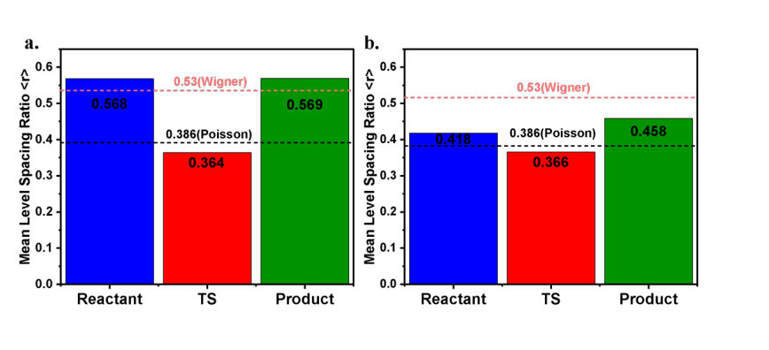 
Figure 1: (a) Mean level spacing ratio (⟨r⟩) for H2 + H+ →H+ 3 , (b) Mean level spacing ratio (⟨r⟩) for H+ 3 + H2 →H+ 5 ,

📷 Fig 2

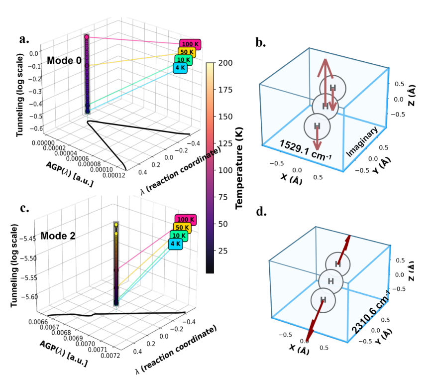 
Figure 2: H3+ Mode-Resolved AGP and Tunneling. 3D correlations of AGP, mode displace- ment λ, and tunneling probability (log scale) at the TS for selected vibrational modes. left: AGP, Tunneling correlation Per lambda, a. for mode 0, c for mode 2 Right: Vibrational mode structures and frequencies, b. Mode 0, d. Mode 2.

📷 Fig 3

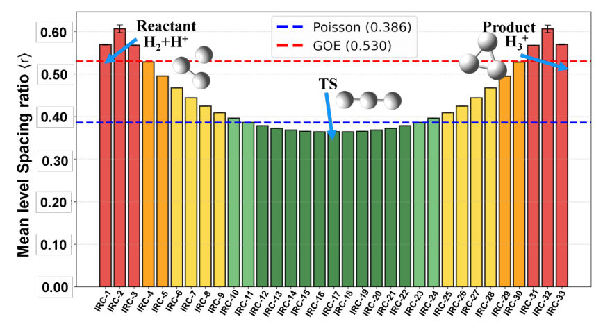 
Figure 3: Distribution of ⟨r⟩across all sampled geometries along the IRC for H2 + H+ → H+ 3 reaction from reactant to the product via the TS, showing the prevalence of chaotic (red columns) integrable (green columns) and weakly chaotic regimes (yellow columns).

📷 Fig 4

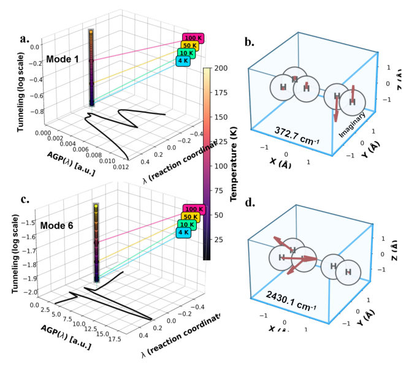 
Figure 4: H5+ Mode-Resolved AGP and Tunneling. 3D AGP–λ–tunneling correlations (log scale) for representative H5+ modes at the transition state. Left: left: AGP, Tunneling correlation Per lambda, a. for mode 1, c for mode 6. Right: Vibrational mode structures and frequencies, b. Mode 1, d. Mode 6.

**Main problem.** Predicting kinetic reaction rates in ultracold ion-molecule networks is difficult due to the complex interplay between vibrational dynamics and quantum tunneling, specifically how vibrational excitations can suppress tunneling via quantum chaos.

**Main result.** The transition state acts as a dynamical bottleneck where quantum chaos is suppressed, creating an 'integrable protection' that enhances tunneling, whereas high-frequency vibrational modes can trigger chaos and suppress reactivity by orders of magnitude.

**Method.** The authors integrate multireference electronic structure theory (CASSCF/NEVPT2), Adiabatic Gauge Potentials (AGP), and Random Matrix Theory (RMT) with a semiclassical 1D WKB approximation.

**Summary.** This paper investigates how quantum chaos influences proton tunneling in ultracold astrophysical environments. By analyzing H3+ and H5+ systems, the authors show that the transition state acts as a 'protected' region where chaos is suppressed, facilitating tunneling. Conversely, they identify a 'fragility index' showing that certain vibrational modes reintroduce chaos and drastically reduce reaction rates. This provides a new data-driven metric for understanding complex chemical networks in planetary and interstellar plasmas.

Detailed structure

**Model / system.** The study focuses on hydrogen-ion association reactions, specifically the formation of H3+ (H2 + H+ -> H3+) and the proton-bound cluster H5+ (H3+ + H2 -> H5+), which are representative of Jovian atmospheric chemistry.

**Key observables.** Mean level spacing ratio (r-parameter) for chaos diagnostics, AGP norm for electronic state mixing, and a 'fragility index' based on the AGP slope.

**Important parameters / regimes.** Nuclear displacement along mass-weighted normal modes (lambda), temperature ranges (4 K to 200 K), and the transition from chaotic (GOE) to integrable regimes.

**Assumptions / limitations.** The dynamics are modeled using a 1D WKB approximation along mode-projected potential energy profiles; electronic structure is computed using a minimal active space.

**Figures summary.** Figure 1 shows the drop in the level spacing ratio at the transition state; Figure 2 and 4 present 3D correlations between AGP, mode displacement, and tunneling probability; Figure 3 illustrates the transition between chaotic, weakly chaotic, and integrable regimes along the reaction coordinate.

**Paper structure.** The paper introduces the problem of reaction rate prediction in astrochemistry, presents a new chaos-diagnostic framework using AGP and RMT, applies this to H3+ and H5+ systems, analyzes mode-specific tunneling suppression via a fragility index, and concludes with implications for planetary plasma models.

**Why it may be interesting.** It connects quantum chaos and information scrambling to chemical reactivity, providing a framework for how structural perturbations and vibrational modes control quantum transport and coherence in molecular systems.

Abstract

Accurate modeling of ion-molecule reaction networks is essential for understanding the chemical evolution of planetary ionospheres, particularly for giant planets where proton-transfer chains drive atmospheric composition. However, predicting reaction rates in these ultracold environments remains a challenge due to the non-trivial interplay between vibrational dynamics and quantum tunneling. In this work we present a chaos-diagnostic framework that integrates multireference electronic structure theory, Adiabatic Gauge Potentials (AGP), and Random Matrix Theory (RMT) to characterize the microscopic dynamics of proton transport. Using the formation of H+3 and the proton-bound cluster H+5 as representative model systems relevant to Jovian atmospheres, we demonstrate that the transition state acts as a dynamical bottleneck where quantum chaos is notably suppressed, effectively enhancing tunneling probabilities. We introduce a fragility index based on the AGP slope to quantify how specific vibrational modes reintroduce chaos and suppress reactivity. This diagnostic approach offers a generalizable, data-driven metric for identifying vibrationally gated pathways in complex astrochemical networks, providing a theoretical basis for refining kinetic models of planetary and interstellar plasmas

[↑ back to top](#top)

### [Random Access Codes: Explicit Constructions, Optimality, and Classical-Quantum Gaps](http://arxiv.org/abs/2604.21274v1)

**Authors:** Ruho Kondo, Yuki Sato, Hiroshi Yano, Yota Maeda, Kosuke Ito, Naoki Yamamoto  
**Type:** theory · **Category:** quantum information and computing · **PDF:** <https://arxiv.org/pdf/2604.21274v1>  
**Analysis basis:** full PDF text, analyzed in chunks
**Topic relevance:** `entanglement & information structure` **2/5** · `quantum measurements` **2/5**

📷 Fig 1

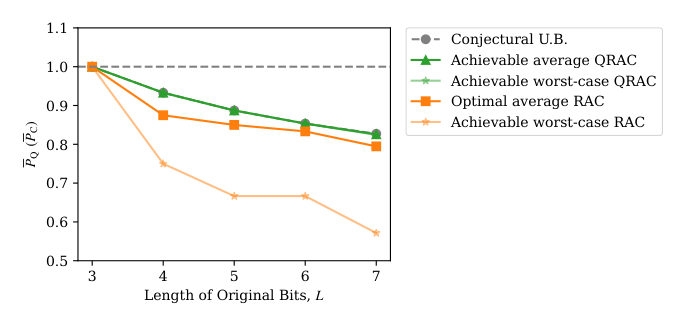 
Fig. 1. Decoding success probability of RACs and QRACs for L ≤7 and k = 3. Conjectural upper bound of QRAC (Eq. (4)) is included.

📷 Fig 2

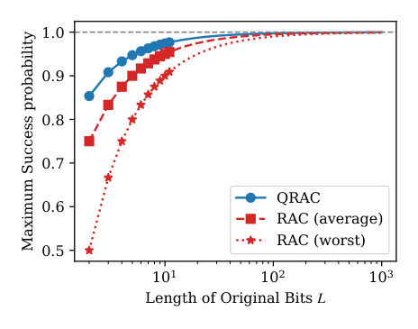 
Fig. 2. Achievable (conjecturally maximum) success probability of (L, L −1)-RACs and (L, L −1)-QRACs. Note that the maximum average success probability and the maximum worst case success probability are the same for (L, L −1)-QRAC. For clarity, markers are shown only for L ≤10.

**Main problem.** The paper seeks to develop explicit constructions for optimal Classical Random Access Codes (RACs) and Quantum Random Access Codes (QRACs) and to quantify the gap between classical and quantum performance in both average- and worst-case decoding regimes.

**Main result.** The authors provide a constructive framework for (L, k)-RACs, derive closed-form optimal encoders/decoders for the (L, L-1) case, and demonstrate that a significant classical-quantum gap exists in the worst-case decoding regime, whereas the gap is minimal in the average-case regime.

**Method.** The problem is framed as a geometric optimization task involving the minimization of directed Chamfer and Hausdorff distances. The authors use Mixed-Integer Linear Programming (MILP) for classical constructions and gradient-based numerical optimization in PyTorch for quantum cases.

**Summary.** This paper addresses the long-standing challenge of constructing optimal random access codes. By mapping the coding problem to geometric distance minimization, the authors provide explicit, closed-form solutions for specific bit-length ratios. A key finding is that quantum advantage is most pronounced in the worst-case decoding scenario, while the advantage vanishes in the average-case limit. This provides new insights into the fundamental limits of quantum communication protocols.

Detailed structure

**Model / system.** The study uses the (L, k)-RAC and (L, k)-QRAC models, where an L-bit string is encoded into k classical bits or k qubits, and the goal is to recover individual source bits via decoding procedures (POVMs for the quantum case).

**Key observables.** Average-case decoding success probability, worst-case decoding success probability, and the classical-quantum gap.

**Important parameters / regimes.** L (original bit string length), k (message length or number of qubits), and the non-asymptotic vs. asymptotic regimes.

**Assumptions / limitations.** The study is restricted to two-level systems (d=2) and does not consider shared randomness or entanglement; it also relies on conjectures regarding the optimality of discrete decoder sets.

**Figures summary.** Figure 1 shows the separation between RAC and QRAC success probabilities for different L and k; Figure 2 illustrates the scaling of the success probability gap for (L, L-1) codes as L increases.

**Paper structure.** The paper introduces the RAC/QRAC problem, establishes an optimization framework based on distance measures, provides explicit constructions for specific (L, k) regimes, performs numerical comparisons to identify the classical-quantum gap, and concludes with discussions on complexity and open conjectures.

Abstract

A random access code (RAC) encodes an $L$-bit string into a $k$-bit $(L>k)$ message from which any designated source bit can be recovered with high probability. Its quantum counterpart, a quantum random access code (QRAC), replaces the $k$-bit message with $k$ qubits. While upper bounds on the decoding success probability have long been studied in both classical and quantum settings, explicit constructions of optimal codes are known only in special cases, even for classical RACs. In this paper, we develop a constructive framework for classical $(L,k)$-RACs under both average- and worst-case criteria. We show that optimal code design reduces to selecting $2^k$ points in $\{0,1\}^L$ and $[0,1]^L$ for the average- and worst-case criteria, respectively, so as to minimize a distance-like objective. This characterization yields explicit constructions for general $(L,k)$. For $k=L-1$, we further obtain closed-form optimal encoders and decoders for both criteria, and show that the resulting classical $(L,L-1)$-RACs attain the corresponding proved upper bounds. We also show that these optimal classical codes induce $(L,L-1)$-QRACs that attain a conjectured upper bound on the decoding success probability. Numerical optimization suggests little difference between RACs and QRACs in the average-case setting, but a potentially large classical-quantum gap in the worst-case nonasymptotic regime.

[↑ back to top](#top)

### [Rigorous Security Proofs for Practical Quantum Key Distribution](http://arxiv.org/abs/2604.21791v1)

**Authors:** Devashish Tupkary  
**Type:** theory · **Category:** quantum information and computing · **PDF:** <https://arxiv.org/pdf/2604.21791v1>  
**Analysis basis:** full PDF text, analyzed in chunks
**Topic relevance:** `entanglement & information structure` **2/5** · `quantum measurements` **2/5**

📷 Fig 1

 
Figure 2.1: Schematic of a beam splitter with two input ports (left and bottom) and two output ports (right and top).

📷 Fig 2

 
Figure 2.2: Idealized polarizing beam splitter (PBS) that routes the horizontal and vertical polarization components of the input mode into separate spatial output modes.

📷 Fig 3

 
Figure 2.3: Schematic of a threshold (on/off) detector. In the imperfect model, η denotes the overall detection efficiency and pdc the dark-count probability per detection window.

📷 Fig 4

 
Figure 3.1: Schematic of a quantum key distribution (QKD) protocol. The task is to establish a shared secret key between two distant parties, Alice and Bob. The protocol relies on trusted quantum devices operated within secure perimeters, access to local true random number generators (TRNGs), an authenticated classical channel, and an insecure quantum channel that may be fully controlled by an adversary. Figure from [52].

📷 Fig 5

 
Figure 3.2: Schematic of an active detection setup using threshold detectors.

📷 Fig 6

 
Figure 3.3: Schematic of the passive detection setup using theshold detectors.

📷 Fig 7

 
Figure 3.4: Schematic illustrating the use of a source map. A virtual source prepares (ξk)A′′, which is mapped to the real emitted state (σk)A′ by a source map Ψ. Then, one can “give” Eve control over the source map (meaning that she is allowed to perform any operation she wants in place of the source map). The security of the latter implies security of the former, as argued rigorously in Lemma 7.4.1.

📷 Fig 8

 
Figure 3.5: An infinite-dimensional POVM can be modelled as a squashing map Λ followed by a finite-dimensional POVM. Giving the squashing map Λ to Eve allows us to restrict our analysis to the finite-dimensional POVM.

📷 Fig 9

 
Figure 4.1: Expected key rate for fixed-length protocols eRfixed(t) for various values of t, key rate upon acceptance for fixed-length protocols Rfixed(t) plotted for various values of t, and the expected key rate for variable-length protocol plotted eRvariable, plotted for a fixed honest behaviour of the channel.

📷 Fig 10

 
Figure 4.2: Expected key rate for fixed-length protocols eRfixed(t) for various values of t, key rate upon acceptance for fixed-length protocols Rfixed(t) plotted for various values of t, and the expected key rate for variable-length protocol plotted eRvariable, for an unpredictable honest behaviour.

**Main problem.** The need for rigorous security proofs for practical Quantum Key Distribution (QKD) protocols that account for realistic hardware imperfections like imperfect detectors, variable-length keys, and non-ideal authentication.

**Main result.** The thesis establishes security proofs for variable-length QKD against coherent attacks, develops methods to bound phase error rates with imperfect detectors, and provides a general security framework using the marginal-constrained entropy accumulation theorem.

**Method.** The author utilizes advanced information-theoretic tools including the Entropy Accumulation Theorem (EAT), Entropic Uncertainty Relations (EUR), the postselection technique, and De Finetti reductions.

**Summary.** This thesis provides a rigorous mathematical framework for the security of practical Quantum Key Distribution. It addresses long-standing gaps between idealized security models and real-world implementations, such as imperfect detectors and variable-length key generation. By introducing new bounds and unified proof techniques, the work enables more reliable certification of QKD hardware. Ultimately, it moves the field toward practical, deployment-ready quantum cryptography.

Detailed structure

**Model / system.** The study focuses on Quantum Key Distribution protocols, specifically BB84 and decoy-state BB84, involving quantum optical systems with weak coherent pulses, imperfect detectors, and authenticated classical channels.

**Key observables.** Key rates, phase error rates, photon-number statistics (zero and one-photon), and detection probabilities.

**Important parameters / regimes.** Channel loss (dB), detection efficiency, dark-count probability, basis-efficiency mismatch, and finite-size effects (number of signals sent).

**Assumptions / limitations.** Assumes trusted quantum devices and local true random number generators; focuses on security against IID collective and coherent attacks; assumes a specific model for delayed authentication.

**Figures summary.** Schematics of QKD protocol structures and detection setups; performance plots comparing key rates vs. loss for different protocols and proof techniques; and visualizations of error rate evolution under detector imperfections.

**Paper structure.** The thesis is structured by addressing specific technical challenges: extending proofs to variable-length protocols, applying postselection for coherent attacks, using EUR for imperfect detectors, implementing the MEAT framework, and analyzing authentication security.

**Why it may be interesting.** This work is highly relevant to quantum optics and quantum information as it provides the mathematical foundation for making quantum communication protocols robust against real-world hardware noise and side channels.

Abstract

This thesis is concerned with rigorous security analyses of practical Quantum Key Distribution (QKD) protocols, using a variety of modern proof techniques. The main results are as follows. First, we establish a security proof for variable-length QKD protocols against IID collective attacks, and extend this result to coherent attacks using the postselection technique. In doing so, we resolve a long-standing flaw in the application of the postselection technique to QKD, thereby placing it on a rigorous mathematical footing. Second, we develop a method to bound phase error rates in entropic uncertainty relation-based and phase error rate-based proofs, using only the observed statistics of the protocol, even when detectors are imperfect and only approximately characterized. This removes a key assumption of identical detector behaviour and enables these techniques to be applied in realistic settings. Third, we present a very general security analysis based on the marginal-constrained entropy accumulation theorem. The resulting framework can be readily adapted to practical imperfections and side channels, and is suitable for certification efforts. Finally, we show that the security of QKD protocols under realistic authentication assumptions can be reduced to the standard idealized setting, where authentication is assumed to behave honestly, with only minor protocol modifications. A distinctive feature of this thesis is its unified presentation of several major QKD security proof frameworks using consistent protocol descriptions and notation. Consequently, this thesis is intended not only as a collection of new technical results, but also as a useful reference for understanding rigorous security analysis in quantum key distribution.

[↑ back to top](#top)

### [Suppressing the Erasure Error of Fusion Operation in Photonic Quantum Computing](http://arxiv.org/abs/2604.21475v1)

**Authors:** Xiangyu Ren, Yuexun Huang, Zhemin Zhang, Yuchen Zhu, Tsung-Yi Ho, Antonio Barbalace, Zhiding Liang  
**Type:** both · **Category:** quantum information and computing · **PDF:** <https://arxiv.org/pdf/2604.21475v1>  
**Analysis basis:** full PDF text, analyzed in chunks
**Topic relevance:** `dissipative systems` **2/5** · `quantum measurements` **2/5**

📷 Fig 1

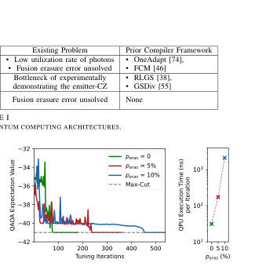 
Fig. 3. Optimizing a Max-Cut problem using 6-qubit QAOA program on PQC simulator [24]. We use the RUS boosted fusion method (m = 6), and simulate the fusion erasure at 0, 5% and 10% respectively, while fixing the fusion failure at 25%. Left: Optimization of QAOA expectation value. Right: Quantum circuit execution time per tuning iteration.

📷 Fig 2

 
Fig. 2. The comparison among different PQC architecture and their corre- sponding graph state generation schemes. The excitation pulses for generating a caterpillar state are demonstrated in the red box of (c). Specifically, longitudinal-acoustic excitation LA( π

📷 Fig 3

 
Fig. 4. (a)-(c) Graph state measurement patterns that establish loss-tolerance. (d) Tree-encoded fusion scheme. (e) Preparing tree-encoded logical qubit from caterpillar states. (f) Simulation of the fusion schemes. We compare these schemes with varying encoding parameters (m, b = 1, 2, 4, 8), by performing 103 fusion trials per data point to measure success rates.

📷 Fig 4

 
Fig. 5. (a) Average number of tree branches that successfully prepared for logical qubit encoding parameter b, when the preparation parameter bprep = 5 and bprep = 6 (by simulation). (b) Photon resource breakdown analysis for parameter bprep, when given the maximum length of caterpillar is 30-qubit. Dashed lines represent the #photon sources used for branch preparation. (c) Execution time analysis for the tree-encoding parameter b, under a noise model that pfail = 2% and peras = 25%.

📷 Fig 5

 
Fig. 6. Details of our MemTree compiler. (a) The hierarchical generation of target state based on BBT. (b) Our compiler framework for building BBT. (c) The overall pipeline for target state generation, from a time direction prospective. Each slice corresponds to a time step in the cycles.

📷 Fig 6

 
Fig. 8. Execution time comparison between tree-encoded scheme and baselines.

📷 Fig 7

 
Fig. 8 and Fig. 9 present the comparison of our tree- encoded fusion scheme with the redundantly-encoded and RUS fusion schemes under the hardware configurations of the quantum spin memory architecture. In this comparison, all fusion schemes are integrated in MemTree with the same compilation algorithm. While fixing the fusion failure rate pfail = 0.25 (thus 1 −pfail = 0.75), we compare the program execution time and the number of required photon sources. The program size (#qubit) varies from 2-qubit to 20- qubit, and the erasure rate during fusion (peras) varies from 0% to 10%. Due to the extremely large simulation overhead when the program size scales up, we truncate the execution time to...

📷 Fig 8

 
Fig. 9. Number of required photon sources comparison between tree-encoded scheme and baselines.

📷 Fig 9

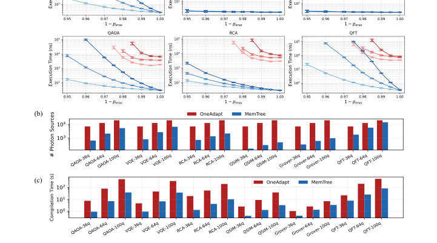 
Fig. 10. Comparison of MemTree with OneAdapt [74] and OneAdapt-ET. (a) The average execution time of quantum programs, when peras = 0, the results are evaluated on OneAdapt without erasure-tolerance strategy. The error bars represent the value range with a statistical 95% CI (confidence interval), over 1000 times of experiment and each with 2 × 104 shots. (b) Number of required photon sources. (c) Total compilation runtime of compilers.

📷 Fig 10

 
Fig. 11. Comparison on decoherence errors and CZ errors between OneAdapt [74], RLGS [38] and MemTree.

**Main problem.** Existing photonic quantum computing compilers focus on fusion failure but neglect fusion erasure caused by photon loss, which can be more damaging and lead to unknown graph outcomes.

**Main result.** The proposed MemTree compiler and tree-encoded fusion scheme significantly suppress erasure errors, achieving exponential improvements in execution time and substantial reductions in photon resource requirements compared to state-of-the-art compilers.

**Method.** The authors introduce a tree-encoded fusion strategy to handle erasure via indirect Z-measurements and a MemTree compilation framework that uses a hierarchical 'divide-and-conquer' approach with Mixed-Integer Programming (MIP) to optimize graph state generation.

**Summary.** This paper addresses the critical issue of fusion erasure errors in photonic quantum computing, which are caused by photon loss. The authors propose a new 'tree-encoded fusion' strategy that uses a specific encoding to suppress these errors and a 'MemTree' compiler that optimizes the generation of large-scale graph states. Their approach significantly reduces the time and photon resources needed for quantum algorithms like QAOA and QFT. The effectiveness of the method was validated through both large-scale simulations and real-world experiments on a photonic quantum processor.

Detailed structure

**Model / system.** The study focuses on Photonic Quantum Computing (PQC) using a quantum spin memory architecture, which utilizes semiconductor quantum dot emitters to generate caterpillar states (linear graph states) as building blocks.

**Key observables.** Execution overhead (time and photon resources), fidelity (decoherence and fusion errors), and logical fusion success rate.

**Important parameters / regimes.** Fusion failure rate (p_fail), fusion erasure rate (p_eras), number of branches (b), and number of preparation attempts (b_prep).

**Assumptions / limitations.** The evaluation assumes a realistic hardware noise model based on experimental data and assumes the availability of a classical control path with low latency.

**Figures summary.** Figure 1 shows the Type-II fusion gate operation; Figure 2 compares PQC architectures; Figure 3 shows QAOA degradation with erasure; Figure 4 illustrates the tree-encoded fusion and measurement rules; Figure 5 details the MemTree pipeline and resource scaling; Figure 11 compares fidelity across different compilers.

**Paper structure.** The paper introduces the problem of fusion erasure, proposes a tree-encoded fusion strategy and the MemTree compiler framework, details the MIP-based optimization algorithms, presents simulation results across various quantum algorithms, and validates the approach through hardware experiments on the Quandela platform.

**Why it may be interesting.** This paper is highly relevant to quantum optics and open quantum systems researchers as it addresses fundamental photon loss (erasure) in a scalable architecture and demonstrates how error-tolerant encoding can mitigate decoherence and loss in a networked photonic system.

Abstract

Photonic quantum computing provides a promising route toward quantum computation by naturally supporting the measurement-based quantum computation (MBQC) model. In MBQC, programs are executed through measurements on a pre-generated graph state, whose construction largely depends on probabilistic fusion operations. However, fusion operations in PQC are vulnerable to two major error sources: fusion failure and fusion erasure. As a result, MBQC compilation must account for both error mechanisms to generate reliable and efficient photonic executions. Prior state-of-the-art MBQC compilation, represented by OneAdapt, is designed for all-photonic architectures and mainly focuses on handling fusion failures. Nevertheless, it does not explicitly model fusion erasures induced by photon loss, which can be substantially more damaging than fusion failures.   To mitigate fusion erasure errors, we introduce a new MBQC compilation scheme built upon the spin qubit quantum memory. We propose tree-encoded fusion, an encoding strategy that suppresses erasure errors during graph-state generation. We further incorporate this scheme into a compiler framework with algorithms that reduce the execution overhead of quantum programs. We evaluate the proposed framework using a realistic PQC simulator on six representative quantum algorithm benchmarks across multiple program scales. The results show that tree-encoded fusion achieves better robustness than alternative fusion-encoding strategies, and that our compiler provides exponential improvement over OneAdapt. In addition, we validate the feasibility of our approach through a proof-of-concept demonstration on real PQC hardware.

[↑ back to top](#top)

### [The clock ambiguity is back with a vengeance](http://arxiv.org/abs/2604.21805v1)

**Authors:** Ovidiu Cristinel Stoica  
**Type:** theory · **Category:** other · **PDF:** <https://arxiv.org/pdf/2604.21805v1>  
**Analysis basis:** full PDF text, analyzed in chunks
**Topic relevance:** `entanglement & information structure` **2/5** · `quantum measurements` **2/5**

📷 Fig 1

 
Low-resolution page preview, page 2

📷 Fig 2

 
Low-resolution page preview, page 3

📷 Fig 3

 
Low-resolution page preview, page 4

📷 Fig 4

 
Low-resolution page preview, page 5

📷 Fig 5

 
Low-resolution page preview, page 6

📷 Fig 6

 
Low-resolution page preview, page 7

📷 Fig 7

 
Low-resolution page preview, page 8

📷 Fig 8

 
Low-resolution page preview, page 9

📷 Fig 9

 
Low-resolution page preview, page 10

📷 Fig 10

 
Low-resolution page preview, page 11

**Main problem.** The paper addresses the 'clock ambiguity' in the Page-Wootters formalism, investigating whether the inability to uniquely identify a clock and its dynamics can be resolved by imposing a non-interaction condition between the clock and the rest of the world.

**Main result.** The author proves a 'maximal ambiguity' theorem, showing that the ambiguity extends to both histories and Hamiltonians and cannot be removed by a non-interaction condition; the ambiguity is only resolved by explicitly assigning physical meanings to operators.

**Method.** The author uses unitary transformation analysis, spectral analysis (Minkowski sum of spectra), and the properties of infinite-dimensional Hilbert spaces (Lebesgue measure and wandering subspaces) to demonstrate the equivalence of different physical setups.

**Summary.** This paper investigates the fundamental problem of 'clock ambiguity' in the Page-Wootters formalism, where different choices of clock subsystems can lead to different perceived dynamics. The author refutes the claim that assuming no interaction between the clock and the world can resolve this issue, instead proving that the ambiguity is even stronger than previously thought, affecting both histories and Hamiltonians. The results show that for ideal clocks, any two physical systems can be rendered indistinguishable via unitary transformations. Ultimately, the author argues that the ambiguity can only be resolved by explicitly assigning physical meanings to operators, rather than relying on purely relational emergence.

Detailed structure

**Model / system.** The model is the Page-Wootters (PW) framework, consisting of a stationary, timeless global state in a composite Hilbert space (H_c tensor H_r) where time emerges from entanglement between a clock subsystem and the rest of the world.

**Key observables.** Clock observables (time T and energy-like C) and world observables (position X and momentum P).

**Important parameters / regimes.** Continuous and discrete time regimes, bounded and unbounded time, and the dimension of the Hilbert space (specifically infinite-dimensional ideal clocks).

**Assumptions / limitations.** The universe is in a stationary state satisfying a Wheeler-DeWitt-type constraint; the paper assumes separable Hilbert spaces and focuses on ideal clocks.

**Paper structure.** The paper begins by critiquing previous attempts to resolve clock ambiguity via non-interaction, provides a mathematical proof of maximal ambiguity for both discrete and continuous time, explores the implications for the emergence of physical structures, and concludes by proposing that physical meaning must be pre-specified to resolve the ambiguity.

**Why it may be interesting.** This is highly relevant for researchers in quantum foundations and open quantum systems, as it challenges the idea that spacetime and dynamical laws can emerge purely from relational entanglement without pre-existing physical structures.

Abstract

Page and Wootters (1983) showed how time and dynamics can emerge in a stationary system containing a clock. Albrecht (1995) later showed, for discrete time, that within this framework any dynamical evolution can be obtained simply by choosing a different clock.   Marletto and Vedral (2017) claimed that this ambiguity disappears assuming that the clock and the rest of the world do not interact. I show that their proof relies on an incorrect mathematical assumption. Also, eliminating the ambiguity completely would obstruct spacetime symmetries.   Whereas the original clock ambiguity concerns all possible histories of a discrete-time system evolving under arbitrary Hamiltonians, but not the Hamiltonians themselves, I prove a stronger version for continuous and discrete unbounded time: the ambiguity extends to both histories and Hamiltonians, including noninteracting ones. Only the dimension of the Hilbert space remains.   One might hope to dismiss the ambiguity as merely perspectival, but I show that this would predict incorrect correlations between outcomes and their records, making even knowledge impossible. Purely relational approaches therefore face both the stronger and the original clock ambiguity problems. The ambiguity is removed by taking into account the physical meaning of the operators.

[↑ back to top](#top)

### [Third Quantization for Order Parameter (I): BCS-BEC crossover with macroscopically coherent state](http://arxiv.org/abs/2604.21288v1)

**Authors:** Guo-Jian Qiao, Miao-Miao Yi, Xin Yue, C. P. Sun  
**Type:** theory · **Category:** quantum gases · **PDF:** <https://arxiv.org/pdf/2604.21288v1>  
**Analysis basis:** full PDF text, analyzed in chunks
**Topic relevance:** `Keldysh / 2PI / non-Gaussian methods` **2/5** · `correlated cavity matter` **2/5**

📷 Fig 1

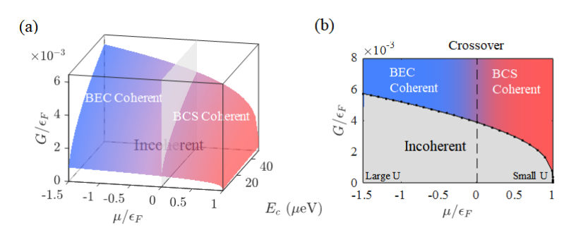 
Figure 6. (a) Phase diagram in the (µ, Ec, G) plane, where µ = 0 marks the boundary between the BCS and BEC regimes for each segment, and EJ = 2Ec determines the boundary between global and local phase coherence (see the color-gradient surface). (b) shows a cross section of (a) at Ec = 50µeV, where the solid line denotes the boundary between the global phase coherence and local phase coherence, and the dashed vertical line at µ = 0 marks the boundary bewteen BCS–BEC state crossover. Parameters used here are the same as in Fig. 5.

**Main problem.** Investigating whether the macroscopic commutation relation between the order parameter's phase and particle-number operator is a new fundamental postulate or an emergent property of second quantization, and providing a unified interpretation of the BCS-BEC crossover.

**Main result.** The authors demonstrate that 'third quantization' (the phase-number commutation relation) emerges naturally from second quantization in the thermodynamic limit, and they propose that the BCS-BEC crossover is a macroscopic quantum process driven by phase locking.

**Method.** The study uses a variational approach with a multi-mode coherent state, field operator expansion, and the Pegg-Barnett phase operator formalism to derive the properties of the order parameter.

**Summary.** This paper proposes a 'third quantization' framework where the order parameter is treated as a macroscopic collective degree of freedom. It proves that the fundamental commutation relation between phase and particle number is an emergent property of second quantization in the thermodynamic limit. By applying this to a model of coupled superconducting segments, the authors reinterpret the BCS-BEC crossover as a transition from local to global phase coherence. This provides a unified description of BECs, BCS superconductivity, and the crossover regime.

Detailed structure

**Model / system.** The paper models Bose-Einstein Condensates (BECs) and BCS superconductors, specifically treating the BCS-BEC crossover as an assembly of macroscopically separated superconducting segments coupled via tunneling.

**Key observables.** Order parameter phase, particle-number operator, chemical potential, energy gap, and off-diagonal long-range order (ODLRO).

**Important parameters / regimes.** Chemical potential (mu), intra-segment coupling, inter-segment tunneling strength (g), charging energy (Ec), and Josephson energy (Ej).

**Assumptions / limitations.** The derivation assumes the variational ground state is a multi-mode coherent state and utilizes the thermodynamic (large-M) limit to ensure the Hermiticity of the phase operator.

**Figures summary.** Figure 1 illustrates the difference between the strong-interaction (BEC) and weak-interaction (BCS) regimes; Figure 6 shows phase diagrams in the (mu, Ec, G) plane and cross-sections illustrating the boundaries of phase coherence.

**Paper structure.** The paper first establishes the mathematical foundation of third quantization by deriving the phase-number commutation relation from second quantization, then applies this to BECs and BCS systems, and finally uses a model of coupled segments to describe the BCS-BEC crossover and phase locking.

**Why it may be interesting.** It provides a unified theoretical framework that bridges microscopic second quantization with macroscopic circuit quantization, offering a new way to view the transition between bosonic and fermionic many-body states through the lens of coherent-state dynamics.

Abstract

We revisit the quantization of the order parameter, which we refer to as third quantization, from the perspective of the commutation relation between the phase operator of the order parameter and the particle-number operator. We show that this macroscopic commutation relation does not constitute an independent fundamental postulate added to quantum mechanics, but instead emerges naturally from second quantization in the thermodynamic limit for both bosonic and fermionic many-body systems. In this sense, both Bose-Einstein condensates (BECs) and Bardeen-Cooper-Schrieffer (BCS) states can be understood as macroscopic quantum states described by bosonic coherent states: in BEC, bosons condense into a single coherent mode with a well-defined phase, while in BCS systems, collective excitations of Cooper pairs can also acquire an effectively bosonic coherent description. On this basis, we propose a new macroscopic interpretation of the BCS-BEC crossover. To characterize this crossover, we model a conventional superconductor as an assembly of macroscopically separated superconducting segments. As the intra-segment coupling increases, the system evolves from a BCS-like regime toward a BEC-like regime, in which the segments collectively behave as macroscopic coherent states. Inter-segment tunneling then locks their phases, establishes global phase coherence, and gives rise to a bulk Bose-Einstein condensate. The phase diagram of the BCS-BEC crossover can thus be understood as a manifestation of a macroscopic quantum process governed by the coherent-state dynamics of the order parameter. Our results provide a unified perspective on BEC, BCS superconductivity, and the BCS-BEC crossover within the framework of third quantization.

[↑ back to top](#top)

### [Universal Local Roughness from Disorder Crossover in Urban-Front Growth](http://arxiv.org/abs/2604.21437v1)

**Authors:** Martin Hendrick, Maximilian Trique, Gabriele Manoli  
**Type:** theory · **Category:** statistical mechanics · **PDF:** <https://arxiv.org/pdf/2604.21437v1>  
**Analysis basis:** full PDF text, analyzed in chunks
**Topic relevance:** `non-equilibrium dynamics` **2/5** · `non-equilibrium universality` **2/5**

📷 Fig 1

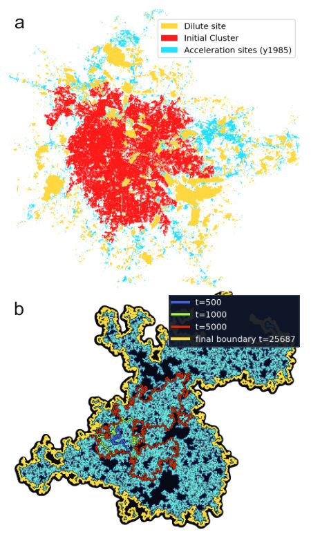 
FIG. 1. (a) Largest connected urbanized area of Bangalore (India) in 1985 (red). Yellow sites indicate areas that remain nonurbanized in 2015 and are identified with diluted sites, while blue sites indicate urbanized patches that are disconnected from the main cluster in 1985 but become absorbed into it by 2015; these are identified with accelera- tion sites. (b) Representative morphologies of the diluted–accelerated Eden model with quenched dilution and quenched acceleration. Black regions denote unoccupied sites, and colored lines show the cluster boundary at successive times.

📷 Fig 2

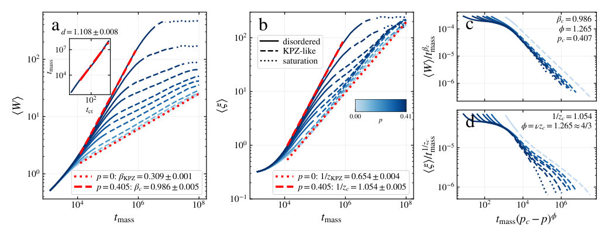 
FIG. 2. Global-width and correlation-length scaling in the dilution-only case q = 0. Data are averaged over 500 realizations for a strip of width L = 5000. (a) Global width W(tmass) for representative p &lt; pc. The clean case p = 0 is consistent with KPZ growth, while increasing dilution extends the disorder-dominated transient. Inset: clock conversion tmass ∼t1/d ct , with fitted exponent d ≃1.108 ≈dmin. (b) Correlation length ξ(tmass) for the same values of p. (c) and (d) Collapses of the width data according to, respectively, Eq. (11) and Eq. (12) for p ≥0.3, p = 0 is shown for reference. a b

📷 Fig 3

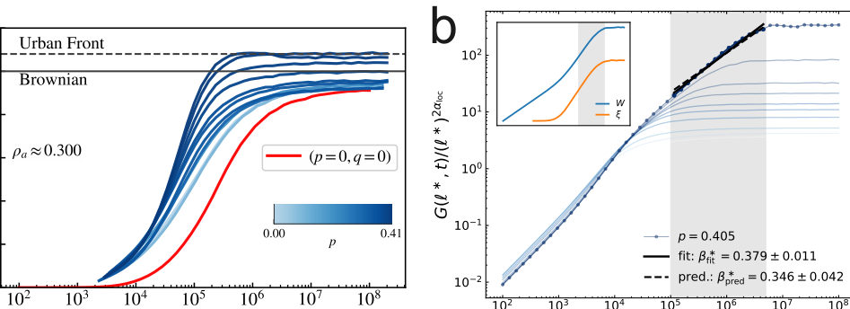 
FIG. 3. Local-sector dynamics of the projected front. (a) Time evolution of αloc in the mass clock. The clean case (p, q) = (0, 0) reaches the Brownian value only late in the evolution, close to saturation, whereas a quenched fields with e.g. ρa ≈0.3 drives αloc rapidly toward 1/2 for representative dilution strengths p &lt; pc. (b) Compensated local correlation in the dilution-only case q = 0 for several values of p &lt; pc, colored by p. The gray band marks the fitting window; the emphasized curve corresponds to the largest p. Solid and dashed black lines show the fitted and predicted local-growth laws, respectively. Inset: normalized W(t) and ξ(t) for the same largest-p dataset.

📷 Fig 4

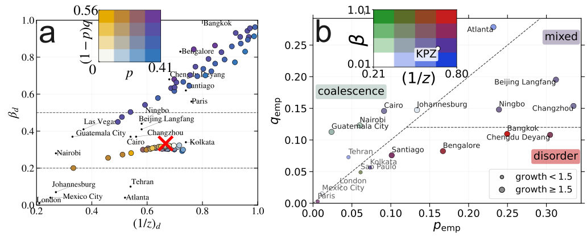 
FIG. 4. (a) Effective (βd, 1/zd) values measured in the disorder-dominated regime (pre-KPZ or saturation regime) of the diluted–accelerated Eden model (colored dots) for parameters (p, q) below the thresholds pc and qacc(p), compared with representative cities from Ref. [17] (black points). The bivariate colormap encodes the corresponding model parameters (p, q) for each simulated point. The model generates a broad cloud of apparent dynamical exponents while preserving a common local-roughness sector. The KPZ reference point is marked by the red cross. (b) Empirical proxy phase diagram in the (pemp, qemp) plane for the cities reported in Ref. [17]. Colors encode the pair (1/z, β) through a...

**Main problem.** Explaining why urban expansion fronts exhibit a robust, nearly constant local roughness exponent alongside highly variable, nonuniversal growth and dynamic exponents.

**Main result.** The observed nonuniversality is not a property of the asymptotic universality class but arises from a long-lived crossover regime driven by quenched disorder (dilution and acceleration) before reaching the asymptotic KPZ regime.

**Method.** Numerical simulations of a diluted-accelerated Eden model on a 2D square lattice using scaling analysis and comparison with empirical urban growth data.

**Summary.** This paper addresses the mystery of why urban growth fronts show consistent local roughness but wildly different global growth rates. The authors propose that this is due to a long-lasting crossover regime caused by quenched disorder in the environment. By using a modified Eden model with dilution and acceleration, they show that the system moves from a percolation-like regime to a standard KPZ growth regime. This mechanism explains the 'cloud' of varying exponents observed in real-world cities and suggests a general principle for growth in heterogeneous media.

Detailed structure

**Model / system.** A minimal projected-front Eden model on a 2D square lattice incorporating quenched dilution (representing geographic barriers) and quenched acceleration (representing coalescence/corridors).

**Key observables.** Local roughness exponent (alpha_loc), growth exponent (beta), dynamic exponent (z), global width (W), and correlation length (xi).

**Important parameters / regimes.** Dilution probability (p), acceleration probability (q), distance from percolation threshold (Delta = pc - p), and time scales (mass clock vs. continuous-time clock).

**Assumptions / limitations.** The model assumes that urban growth can be effectively captured by a stochastic growth process in a heterogeneous medium with quenched fields.

**Figures summary.** Fig 1 shows the correspondence between the model and urban data and representative morphology; Fig 2 shows different growth regimes; Fig 4 compares simulated effective exponents with empirical urban data.

**Paper structure.** The paper introduces the problem of exponent variability in urban fronts, presents the diluted-accelerated Eden model, details the simulation methodology and scaling analysis, demonstrates the crossover mechanism from percolation to KPZ, and validates the model against empirical urban datasets.

Abstract

Urban expansion fronts display a robust local roughness exponent together with strongly dispersed growth and nonuniversal dynamic exponents. We show that this coexistence can arise from a disorder-controlled crossover in projected-front growth. Introducing a minimal Eden model, in which geographic constraints act as quenched dilution and coalescence as quenched local acceleration, we demonstrate that the resulting front evolves through a long preasymptotic regime controlled by ordinary two-dimensional percolation before crossing over to asymptotic KPZ growth. In this regime, the local roughness remains close to $1/2$, while the large-scale exponents vary broadly with disorder and acceleration. These results provide a minimal explanation of urban-front roughening and suggest a more general mechanism for stochastic growth in heterogeneous media.

[↑ back to top](#top)

### [Adiabatic Error Cancellation in Berry Phase Estimation](http://arxiv.org/abs/2604.20952v1)

**Authors:** Chusei Kiumi  
**Type:** theory · **Category:** quantum information and computing · **PDF:** <https://arxiv.org/pdf/2604.20952v1>  
**Analysis basis:** full PDF text, analyzed in chunks
**Topic relevance:** `quantum measurements` **2/5**

📷 Fig 1

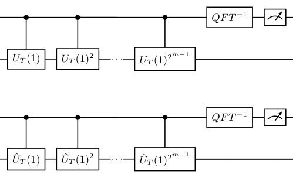 
FIG. 1. Quantum circuit for Step 1 of the Berry phase estimation algorithm. Two independent QPE procedures are run on the forward propagator UT (1) and the reverse propagator ˆUT (1), each with input |ψ(0)⟩. The upper circuit yields an estimate of the eigenphase θB + θD + φ1/T + O(T −2), while the lower circuit yields θB −θD −φ1/T + O(T −2). Adding the two outcomes cancels both the dynamical phase θD and the leading O(T −1) phase error, leaving 2θB + O(T −2).

📷 Fig 2

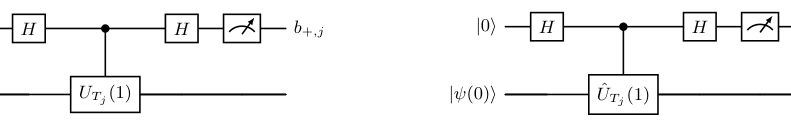 
FIG. 2. Randomized Hadamard-test subroutine used in the Berry phase estimation algorithm. For each trial j, a runtime Tj is sampled at random from a prescribed distribution, and Hadamard tests are performed for the forward propagator UTj(1) and the reverse propagator ˆUTj(1), both with input state |ψ(0)⟩. The outputs b+,j and b−,j are random variables whose distributions depend on the sampled runtime Tj. Repeating the protocol for many sampled runtimes and classically post-processing the data yields estimates of the relevant forward–reverse interference signals, from which the corresponding phase estimates are reconstructed. Combining these estimates cancels the dynamical phase and the...

**Main problem.** The systematic reduction of adiabatic errors (phase bias and leakage) in Berry phase estimation on quantum computers during finite-speed evolution.

**Main result.** The paper demonstrates a universal error-cancellation mechanism using forward-reverse evolution, Richardson extrapolation, and runtime randomization to suppress adiabatic errors from O(T^-1) to super-polynomial scales.

**Method.** The author employs Adiabatic Perturbation Theory (APT) and wave-operator formalism to analyze error expansions, combined with algorithmic techniques like Richardson extrapolation and randomized Hadamard tests.

**Summary.** This paper presents a new way to estimate the Berry phase more accurately by canceling out errors caused by finite-speed evolution. By combining forward and reverse evolutions with Richardson extrapolation and randomizing the evolution time, the author shows that the leading-order errors can be systematically eliminated. This makes Berry phase estimation much more robust and efficient for near-term quantum devices. The proposed method significantly improves the scaling of both the error and the computational complexity.

Detailed structure

**Model / system.** A quantum system undergoing adiabatic evolution along a closed loop in parameter space, governed by a smooth, time-dependent, gapped Hamiltonian H(s).

**Key observables.** Berry phase (theta_B), dynamical phase (theta_D), leakage probability (p_leak), and phase error (phi).

**Important parameters / regimes.** Total runtime (T), minimum spectral gap (Delta_min), rate of change of the Hamiltonian (dot{H}), and target accuracy (epsilon_B).

**Assumptions / limitations.** The ground state is non-degenerate, the Hamiltonian path is smooth, and the minimum spectral gap is well-defined and non-zero.

**Figures summary.** Figure 1 shows a quantum circuit for a QPE-based protocol using forward and reverse propagators; Figure 2 illustrates a randomized Hadamard-test subroutine with forward and reverse evolutions.

**Paper structure.** The paper introduces the problem of adiabatic error, establishes a mathematical framework using wave-operator formalism, proves error cancellation theorems for forward-reverse and Richardson protocols, introduces runtime randomization for oscillatory error suppression, and concludes with complexity analysis and algorithmic implementation.

**Why it may be interesting.** This is highly relevant for researchers in quantum computing and open quantum systems as it provides a robust, error-mitigation-based approach to geometric phase estimation, which is a key primitive for NISQ and early fault-tolerant quantum computing.

Abstract

In this work, we show that Berry phase estimation admits a natural and universal adiabatic error-cancellation mechanism, making it a promising candidate for practical quantum computing before full fault tolerance. Combining finite-runtime evolutions under $\pm H$ along the loop cancels the leading $O(T^{-1})$ phase error exactly, and Richardson extrapolation further reduces the residual error to an oscillatory term with endpoint-controlled coefficient $O(\|\dot H(0)\|^2Δ(0)^{-4}T^{-2})$. Beyond this deterministic cancellation, we establish that, for suitable smooth runtime distributions, runtime randomization suppresses the remaining oscillatory contribution to $O(T^{-M})$ for any fixed $M$, leading to a randomized Hadamard-test algorithm for Berry phase estimation over the full range $[0,2π)$ with improved runtime scaling under standard sample complexity.

[↑ back to top](#top)

### [Composite quantum gates simultaneously compensated for multiple errors](http://arxiv.org/abs/2604.21594v1)

**Authors:** Hristo Tochev, Nikolay Vitanov  
**Type:** theory · **Category:** quantum information and computing · **PDF:** <https://arxiv.org/pdf/2604.21594v1>  
**Analysis basis:** full PDF text, analyzed in chunks
**Topic relevance:** `Rydberg arrays` **2/5**

📷 Fig 1

 
FIG. 1. (Color online) Infidelity of X gate versus the detuning error δ and the Rabi frequency error ϵ for (a) single π pulse, (b) CORPSE, (c) B3r pulse, (d) B3d pulse. The contours depict infidelity of 10−4 (innermost) to 10−1 (outermost).

📷 Fig 2

 
FIG. 2. (Color online) Infidelity of X gate versus the detuning error δ and the Rabi frequency error ϵ for (a) B5 pulse, (b) BB1 pulse, (c) U5a pulse, (d) U5b pulse. The contours depict infidelity of 10−4 (innermost) to 10−1 (outermost).

📷 Fig 3

 
FIG. 3. (Color online) Infidelity of X gate versus the detuning error δ and the Rabi frequency error ϵ for seven pulses: (a) U7a, (b) U7b, (c) X7a, (d) X7b sequences. The contours depict infidelity of 10−4 (innermost) to 10−1 (outermost).

📷 Fig 4

 
FIG. 4. (Color online) Infidelity of X gate versus the detuning error δ and the Rabi frequency error ϵ for nine pulses: (a) U9a, (b) U9b, (c) X9a, (d) X9b sequences. The contours depict infidelity of 10−4 (innermost) to 10−1 (outermost).

📷 Fig 5

 
FIG. 5. (Color online) Infidelity of X gate versus the detuning error δ and the Rabi frequency error ϵ for eleven pulses: (a) U11a, (b) U11b, (c) X11a, (d) X11b sequences. The contours depict infidelity of 10−4 (innermost) to 10−1 (outermost).

📷 Fig 6

 
FIG. 6. (Color online) Infidelity of X gate versus the detuning error δ and the Rabi frequency error ϵ for thirteen pulses: (a) U13a, (b) U13b, (c) X13a, (d) X13b sequences. The contours depict infidelity of 10−4 (innermost) to 10−1 (outermost).

📷 Fig 7

 
FIG. 7. Infidelity of X gate versus the detuning error δ and the Rabi frequency error ϵ for non-symmetric CP optimized through Eq. (8). (a) X5c, (b) X7c, (c) X9c, (d) X11c. The pa- rameters of the pulses can be found in Table I. The contours depict infidelity of 10−4 (innermost) to 10−1 (outermost).

📷 Fig 8

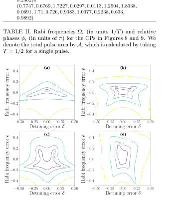 
FIG. 8. (Color online) Infidelity of Hadamard gate versus the detuning error δ and the Rabi frequency error ϵ for CP op- timized through Eq. (8). (a) H3 with length 3, (b) H4 with length 4, (c) H5 with length 5, (d) H6 with length 6. The pa- rameters of the pulses can be found in Table II. The contours depict infidelity of 10−4 (innermost) to 10−1 (outermost).

📷 Fig 9

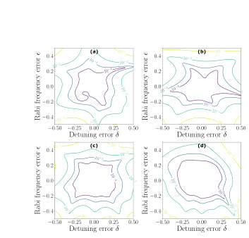 
FIG. 9. (Color online) Infidelity of Hadamard gate versus the detuning error δ and the Rabi frequency error ϵ for CP op- timized through Eq. (8). (a) H7, (b) H8, (c) H10, (d) H15. The parameters of the pulses can be found in Table II. The contours depict infidelity of 10−4 (innermost) to 10−1 (outer- most).

**Main problem.** Systematic control errors, specifically Rabi frequency (amplitude), detuning (frequency), and pulse duration errors, prevent the realization of high-fidelity single-qubit gates.

**Main result.** The authors derived new composite pulse sequences (Xn) that simultaneously compensate for amplitude, detuning, and duration errors, providing broader robustness windows than existing universal or single-error-compensating sequences.

**Method.** Two strategies were used: derivative-based cancellation of error terms in the full SU(2) unitary using Cayley-Klein parametrization, and direct numerical minimization of average gate infidelity over prescribed error ranges.

**Summary.** This paper presents a new class of composite pulse sequences designed to protect single-qubit gates against simultaneous amplitude, detuning, and duration errors. By using both analytical derivative-based cancellation and numerical optimization, the authors developed sequences that outperform standard 'universal' pulses. The results show that longer, asymmetric sequences can significantly expand the robustness window for X and Hadamard gates. This work provides a practical tool for improving gate fidelity in the presence of systematic control drifts.

Detailed structure

**Model / system.** A single qubit interacting with an external electromagnetic field, modeled by a standard two-level Hamiltonian with Rabi frequency (Omega), detuning (Delta), and pulse duration (T).

**Key observables.** Gate fidelity and average gate infidelity.

**Important parameters / regimes.** Rabi frequency error (epsilon), detuning error (delta), pulse phases, and pulse areas.

**Assumptions / limitations.** Pulses are assumed to be rectangular with constant detuning; the error model assumes systematic, coherent errors.

**Figures summary.** Figure 1 compares infidelity contours of single pulses and known sequences (CORPSE, B3r, B3d); Figure 2 and 3 show that the new Xn sequences provide broader high-fidelity domains compared to B5, BB1, and U5 sequences; Figure 7 and 8 show infidelity for optimized asymmetric X and Hadamard gates.

**Paper structure.** The paper introduces the problem of multi-error compensation, presents two construction strategies (analytical and numerical), compares new symmetric and asymmetric sequences against existing literature, and demonstrates performance for X and Hadamard gates.

**Why it may be interesting.** This is highly relevant for quantum optics and AMO physicists as it provides a robust control framework for implementing high-fidelity gates in systems like trapped ions or Rydberg atoms where systematic frequency and amplitude drifts are common.

Abstract

Systematic control errors remain a primary obstacle to realizing high-fidelity single-qubit gates. We introduce composite pulse sequences that implement X and Hadamard gates while simultaneously compensating amplitude (Rabi-frequency), detuning (frequency), and duration errors. Our construction uses two complementary strategies: (i) derivative-based cancellation of error terms in the full unitary (not just the transition probability), formulated via the Cayley-Klein parametrization, and (ii) direct minimization of the average gate infidelity over prescribed error ranges. We derive symmetric five-pulse solutions with closed-form phases that cancel all first-order terms (including the mixed derivative), and numerically optimize longer sequences -- up to 15 pulses -- to achieve higher-order suppression. We also show that standard ``universal'' five-pulse sequences (U5a/U5b) emerge as simple phase-shifted instances of our symmetric solutions, yielding broad robustness to both detuning and amplitude errors. Finally, we construct variable-area sequences for $R_x(π/2)$, which, up to virtual Z rotations, benchmark the Hadamard gate. Across all families we observe the expected trade-off between sequence length and robustness window, with substantial boosts in fidelity over large error domains.

[↑ back to top](#top)

### [Effect of Mn Substitution on Superconductivity in PrFeAs(O,F): Role of Magnetic Impurities](http://arxiv.org/abs/2604.21684v1)

**Authors:** Priya Singh, Konrad Kwatek, Tatiana Zajarniuk, Taras Palasyuk, Cezariusz Jastrzębski, A. Szewczyk, Michał Wierzbicki, Shiv J. Singh  
**Type:** both · **Category:** strongly correlated electrons · **PDF:** <https://arxiv.org/pdf/2604.21684v1>  
**Analysis basis:** full PDF text, analyzed in chunks
**Topic relevance:** `Kondo & dissipative impurity` **2/5**

📷 Fig 1

 
Figure 5 presents the analysis of thermally activated flux flow (TAFF) behavior

📷 Fig 2

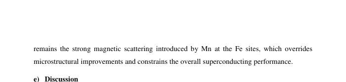 
Figure 7(a) presents a comparative analysis of the suppression of the superconducting transition

**Main problem.** Investigating how Mn substitution at the Fe site acts as a magnetic impurity to perturb the electronic and magnetic environment and suppress superconductivity in the Pr-based iron-based superconductor PrFeAs(O,F).

**Main result.** Mn acts as an efficient magnetic pair-breaker that systematically suppresses the superconducting transition temperature and degrades vortex dynamics, though the Pr-based system shows relatively enhanced robustness compared to La- or Sm-based counterparts.

**Method.** A combination of experimental techniques including powder XRD, Raman spectroscopy, transport measurements, and magnetic measurements (VSM) alongside computational DFT calculations.

**Summary.** This paper studies the impact of Mn doping on the superconductivity of PrFeAs(O,F). The researchers found that Mn acts as a strong magnetic impurity that suppresses the superconducting transition temperature and degrades the critical current density. Through structural, vibrational, and transport measurements, they demonstrate that Mn substitution expands the lattice and induces metal-insulator-like behavior. Notably, they highlight that the Pr-based system is more robust against these magnetic impurities than other members of the 1111 family.

Detailed structure

**Model / system.** The physical system is the 1111-type iron-based superconductor PrFe1-xMnxAsO0.7F0.3, characterized by a tetragonal ZrCuSiAs-type structure where Mn substitutes for Fe in the superconducting planes.

**Key observables.** Superconducting transition temperature (Tc), resistivity (rho), lattice parameters (c-axis), Raman phonon modes (B1g, A1g), upper critical field (Hc2), critical current density (Jc), and vortex activation energy (Ueff).

**Important parameters / regimes.** Mn concentration (x from 0 to 0.1), Ioffe-Regel limit, Pauli paramagnetic regime (Maki parameter alpha), and the Abrikosov-Gor'kov (AG) framework for magnetic impurity scattering.

**Assumptions / limitations.** The system is assumed to reside in the dirty limit, and the suppression of Tc is modeled using the Abrikosov-Gor'kov framework for magnetic impurities.

**Figures summary.** Figure 1 shows XRD patterns and lattice parameter evolution; Figure 2 displays Raman spectra and phonon mode shifts; Figure 3 presents resistivity temperature dependence and RRR; Figure 4 details magnetotransport and H-T phase diagrams.

**Paper structure.** The paper begins with structural and phase purity analysis (XRD/Raman), moves to transport properties (resistivity/RRR), investigates magnetic and superconducting properties (Hc2, Jc), analyzes vortex dynamics (TAFF), and concludes with a comparative study of robustness across different 1111-family members.

Abstract

We investigate Mn substitution at the Fe site in PrFe1-xMnxAsO0.7F0.3 (0 to 0.1) using structural, Raman, density functional theory (DFT), transport, and magnetic measurements. X-ray diffraction and Raman analyses confirm preferential Mn incorporation into the FeAs planes, accompanied by lattice expansion and suppression of Fe-related vibrational modes. Electrical transport reveals a systematic decrease of the superconducting transition temperature from 48 K (x = 0) to complete suppression at x = 0.1, together with low-temperature resistivity upturns evolving toward insulating-like behavior. Magnetization and magnetotransport measurements show degradation of superconducting coherence, critical current density, upper critical field, and vortex activation energy with increasing Mn content. The results demonstrate that Mn acts as an efficient magnetic impurity, strongly perturbing the electronic and magnetic environment of the FeAs layers. Comparative analysis indicates relatively enhanced robustness of superconductivity in the Pr-based system, highlighting the role of rare-earth-dependent electronic correlations in impurity effects.

[↑ back to top](#top)

### [LightStim: A Framework for QEC Protocol Evaluation and Prototyping with Automated DEM Construction](http://arxiv.org/abs/2604.21472v1)

**Authors:** Xiang Fang, Ming Wang, Yue Wu, Sharanya Prabhu, Dean Tullsen, Narasinga Rao Miniskar, Frank Mueller, Travis Humble, Yufei Ding  
**Type:** theory · **Category:** quantum information and computing · **PDF:** <https://arxiv.org/pdf/2604.21472v1>  
**Analysis basis:** full PDF text, analyzed in chunks
**Topic relevance:** `quantum measurements` **2/5**

📷 Fig 1

 
Figure 1. (a) Dual burden on QEC protocol Compilation: Physical Circuit &amp; DEM. (b) Sample Stim circuit. Physical operations specified by the protocol and the rest are all automated in LightStim.

📷 Fig 2

 
Figure 3. Physical Circuit and DEM construction for surface code Z memory experiment.

📷 Fig 3

 
Figure 2. Pauli tableau representation of QEC systems. Stab: stabilizers; Log: logical operators.

📷 Fig 4

 
Figure 4. Overview of LightStim’s Pauli Tracker workflow. The physical circuit drives a forward update of the record- augmented Pauli tableau, triggering DEM construction upon encountering measurements.

📷 Fig 5

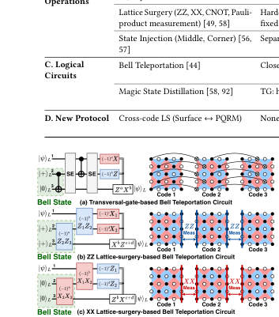 
Figure 5. Three realizations of Bell state teleportation cir- cuits: (a) transversal gates, (b,c) 𝑍𝑍/𝑋𝑋lattice surgery.

📷 Fig 6

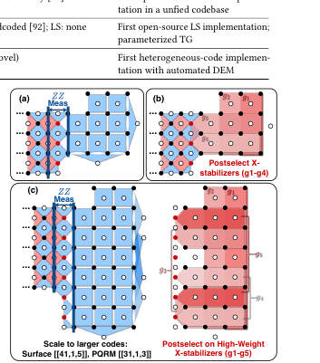 
Figure 6. Cross-code Lattice surgery between surface code and punctured quantum Reed-Muller (PQRM) code.

📷 Fig 7

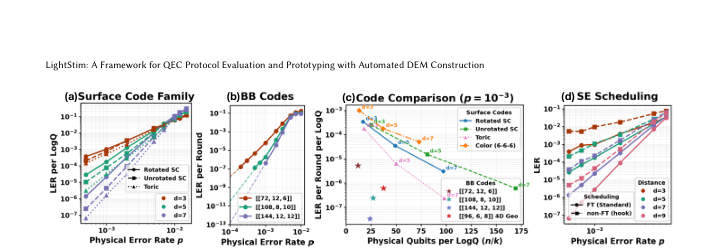 
Figure 7. Evaluation of memory experiments. (a) Surface code family. (b) BB code family. (c) QEC efficiency: LER per physical qubit. (d) Effect of SE circuit design on LER.

📷 Fig 8

 
Fig. 7 summarizes memory experiments across four axes. 1. Surface code family (Fig. 7a). We evaluate Z-basis mem- ory for the rotated, unrotated, and toric surface codes at 𝑑∈{3, 5, 7} under circuit-level noise. All three variants ex- hibit increasing LER suppression as 𝑑scales, aligned with theoretical results [29, 75]. Notably, at fixed 𝑑, LERrotated &gt; LERunrotated &gt; LERtoric under the threshold (0.8%), reflecting the benefit of increasing qubit redundancy (𝑑2, 2𝑑2−2𝑑+1, and 2𝑑2). The intuition is: when operating below the er- ror threshold, more physical qubits provide more syndrome information that enables more accurate decoding, so the additional redundancy yields lower LER despite the...

📷 Fig 9

 
Figure 8. Comprehensive evaluation of logical operations. (a) Transversal gates and lattice surgery operations of unrotated surface code against the memory baseline; (b) State injection of rotated surface code; (b1)-(b3) Two SE round, full post-selection; (b4) Different post-selection schemes.

📷 Fig 10

 
Figure 9. LER of Bell-state teleportation circuit implemented in (a) transversal gates and (b,c) lattice surgery.

**Main problem.** The manual construction of Detector Error Models (DEMs) for complex quantum error correction (QEC) protocols is tedious, error-prone, and fails to scale with complex operations like lattice surgery or distillation.

**Main result.** The authors present LightStim, a framework that automates DEM construction concurrently with circuit compilation, enabling efficient prototyping and evaluation of complex, heterogeneous QEC protocols.

**Method.** The framework uses a Pauli tracker to maintain a Pauli tableau that is augmented with measurement records, utilizing back-propagation of Clifford conjugation and RREF decomposition to identify detectors and logical observables.

**Summary.** LightStim is a new automated framework designed to bridge the gap between physical circuit compilation and the construction of Detector Error Models for quantum error correction. By tracking the evolution of Pauli operators through a tableau, it eliminates the need for manual annotation of detectors and observables. This allows researchers to rapidly prototype and evaluate complex, non-standard protocols like lattice surgery and magic state distillation. The framework has been validated to match existing simulators and successfully demonstrates high-efficiency error correction in heterogeneous code architectures.

Detailed structure

**Model / system.** The framework is applied to stabilizer codes, including surface codes (rotated/unrotated), color codes, BB codes, and punctured quantum Reed-Muller (PQRM) codes, under circuit-level Pauli noise models.

**Key observables.** Logical Error Rate (LER), detectors (vertices), logical observables (targets), and post-selection rates.

**Important parameters / regimes.** Code distance (d), physical error rate (p), routing distance (r_inter), and error-type bias (X/Z).

**Assumptions / limitations.** The framework assumes the use of Clifford gates and Pauli-based error models.

**Figures summary.** Figure 1 illustrates the dual burden of QEC evaluation; Figure 2 shows Pauli tableau representation; Figure 4 details the LightStim workflow; Figure 6 shows cross-code lattice surgery; Figures 9-10 present LER scaling and post-selection trade-offs; Figure 12 shows tableau evolution for teleportation.

**Paper structure.** The paper introduces the scalability bottleneck of manual DEM construction, presents the LightStim framework and its automated Pauli tracking mechanics, validates the framework against existing implementations, demonstrates its utility through complex protocol prototyping (lattice surgery and distillation), and concludes with performance analyses of logical operations.

Abstract

Fault-tolerant quantum computing increasingly demands rigorous, circuit-level evaluation of diverse quantum error correction (QEC) protocols and efficient prototyping of new ones. Such evaluation requires both the physical circuit and its Detector Error Model (DEM) to simulate end-to-end logical error rates. However, DEM construction today is performed by manual annotation, a tedious and error-prone process that effectively limits evaluation to simple memory experiments. We present LightStim, a framework that automates DEM construction concurrently with circuit compilation by maintaining a Pauli tableau augmented with measurement records, with no protocol-specific input required. We benchmark LightStim across protocols from memory experiments to end-to-end distillation circuits; cross-validation against public implementations confirms exact detector and observable counts and consistent logical error rates. LightStim additionally accelerates the exploration of new protocols, which we demonstrate through a novel heterogeneous cross-code lattice surgery design between surface and punctured quantum Reed-Muller codes. These capabilities together make LightStim a unified infrastructure for systematic QEC protocol evaluation and exploration.

[↑ back to top](#top)

## Other papers (38)

*Papers from primary archives without highlighted authors or any topic match. Click to expand.*

Show other papers

### [$3d_{z^2}$ orbital delocalization and magnetic collapse in superconducting (La,Pr)$_3$Ni$_2$O$_{7-δ}$ films](http://arxiv.org/abs/2604.21899v1)

**Authors:** Xiaoyang Chen, Wenliang Zhang, Fei Peng, Ting Cui, Guangdi Zhou, Zezhong Li, Jaewon Choi, Lizhi Xu, Yiu-Fung Chiu, Stefano Agrestini, Sahil Tippireddy, Haoliang Huang, Heng Wang, Xianfeng Wu, Peng Li, Jin-Feng Jia, Mirian Garcia-Fernandez, Yi Lu, Er-Jia Guo, Qi-Kun Xue, Zhuoyu Chen, Donglai Feng, Ke-Jin Zhou  
**Type:** experiment · **Category:** strongly correlated electrons · **PDF:** <https://arxiv.org/pdf/2604.21899v1>  
**Analysis basis:** full PDF text, analyzed in chunks

📷 Fig 1

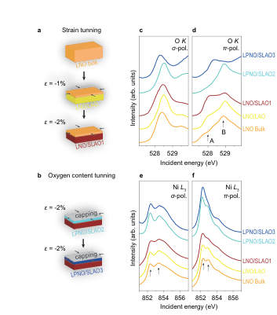 
FIG. 1. The O K- and Ni L3- X-ray absorption spec- tra. a,b, Schematic illustration of (La,Pr)3Ni2O7−δ films designed with varying compressive strain (a) and oxygen content (b). The LPNO/SLAO3 is superconducting at low temperature while the other samples are insulating. c,d, O K-XAS measured at σ polarisation (c) and π polarisation (d). e,f, Ni L3-XAS measured at σ polarisation (e) and π polarisation (f). XAS were measured in total fluorescence yield (TFY) mode at 20 K with a grazing incidence angle of 20◦, where π polarization predominantly probes out-of-plane orbital states, while σ polarization probes in-plane orbital states.

📷 Fig 2

 
Figure 3a shows the momentum-dependent magnetic exci- tations in LNO/LAO, along the two high-symmetrical direc- tions (see Methods). The damped harmonic oscillator (DHO) function was used to fit the magnons. The extracted magnon peaks (ωp) exhibit a dispersion overlapping with that of LNO bulk at ambient pressure (Fig. 3b) [8]. For a detailed com- parison, representative RIXS spectra at q∥= (−0.14, −0.14) (Fig. 3d) and q∥= (−0.06, −0.06) (Fig. 3e) are presented. In contrast to the LNO bulk, the magnons in the thin films are significantly damped. The extracted damping factor (γ) is ∼40 meV in the thin film twice of that in the LNO bulk. With the similar ωp and increased γ, the fitted...

📷 Fig 3

 
FIG. 2. The electronic excitations in the compressively strained (La,Pr)3Ni2O7−δ films. a,b, TFY XAS and energy-dependent RIXS maps at the Ni L3 edge. The RIXS spectra are normalized by the high-energy dd excitations with integrated intensity over the energy-loss window [0.6 eV, 3.0 eV]. Both XAS and RIXS were measured at a grazing incidence angle of 20◦with π polarization to enhance sensitivity to out-of-plane dz2 orbital states. The RIXS map of LNO bulk is adapted from Ref. [8]. c,d, Zoomed-in views of the RIXS maps shown in (a,b), highlighting the dd3 excitations. e, Integrated RIXS intensity over the incident-energy range [852.5 eV, 853.3 eV], corresponding to the resonance of the dd2...

📷 Fig 4

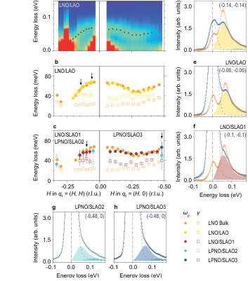 
FIG. 3. Magnetic excitations in the compressively strained (La,Pr)3Ni2O7−δ films. a, Momentum-resolved RIXS intensity maps of the LNO/LAO film along the q∥= (H, H) and (H, 0) directions. The Brillouin zone is defined based on the pseudo-tetragonal lattice [8]. All spectra were measured at 20 K using π-polarized X-rays tuned to the magnon resonance (852.4 eV). Each RIXS spectrum was fitted with a pseudo-Voigt function for the elastic peak and a damped harmonic oscillator (DHO) function for the magnon exci- tation. The green filled circles denote the extracted magnon peak energies (ωp), with error bars representing the fitting uncertainties, which are smaller than the marker size (see details...

📷 Fig 5

 
FIG. 4. Spin-density-wave behavior in the compressively strained (La,Pr)3Ni2O7−δ films. a–e, SDW peaks of La3Ni2O7−δ bulk single crystals and compressively strained thin films. Spec- tra were measured along the (H, H) direction near the SDW wave vector (−0.25, −0.25) at 20 K with π-polarized X-rays tuned to the SDW resonance (852.4 eV). Intensities were normalized to the dd excitations at 1 eV, and each spectrum was fitted with a Lorentzian function. f,g, Temperature dependence of the SDW intensity (f) and correlation length (ξSDW) (g) for the bulk and thin film samples. The dashed line at 150 K indicates the SDW transition temperature of the bulk sample. The correlation length is defined...

**Main problem.** Understanding the microscopic electronic and magnetic evolution from the parent insulating phase to the superconducting phase in Ruddlesden-Popper nickelate thin films.

**Main result.** The study reveals a two-step evolution where both strain and oxygenation drive the delocalization of the Ni 3d_z2 and O 2p_z orbitals, accompanied by the suppression of long-range spin-density-wave order.

**Method.** X-ray absorption spectroscopy (XAS) and resonant inelastic X-ray scattering (RIXS) were used to probe orbital and magnetic excitations in epitaxial thin films.

**Summary.** This paper investigates the transition from an insulating to a superconducting state in bilayer nickelate thin films. By tuning strain and oxygen content, the researchers show that superconductivity is linked to the delocalization of specific orbitals (Ni 3d_z2 and O 2p_z). This process is accompanied by the melting of long-range magnetic spin-density-wave order. The findings provide a roadmap for designing new superconductors by controlling orbital-selective pathways.

Detailed structure

**Model / system.** The physical system consists of (La,Pr)3Ni2O7-delta (LPNO) bilayer nickelate thin films, which can be tuned via compressive epitaxial strain (using SLAO or LAO substrates) and oxygen stoichiometry.

**Key observables.** Spectral weight transfer in O K-edge XAS, Ni 3d_z2 orbital itinerancy, dd orbital excitations, spin-density-wave (SDW) intensity and correlation length, and magnon dispersion/damping.

**Important parameters / regimes.** Compressive strain (%), oxygen deficiency (delta), temperature, and the interlayer 3d_z2-2p_z-3d_z2 molecular orbital hybridization.

**Figures summary.** Figure 1 shows the strain and oxygen tuning series and XAS spectra; Figure 4 displays SDW peaks, RIXS spectra for SDW intensity, and dd excitations.

**Paper structure.** The paper introduces the problem of nickelate superconductivity, describes the experimental setup for strain and oxygen tuning, presents XAS results showing orbital delocalization, details RIXS results regarding magnetic order suppression and magnon damping, and concludes with a model for orbital-selective superconductivity.

Abstract

The recent discovery of Ruddlesden-Popper (RP) nickelate thin-film superconductors has opened a new frontier in unconventional superconductivity. Its realization requires both compressive epitaxial strain and highly oxidative growth conditions, yet the microscopic pathway from the parent phase to the superconducting phase remains elusive. Here, X-ray absorption spectroscopy and resonant inelastic X-ray scattering are employed to track this evolution by independently tuning strain and oxygen content in (La,Pr)$_3$Ni$_2$O$_{7-δ}$ thin films. We uncover a remarkable two-step evolution. First, signatures of delocalization emerge in the same way upon two independent tunings: spectral weight transfers from an upper Hubbard-like peak to the hole-like peak associated with the O $2p_z$ state, and in parallel, the initially localized Ni $3d_{z^2}$ orbital becomes more itinerant, accompanied by the broadening and weakening of $dd$ orbital excitations. Second, as itinerancy increases, long-range spin-density-wave (SDW) order is suppressed in both intensity and correlation length, indicating direct competition with superconductivity. Yet, short-range magnons persist: they become damped, but their bandwidth remains unchanged. Our results paint a coherent picture in which both strain and oxygenation drive the RP bilayer nickelates towards superconducting instability, where the O $2p_z$ and Ni $3d_{z^2}$ orbitals become delocalized. Concomitantly, the long-range magnetic order loses coherence and is suppressed. These findings establish an orbital-selective route to RP nickelate superconductivity, in which the delocalization of the interlayer $3d_{z^2}$-$2p_z$-$3d_{z^2}$ molecular orbital and the robust short-range magnons upon the melting of SDW order are prerequisites, providing strong constraints for theory and a roadmap for designing nickelate superconductors.

[↑ back to top](#top)

### [$η$-pairing in a two-band model of spinless fermions](http://arxiv.org/abs/2604.21318v1)

**Authors:** Igor N. Karnaukhov  
**Type:** theory · **Category:** strongly correlated electrons · **PDF:** <https://arxiv.org/pdf/2604.21318v1>  
**Analysis basis:** full PDF text, analyzed in chunks

📷 Fig 1

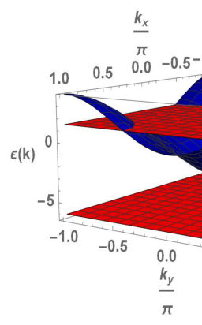 
Figure 1: The one-particle energies of spinless fermions in the 2D model are shown: low-energy

📷 Fig 2

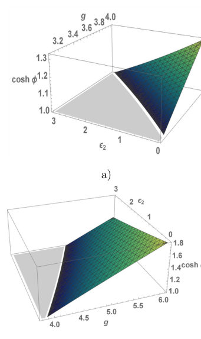 
Figure 2: Effective attractive interaction between two s-fermions, forming a complex,

**Main problem.** Investigating whether two-particle hybridization between itinerant and localized fermions can induce an effective attractive interaction to realize eta-pairing and p-type superconductivity.

**Main result.** The study finds that two-particle hybridization reduces repulsive interactions between itinerant fermions, leading to an effective attractive interaction and the realization of eta-pairing and p-type superconducting states.

**Method.** The 1D version of the model is solved exactly using the Bethe ansatz, involving the derivation of the two-particle scattering matrix and the analysis of the thermodynamic limit via rapidities.

**Summary.** This paper explores a mechanism for superconductivity in a two-band model of spinless fermions. By using two-particle hybridization between itinerant and localized bands, the model demonstrates that repulsive interactions can be transformed into an effective attractive interaction. This process leads to the formation of eta-pairing and p-type superconducting states. The findings are particularly relevant for understanding high-temperature superconductivity in hydrogen-rich materials under high pressure.

Detailed structure

**Model / system.** A 1D two-band model of spinless fermions consisting of itinerant s-band fermions and localized d-band fermions, featuring two-particle s-d hybridization.

**Key observables.** eta-pairing operators, pair energy (epsilon_plus/minus), off-diagonal long-range order (ODLRO), and critical temperature (Tc).

**Important parameters / regimes.** hybridization strength (g), intra-band interactions (J, I), localized fermion energy (epsilon), and Fermi energy (epsilon_F).

**Assumptions / limitations.** The effective interaction is treated as a constant near the Fermi energy; the model is restricted to a 1D version for the exact solution.

**Figures summary.** Figure 1 illustrates the energy levels of the 2D system.

**Paper structure.** The paper introduces the two-band model and its Hamiltonian, applies the Bethe ansatz to find exact solutions, derives the conditions for eta-pairing and Bose condensation, and discusses the implications for p-type superconductivity and high-pressure hydrogen-rich materials.

Abstract

We study the two-band model of spinless fermions in which itinerant fermions interact with localized fermions through the two-particle hybridization. In 1D version, the model has exact solution using the Bethe ansatz. It has been shown that accounting for two-particle hybridization reduces the repulsive interaction between itinerant fermions. In the case of strong interaction, the effective interaction between itinerant fermions is attractive, and $η$-pairing of spinless fermions is realized. The proposed pairing mechanism via two-particle hybridization can lead to $p$-superconducting states with $η$-pairing. $η$-pairing of spinless fermions could explain the phenomenon of high-temperature superconductivity experimentally observed in hydrogen-rich materials at high pressures.

[↑ back to top](#top)

### [A Universal Quantum Information Preserving Photonic Switch for Scalable Quantum Networks](http://arxiv.org/abs/2604.21902v1)

**Authors:** Jiapeng Zhao, Stéphane Vinet, Amir Minoofar, Michael Kilzer, Lucas Wang, Galan Moody, Vijoy Pandey, Ramana Kompella, Reza Nejabati  
**Type:** both · **Category:** quantum information and computing · **PDF:** <https://arxiv.org/pdf/2604.21902v1>  
**Analysis basis:** full PDF text, analyzed in chunks

📷 Fig 1

 
FIG. 1: Switched Quantum Network. Conceptual quantum network centered around the quantum switch. The system ensures quantum state integrity and entanglement preservation while providing encoding-agnostic operation across diverse modalities. The switch supports time- and space-multiplexed utilization of shared critical resources whilst providing a scalable framework for the interconnection of quantum computers and quantum sensor.

📷 Fig 2

 
FIG. 2: Architecture of the Universal Quantum Switch. The input quantum state converters (QSCs) enable conversion to path-encoding to ensure quantum information is routed through two identical photonic switches. The output QSCs convert the quantum information back to the desired output encoding modality. Both QSCs can be implemented in either an integrated or pluggable manner with an arbitrary combination of encoding modality.

📷 Fig 3

 
FIG. 3: Schematic of the quantum switch. (a) Simplified sketch of the device for polarization encoding. (b) TFLN photonic integrated circuit combining both QSCs and the switch matrix, respectively highlighted in green and purple. (c) Normalized optical power when varying the driving voltage of TO phase shifters to characterize the half-wave power and ER of MZI. (d) Fast switching between two output ports when driving the EO modulator with a sinusoidal waveform at 1 GHz rate to determine half-wave voltage.

📷 Fig 4

 
FIG. 4: Quantum state tomography (a) Simplified sketch of the experimental setup for quantum characterization. An entangled photon source produces polarization-entangled photons at 1551.72 nm (signal) and 1564.68 nm (idler). The signal photon is routed through the UQS. After the PIC, both photons are sent to the polarization tomography system. Reconstructed density matrices for the input ρin (b) and output ρout (c) for connection 1 →1 (input →output ports). A fidelity F(ρin, ρout) = 0.98 is obtained with purity Tr(ρ2 out) = 1.

📷 Fig 5

 
FIG. 5: Dynamic switching. (a) Dynamic switching of the device when driving the EO modulator with a rectangular pulse at 1 MHz. The gated section used for quantum state tomography is shown in the shaded region. Reconstructed density matrices for the input ρin (b) and output ρout (c) for connection 2 →1 (input → output ports). A fidelity F(ρin, ρout) = 0.90 is obtained with purity Tr(ρ2 out) = 1.

📷 Fig 6

 
FIG. 6: Scaling potential of the UQS. (a) UQS fidelity as a function of PDL per PRS. b UQS fidelity as a function of PER of PRS and ER of MZI. c UQS fidelity and IL as a function of dimension N. Note that the IL floor comes from the high coupling loss in the current chip. A low loss (≤1 dB) design can be implemented to reduce the IL floor to 2 dB.

📷 Fig 7

 
FIG. 7: Polarization entangled photon source. Polarization entangled photons are generated in a fiber-based Sagnac interferometer via spontaneous four-wave mixing (SFWM) in a AlGaAs chip. The interferometer is actively locked using a probe laser with a servo controller.

**Main problem.** Existing quantum networks are limited to static, point-to-point links due to the lack of a switching paradigm that can dynamically route fragile entanglement without introducing decoherence or loss.

**Main result.** The authors demonstrate a Universal Quantum Switch (UQS) in thin-film lithium niobate that enables high-speed (up to 1 GHz) routing of arbitrary entangled states with minimal decoherence (less than 4%).

**Method.** The work combines a theoretical architecture for encoding-agnostic routing with an experimental prototype using thermo-optic and electro-optic modulation, validated via quantum state tomography and impedance-matched RF circuit optimization.

**Summary.** The paper presents a new 'Universal Quantum Switch' designed to enable scalable, multi-node quantum networks. Using thin-film lithium niobate technology, the researchers created a device that can route different types of quantum information (like polarization or time-bin encoding) without destroying the fragile entanglement. The switch operates at extremely high speeds, up to 1 GHz, and maintains very high fidelity. This provides a foundational building block for creating a complex, interconnected quantum internet.

Detailed structure

**Model / system.** A 2x2 thin-film lithium niobate (TFLN) photonic integrated circuit featuring a three-stage architecture: input/output quantum state converters (using polarization rotators) and a non-blocking switch matrix composed of Mach-Zehnder interferometers.

**Key observables.** Fidelity, purity, concurrence, Polarization Extinction Ratio (PER), Polarization Dependent Loss (PDL), and Insertion Loss (IL).

**Important parameters / regimes.** Switching speeds up to 1 GHz, decoherence penalty < 4%, and reconfiguration speeds up to 1 GHz.

**Assumptions / limitations.** Assumes negligible path mismatch between logical states, identical extinction ratios for switch matrix arms, and negligible photon crosstalk from different input ports.

**Figures summary.** Fig 1: Conceptual switched network; Fig 2: UQS architecture stages; Fig 3: TFLN implementation and 1 GHz switching plots; Fig 6: Scalability projections (fidelity/loss vs. dimension N); Fig 7: AlGaAs Sagnac photon source.

**Paper structure.** The paper introduces the scalability problem of quantum networks, proposes the UQS architecture, details the TFLN experimental implementation and RF optimization, presents performance benchmarking via tomography, and concludes with scalability projections.

**Why it may be interesting.** This is highly relevant to quantum optics and open quantum systems as it demonstrates a method to implement dynamic, high-speed routing of qubits while explicitly modeling and mitigating hardware-induced decoherence and noise.

Abstract

Quantum networks are a keystone of the quantum internet. However, existing implementations remain largely confined to static point-to-point links due to the absence of a switching paradigm capable of dynamically routing fragile quantum entanglement without introducing decoherence. Here, we propose the Universal Quantum Switch, a foundational building block allowing on-demand, non-blocking, and encoding-agnostic routing of quantum information, as well as seamless modality conversion between disparate quantum platforms. We develop a prototype in thin-film lithium niobate and experimentally demonstrate robust switching with $\le 4\%$ decoherence via thermo-optic modulation and high-speed electro-optic switching of arbitrary entangled states at 1 MHz. Moreover, we show that our platform can support reconfiguration speeds up to 1 GHz. To our knowledge, this work represents the first demonstration of multi-node dynamic entanglement distribution at these speeds. Complementing these experimental results, we project the architecture's scalability, showing dimension-independent decoherence, and provide a scalable, interoperable building block for heterogeneous quantum network fabrics.

[↑ back to top](#top)

### [Catalytic quantum thermodynamics beyond additivity and reduced-state monotones](http://arxiv.org/abs/2604.21509v1)

**Authors:** Ali Can Günhan, Onur Pusuluk, Thomas Oikonomou, G. Baris Bagci  
**Type:** theory · **Category:** statistical mechanics · **PDF:** <https://arxiv.org/pdf/2604.21509v1>  
**Analysis basis:** full PDF text, analyzed in chunks

📷 Fig 1

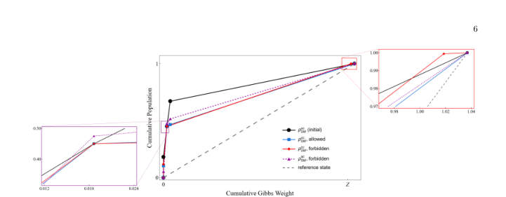 
FIG. 1. Thermo-majorization curves for the common initial product state ρuc SM = ρ β2 S ⊗ρ β1 M (black), the allowed classically correlated final state ρcc SM with χ = 5 × 10−2 (blue), the forbidden classically correlated final state ρcc SM with χ = 6.5 × 10−2 (red), the forbidden discordant final state ρ qc SM with λ = 9.47 × 10−2 (purple dashed), and the common thermal reference state (gray dashed), for Eg = 0, Ee = 2, β1 = 0.1, β2 = 0.2, β3 = 1, and βb = 2. In all three final-state examples, the initial state, the thermal reference state, and the final marginals are identical; only the correlation structure of the final joint state is changed. In particular, ρ qc SM(λ = 9.47 × 10−2) has...

**Main problem.** The paper addresses the lack of explicit catalyst accounting in standard Rènyi-based quantum thermodynamics and the insufficiency of reduced-state data to characterize thermodynamic accessibility in correlated catalytic transformations.

**Main result.** The authors develop a non-additive divergence framework that makes the catalyst's contribution explicit in the free-energy balance and proves that in correlated catalysis, thermodynamic accessibility depends on the full joint-state structure rather than just marginals or mutual information.

**Method.** The study utilizes Quantum Resource Theory (QRT), non-additive (pseudo-additive) divergences, and thermo-majorization to analyze state transformations and quantify the impact of correlations and catalyst spectral profiles.

**Summary.** This paper introduces a new mathematical framework for quantum thermodynamics using non-additive divergences. In uncorrelated catalysis, this approach makes the catalyst's role and its spectral properties explicitly visible in the second law. In correlated catalysis, the authors demonstrate that simple measures like mutual information or reduced-state information are insufficient to predict if a transformation is possible, as the specific nature of the correlations (classical vs. quantum) matters. The work provides a more detailed 'bookkeeping' of how catalysts assist or constrain quantum thermal transitions.

Detailed structure

**Model / system.** The model involves a quantum system (S) and a catalyst (M) undergoing thermal operations in a finite-dimensional setting, potentially involving a work bit (qubit) and a thermal reservoir at inverse temperature beta.

**Key observables.** Rènyi/non-additive divergences, generalized free energies, mutual information, trace-distance error, and thermo-majorization curves.

**Important parameters / regimes.** Order of divergence (alpha), catalyst dimension (d_M), catalyst return error (epsilon), and correlation parameters (chi for classical, lambda for discordant).

**Assumptions / limitations.** The analysis focuses on finite-dimensional regimes and assumes thermal states are block-diagonal in the energy eigenbasis.

**Figures summary.** Figure 1 shows thermo-majorization curves for various states, including initial product states, thermal reference states, and states with different classical and discordant correlation structures.

**Paper structure.** The paper introduces the problem of catalyst accounting, develops the non-additive divergence framework, applies it to uncorrelated catalysis (including approximate cases), extends the analysis to correlated catalysis to demonstrate the failure of reduced-state descriptions, and concludes with implications for thermodynamic bookkeeping.

**Why it may be interesting.** This is highly relevant for researchers in open quantum systems and many-body dynamics as it provides new tools for understanding how correlations and finite-size effects fundamentally limit the feasibility of quantum thermodynamic processes.

Abstract

The generalized second laws of quantum thermodynamics are usually formulated in terms of Rényi divergences and the associated family of generalized free energies. In catalytic thermal transformations, this framework typically certifies the existence of a suitable catalyst but does not make the catalytic contribution explicit in the resulting system-level inequalities. Here we develop a complementary formulation based on non-additive divergences, whose pseudo-additive structure yields a family of generalized free energies with an explicit catalyst-dependent correction term. For uncorrelated catalytic thermal transformations, we show that this leads to non-additive second-law relations that make the catalytic contribution explicit and provide nontrivial constraints on admissible catalysts when the catalyst is returned only approximately. We also analyze correlated catalytic thermal transformations and show, through explicit finite-dimensional examples, that reduced-state data are generally insufficient to characterize thermodynamic accessibility: the thermo-majorization behavior of the joint transformation can change while the system and catalyst marginals remain fixed, and even states with identical marginals and the same mutual information can exhibit different thermo-majorization accessibility. Our results show that non-additivity can be thermodynamically informative in uncorrelated catalysis, whereas correlated catalysis generally requires a genuinely joint-state-sensitive description beyond reduced-state monotones.

[↑ back to top](#top)

### [Deterministic generation of grid states with programmable nonlinear bosonic circuits](http://arxiv.org/abs/2604.21824v1)

**Authors:** Yanis Le Fur, Javier Lalueza-Puértolas, Carlos Sánchez Muñoz, Alberto Muñoz de las Heras, Alejandro González-Tudela  
**Type:** theory · **Category:** quantum information and computing · **PDF:** <https://arxiv.org/pdf/2604.21824v1>  
**Analysis basis:** full PDF text, analyzed in chunks

📷 Fig 1

 
FIG. 1. Symmetry-enforced state preparation for the 0-logical state. (a) Wigner representations of the initial squeezed vacuum state with r = 6 dB (i), displacement (ii), Kerr evolution (iii), and a final correction displacement ˆUD(iβcorr) (iv). Panel (v) represents the Wigner after applying three cycles of the protocol described in Algorithm 1 with initial squeezing r = 6 dB. (b) Expectation value ⟨ˆQ1⟩[dB] versus correction amplitude βcorr for a single-cycle generated state and for different values of initial squeezing r in different red shades. (c) ⟨ˆQ0⟩[dB] saturation for an increasing number of cycles of the symmetry-enforced states across different squeezing regimes (in red shades)....

📷 Fig 2

 
FIG. 2. Wigner distributions and logical state infidelities for phased-comb states. (a) Wigner distributions of the phased-comb logical states |˜0PC,j⟩(ncycles = 1, 2, and 3 cycles, left to right) and |˜1PC,j⟩(ncycles = 0, 1, and 2 cycles, left to right) using a squeezing parameter of r = 10 dB and the protocol described in Algorithm 1, but without the correction step. (b,c) Logical state infidelity Iµ (µ ∈{0, 1}) as a function of the Kerr uncertainty ∆χmax (b) and the boson loss rate normalized to the Kerr strength κ/χ (c). The infidelity is evaluated for a 3-cycle state (µ = 0, blue squares) and a 2-cycle state (µ = 1, red rhombus) at a squeezing of r = 7.8 dB. Data points represent an...

📷 Fig 3

 
FIG. 3. Performance of QEC codes. (a) Near-optimal channel infidelity ˜Ie = 1−˜Fe as a function of the photon loss probability γ. (b) Channel infidelity versus the number of state legs at a fixed loss probability γ = 10−2. Performance is compared across four encodings: phased-comb (red rhombus), comb (blue rhombus), Gaussian-truncated GKP (red circles), and the trivial encoding {|0⟩, |1⟩} (dashed line). All codes are evaluated with the same number of legs. Parameters: (a) µ = 0 logical states generated with 3 cycles and µ = 1 logical states with 2 cycles. (b) Truncation level of the cavity NR = 500 except for the 5 cycle case where NR = 1200 to ensure convergence. (a,b) Squeezing is fixed...

**Main problem.** The difficulty of deterministically generating non-Gaussian bosonic grid states, such as GKP states, which are essential for hardware-efficient quantum error correction.

**Main result.** The discovery of 'phased-comb states' generated by programmable nonlinear bosonic circuits that provide scalable error correction with performance comparable to GKP states and allow for a universal gate set.

**Method.** An iterative 'leg-doubling' protocol using a sequence of squeezing, displacement, and Kerr-type nonlinear operations to generate complex bosonic states.

**Summary.** This paper proposes a way to deterministically create bosonic states for quantum error correction using simple nonlinear circuits. While trying to create standard GKP states, the authors found that these circuits naturally produce a new class of 'phased-comb' states. These states are just as good at protecting information against photon loss and can be used to perform universal quantum logic gates. This approach is scalable and can be implemented in existing microwave or optical platforms.

Detailed structure

**Model / system.** A platform-agnostic nonlinear bosonic circuit (compatible with photonic or microwave modes) utilizing Kerr nonlinearity, displacement, and squeezing unitaries.

**Key observables.** GKP squeezing operators (Q0 and Q1), Wigner distributions, channel fidelity, and logical state infidelity.

**Important parameters / regimes.** Kerr strength, squeezing amplitude, number of circuit cycles, and boson loss rate.

**Assumptions / limitations.** Boson loss is treated as the dominant decoherence mechanism, and the error correction performance is evaluated against an optimal recovery operation.

**Figures summary.** Figure 1 shows the Wigner evolution of a single cycle and the saturation of symmetry restoration; Figure 3 shows the channel infidelity of phased-comb states versus photon loss probability.

**Paper structure.** The paper introduces the challenge of GKP generation, proposes a programmable circuit protocol, compares symmetry-enforced states versus phased-comb states, analyzes the error-correction performance and robustness of the new states, and demonstrates the implementation of a universal gate set.

**Why it may be interesting.** It provides a new class of error-correcting codes (phased-comb states) and a deterministic generation method that avoids the probabilistic nature of standard GKP protocols, which is highly relevant for scalable bosonic quantum computing.

Abstract

Bosonic quantum error correction enables hardware-efficient protection of quantum information by encoding logical qubits in harmonic oscillators. Bosonic grid states, such as Gottesman-Kitaev-Preskill (GKP) states, are particularly promising due to their potential to correct small displacements and boson loss. However, their generation remains challenging, typically relying on probabilistic protocols or auxiliary qubit systems. Here, we propose deterministic protocols for generating bosonic grid states using programmable nonlinear bosonic circuits composed solely of squeezing, displacement, and Kerr operations. We show that aiming to enforce GKP symmetries in the output of these circuits yields states with competitive performance with respect to current realizations, but whose quality saturates with increasing circuit depth due to imperfect symmetry restoration. Instead, we find that these bosonic circuits naturally give rise to a distinct class of states, that we label as phased-comb states, which are unitarily related to standard grid states but feature an intrinsic phase structure. We demonstrate that these states define a scalable bosonic quantum error-correcting code with near-optimal performance under boson loss comparable to that of approximate GKP states. We further analyze their logical operations and show how to implement a universal gate set for them. Our results establish programmable nonlinear bosonic circuits as a viable route towards the generation of scalable bosonic quantum error-correcting states beyond standard GKP encodings.

[↑ back to top](#top)

### [Disorder-induced crossover from phase-averaging to mode-mixing regimes in magnetic domain walls of a second-order topological insulator](http://arxiv.org/abs/2604.21702v1)

**Authors:** Dong Zhou, Zhe Hou  
**Type:** theory · **Category:** disordered systems and neural networks · **PDF:** <https://arxiv.org/pdf/2604.21702v1>  
**Analysis basis:** full PDF text, analyzed in chunks

📷 Fig 1

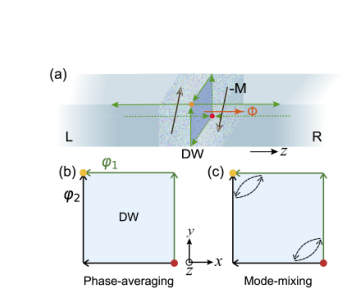 
FIG. 1. (a) Cartoon illustration of the AB interferome- ter based on a 3D SOTI nanowire containing a magnetic do- main wall (DW) structure, where a magnetic flux Φ (indi- cated by the orange arrow) is threaded through the DW to tune the two-terminal conductance. Green arrows indicate the propagation of the THSs and TESs. On-site disorder is applied to the central scattering region encompassing the DW (shadowed area). (b) and (c): Schematic diagrams for the PAR at weak disorder and MMR at strong disorder in the magnetic DW. The black and green arrows denote the two co-propagating TESs. In (b), electrons traveling along the upper-right and lower-left arms acquire distinct dynam- ical phases...

📷 Fig 2

 
FIG. 2. Numerical results for quantum transport across the magnetic DW in a 3D SOTI. (a) Energy band struc- ture of a uniform SOTI nanowire with magnetization vector M = ( √

📷 Fig 3

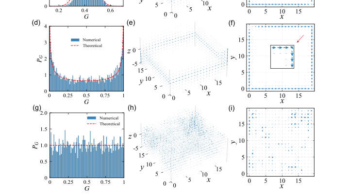 
FIG. 3. Statistics of conductance G and current density distribution at different disorder strengths: (a)–(c) Weak disorder (W = 0.1E0); (d)–(f) Moderate disorder (W = 2.2E0) at which the PAR occurs; (g)–(i) Strong disorder (W = 9.0E0) at which the MMR occurs. In (a, d, g) the numerically calculated probability distribution PG are present, which exhibit a Gaussian profile, a U-shaped profile, and a flat uniform profile, respectively. These results are in excellent agreement with theoretical predictions shown by red dashed curves. (b, e, h): The 3D visualization of the current density; (c, f, i): Cross-sectional current density plot at z = 0. For all panels, the magnetic flux is fixed at Φ =...

📷 Fig 4

 
FIG. 4. Global evolution of transport regimes driven by disorder. The colormap illustrates the integrated probability FG of the conductance as a function of the disorder strength W. The magnetic flux is fixed at Φ = 4π/9, the Fermi energy is EF = 0.02E0, and the statistics for each W are obtained from an ensemble of 3000 disorder configurations. The bin width is h = 0.01.

📷 Fig 5

 
Figure 3(g) displays the numerically calculated prob- ability distribution of the conductance G at strong dis- order (W = 9E0). In this regime, the transport resides in the MMR. The distribution is nearly uniform within [0, 1], in excellent agreement with the analytical predic- tion for PG (see red dashed line). In Fig. 3(h, i), we plot the spatial distribution of the current density Ji at the DW. Under strong disorder (W = 9E0), the 1D nature of the transport is destroyed as pronounced scattering occurs between the THSs, the TESs, and the 3D bulk states. The current is no longer confined to the hinges or the DW interface; instead, it spreads predominantly into the bulk, forming a...

📷 Fig 6

 
FIG. 5. Fano factor F as a function of the disorder strength W. The red and brown dashed curve at F = 1/4 and F = 1/3 denote the theoretical Fano factor values in the PAR and MMR, respectively. Here the magnetic flux is fixed at Φ = 4π/9, the Fermi energy is EF = 0.02E0, and the results are averaged over 3000 disorder configurations.

📷 Fig 7

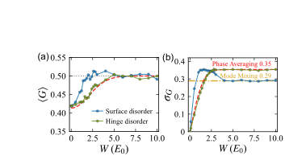 
FIG. 6. Effects of surface disorder and hinge disorder on the transport results. (a) Ensemble-averaged conductance ⟨G⟩ and (b) conductance fluctuation σG as functions of disorder strength W for surface disorder and hinge disorder. The red dashed curve denote the theoretical fitting for the hinge disor- der, yielding a fitting parameter χhinge ≈0.117. The magnetic flux is fixed at Φ = 4π/9, the Fermi energy is EF = 0.02E0, and the results for each W are averaged over 3000 disorder configurations.

📷 Fig 8

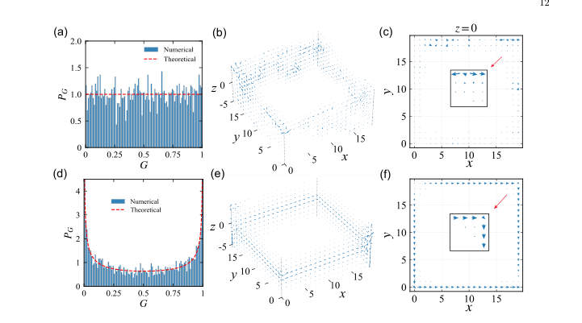 
FIG. 7. Comparison of microscopic transport features under changing spatial locations of disorder at strong disorder (W = 9.0E0). (a)–(c) Surface-only disorder scenario: (a) Probability distribution PG; (b) 3D visualization of the “hollow” current density distribution; (c) Cross-sectional view of current at z = 0. (d)–(f) Hinge-only disorder scenario: (d) Probability distribution PG; (e) 3D visualization of the current density; (f) Cross-sectional view at z = 0. The red dashed curves in (a) and (d) show the analytical results of PG. The magnetic flux is fixed at Φ = 4π/9, the Fermi energy is EF = 0.02E0, and the statistical distributions of PG in (a) and (d) are each obtained from an...

**Main problem.** The study investigates the electronic transport properties and the disorder-induced crossover between two distinct transport regimes, the phase-averaging regime (PAR) and the mode-mixing regime (MMR), in the magnetic domain walls of a second-order topological insulator.

**Main result.** The authors demonstrate a clear transition from PAR to MMR driven by increasing Anderson disorder, identified by a two-step plateau structure in conductance fluctuations and the Fano factor, as well as a transition in the conductance probability distribution from U-shaped to uniform.

**Method.** The study uses the Non-Equilibrium Green's Function (NEGF) method and Landauer-Büttiker formalism for numerical simulations, supplemented by analytical frameworks involving the Central Limit Theorem and Random Matrix Theory.

**Summary.** This paper explores how Anderson disorder transforms electronic transport in the magnetic domain walls of a second-order topological insulator. It identifies two specific transport regimes: a phase-averaging regime where topological edge states remain intact but phases are randomized, and a mode-mixing regime where disorder destroys the 1D nature of the states. The transition is uniquely characterized by specific plateaus in conductance fluctuations and the Fano factor. These findings suggest that controlling disorder can be used as a tool to engineer transport in topological devices.

Detailed structure

**Model / system.** A 3D second-order topological insulator (SOTI) nanowire with a magnetic domain wall, modeled using a four-band tight-binding Hamiltonian on a cubic lattice including Anderson-type disorder and an effective exchange field.

**Key observables.** Ensemble-averaged conductance, conductance fluctuations, conductance probability distribution, Fano factor, and local current density.

**Important parameters / regimes.** Disorder strength (W), magnetic flux (Phi), Fermi energy (Ef), and the distinction between bulk, surface, and hinge disorder types.

**Assumptions / limitations.** The analytical treatment of the phase-averaging regime assumes the dynamical phase difference follows a normal distribution via the Central Limit Theorem.

**Figures summary.** Fig 1 shows the AB interferometer setup; Fig 2 displays band structure and conductance vs. flux; Fig 3 illustrates the evolution of conductance distributions and current density across disorder levels; Fig 4 shows the global evolution of conductance distribution; Fig 5 plots the Fano factor transition; Fig 7 compares surface and hinge disorder effects.

**Paper structure.** The paper introduces the SOTI system and magnetic domain wall, presents numerical results for conductance and fluctuations in the clean and disordered limits, develops analytical theories for the PAR and MMR regimes, investigates the spatial dependence of disorder (bulk vs. surface vs. hinge), and concludes with implications for disorder engineering.

Abstract

We investigate electronic transport across a magnetic domain wall (DW) in a three-dimensional (3D) second-order topological insulator subject to Anderson disorder. In the clean limit, the DW hosts two co-propagating one-dimensional (1D) topological edge states that act as the two arms of an effective Aharonov-Bohm (AB) interferometer, inducing a sinusoidal conductance oscillation. Upon the introduction of disorder, the AB oscillations are suppressed, while a half-quantized plateau of $0.5 e^2/h$ for the ensemble-averaged conductance emerges. Notably, within this plateau, the conductance fluctuation exhibits a distinctive two-step plateau structure, with values of $\sim 0.35 e^2/h$ at moderate disorder, followed by a second plateau at $\sim0.29 e^2/h$ under strong disorder. By developing theoretical frameworks that account for the random-phase interference and inter-mode mixing of the two arms, we identify the first fluctuation plateau as a signature of the phase-averaging regime (PAR) and the second as a signature of the mode-mixing regime (MMR). Furthermore, we show that, in the PAR the conductance follows a U-shaped beta distribution, while it evolves into a uniform distribution in the MMR. The Fano factor associated with shot noise is also computed, which exhibits a similar two-step plateau structure at $1/4$ and $1/3$, corresponding to the PAR and MMR, respectively. Our work provides a clear demonstration of the disorder-induced crossover from PAR to MMR, and highlights the crucial role of second-order conductance cumulants in identifying these transport regimes. The results suggest disorder-engineering as a powerful route for controlling electronic transport across DW-based devices.

[↑ back to top](#top)

### [Efficient Classical Simulation of Heuristic Peaked Quantum Circuits](http://arxiv.org/abs/2604.21908v1)

**Authors:** David Kremer, Nicolas Dupuis  
**Type:** both · **Category:** numerical methods · **PDF:** <https://arxiv.org/pdf/2604.21908v1>  
**Analysis basis:** full PDF text, analyzed in chunks

📷 Fig 1

 
FIG. 1: The three stages of the iterative contraction method. (a) The transpiled circuit is split at the temporal midpoint into a left circuit CL and a right circuit CR, with an identity MPO inserted between them. (b) The greedy unswapping procedure: qubit pairs in the MPO are ranked by bond dimension, and swaps are applied from the left, right, or both sides. Swaps that reduce the bond dimension are accepted, yielding the decomposition M = PL ˜ MPR. (c) Rewiring: the extracted permutations PL and PR are absorbed into the remaining circuits by removing existing transpilation SWAPs, reindexing qubits, and re-transpiling to linear connectivity.

📷 Fig 2

 
FIG. 2: Overview of the iterative contraction procedure. Starting from a small MPO between the left and right circuits, the method cycles through three stages: (1) absorption of circuit layers into the MPO, which causes it to grow; (2) unswapping, which extracts permutations PL and PR and reduces the MPO to a smaller ˜ M; and (3) rewiring, which propagates the extracted permutations into the remaining circuits and re-transpiles to linear connectivity.

📷 Fig 3

 
FIG. 3: Total number of tensor elements in the MPO during contraction. Blue points correspond to the absorption stage and red points to the unswapping stage. (a) MPO size as a function of two-qubit unitaries consumed from the circuit. Three regimes are visible: an initial phase (0–300 unitaries) with rapid absorption–unswapping cycling; a transition phase (300–700) where unswapping becomes progressively more effective; and a final phase (700+) where unswapping reduces the MPO almost completely, allowing long absorption runs. (b) The same quantity plotted against wall-clock time. The full contraction completes in 4,059 seconds on a single Nvidia A100 GPU. The dense cluster of iterations in...

📷 Fig 4

 
FIG. 4: Frequency of the top 20 most-sampled bitstrings from 1,000 samples drawn from the contracted MPS. The peak bitstring (ID 0) appears approximately 110 times (∼11%), consistent with the designed peak weight of ∼10%. The sharp separation from the remaining bitstrings confirms successful recovery of the peak.

**Main problem.** Challenging a recent claim of heuristic quantum advantage by demonstrating that certain 'peaked' quantum circuits, previously thought to be classically intractable, can be efficiently simulated.

**Main result.** The authors developed an efficient tensor network contraction method that simulates a 56-qubit circuit in approximately one hour on a single GPU, outperforming the execution time of the original quantum hardware.

**Method.** An iterative tensor network contraction procedure involving circuit splitting, absorption of gates into a Matrix Product Operator (MPO), and a greedy 'unswapping' heuristic to extract hidden permutations and reduce bond dimension.

**Summary.** This paper refutes a claim of heuristic quantum advantage by showing that 'peaked' quantum circuits can be efficiently simulated classically. By using a new 'unswapping' technique within a tensor network framework, the authors can undo the permutations intended to make the circuits hard to simulate. They successfully simulated a 56-qubit circuit in about an hour, which was faster than the actual quantum hardware execution. This demonstrates that the complexity of these specific circuits arises from artificial structural obfuscation rather than genuine quantum hardness.

Detailed structure

**Model / system.** Peaked quantum circuits characterized by a mirrored (UU^dagger) structure and permutation-based obfuscation, specifically targeting circuits executed on Quantinuum's 56-qubit H2 trapped-ion processor.

**Key observables.** The peak bitstring (highest probability bitstring) and the peak weight (concentration of the output distribution).

**Important parameters / regimes.** MPO bond dimension, SVD singular value cutoff (epsilon), and the unswapping threshold for triggering contraction updates.

**Assumptions / limitations.** The method assumes the circuit possesses an underlying mirrored structure and that the error introduced by SVD compression is negligible.

**Figures summary.** Figure 1 shows the three stages of the contraction method (splitting, unswapping, rewiring); Figure 2 provides an overview of the iterative cycle; Figure 3 plots MPO size dynamics and wall-clock time across different contraction regimes; Figure 4 shows the frequency of the top 20 sampled bitstrings.

**Paper structure.** The paper introduces the problem of challenging quantum advantage claims, describes the proposed iterative MPO contraction and unswapping method, presents performance benchmarks on 56-qubit circuits, and discusses the limitations and implications for future circuit designs.

Abstract

Peaked quantum circuits, whose output distribution is sharply concentrated on a single bitstring, have emerged as a promising candidate for verifiable quantum advantage, as the correctness of the quantum output can be checked by simply comparing against the known peak. Recent work by Gharibyan et al. arXiv:2510.25838 claimed heuristic quantum advantage using peaked circuits executed on Quantinuum's 56-qubit H2 processor. These peaked circuits concentrate their output on a single hidden bitstring by training a shallow simulable circuit variationally and inserting an obfuscated permutation to increase the depth to a level that makes classical simulation intractable, with estimated runtimes of years for the largest instances. We show that these circuits can be efficiently simulated classically. We describe a method that efficiently performs a full tensor network contraction, allowing near-exact sampling and extraction of the peaked bitstring. The method exploits the mirrored structure of the circuit and iteratively cancels both halves into a Matrix Product Operator (MPO), and avoids the obfuscated permutation by greedily reducing the MPO bond dimension through a process we call unswapping. The method can fully contract and extract the peak of the largest circuit in approximately one hour on a single GPU, around half the time it took to run on the quantum hardware.

[↑ back to top](#top)

### [Fractals of Simple Random Walks in Two Dimensions: A Monte Carlo Study](http://arxiv.org/abs/2604.21341v1)

**Authors:** Jiang Zhou, Ziru Deng, Pengcheng Hou  
**Type:** theory · **Category:** statistical mechanics · **PDF:** <https://arxiv.org/pdf/2604.21341v1>  
**Analysis basis:** full PDF text, analyzed in chunks

📷 Fig 1

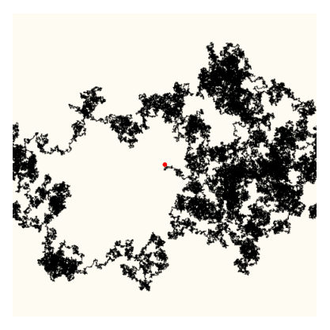 
FIG. 1. Typical sRW trajectory of L2 steps on a periodic L × L square lattice with L = 800, started from the red point (0, 0). The trace is weakly space filling and leaves holes on all length scales.

📷 Fig 2

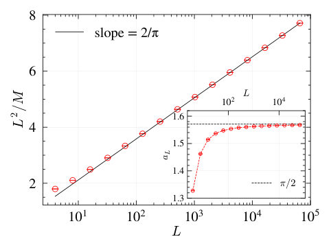 
FIG. 2. Rescaled cluster mass L2/M versus ln L. The large- L data approach a straight line of slope 2/π, consistent with M ∼(π/2)L2/ ln L. The inset shows the approach of aL to π/2.

📷 Fig 3

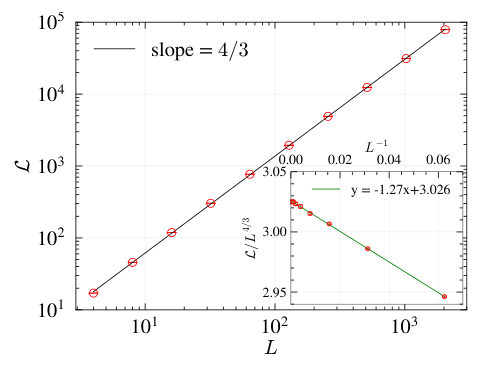 
FIG. 4. Plot of ln L versus ln L. The asymptotic linear behav- ior is consistent with L ∼L4/3. Inset: collapse of the rescaled hull perimeter L/L4/3 versus L−1.

📷 Fig 4

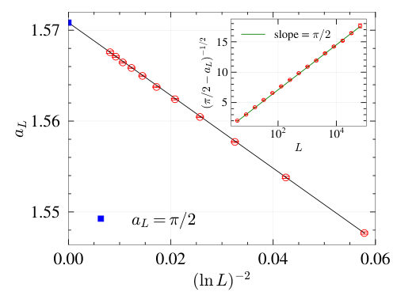 
FIG. 3. Collapse of aL versus (ln L)−2. The asymptotic lin- earity provides direct graphical support for w = 2. Inset: test of (π/2−aL)−1/2 ∝ln L, consistent with the fitted correction amplitude.

📷 Fig 5

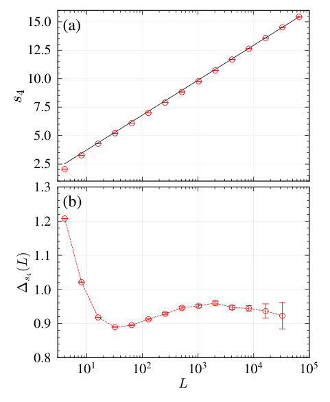 
FIG. 5. Finite-size scaling of the chemical distance S. (a) Collapse of s4 ≡(S/L)4 versus ln L. (b) Gap function ∆s4(L) versus ln L. The gap function shows neither clear signs of asymptotic convergence nor evidence of divergence within the accessible range of system sizes.

**Main problem.** The study aims to characterize the fractal geometry and scaling properties of clusters formed by 2D simple random walks, specifically focusing on mass scaling, hull dimension, and chemical distance.

**Main result.** The authors confirm the mass scaling follows a logarithmic fractal behavior, determine the hull dimension to be 4/3 (consistent with SLE 8/3), and find evidence that the chemical distance scales as L(ln L)^(1/4), matching the Ding-Wirth upper bound.

**Method.** Large-scale Monte Carlo simulations on periodic square lattices up to size L = 2^16, using nonlinear least-squares fits, finite-size scaling analysis, and gap-function analysis.

**Summary.** This paper provides a high-precision Monte Carlo study of the fractal properties of 2D simple random walk clusters. It confirms that these clusters exhibit 'logarithmic fractal' mass scaling and a hull dimension of 4/3, placing them in the Brownian frontier universality class. Notably, the study finds that the shortest path (chemical distance) within the cluster scales as L(ln L)^(1/4), supporting the sharpness of theoretical upper bounds. The results also clarify how periodic boundary conditions affect the approach to asymptotic scaling.

Detailed structure

**Model / system.** A discrete-time simple random walk (sRW) on a 2D periodic square lattice (discrete torus) with a fixed number of steps N = L^2.

**Key observables.** Cluster mass (M), hull perimeter (L_hull), and spanning chemical distance (S).

**Important parameters / regimes.** Lattice size L, number of steps N = L^2, and periodic boundary conditions.

**Assumptions / limitations.** The argument regarding the sharpness of the chemical distance bound via unwrapping the torus to an infinite plane is heuristic.

**Figures summary.** Figure 1 shows a typical sRW trajectory; Figure 2 displays mass scaling via semi-log plots; Figure 3 shows data collapse for mass corrections; Figure 4 shows hull perimeter scaling; Figure 5 shows the collapse of the chemical distance scaling.

**Paper structure.** The paper introduces the problem of sRW fractal geometry, describes the Monte Carlo methodology, presents detailed scaling results for mass, hull, and chemical distance, and concludes with discussions on boundary conditions and open questions.

Abstract

We present a Monte Carlo study of the fractal geometry of clusters formed by discrete-time simple random walks (sRW) of $L^2$ steps on a periodic square $L\times L$ lattice. We verify with high precision that the asymptotic behavior of the cluster mass follows $M/L^2 \simeq (\ln L)^{-1} [\fracπ{2}+b (\ln L)^{-2}]$, with $b\approx -(π/2)^{-2}$, demonstrating marginal ``logarithmic fractals". We further determine the fractal dimension of the hull to be $d_{\rm hull}=1.333\,29(14)=4/3$, in excellent agreement with the prediction of Schramm-Loewner evolution ($\rm SLE_{8/3}$) for the Brownian frontier universality class. More importantly, we analyze the chemical distance $S$ spanning the cluster and obtain strong evidence that it asymptotically scales as $S\sim L(\ln L)^{1/4}$, lying exactly on the theoretical upper bound for the chemical distance for level-set percolation clusters on the two-dimensional Gaussian free field. Our numerical results show that the sRW cluster exhibits a conformally invariant external frontier and contains highly efficient asymptotically linear connective paths.

[↑ back to top](#top)

### [Ghost Degrees of Freedom Without Quantum Runaway: Exact Moment Bounds from an Operator Conservation Law](http://arxiv.org/abs/2604.21348v1)

**Authors:** Christopher Ewasiuk, Stefano Profumo  
**Type:** theory · **Category:** other · **PDF:** <https://arxiv.org/pdf/2604.21348v1>  
**Analysis basis:** full PDF text, analyzed in chunks

📷 Fig 1

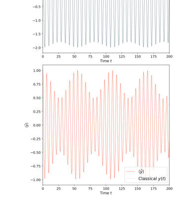 
FIG. 1. Heisenberg-picture Ehrenfest moments for λ = 1/3, RK4, ∆t = 0.02, t = 500 (t cropped to ∈[0, 200]). Mean po- sitions ⟨ˆx⟩(t) (left) and ⟨ˆy⟩(t) (right) overlaid on the classical orbits (dashed); the curves are indistinguishable, confirming that classical stability survives at leading order in ℏ.

📷 Fig 2

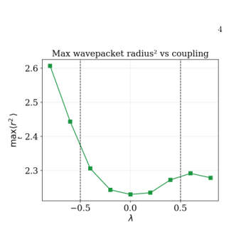 
FIG. 3. Maximum mean squared radius maxt⟨ˆx2 + ˆy2⟩over t ∈[0, 200] as a function of coupling strength λ, obtained from Schr¨odinger-picture propagation on a 128 × 128 grid. Wavepacket confinement persists across the full range λ ∈ [−0.8, +0.8] with no runaway and no sharp transition at the classical Lyapunov boundary |λ| = 1/2 (dashed lines). The maximum remains well below the analytic ceiling ⟨r2⟩(0)+4|λ| of Eq. (7) throughout, confirming that the bound is satisfied but not saturated at these coupling strengths.

📷 Fig 3

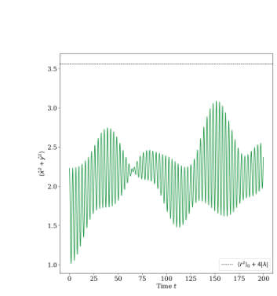 
FIG. 2. Schr¨odinger-picture confirmation of the moment bound (7) for λ = 1/3, N = 1282, ∆t = 5 × 10−3, T = 200, starting from a Gaussian wavepacket centered at (x0, y0) = (1.0, 0.5) with width σ = 0.7. The mean squared radius ⟨ˆx2 + ˆy2⟩(t) oscillates with no secular growth, remaining well below the analytic ceiling ⟨r2⟩0 + 4|λ| (dashed) throughout the run.

📷 Fig 4

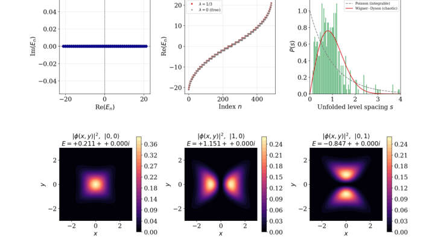 
FIG. 4. Energy spectrum of the ghost-coupled oscillator for λ = 1/3, Fock basis with Nmax = 21 (484 states). Top left: all 484 eigenvalues in the complex plane; all lie on the real axis within LAPACK precision. Top center: sorted real eigenvalues for λ = 0 (grey) and λ = 1/3 (red); shifts are ≲10−4, consistent with VI acting perturbatively. Top right: unfolded level-spacing distribution of the intra-multiplet splittings introduced by VI, compared with Poisson P(s) = e−s (dashed) and Wigner-Dyson P(s) ∝se−πs2/4 (solid red). Within each degenerate multiplet the distribution is consistent with Wigner-Dyson, as expected from degenerate perturbation theory; the global inter-multiplet structure...

**Main problem.** Investigating whether quantum systems with 'ghost' degrees of freedom (negative kinetic energy) necessarily suffer from 'quantum runaway' instability or if their phase-space moments can be rigorously bounded.

**Main result.** The authors prove an exact quantum conservation law that provides a state-independent, non-perturbative upper bound on the mean squared phase-space radius, demonstrating that ghost instability depends on interaction structure rather than just the wrong-sign kinetic term.

**Method.** The proof utilizes canonical commutation relations and the Leibniz rule to identify an exact operator identity [C, H] = 0 with no hbar corrections, supplemented by Heisenberg, Schrodinger, and Fock-space numerical verifications.

**Summary.** This paper addresses the long-standing problem of 'quantum runaway' in systems with ghost degrees of freedom. By identifying an exact quantum operator conservation law, the authors prove that the phase-space moments of such a system remain bounded for all time. This demonstrates that the presence of negative-energy degrees of freedom does not automatically lead to catastrophic vacuum decay, provided the interaction structure is sufficiently well-behaved. The result is non-perturbative and holds without any hbar corrections.

Detailed structure

**Model / system.** A two-degree-of-freedom quantum system consisting of a normal harmonic oscillator coupled to a ghost harmonic oscillator via a bounded, non-confining interaction potential.

**Key observables.** Mean squared phase-space radius (sum of mean squared positions and momenta) and level-spacing statistics.

**Important parameters / regimes.** Coupling strength lambda; the classical Lyapunov boundary at |lambda| = 1/2.

**Assumptions / limitations.** The proof assumes the interaction is bounded and vanishes at large separations; it does not assume a confining potential or spectral discreteness.

**Figures summary.** Figure 1 compares Heisenberg-picture mean positions to classical orbits; Figure 2 shows the mean squared radius oscillating below the analytic bound; Figure 3 shows stability across a range of coupling strengths; Figure 4 displays energy spectrum analysis and level-spacing statistics.

**Paper structure.** The paper introduces the ghost instability problem, defines the Hamiltonian and interaction, provides an analytical proof of the exact conservation law and resulting moment bounds, presents numerical verification across three frameworks, and discusses spectral properties and future extensions.

Abstract

We prove an exact quantum conservation law for a harmonic oscillator coupled to a ghost degree of freedom: a second classical conserved quantity lifts to a quantum operator that commutes with the Hamiltonian with no hbar corrections, yielding a rigorous, state-independent upper bound on the mean squared phase-space radius for all time and every quantum state with finite initial second moments. The proof uses only canonical commutation relations and the Leibniz rule; it requires no confining potential, no spectral assumptions, and no perturbative expansion. The interaction studied here is bounded and vanishes at large separations, the generic situation in effective field theory, yet this suffices to guarantee quantum stability in the sense of bounded second moments. Three independent numerical frameworks (Heisenberg picture, Schrodinger picture, and Fock-space diagonalization) confirm wavepacket confinement below the analytic bound, a real energy spectrum, and Poisson level statistics numerically consistent with an integrable structure. The absence of a confining potential means the proof is silent on spectral discreteness and the existence of a ground state; those questions, addressed for polynomial confining interactions in concurrent work, remain open for the interaction class studied here and represent the sharpest targets for future work. Ghost quantum instability is therefore not an inevitable consequence of a wrong-sign kinetic term but depends critically on the interaction structure.

[↑ back to top](#top)

### [Giant spontaneous Kerr effect reveals the defect origin of macroscopic time-reversal symmetry breaking in altermagnetic MnTe](http://arxiv.org/abs/2604.21021v1)

**Authors:** Weitung Yang, Choongjae Won, Cory Cress, Marshall Zachary Franklin, Xiaochen Fang, Shelby Fields, Nicholas Combs, Shaofeng Han, Weihang Lu, I. I. Mazin, Steven P. Bennett, Sang-Wook Cheong, Jing Xia  
**Type:** both · **Category:** strongly correlated electrons · **PDF:** <https://arxiv.org/pdf/2604.21021v1>  
**Analysis basis:** full PDF text, analyzed in chunks

📷 Fig 1

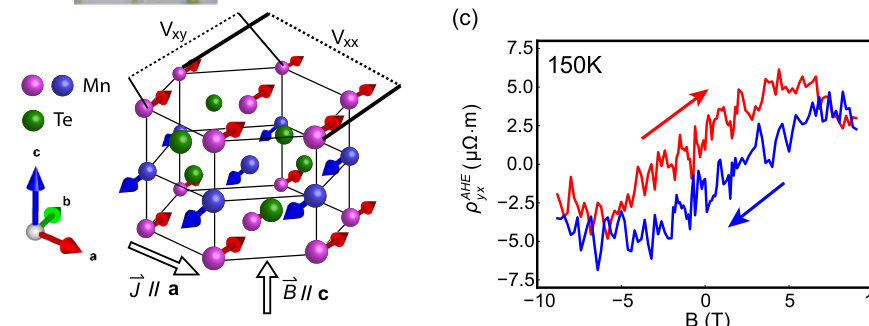 
Figure 1. Anomalous Hall effect (AHE) in MnTe. (a) Experimental setup for optical and transport measurements. Inset: photograph of the α-MnTe single crystal on 1 mm grid paper; arrows in the hexag- onal lattice indicate the alternating spin arrangement of the altermagnetic g-wave order. (b) Longitudinal resistivity ρxx versus temperature, showing a pronounced peak at the Néel temperature TN = 307 K. (c) Anomalous Hall resistivity ρAHE yx measured at 150 K (where the AHE signal is maximized), showing a hys- teretic ±5 µΩ·m loop with B along the c-axis.

📷 Fig 2

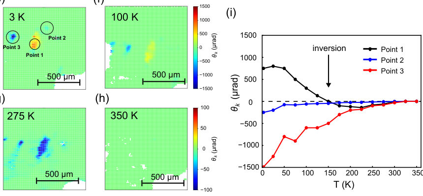 
Figure 2. Spontaneous MOKE domains following zero-field cooling (ZFC) in a MnTe bulk crystal. (a)–(d) MOKE images acquired during zero-field warming (ZFW) at 2, 100, 200, and 300 K, respectively, revealing giant spontaneous signals of ±1500 µrad. (e)–(h) Representative MOKE images from a second ZFW sequence (without training) at 3, 100, 275, and 350 K; the full temperature evolution is provided in Supplementary Figs. 2 and 3. (i) Temperature dependence of the Kerr rotation θK at Points 1, 2, and 3 marked in panel (e), showing onset at TN = 307 K. One of the traces (Point 2) further exhibits a temperature-driven sign reversal of θK near 200 K, indicated by the vertical arrow, identifying a...

📷 Fig 3

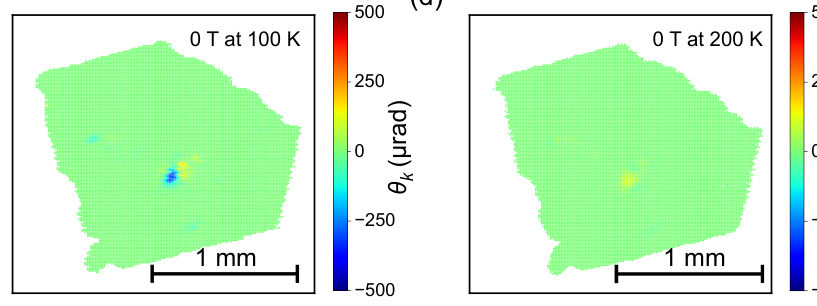 
Figure 3. Domain training via field cooling (FC) and temperature-driven chirality inversion. (a) MOKE image at T = 2 K and B = −0.3 T after cooling from 350 K in a −0.3 T field. (b) Remanent MOKE image at 2 K after field removal, displaying a spontaneous signal with uniformly trained chirality. (c) Persistence of the trained chirality after warming to 100 K. (d) Chirality inversion observed after further warming to 200 K, without any change in applied field.

📷 Fig 4

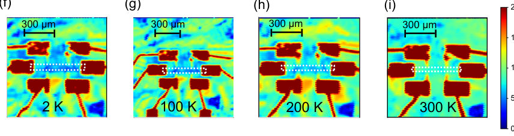 
Figure 4. Absence of spontaneous MOKE in a capped 40 nm α-MnTe thin film grown by MBE on InP(111). (a) Spontaneous Kerr rotation θK measured during ZFW after 0.3 T FC; the signal remains below 0.05 µrad at the noise floor of our instrument across the entire 2–300 K range. Insets: cartoon and optical micrograph of the Hall-bar device. The capped film has an insulating resistivity ρ &gt; 2 Ω·m (resistance &gt; 0.5 GΩ) even at room temperature. (b)–(e) MOKE images taken at 2, 100, 200, and 300 K during ZFW after 0.3 T FC, showing no spontaneous MOKE signal on the ±50 µrad color scale. (f)–(i) Simultaneously measured reflected optical power P0. High-reflectivity regions (red) correspond to Au contact...

**Main problem.** Determining whether the macroscopic time-reversal symmetry breaking (TRSB) signatures in altermagnetic MnTe, such as the spontaneous Hall effect and Kerr rotation, are intrinsic to the ideal altermagnetic order or are activated by defects and carrier self-doping.

**Main result.** The study reveals that the giant spontaneous Kerr rotation is not an intrinsic property of ideal altermagnetism but is activated by hole self-doping, as evidenced by the absence of a signal in stoichiometric, insulating MnTe thin films.

**Method.** The researchers used a zero-loop fiber-optic Sagnac interferometer microscope at 1550 nm for MOKE imaging, combined with DC transport measurements and first-principles DFT calculations.

**Summary.** This paper investigates the origin of macroscopic symmetry breaking in the altermagnet alpha-MnTe. By comparing highly doped bulk crystals with stoichiometric insulating thin films, the authors demonstrate that the giant spontaneous Kerr effect is driven by carrier self-doping rather than being an intrinsic feature of the ideal altermagnetic state. This finding establishes that the magneto-optical response is activated by defects that introduce itinerant holes. The work provides a practical pathway for using telecom-wavelength Kerr imaging to readout spin order in altermagnetic spintronics.

Detailed structure

**Model / system.** The system is alpha-MnTe, a collinear altermagnet with g-wave spin-split bands and a NiAs-type structure. The study utilizes a 'gossamer-ferromagnetism' model where itinerant holes induce a small canting of Mn moments.

**Key observables.** Spontaneous Kerr rotation (up to +/- 1500 microrad), longitudinal resistivity, anomalous Hall resistivity, and Neel temperature.

**Important parameters / regimes.** Neel temperature (T_N = 307 K), photon energy (0.80 eV), and carrier self-doping levels (ranging from highly conducting crystals to insulating thin films).

**Assumptions / limitations.** DFT calculations are interpreted semi-quantitatively at 0.80 eV due to potential inaccuracies in modeling intraband and excitonic effects.

**Figures summary.** Figure 1 shows the experimental setup, resistivity, and Hall effect; Figure 2 displays MOKE images and temperature-driven chirality inversion; Figure S6 shows DFT-calculated Kerr rotation and dielectric tensor components.

**Paper structure.** The paper introduces the altermagnetic problem, describes the experimental Sagnac setup and sample hierarchy, presents the correlation between MOKE signal and conductivity, uses the insulating film as a null-result proof, and concludes with a theoretical mechanism involving carrier-induced canting.

Abstract

Altermagnetism, a recently identified third class of collinear magnetism with spin-split bands and vanishing net magnetization, has emerged in hexagonal \alphaMnTe{} and is regarded as a promising platform for ultrafast, stray-field-free spintronics and for optical readout of spin order at telecommunication wavelengths. Whether the macroscopic symmetry-breaking signatures reported in MnTe, a spontaneous Hall effect and a tiny ``gossamer'' remanent moment, reflect the ideal altermagnetic order or are activated by defects remains an open question. Here we report giant spontaneous Kerr rotations of up to $\pm 1500\microrad$ in \alphaMnTe{} single crystals at the telecommunication wavelength of $1550\,\mathrm{nm}$, onsetting precisely at the Néel temperature $\TN = 307\,\mathrm{K}$. In contrast, a stoichiometric insulating \alphaMnTe{} thin film shows no detectable signal. The bulk--film contrast identifies carrier self-doping, rather than the ideal altermagnetic order, as the source of macroscopic magneto-optical response, establishing telecom-wavelength Kerr imaging as a practical readout for altermagnetic spintronics.

[↑ back to top](#top)

### [High-performance cellular automaton decoders for quantum repetition and toric code](http://arxiv.org/abs/2604.21866v1)

**Authors:** Don Winter, Thiago L. M. Guedes, Markus Müller  
**Type:** theory · **Category:** quantum information and computing · **PDF:** <https://arxiv.org/pdf/2604.21866v1>  
**Analysis basis:** full PDF text, analyzed in chunks

📷 Fig 1

 
Fig. 1 shows the logical error rate pL for various sys- tem sizes. In the sub-threshold regime (p &lt; 0.5), in- creasing the system size provides better protection, as errors are suppressed more effectively with additional physical qubits. This value pc ≡p = 0.5 is called the QEC threshold. In this regime, pL scales with pλ(d), with λ(d) = (d + 1)/2 and d = n, corresponding to the min- imum number of physical errors for which the matching decoder gives a logical error. Another code which, however, is capable to protect against both Z- and X-errors is the toric code [57], shown in Fig. 2. The toric code is defined on a n × n regular square lattice with periodic boundary conditions, i.e., a...

📷 Fig 2

 
FIG. 2. Illustration of a distance d = 5 toric code with qubits (black circles) on edges of a regular d × d lattice under pe- riodic boundaries. Qubits in parenthesis wrap around the torus. The minimum-weight logical operators X1 L and X2 L are vertical and horizontal strings of single-qubit Pauli-X oper- ators. Logical Z-operators are omitted. The stabilizers of the toric code are either of pure X- (red stars) or Z-type (blue plaquettes). A X-error (red dot) anti-commutes with two Z-stabilizers, causing two defects (blue shades). A Z- error (blue dot) causes the star syndrome (red shades). Any X error configuration which forms a (product of) stabilizer generator(s) commutes with the...

📷 Fig 3

 
FIG. 1. Analytical logical error rate pL as function of bit- flip error rate p for the ML decoder (Eq. 1) of the repetition code. Different colors correspond to different code distances d (equivalent to number of qubits n making up the repetition code), the dashed red line marks the QEC threshold pc = 0.5.

📷 Fig 4

 
FIG. 3. Sketch of Harrington’s hierarchical CA decoder. On the left, we show a distance-27 toric code from the perspective of the three hierarchy levels Harrington’s decoder imposes. Error correction is accomplished by moving defects (black circles) which are close towards each other thereby correcting the errors (red lines) which separate them. At the lowest level (0), one- and some two-qubit errors are corrected within at most two CA steps. Defects which have no other defect in their local neighborhood move towards the center of their colony (group of Q × Q cells) marked in thick black lines at the next hierarchy level (1). At level-1, defects located at colony centers communicate by...

📷 Fig 5

 
FIG. 4. Logical error rate pL as function of bit-flip error rate p for Harrington’s toric code decoder under code capacity noise for different code distances d (color code). The dashed red line marks the QEC threshold pc ≈4.5%. The black dashed line corresponds to fits of the function f(p, d) = A(d)pλ(d). In the inset we show the effective code distance λ(d) as function of code distance d. The purple line in the inset corresponds to the function λ(d) = 2log3(d) ≈d0.631, as discussed in the main text. Numerical data was obtained for 104 to 106 Monte Carlo shots until statistical uncertainty is small relative to the measured values. Standard sampling errors are represented by black error bars.

📷 Fig 6

 
FIG. 5. Average logical lifetime ⟨TF ⟩as function of phenomenological bit-flip error rate p on data qubits (left panel) and rate q on measurements (right panel) for toric codes of distance d (color code) under corrections by Harrington’s decoder. In the left panel we set q = 0 and in the right p = 0. Dashed black lines correspond to fits of the function g(d, p) = B(d)p−λ(d) with λ(d) shown in the insets. The purple line in the inset corresponds to λ(d) = d0.631 in both panels. Although a non-zero threshold is mathematically guaranteed [1], a precise asymptotic value is not deducible from this data as the crossing points continue to drift toward lower error rates for the simulated distances....

📷 Fig 7

 
FIG. 6. Average logical lifetimes ⟨TF ⟩as function of data, measurement, and signal noise with respective rates p, q, and psig for Harrington’s decoder on toric codes of distance d (color coded). The lines of less opacity in the background correspond to performance curves under sole data noise, cf., left panel of Fig. 5. The dashed colored lines correspond to data, measurement and CountSignal noise, while the solid lines correspond to data, measurement and CountSignal and FlipSignal noise. The devastating effect of FlipSignal noise becomes apparent when p, q &lt; 10−2. In this regime, larger lattice sizes show worse performance than small ones. Sole CountSignal noise (dashed lines) is less...

📷 Fig 8

 
FIG. 7. Sketch of Harrington’s decoder confined to one dimension. On the left, we show a distance-27 repetition code from the perspective of the three hierarchy levels Harrington’s decoder imposes. Error correction is accomplished by moving close-by defects (black circles) towards each other, thereby correcting the errors (red and orange lines) which separate them. At the lowest level (0), one- and some two-qubit errors are corrected within at most two time steps, while defects that have no other defect in their neighborhood are moved towards their colony center (marked in black thick lines at the next level). At the next level (1), CountSignals (colored in blue; shade corresponds to amount...

📷 Fig 9

 
FIG. 8. All possible error configurations of qubits within a block. Data-qubit errors (red bars) generate a syndrome (black circles) between two colony centers C1 and C2. The green arrows indicate the local update prescribed by the cor- rection rule. Configurations with zero or one error (left) are corrected to the trivial configurations with no errors between the centers, whereas configurations with two or three errors (right) are completed to the nontrivial configuration with three errors between the centers.

📷 Fig 10

 
FIG. 9. Logical error rate pL as function of data qubit error rate p for Harrington’s decoder confined to one dimension under code capacity noise on distance-d repetition codes. The red dashed line marks the QEC threshold at pc = 1/2. The dashed black lines correspond to the (analytical) performance of a global concatenated majority voting (pL = (pmaj)m(p), as explained in the main text). Each data point was obtained from 104 to 106 Monte Carlo shots until statistical uncertainty is small relative to the measured values. Standard errors are represented by black error bars.

**Main problem.** The need for scalable, low-latency, and robust decoding architectures for quantum error correction that avoid the communication bottlenecks of global decoding strategies.

**Main result.** The introduction of SCALA, a non-hierarchical cellular automaton decoder that achieves a higher code-capacity threshold (approx 7.5%) and superior sub-threshold scaling compared to hierarchical models.

**Method.** The authors present a new class of cellular automaton (CA) decoders (SCALA) and perform comparative Monte Carlo simulations against the hierarchical Harrington decoder and MWPM.

**Summary.** This paper introduces SCALA, a novel non-hierarchical cellular automaton decoder designed for real-time quantum error correction. Unlike previous hierarchical approaches, SCALA uses a decentralized, single-layer architecture that maintains constant local computational resources regardless of system size. The results demonstrate that SCALA provides a higher error threshold and better error suppression scaling than existing local decoders, while also being more resilient to noise within the decoder itself. This makes it a highly promising candidate for implementation in scalable quantum hardware like FPGAs or SFQ circuits.

Detailed structure

**Model / system.** The study focuses on quantum error-correcting codes, specifically the 1D quantum repetition code and the 2D toric code, under various noise models including code-capacity, phenomenological, and signaling noise.

**Key observables.** Logical error rate (pL), code-capacity threshold (pc), effective code distance (lambda), and average logical lifetime (T_F).

**Important parameters / regimes.** Physical error rate (p), measurement error rate (q), code distance (d), and the hierarchy levels/scales in the comparison baseline.

**Assumptions / limitations.** Assumes logical failures occur as rare, independent events in an absorbing Markov process; assumes a regime where the spectral radius of the transient matrix is less than 1.

**Figures summary.** Figures illustrate logical error rate scaling vs. error rate, the architecture of the toric code and hierarchical decoders, the internal state/logic of CA cells, and the impact of measurement and signaling noise.

**Paper structure.** The paper introduces the SCALA decoder, compares its performance and scaling to hierarchical CA decoders, analyzes its robustness to various noise models, and provides a mathematical framework for understanding logical failure mechanisms.

Abstract

Execution of quantum algorithms on large-scale quantum computers will require extremely low logical error rates, which necessitates the development of scalable decoding architectures. Local decoders are promising candidates for this task, as they avoid the communication and data processing bottlenecks inherent in global decoding strategies. Cellular automaton (CA) decoders represent a distinct class of local decoders, offering a path toward the low-latency, real-time decoding required for practical applications. In this work, we present SCALA (Signaling CA with Local Attraction), a novel non-hierarchical cellular automaton decoder for quantum repetition and toric codes. By evaluating SCALA alongside the hierarchical CA decoder proposed by Harrington, we provide a direct comparison between non-hierarchical and renormalization-group-style local decoding strategies. We characterize SCALA across three key metrics: Performance, scalability, and robustness. Our results show that SCALA achieves a code-capacity threshold of approximately $p_c\approx 7.5\%$ and provides strong sub-threshold scaling of about $p_L\propto p^{d/4}$ on the toric code. In terms of scalability, our non-hierarchical design ensures that the local computational resources remain independent of system size, yielding a modular local architecture suitable for hardware implementation. Finally, SCALA demonstrates strong robustness to qubit measurement errors and noise within the decoder itself, a critical advantage for real-time decoding on noisy hardware. Our results establish SCALA as a high-performance, scalable, and robust local decoder for scalable quantum error correction.

[↑ back to top](#top)

### [How to quantify long-time rotational motion in molecular systems](http://arxiv.org/abs/2604.21512v1)

**Authors:** Romain Simon, Hadrien Bobas, François Villemot, Jean-Louis Barrat, Ludovic Berthier  
**Type:** theory · **Category:** statistical mechanics · **PDF:** <https://arxiv.org/pdf/2604.21512v1>  
**Analysis basis:** full PDF text, analyzed in chunks

📷 Fig 1

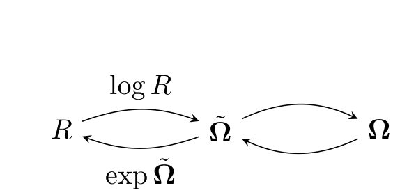 
FIG. 1. Schematic representation of the conversion from a rotation matrix R to the skew-symmetric matrix representa- tion of the corresponding rotation vector ˜Ωvia the logarithm mapping and the inverse conversion via the exponential map- ping. The rotation vector Ωis easily extracted from its skew- symmetric representation ˜Ωby reading the matrix entries, and vice-versa.

📷 Fig 2

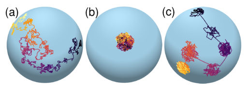 
FIG. 2. Simple models for (a) a free and (b) a confined angular random walk, as introduced in Sec. II E. The parameters are τ = 1 for the distribution of jump times, ϵ = 0.05 for their maximal amplitude, and θc = 0.2 for the confining angle in (b). The trajectory in (c) is the combination of cage dynamics and intermittent jumps, as introduced in Sec. V A. The cage parameters are identical to (b) and the jump parameters are ϵj = 0.25 = 5ϵ, and τj = 400. In all panels the color codes for the time.

📷 Fig 3

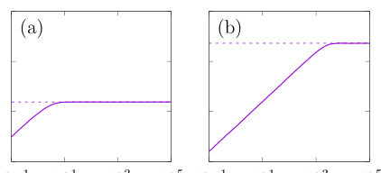 
FIG. 3. Test of Euler vector method on (a) a confined and (b) a free angular random walk. In (b) no Fickian regime is reached at large times because the angular displacement is bounded, preventing the definition of Drot using Eq. (1) for the diffusive model.

📷 Fig 4

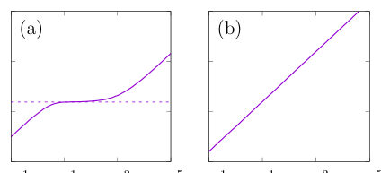 
FIG. 4. Test of integral method on (a) a confined and (b) a free angular random walk. In (a) an erroneous Fickian regime appears due to an accumulation of small errors.

📷 Fig 5

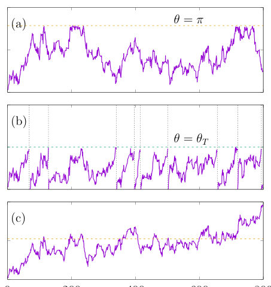 
FIG. 5. (a) The time evolution of the amplitude of the to- tal Euler vector |Ω(t, 0)| representing the rotation matrix be- tween times 0 and t leads to a bounded angular displacement 0 ≤θ(t) ≤π. (b) When an angular threshold θT = 1 is in- troduced (horizontal dashed line), the amplitude of the Euler vectors |Ω(Ti−1, Ti)| is now computed in the time intervals between threshold crossings (vertical dashed lines). (c) The accumulated angular displacement |ϕ(t)| defined in Eq. (28) leads to an unbounded angular displacement that no longer saturates to π (dashed line).

📷 Fig 6

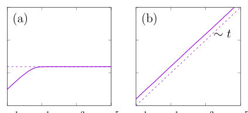 
FIG. 6. Test of threshold method on (a) a confined and (b) a free angular random walk. The threshold method properly captures both the plateau regime of confined angular motion and the Fickian regime of freely diffusive one.

📷 Fig 7

 
Fig. 3(a). The conclusion is that the threshold method is in prin- ciple able to capture the correct physical behaviour in both limits of a confined and a free angular random walk, unlike the conventional methods that failed in either one of these two cases. We now demonstrate numerically that this is the case. In the following (Sec. V), a series of mod- els of increasing complexity is considered to test further the applicability of the threshold method in Eq. (28). We use Eq. (28) to measure the mean-squared angular displacement ∆ϕ2(t) in both confined and free angular random walks, see Fig. 6. For the confined random walk in Fig. 6(a) with θc = 0.2, ϵ = 0.05 and τ = 1, we set θT = 2.0....

📷 Fig 8

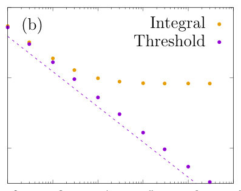 
FIG. 7. (a) Time dependence of the mean-squared angu- lar displacement for various average escape times τj from τj = 102 to 5 × 106 using the threshold method. (b) The extracted rotational diffusion constant Drot scales inversely with τj (dashed line). The integral method provides correct results for small τj but leads to erroneous estimates of Drot at large τj, reminiscent of literature results.

📷 Fig 9

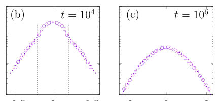 
FIG. 8. (a) Mean-squared angular displacement for the model described in Sec. V B, with intermittent cage escapes de- scribed by the Pareto distribution (29) with α = 1.2. The Fickian regime is reached near t ≈106. The rotational diffu- sion constant is incorrectly estimated by the integral method, and it is not accessible when using the bounded amplitude of the Euler vector. (b, c) Van Hove distributions of angular displacements at two different times. For t = 104 in (b) it is described by the superposition of caged dynamics (vertical dotted lines are ±θc) with exponential tails (dashed lines). For t = 106 in (c) the distribution has nearly converged to its Gaussian limit (dashed line).

📷 Fig 10

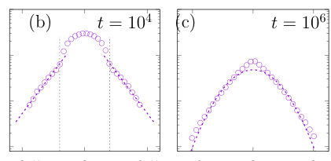 
FIG. 9. (a) Mean-squared angular displacement for the model described in Sec. V C, with intermittent cage escapes de- scribed by the Pareto distribution (29) with α = 0.7. A sub- diffusive regime is reached at large times with ∆ϕ2 ∼tα. The integral method predicts an incorrect Fickian regime, while a determination of the sub-diffusive exponent is impossible using the Euler vector. (b, c) Van Hove distributions of an- gular displacements at two different times. For t = 104 in (b) it is described by the superposition of caged dynamics (vertical dotted lines are ±θc) with exponential tails (dashed lines). For t = 106 the distribution has nearly converged to its non-Gaussian asymptotic limit...

**Main problem.** Existing methods for quantifying long-time rotational motion in molecular systems fail in regimes of slow, heterogeneous, or intermittent dynamics, leading to inconsistent results regarding the glass transition and the decoupling of rotational and translational motion.

**Main result.** The authors introduce a new empirical 'threshold method' that accurately captures both bounded (caged) and unbounded (Fickian) rotational dynamics, resolving mathematical inconsistencies found in previous Euler vector and integral-based approaches.

**Method.** A novel threshold method that interpolates between the Euler vector and integral methods by using an angular threshold to reset rotation matrix calculations, preventing both error accumulation and observable saturation.

**Summary.** This paper addresses a fundamental flaw in how rotational dynamics are measured in complex molecular systems. By identifying that current methods either artificially saturate or accumulate mathematical errors due to the non-commutative nature of 3D rotations, the authors propose a 'threshold method.' This new approach successfully tracks rotational motion from the diffusive fluid regime through to the arrested glass state. It provides a reliable way to study dynamic heterogeneity and the breakdown of the Debye-Stokes-Einstein relation in supercooled liquids.

Detailed structure

**Model / system.** The study focuses on molecular fluids and supercooled liquids approaching the glass transition, utilizing 3D rigid bodies and Continuous Time Random Walk (CTRW) models to simulate free, confined, and intermittent rotational dynamics.

**Key observables.** Mean-squared angular displacement (MSAD), angular correlation function (C2), van Hove angular distributions, and rotational diffusion constant (Drot).

**Important parameters / regimes.** Threshold angle (theta_T), confinement angle (theta_c), jump time distribution (tau), rotation amplitude (epsilon), and Pareto exponent (alpha) for anomalous diffusion.

**Assumptions / limitations.** The method may face limitations if the separation between short-time dynamics and the threshold parameter disappears or if instantaneous angular jumps are excessively large (e.g., angular Levy walks).

**Figures summary.** Fig 1: Mathematical conversion between rotation matrices and vectors; Fig 2: Trajectories of free, confined, and intermittent random walks; Fig 3: Comparison of MSAD for confined vs free models; Fig 4: Demonstration of error accumulation in the integral method; Fig 5-9: Validation of the threshold method across various CTRW regimes and van Hove distribution evolutions.

**Paper structure.** The paper identifies the failure of existing methods, critiques the mathematical inconsistencies of the Euler vector and integral approaches, introduces the proposed threshold method, benchmarks it using various CTRW models (free, confined, and intermittent), and provides a formal derivation of the Fokker-Planck equation in the appendix.

Abstract

We show that all existing methods quantifying rotational motion in molecular fluids eventually fail in systems undergoing complex rotational motion characterised by slow, heterogeneous, or intermittent dynamics. This impacts in particular the study of rotational dynamics in molecular supercooled liquids near their glass transition, as well as discussions of the decoupling between rotational and translational motion and violations of the Debye-Stokes-Einstein relation. We present a brief overview of existing methods and explain why none of them can accurately capture the evolution of rotational dynamics from a diffusive fluid to an arrested solid, thus resolving inconsistent literature results. We then introduce an empirical method that efficiently solves all issues. We benchmark our method devising a family of continuous time random walk models for rotational dynamics. Our method correctly quantifies the statistics of free and caged rotational motion, as well as non-Gaussian and non-Fickian rotational dynamics, and should allow a better characterisation of dynamic heterogeneity in the rotational motion of supercooled molecular fluids.

[↑ back to top](#top)

### [Lagrange: Operating Italy's First Publicly-Accessible Quantum Computer for Research and Education](http://arxiv.org/abs/2604.21695v1)

**Authors:** Paolo Viviani, Fabrizio Bertone, Giacomo Vitali, Emanuele Dri, Federico Stirano, Giuseppe Caragnano, Francesco Lubrano, Antonino Nespola, Olivier Terzo, Matteo Cocuzza, Bartolomeo Montrucchio, Giovanna Turvani, Gianluca Bertaina, Marco Coisson, Davide Calonico, Fabrizio Pirri, Pietro Asinari  
**Type:** experiment · **Category:** quantum information and computing · **PDF:** <https://arxiv.org/pdf/2604.21695v1>  
**Analysis basis:** full PDF text, analyzed in chunks

📷 Fig 1

 
Fig. 1. Conceptual architecture of the Lagrange software stack. The QC Gate- way transparently authorises job submissions based on budget, reservations, and fair access rate limits. A web portal gives the user visibility to these criteria.

📷 Fig 2

 
Fig. 2. Sequence diagram of the job submission and completion flow.

**Main problem.** The lack of administrative, multi-tenant, and resource-management features in vendor-provided software for on-premises quantum computers, making it difficult to manage shared access for diverse research and educational groups.

**Main result.** The development and successful nine-month deployment of the 'Lagrange' software stack, which enables fair, budget-based, and multi-institutional access to an IQM Spark quantum computer with 98% uptime.

**Method.** A modular, Python-based middleware layer acting as a transparent reverse proxy that intercepts API calls to enforce project budgets, user authorization, and concurrency limits without requiring changes to user workflows.

**Summary.** This paper presents the implementation of 'Lagrange,' a software management stack designed to turn a single-user quantum computer into a multi-tenant research and educational resource. By using a transparent proxy architecture, the system allows researchers and students to use standard libraries like Qiskit and Cirq while the platform enforces institutional budgets and fair usage policies. The deployment has successfully managed hundreds of thousands of jobs with high reliability. It serves as a blueprint for institutions looking to host and share on-premises quantum hardware.

Detailed structure

**Model / system.** The Lagrange infrastructure manages an IQM Spark five-qubit superconducting quantum computer with a star topology, hosted at Politecnico di Torino and managed by the LINKS Foundation.

**Key observables.** QPU execution time, system uptime, qubit fidelity, cryostat diagnostics, and job throughput (over 240,000 jobs).

**Important parameters / regimes.** Budgeting measured in QPU milliseconds, a maximum concurrency limit of 2.5 million shots per user, and a 10 Gbps fiber interface.

**Assumptions / limitations.** The middleware assumes the ability to intercept and proxy the IQM REST API without modifying vendor client software and relies on the availability of a Keycloak instance for identity management.

**Figures summary.** Figure 1 shows the conceptual architecture of the Lagrange software stack and the QC Gateway; Figure 2 provides a sequence diagram of the end-to-end job submission and authorization workflow.

**Paper structure.** The paper introduces the management challenge, describes the hardware and infrastructure, details the middleware architecture and plugin design, reports on operational metrics and educational usage, and concludes with lessons learned.

Abstract

We describe the design, implementation, and nine-month operational experience of the software management stack for Lagrange, an IQM Spark five-qubit superconducting quantum computer jointly acquired by LINKS Foundation, Politecnico di Torino and the Italian National Institute of Metrological Research (INRiM), and managed by LINKS. Lagrange is, to our knowledge, the first quantum computer in Italy that is fully operational and accessible to students and researchers from multiple institutions under formal service agreements, and to the general public under commercial agreements. When installed in mid-2025, the IQM Spark hardware was delivered by the vendor with authentication only: no billing, project management or fair usage enforcement were provided. We developed a modular middleware layer that filled that gap without modifying any vendor client software, by intercepting API calls through a proxy that enforces project-based budgets, reservation-aware authorisation, and per-user fairness policies. The middleware adopts a plugin architecture that cleanly separates vendor-specific logic from site-specific policies, enabling reuse across different quantum hardware backends and deployment contexts. Since entering production in September 2025, the system has processed over 240,000 quantum jobs totalling more than 1 week of QPU execution time, with greater than 98% uptime. Notably, students at Politecnico di Torino regularly use the machine during both lectures and formal examinations -- a practice we believe to be unique in Europe. We report on the system architecture, the operational lessons learned, and the infrastructure choices that made this deployment possible.

[↑ back to top](#top)

### [Local Electroneutrality Violation as a Universal Constraint in Confined Electrolytes](http://arxiv.org/abs/2604.20976v1)

**Authors:** M. Lozada-Cassou  
**Type:** theory · **Category:** statistical mechanics · **PDF:** <https://arxiv.org/pdf/2604.20976v1>  
**Analysis basis:** full PDF text, analyzed in chunks

📷 Fig 1

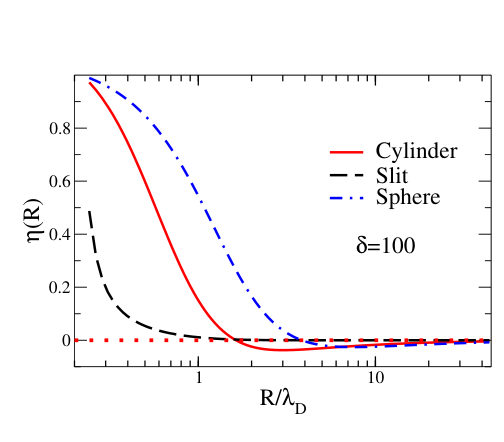 
FIG. 1. Electroneutrality deviation ratio η(R) = (σHi(R) + σ0)/σ0 for planar slits (Ωslit ≃R2 × [0, δ]), infinite cylindrical shells (Ω≃S1 × R × [0, δ]), and spherical shells (Ω≃S2 × [0, δ]), shown as a function of the reduced cavity size R/λD (logarithmic scale). Although η(R) →0 as R →∞, finite-size deviations follow a topology-controlled hierarchy, spherical &gt; cylindrical &gt; planar. The dotted line indicates η(R) = 0.

**Main problem.** Determining whether confinement-induced charge redistribution and deviations from local electroneutrality are driven by local geometric curvature or global topological constraints.

**Main result.** The paper establishes a universal hierarchy of electroneutrality violations based on domain topology, where deviations are strongest in spherical cavities, weaker in cylinders, and weakest in planar slits.

**Method.** Analytical solution of the Poisson-Boltzmann equation using a product manifold representation of the confining domains.

**Summary.** This paper investigates how the shape and topology of a container affect the distribution of ions in an electrolyte. It demonstrates that the degree to which local electroneutrality is violated depends on the global structure of the space, specifically following a hierarchy from spheres to cylinders to planes. This finding suggests that phenomena like charge reversal are driven by global topological constraints rather than just local curvature. The study provides a unified principle for understanding charge redistribution in various confined geometries.

Detailed structure

**Model / system.** Electrolyte solutions confined within spherical, cylindrical, and planar geometries, modeled using mean-field Poisson-Boltzmann theory with point-ion approximations.

**Key observables.** Electroneutrality deviation ratio (eta), local charge density, and electrostatic potential.

**Important parameters / regimes.** Reduced cavity size (R/lambda_D), electrolyte concentration, surface charge density, and domain topology (compactness/connectivity).

**Assumptions / limitations.** Uses mean-field Poisson-Boltzmann theory and assumes a point-ion model, neglecting ion-size effects and explicit ion-ion correlations.

**Figures summary.** A logarithmic plot showing the deviation ratio (eta) versus reduced cavity size (R/lambda_D) for spherical, cylindrical, and planar geometries, demonstrating a monotonic decrease and a clear topological hierarchy.

**Paper structure.** The paper identifies the problem of charge redistribution in confinement, introduces a mathematical framework using product manifolds, defines the electroneutrality deviation ratio, presents the results showing the topological hierarchy, and concludes by linking these findings to phenomena like overcharging.

Abstract

We show that finite-size violations of local electroneutrality in confined electrolytes are governed by the topology of the confining domain, yielding a universal hierarchy of deviations across spherical, cylindrical, and planar geometries. Within Poisson-Boltzmann theory, we introduce an electroneutrality deviation ratio that quantifies how global electrostatic constrains associated with compacness and boundary multiplicity modify charge balance inside confined domains. Although electroneutrality is asymptotically restored in all geometries, finite-size deviations are strongest in compact spherical cavities, weaker in cylindrical confinement, and weakest in planar slits. These results identify topology as the structural origin of confinement-induced charge redistribution and stablish the violation of local electroneutrality as global constraint underlying phenomena such as overcharging anf charge reversal, demostrating that confinement-not local-not local geometric details-controls the emergence of these effects.

[↑ back to top](#top)

### [Near-Term Reduction in Nonlocal Gate Count from Distributed Logical Qubits](http://arxiv.org/abs/2604.21722v1)

**Authors:** Bruno Avritzer, Nathan Sankary  
**Type:** theory · **Category:** quantum information and computing · **PDF:** <https://arxiv.org/pdf/2604.21722v1>  
**Analysis basis:** full PDF text, analyzed in chunks

📷 Fig 1

 
Figure 2: The cut which allows an equal partition of the d = 7 4.8.8 color code. In this case, there are two 4.8.8 blocks, each with its own set of stabilizer ancillas, and each split 50-50 across two processors. As indicated by the grey and purple dots, in one of the two logical qubits, one ancilla for one of the green octagon checks is allocated to processor B. Since this stabilizer is split 4 to 4, this does not increase the amount of PNL gates, but allows strict adherence to the qubit requirements. The total number of PNL gates is thus 4*7=28, less than the 31 required if the codes are PL.

📷 Fig 2

 
Figure 1: Distributed logical qubits require PNL stabilizer measurements as opposed to PNL transversal gate implementations (top). In this work, these PNL gates are mainly implemented by gate teleportation (bottom, |ψ⟩as the control and |ϕ⟩as the target).

📷 Fig 3

 
Figure 4: With distribution of a logical qubit block over multiple processors, larger distances (and therefore reductions in PNL CNOTs) may be required to realize advantage if error correction is performed after each logical CNOT. Assuming the logical qubit is cut once per processor resulting in one partition per processor (2 processors require 1 cut resulting in 2 partitions), so that all two-qubit gates are processor-local, the minimum distance threshold required for an overall PNL reduction scales roughly linearly in the number of processors.

📷 Fig 4

 
Figure 3: In the two processor (two logical qubit) case (top), in the 4.8.8 family distributed codes see advantage at and above d = 7, and the overall trend is in agreement with the scaling behavior previously cited. By contrast, the 6.6.6 family of codes sees advantage only at d = 9 due to the structure of the stabilizers making near-equal bipartitions costly in terms of cut stabilizer weight (bottom).

📷 Fig 5

 
Figure 6: In the fully distributed case, split distillation qubits are allocated on the same processors as split computational qubits. This reduces the per-processor qubit requirements for magic factories while keeping distillation and injection operations PL no matter which qubit is postselected. The total number of PNL gates is O(d), resulting from the syndrome extractions within the individual codes.

📷 Fig 6

 
Figure 5: Two methods of realizing universality in fault-tolerant systems: magic state injection (a) and code switching (b, adapted from[17]). Although these methods differ in their circuit realizations, in both cases there are regimes where they benefit and suffer from distributed execution across processors.

📷 Fig 7

 
Figure 7: Comparison of overhead between (a) fully distributed, (b) fully local, and (c) partially local magic factories. The fully distributed factory performs best for small circuits, whereas for large circuits, it has a slightly higher total qubit overhead, but the size of each individual processor can be smaller than that of the magic factory in (b) and a lower number of PNL gates is required compared to (b), although this is network topology-dependent. Approach (c) performs worse in terms of PNL gates, but may have some advantages in meeting network topology constraints.

📷 Fig 8

 
Figure 8: When 3D and 2D codes are both split across processors, code switching may be performed processor-locally. With sufficient connectivity, this can reduce qubit overhead compared to single processors with both codes by allowing multiple logical qubits to interact with the tetrahedral code processor-locally.

📷 Fig 9

 
Figure 9: Comparison of local vs distributed code switching costs for two different forms of stabilizer measurement.

📷 Fig 10

 
Figure 10: By swapping (data to data) or teleporting (data to ancilla) the qubits from the split code into local structures, non-Clifford resources can be acquired with significantly fewer PNL gates, assuming there is a long chain of switching or distillation required due to circuit gate structure. This can then be undone or partially undone to execute chains of CNOTs, which can then become local as well.

**Main problem.** Minimizing the number of processor-nonlocal (PNL) operations in distributed quantum computing architectures to reduce the overhead caused by noisy or low-speed inter-processor interconnects.

**Main result.** The authors demonstrate that a 10% reduction in PNL gates is achievable in near-term, low-qubit-count devices using distributed logical qubits, with advantages scaling significantly in multi-qubit/multi-processor cases.

**Method.** The study uses qubit allocation techniques via a constraint programming satisfiability (CP-SAT) approach and evaluates various methods for universality, such as magic state distillation, code switching, and logical swaps.

**Summary.** This paper addresses the challenge of reducing expensive inter-processor communication in distributed quantum computing. By optimizing how logical qubits are partitioned across multiple processors using color codes, the authors show that the number of non-local gates can be reduced by 10% in near-term devices. The research also explores how different methods for achieving universal gate sets, such as code switching and magic state distillation, impact the scalability and overhead of these distributed architectures.

Detailed structure

**Model / system.** A modular, distributed quantum computing architecture utilizing error-correcting color codes, specifically the square-octagon (4.8.8) and 6.6.6 families, partitioned across multiple processors.

**Key observables.** Processor-nonlocal (PNL) gate count, code distance (d), and qubit overhead.

**Important parameters / regimes.** Code distance (d), number of processors, and the ratio of transversal to non-transversal gates.

**Assumptions / limitations.** The study assumes a setting where syndrome extraction occurs after every logical gate and adheres to minimal physical qubit requirements including ancillas.

**Figures summary.** Figure 1 illustrates PNL gate implementation via CNOT teleportation; Figure 2 shows a specific code cut for partitioning; Figure 3 compares PNL advantages across different code families; Figure 4 shows scaling of distance thresholds with processor count; Figures 5-11 detail universality methods, magic factory overheads, and partitioning strategies.

**Paper structure.** The paper introduces the problem of PNL reduction in distributed architectures, presents a qubit allocation method using color codes, evaluates universality approaches (MSI, code switching, swaps), analyzes scaling and architectural trade-offs, and concludes with implications for scalable allocation algorithms.

Abstract

Modular quantum computing architectures require error correction schemes that remain effective in the presence of noisy inter-processor operations. As such, minimizing the number of such operations on logical circuits partitioned across quantum processors is a primary objective of distributed quantum computing. In this work, we develop basic techniques for qubit allocation using an exemplar color code family and explore generalizations to other color codes. In particular, we show that a 10% reduction in processor-nonlocal gates is achievable in a setting where syndrome extraction occurs after every logical gate, as in today's devices, and that this scales to significantly greater advantages in the multi-qubit case. We also explore methods of achieving universal gate sets efficiently in this distributed logical setting and evaluate the trade-offs of multiple approaches such as magic state distillation, code switching, and a new method based on logical swaps. Finally, we discuss some considerations for an allocation algorithm for these architectures to perform scalably and connect it to existing work on quantum circuit partitions.

[↑ back to top](#top)

### [Odd Physics Off the Diagonal: Constraining CP-violating SMEFT with Quantum Tomography](http://arxiv.org/abs/2604.21857v1)

**Authors:** Avalon Roberts, Patrick Dougan, Alexander Oh, Savanna Shaw  
**Type:** both · **Category:** other · **PDF:** <https://arxiv.org/pdf/2604.21857v1>  
**Analysis basis:** full PDF text, analyzed in chunks

📷 Fig 1

 
Figure 1: The ϕtruth distribution at LO for the pro- cess pp →W +Z →e+νeµ+µ−with the inclusive setup of Ref. [25], applying the invariant mass cut 81 GeV &lt; Mµ+µ−&lt; 101 GeV. The upper panel shows the differential cross section dσ/dϕ∗ e in units of fb, comparing the SM prediction (red) with the SM + interference and SM + interference + quadratic contri- butions for ceven = 1.0 (solid) and codd = 1.0 (dashed). The middle and lower panels show the ratio to the SM for the interference and quadratic-only contributions, respectively.

📷 Fig 2

 
Figure 2: The real component of the spin density mat- rix of the W +Z system in the SM, showing the full spin structure of this process in the helicity basis. The un- physical small negative values along the central diag- onal are due partly to the statistical resolution of this study, and to NLO effects.

📷 Fig 3

 
Figure 3: The reconstructed SDMs for the interference terms of the CP-even OW (above) and CP-odd Of W (below) operators with the SM, separated into their real (left) and imaginary (right) components. The separ- ation of the off-diagonal structure between the CP-odd and CP-even into the imaginary and real parts of the SDM means that this can be used to set 2D limits on them.

📷 Fig 4

 
Figure 4: The reconstructed SDMs for the quadratic terms of the CP-even OW operator (left) and the CP-odd Of W operator (right) in the inclusive (top) selection setup and the fiducial (bottom) setup. It can be seen that some entries become falsely split between elements due to the neutrino reconstruction ambiguity. The unphysical small negative values along the central diagonal are due partly to the statistical resolution of this study, and to NLO effects.

📷 Fig 5

 
Figure 6: The ϕreco distribution at LO in QCD for the process pp →W +Z →e+νeµ+µ−with the fiducial setup of Ref. [25], applying the selections of Eq. (3.2), with the neutrino rapidity solution chosen at random from Eq. (16). The upper panel shows the differential cross section dσ/dϕ∗ e in units of fb, comparing the SM prediction (red) with the SM + interference and SM + interference + quadratic contributions for ceven = 1.0 (solid) and codd = 1.0 (dashed). The middle and lower panels show the ratio to the SM for the interference- only and quadratic contributions, respectively.

📷 Fig 6

 
Figure 5: A heatmap of the reconstructed azimuthal decay angle ϕreco versus the truth-level ϕtrue for the W boson, with the neutrino rapidity solution chosen at random from Eq. (16). The two diagonal bands reflect the two-fold ambiguity of Eq. (18), with each solution equally likely to be selected.

📷 Fig 7

 
Figure 7: 1D CL limits on OW and Of W derived with other operator fixed to zero and with the other oper- ator profiled over, for the shape-only and shape-plus- yield configurations of the ϕ, pZ T and SDM observables. The boxes represent 68% CL limit bounds, the lines represent 95% CL limit bounds. The limits are pro- duced within the fiducial selection.

📷 Fig 8

 
Figure 8: Expected joint confidence regions in the (cW , cf W ) plane derived from the positron azimuthal decay- angle distribution ϕ∗ e+ (top) and the reconstructed spin density matrix (bottom), each in shape-only (left) and shape-plus-yield (right) configurations, for the inclusive setup. The contours correspond to constant ∆χ2 with respect to the SM point at fixed confidence levels. Contour limits are extracted based on both a SM Asimov scenario, but also a set of NP Asimov setups with varying degrees of OW and Of W present in the dataset across the grid. This demonstrates of the SDM-based analysis’s ability to differentiate actual CP-even and CP-odd signatures from each other...

📷 Fig 9

 
Figure 9: Expected joint confidence regions in the (cW , cf W ) plane derived from the positron and anti-muon azimuthal decay-angle distributions, ϕ∗ e+ (top) and ϕ∗ µ+ with the fiducial selection of Eq. (14) applied and the neutrino rapidity reconstructed via the on-shell W-mass constraint of Eq. (16). The effect of the fiducial cuts and reconstruction ambiguity on the sensitivity of ϕ∗ e+ can be assessed by comparison with Figures 8a and 8b. Constraints from ϕ∗ µ+ are unaffected by neutrino reconstruction and so slightly exceed the strength of those from ϕ∗ e+.

📷 Fig 10

 
Figure 10: Expected joint confidence regions in the (cW , cf W ) plane derived from the positron and anti-muon azimuthal decay-angle distributions, pZ T (top) and the SDM (bottom) with the fiducial selection of Eq. (14) applied and the neutrino rapidity reconstructed. The differential nature of the pZ T distribution tail gives strong constraints of the SM Asimov, with a smaller contour area, A95% than achieved by the SDM with the addi- tion of cross-section information. The SDM however performs better by the same metric in the genuine BSM scenarios presented in the off-centre points of the Asimov grid. In these cases the SDM also show clearer differentiation between BSM hypotheses than pZ T...

**Main problem.** The difficulty in distinguishing CP-even from CP-odd SMEFT operators in diboson production due to degeneracies in traditional polarization-blind angular observables.

**Main result.** Quantum Tomography of the Spin Density Matrix (SDM) provides superior simultaneous sensitivity to CP-even and CP-odd contributions by exploiting off-diagonal imaginary components and quadratic NP terms.

**Method.** Reconstruction of the Spin Density Matrix using the Generalized Bloch Vector representation and the inverted Wigner-Weyl formalism applied to Monte Carlo simulated $WZ$ production events.

**Summary.** This paper proposes using Quantum Tomography techniques to improve searches for new physics in the electroweak sector. By reconstructing the Spin Density Matrix of $WZ$ production, the authors can distinguish between CP-even and CP-odd operators that otherwise appear degenerate in standard angular distributions. The method specifically exploits the off-diagonal elements of the density matrix to capture the full signature of Beyond-SM physics. This approach provides tighter and less degenerate constraints on SMEFT Wilson coefficients compared to traditional kinematic observables.

Detailed structure

**Model / system.** The bipartite spin state of a $W$ and $Z$ boson system produced in $pp$ collisions ($pp 	o WZ 	o e^+
u_e\mu^+\mu^-$) within the Standard Model Effective Field Theory (SMEFT) framework.

**Key observables.** Spin Density Matrix (SDM) elements, Fano coefficients, azimuthal decay angles ($\phi$), and transverse momentum of the $Z$ boson ($p^Z_T$).

**Important parameters / regimes.** SMEFT Wilson coefficients ($c_W$ and $c^f_W$), high-energy electroweak regime, and $140 	ext{ fb}^{-1}$ luminosity.

**Assumptions / limitations.** Leading-order (LO) accuracy, neglect of backgrounds and systematic uncertainties, and the use of the Warsaw basis for dimension-six operators.

**Figures summary.** Figure 1 shows angular distribution degeneracies; Figures 2-4 display reconstructed SDM components and the impact of neutrino reconstruction ambiguity; Figures 7-10 present 1D and 2D confidence intervals for Wilson coefficients.

**Paper structure.** The paper motivates the need for new CP-violation sources, identifies limitations in current SMEFT searches, introduces the Quantum Tomography approach, details the SDM reconstruction method, compares performance against traditional observables, and quantifies statistical sensitivity.

Abstract

New sources of charge-parity (CP) violation beyond those described in the Standard Model (SM) are required to explain the observed matter--antimatter asymmetry of the Universe. The Standard Model Effective Field Theory (SMEFT) provides a framework to introduce additional electroweak sources of CP-odd physics in a model-independent manner. However, these CP-violating signatures are mostly degenerate to CP-even SMEFT operators in polarisation-blind observables, distinguishable only in the SM-New Physics (NP) interference using the azimuthal decay angle. Using Quantum Tomography techniques, we present a new approach to constraining these NP effects. Reconstructing the spin density matrix (SDM) of a diboson system, we go beyond `interference resurrection' to exploit the full signature of the Beyond-SM physics, including the pure quadratic NP terms. We show that this approach provides superior simultaneous sensitivity to characteristic features of CP-even and CP-odd contributions, including effects not fully captured by traditional angular observables.

[↑ back to top](#top)

### [On the importance of hyperparameters in initializing parameterized quantum circuits](http://arxiv.org/abs/2604.21266v1)

**Authors:** Ankit Kulshrestha, Sarvagya Upadhyay  
**Type:** theory · **Category:** quantum information and computing · **PDF:** <https://arxiv.org/pdf/2604.21266v1>  
**Analysis basis:** full PDF text, analyzed in chunks

📷 Fig 1

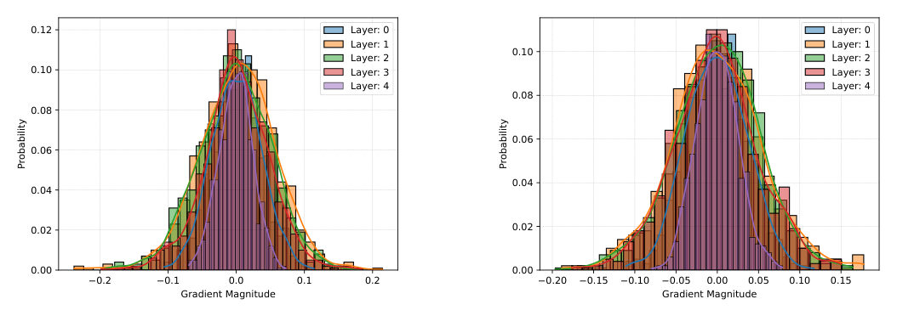 
Fig. 1: Normalized histogram of gradient magnitude distribution of initial parameters across different layers in a 5 layer, 4 qubit Hardware Efficient Ansatz (HEA). The hyperparameters for the distribution are perturbed by δ = 0.05. The figures show that even a small change in hyperparameters of initializing distribution can lead to drastically different gradient distribution across layers of a quantum circuit.

📷 Fig 2

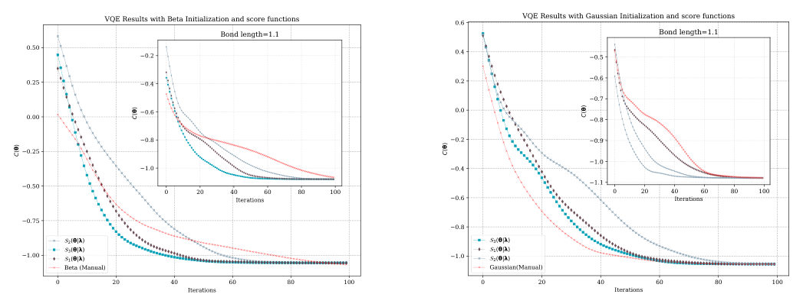 
Fig. 2: VQE Training results for H2 molecule with bondlength ∈[0.5, 1.1]˚ A for Beta and Gaussian Distributions. The results show that searched hyperparameters with the given score functions produce a faster convergence in general.

📷 Fig 3

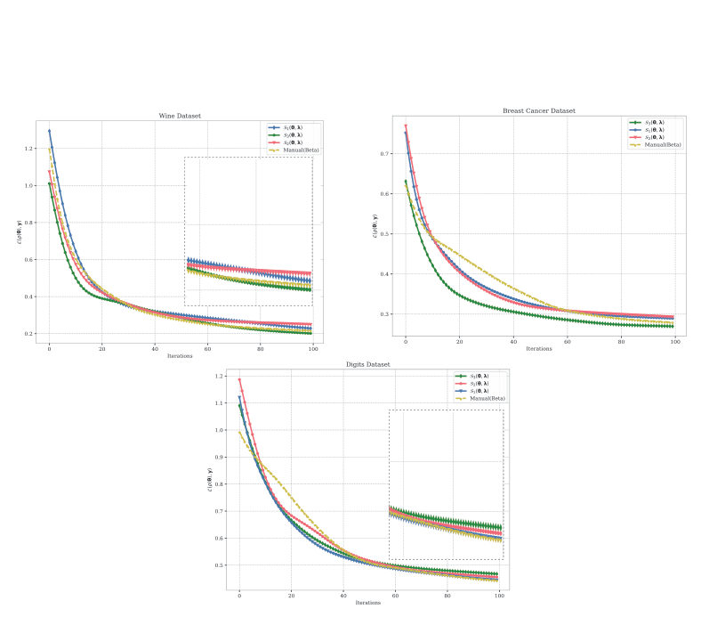 
Fig. 3: Training loss on different QML datasets with different score functions and manually selected hyperparameters for initializing distributions. Inset: convergence dynamics at the end of training. In all the cases, method based on score function leads to faster convergence than manual selection of hyperparameters even if the ansatz converges to the same (local) minima.

**Main problem.** Finding optimal hyperparameters (such as mean and variance) for initial parameter distributions in Parameterized Quantum Circuits (PQCs) to improve convergence and performance.

**Main result.** The proposed evolutionary-search algorithm finds hyperparameters that significantly accelerate convergence and improve accuracy in VQE and QML tasks without worsening the barren plateau phenomenon.

**Method.** An evolutionary-search (ES) based algorithm (ES-HyperOpt) that uses score functions based on the Quantum Fisher Information Matrix (QFIM) and gradient statistics to optimize hyperparameters.

**Summary.** This paper addresses the overlooked importance of hyperparameters in the initial parameter distributions of quantum circuits. The authors propose an evolutionary-search algorithm to automatically tune these hyperparameters using metrics derived from the Quantum Fisher Information Matrix. Their method leads to faster convergence in both molecular energy estimation and quantum machine learning tasks. Crucially, the tuning process does not exacerbate the barren plateau problem, making it a practical tool for NISQ-era algorithms.

Detailed structure

**Model / system.** Parameterized Quantum Circuits (PQCs) including Hardware Efficient Ansatz (HEA) and StronglyEntanglingLayers, applied to VQE (H2 molecule) and QML (Wine, Breast Cancer, and Digits datasets).

**Key observables.** Ground state energy (VQE), test accuracy and training loss (QML), and gradient variance scaling.

**Important parameters / regimes.** Hyperparameters of Beta (alpha, beta) and Gaussian (mu, sigma) distributions; number of qubits (2 to 10); circuit layers.

**Assumptions / limitations.** Uses a block-diagonal or empirical approximation of the QFIM to manage exponential complexity in large parameter sets.

**Figures summary.** Figure 1 shows sensitivity of gradient distributions to hyperparameter perturbations; Figure 2 shows VQE energy convergence; Figure 3 shows QML training loss dynamics; Figure 4 demonstrates that gradient variance scaling remains stable (no induced barren plateaus).

**Paper structure.** The paper introduces the problem of hyperparameter sensitivity, proposes an evolutionary-search algorithm with specific scoring functions, compares it against classical search methods, and validates it through VQE and QML benchmarks, concluding with an analysis of barren plateau implications.

Abstract

There has been intensive research on increasing the utility and performance of Parameterized Quantum Circuits (PQCs) in the past couple of years. Owing to this research, there are now several inductive biases available to a quantum algorithms researchers to design a good circuit for their chosen task.   In this paper, we focus on the problem of finding performant initial parameters for a given PQC. Different from previous research that focuses on finding the right \emph{distribution}, we focus on finding the \emph{hyperparameters} for any given distribution. To that end we introduce an evolutionary-search based algorithm that finds optimal hyperparameter given a PQC and quantum task. Our empirical results indicate that our algorithm consistently leads to selection of performant initial parameters tuned specifically to the ansatz and the quantum task leading to faster convergence and performance. More importantly, our algorithm does not \emph{negatively} affect the barren plateau phenomenon. In other words, the initial parameters suggested by algorithm do not worsen the gradient variance scaling for a given initializing distribution.

[↑ back to top](#top)

### [Pairing mechanism and superconductivity in 1313 phase La$_3$Ni$_2$O$_7$](http://arxiv.org/abs/2604.21533v1)

**Authors:** Cui-Qun Chen, Ming Zhang, Fan Yang, Dao-Xin Yao  
**Type:** theory · **Category:** strongly correlated electrons · **PDF:** <https://arxiv.org/pdf/2604.21533v1>  
**Analysis basis:** full PDF text, analyzed in chunks

📷 Fig 1

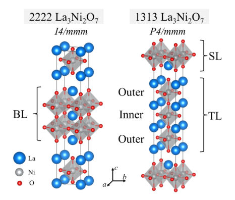 
FIG. 1. Crystal structures of high-pressure I4/mmm phase 2222 La3Ni2O7 and high-pressure P4/mmm phase 1313 La3Ni2O7. The blue, gray, and red balls represent La, Ni, and O atoms, respectively.

📷 Fig 2

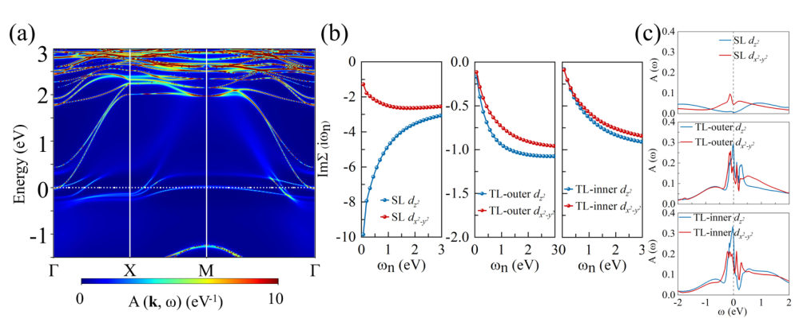 
FIG. 2. DFT+DMFT calculated momentum-resolved spectral functions A(k, ω) (a), imaginary parts of Matsubara self-energy functions Im P iωn (b) and orbital-resolved spectral functions A(k, ω) (c) at 230 K under 20 GPa. The inner and outer layers are indicated in Fig.1

📷 Fig 3

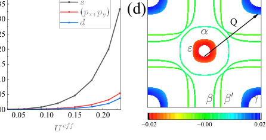 
FIG. 4. (a) Distribution of the largest eigenvalue of the spin susceptibility matrix χs(q) in the BZ in the TL subsystem for U eff = 0.23 eV and JH = U eff/4. The susceptibility peaks at Q. (b) FS of the TL subsystem in the BZ at 20 GPa. As shown in (b), Q is nesting vector between the ε and γ pockets. (c) The largest pairing eigenvalue λ of the various pairing symmetries as function of the interaction strength U eff with fixed JH = U eff/4. (d) The distributions of the leading s- wave pairing gap function on the FS for U eff = 0.23 eV, exhibiting an s±-pattern.

📷 Fig 4

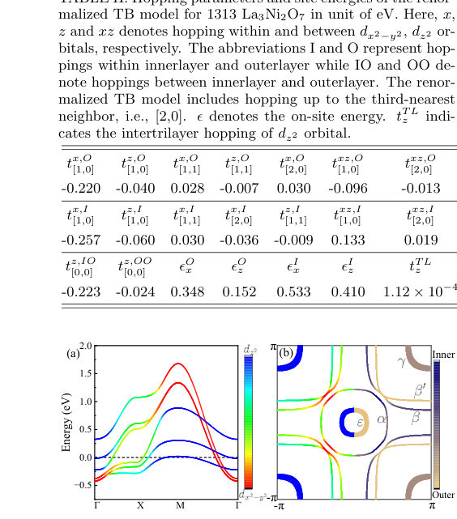 
FIG. 3. Renormalized TL TB band structure (a) and FS (b). The blue-red color bar indicates the orbital weight of Ni- dx2−y2 and dz2 and the purple-yellow color bar represents the relative contributions from Ni atoms in the outer-layer and inner-layer.

📷 Fig 5

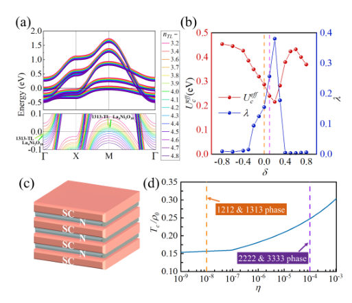 
FIG. 5. (a) Band structures at different filling level nT L. The bands of the 1313 structure and bulk La4Ni3O10 are indicated by arrows for clarity in the energy window [-0.1,0.1] eV. (b) The critical interaction strength U eff c (red solid line) and the largest pairing eigenvalue λ (blue solid line) as function of doping δ. The orange dashed lines mark the values of U eff c and λ for the 1313 system, while the purple dashed lines indicate those for bulk La4Ni3O10. (c) Schematic of the intrinsic S-N- S Josephson Junction structure of 1313 La3Ni2O7, where the superconducting (S) and the normal (N) layers denote the TL and SL subsystems, respectively. (d) Tc/ρ0 as a function of the anisotropy...

**Main problem.** The study aims to determine the pairing mechanism and the origin of the significantly suppressed superconducting transition temperature (Tc) in the 1313 phase of La3Ni2O7 compared to the bulk La4Ni3O10 phase.

**Main result.** The researchers found that superconductivity resides in the trilayer (TL) subsystem with s-plus-minus pairing symmetry, and Tc is suppressed due to hole-doping in the TL subsystem and the role of the single-layer (SL) subsystem acting as an S-N-S Josephson junction.

**Method.** The study utilizes Density Functional Theory combined with Dynamical Mean-Field Theory (DFT+DMFT) and the Random Phase Approximation (RPA) to analyze electronic correlations and pairing symmetry.

**Summary.** This paper investigates why the superconducting transition temperature in the 1313 phase of La3Ni2O7 is much lower than in its bulk counterpart. Using advanced computational methods, the authors show that superconductivity is localized in the trilayer subsystem. They identify two main reasons for the lower Tc: increased hole-doping in the trilayer and the single-layer subsystem acting as a barrier that weakens phase coherence between superconducting layers. This work provides a theoretical framework for understanding superconductivity in complex, multi-layered nickelate structures.

Detailed structure

**Model / system.** The system is the 1313 phase of La3Ni2O7 under high pressure (20 GPa), consisting of alternating single-layer and trilayer Ruddlesden-Popper nickelate subsystems.

**Key observables.** Spectral functions, Matsubara self-energy, orbital occupations, Fermi surface pockets, pairing eigenvalue, and interlayer Josephson coupling.

**Important parameters / regimes.** Pressure of 20-23 GPa, transition temperature Tc approx 3.6 K, and the anisotropy parameter eta.

**Assumptions / limitations.** The SL subsystem is treated as a nearly insulating bad metal with Mott physics in the d_z2 orbital.

**Figures summary.** Figure 1 shows the crystal structures of the high-pressure phase.

**Paper structure.** The paper introduces the problem of Tc suppression in 1313 nickelates, presents DFT+DMFT results regarding subsystem electronic properties, uses RPA to identify pairing symmetry and mechanisms, and concludes by discussing the implications for the 2222 phase.

Abstract

Recently, the observation of superconductivity (SC) with $T_c$ $\approx$ 3.6 K in the pressurized 1313 La$_3$Ni$_2$O$_7$ has attracted considerable interest. Here, we systematically investigate the electronic properties and superconducting mechanism of 1313 La$_3$Ni$_2$O$_7$ using density functional theory plus dynamical mean-field theory (DFT+DMFT) and random phase approximation (RPA). Our DFT+DMFT calculations reveal that the single-layer (SL) subsystem exhibits nearly insulating behavior, with the $d_{z^2}$ orbital showing Mott physics, while the trilayer (TL) subsystem remains metallic. This indicates that SC primarily resides in the TL subsystem, whose Ni-$e_g$ orbitals are found to be hole-doped relative to bulk La$_4$Ni$_3$O$_{10}$. Based on DFT+DMFT-derived low-energy Hamiltonian, RPA-based analysis yields an $s^{\pm}$-wave pairing symmetry within the TL subsystem. Importantly, we identify two key factors that contribute to the significant suppression of $T_c$ in 1313 La$_3$Ni$_2$O$_7$ compared to bulk La$_4$Ni$_3$O$_{10}$. First, the hole doping in the TL subsystem, as established by DMFT, leads to a decreased pairing strength, as confirmed by RPA calculations -- a trend resembling that in bulk La$_4$Ni$_3$O$_{10}$. Second, the SL subsystem acts as a bridge connecting adjacent superconducting TL subsystems, thereby forming an S-N-S Josephson junction. The resulting interlayer Josephson coupling governs the phase coherence between TL subsystems and further suppresses the global $T_c$. Combinedly, our findings suggest that the high-$T_c$ phase in the RP La$_3$Ni$_2$O$_7$ family should be attributed to the 2222 La$_3$Ni$_2$O$_7$ rather than the 1313 La$_3$Ni$_2$O$_7$.

[↑ back to top](#top)

### [Partial oracles quantum algorithm framework -- Part I: Analysis of in-place operations](http://arxiv.org/abs/2604.21788v1)

**Authors:** Fintan M. Bolton  
**Type:** theory · **Category:** quantum information and computing · **PDF:** <https://arxiv.org/pdf/2604.21788v1>  
**Analysis basis:** full PDF text, analyzed in chunks

📷 Fig 1

 
FIG. 1. Overview of partial oracle iterations. At each iteration stage j, a search is executed to

📷 Fig 2

 
FIG. 2. First partial oracle iteration showing: (a) the initial equal superposition state; (b) index

📷 Fig 3

 
Figure 2 shows a visualization of the Grover-Long algorithm, implementing the first

📷 Fig 4

 
Figure 3 shows a visualization of the modified Grover-Long algorithm, implementing

📷 Fig 5

 
FIG. 3. Second (and subsequent) partial oracle iteration: (a) index states remaining after the

📷 Fig 6

 
Figure 4 shows the corresponding circuit for the majority oracle function, which requires

📷 Fig 7

 
FIG. 6. Reciprocal majority gate

📷 Fig 8

 
Figure 7 shows the corresponding circuit for the choose function, which requires just two

📷 Fig 9

 
FIG. 7. Circuit for the choose function Ch(a, b, c)

📷 Fig 10

 
FIG. 8. Reciprocal choose gate

**Main problem.** The paper addresses the lack of an explicit method for constructing the search iteration operator within the 'partial oracles' quantum algorithm framework, which aims to potentially achieve exponential speedup over Grover's algorithm.

**Main result.** The author provides the missing construction for the search iteration operator for in-place oracle functions and introduces the 'reciprocal transform' to reorder Walsh functions in reciprocal space.

**Method.** The method utilizes a new 'reciprocal transform' that obeys a chain rule, allowing complex oracle functions to be decomposed into simple steps, and implements these using the QFrame Python library.

**Summary.** This paper develops a critical component of the partial oracles quantum algorithm framework by providing a method to construct search iteration operators. By introducing the 'reciprocal transform,' the author shows how complex, multi-bit oracle functions can be decomposed and implemented in quantum circuits. While the current focus on in-place operations does not yet prove quantum advantage, the work demonstrates the ability to invert simplified cryptographic primitives like SHA-256 components. The introduction of the QFrame library also provides a tool for automating the generation of these complex quantum circuits.

Detailed structure

**Model / system.** The framework uses a quantum computing model involving an n-qubit index register, multi-bit oracle functions, and operations in both direct (index) and reciprocal (Walsh function) spaces.

**Key observables.** The success of the algorithm is measured by the probability of finding the target index $x_s$ where all oracle bits satisfy a specific condition (e.g., all zeros).

**Important parameters / regimes.** The paper distinguishes between 'in-place' operations (where results are read from the index qubits) and 'out-of-place' operations; it also focuses on bijective (one-to-one) oracle functions.

**Assumptions / limitations.** The current construction is limited to in-place operations, which are classically reversible and thus do not yet demonstrate quantum advantage; the framework also assumes the oracle function is bijective.

**Figures summary.** Figure 1 shows the nested structure of partial oracle iterations; Figure 2 and 3 visualize the transition through Walsh-Hadamard and reciprocal transforms; Figures 4-12 illustrate specific quantum circuits for cryptographic primitives like Maj, Ch, and modulo addition.

**Paper structure.** The paper introduces the partial oracles framework, defines the reciprocal transform and its chain rule, provides the construction for in-place operators, demonstrates applications to SHA-256 components, and introduces the QFrame automation library.

Abstract

The partial oracles framework is a quantum search algorithm that has the potential to exceed the quadratic speedup of Grover's algorithm, up to a theoretical maximum of an exponential speedup. Until now, however, the framework has lacked an explicit method for constructing the operator that represents the search iteration. In this paper, we provide the missing construction, for the special case of an oracle function definable using only in-place operations (that is, where the calculated result of the oracle function can be read just from the qubits in the search index). The restriction to in-place operations means that the current work does not yet exhibit quantum advantage: oracle functions constructed using only in-place operations are always classically reversible. To demonstrate quantum advantage, it will be necessary to extend this construction method to include out-of-place operations (part II). As part of the construction of the search iteration operator, we define a new type of transform, the reciprocal transform, which is applied to the oracle function. We show that the reciprocal transform obeys a chain rule, which makes it possible to break down complex transforms into simple steps. To illustrate the practical application of this search method, we apply the reciprocal transform to elementary operations from the SHA-256 hash algorithm: addition modulo $2^n$, the $Maj(a, b, c)$ function, the $Ch(a, b, c)$ function, and the bit shift functions. We also introduce the QFrame python library, which is used to automate the construction of quantum circuits that represent reciprocal transforms.

[↑ back to top](#top)

### [Percolation Critical Probability of Aperiodic Smith Hat tile(1, $\sqrt3$)](http://arxiv.org/abs/2604.21165v1)

**Authors:** Haitao Gao, Aaryash Bharadwaj  
**Type:** theory · **Category:** statistical mechanics · **PDF:** <https://arxiv.org/pdf/2604.21165v1>  
**Analysis basis:** full PDF text, analyzed in chunks

📷 Fig 1

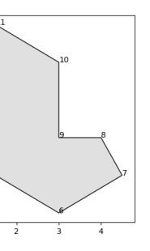 
Figure 1: Hat unit

📷 Fig 2

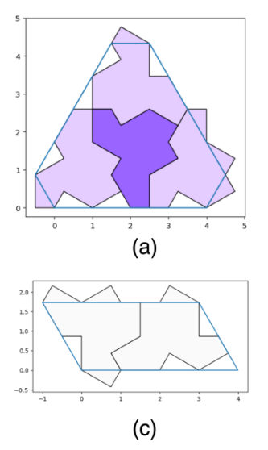 
Figure 2: Metatile in Smith hat tiling: (a) pattern H, (b) pattern T, (c) pattern P, (d) pattern F

📷 Fig 3

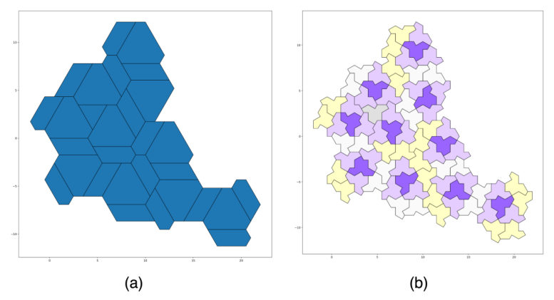 
Figure 3: Hat tile: (a) The patch composed by metatiles. (b) The metatiles dissected into multiple copies of the prototile.

📷 Fig 4

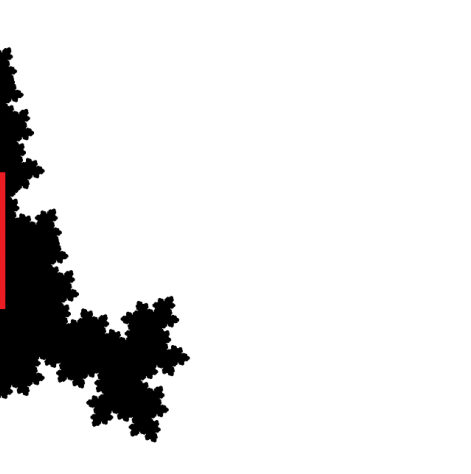 
Figure 4: Patch 5: The Red Square is the L = 400 centred on the point (200, -100)

📷 Fig 5

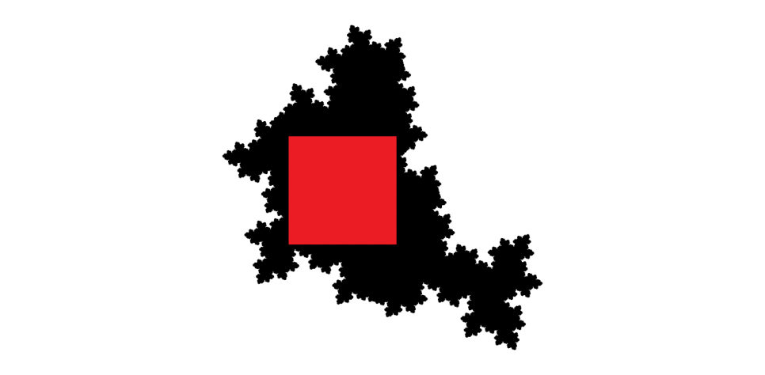 
Figure 5 shows the mean critical probability within a 95% confidence interval. It follows the statistical property that when the system size L increases, the 95% confidence interval shrinks.

📷 Fig 6

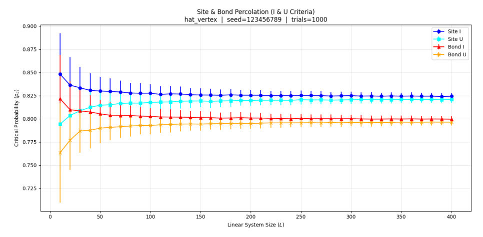 
Figure 5: Monte Carlo simulation: Site and bond percolation critical probability mean ¯pc and 95% confidence interval

📷 Fig 7

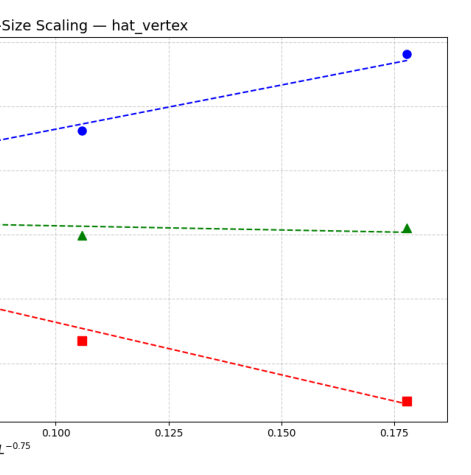 
Figure 6: Site Percolation

📷 Fig 8

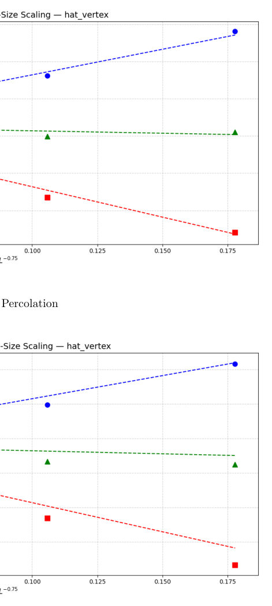 
Figure 7: Bond Percolation

📷 Fig 9

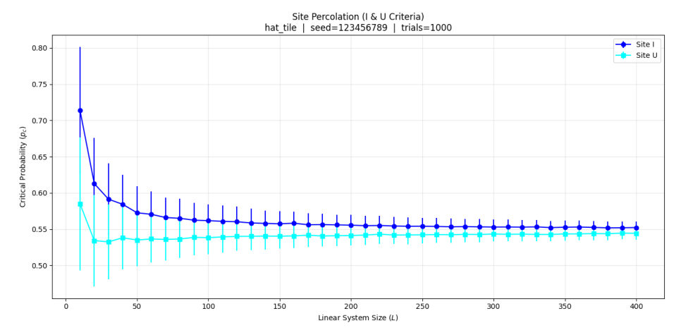 
Figure 8: Monte Carlo simulation: Site percolation critical probability mean for the tile percolation ¯pc and 95% confidence interval

📷 Fig 10

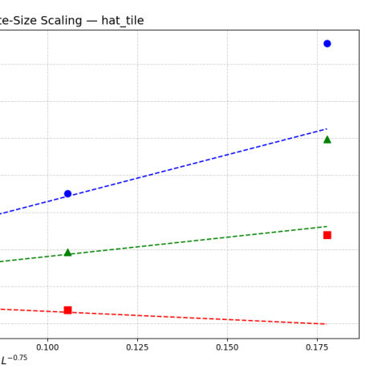 
Figure 9: Site Percolation of Tile

**Main problem.** Determining the percolation critical thresholds (pc) for the Smith Hat tile, the first discovered aperiodic monotile, and investigating how its non-translational geometry influences connectivity.

**Main result.** The study establishes site and bond percolation thresholds for edge percolation (ps = 0.822725, pb = 0.798161) and site percolation on the dual graph (ps = 0.544247), finding these values are higher than common periodic lattices.

**Method.** Monte Carlo simulations using a Union-Find approach and Finite-Size Scaling (FSS) with the L^-1/nu scaling relation to extrapolate results to the infinite system limit.

**Summary.** This paper provides the first numerical benchmarks for percolation thresholds on the recently discovered Smith Hat aperiodic monotile. By using Monte Carlo simulations and finite-size scaling, the authors calculate specific critical probabilities for both site and bond percolation. The results show that the unique geometry of the hat tile leads to higher percolation thresholds compared to standard periodic lattices. This work contributes to the understanding of how aperiodicity affects phase transitions and global connectivity in tiling systems.

Detailed structure

**Model / system.** The Smith Hat tiling, an aoperiodic tiling of the plane using a single 13-sided prototile, analyzed via Bernoulli site and bond percolation models on both the tiling edges and the dual graph.

**Key observables.** Critical probabilities (pc) for site and bond percolation, and the critical exponent (nu).

**Important parameters / regimes.** System size L (ranging from 10 to 400), number of independent trials (T = 1000), and the assumed critical exponent nu = 4/3.

**Assumptions / limitations.** Assumes the Smith Hat tile is percolation-isotropic and that the critical exponent nu follows the standard 2D percolation universality class (4/3).

**Figures summary.** The figures illustrate the fundamental hat tile, metatile patterns (H, T, P, F), the construction of the sampling frame, and plots showing the convergence of percolation thresholds and confidence intervals.

**Paper structure.** The paper introduces the Smith Hat tile, defines the percolation models (site/bond on edges and dual graphs), details the Monte Carlo and Finite-Size Scaling methodology, presents numerical results and validation against known lattices, and discusses limitations and implications.

Abstract

The Smith Hat tile is the first known aperiodic monotile, having been discovered in 2023. The simple structure, constructed using only 8 kites, is unique and well motivated for analysis within percolation theory. The primary goal of this paper is to discover the critical threshold $p_c$ in both site and bond Bernoulli structures using Monte Carlo simulation for the Smith hat tile(1,$\sqrt3$). Our findings are site and bond values of $p_c^s = 0.822725 \pm 0.000044$ and $p_c^b = 0.798161 \pm 0.000044$ for edge percolation and $0.544247 \pm 0.000101$ for site percolation on the dual graph.

[↑ back to top](#top)

### [Pressure-Tuned Competing Electronic States in Layered Tellurides](http://arxiv.org/abs/2604.21336v1)

**Authors:** Mahmoud Abdel-Hafiez, Govindaraj Lingannan, D. A. Chareev, A. N. Vasiliev, Anas Abutaha, Kadir Can Dogan, Mehmet Yagmurcukardes, Mehmet Egilmez, Hasan Sahin, Sami El-Khatib  
**Type:** both · **Category:** disordered systems and neural networks · **PDF:** <https://arxiv.org/pdf/2604.21336v1>  
**Analysis basis:** full PDF text, analyzed in chunks

📷 Fig 1

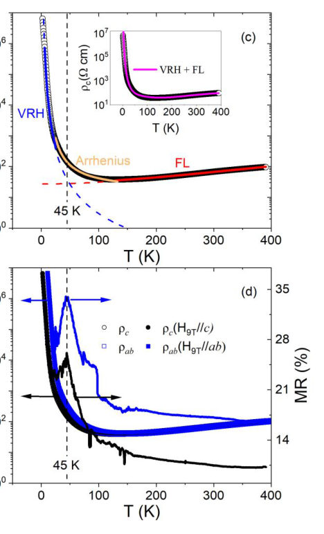 
FIG. 2.

📷 Fig 2

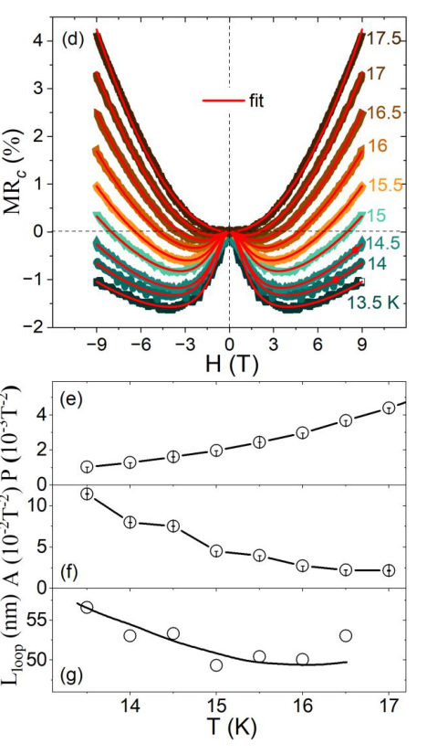 
FIG. 3.

**Main problem.** The study aims to understand the pressure-driven evolution of electronic states in bulk 2H-MoTe2, specifically the transition from a localized, semiconducting regime to a semimetallic regime and the interplay between disorder and quantum transport.

**Main result.** The researchers demonstrate a continuous, pressure-induced collapse of the bandgap and a transition from a strongly localized variable-range hopping regime to a semimetallic regime characterized by a crossover from weak antilocalization to weak localization.

**Method.** The study combines high-pressure magnetotransport measurements (up to 60 T) with first-principles density functional theory (DFT) calculations including spin-orbit coupling.

**Summary.** This paper investigates how applying high pressure to 2H-MoTe2 can tune its electronic properties from an insulator to a semimetal. By using extremely high magnetic fields (60 T), the authors track how disorder-driven effects like variable-range hopping transition into quantum-coherent effects like weak localization. The study provides a unified picture of how the electronic bandgap collapses under pressure, driven by a continuous electronic reconstruction.

Detailed structure

**Model / system.** The physical system is bulk semiconducting 2H-phase Molybdenum ditelluride (MoTe2), a layered transition-metal dichalcogenide. The transport is modeled using frameworks for 3D Mott variable-range hopping, weak localization/antilocalization, and the Nguyen-Spivak-Shklovskii model for quantum interference.

**Key observables.** Out-of-plane resistivity, magnetoresistance (MR), lattice parameters, and bandgap evolution.

**Important parameters / regimes.** Pressure up to 15.6 GPa, magnetic fields up to 60 T, localization length (~1.99 nm), and a temperature anomaly near 45 K.

**Assumptions / limitations.** The use of the GGA with PBE functional and DFT-D2 dispersion corrections in calculations; the assumption of a continuous electronic reconstruction rather than an abrupt structural transition.

**Figures summary.** Fig 1 shows XRD, Raman spectra, and ambient pressure transport/MR; Fig 2 displays high-field MR and temperature evolution of MR parameters; Fig 3 presents resistivity under pressure and 3D WAL fits.

**Paper structure.** The paper introduces the problem of electronic evolution in TMDs, presents ambient pressure transport and magnetotransport data, details the effects of high hydrostatic pressure on resistivity and quantum interference, provides DFT evidence for bandgap collapse, and concludes with a unified transport framework.

Abstract

Layered transition-metal dichalcogenides (TMDs) host competing electronic states that can be tuned by external perturbations, providing a platform to explore the interplay between disorder, electronic structure, and quantum transport. Here we investigate magnetotransport in bulk semiconducting 2H-MoTe2 under hydrostatic pressure. At ambient pressure, transport evolves from high-temperature metallic behavior into activated conduction and ultimately a strongly localized variable-range hopping regime, accompanied by a pronounced magnetotransport anomaly near 45 K and large, nonsaturating magnetoresistance extending up to an unprecedented field of 60 T in semiconducting 2H-MoTe2. Under compression to 15.6 GPa, the insulating state is rapidly suppressed and a low-resistivity regime emerges in which quantum interference dominates, exhibiting a crossover from weak antilocalization (WAL) to weak localization (WL) at low temperatures. A physically motivated phenomenological description captures the magnetoresistance across these regimes and yields a characteristic electronic length scale that remains comparable across the localized and quantum-interference regimes. First-principles calculations reveal a continuous pressure-driven collapse of the bandgap into a semimetallic electronic structure. These results establish a unified picture of pressure-tuned transport spanning hopping and quantum-coherent regimes.

[↑ back to top](#top)

### [pygridsynth: A fast numerical tool for ancilla-free Clifford+T synthesis](http://arxiv.org/abs/2604.21333v1)

**Authors:** Shuntaro Yamamoto, Nobuyuki Yoshioka  
**Type:** theory · **Category:** quantum information and computing · **PDF:** <https://arxiv.org/pdf/2604.21333v1>  
**Analysis basis:** full PDF text, analyzed in chunks

📷 Fig 1

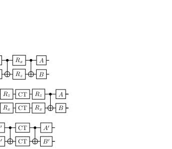 
Figure 1: Two-qubit decomposition and absorption of residuals. (1) Three-CNOT template (top): Rz(−ψ) on the target; (C, D) between CNOTs 1–2; Rx(θ) and Rz(ϕ) between CNOTs 2–3; (A, B) after CNOT 3. (2) After magnitude approximation, residual Rz (control) and Rx (target) appear around the Clifford+T core. (3) Residuals commute with CNOTs and merge into C′, D′, A′, B′ and a simpler core.

📷 Fig 2

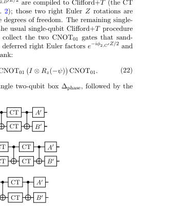 
Figure 2: Partial decomposition of a two-qubit block. Top: the absorbed form from Fig. 1 (bottom), with an additional leading CNOT01; primed blocks C′, D′, A′, B′, three CNOTs in the core, and Clifford+T cores (CT). Middle: C′ and D′ expanded via (20) into Rz and CT layers on each wire; the leading CNOT01 and the rest of the CNOT pattern are unchanged. Bottom: ∆phase (22) absorbs the leading CNOT01, the Rz rotations, and a trailing CNOT01; the Clifford+T suffix (CT pairs, remaining CNOTs, A′, B′) is unchanged.

📷 Fig 3

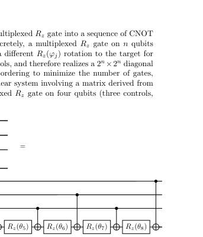 
Figure 3: Example of multiplexed Rz gate decomposition for a 4-qubit unitary: the control qubits (top) determine which Rz rotation is applied to the target qubit (bottom).

📷 Fig 4

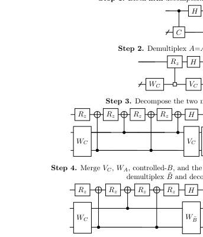 
Figure 4: Step-by-step decomposition of a 3-qubit unitary.

📷 Fig 5

 
Figure 5: Recursive absorption of residual diagonal phase matrix for n = 3: (0) recursive circuit; (1) VA partially decomposed to CT and ∆VA; (2) ∆VA commutes left past the right multiplexed Rz; (3) absorbed into V ˜ B, then V ′ ˜ B partially decomposed to CT and ∆V ′ ˜ B; (4) ∆V ′ ˜ B commutes left, absorbed into W ˜ B →W ′ ˜ B; (5) W ′ ˜ B partially decomposed, ∆W ′ ˜ B commutes left; (6) WC fully decomposed (absorbs all accumulated ∆; no residual). CT denotes a two-qubit block approximated by Clifford+T gates.

📷 Fig 6

 
Figure 6: Unitary synthesis benchmarks: each point corresponds to one synthesis run at a chosen tolerance ϵ. Vertical axis: T-count of the output Clifford+T circuit; horizontal axis: diamond-norm error between the target unitary channel and the implemented channel. (a) All n superposed. (b)– (e) Same quantities for n = 1, 2, 3, 4 only.

📷 Fig 7

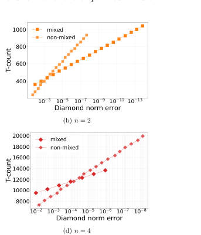 
Figure 7: Mixed synthesis benchmarks (error vs. T-count). Each panel fixes the number of qubits n; the horizontal axis is the total T-count after mixing and the vertical axis is the diamond-norm distance between the target channel and the optimized mixture. (a) n = 1. (b) n = 2. (c) n = 3. (d) n = 4. Panel (d) omits the smallest-ϵ regime: at n = 4 those mixed-synthesis runs exceeded practical wall- clock limits.

📷 Fig 8

 
Figure 7 summarizes these tradeoffs. Across the panels (n = 1–4), we find that mixed synthesis in the small error limit halves the T-count of unitary synthesis at comparable diamond-norm error, consistent with Lemma 1: if the candidates form an ϵ-net in diamond norm error, the optimized mixture can achieve O(ϵ2) residual error, so the leading log2(1/ϵ) cost per decade of target error is halved. Mixed synthesis also incurs a larger additive T- cost: the candidates must be synthesized with accuracy well below the perturbation scale ϵ used to generate them, which adds T gates whose contribution is only weakly reduced when ϵ is large. At small ϵ the halved leading term dominates and mixed...

📷 Fig 9

 
Figure 8(a) places post-mix well below pre-mix for comparable horizontal values, and on log–log axes the trend is consistent with post-mix error scaling approximately as

📷 Fig 10

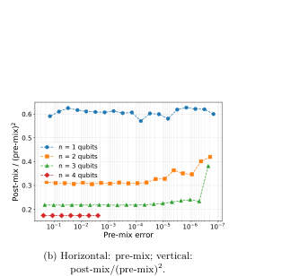 
Figure 8: Mixed synthesis (Section 5): each marker is one run at some ϵ and n. Pre-mix is the diamond-norm distance from the target to a typical synthesized perturbed unitary before LP mixing; post-mix is the diamond-norm distance from the target to the optimized mixture channel after mixing. (a) Horizontal axis: pre-mix; vertical axis: post-mix. (b) Horizontal axis: pre-mix; vertical axis: post- mix divided by (pre-mix)2.

**Main problem.** The challenge of efficiently approximating arbitrary multi-qubit unitary operators using the discrete Clifford+T gate set with minimal T-count and high precision.

**Main result.** The development of pygridsynth, a library that achieves T-count scaling of O(log(1/epsilon)) and introduces a mixed-synthesis workflow that achieves quadratic error suppression from epsilon to epsilon^2/(2n).

**Method.** The library uses a recursive decomposition strategy (Block ZXZ and demultiplexing) combined with GridSynth for Z-rotations, magnitude approximation for X-rotines, and a linear programming approach for optimizing probabilistic mixtures of unitaries.

**Summary.** This paper introduces pygridsynth, an open-source Python library designed for high-precision Clifford+T synthesis. It provides efficient algorithms for both single-qubit and multi-qubit unitaries, specifically targeting the reduction of the T-count, which is the primary cost in fault-tolerant quantum computing. A key feature is the 'mixed synthesis' technique, which uses a probabilistic mixture of circuits to quadratically reduce the diamond norm error. The tool is highly scalable in terms of precision, supporting error tolerances as low as 10^-100.

Detailed structure

**Model / system.** The work operates within the framework of fault-tolerant quantum computing using the Clifford+T universal gate set acting on n-qubit systems.

**Key observables.** T-count (gate complexity) and diamond norm error (worst-case approximation error).

**Important parameters / regimes.** Error tolerance (epsilon), number of qubits (n), and the number of candidate unitaries in the mixture (M).

**Assumptions / limitations.** The synthesis is performed in an ancilla-free setting; for 4+ qubits, the global phase is approximated modulo a global phase; the optimization uses a PTM-based heuristic rather than full SDP.

**Figures summary.** Figure 1 shows two-qubit decomposition and rotation absorption; Figure 2 illustrates partial decomposition and phase block movement; Figure 3 shows multiplexed Rz decomposition; Figure 4 shows 3-qubit recursive decomposition; Figure 6 benchmarks T-count vs error; Figure 8 demonstrates quadratic error suppression in mixed synthesis.

**Paper structure.** The paper introduces the pygridsynth library, details single-qubit synthesis via Euler decomposition and GridSynth, extends the method to two-qubit and multi-qubit systems via recursive ZXZ decomposition and partial decomposition, presents a mixed-synthesis strategy for error suppression, and concludes with performance benchmarks.

Abstract

We present pygridsynth, an open-source Python library for ancilla-free approximate Clifford+$T$ synthesis that runs in $O(\log(1/ε))$ for precision $ε$. For $n=1, 2$ qubits, the library builds upon established efficient and high-precision synthesis routines, such as nearly optimal $Z$-rotation synthesis and magnitude approximation. For $n\ge 3$ qubits, we introduce a partial-decomposition technique that generalizes the magnitude approximation, reducing constant factors in the $T$-count as $(\frac{21}{8}\cdot 4^n - \frac{9}{2}\cdot 2^n + 9)\log_2(1/ε) + o(\log(1/ε))$. The package also exposes a mixed-synthesis workflow that approximates target unitary channels by probabilistic mixtures of Clifford+$T$ circuits, for which we empirically find that the synthesis error is reduced from $ε$ to $ε^2/(2n)$. Taken together, these features make pygridsynth a Python-native platform for high-precision Clifford$+T$ synthesis and for benchmarking unitary and mixed synthesis strategies on multi-qubit instances.

[↑ back to top](#top)

### [Quantum-information diagnostics of cosmological perturbations with nontrivial sound speed in inflation](http://arxiv.org/abs/2604.21755v1)

**Authors:** Shi-Cheng Liu, Lei-Hua Liu, Bichu Li, Hai-Qing Zhang, Peng-Zhang He  
**Type:** theory · **Category:** other · **PDF:** <https://arxiv.org/pdf/2604.21755v1>  
**Analysis basis:** full PDF text, analyzed in chunks

📷 Fig 1

 
Figure 1. The numerical results of rk in terms of log10 a for inflation, where we have k = 1 and H0 = 1 for simplicity.

📷 Fig 2

 
Figure 2. The numerical results of ϕk in terms of log10 a for inflation, where we have k = 1 and H0 = 1 for simplicity.

📷 Fig 3

 
Figure 3. The numerical results of Purity in terms of log10 a for inflation, where we have set k = 1 and H0 = 1.

📷 Fig 4

 
Figure 4. The numerical results of R´enyi Entropy and Von Neumann entropy in terms of log10 a for inflation, where we have set k = 1 and H0 = 1.

📷 Fig 5

 
Figure 5. The numerical results of Logarithmic negativity in terms of log10 a for inflation, where we have set k = 1 and H0 = 1.

**Main problem.** The study investigates how a non-trivial sound speed (specifically via sound-speed resonance) in the early universe affects the quantum-information signatures of cosmological perturbations.

**Main result.** A non-trivial sound speed significantly suppresses purity and enhances entropy production, effectively modulating the decoherence process and postponing the onset of classicality.

**Method.** The authors use an open-system normalized two-mode squeezed-state (OTMSS) framework and introduce a bounded variable x = tanh(rk) to regularize numerically stiff evolution equations.

**Summary.** This paper explores how fluctuations in the speed of sound during inflation leave imprints on the quantum entanglement and entropy of the early universe. By using an open-system framework, the authors show that a non-trivial sound speed enhances the mixedness of the system and alters the transition from quantum to classical behavior. The study provides specific quantum-information signatures, such as modulated logarithmic negativity and suppressed purity, that could potentially distinguish different inflationary models.

Detailed structure

**Model / system.** The system consists of scalar cosmological perturbations during the inflationary epoch within a spatially flat FLRW metric, featuring a sound-speed-resonance (SSR) parametrization.

**Key observables.** Purity, von Neumann entropy, Renyi entropies, and logarithmic negativity.

**Important parameters / regimes.** Sound speed (cs), SSR oscillation amplitude (xi), squeezing amplitude (rk), and squeezing phase (phi_k).

**Assumptions / limitations.** The study assumes the Bunch-Davies vacuum as the initial state and focuses on the inflationary regime due to numerical stability constraints.

**Figures summary.** Figure 1 shows the evolution of squeezing amplitude; Figure 2 shows the reduction in squeezing phase amplitude; Figure 3 illustrates the decrease in purity; Figure 4 and 5 show the enhancement of entropy and oscillations in logarithmic negativity.

**Paper structure.** The paper establishes the background and SSR model, derives the modified Hamiltonian, applies the OTMSS framework, performs numerical simulations using a regularized variable, and analyzes the resulting quantum-information diagnostics.

Abstract

In this work, we systematically investigate the quantum-information diagnostics of cosmological perturbations with a nontrivial sound speed, utilizing a normalized open two-mode squeezed-state framework. Rather than introducing new observables, our analysis focuses on how a modified sound speed dynamically reshapes the Schrödinger evolution of the squeezing parameters ($r_k$ and $φ_k$). We demonstrate how these dynamical changes are inherited by the reduced density matrix of the observable sector. By employing a sound-speed-resonance parametrization, we derive and evaluate the purity, von Neumann entropy, Rényi entropies, and logarithmic negativity. To overcome the intrinsic multiscale stiffness of the post-inflationary equations, we introduce a bounded variable $x = \tanh r_k$ as a partial regularization, which enables reliable numerical simulations exclusively within the inflationary regime. Our numerical results reveal that a nontrivial sound speed significantly suppresses the purity of the reduced state, indicating enhanced effective mixedness. Simultaneously, it strongly amplifies and modulates both the entropic and entanglement diagnostics. More precisely, a nontrivial sound speed postpones the onset of classicality by modulating the decoherence process. Ultimately, we show that a nontrivial sound speed leaves distinct and identifiable quantum-information signatures within the entanglement structure of the early universe.

[↑ back to top](#top)

### [Replay-buffer engineering for noise-robust quantum circuit optimization](http://arxiv.org/abs/2604.21863v1)

**Authors:** Akash Kundu, Sebastian Feld  
**Type:** theory · **Category:** quantum information and computing · **PDF:** <https://arxiv.org/pdf/2604.21863v1>  
**Analysis basis:** full PDF text, analyzed in chunks

📷 Fig 1

 
Figure 2: 1-qubit compiling of Haar-random target unitaries with RX, RY, RZ(±π/128) gates. (Left) Suc- cess probability and mean fidelity at tolerances 0.99, 0.999, and 0.9999, where ReaPER+ performs best over- all. (Right) mean circuit length with std. dev. error bars versus tolerance; although all methods require deeper circuits at higher accuracy and exhibit a similar growth rate with tightening tolerance, ReaPER+ maintains a consistently lower circuit-length offset, giving the best accuracy-length tradeoff across all tolerance levels.

📷 Fig 2

 
Figure 3 compares replay strategies on the smaller-scale systems. ReaPER+ achieves the low- est energy error among prioritized methods with competitive circuit compactness; fixed ReaPER (ω=0.4 for BEH2, ω=0.6 for H2O) produces the most compact circuits, reflecting the longer-horizon credit assignment at larger scale (full ω sensitivity in Appendix I). Uniform replay yields superfi- cially shorter circuits but at substantially higher energy error, indicating early trapping in local min- ima. As shown in Table 2, OptCRLQAS with ReaPER+ (denoted as “OptCRLQAS + ReaPER+”) achieves the lowest energy error across 5-, 6-, and 8-qubit QAS problems, outperforming non-RL baselines such as DQAS [36],...

📷 Fig 3

 
Figure 3: Replay-buffer design controls circuit compactness in QAS. For 6-BEH2 and 8-H2O, ReaPER+ variants yield the lowest total, CNOT, and rotation gate counts compared to PER and uniform replay (mean ± std over seeds). ω=0 recovers PER; ω=1 gives fully reliability-adjusted replay.

📷 Fig 4

 
Figure 4: Efficiency and performance on 12-qubit H2O. (Left) OptCRLQAS reduces wall-clock time per episode by 67.5% over CRLQAS [19]. (Right) ReaPER achieves the lowest minimum energy error and fastest convergence across all replay baselines.

📷 Fig 5

 
Figure 5: Weighted transfer matrix for BEH2 under noiseless and noisy transfer. Buffer transfer reduces steps to chemical accuracy by 47-58% and improves final energy by up to 90.2% across all noise settings, yield- ing composite scores of 19.2-35.8%. The strongest score (35.8%) is driven by the largest energy improvement at p2=0.001.

📷 Fig 6

 
Figure 6: Weighted transfer matrix for H2O under noiseless and noisy transfer. Step reductions range from 49.8% to 84.8%, and energy improvements reach 46.7% under combined noise (p1=0.001, p2=0.005), yielding the highest score of 28.7%.

📷 Fig 7

 
Figure 8: ReaPER+ progressively concentrates buffer mass toward higher-fidelity transitions (fidelity ≥0.95) while retaining broader early-training coverage, consistent with its annealed transition from PER-like exploration to ReaPER-like reliability-aware sampling. PER maintains broader low-fidelity coverage through- out training, while ReaPER shows intermediate concentration behavior.

📷 Fig 8

 
Figure 9: LunarLander-v3 validation of ReaPER+. (Left) rolling success rate (300-episode window). (Middle) ReaPER+ (blue) reaches a higher success rate faster and maintains a higher asymptotic level than fixed ReaPER (red) and PER (green). (Right) normalized cumulative-return AUC. ReaPER+ accumulates +9% more return over the full training run, confirming improved sample efficiency on a dense-reward classical benchmark. All methods use identical DQN agents, only the replay mechanism differs.

📷 Fig 9

 
Figure 9 summarizes two complementary metrics. Left: the 300-episode rolling success rate (frac- tion of episodes exceeding the +200 solved threshold). ReaPER+ reaches a higher success rate earlier in training and sustains a higher asymptotic level (≈60% at episode 4500) compared with fixed ReaPER (≈50%) and PER (≈55%). Right: the normalized area under the reward curve (AUC), computed as the per-episode running mean of the cumulative return, shifted and normalized to [0, 1]. ReaPER+ achieves a +9% AUC advantage over both baselines by episode 5000, indicating better sample efficiency throughout training.

**Main problem.** Inefficiencies in Deep Reinforcement Learning for quantum circuit optimization, specifically regarding unreliable TD targets, high computational costs in architecture search, and the loss of useful data when transitioning from noiseless to noisy environments.

**Main result.** The introduction of ReaPER+ achieves 4-32x gains in sample efficiency and significantly reduces the steps to reach chemical accuracy (by 85-90%) while reducing wall-clock time per episode by up to 67.5%.

**Method.** The authors propose ReaPER+ (an annealed replay rule transitioning from TD-error prioritization to reliability-aware sampling), OptCRLQAS (an amortized curriculum learning approach), and a lightweight replay-buffer transfer scheme for noise-robustness.

**Summary.** This paper presents a suite of Reinforcement Learning enhancements designed to make quantum circuit optimization more efficient and robust to noise. By using an annealed replay strategy (ReaPER+), the authors bridge the gap between exploration and stability in training. They also introduce methods to reduce the computational overhead of evaluating quantum circuits and a way to reuse data from perfect simulators to jump-start training on noisy hardware. These improvements significantly accelerate the discovery of high-fidelity, compact quantum circuits for molecular simulations.

Detailed structure

**Model / system.** The research applies to quantum circuit compilation and Quantum Architecture Search (QAS) for molecular Hamiltonians (e.g., H2O, BeH2) and the Heisenberg model, operating in both noiseless and noisy (depolarizing noise) regimes.

**Key observables.** Success probability, circuit compactness (gate count/depth), energy error (chemical accuracy), and wall-clock time.

**Important parameters / regimes.** Annealing exponent (omega), annealing timescale (T_ann), noise strengths (p1, p2), and number of qubits (5, 6, 8, 12).

**Assumptions / limitations.** The study assumes fixed DQN/DDQN backbones and that the buffer transfer scheme requires shared state and action spaces between source and target environments.

**Figures summary.** Figure 1 outlines the three-part framework; Figure 2 shows 1-qubit compiling success/fidelity; Figure 3 compares circuit compactness; Figure 4 shows OptCRLQAS efficiency; Figure 8 shows replay buffer fidelity evolution; Figure 9 validates the method on the classical LunarLander task.

**Paper structure.** The paper introduces the three-part framework (buffer engineering, amortized learning, and noise-aware transfer), provides theoretical justification for the annealing rule, presents experimental results on quantum compilation and QAS tasks, validates the principle on a classical benchmark, and discusses limitations and future work.

Abstract

Deep reinforcement learning (RL) for quantum circuit optimization faces three fundamental bottlenecks: replay buffers that ignore the reliability of temporal-difference (TD) targets, curriculum-based architecture search that triggers a full quantum-classical evaluation at every environment step, and the routine discard of noiseless trajectories when retraining under hardware noise. We address all three by treating the replay buffer as a primary algorithmic lever for quantum optimization. We introduce ReaPER$+$, an annealed replay rule that transitions from TD error-driven prioritization early in training to reliability-aware sampling as value estimates mature, achieving $4-32\times$ gains in sample efficiency over fixed PER, ReaPER, and uniform replay while consistently discovering more compact circuits across quantum compilation and QAS benchmarks; validation on LunarLander-v3 confirms the principle is domain-agnostic. Furthermore we eliminate the quantum-classical evaluation bottleneck in curriculum RL by introducing OptCRLQAS which amortizes expensive evaluations over multiple architectural edits, cutting wall-clock time per episode by up to $67.5\%$ on a 12-qubit optimization problem without degrading solution quality. Finally we introduce a lightweight replay-buffer transfer scheme that warm-starts noisy-setting learning by reusing noiseless trajectories, without network-weight transfer or $ε$-greedy pretraining. This reduces steps to chemical accuracy by up to $85-90\%$ and final energy error by up to $90\%$ over from-scratch baselines on 6-, 8-, and 12-qubit molecular tasks. Together, these results establish that experience storage, sampling, and transfer are decisive levers for scalable, noise-robust quantum circuit optimization.

[↑ back to top](#top)

### [Revisiting the luminescence properties of Pr3+: YAG within the framework of an extended approach of Judd-Ofelt theory](http://arxiv.org/abs/2604.21374v1)

**Authors:** Maxence Lepers, G. Hovhannesyan, Y. Guyot, R. Moncorgé, M. Velazquez  
**Type:** both · **Category:** other · **PDF:** <https://arxiv.org/pdf/2604.21374v1>  
**Analysis basis:** full PDF text, analyzed in chunks

📷 Fig 1

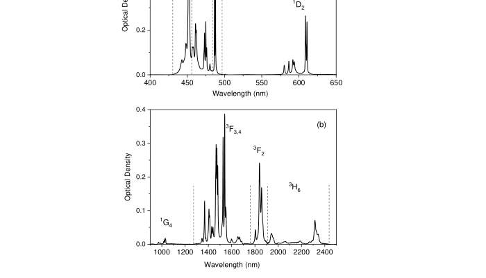 
Figure 1 : Room temperature absorption (optical density) spectra of a 5.52 mm thick sample of 0.24%Pr :YAG crystal registered (a) in the visible and (b) the near- and mid-infrared spectral domains

📷 Fig 2

 
Figure 2 : Time-resolved room temperature emission spectra of Pr3+ :YAG from the 3P0, 3P1 and 1I6 thermalized levels in the visible and near-infrared spectral range

📷 Fig 3

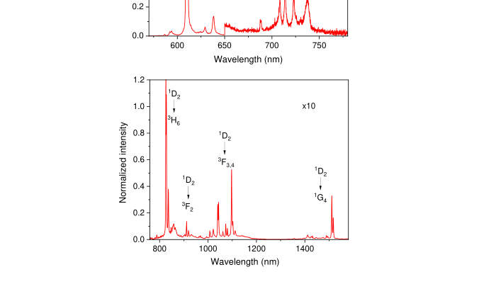 
Figure 3 : Time-resolved room temperature emission spectra of Pr3+ :YAG from the 1D2 emitting level in the visible and near-infrared spectral range

📷 Fig 4

 
Figure 4 : Room (300 K) and low (77 K) temperature fluorescence decays (semi-log scale) of the 3P0 and 1D2 emitting levels of a 0.08at%Pr3+ :YAG crystal

📷 Fig 5

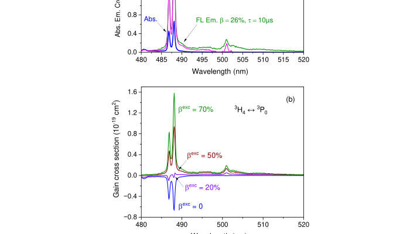 
Figure 5 : (a) 3H4  3P0 absorption and 3P0  3H4 emission cross section spectra derived using Reciprocity (RP) and Fuchtbauer-Ladenburg (FL) methods ; (b) Resulting gain cross section spectra for various excitation ratios 𝛽𝑒𝑥

📷 Fig 6

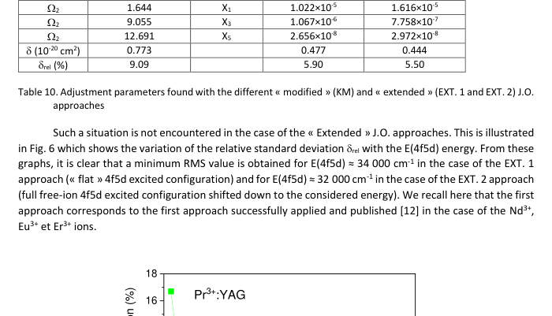 
Figure 6 : Relative standard deviations obtained between experimental and calculated transition (or oscillator) strengths in the case of Pr3+:YAG, by using the two « extended » EXT. 1 and EXT. 2 J.O. approaches, versus the 4f5d energy (lowest energy of the 4f5d excited configuration in the case of EXT. 2)

📷 Fig 7

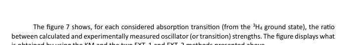 
Figure 7 : Ratio between calculated and experimentally measured oscillator (or transition) strengths according to the different approaches (« modified » KM and « extended » EXT. 1 and EXT. 2 J.O. approaches) The results are about the same for the absorption transitions to levels 3H6, 3F2, 3F3,4 and 1D2 with an excellent agreement between calculated and measured values for the transitions to 3F2 and 3F3,4. The results are more satisfactory with the « extended » approaches than with the « modified » one in the case of the absorption transitions to the important levels 3P2, 3P0 and 3P1+1I6.

📷 Fig 8

 
Figure 8 : Comparison of calculated and experimental branching ratios of the 3P0,1+1I6  A and 1D2  B emission transitions with A = 3H4, 3H5, 3H6, 3F2, 3F3,4, 1G4, 1D2 and B = 3H4, 3H5, 3H6, 3F2, 3F3,4, 1G4

📷 Fig 9

 
Figure 9. Ratio between calculated and experimentally measured oscillator (or transition) strengths according to the different approaches (« Standard » and « Extended » EXT. 0, EXT. 1 and EXT. 2 J.O. approaches)

📷 Fig 10

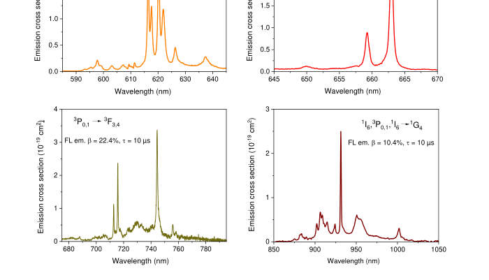 
Figure 10 : Emission cross section spectra associated with the main emission transitions originating from the thermalized 3P0,1 and 1I6 energy levels.

**Main problem.** The standard Judd-Ofelt theory fails to accurately describe the luminescence properties of Pr3+ ions in YAG due to the influence of the nearby 4f5d excited electronic configuration and strict selection rules.

**Main result.** An extended Judd-Ofelt approach (specifically the EXT 1 model) provides a much better agreement with experimental absorption intensities and branching ratios, and predicts new potential laser operation wavelengths at 566 nm and 931 nm.

**Method.** The authors combine experimental time-resolved spectroscopy and absorption measurements with an extended theoretical framework that relaxes standard selection rules and accounts for 4f5d configuration effects using Cowan's code.

**Summary.** This paper addresses the inaccuracies of the standard Judd-Ofelt theory in predicting the spectroscopic properties of Pr3+:YAG. By implementing an extended theory that accounts for the 4f5d electronic configuration, the authors achieve much better agreement with experimental absorption and branching ratio data. The study provides more reliable spectroscopic data for this important laser crystal and identifies new potential wavelengths (566 nm and 931 nm) for laser operation.

Detailed structure

**Model / system.** The primary system is Pr3+ ions doped in YAG (Yttrium Aluminum Garnet) crystals, with comparisons made to Pr3+ in ZBLAN fluoride glass. The theoretical model uses an extended Judd-Ofelt theory involving three odd-rank parameters (X1, X3, X5).

**Key observables.** Absorption and emission intensities, fluorescence lifetimes, branching ratios, emission/gain cross-sections, and quantum emission efficiencies.

**Important parameters / regimes.** Judd-Ofelt parameters (Omega2, Omega4, Omega6), extended parameters (X1, X0, X5), 4f5d configuration energy (~34,000 cm-1), and temperature (77 K to 300 K).

**Assumptions / limitations.** The EXT 1 model assumes a 'flat' or degenerate 4f5d excited configuration at a single energy level, while the EXT 2 model assumes a shift of free-ion energy levels.

**Figures summary.** The notes mention a table of absorption transition strengths using the EXT 2 approach and comparisons of gain cross-sections versus excited-state absorption.

**Paper structure.** The paper introduces the failure of standard Judd-Ofelt theory, presents an extended theoretical framework (KM, EXT 1, and EXT 2), validates these models against experimental absorption and emission data for Pr3+:YAG and Pr3+:ZBLAN, and concludes with predictions for new laser operating wavelengths.

Abstract

We show in this article the improvements which can be obtained in the description of the luminescence properties of Pr3+ doped materials by using an extension of the Judd-Ofelt theory in order to relax some strong selection rules and approximations of the standard formalism and to better account for the influence of the 4f5d excited electronic configuration. The demonstration is made by re-examining the case of Pr3+:YAG, a well known luminescent and laser crystal with a very low energy 4f5d absorption band. Our extension thus provides a better agreement between calculated and measured absorption intensities, especially for the hypersensitive 3 H4 $\rightarrow$ 3 P2 transition. A comparison is made with the results obtained in the case of Pr3+:ZBLAN, a laser fluoride glass with much higher 4f5d absorption levels. Our investigation also gives the opportunity, in the case of Pr3+:YAG, to provide more complete and more reliable absorption and emission data than reported in the past literature and to exploit these data to better address the question of laser operation at various emission wavelengths. It is thus demonstrated that laser operation should be possible with improved laser performance at 488 nm, 616 nm and 744 nm, as it was already achieved in the past, but also at 566 nm and 931 nm by using appropriate laser cavities and laser mirrors.

[↑ back to top](#top)

### [Single-crystal growth and magnetic, magnetoelectric, and optical properties of ferroaxial-type SrMn$_2$Ni$_6$Te$_3$O$_{18}$](http://arxiv.org/abs/2604.21460v1)

**Authors:** Ryoya Nakamura, Shinichiro Asai, Yusuke Nambu, Takatsugu Masuda, Kenta Kimura  
**Type:** experiment · **Category:** strongly correlated electrons · **PDF:** <https://arxiv.org/pdf/2604.21460v1>  
**Analysis basis:** full PDF text, analyzed in chunks

📷 Fig 1

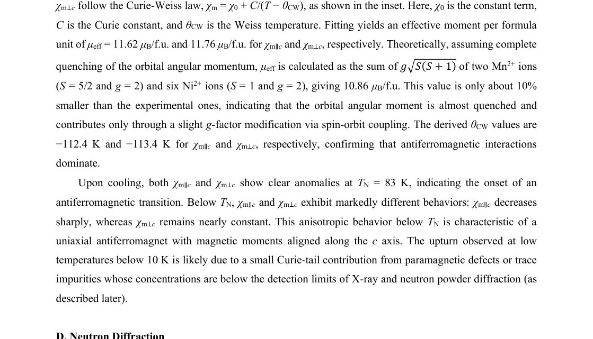 
Figure 5(a) displays the NPD patterns recorded at various temperatures between 5 and 300 K. All

📷 Fig 2

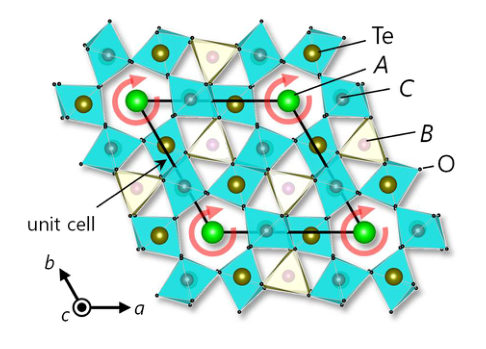 
Figure 1. (Color online) Crystal structure of the AB2C6Te3O18-type compound. Green, purple, gray, yellow,

📷 Fig 3

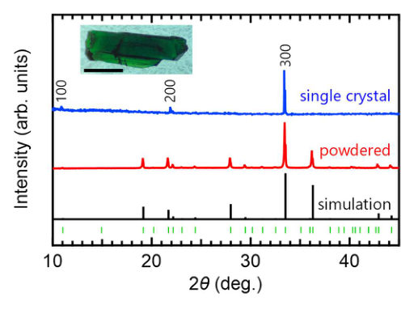 
Figure 2. (Color online) X-ray diffraction profiles of single-crystal and powdered samples, along with the

📷 Fig 4

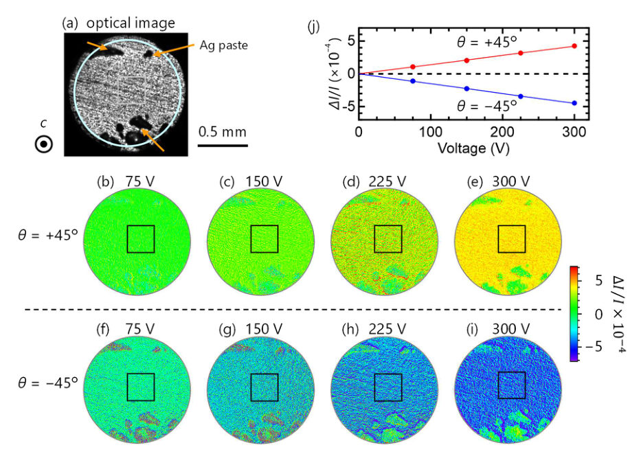 
Figure 3. (Color online) Distribution of FA domains in a SrMNTO single crystal visualized by the EG effect.

📷 Fig 5

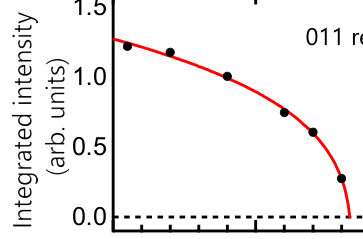 
Figure 5. (Color online) (a) Neutron powder diffraction patterns of SrMNTO at various temperatures

📷 Fig 6

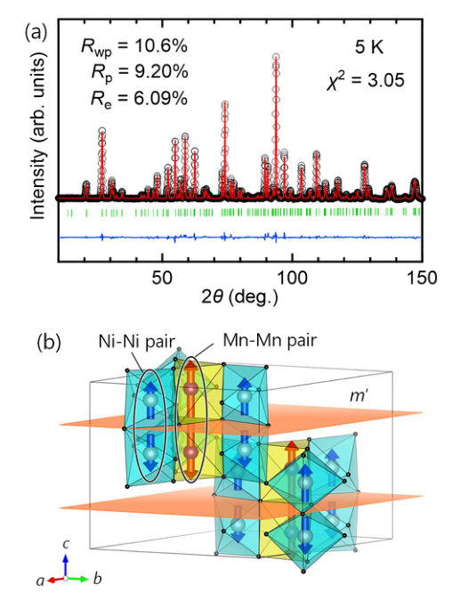 
Figure 6. (Color online) (a) Observed (open circle), Rietveld refined (red curve), and difference (blue curve)

📷 Fig 7

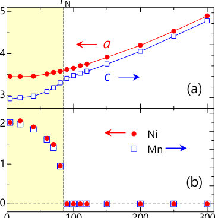 
Figure 7. (Color online) (a) Temperature dependence of the lattice constants a (left axis) and c (right axis).

📷 Fig 8

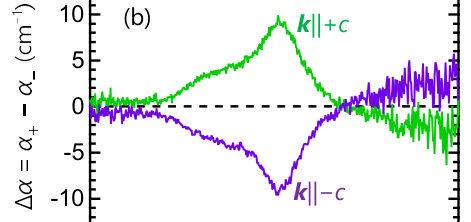 
Figure 9. (Color online) (a) Absorption coefficient spectra of SrMNTO at 75 K for unpolarized light

**Main problem.** The study investigates the interplay between ferroaxial structural distortion and magnetic order in the newly grown SrMn2Ni6Te3O18 single crystals, specifically characterizing its magnetoelectric and optical properties.

**Main result.** The researchers identified a c-axis collinear bidirector-type antiferromagnetic structure and detected all independent magnetoelectric tensor components, including a significant temperature-dependent anomaly and sign reversal in the chi33 component.

**Method.** Single crystals were grown using the TeO2 self-flux method and characterized via neutron powder diffraction, magnetic susceptibility measurements, and electrogyration imaging, alongside optical spectroscopy to probe nonreciprocal directional dichroism.

**Summary.** This paper reports the successful single-crystal growth and comprehensive characterization of the magnetic oxide SrMn2Ni6Te3O18. The study reveals a complex magnetic structure with collinear bidirector-type antiferromagnetism and demonstrates a robust magnetoelectric effect. Notably, the researchers observed a sign reversal in the longitudinal magnetoelectric component (chi33) and used optical techniques to confirm the presence of a ferrotoroidal state. These findings show that the ferroaxial and magnetic properties are stable even when substituting Sr with Pb.

Detailed structure

**Model / system.** The system is SrMn2Ni6Te3O18 (SrMNTO), a member of the AB2C6Te3O18 family of magnetic oxides featuring ferroaxial-type structural rotation and antiferromagnetic ordering of Mn2+ and Ni2+ ions.

**Key observables.** Néel temperature (TN = 83 K), magnetic moments of Ni2+ and Mn2+, magnetoelectric tensor components (chi11, chi12, chi33), and electrogyration (EG) coefficient.

**Important parameters / regimes.** TN = 83 K, Weiss temperature approx -113 K, magnetic point group 6/m', and the effective magnetic moments (mu_eff approx 11.6-11.7 uB/f.u.).

**Figures summary.** Fig 1: Crystal structure schematic; Fig 2: XRD profiles and crystal photo; Fig 3: FA domain spatial mapping; Fig 4: Magnetic susceptibility; Fig 5: Neutron diffraction patterns; Fig 6: Refined magnetic structure; Fig 7: Lattice constants and magnetic moments; Fig 8: Magnetoelectric polarization vs. temperature and field; Fig 9: Optical absorption spectra.

**Paper structure.** The paper begins with crystal growth and structural characterization, followed by magnetic property analysis via susceptibility and neutron diffraction, then moves to magnetoelectric tensor component detection, and concludes with optical investigations of the ferroaxial domains and nonreciprocal effects.

Abstract

Single crystals of SrMn$_2$Ni$_6$Te$_3$O$_{18}$, a member of the ferroaxial-type magnetic oxide family $AB_{2}C_{6}$Te$_3$O$_{18}$ ($A$ = Pb, Sr; $B$ = Mn, Cd; $C$ = Ni, Co), have been successfully grown, and their structural, magnetic, magnetoelectric, and optical properties have been systematically studied. Imaging of the spatial distribution of electric-field-induced optical rotation reveals that the single crystals preferentially form single ferroaxial (FA) domains. Magnetization and neutron diffraction measurements show that Mn$^{2+}$ and Ni$^{2+}$ magnetic moments order antiferromagnetically at $T_{\rm N}$ = 83 K, forming a $c$-axis collinear bidirector-type antiferromagnetic structure. All independent magnetoelectric tensor components allowed by the magnetic point group 6/$m^{\prime}$ have been detected, and the $χ_{33}$ component exhibits a pronounced temperature-dependent anomaly, including a peak and a sign reversal. Preferential formation of single FA domains and a similar $χ_{33}$ anomaly are also observed in the isostructural compound PbMn$_2$Ni$_6$Te$_3$O$_{18}$. These findings suggest that the ferroaxial and magnetic characteristics within this structural framework are robust against Sr-Pb replacement.

[↑ back to top](#top)

### [Speed-oriented quantum circuit backend](http://arxiv.org/abs/2604.21656v1)

**Authors:** Sören Wilkening  
**Type:** theory · **Category:** quantum information and computing · **PDF:** <https://arxiv.org/pdf/2604.21656v1>  
**Analysis basis:** full PDF text, analyzed in chunks

📷 Fig 1

 
Figure 2: Visualization of the gates array within the circuit_t data structure for a 5-qubit QFT without swaps. The gate indices represent their target/control qubits.

📷 Fig 2

 
Figure 3: Visualization of gate_index (left) and last_layer_of_qubit (top and bottom right) within the circuit_t data structure for a 5-qubit QFT without swaps. The table on the bottom right shows how the data structure is adjusted after applying an additional Hadamard gate to qubit 4, eliminating the previously applied gate. The thick boxes indicate the current head of the list for the respective qubit. Whenever a gate is to be applied to specific qubits, its potential layer position is read from this array.

📷 Fig 3

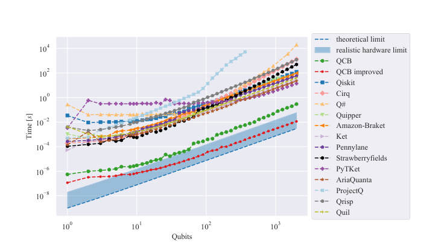 
Figure 4: Comparison of running times for building the QFT circuit across state-of-the-art software packages. For all instance sizes, our quantum circuit backend generates the QFT circuit faster than any other available package. Furthermore, the improved variant approaches the theoretical limit of generating and storing quantum circuits, suggesting that no significantly faster single- threaded implementation can be achieved.

📷 Fig 4

 
Figure 5: Comparison of memory requirements for building the QFT circuit across state-of-the-art software packages. Compared to all packages except Ket, our new circuit backend requires less memory. For large instances, Ket achieves a slight advantage; however, we expect this advantage to diminish for larger circuits, as our algorithm approaches the theoretical minimum of the data required for storage. Both variants of our implementation require the same memory, as they use the same underlying data structure.

**Main problem.** The increasing classical preprocessing time required for quantum circuit generation (QCG) is becoming a bottleneck for large-scale quantum computing, potentially negating quantum advantage in applications like combinatorial optimization.

**Main result.** The proposed C-based backend (QCB) achieves significantly faster circuit generation and lower memory usage than major frameworks like Qiskit and Q#, with performance improvements reaching up to 1,748,000x compared to Q# for 2000-qubit QFT circuits.

**Method.** The authors developed a lightweight C implementation using a layered 2D data structure, lookup tables for O(1) gate insertion, and optimization techniques like gate cancellation, merging, and a depth-reduction swap mechanism.

**Summary.** This paper introduces a new, high-performance software backend designed specifically for the rapid generation of large-scale quantum circuits. By using a low-level C implementation and efficient data structures, the authors demonstrate that they can generate circuits for up to 2000 qubits orders of magnitude faster than industry-standard tools like Qiskit. This efficiency is crucial for preventing classical preprocessing from becoming a bottleneck in large-scale quantum algorithms. The work also provides high-level primitives for bit-level manipulations, making it a potential foundation for future quantum programming languages.

Detailed structure

**Model / system.** The study focuses on the construction of large-scale quantum circuits, using the Quantum Fourier Transform (QFT) as the primary benchmark algorithm for systems up to 2000 qubits.

**Key observables.** Runtime (generation speed) and memory consumption (RAM usage) during circuit construction.

**Important parameters / regimes.** Number of qubits (up to 2000); comparison of peak runtime and memory overhead against existing frameworks.

**Assumptions / limitations.** The implementation is an early-stage prototype; it assumes gates contain a small, constant number of qubits and currently supports only single-parameter gates.

**Figures summary.** Figure 1 and 2 visualize the QFT circuit and the internal layered data structure; Figure 3 shows the gate and qubit lookup tables; Figure 4 presents a log-scale comparison of runtimes across various software packages; Figure 5 shows a log-scale comparison of memory requirements.

**Paper structure.** The paper introduces the problem of classical overhead in QCG, describes the C-based implementation and its data structures, details the optimization algorithms (gate merging and depth reduction), presents benchmarking results against 12 existing tools, and concludes with future work regarding hardware-aware compilation.

Abstract

We present a new software package for efficient quantum circuit generation, designed to achieve optimal runtime performance. Despite being in an early stage of development, our implementation demonstrates significant advantages over existing tools. Using the quantum Fourier transform (QFT) as a benchmark, we show that our backend can generate circuits for systems with up to 2000 qubits faster than widely used frameworks such as Qiskit and Q#. This improvement is particularly relevant for applications where classical preprocessing time, including circuit generation, must be minimized to not diminish any potential quantum advantage - for example, in combinatorial optimization tasks. Additionally, our software provides high-level primitives for bit- and integer-level manipulations, offering a simplified interface for integration with high-level quantum programming languages.

[↑ back to top](#top)

### [StabilizerBench: A Benchmark for AI-Assisted Quantum Error Correction Circuit Synthesis](http://arxiv.org/abs/2604.21287v1)

**Authors:** Andres Paz, Christian Tarta, Cordelia Yuqiao Li, Mayee Sun, Sarju Patel, Sylvie Lausier  
**Type:** theory · **Category:** quantum information and computing · **PDF:** <https://arxiv.org/pdf/2604.21287v1>  
**Analysis basis:** full PDF text, analyzed in chunks

📷 Fig 1

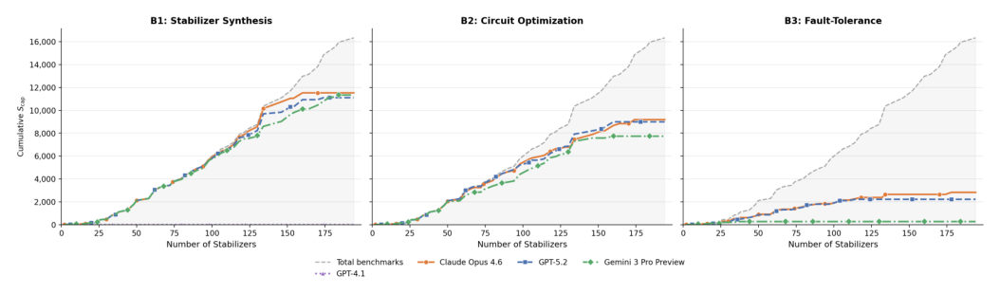 
Fig. 4: Difficulty curves for all three tasks: cumulative capability score S(b) cap vs. stabilizer count under the best configuration for b ∈{1, 2, 3}. All models degrade monotonically with circuit complexity; the gray dashed line shows the total benchmark ceiling.

**Main problem.** The lack of a specialized, scalable benchmark to evaluate the ability of AI agents to automate complex quantum error correction (QEC) tasks like circuit synthesis, optimization, and fault-tolerant design.

**Main result.** The introduction of StabilizerBench, which demonstrates that while frontier AI models can perform basic state preparation, they currently struggle with high-quality circuit optimization and fault-tolerant synthesis.

**Method.** A benchmark suite of 192 stabilizer codes across 12 families, using the Gottesman-Knill theorem and Stim for efficient polynomial-time verification of AI-generated circuits.

**Summary.** This paper introduces StabilizerBench, a new benchmark designed to evaluate AI agents on specialized quantum error correction tasks. It covers circuit synthesis, optimization, and fault-tolerant design using a large suite of stabilizer codes. The authors use efficient classical simulation to verify AI outputs, providing a scalable way to measure progress. Their evaluation shows that while current AI models can handle simple state preparation, they lack the reasoning required for complex fault-tolerant circuit construction.

Detailed structure

**Model / system.** The benchmark focuses on stabilizer codes (including surface, color, and Steane codes) ranging from 4 to 196 qubits, utilizing the stabilizer formalism and Pauli group operations.

**Key observables.** Capability score (breadth of success), quality score (circuit merit), two-qubit gate count (G2Q), circuit depth (D), and fault-tolerance (FT) score.

**Important parameters / regimes.** Code distance (d), number of stabilizer generators (k), number of attempts/iterations, and timeout duration.

**Assumptions / limitations.** The benchmark assumes the use of stabilizer codes to allow for efficient classical verification via the Gottesman-Knill theorem.

**Figures summary.** Figure 1 shows error propagation through gates; Figure 2 illustrates flag gadgets; Figure 3 depicts the agent-oracle workflow; Figure 4 shows difficulty curves of capability scores versus stabilizer count.

**Paper structure.** Introduction of the QEC automation gap, description of the StabilizerBench suite and tasks, explanation of the verification and scoring framework, evaluation of frontier AI models, and discussion of results and future directions.

Abstract

As quantum hardware scales toward fault tolerant operation, the demand for correct quantum error correction (QEC) circuits far outpaces manual design capacity. AI agents offer a promising path to automating this synthesis, yet no benchmark exists to measure their progress on the specialized task of generating QEC circuits. We introduce StabilizerBench, a benchmark suite of 192 stabilizer codes spanning 12 families, 4-196 qubits, and distances 2-21, organized into three tasks of increasing difficulty: state preparation circuit generation, circuit optimization under semantic constraints, and fault tolerant circuit synthesis. Although motivated by QEC, stabilizer circuits exercise core competencies required for general quantum programming, including gate decomposition, qubit routing, and semantic preserving transformations, while admitting efficient verification via the Gottesman Knill theorem, enabling the benchmark to scale to large codes without the exponential cost of full unitary comparison. We define a unified generator weighted scoring system with two tiers: a capability score measuring breadth of success and a quality score capturing circuit merit. We also introduce continuous fault tolerance and optimization metrics that grade error resilience and circuit improvements beyond binary pass or fail. Following the design of classical benchmarks such as SWE-bench, StabilizerBench specifies inputs, verification oracles, and scoring but leaves prompts and agent strategies open. We evaluate three frontier AI agents and find the benchmark discriminates across models and tasks with substantial headroom for improvement.

[↑ back to top](#top)

### [Stable Wave-Function Zeros Indicate Exciton Topology](http://arxiv.org/abs/2604.21643v1)

**Authors:** Yoonseok Hwang, Henry Davenport, Frank Schindler  
**Type:** theory · **Category:** strongly correlated electrons · **PDF:** <https://arxiv.org/pdf/2604.21643v1>  
**Analysis basis:** full PDF text, analyzed in chunks

📷 Fig 1

 
FIG. 1. Excitons in a one-dimensional inversion-symmetric lattice model. (a) Exciton spectrum as a function of total momentum p (see SM [38] for model details). The lowest gapped exciton band is shown in black. In this model, the lowest exciton band has Wannier center xexc = 1/2, while the conduction and valence bands have xc/v = 0. (b) EWF intensity |ϕk(p)|2 of the lowest exciton in (a), shown for p = 0 (dark gray) and p = π (red). The stable zero pattern agrees with sc = sv = 1/2 (see Tab. I).

**Main problem.** The lack of a general, symmetry-based framework to constrain exciton topology and its relationship to the topology of the underlying electronic bands.

**Main result.** The authors demonstrate that crystalline symmetries enforce stable zeros in the exciton envelope wave function, which act as a diagnostic fingerprint for the relative topology between the exciton and its constituent electronic bands.

**Method.** The study uses a 'sewing-matrix' formalism and Wilson-loop formulation to relate symmetry eigenvalues at high-symmetry momenta to topological invariants like Chern numbers and Wannier center shifts.

**Summary.** This paper establishes a symmetry-based framework to identify the topological properties of excitons. It shows that crystalline symmetries force the exciton wave function to vanish at certain high-symmetry points. By observing these 'stable zeros' via spectroscopy, researchers can determine the topological invariants of both the exciton and the underlying electronic bands without needing detailed knowledge of microscopic interactions.

Detailed structure

**Model / system.** The framework applies to two-band excitons in crystalline solids, specifically focusing on 1D inversion-symmetric systems and 2D rotation-symmetric ($C_n$ for $n=2,3,4,6$) systems.

**Key observables.** Stable zeros in the exciton envelope wave function (EWF) intensity, exciton Chern number, relative band Chern number, and Wannier center shifts.

**Important parameters / regimes.** Symmetry eigenvalues at high-symmetry momenta, rotation order $n$, and the difference between exciton and non-interacting topological invariants.

**Assumptions / limitations.** The analysis focuses on gapped, two-band excitons in systems with unitary crystalline symmetries and assumes the Hamiltonian is separately symmetric under space-group operations.

**Figures summary.** Figure 1 shows the exciton spectrum in a 1D lattice and illustrates the EWF intensity pattern at $p=0$ and $p=\pi$ matching predicted symmetry-enforced zeros.

**Paper structure.** The paper establishes the mathematical foundation of the exciton formalism and gauge invariance, develops the symmetry-based sewing-matrix framework, and then applies it to 1D inversion and 2D rotation-symmetric systems to derive topological constraints.

Abstract

Excitons are bound states of electrons and holes whose band topology arises from an interplay between the topology of the underlying electronic bands and the structure of the electron-hole interaction. In crystalline solids, symmetry representations and topological invariants of the conduction and valence bands constrain the structure of the exciton envelope wave function. In particular, we show that crystalline symmetry can enforce stable zeros in the exciton wave function. These occur at high-symmetry momenta, including the optically accessible total momentum p=0. We work out how the stable zeros constrain both the relative exciton-band topology (the difference of exciton and non-interacting topological invariants) and the relative band topology (the difference of valence and conduction band invariants), all without requiring detailed knowledge of the band structure or interactions. We establish these results for two-band excitons in inversion- and rotation-symmetric systems in one and two dimensions, where the relevant topological invariants are the Berry phase in one dimension and the Chern number (modulo the rotation order) in two dimensions. In two dimensions, the exciton Chern number itself can also be constrained by zero patterns.

[↑ back to top](#top)

### [Studying 3D O(N) Surface CFT on the Fuzzy Sphere](http://arxiv.org/abs/2604.21091v1)

**Authors:** Jiechao Feng, Taige Wang  
**Type:** theory · **Category:** statistical mechanics · **PDF:** <https://arxiv.org/pdf/2604.21091v1>  
**Analysis basis:** full PDF text, analyzed in chunks

📷 Fig 1

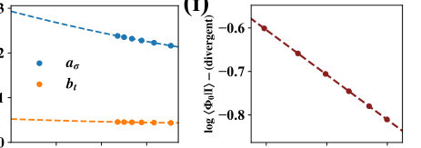 
FIG. 1. (a) Schematic realization of an O(N) normal sur- face CFT on the fuzzy sphere. (b)-(f) CFT data for the O(2) normal surface CFT. Conformal multiplets are shown for the surface primaries (b) t, (c) D, and (d) Oo for 10 ≤Ns ≤18. Open symbols are raw dimensions calibrated by ∆D = 3. Solid symbols include the conformal-perturbation-theory cor- rection from the leading irrelevant boundary perturbation as- sociated with D. (e) Finite-size extrapolation of the universal amplitudes aσ and bt. (f) Finite-size scaling of the overlap between the bulk CFT ground state and the polarized state |Φ0⟩, from which cnor is extracted.

📷 Fig 2

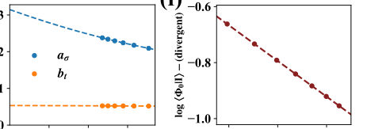 
FIG. 2. CFT data for the O(3) normal surface CFT. Confor- mal multiplets are shown for (a) t, (b) D, (c) OS=0, and (d) OS=1 for 10 ≤Ns ≤18. (e) Finite-size extrapolation of the universal amplitudes aσ and bt. (f) Finite-size scaling of the overlap between the bulk CFT ground state and the polarized state |Φ0⟩, yielding cnor.

📷 Fig 3

 
Fig. 1(f) shows the finite-size scaling of the wavefunc- tion overlap between the bulk ground state |I⟩and the polarized state |Φ0⟩that implements the normal bound-

📷 Fig 4

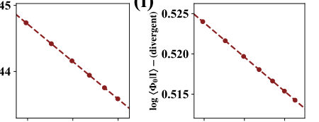 
FIG. 3. CFT data for the O(2) and O(3) ordinary surface CFTs. Conformal multiplets are shown for (a) D and (b) ˆϕ in the O(2) ordinary surface CFT, and for (d) D and (e) ˆϕ in the O(3) ordinary surface CFT. Panels (c) and (f) show finite- size scaling of the overlap between the bulk CFT ground state and the polarized state |Φ0⟩, from which cord is obtained.

📷 Fig 5

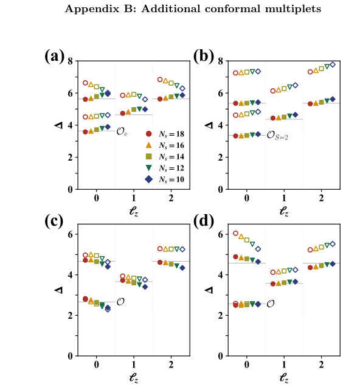 
FIG. 5. Additional conformal multiplets for surface primaries discussed in the main text. Open symbols show raw di- mensions calibrated by the protected displacement operator, ∆D = 3. Solid symbols include the leading correction from the irrelevant boundary perturbation associated with D. Pan- els (a) and (b) supplement the normal surface spectra, with (a) the lowest Z2-even primary above D in the O(2) normal surface CFT and (b) the lowest S = 2 primary in the O(3) normal surface CFT. Panels (c) and (d) supplement the ordi- nary surface spectra, with (c) the lowest Z2-odd O(2)-singlet primary and (d) the lowest Z2-even O(3) traceless-tensor pri- mary.

📷 Fig 6

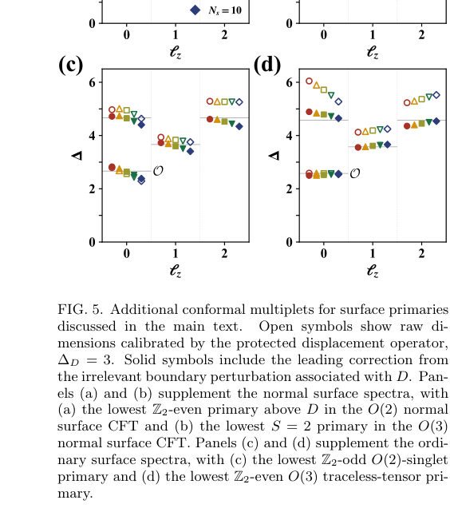 
Fig. 5 shows four additional multiplets that are used in the summary tables but are not displayed in the main fig- ures. The purpose is to support the primary assignments by their descendant structure. A boundary primary O with dimension ∆O generates states

📷 Fig 7

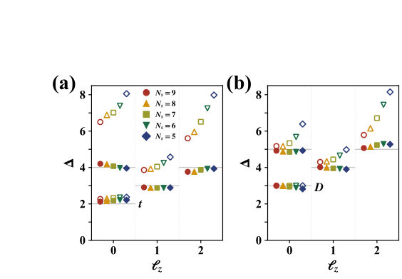 
FIG. 6. Conformal multiplets of (a) t and (b) D in the O(3) normal surface CFT obtained from the real-space boundary cut.

📷 Fig 8

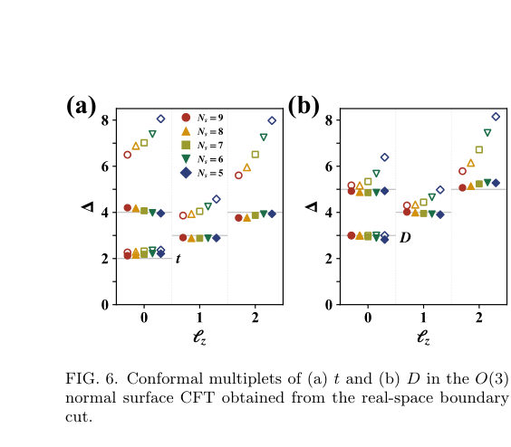 
Fig. 6 shows the multiplets of t and D for the O(3) normal surface CFT, with states included up to ∆= 5 and lz = 2. The accessible system sizes are smaller than those in the orbital-space calculation, and the raw spec- tra therefore show larger finite-size drifts than in Fig. 2(a) and Fig. 2(b). After the same leading correction from D is included, the integer spacing of the conformal multi- plets is recovered. This supports the conclusion that the real-space and orbital-space boundary cuts flow to the same surface universality class. The orbital-space cut is more efficient numerically because the m &lt; 0 orbitals can be integrated out, which gives access to larger Ns.

📷 Fig 9

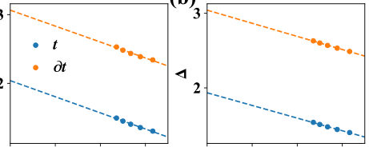 
FIG. 7. The scaling dimension of t and ∂t in (a) O(2) and (b) O(3) normal surface CFTs, calibrated using the bulk stress tensor ∆Tµν = 3.

**Main problem.** Determining the Boundary Conformal Field Theory (BCFT) data and operator spectra for the normal and ordinary boundary universality classes of 2+1D O(N) Wilson-Fisher fixed points (specifically N=2 and N=3).

**Main result.** The study provides microscopic evidence for the extraordinary-log boundary criticality phase (finding alpha > 0) and successfully extends fuzzy-sphere spectroscopy to continuous O(N) symmetry, with results consistent with Monte Carlo and Conformal Bootstrap benchmarks.

**Method.** The authors use fuzzy-sphere regularization to study 3D CFTs via a finite quantum many-body Hamiltonian, employing the state-operator correspondence and finite-size scaling to extract scaling dimensions and OPE coefficients.

**Summary.** This paper investigates the boundary properties of 3D O(N) critical systems using a unique fuzzy-sphere regularization. By studying a bilayer Heisenberg model, the authors extract the operator spectrum and OPE coefficients for both normal and ordinary boundary conditions. The work provides significant evidence for the existence of the extraordinary-log phase in O(N) models. The results are highly consistent with established Monte Carlo and Conformal Bootstrap data, demonstrating the power of the fuzzy-sphere method for continuous symmetries.

Detailed structure

**Model / system.** A bilayer Heisenberg model on a fuzzy sphere, which can be tuned between O(2) and O(3) symmetries via anisotropic interactions, used to realize the 3D O(N) Wilson-Fisher fixed points.

**Key observables.** Scaling dimensions (Delta) of boundary primary operators, boundary central charges (c_nor, c_ord), universal amplitudes (a_sigma, b_t), and the critical exponent alpha.

**Important parameters / regimes.** O(N) symmetry group (N=2, 3), boundary conditions (normal and ordinary), and Haldane pseudopotentials.

**Assumptions / limitations.** The results are subject to finite-size effects and rely on the accuracy of the conformal perturbation theory used to correct for irrelevant boundary perturbations.

**Figures summary.** Figures show finite-size scaling of wavefunction overlap, conformal multiplets for O(3) and O(2) (including raw vs. corrected dimensions), OPE data, and the recovery of integer-spaced spectra using the displacement operator.

**Paper structure.** The paper introduces the problem of 3D O(N) surface CFT, describes the fuzzy-sphere model and Hamiltonian, details the numerical methods and calibration procedures, presents results for O(2) and O(3) spectra and OPE data, and concludes with a comparison to existing benchmarks.

Abstract

Boundary conformal field theory (BCFT) provides a universal framework for critical phenomena in the presence of boundaries. We determine BCFT data for the normal and ordinary boundary universality classes of the $1+1$-dimensional boundaries of the $2+1$-dimensional $O(2)$ and $O(3)$ Wilson-Fisher fixed points, realized microscopically by a bilayer Heisenberg model on the fuzzy sphere. Using the fuzzy-sphere state-operator correspondence, we obtain boundary operator spectra, identify low-lying boundary primary operators, extract operator-product-expansion (OPE) data, and estimate the boundary central charges for both boundary conditions. For the normal boundary condition, the universal amplitudes $a_σ$ and $b_t$ extracted from one- and two-point functions agree quantitatively with Monte Carlo benchmarks where available. For both $N=2$ and $N=3$, we find a positive extraordinary-log exponent $α$, providing independent microscopic evidence for extraordinary-log boundary criticality. Our results extend fuzzy-sphere BCFT spectroscopy beyond the Ising universality class to continuous $O(N)$ symmetry.

[↑ back to top](#top)

### [Subsystem-Resolved Spectral Theory for Quantum Many-Body Hamiltonians](http://arxiv.org/abs/2604.21929v1)

**Authors:** MD Nahidul Hasan Sabit  
**Type:** theory · **Category:** statistical mechanics · **PDF:** <https://arxiv.org/pdf/2604.21929v1>  
**Analysis basis:** full PDF text, analyzed in chunks

📷 Fig 1

 
Low-resolution page preview, page 2

📷 Fig 2

 
Low-resolution page preview, page 3

📷 Fig 3

 
Low-resolution page preview, page 4

📷 Fig 4

 
Low-resolution page preview, page 5

📷 Fig 5

 
Low-resolution page preview, page 6

📷 Fig 6

 
Low-resolution page preview, page 7

📷 Fig 7

 
Low-resolution page preview, page 8

📷 Fig 8

 
Low-resolution page preview, page 9

📷 Fig 9

 
Low-resolution page preview, page 10

📷 Fig 10

 
Low-resolution page preview, page 11

**Main problem.** The global spectrum of a many-body Hamiltonian fails to capture the inherent locality of interactions. The paper seeks to develop a subsystem-resolved spectral framework that organizes spectral data according to the geometry and interaction structure of subsystems.

**Main result.** The authors prove that subsystem Hamiltonians can be locally approximated with exponentially decaying error and that their spectra are stable under such truncations. Furthermore, they show that the spectra of spatially separated subsystems are approximately additive, becoming exact for finite-range interactions.

**Method.** The study uses an operator-algebraic framework, employing interaction norms to measure the decay of interaction strengths and spectral perturbation theory (Hausdorff distance) to relate operator-level approximations to spectral stability.

**Summary.** This paper introduces a new way to study the energy spectra of quantum many-body systems by looking at subsystems rather than just the global Hamiltonian. It demonstrates that the spectrum of a local region can be accurately approximated by looking at a finite neighborhood and that the spectra of two distant regions can be roughly added together. This proves that the locality of physical interactions is directly reflected in the structure of the system's energy levels. The framework provides a mathematical foundation for connecting interaction geometry to spectral behavior.

Detailed structure

**Model / system.** The framework applies to quantum many-body Hamiltonians acting on a tensor product Hilbert space, where the Hamiltonian is a sum of local interaction terms with exponentially decaying strengths.

**Key observables.** Subsystem spectrum (sigma(H_S)) and the Hausdorff distance between spectra.

**Important parameters / regimes.** Interaction norm (Phi_mu), subsystem radius (r), spatial separation (D), and interaction decay rate (mu).

**Assumptions / limitations.** The system is assumed to have a finite index set and interactions must satisfy a specific exponential decay condition (finite interaction norm).

**Paper structure.** The paper begins by defining a subsystem-based spectral framework and an interaction norm, then moves to proving the local approximability of subsystem Hamiltonians, followed by establishing spectral stability and the approximate additivity of spectra for distant subsystems.

**Why it may be interesting.** This work provides a static analogue to Lieb-Robinson bounds, offering a new way to understand how the geometry of interactions shapes the spectral properties of many-body systems, which is fundamental for understanding correlations and dynamics.

Abstract

We study spectral properties of quantum many-body Hamiltonians through a subsystem-based framework. Given a Hamiltonian of the form $H = \sum_{X \subseteq Λ} Φ(X)$ acting on a tensor product Hilbert space, we associate to each subset $S \subseteq Λ$ a subsystem Hamiltonian $H_S$ and its spectrum $\mathcal{S}(S) = σ(H_S)$. This produces a family of spectra indexed by subsystems, allowing spectral data to be organized according to interaction structure. We show that subsystem Hamiltonians admit local approximations: $H_S$ can be approximated by operators supported on finite neighborhoods with an error bounded by $\|H_S - H_{S,r}\| \le |S| e^{-μr} \|Φ\|_μ$. As a consequence, subsystem spectra are stable under truncation in the sense that $d_H(\mathcal{S}(S), σ(H_{S,r})) \le |S| e^{-μr} \|Φ\|_μ.$ We then prove that for disjoint subsets $S_1, S_2 \subseteq Λ$, the subsystem spectrum is approximately additive: $d_H\big(\mathcal{S}(S_1 \cup S_2), \mathcal{S}(S_1) + \mathcal{S}(S_2)\big) \le (|S_1| + |S_2|) e^{-μD} \|Φ\|_μ,$ where $D = d(S_1, S_2)$. In the finite-range case, this relation becomes exact. The results show that spectral properties reflect the locality of interactions not only at the level of operators, but also at the level of spectra. The framework provides a way to study many-body systems in which interaction geometry directly shapes spectral behavior.

[↑ back to top](#top)

### [Symplectic symmetry of quadratic-band-touching Hamiltonians in two dimensions](http://arxiv.org/abs/2604.21524v1)

**Authors:** Igor F. Herbut, Samson C. H. Ling  
**Type:** theory · **Category:** strongly correlated electrons · **PDF:** <https://arxiv.org/pdf/2604.21524v1>  
**Analysis basis:** full PDF text, analyzed in chunks

📷 Fig 1

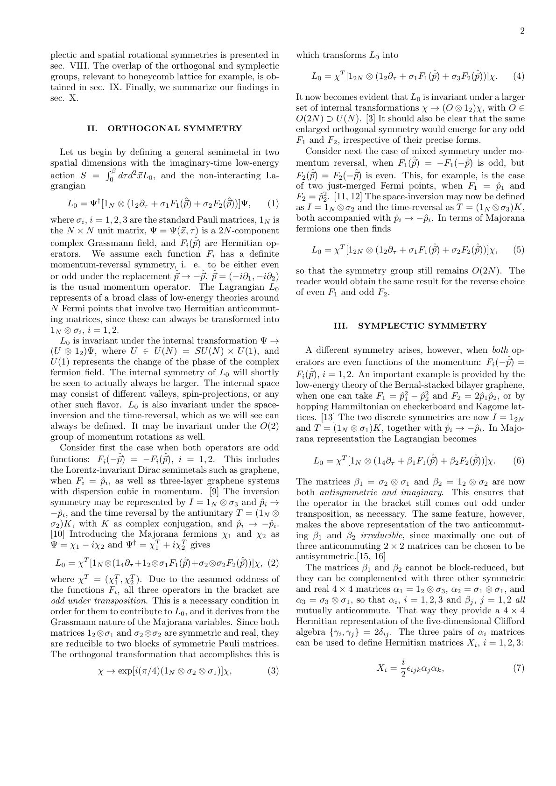 
Low-resolution page preview, page 2

📷 Fig 2

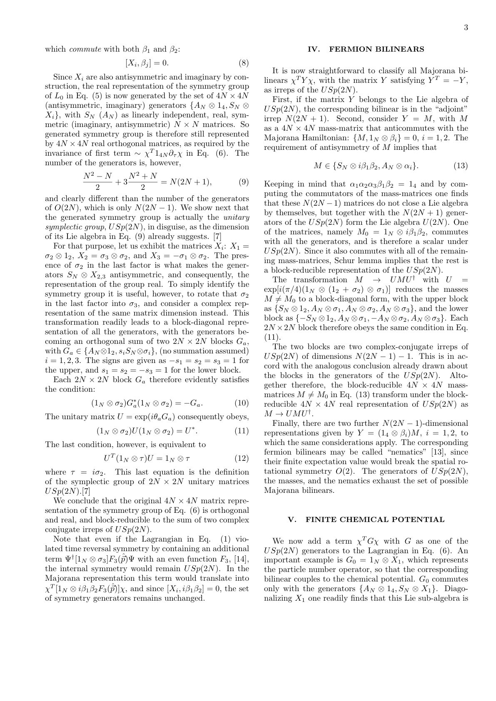 
Low-resolution page preview, page 3

📷 Fig 3

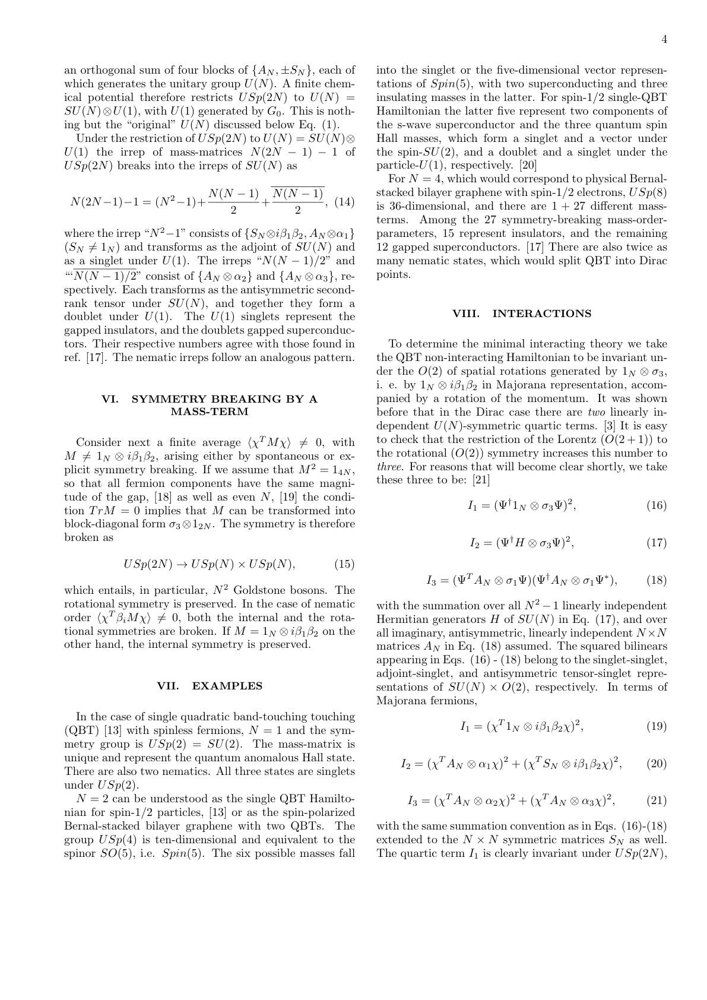 
Low-resolution page preview, page 4

📷 Fig 4

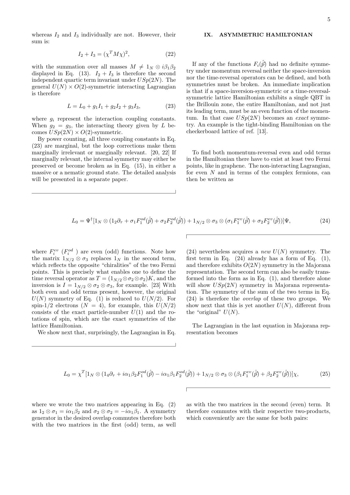 
Low-resolution page preview, page 5

📷 Fig 5

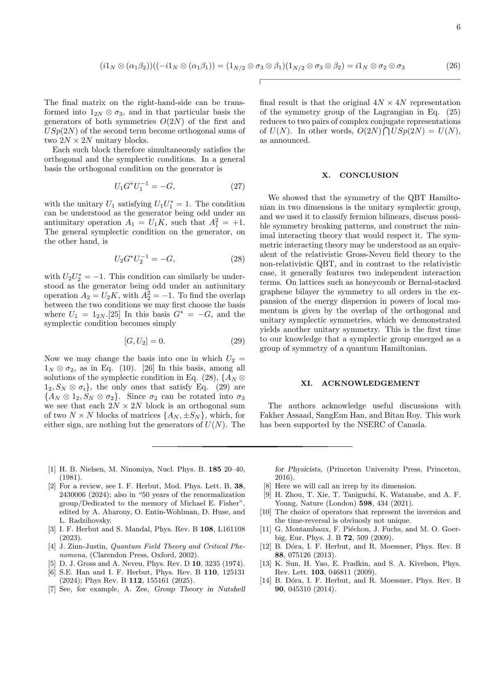 
Low-resolution page preview, page 6

📷 Fig 6

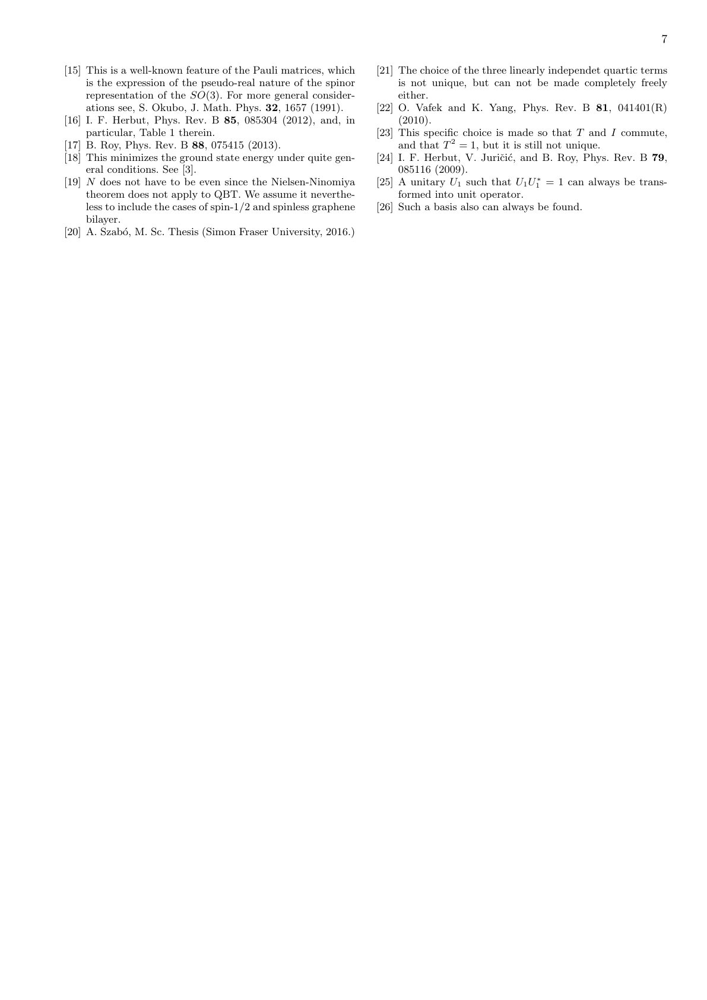 
Low-resolution page preview, page 7

**Main problem.** The paper aims to identify and classify the internal low-energy symmetry group of two-dimensional quadratic-band-touching (QBT) Hamiltonians and analyze their stability under interactions.

**Main result.** The authors discover that QBT Hamiltonians possess a unitary symplectic symmetry, USp(2N), and show that the symmetry of systems containing both even and odd momentum-reversal terms is the intersection group U(N).

**Method.** The study employs group theory, Majorana fermion representations, and Renormalization Group (RG) analysis to classify fermion bilinears and investigate symmetry-breaking patterns.

**Summary.** This paper identifies a new internal symmetry, the unitary symplectic group USp(2N), for 2D Hamiltonians with quadratic-band-touching. It provides a complete classification of fermion bilinears under this symmetry and explores how interactions can lead to spontaneous symmetry breaking. Furthermore, it demonstrates that the symmetry of systems with both even and odd momentum-reversal terms is the intersection group U(N). This work is significant as it marks the first instance of a symplectic group emerging as the fundamental symmetry of a quantum Hamiltonian in this context.

Detailed structure

**Model / system.** The model focuses on 2D semimetals with quadratic-band-touching, such as Bernal-stacked bilayer graphene and hopping models on checkerboard or Kagome lattices, using a single-particle Hamiltonian for N two-component complex fermions.

**Key observables.** Fermion bilinears (masses and nematics), symmetry group dimensions, and Renormalization Group flow of interaction couplings.

**Important parameters / regimes.** Number of fermion flavors (N), interaction coupling constants (g1, g2, g3), and momentum-reversal parity (even vs. odd).

**Assumptions / limitations.** The analysis initially assumes a single-particle Hamiltonian structure and focuses on the low-energy limit where the dispersion can be expanded in powers of local momentum.

**Paper structure.** The paper first reviews the O(2N) symmetry of Dirac Hamiltonians, then derives the USp(2N) symmetry for even-parity QBT Hamiltonians, classifies fermion bilinears, constructs the interacting theory, and finally analyzes the symmetry overlap in lattices like the honeycomb lattice.

Abstract

The internal low-energy symmetry of the massless Lorentz-invariant Dirac Hamiltonian in $2+1$ dimensions is known to be $O(2N)$, where $N$ is the number of two-component Dirac fermions. Here we point out that there exists an analogous internal symmetry of the single-particle quadratic-band-touching Hamiltonian in two spatial dimensions, and it is the unitary symplectic group, $USp(2N)$. All fermionic bilinears belong to one of the three small irreducible representations of this group. The interacting theory that respects the $USp(2N)$ symmetry and the spatial rotations is constructed and found to allow two independent interaction terms. When these interactions are infrared-relevant the symplectic symmetry either remains preserved or becomes spontaneously broken to $USp(N) \times USp(N)$. The symmetry in the lattices such as honeycomb to infinite order in the dispersion's expansion in powers of local momentum is given by the overlap of the symplectic and the orthogonal groups. We show that this overlap is $O(2N) \bigcap USp(2N) = U(N)$.

[↑ back to top](#top)

### [Testing Spontaneous Collapse Models with Coulomb Mediated Squeezing](http://arxiv.org/abs/2604.21705v1)

**Authors:** Suroj Dey, Peter Barker, Animesh Datta  
**Type:** theory · **Category:** other · **PDF:** <https://arxiv.org/pdf/2604.21705v1>  
**Analysis basis:** full PDF text, analyzed in chunks

📷 Fig 1

 
FIG. 1. Two identical, levitated charged nanospheres of mass m and charges q and ηq, separated by a mean distance d. Both are harmonically trapped at angular frequency ω and coupled via V, the static Coulomb interaction.

📷 Fig 2

 
FIG. 2. Our proposed bounds for parameters in Table 1 and different choices as in II. We include the current best bounds provided by XENONnT [14], and LISA Pathfinder [26, 27]. Previous bounds from X-ray experiments [10, 28] and bulk-heating experiment [11–13].The grey-shaded region cor- responds to the theoretically excluded region [25]. The shaded vertical bars correspond to theoretical suggestions by Adler [29], and the red dot to a suggestion by Ghirardi, Rim- ini, and Weber [30].

📷 Fig 3

 
FIG. 3. Our bounds at choices of experimental parameters in IV considering a short-time Coulomb entanglement test of collapse models.

**Main problem.** Finding experimental methods to test and constrain the parameters of Spontaneous Collapse Models (CSL and DP) that are more effective than current bulk-heating tests and robust against colored-noise extensions.

**Main result.** The study shows that detecting steady-state Coulomb-mediated position squeezing in two nanospheres can provide bounds on the CSL parameter that surpass bulk-heating tests and are robust against colored noise. Additionally, short-time entanglement-based tests can provide significant constraints on the collapse rate.

**Method.** The authors use a master equation approach to analyze the dynamics of two charged nanospheres, calculating steady-state covariance matrix elements and entanglement measures (logarithmic negativity) under various noise models.

**Summary.** This paper proposes a new experimental method to test spontaneous collapse models, such as CSL and Diosi-Penrose, using the Coulomb-mediated squeezing of two charged nanospheres. The authors demonstrate that observing the reduction in thermal variance of the differential motional mode can set bounds on the collapse rate that are more robust than current X-ray or bulk-heating experiments. Crucially, these proposed mechanical bounds remain effective even when considering more realistic colored-noise models. The study also suggests that detecting entanglement between the spheres at short times can serve as a powerful witness for these fundamental models.

Detailed structure

**Model / system.** The system consists of two identical, charged nanospheres of mass m and charge q trapped harmonically in a linear Paul trap, interacting via a static Coulomb potential. The dynamics are modeled using the CSL and Diosi-Penrose (DP) collapse models, incorporating both thermal noise and potential colored-noise extensions.

**Key observables.** Steady-state position variance of the differential mode, momentum variance, logarithmic negativity (entanglement), and X-ray emission rates.

**Important parameters / regimes.** CSL collapse rate (lambda_CSL), CSL correlation length (r_CSL), DP length scale (R_0), Coulomb coupling strength (delta^2), thermal occupancy (N), and noise frequency cut-off (Omega).

**Assumptions / limitations.** The particles within each system are treated as part of a rigid body; mass distributions are approximated as Gaussian densities; the analysis assumes the separation d is much larger than the collapse correlation length.

**Figures summary.** Figure 2 compares the proposed CSL bounds against existing limits from LISA Pathfinder, XENONnT, and X-ray experiments. Figure 3 shows logarithmic plots of entanglement-based bounds compared to various existing experimental limits.

**Paper structure.** The paper introduces the scientific problem of testing collapse models, describes the physical system and Coulomb interaction, derives the master equations for CSL and DP models, performs steady-state and short-time analysis for squeezing and entanglement, and concludes with a comparison of the proposed bounds against existing experimental literature.

**Why it may be interesting.** This paper is highly relevant to researchers in open quantum systems and quantum optics as it proposes a novel way to use mechanical squeezing and entanglement in trapped systems to probe fundamental decoherence models and non-Markovian noise.

Abstract

We show that detecting steady-state Coulomb-mediated reduction in the thermal variance of the differential motional mode of two nanospheres can bound the Continuous Spontaneous Localization (CSL) parameter ($λ_{\text{CSL}}$). For realistic experimental parameters, the resulting bounds are comparable to those obtained from X-ray emission experiments and surpass those set by bulk-heating ones. Unlike these latter experiments, our bounds are robust against plausible coloured-noise extensions of collapse models. In the short-time regime, we find that a weak Coulomb-induced entanglement-based test between two charged nanospheres initialized in ground state can provide constraints on $λ_{\text{CSL}}$ comparable to limits set by early X-ray experiments.

[↑ back to top](#top)

### [The CriticalSet problem: Identifying Critical Contributors in Bipartite Dependency Networks](http://arxiv.org/abs/2604.21537v1)

**Authors:** Sebastiano A. Piccolo, Andrea Tagarelli  
**Type:** theory · **Category:** other · **PDF:** <https://arxiv.org/pdf/2604.21537v1>  
**Analysis basis:** full PDF text, analyzed in chunks

📷 Fig 1

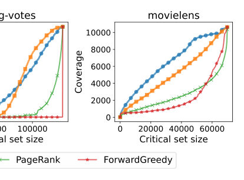 
Fig. 2. Coverage curves on real datasets (selection).

📷 Fig 2

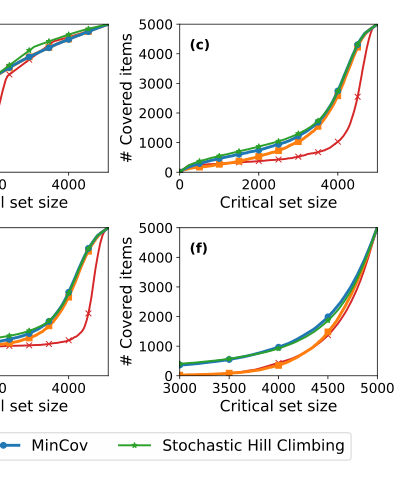 
Fig. 3. Zoomed-in comparison between MinCov, ShapleyCov, Forward Greedy and SHC. The letter indicates the synthetic graph configuration (refer to Table 3).

📷 Fig 3

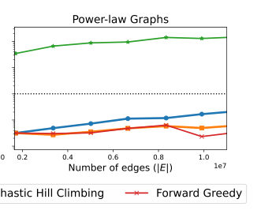 
Fig. 4. Running time comparison between MinCov, ShapleyCov, FG, and SHC.

**Main problem.** Identifying a subset of critical contributors in a bipartite dependency network whose removal isolates the largest number of items, a problem characterized by supermodular objective functions.

**Main result.** The authors prove the problem is NP-hard and propose MinCov, a linear-time peeling algorithm, and ShapleyCov, a centrality measure, both of which significantly outperform traditional graph mining baselines.

**Method.** The problem is modeled as a coalitional game to derive a closed-form Shapley-based centrality (ShapleyCov) and an iterative reverse-greedy peeling algorithm (MinCov).

**Summary.** This paper addresses the difficulty of finding critical nodes in networks where dependencies follow an 'all-or-nothing' rule. Because the objective function is supermodular, standard greedy algorithms fail. The authors introduce a new centrality measure based on the Shapley value and a highly efficient peeling algorithm that can scale to massive graphs like Wikipedia. Their approach effectively identifies 'critical' nodes that are often missed by traditional metrics like PageRank or degree centrality.

Detailed structure

**Model / system.** A bipartite dependency network B = (C, I, E) where C represents contributors and I represents items, with edges representing dependencies. The model uses 'all-or-nothing' logic where an item is lost if all its connected contributors are removed.

**Key observables.** Area Under the Coverage Curve (AUC), ShapleyCov centrality, and the fraction of degree-one items (phi_I).

**Important parameters / regimes.** The budget size k, the power-law exponent alpha, and redundancy depth parameters like phi_C and gamma_C.

**Assumptions / limitations.** The model assumes a bipartite structure with no edges within groups, uniform importance for all items, and a strict all-or-nothing threshold for item loss.

**Figures summary.** Figure 1 visually demonstrates a bipartite graph illustrating how a specific set of contributors causes the isolation of certain items.

**Paper structure.** The paper introduces the CriticalSet problem, proves its NP-hardness and supermodularity, develops game-theoretic and algorithmic solutions (ShapleyCov and MinCov), and validates these methods through extensive experiments on large-scale real-world and synthetic datasets.

Abstract

Identifying critical nodes in complex networks is a fundamental task in graph mining. Yet, methods addressing an all-or-nothing coverage mechanics in a bipartite dependency network, a graph with two types of nodes where edges represent dependency relationships across the two groups only, remain largely unexplored. We formalize the CriticalSet problem: given an arbitrary bipartite graph modeling dependencies of items on contributors, identify the set of k contributors whose removal isolates the largest number of items. We prove that this problem is NP-hard and requires maximizing a supermodular set function, for which standard forward greedy algorithms provide no approximation guarantees. Consequently, we model CriticalSet as a coalitional game, deriving a closed-form centrality, ShapleyCov, based on the Shapley value. This measure can be interpreted as the expected number of items isolated by a contributor's departure. Leveraging these insights, we propose MinCov, a linear-time iterative peeling algorithm that explicitly accounts for connection redundancy, prioritizing contributors who uniquely support many items. Extensive experiments on synthetic and large-scale real datasets, including a Wikipedia graph with over 250 million edges, reveal that MinCov and ShapleyCov significantly outperform traditional baselines. Notably, MinCov achieves near-optimal performance, within 0.02 AUC of a Stochastic Hill Climbing metaheuristic, while remaining several orders of magnitude faster.

[↑ back to top](#top)

### [The Geometry Underlying the Quantum Harmonic Oscillator](http://arxiv.org/abs/2604.21373v1)

**Authors:** Alexander D. Popov  
**Type:** theory · **Category:** other · **PDF:** <https://arxiv.org/pdf/2604.21373v1>  
**Analysis basis:** full PDF text, analyzed in chunks

📷 Fig 1

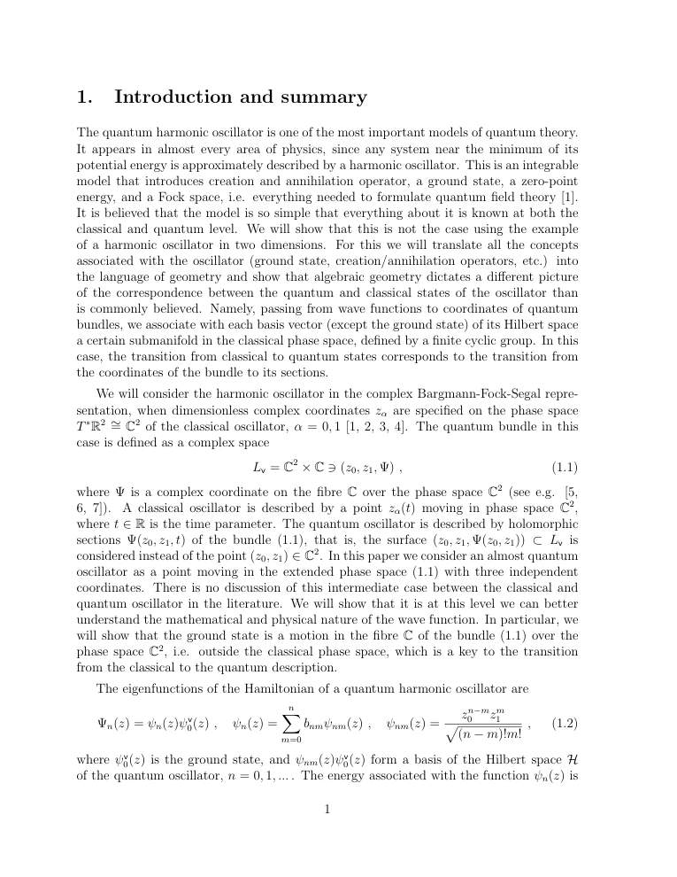 
Low-resolution page preview, page 2

📷 Fig 2

 
Low-resolution page preview, page 3

📷 Fig 3

 
Low-resolution page preview, page 4

📷 Fig 4

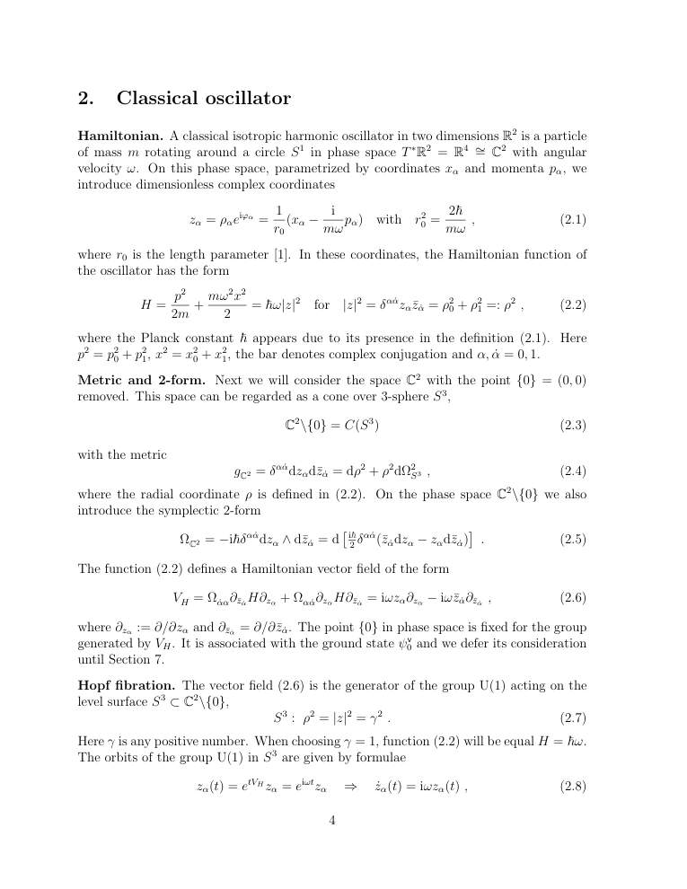 
Low-resolution page preview, page 5

📷 Fig 5

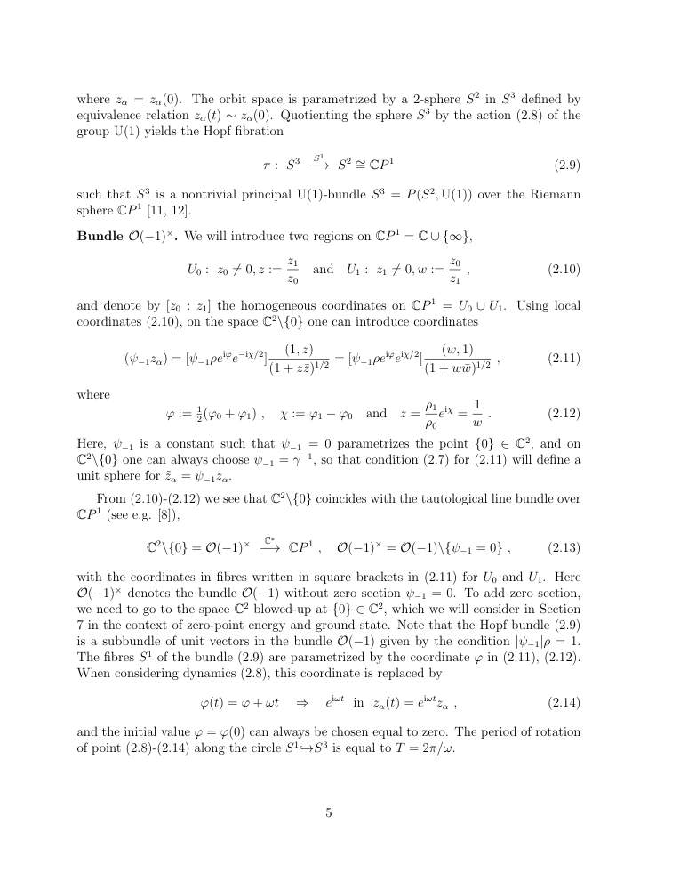 
Low-resolution page preview, page 6

📷 Fig 6

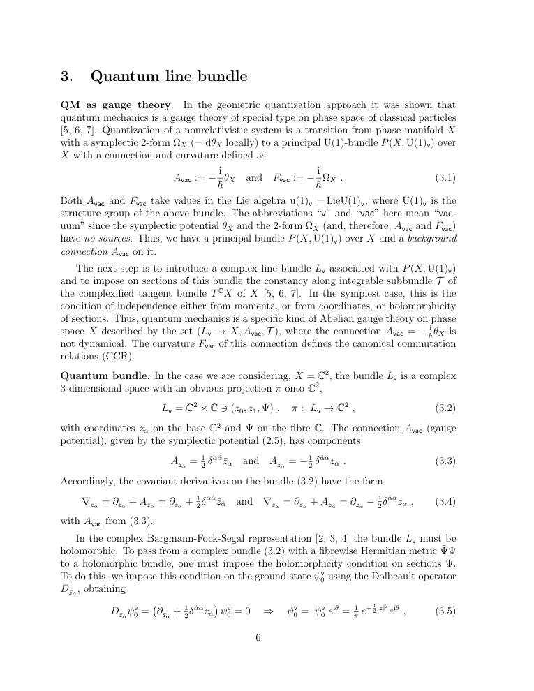 
Low-resolution page preview, page 7

📷 Fig 7

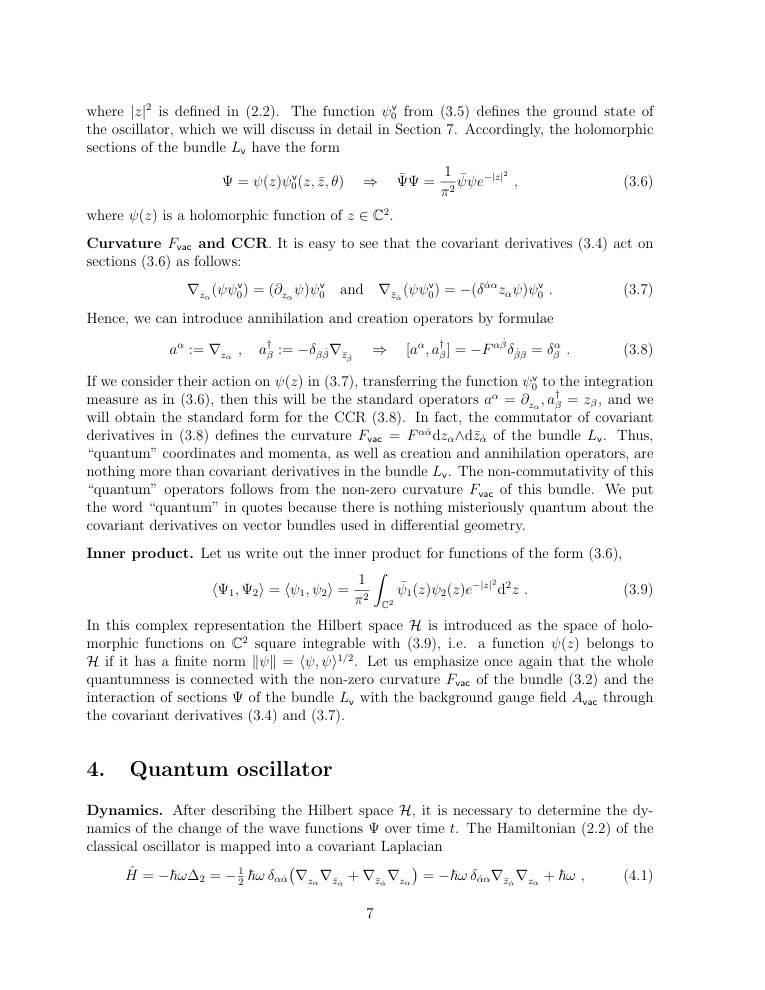 
Low-resolution page preview, page 8

📷 Fig 8

 
Low-resolution page preview, page 9

📷 Fig 9

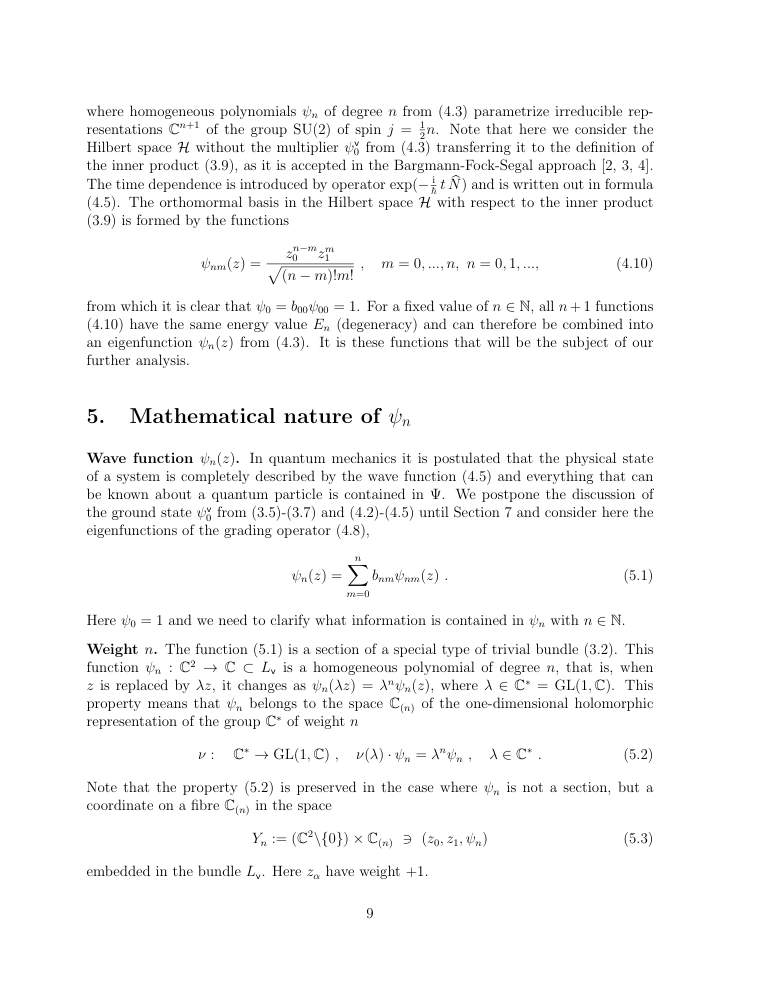 
Low-resolution page preview, page 10

📷 Fig 10

 
Low-resolution page preview, page 11

**Main problem.** Investigating the underlying geometric and algebraic-geometric structure of the quantum harmonic oscillator to understand the relationship between classical and quantum states.

**Main result.** The paper establishes that quantum wave functions are holomorphic sections of a complex line bundle, where the non-commutativity of operators (CCR) and the uncertainty principle arise directly from the curvature of the bundle.

**Method.** The author uses geometric quantization, gauge theory, and algebraic geometry (specifically Geometric Invariant Theory and the blow-up technique) to model the oscillator as a particle moving in the total space of a bundle.

**Summary.** This paper proposes a geometric foundation for quantum mechanics by treating the quantum harmonic oscillator as a gauge theory on an extended phase space. It demonstrates that quantum effects, such as the Heisenberg uncertainty principle and the non-commutativity of operators, are direct consequences of the curvature of a complex line bundle. The author shows that quantum states are holomorphic sections of this bundle, and that the transition from classical to quantum mechanics involves moving from the dynamics of points to the dynamics of sections. The framework is further extended to show a similar geometric correspondence in the hydrogen atom problem.

Detailed structure

**Model / system.** A two-dimensional isotropic quantum harmonic oscillator represented in the complex Bargmann-Fock-Segal representation, with a classical phase space of C^2 and a quantum bundle L_v.

**Key observables.** Creation and annihilation operators, energy levels (E_n), charge density, current, and Majorana stars (zeros of the polynomial part of the wave function).

**Important parameters / regimes.** Mass (m), angular frequency (omega), Planck constant (hbar), and the Chern class (n) of the bundle.

**Assumptions / limitations.** The vacuum state is assumed to have no external sources; the model assumes the validity of Kustaanheimo-Stiefel and Moser regularizations for the Kepler problem extension.

**Paper structure.** The paper begins by defining the geometric framework of the oscillator in the Bargmann-Fock-Segal representation, moves to the construction of the quantum bundle and the derivation of CCR from bundle curvature, explores the transition from point-like classical motion to section-based quantum motion using lens spaces, and concludes by extending these geometric principles to the Kepler/hydrogen atom problem.

**Why it may be interesting.** This paper provides a deep geometric foundation for quantum mechanics, offering a new perspective on the origin of the uncertainty principle and the transition from classical to quantum regimes, which is conceptually relevant to the fundamental understanding of quantum optics and gauge-theoretic approaches to many-body systems.

Abstract

We consider two-dimensional harmonic oscillator in the complex Bargmann-Fock-Segal representation with $T^*{\mathbb R}^{2}={\mathbb C}^2$ as classical phase space. We show that the eigenfunctions $ψ_n$ of the quantum Hamiltonian correspond to complex radial coordinates in the reduced phase space ${\mathbb C}^2/{\mathbb Z}_n\subset{\mathbb C}^2$. They describe ${\mathbb Z}_n$-invariant motion of particle along a circle $S^1$ in lens space $S^3/{\mathbb Z}_n\subset{\mathbb C}^2/{\mathbb Z}_n$, where ${\mathbb Z}_n$ is the cyclic group of rotation by an angle $2π/n$ on the circle $S^1$, $n=1,2,...\,$. Thus the general solution of the Schrödinger equation carries information about an infinite number of admissible classical states $ψ_n$ that can be mapped to other states after lifting into the quantum bundle. We show that in the Kepler/hydrogen atom problem there is a similar correspondence between classical and quantum states.

[↑ back to top](#top)

### [The KMS and GNS Spectral Gap of Quantum Markov Semigroups](http://arxiv.org/abs/2604.21630v1)

**Authors:** Melchior Wirth  
**Type:** theory · **Category:** other · **PDF:** <https://arxiv.org/pdf/2604.21630v1>  
**Analysis basis:** full PDF text, analyzed in chunks

📷 Fig 1

 
Low-resolution page preview, page 2

📷 Fig 2

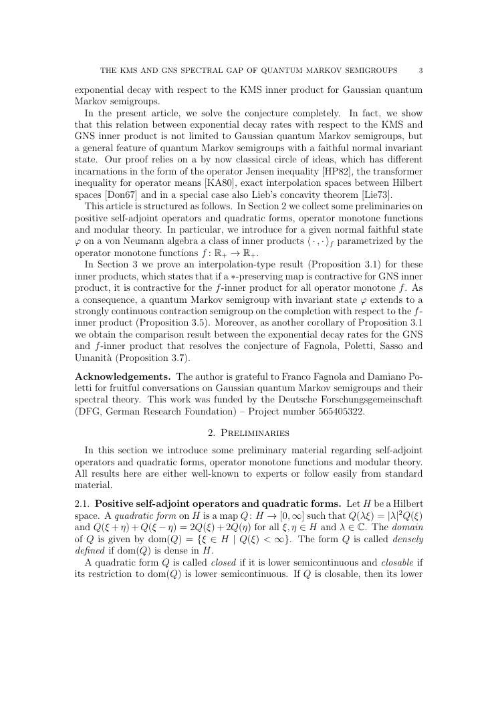 
Low-resolution page preview, page 3

📷 Fig 3

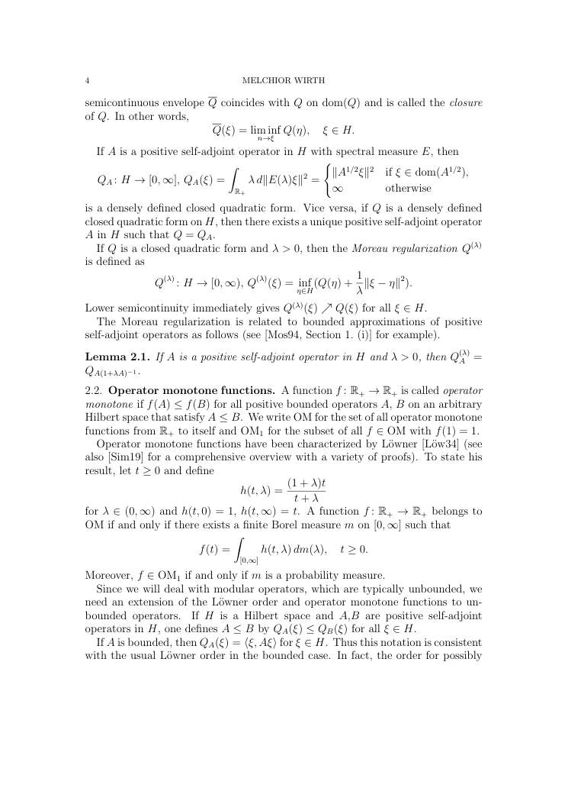 
Low-resolution page preview, page 4

📷 Fig 4

 
Low-resolution page preview, page 5

📷 Fig 5

 
Low-resolution page preview, page 6

📷 Fig 6

 
Low-resolution page preview, page 7

📷 Fig 7

 
Low-resolution page preview, page 8

📷 Fig 8

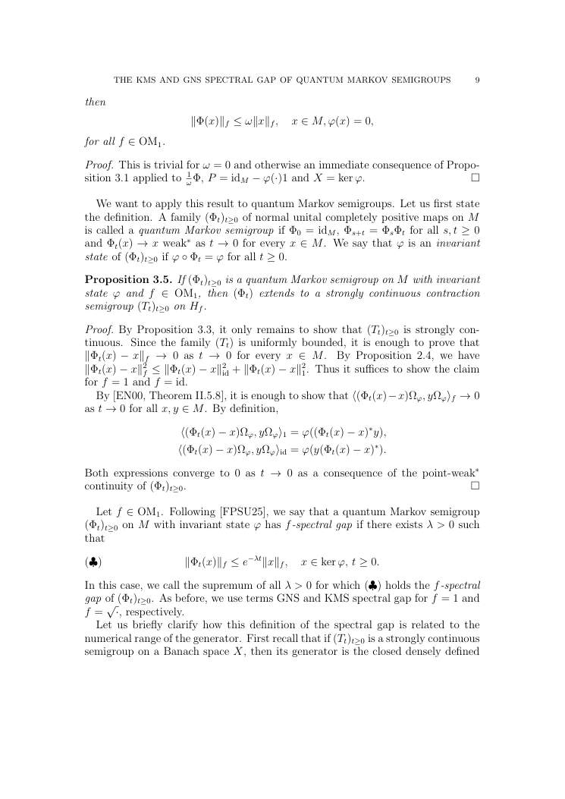 
Low-resolution page preview, page 9

📷 Fig 9

 
Low-resolution page preview, page 10

📷 Fig 10

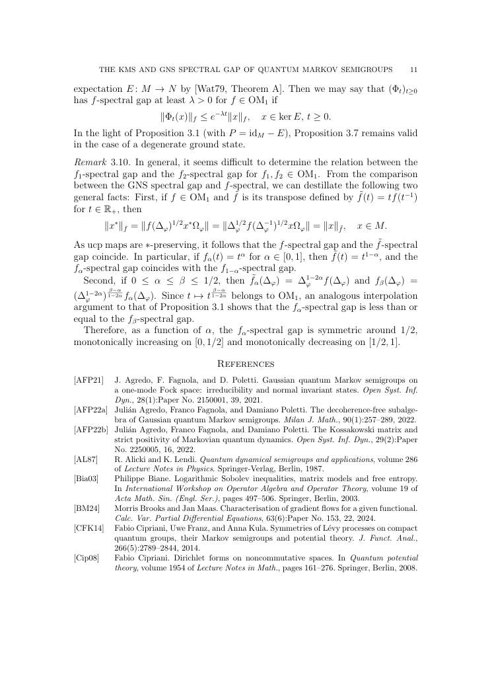 
Low-resolution page preview, page 11

**Main problem.** The paper investigates the relationship between the exponential decay rates (spectral gaps) of quantum Markov semigroups when measured using different inner products, specifically comparing the GNS and KMS inner products.

**Main result.** The author proves that the spectral gap for the KMS inner product is always bounded below by the GNS spectral gap, generalizing a previous conjecture for Gaussian systems to all quantum Markov semigroups with a faithful normal invariant state on arbitrary von Neumann algebras.

**Method.** The proof employs operator theory tools including operator monotone functions, the operator Jensen inequality, interpolation theory (Donoghue's theorem), and Lieb's concavity theorem.

**Summary.** This paper resolves a conjecture regarding the relationship between different spectral gaps in quantum Markov semigroups. It proves that the decay rate measured via the KMS inner product is at least as large as the decay rate measured via the GNS inner product. Crucially, the author shows this property holds for any quantum Markov semigroup with a faithful normal invariant state, not just for Gaussian models. The work also extends this relationship to a wide class of inner products defined by operator monotone functions.

Detailed structure

**Model / system.** The study focuses on Quantum Markov Semigroups (QMS) and quantum Dirichlet forms acting on von Neumann algebras, which model the time evolution of open quantum systems.

**Key observables.** The spectral gaps (exponential decay rates) associated with different inner products (GNS, KMS, and $f$-inner products).

**Important parameters / regimes.** The class of operator monotone functions $f \in OM_1$ and the parameter $\alpha$ for the family of functions $f_\alpha(t) = t^\alpha$.

**Assumptions / limitations.** The results assume the existence of a faithful normal invariant state on the von Neumann algebra.

**Paper structure.** The paper begins by addressing a specific conjecture for Gaussian QMS, then generalizes the result to arbitrary von Neumann algebras. It explores the properties of a broader class of inner products induced by operator monotone functions, analyzes the symmetry and monotonicity of spectral gaps for power-law functions, and concludes by noting the lack of a reverse inequality.

**Why it may be interesting.** This is highly relevant for researchers in open quantum systems and quantum optics, as it provides a fundamental mathematical guarantee regarding the convergence rates of dissipative dynamics across different physical representations (GNS vs KMS).

Abstract

We establish a relation between the exponential decay rates of quantum Markov semigroups with respect to different inner products. More precisely, it was conjectured by Fagnola, Poletti, Sasso and Umanità that for a Gaussian quantum Markov semigroup, the exponential decay rate with respect to the KMS inner product is bounded below by the exponential decay rate for the GNS inner product. We show that this is indeed the case and not limited to Gaussian quantum Markov semigroups, but holds for quantum Markov semigroups with a faithful normal invariant state on arbitrary von Neumann algebras. Additionally, the KMS inner product can be replaced by a whole class of inner products induced by operator monotone functions.

[↑ back to top](#top)

### [Unitary Time Evolution and Vacuum for a Quantum Stable Ghost](http://arxiv.org/abs/2604.21823v1)

**Authors:** Cédric Deffayet, Atabak Fathe Jalali, Aaron Held, Shinji Mukohyama, Alexander Vikman  
**Type:** theory · **Category:** other · **PDF:** <https://arxiv.org/pdf/2604.21823v1>  
**Analysis basis:** full PDF text, analyzed in chunks

📷 Fig 1

 
FIG. 1. Side-view comparisons of probability densities for Ψ0 (solid) and Φ0 (dashed). Thus, for system (1), the ground state of the interacting ghost, Ψ0, is more confining than the ground state Φ0 of two corresponding decoupled oscillators x and y.

📷 Fig 2

 
FIG. 2. Top-down view of ground state probability densities: interacting, |Ψ0|2, (left) and decoupled, |Φ0|2, (right), both with imposed contours. This is another way to see that for system (1) the interacting vacuum with a ghost Ψ0 is more confining than the free vacuum Φ0.

📷 Fig 3

 
FIG. 3. Overlap c(t) ≡⟨Ψ0(0) | Ψ0(t)⟩of the numerically computed ground state Ψ0 and its time evolution Ψ0(t), with energy E0 ≈−0.162. For comparison, we include the expected dashed curves cos(E0t) and sin(−E0t).

📷 Fig 4

 
FIG. 4. The expectation values ⟨x2⟩12(t), ⟨y2⟩12(t), and de- coupled trajectories X2 0(t), Y 2 0 (t). We omit plotting b = 6, as the difference in graphs is visually indistinguishable: max t∈[0,T ]

📷 Fig 5

 
FIG. 5. Same as Fig. 4 but with an additional, interaction term δ ˆHI = αx2y2 for coupling constant α = 0.01.

**Main problem.** Investigating whether a quantum system containing a 'ghost' (a degree of freedom with negative kinetic energy) can exhibit stable, unitary time evolution and a well-defined vacuum despite having a Hamiltonian unbounded from both above and below.

**Main result.** The authors prove that the system possesses a pure point spectrum and a well-defined, unique vacuum state, with the existence of a positive-definite integral of motion (H_up) ensuring stability and confinement.

**Method.** The study uses analytical mathematical frameworks (spectral theorem, Nelson's theorem, and Dirichlet forms) combined with numerical verification via pseudo-spectral and split-operator methods to solve the Schrödinger equation.

**Summary.** This paper challenges the common belief that 'ghost' particles with negative kinetic energy necessarily lead to physical instabilities and loss of unitarity. By using a specific polynomial coupling, the authors demonstrate that a system with an unbounded Hamiltonian can still have a stable, discrete spectrum and a well-defined vacuum. The stability is guaranteed by a hidden positive-definite integral of motion that confines the system's evolution. This provides a theoretical framework for considering stable quantum systems with indefinite metrics.

Detailed structure

**Model / system.** A canonically quantized system consisting of a standard harmonic oscillator coupled to a 'ghost' oscillator with negative kinetic energy via a polynomial interaction potential.

**Key observables.** Ground state wavefunction, energy eigenvalues, expectation values of canonical variables (x^2, y^2, px^2, py^2), and the overlap function c(t).

**Important parameters / regimes.** Coupling constants gamma and c, frequency omega, and the stability regime defined by 2*gamma*c^2 >= |1 - omega^2|.

**Assumptions / limitations.** The proof relies on the specific polynomial form of the interaction potential that allows for the existence of the H_up and H_down integrals of motion.

**Figures summary.** Figure 1 compares probability densities of the interacting vs. decoupled vacuum; Figure 3 shows numerical stability of the ground state; Figure 4 demonstrates the confinement of canonical variables; Figure 5 illustrates stability against perturbations.

**Paper structure.** The paper introduces the problem of ghost instabilities, defines the Hamiltonian and the specific coupling model, provides analytical proofs for unitarity and vacuum existence using the integral of motion, presents numerical simulations to verify these results, and discusses the stability of the spectrum against perturbations.

Abstract

We quantize a classically stable system of a harmonic oscillator polynomially coupled to a ghost with negative kinetic energy. We prove that due to an integral of motion with a positive discrete spectrum: i) the Hamiltonian has a pure point spectrum unbounded in both directions, ii) the evolution is manifestly unitary, iii) the vacuum is well-defined, iv) expectation values for squares of canonical variables are bounded. Numerical solutions of the Schrödinger equation confirm these results. We argue that the discrete spectrum of the integral of motion enforces stability for extended interactions.

[↑ back to top](#top)

### [Variance Geometry of Exact Pauli-Detecting Codes: Continuous Landscapes Beyond Stabilizers](http://arxiv.org/abs/2604.21800v1)

**Authors:** Arunaday Gupta, Baisong Sun, Xi He, Bei Zeng  
**Type:** theory · **Category:** quantum information and computing · **PDF:** <https://arxiv.org/pdf/2604.21800v1>  
**Analysis basis:** full PDF text, analyzed in chunks

📷 Fig 1

 
FIG. 1: Schematic behavior of the attainable spectrum ΣK(E) = {λ∗(P) : P detects E, rank(P) = K}. In the unrestricted setting studied here, nonempty spectra are observed to be closed intervals. Stabilizer codes occupy only discrete values within these intervals. Under symmetry-compatible restrictions, the attainable set may shrink to a smaller interval, reduce to a singleton, or become empty, while remaining interval-like whenever nonempty.

**Main problem.** The paper investigates the geometric structure of the space of exact quantum codes that detect a prescribed set of Pauli errors, specifically determining if these codes form continuous families or isolated solutions.

**Main result.** The authors show that exact Pauli-detecting codes form continuous landscapes (intervals) rather than disjoint sets, and that stabilizer codes are merely a discrete, measure-zero subset of this larger continuum of nonadditive codes.

**Method.** The study uses an operator-theoretic framework linking error detection to joint higher-rank numerical ranges, combined with representation theory, Stiefel-manifold optimization, and analytical constructions of symmetric codewords.

**Summary.** This paper provides a new geometric perspective on quantum error detection by treating the space of valid codes as a continuous landscape. It introduces a scalar parameter, the signature norm, to characterize the variance profile of different code families. The central finding is that stabilizer codes are just a small, discrete part of a much larger, continuous set of nonadditive codes. The work also demonstrates how imposing symmetries can expand or contract the range of achievable error-detection parameters.

Detailed structure

**Model / system.** The model consists of rank-K quantum code projectors satisfying the Knill-Laflamme detection conditions for various Pauli error models, including distance-based, asymmetric, and symmetry-restricted (cyclic and permutation) error sets.

**Key observables.** The signature norm (lambda*), which is the Euclidean norm of the vector of Pauli expectation values on the maximally mixed code state, and the joint Pauli variance profile.

**Important parameters / regimes.** The code rank K, the number of qubits n, the error set E, and the symmetry groups (cyclic C_n and permutation S_n).

**Assumptions / limitations.** The focus is restricted to exact (rather than approximate) error-detecting codes, and the 'interval property' is presented as a strong empirical observation rather than a universal proof.

**Figures summary.** Figure 1 illustrates the continuous spectrum of attainable lambda* values, showing how stabilizer codes occupy discrete points and how symmetry constraints can shrink or empty the spectrum.

**Paper structure.** The paper progresses from notation and preliminaries to the introduction of variance-based signatures, followed by symmetry analysis, a classification of 2-qubit codes, and numerical optimization for larger systems.

Abstract

Exact quantum codes detecting a prescribed set of Pauli errors are approached through algebraic constructions--stabilizer, codeword-stabilized, permutation-invariant, topological, and related families. Geometrically, exact Pauli detection is governed by joint higher-rank numerical ranges of these Pauli operators, whose structure for rank $\geq 2$ is largely uncharted. From this viewpoint, we show that such codes often form connected continuous families rather than collections of disjoint solution regions. These families are characterized by a single scalar derived from the Knill-Laflamme conditions: denoted $λ^*$, it is the Euclidean norm of the signature vector of Pauli expectation values on the maximally mixed code state, and provides a one-parameter summary of the code's joint Pauli variance profile. Within these continuous landscapes, stabilizer codes occupy only discrete, measure-zero subsets of the attainable $λ^*$-spectrum, exposing a largely unexplored continuum of genuinely nonadditive exact codes. We establish this picture by analyzing the geometry of higher-rank operator compressions, and extend it to symmetry-restricted settings where cyclic and permutation symmetries are imposed on both the error model and the code projector. Small-system cases reveal interval, singleton, and empty regimes through eigenvalue interlacing and symmetry-sector decompositions; larger systems are treated numerically via Stiefel-manifold optimization and symmetry-adapted parameterizations. In every unrestricted and symmetry-compatible case analyzed, the attainable $λ^*$-spectrum forms a single closed interval whenever nonempty--although a general proof remains open. These results place stabilizer, symmetric, and nonadditive code families within a unified higher-rank variance framework, suggesting a continuous geometric perspective on the landscape of exact quantum codes.

[↑ back to top](#top)

