
# arxiv digest (quant-ph + cond-mat) — 2026-04-27

*81 papers · 49 relevant · 2 highlighted*

## 🔥 Most relevant (49)

*Every paper with at least one nonzero topic score, sorted by best-matching score. 🔥 marks scores ≥3/5. Click the title to jump to the full entry below; click [arXiv] to open the paper page. `(secondary)` marks papers from de-prioritized cond-mat archives.*

Show 49 relevant papers

- ⭐ [Entanglement and information scrambling in long-range measurement-only circuits](#paper-2604.22022) [[arXiv]](http://arxiv.org/abs/2604.22022v1) — 🔥 `measurement-induced transitions` **5/5** · 🔥 `entanglement & information structure` **4/5** · 🔥 `driven-dissipative phase transition` **3/5** · 🔥 `non-equilibrium dynamics` **3/5** · 🔥 `non-equilibrium universality` **3/5** · `correlated / nonlocal dissipation` **2/5** · `dissipative systems` **2/5** · `methods for driven-dissipative` **2/5** · `quantum measurements` **2/5**
- [Thermometry for a Kagome Lattice Dipolar Rydberg Simulator](#paper-2604.22743) [[arXiv]](http://arxiv.org/abs/2604.22743v1) — 🔥 `Rydberg arrays` **5/5** · 🔥 `analog quantum simulation` **4/5** · 🔥 `exotic spin models in light-matter` **4/5** · 🔥 `QC/QI experiment` **3/5** · `entanglement & information structure` **2/5** · `non-equilibrium dynamics` **2/5** · `quantum measurements` **2/5**
- [Decohered color code and emerging mixed toric code by anyon proliferation: Topological entanglement negativity perspective](#paper-2604.22521) [[arXiv]](http://arxiv.org/abs/2604.22521v1) — 🔥 `dissipative systems` **4/5** · 🔥 `entanglement & information structure` **4/5** · 🔥 `driven-dissipative phase transition` **3/5** · `correlated / nonlocal dissipation` **2/5** · `methods for driven-dissipative` **2/5** · `non-equilibrium dynamics` **2/5** · `non-equilibrium universality` **2/5**
- [Quantum limits on squeezing](#paper-2604.22500) [[arXiv]](http://arxiv.org/abs/2604.22500v1) — 🔥 `dissipative systems` **4/5** · 🔥 `correlated / nonlocal dissipation` **3/5** · 🔥 `entanglement & information structure` **3/5** · `Tavis-Cummings & cavity-many-emitter` **2/5** · `methods for driven-dissipative` **2/5** · `non-equilibrium dynamics` **2/5** · `quantum measurements` **2/5**
- [Programming long-range interactions in analog quantum simulators](#paper-2604.22483) [[arXiv]](http://arxiv.org/abs/2604.22483v1) — 🔥 `analog quantum simulation` **4/5** · 🔥 `Rydberg arrays` **3/5** · 🔥 `exotic spin models in light-matter` **3/5** · 🔥 `non-equilibrium dynamics` **3/5** · `entanglement & information structure` **2/5** · `scars & prethermalization` **2/5**
- [Analytical and Compressed Simulation of Noisy Stabilizer Circuits](#paper-2604.22588) [[arXiv]](http://arxiv.org/abs/2604.22588v1) — 🔥 `methods for driven-dissipative` **4/5** · 🔥 `dissipative systems` **3/5** · 🔥 `entanglement & information structure` **3/5** · `correlated / nonlocal dissipation` **2/5** · `measurement-induced transitions` **2/5** · `quantum measurements` **2/5**
- ⭐ [Anomalous Mean-Squared Displacement in Quantum Active Matter from a Wigner Phase-Space Framework](#paper-2604.22600) [[arXiv]](http://arxiv.org/abs/2604.22600v1) — 🔥 `dissipative systems` **4/5** · 🔥 `non-equilibrium dynamics` **4/5** · 🔥 `Keldysh / 2PI / non-Gaussian methods` **3/5** · 🔥 `non-equilibrium universality` **3/5** · `methods for driven-dissipative` **2/5**
- [Expansion of time-convolutionless non-Markovian quantum master equations: A case study using the Fano-Anderson model](#paper-2604.22010) [[arXiv]](http://arxiv.org/abs/2604.22010v1) — 🔥 `dissipative systems` **4/5** · 🔥 `methods for driven-dissipative` **4/5** · 🔥 `Kondo & dissipative impurity` **3/5** · 🔥 `non-equilibrium dynamics` **3/5** · `entanglement & information structure` **2/5**
- [The quantum harmonic oscillator in a dissipative bath of anyon pairs](#paper-2604.22342) [[arXiv]](http://arxiv.org/abs/2604.22342v1) — 🔥 `dissipative systems` **4/5** · 🔥 `Keldysh / 2PI / non-Gaussian methods` **3/5** · 🔥 `non-equilibrium dynamics` **3/5** · `correlated / nonlocal dissipation` **2/5** · `methods for driven-dissipative` **2/5**
- [An efficient framework for quantum dynamics driven by nonclassical light](#paper-2604.22303) [[arXiv]](http://arxiv.org/abs/2604.22303v1) — 🔥 `methods for driven-dissipative` **4/5** · 🔥 `Keldysh / 2PI / non-Gaussian methods` **3/5** · 🔥 `dissipative systems` **3/5** · 🔥 `non-equilibrium dynamics` **3/5**
- [Stability Thresholds for Gravitationally Induced Entanglement in Shielded Setups](#paper-2604.22593) [[arXiv]](http://arxiv.org/abs/2604.22593v1) — 🔥 `dissipative systems` **4/5** · 🔥 `entanglement & information structure` **3/5** · `correlated / nonlocal dissipation` **2/5** · `methods for driven-dissipative` **2/5** · `non-equilibrium dynamics` **2/5**
- [Correlated Quantum Dephasometry: Symmetry-Resolved Noise Spectroscopy of Two-Dimensional Superconductors and Altermagnets](#paper-2604.22751) [[arXiv]](http://arxiv.org/abs/2604.22751v1) — 🔥 `spintronics-quantum-optics interface` **4/5** · 🔥 `correlated / nonlocal dissipation` **3/5** · 🔥 `dissipative systems` **3/5** · `quantum measurements` **2/5**
- [No-Go Theorem for Quantum Heat Engines Powered Purely by Quantum Measurements in the Steady Regime](#paper-2604.22376) [[arXiv]](http://arxiv.org/abs/2604.22376v1) — 🔥 `quantum measurements` **4/5** · 🔥 `dissipative systems` **3/5** · 🔥 `non-equilibrium dynamics` **3/5** · `methods for driven-dissipative` **2/5**
- [Approaching the Limit of Quantum Clock Precision](#paper-2604.22704) [[arXiv]](http://arxiv.org/abs/2604.22704v1) — 🔥 `dissipative systems` **4/5** · 🔥 `non-equilibrium dynamics` **3/5** · `correlated / nonlocal dissipation` **2/5** · `methods for driven-dissipative` **2/5**
- [On truncations of hierarchical equations of motion for finite-dimensional systems](#paper-2604.22568) [[arXiv]](http://arxiv.org/abs/2604.22568v1) — 🔥 `dissipative systems` **4/5** · 🔥 `methods for driven-dissipative` **4/5** · `non-equilibrium dynamics` **2/5**
- [Enhanced Tantalum Superconducting Resonator Performance via All-Surface Organic Monolayer Passivation](#paper-2604.22112) [[arXiv]](http://arxiv.org/abs/2604.22112v1) — 🔥 `QC/QI experiment` **4/5** · `dissipative systems` **2/5** · `quantum optics experiment` **2/5**
- [Floquet mobility edges and transport in a periodically driven generalized Aubry-André model](#paper-2604.21992) [[arXiv]](http://arxiv.org/abs/2604.21992v1) — 🔥 `non-equilibrium dynamics` **4/5** · `analog quantum simulation` **2/5** · `non-equilibrium universality` **2/5**
- [Super-Heisenberg protocol for dark matter and high-frequency gravitational wave search](#paper-2604.22336) [[arXiv]](http://arxiv.org/abs/2604.22336v1) — 🔥 `Tavis-Cummings & cavity-many-emitter` **4/5** · `dissipative systems` **2/5** · `quantum measurements` **2/5**
- [Two flavor neutrino oscillations in presence of non-Hermitian dynamics](#paper-2604.22421) [[arXiv]](http://arxiv.org/abs/2604.22421v1) — 🔥 `dissipative systems` **4/5** · `methods for driven-dissipative` **2/5** · `non-equilibrium dynamics` **2/5**
- [Double Slit Experiment in the Heisenberg Picture of Quantum Mechanics](#paper-2604.22481) [[arXiv]](http://arxiv.org/abs/2604.22481v1) — 🔥 `quantum measurements` **4/5** · `entanglement & information structure` **2/5**
- [Tantalum Damascene Coplanar Waveguide Resonators Fabricated Using 300 mm Scale Processes](#paper-2604.22086) [[arXiv]](http://arxiv.org/abs/2604.22086v1) — 🔥 `QC/QI experiment` **4/5**
- [Valley enhanced Rabi frequency in n-type planar Silicon-MOS quantum dot](#paper-2604.22547) [[arXiv]](http://arxiv.org/abs/2604.22547v1) `(secondary)` — 🔥 `QC/QI experiment` **4/5**
- [Odd pathways speed up self-assembly](#paper-2604.22408) [[arXiv]](http://arxiv.org/abs/2604.22408v1) `(secondary)` — 🔥 `dissipative systems` **3/5** · 🔥 `non-equilibrium dynamics` **3/5** · `correlated / nonlocal dissipation` **2/5** · `driven-dissipative phase transition` **2/5** · `methods for driven-dissipative` **2/5** · `non-equilibrium universality` **2/5**
- [Spiral, target, stripe, and disordered waves in active six-state Potts models](#paper-2604.22353) [[arXiv]](http://arxiv.org/abs/2604.22353v1) — 🔥 `driven-dissipative phase transition` **3/5** · 🔥 `non-equilibrium dynamics` **3/5** · 🔥 `non-equilibrium universality` **3/5** · `dissipative systems` **2/5** · `methods for driven-dissipative` **2/5**
- [Long-Range Order in Coupled $D$-dimensional Kuramoto Oscillators](#paper-2604.22151) [[arXiv]](http://arxiv.org/abs/2604.22151v1) — 🔥 `driven-dissipative phase transition` **3/5** · 🔥 `non-equilibrium universality` **3/5** · `Keldysh / 2PI / non-Gaussian methods` **2/5** · `dissipative systems` **2/5** · `non-equilibrium dynamics` **2/5**
- [Entanglement Enhanced Sensing with Qubits affected by non-Markovian Dephasing](#paper-2604.22368) [[arXiv]](http://arxiv.org/abs/2604.22368v1) — 🔥 `dissipative systems` **3/5** · `entanglement & information structure` **2/5** · `methods for driven-dissipative` **2/5** · `non-equilibrium dynamics` **2/5** · `quantum measurements` **2/5**
- [Covariant Onsager and Onsager-Machlup principles for active and inertial dynamics](#paper-2604.22371) [[arXiv]](http://arxiv.org/abs/2604.22371v1) `(secondary)` — 🔥 `non-equilibrium dynamics` **3/5** · `Keldysh / 2PI / non-Gaussian methods` **2/5** · `dissipative systems` **2/5** · `methods for driven-dissipative` **2/5**
- [Uncovering long-lived relaxation channel and exciton-phonon coupling in \textrm{Ta\textsubscript{2}NiSe\textsubscript{5}} via non-degenerate pump-probe spectroscopy](#paper-2604.22218) [[arXiv]](http://arxiv.org/abs/2604.22218v1) — 🔥 `non-equilibrium dynamics` **3/5** · `correlated cavity matter` **2/5** · `driven-dissipative phase transition` **2/5** · `non-equilibrium universality` **2/5**
- [Certification of genuine non-Gaussian entanglement](#paper-2604.22295) [[arXiv]](http://arxiv.org/abs/2604.22295v1) — 🔥 `entanglement & information structure` **3/5** · `dissipative systems` **2/5** · `quantum measurements` **2/5**
- [Random entanglement percolation on realistic quantum networks](#paper-2604.21967) [[arXiv]](http://arxiv.org/abs/2604.21967v1) — 🔥 `entanglement & information structure` **3/5** · `dissipative systems` **2/5**
- [Signature of paraparticles: a minimal Gedankenexperiment](#paper-2604.22178) [[arXiv]](http://arxiv.org/abs/2604.22178v1) — 🔥 `quantum measurements` **3/5** · `analog quantum simulation` **2/5**
- [Qubit-Scalable CVRP via Lagrangian Knapsack Decomposition and Noise-Aware Quantum Execution](#paper-2604.22194) [[arXiv]](http://arxiv.org/abs/2604.22194v1) — 🔥 `QC/QI experiment` **3/5**
- [Replica Tensor Train](#paper-2604.22718) [[arXiv]](http://arxiv.org/abs/2604.22718v1) — 🔥 `entanglement & information structure` **3/5**
- [A variational formulation of stochastic thermodynamics: Spatially extended systems](#paper-2604.22298) [[arXiv]](http://arxiv.org/abs/2604.22298v1) — `Keldysh / 2PI / non-Gaussian methods` **2/5** · `dissipative systems` **2/5** · `methods for driven-dissipative` **2/5** · `non-equilibrium dynamics` **2/5**
- [On the Interplay Between Noise, Bell Violation, and Cascade Error Correction in Device-Independent Quantum Key Distribution](#paper-2604.22232) [[arXiv]](http://arxiv.org/abs/2604.22232v1) — `dissipative systems` **2/5** · `entanglement & information structure` **2/5** · `quantum measurements` **1/5**
- [Extended Haldane Model in The Dice Lattice: Multiple Flat-Band-Induced topological Transitions Revealed](#paper-2604.22131) [[arXiv]](http://arxiv.org/abs/2604.22131v1) `(secondary)` — `analog quantum simulation` **2/5** · `non-equilibrium dynamics` **2/5**
- [Mean-Field Theory for the Three-State Active Lattice Gas Model](#paper-2604.22536) [[arXiv]](http://arxiv.org/abs/2604.22536v1) — `methods for driven-dissipative` **2/5** · `non-equilibrium dynamics` **2/5**
- [The Exact Replica Threshold for Nonlinear Moments of Quantum States](#paper-2604.22627) [[arXiv]](http://arxiv.org/abs/2604.22627v1) — `entanglement & information structure` **2/5** · `quantum measurements` **2/5**
- [Apparent Planckian scattering from local polaron formation](#paper-2604.22029) [[arXiv]](http://arxiv.org/abs/2604.22029v1) — `correlated cavity matter` **2/5**
- [Classifying magnons in itinerant ferromagnets from linear response TDDFT: Fe, Ni and Co revisited](#paper-2604.22484) [[arXiv]](http://arxiv.org/abs/2604.22484v1) `(secondary)` — `spintronics-quantum-optics interface` **2/5**
- [Dynamically Corrected Bethe-Salpeter Equation Solver for Self-consistent $GW$ Reference on the Matsubara Frequency Axis](#paper-2604.22187) [[arXiv]](http://arxiv.org/abs/2604.22187v1) — `Keldysh / 2PI / non-Gaussian methods` **2/5**
- [Electrostatic-Elastic Softening and Ultraviolet Instability Driven by Non-DLVO Interactions in Charged Colloidal Crystals](#paper-2604.22448) [[arXiv]](http://arxiv.org/abs/2604.22448v1) — `Keldysh / 2PI / non-Gaussian methods` **2/5**
- [Harnessing Plasmonic Heating For Switching In Antiferromagnets](#paper-2604.22148) [[arXiv]](http://arxiv.org/abs/2604.22148v1) `(secondary)` — `spintronics-quantum-optics interface` **2/5**
- [Magnetoelastic Waves in Ferromagnetic Thin Films Mediated by Dipolar Interactions](#paper-2604.22523) [[arXiv]](http://arxiv.org/abs/2604.22523v1) — `spintronics-quantum-optics interface` **2/5**
- [Microscopic Modeling of Surface Roughness Scattering in Inversion Layers of MOSFETs Based on Ando's Linear Model](#paper-2604.22155) [[arXiv]](http://arxiv.org/abs/2604.22155v1) `(secondary)` — `Keldysh / 2PI / non-Gaussian methods` **2/5**
- [Nature of point defects in bulk hexagonal diamond](#paper-2604.22393) [[arXiv]](http://arxiv.org/abs/2604.22393v1) `(secondary)` — `spintronics-quantum-optics interface` **2/5**
- [Non-volatile superconducting tunnelling magnetoresistance memory enabled by exchange-field gap engineering](#paper-2604.22214) [[arXiv]](http://arxiv.org/abs/2604.22214v1) `(secondary)` — `QC/QI experiment` **2/5**
- [QAssemble: A Pure Python Package for Quantum Many-Body Theory](#paper-2604.22223) [[arXiv]](http://arxiv.org/abs/2604.22223v1) — `Keldysh / 2PI / non-Gaussian methods` **2/5**
- [Simple sign epistasis and evolutionary detours in fitness landscapes](#paper-2604.22611) [[arXiv]](http://arxiv.org/abs/2604.22611v1) — `exotic spin models in light-matter` **2/5**

## ⭐ Highlighted (2)

*Papers by authors on your watch list. Click the title to jump to the full entry below; click [arXiv] to open the paper page.*

Show 2 highlighted papers

- ⭐ [Anomalous Mean-Squared Displacement in Quantum Active Matter from a Wigner Phase-Space Framework](#paper-2604.22600) [[arXiv]](http://arxiv.org/abs/2604.22600v1) — Giovanna Morigi
- ⭐ [Entanglement and information scrambling in long-range measurement-only circuits](#paper-2604.22022) [[arXiv]](http://arxiv.org/abs/2604.22022v1) — Susanne F. Yelin

## All papers (40, sorted by relevance)

*Papers from quant-ph and your primary cond-mat archives (quant-gas, stat-mech, str-el, dis-nn). Highlighted papers (⭐) come first, then everything else sorted by topic-relevance score, highest first.*

### ⭐ [Entanglement and information scrambling in long-range measurement-only circuits](http://arxiv.org/abs/2604.22022v1)

**Highlighted author(s):** Susanne F. Yelin  
**Authors:** Abigail McClain Gomez, Fiona Abney-McPeek, Hong-Ye Hu, Susanne F. Yelin, Ceren B. Dağ  
**Type:** theory · **Category:** statistical mechanics · **PDF:** <https://arxiv.org/pdf/2604.22022v1>  
**Analysis basis:** full PDF text, analyzed in chunks
**Topic relevance:** 🔥 `measurement-induced transitions` **5/5** · 🔥 `entanglement & information structure` **4/5** · 🔥 `driven-dissipative phase transition` **3/5** · 🔥 `non-equilibrium dynamics` **3/5** · 🔥 `non-equilibrium universality` **3/5** · `correlated / nonlocal dissipation` **2/5** · `dissipative systems` **2/5** · `methods for driven-dissipative` **2/5** · `quantum measurements` **2/5**

↔ Scroll figures horizontally

<figure class="paper-figure-card">
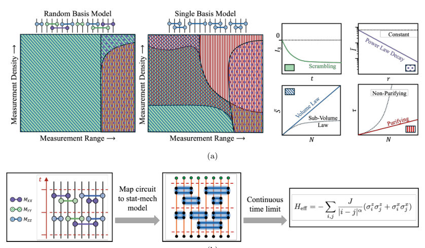
<figcaption class="paper-figure-caption"><b>Fig 1.</b> Figure 1. Overview of the central results. 1a The schematics of the phase diagrams for random-basis and single-basis circuit models with respect to measurement density and range obtained via Clifford circuit simulations. We obtain three and six different phases in random-basis and single-basis models, respectively. Each phase is depicted with a unique combination of scrambling, entanglement entropy, mutual information and purification properties. The markers to describe a phase are depicted in the legend plots right next to the phase diagram schematics: green, dotted-purple, blue diagonal stripes and red vertical stripes represent, respectively, a scrambling phase, power-law decaying mutual...</figcaption>
</figure>
<figure class="paper-figure-card">
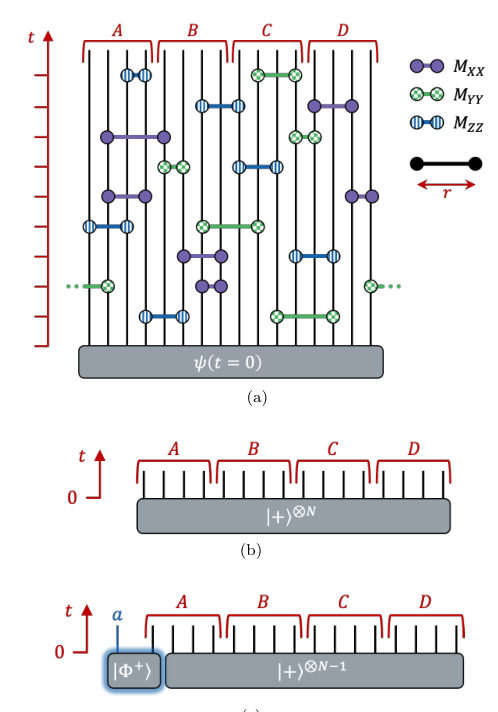
<figcaption class="paper-figure-caption"><b>Fig 2.</b> Figure 2. 2a The long-range measurement-only circuit setup in our Clifford circuit simulations. The entire circuit is di- vided into four equal subsystems, named from A to D. The circuit depth is depicted with a timeline marked by t on the left. A circuit layer is a time step where M2 many measure- ments are performed, and the circuit density in this schematic is M2/N = 2/16 = 1/8. In the random-basis measurement model, we sample the measurement basis randomly from the set {XiXj, YiYj, ZiZj} for each measurement within a time step, whereas in the single-basis measurement model, the measurement basis is set to be one of {XiXj, YiYj, ZiZj} for all measurements comprising one time step. The...</figcaption>
</figure>
<figure class="paper-figure-card">
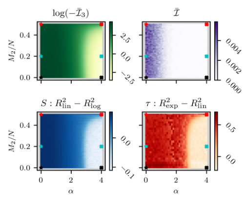
<figcaption class="paper-figure-caption"><b>Fig 3.</b> Figure 3. Phase diagrams for random-basis measurement scheme. Probabilistic measurement range decreases from left to right with increasing α, and circuit density M2/N increases from bottom to top. Top left plot: logarithm of negated tri- partite mutual information in the steady state. Top right plot: mutual information between two maximally distant qubits in the steady state. Bottom left plot: difference between fit- ting R2 values when steady state bipartite entropy data vs system size N is fit to a linear function and a logarithmic function. Positive regions (dark blue) indicate volume law en- tanglement (R2 lin &gt; R2 log) while negative regions (light blue) indicate sub-volume law...</figcaption>
</figure>
<figure class="paper-figure-card">
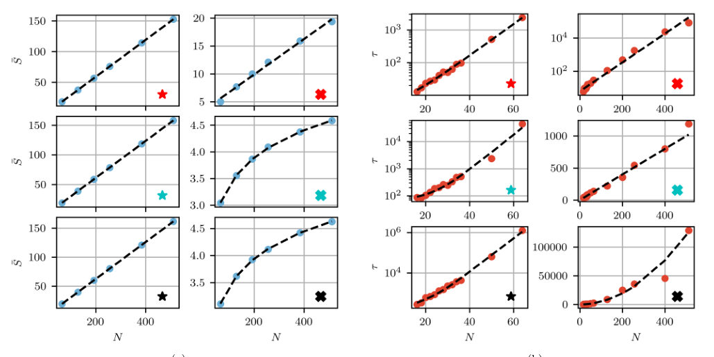
<figcaption class="paper-figure-caption"><b>Fig 4.</b> Figure 4. Here we examine six points across the random-basis phase diagram, as indicated by the matching marker and marker color in Fig. 3. Left column of 4a, 4b: long-range measurements (α = 0); right column of 4a, 4b: short-range measurements (α = 4); from bottom to top: circuit density increasing with values M2/N = 0.0, 0.2, 0.5. 4a: Steady state entanglement entropy vs system size. The data is accompanied by the best fit curve. For points in the long-range measurement regime and the maximally dense short-range limit, this is a linear function (volume-law entanglement), while for points with lower circuit density in the short-range measurement regime, this is a logarithmic function...</figcaption>
</figure>
<figure class="paper-figure-card">
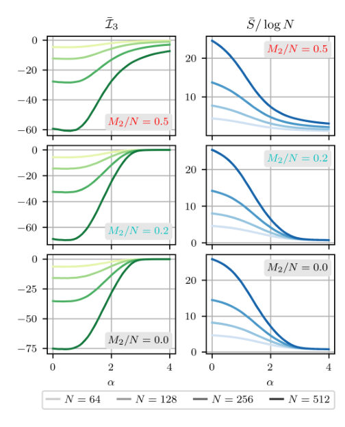
<figcaption class="paper-figure-caption"><b>Fig 5.</b> Figure 5. Steady state values of tripartite mutual information and entanglement entropy vs interaction range parameter α for three values of circuit density M2/N and N ranging from 64 (lightest curves) to 512 (darkest curves). Entropy values are weighted by log N to highlight the regions of critical en- tanglement growth for M2/N = 0.0, 0.2, where the curves collapse on each other. The curves of ¯I3 similarly appear to collapse on each other in this region, with values near zero. For the densest circuits (top row), no collapse is observed.</figcaption>
</figure>
<figure class="paper-figure-card">
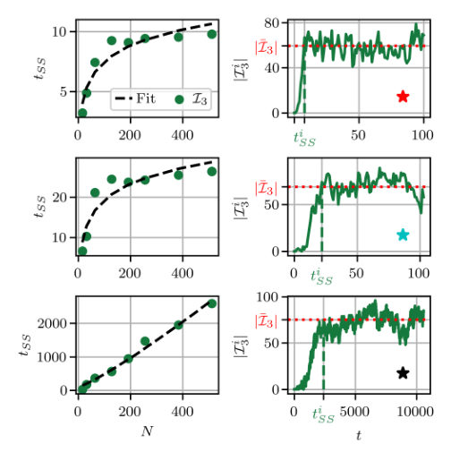
<figcaption class="paper-figure-caption"><b>Fig 6.</b> Figure 6. Time to steady state of tripartite mutual infor- mation for the random-basis circuit setup. Only α = 0 is considered (long-range measurement regime, where I3 ≪0), for three different circuit densities: M2/N = 0 (bottom), M2/N = 0.2 (middle), and M2/N = 0.5 (top). The left plots examine the trajectory averaged values of tSS vs system size, with the accompanying best fit curve: logarithmic for M2/N &gt; 0, and N log N for the M2/N = 0 limit. The right plots give a single trajectory example of |Ii 3| for N = 512, with the corresponding steady state value plotted horizon- tally in red with the dotted line and the computed value of ti SS plotted vertically with the dashed line.</figcaption>
</figure>
<figure class="paper-figure-card">
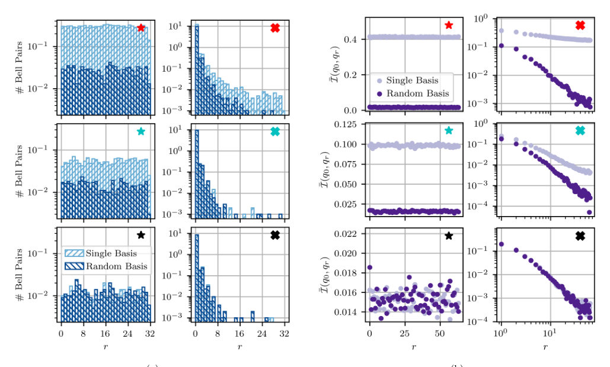
<figcaption class="paper-figure-caption"><b>Fig 7.</b> Figure 7. Here we consider six points across the parameter space, as indicated by the matching marker and marker color in Fig. 3. Both single-basis (light blue / purple) and random-basis (dark blue / purple) scenarios are considered and contrasted. Note that in the regime of the bottom plots (M2/N = 0), the single and random-basis cases are identical. 7a: Average number of Bell pairs observed in the final state of 1000 circuit trajectories. Data is arranged according to the distance between the maximally entangled qubits, with 1 ≤r ≤N/2 (N = 64). Number of Bell pairs increases with increasing circuit density, particularly for the single-basis case. Distribution over r is uniform for α = 0...</figcaption>
</figure>
<figure class="paper-figure-card">
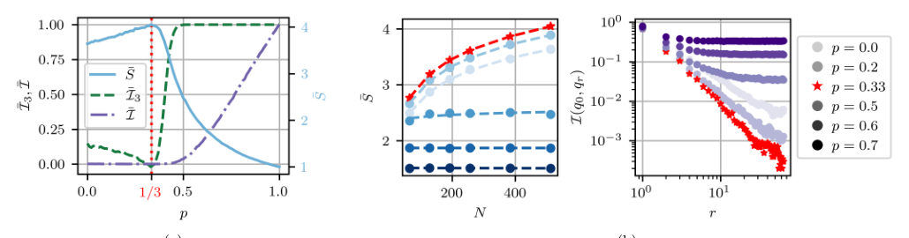
<figcaption class="paper-figure-caption"><b>Fig 8.</b> Figure 8. Projective XXZ model. Steady state values for TMI, mutual information, and entanglement entropy as a function of p for a system of size N = 512. The role of long-range order in the Ising-like phase, i.e., a circuit dominated by ZiZj, is played by the mutual information between two far away spins which is vanishing in the XY-like phase, i.e., a circuit with equally dominated by XiXj and YiYj. Note that the entanglement entropy is at its maximum at the transition point. This is also the only scrambling point in the phase space. 8b: The entanglement entropy with respect to system size (left) and the mutual information between qubit q0 and a qubit a distance r away is plotted as a...</figcaption>
</figure>
<figure class="paper-figure-card">
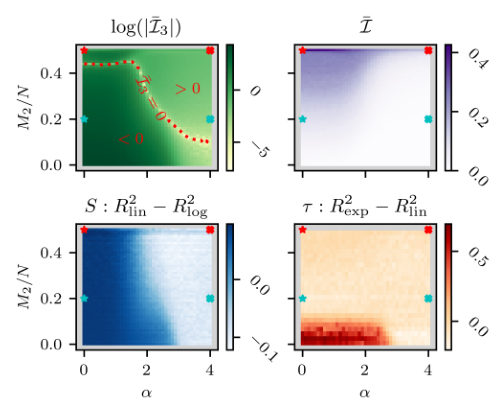
<figcaption class="paper-figure-caption"><b>Fig 9.</b> Figure 9. Phase diagrams for single-basis measurement scheme. Probabilistic measurement range decreases from left to right, and circuit density increases from bottom to top. Top left plot: steady state log of the absolute value of tri- partite mutual information. The sign of ¯I3 transitions from negative in the lower left to positive, as indicated by the over- laid text and zero contour line. Top right plot: steady state mutual information between two maximally distant qubits. Bottom left plot: difference between fitting R2 values when steady state bipartite entropy data vs system size N is fit to a linear function and a logarithmic function. Positive regions (dark blue) indicate volume law...</figcaption>
</figure>
<figure class="paper-figure-card">
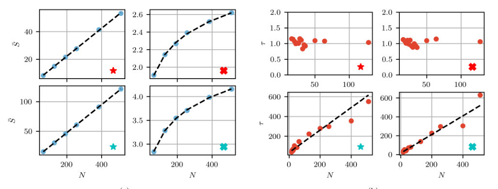
<figcaption class="paper-figure-caption"><b>Fig 10.</b> Figure 10. Here we examine four points across the single-basis phase diagram, as indicated by the matching marker and marker color in Fig. 9. Left column of 10a, 10b: long-range measurements (α = 0); right column of 10a, 10b: short-range measurements (α = 4); from bottom to top: circuit density increasing with values M2/N = 0.2, 0.5. 10a: Steady state entanglement entropy vs system size. The data is accompanied by the best fit curve. For points in the long-range measurement regime, this is a linear function (volume law entanglement), while for points in the short-range measurement regime, this is a logarithmic function (critical entanglement). 10b: Purification timescale τ vs system size....</figcaption>
</figure>

**Main problem.** Investigating how the range, density, and structure of measurements jointly shape entanglement, information scrambling, and purification in measurement-only circuits.

**Main result.** The study identifies a rich phase diagram including a novel phase with volume-law entanglement but no scrambling, and establishes a theoretical mapping between the circuit's steady state and a long-range XX Hamiltonian.

**Method.** Large-scale Clifford stabilizer simulations combined with a replica-based method that maps the 1+1D circuit to a 2D statistical mechanics model.

**Summary.** This paper explores the entanglement and information dynamics in 1D measurement-only circuits with long-range interactions. By using Clifford simulations and a statistical mechanics mapping, the authors uncover various phases characterized by different entanglement scaling and scrambling properties. Notably, they find a regime in dense, single-basis circuits where volume-law entanglement exists without information scrambling, alongside rapid purification. This discovery suggests a promising method for the efficient preparation of robust, highly entangled quantum resource states.

Detailed structure

**Model / system.** One-dimensional measurement-only Clifford circuits with two-qubit parity checks (XX, YY, ZZ) featuring power-law decaying interaction ranges.

**Key observables.** Entanglement entropy (volume-law, sub-volume law, area-law), tripartite mutual information (scrambling diagnostic), mutual information, and purification timescale.

**Important parameters / regimes.** Measurement range (alpha), measurement density per layer, and measurement basis structure (random-basis vs. single-basis).

**Assumptions / limitations.** Single-qubit Clifford gates are approximated by Haar-averaged unitaries; periodic boundary conditions are assumed.

**Figures summary.** Schematic phase diagrams for different protocols; a diagram illustrating the mapping to a 2D statistical mechanics model; and plots showing the spatial profiles of entanglement, mutual information, and tripartite mutual information.

**Paper structure.** The paper introduces measurement-only circuits, develops a statistical mechanics mapping for random-basis models, presents phase diagrams for both random and single-basis protocols, explores the effective XX Hamiltonian connection, and discusses the implications for state preparation.

**Why it may be interesting.** It provides a deep connection between measurement-induced phase transitions and classical statistical mechanics, while identifying a regime for efficient, non-scrambling preparation of highly entangled states.

Abstract

Measurement-only circuits provide a minimal setting in which repeated local projections can either generate or suppress many-body entanglement, giving rise to measurement-induced phase transitions and dynamical regimes, that might have no unitary counterpart. Here we investigate entanglement and information transitions in one-dimensional measurement-only Clifford circuits with long-range two-qubit parity checks. By tuning both the measurement range and density per layer, we uncover a broad set of phases whose classification requires probes beyond entanglement entropy, such as mutual information, tripartite mutual information, purification from an ancilla, and Bell-cluster statistics. We map phase diagrams using large-scale Clifford simulations for two protocols: a random-basis design in which each measurement is randomly chosen from $\lbrace XX,YY,ZZ \rbrace$, and a single-basis design in which the basis is fixed within each layer but varies between layers, hence introducing more structure to the circuit.   We map the trajectory-averaged entanglement entropy to a two-dimensional statistical mechanics model by extending a replica-based method to random-basis measurement-only circuits, and show that a continuous-time limit yields an effective long-range XX hamiltonian in the steady state. This connection links the observed volume-law to sub-volume-law entanglement transition to the boundary between a continuous symmetry broken phase and a critical XY phase. Strikingly, in structured (single-basis) circuits we find a phase in which volume-law and long-range entanglement coexists with rapid, size-independent purification of an ancilla qubit, and the absence of scrambling, highlighting measurement-only circuits as a promising route to efficiently preparing highly entangled and technologically useful quantum states.

[↑ back to top](#top)

### ⭐ [Anomalous Mean-Squared Displacement in Quantum Active Matter from a Wigner Phase-Space Framework](http://arxiv.org/abs/2604.22600v1)

**Highlighted author(s):** Giovanna Morigi  
**Authors:** Sangyun Lee, Yehor Tuchkov, Alexander P. Antonov, Benno Liebchen, Hartmut Löwen, Giovanna Morigi, Michael te Vrugt  
**Type:** theory · **Category:** statistical mechanics · **PDF:** <https://arxiv.org/pdf/2604.22600v1>  
**Analysis basis:** full PDF text, analyzed in chunks
**Topic relevance:** 🔥 `dissipative systems` **4/5** · 🔥 `non-equilibrium dynamics` **4/5** · 🔥 `Keldysh / 2PI / non-Gaussian methods` **3/5** · 🔥 `non-equilibrium universality` **3/5** · `methods for driven-dissipative` **2/5**

↔ Scroll figures horizontally

<figure class="paper-figure-card">
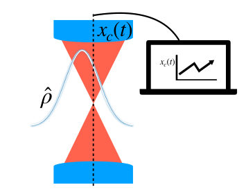
<figcaption class="paper-figure-caption"><b>Fig 1.</b> FIG. 1. Conceptual figure to illustrate the quantum active matter model from Ref. [23]. The Hamiltonian for this system is given by Eq. (18). The optical tweezer exert harmonic force on the quantum system, ˆρ. The computer generates activity term xc(t), and the center of the optical trap follows the generated trajectory Γc = {xc(t)}.</figcaption>
</figure>
<figure class="paper-figure-card">
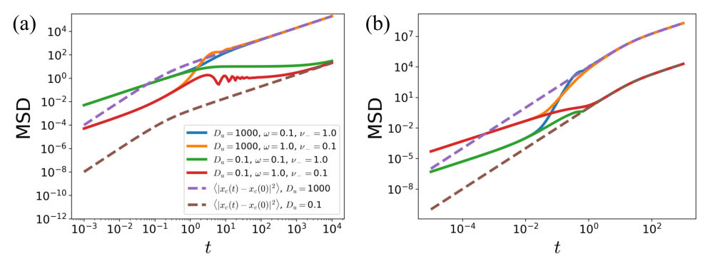
<figcaption class="paper-figure-caption"><b>Fig 2.</b> FIG. 2. Plot of MSD versus time of the quantum active particle with the initial conditions, Eq. (39). We varied Du, ω, ν−, and ν+ while fixing the ratio ν−to ν+ as 104. Two persistent time were considered: (a) τ = 0.1 case (b) τ = 10 case. The solid lines represent the MSDs with each parameter combinations. The dashed lines represent the MSD of xc(t). The same color coding is applied to both figures. All quantities in this and the following figures are shown in arbitrary units.</figcaption>
</figure>
<figure class="paper-figure-card">
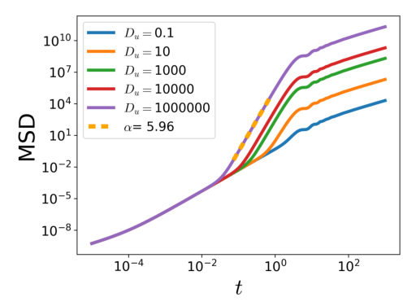
<figcaption class="paper-figure-caption"><b>Fig 3.</b> FIG. 3. Plot of MSD versus time of the quantum active particle with different Du. Du is varying from 0.1 to 106 Other parameters are chosen as follows: ω = 1.0, ℏ= 1.0, ν−= 10−4, ν+ = 10−8, and τ = 10. The dashed line represents tα where α = 5.9577... ± 0.00296. We set the mass and Planck constant to unity.</figcaption>
</figure>
<figure class="paper-figure-card">
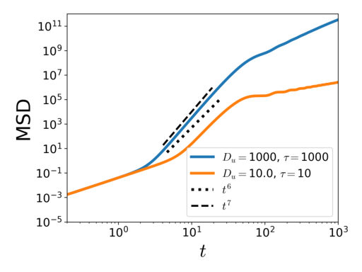
<figcaption class="paper-figure-caption"><b>Fig 4.</b> FIG. 4. Plot of MSD versus time of the quantum active particle with different persistent time and noise intensity for the activity. The blue solid line represents the case of long persistent time (τ = 1000) and high intensity (Du = 1000). The orange solid line represents the case of shorter persistent time (τ = 10) and lower intensity (Du = 10). The frequency of the quantum harmonic trap is chosen as ω = 0.08. The dissipation and pumping rates are ν−= 10−4 and ν+ = 10−8, respectively. We set the mass and Planck constant to unity.</figcaption>
</figure>
<figure class="paper-figure-card">
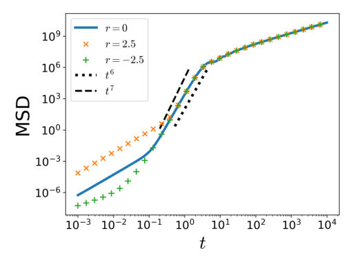
<figcaption class="paper-figure-caption"><b>Fig 5.</b> FIG. 5. Plot of MSD [Eq. (36)] versus time of the quantum active particle with three initial conditions. The initial distribution for classical variables are chosen as Eq. (39). The orange ‘×’ marker shows the result of initially squeezed state [Eq. (48)] with r = 2.5 and the green ‘+’ marker shows the results of initially squeezed state with r = −2.5. The solid line represents the unsqueezed case. We set ω = 1, Du = 1000 and τ = 1000. The other parameters are same as that is used for plotting Fig. 4, for which the behavior scales as t6.</figcaption>
</figure>
<figure class="paper-figure-card">
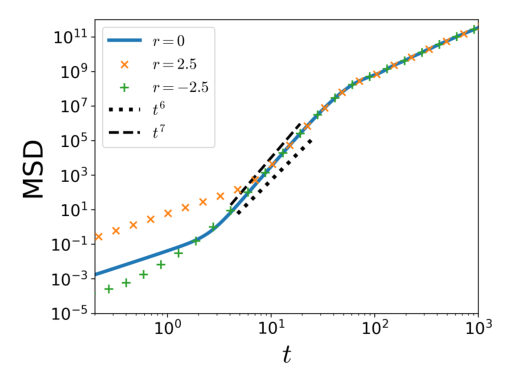
<figcaption class="paper-figure-caption"><b>Fig 6.</b> FIG. 6. Plot of MSD [Eq. (36)] versus time of the quantum active particle with three initial conditions. The initial distribution for classical variables are chosen as Eq. (45). The blue line represents the result for an initial ground state of a harmonic trap centered at xc = 0, which is the same result as in Fig. 4 (Du = 1000 and τ = 1000). The orange ‘×’ symbol represent the result with a squeezed initial state [Eq. (48)] of r = 2.5. The green ‘+’ symbol represents the result with squeezed initial state of r = −2.5. The frequency of the quantum harmonic trap is chosen as ω = 0.08. The dissipation and pumping rates are ν−= 10−4 and ν+ = 10−8, respectively. The persistent time τ for the...</figcaption>
</figure>
<figure class="paper-figure-card">
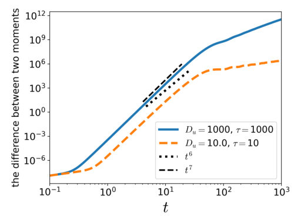
<figcaption class="paper-figure-caption"><b>Fig 7.</b> FIG. 7. Plot of the difference between two moments, ⟨ˆx2(t)⟩xc −⟨ˆx2(0)⟩xc, versus time of the quantum active particle. The blue solid line represents the case of long persistent time (τ = 1000) and high intensity (Du = 1000). The orange solid line represents the case of shorter persistent time (τ = 10) and lower intensity (Du = 10). The frequency of the quantum harmonic trap is chosen as ω = 0.08. The dissipation and pumping rates are ν−= 10−4 and ν+ = 10−8, respectively. We set the mass and Planck constant to unity.</figcaption>
</figure>
<figure class="paper-figure-card">
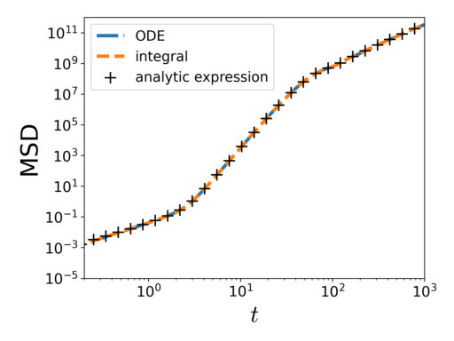
<figcaption class="paper-figure-caption"><b>Fig 8.</b> FIG. 8. Plot of MSD versus time of the quantum active particle calculated with three different methods. The blue line represents the result obtained by solving Eq. (G1). The orange line represents the result obtaind by numerically evaluating integral expression, Eq. (36). The cross symbol represents the analytically evaluated MSD; the explicit expression of MSD is omitted due to its complexity. The parameters all the same in Fig. 4 with Du = 1000 and τ = 1000.</figcaption>
</figure>
<figure class="paper-figure-card">
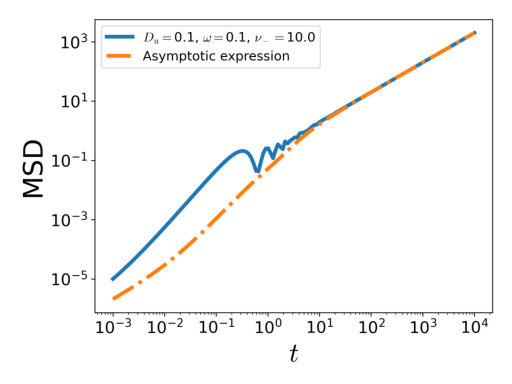
<figcaption class="paper-figure-caption"><b>Fig 9.</b> FIG. 9. Plot of MSD versus time of the quantum active particle. τ = 1. The dash-dot line represents the asymptotic expression (Eq. (I1)). The hierarchy between the three characteristic times is set to be τ ≫1/ω, 1/γ.</figcaption>
</figure>

**Main problem.** The paper investigates the extension of active matter concepts to the quantum regime, specifically focusing on the emergence and robustness of anomalous power-law scaling in the Mean-Squared Displacement (MSD).

**Main result.** The authors identify specific conditions for $t^6$ and $t^7$ anomalous scaling regimes in quantum active matter and demonstrate that these behaviors are robust against different initial quantum states.

**Method.** A hybrid Wigner phase-space framework is developed, utilizing a hybrid Wigner master equation and the Moyal product to map quantum dynamics onto a quasiclassical Langevin equation.

**Summary.** This paper explores how the principles of active matter—systems driven out of equilibrium by local energy influx—apply to quantum systems. By using a Wigner phase-space approach, the authors show that quantum active matter can exhibit much faster, anomalous diffusion (scaling as $t^6$ or $t^7$) than classical active matter. They demonstrate that these high-order power-law growths are robust and depend on the interplay between quantum fluctuations and the persistence of the active noise. This work establishes a new framework for studying non-equilibrium dynamics in quantum-controlled environments.

Detailed structure

**Model / system.** A quantum harmonic oscillator coupled to an Active Ornstein-Uhlenbeck Process (AOUP), where the trap center follows a classical stochastic trajectory driven by active noise.

**Key observables.** Mean-Squared Displacement (MSD) and two-time correlation functions.

**Important parameters / regimes.** Persistence time ($	au$), activity strength ($D_u$), harmonic frequency ($\omega$), dissipation/pumping rates ($
u_-, 
u_+$), and the squeezing parameter ($r$).

**Assumptions / limitations.** The mapping to a Langevin equation assumes the Wigner master equation is quadratic in derivatives and the initial condition is Gaussian; the $t^7$ scaling is found under specific initial conditions.

**Figures summary.** Figure 2 shows MSD trajectories for different persistence times; Figure 3 demonstrates $t^6$ scaling; Figure 7 compares different MSD definitions to show stability; Figure 8 compares three different numerical/analytical methods for calculating MSD; Figure 9 compares exact MSD results with asymptotic forms.

**Paper structure.** The paper introduces the problem of quantum active matter, develops a hybrid Wigner phase-space framework, derives the master equation and its quasiclassical Langevin mapping, analyzes specific scaling regimes ($t^6, t^7$) and oscillatory dynamics, examines the impact of initial state squeezing, and provides mathematical proofs for the Moyal product and expectation value equivalence in the appendices.

**Why it may be interesting.** It provides a rigorous theoretical bridge between classical active matter and open quantum systems, offering new insights into how non-equilibrium driving can lead to extreme anomalous diffusion in quantum-controlled systems like optical tweezers.

Abstract

Active matter is driven out of equilibrium by a local influx of energy. While classical active matter has been extensively studied, the extension of active matter concepts to quantum systems has been explored far less. In this work we develop a full quantum description based on the Wigner function. By introducing a hybrid Wigner master equation that incorporates classical active motion and quantum degrees of freedom, we compute the quantum mean-squared displacement (MSD) using established techniques from classical active matter. We analytically derive the time dependence of the MSD and clarify the conditions under which the characteristic scaling with time $\mathrm{MSD}\sim t^{6}$ emerges. We further show that, for certain parameter and initial conditions, the MSD can exhibit an even steeper scaling regime $\mathrm{MSD}\sim t^{7}$, and we examine the robustness of these behaviors against quantum fluctuations of the initial state.

[↑ back to top](#top)

### [Thermometry for a Kagome Lattice Dipolar Rydberg Simulator](http://arxiv.org/abs/2604.22743v1)

**Authors:** Erik Fitzner, Igor Lesanovsky, Björn Sbierski  
**Type:** both · **Category:** other · **PDF:** <https://arxiv.org/pdf/2604.22743v1>  
**Analysis basis:** full PDF text, analyzed in chunks
**Topic relevance:** 🔥 `Rydberg arrays` **5/5** · 🔥 `analog quantum simulation` **4/5** · 🔥 `exotic spin models in light-matter` **4/5** · 🔥 `QC/QI experiment` **3/5** · `entanglement & information structure` **2/5** · `non-equilibrium dynamics` **2/5** · `quantum measurements` **2/5**

↔ Scroll figures horizontally

<figure class="paper-figure-card">
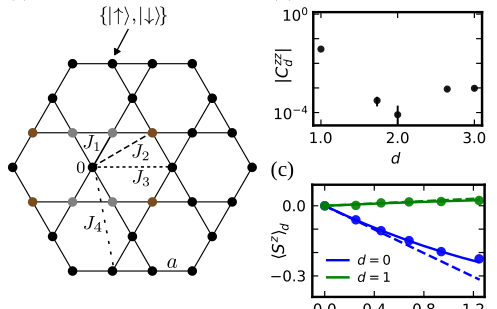
<figcaption class="paper-figure-caption"><b>Fig 1.</b> FIG. 1. (a) Rydberg atoms (dots) are arranged in a Kagome lattice using optical tweezers. For the correlations computed in this work, we consider an infinite lattice N →∞and trun- cate the dipolar interaction beyond fourth-nearest neighbors, leading to an effective J1 −... −J4 model. Representative interactions J1 = J (solid), J2 (dashed), J3 (dotted), and J4 (sparsely dotted) are indicated. Sites at distances d = 1 and d = √</figcaption>
</figure>
<figure class="paper-figure-card">
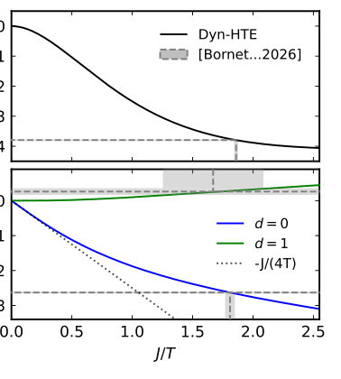
<figcaption class="paper-figure-caption"><b>Fig 2.</b> FIG. 2. Top: Nearest-neighbor equal-time zz-correlator Czz 1 as a function of J/T. By comparison with the experimen- tal value from panel Fig. 1(b), shown as a horizontal dashed line, a corresponding temperature of J/T = 1.85(2) can be estimated. Gray regions indicate error bounds. Bottom: Distance resolved static zz-susceptibilities χzz d as a function of J/T. The experimental linear response susceptibilities χzz d from Fig. 1(c) (horizontal dashed lines) correspond to J/T = 1.81(4) and J/T = 1.7(4), respectively. The theoret- ical Dyn-HTE data shown in both panels represent the [4,4] Pad´e approximants which agree well with the [3,5], [3,4], and [3,3] approximants (not shown) and can thus...</figcaption>
</figure>
<figure class="paper-figure-card">
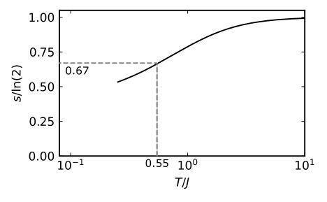
<figcaption class="paper-figure-caption"><b>Fig 3.</b> FIG. 3. Entropy per spin s of the dipolar XY model (1) on the infinite Kagome lattice obtained from an order six HTE of the free energy with well-converged interaction cutoff range rmax = 10 [cf. App. B]. Here data based on a stable [3,3] Pad´e approximant is shown. The dashed lines indicate the temperature obtained from thermometry in Fig. 2 and the associated entropy. Gray regions indicate error bounds.</figcaption>
</figure>
<figure class="paper-figure-card">
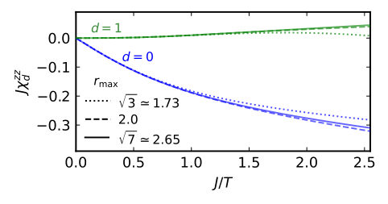
<figcaption class="paper-figure-caption"><b>Fig 4.</b> FIG. 4. Local (blue) and nearest-neighbor (green) static zz susceptibilities computed with Dyn-HTE for different truncation ranges (rmax = √</figcaption>
</figure>
<figure class="paper-figure-card">
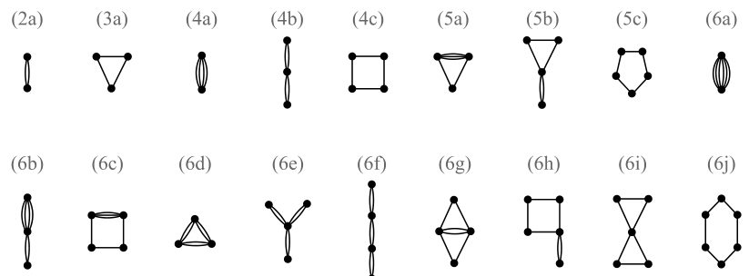
<figcaption class="paper-figure-caption"><b>Fig 5.</b> FIG. 5. All topologically distinct connected graphs with order n ≤6 that yield a nonvanishing contribution to Eq. (B7).</figcaption>
</figure>

**Main problem.** Developing an accurate thermometry protocol to determine temperature and entropy in Rydberg atom tweezer arrays, specifically for frustrated Kagome lattice systems where traditional numerical methods like QMC suffer from the sign problem.

**Main result.** The study estimates a temperature of T=0.55J and entropy of S/N=0.67 ln2, concluding that current experimental temperatures are too high to reach the predicted quantum spin liquid regime.

**Method.** A combination of experimental measurements of correlations and local susceptibility with a theoretical Dynamic High-Temperature Expansion (Dyn-HTE) up to 8th order.

**Summary.** This paper proposes a new method for measuring temperature and entropy in Rydberg atom quantum simulators. By combining experimental spin correlations with a high-temperature expansion theory, the authors analyze a Kagome lattice experiment. They find that the current experimental temperature is significantly higher than what is needed to observe quantum spin liquid physics. This work provides a way to quantify how close experimental platforms are to highly entangled quantum phases.

Detailed structure

**Model / system.** An anti-ferromagnetic dipolar spin-1/2 XY model realized on a 2D Kagome lattice of 114 Rubidium-87 atoms in Rydberg tweezer arrays.

**Key observables.** Nearest-neighbor equal-time zz correlator (Czz1), local zz spin susceptibility (zz0), and distance-resolved static zz susceptibility (zzd).

**Important parameters / regimes.** Coupling strength J approx 2pi x 0.77 MHz, nearest-neighbor distance a = 12 micrometers, and interaction decay 1/r^3.

**Assumptions / limitations.** The system is in a thermal state; the interaction is truncated to a 4th-nearest neighbor model for theoretical calculations; use of Padé approximants for series convergence.

**Figures summary.** Fig 2 shows experimental correlators and susceptibilities compared to theoretical predictions; Fig 3 displays entropy per spin as a function of temperature; Fig 4 shows convergence tests for interaction truncation; Fig 5 illustrates the diagrammatic expansion graphs.

**Paper structure.** The paper introduces the thermometry challenge, describes the Kagome Rydberg platform and XY model, details the Dyn-HTE method and expansion orders, presents temperature and entropy results, and concludes with implications for reaching the QSL regime.

**Why it may be interesting.** It provides a critical diagnostic tool (thermometry) for Rydberg simulators and addresses the fundamental difficulty of characterizing thermalization and entropy in frustrated quantum many-body systems.

Abstract

We propose an accurate thermometry approach for Rydberg atom tweezer arrays combining data from correlation and local susceptibility measurements with a theoretical high-temperature expansion method for dynamic spin correlations. We apply our approach to a recent quantum simulation experiment [Bornet et al., arXiv 2602.14323] realizing an anti-ferromagnetic dipolar spin-1/2 XY model on the Kagome lattice. We obtain T=0.55J and S/N=0.67 ln2 for temperature and entropy respectively, showing that further experimental efforts are required to reach the putative quantum spin liquid regime.

[↑ back to top](#top)

### [Decohered color code and emerging mixed toric code by anyon proliferation: Topological entanglement negativity perspective](http://arxiv.org/abs/2604.22521v1)

**Authors:** Keisuke Kataoka, Yoshihito Kuno, Takahiro Orito, Ikuo Ichinose  
**Type:** theory · **Category:** quantum information and computing · **PDF:** <https://arxiv.org/pdf/2604.22521v1>  
**Analysis basis:** full PDF text, analyzed in chunks
**Topic relevance:** 🔥 `dissipative systems` **4/5** · 🔥 `entanglement & information structure` **4/5** · 🔥 `driven-dissipative phase transition` **3/5** · `correlated / nonlocal dissipation` **2/5** · `methods for driven-dissipative` **2/5** · `non-equilibrium dynamics` **2/5** · `non-equilibrium universality` **2/5**

↔ Scroll figures horizontally

<figure class="paper-figure-card">
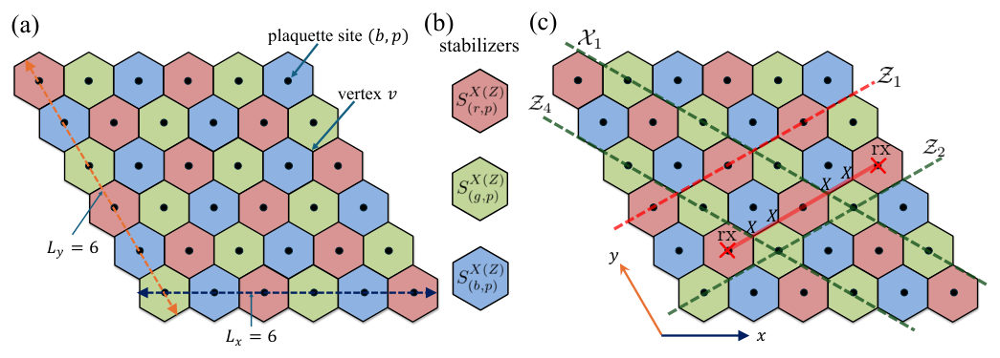
<figcaption class="paper-figure-caption"><b>Fig 1.</b> FIG. 1. Schematic image of color code system. (a) Image of the lattice and the definitions of plaquette site, vertex and length of the system in this honeycomb lattice. The qubit resides on the vertex v. When we take this parallelogram-shaped honeycomb lattice and impose periodic boundary conditions (corresponding to torus geometry) by identifying the top with the bottom and the left with the right. The system becomes a honeycomb torus lattice with Lx = Ly = 6. (b) Three colored stabilizers. The plaquette stabilizer are classified into three color; red, green and blue. The Pauli operator X or Z are resided on each corners (corresponding to the vertex) of the hexagon. These plaquette...</figcaption>
</figure>
<figure class="paper-figure-card">
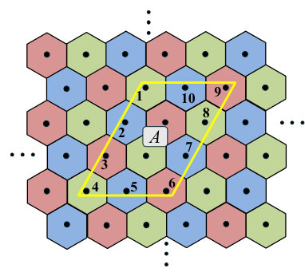
<figcaption class="paper-figure-caption"><b>Fig 2.</b> FIG. 2. The color-code system for the analytical calculation of the negativity NA without decoherences. The yellow parallelogram rep- resents the boundary of the subsystem A. The total 20 plaquette Z and X stabilizers are on the boundary.</figcaption>
</figure>
<figure class="paper-figure-card">
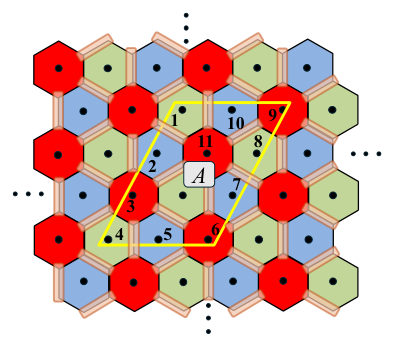
<figcaption class="paper-figure-caption"><b>Fig 3.</b> FIG. 3. The color-code system for the analytical calculation of the negativity NA. We appliy the maximal decoherence EXX. The yel- low parallelogram represents the boundary of the subsystem A. The elongated orange blocks on the red links represent the decoherence EXX (vr,v′r). In addition, the bright red plaquettes indicate that they are merged together into a single large stabilizer generator due to this orange decoherence EXX.</figcaption>
</figure>
<figure class="paper-figure-card">
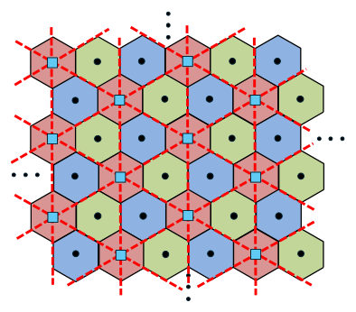
<figcaption class="paper-figure-caption"><b>Fig 4.</b> FIG. 4. The emergent triangular lattice on the color-code system. The right-blue square symbols residing on the centers of the red pla- quettes denote the sites of the triangular lattice. The links are rep- resented by the red-dashed lines corresponding to the triangular TC lattice.</figcaption>
</figure>
<figure class="paper-figure-card">
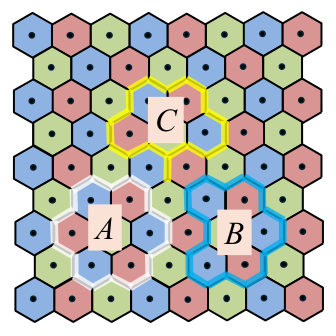
<figcaption class="paper-figure-caption"><b>Fig 5.</b> FIG. 5. Subsystem complex used for calculation of the TEN. Bound- ary vertices for each subsystem reside on the sites on the boundary lines of the honeycomb lattice colored with while, blue and yellow. Three boundaries do not share any sites in order to avoid overlaps. Displayed subsystems are the smallest ones for the calculation. We expand those by keeping their hexagonal shapes composed of centers of boundary plaquettes for constructing larger subsystems. The A- subsystem contains seven plaquettes. Representatively, we call the shape of the subsystems for the calculation of TEN 7-plaquette.</figcaption>
</figure>
<figure class="paper-figure-card">
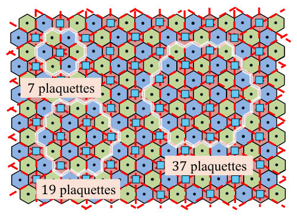
<figcaption class="paper-figure-caption"><b>Fig 6.</b> FIG. 6. Three kinds of A-subsystems used for calculation of the TEN, represented by hexagonal region. These are consisting of 7 plaquettes, 19 plaquettes and 37 plaquettes, respectively. For each choice of the subsystem A, the subsystems B and C are accompanied with it in the same manner as in Fig. 5.</figcaption>
</figure>
<figure class="paper-figure-card">
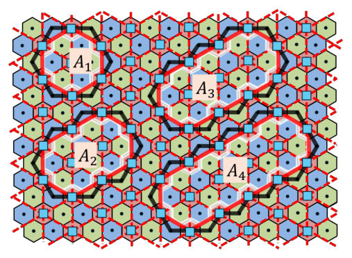
<figcaption class="paper-figure-caption"><b>Fig 7.</b> FIG. 8. Setting of the subsystems for the calculation of NA; Subsys- tems A1, A2, A3 and A4 in the color code honeycomb lattice. Zigzag lines (the black-solid lines) surrounding the subsystems represent boundaries and their lengths are used for the scaling law Eq. (28) for the color code, and practically, the boundary length |∂Ai| = 12, 16, 20 and 24, respectively. The scaling law gives c = 1 and γN = 2. Straight lines (the red-solid lines) represent the boundaries of sub- systems A1 ∼A4 from the triangular-lattice view. From the per- spective of the emergent triangular lattice in the TC limit, sites of which are located on the red plaquettes as in Fig. 4, each subsystem can be regarded as...</figcaption>
</figure>
<figure class="paper-figure-card">
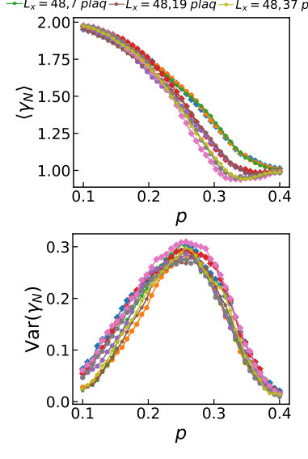
<figcaption class="paper-figure-caption"><b>Fig 8.</b> FIG. 7. (Upper panel) The value of TEN, ⟨γN⟩, as a function of p. The data of all the sizes exhibit a smooth change from the color code value 2 (in unit ln 2) to that of the TC, unity. (Lower panel) Variance of the TEN. The data show a rather large peak from p ∼ 0.1 to 0.4 without clear subsystem-size dependence. In both panels, we plot the data for the 7-plaquette, 19-plaquette, and 32-plaquette configurations explained in Fig. 6 and we set Lx = Ly = 24, 36 and 48. The number of samples is O(103).</figcaption>
</figure>
<figure class="paper-figure-card">
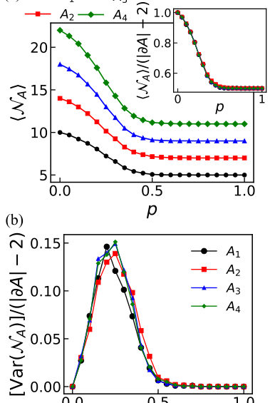
<figcaption class="paper-figure-caption"><b>Fig 9.</b> FIG. 9. (a) Calculations of ⟨NA⟩as a function of p. Inset: ⟨NA⟩is normalized divided by (|∂Ai|−2) as in the color code, NA = |∂A|− 2. It is also expected that for the TC limit, NA = |∂A|TC −1 = 1 2(|∂A|−2) suggesting this normalization. Obtained numerical data of ⟨NA⟩obviously support this scaling law. (b) Sample-to-sample variance of NA divided by (|∂Ai| −2).</figcaption>
</figure>

**Main problem.** The study investigates how local decoherence transforms a color code into an intrinsic mixed-state topological order (imTO) and seeks to characterize this transition using entanglement diagnostics.

**Main result.** The authors demonstrate that the decohered color code emerges as a mixed toric code, characterized by a smooth crossover in topological entanglement negativity (TEN) from 2 ln 2 to ln 2, and show that TEN is a stable, shape-independent observable for such transitions.

**Method.** The researchers use the stabilizer formalism and the Gottesman-Aaronson algorithm for large-scale numerical simulations, combined with an analytical 'gauging out' procedure to identify the emergent anyon theory.

**Summary.** This paper explores how local noise affects the topological properties of the color code. It shows that decoherence leads to the emergence of a mixed-state toric code through the proliferation of anyons. By using topological entanglement negativity (TEN), the authors demonstrate that this transition is a smooth crossover rather than a sharp phase transition. They also prove that TEN is a robust and stable measure for tracking topological evolution in noisy systems.

Detailed structure

**Model / system.** The system is a 2D color code on a honeycomb lattice on a torus, subjected to a stochastic XX-type decoherence channel acting on the red links of the lattice.

**Key observables.** Topological entanglement negativity (TEN), entanglement negativity, logarithmic purity, and anyon content/proliferation.

**Important parameters / regimes.** Decoherence strength (p), system size (Lx, Ly), and subsystem geometry (hexagonal partitions).

**Assumptions / limitations.** The analysis assumes an Abelian theory for defining the quotient group and focuses on the specific XX-type decoherence model.

**Figures summary.** Figures illustrate the honeycomb lattice and color scheme, the process of anyon creation via decoherence, the emergence of the triangular lattice, and numerical plots showing the smooth decrease of TEN and the peak in its variance during the crossover.

**Paper structure.** The paper introduces the color code decoherence model, analytically describes the emergence of the mixed toric code via anyon proliferation, presents numerical simulations of the transition using TEN, and concludes with a stability analysis of the TEN observable.

**Why it may be interesting.** This paper is highly relevant for researchers in open quantum systems as it provides a new diagnostic tool (TEN) to identify and characterize topological order in the presence of noise, specifically studying the transition from pure to mixed-state topological order.

Abstract

We study how the color code under decoherence gives rise to an intrinsic mixed-state topological order (imTO), which has no counterpart in pure ground states of local gapped Hamiltonians. For decoherence induced by XX-type operators on red links of the honeycomb lattice, we show that the resulting mixed state inherits half of the topological properties of the color code, including anyon content, logical operators, and topological entanglement structure. Using a gauging procedure for mixed stabilizer states, we identify the emergent phase as closely related to a single toric code. We characterize this phase by topological entanglement negativity (TEN) and perform efficient stabilizer-formalism simulations. While the pure color code has ${\rm TEN} = 2 \ln 2$, the maximally decohered state has ${\rm TEN} = \ln 2$, indicating emergence of a single toric code. By tuning the decoherence strength, we find a smooth crossover in TEN accompanied by a pronounced, nearly system-size-independent peak in its variance. We further show that the negativity exhibits characteristic scaling only for subsystem partitions commensurate with the triangular lattice of the emergent toric code. Our results demonstrate that negativity-based quantities provide powerful probes of mixed-state topological order generated by decoherence.

[↑ back to top](#top)

### [Quantum limits on squeezing](http://arxiv.org/abs/2604.22500v1)

**Authors:** Xin Zhou, Francesco Massel  
**Type:** theory · **Category:** other · **PDF:** <https://arxiv.org/pdf/2604.22500v1>  
**Analysis basis:** full PDF text, analyzed in chunks
**Topic relevance:** 🔥 `dissipative systems` **4/5** · 🔥 `correlated / nonlocal dissipation` **3/5** · 🔥 `entanglement & information structure` **3/5** · `Tavis-Cummings & cavity-many-emitter` **2/5** · `methods for driven-dissipative` **2/5** · `non-equilibrium dynamics` **2/5** · `quantum measurements` **2/5**

↔ Scroll figures horizontally

<figure class="paper-figure-card">
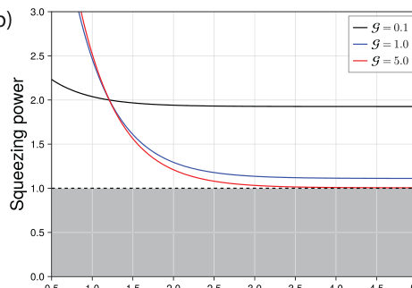
<figcaption class="paper-figure-caption"><b>Fig 1.</b> Figure 1. Squeezing power two-mode purely dissipative setup, as a function of 𝒢= √𝐺2 −−𝐺2 + for different values of 𝜉= arctanh[𝐺+/𝐺−] (a) and as a function of 𝜉for different values of 𝒢 .</figcaption>
</figure>
<figure class="paper-figure-card">
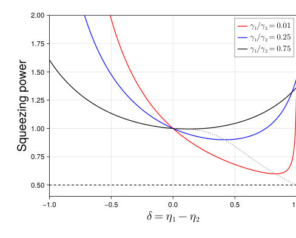
<figcaption class="paper-figure-caption"><b>Fig 2.</b> Figure 2. Squeezing power in the presence of degenerate para- metric terms. The dotted line corresponds to the minimum attainable squeezing power as a function of Δ = 𝜂1 −𝜂2 for different values of ratio 𝛾1/𝛾2.</figcaption>
</figure>
<figure class="paper-figure-card">
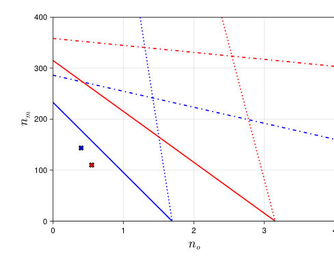
<figcaption class="paper-figure-caption"><b>Fig 3.</b> Figure 3. Entanglement limits for the experimental parame- ters of [27]. The red and blue curves correspond to the sep- arability boundary for dataset A and B of [27], respectively. Continuous lines depict the boundary for the parameters used in the experiment 𝒢= 𝒢𝑒𝑥𝑝, dotted lines indicate the bound- ary for 𝒢= 𝒢𝑜𝑝𝑡(with 𝜉= 𝜉𝑒𝑥𝑝), and dash-dotted lines cor- respond to 𝒢= 𝒢𝑒𝑥𝑝and 𝜉= 2𝜉𝑒𝑥𝑝. The crosses indicate the actual population of the baths in the experiment.</figcaption>
</figure>

**Main problem.** Determining the fundamental quantum limits on the amount of squeezing achievable in bosonic networks subject to canonical commutation relations and stability constraints.

**Main result.** The authors establish that for purely dissipative two-mode squeezing, the sum of normalized quadrature variances is bounded below by 1, but this bound can approach 1/2 when local parametric driving is added.

**Method.** The study uses input-output theory, Bogoliubov transformations, and the Lyapunov equation to analyze the 'commutator budget' and noise-gain balance in linear time-invariant quantum systems.

**Summary.** This paper investigates the fundamental limits on how much squeezing can be achieved in networks of bosonic modes. It demonstrates that the canonical commutation relations and system stability impose a strict 'noise budget' that prevents infinite squeezing. While purely dissipative schemes have a lower bound of 1 for normalized squeezing power, adding parametric driving can lower this limit toward 1/2. These findings are directly applicable to improving the performance of electromechanical and nanomechanical quantum sensors.

Detailed structure

**Model / system.** A network of N bosonic modes (such as cavity optomechanics or electromechanics) coupled to external Markovian baths, including specific models for two-mode and three-mode systems.

**Key observables.** Steady-state quadrature variances, squeezing power (sum of normalized mode-optimal quadrature variances), and the Duan inseparability criterion.

**Important parameters / regimes.** Strong-coupling limit, stability region, transfer parameter (eta_e), and the presence of degenerate parametric driving.

**Assumptions / limitations.** The framework assumes Markovian baths, linear time-invariant dynamics, and the rotating-wave approximation (RWA) for the three-mode description.

**Figures summary.** Figure 1 shows squeezing power as a function of coupling and parameters; Figure 2 shows squeezing power as a function of the difference in parametric driving strengths.

**Paper structure.** The paper introduces the problem of squeezing limits, develops a mathematical framework based on commutation relations, analyzes two-mode and three-mode systems, and discusses experimental implications.

**Why it may be interesting.** It provides fundamental, model-independent bounds on squeezing and entanglement based on the algebraic structure of quantum mechanics, which is highly relevant to the control of open quantum systems and optomechanical networks.

Abstract

In our work, we show how, for a network of bosonic modes, canonical commutation relations constrain the coefficients relating input and internal modes. Based on these constraints, we derive a lower bound on the total steady-state squeezing achievable in reservoir-engineered (dissipative) squeezing schemes, quantified by the sum of mode-optimal quadrature variances normalized to its corresponding input variance. The bound follows solely from canonical commutation relations and stability, and is saturated in the strong-coupling limit at 1. Furthermore, we show that adding independent parametric driving terms for each mode changes the quantum noise-gain balance and yields a distinct optimum bound, approaching 1/2. In addition, we show how these constraints allow us to reformulate the Duan inseparability criterion for a three-mode bosonic system in terms of a single parameter-dependent figure of merit. Our results apply directly to current electromechanical and nanomechanical experiments and indicate that the two-mode bounds can be experimentally approached even at room temperature.

[↑ back to top](#top)

### [Programming long-range interactions in analog quantum simulators](http://arxiv.org/abs/2604.22483v1)

**Authors:** Cristian Tabares, Alberto Muñoz de las Heras, Jan T. Schneider, Alejandro González-Tudela  
**Type:** theory · **Category:** other · **PDF:** <https://arxiv.org/pdf/2604.22483v1>  
**Analysis basis:** full PDF text, analyzed in chunks
**Topic relevance:** 🔥 `analog quantum simulation` **4/5** · 🔥 `Rydberg arrays` **3/5** · 🔥 `exotic spin models in light-matter` **3/5** · 🔥 `non-equilibrium dynamics` **3/5** · `entanglement & information structure` **2/5** · `scars & prethermalization` **2/5**

↔ Scroll figures horizontally

<figure class="paper-figure-card">
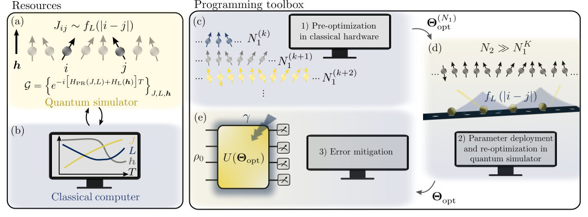
<figcaption class="paper-figure-caption"><b>Fig 1.</b> Figure 1. (a) Quantum resource: evolution under programmable-range (PR) Hamiltonians with on-site drivings HL(h) and tunable-range interactions HPR(J, L), whose spatial profile is set by fL(|i −j|). These operations define a gate set G used to construct parametrized quantum circuits. (b) Classical resource: pre- and post-processing techniques to calculate the optimal pulses to be implemented in the simulator using the hybrid workflow combining classical and quantum resources described in panels (c-e). (c) Pre-optimization in classical hardware, where circuit parameters are optimized in small systems Θ(N1) opt and iteratively extrapolated to larger sizes. (d) Deployment on quantum hardware...</figcaption>
</figure>
<figure class="paper-figure-card">
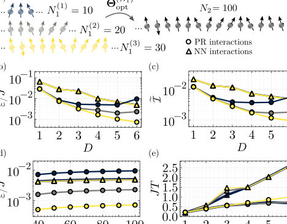
<figcaption class="paper-figure-caption"><b>Fig 2.</b> Figure 2. (a) Scheme of the protocol used to obtain the op- timal parameters, Θ(N1) opt , for approximating the ground state of the TFIM. We optimize the circuits in easier to simulate systems with N1 = 10 (dark blue), 20 (light gray) and 30 spins (yellow), and then use these parameters to prepare the ground state of a N2 = 100 spins (dark gray). (b-c) Residual energy and infidelity per site, respectively, as a function of the circuit depth for different training sizes N1 and the same target size N2, comparing exponentially-decaying PR (circles) and NN (triangles) interactions. (d) Residual energies for a D = 6 layers circuit as a function of the system size N2 for the different circuits...</figcaption>
</figure>
<figure class="paper-figure-card">
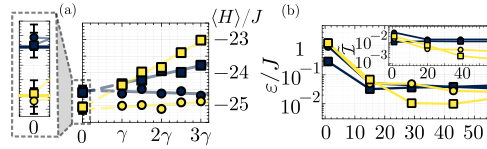
<figcaption class="paper-figure-caption"><b>Fig 3.</b> Figure 3. (a) ZNE calculation to mitigate the effects of noise and estimate ⟨HTFIM⟩, for a N1 = 20 and g/J = 1. Con- sidering M = 10000 shots per observable and two different values of the noise γ/J, the energy can be measured for dif- ferent effective noise strengths, enabling an extrapolation to the zero noise limit. Inset: zoom of the extrapolation, with error bars as the standard deviation of the fit and solid lines representing each noiseless value. (b) Quantum-classical op- timization using the optimal parameters found for a N1 = 16 TFIM, deployed into a N2 = 36 TFIM. To model an exper- iment, we use a global depolarizing channel of the different amplitudes considered in panel (a),...</figcaption>
</figure>
<figure class="paper-figure-card">

<figcaption class="paper-figure-caption"><b>Fig 4.</b> Fig. 3(a) by illustrating the ZNE procedure for the tar- get TFIM with N1 = 20 spins assuming still a perfect control of the resource Hamiltonian parameters. The op- timal parameters Θopt, obtained in the noiseless case for D = 1 and D = 3 layers (blue and yellow, respectively), are used to evaluate the energy ⟨HTFIM⟩in the presence of global depolarizing noise applied after each interaction layer. This type of channel is a simple yet good approx- imation for modelling the effects of decoherence in ana- log quantum dynamics [95–97]. For each infinitesimal timestep in the quantum evolution under a certain uni- tary U, this channel considers that the quantum state ρ is mapped onto the...</figcaption>
</figure>
<figure class="paper-figure-card">
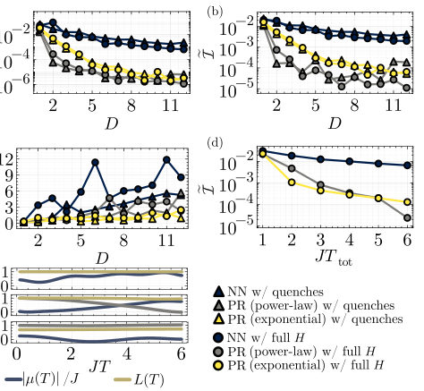
<figcaption class="paper-figure-caption"><b>Fig 5.</b> Figure 4. (a-b) Residual energies and infidelities per site, re- spectively, in a Kitaev chain with N2 = 1000 modes after obtaining the optimal parameters in a N1 = 200 one. We compare circuits built with NN (dark blue) and PR with ex- ponential (light gray) and power-law (yellow) decay. We also depict the results obtained with a full Hamiltonian evolution (triangle) and the ones obtained with individual quenches (circles). (c) Total interaction time of the optimal circuits in panels (a-b), in units of the inverse interaction parameter J−1. (d) Infidelity per site in a N2 = 1000 modes Kitaev chain after obtaining the optimal parameters using quantum optimal control for different total pulse...</figcaption>
</figure>
<figure class="paper-figure-card">
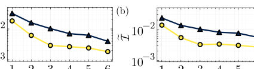
<figcaption class="paper-figure-caption"><b>Fig 6.</b> Figure 5. (a-b) Residual energy [(a)] and infidelity [(b)] per site as a function of the circuit depth, comparing PR and NN interactions for the spin−1 BC model with h/J = 1.1 and D/J = 0.3135. The system is pre-optimized for training sizes N1 ∈{10, 15, 20, 25} and the results shown are evaluated for N2 = 50 spins.</figcaption>
</figure>
<figure class="paper-figure-card">
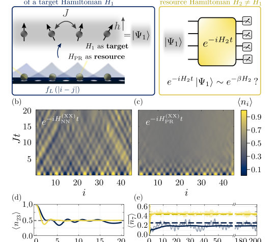
<figcaption class="paper-figure-caption"><b>Fig 7.</b> Figure 6. (a) Experimental protocol: the ground state |Ψ1⟩ of a target Hamiltonian H1 is prepared using the PR toolbox, and subsequently quenched under a different Hamiltonian H2 to study its dynamics. (b-c) Time evolution of site occupa- tions ni after quenching the ground state of the AAH model (α = ( √</figcaption>
</figure>

**Main problem.** Analog quantum simulators are often limited by fixed-connectivity architectures and limited Hamiltonian tunability, which hinders efficient many-body state preparation and the study of complex dynamics.

**Main result.** The authors demonstrate that programmable long-range (PR) interactions significantly outperform nearest-neighbor architectures, providing orders-of-magnitude improvements in fidelity and energy estimation for systems up to 1000 particles.

**Method.** A hybrid classical-quantum toolbox using classical pre-compilation on small systems, iterative extrapolation to larger sizes, and quantum hardware-based re-optimization combined with Zero-Noise Extrapolation (ZNE).

**Summary.** This paper introduces a method to leverage programmable long-range interactions in analog quantum simulators to enhance many-body state preparation. By using a hybrid approach of classical pre-compilation and quantum re-optimization, the authors show that long-range connectivity allows for much higher fidelity and lower energy error compared to standard nearest-neighbor models. The strategy scales effectively to systems of up to 1000 particles and can be used to study complex phenomena like many-body thermalization. This approach turns interaction range into a powerful tool for next-generation quantum simulation.

Detailed structure

**Model / system.** The study utilizes programmable-range Hamiltonians (exponential and power-law decay) applied to various models including the Transverse Field Ising Model (TFIM), Spin-1 Blume-Capel, Kitaev chains, and the Aubry-André-Harper (AAH) model, relevant to platforms like trapped ions, Rydberg atoms, and waveguide/cavity QED.

**Key observables.** Residual energy density, infidelity density, energy estimation, and many-body thermalization signatures (e.g., site occupation dynamics).

**Important parameters / regimes.** Interaction strength (J), spatial range (L), circuit depth (D), training size (N1), target system size (N2), and noise strength (gamma).

**Assumptions / limitations.** The work focuses on 1D models and assumes the scalability of the method to higher dimensions remains a subject for future testing; it also relies on the classical simulability of quadratic models for large-scale benchmarking.

**Figures summary.** Figure 1 shows the PR Hamiltonian resource; Figure 2 compares residual energy and infidelity for PR vs. NN architectures and demonstrates scalability; Figure 3 illustrates the ZNE and error-mitigation pipeline; Figure 4 shows Kitaev chain scaling and optimized control pulses; Figure 5 compares performance in the Spin-1 BC model; Figure 6 demonstrates thermalization dynamics under PR vs. NN quenches.

**Paper structure.** The paper defines the programmable-range resource, describes the hybrid optimization and pre-compilation toolbox, benchmarks scalability and performance across various spin and fermionic models, and concludes by demonstrating applications in studying many-body thermalization.

**Why it may be interesting.** It provides a powerful framework for using tunable long-range interactions as a control resource to break integrability, study thermalization, and achieve high-fidelity state preparation in large-scale analog simulators.

Abstract

Long-range interactions are the source of many equilibrium and out-of-equilibrium quantum many-body phenomena. Analog simulators based on ionic, atomic, superconducting, and molecular systems provide a natural platform to obtain these interactions using vibration- and photon-mediated processes. Recent experimental advances, such as their integration in multi-mode cavities and waveguides, or the use of Raman-assisted transitions, enable dynamical control over both the strength and the spatial range of these interactions, thereby rendering them programmable. Here, we develop a hybrid classical-quantum toolbox that exploits this tunability to enhance many-body state preparation in analog simulators beyond fixed-connectivity architectures. Our approach is based on classical pre-compilation in homogeneous small systems, whose optimized parameters are extrapolated iteratively to larger system sizes, and then refined on the quantum hardware using noise-aware hybrid re-optimization and error-mitigation techniques. We benchmark this strategy across several fermionic, spin-1/2, and spin-1 models, demonstrating orders-of-magnitude improvements in fidelity and energy estimation for system sizes ranging from 100 to 1000 particles. Finally, we show that the combination of such high-fidelity programmable state preparation techniques with tunable-range out-of-equilibrium dynamics enables controlled studies of many-body thermalization in regimes accessible to current experimental platforms. Our results establish programmable long-range interactions as a powerful resource for next-generation analog quantum simulators.

[↑ back to top](#top)

### [Analytical and Compressed Simulation of Noisy Stabilizer Circuits](http://arxiv.org/abs/2604.22588v1)

**Authors:** Paul Aigner, Jasmin Matti, Maria Flors Mor-Ruiz, Julius Wallnöfer, Wolfgang Dür  
**Type:** theory · **Category:** quantum information and computing · **PDF:** <https://arxiv.org/pdf/2604.22588v1>  
**Analysis basis:** full PDF text, analyzed in chunks
**Topic relevance:** 🔥 `methods for driven-dissipative` **4/5** · 🔥 `dissipative systems` **3/5** · 🔥 `entanglement & information structure` **3/5** · `correlated / nonlocal dissipation` **2/5** · `measurement-induced transitions` **2/5** · `quantum measurements` **2/5**

↔ Scroll figures horizontally

<figure class="paper-figure-card">
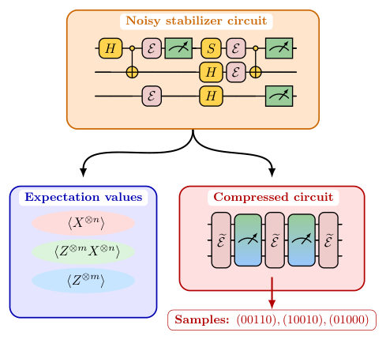
<figcaption class="paper-figure-caption"><b>Fig 1.</b> Fig. 1. Overview schematic illustrating the formalism’s capa- bilities: noisy stabilizer circuits can be efficiently processed to compute arbitrary Pauli expectation values or to gener- ate compressed circuit representations, enabling more efficient sampling.</figcaption>
</figure>
<figure class="paper-figure-card">
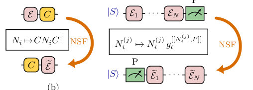
<figcaption class="paper-figure-caption"><b>Fig 2.</b> Fig. 2. Overview of the NSF. (a) Illustrates the framework: an initial stabilizer state is processed by a noisy stabilizer circuit composed of non-deterministic measurements, Clifford gates, and Pauli-diagonal noise channels. The NSF maps this circuit to an equivalent representation with an updated initial stabilizer state, where the Clifford operations and measure- ments are absorbed into the state, and the noise channels are updated while preserving their Pauli Kraus rank. (b) Shows the update rule for Clifford gates: each Pauli noise term Nj is transformed by conjugation with the Clifford as the gate is pushed through the noise channel. (c) Update rule for non-deterministic Pauli...</figcaption>
</figure>
<figure class="paper-figure-card">
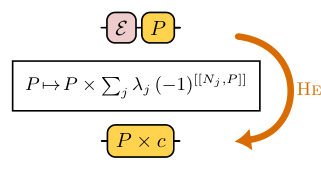
<figcaption class="paper-figure-caption"><b>Fig 3.</b> Fig. 3. Illustration of the Heisenberg action of a Pauli diagonal channel E• = P</figcaption>
</figure>
<figure class="paper-figure-card">
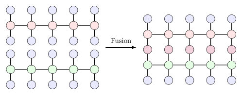
<figcaption class="paper-figure-caption"><b>Fig 4.</b> Fig. 4. Illustration of the fusion of two caterpillar graph states.</figcaption>
</figure>
<figure class="paper-figure-card">
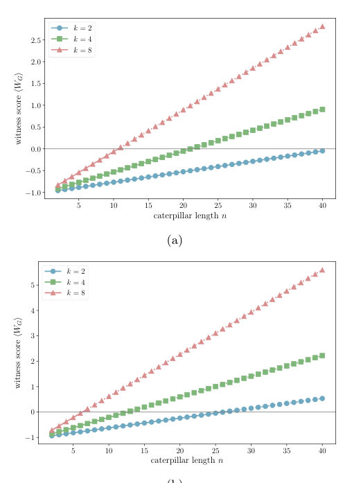
<figcaption class="paper-figure-caption"><b>Fig 5.</b> Fig. 5. (a) m(n, k) = (2k + 1)n-partite entanglement witness score ⟨WG⟩for an noisy MBQC resource state of size m(n, k) obtained by fusing k caterpillar states subject to local depo- larizing noise with depolarizing probability p = 0.001, each of length n with two leaves attached to every backbone node, where WG = m −1 −P</figcaption>
</figure>
<figure class="paper-figure-card">
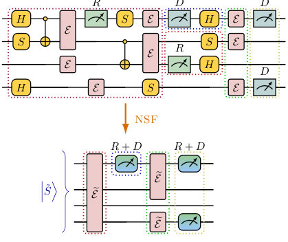
<figcaption class="paper-figure-caption"><b>Fig 6.</b> Fig. 6. Illustration of circuit compression. A noisy stabilizer circuit with noise channels E, Clifford gates, and random (R) and deterministic (D) Pauli measurements acting on |S⟩⟨S| is converted into an equivalent compressed circuit with updated noise channels eE and combined measurement blocks (R + D)</figcaption>
</figure>
<figure class="paper-figure-card">
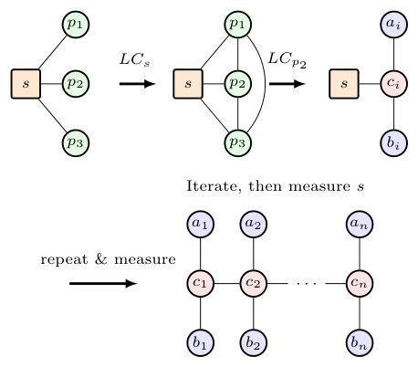
<figcaption class="paper-figure-caption"><b>Fig 7.</b> Fig. 7. Illustration of a generation protocol of a photonic caterpillar graph state, by a single quantum emitter.</figcaption>
</figure>

**Main problem.** The challenge of efficiently simulating large-scale noisy quantum circuits where the exponential overhead of density matrix propagation makes brute-force methods intractable.

**Main result.** The development of a unified framework for both strong (analytical) and weak (sampling-based) simulation of noisy stabilizer circuits, including an efficient circuit compression technique.

**Method.** The authors use an extension of the Noisy Stabilizer Formalism (NSF) to derive closed-form expressions for Pauli expectation values and introduce a compression algorithm that separates parameter-independent preprocessing from sampling.

**Summary.** This paper presents a new framework for the efficient simulation of noisy stabilizer circuits. It provides an analytical method to compute exact Pauli expectation values, allowing for efficient noise parameter sweeps without statistical error. Additionally, it introduces a circuit compression technique that speeds up sampling-based simulations by pre-processing the circuit. The framework is versatile enough to handle general rotations and non-diagonal noise, though complexity increases with deterministic measurements.

Detailed structure

**Model / system.** Noisy stabilizer circuits consisting of Clifford gates, Pauli-diagonal noise channels, and both deterministic and non-deterministic Pauli measurements.

**Key observables.** Pauli expectation values, entanglement witnesses, reduced density matrices, Bell-inequality witnesses, and energy expectation values for Hamiltonians with polynomial Pauli terms.

**Important parameters / regimes.** Noise strengths (lambda), number of qubits (n), number of Clifford gates, number of noise channels, and the number of deterministic measurements (which controls the branching complexity).

**Assumptions / limitations.** The primary analytical results focus on Pauli-diagonal noise; the efficiency of the simulation decreases exponentially with the number of deterministic measurements and non-diagonal noise channels.

**Figures summary.** Figure 1 shows the three simulation regimes; Figure 2 illustrates the NSF update rules for gates and measurements; Figure 3 shows the Heisenberg action of noise; Figure 6 depicts the circuit compression methodology.

**Paper structure.** The paper introduces the problem of noisy simulation, defines the Noisy Stabilator Formalism (NSF) and its analytical (strong) simulation capabilities, presents a circuit compression framework for efficient sampling (weak simulation), extends the framework to more complex noise and measurements, and provides complexity analysis and optimization techniques.

**Why it may be interesting.** This work is highly relevant for researchers in open quantum systems and quantum optics as it provides powerful tools to study the impact of complex, correlated noise on quantum information protocols and entanglement properties without the cost of full density matrix simulation.

Abstract

We develop analytical and algorithmic techniques that enable efficient simulation of a broad class of noisy stabilizer circuits. We derive closed-form expressions of expectation values for tensor product of Paulis in circuits with non-deterministic Pauli measurements, yielding an efficient strong simulation method that avoids explicit density matrix construction and enables direct noise parameter sweeps. We introduce a circuit compression framework that reduces the per-sample cost of weak simulation in general noisy stabilizer circuits, including deterministic measurements, by separating parameter-independent preprocessing from sampling. Finally, we extend the analytical framework beyond its standard domain to include a small number of deterministic measurements, general rotations, and non-diagonal noise channels. Our results provide a unified framework for both strong and weak simulation of noisy stabilizer circuits and corresponds to an extension of the noisy stabilizer formalism introduced in \cite{PhysRevA.107.032424}. They offer applications ranging from calculation of the expectation values of entanglement witnesses, determination of reduced states, to energy evaluation.

[↑ back to top](#top)

### [Expansion of time-convolutionless non-Markovian quantum master equations: A case study using the Fano-Anderson model](http://arxiv.org/abs/2604.22010v1)

**Authors:** Tim Alhäuser, Heinz-Peter Breuer  
**Type:** theory · **Category:** other · **PDF:** <https://arxiv.org/pdf/2604.22010v1>  
**Analysis basis:** full PDF text, analyzed in chunks
**Topic relevance:** 🔥 `dissipative systems` **4/5** · 🔥 `methods for driven-dissipative` **4/5** · 🔥 `Kondo & dissipative impurity` **3/5** · 🔥 `non-equilibrium dynamics` **3/5** · `entanglement & information structure` **2/5**

↔ Scroll figures horizontally

<figure class="paper-figure-card">
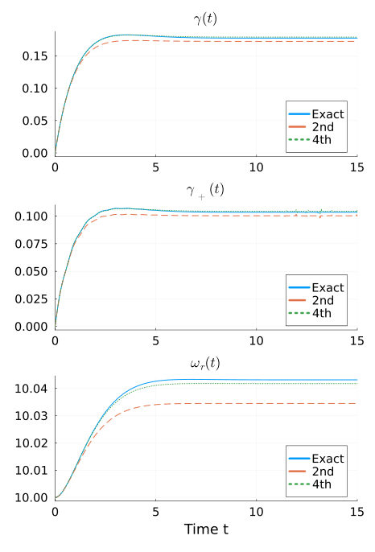
<figcaption class="paper-figure-caption"><b>Fig 1.</b> FIG. 1. Time evolution of the coefficients of the master equa- tion (25) for a weak coupling strength γ0 = 0.2, with λ = 1.0 and ∆= 0.4. The fourth-order expansion (green) closely matches the exact result (blue), while the second-order ex- pansion (orange) shows small deviations.</figcaption>
</figure>
<figure class="paper-figure-card">
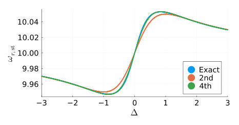
<figcaption class="paper-figure-caption"><b>Fig 2.</b> FIG. 2. Steady-state values of ωr as a function of the detuning ∆, with weak coupling γ0 = 0.2 and λ = 1.0. The fourth-order expansion closely matches the exact results, while the second- order expansion shows slight deviations. Since γ0/λ &lt; 1/2, the perturbative treatment is valid over the entire range of detunings.</figcaption>
</figure>
<figure class="paper-figure-card">
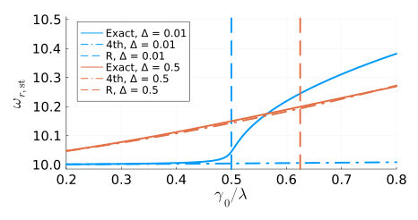
<figcaption class="paper-figure-caption"><b>Fig 3.</b> FIG. 4. Stationary value of ωr for varying detuning and coupling strenghts, calculated exactly and perturbatively in fourth order. The closer to resonance the larger is the dis- tinction between weak and strong coupling regime, separated by the radius of convergent indicated by the dashed lines.</figcaption>
</figure>
<figure class="paper-figure-card">
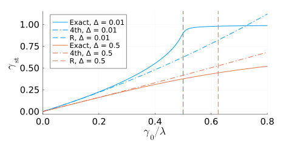
<figcaption class="paper-figure-caption"><b>Fig 4.</b> FIG. 5. Steady-state values of γ for varying detuning and cou- pling strengths, calculated exactly and using the fourth-order expansion. Analogous to Figure 4, the radius of convergence (dashed lines) separates weak and strong coupling regime.</figcaption>
</figure>
<figure class="paper-figure-card">
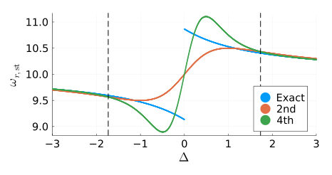
<figcaption class="paper-figure-caption"><b>Fig 5.</b> FIG. 3. Steady-state values of ωr for γ0/λ = 2.0. The dashed line indicates the detuning ∆at which the radius of conver- gence is reached, i.e., R(∆) = 1 2  1 + ∆2</figcaption>
</figure>
<figure class="paper-figure-card">
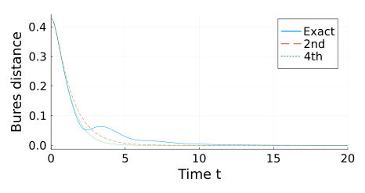
<figcaption class="paper-figure-caption"><b>Fig 6.</b> FIG. 7. Bures distance for γ0 = 2.0 and ∆= 0.4. The cou- pling exceeds the perturbative convergence radius, so while the exact dynamics show revivals, the perturbative approach fails to capture them.</figcaption>
</figure>
<figure class="paper-figure-card">
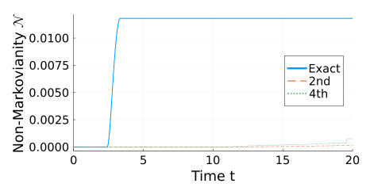
<figcaption class="paper-figure-caption"><b>Fig 7.</b> FIG. 8. Measure of non-Markovianity for γ0 = 2.0 and ∆= 0.4, computed both exactly and perturbatively. The Bures-distance based measure N shows that the perturbative approach fails to capture information backflow. The slight linear increase in the perturbative curve is attributed to nu- merical inaccuracies.</figcaption>
</figure>
<figure class="paper-figure-card">
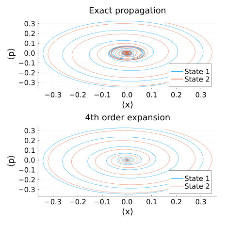
<figcaption class="paper-figure-caption"><b>Fig 8.</b> FIG. 6. Phase-space evolution of two initial coherent states |α = 0.11±0.22i⟩, computed both exactly and perturbatively for γ0 = 2.0 and ∆= 0.4. While the exact propagation exhibits more complex trajectories, including temporary in- creases in distance from the states, the fourth-order pertur- bative expansion shows only a monotonic approach, failing to capture information backflow.</figcaption>
</figure>
<figure class="paper-figure-card">
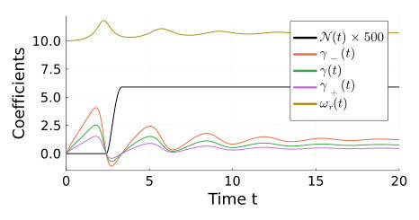
<figcaption class="paper-figure-caption"><b>Fig 9.</b> FIG. 9. Exact coefficients and non-Markovianity for the state evolution with γ0 = 2.0 and ∆= 0.4. The figure shows that information backflow is associated with at least one negative rate in the dissipator of the master equation.</figcaption>
</figure>
<figure class="paper-figure-card">
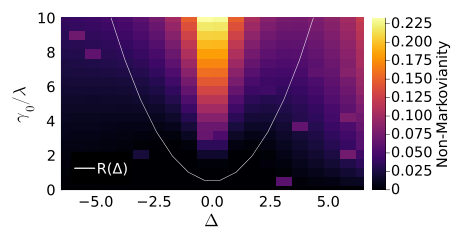
<figcaption class="paper-figure-caption"><b>Fig 10.</b> FIG. 11. Non-Markovianity for various initial Lorentzian spectral densities, with the convergence radius shown in white, determined from the exact dynamics.</figcaption>
</figure>

**Main problem.** Evaluating the performance, validity, and convergence of the time-convolutionless (TCL) perturbative expansion for describing non-Markovian quantum dynamics.

**Main result.** The authors identify a specific radius of convergence for the TCL expansion based on the ratio of detuning to spectral density width and demonstrate that while the 4th-order expansion is highly accurate, the expansion fails to capture complex non-Markovian features like information backflow in the strong-coupling regime.

**Method.** The study uses the analytically solvable Fano-Anderson model to compare exact master equation solutions against 2nd and 4th-order TCL perturbative expansions, utilizing Bures distance to quantify non-Markovianity.

**Summary.** This paper investigates the accuracy of the time-convolutionless (TCL) expansion method for open quantum systems using the Fano-Anderson model. It establishes that the expansion's convergence depends on the ratio of detuning to the spectral density width. While the 4th-order expansion provides excellent agreement with exact dynamics in weak coupling, it fails to capture essential non-Markovian features like information backflow in the strong-coupling regime. The study also highlights how temperature influences the asymmetry of non-Markovianity.

Detailed structure

**Model / system.** A continuous variable system (harmonic oscillator) coupled to a bosonic bath with a Lorentzian spectral density, described by a Hamiltonian that includes system energy, environment energy, and interaction terms under the rotating wave approximation.

**Key observables.** Reduced density matrix, renormalized frequency, spontaneous emission/absorption rates, Bures distance, and the non-Markovianity measure (information backflow).

**Important parameters / regimes.** System-environment coupling strength (alpha^2), detuning (Delta), spectral density width (lambda), and temperature (beta).

**Assumptions / limitations.** The system and environment are initially in a product state, and the environment is initially in a thermal state.

**Figures summary.** Figures show the time evolution of master equation coefficients, steady-state frequency renormalization, the failure of expansions in the strong-coupling regime, phase-space trajectories of coherent states, and heat maps of non-Markovianity.

**Paper structure.** The paper introduces the Fano-Anderson model, derives exact and perturbative TCL coefficients, analyzes convergence and accuracy in weak and strong coupling regimes, and investigates the impact of detuning and temperature on non-Markovianity.

**Why it may be interesting.** This paper provides critical bounds on the validity of the TCL formalism, which is a standard tool in open quantum systems, and offers a precise mathematical criterion (the radius of convergence) for when perturbative methods can be trusted to capture non-Markovian memory effects.

Abstract

We explore the performance of the time-convolutionless (TCL) projection operator technique using the Fano-Anderson model as a test case. Comparing the exact TCL master equation with an expansion in powers of the strength of the system-environment coupling, we analyze the transient dynamics as well as the steady-state behavior. For a Lorentzian spectral density we demonstrate that the dimensionless expansion parameter corresponds to the ratio of the environmental correlation time to the relaxation time of the system, and we derive the convergence radius for the TCL expansion, which is seen to depend on the ratio of detuning and width of the spectral density. We further study the quantum non-Markovianity of the model based on the evolution of the Bures distance between quantum states and how it is represented by the second and fourth order of the expansion. Our results highlight both the strengths and the limitations of the TCL formalism in capturing key features of open quantum systems and, in particular, the challenges of accurately describing strongly coupled systems and non-Markovian dynamics.

[↑ back to top](#top)

### [The quantum harmonic oscillator in a dissipative bath of anyon pairs](http://arxiv.org/abs/2604.22342v1)

**Authors:** Nils-Henrik Meyer, Michael Thorwart, Axel Pelster  
**Type:** theory · **Category:** statistical mechanics · **PDF:** <https://arxiv.org/pdf/2604.22342v1>  
**Analysis basis:** full PDF text, analyzed in chunks
**Topic relevance:** 🔥 `dissipative systems` **4/5** · 🔥 `Keldysh / 2PI / non-Gaussian methods` **3/5** · 🔥 `non-equilibrium dynamics` **3/5** · `correlated / nonlocal dissipation` **2/5** · `methods for driven-dissipative` **2/5**

↔ Scroll figures horizontally

<figure class="paper-figure-card">
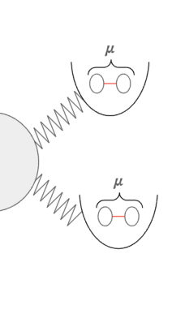
<figcaption class="paper-figure-caption"><b>Fig 1.</b> Figure 1. Scheme of the system-anyon-bath model constructed in this work.</figcaption>
</figure>
<figure class="paper-figure-card">
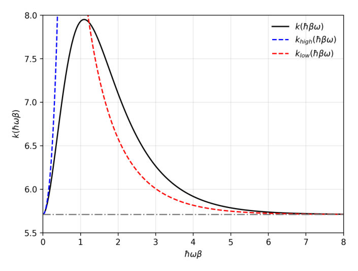
<figcaption class="paper-figure-caption"><b>Fig 2.</b> Figure 2. Temperature-dependent factor, Eq. (25, of the effective spectral density in Eq. (33). The red dashed line indicates the limit ℏβω →∞in Eq. 31, while the blue dashed line marks the limit of ℏβω →0 in Eq. 32. The dash-dotted horizontal line stands for the common constant of both limits.</figcaption>
</figure>
<figure class="paper-figure-card">
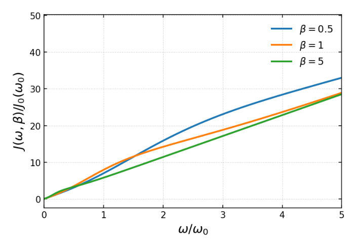
<figcaption class="paper-figure-caption"><b>Fig 3.</b> Figure 3. Comparison of the anyonic spectral density J(ω, β) for different temperatures, expressed in units of ℏω0, scaled with the anyon bath spectral density J0(ω0), as a function of ω/ω0.</figcaption>
</figure>
<figure class="paper-figure-card">
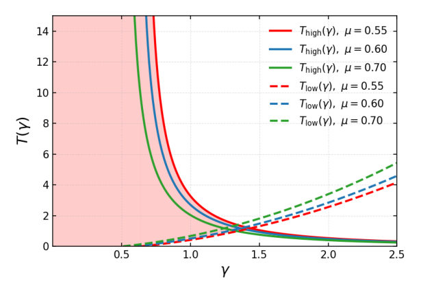
<figcaption class="paper-figure-caption"><b>Fig 4.</b> Figure 4. Phase diagram of the coherent-incoherent dynamical regimes in the temperature T–damping constant γ plane for various anyonic parameters µ as indicated. The separation lines are defined by the roots of the radicand of Eqs. (43) [low temperature, dashed lines] and (44) [high temperature, solid lines]. The shaded region represents the coherent regime for µ = 0.55 case (shown in red). The exact separatrix for a general value of T cannot be evaluated analytically.</figcaption>
</figure>

**Main problem.** Investigating the relaxation and decoherence properties of a quantum harmonic oscillator when coupled to a non-standard environment composed of anyon pairs.

**Main result.** The authors show that the anyon bath induces a temperature-dependent effective spectral density and non-Markovian dynamics, with the relaxation rate being directly proportional to the anyon statistical parameter.

**Method.** The study uses an su(1,1)-Holstein-Primakoff transformation to map anyons to bosons, combined with imaginary-time and real-time path integral formalisms and a 'smearing formula' (generalized Wick's theorem) to handle non-polynomial coupling.

**Summary.** This paper explores how a quantum harmonic oscillator relaxes when placed in a bath of anyon pairs. By mapping the anyonic system to a bosonic one, the authors reveal that the interaction becomes non-linear and temperature-dependent. They find that the anyon statistics directly influence the relaxation rate and can induce non-Markovian behavior. The study identifies specific temperature regimes where anyonic features are most prominent.

Detailed structure

**Model / system.** A 1D quantum harmonic oscillator coupled to an infinite set of non-interacting, harmonically bound Grundberg-Hasson anyon pairs.

**Key observables.** Effective bath spectral density, relaxation rate, oscillation frequency, and the boundary between coherent and incoherent relaxation regimes.

**Important parameters / regimes.** The anyon statistical parameter (mu), temperature (T), damping constant (gamma), and the frequency of the oscillator (omega_0).

**Assumptions / limitations.** The su(1,1) mapping is valid for mu > 1/2; the results rely on a first-order cumulant expansion approximation; the bath is assumed to be initially Ohmic.

**Figures summary.** Figure 1 shows a schematic of the system-bath model; Figure 2 illustrates the temperature-dependent rescaling factor; Figure 3 compares anyonic spectral density at different temperatures; Figure 4 presents a phase diagram of coherent vs. incoherent regimes.

**Paper structure.** The paper introduces the system-bath model, applies a mathematical mapping to a bosonic representation, derives the effective spectral density using a smearing formula, and analyzes the resulting relaxation dynamics across different temperature regimes.

**Why it may be interesting.** This paper extends the theory of open quantum systems beyond standard bosonic/fermionic baths, providing a framework for understanding how anyonic statistics influence dissipation and non-Markovianity.

Abstract

We generalize the formalism of open quantum systems to introduce anyon baths. In particular, we work out a dissipative anyon bath composed of independent pairs of one-dimensional Grundberg-Hansson harmonically bound anyons, which are characterized by one statistical parameter. Using a mapping of these anyons to a bosonic bath with rescaled oscillator frequencies, we show that the original bilinear system-bath coupling assumes a particular non-polynomial form. To determine the relaxation properties, we use the imaginary-time path integral formalism together with a generalization of Wick's theorem in the form of a smearing formula. The latter allows to approximately calculate the anyon bath spectral density, which acquires a nontrivial temperature dependence. The corresponding relaxation dynamics of the dissipative harmonic oscillator in an anyon bath is found. Well defined limits are revealed for both low and high temperatures. Anyonic features turn out to be most pronounced in the regime of intermediate temperatures.

[↑ back to top](#top)

### [An efficient framework for quantum dynamics driven by nonclassical light](http://arxiv.org/abs/2604.22303v1)

**Authors:** Sheng-Wen Li, Zeyang Liao, Mao-Xin Liu  
**Type:** theory · **Category:** other · **PDF:** <https://arxiv.org/pdf/2604.22303v1>  
**Analysis basis:** full PDF text, analyzed in chunks
**Topic relevance:** 🔥 `methods for driven-dissipative` **4/5** · 🔥 `Keldysh / 2PI / non-Gaussian methods` **3/5** · 🔥 `dissipative systems` **3/5** · 🔥 `non-equilibrium dynamics` **3/5**

↔ Scroll figures horizontally

<figure class="paper-figure-card">
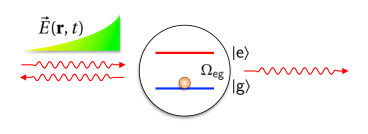
<figcaption class="paper-figure-caption"><b>Fig 1.</b> FIG. 1. Demonstration for a TLS interacting with a classical light pulse described by a wave packet ⃗E(r, t).</figcaption>
</figure>
<figure class="paper-figure-card">
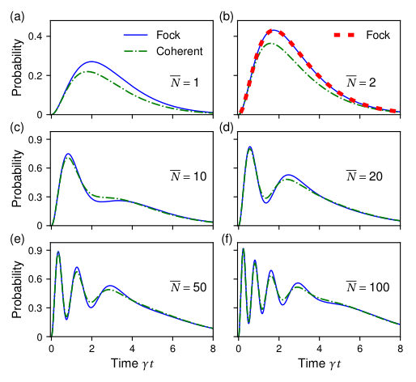
<figcaption class="paper-figure-caption"><b>Fig 2.</b> FIG. 2. The excitation probability evolution ¯Ne(t) from different in- put pulse states with total photon number N. The dot-dashed green lines show the situation when the input pulse is the coherent state |α, {βk}⟩with |α|2 = N as the total average photon number [from Eq. (15)]. The solid blue lines show the situation when the input pulse is the Fock state |N, {βk}⟩and are calculated by Eq. (25). The dashed red line in (b) also shows the situation of Fock input for comparison, which is calculated by the generalized master equation method [42–46]. The pulse shape {βk} takes the Lorentzian distri- bution (9), and here we consider γ = κ.</figcaption>
</figure>
<figure class="paper-figure-card">
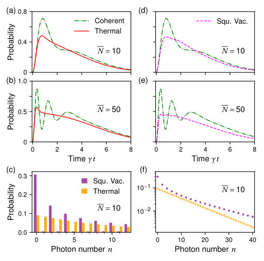
<figcaption class="paper-figure-caption"><b>Fig 3.</b> FIG. 3. The excitation probability evolution ¯Ne(t) driven by the ther- mal or squeezed pulses (γ = κ). The dot-dashed green lines in (a, b, d, e): the input light is the coherent pulse for comparison. The solid red lines in (a, b): the input light is the thermal pulse (28). The dashed purple lines in (d, e): the input pulse follows the photon statis- tics of the squeezed vacuum state (31). (c, f) Demonstration for the photon statistics {pn} for the thermal state and the squeezed vacuum state (mean photon number N = 10, corresponding to a squeezing strength r ≃1.87). The conditions are the same with Fig. 2.</figcaption>
</figure>

**Main problem.** Modeling the quantum dynamics of a system driven by nonclassical light pulses is computationally intractable for large photon numbers using standard methods.

**Main result.** The authors developed an efficient framework that scales to large photon numbers (N ~ 100) by decomposing nonclassical evolution into a mixture of quasi-classical branches, successfully reproducing exact results for Fock and squeezed states.

**Method.** A pulse-shaped P-representation is introduced to decompose the full quantum evolution into independent quasi-classical branches, each governed by a standard master equation, followed by an averaging process over the Glauber-Sudarshan P-function.

**Summary.** This paper presents a new theoretical framework for calculating the quantum dynamics of a system driven by nonclassical light pulses. By using a pulse-shaped P-representation, the authors decompose complex quantum evolution into a manageable mixture of quasi-classical branches. This method allows for efficient simulation of states like Fock, thermal, and squeezed vacuum even with large photon numbers. The work demonstrates that the dynamics are heavily influenced by high-order optical coherence, which can suppress oscillations seen in classical driving.

Detailed structure

**Model / system.** A two-level system (TLS) interacting with a 1D electromagnetic field and multi-mode nonclassical light pulses (including Fock, thermal, and squeezed vacuum states) under the Born-Markov approximation.

**Key observables.** Excited state population (excitation probability), Bloch vector components (u, v, w), and higher-order optical coherence functions.

**Important parameters / regimes.** Photon number (N), pulse linewidth (kappa), TLS decay rate (gamma), and single-photon coupling strength (eta_0).

**Assumptions / limitations.** The framework assumes the electromagnetic field can be described by a fully quantized theory and utilizes the Born-Markov approximation.

**Figures summary.** Figure 2 compares excitation probability for various Fock states against coherent states, showing convergence at large N. Figure 3 illustrates the suppression of Rabi oscillations in thermal and squeezed vacuum pulses and shows their respective photon statistics.

**Paper structure.** The paper introduces the pulse-shaped P-representation framework, validates it against known single- and two-photon results, demonstrates scalability to large N, and provides physical insights into the role of high-order coherence.

**Why it may be interesting.** It provides a computationally efficient, unified route to explore complex quantum dynamics in quantum optics and waveguide QED, specifically bridging the gap between classical pulse treatments and fully quantum-mechanical descriptions for high-photon-number nonclassical states.

Abstract

Understanding quantum system dynamics driven by nonclassical light pulses is challenging, particularly for general light states with large photon numbers. Here we introduce an efficient framework that makes this task tractable. By introducing a pulse-shaped P-representation, the exact quantum evolution is decomposed into a mixture of many independent quasi-classical branches, each governed by a standard master equation with a classical pulse which can be solved efficiently. As an illustration, for a two-level system interacting with an exponential pulse, we first find out the exact analytical solutions to the Bloch equations in each quasi-classical branch, and then by taking proper P-function average over all branches, the full system dynamics driven by nonclassical light pulses is analytically obtained. For the one-photon and two-photon cases, our method well reproduces the previous exact results either analytically or numerically. Crucially, our approach scales efficiently to more complex light states (Fock, thermal, squeezed vacuum states) with large photon numbers ($N\sim 100$). We further provide a clear physical interpretation how the system dynamics is influenced through the high-order optical coherence of the nonclassical pulses. This work provides a unified and computationally efficient route and a useful starting point to explore more complex quantum dynamics driven by nonclassical light in quantum optics and quantum information processing.

[↑ back to top](#top)

### [Stability Thresholds for Gravitationally Induced Entanglement in Shielded Setups](http://arxiv.org/abs/2604.22593v1)

**Authors:** Jan Bulling, Marit O. E. Steiner, Julen S. Pedernales, Martin B. Plenio  
**Type:** theory · **Category:** other · **PDF:** <https://arxiv.org/pdf/2604.22593v1>  
**Analysis basis:** full PDF text, analyzed in chunks
**Topic relevance:** 🔥 `dissipative systems` **4/5** · 🔥 `entanglement & information structure` **3/5** · `correlated / nonlocal dissipation` **2/5** · `methods for driven-dissipative` **2/5** · `non-equilibrium dynamics` **2/5**

↔ Scroll figures horizontally

<figure class="paper-figure-card">
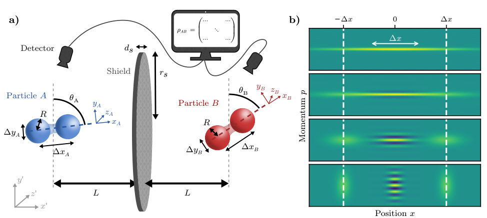
<figcaption class="paper-figure-caption"><b>Fig 1.</b> FIG. 1: Setup and initial states. a, Schematic illustration of an idealized setup for gravitationally induced entangle- ment (GIE) experiments considered in this work. Two particles A and B of radius R are prepared in spatially delocalized quantum states and positioned at a fixed center-to-center separation 2L. A circular shield of thickness ds and radius rs is placed midway between the particles to suppress unwanted electromagnetic crosstalk while preserving the gravitational coupling. The angles θA/B indicate the orientation of each particle’s principal delocalization axis (here without loss of generality the x-direction) and the shield. Two detectors measure the state of the particles...</figcaption>
</figure>
<figure class="paper-figure-card">
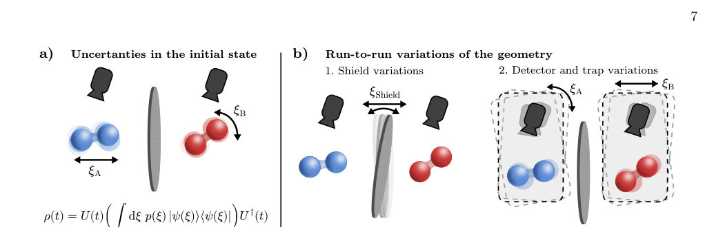
<figcaption class="paper-figure-caption"><b>Fig 2.</b> FIG. 2: Geometry variations a, Uncertainty in the preparation of the initial state. The initial state ρ(0) = R dξ p(x) |ψ(t)⟩⟨ψ(t)| is mixed. The time evolution does not generate additional decoherence and any loss of purity is solely inherited from the initial state. b, Run-to-run variations of the setup. The varying geometry results in run- dependent time evolution operators Uξ(t) which generate, after averaging over ξ, decoherence even if the initial state ρ0 is pure. We distinguish the two experimentally relevant cases of distance ξ(L) and orientation ξ(θ) variations in the orientation and placement of the 1. shield and 2. detectors/traps discussed in the text.</figcaption>
</figure>
<figure class="paper-figure-card">
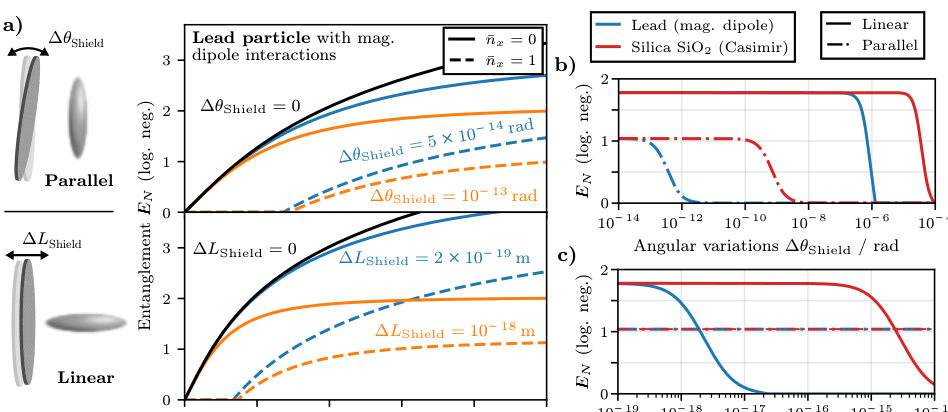
<figcaption class="paper-figure-caption"><b>Fig 3.</b> FIG. 3: Entanglement between Gaussian squeezed states subject to shield variations (see Fig. 2(b)1.) a, Time evolution of the logarithmic negativity EN for Gaussian wave packets in the presence of particle–shield magnetic dipolar interactions in the parallel (θ = 0, top) and linear (θ = π/2, bottom) orientation. The parallel configuration is illustrated with run-to-run angular fluctuations of the shield orientation, while the linear orientation is shown with variations in the lateral shield placement. The principal x-mode is initially in a thermal state with occupation number ¯nx. Time is expressed in units of t0 = ℏ/(λ∆x) with the gravitational coupling strength λ = GMAMB/(4L3),...</figcaption>
</figure>
<figure class="paper-figure-card">
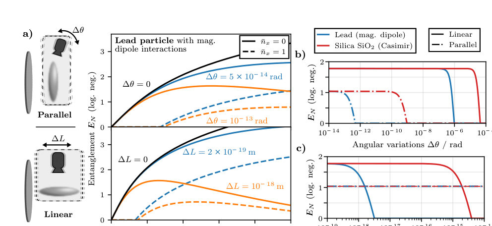
<figcaption class="paper-figure-caption"><b>Fig 4.</b> FIG. 4: Entanglement between Gaussian squeezed states subject to detector and trap variations (see Fig. 2(b)2.) a, Time evolution of the logarithmic negativity EN for Gaussian wave packets in presence of particle– shield magnetic dipolar interactions in the parallel (top) and linear (bottom) orientations. The parallel configuration is illustrated with angular fluctuations of the detectors over many runs, while the linear configuration is shown with variations in the detector positioning. After saturation, the entanglement decays much faster back to zero compared to the previous case. b, Logarithmic negativity at time t = t0π/4 as a function of angular variations ∆θ for both orientations and...</figcaption>
</figure>
<figure class="paper-figure-card">
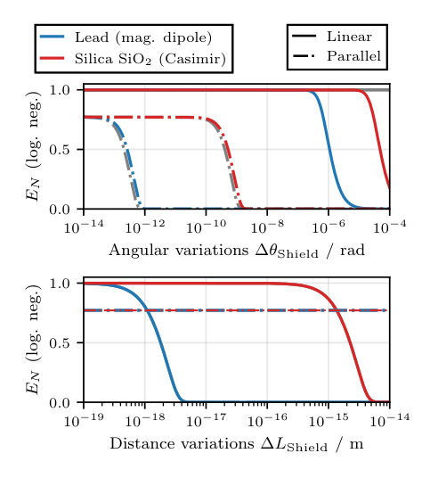
<figcaption class="paper-figure-caption"><b>Fig 5.</b> FIG. 5: Entanglement for two-level cat-states sub- ject to shield variations (see Fig. 2(b)1.) Logarith- mic negativity in the parallel and linear orientation after evolution times t = t0π/4, corresponding to t ≈129 ms for silica particles and t ≈7 ms for superconducting lead. We use the parameters from Tab. I. top, Entanglement as a function of fluctuations in the shield orientation. In gray we show the first-order analytical expressions derived in Apx. D 2. bottom, Entanglement as a function of fluc- tuations in the particle–shield separation. The qualitative dependence on orientation and type of the variation closely mirrors the behavior for Gaussian states in Fig. 3.</figcaption>
</figure>
<figure class="paper-figure-card">
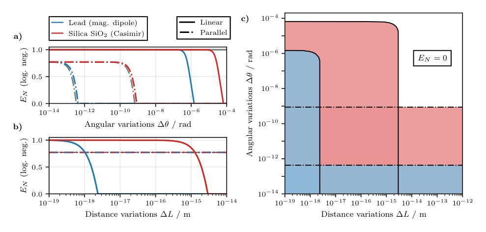
<figcaption class="paper-figure-caption"><b>Fig 6.</b> FIG. 6: Entanglement for two-level cat-states subject to detector and trap variations (Fig. 2(b)2.) Loga- rithmic negativity in the parallel and linear orientation after evolution times t = t0π/4. We use the parameters from Tab. I. a, Entanglement as a function of angular variations with the first-order analytical expressions of Eq. (11) shown in gray. b, Entanglement as a function of fluctuations in the particle–shield separation in analogy to Fig. 4(c). c, Entanglement for combined variations ξ(L) A/B and ξ(θ) A/B in both discussed orientations (black outlines) after an evolution time of t = t0π/4. In the white region, the logarithmic negativity is zero.</figcaption>
</figure>
<figure class="paper-figure-card">
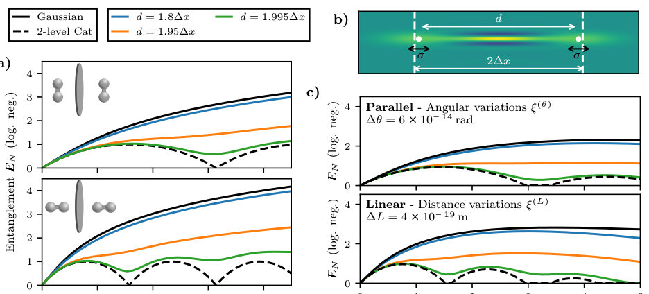
<figcaption class="paper-figure-caption"><b>Fig 7.</b> FIG. 7: Entanglement dynamics for continuous cat-states. a, Logarithmic negativity EN for continuous initial states interpolating between squeezed Gaussian states and two-level cat-states, computed numerically in a truncated Fock basis at zero temperature. Results are shown for the parallel (top) and linear (bottom) orientations with variations in detector positioning. For reference, the corresponding analytical solutions for Gaussian and two-level cat-states with identical position variance (∆x)2 are shown in black. The initial linear growth of entanglement with rate Γent. = ∂tEN|t=0 is identical across the family of states; in agreement with Ref. [26]. b, Continuous cat-state in analogy...</figcaption>
</figure>
<figure class="paper-figure-card">
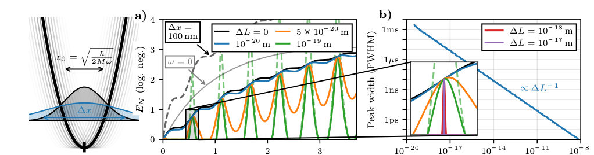
<figcaption class="paper-figure-caption"><b>Fig 8.</b> FIG. 8: Entanglement in the presence of quasi-static trap fluctuations. a, Time evolution of the logarithmic negativity EN for magnetically levitated superconducting lead particles in an harmonic trap (ω = 100×2π Hz) in the linear configuration. Time is expressed in units of t0 = ℏ/(λ∆x2) with the gravitational coupling strength λ, corresponding to t0 ≈9 ms for the superconducting lead particles shown here. Periodic oscillations arise from the harmonic motion of the trapped particles. Different run-to-run fluctuations ∆L of the trap center are included. Nonzero entanglement is observable only near integer multiples of T/2 = π/ω′. Continuous lines corresponds to ∆x = 50 nm, while dashed...</figcaption>
</figure>
<figure class="paper-figure-card">
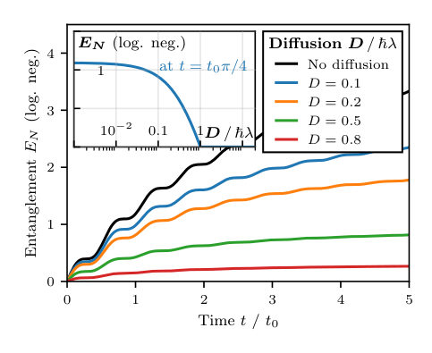
<figcaption class="paper-figure-caption"><b>Fig 9.</b> FIG. 9: Entanglement in the presence of Marko- vian trap fluctuations Logarithmic negativity over time for different diffusion constants D. Here, D is measured in units of ℏλ and for D = 1ℏλ, the entanglement rate Γent. = ∂tEN is precisely equal to the decoherence rate. Consequently, for larger diffusion, no entanglement is ob- servable, as seen in the inset plot.</figcaption>
</figure>
<figure class="paper-figure-card">
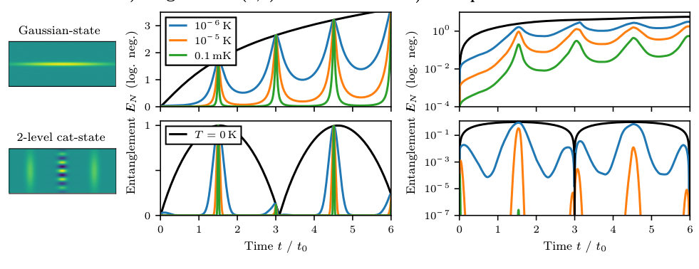
<figcaption class="paper-figure-caption"><b>Fig 10.</b> FIG. 10: Entanglement dynamics in a GIE setup in the presence of a quantum dynamical shield. Results are shown for delocalized superconducting lead particles interacting with the shield via magnetic-dipole interactions prepared in the parallel orientation (θ = 0), for which the gravitational signal is most robust against noise. The parameters from Tab. I were used with a Niobium shield of size ds = 2 µm and rs = 1 cm. If the particle–shield couplings are dominated by Casimir interactions instead, the corresponding dynamics are shown in Fig. 16. a, Entanglement dynamics for Gaussian states (top) and two-level cat-states (bottom) with the shield dynamics restricted to the dominant (1, 1)-mode...</figcaption>
</figure>

**Main problem.** Investigating the stability of gravitationally induced entanglement (GIE) against decoherence caused by residual electromagnetic interactions (Casimir and magnetic-dipole) and setup fluctuations in shielded experimental setups.

**Main result.** The study identifies that run-to-run fluctuations in the shield, traps, and detectors convert residual electromagnetic phases into effective decoherence, and that thermal vibrations of the shield can mimic gravitational entanglement signals.

**Method.** The authors use a quantum mechanical treatment of shield vibrational modes, a Lindblad master equation for Gaussian noise, and second-order expansions of the gravitational and electromagnetic Hamiltonians.

**Summary.** This paper analyzes the feasibility of detecting gravitationally induced entanglement between two massive particles in the presence of a physical shield. It demonstrates that while shields are necessary to suppress electromagnetic crosstalk, they introduce new noise sources through Casimir/magnetic interactions and mechanical vibrations. The authors quantify the extreme precision required for positioning and orientation to prevent these effects from masking the gravitational signal. Ultimately, they provide specific stability thresholds and suggest strategies like shield cooling to preserve entanglement.

Detailed structure

**Model / system.** The system consists of two massive, spatially delocalized nanoparticles (either silica or superconducting lead) separated by a distance 2L, placed near a conducting or superconducting circular shield.

**Key observables.** Bipartable entanglement (logarithmic negativity), entanglement rate, phase accumulation, and decoherence rates.

**Important parameters / regimes.** Particle mass (10^-11 kg), particle radius (10 micrometers), shield thickness, separation distance, and thermal occupation of shield modes.

**Assumptions / limitations.** The particles are assumed to be electrically neutral; the gravitational potential is expanded to second order; and the Proximity-Force Approximation (PFA) is used for Casimir interactions.

**Figures summary.** Figure 1 shows the experimental setup schematic; Figure 2 illustrates types of geometric variations; Figure 3 shows entanglement evolution and sensitivity; Figure 13 compares Casimir interaction models; Figure 15 shows critical angular variation thresholds; Figure 16 shows entanglement dynamics with single vs. multi-mode shield models.

**Paper structure.** The paper begins by defining the GIE setup and electromagnetic threats, proceeds to quantify how geometric fluctuations lead to decoherence, analyzes the impact of thermal shield vibrations, and concludes with derived stability thresholds and mitigation strategies.

**Why it may be interesting.** This paper is highly relevant to researchers in open quantum systems and quantum optics as it provides a rigorous analysis of how environmental noise and mechanical fluctuations in a controlled setup lead to decoherence and the emergence of non-classical correlations.

Abstract

Proposed experiments for gravitationally induced entanglement (GIE) typically suppress direct electromagnetic interactions between two massive particles by inserting a conducting Faraday shield. For superconducting particles, their large diamagnetism requires additional magnetic shielding to screen magnetic dipolar interactions. Here, we analyze the effect of residual particle-shield interactions and show that both Casimir and magnetic-dipole interactions can severely limit GIE tests by imprinting large phases. We quantify how run-to-run positional and orientational fluctuations of the setup elements, including the shield, trapping potentials, and detectors, convert these phases into effective decoherence, strongly reducing the detectable bipartite entanglement. In particular, we show that magnetic interactions between the particles and a superconducting shield constitute a major noise source, especially relevant for levitated superconducting particles. Treating the vibrational modes of the shield quantum mechanically, we further find that thermal vibrations generate persistent particle-shield correlations and can even mediate particle-particle entanglement that can mimic a gravitational signal. Finally, we derive quantitative thresholds on the maximum tolerable positional and orientational fluctuations of the setup elements required to observe entanglement, and propose mitigation strategies including geometry optimization and shield cooling to preserve a genuine GIE signature.

[↑ back to top](#top)

### [Correlated Quantum Dephasometry: Symmetry-Resolved Noise Spectroscopy of Two-Dimensional Superconductors and Altermagnets](http://arxiv.org/abs/2604.22751v1)

**Authors:** Wenbo Sun, Zubin Jacob  
**Type:** theory · **Category:** strongly correlated electrons · **PDF:** <https://arxiv.org/pdf/2604.22751v1>  
**Analysis basis:** full PDF text, analyzed in chunks
**Topic relevance:** 🔥 `spintronics-quantum-optics interface` **4/5** · 🔥 `correlated / nonlocal dissipation` **3/5** · 🔥 `dissipative systems` **3/5** · `quantum measurements` **2/5**

↔ Scroll figures horizontally

<figure class="paper-figure-card">
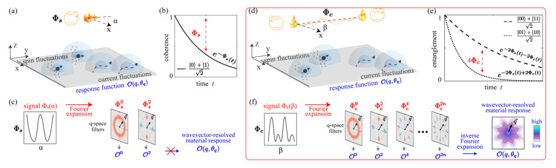
<figcaption class="paper-figure-caption"><b>Fig 1.</b> FIG. 1. Two-qubit correlated quantum dephasometry enables symmetry-resolved quantum noise spectroscopy by probing spatial noise correlations near quantum materials. (a,b) Single-qubit quantum dephasometry probes local magnetic noise near materials via single qubit dephasing function Φs(α). α is the in-plane orientation of the single qubit. (d,e) Correlated quantum dephasometry probes spatially nonlocal magnetic noise correlations near materials via correlated dephasing function Φc(β). β represents the two-qubit orientation. (c,f) Correlated quantum dephasometry decomposes the angular symmetry of the nonlocal response function O(q, θq) in momentum space into rotational Fourier components of...</figcaption>
</figure>
<figure class="paper-figure-card">
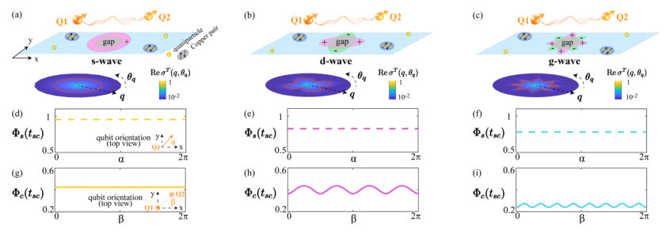
<figcaption class="paper-figure-caption"><b>Fig 2.</b> FIG. 2. Two-qubit correlated quantum dephasometry isolates the superconductor pairing symmetry. (a-c) Schematic of two spin qubits (Q1, Q2) near 2D superconductors with s-, d-, and g-wave pairing symmetry. The rotational symmetry of transverse conductivity Re σT (q, θq)/σn in momentum space inherits symmetry of gap functions. (d-f) Single-qubit dephasing function Φs(α) exhibits similar behaviors near s-, d-, and g-wave superconductors. (g-i) Correlated dephasing function Φc(β) with respect to the two-qubit orientation β resolves the pairing symmetry for s-, d, and g-wave superconductors. We take D = 8z in (g,h) and D = 12z in (i).</figcaption>
</figure>
<figure class="paper-figure-card">
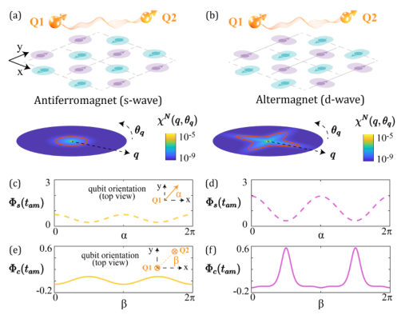
<figcaption class="paper-figure-caption"><b>Fig 3.</b> FIG. 3. Two-qubit correlated quantum dephasometry re- solves s-wave antiferromagnets and d-wave altermagnets. (a,b) Schematic of two spin qubits (Q1, Q2) near 2D anti- ferromagnets and altermagnets. The rotational symmetry of magnetic susceptibility Im χN(q, θq) in momentum space in- herits symmetry of magnon band splittings. (c,d) Single-qubit dephasing function Φs(α) exhibits similar behaviors near s-, d-wave magnets. (e,f) Correlated dephasing function Φc(β) exhibits qualitatively distinct angular signatures, directly re- solving the d-wave symmetry of 2D altermagnets. We take D = 9z in (e,f).</figcaption>
</figure>

**Main problem.** Traditional symmetry-resolved spectroscopies like ARPES are limited to high frequencies and mesoscopic scales, and single-qubit quantum sensing lacks the ability to resolve angular/rotational symmetry in momentum space.

**Main result.** The authors propose 'correlated quantum dephasometry,' a method using two spin qubits to resolve the rotational symmetry (even and odd orders) of material responses, such as superconducting gap symmetry and altermagnetic susceptibility, at the nanoscale and low frequencies.

**Method.** The method uses the spatial correlations of near-field noise between two qubits and applies a Jacobi-Anger expansion to perform an angular Fourier analysis of the material response.

**Summary.** This paper introduces a new technique called correlated quantum dephasometry to perform symmetry-resolved spectroscopy of 2D materials at the nanoscale. By measuring the correlated dephasing of two spin qubits, the method can resolve the angular (rotational) symmetry of material properties like conductivity and magnetic susceptibility. The authors demonstrate that this approach can distinguish between different superconducting pairing symmetries (s, d, and g-wave) and identify altermagnetic structures. This provides a low-frequency, high-resolution complement to traditional high-frequency spectroscopic tools.

Detailed structure

**Model / system.** The system consists of two spin qubits (e.g., NV centers) positioned at a height z above a 2D material, such as 2D superconductors (modeled via BCS/BdG Hamiltonian) or 2D altermagnets (modeled via Heisenberg/spin diffusion models).

**Key observables.** Correlated dephasing function (Phi_c), correlated phase rotation function (Psi_c), and Fourier coefficients representing rotational symmetry orders (O_2n and O_2n+1).

**Important parameters / regimes.** Low frequency (MHz), nanoscale spatial scale, interqubit distance (D), qubit height (z), and qubit orientation angle (beta).

**Assumptions / limitations.** The derivation focuses on the pure dephasing regime (longitudinal coupling) and assumes an extreme near-field regime where the s-polarized evanescent wave dominates.

**Figures summary.** Figure 2 compares the normalized transverse conductivity for s-, d-, and g-wave superconductors and demonstrates the superiority of correlated vs. single-qubit dephasometry in resolving angular symmetry.

**Paper structure.** The paper introduces the limitation of current spectroscopy, proposes the correlated dephasometry framework, provides the mathematical derivation for symmetry decomposition using Bessel functions, and demonstrates applications to 2D superconductors and altermagnets.

**Why it may be interesting.** This paper is highly relevant to open quantum systems and many-body dynamics as it develops a new protocol for using multi-qubit sensors to perform momentum-space tomography of environmental noise and material response functions.

Abstract

Symmetry-resolved spectroscopies, such as angle-resolved photoemission spectroscopy and polarization-resolved Raman, are central for quantum material characterization, yet remain challenging at nanoscale dimensions and low frequencies. Here, we propose correlated quantum dephasometry, which enables symmetry resolved quantum noise spectroscopy of materials at nanoscale and low ($\sim$MHz) frequencies via correlated dephasing of two spin qubits near materials. Our approach leverages the finite-range spatial structures of nonlocal near-field noise correlations to isolate rotational symmetry of the material response in momentum space beyond single qubit capabilities. We apply our approach to two-dimensional (2D) superconductors, and predict clear fingerprints that discriminate s-, d-, and g-wave symmetry of the superconducting gap. To highlight the generality, we further show that the same framework resolves 2D s-wave antiferromagnets and d-wave altermagnets. Our results establish correlated quantum dephasometry as a nanoscale, low-frequency complement for symmetry-resolved spectroscopy applicable to a broad class of quantum materials.

[↑ back to top](#top)

### [No-Go Theorem for Quantum Heat Engines Powered Purely by Quantum Measurements in the Steady Regime](http://arxiv.org/abs/2604.22376v1)

**Authors:** Kenta Koshihara, Kazuya Yuasa  
**Type:** theory · **Category:** statistical mechanics · **PDF:** <https://arxiv.org/pdf/2604.22376v1>  
**Analysis basis:** full PDF text, analyzed in chunks
**Topic relevance:** 🔥 `quantum measurements` **4/5** · 🔥 `dissipative systems` **3/5** · 🔥 `non-equilibrium dynamics` **3/5** · `methods for driven-dissipative` **2/5**

↔ Scroll figures horizontally

<figure class="paper-figure-card">
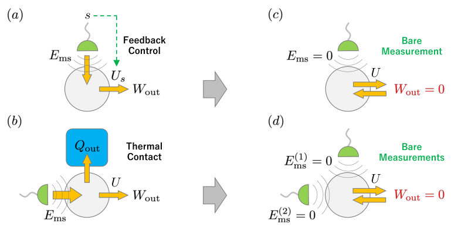
<figcaption class="paper-figure-caption"><b>Fig 1.</b> FIG. 1. Quantum measurement-powered heat engines. (a) Feedback-assisted measurement-powered engine [12]. A quantum measurement is performed, yielding an outcome s, followed by a unitary feedback operation Us conditioned on s, through which work Wout is extracted. (b) Thermalization-assisted measurement-powered engine [19]. A quantum measurement is performed, followed by a unitary operation U, independent of the measurement outcome, through which work Wout is extracted, and the working substance is brought into contact with a thermal reservoir. (c) If the measurement outcome in (a) is not used for feedback, no work can be extracted (Wout = 0) in the steady cycle. (d) If the thermal reservoir...</figcaption>
</figure>
<figure class="paper-figure-card">
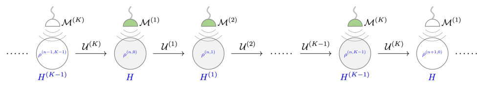
<figcaption class="paper-figure-caption"><b>Fig 2.</b> FIG. 2. The cycle (2.1) of a quantum engine powered purely by quantum measurements. In each cycle, K pairs of nonselective bare quantum measurements M(k) and unitary operations U(k) are performed, where each unitary U(k) is generated by driving the Hamiltonian as H(k−1) →H(k) (k = 1, . . . , K). In the nth cycle, the state of the working substance evolves as ρ(n,k) = (U(k) ◦M(k))(ρ(n,k−1)), with ρ(n,K) = E(ρ(n,0)) = ρ(n+1,0). To close the cycle, the Hamiltonian is returned to its initial one, H(K) = H(0) = H, at the end of each cycle. In contrast to previously studied measurement-powered engines [12, 19], this engine involves neither feedback control nor thermal contact.</figcaption>
</figure>

**Main problem.** Investigating whether work can be extracted from a quantum heat engine powered solely by bare quantum measurements without feedback control or thermal contact in the steady regime.

**Main result.** A no-go theorem proving that in the steady regime, bare quantum measurements become nondisturbing and cannot inject energy, making work extraction impossible without entropy-decreasing processes like feedback or thermalization.

**Method.** The authors use a Poincaré-like recurrence theorem for general quantum channels, polar decomposition of Kraus operators, and thermodynamic analysis of the first law and entropy changes.

**Summary.** The paper establishes a fundamental limit on quantum heat engines that attempt to operate using only quantum measurements as a power source. It proves that in a steady-state regime, such engines cannot extract work because the measurements eventually become non-disturbing and fail to inject energy. The result highlights that for a measurement-powered engine to function, it must be supplemented by processes that decrease entropy, such as feedback control or thermalization with a reservoir.

Detailed structure

**Model / system.** A finite-dimensional quantum system undergoing a cycle of K steps, each consisting of a nonselective bare quantum measurement followed by a unitary driving operation that changes the Hamiltonian.

**Key observables.** Work extraction (W_out), energy injected by measurement backaction (E_ms), and von Neumann entropy change (Delta S).

**Important parameters / regimes.** Steady-state regime, bare (unital) measurements, and the presence or absence of feedback control/thermal contact.

**Assumptions / limitations.** The working substance is a finite-dimensional quantum system, and the measurements are 'bare' (non-selective and without feedback).

**Figures summary.** Figure 1 compares different engine types (feedback-assisted, thermalization-assisted, and the no-go scenarios); Figure 2 depicts the specific sequence of measurements and unitaries in the engine cycle.

**Paper structure.** The paper introduces the problem of measurement-powered engines, defines the mathematical framework for bare measurements and the engine cycle, applies a recurrence theorem to analyze the steady regime, proves the no-go theorem via entropy and energy constraints, and concludes with the necessity of entropy-decreasing processes.

**Why it may be interesting.** It provides a fundamental thermodynamic constraint on the utility of measurement backaction as a resource, which is crucial for anyone designing quantum heat engines or studying the thermodynamics of open quantum systems.

Abstract

We study the thermodynamics of a quantum measurement-powered engine that converts energy injected by measurement backaction into work. We consider an engine with a finite-dimensional working substance, driven purely by quantum measurements, i.e., by bare quantum measurements, without feedback control or thermal contact in the thermodynamic cycle. On the basis of a Poincaré-like recurrence theorem for general quantum channels, we prove a no-go result for work extraction from such an engine in the steady regime. In the steady regime, quantum measurements become nondisturbing and do not inject energy into the working substance. Consequently, no work can be extracted. This result reveals the necessity of an entropy-decreasing process, such as feedback control or thermal contact, for work extraction in steady-cycle measurement-powered engines.

[↑ back to top](#top)

### [Approaching the Limit of Quantum Clock Precision](http://arxiv.org/abs/2604.22704v1)

**Authors:** Chad Nelmes, Emanuel Schwarzhans, Tony Apollaro, Timothy Spiller, Irene D'Amico  
**Type:** theory · **Category:** quantum information and computing · **PDF:** <https://arxiv.org/pdf/2604.22704v1>  
**Analysis basis:** full PDF text, analyzed in chunks
**Topic relevance:** 🔥 `dissipative systems` **4/5** · 🔥 `non-equilibrium dynamics` **3/5** · `correlated / nonlocal dissipation` **2/5** · `methods for driven-dissipative` **2/5**

↔ Scroll figures horizontally

<figure class="paper-figure-card">
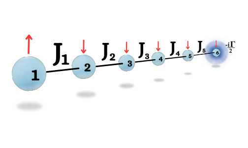
<figcaption class="paper-figure-caption"><b>Fig 1.</b> FIG. 1: Clock set-up for an N = 6-site chain. Red arrows indicate initial state |1⟩, i.e. a localized excitation on the first site of a nearest-neighbor, time-independent Hamiltonian, with a sink (zero-temperature bath, blue sphere) on the final site.</figcaption>
</figure>
<figure class="paper-figure-card">
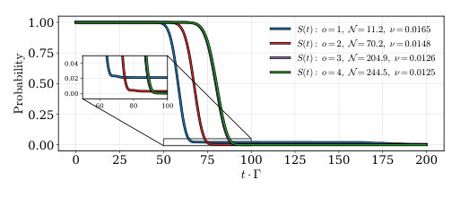
<figcaption class="paper-figure-caption"><b>Fig 2.</b> FIG. 4: Survival probability dynamics trends due to increased engineering via the number of couplings adjusted o, on the end of the chain for an optimized N = 40−site XX chain with dissipation.</figcaption>
</figure>
<figure class="paper-figure-card">
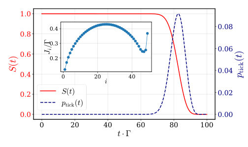
<figcaption class="paper-figure-caption"><b>Fig 3.</b> FIG. 2: Survival probability S(t) (red, left y-axis) and tick PDF ptick(t) (blue dashed, right y-axis) for an N = 50 chain with an all-but-four PST coupling (inset). Couplings are globally scaled with J0 = 0.0172, and the final couplings up to the last site in the chain are J[N−4:N−1] ∈[0.245, 0.243, 0.255, 0.367]. The inset shows the corresponding NN couplings Ji/Γ. This solution yields figures of merit of ν = 1.22 · 10−2 and N = 361.62</figcaption>
</figure>
<figure class="paper-figure-card">
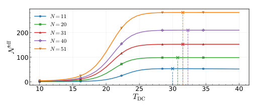
<figcaption class="paper-figure-caption"><b>Fig 4.</b> FIG. 5: Effective clock precision as a function of decoupling time. The effective precision N eff (Eq. (11)), extracted from the survival probability over the time at which the tick occurred for the optimized N−site solution, is shown as a function of the decoupling time TDC in units of Γ−1. Vertical dotted lines guide the eye to the points (x-markers) where the plateau of maximal accuracy attains 99% of its original value, corresponding to particular even and odd N-solutions.</figcaption>
</figure>
<figure class="paper-figure-card">
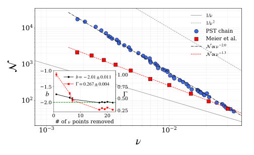
<figcaption class="paper-figure-caption"><b>Fig 5.</b> FIG. 3: Log–log representation of the full optimization dataset (blue circles) spanning N = 10–2000, with a direct comparison to the previous results (red squares) of [9], at commensurate system sizes. By removing finite-size effects (i.e. taking N &gt; 10) a scaling of N ∝ν−2 emerges. Fits are for N &gt; 10. Convergency to -2 of the exponent b in N ∝νb is shown in the inset, (left y-axis), as lower−N contributions are progressively removed. The right y-axis tracks the convergence of the intrinsic decay rate Γ.</figcaption>
</figure>
<figure class="paper-figure-card">
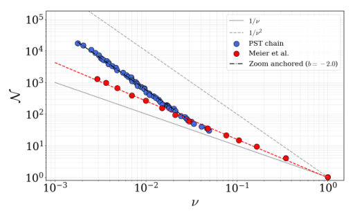
<figcaption class="paper-figure-caption"><b>Fig 6.</b> FIG. 6: Full dataset within the bounds of the PRT presented in Fig.3.</figcaption>
</figure>
<figure class="paper-figure-card">
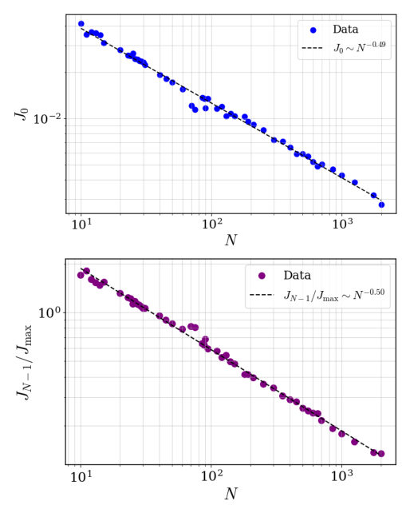
<figcaption class="paper-figure-caption"><b>Fig 7.</b> FIG. 7: Log–log scaling of the bulk coupling J0 with system size N. Ratio JN−1/Jmax illustrating the systematic enhancement of the boundary coupling required for efficient extraction as N increases. The dotted line indicates fitting to the numerical data.</figcaption>
</figure>

**Main problem.** Determining how to construct an autonomous quantum clock that reaches the fundamental precision-resolution trade-off (PRT) scaling bound.

**Main result.** The authors demonstrate a blueprint for a quantum clock using engineered coherent transport in dissipative spin chains that achieves the optimal precision scaling of N proportional to the inverse square of the resolution.

**Method.** The study uses an analytical approach leveraging the spectral properties of non-Hermitian Hamiltonians combined with numerical optimization via the Differential Evolution algorithm.

**Summary.** This paper proposes a method to build a quantum clock that reaches the fundamental limit of precision. By using specially engineered couplings in a 1D spin chain with dissipation, the authors show that the clock's precision can scale with the inverse square of its resolution. The protocol is shown to be robust to timing errors during the clock's re-initialization. This breakthrough moves quantum clock technology closer to the theoretical maximum performance allowed by physics.

Detailed structure

**Model / system.** The model consists of 1D, open-ended, spin-1/2 XX chains with engineered mirror-symmetric couplings and a dissipative sink at the final site described by a Lindblad master equation.

**Key observables.** Resolution (nu), Precision (N), Tick Probability Density Function (p_tick(t)), Survival Probability (S(t)), and average time (mu).

**Important parameters / regimes.** Decay rate (Gamma), system size (N), coupling strength (J0), and the decoupling time (T_DC).

**Assumptions / limitations.** The derivation assumes non-degenerate eigenvalues for the effective Hamiltonian and focuses on the case of a single excitation initialized at the first site.

**Figures summary.** Figure 2 shows survival probability and tick PDF for a 50-site chain; Figure 3 compares precision scaling against previous results; Figure 6 shows datasets for chains up to 2000 sites; Figure 7 illustrates the scaling of coupling parameters with system size.

**Paper structure.** The paper introduces the PRT bound, describes the engineered spin-chain model, presents the optimization of couplings using Differential Evolution, provides analytical derivations for the tick PDF and moments, and concludes with scaling laws and robustness analysis.

**Why it may be interesting.** This work is highly relevant to open quantum systems and many-body dynamics as it demonstrates how controlled dissipation and engineered interactions can be used to saturate fundamental limits of precision in quantum-limited sensing and timekeeping.

Abstract

Precise and autonomous clocks are of fundamental interest and central importance to both foundational studies and practical applications. Here, we construct a blueprint for a quantum clock governed by time-independent interactions. By carefully-engineered coherent transport in dissipative spin chains, we achieve a scaling exponent at the precision-resolution trade-off fundamental bound, bringing this within reach of physically realistic and experimentally accessible systems. We further introduce a sudden-quench protocol that enables repeated operation through a simple initialization and detachment mechanism. Remarkably, the protocol is robust to imprecise detachment timing, implying that high-precision timekeeping can be achieved even when driven by a clock with much lower precision.

[↑ back to top](#top)

### [On truncations of hierarchical equations of motion for finite-dimensional systems](http://arxiv.org/abs/2604.22568v1)

**Authors:** Vasilii Vadimov  
**Type:** theory · **Category:** numerical methods · **PDF:** <https://arxiv.org/pdf/2604.22568v1>  
**Analysis basis:** full PDF text, analyzed in chunks
**Topic relevance:** 🔥 `dissipative systems` **4/5** · 🔥 `methods for driven-dissipative` **4/5** · `non-equilibrium dynamics` **2/5**

↔ Scroll figures horizontally

<figure class="paper-figure-card">
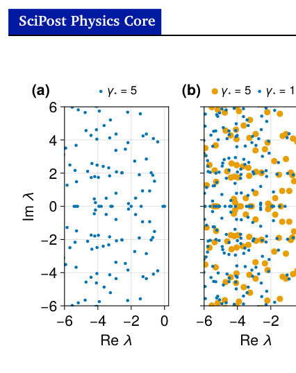
<figcaption class="paper-figure-caption"><b>Fig 1.</b> Figure 1: Eigenvalues of truncated Liouvillians LT(γ∗). Here, α = 2, ω0 = 2, and η = 0.5. Poles and residues of coth approximation are given in Tab. 1.</figcaption>
</figure>

**Main problem.** The paper investigates the mathematical stability and spectral convergence of truncated Hierarchical Equations of Motion (HEOM) for finite-dimensional open quantum systems, specifically addressing the issue of spectral pollution.

**Main result.** The author proves that using a Schur-complement-type terminator ensures that the spectrum of the truncated Liouvillian converges to the full spectrum and that the approximation is free of spurious unstable modes (spectral pollution) if the exact system is stable.

**Method.** The study employs a Schur-complement-type terminator construction, Gershgorin-type theorems for operator-valued matrices, and resolvent analysis to bound the influence of the discarded hierarchy tail.

**Summary.** This paper provides a rigorous mathematical foundation for the truncation of the Hierarchical Equations of Motion (HEOM). It proves that a specific truncation method using a Schur-complement terminator prevents 'spectral pollution,' meaning it won't create fake unstable modes. Furthermore, it demonstrates that as the hierarchy depth increases, the calculated spectrum converges to the true spectrum of the infinite hierarchy. This ensures that numerical simulations of open quantum systems remain physically reliable.

Detailed structure

**Model / system.** The framework applies to finite-dimensional open quantum systems described by the HEOM formalism, with the spin-boson model used as a primary illustrative example.

**Key observables.** The spectrum of the Liouvillian (eigenvalues, poles, and residues) and the stability/gap properties of the dynamics.

**Important parameters / regimes.** The truncation depth (or decay rate threshold gamma*), coupling strength (alpha), frequency (omega_0), and damping rate (eta).

**Assumptions / limitations.** The proofs assume finite-dimensional systems, positive real parts for decay rates, and an exhausting sequence of truncations.

**Figures summary.** Figure 1 plots the eigenvalues of truncated Liouvillians for various truncation depths, visually demonstrating the convergence of eigenvalues with the largest real parts as the depth increases.

**Paper structure.** The paper establishes resolvent bounds, defines the block decomposition and Schur-complement terminator, proves spectral convergence, and concludes with a proof of stability and numerical illustration.

**Why it may be interesting.** This is highly relevant for researchers using HEOM to simulate non-Markovian dynamics, as it provides a rigorous mathematical guarantee that numerical truncations do not introduce artificial instabilities or unphysical spectral features.

Abstract

We study truncations of hierarchical equations of motion (HEOM) for finite-dimensional open quantum systems. We prove that for finite-dimensional approximations constructed with a Schur-complement type of terminator, the spectrum converges to that of the full HEOM as the truncation depth increases. We also prove that this approximation is free of spectral pollution: sufficiently deep truncations do not produce spurious unstable modes, provided the exact HEOM is stable. We illustrate the results for the spin-boson model.

[↑ back to top](#top)

### [Enhanced Tantalum Superconducting Resonator Performance via All-Surface Organic Monolayer Passivation](http://arxiv.org/abs/2604.22112v1)

**Authors:** Harsh Gupta, Moritz Singer, Benedikt Schoof, Anna Cattani-Scholz, Shreya Sharma, Luca Rommeis, Marc Tornow  
**Type:** experiment · **Category:** quantum information and computing · **PDF:** <https://arxiv.org/pdf/2604.22112v1>  
**Analysis basis:** full PDF text, analyzed in chunks
**Topic relevance:** 🔥 `QC/QI experiment` **4/5** · `dissipative systems` **2/5** · `quantum optics experiment` **2/5**

↔ Scroll figures horizontally

<figure class="paper-figure-card">
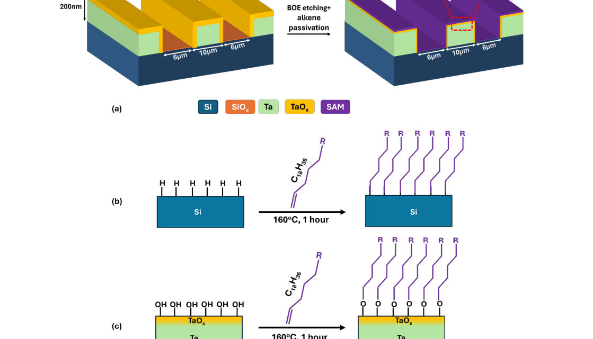
<figcaption class="paper-figure-caption"><b>Fig 1.</b> Figure 1. (a) Schematic showing the cross-section of a resonator, before (left) and after (right) passivation of the two different, exposed surfaces (note that the thin Nb seed layer below Ta is not included in the image); (b) Growth mechanism for an alkene SAM on H-terminated Si (hydrosilylation), mediated by thermal activation of the surface; (c) Proposed growth mechanism on hydroxylated (-OH terminated) Ta native oxide.</figcaption>
</figure>
<figure class="paper-figure-card">
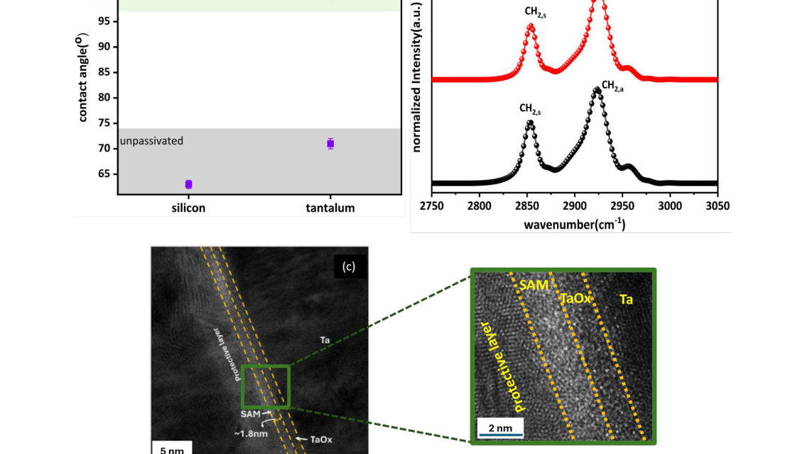
<figcaption class="paper-figure-caption"><b>Fig 2.</b> Figure 2. (a) Contact angle values for passivated and unpassivated Si and Ta surfaces; a significant increase in hydrophobicity post passivation is evident. (b) background subtracted FTIR spectra for passivated Si and Ta showing the presence of different vibrational modes of alkyl molecules on the surface. Labels at the peaks indicate: the symmetric stretch vibration (CH2,s) and the asymmetric stretch vibration (CH2,a) of the methylene-groups of the molecules. (c) Cross-sectional TEM image with close-up on the right, of a passivated Ta thin film; a SAM of thickness ~1.8nm, sandwiched between the thin native oxide and a protective layer used for FIB preparation can be discerned.</figcaption>
</figure>
<figure class="paper-figure-card">
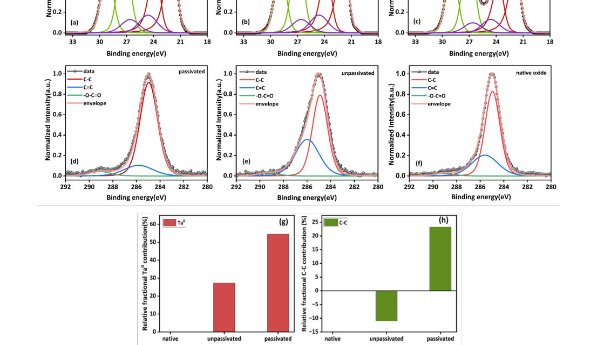
<figcaption class="paper-figure-caption"><b>Fig 3.</b> Figure 3. Background corrected and normalized XPS spectra corresponding to Ta 4f and C 1s for (a, d) alkene-passivated Ta (b, e) unpassivated Ta and (c, f) Ta films with native oxide, respectively. Different oxidation states for Ta (Ta0: elemental Ta, TaO2 and Ta2O5) with spin- orbit coupled doublet (4f7/2 and 4f5/2) are observed. Different components corresponding to different oxidation states of C 1s are observed. (g): Relative fractional contribution for Ta0 (elemental tantalum), normalized with respect to native oxide sample (set as zero); passivated films show significantly higher elemental Ta contributions. (h): Relative fractional contribution of C-C bonds; passivated film shows...</figcaption>
</figure>
<figure class="paper-figure-card">
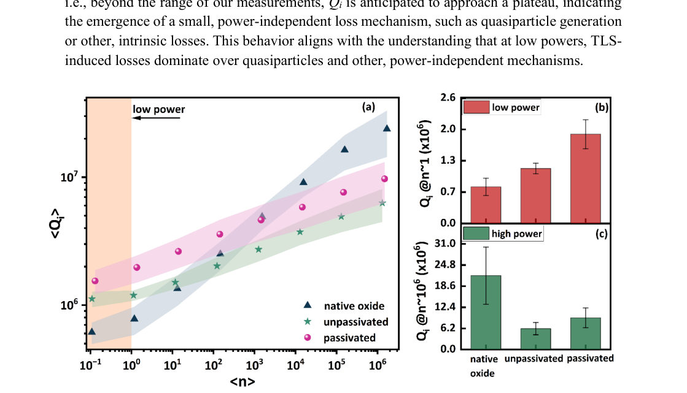
<figcaption class="paper-figure-caption"><b>Fig 4.</b> Figure 4. (a) Mean internal quality factor (Qi) for Ta resonators at 100 mK against mean photon number, for passivated, unpassivated and resonators with native oxide. The shaded region along the data points in the plot denotes the 95% confidence interval of the data. (b) Qi at low input power (⟨n⟩∼1) and (c) high input power (⟨n⟩∼106). Distinct behavioral trends of the resonators in the low and high-power regimes can be discerned. Error bars denote the standard deviation from averaging over all resonators.</figcaption>
</figure>
<figure class="paper-figure-card">
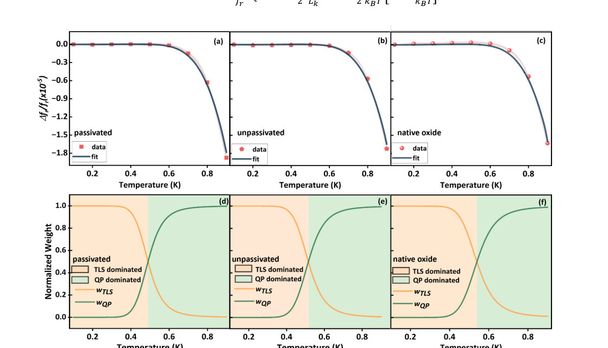
<figcaption class="paper-figure-caption"><b>Fig 5.</b> Figure 5. Mean fractional frequency shift (Δfr/fr) as a function of temperature, measured at excitation powers of -150 dBm of (a) passivated Ta resonators (b) unpassivated resonators and (c) native oxide resonators; the solid line represents the fit to the averaged data (red dots) using eq. 2; the thin light-red shaded region shows the 95% confidence interval of the data for different resonators. The corresponding weights characterizing the different loss contributions for passivated resonators, unpassivated resonators and native oxide resonators are displayed in d), e) and f), respectively. All normalized weights show a clear dominance of TLS contributions for lower temperatures and...</figcaption>
</figure>
<figure class="paper-figure-card">
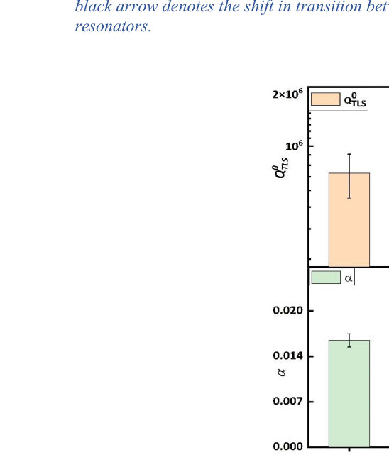
<figcaption class="paper-figure-caption"><b>Fig 6.</b> Figure 7. Parameters 𝑄𝑇𝐿𝑆</figcaption>
</figure>
<figure class="paper-figure-card">
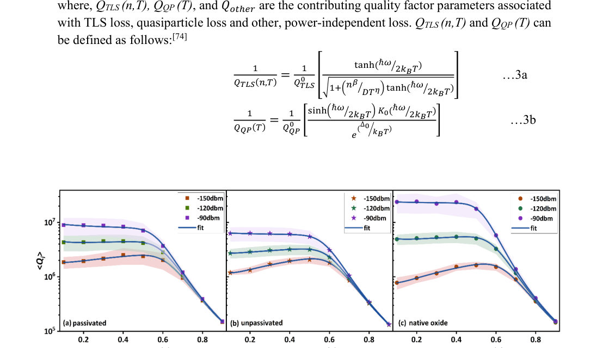
<figcaption class="paper-figure-caption"><b>Fig 7.</b> Figure 8. Mean internal quality factor (Qᵢ) of Ta resonators as a function of temperature, measured at excitation powers of -150 dBm, -120 dBm, and -90 dBm for (a) passivated resonators (b) unpassivated resonators and (c) native oxide resonators; the solid lines represent the fits to the data using equation 3, and the shaded regions show the 95% C.I. of the data for different resonators. Herein, D, 𝜂 parametrize the TLS saturation with temperature and 𝛽 parametrizes the saturation with input power, 𝑄𝑄𝑃</figcaption>
</figure>
<figure class="paper-figure-card">
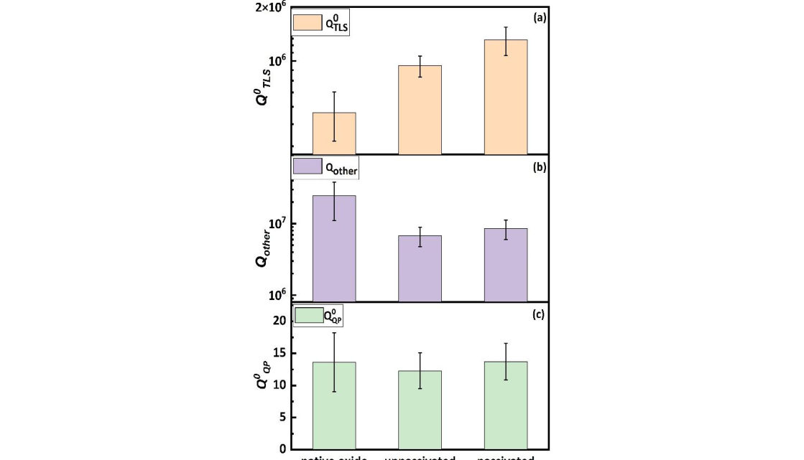
<figcaption class="paper-figure-caption"><b>Fig 8.</b> Figure 9. Loss-related quality factor parameters extracted for all resonator devices from the fitting of Qi against temperature at different powers, according to eq. 3: (a) 𝑄𝑇𝐿𝑆</figcaption>
</figure>
<figure class="paper-figure-card">
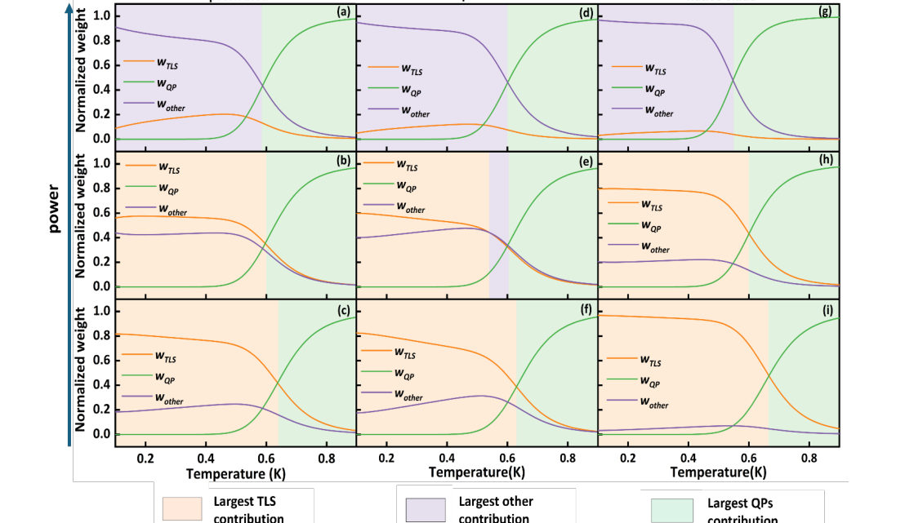
<figcaption class="paper-figure-caption"><b>Fig 9.</b> Figure 10. (a), (b) and (c) show the normalized weights of Qi as a function of temperature, for passivated resonators at -90 dBm, -120dBm and -150 dBm, respectively. (d), (e) and (f) show the normalized weights of Qi for unpassivated resonators at -90 dBm, -120dBm and -150 dBm and (g), (h) and (i) show the normalized weights of Qi for native oxide resonators at -90 dBm, -120dBm and -150 dBm, respectively. For all resonators, the normalized weights show a clearly largest contribution of the TLS at lower temperatures and low powers, and a largest QP</figcaption>
</figure>

**Main problem.** Coherence times in tantalum-based superconducting quantum circuits are limited by dielectric losses from two-level systems (TLS) at the metal-air and substrate-air interfaces, which are worsened by native oxide regrowth.

**Main result.** Applying an all-surface organic monolayer (SAM) passivation using 1-octadecene increases the internal quality factor of tantalum resonators by approximately 140% in the single-photon regime at 100 mK.

**Method.** The researchers used chemical vapor/liquid-phase thermal activation to graft alkene-based self-assembled monolayers onto etched tantalum and silicon, followed by extensive surface characterization (XPS, TEM, AFM) and cryogenic microwave spectroscopy.

**Summary.** This paper demonstrates a method to improve the performance of tantalum superconducting resonators by using organic monolayers to passivate all surfaces. By preventing the regrowth of lossy native oxides, the researchers achieved a 140% increase in the internal quality factor in the single-photon regime. The study confirms that the passivation effectively reduces two-level system (TLS) losses without altering bulk properties. This approach offers a promising route for developing high-coherence components for superconducting quantum computers.

Detailed structure

**Model / system.** The experimental platform consists of alpha-phase tantalum coplanar waveguide (CPW) resonators deposited on high-resistivity silicon (100) substrates, operating in the 5-9 GHz range at millikelvin temperatures.

**Key observables.** Internal quality factor (Qi), TLS-induced loss (QTLS), quasiparticle loss (QQP), power-independent loss (Qother), and fractional frequency shift.

**Important parameters / regimes.** Temperature (100 mK to 900 mK), microwave frequency (5-9 GHz), mean photon number, and surface roughness (RMS).

**Assumptions / limitations.** The study assumes that the observed enhancement is primarily due to the reduction of TLS-induced losses rather than changes to bulk superconducting properties.

**Figures summary.** Figure 1 shows the passivation schematic and growth mechanisms; Figure 2 compares surface wettability; Figure 5 illustrates frequency shifts vs. temperature; Figure 9 shows the extraction of various loss parameters (TLS, QP, and other); Figure 10 shows loss weights vs. temperature.

**Paper structure.** The paper introduces the problem of interface loss, describes the SAM fabrication and growth mechanism, details the surface characterization techniques to confirm passivation, presents microwave performance measurements (power and temperature dependence), and concludes with an analysis of the underlying loss mechanisms.

**Why it may be interesting.** This work is highly relevant for researchers in quantum optics and open quantum systems as it provides a scalable material-science solution to mitigate environmental decoherence (TLS) in superconducting hardware.

Abstract

Tantalum is a promising platform for superconducting quantum circuits, yet coherence times remain limited by dielectric losses from interfacial two-level systems (TLS), exacerbated by native oxide regrowth. Here, we implement molecular surface passivation using self-assembled organic monolayers on freshly etched tantalum and silicon in coplanar waveguide resonators. Surface characterization by contact angle, XPS, FTIR and TEM confirm the formation of ordered, nanometer-thick films that suppress oxide formation. Microwave measurements in the ~5-9 GHz range reveal internal quality factors up to 1.8x10^6 in the single-photon regime at 100 mK, representing a ~140% improvement over untreated devices with native oxide. Power and temperature dependent measurements attribute this enhancement to reduced TLS-induced losses. These results demonstrate that molecular passivation effectively engineers low-loss interfaces and provides a scalable route toward high-coherence superconducting quantum devices.

[↑ back to top](#top)

### [Floquet mobility edges and transport in a periodically driven generalized Aubry-André model](http://arxiv.org/abs/2604.21992v1)

**Authors:** Jayashis Das, Vatsana Tiwari, Manish Kumar, Auditya Sharma  
**Type:** theory · **Category:** disordered systems and neural networks · **PDF:** <https://arxiv.org/pdf/2604.21992v1>  
**Analysis basis:** full PDF text, analyzed in chunks
**Topic relevance:** 🔥 `non-equilibrium dynamics` **4/5** · `analog quantum simulation` **2/5** · `non-equilibrium universality` **2/5**

↔ Scroll figures horizontally

<figure class="paper-figure-card">
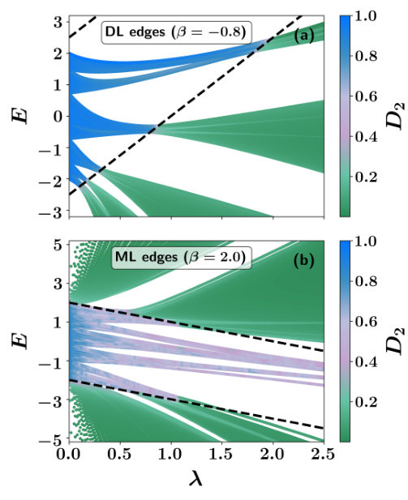
<figcaption class="paper-figure-caption"><b>Fig 1.</b> FIG. 1. Fractal dimension D2 of all the eigenstates of the undriven GPD model as a function of eigenenergies E and quasiperiodic potential strength λ. (a) For β = −0.8, where extended and localized eigenstates coexist and are separated by a DL edge. (b) For β = 2.0, where the extended phase is replaced by a multifractal phase, leading to an ML edge. Black dashed lines denote the exact analytical mobility edges given in Eq. (4) and (5). Results are shown for a system size L = 987 with periodic boundary conditions, averaged over 10 realizations of the phase ϕ.</figcaption>
</figure>
<figure class="paper-figure-card">
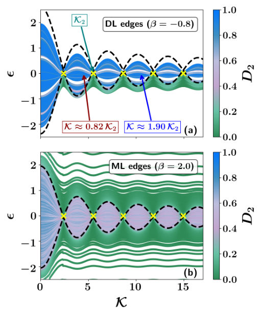
<figcaption class="paper-figure-caption"><b>Fig 2.</b> FIG. 2. Fractal dimension D2 of all the Floquet eigenstates of the driven GPD model at ω = 10, shown as a function of quasienergy ϵ and K. (a) For β = −0.8, where periodic driving induces a DL edge in the Floquet spectrum. (b) For β = 2.0, where the system exhibits an ML edge, with multifractal states (0 &lt; D2 &lt; 1) in the central region and localized states near the spectral edges. Black dashed lines denote the ana- lytically obtained mobility edges in Eq. (19). At the zeros of J0(K), occurring at K ≈2.4048, 5.5201, 8.6537, . . . (marked by yellow crosses), the effective hopping is suppressed, result- ing in a fully localized spectrum. The arrows mark repre- sentative points whose spectral...</figcaption>
</figure>
<figure class="paper-figure-card">
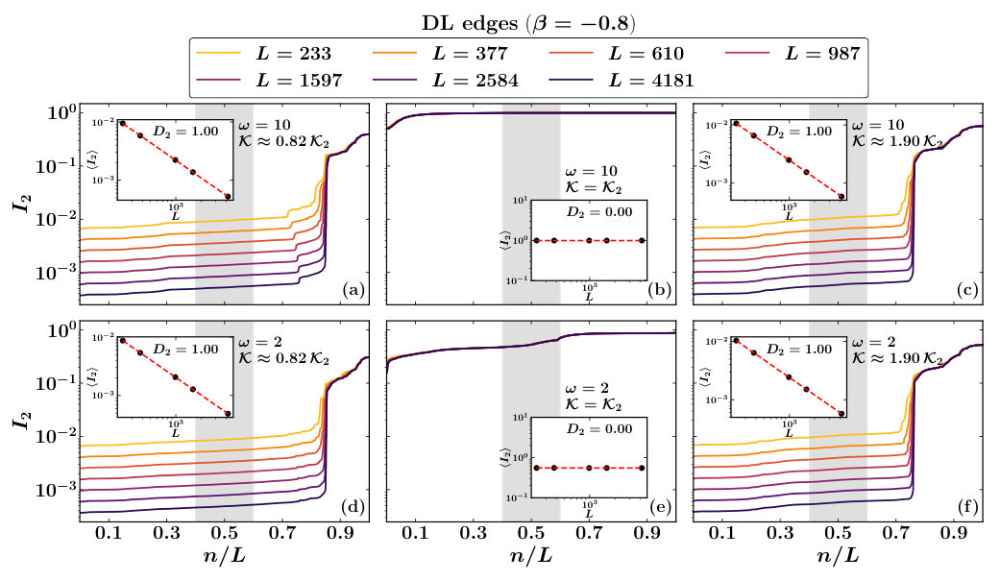
<figcaption class="paper-figure-caption"><b>Fig 3.</b> FIG. 3. Sorted inverse participation ratio I2 of Floquet eigenstates as a function of the normalized eigenstate index n/L for different system sizes at β = −0.8 (with DL edges), shown for different values of K, where K2 denotes the second zero of J0(K). (a)–(c) correspond to ω = 10, while (d)–(f) correspond to ω = 2. Insets show the average ⟨I2⟩over Floquet eigenstates within the grey shaded window as a function of system size. The fractal exponent D2 is extracted from linear fits of log⟨I2⟩versus log L, as defined in Eq. (23). All results are for λ = 0.05, averaged over 10 realizations of the phase ϕ.</figcaption>
</figure>
<figure class="paper-figure-card">
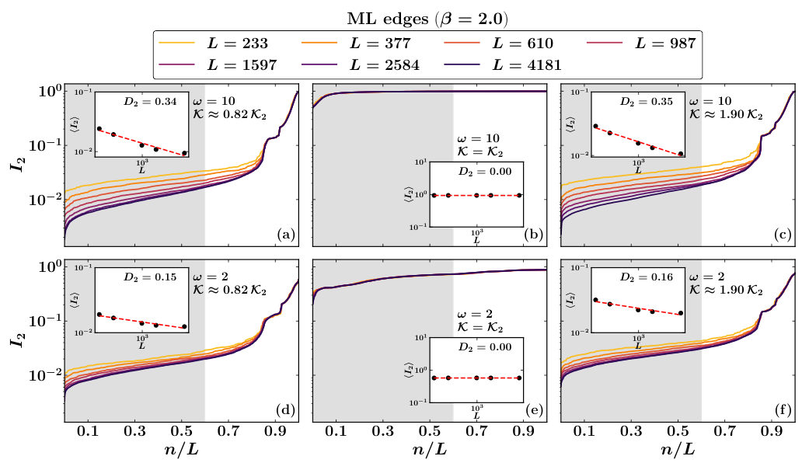
<figcaption class="paper-figure-caption"><b>Fig 4.</b> FIG. 4. Sorted inverse participation ratio I2 of Floquet eigenstates as a function of the normalized eigenstate index n/L for different system sizes at β = 2.0 (exhibiting ML edges), shown for different values of K, where K2 denotes the second zero of J0(K). (a)-(c) correspond to ω = 10, while (d)-(f) correspond to ω = 2. Insets show the average ⟨I2⟩over Floquet eigenstates within the grey shaded window as a function of system size. The fractal exponent D2 is extracted from linear fits of log⟨I2⟩ versus log L, as defined in Eq. (23). All the results are for λ = 0.05, and averaged over 10 realizations of the phase ϕ.</figcaption>
</figure>
<figure class="paper-figure-card">
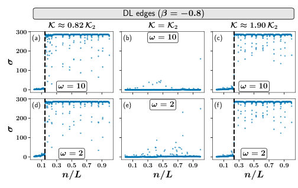
<figcaption class="paper-figure-caption"><b>Fig 5.</b> FIG. 5. Standard deviation σ of Floquet eigenstates as a function of the normalized eigenstate index n/L for β = −0.8 (associated with DL edges), shown for different values of K. (a)-(c) correspond to ω = 10, while (d)-(f) correspond to ω = 2. Black dashed lines denote the analytical mobility edge positions obtained from Eq. (19). At the Bessel zero K = K2 [panels (b) and (e)], all states are localized. Away from this point [panels (a), (c), (d), and (f)], extended states dominate the spectrum, with localized states appearing near the lower- edge of the spectrum. Results are shown for a system size L = 987, λ = 0.05, and averaged over 10 realizations of the phase ϕ.</figcaption>
</figure>
<figure class="paper-figure-card">
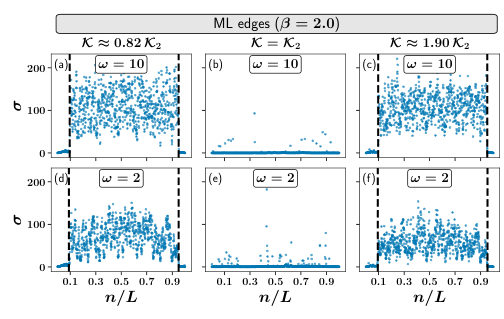
<figcaption class="paper-figure-caption"><b>Fig 6.</b> FIG. 6. Standard deviation σ of Floquet eigenstates as a function of the normalized eigenstate index n/L for β = 2.0 (associated with ML edges), shown for different values of K. (a)-(c) correspond to ω = 10, while (d)-(f) correspond to ω = 2. Black dashed lines denote the analytical mobility edge positions obtained from Eq. (19). At the Bessel zero K = K2 [panels (b) and (e)], all states are localized. Away from this point [panels (a), (c), (d), and (f)], extended states dominate the spectrum, with localized states appearing near the lower-energy edge. Results are shown for a system size L = 987, λ = 0.05, and averaged over 10 realizations of the phase ϕ.</figcaption>
</figure>
<figure class="paper-figure-card">
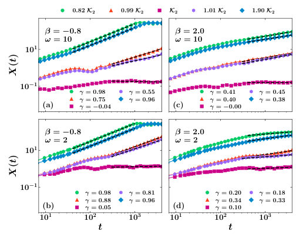
<figcaption class="paper-figure-caption"><b>Fig 7.</b> FIG. 7. Dynamics of the root-mean-squared displacement X(t) of a wave packet initially localized at the center of the chain. Rows correspond to different values of the driving fre- quency ω, while columns correspond to different values of β. Different values of K are represented by distinct markers and colors, with K2 ≈5.52 denoting the second zero of the Bessel function J0(K). Black dashed lines indicate power-law fits of X(t) ∼tγ in the long-time regime, after initial transients and before saturation. The extracted growth exponents γ, cor- responding to each value of K, are indicated by the respec- tive markers. Results are shown for a system size L = 987, λ = 0.05, and averaged over 100...</figcaption>
</figure>
<figure class="paper-figure-card">
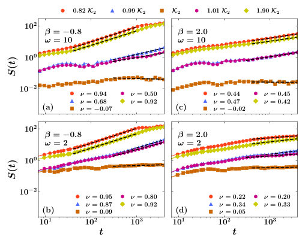
<figcaption class="paper-figure-caption"><b>Fig 8.</b> FIG. 8. Dynamics of the half-chain entanglement entropy S(t) for the periodically driven GPD model. Rows corre- spond to different values of the driving frequency ω, while columns correspond to different values of β. Different val- ues of K are represented by distinct markers and colors, with K2 ≈5.52 denoting the second zero of the Bessel function J0(K). Black dashed lines denote power-law fits of S(t) ∼tν</figcaption>
</figure>
<figure class="paper-figure-card">
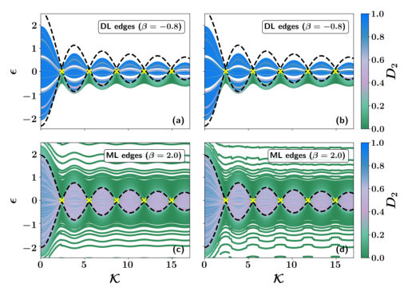
<figcaption class="paper-figure-caption"><b>Fig 9.</b> FIG. 9. Fractal dimension D2 of all the Floquet eigenstates of the driven GPD model for ω = 10 shown as a function of quasienergy ϵ and K. (a),(c) For periodic boundary conditions (PBC) with β = −0.8 and β = 2.0, respectively. (b),(d) For open boundary conditions (OBC) with β = −0.8 and β = 2.0, respectively. Black dashed lines denote the analytically obtained mobility edges in Eq. (19). At the zeros of J0(K) (marked by yellow crosses), drive-induced localization leads to a fully localized spectrum. Results are shown for a system size L = 987, λ = 0.05, and averaged over 10 realizations of the phase ϕ.</figcaption>
</figure>
<figure class="paper-figure-card">
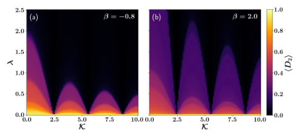
<figcaption class="paper-figure-caption"><b>Fig 10.</b> FIG. 11. Average fractal dimension ⟨D2⟩of all eigenstates of the effective Hamiltonian in Eq. (13), plotted as a function of quasiperiodic potential strength λ and K for (a) β = −0.8, and (b) β = 2.0. Results are shown for a system size L = 987, averaged over 10 realizations of the phase ϕ.</figcaption>
</figure>

**Main problem.** Investigating how a periodic electric field drive modifies the mobility edge structure and transport properties in the generalized Aubry-Andre (GPD) model.

**Main result.** The study uncovers two distinct Floquet mobility edges (delocalized-localized and multifractal-localized) and demonstrates that driving parameters can control transport regimes ranging from superdiffusive to subdiffusive.

**Method.** The authors use Floquet-Magnus expansion and Avila's global theory for analytical predictions, alongside numerical diagnostics like fractal dimension, IPR, and real-time wave packet dynamics.

**Summary.** This paper explores how a periodic electric field can be used to tune the localization properties of a quasiperiodic system. The authors identify two types of Floquet mobility edges depending on the model's deformation parameter. They show that the driving amplitude can induce full localization at specific points and that the driving frequency can switch transport between superdiffusive and subdiffusive regimes. This work highlights the potential for using periodic driving to precisely engineer quantum transport in disordered systems.

Detailed structure

**Model / system.** A one-dimensional periodically driven Ganeshan-Pixley-Das Sarma (GPD) model describing non-interacting spinless fermions on a quasiperiodic lattice subject to a time-periodic electric field.

**Key observables.** Fractal dimension (D2), Inverse Participation Ratio (IPR), Lyapunov exponent, root-mean-squared deviation (RMSD), and return probability.

**Important parameters / regimes.** Driving amplitude (K), driving frequency (omega), potential strength (lambda), and the deformation parameter (beta).

**Assumptions / limitations.** High-frequency limit approximations are used for the effective Hamiltonian; higher-order terms in the Floquet-Magnus expansion are neglected in certain analytical derivations.

**Figures summary.** Figures show the fractal dimension as a function of eigenenergy and driving strength, the scaling of IPR to extract fractal dimensions, and the time evolution of return probability and wave packet spreading.

**Paper structure.** The paper introduces the driven GPD model, applies Floquet-Magnus expansion and Avila's theory to identify mobility edges, analyzes spectral properties (fractal dimension/IPR), investigates transport dynamics (RMSD/diffusion), and discusses frequency-dependent deviations.

**Why it may be interesting.** It provides a powerful mechanism for engineering mobility edges and controlling transport via external driving, which is highly relevant for controlling localization in driven many-body systems and synthetic quantum lattices.

Abstract

We investigate the effect of a periodic electric field drive on the generalized Aubry-André model, also known as the Ganeshan-Pixley-Das Sarma (GPD) model, which is well known as a host of mobility edges. Our study of the Floquet spectrum of the driven GPD model uncovers the emergence of two distinct Floquet mobility edges, a delocalized--localized (DL) edge in the bounded regime, and a multifractal--localized (ML) edge in the unbounded regime. Using analytical results derived from Avila's global theory applied to the high frequency effective Hamiltonian, together with numerical diagnostics such as the fractal dimension and inverse participation ratio, we demonstrate that these mobility edges can be effectively controlled by the amplitude and frequency of the electric field drive. We also identify drive-induced localization at specific values of the driving parameters, corresponding to dynamical localization points in the absence of quasiperiodic potential. Furthermore, the dynamical study of the periodically driven GPD model demonstrates superdiffusive to almost ballistic transport in the bounded regime corresponding to the DL edges, whereas subdiffusive transport is observed in the unbounded regime associated with the ML edges. We also analyze deviations from the high-frequency effective description by explicitly examining the low-frequency driving regime, where significant and counterintuitive deviations in both spectral properties and transport behavior are observed. Our study highlights the interplay of a quasiperiodic potential and a periodically varying electric field drive as a powerful mechanism to engineer mobility edges and control transport in systems with rich spectral features.

[↑ back to top](#top)

### [Super-Heisenberg protocol for dark matter and high-frequency gravitational wave search](http://arxiv.org/abs/2604.22336v1)

**Authors:** Wakutaka Nakano, Ryoto Takai  
**Type:** theory · **Category:** other · **PDF:** <https://arxiv.org/pdf/2604.22336v1>  
**Analysis basis:** full PDF text, analyzed in chunks
**Topic relevance:** 🔥 `Tavis-Cummings & cavity-many-emitter` **4/5** · `dissipative systems` **2/5** · `quantum measurements` **2/5**

↔ Scroll figures horizontally

<figure class="paper-figure-card">
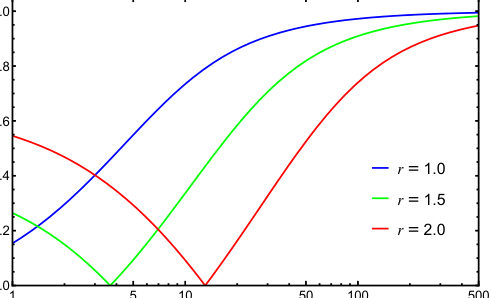
<figcaption class="paper-figure-caption"><b>Fig 1.</b> Figure 1: Absolute values of the ratio ⟨ˆJz⟩/⟨ˆJz⟩0 as functions of N for r = 1.0 (blue), r = 1.5 (green), and r = 2.0 (red), with ϑ = π/2. Here, ⟨ˆJz⟩and ⟨ˆJz⟩0 denote the expectation values obtained when the protocol is initialized in the spin-motion squeezed state and in the ground state, respectively.</figcaption>
</figure>
<figure class="paper-figure-card">
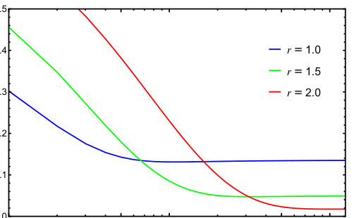
<figcaption class="paper-figure-caption"><b>Fig 2.</b> Figure 2: Ratios var( ˆJz)low/var( ˆJz)0 as functions of N for r = 1.0 (blue), r = 1.5 (green), and r = 2.0 (red), with ϑ = π/2.</figcaption>
</figure>
<figure class="paper-figure-card">
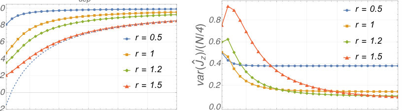
<figcaption class="paper-figure-caption"><b>Fig 3.</b> Figure 3: Numerical results of the expectation value (left) and the variance (right) of ˆJz as a function of N for r = 0.5 (blue), r = 1.0 (orange), r = 1.2 (green), and r = 1.5 (red). The results are compared with those obtained when the protocol is initialized in the ground state instead of the spin-motion squeezed state. The dashed curve in the left panel shows the result obtained from Eq. (2.13) for r = 1.5.</figcaption>
</figure>
<figure class="paper-figure-card">
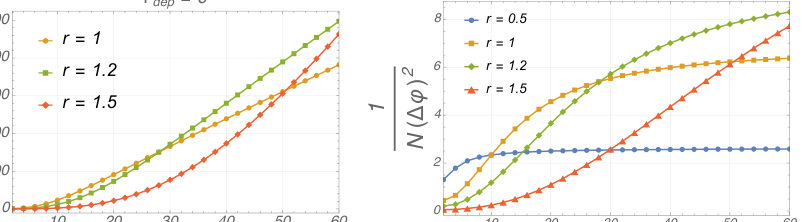
<figcaption class="paper-figure-caption"><b>Fig 4.</b> Figure 4: Sensitivities (∆φ)−2 as a function of N for r = 0.5 (blue), r = 1.0 (orange), r = 1.2 (green), and r = 1.5 (red). The right panel shows the sensitivity relative to that obtained with a non-squeezed initial state; values greater than unity indicate an enhancement due to the spin-motion squeezed state.</figcaption>
</figure>
<figure class="paper-figure-card">
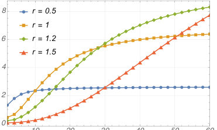
<figcaption class="paper-figure-caption"><b>Fig 5.</b> Fig. 5 shows the sensitivity in comparison with the Heisenberg scaling (∆φ)2 ∝N−2.</figcaption>
</figure>
<figure class="paper-figure-card">

<figcaption class="paper-figure-caption"><b>Fig 6.</b> Fig. 6 shows the dependence of the sensitivity (∆φ)−2 on the squeezing parameter r. A</figcaption>
</figure>
<figure class="paper-figure-card">
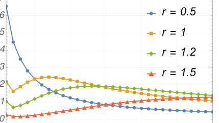
<figcaption class="paper-figure-caption"><b>Fig 7.</b> Figure 5: Sensitivities (N∆φ)−2 as a function of N for r = 0.5 (blue), r = 1.0 (orange), r = 1.2 (green), and r = 1.5 (red). On the plateau, the sensitivity follows the Heisenberg scaling (∆φ)2 ∝N−2, whereas in the regime where the curves increase, it exhibits super- Heisenberg scaling ∝N−2k with k &gt; 1.</figcaption>
</figure>
<figure class="paper-figure-card">
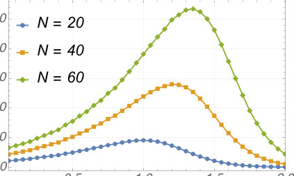
<figcaption class="paper-figure-caption"><b>Fig 8.</b> Figure 6: Sensitivities (∆φ)−2 as a function of the squeezing parameter r for N = 20 (blue), N = 40 (orange), and N = 60 (green).</figcaption>
</figure>
<figure class="paper-figure-card">
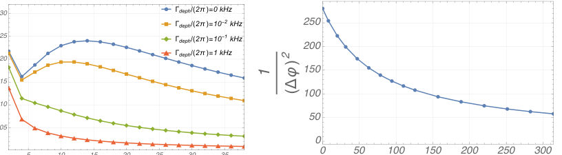
<figcaption class="paper-figure-caption"><b>Fig 9.</b> Figure 7: Sensitivities (N∆φ)−2 as functions of N (left) for Γdep/2π = 0 (blue), 0.01 kHz (orange), 0.1 kHz (green), 1 kHz (red) with r = 1, and as a function of Γdep (right) for N = 40 and r = 1.2.</figcaption>
</figure>
<figure class="paper-figure-card">
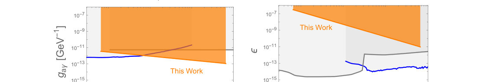
<figcaption class="paper-figure-caption"><b>Fig 10.</b> Figure 8: Sensitivity to the axion-photon coupling (left) and the kinetic mixing of the dark photon (right) as functions of the dark matter mass, mDM = ma or mDP, obtained by scanning over the mass range during a one-year measurement. The blue and gray region in the left panel are excluded by the M82 [51] and by the magnetic white dwarfs [52], respectively. The blue and gray region in the right panel are constrained by the spacecraft, Parker Solar Probe [53], and by the heating of cosmic gases [54], respectively.</figcaption>
</figure>

**Main problem.** Developing a quantum-enhanced sensing scheme to detect extremely weak signals from wave-like dark matter (axion-like particles, dark photons) and high-frequency gravitational waves.

**Main result.** The proposed protocol achieves super-Heisenberg scaling in sensitivity relative to the number of ions and provides a promising platform for exploring previously inaccessible parameter spaces for light dark matter and gravitational waves.

**Method.** The protocol uses an adiabatic evolution via a Tavis-Cummings Hamiltonian to prepare spin-motion squeezed states, followed by optical dipole force operations to transduce motional excitations into measurable spin signals.

**Summary.** This paper proposes a new quantum sensing protocol using 2D ion crystals in Penning traps to detect wave-like dark matter and high-frequency gravitational waves. By preparing spin-motion squeezed states through an adiabatic process, the researchers demonstrate a 'super-Heisenberg' scaling of sensitivity. The study evaluates the protocol's performance against realistic experimental noise like dephasing. Ultimately, the method offers a way to probe previously unexplored frequency and coupling ranges for fundamental physics.

Detailed structure

**Model / system.** The system consists of two-dimensional ion crystals (specifically Be+ ions) in a Penning trap, where collective phonon modes (drumhead and center-of-mass modes) are coupled to the ions' internal qubit states via spin-motion coupling.

**Key observables.** The expectation value and variance of the collective spin z-component (Jz), and the resulting phase sensitivity.

**Important parameters / regimes.** Number of ions (N), squeezing parameter (r), dephasing rate (Gamma_dep), decoherence rate (Gamma_dec), and dark matter mass/frequency.

**Assumptions / limitations.** The analysis is limited to N < 100 and r < 2; it assumes a classical wave nature for dark matter and neglects finite temperature or frequency detuning errors.

**Figures summary.** Figure 1 shows signal scaling with N; Figure 2 shows variance bounds; Figures 3-4 show expectation values and sensitivity vs N; Figure 5 illustrates the transition from super-Heisenberg to Heisenberg scaling; Figure 6 shows sensitivity vs squeezing parameter; Figure 7 shows the impact of dephasing.

**Paper structure.** Introduction of the sensing problem, description of the 2D ion crystal platform and Hamiltonian, detailed protocol for state preparation and sensing, sensitivity analysis for dark matter and gravitational waves, evaluation of noise/decoherence effects, and conclusion.

**Why it may be interesting.** It combines many-body dynamics (ion crystals), quantum control (adiabatic state preparation), and open quantum systems (dephasing/decoherence) to address fundamental questions in particle physics and gravitation.

Abstract

We propose a quantum-enhanced sensing scheme for the detection of wave-like dark matter and high-frequency gravitational waves using two-dimensional ion crystals in a Penning trap. The protocol employs spin-motion squeezed states to improve the signal-to-noise ratio and enable a super-Heisenberg scaling with respect to the number of ions over a broad parameter range. We analyze the sensitivity of the protocol to representative wave-like dark matter candidates, including the axion-like particle and the dark photon, as well as to high-frequency gravitational waves, taking into account the decoherence and dephasing of the ion spins. Our results indicate that two-dimensional ion crystals and this new protocol provide a promising platform for probing previously unexplored parameter space in searches for light dark matter and high-frequency gravitational waves.

[↑ back to top](#top)

### [Two flavor neutrino oscillations in presence of non-Hermitian dynamics](http://arxiv.org/abs/2604.22421v1)

**Authors:** Kritika Rushiya, Gaurav Hajong, Bhabani Prasad Mandal, Poonam Mehta  
**Type:** theory · **Category:** other · **PDF:** <https://arxiv.org/pdf/2604.22421v1>  
**Analysis basis:** full PDF text, analyzed in chunks
**Topic relevance:** 🔥 `dissipative systems` **4/5** · `methods for driven-dissipative` **2/5** · `non-equilibrium dynamics` **2/5**

↔ Scroll figures horizontally

<figure class="paper-figure-card">
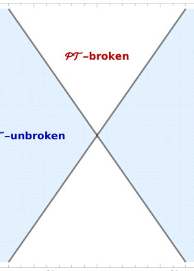
<figcaption class="paper-figure-caption"><b>Fig 1.</b> Figure 1: Regimes of interest shown in κ −σ plane for the PT -symmetric case. The PT -unbroken regime is shown as blue shaded region, while the PT -broken regime is shown in white. The boundary represents the exceptional point. We have taken ∆m2 = 2.5 × 10−3 eV2, φ = π/6.</figcaption>
</figure>
<figure class="paper-figure-card">
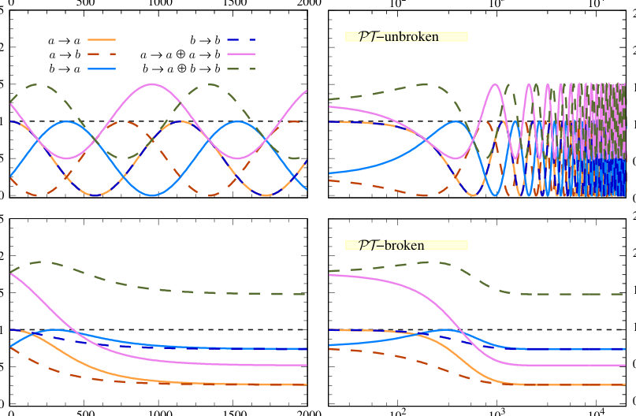
<figcaption class="paper-figure-caption"><b>Fig 2.</b> Figure 2: Left: Probability plotted as a function of L for E = 1 GeV for the PT -unbroken case (top-left) and for the PT -broken case (bottom-left). Right: Probability plotted as a function of L/E km/GeV for PT -unbroken case (top-right) and for PT -broken case (bottom-right). For the PT -unbroken case, we have used σ = 0, τ = π/6 and ∆m2 = 2.5 × 10−21 GeV2. For the PT -broken case, we have used σ = 0, τ ′ = π/6 and ∆m2 = 2.5 × 10−21 GeV2.</figcaption>
</figure>
<figure class="paper-figure-card">
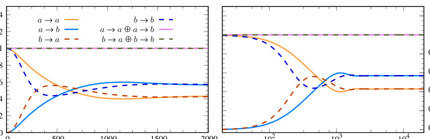
<figcaption class="paper-figure-caption"><b>Fig 3.</b> Figure 3: Left: Probability plotted as a function of L for E = 1 GeV. Right: Probability plotted as a function of L/E. We have taken α = π/6, β = π/3, θ = π/3, ∆m2 = 2.5 × 10−3 eV2, σ = 0.</figcaption>
</figure>
<figure class="paper-figure-card">
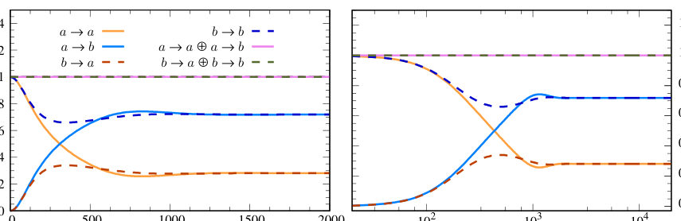
<figcaption class="paper-figure-caption"><b>Fig 4.</b> Figure 4: Left: Probability as function of L for E = 1 GeV. Right: Probability as function of L/E. We have taken α = π/6, β = π/3, ∆m2 = 2.5 × 10−3 eV2, σ = 0, θ = π/4.</figcaption>
</figure>

**Main problem.** Developing a consistent mathematical framework for two-flavor neutrino oscillations in the presence of non-Hermitian dynamics, specifically addressing the failure of conventional inner products to preserve probability.

**Main result.** The authors demonstrate that the G-metric approach fails to conserve probability in both PT-unbroken and PT-broken regimes, whereas the Brody and Graefe density matrix prescription ensures probability conservation and reveals non-Markovian behavior.

**Method.** The study compares two approaches: a bi-orthonormal inner product using a positive-definite metric operator G and the Brody and Graefe density matrix prescription involving a trace-preserving master equation.

**Summary.** This paper investigates how to mathematically model neutrino oscillations when the system is governed by non-Hermitian dynamics. The authors find that standard methods for defining inner products fail to conserve probability in PT-symmetric systems. Instead, they propose using the Brody and Graefe density matrix prescription, which maintains probability conservation and reveals that the system exhibits non-Markovian behavior in the steady state.

Detailed structure

**Model / system.** A two-flavor neutrino oscillation model in the ultra-relativistic limit, using a non-Hermitian Hamiltonian that includes a standard Hermitian part for vacuum oscillations and a non-Hermitian part characterized by parameters kappa, sigma, phi, and chi.

**Key observables.** Neutrino flavor transition probabilities (Paa, Pab, Pba, Pbb) and probability conservation.

**Important parameters / regimes.** Mass squared difference (delta m^2), mixing angle (theta), non-Hermitian parameters (kappa, sigma, phi, chi), and the PT-unbroken vs. PT-broken regimes.

**Assumptions / limitations.** Neutrinos are treated in the ultra-relativistic limit with equal fixed momenta/energy.

**Figures summary.** Figure 2 shows probability non-conservation in the G-metric approach; Figure 3 shows conserved probabilities using the density matrix prescription; Figure 4 illustrates non-Markovian behavior in the PT-symmetric case.

**Paper structure.** The paper introduces the problem of non-Hermitian neutrino oscillations, defines the Hamiltonian and symmetry regimes, compares the G-metric and density matrix approaches, presents analytical results for probabilities, and discusses the implications of non-Markovianity.

**Why it may be interesting.** This paper is highly relevant to researchers in open quantum systems as it addresses fundamental issues in defining unitary-like evolution and probability conservation in non-Hermitian and PT-symmetric dynamics.

Abstract

We develop a consistent mathematical framework for studying two flavor neutrino oscillations in presence of non-Hermitian dynamics. We consider two approaches : (a) bi-orthonormal inner product defined by a positive-definite metric operator $\mathcal{G}$ and (b) the density matrix prescription by Brody and Graefe [Phys. Rev. Lett. 109, 230405 (2012)]. For the $\mathcal{PT}$-symmetric case, we show that the $\mathcal{G}$ metric approach does not work well (probabilities are not conserved) both in $\mathcal{PT}$-unbroken as well as $\mathcal{PT}$-broken regime. Hence, we adopt the density matrix prescription by Brody and Graefe which is a positive semi-definite map. In the density matrix prescription, we note that probability in the steady state limit is not necessarily $1/2$ thereby indicating non-Markovian behavior.

[↑ back to top](#top)

### [Double Slit Experiment in the Heisenberg Picture of Quantum Mechanics](http://arxiv.org/abs/2604.22481v1)

**Authors:** Vlatko Vedral  
**Type:** theory · **Category:** other · **PDF:** <https://arxiv.org/pdf/2604.22481v1>  
**Analysis basis:** full PDF text, analyzed in chunks
**Topic relevance:** 🔥 `quantum measurements` **4/5** · `entanglement & information structure` **2/5**

↔ Scroll figures horizontally

<figure class="paper-figure-card">
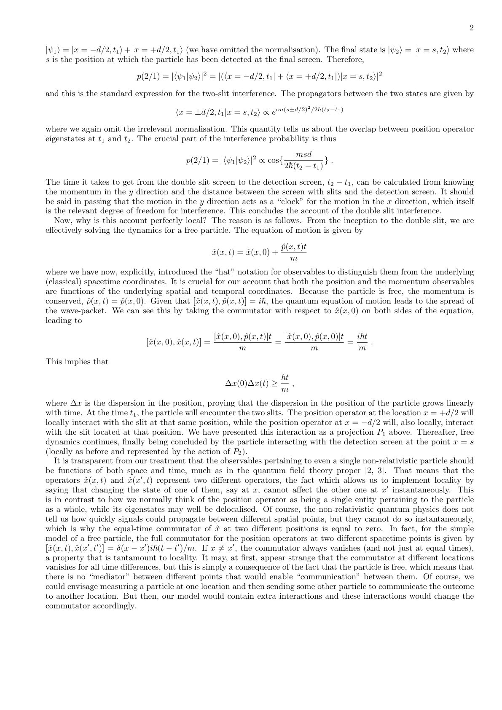
<figcaption class="paper-figure-caption"><b>Fig 1.</b> Low-resolution page preview, page 2</figcaption>
</figure>
<figure class="paper-figure-card">
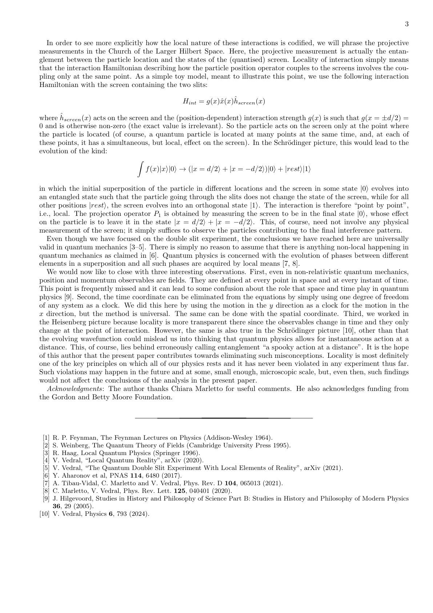
<figcaption class="paper-figure-caption"><b>Fig 2.</b> Low-resolution page preview, page 3</figcaption>
</figure>

**Main problem.** The paper addresses the misconception that the double-slit experiment implies non-locality in quantum mechanics.

**Main result.** The author demonstrates that interference fringes can be fully explained through local interactions by treating position and momentum observables as space-time dependent fields within the Heisenberg picture.

**Method.** The study utilizes the Heisenberg picture of quantum mechanics, employing commutator analysis and the 'Church of the Larger Hilbert Space' to treat measurements as local entanglement between the particle and the screen.

**Summary.** This paper re-examines the double-slit experiment using the Heisenberg picture to argue against the necessity of invoking non-locality. By treating position and momentum as space-time dependent fields, the author shows that interference can be understood through local interactions. The work also explores the 'Church of the Larger Hilbert Space' to describe measurements as local entanglement. Ultimately, it aims to clarify that the apparent 'spooky action' in the Schrödinger picture is an artifact of not treating observables as local fields.

Detailed structure

**Model / system.** A non-relativistic particle undergoing a standard double-slit experiment, involving free evolution phases and interactions with a screen containing two infinitely narrow slits.

**Key observables.** Position and momentum operators defined as functions of both space and time (fields).

**Important parameters / regimes.** Slit separation (d), detection position (s), particle mass (m), and time intervals (t1, t2).

**Assumptions / limitations.** The particle is free during evolution, the slits are infinitely narrow, and the analysis assumes the fundamental validity of locality.

**Paper structure.** The paper begins by motivating the need to re-examine non-locality, introduces the Heisenberg picture framework, develops the mathematical derivation of interference using space-time dependent observables, compares projective measurements with the 'Church of the Larger Hilbert Space', and concludes with a discussion on the locality of quantum phases.

**Why it may be interesting.** It provides a fundamental reinterpretation of quantum measurement and locality, which is highly relevant for those working on the foundations of quantum mechanics and the interpretation of entanglement in open quantum systems.

Abstract

We present the standard double slit experiment with non-relativistic particles in the Heisenberg Picture of quantum mechanics. Our motivation is threefold. First and foremost, and contrary to some claims in the literature, we show that there is no need to talk about non-locality when explaining the interference fringes. Secondly, we emphasise the fact that even in the non-relativistic regime, and in order to preserve locality, we should define the position and momentum observables of a particle as functions of both space and time (and not just time). Thirdly, our presentation compares the projective measurements in the Heisenberg picture with the "Church of the Larger Hilbert Space", the latter of which is seldom discussed in the Heisenberg picture of quantum mechanics.

[↑ back to top](#top)

### [Tantalum Damascene Coplanar Waveguide Resonators Fabricated Using 300 mm Scale Processes](http://arxiv.org/abs/2604.22086v1)

**Authors:** Ekta Bhatia, Yingge Du, Krishna P Koirala, Chung Kow, Mingzhao Liu, Juan Macy, Tharanga R. Nanayakkara, Francisco Ponce, Satyavolu S. Papa Rao, Drew J. Rebar, Peter V. Sushko, Brent A VanDevender, Chongmin Wang, Marvin G. Warner, Zhihao Xiao  
**Type:** experiment · **Category:** quantum information and computing · **PDF:** <https://arxiv.org/pdf/2604.22086v1>  
**Analysis basis:** full PDF text, analyzed in chunks
**Topic relevance:** 🔥 `QC/QI experiment` **4/5**

↔ Scroll figures horizontally

<figure class="paper-figure-card">
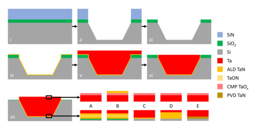
<figcaption class="paper-figure-caption"><b>Fig 1.</b> FIG. 1. Damascene process flow for fabricating tantalum-based su- perconducting resonators. (i–iii) Pattern definition and anisotropic Si etching using a SiO2/SiN hard mask. (iv) Deposition of a 3 nm ALD TaN seed layer. (v) Ta sputter deposition to fill the etched Si features. (vi) CMP removal of Ta from field regions, leaving α-Ta in the trenches. (vii) Post-CMP oxide removal exposing the final recessed Ta structures. A-E show the five device variants studied, distinguished by buried-oxide vs. pristine interfaces and different surface-treatment/capping schemes. (Dimensions not to scale)</figcaption>
</figure>
<figure class="paper-figure-card">
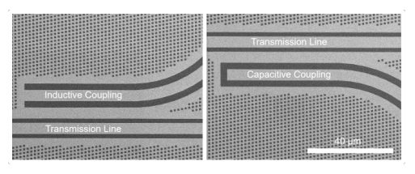
<figcaption class="paper-figure-caption"><b>Fig 2.</b> FIG. 2. Scanning electron microscope (SEM) images depicting an example/structure of an inductively (left) and capacitively (right) coupled resonator. The holes in the ground plane are a requirement for the CMP process to maintain 50% metal coverage.</figcaption>
</figure>
<figure class="paper-figure-card">
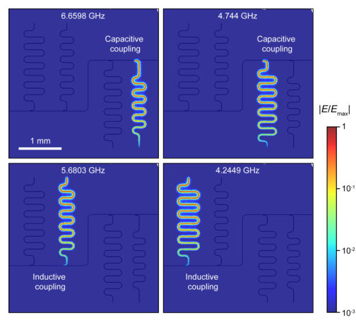
<figcaption class="paper-figure-caption"><b>Fig 3.</b> FIG. 3. Electric field distribution profiles of the quarter-wave reso- nance modes of the 4 CPW resonator along the common feed line. The actual device pattern is placed to the background to help visual- ization.</figcaption>
</figure>
<figure class="paper-figure-card">
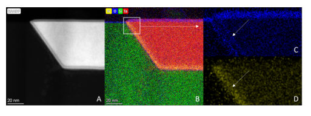
<figcaption class="paper-figure-caption"><b>Fig 4.</b> FIG. 4. (A) STEM image of a Device A type showing clearly defined features relative to the Si substrate. (B) Composite elemental anal- ysis of the device showing the N, O, Si, and Ta. Due to the overlap of the Si-K and Ta-M lines the Ta region is tinted from limitation on elemental identification. Enhanced image of the boxed area showing (C) the trapped oxygen and (D) N layer at the Si interface. The ∼3 nm of TaN exposed to atmosphere (O from TaON) is clearly visible.</figcaption>
</figure>
<figure class="paper-figure-card">
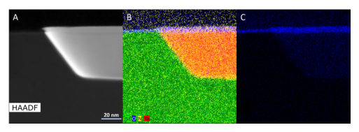
<figcaption class="paper-figure-caption"><b>Fig 5.</b> FIG. 8. (A) STEM image of a Device E type showing clearly defined features relative to the Si substrate. (B) Composite elemental anal- ysis of the device showing the N, O, Si, and Ta. Due to the overlap of the Si-K and Ta-M lines the Ta region is tinted from limitation on elemental identification. (C) Oxygen elemental analysis indicates no oxide at the Si/Ta interfaces. The 2 nm of PVD is present but appears diffused.</figcaption>
</figure>
<figure class="paper-figure-card">
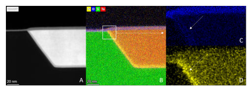
<figcaption class="paper-figure-caption"><b>Fig 6.</b> FIG. 5. (A) STEM image of a Device B type showing clearly defined features relative to the Si substrate. (B) Composite elemental anal- ysis of the device showing the N, O, Si, and Ta. Due to the overlap of the Si-K and Ta-M lines the Ta region is tinted from limitation on elemental identification. Enhanced image of the boxed area showing (C) the trapped oxygen and (D) N layer at the Si interface. The ∼3 nm of TaN exposed to atmosphere (O from TaON) is also visible.</figcaption>
</figure>
<figure class="paper-figure-card">
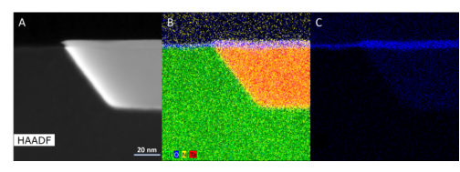
<figcaption class="paper-figure-caption"><b>Fig 7.</b> FIG. 6. (A) STEM image of a Device C type showing clearly defined features relative to the Si substrate. (B) Composite elemental anal- ysis of the device showing the N, O, Si, and Ta. Due to the overlap of the Si-K and Ta-M lines the Ta region is tinted from limitation on elemental identification. (C) Oxygen elemental analysis indicates no oxide at the Si/Ta interfaces. The 1 nm of TaN is not visible.</figcaption>
</figure>
<figure class="paper-figure-card">
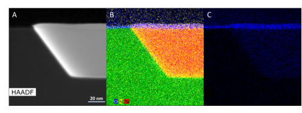
<figcaption class="paper-figure-caption"><b>Fig 8.</b> FIG. 7. (A) STEM image of a Device D type showing clearly defined features relative to the Si substrate. (B) Composite elemental anal- ysis of the device showing the N, O, Si, and Ta. Due to the overlap of the Si-K and Ta-M lines the Ta region is tinted from limitation on elemental identification. (C) Oxygen elemental analysis indicates no oxide at the Si/Ta interfaces. The 6 nm of TaN is clearly visible.</figcaption>
</figure>
<figure class="paper-figure-card">
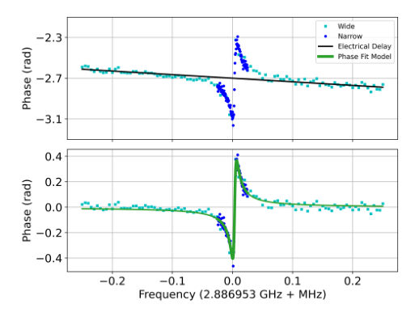
<figcaption class="paper-figure-caption"><b>Fig 9.</b> FIG. 10. (Top) Raw data from VNA for both narrow and wide band scans. The electrical delay is fitted to the wide band data excluding the middle region (×3 width of narrow band). (Bottom) The phase model is fitted to the background corrected data. The thick gold curve indicates the region where the fit is performed, while the narrow gold curve shows the extrapolation of the fit to the wide-band data, with good agreement observed.</figcaption>
</figure>
<figure class="paper-figure-card">
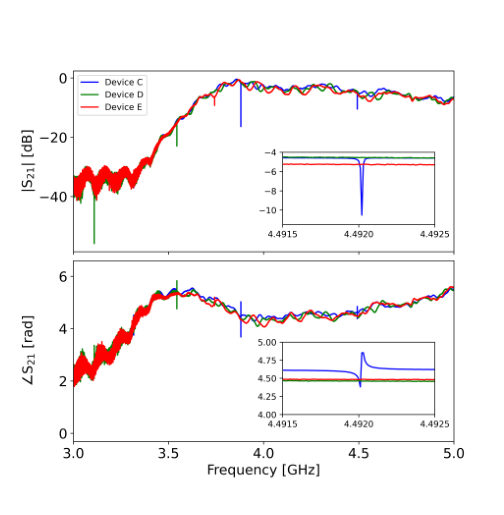
<figcaption class="paper-figure-caption"><b>Fig 10.</b> FIG. 9. Full scan of (top) magnitude and (bottom) phase of S21. The drop in gain between 3 and 4 GHz is from the cryogenic circulator. Insets show enhanced image around a single resonator for Device C.</figcaption>
</figure>

**Main problem.** Surface oxides on the sidewalls of superconducting tantalum devices contribute to dielectric losses, degrading the performance of transmon qubits.

**Main result.** The damascene fabrication process successfully replaces the metal/air interface with a metal/substrate interface, leading to a statistical improvement in quality factor of approximately 2x for pristine interfaces compared to buried oxide interfaces.

**Method.** The researchers used a 300 mm scale damascene process involving trench etching, Ta deposition, and chemical mechanical planarization (CMP), followed by cryogenic characterization and STEM/EDS analysis.

**Summary.** This paper investigates a new fabrication method called the damascene process to improve the quality of superconducting tantalum resonators. By embedding the metal within the substrate, the researchers replaced lossy metal/air sidewall interfaces with metal/substrate interfaces. The study demonstrates that avoiding native oxide formation at these interfaces can significantly increase the resonator's quality factor. This approach is highly scalable, utilizing 300 mm industrial-scale fabrication processes, which is crucial for the future of large-scale quantum computing hardware.

Detailed structure

**Model / system.** The physical system consists of Tantalum (Ta) based superconducting coplanar waveguide (CPW) resonators fabricated on 300 mm Si (100) wafers, including both capacitive and inductive coupling configurations.

**Key observables.** Resonance frequencies, coupling quality factor (Qc), internal quality factor (Qi), kinetic inductance (Lki), and electric field distribution profiles.

**Important parameters / regimes.** Temperature range of 25 mK to 350 mK, power levels from -40 to -80 dBm, and 300 mm wafer scale.

**Assumptions / limitations.** The numerical simulations neglected kinetic inductance initially, requiring a post-hoc correction to match experimental resonance frequencies.

**Figures summary.** Figure 1 shows the damascene fabrication process flow; Figure 2 displays SEM images of the resonator structures; Figure 3 illustrates simulated electric field distributions; Figure 12 shows Qi as a function of temperature; Figure 13 compares quality factors across different device types.

**Paper structure.** The paper introduces the problem of surface oxides, describes the damascene fabrication process and experimental setup, presents numerical simulations and characterization results (STEM/EDS), discusses the performance of different device variants, and concludes with an analysis of loss mechanisms.

Abstract

Surface oxides contribute to losses in superconducting transmon devices resulting in degraded performance. We explore the use of the damascene process to replace the sidewall native oxide of a device with a metal/substrate interface. We simulate sidewall oxidation by burying an oxide layer during fabrication. We observe a modest improvement between the two types of devices, which is suggestive of a reduction in the surface participation ratio.

[↑ back to top](#top)

### [Spiral, target, stripe, and disordered waves in active six-state Potts models](http://arxiv.org/abs/2604.22353v1)

**Authors:** Hiroshi Noguchi  
**Type:** theory · **Category:** statistical mechanics · **PDF:** <https://arxiv.org/pdf/2604.22353v1>  
**Analysis basis:** full PDF text, analyzed in chunks
**Topic relevance:** 🔥 `driven-dissipative phase transition` **3/5** · 🔥 `non-equilibrium dynamics` **3/5** · 🔥 `non-equilibrium universality` **3/5** · `dissipative systems` **2/5** · `methods for driven-dissipative` **2/5**

↔ Scroll figures horizontally

<figure class="paper-figure-card">
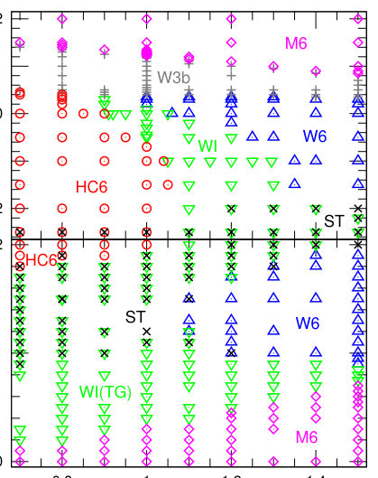
<figcaption class="paper-figure-caption"><b>Fig 1.</b> FIG. 1. Dynamic phase diagram for L = 128. (a) h vs. Jnf at Jk,k = 2 (Jk,[k+2] = Jk,[k+3] = Jnf). (b) h vs. Jk,k at Jnf = −2. The red circles, gray pulses, magenta dia- monds, black crosses, blue up-pointing triangles, and green down-pointing triangles represent the HC6, W3b, M6, ST, W6, and WI modes, respectively. The overlapped symbols represent the coexistence of two modes owing to hysteresis. The WI modes in (b) exhibit TG waves.</figcaption>
</figure>
<figure class="paper-figure-card">
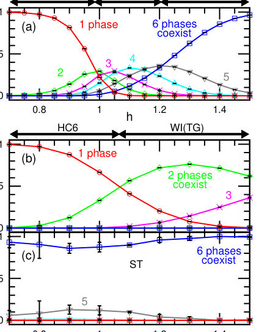
<figcaption class="paper-figure-caption"><b>Fig 2.</b> FIG. 2. Probabilities pphase of one-phase and multi-phase coexistence states as functions of h for (a) Jnf = −0.5 and (b),(c) Jnf = −2.5 at Jk,k = 2 and L = 128. The bidirec- tional arrows at the top of (a) and (b) represent the ranges of dynamic modes. At Jnf = −2.5, the ST mode coexists with the other modes [HC6 or WI(TG)] via hysteresis.</figcaption>
</figure>
<figure class="paper-figure-card">
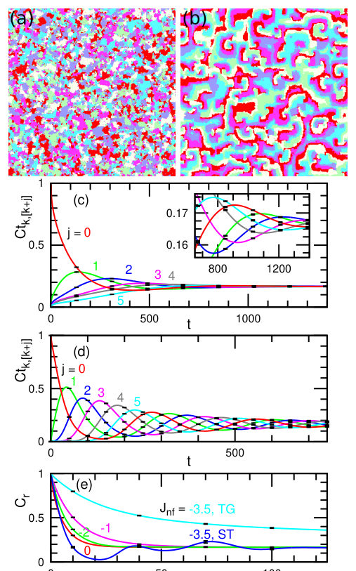
<figcaption class="paper-figure-caption"><b>Fig 3.</b> FIG. 3. Wave forms in the W6 mode for h = 1.5, Jk,k = 2, and L = 512. (a) Snapshot of DS waves at Jnf = 0. (b) Snapshot of SP waves at Jnf = −2. The light yellow, light green, cyan, blue, magenta, and red sites (light to dark in grayscale) represent s = 0, 1, 2, 3, 4, and 5, respectively. (c),(d) Time correlation Ctk,[k+j](t) between the s = k and [k + j] states at (c) Jnf = 0 and (d) Jnf = −2. The inset of (c) shows the magnified graph around the first peak at j = 0. (e) Spatial autocorrelation Cr(r) at Jnf = 0, −1, −2, and −3.5. At Jnf = −3.5, the TG and ST waves are formed via hysteresis. The error bars are shown at several data points, but most of them are smaller than the line...</figcaption>
</figure>
<figure class="paper-figure-card">
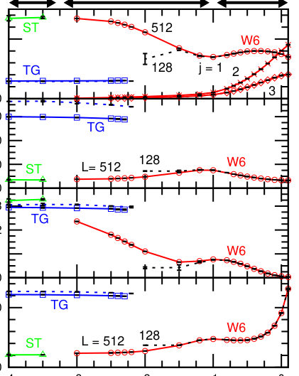
<figcaption class="paper-figure-caption"><b>Fig 4.</b> FIG. 4. Dependence on the nonflip contact energy Jnf at h = 1.5 and Jk,k = 2. (a) Contact probabilities pcontact. (b) Correlation length rcr. (c),(d) Amplitude aos and time τos of the first peak in the time correlation Ctk,k(t). The solid and dashed lines represent the data for L = 512 and 128, respectively. The green and blue lines represent the data of ST and TG waves, respectively. The data for the ST waves at L = 128 is not shown, since it is strongly restricted by the system size owing to the wavelength ∼L. The bidirectional arrows at the top represent the ranges of the dynamic modes at L = 512.</figcaption>
</figure>
<figure class="paper-figure-card">

<figcaption class="paper-figure-caption"><b>Fig 5.</b> Figure 4(a) shows the contact probability pcontact be- tween different states on neighboring sites. When all the neighbors of s = k sites are occupied by the s = [k + 1] states (alternative arrangement in the checkerboard pat- tern), pcontact = 1, 0, and 0 for the flip distances j = 1, 2, and 3, respectively. The probabilities pcontact for non- flip contacts (j = 2 and 3) decrease with decreasing Jnf. In contrast, pcontact of the flip contact (j = 1) exhibits a minimum at Jnf ≃−1 [see the three red curves in Fig. 4(a)]. Thus, these four quantities (aos, τos, rcr, and pcontact) have a maximum or minimum at Jnf ≃−1. This phase boundary matches the results of visual inspection. Therefore, we...</figcaption>
</figure>
<figure class="paper-figure-card">
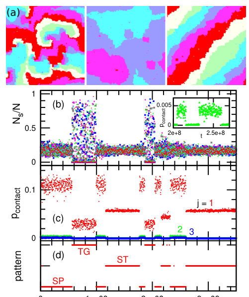
<figcaption class="paper-figure-caption"><b>Fig 6.</b> FIG. 5. Temporal coexistence of SP, ST, and TG waves at h = 1.5, Jnf = −2, Jk,k = 2, and L = 128. (a) Sequential snapshots (SP, TG, and ST waves at t = 800 000, 1 040 000, and 1 580 000 from left to right). (b)–(d) Time evolution of the number densities of each state (Ns/N), instantaneous contact probabilities (pcontact), and wave patterns. The gray, green, light blue, blue, cyan, and red symbols in (b) represent the number densities of s = 0, 1, 2, 3, 4, and 5, respectively. The red, green, and blue symbols in (c) represent pcontact for the contact between s = k and [k + j] states with j = 1, 2, and 3, respectively. The inset of (b) shows a magnified plot at j = 2 for 2 × 108 &lt; t &lt; 2.7 ×...</figcaption>
</figure>
<figure class="paper-figure-card">
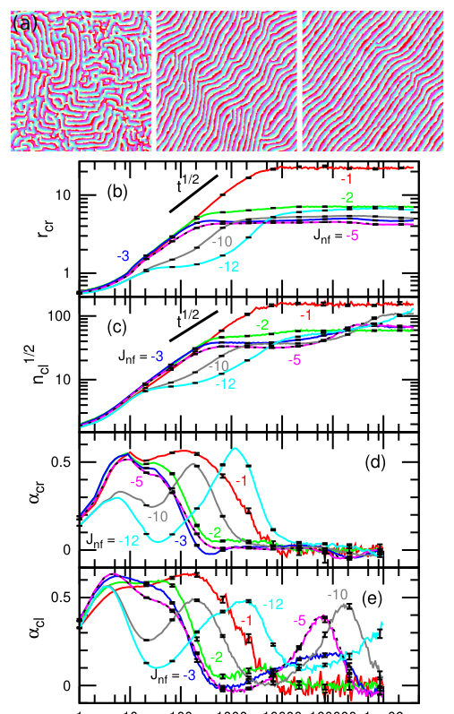
<figcaption class="paper-figure-caption"><b>Fig 7.</b> FIG. 6. Coarsening dynamics at h = 1 and Jk,k = 2. (a) Sequential snapshots at Jnf = −5 and L = 1024 (t = 100 000, 500 000, and 4 000 000 from left to right). (b)–(e) Time evolution of (b) the correlation length rcr1, (c) root of the mean cluster size ncl 1/2, (d) coarsening exponent αcr of rcr1, and (e) coarsening exponent αcl of ncl 1/2. The solid lines represent the data for Jnf = −1, −2, −3, −5, −10, and −12 at L = 1024. The black dashed lines represent the data for Jnf = −5 at L = 2048. The short black lines in (b) and (c) represent the slope of t1/2. The error bars are shown at several data points.</figcaption>
</figure>
<figure class="paper-figure-card">
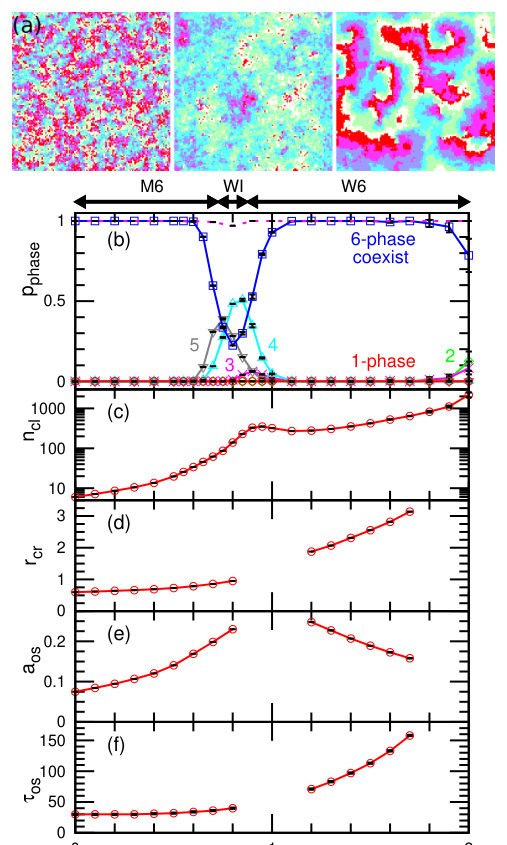
<figcaption class="paper-figure-caption"><b>Fig 8.</b> FIG. 7. Dependence on the contact energy Jk,k at h = 1.5 and Jnf = −2. (a) Snapshots at Jk,k = 0, 0.8, and 1.5 (from left to right). (b) Probabilities pphase of one-phase and multi- phase coexistence states. The solid lines represent pphase at L = 128. The magenta dashed line represents pphase of the six-phase coexistence state at L = 256, whereas the other states at L = 256 are omitted for clarity. The bidirectional arrows at the top represent the ranges of dynamic modes at L = 128. (c)–(f) Dependence of (c) the mean cluster size ncl, (d) correlation length rcr, and (e) amplitude aos and (f) time τos of the first peak in the time correlation Ctk,k(t) at L = 128. At Jk,k ≃1, rcr, aos, and...</figcaption>
</figure>
<figure class="paper-figure-card">
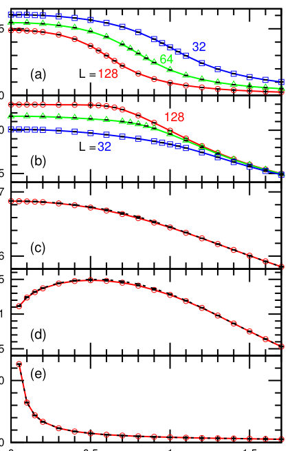
<figcaption class="paper-figure-caption"><b>Fig 9.</b> FIG. 8. Dependence on the flip energy h in the six-state mixing mode (M6) at Jk,k = 0 and Jnf = −2. (a) Order parameter R1. (b) Mean cluster size ncl. (c) Correlation length rcr. (d),(e) Amplitude aos and time τos of the first peak in the time correlation Ctk,k(t). The three lines in (a) and (b) represent the data at L = 32, 64, and 128 [from top to bottom in (a) and from bottom to top in (b)]. The solid and dashed lines in (c)–(e) represent the data at L = 128 and 32, respectively. These lines overlap.</figcaption>
</figure>
<figure class="paper-figure-card">
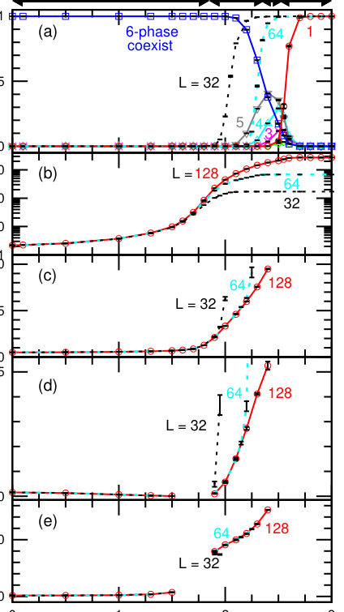
<figcaption class="paper-figure-caption"><b>Fig 10.</b> FIG. 9. Dependence on the contact energy Jk,k at h = 1.5 and Jnf = 0. (a) Probabilities pphase of one-phase and multi- phase coexistence states. The solid lines represent pphase at L = 128. The black and light blue dashed lines represent pphase of the single-phase state at L = 32 and 64, respec- tively, whereas the other states at L = 32 and 64 are omitted for clarity. The bidirectional arrows at the top represent the ranges of dynamic modes at L = 128. (b)–(e) Dependence of (b) the mean cluster size ncl, (c) correlation length rcr, and (d) amplitude aos and (e) time τos of the first peak in the time correlation Ctk,k(t).</figcaption>
</figure>

**Main problem.** The study aims to characterize various spatiotemporal wave modes (spiral, target, stripe, and disordered) and their phase transitions in a non-equilibrium six-state Potts model.

**Main result.** The researchers identified distinct wave modes (SP, TG, ST, and DS) and found that the transition between even- and odd-numbered state dominance is a first-order transition. They also distinguished between forward and backward three-state waves based on their boundary dynamics.

**Method.** Monte Carlo simulations using the Metropolis algorithm were performed on square and hexagonal lattices to observe pattern formation and coarsening dynamics.

**Summary.** This paper investigates the variety of wave patterns that emerge in an active six-state Potts model. By using Monte Carlo simulations, the author identifies spiral, target, stripe, and disordered waves and maps their existence across different interaction energies. The study reveals that transitions between certain wave modes are first-order and explores how these patterns evolve during coarsening. The findings provide a detailed classification of complex spatiotemporal dynamics in non-equilibrium statistical mechanics.

Detailed structure

**Model / system.** An active six-state Potts model on 2D square and hexagonal lattices, which is a non-equilibrium system where local balance holds but global detailed balance is violated.

**Key observables.** Temporal and spatial correlation functions, oscillation amplitude and period, probability of phase coexistence, cluster size, and the wave ratio order parameter.

**Important parameters / regimes.** Flipping energy (h), non-flip contact energy (Jnf), contact energy for same states (Jkk), and diagonal state interactions.

**Assumptions / limitations.** The system is assumed to follow local balance for flips between neighboring states, and the dynamics are governed by a rock-paper-scissors-like mechanism.

**Figures summary.** Figure 1 shows a phase diagram of modes; Figure 7 shows the dependence of various quantities on contact energy; Figure 12 demonstrates first-order transition behavior via the scaling of susceptibility.

**Paper structure.** The paper introduces the active Potts model, presents a phase diagram of wave modes, analyzes the quantitative transition between disordered and spiral waves, investigates the emergence of target and stripe waves, details the dynamics of three-state waves, and concludes with a discussion on lattice robustness and transition types.

**Why it may be interesting.** The study of non-equilibrium phase transitions and pattern formation in multi-state systems is highly relevant to understanding driven-dissipative dynamics in open quantum systems and active matter.

Abstract

Wave propagation can be observed in various nonequilibrium systems. In this study, we investigated the properties of several wave modes in active six-state Potts models using Monte Carlo simulations of square and hexagonal lattices. Disordered and spiral (SP) waves of six states are formed under weak and strong repulsions at nonflip contacts, respectively. The target (TG) and stripe (ST) waves were found to emerge under stronger repulsion. These three wave modes (SP, TG, and ST) can temporally coexist in small systems near the transition points but they do not switch in large systems or far from these transition points. During coarsening from randomly mixed states to ST waves, SP waves appear at an intermediate stage. The SP wave modes of three even- or odd-numbered states (states $s=0,2,4$ or $s=1,3,5$) emerge under two conditions: repulsion at the diagonal contact and attraction at nonflip contacts. Previously thought to be identical for both conditions, the wave types were found to differ, comprising forward and backward waves ($s=1\to 3\to 5\to 1$ or $s=1\to 5\to 3\to 1$), whose domain boundaries move by the two-step and four-step forward flips, respectively. The transition between the waves of the even- and odd-numbered states is first-order for both the forward and backward waves.

[↑ back to top](#top)

### [Long-Range Order in Coupled $D$-dimensional Kuramoto Oscillators](http://arxiv.org/abs/2604.22151v1)

**Authors:** Zhongpu Qiu, Tianyi Wu, Linkai Zhang, Sheng Fang, Jun Meng, Jingfang Fan, Hugues Chaté  
**Type:** theory · **Category:** statistical mechanics · **PDF:** <https://arxiv.org/pdf/2604.22151v1>  
**Analysis basis:** full PDF text, analyzed in chunks
**Topic relevance:** 🔥 `driven-dissipative phase transition` **3/5** · 🔥 `non-equilibrium universality` **3/5** · `Keldysh / 2PI / non-Gaussian methods` **2/5** · `dissipative systems` **2/5** · `non-equilibrium dynamics` **2/5**

↔ Scroll figures horizontally

<figure class="paper-figure-card">
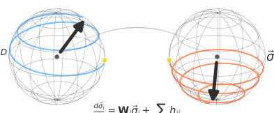
<figcaption class="paper-figure-caption"><b>Fig 1.</b> FIG. 1. Schematic of the D-dimensional Kuramoto model. Each oscillator ⃗σi evolves under (i) intrinsic rotation Wi⃗σi (generalizing natural frequencies in classical Kuramoto mod- els) and (ii) coupling hij to neighbors ⃗σj ∈Λi. The coupling term hij = K[⃗b −(⃗a ·⃗b)⃗a] aligns ⃗σi with the orthogonal com- ponent of ⃗σj, promoting synchronization (generalizing sine coupling).</figcaption>
</figure>
<figure class="paper-figure-card">
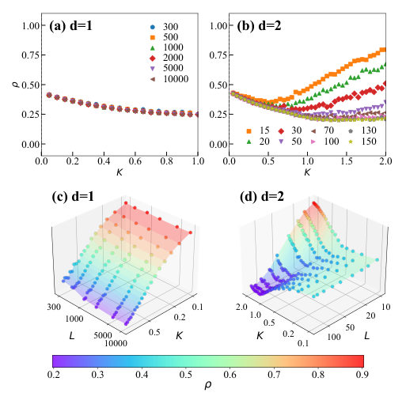
<figcaption class="paper-figure-caption"><b>Fig 2.</b> FIG. 2. Phase diagrams for (a) d = 1, (b) d = 2, and (c) d = 3 dimensional coupled D = 3 oscillators with varying system size L. Log-log-log plots of the orientational order parameter ρ versus the inverse system size L−1 at different coupling strengths K for (d) d = 1, (e) d = 2, and (f) d = 3 systems, where colors indicate the values of the order param- eter.</figcaption>
</figure>
<figure class="paper-figure-card">
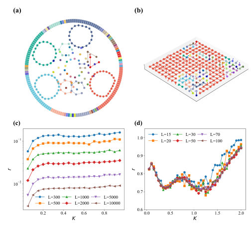
<figcaption class="paper-figure-caption"><b>Fig 3.</b> FIG. 3. Spatial patterns and frequency entrainment for cou- pled D = 3 oscillators. (a) d = 1: Finite entrained clusters with functional network structure inserted. (b) d = 2 (c) d = 3: The largest cluster projected on the D = 3 sphere exhibiting hemisphere phase. (d)-(f) Frequency order param- eter r versus coupling strength K for different system sizes L in d = 1, 2, 3 dimensions respectively, where panel (d) uses log scale for the vertical axis.</figcaption>
</figure>
<figure class="paper-figure-card">
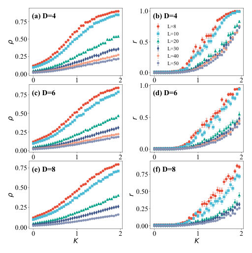
<figcaption class="paper-figure-caption"><b>Fig 4.</b> FIG. 4. Order parameters vs coupling strength K for even-D oscillators in d = 2 dimensions. (a,c,e) Orientational order parameter ρ and (b,d,f) frequency order parameter r for D = 4, 6, 8 respectively, with different system length L.</figcaption>
</figure>

**Main problem.** Investigating whether quenched frequency disorder can stabilize long-range order (LRO) in low-dimensional (d=1, 2) vector Kuramoto oscillators, thereby circumventing the Hohenberg-Mermin-Wagner theorem.

**Main result.** Long-range order emerges in low-dimensional lattices only for odd-dimensional oscillators (D), where quenched noise acts as a stabilizing mechanism that maps the system to an effective ferromagnetic model.

**Method.** The authors use two-body dynamics analysis, large-scale numerical simulations, and a real-space renormalization group (RG) framework combined with Bogoliubov-Krylov averaging.

**Summary.** The paper explores the emergence of long-range order in $D$-dimensional Kuramoto oscillators on 1D and 2D lattices. It discovers a parity effect where order only appears when the oscillator dimension $D$ is odd. This happens because odd-$D$ systems possess a null space in their frequency matrices that allows for synchronization, effectively mapping the system to a ferromagnetic model. In contrast, even-$D$ systems remain disordered. The study highlights how quenched noise can serve as a stabilizing force against the fluctuations that usually prevent order in low dimensions.

Detailed structure

**Model / system.** A D-dimensional vector Kuramoto model (DDKM) on 1D and 2D lattices, featuring alignment coupling and quenched noise introduced via antisymmetric intrinsic frequency matrices.

**Key observables.** Orientational order parameter (rho) and frequency order parameter (r, measuring the fraction of entrained oscillators).

**Important parameters / regimes.** Oscillator dimension (D), lattice dimension (d), coupling strength (K), and the presence of quenched frequency disorder.

**Assumptions / limitations.** The analysis assumes the use of antisymmetric matrices for frequency disorder and focuses on the thermodynamic limit via RG.

**Figures summary.** Figure 4 shows the decay of order parameters (rho and r) versus coupling strength (K) for even-D oscillators, demonstrating the absence of LRO.

**Paper structure.** The paper introduces the model and the problem of LRO in low dimensions, analyzes microscopic two-body dynamics, presents large-scale numerical simulations, performs a real-space renormalization group analysis, and concludes by comparing the results to standard continuous symmetry models.

**Why it may be interesting.** This work is highly relevant to many-body dynamics as it demonstrates a novel mechanism where quenched disorder, typically a source of decoherence or disorder, actually stabilizes long-range order in low-dimensional systems.

Abstract

We show that the long-range order (LRO) strikingly emerges in systems of locally coupled $D$-dimensional vector Kuramoto oscillators on low-dimensional lattices ($d=1,2$), but only for odd $D$. This parity-dependent effect is traced to two-oscillator dynamics, where odd-$D$ units synchronize for any coupling, while even-$D$ pairs require a finite threshold. This fundamental difference selectively seeds collective order in large-scale systems, a phenomenon demonstrated by our numerical simulations. A renormalization group analysis reveals a RG flow to a weak-coupling fixed point for $d \le 2$. In this limit, odd-$D$ systems effectively map to a ferromagnetic model, developing an ordered ``hemisphere" phase, whereas even-$D$ systems remain disordered. Our findings further reveal orientational LRO emerges in both $d=1$ and $d=2$, but frequency LRO requires $d=2$. We contrast these results with the established behavior of models possessing continuous symmetry, highlighting how quenched disorder provides a fundamentally new route to order.

[↑ back to top](#top)

### [Entanglement Enhanced Sensing with Qubits affected by non-Markovian Dephasing](http://arxiv.org/abs/2604.22368v1)

**Authors:** Noah Kaufmann, Kasper Hede Nielsen, Anders Søndberg Sørensen  
**Type:** theory · **Category:** quantum information and computing · **PDF:** <https://arxiv.org/pdf/2604.22368v1>  
**Analysis basis:** full PDF text, analyzed in chunks
**Topic relevance:** 🔥 `dissipative systems` **3/5** · `entanglement & information structure` **2/5** · `methods for driven-dissipative` **2/5** · `non-equilibrium dynamics` **2/5** · `quantum measurements` **2/5**

↔ Scroll figures horizontally

<figure class="paper-figure-card">
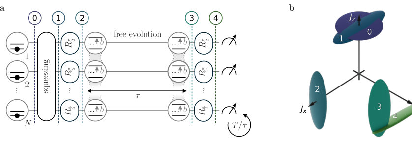
<figcaption class="paper-figure-caption"><b>Fig 1.</b> Figure 1. (a) Circuit representation of Ramsey spectroscopy using spin-squeezed states. Applying squeezing to the N-qubit ground state reduces J2 y and, to a lesser degree, ⟨Jz⟩. Next, a π/2 pulse (Rπ/2) rotating the collective spin around the Jy-axis is applied. The state subsequently freely evolves for a time τ, during which it accumulates a relative phase proportional to the energy splitting. This phase is finally estimated by applying another π/2 pulse and a measurement in the Jz-basis. The total procedure is repeated T/τ times. (b) Schematic representation of the quantum state at different stages of the protocol, shown on the Bloch sphere. The ellipsoids are centered at the expectation...</figcaption>
</figure>
<figure class="paper-figure-card">
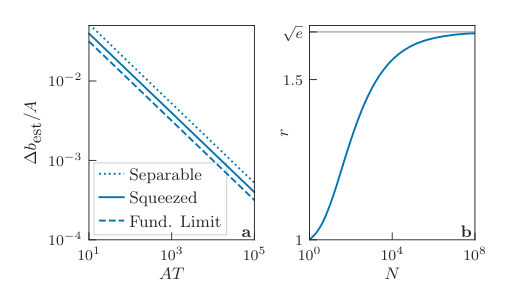
<figcaption class="paper-figure-caption"><b>Fig 2.</b> Figure 2. Comparison of estimation uncertainty in Ramsey spectroscopy using separable and spin-squeezed input states in the presence of spatially and temporally uncorrelated noise characterized by a strength A. (a) The estimation uncertainty ∆best/A as a function of the total time AT for a fixed num- ber of qubits N = 100. The dotted line indicates unsqueezed states, the full line corresponds to squeezed states, and the dashed line indicates the fundamental limit. All curves scale with 1/ √</figcaption>
</figure>
<figure class="paper-figure-card">
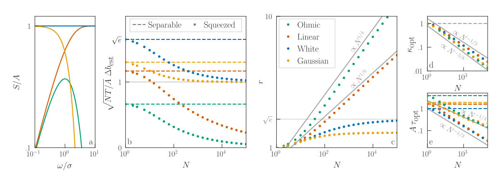
<figcaption class="paper-figure-caption"><b>Fig 3.</b> Figure 3. Estimation uncertainty of Ramsey spectroscopy with separable and spin-squeezed input states for different noise spectra and a certain total probing time T much larger than the noise correlation time and dephasing time. (a) The considered noise spectra. We choose σ/A = 1/2. (b) The uncertainty scaled with p</figcaption>
</figure>
<figure class="paper-figure-card">
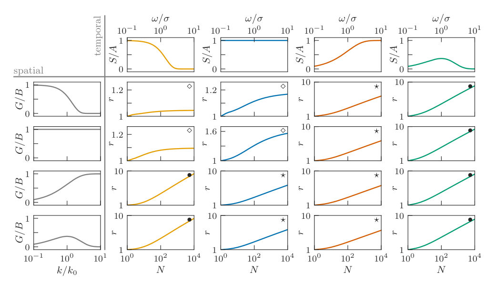
<figcaption class="paper-figure-caption"><b>Fig 4.</b> Figure 4. The metrological gain r of estimation uncertainties for separable and spin-squeezed protocols for different spatial and temporal noise correlations. The first row and first column of the grid show the considered temporal S(ω) and spatial noise G(k) spectra, respectively, which are combined in the inner plots. From top to bottom and left to right, the spectra are the following: Gaussian, white, linear, and Ohmic. The temporal (spatial) spectra are characterized by strength A (B) and width σ (k0), with A/σ = 1/8 (B/k0 = 1/8). Each inner plot displays r as a function of the number of qubits N on a log-log scale, except for (⋄) where the y-axis is scaled linearly. Symbols indicate the...</figcaption>
</figure>
<figure class="paper-figure-card">
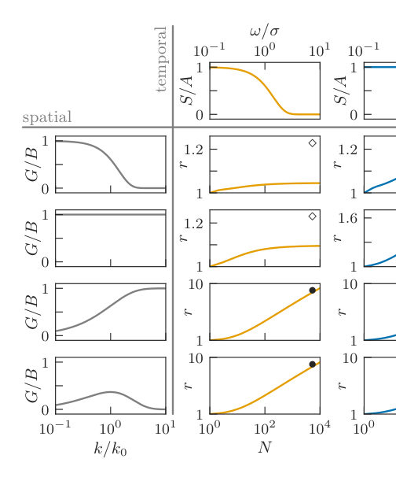
<figcaption class="paper-figure-caption"><b>Fig 5.</b> Fig. 4 shows the dependency of the gain r on the num- ber of qubits N for different combinations of spatial and temporal noise. We see that for the cases where neither G(0) = 0 nor S(0) = 0, i.e., the four combinations of</figcaption>
</figure>
<figure class="paper-figure-card">
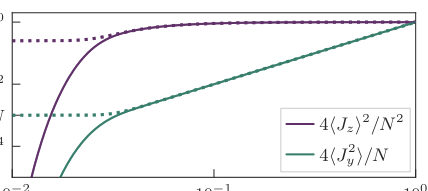
<figcaption class="paper-figure-caption"><b>Fig 6.</b> Figure 5. Dependence of the expectation values most relevant to the estimation uncertainty on the squeezing parameter κ for N = 1000 (solid lines) and N = 1001 (dashed lines) qubits. The different behavior as κ →0 occurs because states with an even number of qubits approach |ψκ→0⟩= |0⟩y, while states with an odd number of qubits converge to |ψκ→0⟩∝|1/2⟩y − |−1/2⟩y.</figcaption>
</figure>
<figure class="paper-figure-card">
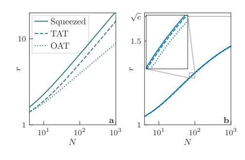
<figcaption class="paper-figure-caption"><b>Fig 7.</b> Figure 6. Comparison of the metrological gain r in Ramsey spectroscopy between spin-squeezed states |ψκ⟩, defined in Eq. (12), one-axis twisted states (OAT), and two-axis twisted states (TAT), as a function of the number of probes N. The metrological gain is calculated relative to standard Ramsey spectroscopy with separable input states and is shown for the cases of (a) no noise and (b) white noise.</figcaption>
</figure>
<figure class="paper-figure-card">
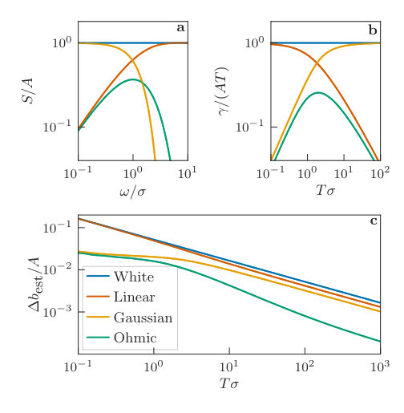
<figcaption class="paper-figure-caption"><b>Fig 8.</b> Figure 7. Estimation uncertainty of Ramsey spectroscopy with a single particle as a function of the total time T for different noise spectra. (a) Plot of the considered white, Gaus- sian, linear, and Ohmic noise spectra S(ω), with σ/A = 1/103. (b) Normalized dephasing rate γ(T)/T as a function of the total time T. For white noise γ(T) ∝T, Gaussian noise with temporal correlations leads to γ(T) ∝T 2, the anti- correlations of linear noise result in noise cancellations, and for Ohmic noise, the noise is first correlated and for longer times anti-correlated, resulting in noise γ(t) peaking around σT = 1. (c) Corresponding single qubit estimation uncer- tainty ∆best as a function of T.</figcaption>
</figure>
<figure class="paper-figure-card">
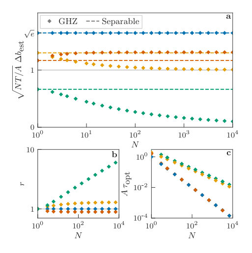
<figcaption class="paper-figure-caption"><b>Fig 9.</b> Figure 8. Estimation uncertainty in Ramsey spectroscopy with GHZ input states under various noise spectra (plotted in Fig. 3a), for a certain total probing time T much larger than the noise correlation time and dephasing time. (a) Scaled un- certainty p</figcaption>
</figure>

**Main problem.** Investigating whether entanglement, specifically via spin-squeezed states, can enhance the sensitivity of frequency estimation in Ramsey spectroscopy when qubits are subject to non-Markovian, spatially and temporally correlated dephasing noise.

**Main result.** The study finds that while entanglement provides no scaling advantage for noise with a non-zero zero-frequency component (like White or Gaussian noise), it enables scaling beyond the Standard Quantum Limit for noise with a vanishing zero-frequency component (like Linear or Ohmic noise), achieving uncertainties as low as N^{-3/4}.

**Method.** The authors use an analytical framework involving Fourier decomposition of the effective Hamiltonian, the Wiener-Khinchin theorem, and optimization of interrogation time and squeezing parameters to derive scaling laws for various noise spectra.

**Summary.** This paper explores how entanglement can improve the precision of frequency estimation in the presence of complex, non-Markovian noise. It demonstrates that the ability to surpass the Standard Quantum Limit depends critically on whether the noise spectrum has a non-zero component at zero frequency. For specific types of noise, such as Ohmic or Linear noise, the authors show that spin-squeezed states can achieve significantly better scaling of sensing uncertainty with the number of probes than separable states. This provides important theoretical insights for developing quantum sensors that are resilient to correlated environmental noise.

Detailed structure

**Model / system.** A collection of N two-level systems (qubits) undergoing Ramsey spectroscopy, subject to a classical, pure dephasing noise model that is stationary, translationally invariant, and non-Markovian.

**Key observables.** Estimation uncertainty (variance) of the frequency b, metrological gain (r), and dephasing rate gamma(tau).

**Important parameters / regimes.** Number of probes (N), total interrogation time (T), squeezing parameter (kappa), and noise power spectra (White, Gaussian, Linear, Ohmic).

**Assumptions / limitations.** The noise is treated as a classical stochastic process (valid for high-temperature bosonic baths), the dephasing is pure (no X or Y components), and the analysis assumes the long-time and large-N limits.

**Figures summary.** Figure 4 shows metrological gain as a function of N for various noise combinations; Figure 8 displays scaled uncertainty, metrological gain, and optimal interrogation time for GHZ states across different noise spectra.

**Paper structure.** The paper introduces the problem of sensing under correlated noise, defines the Hamiltonian and noise models, derives a fundamental sensitivity limit based on SNR, analyzes specific scaling laws for different noise spectra (White, Gaussian, Linear, Ohmic), compares different entangled states (OAT, TAT, GHZ), and concludes with optimization results.

**Why it may be interesting.** This paper is highly relevant for researchers in open quantum systems and quantum metrology because it identifies specific noise-correlation regimes where entanglement-enhanced sensing can bypass the Standard Quantum Limit, providing a roadmap for designing robust quantum sensors.

Abstract

Entanglement has been proposed as a means to improve the sensitivity of sensing weak signals. While the degree of this quantum advantage is well understood in noiseless settings, the situation is more complex under realistic conditions, where the system is subject to decoherence. In this case, the enhancement depends on the specific noise characteristics. Previous treatments of colored noise typically assume that the noise is uncorrelated between successive experiments. Here, we consider the scenario in which the noise exhibits correlations across multiple shots. We derive a simple fundamental limit to the sensitivity based on the fact that the sensitivity cannot be better than the signal-to-noise ratio seen by the probe. Focusing on Ramsey spectroscopy with probes affected by pure classical dephasing, we show that, for suitable spatial and temporal noise correlations, entangled probes achieve a better scaling of the sensitivity with the number of probes than separable states. This demonstrates that entanglement can provide a substantial improvement for Ramsey spectroscopy subject to correlated noise.

[↑ back to top](#top)

### [Uncovering long-lived relaxation channel and exciton-phonon coupling in \textrm{Ta\textsubscript{2}NiSe\textsubscript{5}} via non-degenerate pump-probe spectroscopy](http://arxiv.org/abs/2604.22218v1)

**Authors:** Poulami Ghosh, Anupama Chauhan, Sidhanta Sahu, Sk Kalimuddin, Mintu Mondal, N. Kamaraju  
**Type:** experiment · **Category:** strongly correlated electrons · **PDF:** <https://arxiv.org/pdf/2604.22218v1>  
**Analysis basis:** full PDF text, analyzed in chunks
**Topic relevance:** 🔥 `non-equilibrium dynamics` **3/5** · `correlated cavity matter` **2/5** · `driven-dissipative phase transition` **2/5** · `non-equilibrium universality` **2/5**

↔ Scroll figures horizontally

<figure class="paper-figure-card">
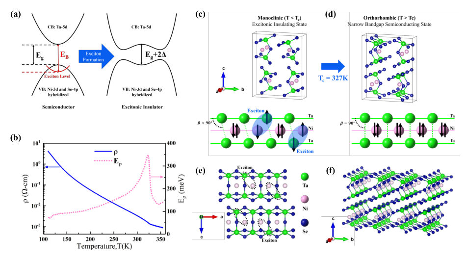
<figcaption class="paper-figure-caption"><b>Fig 1.</b> FIG. 1: (a) Schematic band diagram illustrating the transition into an excitonic insulator (EI)</figcaption>
</figure>
<figure class="paper-figure-card">
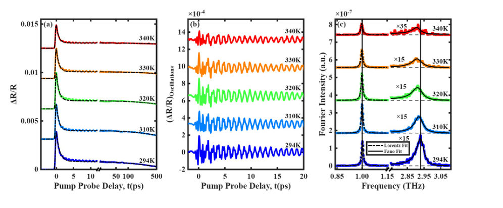
<figcaption class="paper-figure-caption"><b>Fig 2.</b> FIG. 2: (a) Temperature-dependent time-resolved differential reflectivity (∆R/R) signals of</figcaption>
</figure>
<figure class="paper-figure-card">
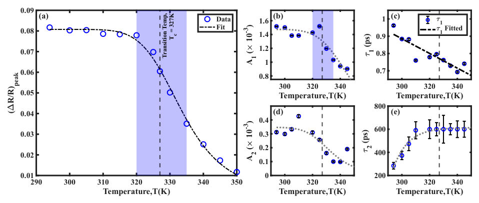
<figcaption class="paper-figure-caption"><b>Fig 3.</b> FIG. 3: (a) Temperature dependence of the peak transient reflectivity amplitude, (∆R/R)peak. The</figcaption>
</figure>
<figure class="paper-figure-card">

<figcaption class="paper-figure-caption"><b>Fig 4.</b> Fig.3(b)-3(e) summarizes the temperature dependence of the relaxation amplitudes A1 and A2,</figcaption>
</figure>
<figure class="paper-figure-card">
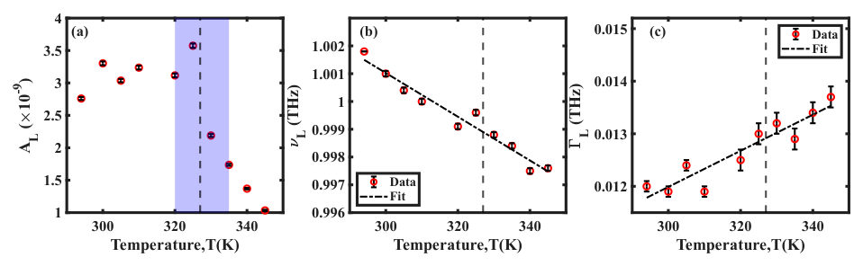
<figcaption class="paper-figure-caption"><b>Fig 5.</b> FIG. 4: (a) Temperature dependence of the amplitude of the 1.0 THz mode (CP1), AL, which is</figcaption>
</figure>
<figure class="paper-figure-card">

<figcaption class="paper-figure-caption"><b>Fig 6.</b> Fig.2(c), but it is presented in SM Fig.S5(c). In the following, we focus on the temperature evolu-</figcaption>
</figure>
<figure class="paper-figure-card">
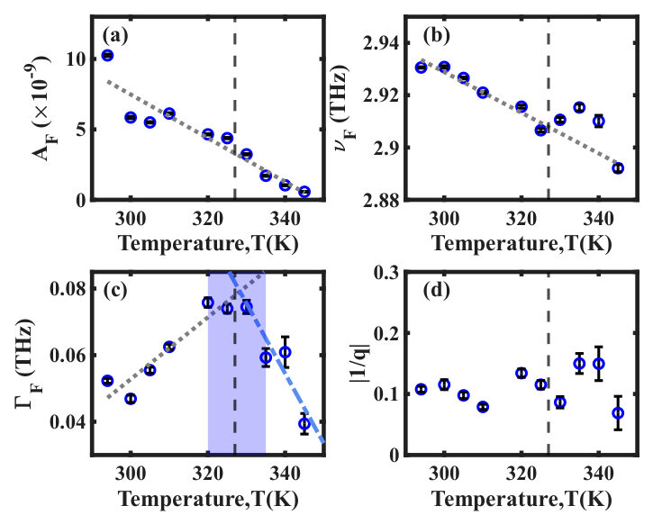
<figcaption class="paper-figure-caption"><b>Fig 7.</b> FIG. 5: (a) Temperature dependence of the FFT amplitude of the 2.9 THz phonon mode (CP2), AF,</figcaption>
</figure>

**Main problem.** The study aims to understand the hierarchy of relaxation pathways and the role of exciton-phonon coupling in the excitonic insulator Ta2NiSe5 (TNSe), specifically investigating the nature of the long-lived relaxation channel.

**Main result.** The researchers discovered an unusually long-lived relaxation channel (280-600 ps) attributed to an exciton-phonon bottleneck and identified two distinct coherent phonon modes, one of which (1.0 THz) is strongly coupled to the excitonic order parameter.

**Method.** Temperature-dependent, non-degenerate optical pump-probe spectroscopy with an extended temporal window up to 500 ps was used to monitor transient reflectivity.

**Summary.** This paper investigates the ultrafast dynamics of the excitonic insulator Ta2NiSe5 using extended-window pump-probe spectroscopy. It reveals a previously hidden, long-lived relaxation channel lasting up to 600 ps, which is caused by a bottleneck between excitons and nonequilibrium phonons. The study also distinguishes between phonon modes that couple to the excitonic order parameter and those that are purely structural. These findings provide a clearer picture of how electronic and lattice degrees of freedom interact during a phase transition.

Detailed structure

**Model / system.** The physical system is Ta2NiSe5 (TNSe), a layered narrow-gap semiconductor exhibiting a concomitant excitonic-insulator and structural phase transition at Tc approx 327 K. The dynamics are analyzed using a modified Rothwarf-Taylor model and an exciton-phonon bottleneck framework.

**Key observables.** Transient differential reflectivity (delta R/R), relaxation time constants (tau1, tau2), coherent phonon frequencies and amplitudes, and the Fano asymmetry parameter.

**Important parameters / regimes.** Transition temperature Tc approx 327 K, pump wavelength 3.14 eV, probe wavelength 1.57 eV, and relaxation scales ranging from sub-picosecond to 600 ps.

**Assumptions / limitations.** The analysis assumes the electronic background can be modeled by a multi-exponential decay and that the phonon dynamics can be described by cubic anharmonic decay or Fano-like interference.

**Figures summary.** Fig 1 shows the schematic of the excitonic insulator transition, resistivity anomalies, and crystal structures. Fig 2 shows temperature-dependent transient reflectivity. Fig 5 shows the temperature dependence of phonon amplitudes, frequencies, and linewidths.

**Paper structure.** The paper introduces the excitonic insulator phase in TNSe, describes the experimental setup and sample growth, presents the discovery of the slow relaxation channel, analyzes the temperature dependence of electronic and phonon modes, and concludes with the implications for exciton-phonon dynamics.

**Why it may be interesting.** The discovery of a long-lived exciton-phonon bottleneck and the observation of Higgs-like mode coupling to the condensate are highly relevant to many-body dynamics and the study of non-equilibrium phase transitions.

Abstract

An excitonic insulator represents a quantum phase in which spontaneous condensation of excitons leads to novel many-body phenomena. Ta$_2$NSi$_5$ (TNSe), a layered narrow-gap semiconductor, has emerged as a model platform to probe these correlated excitonic phases and their underlying dynamics below 327 K. In this work, we investigate the nonequilibrium dynamics of TNSe using temperature-dependent, non-degenerate optical pump-probe spectroscopy with a 3.14 eV pump and a 1.57 eV probe, extending the accessible pump-probe delay window up to 500 ps. In addition to the well-established sub-picosecond relaxation channel ($\sim$ 0.7- 0.9 ps) associated with carrier cooling and recombination, accompanied by exciton reformation, we uncover a much slower recovery process with a decay time of $\sim$ 280-600~ps, significantly longer than previously reported. We attribute this unusually prolonged recovery to enhanced scattering between excitons and nonequilibrium phonons, which delays the re-establishment of equilibrium excitonic correlations. On top of this bi-exponential background, we observe two coherent phonon modes at 1.0 and 2.9 THz with distinctly different coupling behaviors. The 1.0 THz mode exhibits an order-parameter-like temperature dependence, consistent with strong coupling to the excitonic condensate in TNSe. In contrast, the 2.9 THz mode does not exhibit any discernible coupling to the excitonic order parameter, and appears to arise from anharmonic lattice dynamics associated with the structural phase transition. Together, these results elucidate the hierarchy of relaxation pathways in TNSe and highlight the importance of extending the temporal detection window in pump-probe measurements to fully capture long-lived exciton-phonon dynamics.

[↑ back to top](#top)

### [Certification of genuine non-Gaussian entanglement](http://arxiv.org/abs/2604.22295v1)

**Authors:** Lukáš Lachman, Carlos E. Lopetegui-González, Massimo Frigerio, Mattia Walschaers  
**Type:** theory · **Category:** quantum information and computing · **PDF:** <https://arxiv.org/pdf/2604.22295v1>  
**Analysis basis:** full PDF text, analyzed in chunks
**Topic relevance:** 🔥 `entanglement & information structure` **3/5** · `dissipative systems` **2/5** · `quantum measurements` **2/5**

↔ Scroll figures horizontally

<figure class="paper-figure-card">
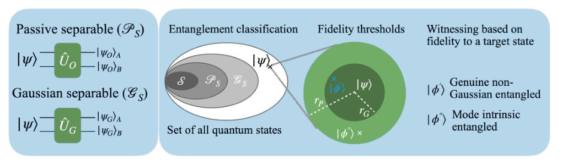
<figcaption class="paper-figure-caption"><b>Fig 1.</b> Figure 1: We tackle the question of identifying whether a given state has entanglement that cannot be undone by Gaussian or linear optics (passive) operations. The set of states that can be made separable under Gaussian unitaries (GS) is a convex set, and contains the (also convex) set of passive separable states (PS). If a state does not belong to either of these sets, then it is said to be genuinely non-Gaussian entangled. Since these form an open set, there is an open neighborhood around each state (in the topology induced by the fidelity) containing only states that cannot be disentangled using Gaussian operations (ball depicted with radius rG), and a larger one in which only states...</figcaption>
</figure>
<figure class="paper-figure-card">
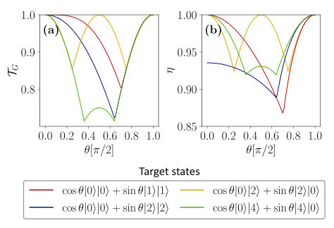
<figcaption class="paper-figure-caption"><b>Fig 2.</b> Figure 2: a) Thresholds for the genuine non-Gaussian entanglement relying on the fidelity with target states cos θ|0⟩|0⟩+sin θ|1⟩|1⟩(red line), cos θ|0⟩|0⟩+sin θ|2⟩|2⟩ (blue line), cos θ|0⟩|2⟩+ sin θ|2⟩|0⟩(yellow line) and cos θ|0⟩|4⟩+ sin θ|4⟩|0⟩(green line). Fidelity of a state with a target state surpassing the corresponding thresh- old certifies the genuine non-Gaussian entanglement. b) Sensitivity of the characterization of genuine non- Gaussian entanglement to losses characterized by mini- mal transmission efficiency η of a lossy channel for which the fidelity to a state entering the channel is above the threshold for the certification of genuine non-Gaussian entanglement using this...</figcaption>
</figure>
<figure class="paper-figure-card">
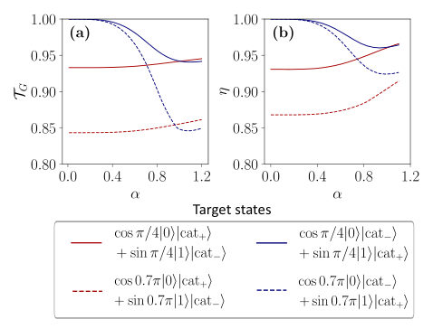
<figcaption class="paper-figure-caption"><b>Fig 3.</b> Figure 3: a) Thresholds for the genuine non-Gaussian entanglement derived for the fidelity with the hy- brid states cos θ|0⟩|cat+⟩+ sin θ|1⟩|cat−⟩(red lines), cos θ|0⟩|cat−⟩+sin θ|1⟩|cat+⟩(blue lines) with |cat±⟩∝ |α⟩± | −α⟩. Whereas the solid lines depict the case θ = π/4, the dashed ones presents θ = 0.7π b) Sen- sitivity of the witness of genuine non-Gaussian entan- glement to losses characterized by minimal transmission efficiency η of a lossy channel for which the fidelity to the state entering the channel is above the threshold for certification. A line of a given color shows the minimal η for the corresponding hybrid state in a).</figcaption>
</figure>
<figure class="paper-figure-card">
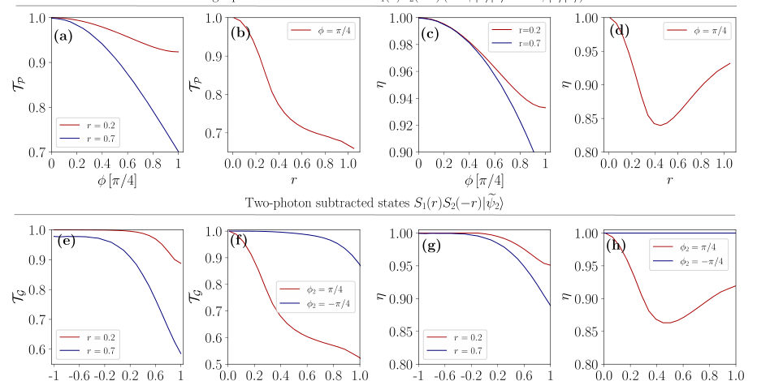
<figcaption class="paper-figure-caption"><b>Fig 4.</b> Figure 4: a) Threshold for the certification of mode-intrinsic entanglement using single-photon subtracted states |ψ1⟩∝S1(r)S2(−r) (cos ϕ|1⟩|0⟩−sin ϕ|0⟩|1⟩) as target states with fixed r = 0.2 (red) and r = 0.7 (blue) and different ϕ. b) Thresholds using the same target state as in a) but with given ϕ = π/4, as a function of r. c) The minimal transmission η of a lossy channel preserving the certification of mode-intrinsic entanglement of the state |ψ1⟩, with respect to the angle ϕ and given r = 0.2 (red) and r = 0.7 (blue). d) The minimal transmission η of a lossy channel depicted for states |ψ1⟩with respect to r and fixed ϕ = π/4. e) Threshold for genuine non-Gaussian entanglement based on...</figcaption>
</figure>

**Main problem.** Developing a method to certify 'genuine non-Gaussian entanglement'—entanglement that cannot be produced from separable states using any Gaussian evolution.

**Main result.** The authors establish a fidelity-based certification framework that identifies thresholds for recognizing non-Gaussian entanglement and demonstrates its robustness against transmission loss in Fock and hybrid states.

**Method.** A resource theory approach using fidelity to target states compared against calculated thresholds, utilizing the CMA-ES genetic algorithm for optimizing Gaussian unitaries.

**Summary.** This paper introduces a new method to certify genuine non-Gaussian entanglement in bosonic systems. By comparing the fidelity of an experimental state to a target state against a calculated threshold, the authors can distinguish entanglement that is fundamentally non-Gaussian from that which can be generated via Gaussian operations. The study demonstrates this method on Fock states and hybrid states, providing insights into how much loss these states can tolerate while remaining certifiable. This work bridges the gap between entanglement theory and the practical verification of non-Gaussian quantum resources.

Detailed structure

**Model / system.** Two-mode bosonic systems, specifically focusing on continuous-variable (CV) and hybrid (DV-CV) encodings, including Fock states, photon-subtracted states, and cat-state superpositions.

**Key observables.** Fidelity (F), stellar rank, and transmission efficiency (eta).

**Important parameters / regimes.** Squeezing parameter (r), superposition angle (theta), cat state spacing (alpha), and photon subtraction mode (phi).

**Assumptions / limitations.** The analysis is primarily constrained to pure 2-mode states and assumes a convex resource theory framework for handling mixed states.

**Figures summary.** Figure 1 shows the hierarchy of state spaces and the concept of robustness; Figures 4a-h illustrate fidelity thresholds and loss tolerance as functions of squeezing, subtraction angles, and transmission efficiency.

**Paper structure.** The paper introduces the problem of non-Gaussian entanglement, defines the resource theory framework, presents the fidelity-based certification method, applies it to various bosonic states (Fock, hybrid, photon-subtracted), analyzes loss tolerance, and provides a mathematical decomposition of Gaussian dynamics.

**Why it may be interesting.** It provides a practical tool for quantum optical experimentalists to verify the presence of high-level quantum resources (non-Gaussianity) that are essential for fault-tolerant quantum computing and advanced quantum metrology.

Abstract

Entanglement is a key resource for many quantum applications. Understanding fundamental properties of entangled states is an important step towards their practical exploitation. We characterize entanglement in the context of Gaussian and non-Gaussian processes and identify entangled states that cannot be produced by any Gaussian evolution acting on separable states. This distinction exposes intrinsic limitations of Gaussian operations and highlights the role of non-Gaussian operations as an important resource. We apply this framework to develop a certification method that connects entanglement theory with quantum non-Gaussianity - an advanced quantum feature that is essential for several quantum applications. Our approach tailors the certification to experimentally relevant states that can be produced in current quantum optics experiments. We demonstrate this certification for recognizing the genuine non-Gaussian entanglement of various entangled Fock states and hybrid entangled states.

[↑ back to top](#top)

### [Random entanglement percolation on realistic quantum networks](http://arxiv.org/abs/2604.21967v1)

**Authors:** Alessandro Romancino  
**Type:** theory · **Category:** quantum information and computing · **PDF:** <https://arxiv.org/pdf/2604.21967v1>  
**Analysis basis:** full PDF text, analyzed in chunks
**Topic relevance:** 🔥 `entanglement & information structure` **3/5** · `dissipative systems` **2/5**

↔ Scroll figures horizontally

<figure class="paper-figure-card">
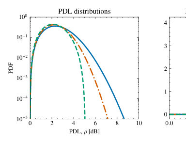
<figcaption class="paper-figure-caption"><b>Fig 1.</b> Fig. 1. – Left: probability density of the polarization-dependent loss P. Right: corresponding induced SCP density obtained from Eq. (4). The Mecozzi–Shtaif and Galtarossa–Palmieri curves were matched to the same mean PDL, ⟨P⟩≈2.35 dB, while the Lin–Jiang model used the five- element setting (0.8, 1.2, 1.4, 1.0, 0.7) dB.</figcaption>
</figure>

**Main problem.** Investigating how heterogeneity in edge entanglement, specifically caused by polarization-dependent loss (PDL), affects entanglement percolation in quantum networks.

**Main result.** The study demonstrates that while Random Classical Entanglement Percolation (RCEP) depends only on the mean singlet-conversion probability, Random Quantum Entanglement Percolation (RQEP) depends on the full distribution of probabilities due to the quantum penalty of the q-swap protocol.

**Method.** The author uses a mathematical mapping between PDL magnitude and singlet-conversion probabilities (SCP) and analyzes the percolation thresholds using RCEP and RQEP frameworks with q-swap preprocessing.

**Summary.** This paper explores how random fluctuations in edge entanglement affect the ability to establish long-range connectivity in quantum networks. By focusing on polarization-dependent loss in photonic networks, the author shows that the distribution of entanglement quality matters significantly for quantum protocols. Specifically, the 'quantum penalty' in RQEP makes the network performance sensitive to the entire probability distribution of the edges, not just the average. This provides a more realistic framework for designing robust quantum communication infrastructures.

Detailed structure

**Model / system.** A photonic quantum network where qubits are encoded in orthogonal polarization modes and edges are subject to random singlet-conversion probabilities (SCPs) induced by polarization-dependent loss (PDL).

**Key observables.** Singlet-conversion probability (SCP), PDL magnitude (in dB), and the quantum penalty constant (C).

**Important parameters / regimes.** PDL magnitude (P), mean SCP (mu), standard deviation (sigma), and the weak-PDL regime.

**Assumptions / limitations.** The study focuses specifically on PDL as a source of randomness and assumes the use of the q-swap preprocessing protocol.

**Figures summary.** Figure 1 shows the probability density of PDL for three different models (left) and the resulting induced SCP densities (right).

**Paper structure.** The paper begins by recalling classical and quantum entanglement percolation, introduces the PDL-induced SCP model, derives the mapping between PDL and SCP, analyzes the RCEP and RQEP regimes, and concludes with specific examples of induced distributions from real-world PDL models.

**Why it may be interesting.** It provides a concrete physical link between realistic fiber-optic impairments (PDL) and the fundamental limits of entanglement distribution in quantum networks.

Abstract

We study random entanglement percolation in heterogeneous quantum networks, where the singlet-conversion probabilities (SCPs) of the edges are drawn from a probability distribution rather than being fixed. After briefly recalling random classical and random quantum entanglement percolation, we focus on polarization-dependent loss (PDL) as a physical source of random edge entanglement in photonic networks. In this setting, polarization imbalance induces a simple map from the PDL magnitude to the edge SCP. We illustrate this map for representative PDL models and discuss the resulting implications for entanglement percolation.

[↑ back to top](#top)

### [Signature of paraparticles: a minimal Gedankenexperiment](http://arxiv.org/abs/2604.22178v1)

**Authors:** Francesco Toppan  
**Type:** theory · **Category:** quantum information and computing · **PDF:** <https://arxiv.org/pdf/2604.22178v1>  
**Analysis basis:** full PDF text, analyzed in chunks
**Topic relevance:** 🔥 `quantum measurements` **3/5** · `analog quantum simulation` **2/5**

↔ Scroll figures horizontally

<figure class="paper-figure-card">
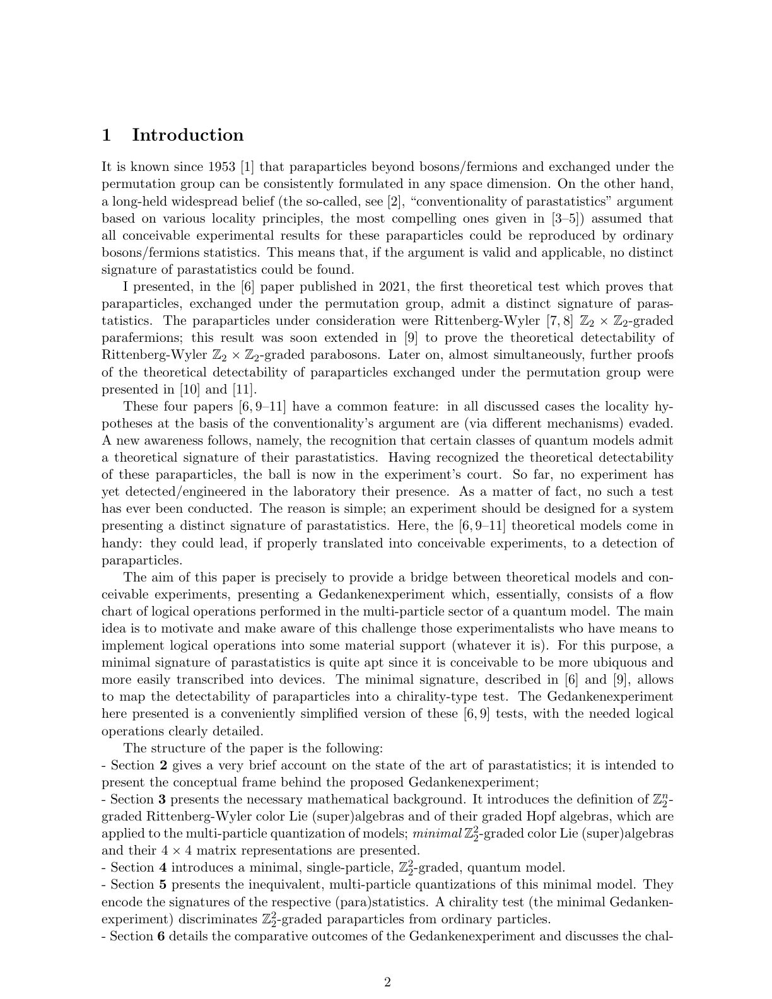
<figcaption class="paper-figure-caption"><b>Fig 1.</b> Low-resolution page preview, page 2</figcaption>
</figure>
<figure class="paper-figure-card">
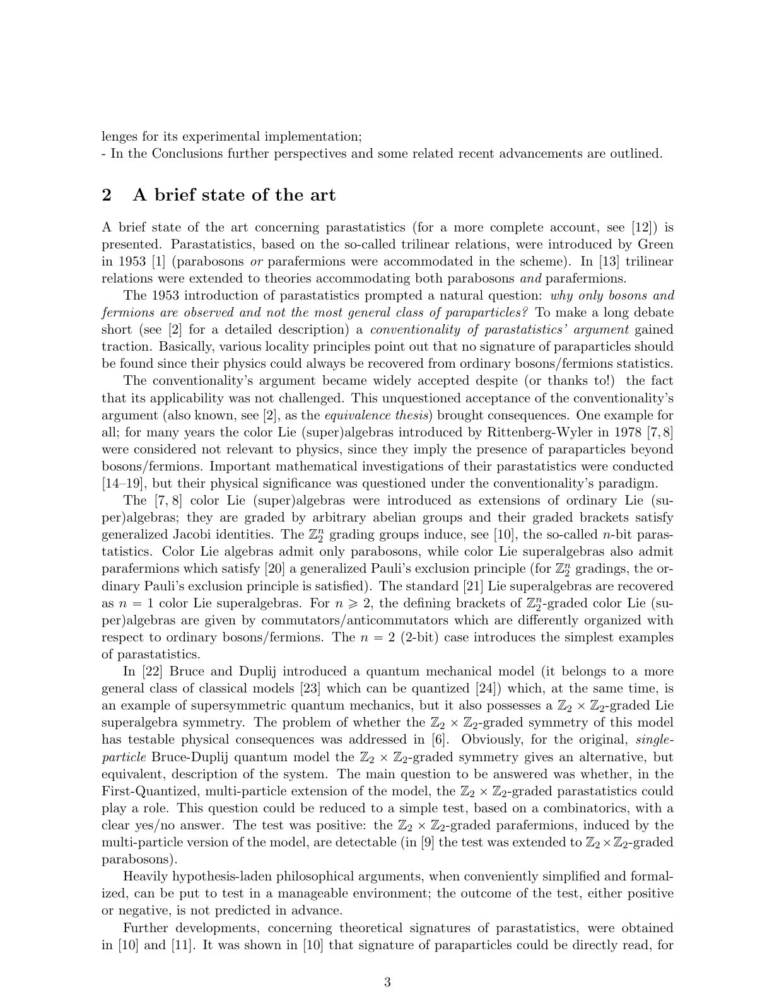
<figcaption class="paper-figure-caption"><b>Fig 2.</b> Low-resolution page preview, page 3</figcaption>
</figure>
<figure class="paper-figure-card">
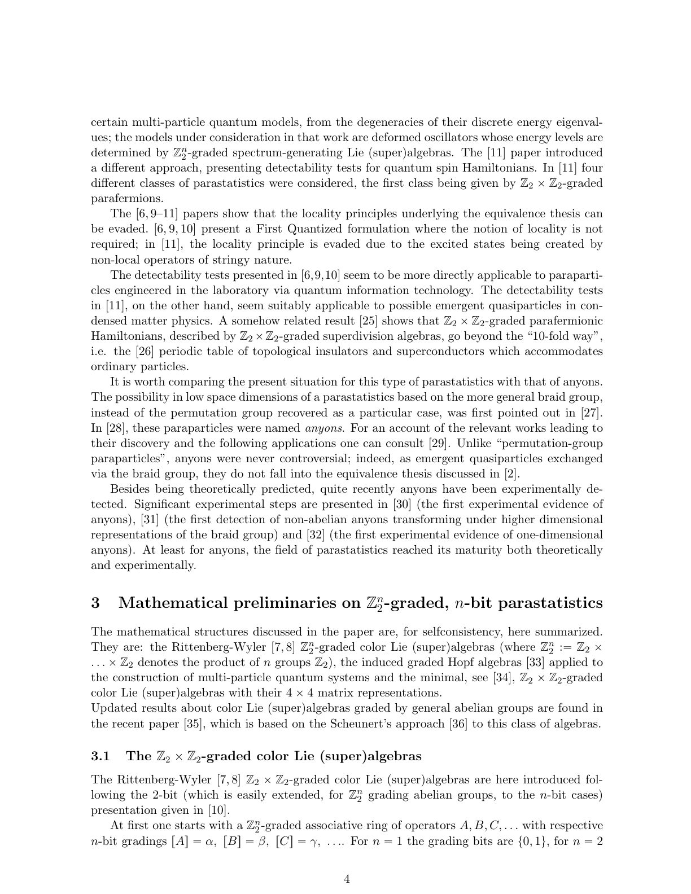
<figcaption class="paper-figure-caption"><b>Fig 3.</b> Low-resolution page preview, page 4</figcaption>
</figure>
<figure class="paper-figure-card">
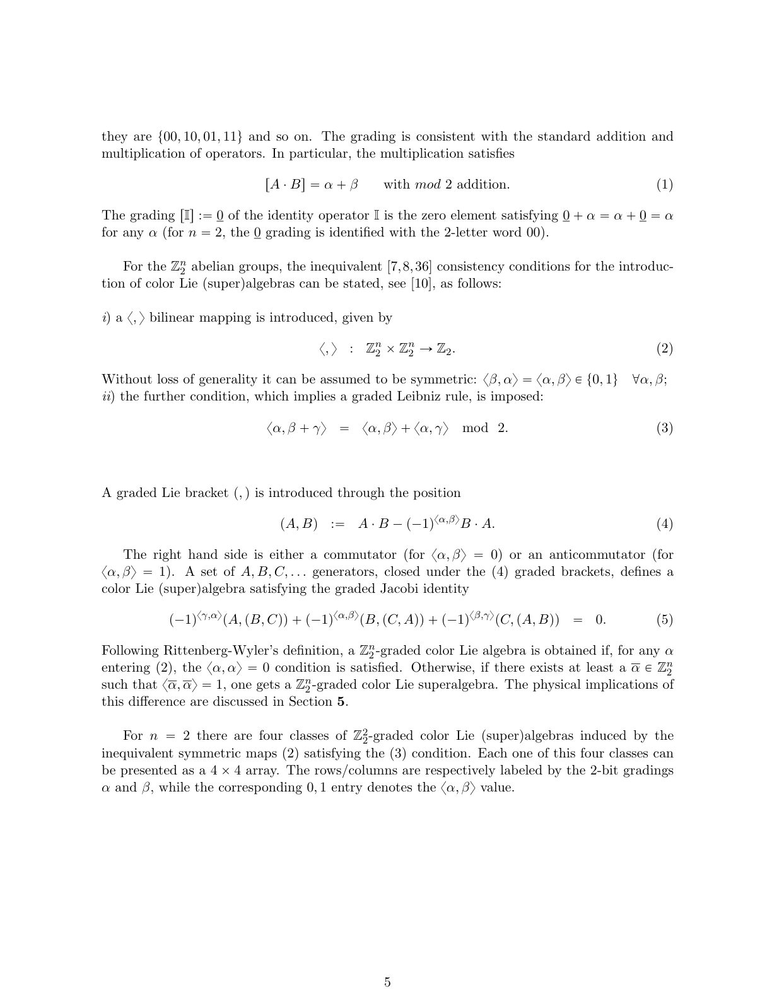
<figcaption class="paper-figure-caption"><b>Fig 4.</b> Low-resolution page preview, page 5</figcaption>
</figure>
<figure class="paper-figure-card">
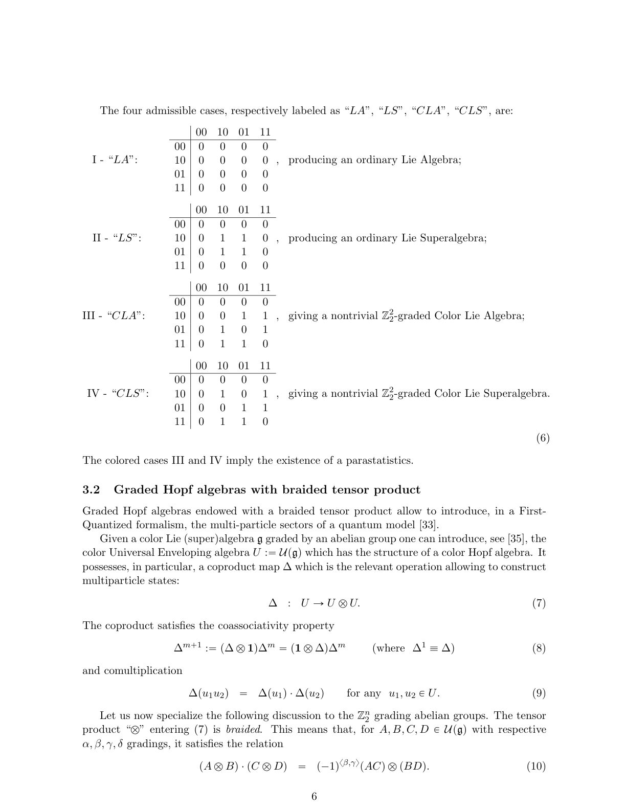
<figcaption class="paper-figure-caption"><b>Fig 5.</b> Low-resolution page preview, page 6</figcaption>
</figure>
<figure class="paper-figure-card">
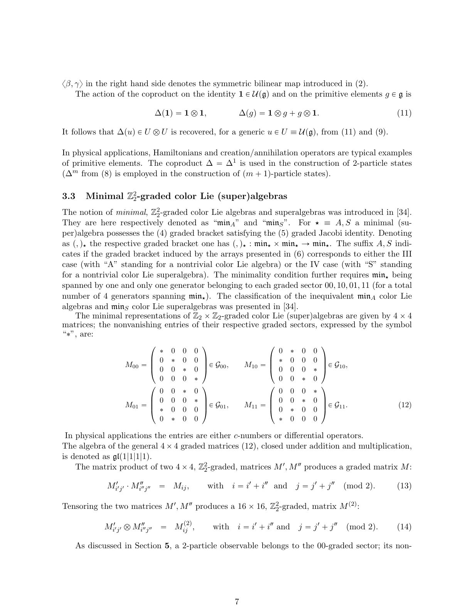
<figcaption class="paper-figure-caption"><b>Fig 6.</b> Low-resolution page preview, page 7</figcaption>
</figure>
<figure class="paper-figure-card">
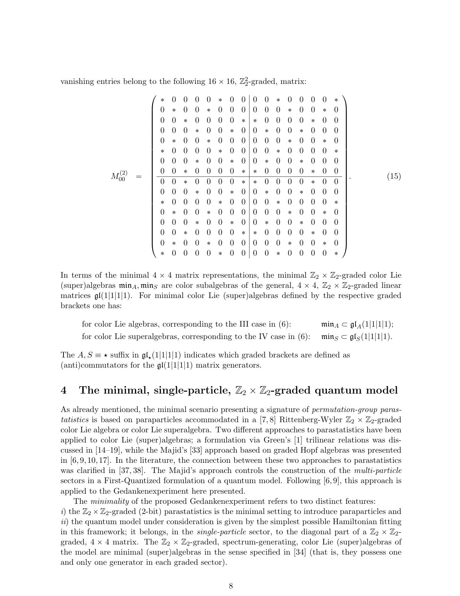
<figcaption class="paper-figure-caption"><b>Fig 7.</b> Low-resolution page preview, page 8</figcaption>
</figure>
<figure class="paper-figure-card">
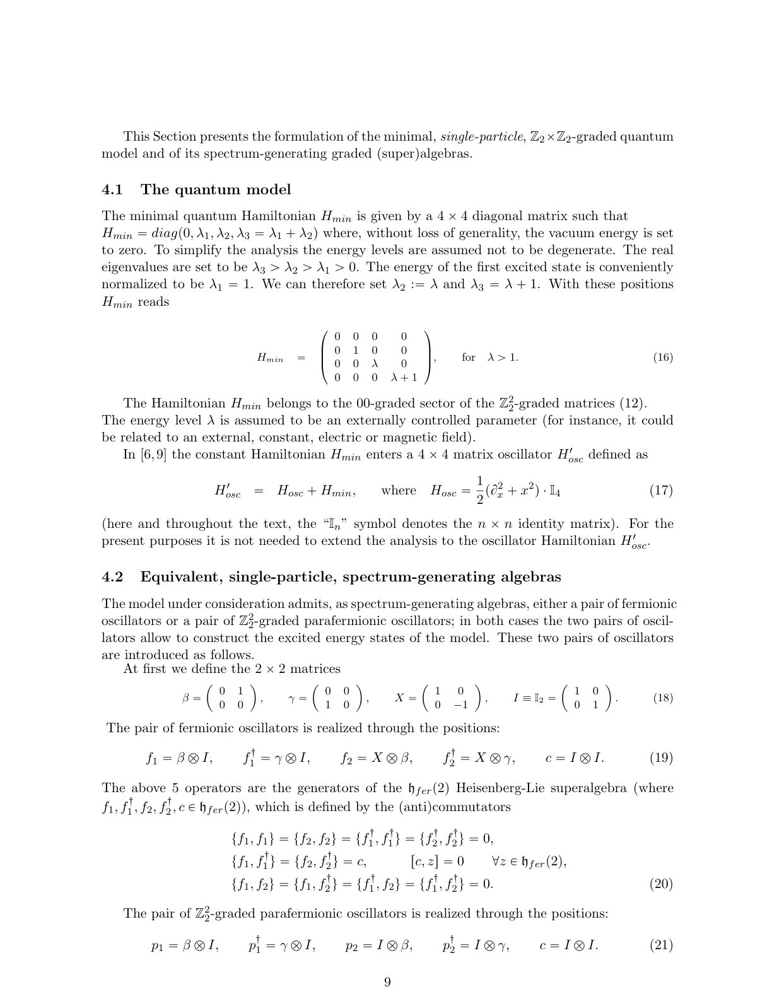
<figcaption class="paper-figure-caption"><b>Fig 8.</b> Low-resolution page preview, page 9</figcaption>
</figure>
<figure class="paper-figure-card">
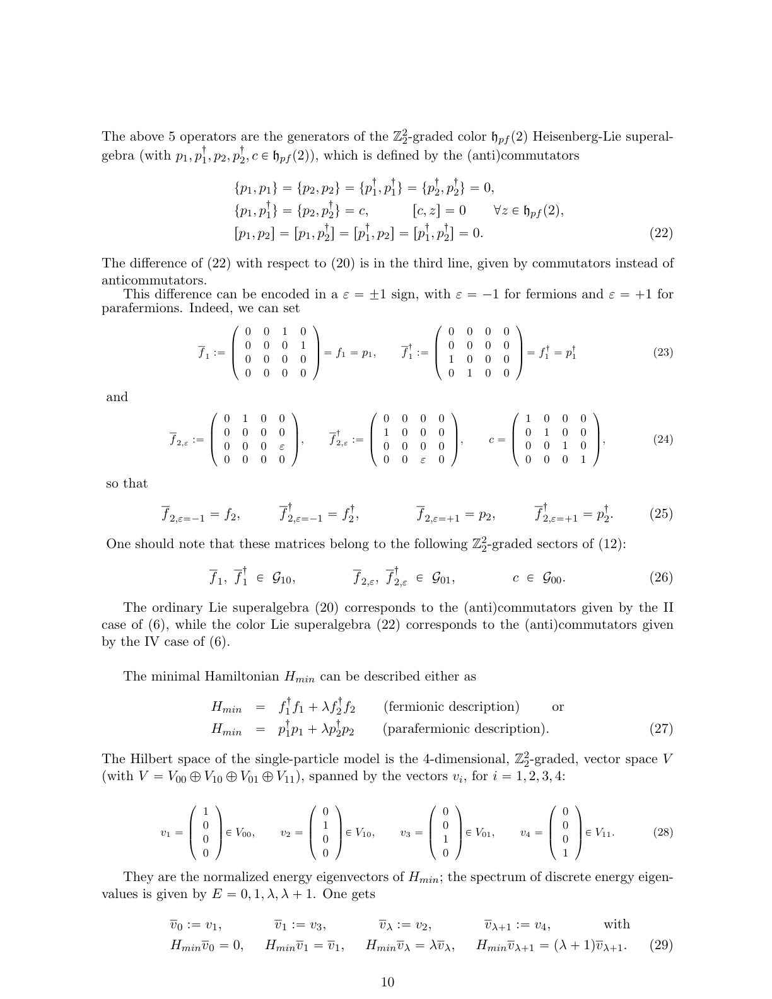
<figcaption class="paper-figure-caption"><b>Fig 9.</b> Low-resolution page preview, page 10</figcaption>
</figure>
<figure class="paper-figure-card">
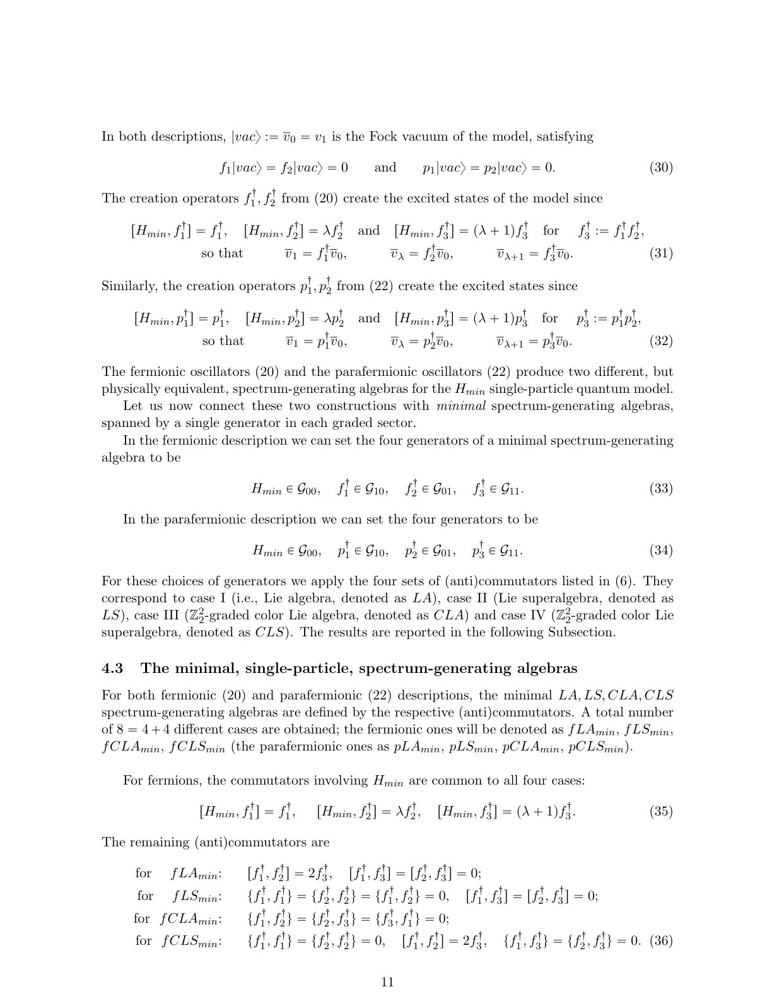
<figcaption class="paper-figure-caption"><b>Fig 10.</b> Low-resolution page preview, page 11</figcaption>
</figure>

**Main problem.** The paper seeks to bridge the gap between the theoretical existence of permutation-group parastatistics and the lack of experimental methods to detect them, specifically addressing whether these particles can be distinguished from ordinary bosons and fermions.

**Main result.** The author provides a minimal Gedankenexperiment that maps the detection of Z2 x Z2-graded colored paraparticles onto a measurable chirality-type parity test, demonstrating that certain parastatistical signatures are physically inequivalent to ordinary statistics.

**Method.** The study uses the mathematical framework of Z2 x Z2-graded color Lie (super)algebras and graded Hopf algebras to construct multi-particle sectors and proposes a 'yes/no' projection measurement approach.

**Summary.** This paper proposes a simplified thought experiment to detect 'colored' paraparticles, which are particles that follow statistics governed by the permutation group rather than just the braid group. By using the mathematical framework of color Lie superalgebras, the author shows that these particles possess unique physical signatures in their multi-particle energy spectra and eigenvectors. The detection method is simplified into a parity test that can be implemented using qudits, specifically ququarts. This work is significant because it challenges the long-held belief that parastatistics are indistinguishable from ordinary bosons and fermions.

Detailed structure

**Model / system.** A minimal single-particle quantum model with a 4-dimensional Hilbert space and a diagonal Hamiltonian, which is then extended to a 2-particle sector. The proposed experimental platform is the manipulation of qudits, specifically ququarts (d=4).

**Key observables.** Energy eigenvalues, energy level degeneracy, and a chirality-type parity measurement via Hermitian projection operators.

**Important parameters / regimes.** The energy level spacing parameter lambda, the sign parameter epsilon (distinguishing fermions from parafermions), and the Z2 x Z2 grading bits.

**Assumptions / limitations.** The experiment assumes the energy levels are non-degenerate and relies on a calibration test where the first measurement is assumed to represent ordinary statistics.

**Figures summary.** The paper includes an array showing four classes of symmetric bilinear maps and a matrix displaying the structure of 4x4 minimal matrix representations for different graded sectors.

**Paper structure.** The paper progresses from the mathematical background of Z2 x Z2 grading to a minimal single-particle model, followed by multi-particle quantizations, and concludes with a chirality-based detection test for experimentalists.

**Why it may be interesting.** It provides a concrete theoretical roadmap for using high-dimensional quantum computing (qudits) to simulate and detect exotic particle statistics that go beyond the standard bosonic and fermionic paradigms.

Abstract

Paraparticles beyond bosons and fermions can be exchanged via either the braid group (anyons, existing up to $D=2$ space dimensions) or the permutation group; in the latter case the space dimensions are not limited. Besides being predicted, anyons have been experimentally detected. The situation differs for paraparticles exchanged via the permutation group ("permutation-group parastatistics").The first test to detect their theoretical signature was published in 2021 (for $Z_2\times Z_2$-graded parafermions; it was soon followed by a second paper proving the detectability of $Z_2\times Z_2$-graded parabosons). Later on, two further papers proved theoretical signatures of permutation-group parastatistics. These works demonstrate that, in certain situations, a long-held belief on the "conventionality of parastatistics" argument can be evaded: some measurements of permutation-group paraparticles cannot be recovered from ordinary bosons/fermions. The main question now is how to experimentally detect or engineer in the laboratory such paraparticles. For this aim a minimal setup for the theoretical test is here provided: a Gedankenexperiment (a simplified version of the two tests published in 2021) which, essentially, is a flow chart of logical operations. The key point is to present, to experimentalists, the necessary steps to be simulated/realized in the laboratory (possibly, by manipulating qudits). In this minimal setup, the detection/engineering of paraparticles is mapped into a chirality test. The mathematical setting is based on $Z_2\times Z_2$-graded color Lie (super)algebras and derived mathematical structures.

[↑ back to top](#top)

### [Qubit-Scalable CVRP via Lagrangian Knapsack Decomposition and Noise-Aware Quantum Execution](http://arxiv.org/abs/2604.22194v1)

**Authors:** Monit Sharma, Hoong Chuin Lau  
**Type:** both · **Category:** quantum information and computing · **PDF:** <https://arxiv.org/pdf/2604.22194v1>  
**Analysis basis:** full PDF text, analyzed in chunks
**Topic relevance:** 🔥 `QC/QI experiment` **3/5**

↔ Scroll figures horizontally

<figure class="paper-figure-card">
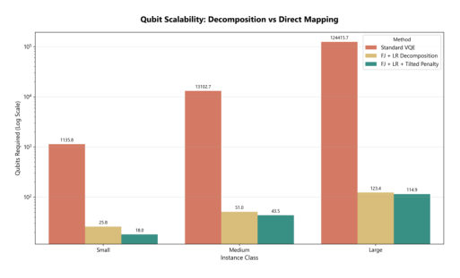
<figcaption class="paper-figure-caption"><b>Fig 1.</b> FIG. 2: Logical-width (qubit) scaling of direct CVRP QUBO encoding versus Fisher–Jaikumar (FJ) + La- grangian relaxation (LR) decomposition into per-vehicle knapsack QUBOs. Bars report required logical qubits (log scale) for three instance classes. Decomposition re- duces logical width by orders of magnitude by replac- ing a monolithic encoding with bounded-width subprob- lems; the slack-free tilted penalty further reduces width by avoiding auxiliary slack bits.</figcaption>
</figure>
<figure class="paper-figure-card">
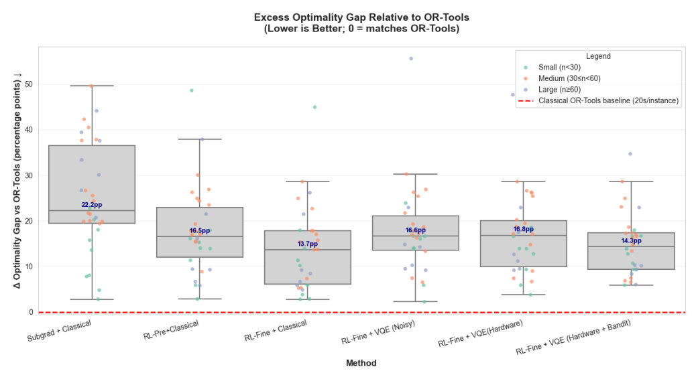
<figcaption class="paper-figure-caption"><b>Fig 2.</b> FIG. 1: Excess optimality gap relative to OR-Tools (20s/instance). For each instance i and method m, ∆gapm(i) = gapm(i) −gapORTools(i) (percentage points), where gap is computed end-to-end after decoding/repair and route reconstruction. Lower is better; the red dashed line at 0 denotes parity with OR-Tools. Gray boxes show distributions across test instances and colored points denote size buckets.</figcaption>
</figure>
<figure class="paper-figure-card">
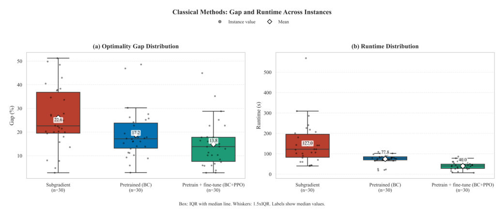
<figcaption class="paper-figure-caption"><b>Fig 3.</b> FIG. 3: Multiplier-control ablation under classical knapsack subproblem solves (30 CVRPLIB instances). (a) Distribution of end-to-end CVRP optimality gaps (%) after decoding/repair and route reconstruction (lower is better). (b) Distribution of wall-clock runtime (seconds) for a full LR episode, including LR iterations, subproblem solves, repair, and routing. Boxes show median and interquartile range (IQR) with 1.5×IQR whiskers; points are individual instances. Learned multiplier control reduces both median gap and time-to-solution relative to subgradient updates.</figcaption>
</figure>
<figure class="paper-figure-card">
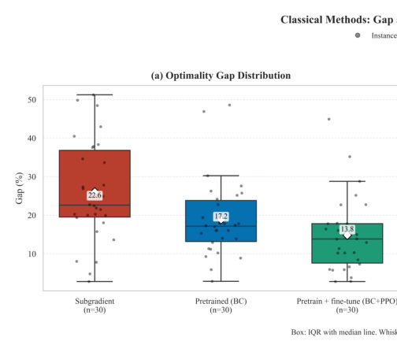
<figcaption class="paper-figure-caption"><b>Fig 4.</b> Figure 4 summarizes the trace-driven offline training (Section VI D). The bounded execution-proxy reward rises rapidly from a cold start and then plateaus, indi- cating that LinUCB identifies a stable set of high-utility configuration arms from the joint hardware/problem con- text (Section VI A) rather than continuing to explore</figcaption>
</figure>
<figure class="paper-figure-card">
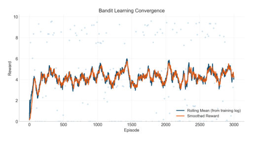
<figcaption class="paper-figure-caption"><b>Fig 5.</b> FIG. 4: Offline bandit learning curve under trace-driven training. Points show per-episode bounded reward (in [0, 10]); the rolling-mean and smoothed traces summarize the learning trend.</figcaption>
</figure>
<figure class="paper-figure-card">
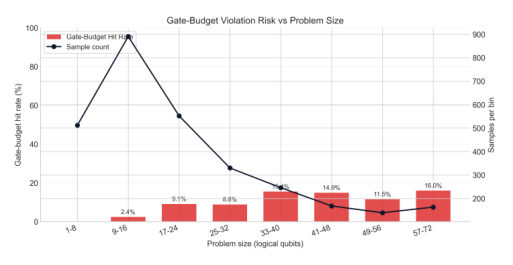
<figcaption class="paper-figure-caption"><b>Fig 6.</b> FIG. 6: Gate-budget hit rate by logical-width bin.</figcaption>
</figure>
<figure class="paper-figure-card">
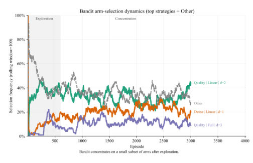
<figcaption class="paper-figure-caption"><b>Fig 7.</b> FIG. 5: Bandit arm-selection dynamics during trace- driven offline training. Curves report rolling-window (window=100) selection frequencies for the most fre- quently selected configuration arms; remaining arms are aggregated as Other. The policy transitions from broad exploration to concentration on a small subset of high- utility configurations, consistent with UCB-style learning under bounded rewards.</figcaption>
</figure>
<figure class="paper-figure-card">

<figcaption class="paper-figure-caption"><b>Fig 8.</b> Figure 6 reports the empirical gate-budget hit rate as a function of logical width, defined as the fraction of con- sult calls in which the bandit’s top-ranked arm is rejected by feasibility screening (because bG &gt; Gmax) and the se- lector falls back to the best-ranked feasible alternative. The hit rate is negligible at small widths and rises to the ≈9–16% range beyond moderate widths, consistent with routing overhead becoming a binding constraint as compiled circuits grow. This supports the constrained decision rule in Section VI C: the bandit provides a util- ity ranking, while deterministic screening enforces exe- cutability. Importantly, nonzero hit rates also translate into outer-loop...</figcaption>
</figure>
<figure class="paper-figure-card">
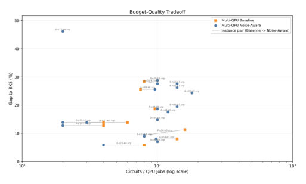
<figcaption class="paper-figure-caption"><b>Fig 9.</b> FIG. 7: Budget–quality tradeoff (gap to BKS versus quantum-evaluation budget) for multi-QPU baseline and noise-aware runs. Note. Quantum budget is the total number of transpiled circuit executions / QPU jobs (log scale); gray segments connect matched instances (baseline →noise-aware).</figcaption>
</figure>
<figure class="paper-figure-card">
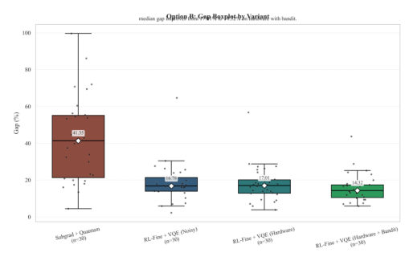
<figcaption class="paper-figure-caption"><b>Fig 10.</b> FIG. 8: End-to-end CVRP optimality gap (%) after decoding/repair and route reconstruction, comparing execution variants under learned multiplier control.</figcaption>
</figure>

**Main problem.** The scalability of the Capacitated Vehicle Routing Problem (CVRP) on NISQ devices is limited by the high qubit and gate requirements of direct QUBO encodings and the instability of classical optimization parameters in noisy environments.

**Main result.** The authors developed an end-to-end hybrid pipeline that uses Lagrangian decomposition to reduce qubit requirements and a learned RL-based controller to stabilize multiplier updates, achieving significantly lower optimality gaps on real hardware compared to classical subgradient methods.

**Method.** A hybrid framework combining Lagrangian relaxation to decompose CVRP into bounded-width knapsack subproblems, a reinforcement learning policy (PPO) for multiplier updates, and a constrained contextual bandit for hardware-aware execution.

**Summary.** This paper presents a practical end-to-end framework for solving large-scale vehicle routing problems using near-term quantum computers. By decomposing the complex CVRP into smaller, manageable knapsack subproblems, the authors bypass the qubit-width bottleneck. They further enhance performance by using reinforcement learning to stabilize the optimization loop and a contextual bandit to adaptively select the best quantum hardware configurations. The approach demonstrates that hybrid, decomposition-centric pipelines are more viable for NISQ-era applications than monolithic quantum encodings.

Detailed structure

**Model / system.** The problem is modeled as a CVRP on a complete graph, transformed via Fisher-Jaikumar linearization and Lagrangian relaxation into 0-1 knapsack subproblems encoded as QUBO/Ising Hamiltonians with a 'tilted' quadratic penalty.

**Key observables.** Optimality gap relative to Best Known Solutions (BKS), routing quality, feasibility rate of quantum samples, and hardware metrics like gate-budget hit rate and latency.

**Important parameters / regimes.** Vehicle capacity, customer demand, travel costs, Lagrangian multipliers (lambda), penalty strength (rho), and headroom parameter (s).

**Assumptions / limitations.** The method assumes that a feasible global route can be reconstructed from stochastic quantum samples using a deterministic repair heuristic and that hardware descriptors are available for the bandit layer.

**Figures summary.** Figures demonstrate the scaling of logical qubits versus problem size, micro-benchmarks comparing different penalty encodings (Tilted vs. Taylor), and the distribution of quantum jobs across heterogeneous backends (IBM, Rigetti, IQM).

**Paper structure.** The paper introduces the scalability bottleneck, proposes a decomposition-based framework, details the Lagrangian relaxation and knapsack encoding, describes the RL-based multiplier control and hardware-aware bandit layer, and concludes with experimental validation on simulators and real QPUs.

Abstract

Hybrid quantum optimization for vehicle routing faces a practical bottleneck: direct QUBO encodings of CVRP quickly exceed near-term qubit and gate budgets, while quantum evaluations are expensive, noise-limited, and sensitive to backend and circuit configuration. We address this gap with an end-to-end decomposition pipeline that converts CVRP into bounded-width quantum subproblems and treats quantum execution as a decision problem within the optimization loop. Starting from a Fisher--Jaikumar assignment linearization, we apply Lagrangian relaxation to dualize customer-assignment couplers, yielding independent per-vehicle knapsack subproblems that admit QUBO/Ising evaluation. To replace brittle subgradient tuning, we learn a multiplier-update controller using expert-guided pretraining followed by reinforcement-learning fine-tuning, with rewards based on execution-realized progress and route reconstruction. We also introduce a constrained contextual bandit as a hardware-aware execution layer that selects backend and circuit configuration with feasibility screening, enabling adaptation across heterogeneous noisy resources and parallel multi-QPU scheduling. Computational results on multiple CVRPLIB families show that the decomposition yields stable bounded-width subproblems across instance sizes, learned multiplier updates improve end-to-end routing quality relative to classical subgradient control under matched budgets, and hardware-mode configuration reduces median optimality gaps relative to static execution choices in our test set. We do not claim quantum advantage. Instead, the contribution is a practical end-to-end framework for scaling hybrid quantum CVRP optimization through OR decomposition, learning-augmented dual control, and adaptive hardware-aware execution.

[↑ back to top](#top)

### [Replica Tensor Train](http://arxiv.org/abs/2604.22718v1)

**Authors:** Miha Srdinsek, Gabriel Gouraud, Xavier Waintal  
**Type:** theory · **Category:** numerical methods · **PDF:** <https://arxiv.org/pdf/2604.22718v1>  
**Analysis basis:** full PDF text, analyzed in chunks
**Topic relevance:** 🔥 `entanglement & information structure` **3/5**

↔ Scroll figures horizontally

<figure class="paper-figure-card">
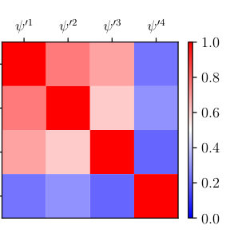
<figcaption class="paper-figure-caption"><b>Fig 1.</b> Figure 2: Example of the S matrix computed with dual Monte Carlo before (left) and after (right) the orthogonalization procedure. The matrix was constructed when solving the Ising model in Fig. 5. The new states are compressed to χ = 2.</figcaption>
</figure>
<figure class="paper-figure-card">
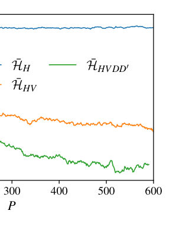
<figcaption class="paper-figure-caption"><b>Fig 2.</b> Figure 3: Error on the energy during a replica space optimization by application of (1 −τ ¯H)P for three choices of ¯H, see text. The number of active sub-MPS is one (blue), two (orange) and four (green). The optimization is purely algebraic but the calculation of the energy is performed using VMC sampling. The parameters are hx = 3, L = 20, χ = 2, τ = 0.1 and α = 0.08 for the ¯HHV DD′ curve (green line).</figcaption>
</figure>
<figure class="paper-figure-card">
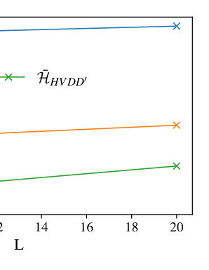
<figcaption class="paper-figure-caption"><b>Fig 3.</b> Figure 4: Error on the energy after a replica space optimization versus system size L. The number of active sub-MPS is one (blue), two (orange) and four (green), see text. The accuracy of the RTT is robust with respect to system size. Same parameters as in Fig.3.</figcaption>
</figure>
<figure class="paper-figure-card">
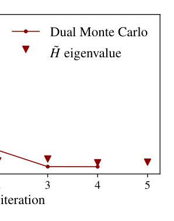
<figcaption class="paper-figure-caption"><b>Fig 4.</b> Figure 5: Dual Monte Carlo optimization steps starting from the solution of ¯HHV (star). At each step, Eq. (48) is solved. The eigenvalues of the equation (arrows) are compared with the actual energies of the state after the compression (points).</figcaption>
</figure>
<figure class="paper-figure-card">
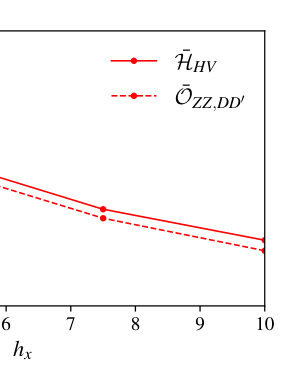
<figcaption class="paper-figure-caption"><b>Fig 5.</b> Figure 6: Error of χ = 2 RTT versus hx in the paramagnetic region of the phase diagram. The parameters and optimization procedure are the same as in Table 1: (solid line) replica space optimization using ¯HHV, followed by (dashed line) phys- ical space optimization using ¯OZZ,DD′. The error is estimated using the V-score, δE/E ≈0.2Nvar[H]/E2, see Ref. [28]</figcaption>
</figure>

**Main problem.** The fundamental trade-off between expressivity (capturing volume-law entanglement) and computability (avoiding expensive gradient descent or high-dimensional contractions) in many-body physics.

**Main result.** The development of the Replica Tensor Train (RTT), which allows for the algebraic, non-gradient-based finding of ground states for highly entangled systems, achieving high accuracy in 2D Ising models.

**Method.** A hybrid approach combining Tensor Networks (specifically an extended Tensor Train) with Quantum Monte Carlo (Dual Monte Carlo) to sample observables from a volume-law entangled ansatz.

**Summary.** This paper introduces the Replica Tensor Train (RTT), a new numerical technique that merges the algebraic strengths of tensor networks with the sampling power of Monte Carlo. Unlike standard tensor networks that struggle with 2D entanglement or neural networks that rely on noisy gradient descent, RTT can capture volume-law entanglement and find ground states through purely algebraic methods. The authors demonstrate that this approach can efficiently solve the 2D transverse-field Ising model with high precision. This method bridges the gap between the high expressivity of neural quantum states and the high efficiency of traditional tensor network algorithms.

Detailed structure

**Model / system.** A 2D transverse-field Ising model on a square lattice, specifically studied in the paramagnetic region near the quantum critical point.

**Key observables.** Ground-state energy per site, energy variance (V-score), and energy error relative to reference Green Function Monte Carlo results.

**Important parameters / regimes.** Bond dimension (chi), number of replicas (K), transverse field strength (hx), and the specific path (sigma) through the physical sites.

**Assumptions / limitations.** The method assumes the ground state can be represented with a relatively small internal bond dimension and requires a predefined path through the physical degrees of freedom.

**Figures summary.** Figure 1 compares different tensor network ansätze (MPS, PEPS, RTT); Figure 2 shows the effect of stochastic orthogonalization on the overlap matrix; Figure 3 illustrates energy error reduction via different operator distributions; Figure 4 shows error scaling with system size; Figure 5/6 show optimization convergence and error as a function of the transverse field.

**Paper structure.** The paper introduces the RTT ansatz and its three equivalent mathematical interpretations, describes the algebraic ground-state search and the Dual Monte Carlo sampling method, demonstrates optimization in both replica and physical space, and validates the approach using the 2D transverse-field Ising model.

**Why it may be interesting.** It provides a powerful new tool for simulating highly entangled 2D systems by bypassing the optimization bottlenecks (like barren plateaus) of Neural Quantum States while maintaining the expressivity needed for volume-law entanglement.

Abstract

We describe a numerical many-body technique that is based on both tensor networks and quantum Monte Carlo. The variational ansatz is a tensor network that can harvest volume-law entanglement. It is constructed from a tensor train to which one applies a set of non-local operators that force several indices of the tensor train to represent the same physical index, hence its name -- replica tensor train (RTT). From the tensor network toolbox, it inherits the possibility to make linear combinations of these states and apply a certain class of operators. We can therefore find the ground-state of a local Hamiltonian in a purely algebraic way as in standard tensor network algorithms -- i.e. without using gradient descent methods. On the other hand, the volume-law structure forbids calculating physical observables directly. In much the same way as on a quantum computer where one can prepare a state but can only sample it at the end, here we have to use Markov Chain Monte Carlo to compute the observables. We further show that the approach can be extended to build Krylov-subspace ground-state methods within the variational manifold. We illustrate the different algorithms on a two-dimensional spin model with a transverse magnetic field, which can be solved by this approach at low computational cost.

[↑ back to top](#top)

### [A variational formulation of stochastic thermodynamics: Spatially extended systems](http://arxiv.org/abs/2604.22298v1)

**Authors:** Héctor Vaquero del Pino, François Gay-Balmaz, Hiroaki Yoshimura, Lock Yue Chew  
**Type:** theory · **Category:** statistical mechanics · **PDF:** <https://arxiv.org/pdf/2604.22298v1>  
**Analysis basis:** full PDF text, analyzed in chunks
**Topic relevance:** `Keldysh / 2PI / non-Gaussian methods` **2/5** · `dissipative systems` **2/5** · `methods for driven-dissipative` **2/5** · `non-equilibrium dynamics` **2/5**

↔ Scroll figures horizontally

<figure class="paper-figure-card">
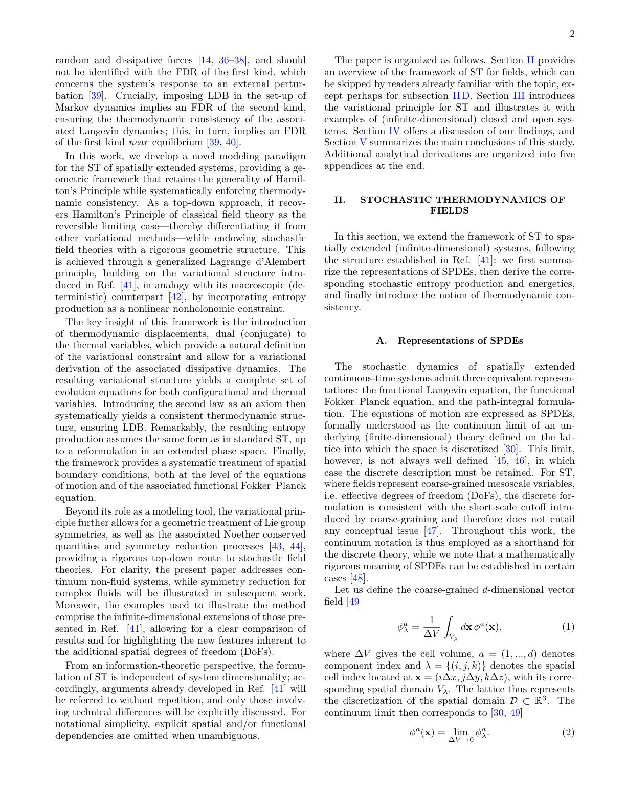
<figcaption class="paper-figure-caption"><b>Fig 1.</b> Low-resolution page preview, page 2</figcaption>
</figure>
<figure class="paper-figure-card">
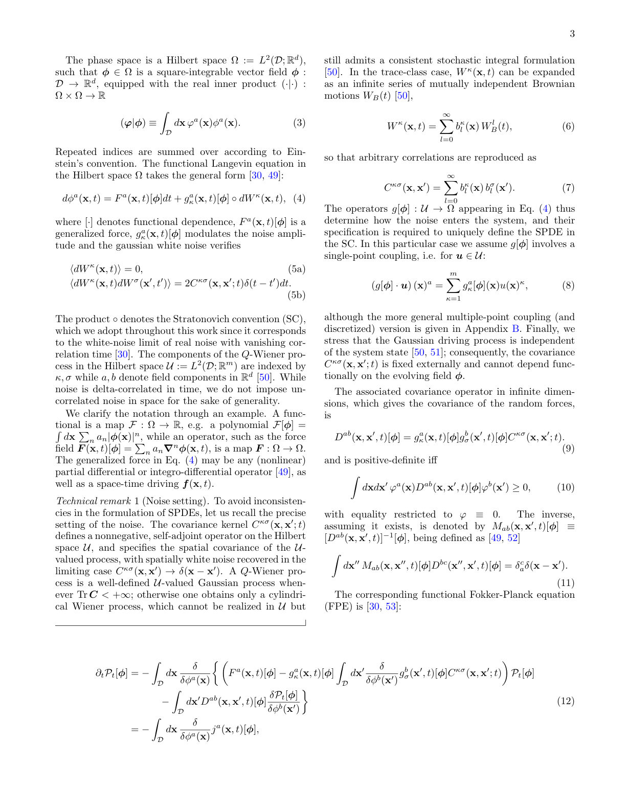
<figcaption class="paper-figure-caption"><b>Fig 2.</b> Low-resolution page preview, page 3</figcaption>
</figure>
<figure class="paper-figure-card">
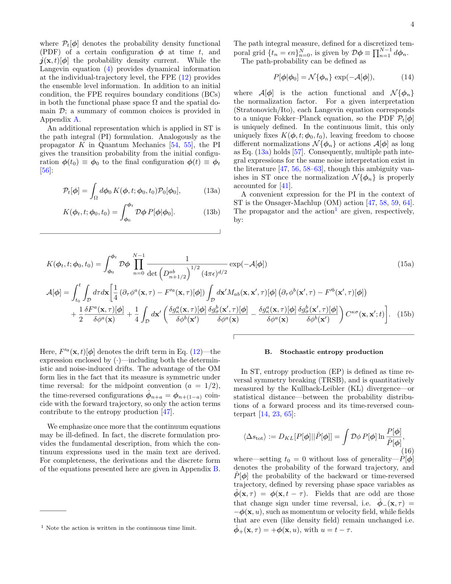
<figcaption class="paper-figure-caption"><b>Fig 3.</b> Low-resolution page preview, page 4</figcaption>
</figure>
<figure class="paper-figure-card">
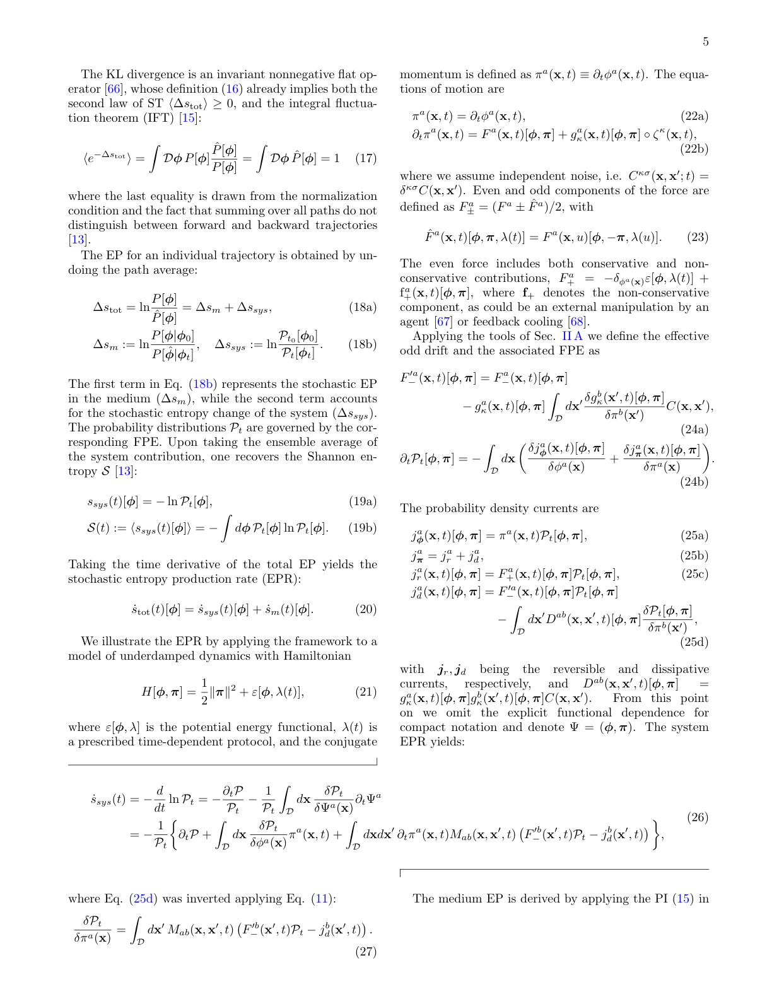
<figcaption class="paper-figure-caption"><b>Fig 4.</b> Low-resolution page preview, page 5</figcaption>
</figure>
<figure class="paper-figure-card">
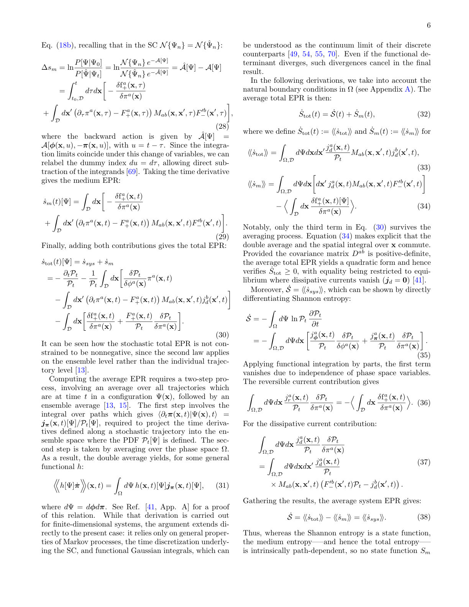
<figcaption class="paper-figure-caption"><b>Fig 5.</b> Low-resolution page preview, page 6</figcaption>
</figure>
<figure class="paper-figure-card">
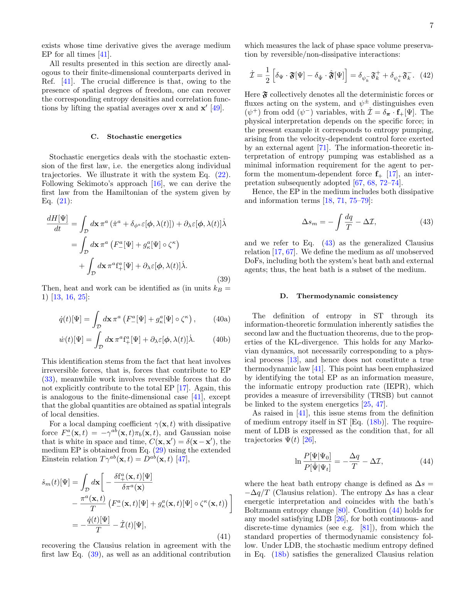
<figcaption class="paper-figure-caption"><b>Fig 6.</b> Low-resolution page preview, page 7</figcaption>
</figure>
<figure class="paper-figure-card">
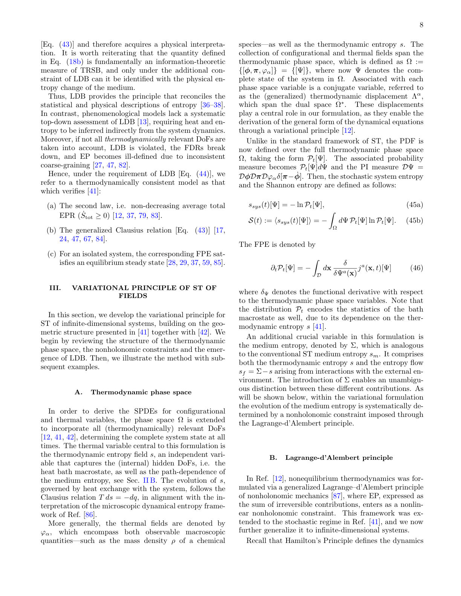
<figcaption class="paper-figure-caption"><b>Fig 7.</b> Low-resolution page preview, page 8</figcaption>
</figure>
<figure class="paper-figure-card">
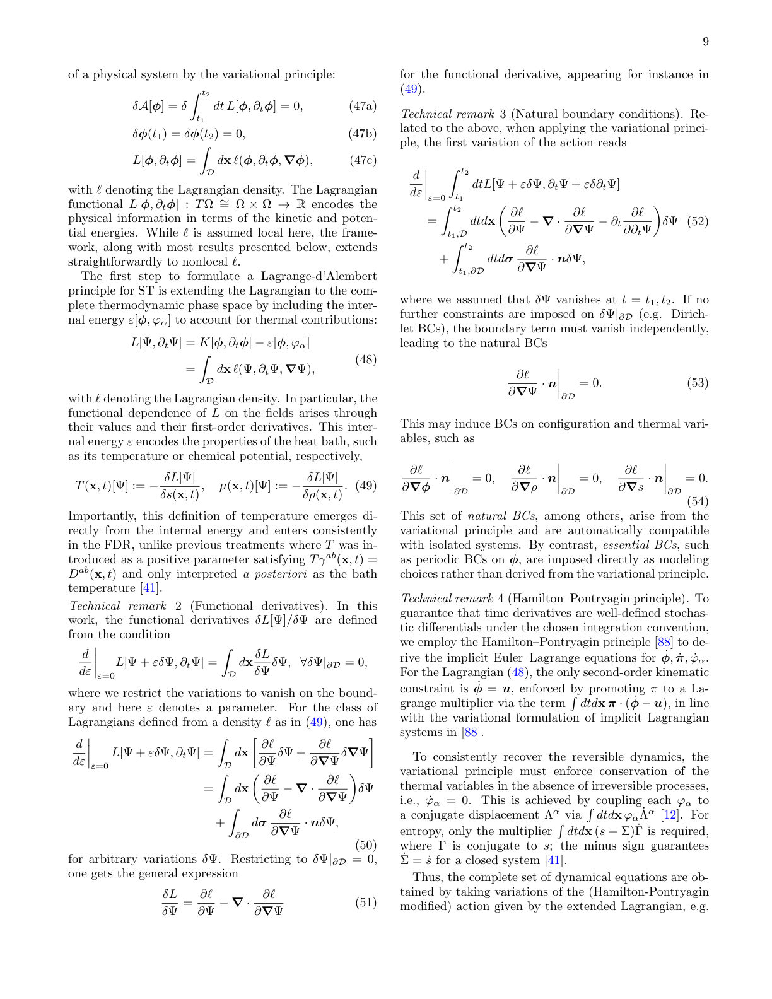
<figcaption class="paper-figure-caption"><b>Fig 8.</b> Low-resolution page preview, page 9</figcaption>
</figure>
<figure class="paper-figure-card">
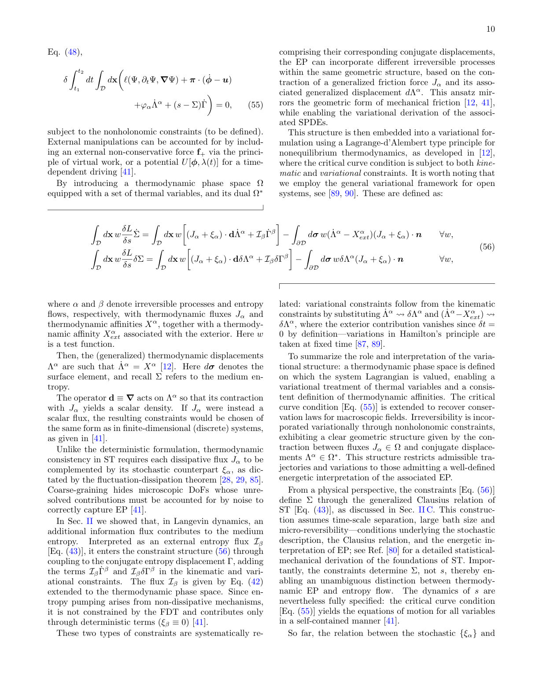
<figcaption class="paper-figure-caption"><b>Fig 9.</b> Low-resolution page preview, page 10</figcaption>
</figure>
<figure class="paper-figure-card">
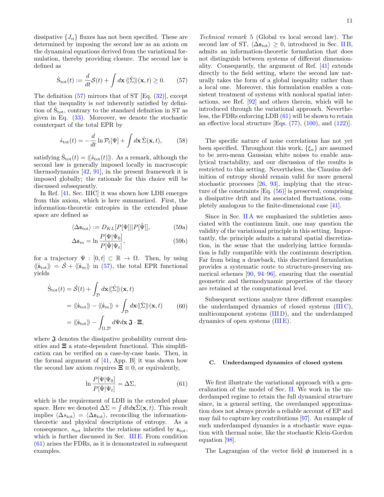
<figcaption class="paper-figure-caption"><b>Fig 10.</b> Low-resolution page preview, page 11</figcaption>
</figure>

**Main problem.** The lack of a systematic, top-down variational method for constructing stochastic field theories that are guaranteed to be thermodynamically consistent and satisfy local detailed balance.

**Main result.** The development of a unified geometric variational framework that extends Hamilton's principle to spatially extended systems, ensuring that the resulting stochastic partial differential equations naturally satisfy the second law of thermodynamics and fluctuation-dissipation relations.

**Method.** A generalized Lagrange-d'Alembert principle and an axiomatic approach where the second law is introduced as a constraint, utilizing functional calculus and path integral formulations.

**Summary.** This paper provides a new mathematical foundation for building stochastic models of continuous, spatially extended systems. By using a variational principle that treats the second law of thermodynamics as a fundamental axiom, the authors ensure that any derived model is automatically thermodynamically consistent. This framework allows for the systematic derivation of complex models, such as those for complex fluids, while guaranteeing that they obey essential physical laws like local detailed balance and fluctuation theorems.

Detailed structure

**Model / system.** Spatially extended, infinite-dimensional continuous-variable systems (stochastic field theories) described by functional Langevin equations and Fokker-Planck equations in a Hilbert space.

**Key observables.** Entropy production (system, medium, and total), entropy production rate, heat, work, and fluctuation theorems.

**Important parameters / regimes.** Local detailed balance (LDB), fluctuation-dissipation relations (FDR), and the Stratonovich convention for noise.

**Assumptions / limitations.** The use of the Stratonovich convention (white-noise limit), time-scale separation, and the assumption of a large heat bath.

**Paper structure.** The paper introduces the problem of thermodynamic consistency in field theories, develops a variational framework using an extended phase space, proves the derivation of entropy production and fluctuation theorems, and provides mathematical appendices for closed, multicomponent, and open systems.

Abstract

Stochastic field theories are often constructed phenomenologically, without a systematic assessment of thermodynamic consistency or local detailed balance. This may hinder a physical description of irreversibility at the field-theoretic level beyond the standard statistical formulation of stochastic thermodynamics. Here, we develop a variational formulation for thermodynamically consistent stochastic field theories by extending Hamilton's principle of classical field theory. Introducing the second law as an axiom yields a consistent local thermodynamic structure in which novel fluctuationdissipation relations emerge naturally, ensuring local detailed balance. Remarkably, the resulting entropy production takes the same form as in standard stochastic thermodynamics, up to a reformulation in an extended phase space incorporating both configurational and thermal variables. This correspondence extends key results, including individual trajectory-level thermodynamics and fluctuation theorems. The construction is formulated within a unified geometric framework based on a generalized Lagrange-d'Alembert principle, providing a top-down connection between phenomenological modeling and thermodynamic consistency. Potential applications include thermodynamically consistent modeling of complex fluids, Lagrangian reduction by symmetry in continuum systems, and structure-preserving numerical schemes for stochastic partial differential equations.

[↑ back to top](#top)

### [On the Interplay Between Noise, Bell Violation, and Cascade Error Correction in Device-Independent Quantum Key Distribution](http://arxiv.org/abs/2604.22232v1)

**Authors:** Nguyen Duong Hoang Duy, Nguyen Trinh Dong, Vu Tuan Hai, Le Vu Trung Duong, Nguyen Van Tinh  
**Type:** theory · **Category:** quantum information and computing · **PDF:** <https://arxiv.org/pdf/2604.22232v1>  
**Analysis basis:** full PDF text, analyzed in chunks
**Topic relevance:** `dissipative systems` **2/5** · `entanglement & information structure` **2/5** · `quantum measurements` **1/5**

↔ Scroll figures horizontally

<figure class="paper-figure-card">
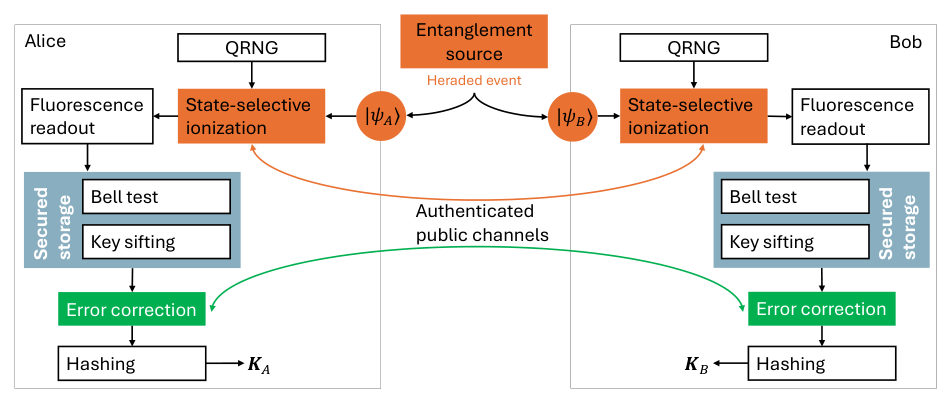
<figcaption class="paper-figure-caption"><b>Fig 1.</b> Fig. 1: Simulated DIQKD protocol system. An entanglement source generates correlated photon pairs that are sent to Alice and Bob. Each party uses a Quantum Random Number Generator (QRNG) to choose measurement settings and performs measurements on their respective photons, with outcomes obtained through state-selective ionization and fluorescence readout. The outcomes are then stored locally. The results are communicated over an authenticated channel, where a Bell test verifies the presence of entanglement and detects potential eavesdropping. Afterward, key sifting retains only compatible measurement results, error correction reconciles discrepancies, and privacy amplification (universal...</figcaption>
</figure>
<figure class="paper-figure-card">
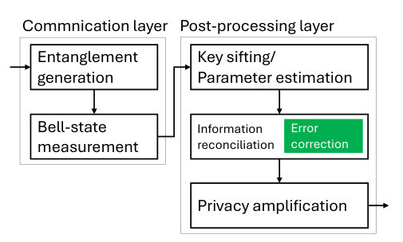
<figcaption class="paper-figure-caption"><b>Fig 2.</b> Fig. 2: Standard DIQKD. In this work, Cascade error correction is incorporated into the Information reconciliation stage of the (classical) post-processing layer.</figcaption>
</figure>
<figure class="paper-figure-card">
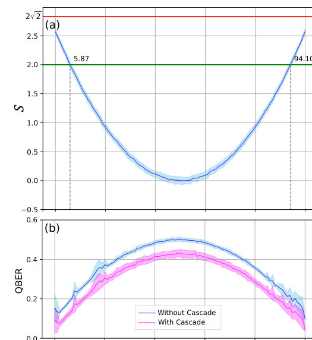
<figcaption class="paper-figure-caption"><b>Fig 3.</b> Fig. 3: (a) S versus noise percentage, obtained from 50 runs of 10,000 rounds. Horizontal lines at S = 2 and S = 2 √</figcaption>
</figure>

**Main problem.** Investigating how noise impacts the CHSH value and evaluating the effectiveness of the Cascade error correction protocol in Device-Independent Quantum Key Distribution (DIQKD).

**Main result.** Noise significantly degrades Bell nonlocality (CHSH value), but the Cascade protocol effectively reduces the error ratio, with most corrections occurring in the first few rounds. The study concludes that hardware-level noise reduction is more critical for DIQKD viability than increasing error correction complexity.

**Method.** A high-fidelity simulation of an entanglement-swapping-based DIQKD protocol using a depolarizing noise model and the Cascade error correction algorithm (parity checking and binary search).

**Summary.** This paper studies the impact of noise on the security and efficiency of Device-Independent Quantum Key Distribution. By simulating an entanglement-swapping setup with rubidium atoms, the authors show that while noise degrades the necessary Bell inequality violations, the Cascade error correction protocol can significantly reduce bit errors. The findings suggest that improving physical hardware to reduce noise is more important for successful DIQKD than implementing more complex classical error correction algorithms.

Detailed structure

**Model / system.** A simulated event-ready entanglement swapping scheme between two remote rubidium atoms connected via optical fiber, incorporating a depolarizing noise model in a 2x3 state space.

**Key observables.** CHSH parameter (S), Quantum Bit Error Rate (QBER), and Secret Key Rate.

**Important parameters / regimes.** Critical QBER threshold of 0.082; noise levels ranging from 0% to 100%; measurement settings for Alice and Bob.

**Assumptions / limitations.** Validity of quantum mechanics, trusted classical components, authenticated classical channels, and the requirement for loophole-free Bell tests.

**Figures summary.** Figure 1 shows the DIQKD protocol workflow; Figure 2 illustrates the division between quantum and classical layers; Figure 3 plots the CHSH parameter and QBER against noise levels; Figure 4 provides a heatmap of the remaining error ratio.

**Paper structure.** The paper introduces the DIQKD framework, describes the simulation setup and noise model, details the implementation of the Cascade protocol, presents results on noise impact and error correction efficiency, and concludes with implications for hardware design.

**Why it may be interesting.** It addresses the practical robustness of quantum protocols against environmental decoherence and evaluates the trade-off between physical-layer noise and classical post-processing overhead, which is central to building scalable quantum networks.

Abstract

Device-Independent Quantum Key Distribution (DIQKD) provides information-theoretic security by relying solely on the violation of Bell inequalities, eliminating the need to trust the quantum devices. However, practical implementations of DIQKD are highly sensitive to noise. Efficient error correction during the classical post-processing stage is important for improving the fidelity. This work investigates the impact of noise on the Clauser-Horne-Shimony-Holt (CHSH) value and evaluates the effectiveness of Cascade error correction. The protocol is applied iteratively to correct errors via parity checking and binary search procedures. Simulation results show that noise significantly degrades the CHSH value, reducing the strength of nonlocal correlations required for secure DIQKD. Nevertheless, Cascade reduces the error ratio, and most corrections occur within the first several rounds. These findings highlight the importance of classical error correction in improving DIQKD systems.

[↑ back to top](#top)

### [Mean-Field Theory for the Three-State Active Lattice Gas Model](http://arxiv.org/abs/2604.22536v1)

**Authors:** Ana L. N. Dias, Ronald Dickman, Tiago Venzel Rosembach  
**Type:** theory · **Category:** statistical mechanics · **PDF:** <https://arxiv.org/pdf/2604.22536v1>  
**Analysis basis:** full PDF text, analyzed in chunks
**Topic relevance:** `methods for driven-dissipative` **2/5** · `non-equilibrium dynamics` **2/5**

↔ Scroll figures horizontally

<figure class="paper-figure-card">
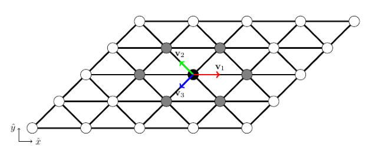
<figcaption class="paper-figure-caption"><b>Fig 1.</b> FIG. 1. Schematic of the model. The neighborhood of the central site (black) corresponds to the</figcaption>
</figure>
<figure class="paper-figure-card">
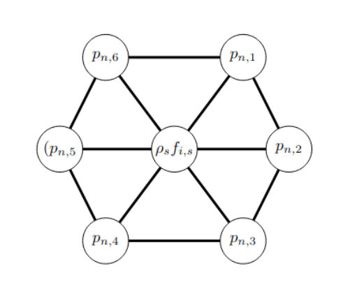
<figcaption class="paper-figure-caption"><b>Fig 2.</b> FIG. 2. The neighborhood of a particle with associated occupancy probabilities. The central site is</figcaption>
</figure>
<figure class="paper-figure-card">
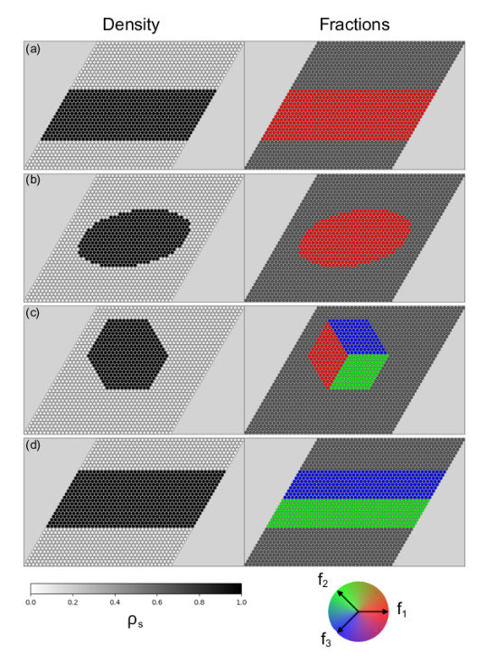
<figcaption class="paper-figure-caption"><b>Fig 3.</b> FIG. 3. Initial configurations representing condensed structures: (a) Immobile band with v1 as</figcaption>
</figure>
<figure class="paper-figure-card">
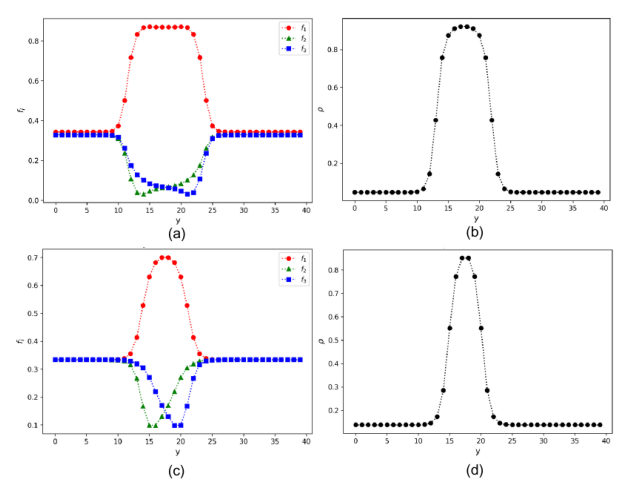
<figcaption class="paper-figure-caption"><b>Fig 4.</b> FIG. 4. Profiles of orientation fractions fi and densities ρs along the y direction for the IB in the</figcaption>
</figure>
<figure class="paper-figure-card">
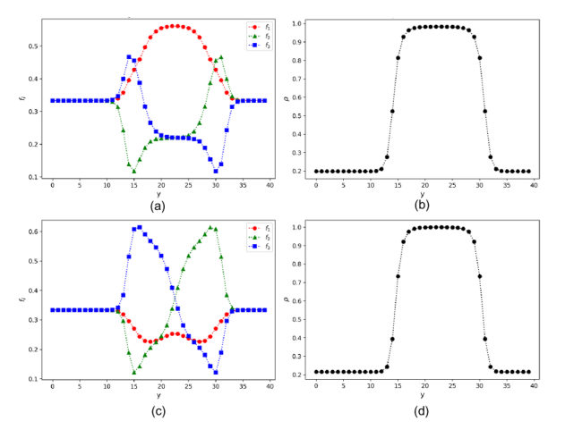
<figcaption class="paper-figure-caption"><b>Fig 5.</b> FIG. 5. Profiles of orientation fractions fi and densities ρs along the y direction for the IB and</figcaption>
</figure>
<figure class="paper-figure-card">

<figcaption class="paper-figure-caption"><b>Fig 6.</b> Figure 7 shows the phase transitions that occur for IC I: for low densities, in which</figcaption>
</figure>
<figure class="paper-figure-card">
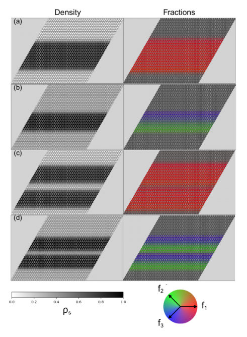
<figcaption class="paper-figure-caption"><b>Fig 7.</b> FIG. 6. Final configurations for the Immobile Band studies: (a) IB with v1 as majority for</figcaption>
</figure>
<figure class="paper-figure-card">

<figcaption class="paper-figure-caption"><b>Fig 8.</b> FIG. 7. Order parameter as a function of noise for IC I. The inset highlights the transition</figcaption>
</figure>
<figure class="paper-figure-card">
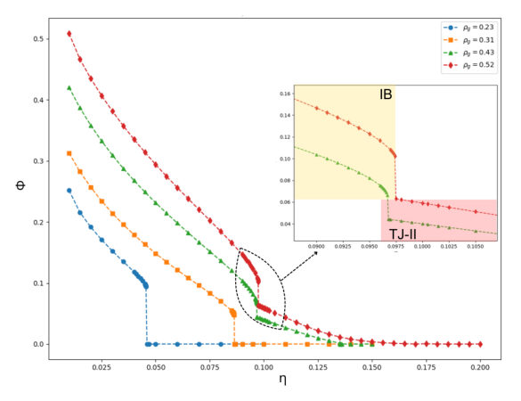
<figcaption class="paper-figure-caption"><b>Fig 9.</b> Figure 10 shows the deviation ˜σ as a function of noise for the three densities analyzed.</figcaption>
</figure>
<figure class="paper-figure-card">
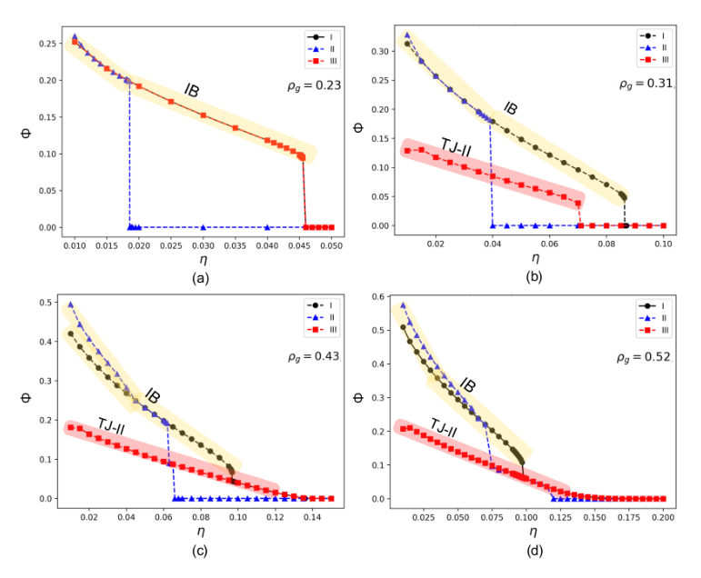
<figcaption class="paper-figure-caption"><b>Fig 10.</b> FIG. 8. Order parameter as a function of noise for Immobile Band ICs. Each point is computed</figcaption>
</figure>

**Main problem.** Developing a mean-field theory to describe the stability, formation, and phase transitions of various condensed structures (such as traffic jams and immobile bands) in a three-state active lattice gas model.

**Main result.** The mean-field theory successfully predicts the existence of ordered states like immobile bands and traffic jams, though it fails to capture certain complex transitions, such as the emergence of Type-I traffic jams from dense bands, which are observed in Monte Carlo simulations.

**Method.** The authors use a mean-field theory (MFT) approach involving a triangular lattice of coupled nonlinear differential equations integrated via a fourth-order Runge-Kutta scheme, validated against Monte Carlo simulations.

**Summary.** This paper presents a mean-field theoretical framework to study the emergence of complex patterns in an active matter model. It investigates how different types of dense structures, like traffic jams and immobile bands, evolve under varying noise and density. While the theory captures the stability of many ordered phases, the authors highlight discrepancies with simulations, particularly regarding certain types of traffic jam formations. This work provides insight into the non-equilibrium phase transitions of self-propelled particle systems.

Detailed structure

**Model / system.** A three-state active lattice gas model (3-SALGM) on a triangular lattice where self-propelled particles have three possible velocity orientations, subject to local alignment, excluded-volume interactions, and noise.

**Key observables.** Orientational order parameter (Phi), density profiles, orientation fractions, and a deviation parameter (tilde sigma) to quantify deviations from disorder.

**Important parameters / regimes.** Global density (rho_g), noise intensity (eta), and alignment strength (g).

**Assumptions / limitations.** The mean-field theory assumes that the occupancy probabilities of neighboring sites are mutually independent to factorize configuration probabilities.

**Figures summary.** Schematics of the lattice model and neighborhood; initial configurations for various structures (IB, MB, TJ); density and orientation profiles; and phase diagrams/order parameter plots showing transitions vs. noise.

**Paper structure.** The paper introduces the 3-state model, develops the mean-field equations, presents numerical integration results, compares MFT predictions with Monte Carlo simulations for various initial configurations, and discusses the limitations of the MFT approach.

Abstract

We develop a mean-field description including spatial structure for a simplified version of the three-state active matter model studied by Venzel et al. (Phys. Rev. E 110, 014109 (2024)). The resulting triangular lattice of coupled nonlinear differential equations are integrated numerically using a fourth-order Runge-Kutta scheme. Starting from various ordered initial configurations, we probe the stability of the corresponding stationary states, revealing the presence of various high-density ordered structures in the density(\r{ho})-noise(η) plane. The results are compared with Monte Carlo simulations of the simplified model, yielding, in certain cases, unexpected transitions between ordered configuration types.

[↑ back to top](#top)

### [The Exact Replica Threshold for Nonlinear Moments of Quantum States](http://arxiv.org/abs/2604.22627v1)

**Authors:** Shuai Zeng  
**Type:** theory · **Category:** quantum information and computing · **PDF:** <https://arxiv.org/pdf/2604.22627v1>  
**Analysis basis:** full PDF text, analyzed in chunks
**Topic relevance:** `entanglement & information structure` **2/5** · `quantum measurements` **2/5**

↔ Scroll figures horizontally

<figure class="paper-figure-card">
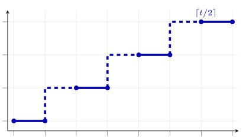
<figcaption class="paper-figure-caption"><b>Fig 1.</b> FIG. 1. Exact replica threshold for nonlinear moments. The staircase ⌈t/2⌉indicates the exact threshold for the pure mo- ments tr(ρt) established here, together with its extension to the observable-weighted family tr(Oρt) considered in this work.</figcaption>
</figure>

**Main problem.** Determining whether the number of available quantum state replicas marks a sharp information-theoretic boundary for the estimation of nonlinear observables like tr(rho^t).

**Main result.** The paper proves that the exact replica threshold for fixed-order pure moments is ceil(t/2), where having fewer replicas leads to a dimension-growing sample complexity barrier.

**Method.** The authors use a reduction to a spectrum-testing promise problem, constructing 'hard-pair' probability distributions using Newton's identities and applying Haar-integrated ensemble analysis and permutation inequalities.

**Summary.** This paper identifies a sharp, discrete resource boundary in quantum state estimation. It proves that for estimating nonlinear moments of order t, having ceil(t/2) replicas allows for polynomial-sample estimation, whereas having one fewer replica forces the required sample size to grow with the system dimension. This result establishes that the number of coherent replicas is a fundamental, qualitative resource for nonlinear quantum tasks.

Detailed structure

**Model / system.** A sample/copy-access model with replica-limited joint measurements applied to unknown d-dimensional quantum states.

**Key observables.** Pure nonlinear moments tr(rho^t) and observable-weighted moments tr(O*rho^t).

**Important parameters / regimes.** Replica number s, moment order t, Hilbert space dimension d, and number of measurement rounds T.

**Assumptions / limitations.** The results focus on the replica-limited model and assume fixed-order moments as the dimension d goes to infinity.

**Figures summary.** Figure 1 illustrates the staircase-like nature of the exact replica threshold as a function of the moment order t.

**Paper structure.** The paper introduces the problem of replica thresholds, establishes the lower bound via a reduction to spectrum testing and hard-pair construction, proves the upper bound using existing hybrid frameworks, and extends the threshold law to a broad family of weighted observables.

Abstract

Joint measurements on multiple copies of a quantum state provide access to nonlinear observables such as $\operatorname{tr}(ρ^t)$, but whether replica number marks a sharp information-theoretic resource boundary has remained unclear. For every fixed order $t\ge 3$, existing protocols show that $\lceil t/2\rceil$ replicas already suffice for polynomial-sample estimation of $\operatorname{tr}(ρ^t)$, yet it has remained open whether one fewer replica must necessarily incur a sample-complexity barrier growing with the dimension. We prove that this is indeed the case in the sample/copy-access model with replica-limited joint measurements: any protocol restricted to $\lceil t/2\rceil-1$ replicas requires dimension-growing sample complexity, while $\lceil t/2\rceil$ replicas suffice by prior work. Thus the exact replica threshold for fixed-order pure moments is $\lceil t/2\rceil$. Equivalently, for fixed-order pure moments, one additional coherent replica is not merely useful but marks the exact threshold between polynomial-sample estimation and a dimension-growing regime in the replica-limited model. We further show that the same threshold law extends to a broad family of observable-weighted moments $\operatorname{tr}(Oρ^t)$, including Pauli observables and other observables with bounded operator norm and macroscopic trace norm. Coherent replica number therefore acts as a genuinely discrete resource for nonlinear quantum-state estimation.

[↑ back to top](#top)

### [Apparent Planckian scattering from local polaron formation](http://arxiv.org/abs/2604.22029v1)

**Authors:** Brian Yong-Ho Lee, Chaitanya Murthy  
**Type:** theory · **Category:** strongly correlated electrons · **PDF:** <https://arxiv.org/pdf/2604.22029v1>  
**Analysis basis:** full PDF text, analyzed in chunks
**Topic relevance:** `correlated cavity matter` **2/5**

↔ Scroll figures horizontally

<figure class="paper-figure-card">
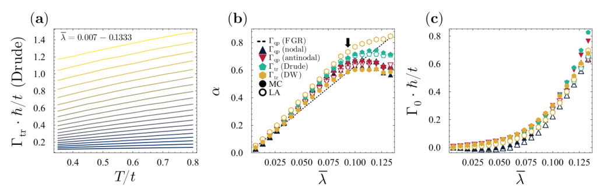
<figcaption class="paper-figure-caption"><b>Fig 1.</b> FIG. 1. Scattering rates Γ = αT +Γ0 for the 2D Holstein model with static phonons and disordered γi ∼Uniform(−γmax, γmax), as a function of average dimensionless bare coupling λ = 1</figcaption>
</figure>
<figure class="paper-figure-card">
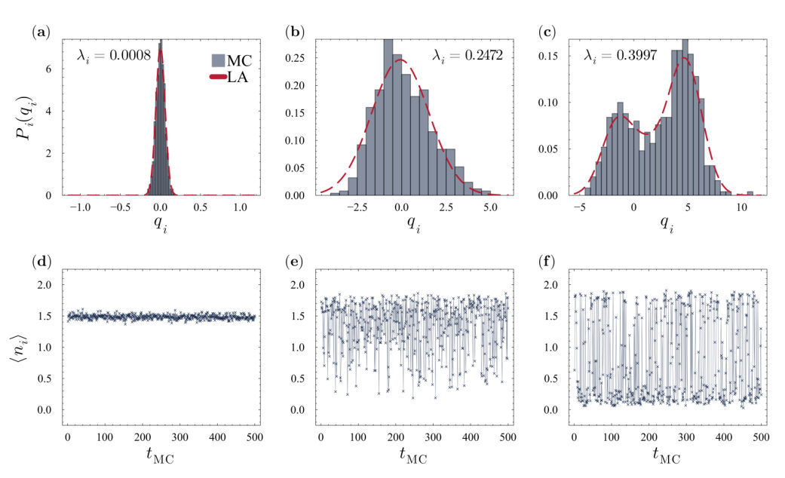
<figcaption class="paper-figure-caption"><b>Fig 2.</b> FIG. 2. Distributions of effective site potentials qi = γixi (a–c) and Monte Carlo traces of the local electron density ⟨ni⟩(d–f) on representative sites with weak (a, d), intermediate (b, e), and strong (c, f) coupling λi at temperature T = 0.4t. Other model parameters are the same as in Fig. 1. Panels (a–c) show the distributions measured in Monte Carlo (MC) as well as fits to the MC using the local approximation (LA).</figcaption>
</figure>
<figure class="paper-figure-card">
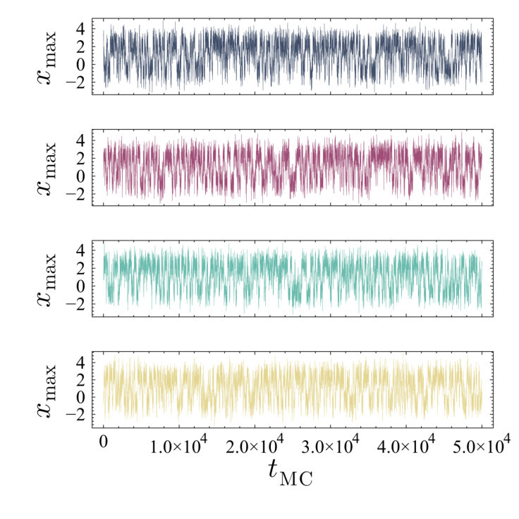
<figcaption class="paper-figure-caption"><b>Fig 3.</b> FIG. 3. Monte Carlo trace of xmax for four different phonon configuration initial conditions. Each trace consists of 50000 steps after an initial 5000 burn steps that are not shown. Quantitative diagnostics for each chain are shown in Table I.</figcaption>
</figure>
<figure class="paper-figure-card">
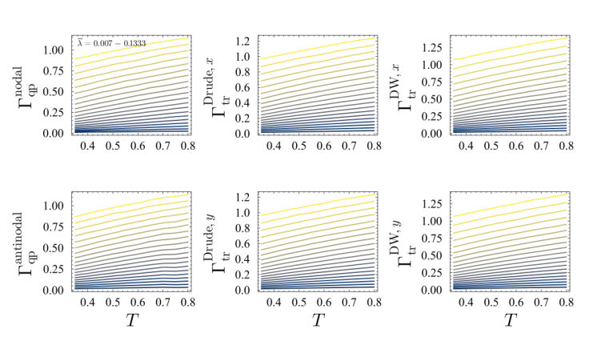
<figcaption class="paper-figure-caption"><b>Fig 4.</b> FIG. 4. Scattering rates extracted by all methods and for all spatial directions (when relevant) for the two-dimensional square lattice with model parameters L = 20, t = 1, t′ = −0.3t, ν = 1.4. Quasiparticle and transport scattering rates are extracted from the quenched and annealed averaged spectral function and optical conductivity, respectively. All methods produce approximately T-linear scattering rates. The x- and y-direction extractions of the Drude and Drude weight (DW) methods agree with each other as expected since quenched disorder averaging restores the symmetry of the lattice.</figcaption>
</figure>
<figure class="paper-figure-card">
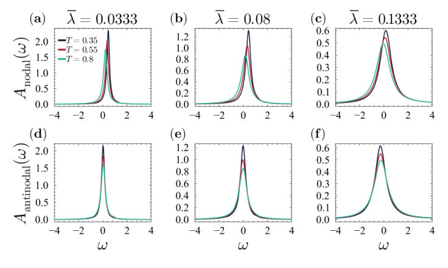
<figcaption class="paper-figure-caption"><b>Fig 5.</b> FIG. 5. Quenched and annealed averaged spectral function evaluated near the nodal (a–c) and antinodal (d–f) k-points at representative values of the coupling and temperature for the two-dimensional square lattice with model parameters L = 20, t = 1, t′ = −0.3t, ν = 1.4.</figcaption>
</figure>
<figure class="paper-figure-card">
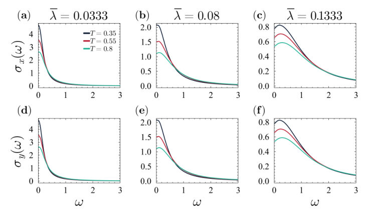
<figcaption class="paper-figure-caption"><b>Fig 6.</b> FIG. 6. Quenched and annealed averaged optical conductivity in the x-direction (a–c) and y-direction (d–f) at representative values of the coupling and temperature for the two-dimensional square lattice with model parameters L = 20, t = 1, t′ = −0.3t, ν = 1.4. The x- and y- direction optical conductivities agree with each other as is expected since quenched disorder averaging restores the symmetry of the lattice.</figcaption>
</figure>
<figure class="paper-figure-card">
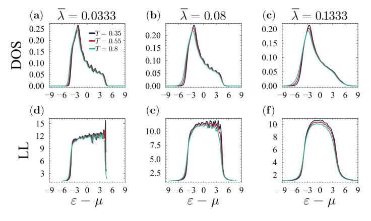
<figcaption class="paper-figure-caption"><b>Fig 7.</b> FIG. 7. Density of states (a–c) and localization length of single particle eigenstates (d–f) at representative values of the coupling and temperature as a function of energy measured with respect to the chemical potential for the two-dimensional square lattice with model parameters L = 20, t = 1, t′ = −0.3t, ν = 1.4. The density of states is smoothed with a Gaussian kernel with standard deviation σ = 0.25. There remains a finite density of extended states at and near the chemical potential, indicating that our results are not driven by Anderson localization.</figcaption>
</figure>

**Main problem.** Explaining the origin of 'apparent Planckian scattering' (T-linear scattering rates with a universal slope) without relying on complex many-body effects or fine-tuning.

**Main result.** The authors show that T-linear scattering emerges from local polaron formation in a disordered Holstein model, where the scattering rate slope saturates to a constant value as coupling increases.

**Method.** Classical Monte Carlo simulations combined with Exact Diagonalization and a Local Approximation to treat the disordered electron-phonon coupling.

**Summary.** This paper proposes that the observed T-linear 'Planckian' scattering in certain metals can arise from the formation of local polarons in the presence of disordered electron-phonon coupling. Using Monte Carlo simulations of the Holstein model, the authors demonstrate that as coupling increases, the scattering rate slope saturates to a constant value. They show that this regime is characterized by a violation of Matthiessen's rule, where changes in coupling affect the intercept rather than the slope. The mechanism is local and does not depend on Anderson localization.

Detailed structure

**Model / system.** A 2D Holstein model in the adiabatic limit featuring spatially disordered electron-phonon coupling, where the coupling strength is drawn from a random distribution.

**Key observables.** Transport scattering rate (Gamma_tr), quasiparticle scattering rate (Gamma_qp), longitudinal optical conductivity, Drude weight, and Binder cumulant.

**Important parameters / regimes.** Adiabatic limit (omega_0 -> 0), dimensionless local coupling (lambda), temperature (T), and electron filling (nu).

**Assumptions / limitations.** The study is restricted to the adiabatic limit; the local approximation assumes the joint distribution of phonon displacements is a product of local distributions.

**Figures summary.** Figure 1 shows T-linear scattering rates and the saturation of the slope alpha alongside Binder cumulants; Figure 2 displays distributions of effective site potentials across different coupling regimes; Figure 3 shows Monte Carlo convergence traces.

**Paper structure.** The paper introduces the Planckian scattering problem, describes the disordered Holstein model, presents Monte Carlo/ED results demonstrating the emergence of T-linear scattering, analyzes the saturation of the slope alpha via polaron formation, and discusses the violation of Matthiessen's rule.

**Why it may be interesting.** The mechanism provides a way to generate universal-like T-linear transport signatures from local, disordered interactions rather than requiring global many-body entanglement or fine-tuned critical points.

Abstract

We propose a simple mechanism for apparent Planckian scattering based on local polaron formation, in which $Γ_\text{tr} = Γ_0 + αk_BT / \hbar$ with $α\sim O(1)$ emerges from quasielastic scattering without fine tuning. We provide evidence for our proposal in Monte Carlo simulations of the Holstein model with disordered electron-phonon coupling in the adiabatic limit. Our mechanism generates a finite interval of couplings in which the slope $α$ is approximately constant, coinciding with the onset of local polaron formation. In this regime, Matthiessen's rule is dramatically violated (or obeyed, depending on one's point of view) in that changes to the couplings, which in perturbation theory would alter the slope $α$, instead change the intercept $Γ_0$. We conjecture that a version of our mechanism applies to any system with a dominant disordered interaction that can drive polaron formation. This potentially includes regimes of the recently introduced disordered-Yukawa-coupling strange metal models where polaron formation is not suppressed.

[↑ back to top](#top)

### [Dynamically Corrected Bethe-Salpeter Equation Solver for Self-consistent $GW$ Reference on the Matsubara Frequency Axis](http://arxiv.org/abs/2604.22187v1)

**Authors:** Ming Wen, Gaurav Harsha, Dominika Zgid  
**Type:** theory · **Category:** numerical methods · **PDF:** <https://arxiv.org/pdf/2604.22187v1>  
**Analysis basis:** full PDF text, analyzed in chunks
**Topic relevance:** `Keldysh / 2PI / non-Gaussian methods` **2/5**

↔ Scroll figures horizontally

<figure class="paper-figure-card">
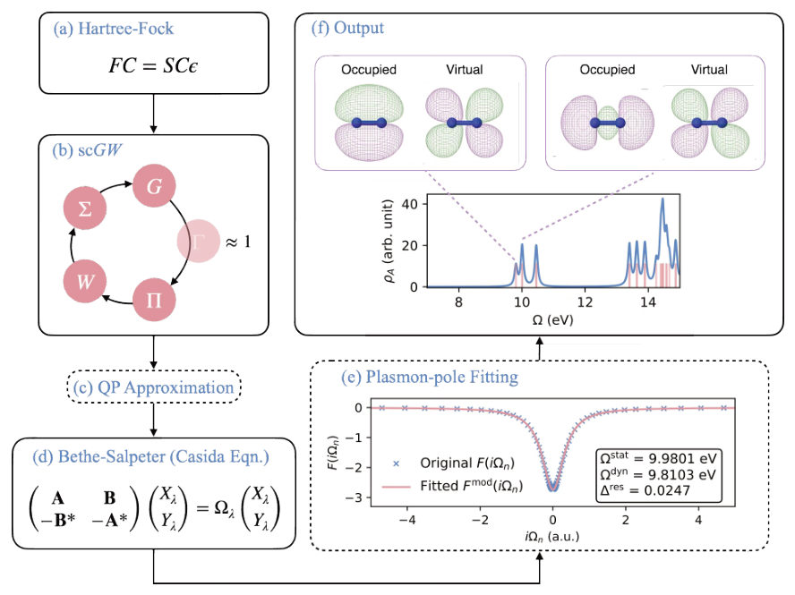
<figcaption class="paper-figure-caption"><b>Fig 1.</b> Figure 1. In counterclockwise order, the workflow of BSE@scGW proceeds as follows: (a) It begins with a mean-field calculation (HF in this study). (b) The density-fitted integrals and resulting matrices are then passed into the scGW cycle and iterated until self-consistency is reached. (c) The scGW quasiparticle energy levels are extracted using the QP approximation. (d) These QP energies, together with the corresponding output matrices, are subsequently used in the static BSE Casida equation. (e) The resulting static BSE solution is then dynamically corrected through plasmon-pole fitting. The shorthand “a.u.” stands for atomic unit. (f) In the final step, the dynamically corrected...</figcaption>
</figure>
<figure class="paper-figure-card">
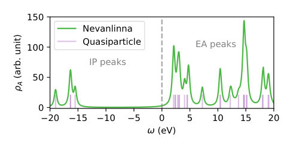
<figcaption class="paper-figure-caption"><b>Fig 2.</b> Figure 2. Charged excitations of N2 calculated at the scGW/aug-cc-pVTZ level of theory. The negative and posi- tive half-axes contain the ionization potential (IP) peaks and electronic affinity (EA) peaks respectively. The QP energy levels serve as the initial inputs for the subsequent BSE cal- culation shown in FIG. 1 (e) and (f).</figcaption>
</figure>
<figure class="paper-figure-card">
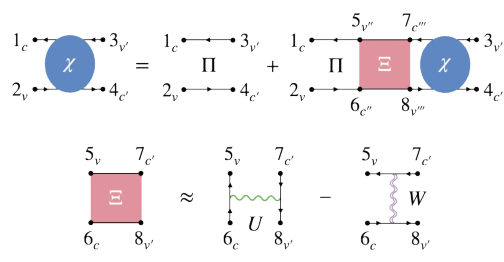
<figcaption class="paper-figure-caption"><b>Fig 3.</b> Figure 3. Feynman diagram of the particle-hole Bethe– Salpeter equation (see Eqn. (16)). Subscripts signify valence and conduction orbitals. BSE kernel Ξ is approximated as the sum of the electron-hole exchange term U and the electron- hole attraction term −W in Eqn. (27).</figcaption>
</figure>
<figure class="paper-figure-card">
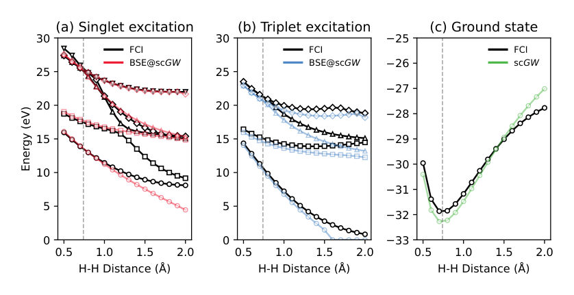
<figcaption class="paper-figure-caption"><b>Fig 4.</b> Figure 4. (a) The first four singlet excitations and (b) the first four triplet excitations of H2 molecule calculated with dynamically corrected BSE@scGW. (c) The ground states calculated with scGW. Black curves are reference FCI results. Both BSE@scGW and FCI calculations employ cc-pVTZ basis set. The equilibrium bond length (0.74 ˚A) is indicated by vertical dashed lines.</figcaption>
</figure>
<figure class="paper-figure-card">
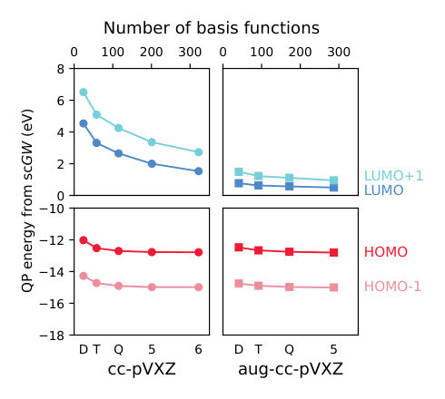
<figcaption class="paper-figure-caption"><b>Fig 5.</b> Figure 5. Convergent behavior of water QP energy levels (HOMO−1, HOMO, LUMO, LUMO+1). Calculated with scGW using cc-pVXZ (X = D, T, Q, 5, 6) and aug-cc-pVXZ (X = D, T, Q, 5) basis sets.</figcaption>
</figure>
<figure class="paper-figure-card">
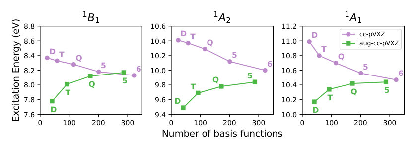
<figcaption class="paper-figure-caption"><b>Fig 6.</b> Figure 6. Convergent behavior of the first three water singlet excitations (1B1, 1A2, and 1A1). Calculated with dynamically corrected BSE@scGW, using cc-pVXZ (X = D, T, Q, 5, 6) and aug-cc-pVXZ (X = D, T, Q, 5) basis sets.</figcaption>
</figure>
<figure class="paper-figure-card">
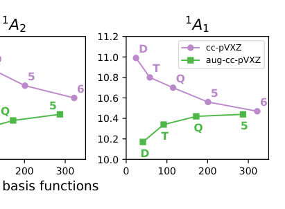
<figcaption class="paper-figure-caption"><b>Fig 7.</b> Fig. 6 shows how three singlet excitation energies ob- tained with BSE@scGW converge for the two different basis set families. The corresponding numerical values are provided in Table S1 of the Supplementary Material. For the cc-pVXZ series, since the electron-hole energy differences enter as inputs in the BSE Hamiltonian, this instability in QP energy levels propagates directly into the excitation energies, leading to the poor convergence observed in Fig. 6. By contrast, aug-cc-pVXZ basis sets better represent both the spatially extended virtual or- bitals and the associated screening effects in W. It leads to more stable QP gaps, and hence excitation energies converge well with respect to...</figcaption>
</figure>

**Main problem.** The need for a computationally efficient and accurate method to calculate neutral excitation energies (optical/core excitations) while overcoming the starting-point dependence and static approximation limitations of standard GW-BSE approaches.

**Main result.** The development of a dynamically corrected BSE@scGW solver that achieves accuracy comparable to high-level wavefunction methods (CCSD, CC3) for small and medium-sized molecules by incorporating frequency-dependent screening.

**Method.** A self-consistent GW (scGW) reference evaluated on the Matsubara frequency axis, combined with a dynamical correction to the static Casida formulation using a plasmon-pole model.

**Summary.** This paper introduces a new solver for the Bethe-Salpeter Equation (BSE) that uses a self-consistent GW reference to eliminate starting-point bias. By implementing a dynamical correction via a plasmon-pole model, the authors incorporate frequency-dependent screening effects into the static Casida equation. The method is benchmarked against high-level quantum chemistry methods and shows high accuracy for singlet and triplet excitation energies in small molecules. This approach provides a robust and efficient way to study neutral excitations in molecular systems.

Detailed structure

**Model / system.** The study focuses on molecular systems, using small molecules like H2, N2, and H2O as benchmarks, within the framework of many-body perturbation theory (Hedin's equations) and the Green's function formalism.

**Key observables.** Singlet and triplet excitation energies, quasiparticle energies (IP, EA, fundamental gap), and excitation spectra.

**Important parameters / regimes.** Matsubara frequency grids (fermionic and bosonic), inverse temperature (beta), and the plasmon-pole parameters (pole location and strength).

**Assumptions / limitations.** Neglect of the vertex function (Gamma approx delta), use of the quasiparticle approximation, and the adiabatic approximation (neglecting off-diagonal elements of the eigenvector matrix).

**Figures summary.** Figure 1 shows the BSE@scGW workflow; Figure 2 compares quasiparticle energy extraction methods; Figure 3 illustrates the BSE kernel Feynman diagram; Figure 4 shows H2 excitation energies vs bond length; Figure 5 and 6 demonstrate basis set convergence for water.

**Paper structure.** The paper introduces the scientific problem of BSE limitations, details the BSE@scGW workflow and mathematical framework on the Matsubara axis, describes the implementation of the dynamical correction via the plasmon-pole model, presents benchmarking results against FCI and CCSD for various molecules, and discusses convergence and limitations.

**Why it may be interesting.** The paper presents an advanced numerical scheme for treating frequency-dependent many-body interactions and dynamical screening, which is highly relevant to the development of accurate many-body dynamics and spectroscopic simulations.

Abstract

We present a Bethe-Salpeter equation (BSE) solver based on a self-consistent $GW$ reference evaluated on the Matsubara frequency axis, referred to as BSE@sc$GW$. The self-consistent $GW$ starting point provides a robust quasiparticle description and reduces sensitivity to the initial mean-field reference compared to one-shot $GW$-based approaches. We further introduce a dynamical correction to the static Casida formulation via a plasmon-pole model. This scheme incorporates simple dynamical screening effects while retaining the efficiency of an effective eigenvalue problem. The resulting dynamically corrected BSE@sc$GW$ yields excitation energies in close agreement with high-level wavefunction-based benchmarks for both singlet and triplet excitations of small molecules. Overall, the accuracy of the dynamic BSE@sc$GW$ approach arises from the combination of a well-converged single-particle reference and the inclusion of frequency-dependent screening effects.

[↑ back to top](#top)

### [Electrostatic-Elastic Softening and Ultraviolet Instability Driven by Non-DLVO Interactions in Charged Colloidal Crystals](http://arxiv.org/abs/2604.22448v1)

**Authors:** Hao Wu, Zhong-Can Ou-Yang  
**Type:** theory · **Category:** statistical mechanics · **PDF:** <https://arxiv.org/pdf/2604.22448v1>  
**Analysis basis:** full PDF text, analyzed in chunks
**Topic relevance:** `Keldysh / 2PI / non-Gaussian methods` **2/5**

↔ Scroll figures horizontally

<figure class="paper-figure-card">
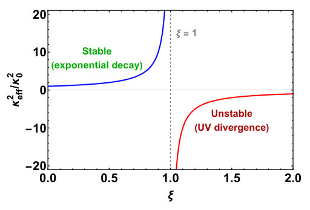
<figcaption class="paper-figure-caption"><b>Fig 1.</b> FIG. 1. Effective screening wave vector squared as a function of the coupling parameter. The normalized squared screening wave vector κ2 eff/κ2 0 = 1/(1 −ξ) diverges at the critical coupling ξ = 1. For ξ &lt; 1 (blue curve), κ2 eff &gt; 0, corresponding to standard exponential decay of correlations. For ξ &gt; 1 (red curve), κ2 eff &lt; 0, signaling that the effective screening wave vector becomes purely imaginary. Formally, in the minimal continuum model, this signals the dominance of electrostatic attraction over elastic restoring forces; in real colloidal crystals, the discrete lattice cutoff and higher-order elastic terms regulate this ultraviolet divergence.</figcaption>
</figure>
<figure class="paper-figure-card">

<figcaption class="paper-figure-caption"><b>Fig 2.</b> Figure 2 summarizes the stability regions in the (ξ, q) plane. For ξ &lt; 1, the uniform phase is stable (light red region). At ξ = 1, the short-wavelength modulus b vanishes, and the system becomes marginally stable at q →∞. For ξ &gt; 1, the uniform phase is unstable for all wave vectors q &gt; qc (light blue region). In the minimal continuum model, this unstable region extends to q →∞; however, in a real crystal the discrete lattice imposes a maximum wave vector qmax, confining the physical insta- bility to a finite shell qc &lt; q &lt; qmax (light orange shad- ing). The long-wavelength modes q &lt; qc (light green re- gion) remain linearly stable even for ξ &gt; 1, reflecting the perfect ionic screening...</figcaption>
</figure>
<figure class="paper-figure-card">
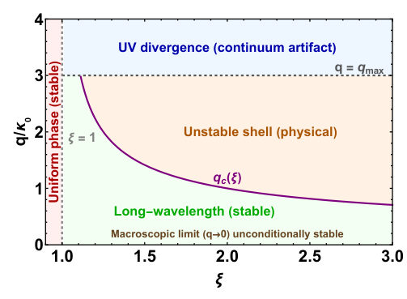
<figcaption class="paper-figure-caption"><b>Fig 3.</b> FIG. 2. Stability diagram of the uniform phase in the minimal electrostatic-elastic coupling model. The light red region (ξ &lt; 1) corresponds to the stable uniform phase. The vertical gray dashed line marks the critical cou- pling ξ = 1, where the short-wavelength elastic modulus van- ishes. For ξ &gt; 1, the purple solid curve shows qc = κ0/√ξ −1, above which the uniform phase becomes unstable. The light blue region (q &gt; qc) indicates the continuum prediction of in- stability extending to arbitrarily short wavelengths. In a real colloidal crystal, the discrete lattice provides an ultraviolet cutoff qmax ∼π/a; the physically relevant unstable band is the light orange shaded region qc &lt; q &lt;...</figcaption>
</figure>

**Main problem.** Investigating the mechanical stability and the nature of the ultraviolet instability in charged colloidal crystals caused by the coupling between electrostatic and elastic degrees of freedom.

**Main result.** The study finds that while the macroscopic bulk modulus remains stable due to perfect ionic screening, the short-wavelength elastic modulus softens and vanishes at a critical coupling strength, leading to a localized structural instability.

**Method.** The authors use a Gaussian fluctuation analysis on a continuum field theory, integrating out electrostatic fluctuations to derive an effective wave-vector-dependent elastic modulus.

**Summary.** This paper explores how the interaction between electric fields and mechanical strain affects the stability of colloidal crystals. It demonstrates that while the crystal remains stable at large scales, a strong enough coupling can cause the material to fail at very short length scales. This 'ultraviolet instability' is physically limited by the discrete nature of the crystal lattice. The work provides a clearer understanding of how non-DLVO interactions can trigger local structural collapse in charged soft matter.

Detailed structure

**Model / system.** A 3D continuum model of a charged colloidal crystal (an ordered array of large particles) permeated by a mobile monovalent ion fluid, coupling Poisson-Boltzmann electrostatics with Hookean elasticity via a local dilation term.

**Key observables.** Effective elastic modulus Gamma(q), effective screening wave-vector kappa_eff, and the dimensionless coupling parameter xi.

**Important parameters / regimes.** The coupling parameter xi (critical at xi=1), the wave-vector q, the lattice cutoff q_max, and the screening wave-vector kappa_0.

**Assumptions / limitations.** The model uses a continuum approximation for both the lattice and the ions, assumes an isotropic elastic medium, and neglects higher-order gradient terms which leads to unphysical UV divergence in the limit q to infinity.

**Figures summary.** Figure 1 shows the transition of the effective screening wave-vector as a function of the coupling strength; Figure 2 provides a stability diagram in the (xi, q) plane mapping stable, unstable, and unphysical regimes.

**Paper structure.** The paper introduces the coupling problem, defines the Hamiltonian and continuum model, performs a Gaussian fluctuation analysis to derive the effective modulus, analyzes stability regimes (long vs. short wavelength), and concludes by discussing the physical regulation of the instability by the lattice cutoff.

Abstract

Colloidal crystals permeated by mobile ions exhibit a coupling between electrostatic and elastic degrees of freedom that renormalizes the effective screening length and induces wave-vector-dependent elastic softening. Building on a recently proposed continuum model [\textit{Commun. Theor. Phys.} \textbf{77}, 055602 (2025)], we perform a rigorous Gaussian fluctuation analysis to elucidate the stability limits of the homogeneous phase. By integrating out the electrostatic fluctuations, we derive the effective elastic modulus $Γ(q)$ as a function of wave vector $q$. We show that the long-wavelength modulus $Γ(0)$ remains identically equal to the bare modulus $βK$, protected by perfect ionic screening. In contrast, the short-wavelength modulus $Γ(q\to\infty) = βK(1-ξ)$ softens as the electrostatic-elastic coupling $ξ\equiv 2βn_0 v_0^2 K$ increases, vanishing at a critical value $ξ=1$. For $ξ>1$, the fluctuation spectrum exhibits a negative eigenvalue for all wave vectors $q > q_c = κ_0/\sqrt{ξ-1}$, signaling an ultraviolet instability of the uniform phase. In a real colloidal crystal, this divergence is regulated by the discrete lattice cutoff $q_{\max}\simπ/a$, confining the physical instability to a finite band $q_c < q < q_{\max}$. The macroscopic limit $q\to 0$ remains unconditionally stable for all $ξ$. The transition at $ξ=1$ thus marks the onset of short-wavelength mechanical failure, while macroscopic elastic stiffness remains intact. Our analysis clarifies the proper physical interpretation of the minimal coupling model and provides a consistent picture of how non-DLVO interactions can drive local structural collapse in charged colloidal crystals.

[↑ back to top](#top)

### [Magnetoelastic Waves in Ferromagnetic Thin Films Mediated by Dipolar Interactions](http://arxiv.org/abs/2604.22523v1)

**Authors:** Hiroki Yoshida, Ryohei Kono, Manato Fujimoto, Motoki Asano, Daiki Hatanaka, Kei Yamamoto, Shuichi Murakami  
**Type:** theory · **Category:** other · **PDF:** <https://arxiv.org/pdf/2604.22523v1>  
**Analysis basis:** full PDF text, analyzed in chunks
**Topic relevance:** `spintronics-quantum-optics interface` **2/5**

↔ Scroll figures horizontally

<figure class="paper-figure-card">
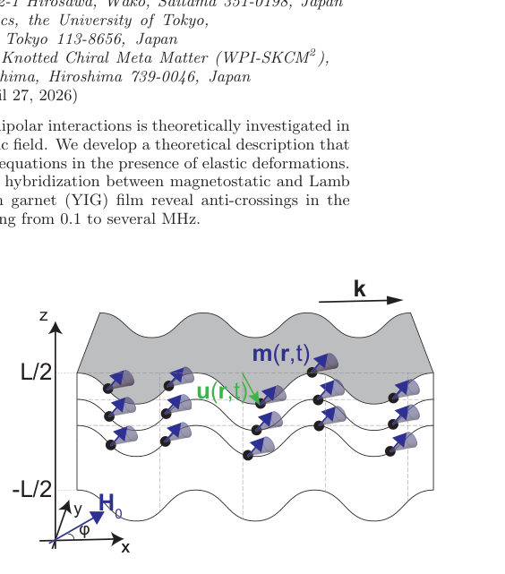
<figcaption class="paper-figure-caption"><b>Fig 1.</b> FIG. 1. Schematic illustration of the system under consider- ation. A ferromagnetic thin film with thickness L in the z direction and infinite extent in the x and y directions is con- sidered. Magnetic moments precess around an axis parallel to the in-plane external magnetic field H0, which is applied at an angle φ with respect to the x axis. The elastic wave changes the positions of the magnetic moments and their sep- arations, resulting in a modification of the dipolar interaction among them.</figcaption>
</figure>
<figure class="paper-figure-card">
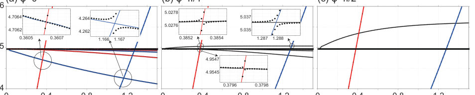
<figcaption class="paper-figure-caption"><b>Fig 2.</b> FIG. 2. Dispersion curves of the coupled waves. Red and blue curves represent modes with C2x eigenvalues +1 and −1, respectively. Black curves represent magnetostatic modes that are not eigenstates of the C2x operator. Markers show the dispersion of the coupled waves obtained from numerical calculations. The external magnetic field is applied (a) parallel to the propagation direction, H0 ∥k (φ = 0), (b) at φ = π/4, and (c) perpendicular to the propagation direction, H0 ⊥k (φ = π/2). Insets show magnified views of representative band crossings. In (a), φ = 0, anticrossings appear between BVW and Lamb modes only when they have the same C2x eigenvalue (same color). When the C2x symmetry of the...</figcaption>
</figure>

**Main problem.** The lack of a unified theoretical framework to describe magnetoelastic coupling in ferromagnetic thin films specifically mediated by long-range magnetic dipolar interactions.

**Main result.** The study predicts the hybridization of magnetostatic waves and Lamb waves in YIG thin films, identifying anti-crossings with hybridization gaps ranging from 0.1 to several MHz.

**Method.** A Lagrangian-based approach incorporating Maxwell's equations and elastic deformations, solved using the Finite Element Method (FEM) and a Green-function approach.

**Summary.** This paper investigates how magnetic dipolar interactions contribute to the coupling between magnetic and elastic waves in ferromagnetic thin films. By incorporating elastic deformations into the derivation of dipolar fields, the authors show that magnetostatic waves and Lamb waves can hybridize. Using YIG as a model material, they demonstrate the appearance of frequency gaps at anti-crossings. The study also highlights how the symmetry of the applied magnetic field dictates the strength and presence of this coupling.

Detailed structure

**Model / system.** An infinitely extended, isotropic ferromagnetic thin film (specifically Yttrium Iron Garnet) of thickness L under an in-plane external magnetic field.

**Key observables.** Dispersion relations (frequency vs. wavenumber), hybridization gaps, and anti-crossings.

**Important parameters / regimes.** Film thickness L = 500 nm, external field mu0H0 = 0.1 T, and YIG material parameters (density, Lamé constants, gyromagnetic ratio, and saturation magnetization).

**Assumptions / limitations.** Magnetostatic approximation (neglecting retardation effects), linearized dynamics (small deviations of magnetization and displacement), and the quasi-static condition.

**Figures summary.** Figure 1 shows a schematic of the system and the mechanism of deformation-induced dipolar modification; Figure 2 displays dispersion curves and anti-crossings for different magnetic field orientations (phi = 0, pi/4, pi/2).

**Paper structure.** The paper introduces the problem of dipolar-mediated coupling, develops a mathematical framework using Lagrangian and Eulerian coordinate transformations, derives the effective field and force density, and concludes with numerical FEM simulations of YIG films.

Abstract

Magnetoelastic coupling mediated by magnetic dipolar interactions is theoretically investigated in ferromagnetic thin films under an in-plane magnetic field. We develop a theoretical description that incorporates dipolar fields derived from Maxwell's equations in the presence of elastic deformations. The resulting coupled equations of motion predict hybridization between magnetostatic and Lamb waves. Numerical calculations for a yttrium iron garnet (YIG) film reveal anti-crossings in the dispersion relations, with hybridization gaps ranging from $0.1$ to several MHz.

[↑ back to top](#top)

### [QAssemble: A Pure Python Package for Quantum Many-Body Theory](http://arxiv.org/abs/2604.22223v1)

**Authors:** Seongjun Mo, Dongming Li, Mancheon Han, Johan Jönsson, Byungkyun Kang, Hoonkyung Lee, Gabriel Kotliar, Sangkook Choi  
**Type:** theory · **Category:** strongly correlated electrons · **PDF:** <https://arxiv.org/pdf/2604.22223v1>  
**Analysis basis:** full PDF text, analyzed in chunks
**Topic relevance:** `Keldysh / 2PI / non-Gaussian methods` **2/5**

↔ Scroll figures horizontally

<figure class="paper-figure-card">
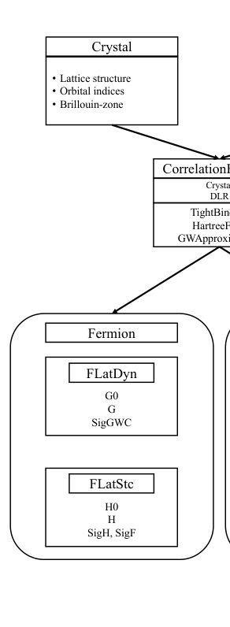
<figcaption class="paper-figure-caption"><b>Fig 1.</b> Fig. 1 QAssemble architecture and workflow for many-body electronic structure calculations. Crystal and DLR components define lattice/orbital structures and imaginary- time/Matsubara grids. CorrelationFunction orchestrates tight-binding (TB), HF, and GW methods via fermionic (FLatStc, FLatDyn) and bosonic (BLatStc, BLatDyn) modules</figcaption>
</figure>
<figure class="paper-figure-card">

<figcaption class="paper-figure-caption"><b>Fig 2.</b> Fig. 2 Core class hierarchy. Class diagram for (a) FLatDyn, (b) FLatStc, (c) BLatDyn, and (d) BLatStc</figcaption>
</figure>
<figure class="paper-figure-card">
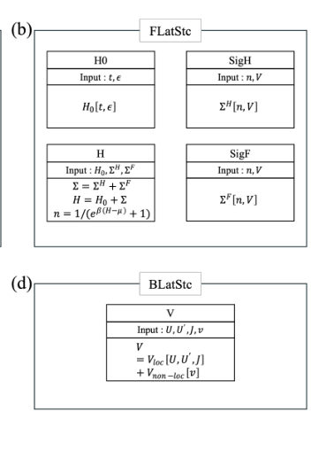
<figcaption class="paper-figure-caption"><b>Fig 3.</b> Figure 3 (a) illustrates the Hartree-Fock self-consistent workflow involving five classes: H0, H, SigH, SigF, and V. The Hamiltonian class acts as the central hub, aggregating self-energy contributions to construct the effective single-particle Hamiltonian at each iteration. The workflow proceeds through the following components.</figcaption>
</figure>
<figure class="paper-figure-card">
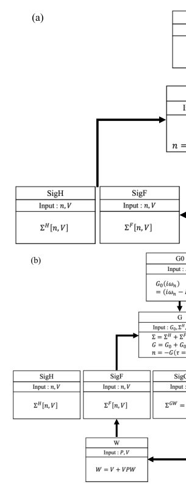
<figcaption class="paper-figure-caption"><b>Fig 4.</b> Fig. 3 Self-consistent workflows for Hartree–Fock and GW approximations. (a) The HF loop iterates between H0, V, SigH, SigF, and Hamiltonian classes to solve H = H0 + ΣH + ΣF self- consistently for the density matrix n. (b) The GW loop extends (a) by additionally computing the irreducible polarizability P = GG (P), the dynamically screened interaction W = V + V PW (W), and the correlation self-energy ΣGW = −GW C (SigGWC), with G combining all contributions via the Dyson equation. Boxes indicate classes; arrows denote data flow between components.</figcaption>
</figure>
<figure class="paper-figure-card">
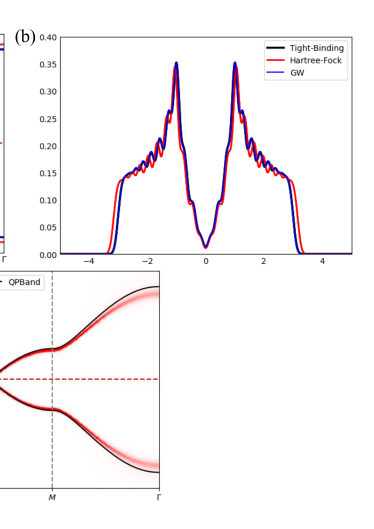
<figcaption class="paper-figure-caption"><b>Fig 5.</b> Fig. 4 Electronic structure of graphene. (a) Band structure along high-symmetry paths com- paring TB, HF, and GW results. (b) Density of states obtained by integration over a 20 × 20 × 1 Brillouin zone mesh. (c) A(k, ω) at T = 2000 K along the high-symmetry path Γ-K-M-Γ. The color scale indicates spectral function, with the overlaid black curve showing the quasiparticle band structure obtained from diagonalization of HQP(k) in eq. (3)</figcaption>
</figure>
<figure class="paper-figure-card">

<figcaption class="paper-figure-caption"><b>Fig 6.</b> Figure 4(b) presents the density of states computed within the three levels of theory, obtained by integrating the spectral function over a 20 × 20 × 1 Brillouin zone mesh. This uniform k-space sampling reveals how electron correlation reshapes the electronic structure across the entire zone, rather than only along high-symmetry paths. The TB DOS exhibits the characteristic semi-metallic behavior of graphene, with a V-shaped dip approaching zero at the Fermi level and symmetric van Hove singularities at ϵ ≈±1 eV arising from saddle points at the M points. The HF DOS shows moderate quantitative modifications: the van Hove singularities shift slightly in energy due to the momentum-dependent...</figcaption>
</figure>

**Main problem.** The difficulty of implementing complex, many-body algorithms (like GW and Hartree-Fock) due to the lack of user-friendly, transparent, and extensible software frameworks that can handle electron correlations in materials.

**Main result.** The development of QAssemble, a pure-Python package that achieves up to a 60x speedup over traditional loop-based Matsubara implementations by using systematic vectorization and the Discrete Lehmann Representation.

**Method.** An object-oriented, pure-Python approach leveraging NumPy, SciPy, and libdlr, utilizing systematic vectorization of kernels and the Discrete Lehmann Representation (DLR) for frequency-axis compression.

**Summary.** The authors present QAssemble, a new pure-Python package designed for many-body electronic structure calculations. By replacing traditional Python loops with vectorized array operations and using the Discrete Lehmann Representation, the package achieves significant speedups for GW and Hartree-Fock calculations. The design emphasizes 'hackability' and transparency, making it an ideal tool for researchers prototyping new many-body diagrams. It successfully captures the physics of graphene and provides a scalable foundation for future extensions like DMFT.

Detailed structure

**Model / system.** The framework is applied to correlated quantum materials, specifically validated using graphene (two-orbital model) and a five-orbital extended Hund-Hubbard model with local and non-local Coulomb interactions.

**Key observables.** One-particle Green's functions, self-energy, polarizability, screened Coulomb interaction, density matrix, and spectral functions.

**Important parameters / regimes.** Lattice/orbital structures, Matsubara frequency, imaginary time, temperature, and Coulomb interaction strengths (U, V, J).

**Assumptions / limitations.** The current implementation is limited to Tight-Binding, Hartree-Fock, and GW approximations; it prioritizes code transparency and extensibility over maximum raw performance.

**Figures summary.** Figure 1 shows the software architecture and workflow; Figure 2 displays the class hierarchy; Figure 4 compares graphene band structures, density of states, and spectral functions across TB, HF, and GW levels.

**Paper structure.** The paper introduces the scientific challenge of many-body software, describes the QAssemble object-oriented architecture, details the numerical strategies (vectorization and DLR), validates the physics using graphene, and benchmarks performance using a multi-orbital Hubbard model.

Abstract

QAssemble is a pure-Python package for the quantum many-body problem. It implements various functional approaches, such as tight-binding, Hartree-Fock, and GW approximations within a unified object-oriented architecture. Each physical concept--crystal structure, Hamiltonian, Green's function, self-energy, polarizability, screened Coulomb interaction--is represented as a distinct class. The modular design prioritizes code clarity and extensibility, leveraging NumPy, SciPy, and libdlr for numerical operations. Performance-critical kernels, including the polarizability bubble, Dyson equation inversion, and lattice Fourier transforms, are systematically vectorized and combined with the discrete Lehmann representation to achieve practical efficiency within a pure-Python environment. We validate QAssemble on the electronic structure of graphene with local and non-local interactions. Furthermore, benchmarks on a five-orbital extended Hund-Hubbard model demonstrate that this strategy delivers up to a 60x speedup over traditional loop-based Matsubara implementations. QAssemble supports both batch execution for production calculations and interactive workflows for method development.

[↑ back to top](#top)

### [Simple sign epistasis and evolutionary detours in fitness landscapes](http://arxiv.org/abs/2604.22611v1)

**Authors:** Paolo Ribeca, Alejandro Castro, Alejandro Lage-Castellanos, Alisa Sergeeva, Sebastian Matuszewski, Ruben Gustavo Paccosi, Vitaly Belik, Mahan Ghafari, Joachim Krug, Guillaume Achaz, Luca Ferretti  
**Type:** both · **Category:** disordered systems and neural networks · **PDF:** <https://arxiv.org/pdf/2604.22611v1>  
**Analysis basis:** full PDF text, analyzed in chunks
**Topic relevance:** `exotic spin models in light-matter` **2/5**

↔ Scroll figures horizontally

<figure class="paper-figure-card">
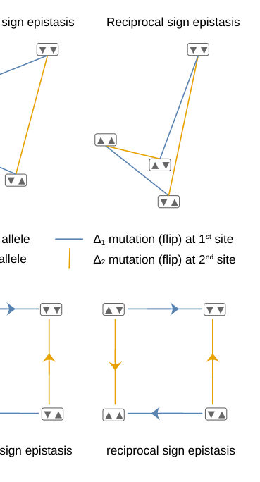
<figcaption class="paper-figure-caption"><b>Fig 1.</b> Figure 1: Above: landscapes with 2 loci and 2 alleles per locus with different types of epistasis. Below:</figcaption>
</figure>
<figure class="paper-figure-card">
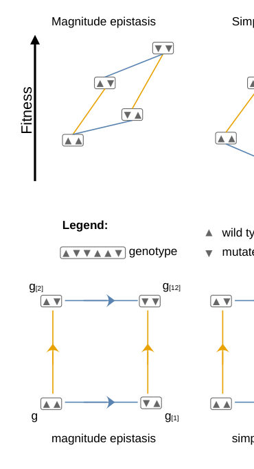
<figcaption class="paper-figure-caption"><b>Fig 2.</b> Figure 1.</figcaption>
</figure>
<figure class="paper-figure-card">
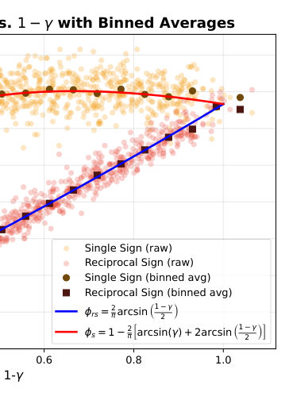
<figcaption class="paper-figure-caption"><b>Fig 3.</b> Figure 2: Comparison between theory and simulations for the fractions ϕss, ϕrs of SSE and RSE motifs</figcaption>
</figure>
<figure class="paper-figure-card">
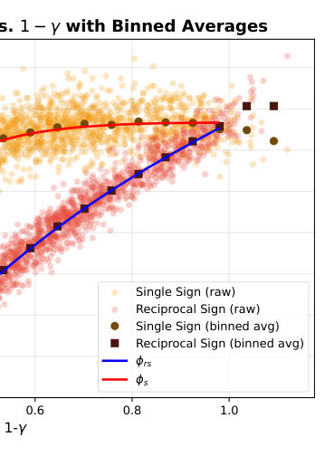
<figcaption class="paper-figure-caption"><b>Fig 4.</b> Figure 3: Comparison between theory and simulations for the fractions ϕss, ϕrs of SSE and RSE motifs</figcaption>
</figure>
<figure class="paper-figure-card">
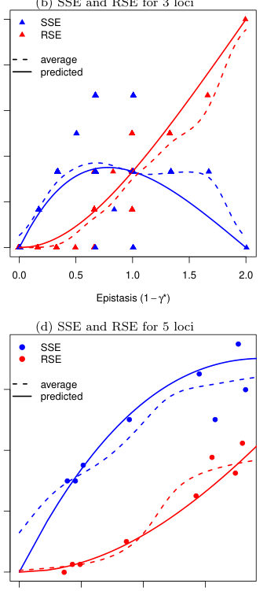
<figcaption class="paper-figure-caption"><b>Fig 5.</b> Figure 4: (a) Empirical fraction of RSE motifs versus all motifs involving sign epistasis, i.e. ϕrs ϕss+ϕrs ,</figcaption>
</figure>
<figure class="paper-figure-card">
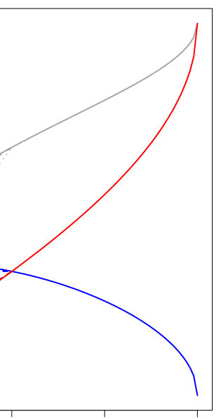
<figcaption class="paper-figure-caption"><b>Fig 6.</b> Figure 5: Theoretical predictions for the fractions ϕss, ϕrs as well as the overall sign epistasis ϕss + ϕrs versus local epistasis 1 −γ for the models discussed in this paper. The continuous lines represent the</figcaption>
</figure>
<figure class="paper-figure-card">
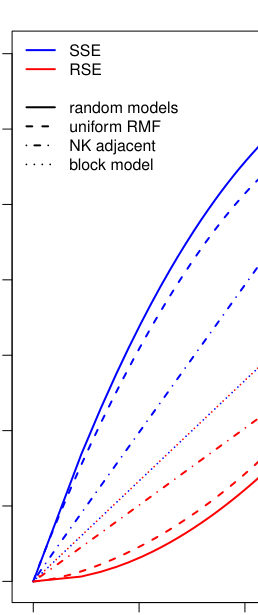
<figcaption class="paper-figure-caption"><b>Fig 7.</b> Figure 6: Theoretical predictions for the fractions ϕss, ϕrs versus “fitness graph” epistasis 1 −γ∗for the</figcaption>
</figure>
<figure class="paper-figure-card">
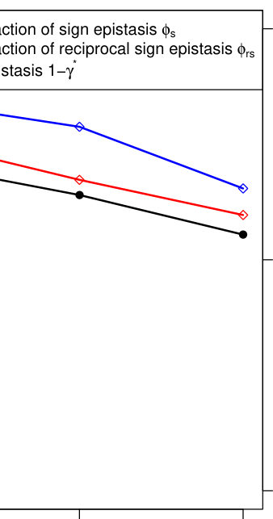
<figcaption class="paper-figure-caption"><b>Fig 8.</b> Figure 7: Statistical analysis of the computational RNA landscape reconstructed by ViennaRNA for the</figcaption>
</figure>

**Main problem.** The paper investigates the relative frequency and evolutionary impact of simple sign epistasis (SSE) versus reciprocal sign epistasis (RSE) in fitness landscapes.

**Main result.** The authors prove that SSE is the necessary and sufficient condition for evolutionary detours (paths involving back-mutations) and show that SSE is much more frequent than RSE in weakly epistatic, experimentally resolved landscapes.

**Method.** The study combines analytical derivations using Gaussian integration and mean-field approximations with large-scale simulations and statistical analysis of empirical landscapes (e.g., MAGELLAN, ViennaRNA).

**Summary.** This paper explores how different types of genetic interactions, known as epistasis, shape the paths evolution takes through genotype space. It identifies that 'simple sign epistasis' is a key driver of evolutionary detours, where organisms must temporarily move through less-fit states to reach higher peaks. While most landscapes are dominated by this type of interaction, the authors also identify specific structured models where reciprocal interactions can dominate. The findings bridge theoretical landscape models with real-world biological observations.

Detailed structure

**Model / system.** The paper analyzes various fitness landscape models, including House of Cards (HoC), Rough Mount Fuji (RMF), NK models, and spin-glass-like pairwise allelic incompatibility models.

**Key observables.** Fractions of epistatic motifs (phi_m, phi_ss, phi_rs), correlation of fitness effects (gamma), and accessibility measures (direct vs. indirect paths).

**Important parameters / regimes.** Interaction regimes (dense vs. sparse), scaled slope (s/sigma), and interaction degree (I).

**Assumptions / limitations.** Many analytical derivations assume Gaussian-distributed fitness effects and permutation invariance (unstructured landscapes).

**Figures summary.** Figure 1 visualizes ME, SSE, and RSE motifs and their fitness graphs; Figure 2 compares theoretical predictions to simulations; Figure 4 compares empirical RSE/SSE fractions; Figure 7 analyzes the RNA secondary structure landscape.

**Paper structure.** The paper introduces the types of epistasis, provides mathematical proofs for the link between SSE and detours, derives analytical predictions for various landscape models, compares these predictions to empirical biological data, and discusses exceptions in structured/sparse models.

**Why it may be interesting.** The use of spin-glass-like models (Ising/SK models) and the study of rugged landscapes with epistatic interactions are directly relevant to understanding energy landscapes and optimization in disordered many-body systems.

Abstract

In epistatic fitness landscapes, the fitness effect of a mutation depends on the genetic background and may even switch between deleterious and beneficial depending on the presence of another mutation. Epistatic interactions may cause both mutations to change the sign of each other's fitness effects (reciprocal sign epistasis) or only one mutation to do so (simple sign epistasis). Both these forms of epistasis influence evolutionary trajectories. While reciprocal sign epistasis has been associated with multi-peaked landscapes and their ruggedness, the role and relative frequency of simple sign epistasis in fitness landscapes have not been systematically investigated. Here, we prove that the presence of simple sign epistasis is associated with evolutionary detours, i.e., indirect, longer fitness-increasing paths to fitness peaks that include back-mutations. We also show that in experimentally resolved, weakly epistatic landscapes, simple sign epistasis occurs much more frequently than reciprocal sign epistasis. This result is consistent with the theoretical predictions we derive for most landscape models, with the exception of the block model and of landscapes dominated by pairwise allelic incompatibilities, such as RNA stability landscapes. Our results suggest that detours represent a general feature of evolutionary trajectories in weakly epistatic landscapes.

[↑ back to top](#top)

## Other papers (13)

*Papers from primary archives without highlighted authors or any topic match. Click to expand.*

Show other papers

### [Anisotropy of spin waves in the field-polarized phase of Fe-doped MnSi](http://arxiv.org/abs/2604.21985v1)

**Authors:** I. N. Khoroshiy, A. Podlesnyak, D. Menzel, M. C. Rahn, D. S. Inosov, A. S. Sukhanov, S. E. Nikitin  
**Type:** experiment · **Category:** strongly correlated electrons · **PDF:** <https://arxiv.org/pdf/2604.21985v1>  
**Analysis basis:** full PDF text, analyzed in chunks

↔ Scroll figures horizontally

<figure class="paper-figure-card">
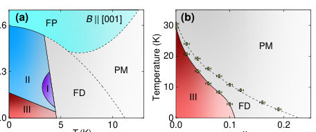
<figcaption class="paper-figure-caption"><b>Fig 1.</b> Fig. 1. (a) The magnetic field–temperature phase diagram of Mn0.9Fe0.1Si reproduced from Ref. [13]. The phases I, II and III correspond to the incommensurate magnetic structures with the skyrmion-lattice, cone and helix order, respectively. FP is the field- polarized phase, PM is the paramagnetic phase, and FD is the fluctuation-disordered state. (b) A compositional magnetic phase diagram for the solid solution Mn1−xFexSi in coordinates of a tem- perature and the Fe content x. The dotted lines show the crossover from the FD to the PM phase.</figcaption>
</figure>
<figure class="paper-figure-card">
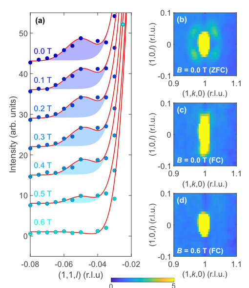
<figcaption class="paper-figure-caption"><b>Fig 2.</b> Fig. 2. Elastic neutron scattering data. (a) Intensity profiles along the (1,1, l) reciprocal direction collected after a field cooling. The dots show the experimental data, the red lines are fits to the data, the shaded areas represent the magnetic intensity (the large signal on the right side is due to the nuclear Bragg peak). Data are offset by 7 units for visual clarity. (b-d) Elastic slices close to (1,1,0) peak measured after different field protocols. Data in panel (b) were collected after ZFC; in panel (d) after FC in 4 T and then reducing field to 0.6 T and in (c) after FC in 4 T field and reducing the field to 0 T after FC. All data were collected at base temperature of T=2 K.</figcaption>
</figure>
<figure class="paper-figure-card">
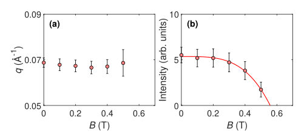
<figcaption class="paper-figure-caption"><b>Fig 3.</b> Fig. 3. Magnetic-field dependence of the propagation vector (a) and the intensity of the magnetic reflection (b), measured at T = 2 K. These data were collected by first applying a magnetic field of B = 4 T, well above the critical field Bc = 0.6 T, and then recording the data while reducing the field.</figcaption>
</figure>
<figure class="paper-figure-card">
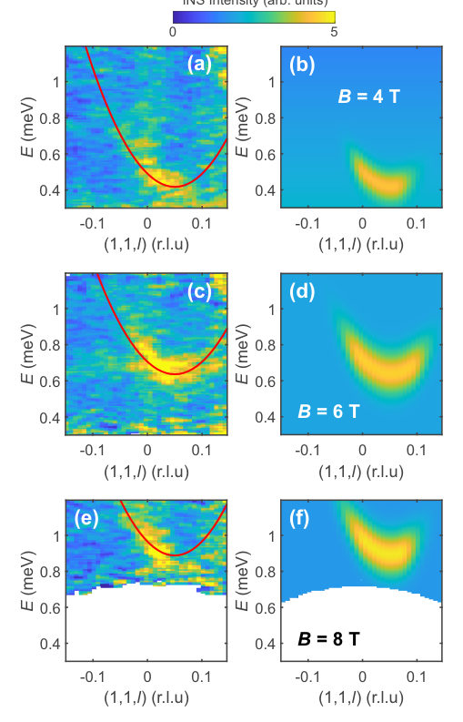
<figcaption class="paper-figure-caption"><b>Fig 4.</b> Fig. 4. Inelastic neutron scattering spectra measured at T = 2 K in different magnetic fields. The experimental data are shown in panels (a,c,e) and the corresponding fits by Eq. (2) are represented in (b,d,f). All spectra are collected in vicinity of the (1,1,0) nuclear Bragg peak along the (1,1, l) direction, which is parallel to the applied field. The red lines in (a,c,e) show the parabolic disperison of Eq. (1).</figcaption>
</figure>
<figure class="paper-figure-card">
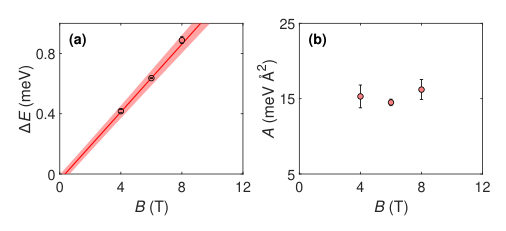
<figcaption class="paper-figure-caption"><b>Fig 5.</b> Fig. 5. Magnetic field dependence of the spin-wave gap (a) and the spin-wave stiffness (b) measured at T = 2 K</figcaption>
</figure>
<figure class="paper-figure-card">
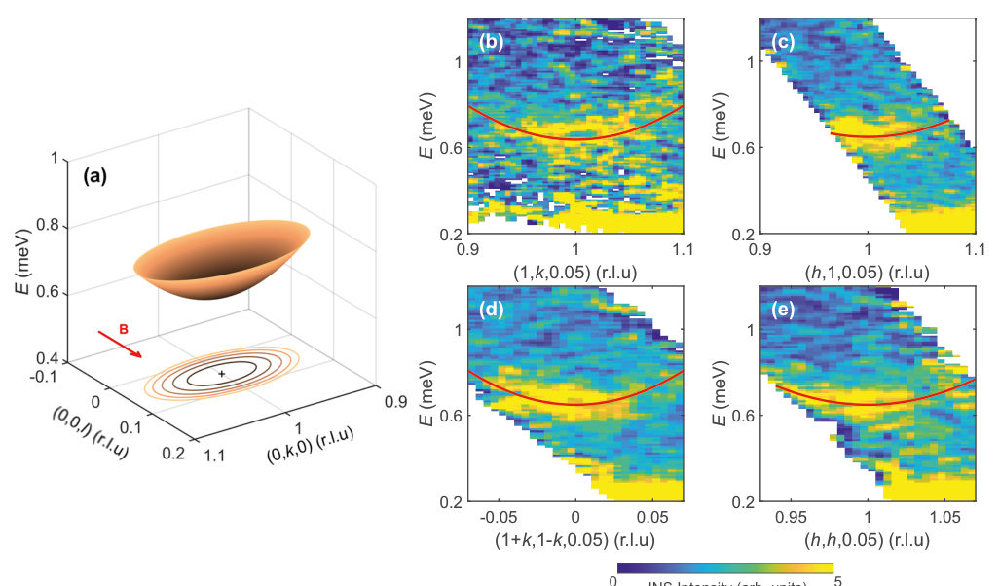
<figcaption class="paper-figure-caption"><b>Fig 6.</b> Fig. 6. Spin wave dispersion at 6 T. (a) The 3D plot of the spin-wave dispersion in (0kl) plane calculated using the fitted values. (b-e) The inelastic neutron scattering data along four reciprocal directions, which lie perpendicular to the applied field. The data were collected at T = 2 K. The boundaries of the slices (d) and (e) were adjusted to ensure identical Q-space spacings.</figcaption>
</figure>

**Main problem.** The study aims to investigate the unexpected and pronounced anisotropy of spin-wave stiffness in the field-polarized phase of the cubic chiral magnet Fe-doped MnSi, which contradicts standard theoretical models.

**Main result.** The researchers discovered that spin-wave stiffness is highly anisotropic, with values significantly higher parallel to the applied field (14.7 meV A^2) than perpendicular to it (7.6 meV A^2), suggesting a need to revise current theoretical understandings of cubic chiral magnets.

**Method.** High-resolution inelastic and elastic neutron scattering measurements were performed using the Cold-neutron Chopper Spectrometer (CNCS) at the Spallation Neutron Source.

**Summary.** This paper reports the discovery of significant spin-wave stiffness anisotropy in the field-polarized phase of Fe-doped MnSi. While standard models for this cubic material predict isotropic spin-wave dispersion, experimental neutron scattering reveals that stiffness is nearly twice as large parallel to the magnetic field as it is perpendicular to it. The authors suggest that this unexpected behavior might be driven by the magnetic field inducing a symmetry reduction in the electronic Fermi surface. This finding challenges existing theoretical frameworks for chiral magnets and necessitates a re-evaluation of how magnetic interactions are modeled in these systems.

Detailed structure

**Model / system.** The physical system is Fe-doped MnSi (Mn0.9Fe0.1Si), a B20-type itinerant chiral magnetic material, studied in its field-polarized ferromagnetic state.

**Key observables.** Spin-wave dispersion, spin-wave stiffness (A), magnetic propagation vector (km), energy gap (E), and magnetic reflection intensity.

**Important parameters / regimes.** Magnetic field (B), temperature (T ~ 1.8-2 K), Fe concentration (x), and critical field (Bc).

**Assumptions / limitations.** The authors rule out single-ion anisotropy, anisotropic exchange, and dipole-dipole interactions as the primary causes, instead speculating on symmetry reduction of the Fermi surface.

**Figures summary.** Fig 1 shows magnetic phase diagrams; Fig 2 displays magnetic reflection intensity and neutron scattering slices under different cooling protocols; Fig 3 shows the magnetic field dependence of the propagation vector and reflection intensity; Fig 6 compares extracted spin-wave stiffness values for different directions.

**Paper structure.** The paper introduces the problem of skyrmion-stabilizing interactions, describes the experimental setup and sample preparation, presents the neutron scattering results regarding spin-wave dispersion and anisotropy, evaluates potential physical mechanisms for the observed anisotropy, and concludes with implications for theory.

Abstract

Chiral magnetic textures, such as skyrmions, are of great interest to the condensed matter community due to their novel transport properties. The stabilization of topologically non-trivial magnetic phases, like the skyrmion lattice in MnSi, is governed by underlying magnetic interactions which can be probed via measurements of spin-wave excitations. Here, we report high-resolution inelastic neutron scattering (INS) measurements of the spin waves in Fe-doped Mn$_{0.9}$Fe$_{0.1}$Si deep within its field-polarized ferromagnetic state. We observe non-reciprocal spin waves with a parabolic dispersion that shifts linearly with magnetic field. Crucially, the spin-wave stiffness is highly anisotropic, with values of 14.7 meV $\rm{\mathring{A}}$$^2$ parallel to the applied field and 7.6 meV $\rm{\mathring{A}}$$^2$ perpendicular to it. This pronounced anisotropy in a cubic material is inconsistent with standard theoretical models for MnSi and indicates a necessity to revise our theoretical understanding.

[↑ back to top](#top)

### [Beyond Variational Bias: Resolving Intertwined Orders in the Hubbard Model](http://arxiv.org/abs/2604.21978v1)

**Authors:** Luciano Loris Viteritti, Riccardo Rende, Christopher Roth, Anirvan Sengupta, Giuseppe Carleo, Antoine Georges  
**Type:** theory · **Category:** strongly correlated electrons · **PDF:** <https://arxiv.org/pdf/2604.21978v1>  
**Analysis basis:** full PDF text, analyzed in chunks

↔ Scroll figures horizontally

<figure class="paper-figure-card">
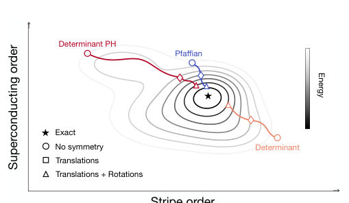
<figcaption class="paper-figure-caption"><b>Fig 1.</b> FIG. 1. Schematic illustration of the optimization land- scape for different antisymmetrization schemes. Contours represent variational energy levels. Starting from random initialization and without symmetry constraints, determi- nant, determinant–particle-hole, and Pfaffian constructions converge toward qualitatively distinct solutions with nearly degenerate energies but different dominant orders. Upon vari- ational energy reduction and symmetry restoration, all tra- jectories approach the same correlated ground state in which superconducting and stripe order coexist.</figcaption>
</figure>
<figure class="paper-figure-card">
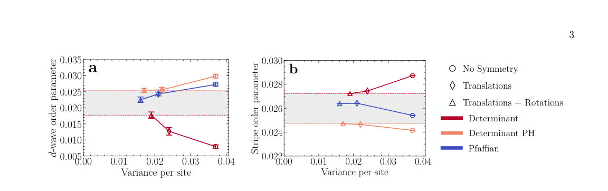
<figcaption class="paper-figure-caption"><b>Fig 2.</b> FIG. 2. Superconducting and stripe order parameters as a function of variational accuracy for the 8×8 Hubbard model under PBC at U = 8.0, t′ = −0.2, and δ = 1/8 [see Eq. (1)]. Panel a: d-wave pairing order parameter ∆SC versus energy variance per site. Panel b: Stripe spin order parameter M 2 str versus variance per site. The definitions of the order parameters are given in the main text. In panels (a) and (b), different colors correspond to the three antisymmetrization schemes: determinant (red), determinant in particle hole (PH) (blue) and Pfaffian (orange). Different marker symbols indicate the degree of symmetry restoration without symmetry projections: no symmetry projection (circles),...</figcaption>
</figure>
<figure class="paper-figure-card">
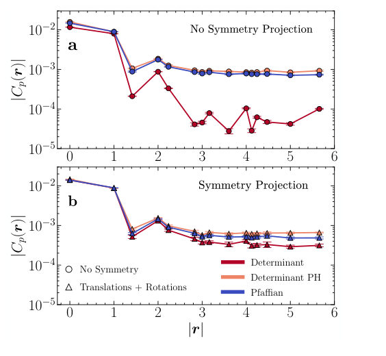
<figcaption class="paper-figure-caption"><b>Fig 3.</b> FIG. 3. Absolute value of the d-wave pairing correlations |Cp(r)| [see Eq. (2)] as a function of distance |r| on an 8 × 8 square lattice with PBC at U = 8.0, t′ = −0.2, and δ = 1/8. Panel a. Results without symmetry projection. Panel b. Results after restoring translational and rotational symme- tries.</figcaption>
</figure>
<figure class="paper-figure-card">
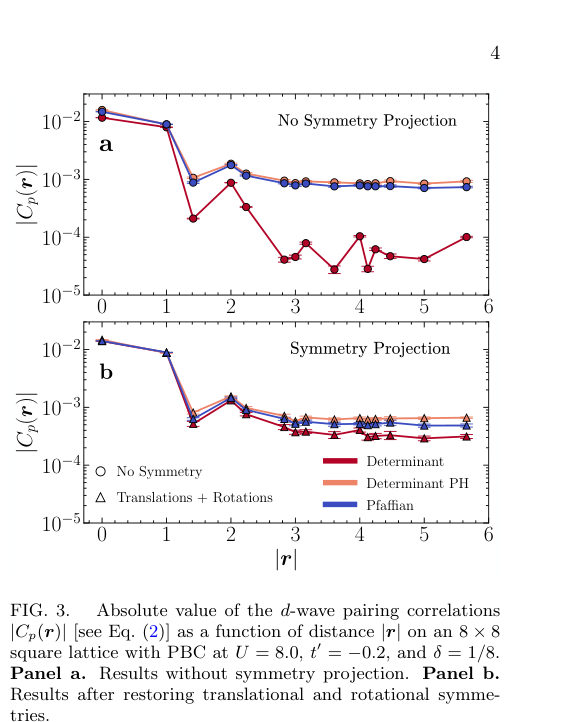
<figcaption class="paper-figure-caption"><b>Fig 4.</b> Figure 3 reports the absolute value of the pairing cor- relation functions |Cp(r)| [see Eq. (2)] as a function of the distance |r| in the lattice for the three antisymmetriza- tion schemes. In panel (a), we report the results be- fore symmetry projections. The determinant backflow ansatz exhibits a pronounced suppression of long-range pairing correlations. For |r| ≳3, the signal is nearly one order of magnitude smaller with the respect to the other states. The determinant-PH backflow state alle- viates this suppression, providing a solution closer to the Pfaffian ansatz. Enforcing the symmetries, along- side the quantitative improvement in energy and vari- ance (see Table I), we observe a...</figcaption>
</figure>
<figure class="paper-figure-card">
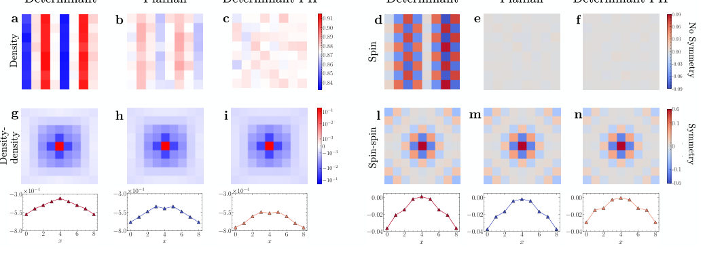
<figcaption class="paper-figure-caption"><b>Fig 5.</b> FIG. 4. Real-space charge density and spin patterns for the 8 × 8 Hubbard model with PBC at U = 8.0, t′ = −0.2, and δ = 1/8 [see Eq. (1)]. Columns compare the three variational constructions: determinant, Pfaffian, and determinant in the PH representation. The top row shows results without symmetry projection, while the bottom row shows the corresponding symmetry-projected results. Panels a,b,c: Charge density N(r) without symmetry projection. Panels d,e,f: Local spin ⟨ˆSz r⟩ without symmetry projection. Panels g,h,i: Density-density correlations CD(r) after symmetry projection. Panels l,m,n: Spin-spin correlations CS(r) after symmetry projection. Below each panel we show the...</figcaption>
</figure>
<figure class="paper-figure-card">
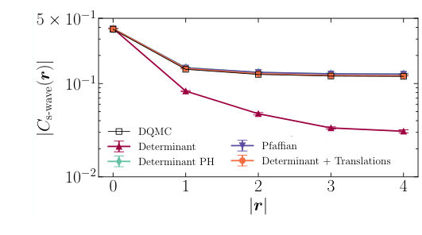
<figcaption class="paper-figure-caption"><b>Fig 6.</b> FIG. 5. s-wave pairing correlation function Cs-wave(r) [see Eq. (4)] for the attractive Hubbard model with U = −8.0, t′ = 0.0, and δ = 1/8 on an 8 × 8 lattice along the diagonal of the square. Results are shown for determinant, determinant in PH and Pfaffian, symmetry-restored determinant ansatz, and DQMC.</figcaption>
</figure>
<figure class="paper-figure-card">
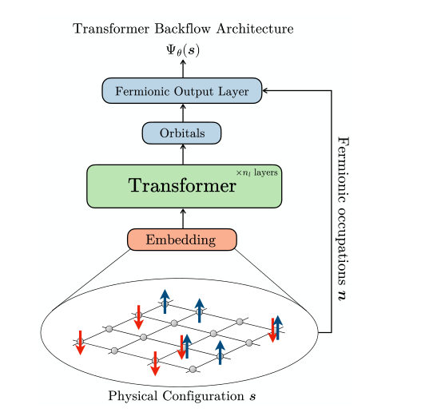
<figcaption class="paper-figure-caption"><b>Fig 7.</b> FIG. 6. In the Transformer Backflow Architecture a physi- cal configuration s (see definition in the main text) is mapped through an Embedding layer into a sequence of vectors, which are then processed by a stack of nl Transformer layers. The Transformer output is fed into a Fermionic Output Layer that constructs configuration-dependent orbitals. These orbitals, together with the fermionic occupation numbers n, are com- bined via the chosen antisymmetrization scheme (determinant or Pfaffian) to produce the wavefunction amplitude Ψθ(s).</figcaption>
</figure>
<figure class="paper-figure-card">
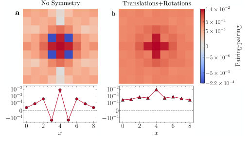
<figcaption class="paper-figure-caption"><b>Fig 8.</b> FIG. 8. Real-space pairing-pairing correlation function [see Eq. (2)] for the 8 × 8 Hubbard model at U = 8.0, t′ = −0.2, and doping δ = 1/8, obtained with the determinant ansatz before [panel (a)] and after [panel (b)] symmetry restora- tion. Below each panel we show the one-dimensional cut Cp(x, y = 3).</figcaption>
</figure>
<figure class="paper-figure-card">
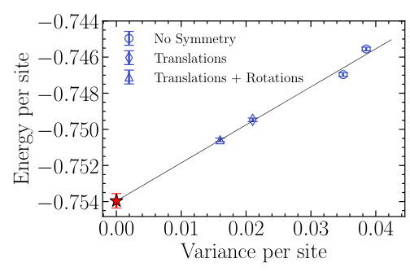
<figcaption class="paper-figure-caption"><b>Fig 9.</b> FIG. 7. Variational energy per site as a function of the energy variance per site for the 8 × 8 Hubbard model with periodic boundary conditions at U = 8.0, t′ = −0.2, and dop- ing δ = 1/8. Results are shown for the Pfaffian state with different levels of accuracy obtained without symmetry pro- jection (circles), with translational symmetry (rhombi), and with both translational and rotational symmetries (triangles) restored. A linear fit of the data is used to extrapolate to zero variance and estimate the ground-state energy (red star).</figcaption>
</figure>
<figure class="paper-figure-card">
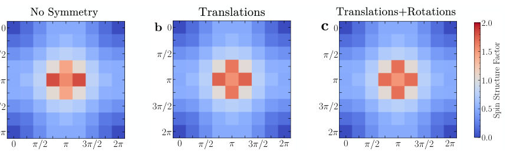
<figcaption class="paper-figure-caption"><b>Fig 10.</b> FIG. 9. Spin structure factor for the 8 × 8 Hubbard model at U = 8.0, t′ = −0.2, and doping δ = 1/8, obtained with the Pfaffian ansatz at different levels of symmetry restoration. Panel a: Result without symmetry projection. Panel b: Result after restoring translational symmetry. Panel c: Result after restoring both translational and rotational symmetries.</figcaption>
</figure>

**Main problem.** Investigating how architectural bias in different variational ansätze leads to conflicting physical conclusions regarding competing orders in the Hubbard model.

**Main result.** By using symmetry restoration and variance reduction, three different neural-network ansätze (determinant, particle-hole, and Pfaffian) converge to a consistent physical picture of coexisting superconducting and stripe orders.

**Method.** Variational Monte Carlo using Transformer-based backflow fermionic wave functions, combined with symmetry projection (translational and rotational) and zero-variance extrapolation.

**Summary.** This paper addresses a critical issue in computational many-body physics: the tendency of different variational wave function architectures to favor different physical phases. By studying the 2D Hubbard model, the authors show that while different neural-network ansätze initially predict conflicting stripe or superconducting orders, applying symmetry restoration forces them to converge to a single, shared physical state. This demonstrates that energy minimization alone is insufficient to identify the ground state in systems with competing orders and highlights the necessity of tracking correlation functions during optimization.

Detailed structure

**Model / system.** The two-dimensional t-t' Hubbard model on an 8x8 square lattice with periodic boundary conditions, specifically focusing on the regime with U=8, t'=-0.2, and 1/8 hole doping.

**Key observables.** d-wave superconducting order parameter (Delta_SC), stripe spin order parameter (M^2_str), spin structure factor S(k), and energy variance.

**Important parameters / regimes.** U = 8.0, t' = -0.2, hole doping delta = 1/8, 8x8 lattice size.

**Assumptions / limitations.** The study assumes that the true ground state can be recovered through systematic variance reduction and symmetry restoration, effectively overcoming the initial mean-field bias of the chosen ansatz.

**Figures summary.** Figure 1 shows the optimization landscape and convergence of different schemes; Figure 2 plots order parameters against energy variance; Figure 4 compares real-space charge/spin patterns; Figure 7 shows energy vs. variance for extrapolation; Figure 8 and 9 show the impact of symmetry restoration on pairing and spin structure factors.

**Paper structure.** The paper introduces the problem of variational bias, describes the Transformer-based backflow architecture and the three antisymmetrization schemes, presents results showing how unprojected states diverge, demonstrates convergence through symmetry restoration, and concludes with the physical implications for intertwined orders.

Abstract

The two-dimensional Hubbard model at finite doping hosts competing or intertwined orders, resulting in conflicting conclusions from different computational approaches regarding its ground state. We show that a key source of such discrepancies is the bias encoded in the variational ansatz. We consider three different Transformer backflow fermionic wave functions based on a Slater determinant, its particle-hole counterpart, and a Pfaffian, initialized without any mean-field pretraining. We show that, despite achieving nearly degenerate, state-of-the-art variational energies, each ansatz converges to a state with qualitatively different spin, charge, and pairing correlations. Upon improving accuracy via symmetry restoration and variance reduction, however, all three converge to the same physical picture: coexisting superconducting and stripe orders. These results demonstrate that variational energy alone is insufficient to identify the ground state in the presence of competing phases, and highlight the importance of tracking how correlation functions evolve as the wave function is systematically improved before drawing physical conclusions.

[↑ back to top](#top)

### [Boundary-Aware Stabilizer Scheduling for Distributed Quantum Error Correction](http://arxiv.org/abs/2604.22471v1)

**Authors:** Sanidhya Gupta, Sanidhay Bhambay, Narges Alavisamani, Neil Walton, Thirupathaiah Vasantam  
**Type:** theory · **Category:** quantum information and computing · **PDF:** <https://arxiv.org/pdf/2604.22471v1>  
**Analysis basis:** full PDF text, analyzed in chunks

↔ Scroll figures horizontally

<figure class="paper-figure-card">
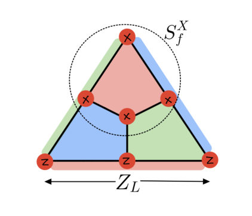
<figcaption class="paper-figure-caption"><b>Fig 1.</b> Figure 1: The [[7, 1, 3]] triangular color code. Data qubits (red circles) reside on the vertices, with the three triangular faces shaded red, green, and blue. An example X-type stabilizer, SX f , is shown on the top red face. The logical Z operator, ZL, is realized as the product of Z operators on the three qubits along any one colored boundary, for example, along the bottom red edge.</figcaption>
</figure>
<figure class="paper-figure-card">
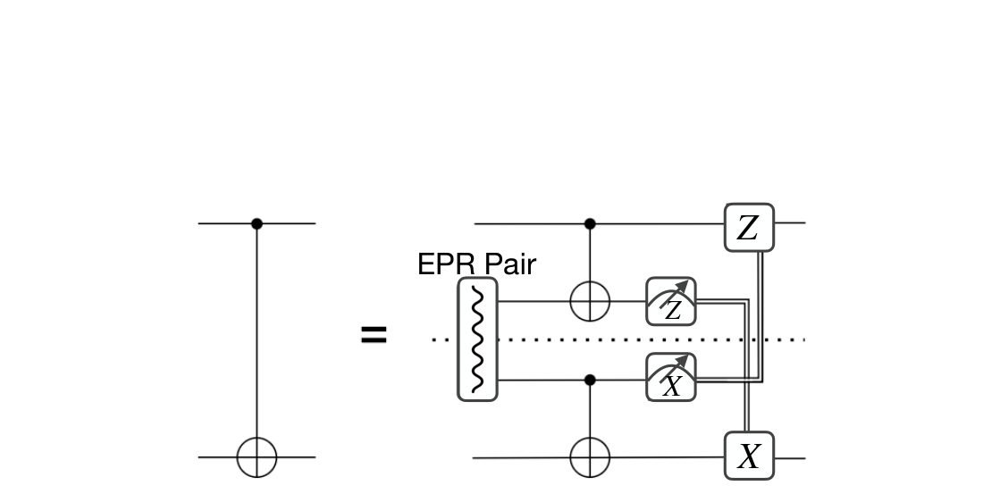
<figcaption class="paper-figure-caption"><b>Fig 2.</b> Figure 2: Circuit for a remote CNOT. The gate is implemented using a shared EPR pair and local operations, after which the EPR qubits are measured.</figcaption>
</figure>
<figure class="paper-figure-card">
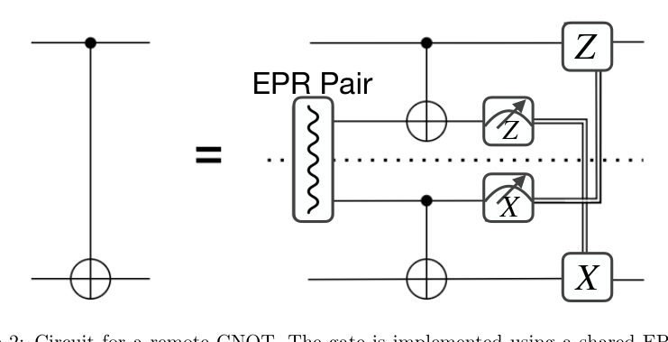
<figcaption class="paper-figure-caption"><b>Fig 3.</b> Fig. 3 shows a clear gap between a monolithic color code and an MA schedule in the dis- tributed setting. At a fixed EGR of 50 MHz and across the range of physical error rates shown, MA incurs a higher LER because, in every round, it measures all seam checks that require heralded Bell pairs to execute remote CNOTs. The wait to obtain Bell pairs trans- lates into idling errors on data qubits, so MA incurs extra noise each round. Furthermore, the gap grows with code distance because the number of seam operations increases with code distance d. Our goal in this work is to reduce that gap and recover as much of the monolithic performance as possible without requiring a monolithic architecture,...</figcaption>
</figure>
<figure class="paper-figure-card">
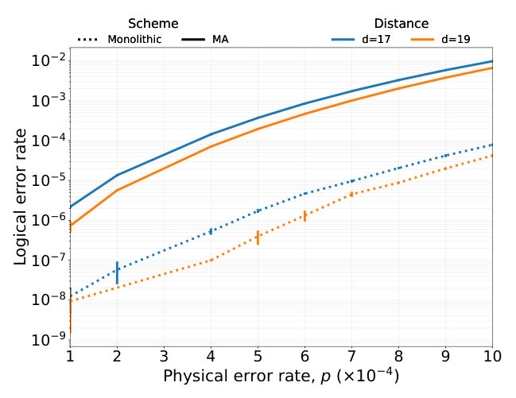
<figcaption class="paper-figure-caption"><b>Fig 4.</b> Figure 3: Logical error rate (LER) versus physical error rate for triangular color codes at distances d ∈{17, 19}. The EGR is fixed at 50 MHz, and p is swept over [10−4, 2 × 10−4, 4 × 10−4, 6 × 10−4, 8 × 10−4, 10−3]. We compare a monolithic architecture with MA (measure-all in the distributed setting). Increasing the code distance lowers the LER for both schemes. The MA curves lie above the corresponding monolithic curves because non- local seam operations introduce additional noise and waiting-induced decoherence. The y-axis is shown on a logarithmic scale (log spacing).</figcaption>
</figure>
<figure class="paper-figure-card">
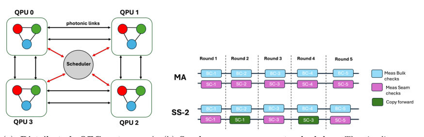
<figcaption class="paper-figure-caption"><b>Fig 5.</b> Figure 4: Distributed color-code architecture and syndrome-measurement sched- ules. (a) A distributed QEC setting with a central scheduler coordinating four QPUs con- nected by photonic links. Bulk and seam checks arise from locality: bulk checks are local to a single QPU, whereas seam checks cross QPU boundaries. (b) Syndrome-measurement schedules used in this work. BC = bulk check; SC = seam check.</figcaption>
</figure>
<figure class="paper-figure-card">
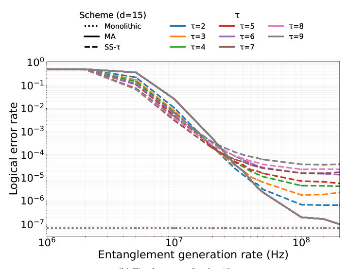
<figcaption class="paper-figure-caption"><b>Fig 6.</b> Figure 5: LER as a function of EGR for fixed seam-refresh intervals τ at code distances d ∈{11, 15} and p = 10−3. The optimal seam-refresh interval is not universal, but depends on both code distance and EGR. In the low-EGR regime, larger skip intervals are favoured because they reduce the frequency of costly remote seam measurements and the associated waiting-induced idle noise. In the high-EGR regime, smaller skip intervals are preferred because seam information must be refreshed more frequently to avoid syndrome staleness. Both axes have logarithmic spacing, and EGR is swept over {1, 2, 5, 10, 20, 50, 100, 150, 200} MHz.</figcaption>
</figure>
<figure class="paper-figure-card">
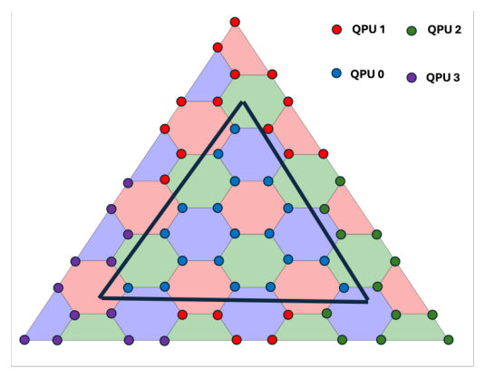
<figcaption class="paper-figure-caption"><b>Fig 7.</b> Figure 6: Balanced four-QPU partition of a d = 9 triangular color code. Colored dots denote data qubits assigned to each QPU (QPU-0 blue, QPU-1 red, QPU-2 green, QPU-3 purple). The dark inner triangle indicates the central subpatch of distance d′ = 5 mapped to QPU-0, while the three outer wedge-shaped regions are mapped to other QPUs.</figcaption>
</figure>
<figure class="paper-figure-card">
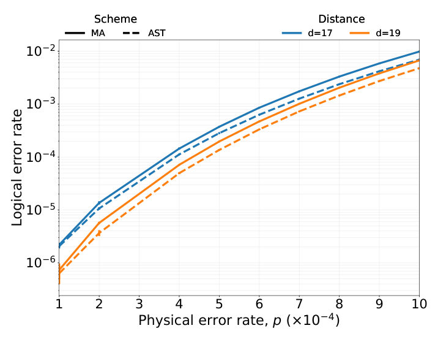
<figcaption class="paper-figure-caption"><b>Fig 8.</b> Figure 7: Logical error rate (LER) versus physical error rate for triangular color codes at distances d ∈{17, 19} under the MA and AST scheduling schemes. For both code distances, AST yields a lower LER than MA over the plotted range. The EGR is fixed at 50 MHz, and p is swept over [10−4, 2 × 10−4, 4 × 10−4, 6 × 10−4, 8 × 10−4, 10−3]. The y-axis is shown on a logarithmic scale (log spacing).</figcaption>
</figure>
<figure class="paper-figure-card">

<figcaption class="paper-figure-caption"><b>Fig 9.</b> Fig. 8, provides a motivating fixed-skipping example using SS-2, showing that reducing seam-measurement frequency can improve logical performance when EGR is low. However, as discussed in Section 3.1, this benefit is regime dependent, which motivates the adaptive AST policy considered in Fig. 9. In Fig. 9, we plot LER as a function of EGR for MA and AST. In the low-EGR regime, AST consistently outperforms MA. When Bell pairs are generated slowly, measuring seam stabilizers in every round incurs substantial waiting time, which translates into additional idle noise on data qubits. By refreshing the seam less frequently, i.e. skipping with τ ∗= (d −1)/2, AST reduces this penalty and achieves...</figcaption>
</figure>
<figure class="paper-figure-card">
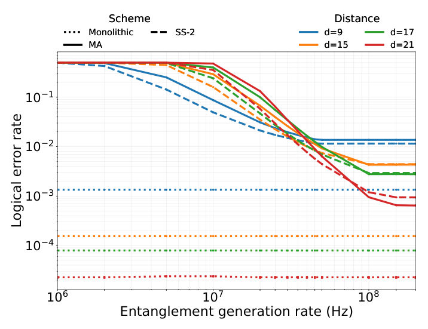
<figcaption class="paper-figure-caption"><b>Fig 10.</b> Figure 8: Logical error rate (LER) versus entanglement generation rate (EGR) at fixed p = 10−3 for triangular color codes at distances d ∈{9, 15, 17, 21}. The monolithic (dotted) baseline is compared with the distributed MA (solid) and SS-2 (dashed) sched- ules. As EGR increases, the LER of the distributed schemes decreases, with SS-2 con- sistently outperforming MA. Both axes have logarithmic spacing, and EGR is swept over {1, 2, 5, 10, 20, 50, 100, 150, 200} MHz.</figcaption>
</figure>

**Main problem.** Optimizing the scheduling of stabilizer measurements in distributed quantum error correction to balance the trade-off between remote-operation noise (due to waiting for entanglement) and syndrome staleness.

**Main result.** The proposed Skip-Seam-tau (SS-tau) and Adaptive Skip-tau (AST) policies reduce the logical error rate compared to the standard Measure-All baseline, particularly in low-to-moderate entanglement generation rate regimes.

**Method.** The authors develop a scheduling module for syndrome extraction and evaluate it using Stim-based circuit-level noise simulations with a concatenated MWPM decoder.

**Summary.** This paper addresses the performance bottleneck in distributed quantum computing caused by the slow and noisy nature of remote entanglement-based gates. By introducing a scheduling strategy that skips certain boundary (seam) measurements, the authors reduce the accumulation of idling noise on data qubits. They demonstrate that an adaptive approach, which adjusts measurement frequency based on the entanglement generation rate, can significantly improve the logical error rate and approach the performance of monolithic architectures.

Detailed structure

**Model / system.** A modular quantum architecture consisting of multiple QPUs connected via photonic interconnects, utilizing triangular color codes partitioned across four modules.

**Key observables.** Logical Error Rate (LER)

**Important parameters / regimes.** Entanglement Generation Rate (EGR), code distance (d), physical error rate (p), and the seam-refresh interval (tau).

**Assumptions / limitations.** The decoder and underlying code structure remain unchanged; the study focuses on measurement frequency rather than the classical computational overhead of the scheduler.

**Figures summary.** Figures illustrate the triangular color code structure, the remote CNOT circuit, the performance gap between monolithic and distributed architectures, and plots of LER vs. physical error rate and EGR for various scheduling policies.

**Paper structure.** The paper introduces the problem of distributed QEC overhead, describes the modular architecture and noise model, presents the proposed SS-tau and AST scheduling policies, evaluates them via Stim simulations, and analyzes performance across different EGR regimes and code distances.

Abstract

Future quantum architectures are expected to be modular, with quantum processors connecting multiple quantum processing units (QPUs) via photonic interconnects. In topological quantum error correction, such as color codes, this creates seam boundaries where parity checks require remote CNOT operations using heralded Bell pairs. These non-local checks are slower and noisier than bulk local checks because entanglement generation is probabilistic, causing data qubits to accumulate idle noise while waiting for remote operations. A natural way to reduce this overhead is to skip some seam measurements; however, doing so makes seam syndrome information stale and can degrade decoding. The central scheduling problem is therefore to determine how frequently seam checks should be measured so as to balance remote-operation and waiting noise against syndrome staleness.   To address this trade-off, we develop a scheduling module that integrates directly into standard syndrome-extraction circuits. We consider two policies: Skip-Seam-$τ$ (SS-$τ$), which measures all bulk checks every round while measuring seam checks once every $τ$ rounds and copying the most recent syndrome in skipped rounds, and Adaptive Skip-$τ$ (AST), which selects $τ$ as a function of code distance and entanglement generation rate (EGR). We evaluate these policies on triangular color codes under circuit-level noise in Stim, including idling errors induced by Bell-pair generation delays. Our simulations show that SS-tau and AST reduce remote-operation overhead and can lower the logical error rate (LER) relative to the Measure-All (MA) baseline. For physical error rate $p = 10^{-3}$, we identify an EGR regime in which both SS-$τ$ and AST exhibit behavior consistent with fault-tolerant scaling, with LER decreasing as code distance increases. Across these regimes, SS-$τ$ and AST outperform MA.

[↑ back to top](#top)

### [Constant Factor Analysis of Optimal Quantum Linear Solvers in Practice](http://arxiv.org/abs/2604.22185v1)

**Authors:** Pedro C. S. Costa, Alexander M. Dalzell, Dong An, Dominic W. Berry  
**Type:** theory · **Category:** quantum information and computing · **PDF:** <https://arxiv.org/pdf/2604.22185v1>  
**Analysis basis:** full PDF text, analyzed in chunks

↔ Scroll figures horizontally

<figure class="paper-figure-card">
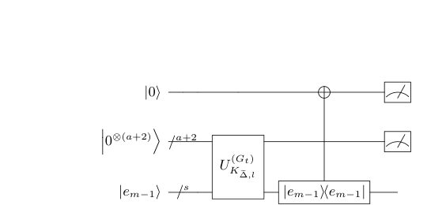
<figcaption class="paper-figure-caption"><b>Fig 1.</b> FIG. 1. Quantum circuit of the KR algorithm (reproduction of Figure 10 of [17]). We have U (Gt) K e ∆,l the QSVT that imple-</figcaption>
</figure>
<figure class="paper-figure-card">
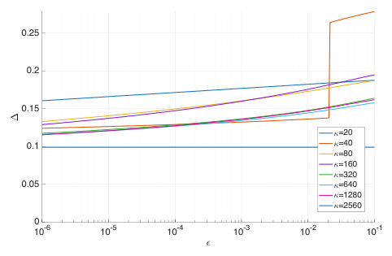
<figcaption class="paper-figure-caption"><b>Fig 2.</b> FIG. 2. The plot shows the recommended values of ∆, for the QW method, as a function of the tested condition number, for the set of positive definite matrices A ∈C32×32.</figcaption>
</figure>
<figure class="paper-figure-card">
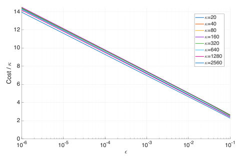
<figcaption class="paper-figure-caption"><b>Fig 3.</b> FIG. 3. Total cost of the QW method for different target solution-error tolerances, using the optimal step sizes ∆(as estimated from Fig. 2) for each tested condition number, over the set of positive definite matrices A ∈C32×32.</figcaption>
</figure>
<figure class="paper-figure-card">
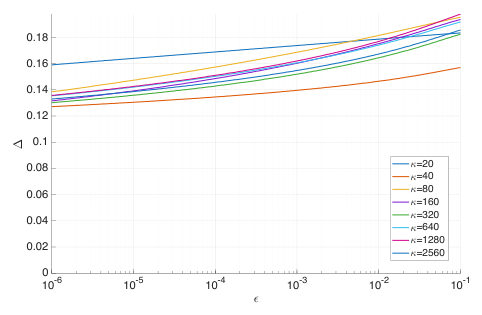
<figcaption class="paper-figure-caption"><b>Fig 4.</b> FIG. 4. The plot shows the recommended values of ∆, for the QW method, as a function of the tested condition number, for the set of positive definite matrices A ∈C64×64.</figcaption>
</figure>
<figure class="paper-figure-card">
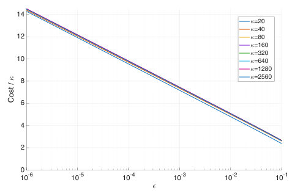
<figcaption class="paper-figure-caption"><b>Fig 5.</b> FIG. 5. Total cost of the QW method for different target solution-error tolerances, using the optimal step sizes ∆(as estimated from Fig. 4) for each tested condition number, over the set of positive definite matrices A ∈C64×64.</figcaption>
</figure>
<figure class="paper-figure-card">
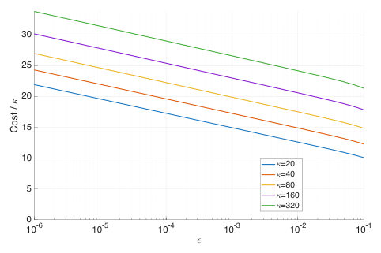
<figcaption class="paper-figure-caption"><b>Fig 6.</b> FIG. 6. Total cost for the Shortcut method for different target solution-error tolerances, using the optimal target error ∆(as estimated from Fig. B.III) for each tested condition number, over the set of non-Hermitian matrices A ∈C32×32.</figcaption>
</figure>
<figure class="paper-figure-card">
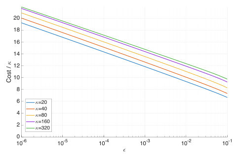
<figcaption class="paper-figure-caption"><b>Fig 7.</b> FIG. 8. Total cost for the QW method for different target solution-error tolerances, using the optimal step sizes ∆(as estimated from Fig. B.II) for each tested condition number, over the set of non-Hermitian matrices A ∈C64×64.</figcaption>
</figure>
<figure class="paper-figure-card">
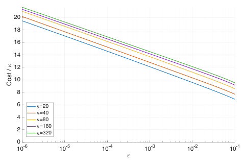
<figcaption class="paper-figure-caption"><b>Fig 8.</b> FIG. 7. Total cost for the QW method for different target solution-error tolerances, using the optimal step sizes ∆(as estimated from Fig. B.I) for each tested condition number, over the set of non-Hermitian matrices A ∈C32×32.</figcaption>
</figure>
<figure class="paper-figure-card">
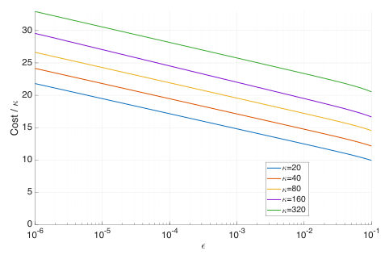
<figcaption class="paper-figure-caption"><b>Fig 9.</b> FIG. 9. Total cost for the Shortcut method for different target solution-error tolerances, using the optimal step sizes ∆(as estimated from Fig. B.IV) for each tested condition number, over the set of non-Hermitian matrices A ∈C64×64.</figcaption>
</figure>
<figure class="paper-figure-card">
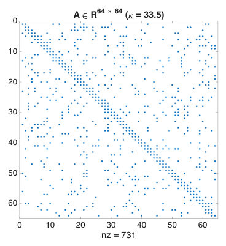
<figcaption class="paper-figure-caption"><b>Fig 10.</b> FIG. 10. Two representative 64×64 matrices from our sparse solver testing: (a) a sample from group k1 and (b) a sample from group κ2. For each matrix, the top label reports its con- dition number, and the bottom label reports the total number of nonzeros.</figcaption>
</figure>

**Main problem.** Evaluating the practical performance and constant factor overhead of optimal Quantum Linear System Algorithms (QLSAs), specifically comparing the 'Shortcut' method against Quantum Walk-based approaches.

**Main result.** The Shortcut method is significantly more efficient for non-Hermitian matrices when the solution norm is known, whereas the Quantum Walk method performs better in the unknown-norm regime.

**Method.** Numerical analysis and comparative benchmarking of the Shortcut method (using Kernel Reflection and Kernel Projection via QSVT) against Adiabatic and Randomized Quantum Walk methods using random linear systems.

**Summary.** This paper provides a practical performance analysis of state-of-the-art quantum algorithms for solving linear systems. It compares the recently developed 'Shortcut' method with established Quantum Walk-based solvers. The authors find that while the Shortcut method excels when the solution norm is known, the Quantum Walk method remains more robust and efficient when the norm is unknown. This work is crucial for understanding the real-world utility of these algorithms beyond their theoretical asymptotic complexity.

Detailed structure

**Model / system.** The study focuses on the Quantum Linear System Problem (QLSP) for square, sparse matrices $A$, including both Hermitian (Positive Definite) and non-Hermitian families.

**Key observables.** Computational cost (number of block-encoding calls), success probability, and solution error (Bures distance/infidelity).

**Important parameters / regimes.** Condition number ($\kappa$), target error ($\epsilon$), solution norm ($\|x\|$), and matrix dimension ($N$).

**Assumptions / limitations.** Assumes access to a block-encoding $U_A$ of the matrix $A$ and that the matrix is normalized such that $\|A\|=1$.

**Figures summary.** Circuit diagrams for the Kernel Reflection algorithm and plots showing the scaling of total cost and error as a function of condition number and error tolerance.

**Paper structure.** The paper introduces the problem of constant factor analysis, presents the mathematical framework for the Shortcut and Quantum Walk methods, details the numerical simulation setup, and provides comparative results across different matrix regimes and norm-knowledge scenarios.

Abstract

Optimal quantum linear equation solvers provide complexity $O(κ\log(1/ε))$, where $κ$ is the condition number and $ε$ is the allowable error. The optimal solver using a discrete adiabatic approach [PRX Quantum \textbf{3}, 040303 (2022)] has large analytically proven constant factors for the upper bound on the complexity. The constant factors were later found to be about 1,200 times smaller in numerical testing [Quantum \textbf{9}, 1887 (2025)]. This meant it is about an order of magnitude more efficient than using a randomised approach from [PRX Quantum \textbf{6}, 040373 (2025)], which has far smaller analytically proven constant factors. Recently, a ``Shortcut'' method has been found to provide an optimal solver which also has small proven constant factors. In the present work, we conduct a comprehensive numerical analysis comparing this method with the adiabatic solver for two families of random linear systems. We find that, in the case where the solution norm is \emph{unknown}, the adiabatic solver provides slightly better performance. If the solution norm is \emph{known}, then the shortcut method provides significantly better performance for non-Hermitian matrices.

[↑ back to top](#top)

### [Corner Majorana states in semi-Dirac](http://arxiv.org/abs/2604.22553v1)

**Authors:** M. García Olmos, Y. Baba, R. A. Molina, M. Amado  
**Type:** theory · **Category:** quantum information and computing · **PDF:** <https://arxiv.org/pdf/2604.22553v1>  
**Analysis basis:** full PDF text, analyzed in chunks

↔ Scroll figures horizontally

<figure class="paper-figure-card">

<figcaption class="paper-figure-caption"><b>Fig 1.</b> FIG. 1. Electronic band structure of a semi-infinite system in y-direction (width = 90a) with translational symmetry in x-direction. The color encodes the expectation value of the relevant spin and orbital components: (a) x-component on the orbital operator, (b) y-component and (c) z-component of the spin operator, respectively. The rest of the components are nearly zero for the edge states. Panel (d) is colored according to spatial localization in y-direction. The color scales range from −1 to +1 for spin/orbital projections (from red to blue) and from -W/2 to +W/2 for ⟨y⟩(from orange to purple). The edge states remain approximately polarized in the orbital σx sector, while their spin...</figcaption>
</figure>
<figure class="paper-figure-card">
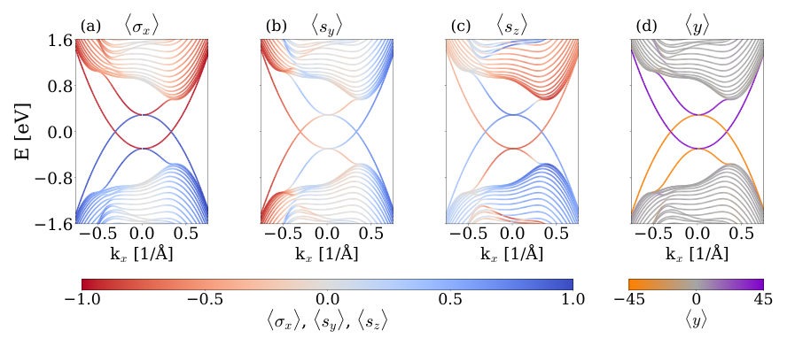
<figcaption class="paper-figure-caption"><b>Fig 2.</b> Figure 2 compares the spectra obtained from the full Hamiltonian (1) in a nanoribbon geometry and the effective low-energy Hamiltonian (5). Panel (a) shows the numerical spectrum of the full Hamiltonian for a nanoribbon finite in y-direction and panel (c) displays the spectrum of the effective low-energy theory. In panel (b) we include the analytical dispersion relation of Eq. 3 for electrons (µ &gt; 0) and holes (µ &lt; 0) without superconducting coupling, ∆= 0, in order to highlight the good agreement between the expected gap openings according to non-zero elements of ∆eff,ξ(kx) and the numerical results. We use the color scale to show the electron (in blue) or hole (in red) character of the...</figcaption>
</figure>
<figure class="paper-figure-card">
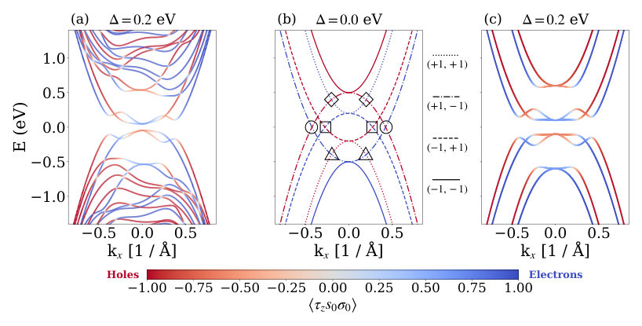
<figcaption class="paper-figure-caption"><b>Fig 3.</b> FIG. 2. Band dispersion of the semi-infinite system in the y-direction with translational symmetry in the x-direction in Nambu space. Panel (a) shows the numerical spectrum with ∆= 0.2 eV of the BdG Hamiltonian of Eq. (1) discretized in a strip with translational symmetry in the x-direction and a finite width of W = 90a in the y-direction. In panel (b) we plot the analytical energies obtained perturbatively given by Eq. (3) for µ = 0.15 eV for electrons and µ = −0.15 eV for holes, in the absence of the superconducting coupling. We use the line style to differentiate the distinct branches (ξ, S): a dotted line for (ξ, S) = (+1, +1), dotted-dashed line for (ξ, S) = (+1, −1), a dashed line for...</figcaption>
</figure>
<figure class="paper-figure-card">
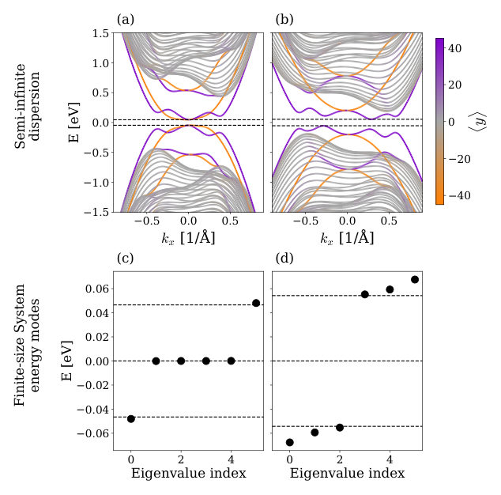
<figcaption class="paper-figure-caption"><b>Fig 4.</b> FIG. 3. Panels (a) and (b) display the bands of a system with translational invariance along x-direction and W = 90a. The color scale indicates the expectation value of the y-coordinate. Panels (c) and (d) display the corresponding energy spectrum of the finite-size system in both directions. Panels (a) and (c) correspond to the regime with µ &lt; BZ, we take µ = 0.15 eV and BZ = 0.35 eV, where we find zero-energy modes inside the effective SC gap plotted with dashed lines. In contrast, panels (b) and (d) show the results for the regime without Majorana bound states, in which the low-energy coupled states belong to the same edge, i.e. µ &gt; BZ, with µ = 0.45 eV, BZ = 0.35 eV. The rest of the...</figcaption>
</figure>
<figure class="paper-figure-card">
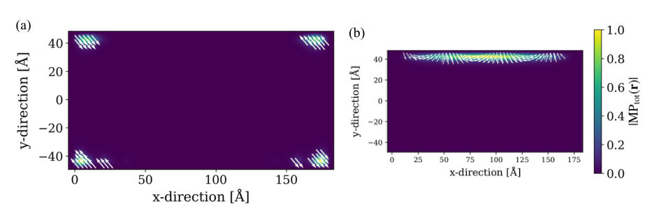
<figcaption class="paper-figure-caption"><b>Fig 5.</b> FIG. 4. Spatially resolved Majorana polarization (MP). The arrows indicate the real and imaginary part of MP in each site. The colormap corresponds to its absolute value. In (a) we consider the four zero-energy states calculated in the maximally localized basis by diagonalizing the position operator, ˆ X + ˆY projected onto that subspace. The uniform alignment of the MP vectors indicates a well-defined Majorana phase for the corner modes. (b) shows the MP for the first state above the superconducting gap, which is an extended state along the upper edge. Unlike the zero-energy modes, the precession of the arrows indicates trivial behavior.</figcaption>
</figure>
<figure class="paper-figure-card">
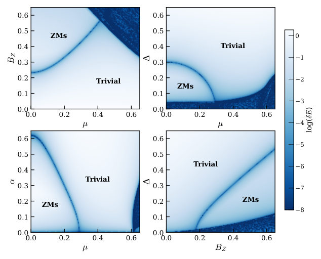
<figcaption class="paper-figure-caption"><b>Fig 6.</b> FIG. 5. Gap size δE as a function of the model parameters for the semi-infinite system with translational symmetry along x- direction and W = 90 Å. Dark blue indicates gap closings, plotted on a logarithmic color scale. The phase boundaries between a topological phase with Majorana zero-energy modes labeled by ZMs and a trivial one, are determined by gap closings of the edge states spectrum at kx = 0 Å. We consider the same set of parameters as in Fig. 1 varying the ones indicated in the axis.</figcaption>
</figure>
<figure class="paper-figure-card">
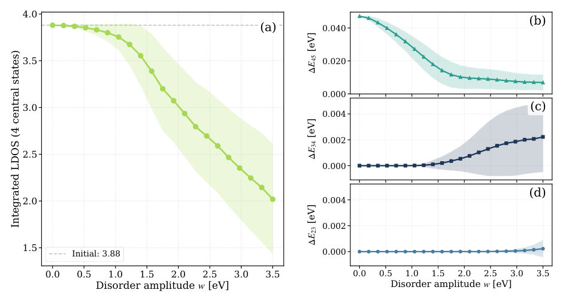
<figcaption class="paper-figure-caption"><b>Fig 7.</b> FIG. 6. (a) Integrated LDOS of the four central states within the fixed corner mask as a function of the disorder strength w. The dashed horizontal line marks the clean-limit value, 3.88. The right panels (b-d) show the level spacing of consecutive states as a function of the disorder strength w. We extract by numerical diagonalization six states around zero energy, in the clean limit, eigenstates 0 and 5 are extended states along the edge, while 1, 2, 3, and 4 are the four corner states. The labels of the gaps follow these indexes. Accordingly, panel (b) shows ∆E45, the effective superconducting gap; panel (c) shows ∆E34, which quantifies the energy splitting between upper and lower corner...</figcaption>
</figure>
<figure class="paper-figure-card">
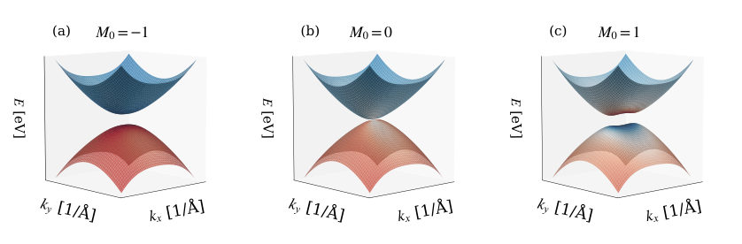
<figcaption class="paper-figure-caption"><b>Fig 8.</b> FIG. 7. Bulk spectrum of a semi-Dirac system in terms of the sgn(M0/M1y). For M0 = 0 eV the gap is closed, distinguishing a phase transition between an insulating phase and a band inverted regime shown with the expectation value of the σz operator.</figcaption>
</figure>
<figure class="paper-figure-card">
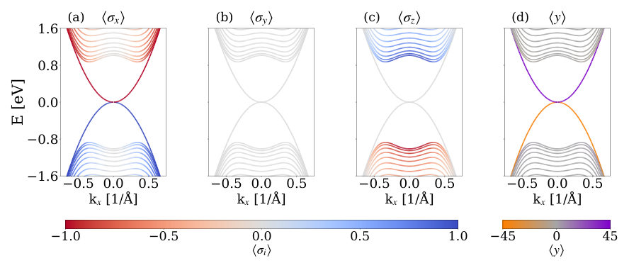
<figcaption class="paper-figure-caption"><b>Fig 9.</b> FIG. 8. Electronic band structure of a semi-infinite system in y-direction (width = 90a) with translational symmetry in x- direction. The colormap shows the expectation value of the orbital part (a)-(c) and panel (d) shows the expectation value of the y-coordinate. The color scales range from −1 to +1 (from red to blue) and from -W/2 to +W/2 for spatial location (from orange to purple). The edge states are essentially polarized in the x component, whose value is associated with the edge on which they live. This figure has been made using parameters normalized to the bulk gap M0, µ = 0.0 eV, M0 = 1.0 eV, M1x = 2.3 eV · Å2, M1y = 2.3 eV · Å2, Vx = −3.8 eV · Å2, Vy = −5.0 eV · Å, α = 0.0 Å−1,...</figcaption>
</figure>

**Main problem.** The challenge of realizing robust, fault-tolerant Majorana bound states (MBSs) without the experimental difficulties of 1D nanowires or the need for complex engineered nanostructures and vortices.

**Main result.** The discovery that 2D semi-Dirac materials can host corner Majorana modes through proximity-induced superconductivity, where the system effectively acts as coupled Kitaev chains.

**Method.** A theoretical framework using the Bogoliubov-de Gennes (BdG) formalism, including numerical diagonalization of a tight-binding model and projection onto edge-state subspaces.

**Summary.** This paper proposes a new theoretical platform for realizing Majorana bound states using 2D semi-Dirac materials. By applying Rashba spin-orbit coupling and a Zeeman field to these materials under s-wave superconductivity, the authors show that corner Majorana modes emerge at the edges of finite strips. The system can be effectively described as coupled Kitaev chains. Crucially, the study demonstrates that these corner states are remarkably robust against significant levels of Anderson disorder.

Detailed structure

**Model / system.** A 2D semi-Dirac system with anisotropic bulk dispersion (quadratic in kx, linear in ky) subject to Rashba spin-orbit coupling, a perpendicular Zeeman field, and s-wave superconducting proximity effect.

**Key observables.** Edge-state dispersion, Majorana polarization, Majorana zero modes at corners, Local Density of States (LDOS), and energy splitting between modes.

**Important parameters / regimes.** Mass term (M0), Rashba coupling (alpha), Zeeman field (BZ), chemical potential (mu), and Anderson disorder strength (w).

**Assumptions / limitations.** The large-width limit (W >> lambda^-1) allows treating opposite edges as decoupled; the superconducting pairing is momentum-independent; and orbital spinors of opposite edges are orthogonal.

**Figures summary.** Figure 1 shows numerical edge-state spectra and spin/orbital components; Figure 2 compares full BdG results to a reduced decoupled model; Figure 3 displays energy spectra for semi-infinite and finite systems; Figure 6 illustrates the stability of the integrated LDOS under increasing disorder.

**Paper structure.** The paper introduces the problem of Majorana realization, defines the semi-Dirac Hamiltonian and its edge-state properties, derives an effective 1D Kitaev chain model via projection, analyzes the emergence of corner modes in finite geometries, and evaluates the robustness of these modes against Anderson disorder.

**Why it may be interesting.** It proposes a new, naturally occurring 2D platform for Majorana modes that avoids the complexities of engineered nanostructures, which is highly relevant for developing topological qubits for fault-tolerant quantum computing.

Abstract

Proximity-induced superconductivity in low-dimensional systems offers a powerful pathway to engineer topological superconducting phases in, otherwise, non-superconducting systems. These exotic phases are of fundamental and technological interest due to the presence of robust zero-energy modes, the Majorana bound states. In this work, we propose a theoretical framework to realize Majorana bound states from the edge states of a two-dimensional semi-Dirac system. This anisotropic system, under specific conditions, can host non-chiral edge states that propagate only along particular edges, effectively forming separated one-dimensional channels. We show that the interplay between Rashba spin-orbit coupling and a Zeeman field on this setup provides the right conditions to get an effective p-wave pairing between the edge states by proximity with a s-wave superconductor. In finite geometries, each edge can independently undergo a topological phase transition into a one-dimensional topological superconductor and give rise to four zero-energy modes localized at the strip corners. At low energies, the edge states subspace admits a description in terms of coupled Kitaev chains, providing a clear picture of the origin, robustness, and tunability of the corner Majorana modes. Our results establish semi-Dirac materials as a natural platform for realizing Majorana modes in two dimensions without relying on engineered nanostructures, vortices, or crystalline higher-order topology.

[↑ back to top](#top)

### [Dynamic Moiré Potentials and Robust Wigner Crystallization in Large-Scale Twisted Transition Metal Dichalcogenides](http://arxiv.org/abs/2604.22343v1)

**Authors:** Yifan Ke, Chuanjing Zeng, Xinming Qin, Wei-Lin Tu, Wei Hu, Jinglong Yang  
**Type:** theory · **Category:** strongly correlated electrons · **PDF:** <https://arxiv.org/pdf/2604.22343v1>  
**Analysis basis:** full PDF text, analyzed in chunks

↔ Scroll figures horizontally

<figure class="paper-figure-card">
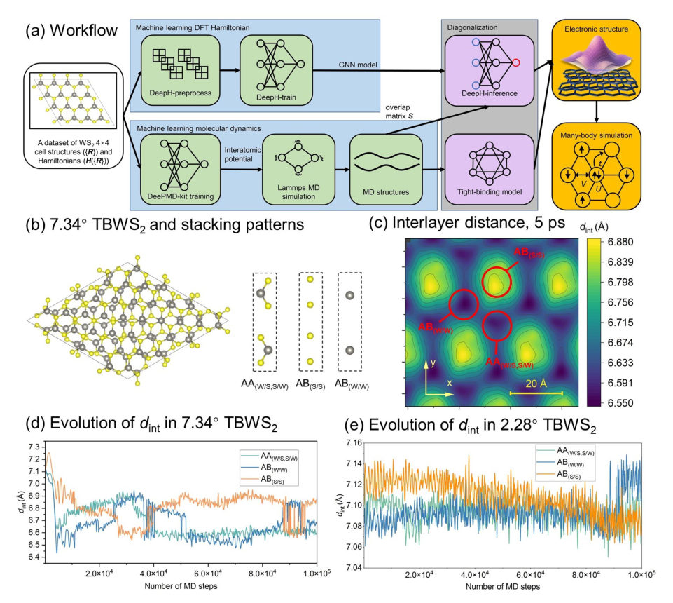
<figcaption class="paper-figure-caption"><b>Fig 1.</b> Figure 1: (a) Schematic workflow of the moir´e material molecular dynamics and electronic structure prediction. (b) A moir´e unit cell of TBWS2. Different stacking area are present in the unit cell, including AA(W/S,S/W), AB(S/S), AB(W/W). (c) Contour map of the 7.34◦</figcaption>
</figure>
<figure class="paper-figure-card">
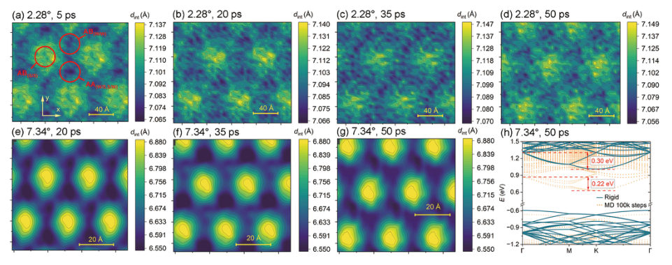
<figcaption class="paper-figure-caption"><b>Fig 2.</b> Figure 2: (a)-(d) Contour maps of the interlayer distance dint in 2.28◦TBWS2 at different time frames. The snapshot frame is fixed, so the bright spots, indicating the largest interlayer distance, shift over time. (e)-(g) dint contour maps of 7.34◦TBWS2 at different time frames. (h) Electronic band structures of rigid and dynamic 2.28◦TBWS2 structures.</figcaption>
</figure>
<figure class="paper-figure-card">
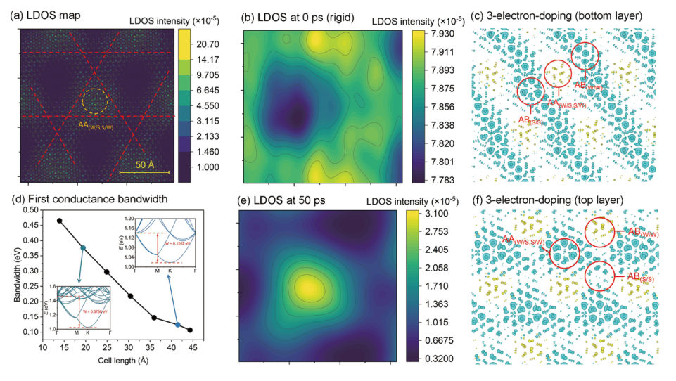
<figcaption class="paper-figure-caption"><b>Fig 3.</b> Figure 3: (a) Local density of states map of the bottom layer of 2.28◦TBWS2 at 50 ps. Red dotted lines outline the kagom´e pattern formed by the bright regions, and the light yellow circle indicates the AA(W/S,S/W) stacking area. (b) Local density of states map of 2.28◦TBWS2 at 0 ps, corresponding to a flat bilayer configuration. (c) Effect of DFT+U on the localized states of the bottom layer of 2.28◦TBWS2 at 0 ps, with U = 3.0 eV applied to the W 5d orbitals. (d) Bandwidth of the first conduction band as a function of the moir´e supercell length for twist angles of 13.17◦, 9.43◦, 8.26◦, 7.34◦, 6.01◦, 5.09◦, and 4.41◦. (e) Local density of states map of 2.28◦TBWS2 at 50 ps, showing a more...</figcaption>
</figure>
<figure class="paper-figure-card">
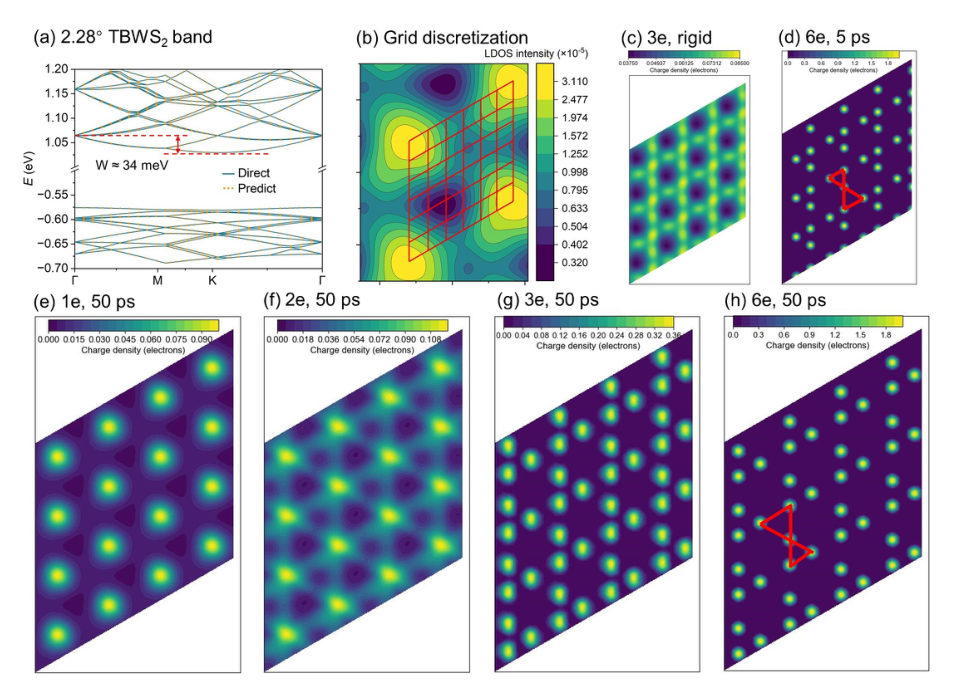
<figcaption class="paper-figure-caption"><b>Fig 4.</b> Figure 4: (a) Electronic band structure of 2.28◦TBWS2 at 50 ps, where solid lines denote direct DFT results and dots represent machine-learning predictions. (b) LDOS of the same structure in (a). The overlaid red grid marks the 7 × 7 triangular lattice used in the tensor- network simulations, with the highlighted region corresponding to a single moir´e cell. (c–h) Electron distributions from DMRG calculations at different fillings and timesteps: (c) three electrons of rigid structure, (d) six electrons at an early MD step (5 ps); (e) one, (f) two, (g) three, and (h) six electrons at a later stage (50 ps) per moir´e cell. The deepest moir´e potential wells coincide with the LDOS maxima in...</figcaption>
</figure>

**Main problem.** Bridging the gap between theoretical predictions and experimental observations in large-scale moire systems by accounting for how lattice dynamics and thermal fluctuations influence electronic localization and Wigner crystallization.

**Main result.** The inclusion of dynamical effects from lattice vibrations deepens moire potential wells and narrows the conduction band, leading to robust Wigner crystallization and the emergence of a kagome-patterned three-electron state.

**Method.** A machine-learning-based workflow integrating DeePMD for molecular dynamics and DeepH for machine-learned electronic Hamiltonians, combined with DFT-level accuracy (HONPAS) and DMRG simulations.

**Summary.** This paper presents a new machine-learning workflow to simulate large-scale moire supercells that are too large for traditional DFT. By incorporating lattice vibrations and structural relaxation, the authors show that the moire potential wells deepen, which facilitates the formation of robust Wigner crystals. They specifically identify a kagome-patterned electron state at certain doping levels. This approach provides a practical way to connect atomic-scale dynamics to large-scale emergent electronic phenomena in 2D materials.

Detailed structure

**Model / system.** Twisted bilayer tungsten disulfide (TBWS2) at small twist angles (e.g., 2.28 and 7.34 degrees), modeled using an effective Hubbard model with site-dependent potentials and Coulomb interactions.

**Key observables.** Interlayer distance (d_int), conduction band bandwidth, Local Density of States (LDOS), and electron density distributions.

**Important parameters / regimes.** Twist angles (2.28 to 13.17 degrees), Hubbard U (up to 50 eV), intersite Coulomb interaction V, and temperature (100 K).

**Assumptions / limitations.** The use of a 11-orbital tight-binding model and the assumption that machine-learned potentials accurately capture the essential physics of the large-scale MD trajectories.

**Figures summary.** Figure 1 shows the workflow and structural motifs; Figure 2 illustrates interlayer distance evolution; Figure 4 shows conduction bandwidth; Supplemental figures compare DFT packages (VASP vs HONPAS) and band structures.

**Paper structure.** The paper introduces a machine-learning workflow, validates its accuracy against plane-wave DFT, applies it to simulate large-scale MD for twisted TMDs, analyzes the resulting electronic structure and band narrowing, and concludes with many-body DMRG simulations of Wigner crystal formation.

**Why it may be interesting.** The paper demonstrates how structural fluctuations and lattice dynamics can be used to tune many-body phases and emergent geometries (like kagome patterns) in a controlled, theoretically predictable way.

Abstract

Understanding the dynamical evolution of large-scale moiré systems is crucial for connecting theoretical predictions with experimental observations. Here we develop a machine-learning-based workflow, integrating DeePMD and DeepH frameworks with first-principles calculations, to efficiently investigate time-dependent structural and electronic responses in twisted bilayer transition metal dichalcogenides (TMDs) with experimentally relevant moiré supercells containing over 3000 atoms. Using $\mathrm{WS_2}$ as a representative system, we show that low-temperature lattice vibrations and relaxation deepen the moiré potential wells, narrow the lowest conduction band, and facilitate the formation of strongly localized electronic states. Based on DFT-derived moiré potentials that incorporate these dynamical effects, density-matrix-renormalization-group (DMRG) simulations reveal robust Wigner crystallization and a kagomé-patterned three-electron state, consistent with recent experimental observations. Our workflow provides a practical route for exploring large moiré supercells beyond static configurations and offers new insight into the interplay between lattice dynamics, electronic localization, and emergent correlated states in twisted two-dimensional materials.

[↑ back to top](#top)

### [Exact relations between the density-density correlators of states in a spin multiplet](http://arxiv.org/abs/2604.22628v1)

**Authors:** Ritajit Kundu, Ajit C. Balram  
**Type:** theory · **Category:** strongly correlated electrons · **PDF:** <https://arxiv.org/pdf/2604.22628v1>  
**Analysis basis:** full PDF text, analyzed in chunks

↔ Scroll figures horizontally

<figure class="paper-figure-card">
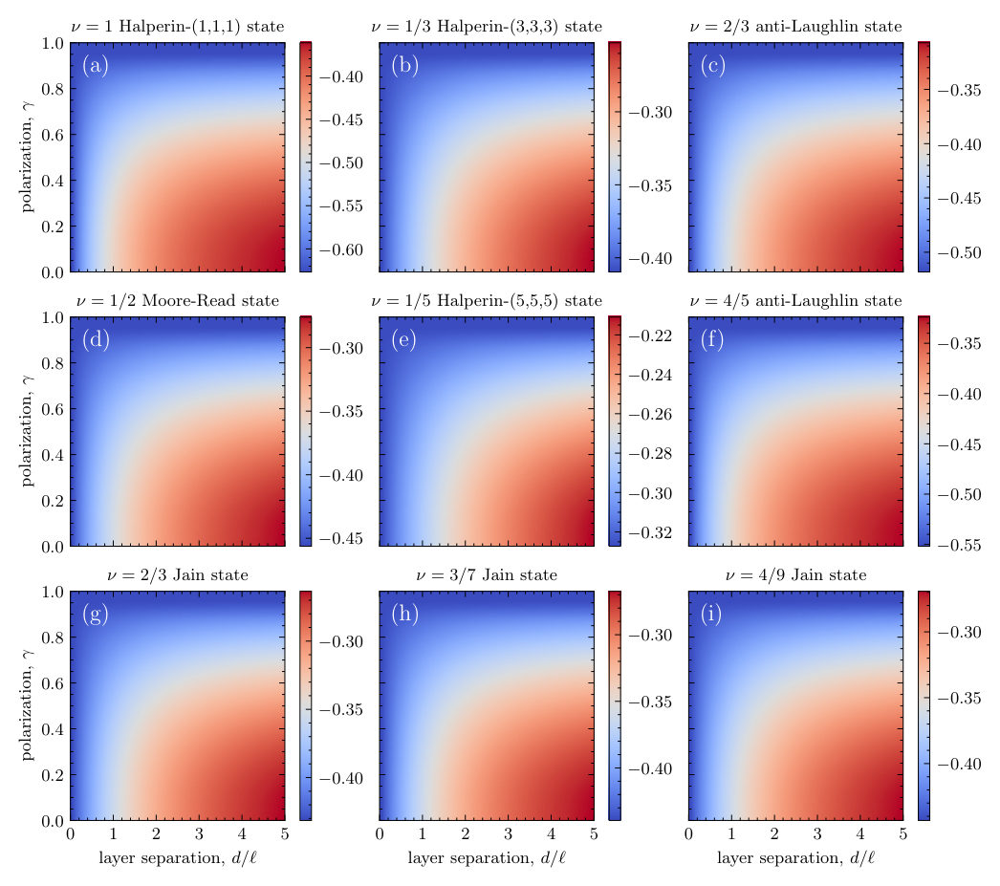
<figcaption class="paper-figure-caption"><b>Fig 1.</b> FIG. 1. Coulomb energies in units of e2/(εℓ) in the thermodynamic limit of many fully polarized, i.e., with maximal total spin, fractional quantum Hall states as a function of layer separation, d/ℓ, and polarization, γ, which labels the z−component of the spin. Here, ℓis the magnetic length and ε is the dielectric constant of the background host material.</figcaption>
</figure>

**Main problem.** Computing density-density correlation functions and energies for all members of a spin multiplet is computationally expensive because each state must typically be evaluated separately.

**Main result.** The authors derive exact identities that allow the pair-correlation functions and static structure factors of any state in a spin multiplet to be computed using only the properties of the highest-weight (fully polarized) state.

**Method.** The authors use SU(2) spin rotation symmetry to derive analytical relations between correlation functions and apply these to compute thermodynamic energies via integration of the structure factors.

**Summary.** This paper provides a new analytical method to significantly reduce the computational complexity of studying spin-degenerate many-body systems. By deriving exact relations between states in a spin multiplet, the authors show that one only needs to calculate the correlation functions for a single fully polarized state to know the properties of the entire multiplet. They demonstrate the utility of this method by analytically computing the energy of the Halperin-(1,1,1) state and numerically evaluating various other fractional quantum Hall states. This approach is particularly useful for studying bilayer and moiré systems where spin or pseudospin degrees of freedom are present.

Detailed structure

**Model / system.** The study focuses on many-body systems with spin or pseudospin (layer, orbital, or valley) degrees of freedom, specifically fractional quantum Hall (FQH) states in bilayer or multi-component systems.

**Key observables.** Pair-correlation function g(r), static structure factor S(q), and ground-state Coulomb energy E0.

**Important parameters / regimes.** Layer separation (d/l), polarization/density imbalance (gamma), and total spin quantum number (S).

**Assumptions / limitations.** The relations are limited to states within the same spin multiplet and rely on the assumption of SU(2) spin-rotation symmetry; energy calculations rely on approximate functional forms for g(r).

**Figures summary.** Figure 1 shows density plots of Coulomb energies for various FQH states (such as Halperin-(1,1,1) and Moore-Read) as a function of layer separation and polarization.

**Paper structure.** The paper introduces the computational problem, derives exact analytical identities for correlation functions using SU(2) symmetry, applies these relations to calculate energies for specific FQH states, and discusses results for bilayer systems.

Abstract

We present exact identities relating the pair-correlation functions and static structure factors of states in a spin multiplet. This allows us to compute these density-density correlation functions of all members of the multiplet using just these correlation functions of the highest-weight state. We apply these relations to obtain energies for many fractional quantum Hall (FQH) states. In particular, we analytically compute the energies of the Halperin-$(1,1,1)$ state as a function of density imbalance and layer separation, and numerically evaluate these energies for many other FQH states.

[↑ back to top](#top)

### [Field-driven phases in a three-dimensional twisted Kitaev model for CoNb$_2$O$_6$: Interplay of frustration and spin-orbit coupling](http://arxiv.org/abs/2604.21973v1)

**Authors:** Tom Drechsler, Matthias Vojta  
**Type:** theory · **Category:** strongly correlated electrons · **PDF:** <https://arxiv.org/pdf/2604.21973v1>  
**Analysis basis:** full PDF text, analyzed in chunks

↔ Scroll figures horizontally

<figure class="paper-figure-card">
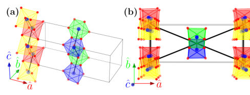
<figcaption class="paper-figure-caption"><b>Fig 1.</b> FIG. 1: Crystal structure of CoNb2O6: The Co2+ ions (blue) are surrounded by distorted edge-sharing octahedra of O2−</figcaption>
</figure>
<figure class="paper-figure-card">
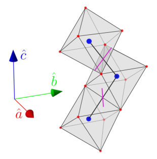
<figcaption class="paper-figure-caption"><b>Fig 2.</b> FIG. 2: Single twisted Kitaev chain with two local Ising axes ˆn(i) 1 , ˆn(i) 2 (magenta) alternating along the chain. The axis ˆn(i)</figcaption>
</figure>
<figure class="paper-figure-card">
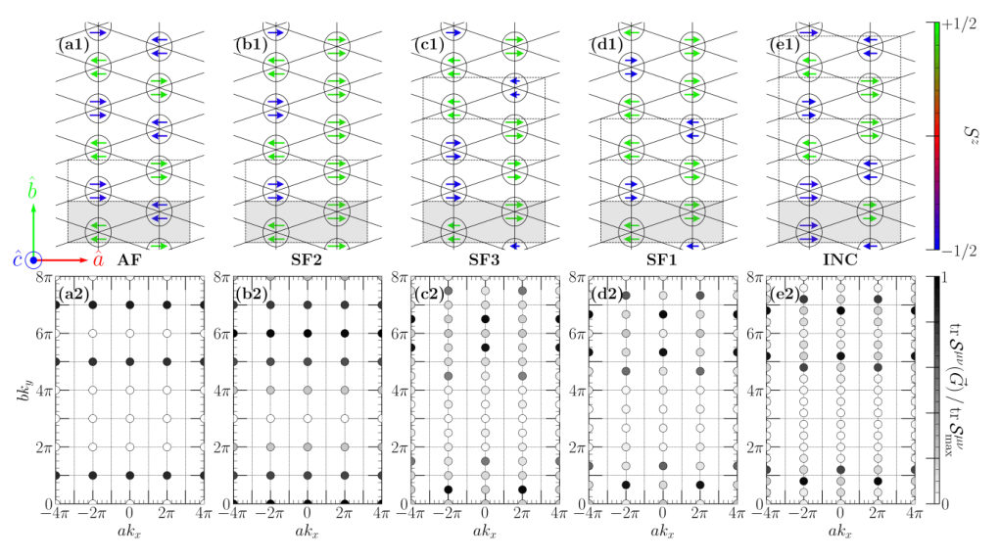
<figcaption class="paper-figure-caption"><b>Fig 3.</b> FIG. 3: Top: Model ground states for ⃗B applied in the ac plane. The crystallographic unit cell (light grey) contains two chains (circles) with two spins (arrows) each. Along each chain, the spins order ferromagnetically. Except for the paramagnetic high-field phase (not shown), all phases require an enlarged magnetic unit cell (dashed). The arrows represent the projection of the spins onto the ab plane; their c-axis component is color-coded. Bottom: Corresponding static spin structure factors P</figcaption>
</figure>
<figure class="paper-figure-card">
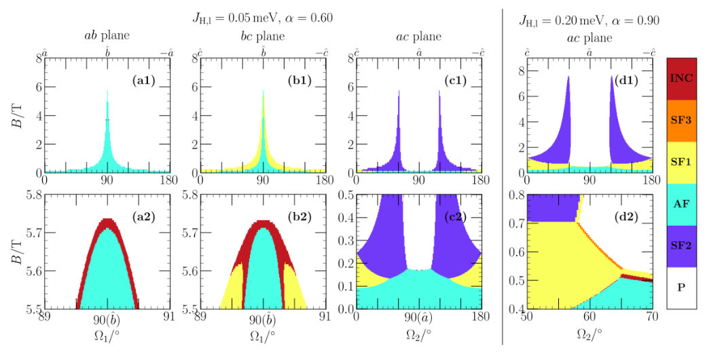
<figcaption class="paper-figure-caption"><b>Fig 4.</b> FIG. 4: Model phase diagrams as function of field magnitude and direction, with phase labels and colors shown on the right. Columns (a-c) employ inter-chain Heisenberg couplings with JH,l = 0.05 meV and α = 0.6, whereas column (d) uses JH,l = 0.2 meV and α = 0.9, both with the intra-chain couplings by Konieczna et al. [28]. (a): ⃗B in the ab plane. (b): ⃗B in the bc plane. (c,d): ⃗B in the ac plane. The upper row shows the full angle and field range, while the lower row shows suitable zooms. The SF2 phase is seen to extend to rather large fields for Ω2 ≈60◦, 120◦; this is because Ω2 = 63.54◦, 116.46◦</figcaption>
</figure>
<figure class="paper-figure-card">
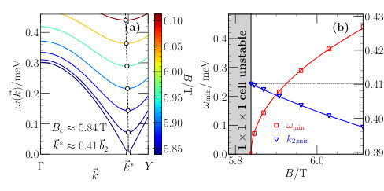
<figcaption class="paper-figure-caption"><b>Fig 5.</b> FIG. 5: (a): Dispersion of the lowest magnon branch along Γ−Y in the high-field phase for different ⃗B ∥ˆb, computed with the intra-chain couplings by Konieczna et al. together with JH,l = 0.05 meV and α = 0.9. The dispersion minimum is at ⃗k = (0, k2,min, 0). (b): Magnon gap ωmin and corresponding wavevector k2,min as a function of B. The gap closes according to ωmin ∝(B −Bc)1/2, with Bc ≈5.84 T. At Bc we have k2,min ≈0.41, signalling the onset of the INC phase.</figcaption>
</figure>
<figure class="paper-figure-card">
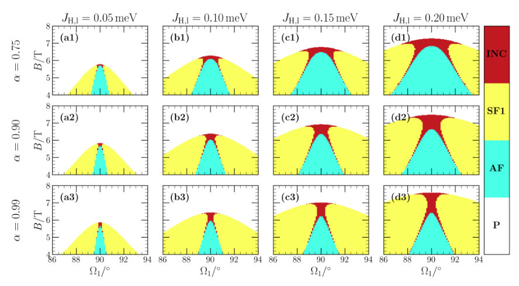
<figcaption class="paper-figure-caption"><b>Fig 6.</b> FIG. 6: Model phase diagrams as function of strength and direction of the applied field, focusing on nearly transverse fields in the bc plane near the transition into the high-field phase; Ω1 = 90◦corresponds to ⃗B ∥ˆb, i.e., transverse field. Results are shown for various choices of the inter-chain couplings α and JH,l; the intra-chain couplings are those of Ref. 28.</figcaption>
</figure>
<figure class="paper-figure-card">
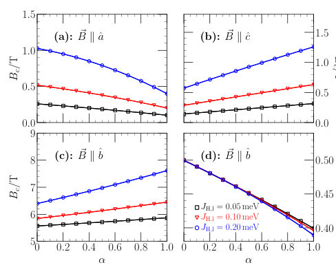
<figcaption class="paper-figure-caption"><b>Fig 7.</b> FIG. 7: (a,b,c): Transition fields into the high-field phase for different inter-chain coupling parameters JH,l as function of the isosceles distortion α; the intra-chain couplings are those of Ref. 28. (a) SF1↔P for ⃗B ∥ˆa, (b) SF2↔P for ⃗B ∥ˆc, (c) INC↔P for ⃗B ∥ˆb. Panel (d) shows the value of qinc at the INC↔P transition.</figcaption>
</figure>
<figure class="paper-figure-card">
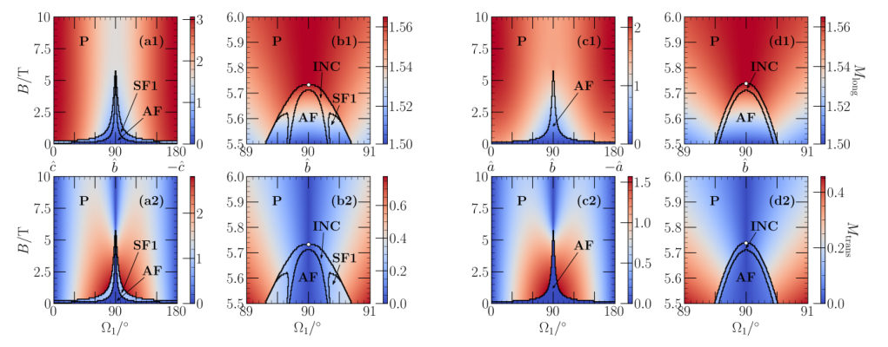
<figcaption class="paper-figure-caption"><b>Fig 8.</b> FIG. 8: Longitudinal (top) and transverse (bottom) components of the magnetization (color-coded) as a function of field magnitude and angle along two selected cuts, for model parameters JH,l = 0.05 meV and α = 0.6. (a,b): Ω2 = 0◦(bc plane). (c,d): Ω2 = 90◦(ab plane). Panels (a,c) show the full angle range, while panels (b,d) contain a zoom close to the transverse direction, Ω1 = 90◦. All phase transitions are of first order except for INC ↔P which is continuous for transverse field ⃗B ∥ˆb (white circle) but becomes weakly first order if ⃗B is tilted away from the b axis.</figcaption>
</figure>
<figure class="paper-figure-card">
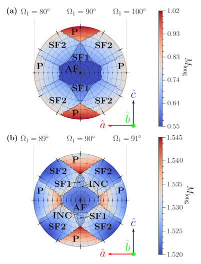
<figcaption class="paper-figure-caption"><b>Fig 9.</b> FIG. 9: Longitudinal magnetization (color-coded) as function of field direction as in Fig. 8, now covering a spherical segment near ⃗B ∥ˆb. (a): B = 2 T, for a range of 10◦tilt angle. (b): B = 5.57 T, for a range of 1◦tilt angle. Note that these images obey the point-group symmetries.</figcaption>
</figure>
<figure class="paper-figure-card">
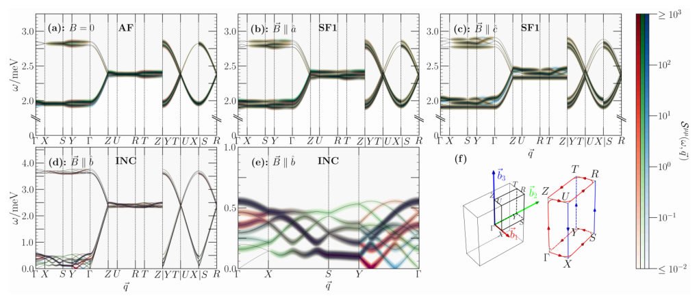
<figcaption class="paper-figure-caption"><b>Fig 10.</b> FIG. 10: Dynamical structure factor Sµν(⃗q, ω) for selected phases and fields, computed for the intra-chain couplings of [28] and JH,l = 0.05 meV and α = 0.6. The δ peaks were broadened into Gaussians with a width of η = 0.01 meV; the intensity of the diagonal components Sµµ is shown in a logarithmic color scale. (a): AF for B = 0. (b): SF1 for ⃗B ∥ˆa and B = 0.170 T. (c): SF1 for ⃗B ∥ˆc and B = 0.246 T. (d,e): INC for ⃗B ∥ˆb and B = 5.72 T, with (e) showing at low-energy zoom. (f): First Brillouin zone for the orthorhombic crystal system, together the path used to plot the excitation spectra [57]; note that this path consists of a connected piece (red) and disconnected ones (blue).</figcaption>
</figure>

**Main problem.** The study aims to understand the complex 3D magnetic phase diagram of CoNb2O6, specifically how the interplay of frustrated inter-chain coupling and spin-orbit coupling drives various field-induced phases.

**Main result.** The authors identify six distinct field-driven phases (including commensurate, incommensurate, and spin-flip phases) and demonstrate that the phase diagram is extremely sensitive to even minute changes in the applied magnetic field direction.

**Method.** Semiclassical techniques and linear spin-wave theory are used at zero temperature to map the phase diagram and compute magnetic excitation spectra.

**Summary.** This paper investigates the magnetic properties of the material CoNb2O6 using a 3D twisted Kitaev model. It explores how the competition between frustrated inter-chain interactions and spin-orbit coupling leads to a complex variety of magnetic phases. The study reveals that the phase sequence is highly sensitive to the angle of the applied magnetic field. The theoretical results, including magnetization and excitation spectra, are shown to be in good agreement with existing experimental observations.

Detailed structure

**Model / system.** A 3D twisted Kitaev model for the magnetic insulator CoNb2O6, featuring Co2+ ions in zigzag chains with bond-dependent Ising interactions, frustrated inter-chain Heisenberg coupling, and an anisotropic g-tensor.

**Key observables.** Longitudinal and transverse magnetization, magnetic excitation spectra (magnon dispersion), dynamical structure factor, and magnetic Bragg peaks.

**Important parameters / regimes.** Inter-chain coupling strength (J_H,l), lattice distortion parameter (alpha), magnetic field magnitude and direction (theta, phi), and Kitaev coupling (K).

**Assumptions / limitations.** The system is treated as an effective spin-1/2 model; dipole-dipole interactions are neglected; semiclassical spin-wave theory requires a manual rescaling of transverse field components to correct for the Ising limit.

**Figures summary.** Figure 1 shows the crystal structure; Figure 2 illustrates the twisted Kitaev chain; Figure 3 displays model ground states and spin structure factors; Figure 4 shows phase diagrams; Figures 8-10 present magnetization and dynamical structure factor results.

**Paper structure.** The paper begins by defining the 3D twisted Kitaev model and its Hamiltonian, proceeds to describe the semiclassical and spin-wave methods, presents the mapping of the field-driven phase diagram, compares results to experimental data, and concludes with discussions on phase sensitivity and fluctuations.

Abstract

The Ising chain in a transverse field stands out as a paradigmatic example for a quantum phase transition. CoNb$_2$O$_6$ has been discussed as a material realization of this physics, but it was later realized that its magnetic exchange couplings are more complicated, taking the form of twisted Kitaev chains. Here we study a three-dimensional model for CoNb$_2$O$_6$, taking into account both Kitaev physics and frustrated inter-chain coupling, in applied magnetic field. Using semiclassical techniques at zero temperature, we map out the sequence of field-driven phases for arbitrary field direction; these include phases with commensurate and incommensurate inter-chain order. As a result of spin-orbit coupling, the phase diagram is extremely sensitive to small changes in the field angle. We compute static observables as well as magnetic excitation spectra in the various phases and connect our results to existing experimental data.

[↑ back to top](#top)

### [Fusion of light nuclei in a multicluster realization of the three-body problem](http://arxiv.org/abs/2604.22537v1)

**Authors:** Mikhail Egorov  
**Type:** theory · **Category:** other · **PDF:** <https://arxiv.org/pdf/2604.22537v1>  
**Analysis basis:** full PDF text, analyzed in chunks

↔ Scroll figures horizontally

<figure class="paper-figure-card">
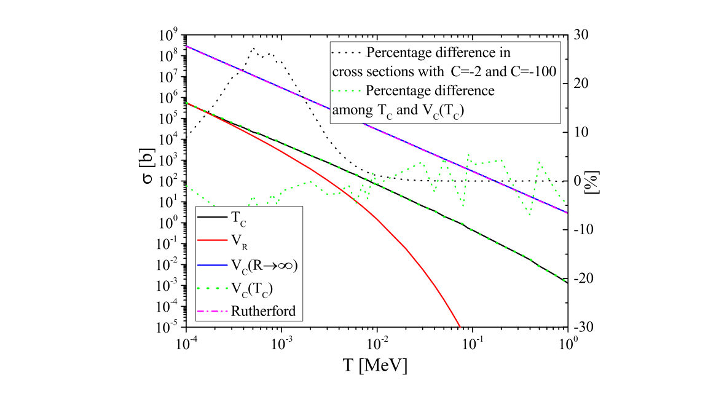
<figcaption class="paper-figure-caption"><b>Fig 1.</b> Figure 4.1: Total cross section for Coulomb DT scattering. Rutherford scattering (magenta dash-dotted line) is compared with contributions from the screened Coulomb potential VR and the unscreened Coulomb potential VC (in the limit R →∞). Calculations for the Coulomb TC-matrix (3.0.7) and the Coulomb potential VC(TC) (obtained from the solution of equation (4.1.1)) are also presented. The right-hand scale shows the relative deviations (in percentages) between calculations performed with significantly different constants C for the screening radius (3.0.5).</figcaption>
</figure>
<figure class="paper-figure-card">
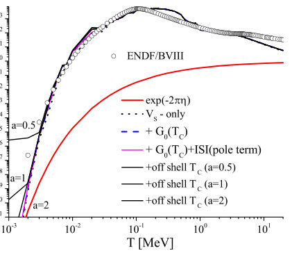
<figcaption class="paper-figure-caption"><b>Fig 2.</b> Figure 4.2: Left: Relative percentage contributions to the total cross section for elastic DT scattering and the T(D, n)4He reaction with a non-zero short-range interaction VS (2.3.1), accounting for the Coulomb perturbation of the short-range resolvent G0(TC), and with an additional inclusion of the pole contribution (3.0.13) from the initial state interaction. Right: Total cross section for the T(D, n)4He reaction obtained in this work with various Coulomb contributions, including estimates of off-shell Coulomb effects using formula (3.0.14), compared with evaluated nuclear data from the ENDF library [49].</figcaption>
</figure>
<figure class="paper-figure-card">
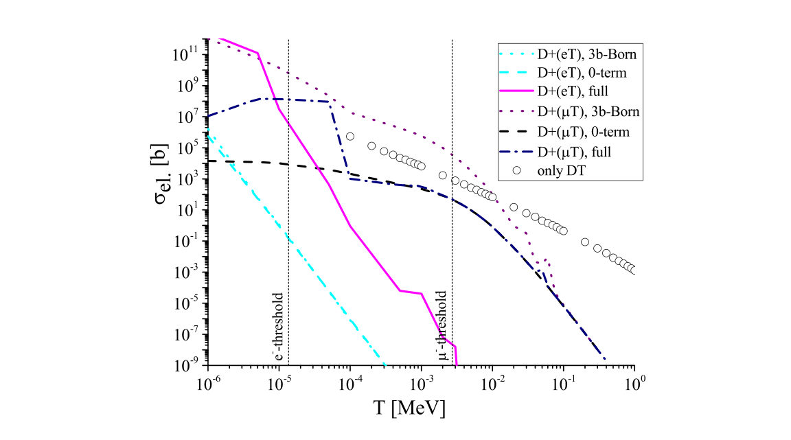
<figcaption class="paper-figure-caption"><b>Fig 3.</b> Figure 4.3: Total cross section for the elastic Coulomb scattering of deuterons by eT and µT atoms in the three-body Born approximation (3b-Born using formula (4.1.2)) and according to formula (2.2.4) (full), including the case where integral terms are neglected (0-term). For com- parison, pure Coulomb DT scattering calculations are presented, and the ionization thresholds for the electron (eT) and muonic (µT) atoms are indicated by short vertical dashes for clarity.</figcaption>
</figure>
<figure class="paper-figure-card">
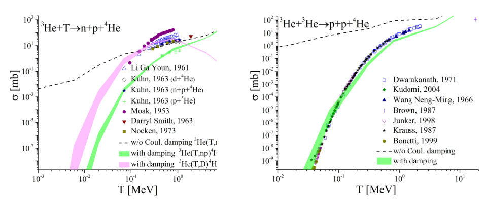
<figcaption class="paper-figure-caption"><b>Fig 4.</b> Figure 4.4: Left panel: Total cross sections for the reactions 3He(T, np)4He and 3He(T, D)4He obtained without considering Coulomb repulsion (dashed line for the 3He(T, np)4He process) and with Coulomb repulsion taken into account, where results were obtained both by employing the Gamow factor (lower bound of the shaded area) and by using the square of function (3.0.1) with a non-trivial angular dependence and a screening radius r ≡R from formula (3.0.5). Experimental data are from [50, 51, 52, 53, 54] Right panel: Analogous calculations of the total cross section for the 3He(3He, 2p)4He reaction. Experimental data are from [55, 56, 57, 58, 59, 60, 61].</figcaption>
</figure>
<figure class="paper-figure-card">
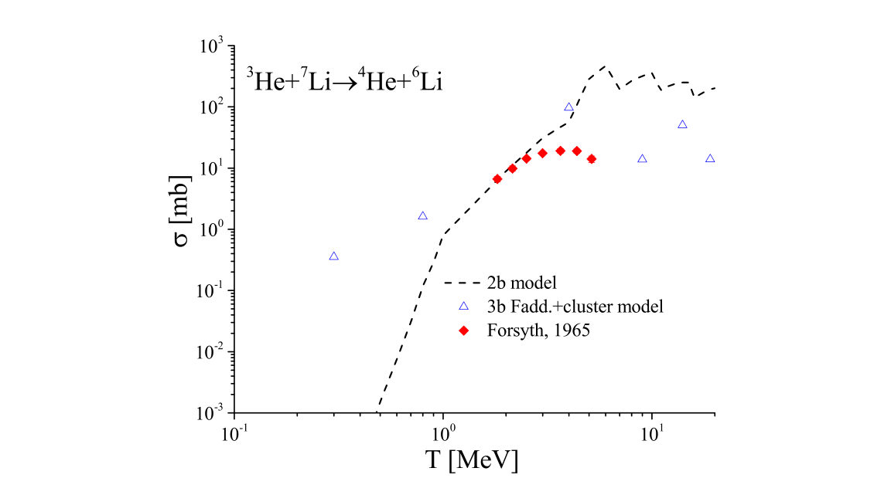
<figcaption class="paper-figure-caption"><b>Fig 5.</b> Figure 4.5: Total cross section for the 7Li(3He, 4He)6Li reaction, calculated using two-channel coupled Lippmann-Schwinger equations (2.3.4) and based on three-body Faddeev dynamics with the target nucleus represented as a 4He −T cluster system in a JP = 3/2−state in the L = 1 partial wave. Experimental data for the ground state of 6Li are from [40].</figcaption>
</figure>

**Main problem.** Determining total cross sections for fusion and breakup reactions of light nuclei while accurately accounting for long-range Coulomb interactions and electron anti-screening effects.

**Main result.** The multicluster approach provides total cross sections for various helium and lithium fusion reactions that are in good agreement with experimental data, specifically demonstrating the importance of the cluster mechanism and Coulomb effects.

**Method.** The work employs Faddeev integral equations in momentum space using a two-potential method to handle the Coulomb t-matrix and a cluster representation for the colliding nuclei.

**Summary.** This paper presents a theoretical framework using Faddeev integral equations to calculate fusion and breakup cross sections for light nuclei. By using a multicluster model, the author accounts for the internal structure of the colliding nuclei and the complex long-range Coulomb interactions. The results show strong agreement with existing experimental data for various helium and lithium reactions. The study also investigates the impact of atomic electron anti-screening on these nuclear processes.

Detailed structure

**Model / system.** A multicluster realization of the three-body problem involving light nuclei such as 3He, T, D, 4He, and 7Li, where nuclei are treated as bound clusters of nucleons.

**Key observables.** Total cross sections, astrophysical S-factors, breakup amplitudes, and Coulomb t-matrix off-shell effects.

**Important parameters / regimes.** Kinetic energy range T in [1 keV, 20 MeV], Coulomb screening radius, and Sommerfeld parameter.

**Assumptions / limitations.** The calculation uses a truncated iteration of the Faddeev equations (up to n=2) and assumes specific cluster structures for the projectile and target nuclei.

**Figures summary.** The notes mention a Figure 4, but a full summary of all figures is not available from the provided text.

**Paper structure.** The paper progresses from the theoretical necessity of Faddeev equations to the implementation of the multicluster model, followed by the treatment of Coulomb effects and the presentation of calculated cross sections compared to experimental data.

Abstract

This work describes a few-body dynamics method based on the Faddeev integral equations in momentum space for determining the total cross sections of fusion and breakup reactions with two- and three-body final channels in the continuum, employing a cluster representation of the colliding nuclei. Total cross sections were obtained for the reactions $^3\text{He}(T,D)^4\text{He}$, $^3\text{He}(T,np)^4\text{He}$, $^3\text{He}(T,nD)^3\text{He}$, $^3\text{He}(^3\text{He},2p)^4\text{He}$, $^3\text{He}(^3\text{He},pD)^3\text{He}$, $^7\text{Li}(^3\text{He},\phantom{0}^4\text{He})^6\text{Li}$, $^7\text{Li}(^3\text{He},D^4\text{He})^4\text{He}$, and $^7\text{Li}(^3\text{He},T^3\text{He})^4\text{He}$, in which both the projectile and the target nucleus were treated in a cluster representation. The work also implements a two-potential method to determine the Coulomb $t-$matrix and to account for Coulomb effects in short-range dynamics in momentum space. Calculations of the initial-state Coulomb interaction were performed; furthermore, an estimate was obtained for the magnitude of the off-shell effect of the Coulomb $t-$matrix, as well as the magnitude of the atomic electron anti-screening effect on the Coulomb interaction of the colliding nuclei. The calculated contribution of the cluster mechanism to the total cross section of the considered fusion reactions in the kinetic energy range $T\in[1~\text{keV},20~\text{MeV}]$ is in good agreement with known experimental data.

[↑ back to top](#top)

### [Long-Range Correlated Random Matrices](http://arxiv.org/abs/2604.22447v1)

**Authors:** Abbas Ali Saberi, Roderich Moessner  
**Type:** theory · **Category:** statistical mechanics · **PDF:** <https://arxiv.org/pdf/2604.22447v1>  
**Analysis basis:** full PDF text, analyzed in chunks

↔ Scroll figures horizontally

<figure class="paper-figure-card">
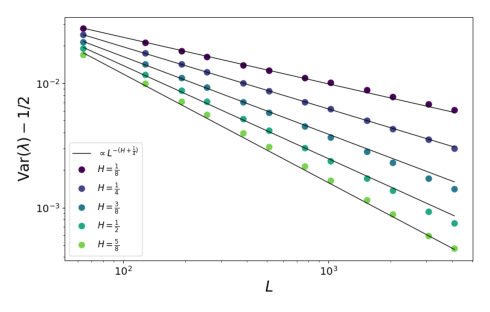
<figcaption class="paper-figure-caption"><b>Fig 1.</b> FIG. 1. Numerical simulations of the variance of eigenvalues as a function of L for H = 1 8, 1</figcaption>
</figure>
<figure class="paper-figure-card">
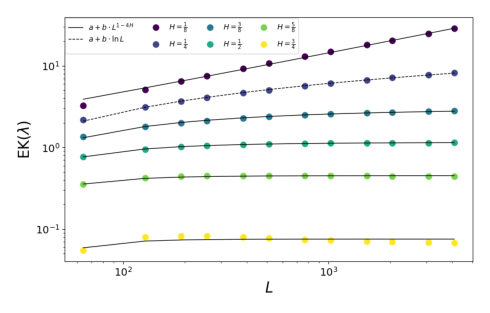
<figcaption class="paper-figure-caption"><b>Fig 2.</b> FIG. 2. Numerical simulations of the excess kurtosis (EK) as a function of L for H = 1 8, 1</figcaption>
</figure>
<figure class="paper-figure-card">
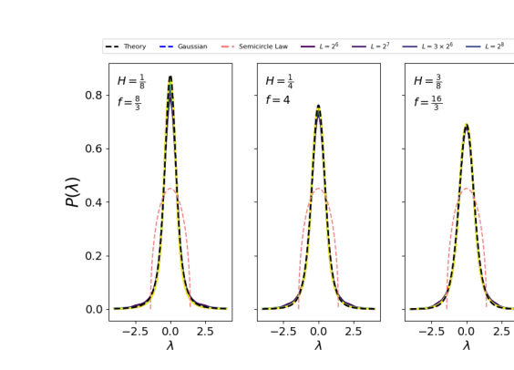
<figcaption class="paper-figure-caption"><b>Fig 3.</b> FIG. 3. Probability density function P(λ) of scaled eigenvalues for H = 1</figcaption>
</figure>

**Main problem.** Investigating how long-range algebraic correlations between matrix elements affect the eigenvalue statistics and spectral density of random matrices.

**Main result.** The study identifies a critical threshold at H = 3/4 where the spectral density transitions from heavy-tailed generalized t-distributions to Gaussian statistics, and a rigidity threshold at H = 1/2.

**Method.** Analytical scaling analysis of eigenvalue moments and Wick-type decomposition of the trace of M^4, supported by extensive numerical simulations.

**Summary.** This paper explores how power-law correlations in random matrix elements alter their spectral properties. It identifies a phase transition at a critical exponent H = 3/4, where the eigenvalue distribution shifts from heavy-tailed distributions to Gaussian statistics. The authors also uncover a secondary threshold at H = 1/2 that affects spectral rigidity. These findings provide a new framework for understanding universality in non-invariant, spatially embedded random matrix ensembles.

Detailed structure

**Model / system.** A symmetric random matrix ensemble where elements are generated via a thresholded Gaussian random field on a 2D square lattice with power-law correlations decaying as r^-2H.

**Key observables.** Spectral density P(lambda), eigenvalue variance, excess kurtosis, and the scaled average of the maximum eigenvalue.

**Important parameters / regimes.** The correlation exponent H, which defines different regimes: 0 <= H <= 1/4 (divergent kurtosis), 1/4 < H < 3/4 (finite positive kurtosis), H = 3/4 (Gaussian transition), and H > 3/4 (standard RMT/semicircle law).

**Assumptions / limitations.** The underlying Gaussian field is zero-mean, and the nonlinear thresholding process preserves the long-range correlation structure of the original field.

**Figures summary.** Figure 1 shows eigenvalue variance scaling with L; Figure 2 shows excess kurtosis scaling with L; Figure 3 shows the probability density function P(lambda) demonstrating data collapse and agreement with analytical predictions.

**Paper structure.** The paper moves from the construction of the correlated matrix model to the derivation of scaling laws for moments, identifies specific critical regimes for the exponent H, and concludes with numerical verification of the spectral transitions.

Abstract

Motivated by the importance ascribed to correlations in random matrices used to model phenomena in various scientific disciplines, we report how algebraic correlations between matrix elements affect the eigenvalue statistics and spectral density of random matrices. These correlations, introduced through a long-range correlated percolation model, decay as a power law $\propto r^{-2H}$, with exponent $H > 0$. As $H$ varies, both the eigenvalue distribution and excess kurtosis undergo qualitative changes. At the threshold $H_c = 3/4$, characterized by emergent Gaussian statistics, a sign change in excess kurtosis marks a transition from a fat-tailed generalized $t$-distribution to one that gradually approaches the standard semicircle law for $H \gg H_c$. Our analytical results, based on scaling analysis and supported by extensive numerical simulations, provide clear predictions and uncover novel spectral regimes in random matrix theory. Our results connect techniques from statistical physics, percolation theory, and random matrix analysis, offering a new perspective on universality in correlated ensembles.

[↑ back to top](#top)

### [Quantum analog-encoding for correlated Gaussian vectors and their exponentiation with application to rough volatility](http://arxiv.org/abs/2604.22463v1)

**Authors:** Tassa Thaksakronwong, Koichi Miyamoto  
**Type:** theory · **Category:** quantum information and computing · **PDF:** <https://arxiv.org/pdf/2604.22463v1>  
**Analysis basis:** full PDF text, analyzed in chunks

↔ Scroll figures horizontally

<figure class="paper-figure-card">
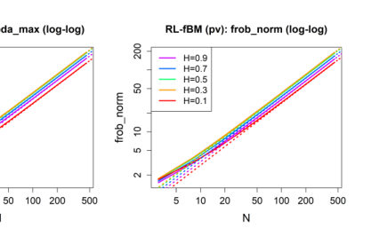
<figcaption class="paper-figure-caption"><b>Fig 1.</b> Figure 1: Characteristics of a Riemann-Liouville fBM covariance matrix of path values</figcaption>
</figure>
<figure class="paper-figure-card">
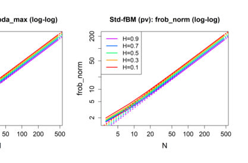
<figcaption class="paper-figure-caption"><b>Fig 2.</b> Figure 2: Characteristics of a standard fBM covariance matrix of path values</figcaption>
</figure>
<figure class="paper-figure-card">
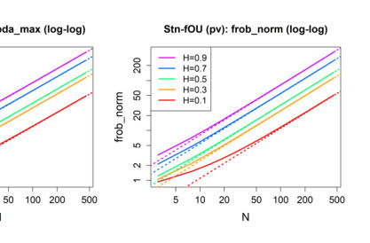
<figcaption class="paper-figure-caption"><b>Fig 3.</b> Figure 3: Characteristics of a stationary fOU covariance matrix of path values</figcaption>
</figure>
<figure class="paper-figure-card">
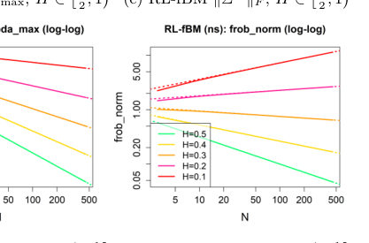
<figcaption class="paper-figure-caption"><b>Fig 4.</b> Figure 4: Characteristics of Riemann-Liouville fBM covariance matrix of increments</figcaption>
</figure>
<figure class="paper-figure-card">
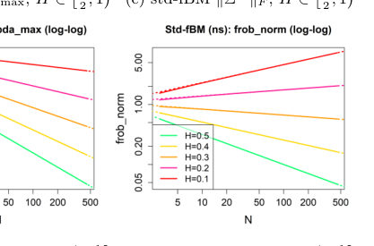
<figcaption class="paper-figure-caption"><b>Fig 5.</b> Figure 5: Characteristics of standard fBM covariance matrix of increments</figcaption>
</figure>
<figure class="paper-figure-card">
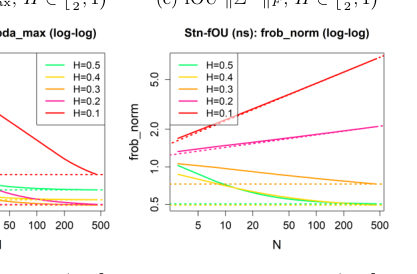
<figcaption class="paper-figure-caption"><b>Fig 6.</b> Figure 6: Characteristics of stationary fOU covariance matrix of increments</figcaption>
</figure>
<figure class="paper-figure-card">
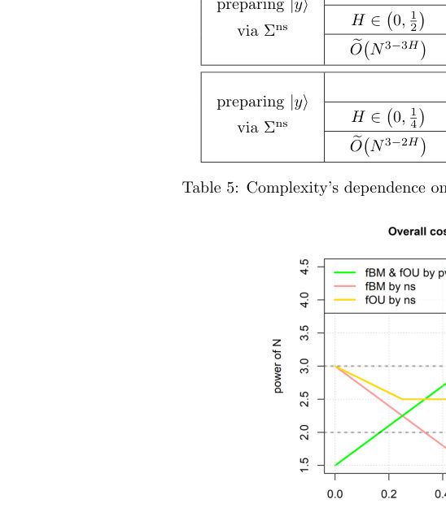
<figcaption class="paper-figure-caption"><b>Fig 7.</b> Figure 7: Comparison of overall cost required, when simulate using Σpv v.s. Σns</figcaption>
</figure>

**Main problem.** Developing efficient quantum algorithms for the exact simulation and amplitude encoding of correlated Gaussian random vectors and their exponentiated forms, specifically for applications in rough volatility modeling.

**Main result.** The authors propose a quantum algorithmic framework that achieves sub-cubic complexity for preparing exponentiated Gaussian processes, providing a potential quantum advantage over classical Cholesky-based sampling methods.

**Method.** The approach utilizes block-encoding, Quantum Singular Value Transformation (QSVT), and Quantum Amplitude Estimation (QAE) to prepare and manipulate quantum states representing Gaussian paths.

**Summary.** This paper presents a new quantum algorithmic framework for the amplitude encoding of correlated Gaussian vectors and their exponentiated versions. By using techniques like block-encoding and QSVT, the authors demonstrate that quantum computers can potentially simulate complex Gaussian processes, such as fractional Brownian motion, with sub-cubic complexity. This provides a foundational primitive for quantum-enhanced financial modeling, specifically for rough volatility models like the rough Bergomi process. The work bridges quantum computing primitives with high-dimensional stochastic processes used in quantitative finance.

Detailed structure

**Model / system.** The mathematical models include multivariate Gaussian distributions, Riemann-Liouville fractional Brownian motion, and stationary fractional Ornstein-Uhlenbeck processes, applied to the rough Bergomi financial volatility model.

**Key observables.** Integrated variance, integrated volatility, and the norm of the prepared Gaussian vectors.

**Important parameters / regimes.** Hurst index (H), Frobenius norm of the covariance matrix, condition number (kappa), and maximal eigenvalue (lambda_max).

**Assumptions / limitations.** Assumes the availability of an efficient O(polylog N) quantum data loader for the covariance matrix and that eigenvalue/condition number estimates are available within bounded factors.

**Paper structure.** The paper introduces the problem of Gaussian vector simulation, develops the block-encoding and state preparation algorithms, provides a resource and complexity analysis, applies the framework to rough volatility models (rBergomi), and concludes with mathematical proofs for the covariance structures in the appendix.

Abstract

Quantum computing may speed up numerical problems involving large matrices that are demanding for classical computers, and active research on this possibility is ongoing. In this work, we propose quantum algorithms for the exact simulation of a normalised correlated Gaussian random vector $|x\rangle=\vec{x}/\lVert\vec{x}\rVert$, $\vec{x}\sim\mathcal{N}(0,Σ)$, and its exponentiation $|e^{\vec{x}} \rangle= e^{\vec{x}}/\lVert e^{\vec{x}}\rVert$. When an $O(\mathrm{polylog} N)$-gate-depth quantum data loader for the covariance matrix $Σ\in\mathbb{R}^{N\times N}$ is available, preparing $|x\rangle$ and $|e^{\vec{x}}\rangle$ require $\widetilde{O}\left(\frac{\lVertΣ\rVert_F}{λ_{\max}}κ^{1.5}\right)$ and $\widetilde{O}\left(\lVert\vec{x}\rVert\frac{\lVertΣ\rVert_F}{λ_{\max}}κ^{1.5}\right)$ elementary gate depth respectively, where $\lVertΣ\rVert_F$, $λ_{\max}$, $κ$ denote the Frobenius norm, maximal eigenvalue, and condition number of $Σ$. Motivated by financial applications, we provide an end-to-end resource analysis when $\vec{x}$ represents a sample path of a Riemann-Liouville or standard fractional Brownian motion, or of a stationary fractional Ornstein-Uhlenbeck process. As a concrete example, we construct the quantum state encoding the rough Bergomi variance process and analyse the extraction of the integrated variance via quantum amplitude estimation. Under specific conditions, the dependence of $\lVertΣ\rVert_F/λ_{\max}$ and $κ$ on $N$ is small, and subcubic complexity in $N$ is achieved, indicating a quantum advantage over classical Cholesky-based sampling methods. To our knowledge, this constitutes the first quantum algorithmic framework for the amplitude encoding of exponentiated Gaussian processes, providing foundational primitives for quantum-enhanced financial modelling.

[↑ back to top](#top)

### [Quantum Circuit Partitioning For Effective Utilization of Quantum Resources](http://arxiv.org/abs/2604.22664v1)

**Authors:** Connor Howe, Cristina Radian, Justin Woodring, Vardaan Sahgal, Brian J. McDermott  
**Type:** both · **Category:** quantum information and computing · **PDF:** <https://arxiv.org/pdf/2604.22664v1>  
**Analysis basis:** full PDF text, analyzed in chunks

↔ Scroll figures horizontally

<figure class="paper-figure-card">
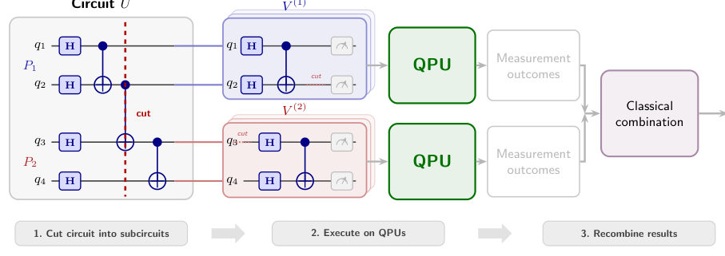
<figcaption class="paper-figure-caption"><b>Fig 1.</b> Fig. 1: Quantum circuit cutting workflow. A circuit is partitioned into smaller subcircuits at selected cut locations, executed independently on available quantum processing units (QPUs), and recombined via classical post-processing to reconstruct the original circuit output.</figcaption>
</figure>
<figure class="paper-figure-card">
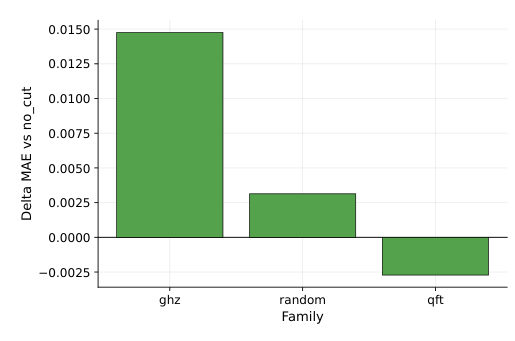
<figcaption class="paper-figure-caption"><b>Fig 2.</b> Fig. 3: Family-level ∆MAE for fitv3 relative to the no-cut baseline across all three circuit families. Positive values indi- cate worse performance than direct execution, while negative values indicate improvement.</figcaption>
</figure>
<figure class="paper-figure-card">
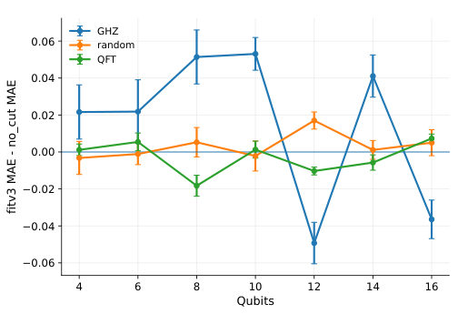
<figcaption class="paper-figure-caption"><b>Fig 3.</b> Fig. 4: Difference in MAE between fitv3 and the no-cut baseline as a function of qubit count for each circuit family.</figcaption>
</figure>
<figure class="paper-figure-card">
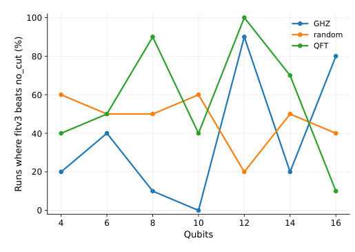
<figcaption class="paper-figure-caption"><b>Fig 4.</b> Fig. 5: Fraction of repeated runs for which fitv3 achieves lower MAE than the no-cut baseline as a function of qubit count for each circuit family.</figcaption>
</figure>

**Main problem.** The difficulty of executing large, high-performance quantum circuits on NISQ hardware due to high error rates and limited qubit counts, specifically identifying which circuit classes benefit most from circuit partitioning.

**Main result.** The custom 'fitv3' heuristic can reduce error by up to 55% and improve fidelity for GHZ circuits, though partitioning can degrade performance for brickwork circuits at larger scales.

**Method.** A comparison of three strategies: a no-cut baseline, Qiskit's automatic cut-finding, and a custom budget-aware heuristic (fitv3) using a DAG-to-weighted-graph transformation and hardware-aware qubit mapping.

**Summary.** This paper investigates quantum circuit partitioning (circuit cutting) as a way to run large circuits on small, noisy quantum hardware. The authors propose a new, budget-aware heuristic called 'fitv3' that optimizes the trade-off between error reduction and the exponential sampling overhead of reconstruction. They demonstrate that while partitioning is not a universal solution, it significantly improves fidelity for specific structured circuits like GHZ and QFT. The work provides a practical framework for utilizing distributed quantum computing resources more effectively.

Detailed structure

**Model / system.** Noisy simulation using Qiskit Aer, modeled after the IBM 'ibm_brisbane' superconducting hardware profile, testing circuit families including GHZ, QFT, brickwork, and random circuits.

**Key observables.** Mean Absolute Error (MAE) of expectation values and overall output fidelity, specifically for z_magnetization and GHZ stabilizers.

**Important parameters / regimes.** Circuit sizes ranging from 4 to 16 qubits, maximum subcircuit width of 4 qubits, and a maximum sampling overhead cap of 10^8.

**Assumptions / limitations.** The evaluation assumes a static snapshot of hardware calibration data and focuses on wire cuts rather than gate cuts.

**Figures summary.** Figure 1 shows the circuit cutting workflow; Figure 2 compares MAE across different strategies; Figure 5 shows the 'win-rate' of the custom method against the baseline as a function of qubit count.

**Paper structure.** The paper introduces the problem of hardware constraints, reviews existing circuit cutting literature, presents the proposed fitv3 heuristic and integrated pipeline, details the simulation setup and circuit families, presents comparative results across different metrics, and concludes with limitations and future work.

Abstract

Near-term hardware is constrained by high error rates, small qubit counts, and relatively low output fidelity, making the execution of large, high performance quantum circuits difficult. Circuit partitioning (or circuit cutting) has emerged as a promising approach to circumvent these limitations by decomposing circuits into smaller subcircuits at two-qubit interaction points. However, it remains unclear which classes of circuits benefit the most from partitioning and under what hardware conditions it is most effective. In this work, we evaluate the suitability of quantum circuits for partitioning from three perspectives: improving fidelity, enabling distributed execution, and scaling to larger circuit sizes. Specifically, we compare uncut circuit execution against two circuit partitioning approaches: Qiskit's automatic cut finding technique and a custom performance optimized circuit cutting method. We also measure these across GHZ, QFT, brickwork, and random quantum circuits ranging from 4 to 14 qubits, using mean absolute error of expectation values and overall output fidelity. Our results show that partitioning benefits larger, highly interconnected circuits, with our custom method reducing error by up to 55\% and improve fidelity for GHZ circuits, but degrading performance for brickwork circuits at larger scales.

[↑ back to top](#top)

### [The antiferromagnetic Chern insulator phase in the Kane-Mele-Hubbard model](http://arxiv.org/abs/2604.22329v1)

**Authors:** Bao-Qing Wang, Can Shao, Takami Tohyama, Hong-Gang Luo, Hantao Lu  
**Type:** theory · **Category:** strongly correlated electrons · **PDF:** <https://arxiv.org/pdf/2604.22329v1>  
**Analysis basis:** full PDF text, analyzed in chunks

↔ Scroll figures horizontally

<figure class="paper-figure-card">
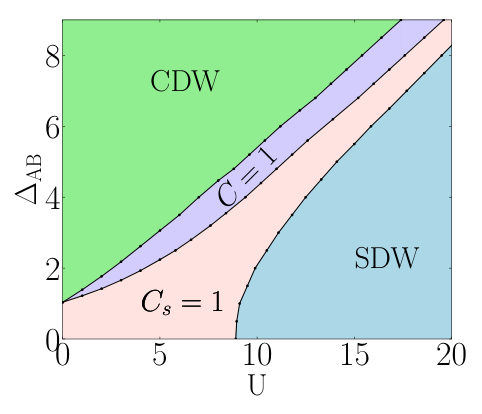
<figcaption class="paper-figure-caption"><b>Fig 1.</b> FIG. 1. ED Phase diagram of the KMH model (1) in the (U, ∆AB) plane with fixed t2 = 0.2.</figcaption>
</figure>
<figure class="paper-figure-card">
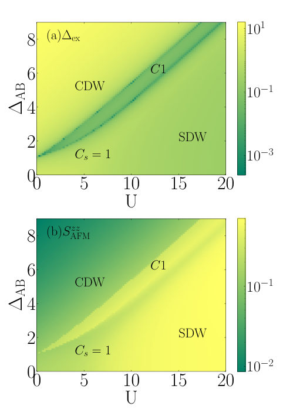
<figcaption class="paper-figure-caption"><b>Fig 2.</b> FIG. 2. Contour plots of (a) the excitation gap ∆ex and (b) the z-component of the AFM structure factor Szz AFM, shown as functions of the Hubbard interaction U and the sublattice potential ∆AB.</figcaption>
</figure>
<figure class="paper-figure-card">
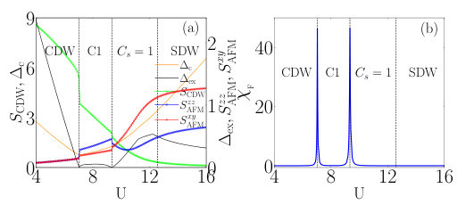
<figcaption class="paper-figure-caption"><b>Fig 3.</b> FIG. 3. (a) CDW and SDW structure factors, SCDW, Szz AFM, and Sxy AFM, along with the excitation gap ∆ex and the single- particle charge gap ∆c. (b) Fidelity susceptibility χF with respect to twisted boundary conditions. All quantities are plotted as functions of U at fixed ∆AB = 4.0. The dashed vertical lines mark the phase boundaries determined from the topological invariant calculations.</figcaption>
</figure>
<figure class="paper-figure-card">
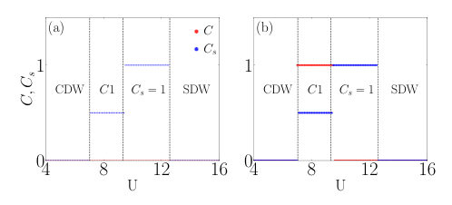
<figcaption class="paper-figure-caption"><b>Fig 4.</b> FIG. 4. Evaluation of the Chern number C and spin Chern number Cs as functions of U at fixed ∆AB = 4.0. Panel (a) shows the results obtained using conventional methods, while panel (b) presents those obtained with the modified algorithm described in the text.</figcaption>
</figure>
<figure class="paper-figure-card">
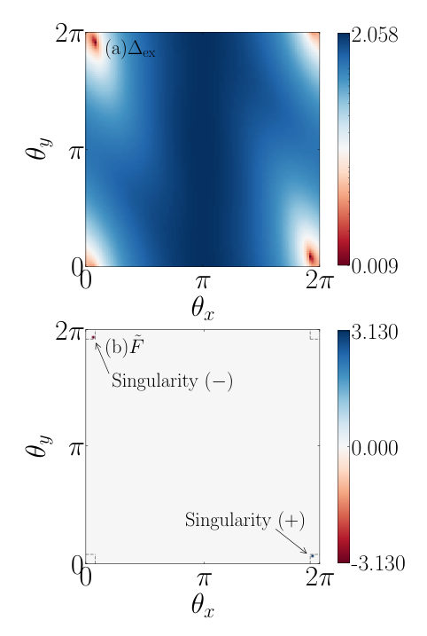
<figcaption class="paper-figure-caption"><b>Fig 5.</b> FIG. 5. (a) Excitation gap ∆ex and (b) lattice field strength ˜F [Eq. (12)] as functions of twist angles (θx, θy) under spin- independent TBCs. Dashed boundaries in (b) denote the swap region, where the Berry curvature is evaluated using the first exited state of ˆH(θ) instead of the ground state. See the main text for details. Parameters: ∆AB = 4.0 and U = 8.0.</figcaption>
</figure>
<figure class="paper-figure-card">
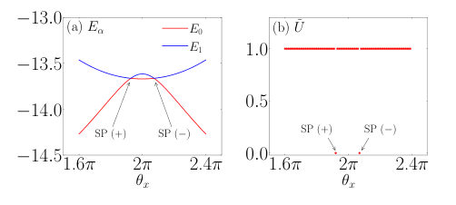
<figcaption class="paper-figure-caption"><b>Fig 6.</b> FIG. 6. (a) Ground-state energy E0 and first excitation en- ergy E1, and (b) magnitude of the unnormalized U(1) link ˜U, defined as ˜U (θℓ, δθℓ) = |⟨Ψ (θℓ) |Ψ (θℓ+ δθℓ)⟩|, plotted as functions of θx along the antidiagonal line in θ space. “SP” denotes a singular point. Parameters: ∆AB = 4.0 and U = 8.0.</figcaption>
</figure>
<figure class="paper-figure-card">
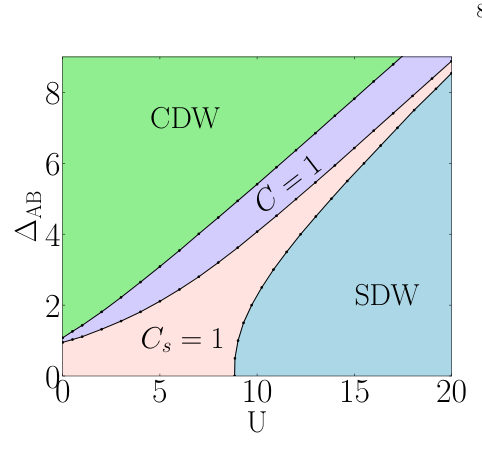
<figcaption class="paper-figure-caption"><b>Fig 7.</b> FIG. 7. ED phase diagram of the KMH Hamiltonian (1) with mass imbalance δ = 0.1 (16). Notably, without in- teraction (U = 0), the C = 1 phase appears in the range ∆AB ∈[0.95, 1.08].</figcaption>
</figure>
<figure class="paper-figure-card">
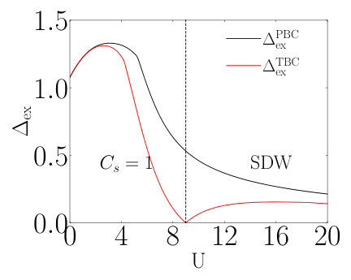
<figcaption class="paper-figure-caption"><b>Fig 8.</b> FIG. 9. Evolution of the excitation gaps as functions of U under PBC and spin-dependent TBCs (10), denoted by ∆PBC ex and ∆TBC ex , respectively. The values of ∆TBC ex are obtained as the minimum excitation gap over the entire θ space. The sublattice potential is fixed at ∆AB = 0.5.</figcaption>
</figure>
<figure class="paper-figure-card">
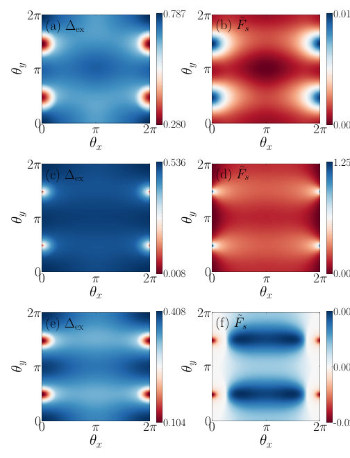
<figcaption class="paper-figure-caption"><b>Fig 9.</b> FIG. 8. Excitation gap ∆ex and lattice field strength ˜Fs as functions of the twisted angles (θx, θy) under spin-dependent TBCs (10), with sublattice potential fixed at ∆AB = 0.5. (a,b) Results at U = 7.0 (QSH phase); (c,d) U = 8.95 (near the phase boundary); (e,f) U = 11.0 (SDW phase). Calcula- tions are performed on a 100 × 100 grid in θ space.</figcaption>
</figure>
<figure class="paper-figure-card">
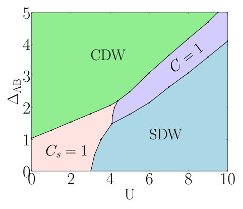
<figcaption class="paper-figure-caption"><b>Fig 10.</b> FIG. 10. MF phase diagram of the KMH model (1) in the (U, ∆AB) plane with fixed t2 = 0.2, obtained on a 30 × 30 lattice.</figcaption>
</figure>

**Main problem.** The study investigates whether an antiferromagnetic Chern insulator (AFCI) phase can emerge in the Kane-Mele-Hubbard model, addressing the controversy between previous mean-field and quantum Monte Carlo results.

**Main result.** The authors provide evidence for the existence of an AFCI phase (C=1) where Hubbard-induced antiferromagnetic perturbations spontaneously break time-reversal symmetry, and they propose a modified numerical scheme to accurately calculate the quantized Chern number.

**Method.** The study uses Exact Diagonalization (ED) on a 12A cluster, Twisted Boundary Conditions (TBC) to evaluate topological invariants, and Mean-Field theory to provide physical insight into the effective Dirac masses.

**Summary.** This paper investigates the emergence of an antiferromagnetic Chern insulator phase in the Kane-Mele-Hubbard model. By using exact diagonalization and a new computational scheme to handle level crossings, the authors demonstrate that Hubbard interactions can drive a transition that breaks time-reversal symmetry. The results resolve long-standing discrepancies in the literature regarding the stability of this phase. This work is significant for understanding how electron correlations can induce topological transitions in systems with intrinsic spin-orbit coupling.

Detailed structure

**Model / system.** The Kane-Mele-Hubbard (KMH) model on a honeycomb lattice at half-filling, including nearest-neighbor hopping, intrinsic spin-orbit coupling, a staggered sublattice potential, and onsite repulsive Hubbard interaction.

**Key observables.** Chern number (C), spin Chern number (Cs), excitation gap, fidelity susceptibility, and spin-density-wave (SDW) and charge-density-wave (CDW) structure factors.

**Important parameters / regimes.** Hubbard interaction strength (U), sublattice potential (Delta_AB), and intrinsic spin-orbit coupling strength (t2).

**Assumptions / limitations.** The study is limited by finite-size effects inherent to Exact Diagonalization on small clusters.

**Figures summary.** Figure 1 shows the ED phase diagram; Figure 2 displays the excitation gap and topological transitions; Figure 7 shows the phase diagram with mass imbalance; Figure 10 and 11 present Mean-Field phase diagrams and spin-resolved effective potentials.

**Paper structure.** The paper introduces the scientific problem and model, presents the ED phase diagram and identification of the AFCI phase, details a modified numerical algorithm for Chern number calculation, explores the stability of the phase under mass imbalance, and provides Mean-Field analysis for physical interpretation.

Abstract

The emergence of the antiferromagnetic (AFM) Chern insulator (AFCI) phase in the Kane-Mele-Hubbard (KMH) model with a finite sublattice potential is investigated. The AFCI, characterized by AFM correlations coexisting with quantized Hall conductance, has long raised the question of whether it can exist in the KMH model that respects time-reversal symmetry (TRS). Using exact diagonalization, we analyze the excitation gap, anisotropic AFM correlations along the $z$ axis and in the $xy$ plane, and the fidelity susceptibility under twisted boundary conditions, all of which provide consistent evidence for the AFCI phase. In particular, our numerical evaluation on the (spin) Chern number reveals a breakdown of adiabatic continuity in the twist-angle space, indicating an instability toward TRS breaking driven by Hubbard-induced AFM perturbations. A modified computational scheme is further proposed, which yields a robust quantized Chern number $C=1$ within this phase.

[↑ back to top](#top)

## Secondary cond-mat archives

*Papers from cond-mat.mtrl-sci, mes-hall, other, soft, supr-con. These archives are de-prioritized — they appear at the end regardless of relevance score.*

### Relevant in secondary archives (9)

### [Valley enhanced Rabi frequency in n-type planar Silicon-MOS quantum dot](http://arxiv.org/abs/2604.22547v1)

**Authors:** Xunyao Luo, Xander Peetroons, Tsung-Yeh Yang, Ruben M. Otxoa, Normann Mertig, Sofie Beyne, Julien Jussot, Yosuke Shimura, Clement Godfrin, Bart Raes, Roy Li, Roger Loo, Sylvain Baudot, Stefan Kubicek, Shuchi Kaushik, Danny Wan, Kristiaan De Greve, Takuma Kuno, Takeru Utsugi, Noriyuki Lee, Itaru Yanagi, Toshiyuki Mine, Satoshi Muraoka, Hideo Arimoto, Shinichi Saito, Digh Hisamoto, Ryuta Tsuchiya, Hiroyuki Mizuno, Charles Smith, Andrew Ramsay  
**Type:** experiment · **Category:** quantum information and computing · **PDF:** <https://arxiv.org/pdf/2604.22547v1>  
**Analysis basis:** full PDF text, analyzed in chunks
**Topic relevance:** 🔥 `QC/QI experiment` **4/5**

↔ Scroll figures horizontally

<figure class="paper-figure-card">
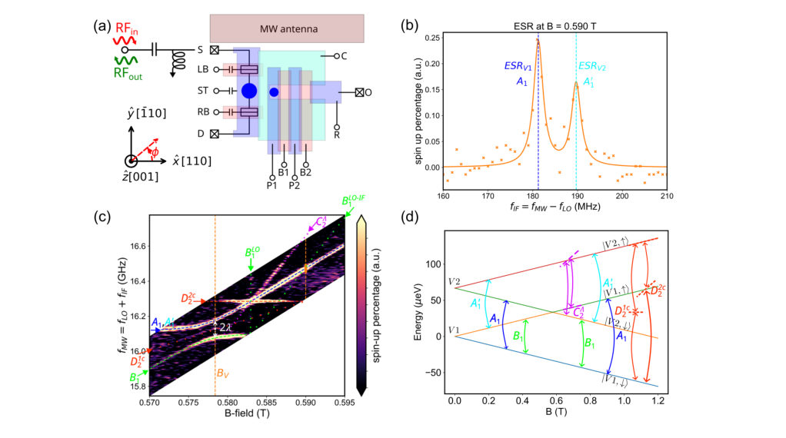
<figcaption class="paper-figure-caption"><b>Fig 1.</b> Figure 1. (a) Device schematic illustrating ESR excitation using microwave pulses applied through an aluminum antenna, with spin readout performed via the Elzerman protocol. (b) An example of ESR spectrum far from spin-valley anti-crossing. Two intra-valley spin-flip transitions (A1, A ′ 1) are observed. Due to finite electron temperature (∼120mK), imperfect initialization allows significant loading into higher energy valley |V2,↓⟩, making A′ 1 visible but weaker than A1. (c) ESR spectra as a function of magnetic field, showing a pronounced anticrossing at B = BV. The anticrossing occurs when the Zeeman energy matches the valley splitting ∆≈66µeV. The coupling strength, λ, is extracted from...</figcaption>
</figure>
<figure class="paper-figure-card">
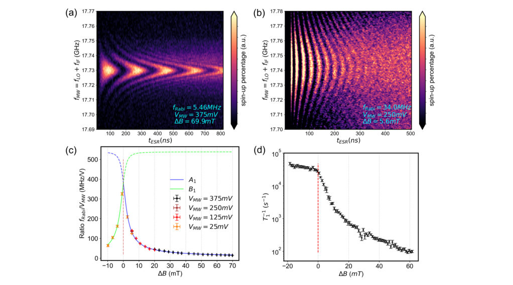
<figcaption class="paper-figure-caption"><b>Fig 2.</b> Figure 2. (a,b) Examples of Rabi chevrons at detuning ∆B = 69.9±0.01mT, MW source voltage VMW = 375mV, and 5.6±0.2 mT, 250mV, respectively. The Rabi frequency fRabi = 5.46±0.01MHz and 34.0±0.3MHz respectively. At ∆B = 2.7 mT, a lower drive is needed to time-resolve the high speed Rabi oscillation. (c) Ratio of Rabi frequency to applied MW source voltage as a function of detuning ∆B = 0.635T−BV. An enhancement is observed near the anticrossing, exceeding a factor of 20 relative to far-detuned case. (d) Measured T1 values at ∆VP1 = 30 mV, where ∆VP1 = 0 is the resonant tunneling condition, plotted against detuning ∆B = B−BV, where BV = 578 mT. The data (symbols) are extracted from exponential...</figcaption>
</figure>
<figure class="paper-figure-card">
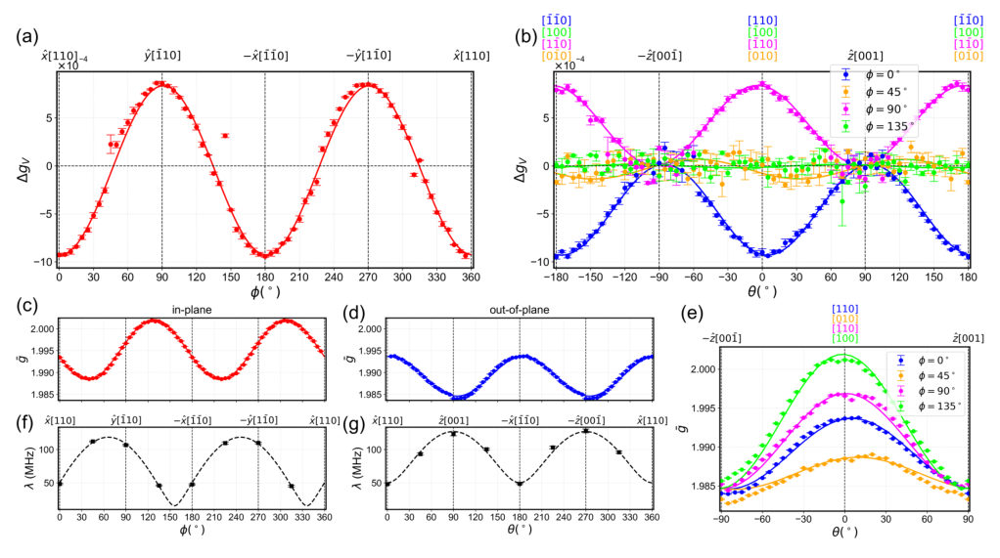
<figcaption class="paper-figure-caption"><b>Fig 3.</b> Figure 3. Anisotropy of difference in g-factor between valley states, ∆gV = |gV1|−|gV2|. (a) In-plane B-field (b) Out-of-plane B-field. ∆gV is aligned along [110]/[¯110] crystal-axes in the plane. Anisotropy of mean g-factor ¯g = (|gV1|+|gV2|)/2, for (c) In-plane B-field, (d,e) out-of-plane B-field. Modulation of mean g-factor lies in-plane, with minimum/maximum nearly aligned with [100]/[010] crystal-axes. Anisotropy of inter-valley spin coupling measured from anti-crossing, λ, in-plane (f) and out-of-plane (g) B-field. λ is consistent with a spin-valley field that lies in the plane.</figcaption>
</figure>
<figure class="paper-figure-card">
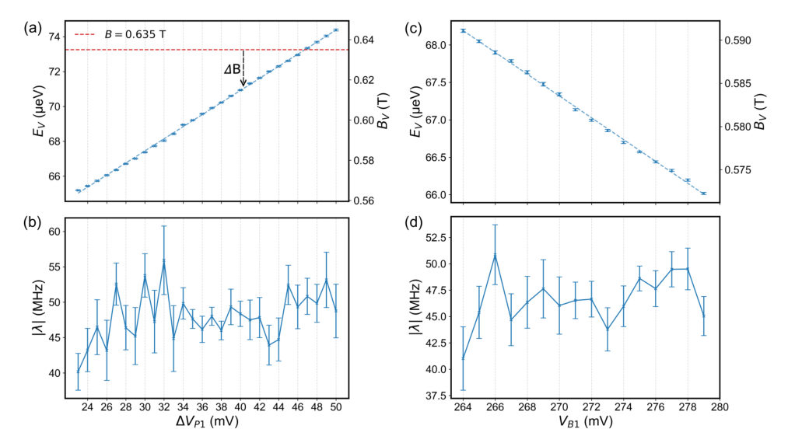
<figcaption class="paper-figure-caption"><b>Fig 4.</b> Figure 4. (a,c) Position of the anticrossing field BV as a function of the detuning of the plunger gate voltage ∆VP1 and the barrier gate voltage VB1, showing a linear dependence that reflects the tunability of the valley splitting with vertical electric field and confinement electric potential. (b,d) The dependence of the inter-valley spin coupling λ on the the plunger gate voltage ∆VP1 and the barrier gate voltage VB1.</figcaption>
</figure>
<figure class="paper-figure-card">
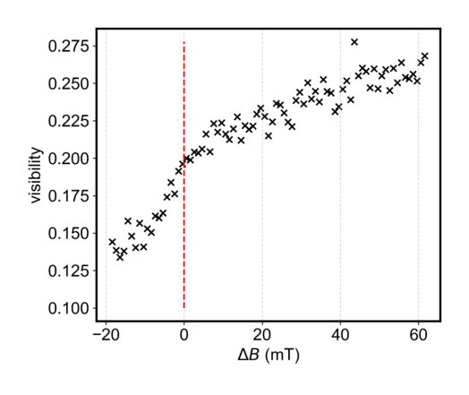
<figcaption class="paper-figure-caption"><b>Fig 5.</b> Figure 5. Probability of measuring a blip in spin relaxation measurement at time-delay, t=0. At t=0, in the high field limit, the blip population is around 25%. At lower B-fields the visibility drops. This indicates that the visibility of the read-out is starting to degrade due to reduced energy-level difference between third and fourth energy level.</figcaption>
</figure>
<figure class="paper-figure-card">
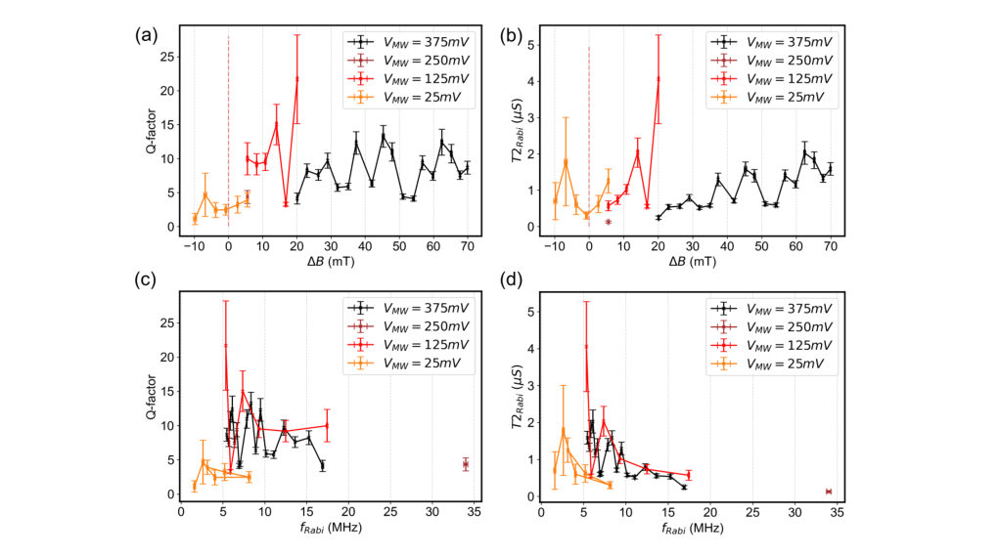
<figcaption class="paper-figure-caption"><b>Fig 6.</b> Figure 6. Damping rates of Rabi oscillations near the anti-crossing. (a) Q-factor vs detuning (b) T2Rabi vs detuning (c) Q-factor vs fRabi (d) T2Rabi vs fRabi. The damping time fluctuates a lot due to slow noise in the device, and a larger source voltage degrades the damping time17. The data suggests an optimum Q-factor at around ∆B ≈20 mT. The damping time suggests an optimum value, a trade-off between greater dynamical decoupling from noise in the qubit frequency at high Rabi frequencies, and greater susceptibility of the Rabi frequency to charge noise induced fluctuations in the valley-splitting.</figcaption>
</figure>

**Main problem.** The paper investigates how to achieve fast, all-electrical control of electron spins in silicon quantum dots without the need for micromagnets, by leveraging spin-valley hybridization.

**Main result.** The researchers observed a >20-fold enhancement of the Rabi frequency near a valley level anti-crossing, attributed to an electric-dipole transition activated by inter-valley spin coupling.

**Method.** Electron Spin Resonance (ESR) spectroscopy was performed on a single-electron spin in a planar Si-MOS quantum dot using microwave pulses from an aluminum antenna and RF-SET charge sensing for readout.

**Summary.** This paper demonstrates that spin-valley coupling in planar silicon quantum dots can be used to significantly enhance the Rabi frequency for spin manipulation. By operating near a valley level anti-crossing, the researchers achieved an electric-dipole-driven transition that is much stronger than traditional magnetic-dipole ESR. They also characterized the anisotropy of the g-factor and the inter-valley spin coupling. This provides a promising pathway for fast, all-electrical spin control in silicon-based quantum computing without requiring integrated micromagnets.

Detailed structure

**Model / system.** A single-electron spin in a planar n-type Si-MOS double quantum dot on an SOI wafer, modeled as a four-state system comprising two spin and two valley states.

**Key observables.** Rabi frequency enhancement, valley splitting, g-factor anisotropy (difference and mean), and spin-relaxation rate (hot-spot).

**Important parameters / regimes.** Valley splitting of ~66 ueV, electron temperature of ~120 mK, and an electric-dipole drive strength approximately 200 times stronger than the magnetic-dipole drive.

**Assumptions / limitations.** The model assumes the primary g-factor tensor difference lies in off-diagonal terms and that the inter-valley spin-orbit field is in-plane.

**Figures summary.** Fig 1 shows the device schematic and ESR spectra; Fig 5 illustrates spin relaxation visibility as a function of magnetic field.

**Paper structure.** The paper introduces the problem of spin control, describes the Si-MOS device architecture, presents ESR spectroscopy results near the anti-crossing, analyzes the anisotropy of the g-factor and spin-valley coupling, and concludes with implications for all-electrical spin control.

**Why it may be interesting.** The discovery of a mechanism for massive enhancement of Rabi frequency via electric-dipole transitions in a multi-level system is highly relevant to the development of fast, high-fidelity control protocols in multi-level quantum systems.

Abstract

Electron spin resonance spectroscopy (ESR) of a single electron in planar Si-MOS quantum dot is reported in the vicinity of a valley level anti-crossing. A number of one and two-photon resonances are observed due to mixing of magnetic spin-flip and electric valley-flip transitions. This allows the reconstruction of the energy-level diagram of a four state system with two valley and two spin states. Near the anti-crossing, an enhancement of the Rabi frequency is observed. This is attributed to an electric-dipole transition activated by admixing of the upper energy level due to inter-valley spin coupling. The electric-dipole transition may be driven via capacitive coupling between the ESR antenna, and the confinement gate. To characterize spin-valley coupling responsible for the enhancement, we measure the anisotropy of the g-factor difference between the two valley states, the mean g-factor and the inter-valley spin coupling for both in and out-of-plane magnetic fields. The inter-valley spin coupling is strongly modulated by the direction of the B-field, and is strongest for out-of-plane B-field, consistent with an in-plane spin-valley field. In principle, this strong Electric dipole spin resonance (EDSR) effect could be utilized for fast all-electrical spin control in small-scale devices.

[↑ back to top](#top)

### [Odd pathways speed up self-assembly](http://arxiv.org/abs/2604.22408v1)

**Authors:** Dawid Dopierała, Luca Cocconi, Robert L. Jack, Anton Souslov  
**Type:** theory · **Category:** statistical mechanics · **PDF:** <https://arxiv.org/pdf/2604.22408v1>  
**Analysis basis:** full PDF text, analyzed in chunks
**Topic relevance:** 🔥 `dissipative systems` **3/5** · 🔥 `non-equilibrium dynamics` **3/5** · `correlated / nonlocal dissipation` **2/5** · `driven-dissipative phase transition` **2/5** · `methods for driven-dissipative` **2/5** · `non-equilibrium universality` **2/5**

↔ Scroll figures horizontally

<figure class="paper-figure-card">
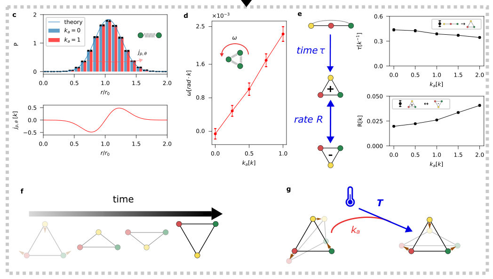
<figcaption class="paper-figure-caption"><b>Fig 1.</b> FIG. 1. Transverse forces as effective temperature. How do transverse forces affect self-assembly? a, Abstraction of transverse forces: pairs of metallodielectric (Janus) colloids driven by a uniform AC electric field [18], Kilobots [19], and ball-and- spring model. Battery represents energy injection, which results in transverse forces (red arrows) proportional to ka(r −r0). b, Abstraction of self-assembly: thermal noise leads to the assembly of target structures, for example in colloidomers [20]. Resulting phenomenology: c, Steady-state probability distribution for two-particle system (top, inset) remains the same with and without transverse forces (top). However, transverse forces...</figcaption>
</figure>
<figure class="paper-figure-card">
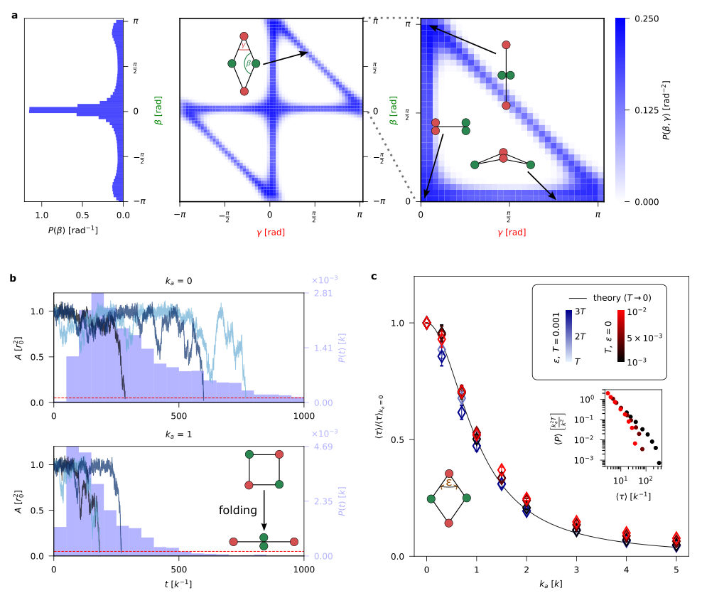
<figcaption class="paper-figure-caption"><b>Fig 2.</b> FIG. 2. Activity-enhanced folding. a, Steady-state probability distribution of the angles β and γ for a rhombic configuration of four springs. Horizontal and vertical lines indicate transitions via wedge states, while diagonals correspond to rhombus configurations. Zoom of the first quadrant (right) shows that, starting from the square configuration (centre of the diagonal), the system first assembles into a line with the length of two springs. In the steady state, the system is biased towards near-zero β configurations (left). (T = 0.001, ka = 0) b, Sample trajectories of the system signed area A and histograms of folding times over many runs (shaded). Transverse forces reduce the folding...</figcaption>
</figure>
<figure class="paper-figure-card">
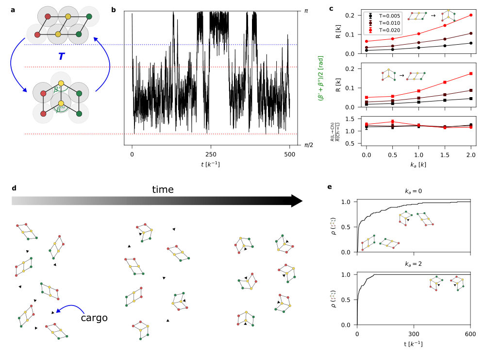
<figcaption class="paper-figure-caption"><b>Fig 3.</b> FIG. 3. Acceleration of transitions between metastable states. a, Ladder (top) and chevron (bottom) are metastable configurations of the double-square system enforced by the Morse interaction (halos indicate interaction range; faded halos denote effectively non-interacting particles). A sample trajectory (b, ka = 2, T = 0.005) shows repeated transitions between ladder (above the blue dotted line) and chevron (between the red dotted lines). c, Transverse forces increase the transition rates R for ladder→chevron (top) and chevron→ladder (middle), while their ratio remains constant (bottom), indicating probability invariance. d, Accelerated stabilization in a system of non-interacting...</figcaption>
</figure>

**Main problem.** How to accelerate the kinetics of self-assembly and transition between metastable states without altering the equilibrium Boltzmann distribution or distorting the final target structures.

**Main result.** Non-reciprocal (odd) interactions induce probability currents that accelerate assembly via mode coupling and increased effective mobility, though this comes at the cost of increased power dissipation.

**Method.** Analytical derivation using Langevin and Fokker-Planck equations, adiabatic elimination of fast modes, and numerical simulations of stochastic dynamics.

**Summary.** The paper investigates how 'odd' or non-reciprocal forces can be used to speed up the self-assembly of mechanical structures. It demonstrates that these forces can drive particles across energy barriers to accelerate transitions without changing the final equilibrium state. The authors identify a fundamental trade-off between the speed of assembly and the energy dissipated by the active forces. This suggests a 'catalytic' strategy where active forces are used transiently to drive assembly and then deactivated to maintain high-fidelity structures.

Detailed structure

**Model / system.** Mechanical networks of overdamped thermal colloids subject to non-conservative transverse forces, including specific models like two-particle odd springs, odd triangles, and four/six-particle square networks.

**Key observables.** Probability currents, transition rates (flip rates), assembly time, power dissipation, and steady-state probability distributions.

**Important parameters / regimes.** Non-reciprocal coupling strength (ka), spring constant (k), temperature (T), and angular potential strength (epsilon).

**Assumptions / limitations.** Low-temperature regime, separation of time scales between fast and slow modes, and small deformation approximations for certain analytical derivations.

**Figures summary.** Figure 1 shows steady-state distributions, transition rates, and assembly trajectories; Figure 2 illustrates the path from square to line; Figure A1 displays elastic eigenmodes of the triangle.

**Paper structure.** The paper introduces the problem of kinetic bottlenecks, presents a framework for non-reciprocal forces, analyzes specific small-scale models (2, 3, and 4-particle systems), explores complex assembly (double-square), and concludes with a discussion on the energetic trade-offs and catalytic applications.

**Why it may be interesting.** The study of non-reciprocal dynamics and the decoupling of kinetics from thermodynamics is highly relevant to open quantum systems and the control of non-equilibrium steady states.

Abstract

Active self-assembly can bypass equilibrium bottlenecks through external energy injection. However, generic driving typically distorts target structures and requires sustained energy input even after assembly is complete. Here, we investigate a class of non-reciprocal interactions that accelerates assembly while preserving the equilibrium Boltzmann distribution. The probability currents induced by these odd interactions reshape fundamental processes, including activated barrier crossing, soft-mode relaxation, and transitions between metastable states. In particular, these currents enhance Arrhenius rates by driving particles across otherwise inaccessible free-energy barriers. We show that this acceleration arises from an effective increase in the mobility of the reaction coordinate, mediated by non-reciprocal coupling between mechanical modes. In turn, we discover a trade-off between kinetic acceleration and power dissipation when active forces are engaged. Our results suggest a route to energy-efficient, high-fidelity self-assembly via active catalysts that transiently accelerate relaxation toward equilibrium targets and deactivate upon reaching the desired state.

[↑ back to top](#top)

### [Covariant Onsager and Onsager-Machlup principles for active and inertial dynamics](http://arxiv.org/abs/2604.22371v1)

**Authors:** Kento Yasuda, Bin Zheng, Zhongqiang Xiong, Zhanglin Hou, Kenta Ishimoto, Xinpeng Xu, David Andelman, Shigeyuki Komura  
**Type:** theory · **Category:** statistical mechanics · **PDF:** <https://arxiv.org/pdf/2604.22371v1>  
**Analysis basis:** full PDF text, analyzed in chunks
**Topic relevance:** 🔥 `non-equilibrium dynamics` **3/5** · `Keldysh / 2PI / non-Gaussian methods` **2/5** · `dissipative systems` **2/5** · `methods for driven-dissipative` **2/5**

↔ Scroll figures horizontally

<figure class="paper-figure-card">
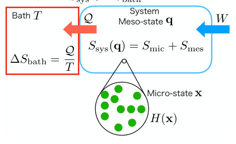
<figcaption class="paper-figure-caption"><b>Fig 1.</b> FIG. 1. Entropy balance for a system coupled to a heat bath at temperature T. The meso-state of the system is described by q, while the microscopic configuration is represented by x with Hamiltonian H(x). The system entropy is decomposed as Ssys = Smic + Smes. If the system exchanges heat Q with the bath and work W with the surroundings, the bath entropy change is ∆Sbath = Q/T, and the total entropy production is given by σ = ∆Ssys + ∆Sbath.</figcaption>
</figure>

**Main problem.** Existing formulations of the Onsager and Onsager-Machlup principles lack covariance, making them inconsistent under coordinate transformations and unable to account for inertial effects in active systems.

**Main result.** The authors develop a covariant framework for the Onsager and Onsager-Machlup principles that ensures geometric consistency under coordinate transformations and successfully incorporates both active forces and inertial dynamics.

**Method.** The study uses a variational approach involving the minimization of the Rayleighian and the Onsager-Machlup functional, utilizing a metric tensor and covariant acceleration to maintain invariance.

**Summary.** This paper addresses the mathematical inconsistency of existing variational principles for dissipative dynamics under coordinate transformations. The authors introduce a covariant formulation of the Onsager and Onsager-Machlup principles that remains invariant under point transformations. This new framework successfully integrates active (non-equilibrium) forces and inertial effects into a unified geometric structure. The resulting theory is shown to be consistent with the principles of stochastic thermodynamics and the detailed fluctuation theorem.

Detailed structure

**Model / system.** The framework applies to mesoscopic systems in contact with a heat bath, specifically addressing active systems (driven out of equilibrium) and inertial systems (including kinetic energy and mass). Examples include 3D active Brownian particles and 2D particles in polar coordinates.

**Key observables.** Non-equilibrium free energy, entropy production, path probability density, internal energy, and work/heat exchange.

**Important parameters / regimes.** Temperature (T), friction/resistance tensor (zeta), inertia tensor (mu), and active power/forces (X).

**Assumptions / limitations.** The system is in a non-equilibrium state; meso-state variables are uniquely determined by micro-states; the heat bath is at a constant temperature; and transformations are smooth, one-to-one point transformations.

**Figures summary.** Figure 1 shows an entropy balance diagram illustrating the decomposition of system entropy into micro and meso parts, and the relationship between heat, work, and bath entropy change.

**Paper structure.** The paper first identifies the lack of covariance in existing principles, then develops a covariant formulation for active systems, extends this to include thermal fluctuations via the Onsager-Machlup principle, incorporates inertia using covariant acceleration, and validates the theory with specific models (active Brownian particles and polar coordinates) and thermodynamic consistency proofs.

**Why it may be interesting.** This is highly relevant for researchers in open quantum systems and many-body dynamics as it provides a mathematically rigorous, coordinate-invariant way to describe the stochastic trajectories and thermodynamics of driven, dissipative, and inertial systems.

Abstract

The Onsager principle provides a variational route to the phenomenological equations of dissipative dynamics through the minimization of the Rayleighian. We develop a covariant formulation of the Onsager principle for active systems, ensuring geometric consistency under coordinate transformations. To further incorporate thermal fluctuations, we formulate the Onsager-Machlup principle for active systems by considering the Onsager-Machlup functional and the corresponding path probability for stochastic trajectories. Requiring that the path probability obeys the detailed fluctuation theorem, we show that the extended Onsager-Machlup theory is consistent with stochastic thermodynamics. Moreover, we incorporate inertia into the variational framework and show that the proper covariant equations follow when the covariant acceleration is held fixed during the variation.

[↑ back to top](#top)

### [Extended Haldane Model in The Dice Lattice: Multiple Flat-Band-Induced topological Transitions Revealed](http://arxiv.org/abs/2604.22131v1)

**Authors:** Othmane Benhaida, Lalla Btissam Drissi, El Hassan Saidi  
**Type:** theory · **Category:** other · **PDF:** <https://arxiv.org/pdf/2604.22131v1>  
**Analysis basis:** full PDF text, analyzed in chunks
**Topic relevance:** `analog quantum simulation` **2/5** · `non-equilibrium dynamics` **2/5**

↔ Scroll figures horizontally

<figure class="paper-figure-card">
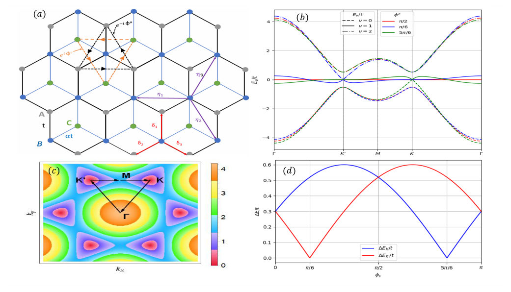
<figcaption class="paper-figure-caption"><b>Fig 1.</b> FIG. 1. (a) This is a schematic diagram of the 𝛼−𝑇3 lattice, showing sublattices A, B, and C in grey, blue, and green, respectively. Nearest-neighbor (NN) hops between sites A and B are labelled t, and those between sites B and C are labelled 𝛼𝑡. The Haldane module introduces next-nearest neighbor hops : between sites A, hops are labelled 𝑡𝑎𝑒−𝑖𝜙𝑎and represented by orange arrows, while between sites C, hops are labelled 𝑡𝑐𝑒𝑖𝜙𝑐and represented by black arrows. The 𝜙𝑎and 𝜙𝑐phases are oriented counter-clockwise, as indicated by the arrows. (b) Shows the band structure of the 𝛼−𝑇3 lattice, which consists of three bands: the valence band (𝜈= 0), the flat band (𝜈= 1), and the conduction band (𝜈=...</figcaption>
</figure>
<figure class="paper-figure-card">
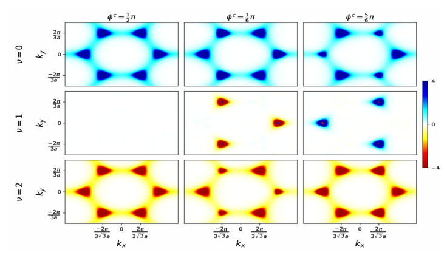
<figcaption class="paper-figure-caption"><b>Fig 2.</b> FIG. 2. A density plot of the Berry curvature in 𝑘𝑥−𝑘𝑦-space is shown, corresponding to the valence band (𝜈= 0), the flat band (𝜈= 1), and the conduction band (𝜈= 2). The results are presented for three cases: 𝜙𝑐= 𝜋/2 (the normal case, where 𝜙𝑐= 𝜙𝑎), 𝜙𝑐= 𝜋/6 (the first topological transition, where 𝜙𝑐≠𝜙𝑎), and 𝜙𝑐= 5𝜋/6 (the second topological transition, where 𝜙𝑐≠𝜙𝑎). The other parameters are fixed at 𝛼= 1, 𝜙𝑎= 𝜋/2, and 𝑡𝑎= 𝑡𝑐= 0.1𝑡.</figcaption>
</figure>
<figure class="paper-figure-card">
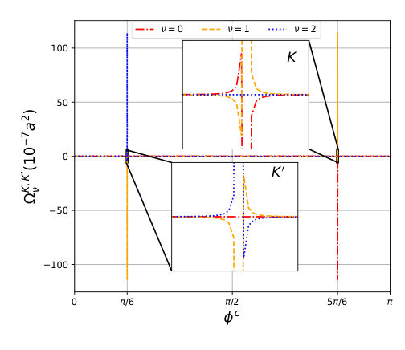
<figcaption class="paper-figure-caption"><b>Fig 3.</b> FIG. 3. The evolution of Berry curvature as a function of 𝜙𝑐at Dirac points 𝑲and 𝑲′ is represented, as shown in the zoom. The Berry curvature is calculated for all three bands: the valence band (𝜈= 0), the flat band (𝜈= 1), and the conduction band (𝜈= 2). These are represented by dash-dot, dashed, and dotted lines, respectively. Two topological phase transitions are observed: the first at 𝜙𝑐= 𝜋/6 at the 𝑲′ point and the second at 𝜙𝑐= 5𝜋/6, also at the 𝑲point. The other parameters are identical to those in Fig.2.</figcaption>
</figure>
<figure class="paper-figure-card">
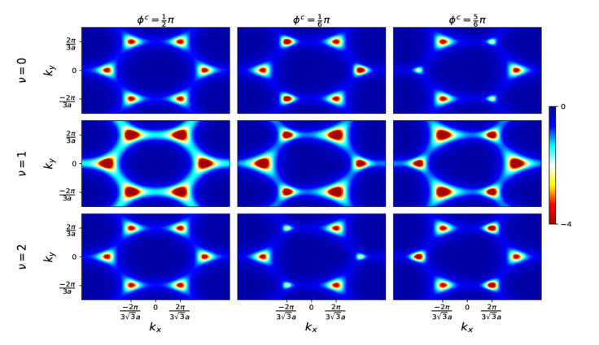
<figcaption class="paper-figure-caption"><b>Fig 4.</b> FIG. 4. The density plot of the magnetic orbital moment (OMM) in 𝑘𝑥−𝑘𝑦space is shown. This corresponds to the valence band (𝜈= 0), the flat band (𝜈= 1), and the conduction band (𝜈= 2). The cases considered are: 𝜙𝑐= 𝜋/2 (normal case, where 𝜙𝑎= 𝜙𝑐and inversion symmetry is preserved); 𝜙𝑐= 𝜋/6 (first transition, where 𝜙𝑎≠𝜙𝑐and inversion symmetry is broken); 𝜙𝑐= 5𝜋/6 (second transition, where inversion symmetry is broken). The other parameters are fixed at 𝛼= 1, 𝜙𝑎= 𝜋/2, and 𝑡𝑎= 𝑡𝑐= 0.1𝑡.</figcaption>
</figure>
<figure class="paper-figure-card">
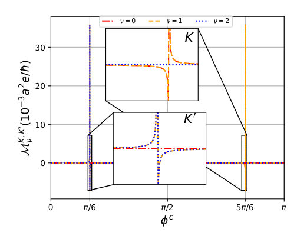
<figcaption class="paper-figure-caption"><b>Fig 5.</b> FIG. 5. (b) The magnetic orbital moment’s evolution as a function of 𝜙𝑐is shown in the zoom, at the Dirac points 𝑲and 𝑲′. The OMM is calculated for the valence band (𝜈= 0), the flat band (𝜈= 1) and the conduction band (𝜈= 2) and is represented by dashed, dotted and mixed dotted lines, respectively. The other parameters are identical to those in Fig.4.</figcaption>
</figure>
<figure class="paper-figure-card">
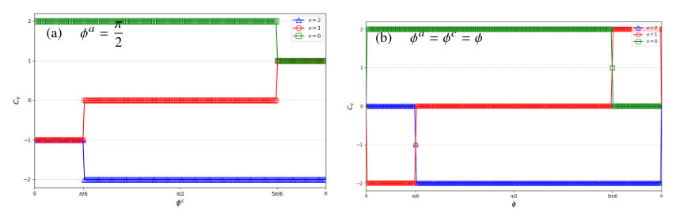
<figcaption class="paper-figure-caption"><b>Fig 6.</b> FIG. 6. (a) Variation of the Chern number as a function of 𝜙𝑐, with 𝜙𝑎fixed at 𝜋/2. (b) Variation of the Chern number as a function of 𝜙= 𝜙𝑐= 𝜙𝑎. The variation of the Chern number corresponding to the valence band (𝜈= 0), the flat band (𝜈= 1), and the conduction band (𝜈= 2) is represented by green, red, and blue, respectively, as shown in subfigures (a) and (b). The other parameters are set to 𝛼= 1 and 𝑡𝑎= 𝑡𝑐= 0.1𝑡.</figcaption>
</figure>
<figure class="paper-figure-card">
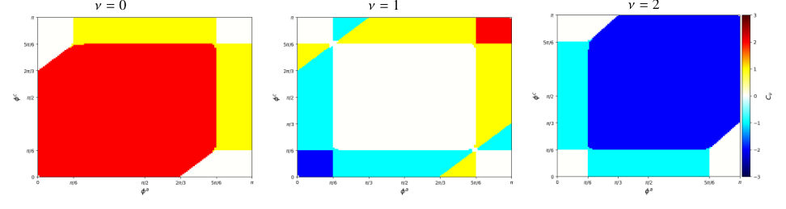
<figcaption class="paper-figure-caption"><b>Fig 7.</b> FIG. 7. The Chern number phase diagram is shown in flux space (𝜙𝑐and 𝜙𝑎), which corresponds to the valence band (𝜈= 0), the flat band (𝜈= 1), and the conduction band (𝜈= 2). The other parameters are set to 𝛼= 1 and 𝑡𝑐= 𝑡𝑎= 0.1𝑡.</figcaption>
</figure>
<figure class="paper-figure-card">
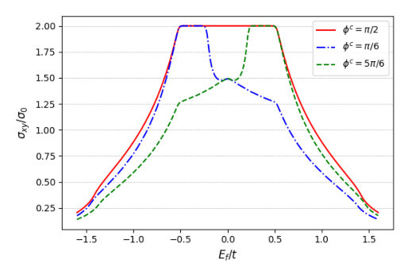
<figcaption class="paper-figure-caption"><b>Fig 8.</b> FIG. 8. The plot shows the Hall conductivity as a function of the Fermi energy for three values of 𝜙𝑐: 𝜙𝑐= 𝜋/2 (the standard case, where 𝜙𝑐= 𝜙𝑎), 𝜙𝑐= 𝜋/6 (the first transition, where 𝜙𝑐≠𝜙𝑎), and 𝜙𝑐= 5𝜋/6 (the second transition), represented in red, blue, and green, respectively. The other parameters are set to 𝜙𝑎= 𝜋/2, 𝛼= 1, and 𝑡𝑐= 𝑡𝑎= 0.1𝑡.</figcaption>
</figure>

**Main problem.** The study investigates how breaking inversion and time-reversal symmetries in an extended Haldane model on a dice lattice induces multiple topological phase transitions.

**Main result.** The authors identify critical flux values at phi_c = pi/6 and 5pi/6 where gap closures occur, leading to changes in Chern numbers across all bands and the emergence of unquantized Hall conductivity plateaus.

**Method.** The researchers use a tight-binding Hamiltonian approach, deriving analytical expressions for quasi-energies and calculating Berry curvature, orbital magnetic moment, and Chern numbers via the TKNN index.

**Summary.** This paper explores a modified Haldane model on a dice lattice where independent control of magnetic fluxes breaks inversion symmetry. The study reveals that at specific critical flux values, the energy gaps close, triggering topological transitions that affect the valence, flat, and conduction bands. These transitions are characterized by changes in Chern numbers and the appearance of both quantized and unquantized Hall conductivity plateaus. The findings suggest a pathway for designing tunable, low-dissipation topological quantum devices.

Detailed structure

**Model / system.** An extended Haldane model on a dice lattice (a specific case of the alpha-T3 lattice where alpha=1), featuring modified next-nearest-neighbor hopping phases (phi_a and phi_c) that break inversion symmetry.

**Key observables.** Chern numbers (C0, C1, C2), Berry curvature, orbital magnetic moment, and anomalous Hall conductivity.

**Important parameters / regimes.** Fluxes phi_a and phi_c, lattice parameter alpha, hopping amplitudes t_a and t_c, and critical points at phi_c = pi/6 and 5pi/6.

**Assumptions / limitations.** The model assumes the NNN hops on sublattice B can be neglected due to high energy barriers; the analysis focuses on the low-energy regime.

**Figures summary.** Fig 1 shows the lattice geometry, band structures, and high-symmetry paths; Fig 2 displays Berry curvature density plots; Fig 6 shows Chern number variations and Hall conductivity plateaus.

**Paper structure.** The paper introduces the modified lattice model and symmetry breaking, derives analytical quasi-energies, performs topological analysis via Berry curvature and Chern numbers, discusses transport properties like Hall conductivity, and proposes experimental implementations in cold atoms and van der Waals heterostructures.

**Why it may be interesting.** The paper explores the engineering of topological phases and transport properties through flux control, which is highly relevant to the development of reconfigurable topological devices and Floquet engineering in AMO systems.

Abstract

In this study, we examine the introduction of the Haldane model into the dice lattice by altering the flow between the next-nearest-neighbour sites. This breaks the lattice's inversion and time-reversal symmetries. We demonstrate the presence of point-charge particle symmetries at $φ^c=π/6$ and $5π/6$ and derive the analytical expression for quasi-energies. We demonstrate that a gap closure occurs at these critical points, inducing a topological transition. This is confirmed by calculating the Berry curvature and orbital magnetic moment. A topological analysis shows that the Chern numbers of the valence band $(ν=0)$, the flat band $(ν=1)$ and the conduction band $(ν=2)$ depend strongly on the relationship between the fluxes $φ^a $ and $φ^c$. When $φ^c = φ^a$, the Chern numbers are $(C_0, C_1, C_2) = (2, -2, 0)$ in the region $φ^c \in [0, π/6[$, and (0, 2, -2) in the region $φ^c\in ]5π/6, π]$. Conversely, when $φ^c \neq φ^a$, the topological invariants become $ (C_1, C_2) = (-1, -1)$ for $φ^c \in [0, π/6[$, and $(C_0, C_1, )= (1, 1)$ for $φ^c\in ]5π/6, π]$. These variations reflect topological phase transitions at the critical points $φ^c=π/6$ and $5π/6$, affecting all of the system's bands. Furthermore, the anomalous Hall conductivity exhibits a quantized plateau of 2$σ_{0}$, as well as an unquantized tilted plateau evolving from 1.50$σ_{0}$ to 1.25$σ_{0}$ at the same transition points. Controlling the flux allows topological transitions to be engineered and quantum transport in the dice lattice to be optimised, offering promising prospects for reconfigurable topological devices with low dissipation and robust quantum transport.

[↑ back to top](#top)

### [Classifying magnons in itinerant ferromagnets from linear response TDDFT: Fe, Ni and Co revisited](http://arxiv.org/abs/2604.22484v1)

**Authors:** Thorbjørn Skovhus, Thomas Olsen  
**Type:** theory · **Category:** strongly correlated electrons · **PDF:** <https://arxiv.org/pdf/2604.22484v1>  
**Analysis basis:** full PDF text, analyzed in chunks
**Topic relevance:** `spintronics-quantum-optics interface` **2/5**

↔ Scroll figures horizontally

<figure class="paper-figure-card">
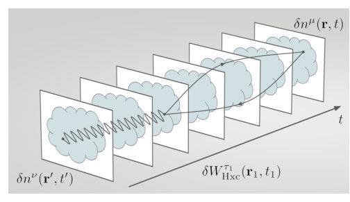
<figcaption class="paper-figure-caption"><b>Fig 1.</b> FIG. 1. Cartoon of the physics encoded in the self- enhancement function (13). Illustrates how a change (with re- spect to the ground state) of the four-component electron den- sity (represented by the cloud) in the past, δnν(r′, t′), invokes fluctuations δnµ(r, t) in the future via the induced changes to the Hartree-exchange-correlation potential δW τ1 Hxc(r1, t1) in the interim, t′ ≤t1 ≤t. The wiggly line represents the kernel (11), while the bubble represents the Kohn-Sham susceptibil- ity (10).</figcaption>
</figure>
<figure class="paper-figure-card">
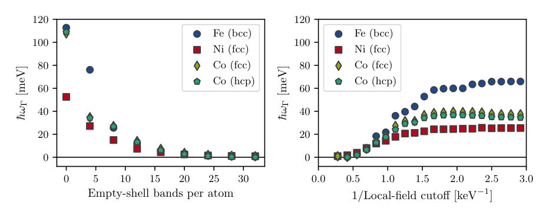
<figcaption class="paper-figure-caption"><b>Fig 2.</b> FIG. 2. Goldstone gap error in Fe, Ni and Co as a function of the number of empty-shell bands per atom and inverse local-field cutoff. When varying the number of bands (left), the plane-wave cutoff is fixed to 3.6 keV for bcc and fcc structures and 2.4 keV for hcp-Co. When varying the plane-wave cutoff (right), the number of empty-shell bands per atom is fixed to 32.</figcaption>
</figure>
<figure class="paper-figure-card">
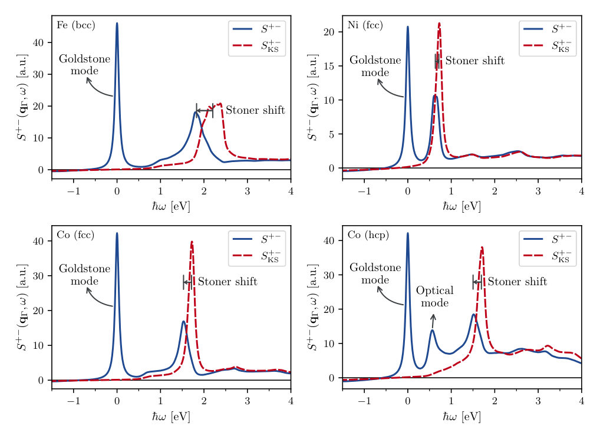
<figcaption class="paper-figure-caption"><b>Fig 3.</b> FIG. 3. Total scattering function [trace of Eq. (42)] of Fe, Ni and Co at zero momentum transfer, plotted alongside the total scattering of the single-particle Kohn-Sham system. The Stoner shift indicates the redshift of the Stoner pair gap, using values from Tab. II.</figcaption>
</figure>
<figure class="paper-figure-card">
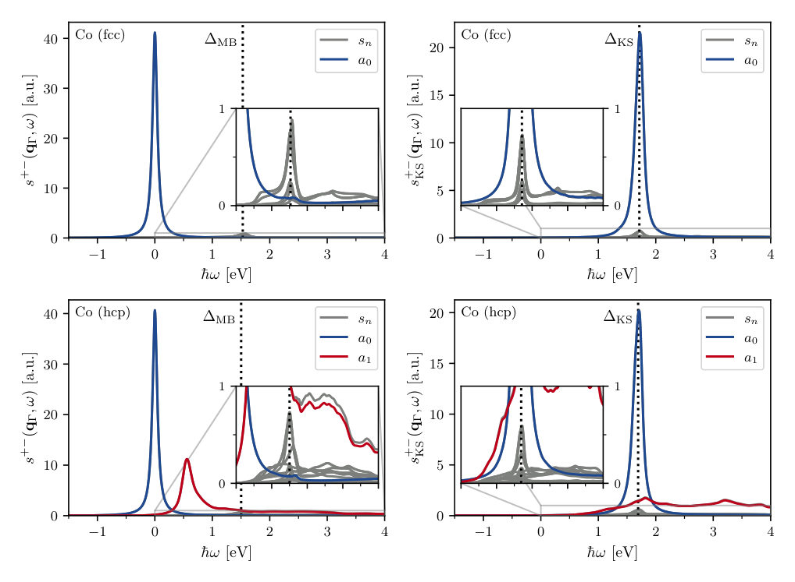
<figcaption class="paper-figure-caption"><b>Fig 4.</b> FIG. 4. Eigenvalues s+− n (grey) of the scattering function (43) in fcc-Co (top) and hcp-Co (bottom) at zero momentum transfer for the many-body system (left) and Kohn-Sham system (right). For fcc/hcp Co, the 12/24 largest eigenvalues are plotted. In color, the projection (45) of the majority spectral function (44) onto the extracted collective eigenmodes |vn(qΓ)⟩is shown, lying virtually on top of the corresponding eigenvalue for a wide range of frequencies. The effective (Kohn-Sham) exchange splitting ∆KS and (many-body) Stoner pair gap ∆MB—see Tab. II—are shown as vertical dotted lines.</figcaption>
</figure>
<figure class="paper-figure-card">
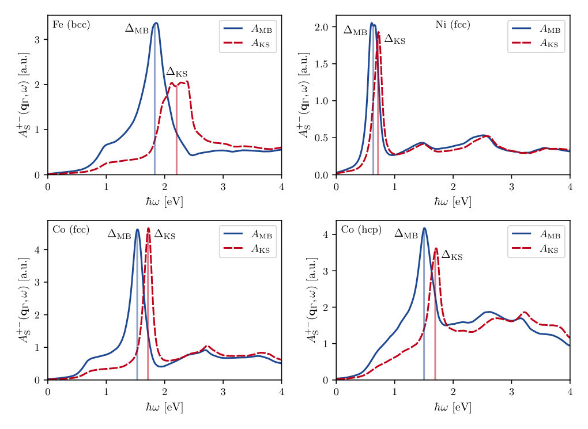
<figcaption class="paper-figure-caption"><b>Fig 5.</b> FIG. 5. Stoner spectrum [trace of Eq. (47)] of Fe, Ni and Co at zero momentum transfer, plotted alongside the corresponding Stoner spectrum of the noninteracting Kohn-Sham system. The vertical colored lines indicate the (many-body) Stoner pair gap ∆MB and the effective (Kohn-Sham) exchange splitting ∆KS, see Tab. II and Eq. (48).</figcaption>
</figure>
<figure class="paper-figure-card">
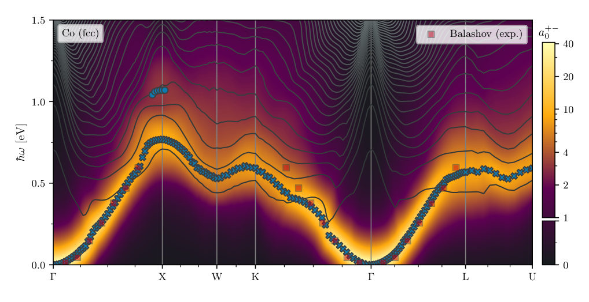
<figcaption class="paper-figure-caption"><b>Fig 6.</b> FIG. 6. Magnon mode lineshape a+− 0 (q, ω) in fcc-Co (colored contour) overlaid by the corresponding Kohn-Sham lineshape a+− KS,0(q, ω) (greyscale line contour). Both contours are linear up to a+− 0 = 1 (atomic units), and logarithmic above. Coherent magnon peaks in the many-body lineshape are indicated with crosses, incoherent peaks with disks. The extracted peak positions are compared to inelastic scanning tunnel spectroscopy data (translucent squares) measured on a nine monolayer Co/Cu(100) film assuming isotropy of the dispersion [49].</figcaption>
</figure>
<figure class="paper-figure-card">
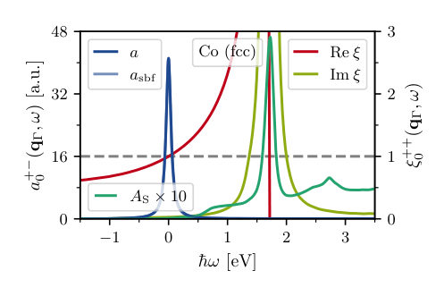
<figcaption class="paper-figure-caption"><b>Fig 7.</b> FIG. 7. Collective magnon enhancement at qΓ in Co (fcc). On the left axis, the magnon lineshape a+− 0 (q, ω) (opaque blue) is compared to the singular basis function lineshape (50) (translucent blue) and the many-body Stoner spectrum [trace of Eq. (47)] (teal). For the Γ-point in particular, a+− sbf overlaps perfectly with a+−. On the right axis, the magnon mode projection of the self-enhancement function (24) is shown.</figcaption>
</figure>
<figure class="paper-figure-card">
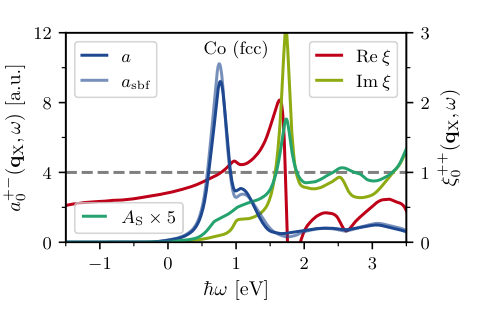
<figcaption class="paper-figure-caption"><b>Fig 8.</b> FIG. 8. Collective magnon enhancement at qX/2 (left) and qX (right) in Co (fcc).</figcaption>
</figure>
<figure class="paper-figure-card">
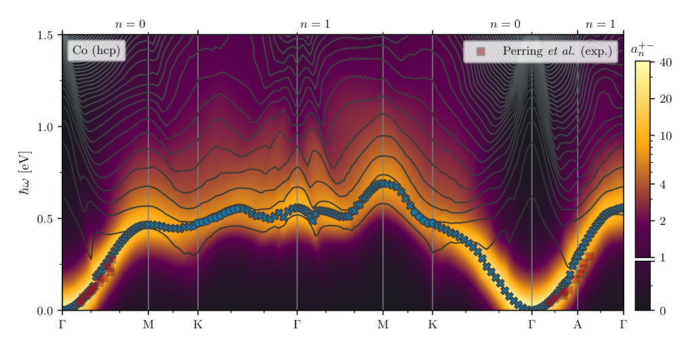
<figcaption class="paper-figure-caption"><b>Fig 9.</b> FIG. 9. Magnon mode lineshape a+− n (q, ω) in hcp-Co (colored contour) overlaid by the corresponding Kohn-Sham lineshape a+− KS,n(q, ω) (greyscale line contour). Both contours are linear up to a+− 0 = 1 (atomic units), and logarithmic above. The top axis indicates the magnon mode, changing between n = 0 (acoustic) and n = 1 (optical) at each K and A point. Coherent magnon peaks in the many-body lineshape are indicated with crosses, incoherent peaks with disks. The extracted peak positions are compared to inelastic neutron scattering data (translucent squares) [50].</figcaption>
</figure>
<figure class="paper-figure-card">
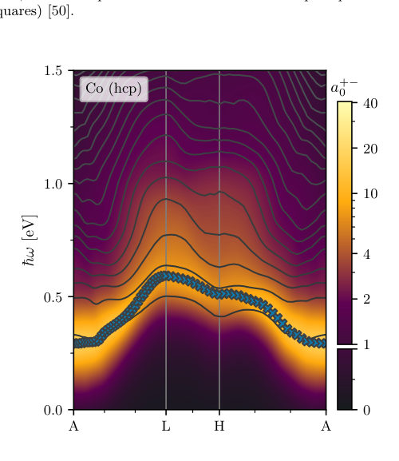
<figcaption class="paper-figure-caption"><b>Fig 10.</b> FIG. 10. Magnon mode lineshape a+− 0 (q, ω) in hcp-Co at the degenerate hexagonal face of the BZ boundary (colored contour) overlaid by the corresponding Kohn-Sham lineshape a+− KS,0(q, ω) (greyscale line contour) and extracted coherent magnon peak frequencies (blue crosses). For additional de- tails, please refer to Fig. 9.</figcaption>
</figure>

**Main problem.** The difficulty in interpreting complex magnetic excitation spectra in itinerant ferromagnets, specifically distinguishing between coherent magnons and incoherent Stoner excitations, and resolving numerical 'Goldstone gap' errors in TDDFT.

**Main result.** The authors developed a novel LR-TDDFT implementation that eliminates the Goldstone gap error and provides a method to classify magnons as coherent or incoherent using the self-enhancement function, revealing features like branch coexistence in Fe and valley magnons in Ni.

**Method.** A novel implementation of linear response time-dependent density functional theory (LR-TDDFT) within the PAW method, utilizing eigendecomposition of the spectral function and the self-enhancement function.

**Summary.** This paper presents a new way to accurately calculate and classify magnetic excitations (magnons) in metals like iron and nickel. By improving the numerical implementation of TDDFT, the authors successfully eliminate non-physical energy gaps and can distinguish between stable, coherent magnons and decaying, incoherent excitations. The work reveals complex phenomena such as the coexistence of multiple magnon branches and the existence of 'valley magnons' in nickel, providing a more precise theoretical benchmark for neutron scattering experiments.

Detailed structure

**Model / system.** Elemental itinerant ferromagnets including bcc-Fe, fcc-Ni, fcc-Co, and hcp-Co, modeled using the Adiabatic Local Density Approximation (ALDA) within a TDDFT framework.

**Key observables.** Transverse magnetic susceptibility, scattering function, self-enhancement function, magnon dispersion, and Stoner continuum/gap.

**Important parameters / regimes.** Wave vectors (q), frequency (omega), exchange splitting, and plane-wave energy cutoffs.

**Assumptions / limitations.** The use of the Adiabatic Local Density Approximation (ALDA) for the exchange-correlation kernel and the focus on collinear magnetic systems without spin-orbit coupling.

**Figures summary.** Figure 1 illustrates the physics of the self-enhancement function; Figure 2 shows the convergence of the Goldstone gap error; Figure 3 compares many-body vs. Kohn-Sham Stoner spectra; Figure 4 shows eigenvalues and magnon lineshapes for Co; Figure 14-15 show magnon enhancement and branch coexistence in Fe; Figure 16 shows the Ni spectrum; Figure 18-19 show convergence of peak frequencies.

**Paper structure.** Introduction to the problem of itinerant magnetism; description of the new LR-TDDFT implementation and error elimination strategy; application to Fe, Ni, and Co; classification of excitations via the self-enhancement function; discussion of convergence and basis set requirements; conclusion on implications for magnetic properties.

Abstract

The magnetic excitation spectrum of itinerant magnets exhibits rich and complex spectral features that often complicate interpretation of the underlying physics. For perturbations in the long wavelength limit, one obtains a well defined pole at zero frequency in the spectral function, the Goldstone magnon. However, for optical modes and finite wavevectors, the magnon spectrum may become damped, exhibit branching, or be completely washed out. In the present work, we show how the physical mechanism of all such features can be understood from careful analysis of the eigenmodes of the many-body spectral function. We perform first principles computations of elemental itinerant ferromagnets using a novel implementation of the linear response time-dependent density functional theory (LR-TDDFT) framework and classify the collective nature of individual spectral features based on the self-enhancement function, the product of the noninteracting Kohn-Sham susceptibility and the exchange-correlation kernel. In particular, we distinguish between coherent and incoherent collective excitations, depending on whether the real part of the self-enhancement function crosses unity at the spectral peak of the magnon, which may or may not be subject to Landau damping as quantified by the imaginary part. Classifying the computed magnon spectra accordingly, we observe coexistence of coherent magnon branches in bcc-Fe, as well as decoherence of the primary magnon branch in fcc-Ni for wave vectors near the BZ boundary where incoherent valley magnons instead carry substantial spectral weight. The analysis also naturally leads to a definition of the many-body Stoner spectrum and allows us to quantify the binding energy of the Stoner pair excitations.

[↑ back to top](#top)

### [Harnessing Plasmonic Heating For Switching In Antiferromagnets](http://arxiv.org/abs/2604.22148v1)

**Authors:** H. Y. Yuan, Yizheng Wu, Olena Gomonay  
**Type:** both · **Category:** other · **PDF:** <https://arxiv.org/pdf/2604.22148v1>  
**Analysis basis:** full PDF text, analyzed in chunks
**Topic relevance:** `spintronics-quantum-optics interface` **2/5**

↔ Scroll figures horizontally

<figure class="paper-figure-card">
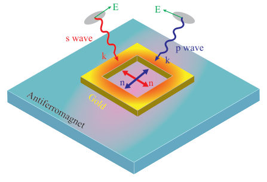
<figcaption class="paper-figure-caption"><b>Fig 1.</b> FIG. 1. Schematic illustration of a gold nanoframe and mag- netic thin film hybrid structure. The antiferromagnetic vector within the frame can be reversibly switched by alternating the polarizations of the incident light, enabled by plasmon- induced selective heating and strain effects.</figcaption>
</figure>
<figure class="paper-figure-card">
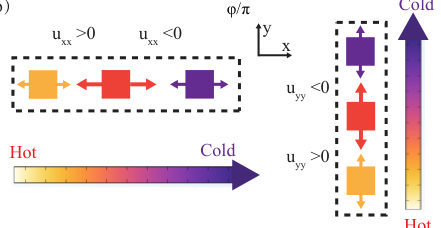
<figcaption class="paper-figure-caption"><b>Fig 2.</b> FIG. 2. (a) Energy landscape of the antiferromagnet with and without the strain field ume. The insets with arrows sketch the direction of the N´eel vector. (b) Illustration of the lattice deformation and the corresponding strain field in an elastic medium under a horizontal and vertical temperature gradient, respectively.</figcaption>
</figure>
<figure class="paper-figure-card">
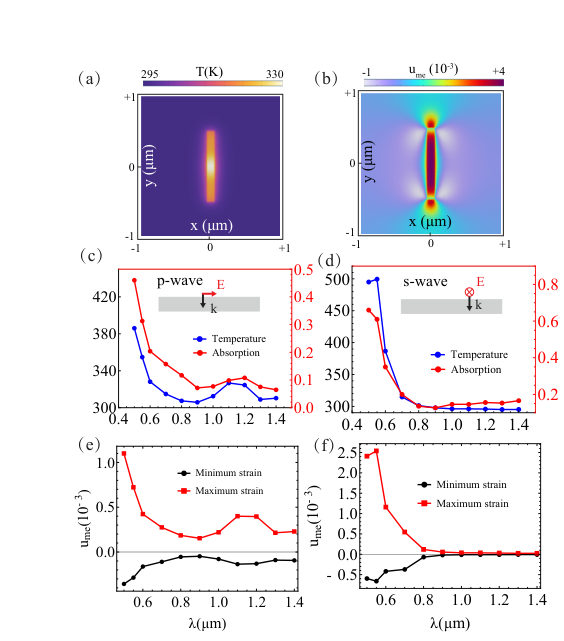
<figcaption class="paper-figure-caption"><b>Fig 3.</b> FIG. 3. (a-b) Temperature distribution and the correspond- ing strain profile in a hybrid structure of gold nanowire|NiO thin film. The nanowire is cuboid-shaped with dimensions 0.1×0.1×1.0 µm3 and the surface of the NiO film is 2×2 µm2. A single rectangular laser pulse (p-wave) with wavelength 1.2 µm, duration 1 ns, and peak power 0.4 W incident perpendic- ularly on the hybrid structure. The temperature and strain profile were recorded at 1 ns. All the thermal and optical parameters of Au and NiO, as well as the simulation method, can be found in the End Matter. (c-d) shows the average tem- perature (blue dots) and absorption cross section of the gold nanowire (red dots) as a function of...</figcaption>
</figure>
<figure class="paper-figure-card">
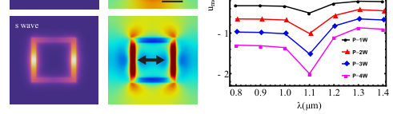
<figcaption class="paper-figure-caption"><b>Fig 4.</b> FIG. 4. (a) Time evolution of the surface strain field driven by a 1 ns laser pulse in a hybrid structure of gold nanowire|NiO thin film. The colored rectangle represents the temperature of the nanoframe at the corresponding time, with the same color bar shown in Fig. 4(c). λ = 1.2 µm, P = 1 W. Geometric parameters are the same as those in Fig. 3. (b) Snapshot of temperature profile and the corresponding strain distribution at the magnetic surface at t = 1 ns. (c) Time evolution of the in-plane tilting angle of the N´eel vector under the incidence of p wave (black line) and s wave (red line), respectively. (d) Strain field as a function of the wavelength of incident light for s-wave (solid...</figcaption>
</figure>
<figure class="paper-figure-card">
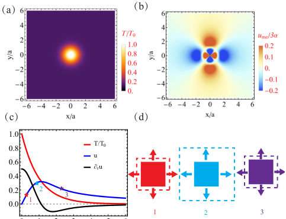
<figcaption class="paper-figure-caption"><b>Fig 5.</b> FIG. 5. (a-b) Axially symmetric temperature profile and the subsequent thermal-induced strain field distribution in an elastic medium. ν = 1/2 is used. (c) Radial dependence of the temperature (red line), radial displacement (blue line), and strain tensor component (black line). (d) Illustration of the lattice deformation in a medium under an inhomogeneous temperature distribution.</figcaption>
</figure>

**Main problem.** The challenge of high energy consumption and heat waste in traditional spintronic devices, specifically the difficulty of efficiently and reversibly switching antiferromagnetic (AFM) domains.

**Main result.** Demonstrated that controlled nanoscale plasmonic heating can reversibly switch AFM domains with energy consumption 3 to 6 orders of magnitude lower than current-driven methods by using polarization-dependent thermal strain.

**Method.** Multi-physics numerical simulations using COMSOL Multiphysics (Maxwell's equations, heat diffusion, and thermal-elastic equations) combined with custom micromagnetic simulations.

**Summary.** This paper proposes a paradigm shift in spintronics by using heat as a functional resource rather than a waste product. By using plasmonic heating in a gold nanostructure, the researchers show that light polarization can control thermal strain to switch antiferromagnetic domains. This method achieves switching energies significantly lower than traditional electrical methods. The approach offers a highly efficient, scalable path for all-optical magnetic information processing.

Detailed structure

**Model / system.** A hybrid nanostructure consisting of a metallic (gold) square frame/nanowire integrated with an antiferromagnetic (NiO) thin film.

**Key observables.** Temperature distribution, strain field components (u_xx, u_yy), absorption cross-section, and the orientation of the Néel vector.

**Important parameters / regimes.** Switching energy ~1 nJ; NiO Néel temperature ~525 K; 1 ns laser pulse duration; 1.2 um wavelength; thermal diffusion length ~100 nm.

**Assumptions / limitations.** The mechanism is robust at operating temperatures where temperature-dependent changes in NiO's thermal expansion and density are minimal (~1%).

**Figures summary.** Fig 1: Schematic of the hybrid structure and switching concept. Fig 2: Energy landscape and lattice deformation illustration. Fig 3: Wavelength dependence of temperature/absorption and strain anisotropy. Fig 4: Temporal evolution of strain and temperature. Fig 5: Radial dependence of temperature, displacement, and strain.

**Paper structure.** Introduction of the heat-as-a-resource paradigm, description of the hybrid Au/NiO system, detailed multi-physics simulation workflow, analysis of polarization-dependent strain generation, demonstration of reversible switching, and discussion of scalability and robustness.

Abstract

Heat waste is a bottleneck in the development of green information technologies and much effort has been devoted to suppress the heating effect in both electronic and spintronic devices. Here we take an alternative approach and show that controllable heating at the nanoscale can actually benefit information processing. In particular, we study a hybrid nanostructure consisting of a metallic square frame and an antiferromagnetic (AFM) thin film and show that the plasmonic heating can reversibly switch two perpendicularly-oriented AFM domains without the assistance of magnetic fields and electric currents. The required switching energy is at the order 1 nJ, three to six orders of magnitude lower than the current-driven AFM switching. The physical mechanism arises from the thermal-induced strain fields inside the frame, which couple to and manipulate the magnetic orientation via magnetoelastic effect. The strain field direction can be well controlled by selectively exciting the longitudinal and transverse plasmon modes by varying the polarization of the waves, which readily allows for a reversible switching of the AFM vector. Our findings provide tremendous opportunities for optically manipulating the magnetism with ultralow energy consumption and may further promote the interdisciplinary study of photonics, acoustics and spintronics.

[↑ back to top](#top)

### [Microscopic Modeling of Surface Roughness Scattering in Inversion Layers of MOSFETs Based on Ando's Linear Model](http://arxiv.org/abs/2604.22155v1)

**Authors:** Nobuyuki Sano  
**Type:** theory · **Category:** disordered systems and neural networks · **PDF:** <https://arxiv.org/pdf/2604.22155v1>  
**Analysis basis:** full PDF text, analyzed in chunks
**Topic relevance:** `Keldysh / 2PI / non-Gaussian methods` **2/5**

↔ Scroll figures horizontally

<figure class="paper-figure-card">
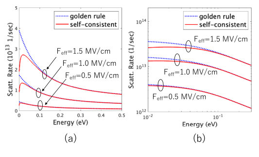
<figcaption class="paper-figure-caption"><b>Fig 1.</b> FIG. 2. (a) SR scattering rates in Si obtained by the self- consistent scheme (red curves) and by Fermi’s golden rule (blue dotted curves) as a function of electron energy for Feff= 0.5, 1.0, and 1.5 MV/cm. The roughness parameters of ¯∆m = 1.3 nm and σm = 0.7 nm are assumed. (b) Same as (a) on the log-log scale.</figcaption>
</figure>
<figure class="paper-figure-card">
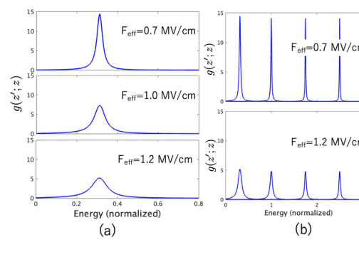
<figcaption class="paper-figure-caption"><b>Fig 2.</b> FIG. 1. (a) Integrand g (z′; z) of Eq. (28) at z =0.31 as a function of normalized electron energy z′ for three different effective electric fields, Feff= 0.7, 1.0, 1.2 MV/cm. Electron energy is normalized as z′ = εk′/εΛ. The roughness param- eters of ¯∆m = 1.3 nm and σm = 0.7 nm are assumed. (b) g (z′; z) as a function of normalized electron energy z′ at z = 0.31, 1, 1.75, 2.5 for Feff= 0.7 and 1.2 MV/cm.</figcaption>
</figure>
<figure class="paper-figure-card">
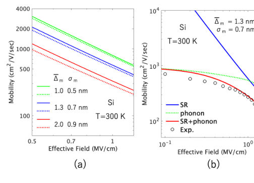
<figcaption class="paper-figure-caption"><b>Fig 3.</b> FIG. 3. SR-limited electron mobility in Si as a function of ef- fective electric field for various values of theoretical roughness parameters (Green, Blue, Red lines). Solid and dotted lines represent the mobilities obtained from the self-consistent SR scattering rates and from Fermi’s golden rule, respectively. (b) Electron mobilities in Si due to SR scattering (solid blue curve), phonon scattering (dotted green curve), and total (SR and phonon) scattering (solid red curve) as a function of ef- fective field. The roughness parameters of ¯∆m = 1.3 nm and σm = 0.7 nm are assumed. The phonon-limited mobility was taken from [15], and the experimental mobilities found from TEM are represented by...</figcaption>
</figure>

**Main problem.** The paper addresses the discrepancy between conventional Ando-style linear models for surface roughness (SR) scattering and experimental measurements, specifically the mismatch in roughness parameters and the inadequacy of Fermi's golden rule in high-field regimes.

**Main result.** The proposed microscopic model reconciles theoretical and experimental roughness parameters and demonstrates that a self-consistent Green's function approach predicts higher electron mobility than the conventional Fermi's golden rule, especially at low energies and high effective fields.

**Method.** The authors use a Green's function scheme and the Born approximation to derive a self-consistent scattering rate, treating the interface roughness position as a stochastic variable with a 2D Gaussian probability density.

**Summary.** This paper proposes a new microscopic model for surface roughness scattering in MOSFET inversion layers to resolve long-standing discrepancies between theory and experiment. By treating the interface roughness position as a stochastic variable, the authors show that the scattering rate is intrinsically nonlocal. They demonstrate that using a self-consistent Green's function approach, rather than the standard Fermi's golden rule, leads to more accurate predictions of electron mobility in high-field, low-energy regimes. This approach successfully aligns theoretical roughness parameters with those measured via TEM.

Detailed structure

**Model / system.** The system is the inversion layer of bulk Si-MOSFETs (specifically Si (100)) under strong inversion, modeled using a quantum-mechanical framework that accounts for the discontinuity of electrostatic potential and wave-function derivatives at the semiconductor/dielectric interface.

**Key observables.** Retarded self-energy, SR scattering rate, and SR-limited electron mobility.

**Important parameters / regimes.** Effective electric field (F_eff), electron energy (E), sheet density (N_s), roughness height (Delta_A), and correlation length (Lambda_A).

**Assumptions / limitations.** The model assumes a 2D Gaussian probability density for roughness position, neglects correlations between roughness at different atomic sites, and uses Ando's asymptotic expression for subband wave-functions.

**Figures summary.** Fig 1 shows the broadening/narrowing of the Green's function integrand with field and energy; Fig 2 compares scattering rates; Fig 3 compares mobility predictions (self-consistent vs. FGR) and shows the contribution of different scattering mechanisms (SR vs. phonon).

**Paper structure.** The paper introduces the discrepancy in existing models, proposes a microscopic stochastic model for interface roughness, derives the self-consistent scattering rate using Green's functions, compares the results to the conventional Fermi's golden rule, and validates the model against experimental mobility data.

Abstract

A microscopic model of surface roughness (SR) scattering in inversion layers of bulk-MOSFETs based on Ando's linear model is proposed. Taking into account the stochastic nature of roughness position induced by discontinuity of the spatial derivatives of electrostatic potential and wave-function at the semiconductor/dielectric interface, a probability density of roughness position is introduced at each atomic site. The roughness parameters in the proposed model are consistent with those from experiments, and thus, there is no discrepancy between theory and experiment. The SR scattering rate is then derived by using the Green's function scheme, and we find that the scattering rate is intrinsically nonlocal (nondiagonal) with respect to subband indices and position. In addition, the self-consistent scattering rate greatly deviates from those obtained by Fermi's golden rule in the regimes of strong effective fields and low electron energies. As a result, the conventional model tends to predict smaller SR-limited mobility.

[↑ back to top](#top)

### [Nature of point defects in bulk hexagonal diamond](http://arxiv.org/abs/2604.22393v1)

**Authors:** Ling Zhu, Xuanxuan Zhang, Guliqinayi Alimu, Chen-Min Dai, Chunlan Ma, Zenghua Cai  
**Type:** theory · **Category:** quantum information and computing · **PDF:** <https://arxiv.org/pdf/2604.22393v1>  
**Analysis basis:** full PDF text, analyzed in chunks
**Topic relevance:** `spintronics-quantum-optics interface` **2/5**

↔ Scroll figures horizontally

<figure class="paper-figure-card">
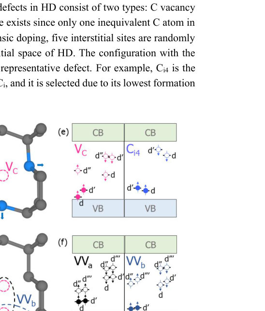
<figcaption class="paper-figure-caption"><b>Fig 1.</b> FIG. 1. Structural configurations of (a) host HD, (b) neutral VC, (c) neutral Ci4, and (d) neutral divacan-</figcaption>
</figure>
<figure class="paper-figure-card">
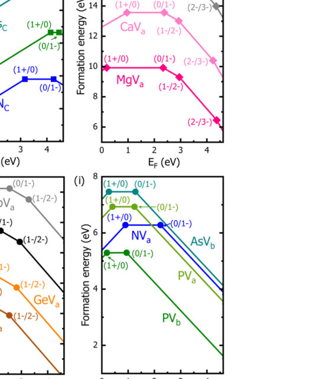
<figcaption class="paper-figure-caption"><b>Fig 2.</b> FIG. 2. The calculated formation energies of (a) VC, Ci4, VVa, VVb, (b) MgC, CaC, SrC, (c) BC, Bi1, AlC,</figcaption>
</figure>
<figure class="paper-figure-card">
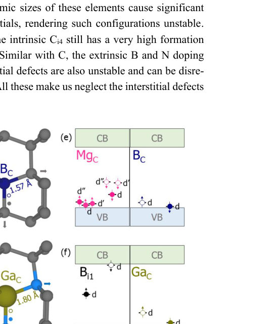
<figcaption class="paper-figure-caption"><b>Fig 3.</b> FIG. 3. Structural configurations of (a) neutral MgC, (b) neutral BC, (c) neutral Bi1, and (d) neutral GaC</figcaption>
</figure>
<figure class="paper-figure-card">
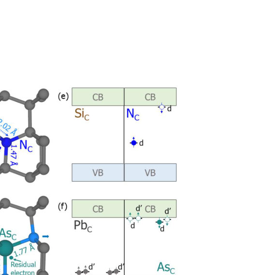
<figcaption class="paper-figure-caption"><b>Fig 4.</b> FIG. 4. Structural configurations of (a) neutral SiC, (b) neutral NC, (c) neutral PbC, and (d) neutral AsC</figcaption>
</figure>
<figure class="paper-figure-card">
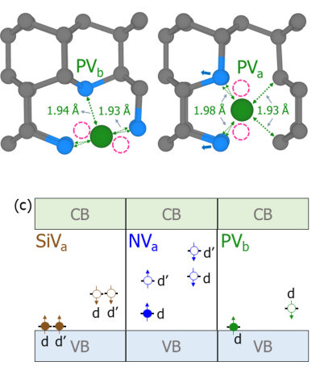
<figcaption class="paper-figure-caption"><b>Fig 5.</b> FIG. 5. (a) Structural configurations of XVI defect complex (X= B, N), XVII defect complex (X = Mg,</figcaption>
</figure>
<figure class="paper-figure-card">
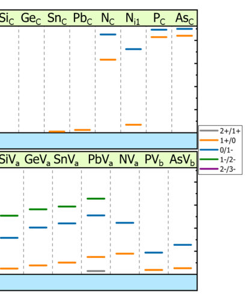
<figcaption class="paper-figure-caption"><b>Fig 6.</b> FIG. 6. The calculated transition energy levels of (a) the intrinsic and extrinsic point defects; (b) intrinsic</figcaption>
</figure>

**Main problem.** The study aims to systematically investigate the nature, stability, and electronic properties of intrinsic and extrinsic point defects and defect complexes in bulk hexagonal diamond (HD) for applications in conductivity engineering and quantum technologies.

**Main result.** The researchers identified Boron as an effective p-type acceptor and Nitrogen/Phosphorus as effective n-type donors, while also discovering that certain complexes like VC, MgC, and XV exhibit multiple spin and charge states suitable for use as color centers/qubits.

**Method.** First-principles calculations using Density Functional Theory (DFT) with the VASP code, employing the HSE06 hybrid functional and the FNV scheme for charge corrections.

**Summary.** This paper provides a comprehensive theoretical study of point defects in hexagonal diamond. It identifies key dopants for controlling electrical conductivity, specifically Boron for p-type and Nitrogen/Phosphorus for n-type. Crucially, it highlights several defect types that could serve as stable color centers for quantum computing. The work establishes a roadmap for engineering the electronic and quantum properties of this carbon allotrope.

Detailed structure

**Model / system.** The physical system is bulk hexagonal diamond (HD), an exotic carbon allotrope (lonsdaleite) with an ABAB stacking sequence, featuring both intrinsic (vacancies, interstitials) and extrinsic (Group II, III, IV, and V) defects.

**Key observables.** Defect formation energies, transition energy levels (TELs), charge states, spin polarization, and binding energies of defect complexes.

**Important parameters / regimes.** Chemical potentials under C-rich conditions, Fermi level position, and band gap width (calculated at 4-4.62 eV).

**Assumptions / limitations.** Calculations were performed under C-rich conditions and assumed the stability of the HD phase without secondary phase formation.

**Figures summary.** Figure 2 shows formation energies of various XV complexes; Figure 5 illustrates structural distortions in P-related complexes; Figure 6 displays calculated transition energy levels within the HD band gap.

**Paper structure.** The paper introduces the properties of HD, details the DFT computational methodology, presents a systematic investigation of intrinsic defects, moves to extrinsic dopants by group, analyzes defect complexes, and concludes with implications for quantum and electronic applications.

**Why it may be interesting.** The identification of specific defect complexes (VC, MgC, XV) that host multiple spin and charge states within the band gap is highly relevant for the development of solid-state color centers for quantum information processing.

Abstract

Hexagonal diamond (HD), an exotic carbon allotrope recently synthesized in bulk form, exhibits superior mechanical properties compared to cubic diamond (CD) and holds promise for advanced industrial and quantum applications. Using first-principles calcu-lations, we systematically investigate intrinsic defects, extrinsic dopants, and defect complexes in HD. Our study shows that VC dominates intrinsic conductivity, while Ci is unstable. Among extrinsic dopants, boron acts as a benign acceptor enhancing p-type conductivity, whereas nitrogen and phosphorus serve as effective donors for n-type conductivity. Group II and Group IV dopants, however, introduce high formation energies or neutral charge states with limited impact. Furthermore, VC, MgC and XV defect com-plexes display multiple spin and charge states within the HD band gap, highlighting their potential as color centers for hosting qubits. These results not only clarify the defect physics of HD but also demonstrate its broader implications for conductivity engineering and quantum technologies.

[↑ back to top](#top)

### [Non-volatile superconducting tunnelling magnetoresistance memory enabled by exchange-field gap engineering](http://arxiv.org/abs/2604.22214v1)

**Authors:** Sonam Bhakat, Pushpak Banerjee, Ahmedullah Aziz, Jackson Miller, Avradeep Pal  
**Type:** experiment · **Category:** quantum information and computing · **PDF:** <https://arxiv.org/pdf/2604.22214v1>  
**Analysis basis:** full PDF text, analyzed in chunks
**Topic relevance:** `QC/QI experiment` **2/5**

↔ Scroll figures horizontally

<figure class="paper-figure-card">
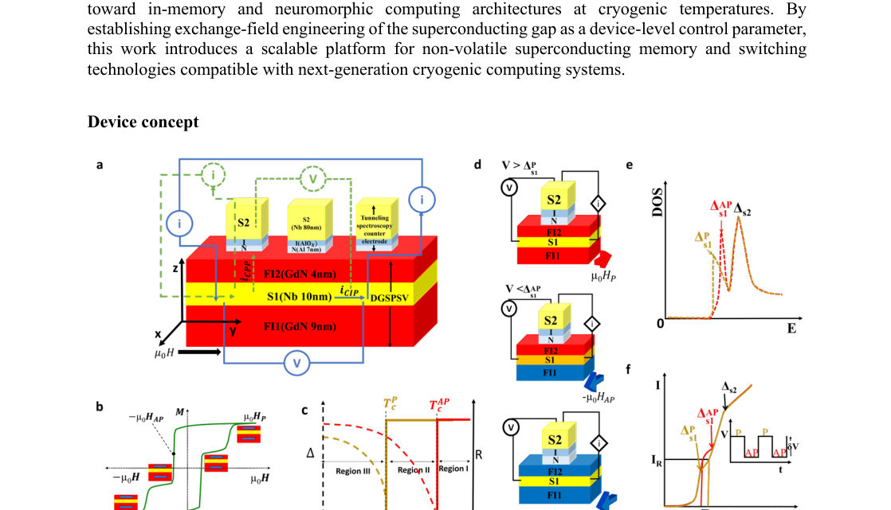
<figcaption class="paper-figure-caption"><b>Fig 1.</b> Figure 1|: a) A cartoon representation of a fabricated de Gennes spin valve, with FI1/S/FI2/N/I/S layers for probing both CIP (measured using a current source and voltmeter in blue colour which probes the S1 layer) and CPP characteristics (simplistically demonstrated by using a current source and voltmeter in green colour, which probes the characteristics of the S1/FI2/N/I/S2 tunnel junction. In actual experiment, the differential conductance of the tunnel junction is measured by means of an AC+DC adder box and a lockin amplifier) b) Expected magnetic characteristics of the unpatterned sample. c) Cartoon illustration of CIP resistivity of the S1 layer (Red and golden solid lines), and...</figcaption>
</figure>
<figure class="paper-figure-card">
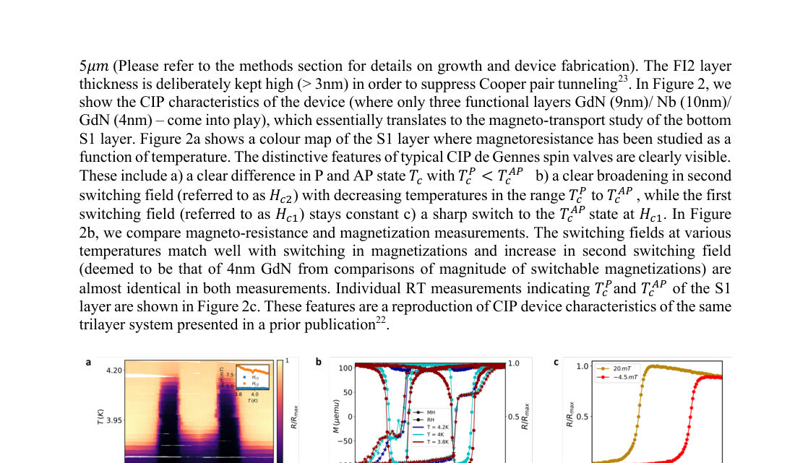
<figcaption class="paper-figure-caption"><b>Fig 2.</b> Figure 2: CIP behaviour of the AlN (20nm)/ GdN (9nm)/ Nb (10nm)/ GdN (4nm)/Al (7nm)-AlOx/ Nb (100nm) device a) Colour map shows Resistance vs magnetic field behaviour measured at various temperatures (3.7K to 4.25K) of S1 layer in CIP mode. Measurements are only shown for 0 to +15mT and 0 to -15mT sweeps of field. Inset to Figure a show the temperature dependence of the two switching fields which are extracted from the colour map b) Combined CIP magneto-resistance (patterned sample) and magnetization behaviour (of unpatterned sample) at 3.8K, 4K and 4.2K. c) Two line-cuts from Figure 2a to demonstrate the R vs T measurements at P and AP fields (+15mT and -4.5mT) respectively. Demonstration...</figcaption>
</figure>
<figure class="paper-figure-card">
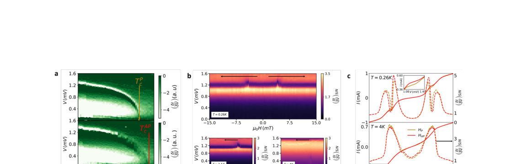
<figcaption class="paper-figure-caption"><b>Fig 3.</b> Figure 3: CPP behaviour of the device a) Top (bottom) panel shows colormap of normalized differential conductance measurements done at fields corresponding to the P (AP) orientation of F1 and F2 layers at several temperatures from 1.7K to 4.3K. b) Differential conductance colour maps as a function of bias voltage and in-plane magnetic field at representative temperatures T=0.26K (top), 2.5K (bottom left), and 4K (bottom right), showing pronounced enhancements of normalized differential conductance signals at fields corresponding to AP orientation between FI1 and FI2 layers. Black arrows indicate field sweep direction. c) Current–voltage characteristics (solid lines, corresponding to left y...</figcaption>
</figure>
<figure class="paper-figure-card">
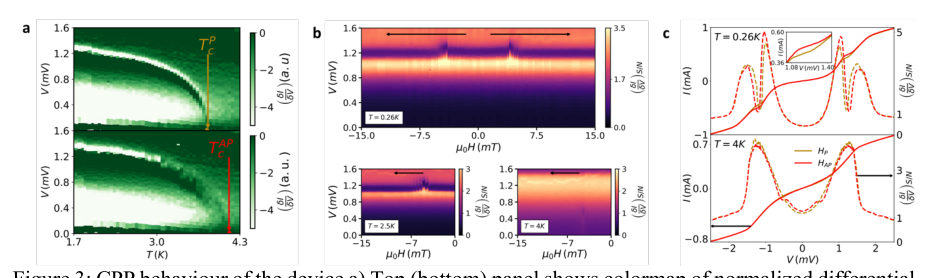
<figcaption class="paper-figure-caption"><b>Fig 4.</b> Figure 4| Demonstration of non-volatile bistable switching in CPP mode, at (a) T=0.25K (Region III of Figure 1c) and (b) T=4K (Region II of Figure 1c), under periodic in-plane magnetic field sweeps. Top panels: normalized voltage</figcaption>
</figure>

**Main problem.** The lack of scalable, energy-efficient, and non-volatile memory technologies compatible with superconducting and quantum computing systems operating below 4K.

**Main result.** Demonstration of a superconducting tunneling magnetoresistance device that achieves non-volatile, temperature-independent switching of the superconducting energy gap via exchange-field engineering.

**Method.** The researchers used ultra-high vacuum sputtering to grow a multi-layered thin film stack and employed multi-step lithography to create mesa-type junctions, followed by tunneling spectroscopy and magneto-transport measurements.

**Summary.** This paper presents a new type of superconducting memory element that uses magnetic fields to tune the superconducting energy gap. Unlike previous technologies that only work in a narrow temperature range, this device remains functional and non-volatile across the entire superconducting temperature range. It operates with extremely low power consumption (nanowatts) and is compatible with existing niobium-based superconducting logic. This makes it a promising candidate for building scalable, energy-efficient hardware for quantum and neuromorphic computing.

Detailed structure

**Model / system.** A vertical current-perpendicular-to-plane (CPP) device architecture consisting of a de Gennes spin valve integrated with a superconducting tunnel junction, specifically a GdN/Nb/GdN/Al-AlOx/Nb multilayer stack.

**Key observables.** Superconducting energy gap (delta), Quasiparticle Tunneling Magnetoresistance (QTMR), differential conductance (dI/dV), and transition temperature (Tc).

**Important parameters / regimes.** Operating temperatures down to 0.25K, nanowatt-level read power, zero standby dissipation, and 95% spin polarization.

**Assumptions / limitations.** The device is modeled as two parallel segments where the S1 electrode is subject to Zeeman splitting and spin-orbit scattering, and the S2 electrode acts as a stable, magnetically decoupled reference.

**Figures summary.** Figure 2 shows CIP resistance vs. magnetic field and temperature; Figure 4c shows bias-dependent QTMR.

**Paper structure.** The paper introduces the bottleneck in cryogenic hardware, describes the device architecture and fabrication, presents magneto-transport and tunneling spectroscopy results, validates the mechanism through numerical modeling of the density of states, and discusses applications in neuromorphic and cryogenic computing.

Abstract

Scalable, low-dissipation memory operating below 4 K is a critical requirement for superconducting and quantum computing systems. Existing cryogenic memory technologies rely on CMOS derivatives or hybrid architectures that incur leakage, refresh overhead or limited compatibility with superconducting logic. Here we demonstrate a superconducting tunnelling magnetoresistance device that functions as a non-volatile cryogenic memory element across the full superconducting temperature range. By integrating a de Gennes spin valve with a superconducting tunnel junction in a current perpendicular-to-plane geometry, we realise exchange-field control of the superconducting energy gap. This produces two magnetically switchable gap voltages and robust quasiparticle tunnelling magnetoresistance down to 0.25 K.The device operates at millivolt bias with nanowatt-level read power and zero standby dissipation. Its vertical junction architecture and Nb-based materials platform enable compatibility with superconducting logic and scalable cryogenic memory arrays.

[↑ back to top](#top)

### Other secondary papers (19)

Show other secondary papers

### [Accurate calculation of Wannier centers, position matrix, and composite operators using translationally equivariant and higher-order finite differences](http://arxiv.org/abs/2604.22614v1)

**Authors:** Jae-Mo Lihm, Minsu Ghim, Seung-Ju Hong, Cheol-Hwan Park  
**Type:** theory · **Category:** numerical methods · **PDF:** <https://arxiv.org/pdf/2604.22614v1>  
**Analysis basis:** full PDF text, analyzed in chunks

↔ Scroll figures horizontally

<figure class="paper-figure-card">
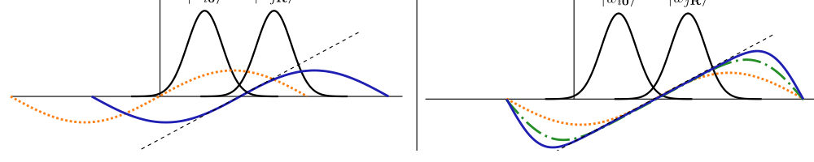
<figcaption class="paper-figure-caption"><b>Fig 1.</b> FIG. 1. (a, b) Schematic illustration of the simple finite difference (S-FD) and translationally-equivariant finite difference (TEFD) methods for (a) the diagonal position matrix elements (Wannier centers) and (b) the off-diagonal position matrix elements. In the S-FD method, the exact position operator (dashed black lines) is approximated by a sinusoidal function centered at the origin (dotted orange curves). In the TEFD method, the sinusoidal approximant is shifted to be centered at the Wannier center or the midpoint between two Wannier centers (solid blue curves), making the FD approximation most accurate at positions where the WFs have the largest magnitude. (c, d) Schematic...</figcaption>
</figure>
<figure class="paper-figure-card">
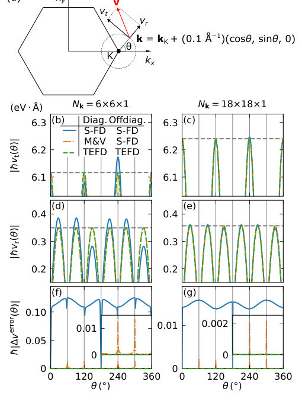
<figcaption class="paper-figure-caption"><b>Fig 2.</b> FIG. 3. (a) Brillouin zone of graphene and a circular path (dotted black circle) around the K point. (b, c) Tangential and (d, e) radial components of the interband velocity ma- trix elements between the lower and upper branches of the Dirac cone along this path, computed using Eq. (54). We show three curves, corresponding to different FD approaches for diagonal and off-diagonal position matrix elements. (f, g) The C3 symmetry-breaking error of the interband velocity matrix elements. The plotted quantity is the magnitude of the difference between the velocity matrix elements at θ and θ + 120◦in the respective local coordinates: ∆verror(θ) = p</figcaption>
</figure>
<figure class="paper-figure-card">
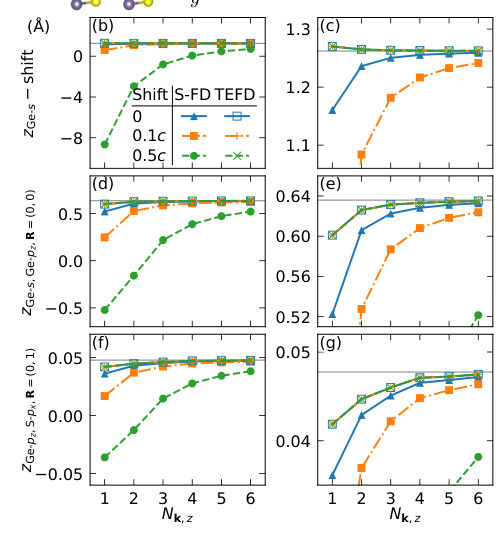
<figcaption class="paper-figure-caption"><b>Fig 3.</b> FIG. 2. (a) Three structures of monolayer GeS with different out-of-plane shifts. We set the out-of-plane lattice constant to c = 15 ˚A. (b) The z-component of the Wannier center of the s-orbital-like WF of monolayer GeS for different shifts and a 12 × 12 × Nk,z k grid, computed using S-FD [Eq. (15)] and TEFD [Eq. (47)]. The gray horizontal line indicates the converged value at Nk,z →∞, obtained by a 1/N 2 k,z extrapo- lation. (c) Magnified view of panel (b). (d-g) Same as panels (b) and (c), but for off-diagonal matrix elements.</figcaption>
</figure>
<figure class="paper-figure-card">
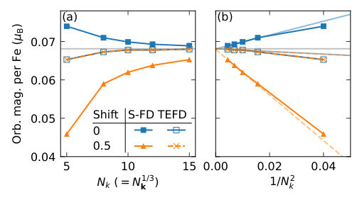
<figcaption class="paper-figure-caption"><b>Fig 4.</b> FIG. 4. Orbital magnetization of bcc Fe, computed using the S-FD and TEFD methods, as a function of (a) the coarse grid size and (b) its squared inverse. The results for two equivalent but shifted structures are shown. The shift is applied along all three directions: for a shift of 0.5, the Fe atom is centered at (0.5, 0.5, 0.5) in crystal coordinates.</figcaption>
</figure>
<figure class="paper-figure-card">
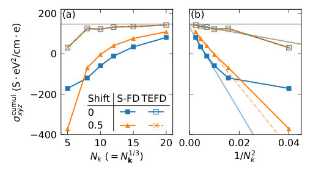
<figcaption class="paper-figure-caption"><b>Fig 5.</b> FIG. 6. Cumulative spin Hall conductivity [Eq. (70)] of GaAs, computed using the S-FD and TEFD methods, as a function of (a) the coarse grid size and (b) its squared inverse. The results for two equivalent but shifted structures are shown. Before the shift, the Ga and As atoms are at (0.0, 0.0, 0.0) and (−0.25, −0.25, −0.25), respectively, in crystal coordinates. Af- ter the shift of 0.5, the two atoms are placed at (0.5, 0.5, 0.5) and (0.25, 0.25, 0.25).</figcaption>
</figure>
<figure class="paper-figure-card">
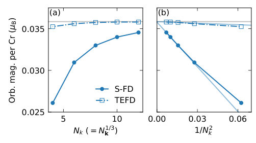
<figcaption class="paper-figure-caption"><b>Fig 6.</b> FIG. 5. Orbital magnetization of CrO2, computed using the S-FD and TEFD methods, as a function of (a) the coarse grid size and (b) its squared inverse. The Cr atoms are at (0.0, 0.0, 0.0) and (0.5, 0.5, 0.5) in crystal coordinates.</figcaption>
</figure>
<figure class="paper-figure-card">
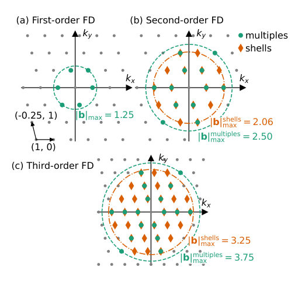
<figcaption class="paper-figure-caption"><b>Fig 7.</b> FIG. 7. (a) Selected b vectors for the first-order FD method applied to a two-dimensional system with reciprocal lattice vectors (1, 0) and (−0.25, 1). (b) Selected b vectors for the second-order FD method using the multiples scheme (green circles) and the shells scheme (orange diamonds). The b vec- tors for the multiples scheme are integer multiples of the b vectors in (a). The b vectors for the shells scheme fit inside a circle of smaller radius (2.06) than that for the multiples scheme (2.50). We note that for a square lattice, the two schemes are equivalent.</figcaption>
</figure>
<figure class="paper-figure-card">
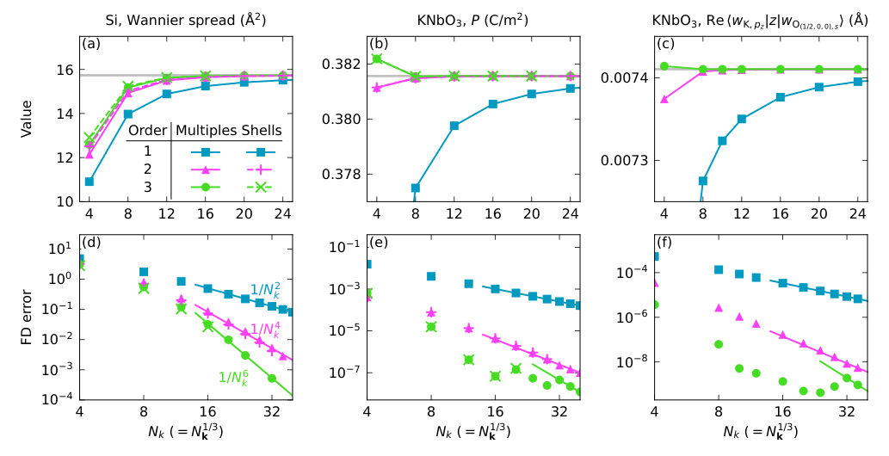
<figcaption class="paper-figure-caption"><b>Fig 8.</b> FIG. 8. Convergence of (a) the Wannier spread of Si, (b) the macroscopic polarization [Eq. (74)] of KNbO3, and (c) the off-diagonal z matrix element between the WFs constructed from a pz orbital at a potassium atom and an s orbital at an oxygen atom of KNbO3. We used uniform coarse k-point grids of size Nk = Nk × Nk × Nk. For all cases, we used equivariant formulas. For (a, b), we compare the results from the multiples and shells schemes for HOFD and find that the two results are almost identical except at very coarse meshes. Thus, in (c), we show only the results from the multiples scheme. Note that the two schemes are equivalent for the first-order FD method. The converged polarization of...</figcaption>
</figure>
<figure class="paper-figure-card">
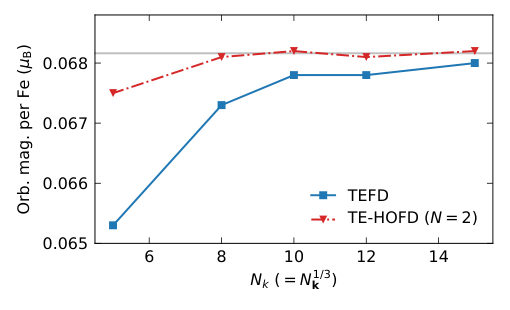
<figcaption class="paper-figure-caption"><b>Fig 9.</b> FIG. 10. Orbital magnetization of bcc Fe as a function of the coarse grid, computed using the first-order TEFD and second-order TE-HOFD methods.</figcaption>
</figure>
<figure class="paper-figure-card">
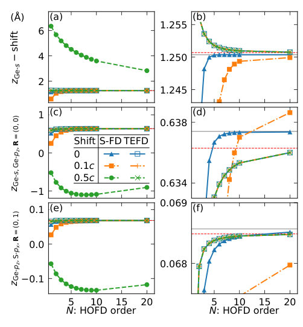
<figcaption class="paper-figure-caption"><b>Fig 10.</b> FIG. 9. Wannier centers and position matrix elements of monolayer GeS (see Fig. 2 for details), computed using (i) S-FD plus HOFD method and (ii) TE-HOFD method as a function of order. We used a 12 × 12 × 1 k grid. The horizon- tal lines show the results obtained using a direct real-space calculation using the full FFT mesh of the plane-wave basis DFT calculation. The z operator is approximated as a saw- tooth function, with the center at the origin of the unit cell (solid gray lines) or at the Wannier center or the midpoint of the two Wannier centers (dashed red lines).</figcaption>
</figure>

**Main problem.** Standard finite-difference approximations for position and composite operators in Wannier interpolation suffer from slow convergence, broken translational equivariance, and violations of crystal symmetries.

**Main result.** The authors developed a translationally equivariant finite-difference (TEFD) scheme and a higher-order (HOFD) approach that restore system symmetries, ensure size-consistency, and significantly accelerate convergence of $k$-space derivatives.

**Method.** The work introduces a midpoint-based TEFD scheme to ensure equivariance and a higher-order HOFD method using weighted $k$-point grids to improve error scaling from $O(b^{-2})$ to $O(b^{-2N})$.

**Summary.** This paper presents improved numerical algorithms for Wannier interpolation used in first-principles calculations. By introducing translationally equivariant and higher-order finite-difference schemes, the authors solve long-standing issues regarding symmetry-breaking errors and slow convergence in calculating quantum geometric properties. The new methods are implemented in widely used open-source packages like Wannier90 and WannierBerri, making them immediately accessible for more accurate electronic structure simulations.

Detailed structure

**Model / system.** The methods are applied to periodic electronic systems (solids) described by Bloch wavefunctions and Wannier functions, with specific test cases including graphene, GeS, bcc Fe, CrO2, and GaAs.

**Key observables.** Wannier centers and spreads, electric polarization, orbital magnetization, spin Hall conductivity, and interband velocity matrix elements.

**Important parameters / regimes.** k-point grid density, finite-difference order, and translation shift parameters.

**Assumptions / limitations.** The derivation assumes the localization of Wannier functions and, for certain symmetry proofs, assumes a simplified case where one Wannier function transforms into exactly one other.

**Figures summary.** Figure 1 compares S-FD vs. TEFD and HOFD schemes; Figure 2 shows Wannier center stability under shifts in GeS; Figure 4-6 demonstrate orbital magnetization and spin Hall conductivity convergence in Fe, CrO2, and GaAs; Figure 12-13 compare spin-velocity interpolation methods and convergence in GaAs.

**Paper structure.** The paper begins by identifying errors in standard finite-difference methods, then introduces the TEFD and HOFD schemes, provides mathematical proofs for symmetry and size-consistency, demonstrates application to composite operators, and concludes with numerical validation on various materials and implementation details in open-source codes.

Abstract

The momentum-space derivatives of Bloch wavefunctions are essential for studying quantum geometry and the equilibrium and response properties of solids. In practical first-principles calculations, these derivatives are obtained via Wannier interpolation of position and related composite matrices. These matrices are initially evaluated on a coarse k-point grid using finite-difference approximations and then interpolated to a dense grid. The accuracy of the finite-difference approximation directly impacts the convergence and reliability of the result. In this work, we present two key improvements to the finite-difference calculation of position and composite operators for Wannier interpolation. First, we formulate a translationally equivariant scheme that preserves the underlying symmetries of the system and significantly reduces finite-difference errors. Second, we introduce a higher-order finite-difference approach that yields a more accurate approximation of the k-space derivatives by systematically increasing the convergence rate. From a real-space perspective, these improvements correspond to better approximations of the position operator at the locations of the Wannier functions. We also present a generalization of the finite-difference scheme, which may reduce the number of finite-difference points while maintaining accuracy. We demonstrate the effectiveness of our methods by applying them to the calculation of Wannier centers and spreads, electric polarization, off-diagonal position matrix elements, orbital magnetization, and spin Hall conductivity. Our results demonstrate significant reductions in finite-difference errors, elimination of symmetry-violating errors, and improved convergence with respect to k-point sampling. These methods have been implemented in the open-source packages and can be readily adopted in other Wannier-based codes with minimal computational overhead.

[↑ back to top](#top)

### [Accurate Nanoscale Mapping of Electric Fields across Random Grain Boundaries in Polycrystalline Oxides Using Precession-Assisted 4D-STEM](http://arxiv.org/abs/2604.22398v1)

**Authors:** Sangjun Kang, Hyeyoung Cho, Maximilian Töllner, Anna Rose Nelson, Ziming Ding, Xiaoke Mu, Di Wang, Wolfgang Rheinheimer, Kai Wang, Bai-Xiang Xu, Jakob Konstantin Laux, Mahmoud Serour, Karsten Albe, Andreas Klein, Christian Kübel  
**Type:** both · **Category:** other · **PDF:** <https://arxiv.org/pdf/2604.22398v1>  
**Analysis basis:** full PDF text, analyzed in chunks

↔ Scroll figures horizontally

<figure class="paper-figure-card">
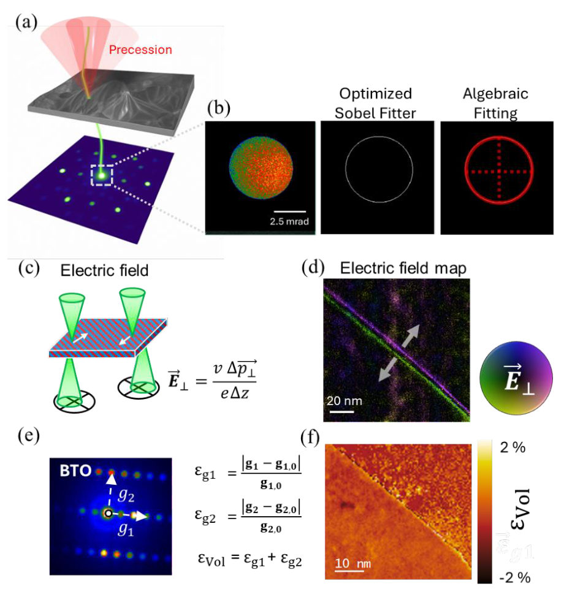
<figcaption class="paper-figure-caption"><b>Fig 1.</b> Figure 1. Workflow for reliable mapping of electric field and strain across grain boundaries in polycrystalline oxides using precession-assisted 4D-STEM and SVD-based diffraction shift detection. (a) Schematic illustration of electron beam precession during 4D-STEM acquisition to reduce diffraction and orientation contrast. (b) Central bright-field disk from a diffraction pattern processed via an optimized Sobel edge filter followed by algebraic ellipse fitting using SVD to robustly extract the disk position. (c) Electric field-induced deflection of the central disk due to transverse momentum transfer, used to reconstruct the projected electric field. (d) In-plane electric field map showing...</figcaption>
</figure>
<figure class="paper-figure-card">
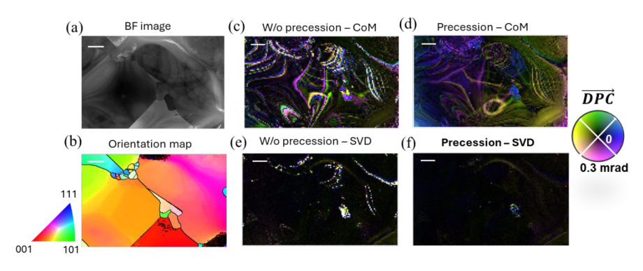
<figcaption class="paper-figure-caption"><b>Fig 2.</b> Figure 2. Comparison of DPC maps obtained by different 4D-STEM acquisition and processing. (a) BF-STEM image showing the region selected for 4D-STEM acquisition, which is expected to yield a uniform field distribution (except for few GBs). (b) 4D-STEM ACOM orientation map of the same region, showing the local crystallographic orientation distribution. (c, d) Color maps of the DPC signal obtained using the conventional center-of-mass (CoM) method: (c) without beam precession and (d)</figcaption>
</figure>
<figure class="paper-figure-card">

<figcaption class="paper-figure-caption"><b>Fig 3.</b> Figure 3. Quantitative 4D-STEM analysis of a random grain boundary. (a) ADF-STEM image of the analyzed area containing a grain boundary. (b, c) Representative local diffraction patterns acquired from the two grains on either side of the boundary. (d, e) DPC signal perpendicular to the GB obtained using the CoM method: (d) without beam precession and (e) with beam precession. (f, g) DPC signal perpendicular to GB obtained by the SVD-based disk fitting method: (f) without beam precession and (g) with beam precession.</figcaption>
</figure>
<figure class="paper-figure-card">
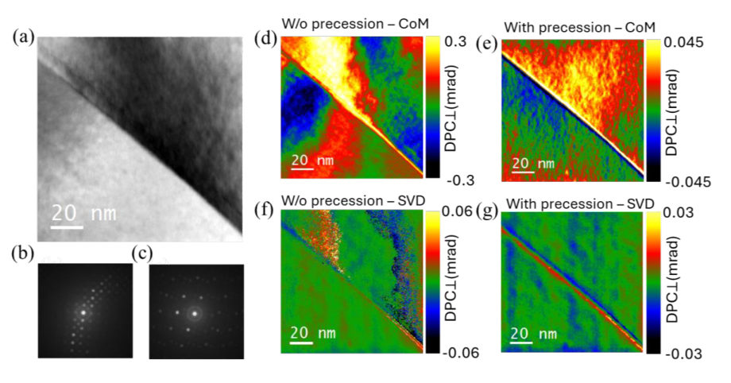
<figcaption class="paper-figure-caption"><b>Fig 4.</b> Figure 3 shows the DPC analysis across a random grain boundary using 4D-STEM. Figure 3a presents the ADF-STEM image of the analyzed region, in which the grain boundary is clearly resolved as a diagonal interface separating two adjacent grains. The local diffraction patterns taken from the two sides of the grains are shown in Figures 3b and 3c. These patterns confirm a random crystallographic misorientation between the neighboring grains.</figcaption>
</figure>
<figure class="paper-figure-card">
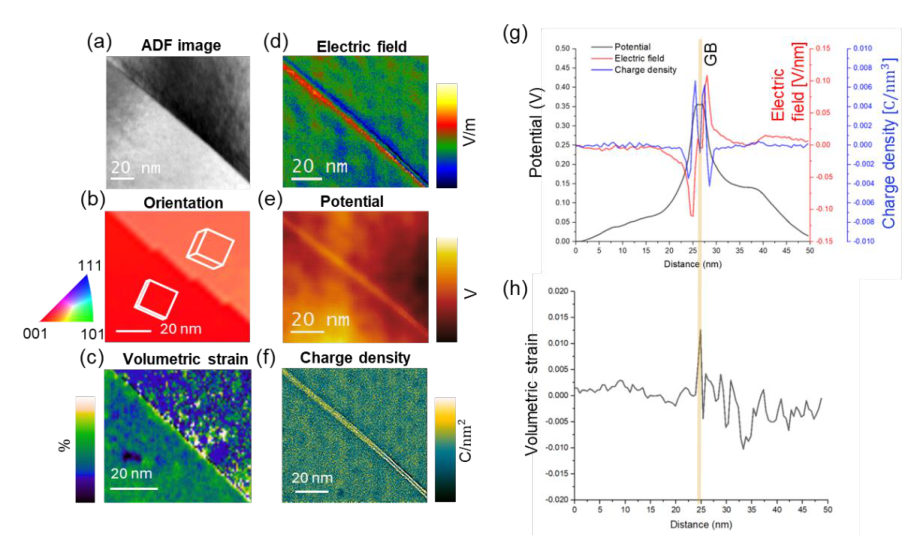
<figcaption class="paper-figure-caption"><b>Fig 5.</b> Figure 4. Quantitative electrostatic potential, electric-field and charge-density analysis across a single random grain boundary using precession 4D-STEM. (a) ADF-STEM image of the analyzed region. (b) 4D-STEM ACOM orientation map indicating the two neighboring grains; the overlaid cuboids schematically represent their crystallographic orientation. (c) Volumetric strain map of the same area. (d) In-plane electric-field map showing the component normal to the grain boundary obtained by DPC analysis. (e) Electrostatic potential map derived from the measured electric field. (f) Charge-density map calculated from the electric-field distribution. (g) Line profiles of electrostatic potential...</figcaption>
</figure>
<figure class="paper-figure-card">

<figcaption class="paper-figure-caption"><b>Fig 6.</b> Figure 4 demonstrates that the present 4D-STEM approach enables correlative analysis of structural and electrostatic quantities across a single grain boundary from the same region. Figure 4a shows the ADF-STEM image of the analyzed region. Figure 4b shows the corresponding 4D-STEM ACOM crystal orientation map, confirming that the interface separates two crystallographically distinct grains; the overlaid cuboids schematically indicate their crystallographic orientation. Figure 4c shows the volumetric strain map of the same area, providing structural information that can be compared directly with the electrostatic response within the same region. Figure 4d shows the in-plane electric-field...</figcaption>
</figure>
<figure class="paper-figure-card">
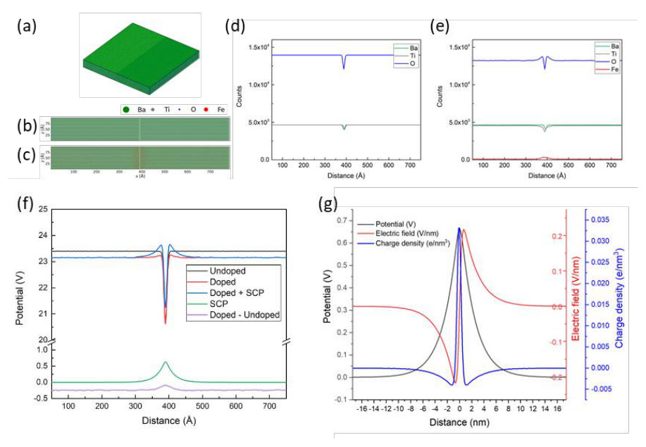
<figcaption class="paper-figure-caption"><b>Fig 7.</b> Figure 5. Atomic structure and electrostatic analysis of a Σ5 grain boundary in BaTiO₃ based on atomistic modeling. (a) Atomistic simulation cell of the grain-boundary model. (b, c) Atomic configurations of the grain-boundary region for the undoped and Fe-doped models. (d, e) Element-resolved atom counting profiles across the grain boundary for the undoped and the Fe-doped models. (f) Comparison of the mean inner potential (MIP) profiles for the undoped and doped models together with the space-charge potential (SCP), the combined potential, and the difference between the doped and undoped MIP profiles. (g) Electrostatic potential, electric field, and charge-density profiles reconstructed...</figcaption>
</figure>
<figure class="paper-figure-card">

<figcaption class="paper-figure-caption"><b>Fig 8.</b> Figure 5 provides an atomistic-model-based framework for interpreting the DPC signal across a Σ5 grain boundary in BaTiO₃ as exemplary case study using the experimentally measured compositional profiles for the Fe distribution. Figures 5a-c show the grain-boundary model and the corresponding undoped and Fe-doped atomic structures, while Figures 5d and 5e show the associated elemental profiles. Based on these profiles, the MIP contribution and the space- charge potential were evaluated separately and then combined, as summarized in Figure 5f. The results show that the gradient of the segregation-induced MIP changes contribute to the measured DPC signal and therefore must be considered for a...</figcaption>
</figure>
<figure class="paper-figure-card">
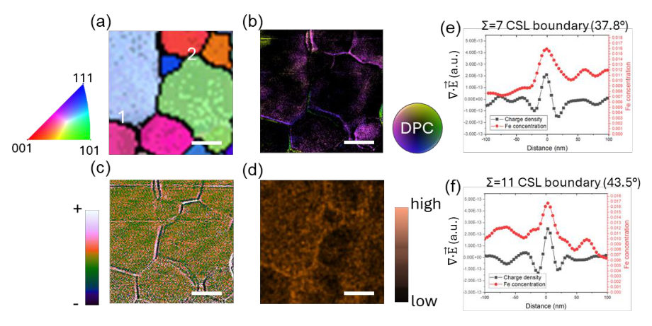
<figcaption class="paper-figure-caption"><b>Fig 9.</b> Figure 6. Large-area correlative mapping of microstructure, DPC response, reconstructed charge density, and Fe distribution in polycrystalline Fe-doped SrTiO3. (a) ACOM orientation map of the analyzed region, with the orientation color key shown on the left; the two grain boundaries selected for detailed analysis are labeled 1 and 2. (b) Corresponding large-area DPC map, with the DPC color wheel shown as a reference, revealing pronounced interfacial contrast at the grain boundaries. (c) Charge- density map reconstructed from the divergence of the DPC-derived electric field, showing localized electrostatic features at the grain boundaries while the grain interiors remain comparatively...</figcaption>
</figure>

**Main problem.** The difficulty of accurately mapping nanoscale electric fields and charge distributions at random grain boundaries in polycrystalline oxides due to diffraction-induced artifacts and orientation-dependent contrast in conventional STEM-DPC analysis.

**Main result.** The combination of electron beam precession and SVD-based disk fitting significantly reduces crystallographic artifacts, enabling high-fidelity mapping of electric fields and charge density in complex polycrystalline structures.

**Method.** An experimental approach integrating electron beam precession with an advanced post-processing workflow using iterative Sobel filtering and Singular Value Decomposition (SVD) for ellipse fitting, complemented by atomistic MD simulations.

**Summary.** This paper presents a new 4D-STEM technique to overcome the limitations of conventional electron microscopy when measuring electric fields at grain boundaries. By combining electron beam precession with a specialized SVD-based mathematical fitting of diffraction disks, the researchers suppressed artifacts caused by crystal orientation and dynamical scattering. The method allows for the precise mapping of space charge layers and charge density in complex polycrystalline oxides like BaTiO3 and SrTiO3. This advancement enables a much clearer understanding of how chemical segregation and structural defects influence the local electrostatic environment in functional ceramics.

Detailed structure

**Model / system.** Polycrystalline oxides, specifically Fe-doped BaTiO3 and SrTiO3, featuring random grain boundaries and space charge layers; atomistic models include a BaTiO3 Sigma5 tilt boundary.

**Key observables.** Local electric fields, charge density distribution, electrostatic potential, local strain components, and elemental (Fe) concentration.

**Important parameters / regimes.** Nanoscale resolution, 300 kV accelerating voltage, 0.6 degree precession angle, and 5 to 5000 Angstrom scan step sizes.

**Assumptions / limitations.** The analysis assumes the electric field is the dominant DPC signal and that the mean inner potential (MIP) contribution from elemental segregation must be accounted for to avoid quantitative errors.

**Figures summary.** Figure 1 shows the workflow of precession and SVD fitting; Figure 2 compares DPC maps using CoM vs SVD methods; Figure 3 provides quantitative analysis of specific grain boundaries; Figure 6 correlates Fe-concentration with charge density.

**Paper structure.** The paper introduces the problem of diffraction artifacts, presents the new precession-assisted SVD method, compares its accuracy against conventional CoM methods, validates the approach using atomistic simulations, and demonstrates its application to mapping charge density in Fe-doped oxides.

Abstract

Space charge layers (SCLs) at grain boundaries play a crucial role in modulating local electric fields and influencing the functional properties of materials, such as oxygen vacancy migration and ionic conductivity in oxide ceramics. However, the direct experimental analysis of such localized electric fields and the corresponding charge distribution remains challenging. Conventional center-of-mass (CoM) analysis in scanning transmission electron microscopy differential phase contrast (STEM-DPC) is strongly affected by orientation-dependent contrast and dynamical scattering. Here, we demonstrate that combining electron beam precession with advanced post-processing, employing iterative edge detection via a Sobel filter and singular value decomposition (SVD), enables reliable and accurate, unbiased diffraction shift measurements with minimal crystallographic artefacts. The new method accurately refines the central disk position in nanobeam electron diffraction (NBED) patterns and thus significantly improves the extraction of the local electric field and corresponding charge distribution. Comparative analysis with conventional CoM methods shows superior accuracy and robustness for random grain boundaries in BaTiO3 and SrTiO3 as exemplary case studies. The experimental work is complemented by atomistic simulations to separate the electric field of the SCL from the mean inner potential difference of the grain boundary and the elemental segregation around the grain boundary. The in-depth analysis shows that our approach enables high-fidelity mapping of electromagnetic fields and their charge distribution in complex polycrystalline specimens, laying the groundwork for improved quantitative analysis using STEM-DPC.

[↑ back to top](#top)

### [Active Jurin's law](http://arxiv.org/abs/2604.22231v1)

**Authors:** Birendra Mandal, Joydip Chaudhuri  
**Type:** theory · **Category:** statistical mechanics · **PDF:** <https://arxiv.org/pdf/2604.22231v1>  
**Analysis basis:** full PDF text, analyzed in chunks

↔ Scroll figures horizontally

<figure class="paper-figure-card">
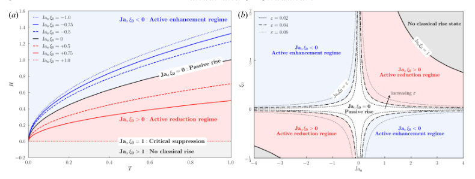
<figcaption class="paper-figure-caption"><b>Fig 1.</b> Figure 1. (a) Predicted rise dynamics obtained from equation (3.5) for different values of the activity parameter Jaaξ0. Activity enhances or suppresses the rise velocity while preserving the classical H ∼T 1/2 scaling. (b) Regime map in (Jaa, ξ0) plane for active Jurin’s law.</figcaption>
</figure>

**Main problem.** The paper aims to extend the classical Jurin's law, which describes capillary rise in passive fluids, to active fluids that generate internal stresses through energy consumption.

**Main result.** The authors derive a generalized active Jurin's law, showing that active stresses can enhance, suppress, or even completely eliminate capillary rise, and that inertial effects can lead to activity-induced bistability.

**Method.** The study uses the continuum theory of active nematics and an extension of the Bosanquet formulation, employing linear stability analysis and effective potential analysis to examine dynamics.

**Summary.** This paper generalizes the classical physics of capillary rise to active fluids, which are materials that consume energy to generate internal stresses. By applying the theory of active nematics, the authors show that these internal stresses can either push the liquid higher or suppress the rise entirely. They provide a new dimensionless parameter, the active Jurin number, to quantify this effect. Furthermore, they demonstrate that while overdamped dynamics lead to a single stable height, the inclusion of inertia can create a system with two stable equilibrium heights. This work fundamentally changes how we understand transport and equilibrium in active matter.

Detailed structure

**Model / system.** An incompressible active nematic fluid (such as bacterial suspensions or actomyosin gels) rising in a vertical cylindrical capillary tube of radius a.

**Key observables.** Equilibrium rise height (H_infinity), rise velocity (h_dot), and effective surface tension.

**Important parameters / regimes.** Active Jurin number (Ja_a), interfacial alignment factor (xi_0), activity coefficient (zeta), and the distinction between extensile and contractile regimes.

**Assumptions / limitations.** The fluid is assumed to be incompressible and Newtonian (except for active stress); the gas pressure is uniform; and the linear-response model assumes weak dependence of order parameters on height and velocity.

**Figures summary.** Figure 1(a) shows predicted rise dynamics and scaling; Figure 1(b) presents a phase diagram in the (Ja_a, xi_0) plane delineating different rise regimes.

**Paper structure.** The paper introduces the problem of active capillary rise, derives a generalized Young-Laplace equation, establishes a dimensionless active Jurin's law, constructs a phase diagram for different activity regimes, and concludes with a stability analysis of the dynamics including inertial effects.

Abstract

Capillary rise is one of the classical problems in fluid mechanics and is traditionally described by Jurin's law, which balances capillary suction against hydrostatic pressure. Here we extend this classical result to active fluids, materials that generate internal stresses through microscopic energy consumption. Using the continuum theory of active nematics, we show that activity modifies the normal stress balance at the liquid-gas interface through an additional active normal stress contribution. This leads to a generalized active Jurin's law, which can be written in dimensionless form as \(H_{\infty} = 1 - \mathrm{Ja}_a ξ_0\), where \(H_{\infty}\) is the dimensionless active Jurin height at equilibrium, \(\mathrm{Ja}_a\) is an active Jurin number comparing active stress to capillary pressure, and \(ξ_0\) characterizes the alignment of active constituents at the meniscus. The theory predicts that extensile and contractile active fluids can either enhance or suppress capillary rise depending on the magnitude of activity and the interfacial alignment state. From this relation we construct a phase diagram in the \((\mathrm{Ja}_a,ξ_0)\) plane that delineates regimes of activity-enhanced rise, activity-suppressed rise, and complete suppression of the classical capillary state. When orientational order depends on confinement and flow, the coupling between activity and capillarity produces nonlinear equilibrium conditions that may admit multiple steady heights; linear stability analysis reveals that the overdamped dynamics selects a single stable state, whereas the inertial extension allows the possibility of activity-induced bistability. These results show that internally generated stresses fundamentally reshape one of the most classical capillary transport problems.

[↑ back to top](#top)

### [Alterations in Conformations of Poly(3-hexylthiophene) on Au(111) Induced by Annealing](http://arxiv.org/abs/2604.22687v1)

**Authors:** Anmol Arya, François Vonau, Solomon L. Joseph, Thomas Pfohl, Silvia Siegenführ, Laurent Simon, Günter Reiter  
**Type:** both · **Category:** other · **PDF:** <https://arxiv.org/pdf/2604.22687v1>  
**Analysis basis:** full PDF text, analyzed in chunks

↔ Scroll figures horizontally

<figure class="paper-figure-card">
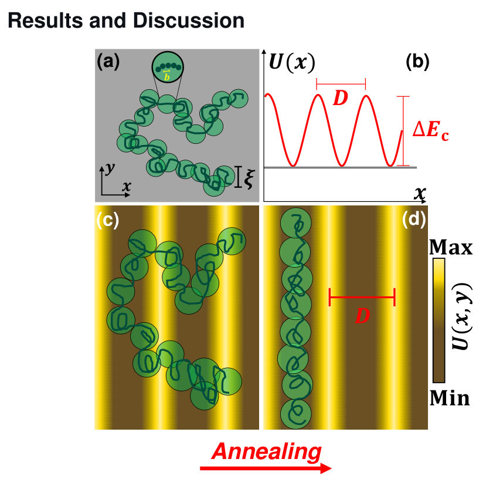
<figcaption class="paper-figure-caption"><b>Fig 1.</b> Figure 1: Schematic representation of a polymer chain confined on a corrugated surface. (a) As a reference, a polymer chain on a flat equipotential surface with a sequence of adsorption blobs of size 𝜉 and monomer size 𝑏. (b) 1D representation of the surface potential 𝑈(𝑥) (the red curve denotes a corrugated surface potential, while the gray line represents an equipotential surface). D is the corrugation width along the 𝑥 axis, and 𝐸c is the energy difference between peak and trough of the surface potential. (c) A polymer chain, represented as a sequence of adsorption blobs, on a periodically corrugated surface potential 𝑈(𝑥, 𝑦), which only partially follows the corrugations. (d) A polymer...</figcaption>
</figure>
<figure class="paper-figure-card">
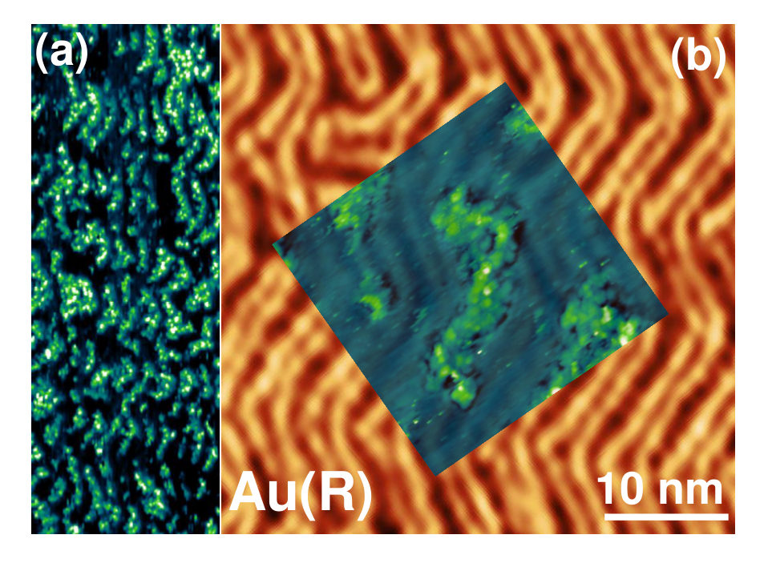
<figcaption class="paper-figure-caption"><b>Fig 2.</b> Figure 2: Influence of Au (111) corrugation on polymer aggregation. (a) Large-scale STM topography image on Au(R) after electrospray deposition of P3HT, showing that polymer chains followed the herringbone corrugation of Au (111). The size of the image (a) is 62 × 169 nm2 measured at a setpoint of 10 pA and a bias voltage of − 2.55 V. (b) STM topography image (42 × 42 nm2) of Au (111) before electrospray deposition of P3HT (measured at a setpoint of 1.7 nA and a bias voltage of – 0.2 V), showing the herringbone reconstruction. In the inset, we superimposed a smaller scale topography image (23 × 23 nm2) of P3HT chains deposited on the corrugated surface (measured at a setpoint of 10 pA and a...</figcaption>
</figure>
<figure class="paper-figure-card">
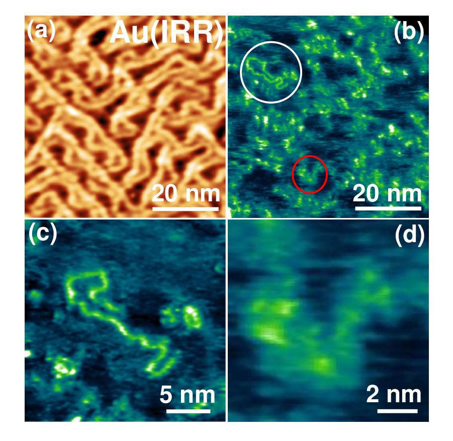
<figcaption class="paper-figure-caption"><b>Fig 3.</b> Figure 3: Influence of irregular corrugations on an Au(111) surface (Au(IRR)) on polymer conformations. (a) STM topography image of Au (111) with an irregular surface reconstruction before electrospray deposition. (b) Large-scale STM topography image on Au(IRR) after P3HT deposition, showing polymer chains in a 2D random conformations (white circle, see also (c)) and a collapsed state (red circle, see also (d)). The area of image (a) is 60 × 60 nm 2, measured at bias of −1.5 V and a setpoint of 300 pA, (b) of area: 60 × 60 nm2 at bias: −1.51 V, setpoint: 5 pA, (c) of area 23 × 23 nm2 at setpoint of 10 pA, bias voltage of 2.0 V, and (d) of area: 10 × 10 nm2 at bias: −1.51 V, setpoint: 5 pA.</figcaption>
</figure>
<figure class="paper-figure-card">
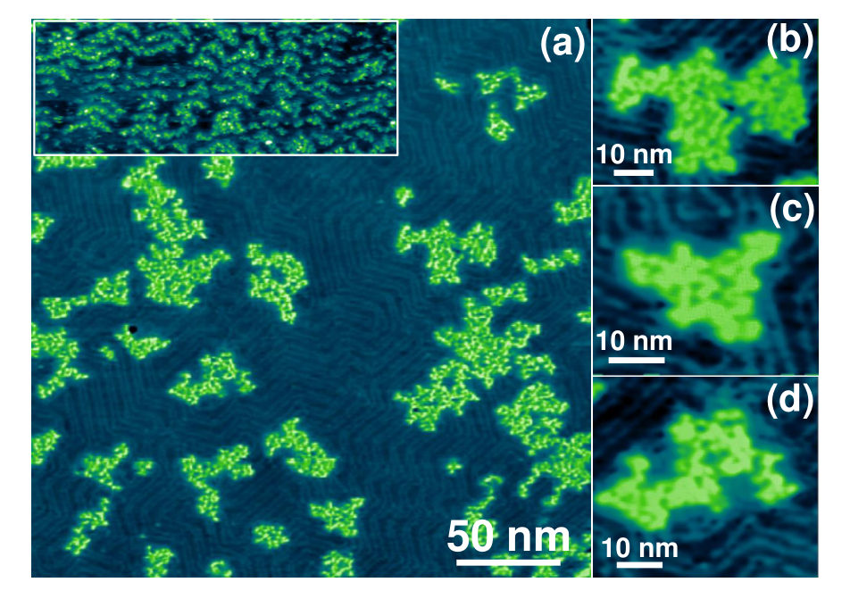
<figcaption class="paper-figure-caption"><b>Fig 4.</b> Figure 4: Thermal annealing resulted in aggregation of multiple P3HT chains. (a) STM topography image showing clusters consisting of multiple P3HT chains deposited on Au(R) after P3HT and annealed at 200 °C. The scale bar of 50 nm applies also to the inset, which reproduces Figure 2 (a), i.e., a large- scale STM topography image showing P3HT chains after annealing to 100 °C, which followed the herringbone reconstruction of Au(R). (b, c, d) Smaller scale images showing individual clusters of P3HT chains. Image (a) has a size of 269 × 269 nm² and was acquired with a setpoint of 120 pA and a bias voltage of – 1.3 V. The inset image covers 169 × 62 nm² and was measured at a setpoint of 10 pA...</figcaption>
</figure>

**Main problem.** Understanding how the conformation and self-organization of P3HT polymer chains on Au(111) are controlled by the interplay between substrate topography (periodic vs. irregular reconstruction) and thermal energy.

**Main result.** Annealing at 100 °C on regular Au(111) templates chains to follow the herringbone pattern, while 200 °C annealing induces large-scale chain clustering driven by pi-pi interactions; irregular surfaces instead lead to random-walk or collapsed states.

**Method.** High-vacuum electrospray deposition followed by variable-temperature Scanning Tunneling Microscopy (STM) and molecular modeling using Avogadro and LMAPper.

**Summary.** This paper investigates how the physical shape of polymer chains can be manipulated by controlling the underlying gold surface pattern and temperature. By using high-resolution STM, the authors show that a regular gold surface can act as a template to align polymers, whereas heat can be used to either move chains into surface valleys or force them to clump into large clusters. This provides a mechanistic way to design molecular-scale structures for organic electronics.

Detailed structure

**Model / system.** The system consists of regioregular poly(3-hexylthiophene) (P3HT) chains deposited on Au(111) single crystals featuring either periodic herringbone reconstruction or irregular surface states, modeled using the de Gennes 'adsorption blob' concept.

**Key observables.** Polymer conformations (random walk, coiled, collapsed, or corrugation-following), cluster area, cluster number density, and monomer-resolved dimensions.

**Important parameters / regimes.** Thermal energy (kBT), surface corrugation energy (Ec), corrugation width (D), and annealing temperature (100 °C and 200 °C).

**Assumptions / limitations.** The polymer is treated as a sequence of adsorption blobs where thermal energy dominates within a blob and substrate potential dominates at larger scales.

**Figures summary.** Figure 1 shows a schematic of polymer adsorption on flat vs. corrugated surfaces; Figure 2 shows P3HT alignment on regular Au(111); Figure 3 shows random-walk and collapsed states on irregular Au(111); Figure 4 shows large multi-chain clusters formed after 200 °C annealing.

**Paper structure.** The paper introduces the problem of polymer conformation control, describes the experimental setup (electrospray and STM), details the energy landscape of the Au(111) substrate, presents results for regular vs. irregular surfaces under different annealing temperatures, and concludes with design principles for polymer nanostructures.

Abstract

Employing high-vacuum electrospray deposition and scanning tunneling microscopy, we investigated how individual poly(3-hexylthiophene) (P3HT) chains navigated on the periodic energy landscape of a reconstructed Au(111) surface. The resulting polymer conformations were governed by the interplay between the periodically corrugated substrate, in particular the depth and regularity of the modulated surface potential, and thermal energy. On a regularly reconstructed surface, annealing at °C provided sufficient energy for chain segments to overcome energy barriers of the corrugated surface potential landscape, allowing monomers along the chain to experience a strong thermodynamic driving force toward the low-energy valleys on the surface. The adsorbed polymers adopted a state where the polymer conformations were replicating the herringbone pattern. By contrast, on an irregularly reconstructed surface, the correspondingly disordered potential landscape yielded a diverse mix of coiled polymer chains performing a two-dimensional random walk and collapsed chains located in troughs of the energy landscape. Intriguingly, annealing at °C forced polymers to form clusters of many chains. Our results establish that thermal energy and substrate topography represent control parameters for altering polymer conformations, providing a mechanistic framework for rationally designing polymer nanostructures at the molecular level.

[↑ back to top](#top)

### [Carrier scattering considerations and thermoelectric power factors of half-Heuslers](http://arxiv.org/abs/2604.22033v1)

**Authors:** Rajeev Dutt, Bhawna Sahni, Yao Zhao, Yuji Go, Saff E Awal Akhtar, Ankit Kumar, Sumit Kukreti, Patrizio Graziosi, Zhen Li, Neophytos Neophytou  
**Type:** theory · **Category:** other · **PDF:** <https://arxiv.org/pdf/2604.22033v1>  
**Analysis basis:** full PDF text, analyzed in chunks

↔ Scroll figures horizontally

<figure class="paper-figure-card">
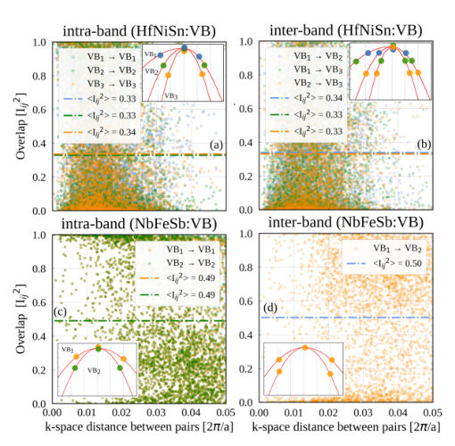
<figcaption class="paper-figure-caption"><b>Fig 1.</b> Figure 1. (a, b) Square of the wavefunction overlaps be- tween the states in the three-fold degenerate valence bands of HfNiSn at the Γ-point for intra-band and inter-band tran- sitions, respectively. (c, d) Square of the wavefunction over- laps between the two-fold degenerate valence bands of NbFeSb at the L high symmetry point for intra-band and inter-band transitions. The insets depict the bands and with same color dots the transitions.</figcaption>
</figure>
<figure class="paper-figure-card">
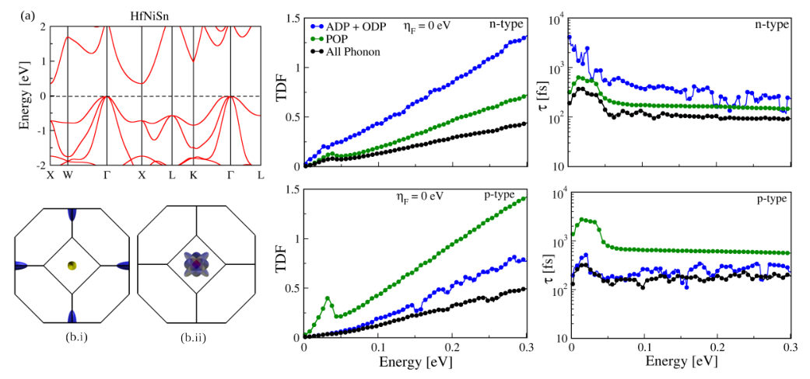
<figcaption class="paper-figure-caption"><b>Fig 2.</b> Figure 2. (a) The bandstructure of HfNiSn. b(i) and b(ii) show the Fermi surface of the conduction and valence bands, respectively, at energy EC+60 meV and EV -60 meV. (c-d) show the transport distribution functions (TDF) for n-type and p-type for different phonon scattering-limited transport considerations as noted in the legend. (e-f) The scattering times (τ) for n-type and p-type of HfNiSn, respectively for the scattering cases in (c-d).</figcaption>
</figure>
<figure class="paper-figure-card">
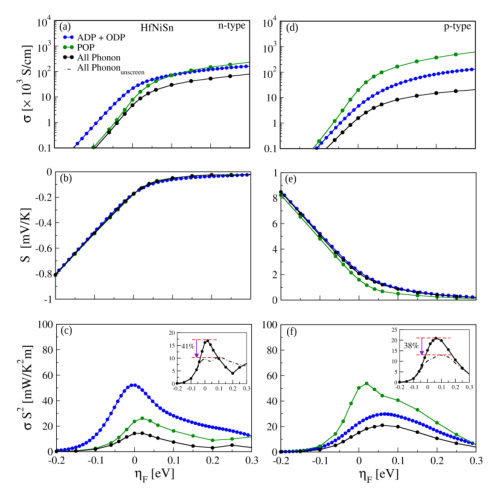
<figcaption class="paper-figure-caption"><b>Fig 3.</b> Figure 3. Thermoelectric coefficients for HfNiSn for n-type (left column) and p-type (right column) carriers. Three phonon scattering limited transport situations are presented: ADP+ODP, POP, and All phonon scattering. (a, d) Elec- trical conductivity. (b, e) Seebeck coefficient. (c, f) Power factor. Insets of (c) and (f): Comparison between the power factor computation results with (solid) and without (dashed) screening in the POP calculation.</figcaption>
</figure>
<figure class="paper-figure-card">
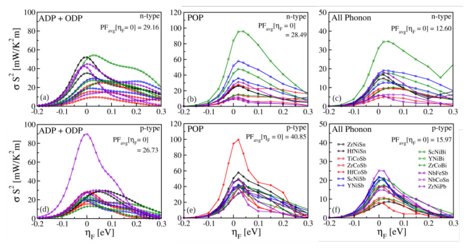
<figcaption class="paper-figure-caption"><b>Fig 4.</b> Figure 4. The power factor versus density for all 13 HHs considered, for n-type (first row, a-c) and p-type (second row, d-f) polarities. The simulation results for three phonon scattering limited transport considerations are shown column-wise: (a, e) non-polar ADP+ODP scattering, (b, d) POP scattering, and (c, f) scattering due to All phonon processes combined (ADP+ODP+POP).</figcaption>
</figure>
<figure class="paper-figure-card">
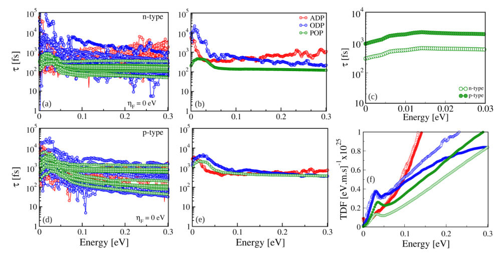
<figcaption class="paper-figure-caption"><b>Fig 5.</b> Figure 5. Scattering relaxation times for different mechanisms and their effect on transport for all the 13 HHs considered. (a, d) The scattering times under ADP- (red lines), ODP- (blue lines), and POP-limited electron-phonon scattering conditions. (a) shows results for n-type carriers and (d) for p-type carriers. (b, c) The averaged value of the relaxation times for each category in (a, d). (c) Scattering times for the POP-limited case for n-type (open circles) and p-type (full circles). (f) The averaged values of the TDFs due to ADP- (red), ODP- (blue), and POP (green)-limited electron-phonon scattering for n-type (open circles) and p-type (full circles) carriers.</figcaption>
</figure>
<figure class="paper-figure-card">
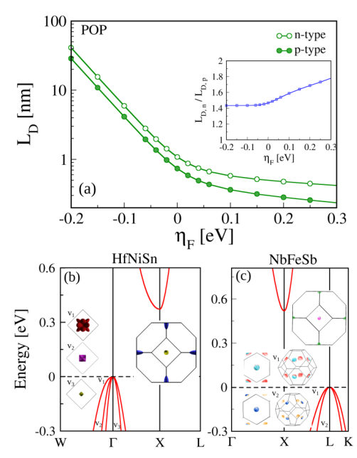
<figcaption class="paper-figure-caption"><b>Fig 6.</b> Figure 6. (a) The averaged screening length for all 13 HHs considered versus Fermi energy for n-type (open circles) and p-type (full circles) carriers. Inset: the ratio of the two quan- tities. (b) Zoom-in for the bandstructure of HfNiSn, showing also the energy surfaces of the different bands (labelled Vi) 60 meV into the band extrema. (c) Same as in (c) for for NbFeSb.</figcaption>
</figure>
<figure class="paper-figure-card">
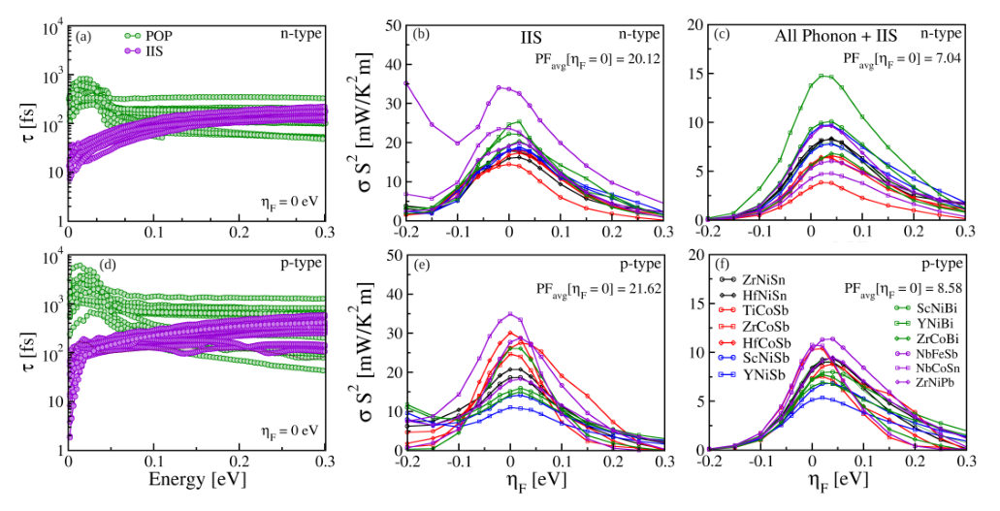
<figcaption class="paper-figure-caption"><b>Fig 7.</b> Figure 7. (a, d) The momentum relaxation scattering times for POP (purple lines) and IIS (green lines) for n-type and p-type carriers, respectively. All 13 HHs under consideration are shown indiscriminately. (b, e) The PF of n-type and p-type carriers, respectively, under IIS-limited scattering considerations for the group of all 13 HHs. (c, f) The overall PF of all n-type and p-type materials under All phonon+IIS scattering considerations.</figcaption>
</figure>
<figure class="paper-figure-card">
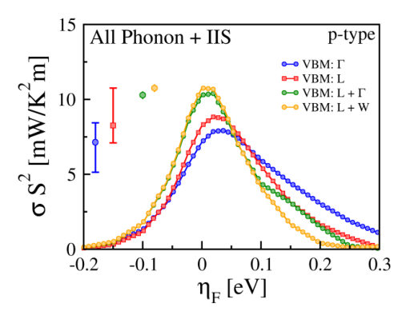
<figcaption class="paper-figure-caption"><b>Fig 8.</b> Figure 8. The average values of the PF across p-type materi- als with their VBs having different high symmetry points as noted in the legend, for All Phonon+IIS scattering consider- ations with the error bars showing the spread in the peak PF for each group.</figcaption>
</figure>
<figure class="paper-figure-card">
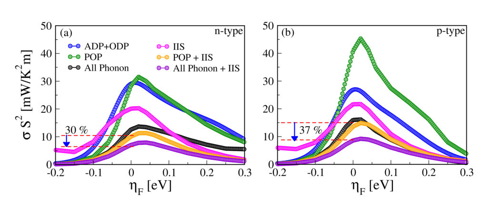
<figcaption class="paper-figure-caption"><b>Fig 9.</b> Figure 9. The averaged power factor of all 13 HHs considered for multiple scattering case considerations as labelled in the legend. (a) n-type materials. (b) p-type materials. The overestimation of the Coulombic POP+IIS from the total All phonon + IIS cases is indicated.</figcaption>
</figure>
<figure class="paper-figure-card">
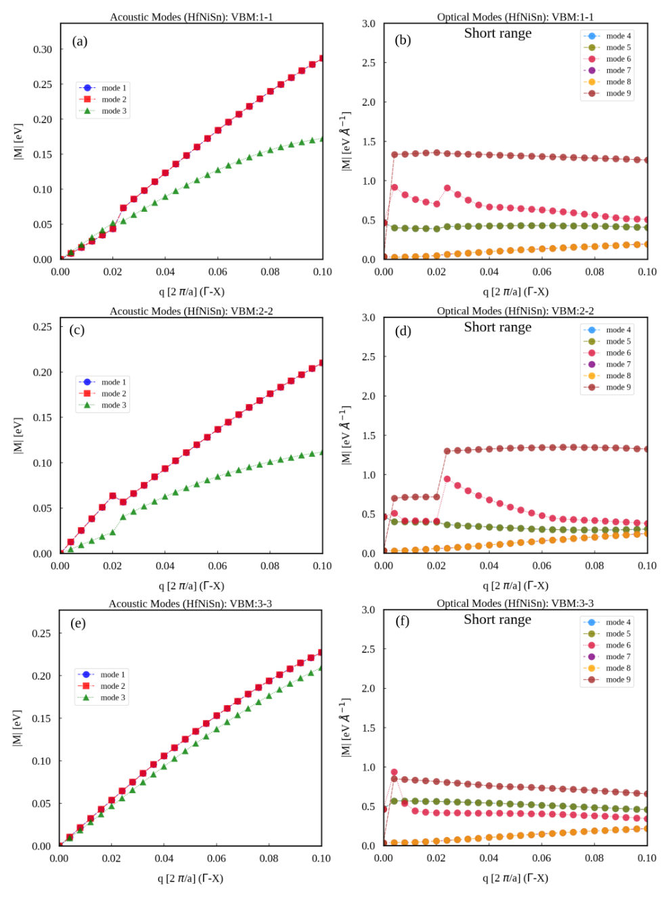
<figcaption class="paper-figure-caption"><b>Fig 10.</b> Figure 10. Acoustic (a,c,e) and optical (b,d,e) matrix elements of the VB of HfNiSn in the Γ-X direction for intra-band interactions. Row-wise we show matrix elements for intra-band transitions between the three bands in the VB.</figcaption>
</figure>

**Main problem.** The study aims to quantify the relative contributions of various electronic scattering mechanisms (Coulombic vs. non-polar phonon) to the thermoelectric power factor in half-Heusler alloys.

**Main result.** Coulombic scattering (IIS and POP) determines the thermoelectric power factor by approximately 65% on average, and including screening effects is critical for accurate predictions.

**Method.** The authors use Density Functional Theory (DFT) with the PBE-GGA functional and the Boltzmann Transport Equation (BTE) implemented via the ElecTra and EMAF codes.

**Summary.** This paper investigates how different types of carrier scattering, such as ionized impurity and polar optical phonon scattering, affect the thermoelectric performance of half-Heusler alloys. By analyzing 13 different materials, the authors demonstrate that Coulombic scattering processes are the dominant factors in determining the power factor. They also show that accounting for screening is essential for accurate transport modeling. The findings suggest that researchers can use simplified models focusing on these primary mechanisms to efficiently screen for new high-performance thermoelectric materials.

Detailed structure

**Model / system.** The study examines 13 n-type and p-type half-Heusler alloys with a cubic MgAgAs structure, focusing on the interplay between different scattering-limited transport regimes.

**Key observables.** Thermoelectric power factor (PF), electrical conductivity, Seebeck coefficient, relaxation time, and transport distribution function (TDF).

**Important parameters / regimes.** Temperature (300 K), valley degeneracy, effective masses (conductivity and DOS), deformation potentials, and screening length.

**Assumptions / limitations.** Calculations assume unipolar transport (ignoring bipolar effects) at room temperature and use a relaxation time approximation (RTA) with Matthiessen's rule.

**Figures summary.** Figures show band structures, Fermi surfaces, transport distribution functions under different scattering regimes, and comparisons of power factors across various scattering scenarios and material types.

**Paper structure.** The paper introduces the problem of scattering importance, describes the DFT and BTE methodology, presents a detailed case study of HfNiSn, generalizes findings across 13 alloys, and concludes with a computational strategy for efficient material screening.

Abstract

The electronic and thermoelectric (TE) transport properties of 13 n-type and p-type half-Heusler alloys are computationally examined using Boltzmann transport. The electronic scattering times resulting from all relevant phonon interactions and ionized impurity scattering (IIS) are fully accounted for using ab initio extracted parameters. We find that at room temperature the average peak TE power factors (PF) of all materials we examine reside between 5 and 10 mW/mK$^2$. We also find that IIS in combination with the long range polar optical phonon (POP) scattering are more influential in determining the electronic transport and PF over all other non-polar phonon interactions (acoustic and optical phonon transport). In fact, the combination of POP and IIS determines the thermoelectric power factor of the half-Heuslers examined on average by about 65\%. The results highlight the crucial impact of Coulombic scattering process (POP and IIS) on the TE properties of half-Heusler alloys and provide profound insight for understanding transport, which can be applied widely in other complex bandstructure materials. In terms of computation expense, the computationally cheaper POP and IIS provide an acceptable first-order estimate of the power factor of these materials, while the non-polar contributions, which require more expensive ab initio calculations, could be of secondary importance.

[↑ back to top](#top)

### [Comparative Silane Surface Functionalization Strategies for Enhanced Bloch Surface Wave Biosensing of Anti-SARS-CoV-2 Antibodies](http://arxiv.org/abs/2604.22444v1)

**Authors:** Agostino Occhicone, Alberto Sinibaldi, Paola Di Matteo, Daniele Chiappetta, Riccardo Guadagnoli, Peter Munzert, Francesco Michelotti  
**Type:** experiment · **Category:** other · **PDF:** <https://arxiv.org/pdf/2604.22444v1>  
**Analysis basis:** full PDF text, analyzed in chunks

↔ Scroll figures horizontally

<figure class="paper-figure-card">
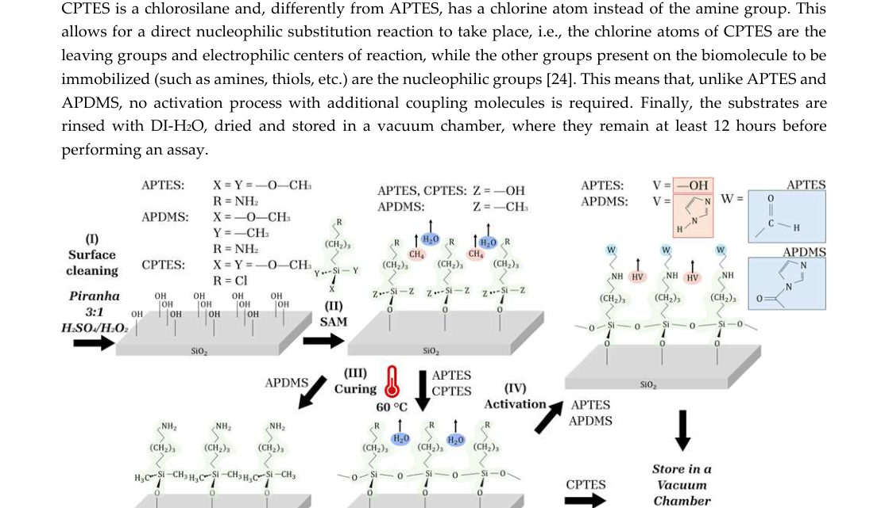
<figcaption class="paper-figure-caption"><b>Fig 1.</b> Figure 1. Schematic representation of the silanization process. The procedure comprises four main steps, which vary depending on the chemistry. (I) Surface cleaning with piranha solution increases the density of surface —OH groups. (II) During SAM formation, the chip is immersed in solutions of APTES, APDMS, or CPTES; simplified molecular structure is shown. (III) In the curing step, the substrate is heated on a hot plate at 50–60 °C for 1 h. (IV) The activation step involves crosslinking with GAH for APTES and with CDI for APDMS; this step is not required for CPTES. After functionalization, substrates are stored in a vacuum chamber for at least 12 h before performing the assay.</figcaption>
</figure>
<figure class="paper-figure-card">
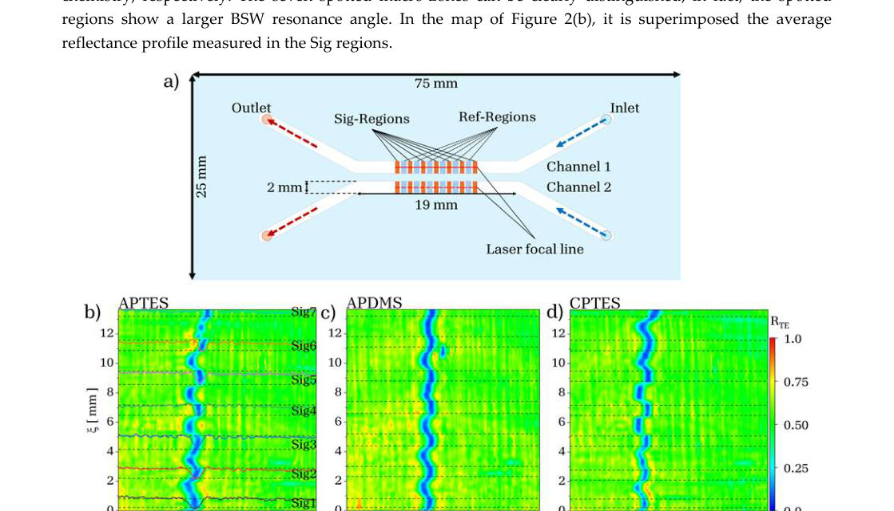
<figcaption class="paper-figure-caption"><b>Fig 2.</b> Figure 2. (a) Sketch of a microscope slide with protein solutions during incubation. (b-d) CCD camera images acquired in LF mode at the beginning of the assays for APTES, APDMS and CPTES, respectively. Overlaid to the images is the spot mask used to identify the different regions on the 1DPC surface from Sig1 to Sig7 (dashed lines). Superimposed to the image (b), we plot the average reflectance profile in the seven different regions. The dip witnesses the excitation of the BSW resonance.</figcaption>
</figure>
<figure class="paper-figure-card">
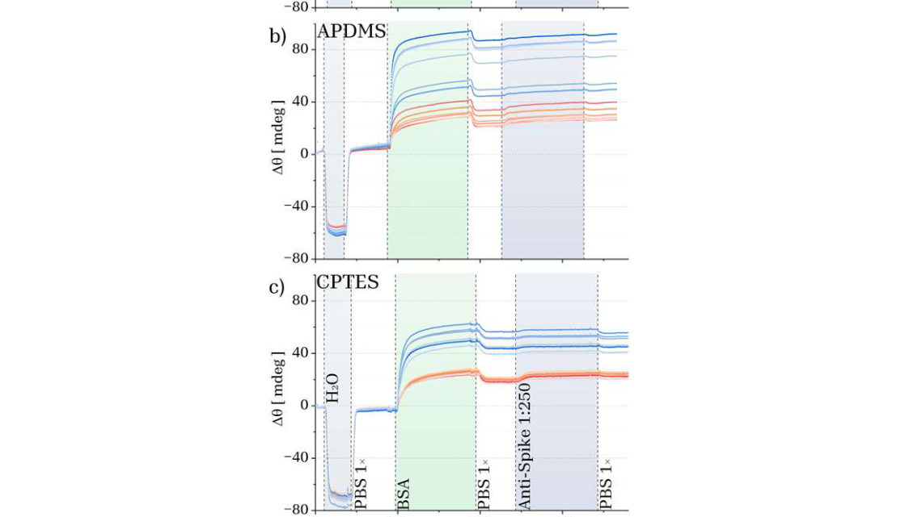
<figcaption class="paper-figure-caption"><b>Fig 3.</b> Figure 3. LF sensograms (𝛥𝜃 vs time) obtained using the LF-Protocol for the three surface chemistries: (a) APTES, (b) APDMS, and (c) CPTES. The three different sequential injections are highlighted with three different colours: the DI-H2O (grey), the BSA diluted in PBS 1× at 1 mg/mL (green) and Anti-S 1:250 diluted solution (blue).</figcaption>
</figure>
<figure class="paper-figure-card">
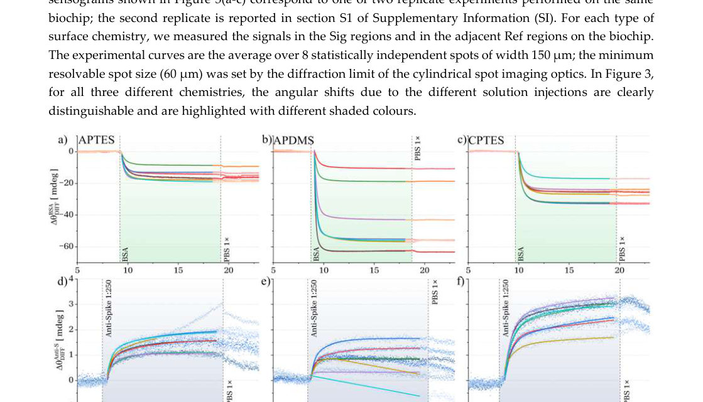
<figcaption class="paper-figure-caption"><b>Fig 4.</b> Figure 4. Panels (a–c) present the differential response to the BSA injection (𝛥𝜃𝐷𝐼𝐹𝐹</figcaption>
</figure>
<figure class="paper-figure-card">
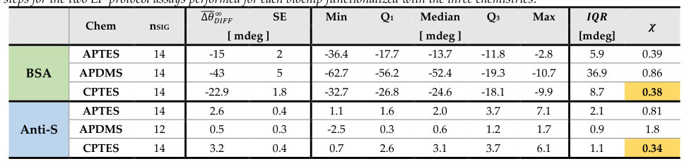
<figcaption class="paper-figure-caption"><b>Fig 5.</b> Figure 5. The boxplot summarizes the main results obtained across all Sig regions measured in the two assays performed for each biochip for both the BSA (left) and Anti-S (right) injections. For each chemistry, we report the 𝛥𝜃𝐷𝐼𝐹𝐹</figcaption>
</figure>
<figure class="paper-figure-card">
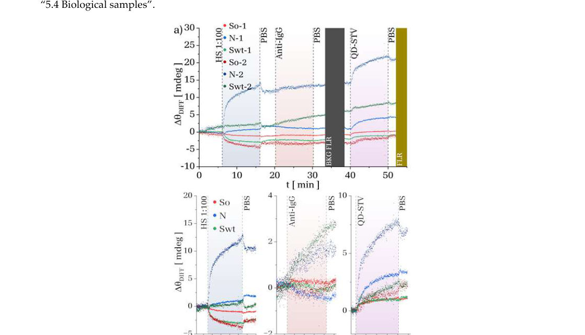
<figcaption class="paper-figure-caption"><b>Fig 6.</b> Figure 6. a) Differential LF sensograms of the six spotted regions of the complete bioassay performed using the HS‑protocol on the biochip functionalized with APTES. The injections and incubation phases of the 1:100 diluted HS, Anti‑IgG solution, and QD‑STV solution are highlighted in blue, red, and violet, respectively. b–d) Enlarged views of the sensogram segments corresponding to the three main injection steps. For clarity, each curve is vertically shifted so that 𝛥𝜃𝐷𝐼𝐹𝐹= 0 at times immediately preceding the respective injections.</figcaption>
</figure>
<figure class="paper-figure-card">
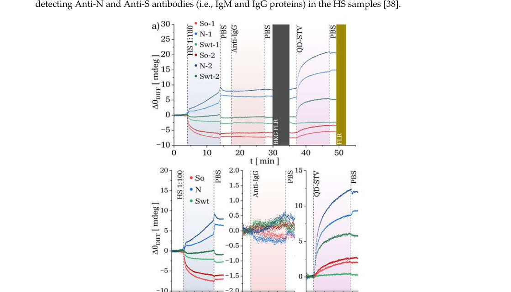
<figcaption class="paper-figure-caption"><b>Fig 7.</b> Figure 7. a) Differential LF sensograms of the six spotted regions of the complete bioassay performed using the HS‑protocol on the biochip functionalized with APDMS. The injections and incubation phases of the 1:100 diluted HS, Anti‑IgG solution, and QD‑STV solution are highlighted in blue, red, and violet, respectively. b–d) Enlarged views of the sensogram segments corresponding to the three main injection steps. For clarity, each curve is vertically shifted so that 𝛥𝜃𝐷𝐼𝐹𝐹= 0 at times immediately preceding the respective injections.</figcaption>
</figure>
<figure class="paper-figure-card">
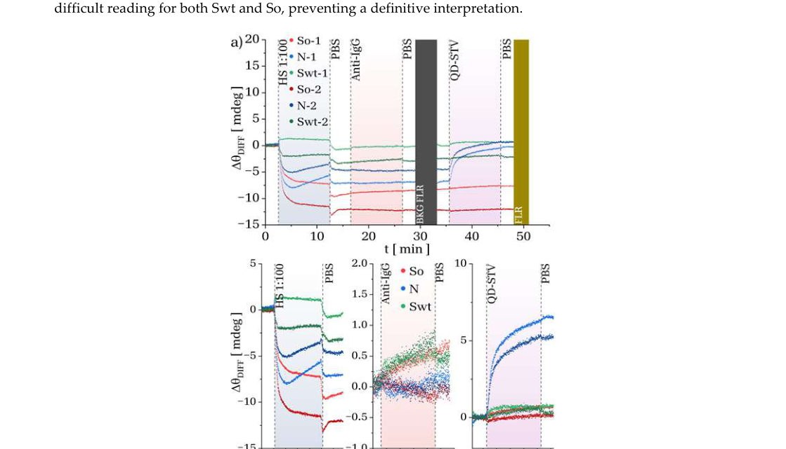
<figcaption class="paper-figure-caption"><b>Fig 8.</b> Figure 8. a) Differential LF sensograms of the six spotted regions of the complete bioassay performed using the HS‑protocol on the biochip functionalized with CPTES. The injections and incubation phases of the 1:100 diluted HS, Anti‑IgG solution, and QD‑STV solution are highlighted in blue, red, and violet, respectively. b–d) Enlarged views of the sensogram segments corresponding to the three main injection steps. For clarity, each curve is vertically shifted so that 𝛥𝜃𝐷𝐼𝐹𝐹= 0 at times immediately preceding the respective injections.</figcaption>
</figure>
<figure class="paper-figure-card">
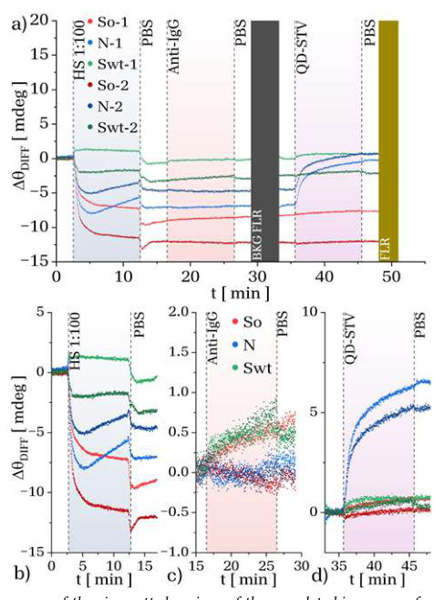
<figcaption class="paper-figure-caption"><b>Fig 9.</b> Figure 9(a,b) present the background subtracted FLR emission maps acquired by the CCD at the conclusion of the assays, following QD incubation and rinsing with running buffer. The maps compare assays performed using Pos, Figure 9(a), and Neg, Figure 9b, human sera. The FLR maps were generated by resonantly exciting the BSW at 𝜆𝑒𝑥𝑐 and detecting the BSW-coupled fluorescence emission at 𝜆𝑒𝑚. Across all three functionalization chemistries, the FLR signal displays a spatial modulation that correlates precisely with the surface patterning, thereby validating the biochip&#x27;s selectivity for anti-SARS-CoV-2 antibodies. Under fixed resonant excitation and constant exposure time, the Neg samples...</figcaption>
</figure>
<figure class="paper-figure-card">
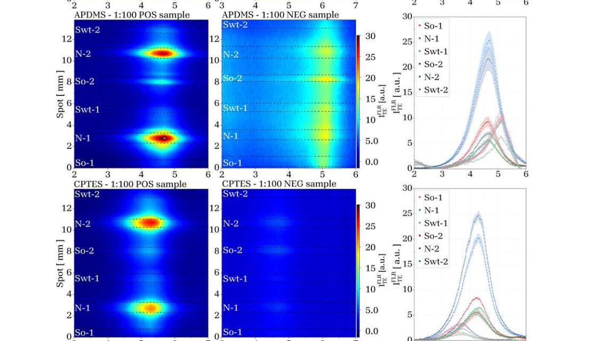
<figcaption class="paper-figure-caption"><b>Fig 10.</b> Figure 9. FLR maps recorded under the same conditions at the end of assays carried out with either positive (a) or negative (b) sera. (c) Average FLR emission intensity from spots in the SIG regions functionalized with So, N, Swt proteins in the case of Pos (darker curves) and Neg (lighter curves) samples.</figcaption>
</figure>

**Main problem.** Optimizing the surface functionalization of a Bloch Surface Wave (BSW) biosensor to improve the efficiency, stability, and specificity of anti-SARS-CoV-2 antibody detection.

**Main result.** CPTES was identified as the most robust and reproducible silanization chemistry, providing the best balance of specific signal, low non-specific adsorption, and reduced variability for both label-free and fluorescence-enhanced modes.

**Method.** A comparative study of three organosilane chemistries (APTES, APDMS, and CPTES) applied to a 1D photonic crystal, evaluated using label-free angular shift measurements and fluorescence-enhanced detection with quantum dots.

**Summary.** This paper compares three different silane-based surface functionalization strategies (APTES, APDMS, and CPTES) for a Bloch Surface Wave biosensor. The goal is to optimize the immobilization of SARS-CoV-2 spike proteins to detect antibodies more effectively. The researchers found that CPTES provides the most stable and specific signal with the lowest non-specific adsorption. The platform was successfully tested for rapid serological analysis using both label-free and fluorescence-enhanced methods in human serum.

Detailed structure

**Model / system.** A 1D photonic crystal (1DPC) transducer consisting of alternating layers of SiO2 and Ta2O5, terminated with TiO2 and SiO2, operating in a Kretschmann-Raether configuration to sustain Bloch Surface Waves.

**Key observables.** Angular shifts (delta theta), differential angular shifts (delta theta DIFF), fluorescence emission intensity, and a variability metric (chi).

**Important parameters / regimes.** Wavelengths of 670 nm (label-free) and 405 nm (fluorescence); penetration depths of 125 nm and 53 nm; flow rate of 1.37 uL/s.

**Assumptions / limitations.** The study assumes that the performance of the biosensor can be quantitatively assessed through standardized protein binding protocols and that the chemical stability of the silane layers is sufficient for clinical-style testing.

**Figures summary.** Figure 1 shows the silanization procedure and chemical structures; Figure 5 shows statistical boxplots and KDE curves; Figure 9 displays fluorescence maps and intensity plots; Figure 12 illustrates the optical readout system setup.

**Paper structure.** The paper begins with an introduction to surface functionalization in biosensing, followed by a detailed description of the 1DPC platform and the three silanization chemistries. It then presents the experimental protocols for label-free and fluorescence-enhanced modes, followed by a comparative analysis of the chemical performance, and concludes with the validation of the platform using human serum samples.

Abstract

Surface functionalization plays a decisive role in the performance of biosensors, as it governs the efficiency and stability of biomolecule immobilization at the sensor interface and, consequently, the overall performance of the biosensing platforms. In this work, we present a comparative study of three organosilane chemistries - APTES, APDMS, and CPTES - applied to a SiO2 terminated 1D photonic crystal able to sustain Bloch surface waves and designed to operate as optical biosensors in both label free and fluorescence enhanced modes. Each chemistry was evaluated through a standardized label-free protocol based on the interaction between immobilized SARS CoV 2 spike protein and its corresponding antibodies, enabling quantitative assessment of binding efficiency, nonspecific adsorption, and signal repeatability. CPTES exhibited the most favorable balance between specific signals, reduced variability, and low nonspecific adsorption. The three chemistries were subsequently tested in fluorescence mode for the detection of anti SARS CoV 2 IgG antibodies in human serum, demonstrating the suitability of BSW enhanced fluorescence for rapid serological analysis. Overall, the study identifies CPTES as the most robust and reproducible functionalization strategy among the three investigated for BSW biosensing and highlights the potential of the platform for fast, sensitive detection of clinically relevant antibodies.

[↑ back to top](#top)

### [Electric-Field Control of Quantum Tunneling Regimes in Focused He-Ion-Beam-Irradiated Oxide Interfaces](http://arxiv.org/abs/2604.22346v1)

**Authors:** Yu Chen, Maria D'Antuono, Robin Hutt, Cesar Magen, Edward Goldobin, Dieter Koelle, Reinhold Kleiner, Marco Salluzzo, Daniela Stornaiuolo  
**Type:** experiment · **Category:** other · **PDF:** <https://arxiv.org/pdf/2604.22346v1>  
**Analysis basis:** full PDF text, analyzed in chunks

↔ Scroll figures horizontally

<figure class="paper-figure-card">
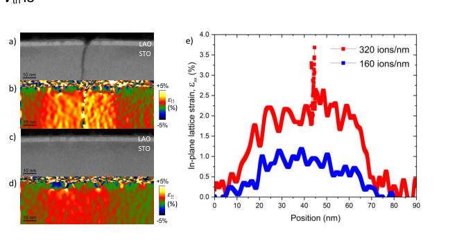
<figcaption class="paper-figure-caption"><b>Fig 1.</b> Figure 1: (a,c) Cross-sectional STEM images of LAO/STO heterostructures irradiated with He-FIB at doses of 320ions/nm (a) and 160ions/nm (c). A fracture extending into the STO substrate is observed at the higher dose, while no clear discontinuity is visible at the lower dose. (b,d). Corresponding in-plane strain maps (ϵxx). The unstrained substrate lattice parameter, far from the irradiated area, is used as a reference. (e) In- plane strain profiles along the white arrows in (b) and (d), vertically integrated along the dashed rectangles.</figcaption>
</figure>
<figure class="paper-figure-card">
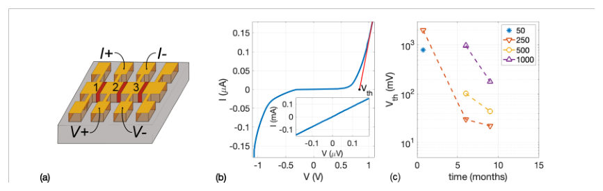
<figcaption class="paper-figure-caption"><b>Fig 2.</b> Figure 2: (a) Sketch of the devices layout and measurement geometry for device 2. (b) I-V curve of device A2 (dose: 50ions/nm) measured at 5 K shortly after He-FIB irradiation. Vth is defined as the voltage-axis intercept of a linear fit to the high-current region (red line). In the inset we show the I-V of the same device measured 6 months after irradiation. (c) Evolution of Vth as a function of the time for different doses.</figcaption>
</figure>
<figure class="paper-figure-card">
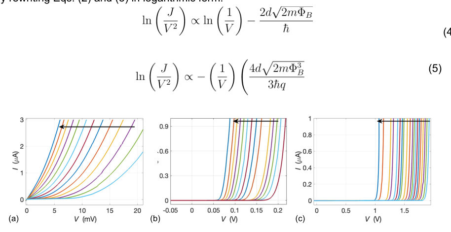
<figcaption class="paper-figure-caption"><b>Fig 3.</b> Figure 3: I − V curves of (a) device B1 (dose: 250ions/nm) measured at t3, (b) device B2 (dose: 500ions/nm) measured at t2 and (c) device B3 (dose: 1000ions/nm) measured at t2 for different values of the increasing back-gate voltage (arrow) (see also Fig. S2 in the Supporting Information). All the measurements were performed at T = 5 K.</figcaption>
</figure>
<figure class="paper-figure-card">
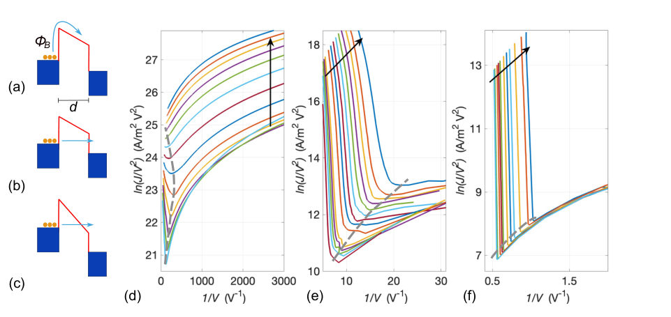
<figcaption class="paper-figure-caption"><b>Fig 4.</b> Figure 4: Sketches of three possible tunnel mechanisms: thermal activation (a), direct tunneling (b), and Fowler-Nordhaim tunneling (c). Panels (d), (e), (f) show the data of Fig. 3(a), (b), (c) respectively, plot as ln(J/V2) vs. (1/V). The arrows indicate the direction of increasing Vbg. The gray dashed line is a guide to the eye for the inflection point Vi, signaling the transition to F-N tunneling at high V. the barrier width d from the F–N fits to the low-temperature data. (iii) Finally, extracted d is used to quantify gate-induced modulation of ΦB in both the F–N and direct tunneling regimes. The pronounced temperature dependence of the STO dielectric constant leads to substantial...</figcaption>
</figure>
<figure class="paper-figure-card">
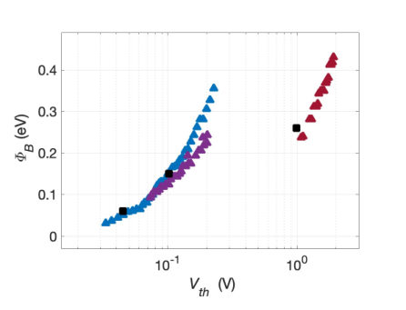
<figcaption class="paper-figure-caption"><b>Fig 5.</b> Figure 5: Barrier energy ΦB as a function of Vth calculated from thermal activation (black squares) and using the F-N fit of the curves shown in Fig. 4: blue, purple and dark red triangles corresponds to the data shown in panels (d), (e) and (f) respectively.</figcaption>
</figure>

**Main problem.** The difficulty of fabricating planar tunnel field-effect transistors (TFETs) at buried oxide interfaces and the need for a method to create tunable, nanoscale potential barriers without degrading the 2D electron system.

**Main result.** He-FIB irradiation enables the creation of nanoscale potential barriers via localized lattice strain, allowing a single device to continuously tune between thermionic emission, direct tunneling, and Fowler-Nordheim tunneling via backgating.

**Method.** The researchers used Helium Focused Ion Beam (He-FIB) irradiation to pattern the LaAlO3/SrTiO3 interface, followed by high-resolution STEM for structural analysis and low-temperature transport measurements.

**Summary.** This paper demonstrates a new way to engineer nanoscale barriers in oxide interfaces using a Helium ion beam. By inducing local lattice strain, the researchers created tunnel field-effect transistors where the conduction mechanism can be switched between thermionic emission and different tunneling regimes using an electric field. This provides a powerful tool for creating tunable quantum nanodevices in complex oxide heterostructures.

Detailed structure

**Model / system.** The experimental platform consists of LaAlO3/SrTiO3 (LAO/STO) heterostructures hosting a two-dimensional electron system (2DES), where He-FIB-induced strain creates nanoscale potential barriers.

**Key observables.** Threshold voltage (Vth), barrier height (Phi_B), barrier width (d), in-plane lattice strain (epsilon_xx), and current-voltage (I-V) characteristics.

**Important parameters / regimes.** Transport regimes (thermionic emission, direct tunneling, Fowler-Nordheim tunneling), irradiation dose, and back-gate voltage (Vbg).

**Assumptions / limitations.** The analysis assumes the Richardson-Schottky model for thermionic emission and specific geometric profiles (trapezoidal/triangular) for tunneling regimes.

**Figures summary.** Fig 1 shows STEM images and strain maps of irradiated regions; Fig 2 displays device layout, I-V curves, and temporal evolution of Vth; Fig 3 shows gate-dependent I-V curves at 5K; Fig S1-S3 detail temporal stability and high-temperature transport analysis.

**Paper structure.** The paper introduces the fabrication challenge, describes the He-FIB method and structural characterization (STEM/strain), presents transport measurements across different tunneling regimes, discusses the tunability via backgating, and concludes with the temporal stability of the induced barriers.

Abstract

Helium focused ion beam irradiation enables the fabrication of tunnel field-effect transistors based on two-dimensional electron systems (2DESs) at an oxide interface.High resolution scanning transmission electron microscopy and strain mapping reveal localized lattice deformation confined to the irradiated regions, which act as nanoscale potential barriers. The barrier profile can be continuously tuned by electrostatic backgating at low temperature without degrading the electronic properties of the 2DES electrodes. Transport measurements demonstrate controlled access to thermionic emission, direct tunneling, and Fowler-Nordheim tunneling within a single device architecture. These results establish He FIB irradiation as a powerful tool for nanoscale functional engineering of complex-oxide interfaces and provide a platform for exploring gate-tunable quantum tunneling phenomena.

[↑ back to top](#top)

### [How Electrons Become Mobile in a Colossal Dielectric -- Fe$_2$TiO$_5$](http://arxiv.org/abs/2604.22017v1)

**Authors:** M. L. McLanahan, A. P. Ramirez  
**Type:** experiment · **Category:** disordered systems and neural networks · **PDF:** <https://arxiv.org/pdf/2604.22017v1>  
**Analysis basis:** full PDF text, analyzed in chunks

↔ Scroll figures horizontally

<figure class="paper-figure-card">
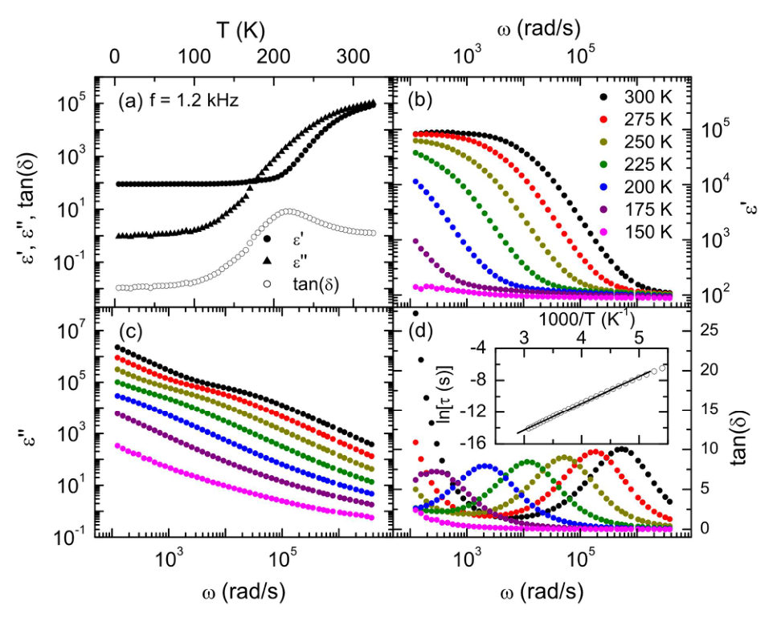
<figcaption class="paper-figure-caption"><b>Fig 1.</b> Figure 1. (a) temperature dependence of 𝜀ᇱ, 𝜀ᇱᇱ, and tan(𝛿) for single crystal Fe2TiO5 at 𝑓= 1.2</figcaption>
</figure>
<figure class="paper-figure-card">
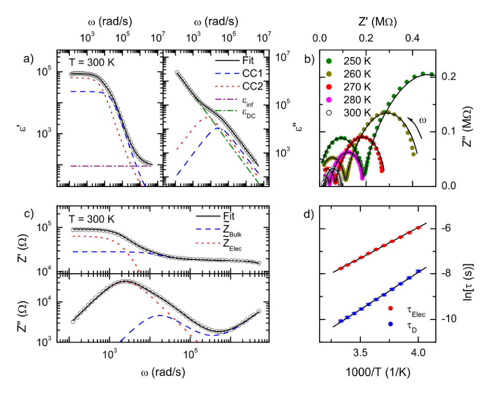
<figcaption class="paper-figure-caption"><b>Fig 2.</b> Figure 2. (a) real and imaginary parts of 𝜀̃ measured at 300 K. Black solid lines correspond to fit</figcaption>
</figure>
<figure class="paper-figure-card">
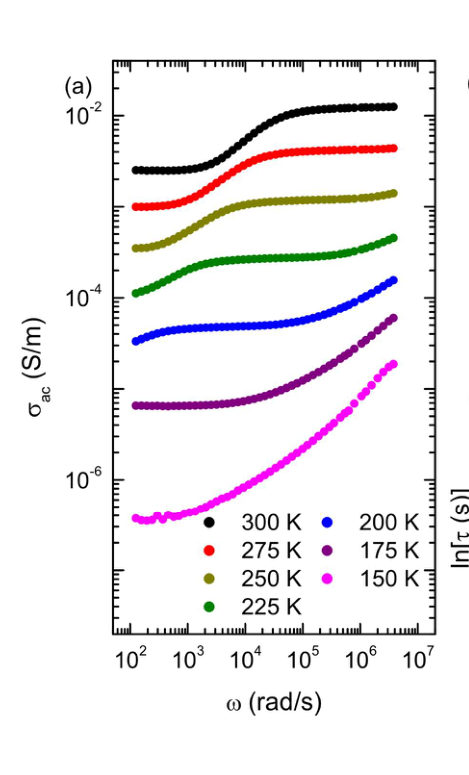
<figcaption class="paper-figure-caption"><b>Fig 3.</b> Figure 3 (a) Fe2TiO5 ac conductivity plotted as a function of frequency for the 𝑎𝑏-plane</figcaption>
</figure>
<figure class="paper-figure-card">
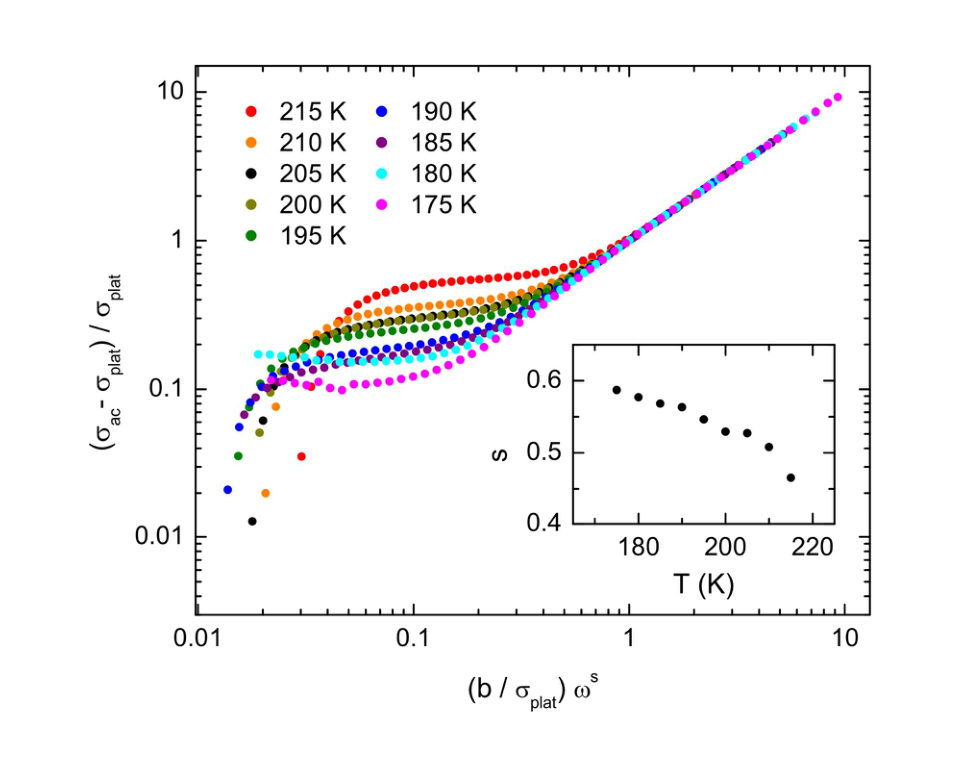
<figcaption class="paper-figure-caption"><b>Fig 4.</b> Figure 4. Ac conductivity scaled to Jonscher&#x27;s power law. Inset: temperature dependence of the 𝜔</figcaption>
</figure>

**Main problem.** The study aims to determine whether the colossal dielectric permittivity in Fe2TiO5 is an intrinsic bulk phenomenon or an extrinsic effect caused by interfaces, and to identify the underlying mechanism for charge transport.

**Main result.** The researchers found that the energy barriers for both dielectric relaxation and DC transport are nearly identical (~288 meV), implying that the colossal dielectric response is an intrinsic bulk property driven by the same atom-level forces that govern electron mobility near a metal-insulator transition.

**Method.** Broadband dielectric spectroscopy (20 Hz - 1 MHz) and four-wire DC transport measurements were performed on single crystals across a temperature range of 5 K to 325 K, using complex impedance analysis and Cole-Cole modeling.

**Summary.** This paper investigates the origin of the massive dielectric constant in Fe2TiO5. By comparing the energy barriers for dielectric relaxation and DC electrical conduction, the authors demonstrate that both processes share the same activation energy. This suggests that the colossal dielectric effect is not an artifact of electrode interfaces but is an intrinsic property of the bulk material. The findings point to a system on the verge of a metal-insulator transition where localized dipole motion and mobile charge transport are governed by the same underlying physics.

Detailed structure

**Model / system.** The physical system is a single crystal of Fe2TiO5 with a pseudobrookite structure, characterized by intrinsic disorder due to random cation occupation and proximity to a metal-insulator transition. The transport mechanism is identified as Correlated Barrier Hopping (CBH).

**Key observables.** Complex dielectric constant (epsilon' and epsilon''), loss tangent (tan delta), AC conductivity (sigma_ac), complex impedance (Z*), and DC resistivity.

**Important parameters / regimes.** Activation energy (EA), relaxation time (tau), Jonscher exponent (s), and dielectric relaxation strength (delta epsilon).

**Assumptions / limitations.** The analysis assumes a Debye-like or Cole-Cole relaxation model and uses a constrained fitting approach to handle parameter correlation between the Jonscher exponent and the pre-exponential factor.

**Figures summary.** Figure 1 shows frequency/temperature dependence of dielectric properties and Arrhenius plots; Figure 2 presents complex permittivity and Nyquist plots; Figure 3 compares AC conductivity and activation energies; Figure 4 shows scaling to Jonscher's power law and temperature dependence of the exponent s.

**Paper structure.** The paper introduces the problem of colossal permittivity, describes the experimental setup and material, presents dielectric and impedance spectroscopy results, analyzes the conduction mechanism via Jonscher's law, and concludes by unifying the relaxation and transport mechanisms.

Abstract

We measure the colossal permittivity in single crystal Fe$_2$TiO$_5$ using broadband spectroscopy in the frequency range 20 Hz - 1 MHz. The relaxation response is analyzed using a Debye-like model with Arrhenius activation in two different ways and yields an energy barrier of 286.1 $\pm$ 2.8 meV. DC transport yields an activation energy of 288.8 $\pm$ 2.8 meV. These results strongly imply that the energy barrier for localized dipole motion and itinerant charge transport originate from the same atom-level forces. A further implication is that colossal dielectric behavior is a microscopic bulk phenomenon arising from a system on brink of metallicity.

[↑ back to top](#top)

### [Influence of Ni Doping on the Structural, Morphological, Optical, and Electrical Properties of Nanocrystalline Cd1-xMnxS Thin Films](http://arxiv.org/abs/2604.22561v1)

**Authors:** Himanshu Sharma Pathok, Padma Pani Shahu, Himanshu Kalita, Prasanta Kumar Saikia  
**Type:** experiment · **Category:** other · **PDF:** <https://arxiv.org/pdf/2604.22561v1>  
**Analysis basis:** full PDF text, analyzed in chunks

↔ Scroll figures horizontally

<figure class="paper-figure-card">

<figcaption class="paper-figure-caption"><b>Fig 1.</b> Figure 1: Schematic diagram for preparation process of Ni doped Cd1−xMnxS thin films</figcaption>
</figure>
<figure class="paper-figure-card">
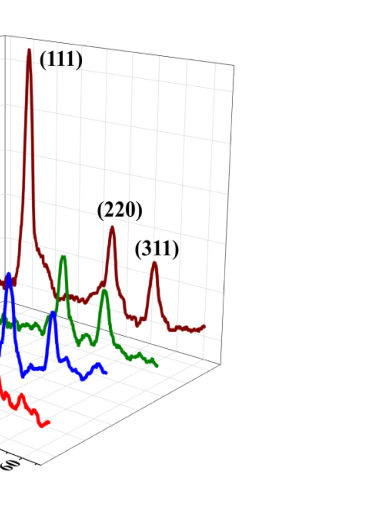
<figcaption class="paper-figure-caption"><b>Fig 2.</b> Figure 2: XRD pattern of Ni doped Cd1−xMnxS thin films</figcaption>
</figure>
<figure class="paper-figure-card">
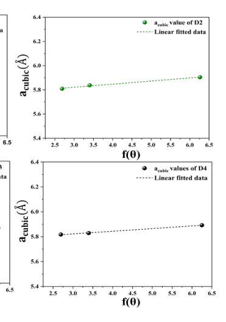
<figcaption class="paper-figure-caption"><b>Fig 3.</b> Figure 3: N-R plot for lattice constant calculation of Ni doped Cd1−xMnxS thin films</figcaption>
</figure>
<figure class="paper-figure-card">
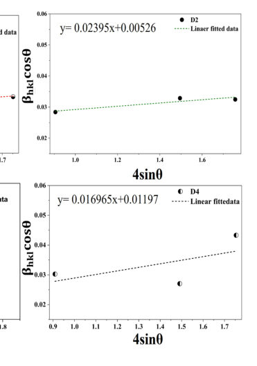
<figcaption class="paper-figure-caption"><b>Fig 4.</b> Figure 4: W-H plot of Ni doped Cd1−xMnxS thin films</figcaption>
</figure>
<figure class="paper-figure-card">
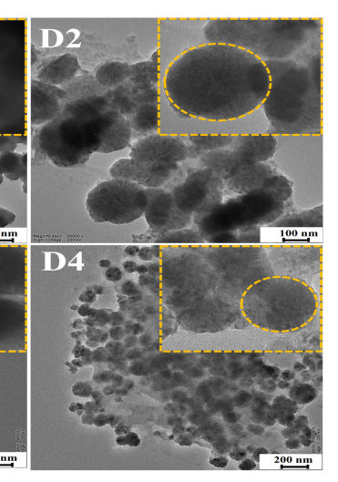
<figcaption class="paper-figure-caption"><b>Fig 5.</b> Figure 5: HRTEM images of the grains of Ni doped Cd1−xMnxS thin films</figcaption>
</figure>
<figure class="paper-figure-card">
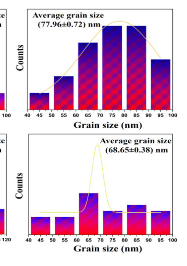
<figcaption class="paper-figure-caption"><b>Fig 6.</b> Figure 6: Histrogram images for the calculation of average grain size of Ni doped Cd1−xMnxS thin films</figcaption>
</figure>
<figure class="paper-figure-card">
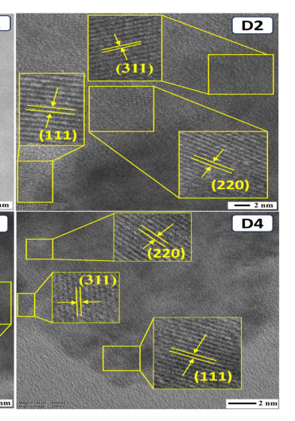
<figcaption class="paper-figure-caption"><b>Fig 7.</b> Figure 7: SAED pattern of Ni doped Cd1−xMnxS thin films</figcaption>
</figure>
<figure class="paper-figure-card">
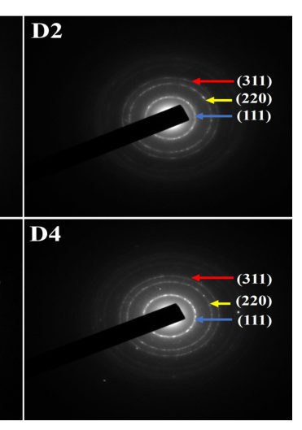
<figcaption class="paper-figure-caption"><b>Fig 8.</b> Figure 8: SAED pattern of Ni doped Cd1−xMnxS thin films</figcaption>
</figure>
<figure class="paper-figure-card">
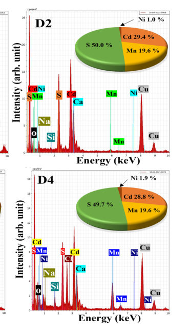
<figcaption class="paper-figure-caption"><b>Fig 9.</b> Figure 9: EDX spectra of Ni doped Cd1−xMnxS thin films</figcaption>
</figure>
<figure class="paper-figure-card">

<figcaption class="paper-figure-caption"><b>Fig 10.</b> Figure 10 shows the FESEM micrographs of the Ni-doped Cd1−xMnxS thin films. The images reveal a</figcaption>
</figure>

**Main problem.** Investigating how Ni doping influences the structural, morphological, optical, and electrical properties of nanocrystalline Cd1-xMnxS thin films to optimize them for use as window layers in thin-film solar cells.

**Main result.** Ni doping increases crystallinity and electrical conductivity while decreasing the optical band gap and dislocation density, making the films suitable for optoelectronic applications.

**Method.** Chemical Bath Deposition (CBD) was used to synthesize the films, followed by XRD, HRTEM, FESEM, and UV-Vis spectroscopy for characterization, and four-probe measurements for electrical analysis.

**Summary.** This paper explores the effect of adding Nickel to CdMnS thin films prepared via a cost-effective chemical method. The researchers found that Ni doping improves the crystal quality and enhances electrical conductivity while tuning the band gap. These changes are significant because they suggest the material can be precisely engineered to serve as an efficient window layer for next-generation thin-film solar cells.

Detailed structure

**Model / system.** The physical system consists of Ni-doped Cd1-xMnxS (x=0.4) nanocrystalline thin films deposited on soda lime glass substrates.

**Key observables.** Crystallinity, microstrain, dislocation density, grain size, optical band gap, transmittance, electrical conductivity, and refractive index.

**Important parameters / regimes.** Ni doping concentration (1% to 4%), pH of the deposition bath (approximately 10.00), and film thickness (181.2-189.1 nm).

**Assumptions / limitations.** The Mn concentration is fixed at x=0.4 based on previous studies, and doping beyond 4% Ni is avoided to prevent secondary phase formation.

**Figures summary.** Figure 1 shows the preparation schematic; Figure 14 shows wavelength dependence of extinction coefficient and refractive index; Figure 15 shows dielectric and optical conductivity components; Figure 16 shows the dissipation factor.

**Paper structure.** The paper begins with the synthesis process, followed by structural and morphological characterization (XRD, TEM, SEM), then moves to optical property analysis (transmittance, band gap, dielectric constants), and concludes with electrical conductivity measurements and a discussion on solar cell applications.

Abstract

Ni-doped Cd1-xMnxS (x=0.4) thin films were prepared via a cost-effective chemical bath deposition (CBD) method to investigate their suitability for optoelectronic applications. Incorporation of a secondary transition metal such as Ni is expected to influence lattice strain, defect density, and electronic structure through ionic size effects and sp-d exchange interactions, thereby providing an additional degree of freedom for tuning the properties of Cd1-xMnxS-based ternary systems. X-ray diffraction (XRD) analysis confirmed the cubic zinc blende structure of the Cd1-xMnxS crystal, which was further corroborated by high-resolution transmission electron microscopy (HRTEM). Crystallinity increases where as microstrain and dislocation density found to be decreases as the doping concentration of Ni increases. Field emission scanning electron microscopy (FESEM) analysis revealed uniform, dense, and crack-free films with grain size increasing as a function of Ni content, and the FESEM cross-sectional images indicated a nearly constant thickness in the range of 181.2-189.1 nm. The films exhibited high optical transmittance (75-90%) in the visible and near-infrared (NIR) regions. The optical band gap decreases from 2.72 to 2.62 eV as the Ni concentration increases from 1% to 4%. Current-voltage (I-V) measurements revealed enhanced electrical conductivity, which further increased under illumination, confirming the photoconducting nature of the films. These results demonstrate that Ni doping effectively tunes the properties of Cd1-xMnxS thin films, highlighting their potential as efficient window layer materials for thin-film solar cells and related optoelectronic devices.

[↑ back to top](#top)

### [Mechanical Scaling Laws and Deformation Behavior of Nanoporous Tantalum Microparticles](http://arxiv.org/abs/2604.22726v1)

**Authors:** J. I. Ramallo, N. Vázquez von Bibow, M. A. Monclús, I. McCue, M. C. Fuertes, C. J. Ruestes  
**Type:** both · **Category:** other · **PDF:** <https://arxiv.org/pdf/2604.22726v1>  
**Analysis basis:** full PDF text, analyzed in chunks

↔ Scroll figures horizontally

<figure class="paper-figure-card">
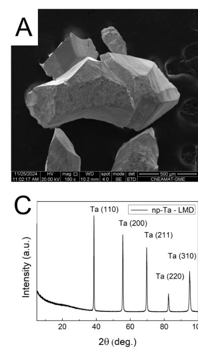
<figcaption class="paper-figure-caption"><b>Fig 1.</b> Figure 1: A. SEM image of typical np-Ta particles. B. SEM image of the surface showing the nanoporous bicontinuous structure of one particle. C. XRD pattern of the np-Ta powder sample. D. Particles deposited on top of a Si wafer using CrystalBond ® 509 (bright phase bounding particles) for nanoindentation testing.</figcaption>
</figure>
<figure class="paper-figure-card">
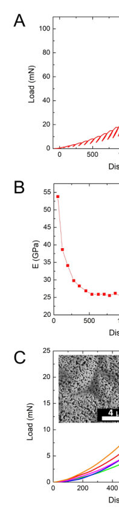
<figcaption class="paper-figure-caption"><b>Fig 2.</b> Figure 2: A. Continuous stiffness measurement (CSM) load–displacement curve. B. Depth-dependent averages for the elastic modulus E under CSM. C. Representative nanoindentation curves up to 1000 nm depth. Color coding corresponds to different np-Ta particles. Inset- Top-view SEM image of a residual nanoindentation imprint.</figcaption>
</figure>
<figure class="paper-figure-card">
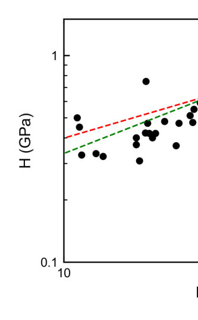
<figcaption class="paper-figure-caption"><b>Fig 3.</b> Figure 3: Hardness (H) vs elastic modulus (E) values compared with a power law dependence based on equation 4. The experimental uncertainty in E and H is approximately 10%. Red line corresponds to n = 3/2 while the green line corresponds to n = 2.</figcaption>
</figure>
<figure class="paper-figure-card">
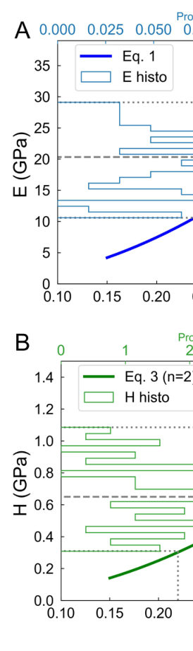
<figcaption class="paper-figure-caption"><b>Fig 4.</b> Figure 4: Scaling laws predictions for E (Eq. 1) and H (3) compared with histograms of nanoindentation results. Dashed lines correspond to the median of values, while dotted lines correspond to limiting values. Note that the median of histogram data closely aligns with the measured solid fraction.</figcaption>
</figure>
<figure class="paper-figure-card">
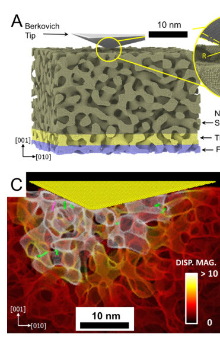
<figcaption class="paper-figure-caption"><b>Fig 5.</b> Figure 5: A. Setup of the simulated np-Ta system. B. The penetration of the indenter induces the nucleation of dislocations on the ligament surfaces and their propagation inside the ligaments (red arrow). C. Cross-section indicating the displacement magnitude profile of the ligaments at a penetration depth of 6 nm, together with glissile (green lines) and sessile (pink) dislocations. Transparency was applied to atoms in the interior of ligaments to enhance visualization of dislocations. D. Shear strain distribution at a penetration depth of 6 nm. Arrows indicate planar shear localization, consistent with dislocation activity. Bulkier shear distribution (white ellipse) corresponds to a twin,...</figcaption>
</figure>
<figure class="paper-figure-card">
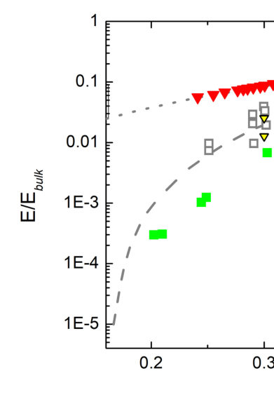
<figcaption class="paper-figure-caption"><b>Fig 6.</b> Figure 6: Scaled elastic modulus. np-Ta results (this work) are scattered in a region close to the predicted by a standard Gibson-Ashby (std G-A) equation. Triangle symbols indicate nanoindentation results, whereas square symbols indicate micro-compression and/or micro-tension results. For comparison purposes, data corresponding to np-Nb [33] and µp-FeCr [25] produced by LMD and np-Au produced by aqueous dealloying (AD) are also included. np-Au nanoindentation (AD-Ni) data after [13, 64, 101] and np-Au micromechanical tests (AD-µC) after [102–106], together with a modified Roberts- Garboczi (mod. R-G) [53]. Data points are scaled by the elastic modulus of the corresponding bulk material...</figcaption>
</figure>

**Main problem.** Investigating whether the mechanical scaling laws established for electrochemically dealloyed nanoporous gold apply to nanoporous tantalum produced via liquid metal dealloying (LMD).

**Main result.** The stiffness and hardness of np-Ta follow Gibson-Ashby predictions due to enhanced ligament connectivity from the CuBi solvent, with plasticity driven by dislocation nucleation.

**Method.** Experimental nanoindentation and SEM/XRD characterization combined with Molecular Dynamics (MD) simulations using the LAMMPS code.

**Summary.** This paper examines the mechanical properties of nanoporous tantalum created through a liquid metal dealloying process. It finds that unlike nanoporous gold, these tantalum particles follow standard Gibson-Ashby scaling laws because the specific solvent chemistry leads to higher ligament connectivity. Molecular dynamics simulations confirm that the deformation is dominated by dislocation-driven plasticity rather than unusual mechanisms. This work demonstrates that solvent chemistry can be used as a tool to tune the structural topology and mechanical response of nanoporous metals.

Detailed structure

**Model / system.** Single-crystalline nanoporous tantalum (np-Ta) microparticles fabricated via liquid metal dealloying of a TiTa alloy in a molten CuBi bath.

**Key observables.** Elastic modulus (E), hardness (H), solid volume fraction (phi), and dislocation types.

**Important parameters / regimes.** Ligament diameter (~200 nm), solid volume fraction (~0.35), and indentation depth (1000 nm).

**Assumptions / limitations.** The solid volume fraction is estimated via a 2D SEM proxy, and Poisson's ratio is assumed to be 0.18.

**Figures summary.** Fig 1: SEM images and XRD patterns; Fig 2: Nanoindentation load-displacement and depth-dependent modulus; Fig 3: Hardness vs. modulus scatterplots; Fig 5: MD simulation of dislocation nucleation and strain distribution; Fig 6: Comparison of scaled modulus across different nanoporous metals.

**Paper structure.** Introduction of the scaling law problem, description of LMD fabrication and characterization, presentation of nanoindentation results and scaling analysis, MD simulation of deformation mechanisms, and comparison with other nanoporous metals.

Abstract

The mechanical scaling laws of dealloyed nanoporous metals depart from classical Gibson-Ashby predictions for open-cell foams due to a decreased connectivity in their solid network. However, these scaling relations have been established almost exclusively on nanoporous gold produced by electrochemical dealloying, and it is an outstanding question whether the relations apply to nanoporous networks fabricated by other dealloying methods. Here, we investigate the mechanical response of single-crystalline nanoporous tantalum (np-Ta) produced by liquid metal dealloying (LMD) a TiTa alloy in molten CuBi. Nanoindentation of individual microparticles yields an elastic modulus of 10-30 GPa and a hardness of 0.3-1.1 GPa, both scaling with the solid volume fraction in agreement with Gibson-Ashby predictions. This stiffness-density response of np-Ta departs from previous reports on nanoporous gold and is attributed to enhanced ligament connectivity enabled by the thermodynamics of the CuBi metal bath. Molecular dynamics simulations reveal dislocation-dominated plasticity during indentation of np-Ta, consistent with scanning electron microscopy observations of limited densification beneath the indents, ruling out unusual deformation mechanisms as an origin of the observed scaling. These findings identify solvent chemistry in LMD as a tunable lever for ligament connectivity, and thus for the mechanical response of nanoporous metals.

[↑ back to top](#top)

### [Micromorphic effects in an octet truss lattice](http://arxiv.org/abs/2604.22544v1)

**Authors:** K. Goyal, R. S. Lakes  
**Type:** both · **Category:** other · **PDF:** <https://arxiv.org/pdf/2604.22544v1>  
**Analysis basis:** full PDF text, analyzed in chunks

↔ Scroll figures horizontally

<figure class="paper-figure-card">
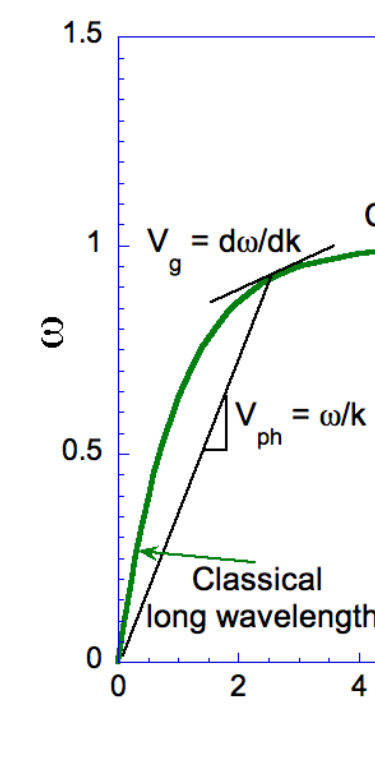
<figcaption class="paper-figure-caption"><b>Fig 1.</b> Figure 1: A representative graph of angular frequency ω = 2πf versus wave number k = 2π</figcaption>
</figure>
<figure class="paper-figure-card">
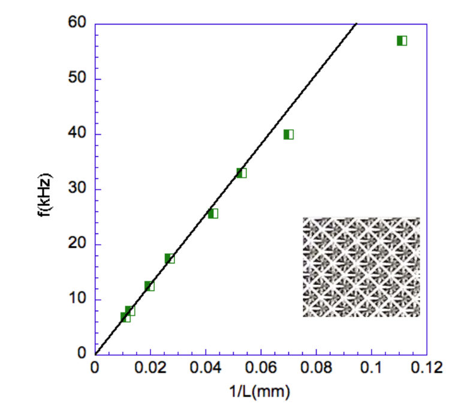
<figcaption class="paper-figure-caption"><b>Fig 2.</b> Figure 2: Elastic wave dispersion, frequency f vs. inverse length 1/L, in a Ti-5553 titanium alloy octet lattice. The specimen length is L = λ/2. Inset: image of lattice structure; the cell size is 4.5 mm.</figcaption>
</figure>
<figure class="paper-figure-card">
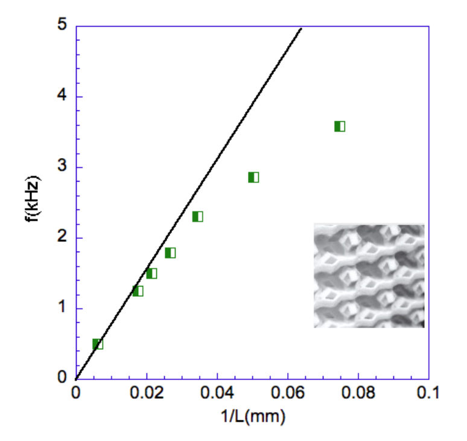
<figcaption class="paper-figure-caption"><b>Fig 3.</b> Figure 3: Elastic wave dispersion, frequency f vs. inverse length, in a polymer lattice with designed hollow ribs. The specimen length is L = λ/2. Inset: image of lattice structure; the cell size is 9 mm in the longitudinal direction. Adapted from [9].</figcaption>
</figure>
<figure class="paper-figure-card">
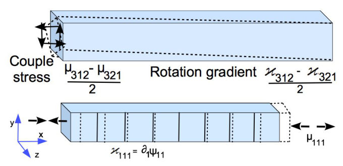
<figcaption class="paper-figure-caption"><b>Fig 4.</b> Figure 4: Gradients of micro-deformation κpqr and corresponding double stress µpqr, adapted from [4]. Arrows represent forces. Top: Cosserat freedom within micromorphic framework. Bottom: micromorphic freedom for axial compression.</figcaption>
</figure>

**Main problem.** The study investigates the physical origin of elastic wave dispersion and cut-off frequencies in octet truss lattices and seeks a continuum-level theoretical representation for these phenomena.

**Main result.** The researchers demonstrate that the micromorphic elasticity theory successfully accounts for both longitudinal wave dispersion and cut-off frequencies, whereas Cosserat elasticity fails to predict the dispersion. They attribute the observed wave phenomena to the resonance of the lattice ribs.

**Method.** Experimental investigation via standing wave excitation, Resonant Ultrasound Spectroscopy (RUS), and wave transmission tests, compared against analytical predictions using micromorphic and Cosserat continuum models.

**Summary.** This paper explores how elastic waves behave in lattice structures like the octet truss. It finds that at high frequencies, the wave speed changes (dispersion) and eventually stops propagating entirely (cut-off) due to the resonance of the lattice ribs. The study proves that a 'micromorphic' continuum theory is necessary to accurately model these effects, as simpler models like Cosserat elasticity cannot account for the observed dispersion. This provides a more complete mathematical framework for designing advanced metamaterials.

Detailed structure

**Model / system.** The physical systems are Ti-5553 titanium alloy and polyamide polymer octet truss lattices. The theoretical models include classical elasticity, Cosserat (micropolar) elasticity, and micromorphic (microstructure) elasticity.

**Key observables.** Phase velocity (Vph), group velocity (Vg), cut-off frequencies (fc), and the normalized micromorphic effect (Lambda).

**Important parameters / regimes.** Angular frequency (omega), wave number (k), cell size, rib length, rib thickness, and the dimensionless parameter Lambda.

**Assumptions / limitations.** The calculation of cut-off frequencies assumes the ribs behave as simply supported bars; the analysis of the polymer lattice is noted as being complicated by potential viscoelasticity.

**Figures summary.** Figure 1 shows the relationship between frequency and wavenumber for phase and group velocity; Figure 2 plots dispersion for the titanium lattice; Figure 3 plots dispersion for the polymer lattice; Figure 4 illustrates the micro-deformation gradient and double stress in micromorphic theory.

**Paper structure.** The paper introduces the problem of wave dispersion in lattices, describes the experimental setup and materials, presents the observed dispersion and cut-off data, compares different continuum models (Classical, Cosserat, Micromorphic), and concludes with a theoretical interpretation of the results.

Abstract

Elastic wave dispersion is studied in an octet truss lattice and compared with a designed rib lattice known to exhibit strong Cosserat elastic effects. Dispersion entails variation of wave speed with frequency. The phenomenon is experimentally investigated by exciting standing waves in specimens of different length at discrete frequencies. At lower frequencies corresponding to long wavelengths, wave propagation is classically non-dispersive. As wavelength approaches a small multiple of the rib length, dispersion is observed. The material exhibited cut-off frequencies above which no signals were propagated. The physical origin of the dispersion and cut-off is resonance of the ribs. Interpreted as micromorphic continua, cellular solid behavior reveals elastic constants associated with flexibility of the unit cell in comparison with that of the overall material.

[↑ back to top](#top)

### [Pressure-Temperature Phase Diagram and $λ$-Transition in Liquid Sulfur](http://arxiv.org/abs/2604.22696v1)

**Authors:** Sonia Salomoni, Frédéric Datchi, A. Marco Saitta, Arthur France-Lanord  
**Type:** theory · **Category:** statistical mechanics · **PDF:** <https://arxiv.org/pdf/2604.22696v1>  
**Analysis basis:** full PDF text, analyzed in chunks

↔ Scroll figures horizontally

<figure class="paper-figure-card">
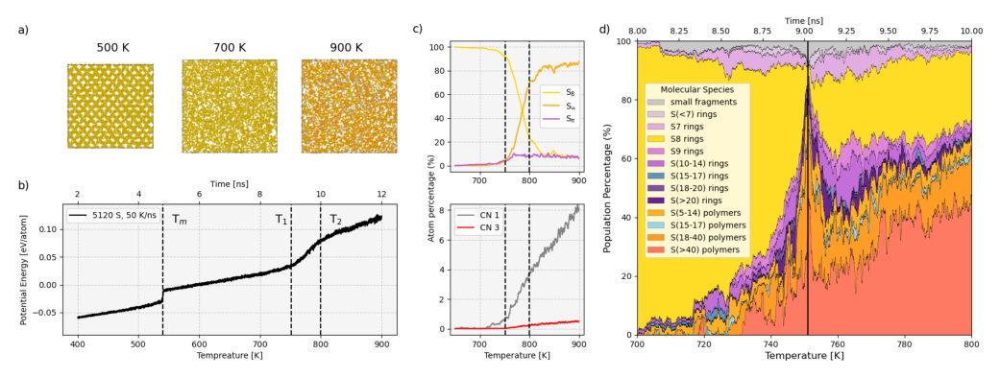
<figcaption class="paper-figure-caption"><b>Fig 1.</b> FIG. 1. Temperature ramp from solid α-S8, at 1 atm and 50 K/ns. (a) Visual representations of the system at selected temperatures according to the following color coding: grey for 1-coordinated atoms, yellow for 2-coordinated atoms in ring molecules, orange for 2- coordinated atoms in polymers, red for 3-coordinated atoms). (b) Time evolution of the atomic potential energy. (c) Time evolution of the speciation, using a distance cutoff of 2.5 ˚A. Upper panel: fraction of S8 rings, (S8), of polymeric chains (S∞), and of non-S8 rings between sizes 5 and 20 (Sπ); bottom panel: atomic coordination. (d) Stacked plot of the speciation lineage of polymeric atoms at the onset of polymerization. The...</figcaption>
</figure>
<figure class="paper-figure-card">
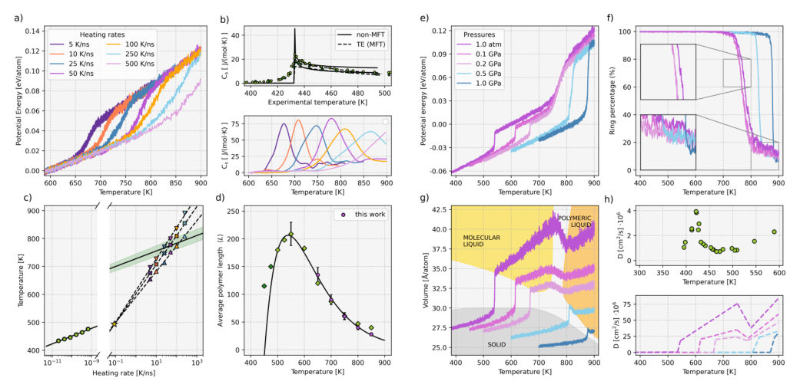
<figcaption class="paper-figure-caption"><b>Fig 2.</b> FIG. 2. Heating rate and pressure dependence. (a) Time evolution of the potential energy, for various heating rates. (b) Singular part of the heat capacity Cs as a function of temperature: in the upper panel, experimental measurements ( [28], [27] ) and theoretical predictions from a mean-field (TE) theory (dashed lines [11]) and non-mean-field (non-MFT) theory (solid lines [31]) with two different parametrizations [34]; in the bottom panel, calculated from the T-ramps, with the same heating-rate color code as in panel (a). (c) Onset ( ) and endset ( ) of the polymerization temperature as a function of the heating rate, with logarithmic fits (black dashed lines), and extrapolated Tλ from...</figcaption>
</figure>
<figure class="paper-figure-card">
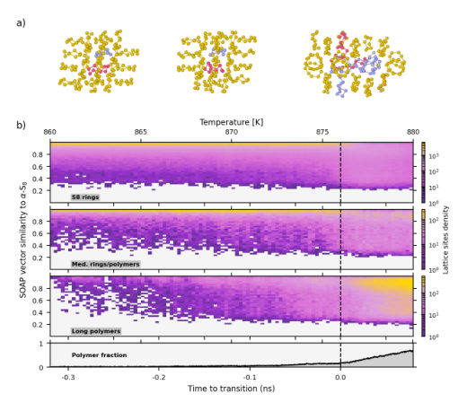
<figcaption class="paper-figure-caption"><b>Fig 3.</b> FIG. 3. Analysis of the trajectory at 1.0 GPa with 50 K/ns heat- ing rate. (a) Visual representation of small rings, small polymers and long polymers conforming to the lattice in the pre-melting regime. The non-S8 fragments are highlighted with pink and purple colors. (b) SOAP vector similarity for S8, small and long polymers in a se- lected temperature range across melting. The vertical line marks the sharp increase in polymeric content and the concurrent broadening of the SOAP similarity distribution.</figcaption>
</figure>
<figure class="paper-figure-card">
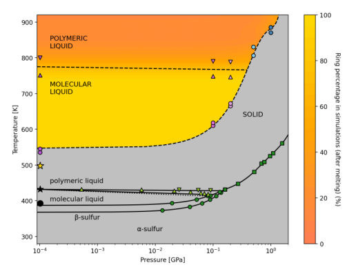
<figcaption class="paper-figure-caption"><b>Fig 4.</b> FIG. 4. Experimental and computational phase diagrams. Ex- perimental data points are taken from references: and [58] (see [20]), [19], [21], [24], [1]. The black solid lines are interpolations of the experimental data, and the dotted line is the the- oretical prediction from [20]. The symbol reports the extrapolated computational polymerization temperature. The other symbols mark the onset and endset of polymerization and melting obtained during T-ramp simulations at 50 K/ns. Dashed lines are obtained from the linear fit or spline interpolation of these points.</figcaption>
</figure>

**Main problem.** Understanding the atomistic mechanisms of the lambda-transition (temperature-induced polymerization) in liquid sulfur and reconstructing its pressure-temperature phase diagram.

**Main result.** The study identifies non-S8 rings as the reactive seeds for polymerization and demonstrates that at high pressures, polymerization and melting lines merge, with polymerization initiating within the crystal lattice.

**Method.** Large-scale molecular dynamics simulations driven by a local equivariant machine-learned interatomic potential (Allegro model) trained via active learning from DFT data.

**Summary.** This paper uses machine-learned molecular dynamics to provide a microscopic view of the polymerization transition in sulfur. It reveals that non-S8 rings act as the primary triggers for the formation of long polymer chains. Crucially, the study shows that at high pressures, the polymerization process begins within the solid crystal before melting occurs. The work successfully reconstructs the sulfur phase diagram, including the merging of the melting and polymerization lines at a critical point.

Detailed structure

**Model / system.** Elemental sulfur, specifically focusing on the transitions between crystalline alpha-S8, molecular liquid (S8 rings), and polymeric liquid (chains/rings) under varying temperature and pressure.

**Key observables.** Atomic coordination, ring size distribution (S8, S-pi, S-infinity), potential energy, heat capacity, volume, density, diffusivity, and viscosity.

**Important parameters / regimes.** Pressure up to 1.0 GPa, temperature range 300 K to 900 K, and various heating rates for temperature ramps.

**Assumptions / limitations.** The simulation assumes a fixed singlet multiplicity, which prevents the accurate description of isolated sulfur atoms; a coordination constraint was used to avoid non-physical single-atom fragments.

**Figures summary.** Figure 1 shows the visual evolution of S8 crystal heating and atom lineage; Figure 2 displays evolution of potential energy, volume, and ring content during temperature ramps; Figure 3 analyzes the 1.0 GPa trajectory showing lattice-conforming polymers.

**Paper structure.** The paper introduces the lambda-transition problem, describes the development and validation of the machine-learned potential, presents the reconstruction of the phase diagram, details the microscopic polymerization mechanism, and discusses high-pressure coupling and limitations.

Abstract

Using molecular dynamics simulations driven by a machine-learned interatomic potential, we investigate at low to intermediate pressures the $λ$-transition of sulfur, a temperature-induced polymerization. At ambient pressure, we capture the melting of crystalline cyclo-octasulfur into a liquid of molecular rings. Within this liquid, the concentration of non-S$_8$ rings increases with temperature; we show that these molecules act as reactive centers, which eventually trigger polymerization. We reproduce key experimental signatures of the $λ$-transition, including the sharp increase in heat capacity and the pronounced dependence of the transition temperature on the heating rate. Building on this, we reconstruct a phase diagram of polymerization up to intermediate pressures. Our results reveal a moderate decrease of the polymerization temperature with pressure, culminating with its merging with the melting line at a critical point. Beyond this point, we provide direct evidence of polymerization emerging from the crystalline phase. By analyzing temperature-ramp trajectories, we observe the formation of non-S$_8$ rings, open chains, and extended polymeric structures which retain features of the crystalline arrangement; further heating the system leads to disorder taking over through melting. Polymerization is therefore initiated slightly before melting. Altogether, our findings provide a microscopic picture of the $λ$-transition throughout the sulfur phase diagram.

[↑ back to top](#top)

### [Pulse Shaping to Mitigate the Impact of Device Imperfections in Field-Free Switching Using Combined Spin-Orbit and Spin-Transfer Torques](http://arxiv.org/abs/2604.22574v1)

**Authors:** Kuldeep Ray, Jérémie Vigier, Sylvain Martin, Chloé Bouard, Nicolas Lefoulon, Marc Drouard, Gilles Gaudin  
**Type:** both · **Category:** other · **PDF:** <https://arxiv.org/pdf/2604.22574v1>  
**Analysis basis:** full PDF text, analyzed in chunks

↔ Scroll figures horizontally

<figure class="paper-figure-card">
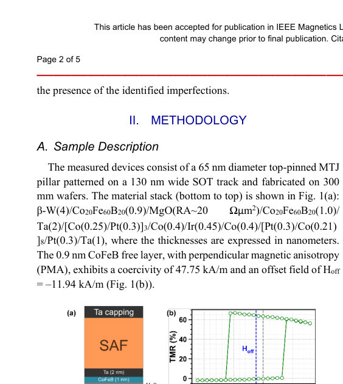
<figcaption class="paper-figure-caption"><b>Fig 1.</b> Fig. 1. (a) Schematic of the material stack of SOT-MRAM devices measured in this study. (b) Representative TMR hysteresis loop obtained by sweeping the out-of-plane field (HZ), showing a TMR = 63% at HZ=0 and an offset field Hoff = –11.94 kA/m.</figcaption>
</figure>
<figure class="paper-figure-card">
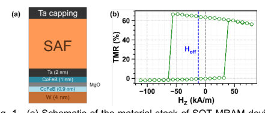
<figcaption class="paper-figure-caption"><b>Fig 2.</b> Fig. 2. (a) Schematic of the experimental setup. (b) WER definition and measurement scheme.</figcaption>
</figure>
<figure class="paper-figure-card">
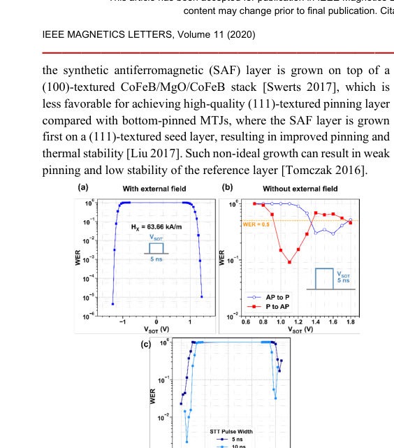
<figcaption class="paper-figure-caption"><b>Fig 3.</b> Fig. 3. WER as a function of SOT voltage (VSOT): (a) in the presence of an external in-plane magnetic field, HX = 63.66 kA/m, and (b) without any external magnetic field. (c) WER as a function of STT voltage (VSTT) for pulse widths of 5 ns and 10 ns.</figcaption>
</figure>
<figure class="paper-figure-card">
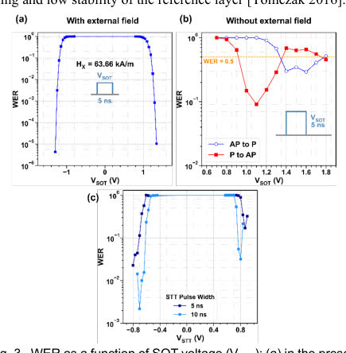
<figcaption class="paper-figure-caption"><b>Fig 4.</b> Fig. 4. (a) Field-free WER as a function of SOT voltage (VSOT). (b) Repeat measurement on the same device under identical conditions.</figcaption>
</figure>
<figure class="paper-figure-card">
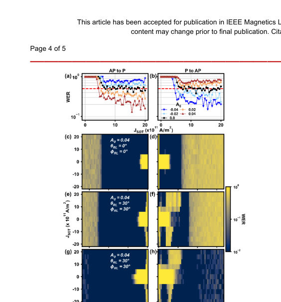
<figcaption class="paper-figure-caption"><b>Fig 5.</b> Fig. 5. Simulated WER versus SOT current density using different coupling parameters for (a) AP to P and (b) P to AP transitions. Simulated WER colormaps as a function of SOT and STT current densities for AP to P and P to AP transitions under different conditions: (c-d) perpendicular RL with A0&gt;0, (e-f) tilted RL with A0&gt;0, and (g-h) tilted RL with A0&gt;0 using a modified pulse (1 ns plateau and 9 ns decay).</figcaption>
</figure>
<figure class="paper-figure-card">
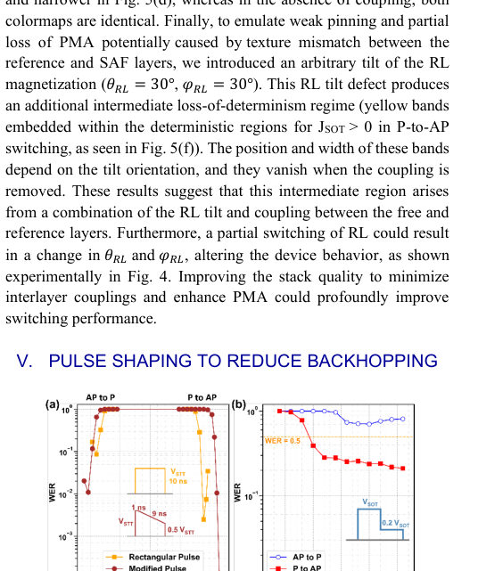
<figcaption class="paper-figure-caption"><b>Fig 6.</b> Fig. 6. (a) WER versus VSTT for standard rectangular and modified pulse shapes. (b) WER versus VSOT for a modified two-step SOT pulse.</figcaption>
</figure>
<figure class="paper-figure-card">
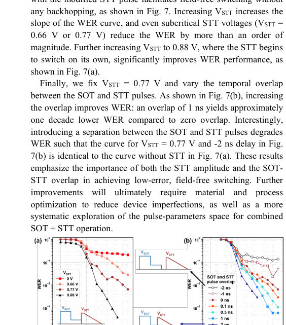
<figcaption class="paper-figure-caption"><b>Fig 7.</b> Fig. 7. WER versus VSOT using modified SOT and STT pulses (shown in inset) (a) for different VSTT, and (b) for different overlaps between SOT and STT pulses with VSTT = 0.77 V. A negative overlap corresponds to the separation between the end of the SOT and the beginning of the STT pulses.</figcaption>
</figure>

**Main problem.** Achieving reliable, field-free switching in SOT-MRAM is hindered by device imperfections like interlayer coupling and reference layer instability, which cause backhopping and switching asymmetry.

**Main result.** The authors demonstrate that STT pulse shaping (using a decaying pulse) and two-step SOT pulses can significantly reduce the Write Error Rate (WER) and mitigate backhopping.

**Method.** The study combines experimental measurements of Write Error Rate (WER) in top-pinned MTJ devices with macrospin simulations using coupled Landau-Lifshitz-Gilbert (LLG) equations.

**Summary.** This paper addresses the reliability issues in SOT-MRAM, specifically the problem of backhopping and switching asymmetry in field-free operation. By using both experiments and macrospin simulations, the authors identify that device imperfections like interlayer coupling and reference layer instability are the primary culprits. They propose and experimentally demonstrate that engineering the shape of the STT and SOT voltage pulses can suppress these errors. This work provides a practical pathway toward more robust and deterministic magnetic memory devices.

Detailed structure

**Model / system.** A top-pinned Magnetic Tunnel Junction (MTJ) pillar consisting of a CoFeB free layer and a synthetic antiferromagnetic (SAF) reference layer, utilizing combined Spin-Orbit Torque (SOT) and Spin-Transfer Torque (STT) mechanisms.

**Key observables.** Write Error Rate (WER), switching asymmetry (AP-to-P vs. P-to-AP), and voltage thresholds.

**Important parameters / regimes.** SOT and STT pulse amplitudes, pulse duration, interlayer exchange coupling, reference layer magnetization tilt, and the 'loss-of-determinism' regime.

**Assumptions / limitations.** The simulations use a macrospin approximation rather than full micromagnetics to achieve statistical significance.

**Figures summary.** Fig 1 shows the MTJ stack and hysteresis loop; Fig 2 details the experimental setup and WER procedure; Fig 3 displays WER curves showing threshold asymmetry; Fig 4 shows device instability; Fig 5 illustrates the loss-of-determinism regime; Fig 6 and 7 demonstrate the effectiveness of modified pulse shapes in reducing WER.

**Paper structure.** The paper introduces the problem of field-free switching reliability, presents experimental evidence of asymmetry and backhopping, uses macrospin simulations to identify the underlying physical causes (RL tilt and coupling), proposes pulse-shaping mitigation strategies, and validates these strategies experimentally.

Abstract

Combining spin-orbit (SOT) and spin-transfer torques (STT) provides a practical approach for field-free switching in spin-orbit torque magnetic random-access memory (SOT-MRAM), a prerequisite for industrial deployment, but can compromise reliability through phenomena such as backhopping, especially in top-pinned stacks commonly used for SOT-MRAM. We investigate the write error rate (WER) of combined SOT + STT switching in top-pinned devices that are not optimized for STT switching. Experiments reveal clear indications of STT-induced backhopping and a pronounced field-free SOT switching asymmetry between AP-to-P and P-to-AP transitions. Our macrospin model, using two coupled Landau Lifshitz Gilbert equations for the free and the reference layers, qualitatively reproduces this asymmetry and reveals an intermediate loss-of-determinism regime in addition to the well-known backhopping region. Based on these simulations, we propose mitigation strategies and experimentally demonstrate that STT pulse shaping reduces WER and improves switching robustness in the presence of device imperfections.

[↑ back to top](#top)

### [Resonance Frequency Shift Measurements of SRF Cavities at DESY](http://arxiv.org/abs/2604.22596v1)

**Authors:** Rezvan Ghanbari, Thorsten Buettner, Wolfgang Hillert, Karol Kasprzak, Tom Krokotsch, Ricardo Monroy-Villa, Detlef Reschke, Lea Steder, Alexey Sulimov, Hans Weise, Marc Wenskat, Mateusz Wiencek, Jonas Wolff  
**Type:** experiment · **Category:** other · **PDF:** <https://arxiv.org/pdf/2604.22596v1>  
**Analysis basis:** full PDF text, analyzed in chunks

↔ Scroll figures horizontally

<figure class="paper-figure-card">
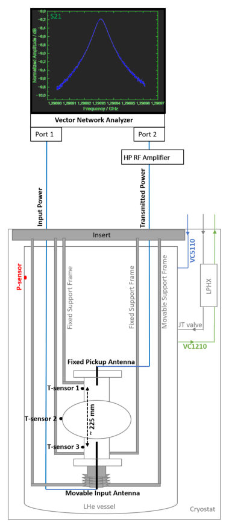
<figcaption class="paper-figure-caption"><b>Fig 1.</b> FIG. 1. Experimental setup for frequency-shift measure- ments. Liquid helium (LHe) is removed from the vessel im- mediately before the measurement. During warm-up, warm helium gas (GHe) is injected through the VC5110 valve, while the VC1210 return pipe is used for gas evacuation and pres- sure regulation. The VC1210 is originally part of the heat- exchange system, including the low-pressure heat exchanger (LPHX) and the Joule–Thomson (JT) valve, used for cool- ing below the helium boiling point at atmospheric pressure (∼4.2 K). A pressure sensor (P-sensor) is mounted inside the cryostat, and three CernoxTM temperature sensors (T-sensors 1, 2, and 3) are attached to the outer cavity surface....</figcaption>
</figure>
<figure class="paper-figure-card">
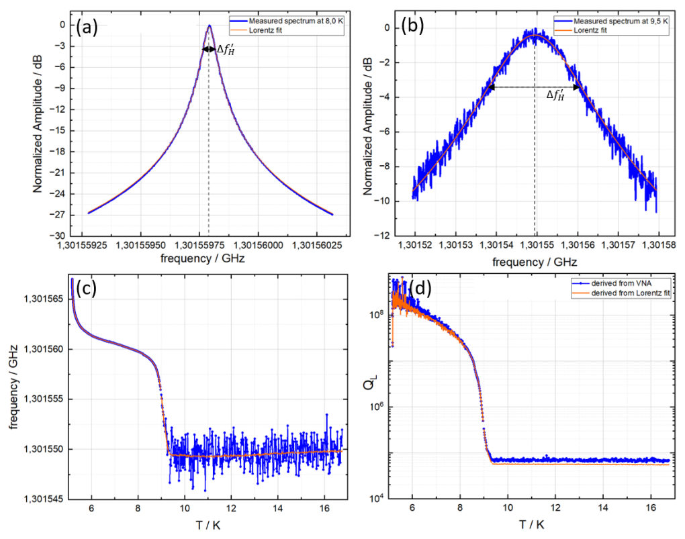
<figcaption class="paper-figure-caption"><b>Fig 2.</b> FIG. 2. Accuracy enhancement of resonance-frequency analysis through Lorentzian fitting for an exemplary cavity. Example spectra: (a) below the critical temperature, exhibiting a low noise floor, and (b) above the critical temperature, showing an increased noise level. This elevation markedly increases the uncertainty in determining both the resonance peak frequency and the −3 dB bandwidth ∆f ′ H used for calculating QL. Applying a Lorentzian fit effectively mitigates the adverse effects of noise on both peak identification and bandwidth estimation. The extracted resonance frequencies and the corresponding loaded quality factors QL are shown in (c) and (d), respectively, obtained from...</figcaption>
</figure>
<figure class="paper-figure-card">
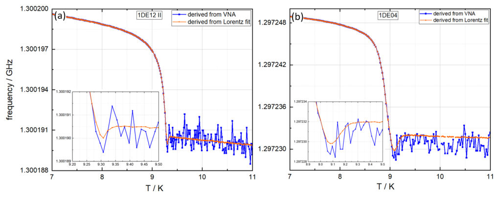
<figcaption class="paper-figure-caption"><b>Fig 3.</b> FIG. 3. Two exemplary cavities, shown in (a) and (b), illustrate the importance of Lorentzian fitting for identifying and accurately measuring the resonance-frequency dip around the critical temperature in the cryogenic temperature T dependence of the resonance frequency for mid-T heat-treated cavities. Around and above the critical temperature, elevated noise levels obscure the accurate determination of the resonance frequency directly from the vector network analyzer (VNA). The insets show a zoom-in of the dip around the critical temperature.</figcaption>
</figure>
<figure class="paper-figure-card">
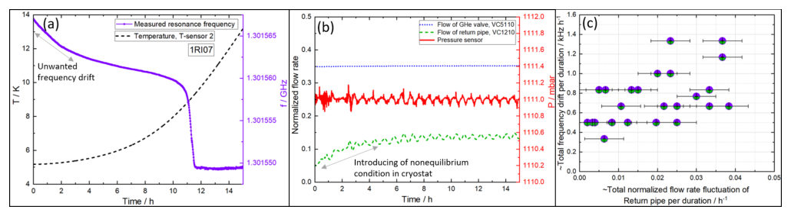
<figcaption class="paper-figure-caption"><b>Fig 4.</b> FIG. 4. Monitored parameters during the cryostat warm-up for resonance-frequency-shift measurements: (a) Resonance fre- quency f and cryogenic temperature T of the cavity as a function of time during warm-up. A frequency drift at the onset of the measurements is observed, which, based on theory, is not due to the temperature dependence of the penetration depth and, consequently, the resonance-frequency shift. The unwanted frequency drift typically starts at the lowest measured tem- perature and gradually decreases at higher temperatures. (b) Corresponding pressure P read from the P-sensor, maintained at 1111 ± 0.16 mbar, and flow rates, each normalized to its respective maximum flow...</figcaption>
</figure>
<figure class="paper-figure-card">
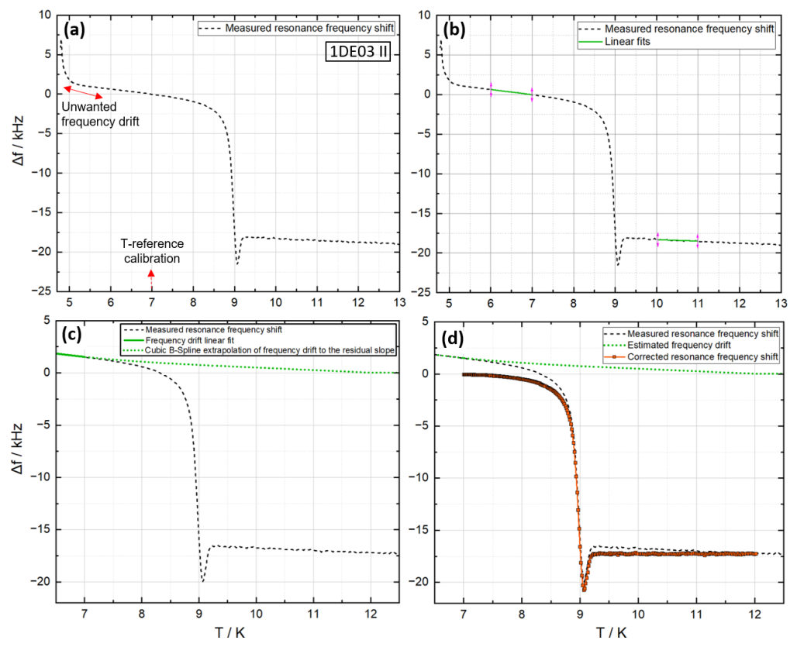
<figcaption class="paper-figure-caption"><b>Fig 5.</b> FIG. 5. Systematic empirical frequency-drift correction: (a) An unwanted frequency drift is observed at the onset of the frequency-shift measurement. (b) The frequency-drift slope is determined at the start of the measurement and at the residual drift level above critical temperature Tc. (c) The first linear fit at 7 K is extrapolated to match the slope of the second linear fit above Tc, in order to empirically estimate the frequency-drift curve. (d) The extrapolated frequency-drift curve is subtracted from the measured resonance frequency to obtain the corrected resonance-frequency shift. Consequently, only the corrected resonance-frequency shifts acquired above 7 K were included in the...</figcaption>
</figure>
<figure class="paper-figure-card">
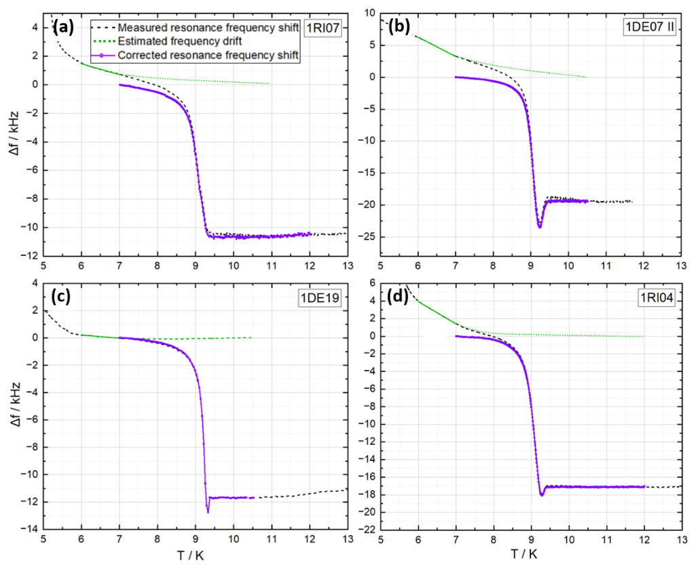
<figcaption class="paper-figure-caption"><b>Fig 6.</b> FIG. 6. Representative examples of post-measurement empirical frequency-drift corrections applied systematically to the data. Based on repeated measurements, the maximum relative uncertainties in the corrected frequency shifts (purple solid curves with data points and error bars) are estimated to be approximately 25% of the empirical frequency drifts (green dotted curves). A systematic temperature offset of approximately 0.11 K in the temperature range around Tc was identified between two T-sensor 2 positions at the cavity equators in two different inserts used for the measurements. This offset was corrected, and a corresponding systematic error of 0.11 K was included in the uncertainty...</figcaption>
</figure>
<figure class="paper-figure-card">
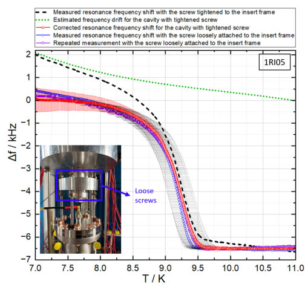
<figcaption class="paper-figure-caption"><b>Fig 7.</b> FIG. 7. Three repeated frequency-shift measurements of the same cavity. One test was performed with the mount- ing screw connecting the cavity to the insert fully tightened (dashed curve), resulting in a frequency artifact. Two sub- sequent tests were conducted with the screws intentionally left slightly loose, as shown in the inset. This additional mechanical freedom relieved stress and reduced cavity de- formation caused by insert thermal expansion under tran- sient non-equilibrium conditions (see Fig. 4). Consequently, the frequency artifact disappeared, and the measurements with the screw loosely attached to the insert exhibited re- liable reproducibility, with an uncertainty of...</figcaption>
</figure>
<figure class="paper-figure-card">
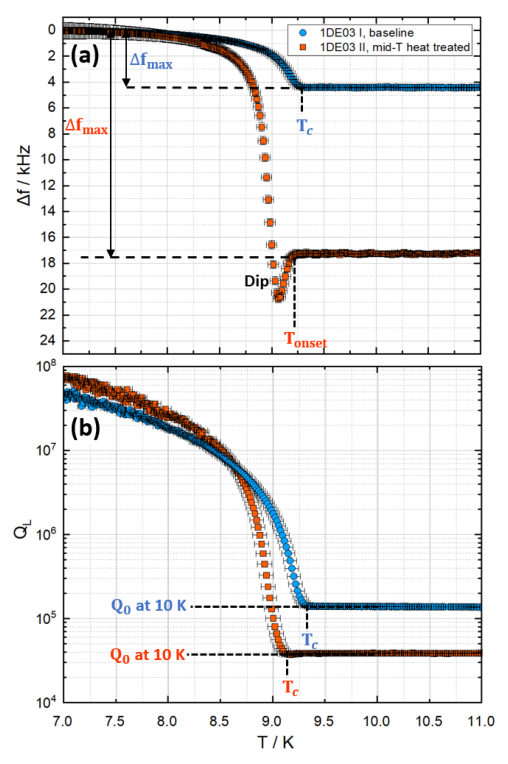
<figcaption class="paper-figure-caption"><b>Fig 8.</b> FIG. 8. Cryogenic temperature dependence of (a) resonance-frequency shift ∆f and (b) loaded quality fac- tor QL for an exemplary cavity before (1DE03 I) and after (1DE03 II) a mid-T heat treatment of 3 hours at 300◦C. The total frequency shift ∆fmax, critical temperature Tc, dip-onset temperature Tonset, and QL at 10 K are indicated and used in the analysis presented in this study. Due to the emergence of the dip around Tc, a quantitative definition of Tc in the fre- quency shift of mid-T heat-treated cavities requires further investigation. The differences in the curve features include a larger ∆f, a suppression of Tc, a dip around Tc, a lower QL above Tc, and a higher QL at temperatures...</figcaption>
</figure>
<figure class="paper-figure-card">
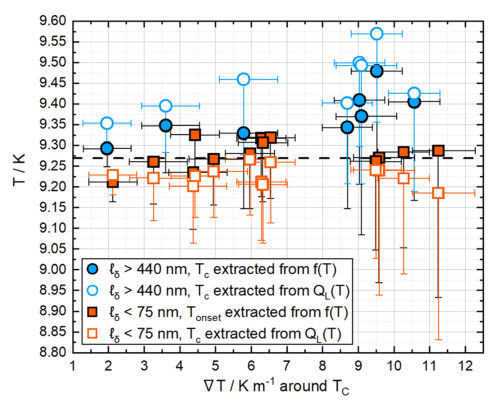
<figcaption class="paper-figure-caption"><b>Fig 9.</b> FIG. 9. Effect of spatial temperature gradients ∇T on the critical temperature Tc and the dip-onset temperature Tonset in f(T) and QL(T) curves (see Fig. 8 for the definitions of Tc and Tonset). Such gradients hinder accurate determination of the true critical temperature, shifting it unidirectionally toward higher apparent values; the corresponding maximum uncertainties are represented as error bars. The dashed line indicates the critical temperature of niobium, 9.27 K. Our observations (currently under further investigation) show that covering around the cavity during frequency-shift measure- ments can mitigate direct exposure to the cryostat environ- ment, thereby minimizing temperature...</figcaption>
</figure>
<figure class="paper-figure-card">
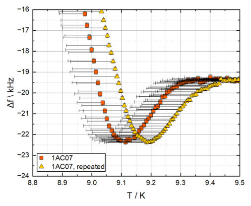
<figcaption class="paper-figure-caption"><b>Fig 10.</b> FIG. 10. Magnified temperature dependence of the resonance-frequency shift in the region of dip emergence around the critical temperature for a mid-T heat-treated cavity tested twice under different spatial temperature gra- dients. The effects of the spatial temperature gradient on the cavity-temperature readings and the corresponding uncer- tainties in the frequency shift are shown as error bars. These results confirm that, although the analysis of absolute tem- perature values is limited by high uncertainty, the influence of the spatial temperature gradient on the characterization of the dip—as a narrow relative feature—is negligible.</figcaption>
</figure>

**Main problem.** The paper addresses the need for precise measurement of resonance frequency shifts and quality factors in niobium SRF cavities, specifically mitigating systematic errors from mechanical stress and temperature gradients during the superconducting-to-normal transition.

**Main result.** The authors developed and validated a measurement setup and correction method that effectively removes frequency drifts caused by mechanical stress and reduces temperature gradient uncertainties, enabling reliable characterization of the anomalous frequency 'dip' and electron mean free path in mid-T heat-treated cavities.

**Method.** The study uses a dedicated frequency-shift measurement setup in vertical cryostats at DESY, employing Lorentzian fitting of S21 transmission spectra and an empirical frequency-drift correction method during a controlled non-adiabatic warm-up.

**Summary.** This paper describes the development of a high-precision measurement technique for studying the superconducting properties of niobium radio-frequency cavities. By implementing a system to correct for mechanical-stress-induced frequency drifts and thermal gradients, the researchers can accurately observe anomalous behaviors like the frequency 'dip' near the critical temperature. The work allows for the precise determination of the electron mean free path and oxygen concentration in the cavity surface layers. This is crucial for advancing the performance of SRF cavities used in particle accelerators.

Detailed structure

**Model / system.** The physical system consists of 1.3 GHz TESLA-type niobium superconducting radio-frequency (SRF) cavities, specifically comparing baseline cavities to those subjected to mid-temperature (300 C) heat treatments.

**Key observables.** Resonance frequency (f), loaded quality factor (QL), intrinsic quality factor (Q0), surface resistance (Rs), and penetration depth (lambda).

**Important parameters / regimes.** Critical temperature (Tc), electron mean free path (l), temperature gradients (grad T), and oxygen concentration (CO).

**Assumptions / limitations.** The analysis assumes the expression for the relationship between penetration depth and mean free path remains constant across different heat treatments, and that the temperature dependence in the superconducting region can be effectively handled by using a fixed temperature range.

**Figures summary.** Fig 1 shows the experimental setup; Fig 2-3 demonstrate the effectiveness of Lorentzian fitting for frequency extraction; Fig 4 shows monitored parameters during warm-up; Fig 5-6 illustrate the empirical drift correction process; Fig 7 compares tightened vs loosened mounting screws; Fig 8-9 show the impact of heat treatment and temperature gradients on frequency and quality factor curves.

**Paper structure.** The paper introduces the scientific problem of characterizing Nb cavity transitions, describes the experimental setup and the development of the frequency-shift measurement framework, details the mitigation of systematic errors (mechanical stress and thermal gradients), presents the results of mid-T heat treatment characterization, and concludes with the derivation of physical parameters like mean free path and oxygen concentration.

Abstract

The variation of the resonance frequency and intrinsic quality factor of superconducting radio-frequency cavities during the transition from the superconducting to the normal-conducting state provides essential insight into the fundamental superconducting properties of the cavity material. Investigating these transition dynamics is crucial for the continued advancement of niobium cavities whose near-surface regions are intentionally modified through the controlled introduction of interstitial atoms, such as oxygen and nitrogen, leading to the emergence of several novel behaviors whose underlying mechanisms are not yet fully understood. This work reports on the development and commissioning of a dedicated frequency-shift measurement setup. In its initial implementation, the system establishes a precise framework for determining the electron mean free path within both the superconducting penetration depth and the normal-conducting skin depth. It further enables investigation of an anomalous dip in the temperature dependence of the frequency shift near the critical temperature in cavities containing interstitial atoms in the near-surface lattice, a novel phenomenon previously reported in the literature. A recent upgrade, currently in the final stage of validation, significantly improves measurement accuracy and reproducibility. The improved setup enables comprehensive studies of the frequency shift and quality factor over the full temperature range above 7 K, contributing to a deeper understanding of the superconducting properties.

[↑ back to top](#top)

### [Spin-polarized Energy Density Method from Spin-Density Functional Theory](http://arxiv.org/abs/2604.22044v1)

**Authors:** Yang Dan, Dallas R. Trinkle  
**Type:** theory · **Category:** disordered systems and neural networks · **PDF:** <https://arxiv.org/pdf/2604.22044v1>  
**Analysis basis:** full PDF text, analyzed in chunks

↔ Scroll figures horizontally

<figure class="paper-figure-card">
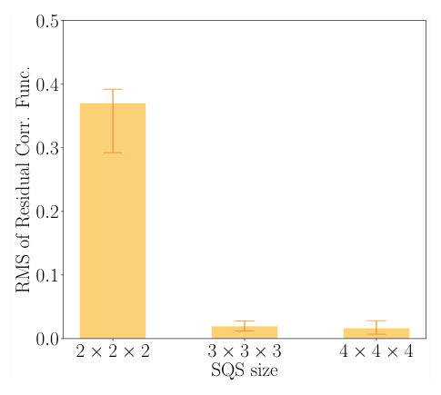
<figcaption class="paper-figure-caption"><b>Fig 1.</b> FIG. 1. Root mean square (RMS) of residual correlation functions of selected clusters (pair, triplet and</figcaption>
</figure>
<figure class="paper-figure-card">
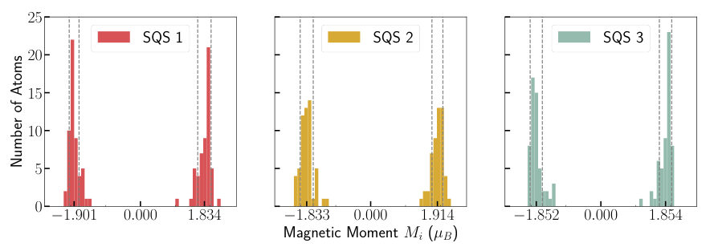
<figcaption class="paper-figure-caption"><b>Fig 2.</b> FIG. 2. Histogram of atomic magnetic moments Mi in the three fcc paramagnetic Fe SQS’s as determined</figcaption>
</figure>
<figure class="paper-figure-card">
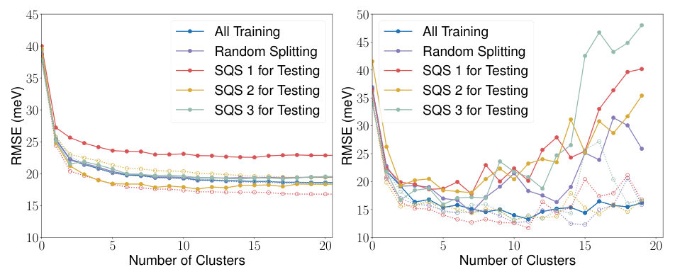
<figcaption class="paper-figure-caption"><b>Fig 3.</b> FIG. 3. Training (dashed lines) and testing (solid lines) root mean square error (RMSE) plots of the Landau-</figcaption>
</figure>
<figure class="paper-figure-card">
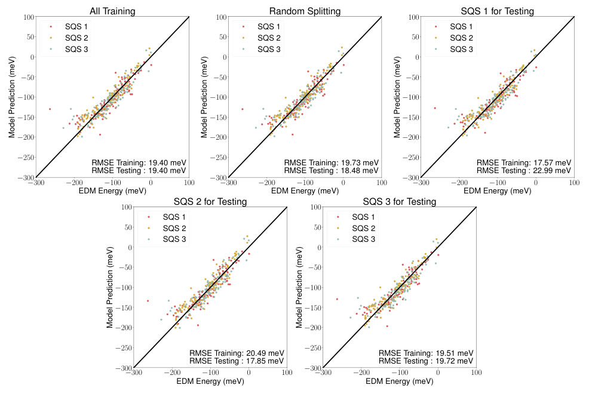
<figcaption class="paper-figure-caption"><b>Fig 4.</b> FIG. 4. Energy parity plots for the Landau-SCE models trained using the 5 most important clusters selected</figcaption>
</figure>
<figure class="paper-figure-card">
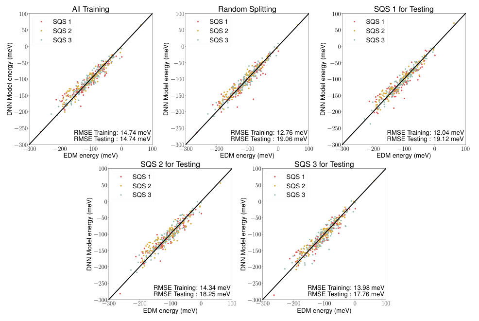
<figcaption class="paper-figure-caption"><b>Fig 5.</b> FIG. 5. Energy parity plots for the Landau-DNN models trained using the 5 most important clusters selected</figcaption>
</figure>
<figure class="paper-figure-card">
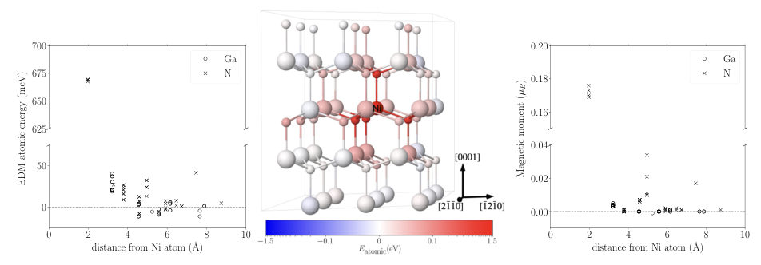
<figcaption class="paper-figure-caption"><b>Fig 6.</b> FIG. 6. EDM atomic energies (left and middle) and magnetic moments of atoms (right) in the 3 × 3 × 2</figcaption>
</figure>
<figure class="paper-figure-card">
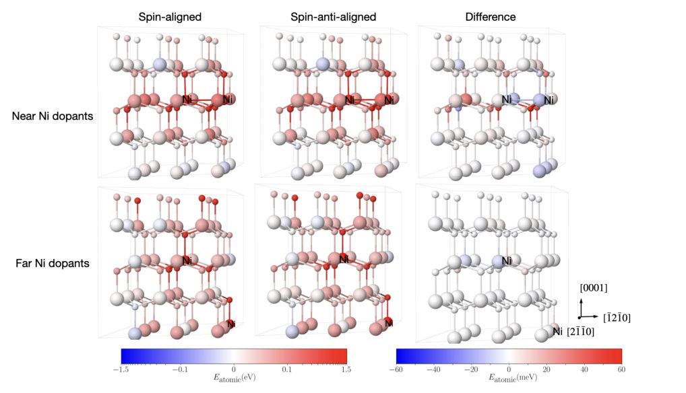
<figcaption class="paper-figure-caption"><b>Fig 7.</b> FIG. 7. Distribution of EDM atomic energies in the 3 × 3 × 2 GaN supercell doped by two Ni atoms</figcaption>
</figure>

**Main problem.** Generalizing the Energy Density Method (EDM) to include spin polarization to decompose total energy into well-defined, spatially distributed atomic energies in magnetic systems.

**Main result.** The authors developed a spin-polarized EDM implemented in VASP that successfully partitions energy in magnetic systems, demonstrating high accuracy in predicting atomic energies for paramagnetic Fe using cluster expansions and deep neural networks.

**Method.** The method decomposes total energy into spin-polarized kinetic, Coulomb, exchange-correlation, and on-site energy densities, integrated over gauge-invariant Bader and charge-neutral volumes.

**Summary.** This paper introduces a new way to break down the total energy of a magnetic system into specific contributions from individual atoms using spin-density functional theory. By implementing this in the VASP code, the authors show it can be used to train machine learning models (like neural networks) to predict local magnetic energies. The method is demonstrated to be highly effective for studying complex magnetic environments, such as disordered iron and doped semiconductors, providing much more local detail than standard total energy calculations.

Detailed structure

**Model / system.** The study applies the method to paramagnetic face-centered cubic (fcc) Fe modeled via Special Quasirandom Structures (SQS) and Ni-doped GaN dilute magnetic semiconductors.

**Key observables.** Spin-polarized energy densities, atomic energies, magnetization density, and magnetic moments.

**Important parameters / regimes.** Lattice parameter a0 = 3.573 A, plane-wave cut-off of 550 eV, and exchange parameters (J) for the Landau-SCE model.

**Assumptions / limitations.** The formalism assumes collinearity of spins and neglects orbital magnetic moments and spin-orbit coupling.

**Figures summary.** Figure 1 shows RMS error for SQS sizes; Figure 2 shows histograms of atomic magnetic moments; Figure 3 shows RMSE plots for SCE and DNN models; Figure 6 shows spatial distribution of energy/magnetization in Ni-doped GaN; Figure 7 shows energy distributions for Ni-Ni configurations.

**Paper structure.** The paper introduces the spin-polarized EDM formalism, details its numerical implementation in VASP, presents an application to paramagnetic Fe using machine learning (SCE and DNN), and concludes with an application to Ni-doped GaN to study localized exchange interactions.

Abstract

The energy density method is generalized to include spin polarization with the full formalism derived based on spin-density functional theory, which aims at decomposing the total energy into well-defined atomic energies. The method involves two steps: (1) decomposing the total energy into spin-polarized energy density functions in real space, and (2) integrating these energy densities over chosen gauge-invariant volumes for uniquely defined atomic energies, whose summation over all the atoms restores the DFT total energy up to a constant difference. This method is numerically implemented into the Vienna ab initio simulation package for the projector augmented-wave method, and is showcased with two applications. In the first application, we model the paramagnetic face-centered cubic Fe using spin special quasirandom structures; the spin energies are fit to spin cluster expansions and a deep neural network. In the second application, we calculate the atomic energy distributions of dilute magnetic semiconductor Ni-doped GaN with different dopant distances and spin configurations. This method extracts additional useful information for the study of magnetic systems with density functional theory.

[↑ back to top](#top)

### [Strain engineering of Andreev spin qubits in Germanium](http://arxiv.org/abs/2604.22650v1)

**Authors:** Vittorio Coppini, Patrick Del Vecchio, Antonio L. R. Manesco, Anton Akhmerov, Valla Fatemi, Bernard van Heck, Stefano Bosco  
**Type:** theory · **Category:** quantum information and computing · **PDF:** <https://arxiv.org/pdf/2604.22650v1>  
**Analysis basis:** full PDF text, analyzed in chunks

↔ Scroll figures horizontally

<figure class="paper-figure-card">
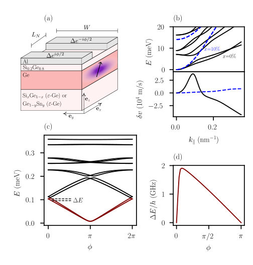
<figcaption class="paper-figure-caption"><b>Fig 1.</b> Figure 1. ASQs in Ge. (a) Ge Josephson junction of length LN. Two aluminum leads with gap ∆, phase-difference ϕ, and width W, are coupled to a Ge heterostructure compris- ing a 10 nm Si0.2Ge0.8 barrier, a 15 nm compressive-strained ε-Ge (tensile-strained ¯ε-Ge) channel, and a bottom relaxed barrier of SixGe1−x (Ge1−ySny). At x = y = 0, the Ge channel is unstrained and accumulated by the electric field Ez = 1 mV/nm. (b) Band dispersion (upper panel) of ε-Ge at x = 2% (black) and x = 10% (blue). As x (i.e., compressive strain) increases, the SOI-induced difference of Fermi veloci- ties δv of the two spins substantially decreases (lower panel). (c) ϕ-dependent energy of Andreev levels in...</figcaption>
</figure>
<figure class="paper-figure-card">
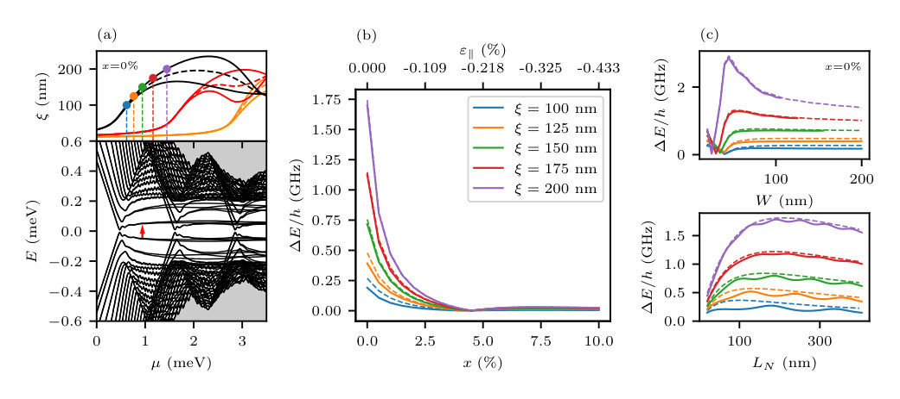
<figcaption class="paper-figure-caption"><b>Fig 2.</b> Figure 2. Andreev spin splitting in ε-Ge. (a) Coherence lengths ξ (upper panel) and energy levels (lower panel) against µ in an unstrained Ge junction. We show ξ of different spins (solid lines), and their average (dashed lines) for different sub-bands. The dots mark the values of the ξ used in (b) and (c); the arrow marks the value of µ in Figs. 1(c)-(d). (b) The spin-splitting ∆E rapidly decreases from the GHz range for unstrained Ge as the Si concentration x in the barrier, which determines the compressive strain of Ge, increases. Solid and dashed lines correspond to numerical simulations and Eq. (4), respectively. In panels (a)-(b) we use LN = 300 nm, W = 100 nm, ϕ = π/2. (c) Dependence...</figcaption>
</figure>
<figure class="paper-figure-card">
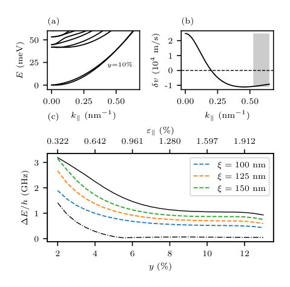
<figcaption class="paper-figure-caption"><b>Fig 3.</b> Figure 3. Andreev spin splitting in ¯ε-Ge (a) Band dispersion of ¯ε-Ge at Sn concentration y = 10%, see Fig. 1, and (b) cor- responding Fermi-velocity difference of the spins of the LH ground-state. (c) Spin-splitting ∆E in a ¯ε-Ge junction ob- tained from Eq. (4) against y for different value of ξ. The advantage of ¯ε-Ge is apparent by comparing the black lines representing the maximum ∆E in the allowed range of µ be- tween the bottom of the first and second sub-band for ¯ε-Ge (solid line) and unstrained Ge (dash-dotted line). We use LN = 300 nm, W = 50 nm, ϕ = π/2.</figcaption>
</figure>
<figure class="paper-figure-card">
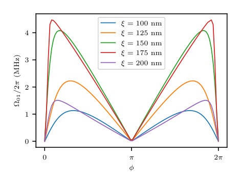
<figcaption class="paper-figure-caption"><b>Fig 4.</b> Figure 4. Driving ASQs. Rabi frequency Ω01 for the intra- doublet transition |0⟩→|1⟩against ϕ for different values of ξ. We consider electric-dipole-spin-resonance driving generated by a resonant AC potential with amplitude δV = 100 µV in an unstrained Ge junction with LN = 300 nm and W = 100 nm. For ξ = 175 nm, this is the same system whose energy levels are shown in Fig. 1(c).</figcaption>
</figure>
<figure class="paper-figure-card">
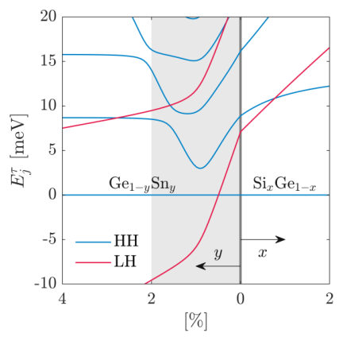
<figcaption class="paper-figure-caption"><b>Fig 5.</b> Figure 1. Energies Eτ j as a function of the concentration x and y. The zero of energy is pinned to the HH ground state, i.e. EH 1 ≡0. The shaded gray area marks the region excluded from the analysis in the main text to avoid the crossing between HH and LH ground states.</figcaption>
</figure>
<figure class="paper-figure-card">
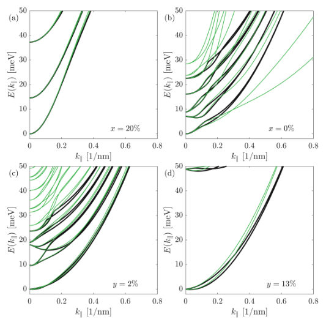
<figcaption class="paper-figure-caption"><b>Fig 6.</b> Figure 2. E(k∥) dispersion from the full Hamiltonian (black) computed from a 400-dimensional Hilbert space and from the effective Hamiltonian Heff (green). Top row: 2nd order SWT with A = {H1, H2, H3, H4, H5, η1, η2}. Bottom row: 1st order SWT with A = {H1, · · · , H20, η1, · · · , η10}. (a) Compressive strained Ge with x = 20%. (b) Unstrained Ge. (c) Tensile strained Ge with y = 2%. (d) Tensile strained Ge with y = 13%. Ez = 1 mV/nm.</figcaption>
</figure>
<figure class="paper-figure-card">

<figcaption class="paper-figure-caption"><b>Fig 7.</b> Fig. 2 shows the energy dispersion of compressive strained Ge (x = 20%), relaxed Ge (x = 0%), slightly tensile strained Ge (y = 2%) and highly tensile strained Ge (y = 13%) computed from the diagonalization of the full k · p matrix HGe compared to the dispersion provided by the effective Hamiltonian Heff. The dimension of the full Hilbert space is 2 · 200 = 400.</figcaption>
</figure>
<figure class="paper-figure-card">
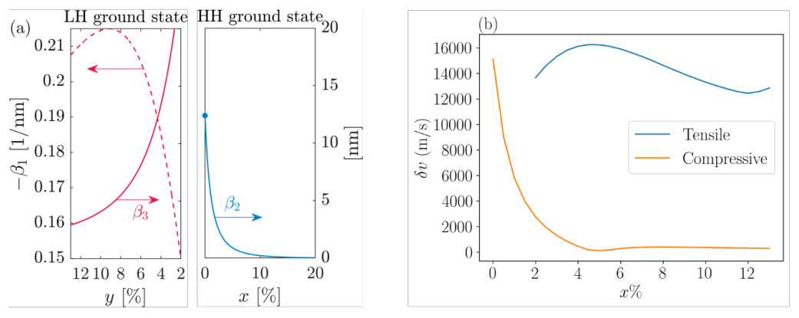
<figcaption class="paper-figure-caption"><b>Fig 8.</b> Figure 3. (a) Left panel: −β1 (left y-axis, dashed line) and β3 (right y-axis, solid line) as a function of the Sn content y. Right panel: β2 as a function of the Si content x. The right y-axis in both panels share the same units and scale. Ez = 1 mV/nm. (b) Maximum velocity difference against strain, for the two lowest bands of a germanium lead with W = 100 nm. The maximum is taken in the µ range where only the first sub-band is occupied.</figcaption>
</figure>
<figure class="paper-figure-card">
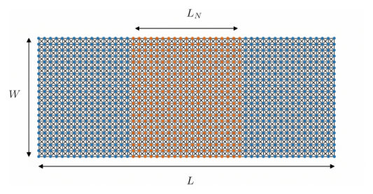
<figcaption class="paper-figure-caption"><b>Fig 9.</b> Figure 4. Sketch of a germanium junction. Each dot is a site and each line represents an hopping term. The orange area is the normal region while the blue areas are the superconducting regions.</figcaption>
</figure>
<figure class="paper-figure-card">
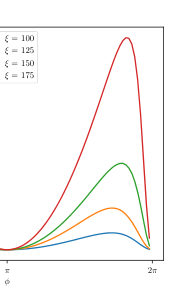
<figcaption class="paper-figure-caption"><b>Fig 10.</b> Figure 6. Phase dependence of the off-diagonal elements of ∂H/∂ϕ.</figcaption>
</figure>

**Main problem.** Recent experiments failed to resolve the spin-splitting of Andreev bound states in germanium Josephson junctions, which is a prerequisite for controlling Andreev spin qubits.

**Main result.** The authors identify compressive strain as the cause of suppressed spin-splitting and propose that using unstrained or tensile-strained (GeSn) heterostructures can increase spin-splitting by over two orders of magnitude, enabling fast all-electric quantum gates.

**Method.** The study uses a 6-band Luttinger-Kohn and Bir-Pikus Hamiltonian reduced to an effective 14x14 and 2x2 model via Schrieffer-Wolff transformations, combined with numerical simulations of ballistic Josephson junctions using the Kwant software package.

**Summary.** This paper addresses the difficulty of implementing Andreev spin qubits in germanium due to suppressed spin-splitting caused by compressive strain. By proposing alternative heterostructures, such as unstrained Ge or tensile-strained GeSn, the authors demonstrate that spin-splitting can be enhanced by two orders of magnitude into the GHz range. The study also predicts that these systems allow for fast, all-electric quantum gate operations in approximately 100 nanoseconds. Ultimately, the work establishes strain engineering as a vital design principle for future germanium-based quantum computing architectures.

Detailed structure

**Model / system.** The system consists of planar germanium (Ge) heterostructure Josephson junctions, specifically comparing compressively strained Ge/SiGe, unstrained Ge, and tensile-strained Ge/GeSn architectures.

**Key observables.** Andreev level energy splitting (delta E), Fermi velocity difference (delta v), Rabi frequency (Omega_01), and coherence length (xi).

**Important parameters / regimes.** Strain levels (Si or Sn concentration), junction geometry (length L_N and width W), chemical potential (mu), and superconducting phase difference (phi).

**Assumptions / limitations.** Assumes homogeneous strain from lattice mismatch, s-wave superconductivity induced from aluminum leads, and ballistic transport in the junctions.

**Figures summary.** Figure 1 shows junction geometry and how strain affects band dispersion and Andreev levels; Figure 2 shows dependence of Andreev levels on chemical potential and geometry; Figure 3 illustrates spin-splitting in tensile-strained Ge/GeSn; Figure 4 shows Rabi frequency for the qubit transition.

**Paper structure.** The paper begins by identifying the problem of suppressed spin-splitting, introduces the strain-dependent Hamiltonian and effective models, presents numerical simulations of different strain regimes (compressive, unstrained, tensile), evaluates qubit control via electric-dipole-spin-resonance, and concludes with design principles for Andreev spin qubits.

**Why it may be interesting.** This paper is relevant for researchers in quantum information as it provides a concrete material engineering strategy (strain engineering) to realize a new class of controllable spin qubits (Andreev spin qubits) using semiconductor heterostructures.

Abstract

Planar germanium heterostructures are promising hosts for hybrid quantum devices due to their compatibility with superconductors, low material disorder, and relaxed fabrication constraints. Also, the potentially low density of nuclear spins and strong spin-orbit interaction make germanium attractive for coherent spin physics. However, recent microwave spectroscopy experiments were unable to resolve a spin-splitting of bound states in germanium Josephson junctions, the prerequisite for defining and controlling Andreev spin qubits. Here, we argue that compressive strain is the key mechanism suppressing spin splitting in current devices. Furthermore, we propose unstrained and tensile-strained heterostructures, fully compatible with state-of-the-art growth technology, that significantly enhance the relevant spin-orbit effect. By numerically simulating ballistic Josephson junctions, we predict spin splittings comfortably in the GHz range, more than 2 orders of magnitude larger than compressively strained cases, and all-electric quantum gates in a hundred nanoseconds. Our results establish strain engineering as a key design principle for realizing Andreev spin qubits in germanium-based devices.

[↑ back to top](#top)

### [Surface coating induced lubrication in flowing granular materials](http://arxiv.org/abs/2604.22396v1)

**Authors:** Sayali V. Chaudhary, Ashish V. Orpe  
**Type:** both · **Category:** statistical mechanics · **PDF:** <https://arxiv.org/pdf/2604.22396v1>  
**Analysis basis:** full PDF text, analyzed in chunks

↔ Scroll figures horizontally

<figure class="paper-figure-card">
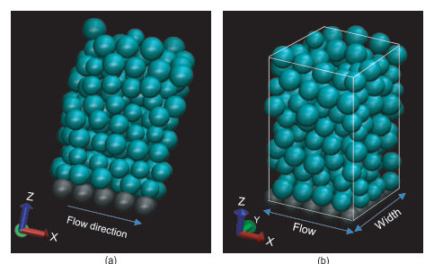
<figcaption class="paper-figure-caption"><b>Fig 1.</b> FIG. 1. Schematic showing the inclined chute configuration and the bulk particles. (a) View from the side. (b) Perspective view exhibiting all three directions. The blue spheres represent bulk particles, and the gray spheres denote the rough bottom surface. See text for more details.</figcaption>
</figure>
<figure class="paper-figure-card">
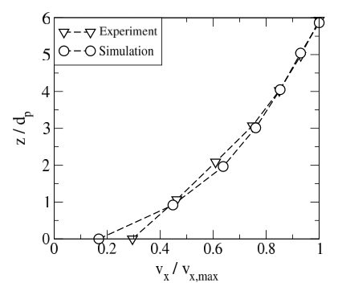
<figcaption class="paper-figure-caption"><b>Fig 2.</b> FIG. 2. Variation of steady-state, normalized, flow direction average velocity (vx/vx,max) profile with normalized distance from the chute bed (z/dp) in simulations and experiments (unpublished). vx.max represents the maximum velocity in the flowing layer at the free surface and dp denotes the bulk particle diameter. See text for more details.</figcaption>
</figure>
<figure class="paper-figure-card">
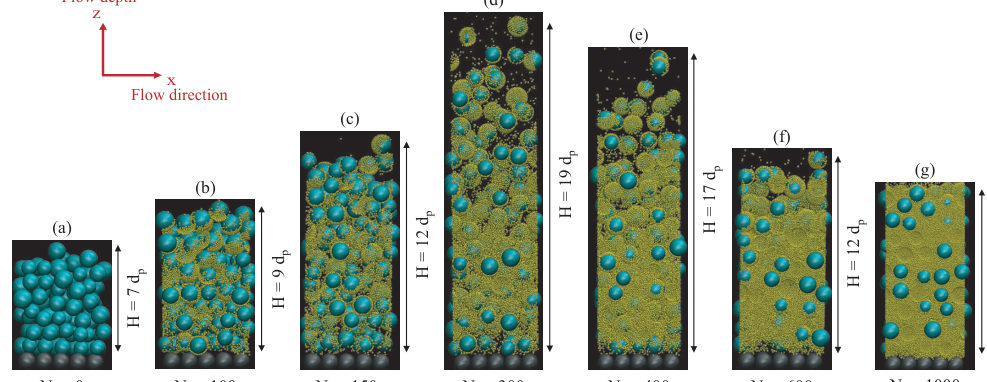
<figcaption class="paper-figure-caption"><b>Fig 3.</b> FIG. 3. Instantaneous configurations (images) from simulations as viewed from the side at steady-state for different values of (Nr). Bulk particles are represented as large blue spheres and lubricant particles as small yellow spheres. Cohesive interaction between bulk and lubricant particles is as per eq. (3). Multimedia available online</figcaption>
</figure>
<figure class="paper-figure-card">
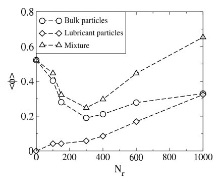
<figcaption class="paper-figure-caption"><b>Fig 4.</b> FIG. 4. Variation of steady-state mean volume fraction (⟨ϕ⟩) of particles (bulk, lubricant, and mixture) in the flowing layer with the number ratio (Nr). Error bars are smaller than the symbol size and hence are not shown to ensure clarity in the figure. See text for more details.</figcaption>
</figure>
<figure class="paper-figure-card">
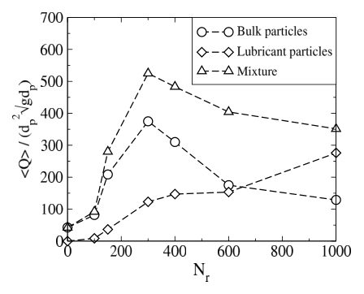
<figcaption class="paper-figure-caption"><b>Fig 5.</b> FIG. 5. Variation of steady-state, normalized, mean flow rate (⟨Q⟩/d2 p p</figcaption>
</figure>
<figure class="paper-figure-card">
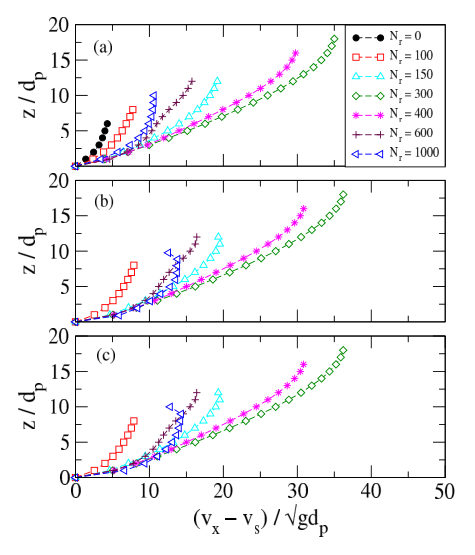
<figcaption class="paper-figure-caption"><b>Fig 6.</b> FIG. 6. Variation of steady-state, normalized, flow direction average velocity (vx −vs)/ p</figcaption>
</figure>
<figure class="paper-figure-card">
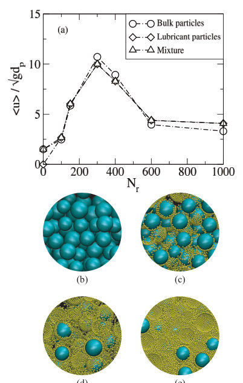
<figcaption class="paper-figure-caption"><b>Fig 7.</b> FIG. 7. (a) Variation of steady-state, normalized, averaged rms velocity ⟨u⟩/ p</figcaption>
</figure>
<figure class="paper-figure-card">
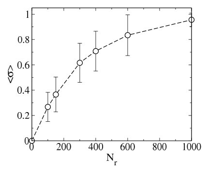
<figcaption class="paper-figure-caption"><b>Fig 8.</b> FIG. 8. Variation of mean bulk particle surface area coverage (⟨σ⟩) with the number ratio (Nr). The error bars represent spatial variations at any time instant and temporal variations over all time instants.</figcaption>
</figure>
<figure class="paper-figure-card">
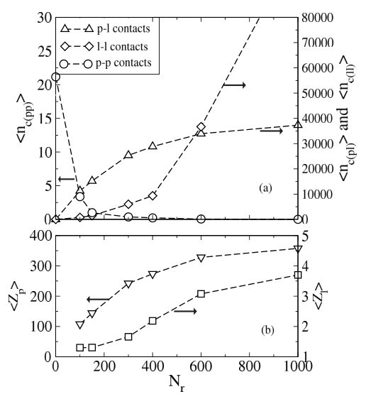
<figcaption class="paper-figure-caption"><b>Fig 9.</b> FIG. 9. (a) Variation of average number of binary contacts with the number ratio (Nr). The y-axis on the left side denotes contacts between bulk particles (⟨nc(pp)⟩). The y-axis on the right side denotes contact between bulk and lubricant particles (⟨nc(pl)⟩) and between lubricant particles (⟨nc(ll)⟩). (b) Variation of average coordination number for bulk particles (⟨Zp⟩) and lubricant particles (⟨Zl⟩) with the number ratio (Nr). The arrows are provided on the curves for ease in understanding. Error bars are smaller than the symbol size and hence are not shown to ensure clarity in the figure.</figcaption>
</figure>
<figure class="paper-figure-card">
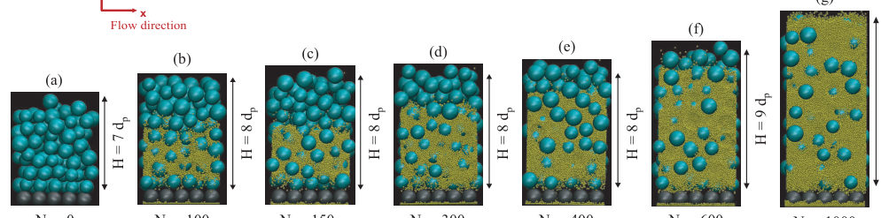
<figcaption class="paper-figure-caption"><b>Fig 10.</b> FIG. 10. Instantaneous configurations (images) from simulations as viewed from the side at steady-state for different values of Nr. Bulk particles are represented as large blue spheres and lubricant particles as small yellow spheres. Cohesive interaction is absent between bulk and lubricant particles. Multimedia available online</figcaption>
</figure>

**Main problem.** Understanding the particle-level dynamics and mechanisms behind how surface coating by small lubricant particles alters the flow properties of bulk granular materials.

**Main result.** The flow rate exhibits a non-monotonic dependence on lubricant content, increasing due to reduced inter-particle friction and decreasing at higher concentrations due to enhanced densification and damping.

**Method.** Discrete Element Method (DEM) simulations using LIGGGHTS software, calibrated against previous experimental data.

**Summary.** This paper investigates how adding small lubricant particles to a granular flow creates a surface coating that changes flow dynamics. Using DEM simulations, the authors show that while low amounts of lubricant reduce friction and speed up the flow, excessive amounts lead to crowding and slower flow. The study provides a microscopic look at how particle contacts and surface coverage drive these macroscopic changes, bridging the gap between previous experimental observations and computational insights.

Detailed structure

**Model / system.** A mixture of large spherical bulk particles and small spherical lubricant particles flowing down a 24-degree inclined plane, with cohesive interactions modeled via the SJKR framework.

**Key observables.** Overall flow rate, velocity profiles, packing fractions, granular temperature (RMS velocity), and surface coverage.

**Important parameters / regimes.** Number ratio of lubricant to bulk particles (Nr), particle size ratio, chute inclination, and cohesion energy density.

**Assumptions / limitations.** Lubricant particles are approximated as spheres rather than plate-like shapes, and periodic boundary conditions are used which may prevent the study of wall-induced segregation.

**Figures summary.** Schematic of the simulation setup; comparison of simulation and experimental velocity profiles; side-view images showing layer expansion and contraction; plots of surface coverage, contact types, and coordination numbers vs. lubricant content.

**Paper structure.** Introduction of the lubrication problem, description of the DEM simulation setup and contact models, presentation of flow rate and layer thickness results, analysis of particle-level contact networks and surface coverage, and comparison between cohesive and non-cohesive regimes.

Abstract

We investigate the flow of spherical, bulk granular particles down an inclined plane mixed with small-sized spherical lubricant particles using discrete element method simulations. Predefined cohesive interaction is implemented between lubricant and bulk particles, enabling the coating of the former over the latter. The overall flow rate exhibits non-monotonic dependence on lubricant content. Initially, it increases with lubricant addition, reaches a maximum at an intermediate lubricant content, and decreases for even higher lubricant content. The increase in the flow rate is attributed to a lower inter-particle friction coefficient between lubricant-coated bulk particles. The decrease in the flow rate at higher lubricant content, on the other hand, is attributed to enhanced densification and increased damping between crowded particles. Both these occurrences are examined using various flow level characteristics. The simulation results are found to be in qualitative agreement with previous experimental results. Overall, the outcome integrates novel computational insights and prior experimental results to enhance the understanding of the powder lubrication phenomena.

[↑ back to top](#top)

### [The influence of implantation conditions on dopant activation in Al-implanted 4H-SiC: A MD study applying an Al potential fitted to DFT barriers](http://arxiv.org/abs/2604.22434v1)

**Authors:** Sabine Leroch, Robert Stella, Andreas Hössinger, Lado Filipovic  
**Type:** theory · **Category:** other · **PDF:** <https://arxiv.org/pdf/2604.22434v1>  
**Analysis basis:** full PDF text, analyzed in chunks

↔ Scroll figures horizontally

<figure class="paper-figure-card">
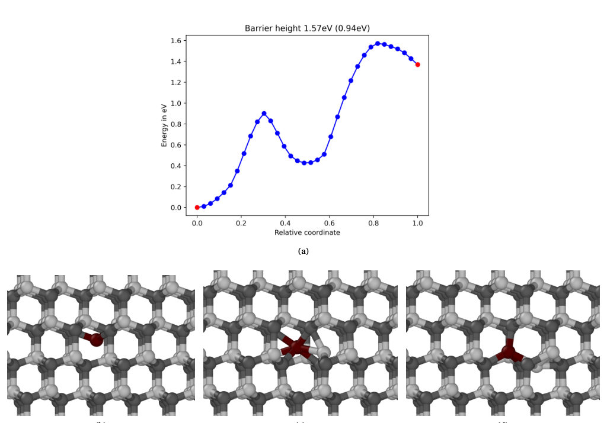
<figcaption class="paper-figure-caption"><b>Fig 1.</b> Fig. 1 (a) CI-NEB calculation of the kick-in process of the Al interstitial in the neutral state. (b) Tetragonal Al interstitial on the cubic site. (c) Bond aligned split interstitial in ⟨1011⟩direction at the minimum. (d) After further rotation of the split and breakage of Al bonds, the Al atom occupies the lattice site while Si is expelled to the tetragonal position on the hexagonal site. The final equilibrium position has not yet been reached by the DFT calculation. Al is shown in brown and host atoms are C (dark gray) and Si (light gray).</figcaption>
</figure>
<figure class="paper-figure-card">
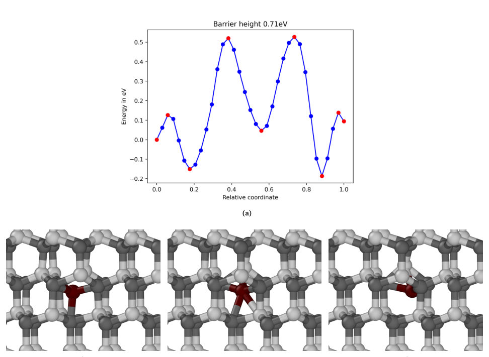
<figcaption class="paper-figure-caption"><b>Fig 2.</b> Fig. 2 (a) Basal plane diffusion path of the neutral Al interstitial via an (Al-Si) split configuration calculated applying CI-NEB DFT. Diffusion starts with a distorted AlTC in its lowest energy configuration (b) (first minimum in (a) marked by a red dot). From there, the Al interstitial moves into a tilted split with a lattice Si atom, corresponding to the first maximum in the diffusion barrier (c). The split rotates until it lies in the basal plane and coincides with the ⟨1120⟩orientation (d), corresponding to the center minimum in (a). The Al interstitial rotates around the split and moves further in the basal plane to the neighbor cage on the right where it adopts a tilted split like...</figcaption>
</figure>
<figure class="paper-figure-card">
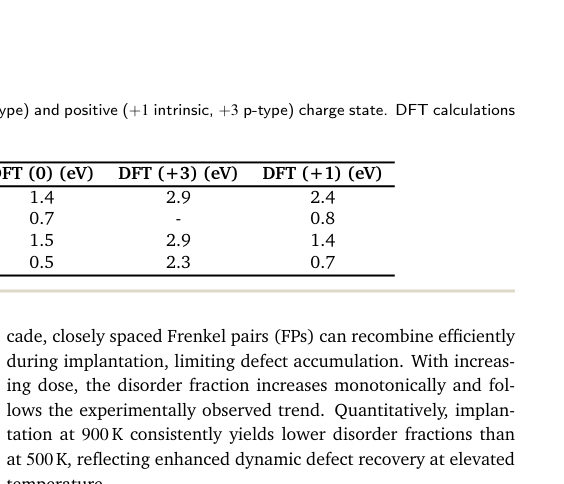
<figcaption class="paper-figure-caption"><b>Fig 3.</b> Fig. 4(b,c) shows depth-resolved IDS defect concentration pro- files immediately after implantation for 500 K (b) and 900 K (c). For comparison, plateau values obtained from kinetic Monte Carlo simulations 38 are included as solid horizontal lines in part (c) of the figure. Profiles and plateau values of identical color correspond to the same peak Al concentration. The bi- nary collision model (BCM)-based defect concentrations are sys- tematically higher than those obtained from MD. This discrep- ancy is expected, since BCMs used in kMC do not account for the near-instantaneous recombination of closely spaced FPs dur- ing displacement cascades. In contrast, MD explicitly resolves cascade...</figcaption>
</figure>
<figure class="paper-figure-card">
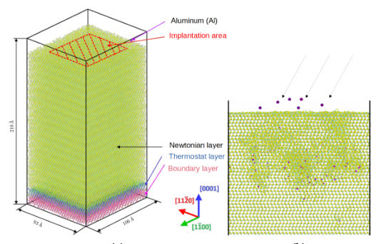
<figcaption class="paper-figure-caption"><b>Fig 4.</b> Fig. 3 Molecular-dynamics (MD) implantation model setup. (a) Simu- lation domain partitioned into a Newtonian (NVE) region, a thermostat region (heat sink), and a fixed boundary layer used during implantation. (b) Snapshot of a 2 keV Al ion cascade in 4H-SiC for an incidence angle of 7◦relative to the surface normal (⟨0001⟩direction).</figcaption>
</figure>
<figure class="paper-figure-card">
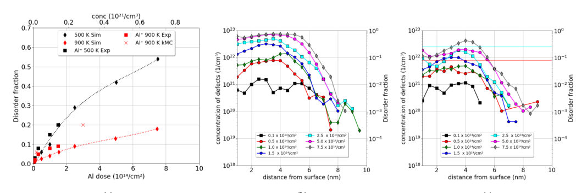
<figcaption class="paper-figure-caption"><b>Fig 5.</b> Fig. 4 (a) Disorder fraction relative to the perfect crystal in the implanted volume, evaluated at half-width of the defect concentration profiles as a function of implantation parameters. Results are compared with experimental data from Hallen et al. 37 at an ion energy of 100 keV (squares); dotted lines serve as guides. (b-c) IDS defect concentration profiles immediately after implantation at 500 K (b) and 900 K (c) as a function of dose (from simulation). Solid horizontal lines indicate plateau concentration values from kinetic Monte Carlo simulations 38 for Al concentrations of 0.3 and 3× 1020/ cm−3 and Al implantation energies of 180 keV.</figcaption>
</figure>
<figure class="paper-figure-card">
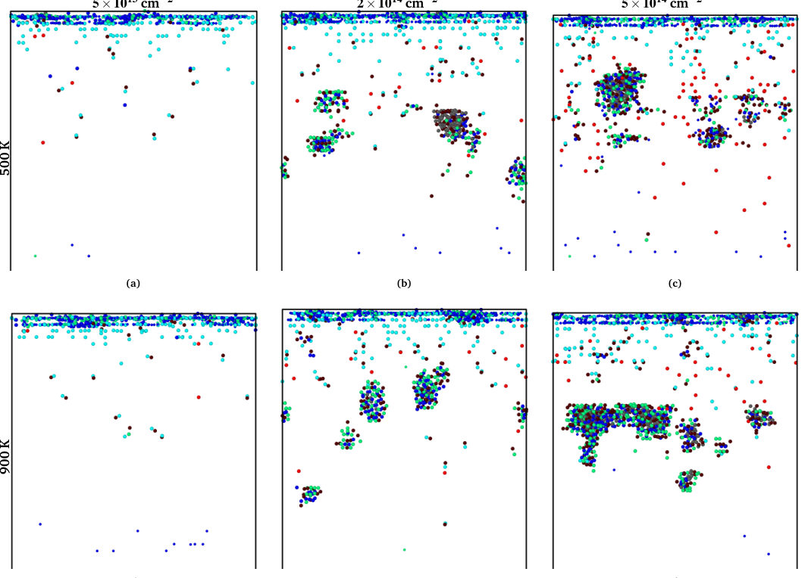
<figcaption class="paper-figure-caption"><b>Fig 6.</b> Fig. 5 Representative defect morphologies after annealing at 2350 K (100 ns) for three implantation doses and two implantation temperatures. (a-c) Implantation at 500 K and (d-f) at 900 K for doses 5×1013, 2×1014, and 5×1014 cm−2 (left to right). Color code: gray = locally amorphous/disordered atoms (IDS), green = Si-related intrinsic defects, cyan/blue = C-related intrinsic defects, brown = Al atoms, red = lattice-site Al counted as activated (see text for activation definitions). Interstitials and vacancies are shown as enlarged and reduced spheres, respectively.</figcaption>
</figure>
<figure class="paper-figure-card">
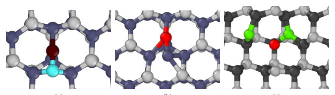
<figcaption class="paper-figure-caption"><b>Fig 7.</b> Fig. 6 Stable Al-related defect configurations observed in MD. (a) split interstitial (Al–C)Si, (b) substitutional Al bound to a tilted carbon split interstitial AlSiCI, and (c) Al on a C lattice site (AlC) inducing strong local distortion. Al (red/brown), Host atoms: C (dark gray) and Si (light gray), cyan carbon antisite, green Si interstitial.</figcaption>
</figure>
<figure class="paper-figure-card">
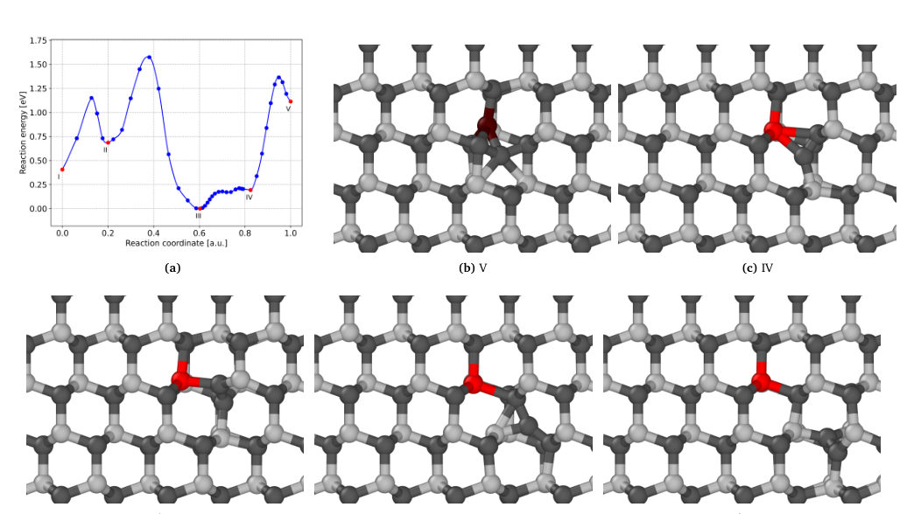
<figcaption class="paper-figure-caption"><b>Fig 8.</b> Fig. 7 Kick-out reaction of the carbon antisite by the diffusing Al interstitial applying DFT NEB for the neutral state. (a) Activation barriers passed in the course of the reaction. Displayed configurations are marked by red dots. (b) Spontaneous formation of an (Al-C)Si split interstitial when Al approaches the nearest neighbor distance of the carbon antisite at V. (c) Bond breakage followed by upwards rotation of the carbon interstitial ultimately forming a carbon split interstitial next to AlSi in IV. (d) Relaxation towards the most stable AlSiCI complex configuration in III. (e) Detachment of the carbon split interstitial from AlSi in II. (f) Carbon interstitial diffuses away, Al is...</figcaption>
</figure>
<figure class="paper-figure-card">
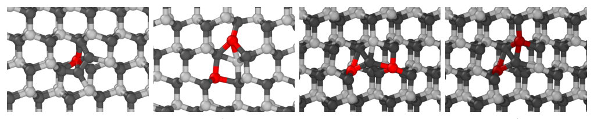
<figcaption class="paper-figure-caption"><b>Fig 9.</b> Fig. 8 Stable Al-related 3-mer defect complexes observed in MD. (a) Ladder-like AlSi(CI)2 complex, (b) two substitutional Al bound to a silicon interstitial (AlSi)2SiI, (c) two substitutional Al bound to a carbon interstitial (AlSi)2CI in the basal plane, and (d) two substitutional Al bound to a carbon interstitial (AlSi)2CI along the c-axis. Host atoms: C (dark gray) and Si (light gray).</figcaption>
</figure>
<figure class="paper-figure-card">
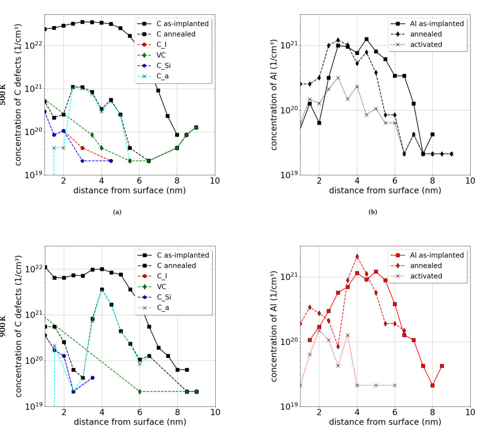
<figcaption class="paper-figure-caption"><b>Fig 10.</b> Fig. 9 Depth-resolved defect concentrations for a dose of 5 × 1014 cm−2. (a,b) Implantation at 500 K; (c,d) implantation at 900 K. Left column: C-related defects; right column: Al-related defects. Solid curves: as-implanted; dashed curves: after annealing at 2350 K for 100 ns.</figcaption>
</figure>

**Main problem.** Understanding how implantation temperature and dose influence defect evolution, amorphization, and Aluminum (Al) dopant activation in 4H-SiC.

**Main result.** The study identifies a kinetic processing window (500-900 K) where moderate disorder facilitates Al activation via vacancy-assisted substitution during regrowth, whereas higher temperatures promote stable interstitial clusters and planar defects that reduce activation.

**Method.** Large-scale Molecular Dynamics (MD) simulations using a combined Gao-Weber and reparameterized Morse potential, validated by Density Functional Theory (DFT) and Nudged Elastic Band (NEB) calculations.

**Summary.** This paper uses molecular dynamics to investigate the atomistic mechanisms of Aluminum doping in 4H-SiC. It reveals that while higher implantation temperatures reduce initial crystal damage, they paradoxically lead to lower dopant activation at high doses by promoting stable interstitial clusters. The authors propose a specific temperature window for implantation that optimizes activation through controlled nanoscale amorphization and subsequent regrowth. The study also identifies new Al diffusion paths and a carbon-antisite kick-out mechanism.

Detailed structure

**Model / system.** Aluminum-implanted 4H-SiC (a wide bandgap semiconductor) undergoing ion implantation and high-temperature annealing.

**Key observables.** Frenkel pair production, Al substitutional incorporation (activation), defect cluster size, disorder fraction, and formation of planar defects (Frank loops).

**Important parameters / regimes.** Implantation temperature (500 K vs 900 K), Al dose (up to 10^21 cm^-3), and annealing temperature (up to 2350 K).

**Assumptions / limitations.** MD-accessible annealing times are limited to 100 ns, which may not capture long-term experimental equilibrium; explicit charge states and compensation effects are not treated.

**Figures summary.** Figures show CI-NEB reaction paths, Al diffusion pathways, defect morphologies (clusters and loops) after annealing, and depth-resolved defect concentrations.

**Paper structure.** The paper introduces the problem of Al activation, describes the MD/DFT methodology and potential development, presents results on the implantation phase (damage/amorphization), details the annealing phase (defect evolution/clustering), and concludes with the identification of the kinetic processing window.

Abstract

We present molecular dynamics simulations of shallow Al implantation in 4H-SiC to clarify how implantation temperature and dose control defect evolution and dopant activation during early annealing. Using the Gao-Weber potential together with a reparameterized Morse Al-SiC interaction fitted to DFT migration and kick-in/out barriers, we find that higher implantation temperature reduces Frenkel-pair production and suppresses extended amorphous pockets. Yet at high doses (>1e20 cm^-3), annealing shows non-monotonic behavior: samples implanted at 900 K form larger, more stable interstitial clusters than those implanted at 500 K. These clusters trap Al and lower substitutional incorporation. Within MD-accessible times, the fraction of lattice-site Al is therefore higher after 500 K implantation despite better as-implanted crystallinity at 900 K. After annealing, two regimes emerge around the Al solubility limit: a low-dose regime dominated by isolated point defects and small complexes, and a high-dose regime with clustering and planar-defect formation that is strongly temperature dependent. The results explain the experimentally observed activation window (500-900 K) and indicate a kinetic route in which controlled nanoscale amorphization improves activation through regrowth-assisted incorporation while limiting extended defects. We also identify a new Al diffusion path and a carbon-antisite kick-out activation mechanism, both confirmed by DFT-NEB.

[↑ back to top](#top)

### [Theoretical prediction of strong-coupling superconductivity in a hypothetical NaAlH3 phase at ambient pressure](http://arxiv.org/abs/2604.22300v1)

**Authors:** Izabela A. Wrona, Yinwei Li, Radoslaw Szczesniak, Artur P. Durajski  
**Type:** theory · **Category:** strongly correlated electrons · **PDF:** <https://arxiv.org/pdf/2604.22300v1>  
**Analysis basis:** full PDF text, analyzed in chunks

↔ Scroll figures horizontally

<figure class="paper-figure-card">
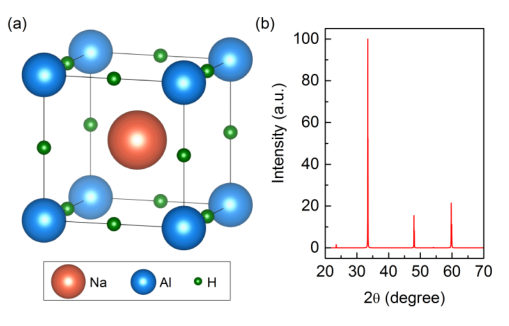
<figcaption class="paper-figure-caption"><b>Fig 1.</b> FIG. 1. (a) Optimized crystal structure of NaAlH3 in the cubic Pm¯3m phase, obtained from fully relaxed variable-cell DFT calculations at 0 GPa. (b) Simulated X-ray diffraction (XRD) pattern based on the relaxed equilibrium structure, confirming the phase purity and high symmetry of the com- pound.</figcaption>
</figure>
<figure class="paper-figure-card">

<figcaption class="paper-figure-caption"><b>Fig 2.</b> FIG. 4. Superconducting energy gap as a function of temper- ature (a) and temperature-dependent specific heat difference between the superconducting and normal state (b) for Pm3m- NaAlH3 at ambient pressure for three values of Coulomb pseu- dopotential µ∗= 0.1 (red lines), µ∗= 0.15 (blue lines), and µ∗= 0.2 (green lines).</figcaption>
</figure>
<figure class="paper-figure-card">
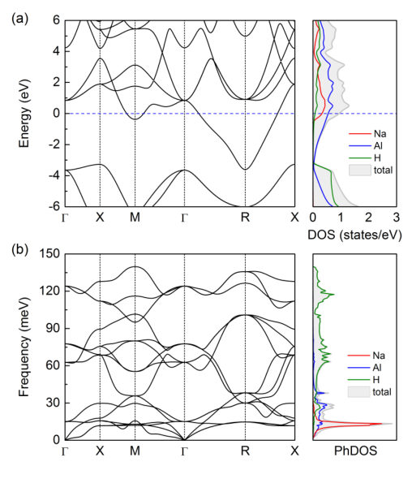
<figcaption class="paper-figure-caption"><b>Fig 3.</b> FIG. 2. Electronic band structures together with partial den- sity of states (a) and phonon dispersion together with pro- jected phonon density of states (b) for NaAlH3 at ambient pressure. The blue dashed line in (a) indicates the Fermi level.</figcaption>
</figure>
<figure class="paper-figure-card">
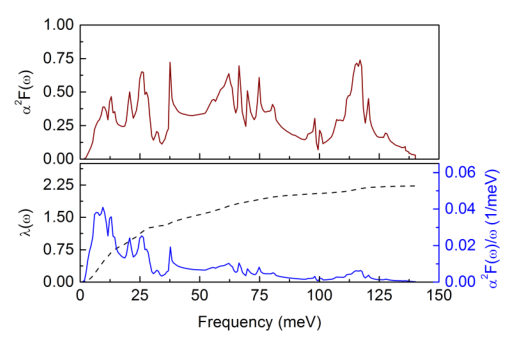
<figcaption class="paper-figure-caption"><b>Fig 4.</b> FIG. 3. Isotropic Eliashberg spectral function α2F(ω) (top panel) and cumulative electron-phonon coupling parameter λ(ω), and its derivative with respect to frequency dλ(ω)/dω = α2F(ω)/ω (bottom panel) for Pm3m-NaAlH3 at ambient pressure.</figcaption>
</figure>
<figure class="paper-figure-card">
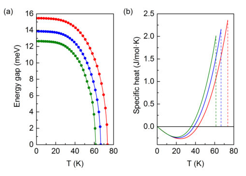
<figcaption class="paper-figure-caption"><b>Fig 5.</b> Figure 4(b) illustrates the temperature dependence of the specific heat difference. A clear discontinuity ap- pears at Tc for each case, marking the transition be- tween the superconducting and normal states. The mag- nitude of the specific heat jump ∆C(Tc) increases with decreasing µ∗, indicating stronger superconducting cor- relations. Notably, the calculated values of ∆C(Tc)/γTc significantly exceed the BCS weak-coupling limit of 1.43 [53], reaching values as high as 2.28 (for p = 0 GPa and</figcaption>
</figure>
<figure class="paper-figure-card">
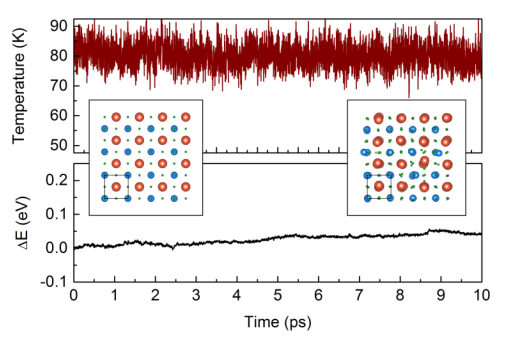
<figcaption class="paper-figure-caption"><b>Fig 6.</b> FIG. 5. Fluctuations of temperature (top panel) and total en- ergy difference ∆E (bottom panel) during AIMD simulations at 80 K.</figcaption>
</figure>

**Main problem.** Investigation of the potential for high-temperature, strong-coupling superconductivity in a hypothetical cubic phase of the ternary hydride NaAlH3 at ambient pressure.

**Main result.** The study predicts a superconducting critical temperature (Tc) of up to 73.7 K with an exceptionally strong electron-phonon coupling constant (lambda) of 2.23, indicating a strong-coupling regime.

**Method.** First-principles calculations using Density Functional Theory (DFT) and the Migdal-Eliashberg formalism, supplemented by ab initio molecular dynamics (AIMD) for stability testing.

**Summary.** This paper explores the possibility of high-temperature superconductivity in a hypothetical cubic phase of the sodium aluminum hydride (NaAlH3) at ambient pressure. Using advanced first-principles methods, the authors predict a very high superconducting transition temperature of up to 73.7 K. The superconductivity is driven by extremely strong electron-phonon coupling. The study also demonstrates that this phase is predicted to be dynamically and thermally stable, making it a significant theoretical candidate for high-Tc hydride research.

Detailed structure

**Model / system.** A hypothetical cubic Pm-3m phase of the ternary hydride NaAlH3, characterized by a metallic electronic structure and a covalent-metallic environment involving Al-H and Na-derived states.

**Key observables.** Superconducting critical temperature (Tc), electron-phonon coupling constant (lambda), superconducting energy gap ratio (2Delta/kBTc), specific heat jump (deltaC/gammaTc), and isotope coefficient (alpha).

**Important parameters / regimes.** Coulomb pseudopotential (mu*) values of 0.1, 0.15, and 0.2; pressure range from 0 to 0.2 GPa; lambda = 2.23.

**Assumptions / limitations.** The NaAlH3 phase is hypothetical and metastable; results depend on the choice of the Coulomb pseudopotential (mu*); the study is limited to the DFT and Migdal-Eliashberg theoretical framework.

**Figures summary.** Fig 1: Optimized cubic structure and simulated XRD pattern. Fig 2: Electronic band structure and phonon dispersion/density of states. Fig 3: Eliashberg spectral function and cumulative data.

**Paper structure.** The paper introduces the hypothetical NaAlH3 phase, details the DFT and Migdal-Eliashberg computational framework, presents results on structural/thermal stability, analyzes superconducting properties (Tc, lambda, gap ratio), and compares the system to isostructural analogs.

Abstract

We present a comprehensive first-principles investigation of a hypothetical cubic Pm-3m phase of the ternary hydride NaAlH3, focusing on its lattice dynamics, electronic structure, and electron-phonon-mediated superconducting properties at ambient pressure. Using density functional theory and the Migdal-Eliashberg formalism, we find an exceptionally strong electron-phonon coupling ($λ=2.23$), resulting in a superconducting critical temperature of up to 73.7 K for a Coulomb pseudopotential $μ^* = 0.1$. Phonon dispersion calculations, complemented by ab initio molecular dynamics simulations, indicate dynamic and thermal stability within the adopted theoretical framework. The electronic structure exhibits a metallic character with substantial contributions from Al- and Na-derived states at the Fermi level. The resulting superconducting gap ratio ($2Δ(0)/k_B T_c \approx 4.8$) and specific heat jump ($ΔC/γT_c \approx 2.2$) significantly exceed BCS weak-coupling predictions, highlighting the strong-coupling nature of superconductivity in this hypothetical phase.

[↑ back to top](#top)

