
# arxiv digest (quant-ph + cond-mat) — 2026-04-28

*228 papers · 49 relevant · 5 highlighted*

## 🔥 Most relevant (49)

*Every paper with at least one nonzero topic score, sorted by best-matching score. 🔥 marks scores ≥4/5. Click the title to jump to the full entry below; click [arXiv] to open the paper page. `(secondary)` marks papers from de-prioritized cond-mat archives.*

Show 49 relevant papers

- ⭐ [Dynamical preparation of U(1) quantum spin liquids in an analogue quantum simulator](#paper-2604.24744) [[arXiv]](http://arxiv.org/abs/2604.24744v1) — 🔥 `analog quantum simulation` **5/5** · 🔥 `exotic spin models in light-matter` **4/5** · 🔥 `non-equilibrium dynamics` **4/5** · `entanglement & information structure` **3/5** · `QC/QI experiment` **2/5** · `non-equilibrium universality` **2/5** · `quantum measurements` **2/5**
- ⭐ [Optical depth dictates universal bounds on many-body decay in atomic ensembles](#paper-2604.24680) [[arXiv]](http://arxiv.org/abs/2604.24680v1) — 🔥 `free-space correlated emission` **5/5** · 🔥 `Dicke superradiance` **4/5** · 🔥 `correlated / nonlocal dissipation` **4/5** · `methods for driven-dissipative` **2/5** · `non-equilibrium universality` **2/5**
- [Observation of OAM non-conservation in entangled photon generation](#paper-2604.23550) [[arXiv]](http://arxiv.org/abs/2604.23550v1) — 🔥 `quantum optics experiment` **5/5** · 🔥 `QC/QI experiment` **4/5** · `interference shaping light` **3/5** · `entanglement & information structure` **2/5** · `quantum measurements` **2/5**
- [Manipulation of diverse quantum correlations based on a hybrid optomagnomechanical system](#paper-2604.23495) [[arXiv]](http://arxiv.org/abs/2604.23495v1) — 🔥 `spintronics-quantum-optics interface` **5/5** · 🔥 `entanglement & information structure` **4/5** · `Tavis-Cummings & cavity-many-emitter` **2/5** · `correlated / nonlocal dissipation` **2/5**
- [Experimental high-dimensional multi-qubit Bell non-locality on a superconducting quantum processor](#paper-2604.24740) [[arXiv]](http://arxiv.org/abs/2604.24740v1) — 🔥 `QC/QI experiment` **5/5** · 🔥 `entanglement & information structure` **4/5** · `quantum measurements` **2/5**
- [Peak-valley mechanism for Hilbert space fragmentation](#paper-2604.23659) [[arXiv]](http://arxiv.org/abs/2604.23659v1) — 🔥 `scars & prethermalization` **5/5** · `entanglement & information structure` **3/5** · `non-equilibrium dynamics` **3/5**
- [Bayesian phase transition for the critical Ising model: Enlarged replica symmetry in the epsilon expansion and in 2D](#paper-2604.23346) [[arXiv]](http://arxiv.org/abs/2604.23346v1) — 🔥 `measurement-induced transitions` **4/5** · 🔥 `quantum measurements` **4/5** · `driven-dissipative phase transition` **3/5** · `non-equilibrium universality` **3/5** · `Keldysh / 2PI / non-Gaussian methods` **2/5** · `entanglement & information structure` **2/5** · `methods for driven-dissipative` **2/5** · `non-equilibrium dynamics` **2/5**
- [Entanglement (1+2) QED in a double layer of Dirac Materials](#paper-2604.23673) [[arXiv]](http://arxiv.org/abs/2604.23673v1) — 🔥 `correlated cavity matter` **4/5** · 🔥 `entanglement & information structure` **4/5** · `Keldysh / 2PI / non-Gaussian methods` **3/5** · `spintronics-quantum-optics interface` **3/5** · `Tavis-Cummings & cavity-many-emitter` **2/5** · `analog quantum simulation` **2/5** · `correlated / nonlocal dissipation` **2/5** · `exotic spin models in light-matter` **2/5**
- [Core-Hole Excitation Dynamics of One-Dimensional Ultracold Trapped Fermions](#paper-2604.23785) [[arXiv]](http://arxiv.org/abs/2604.23785v1) — 🔥 `non-equilibrium dynamics` **4/5** · `Kondo & dissipative impurity` **3/5** · `analog quantum simulation` **3/5** · `entanglement & information structure` **3/5** · `Keldysh / 2PI / non-Gaussian methods` **2/5** · `non-equilibrium universality` **2/5**
- [Quantum criticality from spectral collapse in the two-photon Rabi model](#paper-2604.23164) [[arXiv]](http://arxiv.org/abs/2604.23164v1) — 🔥 `non-equilibrium universality` **4/5** · `Tavis-Cummings & cavity-many-emitter` **3/5** · `non-equilibrium dynamics` **3/5** · `analog quantum simulation` **2/5** · `correlated cavity matter` **2/5** · `entanglement & information structure` **2/5**
- [Coherence dynamics in quantum many-body systems with conservation laws](#paper-2604.23192) [[arXiv]](http://arxiv.org/abs/2604.23192v1) — 🔥 `entanglement & information structure` **4/5** · 🔥 `non-equilibrium dynamics` **4/5** · `non-equilibrium universality` **3/5** · `scars & prethermalization` **3/5**
- [Natural-orbital locking reveals hidden steady-state skin order in Gaussian open fermion chains](#paper-2604.24121) [[arXiv]](http://arxiv.org/abs/2604.24121v1) — 🔥 `methods for driven-dissipative` **4/5** · `driven-dissipative phase transition` **3/5** · `non-equilibrium dynamics` **3/5** · `correlated / nonlocal dissipation` **2/5** · `entanglement & information structure` **2/5**
- [Deterministic Transferable Planar Dielectric Mirrors for Investigating Strong Light-Matter Coupling](#paper-2604.23062) [[arXiv]](http://arxiv.org/abs/2604.23062v1) `(secondary)` — 🔥 `quantum optics experiment` **4/5** · `correlated cavity matter` **3/5** · `QC/QI experiment` **2/5** · `Tavis-Cummings & cavity-many-emitter` **2/5** · `analog quantum simulation` **2/5**
- [Dynamical Fluctuation-Response Relations](#paper-2604.24626) [[arXiv]](http://arxiv.org/abs/2604.24626v1) — 🔥 `non-equilibrium dynamics` **4/5** · `methods for driven-dissipative` **3/5** · `Keldysh / 2PI / non-Gaussian methods` **2/5** · `driven-dissipative phase transition` **2/5** · `non-equilibrium universality` **2/5**
- [From Independent to Joint: Enhancing Quantum Phase and Correlation Factor Estimation by Squeezed Reservoir Engineering](#paper-2604.23476) [[arXiv]](http://arxiv.org/abs/2604.23476v1) — 🔥 `correlated / nonlocal dissipation` **4/5** · `quantum measurements` **3/5** · `Tavis-Cummings & cavity-many-emitter` **2/5** · `entanglement & information structure` **2/5** · `methods for driven-dissipative` **2/5**
- [Grassmann time-evolving matrix product operators for fermionic impurities coupled to a superconducting bath](#paper-2604.23301) [[arXiv]](http://arxiv.org/abs/2604.23301v1) — 🔥 `Kondo & dissipative impurity` **4/5** · 🔥 `methods for driven-dissipative` **4/5** · `non-equilibrium dynamics` **3/5** · `Keldysh / 2PI / non-Gaussian methods` **2/5**
- [Boundary-Robust Transmission Asymmetry as a Topological Signature in Open Floquet Lattices](#paper-2604.23420) [[arXiv]](http://arxiv.org/abs/2604.23420v1) — 🔥 `non-equilibrium dynamics` **4/5** · `analog quantum simulation` **3/5** · `methods for driven-dissipative` **3/5** · `driven-dissipative phase transition` **2/5**
- [Fiber-integrated Quantum Frequency Conversion for Long-distance Quantum Networking](#paper-2604.23444) [[arXiv]](http://arxiv.org/abs/2604.23444v1) — 🔥 `QC/QI experiment` **4/5** · 🔥 `quantum optics experiment` **4/5** · `interference shaping light` **2/5** · `spintronics-quantum-optics interface` **2/5**
- [How Quantum Contextuality disappears in the Classical Limit](#paper-2604.24735) [[arXiv]](http://arxiv.org/abs/2604.24735v1) — 🔥 `quantum measurements` **4/5** · `correlated / nonlocal dissipation` **2/5** · `entanglement & information structure` **2/5** · `methods for driven-dissipative` **2/5** · `non-equilibrium dynamics` **2/5**
- [Dynamical generation of stable optical-microwave squeezing in structured reservoirs](#paper-2604.24215) [[arXiv]](http://arxiv.org/abs/2604.24215v1) — 🔥 `correlated / nonlocal dissipation` **4/5** · `methods for driven-dissipative` **3/5** · `entanglement & information structure` **2/5** · `non-equilibrium dynamics` **2/5**
- [Impact of thermal and dissipative effects in a periodically-kicked quantum battery](#paper-2604.24409) [[arXiv]](http://arxiv.org/abs/2604.24409v1) — 🔥 `non-equilibrium dynamics` **4/5** · `methods for driven-dissipative` **3/5** · `driven-dissipative phase transition` **2/5** · `entanglement & information structure` **2/5**
- [Entropy Signatures of Collective Modes and Vortex Dynamics in Rotating Two--Dimensional Bose--Einstein Condensates](#paper-2604.24557) [[arXiv]](http://arxiv.org/abs/2604.24557v1) — 🔥 `entanglement & information structure` **4/5** · 🔥 `non-equilibrium dynamics` **4/5** · `driven-dissipative phase transition` **2/5**
- [Floquet engineering of tight-binding Hamiltonians in momentum space lattices](#paper-2604.24722) [[arXiv]](http://arxiv.org/abs/2604.24722v1) — 🔥 `analog quantum simulation` **4/5** · 🔥 `non-equilibrium dynamics` **4/5** · `exotic spin models in light-matter` **2/5**
- [Stark-tunable O-band single-photon sources based on deterministically fabricated quantum dot--circular Bragg gratings on silicon](#paper-2604.23422) [[arXiv]](http://arxiv.org/abs/2604.23422v1) `(secondary)` — 🔥 `QC/QI experiment` **4/5** · 🔥 `quantum optics experiment` **4/5** · `interference shaping light` **2/5**
- [Control of the Néel vector in the quantum antiferromagnetic honeycomb lattice](#paper-2604.24695) [[arXiv]](http://arxiv.org/abs/2604.24695v1) — 🔥 `non-equilibrium dynamics` **4/5** · `non-equilibrium universality` **3/5** · `Keldysh / 2PI / non-Gaussian methods` **2/5**
- [Design Principles for Enhanced Quantum Transport with Site-Dependent Noise](#paper-2604.23005) [[arXiv]](http://arxiv.org/abs/2604.23005v1) — 🔥 `correlated / nonlocal dissipation` **4/5** · `non-equilibrium dynamics` **3/5** · `methods for driven-dissipative` **2/5**
- [Minimal spin-rotor model for Barnett and Einstein--de Haas physics](#paper-2604.23768) [[arXiv]](http://arxiv.org/abs/2604.23768v1) — 🔥 `entanglement & information structure` **4/5** · `non-equilibrium dynamics` **3/5** · `spintronics-quantum-optics interface` **2/5**
- [Operating a contextual Stern-Gerlach apparatus](#paper-2604.24727) [[arXiv]](http://arxiv.org/abs/2604.24727v1) — 🔥 `quantum measurements` **4/5** · `methods for driven-dissipative` **3/5** · `non-equilibrium dynamics` **2/5**
- [Wigner functions, negativity volumes, and experimental generation of Pegg-Barnett phase-operator eigenstates](#paper-2604.23086) [[arXiv]](http://arxiv.org/abs/2604.23086v1) — 🔥 `quantum optics experiment` **4/5** · `QC/QI experiment` **3/5** · `quantum measurements` **2/5**
- [Isotopically enriched epitaxial CaWO$_{4}$ thin films for Er$^{3+}$ spin-photon quantum interfaces](#paper-2604.24582) [[arXiv]](http://arxiv.org/abs/2604.24582v1) — 🔥 `QC/QI experiment` **4/5** · 🔥 `quantum optics experiment` **4/5**
- [Quantum average correlations and complementarity relations via metric-adjusted skew information](#paper-2604.23504) [[arXiv]](http://arxiv.org/abs/2604.23504v1) — 🔥 `entanglement & information structure` **4/5** · `methods for driven-dissipative` **2/5** · `quantum measurements` **2/5**
- [Quantum speed limit for measurement probabilities](#paper-2604.23160) [[arXiv]](http://arxiv.org/abs/2604.23160v1) — 🔥 `quantum measurements` **4/5** · `entanglement & information structure` **2/5** · `non-equilibrium dynamics` **1/5**
- [Calibrating the Role of Entanglement in Variational Quantum Algorithms from a Geometric Perspective](#paper-2604.23555) [[arXiv]](http://arxiv.org/abs/2604.23555v1) — 🔥 `entanglement & information structure` **4/5** · `non-equilibrium dynamics` **2/5**
- [Electrically detected magnetic resonance of $^{75}$As magnetic clock transitions in silicon](#paper-2604.24090) [[arXiv]](http://arxiv.org/abs/2604.24090v1) — 🔥 `QC/QI experiment` **4/5** · `spintronics-quantum-optics interface` **2/5**
- [Few-Shot Cross-Device Transfer for Quantum Noise Modeling on Real Hardware](#paper-2604.24397) [[arXiv]](http://arxiv.org/abs/2604.24397v1) — 🔥 `QC/QI experiment` **4/5** · `methods for driven-dissipative` **2/5**
- [From Random Fringes to Deterministic Response: Statistical Foundations of Time-Reversed Young Interferometry](#paper-2604.23797) [[arXiv]](http://arxiv.org/abs/2604.23797v1) — 🔥 `interference shaping light` **4/5** · `quantum measurements` **2/5**
- [Introducing the Correlation Concentration Ratio (CCR): Quantitative Framework for Comparing Quantum Cluster States](#paper-2604.23258) [[arXiv]](http://arxiv.org/abs/2604.23258v1) — 🔥 `entanglement & information structure` **4/5** · `quantum measurements` **2/5**
- [On Realization of Back-Action-Evading Measurements and Quantum Non-Demolition Variables via Linear Systems Engineering](#paper-2604.24243) [[arXiv]](http://arxiv.org/abs/2604.24243v1) — 🔥 `quantum measurements` **4/5** · `methods for driven-dissipative` **2/5**
- [Partial solvability induced by dark states in a box trap with decentered two-body interaction](#paper-2604.23507) [[arXiv]](http://arxiv.org/abs/2604.23507v1) — 🔥 `scars & prethermalization` **4/5** · `non-equilibrium dynamics` **2/5**
- [Quantum echo-enabled high harmonic generation using ultrafast electrons](#paper-2604.23569) [[arXiv]](http://arxiv.org/abs/2604.23569v1) — 🔥 `interference shaping light` **4/5** · `non-equilibrium dynamics` **2/5**
- ⭐ [Realizing multi-orbital Emery models with ultracold atoms](#paper-2604.22955) [[arXiv]](http://arxiv.org/abs/2604.22955v1) — 🔥 `analog quantum simulation` **4/5** · `non-equilibrium dynamics` **2/5**
- [DiffQEC: A versatile diffusion model for quantum error correction](#paper-2604.24640) [[arXiv]](http://arxiv.org/abs/2604.24640v1) — 🔥 `QC/QI experiment` **4/5** · `quantum measurements` **1/5**
- [On the complexity of quantum numerical integration: an angle-structure characterization](#paper-2604.24289) [[arXiv]](http://arxiv.org/abs/2604.24289v1) — 🔥 `QC/QI experiment` **4/5** · `quantum measurements` **1/5**
- [Adaptive Tensor Network Sampling for Quantum Optimal Control](#paper-2604.24467) [[arXiv]](http://arxiv.org/abs/2604.24467v1) — 🔥 `methods for driven-dissipative` **4/5**
- [AutoQResearch: LLM-Guided Closed-Loop Policy Search for Adaptive Variational Quantum Optimization](#paper-2604.24283) [[arXiv]](http://arxiv.org/abs/2604.24283v1) — 🔥 `QC/QI experiment` **4/5**
- [Improvement of performance of Grover's algorithm on three generations of Heron family IBM QPUs without and with topological dynamical decoupling](#paper-2604.23228) [[arXiv]](http://arxiv.org/abs/2604.23228v1) — 🔥 `QC/QI experiment` **4/5**
- [Improving Zero-Noise Extrapolation via Physically Bounded Models](#paper-2604.24475) [[arXiv]](http://arxiv.org/abs/2604.24475v1) — 🔥 `QC/QI experiment` **4/5**
- [Playing Dice with the Universe: Programming Quantum Computers to Play Traditional Games](#paper-2604.23819) [[arXiv]](http://arxiv.org/abs/2604.23819v1) — 🔥 `QC/QI experiment` **4/5**
- [Testing the robustness of topological quantities evaluated from the modular Hamiltonian for a given wavefunction](#paper-2604.24058) [[arXiv]](http://arxiv.org/abs/2604.24058v1) — 🔥 `entanglement & information structure` **4/5**

## ⭐ Highlighted (5)

*Papers by authors on your watch list. Click the title to jump to the full entry below; click [arXiv] to open the paper page.*

Show 5 highlighted papers

- ⭐ [Dynamical preparation of U(1) quantum spin liquids in an analogue quantum simulator](#paper-2604.24744) [[arXiv]](http://arxiv.org/abs/2604.24744v1) — Immanuel Bloch
- ⭐ [Realizing multi-orbital Emery models with ultracold atoms](#paper-2604.22955) [[arXiv]](http://arxiv.org/abs/2604.22955v1) — Ana Maria Rey
- ⭐ [Dichroic Raman probes for chiral edge modes](#paper-2604.24208) [[arXiv]](http://arxiv.org/abs/2604.24208v1) — Johannes Knolle
- ⭐ [Optical depth dictates universal bounds on many-body decay in atomic ensembles](#paper-2604.24680) [[arXiv]](http://arxiv.org/abs/2604.24680v1) — Simon B. Jäger, Ana Asenjo-Garcia
- ⭐ [Enhanced Atom Capture via Multi-Frequency Magneto-Optical Trapping](#paper-2604.23221) [[arXiv]](http://arxiv.org/abs/2604.23221v1) — Nathan Cooper

## All papers (116, sorted by relevance)

*Papers from quant-ph and your primary cond-mat archives (quant-gas, stat-mech, str-el, dis-nn). Highlighted papers (⭐) come first, then everything else sorted by topic-relevance score, highest first.*

### ⭐ [Dynamical preparation of U(1) quantum spin liquids in an analogue quantum simulator](http://arxiv.org/abs/2604.24744v1)

**Highlighted author(s):** Immanuel Bloch  
**Authors:** Simon Karch, Melissa Will, Irene Prieto Rodriguez, Nikolas Liebster, SeungJung Huh, Michael Knap, Frank Pollmann, Clemens Kuhlenkamp, Immanuel Bloch, Monika Aidelsburger  
**Type:** experiment · **Category:** quantum gases · **PDF:** <https://arxiv.org/pdf/2604.24744v1>  
**Analysis basis:** full PDF text, analyzed in chunks
**Topic relevance:** 🔥 `analog quantum simulation` **5/5** · 🔥 `exotic spin models in light-matter` **4/5** · 🔥 `non-equilibrium dynamics` **4/5** · `entanglement & information structure` **3/5** · `QC/QI experiment` **2/5** · `non-equilibrium universality` **2/5** · `quantum measurements` **2/5**

↔ Scroll figures horizontally

<figure class="paper-figure-card">
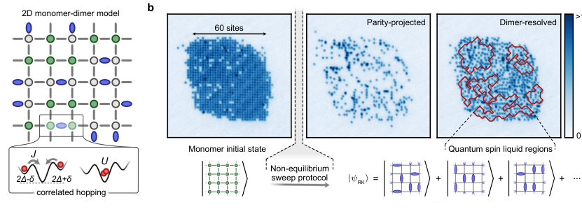
<figcaption class="paper-figure-caption"><b>Fig 1.</b> Figure 1. Effective 2D monomer-dimer model and preparation of U(1) quantum spin liquids. a, Schematic of the 2D monomer-dimer model, where occupied vertices are monomers (green circles) and doublons on links are dimers (blue ellipses). This effective model arises from the 2D Bose-Hubbard model with tunnel coupling J, on-site interaction U ≫J, and staggered superlattice potential ∆≫J, restricting the dynamics to second-order correlated hopping processes |· · · 101 · · ·⟩↔|· · · 020 · · ·⟩ (inset). An additional linear tilt δ/J ∼2 suppresses competing second-order processes such as |· · · 100 · · ·⟩↔|· · · 001 · · ·⟩. b, Starting from the ordered monomer initial state (left, fluorescence...</figcaption>
</figure>
<figure class="paper-figure-card">
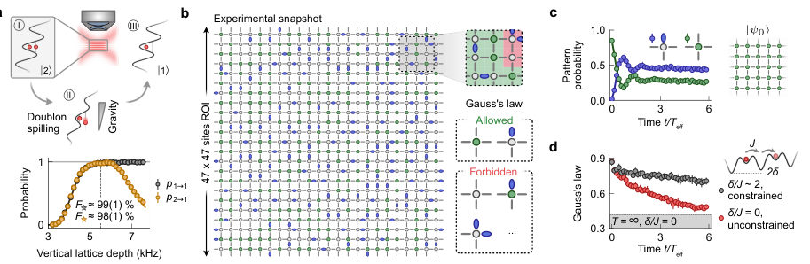
<figcaption class="paper-figure-caption"><b>Fig 2.</b> Figure 2. Probing constrained gauge dynamics in the monomer-dimer model. a, Schematic of the doublon-detection sequence, which converts doubly occupied sites into singly occupied sites prior to imaging. In the presence of a gravitational tilt, reducing the vertical lattice depth converts doublons into singlons with peak fidelity 98(1)%. The lower panel shows the conversion probability p2→1 and the survival probability p1→1 of singlons, as a function of vertical lattice depth. The error bars are smaller than the markers. b, Quantum gas microscope snapshot of a typical time-evolved state for a 47 × 47-site ROI. The inset illustrates the two Gauss’s-law-allowed vertex patterns together with...</figcaption>
</figure>
<figure class="paper-figure-card">
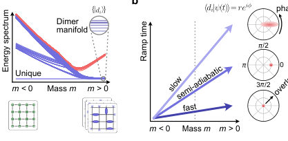
<figcaption class="paper-figure-caption"><b>Fig 3.</b> Figure 3. Non-equilibrium preparation of U(1) quan- tum spin liquids. a, Schematic energy spectrum as a func- tion of monomer mass m. For large negative monomer mass m, the ground state is unique, with all vertices occupied by monomers and no dimers (left inset). For large positive m, the lowest-energy states form a nearly degenerate manifold of dimer coverings {|di⟩} (right inset), with small splittings aris- ing from higher-order terms such as plaquette interactions. Blue curves are the states connected to the dimer manifold, and red curves represent excited states. b, Schematic of the dynamical mass sweep from m &lt; 0 to m &gt; 0, starting from the monomer initial state. The polar plots...</figcaption>
</figure>
<figure class="paper-figure-card">
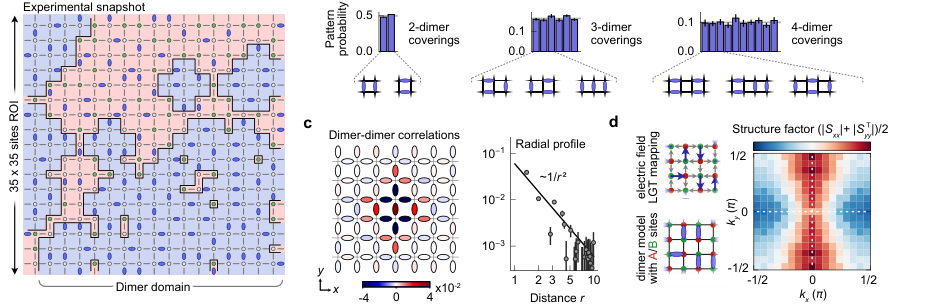
<figcaption class="paper-figure-caption"><b>Fig 4.</b> Figure 4. Experimental preparation of U(1) QSLs. a, Representative experimental snapshot after the forward ramp, with a 35×35-site ROI indicated. Blue shading marks domains of near-perfect dimer covering consistent with the RK wavefunction; red shading marks regions containing monomers and Gauss’s law defects. The probability of a vertex occupied by a single monomer with no attached dimers is 14.9(1)%, and the probability of a single dimer attached to a vertex is 68.4(2)%, giving a Gauss’s law validity of 83.2(2)%. The dominant violation is due to empty sites [9.5(1)%], followed by monomer-plus-dimer [4.3(1)%] and double-dimer [2.7(1)%] configurations. b, Pattern probabilities for subsystem...</figcaption>
</figure>
<figure class="paper-figure-card">
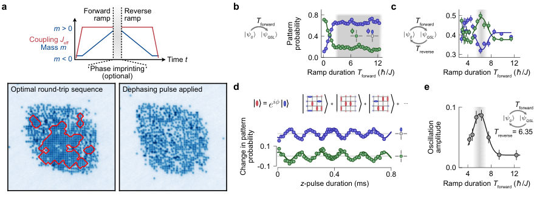
<figcaption class="paper-figure-caption"><b>Fig 5.</b> Figure 5. Round-trip probe for many-body coherence. a, Schematic of the round-trip interferometric protocol (top). The coupling Jeff (red) is switched on in 1.8 ms and then, the mass is ramped forward into the QSL state. Phase imprinting is optionally applied and the forward ramp is then reversed. Selected fluorescence images (bottom) show the optimal round-trip, in which large initial monomer state domains emerge (left, outlines in red), and a round-trip with a dephasing pulse applied before the reverse ramp that suppresses the appearance of the patches (right). b, Detection probabilities of the two Gauss’s- law-allowed vertex patterns (single monomer, green; single dimer, blue) as a...</figcaption>
</figure>
<figure class="paper-figure-card">
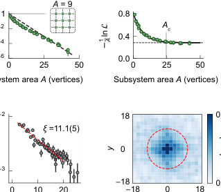
<figcaption class="paper-figure-caption"><b>Fig 6.</b> Figure 6. Length scale of the QSL regions. a, Subsys- tem return probability L evaluated from round-trip snapshots [Tforward = Treverse = 6.35(3) ℏ/J] as a function of the subsys- tem area A, for rectangular subsystems such as the one illus- trated in the inset (left). The normalised subsystem return probability −1</figcaption>
</figure>

**Main problem.** The challenge of experimentally preparing and verifying the many-body coherence and emergent gauge structure of U(1) quantum spin liquids, which are otherwise difficult to detect due to their fragile nature.

**Main result.** The researchers successfully prepared extended regions of U(1) quantum spin liquids using non-equilibrium semi-adiabatic ramps and directly observed large-scale many-body coherence and characteristic pinch-point signatures.

**Method.** An analogue quantum simulation using a caesium quantum gas microscope with a 2D optical superlattice, employing semi-adiabatic sweeps and round-trip interferometric protocols for coherence detection.

**Summary.** This paper reports the experimental realization and verification of U(1) quantum spin liquids in a large-scale quantum gas microscope. By using semi-adiabatic ramps, the authors prepare extended regions of the spin liquid and confirm the validity of Gauss's law. They observe hallmark signatures of the U(1) gauge structure, such as pinch points in the structure factor, and use interferometry to prove large-scale many-body coherence. This work establishes non-equilibrium protocols as a vital tool for exploring exotic phases of matter.

Detailed structure

**Model / system.** A large-scale (>3,000 sites) 2D Bose-Hubbard model in a square optical superlattice, which implements an effective 2D monomer-dimer model equivalent to a (2+1)D U(1) lattice gauge theory.

**Key observables.** Gauss's law validity, real-space dimer-dimer correlations, momentum-space pinch points, and many-body coherence via subsystem return probabilities.

**Important parameters / regimes.** Tunnel coupling J/h approx 130 Hz, staggered potential delta/J approx 12, on-site interaction U/J approx 24, and effective coupling J_eff.

**Assumptions / limitations.** The Hamiltonian does not support the target RK wavefunction as its ground state, necessitating a non-equilibrium preparation approach; 2D U(1) QSLs are theoretically unstable to perturbations.

**Figures summary.** Figure 1 shows the monomer-dimer model and preparation protocol; Figure 2 illustrates the experimental setup and Gauss's law verification; Figure 5 details the round-trip interferometric protocol and phase imprinting; Figure 6 presents monomer-monomer correlations and correlation length estimates.

**Paper structure.** The paper introduces the problem of QSL preparation, describes the experimental platform and effective gauge theory model, details the non-equilibrium preparation and detection methods, presents results on Gauss's law and gauge signatures, and concludes with a quantification of many-body coherence and spatial scales.

**Why it may be interesting.** It demonstrates a powerful route for accessing highly-entangled, exotic states via non-equilibrium dynamics that are not accessible in thermal equilibrium, providing a blueprint for simulating gauge theories using ultracold atoms.

Abstract

Locally constrained gauge theories underpin our understanding of fundamental interactions in particle physics and the emergent behaviour of quantum materials. In strongly correlated systems, they can give rise to quantum spin liquids that lack conventional order and are defined by coherent superpositions of an extensive number of many-body configurations. Realising and probing such exotic states experimentally is an outstanding challenge both in solid-state and synthetic quantum systems, not least due to the difficulty of detecting the fragile coherences between many-body states. Here, we report a large-scale (>3,000 sites) realisation of a two-dimensional U(1) lattice gauge theory with ultracold atoms in a square optical superlattice and demonstrate non-equilibrium preparation of extended regions of U(1) quantum spin liquids. We demonstrate Gauss's law validity in a quench experiment, enabled by a new microscopy technique for detecting doubly occupied sites. We observe characteristic real-space correlations and momentum-space pinch points, hallmarks of the emergent U(1) gauge structure. Using round-trip interferometric protocols, we directly observe large-scale coherence between many-body configurations, providing strong evidence for quantum spin liquid regions extending over ~100 lattice sites. Our results establish non-equilibrium quantum simulation protocols as a powerful route for accessing and probing exotic, highly-entangled states beyond those hosted by the engineered Hamiltonian in thermal equilibrium.

[↑ back to top](#top)

### ⭐ [Optical depth dictates universal bounds on many-body decay in atomic ensembles](http://arxiv.org/abs/2604.24680v1)

**Highlighted author(s):** Simon B. Jäger, Ana Asenjo-Garcia  
**Authors:** Cosimo C. Rusconi, Eric Sierra, Wai-Keong Mok, Avishi Poddar, Simon B. Jäger, Ana Asenjo-Garcia  
**Type:** theory · **Category:** other · **PDF:** <https://arxiv.org/pdf/2604.24680v1>  
**Analysis basis:** full PDF text, analyzed in chunks
**Topic relevance:** 🔥 `free-space correlated emission` **5/5** · 🔥 `Dicke superradiance` **4/5** · 🔥 `correlated / nonlocal dissipation` **4/5** · `methods for driven-dissipative` **2/5** · `non-equilibrium universality` **2/5**

↔ Scroll figures horizontally

<figure class="paper-figure-card">
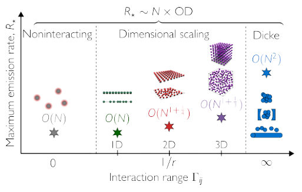
<figcaption class="paper-figure-caption"><b>Fig 1.</b> FIG. 1. The ensemble’s optical depth (OD) sets the scaling with system size N of the maximum emission rate R⋆across all regimes, identified by the longest interaction range of the dissipative interactions Γij. The Dicke-like scaling applies to atoms at a point, in cavities, or along waveguides.</figcaption>
</figure>
<figure class="paper-figure-card">
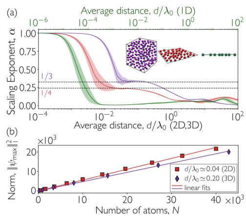
<figcaption class="paper-figure-caption"><b>Fig 2.</b> FIG. 2. (a) Scaling exponent obtained from a fit of Γmax to βN αΓ0, as a function of the average interatomic separation d/λ0 for 1D, 2D, and 3D atomic clouds. The colored region represents the 1σ confidence interval. The fits are done over a region N1D ∈[Nmin, Nmax] where Nmin = {3000, 20, 5} and Nmax = {3 × 104, 200, 30} in steps of {3 × 103, 20, 5} for D = {1, 2, 3} respectively. (b) Plot of ||ψmax||2 1 as a function of atom number, for 2D (red squares) and 3D (purple diamonds) clouds with d/λ0 ≃0.04 and d/λ0 ≃0.2 respectively. The solid lines represent linear fits. In both panels, the results are obtained by averaging over 500 (2D and 3D) and 100 (1D) realizations.</figcaption>
</figure>
<figure class="paper-figure-card">
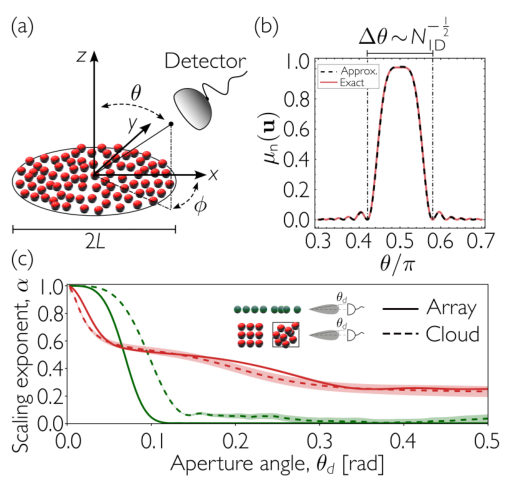
<figcaption class="paper-figure-caption"><b>Fig 3.</b> FIG. 3. (a) Schematic of directional detection of photons emitted by atoms uniformly distributed on a disk of radius L. (b) Emission profile of the dominant eigenstate ψ0(r), defined in Eq. (10), for k0L = 100. The emission is symmetric about the disk axis and collimated about the plane of the disk within an angle ∆θ ∼(k0L)−1/2. Numerical evaluation of Eq. (11) (solid red) compared to the approximation in Eq. (13) (black dashed). (c) Scaling of Γmax(ΩNA) with N (obtained from a best fit to βN αΓ0) as a function of aperture angle θd for both 1D (green) and 2D (red) ensembles. Solid (dashed) lines correspond to arrays (clouds). For one- (two-) dimensional arrays atoms are polarized...</figcaption>
</figure>

**Main problem.** Determining the universal scaling laws for the maximum photon emission rate and collective decay in spatially extended, free-space atomic ensembles, across both ordered arrays and disordered clouds.

**Main result.** The authors derive a universal law where the maximum emission rate scales as the product of the atom number and the system's optical depth (R* ~ N * OD), unifying different dimensionalities and regimes from independent emission to the Dicke limit.

**Method.** The study uses a mathematical mapping of the maximum decay rate to a ground-state problem of an effective spin Hamiltonian, employing integral operator approximations, Gelfand's formula, and semidefinite programming (SDP) relaxation.

**Summary.** This paper establishes that the optical depth is the fundamental parameter governing many-body cooperative emission in atomic ensembles. It proves a universal scaling law that applies to both ordered arrays and disordered clouds across 1D, 2D, and 3D geometries. The work also reveals that the observed emission rate depends heavily on the detector's numerical aperture, which can lead to different scaling observations compared to total emission. These findings provide a rigorous benchmark for predicting superradiant behavior in extended atomic systems.

Detailed structure

**Model / system.** Ensembles of N two-level atoms with a resonant dipole transition interacting via a Markovian master equation in free space, including both ordered lattices and disordered clouds in 1D, 2D, and 3D.

**Key observables.** Maximum emission rate (R*), maximum decay rate (Gamma_max), superradiant lifetime, and directional detection intensity.

**Important parameters / regimes.** Optical depth (OD), atomic density (rho), dimensionality (D), numerical aperture (NA), and interatomic separation (d/lambda_0).

**Assumptions / limitations.** Assumes uniform or Gaussian atomic density distributions, large-density/large-system limits (k0L >> 1), and a scalar model for the dissipative interaction kernel.

**Figures summary.** Plots showing the scaling exponent alpha vs. dimensionality, numerical confirmation of decay rate scaling with detector aperture angle, and comparisons between exact and approximate integral evaluations.

**Paper structure.** The paper introduces the problem of cooperative emission limits, establishes the universal scaling law via optical depth, extends the derivation to different dimensionalities and geometries, analyzes the impact of detector aperture on observed rates, and validates results via numerical SDP and asymptotic analysis.

**Why it may be interesting.** It provides a fundamental, unified framework for understanding many-body cooperative effects in realistic, extended systems, bridging the gap between idealized Dicke models and experimental atomic clouds.

Abstract

Cooperative emission is well understood for idealized symmetric systems, but its limits in spatially extended, free-space ensembles remain an open question. Here, we derive a universal law for the scaling of the maximum photon emission rate with system size that unifies both ordered arrays and disordered atomic clouds in arbitrary dimensions at fixed density. We demonstrate that, for a fixed atomic density, the maximum emission rate scales universally as the product of the atom number and the system's optical depth, with the latter encoding the dimensional scaling across all regimes from independent emission to the Dicke limit. Furthermore, we establish a scaling law for directional detection, revealing that the observed rate depends on the detector's numerical aperture: small apertures yield Dicke-like quadratic scaling, whereas large apertures recover our integrated universal bound. Our results establish optical depth as the parameter governing many-body cooperative emission in both ordered and disordered ensembles, and reveal that directional and total-emission scalings must be carefully distinguished in experimental settings.

[↑ back to top](#top)

### ⭐ [Realizing multi-orbital Emery models with ultracold atoms](http://arxiv.org/abs/2604.22955v1)

**Highlighted author(s):** Ana Maria Rey  
**Authors:** Conall McCabe, Jamie Boyd, Kaizhao Wang, Martin Lebrat, Cindy Regal, Adam Kaufman, Ana Maria Rey, Lukas Homeier  
**Type:** both · **Category:** quantum gases · **PDF:** <https://arxiv.org/pdf/2604.22955v1>  
**Analysis basis:** full PDF text, analyzed in chunks
**Topic relevance:** 🔥 `analog quantum simulation` **4/5** · `non-equilibrium dynamics` **2/5**

↔ Scroll figures horizontally

<figure class="paper-figure-card">
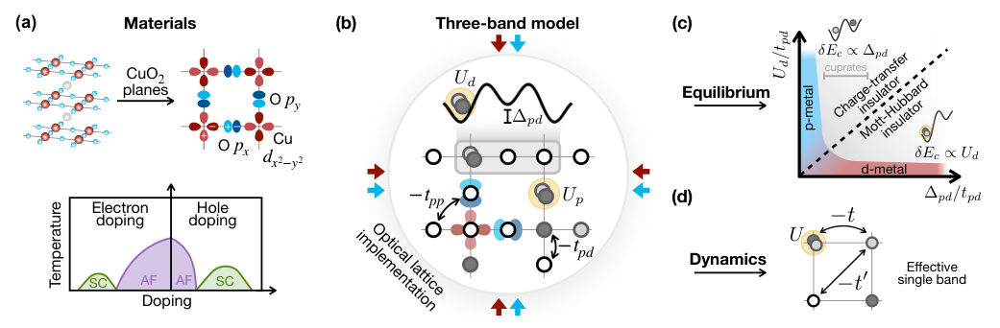
<figcaption class="paper-figure-caption"><b>Fig 1.</b> FIG. 1. Emery model and its quantum simulation. (a) In transition-metal oxides, such as cuprate superconductors, electronic correlations are dominated by three orbitals near the Fermi energy and are effectively confined to two-dimensional planes. The copper Cu (oxygen O) orbitals are located on the sites (links) of a square lattice, forming a Lieb lattice geometry. Their paradigmatic low-temperature phase diagram shows rich interplay between antiferromagnetic Mott insulators (AF) and mobile charges, including a high-Tc superconducting (SC) dome whose differing size on either side highlights the particle- hole asymmetry. (b) We propose a bichromatic optical superlattice architecture with...</figcaption>
</figure>
<figure class="paper-figure-card">
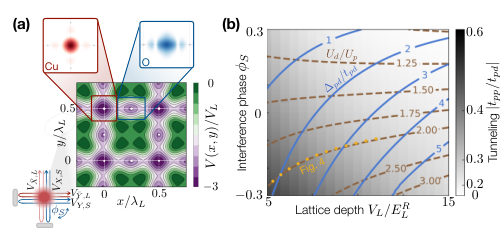
<figcaption class="paper-figure-caption"><b>Fig 2.</b> FIG. 2. Optical lattice implementation. (a) Bichro- matic scheme with interfering short lattice (blue) and non- interfering long lattice (red). Center: Optical lattice poten- tial for ϕS = 0.1 and VS/VL = 1.25. The potential minima (purple) form the underlying Lieb lattice. Inset: Probability density of maximally-localized Wannier orbitals on the Cu site (red) and O sites (blue) plotted on a log-scale. (b) Ac- cessible tight-binding parameters varying overall lattice depth and keeping VS/VL = 1.25 fixed with contour lines for Ud/Up (dashed brown lines) and ∆pd/tpd (solid blue lines). The change in band structure, such as |tpp/tpd|, is indicated by the gray background. The absolute tunneling...</figcaption>
</figure>
<figure class="paper-figure-card">
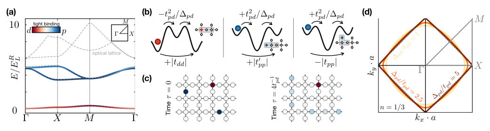
<figcaption class="paper-figure-caption"><b>Fig 3.</b> FIG. 3. Band structure. (a) Example band structure of the optical lattice potential for VL = 15ER L , VS/VL = 1.25 and ϕS = 0 showcasing three low-lying bands with ∆pd/tpd = 4.2. The dashed lines are the exact structure from the optical lattice potential and the bold lines represent our tight-binding model, where the color indicates the Cu and O character of each band. (b) Direct and virtual tunneling process of single particles initialized in Cu or O sites interfere, which can be used to precisely benchmark the optical lattice parameters. (c) We show the quantum walk of particles starting in three different orbitals. A particle starting on the Cu site (red) is only weakly dispersing due to...</figcaption>
</figure>
<figure class="paper-figure-card">
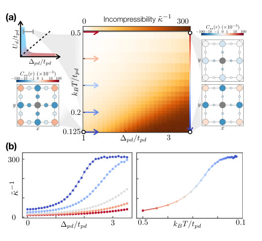
<figcaption class="paper-figure-caption"><b>Fig 4.</b> FIG. 4. Finite-T charge and spin correlations. (a) Center: Dimensionless incompressibility ˜κ−1 obtained from DQMC on an 8 × 8 system for Ud = 7, Up = 3.5, tpp = 0.2, t′ pp = tdd = 0.1 (units of tpd), approximately obtained from the parameter path in Fig. 2(b). For small ∆pd/tpd the system remains compressible for all accessible temperatures. As we increase ∆pd/tpd, an incompressible phase appears rem- iniscent of the charge-transfer insulator in Fig. 1(c). Sub- panels: We observe the onset of antiferromagnetic, exponen- tially decaying spin-spin correlations Css(r) at low tempera- tures plotted on a semilog scale (linear scale for |Css(r)| ≤ 10−3). The area of the sites visualizes the...</figcaption>
</figure>
<figure class="paper-figure-card">
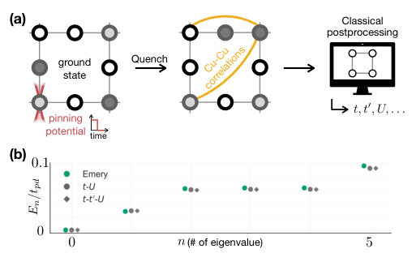
<figcaption class="paper-figure-caption"><b>Fig 5.</b> FIG. 5. Learning effective single-band models. (a) We prepare the system in the ground state of the three- band model, in the presence of small on-site potentials on Cu sites. Releasing those potentials, leads to a low-energy quench, where the system predominantly evolves within the low-energy manifold. Experimentally measuring the terms constituting an effective single-band Hubbard model, allows to learn such effective couplings (up to the absolute energy scale). (b) Using exact diagonalization, we compare the low- energy spectrum of the three-band model to learned, effective single-band models.</figcaption>
</figure>
<figure class="paper-figure-card">
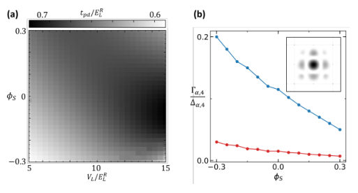
<figcaption class="paper-figure-caption"><b>Fig 6.</b> FIG. 7. Tight-binding calculations. (a) The nearest- neighbor tunneling tpd in recoil units up to VL = 15ER L . As trap depth increases at constant ϕS, the offset ∆pd grows correspondingly, causing the p-orbital Wannier function to spread further. This expanded spatial extent enables en- hanced tunneling to deeper trap depths. However at larger VL ≥15V R L (not shown) all tunnelings decay exponentially. (b) The perturbative admixing, induced by atomic collisions, of the fourth band with the Emery bands (red for α = d and blue for α = p) for VL = 10ER L as we vary the interference angle. The inset shows the Wannier function of the fourth band which is located at the “fake site”.</figcaption>
</figure>
<figure class="paper-figure-card">
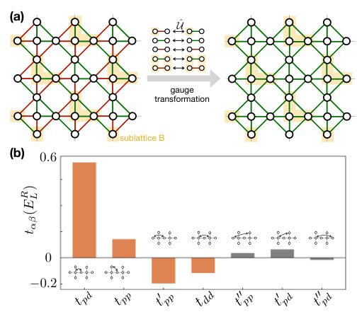
<figcaption class="paper-figure-caption"><b>Fig 7.</b> FIG. 6. Tunneling amplitudes. (a) Left: The sign struc- ture of tunnelings tpd and tpp has negative (red) and positive (green) amplitudes, arising from the symmetry of the dx2−y2 and px,y orbital. Right: By applying a gauge transforma- tion ˆU that acts on fermions in sublattice B as ˆU†ˆcjB ˆU = −ˆcjB, the sign of tunnelings becomes uniform. Similarly, the signs of the all other tunnelings considered in our tight- binding model are modified accordingly. (b) Sign structure of tunneling amplitudes obtained ab initio from optical lat- tice Wannier functions, consistent with the band structure in cuprates [21] after the gauge transformation ˆU. The tunneling amplitudes in orange are included...</figcaption>
</figure>
<figure class="paper-figure-card">
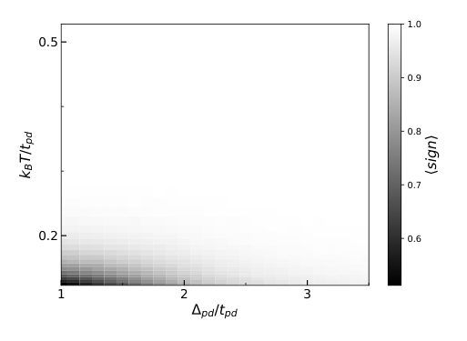
<figcaption class="paper-figure-caption"><b>Fig 8.</b> FIG. 8. DQMC sign problem. The sign error for L = 8, as a function of temperature and offset. We encounter a sign problem at low temperatures for ∆pd/tpd &lt; 1 due to our inclusion of finite tpp and Up terms.</figcaption>
</figure>
<figure class="paper-figure-card">
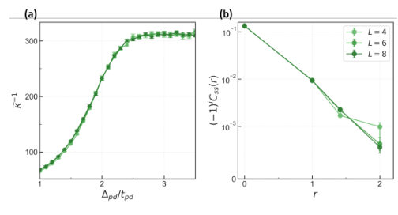
<figcaption class="paper-figure-caption"><b>Fig 9.</b> FIG. 9. Convergence of DQMC data. (a) The dimen- sionless incompressibility ˜κ−1 at the lowest temperature we consider kBT/tpd = 1/8 as a function of ∆pd/tpd for differ- ent system sizes. (b) The staggered spin-spin correlations for ∆pd/tpd = 1 as a function of distance r. The cutoff of the semilog scale is set to |10−3|, i.e., the scale is linear for ≤|10−3|.</figcaption>
</figure>
<figure class="paper-figure-card">
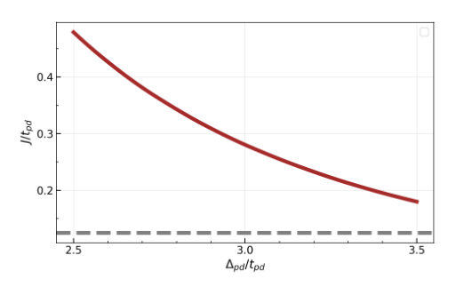
<figcaption class="paper-figure-caption"><b>Fig 10.</b> FIG. 10. Emery model superexchange scale. The dashed line indicates the lowest temperature kBT/tpd = 1/8 we con- sider in DQMC.</figcaption>
</figure>

**Main problem.** The difficulty of simulating the complex multi-orbital physics of cuprate superconductors, specifically the interplay between copper and oxygen orbitals, using simplified one-band Hubbard models in ultracold atom platforms.

**Main result.** The authors propose an optical superlattice architecture that implements the three-band Emery model, demonstrating that the metal-insulator crossover and antiferromagnetic correlations are experimentally accessible and that effective single-band parameters can be learned via quantum quenches.

**Method.** The study combines an experimental proposal for a bichromatic optical superlattice with ab initio Wannier function construction, Determinant Quantum Monte Carlo (DQMC) simulations, and a Hamiltonian learning protocol based on quantum quenches.

**Summary.** This paper proposes a new way to use ultracold atoms to simulate the complex three-band Emery model, which is essential for understanding high-temperature superconductors like cuprates. By using a specialized bichromatic optical lattice, the researchers show how to control copper and oxygen orbital interactions independently. They demonstrate that the key physics, such as the metal-insulator transition, is reachable with current experimental temperatures. Additionally, they introduce a method to learn effective single-band parameters from experimental data, providing a bridge between complex multi-orbital simulations and simpler Hubbard models.

Detailed structure

**Model / system.** A 2D optical superlattice using ultracold fermionic 6Li atoms in a bichromatic (short and long wavelength) lattice that creates a Lieb lattice geometry, implementing a three-band Emery model with Cu (d) and O (p) orbitals.

**Key observables.** Charge-ordering temperature, antiferromagnetic spin-spin correlations, incompressibility, Fermi surface shape, and effective single-band Hubbard parameters (t, t', U).

**Important parameters / regimes.** Charge-transfer energy (pd gap) delta_pd, Hubbard interactions Ud and Up, tunneling amplitudes t_pd and t_pp, and the ratio of lattice depths V_S/V_L.

**Assumptions / limitations.** Assumes that the low-energy physics can be captured by an effective single-band model in the large delta_pd limit and that the 4th band leakage is minimal in the cuprate-relevant regime.

**Figures summary.** Figure 1 shows the cuprate electronic structure and proposed superlattice; Figure 2 details the bichromatic lattice and parameter accessibility; Figure 3 compares the exact potential to the tight-binding model and shows band structure; Figure 5 illustrates the Hamiltonian learning protocol and spectral agreement; Figure 6 shows the gauge transformation for tunneling signs; Figure 9 shows incompressibility and spin correlations.

**Paper structure.** The paper introduces the scientific motivation (cuprate physics), proposes the experimental superlattice architecture, provides ab initio parameter extraction via Wannier functions, uses DQMC to investigate thermodynamic properties and phase transitions, presents a Hamiltonian learning protocol for parameter extraction, and concludes with an assessment of experimental feasibility and limitations.

**Why it may be interesting.** It provides a practical pathway to bridge the gap between ultracold atom simulators and real-world strongly correlated materials by implementing a more realistic multi-orbital model and offering a method to map complex physics back to simpler, interpretable models.

Abstract

Strongly-correlated electrons in transition-metal oxides give rise to intriguing emergent phenomena, including high-temperature superconductivity in cuprates. While simplified one-band Hubbard models capture some aspects, explicitly describing the interplay of copper and oxygen orbitals -- as in the three-band Emery model -- is essential to capture the full phenomenology of cuprates. Quantum simulators based on ultracold atoms offer a promising route to study such systems in a controlled setting, but realizing realistic multi-orbital Hubbard models remains challenging. Here we propose an optical superlattice architecture that implements the three-band Emery model with ultracold fermions. By combining lattice beams with controllable interference, we engineer orbital degrees of freedom that reproduce key features of the cuprate band structure, while enabling independent control of orbital-dependent interactions and charge-transfer energy. We show that single-particle quantum walks can benchmark the resulting tight-binding model. Using determinant quantum Monte Carlo, we further investigate thermodynamic properties in the undoped regime and find a finite-temperature metal-insulator crossover accompanied by the onset of antiferromagnetic correlations accessible in current experiments. Finally, we apply a Hamiltonian learning protocol enabling to infer effective single-band Hubbard models from experimental realizations of Emery models. Our results provide a practical pathway to simulate multi-orbital Hubbard physics with quantum gas microscopes.

[↑ back to top](#top)

### ⭐ [Enhanced Atom Capture via Multi-Frequency Magneto-Optical Trapping](http://arxiv.org/abs/2604.23221v1)

**Highlighted author(s):** Nathan Cooper  
**Authors:** Benjamin Hopton, Alexander Abbey, David Johnson, Daniele Baldolini, Matt Overton, Nathan Cooper, Joseph Aziz, Richard Howl, Lucia Hackermuller  
**Type:** both · **Category:** other · **PDF:** <https://arxiv.org/pdf/2604.23221v1>  
**Analysis basis:** full PDF text, analyzed in chunks
**Topic relevance:** `QC/QI experiment` **2/5** · `quantum optics experiment` **2/5**

↔ Scroll figures horizontally

<figure class="paper-figure-card">
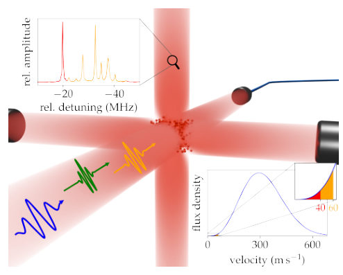
<figcaption class="paper-figure-caption"><b>Fig 1.</b> FIG. 1. Schematic illustrating the implementation and prin- ciples behind the six-beam multi-frequency MOT used for enhanced atom capture. Top left: Example optical fre- quency spectrum, measured with a Fabry–Perot interfer- ometric analyzer, used for enhanced capture. The conven- tional trapping frequency is shown in red, while the ad- ditional multi-frequency cooling components are shown in amber. Bottom right: Velocity distribution of 87Rb atomic flux density at room temperature. The red region shows the proportion of atomic flux with a velocity &lt; 40 m s−1 (that of a typical MOT), while the amber region illustrates the additional trappable flux with a capture velocity increase to 60 m...</figcaption>
</figure>
<figure class="paper-figure-card">
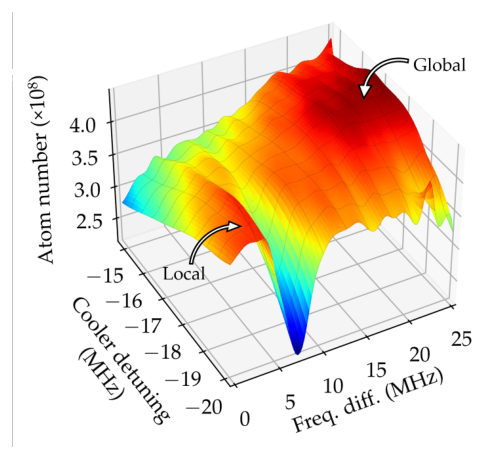
<figcaption class="paper-figure-caption"><b>Fig 2.</b> FIG. 2. Surface plot showing number of atoms loaded in a dual-frequency MOT after 5 s load time as a function of both fundamental frequency detuning and dual-frequency spacing, where a surface interpolation has been used for better visual representation. A distinct trough can be seen across a range of fundamental frequency detunings for a dual-frequency spacing ∼7 MHz. A local maximum in atom number, uncovered in previous work [33, 56], exists at a smaller dual-frequency spacing than this, while the global maximum is at significantly higher dual-frequency spacing ∼20 MHz.</figcaption>
</figure>
<figure class="paper-figure-card">
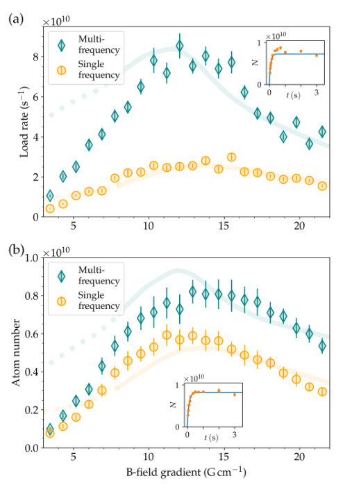
<figcaption class="paper-figure-caption"><b>Fig 3.</b> FIG. 3. Loading rate (a) and steady-state atom number (b) for single frequency and multi-frequency magneto-optical traps as a function of axial magnetic field gradient, under otherwise identical conditions. Each data point represents the value obtained from a loading curve fit (see insets), with error bars calculated from the square root of the covari- ance matrix produced. The inset in (a) shows the multi- frequency loading curve for the data point at 12.0 G cm−1, producing a load rate of 8.5(6) × 1010 s−1. The inset in (b) shows the multi-frequency loading curve for the data point at 12.9 G cm−1, producing a steady state atom number of 8.2(6) × 109. Solid lines show corresponding...</figcaption>
</figure>
<figure class="paper-figure-card">
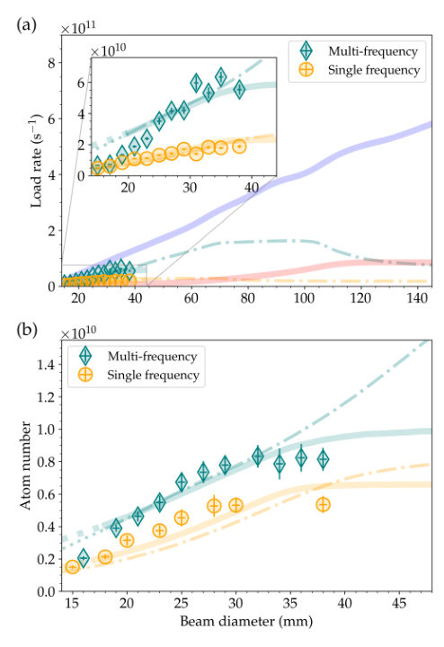
<figcaption class="paper-figure-caption"><b>Fig 4.</b> FIG. 4. (a) Loading rate and (b) steady state atom number for single frequency and multi-frequency magneto-optical traps as a function of MOT beam diameter. Data points are extracted from loading curve fits for given experimental conditions at 12.9 G cm−1. Vertical error bars are obtained from these fits, with horizontal error bars indicating the esti- mated 1σ uncertainty in the beam truncation measurement. Solid green (multi-frequency) and orange (single frequency) lines show numerical simulations modelling beam trunca- tion consistent with our experiment. Dash-dotted lines in- stead vary the beam waist and include additional frequency components, providing a continuation to our...</figcaption>
</figure>
<figure class="paper-figure-card">
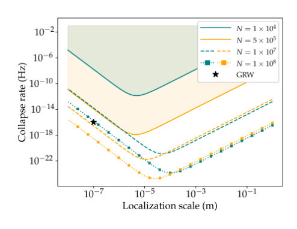
<figcaption class="paper-figure-caption"><b>Fig 5.</b> FIG. 5. Projected bounds on the CSL parameter space from interferometry experiments with Rb BECs. These curves are calculated assuming the state of the art spin- echo interference protocols proposed in [23]. Protocol (I) assumes a single period of reversed dispersion (spin-echo) during the interference experiment. Protocol (II) assumes an initial period of strong dispersion, followed by free evo- lution (weak dispersion) and then inverted strong disper- sion. Each teal line assumes protocol (I) with a density of ρ = 1.65 × 10−3 kg m−3, an interference time of t = 100 ms, initial squeezing of 20 dB and a dispersion of 1.2 × 10−2 Hz. Each yellow line assumes protocol (II) with a density of ρ...</figcaption>
</figure>
<figure class="paper-figure-card">
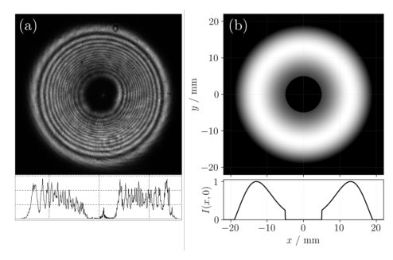
<figcaption class="paper-figure-caption"><b>Fig 6.</b> FIG. 6. Beam profiles and normalised cross-section intensity distribution for the cooling ‘ring’ beam produced by a pair of axicon lenses, for (a) the experimentally observed beam, and (b) the theoretically calculated profile expected when a clipped Gaussian beam (with waist 10 mm and clipping radius 14 mm) undergoes a transformation produced by a pair of perfect axicon lenses separated beyond the depth of focus.</figcaption>
</figure>
<figure class="paper-figure-card">
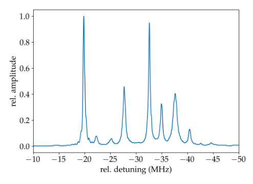
<figcaption class="paper-figure-caption"><b>Fig 7.</b> FIG. 7. Frequency peaks present in the cooling/trapping MOT beams, measured with a Fabry–Pérot interferometer, relative to the F = 2 →F ′ = 3 cooler transition of the 87Rb D2 line. The left-most peak at ∼–20 MHz is the ‘trapping’ frequency and exists as a Gaussian distribution across the entirety of the MOT beams; the other peaks are the ‘cool- ing’ frequencies and exist solely in the axicon ring beam. Whilst the relative amplitude of the cooler frequencies can be a comparison of their relative powers in the beam, the amplitude of the trapping frequency compared to the cool- ing frequencies is arbitrary due to the nature in which the beams are combined.</figcaption>
</figure>

**Main problem.** The need to increase the atom number and loading rate in Magneto-Optical Traps (MOTs) to improve the sensitivity and bandwidth of quantum technologies and fundamental physics tests.

**Main result.** Demonstrated that using multi-frequency cooling light can double the steady-state atom number and increase the loading rate by up to a factor of 4 compared to single-frequency MOTs.

**Method.** The researchers used acousto-optic modulation to create a single-sided multi-frequency spectrum and axicon lenses to create a ring-shaped beam, combined with PyLCP numerical simulations to model atomic deceleration.

**Summary.** This paper demonstrates a technique to significantly enhance the efficiency of Magneto-Optical Traps by using multiple, closely spaced optical frequencies in the cooling light. By avoiding previous pitfalls like heating and collision-induced losses through specific beam geometries, the authors achieved a fourfold increase in loading rate and a doubling of the steady-state atom number. This method is highly scalable and has direct implications for improving the sensitivity of portable quantum sensors and tests of fundamental physics like dark matter searches.

Detailed structure

**Model / system.** A Rubidium-87 (87Rb) magneto-optical trap utilizing a six-beam configuration with multi-frequency cooling light and a quadrupole magnetic field.

**Key observables.** Loading rate (R), steady-state atom number (Nss), capture velocity (vc), and loading time constant (tau).

**Important parameters / regimes.** Frequency detunings, frequency spacing (~5 MHz), magnetic field gradient (up to 22 G/cm), and beam waist radius (15 mm).

**Assumptions / limitations.** Assumes that the enhancement in MOT atom numbers carries over proportionally to the Bose-Einstein Condensate (BEC) stage.

**Figures summary.** Fig 1 shows the frequency spectrum and velocity distribution; Fig 2 shows atom number as a function of frequency; Fig 3 compares loading rates and atom numbers vs magnetic gradient; Fig 4 shows predicted gains vs beam diameter; Fig 5 shows projected CSL parameter bounds; Fig 6 compares beam profiles.

**Paper structure.** The paper introduces the problem of MOT loading efficiency, describes the experimental setup for multi-frequency light generation and beam shaping, presents experimental results for atom number and loading rate, provides numerical simulations to validate and extrapolate results, and discusses applications in quantum sensing and fundamental physics.

**Why it may be interesting.** This work provides a practical method for scaling up cold-atom sources, which is critical for improving the signal-to-noise ratio in atom interferometry and the precision of quantum-enhanced sensors.

Abstract

Magneto-optical traps are central to atomic and molecular quantum technologies and precision tests of fundamental physics, where both sensitivity and bandwidth scale strongly with atom number and loading rate. We demonstrate that employing multiple, closely spaced optical frequency components in the cooling light of a $^{87}$Rb magneto-optical trap -- without utilizing any additional slowing techniques -- can double the steady state atom number and increase the loading rate by up to a factor of 4, compared to a conventional single-frequency implementation. Subsequently, we capture up to $1.0(1)\times10^{10}$ atoms with a loading rate of up to $1.3(2)\times 10^{11}\,\mathrm{atoms\,s^{-1}}$ from a thermal background. Numerical simulations reproduce the observed trends and predict substantially larger gains for increased trap sizes beyond our experimental bounds. By re-examining earlier studies of multi-frequency atom capture in the context of modern experimental hardware and emerging applications, we show that previously identified limitations can be avoided and establish multi-frequency cooling as a practical and scalable route to high-flux cold-atom sources. These results have immediate applications in portable atom-based quantum sensing, where higher bandwidth and precision can be achieved without forgoing compactness, and in atom-interferometric tests of fundamental physics, which benefit from access to larger-mass quantum systems.

[↑ back to top](#top)

### ⭐ [Dichroic Raman probes for chiral edge modes](http://arxiv.org/abs/2604.24208v1)

**Highlighted author(s):** Johannes Knolle  
**Authors:** Avedis Neehus, Johannes Knolle  
**Type:** theory · **Category:** strongly correlated electrons · **PDF:** <https://arxiv.org/pdf/2604.24208v1>  
**Analysis basis:** full PDF text, analyzed in chunks

↔ Scroll figures horizontally

<figure class="paper-figure-card">
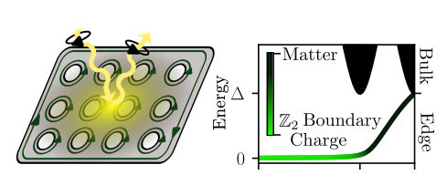
<figcaption class="paper-figure-caption"><b>Fig 1.</b> FIG. 1. Sketch of the proposed protocol whereby the Raman intensity is measured as the shape and number of holes is varied, thereby tuning the surface to bulk ratio. The Raman intensity at Raman shift frequencies below the bulk gap ∆ probes the chiral edge mode. As sketched on the right panel, in the KSL, the edge mode is a superposition of a chiral matter fermion with support at finite momenta between the Dirac points, and the Z2 boundary charge d.o.f.</figcaption>
</figure>
<figure class="paper-figure-card">
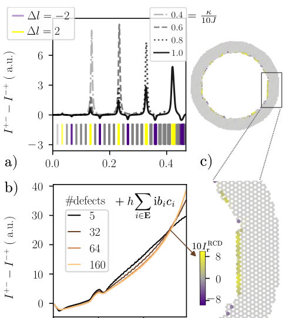
<figcaption class="paper-figure-caption"><b>Fig 2.</b> FIG. 2. Raman circular dichrosim I+−−I+−of a punctured disk of a perfect Kitaev material. Panel (a) shows the case with no bond-matter hybridization for various κ up to the κ dependent ∆for a hexagonal disk with r1 = 6, r2 = 56a. The energetically allowed transitions are indicated by the vertical bars at the bottom, whose colors encode the angular momen- tum transfer as determined in the end matter. Panel (b) shows the case with bond matter hybridization h = 0.1J and κ = 0.12J for various defect densities described by equation (7) on a circular M = 12 disk with r1 = 36a and r2 = 46a. The RCD in the shown frequency regime is attributed to the inner edge, as illustrated in panel (c), which...</figcaption>
</figure>
<figure class="paper-figure-card">
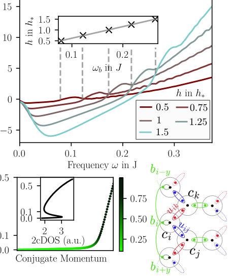
<figcaption class="paper-figure-caption"><b>Fig 3.</b> FIG. 3. IRCD with κ = 0.12J, r1 = 36a and r2 = 46a for different values of the hybridization term written in multiples of h∗= 0.1J. The inset shows the linear relationship between h and the threshold frequency ωb, which is determined from the local maximum of ∂2 ωI(ω) in the low frequency range. The bottom-left panel shows the low-energy dispersion, assuming it is monotonous. The color coding indicates the correspond- ing degree of matter character ψn c , ranging from green (low) to black (high). The inset shows the 2cDOS, eq. 6. The Z2 boundary charges arise as unpaired bond fermions as sketched in the bottom right panel, where we also indicate the possi- bility of a boundary hopping term...</figcaption>
</figure>
<figure class="paper-figure-card">
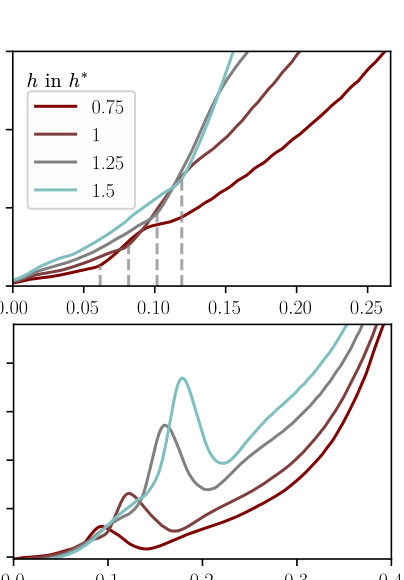
<figcaption class="paper-figure-caption"><b>Fig 4.</b> FIG. 4. Raman spectra of a KSL for various Zeeman fields h in the presence of a dispersion term t with ratio | h</figcaption>
</figure>
<figure class="paper-figure-card">
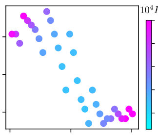
<figcaption class="paper-figure-caption"><b>Fig 5.</b> FIG. 5. The Raman center of energy (11) for each edge state with energy En calculated on the outer boundary of a hexago- nal flake with R = 66a, κ = 0.08t, h = 0 and no disorder. The color indicates the total contribution to the Raman signal for each mode (10) .</figcaption>
</figure>
<figure class="paper-figure-card">
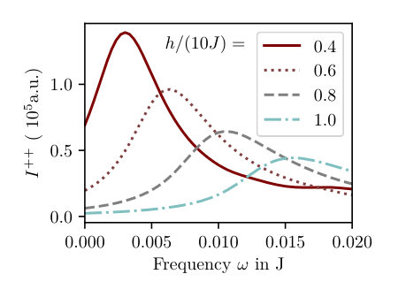
<figcaption class="paper-figure-caption"><b>Fig 6.</b> FIG. 6. The Raman intensity I++ (note the different unit) calculated with the three spin Raman vertex eq. (15) on the outer edge of disorder free hexagonal disk with r2 = 56a, r1 = 6a for various κ = h.</figcaption>
</figure>
<figure class="paper-figure-card">
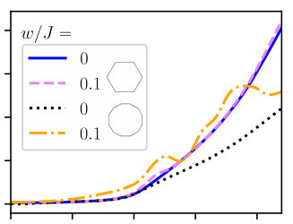
<figcaption class="paper-figure-caption"><b>Fig 7.</b> FIG. 7. Raman signal calculated with Hhtw on a hexagonal and dodecagonal geometry with r1 = 16, r2 = 56 h = κ = 0.05J for ω = 0.1J, and ω = 0J.</figcaption>
</figure>

**Main problem.** The difficulty of identifying and detecting charge-neutral chiral edge modes (CEM) in topological systems like Kitaev spin liquids using Raman spectroscopy, which is typically forbidden by momentum conservation selection rules.

**Main result.** The authors demonstrate that broken translational symmetry at realistic, curved edges allows for a Raman circular dichroism (RCD) signal that evades selection rules, providing a unique spectroscopic fingerprint of the Kitaev spin liquid phase.

**Method.** Theoretical calculation of the low-frequency Raman circular dichroism response using the Loudon-Fleury operator and numerical analysis of a punctured disk geometry with disorder averaging.

**Summary.** This paper proposes a new way to use Raman circular dichroism to detect the elusive chiral edge modes in Kitaev quantum spin liquids. It shows that while these modes are normally Raman-inactive due to momentum conservation, the broken symmetry at real physical edges allows a detectable signal to emerge. The study highlights that the signal's dependence on the Zeeman field and edge geometry serves as a unique fingerprint for the spin liquid phase. This provides a potential experimental roadmap for identifying fractionalized excitations in topological materials.

Detailed structure

**Model / system.** The Kitaev quantum spin liquid (KSL) model on a honeycomb lattice, including effects of an out-of-plane magnetic field (Zeeman field) and boundary-induced symmetry breaking.

**Key observables.** Raman circular dichroism (RCD), Raman intensity (I++), two-particle density of states (2DOS), and Raman center of energy (RCE).

**Important parameters / regimes.** Bulk gap (Delta), Zeeman field (h), edge geometry/length scale (L), energy scale (EL), and anisotropy (kappa).

**Assumptions / limitations.** Neglect of certain non-Kitaev terms on zig-zag edges due to sublattice imbalance; use of the Loudon-Fleury form for non-resonant Raman scattering.

**Figures summary.** Figure 1 sketches the experimental protocol with nano-structured holes; Figure 2 shows RCD in disorder-free and disordered disks; Figure 4 shows frequency dependence of RCD; Figure 5 illustrates RCE on hexagonal flakes; Figure 6 and 7 show Raman intensity dependence on Zeeman field and geometry.

**Paper structure.** The paper introduces the problem of detecting CEMs, presents a theoretical framework using the Kitaev model, analyzes the impact of edge geometry and symmetry breaking on Raman selection rules, evaluates the robustness of the signal to disorder, and concludes with the implications for experimental identification of spin liquids.

Abstract

The identification and manipulation of charge-neutral fractionalized quasi-particles, in particular chiral edge modes (CEM), is a long-standing quest in physics. Remarkably, the microscopically mediated interaction between light and charge-neutral excitations in Mott-Hubbard insulators can take an identical form to the Raman coupling between light and particles with electric charge. However, since CEMs are Raman-inactive due to conservation of lattice momentum, Raman probes have been deemed unsuitable for their identification. Here, using the Kitaev quantum spin liquid (KSL) as an illustrative example, we demonstrate that the long-range correlated disorder inherent to a closed edge can lead to a Raman circular dichroism (RCD) signal that avoids suppression by linear and angular momentum selection rules, and exhibits a dependence on experimentally tunable length and energy scales that are characteristic of CEM. Having calculated the low-frequency RCD response of generic KSL, we argue that the interaction of the chiral matter fermion with the $\Ztwo$ boundary charge leaves a unique fingerprint of the KSL via the anisotropic Zeeman field dependence.

[↑ back to top](#top)

### [Observation of OAM non-conservation in entangled photon generation](http://arxiv.org/abs/2604.23550v1)

**Authors:** Suman Karan, Anand K. Jha  
**Type:** both · **Category:** quantum information and computing · **PDF:** <https://arxiv.org/pdf/2604.23550v1>  
**Analysis basis:** full PDF text, analyzed in chunks
**Topic relevance:** 🔥 `quantum optics experiment` **5/5** · 🔥 `QC/QI experiment` **4/5** · `interference shaping light` **3/5** · `entanglement & information structure` **2/5** · `quantum measurements` **2/5**

↔ Scroll figures horizontally

<figure class="paper-figure-card">
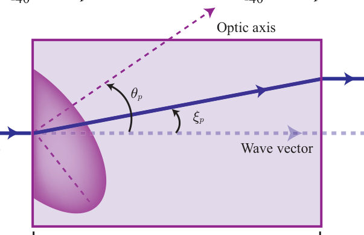
<figcaption class="paper-figure-caption"><b>Fig 1.</b> Figure 1: Non-conservation of OAM in SPDC. (a) and (b) are the numerical plots of 𝑃𝑙𝑠 𝑙𝑖for 𝐿= 0</figcaption>
</figure>
<figure class="paper-figure-card">
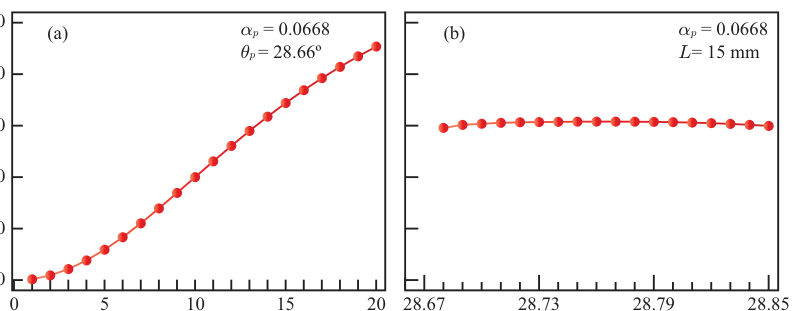
<figcaption class="paper-figure-caption"><b>Fig 2.</b> Figure 2: Effect of crystal thickness 𝐿and phase matching angle 𝜃𝑝on OAM non-conservation.</figcaption>
</figure>
<figure class="paper-figure-card">
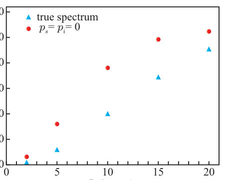
<figcaption class="paper-figure-caption"><b>Fig 3.</b> Figure 3: Dependence of N on 𝐿for two different detection techniques. The solid circles</figcaption>
</figure>
<figure class="paper-figure-card">
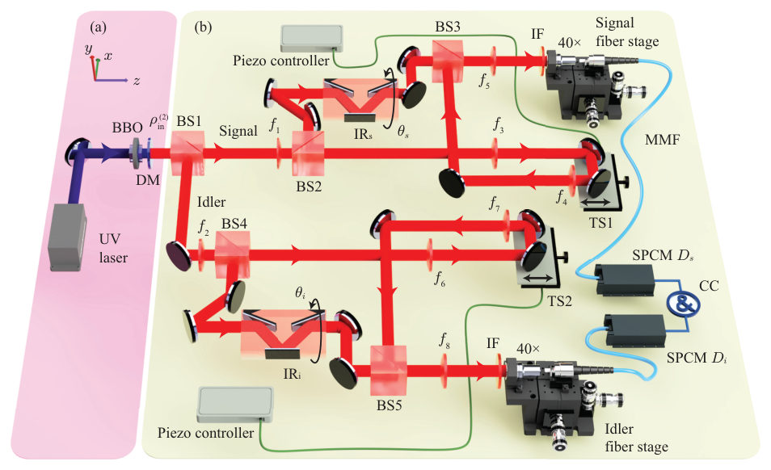
<figcaption class="paper-figure-caption"><b>Fig 4.</b> Figure 4: Experimental setup. (a) Schematic of the experimental setup for generating two-photon</figcaption>
</figure>
<figure class="paper-figure-card">
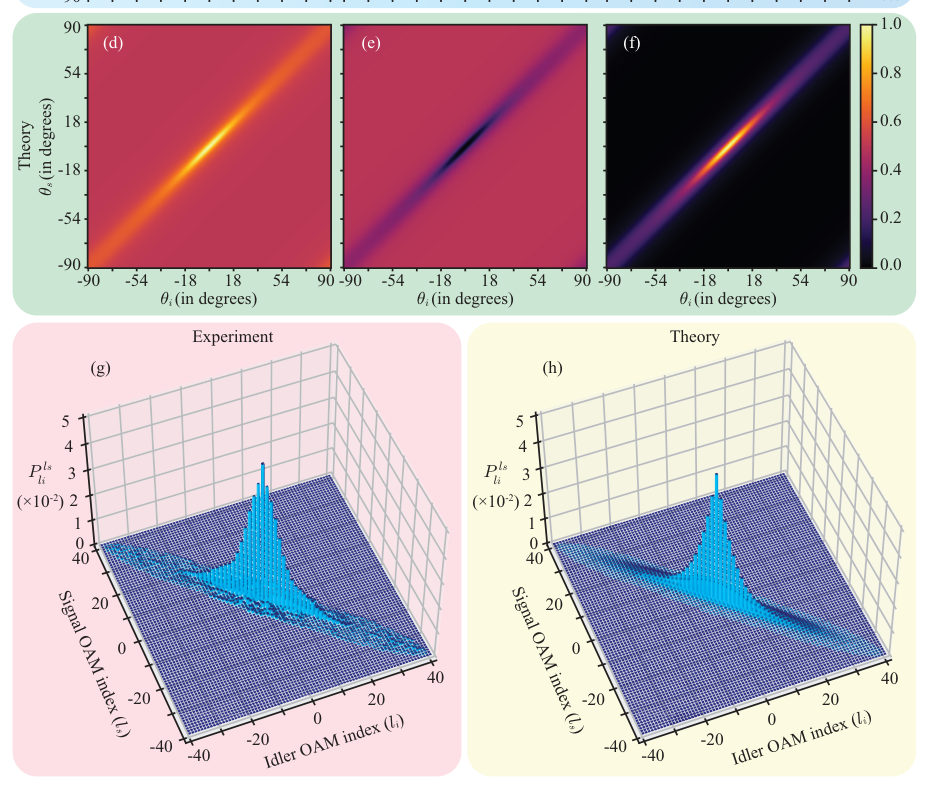
<figcaption class="paper-figure-caption"><b>Fig 5.</b> Figure 5: Experimentally measured two-photon OAM spectrum for Type-I SPDC. (a) Mea-</figcaption>
</figure>
<figure class="paper-figure-card">
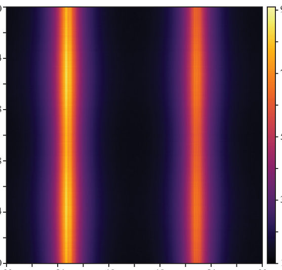
<figcaption class="paper-figure-caption"><b>Fig 6.</b> Figure 6: Plot of polarization calibration factor as a function of IR𝑠and IR𝑖angles. The</figcaption>
</figure>
<figure class="paper-figure-card">
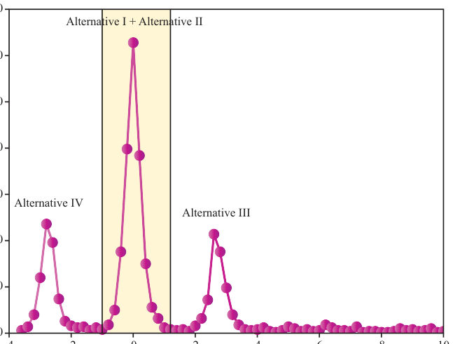
<figcaption class="paper-figure-caption"><b>Fig 7.</b> Figure 7: Coincidence count as a function of time delay between signal and idler detectors.</figcaption>
</figure>
<figure class="paper-figure-card">

<figcaption class="paper-figure-caption"><b>Fig 8.</b> Figure 8: Coincidence count rates versus two-photon path length difference. Measured co-</figcaption>
</figure>
<figure class="paper-figure-card">
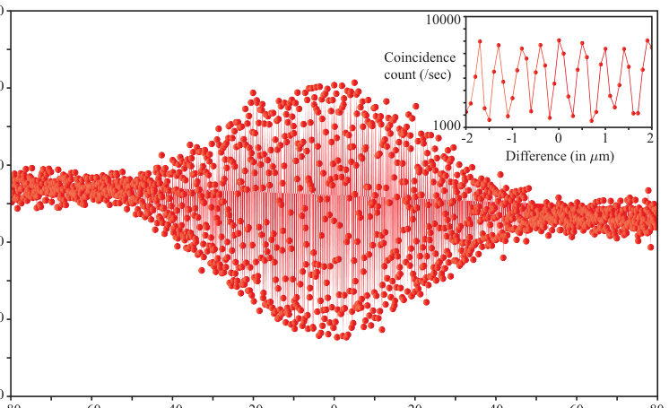
<figcaption class="paper-figure-caption"><b>Fig 9.</b> Figure 8 shows the plot of the coincidence count per second as a function of the two-photon</figcaption>
</figure>
<figure class="paper-figure-card">
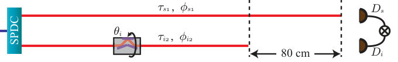
<figcaption class="paper-figure-caption"><b>Fig 10.</b> Fig. 4(b) in the main text. The signal and idler photons pass through the two-photon interferometer</figcaption>
</figure>

**Main problem.** The paper investigates the long-standing controversy regarding whether Orbital Angular Momentum (OAM) is conserved during Type-I Spontaneous Parametric Down-Conversion (SPDC).

**Main result.** The authors experimentally demonstrate OAM non-conservation in Type-I SPDC, attributing the effect to the spatial walk-off of the pump beam in the nonlinear crystal.

**Method.** The researchers developed a high-sensitivity two-photon OAM detector using a Mach-Zehnder-type interferometer with image rotators and reconstructed the OAM spectrum via a two-dimensional Fourier transform of coincidence visibility.

**Summary.** This paper reports the experimental observation of Orbital Angular Momentum (OAM) non-conservation in Type-I Spontaneous Parametric Down-Conversion. By developing a high-sensitivity two-photon detector, the authors show that the spatial walk-off effect in BBO crystals causes a spread in the OAM distribution, contrary to the established belief that OAM is conserved in Type-I processes. The study provides a numerical framework to validate these findings and demonstrates that previous claims of conservation were likely due to detector limitations or thin-crystal regimes. This discovery has significant implications for the precision and design of high-dimensional quantum optical technologies.

Detailed structure

**Model / system.** The physical system is a Type-I degenerate SPDC process in a 15-mm thick BBO (beta-barium borate) nonlinear crystal, utilizing a 405 nm continuous-wave UV pump laser.

**Key observables.** The two-photon OAM spectrum (joint OAM distribution) $P_{l_s, l_i}$, the non-conservation parameter $N$, and coincidence visibility $V_{si}(	heta_s, 	heta_i)$.

**Important parameters / regimes.** Crystal thickness ($L$), spatial walk-off angle ($\alpha_p$), phase-matching angle ($	heta_p$), and the OAM/radial mode indices ($l, p$).

**Assumptions / limitations.** The study challenges the standard assumption of OAM conservation ($l_p = l_s + l_i$) in Type-I SPDC and uses a framework that avoids standard phase-matching approximations.

**Figures summary.** Figure 1 shows numerical plots of OAM distribution spread due to crystal thickness and a conceptual diagram of pump walk-off; Figure 2 shows the increase of non-conservation $N$ with crystal thickness and its independence from the phase-matching angle; Figure 7 and 8 show coincidence counts vs. time delay and the signature of temporal HOM interference.

**Paper structure.** The paper introduces the OAM conservation controversy, describes the development of a new high-sensitivity detector, presents the experimental setup and OAM spectrum reconstruction method, details the experimental results demonstrating non-conservation, and provides a numerical validation and supplementary technical derivations.

**Why it may be interesting.** This is highly relevant to quantum optics and photonic quantum information as it challenges a fundamental assumption used in generating high-dimensional entangled states and provides a new high-fidelity method for measuring complex spatial modes.

Abstract

Orbital angular momentum (OAM)-entangled states produced by spontaneous parametric down-conversion (SPDC) are considered ideal for realizing high-dimensional entangled states, which have several advantages for quantum technologies. However, the limited sensitivity of current two-photon OAM detectors is a major roadblock not only for realizing such technologies but also for resolving foundational questions, such as OAM conservation in SPDC. The current theoretical understanding is that OAM is not conserved in Type-II SPDC but is conserved in Type-I. Experimentally, although non-conservation in TypeII has not been demonstrated, conservation in Type-I has been reported frequently and has become an underlying assumption for techniques generating high-dimensional OAM entangled states. In this work, we experimentally demonstrate a high-sensitivity two-photon OAM detector, using which, contrary to the current understanding, we report non-conservation of OAM in Type-I SPDC. We attribute this to a spatial walk-off effect and prove it using a framework free of standard phase-matching approximations.

[↑ back to top](#top)

### [Manipulation of diverse quantum correlations based on a hybrid optomagnomechanical system](http://arxiv.org/abs/2604.23495v1)

**Authors:** Xiaomin Liu, Rongguo Yang, Jing Zhang, Tiancai Zhang  
**Type:** theory · **Category:** quantum information and computing · **PDF:** <https://arxiv.org/pdf/2604.23495v1>  
**Analysis basis:** full PDF text, analyzed in chunks
**Topic relevance:** 🔥 `spintronics-quantum-optics interface` **5/5** · 🔥 `entanglement & information structure` **4/5** · `Tavis-Cummings & cavity-many-emitter` **2/5** · `correlated / nonlocal dissipation` **2/5**

↔ Scroll figures horizontally

<figure class="paper-figure-card">
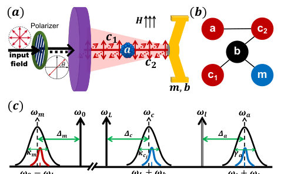
<figcaption class="paper-figure-caption"><b>Fig 1.</b> FIG. 1. The hybrid optomagnomechanical system. (a) Schematic diagram; (b) Interaction relation (blue/red circles denote blue/red-detuned driving); (c) Frequency relation.</figcaption>
</figure>
<figure class="paper-figure-card">
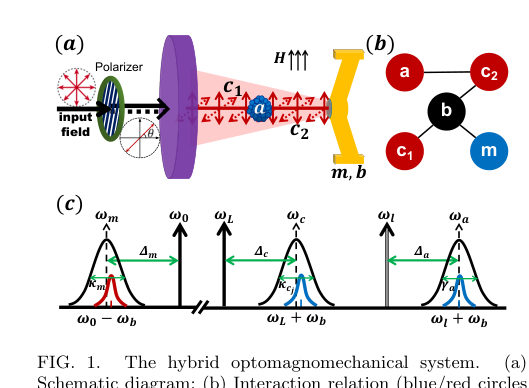
<figcaption class="paper-figure-caption"><b>Fig 2.</b> Figure 1(a) depicts a hybrid optomagnomechanical system driven by linearly polarized light, whose polar- ization direction is tunable via rotating a polarizer. The system consists of an optical cavity formed by a mir- ror and a YIG microbridge [6, 21] (its magnon (phonon) mode m (b) has frequency ωm (ωb) and decay rate κm (γb)) and an ensemble of Na two-level atoms (with fre- quency ωa and decay rate γa). The cavity mode can be decomposed into horizontal (c1) and vertical (c2) polar- ized modes at frequency ωc, with decay rates κc1, κc2, respectively. The interaction between the atomic ensem- ble and the cavity mode is a typical TC coupling. No- tably, only the c2 mode can effectively...</figcaption>
</figure>
<figure class="paper-figure-card">
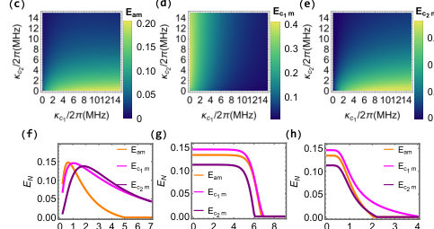
<figcaption class="paper-figure-caption"><b>Fig 3.</b> FIG. 3. Results of bipartite entanglements versus coupling and decoherence factors: (Eam, Ec1m, Ec2m) versus the effec- tive magnomechanical coupling strength Gm (a), the effective optomechanical coupling strength Gc (b), the magnon decay rate κm (f), the phonon decay rate γb (g), and the temper- ature T (h); Eam (c), Ec1m (d), Ec2m (e) versus the optical decay rates κc1 and κc2. All parameters remain the same as those in Fig. 2.</figcaption>
</figure>
<figure class="paper-figure-card">
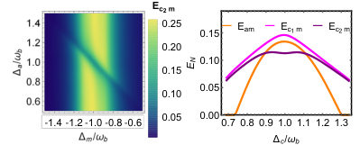
<figcaption class="paper-figure-caption"><b>Fig 4.</b> FIG. 2. Results of bipartite entanglements versus detunings: the atom-magnon entanglement Eam (a), the optomagnonic entanglements Ec1m (b) and Ec2m (c) versus ∆a and ∆m, and (Eam, Ec1m, Ec2m) versus ∆c (d). Except for the varied parameters, we set ωm/2π = 10 GHz, ωb/2π = 40 MHz, γa/2π = 1 MHz, κc1/2π = 3 MHz, κc2/2π = 1 MHz, κm/2π = 1 MHz, γb/2π = 100 Hz, gac2/2π = 3 MHz, θ = π/4, T = 10 mK, Gc/2π = 10 MHz, Gm/2π = 2 MHz, and ∆a = −∆m = ∆c = ωb.</figcaption>
</figure>
<figure class="paper-figure-card">
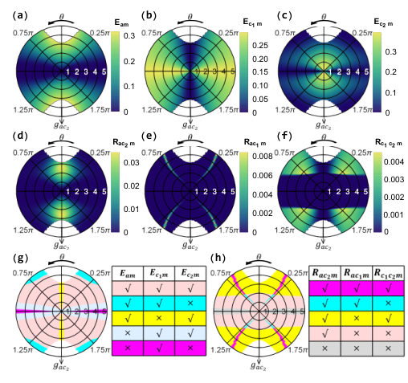
<figcaption class="paper-figure-caption"><b>Fig 5.</b> FIG. 4. Results of bipartite and genuine tripartite entangle- ments versus the TC coupling strength gac2 and the polar- ization direction θ: Eam (a), Ec1m (b), Ec2m (c), Rac2m (d), Rac1m (e), and Rc1c2m (f). The results of bipartite and gen- uine tripartite entanglements are summarized in (g) and (h), respectively. We set Gm/2π = 3 MHz, and all other parame- ters remain the same as those in Fig. 2.</figcaption>
</figure>
<figure class="paper-figure-card">
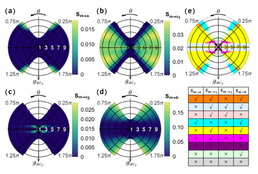
<figcaption class="paper-figure-caption"><b>Fig 6.</b> FIG. 5. Results of bipartite steerings versus gac2 and θ: Sm→a (a), Sm→c1 (b), Sm→c2 (c), and Sm→b (d). All results are summarized in (e). The blank area represents the unstable regime. All parameters remain the same as those in Fig. 4.</figcaption>
</figure>
<figure class="paper-figure-card">
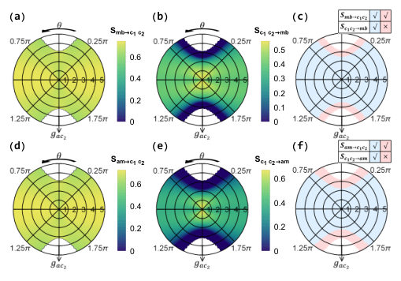
<figcaption class="paper-figure-caption"><b>Fig 7.</b> FIG. 7. Results of quadripartite steerings versus gac2 and θ: Smb→c1c2 (a), Sc1c2→mb (b), Sam→c1c2 (d), Sc1c2→am (e). The results involving mb and am are summarized in (c) and (f), respectively. The blank area represents the unstable regime. All parameters remain the same as those in Fig. 4.</figcaption>
</figure>
<figure class="paper-figure-card">
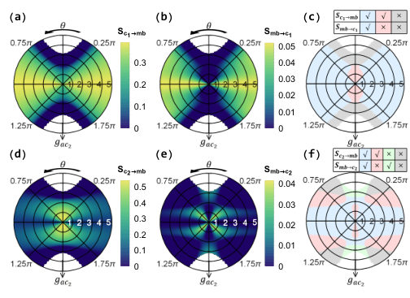
<figcaption class="paper-figure-caption"><b>Fig 8.</b> FIG. 6. Results of tripartite steerings versus gac2 and θ: Sc1→mb (a), Smb→c1 (b), Sc2→mb (d) and Smb→c2 (e). The results involving c1 and c2 are summarized in (c) and (f), re- spectively. The blank area represents the unstable regime. All parameters remain the same as those in Fig. 4.</figcaption>
</figure>
<figure class="paper-figure-card">
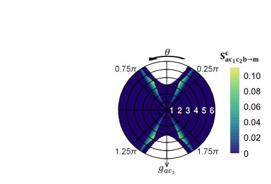
<figcaption class="paper-figure-caption"><b>Fig 9.</b> FIG. 8. The collective pentapartite steering Sc ac1c2b→m versus gac2 and θ. The blank area represents the unstable regime. All parameters remain the same as those in Fig. 4.</figcaption>
</figure>

**Main problem.** The need for flexible and efficient manipulation of diverse quantum correlations (entanglement and steering) to implement various tasks in hybrid quantum networks without physical reconfiguration of hardware.

**Main result.** The authors demonstrate an all-optical scheme to selectively generate bipartite and tripartite entanglements and deterministically manipulate various types of quantum steering, including collective pentapartite steering, by adjusting laser polarization and coupling strength.

**Method.** The study uses a linearized Quantum Langevin Equation approach and solves the Lyapunov equation to obtain the system's covariance matrix under a low-excitation, bosonic approximation.

**Summary.** This paper proposes a scheme to control various quantum correlations in a hybrid optomagnomechanical system using only light polarization. By adjusting the driving laser's polarization angle, the researchers can switch between different types of entanglement and quantum steering, including complex pentapartite steering. The system integrates optical, magnonic, and atomic modes, providing a flexible way to route quantum information. This all-optical approach is experimentally feasible and could be used for advanced quantum communication tasks.

Detailed structure

**Model / system.** A hybrid optomagnomechanical system consisting of an optical cavity with a YIG microbridge, an atomic ensemble, and a polarizer, involving interactions between optical modes, magnon, phonon, and atom modes.

**Key observables.** Logarithmic negativity (bipartite entanglement), minimum residual contangle (tripartite entanglement), and various steerability coefficients (one-way, two-way, and pentapartite steering).

**Important parameters / regimes.** Polarization angle (theta), Tavis-Cummings coupling strength (g_ac2), magnomechanical coupling (g_m), optomechanical coupling (g_c), and temperature (T < 4 K).

**Assumptions / limitations.** Low-excitation approximation for the atomic ensemble, bosonic approximation for atomic polarization, and a Markovian approximation for noise terms.

**Figures summary.** Figure 1 shows the system schematic and interaction; Figure 6 illustrates tripartite steering regimes (one-way, two-way, no-way) as a function of coupling and polarization; Figure 7 shows quadripartite steering results.

**Paper structure.** The paper introduces the scientific problem, describes the hybrid optomagnomechanical system and its Hamiltonian, details the mathematical method for calculating correlations, presents results on entanglement and steering manipulation, and concludes with potential applications.

**Why it may be interesting.** It presents a versatile method for all-optical control of complex, multi-party quantum correlations in a hybrid platform, which is highly relevant for developing scalable quantum networks and secure multi-user communication.

Abstract

Flexible manipulation of quantum correlation resources enables the implementation of diverse quantum tasks based on hybrid quantum networks, where atom-magnon and optomagnonic entanglements and steerings play important roles. In this work, we propose an effective scheme to generate and manipulate quantum entanglements and steerings based on a hybrid optomagnomechanical system, which is composed of a polarizer, an optical cavity with YIG bridge as one end, and an atomic ensemble in it. According to the results of the parameter dependence of various quantum correlations, we can selectively generate bipartite and genuine tripartite entanglements and deterministically manipulate the concrete situation of bipartite, multipartite steerings, and collective pentapartite steering, by adjusting the polarization direction of the driving laser and the Tavis-Cummings coupling strength. Our all-optical controlled scheme is flexible, convenient, compact, and experimentally feasible, because multiple coupling channels can be tuned simultaneously. This work provides a new perspective for implementing specialized quantum tasks, such as hierarchical ultra-secure multi-user quantum communications.

[↑ back to top](#top)

### [Experimental high-dimensional multi-qubit Bell non-locality on a superconducting quantum processor](http://arxiv.org/abs/2604.24740v1)

**Authors:** Yousef Mafi, Ali G. Moghaddam, Teemu Ojanen  
**Type:** experiment · **Category:** quantum information and computing · **PDF:** <https://arxiv.org/pdf/2604.24740v1>  
**Analysis basis:** full PDF text, analyzed in chunks
**Topic relevance:** 🔥 `QC/QI experiment` **5/5** · 🔥 `entanglement & information structure` **4/5** · `quantum measurements` **2/5**

↔ Scroll figures horizontally

<figure class="paper-figure-card">
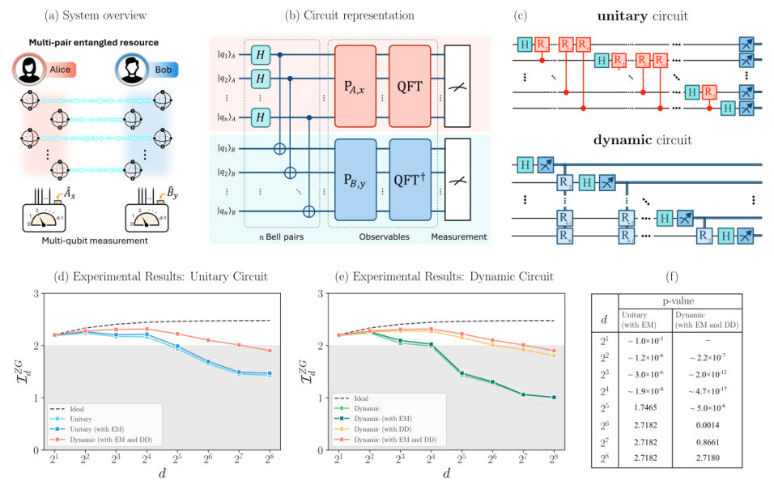
<figcaption class="paper-figure-caption"><b>Fig 1.</b> FIG. 1. High-dimensional non-locality: schematics and results. (a) Schematic representation of a high-dimensional Bell test with two parties. (b) Quantum circuit for the multi-qubit Bell test (c) Circuit implementation of a QFT and a DQFT (d) Results for different QFT-based circuits. (e) Results for the DQFT-based circuits. (e) p-values characterizing the likelihood of a LHV description for the experimental results.</figcaption>
</figure>
<figure class="paper-figure-card">
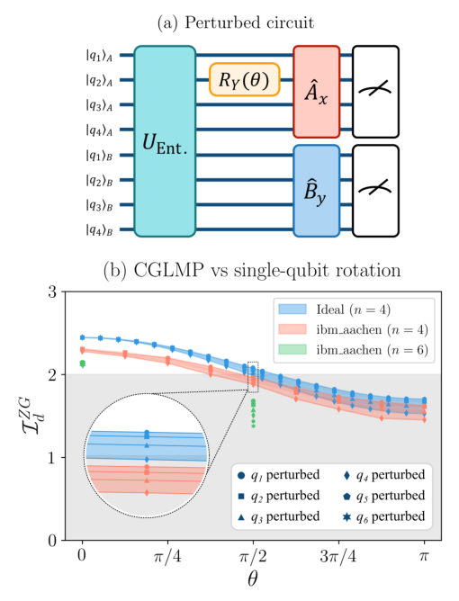
<figcaption class="paper-figure-caption"><b>Fig 2.</b> FIG. 2. Unraveling the collective nature of nonlocal- ity via single-qubit perturbations (a) Circuit to probe the participation of an individual qubit to the observed non- locality. Each qubit is individually subjected to a rotation. (b) Evolution of the CGLMP parameter as a function of single-qubit rotations. The blue quadruplet illustrates the ef- fect of rotations of each qubit in a subsystem with four qubits, the red quadruplet illustrates the quantum simulation results.</figcaption>
</figure>
<figure class="paper-figure-card">
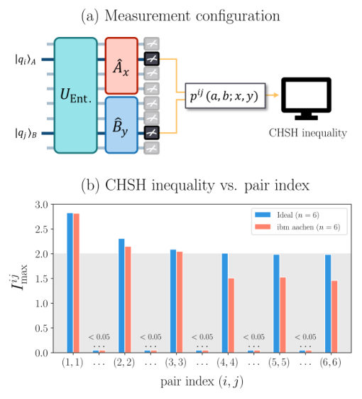
<figcaption class="paper-figure-caption"><b>Fig 3.</b> FIG. 3. High-dimensional non-locality against pair- wise non-locality (a) Schematic of the circuit to evaluate pairwise marginal probabilities obtained from the full proba- bility. While the circuit is identical to that in Fig. 1 (a), the measurements results are separately obtained for each pair i, j. (b) The pairwise Bell function Imax corresponding to CHSH tests. We see only one pair shows siginificant violation while the rest are either slightly violating or Bell local.</figcaption>
</figure>
<figure class="paper-figure-card">
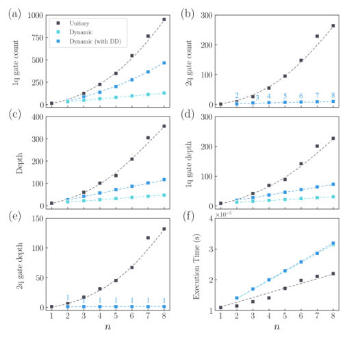
<figcaption class="paper-figure-caption"><b>Fig 4.</b> FIG. 4. Resource comparison of multi-qubit Bell test on a quantum processor (a)-(b) Scaling of single- and two- qubit gate counts, respectively, with system size. (c)-(d) Cor- responding circuit depths for each implementation. (e) Exe- cution time, highlighting the overall resource requirements of the protocol.</figcaption>
</figure>
<figure class="paper-figure-card">
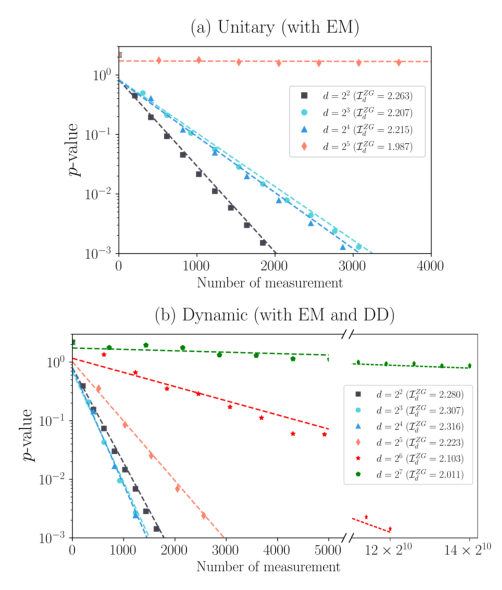
<figcaption class="paper-figure-caption"><b>Fig 5.</b> FIG. 5. Statistical significance of IZG d inequality p-value as a function of the number of attempts (measurements or trials) for different system sizes. (a) Results for QFT-based circuits. (b) Results for DQFT-based circuits.</figcaption>
</figure>

**Main problem.** Exploring and verifying high-dimensional, many-body Bell non-locality in a regime where non-locality is collective and hidden from pairwise correlations.

**Main result.** Demonstrated a high-confidence Bell violation for two 64-dimensional systems using 12 qubits, proving that the non-locality is genuinely collective and not reducible to pairwise entanglement.

**Method.** Used a superconducting quantum processor to implement both unitary and Dynamic Quantum Fourier Transform (DQFT) circuits, combined with dynamical decoupling and measurement error mitigation.

**Summary.** This paper reports the experimental observation of high-dimensional, many-body Bell non-locality on a superconducting quantum processor. By using up to 12 qubits to create 64-dimensional systems, the researchers showed that the observed non-locality is a collective phenomenon that cannot be explained by simple pairwise entanglement. They utilized advanced techniques like Dynamic QFT and error mitigation to overcome noise. This work establishes a new way to certify the complex, multi-qubit correlations essential for large-scale quantum computing.

Detailed structure

**Model / system.** A 156-qubit IBM superconducting quantum processor (ibm aachen) using fixed-frequency transmon qubits in a heavy-hex lattice architecture.

**Key observables.** CGLMP inequality parameter (I_Z,d^ZG), p-values for LHV models, and CHSH inequality for pairwise analysis.

**Important parameters / regimes.** System dimensions up to d=64, 12-qubit partitions, and gate fidelities (single-qubit >99.9%, two-qubit >99%).

**Assumptions / limitations.** The communication loophole is not addressed as the experiment is performed on a single chip; assumes the validity of the null hypothesis for p-value calculation.

**Figures summary.** Fig 1 shows the Bell test schematic, circuit implementations (QFT vs DQFT), and p-values. Fig 2 illustrates single-qubit perturbation analysis. Fig 3 shows pairwise correlation analysis. Fig 4 compares resource requirements (depth/gate counts). Fig 5 shows p-value scaling with measurement trials.

**Paper structure.** The paper introduces the problem of high-dimensional many-body non-locality, describes the experimental platform and circuit techniques (DQFT, error mitigation), presents the results of Bell violations and collective nature proofs, and concludes with a discussion on scalability and hardware benchmarking.

**Why it may be interesting.** It demonstrates a new regime of 'hidden' non-locality that emerges only through collective many-body correlations, providing a powerful new method for benchmarking the performance of large-scale quantum processors.

Abstract

Combining recent advances in superconducting quantum hardware, we explore quantum correlations in a previously inaccessible regime by observing \emph{simultaneously} high-dimensional and many-body Bell non-locality. We report a high-confidence Bell violation in the correlations between two $d=64$-dimensional systems encoded in twelve qubits. For system sizes up to $d=32$, the strength of the observed nonlocal correlations exceeds the quantum upper bound for $d=2$ systems, providing direct evidence of high-dimensional nonlocality. Furthermore, we demonstrate that the observed violation is genuinely collective: all qubits contribute to the nonlocal correlations, while most pairwise correlations across the bipartition remain Bell-local. Our work illustrates how present-day quantum processors enable the exploration of fundamental predictions of quantum mechanics in previously inaccessible regimes and, in turn, how fundamental quantum effects can be used to benchmark their performance.

[↑ back to top](#top)

### [Peak-valley mechanism for Hilbert space fragmentation](http://arxiv.org/abs/2604.23659v1)

**Authors:** Jianlong Fu, Hoi Chun Po  
**Type:** theory · **Category:** statistical mechanics · **PDF:** <https://arxiv.org/pdf/2604.23659v1>  
**Analysis basis:** full PDF text, analyzed in chunks
**Topic relevance:** 🔥 `scars & prethermalization` **5/5** · `entanglement & information structure` **3/5** · `non-equilibrium dynamics` **3/5**

↔ Scroll figures horizontally

<figure class="paper-figure-card">
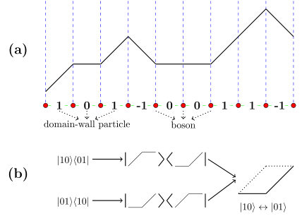
<figcaption class="paper-figure-caption"><b>Fig 1.</b> FIG. 2: Geometrical representations (a) Geometrical representation of domain-wall particle product state using polyline diagram (paths). (b) Polyline diagram representation of off-diagonal matrix elements of DP operators.</figcaption>
</figure>
<figure class="paper-figure-card">
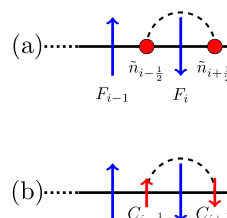
<figcaption class="paper-figure-caption"><b>Fig 2.</b> FIG. 1: 1D lattice system of domain-wall particle (a) 1D systems of spin-F domain-wall particle Fi dual to bosonic charge ai. (b) Core subspace corresponds to the subspace of spin-F(= 2S) DP Fi which is dual to spin-S charge Ci in the DP-charge duality.</figcaption>
</figure>
<figure class="paper-figure-card">
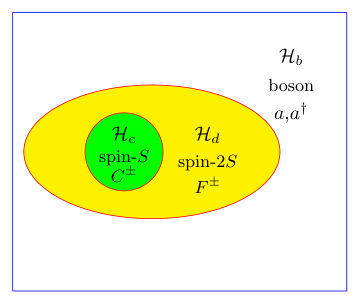
<figcaption class="paper-figure-caption"><b>Fig 3.</b> FIG. 3: An illustration of key concepts. The relationship between the bosonic charge space Hb, whose dimension is ∞L, the spin-2S DP space Hd, whose dimension is (4S + 1)L, and the spin-S core subspace Hc, whose dimension is (2S + 1)L.</figcaption>
</figure>
<figure class="paper-figure-card">
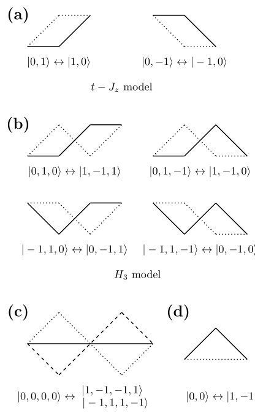
<figcaption class="paper-figure-caption"><b>Fig 4.</b> FIG. 4: Key diagrams of spin 1 models. The diagrams showing the off-diagonal transitions caused by the bond operators (introduced in Sec. II B) of various models of spin-1 domain-wall particle. (a) the t-Jz model; (b) the H3 model; (c) the transitions of H4 model that violate the general condition (7); (d) the transitions of the Motzkin chain that violate the general condition (7).</figcaption>
</figure>
<figure class="paper-figure-card">
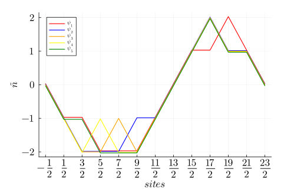
<figcaption class="paper-figure-caption"><b>Fig 5.</b> FIG. 5: An illustration of paths within one Krylov subspace. The paths of 5 product states belonging to one Krylov subspace of the H3 model with 12 charge/DP sites. The total spin is 0 and total dipole moment is 4. By definition ˜n−1</figcaption>
</figure>
<figure class="paper-figure-card">
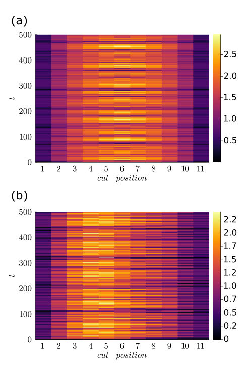
<figcaption class="paper-figure-caption"><b>Fig 6.</b> FIG. 6: Entanglement entropy as function of cut position and time for larger Krylov subspaces. (a) Initial state is | −1, 0, 1, 0, 0, 0, 0, 0, 0, 1, 0, −1⟩, sector dimension D = 210, the entanglement entropy is symmetric with middle-point of the chain. (b) Initial state is | −1, 0, 0, 0, 1, 1, −1, −1, 1, 0, 0, 0⟩, sector dimension D = 84, the entanglement entropy is not symmetric.</figcaption>
</figure>
<figure class="paper-figure-card">
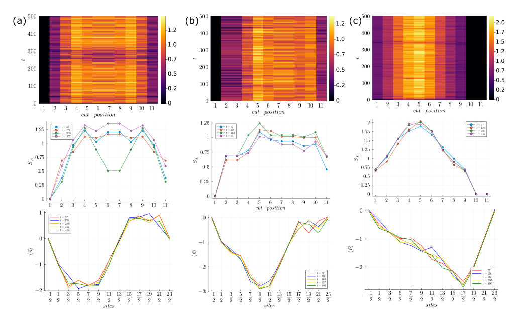
<figcaption class="paper-figure-caption"><b>Fig 7.</b> FIG. 7: Entanglement entropy versus time and cut position for smaller Krylov sectors. The entanglement is plotted as heatmap graph for all time and as a polyline graph for 4 randomly chosen time t. The entanglement versus cut position is compared with quantum mechanical average for charge ⟨˜n⟩(for 5 randomly chosen time t) to highlight the correlation between entanglement plateaus and locations of the slopes. (a) Initial state is | −1, −1, 0, 0, 1, 0, 1, 0, 1, 0, 0, −1⟩, Krylov sector dimension D = 17; (b) initial state is | −1, 0, −1, −1, 0, 1, 0, 1, 0, 1, 0, 0⟩, Krylov sector dimension D = 13; (c) initial state is | −1, 0, 0, 1, −1, −1, −1, 1, 0, 0, 1, 1⟩, Krylov sector dimension D = 34.</figcaption>
</figure>
<figure class="paper-figure-card">
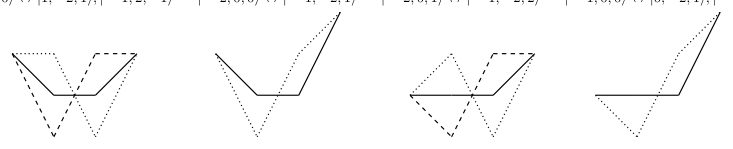
<figcaption class="paper-figure-caption"><b>Fig 8.</b> FIG. 8: Key transitions violating the PV fragmentation condition in constructing the spin-2 H3 model. The transitions that violate the general condition for PV fragmentation (7) in the local Hilbert space {Fn, Fn+1, Fn+2} under operators ˆQ3 and its conjugate. The list is incomplete, other states can be obtained by symmetry.</figcaption>
</figure>
<figure class="paper-figure-card">
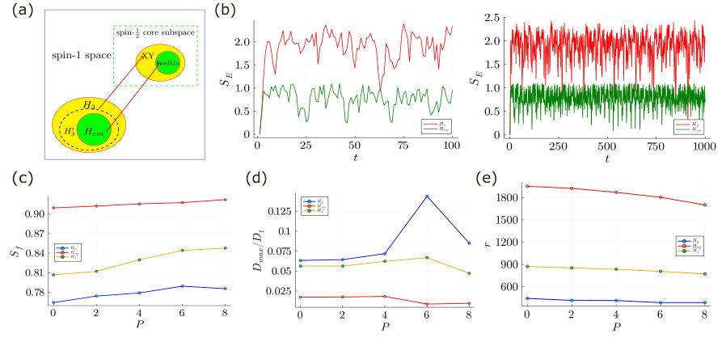
<figcaption class="paper-figure-caption"><b>Fig 9.</b> FIG. 9: Higher-order HSF for Hem. (a) Schematic plot of the core subspace and the projected model. (b) Half-chain entanglement entropy SE with time for H3 and Hem on a 12-site chain with initial state in the core subspace, initial state is | −1, 0, 1, 0, 0, 0, 0, −1, 1, 0, 0, 0⟩. (c) Entropy of fragmentation Sf versus total dipole moment P for Hem, H3 and H′ 3. (d) Dmax/Dt versus total dipole moment P for Hem, H3 and H′ 3 with Dt = 7283, 7178, 6885, 6426 and 5819 for P = 0, 2, 4, 6, 8 respectively. (e) Number of Krylov sectors r versus total dipole moment P for Hem, H3 and H′ 3.</figcaption>
</figure>
<figure class="paper-figure-card">
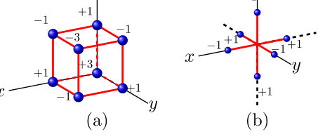
<figcaption class="paper-figure-caption"><b>Fig 10.</b> FIG. 10: Classical point DP configuration with ˆn ∼(1, 1, 1). The original charge distribution is given by red rods and the corresponding dual DPs are denoted by blue balls whose charges are labeled by the numbers in the figure. The DPs forming (a) cubes and (b) octahedrons configurations have fractal structure.</figcaption>
</figure>

**Main problem.** The paper seeks a general organizing principle for Hilbert space fragmentation (HSF), which is the breaking of ergodicity into many decoupled Krylov subspaces in isolated quantum many-body systems.

**Main result.** The authors introduce the 'peak-valley (PV) fragmentation' mechanism, a local rule where emergent quantum numbers (heights and depths of peaks/valleys in a geometric representation) protect subspaces, allowing for the systematic construction of new fragmented models.

**Method.** The study uses a duality transformation between domain-wall particles and bosonic charges, a geometric representation of spin states as polyline graphs, and numerical simulations of entanglement entropy and Krylov sector dimensions.

**Summary.** This paper proposes a new mechanism called 'peak-valley fragmentation' to explain why certain quantum systems fail to thermalize. By mapping spin chains to geometric paths, the authors show that local rules can protect the heights and depths of peaks and valleys, creating many disconnected sectors in the Hilbert space. This framework unifies several known models and provides a recipe for constructing new, highly fragmented higher-spin models. The work also explores how this mechanism extends to higher dimensions and relates to fractal structures.

Detailed structure

**Model / system.** One-dimensional integer spin chains, specifically spin-1 and spin-2 domain-wall particle (DP) models, including the t-Jz model, H3 model, and the embedded Fredkin model.

**Key observables.** Entanglement entropy (spatial and temporal), Krylov subspace dimensions, entropy of fragmentation, and emergent quantum numbers (peak/valley heights).

**Important parameters / regimes.** Spin magnitude (F or S), number of particles (q) in the bond operator, and local boson occupation numbers.

**Assumptions / limitations.** The analysis focuses on isolated, disorder-free systems and relies on the validity of the DP-charge duality in 1D.

**Figures summary.** Figure 1 shows the DP-charge duality and core subspace; Figure 2 displays geometric path representations; Figure 3 illustrates the relationship between DP and bosonic charge spaces; Figure 4 compares transitions in different models (t-Jz, H3, H4, Motzkin); Figure 6 shows entanglement entropy heatmaps; Figure 9 shows the embedded Fredkin model and core subspace.

**Paper structure.** The paper begins by introducing the problem of HSF, then proposes the PV mechanism via a geometric representation and duality. It demonstrates the unification of existing models, generalizes the mechanism to higher-spin systems, explores higher-order fragmentation in the embedded Fredkin model, and concludes with extensions to 2D/3D systems and mathematical justifications.

**Why it may be interesting.** This is highly relevant for many-body dynamics as it provides a new, systematic way to understand and engineer non-ergodic, non-thermalizing quantum phases and the emergence of local conservation laws.

Abstract

Ergodicity breaking in isolated systems has emerged as an important frontier in the study of quantum many-body physics. While generic Hamiltonians are expected to obey the eigenstate thermalization hypothesis (ETH), recent studies on Hilbert space fragmentation (HSF) have revealed possible robust nonthermal behavior even in disorder-free systems. Although numerous models exhibiting strong HSF are already known, existing analyses are typically model dependent, and a general organizing principle remains elusive. In this work, we introduce a simple mechanism for achieving strong HSF in one-dimensional integer spin chains, which we term "peak-valley (PV) fragmentation". The key idea is to devise a simple local rule which ensures the spin states in the computational basis can be labeled by a set of emergent good quantum numbers corresponding to the heights and depths of alternating peaks and valleys in a geometrical representation. We demonstrate that some known examples of strong HSF models, as well as their variants which break the HSF property, can be understood within the framework of PV fragmentation. Our approach also enables systematic construction of new fragmented models in higher-spin systems, and allows us to identify higher-order HSF models.

[↑ back to top](#top)

### [Bayesian phase transition for the critical Ising model: Enlarged replica symmetry in the epsilon expansion and in 2D](http://arxiv.org/abs/2604.23346v1)

**Authors:** Kay Joerg Wiese, Alapan Das, Adam Nahum  
**Type:** theory · **Category:** statistical mechanics · **PDF:** <https://arxiv.org/pdf/2604.23346v1>  
**Analysis basis:** full PDF text, analyzed in chunks
**Topic relevance:** 🔥 `measurement-induced transitions` **4/5** · 🔥 `quantum measurements` **4/5** · `driven-dissipative phase transition` **3/5** · `non-equilibrium universality` **3/5** · `Keldysh / 2PI / non-Gaussian methods` **2/5** · `entanglement & information structure` **2/5** · `methods for driven-dissipative` **2/5** · `non-equilibrium dynamics` **2/5**

↔ Scroll figures horizontally

<figure class="paper-figure-card">
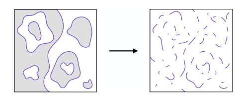
<figcaption class="paper-figure-caption"><b>Fig 1.</b> Figure 1. Schematic illustration of part of a critical Ising configura- tion (Left) and the measurement data (Right), which can be thought of as a noisy image of the domain wall configuration. See Fig. 2 for a more accurate depiction of one of the specific lattice measurement protocols discussed in the main text. (Figure from [3].)</figcaption>
</figure>
<figure class="paper-figure-card">
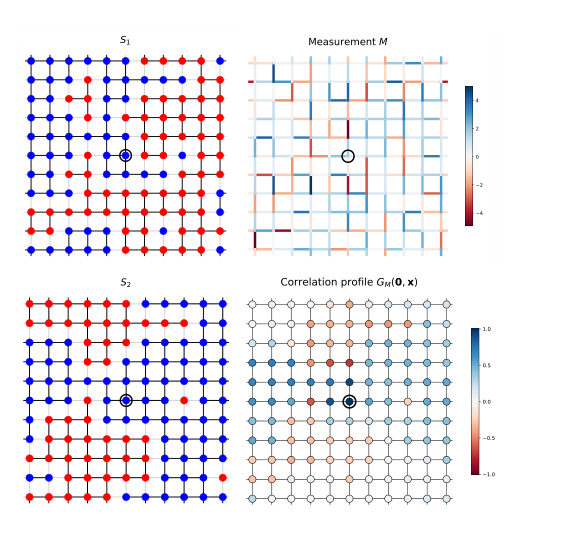
<figcaption class="paper-figure-caption"><b>Fig 2.</b> Figure 2. A snapshot of the process in an 11 × 11 lattice with pe- riodic boundary conditions. Top left: We start with a configuration S1 = Sref of the pure critical Ising model (blue sites are spin up, red ones spin down). Top right: A collection M of bond measure- ments is made, with normally-distributed errors (the Gaussian pro- tocol). Bottom left: A spin configuration S2 may now be sampled from the a posteriori measure P(•|M). Bottom right: The mea- surement outcomes M define a conditioned two-point correlation G(0, x) = ⟨S(0)S(x)⟩M. The origin 0 is indicated by the black circle. (These snapshots were obtained at J = Jc, Γ = Γc, but no claim is made for their typicality.)</figcaption>
</figure>
<figure class="paper-figure-card">
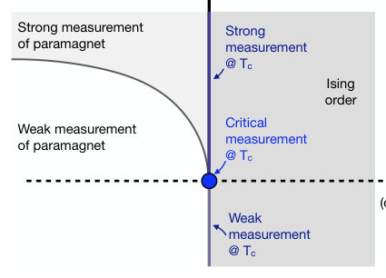
<figcaption class="paper-figure-caption"><b>Fig 3.</b> Figure 3. Topology of the phase diagram for the field theory in the (r1, r2) plane (Sec. III A) and also for the lattice model in the (Tc −T, Γ −Γc) plane. The vertical axis, where T = Tc, corre- sponds to the one-pameter phase diagram in (6). Our main focus will be the point at the origin, marked with a circle, where the measure- ment strength is also critical. In the field theory, the diagonal line r1 = r2 possesses an enlarged symmetry (20) if the cubic couplings also respect the enlarged symmetry.</figcaption>
</figure>
<figure class="paper-figure-card">
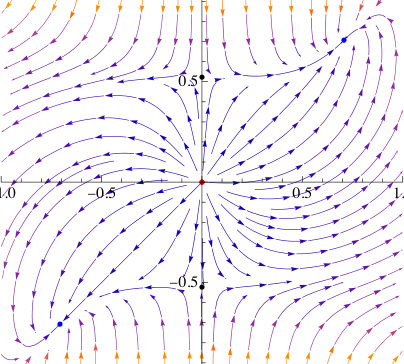
<figcaption class="paper-figure-caption"><b>Fig 4.</b> Figure 5. Flow at 2-loop order for n = 1, ϵ = 1. Compared to Fig. 4, a non-trivial fixed point has appeared at λ1 = λ2 = λ∗, see Eq. (48).</figcaption>
</figure>
<figure class="paper-figure-card">
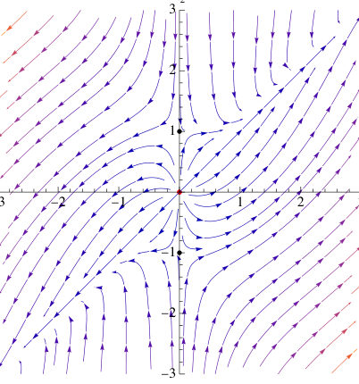
<figcaption class="paper-figure-caption"><b>Fig 5.</b> Figure 4. Flow diagram at 1-loop order for n = 1, ϵ = 1.</figcaption>
</figure>
<figure class="paper-figure-card">
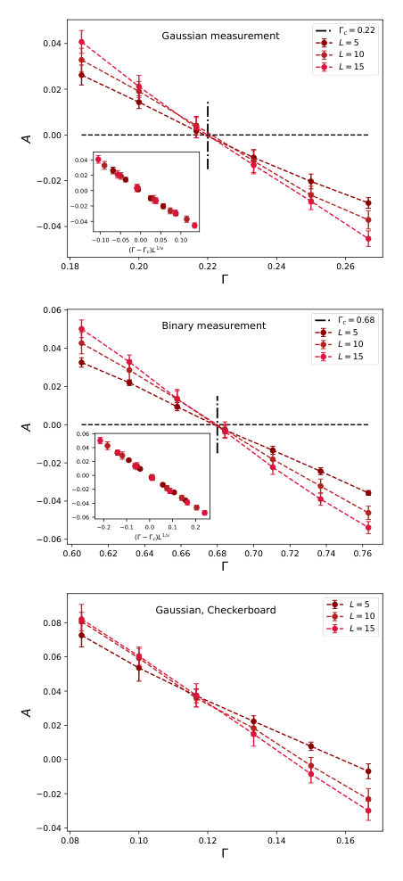
<figcaption class="paper-figure-caption"><b>Fig 6.</b> Figure 6. Top: Modified Binder cumulant for the Gaussian measure- ment protocol. The crossing is at Γc ≈0.22 (cf. Eq. 112). Middle: For the binary measurement protocol. The crossing is at Γc ≈0.68. Bottom: For the Gaussian protocol on a checkerboard lattice, where only the diagonal bonds are measured. In the first two cases, we get a good scaling collapse with exponent 1/νM ≈0.39. (The data for the checkerboard case is consistent with a wide range of νM values so we do not show a collapse.)</figcaption>
</figure>
<figure class="paper-figure-card">
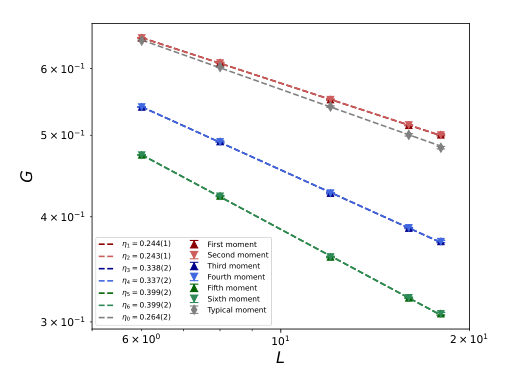
<figcaption class="paper-figure-caption"><b>Fig 7.</b> Figure 8. Log-log plot of the first six moments of the correlator and of the typical value (Eq. 109). The fits giving the exponents ηk, k = 1, ..., 6 for the moments and η0 for the typical are shown.</figcaption>
</figure>
<figure class="paper-figure-card">
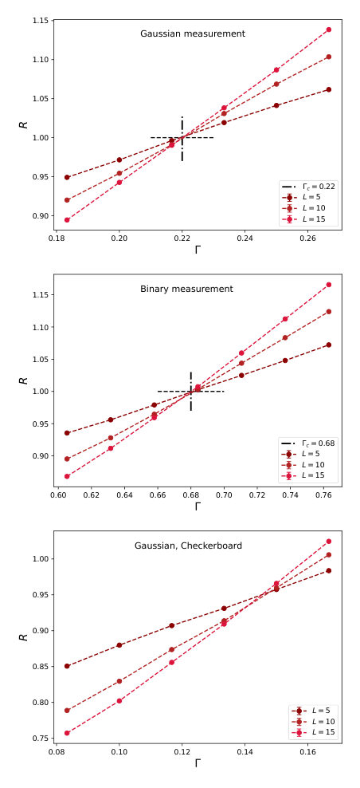
<figcaption class="paper-figure-caption"><b>Fig 8.</b> Figure 7. The quantity R shown for Top: Gaussian measurement, Middle: Binary measurement and Bottom: Gaussian measurement in the checkerboard lattice. The error bars are smaller than the markers. The horizontal dashed line in the first two figures indicates R = 1.</figcaption>
</figure>
<figure class="paper-figure-card">
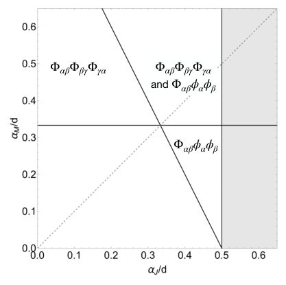
<figcaption class="paper-figure-caption"><b>Fig 9.</b> Figure 9. Regions of the (αJ/d, αM/d) plane are labelled according to which cubic terms are relevant. The region that touches the origin is the “mean-field” region where all interactions are irrelevant. In the shaded region a quartic operator becomes relevant (see Sec. IV), in- validating the naive ϵ expansion (unless its coupling is tuned away). The dashed line indicates αM = αJ, in which case there is the pos- sibility of an enlarged symmetry relating ϕ and Φ.</figcaption>
</figure>
<figure class="paper-figure-card">
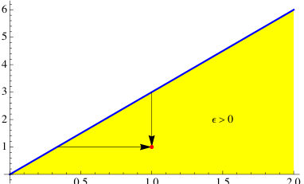
<figcaption class="paper-figure-caption"><b>Fig 10.</b> Figure 10. The range where ϵ(α, d) &gt; 0 (in yellow) and two possible expansion paths to reach α = d = 1.</figcaption>
</figure>

**Main problem.** Investigating the Bayesian phase transition in the critical Ising model, where the precision of local measurements drives a transition between weak and strong measurement phases.

**Main result.** The study identifies an emergent enlarged replica symmetry (G_n+) in the infrared that fixes the exact value of the Edwards-Anderson correlator exponent and demonstrates the existence of multiscaling at the critical point.

**Method.** The authors use epsilon expansion around the upper critical dimension (d=6) at two-loop order, non-perturbative renormalization group (NPRG) analysis, and 2D Monte Carlo simulations.

**Summary.** This paper explores how the precision of measuring bond energies in a critical Ising model can trigger a phase transition between a weak-measurement and a strong-measurement phase. Using both high-dimensional epsilon expansions and 2D numerical simulations, the authors reveal that an enlarged replica symmetry emerges in the infrared limit. This symmetry is powerful enough to fix certain critical exponents exactly. The findings also demonstrate that the system exhibits multiscaling behavior at the critical point.

Detailed structure

**Model / system.** The system is the critical Ising model subject to noisy measurements of bond energies (Gaussian or binary protocols), described by a replica field theory with spin and overlap fields.

**Key observables.** Edwards-Anderson correlator, conditioned correlation functions, multiscaling exponents, and the overlap matrix.

**Important parameters / regimes.** Measurement precision (Gamma), spatial dimensionality (d), number of replicas (n), and the coupling ratio (J/Gamma).

**Assumptions / limitations.** The analysis assumes the existence of a stable renormalization group fixed point and focuses on the n -> 1 replica limit.

**Figures summary.** Figures include the coordinates of the fixed point in the epsilon-expansion plane, NPRG eigenvalues and couplings, and finite-size scaling estimates of multiscaling exponents.

**Paper structure.** The paper introduces the Bayesian measurement problem, develops the replica field theory and symmetry analysis, performs epsilon expansion and NPRG calculations, presents 2D numerical simulation results, and discusses long-range interaction extensions.

**Why it may be interesting.** The emergence of enlarged symmetry from measurement-induced disorder and the study of how information extraction affects critical properties are highly relevant to understanding the impact of monitoring on many-body dynamics and quantum phase transitions.

Abstract

A process that images or measures bond energies in the critical Ising model can be in distinct measurement ``phases'', depending on the precision of measurement. We study the transition into the strong-measurement phase using replica field theory (an epsilon expansion around six dimensions) and numerical simulations in two dimensions. The results reveal multiscaling of correlation functions at the critical point, and a striking enlarged symmetry of the replica description. This is an analog of the Nishimori phenomenon in the Ising spin glass, in a distinct replica limit. The enlarged symmetry is present microscopically for certain measurement protocols, but more generally can emerge in the infrared, and it fixes the exact value of the exponent for the Edwards-Anderson correlator both in 2D and near the upper critical dimension. We also examine the epsilon expansion for models with power-law interactions and/or long-range measurement.

[↑ back to top](#top)

### [Entanglement (1+2) QED in a double layer of Dirac Materials](http://arxiv.org/abs/2604.23673v1)

**Authors:** Facundo Arreyes, Federico Escudero, Arián Gorza, Sebastián Ardenghi  
**Type:** theory · **Category:** other · **PDF:** <https://arxiv.org/pdf/2604.23673v1>  
**Analysis basis:** full PDF text, analyzed in chunks
**Topic relevance:** 🔥 `correlated cavity matter` **4/5** · 🔥 `entanglement & information structure` **4/5** · `Keldysh / 2PI / non-Gaussian methods` **3/5** · `spintronics-quantum-optics interface` **3/5** · `Tavis-Cummings & cavity-many-emitter` **2/5** · `analog quantum simulation` **2/5** · `correlated / nonlocal dissipation` **2/5** · `exotic spin models in light-matter` **2/5**

↔ Scroll figures horizontally

<figure class="paper-figure-card">
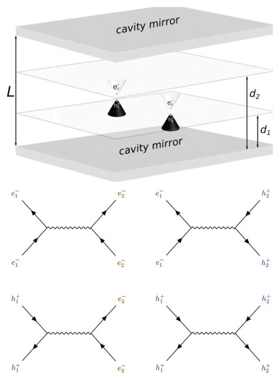
<figcaption class="paper-figure-caption"><b>Fig 1.</b> Figure 1. Schematic representation of the theoretical setup used in this work. Top: gapped Dirac-cone structure as- sociated with the honeycomb layers. Bottom: representa- tive cavity-mediated interlayer interaction channels used in the calculation. The diagrams summarize the four sectors entering the numerical construction of the two-body state— electron–electron (ee), electron–hole (eh), hole–electron (he), and hole–hole (hh)—all connected by virtual-photon exchange between the layers.</figcaption>
</figure>
<figure class="paper-figure-card">
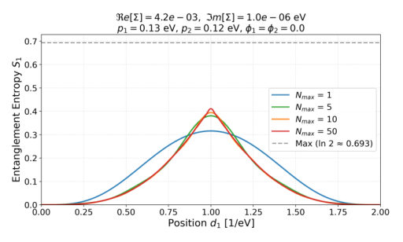
<figcaption class="paper-figure-caption"><b>Fig 2.</b> Figure 3. Entanglement entropy S1 as a function of the inter-layer distance d1 along the symmetric configuration d1+ d2 = L for fixed (Σ1, Σ2) and fixed kinematic configuration (p1, p2, ϕ1, ϕ2). Here we use Re Σ1 = Re Σ2 = 4.2 × 10−3 eV, chosen from Fig. 4 as a representative value near the entropy maximum while preserving the validity of the Born approxi- mation. All panels also use λso = 3.9 meV, corresponding to m ≃2.13 eV in the numerical convention.</figcaption>
</figure>
<figure class="paper-figure-card">
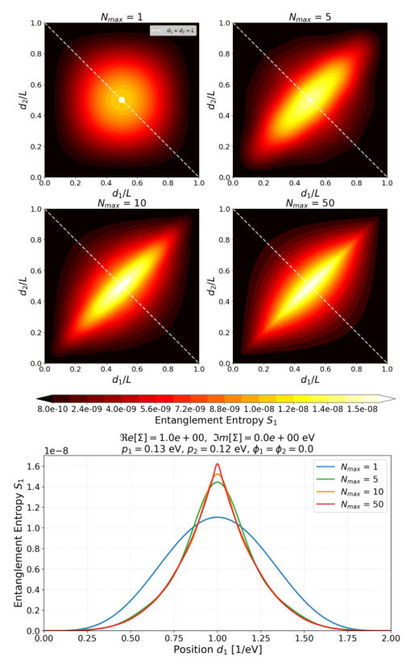
<figcaption class="paper-figure-caption"><b>Fig 3.</b> Figure 2. Top: Entanglement entropy as a function of the inter-layer distances d1 and d2 for different values of the mode cutoff Nmax. Bottom: one-dimensional cuts along the symmetric configuration d1 + d2 = L. All panels use λso = 3.9 meV, corresponding to m ≃2.13 eV in the numeri- cal convention.</figcaption>
</figure>
<figure class="paper-figure-card">
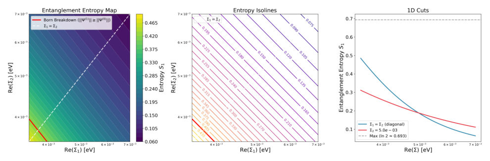
<figcaption class="paper-figure-caption"><b>Fig 4.</b> Figure 4. Entanglement entropy S1 as a function of the real parts of the self-energy parameters Σ1 and Σ2 (logarithmic axes, in eV), for fixed quasiparticle momenta p1 = 0.13 eV, p2 = 0.12 eV, collinear angles ϕ1 = ϕ2 = 0, and emitter positions d1 = 0.9, d2 = 1.1 eV−1 inside the cavity. The region to the left of it lies outside the perturbative regime. Results in that region are shown for completeness but should not be interpreted as physical predictions of the Born-level scheme. The dashed white line indicates Σ1 = Σ2. Parameters: λso = 3.9 meV (m ≃2.13 eV in natural units), Im(Σ) = 10−6 eV.</figcaption>
</figure>
<figure class="paper-figure-card">
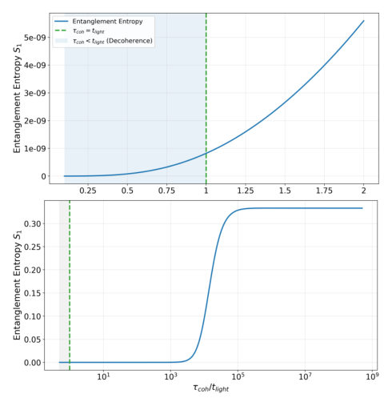
<figcaption class="paper-figure-caption"><b>Fig 5.</b> Figure 5. Entanglement entropy as a function of coherence time for Re Σ fixed. Top: a time window close to the light- flight time from one layer to the other. Bottom: values where the entanglement entropy stabilizes. Here we fix Re Σ1 = Re Σ2 = 4.2 ×10−3 eV, chosen from Fig. 4 as a representative value near the entropy maximum while preserving the validity of the Born approximation. All panels also use λso = 3.9 meV.</figcaption>
</figure>
<figure class="paper-figure-card">
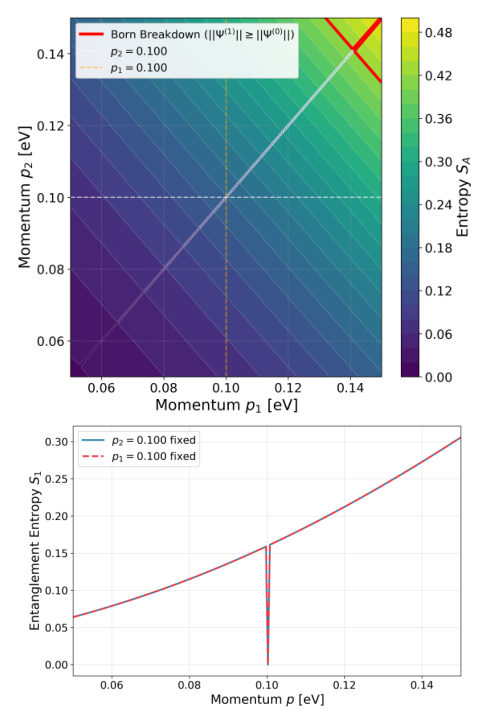
<figcaption class="paper-figure-caption"><b>Fig 6.</b> Figure 6. Entanglement entropy S1 as a function of the quasi- particle momenta p1 and p2 (in eV), for fixed collinear angles ϕ1 = ϕ2 = 0 and emitter positions d1 = 0.9, d2 = 1.1 eV−1</figcaption>
</figure>

**Main problem.** Investigating the generation and control of momentum-space pseudospin entanglement between two Dirac quasiparticles in a double-layer honeycomb lattice coupled via a microcavity.

**Main result.** The study identifies a regime where self-energy renormalization drives a crossover to strong entanglement enhancement, potentially enabling the generation of Bell-like states, provided the quasiparticle coherence time exceeds the photon propagation time.

**Method.** The authors use a (1+2)D QED framework, applying the Bethe-Salpeter equation within the ladder approximation and a Born-level treatment to calculate the first-order correction to the two-body wave function.

**Summary.** This paper explores how a microcavity can mediate entanglement between electrons in two layers of Dirac materials. By using a (1+2)D QED model, the authors show that while entanglement is low in simple perturbative regimes, accounting for self-energy effects leads to a significant boost in entanglement. They identify specific kinematic conditions and coherence requirements necessary to achieve Bell-like states. This provides a roadmap for using cavity-mediated interactions to engineer quantum information resources in 2D materials.

Detailed structure

**Model / system.** A double-layer of honeycomb lattice materials (like silicene or germanene) embedded in a planar electromagnetic microcavity, where low-energy excitations are modeled as massive Dirac fermions interacting via virtual photon exchange.

**Key observables.** Momentum-resolved von Neumann entanglement entropy (pseudospin/sublattice entanglement).

**Important parameters / regimes.** Fermi velocity, spin-orbit coupling (effective mass), interlayer distance, cavity mode structure, and the ratio of quasiparticle coherence time to photon propagation time.

**Assumptions / limitations.** The study assumes a single valley, neglects interval valley scattering, uses a phenomenological approach for self-energy dressing, and employs the ladder approximation for photon exchange.

**Figures summary.** Figure 1 shows the theoretical setup and interaction channels; Figure 2 demonstrates convergence tests for mode cutoffs; Figure 3 illustrates entanglement entropy as a function of interlayer distance showing enhancement due to self-energy.

**Paper structure.** The paper begins by defining the Dirac field and cavity photon propagator, moves to the Bethe-Salpeter framework for the two-body state, calculates the reduced density matrix, and concludes with a discussion on the regimes of entanglement enhancement and suppression.

**Why it may be interesting.** It bridges cavity QED and condensed matter by showing how vacuum-mediated interactions and self-energy effects can be engineered to create high-quality entanglement resources in solid-state systems.

Abstract

We investigate the momentum-space entanglement between two Dirac quasiparticles in a double-layer honeycomb lattice coupled via a planar electromagnetic cavity. We model the low-energy excitations as massive Dirac fermions in $(1+2)$ dimensions and derive the Bethe-Salpeter equation using the ladder approximation. We use a Born-level approximation around a free two-body quasiparticle state, where the interaction is mediated by the cavity photon propagator. From the reduced sublattice density matrix, we compute a momentum-resolved von Neumann entropy. Within the perturbatively controlled regime, the entropy remains small, while phenomenological self-energy dressing drives a crossover to strong enhancement of the entanglement entropy. Stationary entanglement is obtained only when the quasiparticle coherence time exceeds the photon propagation time between the layers. The maximum-entropy regime appears to be a viable method for achieving Bell-like states. These results demonstrate how self-energy renormalization, virtual particle exchange, and spinor geometry combine to reshape the entanglement landscape of Dirac materials.

[↑ back to top](#top)

### [Core-Hole Excitation Dynamics of One-Dimensional Ultracold Trapped Fermions](http://arxiv.org/abs/2604.23785v1)

**Authors:** André Becker, Georgios M. Koutentakis, Peter Schmelcher  
**Type:** theory · **Category:** quantum gases · **PDF:** <https://arxiv.org/pdf/2604.23785v1>  
**Analysis basis:** full PDF text, analyzed in chunks
**Topic relevance:** 🔥 `non-equilibrium dynamics` **4/5** · `Kondo & dissipative impurity` **3/5** · `analog quantum simulation` **3/5** · `entanglement & information structure` **3/5** · `Keldysh / 2PI / non-Gaussian methods` **2/5** · `non-equilibrium universality` **2/5**

↔ Scroll figures horizontally

<figure class="paper-figure-card">
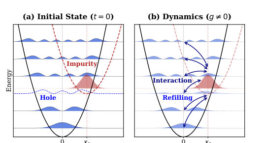
<figcaption class="paper-figure-caption"><b>Fig 1.</b> FIG. 1. Schematic representation of our setup. (a) Initial non-interacting configuration of the Fermi bath with NB = 5 particles and a hole excitation h, together with a single dis- placed impurity (NI = 1). (b) Dynamics following the inter- action quench g ̸= 0, during which the bath atoms interact with the impurity, resulting in population redistribution and a refilling of the initially empty hole state.</figcaption>
</figure>
<figure class="paper-figure-card">
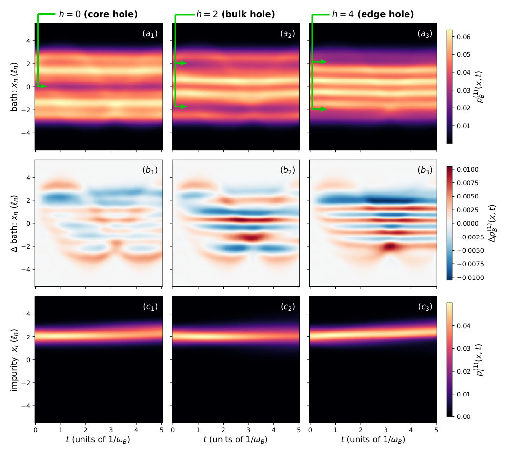
<figcaption class="paper-figure-caption"><b>Fig 2.</b> FIG. 2. Spatiotemporal evolution of the coupled bath-impurity dynamics. The top row (ai) displays the bath one-body density ρ(1) B (x; t), the middle row (bi) the associated density difference ∆ρ(1) B (x; t), and the bottom row (ci) the impurity one-body density ρ(1) I (x; t). Parameters are g = 1.0 ℏℓBωB, xs = 2ℓB, mI = 5.0mB, and ωI = 0.5ωB. From left to right, the columns correspond to the initial hole states h = 0 (i = 1, core hole), h = 2 (i = 2, bulk hole), and h = 4 (i = 3, edge hole). The green arrows indicate the density-depleted regions associated with hole initialization.</figcaption>
</figure>
<figure class="paper-figure-card">
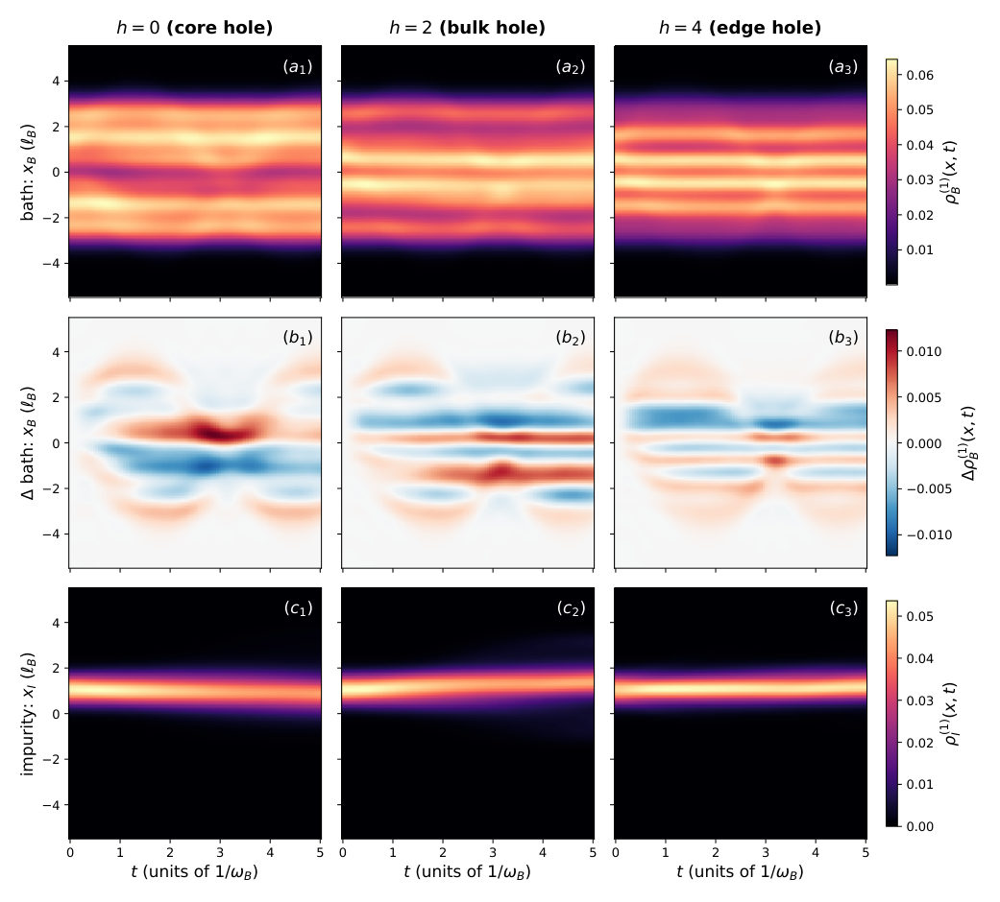
<figcaption class="paper-figure-caption"><b>Fig 3.</b> FIG. 3. Spatiotemporal evolution of the coupled bath-impurity dynamics. The top row (ai) displays the bath one-body density ρ(1) B (x; t), the middle row (bi) the associated density difference ∆ρ(1) B (x; t), and the bottom row (ci) the impurity one-body density ρ(1) I (x; t). Parameters are g = 1.0 ℏℓBωB, xs = 1ℓB, mI = 5.0mB, and ωI = 0.5ωB. From left to right, the columns correspond to the initial hole states h = 0 (i = 1, core hole), h = 2 (i = 2, bulk hole), and h = 4 (i = 3, edge hole).</figcaption>
</figure>
<figure class="paper-figure-card">
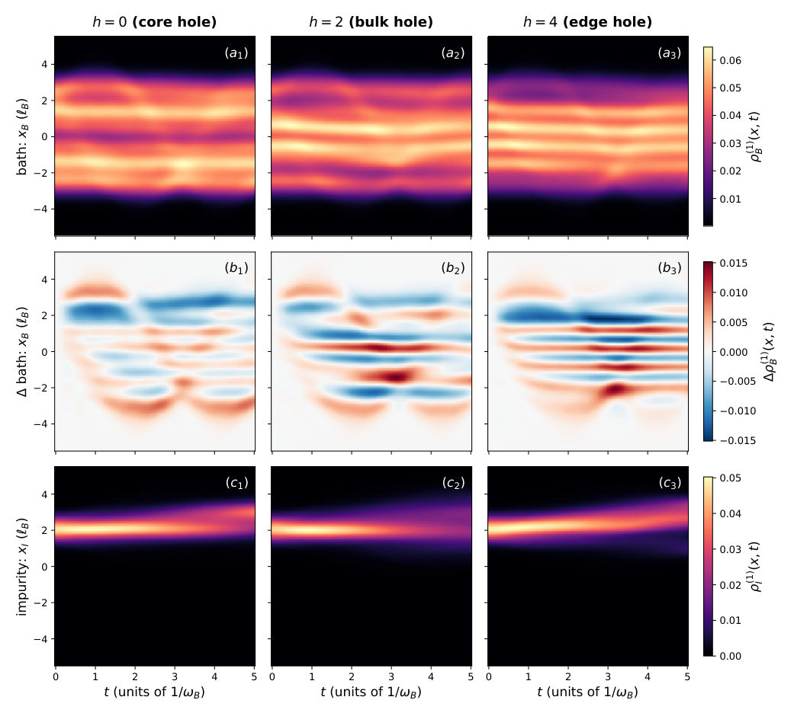
<figcaption class="paper-figure-caption"><b>Fig 4.</b> FIG. 4. Spatiotemporal evolution of the coupled bath-impurity dynamics. The top row (ai) displays the bath one-body density ρ(1) B (x; t), the middle row (bi) the associated density difference ∆ρ(1) B (x; t), and the bottom row (ci) the impurity one-body density ρ(1) I (x; t). Parameters are g = 2.0 ℏℓBωB, xs = 2ℓB, mI = 5.0mB, and ωI = 0.5ωB. From left to right, the columns correspond to the initial hole states h = 0 (i = 1, core hole), h = 2 (i = 2, bulk hole), and h = 4 (i = 3, edge hole).</figcaption>
</figure>
<figure class="paper-figure-card">
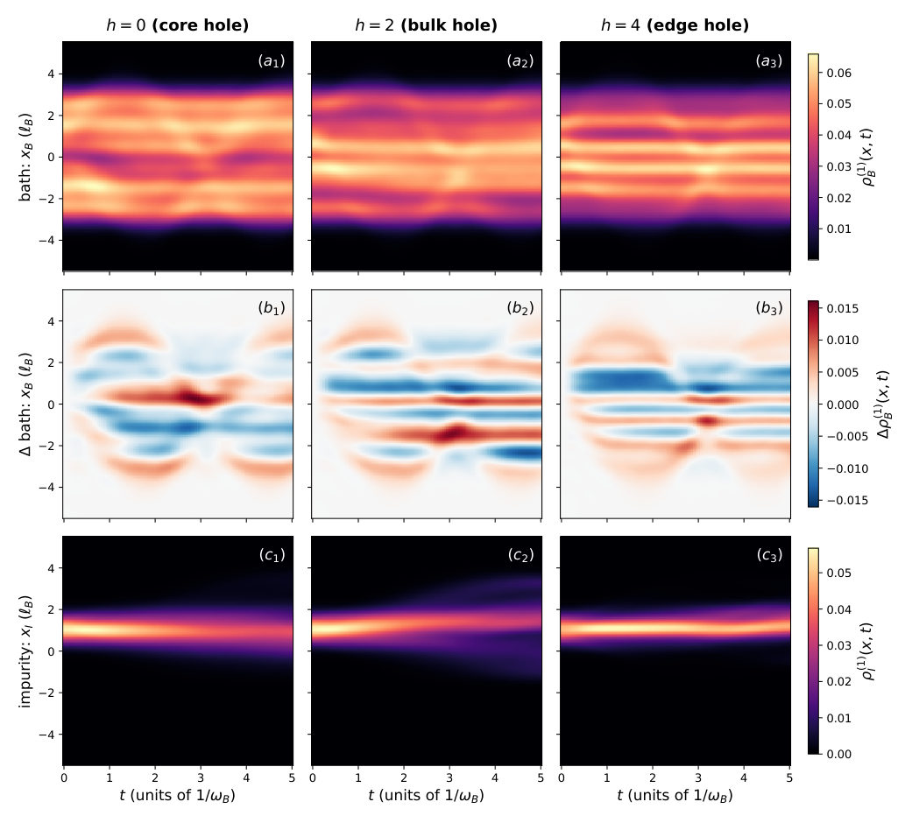
<figcaption class="paper-figure-caption"><b>Fig 5.</b> FIG. 5. Spatiotemporal evolution of the coupled bath-impurity dynamics. The top row (ai) displays the bath one-body density ρ(1) B (x; t), the middle row (bi) the associated density difference ∆ρ(1) B (x; t), and the bottom row (ci) the impurity one-body density ρ(1) I (x; t). Parameters are g = 2.0 ℏℓBωB, xs = 1ℓB, mI = 5.0mB, and ωI = 0.5ωB. From left to right, the columns correspond to the initial hole states h = 0 (i = 1, core hole), h = 2 (i = 2, bulk hole), and h = 4 (i = 3, edge hole).</figcaption>
</figure>
<figure class="paper-figure-card">
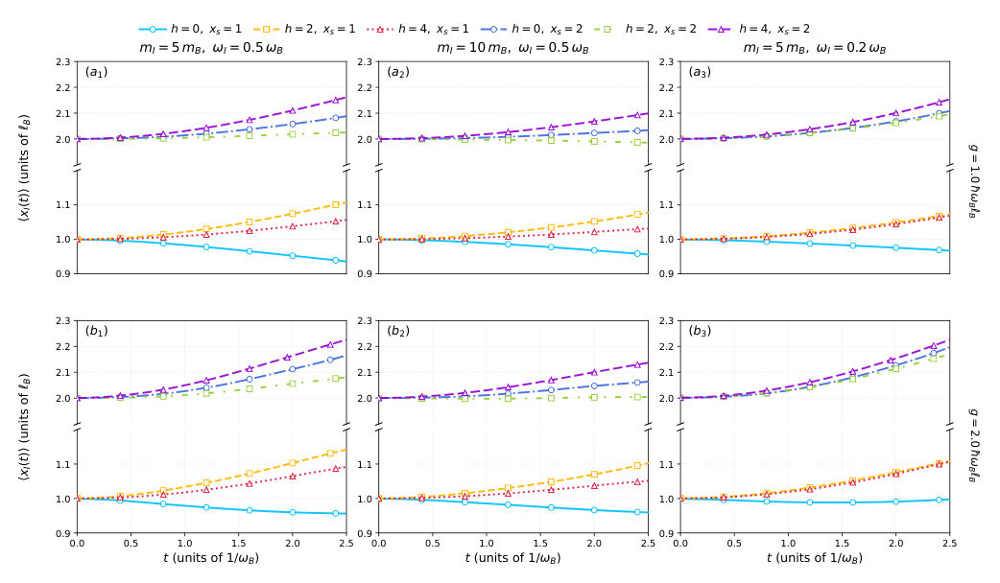
<figcaption class="paper-figure-caption"><b>Fig 6.</b> FIG. 6. Impurity center-of-mass motion ⟨xI(t)⟩for the three hole initial states h = 0, 2, 4. The upper (ai) and lower (bi) rows correspond to g = 1.0ℏωBℓB and g = 2.0ℏωBℓB, respectively. The broken-axis representation enables a comparison of the trajectories for xs = 1ℓB and xs = 2ℓB. The index i = 1 labels the reference setup with mI = 5.0mB and ωI = 0.5ωB, while i = 2 and i = 3 correspond to the heavier-impurity case mI = 10mB and the weaker-trap case ωI = 0.2ωB, respectively.</figcaption>
</figure>
<figure class="paper-figure-card">
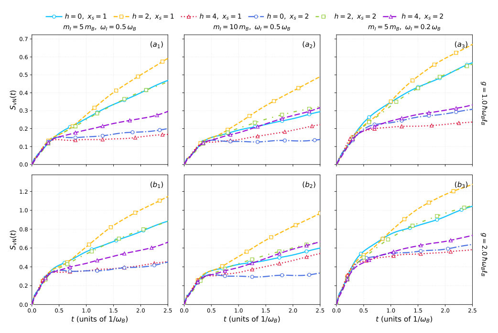
<figcaption class="paper-figure-caption"><b>Fig 7.</b> FIG. 7. Time evolution of the impurity-bath von Neumann entropy SvN(t) for the three hole initial states h = 0, 2, 4. The upper (ai) and lower (bi) rows correspond to g = 1.0ℏωBℓB and g = 2.0ℏωBℓB, respectively. Both values of shift xs = 1ℓB and xs = 2ℓB are provided. The index i = 1 labels the reference setup with mI = 5.0mB and ωI = 0.5ωB, while i = 2 and i = 3 correspond to the heavier-impurity case mI = 10mB and the weaker-trap case ωI = 0.2ωB, respectively.</figcaption>
</figure>
<figure class="paper-figure-card">
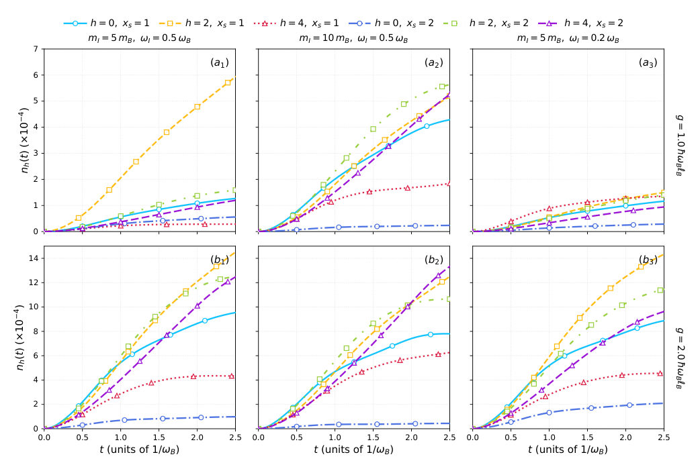
<figcaption class="paper-figure-caption"><b>Fig 8.</b> FIG. 8. Time evolution of the hole-state occupation nh(t) for the three hole initial states h = 0, 2, 4. The upper (ai) and lower (bi) rows correspond to g = 1.0ℏωBℓB and g = 2.0ℏωBℓB, respectively. Both shift values xs = 1ℓB and xs = 2ℓB are provided. The index i = 1 labels the reference setup with mI = 5.0mB and ωI = 0.5ωB, while i = 2 and i = 3 correspond to the heavier-impurity case mI = 10mB and the weaker-trap case ωI = 0.2ωB, respectively.</figcaption>
</figure>
<figure class="paper-figure-card">
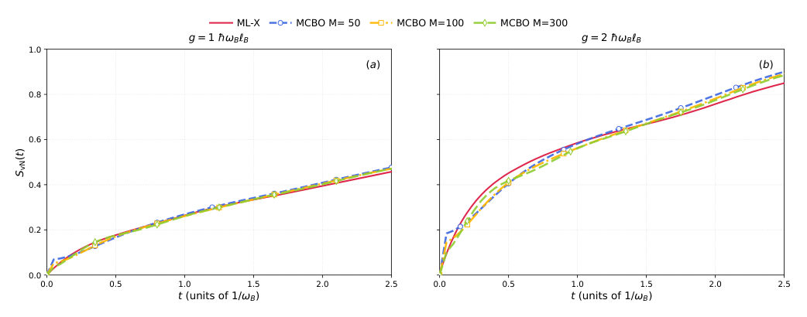
<figcaption class="paper-figure-caption"><b>Fig 9.</b> FIG. 9. Time evolution of the impurity-bath von Neumann entropy SvN(t) for the core-hole initial state with h = 0. The left panel, (a), corresponds to the intermediate interaction strength g = 1.0 ℏωBℓB, while the right panel, (b), shows the stronger interaction case g = 2.0 ℏωBℓB. In each panel, the ML-X result is compared to MCBO calculations with different numbers of PECs.</figcaption>
</figure>

**Main problem.** Investigating the non-equilibrium, real-time dynamics of core-hole excitations in a one-dimensional fermionic system following an interaction quench.

**Main result.** Deep core holes are found to be significantly more robust against refilling than bulk or edge vacancies, with the dynamics governed by a competition between impurity-bath mixing and demixing.

**Method.** The study uses two ab initio approaches: the Multi-Layer Multi-Configuration Time-Dependent Hartree (ML-X) method and a multi-channel Born-Oppenheimer (MCBO) framework.

**Summary.** This paper studies how a vacancy (hole) in a 1D Fermi sea behaves when a heavy impurity is suddenly introduced via an interaction quench. The researchers found that holes located at the center of the trap (core holes) are much more stable and resistant to being refilled by other particles than holes at the edges. The study also shows how the impurity's mass and the strength of the interaction drive the buildup of many-body entanglement and the mixing or demixing of the species.

Detailed structure

**Model / system.** A 1D system consisting of a spin-polarized Fermi bath and a single heavy mobile impurity in harmonic traps, interacting via a delta-function contact potential.

**Key observables.** One-body densities, impurity center-of-mass motion, von Neumann entropy, and orbital occupation dynamics (hole refilling).

**Important parameters / regimes.** Interaction strength (g), mass imbalance (m_I/m_B), impurity confinement (omega_I), and initial hole position (core, bulk, or edge).

**Assumptions / limitations.** The interaction is modeled as a delta-function contact potential, and intraspecies interaction in the bath is excluded due to the Pauli principle.

**Figures summary.** Figure 1 shows the experimental setup and initial/dynamic states; Figure 6 displays impurity center-of-mass trajectories; Figure 7 shows von Neumann entropy evolution; Figure 9 demonstrates the convergence of the MCBO method.

**Paper structure.** The paper introduces the core-hole problem, presents the ML-X and MCBO theoretical frameworks, analyzes the post-quench density and motion dynamics, explores entanglement growth, and concludes with a convergence study of the numerical methods.

**Why it may be interesting.** It provides a controlled theoretical route to probe orthogonality response, correlation buildup, and real-time hole refilling in many-body systems, which is highly relevant for experiments in quantum gas microscopes.

Abstract

We investigate the nonequilibrium dynamics of core-hole excitations in a one-dimensional fermionic few-body system consisting of a spin-polarized Fermi bath coupled to a single heavy mobile impurity. The bath is initially prepared in a particle-hole configuration by emptying a selected bath single-particle orbital, while the impurity is displaced with respect to the center of the bath confinement potential. The quench dynamics are initialized by suddenly switching on the impurity-bath interaction. To resolve the resulting dynamics, we combine two complementary \textit{ab initio} approaches, namely the Multi-Layer Multi-Configuration Time-Dependent Hartree method for mixtures and a multi-channel Born-Oppenheimer framework. We show that the postquench response is governed by the interaction strength, impurity confinement, mass imbalance, and the location of the initially prepared hole within the Fermi sea. The density evolution and impurity center-of-mass motion reveal a competition between mixing and demixing of impurity and bath, while the von Neumann entropy demonstrates the buildup of pronounced many-body correlations. Most importantly, the occupation dynamics of the initially emptied orbital identifies deep core holes as substantially more robust against refilling than bulk or edge vacancies. Our results establish core-hole excitations as robust dynamical many-body features in trapped ultracold fermions and provide a controlled route towards probing orthogonality response, correlation buildup, and hole refilling in real time.

[↑ back to top](#top)

### [Quantum criticality from spectral collapse in the two-photon Rabi model](http://arxiv.org/abs/2604.23164v1)

**Authors:** Jiong Li, Jun-ling Wang, Qing-Hu Chen, Hai-Qing Lin  
**Type:** theory · **Category:** other · **PDF:** <https://arxiv.org/pdf/2604.23164v1>  
**Analysis basis:** full PDF text, analyzed in chunks
**Topic relevance:** 🔥 `non-equilibrium universality` **4/5** · `Tavis-Cummings & cavity-many-emitter` **3/5** · `non-equilibrium dynamics` **3/5** · `analog quantum simulation` **2/5** · `correlated cavity matter` **2/5** · `entanglement & information structure` **2/5**

↔ Scroll figures horizontally

<figure class="paper-figure-card">
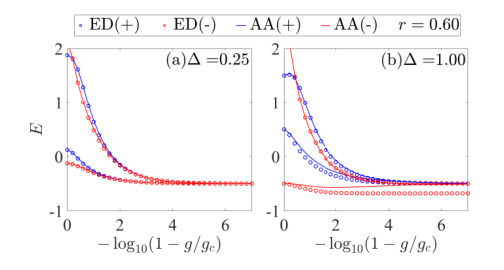
<figcaption class="paper-figure-caption"><b>Fig 1.</b> FIG. 1. Energy spectra in the q = 1/4 subspace at r = 0.60 for (a) ∆= ∆c = 0.25 and (b) ∆= 1.0 (right). The horizon- tal axis is x = −log10(1 −g/gc). Open circles denote exact diagonalization results, and solid lines the adiabatic approxi- mation. Blue and red indicate states with positive and nega- tive parity, respectively.</figcaption>
</figure>
<figure class="paper-figure-card">
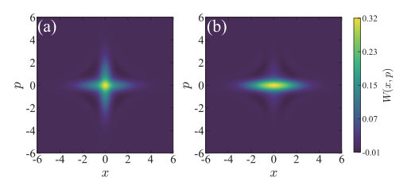
<figcaption class="paper-figure-caption"><b>Fig 2.</b> FIG. 3. Wigner phase-space distributions W (x, p) of the ground state at r = 0.25, ∆= ∆c and g = 0.95gc. (a) The reduced W (x,p) obtained by tracing over the qubit. (b) W (x,p) conditioned on the qubit being in its lower state. Re- sults are computed with QuTiP [47].</figcaption>
</figure>
<figure class="paper-figure-card">
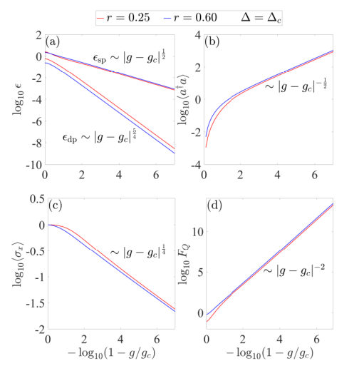
<figcaption class="paper-figure-caption"><b>Fig 3.</b> FIG. 2. Log-log scaling of (a) the energy gap ǫsp and ǫdp, (b) photon number ⟨a†a⟩, (c) atomic polarization ⟨σx⟩, and (d) the quantum Fisher information FQ at ∆= ∆c for r = 0.25 (red) and r = 0.60 (blue). The corresponding scaling exponents for each observable are indicated.</figcaption>
</figure>
<figure class="paper-figure-card">
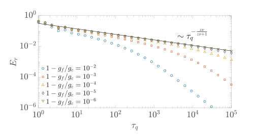
<figcaption class="paper-figure-caption"><b>Fig 4.</b> FIG. 4. Residual energy Er as a function of the quench time τq, obtained from nearly adiabatic dynamics for final cou- plings ranging from gf = 0.99gc to gf = (1−10−6)gc (bottom to top) at ∆= ∆c and r = 0.25. For gf = (1 −10−6)gc, the dynamics closely follow the universal Kibble-Zurek scal- ing (solid black line).</figcaption>
</figure>

**Main problem.** Determining whether the 'spectral collapse' in the two-photon quantum Rabi model (tpQRM) constitutes a genuine continuous quantum phase transition and identifying the energy scale that governs its criticality.

**Main result.** The authors show that spectral collapse in the anisotropic tpQRM is a genuine continuous quantum phase transition governed by a single soft-mode energy gap within the same parity, placing it in the same universality class as the standard QRM.

**Method.** The study employs the Adiabatic Approximation (AA), exact diagonalization, and perturbation theory, alongside the Kibble-Zurek mechanism to analyze nonequilibrium dynamics.

**Summary.** This paper resolves the long-standing debate regarding whether spectral collapse in the two-photon Rabi model represents a true quantum phase transition. By identifying a specific 'soft-mode' gap within the same parity sector, the authors demonstrate that the system follows universal scaling laws similar to the standard Rabi model. The study extends these findings to nonequilibrium regimes, showing that the Kibble-Zurek mechanism accurately describes the system's dynamics during a parameter quench. This establishes spectral collapse as a viable way to realize and study quantum criticality in few-body systems.

Detailed structure

**Model / system.** An anisotropic two-photon quantum Rabi model (tpQRM) consisting of a two-level system (qubit) coupled to a single quantized bosonic mode with $Z_4$ symmetry.

**Key observables.** Atomic polarization, photon number, Quantum Fisher Information (QFI), quadrature fluctuations, and residual energy following a quench.

**Important parameters / regimes.** Coupling strength (g), critical coupling (gc), anisotropy parameter (r), qubit frequency (delta), and quench time (tau_q).

**Assumptions / limitations.** The Adiabatic Approximation is assumed to be asymptotically exact near the critical line; the system is initially prepared in the ground state for quench dynamics.

**Figures summary.** Figure 3 shows Wigner phase-space distributions of the ground state, including squeezed states; Figure 4 illustrates the universal Kibble-Zurek scaling of residual energy as a function of quench time.

**Paper structure.** The paper first defines the model and the problem of spectral collapse, then uses the Adiabatic Approximation to identify the soft-mode energy scale, followed by an analysis of equilibrium observables and universality, and concludes with an investigation of nonequilibrium dynamics via the Kibble-Zurek mechanism.

**Why it may be interesting.** It provides a theoretical bridge between few-body spectral collapse and many-body quantum criticality, offering an experimentally accessible platform for studying universal scaling and quantum phase transitions without needing the thermodynamic limit.

Abstract

Spectral collapse in the two-photon quantum Rabi model (tpQRM) has long been regarded as incompatible with quantum criticality due to the absence of a vanishing excitation gap. We show that, in the anisotropic tpQRM, spectral collapse constitutes a genuine continuous quantum phase transition governed by a single soft mode. The excitation gap within the same parity closes as $ε_{sp} \sim |g - g_c|^{zν}$ with $zν= 1/2$, placing the system in the same universality class as the standard QRM, while the gap between different parities reflects symmetry-induced level splitting rather than a critical excitation. This soft mode defines a unique energy scale that controls both equilibrium and nonequilibrium properties, including macroscopic observables, quantum Fisher information, and Kibble-Zurek dynamics. These results establish spectral collapse as an experimentally accessible realization of quantum criticality in a few-body system and demonstrate that universality is fully determined by the soft-mode structure rather than by microscopic details.

[↑ back to top](#top)

### [Coherence dynamics in quantum many-body systems with conservation laws](http://arxiv.org/abs/2604.23192v1)

**Authors:** Sreemayee Aditya, Emanuele Tirrito, Piotr Sierant, Xhek Turkeshi  
**Type:** theory · **Category:** statistical mechanics · **PDF:** <https://arxiv.org/pdf/2604.23192v1>  
**Analysis basis:** full PDF text, analyzed in chunks
**Topic relevance:** 🔥 `entanglement & information structure` **4/5** · 🔥 `non-equilibrium dynamics` **4/5** · `non-equilibrium universality` **3/5** · `scars & prethermalization` **3/5**

↔ Scroll figures horizontally

<figure class="paper-figure-card">
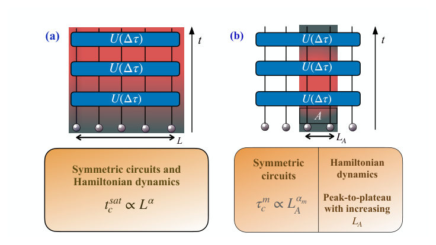
<figcaption class="paper-figure-caption"><b>Fig 1.</b> FIG. 1. Global and local spreading of quantum coherence. A product incoherent state on L qubits is evolved by a brick-wall circuit of gates U(∆τ), realizing U(1)-symmetric or charge-and-dipole conserving random dynamics, or under the mixed-field Ising Hamiltonian. Red shading marks the region over which the global/ local resource is maximum, while the gray region indicates minimal coherence resource. (a) Global dynamics: Sd saturates on the full chain at a time t sat c ∝Lα. (b) Local dynamics on a subsystem A of size LA: for symmetric circuits Cd(A, t) peaks at τ m c ∝Lαm A before relaxing to a free state, while there exists a peak-to-plateau crossover with LA in Hamiltonian evolution.</figcaption>
</figure>
<figure class="paper-figure-card">
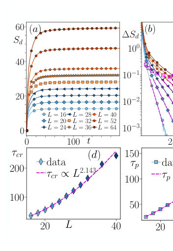
<figcaption class="paper-figure-caption"><b>Fig 2.</b> FIG. 2. Global Sd dynamics of a spin- 1</figcaption>
</figure>
<figure class="paper-figure-card">
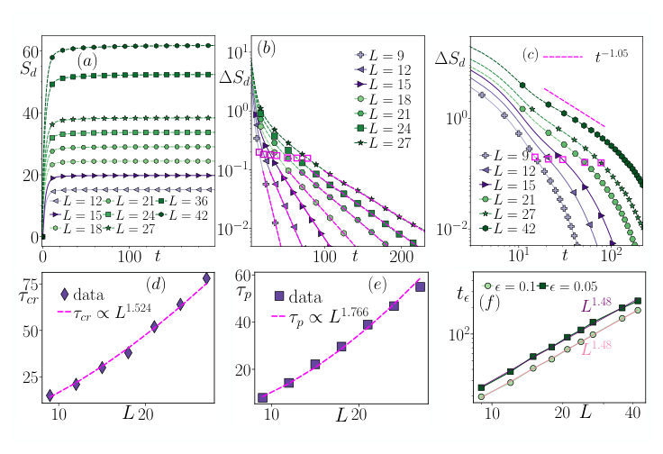
<figcaption class="paper-figure-caption"><b>Fig 3.</b> FIG. 3. Global Sd dynamics of a spin-1, U(1)-conserving circuit with L sites: (a) Sd grows rapidly and saturates to the value set by the U(1) symmetry. (b) At late times, ∆Sd exhibits exponential decay, ∆Sd = Ape−t/τp, with τp ∝L1.766</figcaption>
</figure>
<figure class="paper-figure-card">
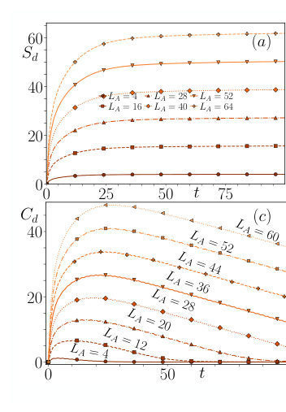
<figcaption class="paper-figure-caption"><b>Fig 4.</b> FIG. 4. Local coherence dynamics in a U(1)-conserving spin- 1</figcaption>
</figure>
<figure class="paper-figure-card">
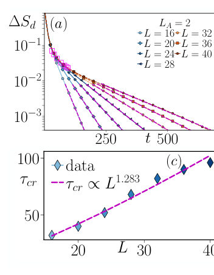
<figcaption class="paper-figure-caption"><b>Fig 5.</b> FIG. 5. Local ∆Sd decay in a U(1)-conserving spin- 1</figcaption>
</figure>
<figure class="paper-figure-card">
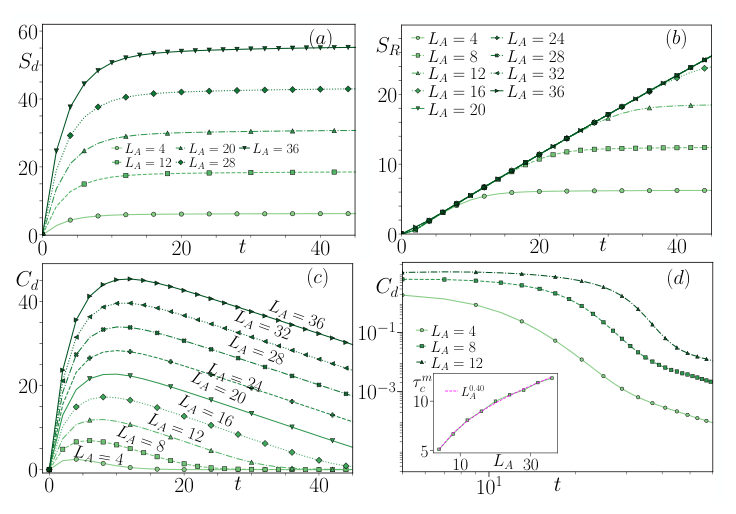
<figcaption class="paper-figure-caption"><b>Fig 6.</b> FIG. 6. Local coherence dynamics in a U(1)-conserving spin-1 circuit with L sites (RTN): (a–c) Dynamics of local Sd, SR, and Cd for different subsystem sizes LA at L = 72. (d) The intermediate-time decay of Cd exhibits power-law tails along with the time scale at which Cd attains its maximum scales as a power law with subsystem size, τ m c ∝Lαm A , with αm ≃0.40 (see inset). Results correspond to a period-3 spin-1 N´eel initial state; RTN simulations are performed with bond dimension χ = 640.</figcaption>
</figure>
<figure class="paper-figure-card">
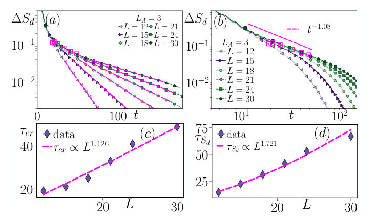
<figcaption class="paper-figure-caption"><b>Fig 7.</b> FIG. 7. Local ∆Sd decay in a U(1)-conserving spin-1 circuit with L sites for a subsystem of size LA: (a-b) The local ∆Sd similar to the spin-1/2 case exhibits a dynamical crossover from intermediate-time power-law decay, ∼t−βSd with βSd ≃1.08, to late-time exponential decay, ∼ASde−t/τSd . The crossover regime is highlighted by magenta squares. (c) τcr exhibits power-law scaling with L with exponent 1.126. (d) The late-time exponential decay-time scale grows, τSd ∝L1.721. Results are obtained for a period-3 N´eel initial state. Data for L = 12–15 are computed using exact state-vector simulations averaged over at least 4000 circuit realizations, while results for L ≥21 are obtained using RTN...</figcaption>
</figure>
<figure class="paper-figure-card">
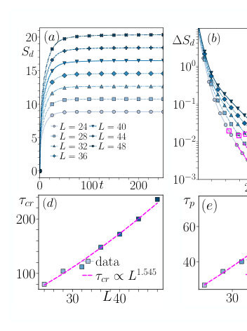
<figcaption class="paper-figure-caption"><b>Fig 8.</b> FIG. 8. Global Sd dynamics in a spin- 1</figcaption>
</figure>
<figure class="paper-figure-card">
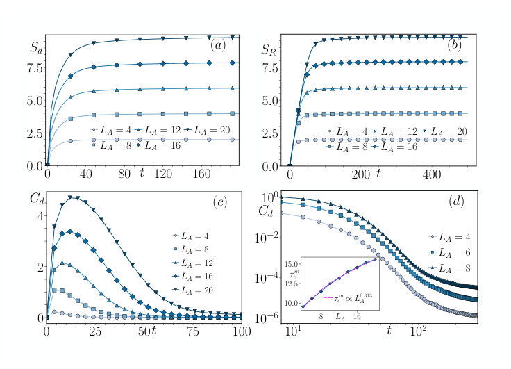
<figcaption class="paper-figure-caption"><b>Fig 9.</b> FIG. 9. Local coherence dynamics in the spin-1/2 charge- and dipole-conserving circuit with L sites. (a–c) Dynamics of the local Sd, SR, and Cd for different subsystem sizes LA at L = 48. (d) The peak time of Cd scales as τ m c ∝Lαm A with αm ≃0.313. Results use the same initial state as in Fig. 8 and are obtained from exact state-vector simulations averaged over at least 104 circuit realizations.</figcaption>
</figure>
<figure class="paper-figure-card">
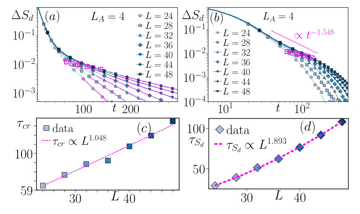
<figcaption class="paper-figure-caption"><b>Fig 10.</b> FIG. 10. Local ∆Sd decay in charge- and dipole-conserving circuits with L sites and subsystem size LA. (a,b) The relaxation exhibits an intermediate power-law regime ∆Sd(t) ∼t−βSd with βSd ≃1.548, crossing over to a late-time exponential decay ASd e−t/τSd with τSd ∝L1.893 (panel d). In panels (a,b), magenta squares mark the crossover between the two regimes; the crossover time scales as τcr ∝L1.048 (panel c). Results use the same initial state as in Fig. 8 and are obtained from exact state-vector simulations averaged over at least 104 circuit realizations for L = 24 −48 and LA = 4.</figcaption>
</figure>

**Main problem.** Investigating how conservation laws (symmetries) shape the spreading of quantum coherence and the relaxation dynamics in many-body systems.

**Main result.** Conservation laws replace the logarithmic saturation of unconstrained circuits with slow hydrodynamic relaxation, where global coherence decays via power-law and late-time exponential regimes, and local coherence exhibits a characteristic rise-peak-fall structure.

**Method.** The study combines exact state-vector evolution, Matrix Product State (MPS) simulations, and Replica Tensor Network (RTQ) methods with analytical approaches like Haar averaging and mapping to stochastic models (SSEP).

**Summary.** This paper explores how conservation laws, such as charge and dipole moments, fundamentally alter the way quantum coherence spreads in many-body systems. Unlike unconstrained random circuits that saturate logarithmically, symmetric systems exhibit slow, power-law hydrodynamic relaxation. The authors demonstrate that local coherence follows a distinct rise-peak-fall pattern, and they provide a unified analytical framework to calculate the asymptotic saturation values of entanglement and purity in these symmetry-constrained sectors.

Detailed structure

**Model / system.** The paper analyzes U(1)-symmetric random circuits (spin-1/2 and spin-1), charge-and-dipole-conserving (fractonic) circuits, and ergodic Hamiltonian dynamics via the mixed-field Ising model.

**Key observables.** Global participation entropy (S2), local relative entropy of coherence (Cd), Renyi-2 entanglement entropy (SR), and subsystem purity.

**Important parameters / regimes.** System size (L), subsystem size (LA), conservation laws (U(1) charge and dipole), and the distinction between Z-basis and tilted initial states.

**Assumptions / limitations.** The analysis assumes open boundary conditions and that the dynamics are restricted to specific symmetry sectors or Krylov fragments.

**Figures summary.** Figure 1 illustrates global and local coherence spreading, showing the saturation of global entropy and the rise-peak-fall profile of local coherence. Figure 4 shows the dynamics of Sd, SR, and Cd for spin-1/2 chains. Figure 14 depicts the tensor-network construction for computing diagonal purity.

**Paper structure.** The paper introduces the problem of coherence spreading under symmetries, presents numerical results for U(1) and fractonic circuits, provides analytical derivations for Haar-averaged saturation values, and concludes with a stochastic mapping to explain the relaxation mechanisms.

**Why it may be interesting.** It provides a deep link between quantum resource dynamics (coherence) and many-body transport/hydrodynamics, showing how symmetries act as a bottleneck for thermalization.

Abstract

We study how conservation laws shape the spreading of quantum coherence in many-body dynamics. Focusing on $U(1)$-symmetric random circuits, charge-and-dipole conserving circuits, as well as ergodic Hamiltonian dynamics, we probe coherences both globally, via the participation entropy, and locally, via the relative entropy of coherence. Combining exact vector evolution, matrix product state simulations, and replica tensor networks methods, we find that conservation laws replace the logarithmic saturation of unconstrained circuits with slow hydrodynamic relaxation of the global coherence measures. Locally, symmetry-constrained circuits show a clean rise-peak-fall structure whose peak time grows algebraically with subsystem size. In contrast, ergodic Hamiltonians broaden the peak into an extended plateau at larger subsystems, highlighting a qualitatively distinct mechanism. Coherence thus emerges as a sensitive probe of symmetry-constrained thermalization, linking quantum resource dynamics to many-body transport.

[↑ back to top](#top)

### [Natural-orbital locking reveals hidden steady-state skin order in Gaussian open fermion chains](http://arxiv.org/abs/2604.24121v1)

**Authors:** Y. T. Wang, X. Z. Zhang  
**Type:** theory · **Category:** statistical mechanics · **PDF:** <https://arxiv.org/pdf/2604.24121v1>  
**Analysis basis:** full PDF text, analyzed in chunks
**Topic relevance:** 🔥 `methods for driven-dissipative` **4/5** · `driven-dissipative phase transition` **3/5** · `non-equilibrium dynamics` **3/5** · `correlated / nonlocal dissipation` **2/5** · `entanglement & information structure` **2/5**

↔ Scroll figures horizontally

<figure class="paper-figure-card">
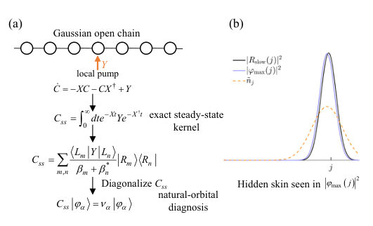
<figcaption class="paper-figure-caption"><b>Fig 1.</b> FIG. 1. Conceptual definition of hidden steady-state skin or- der. A finite Gaussian open chain is driven by a local pump Y = Γ |s⟩⟨s| and relaxes under a non-Hermitian matrix X. The exact steady-state kernel can be written as the integral in Eq. (10) or as the biorthogonal expansion in Eq. (13). Diagonalizing Css produces natural orbitals. The schematic comparison on the right illustrates the diagnostic used be- low. The Euclidean-normalized slow right mode | bRslow(j)|2</figcaption>
</figure>
<figure class="paper-figure-card">
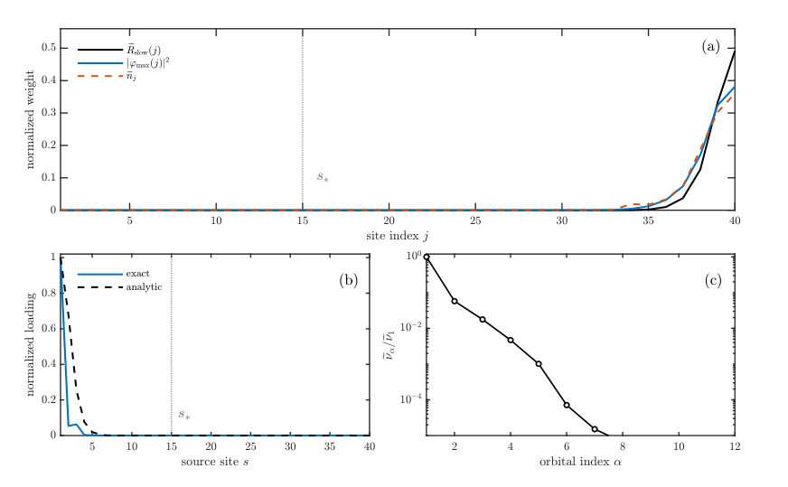
<figcaption class="paper-figure-caption"><b>Fig 2.</b> FIG. 2. Hatano–Nelson chain and validation of the source-selection law. The relaxation matrix is Eq. (21), and all panels use N = 40, tR = 1, tL = 0.17, κ = 0.91, Γ = 0.03, s∗= 15. (a) Euclidean-normalized slow right-mode profile | bRslow(j)|2, dominant natural-orbital profile |φmax(j)|2, and normalized density ˜nj for a pump at s∗= 15. The natural orbital tracks the selected right mode directly, while the density is the diagonal contraction of the same steady-state mixture. (b) Source-position scan comparing the normalized exact loading νmax(s)/ maxs′ νmax(s′) with the normalized analytic prediction A1(s)/ maxs′ A1(s′). The source dependence is fixed by the left-mode weight |L1(s)|2. (c)...</figcaption>
</figure>
<figure class="paper-figure-card">
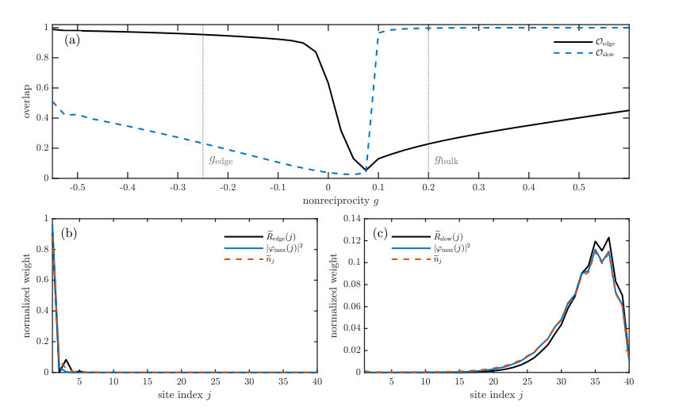
<figcaption class="paper-figure-caption"><b>Fig 3.</b> FIG. 3. Nonreciprocal SSH chain and crossover between edge locking and bulk-skin locking. The target matrix is Eq. (27), the common parameters are N = 20, t1 = 0.50, t2 = 1.00, κ = 1.50, Γ = 10−8, (m, A) = (1, A), and the overlaps are defined in Eq. (28). (a) Crossover of Oedge and Oslow as a function of nonreciprocity g. The dotted lines mark gedge = −0.25 and gbulk = 0.20. (b) At gedge, the dominant natural orbital tracks the Euclidean-normalized edge candidate | bRedge(j)|2. (c) At gbulk, it tracks the Euclidean-normalized slow bulk-skin mode | bRslow(j)|2. In both panels the normalized density ˜nj is shown for comparison. Panels (b) and (c) use different vertical scales.</figcaption>
</figure>

**Main problem.** Identifying a direct steady-state observable to detect hidden nonreciprocal skin order in Lindbladian systems and determining if natural orbitals provide a sharper diagnostic than local density profiles.

**Main result.** The authors demonstrate 'natural-orbital locking,' where the dominant natural orbital of the correlation matrix locks to the slow right eigenmode, providing a mode-resolved diagnostic of skin order and revealing a crossover between topological edge-locking and bulk-skin-locking.

**Method.** The study uses an exact steady-state theory for Gaussian fermion chains based on a biorthogonal decomposition of the steady-state correlator into left and right eigenmodes of the relaxation matrix.

**Summary.** The paper investigates how nonreciprocal skin effects manifest in the steady state of open fermion chains. It introduces 'natural-orbital locking' as a superior diagnostic compared to traditional density profiles for identifying hidden skin order. By analyzing the biorthogonal decomposition of the correlation matrix, the authors show that the dominant natural orbital tracks the slow right eigenmode of the relaxation matrix. They demonstrate this effect in both Hatano-Nelson and SSH models, specifically identifying a crossover between topological edge-state and bulk-skin-state localization.

Detailed structure

**Model / system.** Number-conserving Gaussian open fermion chains, specifically including nonreciprocal Hatano-Nelson and nonreciprocal SSH models, governed by quadratic Lindbladian dynamics.

**Key observables.** Dominant natural orbital (phi_max), local density profile, source-loading factor, and overlaps with edge and slow bulk-skin modes.

**Important parameters / regimes.** Nonreciprocity parameter (g), damping/loss strength (kappa), pump strength (gamma), and the single-slow-mode regime.

**Assumptions / limitations.** The dynamics are assumed to be quadratic and number-conserving; certain local decompositions require specific positivity conditions on the loss and pump matrices.

**Figures summary.** Figure 1 shows the conceptual comparison between density and natural orbitals; Figure 2 validates the selection law in Hatano-Nelson chains; Figure 3 illustrates the crossover between edge and bulk-skin locking in SSH chains.

**Paper structure.** The paper introduces the problem of hidden skin order, develops an exact steady-state theory via biorthogonal decomposition, applies the theory to the Hatano-Nelson model to validate the selection law, and then explores the crossover regime in nonreciprocal SSH chains.

**Why it may be interesting.** This paper is highly relevant for researchers in open quantum systems and many-body dynamics as it provides a new, sharper diagnostic tool (natural-orbital locking) for characterizing non-Hermitian skin effects in dissipative many-body systems.

Abstract

Nonreciprocal relaxation matrices can have skin-localized right eigenmodes, but their imprint on a mixed steady state is not fixed by the density profile alone. We develop an exact steady-state theory for number-conserving Gaussian fermion chains and show that the dominant natural orbital of the correlation matrix provides a mode-resolved diagnostic of hidden skin order. The steady-state correlator admits a biorthogonal decomposition in terms of the left and right eigenmodes of the relaxation matrix $X$ and the source matrix $Y$. This formula separates three ingredients: slow rapidity denominators, source loading by left eigenmodes, and real-space geometry from right eigenmodes. For a local pump, the pump position is read by the left modes, whereas the selected profile is drawn by the right modes. In a single-slow-mode regime, the dominant natural orbital locks to the Euclidean-normalized slow right mode. The density can follow the same boundary trend, but it is a less selective incoherent sum over occupied natural orbitals. We verify this selection law in a nonreciprocal Hatano--Nelson chain and show that, in a nonreciprocal SSH chain, the selected natural orbital crosses over from a topological edge candidate to a slow bulk-skin candidate. These results identify natural-orbital locking as a steady-state diagnostic of nonreciprocal localization in Gaussian open fermion chains.

[↑ back to top](#top)

### [Dynamical Fluctuation-Response Relations](http://arxiv.org/abs/2604.24626v1)

**Authors:** Timur Aslyamov, Massimiliano Esposito  
**Type:** theory · **Category:** statistical mechanics · **PDF:** <https://arxiv.org/pdf/2604.24626v1>  
**Analysis basis:** full PDF text, analyzed in chunks
**Topic relevance:** 🔥 `non-equilibrium dynamics` **4/5** · `methods for driven-dissipative` **3/5** · `Keldysh / 2PI / non-Gaussian methods` **2/5** · `driven-dissipative phase transition` **2/5** · `non-equilibrium universality` **2/5**

↔ Scroll figures horizontally

<figure class="paper-figure-card">
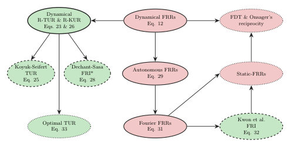
<figcaption class="paper-figure-caption"><b>Fig 1.</b> FIG. 1. Hierarchy of the main results that follow from the dynam- ical FRRs. Red nodes denote exact identities; green nodes denote bounds. Solid outlines indicate results derived in this Letter, while dashed outlines indicate previously known results refined by the initial-variability term, and dotted outlines indicate known results derived without changes. The Dechant–Sasa FRI is marked by ∗be- cause here only its linear-response Markov-jump version is derived.</figcaption>
</figure>
<figure class="paper-figure-card">
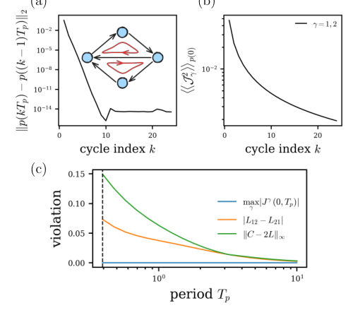
<figcaption class="paper-figure-caption"><b>Fig 2.</b> FIG. 2. (a): Sketch of the two-cycle network, where the red arrows indicate the cycle currents. Starting from 𝒑(0) = (1/4, 1/4, 1/4, 1/4)⊺, the plot shows the evolution of ∥𝒑(𝑡+ 𝑇𝑝) − 𝒑(𝑡)∥under the periodic driving 𝐸𝑛= 𝐸0 cos(2𝜋𝑡/𝑇𝑝−𝜃𝑛) of period 𝑇𝑝= 𝜋/8, as a function of the cycle index 𝑘= 𝑡/𝑇𝑝. (b): The vari- ability contribution ⟨⟨(J𝛾)2⟩⟩0 versus cycle index for 𝛾= 1, 2 (the two curves overlap). (c): In the periodic (Floquet) state, the blue curve validates the no-pumping theorem max𝛾|𝐽𝛾(0,𝑇𝑝)| = 0, the green curve measures the lack of FDT via the norm ∥𝐶−2𝐿∥∞with 𝐶𝛾𝛾′ = ⟨⟨J𝛾, J𝛾′⟩⟩, and the orange curve measures nonreciprocity via |𝐿12 −𝐿21|. The latter two are restored as 𝑇𝑝→∞. We...</figcaption>
</figure>

**Main problem.** The lack of exact fluctuation-response relations (FRRs) for time-integrated observables in nonautonomous (time-dependent) stochastic systems, particularly regarding how initial state variability and driving protocols affect these relations.

**Main result.** The derivation of an exact dynamical FRR where the finite-time covariance of observables splits into an initial-variability term and an integral of response kernels. This result sharpens existing thermodynamic and kinetic uncertainty relations and recovers steady-state FDT and Onsager reciprocity in the autonomous limit.

**Method.** The authors use finite-time cumulant-generating functions, the backward Kolmogorov equation, and functional derivatives to define response kernels to perturbations in transition rates.

**Summary.** This paper establishes new exact fluctuation-response relations for time-dependent Markov processes. It shows that the covariance of integrated observables can be decomposed into a term representing initial state uncertainty and a term representing the system's response to driving. These new identities allow for tighter bounds on thermodynamic and kinetic uncertainty relations. The framework successfully unifies various known results like the fluctuation-dissipation theorem and Onsager reciprocity within a single dynamical description.

Detailed structure

**Model / system.** Nonautonomous Markov jump processes on a discrete state space governed by a time-dependent master equation, where transition rates are parameterized by symmetric, antisymmetric, and vertex components.

**Key observables.** Time-integrated observables including currents, entropy production rate (EPR), and energy-related quantities.

**Important parameters / regimes.** Driving protocols (time-dependent rates), driving speed, driving period, and the initial state distribution variability.

**Assumptions / limitations.** The system is assumed to be a Markov jump process on a discrete state space; the derivation focuses on linear response to perturbations.

**Figures summary.** Figure 1 shows a hierarchy diagram relating the new FRRs to known results like FDT and TURs; Figure 2 presents numerical validation using a two-cycle network, demonstrating probability distribution evolution, variability contributions, and the no-pumping theorem.

**Paper structure.** The paper introduces the problem of nonautonomous FRRs, defines the Markov jump model and its parameters, derives the exact dynamical FRR and its covariance split, applies the result to sharpen uncertainty relations (TUR/KUR), and provides numerical validation via a two-cycle network.

**Why it may be interesting.** This is highly relevant for open quantum systems and many-body dynamics as it provides exact tools to relate fluctuations to responses in driven, non-equilibrium settings, which is critical for understanding dissipation and precision in driven quantum devices.

Abstract

We derive exact dynamical fluctuation-response relations (FRRs) for time-integrated observables of any nonautonomous Markov jump process. The finite-time covariance splits into an initial variability and an integral of response kernels along the driven dynamics. The identity sharpens the dynamical response thermodynamic and kinetic uncertainty relations and fluctuation-response inequalities (FRIs). It also recovers steady-state FRRs, fluctuation-dissipation theorem and Onsager reciprocity, identifies known autonomous FRIs as the zero-frequency mode.

[↑ back to top](#top)

### [From Independent to Joint: Enhancing Quantum Phase and Correlation Factor Estimation by Squeezed Reservoir Engineering](http://arxiv.org/abs/2604.23476v1)

**Authors:** Cai-Hong Liao, Yan-Ling Li, Long Huang, Xing Xiao  
**Type:** theory · **Category:** quantum information and computing · **PDF:** <https://arxiv.org/pdf/2604.23476v1>  
**Analysis basis:** full PDF text, analyzed in chunks
**Topic relevance:** 🔥 `correlated / nonlocal dissipation` **4/5** · `quantum measurements` **3/5** · `Tavis-Cummings & cavity-many-emitter` **2/5** · `entanglement & information structure` **2/5** · `methods for driven-dissipative` **2/5**

↔ Scroll figures horizontally

<figure class="paper-figure-card">
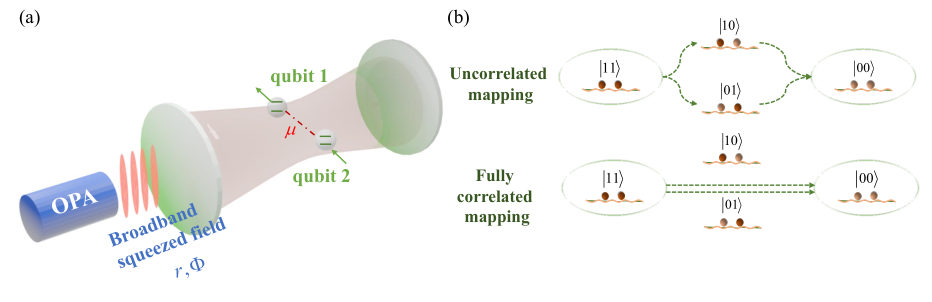
<figcaption class="paper-figure-caption"><b>Fig 1.</b> Figure 1: (color online) (a) The theoretical model of two initially entangled qubits passing through the squeezed thermal reservoir successively at time intervals ∆t. If the relaxation time trel of the cavity is not significantly shorter than the time interval ∆t, the influence of the reservoir on the two qubits will be correlated with probability µ. (b) Mapping diagrams for a two-qubit system under uncorrelated and fully correlated conditions.</figcaption>
</figure>
<figure class="paper-figure-card">
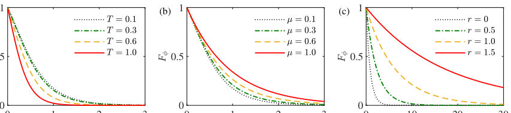
<figcaption class="paper-figure-caption"><b>Fig 2.</b> Figure 2: (color online) Fϕ as a function of γ0t with (a) µ = 0, r = 0, (b) T = 0.3, r = 0, and (c) T = 0.3, µ = 0.9. The other parameters are Φ = 0,</figcaption>
</figure>
<figure class="paper-figure-card">
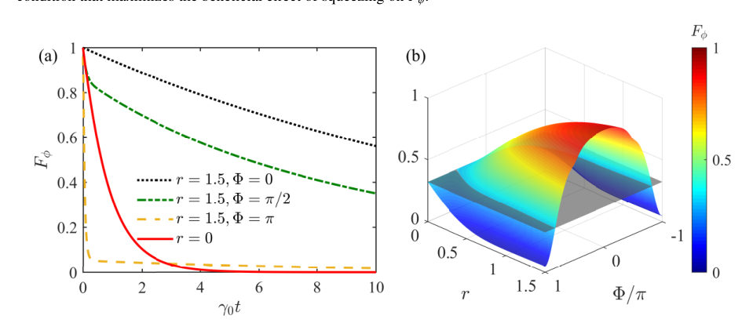
<figcaption class="paper-figure-caption"><b>Fig 3.</b> Figure 3: (color online) The behaviors of Fϕ in different cases. (a) Fϕ as a function of γ0t for different squeezed phases Φ. (b) The coloured surface represents Fϕ as a function of Φ and r at γ0t = 1, while the grey plane serves as the reference plane for the results in a correlated thermal reservoir</figcaption>
</figure>
<figure class="paper-figure-card">
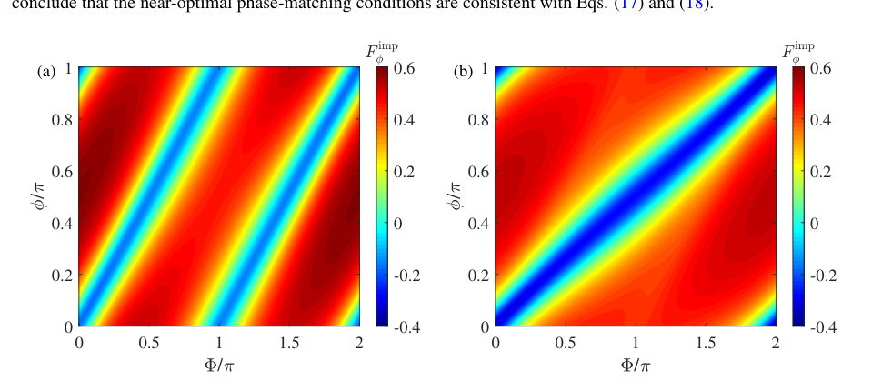
<figcaption class="paper-figure-caption"><b>Fig 4.</b> Figure 4: (color online) Fimp ϕ as a function of Φ and ϕ with (a) µ = 0.1 and (b) µ = 0.9. The other parameters are γ0t = 1, T = 0.3, r = 1, and</figcaption>
</figure>
<figure class="paper-figure-card">
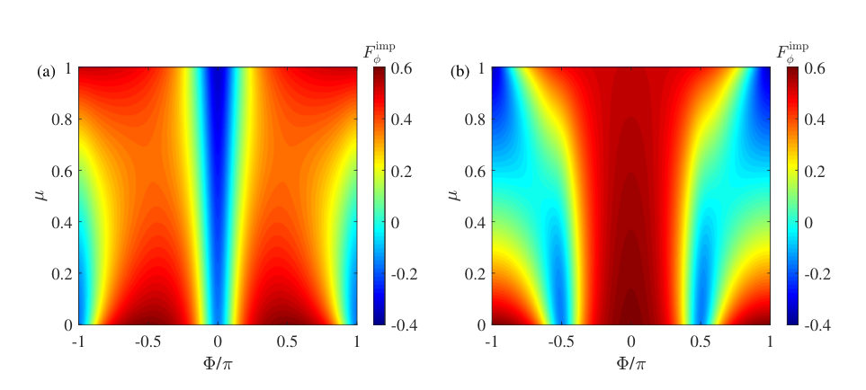
<figcaption class="paper-figure-caption"><b>Fig 5.</b> Figure 5: (color online) Fimp ϕ as a function of Φ and µ with (a) ϕ = 0 and (b) ϕ = π/2. The other parameters are γ0t = 1, T = 0.3, r = 1, and</figcaption>
</figure>
<figure class="paper-figure-card">
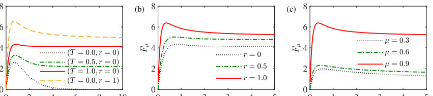
<figcaption class="paper-figure-caption"><b>Fig 6.</b> Figure 6: (color online) Fµ as a function of γ0t with (a) µ = 0.9, (b) T = 1, µ = 0.9, and (c) T = 1, r = 1. The other parameters are Φ = π, α = √</figcaption>
</figure>
<figure class="paper-figure-card">
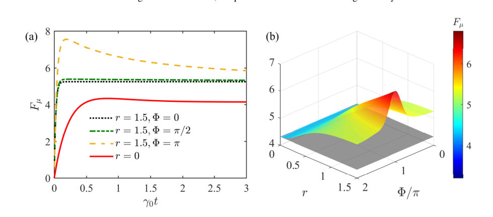
<figcaption class="paper-figure-caption"><b>Fig 7.</b> Figure 7: (color online) The behaviors of Fµ in different cases. (a) Fµ as a function of γ0t for different squeezed phase Φ. (b) The coloured surface presents Fµ as a function of Φ and r at γ0t = 1, and the gray reference plane corresponds to the results obtained in a correlated thermal reservoir</figcaption>
</figure>
<figure class="paper-figure-card">
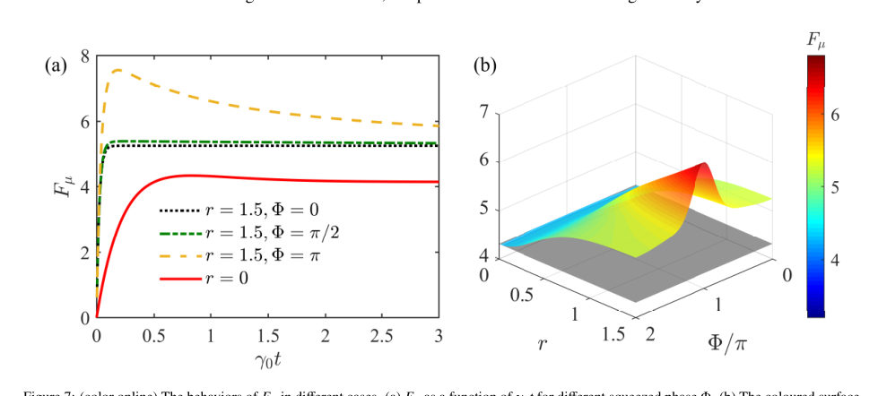
<figcaption class="paper-figure-caption"><b>Fig 8.</b> Figure 8(a) illustrates the phase relationship between Φ and ϕ on Fimp µ for a small value of µ. The corresponding phase-matching condition for Fimp µ is found to be</figcaption>
</figure>
<figure class="paper-figure-card">
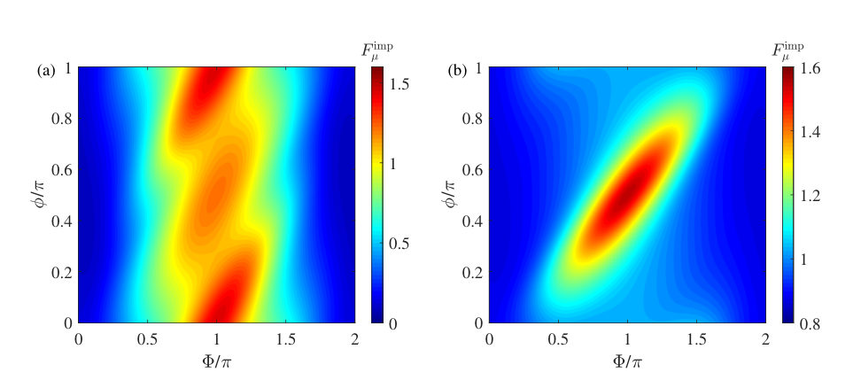
<figcaption class="paper-figure-caption"><b>Fig 9.</b> Figure 8: (color online) Fimp µ as a function of Φ and ϕ with (a) µ = 0.1 and (b) µ = 0.9. The other parameters are γ0t = 1, T = 1, r = 1, and</figcaption>
</figure>
<figure class="paper-figure-card">
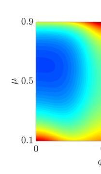
<figcaption class="paper-figure-caption"><b>Fig 10.</b> Figure 9: (color online) Fimp µ as a function of ϕ and µ. The other parameters are Φ = π, γ0t = 1, T = 1, r = 1, and α = √</figcaption>
</figure>

**Main problem.** Enhancing the precision of joint estimation for a quantum phase parameter and a correlation factor in a system interacting with a correlated squeezed-thermal reservoir.

**Main result.** The study identifies optimal squeezing phase-matching conditions to maximize precision and demonstrates that joint estimation can maintain high precision and conserve resources even when parameters are incompatible.

**Method.** The authors utilize the Quantum Fisher Information Matrix (QFIM) and the quantum Cramér-Rao bound to analyze estimation precision and compare independent versus joint estimation strategies.

**Summary.** This paper investigates how to improve the precision of estimating quantum phase and correlation parameters using a squeezed thermal reservoir. By manipulating the squeezing phase and strength, the authors find specific 'phase-matching' conditions that maximize information retrieval. They specifically show that even when estimating multiple parameters simultaneously, one can achieve high precision by prioritizing the optimization of the phase parameter. The results suggest that reservoir engineering is a powerful tool for high-precision quantum sensing.

Detailed structure

**Model / system.** Two identical two-level systems (qubits) passing successively through an optical cavity, interacting with a common correlated squeezed-thermal reservoir.

**Key observables.** Quantum Fisher Information (QFI) for phase (F_phi) and correlation (F_mu), total variance (Delta_sim), and the precision ratio (R).

**Important parameters / regimes.** Phase parameter (phi), correlation factor (mu), squeezing strength (r), squeezing phase (Phi), and reservoir temperature (T).

**Assumptions / limitations.** Identical qubits, rotating-wave approximation, and the use of a squeezed thermal reservoir model.

**Figures summary.** Figure 1 illustrates the physical model and reservoir limits; Figure 3 and 4 show the behavior and improvement of QFI relative to the squeezing phase; Figure 10 shows total variance versus time at different temperatures; Figure 11 identifies phase-matching conditions; Figure 12 shows the advantage of joint estimation via the ratio R.

**Paper structure.** The paper introduces the problem of parameter estimation in correlated reservoirs, defines the physical model and master equations, derives phase-matching conditions for individual and joint estimation, and concludes with a numerical analysis of the advantages of joint estimation.

**Why it may be interesting.** This work is highly relevant for researchers in open quantum systems and quantum metrology as it provides specific strategies (reservoir engineering via squeezing phase) to mitigate decoherence and optimize multi-parameter sensing in the presence of correlated noise.

Abstract

High-precision quantum parameter estimation is fundamental to the advancement of quantum metrology. Although reservoir engineering provides a powerful approach to improve estimation by tailoring system-environment interactions, the role of the squeezing phase and correlations arising from the sequential utilization of the same squeezed reservoir remains inadequately explored. In this work, we employ a correlated squeezed-thermal reservoir to enhance the precision of estimating the phase parameter $φ$ and the correlation factor $μ$, both individually and simultaneously. We show that the squeezing phase $Φ$ is crucial for achieving quantum-enhanced precision, with optimal phase-matching conditions that depend strongly on $μ$. Specifically, we derive the near-optimal phase-matching relations aimed at maximizing the quantum Fisher information (QFI) for both $φ$ and $μ$, as well as minimizing the total variance $Δ_{\rm sim}$ in joint estimation. Furthermore, we show that the joint estimation variance is dominated by $F_φ$, which motivates our search for the phase-matching conditions that minimize $Δ_{\text{sim}}$. Through the ratio $R$ of variances, we demonstrate that joint estimation conserves quantum resources and maintains high precision when the squeezing phase is optimized for $F_φ$, despite the inherent incompatibility of the parameters. These findings provide practical insights into reservoir engineering strategies for high-precision quantum sensing and information processing.

[↑ back to top](#top)

### [Grassmann time-evolving matrix product operators for fermionic impurities coupled to a superconducting bath](http://arxiv.org/abs/2604.23301v1)

**Authors:** Chu Guo, Wei Wu, Xiansong Xu, Ping-Xing Chen, Changming Yue, Tian Jiang, Ruofan Chen  
**Type:** theory · **Category:** numerical methods · **PDF:** <https://arxiv.org/pdf/2604.23301v1>  
**Analysis basis:** full PDF text, analyzed in chunks
**Topic relevance:** 🔥 `Kondo & dissipative impurity` **4/5** · 🔥 `methods for driven-dissipative` **4/5** · `non-equilibrium dynamics` **3/5** · `Keldysh / 2PI / non-Gaussian methods` **2/5**

↔ Scroll figures horizontally

<figure class="paper-figure-card">
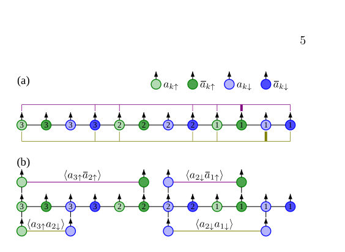
<figcaption class="paper-figure-caption"><b>Fig 1.</b> FIG. 1. (a) A schematic illustration of the partial IF algo- rithm to build the Feynman-Vernon IF as a GMPS for the SAIM, where the imaginary contour has been used as exam- ple. The green and blue solid circles represent the GVs for the upper and lower spins respectively, the lighter and darker circles with the same color represent a conjugate pair of GVs. Each horizontal line with legs acting on the circles represent a partial IF, where the thicker leg corresponds to the GV shared by all the terms in the partial IF. Thus, the upper and lower horizontal lines mean two partial IFs that correspond to the first and second terms in the product of Eq.(37), respectively. (b) Calculating the four...</figcaption>
</figure>
<figure class="paper-figure-card">
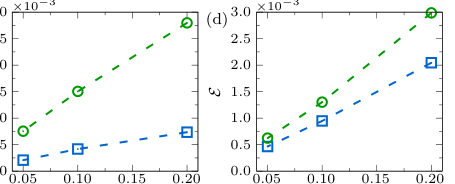
<figcaption class="paper-figure-caption"><b>Fig 2.</b> FIG. 2. (a,b) The imaginary-time correlation functions G↑↑(τ) (a) and G↑↓(τ) (b) as functions of the imaginary time τ for the toy model. The blue and green dashed lines are the Nambu- GTEMPO results, calculated with χ = 30 and δτ = 0.05, for U = 1 and U = −1 respectively, while the solid lines with the same colors are the corresponding ED results. (c,d) The mean errors of G↑↑(τ) (c) and G↑↓(τ) (d), between Nambu-GTEMPO with χ = 30 and ED, as functions of the imaginary-time step size δτ, where the blue and green dashed lines are results for U = 1 and U = −1 respectively. We have used ε0 = 1, α2 0 = 0.5, β = 5 and εd = −U/2 in these simulations.</figcaption>
</figure>
<figure class="paper-figure-card">

<figcaption class="paper-figure-caption"><b>Fig 3.</b> Fig. 2(b), respectively (G↓↓(τ) and G↓↑(τ) are not shown as they can be obtained from the two correlation func- tions we have plotted). We have considered both repul- sive interaction with U = 1 (the blue dashed lines) and at- tractive interaction with U = −1 (the green dashed lines), and plot the corresponding ED results (the solid lines with the same color) for comparison. We can see that the Nambu-GTEMPO results generally agree very well with the ED results in all these cases. In Fig. 2(c), we plot the mean error E, defined as E(⃗x, ⃗y) = √</figcaption>
</figure>
<figure class="paper-figure-card">
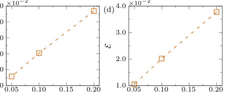
<figcaption class="paper-figure-caption"><b>Fig 4.</b> FIG. 3. (a,b) The real-time correlation functions G↑¯↑●(t) (a) and G↑●↓(t) as functions of the real time t for the toy model. The red and purple dashed lines are the real and imaginary parts of the Nambu-GTEMPO results calculated with χ = 40 and δt = 0.05, while the solid lines with the same colors are the corresponding ED results. (c,d) The mean error of G↑¯↑●(t) (c) and G↑●↓(t) (d), between Nambu-GTEMPO with χ = 40 and ED, as functions of the real-time step size δt. We have used ε0 = 1, α2 0 = 0.5, β = 10, U = 1 and εd = −U/2 in these simulations.</figcaption>
</figure>
<figure class="paper-figure-card">
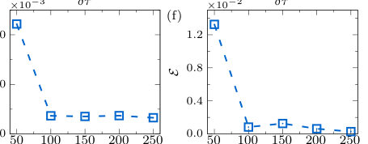
<figcaption class="paper-figure-caption"><b>Fig 5.</b> FIG. 4. (a,b) The imaginary-time correlation functions G↑↑(τ) (a) and G↑↓(τ) (b) as functions of the imaginary time τ for the non-interacting case. The blue dashed lines are the Nambu- GTEMPO results calculated with χ = 250 and δτ = 0.05, while the solid lines with the same color are the corresponding ED results. (c,d) The mean errors of G↑↑(τ) (c) and G↑↓(τ) (d), between Nambu-GTEMPO with χ = 250 and ED, as functions of the imaginary-time step size δτ. (e,f) The mean errors of G↑↑(τ) (e) and G↑↓(τ) (f), between Nambu-GTEMPO with δτ = 0.05 and ED, as functions of the bond dimension χ. We have used εd = 0, β = 10 in these simulations.</figcaption>
</figure>
<figure class="paper-figure-card">
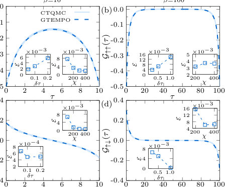
<figcaption class="paper-figure-caption"><b>Fig 6.</b> FIG. 6. (a,c) The imaginary-time correlation functions G↑↑(τ) (a) and G↑↓(τ) (c) as functions of the imaginary time τ for the SAIM with β = 10, where the blue dashed lines are the Nambu-GTEMPO results calculated with χ = 400 and δτ = 0.05, and the solid lines with the same color are the corre- sponding CTQMC results. The two insets in each panel show the mean errors between Nambu-GTEMPO and CTQMC as functions of δτ with fixed χ = 400 (left inset), and as func- tions of χ with fixed δτ = 0.05 (right inset), respectively. (b,d) similar to (a,c), but for the SAIM with β = 100. The Nambu-GTEMPO results in the main panels are calculated with χ = 400 and δτ = 0.25. The two insets show the mean...</figcaption>
</figure>
<figure class="paper-figure-card">
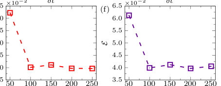
<figcaption class="paper-figure-caption"><b>Fig 7.</b> FIG. 5. (a,b) The real-time correlation functions G↑¯↑●(t) (the real part vanishes and is not shown) (a) and G↑●↓(t) (the imaginary part vanishes and is not shown) as functions of the real time t for the non-interacting case. The dashed lines are the Nambu-GTEMPO results calculated with χ = 250 and δt = 0.05, while the solid lines with the same colors are the corresponding ED results. (c,d) The mean errors of G↑¯↑●(t) (c) and G↑●↓(t) (d), between Nambu-GTEMPO with χ = 250 and ED, as functions of the real-time step size δt. (e,f) The mean errors of G↑¯↑●(t) (e) and G↑●↓(t) (f), between Nambu- GTEMPO with δt = 0.05 and ED, as functions of the bond dimension χ. We have used εd = 0 and β = 10...</figcaption>
</figure>
<figure class="paper-figure-card">
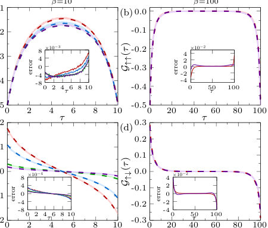
<figcaption class="paper-figure-caption"><b>Fig 8.</b> FIG. 7. (a,c) The imaginary-time correlation functions G↑↑(τ) (a) and G↑↓(τ) (c) as functions of the imaginary time τ for the SAIM with β = 10 during 10 DMFT iterations, where the dashed lines in different colors are the Nambu-GTEMPO results calculated with χ = 200 and δτ = 0.1 at the selected iterations, and the solid lines with the same colors are the cor- responding CTQMC results. (b,d) similar to (a, c), but for the SAIM with β = 100, where the Nambu-GTEMPO results are calculated with χ = 300 and δτ = 0.5 instead. The insets show the errors between Nambu-GTEMPO and CTQMC at the selected iterations, in correspondence with the main pan- els. We have used U = −1 and εd = −U/2 in these...</figcaption>
</figure>
<figure class="paper-figure-card">
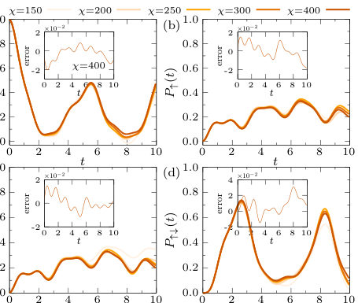
<figcaption class="paper-figure-caption"><b>Fig 9.</b> FIG. 8. Time evolution of the probability of the four impurity states ∣0⟩(a), ∣↑⟩(b), ∣↓⟩(c) and ∣↑↓⟩(d), for the SAIM. The orange solid lines from lighter to darker are the Nambu- GTEMPO results calculated with different χs from small to large, with fixed δt = 0.05. In the insets, we show the errors between the Nambu-GTEMPO results calculated using δt = 0.05 and δt = 0.05, with fixed χ = 400. We have used U = −1, εd = −U/2 and β = 10 in these simulations.</figcaption>
</figure>

**Main problem.** Extending the Grassmann time-evolving matrix product operator (GTEMPO) method to solve fermionic impurity problems where the impurity is coupled to a superconducting bath, specifically addressing the Nambu formalism.

**Main result.** The authors successfully developed the Nambu-GTEMPO method, demonstrating its accuracy against exact diagonalization and CTQMC, and showing it can handle real-time non-equilibrium dynamics without the dynamical sign problem.

**Method.** The method uses a Bogoliubov transformation to map the superconducting bath to a normal bath form, representing the Feynman-Vernon influence functional as a Grassmann matrix product state (GMPS).

**Summary.** This paper introduces Nambu-GTEMPO, a numerical method for studying fermionic impurities in superconducting baths. By using a Bogoliubov transformation, the authors map the complex superconducting coupling into a form compatible with existing Grassmann matrix product operator techniques. The method is validated against exact methods and shown to be effective for both equilibrium and non-equilibrium real-time dynamics. Crucially, it avoids the dynamical sign problem that plagues Monte Carlo simulations in the Keldysh regime. This makes it a powerful tool for investigating the physics of the Superconducting Anderson Impurity Model.

Detailed structure

**Model / system.** The Superconducting Anderson Impurity Model (SAIM), featuring a localized fermionic impurity with on-site energy and interaction strength coupled to an s-wave superconducting bath.

**Key observables.** Imaginary-time and real-time correlation functions (G_up-up, G_up-down, etc.) and impurity state probabilities (vacuum, single, and double occupation).

**Important parameters / regimes.** Interaction strength (U), impurity energy (epsilon_d), superconducting gap (Delta_sc), hybridization function, temperature (beta), bond dimension (chi), and time discretization step (delta_t).

**Assumptions / limitations.** The bath is assumed to be non-interacting, and the hybridization is linear in terms of bath creation and annihilation operators.

**Figures summary.** Figure 1 shows the partial IF algorithm and correlation function calculation; Figure 2 shows imaginary-time correlation functions for a toy model; Figure 4 and 5 show error scaling with respect to time step and bond dimension; Figure 8 shows the time evolution of impurity state probabilities.

**Paper structure.** The paper introduces the Nambu-GTEMPO extension, describes the Bogoliubov transformation technique, validates the method using exact diagonalization for simple cases, compares it to CTQMC for interacting cases in DMFT, and performs error analysis and real-time dynamics demonstrations.

**Why it may be interesting.** This is highly relevant for many-body dynamics and open quantum systems because it provides a sign-problem-free tensor network approach to studying non-equilibrium dynamics in superconducting environments, a regime where traditional Monte Carlo methods fail.

Abstract

The Grassmann time-evolving matrix product operator (GTEMPO) method, which represents the Feynman-Vernon influence functional as a temporal matrix product state, has been shown to be a flexible and potentially scalable solution for fermionic quantum impurity problems. In this work, we extend GTEMPO to solve fermionic impurity problems in the Nambu formalism, in which the impurity is coupled to a superconducting bath. A key insight is that by employing the Bogoliubov transformation for the superconducting bath, one could obtain the analytic expression of the Feynman-Vernon influence functional in a similar form to the case of a normal bath, after which the core algorithms of GTEMPO can be straightforwardly adapted. We demonstrate the accuracy of our method by benchmarking it against exact diagonalization in several exactly solvable cases, and against the continuous-time quantum Monte Carlo method using converged dynamical mean field theory (DMFT) iterations on the imaginary contour in the non-integrable case. In all cases, we perform both imaginary- and real-time calculations to illustrate the flexibility of our method. These results illustrate that our method could be potentially useful as an impurity solver in DMFT as well as its non-equilibrium extension for fermionic impurity problems in the Nambu formalism.

[↑ back to top](#top)

### [Boundary-Robust Transmission Asymmetry as a Topological Signature in Open Floquet Lattices](http://arxiv.org/abs/2604.23420v1)

**Authors:** Ren Zhang, Xiao-Yu Ouyang, Xu-Dong Dai, Xi Dai  
**Type:** both · **Category:** other · **PDF:** <https://arxiv.org/pdf/2604.23420v1>  
**Analysis basis:** full PDF text, analyzed in chunks
**Topic relevance:** 🔥 `non-equilibrium dynamics` **4/5** · `analog quantum simulation` **3/5** · `methods for driven-dissipative` **3/5** · `driven-dissipative phase transition` **2/5**

↔ Scroll figures horizontally

<figure class="paper-figure-card">
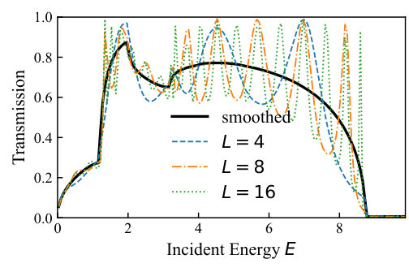
<figcaption class="paper-figure-caption"><b>Fig 1.</b> FIG. 1. Construction of the smoothed transmission spectrum. Raw transmission curves for sample lengths L = 4, 8, 16 exhibit dense Fabry–P´erot oscillations, whereas the energy-window smoothed curves rapidly converge. In the L →∞limit, the smoothed transmission becomes a well- defined local coarse-grained observable that effectively filters out finite-size interference.</figcaption>
</figure>
<figure class="paper-figure-card">
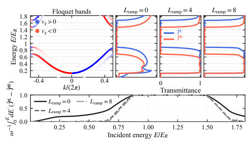
<figcaption class="paper-figure-caption"><b>Fig 2.</b> FIG. 2. Boundary robustness of the integrated spec- tral asymmetry. For an open Floquet lattice with V (x, t) = ξ(x)Vbulk(x, t) and Vbulk(x, t) = 0.8ER cos(2πx−ωt)+0.2ER, the boundary envelope ξ(x) implements a linear ramp from 0 to 1 over a length Lramp. While varying Lramp strongly distorts the smoothed transmission spectra ¯T L/R(E), the in- tegrated asymmetry A(E0) remains invariant and saturates to a stable plateau. This plateau height equals the rigid spec- tral shift dictated by the bulk winding number in the adia- batic limit, demonstrating that the topological signature is immune to microscopic boundary details.</figcaption>
</figure>
<figure class="paper-figure-card">
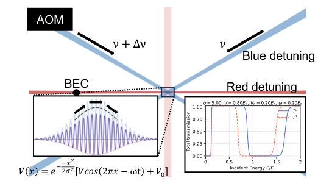
<figcaption class="paper-figure-caption"><b>Fig 3.</b> FIG. 3. Schematic of the cold-atom Bragg-scattering setup. Two counter-propagating laser beams with a con- trolled frequency detuning, implemented via an acousto-optic modulator (AOM), generate a moving optical lattice. A Bose– Einstein condensate (BEC) serves as the scattering medium, confined by a quasi-1D red-detuned optical waveguide to re- alize a strictly one-dimensional scattering geometry.</figcaption>
</figure>
<figure class="paper-figure-card">
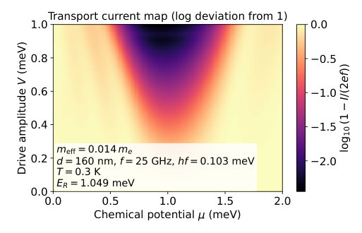
<figcaption class="paper-figure-caption"><b>Fig 4.</b> FIG. 5. Zero-bias current versus SAW drive strength and chemical potential within the coherent-scattering prescription. Numerical results use hard-wall boundary conditions—a conservative estimate for which realistic soft boundaries should yield sharper quantization. A near-2ef re- sponse emerges over a broad parameter regime within this prescription, illustrating a possible electrical readout of the boundary-robust integrated transmission asymmetry.</figcaption>
</figure>
<figure class="paper-figure-card">
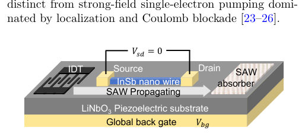
<figcaption class="paper-figure-caption"><b>Fig 5.</b> FIG. 4. Schematic of the SAW-driven zero-bias trans- port device. An interdigitated transducer (IDT) on a piezo- electric substrate (e.g., LiNbO3) launches a unidirectional sur- face acoustic wave, terminated by an absorber to suppress re- flections. The traveling strain field induces a moving potential in a proximal nanowire (e.g., InSb). By tuning the chemical potential via a back-gate and maintaining zero source–drain bias, the resulting SAW-driven transport current is measured, providing a possible electrical readout of the integrated spec- tral asymmetry within the coherent-scattering interpretation.</figcaption>
</figure>
<figure class="paper-figure-card">
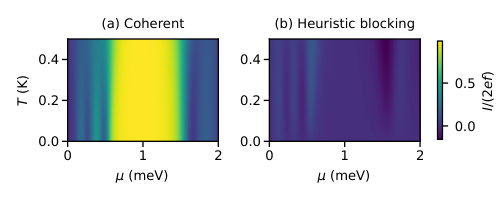
<figcaption class="paper-figure-caption"><b>Fig 6.</b> FIG. 6. Experimentally distinguishable transport predictions. Left: zero-bias current from the coher- ent prescription [Eq. (12)], showing a weakly temperature- dependent near-2ef plateau. Right: zero-bias current from the blocking-factor prescription [Eq. (14)], obtained from the same sideband-resolved transmission data [Eq. (13)]. The plateau is suppressed and the temperature dependence is much stronger. The driving amplitude is fixed at V = 0.8ER, with all other parameters the same as in Fig. 5.</figcaption>
</figure>

**Main problem.** Determining whether bulk Floquet topology can be extracted from transmission observables in open systems, given that non-adiabatic boundaries distort pointwise transmission profiles.

**Main result.** The integrated left-right transmission asymmetry is a robust topological signature that saturates to a plateau determined by the bulk Floquet winding number, due to the generic openness of propagating branches.

**Method.** The authors use a theoretical framework based on the deep-bulk branch-population principle and asymptotic analysis, supplemented by numerical Monte Carlo sampling and proposed experimental setups in cold atoms and SAW devices.

**Summary.** This paper identifies a boundary-robust topological signature in open Floquet lattices: the integrated transmission asymmetry. While realistic, non-adiabatic boundaries distort the detailed transmission spectrum, the cumulative asymmetry remains locked to the bulk winding number. This robustness arises because propagating Floquet-Bloch branches are generically fully populated. The authors propose detecting this via cold-atom spectroscopy and electronic transport in SAW-driven devices.

Detailed structure

**Model / system.** Open Floquet lattices (periodically driven lattices) coupled to asymptotic leads, including models for cold-atom transmission spectroscopy and electronic transport in SAW-driven piezoelectric nanowires.

**Key observables.** Integrated left-right transmission asymmetry, smoothed long-sample transmittance, and zero-bias electrical current.

**Important parameters / regimes.** Bulk Floquet winding number, quasienergy, lattice length (long-sample limit), boundary ramp length, and driving frequency.

**Assumptions / limitations.** The results rely on the long-sample limit (L approaching infinity) and the assumption of a regular quasienergy window with non-zero group velocities.

**Figures summary.** Figure 1 shows the convergence of smoothed transmission spectra; Figure 2 demonstrates the robustness of integrated asymmetry against boundary changes; Figure 3 and 4 illustrate the proposed cold-atom and SAW experimental setups; Figure 5 and 6 compare electrical transport predictions under different contact models.

**Paper structure.** The paper introduces the problem of boundary-induced distortion, develops the deep-bulk branch-population principle to prove robustness, provides a mathematical proof of generic openness, and concludes with proposed experimental implementations in cold atoms and electronic transport.

**Why it may be interesting.** It provides a new, robust way to detect topological invariants in driven, open systems where traditional pointwise signatures are destroyed by boundary effects, which is highly relevant for experimentalists working with Floquet engineering.

Abstract

We identify a boundary-robust topological signature of open Floquet lattices: although nonadiabatic boundaries strongly reshape the transmission lineshape, the integrated left--right transmission asymmetry saturates to a plateau set by the bulk Floquet winding number. Its origin is a deep-bulk branch-population principle: in the long-sample limit, each propagating Floquet--Bloch branch is generically populated with unit weight, since true Floquet bound states are nongeneric. The robust observable is therefore the cumulative transmission imbalance rather than the boundary-sensitive transmission profile. We propose direct detection by cold-atom transmission spectroscopy. For electronic transport, the same asymmetry admits contact-model-dependent electrical readouts: a coherent Floquet--Landauer--Büttiker interpretation predicts a near-\(2ef\) response in weak SAW devices, whereas a blocking-factor post-processing yields a qualitatively different signal.

[↑ back to top](#top)

### [Fiber-integrated Quantum Frequency Conversion for Long-distance Quantum Networking](http://arxiv.org/abs/2604.23444v1)

**Authors:** Zhichuan Liao, Ao Shen, Lai Zhou, Nan Jiang, Zhiliang Yuan  
**Type:** both · **Category:** quantum information and computing · **PDF:** <https://arxiv.org/pdf/2604.23444v1>  
**Analysis basis:** full PDF text, analyzed in chunks
**Topic relevance:** 🔥 `QC/QI experiment` **4/5** · 🔥 `quantum optics experiment` **4/5** · `interference shaping light` **2/5** · `spintronics-quantum-optics interface` **2/5**

↔ Scroll figures horizontally

<figure class="paper-figure-card">
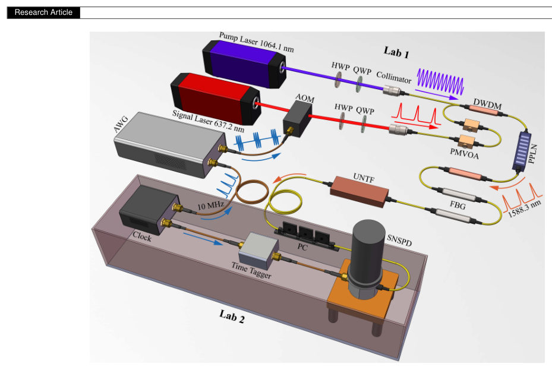
<figcaption class="paper-figure-caption"><b>Fig 1.</b> Fig. 1. Experimental setup. A continuous-wave (CW) laser at 637.2 nm (signal laser) is carved into optical pulses using an acousto- optic modulator (AOM), and then attenuated to single photon level by two cascaded polarization maintaining manual variable optical attenuators (PMVOAs). The attenuated signal pulses are subsequently combined with a 1064.1 nm pump laser via dense wavelength division multiplexing (DWDM), then coupled into a periodically poled lithium niobate (PPLN) waveguide for fre- quency conversion. The converted photons are spectrally filtered using a combination of DWDM, fiber Bragg gratings (FBG), and a ultra-narrowband tunable optical filter (UNTF). A clock source, time...</figcaption>
</figure>
<figure class="paper-figure-card">
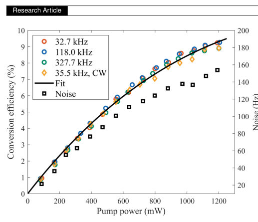
<figcaption class="paper-figure-caption"><b>Fig 2.</b> Fig. 2. Conversion efficiency and noise versus pump power. The conversion efficiency for pulsed (circles) and CW (yellow diamonds) signal light is plotted as a function of pump power (left axis). The black solid line denotes a fit to Eq. (1). The cor- responding noise count rate is shown on the right axis (black squares).</figcaption>
</figure>
<figure class="paper-figure-card">
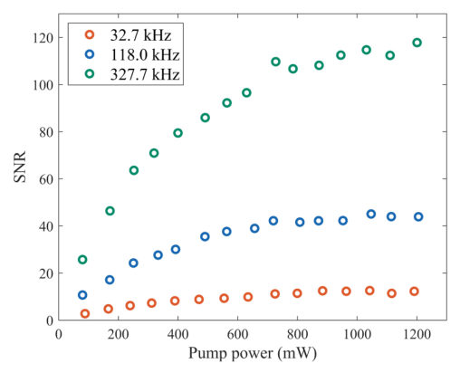
<figcaption class="paper-figure-caption"><b>Fig 3.</b> Fig. 3. Signal-to-noise ratio of the converted signal as a func- tion of pump power. The circles represent the measured SNRs for input photon count rates of 32.7 kHz (red), 118.0 kHz (blue), and 327.7 kHz (green) at 637 nm.</figcaption>
</figure>
<figure class="paper-figure-card">
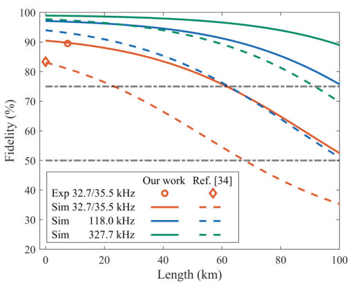
<figcaption class="paper-figure-caption"><b>Fig 4.</b> Fig. 4. Simulated entanglement fidelity as a function of fiber length. The curves are obtained from a theoretical model under two parameter sets: our experimental results (solid lines) and those from Ref. [34] (dashed lines). The circle and diamond are calculated using the measured SNRs. The red solid line and circle correspond to a photon count rate of RS = 32.7 kHz (our work), and the red dashed line and di- amond correspond to RS = 35.5 kHz (Ref. [34]). The blue and green curves represent RS = 118.0 kHz and RS = 327.7 kHz, respectively. The circle marks an equivalent fiber length of 7.5 km, corresponding to 1.2 dB transmission loss between the two laboratories.</figcaption>
</figure>

**Main problem.** Signal photons from quantum nodes like NV centers often emit at wavelengths incompatible with low-loss telecom fibers, causing high transmission loss in long-distance networks.

**Main result.** The authors demonstrated a fiber-integrated quantum frequency conversion system with 9% efficiency and extremely low noise (154 Hz), achieving an expected entanglement fidelity exceeding 52% over 100 km.

**Method.** The researchers used a PPLN waveguide for down-conversion, implemented a multi-stage filtering module (DWDM, FBG, and UNTF) for noise suppression, and developed a theoretical model to simulate spin-photon entanglement fidelity.

**Summary.** This paper presents a fiber-integrated quantum frequency conversion system designed to bridge the gap between quantum nodes and telecom-band channels. By using a PPLN waveguide and a multi-stage filtering system, the authors achieved high-efficiency conversion with very low noise. They demonstrated that this setup can maintain high entanglement fidelity over 100 km of fiber. This advancement is crucial for building scalable, long-distance quantum communication networks.

Detailed structure

**Model / system.** The experimental platform is a fiber-integrated system using a periodically poled lithium niobate (PPLN) waveguide to convert 637.2 nm photons to 1588.3 nm. The quantum node model involves nitrogen-vacancy (NV) center electron spins using time-bin encoding.

**Key observables.** Conversion efficiency, pump-induced noise rate, signal-to-noise ratio (SNR), and entanglement fidelity.

**Important parameters / regimes.** Conversion efficiency of ~9%, noise suppression of >97 dB, 100 km transmission distance, and input photon rates ranging from 32.7 kHz to 327.7 kHz.

**Assumptions / limitations.** The model assumes the NV center electron spin is initially prepared in a specific state and uses a specific sequence for generating time-bin entanglement; filtering performance is limited by the trade-off between noise suppression and insertion loss.

**Figures summary.** Fig 1 shows the experimental setup; Fig 2 plots conversion efficiency and noise rate vs pump power; Fig 3 shows SNR vs pump power for different input rates; Fig 4 shows simulated entanglement fidelity vs fiber length.

**Paper structure.** The paper introduces the challenge of long-distance networking, describes the experimental setup and filtering architecture, presents experimental results for efficiency and noise, provides a theoretical model for fidelity, and concludes with the system's potential for scalability.

**Why it may be interesting.** This work is highly relevant to quantum optics and quantum networks as it addresses the practical engineering challenges of frequency conversion, noise mitigation, and maintaining entanglement over long-distance fiber links.

Abstract

Signal photons emitted by quantum nodes typically fall outside the low-loss telecom window of optical fibers, leading to severe transmission losses. Quantum frequency conversion (QFC) offers an effective optical interface that bridges quantum nodes with telecom-band channels, enabling long-distance quantum communication. In this work, we demonstrate a compact, fiber-integrated QFC system with low noise and a high signal-to-noise ratio (SNR). Using a periodically poled lithium niobate (PPLN) waveguide, input photons at 637.2 nm are down-converted to telecom photons at 1588.3 nm. Our system achieves a total conversion efficiency of approximately 9%, with pump-induced noise suppressed to 154 Hz. For input photon rates of 32.7, 118.0, and 327.7 kHz, the corresponding SNRs are 12.3, 43.9, and 117.8, respectively. We further develop a theoretical model to simulate the entanglement fidelity between nitrogen-vacancy (NV) center spins and the frequency-converted telecom photons. At the emission rate of an NV center, our QFC system maintains an expected fidelity exceeding 52% over a transmission distance of 100 km. These findings highlight the potential of our QFC system for scalable, long-distance quantum networking.

[↑ back to top](#top)

### [How Quantum Contextuality disappears in the Classical Limit](http://arxiv.org/abs/2604.24735v1)

**Authors:** Arthur C. R. Dutra, Roberto D. Baldijão, Marcelo Terra Cunha  
**Type:** theory · **Category:** quantum information and computing · **PDF:** <https://arxiv.org/pdf/2604.24735v1>  
**Analysis basis:** full PDF text, analyzed in chunks
**Topic relevance:** 🔥 `quantum measurements` **4/5** · `correlated / nonlocal dissipation` **2/5** · `entanglement & information structure` **2/5** · `methods for driven-dissipative` **2/5** · `non-equilibrium dynamics` **2/5**

↔ Scroll figures horizontally

<figure class="paper-figure-card">
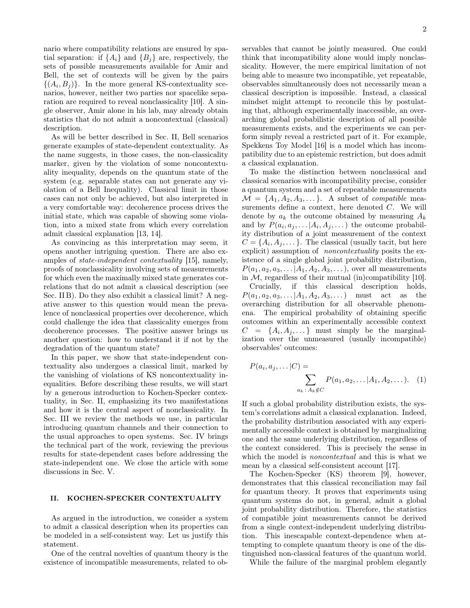
<figcaption class="paper-figure-caption"><b>Fig 1.</b> Low-resolution page preview, page 2</figcaption>
</figure>
<figure class="paper-figure-card">
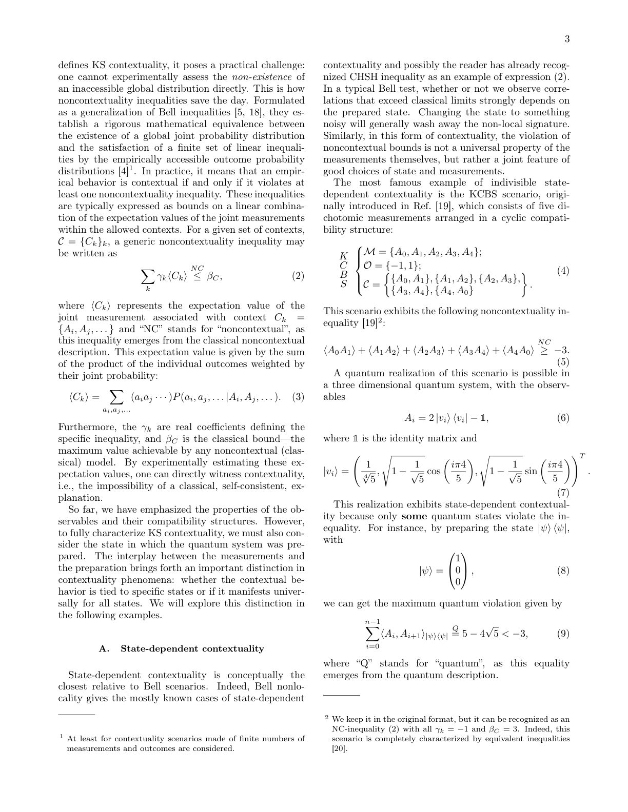
<figcaption class="paper-figure-caption"><b>Fig 2.</b> Low-resolution page preview, page 3</figcaption>
</figure>
<figure class="paper-figure-card">
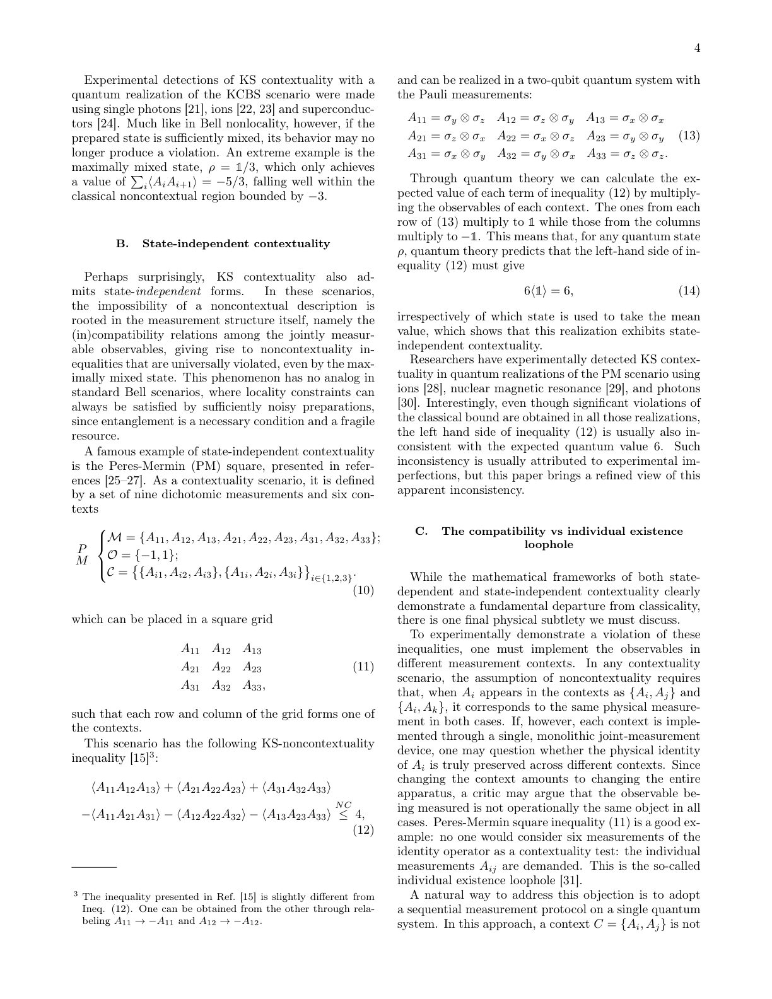
<figcaption class="paper-figure-caption"><b>Fig 3.</b> Low-resolution page preview, page 4</figcaption>
</figure>
<figure class="paper-figure-card">
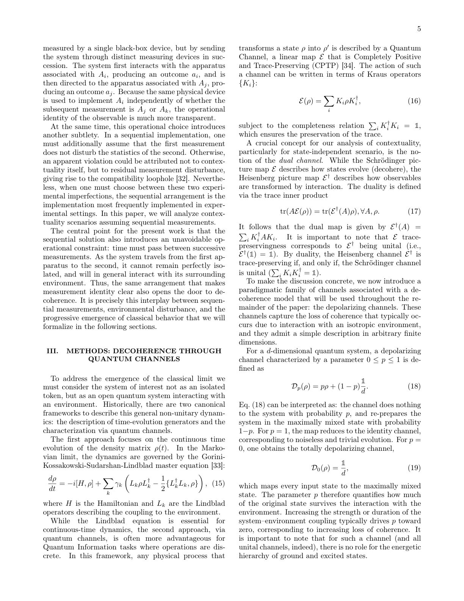
<figcaption class="paper-figure-caption"><b>Fig 4.</b> Low-resolution page preview, page 5</figcaption>
</figure>
<figure class="paper-figure-card">
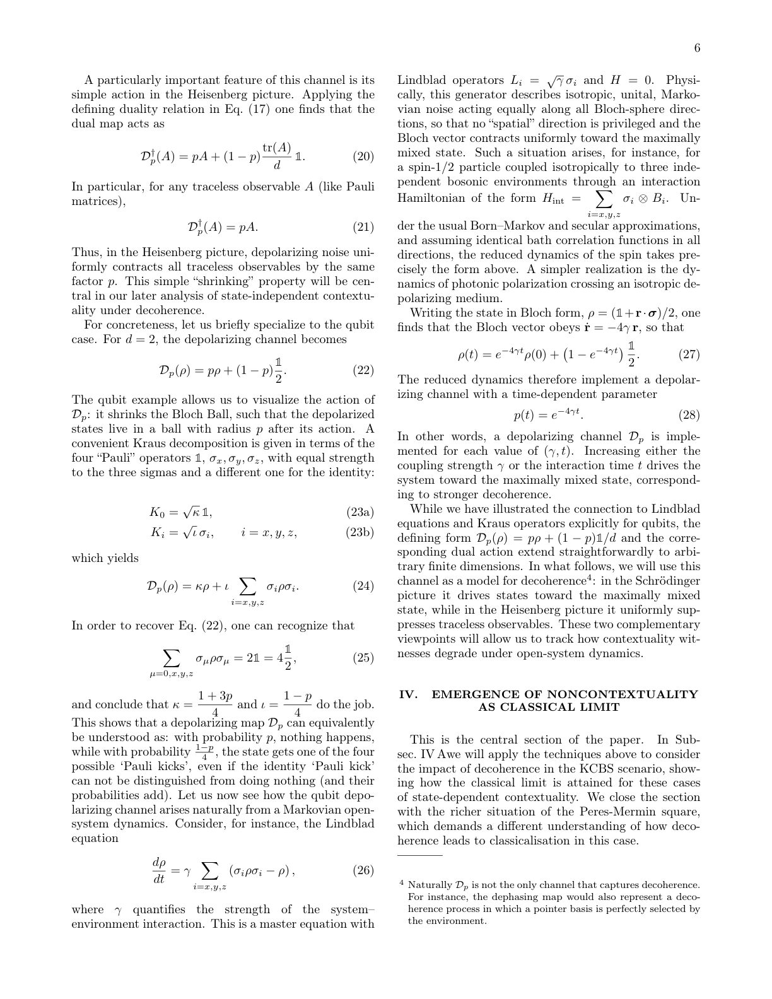
<figcaption class="paper-figure-caption"><b>Fig 5.</b> Low-resolution page preview, page 6</figcaption>
</figure>
<figure class="paper-figure-card">
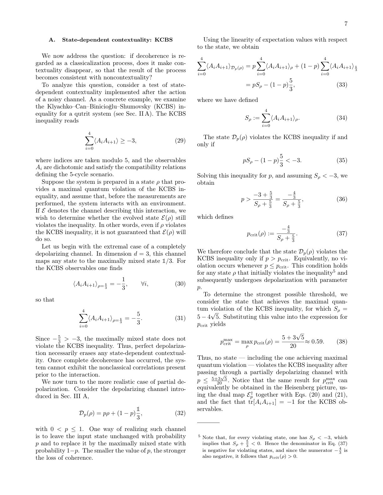
<figcaption class="paper-figure-caption"><b>Fig 6.</b> Low-resolution page preview, page 7</figcaption>
</figure>
<figure class="paper-figure-card">
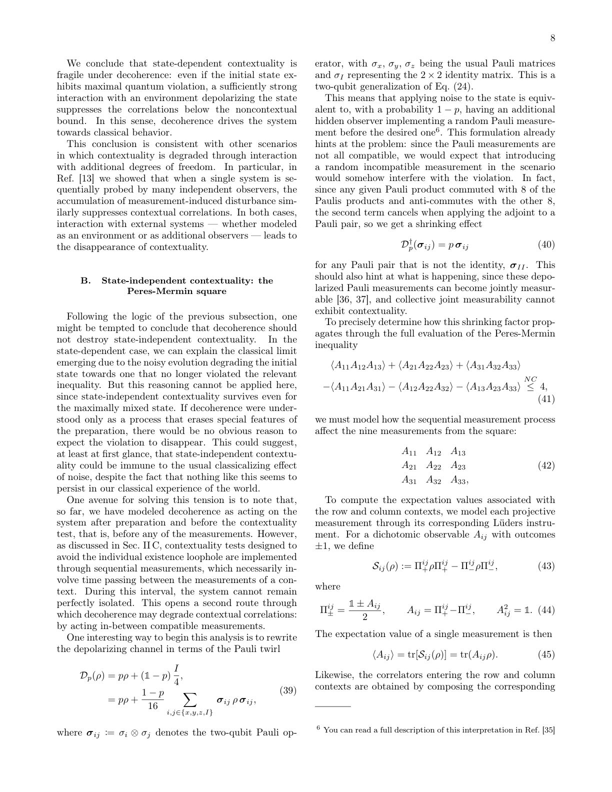
<figcaption class="paper-figure-caption"><b>Fig 7.</b> Low-resolution page preview, page 8</figcaption>
</figure>
<figure class="paper-figure-card">
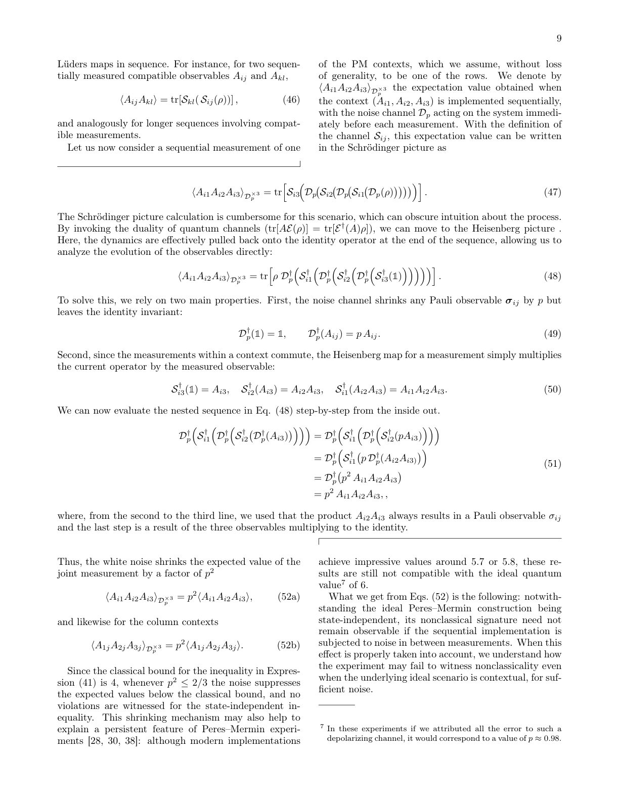
<figcaption class="paper-figure-caption"><b>Fig 8.</b> Low-resolution page preview, page 9</figcaption>
</figure>
<figure class="paper-figure-card">
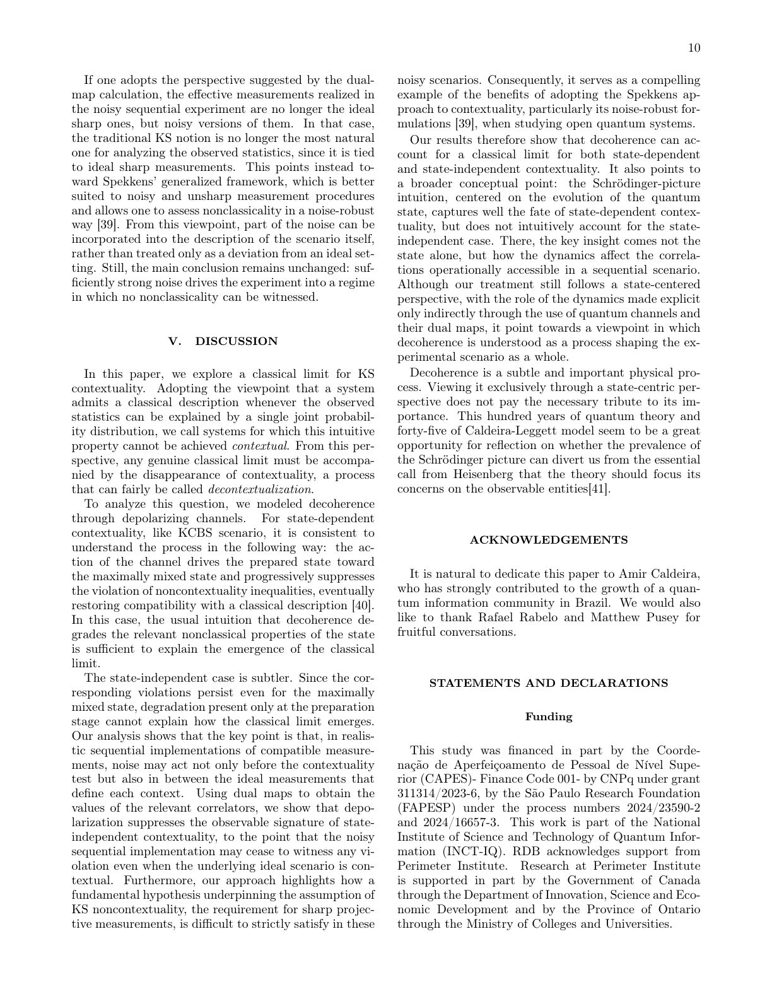
<figcaption class="paper-figure-caption"><b>Fig 9.</b> Low-resolution page preview, page 10</figcaption>
</figure>
<figure class="paper-figure-card">
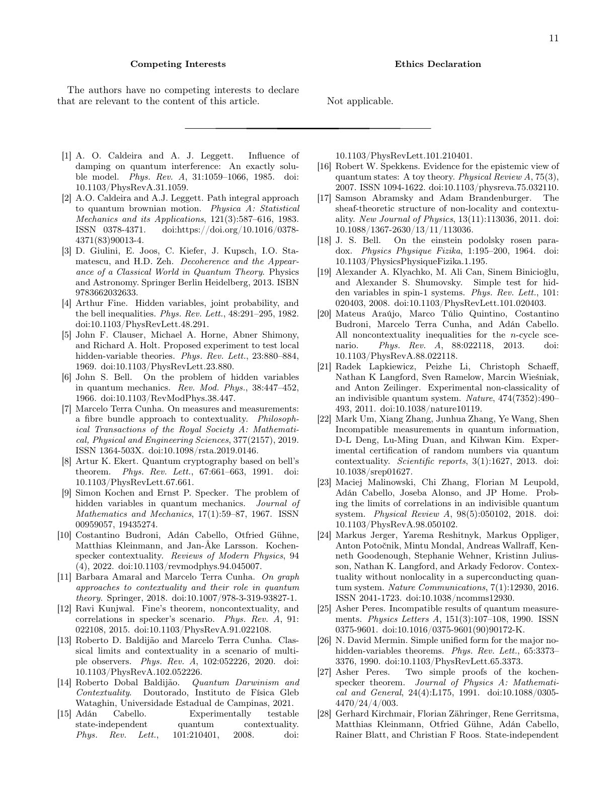
<figcaption class="paper-figure-caption"><b>Fig 10.</b> Low-resolution page preview, page 11</figcaption>
</figure>

**Main problem.** The paper investigates how Kochen-Specker contextuality disappears in the classical limit, specifically resolving the paradox of why state-independent contextuality vanishes despite persisting in the maximally mixed state.

**Main result.** The authors demonstrate that while state-dependent contextuality is erased by state degradation, state-independent contextuality is suppressed by noise acting between sequential measurements, which shrinks the observable correlations.

**Method.** The study uses open-system dynamics, analyzing sequential measurement implementations under depolarizing channels using both Schrödinger and Heisenberg pictures.

**Summary.** This paper explores the mechanism by which quantum contextuality vanishes as a system interacts with its environment. It addresses the apparent paradox where state-independent contextuality seems to resist classicalization because it persists even in maximally mixed states. By modeling noise via depolarizing channels in sequential measurements, the authors show that decoherence suppresses the specific correlations needed to witness contextuality. Ultimately, they prove that environmental interaction effectively drives the system into a classical, noncontextual regime.

Detailed structure

**Model / system.** The framework involves open quantum systems modeled via depolarizing channels and the GKSL master equation, applied to the KCBS and Peres-Mermin (PM) square scenarios.

**Key observables.** Sequential correlators and noncontextuality inequalities (KCBS and Peres-Mermin bounds).

**Important parameters / regimes.** The depolarizing parameter (p), representing the level of noise/decoherence, and the critical threshold (p_crit) for the disappearance of contextuality.

**Assumptions / limitations.** The analysis assumes Markovian dynamics, isotropic noise (unital noise), and that decoherence acts both on state preparation and during the measurement sequence.

**Paper structure.** The paper begins by defining classicality and contextuality, introduces the paradox of state-independent contextuality, applies depolarizing channels to the KCBS and PM scenarios, and concludes by showing how noise-induced suppression of correlations leads to the classical limit.

**Why it may be interesting.** It provides a fundamental link between the emergence of classicality through decoherence and the erasure of foundational quantum properties like Kochen-Specker contextuality, which is highly relevant to the study of open quantum systems and quantum foundations.

Abstract

The emergence of classicality is fundamentally driven by the interaction between a quantum system and its environment. Foundational open-system approaches, notably the Caldeira-Leggett model, successfully captured how these interactions lead to macroscopic effects like quantum dissipation and decoherence. However, these approaches often leave the precise definitions of classicality and quantumness ambiguous. In quantum information theory, this boundary is a heavily scrutinized question, and Kochen-Specker contextuality emerges as a hallmark of nonclassicality. It is therefore natural to investigate whether decoherence can actually suppress this property. Taking this path creates an apparent conundrum, once there exist two distinct manifestations of quantum contextuality: state-dependent and state-independent ones. While state-dependent contextuality naturally vanishes under state degradation, state-independent contextuality could persist for any quantum state, since it shows up even for the maximally mixed state! In this paper, we resolve this apparent paradox by analyzing sequential measurement implementations of the paradigmatic Klyachko, Can, Binicioğlu, and Shumovsky (KCBS) and Peres-Mermin prepare-and-measure scenarios under the influence of depolarizing channels. By introducing noise both prior to and in between measurements, and by analyzing the resulting sequential correlators in both the Schrödinger and Heisenberg pictures, we show how open-system dynamics suppress the correlations required to witness contextuality, leading to classicalization.

[↑ back to top](#top)

### [Dynamical generation of stable optical-microwave squeezing in structured reservoirs](http://arxiv.org/abs/2604.24215v1)

**Authors:** Chen Wang, Man Shen, Shi-fan Qi, Yan-kui Bai  
**Type:** theory · **Category:** quantum information and computing · **PDF:** <https://arxiv.org/pdf/2604.24215v1>  
**Analysis basis:** full PDF text, analyzed in chunks
**Topic relevance:** 🔥 `correlated / nonlocal dissipation` **4/5** · `methods for driven-dissipative` **3/5** · `entanglement & information structure` **2/5** · `non-equilibrium dynamics` **2/5**

↔ Scroll figures horizontally

<figure class="paper-figure-card">
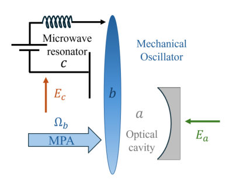
<figcaption class="paper-figure-caption"><b>Fig 1.</b> FIG. 1. Schematic diagram: The mechanical resonator serves as an intermediate mode b, coupling simultaneously to the microwave res- onator c and optical cavity a. The optical and microwave modes are driven by strong external fields Ea and Ec, respectively, while the mechanical mode is subjected to a nonlinear driving with amplitude Ωb, giving rise to mechanical parametric amplification.</figcaption>
</figure>
<figure class="paper-figure-card">
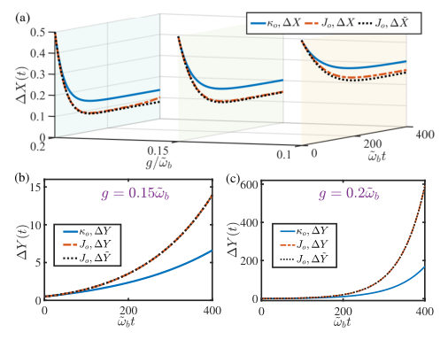
<figcaption class="paper-figure-caption"><b>Fig 2.</b> FIG. 2. (a) Time evolution of the squeezing variance ∆X(t) for dif- ferent environments and coupling strengths g. [(b), (c)] Time evo- lution of the anti-squeezing variance ∆Y (t) at g = 0.15˜ωb and g = 0.2˜ωb for different environments. The Markovian case is char- acterized by κo, whereas the structured environment is labeled by Jo. Here we fix ∆c = 3.5˜ωb, α = ϕ = 0, g = G, and r = 0.2 for all figures. The parameters are chosen as γc = 1.5γa with γa = 10−3˜ωb and λc = 1.5λa with λa = 10−2˜ωb, while the ther- mal occupation numbers are ¯na = ¯nc = 0.</figcaption>
</figure>
<figure class="paper-figure-card">
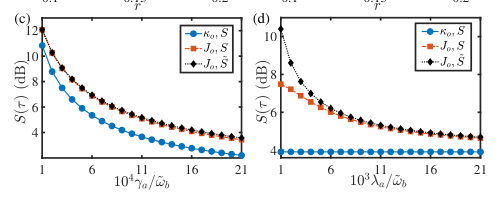
<figcaption class="paper-figure-caption"><b>Fig 3.</b> FIG. 3. [(a), (b)] The squeezing level (SL) S(τ) at ˜ωbτ = 300 is plotted in the parameter space spanned by the coupling strength g and the MPA parameter r for both Markovian and structured envi- ronments, respectively. [(c),(d)] The SL S(τ) is shown as a function of the global dissipation rate γa and spectrum width λa for vari- ous coupling strengths, respectively. In panels (c) and (d), we take g = G = 0.15˜ωb and r = 0.2. The other parameters are identical to those in Fig. 2.</figcaption>
</figure>
<figure class="paper-figure-card">
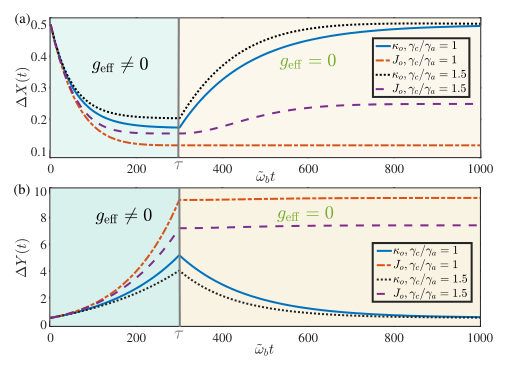
<figcaption class="paper-figure-caption"><b>Fig 4.</b> FIG. 4. [(a), (b)] The time evolutions of the variances ∆X(t) and ∆Y (t) are shown for both the generation (teal areas) and persistence (beige areas) processes under different environmental noises, respec- tively. Here, the spectral-density parameters satisfy λc/λa = γc/γa, and all other parameters are identical to those in Figs. 2(b), except for γc and λc.</figcaption>
</figure>
<figure class="paper-figure-card">
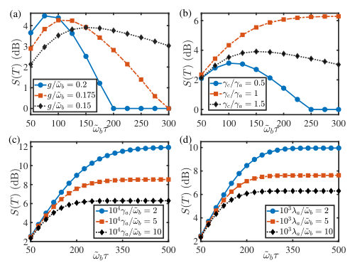
<figcaption class="paper-figure-caption"><b>Fig 5.</b> FIG. 5. The squeezing level S(T ) at a uniformly chosen prolonged duration T (with ˜ωbT = 1000) is plotted as a function of the driving- switch-off time τ. In panel (a), g = G, and all other parameters are identical to those in Fig. 2(b). In panel (b), g = G = 0.15˜ωb, γa = 10−3˜ωb, λa = 10−2˜ωb, and the ratio λc/λa = γc/γa. In panels (c) and (d), g = G = 0.15˜ωb and λc/λa = γc/γa = 1, while all other parameters remain unchanged.</figcaption>
</figure>
<figure class="paper-figure-card">
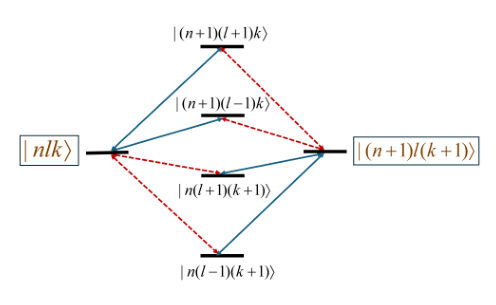
<figcaption class="paper-figure-caption"><b>Fig 6.</b> FIG. 6. All evolution paths between the quantum states |nlk⟩and |(n + 1)l(k + 1)⟩are shown, with blue solid lines representing connections established by the optical-mechanical interaction and red dashed lines indicating transitions mediated by the mechanical- microwave interaction.</figcaption>
</figure>
<figure class="paper-figure-card">
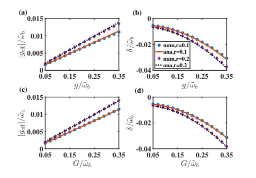
<figcaption class="paper-figure-caption"><b>Fig 7.</b> FIG. 8. [(a), (c)] Theoretical results about the effective coupling strength gefffrom Eq. (6) (lines) are plotted as functions of g and G, respectively, and compared against the numerical results, repre- sented by discrete points. [(b), (d)] Analytical results for the energy shift δ in Eq. (6) (lines) are similarly compared with the numeri- cally obtained values (points) as functions of g and G, respectively. G = 0.15˜ωb for panels (a) and (b), and g = 0.15˜ωb for panels (c) and (d). Additionally, ∆c = 3.5˜ωb is fixed for all panels.</figcaption>
</figure>
<figure class="paper-figure-card">
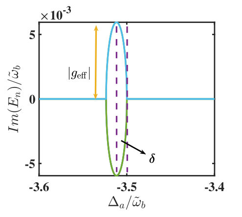
<figcaption class="paper-figure-caption"><b>Fig 8.</b> FIG. 7. Two relevant imaginary components of the normalized eigen- values of the transition matrix are plotted versus the detuning fre- quency ∆a. The parameters used are ∆c = 3.5˜ωb, g = G = 0.15˜ωb, and r = 0.2.</figcaption>
</figure>
<figure class="paper-figure-card">
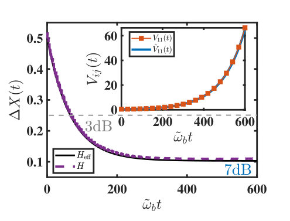
<figcaption class="paper-figure-caption"><b>Fig 9.</b> FIG. 9. The dynamics of the variance ∆X(t) are presented using the effective Hamiltonian in Eq. (5) and the full system Hamiltonian in Eq. (4). The inset depicts the evolution of the corresponding CM element under the effective and full Hamiltonians. The parameters are set as κb = 10−5˜ωb, κa = 0.002˜ωb, κc = 10−3 ˜ωb, and the thermal numbers Na = Nc = 0 and Nb = 10. Other parameters are the same as Fig. 7.</figcaption>
</figure>

**Main problem.** The challenge of generating and maintaining stable, high-level optical-microwave two-mode squeezed states (TMSS) in the presence of noise and the limitations of Markovian environments.

**Main result.** Non-Markovian (structured) environments can significantly enhance squeezing levels and allow TMS to persist even after external driving is switched off, especially when the spectral densities of the two modes are matched.

**Method.** The authors use second-order perturbation theory to derive an effective Hamiltonian and employ the Non-Markovian Hierarchical Equation of Motion (NMHL) to analyze the system's dynamical evolution.

**Summary.** This paper investigates how structured, non-Markovian environments can be used to generate and stabilize two-mode squeezing between optical and microwave modes in a hybrid electromechanical system. The authors demonstrate that non-Markovian noise can enhance squeezing levels compared to standard Markovian noise and even allow the squeezed state to persist after the external driving fields are turned off. They also find that matching the spectral densities of the optical and microwave reservoirs is key to preventing the degradation of the squeezed state. This work offers a way to mitigate the detrimental effects of anti-squeezing in quantum transducers.

Detailed structure

**Model / system.** A hybrid electro-optomechanical (EOM) system consisting of an optical cavity mode, a microwave LC resonator, and a mechanical oscillator, all coupled to structured (Lorentzian) reservoirs.

**Key observables.** Two-mode squeezing level (SL), squeezing variance (Delta X), and anti-squeezing variance (Delta Y).

**Important parameters / regimes.** Effective coupling strength (g_eff), mechanical parametric amplification (r), spectral density width (lambda), and detunings.

**Assumptions / limitations.** The system operates in a large detuning regime where the effective Hamiltonian is valid, and the use of the Rotating Wave Approximation (RWA) for system-reservoir coupling.

**Figures summary.** Fig 1: Schematic of the EOM system; Fig 2: Time evolution of squeezing and anti-squeezing; Fig 3: Parameter space analysis of squeezing level; Fig 4: Squeezing persistence during drive switch-off; Fig 7-9: Validation of the effective Hamiltonian and coupling strength.

**Paper structure.** The paper begins with a system schematic and effective Hamiltonian derivation, followed by a numerical validation of the model, an analysis of squeezing dynamics in Markovian vs. non-Markovian environments, an investigation of squeezing persistence after driving is removed, and concludes with a comparison of matched vs. mismatched spectral densities.

**Why it may be interesting.** It provides a theoretical framework for using reservoir engineering and non-Markovian memory effects to enhance and stabilize entanglement, which is crucial for quantum transduction and continuous-variable quantum information processing.

Abstract

Two-mode squeezed states as paradigmatic entangled resources have broad applications in quantum information processing. Here, we study the generation of stable optical-microwave squeezing in structured environments within a hybrid electro-optomechanical system, where a mechanical oscillator is simultaneously coupled to an optical cavity mode and a microwave mode of an LC resonator. Specifically, an effective Hamiltonian that captures the optical-microwave squeezing interaction is constructed by combining strongly modulated driving fields applied to both photonic modes with a mechanical parametric amplifier. Based on this effective model, the dynamical evolution of two-mode squeezing in structured environments is analyzed. It is remarkably shown that the non-Markovian noise can substantially enhance the squeezing level in comparison to the Markovian case, and that two-mode squeezing can persist even in the absence of external driving fields under non-Markovian conditions, thereby mitigating the detrimental effects of anti-squeezing. Furthermore, the persistence of the two-mode squeezed state is enhanced when the environmental spectral densities of the microwave and optical modes are identical. Our work provides a theoretical framework for generating and persisting two-mode squeezing in structured environments.

[↑ back to top](#top)

### [Impact of thermal and dissipative effects in a periodically-kicked quantum battery](http://arxiv.org/abs/2604.24409v1)

**Authors:** Sebastián V. Romero, Xi Chen, Yue Ban  
**Type:** theory · **Category:** statistical mechanics · **PDF:** <https://arxiv.org/pdf/2604.24409v1>  
**Analysis basis:** full PDF text, analyzed in chunks
**Topic relevance:** 🔥 `non-equilibrium dynamics` **4/5** · `methods for driven-dissipative` **3/5** · `driven-dissipative phase transition` **2/5** · `entanglement & information structure` **2/5**

↔ Scroll figures horizontally

<figure class="paper-figure-card">
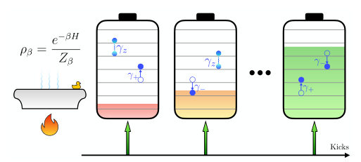
<figcaption class="paper-figure-caption"><b>Fig 1.</b> FIG. 1. Schematic of a dissipative kicked-Ising QB. Start- ing from a passive Gibbs state at temperature T = 1/β, the battery undergoes periodic driving in the presence of dissipa- tion. Decoherence mechanisms include pure dephasing, which suppresses quantum coherences at a rate γz, and excitation- relaxation processes, which induce transitions between energy levels at rates γ±, respectively.</figcaption>
</figure>
<figure class="paper-figure-card">
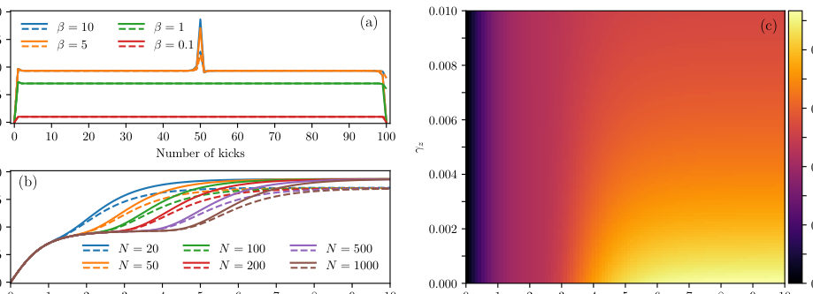
<figcaption class="paper-figure-caption"><b>Fig 2.</b> FIG. 2. Normalized injected energies using (Jth, hth) = (1/2, 1) for the initial TFIM and evolving at the self-dual point. Dashed (solid) lines correspond to dynamics in the presence (absence) of dephasing. (a) For N = 100 spins, evolution for different β up to m = 100 kicks with γz = 0.005. (b) Normalized injected energies at m = N/2 for different system sizes across varying temperatures, with γz = 1/(10N). (c) Normalized injected energy in the presence of dephasing under different (β, γz) pairs. All data are obtained analytically [12].</figcaption>
</figure>
<figure class="paper-figure-card">
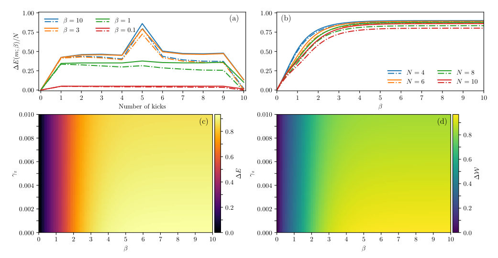
<figcaption class="paper-figure-caption"><b>Fig 3.</b> FIG. 3. (a) Normalized injected energies (solid) and ergotropies (dash-dotted) in the presence of dephasing using (Jth, hth) = (1/2, 1) for the initial TFIM Hamiltonian and evolving at the self-dual point (J, b) = (π/4, −π/4) using N = 10 spins up to m = 10 kicks with γz = 0.01. (b) Same analysis as in (a), but for different system sizes N and temperatures β at kick m = N/2. (c) Normalized injected energy at the kick m = N/2 of a KIC QB with N = 10 in the presence of dephasing under various (β, γz) pairs. We set (Jth, hth) = (1/2, 1) for the TFIM Hamiltonian. (d) Same study as (c), but computing the ergotropy.</figcaption>
</figure>
<figure class="paper-figure-card">
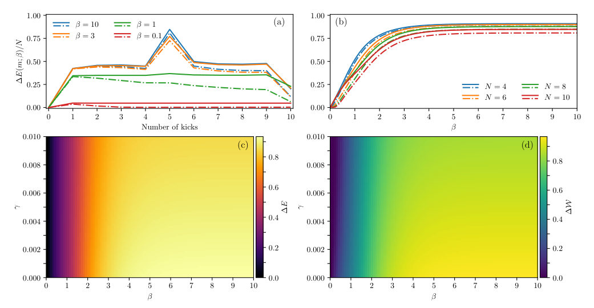
<figcaption class="paper-figure-caption"><b>Fig 4.</b> FIG. 4. (a) Normalized injected energies (solid) and ergotropies (dash-dotted) in the presence of thermal dissipation using (Jth, hth) = (1/2, 1) for the initial TFIM Hamiltonian and evolving at the self-dual point (J, b) = (π/4, −π/4). Results are shown for N = 10 spins, up to m = 10 kicks with γ = 0.01. (b) Same analysis as (a) but for different system sizes N across different temperatures β at the kick m = N/2. (c) Normalized injected energy at the kick m = N/2 of a KIC QB with N = 10 in the presence of thermal dissipation under various (β, γ) pairs. We set (Jth, hth) = (1/2, 1) for the TFIM Hamiltonian. (d) Same study as (c), but computing the ergotropy.</figcaption>
</figure>

**Main problem.** Investigating the impact of thermal fluctuations and environmental dissipation (dephasing and relaxation) on the performance and robustness of periodically-kicked quantum batteries.

**Main result.** The study establishes that while temperature and dissipation reduce energy injection and ergotropy, the charging protocol remains robust under certain regimes, and provides an analytical framework to quantify these effects.

**Method.** The authors use the Jordan-Wigner and Fourier transformations to map the system to free fermions, solving the Lindblad master equation via a system of coupled linear ordinary differential equations and applying the Cayley-Hamilton theorem.

**Summary.** This paper explores how realistic environmental factors, such as temperature and decoherence, affect the charging of a quantum battery based on a kicked-Ising model. By using a mathematical framework involving Jordan-Wigner transformations, the authors show how energy injection and extractable work (ergotropy) decay under dissipation. They identify specific regimes where the battery's performance remains robust despite these effects. The work provides a systematic way to assess the viability of quantum batteries in noisy, real-world environments.

Detailed structure

**Model / system.** A Kicked-Ising Chain (KIC) acting as a quantum battery, modeled by a Transverse-Field Ising Model (TFIM) Hamiltonian subject to periodic kicks and open-system dynamics via the Lindblad master equation (including pure dephasing and thermal dissipation).

**Key observables.** Ergotropy (extractable work), injected energy, mean energy stored, fermion occupation number, and parity weights.

**Important parameters / regimes.** Inverse temperature (beta), dephasing rate (gamma_z), dissipation rates (gamma_plus/minus), system size (N), and Ising interaction strength (J).

**Assumptions / limitations.** The dynamics are modeled using the Lindblad master equation, and the dissipation is assumed to follow specific local-spin operators.

**Figures summary.** Figure 2 shows the evolution of normalized injected energy over time for different temperatures, the scaling of energy injection with system size, and a parameter map of energy injection across temperature and dephasing rate space.

**Paper structure.** The paper begins by defining the Kicked-Ising battery model, moves to the analytical derivation of the open-system dynamics using fermionization, presents the results for energy injection and ergotropy under thermal and dissipative effects, and concludes with a discussion on robustness and scaling.

**Why it may be interesting.** This paper is highly relevant for researchers in open quantum systems and many-body dynamics as it provides an exact analytical framework for studying how environmental noise and finite temperature degrade the performance of non-equilibrium quantum energy storage devices.

Abstract

Quantum batteries (QBs) have emerged as a promising route for fast energy storage and on-chip power supply in quantum devices. Given the limited analytical understanding of open Floquet QBs, we employ the kicked-Ising model as a tractable platform to systematically study its performance under realistic conditions, including finite temperature effects and environmental dissipation. Starting from Gibbs states of the transverse-field Ising model, we incorporate thermal and decoherence effects along the evolution, using both analytical and numerical approaches. Taking ergotropy as a central figure of merit, we characterize the injected and extractable energy, and identify regimes where charging remains robust despite environmental effects. Our results provide a systematic framework for assessing QB performance under thermal and dissipative effects.

[↑ back to top](#top)

### [Entropy Signatures of Collective Modes and Vortex Dynamics in Rotating Two--Dimensional Bose--Einstein Condensates](http://arxiv.org/abs/2604.24557v1)

**Authors:** L. A. Machado, N. D. Chavda, B. Chatterjee, M. A. Caracanhas, B. Chakrabarti, A. Gammal, R. P. Sagar  
**Type:** theory · **Category:** quantum gases · **PDF:** <https://arxiv.org/pdf/2604.24557v1>  
**Analysis basis:** full PDF text, analyzed in chunks
**Topic relevance:** 🔥 `entanglement & information structure` **4/5** · 🔥 `non-equilibrium dynamics` **4/5** · `driven-dissipative phase transition` **2/5**

↔ Scroll figures horizontally

<figure class="paper-figure-card">
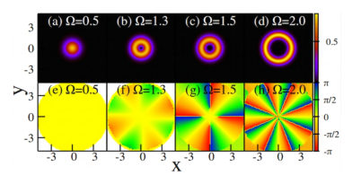
<figcaption class="paper-figure-caption"><b>Fig 1.</b> FIG. 1. Initial condensate states at selected rotation frequen- cies Ω. Top panels show the density n(x, y; 0), and bottom panels display the corresponding phase. For Ω≤1.2, the condensate forms a uniform central cloud with no vortex, and the phase is essentially uniform. At Ω= 1.3, a central vortex emerges, while Ω= 1.5 and Ω= 2.0 show increasing vortex charge, evolving into a giant vortex with annular density and a phase indicating total charges of 4 and 8, respectively.</figcaption>
</figure>
<figure class="paper-figure-card">
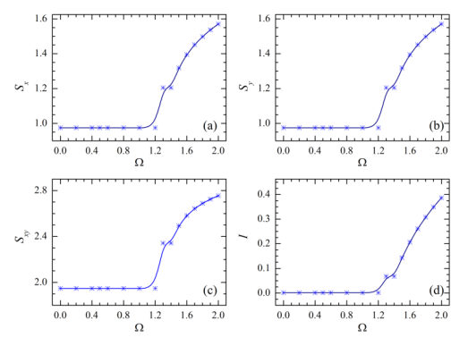
<figcaption class="paper-figure-caption"><b>Fig 2.</b> FIG. 2. Shannon information entropies and mutual informa- tion as a function of rotation frequency Ω. All four quantities, Sx, Sy, Sxy, and mutual information I, remain constant for Ω≤1.2. Beyond Ω= 1.2, each measure exhibits a kink and increases in a nonlinear manner, signaling the onset of cen- tral vortex formation and the emergence of correlations not directly visible in the density or phase profiles.</figcaption>
</figure>
<figure class="paper-figure-card">
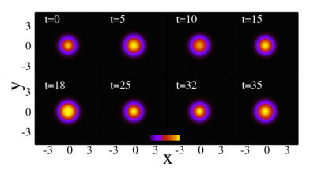
<figcaption class="paper-figure-caption"><b>Fig 3.</b> FIG. 3. Density evolution of the condensate for Ω= 0.5 fol- lowing an weak interaction quench. Snapshots at selected time points show the periodic expansion and contraction of the central bright cloud, characteristic of the monopole (breathing) mode.</figcaption>
</figure>
<figure class="paper-figure-card">
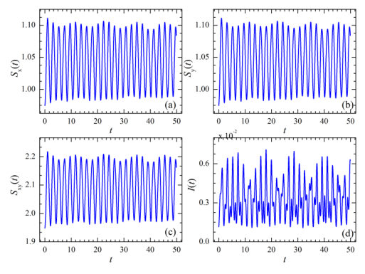
<figcaption class="paper-figure-caption"><b>Fig 4.</b> FIG. 4. Time evolution of information-theoretic measures for Ω= 0.5 during the monopole dynamics. We follow the same quench protocol as in Fig. 3. Panels show (a) Sx, (b) Sy, (c) Sxy, and (d) mutual information I as functions of time.</figcaption>
</figure>
<figure class="paper-figure-card">
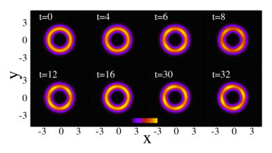
<figcaption class="paper-figure-caption"><b>Fig 5.</b> FIG. 5. Time evolution of the density for the Ω= 2.0 conden- sate following a stronger interaction quench (g′ ≈5g). The central giant vortex (dark circular region) remains largely cir- cular, while the bright outer ring develops a fourfold modula- tion, splitting into four partially connected high-density seg- ments. The snapshots illustrate the combined effects of radial breathing and angular symmetry breaking at selected times, highlighting the dynamic fragmentation of the outer annular region.</figcaption>
</figure>
<figure class="paper-figure-card">
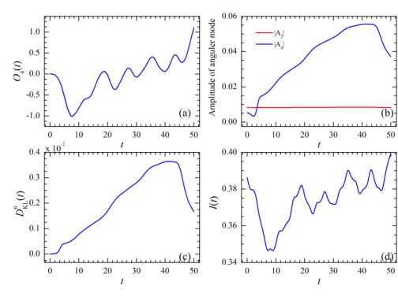
<figcaption class="paper-figure-caption"><b>Fig 6.</b> FIG. 6. Time evolution of angular observables along the outer ring. We follow the same quench protocol as in Fig. 5. Ob- servables: (a) Radially weighted fourfold operator O4(t). (b) Angular Fourier components A4(t) and A2(t). (c) Angular Kullback–Leibler divergence Dθ KL(t) and (d) mutual infor- mation I(t).</figcaption>
</figure>
<figure class="paper-figure-card">
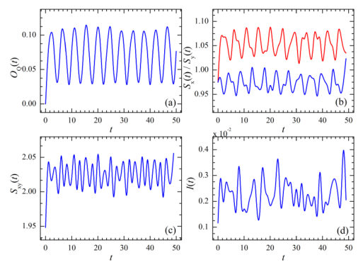
<figcaption class="paper-figure-caption"><b>Fig 7.</b> FIG. 8. Time evolution of quadrupole and information- theoretic observables for Ω= 0.5 following the trap quench. (a) Quadrupole operator OQ(t), (b) marginal entropies Sx(t) (red curve) and Sy(t) (blue curve), (c) joint entropy Sxy(t), and (d) mutual information I(t)</figcaption>
</figure>
<figure class="paper-figure-card">
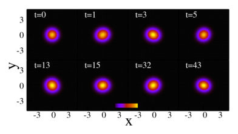
<figcaption class="paper-figure-caption"><b>Fig 8.</b> FIG. 7. Density snapshots at selected times for Ω= 0.5 fol- lowing the trap quench. The initially circular, vortex-free cloud oscillates between prolate and oblate shapes along x and y axes. The density remains compact with no fragmentation, and the center of mass stays near the trap origin, indicating a nearly pure quadrupole oscillation.</figcaption>
</figure>
<figure class="paper-figure-card">
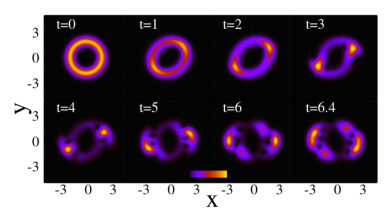
<figcaption class="paper-figure-caption"><b>Fig 9.</b> FIG. 9. One-body density snapshots at selected times for the giant vortex with initial Ω= 2.0 following the trap quench along the x-axis. The initial giant vortex at the center and the thin outer ring exhibit strong deformation and fragmentation over time, leading to irregular, chaotic dynamics.</figcaption>
</figure>
<figure class="paper-figure-card">
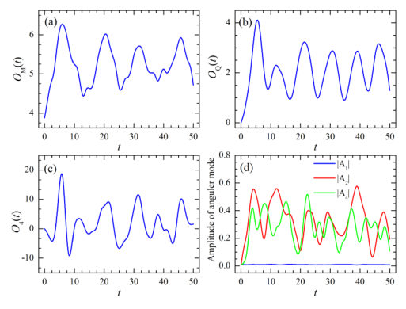
<figcaption class="paper-figure-caption"><b>Fig 10.</b> FIG. 10. Time evolution of collective and angular observables for Ω= 2.0 following the trap quench. Panels (a)–(c) show the monopole OM(t), quadrupole OQ(t), and fourfold mode O4(t), respectively. Panel (d) displays the angular Fourier modes A4(t) ,A2(t) and A1(t). All observables exhibit irregu- lar, large-amplitude oscillations indicative of chaotic dynam- ics.</figcaption>
</figure>

**Main problem.** Investigating the nonequilibrium dynamics, stability, and symmetry breaking of rotating 2D Bose-Einstein condensates (BECs) following interaction and trap quenches.

**Main result.** The study identifies a transition from regular, periodic oscillations in vortex-free states to irregular, chaotic dynamics in giant vortices, using mutual information to detect a clear dynamical phase transition at a specific rotation frequency.

**Method.** The Multiconfigurational Time-Dependent Hartree method for bosons (MCTDHB) is used to solve the time-dependent Schrödinger equation for a fully correlated many-body system.

**Summary.** This paper explores how rotating 2D Bose-Einstein condensates respond to sudden changes in their environment. It demonstrates that while low-rotation states undergo regular oscillations, high-rotation 'giant' vortices exhibit chaotic splitting and fragmentation. By using information-theoretic tools like mutual information, the authors can precisely identify the transition between regular and chaotic dynamical regimes. This work establishes entropy-based measures as sensitive probes for many-body correlations in quantum gases.

Detailed structure

**Model / system.** A 2D rotating Bose gas of N=8 identical bosons in a symmetric anharmonic (quartic) trap with a finite-range Gaussian interaction potential.

**Key observables.** One-body density and phase, Shannon entropies (marginal and joint), mutual information, Kullback-Leibler divergence (including angular-resolved), and angular Fourier components.

**Important parameters / regimes.** Rotation frequency (Omega), interaction strength (g), trap anisotropy, and number of bosons (N=8).

**Assumptions / limitations.** The system is treated in a 2D plane with a finite-range Gaussian potential instead of a pure delta-function contact interaction; the number of orbitals (M) is finite.

**Figures summary.** Figures show density snapshots of vortex formation and fragmentation, time evolution of entropy and mutual information, and a 3D dynamical phase diagram of correlations.

**Paper structure.** The paper introduces the physical system and Hamiltonian, describes the MCTDHB method, analyzes initial state characterization, explores dynamics under interaction quenches, examines dynamics under trap quenches, and concludes with a phase diagram of correlations.

**Why it may be interesting.** It provides a powerful framework for using information-theoretic measures to quantify many-body complexity, fragmentation, and the onset of chaos in ultracold atomic systems.

Abstract

We investigate the nonequilibrium dynamics of a two-dimensional rotating Bose gas confined in a symmetric anharmonic trap, employing the multiconfigurational time-dependent Hartree method for bosons (MCTDHB). We study states ranging from vortex-free configurations to multicharged (giant) vortices, prepared by tuning the rotation frequency, and analyze their response to sudden interaction and trap quenches. In vortex-free states, interaction quenches induce regular breathing--like dynamics, whereas in the presence of giant vortices they lead to symmetry-breaking surface excitations. In contrast, trap deformations that excite quadrupole-like modes produce stable oscillations in vortex-free condensates but trigger rapid, irregular, and effectively chaotic splitting dynamics in multicharged vortices. To characterize these processes beyond conventional density and phase observables, we employ information-theoretic measures, including marginal and joint entropies, mutual information, and Kullback-Leibler (KL) divergence, supplemented by an angular-resolved KL measure that captures symmetry breaking and azimuthal localization. We find that chaotic splitting is accompanied by a pronounced growth of information-theoretic indicators, signaling the buildup of many-body correlations and increasing complexity in the system dynamics. Our results demonstrate the extreme sensitivity of giant vortices to excitation protocols and establish information-theoretic measures as a powerful framework to quantify correlations and complexity in rotating quantum gases.

[↑ back to top](#top)

### [Floquet engineering of tight-binding Hamiltonians in momentum space lattices](http://arxiv.org/abs/2604.24722v1)

**Authors:** D. Ronco, F. Arrouas, N. Ombredane, E. Flament, Q. Levoy, B. Peaudecerf, D. Guéry-Odelin  
**Type:** both · **Category:** quantum gases · **PDF:** <https://arxiv.org/pdf/2604.24722v1>  
**Analysis basis:** full PDF text, analyzed in chunks
**Topic relevance:** 🔥 `analog quantum simulation` **4/5** · 🔥 `non-equilibrium dynamics` **4/5** · `exotic spin models in light-matter` **2/5**

↔ Scroll figures horizontally

<figure class="paper-figure-card">
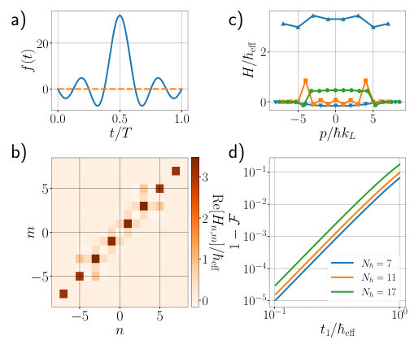
<figcaption class="paper-figure-caption"><b>Fig 1.</b> Figure 1. (a) Real (solid line) and imaginary (dotted line) parts of the modulation function f(t) used to simulate a seven-site Rice–Mele model with a uniform tunneling am- plitude t0 = 0.7 ℏeff, at a ℏeff = 2π resonance. (b) Real part of the effective Hamiltonian, Re[Hn,m/ℏeff], associated with the modulation in panel (a). (c) Effective Hamilto- nian parameters: on-site energies Hn,n/ℏeff for even (down blue triangles) and odd (up blue triangles) sites n, and first- (Hn,n+1/ℏeff, green circles) and second- (Hn,n+2/ℏeff, orange squares) nearest-neighbor tunneling amplitudes. (d) Fidelity between the Floquet operator generated from Eq. (20) and the target Rice–Mele time-evolution operator,...</figcaption>
</figure>
<figure class="paper-figure-card">
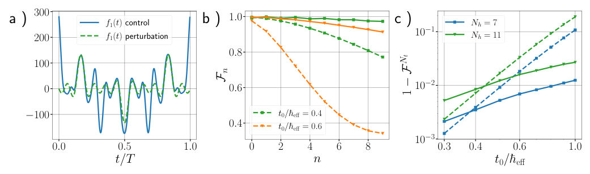
<figcaption class="paper-figure-caption"><b>Fig 2.</b> Figure 2. (a) Comparison between the modulation function obtained from first-order perturbation theory (dotted line) and its optimal-control refinement (solid line) at the quantum resonance ℏeff = 6π, for a 9-site Rice–Mele model with uniform tunneling amplitude t0 = 0.7 ℏeff. (b) Floquet-operator fidelity as a function of the number of repeated periods, for different tunneling amplitudes and Nh = 9, comparing the perturbative solution (dotted line) and the optimal-control solution (solid line). (c) Time-averaged fidelity over Nt = 5 periods as a function of the tunneling amplitude, for chain sizes Nh = 7 and 11, comparing the perturbative (dotted line) and optimal-control (solid line)...</figcaption>
</figure>
<figure class="paper-figure-card">
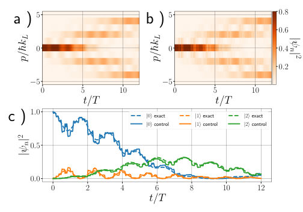
<figcaption class="paper-figure-caption"><b>Fig 3.</b> Figure 3. (a) Probability evolution map of a wave packet ini- tially localized on site |0⟩in the exact 9-site Rice–Mele model with ℏeff = 6π and tunneling amplitude t0 = 0.7 ℏeff. (b) Probability evolution map of the same initial state under the driven dynamics of Eq. (8), using the optimal-control mod- ulation shown in Fig. (2)a). (c) Time evolution of selected site populations in the exact Rice–Mele model (solid lines) compared with the optimal-control simulation (dotted lines). Optimal control parameters : MT = 300, N = 17 and Nt = 5.</figcaption>
</figure>
<figure class="paper-figure-card">
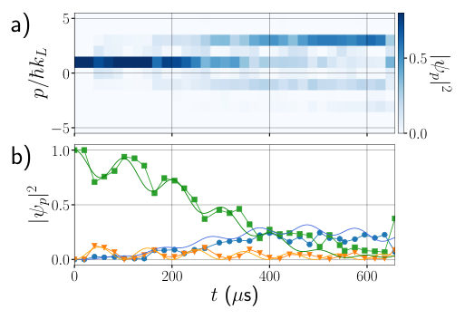
<figcaption class="paper-figure-caption"><b>Fig 4.</b> Figure 4. Experimental measurement of a quantum walk in a Rice-Mele model with ℏeff = 2π so ∆= π × ℏeff, t0 = 0.7 × ℏeff = t1, 7 sites and an initial state |1⟩with a modulation function improved by the optimal control method. Comparison between the time evolution of the theoretical probability (full lines) and experimental data (markers) of the probability of being on site |0⟩(green and square dots), |1⟩ (orange and round dots) and |3⟩(blue and triangular dots). The Floquet period is T2π ≈61.6 µs and the optimal con- trol parameters used to obtain the modulation function are MT = 1000, N = 21 and Nt = 5.</figcaption>
</figure>
<figure class="paper-figure-card">
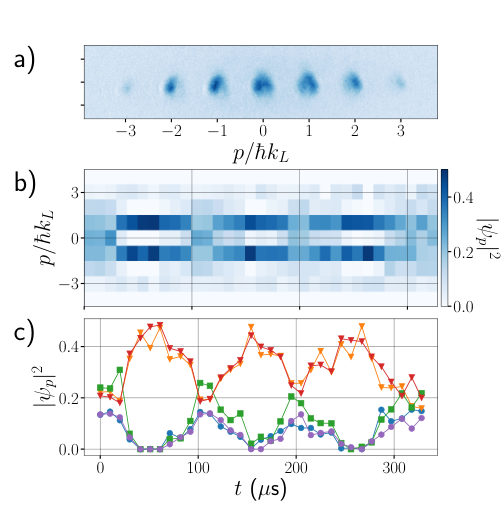
<figcaption class="paper-figure-caption"><b>Fig 5.</b> Figure 5. (a) Prepared fundamental state distribution: ex- perimental absorption image of the momentum orders after a 35 ms time of flight. (b,c) Experimental observation of the coherent oscillations of the initial ground state in a seven-site Rice–Mele model at ℏeff = 2π (∆= π ℏeff) with tunneling amplitude t0 = 0.6 ℏeff = t1, using an optimal-control modu- lation. Single-shot measurements of the site populations are shown for |0⟩(green squares), |1⟩(red triangles), | −1⟩(or- ange triangles), |2⟩(purple circles), and | −2⟩(blue circles). The Floquet period is T2π ≈61.6 µs and the optimal con- trol parameters used to obtain the modulation function are MT = 1000, N = 21 and Nt = 5.</figcaption>
</figure>
<figure class="paper-figure-card">
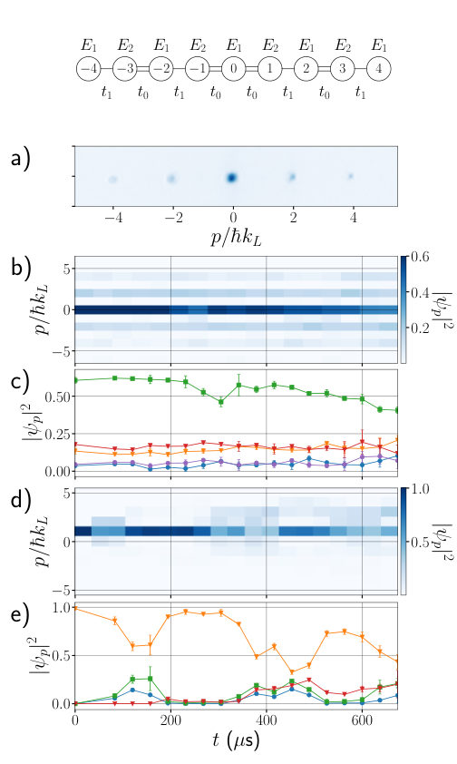
<figcaption class="paper-figure-caption"><b>Fig 6.</b> Figure 6. (a) Prepared edge state distribution: experimen- tal absorption image of the momentum orders after a 25 ms time of flight. The populations on integer multiples of ℏkL correspond to the initial populations on the MSL sketched above. (b) Time evolution of the momentum distribution for an initial state being the edge state exponentially localized on site |0⟩, shown in a). (c) Time evolution of selected site populations from b): |0⟩(green squares), |2⟩(red triangles), | −2⟩(orange triangles), |4⟩(purple circles), and | −4⟩(blue circles). (d) Time evolution of the momentum distribution for the initial state |1⟩. (e) Time evolution of selected site pop- ulations from d): |1⟩(orange...</figcaption>
</figure>
<figure class="paper-figure-card">
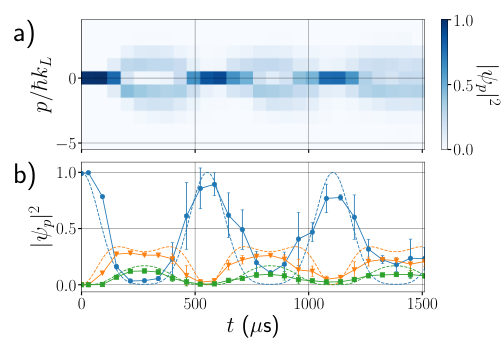
<figcaption class="paper-figure-caption"><b>Fig 7.</b> Figure 7. (a) Time evolution of the momentum distribution for an initial state localized on site |0⟩in a tight-binding model with tunneling amplitude t0/ℏeff = 0.8 and effective uniform force ωB = 1.4. (b) Time evolution of the populations of sites |0⟩(blue circles), |1⟩(orange triangles), and |2⟩(green squares), averaged over five experimental runs. The analytical prediction from Eq. (38) is shown as dotted lines. The Floquet period is T4π ≈123.3 µs.</figcaption>
</figure>
<figure class="paper-figure-card">
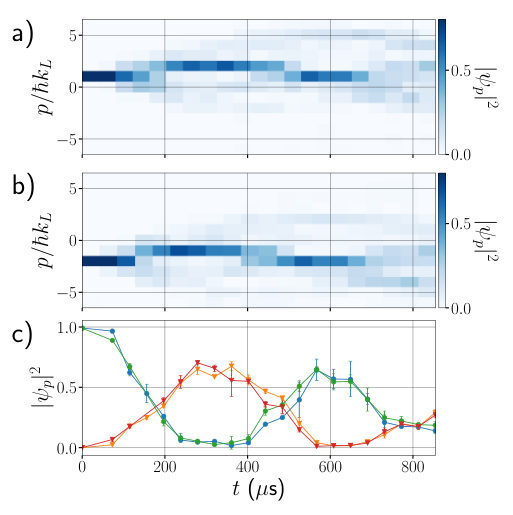
<figcaption class="paper-figure-caption"><b>Fig 8.</b> Figure 9. (a,b) Time evolution of the momentum distribu- tions from initial states |1⟩and | −2⟩, respectively, in a tight- binding model with three-site periodicity (ℏeff = 16π/3) and nearest-neighbor tunneling amplitude t0/ℏeff = 0.9. (c) Time evolution of selected site populations: for the initial state |1⟩, sites |1⟩(blue circles) and |2⟩(orange triangles); for the initial state | −2⟩, sites | −2⟩(green squares) and | −1⟩. Data are averaged over five experimental runs. The Floquet period is T16π/3 ≈164.4 µs and the optimal control parameters used to obtain the modulation function are MT = 1000, N = 21 and Nt = 5.</figcaption>
</figure>
<figure class="paper-figure-card">
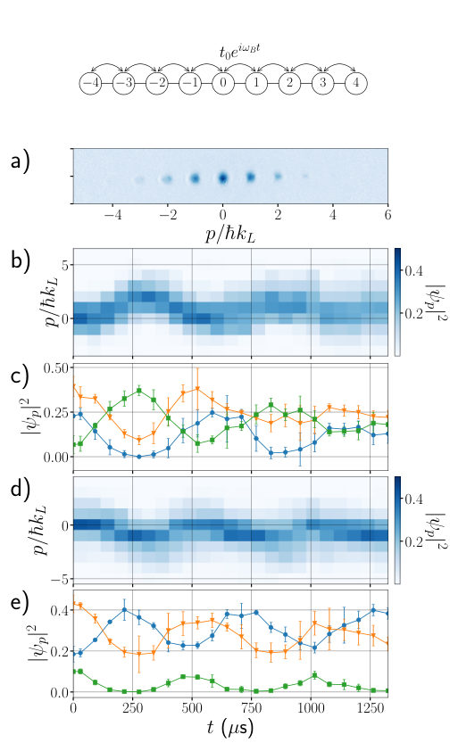
<figcaption class="paper-figure-caption"><b>Fig 9.</b> Figure 8. (a) Experimental absorption image of the diffrac- tion orders after a 25 ms time of flight. The populations on integer multiples of ℏkL correspond to the initial populations on the MSL sketched above, for a Gaussian initial state. (b) Time evolution of the momentum distribution from the initial Gaussian state in a tight-binding model with tunneling ampli- tude t0/ℏeff = 0.8 and effective uniform force ωB = 0.7, show- ing momentum space Bloch oscillations. (c) Time evolution of the populations of sites |0⟩(orange triangles), |1⟩(green squares), and | −1⟩(blue circles). (d) Time evolution of the momentum distribution from the initial alternating Gaussian state. (e) Time evolution of...</figcaption>
</figure>
<figure class="paper-figure-card">
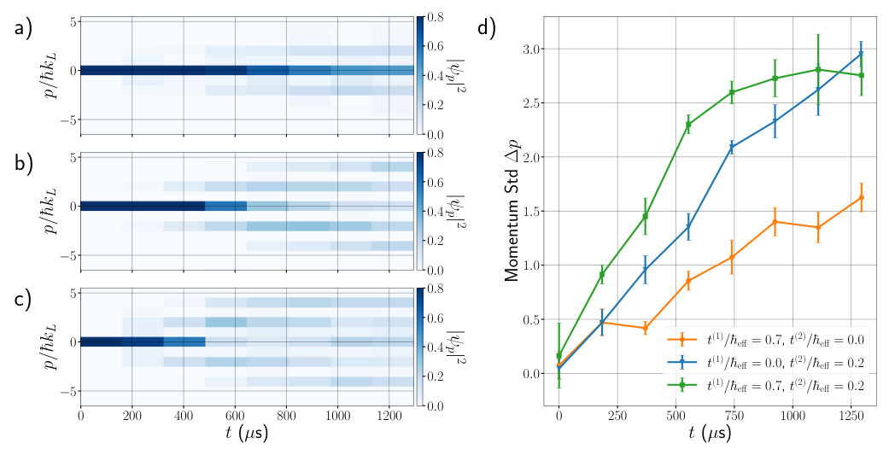
<figcaption class="paper-figure-caption"><b>Fig 10.</b> Figure 10. (a) Time evolution of the momentum distribution from the initial state |0⟩in a chain with staggered onsite energies ε2n = 0 and ε2n+1/ℏeff = π, and nearest-neighbor tunneling t(1) = 0.7 ℏeff, and no second-nearest-neighbor coupling (t(2) = 0). (b) Time evolution of the momentum distribution in a chain with t(1) = 0 and t(2) = 0.2 ℏeff. (c) Time evolution of the momentum distribution in a chain with both t(1) = 0.7 ℏeff and t(2) = 0.2 ℏeff. (d) Time evolution of the wave-packet momentum width width ∆p = p</figcaption>
</figure>

**Main problem.** Developing a programmable method for Floquet engineering of tight-binding Hamiltonians in momentum-space lattices by independently tuning on-site energies and tunneling amplitudes.

**Main result.** The authors demonstrate that quantum resonances in a shaken rotor can be used to engineer various models, including the Rice-Mele model, and show that optimal control can significantly enhance multi-period Floquet fidelity.

**Method.** The study uses Floquet theory, first-order time-dependent perturbation theory, and a kernel-based inversion method, supplemented by gradient-ascent optimal control techniques.

**Summary.** This paper presents a method to engineer programmable tight-binding Hamiltonians in momentum space using a shaken rotor of ultracold atoms. By exploiting quantum resonances and optimal control, the researchers can independently tune tunneling amplitudes and on-site energies. They experimentally demonstrate the simulation of the Rice-Mele model, topological edge states, and Bloch oscillations. This approach turns quantum resonances into a versatile resource for quantum simulation.

Detailed structure

**Model / system.** A Bose-Einstein condensate of Rubidium-87 atoms in a dynamically modulated (shaken) optical lattice, modeled by a generalized 'shaken rotor' Hamiltonian.

**Key observables.** Momentum distribution, site populations, momentum width, average momentum, and Floquet operator fidelity.

**Important parameters / regimes.** Effective Planck constant (hbar_eff), kick period (T), lattice depth (s0), and modulation functions (f1, f2).

**Assumptions / limitations.** The framework assumes a perturbative regime (weak driving) and relies on quantum resonance conditions to maintain discrete translational symmetry.

**Figures summary.** Figures show the real and imaginary parts of modulation functions, comparison between perturbative and optimal control solutions, and experimental observations of momentum-space Bloch oscillations, topological edge states, and wave packet expansion in superlattices.

**Paper structure.** The paper progresses from theoretical derivation of the Floquet framework and analytical relations to the implementation of optimal control, followed by experimental verification of various tight-binding models and topological phenomena.

**Why it may be interesting.** It provides a powerful toolkit for simulating complex condensed-matter models like the Rice-Mele model and topological junctions using the highly controllable platform of momentum-space lattices in ultracold atoms.

Abstract

Quantum simulation with ultracold atoms provides a versatile platform to emulate condensed-matter models. In particular, momentum-space lattices enable the realization of programmable tight-binding Hamiltonians. Here, we generalize this approach by exploiting quantum resonances of a periodically driven (shaken) rotor within the Floquet framework. Using first-order time-dependent perturbation theory, we derive analytical relations between the lattice modulation and the effective tight-binding parameters, and identify explicit solutions for several resonances. We further apply optimal-control techniques to enhance the multi-period Floquet fidelity and extend the accessible parameter regimes. Experimentally, we implement this scheme with a Bose-Einstein condensate of rubidium-87 atoms in a dynamically modulated optical lattice. We demonstrate the simulation of the Rice-Mele model, including band-structure measurements and topological edge states, as well as momentum Bloch oscillations, and superlattice configurations with controlled periodicity. Our results establish quantum resonances as a powerful resource for Floquet engineering of tight-binding models in momentum space.

[↑ back to top](#top)

### [Control of the Néel vector in the quantum antiferromagnetic honeycomb lattice](http://arxiv.org/abs/2604.24695v1)

**Authors:** Asliddin Khudoyberdiev, Dag-Björn Hering, Vanessa Sulaiman, Götz S. Uhrig  
**Type:** theory · **Category:** strongly correlated electrons · **PDF:** <https://arxiv.org/pdf/2604.24695v1>  
**Analysis basis:** full PDF text, analyzed in chunks
**Topic relevance:** 🔥 `non-equilibrium dynamics` **4/5** · `non-equilibrium universality` **3/5** · `Keldysh / 2PI / non-Gaussian methods` **2/5**

↔ Scroll figures horizontally

<figure class="paper-figure-card">
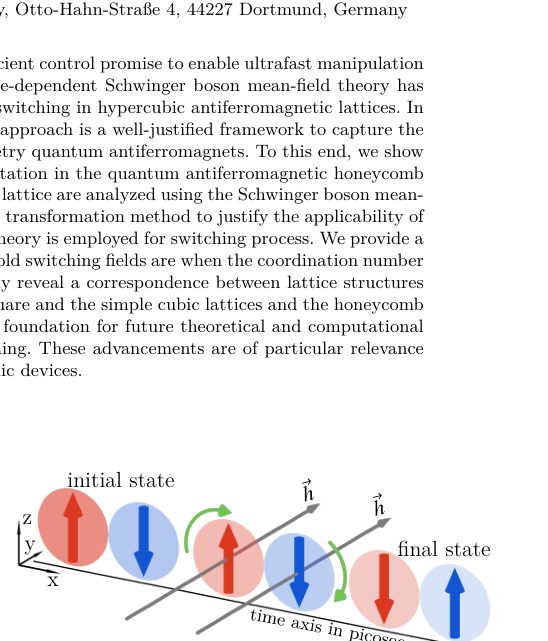
<figcaption class="paper-figure-caption"><b>Fig 1.</b> Fig. 1. This classical illustration shows how the sublattice mag- netization is manipulated. The initial state, with two linked red and blue sublattices, is shown on the left. The arrows inside the circles indicate the direction of the sublattice magnetization. A uniform magnetic field (gray arrows) is applied to switch the order (middle), and the final state is obtained (last two circles on the right). The round green arrows indicate the direction of the Larmor precession of the spins on the sublattice.</figcaption>
</figure>
<figure class="paper-figure-card">
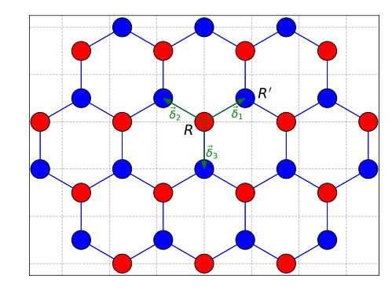
<figcaption class="paper-figure-caption"><b>Fig 2.</b> Fig. 2. Honeycomb lattice with two nonequivalent sites. The sub- lattice R correspond to site i and sublattice R′ correspond to site j. The vectors δl (l = 1, 2, 3) connect the site R to its three neigh- bouring R′ sites.</figcaption>
</figure>
<figure class="paper-figure-card">
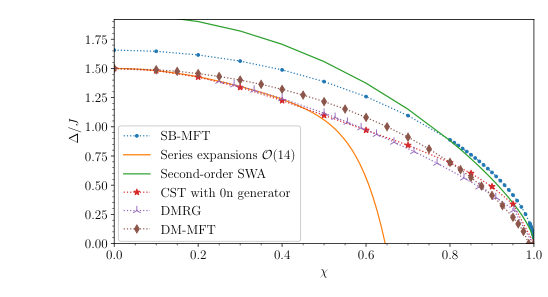
<figcaption class="paper-figure-caption"><b>Fig 3.</b> Fig. 3. The spin gap vs. the anisotropy parameter. The blue cir- cles with dotted line are obtained by the SB-MFT as employed in this article. The orange line displays results of the plain series expansions around the Ising limit from Oitmaa et al. in Ref. 31. The green line is the result of the second-order spin-wave analy- sis in Ref. 46. The red stars correspond to the CST 0n generator. The diamond shape markers are obtained by DM-MFT. The tri symbols belong to the DMRG method from Ref. 47.</figcaption>
</figure>
<figure class="paper-figure-card">
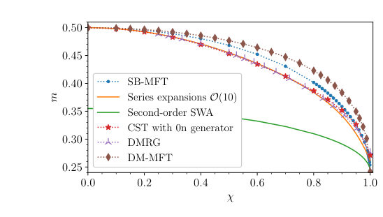
<figcaption class="paper-figure-caption"><b>Fig 4.</b> Fig. 4. The sublattice magnetization dependence on the anisotropy parameter. The blue circles with dotted line depict the results of the SB-MFT. The orange line is generated from the results of the series expantions around the Ising limit from Oitmaa et al. in Ref. 31. The green line is the result of the second-order spin-wave analysis in Ref. 46. The red stars correspond to the CST 0n generator. The diamond shape markers are obtained by the DM-MFT. The tri symbols belong to the DMRG method from Ref. 47. It should be noted that the magnetization is always finite, even for χ = 1.</figcaption>
</figure>
<figure class="paper-figure-card">
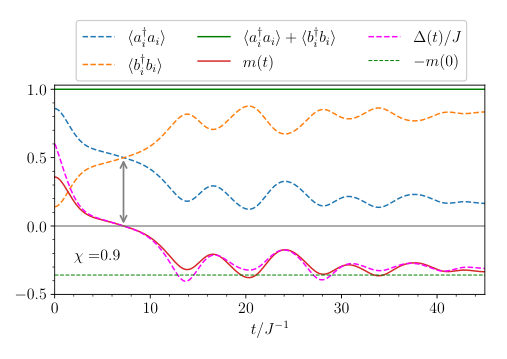
<figcaption class="paper-figure-caption"><b>Fig 5.</b> Fig. 5. The dynamics of the occupations of the bosons and the magnetization. The strength of the external magnetic field is hu = 0.645 J. The magenta colored dashed line shows the dynamics of the spin gap. The double-headed arrow shows the instant of the switching, i.e., the sign change of m(t). For comparison, the dashed green horizontal line is included to indicate the negative initial magnetization.</figcaption>
</figure>
<figure class="paper-figure-card">
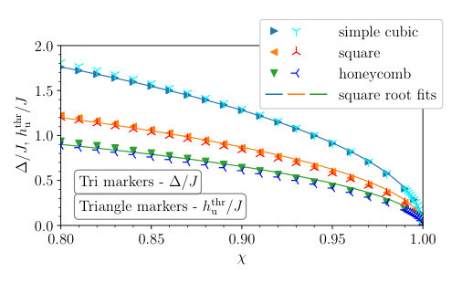
<figcaption class="paper-figure-caption"><b>Fig 6.</b> Fig. 7. The uniform threshold field and the spin gap dependence on the anisotropy parameter χ. The triangle markers indicate the values of hthr u while the tri markers show the value of the spin gap ∆. The solid lines are square root fits: hthr,α u,fit = zαcα p</figcaption>
</figure>
<figure class="paper-figure-card">
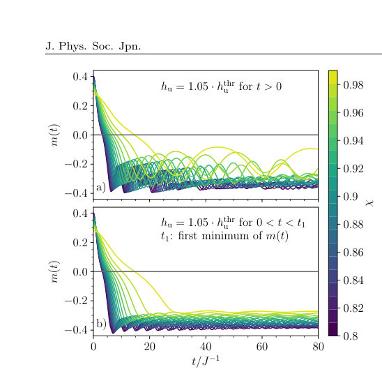
<figcaption class="paper-figure-caption"><b>Fig 7.</b> Fig. 6. The dynamics of the sublattice magnetization are shown for the range of anisotropies 0.8 ≤χ &lt; 1. Panel a) shows the dynam- ics for the case where the external field is applied at all times t &gt; 0. In panel b), the field is turned off after the switching at t1, where t1 is the time at which m(t) reaches its first minimum in the m(t) &lt; 0 region. The minimum value of the external field for switching is labeled by the superscript “thr” for threshold. For all anisotropies, the field strength is chosen 5% higher than the threshold value to ensure reliable switching.</figcaption>
</figure>
<figure class="paper-figure-card">
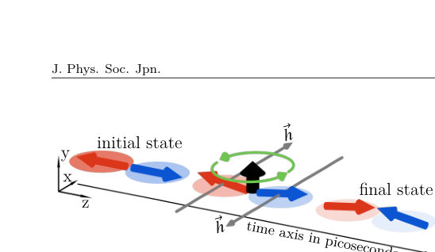
<figcaption class="paper-figure-caption"><b>Fig 8.</b> Fig. 8. The classical illustration of the exchange-enhanced switching. The initial state, with two linked red and blue sublat- tices, is shown on the left. The arrows inside the circles indicate the direction of the sublattice magnetization. Subsequent to the ap- plication of the staggered magnetic fields on the sublattices (gray arrows), the spins exhibit a slight deflection, concurrently forming a robust effective field (black arrow). Consequently, the spins ro- tate around the resulting effective field (shown by the green curved arrows) and the final switched state is obtained (last two circles on the right).</figcaption>
</figure>
<figure class="paper-figure-card">
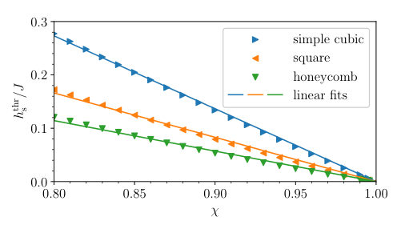
<figcaption class="paper-figure-caption"><b>Fig 9.</b> Fig. 9. The staggered threshold field dependence on the anisotropy parameter χ. The triangle markers correspond to the hthr s values while the solid lines are linear fits: hthr,α s,fit = zαdα(1 −χ), α ∈{sc, sq, hc} where zα is the coordination number of the lattice and dα are the fit parameters with dsc = (0.228 ± 0.0007)J (simple cubic lattice zsc = 6), dsq = (0.208 ± 0.0016)J (square lattice zsq = 4) and dhc = (0.191±0.0019)J (honeycomb lattice zhc = 3). The data for the square and simple cubic lattices are taken from Ref. 15.</figcaption>
</figure>
<figure class="paper-figure-card">
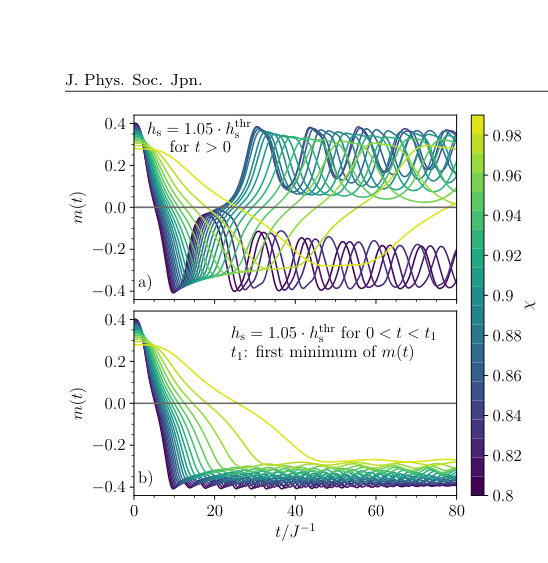
<figcaption class="paper-figure-caption"><b>Fig 10.</b> Fig. 10. The dynamics of the sublattice magnetization under staggered switching field in the anisotropy range χ ∈[0.8, 1). Panel a) shows the dynamics when the field is active at t &gt; 0 whereas panel b) shows the dynamics for the case when the field is applied only till the magnetization reaches its first minimum. The strength of the field is chosen always 5% higher than the threshold value of the field at the given anisotropy.</figcaption>
</figure>

**Main problem.** Investigating the control and switching of the Neel vector in a quantum antiferromagnetic honeycomb lattice, specifically determining the threshold magnetic fields required for magnetization reorientation.

**Main result.** The study establishes universal scaling laws for threshold fields in different lattices and demonstrates that staggered fields enable 'exchange-enhanced switching' at much lower magnitudes than uniform fields.

**Method.** The authors use time-dependent Schwinger boson mean-field theory (SB-MFT) and Continuous Similarity Transformation (CST) to model the non-equilibrium switching process and validate equilibrium properties.

**Summary.** This paper explores how to efficiently flip the magnetic orientation in a quantum antiferromagnetic honeycomb lattice. By using Schwinger boson mean-field theory, the authors show that applying a staggered magnetic field can trigger 'exchange-enhanced switching' at much lower energy costs than a uniform field. They also identify universal scaling laws that relate the required switching field to the lattice's coordination number. These findings are significant for the development of ultrafast, energy-efficient spintronic and magnonic devices.

Detailed structure

**Model / system.** A spin-1/2 anisotropic XXZ Heisenberg model on a quantum antiferromagnetic honeycomb lattice, including both uniform and staggered external magnetic fields.

**Key observables.** Sublattice magnetization (Neel vector), spin gap, boson occupation numbers, and oscillation frequencies of the Neel vector.

**Important parameters / regimes.** Anisotropy parameter (chi), coordination number (z), exchange coupling (J), and external magnetic field strengths (hu and hs).

**Assumptions / limitations.** The study focuses on the ground state at zero temperature and assumes the validity of the Schwinger boson mean-field approximation for low-symmetry lattices.

**Figures summary.** Figures illustrate the switching process, the honeycomb lattice structure, spin gap and magnetization vs. anisotropy, temporal evolution of magnetization and boson occupation, and scaling laws for threshold fields across different lattice types.

**Paper structure.** The paper begins by validating the SB-MFT framework against CST and DMRG for equilibrium properties, then moves to modeling the non-equilibrium switching dynamics under uniform and staggered fields, and concludes with a comparative analysis of lattice coordination numbers and universal scaling laws.

**Why it may be interesting.** The paper provides deep insights into many-body dynamics, specifically how collective modes (magnons) drive the reversal of an order parameter and how dephasing leads to steady-state convergence without explicit relaxation.

Abstract

The switching of antiferromagnetic order and its efficient control promise to enable ultrafast manipulation of data and large storage capacity. Recently, the time-dependent Schwinger boson mean-field theory has been successfully developed to study the Néel vector switching in hypercubic antiferromagnetic lattices. In the present article, we aim at demonstrating that the approach is a well-justified framework to capture the essentials of the switching process, even in low-symmetry quantum antiferromagnets. To this end, we show the possibility of the sublattice magnetization reorientation in the quantum antiferromagnetic honeycomb lattice. First, equilibrium properties of the honeycomb lattice are analyzed using the Schwinger boson mean-field theory and compared to the continuous similarity transformation method to justify the applicability of the approach. Then, the Schwinger boson mean-field theory is employed for switching process. We provide a comprehensive answer to the question what the threshold switching fields are when the coordination number of the lattice is varied. Indeed, the results of the study reveal a correspondence between lattice structures and the threshold fields by comparing them for the square and the simple cubic lattices and the honeycomb lattice. The findings of the present article extend the foundation for future theoretical and computational advancements in the field of antiferromagnetic switching. These advancements are of particular relevance for the development of ultrafast spintronic or magnonic devices.

[↑ back to top](#top)

### [Design Principles for Enhanced Quantum Transport with Site-Dependent Noise](http://arxiv.org/abs/2604.23005v1)

**Authors:** Maggie Lawrence, Elise Wang, Dvira Segal  
**Type:** theory · **Category:** disordered systems and neural networks · **PDF:** <https://arxiv.org/pdf/2604.23005v1>  
**Analysis basis:** full PDF text, analyzed in chunks
**Topic relevance:** 🔥 `correlated / nonlocal dissipation` **4/5** · `non-equilibrium dynamics` **3/5** · `methods for driven-dissipative` **2/5**

↔ Scroll figures horizontally

<figure class="paper-figure-card">
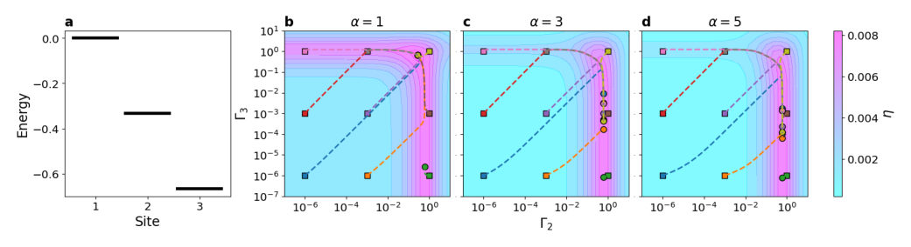
<figcaption class="paper-figure-caption"><b>Fig 1.</b> FIG. 1: Three-site example of transfer behavior. (a) Energy structure in the form of a ramp with equidistant energy levels. (b)-(d) Population flux as a function of dephasing rate applied onto sites 2 and 3. No dephasing is applied to site 1. Between the different panels, we vary the power α that controls the tunneling range, see Eq. (2): α = 1 corresponds to long range tunneling, while α = 5 essentially describes nearest neighbors tunneling. Dashed lines show example trajectories taken by the Adamax optimizer from a grid of initial Γ2 and Γ3 values (squares of different colors) and the optimal solutions reached (circles). Parameters are γl = 0.1 and Jmax = 0.1, fixed throughout this study.</figcaption>
</figure>
<figure class="paper-figure-card">
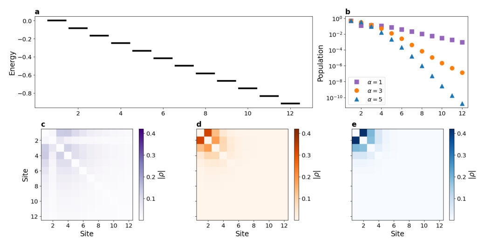
<figcaption class="paper-figure-caption"><b>Fig 2.</b> FIG. 2: Development of WS localization: Lattices with N = 12 sites and tunneling powers α = 1, 3, 5, with no environmental interaction. (a) Potential profile, (b) steady state population profiles for the ramp energy potential, and (c)-(e) steady-state density matrices for tunneling powers of α = 1, 3, 5, respectively, with the diagonals removed. The system includes 12 sites, with Jmax = 0.1 and γl = 0.1.</figcaption>
</figure>
<figure class="paper-figure-card">
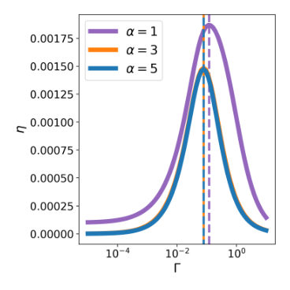
<figcaption class="paper-figure-caption"><b>Fig 3.</b> FIG. 3: Population flux as a function of uniform dephasing under the ramp potential 2(a). The peak indicates the optimal dephasing rate for transport. The dashed lines mark the locations of the peaks: Γα=1 u = 0.121, Γα=3 u = 0.079, and Γα=5 u = 0.078 with corresponding fluxes ηα=1 u = 1.87 · 10−3, ηα=3 u = 1.48 · 10−3, and ηα=5 u = 1.47 · 10−3. Other parameters are the same as in Figure 2.</figcaption>
</figure>
<figure class="paper-figure-card">
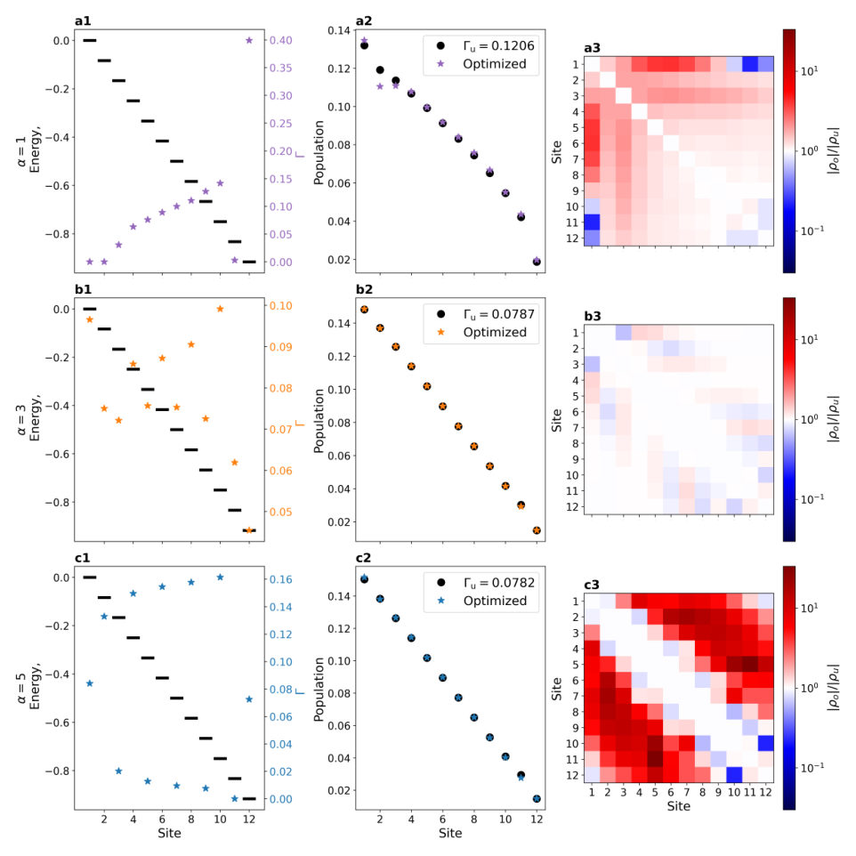
<figcaption class="paper-figure-caption"><b>Fig 4.</b> FIG. 4: Enhancing transport in a ramp potential for systems with power-law tunneling α = 1 (a1-a3, purple), α = 3 (b1-b3, orange), and α = 5 (c1-c3, blue). Left column: We show the ramp energy profile and the resulting locally-optimized values for Γn. Middle column: Steady state population using the optimal uniform value Γu and the optimized profile Γn. Right column: Ratios of the absolute values of the density matrix elements under the locally optimized dephasing rates, ρo, and the uniform value Γu, ρu. Other parameters are the same as in Figure 2. We report here the values of the population flux η under optimized and uniform dephasing profiles (optimized, uniform): ηα=1 : (1.97 · 10−3,...</figcaption>
</figure>
<figure class="paper-figure-card">
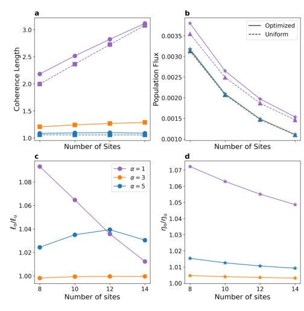
<figcaption class="paper-figure-caption"><b>Fig 5.</b> FIG. 5: Analysis of coherence length and population flux in ramped systems with N = 8 −14 sites. (a) Coherence length as a function of system length for optimized dephasing (solid lines, circles) and the best uniform dephasing (dashed lines, squares), for α = 1, α = 3, and α = 5 (purple, orange, and blue, respectively). (b) Population flux as a function of system length for optimized dephasing (solid lines, stars) and the best uniform dephasing (dashed lines, triangles). (c) Ratio of the coherence lengths under optimized and uniform dephasing. (d) Ratio of population fluxes under optimized and uniform dephasing rates. Constant energy differences between adjacent sites of ∆= 1/12 were...</figcaption>
</figure>
<figure class="paper-figure-card">
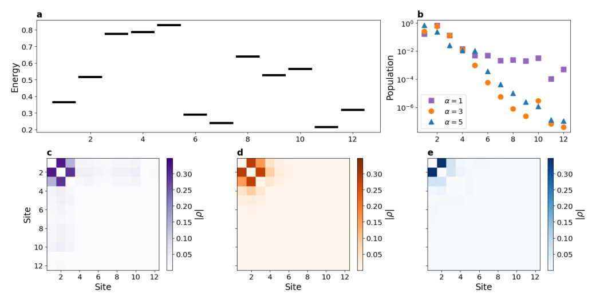
<figcaption class="paper-figure-caption"><b>Fig 6.</b> FIG. 6: Development of Anderson localization in a disordered lattice of N = 12 sites with no environmental interactions. (a) Example of a disordered energy profile. (b) Steady-state population profiles for α = 1, 3, 5. All cases show suppression of population flux from the entrance site 1, but localization will strictly develop for α = 5. (c)-(e) steady-state density matrices for α = 1, 3, 5 with the diagonals removed. Other parameters are Jmax = 0.1 and γl = 0.1.</figcaption>
</figure>
<figure class="paper-figure-card">
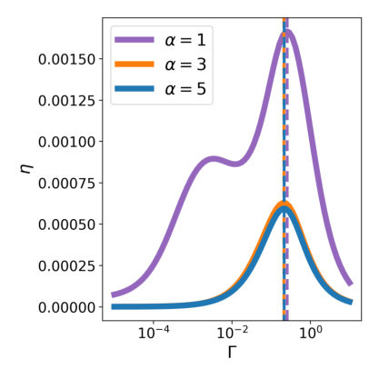
<figcaption class="paper-figure-caption"><b>Fig 7.</b> FIG. 7: Population flux as a function of uniform dephasing rate. The dashed lines show the locations of maximal flux: Γu = 0.256, 0.211, and 0.214 with corresponding fluxes ηα=1 = 1.66 · 10−3, ηα=3 = 6.29 · 10−4, and ηα=5 = 5.94 · 10−4, respectively. Other parameters are the same as in Figure 6.</figcaption>
</figure>
<figure class="paper-figure-card">
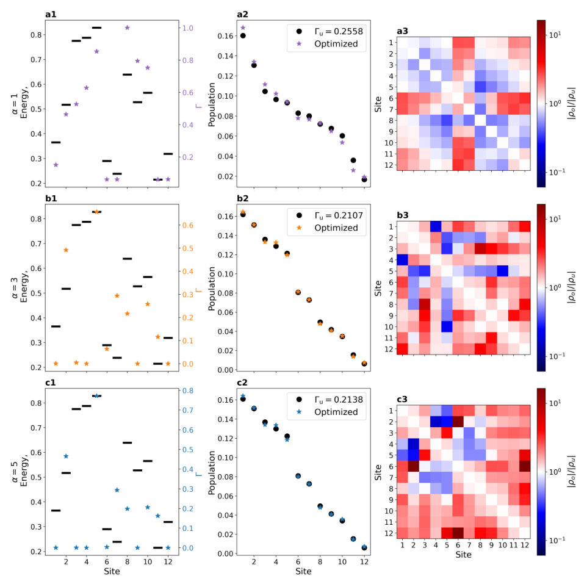
<figcaption class="paper-figure-caption"><b>Fig 8.</b> FIG. 8: Enhancing transport in an energetically disordered system with site-optimized dephasing. ηα=1 = 1.92 · 10−3, ηα=3 = 7.33 · 10−4, ηα=5 = 7.13 · 10−4. Other parameters are the same as in Fig. 6.</figcaption>
</figure>
<figure class="paper-figure-card">
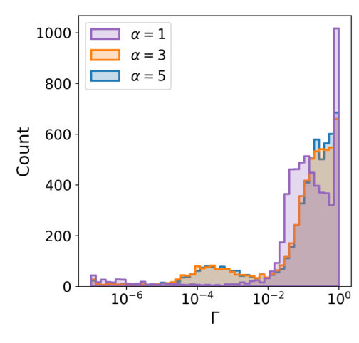
<figcaption class="paper-figure-caption"><b>Fig 9.</b> FIG. 9: Distribution of all optimized Γn values in 500 N = 12 site disordered systems with α = 1 (purple), α = 3 (orange), and α = 5 (blue) power-law coupling.</figcaption>
</figure>
<figure class="paper-figure-card">
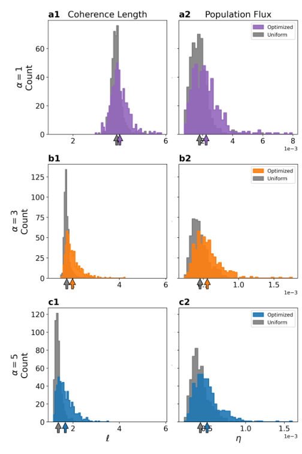
<figcaption class="paper-figure-caption"><b>Fig 10.</b> FIG. 10: Histogram of coherence lengths (left) and population fluxes (right) for 500 disordered systems with α = 1 (a1-a2), α = 3 (b1-b2), and α = 5 (c1-c2) power-law tunneling. Results under uniform dephasing rates are shown in gray, and under the optimized dephasing rates in color. Arrows indicate mean values. The optimized-noise coherence lengths show average improvements over the uniform-noise coherence lengths of (a) 3.5%, (b) 14.1%, and (c) 21.5%. The optimized-noise population fluxes show improvements over the uniform-noise population fluxes of (a) 21.9%, (b) 21.8%, and (c) 19.6%.</figcaption>
</figure>

**Main problem.** Investigating whether spatially structured (site-dependent) environmental noise can be engineered to enhance quantum transport and overcome localization effects like Wannier-Stark and Anderson localization.

**Main result.** Site-optimized dephasing consistently outperforms uniform dephasing by increasing transport efficiency and promoting spatial delocalization, with specific optimal profiles depending on the tunneling range and energy landscape.

**Method.** Numerical optimization of site-dependent dephasing rates using the Adamax algorithm within a Lindblad quantum master equation framework, supplemented by analytical solutions for three-site models.

**Summary.** This paper explores how engineering site-dependent environmental noise can enhance quantum transport in 1D systems prone to localization. By optimizing dephasing profiles, the authors show that one can overcome energy detuning and destructive interference in both ramped and disordered potentials. The study identifies specific design rules, such as alternating dephasing for short-range tunneling and increasing dephasing for long-range tunneling. These findings offer a strategy for controlling population flux and spatial coherence in open quantum systems.

Detailed structure

**Model / system.** One-dimensional lattices with power-law tunneling (parameterized by exponent alpha) subject to either ramped (Wannier-Stark) or energy-disordered (Anderson) potentials.

**Key observables.** Steady-state population flux, spatial delocalization of the steady state, coherence length, and coherence maps (off-diagonal density matrix elements).

**Important parameters / regimes.** Tunneling power-law exponent (alpha = 1, 3, 5), dephasing rates (site-dependent vs. uniform), energy landscape gradient/disorder strength, and system size (N).

**Assumptions / limitations.** Single-particle regime, independent local environments for each site, and small tunneling/leak rates relative to energy differences and dephasing.

**Figures summary.** Figures illustrate energy structures, localization development, population flux as a function of dephasing, optimized dephasing profiles, and steady-state coherence maps for different tunneling ranges and potentials.

**Paper structure.** The paper introduces the problem of noise-assisted transport, presents the theoretical model and optimization framework, details results for ramp potentials (short vs. long-range tunneling), extends findings to disordered systems, and concludes with a discussion of design principles and experimental implications.

**Why it may be interesting.** It provides new design principles for controlling transport and coherence in open quantum systems by treating the environment as a tunable, spatially structured resource rather than a uniform nuisance.

Abstract

Environmental noise can enhance transport, an effect known as environmental noise-assisted quantum transport. Most theoretical studies focus on optimizing system parameters under spatially uniform system-environment coupling. Here, instead, we optimize the environmental noise itself by allowing for site-dependent dephasing. We investigate steady-state transport in one-dimensional lattices with either ramped or disordered energy landscapes, considering both short- and long-range coherent tunneling. In the absence of environmental effects, in the thermodynamic limit these systems can exhibit localization, and thus suppressed transport, arising from destructive interference. Using a Lindblad master equation framework, we implement local dephasing optimized to maximize steady-state population flux. We find that for ramp potentials, short-range tunneling favors selective dephasing on alternating sites, whereas long-range tunneling benefits from a dephasing profile that increases with distance from the injection site. In energetically disordered systems, strongly detuned sites require enhanced local dephasing under short-range tunneling to facilitate transport. In all cases, we find that site-optimized dephasing allows higher transport efficiency than uniform dephasing, and it is accompanied by increased spatial delocalization of the steady state. Our results provide microscopic insight into the interplay between coherent dynamics and environmental noise. Dephasing broadens energy levels locally, helping to overcome detuning and destructive interference. More generally, we establish spatially-structured environmental noise as a strategy for controlling both quantum transport and state coherence in open systems.

[↑ back to top](#top)

### [Minimal spin-rotor model for Barnett and Einstein--de Haas physics](http://arxiv.org/abs/2604.23768v1)

**Authors:** Saikat Banerjee  
**Type:** theory · **Category:** other · **PDF:** <https://arxiv.org/pdf/2604.23768v1>  
**Analysis basis:** full PDF text, analyzed in chunks
**Topic relevance:** 🔥 `entanglement & information structure` **4/5** · `non-equilibrium dynamics` **3/5** · `spintronics-quantum-optics interface` **2/5**

↔ Scroll figures horizontally

<figure class="paper-figure-card">
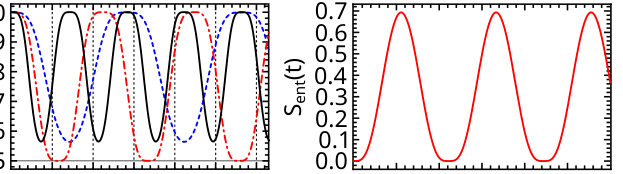
<figcaption class="paper-figure-caption"><b>Fig 1.</b> FIG. 1. (a) Exact spectrum ε± m of the minimal spin-rotor model as a function of the rotor angular-momentum quantum number m, showing the Barnett-split branches around the underlying rotor dispersion. (b) Time dependence of the reduced spin purity Pspin(t) for m = 2, 4, 8, corresponding to η = gm/∆= 0.5, 1, 2 for the parameters used here. These three cases illustrate the weak-coupling, maximally entangling, and large-η regimes, respectively. The purity reduction is maximal near the balanced point η = 1, while the cases η and 1/η have the same minimum purity but different oscillation frequencies. The reduction of Pspin(t) below unity signals the onset of coherent spin-rotor entanglement. (c)...</figcaption>
</figure>

**Main problem.** Investigating whether the classical effective-field description of the Barnett effect remains valid when the mechanical rotation is quantized.

**Main result.** The study shows that quantizing the rotor causes the Barnett field to become operator-valued, leading to the generation of coherent spin-rotor entanglement and a breakdown of the classical Zeeman-like analogy.

**Method.** The author uses an exact analytical solution of a spin-rotor Hamiltonian, calculating eigenenergies, time-evolution, and entanglement metrics like spin purity and entanglement entropy.

**Summary.** This paper explores the quantum limits of the Barnett and Einstein-de Haas effects. By using a minimal model of a spin-1/2 particle coupled to a quantum rotor, the author demonstrates that quantizing the rotation transforms the Barnett field from a static magnetic field into an operator-valued field. This transition leads to the creation of entanglement between the spin and the rotor. The results show that the classical effective-field picture fails qualitatively in the quantum regime, replaced by a reciprocal relationship between spin dynamics and rotor coherence.

Detailed structure

**Model / system.** A minimal, exactly solvable model consisting of a spin-1/2 particle coupled to a planar quantum rotor with a Hamiltonian containing spin-rotation coupling.

**Key observables.** Reduced spin purity (P_spin), entanglement entropy (S_ent), rotor coherence (|K(t)|), and spin-state-dependent phase evolution.

**Important parameters / regimes.** The coupling parameter eta = gm/Delta, which defines weak-coupling (eta < 1), balanced (eta = 1), and large-coupling (eta > 1) regimes.

**Assumptions / limitations.** The model is a minimal setting; the author notes that adding more degrees of freedom (like angular dependence) is a potential extension.

**Figures summary.** Fig 1(a) shows the energy spectrum and Barnett-split branches; Fig 1(b) shows the time dependence of spin purity for different coupling strengths; Fig 1(c) shows the periodic buildup and decay of entanglement entropy.

**Paper structure.** The paper introduces the physical problem of the Barnett effect, presents the minimal spin-rotor model, provides an exact analytical solution, analyzes the quantum-mechanical breakdown of the effective-field picture through entanglement and purity, and concludes with the identification of a reciprocal quantum manifestation of the effect.

**Why it may be interesting.** It provides a fundamental look at how the quantization of a mechanical degree of freedom fundamentally changes the nature of an effective field, moving from a static parameter to an operator that generates entanglement.

Abstract

The Barnett effect is usually understood through an effective magnetic field generated by mechanical rotation, while its reciprocal Einstein--de Haas effect describes the transfer of spin angular momentum to mechanical motion. We show that this effective-field picture changes qualitatively once the mechanical degree of freedom itself is quantized. To demonstrate this, we introduce an exactly solvable minimal spin-rotor model in which a spin-$1/2$ is coupled to a quantum rotor. In a fixed angular-momentum sector, the model reproduces the conventional Barnett splitting and remains formally equivalent to a Zeeman problem. For a superposition of rotor sectors, however, the Barnett field becomes operator-valued and the resulting dynamics generates coherent spin-rotor entanglement. This is directly visible in the reduced spin purity, rotor coherence, and entanglement entropy. Our results identify a minimal quantum setting in which the Barnett effective-field picture departs from its classical form and acquires a reciprocal manifestation through spin-dependent rotor coherence.

[↑ back to top](#top)

### [Operating a contextual Stern-Gerlach apparatus](http://arxiv.org/abs/2604.24727v1)

**Authors:** Th. K. Mavrogordatos  
**Type:** theory · **Category:** other · **PDF:** <https://arxiv.org/pdf/2604.24727v1>  
**Analysis basis:** full PDF text, analyzed in chunks
**Topic relevance:** 🔥 `quantum measurements` **4/5** · `methods for driven-dissipative` **3/5** · `non-equilibrium dynamics` **2/5**

↔ Scroll figures horizontally

<figure class="paper-figure-card">
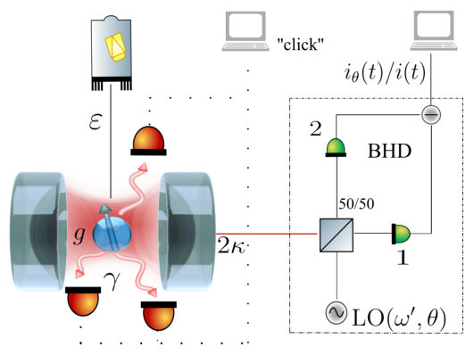
<figcaption class="paper-figure-caption"><b>Fig 1.</b> FIG. 1. Schematic illustration of the Stern–Gerlach appara- tus. Fluorescence from a resonantly driven two-state ‘atom’ is superimposed with a strong local oscillator (LO) in a bal- anced detection scheme. A cavity with photon loss rate 2κ collects forward radiation into a resonant mode of frequency ω, and directs it out one of its mirrors. The measurement signal iθ(t) (homodyne scheme, ω′ = ω and fixed θ) or i(t) [heterodyne scheme, ω′ −ω ≫κ and θ = (ω −ω′)t] arises from the detection of two fields with a π phase difference be- tween their superpositions. Simultaneously, cavity-inhibited spontaneous emission is collected from detectors situated at the sides of the cavity. The conditional...</figcaption>
</figure>
<figure class="paper-figure-card">
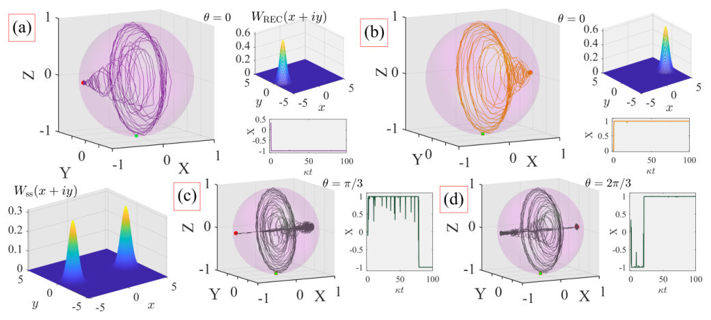
<figcaption class="paper-figure-caption"><b>Fig 2.</b> FIG. 2. Contextual stability of stationary states. Sample trajectories [solutions to Eq. (4)] in the Bloch-sphere representation (X, Y, Z), with X −iY = 2⟨ψREC(t)|σ−|ψREC(t)⟩and Z = ⟨ψREC(t)|σz|ψREC(t)⟩, in the course of 100 cavity lifetimes. The green square and the red circle mark the start and end of the trajectory, respectively. The LO phase is set to θ = 0 in frames (a, b), π/3 in (c) and 2π/3 in (d). The upper side panels in (a, b) depict the conditioned Wigner function of the cavity field WREC(x + iy) at κt = 60. The lower ones plot X(t), as do the side panels of (c, d). The bottom left surface plot depicts the steady-state Wigner function of the resonant cavity mode, Wss(x + iy)....</figcaption>
</figure>
<figure class="paper-figure-card">
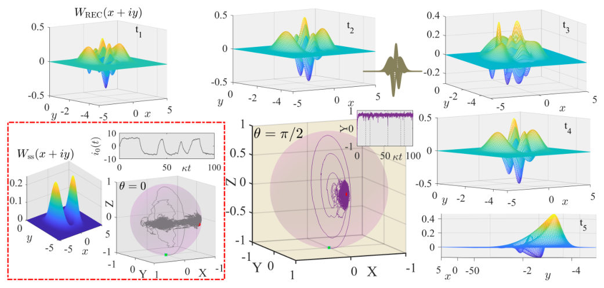
<figcaption class="paper-figure-caption"><b>Fig 3.</b> FIG. 3. Spontaneous dressed-state polarization vs. persistence of coherent-state superpositions. The central panel depicts a sam- ple trajectory in the Bloch-sphere representation (X, Y, Z), in a similar fashion to Fig. 2, with the LO phase set to θ = π/2. The surrounding conditioned Wigner functions WREC(t) are extracted for the times κ(t1, t2, . . . , t5) = 15.200, 23.340, 54.890, 78.015 and 84.570, indicated by the dashed vertical lines in the corresponding trajectory for Y (t). The schematic surface plot be- tween the frames t2 and t3 depicts the Wigner function corresponding to the (appropriately normalized) superposition state |αB+⟩+ eiϕ|αB−⟩with ϕ = 0. In the framed group of panels...</figcaption>
</figure>
<figure class="paper-figure-card">
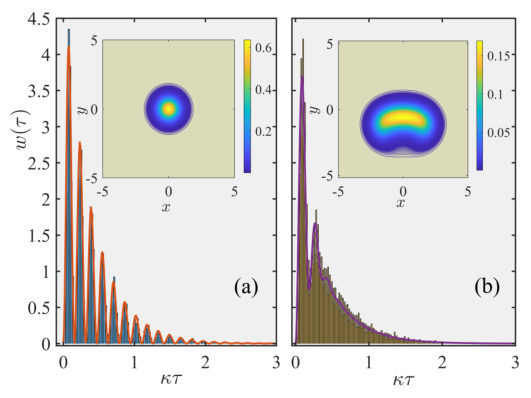
<figcaption class="paper-figure-caption"><b>Fig 4.</b> FIG. 4. Photoelectron statistics in the bad-cavity limit under heterodyne detection. Histogram of waiting times for the pho- toelectric emissions to the sides of the cavity (extracted from an individual trajectory along 104 cavity lifetimes) on top of the waiting-time distribution, w(τ), for g/γ = 0.1 in (a) and 1 in (b). The above exclusive probability density function is calculated using the steady-state solution of the ME (1) and the quantum regression formula. The two insets depict the corresponding steady-state Wigner function Wss(x + iy) for the cavity field. Operating parameters read: γ/κ = 5, ε/κ = 20. In all simulations, the Fock-state basis was trun- cated at the 20-th level, and...</figcaption>
</figure>

**Main problem.** The paper proposes and investigates a cavity/circuit QED analogue of the Stern-Gerlach experiment to explore how quantum contextuality and measurement backaction affect the stability of dressed states.

**Main result.** The study demonstrates that different measurement unravellings (homodyne vs. heterodyne) lead to non-equivalent physical outcomes, such as biased vs. symmetric dressed-state populations, and identifies the emergence of spontaneous dressed-state polarization and coherent-state superpositions.

**Method.** The author uses quantum trajectory theory, specifically Monte Carlo wave-function simulations and the Stochastic Schrödinger Equation, to unravel the Lindblad master equation.

**Summary.** This paper proposes a quantum optical version of the Stern-Gerlach experiment using a cavity QED platform. It shows that the way a system is monitored (e.g., via homodyne or heterodyne detection) changes the physical outcomes, demonstrating quantum contextuality. The research highlights how measurement backaction can drive the system into spontaneous polarization or create transient Schrödinger cat-like states. Additionally, it explores how photoelectron statistics can reveal squeezed fluctuations in the bad-cavity limit.

Detailed structure

**Model / system.** A Jaynes-Cummings system consisting of a two-state atom coupled to a cavity mode, driven by a resonant field, and subject to cavity photon loss and spontaneous emission.

**Key observables.** Quadrature phase operators, measurement signals (homodyne/heterodyne), Wigner functions, Bloch-sphere trajectories, and photoelectron waiting-time distributions.

**Important parameters / regimes.** Driving strength (epsilon), coupling strength (g), cavity decay (kappa), atomic decay (gamma), and the local oscillator phase (theta).

**Assumptions / limitations.** The study utilizes the rotating wave approximation (RWA), the secular approximation, and considers the 'zero system size' limit (gamma/2kappa = 0) in certain regimes.

**Figures summary.** Figure 3 depicts Bloch-sphere trajectories and conditioned Wigner functions showing the evolution of the system.

**Paper structure.** The paper introduces a cavity QED analogue of the Stern-Gerlach experiment, defines the Hamiltonian and master equation, explores different measurement unravellings (homodyne and heterodyne), analyzes the effects of local oscillator phase on state stability, and concludes with the use of photoelectron statistics as a diagnostic tool.

**Why it may be interesting.** It provides deep insights into how the choice of measurement scheme (unravelling) fundamentally alters the observed steady-state dynamics and symmetry breaking in open quantum systems, which is central to quantum optics and the study of quantum contextuality.

Abstract

We propose a contextual cavity/circuit QED analogue and extension of the Stern-Gerlach experiment, where the pseudo-spin of a two-state `atomic' transition plays the role of the ``spin'', while the resonant field driving the transition stands for the ``magnetic field''. A phase-sensitive continuous detection of the cavity field coupled to the induced `atomic' dipole affects the stability of the two distinct outcomes. The dressed states comprising the latter give their place to a self-consistent spontaneous dressed-state polarization as the driving strength is lowered. The associated evolution proves anew highly contextual, underpinned by a persistent production of coherent-state superpositions for a particular setting of the monitoring device. Finally, when bistability is absent, we employ the photoelectron `atomic' emission statistics as a diagnostic tool of the cavity field fluctuations.

[↑ back to top](#top)

### [Wigner functions, negativity volumes, and experimental generation of Pegg-Barnett phase-operator eigenstates](http://arxiv.org/abs/2604.23086v1)

**Authors:** Hiroo Azuma  
**Type:** both · **Category:** quantum information and computing · **PDF:** <https://arxiv.org/pdf/2604.23086v1>  
**Analysis basis:** full PDF text, analyzed in chunks
**Topic relevance:** 🔥 `quantum optics experiment` **4/5** · `QC/QI experiment` **3/5** · `quantum measurements` **2/5**

↔ Scroll figures horizontally

<figure class="paper-figure-card">
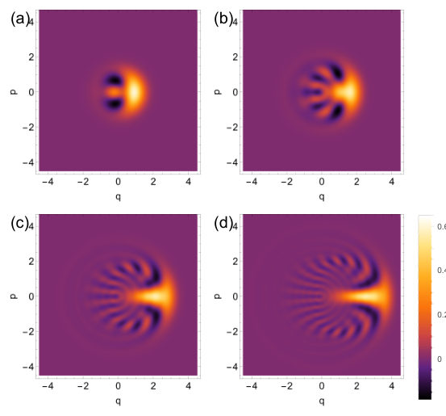
<figcaption class="paper-figure-caption"><b>Fig 1.</b> Figure 1: Two-dimensional plots of the Wigner functions W(q, p; s, 0) for the states |ϕ0⟩s in the q-p plane, with ϕ0 = 0. (a) s = 2, (b) s = 5, (c) s = 11, (d) s = 17. As s increases, the interference-like ripple structures become gradually finer.</figcaption>
</figure>
<figure class="paper-figure-card">
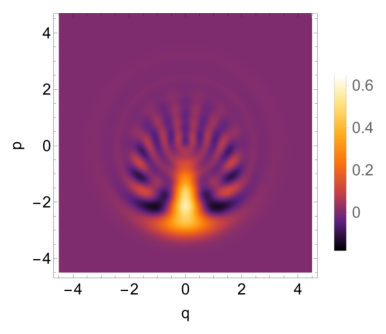
<figcaption class="paper-figure-caption"><b>Fig 2.</b> Figure 2: A two-dimensional plot of the Wigner function W(q, p; 11, 3) for the state |ϕ3⟩11 in the q-p plane, where ϕ0 = 0 and ϕ3 = π/2. The pattern rotates clockwise as the phase increases.</figcaption>
</figure>
<figure class="paper-figure-card">
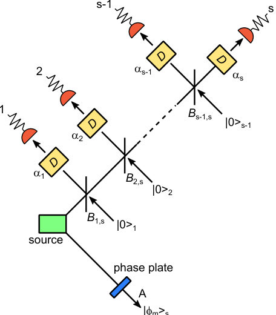
<figcaption class="paper-figure-caption"><b>Fig 3.</b> Figure 5: A schematic illustration of the implementation for the approximate generation of |ϕm⟩s. The procedure is as follows. A source emits a two-mode squeezed vacuum state in modes s and A. Vacuum states |0⟩1|0⟩2 · · · |0⟩s−1 are prepared in modes 1, 2, . . . , s −1, and the beam splitters ˆB1,s, ˆB2,s, ..., ˆBs−1,s are applied to modes 1, 2, ..., s. Then, the displacement operators ˆDj(αj) (j = 1, 2, ..., s) are applied to these modes. Single-photon detection is individually performed on modes 1, 2, ..., s. Finally, a phase plate is placed on mode A to obtain |ϕm⟩s approximately, with ϕ0 = 0.</figcaption>
</figure>
<figure class="paper-figure-card">
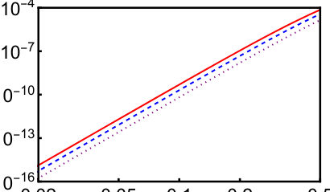
<figcaption class="paper-figure-caption"><b>Fig 4.</b> Figure 6: Plots of P, the probability that all four imperfect detectors click simultaneously, as a function of r = arctanh q. Both the horizontal and vertical axes are displayed by the logarithmic scale. The solid red, dashed blue, and dotted purple curves represent η = 1, 0.8, and 0.6, respectively. We observe from these curves that P depends only weakly on η. All these curves can be well fitted by log10 P = c + 8 log10 r, where c is a constant.</figcaption>
</figure>
<figure class="paper-figure-card">
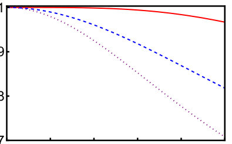
<figcaption class="paper-figure-caption"><b>Fig 5.</b> Figure 7: Plots of F, the fidelity between the post-selected output state and the equal- amplitude superposition, as a function of r = arctanh q. The solid red, dashed blue, and dotted purple curves correspond to η = 1, 0.8, and 0.6, respectively. From these curves, we note that F depends strongly on η.</figcaption>
</figure>
<figure class="paper-figure-card">
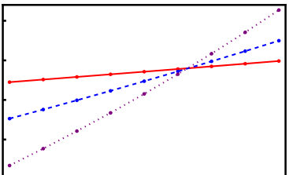
<figcaption class="paper-figure-caption"><b>Fig 6.</b> Figure 8: Plots of V, the negativity volume of the approximate state emitted as |ϕ0⟩4 in mode A of the quantum-optical circuit shown in Fig. 5. For fixed squeezing parameter r, we plot V as a function of η, the efficiency of the single-photon detectors. The solid red, dashed blue, and dotted purple curves represent r = 0.1, 0.2, and 0.3, respectively.</figcaption>
</figure>
<figure class="paper-figure-card">
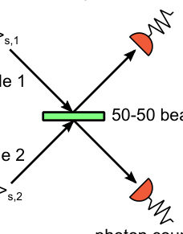
<figcaption class="paper-figure-caption"><b>Fig 7.</b> Figure 9: A schematic illustration of the phase-estimation experiment. The value of ϕk can be estimated using the reference beam |ϕj⟩s,1.</figcaption>
</figure>

**Main problem.** The paper investigates the non-Gaussianity of Pegg-Barnett phase-operator eigenstates and proposes an experimental quantum-optical circuit for their generation and for phase estimation.

**Main result.** The authors confirm that these eigenstates exhibit negative Wigner functions, with negativity volume increasing with Hilbert space dimension, and identify single-photon detection as the source of their non-Gaussianity.

**Method.** The study uses Wigner function calculations and negativity volume metrics to quantify non-Gaussianity, alongside numerical simulations of a quantum-optical circuit including imperfect detectors.

**Summary.** This paper explores the properties and experimental generation of Pegg-Barnett phase-operator eigenstates. It demonstrates that these states are non-Gaussian, characterized by negative regions in their Wigner functions that grow with the Hilbert space dimension. The authors propose a quantum-optical circuit using single-photon detection to create these states and evaluate how detector inefficiency affects state fidelity. Finally, the paper presents a scheme for using these states in a phase-estimation experiment.

Detailed structure

**Model / system.** The system consists of Pegg-Barnett phase-operator eigenstates in a finite-dimensional Hilbert space, generated via a quantum-optical circuit involving two-mode squeezed vacuum, beam splitters, displacement operators, and single-photon detectors.

**Key observables.** Wigner function negativity volume, fidelity, detection probability, and photon-number detection probabilities at beam splitter outputs.

**Important parameters / regimes.** Hilbert space dimension (s), detector efficiency (eta), squeezing parameter (r), and phase (phi).

**Assumptions / limitations.** The use of infinite-dimensional negativity volume measures for finite-dimensional states is justified by the limit s to infinity; the study also assumes a small displacement limit for certain calculations.

**Figures summary.** Figure 1 shows Wigner functions for increasing s; Figure 2 shows a rotating Wigner pattern; Figure 3 and 4 show the monotonic increase of negativity volume and Wigner function radius with s; Figure 9 provides a schematic of the phase-estimation setup.

**Paper structure.** The paper begins by analyzing the Wigner functions and non-Gaussianity of the eigenstates, moves to the design and simulation of a generation circuit under detector inefficiency, and concludes with a practical application in a phase-estimation experiment.

**Why it may be interesting.** This paper is highly relevant to quantum optics and quantum information as it explores the generation of non-Gaussian states, which are essential resources for continuous-variable quantum computing and high-precision phase estimation.

Abstract

In this paper, we study the non-Gaussianity of the eigenstates of the Pegg-Barnett phase observable. By computing the Wigner functions of the eigenstates, we confirm that they take negative values in specific regions of the phase space. The Pegg-Barnett phase-operator eigenstates lie on a finite-dimensional Hilbert space. Thus, we examine how their negativity volumes depend on the dimension of the Hilbert space. Moreover, we present a quantum-optical circuit that generates these eigenstates and identify single-photon detection as the origin of their non-Gaussianity. To investigate a more realistic experimental implementation, we introduce imperfect single-photon detectors with non-unit efficiency into the circuit and evaluate the dependence of the detection probability, the output-ideal fidelity, and the negativity volume of the approximate eigenstate output from the circuit on the detector efficiency. Finally, as a practical application, we consider a phase-estimation experiment of an arbitrary unknown state by injecting both the unknown state and a known Pegg-Barnett eigenstate into a 50-50 beam splitter and individually counting the numbers of photons emitted from its two output ports.

[↑ back to top](#top)

### [Isotopically enriched epitaxial CaWO$_{4}$ thin films for Er$^{3+}$ spin-photon quantum interfaces](http://arxiv.org/abs/2604.24582v1)

**Authors:** Hanlin Tang, Kidae Shin, Ashwin K. Boddeti, Sebastian P. Horvath, Adam Turflinger, Joseph Alexander, Jeffrey A. Dhas, Zihua Zhu, Shuhang Pan, Jeff D. Thompson, Yingge Du, Frederick J. Walker, Charles H. Ahn  
**Type:** experiment · **Category:** quantum information and computing · **PDF:** <https://arxiv.org/pdf/2604.24582v1>  
**Analysis basis:** full PDF text, analyzed in chunks
**Topic relevance:** 🔥 `QC/QI experiment` **4/5** · 🔥 `quantum optics experiment` **4/5**

↔ Scroll figures horizontally

<figure class="paper-figure-card">
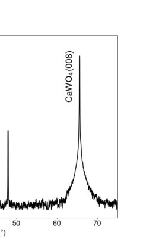
<figcaption class="paper-figure-caption"><b>Fig 1.</b> Fig. 1. Single-phase growth of CaWO4 thin films. Narrow peaks shown at diffraction forbidden</figcaption>
</figure>
<figure class="paper-figure-card">
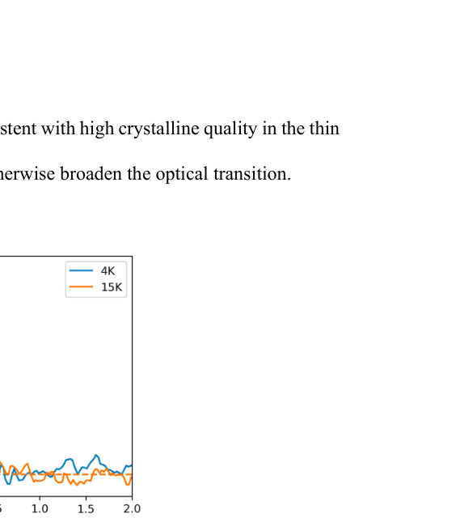
<figcaption class="paper-figure-caption"><b>Fig 2.</b> Fig 2. Narrow PL inhomogeneous linewidth of MBE-grown Er3+: CaWO4 thin films at 4K and 15K. The measured inhomogeneous linewidths are 214 (13) MHz and 370 (8) MHz at 4K and 15K, respectively. X-ray diffraction and AFM morphologies of isotopically enriched MBE-grown thin films</figcaption>
</figure>
<figure class="paper-figure-card">
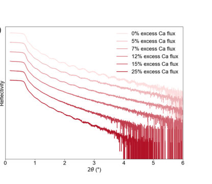
<figcaption class="paper-figure-caption"><b>Fig 3.</b> Fig. 4. Optimizing growth flux based on X-ray characterization. (a) X-ray diffraction 𝜃𝜃−2𝜃𝜃</figcaption>
</figure>
<figure class="paper-figure-card">
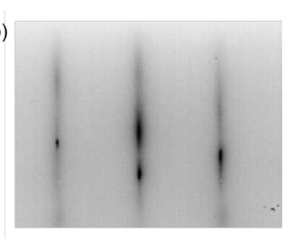
<figcaption class="paper-figure-caption"><b>Fig 4.</b> Fig. 5. Surface characterization of CaWO4 thin films grown with 12% excess CaO flux. (a)</figcaption>
</figure>
<figure class="paper-figure-card">
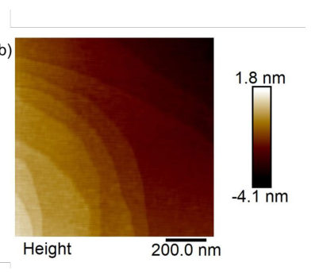
<figcaption class="paper-figure-caption"><b>Fig 5.</b> Fig. 6. Effect of annealing stoichiometric CaWO4 thin films. (a) X-ray diffraction 𝜃𝜃−2𝜃𝜃 scan</figcaption>
</figure>
<figure class="paper-figure-card">
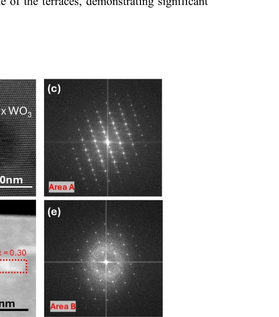
<figcaption class="paper-figure-caption"><b>Fig 6.</b> Fig. 7. Phase separation of annealed, off-stoichiometric CaWO4 thin films. (a) A high-</figcaption>
</figure>
<figure class="paper-figure-card">
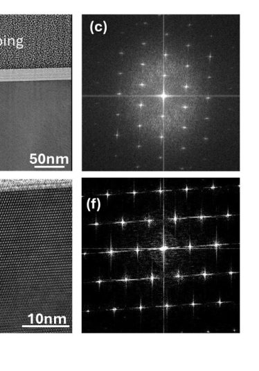
<figcaption class="paper-figure-caption"><b>Fig 7.</b> Fig. 8 Improved microstructure of annealed, stoichiometric thin films. (a) and (d) TEM images</figcaption>
</figure>
<figure class="paper-figure-card">
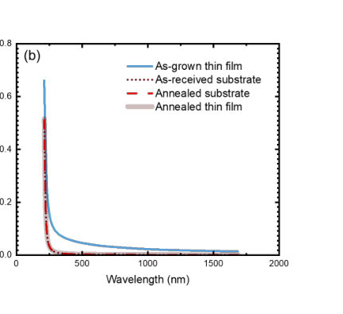
<figcaption class="paper-figure-caption"><b>Fig 8.</b> Fig. 10. Improvement of optical properties upon annealing. (a) Real part of the refractive index.</figcaption>
</figure>
<figure class="paper-figure-card">
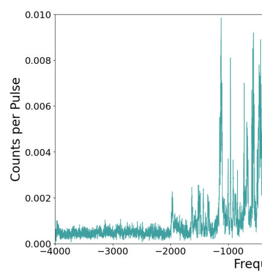
<figcaption class="paper-figure-caption"><b>Fig 9.</b> Fig. 11. Zero external field PLE spectrum of Er3+ ions coupled to the cavity.</figcaption>
</figure>
<figure class="paper-figure-card">
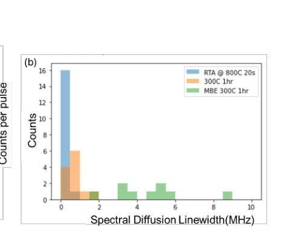
<figcaption class="paper-figure-caption"><b>Fig 10.</b> Fig. 12 Observation of spectral diffusion. (a) Optical spectral diffusion of a representative Er³⁺</figcaption>
</figure>

**Main problem.** The spin coherence of Er3+ ions in CaWO4 is limited by the nuclear spin bath of the 14.3% natural abundance 183W isotope, hindering the development of scalable quantum interconnects.

**Main result.** The researchers successfully grew isotopically enriched Ca186WO4 thin films via MBE, reducing 183W abundance from 14.3% to 1.2% and demonstrating single-ion resonance features in integrated nanophotonic devices.

**Method.** Molecular Beam Epitaxy (MBE) was used for growth, with isotopic analysis performed via ToF-SIMS and optical characterization via photoluminescence and spectroscopy in integrated photonic crystal cavities.

**Summary.** This paper reports the successful synthesis of isotopically enriched Ca186WO4 thin films designed to improve the spin coherence of Er3+ ions. By reducing the concentration of the decohering 183W isotope from 14.3% to 1.2%, the authors provide a scalable platform for quantum interconnects. They demonstrate high crystalline quality and the ability to resolve single-ion resonances when integrated with nanophotonic cavities. While spectral diffusion was observed in non-stoichiometric films, the results establish a path toward high-performance, nuclear-spin-limited quantum interfaces.

Detailed structure

**Model / system.** The experimental platform consists of Er3+ ions implanted into epitaxial, isotopically engineered Ca186WO4 thin films integrated with silicon-on-insulator (SOI) 1D photonic crystal cavities.

**Key observables.** Inhomogeneous linewidth, 183W isotopic abundance, surface roughness, photoluminescence emission, and optical spectral diffusion.

**Important parameters / regimes.** 183W concentration (1.2%), 1.53 um telecom C-band transition, 214 MHz linewidth, and 20 mK operating temperature.

**Assumptions / limitations.** The study assumes that reducing the 183W nuclear spin concentration will directly lead to increased spin coherence times (T2) by reducing the nuclear spin bath.

**Figures summary.** The figures demonstrate the successful growth of high-quality films, the reduction of 183W isotopes, the identification of spectral diffusion in off-stoichiometric films, and the resolution of individual Er3+ ion resonances in cavities.

**Paper structure.** The paper introduces the problem of spin decoherence, describes the MBE growth and isotopic enrichment process, details the structural and isotopic characterization, discusses the optimization of film stoichiometry via annealing, and concludes with the demonstration of single-ion spectroscopy and identified limitations.

**Why it may be interesting.** This work is highly relevant for quantum optics and open quantum systems as it demonstrates a material engineering approach to controlling the environment (the nuclear spin bath) to extend the coherence of a quantum emitter.

Abstract

Rare earth ion (REI)-doped oxide thin films are attractive for the application of quantum interconnects due to their stable optical levels and scalability$^{1-3}$. Among them, Er$^{3+}$ doped CaWO$_{4}$ is promising because it possesses narrow optical linewidth transitions and a long spin coherence time$^{4-6}$. The electron spin coherence is limited at high temperatures by paramagnetic impurities and by the presence of the 14.3% $^{183}$W nuclear spin. To further increase the spin coherence time at millikelvin temperatures, where the paramagnetic impurities are frozen out, our approach is to synthesize chemically and isotopically purified thin films as a host material. We first grow non-isotopically enriched Er$^{3+}$ doped CaWO$_{4}$ thin films, which exhibit a 214(13) MHz photoluminescence (PL) inhomogeneous linewidth, indicating the thin film has high crystalline quality. We then grow isotopically enriched CaWO$_{4}$ thin films using an isotopically purified $^{186}$WO$_{3}$ source. Time of flight secondary ion mass spectrometry (ToF-SIMS) was used to measure the relative concentration of W isotopes. $^{183}$W, the only W isotope that has a net nuclear spin and is the major cause of spin decoherence, was at a relative abundance of 1.2%, a factor of 10 lower than natural abundance. We also observed PL emission from single ions after integrating nano-photonic devices with the thin film. These results establish isotopically engineered CaWO$_{4}$ thin films as a promising platform for future studies of nuclear-spin-limited coherence and for scalable rare-earth-ion-based quantum nanophotonic devices.

[↑ back to top](#top)

### [Quantum average correlations and complementarity relations via metric-adjusted skew information](http://arxiv.org/abs/2604.23504v1)

**Authors:** Xiaoyu Ma, Qing-Hua Zhang, Cong Xu  
**Type:** theory · **Category:** quantum information and computing · **PDF:** <https://arxiv.org/pdf/2604.23504v1>  
**Analysis basis:** full PDF text, analyzed in chunks
**Topic relevance:** 🔥 `entanglement & information structure` **4/5** · `methods for driven-dissipative` **2/5** · `quantum measurements` **2/5**

↔ Scroll figures horizontally

<figure class="paper-figure-card">
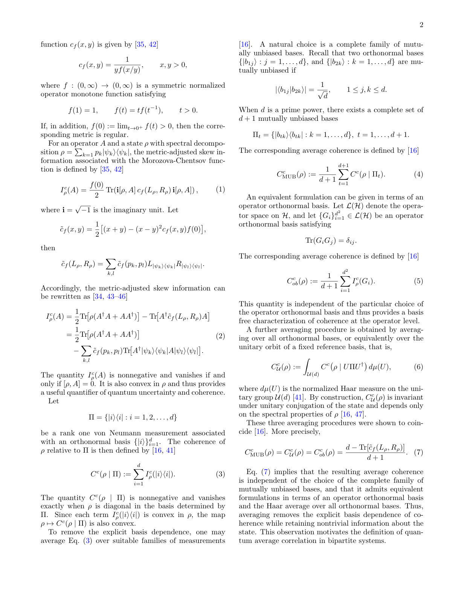
<figcaption class="paper-figure-caption"><b>Fig 1.</b> Low-resolution page preview, page 2</figcaption>
</figure>
<figure class="paper-figure-card">
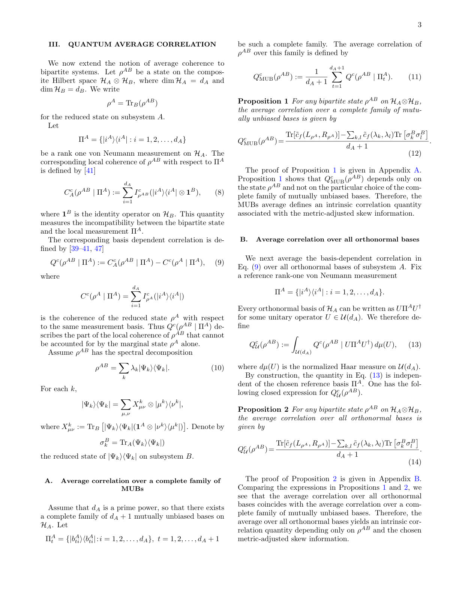
<figcaption class="paper-figure-caption"><b>Fig 2.</b> Low-resolution page preview, page 3</figcaption>
</figure>
<figure class="paper-figure-card">
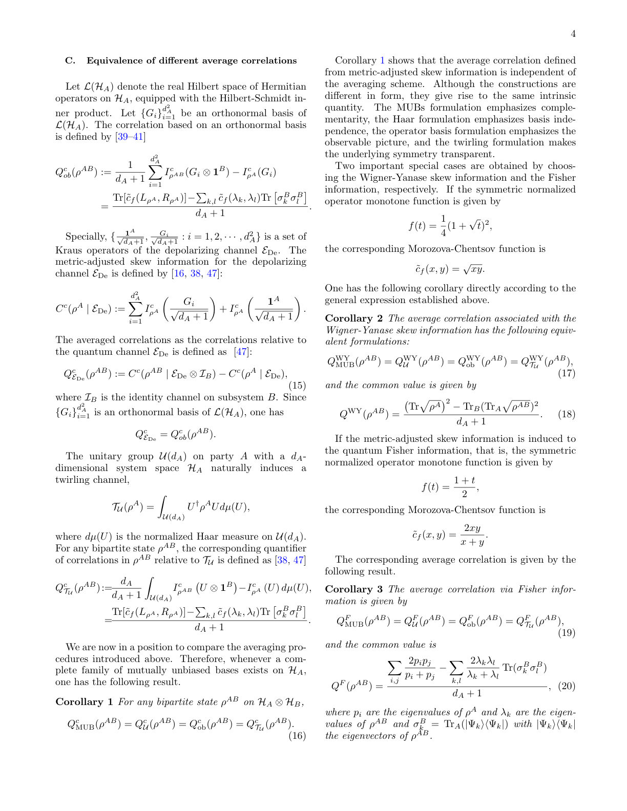
<figcaption class="paper-figure-caption"><b>Fig 3.</b> Low-resolution page preview, page 4</figcaption>
</figure>
<figure class="paper-figure-card">
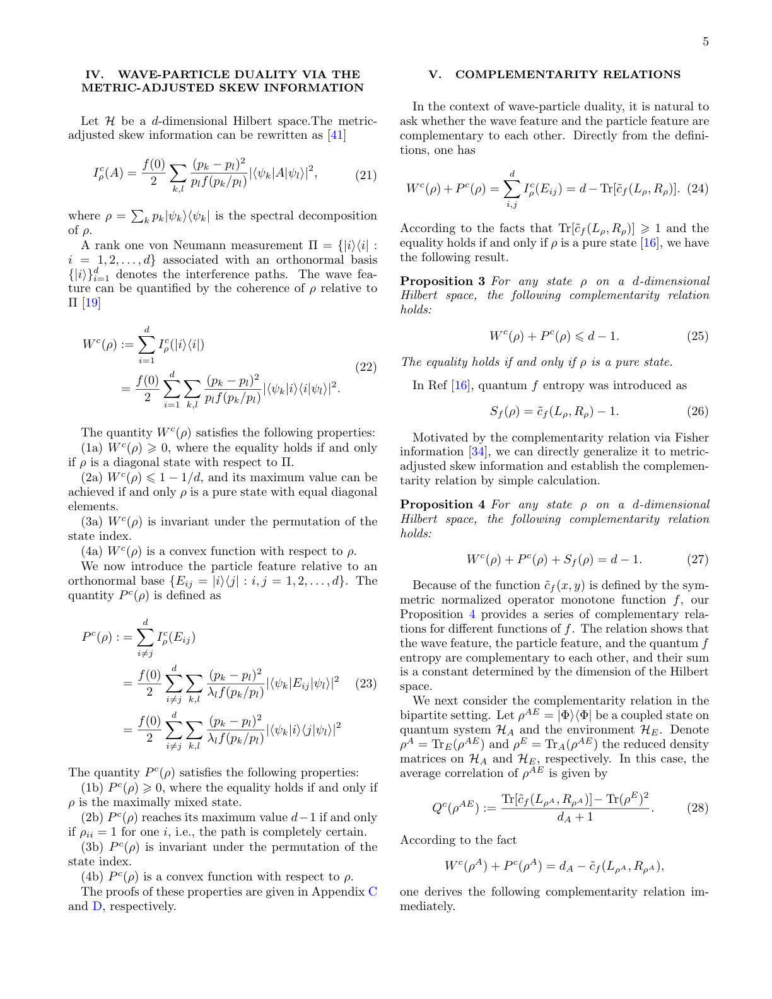
<figcaption class="paper-figure-caption"><b>Fig 4.</b> Low-resolution page preview, page 5</figcaption>
</figure>
<figure class="paper-figure-card">
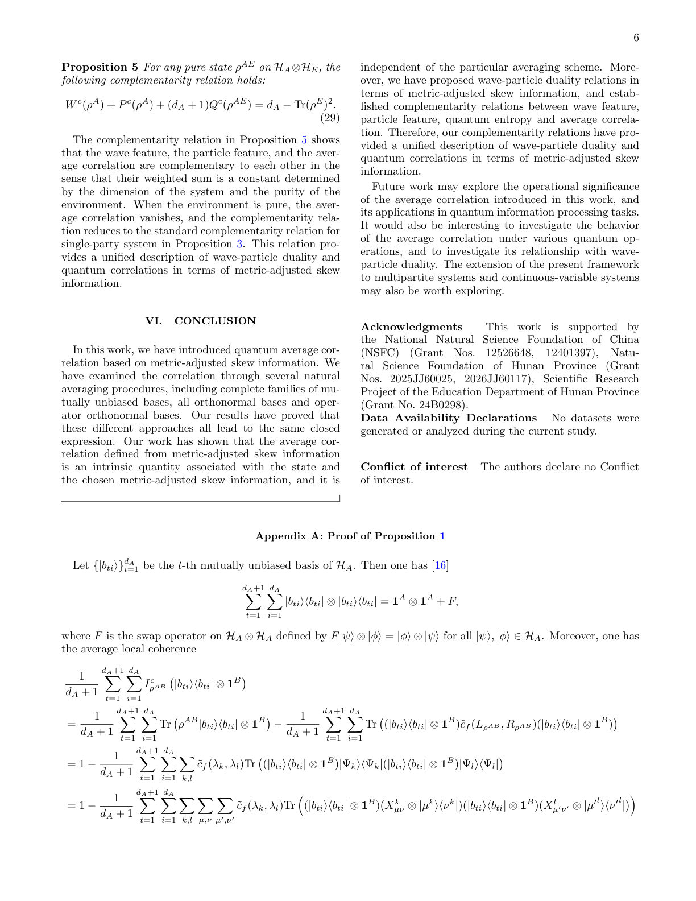
<figcaption class="paper-figure-caption"><b>Fig 5.</b> Low-resolution page preview, page 6</figcaption>
</figure>
<figure class="paper-figure-card">
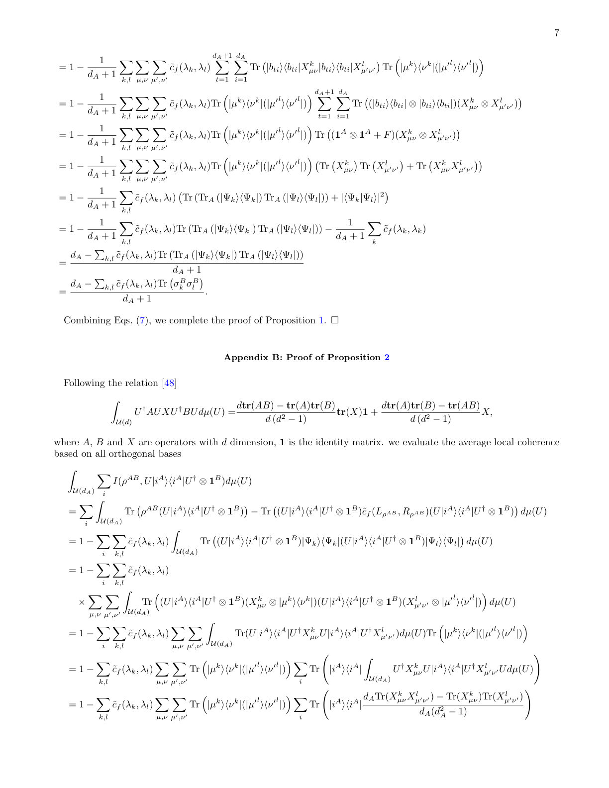
<figcaption class="paper-figure-caption"><b>Fig 6.</b> Low-resolution page preview, page 7</figcaption>
</figure>
<figure class="paper-figure-card">
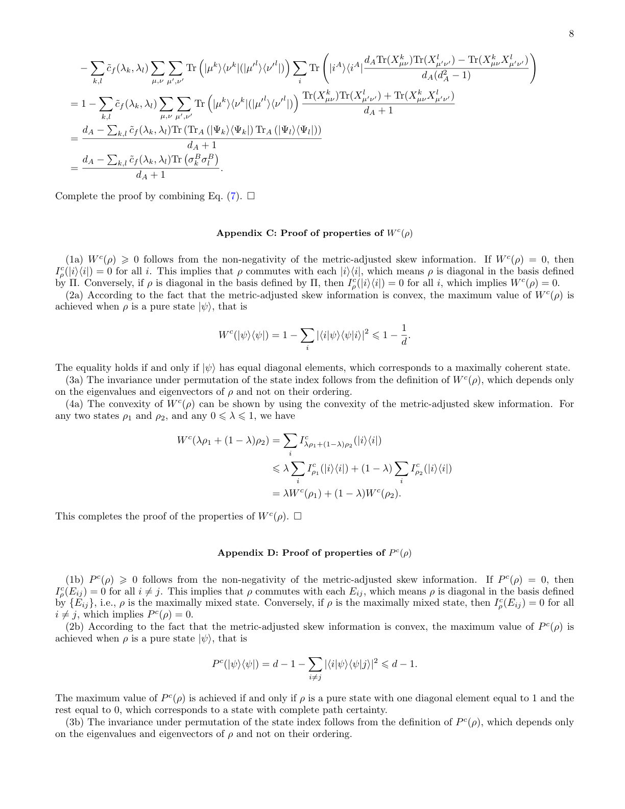
<figcaption class="paper-figure-caption"><b>Fig 7.</b> Low-resolution page preview, page 8</figcaption>
</figure>
<figure class="paper-figure-card">
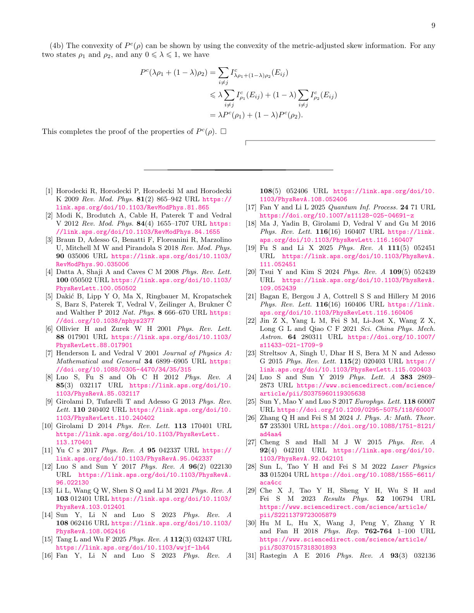
<figcaption class="paper-figure-caption"><b>Fig 8.</b> Low-resolution page preview, page 9</figcaption>
</figure>
<figure class="paper-figure-card">

<figcaption class="paper-figure-caption"><b>Fig 9.</b> Low-resolution page preview, page 10</figcaption>
</figure>

**Main problem.** The paper seeks to establish a unified framework for quantifying quantum average correlations and complementarity relations using metric-adjusted skew information.

**Main result.** The authors prove that quantum average correlation is an intrinsic quantity independent of the averaging scheme (MUBs, Haar measure, etc.) and derive new wave-particle-entropy complementarity relations.

**Method.** The study utilizes the mathematical framework of metric-adjusted skew information based on the Morozova-Chentsov function and employs various averaging procedures including twirling channels and Mutually Unbiased Bases.

**Summary.** This paper introduces a unified framework to study quantum correlations and complementarity using metric-adjusted skew information. It demonstrates that quantum average correlation is an intrinsic property that remains invariant regardless of whether one averages over different bases or uses twirling channels. Furthermore, the authors establish new complementarity relations that link wave-like features, particle-like features, and quantum entropy. These results provide a consistent way to quantify the interplay between different quantum properties in bipartite systems.

Detailed structure

**Model / system.** The study focuses on bipartite quantum systems (rho_AB) acting on a composite Hilbert space (H_A tensor H_B) and single-party systems.

**Key observables.** Metric-adjusted skew information, average coherence, quantum average correlation, wave feature (W_c), particle feature (P_c), and quantum f-entropy.

**Important parameters / regimes.** Hilbert space dimensions (d_A, d_B), purity of the environment, and the Morozova-Chentsov function (f).

**Assumptions / limitations.** The equivalence of averaging schemes assumes the existence of a complete family of MUBs (requiring d_A to be a prime power) and assumes the metric is regular (f(0) > 0).

**Paper structure.** The paper introduces the framework of metric-adjusted skew information, demonstrates the equivalence of various averaging schemes for correlation, establishes new complementarity relations for single and bipartite systems, and provides formal mathematical proofs in the appendices.

**Why it may be interesting.** This work provides a rigorous, unified mathematical foundation for understanding the fundamental trade-offs between coherence, uncertainty, and correlation, which is central to the study of open quantum systems and quantum information processing.

Abstract

We investigate quantum average correlations and complementarity relations based on metric-adjusted skew information. Several natural averaging procedures are considered, including complete families of mutually unbiased bases, all orthonormal bases, operator orthonormal bases, and twirling channels induced by the unitary group. All these approaches lead to the same closed expression, which identifies the resulting average correlation as an intrinsic quantity independent of the averaging scheme. By defining measures of wave and particle features via metric-adjusted skew information, we establish complementarity relations among wave and particle features, quantum entropy, and average correlation. These results provide a unified framework for investigating quantum average correlations and complementarity relations in terms of metric-adjusted skew information.

[↑ back to top](#top)

### [Quantum speed limit for measurement probabilities](http://arxiv.org/abs/2604.23160v1)

**Authors:** Agung Budiyono, Sebastian Deffner  
**Type:** theory · **Category:** quantum information and computing · **PDF:** <https://arxiv.org/pdf/2604.23160v1>  
**Analysis basis:** full PDF text, analyzed in chunks
**Topic relevance:** 🔥 `quantum measurements` **4/5** · `entanglement & information structure` **2/5** · `non-equilibrium dynamics` **1/5**

↔ Scroll figures horizontally

<figure class="paper-figure-card">
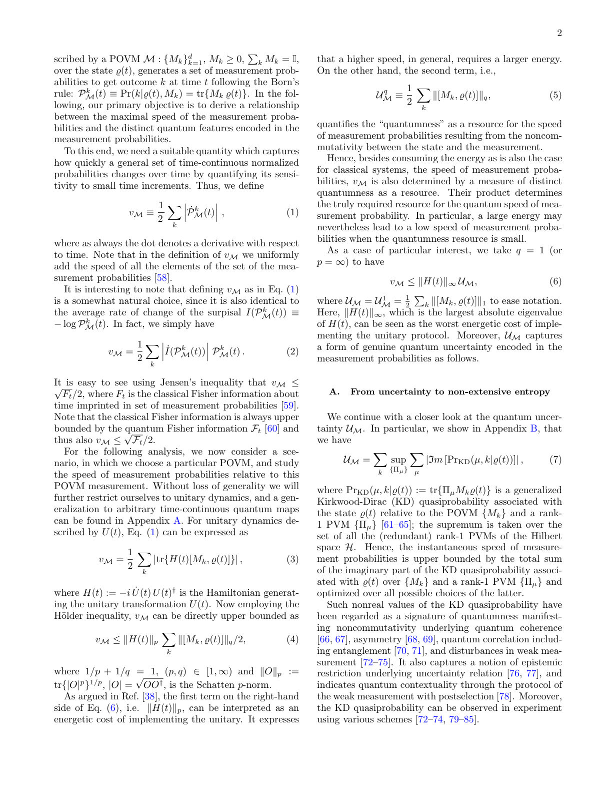
<figcaption class="paper-figure-caption"><b>Fig 1.</b> Low-resolution page preview, page 2</figcaption>
</figure>
<figure class="paper-figure-card">
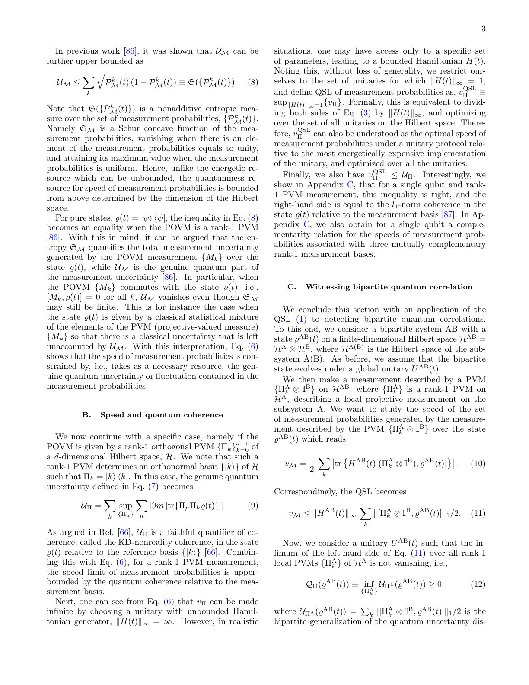
<figcaption class="paper-figure-caption"><b>Fig 2.</b> Low-resolution page preview, page 3</figcaption>
</figure>
<figure class="paper-figure-card">
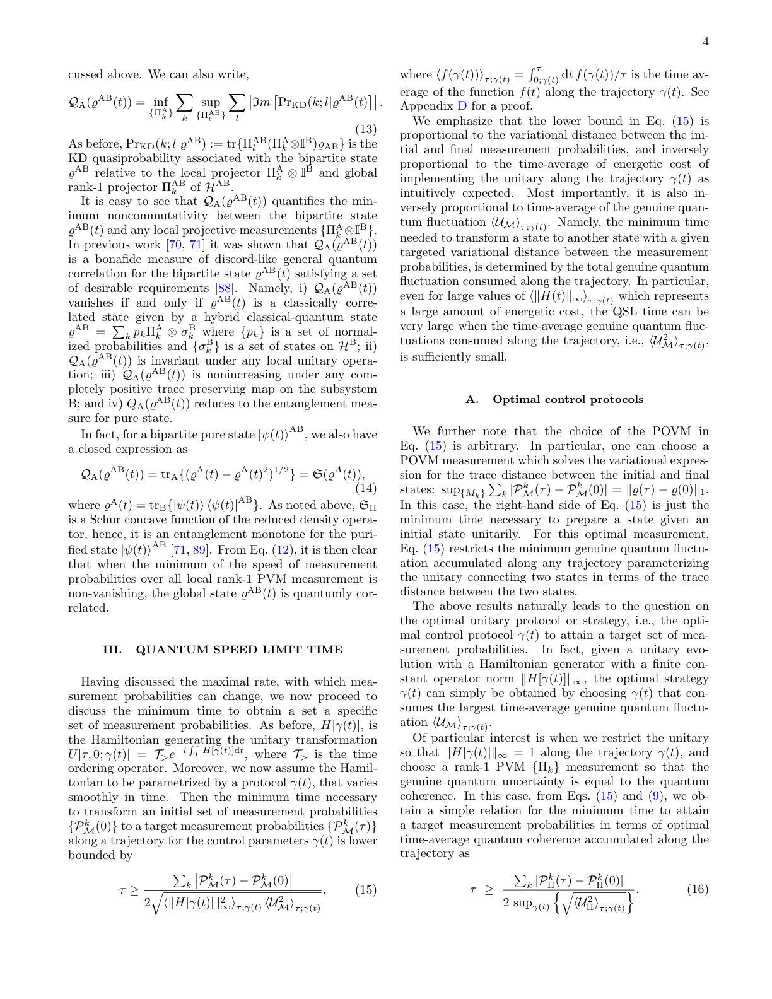
<figcaption class="paper-figure-caption"><b>Fig 3.</b> Low-resolution page preview, page 4</figcaption>
</figure>
<figure class="paper-figure-card">
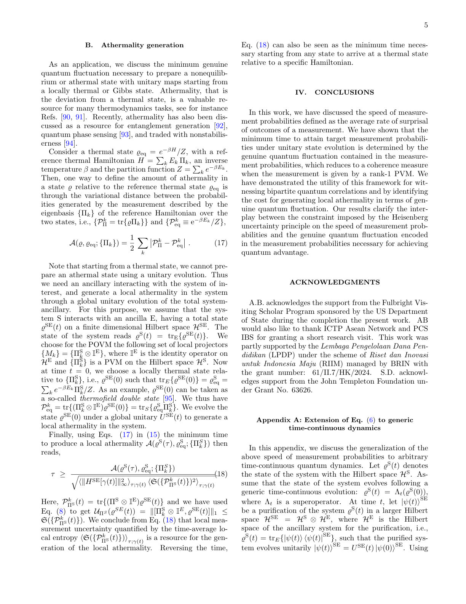
<figcaption class="paper-figure-caption"><b>Fig 4.</b> Low-resolution page preview, page 5</figcaption>
</figure>
<figure class="paper-figure-card">
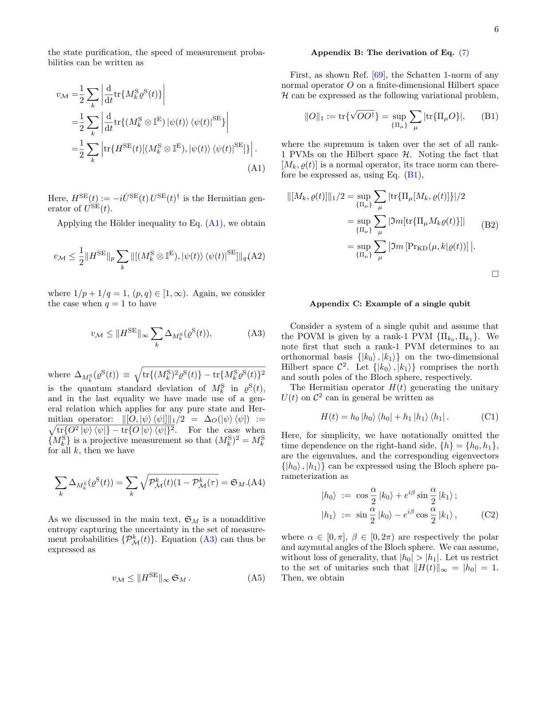
<figcaption class="paper-figure-caption"><b>Fig 5.</b> Low-resolution page preview, page 6</figcaption>
</figure>
<figure class="paper-figure-card">
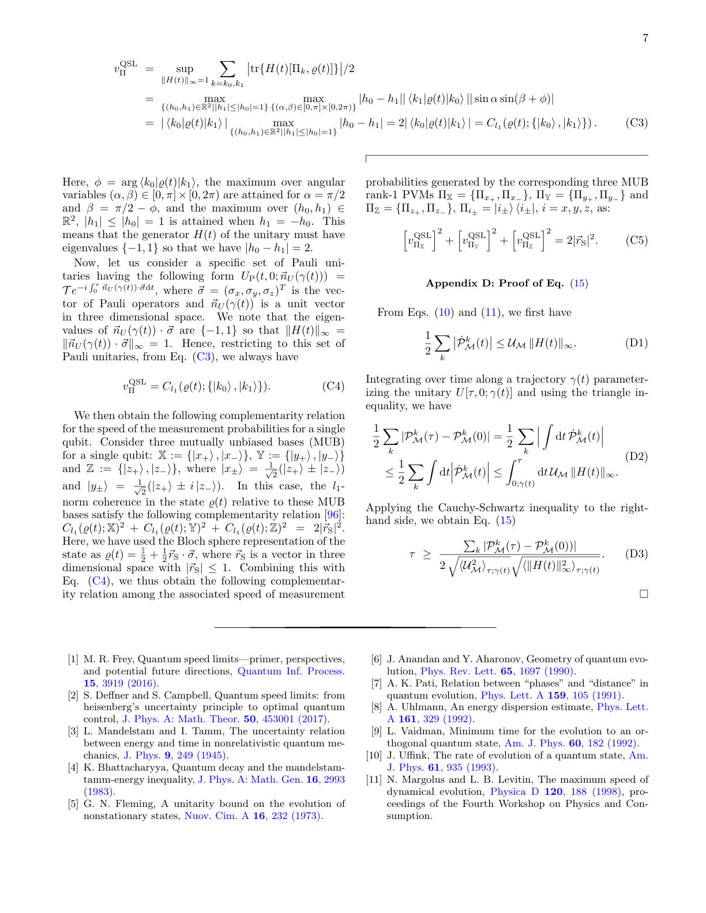
<figcaption class="paper-figure-caption"><b>Fig 6.</b> Low-resolution page preview, page 7</figcaption>
</figure>
<figure class="paper-figure-card">
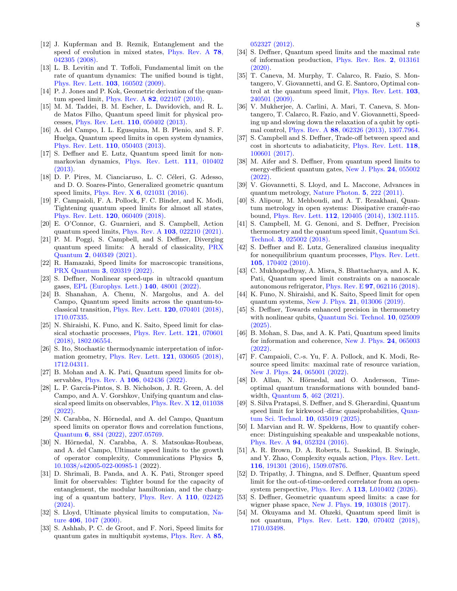
<figcaption class="paper-figure-caption"><b>Fig 7.</b> Low-resolution page preview, page 8</figcaption>
</figure>
<figure class="paper-figure-card">
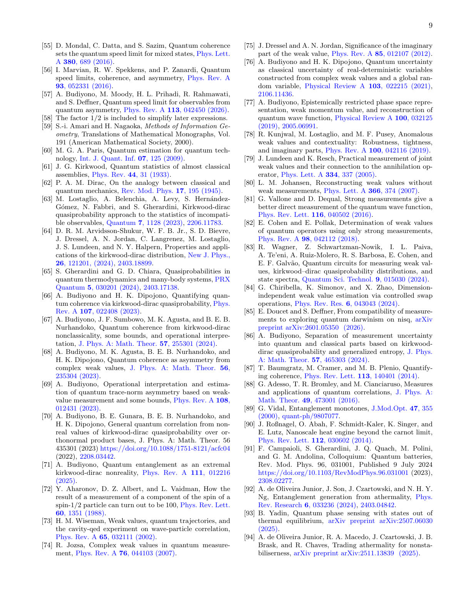
<figcaption class="paper-figure-caption"><b>Fig 8.</b> Low-resolution page preview, page 9</figcaption>
</figure>
<figure class="paper-figure-card">

<figcaption class="paper-figure-caption"><b>Fig 9.</b> Low-resolution page preview, page 10</figcaption>
</figure>

**Main problem.** The paper investigates the fundamental limits on the speed at which measurement probabilities can evolve, specifically determining the minimum time, energy, and quantum resources required to transform one set of probabilities into another.

**Main result.** The authors derive a quantum speed limit (QSL) where the speed of measurement probabilities is upper-bounded by the product of the energetic cost and a quantumness resource (noncommutativity). They also show this limit can witness bipartite correlations and quantify the time needed to generate local athermality.

**Method.** The study utilizes mathematical tools such as Jensen's inequality, Hölder inequality, and Schatten p-norms, alongside the Kirkwood-Dirac quasiprobability framework to bound the rate of change of surprisal.

**Summary.** This paper establishes a new type of quantum speed limit specifically for the evolution of measurement probabilities. It shows that the speed at which these probabilities change is fundamentally constrained by the amount of quantumness (noncommutativity) and energy available in the system. The authors demonstrate that this limit can be used to detect quantum correlations and to calculate the minimum time required to drive a system away from thermal equilibrium. This provides a deeper understanding of the physical resources required for quantum information tasks.

Detailed structure

**Model / system.** The work considers a quantum system with a finite-dimensional Hilbert space undergoing continuous-time unitary evolution generated by a Hamiltonian H(t), including bipartite systems (system and ancilla) and single-qubit models.

**Key observables.** Measurement probabilities (POVM outcomes), surprisal, quantumness resource (U_M), local athermality, and Kirkwood-Dirac quasiprobability.

**Important parameters / regimes.** Energetic cost (Hamiltonian norm), quantumness resource (noncommutativity), and the time-average of measurement uncertainty.

**Assumptions / limitations.** The primary derivation assumes unitary dynamics and a bounded Hamiltonian to avoid infinite speeds.

**Paper structure.** The paper introduces the problem of probability evolution speed, defines the mathematical framework for the speed of measurement probabilities, derives the fundamental quantum speed limit, demonstrates applications to bipartite correlation witnessing and athermality generation, and provides supplementary proofs for qubit complementarity.

**Why it may be interesting.** This is highly relevant for researchers in quantum information and open quantum systems as it provides a new fundamental bound on information processing rates based on quantumness and uncertainty rather than just state-space distance.

Abstract

Any protocol to process quantum information has to conclude with a measurement, aimed at producing a specific set of probabilities of measurement outcomes. In this work, we investigate the time, energy and importantly the genuine quantum resources necessary for transforming a set of measurement probabilities generated by a positive-operator-valued measure (POVM), to a target set of measurement probabilities. To this end, we first show that the speed of measurement probabilities, defined as the average rate of the surprisal of measurement outcomes, is constrained by the genuine quantum fluctuations contained in the measurement probabilities. Interestingly, this quantum speed limit can act as a witness for bipartite quantum correlations by selecting an optimal local projective measurement. Furthermore, we obtain a minimum time to transform an initial measurement probabilities to a target measurement probabilities, and apply this result to analyzing the cost of generating a local athermality in terms of genuine quantum uncertainty.

[↑ back to top](#top)

### [Calibrating the Role of Entanglement in Variational Quantum Algorithms from a Geometric Perspective](http://arxiv.org/abs/2604.23555v1)

**Authors:** Chunxiao Du, Yang Zhou, Zhichen Huang, Rui Li, Zheng Qin, Shikun Zhang, Zhisong Xiao  
**Type:** theory · **Category:** quantum information and computing · **PDF:** <https://arxiv.org/pdf/2604.23555v1>  
**Analysis basis:** full PDF text, analyzed in chunks
**Topic relevance:** 🔥 `entanglement & information structure` **4/5** · `non-equilibrium dynamics` **2/5**

↔ Scroll figures horizontally

<figure class="paper-figure-card">
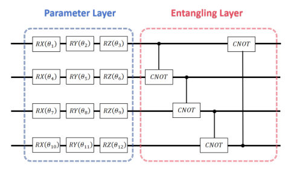
<figcaption class="paper-figure-caption"><b>Fig 1.</b> FIG. 2. The HEA quantum circuit structure with N = 4 and L = 1.</figcaption>
</figure>
<figure class="paper-figure-card">
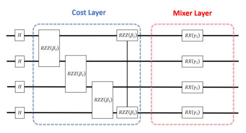
<figcaption class="paper-figure-caption"><b>Fig 2.</b> FIG. 1. The HVA quantum circuit structure for the TFIM with N = 4 and L = 1.</figcaption>
</figure>
<figure class="paper-figure-card">
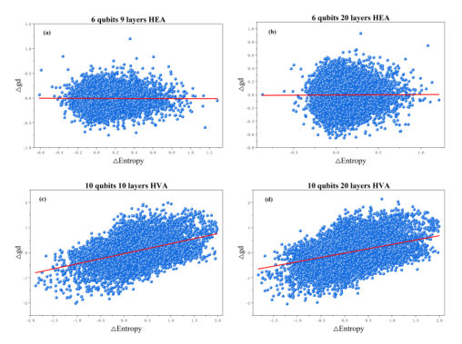
<figcaption class="paper-figure-caption"><b>Fig 3.</b> FIG. 4. Statistical correlations between changes of entan- glement entropy and geodesic distance gd toward the tar- get space. The variation is calculated between adjacent lay- ers across 103 randomized HVA circuits and 103 randomized HEA circuits. The red lines represent the relationship be- tween layer-by-layer changes of the two quantities. (a) and (b) show the results of HEA circuits, while (c) and (d) show the results of HVA circuits.</figcaption>
</figure>
<figure class="paper-figure-card">
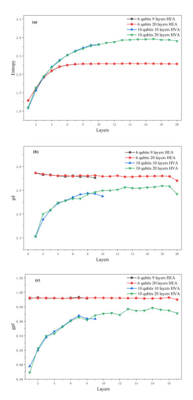
<figcaption class="paper-figure-caption"><b>Fig 4.</b> FIG. 3. Data averaged 103 independent trials with random parameter initializations for both HVA and HEA circuits. (a) Variations of the bipartite entanglement entropy as a function of circuit layer. (b) Variation of geodesic distance between intermediate states and the target solution space as a function of circuit layer. (c) Variation of geometric phase fraction as a function of circuit layer.</figcaption>
</figure>
<figure class="paper-figure-card">
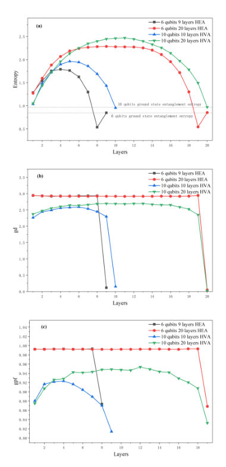
<figcaption class="paper-figure-caption"><b>Fig 5.</b> FIG. 6. Data averaged 103 independent trials with optimized HVA and HEA circuits. The gray line in (a) indicates the ground-state entanglement entropy calculated via exact diag- onalization. (a) Variations of the bipartite entanglement en- tropy as a function of circuit layer. (b) Variation of geodesic distance between intermediate states and the target solution space as a function of circuit layer. (c) Variation of geometric phase fraction as a function of circuit layer.</figcaption>
</figure>
<figure class="paper-figure-card">
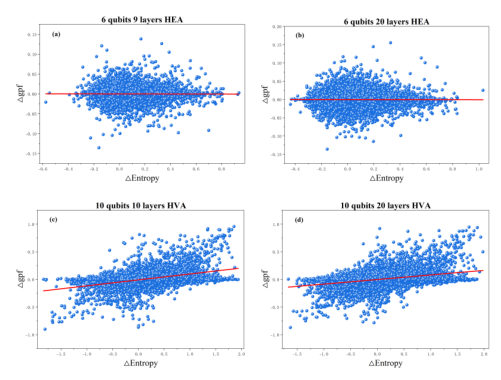
<figcaption class="paper-figure-caption"><b>Fig 6.</b> FIG. 5. Statistical correlations between changes of entangle- ment entropy and geometric phase fraction gpf. The variation is calculated between adjacent layers across 103 randomized HVA circuits and 103 randomized HEA circuits. The red lines represent the relationship between layer-by-layer changes of the two quantities. (a) and (b) show the results of HEA cir- cuits, while (c) and (d) show the results of HVA circuits.</figcaption>
</figure>
<figure class="paper-figure-card">

<figcaption class="paper-figure-caption"><b>Fig 7.</b> Fig. 6(a) demonstrates that, for both HVA and HEA circuits, the entanglement entropy initially increases with circuit depth, reaches a maximum at intermediate layers, and then gradually decreases, eventually approaching the entanglement entropy of the ground state. Besides, the maximum value of entanglement entropy doesn’t attain the saturation value and exhibits a slower growth. This indicates that the optimization process inherently con- strains both the overall magnitude and the rate of accu- mulation of entanglement entropy throughout the circuit. Surprisingly, as illustrated in Fig. 6(b), the geodesic distance gd towards the target space remains relatively</figcaption>
</figure>
<figure class="paper-figure-card">
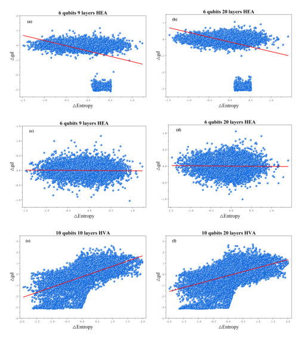
<figcaption class="paper-figure-caption"><b>Fig 8.</b> FIG. 7. Statistical correlations between changes of entan- glement entropy and geodesic distance gd toward the target space. The variation is calculated between adjacent layers across 103 optimized HVA circuits and 103 optimized HEA circuits. The red lines represent the relationship between layer-by-layer changes of the two quantities. (a) and (b) show the results of HEA circuits, while (c) and (d) show the same results but with the final layer’s data removed. (e) and (f) show the results of HVA circuits.</figcaption>
</figure>
<figure class="paper-figure-card">

<figcaption class="paper-figure-caption"><b>Fig 9.</b> Fig. 8 explores the relationship between the step-by- step changes of entanglement entropy and the geometric phase fraction. It is clear that after optimization, the HVA also exhibits a more pronounced positive correlation between these two quantities when the randomness in the circuit parameters is removed. This persistent corre- spondence reinforces the conclusion that, within the HVA</figcaption>
</figure>
<figure class="paper-figure-card">
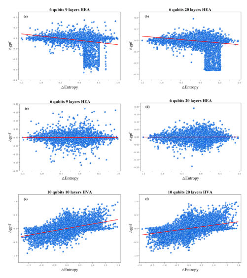
<figcaption class="paper-figure-caption"><b>Fig 10.</b> FIG. 8. Statistical correlations between changes of entangle- ment entropy and geometric phase fraction gpf. The varia- tion is calculated between adjacent layers across 103 optimized HVA circuits and 103 optimized HEA circuits. The red lines represent the relationship between layer-by-layer changes of the two quantities. (a) and (b) show the results of HEA cir- cuits, while (c) and (d) show the same results but with the final layer’s data removed. (e) and (f) show the results of HVA circuits.</figcaption>
</figure>

**Main problem.** The study investigates whether the dynamic characteristics of entanglement (growth and spread) actively drive quantum state evolution in Variational Quantum Algorithms (VQAs) or act as a passive byproduct.

**Main result.** In problem-agnostic Hardware-Efficient Ansätze (HEA), entanglement dynamics are decoupled from state evolution, which is dominated by geometric phase. In contrast, in problem-inspired Hamiltonian Variational Ansätze (HVA), entanglement acts as a dynamical resource where increased entanglement consumption correlates with faster state evolution toward the target.

**Method.** The authors use a geometric framework analyzing state trajectories in projective Hilbert space via Fubini-Study distance and Matrix Product State (MPS) simulations to compute entanglement and geodesic distances.

**Summary.** This paper explores the functional role of entanglement in Variational Quantum Algorithms from a geometric perspective. It distinguishes between problem-agnostic architectures (HEA), where entanglement is decoupled from state evolution, and problem-inspired architectures (HVA), where entanglement acts as a dynamical resource that drives the state toward the target. By analyzing the geometric and dynamical phases of the state trajectory, the authors show that structured ansätze can harness entanglement to accelerate convergence. This suggests that future quantum algorithm design should focus on guiding entanglement consumption rather than just generating it.

Detailed structure

**Model / system.** The study focuses on Variational Quantum Algorithms (VQAs) applied to the one-dimensional Transverse-Field Ising Model (TFIM) at the critical point (J=1, h=1) using two circuit architectures: Hardware-Efficient Ansatz (HEA) and Hamiltonian Variational Ansatz (HVA).

**Key observables.** Bipartite Von Neumann entanglement entropy, geodesic distance from initial state and to target space, geometric phase fraction, and dynamical phase contribution.

**Important parameters / regimes.** Circuit depth (layers), number of qubits (N=6 to 10), and comparison between randomized and optimized parameter regimes.

**Assumptions / limitations.** The analysis assumes that the effectiveness of an ansatz can be characterized by the relationship between entanglement dynamics and the geometric properties of the Hilbert space trajectory.

**Figures summary.** Figures show the HVA circuit structure, statistical correlations between entanglement variations and geodesic distance/geometric phase fraction for both randomized and optimized circuits, and averaged entanglement/distance/phase trends across layers.

**Paper structure.** The paper introduces the problem of entanglement's role in VQAs, defines a geometric framework for analyzing state evolution, compares HEA and HVA architectures using MPS simulations, presents statistical correlations and results for both randomized and optimized circuits, and concludes with implications for future ansatz design.

**Why it may be interesting.** This is interesting for many-body dynamics researchers as it provides a geometric perspective on how entanglement-generating operations can be structured to drive a system toward a specific target state, bridging the gap between circuit architecture and many-body evolution.

Abstract

Calibrating the role of entanglement in quantum algorithms is a crucial task in the development of quantum computing. Most existing studies have primarily focused on how the static properties of entanglement-such as its magnitude and phase-affect key performance metrics. In this work, we instead explore the relationship between the dynamical behaviors of entanglement and the execution of variational quantum algorithms from a geometric perspective. We find that, in contrast to conventional Hamiltonian dynamics where the evolution process is dominated by the dynamical phase, quantum state evolution in quantum algorithms is primarily governed by the geometric phase with the trajectory determined by the parameter-dependent Hilbert space geometry. In the problem-agnostic Hardware-Efficient Ansatz (HEA), entanglement dynamics and state evolution are decoupled. Conversely, in the problem-inspired Hamiltonian Variational Ansatz (HVA), the dynamical phase contribution is enhanced, allowing entanglement to function as a dynamical resource: more entanglement consumption correlates directly with faster quantum state evolution.

[↑ back to top](#top)

### [Electrically detected magnetic resonance of $^{75}$As magnetic clock transitions in silicon](http://arxiv.org/abs/2604.24090v1)

**Authors:** Ravi Acharya, Shao Qi Lim, Brett C. Johnson, Nicholas Gillespie, Christopher T. -K. Lew, Alexander M. Jakob, Daniel L. Creedon, Gus O. Bonin, Dane R. McCamey, Richard J. Curry, Jeffrey C. McCallum, David N. Jamieson  
**Type:** experiment · **Category:** quantum information and computing · **PDF:** <https://arxiv.org/pdf/2604.24090v1>  
**Analysis basis:** full PDF text, analyzed in chunks
**Topic relevance:** 🔥 `QC/QI experiment` **4/5** · `spintronics-quantum-optics interface` **2/5**

↔ Scroll figures horizontally

<figure class="paper-figure-card">
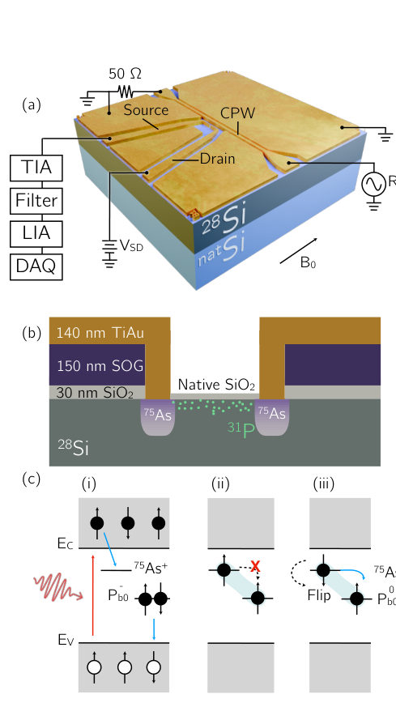
<figcaption class="paper-figure-caption"><b>Fig 1.</b> FIG. 1. (a) EDMR device schematic, showing the coplanar waveguide (CPW), the source-drain contacts, and auxiliary electronics including: a transimpedance amplifier (TIA), a lock-in amplifier (LIA), a data acquisition system (DAQ), a DC-bias source, a RF source, and a 50 Ωterminator. (b) Cross-sectional view of the device geometry (not-to-scale), il- lustrating the near-surface donor layer. (c) Schematic of the SDR mechanism. (i) Above bandgap (633 nm) excitation gen- erates electron–hole pairs, enabling the formation of weakly coupled donor–defect spin pairs. Recombination is spin selec- tive: (ii) parallel pairs are long lived, while (iii) antiparallel pairs lead to recombination events....</figcaption>
</figure>
<figure class="paper-figure-card">
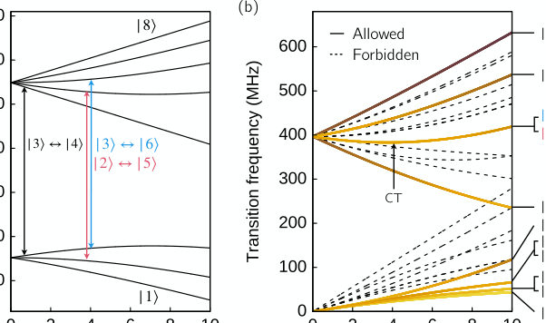
<figcaption class="paper-figure-caption"><b>Fig 2.</b> FIG. 2. (a) Calculated energy level diagram of substitutional 75As in silicon as a function of the applied magnetic field B0, labelled as |1⟩−|8⟩in ascending order of energy. The two CTs are indicated by the red and blue vertical lines. The black vertical line indicates the transition labelled non-C in (b). (b) Corresponding transition frequencies between the donor eigenstates. Both the magnetically allowed transitions (solid lines) and forbidden transitions (dashed lines) are shown. The colour scale of the allowed transitions encodes the corresponding ESR transition strengths. Each transition is labelled by its associated eigenstate indices on the right. The CT transitions (C1 and C2,...</figcaption>
</figure>
<figure class="paper-figure-card">
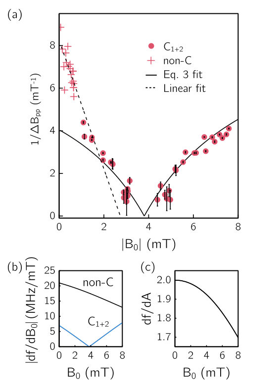
<figcaption class="paper-figure-caption"><b>Fig 3.</b> FIG. 4. (a) Inverse of the peak-to-peak linewidth, 1/∆Bpp, extracted from Lorentzian fits to the EDMR spectra. The dashed grey line represents a linear fit to the non-C transition (crosses). The solid line is a fit using Eq. 3 to the CT pair transition (circles). (b) Absolute value of the derivative of the transition frequencies, | df/dB0 |, against B0 for the relevant transitions. The CT pair (shown as C1+2) is identified by the zero-crossings. (c) df/dA against B0 of the CT pair calculated from Eq. 4.</figcaption>
</figure>
<figure class="paper-figure-card">
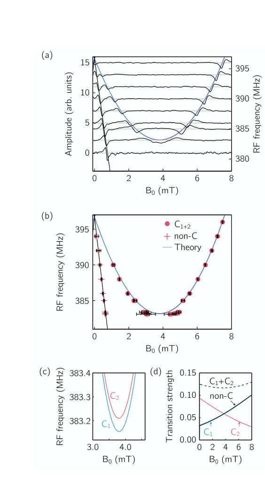
<figcaption class="paper-figure-caption"><b>Fig 4.</b> FIG. 3. (a) Series of EDMR spectra versus B0 with the right y-axis denoting the RF frequencies used (grey horizontal lines). The theoretically calculated transition frequency spec- tra are also shown (curved solid red/blue lines and straight black line). (b) Comparison between the experimentally mea- sured (data points) extracted from fits to the data in (a) and theoretically calculated (solid lines) transition frequency spec- tra near the CT turning point. The solid black line and crosses represent the non-C transition while the solid red/blue lines and circles represent the CT pair. (c) Close-up near the CT turning point, detailing the small energetic and magnetic field separation between...</figcaption>
</figure>

**Main problem.** Mitigating decoherence in donor spin systems for scalable silicon-based quantum information processing by identifying and probing magnetic clock transitions.

**Main result.** The researchers successfully observed magnetic field clock transitions in near-surface 75As ensembles using low-field EDMR and demonstrated that linewidth broadening near these transitions can be modeled by the interplay of magnetic and hyperfine disorder.

**Method.** Continuous-wave electrically detected magnetic resonance (EDMR) using RF frequency modulation and lock-in detection on a silicon-based device.

**Summary.** This paper demonstrates the use of low-field electrically detected magnetic resonance (EDMR) to identify magnetic clock transitions in arsenic-doped silicon. By operating at points where the transition frequency is insensitive to magnetic field fluctuations, the researchers show a path to reducing spin decoherence. They provide a detailed model of how linewidths behave near these transitions due to hyperfine and magnetic disorder. This work establishes EDMR as a powerful tool for characterizing near-surface donor environments in silicon-based quantum technologies.

Detailed structure

**Model / system.** An ensemble of near-surface 75As (I = 3/2) donor spins in isotopically enriched 28Si, modeled by a Hamiltonian including electron Zeeman, nuclear Zeeman, and isotropic hyperfine interaction terms.

**Key observables.** Changes in source-drain current (conductivity), resonance positions, and peak-to-peak linewidth (delta Bpp).

**Important parameters / regimes.** Low magnetic field regime (< 10 mT), hyperfine coupling constant A = 198.4 MHz, electron g-factor 1.99837, and nuclear g-factor 0.959.

**Assumptions / limitations.** The linewidth broadening is primarily driven by static magnetic field inhomogeneities and hyperfine variations (strain/Stark shifts).

**Figures summary.** Fig 1 shows the EDMR device schematic; Fig 2 displays the energy level diagram and transition frequencies; Fig 3 shows spectral convolution at low fields; Fig 4 illustrates the relationship between linewidth and magnetic field.

**Paper structure.** The paper introduces the problem of decoherence, describes the experimental EDMR device and 75As system, presents the identification of clock transitions, analyzes linewidth broadening through Hamiltonian modeling, and concludes with the utility of EDMR as a probe for quantum device engineering.

**Why it may be interesting.** The study explores the suppression of decoherence via clock transitions, which is directly relevant to the design of protected qubits and the study of open quantum systems interacting with magnetic noise.

Abstract

Magnetic clock transitions (CTs), defined by vanishing first-order sensitivity of the transition frequency to magnetic field fluctuations, provide a powerful route to suppress decoherence in donor spin systems. Here, we present the observation of magnetic field CTs from an ensemble of near-surface $^{75}$As ($I = 3/2$) spins in silicon using low-field ($< 10$~mT) continuous-wave electrically detected magnetic resonance (EDMR). As the CT condition is approached, pronounced linewidth broadening is observed, consistent with a donor Hamiltonian informed linewidth model. These results establish low-field EDMR as a sensitive probe of CTs in near-surface donor systems relevant to silicon-based quantum devices.

[↑ back to top](#top)

### [Few-Shot Cross-Device Transfer for Quantum Noise Modeling on Real Hardware](http://arxiv.org/abs/2604.24397v1)

**Authors:** Sahil Al Farib, Sheikh Redwanul Islam, Azizur Rahman Anik  
**Type:** both · **Category:** quantum information and computing · **PDF:** <https://arxiv.org/pdf/2604.24397v1>  
**Analysis basis:** full PDF text, analyzed in chunks
**Topic relevance:** 🔥 `QC/QI experiment` **4/5** · `methods for driven-dissipative` **2/5**

↔ Scroll figures horizontally

<figure class="paper-figure-card">
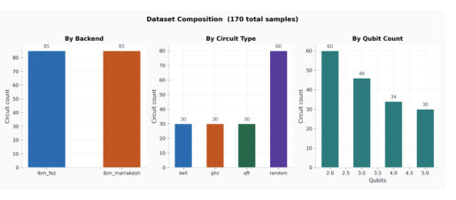
<figcaption class="paper-figure-caption"><b>Fig 1.</b> Fig. 1. Dataset composition. (a) Sample counts by backend: 85 per device. (b) Circuit type distribution: 40 random, 15 Bell, 15 GHZ, 15 QFT. (c) Qubit count distribution across 2–5 qubits. The balanced structure across circuit types ensures the dataset covers a representative range of noise regimes.</figcaption>
</figure>
<figure class="paper-figure-card">
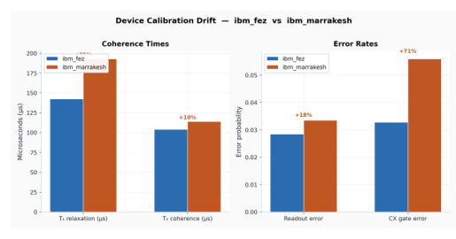
<figcaption class="paper-figure-caption"><b>Fig 2.</b> Fig. 2. Device calibration drift between ibm_fez (Backend A) and ibm_marrakesh (Backend B). Left: coherence times T1 and T2 in microseconds. Right: readout error and CX gate error rates. Backend B has longer coherence times but higher gate and readout error rates—a qualitatively distinct noise profile that motivates the need for explicit adaptation.</figcaption>
</figure>
<figure class="paper-figure-card">
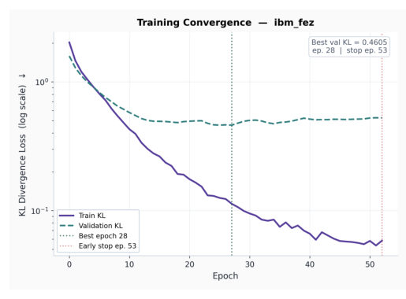
<figcaption class="paper-figure-caption"><b>Fig 3.</b> Fig. 3. Training convergence curve (KL divergence, log scale) on Backend A. Both training and validation loss decrease monotonically before early stopping. The gap between training and validation curves is small, indicating limited overfitting despite the small dataset size (68 training samples). Best val KL = 0.4605 at epoch 27; early stopping at epoch 52.</figcaption>
</figure>
<figure class="paper-figure-card">
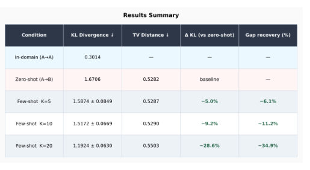
<figcaption class="paper-figure-caption"><b>Fig 4.</b> Fig. 4. Results summary table. Rows: in-domain, zero-shot, and K=5/10/20 few-shot conditions. Columns: KL divergence (mean ± std), TV distance, and KL improvement percentage. Note that TV increases slightly (+0.0221), indicating that improvements in low-probability states (KL-sensitive) may come at the cost of small deviations in dominant states.</figcaption>
</figure>
<figure class="paper-figure-card">
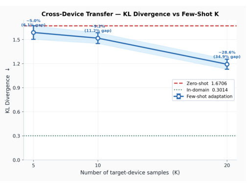
<figcaption class="paper-figure-caption"><b>Fig 5.</b> Fig. 5. KL divergence as a function of few-shot sample count K. Dashed red line: zero-shot baseline (1.6706). Dotted green line: in-domain reference (0.3014). Blue curve with shaded ±1 std confidence band: few-shot fine-tuning over 5 seeds. Percentage annotations indicate per-K improvement over zero- shot. The monotonic improvement with K confirms that the pre-trained source model provides a useful initialization for adaptation.</figcaption>
</figure>
<figure class="paper-figure-card">
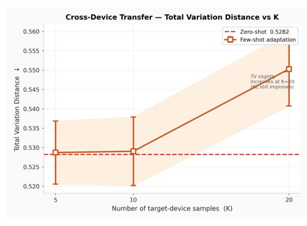
<figcaption class="paper-figure-caption"><b>Fig 6.</b> Fig. 6. Total Variation distance as a function of K. Unlike KL divergence, TV distance does not decrease monotonically: it remains approximately flat for K ≤10 and increases slightly at K = 20 (0.5282 →0.5503). This divergence from the KL trend is discussed in Section V-A.</figcaption>
</figure>
<figure class="paper-figure-card">
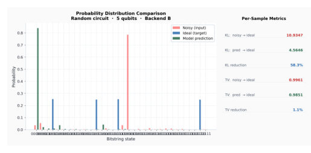
<figcaption class="paper-figure-caption"><b>Fig 7.</b> Fig. 7. Probability distribution comparison for a representative circuit on Backend B (circuit type and qubit count shown in panel title). Grouped bar chart: red = noisy input, blue = ideal target, green = model prediction over computational basis states. Side panel: KL and TV metrics for each sample, for all three pairs. The model effectively redistributes mass to the correct distribution, bringing down the noisy-to-ideal KL.</figcaption>
</figure>
<figure class="paper-figure-card">
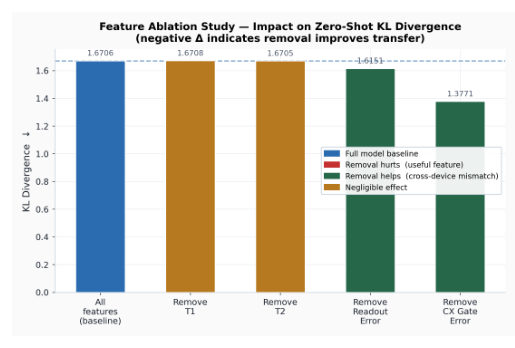
<figcaption class="paper-figure-caption"><b>Fig 8.</b> Fig. 8. Feature ablation study. Bar heights show KL divergence when each calibration feature is zeroed out at inference time (model weights unchanged). Red bar: removing this feature increases KL (feature is informative under zero-shot transfer). Green bar: removing this feature decreases KL, indicating distribution mismatch rather than benefit—the model’s learned association is miscalibrated for the target device’s regime. Both readout error and CX gate error exhibit cross-device mismatch (negative ∆), with CX gate error having the dominant effect.</figcaption>
</figure>

**Main problem.** Quantum noise in the NISQ era is hardware-specific and time-varying, making it difficult to develop error mitigation strategies that generalize across different quantum devices.

**Main result.** The study demonstrates that a noise model trained on one device can be effectively adapted to a different device using few-shot learning (K=20 samples), achieving a 28.6% improvement in KL divergence over zero-shot transfer.

**Method.** The researchers used a Residual Neural Network (ResNet) for supervised distribution regression, employing a layer-selective fine-tuning strategy and a replay buffer to adapt the model from a source device to a target device.

**Summary.** This paper addresses the challenge of cross-device quantum error mitigation in the NISQ era. By using transfer learning, the authors show that a neural network trained on one IBM quantum processor can be quickly adapted to a new processor using only a handful of circuit samples. This approach significantly reduces the error gap caused by hardware-specific noise like CX gate errors. The method provides a scalable, low-overhead alternative to more computationally expensive error mitigation techniques.

Detailed structure

**Model / system.** The experimental platform consists of two IBM superconducting quantum processors, ibm_fez (source) and ibm_marrakesh (target), using circuits with 2-5 qubits and depths of 2-8.

**Key observables.** KL divergence, Total Variation (TV) distance, and hardware calibration features including T1 (relaxation), T2 (dephasing), readout error, and CX gate error.

**Important parameters / regimes.** Number of fine-tuning samples (K = 5, 10, 20), circuit depth (2-8), and qubit count (2-5).

**Assumptions / limitations.** The model assumes that quantum noise can be sufficiently modeled using circuit structure and mean-aggregated hardware calibration features, and it does not account for per-qubit spatial heterogeneity.

**Figures summary.** Figure 1 shows dataset composition; Figure 2 compares calibration drift between backends; Figure 6 shows TV distance vs. K; Figure 7 visualizes probability distribution redistribution; Figure 8 shows the results of the feature ablation study.

**Paper structure.** The paper introduces the challenge of device-specific noise, describes the dataset and hardware, details the ResNet architecture and transfer learning protocol, presents results for zero-shot and few-shot performance, performs an ablation study to identify error drivers, and discusses limitations.

Abstract

In the noisy intermediate-scale quantum (NISQ) regime, quantum devices contain hardware-specific noise sources which restrict device-invariant error mitigation strategies. We explore transfer learning approaches to apply noise models learned on one quantum device to a different device with the help of a small amount of data. We create a real-hardware dataset from two IBM quantum devices, ibm_fez (source) and ibm_marrakesh (target), comprising 170 noisy and ideal circuit output distributions, with device calibration features added. We train a residual neural network on the source device to map noisy to ideal outcomes. The zero-shot transfer test shows a KL divergence of 1.6706 (up from 0.3014), establishing device specificity. With K = 20 fine-tuning samples, KL drops to 1.1924 (28.6% improvement over zero-shot), recovering 34.9% of the gap between zero-shot and in-domain KL. Ablation studies reveal that the major cause of mismatches across devices is CX gate error, followed by readout error. The results show quantum noise can be learned and fine-tuned with minimal samples, and provide a plausible approach to cross-device quantum error mitigation.

[↑ back to top](#top)

### [From Random Fringes to Deterministic Response: Statistical Foundations of Time-Reversed Young Interferometry](http://arxiv.org/abs/2604.23797v1)

**Authors:** Jianming Wen  
**Type:** theory · **Category:** quantum information and computing · **PDF:** <https://arxiv.org/pdf/2604.23797v1>  
**Analysis basis:** full PDF text, analyzed in chunks
**Topic relevance:** 🔥 `interference shaping light` **4/5** · `quantum measurements` **2/5**

↔ Scroll figures horizontally

<figure class="paper-figure-card">
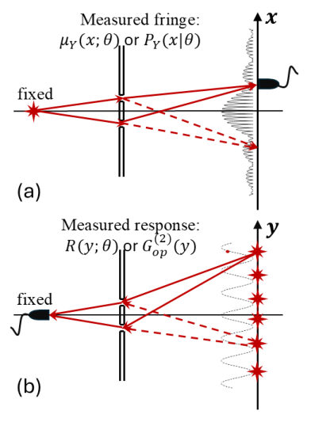
<figcaption class="paper-figure-caption"><b>Fig 1.</b> FIG. 1. Statistical distinction between conventional Young interference and TRY interference. In the standard geome- try, the detector coordinate x is the random variable and the fringe is reconstructed from a detection histogram. In TRY, the detector is fixed and the source coordinate y is a con- trolled label. The measured fringe is a conditional response function R(y; θ) or operational hybrid correlator G(2) op (y).</figcaption>
</figure>

**Main problem.** The paper aims to distinguish the statistical nature of conventional Young interference from a proposed Time-Reversed Young (TRY) geometry, specifically addressing how randomness is handled in each.

**Main result.** The authors demonstrate that in TRY, the interference fringe is a deterministic response function indexed by a programmed source coordinate, shifting the role of randomness from pattern formation to the precision of response estimation.

**Method.** The study utilizes estimation theory, specifically Fisher information and the Cramér-Rao bound, to compare the precision of parameter estimation in both conventional and TRY geometries.

**Summary.** The paper proposes a new way to view Young interference called Time-Reversed Young (TRY) interferometry. Unlike standard interference, which builds a pattern from random detection events, TRY uses a controlled source to measure a deterministic response. This shift allows for more precise parameter estimation by optimizing how measurement time is allocated across different source coordinates. The framework enables advanced sensing techniques like lock-in readout and superresolution by treating interference as a conditional response rather than a spatial histogram.

Detailed structure

**Model / system.** The system is a generalized Young interferometer setup, applicable to both classical and quantum (single-photon) regimes, involving a programmable source and a fixed detector under paraxial, linear, and reciprocal propagation.

**Key observables.** The conditional response function R(y; theta) in TRY and the spatial intensity or detection probability mu_Y(x; theta) in conventional Young interference.

**Important parameters / regimes.** The parameter of interest theta (e.g., phase, slit separation), the source coordinate y, the detector coordinate x, and the allocation of measurement resources like dwell time or samples.

**Assumptions / limitations.** Assumes paraxial, linear, and reciprocal propagation; stationary illumination during sampling; independent noise between source-coordinate bins; and unbiased estimators.

**Figures summary.** Figure 1 compares the conventional Young configuration (random detector outcomes) with the TRY configuration (controlled source coordinates). Figure 2 illustrates the TRY response-measurement problem and how parameter sensitivity is governed by the response slope and noise.

**Paper structure.** The paper introduces the distinction between conventional and TRY geometries, establishes a mathematical framework using estimation theory, compares the statistical character and noise scaling of both regimes, and concludes with the practical advantages for sensing and metrology.

**Why it may be interesting.** This is highly relevant to quantum optics and quantum information as it provides a new framework for high-precision metrology and sensing by engineering the source-plane basis to optimize Fisher information.

Abstract

Young interference is usually read as the gradual statistical accumulation of random detection events. Here we show that a time-reversed Young (TRY) geometry has a different statistical character: the fringe is not a marginal distribution of detector positions, but a conditional response indexed by a programmed source coordinate. With a fixed detector and a scanned source basis, the observable is an operational hybrid correlator between detector signal and source label. The resulting interference is deterministic at the response-function level, while noise enters only through estimation precision. We formulate this distinction using Fisher information, estimator variance, and noise scaling, clarifying why TRY naturally supports calibration, lock-in readout, null-fringe sensing, and source-plane superresolution.

[↑ back to top](#top)

### [Introducing the Correlation Concentration Ratio (CCR): Quantitative Framework for Comparing Quantum Cluster States](http://arxiv.org/abs/2604.23258v1)

**Authors:** Amin Ahadi, Saman Sarshar  
**Type:** theory · **Category:** quantum information and computing · **PDF:** <https://arxiv.org/pdf/2604.23258v1>  
**Analysis basis:** full PDF text, analyzed in chunks
**Topic relevance:** 🔥 `entanglement & information structure` **4/5** · `quantum measurements` **2/5**

↔ Scroll figures horizontally

<figure class="paper-figure-card">
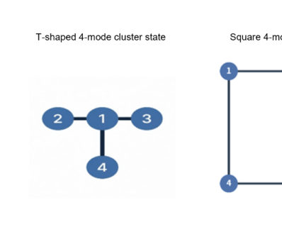
<figcaption class="paper-figure-caption"><b>Fig 1.</b> Figure 1: schematic cluster for linear, square, and T-shaped cluster states</figcaption>
</figure>
<figure class="paper-figure-card">
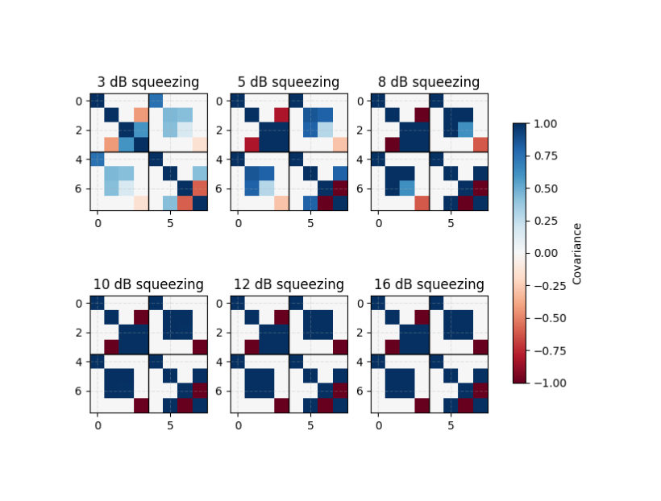
<figcaption class="paper-figure-caption"><b>Fig 2.</b> Figure 2: Covariance matrix for the four-mode linear cluster with squeezing parameter 3-16dB</figcaption>
</figure>
<figure class="paper-figure-card">
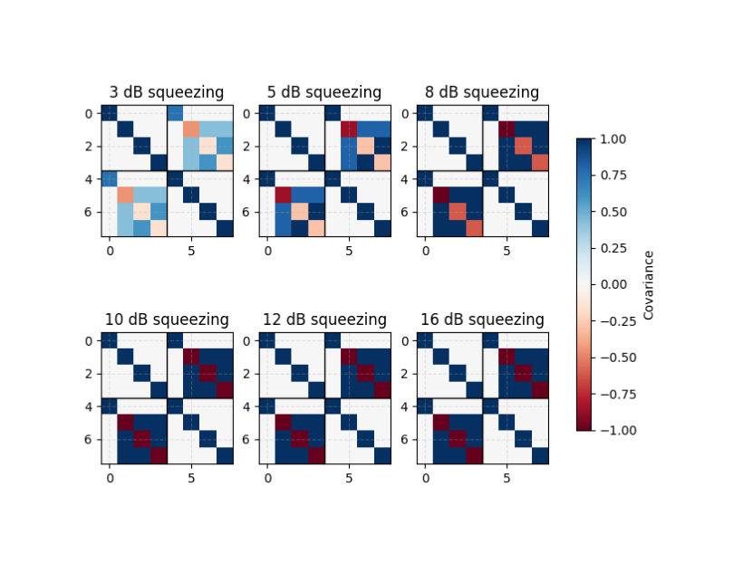
<figcaption class="paper-figure-caption"><b>Fig 3.</b> Figure 3: Covariance matrix for the four-mode square cluster with squeezing parameter 3-16dB</figcaption>
</figure>
<figure class="paper-figure-card">
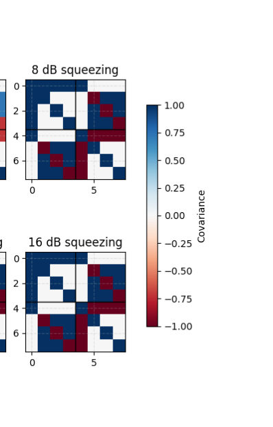
<figcaption class="paper-figure-caption"><b>Fig 4.</b> Figure 4: Covariance matrix for the four-mode T-shaped cluster with parameter 3-16dB</figcaption>
</figure>
<figure class="paper-figure-card">
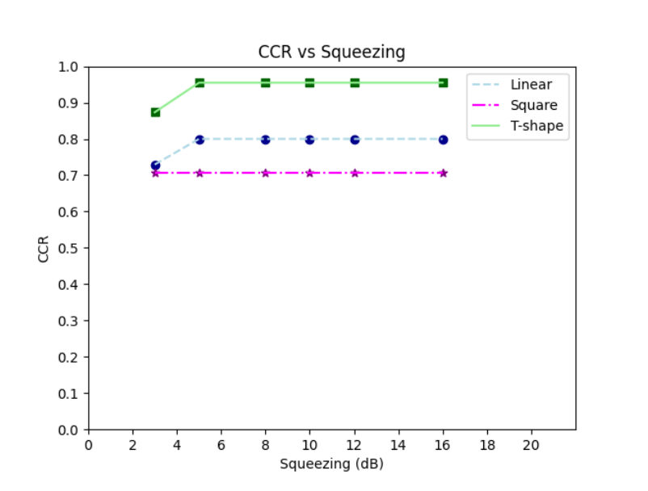
<figcaption class="paper-figure-caption"><b>Fig 5.</b> Figure 5: CCR as a function of squeezing level (2–16 dB) for linear, square, and T-shaped cluster topologies.</figcaption>
</figure>

**Main problem.** The lack of a quantitative framework to compare how different cluster state topologies (linear, square, and T-shaped) distribute entanglement and affect information propagation in measurement-based quantum computation.

**Main result.** The authors introduce the Correlation Concentration Ratio (CCR), a new metric that quantifies the concentration of correlations on graph edges, and demonstrate that square topologies are most scalable due to their balanced correlation distribution.

**Method.** Numerical simulations using the symplectic representation and covariance matrix formalism to model the generation of Gaussian cluster states via controlled-phase gates.

**Summary.** This paper introduces the Correlation Concentration Ratio (CCR) to quantitatively compare different quantum cluster state topologies. By simulating continuous-variable Gaussian cluster states, the authors show how graph geometry influences the distribution of quadrature correlations. They demonstrate that while squeezing increases correlation intensity, the CCR effectively captures topology-dependent features, such as the 'quantum hub' effect in T-shaped states. Ultimately, the work identifies square topologies as superior for scalable, fault-tolerant measurement-based quantum computation.

Detailed structure

**Model / system.** Four-mode continuous-variable (CV) Gaussian cluster states with linear, square, and T-shaped (or star-shaped) topologies, constructed from momentum-squeezed vacuum states.

**Key observables.** Covariance matrix elements (diagonal quadrature variances and off-diagonal inter-mode correlations), nullifier relations, and the Correlation Concentration Ratio (CCR).

**Important parameters / regimes.** Squeezing parameter (ranging from 3 to 16 dB) and the graph adjacency matrix (topology).

**Assumptions / limitations.** The study is limited to Gaussian states and focuses on the canonical quadrature basis without considering non-Gaussian elements.

**Figures summary.** Figure 1 shows the topology schematics; Figures 2-4 display covariance matrix plots for linear, square, and T-shaped structures across different squeezing levels; Figure 5 illustrates the variation of CCR as a function of squeezing for different topologies.

**Paper structure.** The paper introduces the problem of topological comparison, describes the symplectic modeling of CV cluster states, presents the new CCR metric, provides numerical results for 4-mode systems, and extends the analysis to scaling behavior in larger N-mode systems.

**Why it may be interesting.** It provides a new structural metric (CCR) for analyzing entanglement distribution in continuous-variable systems, which is highly relevant for designing robust architectures for CV-MBQC and understanding error propagation in quantum networks.

Abstract

In this paper, numerical simulations of four-mode continuous-variable cluster states with different topologies in the framework of measurement-based quantum computation are presented. By utilizing the symplectic representation and covariance matrix, the process of generating cluster states with linear, square, and T-shaped topologies has been systematically modeled. The simulation results show that the cluster graph structure is directly reflected in the pattern of quadrature correlations; in other words, the theoretical nullifier relations of the cluster states are reproduced in the final covariance matrices. Increasing the squeezing parameter leads to the strengthening of the target correlations and the suppression of unwanted components arising from anti-squeezing; such that the off-diagonal elements of the covariance matrix in the linear and square topologies increase to significant values, and in the T-shaped topology a stronger central correlation (similar to GHZ-like behavior in the continuous-variable domain) is observed. In order to quantitatively analyze these structural differences, a metric titled CCR (Correlation Concentration Ratio) is introduced that quantifies the concentration of effective correlations on the graph edges relative to the total correlations of the system. This index enables direct comparison of different topologies from the perspective of structural entanglement distribution and provides a framework for evaluating the efficiency of cluster graphs in MBQC architectures. The results show that CCR can be used as a practical tool for designing and selecting optimal topologies in larger clusters and more complex structures.

[↑ back to top](#top)

### [On Realization of Back-Action-Evading Measurements and Quantum Non-Demolition Variables via Linear Systems Engineering](http://arxiv.org/abs/2604.24243v1)

**Authors:** Zhiyuan Dong, Weichao Liang, Guofeng Zhang  
**Type:** theory · **Category:** quantum information and computing · **PDF:** <https://arxiv.org/pdf/2604.24243v1>  
**Analysis basis:** full PDF text, analyzed in chunks
**Topic relevance:** 🔥 `quantum measurements` **4/5** · `methods for driven-dissipative` **2/5**

↔ Scroll figures horizontally

<figure class="paper-figure-card">
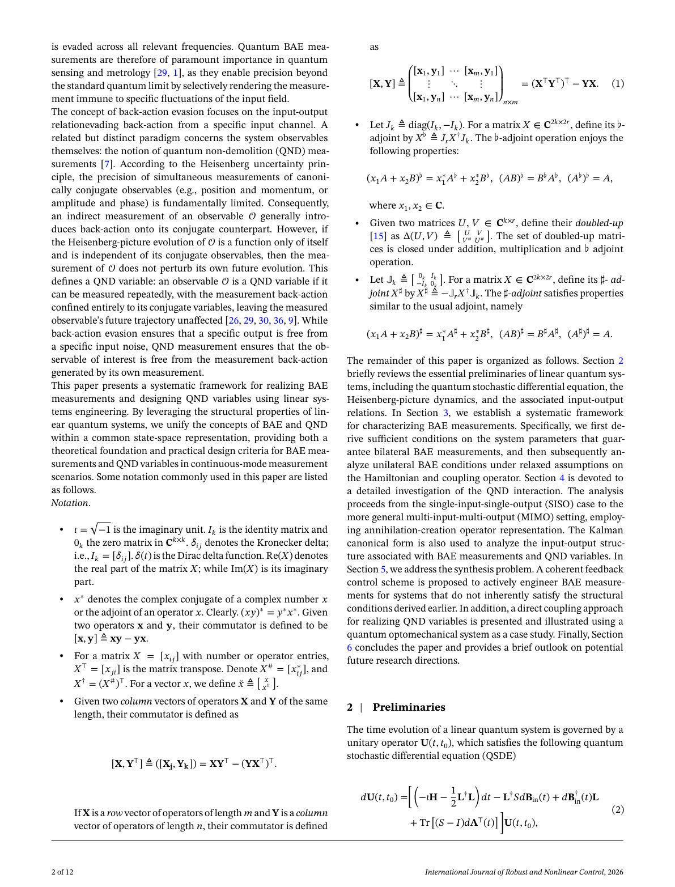
<figcaption class="paper-figure-caption"><b>Fig 1.</b> Low-resolution page preview, page 2</figcaption>
</figure>
<figure class="paper-figure-card">
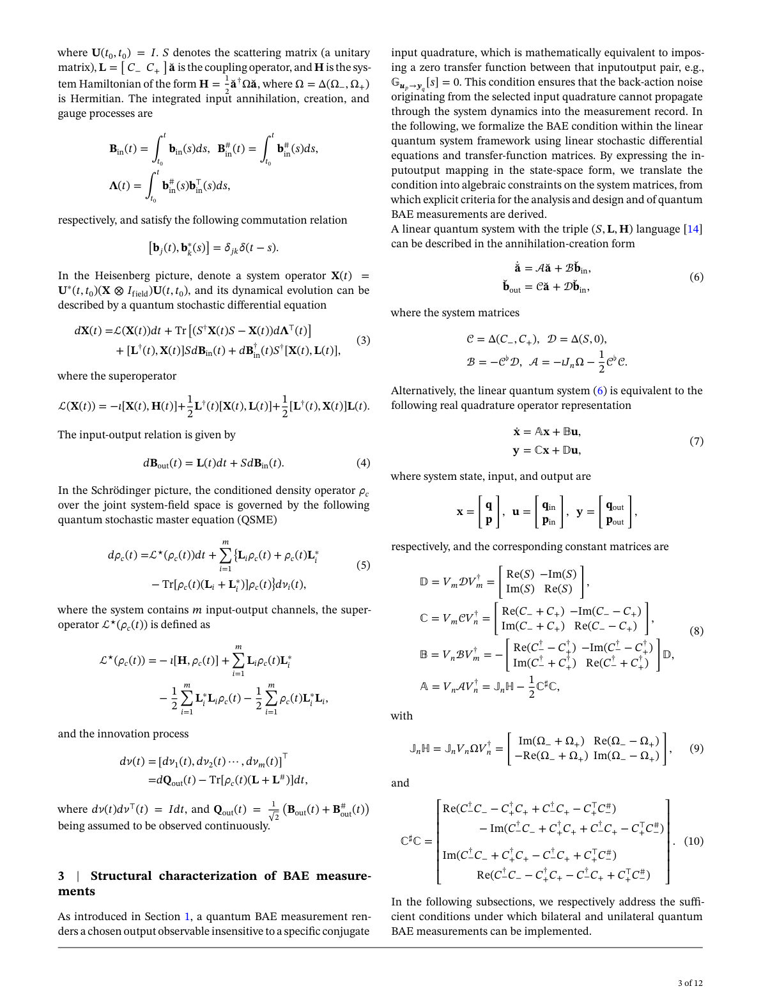
<figcaption class="paper-figure-caption"><b>Fig 2.</b> Low-resolution page preview, page 3</figcaption>
</figure>
<figure class="paper-figure-card">
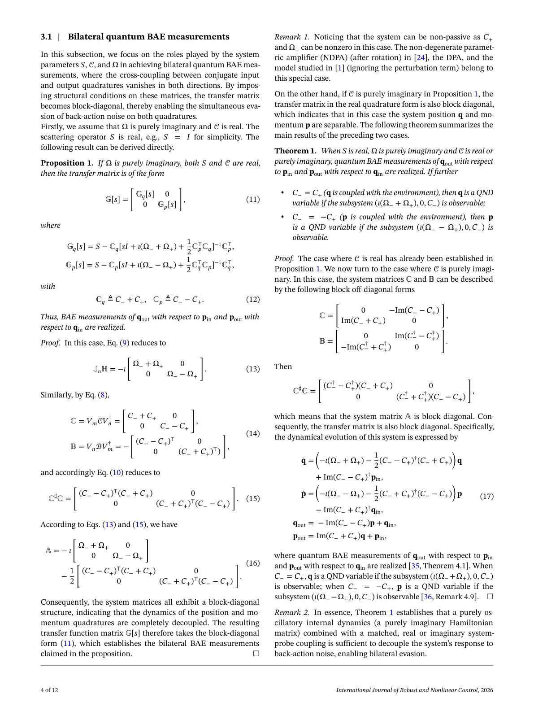
<figcaption class="paper-figure-caption"><b>Fig 3.</b> Low-resolution page preview, page 4</figcaption>
</figure>
<figure class="paper-figure-card">
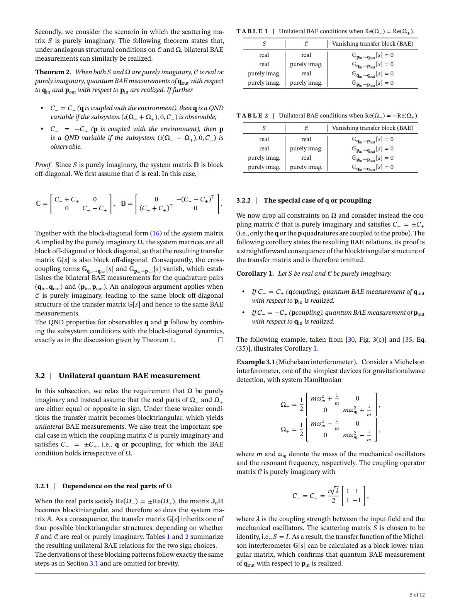
<figcaption class="paper-figure-caption"><b>Fig 4.</b> Low-resolution page preview, page 5</figcaption>
</figure>
<figure class="paper-figure-card">
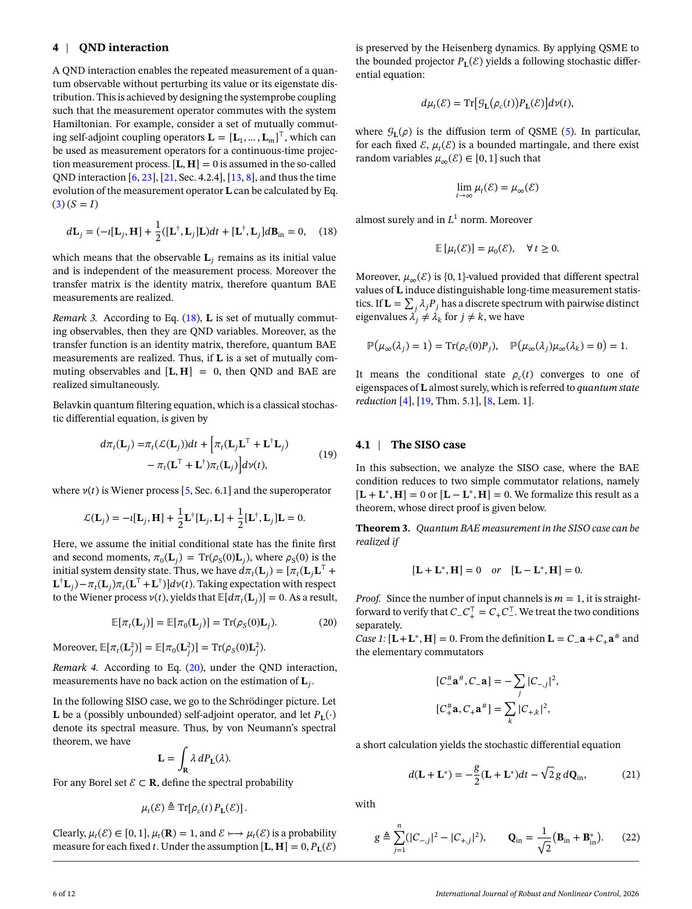
<figcaption class="paper-figure-caption"><b>Fig 5.</b> Low-resolution page preview, page 6</figcaption>
</figure>
<figure class="paper-figure-card">
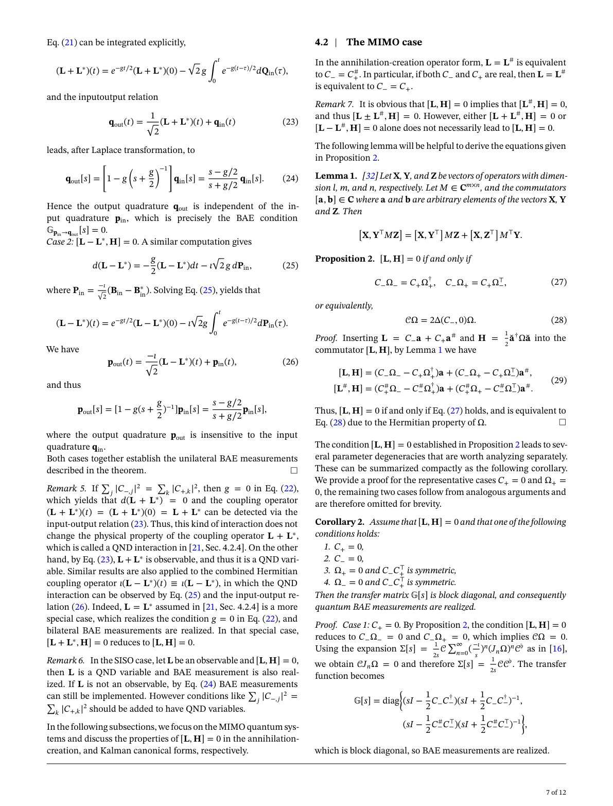
<figcaption class="paper-figure-caption"><b>Fig 6.</b> Low-resolution page preview, page 7</figcaption>
</figure>
<figure class="paper-figure-card">
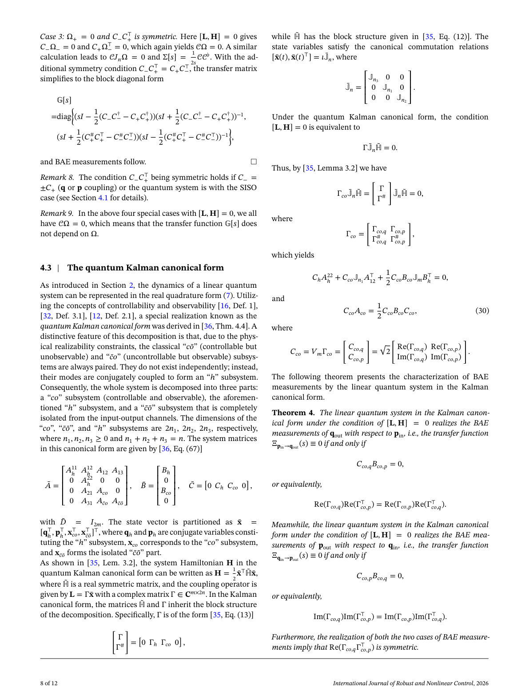
<figcaption class="paper-figure-caption"><b>Fig 7.</b> Low-resolution page preview, page 8</figcaption>
</figure>
<figure class="paper-figure-card">
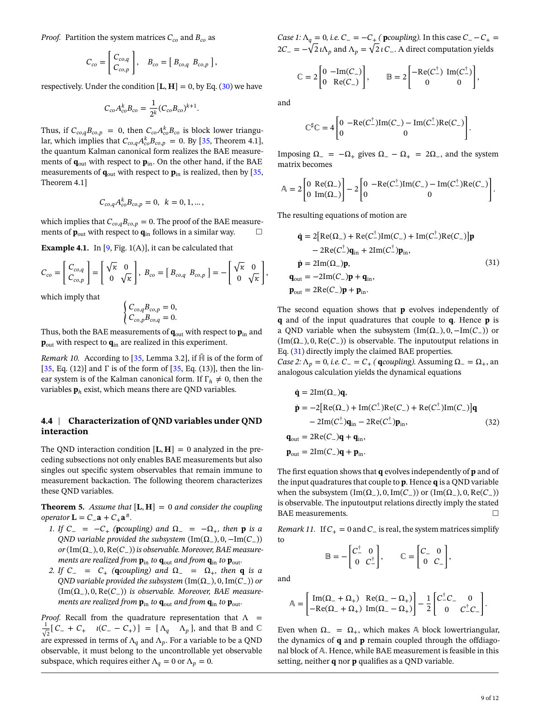
<figcaption class="paper-figure-caption"><b>Fig 8.</b> Low-resolution page preview, page 9</figcaption>
</figure>
<figure class="paper-figure-card">
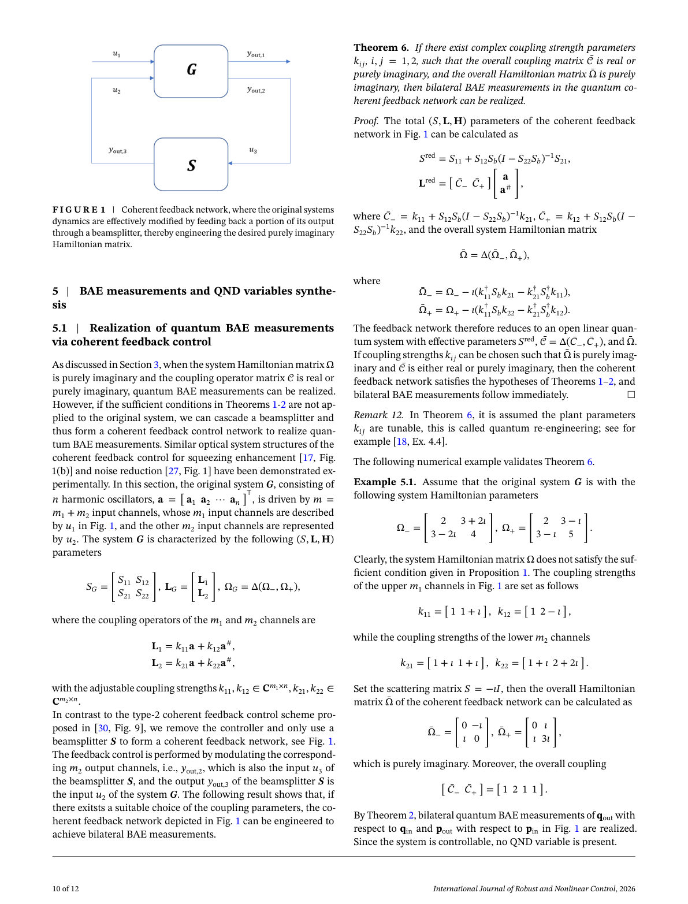
<figcaption class="paper-figure-caption"><b>Fig 9.</b> Low-resolution page preview, page 10</figcaption>
</figure>
<figure class="paper-figure-card">
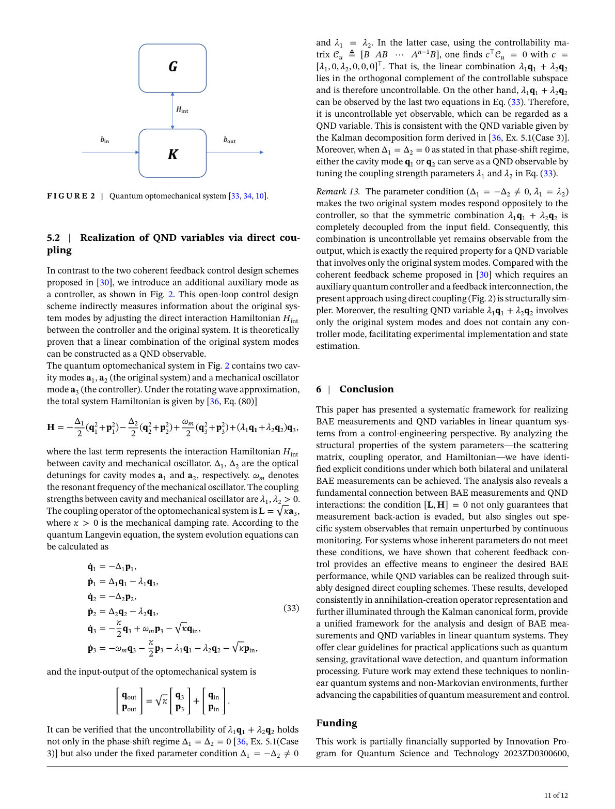
<figcaption class="paper-figure-caption"><b>Fig 10.</b> Low-resolution page preview, page 11</figcaption>
</figure>

**Main problem.** Establishing a systematic framework to realize Back-Action-Evading (BAE) measurements and Quantum Non-Demolition (QND) variables in linear quantum systems.

**Main result.** The authors derive algebraic conditions for BAE and QND realization, proving that a purely imaginary Hamiltonian with specific coupling properties enables BAE, and that coherent feedback or direct coupling can engineer these properties in non-compliant systems.

**Method.** Utilizing linear systems engineering tools, including Kalman canonical forms, transfer function analysis, and coherent feedback control design.

**Summary.** This paper develops a unified mathematical framework for achieving Back-Action-Evading measurements and QND variables in linear quantum systems. By using linear systems engineering, the authors identify the specific algebraic constraints on Hamiltonians and coupling operators needed to prevent noise from affecting measurement records. They demonstrate that even systems that do not naturally satisfy these conditions can be re-engineered using coherent feedback or direct coupling. The results are particularly applicable to quantum optomechanics and precision sensing.

Detailed structure

**Model / system.** The framework applies to linear quantum systems in continuous-mode measurement scenarios, described by Quantum Stochastic Differential Equations (QSDEs) and the Quantum Stochastic Master Equation (QSME).

**Key observables.** Conjugate quadratures (position and momentum), output quadratures, and the coupling operator.

**Important parameters / regimes.** Hamiltonian parameters (Omega), scattering matrix (S), coupling strength (lambda), and the distinction between bilateral and unilateral BAE regimes.

**Assumptions / limitations.** The framework is restricted to linear quantum systems and assumes continuous-mode measurement.

**Figures summary.** Figure 1 shows a coherent feedback network using a beamsplitter; Figure 2 illustrates a quantum optomechanical system platform.

**Paper structure.** The paper moves from defining BAE and QND conditions to establishing structural requirements, investigating SISO and MIMO regimes, and finally presenting synthesis methods via feedback and direct coupling.

**Why it may be interesting.** It provides a rigorous control-theoretic approach to suppressing measurement back-action, which is essential for high-precision sensing and maintaining quantum coherence in open quantum systems.

Abstract

We establish a framework for realizing back-action-evading (BAE) measurements and quantum non-demolition (QND) variables in linear quantum systems. The key condition, a purely imaginary Hamiltonian with a real or imaginary coupling operator, enables BAE measurements of conjugate observables. Symmetric coupling further yields QND variables. For non-compliant systems, coherent feedback is designed to engineer BAE measurements. Crucially, the QND interaction condition simultaneously ensures BAE measurements and promotes the coupling operator to a QND observable.

[↑ back to top](#top)

### [Partial solvability induced by dark states in a box trap with decentered two-body interaction](http://arxiv.org/abs/2604.23507v1)

**Authors:** Hossein Abedi, Nathan L. Harshman, Peter Schmelcher  
**Type:** theory · **Category:** quantum gases · **PDF:** <https://arxiv.org/pdf/2604.23507v1>  
**Analysis basis:** full PDF text, analyzed in chunks
**Topic relevance:** 🔥 `scars & prethermalization` **4/5** · `non-equilibrium dynamics` **2/5**

↔ Scroll figures horizontally

<figure class="paper-figure-card">
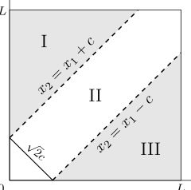
<figcaption class="paper-figure-caption"><b>Fig 1.</b> FIG. 1. Configuration space for two particles confined in a box trap of length L. The interaction potential has support on the two lines x2 −x1 = ±c (dashed lines), which divides the space into three regions.</figcaption>
</figure>
<figure class="paper-figure-card">
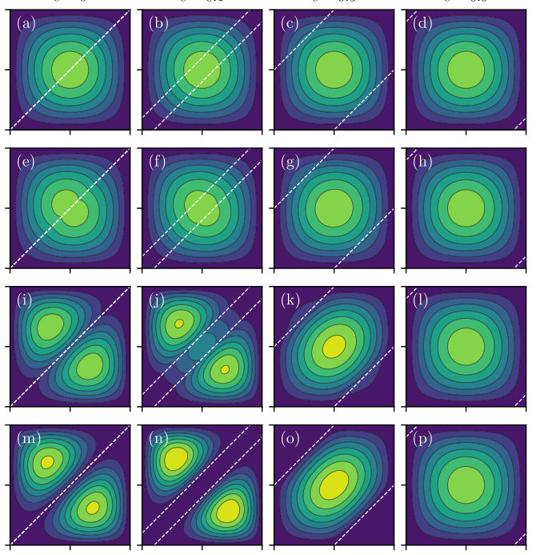
<figcaption class="paper-figure-caption"><b>Fig 2.</b> FIG. 2. The ground-state wave function ψ(x1, x2) in the bosonic even-parity sector (σ, π) = (+1, +1), for interaction strengths g = 0, 1, 20, 100 (rows, top to bottom) and displacement parameters c = 0, 0.1, 0.5, 0.9 (columns, left to right). The dashed lines indicate the support of the interaction potential. At c = 0, the model reduces to the standard contact interaction.</figcaption>
</figure>
<figure class="paper-figure-card">
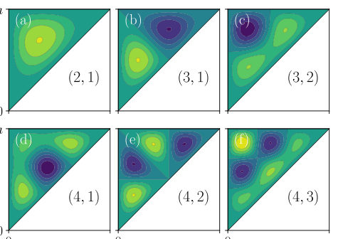
<figcaption class="paper-figure-caption"><b>Fig 3.</b> FIG. 3. The six lowest-lying eigenfunctions Ψnm(x1, x2) on the right isosceles triangular domain of leg length a. Quantum numbers (n, m) are given in the figure.</figcaption>
</figure>
<figure class="paper-figure-card">
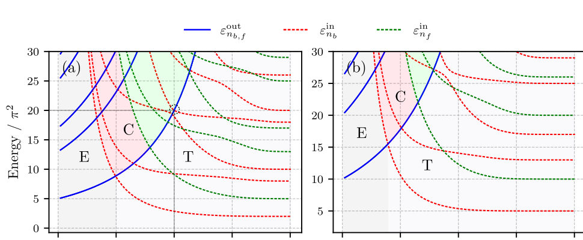
<figcaption class="paper-figure-caption"><b>Fig 4.</b> FIG. 4. Energy levels at g →∞. (a) Bosonic even-parity and fermionic odd-parity sectors. (b) Bosonic odd-parity and fermionic even-parity sectors. εout nb,f denotes the doubly degenerate fermionic and bosonic energy levels of the region outside. εin nb and εin nf denote the non-degenerate levels of the region inside for bosonic and fermionic states, respectively. The exact crossings between the lowest-energy levels εout 0b,f and εin 0b,f define four regimes: (E) exclusion, with only εout nb,f ; (T) truncation, with only εin nb,f ; and two crossover regions (C) where they coexist; red: εout nb with εin nb; green: εout nb,f with both εin nf , εin nb. The triple degeneracy indicated by the...</figcaption>
</figure>
<figure class="paper-figure-card">
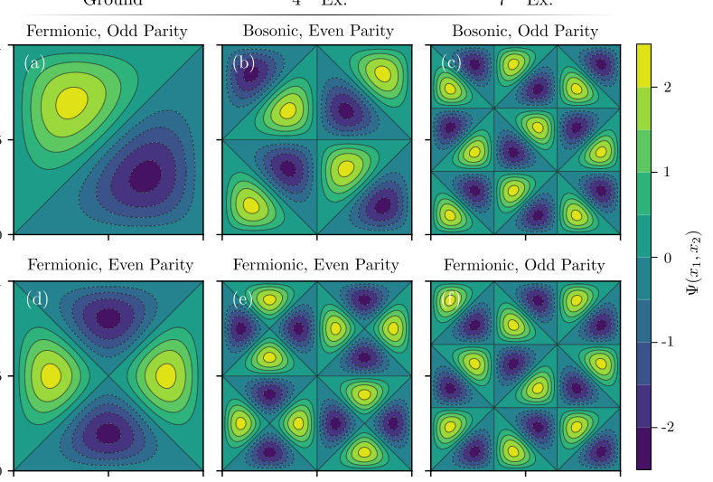
<figcaption class="paper-figure-caption"><b>Fig 5.</b> FIG. 5. Wavefunctions of the lowest-lying g = 0 eigenstates with diagonal nodal lines. The corresponding symmetry sector is shown in the figure. (a) and (d) carry diagonal nodal lines only at c = 0, and are therefore dark at c = 0. (b) and (e) States that become dark at c = 1/2. (c) State that becomes dark at c = 1/3. (f) State that becomes dark at c = 2/3.</figcaption>
</figure>
<figure class="paper-figure-card">
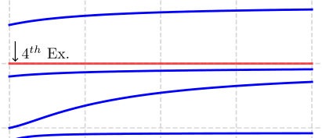
<figcaption class="paper-figure-caption"><b>Fig 6.</b> FIG. 6. Energy vs. g in the bosonic even parity sector at c = 1/2. The 4th excited state is dark. The 2nd and 3rd excited states approach the energy of the dark state asymptotically, giving rise to a triple degeneracy in the g →∞limit.</figcaption>
</figure>
<figure class="paper-figure-card">
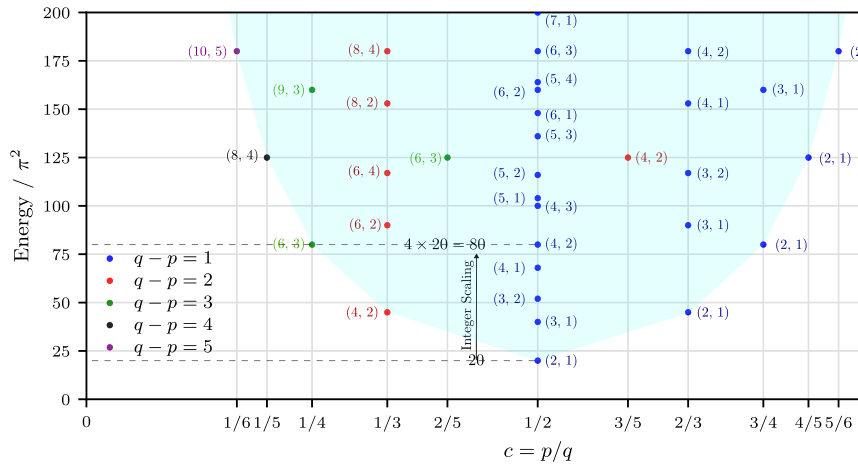
<figcaption class="paper-figure-caption"><b>Fig 7.</b> FIG. 7. Dark state quantum numbers (n, m) as a function of displacement c = p/q. For each point shown, an exact analytical solution exists. Integer scaling generates an infinite tower at fixed c; only (2, 1) →(4, 2) at c = 1/2 is shown.</figcaption>
</figure>

**Main problem.** The paper investigates the emergence of partial solvability and 'dark states' in a non-integrable quantum system where a two-body interaction is displaced from the center.

**Main result.** The authors demonstrate that specific rational values of the displacement parameter c induce exactly solvable subspaces (dark states) within an otherwise non-integrable spectrum, where wavefunctions are insensitive to interaction strength.

**Method.** The study employs exact diagonalization (ED) using the Lanczos algorithm, compares results with the Bethe ansatz for the c=0 limit, and uses quantum billiards theory to analyze the strong interaction limit.

**Summary.** This paper explores a two-particle system in a 1D box where the interaction is shifted by a distance c. While the system is generally non-integrable, the authors find that for certain rational values of c, 'dark states' emerge that are completely unaffected by the interaction strength. These states create exactly solvable sectors within the spectrum. The work bridges the gap between integrable contact interactions and complex, non-integrable dynamics.

Detailed structure

**Model / system.** A system of two non-relativistic particles (bosons or fermions) confined to a one-dimensional infinite square well trap with a decentered, zero-range contact interaction defined by strength g and displacement c.

**Key observables.** Eigenenergies, wavefunctions, parity, and the presence of spectral degeneracies.

**Important parameters / regimes.** Interaction strength (g), displacement parameter (c), particle statistics (bosonic vs. fermionic), and spatial parity.

**Assumptions / limitations.** The particles are non-relativistic and the system is restricted to a one-dimensional geometry.

**Figures summary.** Fig 1 shows the configuration space regions; Fig 3 visualizes the lowest energy states; Fig 5 illustrates wavefunctions with nodal lines; Fig 6 shows energy vs. interaction strength for a dark state.

**Paper structure.** The paper introduces the decentered interaction model, analyzes the symmetry properties, explores the integrable limits (c=0 and g=infinity), identifies the conditions for dark states via nodal alignment, and validates numerical results against analytical benchmarks.

**Why it may be interesting.** It provides a novel mechanism for partial integrability in non-integrable systems and connects the concept of dark states to quantum many-body scars, which is highly relevant to many-body dynamics and thermalization.

Abstract

We consider a generalization of the two-body contact interaction for nonrelativistic particles confined to a one-dimensional box, in which the interaction is decentered, i.e., the particles interact only when they are separated by a distance c. In contrast to the harmonically trapped system, this model is nonintegrable. Despite this, we demonstrate that the system exhibits partial solvability due to the presence of dark states, i.e., bosonic or fermionic states unaffected by the interaction. These states form exactly solvable subspaces embedded within an interacting spectrum. We characterize the stationary properties of the system, identify the conditions for the appearance of dark states, and show how they structure the spectrum and delineate interacting and noninteracting sectors.

[↑ back to top](#top)

### [Quantum echo-enabled high harmonic generation using ultrafast electrons](http://arxiv.org/abs/2604.23569v1)

**Authors:** Yangfan He, Chenhao Pan, Bin Zhang, Yiming Pan  
**Type:** both · **Category:** other · **PDF:** <https://arxiv.org/pdf/2604.23569v1>  
**Analysis basis:** full PDF text, analyzed in chunks
**Topic relevance:** 🔥 `interference shaping light` **4/5** · `non-equilibrium dynamics` **2/5**

↔ Scroll figures horizontally

<figure class="paper-figure-card">
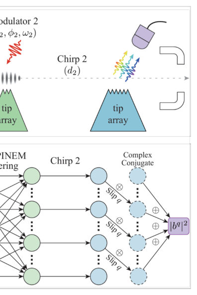
<figcaption class="paper-figure-caption"><b>Fig 1.</b> Figure 1: The setup and quantum process of Echo-Enabled High-Harmonic Generation (QEEHG). (a)The schematic setup of quantum echo-enabled high harmonic generation (EEHG) using free electrons. The setup is based on the ultrafast transmission electron microscopy that resembles a EEHG free electron laser seeding technique, which involves the usages of two laser modulations (modulator #1 and #2) and twice long-time free propagations (chirp #1 and chirp #2) to create a high-harmonic electron density modulation, in order to produce the high harmonics at the desired order</figcaption>
</figure>
<figure class="paper-figure-card">
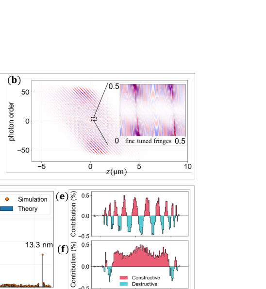
<figcaption class="paper-figure-caption"><b>Fig 2.</b> Figure 2: Quantum control and path selectivity in QEEHG. (a) Harmonic spectrum showing multiple echo orders. Blue bars: theoretical prediction from Eq. (3). Orange dots: numerical simulation results. (b) Wigner distribution corresponding to (a),</figcaption>
</figure>
<figure class="paper-figure-card">
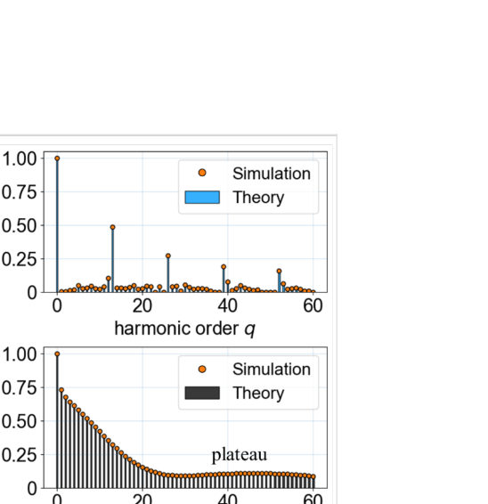
<figcaption class="paper-figure-caption"><b>Fig 3.</b> Figure 3: Tailored harmonic spectroscopy through collaborative phase optimization. (a) Identifying optimal global phase conditions by scanning the second drift length ( 𝑑₂ ). Black and blue circles mark regions satisfying the</figcaption>
</figure>

**Main problem.** The need for compact, coherent, and tunable sources of EUV and X-ray radiation, specifically addressing the lack of selectivity and efficiency in existing PINEM-based high-harmonic generation.

**Main result.** The development of a Quantum Echo-Enabled High-Harmonic Generation (QEEHG) scheme that uses quantum interference to selectively enhance specific harmonic orders while suppressing others.

**Method.** A theoretical framework using a multi-path quantum interferometer approach and numerical simulations via a quantum wavepacket evolution algorithm (FFPG) to model electron-laser interactions.

**Summary.** This paper proposes a new method called Quantum Echo-Enabled High-Harmonic Generation (QEEHG) to create tunable, coherent X-ray and EUV radiation. By using a sequence of laser modulations and dispersive drift sections, the researchers show how to manipulate the quantum phase of electron wavepackets. This allows for the selective enhancement of specific high-order harmonics through constructive interference while suppressing unwanted radiation. The technique provides a promising path toward compact, high-brightness radiation sources for electron microscopy and diffraction.

Detailed structure

**Model / system.** An ultrafast electron beamline interacting with two optical modulation stages and two dispersive drift (chirp) sections, modeled using a time-dependent Schrödinger equation with momentum-dependent chirping and position-dependent modulation operators.

**Key observables.** The q-th harmonic bunching factor b(q), the Wigner distribution of the electron wavepacket, and the harmonic spectrum amplitude.

**Important parameters / regimes.** Modulation strengths (g1, g2), laser frequencies (omega1, omega2), chirping coefficients (xi), drift lengths (d0, df), and the large recoil condition.

**Assumptions / limitations.** The interaction time is much shorter than the free-drift times (impulsive limit), the laser field is co-propagating, and the large recoil condition (momentum kick much larger than momentum spread) is assumed for analytical derivation.

**Figures summary.** Figure 1 shows the QEEHG setup and quantum interference network; Figure 2 displays the harmonic spectrum, Wigner distribution, and path selection maps; Figure 3 illustrates the optimization of global phase conditions and tailored spectra (periodic and plateau regimes).

**Paper structure.** The paper introduces the scientific problem of radiation source development, presents the proposed QEEHG scheme and its physical components, derives the mathematical operator-based framework for electron wavepacket evolution, provides numerical validation and optimization protocols, and concludes with the demonstration of spectrally tailored harmonic outputs.

**Why it may be interesting.** The paper presents a sophisticated application of quantum interference and wavepacket shaping, using a 'quantum echo' to control the interference of multiple quantum pathways, which is highly relevant to the control of coherent states in quantum optics.

Abstract

Controlling and generating ultrafast free-electron wavepackets via laser is pivotal for photon-induced near-field electron microscopes (PINEM) and also for developing compact, coherent free-electron radiation sources. Here, we present a quantum echo-enabled high-harmonic generation (QEEHG) scheme that manipulates the quantum phase of electron wavepackets to produce tunable, coherent high-harmonic radiation at ultrashort wavelengths. This framework, inspired by the EEHG concept for free-electron lasers by Stupikov et al. (2009), leverages multiphoton PINEM scattering followed by dispersive chirp sections to induce quantum interference among photon sidebands. Such interference selectively enhances a targeted harmonic order - for instance, the 60th harmonic at 13.3nm from an 800nm seeding - while suppressing unwanted radiations. The optimization of harmonic orders and its non-classical spectral characteristics are analyzed. This quantum echo technique establishes a promising paradigm for compact coherent sources and provides new perspectives for quantum wavefunction shaping in ultrafast electron microscopy and diffraction.

[↑ back to top](#top)

### [DiffQEC: A versatile diffusion model for quantum error correction](http://arxiv.org/abs/2604.24640v1)

**Authors:** Tianyi Xu, Qinglong Liu, Maolin Wang, Fei Zhang, Zhe Zhao, Yang Wang, Ye Wei  
**Type:** both · **Category:** quantum information and computing · **PDF:** <https://arxiv.org/pdf/2604.24640v1>  
**Analysis basis:** full PDF text, analyzed in chunks
**Topic relevance:** 🔥 `QC/QI experiment` **4/5** · `quantum measurements` **1/5**

↔ Scroll figures horizontally

<figure class="paper-figure-card">
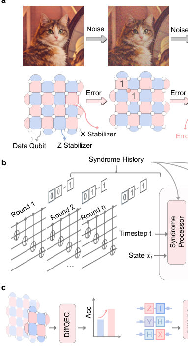
<figcaption class="paper-figure-caption"><b>Fig 1.</b> Fig. 1 Overview of DiffQEC. (a) Illustration of the analogy between the forward denoising diffusion process and the progressive accumulation of errors in the surface code. (b) The decoding pipeline of DiffQEC. Multi-round syndrome histories are encoded and used to condition the denoising network together with the diffusion timestep t and current noisy state xt, producing the estimated logical correction ˆx0. (c) Application scenarios of DiffQEC, including logical-qubit memory decoding, logical circuit decoding, and exploratory quantum error analysis.</figcaption>
</figure>
<figure class="paper-figure-card">
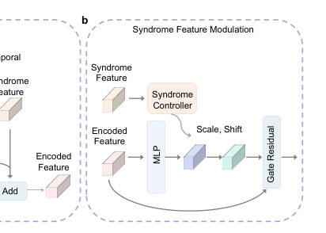
<figcaption class="paper-figure-caption"><b>Fig 2.</b> Fig. 2 Architecture of DiffQEC. (a) Syndrome processor. A 3D syndrome volume is encoded through per-round spatial convolution and pooling, followed by temporal aggregation across rounds with a GRU to produce a syndrome feature. In parallel, the diffusion timestep t and the current noisy state xt are encoded separately. These representations are combined with the syndrome feature to form the encoded feature for denoising. (b) Syndrome feature modulation. The encoded feature is further conditioned by the syndrome feature through a syndrome controller, which generates scale and shift signals together with a gate residual pathway before producing bitwise logits in the denoising network.</figcaption>
</figure>
<figure class="paper-figure-card">
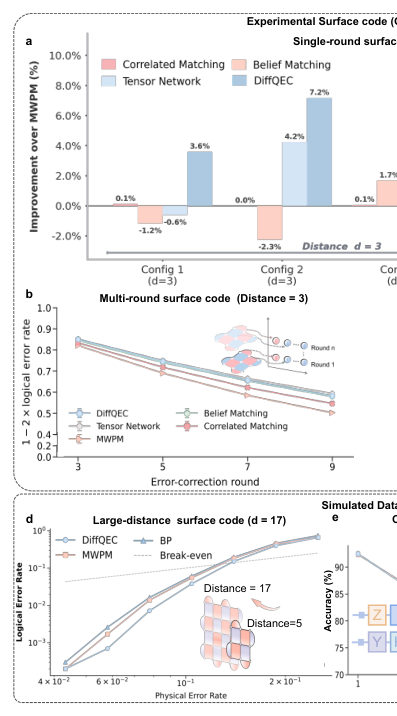
<figcaption class="paper-figure-caption"><b>Fig 3.</b> Fig. 3 Performance of DiffQEC on Google’s Sycamore surface-code, simulated multi-round surface- code, large-distance surface code and circuit-level decoding. (a) Relative improvements of over MWPM on Google’s Sycamore memory dataset. (b) and (c) show multi-round simulated surface-code decoding results at distances 3 and 5. (d) Large-distance decoding performance at distance 17 as a function of physical error rate. (e) Decoding time of DiffQEC and MWPM across increasing code distance. (f) Circuit-level decoding accuracy compared with MCCD .</figcaption>
</figure>
<figure class="paper-figure-card">
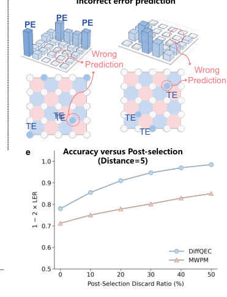
<figcaption class="paper-figure-caption"><b>Fig 4.</b> Fig. 4 Quantum error analysis, inference speed, and confidence-based post-selection with DiffQEC. (a) Measurement history is processed by the trained decoder to derive an attribution-based score over candidate physical error locations. (b) Incorporating this inferred error information into MWPM yields an improvement in decoding accuracy. (c) Representative visualizations of the inferred physical- error maps, including cases where the dominant predicted support agrees with the true error pattern and a representative failure case. Here, PE and TE denote predicted error and true error, respec- tively. (d) Multi-round decoding performance at distance 5 with post-selection (PS), where PS denotes...</figcaption>
</figure>

**Main problem.** The challenge of decoding quantum error correction (QEC) by inferring physical error configurations from syndrome patterns, specifically addressing the loss of uncertainty information in existing point-estimation decoders.

**Main result.** DiffQEC reduces logical error rates by up to 10.2% relative to MWPM and 5% relative to tensor-network decoding on Google's Sycamore processor, while providing useful posterior distributions for post-selection and error analysis.

**Method.** A generative decoder using discrete denoising diffusion probabilistic models that treats decoding as an iterative process of refining error hypotheses conditioned on syndrome history.

**Summary.** This paper introduces DiffQEC, a generative decoder for quantum error correction based on discrete denoising diffusion models. Unlike traditional decoders that provide a single error hypothesis, DiffQEC learns the full posterior distribution of errors. When tested on Google's Sycamore hardware, it significantly outperforms standard decoders like MWPM and provides actionable uncertainty estimates for error post-selection. The model scales well to large code distances and maintains efficiency suitable for real-time applications.

Detailed structure

**Model / system.** The study uses Google's Sycamore superconducting quantum processor data (rotated surface codes) and simulated depolarizing noise for scalability tests up to distance d=17.

**Key observables.** Logical error rate (LER), posterior distribution of errors, decoding latency, and saliency maps for error attribution.

**Important parameters / regimes.** Code distances (d=3, 5, up to 17), circuit depth (1 to 5), and error models (hardware-specific and depolarizing noise).

**Assumptions / limitations.** Assumes that simulated noise at large distances can sufficiently represent real hardware-specific error mechanisms for scalability testing.

**Figures summary.** Fig 1 shows the diffusion-error analogy and pipeline; Fig 2 details the 3D syndrome processor and modulation architecture; Fig 3 presents performance benchmarks (LER reduction, latency, and scalability); Fig 4 demonstrates error analysis via saliency maps and post-selection utility.

**Paper structure.** The paper introduces the decoding problem and the diffusion analogy, details the DiffQEC architecture (syndrome processor and modulation), presents performance benchmarks on experimental and simulated data, and concludes with error analysis and utility for post-selection.

Abstract

Quantum computers could solve problems beyond the reach of classical devices, but this potential depends on quantum error correction (QEC) to protect fragile quantum states from noise. A central challenge in QEC is decoding: inferring likely physical errors from syndrome patterns generated by repeated stabilizer measurements. Existing decoders, including graph-based and neural approaches, typically return a single correction hypothesis and therefore discard the richer posterior structure of the error distribution conditioned on the observed syndrome. Here we recast QEC decoding as posterior inference using discrete denoising diffusion, exploiting the analogy between stochastic error accumulation and the forward diffusion process. We introduce DiffQEC, a generative decoder that combines a syndrome processor for multi-round spatial-temporal syndrome histories with syndrome feature modulation to condition denoising on the observed syndrome throughout inference. On experimental data from Google's superconducting quantum processor, DiffQEC reduces logical error rates by up to 10.2% relative to minimum-weight perfect matching and by about 5% relative to tensor-network decoding. These improvements persist for larger code distances up to 17 under depolarizing noise and for logical circuits of increasing depth. Beyond accuracy, the learned posterior provides confidence estimates for post-selection and reveals physically meaningful error structure, establishing posterior generative decoding as a practical framework for QEC.

[↑ back to top](#top)

### [On the complexity of quantum numerical integration: an angle-structure characterization](http://arxiv.org/abs/2604.24289v1)

**Authors:** Francisco Chinesta, Antonio Falco, Daniela Falco-Pomares  
**Type:** both · **Category:** quantum information and computing · **PDF:** <https://arxiv.org/pdf/2604.24289v1>  
**Analysis basis:** full PDF text, analyzed in chunks
**Topic relevance:** 🔥 `QC/QI experiment` **4/5** · `quantum measurements` **1/5**

↔ Scroll figures horizontally

<figure class="paper-figure-card">
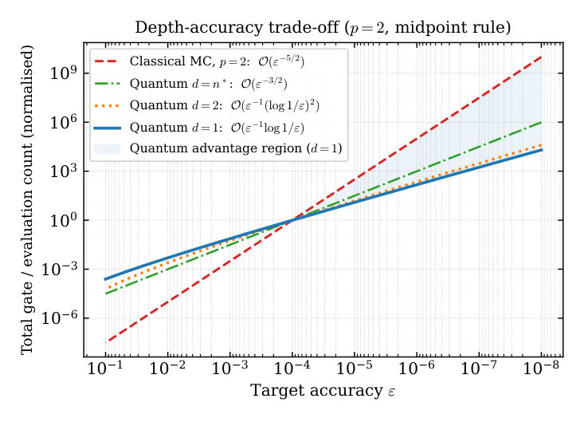
<figcaption class="paper-figure-caption"><b>Fig 1.</b> Figure 1: Depth-accuracy trade-off: total gate count (quantum) or evaluation count (clas- sical) normalised to 1 at ε = 10−4, plotted against target accuracy ε for the midpoint rule (p = 2). Quantum curves for d = 1 (solid blue), d = 2 (dotted orange), and d = n∗</figcaption>
</figure>
<figure class="paper-figure-card">
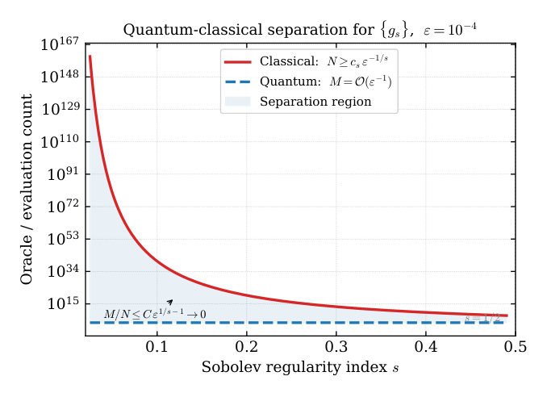
<figcaption class="paper-figure-caption"><b>Fig 2.</b> Figure 2: Quantum-classical separation for the family {gs} at ε = 10−4 (Theorem 6.5). The quantum oracle count M = O(ε−1) (dashed blue, horizontal) is independent of the Sobolev regularity s. The classical evaluation count N = Ω(ε−1/s) (solid red) grows without bound as s →0. The shaded region shows the separation gap; the ratio M/N ≤ Cε1/s−1 →0 as ε →0 for every fixed s &lt; 1/2. The vertical dotted line marks the boundary s = 1/2 beyond which the construction of Lemma 6.2 does not apply.</figcaption>
</figure>
<figure class="paper-figure-card">
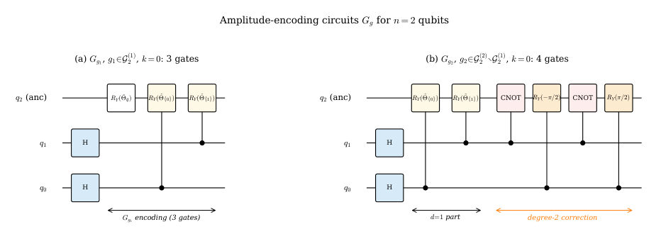
<figcaption class="paper-figure-caption"><b>Fig 3.</b> Figure 3: Amplitude-encoding circuits Gg for n = 2 qubits, k = 0. (a) g1|X2 ∈G(1) 2 (d = 1, 3 gates, (57)): one unconditional rotation RY (ˆΘ∅) on the ancilla q2, one Cq0-RY (ˆΘ{0}), and one Cq1-RY (ˆΘ{1}). Circuit depth ≤4 layers. (b) g2|X2 ∈G(2) 2 \ G(1) 2 (d = 2, 4 gates, (58)): the d = 1 part (left brace) is followed by the degree-2 correction C{0,1}RY (ˆΘ{0,1}) (orange brace), decomposed into 2 CNOTs and 2 singly-controlled rotations [2]. Hadamard gates H on q0, q1 prepare the uniform superposition for the amplitude oracle Ag = Gg(H2 ⊗I2).</figcaption>
</figure>

**Main problem.** Determining whether the theoretical quadratic speedup of Quantum Amplitude Estimation (QAE) for numerical integration is preserved when the computational cost of constructing the amplitude oracle (state preparation) is included.

**Main result.** The authors introduce an angle-structure hierarchy of function classes where the gate count scales with the multilinear degree d, proving that for d=1, quantum integration can asymptotically outperform classical Monte Carlo and achieve a quantum-classical separation for certain Sobolev-regular functions.

**Method.** The study uses a multilinear expansion of the angle map via the Walsh-Hadamard Transform to decompose the encoding operator into multi-controlled RY gates, combined with Maximum Likelihood Amplitude Estimation (MLAE) for error analysis.

**Summary.** This paper addresses a critical bottleneck in quantum numerical integration: the cost of preparing the quantum state representing the integrand. By classifying functions based on the multilinear degree of their 'angle map,' the authors show that certain classes of functions allow for highly efficient quantum circuits. They demonstrate a clear quantum advantage over classical methods for specific function regularities and validate these findings using both NMR and superconducting quantum hardware.

Detailed structure

**Model / system.** The framework uses Quantum Amplitude Estimation applied to numerical integration on the interval [0, 1], with experimental validation performed on the SpinQ Triangulum (3-qubit NMR processor) and IBM Kingston (127-qubit superconducting processor).

**Key observables.** The encoded amplitude (Riemann sum), ancilla qubit measurement probabilities (pk), and the target integration accuracy (epsilon).

**Important parameters / regimes.** Multilinear degree (d), Sobolev regularity (s), target accuracy (epsilon), number of qubits (n), and quadrature order (p).

**Assumptions / limitations.** The analysis assumes the cost of building the oracle is a structural component of the total complexity, rather than treating it as a black box; it also assumes the multilinear degree is the primary driver of circuit depth.

**Figures summary.** Figure 1 shows a log-log plot of the depth-versus-accuracy trade-off highlighting the quantum advantage region; Figure 2 illustrates the quantum-classical separation gap; Figure 3 depicts the amplitude-encoding circuits for n=2; and Figure 4/5 show hardware-specific performance and probability comparisons.

**Paper structure.** The paper introduces the problem of oracle complexity, defines the angle-structure hierarchy and its multilinear expansion, establishes the encoding-circuit theorem and depth-accuracy trade-offs, proves quantum-classical separation for specific function classes, and concludes with experimental validation on NMR and superconducting hardware.

Abstract

We study numerical integration on $[0,1]$ by quantum amplitude estimation (QAE), focusing on the cost of constructing the amplitude oracle. Although QAE improves the statistical component of the integration error, this advantage is relevant only when the integrand has low encoding complexity.   We introduce a hierarchy of grid function classes $\mathcal{G}_n^{(d)}$, defined by requiring the angle map $Θ_g:\{0,1\}^n\to[0,π]$ to be multilinear of degree at most $d$. Membership is classically checkable in $O(n2^n)$ time by the Walsh--Hadamard transform. For $g\in\mathcal{G}_n^{(d)}$, the encoding operator factorises into $\sum_{k=0}^d\binom{n}{k}$ multi-controlled $R_Y$ gates, interpolating between an affine $O(n)$ regime and the generic exponential regime.   Combining this structure with classical discretisation estimates for $g\in C^α[0,1]$, we obtain a depth-versus-accuracy trade-off: gate count $O((\log(1/\varepsilon))^d\varepsilon^{-1})$ suffices to achieve $\varepsilon$-accuracy with constant probability. For $d=1$ this becomes $O(\varepsilon^{-1}\log(1/\varepsilon))$, improving over classical Monte Carlo for every $α\ge1$. We also prove an unconditional separation: $\mathcal{G}_n^{(1)}$ contains functions of Sobolev regularity $s<1/2$ for which the quantum oracle cost is $O(1/\varepsilon)$, whereas classical deterministic or randomised quadrature requires $Ω(\varepsilon^{-1/s})$ evaluations.   These results identify explicit integrand classes for which the full cost of QAE-based integration, including state preparation, is asymptotically better than classical methods. Experiments on SpinQ Triangulum and IBM Kingston illustrate the hierarchy at $n=2$: circuits inside $\mathcal{G}_n^{(d)}$ run successfully, while those exceeding the Triangulum coherence budget fail as predicted.

[↑ back to top](#top)

### [Adaptive Tensor Network Sampling for Quantum Optimal Control](http://arxiv.org/abs/2604.24467v1)

**Authors:** Zeki Zeybek, Rick Mukherjee, Peter Schmelcher  
**Type:** theory · **Category:** numerical methods · **PDF:** <https://arxiv.org/pdf/2604.24467v1>  
**Analysis basis:** full PDF text, analyzed in chunks
**Topic relevance:** 🔥 `methods for driven-dissipative` **4/5**

↔ Scroll figures horizontally

<figure class="paper-figure-card">
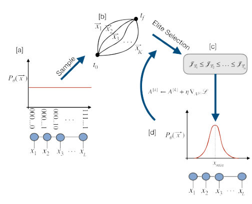
<figcaption class="paper-figure-caption"><b>Fig 1.</b> FIG. 1: The schematic illustration of the optimization loop is shown. (a) Initially, the uniform MPS score func- tion defines a uniform sampling distribution over the dis- crete control space. (b) K candidate solutions are sam- pled from this distribution and evaluated via dynamical simulations to obtain their performance signals. (c) A subset of M high-performing samples is selected as elites, and the MPS score function parameters are updated to increase the scores of these elites, thereby biasing future sampling toward high-performing regions of the search space as shown in (d). This loop of sample, evaluate, fil- ter and update is repeated until the optimization budget is exhausted.</figcaption>
</figure>
<figure class="paper-figure-card">

<figcaption class="paper-figure-caption"><b>Fig 2.</b> Figure 1, the optimal control loop is as follows:</figcaption>
</figure>
<figure class="paper-figure-card">
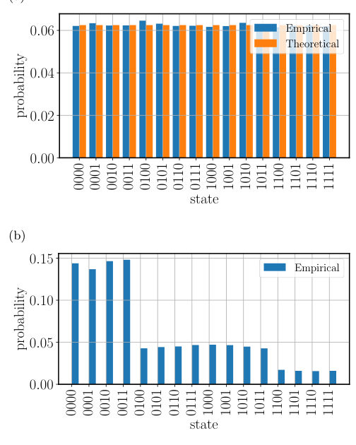
<figcaption class="paper-figure-caption"><b>Fig 3.</b> FIG. 2: Illustration of MPS sampling and updating pro- cess. (a) Samples are drawn from a uniform distribu- tion induced by a uniform MPS score function over bit- strings of length four. Elite samples [0, 0, 0, 0], [0, 0, 0, 1], [0, 0, 1, 0] and [0, 0, 1, 1] are selected. Here the empir- ical distribution is the normalized histogram obtained from samples drawn from the MPS, while the theoret- ical distribution is given by the exact normalized prob- abilities over all bitstrings computed explicitly over the full 24 = 16 configuration space. (b) After maximizing the log-scores of these elites, the MPS tensors are up- dated to increase their scores. Upon sampling from the distribution with the...</figcaption>
</figure>
<figure class="paper-figure-card">
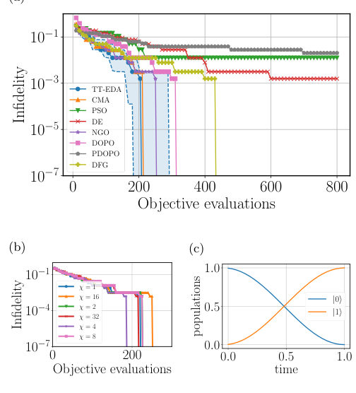
<figcaption class="paper-figure-caption"><b>Fig 4.</b> FIG. 3: Single-qubit optimal control for population transfer |0⟩→|1⟩with ∆= 0 is shown. System parame- ters are total time T = π, length of time-series (also the length of the MPS) L = 28. Optimization parameters are accessible amplitude levels d = 2, bond dimension χ = 4, number of sample points K = 12, number of elites k = 2, learning rate η = 0.07, and number of single-site sweeps 10. (a) Median convergence of the infidelity over 20 in- dependent runs (different random seeds) is shown. The solid curve shows the median, the dashed curves show the 16th and 84th percentiles, and the shaded band spans this percentile range. (b) Comparison of 20 independent runs with varying bond dimensions...</figcaption>
</figure>
<figure class="paper-figure-card">
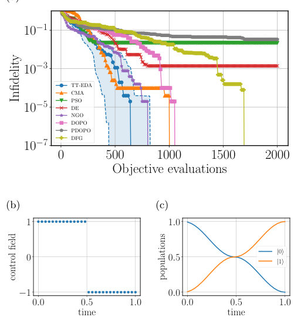
<figcaption class="paper-figure-caption"><b>Fig 5.</b> FIG. 4: Single-qubit bang-bang optimal control for pop- ulation transfer |0⟩→|1⟩with ∆= 1 is shown. System parameters are set as total time T = π √</figcaption>
</figure>
<figure class="paper-figure-card">
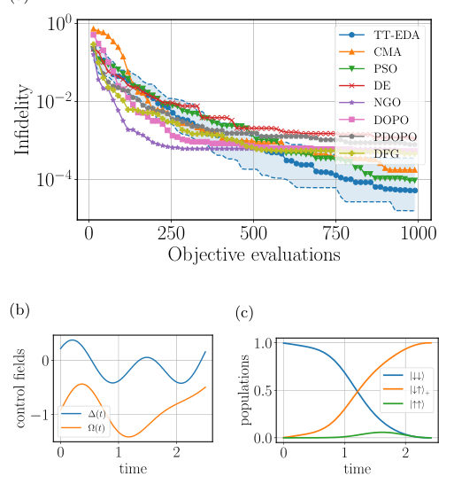
<figcaption class="paper-figure-caption"><b>Fig 6.</b> FIG. 5: Optimal Bell-pair |↓↓⟩→|ψ+⟩preparation us- ing Fourier basis encoding is shown. System parameters are total time set as T = 2.5, number of time steps 30, Ising coupling strength ξ = 1. Optimization parame- ters are number of Fourier basis J = 5 for each Rabi frequency and detuning, bond dimension χ = 2, acces- sible levels for each Fourier coefficients d = 40, number of sample points K = 15, number of elites k = 3, learn- ing rate η = 0.06, and number of single-site sweeps 10. (a) Median convergence of the infidelity over 20 indepen- dent runs is given. The solid curve shows the median, the dashed curves show the 16th and 84th percentiles, and the shaded band spans this percentile...</figcaption>
</figure>
<figure class="paper-figure-card">
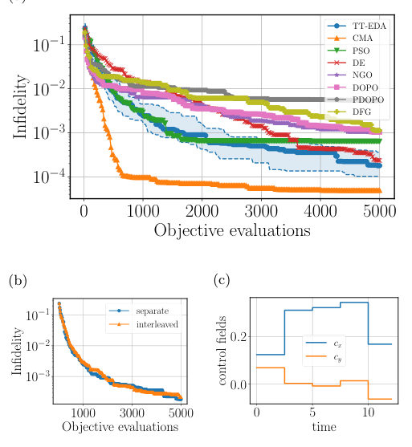
<figcaption class="paper-figure-caption"><b>Fig 7.</b> FIG. 6: Qutrit NOT-gate optimization using piecewise- constant control fields. Parameters are given as anhar- monicity ∆= −400 × 2π MHz, total time T = 12.5/|∆|, number of piecewise-constant basis J = 5 with for each quadrature, bond dimension χ = 4, accessible levels for each coefficient d = 50, number of sample points K = 20, number of elites k = 2, learning rate η = 0.07, and num- ber of single-site sweeps 10. (a) Median convergence of the NOT-gate infidelity over 20 independent runs. The solid curve shows the median, the dashed curves show the 16th and 84th percentiles, and the shaded band spans this percentile range. (b) Performance comparison of in- terleaved versus separate ordering...</figcaption>
</figure>
<figure class="paper-figure-card">
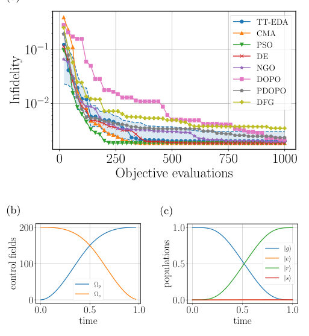
<figcaption class="paper-figure-caption"><b>Fig 8.</b> FIG. 7: Optimal population transfer in a three-level open system using spline basis encoding is shown. Parameters are set as total time set as T = 1, with total number of time steps 30, number of spline coefficients J = 10 for both pump and Stokes Rabi frequencies, bond dimension χ = 5, and decay rate γ = 5. Optimization parameters are accessible levels for each spline coefficient d = 10, number of sample points K = 20, number of elites k = 2, learning rate η = 0.06, and number of single-site sweeps 10. (a) Median convergence of the infidelity over 20 inde- pendent runs is given. The solid curve shows the median, the dashed curves show the 16th and 84th percentiles, and the shaded band...</figcaption>
</figure>
<figure class="paper-figure-card">
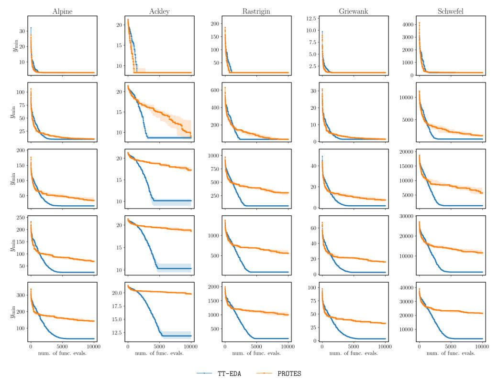
<figcaption class="paper-figure-caption"><b>Fig 9.</b> FIG. 8: Convergence behavior of TT-EDA and PROTES across benchmark functions and problem dimensions. Columns correspond to benchmark functions (Alpine, Ackley, Rastrigin, Griewank, Schwefel). Rows correspond to the number of arguments (10, 30, 50, 70, 100). Each panel reports the median best objective value as a function of evaluations with interquantile ranges, computed over 10 independent runs. Local dimension d = 16 accessible values is used for each variable in all functions across all runs in both optimizers. Across all the runs the following configrations are used for both optimizers: bond dimension χ = 4, number of sample points K = 30, number of elites M = 5, learning rate η = 0.05,...</figcaption>
</figure>

**Main problem.** Efficiently navigating high-dimensional, non-convex optimization landscapes in Quantum Optimal Control (QOC) to avoid the curse of dimensionality and the limitations of existing gradient-based and gradient-free methods.

**Main result.** The proposed TT-EDA method exhibits stable convergence and competitive performance against established gradient-free baselines, showing particular advantages in high-dimensional regimes.

**Method.** A gradient-free sampling heuristic called TT-EDA that uses a Matrix Product State (MPS/Tensor Train) to define an unnormalized score function over discrete control parameters, which is iteratively updated via gradient ascent on the log-scores of elite samples.

**Summary.** This paper presents TT-EDA, a new optimization heuristic for quantum optimal control that uses Tensor Trains to represent and sample from control parameter distributions. By using a Matrix Product State to define a score function, the method efficiently searches high-dimensional, non-convex landscapes. The authors demonstrate that the method can successfully recover complex control structures, such as 'bang-bang' pulses and STIRAP protocols, with performance comparable to or better than existing gradient-free algorithms. It is particularly effective at scaling to higher-dimensional control problems.

Detailed structure

**Model / system.** The method is tested on various benchmarks including single-qubit state transfer, Bell-pair preparation in coupled spin systems, qutrit gate implementation, and population transfer in three-level open quantum systems governed by the Lindblad master equation.

**Key observables.** Fidelity, infidelity, and population dynamics.

**Important parameters / regimes.** Bond dimension (chi), number of time steps (L), number of amplitude levels (d), learning rate (eta), and the lambda parameter for controlling the exploration-exploitation tradeoff.

**Assumptions / limitations.** The method is specifically designed for discrete control parameter spaces and relies on the ability of the Tensor Train to provide a compressed representation of the control space; it also assumes a discretization of continuous control fields.

**Figures summary.** Figure 1 shows the TT-EDA optimization loop; Figure 2 illustrates the MPS sampling and update mechanism; Figure 3 and 4 show convergence and pulse profiles for single-qubit tasks; Figure 7 displays convergence and STIRAP-like dynamics for open systems; Figure 8 compares scaling behavior across different dimensions.

**Paper structure.** The paper introduces the TT-EDA algorithm, describes the MPS-based sampling and update mechanism, presents benchmarks across various quantum control tasks (single-qubit, Bell-pair, qutrit, and open systems), evaluates performance against standard optimizers, and analyzes the exploration-exploitation tradeoff using high-dimensional benchmark functions.

**Why it may be interesting.** It introduces a novel way to use tensor networks not just for simulating many-body states, but as a generative tool for optimizing complex control pulses in open and multi-level quantum systems.

Abstract

Quantum optimal control (QOC) provides a systematic framework for achieving high-fidelity operations in quantum systems and plays a central role in tasks such as gate synthesis, state transfer, and pulse design. Existing QOC methods broadly fall into two categories: gradient-based and gradient-free algorithms. The associated optimization landscape is often high-dimensional, non-convex, and populated by numerous local minima, making efficient gradient-free search strategies essential. To address this, we introduce a gradient-free matrix product state/tensor train (MPS/TT) sampling heuristic for discrete quantum optimal control. In our approach, the MPS defines a score function over the space of discrete control parameters, which in turn induces a sampling distribution over candidate control sequences. This distribution is iteratively refined through selection of better performing sequences and local tensor updates to bias the search toward high-performing sequences. We evaluate the method on a range of benchmark problems, including single-qubit state transfer, Bell-pair preparation, qutrit gate implementation, and open-system population transfer. Across these tasks, the method exhibits stable convergence behavior and competitive empirical performance relative to established gradient-free baselines. These results suggest that tensor network sampling offers a viable heuristic framework for discrete quantum control.

[↑ back to top](#top)

### [AutoQResearch: LLM-Guided Closed-Loop Policy Search for Adaptive Variational Quantum Optimization](http://arxiv.org/abs/2604.24283v1)

**Authors:** Monit Sharma, Hoong Chuin Lau  
**Type:** both · **Category:** quantum information and computing · **PDF:** <https://arxiv.org/pdf/2604.24283v1>  
**Analysis basis:** full PDF text, analyzed in chunks
**Topic relevance:** 🔥 `QC/QI experiment` **4/5**

↔ Scroll figures horizontally

<figure class="paper-figure-card">
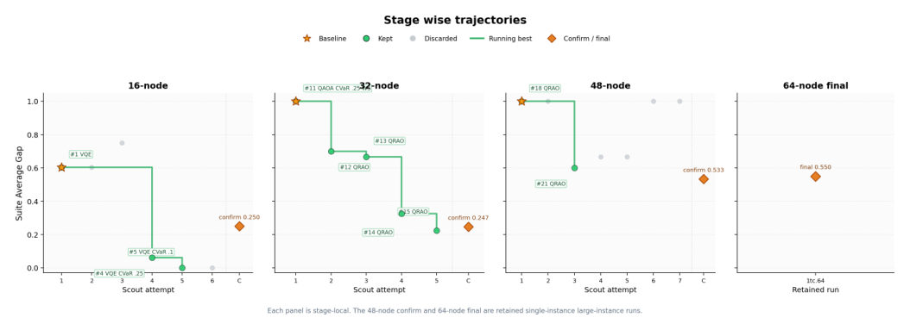
<figcaption class="paper-figure-caption"><b>Fig 1.</b> Fig. 1. Stage-wise MIS search trajectories. Each panel is local to one stage. Green points denote retained scout candidates, gray points denote discarded candidates, stars denote stage baselines, and orange diamonds denote confirmed winners or the held-out final. The trajectories show that the best solver family changes with scale: CVaR-enhanced warm-start QAOA is strongest at 16 nodes, whereas QRAO-based compressed policies dominate at larger sizes.</figcaption>
</figure>
<figure class="paper-figure-card">

<figcaption class="paper-figure-caption"><b>Fig 2.</b> Fig. 2. MIS curriculum overview comparing best scout proxy, best confirmed stage, and the held-out 64-node final. The discrepancy between scout and confirmed results shows that proxy-only selection is unreliable, motivating the staged scout–promote–confirm protocol.</figcaption>
</figure>
<figure class="paper-figure-card">
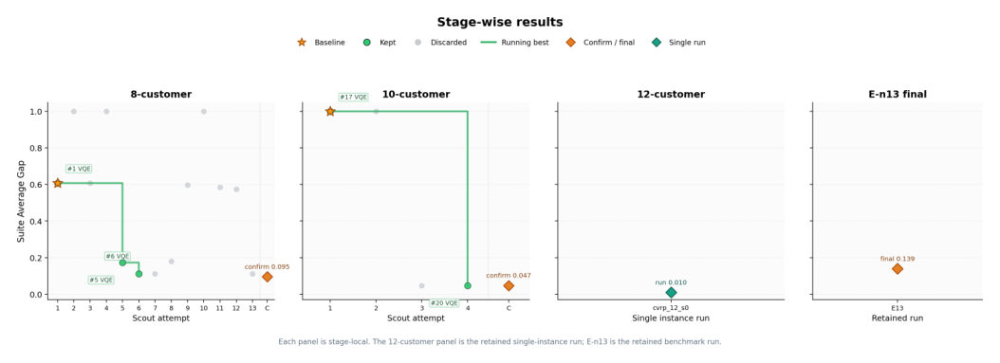
<figcaption class="paper-figure-caption"><b>Fig 3.</b> Fig. 3. Stage-wise CVRP search trajectories. The 8-customer stage improves feasibility through increased sampling, while the 10-customer stage improves sharply after adopting a tilted capacity penalty. The retained 12-customer run and held-out E-n13 benchmark demonstrate that the framework can discover useful workflow-level adaptations beyond the initial curriculum stages.</figcaption>
</figure>
<figure class="paper-figure-card">
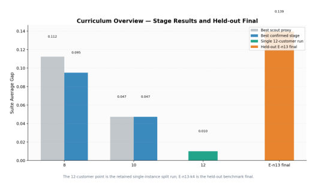
<figcaption class="paper-figure-caption"><b>Fig 4.</b> Fig. 4. CVRP curriculum overview showing best scout proxy, best confirmed stage, retained 12-customer run, and held-out E-n13 final. The strongest gains occur between the 8- and 10-customer stages after the move to a more effective penalty design, while the held-out benchmark remains more challenging than the curriculum stages.</figcaption>
</figure>

**Main problem.** The difficulty of manually configuring variational quantum algorithms (VQAs) for combinatorial optimization, which requires coordinating complex, interacting design choices like ansatz, optimizer, and objective.

**Main result.** The AutoQResearch framework successfully discovers adaptive, scale-dependent solver policies that outperform static baselines on MIS and CVRP problems, with validation on real IBM quantum hardware.

**Method.** An LLM-guided closed-loop experimentation framework using a 'scout-promote-confirm' protocol to perform sequential policy search over a curated design space.

**Summary.** This paper introduces AutoQResearch, an automated framework that uses Large Language Models to discover optimal configurations for variational quantum algorithms. Instead of just tuning hyperparameters, the system learns adaptive policies that change solver settings based on real-time performance diagnostics. The researchers demonstrated that the agent can discover complex, scale-dependent strategies for solving combinatorial optimization problems. Crucially, the discovered policies were validated on real IBM quantum hardware, proving they are not just simulation artifacts.

Detailed structure

**Model / system.** The framework is applied to combinatorial optimization problems, specifically the Maximum Independent Set (MIS) and the Capacitated Vehicle Routing Problem (CVRP), using VQA families such as QAOA, VQE, and QRAO on IBM quantum processors.

**Key observables.** Optimality gap, feasibility rate, convergence stagnation, sampling concentration, and hardware-specific metrics like gate counts and depth.

**Important parameters / regimes.** Problem scales (16 to 64 nodes for MIS), CVaR parameter (alpha), sampling budgets, penalty coefficients, and qubit compression ratios.

**Assumptions / limitations.** The design problem can be modeled as a sequential decision process, and the LLM's search is restricted to a curated, auditable design space to prevent overfitting.

**Figures summary.** Figure 1 shows stage-wise search trajectories; Figure 2 illustrates the discrepancy between cheap proxy (scout) evaluations and confirmed results; Figure 3 shows stage-wise CVRP performance.

**Paper structure.** The paper introduces the AutoQResearch framework, details the LLM-guided sequential policy search and evaluation protocol, presents case studies on MIS and CVRP, validates results on real IBM hardware, and discusses methodological findings regarding proxy reliability.

Abstract

Configuring variational quantum algorithms for combinatorial optimization remains a difficult, expert-driven process requiring coordinated choices over solver family, ansatz, objective, and optimizer. We present AutoQResearch, an LLM-guided closed-loop experimentation framework that casts this task as sequential policy search over a curated design space. Instead of a single static configuration, the framework searches for adaptive solver-control policies that condition future decisions on diagnostics such as feasibility, optimality gap, and convergence stagnation.   The system operates through a structured workflow: an LLM agent edits a small policy surface under a fixed evaluation harness, candidate policies are screened using cheap scout evaluations, and only the strongest candidates are promoted to full confirmation. This enables controlled autonomous exploration while guarding against proxy overfitting and unstable selection.   We evaluate the framework on Maximum Independent Set (MIS) and the Capacitated Vehicle Routing Problem (CVRP). On MIS instances (16--64 vertices), discovered policies substantially outperform static baselines and reveal scale-dependent behavior: CVaR objectives are effective at small scale, while QRAO-based qubit compression provides the most effective explored scaling path. On CVRP curricula (8--12 customers) and a held-out E-n13-k4 benchmark, the framework discovers adaptations involving sampling budget, penalty design, and hybrid repair protocols, yielding high-quality solutions.   Methodologically, we find that staged confirmation is essential: cheap proxy evaluations can materially misestimate policy quality and even invert candidate rankings. Overall, the paper positions AutoQResearch as a benchmarked quantum--GenAI co-design workflow for autonomous solver discovery in variational quantum optimization.

[↑ back to top](#top)

### [Improvement of performance of Grover's algorithm on three generations of Heron family IBM QPUs without and with topological dynamical decoupling](http://arxiv.org/abs/2604.23228v1)

**Authors:** Tihomir G. Tenev, Nayden P. Nedev, Nikolay V. Vitanov  
**Type:** experiment · **Category:** quantum information and computing · **PDF:** <https://arxiv.org/pdf/2604.23228v1>  
**Analysis basis:** full PDF text, analyzed in chunks
**Topic relevance:** 🔥 `QC/QI experiment` **4/5**

↔ Scroll figures horizontally

<figure class="paper-figure-card">
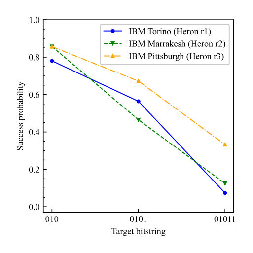
<figcaption class="paper-figure-caption"><b>Fig 1.</b> Figure 1: (Color online) Success probabilities for Grover’s algorithm for three to five qubits on different generations of IBM QPUs without any form of error mitigation. The reported values of success prob- abilities for the three, four and five qubit cases are higher than these reported in previous studies of superconducting QPUs. There is clear trend of improvement of performance for the success probabilities with newer generations of the Heron family QPUs.</figcaption>
</figure>
<figure class="paper-figure-card">
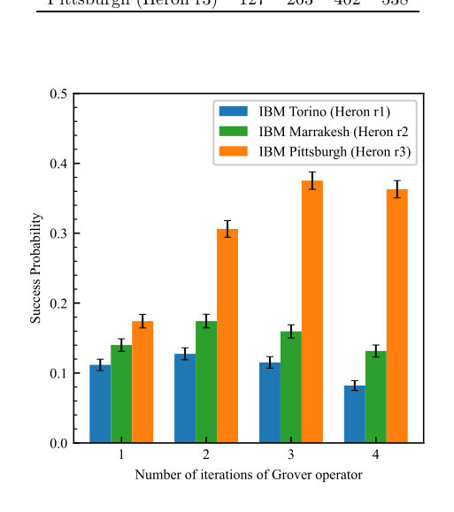
<figcaption class="paper-figure-caption"><b>Fig 2.</b> Figure 2: (Color online) Success probabilities for Grover’s algorithm for five qubits target state ”01011” with different number of iterations on different generations of IBM QPUs. The error bars represent 99% binomial confidence intervals.</figcaption>
</figure>
<figure class="paper-figure-card">
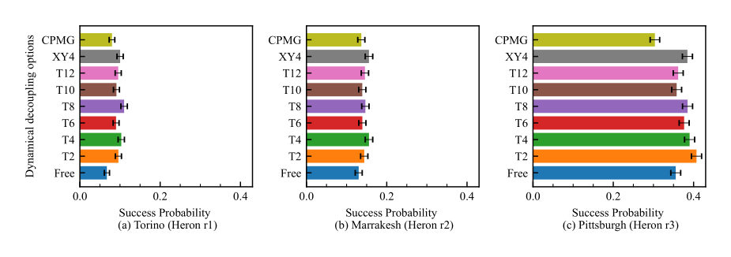
<figcaption class="paper-figure-caption"><b>Fig 3.</b> Figure 3: (Color online) Success probabilities for Grover’s algorithm with different dynamical decoupling options for five qubits on three generations of IBM Heron family QPUs. The error bars represent 99% confidence intervals.</figcaption>
</figure>
<figure class="paper-figure-card">
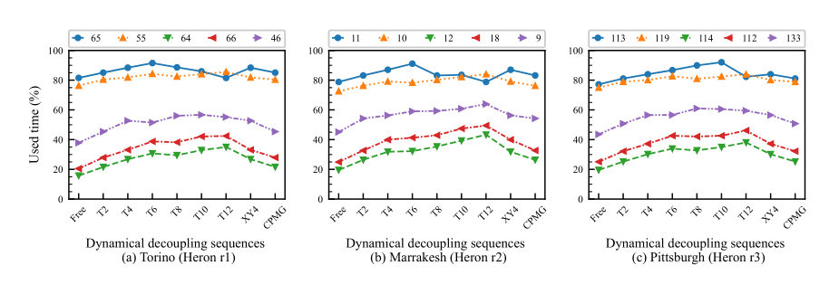
<figcaption class="paper-figure-caption"><b>Fig 4.</b> Figure 4: (Color online) Used time in percent of total circuit duration per qubit for Grover’s algorithm with different dynamical decoupling options for five qubits on three generations of IBM Heron family QPUs. The legends show qubit numbers that were used in the implementation of the circuit. The circuit implemented on Torino has total duration of 5.77 × 10−5 s, on Marrakesh has total duration of 5.282 × 10−5 s and on Pittsburgh has total duration of 6.022 × 10−5 s.</figcaption>
</figure>
<figure class="paper-figure-card">
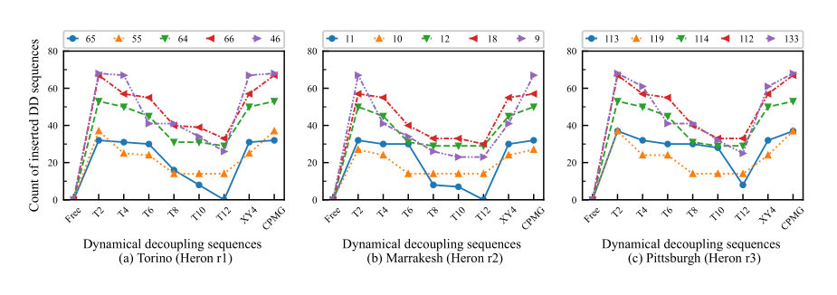
<figcaption class="paper-figure-caption"><b>Fig 5.</b> Figure 5: (Color online) Number of inserted DD sequences per qubit for Grover’s algorithm with different dynamical decoupling options for five qubits on three generations of IBM Heron family QPUs. The legends shows qubit numbers that were used in the implementation of the circuit.</figcaption>
</figure>
<figure class="paper-figure-card">
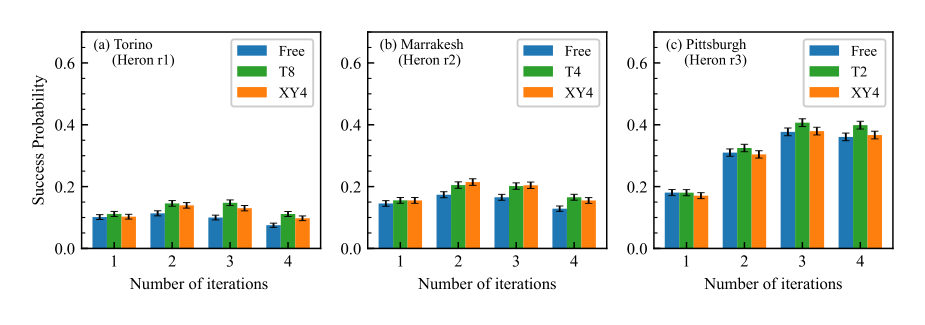
<figcaption class="paper-figure-caption"><b>Fig 6.</b> Figure 6: (Color online) Success probabilities for Grover’s algorithm for five qubits for different number of iterations of Grover operator without dynamical decoupling and with the best dynamical decoupling from the topological sequences and the best of CPMG or XY4 for the given QPU as determined from figure 3</figcaption>
</figure>
<figure class="paper-figure-card">
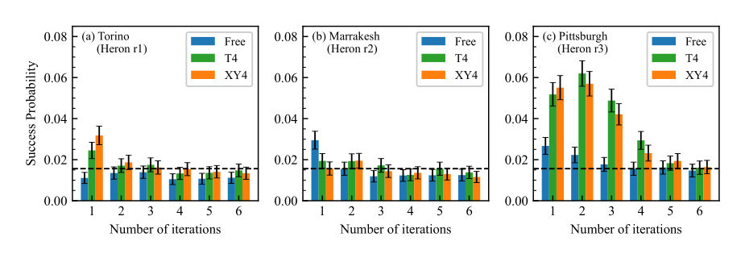
<figcaption class="paper-figure-caption"><b>Fig 7.</b> Figure 7: (Color online) Success probabilities for Grover’s algorithm for six qubits for different number of iterations of Grover operator without dynamical decoupling and with XY4 dynamical decoupling seqeunce and T4 topological dynamical decoupling sequence. XY4 and T4 are compared as they are made of the same number of pulses. The horizontal dashed lines represents the threshold 1 26 for random guess above which we can consider that Grover’s algorithm can find the right answer albeit with small probability.</figcaption>
</figure>
<figure class="paper-figure-card">
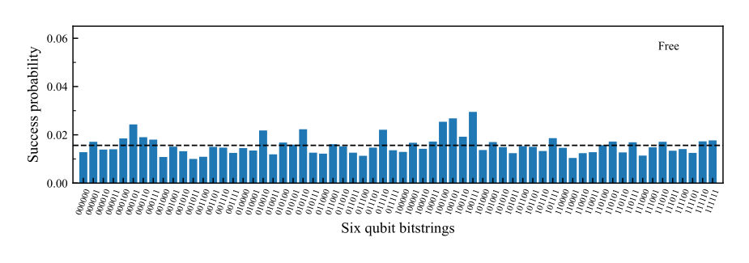
<figcaption class="paper-figure-caption"><b>Fig 8.</b> Figure 8: (Color online) Success probabilities for different bitstrings for two iterations of Grover operator executed on Pittsburgh (Heron r3) without inserted dynamical decoupling sequence. The horizontal dashed lines represents the threshold 1 26 for random guess.</figcaption>
</figure>
<figure class="paper-figure-card">
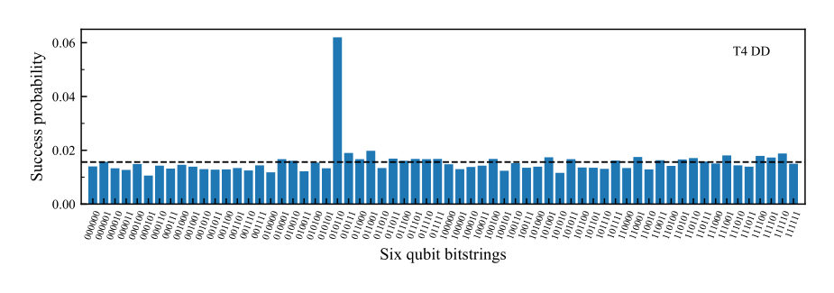
<figcaption class="paper-figure-caption"><b>Fig 9.</b> Figure 9: (Color online) Success probabilities for different bitstrings for two iterations of Grover operator executed on Pittsburgh (Heron r3) with inserted T4 dynamical decoupling sequence. The horizontal dashed lines represents the threshold 1 26 for random guess.</figcaption>
</figure>
<figure class="paper-figure-card">
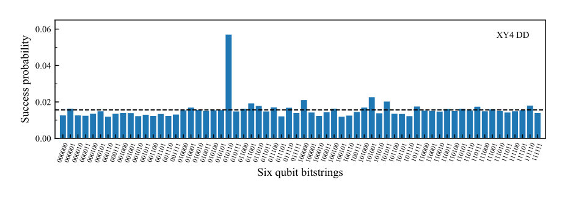
<figcaption class="paper-figure-caption"><b>Fig 10.</b> Figure 10: (Color online) Success probabilities for different bitstrings for two iterations of Grover operator executed on Pittsburgh (Heron r3) with inserted XY4 dynamical decoupling sequence. The horizontal dashed lines represents the threshold 1 26 for random guess.</figcaption>
</figure>

**Main problem.** Evaluating the performance of Grover's algorithm across three generations of IBM Heron family QPUs and assessing the effectiveness of topological dynamical decoupling (DD) in improving success probabilities.

**Main result.** Newer IBM Heron generations show higher success probabilities than previous generations, and topological DD sequences (specifically T4) significantly improve the ability to distinguish the target bitstring from noise in 6-qubit implementations.

**Method.** Implementation of Grover's algorithm using Qiskit on IBM Heron QPUs, comparing 'free' runs against various DD sequences (CPMG, XY4, and topological Tn) to mitigate decoherence and gate errors.

**Summary.** This paper investigates how Grover's algorithm performs on the latest generations of IBM's Heron-family superconducting quantum processors. The researchers found that newer hardware significantly outperforms previous generations even without error mitigation. Furthermore, they demonstrate that using topological dynamical decoupling sequences can effectively suppress errors, allowing for successful search results in 6-qubit circuits where the target bitstring would otherwise be lost to noise.

Detailed structure

**Model / system.** Three generations of IBM Heron family superconducting QPUs: Torino (r1), Marrakesh (r2), and Pittsburgh (r3), featuring a star topology.

**Key observables.** Success probability of the Grover algorithm, number of iterations, and calibration metrics including T1, T2, readout error, and 2Q gate error.

**Important parameters / regimes.** Qubit register sizes (3 to 6 qubits), number of Grover operator iterations, and pulse counts in DD sequences.

**Assumptions / limitations.** The study assumes that the primary source of error in the algorithm performance is decoherence and gate errors that can be addressed via dynamical decoupling rather than measurement error mitigation.

**Figures summary.** Figure 1 shows success probabilities for 3-5 qubits across Heron generations; Figure 2 shows success probability vs. iterations for 5 qubits; Figure 3 compares different DD sequences; Figure 4 shows qubit gate load; Figures 8-10 demonstrate the impact of DD on finding the target bitstring in 6-qubit cases.

**Paper structure.** The paper introduces the problem of Grover performance on Heron QPUs, details the hardware generations and DD methods used, presents comparative results for 3-5 qubits, explores the scalability to 6 qubits with DD, and concludes with the effectiveness of topological DD.

Abstract

We investigate the performance of Grover's algorithm on three different generations of IBM Heron QPUs. On Heron family of IBM QPUs the success probabilities for three, four and five qubits without dynamical decoupling is better than results reported for previous generations of QPUs. The success probability as function of number of iterations of Grover operator is considered. A study of the improvement of results of Grover's algorithm for five qubit case with the help of topological dynamical decoupling is considered. For a six qubit case on Heron r3 QPU a clear result for finding the sought-after bitstring is reported for theoretically suboptimal number of iterations of Grover operator with the help of dynamical decoupling.

[↑ back to top](#top)

### [Improving Zero-Noise Extrapolation via Physically Bounded Models](http://arxiv.org/abs/2604.24475v1)

**Authors:** Andriy Miranskyy, Adam Sorrenti, Jasmine Thind, Claude Gravel  
**Type:** both · **Category:** quantum information and computing · **PDF:** <https://arxiv.org/pdf/2604.24475v1>  
**Analysis basis:** full PDF text, analyzed in chunks
**Topic relevance:** 🔥 `QC/QI experiment` **4/5**

↔ Scroll figures horizontally

<figure class="paper-figure-card">
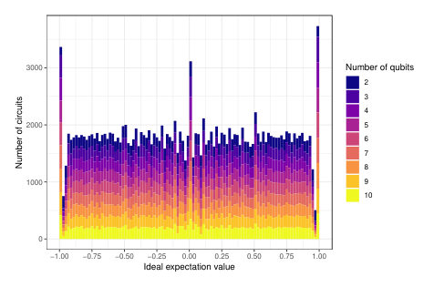
<figcaption class="paper-figure-caption"><b>Fig 1.</b> Fig. 1. Histogram of ideal expectation values in the synthetic benchmark (bin width 0.025, chosen to highlight clustering near values, such as −1, 0, 1).</figcaption>
</figure>
<figure class="paper-figure-card">
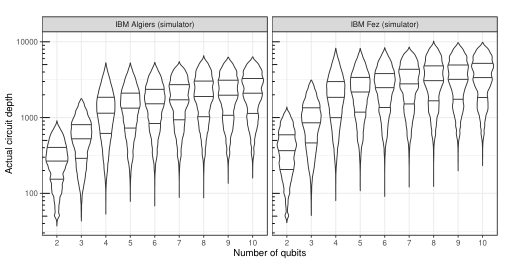
<figcaption class="paper-figure-caption"><b>Fig 2.</b> Fig. 2. Distribution of transpiled circuit depths in the synthetic benchmark. Although the target circuit depths range from 10 to 50 gates, device-aware transpilation can substantially increase them. Vertical bars indicate the 25th, 50th (median), and 75th quartiles.</figcaption>
</figure>
<figure class="paper-figure-card">
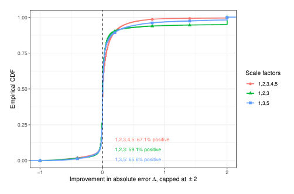
<figcaption class="paper-figure-caption"><b>Fig 3.</b> Fig. 3. Empirical cumulative distribution functions (CDFs) of the improve- ment in absolute error achieved by the bounded polynomial–exponential extrapolator with asymptote a = 0 and degree d = 1 relative to its unbounded counterpart, defined as per Equation (11). Positive values indicate cases where the bounded model yields a more accurate estimate of the ideal expectation value. Each panel corresponds to a different set of noise scale factors λ. The annotation in each panel reports the percentage of circuits for which the bounded model achieves lower error than the unbounded model. For visual clarity, improvement values exceeding ±2 are truncated, and the empirical CDF is computed on...</figcaption>
</figure>
<figure class="paper-figure-card">
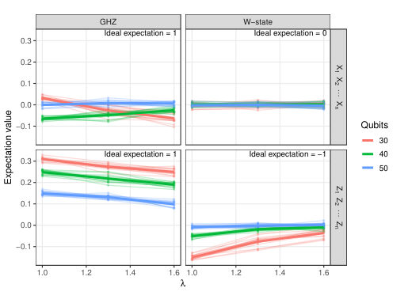
<figcaption class="paper-figure-caption"><b>Fig 4.</b> Fig. 4. Expectation values as a function of the noise scale factor λ for GHZ and W-state circuits. Thin lines show individual repetitions (15 per group), while thick lines indicate the mean expectation value for each configuration.</figcaption>
</figure>

**Main problem.** Standard Zero-Noise Extrapolation (ZNE) models often produce unphysical predictions (e.g., expectation values outside the [-1, 1] range) and suffer from numerical instability in high-noise regimes.

**Main result.** Introducing physically bounded extrapolation models significantly improves the stability and accuracy of exponential and polynomial-exponential models, effectively eliminating unphysical predictions and reducing error on both simulated and real IBM hardware.

**Method.** The authors reparameterize polynomial, exponential, and hybrid models to explicitly constrain the zero-noise estimate within valid physical bounds during the optimization process using the L-BFGS-B algorithm.

**Summary.** This paper addresses a critical flaw in quantum error mitigation where standard extrapolation techniques produce mathematically impossible results. By enforcing physical constraints (like the [-1, 1] bound for Pauli observables) directly into the fitting optimization, the authors create more robust models. Their approach significantly stabilizes exponential-family models and provides more reliable error mitigation on real NISQ hardware. The method is computationally efficient and can be integrated into existing quantum error mitigation workflows with minimal changes.

Detailed structure

**Model / system.** The study evaluates ZNE performance using a large-scale synthetic benchmark (180,000 circuits) based on IBM Falcon and Heron noise models, alongside hardware experiments on the IBM Kingston processor using GHZ and W-state circuits.

**Key observables.** Expectation values of Pauli operators (e.g., Z and X strings).

**Important parameters / regimes.** Noise scale factor (lambda), circuit depth, qubit count (up to 50), and polynomial degree.

**Assumptions / limitations.** The study assumes that the physical bounds of observables are known and that the noise can be scaled via gate folding; it also notes that simulations may be more optimistic than real hardware due to simplified noise models.

**Figures summary.** Figure 1 shows the distribution of ideal expectation values; Figure 2 shows the distribution of circuit depths; Figure 3 shows the empirical CDF of error improvement; Figure 4 shows expectation values as a function of the noise scale factor.

**Paper structure.** The paper identifies the problem of unconstrained ZNE, introduces the mathematical formulation for bounded model variants, presents a large-scale synthetic benchmarking study, validates the approach on real IBM quantum hardware, and discusses limitations and future directions.

Abstract

Zero-noise extrapolation (ZNE) mitigates errors in near-term quantum devices by extrapolating measurements obtained at amplified noise levels to estimate noise-free expectation values. In practice, commonly used extrapolation models are fitted without enforcing physical constraints, which can yield predictions outside the valid range of quantum observables.   In this work, we introduce physically bounded variants of polynomial, exponential, and polynomial--exponential extrapolation models by explicitly parameterizing the zero-noise estimate and constraining it during optimization. We evaluate the approach using a large synthetic benchmark comprising 180,000 circuits and approximately 3.6 million ZNE experiments generated under realistic device noise models derived from IBM quantum backends. We also perform preliminary validation on real quantum hardware using GHZ and W-state circuits.   Across the synthetic benchmark, bounded extrapolation substantially reduces unphysical predictions and improves the stability of exponential- and polynomial--exponential-family models, whereas polynomial models show little difference between bounded and unbounded variants. Hardware experiments show similar qualitative behaviour: bounded models generally avoid pathological extrapolations and often provide a more reliable balance between accuracy and usable coverage. At the same time, the results highlight practical limitations of current devices, including stronger-than-expected noise effects and variability not fully captured by simulation models. These results suggest that enforcing physical constraints during extrapolation improves the reliability of ZNE and that this approach can be incorporated into existing workflows with minimal modification.

[↑ back to top](#top)

### [Playing Dice with the Universe: Programming Quantum Computers to Play Traditional Games](http://arxiv.org/abs/2604.23819v1)

**Authors:** Tristan Zaborniak, Vikram Khipple Mulligan  
**Type:** both · **Category:** quantum information and computing · **PDF:** <https://arxiv.org/pdf/2604.23819v1>  
**Analysis basis:** full PDF text, analyzed in chunks
**Topic relevance:** 🔥 `QC/QI experiment` **4/5**

↔ Scroll figures horizontally

<figure class="paper-figure-card">
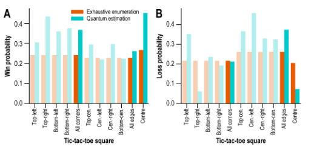
<figcaption class="paper-figure-caption"><b>Fig 1.</b> Fig. 1: Probability of moves leading to a win (A) or loss (B), based on probability estimation by quantum annealing (cyan) or by exhaustive enumeration of possible games subject to the assumption of minimally strategic play (orange). Pale bars show individual corner or edge squares; solid bars represent the collective probablities for a corner, edge, or centre square. Note the quantum annealer yields P ′ (win|m), which is only expected to be proportional to the actual probability.</figcaption>
</figure>
<figure class="paper-figure-card">
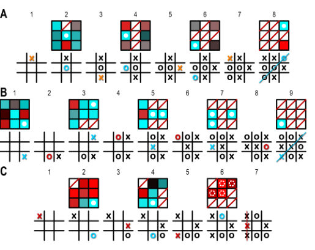
<figcaption class="paper-figure-caption"><b>Fig 2.</b> Fig. 2: Selected games played by the quantum annealer. Top of each panel: estimated P ′ (win|m) (cyan intensity) and P ′ (loss|m) (red intensity) for each candidate move based on annealing-based sampling. These are expected to correlate with win and loss probabilities by move, respectively. Darker squares have higher draw probability. White dots indicate move(s) with the highest win probability. (A) With a human player (orange) starting as X, the quantum player (cyan) playing as O appeared to play strategically, fully exploiting the human’s mistake in move 3 to force the human to choose between two ways of losing after move 6. (B) In a game against a randomly-playing computer opponent as O...</figcaption>
</figure>

**Main problem.** Exploring whether quantum computers can play traditional competitive games by using superposition to implicitly represent all future game paths and sampling them to maximize win probability without hard-coded strategies.

**Main result.** Demonstrated a proof-of-principle implementation on a D-Wave quantum annealer playing Tic-Tac-Toe, achieving a 100% win rate against a random opponent when starting first.

**Method.** Encoding game rules and win conditions into a Hamiltonian using specialized logic gates (WNOT, WAND, PW) and using a classical outer loop to select moves based on the frequency of wins, losses, and draws in the quantum samples.

**Summary.** This paper presents a novel approach to quantum computing where game rules are encoded directly into a quantum annealer's Hamiltonian. By sampling the resulting state space, the system can evaluate the probability of future wins, losses, or draws without needing pre-learned strategies. Using Tic-Tac-Toe as a test case, the authors show that the D-Wave hardware can effectively play against humans. This work establishes game-playing as a potential real-world benchmark for evaluating quantum hardware performance.

Detailed structure

**Model / system.** The D-Wave Advantage 2 quantum annealer, where game mechanics are mapped to a QUBO-style Hamiltonian using biases and couplings to represent move registers and win conditions.

**Key observables.** Counts of future game paths leading to wins, losses, and draws (n_win, n_loss, n_draw) and the estimated proxy probability of winning for each move.

**Important parameters / regimes.** Penalty values for logic gates (AND, OR, WNOT, etc.), number of samples per move (75,000 total), and the scaling of logical/physical qubits as the game progresses.

**Assumptions / limitations.** The algorithm assumes a 'minimally strategic' opponent that always takes an immediate win if available, and it assumes the proxy probability from sampling is sufficient for decision-making.

**Figures summary.** Figure 1 compares quantum win probability estimates against classical exhaustive enumeration; Figure 2 illustrates specific game scenarios including exploiting mistakes, non-optimal paths, and losses due to lack of draw-prioritization.

**Paper structure.** The paper introduces the concept of quantum game-playing, details the Hamiltonian construction via logic gates, describes the sampling and decision-making algorithm, presents experimental results on D-Wave hardware, and discusses limitations and future scaling.

Abstract

The challenge of programming classical computers to play traditional, competitive games against human players has helped to advance classical hardware and software. Quantum computers have the potential to play games in a unique way: programmed only with the rules of a game, they should be able to implicitly represent all future paths of a game leading to wins, losses, or draws, and sample from this path set to identify moves that maximize the likelihood of a win. This permits skilled play without hard-coded or machine-learned strategy. As a proof of principle, we present early results obtained after programming the D-Wave quantum annealer with the rules of tic-tac-toe, enabling it to play against a human opponent. We anticipate that, as it has for classical computers, game-playing will serve as an important real-world benchmark for quantum computers.

[↑ back to top](#top)

### [Testing the robustness of topological quantities evaluated from the modular Hamiltonian for a given wavefunction](http://arxiv.org/abs/2604.24058v1)

**Authors:** Sandeep Sharma, Ajit C. Balram  
**Type:** theory · **Category:** strongly correlated electrons · **PDF:** <https://arxiv.org/pdf/2604.24058v1>  
**Analysis basis:** full PDF text, analyzed in chunks
**Topic relevance:** 🔥 `entanglement & information structure` **4/5**

↔ Scroll figures horizontally

<figure class="paper-figure-card">
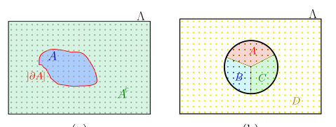
<figcaption class="paper-figure-caption"><b>Fig 1.</b> FIG. 1: Schematic illustration of a two-dimensional system, Λ, divided into (a) two regions, A and its complement Ac, with boundary |∂A|, and (b) four regions A, B, C, and D. The disc-shaped region formed by the union of A, B, and C in (b) is utilized to extract the topological content of topologically ordered states.</figcaption>
</figure>
<figure class="paper-figure-card">
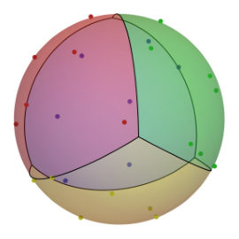
<figcaption class="paper-figure-caption"><b>Fig 2.</b> FIG. 2: Tetrahedrally symmetric partition of the sphere into four equal parts. The black curves denote the partition boundaries on the sphere, while the colored dots indicate the lattice points on the sphere with coordinates described in Eq. (25) for N=26 sites.</figcaption>
</figure>
<figure class="paper-figure-card">
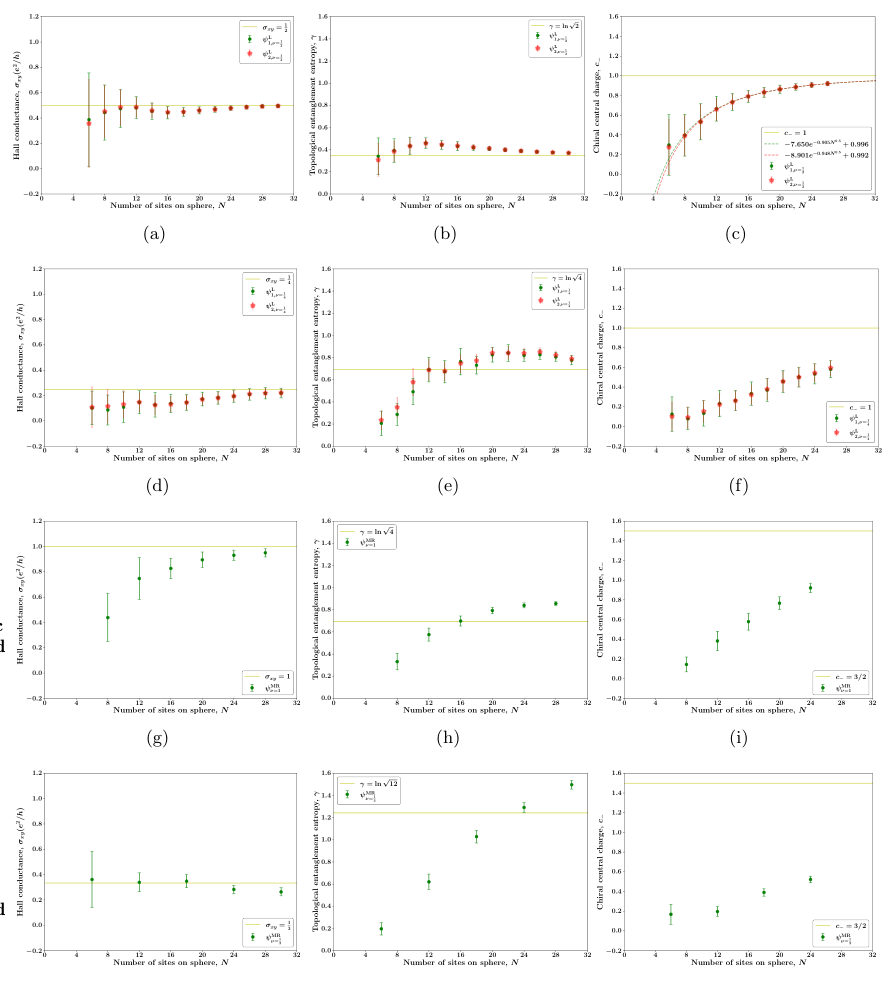
<figcaption class="paper-figure-caption"><b>Fig 3.</b> FIG. 3: Mean values of Hall conductance, TEE, and chiral central charge have been plotted with error bars against the number of sites N on the sphere. Along rows 1, 2, 3, and 4 are plotted the topological quantities for the bosonic Laughlin state at ν=1/2, 1/4 and the bosonic Moore-Read state at ν=1, 1/3, respectively. Along the columns are plotted Hall conductance in column 1, TEE in column 2, and chiral central charge in column 3. The yellow line indicates the analytical value for the wavefunction in the N→∞limit. The dashed line indicates the fit for the plot to a given wavefunction. The color of the fit and the color of the plot for the same wavefunction are kept the same.</figcaption>
</figure>

**Main problem.** The study investigates the reliability and convergence of extracting topological quantities, such as Hall conductance and topological entanglement entropy, using methods based on the modular Hamiltonian.

**Main result.** The authors demonstrate that while topological quantum numbers converge to their expected values, the convergence is significantly slower for states with longer correlation lengths and requires large system sizes to avoid large errors.

**Method.** The researchers use numerical techniques including Singular Value Decomposition (SVD) for Schmidt decomposition and finite-size scaling analysis to extrapolate results to the thermodynamic limit.

**Summary.** This paper tests how accurately topological properties can be extracted from a wavefunction using the modular Hamiltonian. By studying bosonic Laughlin and Moore-Read states on a lattice, the authors show that while the method works, the accuracy is highly sensitive to system size and correlation length. They find that larger systems are necessary to achieve reliable results, especially for states with complex topological structures like the Moore-Read state.

Detailed structure

**Model / system.** The study focuses on lattice models of bosonic fractional quantum Hall states, specifically the Laughlin ($
u=1/2, 1/4$) and Moore-Read ($
u=1, 1/3$) wavefunctions, mapped onto a sphere.

**Key observables.** Hall conductance ($\sigma_{xy}$), topological entanglement entropy ($\gamma$), and chiral central charge ($c_-$).

**Important parameters / regimes.** Filling fractions ($
u$), system size ($N$), correlation length, and lattice spacing.

**Assumptions / limitations.** The system is assumed to be gapped and the topological content is assumed to be invariant under smooth deformations of the wavefunction.

**Figures summary.** Figure 1 shows the partitioning schemes for the modular Hamiltonian approach; Figure 2 illustrates the spherical lattice distribution; Figure 3 plots the evolution of topological observables as a function of system size $N$ with analytical fits.

**Paper structure.** The paper introduces the modular Hamiltonian approach, describes the lattice models and numerical implementation, presents the results for various topological quantities across different system sizes, and concludes with a discussion on convergence and finite-size effects.

**Why it may be interesting.** This work is relevant to many-body dynamics and theoretical physics as it provides critical bounds on the accuracy of using entanglement-based probes to identify topological order in large-scale quantum systems.

Abstract

Topologically ordered states are characterized by topological quantities like the Hall conductance, topological entanglement entropy, and chiral central charge. Techniques based on the modular Hamiltonian have recently been developed to extract these quantities from a wavefunction. Here, we consider a lattice model of fractional quantum Hall states, a prototypical example of topologically ordered systems, and extract their topological content using the modular Hamiltonian-based methods. We consider the bosonic Laughlin and Moore-Read states and show that the extracted topological quantum numbers converge to their expected results. As expected, the convergence is slower when the correlation length of the state is longer. Generally, our results show that a reliable extraction of topological content through modular methods requires the usage of large systems

[↑ back to top](#top)

### [Quantum Skyrmions in Mixed States of Light and their Nested Topology](http://arxiv.org/abs/2604.23571v1)

**Authors:** Amit Kam, Charles Roques-Carmes, Shai Tsesses, Aviv Karnieli  
**Type:** both · **Category:** quantum information and computing · **PDF:** <https://arxiv.org/pdf/2604.23571v1>  
**Analysis basis:** full PDF text, analyzed in chunks
**Topic relevance:** `entanglement & information structure` **3/5** · `exotic spin models in light-matter` **3/5** · `QC/QI experiment` **2/5** · `analog quantum simulation` **2/5** · `interference shaping light` **2/5** · `methods for driven-dissipative` **2/5** · `quantum optics experiment` **2/5**

↔ Scroll figures horizontally

<figure class="paper-figure-card">
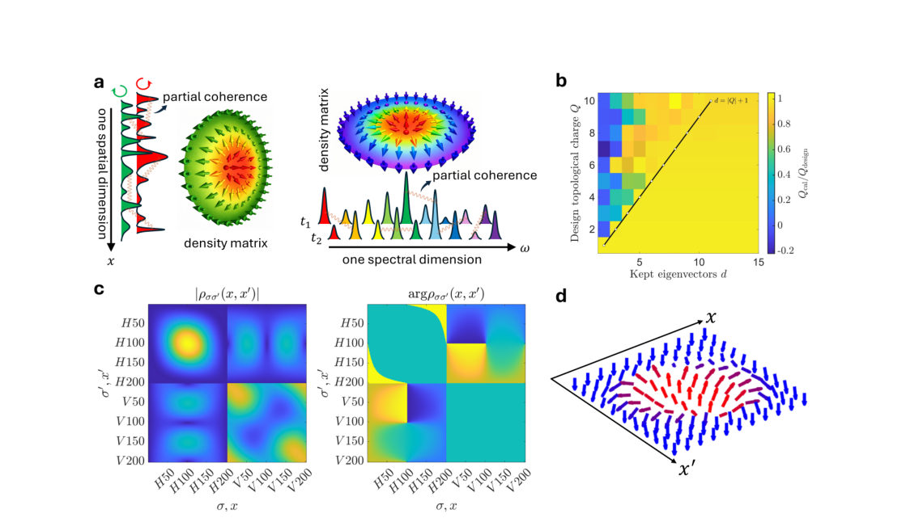
<figcaption class="paper-figure-caption"><b>Fig 1.</b> Figure 1: Skyrmions encoded in the partial coherence of light. (a) An optical skyrmion encoded in one-dimensional partially coherent light, in either real space or synthetic dimension (such as frequency). (b) The designed skyrmion number is shown as a function of the number of retained eigenvectors in the density matrix. In particular, when keeping d = |Q| + 1 eigenvectors, the reconstructed texture is guaranteed to faithfully reproduce the target skyrmion. (c) A density matrix is constructed from the analytic solution with eigenmodes defined in Eqs. 8. (d) From this density matrix, we compute the coherence Stokes vector and plot its associated skyrmion texture for M = 11 spatial modes.</figcaption>
</figure>
<figure class="paper-figure-card">
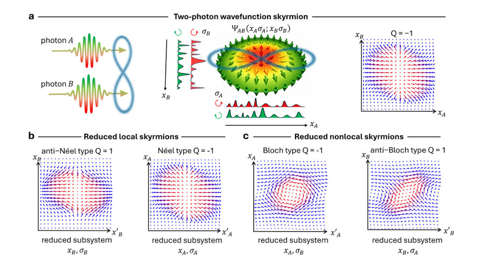
<figcaption class="paper-figure-caption"><b>Fig 2.</b> Figure 2: Nested Topology of a two-photon entangled skyrmion encoded in the partial coherence of light. (a) Two photons, A and B, each possess a polarization σi and a spatial degree of freedom xi. The joint two-photon wavefunction, given in Eq. 10, is engineered to carry a topological charge Q = −1, yielding the skyrmion texture shown in the illustration. (b)-(c) The system has four reduced subspaces, formed by tracing different pairs of polarization and spatial-mode sectors, each revealing an emergent skyrmion texture: (b) two local skyrmions appearing in the reduced density matrices of photons A and B individually, and (c) two non-local (entangled) skyrmions in the hybrid subspace made up...</figcaption>
</figure>
<figure class="paper-figure-card">
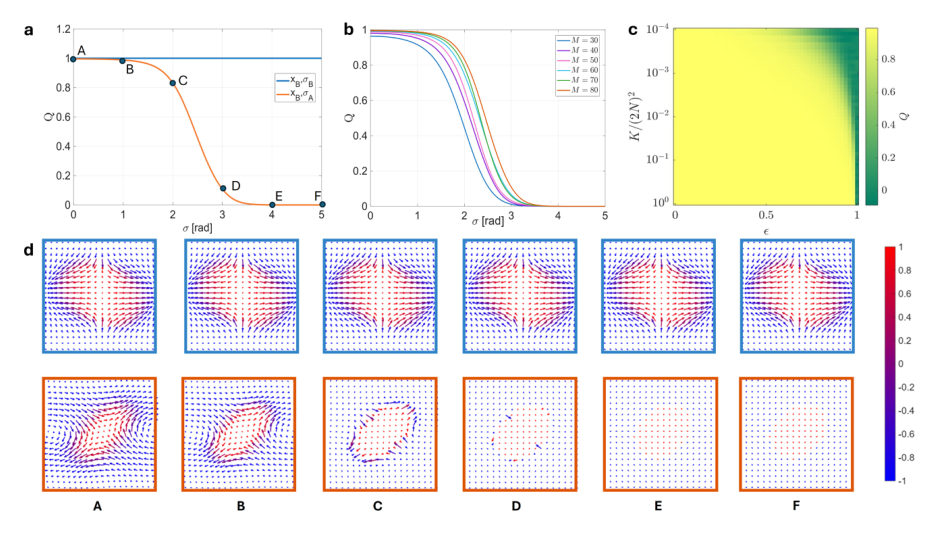
<figcaption class="paper-figure-caption"><b>Fig 3.</b> Figure 3: Robustness of local and non-local skyrmions. (a) Skyrmion number Q in local and nonlocal reduced subspaces (M = 80) as a function of the dephasing strength σ for a Gaussian phase- noise channel applied to the two-photon density matrix (Eq. 11). The skyrmion number of the local reduced subspace xB, σB (blue) remains invariant under two-photon dephasing, while the non-local reduced subspace (xB, σA) (orange) remains invariant up to σ ∼1.5, indicating the gradual destruction of the non-local skyrmion. The textures in panel (d) visualize this transition. (b) Topological charge Q for a non-local skyrmion as a function of the dephasing strength σ for a Gaussian phase-noise channel and...</figcaption>
</figure>
<figure class="paper-figure-card">
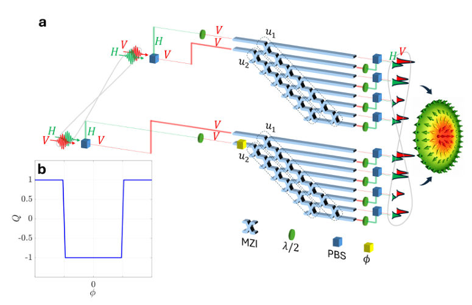
<figcaption class="paper-figure-caption"><b>Fig 4.</b> Figure 4: Experimental concept for generating and tuning a two-photon skyrmionic state on chip. (a) A pair of entangled photons is prepared in a Bell state encoded in two paths and two polariza- tions. The two polarizations in each path are further separated into two spatial bins by a polarizing beam splitter (PBS) and converted to the same V polarization by a half-wavelength plate. Each of the paths is then incident upon a reconfigurable, integrated interferometric network which implements a controlled mapping from two incident spatial bins into two designed eigenmodes |u1⟩and |u2⟩. At the output, every other spatial bin is converted back into the H polarization, and recombined with its...</figcaption>
</figure>

**Main problem.** Extending the realization of optical skyrmions from pure quantum states to mixed quantum states and investigating the robustness and 'nested' nature of topological charges in bipartite and multi-photon systems.

**Main result.** The authors demonstrate that skyrmionic topology can emerge in the density matrix of mixed states, can be realized in reduced 1D dimensions, and exhibits a 'nested' structure where topological charges persist across various reduced subspaces and are robust to environmental noise.

**Method.** The study uses a mathematical framework involving a coherence-Stokes vector derived from the density matrix, a sparse representation technique for constructing valid PSD matrices, and numerical simulations of noise channels (dephasing, depolarization, and additive noise).

**Summary.** This paper explores how topological quasiparticles known as skyrmions can exist within mixed quantum states rather than just pure states. The authors show that these skyrmions can be 'nested,' meaning their topological properties persist across different parts of an entangled multi-photon system. They also demonstrate that these structures are remarkably robust against environmental noise like dephasing and depolarization. Finally, they propose a practical way to create and measure these states using integrated photonic circuits, which could lead to new methods for robust information encoding.

Detailed structure

**Model / system.** The physical systems include single-photon states with polarization and 1D spatial/synthetic modes, bipartite entangled photon pairs (Bell states), and N-photon multi-photon mixed states, with a proposed experimental implementation using integrated photonic MZI meshes.

**Key observables.** Topological charge (skyrmion number Q), coherence-Stokes vector texture, and the presence of line defects.

**Important parameters / regimes.** Number of eigenvectors (rank d), number of modes (M), dephasing strength, mixing probability, and relative phase (phi).

**Assumptions / limitations.** The framework assumes the ability to engineer specific density matrix elements and relies on the availability of programmable photonic networks for implementation.

**Figures summary.** Figure 1 illustrates skyrmions in 1D partially coherent light and the effect of rank on the skyrmion number; Figure 4 shows the experimental concept using MZI meshes and the topological switching of Q as a function of phase.

**Paper structure.** The paper introduces the concept of skyrmions in mixed states, develops the mathematical framework for 1D and 2D textures, analyzes bipartite and multi-photon nested topologies, tests robustness against various noise models, and concludes with an experimental implementation proposal.

**Why it may be interesting.** It is highly relevant for quantum optics and open quantum systems as it shows how topological protection can be maintained in noisy, mixed-state regimes and introduces a new way to encode information using the density matrix itself.

Abstract

Topological quasiparticles of light, such as classical and quantum optical skyrmions, have so far relied on fully coherent or pure quantum states whose topology is encoded in the entanglement between polarization and two-dimensional spatial modes. Here we show that skyrmionic topology can emerge directly within the density matrix of a mixed quantum state. We introduce a framework in which a coherence-Stokes vector defines a topological texture over the density matrix, enabling the realization of quantum skyrmions using only a pseudospin and a real or synthetic one-dimensional space of modes. For a single photon, the density matrix is analogous to the coherence matrix of classical light, and can be encoded using partially coherent electromagnetic fields. We further analyze the topological texture encoded in a bipartite entangled photon pair, showing how skyrmions arise not only in the full bi-photon system, but also in its reduced subspaces with any pseudospin-mode combination simultaneously. We then explore the robustness of such skyrmions to environmental noise, and discover their persistence in mixed-quantum states of multiple photons. Finally, we propose a feasible experimental route to generate and measure such skyrmions using integrated photonic networks, and suggest avenues for similar implementations in other quantum systems. Our work paves the way for robustly encoding classical information on partially coherent light or on mixed quantum states and for encoding topological charges on many-body quantum systems.

[↑ back to top](#top)

### [Chaotic Billiard Lasers](http://arxiv.org/abs/2604.23614v1)

**Authors:** Takahisa Harayama  
**Type:** both · **Category:** other · **PDF:** <https://arxiv.org/pdf/2604.23614v1>  
**Analysis basis:** full PDF text, analyzed in chunks
**Topic relevance:** `interference shaping light` **3/5** · `driven-dissipative phase transition` **2/5** · `methods for driven-dissipative` **2/5** · `non-equilibrium dynamics` **2/5** · `non-equilibrium universality` **2/5**

↔ Scroll figures horizontally

<figure class="paper-figure-card">
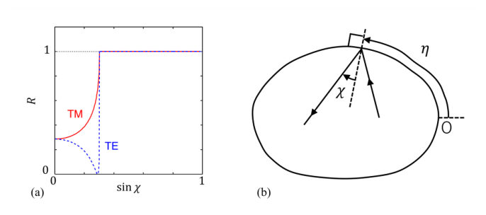
<figcaption class="paper-figure-caption"><b>Fig 1.</b> Fig. 1 Critical angle and the Birkhoff coordinates. (a) Reflectance R as a function of the incident angle χ. The solid red and dashed blue curves represent RTM and RTE, respectively. The incident angle where RTE vanishes is called the Brewster angle. (b) Schematic illustration of the Birkhoff coordinates (η, sin χ). The reflection angle χ is equal to the incident angle. Assuming unit mass, the tangential momentum is given by sin χ. This serves as the canonical momentum conjugate to the coordinate η, which represents the arc length along the boundary measured from a fixed origin O. Note that η is normalized to unity for a full circumference.</figcaption>
</figure>
<figure class="paper-figure-card">
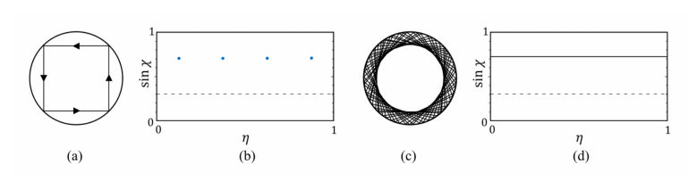
<figcaption class="paper-figure-caption"><b>Fig 2.</b> Fig. 2 A circular optical billiard. (a) A square periodic orbit in the circular billiard with refractive index nin = 3.3 (assuming nout = 1 for the surrounding air). (b) The corresponding representation in the Birkhoff coordinates (the blue dots). The dashed black line indicates the critical line sin χ = sin χc for total internal reflection. (c) A trajectory with an incident angle slightly larger than π/4. Due to the irrationality of the angle, the ray never returns to the initial point, filling the boundary densely. (d) The corresponding representation in the Birkhoff coordinates. The orbit forms a horizontal invariant line.</figcaption>
</figure>
<figure class="paper-figure-card">
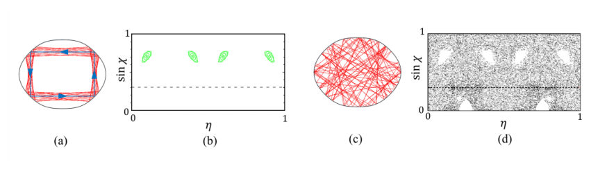
<figcaption class="paper-figure-caption"><b>Fig 3.</b> Fig. 3 The deformed optical billiard designed by Prof. Evgenii Narimanov. (a) The CCW rectangular periodic ray orbit (blue lines) and a neighboring quasi-periodic ray orbit (red lines) in real space. (b) The corresponding representation in the Birkhoff coordinates. The periodic points (corresponding to the blue lines in (a), which are not depicted in this figure) are surrounded by a set of four concentric invariant curves (green), each representing a distinct quasi-periodic ray orbit starting from different initial conditions. Collectively, these invariant curves form the stability islands. The dashed black line indicates the critical line sin χ = sin χc for total internal reflection. (c) A...</figcaption>
</figure>
<figure class="paper-figure-card">
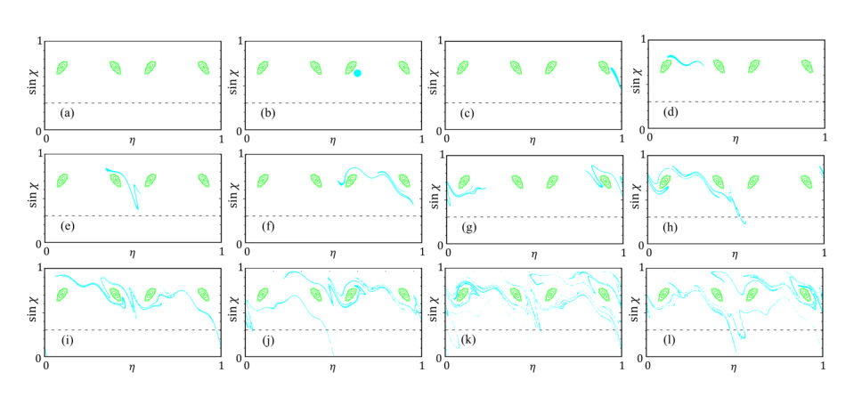
<figcaption class="paper-figure-caption"><b>Fig 4.</b> Fig. 4 Phase portrait in the Birkhoff coordinates illustrating the time evolution of a chaotic droplet. (a) The stability islands of the CCW rectangular periodic orbit. (b) The initial set of points is represented by a small filled blue circle in the chaotic sea near one of the stability islands. (c)–(l) Time evolution of the initial points shown in (b), corresponding to the reflection numbers 1 to 9, respectively. The droplet is repeatedly stretched and folded as time progresses. The chaotic trajectories diffuse toward the region below the critical line (dashed line) where they eventually impinge on the boundary. The blank regions below the critical line in Fig. 3, which correspond to the...</figcaption>
</figure>
<figure class="paper-figure-card">
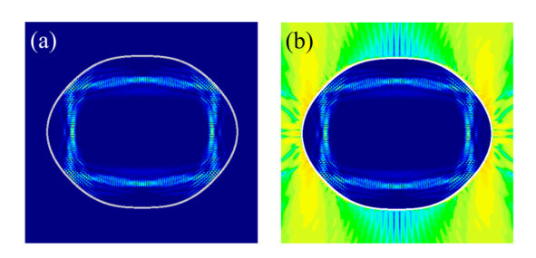
<figcaption class="paper-figure-caption"><b>Fig 5.</b> Fig. 5 Intensity pattern of a resonance wavefunction localized on the rectangular periodic orbit. (a) Intensity distribution |φ|2 in linear scale for a high-Q TE mode (k = 49.94 −i 0.00012). The mode is strongly localized along the rectangular orbit. (b) The same mode, where the intensity distribution outside the billiard is plotted on a logarithmic scale to highlight the far-field emission pattern, which remains invisible in the linear plot.</figcaption>
</figure>
<figure class="paper-figure-card">
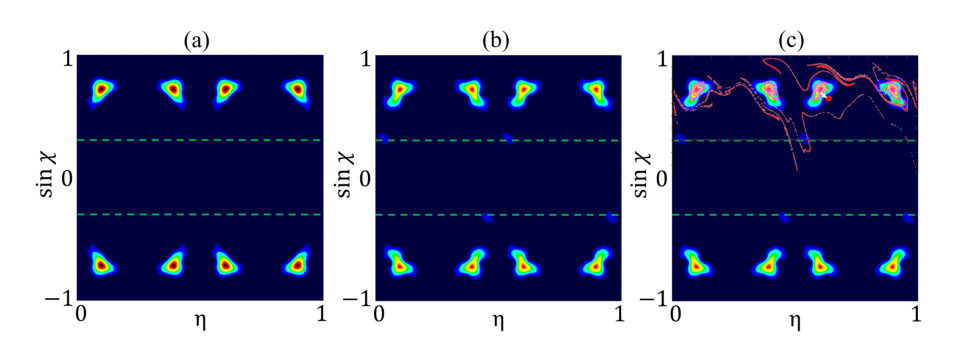
<figcaption class="paper-figure-caption"><b>Fig 6.</b> Fig. 6 Husimi representation and chaos-assisted light emission. (a) Husimi representation of a Dirichlet mode. The Husimi distribution is calculated for a mode with a wave number close to the resonance mode. The intensity is perfectly localized on the stability islands of the rectangular periodic orbit. (b) Husimi representation of the resonance mode. The Husimi distribution corresponding to the mode in Fig. 5. In addition to the localization on the rectangular stability islands, intensity is observed near the critical lines around η = 0 (equivalently η = 1) and η = 0.5. This intensity distribution results from the chaotic transport of the tunneled components and the subsequent emission...</figcaption>
</figure>
<figure class="paper-figure-card">
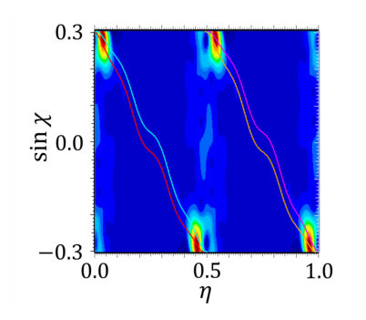
<figcaption class="paper-figure-caption"><b>Fig 7.</b> Fig. 7 Flux distribution with Gaussian smoothing, as conceived by Prof. Susumu Shinohara. The distribution is shown as a function of the boundary position η. The upper and lower boundaries of the plot correspond to the critical lines, representing the condition where the emission is tangential to the billiard edge (emission angle ±π/2). The strong localizations observed just inside these critical lines (e.g., η ≈0.03, 0.47, 0.53, 0.97) indicate the emergence of highly directional light emission around ±90◦. The four curves represent the relationship between the boundary position η and the incident angle χ for which the emission angles are exactly ±(90 ± 1.6)◦.</figcaption>
</figure>
<figure class="paper-figure-card">
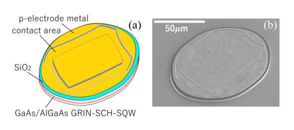
<figcaption class="paper-figure-caption"><b>Fig 8.</b> Fig. 8 Device structure and fabrication results. (a) Schematic of the upper epitaxial layers and the electrode contact window patterned along the rectangular orbit, which features inwardly recessed segments. For clarity, the n-GaAs substrate and the underlying n-electrode metal are not shown. (b) Scanning electron microscope (SEM) image of a fabricated laser diode with M = 0.95. The recessed structure of the electrode, corresponding to the design in (a), is clearly visible. Panel (b) is adapted with permission from [36]. Copyright 2010 by the American Physical Society.</figcaption>
</figure>
<figure class="paper-figure-card">
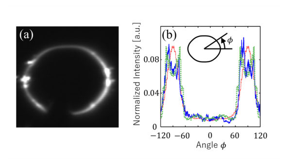
<figcaption class="paper-figure-caption"><b>Fig 9.</b> Fig. 9 Near-field and far-field emission characteristics. (a) Near-field pattern (NFP) of the cavity during lasing operation, captured by an IR-CCD camera. The two distinct emission points on each side of the cavity are consistent with the theoretical predictions based on the phase-space representation and chaos-assisted light emission. Note that the dark region on the cavity boundary is caused by the probe used for current injection. (b) Far-field emission patterns (FFP): experimental data (solid blue curve) for at 500 mA vs. ray-calculated (dashed green curve) and wave-calculated (dotted red curve) results. In the wave calculation, rapid interference-induced oscillations are artificially...</figcaption>
</figure>
<figure class="paper-figure-card">
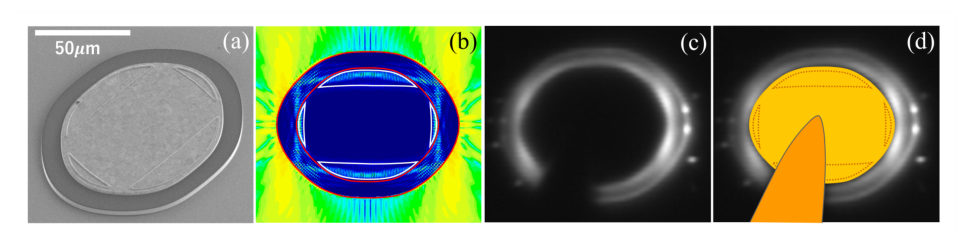
<figcaption class="paper-figure-caption"><b>Fig 10.</b> Fig. 10 Experimental observation of modal patterns and chaos-assisted light emission. (a) Scanning electron microscope (SEM) image of the fabricated laser diode with M = 0.8. (b) Superimposed image of the calculated intensity pattern of the rectangular periodic ray orbit, the contact window (white curves), and the SiO2 margin area (outside the red curve). (c) Near-field pattern (NFP) captured by an IR-CCD camera during lasing operation. The internal modal pattern observed through the SiO2 margin closely matches the rectangular orbit in (b). (d) Schematic illustration showing the configuration of the p-electrode metal, the contact window, and the probe used for current injection. Figures are...</figcaption>
</figure>

**Main problem.** Understanding how the transition from regular to chaotic ray dynamics affects the wavefunctions, lasing properties, and directional light emission in optical microcavity lasers.

**Main result.** The paper demonstrates that chaotic dynamics can be harnessed for controllable, directional light emission via chaos-assisted tunneling and that nonlinear interactions in the gain medium lead to phenomena like universal single-mode lasing.

**Method.** The study employs a combination of classical ray dynamics (Birkhoff coordinates), wave-based numerical methods (FDTD, BEM, and Helmholtz equation), and nonlinear modeling using the Maxwell-Bloch equations.

**Summary.** This paper reviews the physics of chaotic billiard lasers, focusing on how breaking the symmetry of a cavity can transform isotropic emission into directional light. It explores the bridge between classical ray chaos and wave-based nonlinear lasing, specifically through mechanisms like chaos-assisted tunneling and dynamical eclipsing. By deriving the Maxwell-Bloch equations for these systems, the author shows how the gain medium interacts with chaotic wavefunctions to stabilize single-mode lasing. Ultimately, it highlights the potential of using chaotic dynamics to engineer next-generation, unconventional coherent light sources.

Detailed structure

**Model / system.** The physical system consists of 2D optical microcavity lasers (e.g., Bunimovich stadium or deformed droplets) with an active gain medium, modeled using non-Hermitian wave dynamics and nonlinear light-matter interaction.

**Key observables.** Quality (Q) factors, far-field and near-field emission patterns, complex eigenfrequencies, frequency pulling, and spatial intensity distributions.

**Important parameters / regimes.** Refractive index contrast (e.g., n_in=3.3, n_out=1), critical angle for total internal reflection, deformation parameters (a, b, c), and the transition from linear to nonlinear regimes.

**Assumptions / limitations.** The study primarily focuses on two-dimensional microcavity lasers and assumes the dielectric material has strictly vertical boundaries along the z-axis.

**Figures summary.** Figures illustrate reflectance vs. incident angle, ray orbits in Birkhoff coordinates, the evolution of intensity from Gaussian packets to stationary lasing states, and the distribution of passive resonances in the complex frequency plane.

**Paper structure.** The paper progresses from the fundamentals of classical and quantum chaos in optical billiards to the specific mechanisms of chaos-assisted light emission, followed by a rigorous derivation of nonlinear Maxwell-Bloch equations and an exploration of mode competition and stability in fully chaotic systems.

**Why it may be interesting.** It provides deep insights into non-Hermitian physics, the interplay between wave chaos and nonlinear dissipation, and the control of light-matter interactions in open quantum systems.

Abstract

This chapter provides an overview of chaotic billiard lasers as a prominent branch of quantum chaos. These lasers offer an ideal experimental platform for demonstrating the principles of quantum chaos within a physical system. We begin by introducing the fundamental principles of chaotic ray dynamics in optical microcavities, where the transition from regular to fully chaotic dynamics fundamentally alters the underlying wavefunctions and lasing properties. A central focus is placed on "chaos-assisted light emission," which serves as a practical manifestation of "chaos-assisted tunneling" -- a hallmark phenomenon in the study of quantum chaos. We discuss both theoretical frameworks and experimental validations, demonstrating how chaotic orbits facilitate the coupling between evanescently localized modes and far-field emission. Furthermore, exploring how the presence of a gain medium influences established results from quantum chaos research remains a fundamental and intriguing problem in physics. To address this, we establish a rigorous and comprehensive derivation of the Maxwell-Bloch equations for two-dimensional microcavity lasers, specifically examining their application to fully chaotic, stadium-shaped billiard lasers. By bridging the gap between nonlinear lasing processes and chaotic wavefunctions, this chapter highlights the unique potential of chaotic billiards for controlling light-matter interactions and shaping the next generation of unconventional coherent light sources.

[↑ back to top](#top)

### [Delocalization transition for light in two dimensions](http://arxiv.org/abs/2604.22919v1)

**Authors:** Sébastien Lucas, Christian Miniatura, Sergey E. Skipetrov  
**Type:** theory · **Category:** disordered systems and neural networks · **PDF:** <https://arxiv.org/pdf/2604.22919v1>  
**Analysis basis:** full PDF text, analyzed in chunks
**Topic relevance:** `correlated / nonlocal dissipation` **3/5** · `driven-dissipative phase transition` **3/5** · `non-equilibrium universality` **3/5** · `free-space correlated emission` **2/5**

↔ Scroll figures horizontally

<figure class="paper-figure-card">
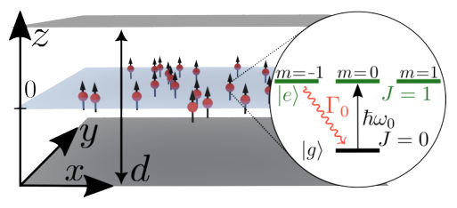
<figcaption class="paper-figure-caption"><b>Fig 1.</b> FIG. 1. N two-level atoms (red dots) are randomly dis- tributed in the z = 0 plane in the middle of a planar waveg- uide formed by two perfectly reflecting parallel mirrors (gray plates) separated by a distance d &lt; π/k0. Such a planar waveguide only admits propagating TM0 modes whose elec- tric field, perpendicular to the mirrors, polarizes the atomic dipoles along z axis (black arrows) and is subsequently mul- tiply scattered by the atoms.</figcaption>
</figure>
<figure class="paper-figure-card">
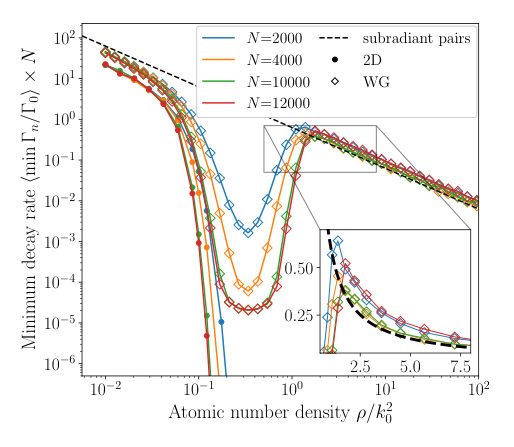
<figcaption class="paper-figure-caption"><b>Fig 2.</b> FIG. 2. Ensemble average of the decay rate of the longest- lived quasi-normal mode, as a function of the atomic density for different system sizes, for modes of our planar WG system (open diamonds) and for truly 2D modes (dots). The black dashed line corresponds to the decay rate of the most subra- diant mode localized on a pair of atoms [30].</figcaption>
</figure>
<figure class="paper-figure-card">
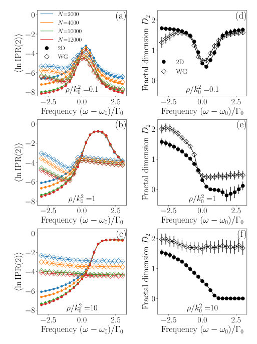
<figcaption class="paper-figure-caption"><b>Fig 3.</b> FIG. 3. Mean-log inverse participation ratio ⟨ln IPR(2)⟩(a–c) and fractal dimension D2 (d–f) as functions of frequency for different densities ρ/k2 0 = 0.1 (top), ρ/k2 0 = 1 (middle), ρ/k2 0 = 10 (bottom) and different atom numbers N, for modes of both WG (open diamonds) and 2D (dots) models.</figcaption>
</figure>
<figure class="paper-figure-card">
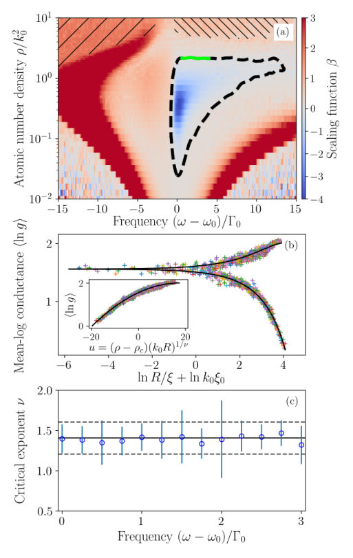
<figcaption class="paper-figure-caption"><b>Fig 4.</b> FIG. 4. (a) Scaling function β = d⟨ln g⟩/d ln k0R for WG model (1) versus frequency ω and atomic number density ρ. β is numerically computed from the dependence of ⟨ln g⟩on the atomic sample size R by a finite-difference approximation for N = 4000 and 10000. The dashed black line indicates β = 0. The large values β &gt; 2 observed in some regions of the parameter plane are due to finite-size effects [30]. The hatched high-density domain at ω −ω0 &gt; 0 corresponds to β ≃1 while the hatched high-density domain at ω −ω0 &lt; 0 corresponds to β ≃2. (b) ⟨ln g⟩obtained from the data for (ω −ω0)/Γ0 ∈[0, 3], N = 4000, 8000, 10000, 12000 and ρ/k2 0 ∈[1, 3] as a function of R/ξ (symbols), and the best fit to...</figcaption>
</figure>

**Main problem.** The paper investigates whether a localization-delocalization transition can occur in a 2D system of light-scattering atoms, challenging the established belief that any amount of disorder in 2D leads to Anderson localization.

**Main result.** The authors predict a transition from Anderson localization to a delocalized regime driven by near-field dipole-dipole interactions as the atomic density increases, with an estimated critical exponent of nu = 1.4 +/- 0.2.

**Method.** The study uses numerical analysis of the eigenvalues and quasi-normal modes of an effective non-Hermitian Hamiltonian, combined with finite-size scaling and multifractal analysis.

**Summary.** This paper demonstrates that light in a 2D waveguide can undergo a localization-delocalization transition. While standard 2D scaling theory predicts that any disorder causes Anderson localization, the authors show that increasing the density of atoms triggers a transition to an extended regime. This transition is driven by strong near-field dipole-dipole interactions. The study provides a critical exponent for this transition and distinguishes between localized modes and subradiant atom pairs.

Detailed structure

**Model / system.** A 2D planar waveguide formed by two parallel reflecting plates containing an ensemble of N identical two-level atoms randomly distributed in the middle plane, interacting via electromagnetic Green's functions.

**Key observables.** Decay rates (Gamma), Thouless conductance (g), Inverse Participation Ratio (IPR), and multifractal dimensions (Dq).

**Important parameters / regimes.** Atomic areal number density (rho/k0^2), waveguide width (d), and frequency detuning.

**Assumptions / limitations.** The system is modeled using an effective non-Hermitian Hamiltonian; the scaling theory assumes single-parameter scaling holds near the critical line.

**Figures summary.** Figure 1 shows the waveguide geometry; Figure 2 compares decay rates in the waveguide vs 2D models to show the transition; Figure 3 and others show IPR and conductance scaling behavior.

**Paper structure.** The paper introduces the problem of 2D localization, describes the waveguide model and Green's function, presents numerical results for decay rates and conductance, performs finite-size scaling to find the critical exponent, and discusses the fractal nature of the modes.

**Why it may be interesting.** It challenges a fundamental tenet of 2D wave physics (that all disorder leads to localization) by showing how many-body-like dipole interactions can drive a phase transition to a delocalized state.

Abstract

Common belief, confirmed by existing experiments, is that arbitrarily weak disorder should lead to spatial localization of eigenmodes of scalar wave equations when wave propagation is two-dimensional (2D). We predict that contrary to this belief, a localization-delocalization transition can take place for light scattered by two-level atoms placed at random positions in the middle plane of a parallel-plate 2D waveguide fed by its fundamental transverse-magnetic (TM) mode (electric field polarized perpendicular to the waveguide and atomic planes). This transition, driven by near-field dipole-dipole interactions between atoms, occurs upon increasing the areal number density of atoms beyond some critical value. A finite-size scaling analysis of the transition yields an estimate of its critical exponent $ν$ = 1.4 $\pm$ 0.2.

[↑ back to top](#top)

### [Intrinsic Pointer Basis and Irreversible Classicality from Coherence Contraction](http://arxiv.org/abs/2604.23304v1)

**Authors:** José J. Gil  
**Type:** theory · **Category:** quantum information and computing · **PDF:** <https://arxiv.org/pdf/2604.23304v1>  
**Analysis basis:** full PDF text, analyzed in chunks
**Topic relevance:** `methods for driven-dissipative` **3/5** · `correlated / nonlocal dissipation` **2/5** · `entanglement & information structure` **2/5** · `non-equilibrium dynamics` **2/5** · `quantum measurements` **2/5**

↔ Scroll figures horizontally

<figure class="paper-figure-card">
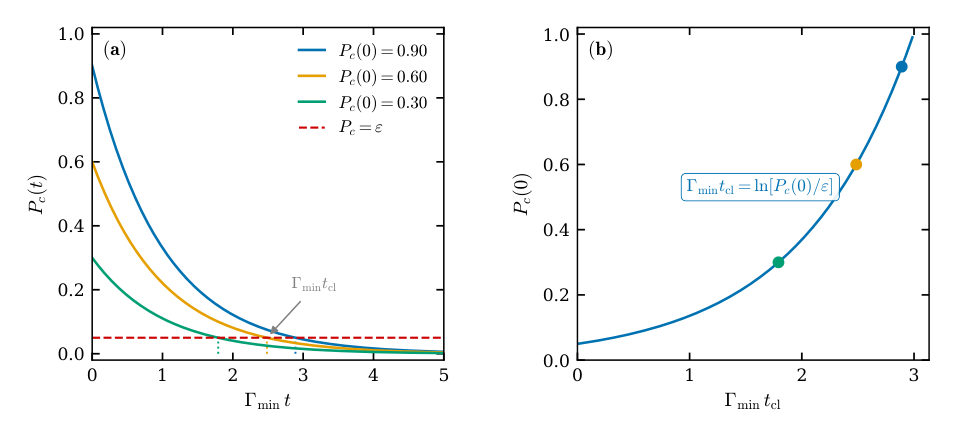
<figcaption class="paper-figure-caption"><b>Fig 1.</b> FIG. 2. Qubit classicalization dynamics under IRB-selective dephasing (Γmin = 1, ε = 0.05). (a) Time evolu-</figcaption>
</figure>

**Main problem.** The paper addresses the problem of identifying a canonical, model-independent pointer basis and quantifying the emergence of classicality from quantum dynamics when the microscopic system-environment coupling is unknown.

**Main result.** The author proves that an Intrinsic Reference Basis (IRB) emerges as a dynamically stable pointer sector under IRB-selective dynamics, providing a state-dependent criterion for classicality via a cohesion index.

**Method.** The study uses a mathematical framework involving an antiunitary involution (K) to decompose the density operator into population and coherence sectors, employing Lyapunov analysis and majorization theory to prove monotonic coherence decay.

**Summary.** This paper proposes a new framework for understanding the quantum-to-classical transition by defining a basis (the IRB) directly from the state's own structure. It shows that for certain types of noise, quantum coherences decay predictably, leading to an irreversible emergence of classical behavior. The approach is unique because it does not require knowing the specific details of the environment. Crucially, the paper links this theoretical decay to measurable quantities like fringe visibility in interferometry, making the theory directly testable.

Detailed structure

**Model / system.** The framework applies to reduced quantum descriptions of open systems undergoing Markovian GKSL (Lindblad) dynamics, specifically focusing on the 'IRB-selective' regime where Lindblad operators are diagonal in the intrinsic basis.

**Key observables.** Cohesion index (Pc), fringe visibility (V), quadratic intrinsic coherence (U), and the thermodynamic arrow-of-time proxy (A_lambda).

**Important parameters / regimes.** Classicalization time (t_cl), minimum dephasing rate (Gamma_min), and experimental resolution/tolerance (epsilon).

**Assumptions / limitations.** Assumes IRB-selective dynamics (Lindblad operators are diagonal in the IRB) and requires a fixed physical conjugation K determined by symmetry or measurement convention.

**Figures summary.** The notes mention Figure 2(a) but do not provide a full description of the figure contents.

**Paper structure.** The paper defines the IRB decomposition, proves coherence contraction under specific dynamics, derives operational classicality criteria and timescales, and connects these results to experimental interferometric measurements.

**Why it may be interesting.** It provides a powerful, model-independent way to certify classicality and identify pointer states directly from experimental data (like tomography), which is highly relevant for characterizing noise and decoherence in qubits and other open quantum systems.

Abstract

The irreversible emergence of classical behavior from a reduced quantum description via a canonical intrinsic decomposition of the density operator is analyzed. In the intrinsic reference basis (IRB), defined for a fixed physical conjugation K (determined by measurement convention, system symmetry, or secular approximation) by diagonalizing the real symmetric part of the state, the density operator separates into a diagonal population sector and a real antisymmetric coherence sector. For the class of Markovian open-system dynamics whose Lindblad operators are diagonal in the IRB, we prove that the quadratic coherence functional is a Lyapunov functional under pure-dephasing or interaction-picture evolution, with each intrinsic coherence component decaying exponentially at a computable rate. This yields a canonical state-dependent operational classicality criterion via the normalized cohesion index, an explicit logarithmic classicalization time controlled by the slowest dephasing rate, and a demonstration that the IRB projectors emerge as dynamically stable pointer sectors under IRB-selective evolution. Suppression of intrinsic coherences is exactly equivalent to suppression of fringe visibility in the corresponding interferometric sector; for a balanced two-path setup the cohesion index coincides with the fringe visibility, making the classicality criterion directly testable with standard interferometric equipment. The approach complements environment-induced einselection: it is applicable whenever a coarse-grained reduced description is available, independently of whether the microscopic system-environment coupling is known.

[↑ back to top](#top)

### [Lobe Dynamics, Phase-Space Transport, and Non-Adiabatic Leakage Thresholds in the Nonautonomous Kerr-Cat Qubit](http://arxiv.org/abs/2604.24042v1)

**Authors:** Stephen Wiggins  
**Type:** theory · **Category:** quantum information and computing · **PDF:** <https://arxiv.org/pdf/2604.24042v1>  
**Analysis basis:** full PDF text, analyzed in chunks
**Topic relevance:** `driven-dissipative phase transition` **3/5** · `methods for driven-dissipative` **3/5** · `non-equilibrium dynamics` **3/5** · `Keldysh / 2PI / non-Gaussian methods` **2/5**

↔ Scroll figures horizontally

<figure class="paper-figure-card">
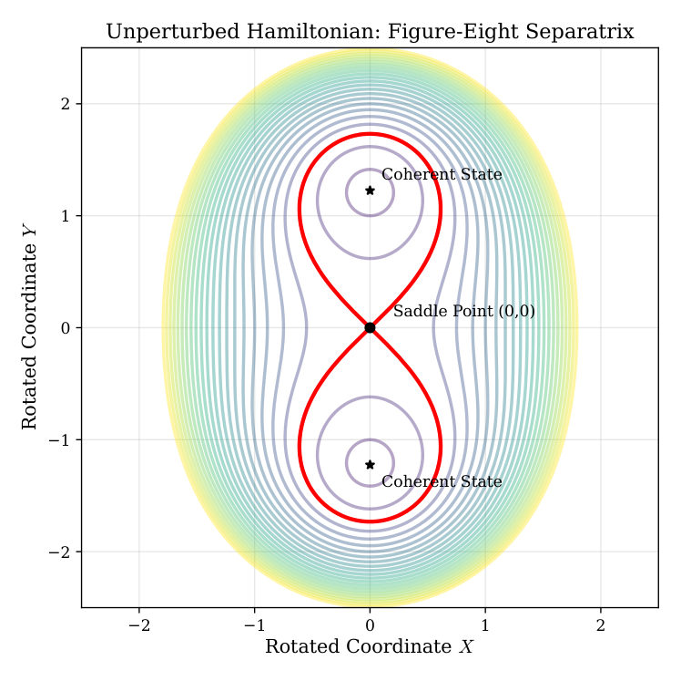
<figcaption class="paper-figure-caption"><b>Fig 1.</b> Figure 1: Unperturbed conservative skeleton in the rotated coordinate frame (X, Y ). The red H = 0 contour is the bounded figure-eight separatrix of the resonant Hamiltonian system. The saddle at the origin is marked explicitly, and the surrounding Hamiltonian contours show the two lobe regions associated with the two macro- scopic coherent-state wells. Because the H = 0 contour is bounded, the unstable branches emerging from the saddle are forced to return to the saddle and coincide with the stable branches, forming the two homoclinic loops used as the unperturbed skeleton for the Melnikov calculation. Representative parameters are K = 1.0 and p0 = 1.5.</figcaption>
</figure>
<figure class="paper-figure-card">
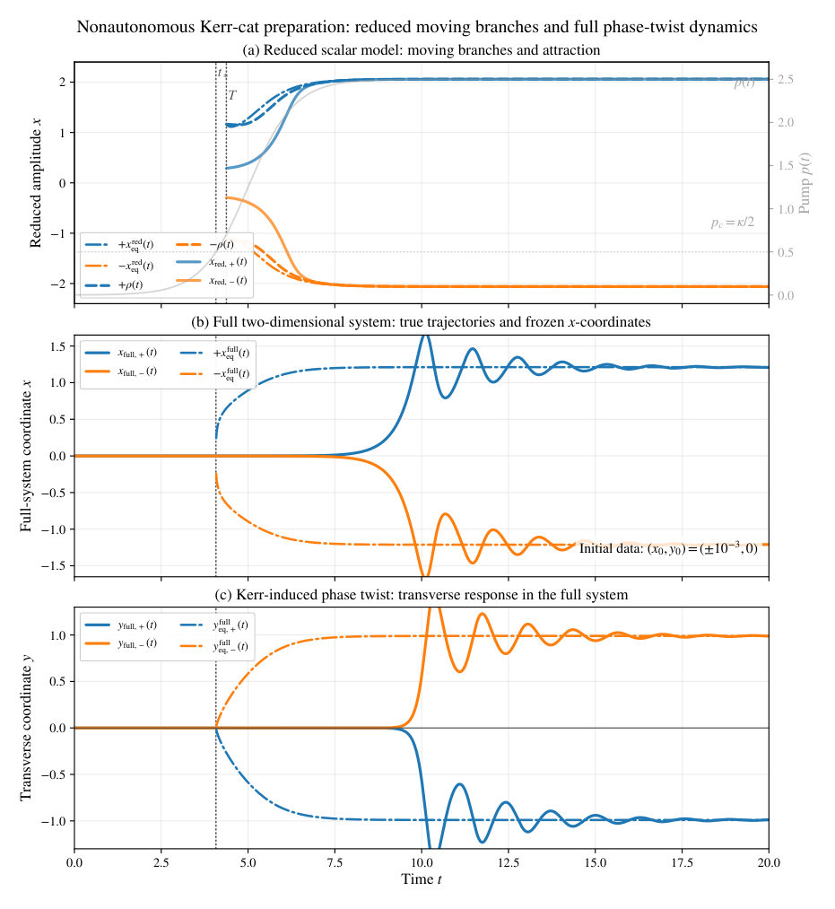
<figcaption class="paper-figure-caption"><b>Fig 2.</b> Figure 2: Nonautonomous preparation dynamics separated into reduced and full-system diagnostics. (a) Reduced scalar model derived from the local invariant-graph reduction. The curves ±xred eq (t) are frozen-time algebraic roots of the reduced equation, ±ρ(t) are representative moving branches, and xred,±(t) are reduced trajectories showing attraction toward those branches after the post-threshold reference time T. The gray curve shows the pump envelope p(t), and the horizontal gray line marks pc = κ/2. (b) Full two-dimensional system: x-coordinates of the true trajectories initialized at (x0, y0) = (±10−3, 0), compared with the frozen-time full-system equilibrium coordinates. (c) Full...</figcaption>
</figure>
<figure class="paper-figure-card">
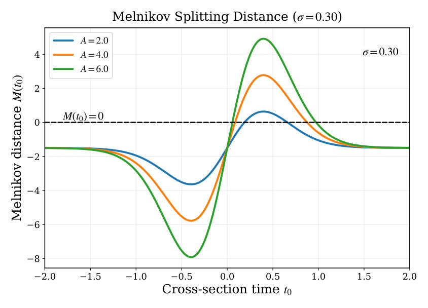
<figcaption class="paper-figure-caption"><b>Fig 3.</b> Figure 3: Signed leading-order Melnikov splitting distance M(t0) for a Gaussian gate pulse with fixed width σ = 0.30 and amplitudes A = 2.0, 4.0, 6.0, computed from the analytic resonant homoclinic branch used in the canonical Melnikov calculation. The dashed horizontal line marks M(t0) = 0. For amplitudes large enough that M(t0) has simple zeros, the time-dependent stable and unstable curves intersect transversally, indicating the onset of transient lobe-mediated transport. The negative offset away from the pulse region is produced by dissipation.</figcaption>
</figure>
<figure class="paper-figure-card">
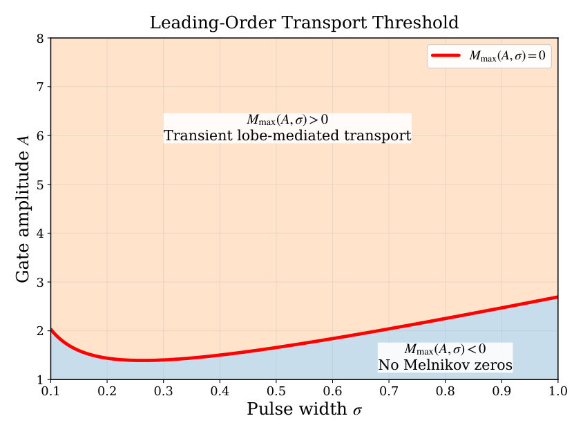
<figcaption class="paper-figure-caption"><b>Fig 4.</b> Figure 4: Leading-order transport threshold for gate-induced leakage in the semiclassical model. The red curve is the canonical numerically evaluated level set Mmax(A, σ) = 0 in the gate amplitude-width plane, plotted with pulse width σ on the horizontal axis and gate amplitude A on the vertical axis. Below the curve, Mmax(A, σ) &lt; 0, no Melnikov zeros are detected, and the first-order calculation predicts no transversal intersections of the time- dependent stable and unstable curves. Above the curve, Mmax(A, σ) &gt; 0, the aperiodic pulse produces transient transversal intersections, and transient lobe-mediated transport across the nominal dividing boundary becomes available. This is a...</figcaption>
</figure>

**Main problem.** The inadequacy of autonomous, 'frozen-time' approximations for describing the operational dynamics, state preparation, and gate-induced leakage in nonautonomous Kerr-cat qubits.

**Main result.** The paper identifies a nonautonomous pitchfork bifurcation for state preparation and uses Melnikov theory to derive a geometric threshold for gate-induced non-adiabatic transport (leakage) via transient lobe dynamics.

**Method.** The author employs nonautonomous dynamical systems theory, including local invariant-graph reduction, Melnikov's method for manifold splitting, and semiclassical expansion.

**Summary.** This paper investigates the dynamics of Kerr-cat qubits under time-dependent microwave control. It demonstrates that standard static models fail to capture the true physics of state preparation and gate execution. By using nonautonomous dynamical systems theory, the author shows that state formation follows a nonautonomous pitchfork bifurcation and that fast gates induce leakage through a 'turnstile' mechanism of transient lobes. This provides a predictive geometric criterion for the onset of bit-flip errors during gate operations.

Detailed structure

**Model / system.** A driven-dissipative, nonautonomous Kerr-nonlinear parametric oscillator (KPO) modeled as a 2D planar vector field representing a superconducting nonlinear resonator.

**Key observables.** Phase-space trajectories (x, y coordinates), Melnikov function (M(t0)), transport threshold (A_crit), and dynamic lag between physical trajectories and algebraic roots.

**Important parameters / regimes.** Kerr nonlinearity (K), dissipation rate (kappa), detuning (Delta), pump amplitude (p(t)), ramp rate (gamma), gate pulse amplitude (A), and pulse width (sigma).

**Assumptions / limitations.** The analysis relies on a semiclassical expansion in the large photon-number limit and treats gate pulses as weak aperiodic perturbations of a conservative Hamiltonian skeleton.

**Figures summary.** Figure 2 shows the reduced scalar model's moving branches and the 2D phase-twist relaxation; Figure 3 illustrates the Melnikov splitting distance; Figure 4 presents the transport threshold in the amplitude-width plane; Appendix figures show dynamic lag and the formation of the homoclinic tangle.

**Paper structure.** The paper first establishes the Hamiltonian skeleton, then analyzes state preparation via invariant-graph reduction to find the nonautonomous pitchfork mechanism, followed by an analysis of gate execution using Melnikov theory to predict leakage, and concludes with numerical validation of the transport threshold.

**Why it may be interesting.** It provides a rigorous geometric framework for understanding how time-dependent control pulses in continuous-variable hardware drive non-adiabatic errors and phase-space transport, which is critical for designing high-fidelity gates in cat-state qubits.

Abstract

The Kerr-nonlinear parametric oscillator (KPO) provides a foundational semiclassical model for cat-state quantum hardware. Standard analyses of the KPO typically rely on autonomous, frozen-time approximations to describe the stabilization of macroscopic coherent states. However, state preparation and gate manipulation are driven by explicitly time-dependent microwave pulses, so the operational dynamics are inherently nonautonomous. In this paper, we show that static algebraic equilibrium pictures are incomplete for describing both state formation and gate-induced transport in the Kerr-cat qubit. For nonautonomous state preparation, we analyze the ramped resonant model by combining a linear nonautonomous stability analysis with a local invariant-graph reduction near the vacuum trajectory. This yields a quintic reduced normal form in the critical direction and identifies two symmetric post-threshold moving branches that organize the local state-formation dynamics. The associated diagnostics separate the reduced branch dynamics from the full two-dimensional phase-twist relaxation observed in the hardware coordinates. For gate execution, we model a fast pulse as a weak aperiodic perturbation of the conservative resonant figure-eight separatrix and apply Melnikov's method to derive a leading-order transport criterion. In this framework, transient lobe dynamics emerge as a semiclassical mechanism for non-adiabatic leakage, and the resulting amplitude-width threshold curve provides a leading-order geometric indicator for the onset of gate-pulse-induced transport.

[↑ back to top](#top)

### [Observation of Erratic Non-Hermitian Skin Effect in Phononic Crystals](http://arxiv.org/abs/2604.23713v1)

**Authors:** Yujian Yuan, Jie Liu, He Gao, Jiamin Guo, Zhongming Gu, Jie Zhu  
**Type:** both · **Category:** disordered systems and neural networks · **PDF:** <https://arxiv.org/pdf/2604.23713v1>  
**Analysis basis:** full PDF text, analyzed in chunks
**Topic relevance:** `non-equilibrium dynamics` **3/5** · `analog quantum simulation` **2/5** · `correlated / nonlocal dissipation` **2/5** · `driven-dissipative phase transition` **2/5** · `non-equilibrium universality` **2/5**

↔ Scroll figures horizontally

<figure class="paper-figure-card">
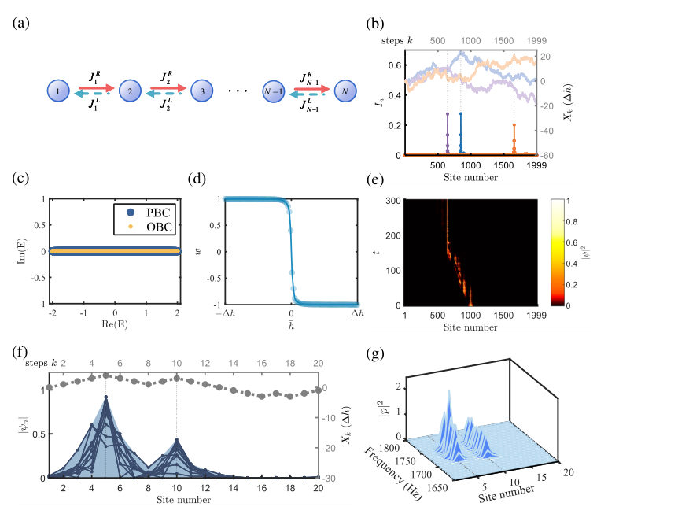
<figcaption class="paper-figure-caption"><b>Fig 1.</b> FIG. 1. Erratic Non-Hermitian Skin Effect. (a) Schematic diagram of the one-dimensional non-reciprocal Hatano–Nelson model with N sites. (b) Comparison of random-walk distributions and eigenstate distributions under open boundary conditions (OBC) for N = 1999. (c) Eigenenergy spectra under periodic boundary conditions (PBC) and OBC. (d) Winding numbers averaged over 50 randomly generated sequences for different mean values, with lattice size N = 1999. (e) Time evolution of a random walk process. (f) Random-walk distributions and eigenstate distributions under OBC for N = 20. The shaded light-blue area represents the wave packet of the corresponding eigenstates. (g) Numerically simulated...</figcaption>
</figure>
<figure class="paper-figure-card">

<figcaption class="paper-figure-caption"><b>Fig 2.</b> FIG. 2. Experimental Implementation. (a) Equivalent Hatano–Nelson model with the same mathematical structure. (b) Top-view photograph of a one-dimensional disordered acoustic crystal. Non-reciprocal coupling is implemented via an amplifier (with DC power supply), a microphone (input), and a speaker (output). Source and detector are used to mea- sure transmission. The green and yellow arrows denote the reciprocal coupling and the unidirectional nonreciprocal cou- pling, respectively. (c) Photograph of a one-dimensional dis- ordered acoustic crystal with 20 resonators.</figcaption>
</figure>
<figure class="paper-figure-card">
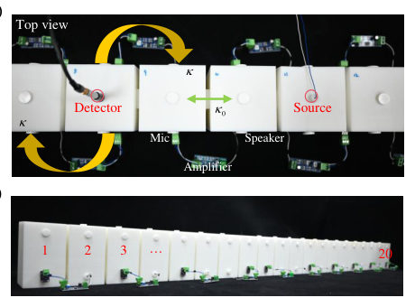
<figcaption class="paper-figure-caption"><b>Fig 3.</b> Fig. 2(a). By randomly assigning the sign of hn according to a Bernoulli distribution, we determine the direction of the non-reciprocal coupling between neighboring sites, thereby directly introducing disorder into the lattice. The one-dimensional acoustic lattice consists of res- onant cavities that serve as discrete lattice sites. Ad- jacent sites are coupled through connecting tubes that provide the reciprocal coupling κ0. Figure 2(b) pro- vides a close-up view of the experimental implementa- tion, highlighting the site-resolved cavity arrangement and inter-site coupling pathways. Each cavity contains a microphone–speaker pair linked through an external amplifier circuit to realize the...</figcaption>
</figure>
<figure class="paper-figure-card">
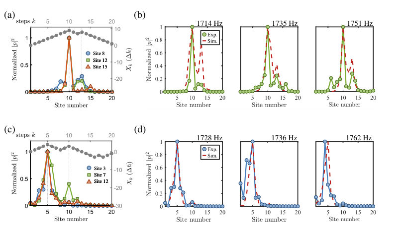
<figcaption class="paper-figure-caption"><b>Fig 4.</b> FIG. 3. Experimental results of the one-dimensional disordered Hatano–Nelson model. (a) Acoustic pressure distributions for excitation at site 8 (1721 Hz), site 12 (1715 Hz), and site 15 (1719 Hz) under a fixed disordered configuration, the upper curves correspond to the random-walk trajectories. (b) Acoustic pressure distributions at three frequencies for excitation at site 12. (c–d) Same as panels (a–b), with excitation applied at site 3 (1728 Hz), site 7 (1715 Hz), and site 12 (1736 Hz). The acoustic pressure distributions at three representative frequencies are shown.</figcaption>
</figure>
<figure class="paper-figure-card">
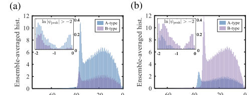
<figcaption class="paper-figure-caption"><b>Fig 5.</b> FIG. 5. Selective manipulation of localization peaks. His- tograms of the logarithmic peak amplitudes ln |ψpeak| for the most localized eigenstates. Blue and purple bars indicate spatial peaks pinned to sublattice A and sublattice B, re- spectively. The parameters are set to (a) ∆h1 = 0.5, ∆h2 = 1.0, b1 = 0.9, b2 = 0.3, and (b) ∆h1 = 1.0, ∆h2 = 0.5, b1 = 0.3, b2 = 0.9.</figcaption>
</figure>
<figure class="paper-figure-card">
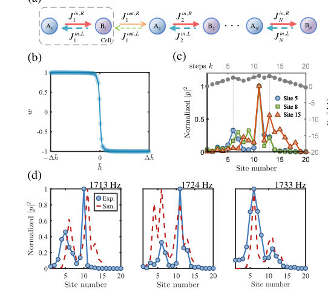
<figcaption class="paper-figure-caption"><b>Fig 6.</b> FIG. 4. Experimental results of the one-dimensional dis- ordered SSH model. (a) Schematic diagram of the one- dimensional non-reciprocal SSH model with N sites. (b) Winding numbers averaged over 50 randomly generated se- quences for different mean values, with lattice size N = 1999. (c) Acoustic pressure distributions for excitation at site 5 (1724 Hz), site 8 (1722 Hz), and site 15 (1719 Hz) under a fixed disordered configuration, the upper curves correspond to the random-walk trajectories. (d) Acoustic pressure distri- butions at three frequencies for excitation at site 12.</figcaption>
</figure>

**Main problem.** The study investigates the Erratic Non-Hermitian Skin Effect (ENHSE), where disorder and local nonreciprocity cause wave functions to form discrete bulk peaks rather than accumulating at boundaries.

**Main result.** The researchers experimentally observed that bulk localization peaks in a phononic crystal correspond to the local maxima of a cumulative gauge field, following random-walk extreme-value statistics, and demonstrated the ability to steer these peaks via sublattice tuning.

**Method.** The work combines experimental measurements of acoustic pressure in a 1D phononic crystal with large-scale numerical simulations using the Crank-Nicolson method and random-walk statistical analysis.

**Summary.** This paper reports the experimental observation of the Erratic Non-Hermitian Skin Effect in a phononic crystal. Unlike the standard non-Hermitian skin effect which pushes energy to the edges, this effect creates localized peaks within the bulk of the system. These peaks are determined by the extreme values of a random-walk-like gauge field created by disordered nonreciprocal couplings. The authors also show that these peaks can be deterministically manipulated by tuning the disorder in a dimerized lattice structure.

Detailed structure

**Model / system.** A 1D phononic crystal consisting of resonant cavities and tubes, implementing a disordered Hatano-Nelson model and a dimerized Su-Schellig-Heeger (SSH) model with nonreciprocal couplings via an electronic amplifier circuit.

**Key observables.** Spatial eigenstate distribution, acoustic pressure profiles, real-space winding number, and cumulative gauge field trajectories.

**Important parameters / regimes.** Disorder strength (delta h), mean bias (h-bar), lattice size (N), and the probability of positive/negative coupling (b1, b2).

**Assumptions / limitations.** The study focuses on the weak-bias regime where the average non-reciprocity vanishes (h-bar = 0).

**Figures summary.** Figure 1 shows the Hatano-Nelson model and the correspondence between random-walk distributions and eigenstate peaks; Figure 4 illustrates the nonreciprocal SSH model, winding numbers, and the spatial alignment of acoustic pressure with random-walk trajectories.

**Paper structure.** The paper introduces the ENHSE concept, describes the experimental phononic platform and nonreciprocal mechanism, presents numerical validation of the localization mechanism via extreme-value statistics, and concludes with the demonstration of sublattice-specific wave control.

**Why it may be interesting.** This work is highly relevant for researchers in open quantum systems and many-body dynamics as it demonstrates a new regime of non-Hermitian localization driven by stochastic fluctuations rather than global topology, offering a method for disorder-engineered wave control.

Abstract

The erratic non-Hermitian skin effect (ENHSE), emerging from the interplay between disorders and locally nonreciprocal yet globally reciprocal couplings, has reshaped the conventional bulk-boundary correspondence through its disorder-dependent localization properties. Here, we experimentally observe the dynamical phenomena of ENHSE in phononic crystals with disordered imaginary gauge fields. The erratic localization occurs in the bulk independent of the excitation position, with the main and satellite peaks precisely located at the local maxima of the cumulative gauge field in accordance with random-walk extreme-value statistics. Remarkably, the selective manipulation of satellite peaks can be realized by tuning the staggered disorder strengths in a dimerized chain. These findings can deepen the understanding of non-Hermitian physics and establish a new route for disorder-engineered non-Hermitian wave control.

[↑ back to top](#top)

### [Generalized flux-weighted boundary walls in kinetic models](http://arxiv.org/abs/2604.24592v1)

**Authors:** Luca Barbieri, Pierfrancesco Di Cintio  
**Type:** theory · **Category:** statistical mechanics · **PDF:** <https://arxiv.org/pdf/2604.24592v1>  
**Analysis basis:** full PDF text, analyzed in chunks
**Topic relevance:** `non-equilibrium dynamics` **3/5** · `driven-dissipative phase transition` **2/5** · `methods for driven-dissipative` **2/5** · `non-equilibrium universality` **2/5** · `scars & prethermalization` **1/5**

↔ Scroll figures horizontally

<figure class="paper-figure-card">
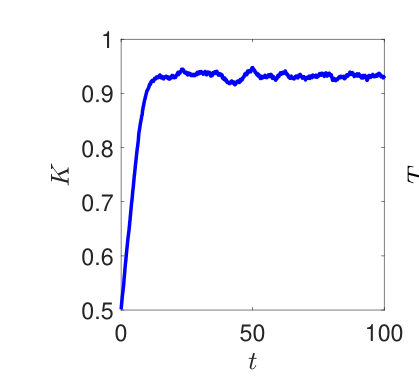
<figcaption class="paper-figure-caption"><b>Fig 1.</b> Figure 1: Left panel: time evolution of the total kinetic energy, computed from Eq. (49), showing the approach to the stationary state. Right panel: stationary density profile (red) and kinetic temperature profile (green) as functions of q ∈[−π, π], obtained from numerical simulations of Eq. (1) with the potential U(q) given by Eq. (28). The boundary condition corresponds to the case n = 0, implemented via Eq. (6). The corresponding analytical predictions, computed from Eq. (32) for the density and Eq. (33) for the temperature are marked by the heavy black lines. Simulation parameters: T = 3, N = 216, and dt = 10−2, xth ≃−0.30, ε = 10−12,Nmax = 50.</figcaption>
</figure>
<figure class="paper-figure-card">
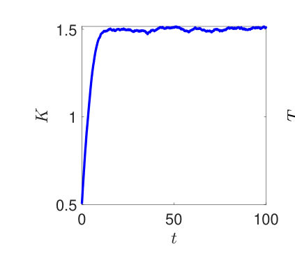
<figcaption class="paper-figure-caption"><b>Fig 2.</b> Figure 2: Same quantities as in Fig. 1, with the same colour coding and parameters. In this case, the boundary condition corresponds to mass flux (n = 1), implemented via Eq. (7). The analytical density and temperature profiles are computed from Eqs. (46).</figcaption>
</figure>
<figure class="paper-figure-card">
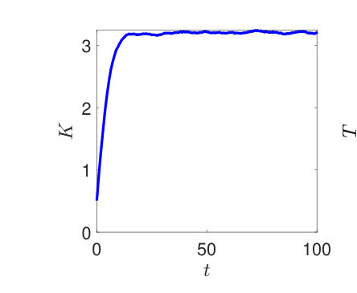
<figcaption class="paper-figure-caption"><b>Fig 3.</b> Figure 3: Same quantities as in the previous figures, with the same colour coding and parameters. In this case, the boundary condition corresponds to energy flux (n = 3), implemented via Eq. (8). The analytical density and temperature profiles are computed from Eqs. (47) and (48), respectively.</figcaption>
</figure>

**Main problem.** The lack of a general theoretical framework to predict the stationary distribution function and macroscopic profiles of collisionless systems coupled to boundary reservoirs with various injection rules.

**Main result.** The authors derive an analytical expression for the stationary distribution function, proving that thermal equilibrium is only recovered for standard flux-weighted Maxwellian injection (n=1), while other rules lead to non-thermal states with non-trivial spatial structures.

**Method.** The study combines Jeans' theorem (Liouville's theorem) with boundary injection rules to derive analytical solutions, which are validated using N-particle numerical simulations with a fourth-order symplectic integrator.

**Summary.** This paper presents a new technique to study the stationary states of collisionless systems connected to boundary reservoirs. By generalizing the boundary injection rules using a parameter n, the authors show that only one specific rule leads to standard thermal equilibrium. Other injection rules produce non-thermal stationary states characterized by unexpected spatial structures like temperature gradients and non-monotonic density profiles. The analytical results are confirmed through particle-based numerical simulations.

Detailed structure

**Model / system.** A one-dimensional, collisionless, non-interacting system of particles confined within a finite domain by an external potential U(q), where particles are reinjected at the boundaries according to a family of distributions parameterized by an integer n.

**Key observables.** Stationary distribution function f(q, p), number density profiles n(q), kinetic temperature profiles T(q), and stationary moments.

**Important parameters / regimes.** The integer parameter n (defining the injection rule), temperature T, and the external potential U(q).

**Assumptions / limitations.** The system is assumed to be collisionless, non-interacting, and one-dimensional.

**Figures summary.** Figure 1 shows the time evolution of kinetic energy and stationary density/temperature profiles for n=0; Figure 2 shows the thermal equilibrium case for n=1; Figure 3 shows non-monotonic density and decreasing temperature profiles for n=3.

**Paper structure.** The paper introduces the problem of boundary-driven stationary states, defines the generalized injection model, provides the analytical derivation of the distribution function using Jeans' theorem, presents numerical validation for specific cases (n=0, 1, 3), and discusses the broader implications for kinetic models.

**Why it may be interesting.** This work is highly relevant to open quantum systems and many-body dynamics as it provides a rigorous framework for understanding how microscopic boundary driving/injection rules directly dictate the emergence of non-equilibrium steady states and non-thermal macroscopic profiles.

Abstract

We present a technique to investigate the stationary states of a system of a collisionless system confined by an external potential and coupled to boundary reservoirs through prescribed reinjection rules. We consider a family of boundary conditions parametrized by an integer $n$, corresponding to different velocity distributions imposed at the boundaries, generalizing the standard flux-weighted Maxwellian scheme. By combining Liouville's theorem with the boundary injection rule, we derive an explicit analytical expression for the stationary distribution function. This framework provides a direct link between microscopic boundary dynamics and macroscopic stationary profiles. We show that thermal equilibrium is recovered only for the standard flux-weighted injection method, while for all other cases the system relaxes to manifestly non-thermal stationary states. The resulting density and temperature profiles exhibit non-trivial spatial structures, including non-monotonic behaviour and temperature gradients induced by the boundary conditions alone. Analytical predictions for stationary moments are obtained in closed form for representative cases and are nicely reproduced by particle-based numerical simulations.

[↑ back to top](#top)

### [Graded hopping screens nonreciprocity and reorganizes Stark asymptotics in a non-Hermitian Stark chain](http://arxiv.org/abs/2604.23672v1)

**Authors:** Y. S. Liu, X. Z. Zhang  
**Type:** theory · **Category:** disordered systems and neural networks · **PDF:** <https://arxiv.org/pdf/2604.23672v1>  
**Analysis basis:** full PDF text, analyzed in chunks
**Topic relevance:** `entanglement & information structure` **3/5** · `non-equilibrium dynamics` **3/5** · `driven-dissipative phase transition` **2/5** · `methods for driven-dissipative` **2/5**

↔ Scroll figures horizontally

<figure class="paper-figure-card">
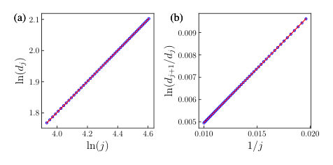
<figcaption class="paper-figure-caption"><b>Fig 1.</b> FIG. 1. Direct verification of the algebraic skin factor for N = 100, J = 1, F1 = 0, F2 = 1, and γ = 0.5, for which the analytical prediction is η = γ/F2 = 0.5. Panel (a) shows the exact diagonal similarity factor dj versus site index j on a log- log scale together with a power-law fit. In the displayed fitting window the fitted slope is ηfit ≃0.497, in good agreement with the analytical value 0.5. Panel (b) shows the local logarithmic increment ln(dj+1/dj) as a function of 1/j. A linear fit in the asymptotic window gives ln(dj+1/dj) ≃0.486/j, again very close to the expected coefficient η = 0.5. According to Eq. (26), its asymptotic slope is again fixed by η. The figure verifies that the...</figcaption>
</figure>
<figure class="paper-figure-card">
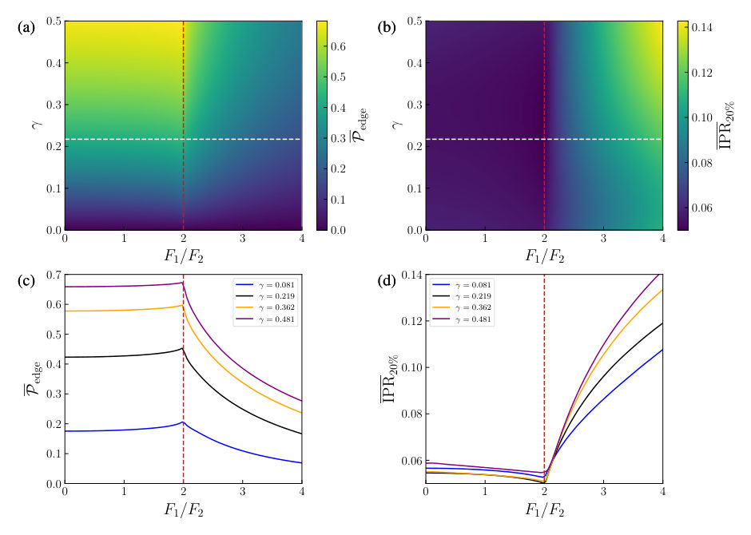
<figcaption class="paper-figure-caption"><b>Fig 2.</b> FIG. 2. Joint localization map at fixed N = 100, J = 1, and F2 = 0.20. Panel (a) shows the mean edge polarization P of right eigenstates in the (γ, F1/F2) plane. Panel (b) shows the mean inverse participation ratio built from the most localized 20% of right eigenstates, IPR20%. The red dashed line marks the asymptotic Stark threshold F1/F2 = 2. The white dashed line marks the finite-size screening guide ΞN = (γ/F2) ln N = 5, corresponding to γ ≈0.219. Panels (c) and (d) show representative line cuts at γ = 0.081, 0.219, 0.362, and 0.481. Near the threshold the edge polarization displays a turning point, while the localization measure built from the most localized 20% develops a minimum and...</figcaption>
</figure>
<figure class="paper-figure-card">
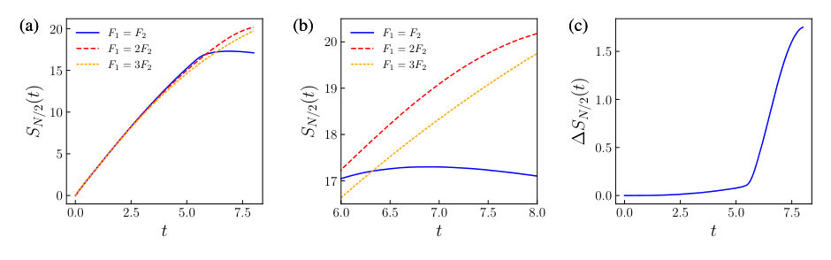
<figcaption class="paper-figure-caption"><b>Fig 3.</b> FIG. 3. Many-body entanglement growth from the half-filled charge-density-wave state of Eq. (15) in the Hermitian benchmark with N = 120, Np = 60, J = −1, γ = 0, and F2 = 0.08. Panel (a) shows the full time dependence of the half-chain entropy SN/2(t) for F1/F2 = 1, 2, and 3 in the interval 0 ≤t ≤8. Panel (b) enlarges the late-time interval t ∈[6, 8], where the threshold curve F1/F2 = 2 clearly lies above the other two. Panel (c) shows the excess entropy ∆S(t) defined in Eq. (51). The positive late-time excess entropy shows that the asymptotic Stark threshold leaves a direct dynamical trace in the growth of many-body entanglement.</figcaption>
</figure>

**Main problem.** The study investigates how graded hopping (position-dependent hopping) screens nonreciprocity and reorganizes the localization landscape and asymptotic behavior in a non-Hermitian Stark chain.

**Main result.** Graded hopping transforms the exponential non-Hermitian skin effect into a weaker algebraic boundary accumulation and identifies a critical threshold at |F1| = 2|F2| that regulates the transition between oscillatory and Stark-localized regimes.

**Method.** The authors use an exact diagonal similarity transformation to remove bond asymmetry, asymptotic analysis of recurrence relations, and a QR-stabilized numerical approach for simulating non-unitary many-body dynamics.

**Summary.** This paper explores a 1D non-Hermitian chain where hopping strength increases with position. The researchers show that this graded hopping suppresses the typical exponential skin effect, replacing it with a power-law accumulation at the boundaries. They identify a specific threshold in the field strength where the system transitions between oscillatory and exponentially localized states. Furthermore, they demonstrate that this threshold also acts as a point of enhanced entanglement growth during many-body dynamics.

Detailed structure

**Model / system.** A one-dimensional, open-boundary, non-Hermitian quadratic Hamiltonian (Stark chain) featuring nonreciprocal hopping, a linear potential (Stark field), and linearly graded hopping.

**Key observables.** Edge polarization, Inverse Participation Ratio (IPR), half-chain entanglement entropy, and center of mass.

**Important parameters / regimes.** Nonreciprocity strength (gamma), Stark slope (F1), hopping gradient (F2), and the critical threshold |F1| = 2|F2|.

**Assumptions / limitations.** The system is assumed to be a quadratic (single-particle) fermionic model, and the orbital matrix must maintain full rank for the correlation matrix to be well-defined.

**Figures summary.** A joint localization map in the (gamma, F1/F2) plane showing edge polarization and IPR with specific line cuts to demonstrate phase transitions.

**Paper structure.** The paper begins by defining the non-Hermitian Stark chain model, applies a similarity transformation to analyze the asymptotic behavior of eigenstates, maps the localization regimes using one-body observables, and concludes with a many-body study of entanglement growth during a charge-density-wave quench.

**Why it may be interesting.** It provides a controlled mechanism for screening nonreciprocity and reveals how non-Hermitian skin effects can be 'softened' into algebraic forms, which is highly relevant for understanding transport and entanglement in non-unitary many-body dynamics.

Abstract

We study a one-dimensional non-Hermitian Stark chain in which nonreciprocal hopping, a linear potential, and linearly graded hopping act simultaneously. The central question is how boundary pumping and field-induced confinement are reorganized when the hopping amplitude itself grows with position. We show that the graded term separates the two localization channels at the level of the large-position asymptotics. An exact diagonal similarity transformation removes the bond asymmetry and converts the usual exponential skin factor into an algebraic boundary accumulation with exponent $η=γ/F_2$. The transformed symmetric chain then reduces asymptotically to a constant-coefficient recurrence, giving the Stark threshold $|F_1|=2|F_2|$. The original right eigenstates acquire the unified envelope $ψ_j^R\sim j^ηφ_j$, with oscillatory, double-root, and exponentially localized branches across the threshold. This form also yields two finite-size scales, one measuring the logarithmic screening of nonreciprocity and the other balancing the algebraic skin factor against the exponential Stark tail. A joint localization map in the $(γ,F_1/F_2)$ plane verifies this structure. The edge polarization bends near the Stark threshold and weakens on the localized side, while the inverse participation ratio of the most localized eigenstates rises rapidly for $F_1/F_2>2$. Using a normalized Gaussian projector appropriate for non-unitary evolution, we further show that the same threshold enhances half-chain entanglement growth after a charge-density-wave quench. These results identify graded hopping as a controlled mechanism for screening nonreciprocity, resetting Stark asymptotics, and organizing the finite-size crossover between algebraic skin accumulation and Stark localization.

[↑ back to top](#top)

### [Enhancing Phase Retrievability of Quantum Channels via Interferometric Coupling](http://arxiv.org/abs/2604.24363v1)

**Authors:** Kai Liu, Deguang Han, Omar Nour  
**Type:** theory · **Category:** quantum information and computing · **PDF:** <https://arxiv.org/pdf/2604.24363v1>  
**Analysis basis:** full PDF text, analyzed in chunks
**Topic relevance:** `quantum measurements` **3/5** · `entanglement & information structure` **2/5** · `interference shaping light` **2/5** · `methods for driven-dissipative` **2/5**

↔ Scroll figures horizontally

<figure class="paper-figure-card">
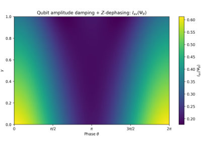
<figcaption class="paper-figure-caption"><b>Fig 1.</b> Figure 5.2. Heat maps of I(Ψθ) (left) and Iav(Ψθ) (right) for the interfer- ometric coupling of qubit amplitude damping and Z-dephasing.</figcaption>
</figure>
<figure class="paper-figure-card">
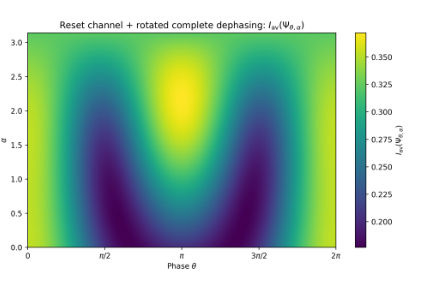
<figcaption class="paper-figure-caption"><b>Fig 2.</b> Figure 5.3. Heat maps of I(Ψθ,α) (left) and Iav(Ψθ,α) (right) for the inter- ferometric coupling of the reset channel and the rotated complete dephasing channel.</figcaption>
</figure>
<figure class="paper-figure-card">
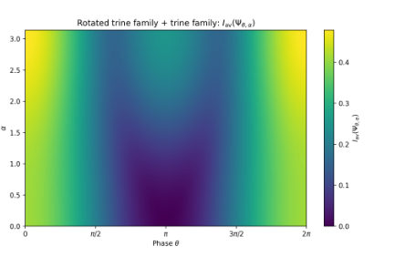
<figcaption class="paper-figure-caption"><b>Fig 3.</b> Figure 5.4. Heat maps of I(Ψθ,α) (left) and Iav(Ψθ,α) (right) for the inter- ferometric coupling of the rotated trine family and the trine family.</figcaption>
</figure>

**Main problem.** The paper investigates the conditions for phase retrievability of quantum channels and explores whether interferometric coupling can enhance the ability to reconstruct pure input states.

**Main result.** The authors prove that a channel is phase retrievable if and only if its complementary channel is pure-state informationally complete, and demonstrate that coherent interferometric coupling can enable phase retrieval even when individual arm channels are not phase retrievable.

**Method.** The study utilizes quantum information theory (Stinespring dilation, complementary channels), frame theory (operator-valued Parseval frames), and algebraic analysis of Kraus operators.

**Summary.** This paper addresses the problem of phase retrievability in quantum channels, which is the ability to reconstruct pure input states from measurement data. The authors establish a fundamental link between a channel's phase retrievability and the informational completeness of its complementary channel. They propose that using a quantum interferometer to coherently combine two channels can create interference cross-terms that enhance retrievability. This mechanism allows for state reconstruction even when the individual channels used in the interferometer are not themselves phase retrievable.

Detailed structure

**Model / system.** A two-arm quantum interferometer where two quantum channels are coherently recombined via port operators M_i(theta) = A_i + e^{i*theta}B_i, representing a Mach-Zehnder type setup.

**Key observables.** Phase retrievability index (pr), injectivity indices (I and I_av), and the dimension of the complementary operator system.

**Important parameters / regimes.** Interferometric phase (theta), damping parameter (gamma), rotation angle (alpha), and the dimension of the Hilbert space (d).

**Assumptions / limitations.** The analysis assumes finite-dimensional complex Hilbert spaces and focuses primarily on the reconstruction of pure states rather than mixed states.

**Figures summary.** Schematic of a two-path interferometer and heat maps showing the injectivity index and average CP injectivity as functions of phase and rotation parameters.

**Paper structure.** The paper begins with a structural characterization of phase retrievability via complementary channels, moves to the introduction of the interferometric coupling model, applies frame theory to analyze the enhancement mechanism, and concludes with specific examples and quantitative injectivity analysis.

**Why it may be interesting.** This work is highly relevant to quantum optics and open quantum systems as it provides a fundamental framework for using coherent interference to recover information that is otherwise lost to the environment.

Abstract

Phase retrievability of a quantum channel asks whether pure states can be reconstructed from suitable measurements. In this paper, we study this problem from three complementary viewpoints: quantum information theory, operator-valued frames, and the physical realization through quantum interferometry. We first show that a quantum channel is phase retrievable if and only if its complementary channel is pure-state informationally complete. This structural characterization leads to several consequences for phase retrievability, including criteria involving the dimension of the complementary operator system, Choi-rank type bounds, and specific results for entanglement breaking channels and twirling channels.   We then introduce an interferometric coupling in which two arm channels are coherently recombined through port operators \(M_i(θ)=A_i+e^{iθ}B_i\). Unlike classical mixing, this construction produces interference cross terms that can enlarge the complementary operator system and thereby enhance phase retrievability. From the frame theory viewpoint, the interferometer realizes a coherent coupling of operator-valued frames. To quantify this effect, we introduce injectivity indices for completely positive maps. The examples in Section~5 show that coherent interference can significantly improve phase retrieval behavior even when the arm channels are individually not phase retrievable.

[↑ back to top](#top)

### [Gradual eigenvector ergodization in coupled Ginibre matrices](http://arxiv.org/abs/2604.23708v1)

**Authors:** Margherita Disertori, Yan V. Fyorodov  
**Type:** theory · **Category:** disordered systems and neural networks · **PDF:** <https://arxiv.org/pdf/2604.23708v1>  
**Analysis basis:** full PDF text, analyzed in chunks
**Topic relevance:** `driven-dissipative phase transition` **3/5** · `methods for driven-dissipative` **2/5** · `non-equilibrium dynamics` **2/5** · `non-equilibrium universality` **2/5**

↔ Scroll figures horizontally

<figure class="paper-figure-card">
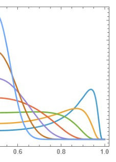
<figcaption class="paper-figure-caption"><b>Fig 1.</b> FIGURE 1. The density P∞(p) plotted for the values of coupling parameter, from left to right, |c|2 = 0.125 (blue), |c|2 = 0.25 (yellow), |c|2 = 0.5 (green), |c|2 = 1 (red), |c|2 = 2 (navy blue), |c|2 = 4 (brown) and |c|2 = 8 (dark blue).</figcaption>
</figure>

**Main problem.** The paper investigates the gradual ergodization of eigenvectors and the splitting of eigenvalue density support in a system of two coupled non-Hermitian random matrices.

**Main result.** The authors derive an explicit formula for the joint probability density of eigenvalues and eigenvectors at the spectral origin and identify a critical coupling strength where the spectral support splits into two disjoint domains.

**Method.** The study employs a non-perturbative approach using Grassmann (anticommuting) variables, the Hubbard-Stratonovich transformation, and the Laplace method for asymptotic analysis in the large N limit.

**Summary.** This paper studies how the interaction between two separate non-Hermitian quantum systems leads to the spreading of eigenvectors across the combined system. By using a model of two coupled Ginibre matrices, the authors provide an explicit mathematical description of the transition from a state where subsystems retain their identity to a fully ergodic state. They also show that at high coupling strengths, the eigenvalue distribution can split into two separate regions in the complex plane. This provides fundamental insights into the loss of subsystem identity in dissipative quantum chaos.

Detailed structure

**Model / system.** A 2N x 2N non-Hermitian random matrix model consisting of two independent N x N complex Ginibre matrices coupled via a deterministic matrix c*1_N, representing interacting dissipative quantum chaotic systems.

**Key observables.** Squared norms of eigenvector components (p1, p2), joint probability density of eigenvalues and eigenvectors, and mean eigenvalue density.

**Important parameters / regimes.** Coupling strength |c|, matrix size N, and the scaling limit c = sqrt(N)*c_tilde.

**Assumptions / limitations.** The random matrix elements are assumed to be independent and normally distributed; the analysis focuses on the spectral origin (z=0) for mathematical tractability.

**Paper structure.** The paper introduces the model and the problem of eigenvector ergodization, presents a theorem for the joint probability density, provides a corollary for eigenvector norms, and concludes with a detailed mathematical appendix proving the asymptotic behavior of the integrals using the Laplace method.

**Why it may be interesting.** This work is highly relevant for researchers studying open quantum systems and many-body dynamics, as it provides a quantitative framework for understanding how interaction strength drives the transition from localized to ergodic states in dissipative chaotic systems like coupled SYK models.

Abstract

Non-Hermitian random matrices provide a useful framework for understanding universal characteristics of dissipative quantum chaotic systems with loss or gain. We consider a model of two such system represented by two independent $N\times N$ complex Ginibre matrices interacting via a deterministic matrix $c{\bf 1}_N$, where $c$ is the complex coupling parameter whose magnitude $|c|$ controls the interaction strength. We characterize quantitatively how the eigenvectors of the whole system, initially localized in one of the individual subsystems for $|c|=0$, eventually spread over the full system with growing interaction strength. The resulting asymptotic formula describing such spread in the limit $N\to \infty$ is very explicit and provides a full picture of the gradual ergodization of eigenvectors as a function of the coupling parameter $|c|$ in the whole transition regime. As a by-product of our method we also compute the mean eigenvalue density for our model at the origin of the spectral bulk $z=0$ in the fully ergodic regime, when the coupling is scaled with the matrix size as $c=\sqrt{N}\tilde{c}$. We find that as $N\to \infty$ the limiting density at the origin vanishes beyond the critical value $|\tilde{c}|=1$, signalling of a split of the density support in the complex plane into two disjoint domains.

[↑ back to top](#top)

### [Optimization of two-photon excitation by indistinguishable photons in a three-level atom](http://arxiv.org/abs/2604.24560v1)

**Authors:** Masood Valipour, Gniewomir Sarbicki, Karolina Słowik, Anita Dąbrowska  
**Type:** theory · **Category:** other · **PDF:** <https://arxiv.org/pdf/2604.24560v1>  
**Analysis basis:** full PDF text, analyzed in chunks
**Topic relevance:** `interference shaping light` **3/5** · `methods for driven-dissipative` **2/5** · `non-equilibrium dynamics` **2/5** · `quantum measurements` **2/5**

↔ Scroll figures horizontally

<figure class="paper-figure-card">
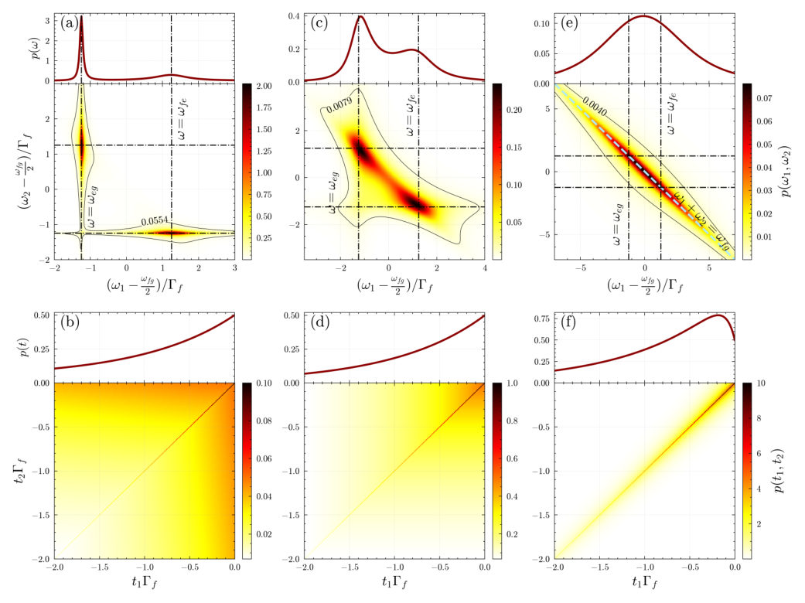
<figcaption class="paper-figure-caption"><b>Fig 1.</b> FIG. 1: Joint spectral and temporal distributions together with the marginal distributions for the optimal two-photon state |2opt⟩obtained for the excitation of an atom with the following parameters: δa = 2.5 Γf and the ratios: Γe/Γf = 0.1 (plots (a) and (d)), Γe/Γf = 1 (plots (b) and (e)), and Γe/Γf = 10 (plots (c) and (f)).</figcaption>
</figure>
<figure class="paper-figure-card">
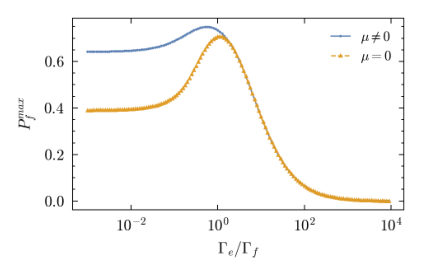
<figcaption class="paper-figure-caption"><b>Fig 2.</b> FIG. 2: Maximum excitation probability of state |f⟩, P max f , as a function of the ratio Γe/Γf for the atom with δa = 0 and the input two-photon light defined by (29) with fixed δf = 0 satisfying the resonance condition. Results for the optimized widths of Gaussian profiles with and without optimized value of µ.</figcaption>
</figure>
<figure class="paper-figure-card">
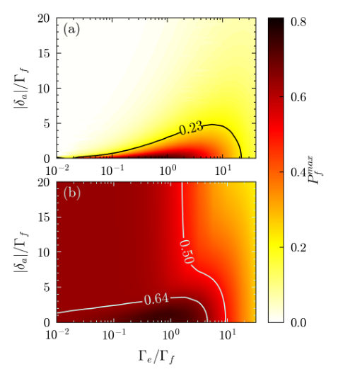
<figcaption class="paper-figure-caption"><b>Fig 3.</b> FIG. 3: Maximum excitation probability of state |f⟩, P max f , as a function of the ratio Γe/Γf and |δa|/Γf for the input two-photon light defined by (29). (a) Results for δf = 0 (ωa = ωb = ω0) and ω0 = ωfg/2 with the optimized width of Gaussian profiles and µ. (b) Results for ωa + ωb = ωfg with the optimized widths of Gaussian profiles and the values of µ and δf.</figcaption>
</figure>
<figure class="paper-figure-card">
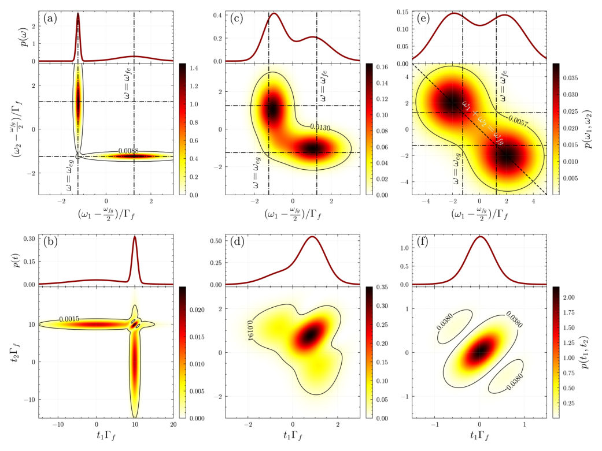
<figcaption class="paper-figure-caption"><b>Fig 4.</b> FIG. 4: Joint spectral and temporal distributions together with the marginal distributions for the two-photon state defined by (29) obtained for optimal excitation of an atom with the following parameters: δa = 2.5 Γf and the ratios: Γe/Γf = 0.1 (plots (a) and (d)), Γe/Γf = 1 (plots (b) and (e)), and Γe/Γf = 10 (plots (c) and (f)). The corresponding optimized parameters are: for Γe/Γf = 0.1, Ωa = 0.15 Γf , Ωb = 1.50 Γf , µΓf = 9.99 , and δf = 2.49 Γf ; for Γe/Γf = 1, Ωa = 1.02 Γf , Ωb = 1.78 Γf , µΓf = 1.05 , and δf = 2.09 Γf ; and for Γe/Γf = 10, Ωa = 2.71 Γf , Ωb = 2.79 Γf , µΓf = 0.04 , and δf = 4.16 Γf.</figcaption>
</figure>
<figure class="paper-figure-card">
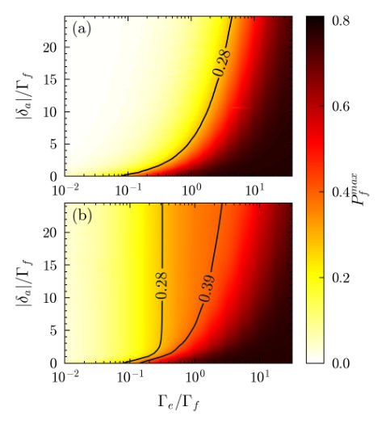
<figcaption class="paper-figure-caption"><b>Fig 5.</b> FIG. 6: Maximum excitation probability P max f , as a function of the ratio Γe/Γf and δa/Γf for the input two-photon light defined by (39). (a) Results for δf = 0 (ω01 = ω02 = ω0) and ω0 = ωfg/2 with the optimized widths Ω±. (b) Results for ω01 + ω02 = ωfg with the optimized widths Ω± and δf.</figcaption>
</figure>
<figure class="paper-figure-card">
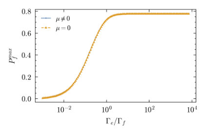
<figcaption class="paper-figure-caption"><b>Fig 6.</b> FIG. 5: Maximum excitation probability of state |f⟩, P max f , as a function of the ratio Γe/Γf for the atom with δa = 0 and for the input two-photon light defined by (39) with fixed δf = 0 satisfying the resonance condition. Results for the optimized width Ω±, with and without optimized value of µ.</figcaption>
</figure>
<figure class="paper-figure-card">
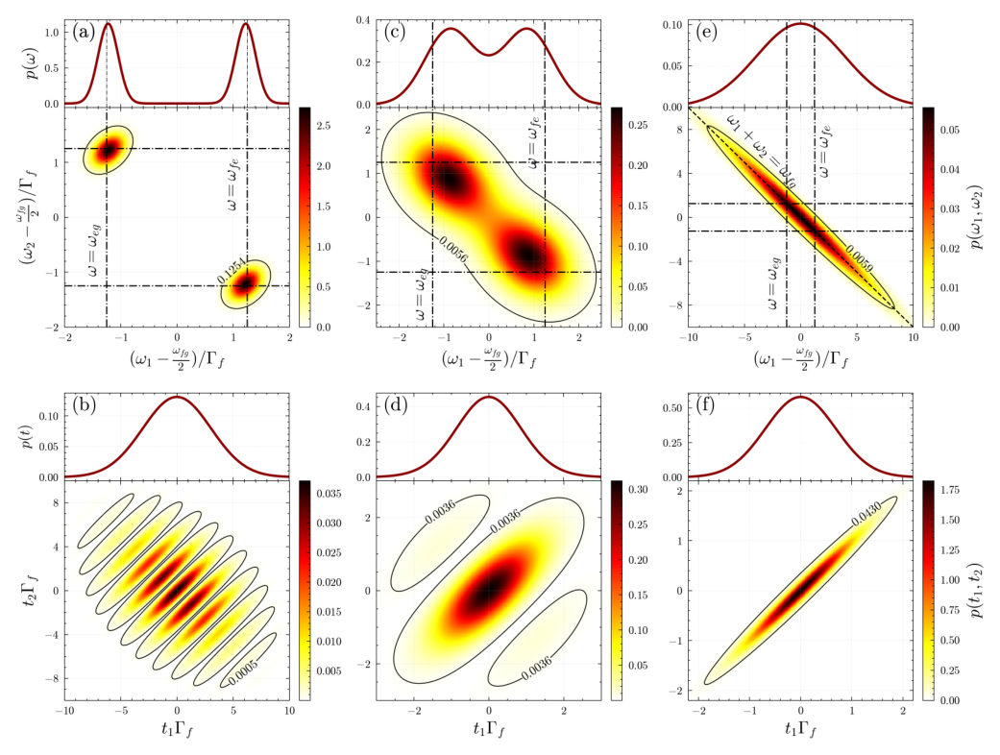
<figcaption class="paper-figure-caption"><b>Fig 7.</b> FIG. 7: Joint spectral and temporal distributions together with the marginal distributions for the two-photon state defined by (39) obtained for optimal excitation of an atom with the following parameters: δa = 2.5 Γf and the ratios: Γe/Γf = 0.1 (plots (a) and (d)), Γe/Γf = 1 (plots (b) and (e)), and Γe/Γf = 10 (plots (c) and (f)). The corresponding optimized parameters are: for Γe/Γf = 0.1, Ω+ = 0.42 Γf , Ω−= 0.28 Γf , and δf = 2.45 Γf ; for Γe/Γf = 1, Ω+ = 0.89 Γf , Ω−= 1.21 Γf , and δf = 1.81 Γf ; and for Γe/Γf = 10, Ω+ = 1.03 Γf , Ω−= 11.09 Γf , and δf = 0.002 Γf.</figcaption>
</figure>
<figure class="paper-figure-card">
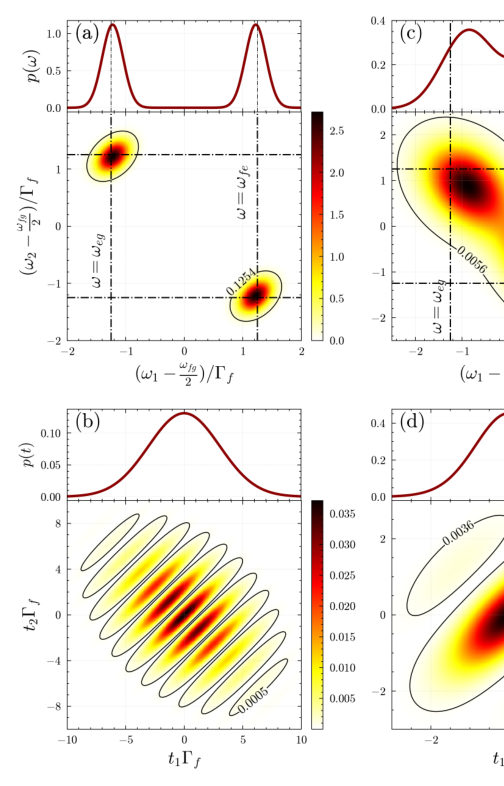
<figcaption class="paper-figure-caption"><b>Fig 8.</b> Figure 10 shows the excitation of state |f⟩and the squared modulus of the normalized amplitude as a func- tion of time for three different ratios Γe/Γf = 0.1, 1, and 10, with δa = 0 and a field central frequency res- onant with the atomic transition frequencies, i.e., ω0 = ωeg = ωfe. In each case, the maximum excitation prob- abilities are lower than the maximum values obtained by optimizing the parameters of two-photon states. We have checked moreover that while an increase in the av- erage photon number enhances the excitation efficiency, the process remains most effective for the coherent pulse for atoms with comparable values of the constants Γe and Γf.</figcaption>
</figure>
<figure class="paper-figure-card">
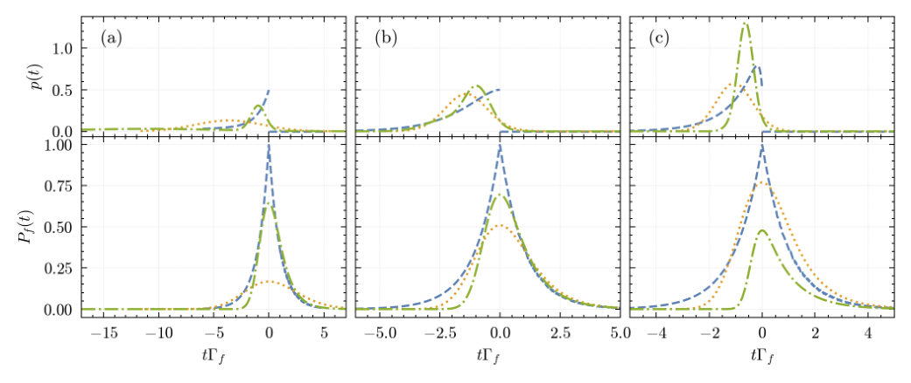
<figcaption class="paper-figure-caption"><b>Fig 9.</b> FIG. 8: Marginal distribution p(t) (upper panels) and excitation probability from the ground state to the final state, Pf(t) (lower panels), as functions of the scaled time tΓf for three values of the ratio Γe/Γf = 0.1, 1, and 10 in the panels (a), (b), and (c). The blue dashed line corresponds to the optimal state, the green dash-dotted line - to the state given by Eq. 29, and the orange dotted line - to the state given by Eq. 39. The parameters used in each case are the same as those presented in Figures 1, 4, and 7, respectively.</figcaption>
</figure>
<figure class="paper-figure-card">
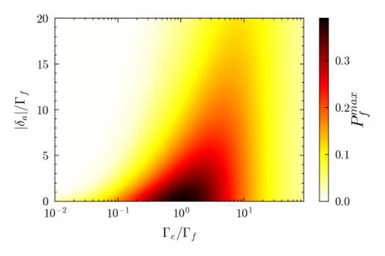
<figcaption class="paper-figure-caption"><b>Fig 10.</b> FIG. 9: Maximum excitation probability of the state |f⟩, ρmax ff , as a function of the ratio Γe/Γf and δa/Γf for a coherent Gaussian pulse with mean photon number ¯n = 2 satisfying the double-resonance condition, i.e., ω0 = ωfg/2. Results for the optimized width of Gaussian profile.</figcaption>
</figure>

**Main problem.** Optimizing the two-photon excitation probability of a three-level ladder-type atom using indistinguishable photons and comparing this with experimentally accessible Gaussian and coherent states.

**Main result.** The authors identify an optimal two-photon state, which is the time-reversed counterpart of spontaneous cascade decay, capable of achieving perfect excitation in the limit of an infinitely long pulse. They also show that quantum interference in Gaussian pulses can shift spectral maxima away from atomic resonances.

**Method.** The study employs the Wigner-Weisskopf approximation, input-output formalism, and a quantum-trajectory/stochastic approach to solve the hierarchy of coupled differential equations for the atomic density matrix.

**Summary.** This paper investigates how to maximize the excitation of a three-level atom using pairs of indistinguishable photons. The authors find that the most efficient excitation occurs when the input light is the time-reversed version of the atom's own spontaneous decay process. By comparing this ideal state to practical Gaussian and coherent pulses, they demonstrate how quantum interference and photon correlations can be tuned to optimize light-matter interactions in quantum-optical interfaces.

Detailed structure

**Model / system.** A three-level atom in a ladder configuration (|g>, |e>, |f>) interacting with a unidirectional, continuous-mode two-photon field. The dynamics are governed by a master equation within the Wigner-Weisskopf approximation.

**Key observables.** Population of the upper atomic state P_f(t), marginal probability densities in time and frequency domains, and average residence time in the final state.

**Important parameters / regimes.** Atomic decay rates (Gamma_e, Gamma_f), atomic transition frequency difference (delta_a), photon pulse widths, time delay (mu), and frequency offsets.

**Assumptions / limitations.** Rotating-wave approximation, Wigner-Weisskopf approximation, unidirectional field, and an initial ground state population.

**Figures summary.** Figures show the excitation probability and marginal distributions as functions of time and decay rate ratios; plots of optimized parameters (widths, delays, detunings) for various light states; and a comparison of excitation efficiency for coherent vs. two-photon states.

**Paper structure.** The paper begins with the analytical derivation of the optimal two-photon state, followed by an investigation of the spectral and temporal properties of this state. It then compares the ideal case to realistic Gaussian and coherent pulse models, analyzing the impact of decay rate ratios and detuning, and concludes with an appendix detailing the dynamical equations and optimized parameter landscapes.

**Why it may be interesting.** This work is highly relevant for quantum optics and open quantum systems as it provides fundamental guidance for designing efficient light-matter interfaces and explores how photon indistinguishability and quantum interference can be leveraged to control nonlinear atomic excitation.

Abstract

We investigate the excitation of a three-level ladder-type atom by a unidirectional field with a pair of indistinguishable photons. Starting from an analytical expression for the two-photon absorption probability, we determine the two-photon state that maximizes the population of the upper atomic state at a chosen time and show that, in the limit of an infinitely long pulse, perfect excitation is possible. The optimal state is identified as the time-reversed counterpart of the two-photon state emitted in spontaneous cascade decay. We then compare this ideal excitation strategy with experimentally accessible families of states, including symmetrized Gaussian product states, temporally correlated Gaussian states, and coherent pulses. We analyze how the optimal excitation conditions depend on the ratio of atomic decay rates and on the separation of the atomic transition frequencies. For indistinguishable photons described by Gaussian pulses, quantum interference may shift the maxima of the marginal spectral distribution away from the atomic resonances and qualitatively modify the optimal excitation strategy. Our results clarify the role of indistinguishability and correlations in two-photon absorption and provide guidance for designing realistic excitation schemes in quantum-optical light-matter interfaces .

[↑ back to top](#top)

### [Decoherence Mitigation with Local NOT Gates in Multipartite Systems](http://arxiv.org/abs/2604.23556v1)

**Authors:** Venkat Abhignan, Raghav Sundararaman, Shriram Pragash M, R. Srikanth, Ashutosh Singh  
**Type:** theory · **Category:** quantum information and computing · **PDF:** <https://arxiv.org/pdf/2604.23556v1>  
**Analysis basis:** full PDF text, analyzed in chunks
**Topic relevance:** `entanglement & information structure` **3/5** · `correlated / nonlocal dissipation` **2/5** · `methods for driven-dissipative` **2/5** · `non-equilibrium dynamics` **1/5**

↔ Scroll figures horizontally

<figure class="paper-figure-card">
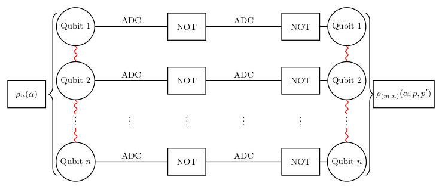
<figcaption class="paper-figure-caption"><b>Fig 1.</b> Figure 1: Schematic illustrating entanglement preservation in multiqubit entangled states under ADC noise using local NOT operations applied to one or more qubits between successive ADC processes. The final NOT gate restores the state to the original population configuration.</figcaption>
</figure>
<figure class="paper-figure-card">
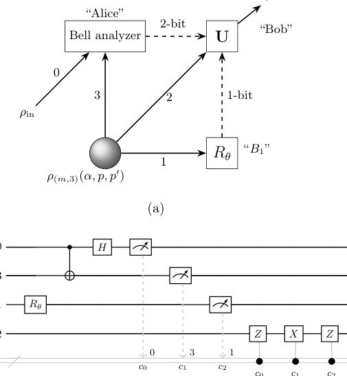
<figcaption class="paper-figure-caption"><b>Fig 2.</b> Figure 3: CQT using three-qubit GHZ-type state with one controller. (a) schematic diagram [70], and corresponding (b) circuit representation [101]. The dotted lines represent the transfer of classical information, and the solid lines show the transfer of qubits from the entanglement source.</figcaption>
</figure>
<figure class="paper-figure-card">
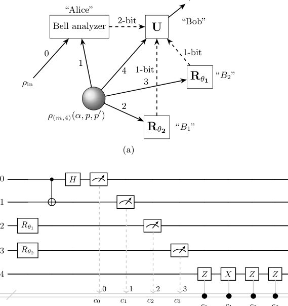
<figcaption class="paper-figure-caption"><b>Fig 3.</b> Figure 4: CQT using four-qubit GHZ-type state with two controllers. (a) schematic diagram, and corresponding (b) circuit representation [101]. The dotted lines represent the transfer of classical information, and the solid lines show the transfer of qubits from the entanglement source.</figcaption>
</figure>
<figure class="paper-figure-card">
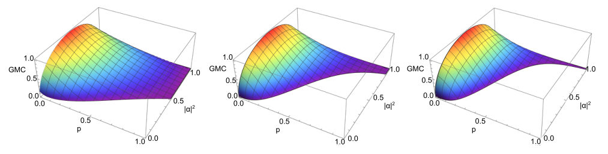
<figcaption class="paper-figure-caption"><b>Fig 4.</b> Figure 5: Dynamics of two-, three-, and four-qubit entangled states under initial ADC. Evolution of ρ(0,n)(α, p, 0) for (a) n = 2, (b) n = 3, and (c) n = 4. The states exhibit ESD (GMC death for n ≥3) for |α|2 &lt; 0.5, 0.9, 0.98, respectively, and ADE otherwise.</figcaption>
</figure>
<figure class="paper-figure-card">
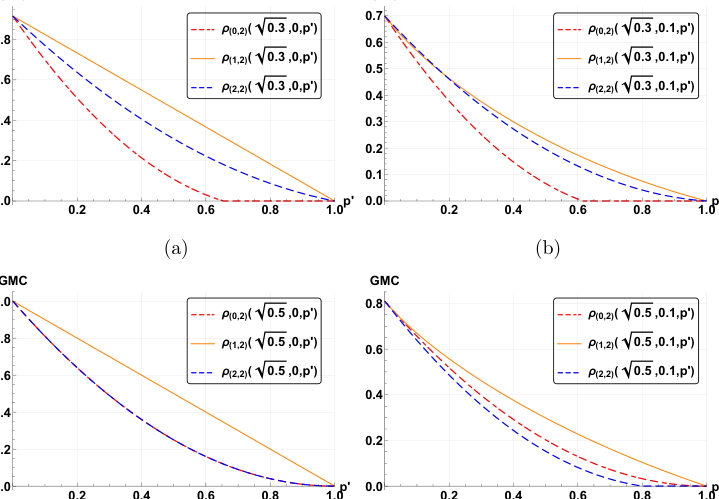
<figcaption class="paper-figure-caption"><b>Fig 5.</b> Figure 6: Dynamics of bipartite entangled state ρ2(α) = (α|00⟩+ β|11⟩)(α|00⟩+ β|11⟩)† under ADC. Initial states ρ2( √</figcaption>
</figure>
<figure class="paper-figure-card">
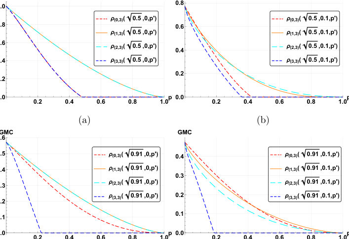
<figcaption class="paper-figure-caption"><b>Fig 6.</b> Figure 7: Dynamics of tripartite entangled state ρ3(α) = (α|000⟩+ β|111⟩)(α|000⟩+ β|111⟩)† under ADC. Initial maximally entangled state ρ3( √</figcaption>
</figure>
<figure class="paper-figure-card">
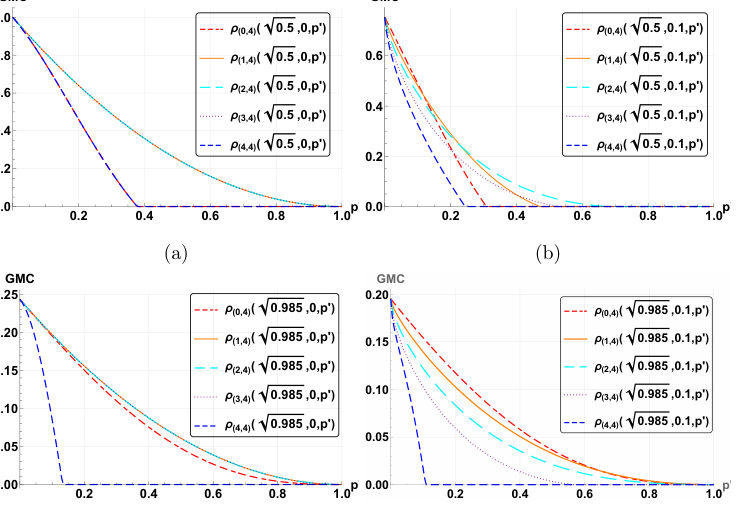
<figcaption class="paper-figure-caption"><b>Fig 7.</b> Figure 8: Dynamics of four-party entangled state ρ4(α) = (α|0000⟩+ β|1111⟩)(α|0000⟩+ β|1111⟩)†. Initial maximally entangled state ρ4( √</figcaption>
</figure>
<figure class="paper-figure-card">
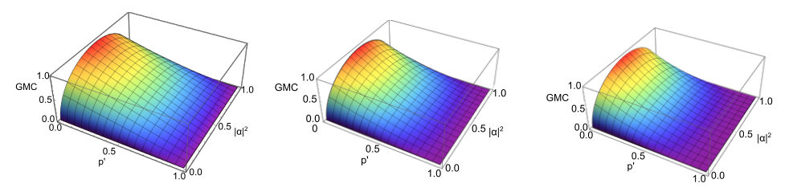
<figcaption class="paper-figure-caption"><b>Fig 8.</b> Figure 9: Dynamics of 2,3,4-qubit entangled states with one-NOT gate (at p = 0) followed by ADC (p′). Evolution of states (a) ρ1,2(α, 0, p′), (b) ρ1,3(α, 0, p′), and (c) ρ1,4(α, 0, p′).</figcaption>
</figure>
<figure class="paper-figure-card">
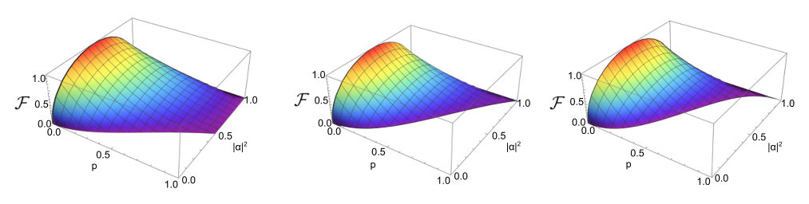
<figcaption class="paper-figure-caption"><b>Fig 9.</b> Figure 10: Dynamics of teleportation fidelity (F) using two-, three-, and four-qubit entangled states with initial ADC (p) and state parameter (|α|2). Only fidelity above the classical limit F = 2/3 is plotted. Teleportation fidelity vs. p, |α|2 for (a) ρ(0,2)(α, p, 0), (b) ρ(0,3)(α, p, 0), and (c) ρ(0,4)(α, p, 0).</figcaption>
</figure>
<figure class="paper-figure-card">
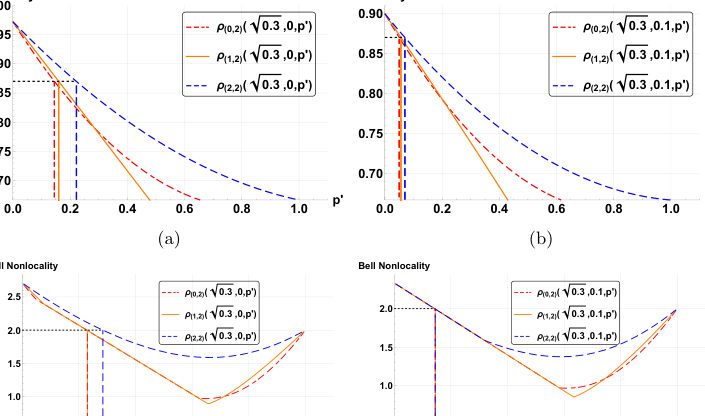
<figcaption class="paper-figure-caption"><b>Fig 10.</b> Figure 11: Dynamics of teleportation fidelity and Bell nonlocality for a bipartite entangled state ρ2(α) = (α|00⟩+ β|11⟩)(α|00⟩+ β|11⟩)† under ADC noise. Teleportation fidelity for ρ(m,2)( √</figcaption>
</figure>

**Main problem.** Investigating how to mitigate Entanglement Sudden Death (ESD) and preserve the operational utility of multipartite entangled states under amplitude-damping noise.

**Main result.** Applying local NOT gates can transform entanglement sudden death into asymptotic decay for GMC, though the optimal number of gates depends on the specific noise regime and the metric being preserved (GMC vs. teleportation fidelity).

**Method.** Analytical derivation of entanglement dynamics and teleportation fidelity using GHZ-symmetric parametrization, twirling operations, and the Horodecki criterion for Bell nonlocality.

**Summary.** This paper studies how local NOT gates can be used to prevent the abrupt disappearance of entanglement (Entanglement Sudden Death) in 2, 3, and 4-qubit systems under amplitude damping. The authors show that while a single NOT gate can often turn sudden death into a slower asymptotic decay for entanglement, the best strategy for preserving teleportation fidelity may differ. The study highlights a decoupling between the amount of entanglement preserved and the actual utility of the state for quantum communication tasks. The results offer practical guidance for using simple $\pi$-pulses to protect quantum information in noisy hardware.

Detailed structure

**Model / system.** Multipartite GHZ-type and Bell-type states consisting of 2, 3, and 4 qubits subject to a two-stage Amplitude Damping Channel (ADC).

**Key observables.** Genuine Multipartite Concurrence (GMC), teleportation fidelity (F), Bell-CHSH parameter (S), and Localizable Entanglement (LE).

**Important parameters / regimes.** Number of qubits (n=2,3,4), number of NOT gates applied (m), damping parameters (p, p'), and initial state population imbalance (alpha).

**Assumptions / limitations.** Local NOT operations are treated as instantaneous relative to the noise timescale; the ADC is modeled as two sequential, independent processes.

**Figures summary.** Schematics of the noise/control framework and teleportation protocols; plots of GMC and fidelity dynamics showing ESD vs. ADE; geometric projections of 4-qubit state trajectories in the GHZ-symmetric parameter space; and a summary map of optimal NOT-gate strategies.

**Paper structure.** The paper introduces the problem of ESD, defines the noise model and control mechanism, provides analytical derivations for entanglement and fidelity, explores the hierarchy of correlations, classifies states using GHZ-symmetric parameters, and concludes with an optimization strategy for gate application.

**Why it may be interesting.** It provides simple, experimentally accessible unitary control strategies (local bit-flips) to extend the lifetime of quantum resources in noisy environments, which is highly relevant for superconducting and trapped-ion platforms.

Abstract

We study the entanglement dynamics of $n=2,3,4$-qubit Bell- and GHZ-type states under an amplitude-damping channel (ADC). We quantify multipartite entanglement using the genuine multipartite concurrence (GMC) and evaluate its utility through the optimal teleportation fidelity. For $2$-qubit states, we analyze the standard (Bennett) teleportation protocol. For $3$- and $4$-qubit states, we study controlled quantum teleportation (CQT) with one and two \emph{controllers}, respectively. Entanglement sudden death (ESD) denotes the abrupt, finite-time disappearance of entanglement caused by decoherence in contrast to asymptotic decay. To counteract ESD, we apply local NOT ($\hatσ_x$) operations on $m$ of the $n$ qubits ($m \leq n$) and derive analytic formulae, revealing that a single-NOT operation often suffices to alter ESD into asymptotic decay when handling GMC. In contrast, teleportation fidelity can decay more rapidly for single-NOT flipped states, whereas flipping all qubits is more useful for preserving teleportation fidelity in certain regimes, highlighting that the amount of entanglement alone does not guarantee teleportation utility. Remarkably, in the case of GHZ-type states, ADC-evolved mixed biseparable states can be exploited successfully in the CQT protocol. Further, using the GHZ-symmetric parametrization, we map the 2- and 3-qubit ADC-evolved mixed states onto a $(x,y)$ plane, revealing their SLOCC (Stochastic Local Operations and Classical Communication) entanglement classes. We also explicitly check the Bell-CHSH nonlocality hierarchy in the 2-qubit teleportation alongside localizable-entanglement diagnostics for 3-qubit CQT. Our results clarify the distinct roles of global versus localizable bipartite correlations and suggest simple, experimentally accessible unitary controls for preserving useful quantum resources in noisy channels.

[↑ back to top](#top)

### [Single-copy stabilizer learning: average case and worst case](http://arxiv.org/abs/2604.24099v1)

**Authors:** Gyungmin Cho, Dohun Kim  
**Type:** theory · **Category:** quantum information and computing · **PDF:** <https://arxiv.org/pdf/2604.24099v1>  
**Analysis basis:** full PDF text, analyzed in chunks
**Topic relevance:** `entanglement & information structure` **3/5** · `quantum measurements` **3/5** · `measurement-induced transitions` **2/5**

↔ Scroll figures horizontally

<figure class="paper-figure-card">
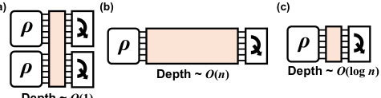
<figcaption class="paper-figure-caption"><b>Fig 1.</b> FIG. 1. Comparison of measurement protocols. (a) Bell sampling uses two copies of the n-qubit state ρ and performs Bell-basis measurements. The measurement circuit has depth O(1), but the protocol requires n-qubit quantum memory. (b) Random Clifford measurement uses a single copy of ρ, applies a random Clifford circuit C ∼Cl(n), and then measures in the computational basis. In general, implementing C requires cir- cuit depth O(n). (c) Random shallow Clifford measurement, as considered in this work, also uses a single copy of ρ but replaces Cl(n) by the block-Clifford ensemble Ck = Cl(k)⊗n/k</figcaption>
</figure>
<figure class="paper-figure-card">
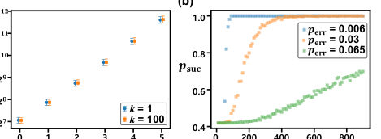
<figcaption class="paper-figure-caption"><b>Fig 2.</b> FIG. 2. Numerical simulations. (a) Learning Weyl(ρ) for random instances. We fix n = 100 and vary t = 0, . . . , 5, where dim Weyl(ρ) = n −t. For each t, we estimate the num- ber m of sampled Clifford circuits required to recover Weyl(ρ), comparing the Clifford ensembles Ck = Cl(k)⊗n/k for k = 1 and k = 100. (b) Recovery under noisy computational differ- ence samples. We fix n = 24, t = 0, and vary the number NS of computational difference samples obtained from a single measurement basis. We evaluate the success probability psuc of recovering the hidden symmetry when each measured bit is flipped independently with probability perr. In both panels, each point shows the mean and standard...</figcaption>
</figure>
<figure class="paper-figure-card">
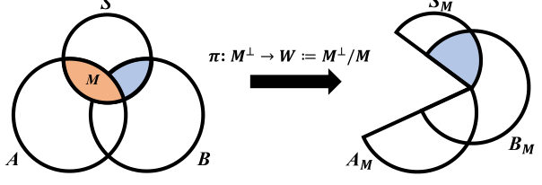
<figcaption class="paper-figure-caption"><b>Fig 3.</b> FIG. 3. Quotient reduction. Left: for a fixed isotropic subspace S, let M = S ∩A. Right: after passing to the quotient space M ⊥/M, the subspaces SM = S/M, AM = A/M, and BM = (B ∩M ⊥+ M)/M encode the remaining intersection structure. In particular, conditioning on S ∩A = M reduces the analysis of S ∩B to that of SM ∩BM in the quotient symplectic space.</figcaption>
</figure>
<figure class="paper-figure-card">
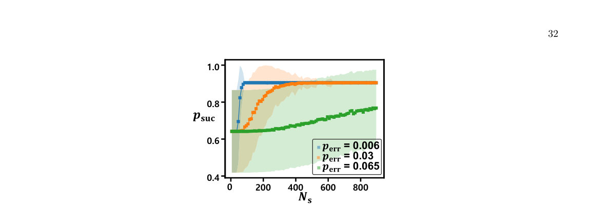
<figcaption class="paper-figure-caption"><b>Fig 4.</b> FIG. 4. Recovery under noisy computational difference samples. We fix n = 24, t = 0, and vary the number NS of computational difference samples obtained from a single measurement basis. We evaluate the success probability psuc of recovering the hidden symmetry when each measured bit is flipped independently with probability perr. Each point shows the mean, and the shaded region indicates one standard deviation over 1000 independent trials.</figcaption>
</figure>
<figure class="paper-figure-card">
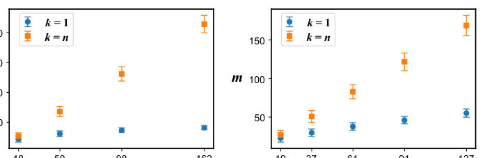
<figcaption class="paper-figure-caption"><b>Fig 5.</b> FIG. 5. Numerical simulations for learning stabilizer groups with different Clifford ensembles. We compare the number m of sampled Clifford circuits required to recover the stabilizer group Weyl(ρ) using Ck = Cl(k)⊗n/k for k = 1 and k = n. (a) Random stabilizer states, as a function of the system size n. (b) Random CSS-code states, where ρ is taken to be a logical state of a random CSS code. (c) Toric-code logical states, plotted as a function of the number of physical qubits n for different code distances. (d) Color-code logical states, plotted as a function of the number of physical qubits n for different code distances. Each point shows the mean and standard deviation over 1000...</figcaption>
</figure>

**Main problem.** The paper investigates the complexity of learning the stabilizer group (Weyl support) of an n-qubit quantum state using single-copy measurements, specifically comparing average-case and worst-case scenarios.

**Main result.** In the average case, logarithmic-depth local Clifford circuits are sufficient to efficiently learn almost all stabilizer groups with codimension t = O(log n), but in the worst case, any single-copy measurement scheme requires an exponential number of samples in t.

**Method.** The authors use a block-Clifford ensemble (shallow-depth circuits) and a computational difference sampling technique to extract Pauli symmetries, supported by symplectic geometry and probabilistic analysis.

**Summary.** This paper addresses the challenge of identifying the hidden Pauli symmetries of a quantum state. It proves that for most states, we can use very shallow, local circuits to learn these symmetries efficiently. However, it also reveals a fundamental bottleneck: for certain 'hard' states like the GHZ state, single-copy measurements are exponentially less efficient than multi-copy methods. This highlights a potential quantum advantage in using entangled measurements for symmetry detection.

Detailed structure

**Model / system.** The study focuses on n-qubit quantum states, specifically t-doped stabilizer states and highly structured states like GHZ, Toric, and Color codes.

**Key observables.** The Weyl support (Pauli symmetries), Pauli collision coefficient, and the trace of the squared density matrix relative to the learned subspace.

**Important parameters / regimes.** n (number of qubits), t (codimension of the stabilizer group), k (circuit depth/block size), and epsilon/delta (error and failure parameters).

**Assumptions / limitations.** The analysis assumes the ability to perform randomized measurements using block-Clifford ensembles and that the block size k divides n.

**Figures summary.** Figure 1 compares three measurement protocols (Bell, Random Clifford, and Shallow Clifford); Figure 2 shows recovery success vs. number of samples and noise; Figure 3 illustrates the reduction of intersection problems to quotient spaces; Figure 4 and 5 show success probabilities under noise and performance across different code types.

**Paper structure.** The paper is structured into two parts: Part I establishes an upper bound for the average case using probabilistic arguments and subspace counting; Part II establishes a lower bound for the worst case using reduction to property testing and analyzing the GHZ state.

**Why it may be interesting.** This is highly relevant for many-body dynamics and topological order, as it provides fundamental limits on how efficiently one can identify hidden symmetries and topological features in quantum systems using local, shallow-depth measurements.

Abstract

We study single-copy stabilizer learning, the problem of identifying a stabilizer group of dimension $n-t$ from an $n$-qubit quantum state $ρ$. We obtain two complementary results. First, in the average case, logarithmic-depth local Clifford circuits suffice to efficiently learn almost all stabilizer groups with $t=O(\log n)$, instead of the linear-depth measurements required in previous approaches. We support this result with numerical simulations for systems of up to 100 qubits. Second, we show that, in the worst case, any adaptive single-copy measurement scheme requires a number of samples that scales exponentially in $t$. Together with existing results on two-copy learning, our findings suggest that, for large $t$, identifying Pauli symmetries of a quantum system exhibits a quantum advantage in the learning setting.

[↑ back to top](#top)

### [Beyond average: heterogeneous first-passage dynamics in many-particle systems with resetting](http://arxiv.org/abs/2604.24406v1)

**Authors:** Juhee Lee, Seong-Gyu Yang, Ludvig Lizana  
**Type:** theory · **Category:** statistical mechanics · **PDF:** <https://arxiv.org/pdf/2604.24406v1>  
**Analysis basis:** full PDF text, analyzed in chunks
**Topic relevance:** `non-equilibrium dynamics` **3/5** · `methods for driven-dissipative` **2/5** · `non-equilibrium universality` **2/5**

↔ Scroll figures horizontally

<figure class="paper-figure-card">
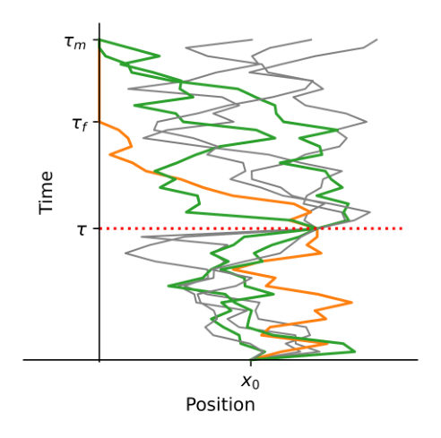
<figcaption class="paper-figure-caption"><b>Fig 1.</b> FIG. 1. Schematic of the resetting dynamics with absorbing boundary (left vertical line) for N = 6. The particles diffuse from x0 and relocate to the rightmost particle’s position at τ. The first particle hits the boundary at τf, and half of them at τm.</figcaption>
</figure>
<figure class="paper-figure-card">
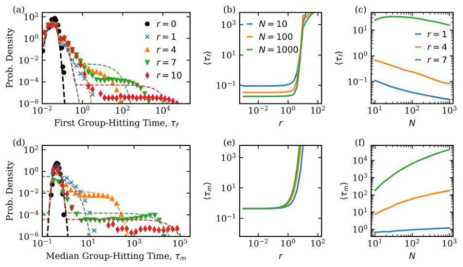
<figcaption class="paper-figure-caption"><b>Fig 2.</b> FIG. 2. First (τf) and median (τm) group-hitting time distributions for N = 100 [(a) and (d)]. Symbols denote simulations and dashed lines indicate theoretical approximations, Eq. (4). Each color corresponds to a different resetting rate r. We note that the tail of the distributions extends with increasing r. Both (ensemble) averages ⟨τf⟩and ⟨τf⟩diverge for large r [(b) and (e)], but behave in the opposite way with respect to N: ⟨τf⟩decreases while ⟨τm⟩increases [(c) and (f)].</figcaption>
</figure>
<figure class="paper-figure-card">
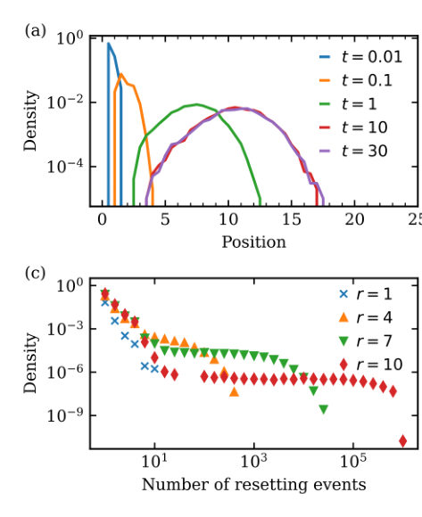
<figcaption class="paper-figure-caption"><b>Fig 3.</b> FIG. 3. Position distributions of the group mean positions ¯x(t) = P</figcaption>
</figure>
<figure class="paper-figure-card">
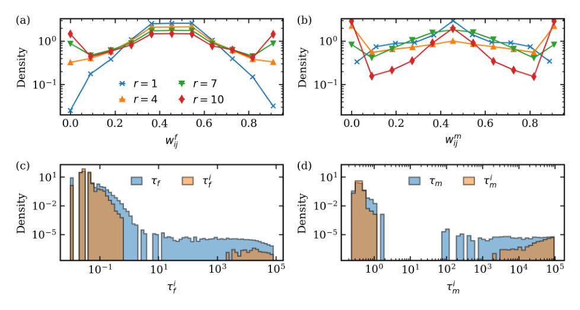
<figcaption class="paper-figure-caption"><b>Fig 4.</b> FIG. 4. The distribution of the uniformity index wf,m ij for fGHT (a) abd mGHT (b). The distributions’ flanks rise with r, indicating that trajectories become more dissimilar (N = 100). (c,d) The distribution of τ i f,m between 0.45 &lt; wf,m ij &lt; 0.55 (orange shaded area) from panels (a) and (b), respectively (r = 10). The blue shaded areas are from Fig. 2(a) and (d).</figcaption>
</figure>

**Main problem.** Investigating how collective stochastic resetting affects first-passage dynamics and heterogeneity in many-particle interacting systems.

**Main result.** The study finds that group resetting produces broad hitting-time distributions with heavy tails and extended plateaus, leading to a lack of a single characteristic time scale and high trajectory heterogeneity.

**Method.** The authors use Langevin equation simulations (Euler-Maruyama method) combined with an analytical theory based on asymptotic behaviors and extreme value theory.

**Summary.** This paper examines how a 'group resetting' mechanism, where all particles in a system reset to the position of the most extreme particle, affects first-passage times. The researchers show that this protocol creates highly heterogeneous dynamics with arrival time distributions that span several orders of magnitude. They demonstrate that as the resetting rate increases, the mean arrival time can actually diverge. Ultimately, the study highlights that in such many-particle systems, average arrival times are insufficient to characterize the system due to the lack of a single characteristic time scale.

Detailed structure

**Model / system.** A system of N overdamped Brownian particles in a one-dimensional harmonic potential with an absorbing boundary at the origin, subject to a group resetting protocol where all surviving particles relocate to the position of the rightmost particle.

**Key observables.** First Group Hitting Time (fGHT), Median Group Hitting Time (mGHT), and a Uniformity Index (w_ij) to quantify trajectory dissimilarity.

**Important parameters / regimes.** Resetting rate (r), group size (N), and the diffusion coefficient (D).

**Assumptions / limitations.** The analytical derivation assumes the underlying single-particle dynamics follow an Ornstein-Uhlenbeck process (harmonic potential).

**Figures summary.** Figure 1 shows a schematic of the resetting dynamics and boundary conditions; Figure 2 illustrates hitting-time distributions and the development of plateaus; Figure 3 shows position distributions of the group center of mass.

**Paper structure.** The paper introduces the problem of collective resetting, defines the physical model and resetting protocol, presents numerical simulations and analytical approximations for hitting-time distributions, analyzes trajectory heterogeneity using a uniformity index, and concludes with the implications for defining characteristic time scales.

**Why it may be interesting.** This is relevant for researchers in open quantum systems and many-body dynamics as it explores how non-equilibrium resetting protocols can fundamentally alter the collective transport and arrival statistics of a many-body ensemble.

Abstract

We study how stochastic resetting affects first-passage processes in systems of many interacting particles. While resetting is well understood for single-particle dynamics, its consequences for collective behavior remain less clear. We consider a protocol in which all surviving particles are reset to the position of the most extreme one, motivated by problems in artificial selection and avoidance. Using stochastic simulations of particles diffusing in a confining potential with an absorbing boundary, we examine two notions of arrival: when the first particle reaches the boundary and the point at which half of the particles do. We find that resetting produces broad distributions of arrival times with heavy tails and extended plateaus that span several orders of magnitude. As the resetting rate increases, the mean arrival time grows and diverges beyond a threshold. Trajectory-level analysis also reveals strong heterogeneity, with very short and very long absorption times. These results show that collective resetting lacks a single characteristic time scale and that the definition of arrival is crucial for understanding and controlling such systems.

[↑ back to top](#top)

### [Energetics of stochastic limit-cycle oscillators: when does coupling reduce dissipation?](http://arxiv.org/abs/2604.24553v1)

**Authors:** Anton F. Burnet, Vansh Kharbanda, David Tobias, Benedikt Sabass  
**Type:** theory · **Category:** statistical mechanics · **PDF:** <https://arxiv.org/pdf/2604.24553v1>  
**Analysis basis:** full PDF text, analyzed in chunks
**Topic relevance:** `non-equilibrium dynamics` **3/5** · `driven-dissipative phase transition` **2/5** · `methods for driven-dissipative` **2/5**

↔ Scroll figures horizontally

<figure class="paper-figure-card">
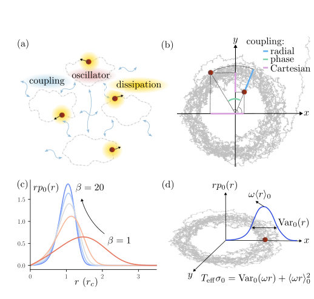
<figcaption class="paper-figure-caption"><b>Fig 1.</b> FIG. 1. (a) A stochastic oscillator (red particle) follows a pe- riodic trajectory in phase space (gray dashed line). The self- sustained oscillations are inherently out-of-equilibrium and hence dissipate energy (yellow halo). For a system of stochas- tic oscillators, there can be an arbitrary coupling among them (blue arrows). (b) A sample trajectory of the stochastic oscil- lator described by Eq. (1) with m = n = 1, shown in gray. In this work, two particles following such trajectories can cou- ple via their radial, angular, and Cartesian coordinates, il- lustrated by the blue, green, and pink colors, respectively. (c) Radial probability distribution rp0 of a single oscillator (Eq. (5))...</figcaption>
</figure>
<figure class="paper-figure-card">
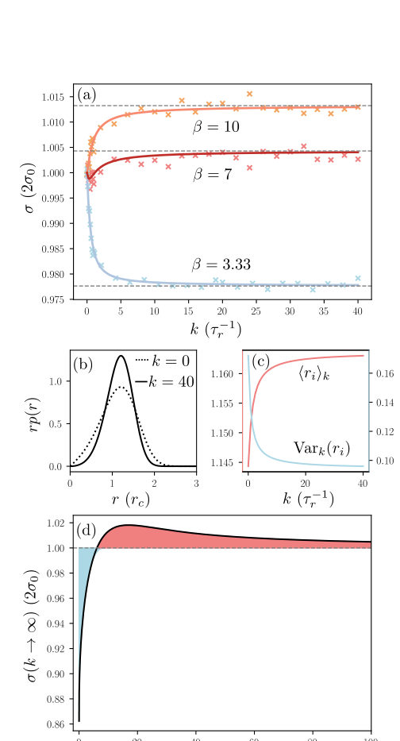
<figcaption class="paper-figure-caption"><b>Fig 2.</b> FIG. 2. (a) The steady-state entropy production rate (EPR) σ versus coupling strength k of radial coupling for inverse temperatures β ∈{3.33, 7, 10}. The EPR is plotted in units of the EPR of the free system 2σ0 (Eq. (8)). The solid lines represent solutions of Eq. (19) and the crosses are data esti- mated from numerical simulations of Eqs. (15). The curves illustrate that the behavior of the EPR qualitatively depends on the value of β. (b) The marginal radial distribution for coupling strengths k ∈{0, 40}τ −1 r for β = 3.33. (c) The average radius and radial variance versus coupling strength of the marginal distribution in (b). The distribution varia- tion is qualitatively the same for β...</figcaption>
</figure>
<figure class="paper-figure-card">
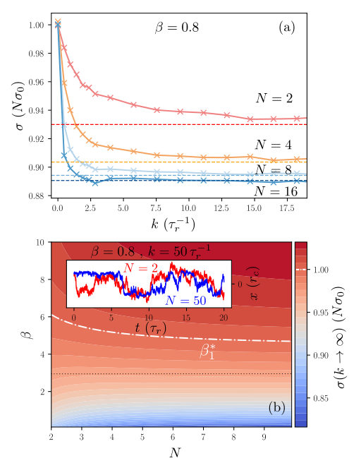
<figcaption class="paper-figure-caption"><b>Fig 3.</b> FIG. 3. (a) The steady-state entropy production rate (EPR) σ versus coupling strength k of radial coupling for inverse temperature β = 0.8 and system sizes N ∈{2, 4, 8, 16}. The EPR is plotted in units of the EPR of the free system Nσ0 (Eq. (8)). The data are estimated from numerical simulations of Eqs. (15) generalized to N systems with all-to-all coupling. The dashed lines denote the strong-coupling limit given by Eq. (30) (b) A contour plot of the limiting EPR σ(k →∞) as a function of inverse temperature β and system size N in units of the free system EPR. The white dotted-dashed line shows β∗ 1 as a function of N. The black dotted line indicates β ≈3, where for β above and below this...</figcaption>
</figure>
<figure class="paper-figure-card">
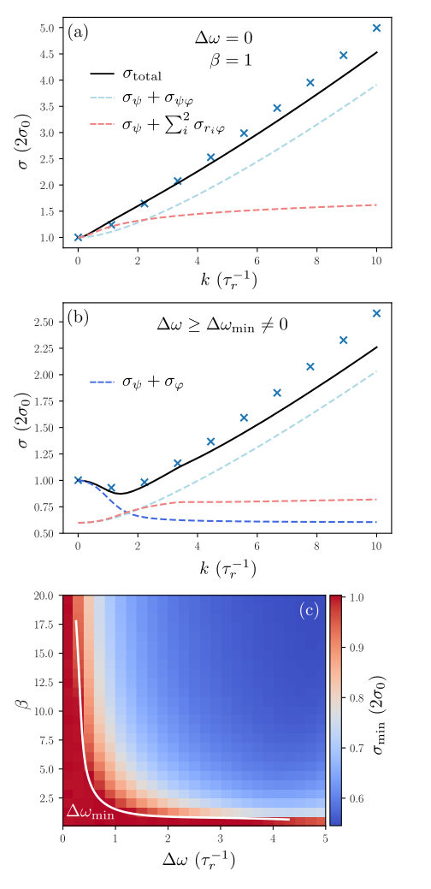
<figcaption class="paper-figure-caption"><b>Fig 4.</b> FIG. 4. Steady-state entropy production rate (EPR) σ versus coupling strength k of phase coupling for two oscillators when (a) ∆ω = 0 and (b) ∆ω = 1.8 τ −1 r . Numerical simulation results of Eqs. (33) are represented by blue crosses. The total EPR theoretical approximation (solid-black line) is broken down into the relative phase σϕ (dashed-dark-blue line), phase Fisher σψϕ (dashed-light-blue line), and radial Fisher σriϕ (dashed-orange line) contributions modulated by the constant center-of-mass contribution σψ (Eq. (42)). A local minimum is observed in (b) due to the decrease from synchronization competing with the increase caused by the Fisher terms. (c) The minimum EPR in units of the...</figcaption>
</figure>
<figure class="paper-figure-card">
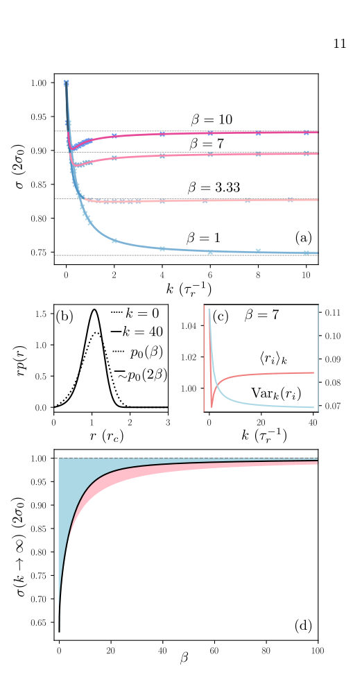
<figcaption class="paper-figure-caption"><b>Fig 5.</b> FIG. 5. (a) The steady-state entropy production rate (EPR) σ versus coupling strength k of full Cartesian coupling for in- verse temperatures β ∈{1, 3.33, 7, 10}. The EPR is plotted in units of the EPR of the free system 2σ0 (Eq. (8)). The solid lines are solved from Eq. (58) and the crosses are data estimated from numerical simulations of Eqs. (53). The blue and pink colors designate when the decrease is above and be- low the strong-coupling limit, respectively. (b) The marginal radial distribution for coupling strengths k ∈{0, 40}τ −1 r for β = 7. The strong-coupling limit distribution is p0(2β). (c) The average radius and radial variance versus coupling strength of the marginal...</figcaption>
</figure>
<figure class="paper-figure-card">
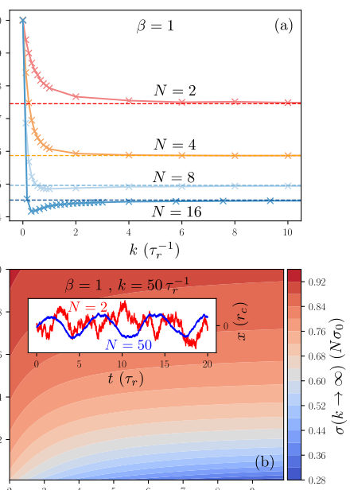
<figcaption class="paper-figure-caption"><b>Fig 6.</b> FIG. 6. (a) The steady-state entropy production rate (EPR) σ versus coupling strength k of full Cartesian coupling for inverse temperature β = 1 and system sizes N ∈{2, 4, 8, 16}. The EPR is plotted in units of the EPR of the free system Nσ0 (Eq. (8)). The data are estimated from numerical simulations of Eqs. (66) with all-to-all coupling. The dashed lines denote the strong-coupling limit given by Eq. (73). (b) A contour plot of the limiting EPR σ(k →∞) as a function of inverse temperature β and system size N in units of the free system EPR. The inset displays two sample trajectories along the x-coordinate with large coupling strength, k = 50 τ −1 r , for system sizes N ∈{2, 50}, β = 1, and...</figcaption>
</figure>
<figure class="paper-figure-card">
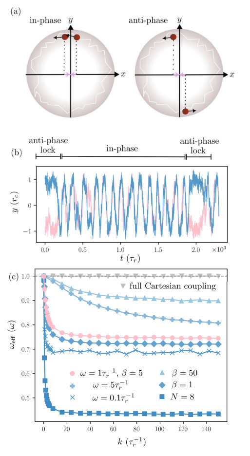
<figcaption class="paper-figure-caption"><b>Fig 7.</b> FIG. 8. (a) Schematic illustration of in-phase (left) and anti- phase (right) arrangements of two x-coupled oscillators. (b) A sample trajectory of the y-coordinate of two x-coupled oscilla- tors jumping between in-phase and anti-phased locked states with k = 50τ −1 r , ω = 0.05τ −1 r , and β = 100. (c) The effective frequency ωeffin units of ω varying with coupling strength k measured from simulations for single Cartesian coupling. The pink data indicate a comparison curve with ω = 1τ −1 r , β = 5, and N = 2, where all other curves have one of the three latter parameters modified with values denoted in the panel. The constant line at ωeff= 1ω corresponds to full Cartesian cou- pling.</figcaption>
</figure>
<figure class="paper-figure-card">
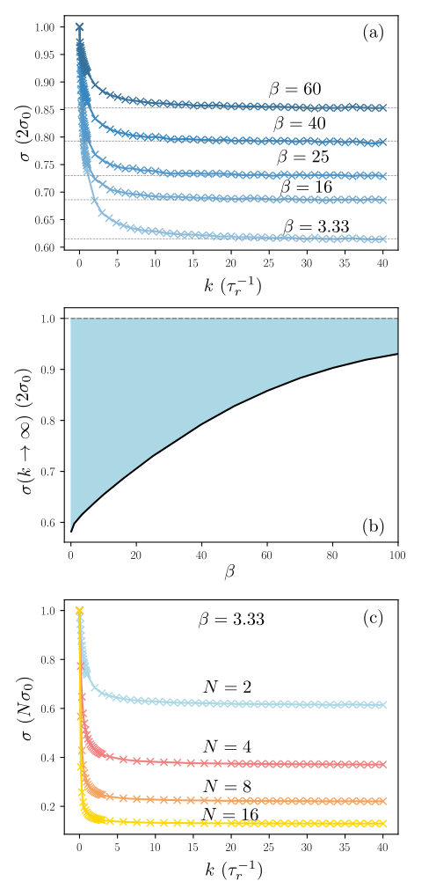
<figcaption class="paper-figure-caption"><b>Fig 8.</b> FIG. 7. (a) The steady-state entropy production rate (EPR) σ versus coupling strength k of single coordinate Cartesian coupling for inverse temperatures β ∈{3.33, 16, 25, 40, 60}. The EPR is plotted in units of the EPR of the free system Nσ0 (Eq. (8)). The crosses are data estimated from numerical simulations of Eqs. (75). (b) The limiting EPR σ(k →∞) (solid-black line) as a function of inverse temperature β in units of the free system 2σ0. The blue region represents the attainable fraction of the free system EPR above the strong- coupling limit. (c) The EPR variation with coupling strength k for system sizes N ∈{2, 4, 8, 16}.</figcaption>
</figure>
<figure class="paper-figure-card">
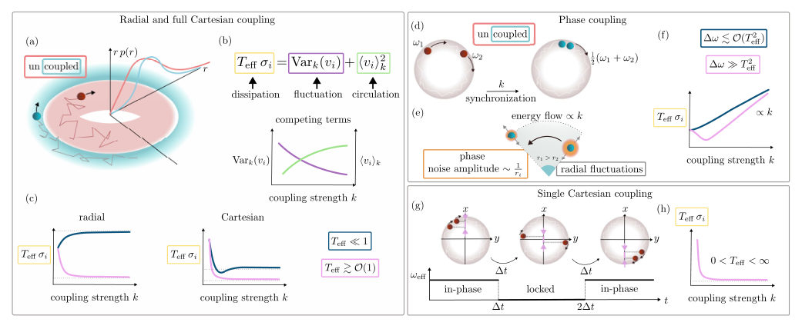
<figcaption class="paper-figure-caption"><b>Fig 9.</b> FIG. 9. Schematic summary of the key results from radial, phase, and Cartesian coupling between stochastic oscillators. (a) For both radial and full Cartesian coupling, increasing the coupling strength has two key effects: the radial distribution becomes narrower and the radial mean can both increase or decrease depending on coupling strength and effective temperature. (b) These two effects contribute directly to the dissipation rate, capturing the effects of tangential velocity fluctuations and circulation, respectively. (c) The competition between the decreasing variance and varying mean with coupling results in distinct dissipation curves with coupling dependent on the effective temperature of...</figcaption>
</figure>
<figure class="paper-figure-card">
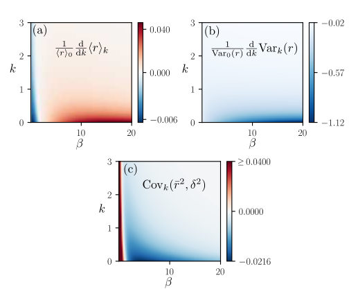
<figcaption class="paper-figure-caption"><b>Fig 10.</b> FIG. 10. Radial distribution deformation under radial cou- pling. (a) Heat map of the derivative of the average radius ⟨r⟩k (in units of ⟨r⟩0) with respect to coupling strength k ver- sus k and the inverse effective temperature β. (b) Heat map of the derivative of the radial variance Vark(r) (in units of Var0(r)) with respect to k versus k and β. (c) The covariance of the squares of the mean and relative radius coordinates ¯r and δ (Eq. (23)), respectively, versus k and β.</figcaption>
</figure>

**Main problem.** The study investigates how different types of mutual coupling (radial, phase, and Cartesian) between stochastic limit-cycle oscillators affect the steady-state entropy production rate (EPR) and energy dissipation.

**Main result.** The authors find that Cartesian coupling always reduces the EPR relative to the uncoupled system, while radial and phase couplings can either increase or decrease dissipation depending on the effective temperature and system size.

**Method.** The researchers use analytical derivations via the Fokker-Planck equation and numerical simulations of Langevin equations using the Euler-Maruyama method.

**Summary.** This paper explores the thermodynamics of coupled stochastic oscillators, specifically focusing on the energy cost of maintaining oscillations. By analyzing different coupling mechanisms, the authors demonstrate that while some couplings can increase dissipation, Cartesian coupling consistently reduces the entropy production rate. The study reveals a complex competition between the suppression of fluctuations and shifts in the radial distribution. These results provide fundamental insights into the energetic efficiency of biological and physical oscillators in noisy environments.

Detailed structure

**Model / system.** An idealized model of stochastic circular limit-cycle oscillators described by overdamped Langevin equations in polar and Cartesian coordinates, including Stuart-Landau dynamics.

**Key observables.** Steady-state entropy production rate (EPR/sigma), radial probability distribution, tangential velocity fluctuations, and radial variance.

**Important parameters / regimes.** Coupling strength (k), inverse effective temperature (beta), intrinsic frequency (omega), system size (N), and frequency detuning (delta omega).

**Assumptions / limitations.** Noise is interpreted in the Stratonovich sense, and the system is assumed to be in a non-equilibrium steady state.

**Figures summary.** Figure 1 shows a single stochastic oscillator, its trajectory, and radial probability distributions. Figure 2 illustrates EPR vs. coupling strength for different temperatures. Figure 3 shows EPR for phase coupling with varying system sizes. Figure 11 displays gradients of the average radius and radial variance.

**Paper structure.** The paper begins by defining the single-oscillator model and its energetics, then progresses to analyze radial coupling, followed by phase/Kuramoto-like coupling, and finally examines full Cartesian coupling and network topology effects.

**Why it may be interesting.** The findings regarding how coupling-induced synchronization can reduce energy dissipation are highly relevant to understanding the energetic costs of maintaining coherence in open quantum systems and many-body driven-dissipative dynamics.

Abstract

Non-linear oscillators serve important functions in many biological systems, including within the inner ear and neuronal networks. The sustainment of oscillations in noisy environments requires continuous energy dissipation, quantified by the steady-state entropy production rate (EPR). We study an idealized, analytically tractable model of a stochastic circular limit cycle and examine how mutual coupling in pairs and populations alters dissipation. For a single oscillator, the EPR depends on three key factors: intrinsic frequency, tangential velocity fluctuations, and mean tangential velocity. The dynamics are characterized by a dimensionless effective temperature given by the ratio of intrinsic relaxation and diffusion timescales. For radial (amplitude), phase (Kuramoto-like), and Cartesian couplings, we derive analytical expressions for the EPR and confirm them numerically. Varying the effective temperature and system size strongly influences how the EPR depends on coupling strength and, in some cases, results in qualitatively distinct behaviors. Moreover, the coupling types affect the tangential velocity distributions differently. Notably, in all cases studied, Cartesian coupling reduces the EPR relative to the uncoupled system, irrespective of effective temperature and system size. The analysis of idealized non-linear oscillators reveals that different classes of coupling interactions and competing timescales present in the oscillators have distinct effects on energy dissipation.

[↑ back to top](#top)

### [Quantum algorithm for solving high-dimensional linear stochastic differential equations via amplitude encoding of the noise term](http://arxiv.org/abs/2604.24133v1)

**Authors:** Koichi Miyamoto  
**Type:** theory · **Category:** quantum information and computing · **PDF:** <https://arxiv.org/pdf/2604.24133v1>  
**Analysis basis:** full PDF text, analyzed in chunks
**Topic relevance:** `methods for driven-dissipative` **3/5** · `non-equilibrium dynamics` **2/5** · `quantum measurements` **2/5**

↔ Scroll figures horizontally

<figure class="paper-figure-card">
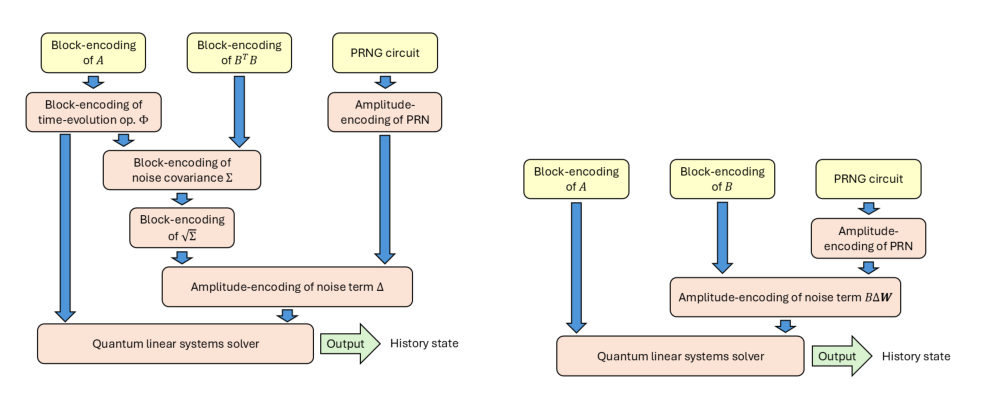
<figcaption class="paper-figure-caption"><b>Fig 1.</b> Figure 1: Outlines of the proposed quantum algorithms, the Dyson series-based method and the EM-based method. The yellow boxes represent given quantum circuits, and the orange boxes are what we construct from them. The blue arrow means that the object at the start is used to construct the one at the end.</figcaption>
</figure>
<figure class="paper-figure-card">
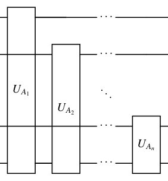
<figcaption class="paper-figure-caption"><b>Fig 2.</b> Figure 2: The quantum circuit for block-encoding of An · · · A1, a product of matrices A1, . . . , An, constructed with block-encodings of them. Here and hereafter, a wire and a box represent a quantum register (set of qubits) and a quantum gate, respectively, and a wire bypassing a box means that the corresponding register is not used in the gate.</figcaption>
</figure>
<figure class="paper-figure-card">
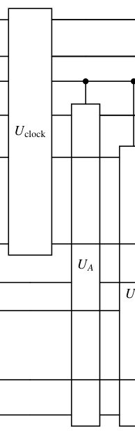
<figcaption class="paper-figure-caption"><b>Fig 3.</b> Figure 3: The quantum circuit implementation of U′ ˜Φ.</figcaption>
</figure>
<figure class="paper-figure-card">
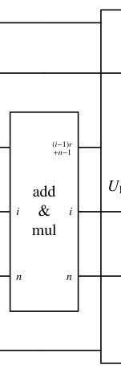
<figcaption class="paper-figure-caption"><b>Fig 4.</b> Figure 4: The quantum circuit implementation of U ˜∆.</figcaption>
</figure>

**Main problem.** Developing quantum algorithms to solve high-dimensional linear stochastic differential equations (SDEs) with an exponential speed-up in the dimension N, specifically addressing the challenge of amplitude encoding the noise term.

**Main result.** The paper proposes two methods (Dyson series-based and Euler-Maruyama-based) that achieve polylog(N) query complexity, providing an exponential speed-up in the dimension N compared to classical methods.

**Method.** The algorithms utilize amplitude encoding of the noise term via a quantum pseudorandom number generator (PRNG), quantum linear systems solvers (QLSS), and block-encoding techniques like the Linear Combination of Unitaries (LCU).

**Summary.** This paper presents new quantum algorithms for solving high-dimensional linear stochastic differential equations. By using amplitude encoding for the noise term and a quantum PRNG, the authors achieve an exponential speed-up in the system dimension N. They propose two distinct approaches: one based on the Dyson series and another based on the Euler-Maruyama discretization. The work also provides methods for estimating expectations of functions of the solution at various time points.

Detailed structure

**Model / system.** The model consists of high-dimensional linear SDEs of the form dX_t = A(t)X_t dt + B(t)dW_t, where X_t is an N-dimensional random process driven by m-dimensional Brownian motion.

**Key observables.** Expectations of functions of X_t at multiple time steps (history states) and expectations of quantities defined at the terminal time.

**Important parameters / regimes.** Dimension N, dimension of Brownian motion m, time interval [0, T], error tolerance epsilon, and stability/dissipativity parameter eta.

**Assumptions / limitations.** Assumes access to oracles for arithmetic operations and data loading, a bounded norm for the drift matrix A(t), and a bounded noise coefficient B(t).

**Figures summary.** Figure 1 provides a schematic outline of the Dyson and EM-based methods; Figure 2 illustrates the quantum circuit for block-encoding a product of matrices; Figure 3 shows the circuit implementation of the operator.

**Paper structure.** The paper introduces the SDE problem, presents two algorithmic approaches (Dyson-based and EM-based), details the construction of quantum oracles and block-encodings, provides rigorous error analysis and complexity bounds, and concludes with discussions on limitations and future extensions.

**Why it may be interesting.** This is highly relevant for researchers in open quantum systems and many-body dynamics, as SDEs are fundamental for modeling dissipative dynamics, and efficient quantum algorithms for high-dimensional stochastic processes are crucial for simulating complex quantum trajectories.

Abstract

This work studies quantum algorithms to solve high-dimensional stochastic differential equations (SDEs) $\mathrm{d} \mathbf{X}_t = A(t) \mathbf{X}_t \mathrm{d} t + B(t) \mathrm{d} \mathbf{W}_t$. Aiming for a speed-up in the dimension $N$ of $\mathbf{X}_t$, we generate quantum states that encode $\mathbf{X}_t$ in the amplitudes, while most of the existing quantum methods for SDEs employ binary encoding. A key challenge is the amplitude encoding of the noise term, and we address this by utilizing the quantum circuit implementation of a pseudorandom number generator (PRNG). We propose two methods: the Dyson series-based method and the Euler-Maruyama (EM)-based method. In the former, we express the noise term via the Dyson series approximation of the time evolution operator, while in the latter, it is approximated using the EM time discretization. Both methods use the quantum linear systems solver to generate the amplitude-encoding state of $\mathbf{X}_t$, making only ${\rm polylog}(N)$ queries to the PRNG circuit and the block-encodings of $A$ and $B$. Additionally, going beyond state preparation, we present methods to estimate expectations of functions of $\mathbf{X}_t$ using the state.

[↑ back to top](#top)

### [Quantum average correlation based on average coherence](http://arxiv.org/abs/2604.23501v1)

**Authors:** Xiaoyu Ma, Qing-Hua Zhang, Cong Xu  
**Type:** theory · **Category:** quantum information and computing · **PDF:** <https://arxiv.org/pdf/2604.23501v1>  
**Analysis basis:** full PDF text, analyzed in chunks
**Topic relevance:** `entanglement & information structure` **3/5** · `methods for driven-dissipative` **2/5** · `quantum measurements` **2/5**

↔ Scroll figures horizontally

<figure class="paper-figure-card">
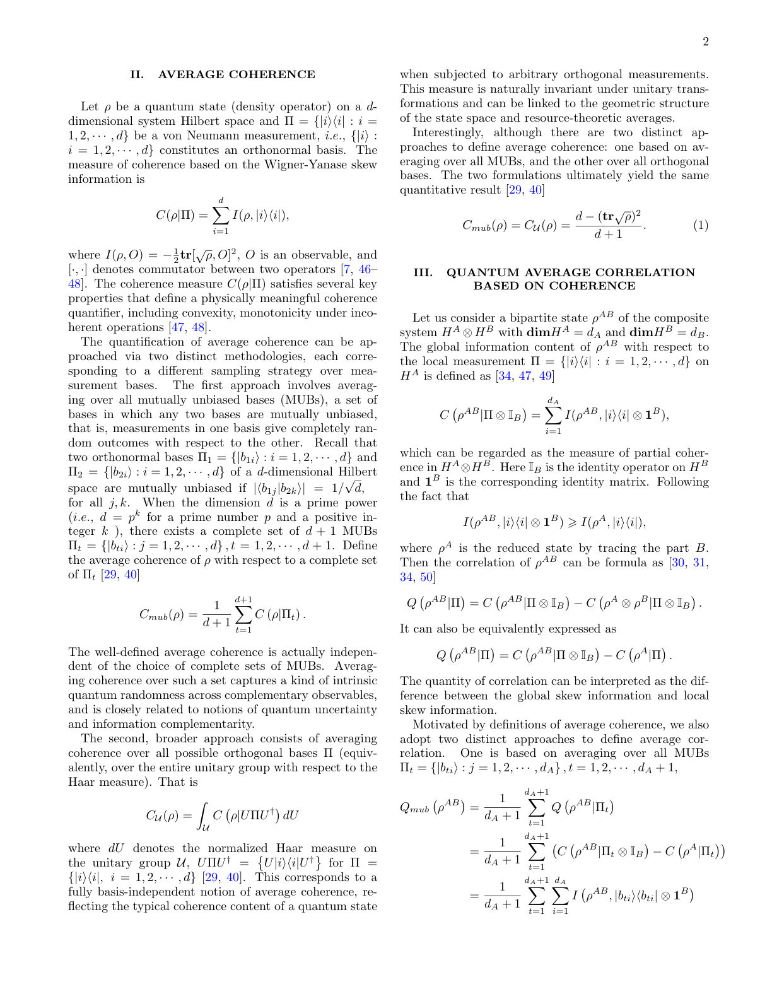
<figcaption class="paper-figure-caption"><b>Fig 1.</b> Low-resolution page preview, page 2</figcaption>
</figure>
<figure class="paper-figure-card">
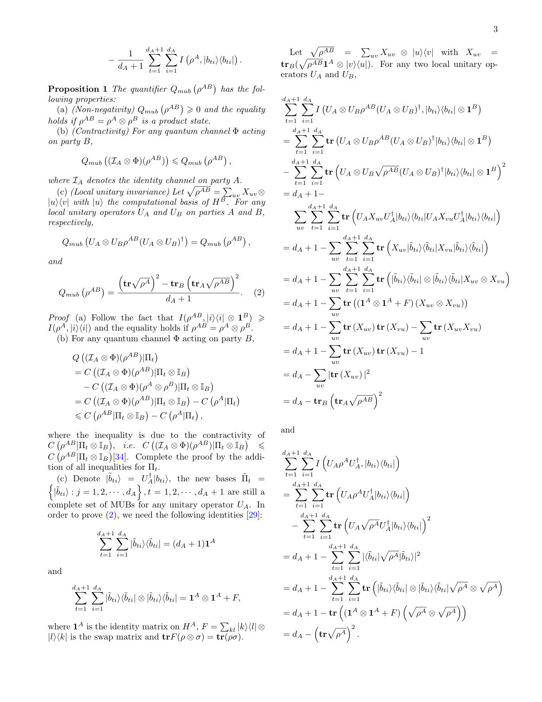
<figcaption class="paper-figure-caption"><b>Fig 2.</b> Low-resolution page preview, page 3</figcaption>
</figure>
<figure class="paper-figure-card">
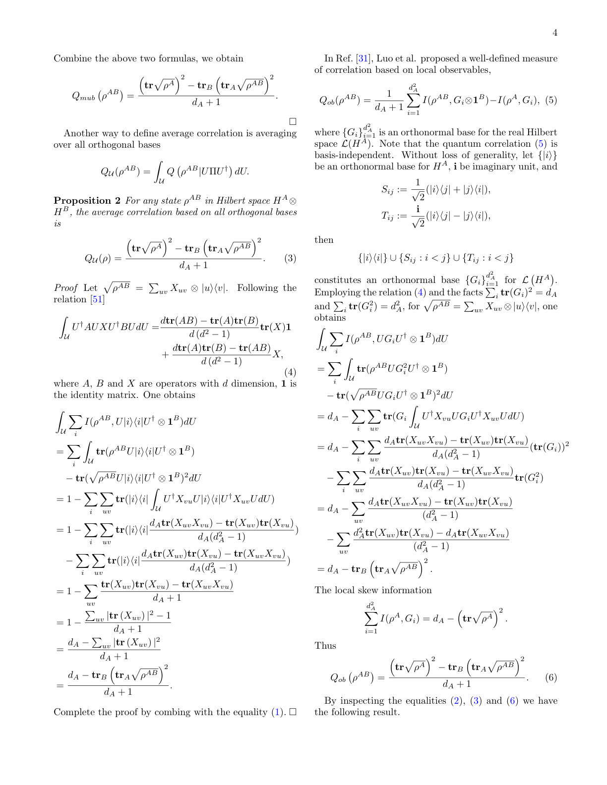
<figcaption class="paper-figure-caption"><b>Fig 3.</b> Low-resolution page preview, page 4</figcaption>
</figure>
<figure class="paper-figure-card">
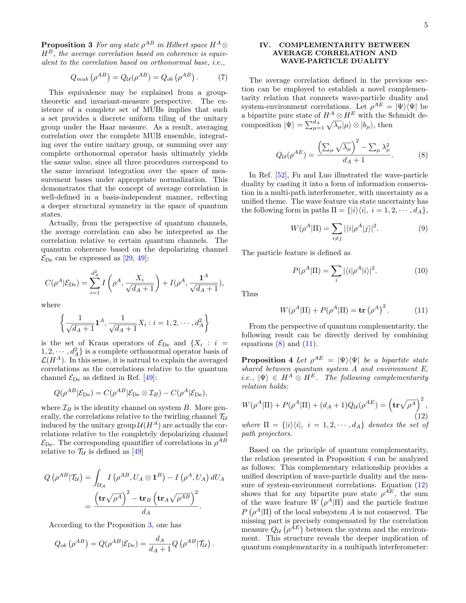
<figcaption class="paper-figure-caption"><b>Fig 4.</b> Low-resolution page preview, page 5</figcaption>
</figure>
<figure class="paper-figure-card">
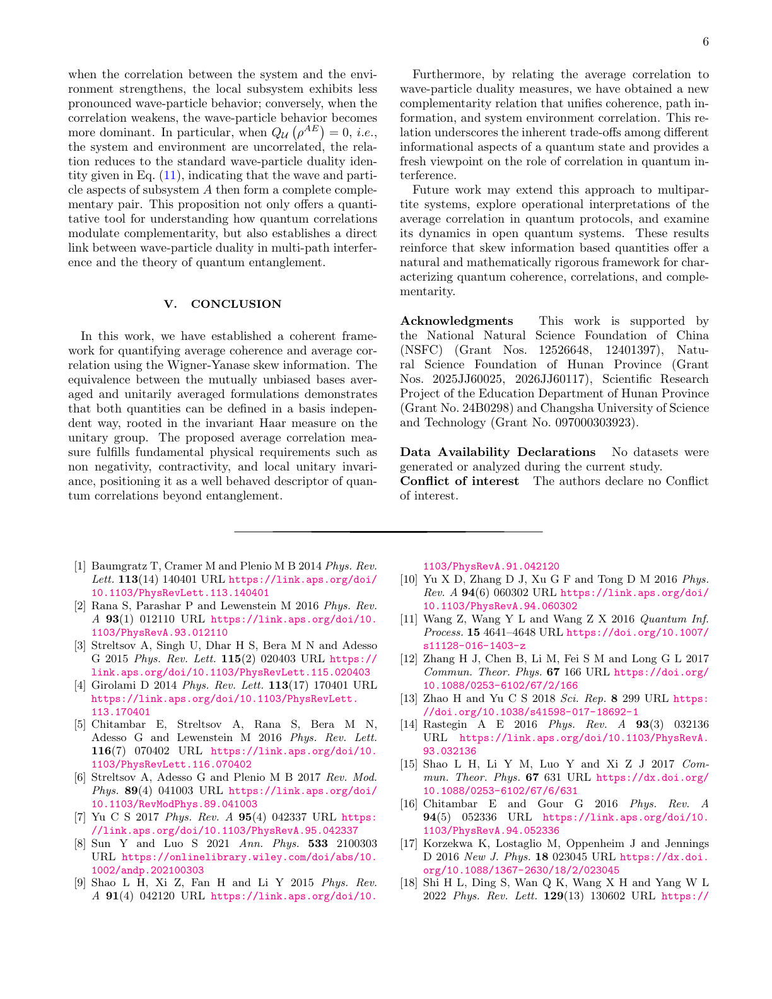
<figcaption class="paper-figure-caption"><b>Fig 5.</b> Low-resolution page preview, page 6</figcaption>
</figure>
<figure class="paper-figure-card">
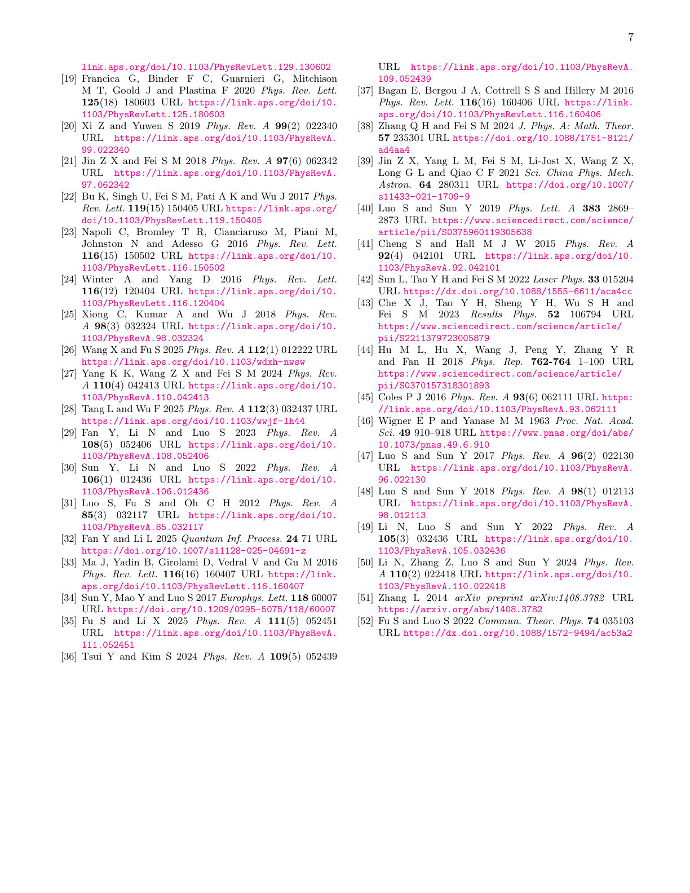
<figcaption class="paper-figure-caption"><b>Fig 6.</b> Low-resolution page preview, page 7</figcaption>
</figure>

**Main problem.** The paper aims to develop a basis-independent (intrinsic) quantum correlation measure for bipartite systems to address the basis-dependent nature of existing measures.

**Main result.** The authors prove the equivalence of average correlation measures defined via MUBs, unitary group integration, and orthonormal bases, and derive a complementarity relation linking wave-particle duality to system-environment correlations.

**Method.** The study utilizes the Wigner-Yanase skew information framework, applying Haar measure integration over the unitary group and summation over Mutually Unbiased Bases (MUBs).

**Summary.** This paper introduces a new way to measure quantum correlations that does not depend on the choice of basis. By using Wigner-Yanases skew information, the authors show that averaging over different sets of bases (like MUBs or all possible unitaries) yields the same correlation value. They also discover a new rule for quantum systems: the loss of local wave-particle duality is exactly balanced by the correlation between the system and its environment. This provides a deeper understanding of how entanglement and correlations affect local quantum properties.

Detailed structure

**Model / system.** The study focuses on bipartite quantum systems (rho_AB) and bipartite pure states (rho_AE) within a composite Hilbert space, specifically considering multi-path interferometry contexts.

**Key observables.** Wigner-Yanase skew information, average coherence, quantum average correlation, wave feature (W), and particle feature (P).

**Important parameters / regimes.** Hilbert space dimensions (dA, dB), Schmidt coefficients (lambda_mu), and the existence of complete sets of MUBs for prime power dimensions.

**Assumptions / limitations.** The existence of a complete set of Mutually Unbiased Bases (MUBs) is assumed for dimensions that are prime powers.

**Paper structure.** The paper introduces the problem of basis-dependence, defines average coherence and correlation using skew information, proves the mathematical equivalence of different averaging methods, establishes the properties of the new correlation measure, and concludes with a complementarity relation for wave-particle duality.

**Why it may be interesting.** It provides a fundamental link between local wave-particle duality and global system-environment correlations, offering a new way to quantify how information is lost to the environment in open quantum systems.

Abstract

This paper studies the quantification and structural properties of quantum average correlation based on average coherence. Motivated by two mathematically equivalent approaches to define average coherence: one by averaging over complete sets of mutually unbiased bases, and the other by integrating over all orthogonal bases under the Haar measure, we define an average correlation for bipartite systems as the difference between global and local skew information. This correlation measure is shown to satisfy essential properties including non negativity, contractivity under local quantum channels, and local unitary invariance. We further prove the equivalence between the average correlation defined via mutually unbiased bases and that defined via unitary groups. Finally, we derive a complementarity relation that connects wave-particle duality with the average correlation between a system and its environment.

[↑ back to top](#top)

### [Quantum vs. Classical Spin: A Comparative Study of Dipolar Spin Dynamics and the Onset of Chaos](http://arxiv.org/abs/2604.24603v1)

**Authors:** Victor Henner, Alexander Nepomnyashchy, Tatyana Belozerova  
**Type:** theory · **Category:** numerical methods · **PDF:** <https://arxiv.org/pdf/2604.24603v1>  
**Analysis basis:** full PDF text, analyzed in chunks
**Topic relevance:** `non-equilibrium dynamics` **3/5** · `entanglement & information structure` **2/5** · `scars & prethermalization` **2/5**

↔ Scroll figures horizontally

<figure class="paper-figure-card">
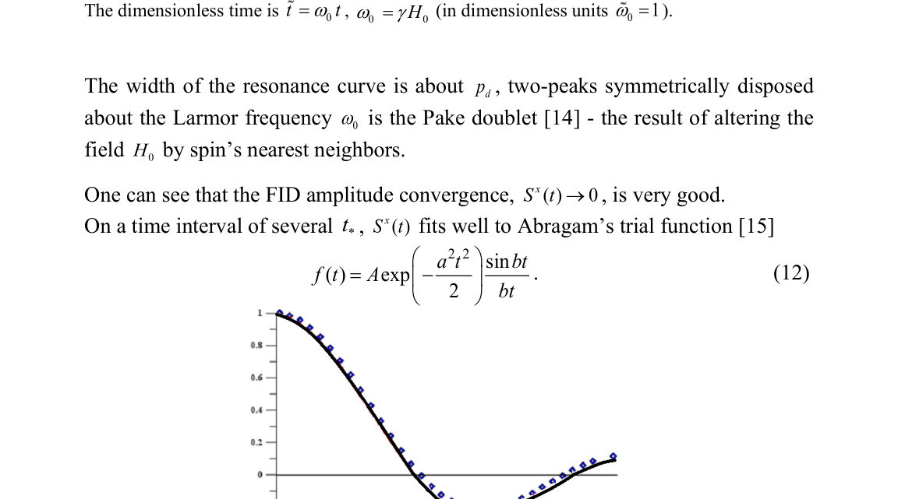
<figcaption class="paper-figure-caption"><b>Fig 1.</b> Fig 2. The envelope of ( ) xe t in Figure 1 (solid line) and Abragam’s trial function ( ) f t (squares) with parameters 1 A = , 0.00065 a = , 0.0245 b = .</figcaption>
</figure>
<figure class="paper-figure-card">
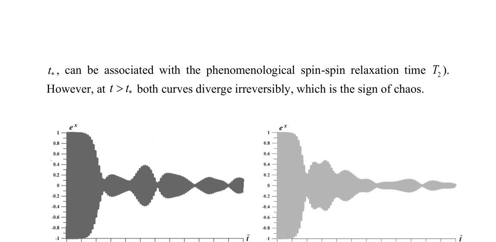
<figcaption class="paper-figure-caption"><b>Fig 2.</b> Fig. 4. Graph of ( ) xe t . 5 5 5, spins N =  0.01 dp = , (0) 0.999999999 xe = . Two panels represent two</figcaption>
</figure>
<figure class="paper-figure-card">
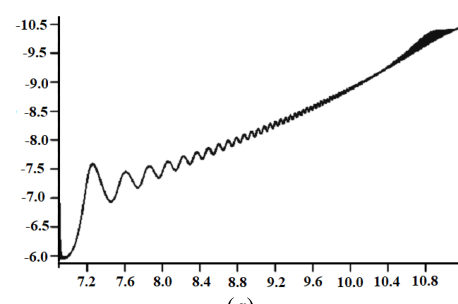
<figcaption class="paper-figure-caption"><b>Fig 3.</b> Fig. 6. ( ) ln ( ) L t versus ln( )t . 5 (0) 0. x e = , 0.01 d p = .</figcaption>
</figure>
<figure class="paper-figure-card">
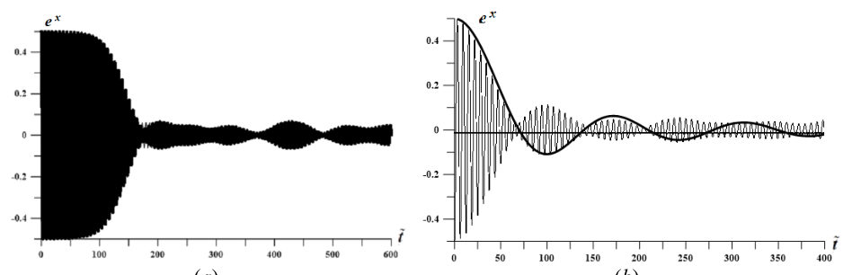
<figcaption class="paper-figure-caption"><b>Fig 4.</b> Fig. 7. 37 N = , 0.01 dp = , (0) 0.5 xe = . Panel a: linear initial distribution, panel b: random initial distribution. Solid line on panel b represents function (12) with the parameters 0.5 A = , 0.0009 a = , 0.045 b = . Very close results are obtained for 35 N = spins and (0) 0.5 xe = with the same, as in Figure 7, value * 170 t  for a linear distribution, and * 70 t  up to the end of the second beat for a random distribution. The value of *t depends only on dp and remains stable across different statistical ensembles for a selected polarization type, and is largely independent of (0) xe . The difference between random and linear distributions demonstrates, in another form, the system&#x27;s...</figcaption>
</figure>
<figure class="paper-figure-card">

<figcaption class="paper-figure-caption"><b>Fig 5.</b> Fig. 10. 1, 1, 2 x y z N N N = = = , 0.01 d p = , (0) 0.9999 xe =</figcaption>
</figure>

**Main problem.** Investigating the discrepancies between quantum and classical descriptions of spin dynamics in dipole-coupled systems, specifically regarding the onset of chaos and long-term fidelity.

**Main result.** While quantum and classical simulations show qualitative agreement at short timescales, they diverge significantly at long timescales due to the nonlinearity of classical dynamics, which leads to chaos and a continuous frequency spectrum.

**Method.** The study compares exact diagonalization of the Schrödinger equation for quantum spins with numerical integration of nonlinear gyration equations for classical spins, using Lyapunov exponents to quantify chaos.

**Summary.** This paper compares quantum and classical simulations of dipole-coupled spin systems. It demonstrates that while classical models can approximate quantum dynamics for short periods, they fail at longer timescales because classical nonlinear dynamics lead to chaos and continuous spectra. The authors use Lyapunov exponents to show that classical systems become chaotic for more than three spins, whereas quantum systems remain regular. This research highlights the fundamental limitations of using classical spin-dynamics simulations to represent quantum many-body systems.

Detailed structure

**Model / system.** A system of N interacting spins (spin-1/2 for quantum, magnetic vectors for classical) in a regular lattice, governed by a Hamiltonian containing a Zeeman term and a dipole-dipole interaction term.

**Key observables.** Free Induction Decay (FID) of transverse magnetization, Fourier transform of the FID (frequency spectrum), and the maximum Lyapunov exponent.

**Important parameters / regimes.** Dimensionless dipole interaction parameter (dp), number of spins (N), and the characteristic dipole time (t*).

**Assumptions / limitations.** The system is assumed to be a rigid lattice, spin-lattice relaxation is neglected, and the classical model relies on a mean-field approximation.

**Figures summary.** Figures show the time evolution and Fourier transforms of FID for various N, comparisons with Abragam's trial function, the divergence of classical trajectories signaling chaos, and the scaling of the Lyapunov exponent.

**Paper structure.** The paper introduces the problem of quantum-classical spin discrepancies, details the quantum and classical models, presents results on FID and spectral features, analyzes the onset of chaos via Lyapunov exponents, and provides an analytical study of the two-spin case in an appendix.

**Why it may be interesting.** It provides critical insights into the validity of using classical approximations for many-body spin dynamics and highlights how nonlinearity-induced chaos in classical models can obscure quantum spectral features.

Abstract

We investigate the spin dynamics of a dipole-coupled system by comparing a direct solution of the Schrodinger equation for quantum spins with simulations of classical spins. Although classical spins have long been used in microscopic spin dynamics simulations, we demonstrate that their results differ significantly from those of quantum spins. Using Free Induction Decay as a benchmark, we find that while the overall patterns are qualitatively similar, significant discrepancies emerge at both short and long timescales. We trace these differences to fundamental distinctions in the two descriptions.

[↑ back to top](#top)

### [Heralded Entanglement Transfer from Entangled Atomic Pair to Free Electrons](http://arxiv.org/abs/2604.22974v1)

**Authors:** Du Ran, Reuven Ianconescu, Shuai Liu, Ya-dong Li, Ji-Yuan Bai, Ze-Long He, Zhi-Cheng Shi, Yan Xia, Avraham Gover  
**Type:** theory · **Category:** quantum information and computing · **PDF:** <https://arxiv.org/pdf/2604.22974v1>  
**Analysis basis:** full PDF text, analyzed in chunks
**Topic relevance:** `entanglement & information structure` **3/5** · `quantum measurements` **3/5**

↔ Scroll figures horizontally

<figure class="paper-figure-card">
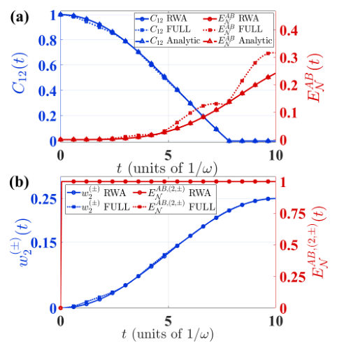
<figcaption class="paper-figure-caption"><b>Fig 1.</b> FIG. 1. Entanglement-transfer dynamics between the TLSs and the free-electrons. (a) Unconditional entanglement mea- sures. Left axis: TLS concurrence C12(t). Right axis: electron logarithmic negativity EAB N (t), shown for the RWA numerics, the full bilinear model (FULL) numerics, and the resonant closed-form RWA benchmark. (b) Heralded extraction into the two-dimensional target manifolds H(±) 2 . Left axis: un- conditional target-manifold weight w(±) 2 (t). Right axis: log- arithmic negativity EAB,(2,±) N (t) of the normalized projected state ˆρ(2,±) AB (t). Parameters: ∆= 0 and pulse area g = π/4.</figcaption>
</figure>
<figure class="paper-figure-card">
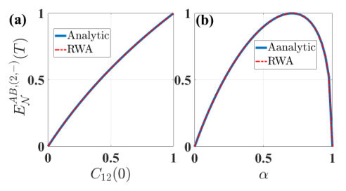
<figcaption class="paper-figure-caption"><b>Fig 2.</b> FIG. 2. Closed-form relation between the postselected elec- tron log-negativity and the initial TLS concurrence. (a) shows EAB,(2,−) N (T) versus C12(0), where the analytic prediction in Eq. (24) (solid) is compared with numerical RWA evolution (dashed). In the symmetric resonant case the (2, +) and (2, −) branches coincide. (b) displays the same quantity as a func- tion of the TLS amplitude α for the initial resource.</figcaption>
</figure>

**Main problem.** Developing a protocol to transfer entanglement from an existing entangled atomic two-level-system (TLS) resource to a pair of free electrons in quantum electron optics.

**Main result.** The protocol achieves heralded entanglement transfer where the final electron entanglement is determined solely by the initial TLS concurrence, following the relation E_AB = log2(1 + C_12).

**Method.** The authors use analytical derivations in the rotating-wave approximation (RWA) and compare them with numerical integration of the full bilinear Hamiltonian to quantify corrections.

**Summary.** This paper proposes a method to transfer quantum entanglement from an atomic pair to free electrons. By measuring the atoms after the interaction (heralding), one can certify the creation of an entangled electron state. The study shows that the amount of entanglement transferred depends directly on the initial atomic entanglement. The authors also quantify how much the results deviate from ideal models due to detuning and higher-order physical effects.

Detailed structure

**Model / system.** The system consists of two spatially separated free electrons interacting with two spatially separated atomic two-level systems (TLS) via Coulombic dipole coupling, modeled using an energy-sideband ladder.

**Key observables.** TLS concurrence (C_12), electron logarithmic negativity (E_AB^N), heralding probability, and target-manifold weight.

**Important parameters / regimes.** Detuning (delta), pulse area (g), interaction time (T), and the initial TLS entanglement (alpha, beta).

**Assumptions / limitations.** The primary analytical framework relies on the Rotating-Wave Approximation (RWA) and a discrete-sideband plane-wave approximation.

**Figures summary.** Figure 1(a) shows the time-resolved dynamics of the decreasing TLS concurrence.

**Paper structure.** The paper introduces the entanglement transfer problem, defines the Hamiltonian and interaction model, derives analytical solutions under RWA, performs numerical benchmarking against the full model, and discusses systematic corrections and future extensions.

**Why it may be interesting.** It provides a theoretical blueprint for generating entanglement in free-electron systems, a key platform for quantum electron optics, and explores the fundamental limits of entanglement transfer via heralded measurements.

Abstract

We propose a protocol that transfers entanglement from an entangled atomic two-level-system (TLS) resource to a pair of free electrons in an energy-sideband ladder via local electron-TLS interactions. In a controlled rotating-wave regime, closed-form reduced states are derived. TLS heralding then prepares a maximally entangled electron state in a two-dimensional single-excitation manifold, with a simple dependence on the initial TLS resource entanglement. Numerical integration of the full bilinear Hamiltonian quantifies the impacts of detuning and pulse shaping and identifies the leading beyond-rotating-wave corrections. The results establish a heralded route to entangled free electrons and will facilitate further advances in quantum electron optics.

[↑ back to top](#top)

### [Universal tracer statistics in single-file transport](http://arxiv.org/abs/2604.24741v1)

**Authors:** Soumyabrata Saha, Jitendra Kethepalli, Benjamin Guiselin, Jacopo De Nardis, Tridib Sadhu  
**Type:** theory · **Category:** statistical mechanics · **PDF:** <https://arxiv.org/pdf/2604.24741v1>  
**Analysis basis:** full PDF text, analyzed in chunks
**Topic relevance:** `non-equilibrium dynamics` **3/5** · `non-equilibrium universality` **3/5**

↔ Scroll figures horizontally

<figure class="paper-figure-card">
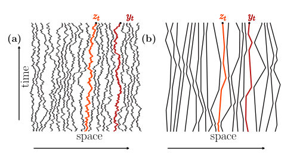
<figcaption class="paper-figure-caption"><b>Fig 1.</b> Figure 1. Schematic trajectories of the (a) diffusive and (b) ballistic hard-rod gas. All rods have equal length a and unit mass. In (a), particles undergo Brownian motion between collisions, while in (b) they move along straight lines governed by their velocities, which are exchanged upon collision. The trajectories of two tracers are highlighted, with their positions at time t denoted by zt and yt.</figcaption>
</figure>
<figure class="paper-figure-card">
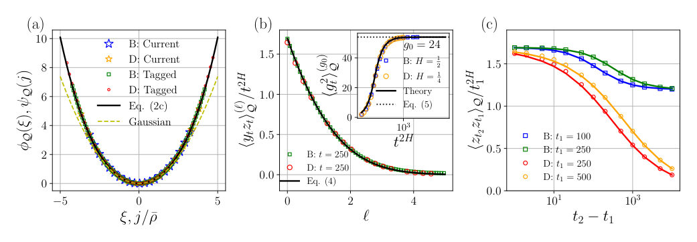
<figcaption class="paper-figure-caption"><b>Fig 2.</b> Figure 2. Results for both gases in the quenched ensemble with D0 = 0.5, a = 1, and ¯ρ = 0.25. Markers (D: diffusive, B: ballistic) are numerical results; solid lines are analytical predictions. Plot (a) shows the tracer LDF (2c) and the current LDF,</figcaption>
</figure>

**Main problem.** Investigating whether an emergent universality exists in the large-scale, long-time statistics of tracer particles in single-file transport, specifically comparing stochastic (diffusive) and unitary (ballistic) dynamics.

**Main result.** The authors uncover that the one-time joint distribution of multiple tracers exhibits identical non-Gaussian fluctuations for both diffusive and ballistic gases, up to a simple dynamical scaling, though differences appear in multi-time statistics.

**Method.** The study employs exact microscopic solutions, hydrodynamic approaches (MFT and BMFT), and rare-event numerical simulations using importance sampling and multi-histogram reweighting.

**Summary.** This paper demonstrates a surprising universality in single-file transport where fundamentally different microscopic dynamics—stochastic diffusion and ballistic motion—produce identical one-time statistics for tracer particles. By using both exact analytical methods and advanced rare-event simulations, the authors show that the large-deviation functions for particle positions and currents are the same up to scaling. This universality holds for both annealed and quenched initial conditions, though the distinction between the two dynamics is preserved in multi-time correlations and aging effects.

Detailed structure

**Model / system.** A one-dimensional hard-rod gas with finite particle length 'a' subject to either diffusive (Brownian) or ballistic (velocity-exchange) dynamics in both annealed and quenched ensembles.

**Key observables.** One-time tracer position, joint distribution of tracer pairs, two-time statistics of a single tracer, and time-integrated current.

**Important parameters / regimes.** Scaling exponent H (1/4 for diffusive, 1/2 for ballistic), rod length 'a', density 'rho', and diffusion coefficient 'D0'.

**Assumptions / limitations.** The analysis assumes the large-time and large-system limits and relies on a coordinate transformation mapping hard rods to non-interacting point particles.

**Figures summary.** Figure 1 shows schematic trajectories of diffusive vs. ballistic motion; Figure 2 presents numerical and analytical results for the Large Deviation Function (LDF) of tracers and currents, as well as equal-time and two-time covariances.

**Paper structure.** The paper introduces the problem of universality in single-file transport, details the two dynamical models, presents analytical derivations using microscopic and hydrodynamic methods, provides numerical validation via rare-event simulations, and concludes with discussion on the breakdown of universality in multi-time statistics.

Abstract

We uncover an emergent universality in the large-scale, long-time statistics of a one-dimensional hard-rod gas evolving under two fundamentally different classes of microscopic dynamics: stochastic (diffusive) and unitary (ballistic). Remarkably, despite the difference of the two systems, the one-time joint distribution of the positions of multiple tracers exhibits identical non-Gaussian fluctuations, up to a simple dynamical scaling. This universality holds in both annealed and quenched ensembles, demonstrating a persistent memory of the initial state. Differences between the dynamics manifest at large scales only in multi-time statistics. Our conclusions are based on explicit large-deviation results for the one-time statistics of tracer pairs and the two-time statistics of a single tracer. Similar physics extends to current fluctuations, demonstrated explicitly in the quenched ensemble. We obtain these results from exact microscopic solutions for both dynamics and, independently, from fluctuating hydrodynamics in the ballistic case in the annealed ensemble. Our rare-event simulations further corroborate these findings and provide a novel demonstration of sampling atypical fluctuations in both types of hard-rod gas.

[↑ back to top](#top)

### [Accelerating quantum Gibbs sampling without quantum walks](http://arxiv.org/abs/2604.22996v1)

**Authors:** Jiaqi Leng, Jiaqing Jiang, Lin Lin  
**Type:** theory · **Category:** quantum information and computing · **PDF:** <https://arxiv.org/pdf/2604.22996v1>  
**Analysis basis:** full PDF text, analyzed in chunks
**Topic relevance:** `methods for driven-dissipative` **3/5** · `non-equilibrium dynamics` **2/5**

↔ Scroll figures horizontally

<figure class="paper-figure-card">
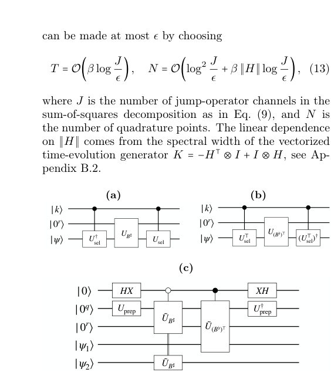
<figcaption class="paper-figure-caption"><b>Fig 1.</b> Figure 1. Circuit schematics for the block-encoding of the discretized first-order operator B. Panels (a) and (b) show the dressed block-encodings of ˜UB♯and ˜U(B♭)⊺. Panel (c) shows the full circuit assembling these ingredients with the quadrature-weight preparation oracle Uprep and a branch ancilla to realize the linear combination corresponding to I ⊗B♯ j,tk −(B♭ j,tk)⊺⊗I.</figcaption>
</figure>
<figure class="paper-figure-card">
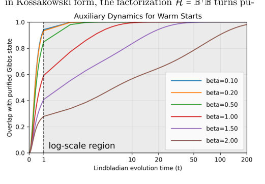
<figcaption class="paper-figure-caption"><b>Fig 2.</b> Figure 2. Numerical simulation of the auxiliary dissipative dynamics with “unitary dressing” for a 3-qubit transverse- field Ising model. We plot the overlap Tr[ρ(t)∣σ1/2⟩⟩⟨⟨σ1/2∣] as a function of the evolution time t, for several inverse tem- peratures β. As β increases, the global mixing time grows substantially, but the overlap with the target purified Gibbs state already exceeds 0.2 at t = 1 for all values of β shown. Therefore, the auxiliary dynamics can generate states with non-negligible target overlap on a timescale much shorter than the global mixing time.</figcaption>
</figure>
<figure class="paper-figure-card">
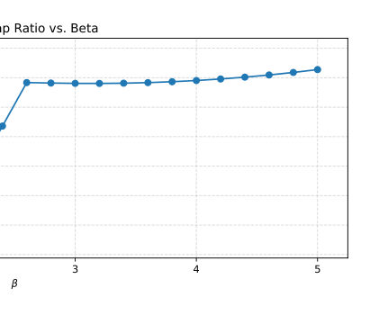
<figcaption class="paper-figure-caption"><b>Fig 3.</b> Figure 3. The ratio between the spectral gap of the new Hamiltonian H0 and the parent Hamiltonian H.</figcaption>
</figure>
<figure class="paper-figure-card">
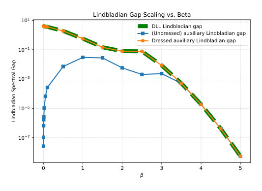
<figcaption class="paper-figure-caption"><b>Fig 4.</b> Figure 4. Spectral gaps of three classes of Lindbladian operators: the auxiliary dynamics (without unitary dressing), the auxiliary dynamics with unitary dressing, and the original DLL Gibbs sampler.</figcaption>
</figure>

**Main problem.** The challenge of efficiently preparing purified Gibbs states on a quantum computer, specifically overcoming the quadratic dependence on the spectral gap found in standard Szegedy-type quantum walk approaches.

**Main result.** The authors present a walk-free quantum algorithm that achieves a quadratic improvement in spectral gap dependence, reducing it from O(1/Delta) to O(1/sqrt(Delta)), and introduce a warm-start strategy using auxiliary dissipative dynamics.

**Method.** The algorithm uses a singular-value filtering approach via Quantum Singular Value Transformation (QSVT) applied to an explicit factorization of the parent Hamiltonian into non-commutative first-order operators.

**Summary.** This paper introduces a new quantum algorithm for preparing thermal (Gibbs) states that is faster than previous quantum walk-based methods. By using a mathematical factorization of the system's Hamiltonian, the authors reduce the computational complexity related to the spectral gap from 1/Delta to 1/sqrt(Delta). They also provide a method to generate good starting states for the algorithm using auxiliary dissipative dynamics. This advancement makes the simulation of many-body systems at finite temperatures more efficient on future quantum hardware.

Detailed structure

**Model / system.** Quantum many-body systems at finite temperature governed by Lindbladian dynamics that satisfy the Kubo-Martin-Schwinger (KMS) detailed balance condition, including Davies and CKG samplers.

**Key observables.** Thermal expectation values of observables, spectral gap (Delta), and overlap between the prepared state and the target purified Gibbs state.

**Important parameters / regimes.** Inverse temperature (beta), spectral gap (Delta), precision (epsilon), and the number of jump operators (J).

**Assumptions / limitations.** The Lindbladian must satisfy the KMS detailed balance condition and require coherent access to the first-order factors and a warm-start initial state.

**Figures summary.** Numerical simulations of the Transverse-Field Ising Model (TFIM) showing the overlap of auxiliary dynamics with the target state as a function of time and temperature, and a comparison of spectral gaps for different Lindbladian classes.

**Paper structure.** The paper introduces the problem of Gibbs sampling speedups, presents a mathematical factorization of the parent Hamiltonian, develops the QSVT-based algorithm, proposes an auxiliary dynamics for warm-starting, and validates the approach with numerical simulations on the TFIM.

**Why it may be interesting.** This work is highly relevant for researchers in open quantum systems and many-body dynamics as it provides a more efficient way to simulate thermal equilibrium states and addresses the practical difficulty of state preparation in the low-temperature regime.

Abstract

Szegedy's quantum walk gives a generic quadratic speedup for reversible classical Markov chains, but extending this mechanism to quantum Gibbs sampling has remained challenging beyond special cases. We present a walk-free quantum algorithm for preparing purified Gibbs states with a quadratic improvement in spectral-gap dependence for a broad class of quantum Gibbs samplers that satisfy exact Kubo-Martin-Schwinger detailed balance. Our main structural result is an explicit factorization of the corresponding parent Hamiltonian into noncommutative first-order operators. This turns purified Gibbs-state preparation into a singular-value filtering problem and enables a quantum singular value transformation algorithm with quadratically improved gap dependence under standard coherent-access assumptions. The framework applies to several efficiently implementable Gibbs samplers beyond the Davies setting. We also introduce an auxiliary dissipative dynamics based on the same factorization, which can be used to generate warm starts in the doubled Hilbert space in metastable regimes.

[↑ back to top](#top)

### [Contextuality from the Projector Overlap Matrix](http://arxiv.org/abs/2604.23898v1)

**Authors:** Ali Can Günhan, Semahi Serhat Aksoy, Zafer Gedik  
**Type:** theory · **Category:** quantum information and computing · **PDF:** <https://arxiv.org/pdf/2604.23898v1>  
**Analysis basis:** full PDF text, analyzed in chunks
**Topic relevance:** `entanglement & information structure` **3/5** · `quantum measurements` **2/5**

↔ Scroll figures horizontally

<figure class="paper-figure-card">
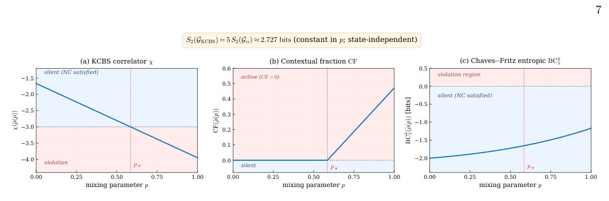
<figcaption class="paper-figure-caption"><b>Fig 1.</b> FIG. 1. Three of the four state-dependent witnesses of Table I evaluated on the KCBS mixing family ˆρ(p) = p |0z⟩⟨0z|+(1−p)ˆI/3, with threshold p⋆= (3 √</figcaption>
</figure>
<figure class="paper-figure-card">
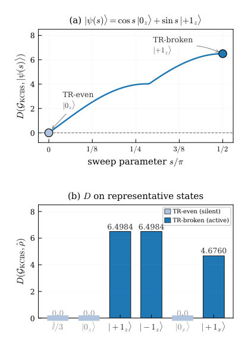
<figcaption class="paper-figure-caption"><b>Fig 2.</b> FIG. 2. Operational quantity D(GKCBS, ˆρ) of Paper I [16] on states outside the time-reversal-invariant family ˆρ(p) of Fig. 1, where D ≡0. Throughout, “TR” abbreviates time reversal; a state is TR-even if it is invariant under the antiunitary time- reversal operation, and TR-broken otherwise. (a) Pure-state sweep |ψ(s)⟩= cos s |0z⟩+ sin s |+1z⟩. The endpoints are qualitatively distinct: s = 0 is the TR-even state |0z⟩(open circle, D = 0) and s = π/2 is the TR-broken state |+1z⟩(filled circle, D ≈6.4984). Interior values 0 &lt; s &lt; π/2 correspond to superpositions of the two endpoints and are neither purely TR-even nor purely TR-broken; D rises across the sweep, with a mild non-monotonicity...</figcaption>
</figure>

**Main problem.** The paper seeks to unify various indicators of Kochen-Specker contextuality into a single framework based on a projector overlap matrix and investigates the relationship between state-independent geometric properties and state-dependent contextuality witnesses.

**Main result.** The authors establish that the quantity S2 (derived from the overlap matrix) is a necessary configuration-level condition for observable contextuality and can remain positive even when state-dependent witnesses are silent. They also identify a structural mechanism (shared eigenstates) that explains why certain entropic uncertainty relations fail to detect contextuality in the KCBS scenario.

**Method.** The study uses a geometric framework involving a projector overlap matrix T, analyzing scalar contractions such as mutual information energy E and the Maassen-Uffink extremal overlap cMU. Analytical derivations and numerical evaluations are applied to KCBS and CHSH scenarios.

**Summary.** This paper introduces a new, state-independent indicator of quantum contextuality based on the geometric overlap of projectors. By analyzing the 'Projector Overlap Matrix,' the authors show that certain geometric properties can signal the presence of contextuality even when traditional, state-dependent witnesses fail to detect it. The work provides a unified view of several known contextuality measures and explains the failure of certain entropic uncertainty relations in specific spin-1 configurations.

Detailed structure

**Model / system.** The research focuses on finite-dimensional Hilbert spaces, specifically the spin-1 KCBS pentagon (5-cycle) and the two-qubit CHSH 4-cycle configuration.

**Key observables.** KCBS correlator (chi), contextual fraction (CF), Shannon-entropic n-cycle inequality, operational commutator witness (D), and the projector overlap entropy (S2).

**Important parameters / regimes.** The mixing parameter p (controlling state purity), the Maassen-Uffink parameter cMU, and the angular configurations of observables in the CHSH and KCBS scenarios.

**Assumptions / limitations.** The framework assumes the existence of compatible observable pairs within measurement contexts and focuses on specific n-cycle geometries.

**Figures summary.** The figures illustrate the relationship between different contextuality witnesses, the trade-off between Bell-inequality violation and entropic-inequality violation in the CHSH scenario, and the scaling of entropy for large n-cycles.

**Paper structure.** The paper introduces a unified framework using the overlap matrix, defines key scalar contractions, proves properties like monotonicity and additive exactness, and then applies the framework to the KCBS and CHSH scenarios to compare state-independent and state-dependent indicators.

**Why it may be interesting.** This paper provides a deep geometric understanding of contextuality, which is fundamental to quantum information processing and the study of non-classical correlations in many-body systems.

Abstract

We place several known indicators of Kochen--Specker contextuality -- the KCBS correlator $χ$, the contextual fraction $\CF$, the Shannon-entropic $n$-cycle inequality of Chaves and Fritz, and the operational commutator witness $D$ of Paper~I -- into a single projector-geometric framework organized around the overlap matrix $\Tcal_{ij} = d^{-1}\tr[(\hat P_i \hat Q_j)^2]$, where $\hat P_i$ and $\hat Q_j$ are the joint-eigenspace projectors of the two compatible observable pairs within a measurement context. The state-independent scalar content of $\Tcal$ is carried by two independent contractions: the mutual information energy $E = \sum_{ij}\Tcal_{ij}$ of Paper~I (equivalently, its logarithmic form $S_2 = -\log_2 E$), and the Maassen--Uffink extremal overlap $c_\MU = \max_{i,j}|\langle a_i,b_i | c_j,b_j\rangle|$. We prove that $S_2$ is non-increasing under coarse-graining, that $S_2(\Gcal) = 0$ is a necessary configuration-level condition for observable contextuality, and that the additive composition $S_2(\Gcal) = \sum_αS_2(\Gcal_α)$ is exact for the KCBS pentagon. We further show that in the spin-$1$ realization of the KCBS pentagon, a shared $m_s=0$ eigenstate in each context forces $c_\MU = 1$, rendering every Maassen--Uffink-type bound trivial -- a structural mechanism that makes explicit why outcome-entropic uncertainty relations based on $c_\MU$ are silent on KCBS contextuality, while $S_2 \approx 2.7266$~bits throughout. Applied to KCBS and CHSH, the framework identifies regimes in which every state-dependent witness considered here is silent yet $S_2(\Gcal) > 0$ by an amount set by the projector geometry alone.

[↑ back to top](#top)

### [Dualistic operational characterization of device-dependent correlation sets via convex analysis in the $(2,m,2)$ Bell scenario](http://arxiv.org/abs/2604.24423v1)

**Authors:** Ryosuke Nogami, Jaeha Lee  
**Type:** theory · **Category:** quantum information and computing · **PDF:** <https://arxiv.org/pdf/2604.24423v1>  
**Analysis basis:** full PDF text, analyzed in chunks
**Topic relevance:** `entanglement & information structure` **3/5** · `quantum measurements` **2/5**

↔ Scroll figures horizontally

<figure class="paper-figure-card">
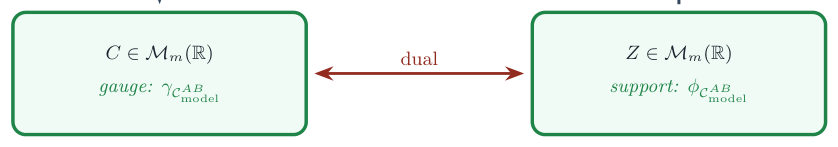
<figcaption class="paper-figure-caption"><b>Fig 1.</b> FIG. 1. Duality structure of the support and gauge functions. The upper level represents the</figcaption>
</figure>

**Main problem.** The paper aims to provide a dualistic operational characterization of device-dependent correlation sets (separable, quantum, and maximal) within the (2,m,2) Bell scenario.

**Main result.** The authors derive explicit formulae for the support and gauge functions of these correlation sets, establishing that detection sensitivity for entanglement and beyond-quantum states is fundamentally limited by the number of linearly independent measurement directions.

**Method.** The study employs convex analysis, utilizing support functions for entanglement witnessing and gauge functions for quantifying noise robustness, alongside matrix algebra and Singular Value Decomposition (SVD).

**Summary.** This paper provides a complete geometric and operational characterization of correlation sets in the (2,m,2) Bell scenario. By using convex analysis, the authors derive explicit formulas for support and gauge functions that allow for optimal entanglement witnessing and noise robustness quantification. They show that the ability to detect entanglement or beyond-quantum correlations depends directly on the number of linearly independent measurement directions available to the parties. Specifically, they demonstrate that for certain measurement settings, the detection threshold can reach the optimal PPT limit.

Detailed structure

**Model / system.** The system consists of two-qubit systems (C2 tensor C2) in a (2,m,2) Bell scenario, where two parties perform m dichotomic measurements with outcomes in {+1, -1}.

**Key observables.** Correlation matrix (C), support functions (phi), and gauge functions (gamma).

**Important parameters / regimes.** Number of measurement settings (m), rank of measurement matrices (r), and the critical noise threshold (p_crit) for Werner states.

**Assumptions / limitations.** The analysis is restricted to device-dependent (fixed local measurements) rather than device-independent scenarios and is focused on two-qubit systems.

**Paper structure.** The paper introduces the (2,m,2) scenario and three state space models, develops the mathematical framework of support and gauge functions via convex analysis, derives explicit analytic formulae for these functions, analyzes detection thresholds for entanglement and beyond-quantum states, and concludes with discussions on dimensionality and higher-dimensional generalizations.

**Why it may be interesting.** This work provides fundamental bounds on the robustness of non-classical correlations against noise, which is critical for designing reliable quantum communication protocols and understanding the limits of entanglement detection in noisy environments.

Abstract

We analyze device-dependent correlation sets generated by fixed local dichotomic measurements for two-qubit systems in the $(2,m,2)$ Bell scenario. We consider three fundamental state spaces for the composite system: the separable state space, the standard quantum state space, and the maximal tensor-product state space, which contains beyond-quantum states compatible with local quantum measurements. We formulate the corresponding correlation sets for general fixed dichotomic measurements and, in the traceless case, derive particularly simple explicit formulae for their support and gauge functions. These functions furnish dual operational characterizations of the three correlation sets: the support functions give optimal witnesses for entanglement and beyond-quantum states, whereas the gauge functions quantify the robustness of these detections against depolarizing noise. We further derive convex-hull representations that elucidate the extremal structures of the correlation sets and the physical states realizing them, showing in particular that extremal quantum correlations are realized by maximally entangled states. The fundamental limits of these dual operational tasks are governed solely by the smaller of the numbers of linearly independent measurement directions available to Alice and Bob. When both parties have three linearly independent measurement directions, our entanglement criterion detects Werner states up to the optimal PPT threshold $p_{\mathrm{crit}}=2/3$. For beyond-quantum-state detection, a nontrivial separation from the quantum set occurs only under the same measurement condition; in that case, the same optimal noise threshold is attained for an extremal state in the maximal tensor-product state space.

[↑ back to top](#top)

### [Field-induced jammed polyhex spin liquid in the honeycomb Ising antiferromagnet](http://arxiv.org/abs/2604.24687v1)

**Authors:** Nicholas Franklin, Jacob Richards, Harry Lane  
**Type:** theory · **Category:** strongly correlated electrons · **PDF:** <https://arxiv.org/pdf/2604.24687v1>  
**Analysis basis:** full PDF text, analyzed in chunks
**Topic relevance:** `scars & prethermalization` **3/5** · `non-equilibrium dynamics` **2/5**

↔ Scroll figures horizontally

<figure class="paper-figure-card">
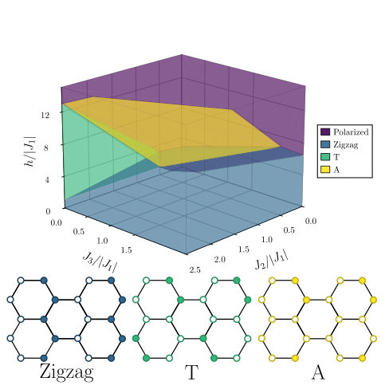
<figcaption class="paper-figure-caption"><b>Fig 1.</b> FIG. 1. Phase diagram of the Ising Honeycomb model, based on the analytical results of Ref. [39]. Down (up) spins are represented by open (filled) circles.</figcaption>
</figure>
<figure class="paper-figure-card">
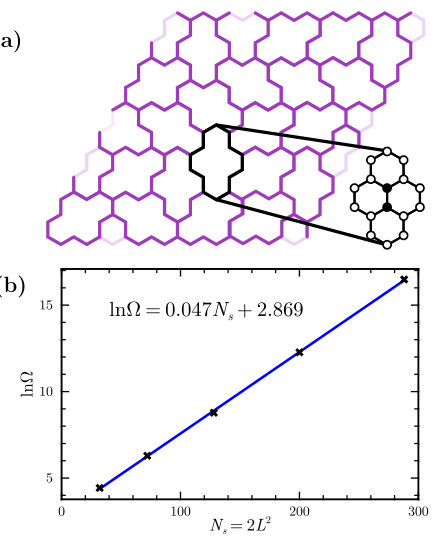
<figcaption class="paper-figure-caption"><b>Fig 2.</b> FIG. 2. (a) One possible tiling on a (10, 10) supercell with PBCs. Edges of the supercell which are within a periodically wrapped polyhex are shaded light purple. Indicated is the spin configuration on a single polyhex, with solid (empty) circles representing up (down) spins. (b) Scaling of ground state degeneracy with system size.</figcaption>
</figure>
<figure class="paper-figure-card">
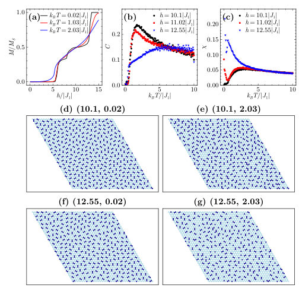
<figcaption class="paper-figure-caption"><b>Fig 3.</b> FIG. 3. (a) Magnetization as a function of temperature show- ing the emergence of the M/MS = 1/2 plateau. (b) Specific heat and (c) magnetic susceptibility showing the paramag- netic to polyhex spin liquid transition. (d-g) Representative spin snapshots at different (h/|J1|, kBT/|J1|) values.</figcaption>
</figure>
<figure class="paper-figure-card">
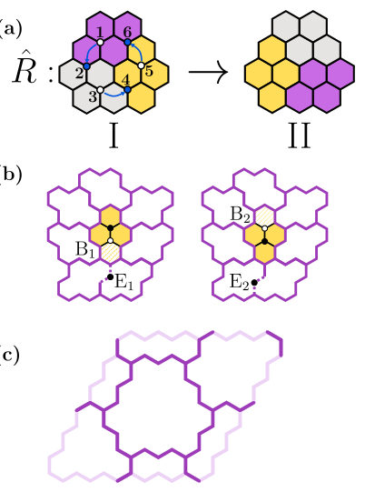
<figcaption class="paper-figure-caption"><b>Fig 4.</b> FIG. 4. (a) Two tilings of a 12-hex region, S, differing by the action of the operator ˆR. The I domain can be transformed to the II domain by the action of ˆR. (b) Action of a spin flip on a polyhex tiling. B1 and B2 correspond to two degenerate states created by acting on the bee polyhex. E1 and E2 are degenerate edge excitations. (c) One possible tiling of a 6 × 6 supercell by three 12-hexes.</figcaption>
</figure>
<figure class="paper-figure-card">
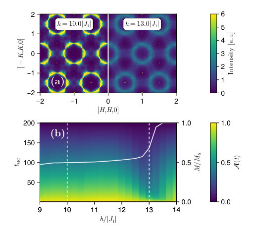
<figcaption class="paper-figure-caption"><b>Fig 5.</b> FIG. 5. (a) S(Q) at kBT = 0.75|J1|, showing diffuse patterns that broaden near the transition. Intensities are seen at Γ due to the finite magnetization in the A phase. (b) Autocor- relation A(t) as a function of field at kBT = 0.75|J1|. Dashed lines correspond to the field values in (a). Overlaid is the magnetization curve for this temperature.</figcaption>
</figure>

**Main problem.** The study investigates the ground state properties and dynamics of a new 'jammed polyhex spin liquid' phase in the honeycomb Ising antiferromagnet under an external magnetic field.

**Main result.** The authors identify a phase with extensive ground state degeneracy that maps to a polyhex tiling problem, characterized by 'jamming' where the lack of local zero modes constrains dynamics. They also show that quantum fluctuations partially lift this degeneracy, selecting a specific subspace of non-periodic tilings.

**Method.** The study employs combinatorial tiling analysis using Knuth's Algorithm X, Monte Carlo simulations with parallel tempering, and degenerate perturbation theory to derive an effective Hamiltonian.

**Summary.** This paper identifies a novel 'jammed polyhex spin liquid' phase in the honeycomb Ising antiferromagnet under a magnetic field. By mapping the spin configurations to a polyhex tiling problem, the authors demonstrate that the system possesses extensive ground state degeneracy but lacks the local zero modes typical of conventional spin liquids, leading to 'jammed' dynamics. They show that the magnetic field can control spin diffusion and that quantum fluctuations select a specific subset of non-periodic tilings. The findings are particularly relevant to the study of transition metal trichalcogenides like FePS3.

Detailed structure

**Model / system.** A honeycomb Ising antiferromagnet with competing interactions (J1, J2, J3) subjected to an external magnetic field, specifically focusing on the regime where J1 is ferromagnetic and J2, J3 are antiferromagnetic.

**Key observables.** Magnetization (M/Ms), specific heat (C), magnetic susceptibility (chi), spin autocorrelation function (A(t)), and static structure factor (S(Q)).

**Important parameters / regimes.** Magnetic field strength (h), interaction strengths (J1, J2, J3), and temperature (kT).

**Assumptions / limitations.** The analysis assumes the validity of the mapping to polyhex tilings at the M/Ms = 1/2 plateau and uses second- and third-order perturbation theory to account for quantum fluctuations.

**Figures summary.** Fig 1 shows the phase diagram of the honeycomb Ising model; Fig 2 displays an example of bee polyhex tiling and the scaling of tiling degeneracy; Fig 4 illustrates the action of spin flips on polyhex tilings and the resulting excitations.

**Paper structure.** The paper begins by defining the Hamiltonian and the tiling mapping, proceeds to analyze the classical ground state degeneracy and its scaling, explores the dynamics and jamming via Monte Carlo, introduces quantum fluctuations via perturbation theory, and concludes with experimental relevance to FePS3.

**Why it may be interesting.** The discovery of a 'jammed' spin liquid phase provides a unique example of a highly degenerate system where dynamics are constrained by topological/combinatorial structures rather than local zero modes, which is relevant to many-body dynamics and constrained dynamics.

Abstract

We analyze the ground state properties of the honeycomb Ising antiferromagnet in an external magnetic field. We demonstrate the existence of extensive ground state degeneracy at finite field that maps to a polyhex tiling problem. This state is shown to be a jammed spin liquid, with no local zero modes connecting ground states. Through Monte Carlo simulations, we explore the properties of these states and show that the spin diffusion can be controlled by the magnetic field strength. By considering quantum fluctuations, we demonstrate that transverse coupling partially lifts the ground state degeneracy, selecting an extensive subspace of non-periodic tilings of 12-hexes. We suggest that the jammed polyhex spin liquid phase exists in an experimentally realizable region of parameter space and may be present in the FePX$_3$ compounds.

[↑ back to top](#top)

### [Fraunhofer Patterns in Atomic Josephson Junctions](http://arxiv.org/abs/2604.22923v1)

**Authors:** Kevin T. Geier, Giampiero Marchegiani, Vijay Pal Singh, Juan Polo, Luigi Amico  
**Type:** theory · **Category:** quantum gases · **PDF:** <https://arxiv.org/pdf/2604.22923v1>  
**Analysis basis:** full PDF text, analyzed in chunks
**Topic relevance:** `analog quantum simulation` **3/5** · `non-equilibrium dynamics` **2/5**

↔ Scroll figures horizontally

<figure class="paper-figure-card">
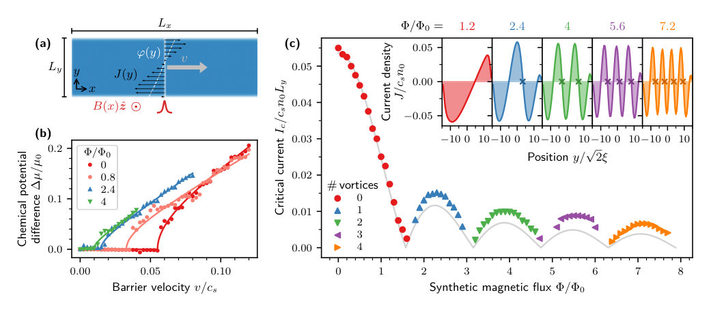
<figcaption class="paper-figure-caption"><b>Fig 1.</b> Figure 1. Fraunhofer pattern in an atomic Josephson junction. (a) The junction is created by a repulsive barrier potential, forming a density depletion (light color) in a quasi-2D Bose–Einstein condensate with particle density n0 and dimensions Lx × Ly (dark color). Moving the barrier at a constant velocity v induces a net particle current I ≈−vn0Ly through the junction. A synthetic magnetic field B = B(x −vt)ˆz localized around the junction (red curve) induces a gradient of the phase difference φ(y) across the junction (dashed white line) and therefore a spatial modulation of the current density J(y) at the junction. (b) Chemical potential difference ∆µ versus barrier velocity v for...</figcaption>
</figure>
<figure class="paper-figure-card">
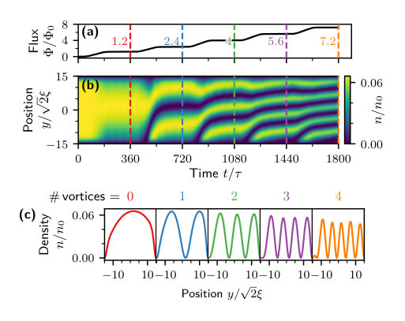
<figcaption class="paper-figure-caption"><b>Fig 2.</b> Figure 2. Microscopic dynamics underlying the formation of Fraunhofer patterns in atomic Josephson junctions. (a) The magnetic flux Φ is slowly increased in a sequence of consec- utive sweeps. (b) Temporal evolution of the density n(x0, y) at the junction. Each sweep of the magnetic field to a new lobe of the Fraunhofer pattern is accompanied by the entry of an additional vortex into the junction from below, such that the nth lobe features n vortices. (c) Snaptshots of the den- sity n(x0, y) at values of Φ marked by vertical dashed lines in panel (b).</figcaption>
</figure>
<figure class="paper-figure-card">
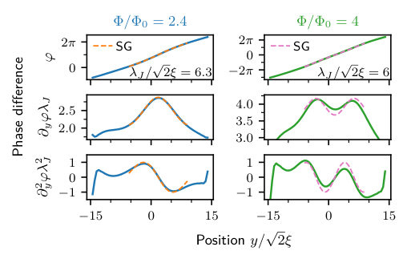
<figcaption class="paper-figure-caption"><b>Fig 3.</b> Figure 3. Signatures of Josephson vortices. The solid lines in each row show the phase difference φ(y) as well as its first and second derivatives for two values of the magnetic flux Φ corresponding to the respective configurations in Fig. 2. The location of the phase kinks, visible as peaks in ∂yφ, coincides with the position of vortex cores. The dashed lines show the right-hand side of the sine-Gordon (SG) equation, λ−2 J sin φ, with λJ obtained from fits to ∂2 yφ and integration constants determined by fits to ∂yφ and φ. In the single-vortex case (left column), the kink locally fits the phase profile of a Josephson vortex on a linear background.</figcaption>
</figure>
<figure class="paper-figure-card">
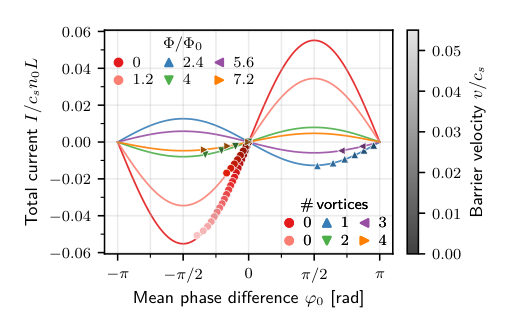
<figcaption class="paper-figure-caption"><b>Fig 4.</b> Figure 4. Current–phase relation as an alternative method for probing the critical current Ic. The solid lines represent fits of the Josephson relation I(φ0) = Ic sin φ0 to the simulation data (markers) with Ic as a fit parameter. The barrier veloc- ity v is encoded in the lightness of the colors. For an even (odd) number of vortices inside the junction, the current– phase relation is centered around φ0 = 0 (φ0 = π).</figcaption>
</figure>
<figure class="paper-figure-card">
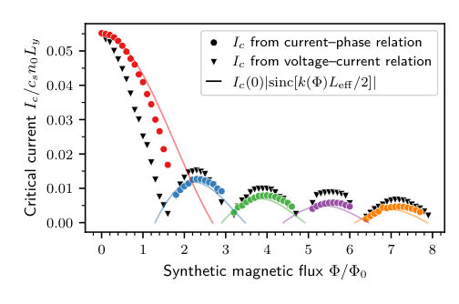
<figcaption class="paper-figure-caption"><b>Fig 5.</b> Figure 5. Comparison of Fraunhofer-like patterns extracted from the current–phase versus voltage–current relation. The dots represent the critical current Ic extracted by fitting the Josephson relation I(φ0) = Ic sin φ0 to the integral current– phase relation in Fig. 4, while the triangles correspond to Ic ≈|vc|n0Ly, where the critical velocity vc has been ex- tracted from the voltage–current relation as in Fig. 1(b). In the main lobe, the extrapolated current–phase relation sys- tematically overestimates the critical current realizable in practice with our protocol due to dynamical instabilities. The solid lines show the pattern Ic(Φ) = Ic(0) sinc[k(Φ)Leff/2], where the wave numbers k(Φ)...</figcaption>
</figure>

**Main problem.** Investigating the emergence of Fraunhofer-like interference patterns in the critical current of atomic Josephson junctions under synthetic magnetic fields and understanding the role of Josephson vortices.

**Main result.** The study demonstrates that synthetic magnetic fields induce Fraunhofer-like modulations of the critical current in neutral superfluids, with deviations from ideal superconducting behavior due to the lack of Meissner screening and the presence of large-scale superflows.

**Method.** Numerical simulations based on the time-dependent Gross-Pitaevskii equation (GPE) using sine pseudospectral discretization and Magnus integration.

**Summary.** This paper explores how synthetic magnetic fields can induce Fraunhofer-like interference patterns in the critical current of atomic Josephson junctions. Using Gross-Pitaevskii simulations, the authors show that while the pattern is analogous to superconducting junctions, the neutral nature of the BEC leads to distinct features like shifted interference minima. The study also elucidates how the entry of Josephson vortices modulates the current density. These findings are significant for developing matter-wave circuits and atomtronic quantum technologies.

Detailed structure

**Model / system.** A quasi-2D Bose-Einstein Condensate (BEC) in a rectangular box trap, featuring an atomic Josephson junction created by a repulsive Gaussian potential barrier and subjected to a synthetic vector potential.

**Key observables.** Critical current (Ic), chemical potential difference (delta-mu), current density distribution (J(y)), synthetic magnetic flux (Phi), and vortex count.

**Important parameters / regimes.** Synthetic magnetic flux (Phi/Phi0), barrier velocity (v), healing length (xi), chemical potential (mu), and the DC/AC regimes.

**Assumptions / limitations.** The system is in the deep tunneling regime where the current can be approximated by the barrier velocity; the synthetic gauge field does not experience reciprocal effects (no screening) from the neutral matter.

**Figures summary.** Figure 1 shows the experimental setup; Figure 2 illustrates the temporal evolution of density and vortex entry during flux sweeps; Figure 3 shows signatures of Josephson vortices; Figure 4 displays the current-phase relation; Figure S8 compares wave numbers extracted from current density and phase difference.

**Paper structure.** The paper introduces the setup of atomic Josephson junctions in synthetic fields, presents numerical results for critical current modulation (Fraunhofer patterns), analyzes the microscopic role of Josephson vortices, compares extraction methods for critical current, and discusses the impact of superflows on phase gradients.

**Why it may be interesting.** It provides a bridge between superconductivity and atomtronics, showing how neutral superfluids can mimic complex electromagnetic phenomena like Fraunhofer patterns while introducing unique physics due to the absence of the Meissner effect.

Abstract

Driven atomic Josephson junctions allow one to monitor phase-coherent dynamics with unprecedented control and flexibility of the system's physical conditions. While cold-atom manifestations of the Josephson effect have been extensively studied in a wide variety of settings, atomic Josephson junctions in synthetic electromagnetic fields remain largely unexplored. Here, we show that synthetic magnetic fields can induce Fraunhofer-like modulations of the critical current in atomic Josephson junctions. Although this effect presents analogies to the Fraunhofer patterns found in superconducting devices, distinctive features emerge due to the neutral nature of the superfluid. We investigate the underlying spatial interference mechanisms and elucidate the role of Josephson vortices in the formation of spatially modulated current distributions based on numerical simulations. Our results open up new avenues for matter-wave circuits to deepen our understanding of spatial coherence in Josephson junctions, which are fundamental to the development of novel quantum technologies.

[↑ back to top](#top)

### [Physics-Informed Deep Image Prior Reconstruction of In-Plane Magnetization from Scanning NV Magnetometry](http://arxiv.org/abs/2604.23431v1)

**Authors:** Zander Scholl, Justin Woods, Charudatta Phatak, Hanu Arava  
**Type:** both · **Category:** disordered systems and neural networks · **PDF:** <https://arxiv.org/pdf/2604.23431v1>  
**Analysis basis:** full PDF text, analyzed in chunks
**Topic relevance:** `spintronics-quantum-optics interface` **3/5** · `QC/QI experiment` **1/5** · `quantum measurements` **1/5**

↔ Scroll figures horizontally

<figure class="paper-figure-card">
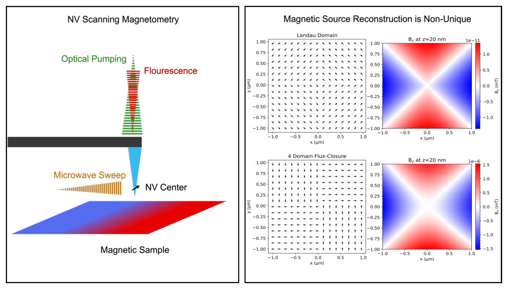
<figcaption class="paper-figure-caption"><b>Fig 1.</b> FIG. 1. (A) Schematic of a scanning NV magnetometry experimental set up. The magnetic field strength is determined through optically-detected magnetic resonance (ODMR). The NV center is optically pumped with a green laser while a microwave antennae sweeps an applied RF field. (B) Simulated B field plots for two different magnetizations, a Landau domain and a 4 domain flux-closure, leading to nearly identical B-field projections. Illustrates the fundamental challenges associated with addressing an ill-posed problem.</figcaption>
</figure>
<figure class="paper-figure-card">
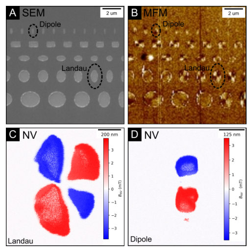
<figcaption class="paper-figure-caption"><b>Fig 2.</b> FIG. 2. (A) SEM image of fabricated Permalloy nanostruc- tures. (B) MFM images of selected ellipses, confirming the presence of Landau domain pattern (left) and dipole arrange- ment (right). (C-D) Scanning NV magnetometry B field maps of the same structures, here the NV axis is at 54.75 degrees rel- ative to the sample normal, illustrating the four-lobed (Lan- dau Domain) and two-lobed (Dipole Domain) stray field dis- tributions.</figcaption>
</figure>
<figure class="paper-figure-card">
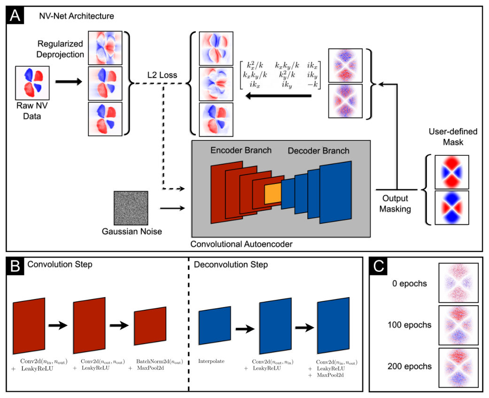
<figcaption class="paper-figure-caption"><b>Fig 3.</b> FIG. 3. (A) Deep image prior reconstruction workflow showing the approach. Stray field data from scanning NV magnetometry is processed through a convolutional autoencoder that minimizes error in real-space between measured fields and forward- propagated outputs. (B) The encoder stage (teal) comprises paired convolutional layers (kernel size 5) with LeakyReLU activation, instance normalization, and max pooling for downsampling. Channel dimensions increase progressively through encoding stages. The decoder stage (yellow) uses identical convolutional parameters with bilinear upsampling, featuring separate channels for each magnetization component (Mx, My). We do not show Mz because the network...</figcaption>
</figure>
<figure class="paper-figure-card">
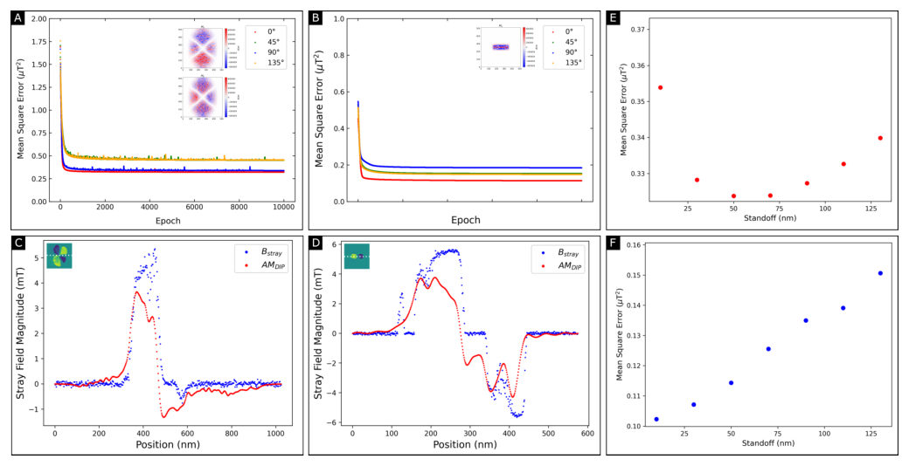
<figcaption class="paper-figure-caption"><b>Fig 4.</b> FIG. 4. (A, B) MSE as a function of training epochs for the (A) Landau and (B) Dipole domain reconstructions. Each curve represents a different orientation of the initialization mask, demonstrating that convergence is fastest for the correct orientation. In this figure, MSE is reported given that it was the actual cost function minimized during training whereas RMSE can be directly compared to the NV signal magnitude. (C, D) Line profiles comparing the measured stray field (Raw BNV) with the final reconstructed field from the model, showing excellent agreement for both magnetic configurations. (E, F) MSE error as a function of standoff distance for Landau and Dipole domains, indicating the...</figcaption>
</figure>

**Main problem.** Reconstructing in-plane magnetization from scanning NV magnetometry data is an ill-posed inverse problem because infinitely many magnetization configurations can produce the same stray field distribution.

**Main result.** A physics-informed Deep Image Prior (DIP) framework using a convolutional autoencoder can qualitatively and quantitatively reconstruct complex magnetic textures, with optimal spatial mask alignment improving SNR by up to 3 dB.

**Method.** The researchers use a convolutional autoencoder-based Deep Image Prior (DIP) framework with a physics-informed MSE loss function in Fourier space, incorporating spatial masking and magnetostatic forward modeling.

**Summary.** This paper presents a new way to reconstruct magnetic patterns in thin films using a neural network approach called Deep Image Prior. By using a physics-informed model, the researchers can overcome the mathematical ambiguity of magnetic field measurements. The method works without needing pre-trained datasets and can even use the reconstruction accuracy to help identify the correct orientation of magnetic domains. This provides a more efficient tool for analyzing nanoscale magnetic textures in spintronic materials.

Detailed structure

**Model / system.** The study uses Permalloy (Ni80Fe20) nanostructures with lithographically patterned ellipse shapes, specifically investigating Landau and dipole domain configurations, measured via scanning Nitrogen-Vacancy (NV) magnetometry.

**Key observables.** Stray field maps (B_NV), magnetization maps (Mx, My), signal-to-noise ratio (SNR), and Mean Square Error (MSE).

**Important parameters / regimes.** NV-to-sample standoff distance (z), spatial mask orientation, and spatial filter cutoff frequencies.

**Assumptions / limitations.** The method relies on accurate spatial masking and may be limited when dealing with topologically non-trivial textures like skyrmions where signatures are highly ambiguous.

**Figures summary.** Fig 1 shows the NV setup and the ill-posed nature of the problem; Fig 2 displays SEM, MFM, and NV field maps; Fig 3 details the CAE architecture and reconstruction epochs; Fig 4 shows MSE and SNR performance relative to mask orientation and standoff distance.

**Paper structure.** The paper introduces the inverse problem, describes the experimental NV platform and Permalloy samples, details the DIP neural network architecture and physics-informed loss, presents results for Landau and dipole domains, and discusses the impact of standoff distance and masking.

Abstract

Reconstructing magnetization in nanoscale magnetic thin films is essential for developing next-generation memory, sensors, and various spintronic technologies. However, this remains challenging due to the ill-posed nature of the stray field inverse problem, i.e., there are infinitely many magnetization solutions to a given stray field distribution. Here, we demonstrate that a physics-informed deep image prior (DIP) framework, using a simple convolutional autoencoder conditionally achieves a reasonable qualitative and quantitative reconstruction of complex in-plane magnetization patterns from scanning NV magnetometry. We find that the orientation of user-defined masks implemented to restrict the reconstruction solution space dramatically affects convergence. The optimal alignment of the mask improves the reconstruction signal-to-noise ratio by up to $\SI{3}{\decibel}$, thereby also serving as a diagnostic tool. The DIP approach requires no pre-trained datasets and is considered computationally less intensive as compared to supervised learning approaches. We analyze both Landau and dipole domain structures in lithographically patterned Permalloy nanostructures by incorporating experimentally-guided spatial constraints. Complementary magnetic force microscopy measurements were carried out to support the Scanning NV measurements.

[↑ back to top](#top)

### [Singlet-triplet oscillations in multivalley Si double quantum dots](http://arxiv.org/abs/2604.24689v1)

**Authors:** Łukasz Cywiński, Mats Volmer, Tom Struck, Giordano Scappucci, Lars R. Schreiber  
**Type:** both · **Category:** quantum information and computing · **PDF:** <https://arxiv.org/pdf/2604.24689v1>  
**Analysis basis:** full PDF text, analyzed in chunks
**Topic relevance:** `QC/QI experiment` **3/5** · `non-equilibrium dynamics` **2/5**

↔ Scroll figures horizontally

<figure class="paper-figure-card">
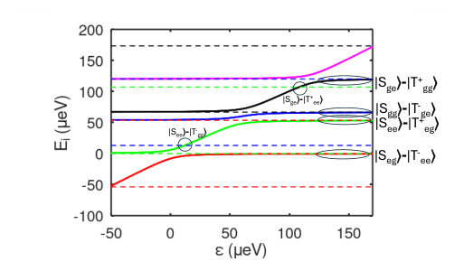
<figcaption class="paper-figure-caption"><b>Fig 1.</b> FIG. 2. Energies of singlet states (solid lines) and energies of spin-polarized (3, 1) triplet states (dashed lines) that can be mixed by spin-valley coupling with the singlets, calculated for 2µBB = ER V . Some of the spin-valley anticrossings (funnels) that occur at detunings at which the singlet is a superposition of (4, 0) and (3, 1) charge states are marked with circles. The 4 regions in which a (3, 1) singlet is mixed with a polarized triplet at large detuning are marked by ellipses. These are the spin-valley resonances at which the spin-valley coupling in the right dot affects the singlet dynamics in the far detuned regime, see the lines corresponding to odd r in Table I. An- other...</figcaption>
</figure>
<figure class="paper-figure-card">
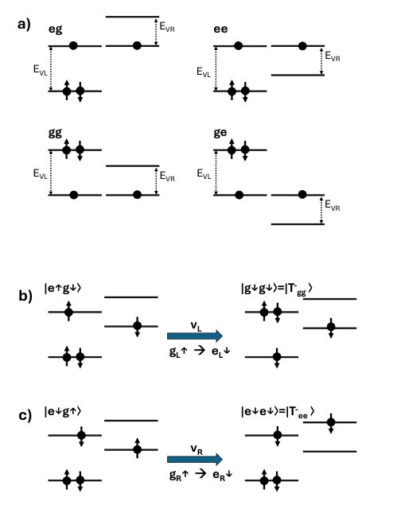
<figcaption class="paper-figure-caption"><b>Fig 2.</b> FIG. 1. (a) Occupations of valley states in L and R dots in (3, 1) charge configuration. The states in which the µ valley state in dot L and ν valley state in dot R are occupied by a single electron are labeled µν. For EL V &gt; ER V , when go- ing clockwise from the eg state we encounter the states that can be created by interdot tunneling as the detuning is in- creased. For a detuning sweep that is adiabatic with respect to the teg tunnel coupling only the Seg state is created; if the sweep is not adiabatic, the subsequent state, See, can be created due to tee tunnel coupling, etc. (b,c) Illustration of states with “eg” valley occupation that are spin-valley cou- pled. The “eg” singlet with...</figcaption>
</figure>
<figure class="paper-figure-card">
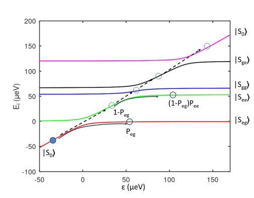
<figcaption class="paper-figure-caption"><b>Fig 3.</b> FIG. 3. Solid lines: spectrum of Hamiltonian (7) as a function of detuning ϵ for ER V =53.5 µeV, EL V =66.6 µeV, and all tun- nel couplings equal to tc =10 µeV. |S0⟩is the singlet ground state of the (4, 0) charge configuration, while |Sνµ⟩are the 4 singlets with (3, 1) charge configuration, with valley occupa- tions depicted in Fig. 1. Solid (dashed) lines with arrows show adiabatic (diabatic) evolution pathways: system initialized in |S0⟩at large negative detuning upon detuning sweep evolves to |Seg⟩state with probability Peg, while it stays in |S0⟩with probability Qeg ≡1 −Peg, and subsequently it can adiabati- cally evolve into |See⟩, with the probability of populating that state being...</figcaption>
</figure>
<figure class="paper-figure-card">
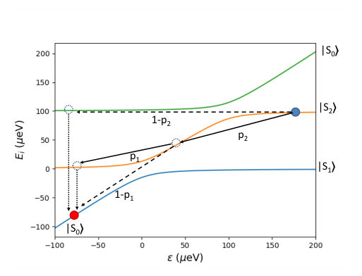
<figcaption class="paper-figure-caption"><b>Fig 4.</b> FIG. 4. Illustration of pathways of getting back from a given S(3, 1) state to |S0⟩which is the singlet ground state of the (4, 0) charge configuration. Solid lines show the spectrum of Hamiltonian for a system with only two S(3, 1) singlets (la- beled as |S1⟩and |S2⟩) as a function of detuning ϵ for EV =100 µeV, and both tunnel couplings equal to tc = 10 µeV. Initial state at large positive detuning is |S2⟩(filled blue circle), while the desired final state in which PSB measurement works as intended is |S0⟩at negative detuning (filled red circle). Lines with arrows correspond to respective pathways of dynamcis: adiabatic evolution during detuning sweep back to negative values (solid),...</figcaption>
</figure>
<figure class="paper-figure-card">
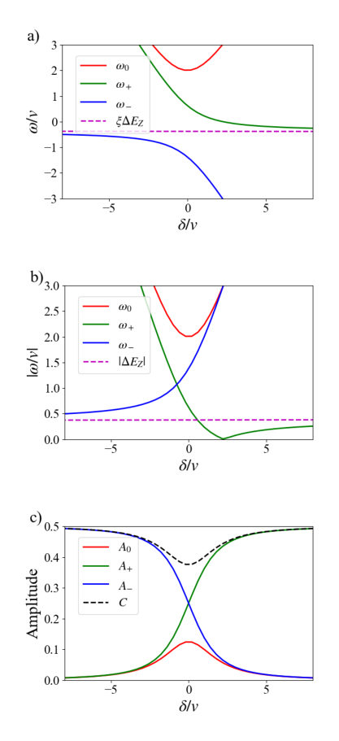
<figcaption class="paper-figure-caption"><b>Fig 5.</b> FIG. 5. a) Frequencies present in PS(t) signal (thick solid lines) in the vicinity of spin-valley resonance in one of the dots, given by Eqs. (28) and (29), and ξr∆Er Z frequency (dashed line) that would be observed in absence of spin-valley cou- pling. The calculation is done for ξ =1, p=−1, and ∆EZ &lt;0. The frequencies and detuning δ are expressed in units of v, the spin-valley coupling at a relevant resonance, making the features of the plots other than the position of the dashed no- spin-valley-coupling line universal. The used value of |∆EZ| at resonance corresponds to −0.38v. This is realized, for ex- ample, for resonance involving |Seg⟩and electron in the left dot, when EL V = 66.6...</figcaption>
</figure>
<figure class="paper-figure-card">
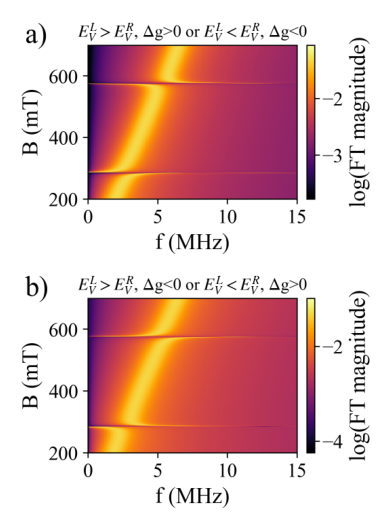
<figcaption class="paper-figure-caption"><b>Fig 6.</b> FIG. 7. Two possible patterns of frequency and magnetic field dependence of the Fourier transform of singlet return probability that are realized for any of the Sµν singlets from Fig. 1a depending on the signs of ∆gµν = gµL −gνR and EL V −ER V .</figcaption>
</figure>
<figure class="paper-figure-card">
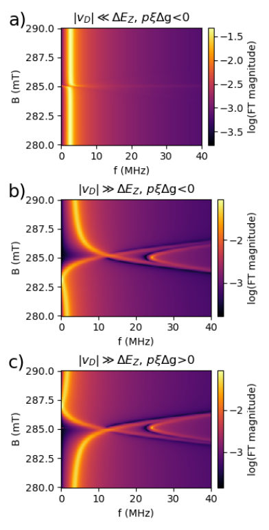
<figcaption class="paper-figure-caption"><b>Fig 7.</b> FIG. 6. Fourier transform of the singlet return probabil- ity near a spin-valley anticrossing. The calculation is done for B field in the vicinity of spin-valley hotspot in the R dot (resonances with odd r in Table I) for ER V = 33 µeV, |∆g| = 6.58 · 10−4, and dephasing parameters σZR = 1 neV, σV R =10 neV. Zero frequency components have been removed by subtracting the long-time value of PS(t) from the signals before Fourier-transforming them. (a) Weak coupling results for vD = 5 neV, for which |vD| ≈|∆EZ|/2. (b,c) Two pos- sible patterns of frequency and magnetic field dependence of Fourier transform of singlet return probability near a spin- valley anticrossing when vD = 50 neV, so that...</figcaption>
</figure>
<figure class="paper-figure-card">
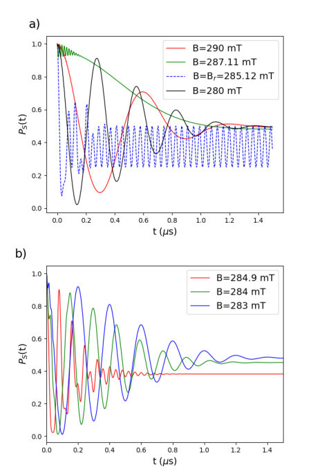
<figcaption class="paper-figure-caption"><b>Fig 8.</b> FIG. 8. PS(t) signals calculated for resonance r = 1 from Table I calculated for parameters used in Fig. 6c: ER V = 33 µeV, vR =50 neV, ∆g =6.58 · 10−4, σZL =σZR =1 neV (cor- responding to T ∗ 2 = 658 for B fields far from resonance), and σV R = 10 neV. In a) we show the results illustrating mostly the B-dependence of observed frequencies of oscillations: for B = 290 mT and 280 mT we see single oscillation (with fre- quency close to the unperturbed one given by ∆gµBB/h≈2.6 MHz in B =280 mT case), which decay due to fluctuations of spin splitting. At B =287.11 mT the frequency of the oscilla- tion with the largest amplitude is very close to zero, while at B = Br =285.12 mT we are exactly at...</figcaption>
</figure>
<figure class="paper-figure-card">
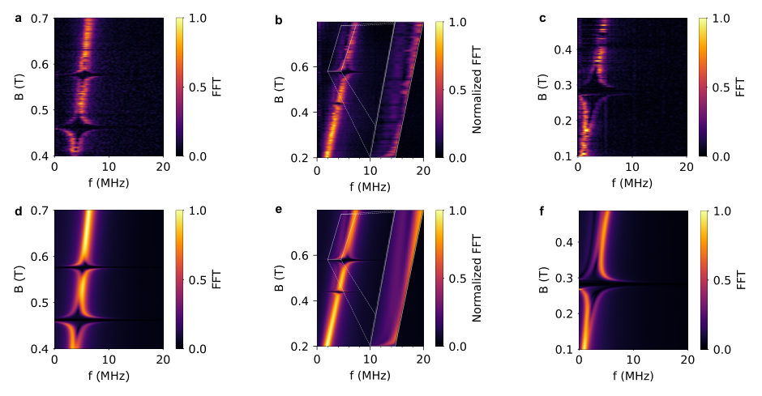
<figcaption class="paper-figure-caption"><b>Fig 9.</b> FIG. 9. (a)-(c): Fourier transform of singlet-return probability measured in a range of magnetic fields in structure from [21, 43] for three positions of the DQD along the y axis (panels a,b,c correspond to datasets 1,2, and 3, respectively). (d)-(f): Theoretical fits to the data using parameters from Table II. For dataset 2 in panels (b) and (e) we also show a zoom on an area in which the presence of frequency corresponding to ∆g3 in Table II is visible.</figcaption>
</figure>
<figure class="paper-figure-card">
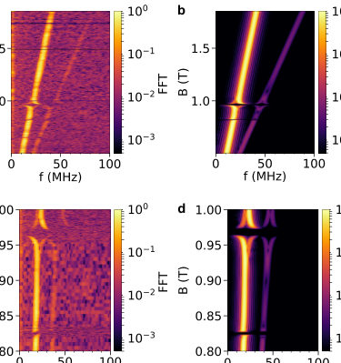
<figcaption class="paper-figure-caption"><b>Fig 10.</b> FIG. 10. Fourier transform of singlet return probability as function of frequency f and magnetic field B: (a) experiment in isotopically enriched Si/SiGe double quantum dot and (b) theoretical fit with parameters given in the last column of Table II. (c) and (d) are respective zoomed plots focused on the two visible resonances. Note that the color scale scale in this Figure is logarithmic.</figcaption>
</figure>

**Main problem.** Understanding the dynamics of singlet-triplet oscillations in Si/SiGe double quantum dots, specifically how spin-valley coupling and valley-splitting fluctuations affect qubit initialization and dephasing.

**Main result.** The study provides a theoretical framework for singlet return probability that accounts for multiple valley occupation patterns and demonstrates that valley-splitting fluctuations from electric field noise are a dominant dephasing mechanism near spin-valley resonances.

**Method.** The authors use a multi-dimensional Hamiltonian approach (up to 17-dimensional) and Landau-Zener theory to model charge separation, comparing theoretical predictions of frequency renormalization and g-factor symmetry against experimental Fourier-transformed singlet return probability signals.

**Summary.** This paper investigates how spin-valley coupling and valley-dependent g-factors influence the dynamics of singlet-triplet oscillations in silicon double quantum dots. By modeling the charge separation process from (4,0) to (3,1) states, the authors show that spin-valley resonances significantly renormalize oscillation frequencies. They also identify that fluctuations in valley splitting, driven by electric field noise, are a primary source of dephasing. The theoretical model is validated by comparing it to experimental measurements in Si/SiGe heterostructures, providing insight into the valley-dependent nature of g-factors.

Detailed structure

**Model / system.** The system consists of two electrons in Si/SiGe or SiMOS double quantum dots (DQDs) transitioning between (4,0) and (3,1) charge states, modeled by a Hamiltonian including Zeeman splitting, valley splitting, and spin-valley coupling.

**Key observables.** Singlet return probability (Ps), singlet-triplet oscillation frequencies, and g-factor differences (delta g).

**Important parameters / regimes.** Valley splitting (Ev), Zeeman splitting (Ez), spin-valley coupling (v), tunnel coupling (tc), and charge noise-induced fluctuations (sigma_epsilon).

**Assumptions / limitations.** The model assumes the lowest energy orbital states and the two lowest energy valley eigenstates per dot, and treats valley coupling components as uncorrelated Gaussian random variables.

**Figures summary.** Figures show Fourier transforms of singlet return probability for various datasets, illustrating multiple frequency components and the presence of different valley occupation patterns.

**Paper structure.** The paper introduces the problem of spin-valley dynamics, presents a theoretical model for charge separation and singlet-triplet mixing, applies this model to analyze spin-valley resonances, compares results with experimental data from Si/SiGe heterostructures, and discusses dephasing mechanisms.

**Why it may be interesting.** The paper explores the interplay between spin and valley degrees of freedom and the impact of environmental noise on quantum coherence, which is highly relevant to the study of open quantum systems and the development of robust spin qubits.

Abstract

Charge separation from the $(4,0)$ to the $(3,1)$ state in a Si/SiGe double quantum dot is commonly used for initialization of spin qubits and Pauli-spin-blockade readout. It was used in recent experiments involving creation of the $(3,1)$ singlet, and subsequent shuttling of one of the electrons. We present a theoretical description of the process of charge separation and singlet-triplet mixing, arriving at expressions for the singlet return probability that take into account experimentally observed finite probabilities of the creation of singlets with various patterns of valley occupations. In our analysis we focus on magnetic fields for which the electron spin Zeeman splitting is close to the valley splitting in one of the dots, when the spin-valley coupling causes a strong renormalization of the frequency of oscillations of singlet return probability. The latter effect has been recently used to perform valley splitting mapping by shuttling of one quantum dot to various locations with respect to the other. We give a detailed description of singlet-triplet dynamics near these spin-valley resonances and compare the results of calculations with measurements on double quantum dots in two distinct Si/SiGe heterostructures. Comparison of theory with experiments in which the presence of a few valley occupation patterns is visible, gives insight into the valley dependence of $g$-factors in these structures, providing support for a recently proposed theoretical model of this dependence. We also discuss how dephasing of singlet return probability oscillations near the spin-valley resonances is affected by valley splitting fluctuations caused by electric field noise.

[↑ back to top](#top)

### [Witnessing entanglement between photon and matter due to graviton exchange](http://arxiv.org/abs/2604.24496v1)

**Authors:** Arijit Dutta, Marko Toroš, Sougato Bose, Anupam Mazumdar  
**Type:** theory · **Category:** quantum information and computing · **PDF:** <https://arxiv.org/pdf/2604.24496v1>  
**Analysis basis:** full PDF text, analyzed in chunks
**Topic relevance:** `entanglement & information structure` **3/5** · `quantum measurements` **2/5**

↔ Scroll figures horizontally

<figure class="paper-figure-card">
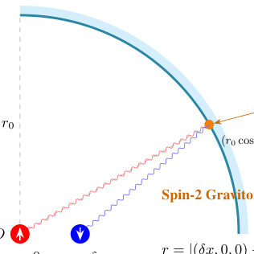
<figcaption class="paper-figure-caption"><b>Fig 1.</b> FIG. 1. Schematic of the interaction between matter and photon. The left branch of the massive particle xl is positioned at the origin O. A Stern-Gerlach spin-dependent spatial superposition results in a spatial separation δx ranging from O(1 −100) µm, leading to a modified distance ˆr to the optical field |α⟩, in a coherent state. By using Eq. (15), and Eq. (17), we show in Table I III, for a coherent state with |α| = 1013 and an interaction time τ = 1 s, the overlap |γ| drops from 1.000 to 0.6702 for a 10 kg mass, signaling strong op- tomechanical entanglement witness between matter and photon due to a virtual massless spin-2 graviton exchange. In the presence of squeezing, one can...</figcaption>
</figure>
<figure class="paper-figure-card">
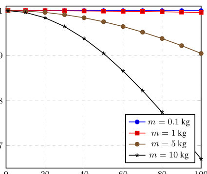
<figcaption class="paper-figure-caption"><b>Fig 2.</b> FIG. 2. Overlap |γ| as a function of spatial separation xl−xr for dif- ferent masses (see Eq. (15), and Eq. (17)). Parameters: |α| = 1013, τ = 1 s, r0 = 0.25 m, λ = 1 µm., we see how |γ| scales with the superposition size. Note that |γ| = 1 shows no entanglement; hence, for small values of |γ|, it is required to witness the entanglement, which prefers heavier masses to be kept in a large spatial superposi- tion.</figcaption>
</figure>
<figure class="paper-figure-card">
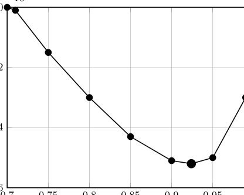
<figcaption class="paper-figure-caption"><b>Fig 3.</b> FIG. 3. Entanglement witness ⟨ΠTM −⟩meas as a function of the coherent-state overlap |γ|. The witness exhibits a non-monotonic de- pendence, attaining maximal negativity around |γ| ≈0.92, reflecting a trade-off between distinguishability and measurement sensitivity.</figcaption>
</figure>
<figure class="paper-figure-card">
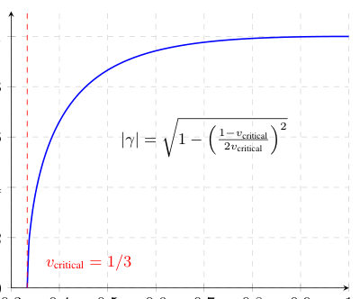
<figcaption class="paper-figure-caption"><b>Fig 4.</b> FIG. 4. Plot of |γ| vs vcritical, (see Eq. (E1)) showing the depen- dence of the overlap parameter |γ| on the noise parameter v. For any pure state of the mass-photon combined system (23) (or any bipartite system) mixed with the isotropic noise, the minimum critical noise parameter vcritical is 1</figcaption>
</figure>

**Main problem.** Developing an experimental scheme and an entanglement witness to detect quantum correlations between a photon and a massive particle induced by graviton exchange.

**Main result.** The authors propose a PPT-based witness using Stokes parameters that can effectively detect entanglement in the regime 0.71 <= |gamma| < 1, with a maximum negativity of -0.052.

**Method.** The study employs the Peres-Horodecki (PPT) criterion to derive an observable witness, mapping effective Pauli operators to physical Stokes operators and using a local oscillator for phase-sensitive measurement.

**Summary.** This paper proposes a method to witness entanglement between a photon and a massive particle mediated by the exchange of virtual gravitons. By using a high-intensity laser and a massive particle in spatial superposition, the authors derive an entanglement witness based on Stokes parameters. The study quantifies the effectiveness of this witness and determines the limits of its robustness against isotropic noise. This provides a potential experimental pathway to test the quantum nature of gravity in a laboratory setting.

Detailed structure

**Model / system.** A bipartite system consisting of a massive particle (spin qubit) in a spatial superposition and an optical field in a strong coherent state, interacting via a perturbative framework of massless spin-2 graviton exchange.

**Key observables.** Stokes parameters (S0, S1, S2, S3), photon-number difference, and the overlap parameter |gamma|.

**Important parameters / regimes.** Mass m (0.1 to 10 kg), spatial separation (up to 100 um), photon intensity (|alpha|^2 = 10^13), and interaction time (1 s).

**Assumptions / limitations.** The interaction is modeled via a perturbative quantum field theoretic framework; the system is subject to isotropic noise; the particle is treated as an effective qubit in a two-dimensional subspace.

**Figures summary.** Figure 1 shows the interaction schematic; Table I displays the overlap |gamma| as a function of mass and separation; Figure 2 plots overlap vs. spatial separation; Figure 3 shows the witness value vs. |gamma|; Figure 4 illustrates the relationship between |gamma| and the critical noise threshold.

**Paper structure.** The paper introduces the problem of detecting gravity-induced entanglement, describes the physical model and interaction Hamiltonian, derives the entanglement witness using the PPT criterion, proposes an experimental measurement strategy using Stokes parameters and a local oscillator, and concludes with a noise robustness analysis.

**Why it may be interesting.** It bridges quantum optics and quantum gravity by proposing a concrete, measurable signature (entanglement witness) for the spin-2 nature of gravitons using macroscopic optical observables.

Abstract

The paper presents a scheme to detect entanglement arising from the quantum nature of gravity between a spin qubit and photons, using Stokes parameters. One of the crucial tests of the general theory of relativity is the bending of light due to the curvature. Recently, a quantum counterpart of this experiment to test the quantum nature of the gravitational interaction has been proposed, in which the spin-2, massless graviton yields entanglement between matter and a photon sector. Hence, it provides one of the most crucial experimental signatures for testing the quantum nature of gravity in a lab, since only spin-2-induced entanglement can yield the correct deflection of light due to matter. Here, we propose a positive partial-transpose (PPT) witness criterion for witnessing such an entanglement. We scan the entangled states in this context by studying the overlap of the final state, which is proportional to the entanglement phase. We exploit the Stokes observables to measure the photon state and the spins in the matter sector, thereby constructing a witness for the quantum nature of gravity in this setup. To quantify this entanglement, we will couple the photon to a local oscillator, whose phase need to be controlled to probe the orthogonal components of the macroscopic interference in the laser beam. We have shown that for a non-maximally entangled state mediated by the quantum nature of gravity, the witness attains a maximal negativity of $-0.052$. Our findings indicate that this witness effectively detects entanglement within the range $0.71 \leq |γ| < 1$, where $γ$ is the overlap between the two coherent states of the photon, providing a clear signature of quantum correlations.

[↑ back to top](#top)

### [Deterministic Nucleation and Dynamics of Infilled Multiply-Charged Vortices in an Immiscible $^{87}\mathrm{Rb}$-$^{41}\mathrm{K}$ Mixture](http://arxiv.org/abs/2604.24511v1)

**Authors:** R. Doran, K. E. Wilson  
**Type:** theory · **Category:** quantum gases · **PDF:** <https://arxiv.org/pdf/2604.24511v1>  
**Analysis basis:** full PDF text, analyzed in chunks
**Topic relevance:** `non-equilibrium dynamics` **3/5**

↔ Scroll figures horizontally

<figure class="paper-figure-card">
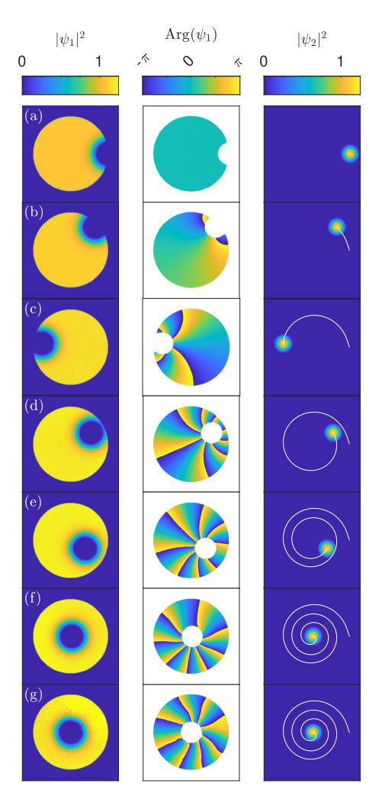
<figcaption class="paper-figure-caption"><b>Fig 1.</b> FIG. 1. Stills from a simulation of the spiral technique with Ns = 3 and Ts = 104, which results in an infilled vortex with charge q = 8 at the origin. Here the beam width w = 32, the trap radius R = 100, and N2 = 1000. The first column shows the density of component 1, |ψ1|2; the second column shows the phase of component 1, Arg (ψ1); the third column shows the density of component 2, |ψ2|2. For clarity, we only plot the phase of component 1 where |ψ1|2 &gt; 0.01, and the trajectory of the spiral beam is added in white to the third column as a guide. The rows correspond to different times, (a) at t = 0, (b) at t = 2 × 103, (c) at t = 4 × 103, (d) at t = 6 × 103, (e) at t = 8 × 103, (f) at t =...</figcaption>
</figure>
<figure class="paper-figure-card">
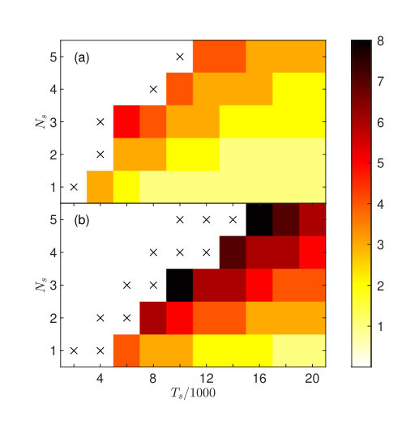
<figcaption class="paper-figure-caption"><b>Fig 2.</b> FIG. 2. The resulting phase winding pinned at the origin as a function of TR and Ns for (a) w = 16 and (b) w = 32. Black crosses (x) indicate values of Ts and Ns where the stirrer moved faster than the critical velocity for vortex nucleation and additional vortices were shed.</figcaption>
</figure>
<figure class="paper-figure-card">
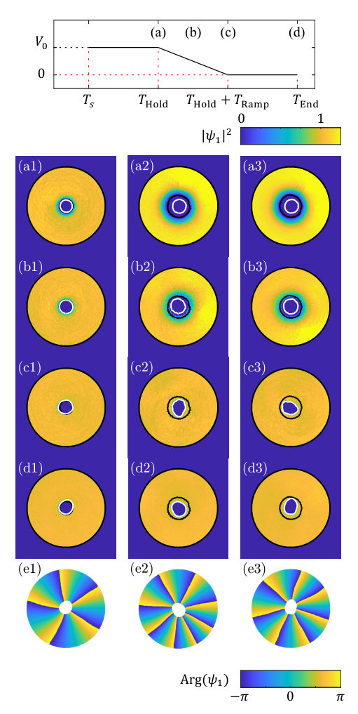
<figcaption class="paper-figure-caption"><b>Fig 3.</b> FIG. 3. Snapshots of the vortex created at the origin as the obstacle potential is ramped off. The top panel shows a schematic of the ramp-off protocol. Rows (a)-(d) show the density of the main component, |ψ1|2, row (e) shows the phase of the main component, Arg (ψ1). Snapshots in a given row are taken at the same time, the time of each row corresponds to text in the top panel. As before, we only plot the phase of component 1 where |ψ1|2 &gt; 0.01. As a guide to the eye, the black density contour |ψ1 (THold) |2 = 0.01 is plotted for each set of stirring parameters. The white contour displays |ψ2(t)|2 = 0.5. The columns correspond to different stirring parameters: Column (1), w = 16, Ns = 3,...</figcaption>
</figure>
<figure class="paper-figure-card">
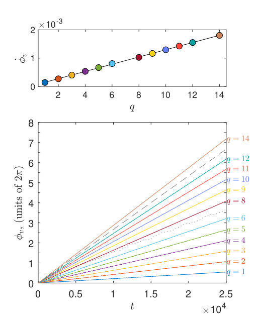
<figcaption class="paper-figure-caption"><b>Fig 4.</b> FIG. 4. Main panel: The precession of the vortex, ϕv, as a function of time. The charge of the vortex, q, is indicated; the infilling atom number, N2, and the interaction parameters, α and β, are all fixed. Upper panel: The extracted precession frequency of the vortex, ˙ϕv, for each of the vortex charges; the green line shows the least squares fit ˙ϕv = Aq + B with A = 1.279 × 10−4 and B = 1.705 × 10−5.</figcaption>
</figure>
<figure class="paper-figure-card">
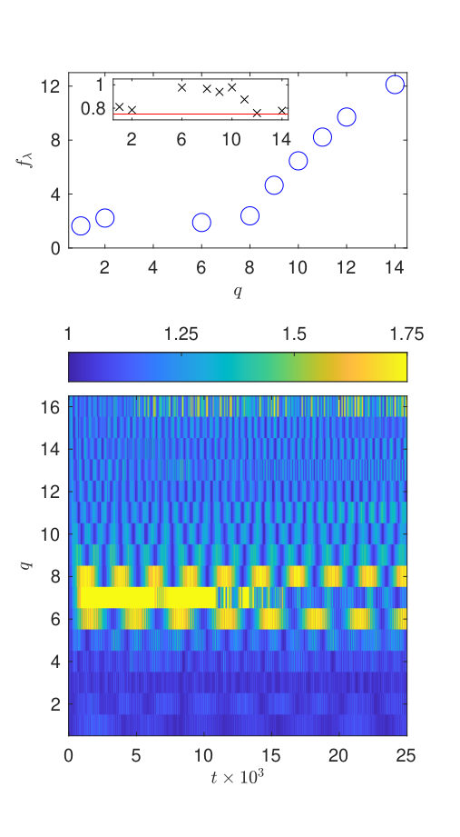
<figcaption class="paper-figure-caption"><b>Fig 5.</b> FIG. 5. Main panel: The aspect ratio of the infilling compo- nent, given by Eq. (20), as a function of time. The charge of the vortex, q is indicated on the vertical axis, the colourbar represents λ. Upper panel: The extracted frequency of the as- pect ratio, fλ, as a function of vortex charge, found by fitting Eq. (21); the inset shows the coefficient of determination for each value of q. Note we only present extracted frequencies where the coefficient of determination is greater than 0.75, indicated by the solid red line.</figcaption>
</figure>
<figure class="paper-figure-card">
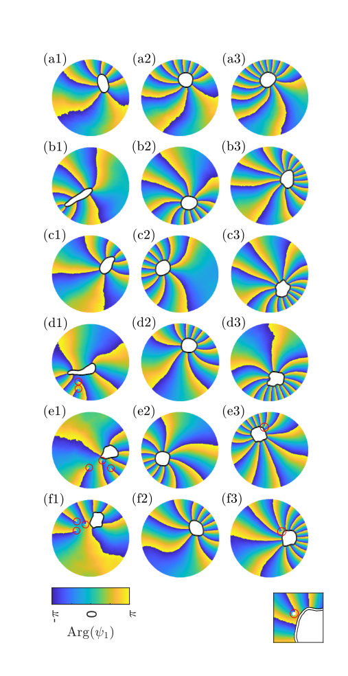
<figcaption class="paper-figure-caption"><b>Fig 6.</b> FIG. 6. Snapshots of the phase of the off-center vortex as it precesses around the trap. Columns correspond to different vortex charges: Column 1, q=7 (unstable); Column 2, q=10 (stable); Column 3, q = 13 (unstable). As a guide to the eye, dislocated vortices are highlighted with a red circle, and the density contours |ψ2|2 = {0.1, 0.5} are plotted in black. Rows show the temporal evolution of the phase at (a) t = 103, (b) t = 4×103, (c) t = 7×103, (d) t = 1.05×104, (e) t = 1.25×104, and (f) t = 1.5 × 104. The bottom right inset is a zoomed in view of panel (f3). A movie of this simulation is available in the Supplemental Material [61].</figcaption>
</figure>

**Main problem.** Developing a method for the deterministic generation and studying the stability and dynamics of multiply-charged vortices in an immiscible binary Bose-Einstein condensate.

**Main result.** The authors demonstrate that a spiral stirring technique can reproducibly tune vortex charge and that the presence of an infilling component can stabilize high-charge vortices, though distinct dynamical instabilities (core elongation and node development) occur at high winding numbers.

**Method.** Numerical evolution of coupled 2D Gross-Pitaevskii equations using the xmds2 code with an adaptive Runge-Kutta method, supplemented by a massive point-vortex model for predicting precession.

**Summary.** This paper presents a method to controllably create multiply-charged vortices in a mixture of 87Rb and 41K Bose-Einstein condensates. By using a spiral laser stirring technique, the researchers show they can deterministically set the vortex charge. They find that the second component fills the vortex cores, which helps stabilize high-charge vortices against splitting. The study also characterizes the resulting dynamics, including precession and shape oscillations, and identifies specific ways these vortices eventually become unstable.

Detailed structure

**Model / system.** An immiscible mixture of 87Rb and 41K atoms in a quasi-2D, hard-walled circular trap, modeled by coupled Gross-Pitaevskii equations including intra- and inter-species interaction strengths.

**Key observables.** Vortex winding number (charge q), density profiles of both components, phase winding, precession frequency, and the aspect ratio (shape oscillations) of the infilling component.

**Important parameters / regimes.** Mass ratio (approx 2.12), interaction strength ratios (alpha and beta), vortex charge (q), stirring parameters (beam width, number of spirals, and stirring time), and atom number ratio.

**Assumptions / limitations.** Zero-temperature limit and a quasi-2D approximation via strong harmonic trapping in the z-direction.

**Figures summary.** Figure 1 shows the evolution of density and phase during the spiral stirring process; Figure 2 relates phase winding to stirring parameters; Figure 4 shows vortex precession and its linear dependence on charge; Figure 5 shows the temporal evolution and frequency of infilling component shape oscillations; Figure 6 illustrates the mechanism of vortex dislocation for high charges.

**Paper structure.** The paper introduces the problem of vortex generation, describes the numerical setup and stirring technique, presents results on deterministic charge tuning, analyzes the stability and dynamics (precession and breathing modes) of the vortices, and concludes with an investigation of specific instability mechanisms.

**Why it may be interesting.** This work is highly relevant for many-body dynamics and AMO physics as it explores how a second species can be used to control and stabilize topological defects, providing a platform for studying complex superfluid dynamics and symmetry-breaking instabilities.

Abstract

We propose a method for controllably generating multiply-charged vortices in immiscible Bose-Einstein condensates. We achieve this by applying a laser stirring technique to a $^{87}\mathrm{Rb}$-$^{41}\mathrm{K}$ mixture, where the vortices generated are infilled by the secondary component. We numerically demonstrate that the charge of the vortex can be tuned reproducibly by varying the stirring parameters, allowing the deterministic generation of stable infilled vortices with high topological charge. We then consider the dynamics of these multiply-charged vortices in a circular trap; in contrast to single-component condensates, we observe long-lived precession of the multiply-charged vortices with a charge dependent frequency and collective breathing modes of the infilling component. For sufficiently large winding numbers, we observe distinct dynamical instabilities leading to vortex dislocation.

[↑ back to top](#top)

### [Ground state of the Hubbard model with spin-dependent linear potential](http://arxiv.org/abs/2604.24068v1)

**Authors:** Jacek Dobrzyniecki, Thomas Busch  
**Type:** theory · **Category:** strongly correlated electrons · **PDF:** <https://arxiv.org/pdf/2604.24068v1>  
**Analysis basis:** full PDF text, analyzed in chunks
**Topic relevance:** `analog quantum simulation` **3/5**

↔ Scroll figures horizontally

<figure class="paper-figure-card">
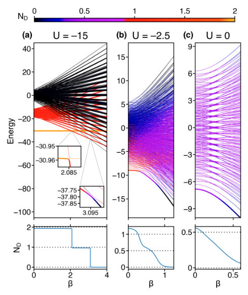
<figcaption class="paper-figure-caption"><b>Fig 1.</b> FIG. 1. Top row: The many-body eigenenergy spectrum as a function of β for (a) U = −15, (b) U = −2.5, (c) U = 0, for a small system with size L = 8 and population N↑+ N↓= 2 + 2. The colors indicate the doublon number ND in each eigenstate (as per the color scale at the top). In (a), the ground-state anticrossings with nearby eigenstates are shown closely in the insets. For clarity, the ground state is plotted with a thicker line in (b), (c), and the insets of (a). Bottom row: The doublon number ND in the ground eigenstate as a function of β, for the values of U corresponding to the upper panels.</figcaption>
</figure>
<figure class="paper-figure-card">
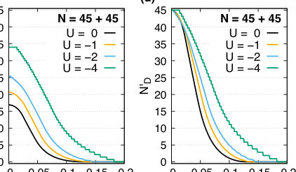
<figcaption class="paper-figure-caption"><b>Fig 2.</b> FIG. 2. (a) The ground-state doublon number ND, as a func- tion of U and β, for L = 120 and N↑+ N↓= 10 + 10. (b) The corresponding rescaled doublon number N ′ D [Eq. (12)], which approximates the total number of bound pairs. (c,d) ND and N ′ D for L = 120 and N = 45 + 45.</figcaption>
</figure>
<figure class="paper-figure-card">
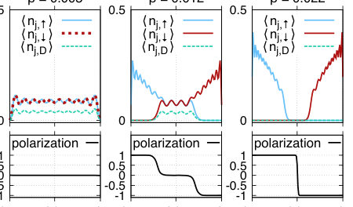
<figcaption class="paper-figure-caption"><b>Fig 3.</b> FIG. 3. (a) Ground-state rescaled doublon number N ′ D as function of β, for an example system with L = 120, U = −2, N = 10 + 10. (b) Ground-state density profiles ⟨ˆnj,↑⟩(upper) and ⟨ˆnj,↓⟩(lower) at sites j = 1, . . . , L as a function of β, for the same system. The local density on each site is indicated by a color scale. The two dotted lines mark the critical gra- dient values, βc1 and βc2, at which the ground-state density undergoes a sudden change in behavior. (c, d, e) Example density profiles for three different values of β, representing: (c) the small-gradient regime β &lt; βc1, (d) the intermediate- gradient regime βc1 ≤β &lt; βc2, and (e) the large-gradient regime βc2 ≤β. The value of...</figcaption>
</figure>
<figure class="paper-figure-card">
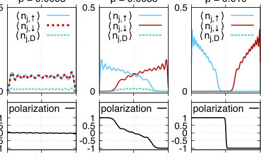
<figcaption class="paper-figure-caption"><b>Fig 4.</b> FIG. 4. Same as Fig. 3, but for U = −0.5.</figcaption>
</figure>
<figure class="paper-figure-card">
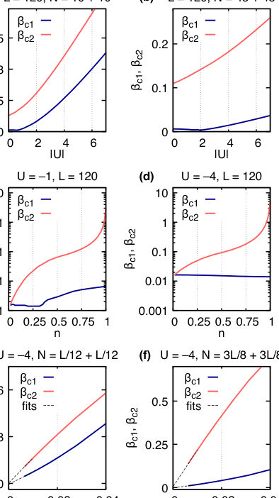
<figcaption class="paper-figure-caption"><b>Fig 5.</b> FIG. 5. (a,b) Threshold values βc1 and βc2 as a function of U, for L = 120 and (a) N = 10 + 10 or (b) N = 45 + 45. (c,d) Same, as a function of n, for a system with L = 120 and (c) U = −1 or (d) U = −4; note the logarithmic scale. (e,f) Same, as a function of 1/L, for a system with U = −4 and (e) n = L/12 + L/12 or (f) N = 3L/8 + 3L/8. The dashed lines indicate linear fits ∝1/L, fitted in the range 1/L ≤0.01; these fits show that βc1, βc2 reach 0 in the 1/L →0 limit.</figcaption>
</figure>
<figure class="paper-figure-card">
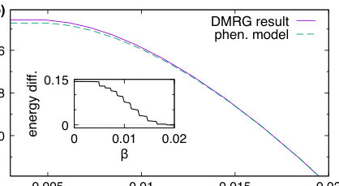
<figcaption class="paper-figure-caption"><b>Fig 6.</b> FIG. 6. (a) The estimated energy EM(β) (from Eq. (13)) for all possible pair numbers M = 0, . . . , 10, for a system with L = 120, U = −2, N = 10 + 10. Red arrows, and their accompanying labels, indicate the values of β at which adja- cent lowest-energy curves cross. (b) Comparison between the DMRG ground-state energy and the phenomenological model estimate, obtained as the minimum of EM(β) over M. Inset: The difference between the two energy predictions.</figcaption>
</figure>
<figure class="paper-figure-card">
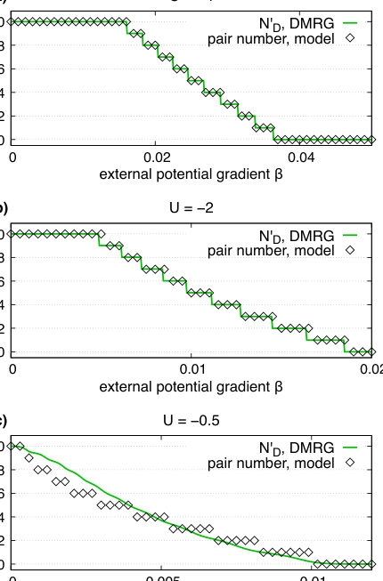
<figcaption class="paper-figure-caption"><b>Fig 7.</b> FIG. 7. Rescaled doublon number N ′ D from DMRG (green line), and predicted pair number M from the phenomenologi- cal model, given by M : min [EM(β)] (diamond symbols), for three values of U with L = 120, N = 10 + 10.</figcaption>
</figure>
<figure class="paper-figure-card">
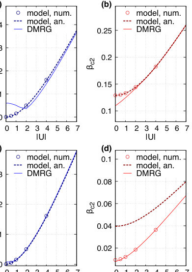
<figcaption class="paper-figure-caption"><b>Fig 8.</b> FIG. 8. (a) Threshold value βc1 as a function of |U| for L = 120, N = 45 + 45, obtained in three ways: from DMRG (continuous line), from the analytical estimate in Eq. (16) (dashed line), and from substituting numerically determined En(β) into Eq. (14) (diamonds). (b) Threshold values βc2 obtained from DMRG (continuous line), from the analytical estimate in Eq. (19) (dashed line), and from substituting nu- merically determined En(β) into Eq. (15) (diamonds). (c,d) Same for N = 10 + 10.</figcaption>
</figure>
<figure class="paper-figure-card">
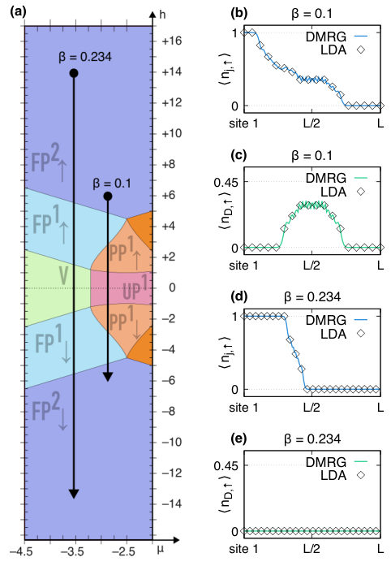
<figcaption class="paper-figure-caption"><b>Fig 9.</b> FIG. 9. Example of predicting the density profile via the local-density approximation. (a) Phase diagram of the grand- canonical Hubbard model, in the µ-h plane, for U = −5 (see Appendix C for explanation of phase labels). The two trajec- tories across the phase diagram correspond to lattice systems with the parameters U = −5, N = 45 + 45, L = 120, and two different gradients: β = 0.1, β = 0.234. The two trajec- tories are defined by the following coordinates: µ = −2.867, h(1) = 5.95, h(L) = −5.95, and: µ = −3.535, h(1) = 13.923, h(L) = −13.923, respectively. Each trajectory crosses several phase regions (see caption of Fig. 14 for full explanation of labels). (b,c) Density profiles (n↑,j...</figcaption>
</figure>
<figure class="paper-figure-card">
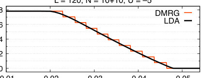
<figcaption class="paper-figure-caption"><b>Fig 10.</b> FIG. 10. Doublon number ND as a function of β for U = −5, L = 120, N = 10 + 10, as estimated by DMRG (thin line) and LDA (thick line).</figcaption>
</figure>

**Main problem.** Investigating the competition between attractive spin-spin interactions and spin-dependent external forces in a 1D Fermi-Hubbard model, specifically how a linear potential gradient induces the successive breaking of fermion pairs.

**Main result.** The study identifies three regimes: robust pairing, a phase-separated regime with a staircase-like decrease in doublon number due to one-by-one pair breaking, and complete spin separation. The authors also provide analytical estimates for the critical threshold gradients.

**Method.** The researchers use Density-Matrix Renormalization Group (DMRG) simulations, supplemented by a phenomenological model and Local-Density Approximation (LDA) analysis to derive closed-form analytical estimates.

**Summary.** This paper explores how a spin-dependent linear potential affects the stability of fermion pairs in a 1D attractive Hubbard model. It reveals that increasing the potential gradient leads to a discrete, 'staircase' breaking of pairs, transitioning from a paired state to a fully spin-separated state. The authors provide analytical tools to predict these transitions and show that the effect is robust even under harmonic confinement. These findings offer a way to control the number of bound pairs in experimental cold-atom setups.

Detailed structure

**Model / system.** A one-dimensional Fermi-Hubbard model with attractive on-site interactions (U < 0) and open boundary conditions, subject to a spin-dependent linear potential gradient (beta) that pushes different spin species toward opposite ends of the lattice.

**Key observables.** Doublon number (number of doubly occupied sites), spin-resolved density distributions, local relative spin polarization, and critical threshold gradients (beta_c1 and beta_c2).

**Important parameters / regimes.** Potential gradient strength (beta), interaction strength (U), lattice size (L), filling fraction/density (n), and harmonic confinement strength (w).

**Assumptions / limitations.** The system is focused on balanced spin populations (N_up = N_down); the staircase structure is intrinsically tied to finite system size and open boundaries; the LDA is unable to capture the discrete stepwise descent in the number of pairs.

**Figures summary.** Figures show the dependence of the doublon number on beta for various U values, the evolution of critical thresholds (beta_c1, beta_c2) as functions of U and density, and a comparison between DMRG and LDA predictions for density profiles and phase boundaries.

**Paper structure.** The paper begins by defining the many-body Hamiltonian and symmetry properties, moves to single-particle spectrum analysis and exact diagonalization, presents large-scale DMRG results for density and pair-breaking, and concludes with analytical modeling and LDA-based threshold estimations.

**Why it may be interesting.** This work is highly relevant for many-body dynamics and AMO physics as it demonstrates a method for precise, integer-level control of bound fermion pairs using spin-dependent potentials, a technique directly testable in cold-atom experiments.

Abstract

We investigate the competition between attractive spin-spin interactions and spin-separating external forces in the ground state of a one-dimensional Fermi-Hubbard model. We consider a lattice with open boundary conditions, subject to a linear external potential whose gradient is opposite for the two spin components, so that each spin species sees a potential minimum at a different end of the lattice. Using density-matrix renormalization group (DMRG) simulations, we map the ground-state density distributions and the number of doubly occupied sites as a function of the potential gradient $β$ and interaction strength. We identify three distinct regimes separated by critical threshold gradients: (i) a small-$β$ regime where fermion pairing remains robust against the external potential; (ii) an intermediate-$β$ phase-separated regime characterized by a staircase-like decrease in the doublon number, corresponding to the successive, one-by-one breaking of bound pairs; and (iii) a large-$β$ regime where the two spin components are completely spatially separated. We complement the numerical results with a phenomenological model and a local-density approximation analysis, from which we derive closed-form analytical estimates for these critical threshold values. We also verify that the staircase structure persists under additional harmonic confinement. Our results are directly testable in cold-atom experiments, and demonstrate that a spin-dependent linear potential enables precise, integer-level control of the number of bound fermion pairs.

[↑ back to top](#top)

### [Noise spectroscopy of insulating and itinerant altermagnets](http://arxiv.org/abs/2604.23297v1)

**Authors:** Lucas V. Pupim, Mathias S. Scheurer  
**Type:** theory · **Category:** strongly correlated electrons · **PDF:** <https://arxiv.org/pdf/2604.23297v1>  
**Analysis basis:** full PDF text, analyzed in chunks
**Topic relevance:** `spintronics-quantum-optics interface` **3/5**

↔ Scroll figures horizontally

<figure class="paper-figure-card">
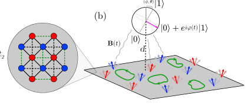
<figcaption class="paper-figure-caption"><b>Fig 1.</b> FIG. 1: (a) Schematic checkerboard lattice and its couplings in the insulating (Heisenberg model) and metallic (tight- binding) regime. In the insulating regime, magnonic exci- tations generate a fluctuating magnetic field B(t), while in the conducting regime, current fluctuations cause these mag- netic oscillations. The magnetic noise, in turn, is detected as shown in (b). The fluctuating magnetic field couples to the qubit and introduces noise into the coherence factor φ(t). This noise, in turn, is detected as a decoherence rate 1/T2. Alternatively, one can start the qubit in the state |1⟩and see the effect of magnetic noise in the relaxation rate 1/T1.</figcaption>
</figure>
<figure class="paper-figure-card">
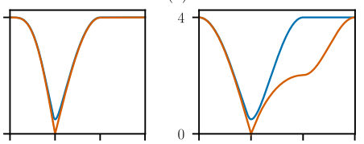
<figcaption class="paper-figure-caption"><b>Fig 2.</b> FIG. 2: (a) Antiferromagnetic (η = 1, i.e., J1 = 1, J2 = 0) and (b) altermagnetic (η = 1/ √</figcaption>
</figure>
<figure class="paper-figure-card">
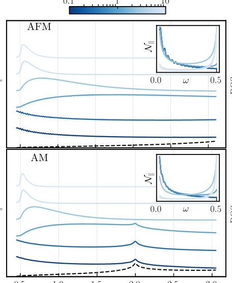
<figcaption class="paper-figure-caption"><b>Fig 3.</b> FIG. 3: Parallel noise N∥of a qubit probe aligned in-plane (θ = π/2, ϕ = 0) for the (a) antiferromagnetic (η = 1) and (b) altermagnetic (η = 1/ √</figcaption>
</figure>
<figure class="paper-figure-card">
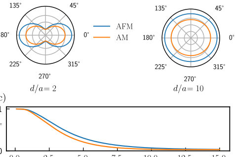
<figcaption class="paper-figure-caption"><b>Fig 4.</b> FIG. 4: Angular dependence of parallel noise N∥(ω) ∝1/T2. The qubit axis lies in the sample’s plane (θ = π/2) and we vary the azimuthal angle (ϕ). In (a) we use d = 2, while in (b) we use d = 10. For larger distances (d ≫a), we note that the noise tends to becoming isotropic, while for shorter distances (d ∼a), N∥(ω) is suppressed when the qubit is aligned with the magnetic order (ϕ = 0◦, 180◦). In (c) we show that the relative anisotropy δN∥decays as d increases, eventually showing the continuum limit, where the noise is isotropic. For all plots, we use T = 1, ω = 0.25 and h = 0.5.</figcaption>
</figure>
<figure class="paper-figure-card">
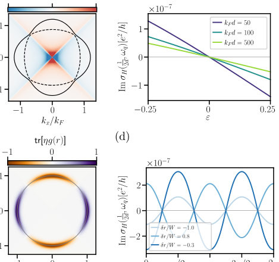
<figcaption class="paper-figure-caption"><b>Fig 5.</b> FIG. 5: (a) Berry curvature for the AM. The solid and dashed lines show the corresponding Fermi surfaces. (b) Imaginary part of the Hall conductance as a function of axial strain (see text). Here, we used the Poisson ration ν = 0.25. (c) Spatial profile of the (normalized) effective potential due to a domain wall. (d) Imaginary part of the Hall conductance at different positions (angles) of the domain wall for a qubit at kF d = 100. We used a kF W = 10 and R/W = 25. In all plots, we considered µ = 0.3, δt2 = 0.3, αR = 0.02 and ωq = 10−4. Note that the relevant contribution to the decoherence difference δΓ comes from momenta q with |q| = 1/2d.</figcaption>
</figure>
<figure class="paper-figure-card">
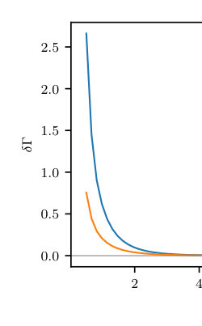
<figcaption class="paper-figure-caption"><b>Fig 6.</b> FIG. 6: δΓ for an AM (η = 1/ √</figcaption>
</figure>

**Main problem.** Developing unambiguous experimental methods to distinguish altermagnetic (AM) order from antiferromagnetic (AFM) order and identifying tools to access the orbital character of the magnetic order parameter.

**Main result.** Noise spectroscopy, particularly through charge fluctuations in itinerant altermagnets, provides unique symmetry-sensitive signatures (such as finite relaxation rate differences under strain) that distinguish AM from AFM. Additionally, the angular dependence of noise around domain walls can reveal the orbital character (d-wave vs. g-wave) of the order parameter.

**Method.** The study employs Linear Spin Wave Theory (LSWT) for the insulating regime and a tight-binding model for the itinerant regime, utilizing the Holstein-Primakoff transformation, Bogoliability transformations (Colpa method), and the Kubo formula to calculate magnetic noise tensors and qubit decoherence rates.

**Summary.** This paper proposes using noise magnetometry to experimentally identify altermagnetism. By analyzing the magnetic noise spectra of both insulating and metallic altermagnets, the authors show that charge fluctuations in itinerant systems provide the most striking signatures to distinguish altermagnets from antiferromagnets. They demonstrate that symmetry-breaking perturbations, such as strain or domain walls, induce unique, measurable changes in qubit relaxation and dephasing rates. This work provides a roadmap for using quantum sensors like NV centers to characterize the orbital symmetry of new magnetic materials.

Detailed structure

**Model / system.** The paper investigates both insulating altermagnets (modeled via a Heisenberg Hamiltonian on a checkerboard lattice) and itinerant altermagnets (modeled via an electronic tight-binding model with spin-orbit coupling). The experimental probe is modeled as a qubit (e.g., an NV center) sensitive to magnetic field fluctuations.

**Key observables.** Qubit relaxation rate (1/T1), dephasing rate (1/T2), magnetic noise tensor components (N_ab), relaxation rate difference (delta_Gamma), and Hall conductivity (sigma_H).

**Important parameters / regimes.** Zeeman field (h), temperature (T), distance between probe and sample (d), lattice spacing (a), and strain parameters (epsilon).

**Assumptions / limitations.** The study assumes the continuum limit (d >> a) for certain spatial analyses, uses the 1/S expansion in the spin-wave theory, and neglects the momentum dependence of screening and non-coplanarity in domain wall textures.

**Figures summary.** Figure 2 compares magnon modes in AFM and AM; Figure 3 shows parallel noise components and their dependence on distance d; Figure 6 illustrates the difference in relaxation rates.

**Paper structure.** The paper begins by defining the problem of AM/AFM distinction, then details the insulating regime using spin-wave theory, moves to the itinerant regime focusing on charge fluctuations and symmetry breaking (strain/domain walls), and concludes with technical discussions on lattice effects and the dipole tensor.

**Why it may be interesting.** The paper explores how local magnetic symmetries and topological features (like Berry curvature) manifest in the noise spectrum of a quantum probe, which is highly relevant to the study of open quantum systems and the characterization of novel many-body phases.

Abstract

One of the central goals in the emergent field of altermagnetism is the unambiguous experimental identification and characterization of altermagnetic order across a variety of compounds. This motivates exploring tools that can clearly distinguish altermagnets from antiferromagnets, based on symmetry signatures, and offer access to the dominant orbital character (e.g., $d$-wave vs. $g$-wave) of the magnetic order parameter. In this work, we theoretically explore the potential of noise magnetometry for this task, studying contributions from both magnons and itinerant electrons in different regimes and scenarios. While altermagnetism and antiferromagnetism also lead to different noise spectra for magnons, we find the most striking and symmetry-sensitive signatures in the charge fluctuations of itinerant altermagnets. Both for the homogeneous bulk case and in the presence of strain and/or around domain walls, we identify noise contributions that are only permitted by symmetry in the altermagnet and, thus, provide a unique signature of altermagnetism. Furthermore, the angular dependence of noise around domain walls also offers access to the orbital character of the altermagnet. On a more technical note, we discuss the role and relevance of lattice effects related to the dipole tensor. We hope that our work will help pave the way towards the clear experimental identification of altermagnetism across a wide range of candidate materials.

[↑ back to top](#top)

### [Noise-robust 1-copy distillation protocol for all distillable Bell-diagonal qutrits](http://arxiv.org/abs/2604.24460v1)

**Authors:** Tobias C. Sutter, Christopher Popp, Beatrix C. Hiesmayr  
**Type:** theory · **Category:** quantum information and computing · **PDF:** <https://arxiv.org/pdf/2604.24460v1>  
**Analysis basis:** full PDF text, analyzed in chunks
**Topic relevance:** `entanglement & information structure` **3/5**

↔ Scroll figures horizontally

<figure class="paper-figure-card">
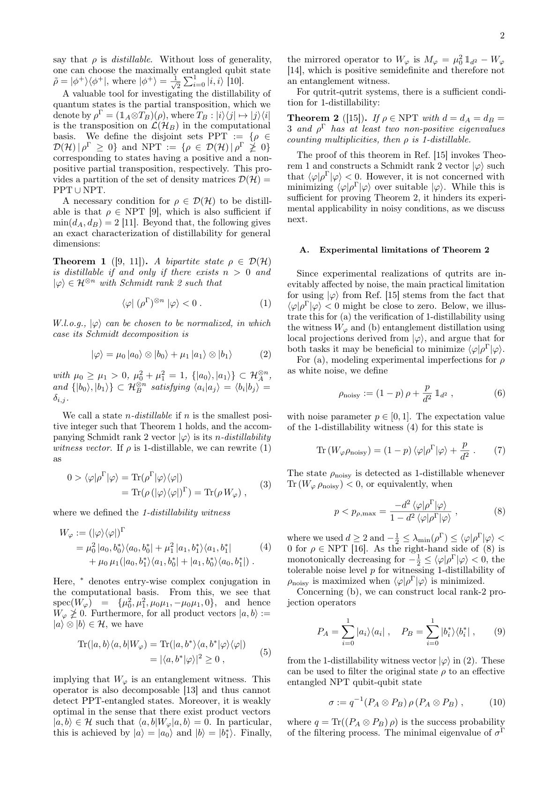
<figcaption class="paper-figure-caption"><b>Fig 1.</b> Low-resolution page preview, page 2</figcaption>
</figure>
<figure class="paper-figure-card">
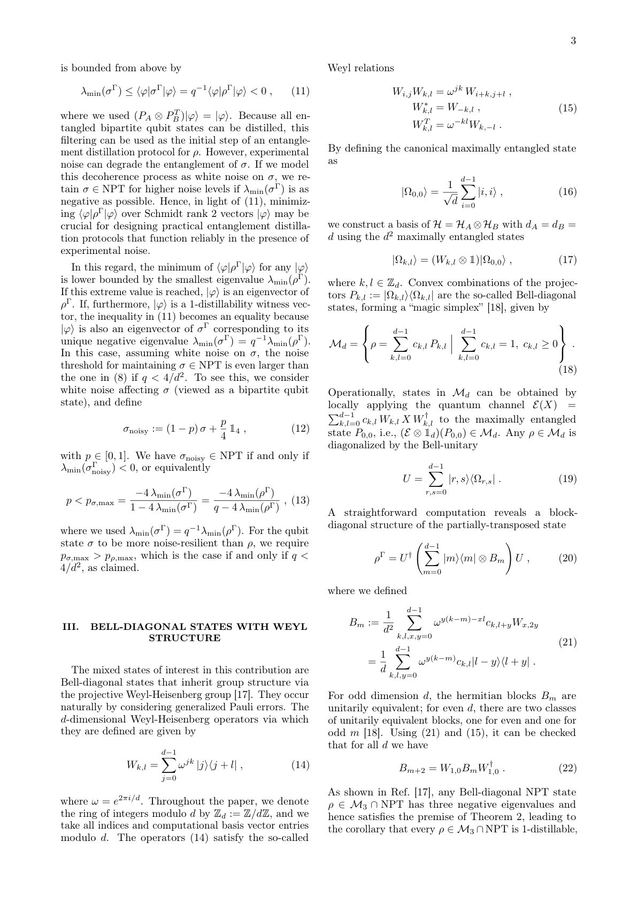
<figcaption class="paper-figure-caption"><b>Fig 2.</b> Low-resolution page preview, page 3</figcaption>
</figure>
<figure class="paper-figure-card">
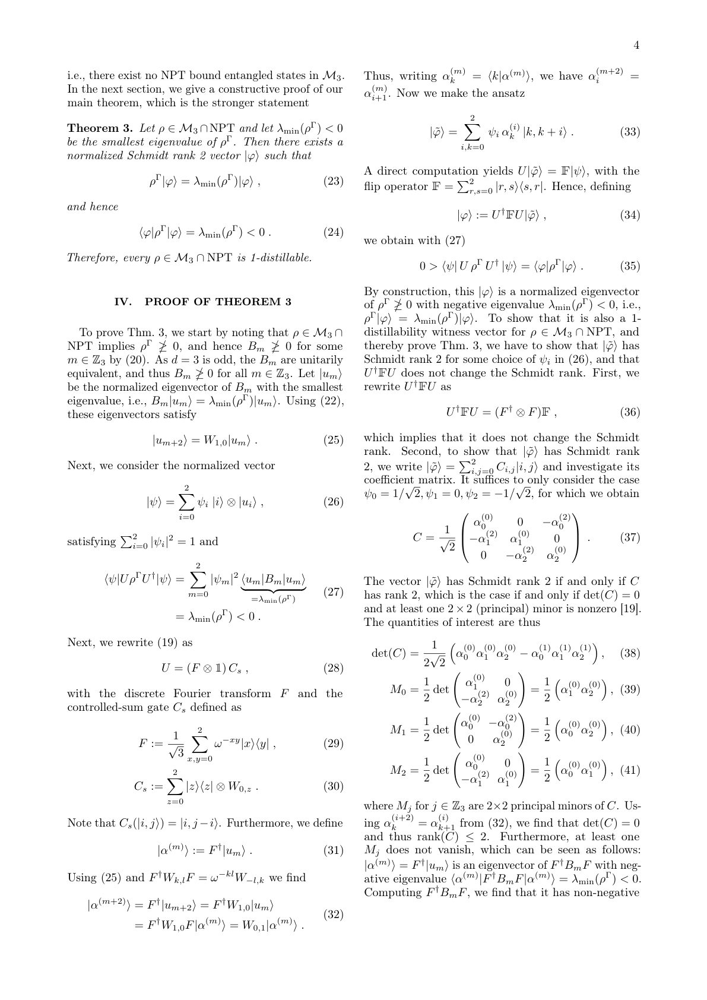
<figcaption class="paper-figure-caption"><b>Fig 3.</b> Low-resolution page preview, page 4</figcaption>
</figure>
<figure class="paper-figure-card">
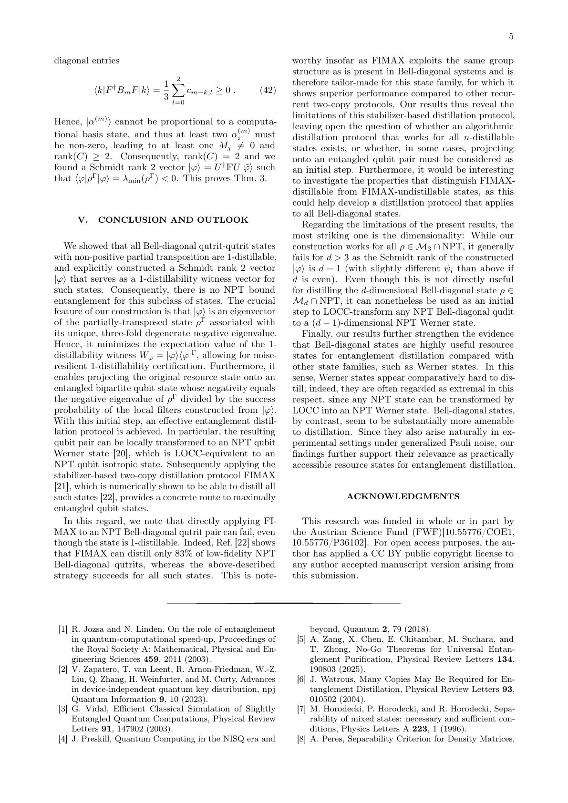
<figcaption class="paper-figure-caption"><b>Fig 4.</b> Low-resolution page preview, page 5</figcaption>
</figure>
<figure class="paper-figure-card">
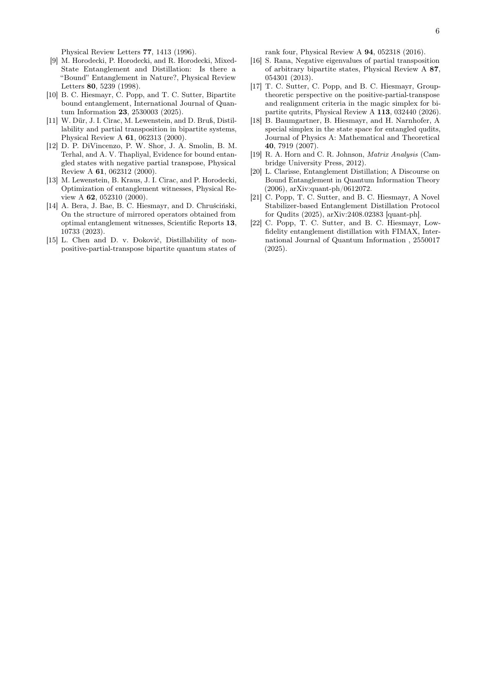
<figcaption class="paper-figure-caption"><b>Fig 5.</b> Low-resolution page preview, page 6</figcaption>
</figure>

**Main problem.** Determining whether all NPT Bell-diagonal qutrit states are 1-distillable and constructing a noise-robust 1-copy distillation protocol for them.

**Main result.** The authors prove that for Bell-diagonal qutrit states with Weyl structure, violating the PPT criterion is both necessary and sufficient for 1-distillability, and they provide a noise-resilient distillation scheme.

**Method.** The study uses a constructive proof involving the partial transpose and the construction of a Schmidt rank 2 witness vector based on the eigenvectors of the partially transposed density matrix.

**Summary.** This paper solves the distillability problem for a specific class of Bell-diagonal qutrit states, proving that any state violating the PPT criterion can be distilled using a single copy. The authors develop a new distillation protocol that uses local filters to transform qutrit states into qubit states. This protocol is specifically designed to be resilient to white noise by utilizing the properties of the partially transposed density matrix's eigenvectors. These findings make noisy, high-dimensional entangled states more useful for practical quantum technologies.

Detailed structure

**Model / system.** Bipartite qutrit-qutrit systems (d=3) with Weyl structure, specifically Bell-diagonal states subject to white-noise-affected models.

**Key observables.** The expectation value of the partial transpose and the smallest eigenvalue of the partially transposed matrix.

**Important parameters / regimes.** The noise parameter p, the Schmidt rank of the witness vector, and the success probability q of the filtering process.

**Assumptions / limitations.** The results are specifically applicable to Bell-diagonal qutrit states with Weyl structure and do not extend to general dimensions d > 3.

**Paper structure.** The paper introduces the distillability problem, defines the Weyl-structure qutrit model, provides a constructive proof for the sufficiency of PPT violation, details the construction of the noise-robust witness and protocol, and discusses limitations regarding higher dimensions.

**Why it may be interesting.** This work provides a fundamental solution to a specific case of the distillability problem and offers a practical method for enhancing the robustness of entanglement against white noise, which is critical for quantum communication and networking.

Abstract

Entanglement distillation is the process of converting noisy entangled states into maximally entangled pure states via local operations and classical communication. A long-standing, unresolved question is which entangled states are amenable to distillation, known as the distillability problem. We solve this for Bell-diagonal qutrits with Weyl structure, and present a noise-robust scheme for entanglement distillation. In particular, we find that violating the positive partial transposition (PPT) criterion is necessary and sufficient for the 1-distillability of these states. For this, we construct a Schmidt rank 2 eigenvector of the partially transposed density matrix associated with its unique, three-fold degenerate negative eigenvalue. This feature makes the derived entanglement distillation protocol resilient to white-noise effects on the quantum states. Our results thus make noisy entangled qutrit pairs more accessible for future quantum technologies.

[↑ back to top](#top)

### [Quantum Sufficiency for Self-Adjoint Statistical Models via Likelihood-Type Operators on Real $*$-Subalgebras and Real Jordan Algebras](http://arxiv.org/abs/2604.23292v1)

**Authors:** Koichi Yamagata  
**Type:** theory · **Category:** quantum information and computing · **PDF:** <https://arxiv.org/pdf/2604.23292v1>  
**Analysis basis:** full PDF text, analyzed in chunks
**Topic relevance:** `quantum measurements` **3/5**

↔ Scroll figures horizontally

<figure class="paper-figure-card">
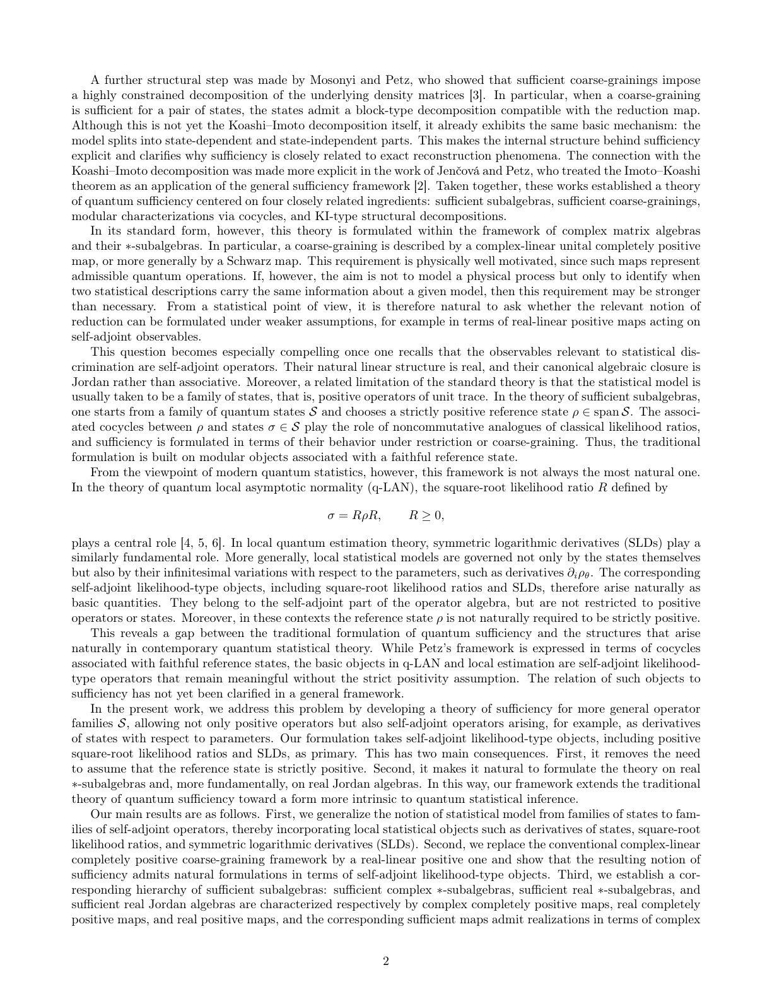
<figcaption class="paper-figure-caption"><b>Fig 1.</b> Low-resolution page preview, page 2</figcaption>
</figure>
<figure class="paper-figure-card">
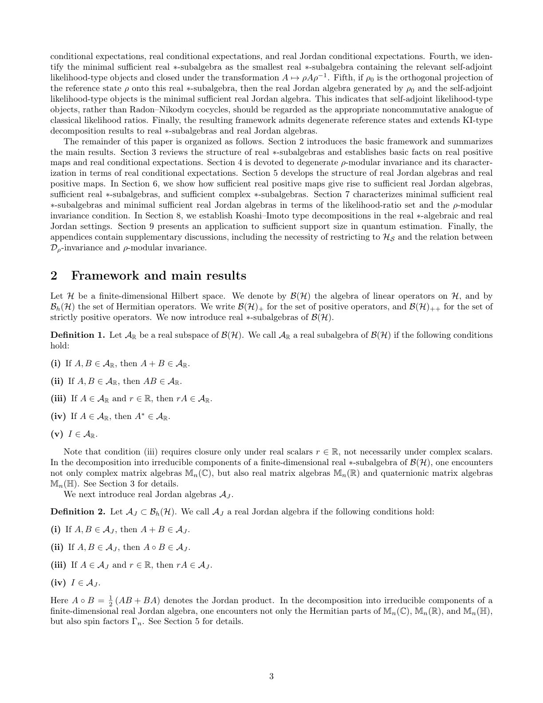
<figcaption class="paper-figure-caption"><b>Fig 2.</b> Low-resolution page preview, page 3</figcaption>
</figure>
<figure class="paper-figure-card">
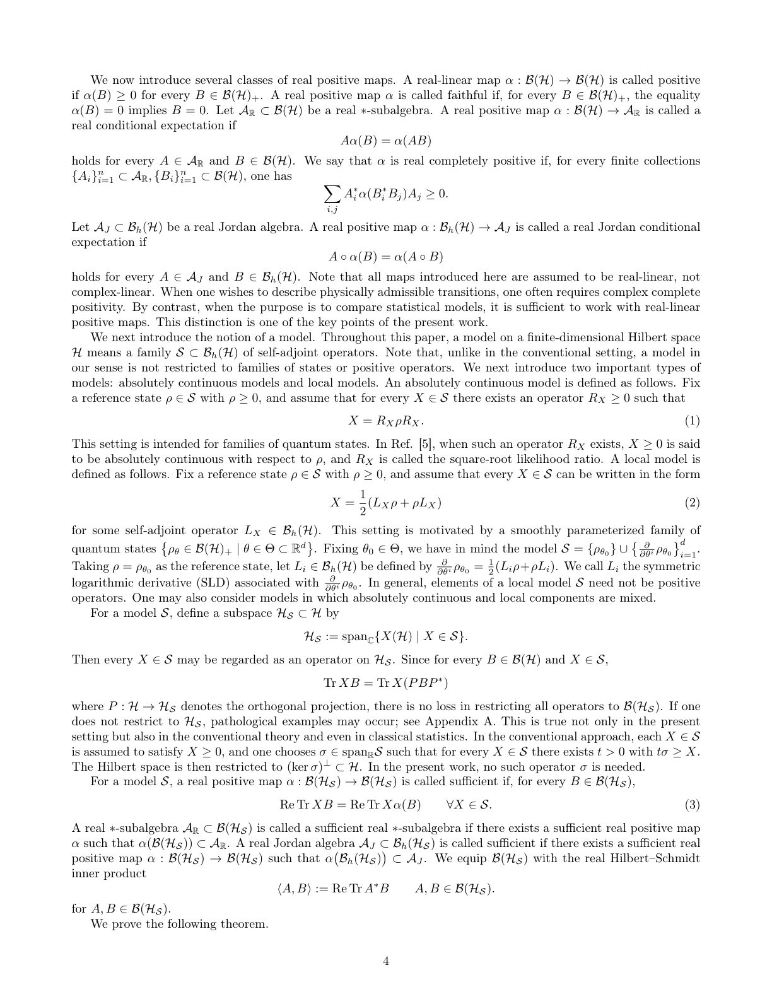
<figcaption class="paper-figure-caption"><b>Fig 3.</b> Low-resolution page preview, page 4</figcaption>
</figure>
<figure class="paper-figure-card">
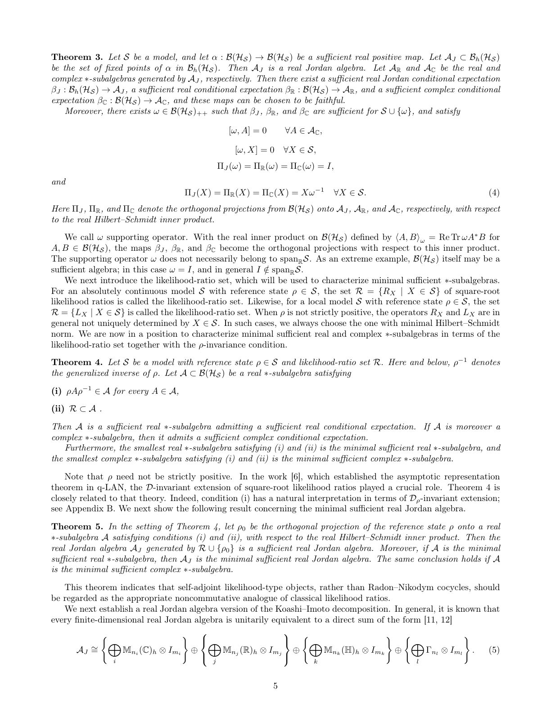
<figcaption class="paper-figure-caption"><b>Fig 4.</b> Low-resolution page preview, page 5</figcaption>
</figure>
<figure class="paper-figure-card">
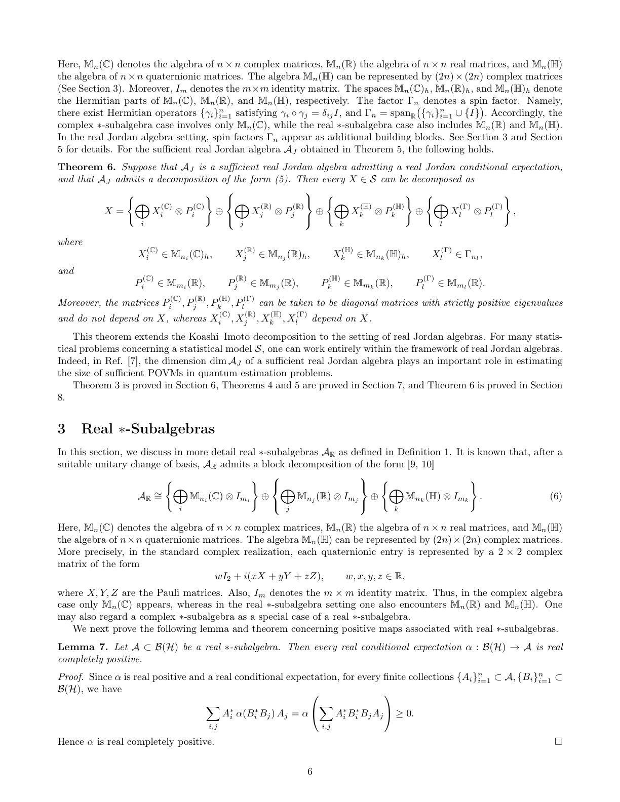
<figcaption class="paper-figure-caption"><b>Fig 5.</b> Low-resolution page preview, page 6</figcaption>
</figure>
<figure class="paper-figure-card">
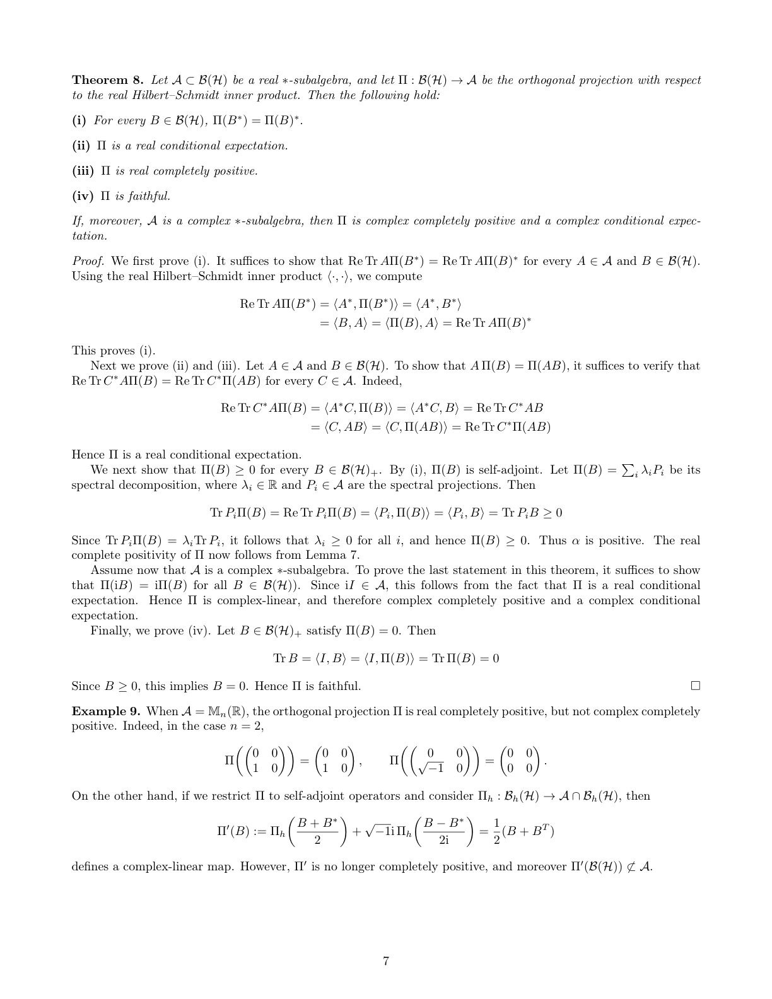
<figcaption class="paper-figure-caption"><b>Fig 6.</b> Low-resolution page preview, page 7</figcaption>
</figure>
<figure class="paper-figure-card">
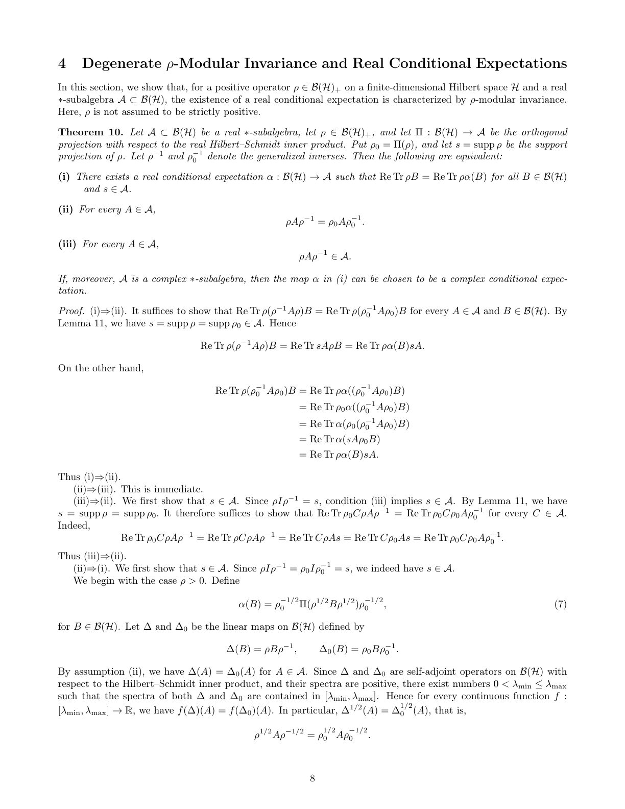
<figcaption class="paper-figure-caption"><b>Fig 7.</b> Low-resolution page preview, page 8</figcaption>
</figure>
<figure class="paper-figure-card">
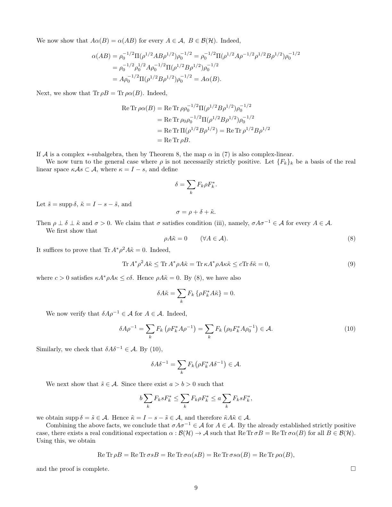
<figcaption class="paper-figure-caption"><b>Fig 8.</b> Low-resolution page preview, page 9</figcaption>
</figure>
<figure class="paper-figure-card">

<figcaption class="paper-figure-caption"><b>Fig 9.</b> Low-resolution page preview, page 10</figcaption>
</figure>
<figure class="paper-figure-card">
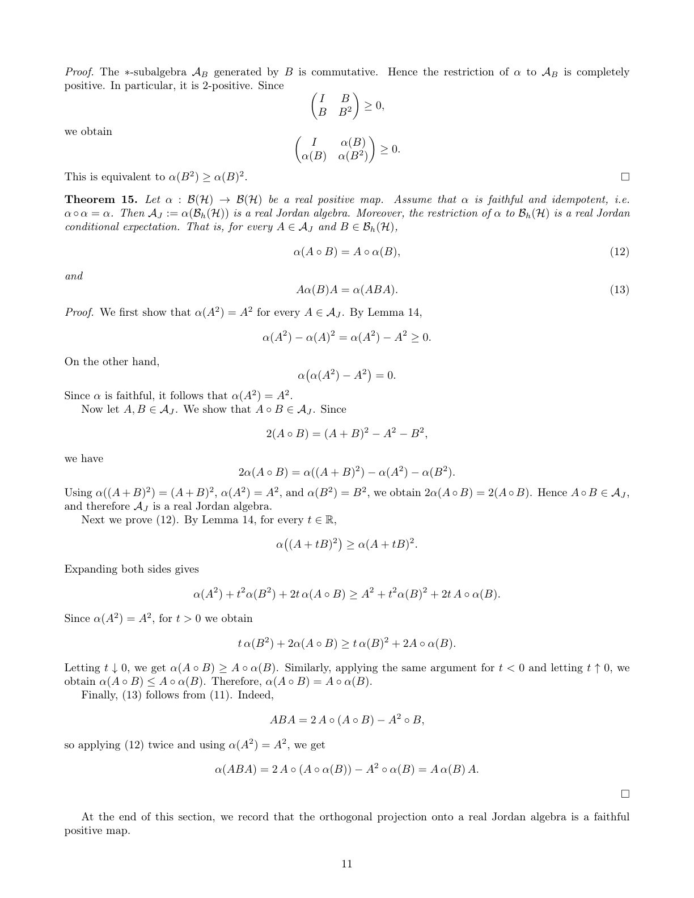
<figcaption class="paper-figure-caption"><b>Fig 10.</b> Low-resolution page preview, page 11</figcaption>
</figure>

**Main problem.** The existing theory of quantum sufficiency is limited to complex *-subalgebras and requires faithful reference states, creating a gap when dealing with local quantum statistical structures like SLDs.

**Main result.** The paper develops a unified theory of quantum sufficiency using real *-subalgebras and real Jordan algebras, allowing for degenerate reference states and the inclusion of self-adjoint operators like SLDs.

**Method.** The author employs algebraic decomposition of real Jordan algebras, operator theory involving rho-modular invariance, and the study of real-linear positive maps and conditional expectations.

**Summary.** This paper generalizes the theory of quantum sufficiency from the standard complex *-algebraic setting to the more flexible framework of real *-subalgebras and real Jordan algebras. By doing so, it allows for the treatment of statistical models that include non-state self-adjoint operators, such as symmetric logarithmic derivatives, and accommodates reference states that are not strictly positive. The author establishes new characterizations for minimal sufficient algebras and provides a generalized Koashi-Imoto decomposition. Ultimately, the work suggests that real Jordan structures are the natural language for the statistical aspects of quantum theory.

Detailed structure

**Model / system.** The framework considers general self-adjoint statistical models on finite-dimensional Hilbert spaces, including both absolutely continuous models and local models (e.g., derivatives of states).

**Key observables.** Square-root likelihood ratios and symmetric logarithmic derivatives (SLDs).

**Important parameters / regimes.** Finite-dimensional Hilbert space; the distinction between strictly positive and degenerate reference states.

**Assumptions / limitations.** The framework is presented for finite-dimensional Hilbert spaces and assumes the existence of a supporting operator.

**Paper structure.** The paper introduces a new framework for sufficiency, establishes a hierarchy of sufficiency (complex, real, and Jordan), characterizes minimal sufficient algebras via likelihood-type objects and modular invariance, provides Koashi-Imlamo type decompositions, and derives bounds for POVM support size.

**Why it may be interesting.** This is highly relevant for quantum estimation and quantum Fisher information, as it provides a more robust mathematical foundation for handling the local statistical structures (SLDs) used in quantum metrology and asymptotic quantum statistics.

Abstract

We develop a theory of quantum sufficiency on real *-subalgebras and real Jordan algebras. In contrast to the conventional formulation, which is based on families of states, complex completely positive coarse-grainings, and Radon-Nikodym cocycles associated with faithful reference states, our framework allows models consisting of general self-adjoint operators, including derivatives of states. Within this framework, square-root likelihood ratios and symmetric logarithmic derivatives arise naturally as fundamental self-adjoint likelihood-type objects. This makes it possible to treat ordinary quantum statistical models and local quantum statistical structures within a unified setting.   We introduce sufficient real positive maps and show that sufficient complex *-subalgebras, sufficient real *-subalgebras, and sufficient real Jordan algebras correspond respectively to complex completely positive maps, real completely positive maps, and real positive maps. We characterize minimal sufficient real *-subalgebras by the likelihood-ratio set together with rho-modular invariance, and show that the real Jordan algebra generated by the likelihood-ratio set and the projected reference state is the minimal sufficient real Jordan algebra. We also obtain Koashi-Imoto type decompositions for sufficient real *-subalgebras and sufficient real Jordan algebras. Our formulation admits degenerate reference states and separates the likelihood-ratio aspect of sufficiency from its genuinely quantum modular aspect. These results suggest that real Jordan structure provides a natural framework for the statistical aspect of quantum theory beyond the conventional complex *-algebraic setting.

[↑ back to top](#top)

### [Principles of relativistic quantum statistical thermodynamics: a class of exactly solvable models](http://arxiv.org/abs/2604.23409v1)

**Authors:** A. Yu. Zakharov  
**Type:** theory · **Category:** statistical mechanics · **PDF:** <https://arxiv.org/pdf/2604.23409v1>  
**Analysis basis:** full PDF text, analyzed in chunks
**Topic relevance:** `Keldysh / 2PI / non-Gaussian methods` **2/5** · `correlated / nonlocal dissipation` **2/5** · `driven-dissipative phase transition` **2/5** · `non-equilibrium dynamics` **2/5**

↔ Scroll figures horizontally

<figure class="paper-figure-card">
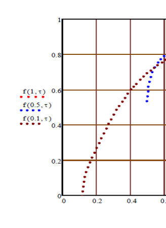
<figcaption class="paper-figure-caption"><b>Fig 1.</b> Figure 1: Graphs of functions f(T/Ts) for αs = 1.0, 0.5, 0.1, respectively.</figcaption>
</figure>
<figure class="paper-figure-card">
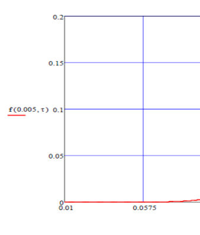
<figcaption class="paper-figure-caption"><b>Fig 2.</b> Figure 2: Graph of the function f(τs) in the low-temperature region (τs ≪1) in the case of a weak atom-field coupling constant (αs = 0.005 ≪1).</figcaption>
</figure>
<figure class="paper-figure-card">
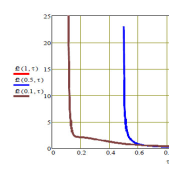
<figcaption class="paper-figure-caption"><b>Fig 3.</b> Figure 3: Qualitative form of functions f2 (αs, τ) for some particular values of αs</figcaption>
</figure>

**Main problem.** The paper addresses the lack of a microscopic mechanism for irreversibility in classical mechanics and the difficulty of finding exactly solvable 3D models for the relativistic quantum statistical thermodynamics of interacting atoms.

**Main result.** The author establishes a relativistic framework where interatomic interactions are represented by an auxiliary field, demonstrating that quantization resolves the classical ultraviolet catastrophe and that a phase transition occurs at a critical temperature.

**Method.** The study uses a relativistic field theory approach, employing Fourier transformations, Legendre transformations, and the quadratic approximation of the Hamiltonian to reduce the complex partition function to a solvable form.

**Summary.** This paper develops a theory for the relativistic quantum statistical thermodynamics of interacting atoms. By representing interatomic potentials as an auxiliary scalar field, the author transforms a complex many-body problem into an exactly solvable model of an ideal gas of quasiparticles. The work demonstrates that quantizing this auxiliary field prevents the classical ultraviolet catastrophe and proves the existence of a phase transition at a specific critical temperature.

Detailed structure

**Model / system.** A relativistic system consisting of two subsystems: a collection of interacting atoms and an auxiliary scalar covariant field (a superposition of Klein-Gordon fields) that mediates the interatomic potential.

**Key observables.** Total energy, average energy of the field modes, heat capacity, and the dispersion law of the effective field.

**Important parameters / regimes.** Critical temperature (T_crit), particle density (n), field mass parameters (mu_s), coupling constants (gamma_s, kappa_s), and the high-temperature/low-temperature regimes.

**Assumptions / limitations.** The model assumes atoms do not undergo destruction (valid for v << c), the interatomic potential is representable via simple poles in its Fourier transform, and the field is treated as a superposition of Klein-Gordon fields.

**Figures summary.** The figures show the domain of definition and behavior of a function f(T/T_s) for different coupling parameters and its behavior in the low-temperature region.

**Paper structure.** The paper begins by defining the foundational problem of irreversibility, introduces the relativistic atom-field model and its Hamiltonian, applies mathematical transformations to solve the partition function, analyzes the thermodynamic properties (energy, heat capacity), and concludes with the identification of a phase transition.

**Why it may be interesting.** It provides a rare example of an exactly solvable 3D relativistic many-body model and offers a physical mechanism for irreversibility through field-induced 'lag' in interactions, which is relevant to the study of open quantum systems and many-body dynamics.

Abstract

A system of interacting atoms is represented as an union of two subsystems, one of which is the system of atoms, and the other is an auxiliary scalar covariant field, which is equivalent to a given static interatomic potential of general form only in the non-relativistic approximation. It is shown that the auxiliary field is a superposition of Klein-Gordon fields, the parameters of which are related to singular points of the Fourier transform of the corresponding interatomic potential. The general form of the relativistic Hamiltonian system of interacting atoms is established. It is shown that the exact calculation of the relativistic partition function of a system of interacting atoms, taking into account the field degrees of freedom, reduces to renormalizing the parameters of the auxiliary field. It is established that the field degrees of freedom lead to a divergence in the total energy of a classical relativistic system - an analogue of the ultraviolet catastrophe. Quantization of the auxiliary field eliminates this divergence. The existence of a phase transition within the framework of relativistic quantum statistical thermodynamics has been proven.

[↑ back to top](#top)

### [Catalytic Enhancement of Coherence Fraction in Noisy Quantum Channels and Characterization of Strictly Incoherent Operations](http://arxiv.org/abs/2604.24291v1)

**Authors:** Priyabrata Char, Dipayan Chakraborty, Indrani Chattopadhyay, Debasis Sarkar  
**Type:** theory · **Category:** quantum information and computing · **PDF:** <https://arxiv.org/pdf/2604.24291v1>  
**Analysis basis:** full PDF text, analyzed in chunks
**Topic relevance:** `correlated / nonlocal dissipation` **2/5** · `entanglement & information structure` **2/5** · `methods for driven-dissipative` **2/5** · `quantum measurements` **1/5**

↔ Scroll figures horizontally

<figure class="paper-figure-card">
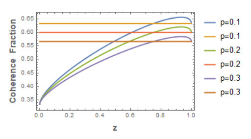
<figcaption class="paper-figure-caption"><b>Fig 1.</b> FIG. 1: The horizontal lines represents 2−p</figcaption>
</figure>
<figure class="paper-figure-card">
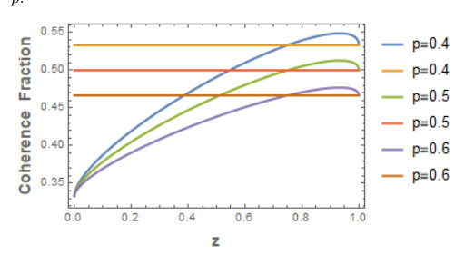
<figcaption class="paper-figure-caption"><b>Fig 2.</b> FIG. 2: The horizontal lines represents 2−p</figcaption>
</figure>
<figure class="paper-figure-card">
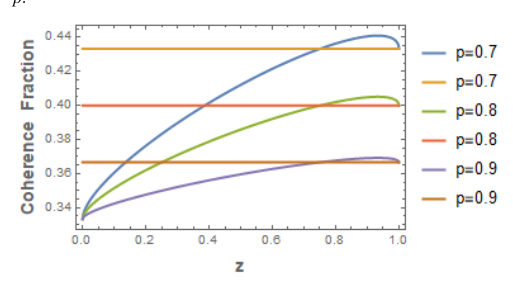
<figcaption class="paper-figure-caption"><b>Fig 3.</b> FIG. 3: The horizontal lines represents 2−p</figcaption>
</figure>
<figure class="paper-figure-card">
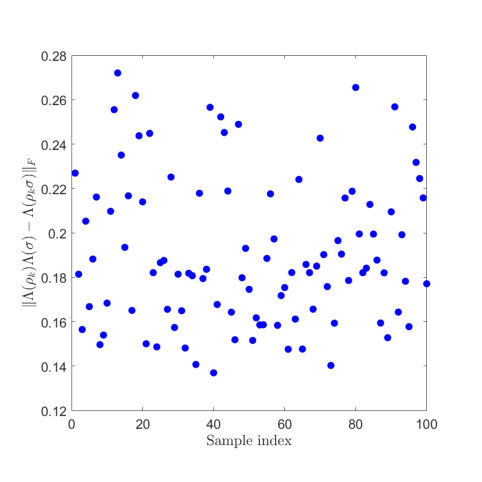
<figcaption class="paper-figure-caption"><b>Fig 4.</b> FIG. 4: Frobenius-norm deviation ∥E(ρk)E(σ)−E(ρkσ)∥F for randomly generated density matrices ρk. The incoherent state σ = diag(0.3, 0.7) is non-degenerate. The SIO E is not of Schur-multiplier form. The nonzero deviations confirm viola- tion of the multiplicative relation.</figcaption>
</figure>

**Main problem.** Investigating whether quantum catalysis can be used to pre-process input states to enhance the coherence fraction of an output state after passing through a noisy quantum channel, and characterizing the structural properties of Strictly Incoherent Operations (SIO).

**Main result.** The authors prove that correlated catalysis can prevent the degradation of the coherence fraction in noisy channels and establish a necessary and sufficient condition for a CPTP map to be a Schur-multiplier type SIO.

**Method.** The study uses the framework of Quantum Resource Theory (QRT) of coherence, employing analytical proofs, algebraic derivations (such as polynomial interpolation), and numerical simulations using the Ginibre ensemble.

**Summary.** This paper explores how quantum catalysis can be used to protect or even enhance the coherence fraction of a quantum state when it passes through a noisy channel. By pre-processing the input state using an auxiliary catalyst, the authors show that the output coherence can be higher than if the original state were used. Additionally, the work provides a new structural characterization of a specific class of incoherent operations. These findings offer practical insights for optimizing quantum protocols in realistic, noisy environments.

Detailed structure

**Model / system.** The work focuses on single-party d-dimensional quantum systems subject to noisy CPTP channels, specifically including the quantum addition channel and the qutrit phase-damping channel.

**Key observables.** Coherence fraction (CF), l1 norm of coherence, robustness of coherence, and success probability in phase discrimination tasks.

**Important parameters / regimes.** Noise parameter (p) for dephasing channels, the parameter (alpha) for the quantum addition channel, and the regularized coherence fraction.

**Assumptions / limitations.** The analysis assumes the use of the coherence fraction as the primary figure of merit and focuses on the regime of noisy channels that reduce coherence.

**Figures summary.** Figures 1-3 compare the coherence fraction of standard versus processed states under different noise levels; Figure 4 is a scatter plot showing the Frobenius norm deviation to demonstrate that the multiplicative property fails for SIOs that are not Schur multipliers.

**Paper structure.** The paper introduces the problem of coherence degradation, defines the catalytic scheme and operational classes (MIO, IO, SIO), provides analytical theorems for coherence enhancement, applies the results to phase discrimination, characterizes the SIO class via a multiplicative condition, and concludes with numerical validation.

**Why it may be interesting.** This paper is highly relevant to open quantum systems and quantum optics as it provides a theoretical method (catalysis) to mitigate the effects of environmental noise on a key quantum resource (coherence).

Abstract

In realistic quantum information processing tasks, quantum states are inevitably affected by environmental noise, leading to decoherence and degradation of useful quantum resources. The coherence fraction, which serves as an important figure of merit for several quantum protocols, may decrease significantly after the action of a noisy channel. Such degradation can result in unsatisfactory performance in real-world applications. In this work, we investigate whether catalysis can be used to pre-process the input state to enhance the coherence fraction of an output state from a quantum channel. Specifically, we study whether using a processed state $ρ_s'$ as the input to a quantum channel $Λ$, instead of the original state $ρ_s$, can yield an output state $Λ(ρ_s')$ whose coherence fraction exceeds that of $Λ(ρ_s)$. We analyze the conditions under which such an improvement is possible. We also provide a practical application of our setup for the phase discrimination task. Furthermore, we establish a necessary and sufficient condition for an incoherent state preserving CPTP(Completely Positive Trace Preserving) map $\mathcal{E}$ to be a particular type of Strictly Incoherent Operation (SIO). This characterization provides a new structural understanding of SIO and clarifies its role in coherence manipulation. Our results offer practical insights into coherence preservation and enhancement in noisy quantum processes and may be useful for optimizing quantum information protocols under realistic conditions. We also provide numerical examples to support our claims.

[↑ back to top](#top)

### [Dissipative Vortex Binaries in Compact Fluid Domains with Geometric Corrections](http://arxiv.org/abs/2604.23857v1)

**Authors:** Aswathy K. R., Rickmoy Samanta  
**Type:** theory · **Category:** quantum gases · **PDF:** <https://arxiv.org/pdf/2604.23857v1>  
**Analysis basis:** full PDF text, analyzed in chunks
**Topic relevance:** `correlated / nonlocal dissipation` **2/5** · `methods for driven-dissipative` **2/5** · `non-equilibrium dynamics` **2/5** · `analog quantum simulation` **1/5**

↔ Scroll figures horizontally

<figure class="paper-figure-card">
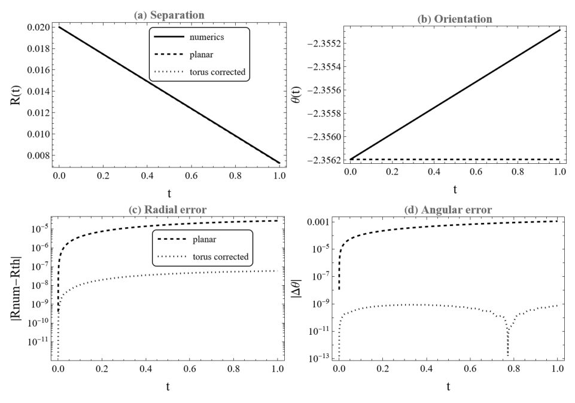
<figcaption class="paper-figure-caption"><b>Fig 1.</b> FIG. 3: Numerical verification of the dissipative dipole dynamics (Γ1 = 1, Γ2 = −1) on a flat torus. (a) Separation R(t) showing agreement between numerics (solid), planar theory (dashed), and torus-corrected solution (dotted). (b) Orientation θ(t), where the planar theory predicts no evolution, while the torus correction captures the observed drift. (c,d) Radial and angular errors. The torus-corrected solution reduces the error by several orders of magnitude compared to the planar approximation. Sharp minima correspond to zero-crossings of the error and do not indicate improved accuracy.</figcaption>
</figure>
<figure class="paper-figure-card">
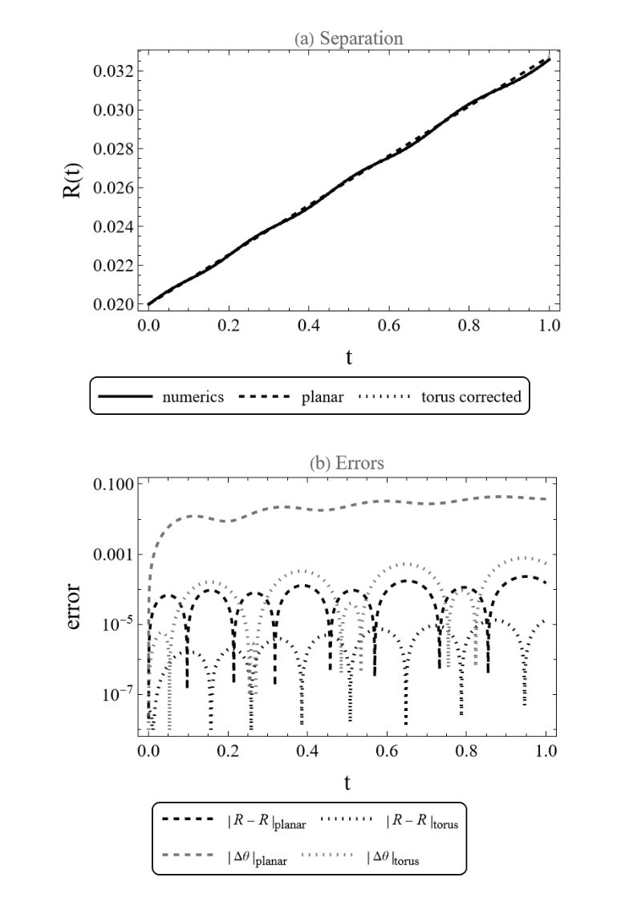
<figcaption class="paper-figure-caption"><b>Fig 2.</b> FIG. 4: Numerical verification of the dissipative same-sign vortex pair (Γ1 = Γ2 = 1). (a) Separation R(t) showing outward growth and improved agreement of the torus-corrected solution with numerics. (b) Combined radial and angular error comparison. The torus-corrected theory significantly reduces both errors relative to the planar logarithmic-spiral solution. The oscillatory structure reflects the phase-dependent corrections along the trajectory, while the overall reduction confirms the importance of toroidal geometry. 37</figcaption>
</figure>

**Main problem.** The study investigates how the combination of dissipation (mutual friction) and toroidal geometry (periodic boundary conditions) modifies the classical planar dynamics of vortex binaries.

**Main result.** The researchers derive torus-corrected analytic solutions that capture geometric effects like angular drift in dipoles and a specific nonlinear chirp (frequency blow-up) in unequal-sign pairs, significantly reducing errors compared to planar theory.

**Method.** The authors use a perturbative expansion of the interaction kernel via the Schottky-Klein prime function and q-special functions, comparing analytical results against full numerical simulations on a flat torus.

**Summary.** This paper explores how the periodic geometry of a torus and the presence of dissipation change the way vortex pairs move and interact. While planar models predict simple behaviors like fixed-orientation dipoles, the authors show that a torus induces an angular drift and a unique nonlinear frequency chirp in unequal-sign pairs. By using advanced mathematical tools like the Schottky-Klein prime function, they provide new analytical solutions that are much more accurate than standard planar approximations. These findings are particularly important for understanding vortex dynamics in finite-sized quantum fluids like Bose-Einstein condensates.

Detailed structure

**Model / system.** The system consists of two-dimensional incompressible, dissipative point-vortices in a doubly periodic fluid domain (flat torus), modeled by a mixed symplectic-gradient flow inspired by mutual friction in superfluids and BECs.

**Key observables.** Radial separation (r or R), angular orientation (theta), orbital rotation frequency (omega), and energy decay rate.

**Important parameters / regimes.** Circulation strengths (Gamma), dissipation coefficient (gamma), torus modulus/aspect ratio (rho), and the sum/difference of circulations (Sigma and Delta).

**Assumptions / limitations.** The fluid is incompressible, vortices are treated as point-like, and the analytical solutions are derived in the 'local regime' where vortex separation is small relative to the torus periods.

**Figures summary.** Figure 3 shows numerical verification for dipole dynamics, including plots of separation, orientation, and error reduction; Figure 4 shows numerical verification for same-sign pairs, demonstrating improved radial and angular error tracking.

**Paper structure.** The paper introduces the dissipative vortex model in a periodic domain, develops the mathematical framework using q-special functions, derives analytical solutions for different vortex configurations in the local regime, and concludes with numerical validation of the geometric corrections.

**Why it may be interesting.** This is highly relevant for researchers studying the dynamics of quantized vortices in BECs and superfluids, as it provides precise corrections to vortex motion when the system size is comparable to the vortex separation.

Abstract

We study a dissipative extension of vortex-binary motion in a doubly periodic fluid domain. The underlying conservative system admits an exact integrable reduction to a single complex relative coordinate. Dissipation is introduced via a minimal rotated-velocity (mutual-friction) term, as motivated by finite-temperature superfluid dynamics, converting the Hamiltonian evolution into a mixed symplectic--gradient flow with monotonic energy decay for quantized vortices. In the local regime, the dissipative binary remains analytically solvable and admits closed-form solutions, with systematic corrections arising from the toroidal geometry. Equal same-sign vortices execute outward spiraling motion, while equal opposite-sign pairs (dipoles) undergo finite-time collapse in the planar limit. On the torus, however, the dipole orientation is no longer invariant: the geometry induces a slow angular drift, even in regimes where planar dynamics would preserve alignment. For unequal opposite-sign pairs, dissipation induces coupled contraction and rotation, leading to a finite-time nonlinear chirp characterized by $\dotω\proptoω^2$, in contrast with electromagnetic and gravitational inspirals where $\dotω\propto ω^{3}$ and $\dotω\propto ω^{11/3}$. These results highlight the interplay between Hamiltonian structure, dissipation, and geometry in periodic fluid systems.

[↑ back to top](#top)

### [Complementarity between bosonic and fermionic many-body interferences with partially distinguishable particles](http://arxiv.org/abs/2604.23316v1)

**Authors:** Marco Robbio, Michael G. Jabbour, Nicolas J. Cerf  
**Type:** theory · **Category:** quantum information and computing · **PDF:** <https://arxiv.org/pdf/2604.23316v1>  
**Analysis basis:** full PDF text, analyzed in chunks
**Topic relevance:** `analog quantum simulation` **2/5** · `entanglement & information structure` **2/5** · `interference shaping light` **2/5**

↔ Scroll figures horizontally

<figure class="paper-figure-card">
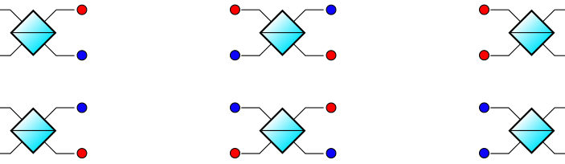
<figcaption class="paper-figure-caption"><b>Fig 1.</b> FIG. 1. Schematics of the case of a 50:50 beam-splitter with single particle inputs (red for bosons and blue for fermions) given an overlap between the degrees of freedom |⟨φ1|φ2⟩| = x. In this case, Theorem 1 can be written explicitly given the low number of possible combination. In particular, we would have: 1−x2</figcaption>
</figure>
<figure class="paper-figure-card">
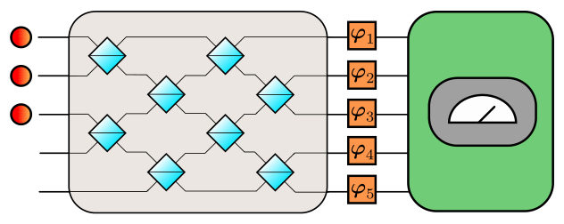
<figcaption class="paper-figure-caption"><b>Fig 2.</b> FIG. 2. We consider a simple protocol where a set of particles (bosons, fermions, classical) interfere through a linear interferometer. The goal is to measure a quantity encoded by means of the phase shifter with phases ϕi. Any measurement can be performed on them.</figcaption>
</figure>

**Main problem.** The paper investigates the fundamental relationship and complementarity between bosonic and fermionic many-body interference when particles are partially distinguishable.

**Main result.** The authors establish an exact algebraic identity relating bosonic and fermionic transition probabilities and prove a sum rule where the sum of their covariance matrices equals twice that of classical particles.

**Method.** The study employs multilinear algebra, generating functions, and the Khatri-Rao product, utilizing MacMahon's master theorem and Weingarten calculus for Haar random averages.

**Summary.** This paper establishes a formal mathematical complementarity between bosonic and fermionic interference in linear interferometers. It proves that even when particles are partially distinguishable, a fundamental sum rule holds between their correlation matrices and classical particles. The work reveals a metrological trade-off: increasing particle indistinguishability enhances bosonic phase sensitivity but can degrade fermionic sensitivity. Additionally, the findings provide new mathematical identities relating the permanent and determinant of tensors.

Detailed structure

**Model / system.** The system consists of bosons and fermions passing through an m-mode linear interferometer characterized by a unitary matrix U, where partial distinguishability is modeled via a Gram matrix S.

**Key observables.** Transition probabilities, particle number distributions, covariance matrices, and Quantum Fisher Information (QFI).

**Important parameters / regimes.** Degree of indistinguishability (Gram matrix S), unitary transformation U, and particle number (even vs. odd).

**Assumptions / limitations.** The interferometer is assumed to be linear (unitary), and internal degrees of freedom are modeled as pure states; the analysis focuses on thermal and Fock input states.

**Figures summary.** Figure 1 shows a 50:50 beam-splitter illustrating bosonic bunching and fermionic antibunching; Figure 2 depicts a general protocol for phase estimation in a linear interferometer.

**Paper structure.** The paper introduces the problem of bosonic-fermionic complementarity, develops a mathematical framework using generating functions and 3-tensors, proves fundamental theorems regarding transition probabilities and covariance matrices, and concludes with metrological implications and computational complexity considerations.

**Why it may be interesting.** It provides a deep mathematical link between permanents and determinants in the context of quantum statistics, offering new insights into the limits of quantum metrology and the simulation of Boson/Fermion sampling.

Abstract

It is well known that bosons and fermions exhibit opposite behaviors when experiencing interference, in the sense that bosons have a tendency to bunch whereas fermions have a tendency to antibunch. Recently, this complementarity was mathematically characterized in [arXiv:2312.17709] by means of an identity relating the transition probabilities of both types of particles in a linear interferometer. Here, we show that such a complementarity still holds even when particles become partially distinguishable, for example, when they have slightly different polarizations or time delays. Namely, we establish a relation that combines bosonic and fermionic multiparticle interferences in an arbitrary linear interferometer, in the presence of partial distinguishability. Incidentally, this also provides a new mathematical identity relating the permanent and determinant of tensors of order 3. Importantly, this complementarity has direct operational consequences in quantum metrology. Indeed, we show that the correlation matrices for bosonic and fermionic particle number distributions at the output of the interferometer obey a simple sum rule: their sum equals twice the correlation matrix for classical particles. This, in turn, constraints the achievable quantum Fisher information in phase-estimation protocols, highlighting a trade-off whereby greater indistinguishability enhances bosonic sensitivity whereas reduced indistinguishability can benefit fermionic schemes.

[↑ back to top](#top)

### [Diagnostic Disagreement as an Information-Projection Divergence: An Information-Theoretic Reading of the Quiet-Sun Temperature Ratio](http://arxiv.org/abs/2604.23752v1)

**Authors:** V. Edmonds  
**Type:** theory · **Category:** statistical mechanics · **PDF:** <https://arxiv.org/pdf/2604.23752v1>  
**Analysis basis:** full PDF text, analyzed in chunks
**Topic relevance:** `entanglement & information structure` **2/5** · `non-equilibrium dynamics` **2/5** · `quantum measurements` **2/5**

↔ Scroll figures horizontally

<figure class="paper-figure-card">
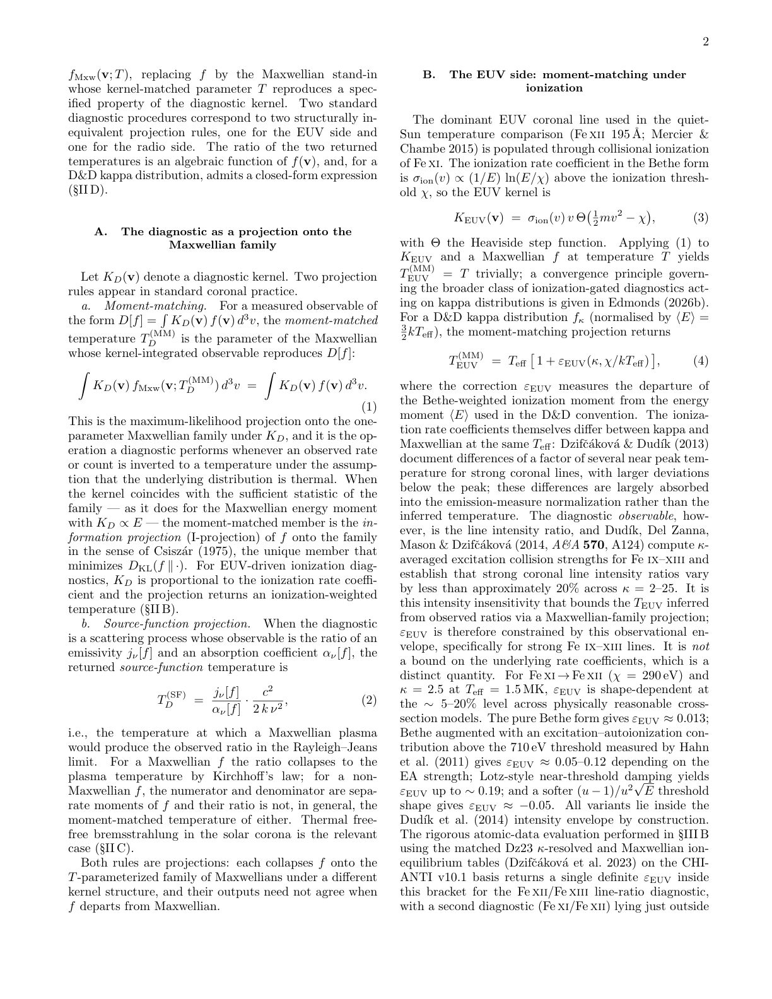
<figcaption class="paper-figure-caption"><b>Fig 1.</b> Low-resolution page preview, page 2</figcaption>
</figure>
<figure class="paper-figure-card">
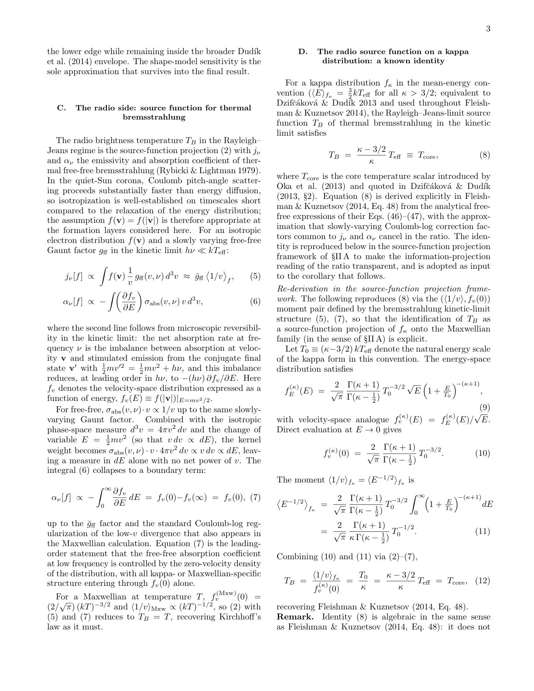
<figcaption class="paper-figure-caption"><b>Fig 2.</b> Low-resolution page preview, page 3</figcaption>
</figure>
<figure class="paper-figure-card">
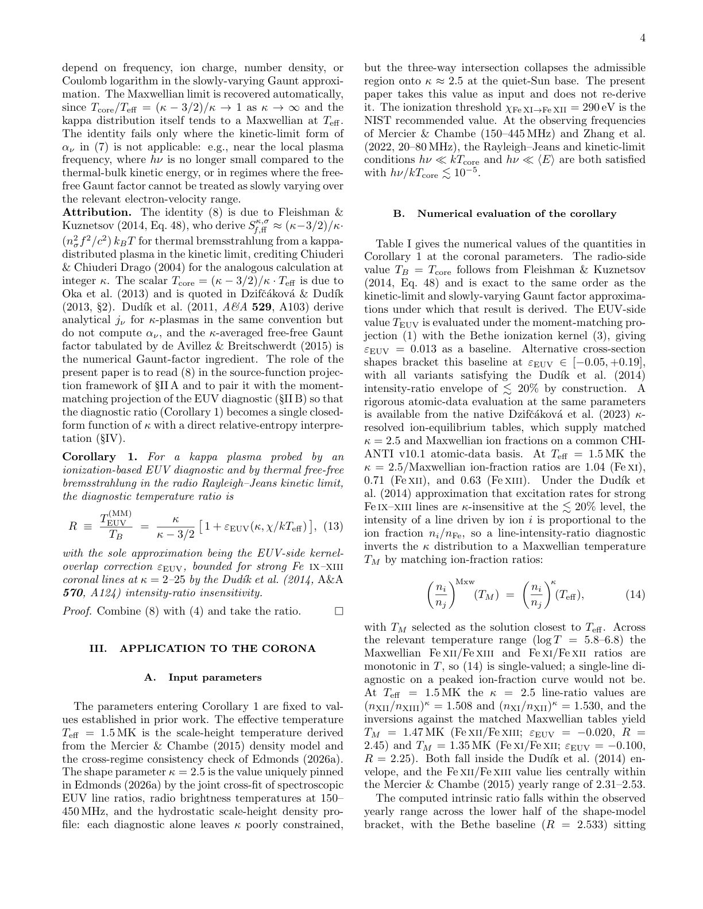
<figcaption class="paper-figure-caption"><b>Fig 3.</b> Low-resolution page preview, page 4</figcaption>
</figure>
<figure class="paper-figure-card">
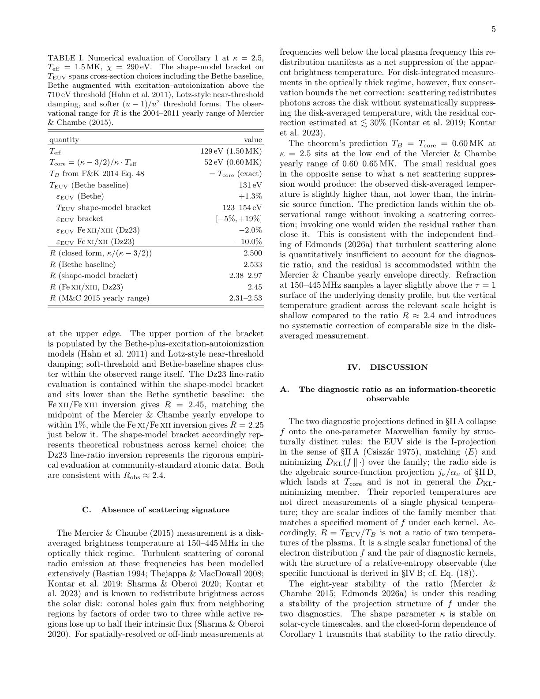
<figcaption class="paper-figure-caption"><b>Fig 4.</b> Low-resolution page preview, page 5</figcaption>
</figure>
<figure class="paper-figure-card">
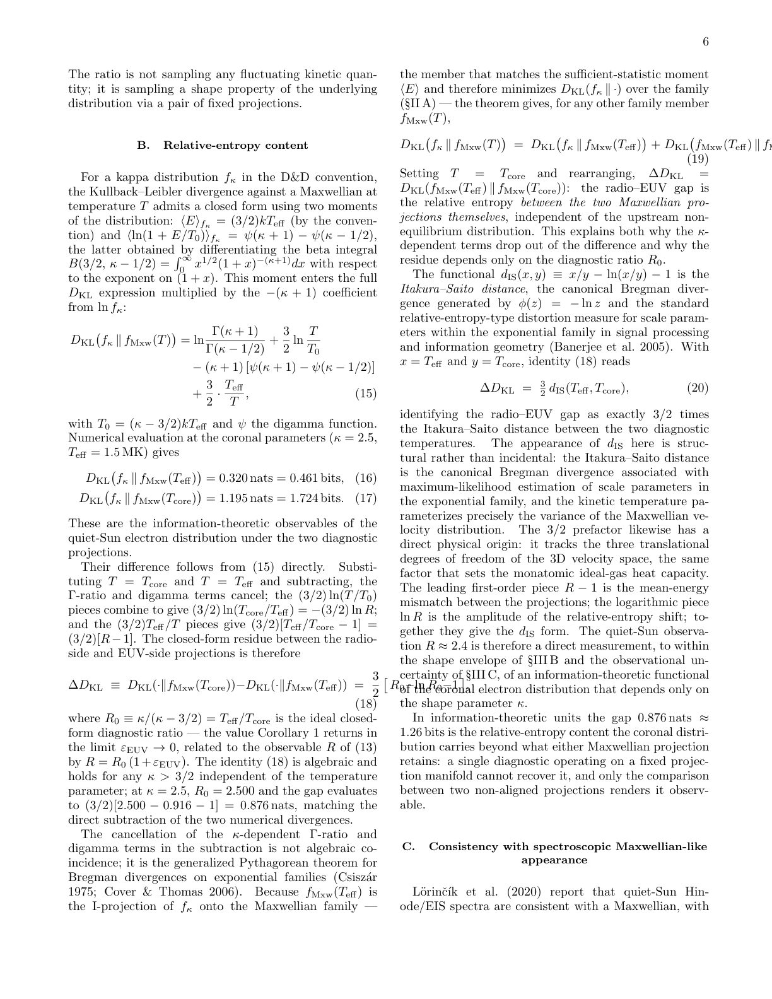
<figcaption class="paper-figure-caption"><b>Fig 5.</b> Low-resolution page preview, page 6</figcaption>
</figure>
<figure class="paper-figure-card">
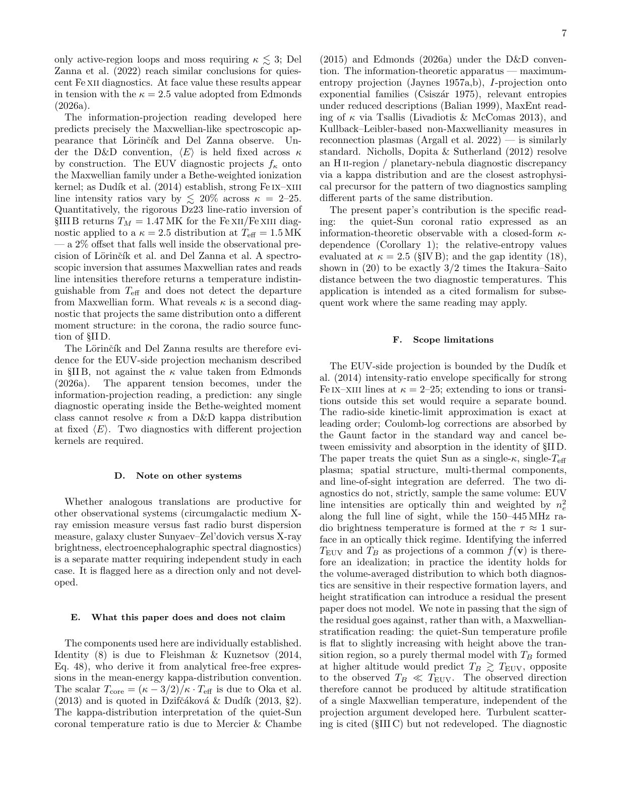
<figcaption class="paper-figure-caption"><b>Fig 6.</b> Low-resolution page preview, page 7</figcaption>
</figure>
<figure class="paper-figure-card">
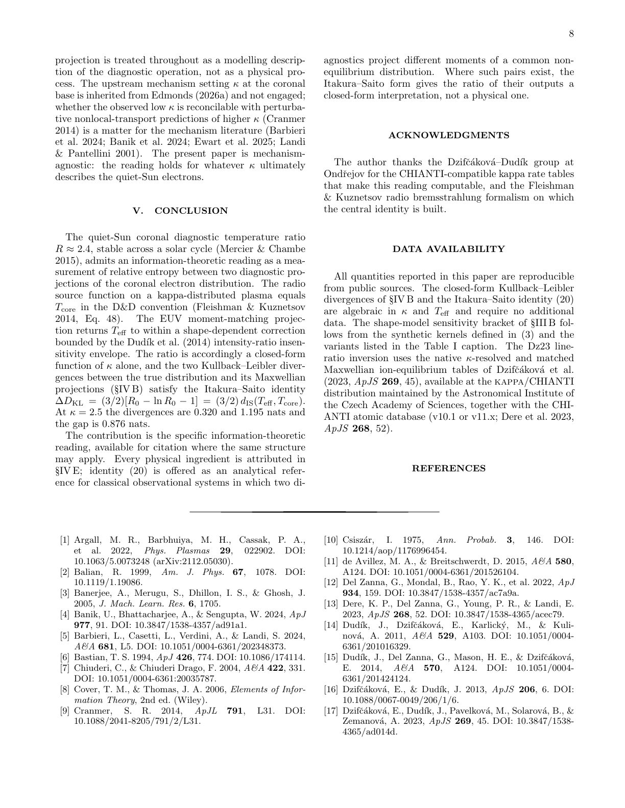
<figcaption class="paper-figure-caption"><b>Fig 7.</b> Low-resolution page preview, page 8</figcaption>
</figure>
<figure class="paper-figure-card">
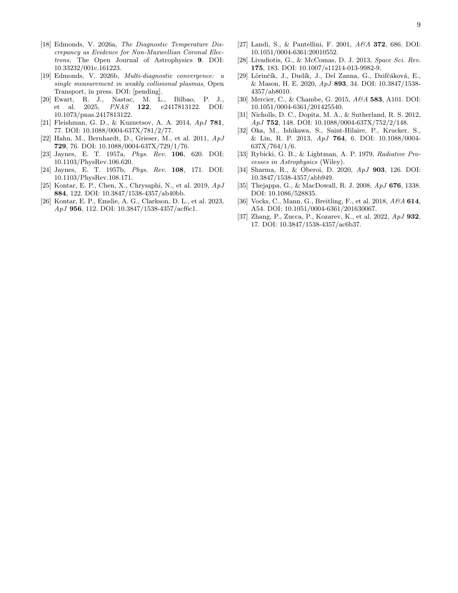
<figcaption class="paper-figure-caption"><b>Fig 8.</b> Low-resolution page preview, page 9</figcaption>
</figure>

**Main problem.** Explaining the observed discrepancy between EUV and radio-derived electron temperatures in the quiet-Sun corona.

**Main result.** The temperature ratio is reinterpreted as a measure of relative entropy (Kullback-Leibler divergence) between two different Maxwellian projections of a non-equilibrium kappa-distribution.

**Method.** Information-theoretic analysis using I-projections, Bregman divergences, and the Itakura-Saito distance to link diagnostic kernels to entropy.

**Summary.** This paper provides an information-theoretic reading of the temperature discrepancy observed in the solar corona. It argues that the difference between EUV and radio temperatures is not an error, but a measurable consequence of projecting a non-equilibrium kappa-distribution onto different Maxwellian families. By establishing a mathematical link between the temperature ratio and the Itakura-Saito distance, the work shows that the observed 'gap' represents the relative entropy between different diagnostic projections. This framework provides a way to quantify the non-equilibrium nature of the plasma through standard observational diagnostics.

Detailed structure

**Model / system.** The quiet-Sun corona, modeled as a non-equilibrium plasma with an isotropic electron distribution following a kappa-distribution (D&D convention).

**Key observables.** Temperature ratio (R = Teuv/Tb), EUV line intensity ratios (Fe IX-XIII), and radio brightness temperature (150-450 MHz).

**Important parameters / regimes.** Kappa parameter (kappa = 2.5), effective temperature (Teff), and the Rayleigh-Jeans limit.

**Assumptions / limitations.** The electron distribution is isotropic; the radio diagnostic operates in the Rayleigh-Jeans limit; both diagnostics sample the same plasma volume.

**Figures summary.** Not specified.

**Paper structure.** The paper introduces the diagnostic discrepancy, establishes a theoretical framework using information projection, derives analytical identities linking the temperature gap to the Itakura-Saito distance, and performs numerical evaluations against solar observations.

**Why it may be interesting.** The use of information-theoretic projections (I-projections) and Bregman divergences to interpret discrepancies between different measurement kernels is highly relevant to the study of non-equilibrium steady states and open quantum systems.

Abstract

The quiet-Sun coronal electron-temperature ratio $R \equiv T_\mathrm{EUV}/T_B \approx 2.4$, stable across an eight-year solar cycle, is read here as a measurement of relative entropy between two diagnostic projections of the coronal electron distribution onto the one-parameter Maxwellian family. The EUV ionization temperature is a moment-matching projection against a Bethe-type ionization kernel; the radio brightness temperature is the Rayleigh-Jeans source function of thermal bremsstrahlung. For a kappa distribution in the mean-energy convention, Fleishman & Kuznetsov (2014) give the radio-side projection in closed form as $T_B = T_\mathrm{core}$; the EUV side returns $T_\mathrm{eff}$ up to a shape-dependent correction within the Dudík et al. (2014) intensity-ratio envelope. At $κ= 2.5$ the Kullback-Leibler divergences between the true distribution and its two Maxwellian projections evaluate to $0.32$ and $1.20$ nats, and their difference satisfies $ΔD_\mathrm{KL} = (3/2)[R_0 - \ln R_0 - 1] = (3/2) d_\mathrm{IS}(T_\mathrm{eff}, T_\mathrm{core})$, where $R_0 \equiv κ/(κ- 3/2)$ is the ideal closed-form ratio and $d_\mathrm{IS}$ is the Itakura-Saito distance. The identity is offered as an analytical reference for observational systems in which two diagnostics project different moments of a common non-equilibrium distribution; the eight-year stability of $R$ expresses a stability of that projection structure.

[↑ back to top](#top)

### [Nesting Controls Phase Transitions in Higher-Order Contagion](http://arxiv.org/abs/2604.23337v1)

**Authors:** Hugo P. Maia, Guilherme Ferraz de Arruda, Silvio C. Ferreira, Yamir Moreno  
**Type:** theory · **Category:** statistical mechanics · **PDF:** <https://arxiv.org/pdf/2604.23337v1>  
**Analysis basis:** full PDF text, analyzed in chunks
**Topic relevance:** `driven-dissipative phase transition` **2/5** · `non-equilibrium dynamics` **2/5** · `non-equilibrium universality` **2/5**

↔ Scroll figures horizontally

<figure class="paper-figure-card">
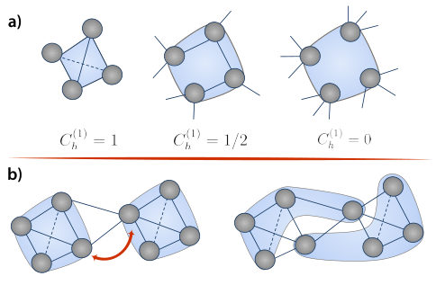
<figcaption class="paper-figure-caption"><b>Fig 1.</b> FIG. 1: (a) Example of the nesting coefficient of order 1 (pairwise) in a hyperedge h of order m = 3 (4-body), C(1) h . The coefficient represents the ratio between the number of 1st-order hyperedges and the maximum number of hyperedges that could be formed within the hyperedge of order m = 3. (b) Illustration of the rewiring mechanism used to control embedding. Two hyperedges of order m = 3 exchange one node (arrow), reducing the number of embedded pairwise interactions and yielding C(1) h = 2/3. Simulations are performed on networks with maximum order mmax = 5 (see also SM).</figcaption>
</figure>
<figure class="paper-figure-card">
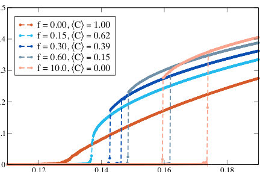
<figcaption class="paper-figure-caption"><b>Fig 2.</b> FIG. 2: Stationary epidemic prevalence ρ as a function of the first-order spreading rate β(1) for different rewiring levels f, corresponding to different average nesting coefficients ⟨C⟩. Forward (lower spinodal) and backward (upper spinodal) branches are obtained from initial conditions ρ(0) &gt;∼1/N and ρ(0) &lt;∼1, respectively.</figcaption>
</figure>
<figure class="paper-figure-card">
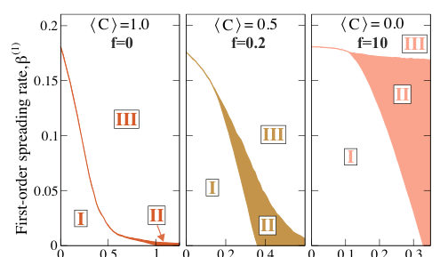
<figcaption class="paper-figure-caption"><b>Fig 3.</b> FIG. 3: Phase diagrams of the higher-order SIS dynamics in the (β(1), b) parameter space for different levels of embedding (controlled by the rewiring parameter f and corresponding ⟨C⟩). Regions denote: I, absorbing phase (ρ = 0 globally stable); II, bistable regime; III, active phase (ρ &gt; 0 globally stable). (a) Networks with only triadic interactions. (b) Networks with maximum order mmax = 5. Both systems have comparable average pairwise degree ⟨k(1)⟩≈8. Simulations are performed on synthetic networks with N = 104 nodes (see also the SM).</figcaption>
</figure>
<figure class="paper-figure-card">
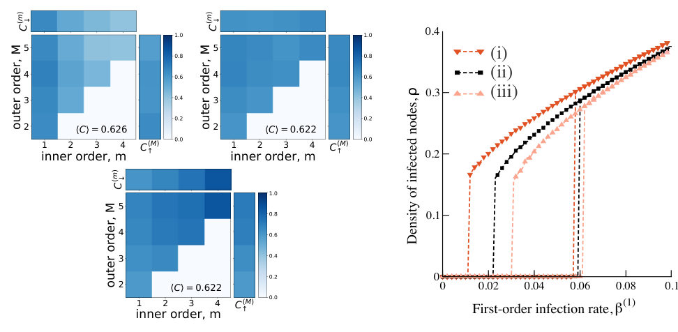
<figcaption class="paper-figure-caption"><b>Fig 4.</b> FIG. 4: Effect of order-dependent embedding on higher-order SIS dynamics. (a) Embedding patterns across interaction orders, shown for (i) negative, (ii) neutral, and (iii) positive correlations between embedding and order. Negative correlations correspond to stronger embedding at lower orders, while positive correlations correspond to stronger embedding at higher orders. (b) Stationary prevalence ρ as a function of the first-order spreading rate β(1) for the corresponding patterns in (a), showing that embedding concentrated at lower orders facilitates activation while having a limited impact on hysteresis. The higher-order infection rate is b = 0.34.</figcaption>
</figure>
<figure class="paper-figure-card">
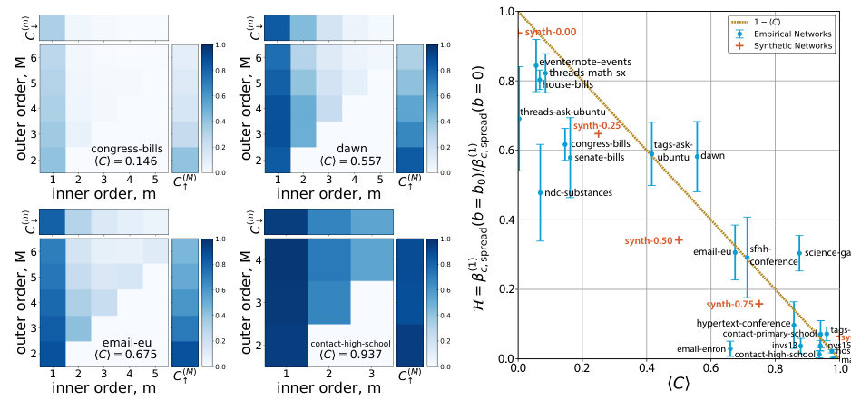
<figcaption class="paper-figure-caption"><b>Fig 5.</b> FIG. 5: Empirical evidence of order-dependent embedding and its dynamical impact. (a) Embedding patterns across interaction orders for representative datasets [35]. Top rows and right columns show the marginal averages over inner- and outer-order embedding, C(m) ↓ and C(M) ↑ , respectively (see also the SM). The overall embedding ⟨C⟩is indicated in each panel. (b) Scaled</figcaption>
</figure>
<figure class="paper-figure-card">
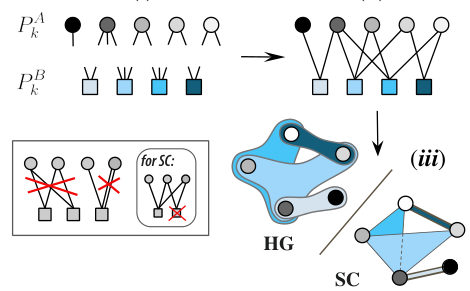
<figcaption class="paper-figure-caption"><b>Fig 6.</b> FIG. 6: Example of the three steps employed to generate networks through the bipartite configuration model (see SM text). In this example, a bipartite graph is built with five nodes in partition A (circles) and four nodes in partition B (squares) following from predefined degree distributions P A k and P B k . Nodes from each partition can connect only once to each other, and nodes from partition B with the same degree cannot possess the same set of neighbors. The resulting graph is reinterpreted as a higher-order network with five nodes and four hyperedges.</figcaption>
</figure>
<figure class="paper-figure-card">
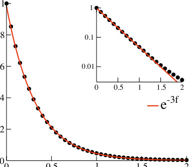
<figcaption class="paper-figure-caption"><b>Fig 7.</b> FIG. 7: Overall average nesting coefficient ⟨C⟩as a function of rewires per hypergraphs f. Starting from a SC with ⟨C⟩= 1, the nesting coefficient drops exponentially as a function of the amount of rewires per hyperedge.</figcaption>
</figure>
<figure class="paper-figure-card">
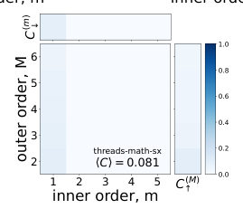
<figcaption class="paper-figure-caption"><b>Fig 8.</b> FIG. 8: Nesting coefficient measured from empirical datasets. Extra rows and columns on top and left represents the average inner and outer-order nesting coefficient respectively. Nesting coefficients for orders greater than 6 were omitted for better visibility.</figcaption>
</figure>

**Main problem.** The lack of a general structural principle to govern how the organization of higher-order interactions (nesting) influences contagion dynamics and phase transitions on hypergraphs.

**Main result.** Increasing the nesting coefficient (the embedding of lower-order interactions within higher-order ones) lowers the activation threshold and promotes continuous phase transitions, while low nesting favors explosive, discontinuous behavior and hysteresis.

**Method.** The authors introduce a nesting coefficient and use a bipartite configuration model with a node-exchange rewiring mechanism to create a continuum between simplicial complexes and random hypergraphs. They perform simulations on synthetic and empirical networks using a higher-order SIS model.

**Summary.** This paper identifies 'nesting'—the degree to which lower-order interactions are embedded within higher-order ones—as a fundamental structural determinant of phase transitions in hypergraphs. The authors show that high nesting stabilizes continuous transitions and lowers infection thresholds, whereas low nesting leads to explosive, discontinuous spreading and hysteresis. By testing this on both synthetic and real-world networks, they establish a predictive link between network architecture and collective dynamics. This provides a new framework for understanding how the organization of group-based interactions governs large-scale transitions.

Detailed structure

**Model / system.** A higher-order Susceptible-Infected-Susipctible (hyper-SIS) model on hypergraphs and simplicial complexes, where infection occurs through $m$-order hyperedges and recovery follows standard SIS dynamics.

**Key observables.** Stationary epidemic prevalence (rho), activation threshold, transition type (continuous vs. discontinuous), hysteresis (bistability), and the nesting coefficient.

**Important parameters / regimes.** First-order spreading rate (beta 1), higher-order spreading rate (b), rewiring fraction (f), and the nesting coefficient (C).

**Assumptions / limitations.** The bipartite configuration model assumes nodes can connect at most once, which may lead to frustrated configurations where connections cannot be completed.

**Figures summary.** Figure 1 illustrates the nesting coefficient and rewiring mechanism; Figure 2 shows prevalence plots demonstrating the transition from smooth to hysteretic curves; Figure 3 presents phase diagrams in the beta(1)-b plane; Figure 4 shows the effect of order correlations on dynamics; Figure 5 displays embedding patterns in empirical datasets; Figure 7 shows the exponential decay of nesting with rewiring; Figure 8 compares nesting across various real-world networks.

**Paper structure.** Introduction of the nesting problem, definition of the nesting coefficient and network generation methods, analysis of the role of nesting in phase transitions, investigation of correlations between embedding and interaction order, empirical validation using real-world datasets, and discussion of structural implications.

Abstract

The organization of higher-order interactions plays a central role in shaping collective dynamics, yet a general structural principle governing contagion on hypergraphs remains lacking. Here we introduce a nesting coefficient that quantifies how lower-order interactions are embedded within higher-order ones, defining a continuum between simplicial complexes and random hypergraphs. Using a higher-order susceptible-infected-susceptible model, we show that increasing nesting lowers the activation threshold and suppresses discontinuous transitions, while weak embedding favors explosive behavior. We further demonstrate that correlations between nesting and interaction order modulate the onset of activity while only weakly affecting transition discontinuity. Analysis of synthetic and empirical networks reveals that nesting strongly predicts hysteresis, establishing it as a key structural determinant of phase transitions in higher-order systems.

[↑ back to top](#top)

### [Quantum Dynamics and Collapse-and-Revival Phenomena in the Dunkl Anharmonic Oscillator](http://arxiv.org/abs/2604.22945v1)

**Authors:** D. Ojeda-Guillén, R. D. Mota, M. Salazar-Ramírez  
**Type:** theory · **Category:** quantum information and computing · **PDF:** <https://arxiv.org/pdf/2604.22945v1>  
**Analysis basis:** full PDF text, analyzed in chunks
**Topic relevance:** `entanglement & information structure` **2/5** · `interference shaping light` **2/5** · `non-equilibrium dynamics` **2/5**

↔ Scroll figures horizontally

<figure class="paper-figure-card">
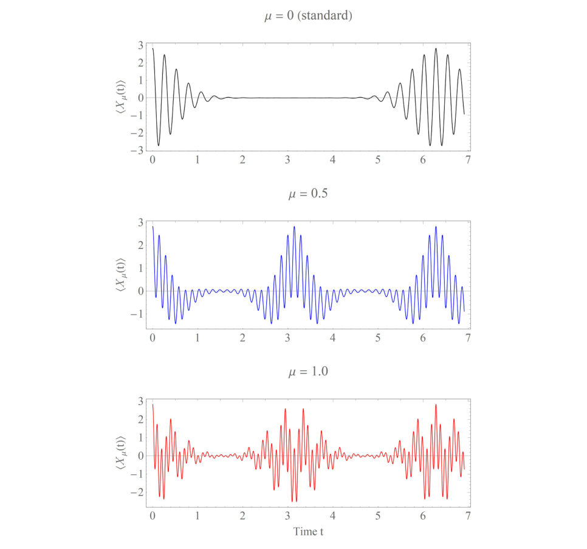
<figcaption class="paper-figure-caption"><b>Fig 1.</b> Figure 1: Evolution of the quadrature ⟨Xµ(t)⟩over a full cycle. The Dunkl parameter µ produces a half-cycle revival at t ≈π, while a complete resynchronization of all wave packets occurs at t ≈2π. For this numerical simulation, the anharmonicity parameter is set to λ = 1, the free oscillator frequency to ω = 20, and the initial coherent state amplitude is α = 2.</figcaption>
</figure>
<figure class="paper-figure-card">
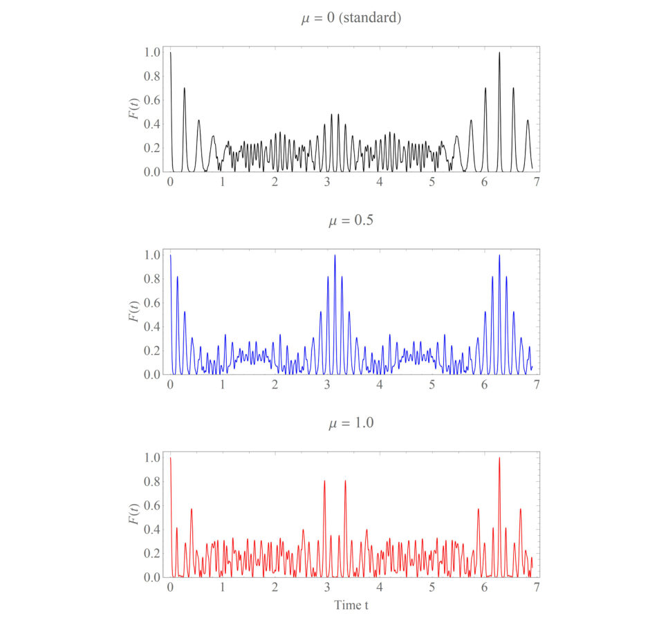
<figcaption class="paper-figure-caption"><b>Fig 2.</b> Figure 2: Survival probability F(t) for different values of the Dunkl parameter: µ = 0 (stan- dard), µ = 0.5 and µ = 1.0. The vertical alignment at t ≈6.28 confirms the universal revival period 2π/λ (evaluated here with the free oscillator frequency ω = 20, the anharmonicity parameter λ = 1, and the initial amplitude α = 2). For µ = 0.5, a perfect additional revival occurs at t = π/λ.</figcaption>
</figure>
<figure class="paper-figure-card">
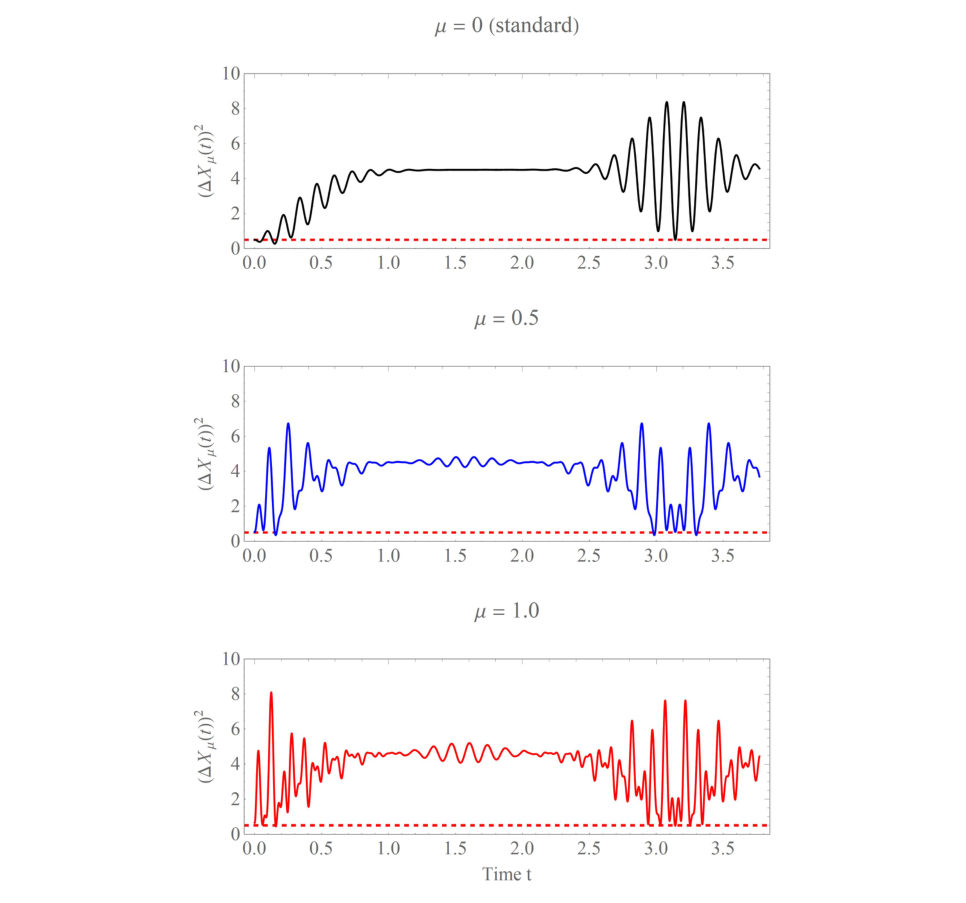
<figcaption class="paper-figure-caption"><b>Fig 3.</b> Figure 3: Temporal evolution of the quadrature variance (∆Xµ(t))2 for µ = 0 (top), µ = 0.5 (middle), and µ = 1.0 (bottom), setting the free oscillator frequency to ω = 20, the Kerr parameter to λ = 1, and the coherent amplitude to α = 2. The red dashed horizontal line marks the Standard Quantum Limit (SQL) at 0.5. Values below this line indicate the generation of quadrature squeezed light.</figcaption>
</figure>

**Main problem.** The study investigates how Dunkl deformation affects the quantum dynamics, specifically the energy spectrum and the collapse-and-revival phenomena, of an anharmonic (Kerr) oscillator.

**Main result.** The Dunkl parameter mu modulates fractional revivals and can generate interference-induced squeezed states and perfect state reconstructions at half-periods for specific deformation values.

**Method.** An algebraic approach using the su(1,1) Lie algebra and Dunkl-deformed Heisenberg-Weyl algebra is employed to solve the Hamiltonian and compute temporal evolution.

**Summary.** This paper explores a generalized version of the Kerr medium using Dunkl-deformed operators. By applying an algebraic su(1,1) approach, the authors derive an exact energy spectrum that depends on the parity of the states. They show that the Dunkl parameter acts as a tuning knob for quantum dynamics, specifically modulating fractional revivals and enabling the generation of interference-induced squeezed states. The results demonstrate that the standard Kerr dynamics are recovered when the deformation parameter goes to zero.

Detailed structure

**Model / system.** A Dunkl-deformed Tana's anharmonic oscillator (Kerr medium) characterized by a Hamiltonian that incorporates a parity-dependent centrifugal barrier term via Dunkl operators.

**Key observables.** Energy spectrum, field quadrature, quadrature variance (squeezing), survival probability (fidelity), and the Mandel Q parameter.

**Important parameters / regimes.** Dunkl parameter (mu), Kerr nonlinearity (lambda), and the parity-dependent Bargmann indices (k+ and k-).

**Assumptions / limitations.** The initial state is a superposition of even and odd Dunkl coherent states, and the coherent parameter alpha is assumed to be real for certain analytical derivations.

**Figures summary.** Figure 1 shows the temporal evolution of the quadrature; Figure 2 displays the survival probability for different mu values highlighting additional revivals; Figure 3 illustrates the temporal evolution of quadrature variance and squeezing dips.

**Paper structure.** The paper follows a logical progression from defining the Dunkl-deformed Hamiltonian and its algebraic su(1,1) structure, to deriving the exact energy spectrum, and finally analyzing the temporal dynamics of observables like quadrature and survival probability.

**Why it may be interesting.** This work is relevant for quantum optics and quantum information because it demonstrates how a deformation parameter can be used to tune revival phases and generate new types of squeezed states and macroscopic quantum superpositions (cat states).

Abstract

We study the Dunkl anharmonic oscillator (Kerr medium) Hamiltonian from an algebraic approach of the $SU(1,1)$ group. In order to obtain the exact energy spectrum of this problem, we write its Hamiltonian in terms of the Dunkl creation and annihilation operators, which close the $su(1,1)$ Lie algebra. This allows us to exactly solve this Hamiltonian and obtain its parity-dependent energy spectrum. Then, we investigate the quantum dynamics of the system, particularly the collapse and revival phenomena, by using an initial state given by a superposition of even and odd Dunkl coherent states. We compute the field quadrature and the survival probability, showing that the Dunkl parameter $μ$ modulates the fractional revivals and produces perfect state reconstructions at half-periods for specific deformation values. We analyze the quadrature variance to show that the Dunkl deformation generates interference-induced squeezed states around $t \approx π$. The standard Kerr medium dynamics are exactly recovered in the limit $μ\rightarrow 0$.

[↑ back to top](#top)

### [Quantum Prediction of Transport Dynamics in Discretized State Spaces](http://arxiv.org/abs/2604.24161v1)

**Authors:** Felix Govaers  
**Type:** theory · **Category:** quantum information and computing · **PDF:** <https://arxiv.org/pdf/2604.24161v1>  
**Analysis basis:** full PDF text, analyzed in chunks
**Topic relevance:** `methods for driven-dissipative` **2/5** · `non-equilibrium dynamics` **2/5** · `quantum measurements` **2/5**

↔ Scroll figures horizontally

<figure class="paper-figure-card">
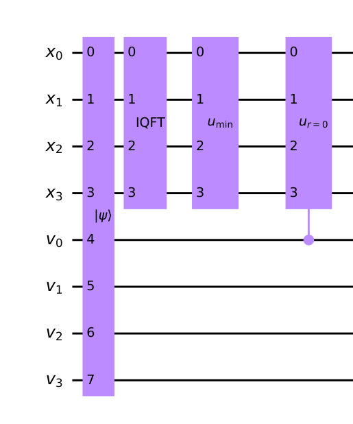
<figcaption class="paper-figure-caption"><b>Fig 1.</b> Fig. 1. Prediction circuit for nx = 4 qubits for the position and nv = 4 qubits for the velocity register, respectively.</figcaption>
</figure>
<figure class="paper-figure-card">
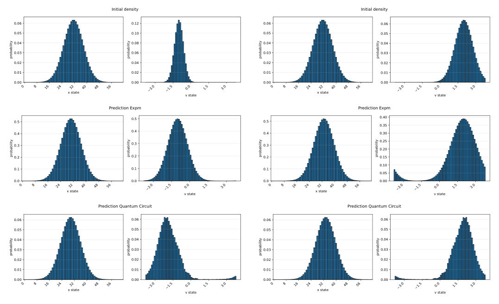
<figcaption class="paper-figure-caption"><b>Fig 2.</b> Fig. 2. Marginal densities px(x) and pv(v) at the initialization (top), after the exact classical solution using the matrix exponential (middle) and the resulting marginal densities from the quantum circuit (bottom) for Scenario 1 (left) and 2 (right).</figcaption>
</figure>

**Main problem.** Developing an efficient gate-based quantum algorithm for the prediction step of Bayesian state estimation in high-dimensional, discretized position-velocity state spaces.

**Main result.** The authors propose a quantum algorithm that achieves exponential memory compression and polynomial complexity scaling, accurately reproducing classical drift dynamics and approximating diffusion via a unitary surrogate.

**Method.** The algorithm uses amplitude encoding of probability densities and a spectral method in the Fourier domain, employing Quantum Fourier Transforms and a Wick rotation to transform non-unitary diffusion into a unitary dispersive phase evolution.

**Summary.** This paper presents a quantum algorithm designed to predict the evolution of probability densities in a discretized position-velocity space. By encoding densities into quantum amplitudes, the method avoids the exponential memory scaling of classical grid-based methods. While the deterministic drift is implemented exactly, the authors use a Wick rotation to approximate the non-unitary diffusion process as a unitary phase evolution. Numerical tests show that the algorithm accurately captures the mean and transport dynamics, making it a promising tool for high-dimensional Bayesian filtering.

Detailed structure

**Model / system.** A Continuous White Noise Acceleration (CWNA) model, also known as the Nearly Constant Velocity (NCV) model, governed by the Fokker-Planck equation in a discretized position-velocity state space.

**Key observables.** Posterior probability density, mean, and covariance matrix.

**Important parameters / regimes.** Drift component (deterministic), diffusion coefficient (stochastic), and grid discretization parameters (Nx, Nv).

**Assumptions / limitations.** The diffusion term is approximated via a Wick rotation (unitary surrogate), and the state space is assumed to be a periodic, uniform grid.

**Figures summary.** Figure 1 shows the quantum circuit architecture for a specific qubit configuration; Figure 2 compares marginal densities of the initial, exact classical, and quantum-predicted states across different transport scenarios.

**Paper structure.** The paper introduces the problem of high-dimensional Bayesian estimation, defines the Fokker-Planck model, details the quantum encoding and spectral implementation of drift and diffusion, provides an error analysis of the unitary surrogate, and concludes with numerical validation.

**Why it may be interesting.** This work is highly relevant for researchers in open quantum systems and many-body dynamics as it provides a framework for using quantum computers to simulate complex, high-dimensional stochastic transport and filtering problems that are classically intractable.

Abstract

We propose a gate-based quantum algorithm for the prediction step of Bayesian state estimation based on the Fokker-Planck equation on a discretized position-velocity state space. The probability density is encoded in the amplitudes of a quantum state, enabling a compact representation of high-dimensional distributions. Exploiting the circulant structure of finite-difference operators, the evolution is realized in the spectral domain using quantum Fourier transforms and phase rotations.   A key result is that the drift component can be implemented exactly in amplitude space, leading to an accurate reproduction of the classical transport dynamics. In contrast, the diffusion term does not admit a linear representation in amplitude space due to the nonlinear relation between probability density and wave function. To enable a quantum implementation, we introduce a unitary surrogate based on a Wick rotation, transforming diffusion into a dispersive phase evolution. This yields a fully unitary propagation that can be implemented efficiently on a gate-based quantum computer. The proposed method is evaluated numerically for different scenarios and shows strong agreement with the exact solution of the Fokker-Planck equation. The approach demonstrates the potential of quantum computing for Bayesian state estimation, as the representable state space grows exponentially with the number of qubits. This allows the efficient representation and propagation of probability densities that would otherwise require complex tensor decompositions on classical hardware, making the method a promising candidate for high-dimensional filtering problems.

[↑ back to top](#top)

### [Contracting Tensor Networks with Generalized Belief Propagation](http://arxiv.org/abs/2604.24760v1)

**Authors:** Joseph Tindall, Grace M. Sommers, Hilbert Kappen  
**Type:** theory · **Category:** numerical methods · **PDF:** <https://arxiv.org/pdf/2604.24760v1>  
**Analysis basis:** full PDF text, analyzed in chunks
**Topic relevance:** `entanglement & information structure` **2/5** · `methods for driven-dissipative` **2/5**

↔ Scroll figures horizontally

<figure class="paper-figure-card">
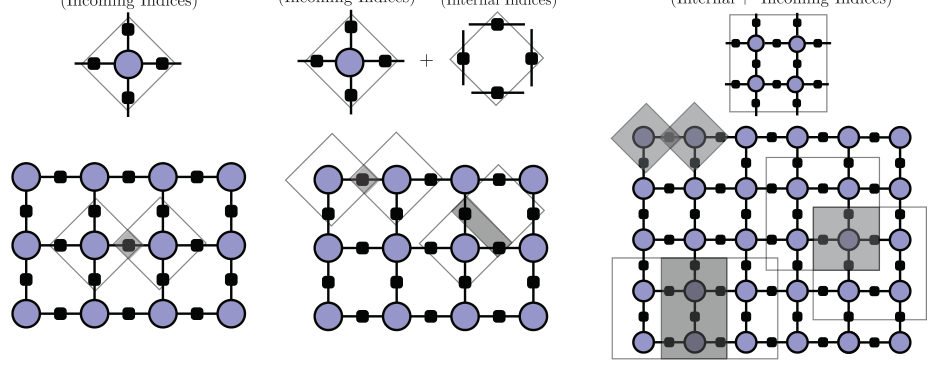
<figcaption class="paper-figure-caption"><b>Fig 1.</b> FIG. 1. Examples of some of the GBP parent region choices (and resulting intersections) used in this work for the case of a square lattice tensor network. Tensors are denoted as blue circles and indices have been made explicit as black edges with a square in the centre. Parents regions are shown in grey boxes, child regions in shaded boxes. The intersection of parent regions populates the initial child regions. Further intersections of children (where necessary) further populate the child regions. The message tensors live in these intersections and possess the corresponding indices. Simple BP) There is a parent region for the indices associated to each and every tensor in the network. GBP...</figcaption>
</figure>
<figure class="paper-figure-card">
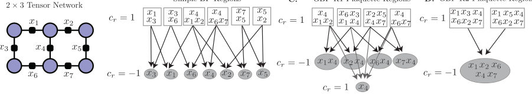
<figcaption class="paper-figure-caption"><b>Fig 2.</b> FIG. 2. A. 2 × 3 tensor network with all indices xi (black squares) labelled. B-D. Region diagrams for some of the parent region choices considered in this work. Parent regions are shown at the top in rectangular boxes and always have counting number cr = 1. Repeated intersections lead to series of child regions (elliptical boxes) with the given counting numbers. There is a direct relationship between parent and child if that child is a subset of the parent region. GBP message tensors mab(xb) live between parents and children and serve to define the marginals pr(xr) for each region in the diagram. These marginals approximate the contraction of the tensor network over all indices excluding...</figcaption>
</figure>
<figure class="paper-figure-card">
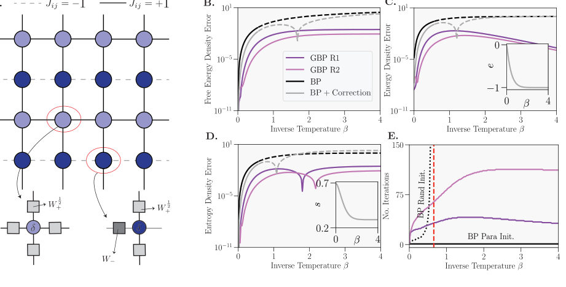
<figcaption class="paper-figure-caption"><b>Fig 3.</b> FIG. 3. A. Tensor network representation of the partition function Z of the two dimensional fully frustrated Ising model. All indices are dimension 2 and there are two sublattice tensors indicated by the two colors and formed from the contraction of a delta tensor and the relevant Boltzmann interaction matrices, with W± =  e±β e∓β</figcaption>
</figure>
<figure class="paper-figure-card">
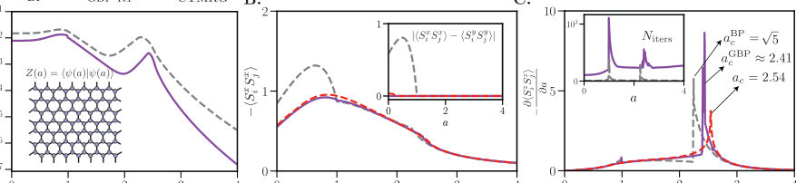
<figcaption class="paper-figure-caption"><b>Fig 4.</b> FIG. 4. Results for contracting the norm tensor network for the deformed AKLT state |ψ(a)⟩(see Eq. (25)) on the honeycomb lattice in the thermodynamic limit. A. Error on the free energy density −limN→∞1</figcaption>
</figure>
<figure class="paper-figure-card">
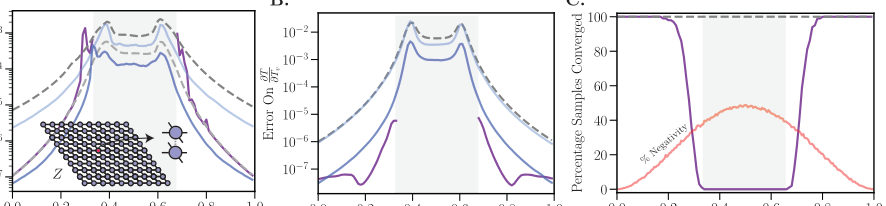
<figcaption class="paper-figure-caption"><b>Fig 5.</b> FIG. 5. Message passing results for 100 random realizations of an n × n norm network ⟨ψ|ψ⟩with n = 10, the state |ψ⟩ having bond dimension χ = 3. The elements of the tensors in |ψ⟩are drawn uniformly at random from the distribution U(−α, 1 −α). Results are for: BP, a first order cluster expansion around the BP fixed point, GBP with R1 plaquette regions and boundary MPS with MPS fixed bond dimension R. Errors are with respect to an exact contraction. The shaded region indicates where the GBP algorithm did not converge for any of the random realizations. A. Error on the free energy density −1</figcaption>
</figure>
<figure class="paper-figure-card">
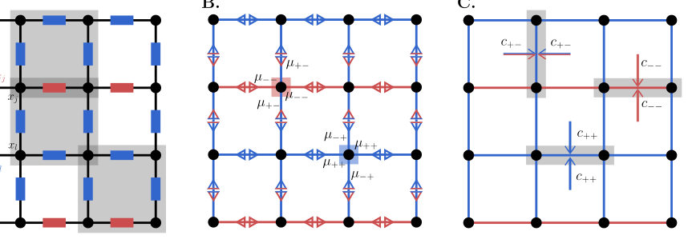
<figcaption class="paper-figure-caption"><b>Fig 6.</b> FIG. 6. (Generalized) belief propagation on the classical Villain model. A. Rewriting of the tensor network in Fig. 3a. Black vertices are the variables (delta tensors), blue rectangles are the ferromagnetic Boltzmann weights eβxixj, and red rectangles are the antiferromagnetic Boltzmann weights e−βxixj. The plaquettes shaded in gray are examples of parent regions for GBP, which intersect on both vertices and edges. B. In simple BP, the child regions are vertices, which come in two types: −vertices (such as the one shaded red) receive messages along horizontal antiferromagnetic bonds and vertical ferromagnetic bonds, parameterized by µ−−and µ+−respectively, whereas + vertices (such as the...</figcaption>
</figure>

**Main problem.** Efficiently contracting large-scale tensor networks containing loops, particularly when dealing with frustration, complex entries, or the need to preserve physical symmetries.

**Main result.** Generalized Belief Propagation (GBP) significantly improves accuracy and stability over standard Belief Propagation (BP) in frustrated and highly correlated regimes, and can correctly preserve symmetries like O(2) that BP breaks.

**Method.** The authors implement and analyze Generalized Belief Propagation (GBP) using a hierarchy of overlapping regions (clusters) and Kikuchi free energy minimization, comparing it against BP, cluster expansions, and CTMRG.

**Summary.** This paper presents an implementation of Generalized Belief Propagation (GBP) for the approximate contraction of tensor networks. By using overlapping regions rather than single tensors, GBP captures higher-order correlations and maintains physical symmetries that standard Belief Propagation fails to preserve. The authors demonstrate its efficacy on frustrated Ising models, 3D ice models, and the AKLT state. The study also identifies a convergence threshold related to the presence of negative or complex tensor entries.

Detailed structure

**Model / system.** The method is applied to various 2D and 3D tensor networks, including the fully frustrated (Villain) Ising model, 3D ice-type models (hexagonal and diamond), and the deformed AKLT quantum state on a honeycomb lattice.

**Key observables.** Partition functions, free energy density, energy density, entropy density, ground state degeneracy, and local spin correlators.

**Important parameters / regimes.** Inverse temperature (beta), deformation parameter (a) for AKLT, fraction of negative/complex entries in tensors (alpha), and bond dimension (chi).

**Assumptions / limitations.** The algorithm assumes no index appears more than twice in the network; convergence may fail when the fraction of negative or complex entries exceeds a certain threshold.

**Figures summary.** Figures illustrate the hierarchy of GBP regions (plaquettes/voxels), the tensor network representation of the Villain model, and comparative plots showing error in free energy and symmetry breaking across different models.

**Paper structure.** The paper introduces the GBP framework, derives the message-passing update equations via Kikuchi free energy minimization, applies the method to various classical and quantum models, and provides analytical solutions for specific cases in the appendix.

**Why it may be interesting.** This paper provides a more robust numerical tool for approximating the properties of many-body systems where standard message-passing fails due to frustration or symmetry breaking, which is crucial for studying phase transitions in complex quantum states.

Abstract

Recent years have seen a growing interest in the use of belief propagation - an algorithm originally introduced for performing statistical inference on graphical models - for approximate, but highly efficient, tensor network contraction. Here, we detail how to apply generalized belief propagation (GBP) - where messages are passed within a hierarchy of overlapping regions of the tensor network - to approximately contract tensor networks and obtain accurate results. The original belief propagation algorithm is a corner case of this approach, corresponding to a particularly simple choice of regions of the tensor network. We implement the GBP algorithm for a number of different region choices on a range of two- and three-dimensional, infinite and finite tensor networks, solving the corresponding fixed point equations both numerically and, in certain tractable cases, analytically. Our examples include calculating the partition function of the fully frustrated Ising model, computing the ground state degeneracy of three-dimensional ice models, measuring observables on the deformed AKLT quantum state and evaluating the norm of randomly generated tensor network states.

[↑ back to top](#top)

### [How fast can a quantum gate be? Exact speed limits from geometry](http://arxiv.org/abs/2604.23031v1)

**Authors:** Hunter Nelson, Edwin Barnes  
**Type:** theory · **Category:** quantum information and computing · **PDF:** <https://arxiv.org/pdf/2604.23031v1>  
**Analysis basis:** full PDF text, analyzed in chunks
**Topic relevance:** `entanglement & information structure` **2/5** · `non-equilibrium dynamics` **2/5**

↔ Scroll figures horizontally

<figure class="paper-figure-card">
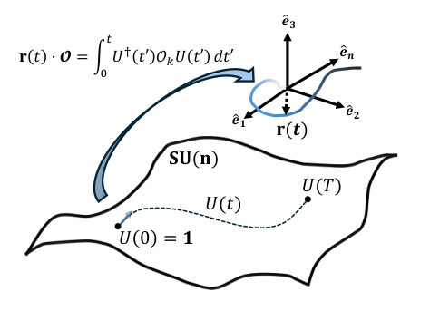
<figcaption class="paper-figure-caption"><b>Fig 1.</b> FIG. 1. Paths on the manifold SU(n) emanating from the identity and terminating at three different gates U1, U2, and U3. A space curve in SCQC represents these paths in a Eu- clidean space Rn2−1, whose dimension equals the number of group generators.</figcaption>
</figure>
<figure class="paper-figure-card">
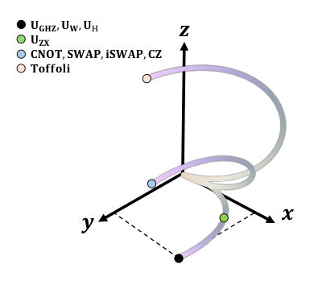
<figcaption class="paper-figure-caption"><b>Fig 2.</b> FIG. 2. Time-optimal space curves generated by Pauli cer- tifiers and corresponding to several commonly used gates in quantum information science. Extra curve dimensions rep- resent longer QSL times for gates. For instance the curve realizing CNOT is a circular helix which necessarily dips into a third dimension. This leads to a longer QSL over the locally equivalent UZX gate, which admits a planar realization.</figcaption>
</figure>
<figure class="paper-figure-card">
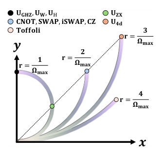
<figcaption class="paper-figure-caption"><b>Fig 3.</b> FIG. 3. Circular arc space curves generated by non-Pauli cer- tifiers constructed from the eigenbasis of the optimal Hamil- tonian. Here, for UZX, CNOT, and U4d a larger QSL geomet- rically corresponds to a circular arc with a larger radius for the same depicted tangent-endpoint angle of π/4.</figcaption>
</figure>

**Main problem.** Determining the fundamental, tight quantum speed limits (QSLs) for implementing specific quantum gates under a bounded Hamiltonian spectral width.

**Main result.** The authors derive an exact, saturable QSL for any unitary evolution where the minimal gate time is determined by the 'slowest' operator in a certifying set. They show that time-optimal gates correspond to geometric helices in Euclidean space and that QSLs can vary significantly even for gates with identical entangling power.

**Method.** The Space Curve Quantum Control (SCQC) formalism is used to map unitary evolution in SU(n) to space curves in Euclidean space, recasting the QSL problem as finding minimal-length curves subject to a curvature bound.

**Summary.** This paper establishes exact quantum speed limits for implementing quantum gates by treating unitary evolution as a geometric curve in operator space. By bounding the spectral width of the Hamiltonian, the authors show that the minimum time required for a gate is determined by the most difficult-to-evolve observable in a certifying set. They demonstrate that optimal gates follow helical trajectories and that the complexity of these trajectories varies by gate type. This provides a new way to classify and optimize quantum gate implementations.

Detailed structure

**Model / system.** The system consists of unitary evolution U(t) in the SU(n) group, subject to a constraint on the spectral width of the Hamiltonian: w(H) <= Omega_max.

**Key observables.** A set of certifying operators (e.g., Pauli strings) used to uniquely specify the target gate and identify the bottleneck dynamics.

**Important parameters / regimes.** The maximum spectral width (Omega_max), the gate time (T), and the curvature (kappa) of the evolution curve.

**Assumptions / limitations.** The system is assumed to be fully controllable, and the primary constraint is the spectral width of the Hamiltonian.

**Figures summary.** Figure 1 illustrates paths on the SU(n) manifold and their representation as space curves in Euclidean space; Figure 2 shows a helix trajectory for a CNOT certifier; Figure 3 depicts circular arcs of varying radii for different gates.

**Paper structure.** The paper introduces the problem of gate speed limits, develops the SCQC geometric formalism, derives the tight QSL using the bottleneck principle, applies the results to specific two- and three-qubit gates, and classifies gates based on their geometric complexity.

**Why it may be interesting.** This work provides a fundamental geometric framework for understanding the speed of quantum operations, which is directly relevant to optimizing gate sequences and understanding the dynamical constraints in quantum computing and many-body control.

Abstract

The speed of quantum evolution is limited under finite energy resources. While most quantum speed limits (QSLs) are formulated in terms of quantum states, they can be extended to the evolution operator itself, and thus impose fundamental limits on how quickly logical gate operations can be implemented on a quantum computer. Here, we derive a general, tight QSL that holds for any unitary evolution under the constraint that the spectral width of the Hamiltonian is bounded. We apply this result to obtain QSLs for several standard quantum gates, including Hadamard, CNOT, and Toffoli gates, finding that the QSL can vary significantly across different gates, including ones with the same entangling power. These findings can be understood geometrically using the Space Curve Quantum Control formalism, which maps unitary evolution to space curves in Euclidean space. In this formalism, the problem of finding QSLs is recast as the problem of finding minimal-length curves obeying a curvature bound. We find that time-optimal gates map to helices of varying dimensions, and that QSLs can be understood from the perspective of a bottleneck principle in which the operator that evolves the slowest governs the minimal gate time.

[↑ back to top](#top)

### [An Analysis of Commutation-Based Trotter Ordering Strategies on Heisenberg-Style Hamiltonians](http://arxiv.org/abs/2604.23138v1)

**Authors:** Reuben Tate, Shamminuj Aktar, Stephan Eidenbenz  
**Type:** theory · **Category:** quantum information and computing · **PDF:** <https://arxiv.org/pdf/2604.23138v1>  
**Analysis basis:** full PDF text, analyzed in chunks
**Topic relevance:** `non-equilibrium dynamics` **2/5**

↔ Scroll figures horizontally

<figure class="paper-figure-card">
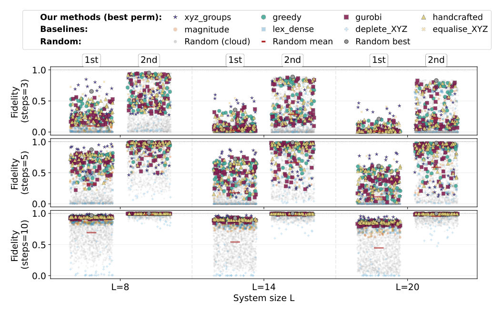
<figcaption class="paper-figure-caption"><b>Fig 1.</b> Figure 1: Fidelity of each ordering method as a function of system size for the 1D XXZ chain with T = 5.0. System sizes shown are L ∈{8, 14, 20}, each containing 50 Hamiltonian instances swept over ∆and g. Within each system size group, left and right clusters show 1st and 2nd order Trotter, respectively. Rows correspond to Trotter step counts s ∈{3, 5, 10}. At low step counts the random fidelity distribution spans nearly the full [0, 1] interval, confirming that ordering choice has a large effect. The commutation graph-based orderings consistently sit in the upper tail of the distribution across all system sizes. As the step count increases to 10, all methods compress toward high fidelity,...</figcaption>
</figure>
<figure class="paper-figure-card">
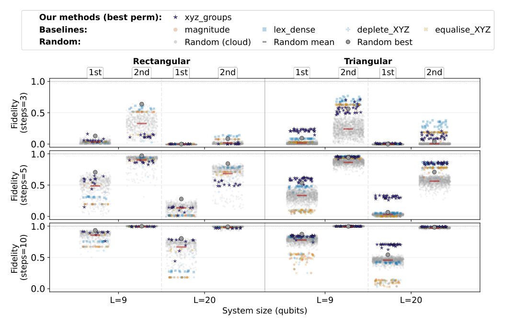
<figcaption class="paper-figure-caption"><b>Fig 2.</b> Figure 2: Fidelity of each ordering method for 2D rectangular (left) and triangular (right) lattices with T = 1.0 and L ∈{9, 20}, each containing 12 rectangular (swept over hx) and 27 triangular (swept over α) Hamiltonian instances. Left and right clusters show 1st and 2nd order Trotter; rows show Trotter steps s ∈{3, 5, 10}. For the rectangular lattice, at s = 3 all methods yield near-zero fidelity under 1st order, while lex dense achieves the highest fidelity under 2nd order. At s = 5 and s = 10, xyz groups clearly leads under 1st order, maintaining a gap over all other methods. For the triangular lattice, xyz groups leads under 1st order across all steps. Under 2nd order, lex dense...</figcaption>
</figure>
<figure class="paper-figure-card">
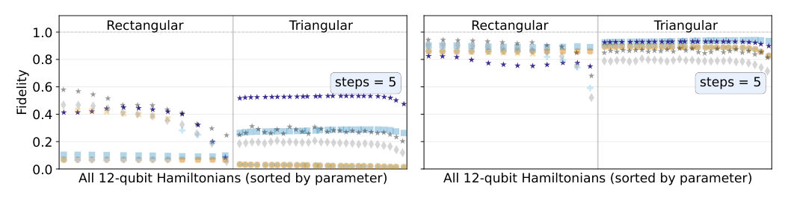
<figcaption class="paper-figure-caption"><b>Fig 3.</b> Figure 3: Per-Hamiltonian fidelity of all ordering methods at s = 5 with L = 12. (Top-left: ) For the 1D chain under 1st order Trotter, xyz groups consistently achieves the highest fidelity, while greedy, gurobi, and handcrafted cluster together well above the baselines. (Top-right: ) Under 2nd order, greedy, gurobi, and handcrafted reach the top, with xyz groups falling slightly below at higher g. (Bottom-left: ) For the 2D lattices under 1st order, xyz groups clearly dominates for both rectangular and triangular lattices, with all other methods well below. (Bottom-right: ) Under 2nd order, for the rectangular lattice random best and lex dense lead and for the triangular lattice, xyz...</figcaption>
</figure>
<figure class="paper-figure-card">
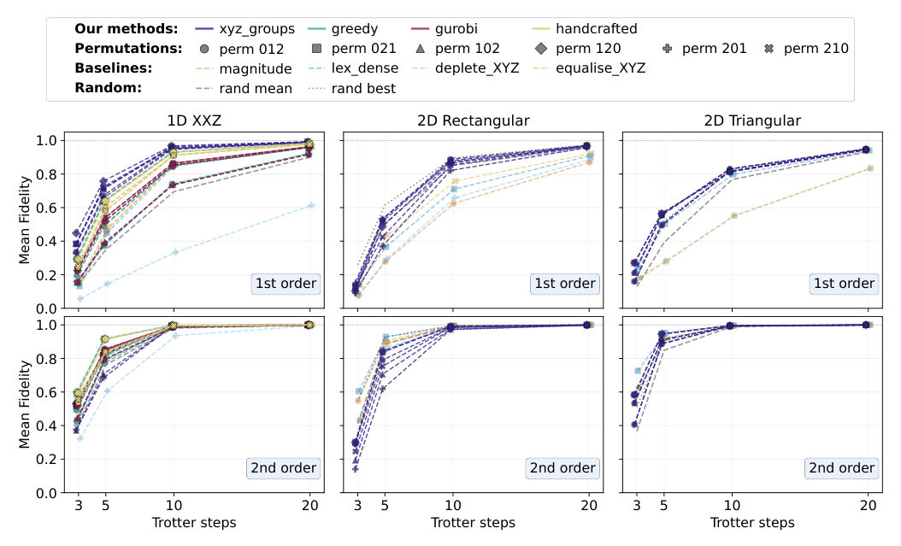
<figcaption class="paper-figure-caption"><b>Fig 4.</b> Figure 4: Mean fidelity per ordering method as a function of Trotter steps, averaged over all Hamiltonians and system sizes. Columns show 1D XXZ (T = 5.0, L = 3 to 20), 2D rectangular, and 2D triangular lattices (T = 1.0, L = 4 to 20). Rows show 1st and 2nd order Trotter. Lines show all permutations of our commutation graph-based orderings and baseline heuristics [8]. Under 1st order Trotter, xyz groups achieves the highest mean fidelity across all three datasets, with all methods converging near unity by s = 20. Under 2nd order Trotter, all our methods perform competitively for the 1D chain, while convergence to unity is rapid for both 2D lattices. Across conditions, perm 120 (⋄) is the...</figcaption>
</figure>
<figure class="paper-figure-card">
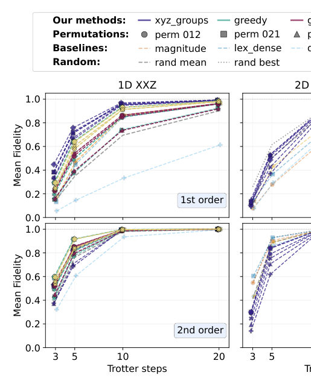
<figcaption class="paper-figure-caption"><b>Fig 5.</b> Figure 4 shows mean fidelity across all Hamiltonians and system sizes as a function of step count, with all m! group permutations shown explicitly, where a label such as 120 denotes applying subgroups in the order (G1, G2, G0). For the 1D chain under 1st order Trotter (Figure 4 top-left), xyz groups achieves the highest mean fidelity at every step count from s = 3 to s = 20, with all methods converging toward unity at s ≥20. While all permutations remain competitive, perm 120 (⋄) emerges as the dominant choice for xyz groups, winning over 77% of Hamiltonians across all step counts. Under 1D 2nd order (Figure 4 top-center), greedy and handcrafted lead overall, with perm 012 (◦) taking over...</figcaption>
</figure>
<figure class="paper-figure-card">
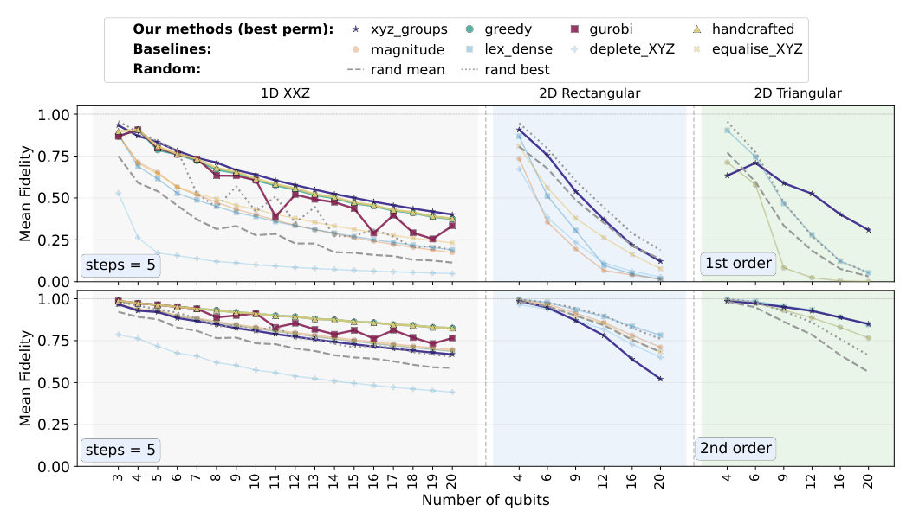
<figcaption class="paper-figure-caption"><b>Fig 6.</b> Figure 5: Mean fidelity as a function of system size at s = 5 (T = 5.0 for 1D, T = 1.0 for 2D). Columns show 1D XXZ (L = 3 to 20), 2D rectangular, and 2D triangular (L = 4 to 20); rows show 1st and 2nd order Trotter. Thick and thin lines show our commutation graph-based orderings and baselines [8]. Under 1st order, xyz groups and other coloring orders cluster at the top in 1D, while xyz groups clearly leads in both 2D lattices with fidelity declining steeply with system size. Under 2nd</figcaption>
</figure>
<figure class="paper-figure-card">
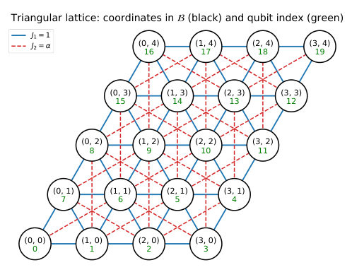
<figcaption class="paper-figure-caption"><b>Fig 7.</b> Figure 6: The interaction graph for the 2D triangular lattice Hamiltonian with width W = 4 and L = 5. While the posi- tions of the sites form a paralleogram, they form a rectangular grid with respect to the basis B described in Appendix A-B. The coordinates in B are given in black and the qubit index (formed using the snaking pattern) is given in green for each site/qubit. The blue (solid) and red (dashed) edges represent the nearest and next-nearest neighbor interactions respectively.</figcaption>
</figure>

**Main problem.** Optimizing the ordering of Pauli strings in Trotterization to minimize the 'true' state-dependent Trotter error in quantum simulations.

**Main result.** Commutation-based grouping strategies, which use graph coloring on a commutation graph, consistently outperform random and baseline ordering methods, with the optimal permutation depending on the Trotter order and lattice geometry.

**Method.** The authors use graph coloring techniques (e.g., XYZ-coloring, greedy, and Gurobi-based optimization) to partition Hamiltonian terms into commuting groups and evaluate fidelity using sparse Krylov matrix exponentiation.

**Summary.** This paper investigates how the sequence of Hamiltonian terms in Trotterization affects simulation fidelity. By using graph coloring to group commuting Pauli strings, the authors develop 'commutation-based' ordering strategies. They demonstrate that these strategies significantly reduce the true Trotter error compared to random or simple heuristic orderings. The study shows that the best ordering strategy is highly dependent on the specific lattice geometry and the order of the Trotter decomposition used.

Detailed structure

**Model / system.** Heisenberg-style Hamiltonians including 1D XXZ spin chains, 2D rectangular lattices, and 2D triangular lattices (including nearest and next-nearest neighbor interactions).

**Key observables.** State-dependent fidelity (F) between the Trotterized and exact time-evolved states.

**Important parameters / regimes.** Trotter order (1st and 2nd order Suzuki), number of Trotter steps (s = 3 to 20), system size (L up to 20 qubits), and Hamiltonian parameters like anisotropy (delta) and transverse field (g).

**Assumptions / limitations.** The Hamiltonians are assumed to be represented as a linear combination of Pauli strings, specifically 'non-mixed' types where each string contains at most one Pauli type.

**Figures summary.** Figure 1 shows fidelity distributions for 1D XXZ chains; Figure 2 shows fidelity distributions for 2D lattices; Figure 4 compares mean fidelity across different lattice geometries and Trotter orders; Figure 5 shows fidelity decay as a function of system size; Figure 6 illustrates the interaction graph for a 2D triangular lattice.

**Paper structure.** The paper introduces the problem of Trotter error bounds, formalizes the commutation graph and coloring-based grouping strategies, presents theoretical results on the chromatic number of these graphs, and concludes with numerical simulations comparing various ordering strategies across different 1D and 2D models.

**Why it may be interesting.** This is highly relevant for many-body dynamics as it provides a practical, structure-aware method to improve the accuracy of digital quantum simulations of spin systems without increasing the number of Trotter steps.

Abstract

Trotterization is a technique that allows one to approximate a time evolution of a Hamiltonian by repeatedly evolving the individual terms of the Hamiltonian one-at-a-time for small time durations. Bounds on the error of this approximation exist; however, they are typically loose and moreover, it is known that the true error can be greatly influenced by the order in which the terms of the Hamiltonian are evolved. In this work, we consider various ordering strategies that exploit the commutation structure of the Hamiltonian, in addition to a few other baseline ordering strategies. These commutation-based strategies involve dividing the terms of the Hamiltonian into groups where all the terms within each group commute with one another. These groupings can be obtained by using graph coloring techniques on what we call the "commutation graph" of the Hamiltonian. We prove various results regarding the structure and properties of such commutation graphs for certain classes of Hamiltonians. We also empirically calculate the (true) Trotter error using these ordering strategies on various 1D and 2D Heisenberg-style systems.

[↑ back to top](#top)

### [Balancing Quantum Memories in Asymmetric Repeaters for High-Fidelity Entanglement Distribution](http://arxiv.org/abs/2604.24554v1)

**Authors:** Karim S. Elsayed, Amr Rizk  
**Type:** theory · **Category:** quantum information and computing · **PDF:** <https://arxiv.org/pdf/2604.24554v1>  
**Analysis basis:** full PDF text, analyzed in chunks
**Topic relevance:** `entanglement & information structure` **2/5**

↔ Scroll figures horizontally

<figure class="paper-figure-card">
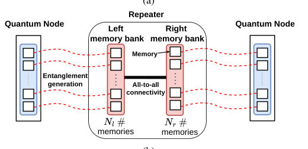
<figcaption class="paper-figure-caption"><b>Fig 1.</b> Fig. 1: (a) System-level view: Asymmetric quantum repeater connecting two quantum nodes with different distances dl ̸= dr. Quantum nodes may be end nodes or quantum repeaters. (b) Schematic illustration of the considered repeater ar- chitecture: The repeater contains N memories dynamically allocated between the left and right sides to form entangle- ments with neighboring nodes. The number of memories Nl allocated to the left is depicted by the left memory bank, while Nr memories are allocated to the right. The memories in the left and right banks simultaneously attempt to generate entanglements with left and right adjacent nodes, respectively, which is depicted by the dashed red curves....</figcaption>
</figure>
<figure class="paper-figure-card">
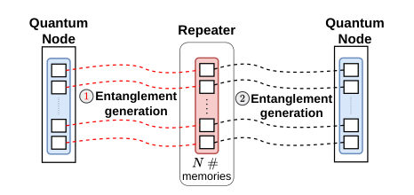
<figcaption class="paper-figure-caption"><b>Fig 2.</b> Fig. 2: Schematic illustration of the standard repeater archi- tecture. The repeater contains N memories, each of which sequentially forms an entanglement with the two adjacent nodes. The red and black dashed curves depict the sequential entanglement generation with the left and right nodes, respec- tively.</figcaption>
</figure>
<figure class="paper-figure-card">
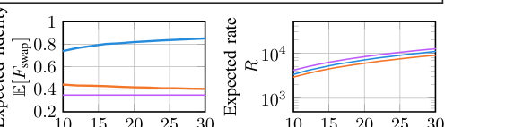
<figcaption class="paper-figure-caption"><b>Fig 3.</b> Fig. 6: (a) Schematic illustration: A repeater chain consisting of two repeaters, R1 and R2, connecting two end nodes, Q1 and Q2. Each node, i.e., repeater or end node, contains a total number of N memories. Each repeater has the architecture considered in this work from Fig. 1b and optimally assigns memories to its sides using Lem. 1. (b) Numerical evaluation: Comparison of the expected fidelity and expected rate of end- to-end entanglements between (i) optimal memory allocation, (ii) fixed equal allocation and (iii) standard repeaters. The initial fidelity F0 = 1, coherence time tc = 0.001 sec and distances d1 = d3 = 20 km and d2 = 30 km.</figcaption>
</figure>

**Main problem.** How to mitigate the mismatch problem in asymmetric quantum repeaters, where unequal link distances cause an accumulation of unmatched entanglements, leading to decoherence and reduced fidelity.

**Main result.** The authors derive a dynamic optimal memory allocation strategy that significantly improves entanglement fidelity while maintaining a comparable generation rate to standard repeaters.

**Method.** The paper uses a mathematical framework involving binomial distributions, the Central Limit Theorem, and a zero-mean condition for the mismatch to derive optimal allocation rules and statistical lower bounds.

**Summary.** This paper addresses the performance bottleneck in asymmetric quantum repeaters caused by the mismatch of entanglement generation rates on either side of a node. By dynamically allocating quantum memories between the left and right banks, the authors show it is possible to minimize the time unmatched entanglements spend in memory. This optimization significantly boosts entanglement fidelity without sacrificing the generation rate. The study also introduces a 'hard-cutoff' strategy to prevent performance degradation when the number of memories is low.

Detailed structure

**Model / system.** An asymmetric quantum repeater architecture with $N$ total memories divided into left and right banks, using photon-mediated probabilistic entanglement generation over optical fibers with decay rate $\sigma$.

**Key observables.** Entanglement generation rate ($R$), entanglement fidelity ($E[F_{swap}]$), and the number of unmatched entanglements ($\alpha$).

**Important parameters / regimes.** Total number of memories ($N$), link distances ($d_l, d_r$), success probabilities ($p_l, p_r$), fiber decay rate ($\sigma$), and coherence time ($t_c$).

**Assumptions / limitations.** Entanglement generation follows a Bernoulli process; the number of memories is large enough to use Gaussian approximations; the photon trip time dominates the round duration.

**Figures summary.** Figure 1 shows the system-level view and repeater architecture; Figure 3 compares the entanglement rate across different allocation regimes; Figure 4 compares fidelity across regimes; Figure 5 evaluates the hard-cutoff strategy; Figure 6 demonstrates performance in a multi-node repeater chain.

**Paper structure.** The paper introduces the mismatch problem, defines the physical model of asymmetric repeaters, derives the optimal dynamic allocation and statistical bounds, proposes a hard-cutoff regime for handling allocation violations, and concludes with numerical simulations and extensions to repeater chains.

**Why it may be interesting.** This work is highly relevant to quantum optics and quantum networks as it provides a fundamental optimization strategy for managing decoherence and resource allocation in realistic, non-symmetric quantum communication infrastructures.

Abstract

At the core of the quantum Internet lie quantum repeaters that enable remote end-to-end entanglement generation. Fundamentally, the entanglement generation rate and fidelity of quantum repeaters constitute the bottleneck for end-to-end performance. To achieve high rates, quantum repeaters employ quantum memory multiplexing. In a high-rate standard repeater, each memory sequentially generates an entanglement with its neighboring nodes and then applies entanglement swapping. This, however, results in low fidelity due to decoherence of the first-formed entanglement in the sequential generation process. By allocating different numbers of memories to simultaneously form entanglements with the left and right adjacent nodes, quantum repeaters reduce high waiting times and achieve high fidelity. In such a repeater, a mismatch problem arises due to the difference between the probabilistic number of generated entanglements on both sides. Consequently, some entanglements remain stored until opposite entanglements are available. The mismatch problem reduces the repeater rate and particularly the entanglement fidelity. In this paper, we consider the mismatch problem in an asymmetric repeater with different distances to its adjacent nodes. To mitigate the mismatch problem, we derive a dynamic optimal memory allocation. Under the optimal allocation, we derive statistical lower bounds on the achievable rate and fidelity. We demonstrate that the optimal allocation significantly improves the fidelity while maintaining a comparable rate to the standard repeater. In contrast, our results show that fixed memory allocation may be detrimental to the fidelity.

[↑ back to top](#top)

### [Beyond Monolithic Scaling: Modularity and Heterogeneity as an Architectural Imperative for Utility-Scale Quantum Computing](http://arxiv.org/abs/2604.24059v1)

**Authors:** Bo Fan, Renzhou Fang, Yuntao Zhang, Xiaolong Yuan, Dafa Zhao  
**Type:** theory · **Category:** quantum information and computing · **PDF:** <https://arxiv.org/pdf/2604.24059v1>  
**Analysis basis:** full PDF text, analyzed in chunks
**Topic relevance:** `entanglement & information structure` **2/5**

↔ Scroll figures horizontally

<figure class="paper-figure-card">
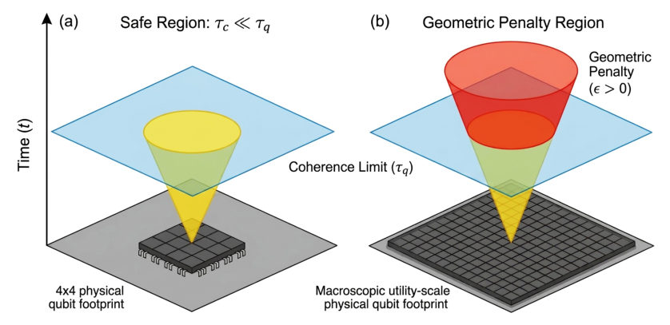
<figcaption class="paper-figure-caption"><b>Fig 1.</b> FIG. 1. The Control Light Cone and geometric penalty in monolithic quantum architectures. A 3D spacetime representation where the X-Y plane denotes the physical qubit footprint and the Z-axis denotes time. The blue horizontal plane represents the coherence lifetime limit (τq). (a) At intermediate scales (N &lt; Nc), the control signal cone (yellow) remains within the τq budget, enabling global coordination (τc ≪τq). (b) At utility scales (N &gt; Nc), the spatial footprint expands such that the control cone breaches the τq horizon. The region exceeding the causal horizon (red shaded) incurs a superlinear geometric penalty (ϵ &gt; 0), physically mandating modular decomposition to truncate this penalty.</figcaption>
</figure>
<figure class="paper-figure-card">
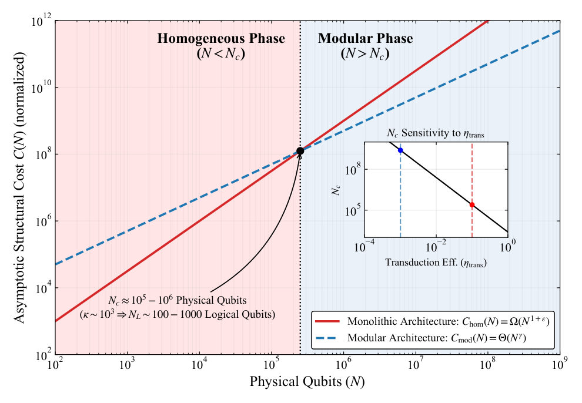
<figcaption class="paper-figure-caption"><b>Fig 2.</b> FIG. 2. Scaling-induced architectural phase transition and modular crossover. Asymptotic structural cost C(N) versus physical qubit count N, plotted on a log-log scale, where the physical footprint relates to logical capacity as N ≈κNL, with κ ∼103 representing a typical surface-code overhead factor. The homogeneous architecture (red solid line) incurs a su- perlinear coordination penalty, Chom(N) = Θ(N 1+ϵ) with ϵ &gt; 0, arising from finite signal propagation and control bandwidth constraints; the modular architecture (blue dashed line) achieves Cmod(N) = Θ(N γ), where γ reflects network routing effi- ciency. Their intersection defines a crossover scale Nc(A, B, ηtrans) see Eq. (18)), beyond...</figcaption>
</figure>
<figure class="paper-figure-card">
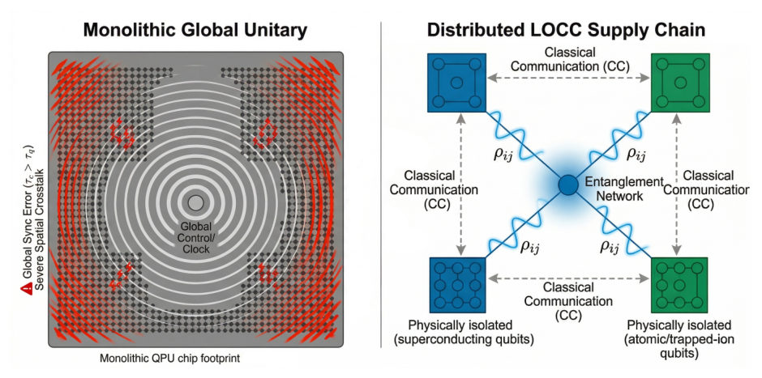
<figcaption class="paper-figure-caption"><b>Fig 3.</b> FIG. 3. Conceptual shift from monolithic integration to a distributed LOCC supply chain. Left: Monolithic global unitaries suffer from severe spatial crosstalk and global synchronization errors (τc &gt; τq) as physical boundaries expand. Right: The distributed paradigm enforces strict modular isolation. Nonlocal operations are synthesized via Local Operations and Classical Communication (LOCC), consuming bipartite entanglement (managed as physical state ρij at the hardware layer, and abstracted as metadata tuples eij for classical scheduling) pre-distributed asynchronously by a dedicated quantum network, thus accommodating hardware heterogeneity while circumventing the geometric penalty.</figcaption>
</figure>
<figure class="paper-figure-card">
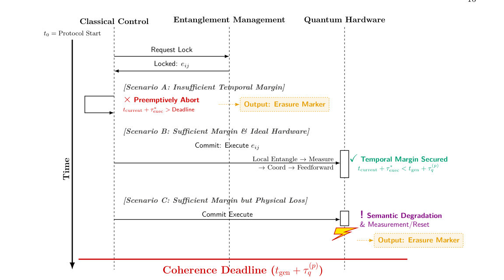
<figcaption class="paper-figure-caption"><b>Fig 4.</b> FIG. 4. Time-aware Reserve–Commit Protocol timing diagram. The protocol execution flow is shown across three architectural layers (Classical Control Plane, Entanglement Management Layer, and Quantum Hardware Layer), constrained by the physical coherence deadline (tgen + τ (p) q , red line). In Scenario A (insufficient temporal margin), the control plane performs a preemptive abort when tcurrent + τ ∗ exec &gt; tgen + τ (p) q , explicitly outputting a semantic erasure marker (orange) to prevent scheduling-induced decoherence. In Scenario B (sufficient margin), the protocol commits to the execution of the LOCC sequence (Local Entangle →Measure →Coord →Feedforward) under the condition tcurrent + τ...</figcaption>
</figure>
<figure class="paper-figure-card">
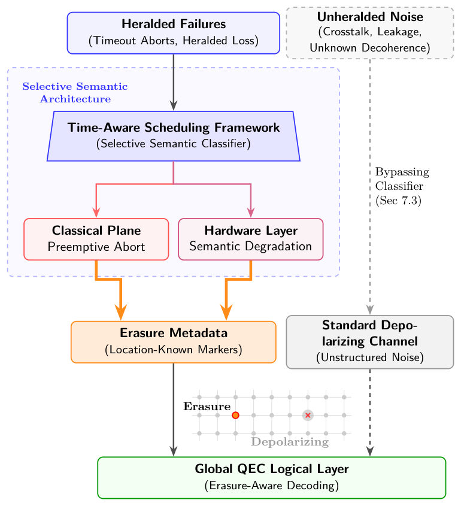
<figcaption class="paper-figure-caption"><b>Fig 5.</b> FIG. 5. The architectural semantic error degradation pipeline. The time-aware scheduling framework operates as a selective semantic classifier: heralded protocol failures (timeout aborts, heralded photon loss) are converted into location-known erasure metadata, while unheralded local decoherence bypasses the classifier as standard depolarizing noise. This structured routing supplies downstream erasure-aware QEC decoders with explicit error metadata, elevating the effective fault-tolerant threshold and reducing syndrome decoding complexity.</figcaption>
</figure>

**Main problem.** The fundamental bottleneck in scaling quantum computing is a temporal mismatch where classical coordination latency grows with system size and eventually exceeds the bounded quantum coherence time.

**Main result.** The paper proves that modular, heterogeneous architectures are a physical necessity beyond a crossover scale of 10^5-10^6 qubits, as they replace superlinear geometric scaling penalties with manageable topological routing costs.

**Method.** The authors use asymptotic scaling analysis and a formalization of a structural phase transition (1 + epsilon > gamma) to compare monolithic versus modular architectures, alongside a proposed 'Reserve-Commit' protocol for time-aware scheduling.

**Summary.** This paper argues that monolithic quantum computing is physically impossible at large scales because classical control signals cannot keep up with quantum coherence. It proposes that we must move toward modular, heterogeneous architectures where different quantum platforms are linked via a network. By using a 'Reserve-Commit' protocol, the system can manage entanglement as a resource and convert timing failures into known erasure errors. The authors predict that this architectural shift becomes mandatory once a system reaches 100,000 to 1,000,000 physical qubits.

Detailed structure

**Model / system.** A large-scale, macroscopic quantum-classical hybrid system modeled via a Hamiltonian H = H_sys + H_ctrl + H_env, comparing monolithic arrays to modular architectures using Local Operations and Classical Communication (LOCC).

**Key observables.** Classical coordination latency (tau_c), quantum coherence time (tau_q), transduction efficiency (eta_trans), and the geometric penalty (epsilon).

**Important parameters / regimes.** Crossover scale (Nc) of 10^5-10^6 physical qubits, transduction target (eta_trans) ~ 0.1, and the coordination wall at approximately 8.3 x 10^4 qubits.

**Assumptions / limitations.** Assumes no disruptive new technology emerges to resolve the isolation-interactability-topology trilemma and assumes the existence of a fixed hardware cost ratio (B/A).

**Figures summary.** Figure 2 shows a log-log plot of asymptotic structural cost; Figure 3 illustrates the conceptual shift from monolithic global unitaries to distributed LOCC; Figure 4 shows a timing diagram for the Reserve-Commit protocol; Figure 5 depicts an error degradation pipeline.

**Paper structure.** The paper identifies the scaling bottleneck, formalizes the geometric penalty and structural phase transition, proposes a modular/heterogeneous architecture and the Reserve-Commit protocol, and concludes with a quantitative prediction of the crossover scale and architectural convergence.

**Why it may be interesting.** It provides a rigorous physical argument for why the future of quantum computing must be distributed and heterogeneous, linking classical signal propagation limits to the fundamental limits of quantum error correction and architecture design.

Abstract

Scalable quantum computing is fundamentally bottlenecked not by qubit count or fabrication yield, but by a rigid temporal mismatch: macroscopic classical coordination latency ($τ_c$) inevitably grows with system diameter, while microscopic quantum coherence ($τ_q$) remains strictly bounded. Beyond a critical scale, this mismatch breaches the classical control light cone, triggering a superlinear geometric penalty ($ε> 0$) that renders monolithic synchronization physically impossible. We formalize the resulting structural phase transition through a governing scaling law, $1+ε> γ$, which mandates modular decomposition and a shift from global unitaries to Local Operations and Classical Communication (LOCC). To manage the resulting resource contention under strict coherence budgets, we introduce a layered semantic architecture and a time-aware Reserve--Commit protocol. By embedding predictive temporal pre-validation, the protocol acts as an architectural semantic classifier: it preemptively aborts transactions that exceed the causal horizon and explicitly converts scheduling-induced failures into location-known erasure metadata, directly relaxing hardware fidelity thresholds for downstream QEC decoders. Under near-term transduction targets ($η_{\mathrm{trans}} \sim 0.1$), we project a crossover scale at $N_c \sim 10^5$--$10^6$ physical qubits. This threshold marks a profound architectural convergence: the footprint required for modularity aligns precisely with early fault-tolerant utility, establishing time-aware distributed orchestration, rather than monolithic expansion or centralized classical control, as the physical imperative for utility-scale quantum computing.

[↑ back to top](#top)

### [Coherent spin waves in a maximal entropy phase](http://arxiv.org/abs/2604.23597v1)

**Authors:** Arnau Romaguera, Eugenio Paris, Elizabeth Skoropata, Stefano Agrestini, Mirian Garcia-Fernandez, Marisa Medarde, Noah Schnitzer, Lopa Bhatt, Berit H. Goodge, Yun Yen, Matthias Krack, Michael Schüler, Romain Sibille, Tom Fennell, Daniel G. Mazzone, Jakob Lass, Ellen Fogh, Anirudha Ghosh, Marco Caputo, Carlos William Galdino, Zhijia Zhang, Thorsten Schmitt, Milan Radovic, Luc Patthey, Hiroki Ueda, Monica Ciomaga Hatnean, Elia Razzoli  
**Type:** both · **Category:** strongly correlated electrons · **PDF:** <https://arxiv.org/pdf/2604.23597v1>  
**Analysis basis:** full PDF text, analyzed in chunks
**Topic relevance:** `spintronics-quantum-optics interface` **2/5**

↔ Scroll figures horizontally

<figure class="paper-figure-card">
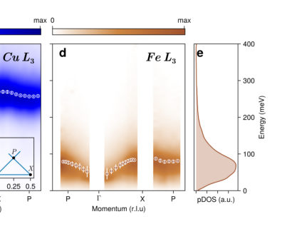
<figcaption class="paper-figure-caption"><b>Fig 1.</b> Fig. 1 RIXS measurements at Fe and Cu L3 edges at 20 K. a, Crystal structure of YBCFO generated using VESTA [16], with the orientation of the tetragonal unit-cell axes indicated (Cu in blue, Fe in brown). b, Experimental RIXS intensity at Cu L3-edge, integrated along high-symmetry path shown in the inset of c. c, d, Experimental S(q, ω) at Cu and Fe L3 edges, respectively, after correction for self-absorption and the geometric spin-flip factor. Circles mark the extracted dispersion. e, RIXS intensity at Fe L3-edge, integrated along the same high-symmetry path.</figcaption>
</figure>
<figure class="paper-figure-card">
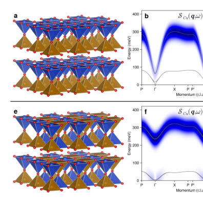
<figcaption class="paper-figure-caption"><b>Fig 2.</b> Fig. 2 LSWT calculations for two atomic-ordering configurations in YBCFO. a, Atomic configuration containing staggered monoatomic Fe and Cu planes (Cu in blue, Fe in brown). b–d, LSWT results for the configuration in a, showing the Cu- and Fe- projected S(q, ω), respectively, along high symmetry lines connecting Γ = (0, 0, 0), P = (0.25, 0.25, 0), X = (0.5, 0, 0), Z = (0, 0, 0.5), P′ = (0.25, 0.25, 0.5) and X’ = (0.5, 0, 0.5) (r.l.u. in units of 2π/a, 2π/b, 2π/c). Thin gray lines indicate the LSWT eigenvalues. e, Atomic configuration with diatomic Fe and Cu planes in a checkerboard arrangement. f–h, LSWT results for the configuration in e. d,h, Total and atomically projected dynamical spin...</figcaption>
</figure>
<figure class="paper-figure-card">
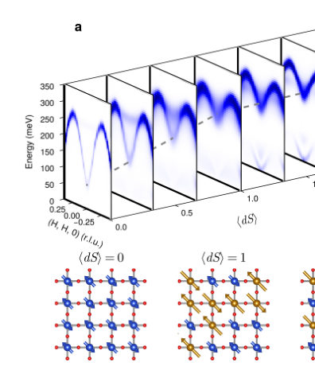
<figcaption class="paper-figure-caption"><b>Fig 3.</b> Fig. 3 Entropy dependence of the magnon optical-branch dispersion in YBCFO. a, ASD SCu(q, ω) calculations as a function of the local ordering in the 2D planes ⟨dS⟩. Representative configurations of the 2D plane ordering for the ordered (⟨dS⟩= 0, 2) and high entropy (⟨dS⟩= 1) phases are shown at the bottom, as schematics of the atomic and spin configurations (Cu in blue, Fe in brown). b–e, Properties of YBCFO as a function of ⟨dS⟩: Configuration entropy Sconf (b), spin optical gap at Γ and spin-waves energy at P (c), normalized intensity of the optical branch (d), and lattice and magnetic Bragg reflection intensities (e). Dashed lines in c–e represent the experimental values. Shaded areas...</figcaption>
</figure>
<figure class="paper-figure-card">
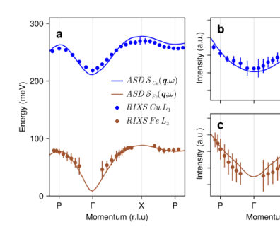
<figcaption class="paper-figure-caption"><b>Fig 4.</b> Fig. 4 Experimental and simulated momentum dependence of magnon peak parame- ters. a, Undamped mode energies ω0 extracted from DHO fits to the experimental RIXS spectra, compared with the simulated peak positions for the high-entropy configuration. b,c, Integrated inten- sities obtained from numerical integration of the fitted DHO component for the Cu and Fe L3 edges, respectively, compared with the simulated S(q, ω) projected onto Cu and Fe atoms. d,e, Experimen- tal linewidths 2γ (approximately the peak full width at half maximum) extracted from the DHO fits, compared with calculations for undamped (UD) and locally damped (LD) dynamics. Blue and brown symbols denote values extracted from...</figcaption>
</figure>
<figure class="paper-figure-card">

<figcaption class="paper-figure-caption"><b>Fig 5.</b> Fig. 4 shows that the mixed phase model ASD calculations accurately reproduce experimental dispersions, intensities, and damping. For the optical branch, the exper- imental ratio is small, γ/ω ≤0.22 across all studied q-points, indicating that the optical magnons are underdamped, and thus coherent [22–24], which is striking given the significant influence of atomic disorder on the dispersion at Γ. In the acoustic branch, the experimental ratio γ/ω is larger, but remains within the underdamped limit (γ/ω ∼0.6 &lt; 1). To determine the origin of the anisotropy of γ, we compared a nearly undamped (UD) scenario (αCu/F e i,i = 0.01) with a local-damping (LD) case. A peak at Γ appears even in the UD...</figcaption>
</figure>

**Main problem.** Investigating whether atomic disorder in high-entropy materials necessarily degrades the coherence of collective magnetic excitations, specifically in the YBaCuFeO5 system.

**Main result.** The study reveals a paradox where disorder in an entropy-driven mixed phase actually favors the formation of coherent, underdamped acoustic and optical spin-wave branches with a large optical gap.

**Method.** The researchers combined Resonant Inelastic X-ray Scattering (RIXS) at the Cu and Fe L3 edges with theoretical modeling using Linear Spin Wave Theory (LSWT), Atomistic Spin Dynamics (ASD), and DFT+U.

**Summary.** This paper explores the magnetic dynamics of the high-entropy material YBaCuFeO5. Contrary to the expectation that disorder destroys coherence, the authors demonstrate that an entropy-stabilized mixed phase of Fe and Cu atoms supports well-defined, underdamped spin waves. By using RIXS and spin dynamics simulations, they show that this disordered state possesses a large optical gap and robust collective modes. This finding suggests new strategies for engineering disordered materials to host stable, high-energy magnetic excitations.

Detailed structure

**Model / system.** The physical system is YBaCuFeO5 (YBCFO), an antiferromagnetic layered compound featuring a maximal entropy mixed phase where Fe and Cu atoms are disordered within the ab-planes.

**Key observables.** Dynamically spin structure factors S(q, omega), magnon dispersion omega(q), optical spin gap, and linewidths (damping).

**Important parameters / regimes.** Exchange couplings (J_ab, J_perp), spin quantum numbers, configurational entropy, and the transition temperatures T_CM and T_S.

**Assumptions / limitations.** The use of the Heisenberg model and the approximation of the spiral phase using a weak ferromagnetic next-nearest-neighbor interaction.

**Figures summary.** Figure 1 shows the crystal structure and RIXS intensity; Figure 2 compares LSWT results for different atomic orderings; Figure 3 shows spin-wave evolution as a function of disorder; Figure 4 compares experimental vs. simulated peak energies and intensities.

**Paper structure.** The paper introduces the problem of disorder-induced damping, describes the YBCFO system, presents RIXSS experimental data, compares various atomic ordering models (monoatomic, checkerboard, mixed), and concludes with the identification of the entropy-stabilized mixed phase as the source of coherent modes.

**Why it may be interesting.** It challenges the conventional intuition that disorder leads to localization and damping, providing a mechanism where entropy-driven disorder can actually stabilize coherent many-body excitations.

Abstract

In solids, disorder is conventionally regarded as detrimental to coherence. It typically localizes and dampens collective excitations, as exemplified by Anderson localization or the broadening of magnetic modes in systems lacking long-range order. While high-entropy materials are specifically designed to harness disorder and stabilize homogeneous mixed-phase structures that can display unique properties, this same disorder is nonetheless expected to preclude the formation of coherent magnetic excitations. To test the limits of this picture, we selected the antiferromagnetic system YBaCuFeO5, as it features two distinct transition metal atoms with significantly different magnetic moments, rendering its spin dynamics exceptionally sensitive to local atomic ordering. Combining resonant inelastic x-ray scattering and linear spin wave theory, we reveal a surprising paradox: YBaCuFeO5 exhibits an unexpected, entropy-driven mixed phase, in which disorder, rather than reducing the lifetime of the collective excitations, favors coherence. In this mixed phase, the spin waves remain dispersive, markedly distinct from those expected for an ordered ground state, and exhibit well-defined acoustic and optical branches separated by a large optical gap. These results demonstrate that in entropy-stabilized magnets, disorder can favor coherent collective modes previously thought to be exclusive to low-entropy systems.

[↑ back to top](#top)

### [Constrained Quantum Optimization meets Model Reduction](http://arxiv.org/abs/2604.23317v1)

**Authors:** Max Tschaikowski, Andrea Vandin  
**Type:** theory · **Category:** quantum information and computing · **PDF:** <https://arxiv.org/pdf/2604.23317v1>  
**Analysis basis:** full PDF text, analyzed in chunks
**Topic relevance:** `quantum measurements` **2/5**

↔ Scroll figures horizontally

<figure class="paper-figure-card">
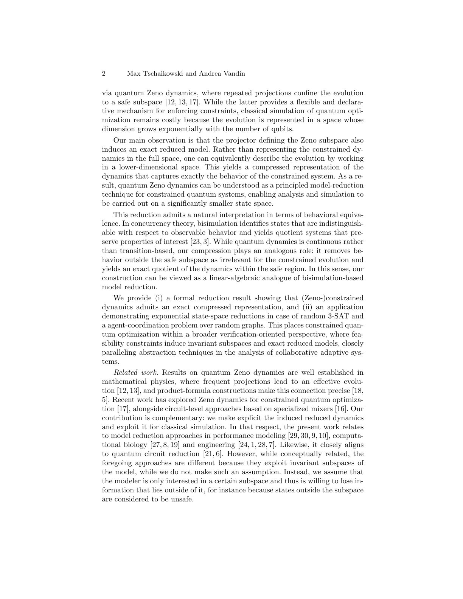
<figcaption class="paper-figure-caption"><b>Fig 1.</b> Low-resolution page preview, page 2</figcaption>
</figure>
<figure class="paper-figure-card">
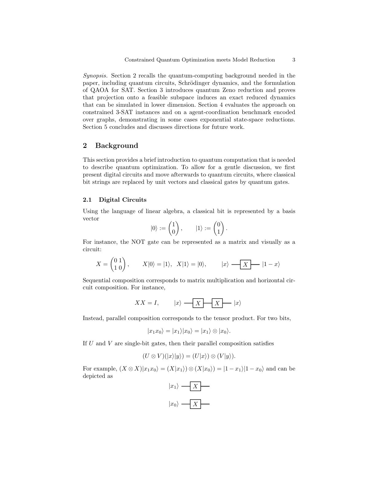
<figcaption class="paper-figure-caption"><b>Fig 2.</b> Low-resolution page preview, page 3</figcaption>
</figure>
<figure class="paper-figure-card">
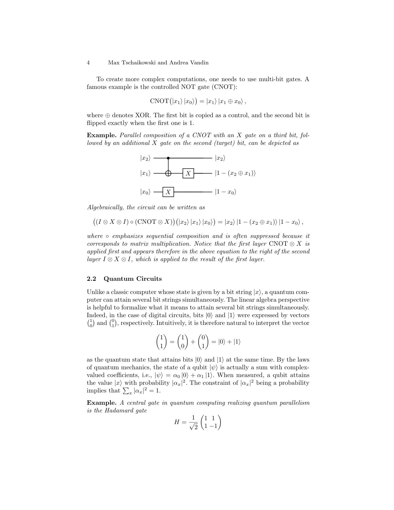
<figcaption class="paper-figure-caption"><b>Fig 3.</b> Low-resolution page preview, page 4</figcaption>
</figure>
<figure class="paper-figure-card">
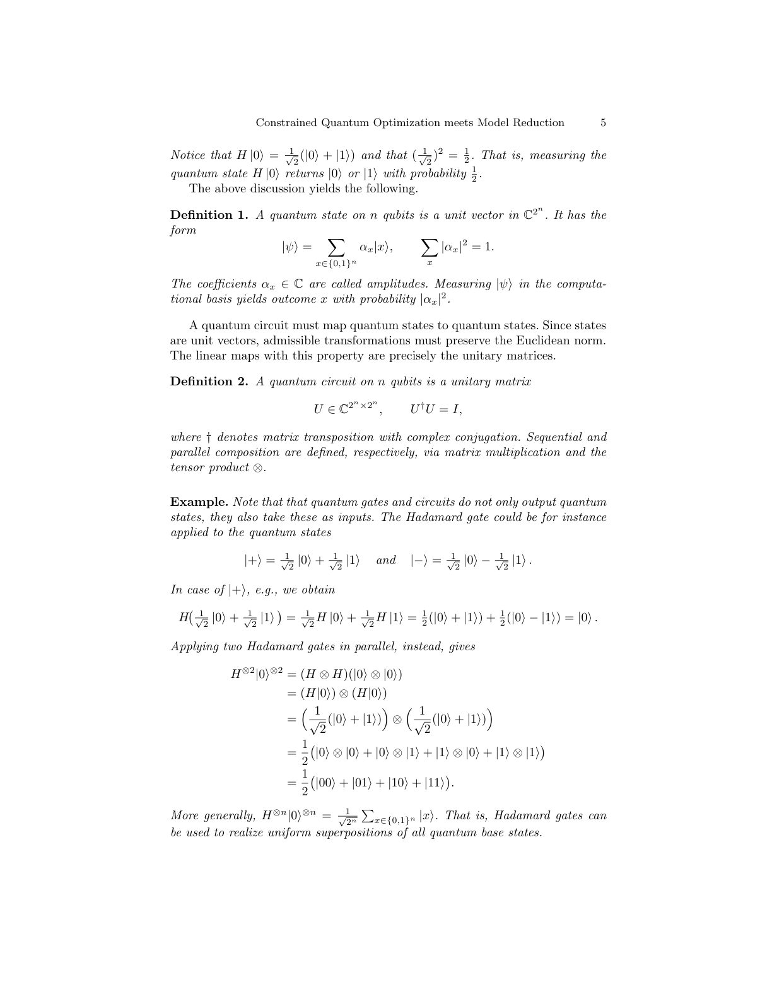
<figcaption class="paper-figure-caption"><b>Fig 4.</b> Low-resolution page preview, page 5</figcaption>
</figure>
<figure class="paper-figure-card">
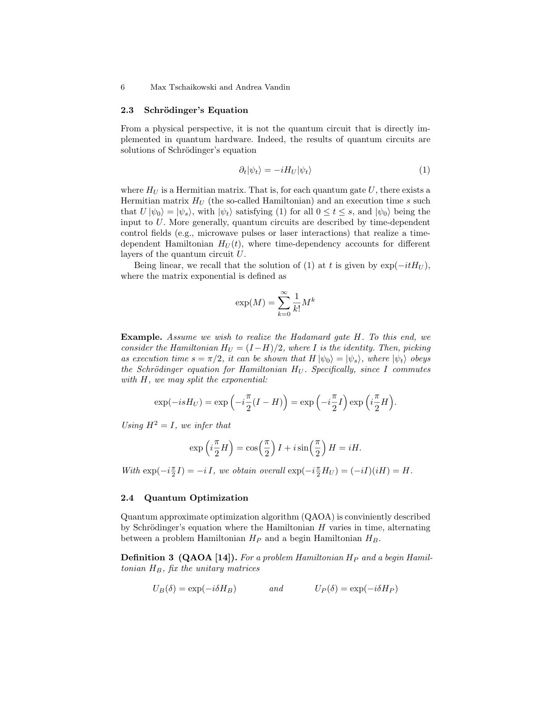
<figcaption class="paper-figure-caption"><b>Fig 5.</b> Low-resolution page preview, page 6</figcaption>
</figure>
<figure class="paper-figure-card">
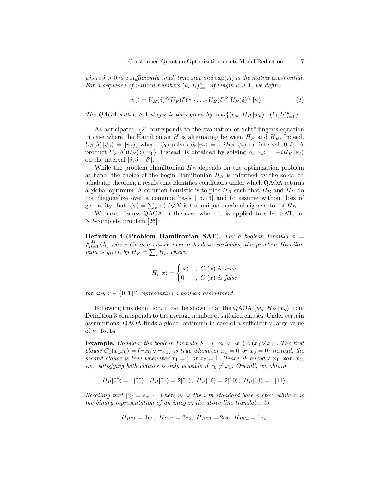
<figcaption class="paper-figure-caption"><b>Fig 6.</b> Low-resolution page preview, page 7</figcaption>
</figure>
<figure class="paper-figure-card">
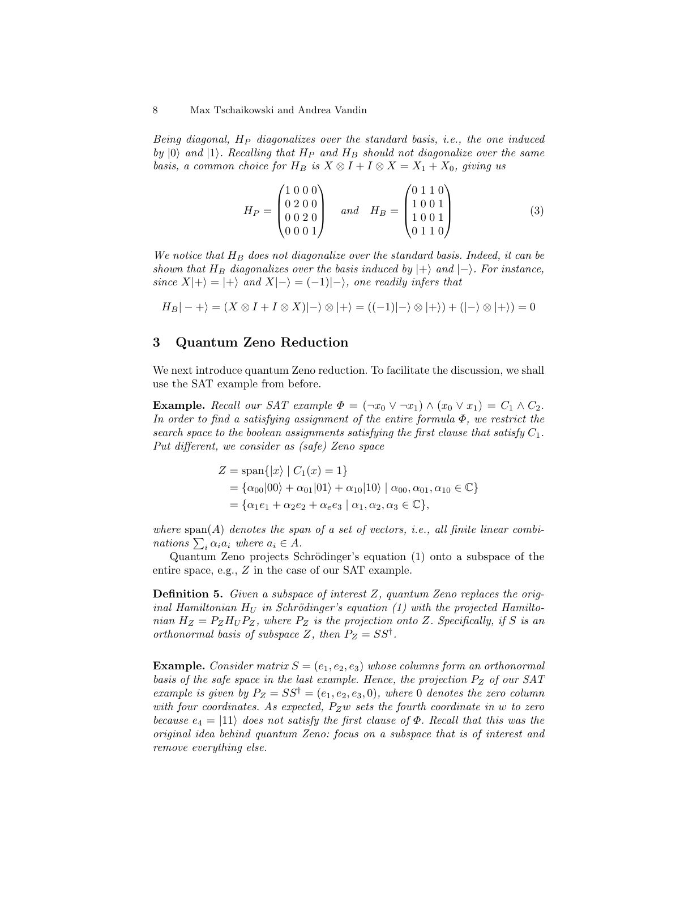
<figcaption class="paper-figure-caption"><b>Fig 7.</b> Low-resolution page preview, page 8</figcaption>
</figure>
<figure class="paper-figure-card">
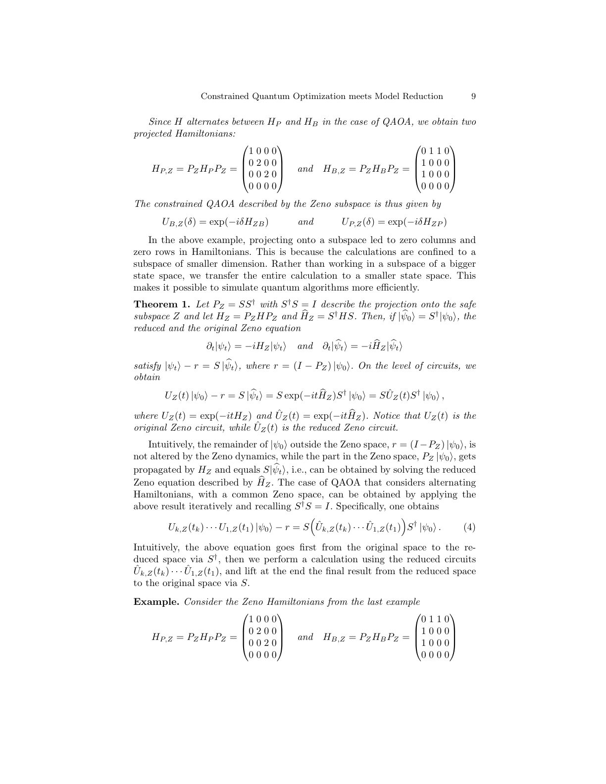
<figcaption class="paper-figure-caption"><b>Fig 8.</b> Low-resolution page preview, page 9</figcaption>
</figure>
<figure class="paper-figure-card">
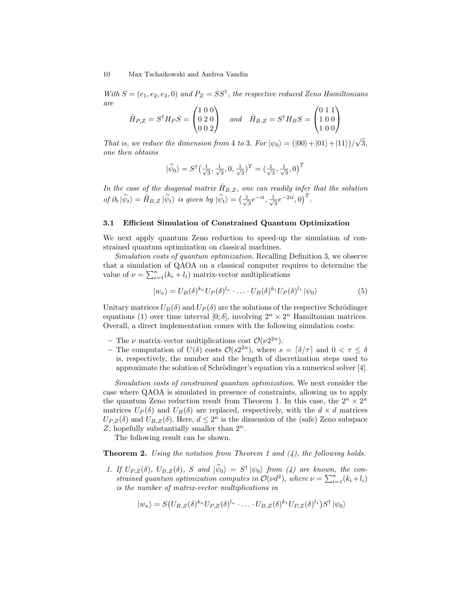
<figcaption class="paper-figure-caption"><b>Fig 9.</b> Low-resolution page preview, page 10</figcaption>
</figure>
<figure class="paper-figure-card">
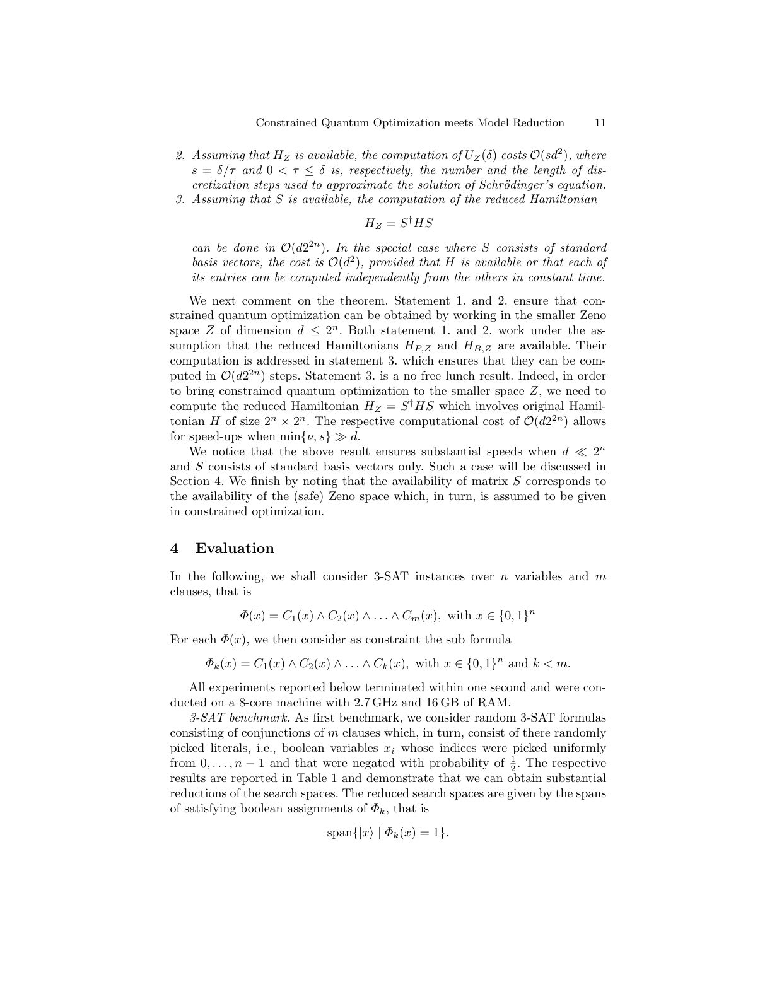
<figcaption class="paper-figure-caption"><b>Fig 10.</b> Low-resolution page preview, page 11</figcaption>
</figure>

**Main problem.** The exponential computational cost of classically simulating and analyzing constrained quantum optimization algorithms like QAOA.

**Main result.** The authors prove that constrained quantum optimization via Quantum Zeno Dynamics allows for an exact reduced model, enabling exponential state-space reduction in specific problems like 3-SAT.

**Method.** A model reduction approach that uses the projection property of quantum measurements to simulate dynamics in a lower-dimensional Zeno subspace.

**Summary.** This paper presents a method to significantly speed up the classical simulation of constrained quantum optimization algorithms. By leveraging the Quantum Zeno effect, the authors show that one can restrict the simulation to a smaller, 'safe' subspace of the Hilbert space without losing essential information. They demonstrate that for certain problems like 3-SAT, this leads to an exponential reduction in the required computational space. This approach provides a powerful tool for analyzing large-scale quantum algorithms that involve feasibility constraints.

Detailed structure

**Model / system.** The system involves n-qubit states evolving under the QAOA framework, using a problem Hamiltonian (e.g., for 3-SAT or agent coordination) and a transverse field Hamiltonian.

**Key observables.** Complex amplitudes, probabilities of measurement outcomes, and Hamming distance between bitstrings.

**Important parameters / regimes.** Number of qubits (n), dimension of the Zeno subspace (d), number of QAOA layers (nu), and discretization steps (tau).

**Assumptions / limitations.** The method assumes the existence of a defined 'safe' or feasible subspace and that information regarding states outside this subspace is irrelevant to the optimization goal.

**Figures summary.** The notes mention tables showing the exponential growth of the original space versus the reduced space for 3-SAT and agent coordination benchmarks.

**Paper structure.** The paper introduces the problem of simulation cost, establishes the mathematical framework of Quantum Zeno Dynamics, proposes the model reduction technique, provides formal proofs for equivalence and complexity, and validates the approach with 3-SAT and agent coordination benchmarks.

Abstract

Quantum optimization algorithms promise advantages for difficult problems but are costly to simulate and analyze on classical machines. Recently, constrained quantum optimization has been investigated through the lens of Quantum Zeno dynamics, an approach which constrains the search to a subspace by means of quantum measurements. Exploiting that quantum measurements are projections, we propose a model reduction approach and show that simulations can be conducted in a lower-dimensional space. As possible applications, we demonstrate exponential state-space reduction of constrained quantum optimization in case of random 3-SAT and agent coordination problems over graphs.

[↑ back to top](#top)

### [Electronic Final States in Nuclear $β$ Decay: A Sudden-Approximation Framework](http://arxiv.org/abs/2604.23910v1)

**Authors:** G. V. D'yakonov  
**Type:** theory · **Category:** other · **PDF:** <https://arxiv.org/pdf/2604.23910v1>  
**Analysis basis:** full PDF text, analyzed in chunks
**Topic relevance:** `non-equilibrium dynamics` **2/5**

↔ Scroll figures horizontally

<figure class="paper-figure-card">
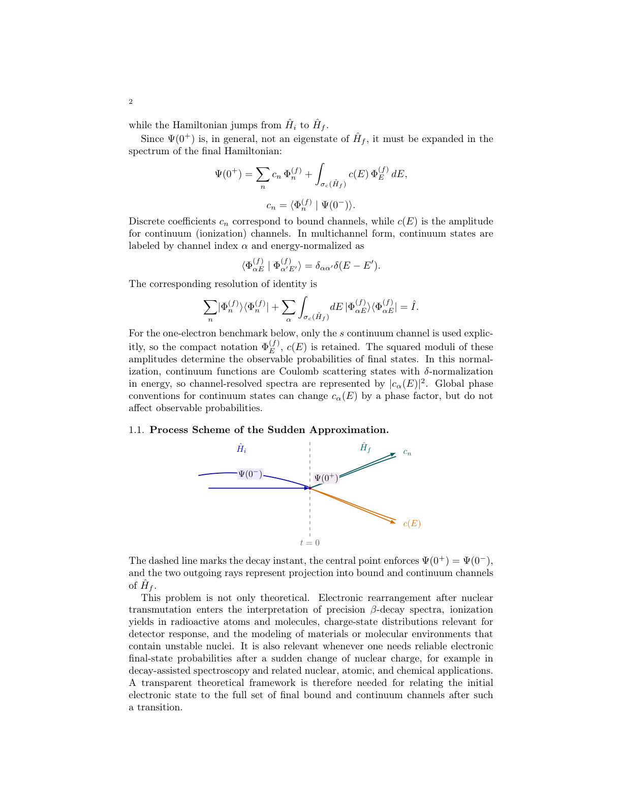
<figcaption class="paper-figure-caption"><b>Fig 1.</b> Low-resolution page preview, page 2</figcaption>
</figure>
<figure class="paper-figure-card">
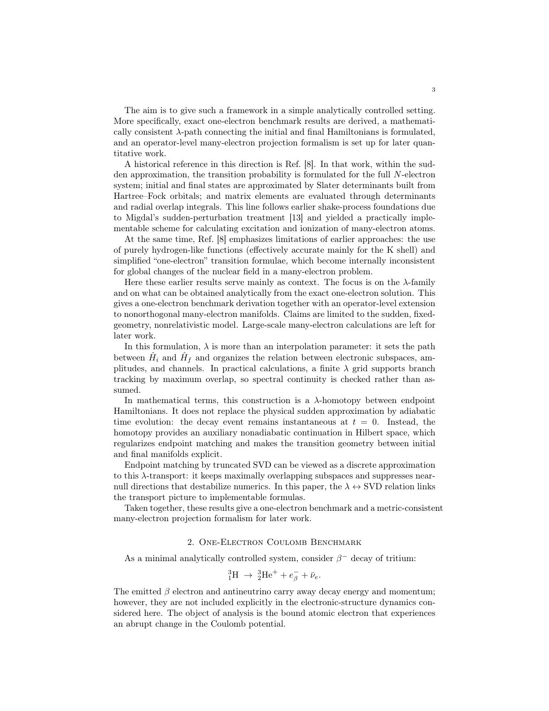
<figcaption class="paper-figure-caption"><b>Fig 2.</b> Low-resolution page preview, page 3</figcaption>
</figure>
<figure class="paper-figure-card">
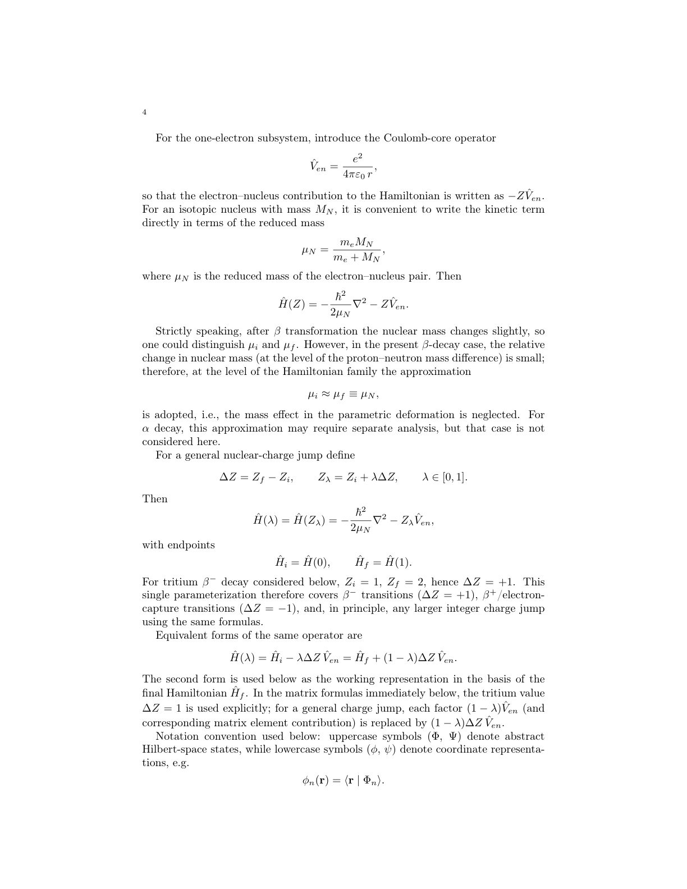
<figcaption class="paper-figure-caption"><b>Fig 3.</b> Low-resolution page preview, page 4</figcaption>
</figure>
<figure class="paper-figure-card">
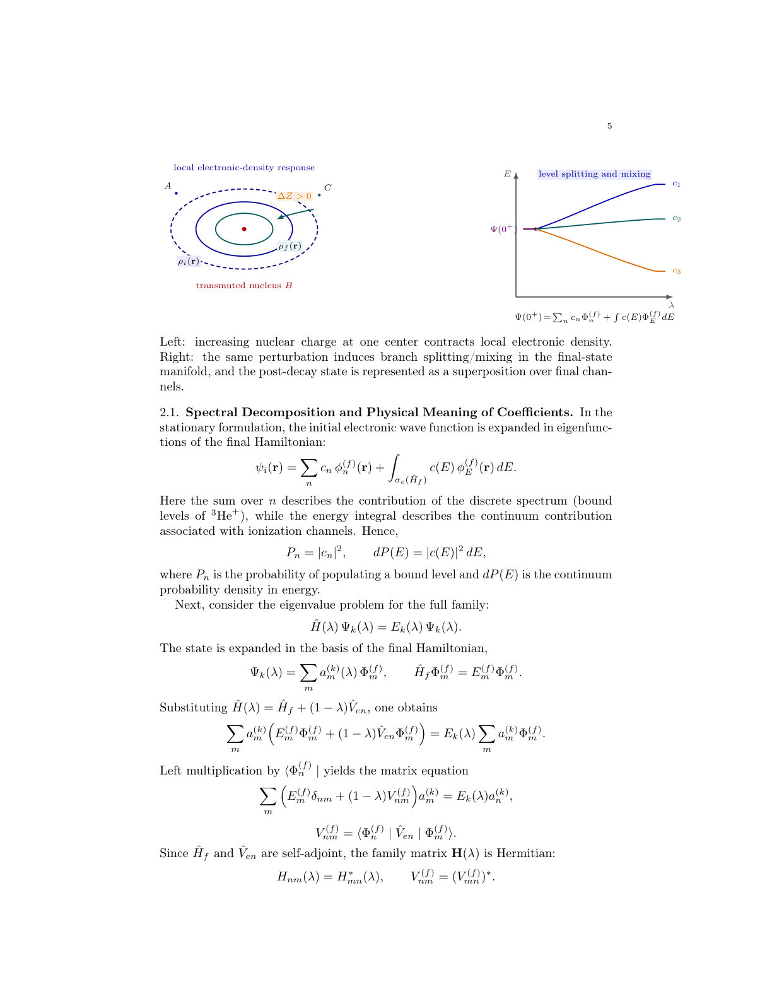
<figcaption class="paper-figure-caption"><b>Fig 4.</b> Low-resolution page preview, page 5</figcaption>
</figure>
<figure class="paper-figure-card">
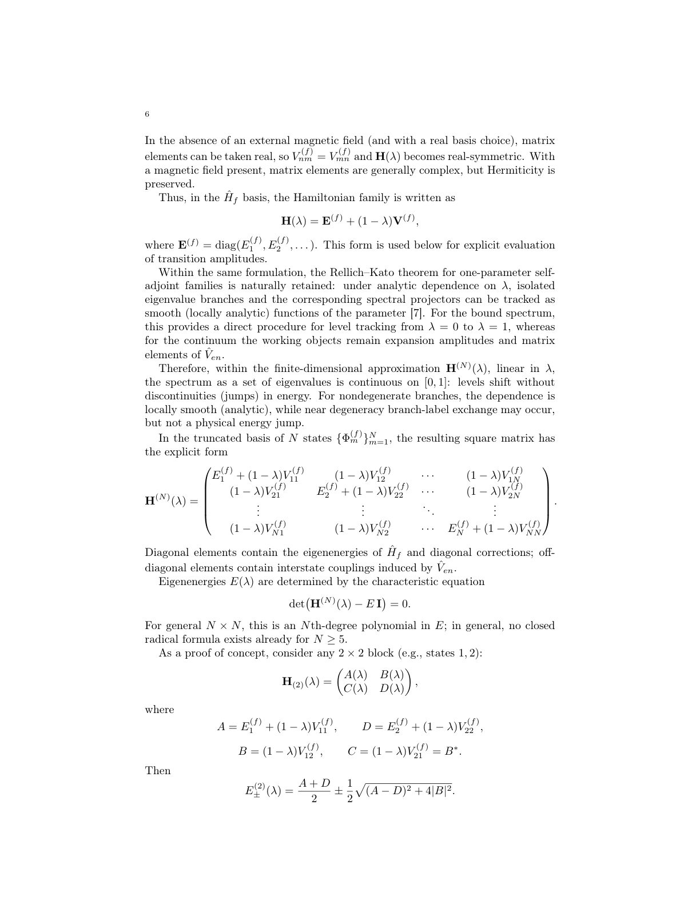
<figcaption class="paper-figure-caption"><b>Fig 5.</b> Low-resolution page preview, page 6</figcaption>
</figure>
<figure class="paper-figure-card">
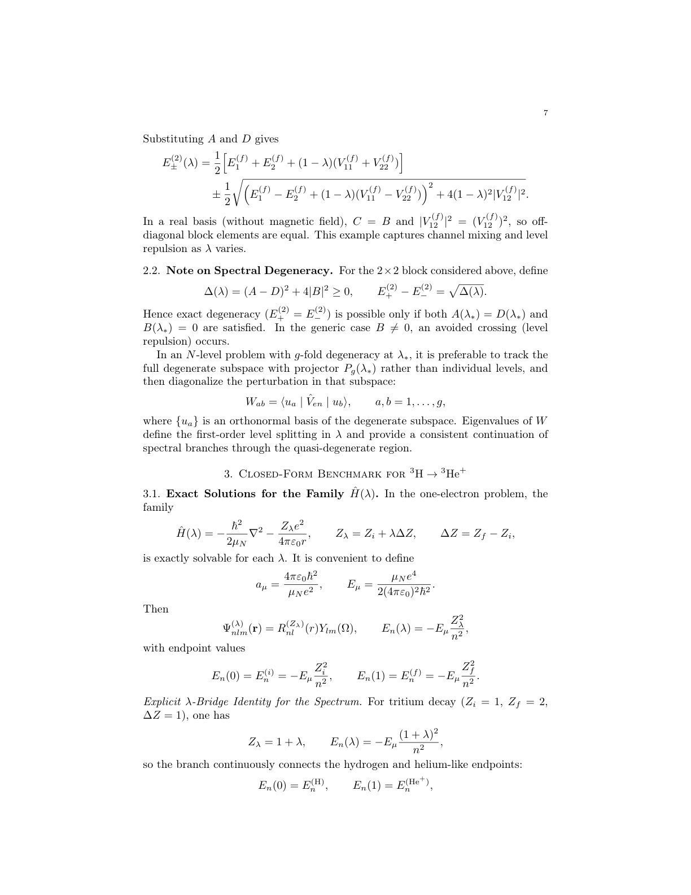
<figcaption class="paper-figure-caption"><b>Fig 6.</b> Low-resolution page preview, page 7</figcaption>
</figure>
<figure class="paper-figure-card">
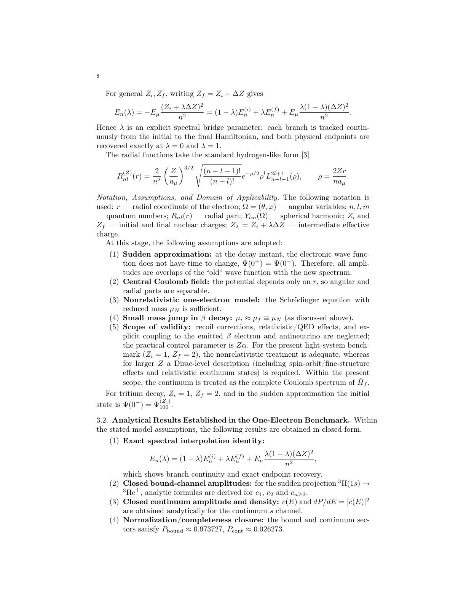
<figcaption class="paper-figure-caption"><b>Fig 7.</b> Low-resolution page preview, page 8</figcaption>
</figure>
<figure class="paper-figure-card">
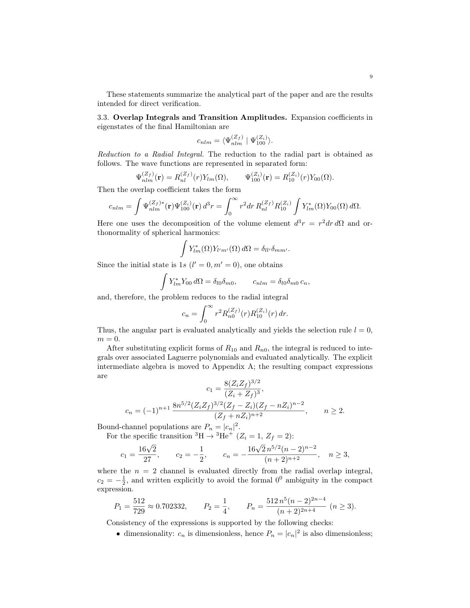
<figcaption class="paper-figure-caption"><b>Fig 8.</b> Low-resolution page preview, page 9</figcaption>
</figure>
<figure class="paper-figure-card">
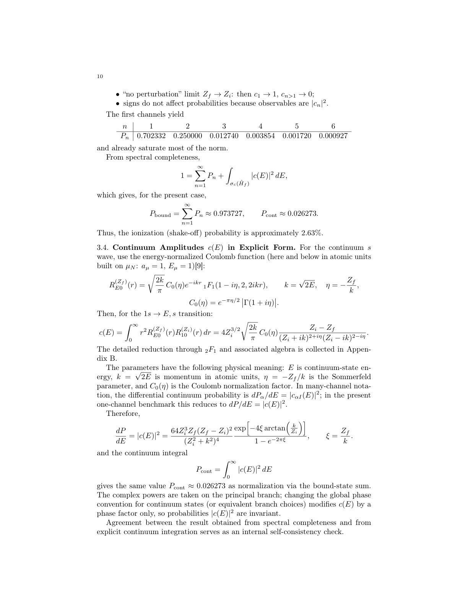
<figcaption class="paper-figure-caption"><b>Fig 9.</b> Low-resolution page preview, page 10</figcaption>
</figure>
<figure class="paper-figure-card">
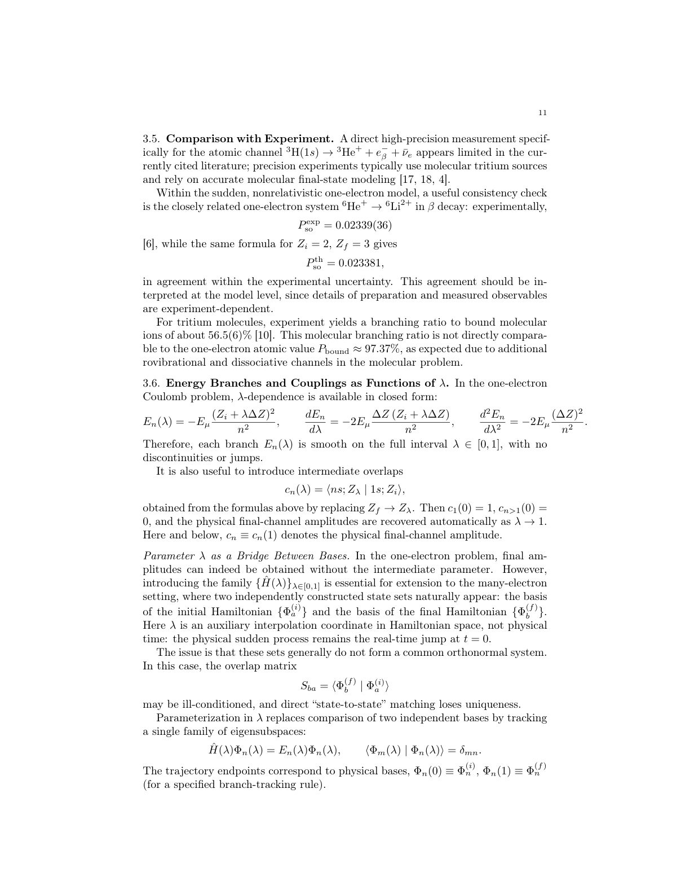
<figcaption class="paper-figure-caption"><b>Fig 10.</b> Low-resolution page preview, page 11</figcaption>
</figure>

**Main problem.** Developing a mathematically consistent framework to calculate electronic final states (both bound and continuum) following the sudden change in nuclear charge during beta decay.

**Main result.** The paper establishes a robust many-electron framework using a lambda-homotopy to relate non-orthogonal initial and final states, validated by an analytical one-electron benchmark for tritium decay.

**Method.** A sudden-approximation framework using a lambda-parametrized Hamiltonian family, a transport scheme based on SVD and overlap metrics, and multireference wave-function methods (CAS/RAS).

**Summary.** This paper presents a new theoretical framework for modeling how electrons respond to the sudden change in nuclear charge during beta decay. By introducing a continuous interpolation parameter (lambda), the author creates a 'bridge' between the initial and final electronic states, solving the numerical instability caused by non-orthogonal basis sets. The method is successfully applied to a one-electron tritium decay model and generalized to complex many-electron systems. This approach provides a stable way to calculate both bound-state populations and ionization probabilities.

Detailed structure

**Model / system.** The system is nuclear beta decay (e.g., tritium decay) where a change in nuclear charge (Z) occurs. The model uses a lambda-homotopy Hamiltonian H(lambda) to continuously connect the initial and final electronic Hamiltonians.

**Key observables.** Transition amplitudes (c_n), transition probabilities for bound and continuum channels, and a completeness diagnostic (delta_comp).

**Important parameters / regimes.** Nuclear charge (Z), interpolation parameter (lambda), reduced mass (mu_N), and the sudden approximation limit.

**Assumptions / limitations.** The sudden approximation (nuclear decay is much faster than electronic relaxation) and a non-relativistic treatment of the electronic motion.

**Figures summary.** Figure 1 shows a schematic of the sudden approximation process; Figure 2 illustrates how increasing nuclear charge contracts electronic density and induces level splitting/mixing.

**Paper structure.** The paper begins with the physical premise of the sudden approximation, develops a one-electron analytical benchmark using a lambda-path, generalizes the formalism to many-electron systems using determinant overlaps, and concludes with a structured 6-step computational methodology.

**Why it may be interesting.** The use of a lambda-homotopy to regularize the transition between non-orthogonal Hilbert spaces and the development of a transport scheme for tracking eigensubspaces is highly relevant to many-body dynamics and the study of non-adiabatic transitions.

Abstract

Electronic final states generated by sudden changes of the Hamiltonian are studied here, with emphasis on nuclear charge variation in $β$ decay. A $λ$-parametrized family $\hat H(λ)$ that continuously connects the initial and final Hamiltonians, so that the electronic response can be represented as a continuous deformation in Hilbert space, is introduced. Within the sudden approximation, transition amplitudes are written as overlaps between eigenstates of distinct Hamiltonians. To relate non-orthogonal one-electron basis sets in a stable way, the paper uses a practical transport scheme based on overlap metrics and truncated singular value decomposition (SVD). This mapping is interpreted as a discrete counterpart of continuous transport along the $λ$ path. The formalism is first developed for the one-electron case, where analytic structure and selection rules are made explicit, and then generalized to many-electron systems via nonorthogonal determinant overlap expressions. The resulting formulation gives transition probabilities in bound and continuum channels in a way that is both numerically stable and easy to interpret.

[↑ back to top](#top)

### [Encoding strategies for quantum enhanced fluid simulations: opportunities and challenges](http://arxiv.org/abs/2604.24694v1)

**Authors:** Omer Rathore, Alastair Basden, Nicholas Chancellor, Halim Kusumaatmaja  
**Type:** theory · **Category:** quantum information and computing · **PDF:** <https://arxiv.org/pdf/2604.24694v1>  
**Analysis basis:** full PDF text, analyzed in chunks
**Topic relevance:** `analog quantum simulation` **2/5**

↔ Scroll figures horizontally

<figure class="paper-figure-card">
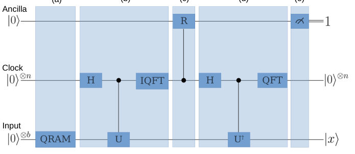
<figcaption class="paper-figure-caption"><b>Fig 1.</b> Figure 1: Summary circuit diagram for the HHL algorithm, adapted from [17] (CC BY). The five main components are (a) State preparation, (b) Quantum phase estimation, (c) Controlled rotation, (d) Inverse quantum phase estimation and (e) Ancilla qubit measurement. Quantum phase estimation consists of Hadamard gates (H), controlled unitaries (U) and the inverse quantum Fourier transform (IQFT). Meanwhile, the input consists of three registers, referred to here as the ancilla, clock and input registers.</figcaption>
</figure>
<figure class="paper-figure-card">
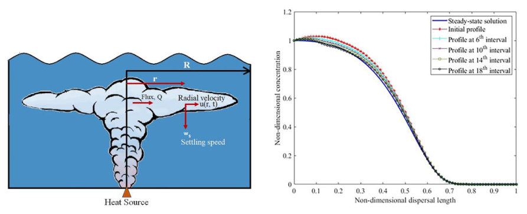
<figcaption class="paper-figure-caption"><b>Fig 2.</b> Figure 2: Illustrative application examples of the Quantum Integration Algorithm to fluid and transport problems. Top: compressible flow through a convergent-divergent nozzle with a normal shock, adapted from [99]. Bottom: tephra transport in the umbrella region of a submarine volcanic eruption, adapted from [100]. In each case, the left panel shows the physical setup and the right panel shows a representative numerical result. Figures licensed under CC BY.</figcaption>
</figure>
<figure class="paper-figure-card">
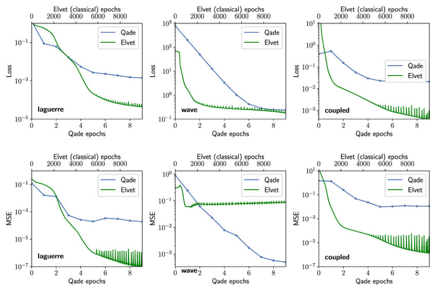
<figcaption class="paper-figure-caption"><b>Fig 3.</b> Figure 3: Performance comparison between Qade and the state of the art, neural network based classical solver, Elvet, for several differential equations. The figure reports the loss and mean squared error (MSE) as functions of training epoch. The results are problem-dependent: while Elvet ultimately achieves higher accuracy in two of the three cases, Qade performs especially well for the wave equation example, where it attains a lower MSE and a comparable final loss. Adapted from [124] (CC BY).</figcaption>
</figure>
<figure class="paper-figure-card">
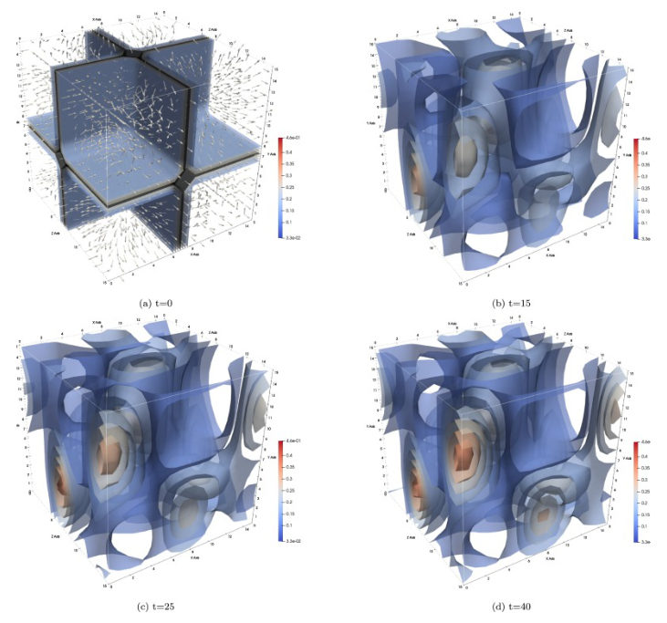
<figcaption class="paper-figure-caption"><b>Fig 4.</b> Figure 4: Evolution of a Taylor–Green vortex simulated with a D3Q27 velocity set. The quantum algorithm used 17 qubits and one ancilla to represent a domain of 163 lattice cells. Only minor discrepancies were observed, most likely due to finite machine precision. Adapted from [142] (CC BY).</figcaption>
</figure>
<figure class="paper-figure-card">
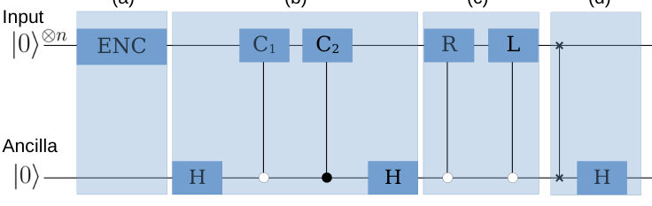
<figcaption class="paper-figure-caption"><b>Fig 5.</b> Figure 5: Quantum circuit for the D1Q2 lattice Boltzmann implementation of the one dimensional advection-diffusion equation. The circuit carries out a full time step by combining state encoding (a), the collision step via controlled operators C1 and C2 (b), propagation through the shift operators R and L (c), and final evaluation of the macroscopic variable (d).</figcaption>
</figure>
<figure class="paper-figure-card">
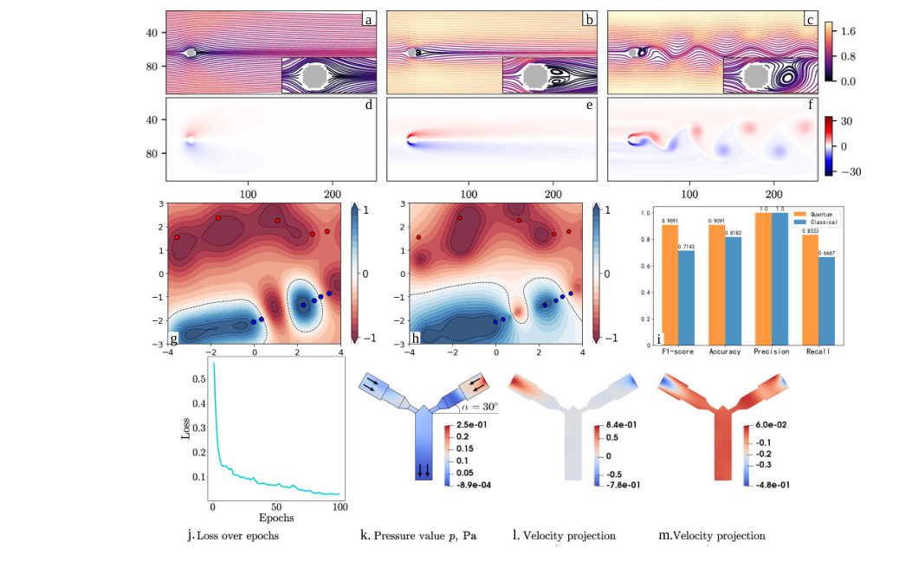
<figcaption class="paper-figure-caption"><b>Fig 6.</b> Figure 6: Illustrative examples of application-level results in quantum and quantum-inspired fluid modelling. Rows 1 and 2 show a quantum-inspired matrix-product-state formulation applied to flow around a cylinder at increasing Reynolds number from left to right, with velocity streamlines in the top row and vorticity in the bottom row. As the Reynolds number increases, the onset of the classical Kármán vortex street is observed in the wake of the cylinder. Adapted from [168]. Row 3 shows a quantum support vector machine for flow classification around an airfoil, including the decision boundaries for the classical (g) and quantum (h) cases, together with a performance comparison (i), where...</figcaption>
</figure>

**Main problem.** The central challenge is determining how to effectively encode fluid information onto quantum hardware to achieve practical quantum advantage in Computational Fluid Dynamics (CFD).

**Main result.** The authors demonstrate that encoding choice is a primary design variable that fundamentally shapes algorithmic feasibility, showing that no single encoding is universally optimal and that trade-offs exist between compactness and interaction simplicity.

**Method.** An architecture-agnostic review and assessment of various encoding paradigms (amplitude, basis, unary, one-hot, and block encoding) and their relation to quantum algorithms like HHL and QSVT.

**Summary.** This review paper evaluates how different data encoding strategies impact the feasibility of using quantum computers for fluid dynamics simulations. It highlights the fundamental trade-offs between compact encodings, which offer theoretical speedups but suffer from readout bottlenecks, and less compact encodings that are more compatible with near-term hardware. The authors argue that encoding should be treated as a primary, iterative design variable in the development of quantum CFD algorithms. Ultimately, the paper provides a roadmap for navigating the complexities of mapping nonlinear, dissipative fluid physics onto linear, unitary quantum frameworks.

Detailed structure

**Model / system.** The paper focuses on the Navier-Stokes equations for fluid dynamics, including turbulent flows and large-scale meteorological simulations, analyzed through the lens of quantum computing models (gate-model and analog).

**Key observables.** Velocity fields, pressure, density, energy, temperature, vorticity, and streamlines.

**Important parameters / regimes.** Reynolds number (Re), precision (epsilon), condition number (kappa), sparsity (s), and gate counts (specifically CNOT gates).

**Assumptions / limitations.** Assumes the potential for quantum advantage in CFD; notes limitations such as the exponential cost of Quantum State Tomography and the difficulty of implementing nonlinearities due to the no-cloning theorem.

**Figures summary.** Figure 1 shows an HHL algorithm circuit diagram; Figure 6 illustrates application-level successes including velocity streamlines/vorticity from matrix-product-states, flow classification via QSVM, and hybrid PINN results for 3D mixers.

**Paper structure.** The paper provides an architecture-agnostic assessment of encoding strategies, examines the trade-offs between different encoding paradigms, relates these to specific quantum algorithms, and discusses the implications for practical CFD implementation and hardware constraints.

Abstract

Quantum computing has emerged as a powerful potential accelerator for computational fluid dynamics (CFD), but whether this promise can be realized in practice depends on how fluid information is encoded on quantum hardware. This review provides an architecture-agnostic assessment of encoding strategies for quantum-enhanced fluid simulation, focusing on the trade-offs they impose on state preparation, measurement, boundary treatment, nonlinear dynamics, and temporal evolution. We examine the principal encoding paradigms used in the literature and relate them to representative quantum algorithms for fluid simulation. Through these examples, we show that encoding choices fundamentally shape both the algorithm itself and also the practical feasibility of quantum CFD. For example, highly compact encodings can offer attractive asymptotic advantages but might introduce severe bottlenecks in readout, state preparation, and nonlinear processing, whereas less compact representations may simplify interactions and improve compatibility with analog and near-term hardware. No single encoding is universally optimal, rather the most suitable choice depends strongly on the structure of the fluid problem, the computational objective and the constraints of the target quantum platform. We therefore argue that encoding should be treated as a primary design variable in quantum CFD and revisited iteratively throughout the design pipeline, as different algorithmic components interact and influence one another.

[↑ back to top](#top)

### [Fragmentation Temperature of 1D and 3D Quantum Droplets in a BEC Mixture](http://arxiv.org/abs/2604.24375v1)

**Authors:** Jeroen Van Loock, Denise Ahmed-Braun, Jacques Tempere  
**Type:** theory · **Category:** quantum gases · **PDF:** <https://arxiv.org/pdf/2604.24375v1>  
**Analysis basis:** full PDF text, analyzed in chunks
**Topic relevance:** `non-equilibrium dynamics` **2/5**

↔ Scroll figures horizontally

<figure class="paper-figure-card">
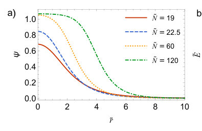
<figcaption class="paper-figure-caption"><b>Fig 1.</b> Fig. 1 In Fig. a, the ground state order parameter for a three-dimensional quantum droplet as a function of the radial distance ˜r is plotted for different atom numbers ˜ N. In Fig. b, the ground state energy for a three-dimensional quantum droplet ( ˜E) as a function of the number of atoms is plotted, where ˜ Nc is the critical particle number.</figcaption>
</figure>
<figure class="paper-figure-card">
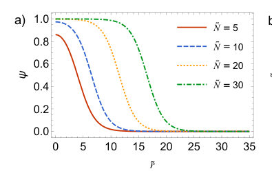
<figcaption class="paper-figure-caption"><b>Fig 2.</b> Fig. 2 Fig. a shows the ground state order parameter for a one-dimensional quantum droplet as a function of the distance ˜r for different atom numbers ˜ N. Fig. b shows the ground state energy for a one-dimensional quantum droplet ( ˜E) as a function of the number of atoms.</figcaption>
</figure>
<figure class="paper-figure-card">
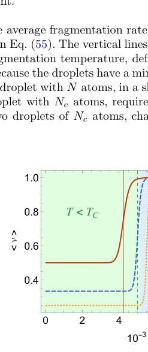
<figcaption class="paper-figure-caption"><b>Fig 3.</b> Fig. 3 The average fragmentation rate (⟨v⟩) of 3D droplets for the equal part configuration that is derived in Eq. (55), is given as a function of the temperature for different number of particles for |δg|/g = 0.4 and V = 1012a3. The vertical lines corresponds to the fragmentation temperature, calculated with Eq. (57). TC is the critical temperature [21] and divides the green zone where droplets can exist, with the blue zone where they can not exist in the limit of V →∞.</figcaption>
</figure>
<figure class="paper-figure-card">
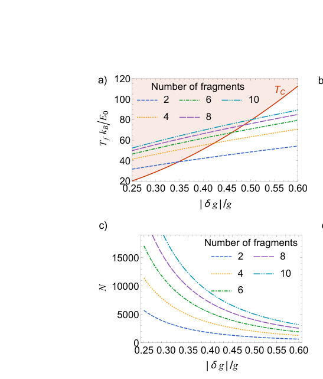
<figcaption class="paper-figure-caption"><b>Fig 4.</b> Fig. 4 In Fig. a, the fragmentation temperature (Tf ) is plotted for 3D droplets that are just able to split into smaller droplets that are slightly larger than Nc ( ˜ N/N max n = 18.7 ≈18.65 = ˜ Nc). In Fig. b, the fragmentation temperature (Tf ) is plotted for droplets that are just not able to split into smaller droplets with Nc atoms ( ˜ N/(N max n + 1) = 18.6 ≈˜ Nc). In both figures, Tf is given for different droplet sizes. These droplets will thus split in different numbers of fragments (N max n ). In both figures Tf is plotted as a function of |δg|/g for a system with a volume V = 1012a3. In Fig. c, the corresponding number of atoms is given for Fig. a. There is no visual difference with...</figcaption>
</figure>
<figure class="paper-figure-card">
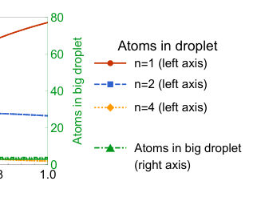
<figcaption class="paper-figure-caption"><b>Fig 5.</b> Fig. 5 In this figure the ground state of a 1D droplet is shown as a function of the temperature (T) for a system with 70 atoms a size L = 1000|a| and δg/g = 0.15. The green line corresponds with the number of atoms in the biggest droplet of the most contributing configuration (the configuration with the highest Zconf). The other lines correspond with the expectation value of the amount of droplets that have one, two or four atoms. The vertical dotted line corresponds with the approximation for the fragmentation temperature derived in Eq. (58). The vertical dashed line corresponds with the more complex approximation described in section 4.2.</figcaption>
</figure>
<figure class="paper-figure-card">
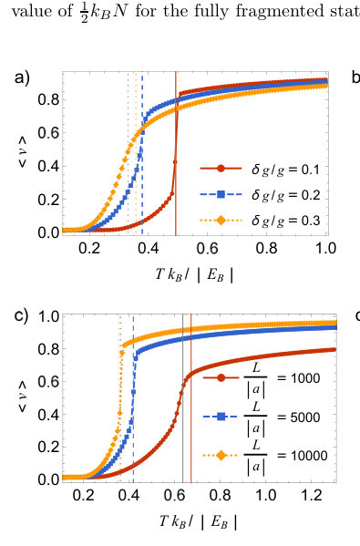
<figcaption class="paper-figure-caption"><b>Fig 6.</b> Fig. 6 In Fig. a-c, the average fragmentation ⟨v⟩is given as a function of the temperature T for a 1D system. In Fig. a, ⟨v⟩is plotted for different δg/g where L = 5000|a| and N = 70. In Fig. b this is plotted for different number of particles (N) where L = 5000|a| and δg/g = 0.15. In Fig. c it is plotted for different system sizes (L) where N = 70 and δg/g = 0.15. In Fig. d, the specific heat (CV ) is given as a function of the temperature for different system sizes, where N = 70 and δg/g = 0.15. In all the subfigures the curves correspond to the calculations with the full configurations. The vertical colored lines correspond with the approximation in Eq. (58). The gray lines that are right next...</figcaption>
</figure>
<figure class="paper-figure-card">
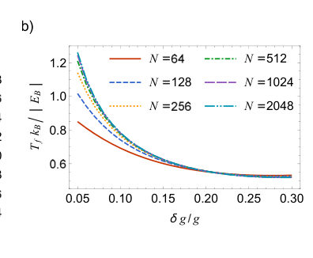
<figcaption class="paper-figure-caption"><b>Fig 7.</b> Fig. 7 In Fig. a, the fragmentation temperature (Tf ) in the thermodynamic limit (where N is fixed to 2048 atoms) for a 1D droplet as a function of δg/g and density (ρ = N/L) in units of the scattering length. The white line corresponds to the critical temperature of the droplets [24]. In Fig. b, Tf is given as a function of δg/g, for different system sizes with the same density of atoms (ρ = 0.0512 |a|). Tf is in both figures calculated using the approximation in Eq. (58).</figcaption>
</figure>

**Main problem.** The study investigates the fragmentation transition of 1D and 3D quantum droplets in Bose-Einstein condensate mixtures at finite temperatures, driven by the competition between energy and entropy.

**Main result.** The authors identify a fragmentation temperature (Tf) where droplets split into multiple smaller droplets or a gas; in 3D, this occurs at low atom numbers and high interspecies interaction, while in 1D, droplets expel atoms to form a gas of free atoms and pairs as temperature rises.

**Method.** The study uses the extended Gross-Pitaevskii equation (eGPE) with Lee-Huang-Yang corrections, a thermodynamic framework involving partition functions, and numerical imaginary time propagation.

**Summary.** This paper explores how quantum droplets in BEC mixtures fragment into multiple pieces or a gas as temperature increases. It provides a theoretical description for both 1D and 3D systems, showing that fragmentation is driven by entropy. In 3D, fragmentation is linked to low atom numbers and strong interspecies interactions, while in 1D, rising temperatures cause droplets to expel atoms into a gas of free atoms and pairs. The results offer critical insights into the stability and lifetime of these self-bound states in ultracold gases.

Detailed structure

**Model / system.** A mixture of two Bose-Einstein condensates (BECs) in 1D and 3D configurations, modeled with a Hamiltonian including kinetic energy, external potentials, and s-wave contact interactions (intraspecies and interspecies).

**Key observables.** Fragmentation temperature (Tf), average fragmentation rate (number of fragments), specific heat (Cv), and droplet density profiles.

**Important parameters / regimes.** Interspecies interaction strength (g12), intraspecies interaction strength (gjj), atom number (N), temperature (T), system size (L or V), and the interaction deviation (delta g).

**Assumptions / limitations.** The system is in the ultracold regime; droplets are treated as non-interacting; the 3D model requires regularization/renormalization; the 1D model assumes the droplet expels atoms into a gas or small clusters.

**Figures summary.** Figure 1 shows ground state density profiles and energy vs. atom number; Figure 6 displays the average fragmentation rate and specific heat vs. temperature for 1D systems; Figure 7 shows the fragmentation temperature as a function of interaction strength and density.

**Paper structure.** The paper introduces the problem of droplet fragmentation, establishes the 1D and 3D models using eGPE and LHY corrections, develops a thermodynamic framework for fragmentation, presents results for 3D stability and fragmentation, details 1D fragmentation and temperature effects, and concludes with scaling analysis.

**Why it may be interesting.** This paper is highly relevant for many-body dynamics and AMO physics as it explores the thermodynamic stability and phase transitions of self-bound quantum objects, providing new insights into how thermal fluctuations can destroy quantum droplets.

Abstract

In a mixture of two Bose-Einstein condensates, the interactions can be tuned such that self-bound objects called quantum droplets appear. Whereas the ground states of such quantum droplets at finite temperature have been studied for three- and one-dimensional configurations, the possible fragmentation of these droplets has so far not been considered in these studies. In this paper, we show that droplets can lower their free energy by splitting or fragmenting in a combination of multiple smaller droplets and/or a gas. Three-dimensional droplets will split when the interspecies interaction strength is considerably stronger than the intraspecies interaction strength, and the number of atoms is of the same order as the minimum number of atoms necessary to form a droplet. One-dimensional droplets will fragment as long as the intraspecies and interspecies interactions strength do not vary too much in strength and the density is not to big compared with the scattering length. If the temperature rises, 1D droplets will split by expelling atoms, forming a gas of predominantly free atoms and pairs of atoms. These pairs remain present in the system up to considerably high temperatures compared to the transition temperature. Our results provide important insights on the stability of these droplets.

[↑ back to top](#top)

### [Gate-dependent offset charge shifts and anharmonicity in gatemon qubits in the weak tunneling regime](http://arxiv.org/abs/2604.24716v1)

**Authors:** Utkan Güngördü, Rusko Ruskov, Silas Hoffman, Kyle Serniak, Andrew J. Kerman, Charles Tahan  
**Type:** theory · **Category:** quantum information and computing · **PDF:** <https://arxiv.org/pdf/2604.24716v1>  
**Analysis basis:** full PDF text, analyzed in chunks
**Topic relevance:** `Kondo & dissipative impurity` **2/5**

↔ Scroll figures horizontally

<figure class="paper-figure-card">
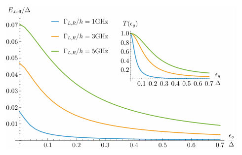
<figcaption class="paper-figure-caption"><b>Fig 1.</b> FIG. 1. Effective Josephson energy EJ,eff(T), due to EA(ϕ) and Econt(ϕ), and the transparency T(ϵg) as given by Eq. (4) (inset), as a function of ϵg, for ΓL = ΓR with T|ϵg=0 = 1. For asymmetric tunneling rates , δΓ ̸= 0, T(ϵg) is reduced by the factor 1 −δΓ2</figcaption>
</figure>
<figure class="paper-figure-card">
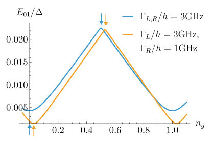
<figcaption class="paper-figure-caption"><b>Fig 2.</b> FIG. 2. Qubit energy oscillations, E01(ng), obtained by solv- ing the Schr¨odinger equation with the Hamiltonian Eq. (1) us- ing parameters ϵg = 0.6∆, ∆/h = 45 GHz, EC/h = 0.25 GHz. For symmetric tunneling reates (solid blue line), Γi/h = 3 GHz, i = L, R, the minima (maxima) of E01(ng) occurs at integer (half-integer) ng. For the asymmetric tunneling rates (solid orange line), ΓL/h = 3 GHz, ΓR/h = 1 GHz, the minima and maxima are shifted due to the presence of the additional charge offsets δng and nz from Eqs. (14) and (15), which is approximated by an effective charge offset, δneff.</figcaption>
</figure>
<figure class="paper-figure-card">
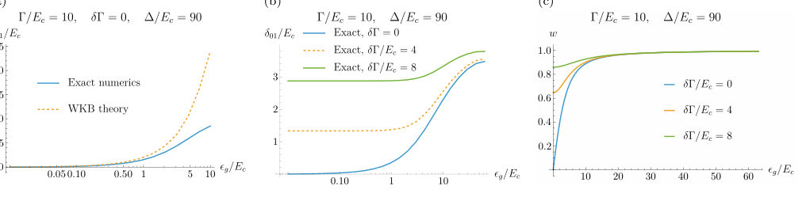
<figcaption class="paper-figure-caption"><b>Fig 3.</b> FIG. 3. Charge dispersion δ01(ϵg) in units of EC in (a,b), and probability amplitude w(ϵg) in (c), with Γ/EC = 10 and ∆/EC = 90. (a) For symmetric tunneling rates ΓL,R = 5EC, δ01 is calculated from the WKB theory(orange, dashed), Eq. (27), and from exact numerical solutions of the Schr¨odinger equation with ˆHeven (blue, solid). (b) For asymmetric tunneling rates, δΓ/EC = 0, 4, 8, δ01 is calculated from the exact numerical solutions with ˆHeven. Decreasing of transparency T(ϵg) either due to finite δΓ, or due to increasing of ϵg leads to growth of w and so is the charge dispersion. (c) Probability amplitude w of the lower Andreev branch for δΓ = 0 and for finite δΓ = 4, 8 EC. In the latter...</figcaption>
</figure>
<figure class="paper-figure-card">
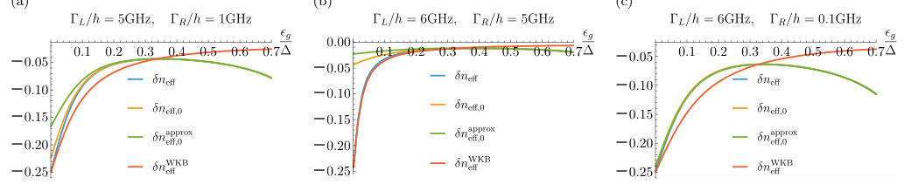
<figcaption class="paper-figure-caption"><b>Fig 4.</b> FIG. 4. The effective charge offset shift, δneff(ϵg), observed in the qubit energy oscillations, Fig. 2, and its interpretation. The exact numerics δneff(ϵg) (blue) is compared to the approximations δneff,0, Eq. (36) (orange) and a simplified expression δnapprox eff,0 , Eq. (37) (green) that assumes the system is “living on the lower Andreev branch”, expressed by the ansatz wavefunction, Eq. (34). In all three plots the WKB result δnWKB eff , Eq. (38), is given as the red curve: (a) For δΓ/h = 4 GHz, Γ/h = 6 GHz (moderate δΓ ≲Γ), the approximations practically coincide with the exact numerics for moderate ϵg ∈(0.1 ∆, 0.7 ∆). These approximations worsen for small ϵg ≪Γ, as the upper Andreev...</figcaption>
</figure>
<figure class="paper-figure-card">
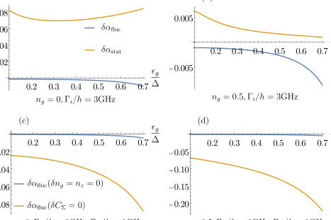
<figcaption class="paper-figure-caption"><b>Fig 5.</b> FIG. 5. (a),(b) Relative anharmonicity changes δαfluc(ϵg) and δαstat(ϵg) for symmetric tunnelings Γi/h = 3 GHz at ng = 0 and ng = 0.5. The effect of δCΣ on anharmonicity can be comparable to that of Econt. (c),(d) Plots for δαfluc(δCΣ = 0) and δαfluc(δng = nz = 0) for asymmetric tunnelings ΓL/h = 3 GHz, ΓR/h = 1 GHz. The effects of charge offsets are found to be up to two orders of magnitude stronger.</figcaption>
</figure>
<figure class="paper-figure-card">
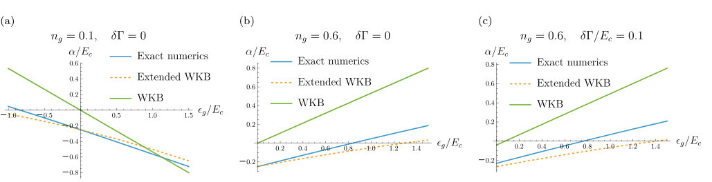
<figcaption class="paper-figure-caption"><b>Fig 6.</b> FIG. 6. Anharmonicity α(ϵg)/EC for small ϵg, |ϵg| ≲EC, in a non-transmon regime, EC ≲EJ,eff ≈0.5Γ (with Γ/EC = 16, ∆/EC = 360, δΓ ≪EC). Exact numerics (solid blue) is compared to the WKB theory, Eq. (40), (solid green), and to an extended WKB theory (dashed orange line), see Appendix A. The choices for ng = 0.1, 0.6, are to avoid trivial zeros of the WKB result. (a) α(ϵg)/EC for ng = 0.1, and symmetric tunnelings ΓL,R = 8 EC (i.e., T ≈1). The overall decrease of |α(ϵg)| as ϵg →0 as well as the slope of α(ϵg) are captured by the WKB result, as w(¯¯λ(ϵg)) →0, see Fig. 3(c) and Eq. (40). The non-zero intercept α(ϵg = 0) is reproduced in an extended WKB approach. (b) α(ϵg)/EC for ng = 0.6, and...</figcaption>
</figure>
<figure class="paper-figure-card">
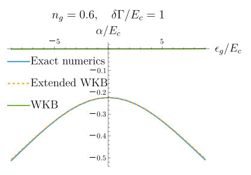
<figcaption class="paper-figure-caption"><b>Fig 7.</b> FIG. 7. Exact numeric anharmonicity α(ϵg)/EC for ng = 0.6, |ϵg| ≲EC, and ten times smaller EC as compared to Fig. 6(c), such that ∆/EC = 3600, Γ/EC = 160, and δΓ = EC, corresponding to T ≈1 and a true transmon regime (solid blue line). In this case the WKB result of Eq. (40) is ex- ponentially suppressed (horizontal green line), Eq. (A15), and the result is independent of ng. An extended WKB approach (dashed orange line), Appendix A, practically coincides with the exact numerics, in which α(ϵg) &lt; 0 and it never crosses zero line (scf. Eq. (10) of Ref. [8]). In particular, the in- tercept α(ϵg = 0)/EC approaches −1</figcaption>
</figure>

**Main problem.** Quantifying how gate-dependent offset charge shifts and capacitance renormalization impact the energy spectrum and anharmonicity of gatemon qubits in the weak tunneling regime.

**Main result.** The study predicts that junction asymmetry induces new gate-voltage-dependent charge offsets and that capacitance renormalization significantly influences qubit anharmonicity, providing a protocol for experimental detection.

**Method.** The authors use a many-body derived effective Hamiltonian and a WKB approach (including an extended WKB method) to solve the Schrödinger equation and analyze Andreev bound state dynamics.

**Summary.** This paper investigates the impact of gate-dependent effects on the performance of gatemon qubits. By using a many-body treatment of S-QD-S junctions, the authors show that tunneling asymmetry leads to new, detectable charge offsets. They also demonstrate that capacitance renormalization plays a crucial role in determining qubit anharmonicity. These findings provide a theoretical framework for understanding and controlling the energy spectrum of gatemon-based quantum processors.

Detailed structure

**Model / system.** A gatemon qubit consisting of a superconductor-quantum dot-superconductor (S-QD-S) junction in the weak tunneling regime, modeled via an effective Hamiltonian incorporating Andreev bound states and continuum energy shifts.

**Key observables.** Qubit transition energy oscillations (E01), charge dispersion, qubit anharmonicity, and effective charge offset shifts.

**Important parameters / regimes.** Gate voltage (epsilon_g), tunneling rates (Gamma), junction asymmetry (delta_Gamma), charging energy (EC), and superconducting gap (Delta).

**Assumptions / limitations.** Weak tunneling regime, slow phase approximation, and the assumption that the even and odd parity sectors are well-separated.

**Figures summary.** Figure 1 shows junction transparency vs. gate voltage; Figure 3 compares WKB theory to exact numerics for charge dispersion; Figure 5 compares relative contributions to anharmonicity; Figure 6 shows numerical anharmonicity vs. gate voltage.

**Paper structure.** The paper introduces the physical problem of gatemon dynamics, presents a many-body derived effective Hamiltonian, applies WKB and numerical methods to study charge dispersion and offsets, analyzes anharmonicity drivers, and concludes with experimental implications.

**Why it may be interesting.** This work is relevant for researchers in open quantum systems as it explores how the coupling to a continuum and quantum phase fluctuations lead to renormalization of fundamental qubit parameters like capacitance and charge offsets.

Abstract

Gatemon qubits are based on a superconductor-quantum dot-superconductor (S-QD-S) junction which enables in situ electrostatic tuning via a gate electrode. For a single-channel QD this structure gives rise to two subgap Andreev bound states (ABSs), and generally leads to a richer quantum phase dynamics as compared to conventional transmons. In a recent work [Phys. Rev. B 111, 214503 (2025)] we derived the quantum phase dynamics from a many-body treatment which leads to an effective gate voltage-dependent Hamiltonian that self-consistently incorporates the phase quantization. It predicts (i) a renormalization of the junction's effective capacitance and (ii) the presence of gate voltage and occupation-dependent charge offsets in junctions with tunneling asymmetry. Here, we quantify the observable impact of these effects on the qubit's energy spectrum and anharmonicity, by studying the interplay of the two Andreev branches as a function of dot-gate voltages and junction transparencies. We show the relation of these predictions to simplified gatemon models and propose a protocol to experimentally detect the predicted charge offsets.

[↑ back to top](#top)

### [Gauge-covariant projected entangled paired states for interacting systems in a magnetic field](http://arxiv.org/abs/2604.24574v1)

**Authors:** Wei Tang, Gunnar Möller, Frank Verstraete, Laurens Vanderstraeten  
**Type:** theory · **Category:** numerical methods · **PDF:** <https://arxiv.org/pdf/2604.24574v1>  
**Analysis basis:** full PDF text, analyzed in chunks
**Topic relevance:** `entanglement & information structure` **2/5**

↔ Scroll figures horizontally

<figure class="paper-figure-card">
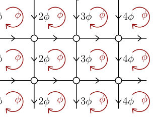
<figcaption class="paper-figure-caption"><b>Fig 1.</b> FIG. 1. Graphical representation of the Harper-Hofstadter- Hubbard Hamiltonian [Eq. (7)] with hopping strength t, on-site repulsion U and magnetic flux per plaquette ϕ = 2πa2B/Φ0. We have chosen the Landau gauge A = −Bx ey, leading to the indicated pattern of Peierls phases ϕij in the hopping terms −t(eiϕijb† ibj + h.c.). The arrows indicate the orientation of the line integral defining ϕij, while the labels ϕ, 2ϕ, 3ϕ, . . . specify the magnitude of the phase accumulated along that direction.</figcaption>
</figure>
<figure class="paper-figure-card">
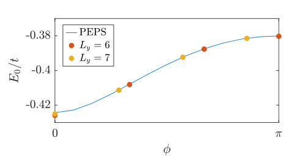
<figcaption class="paper-figure-caption"><b>Fig 2.</b> FIG. 2. Ground state energy per site of the bosonic Harper- Hofstadter-Hubbard model [Eq.(7)] at U/t = 20 and unit fill- ing as a function of the flux per plaquette ϕ, computed with our variational PEPS ansatz on the infinite plane, compared to MPS simulation on an infinite cylinder of width Ly = 6 and Ly = 7.</figcaption>
</figure>

**Main problem.** Simulating interacting many-body systems in a uniform magnetic field is difficult because the choice of gauge breaks standard translation symmetry, necessitating large, computationally expensive magnetic unit cells.

**Main result.** The authors developed a gauge-covariant PEPS ansatz that uses virtual flux tensors to maintain translation invariance of physical observables, allowing for efficient simulations using a single unit cell regardless of the magnetic flux value.

**Method.** A new Projected Entangled Pair State (PEPS) ansatz is constructed by imprinting virtual U(1) flux tensors onto the tensor bonds, optimized via a single-site boundary MPS algorithm and gradient-based variational optimization.

**Summary.** This paper introduces a new tensor network method (PEPS) designed to simulate many-body systems in magnetic fields. By implementing magnetic flux at the virtual level of the tensors, the authors create an ansatz that is gauge-covariant and preserves translation symmetry in physical observables. This approach allows researchers to treat magnetic flux as a continuous parameter and avoids the need for large, extended unit cells. The method's accuracy is validated against established MPS simulations for the bosonic Harper-Hofstadter-Hubbard model.

Detailed structure

**Model / system.** The study focuses on the bosonic Harper-Hofstadter-Hubbard model on a two-dimensional square lattice, featuring hopping strength t, on-site repulsion U, and a uniform magnetic flux per plaquette phi.

**Key observables.** Ground state energy per site and physical expectation values.

**Important parameters / regimes.** Hopping strength (t), interaction strength (U), magnetic flux per plaquette (phi), and particle filling (rho).

**Assumptions / limitations.** The ansatz construction is motivated by the strong interaction (infinite-U) limit and first-order perturbation theory; the method is demonstrated for bosons but is applicable to fermions.

**Figures summary.** Figure 1 illustrates the Peierls phase pattern in the Landau gauge; Figure 2 compares the ground state energy per site calculated with the proposed PEPS method against MPS results on cylinders.

**Paper structure.** The paper introduces the problem of gauge-dependent symmetry breaking, proposes a gauge-covariant PEPS ansatz based on perturbative expansion, demonstrates the method's gauge independence and symmetry preservation, provides numerical benchmarks against MPS, and includes an appendix proving gauge covariance via flux tensor reconfiguration.

**Why it may be interesting.** This provides a powerful new tool for simulating topological phases and fractional Chern insulators in lattice models without the computational bottleneck of large magnetic unit cells.

Abstract

The Hamiltonian for a system of itinerant particles on a two-dimensional lattice in a uniform magnetic field reduces the translational symmetry to a magnetic translation group, because of the need to choose a particular gauge for the vector potential. Nonetheless, in many situations all physical observables of the ground state remain entirely translation invariant. In this work, we introduce a projected entangled-pair state (PEPS) wavefunction with a pattern of virtual flux tensors, for which all physical expectation values are translation invariant by construction, possibly within an enlarged unit cell reflecting any symmetry breaking in the target state. Moreover, we show that the usual contraction and optimization methods for translation-invariant PEPS can be used, with the magnetic flux per plaquette only entering as a continuous parameter in the tensor network contractions. Therefore, our approach provides a method for simulating an interacting many-body system in a uniform magnetic field independently of the gauge choice for the vector potential and bypassing the need to consider extended magnetic unit cells.

[↑ back to top](#top)

### [Linear equivalence of nonlinear recurrent neural networks](http://arxiv.org/abs/2604.23489v1)

**Authors:** David G. Clark  
**Type:** theory · **Category:** disordered systems and neural networks · **PDF:** <https://arxiv.org/pdf/2604.23489v1>  
**Analysis basis:** full PDF text, analyzed in chunks
**Topic relevance:** `Keldysh / 2PI / non-Gaussian methods` **2/5**

↔ Scroll figures horizontally

<figure class="paper-figure-card">
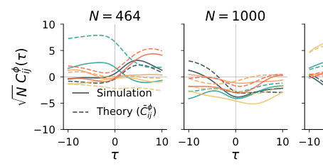
<figcaption class="paper-figure-caption"><b>Fig 1.</b> Figure 1: Time-lagged cross-covariances √</figcaption>
</figure>
<figure class="paper-figure-card">
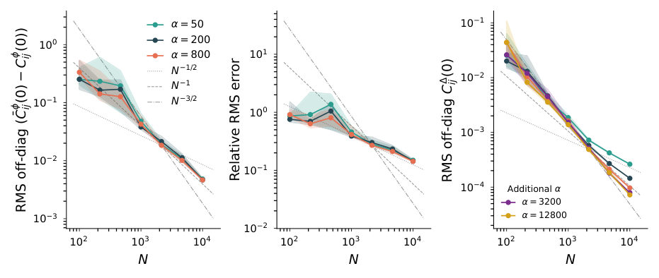
<figcaption class="paper-figure-caption"><b>Fig 2.</b> Figure 2: Scaling with network size 𝑁at 𝑔= 2.5, evaluated at 𝜏= 0. Lines show medians over 10 independent realizations of 𝑱; shaded regions indicate interquartile ranges. Colors correspond to sampling ratios 𝛼. Reference power laws 1 𝑁1/2 , 1 𝑁, and 1 𝑁3/2 are shown in gray.</figcaption>
</figure>
<figure class="paper-figure-card">
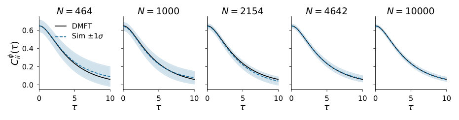
<figcaption class="paper-figure-caption"><b>Fig 3.</b> Figure 3: Autocovariance 𝐶𝜙 𝑖𝑖(𝜏) compared with the DMFT prediction 𝐶𝜙 ★(𝜏) (solid black) for a subset of network sizes at 𝑔= 2.5 and 𝛼= 800. Dashed lines show the empirical mean across the 𝐵= min(𝑁, 1000) diagonal elements; shaded regions indicate ±1 standard deviation. The</figcaption>
</figure>

**Main problem.** The paper seeks to analytically derive and verify the 'linear equivalence' ansatz, which posits that the full $N 	imes N$ covariance matrix of a large nonlinear recurrent neural network can be approximated by a linear network driven by independent noise.

**Main result.** The author provides a rigorous derivation using the two-site cavity method, proving that the nonlinear covariance matrix matches the linear-equivalent form with controlled error scales of $O(1/N)$ for the error matrix and $O(1/\sqrt{N})$ for relative precision.

**Method.** The study employs the two-site cavity method and Dynamical Mean Field Theory (DMFT), utilizing a linear-residual decomposition and a self-consistent matrix equation approach, supplemented by large-scale numerical simulations.

**Summary.** This paper provides a formal analytical proof for the 'linear equivalence' of nonlinear recurrent neural networks. It demonstrates that the complex, high-dimensional covariance structure of a nonlinear system can be accurately captured by a simpler linear model with effective noise. By using the two-site cavity method, the author shows that the nonlinearities only affect the system through specific scalar order parameters. This result bridges the gap between the well-understood theory of linear random matrices and the more complex dynamics of nonlinear, chaotic networks.

Detailed structure

**Model / system.** Large-scale nonlinear recurrent neural networks with $N$ units and random, quenched, i.i.d. asymmetric couplings $J_{ij}$. The dynamics follow a rate model (Sompolinsky et al.) with a nonlinear activation function such as $	anh$ or $	ext{erfen}$.

**Key observables.** The $N 	imes N$ time-lagged covariance matrix $C_\phi(\omega)$, the response matrix $S_\phi(\omega)$, and scalar order parameters (single-site response and covariance).

**Important parameters / regimes.** Network size $N$ (thermodynamic limit), coupling strength $g$ (specifically in the chaotic regime $g > 1/f'(0)$), and the sampling ratio $\alpha$.

**Assumptions / limitations.** Assumes the large $N$ limit, i.i.d. quenched couplings, and that the network reaches a stationary state; it also assumes the absence of macroscopic collective modes in the reservoir.

**Figures summary.** The notes mention Figure 1 shows time-lagged dynamics, and the paper includes numerical comparisons of covariance prediction errors and residual cross-covariances across different network sizes.

**Paper structure.** The paper begins by establishing the problem of characterizing high-dimensional covariance; it reviews single-site DMFT; it presents two distinct cavity-based derivations (linear-residual decomposition and self-consistent matrix equation); it addresses the failure of naive Gaussian closure; it provides error scaling analysis; and concludes with numerical verification.

Abstract

Large nonlinear recurrent neural networks with random couplings generate high-dimensional, potentially chaotic activity whose structure is of interest in neuroscience, machine learning, ecology, and other fields. A fundamental object encoding the collective structure of this activity is the $N \times N$ covariance matrix. Prior analytical work on the covariance matrix has been limited to low-dimensional summary statistics, not the full high-dimensional object for a specific realization of the couplings. Recent work proposed an ansatz in which, at large $N$, the covariance matrix for a typical quenched realization takes the same form as that of a linear network with the same couplings, driven by independent noise, with mean-field order parameters setting the effective transfer function and the noise spectrum. Here, we derive this ansatz using the two-site cavity method, providing two distinct derivations that offer complementary perspectives. The first decomposes each unit's activity into a linear component and a nonlinear residual, and shows that cross-covariances between residuals at distinct sites are strongly suppressed, so that residuals act as independent noise within a linear network. The second writes a self-consistent matrix equation for the covariance matrix. A naive Gaussian closure for the joint statistics of activity at distinct sites gives the wrong equation; the cavity method separates Gaussian and non-Gaussian contributions, which enter at the same order, and produces the correct one. We verify the predictions numerically across a range of network sizes. These results extend linear equivalence from feedforward high-dimensional nonlinear systems, where the weights being analyzed are independent of their inputs, to recurrent networks, where the activities depend on the same couplings that generate them.

[↑ back to top](#top)

### [New non-Euclidean neural quantum states from additional types of hyperbolic recurrent neural networks](http://arxiv.org/abs/2604.24337v1)

**Authors:** H. L. Dao  
**Type:** theory · **Category:** numerical methods · **PDF:** <https://arxiv.org/pdf/2604.24337v1>  
**Analysis basis:** full PDF text, analyzed in chunks
**Topic relevance:** `entanglement & information structure` **2/5**

↔ Scroll figures horizontally

<figure class="paper-figure-card">
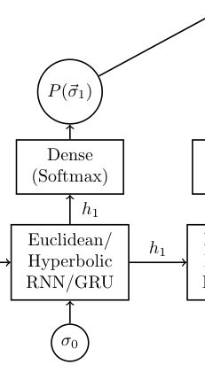
<figcaption class="paper-figure-caption"><b>Fig 1.</b> Figure 1: Schematic of the process of calculating the RNN wavefunction Ψ(⃗σ) = p</figcaption>
</figure>
<figure class="paper-figure-card">
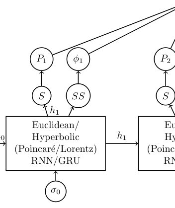
<figcaption class="paper-figure-caption"><b>Fig 2.</b> Figure 2: Schematic of the calculation of the RNN wavefunction Ψ(⃗σ) = P</figcaption>
</figure>
<figure class="paper-figure-card">
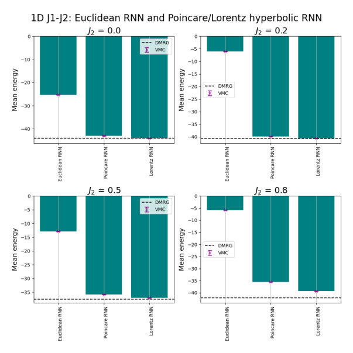
<figcaption class="paper-figure-caption"><b>Fig 3.</b> Figure 3: Comparisons of the performances of Euclidean RNN, Lorentz and Poincar´e hyperbolic RNN ansatzes listed in Table 1 for the 1D Heisenberg J1J2 model with J1 = 1.0 and different J2 couplings - clockwise from top: J2 = 0.0, 0.2, 0.8, 0.5. Each dot with error bar represents the mean E value of an NQS ansatz.</figcaption>
</figure>
<figure class="paper-figure-card">
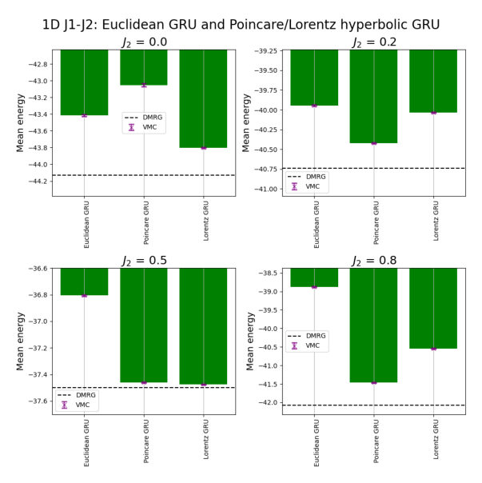
<figcaption class="paper-figure-caption"><b>Fig 4.</b> Figure 4: Comparisons of the performances of Euclidean GRU, Lorentz and Poincar´e hyperbolic GRU ansatzes listed in Table 1 for the 1D Heisenberg J1J2 model with J1 = 1.0 and different J2 couplings - clockwise from top: J2 = 0.0, 0.2, 0.8, 0.5. Each dot with error bar represents the mean E value of an NQS ansatz.</figcaption>
</figure>
<figure class="paper-figure-card">
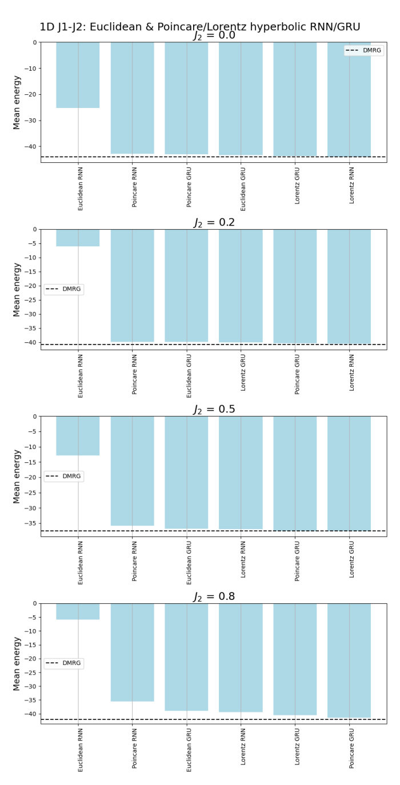
<figcaption class="paper-figure-caption"><b>Fig 5.</b> Figure 5: Comparisons of all six NQS ansatzes, sorted in an ascending performance order for the 1D Heisenberg J1J2 model with J1 = 1.0 and different J2 couplings - top to bottom: J2 = 0.0, 0.2, 0.5, 0.8. Note that all RNN variants have 5394 parameters, while all GRU variants have 15614 parameters.</figcaption>
</figure>
<figure class="paper-figure-card">
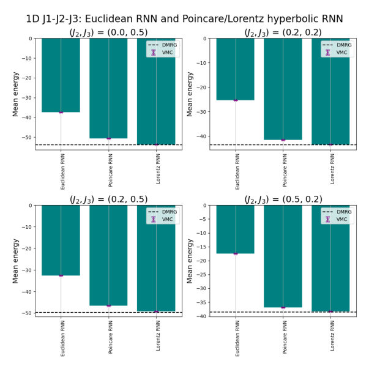
<figcaption class="paper-figure-caption"><b>Fig 6.</b> Figure 6: Comparisons of the performances of Euclidean RNN, Lorentz and Poincar´e hyperbolic RNN ansatzes listed in Table 4 for the 1D Heisenberg J1J2J3 model with J1 = 1.0 and different (J2, J3) couplings - clockwise from top: (0.0, 0.5),(0.2,0.2), (0.5,0.2), (0.2,0.5). All RNN variants have the same 6964 parameters. Each dot with error bar represents the mean E value of an NQS ansatz.</figcaption>
</figure>
<figure class="paper-figure-card">
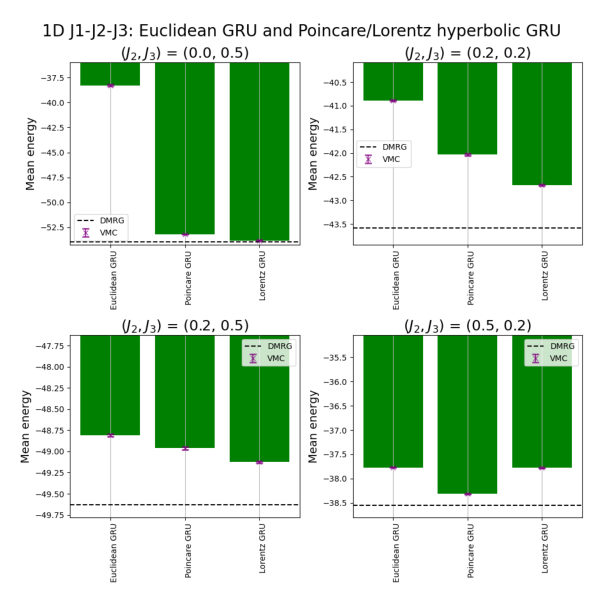
<figcaption class="paper-figure-caption"><b>Fig 7.</b> Figure 7: Comparisons of the performances of Euclidean GRU, Lorentz and Poincar´e hyperbolic GRU ansatzes listed in Table 4 for the 1D Heisenberg J1J2J3 model with J1 = 1.0 and different (J2, J3) couplings - clockwise from top: (0.0, 0.5),(0.2,0.2), (0.5,0.2), (0.2,0.5). All GRU variants have the same 15614 parameters. Each dot with error bar represents the mean E value of an NQS ansatz.</figcaption>
</figure>
<figure class="paper-figure-card">
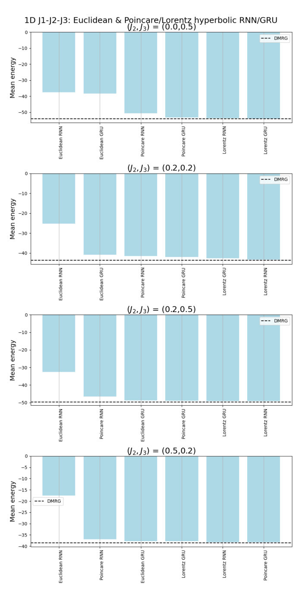
<figcaption class="paper-figure-caption"><b>Fig 8.</b> Figure 8: Comparisons of all NQS ansatzes, sorted in an ascending performance order for the 1D Heisenberg J1J2J3 model with J1 = 1.0 and different (J2, J3) couplings - top to bottom: (J2, J3) = (0.0, 0.5), (0.2, 0.2), (0.2, 0.5), (0.5, 0.2). Note that the RNN variants have 6964 parameters while the GRU variants have 15614 parameters.</figcaption>
</figure>
<figure class="paper-figure-card">
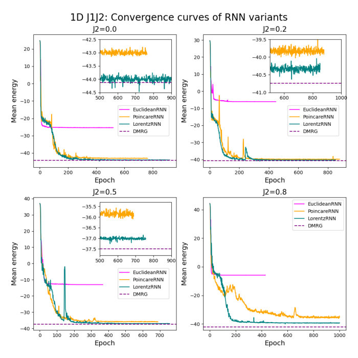
<figcaption class="paper-figure-caption"><b>Fig 9.</b> Figure 9: Training curves of RNN-variant NQS ansatzes for the 1D Heisenberg J1J2 model with J1 = 1.0 and different J2 couplings - clockwise J2 = 0.0, 0.2, 0.8, 0.5. The maximum number of epochs is fixed at 1000, but due to the early stopping mechanism that automatically terminated the training if no improvement was registered for the 200 epochs, the actual numbers of epochs run are different for different NQS ansatzes. Euclidean RNN always terminated first upon converging to a local mininum much higher than the true ground state. When present, the inset plot within each plot shows a magnified segment towards the end of the training when the models neared convergence. These inset plots are...</figcaption>
</figure>
<figure class="paper-figure-card">
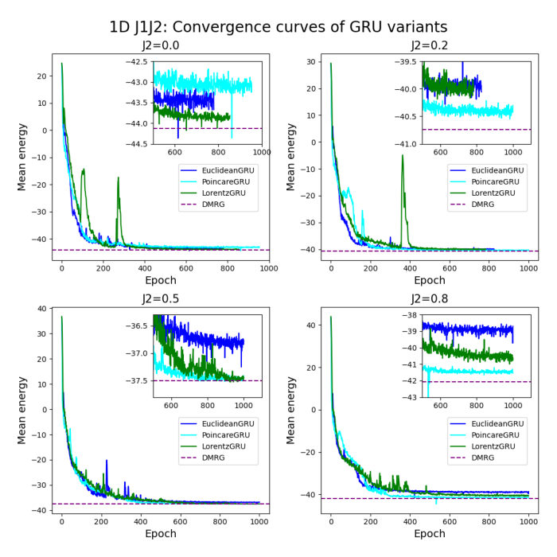
<figcaption class="paper-figure-caption"><b>Fig 10.</b> Figure 10: Training curves of GRU-variant NQS ansatzes for the 1D Heisenberg J1J2 model with J1 = 1.0 and different J2 couplings - clockwise J2 = 0.0, 0.2, 0.8, 0.5. The maximum number of epochs is fixed at 1000, but due to the early stopping mechanism that automatically terminated the training if no improvement was registered for the 200 epochs, the actual numbers of epochs run are different for different NQS ansatzes. When present, the inset plot within each plot shows a magnified segment towards the end of the training when the models neared convergence. These inset plots are only included when the curves are not sufficiently distinct in the main plots.</figcaption>
</figure>

**Main problem.** The study aims to extend non-Euclidean Neural Quantum States (NQS) by introducing new hyperbolic architectures, specifically Poincaré RNN, Lorentz RNN, Lorentz GRU, and Poincaré GRU, to better approximate quantum many-body ground states.

**Main result.** All four new hyperbolic RNN/GRU variants consistently outperformed their Euclidean counterparts in 100-spin Heisenberg models, with the Lorentz RNN emerging as the most efficient and high-performing ansatz despite having significantly fewer parameters.

**Method.** The researchers used Variational Monte Carlo (VMC) to train the neural network ansatzes and compared their ground state energy estimates against benchmarks from the Density Matrix Renormalization Group (DMRG) method.

**Summary.** This paper introduces new hyperbolic neural network architectures (Poincaré and Lorentz RNN/GRU) for use as Neural Quantum States. By applying these to 1D Heisenberg spin chains, the author demonstrates that hyperbolic geometries significantly outperform standard Euclidean networks in approximating ground state energies. Notably, the Lorentz RNN achieves superior performance with much fewer parameters. The work also addresses critical numerical stability issues inherent in hyperbolic manifolds.

Detailed structure

**Model / system.** The study focuses on 1D Heisenberg J1-J2 and J1-J2-J3 spin models with 100 spins, exploring various coupling regimes that introduce hierarchical structures and frustration.

**Key observables.** Ground state energy, local energy, and probability distribution.

**Important parameters / regimes.** Coupling constants J2 and J3; spatial constraints Rmax (for Poincaré) and Lmax (for Lorentz) used to prevent numerical instabilities.

**Assumptions / limitations.** The study assumes the applicability of the Marshall sign for unfrustrated systems and focuses on 1D geometries; the optimal spatial constraints were determined via trial-and-error rather than exhaustive scanning.

**Figures summary.** Figures illustrate the autoregressive calculation process for real and complex NQS, the impact of spatial constraints (Rmax and Lmax) on numerical stability, and training curves comparing energy convergence across different architectures.

**Paper structure.** The paper introduces the mathematical framework for hyperbolic RNN/GRU architectures, details the VMC implementation for real and complex wavefunctions, presents benchmarking results against Euclidean models and DMRG, and discusses numerical stability and future directions.

**Why it may be interesting.** This work is highly relevant for many-body dynamics and simulation as it demonstrates that non-Euclidean geometries can capture complex, hierarchical correlations in quantum systems more efficiently than standard Euclidean neural networks.

Abstract

In this work, we extend the class of previously introduced non-Euclidean neural quantum states (NQS) which consists only of Poincaré hyperbolic GRU, to new variants including Poincaré RNN as well as Lorentz RNN and Lorentz GRU. In addition to constructing and introducing the new non-Euclidean hyperbolic NQS ansatzes, we generalized the results of our earlier work regarding the definitive outperformances delivered by hyperbolic Poincaré GRU NQS ansatzes when benchmarked against their Euclidean counterparts in the Variational Monte Carlo (VMC) experiments involving the quantum many-body settings of the Heisenberg $J_1J_2$ and $J_1J_2J_3$ models, which exhibit hierarchical structures in the forms of the different degrees of nearest-neighbor interactions. Here, in particular, using larger systems consisting of 100 spins, we found that all four hyperbolic RNN/GRU NQS variants always outperformed their respective Euclidean counterparts. Specifically, for all $J_2$ and $(J_2,J_3)$ couplings considered, including $J_2=0.0$, Lorentz RNN NQS and Poincaré RNN NQS always outperformd Euclidean RNN NQS, while Lorentz/Poincaré GRU NQS always outperformed Euclidean GRU NQS, with a single exception when $J_2=0.0$ for Poincaré GRU NQS. Furthermore, among the four hyperbolic NQS ansatzes, depending on the specific $J_2$ or $(J_2, J_3)$ couplings, on four out of eight experiment settings, Lorentz GRU and Poincaré GRU took turns to be the top performing variant among all Euclidean and hyperbolic NQS ansatzes considered, while Lorentz RNN, with up to three times fewer parameters, was capable of not only surpassing the Euclidean GRU eight out of eight times but also outperforming both Lorentz GRU and Poincaré GRU four out of eight times, to emerge as the best overall hyperbolic NQS ansatz.

[↑ back to top](#top)

### [No cloning with unitary scaling](http://arxiv.org/abs/2604.22960v1)

**Authors:** Dafa Li  
**Type:** theory · **Category:** quantum information and computing · **PDF:** <https://arxiv.org/pdf/2604.22960v1>  
**Analysis basis:** full PDF text, analyzed in chunks
**Topic relevance:** `entanglement & information structure` **2/5**

↔ Scroll figures horizontally

<figure class="paper-figure-card">
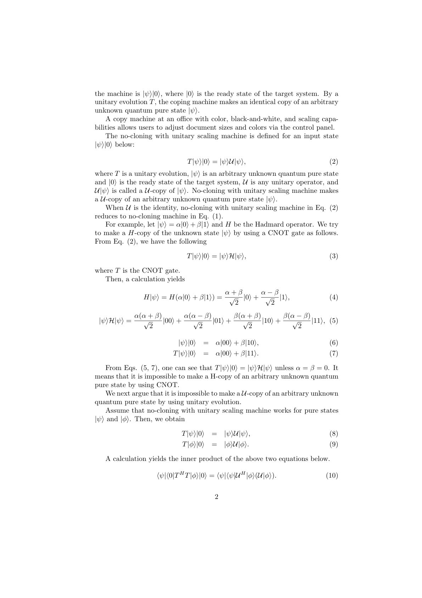
<figcaption class="paper-figure-caption"><b>Fig 1.</b> Low-resolution page preview, page 2</figcaption>
</figure>
<figure class="paper-figure-card">
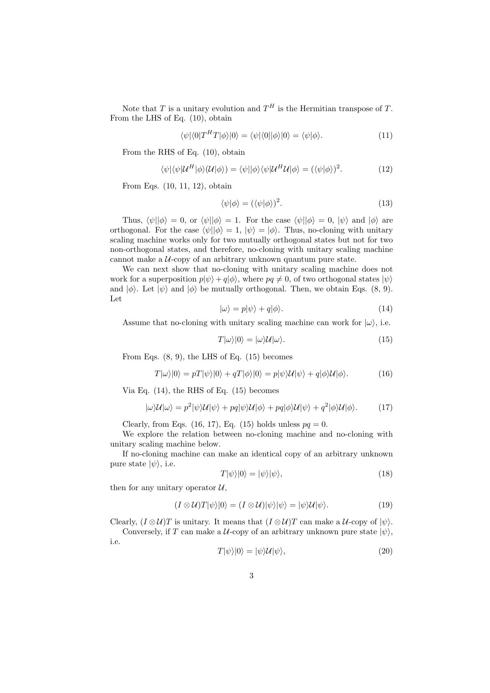
<figcaption class="paper-figure-caption"><b>Fig 2.</b> Low-resolution page preview, page 3</figcaption>
</figure>
<figure class="paper-figure-card">
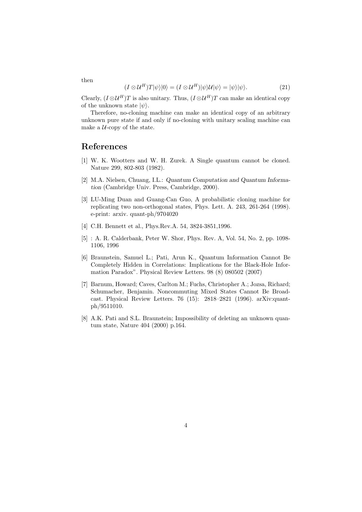
<figcaption class="paper-figure-caption"><b>Fig 3.</b> Low-resolution page preview, page 4</figcaption>
</figure>

**Main problem.** The paper investigates whether it is possible to create a 'U-copy' of an unknown quantum pure state, where the copy is the original state transformed by an arbitrary unitary operator U, using unitary evolution.

**Main result.** The author proves a general no-cloning principle stating that it is impossible to create a U-copy of an arbitrary unknown pure state via unitary evolution, establishing that U-copying is only possible for identical or orthogonal states.

**Method.** The proof utilizes the inner product method to compare the transformation of states under unitary evolution and employs linearity tests and counter-examples using CNOT gates.

**Summary.** This paper proposes a generalization of the fundamental quantum no-cloning principle. Instead of looking at identical copies, it examines the possibility of creating copies that have been transformed by a unitary operator U. The author proves that such 'U-copying' is impossible for arbitrary unknown states, effectively showing that the constraints of the original no-cloning theorem extend to any unitary scaling of the state.

Detailed structure

**Model / system.** The model involves an unknown quantum pure state |psi> and a target system initially in a ready state |0>, subjected to a unitary transformation T designed to produce the state |psi>U|psi>.

**Important parameters / regimes.** The identity of the unitary operator U and the inner product between states |psi> and |phi>.

**Assumptions / limitations.** The proof assumes that the copying process is governed by unitary evolution and focuses specifically on unknown pure states.

**Paper structure.** The paper introduces the concept of U-copying, provides an analytical proof using inner products, demonstrates failure via a CNOT gate counter-example, performs a linearity test, and concludes with an equivalence theorem to standard cloning.

Abstract

It is known that the classical information like strings of bits can be copied. In 1982, Wootters and Zurek proposed the quantum no-cloning principle [1]. No-cloning principle says that it is impossible to make an identical copy of an arbitrary unknown quantum pure state by using unitary evolution. In this paper, we propose a general no-cloning principle. We call U|psi>, where U is any unitary operator, a U-copy of the state |psi>. The general no-cloning principle states that it is impossible to make a U-copy of an arbitrary unknown quantum pure state by using unitary evolution.

[↑ back to top](#top)

### [Noise-aware selection of circuit cutting strategies under hardware noise non-uniformity](http://arxiv.org/abs/2604.24422v1)

**Authors:** Debarthi Pal, Ritajit Majumdar, Padmanabha Venkatagiri Seshadri, Anupama Ray, Yogesh Simmhan  
**Type:** both · **Category:** quantum information and computing · **PDF:** <https://arxiv.org/pdf/2604.24422v1>  
**Analysis basis:** full PDF text, analyzed in chunks
**Topic relevance:** `QC/QI experiment` **2/5**

↔ Scroll figures horizontally

<figure class="paper-figure-card">
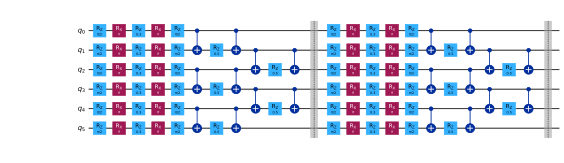
<figcaption class="paper-figure-caption"><b>Fig 1.</b> Figure 1. A 6-qubit 1D Ising model having nearest neighbour interactions with 2 trotter steps. The circuit execution overheads to partition this circuit for different device constraints are shown in Table I.</figcaption>
</figure>
<figure class="paper-figure-card">
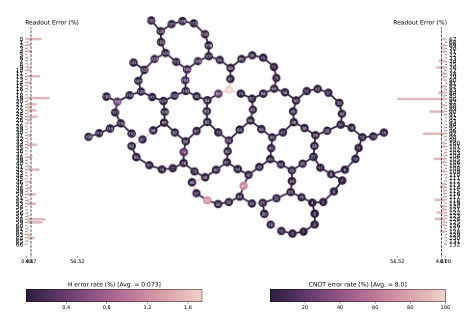
<figcaption class="paper-figure-caption"><b>Fig 2.</b> Figure 3. Noise profile of a 133 qubit IBM Quantum Heron device showing the non-uniformity of noise for both qubits and 2-qubit connectivity</figcaption>
</figure>
<figure class="paper-figure-card">
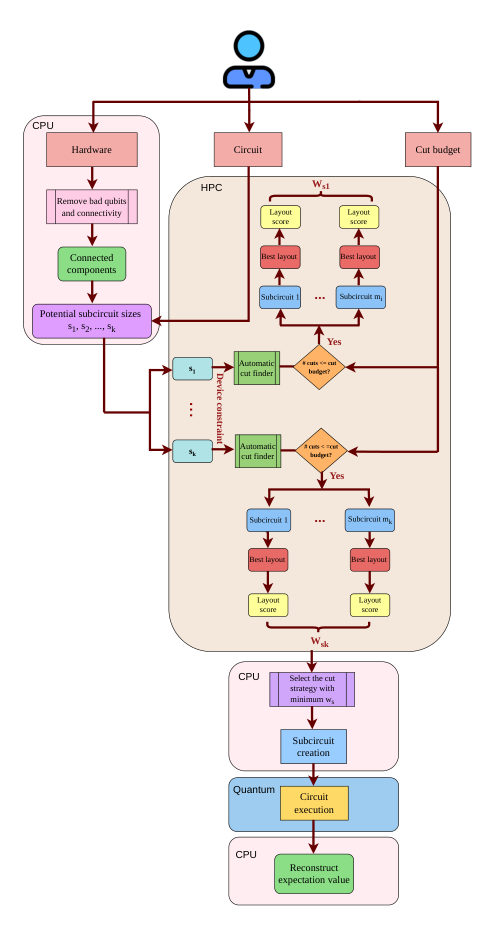
<figcaption class="paper-figure-caption"><b>Fig 3.</b> Figure 2. Workflow for HIC: the process involves pruning hardware based on qubit and connectivity noise profile, identifying connected components, and parallelizing the automatic cut finder across various potential subcircuit sizes to select the strategy with the minimum weighted layout score Ws. This figure explicitly demonstrates a quantum-centric algorithm to circuit cutting.</figcaption>
</figure>
<figure class="paper-figure-card">
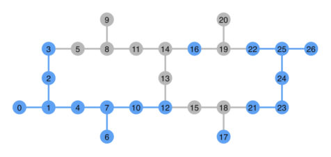
<figcaption class="paper-figure-caption"><b>Fig 4.</b> Figure 4. Punctured coupling map of a 27-qubit IBM Quantum device obtained after removing outlier qubits and connectivities from the hardware coupling map where z = 0.05. The blue and gray qubits (edges) respectively denote the ones retained and removed after puncturing. Dangling edges are naturally always removed irrespective of their error rate.</figcaption>
</figure>
<figure class="paper-figure-card">
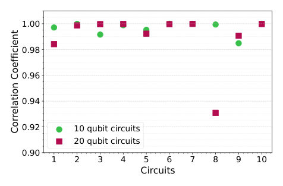
<figcaption class="paper-figure-caption"><b>Fig 5.</b> Figure 5. Correlation coefficient between norm-1 and norm-2 of the objective function W for random 10-qubit (green circles) and 20-qubit (red squares) circuits. The high correlation across most instances justifies the simplification of the objective function to focus exclusively on norm-1 metric.</figcaption>
</figure>
<figure class="paper-figure-card">
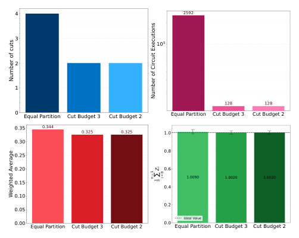
<figcaption class="paper-figure-caption"><b>Fig 6.</b> Figure 6. Comparison of equal partitioning and different cut-budget strategies (HIC) for a structured 20-qubit mirrored QAOA circuit (depth = 44). The figures respectively show the number of cuts, number of circuit executions, evaluation of the weighted average, and the calculated expectation value of the observable 1</figcaption>
</figure>
<figure class="paper-figure-card">
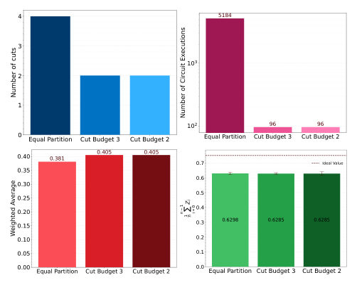
<figcaption class="paper-figure-caption"><b>Fig 7.</b> Figure 7. Comparison of equal partitioning and different cut-budget strategies (HIC) for a 20-qubit random Clifford circuit (depth = 128). The figures respectively show the number of cuts, number of circuit executions, evaluation of the weighted average, and the calculated expectation value of the observable 1 n Pn−1 i=0 Zi. HIC with different cut budgets significantly reduce the overhead of circuit execution, while having a slight increase in the weighted average score, and retaining the output quality.</figcaption>
</figure>
<figure class="paper-figure-card">
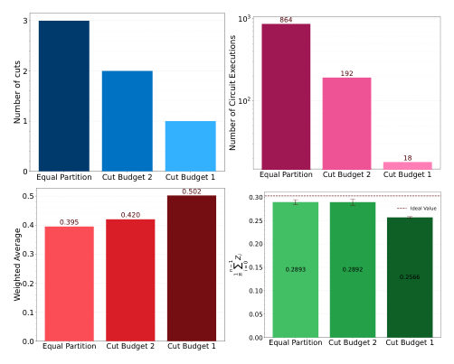
<figcaption class="paper-figure-caption"><b>Fig 8.</b> Figure 8. Comparison of equal partitioning and different cut-budget strategies (HIC) for a 20-qubit random Clifford circuit (depth = 51). The figures respectively show the number of cuts, number of circuit executions, evaluation of the weighted average, and the calculated expectation value of the observable 1 n Pn−1 i=0 Zi. HIC with cut budget 2 significantly reduce the overhead of circuit execution, while having a slight increase in the weighted average score, and retaining the output quality. However, HIC with cut budget 1 experiences a non-negligible increase in the weighted average score, and accordingly a degradation in output quality demonstrating that HIC cannot be used to...</figcaption>
</figure>
<figure class="paper-figure-card">
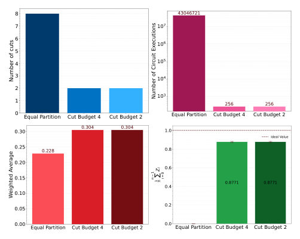
<figcaption class="paper-figure-caption"><b>Fig 9.</b> Figure 9. Comparison of equal partitioning and HIC strategies for a 50- qubit QAOA circuit (depth = 44). Equally partitioning the circuit leads to a substantial overhead in the number of circuit executions, making the reconstruction of the expectation value infeasible. With cut-budget 4, HIC identifies a 2-cut strategy. The number of circuit executions is significantly reduced, accompanied by an increase in the weighted average compared to the equal partitioning case. Reducing the cut budget to 2 resulted in the same strategy, as the cut budget of 4 itself suggested a 2-cut solution.</figcaption>
</figure>
<figure class="paper-figure-card">

<figcaption class="paper-figure-caption"><b>Fig 10.</b> Fig. 9 reports results for a 50-qubit mirrored QAOA circuit. Under equal partitioning, the automatic cut finder identifies 8 cuts, resulting in 43, 046, 721 circuit executions. The weighted average layout score for equal partitioning is Ws = 0.228. In contrast, HIC identifies a valid 2-cut strategy, reducing the number of circuit executions to 256 and bringing circuit cutting into a tractable region. This reduction is accompanied by an increase in the weighted average to Ws = 0.304, causing an average deviation of 0.1229 from the ideal expectation value. Since such a 2-cut strategy exists, the same result was observed when the cut budget was taken to be 4 or 2. It is important to note that,...</figcaption>
</figure>

**Main problem.** Large quantum circuits often require execution across high-noise regions of hardware, and existing circuit cutting strategies lack systematic guidance on how to align cuts with non-uniform hardware noise to balance sampling overhead and fidelity.

**Main result.** The proposed Hardware-Informed Circuit cutting (HIC) framework achieves 5-54x reductions in execution overhead for 20-qubit circuits and enables tractable cutting for 50-qubit circuits by exploiting spatial noise non-uniformity.

**Method.** A three-stage workflow involving hardware 'puncturing' to remove noise outliers, identifying connected components to define subcircuit sizes, and using a weighted layout score to select optimal device constraints.

**Summary.** This paper introduces a new framework called Hardware-Informed Circuit cutting (HIC) designed to optimize how large quantum circuits are decomposed into smaller subcircuits. By specifically accounting for the non-uniform noise patterns (islands of low noise) found in modern NISQ hardware, the method selects cutting strategies that avoid high-error regions. This approach significantly reduces the exponential sampling overhead typically associated with circuit cutting, making the execution of much larger circuits (up to 50 qubits) practically feasible on current hardware.

Detailed structure

**Model / system.** The study focuses on NISQ hardware, specifically referencing IBM Quantum Heron and Torino architectures, and uses noisy simulations of 20-qubit and 50-qubit Clifford and QAOA circuits.

**Key observables.** Weighted average layout score (Ws), expectation value of the Z-operator, and sampling overhead (number of circuit executions).

**Important parameters / regimes.** Device constraint (maximum subcircuit size), cut budget (k_max), and Z-score for noise filtering.

**Assumptions / limitations.** Assumes hardware noise profiles (calibration snapshots) are available and uses the weighted layout score as a proxy for noise exposure and output quality.

**Figures summary.** Figure 1 shows the impact of device constraints on Ising model executions; Figure 2 outlines the HIC workflow; Figure 3 shows the IBM Heron noise profile; Figure 4 shows a punctured coupling map; Figure 5 shows correlation between objective function terms; Figure 6 compares partitioning strategies for QAOA; Figure 10 illustrates gate-cut necessity.

**Paper structure.** The paper introduces the problem of noise non-uniformity, presents the HIC workflow (puncturing, enumeration, selection), validates the simplified objective function, demonstrates performance gains on 20-qubit and 50-qubit circuits, and compares the method against baselines like CutQC and FragQC.

Abstract

Noise in contemporary quantum hardware is highly non-uniform across qubits and couplers, giving rise to localized low-noise "islands" within otherwise noisy device topologies. As quantum workloads scale, executions are increasingly forced to traverse high-noise regions, degrading algorithmic fidelity. Circuit cutting provides a route to circumvent such regions by decomposing large circuits into smaller subcircuits, but its practicality is limited by exponential sampling overhead and the lack of systematic guidance on how cut strategies should align with heterogeneous hardware noise. In this work, we present a hardware-noise-aware circuit cutting framework that explicitly exploits the spatial non-uniformity of noise in quantum devices. Rather than proposing a new cut-finding algorithm, we formalize the problem of device-constraint selection under realistic hardware noise and show that this choice critically determines both execution overhead and effective noise. Using a unified gate- and wire-cutting formulation, we demonstrate that small, hardware-informed relaxations in the device constraint yield exponential reductions in execution overhead while preserving alignment with low-noise hardware regions. Across representative workloads, our method achieves an average reduction in the number of circuit executions ranging from 5-54x for 20-qubit circuits, and enables tractable circuit cutting for 50-qubit circuits and application-level benchmarks where conventional strategies incur prohibitive overhead. These results establish noise-aware device-constraint selection as a necessary ingredient for making circuit cutting resource-efficient and practically deployable on contemporary quantum hardware.

[↑ back to top](#top)

### [Non-Abelian Particle-Loop, Fracton, and Planon Condensation in Cage-Net Models](http://arxiv.org/abs/2604.24755v1)

**Authors:** Yifei Wang, Yu Zhao, Yingcheng Li, Hao Song, Yidun Wan  
**Type:** theory · **Category:** statistical mechanics · **PDF:** <https://arxiv.org/pdf/2604.24755v1>  
**Analysis basis:** full PDF text, analyzed in chunks
**Topic relevance:** `entanglement & information structure` **2/5**

↔ Scroll figures horizontally

<figure class="paper-figure-card">
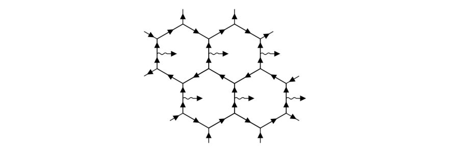
<figcaption class="paper-figure-caption"><b>Fig 1.</b> Figure 1: Part of the HGW model lattice. A tail (wavy line) is attached to an arbitrary edge of every plaquette.</figcaption>
</figure>
<figure class="paper-figure-card">
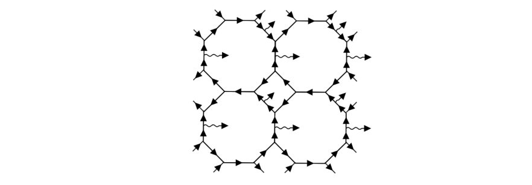
<figcaption class="paper-figure-caption"><b>Fig 2.</b> Figure 2: Configuration of the HGW model on the 2-dimensional truncated square lattice. The lattice geometry is constructed from trivalent vertices and features two distinct types of plaquettes: large octagonal plaquettes and smaller square (or diamond-like) plaquettes. A tail degree of freedom, depicted as a wavy line, is attached to every plaquette of both types and points inward, satisfying the requirements for the HGW formalism in this modified geometry.</figcaption>
</figure>
<figure class="paper-figure-card">
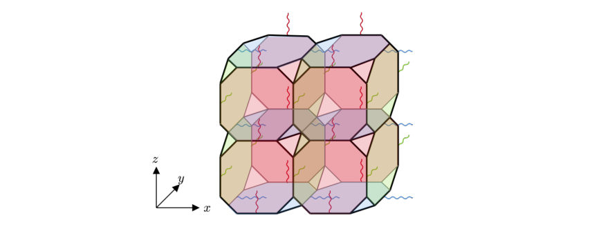
<figcaption class="paper-figure-caption"><b>Fig 3.</b> Figure 3: 3D truncated cubic lattice formed by intersecting three orthogonal stacks of 2D HGW layers. The layers are color-coded according to their orientation: green, red, and blue shading indicates layers normal to the x, y, and z directions, respectively. The lattice structure features principal edges which are formed at the intersection of two perpendicular layers and carry a pair of labels (jE, kE ∈F). A tail (wavy line) is specifically attached to each principal edge and directed into the adjacent octagonal plaquette. This configuration ensures that every octagonal plaquette possesses exactly one tail , essential for defining the dyonic sectors in the extended cage-net model.</figcaption>
</figure>
<figure class="paper-figure-card">
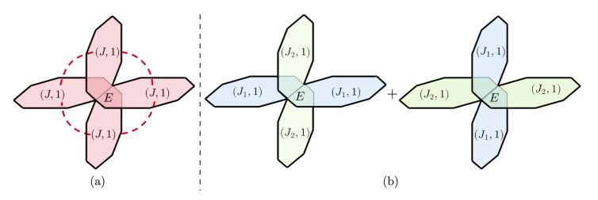
<figcaption class="paper-figure-caption"><b>Fig 4.</b> Figure 4: Graphical representation of the local terms comprising the p-loop condensa- tion projector PE acting on a principal edge E. (a) A J-loop generated by the operator W J EV J E , creating a loop of four J-chargeons around the principal edge. (b) A J1 −J2 — cross generated by the operator term W J1 E V J2 E + W J2 E V J1 E . This configuration represents a symmetric superposition of two states where chargeons J1 and J2 are exchanged across the intersecting planes, ensuring the projector preserves cubic symmetry.</figcaption>
</figure>
<figure class="paper-figure-card">

<figcaption class="paper-figure-caption"><b>Fig 5.</b> Figure 5: Illustration of certain p-loop configurations. The p-loop condensate is a super- position of various p-loop configurations fluctuating throughout the 3D lattice. Thick red loops represent the condensed p-loops formed along the principal edges, while the light red plaquettes indicate the underlying chargeon excitations that constitute these loops.</figcaption>
</figure>
<figure class="paper-figure-card">
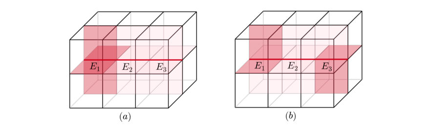
<figcaption class="paper-figure-caption"><b>Fig 6.</b> Figure 6: Restricted one-dimensional mobility of lineon. The thick red line denotes the strictly 1D linear subsystem along which the lineons are confined to move. Red plaquettes represent anyons carrying a ψ-flux, and the light red planes indicate the respective planes within which these ψ-fluxes reside. (a) A configuration where two lineons are localized on the principal edge E1. (b) The configuration after one of the lineons has hopped from edge E1 along the restricted 1D line to edge E3.</figcaption>
</figure>

**Main problem.** The paper addresses the lack of established Hamiltonian mechanisms for phase transitions between different non-trivial fracton orders and the difficulty of formulating condensation operators for non-Abelian anyons in 3D.

**Main result.** The authors demonstrate a concrete mechanism for phase transitions between distinct fracton orders, specifically showing that condensing non-Abelian p-loops can map an extended Ising Cage-Net model to the X-cube model.

**Method.** The study uses a framework of anyon and p-loop condensation applied to decoupled layers of the Hu-Geer-Wu (HGW) string-net model, employing algebraic tools like Unitary Fusion Categories and Hamiltonian engineering via condensation projectors.

**Summary.** This paper presents a new framework for studying phase transitions between different fracton orders in 3+1 dimensions. By using the Hu-Geer-Wu string-net model as a parent, the authors show how condensing non-Abelian loops can drive transitions between complex phases like the extended Ising Cage-Net and the X-cube model. The work explicitly tracks how quasiparticles like planons split or become confined during these transitions. This establishes a generalizable method for analyzing the evolution of sub-dimensional excitations in higher-dimensional topological phases.

Detailed structure

**Model / system.** The system consists of 3+1 dimensional cage-net models constructed from decoupled 2D HGW string-net layers, including the Extended Ising Cage-Net (ICN) model and the X-cube (XC) model on a truncated cubic lattice.

**Key observables.** Quasiparticle spectra (fractons, lineons, and planons), anyon dynamics (splitting, identification, and confinement), and topological spin/braiding statistics.

**Important parameters / regimes.** The infinite coupling limit of the condensation term (Lambda to infinity) and the specific fusion rules of the Ising Unitary Fusion Category.

**Assumptions / limitations.** The framework focuses on the ICN model as a specific showcase; it also assumes that certain non-condensable fusion products (like fermions) limit the full condensation of non-Abelian p-loops.

**Figures summary.** Figure 1 shows the HGW lattice with tails; Figure 2 shows the 2D truncated square lattice geometry; Figure 3 depicts the 3D truncated cubic lattice; Figure 4 illustrates the local components of the p-loop projector; Figure 5 shows the p-loop condensate configuration.

**Paper structure.** The paper introduces the HGW model and its tail degrees of freedom, constructs the 3D extended cage-net models via p-loop condensation, derives the effective Hamiltonian for the ICN and X-cube models, and analyzes the resulting quasiparticle spectra and phase transition dynamics.

**Why it may be interesting.** It provides a rigorous mathematical framework for understanding how complex, sub-dimensional excitations like fractons and planons emerge and evolve during topological phase transitions, which is fundamental to many-body dynamics.

Abstract

We present a framework for non-Abelian p-loop, fracton, and planon condensation in 3+1 dimensions by constructing extended cage-net fracton models using decoupled layers of the Hu-Geer-Wu (HGW) string-net model. These cage-net models extend the conventional cage-net models based on the Levin-Wen (LW) string-net model in the sense that they inherit the tail degrees of freedom of the HGW models, which are essential for completely describing the internal spaces of quasiparticles. This approach allows us to explicitly derive the quasiparticle spectra of the cage-net models by projecting those of the parent 2D HGW layers. Utilizing this framework, we can condense the p-loops formed by non-Abelian anyons within a fracton phase. Specifically, we construct the condensation projector for $(σ\barσ, 1)$-loops within the extended Ising Cage-Net (ICN) model. We demonstrate that condensing these non-Abelian loops drives a phase transition that maps the ICN model to the X-cube (XC) model defined on a truncated cubic lattice, a process that explicitly reveals the splitting of non-Abelian planons into distinct sub-dimensional excitations. Furthermore, our framework extends to the condensation of fractons and planons: we demonstrate that in the ICN model fracton condensation drives the decoupling of the 3D fracton order back into isolated 2D topological order layers, while planon condensation collapses the system entirely into a trivial phase. Our results establish a concrete Hamiltonian mechanism for phase transitions between distinct fracton orders and provide a generalizable method for analyzing the evolution of sub-dimensional excitations.

[↑ back to top](#top)

### [Optimization Using Locally-Quantum Decoders](http://arxiv.org/abs/2604.24633v1)

**Authors:** Noah Shutty, Avijit Mandal, Seyoon Ragavan, Quentin Buzet, André Chailloux, Nicholas C. Rubin, Abid Khan, Sami Boulebnane, Ruslan Shaydulin, John Azariah, Stephen P. Jordan  
**Type:** theory · **Category:** quantum information and computing · **PDF:** <https://arxiv.org/pdf/2604.24633v1>  
**Analysis basis:** full PDF text, analyzed in chunks
**Topic relevance:** `quantum measurements` **2/5**

↔ Scroll figures horizontally

<figure class="paper-figure-card">
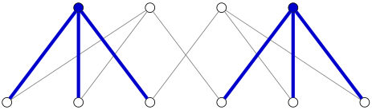
<figcaption class="paper-figure-caption"><b>Fig 1.</b> Figure 1: A Tanner graph from the (2, 3) Gallager ensemble. Highlighted in blue is a set of parity check nodes such that each bit node is connected by an edge to exactly one check from this set.</figcaption>
</figure>

**Main problem.** The paper aims to develop an efficient quantum decoding technique to solve the D-regular max-k-XORSAT optimization problem and investigate if it can achieve quantum advantage over classical algorithms.

**Main result.** The authors develop a locally-quantum decoding technique that outperforms classical Belief Propagation and can surpass Prange's algorithm and simulated annealing for certain parameters, though they find a classical enhancement (Turbo Prange) that matches their performance.

**Method.** The method uses Regev's reduction to map optimization to LDPC decoding and implements a code-dependent Fine-Grained Unambiguous Measurement (FGUM) strategy involving local basis changes on qubits.

**Summary.** This paper introduces a new quantum decoding technique designed to solve combinatorial optimization problems like max-k-XORSAT. By tailoring measurements to the specific structure of LDPC codes, the authors achieve performance that beats standard classical algorithms like Belief Propagation and Simulated Annealing for certain problem instances. While the authors identify a classical heuristic that can match their results, the work demonstrates a promising direction for using quantum-enhanced decoding to tackle hard optimization tasks.

Detailed structure

**Model / system.** The problem is modeled using D-regular max-k-XORSAT instances drawn from Gallager's ensemble, represented as bipartite Tanner graphs with bit-flip errors occurring in coherent superposition.

**Key observables.** The fraction of satisfied constraints (optimization score) and the error rate/failure probability of the quantum decoder.

**Important parameters / regimes.** The constraint arity (k), the variable degree (D), the bit-flip error rate (alpha), and the QAOA circuit depth (p).

**Assumptions / limitations.** The analysis focuses on average-case instances from the Gallager ensemble and assumes a high-girth/tree-like graph structure in the large n limit.

**Figures summary.** Figure 1 illustrates a Tanner graph structure; Table 1 compares optimization scores across different algorithms (Prange, Simulated Annealing, DQI+BP, Regev+FGUM).

**Paper structure.** The paper identifies the limitations of previous quantum decoding approaches, proposes a new code-dependent FGUM technique, provides mathematical proofs for error bounds and statistical closeness, and concludes with a performance comparison against classical and quantum benchmarks.

Abstract

It was pointed out in [JSW+25] that widely-studied optimization problems such as D-regular max-k-XORSAT can be reduced to decoding of LDPC codes, using quantum algorithms related to Regev's reduction. LDPC codes have very good decoders, such as Belief Propagation (BP), and this therefore makes D-regular max-k-XORSAT an enticing target for this class of quantum algorithms. However, BP was found insufficient to achieve quantum advantage. Here, we develop an intrinsically quantum decoding technique, which decodes classical LDPC codes subject to coherent superpositions of bit flip errors. For average-case instances of D-regular max-k-XORSAT drawn from Gallager's ensemble, this quantum decoder strongly outperforms classical belief propagation at many values of k and D. For some (k,D) the approximate optima achievable using this decoder surpass both Prange's algorithm and simulated annealing. However, we stop short of achieving quantum advantage because we identify an enhancement to Prange's algorithm that recovers a precise tie, much as a precise tie was observed between the standard version of Prange's algorithm and a more limited version of locally-quantum decoding in [CT24].

[↑ back to top](#top)

### [Quantum Causal Discovery via Amplitude Estimation of Kullback-Leibler Divergence](http://arxiv.org/abs/2604.23451v1)

**Authors:** Shabnam Sodagari  
**Type:** both · **Category:** quantum information and computing · **PDF:** <https://arxiv.org/pdf/2604.23451v1>  
**Analysis basis:** full PDF text, analyzed in chunks
**Topic relevance:** `entanglement & information structure` **2/5**

↔ Scroll figures horizontally

<figure class="paper-figure-card">
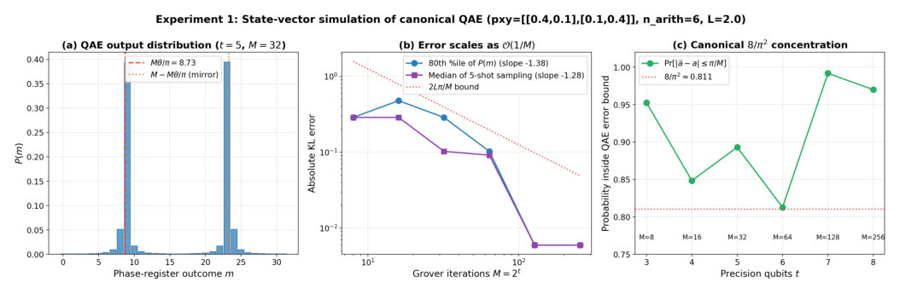
<figcaption class="paper-figure-caption"><b>Fig 1.</b> Fig. 1. Experiment 1: gate-level state-vector simulation of the QKLA circuit on the fixed target pxy = [[0.4, 0.1], [0.1, 0.4]], L = 2, narith = 6. (a) Phase-register output distribution at t = 5 (M = 2t = 32): two peaks at the canonical locations m⋆and M −m⋆, each carrying mass ≈0.395, sum ≈0.79 (above the 8/π2 ≈0.811 QAE guarantee only at worst-case phase alignment; here the phase is closer to that worst case so we land slightly below it). (b) 80th-percentile absolute KL error vs M, with the leading-order BHMT reference line 2Lπ/M (from |˜a −a| ≤π/M after rescaling by 2L). Log-log slope is −1.38 (least-squares fit), steeper than the −1 rate predicted by this leading-order bound; the 4Lπ/M...</figcaption>
</figure>
<figure class="paper-figure-card">
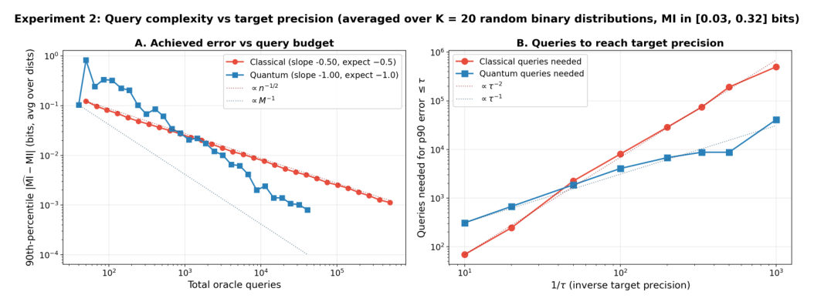
<figcaption class="paper-figure-caption"><b>Fig 2.</b> Fig. 2. Experiment 2: classical vs quantum query scaling, averaged across K = 20 random binary 2 × 2 joint distributions with MI in [0.03, 0.32] bits. (A) 90th-percentile error vs total oracle queries. Fitted slopes: classical −0.500 ± 0.004, quantum −1.001 ± 0.005. Dotted lines are the theoretical references ∝n−1/2 and ∝M−1. (B) Minimum queries needed for 90th-percentile error ≤τ, plotted against 1/τ. Classical tracks τ −2; quantum tracks τ −1. Crossover near 1/τ ≈40; at 1/τ = 200 the quantum algorithm needs 4.2× fewer queries.</figcaption>
</figure>
<figure class="paper-figure-card">
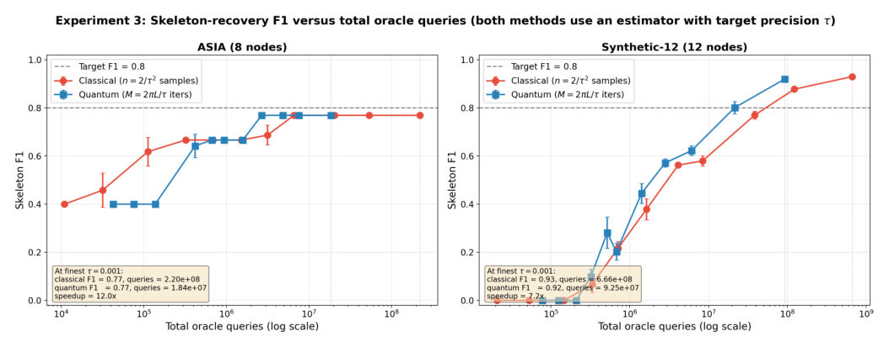
<figcaption class="paper-figure-caption"><b>Fig 3.</b> Fig. 3. Experiment 3: PC skeleton-recovery F1 versus total oracle queries on two benchmark networks. Classical PC uses the plug-in CMI estimator with n = ⌈2/τ 2⌉i.i.d. samples per test; quantum PC uses QCMIE with the empirically-sufficient M = ⌈2πL/τ⌉iterations per test (L = 3, nshots = 5), which is half the worst-case ⌈4πL/τ⌉of Theorem 6—justified by the measured slope −1.38 in Fig. 2(b). Error bars show ±1 s.d. over five trials. Dotted vertical lines mark the finest precision in the sweep (τ = 10−3); at that point, quantum needs 12.0× fewer queries on ASIA and 7.2× fewer on SYNTHETIC-12.</figcaption>
</figure>

**Main problem.** The computational bottleneck in constraint-based causal discovery is the high cost of conditional independence tests when high precision is required to detect weak dependencies.

**Main result.** The authors present QKLA, a quantum algorithm that achieves a quadratic speedup in precision, reducing query complexity from O(1/tau^2) to O(1/tau) and significantly reducing total queries for the PC algorithm.

**Method.** The QKLA algorithm uses Quantum Amplitude Estimation (QAE) to encode a clipped log-density ratio as a bounded amplitude, combined with Grover iterations and the inverse Quantum Fourier Transform.

**Summary.** This paper introduces QKLA, a quantum algorithm designed to accelerate causal discovery by efficiently estimating Kullback-Leibler divergence. By leveraging Quantum Amplitude Estimation, the algorithm achieves a quadratic speedup in precision compared to classical sampling methods. Simulations and benchmarks on networks like ASIA and SYNTHETIC-12 demonstrate that the quantum approach can use significantly fewer oracle queries to achieve the same structural accuracy. This is particularly impactful in high-precision regimes where detecting weak dependencies is critical.

Detailed structure

**Model / system.** The algorithm operates in a quantum oracle model involving a preparation oracle for joint distributions and a reversible arithmetic oracle for computing clipped log-density ratios.

**Key observables.** Kullback-Leibler (KL) divergence, Conditional Mutual Information (CMI), and F1 score for network skeleton recovery.

**Important parameters / regimes.** Target additive precision (tau), clip bound (L), failure probability (delta), and the high-precision regime where tau is small (10^-3 to 10^-2 bits).

**Assumptions / limitations.** The efficiency assumes efficient quantum oracles for distribution preparation and log-ratio computation; the use of a clip bound L introduces a small bias on extreme distributions.

**Figures summary.** Figure 1 shows the phase-register output distribution and error scaling on log-log plots; Figure 2 illustrates classical vs. quantum query scaling and identifies the crossover point for precision advantage.

**Paper structure.** The paper introduces the causal discovery problem, presents the QKLA and QCMIE algorithms, provides a theoretical complexity analysis, validates the theory via gate-level simulations, and benchmarks performance on standard causal networks.

Abstract

Causal discovery from observational data underpins applications in finance, climate modeling, and machine learning. Constraint-based causal discovery reduces structure learning to a sequence of conditional independence (CI) tests, where each test decides independence by estimating conditional mutual information $I(X;Y \mid Z)$ to additive precision $τ$ and thresholding against it. Classically this requires $Θ(1/τ^{2})$ samples per test, a cost that dominates in the high-precision regime typical of weak dependencies. We present QKLA (Quantum Kullback--Leibler Amplitude estimation), a quantum algorithm that encodes a clipped log-density ratio as a bounded amplitude and applies amplitude estimation to recover the KL divergence. Given coherent oracle access to the joint distribution, QKLA achieves a quadratic precision improvement, needing only $\mathcal{O}((L/τ)\log(1/δ))$ queries, where $L$ is the log-ratio clip bound. Embedded in the PC algorithm, this compounds to an $\widetildeΩ(1/(Lτ))$ reduction in total queries for the full causal discovery procedure. We validate the theory in three experiments. A gate-level state-vector simulation of the full QKLA circuit confirms the predicted $\mathcal{O}(1/M)$ error decay. Across $K=20$ random binary distributions, classical and quantum error scalings match theory to slope accuracy $\pm 0.005$. On two benchmark networks (\textsc{Asia}, 8 nodes; \textsc{Synthetic-12}, 12 nodes), quantum PC matches classical skeleton-recovery F1 while using $2.5$--$3.0\times$ fewer oracle queries at $τ= 5\cdot 10^{-3}$ bits and up to $12\times$ fewer at $τ= 10^{-3}$ bits.

[↑ back to top](#top)

### [Quantum Kernel Advantage over Classical Collapse in Medical Foundation Model Embeddings](http://arxiv.org/abs/2604.24597v1)

**Authors:** Sebastian Cajas Ordóñez, Felipe Ocampo Osorio, Dax Enshan Koh, Rafi Al Attrach, Aldo Marzullo, Ariel Guerra-Adames, J. Alejandro Andrade, Siong Thye Goh, Chi-Yu Chen, Rahul Gorijavolu, Xue Yang, Noah Dane Hebdon, Leo Anthony Celi  
**Type:** both · **Category:** quantum information and computing · **PDF:** <https://arxiv.org/pdf/2604.24597v1>  
**Analysis basis:** full PDF text, analyzed in chunks
**Topic relevance:** `entanglement & information structure` **2/5**

↔ Scroll figures horizontally

<figure class="paper-figure-card">
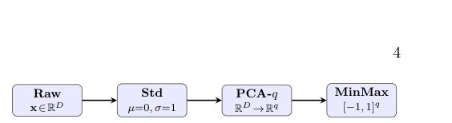
<figcaption class="paper-figure-caption"><b>Fig 1.</b> FIG. 1. Three-stage preprocessing pipeline applied to all embeddings. D ∈{448, 768} depending on the foundation model; q ∈{2, 3, 4, 5, 6, 8, 9, 10, 11, 12, 16} is the qubit/feature count.</figcaption>
</figure>
<figure class="paper-figure-card">
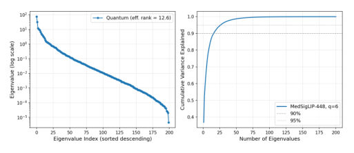
<figcaption class="paper-figure-caption"><b>Fig 2.</b> FIG. 2. Linear kernel KL eigenspectrum for MedSigLIP-448 at q = 6. The kernel has exactly 6 positive eigenvalues (effective rank 5.53) out of N = 1,896 training samples, which confirms that PCA-6 compression collapses the kernel matrix to a 6- dimensional subspace.</figcaption>
</figure>
<figure class="paper-figure-card">
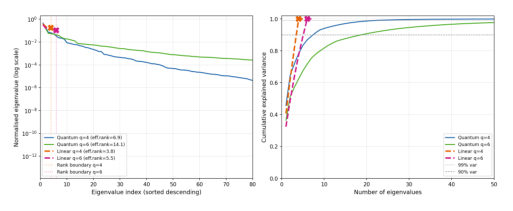
<figcaption class="paper-figure-caption"><b>Fig 3.</b> FIG. 3. Quantum vs. linear kernel eigenspectrum comparison for MedSigLIP-448 at q ∈{4, 6} (left: normalized eigenvalue decay; right: cumulative energy). The quantum kernel KQ has 1,133 (q=4) and 1,586 (q=6) eigenvalues exceeding numerical threshold ε=10−10; the theoretical upper bound for the fidelity kernel is 4q (256 and 4,096 for q = 4, 6), so the surplus above that bound consists of finite-precision numerical artefacts from statevector simulation. For comparison, the linear kernel has exactly 4 and 6 algebraically positive eigenvalues. The red vertical line marks the rank boundary of the linear kernel (Nλ&gt;0 = q), beyond which all linear kernel eigenvalues collapse to numerical zero; the...</figcaption>
</figure>
<figure class="paper-figure-card">
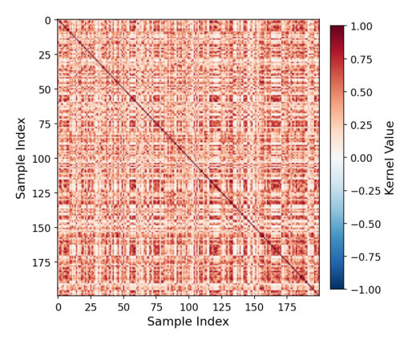
<figcaption class="paper-figure-caption"><b>Fig 4.</b> FIG. 4. Quantum kernel matrix KQ (trace-normalized) for MedSigLIP-448 at q = 6 (200 training samples sorted by class label). The off-diagonal block structure reflects class boundaries; the quantum feature map preserves discriminative signal in the same PCA subspace where the linear kernel collapses (Table VI).</figcaption>
</figure>
<figure class="paper-figure-card">
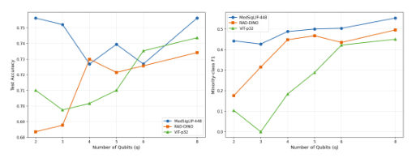
<figcaption class="paper-figure-caption"><b>Fig 5.</b> FIG. 5. Partial qubit sweep (q ∈{2, 3, 4, 5, 6, 8}, C = 1, DT9, seed 0): QSVM test accuracy (left) and minority-class F1 (right) for all three models. MedSigLIP-448 reaches F1 = 0.554 at q = 8; RAD-DINO and ViT-p32 improve monotonically across this range with ViT collapsing at q = 3 (F1 = 0). Full results at q ∈{9, 10, 11, 12, 16} are reported in Table II.</figcaption>
</figure>
<figure class="paper-figure-card">
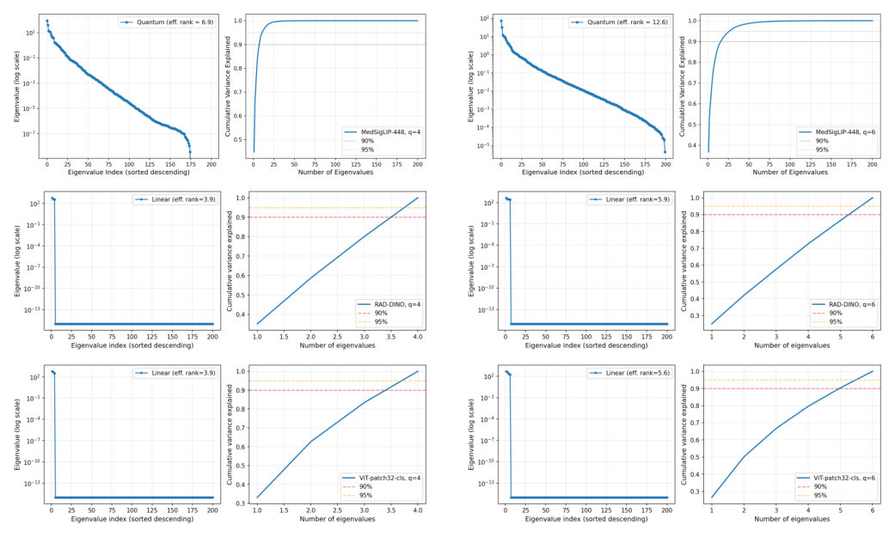
<figcaption class="paper-figure-caption"><b>Fig 6.</b> FIG. 6. Quantum kernel eigenvalue spectra for all three embedding models at q = 4 (left) and q = 6 (right). MedSigLIP-448 (top), RAD-DINO (middle), ViT-patch32-cls (bottom). The quantum kernel consistently exhibits higher effective rank than the linear kernel across all models and qubit counts.</figcaption>
</figure>
<figure class="paper-figure-card">
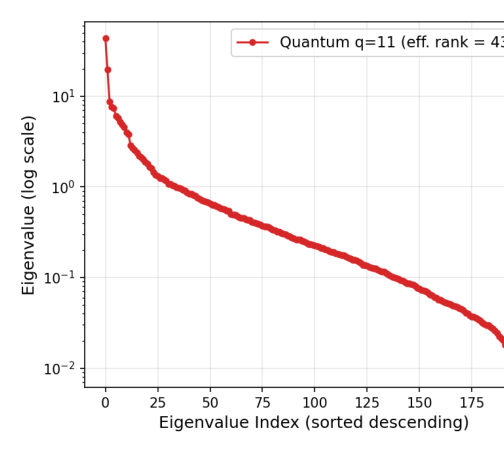
<figcaption class="paper-figure-caption"><b>Fig 7.</b> FIG. 7. Quantum kernel eigenspectrum for MedSigLIP-448 at the performance peak q = 11 (seed 0). Shannon effective rank = 43.04, a 6.3× increase from q = 4 (6.86); multi-seed mean is 69.80.</figcaption>
</figure>
<figure class="paper-figure-card">
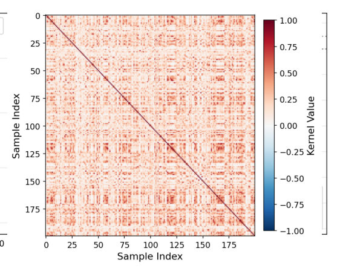
<figcaption class="paper-figure-caption"><b>Fig 8.</b> FIG. 8. Quantum kernel heatmap for MedSigLIP-448 at q = 11, seed 0 (200 training samples). Compare with q = 6 (Figure 9): the q = 11 kernel shows richer off-diagonal structure, consistent with its higher effective rank (43.04 vs. 13.94, seed 0).</figcaption>
</figure>
<figure class="paper-figure-card">
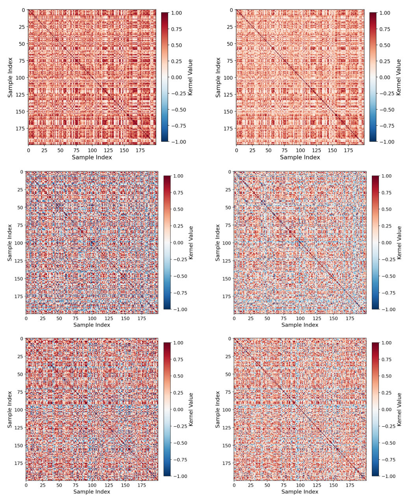
<figcaption class="paper-figure-caption"><b>Fig 9.</b> FIG. 9. Quantum kernel heatmaps for all three embedding models at q = 4 (left) and q = 6 (right). The block structure reflects class boundaries in the training data (sorted by label). Higher qubit counts show sharper off-diagonal structure, consistent with increased effective rank.</figcaption>
</figure>
<figure class="paper-figure-card">
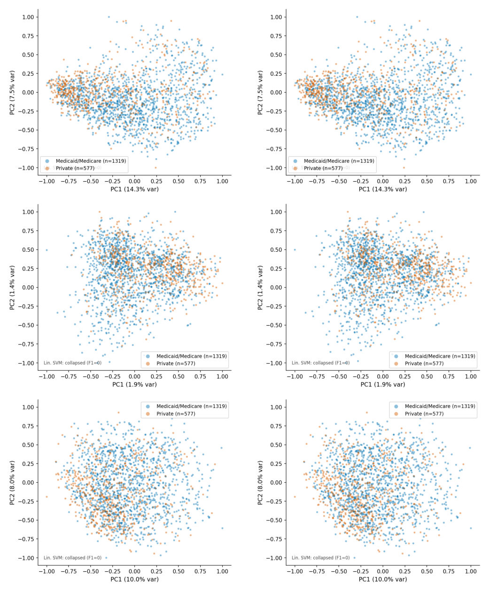
<figcaption class="paper-figure-caption"><b>Fig 10.</b> FIG. 10. PCA feature space (q = 4, left; q = 6, right) for all three models (MedSigLIP-448, RAD-DINO, ViT- patch32-cls, top to bottom). Each point is a training sample projected onto its first two PCA components after StandardScaler→PCA→MinMaxScaler preprocessing (seed 0). Blue: Medicaid/Medicare; orange: Private insurance. The two classes overlap substantially in every panel, which explains why the linear kernel KL—operating in this same q-dimensional subspace—collapses to majority-class prediction (F1 = 0). The label in the lower-left corner of each panel confirms classical SVM collapse at that configuration.</figcaption>
</figure>

**Main problem.** Investigating whether Quantum Support Vector Machines (QSVM) can overcome the 'classical kernel collapse' phenomenon, where classical kernels lose discriminative power when classifying high-dimensional medical image embeddings in low-dimensional PCA-reduced subspaces.

**Main result.** QSVM demonstrates a significant advantage over both untuned linear SVMs and hyperparameter-tuned RBF SVMs, maintaining non-trivial minority-class F1 scores while classical kernels collapse to majority-class predictions. This advantage is attributed to the quantum kernel's higher effective rank and superior spectral structure.

**Method.** A two-tier fair comparison framework using noiseless quantum simulations of QSVMs with 1-DOF angle encoding, compared against classical linear and RBF SVMs using PCA-reduced embeddings from medical foundation models.

**Summary.** This paper explores the potential for quantum machine learning to outperform classical methods in medical imaging tasks. By using quantum kernels, the researchers found they could avoid the 'collapse' of predictive power that occurs when classical models are applied to highly compressed feature spaces. The study demonstrates that quantum kernels maintain a much higher effective rank, allowing for better classification of minority classes in imbalanced datasets. The results suggest that the structural complexity of the quantum Hilbert space provides a genuine advantage for processing complex medical embeddings.

Detailed structure

**Model / system.** The study uses noiseless quantum simulations of quantum circuits (q qubits) processing high-dimensional embeddings from medical foundation models (MedSigLIP-448, RAD-DINO, and ViT-patch32) derived from MIMIC-CXR chest radiographs.

**Key observables.** Minority-class F1 score, Shannon effective rank of the kernel matrix, kernel eigenspectrum, and AUC-ROC.

**Important parameters / regimes.** Qubit count (q ranging from 2 to 16), regularization parameter (C), PCA dimensionality, and kernel normalization strategy (trace normalization).

**Assumptions / limitations.** The study assumes noiseless quantum simulation (no hardware noise) and uses insurance type prediction as a proxy for the discriminative power of the embeddings.

**Figures summary.** Figures illustrate the preprocessing pipeline, PCA projections showing class overlap, and comparative plots of effective rank and F1 scores across different qubit counts and models.

**Paper structure.** The paper introduces the problem of classical kernel collapse, describes the medical imaging dataset and foundation models used, details the quantum and classical SVM methodologies, presents a comparative analysis across two tiers of complexity, provides a structural analysis of kernel rank and eigenspectra, and concludes with ablation studies on circuit design and architecture.

Abstract

We provide evidence of quantum kernel advantage under noiseless simulation in binary insurance classification on MIMIC-CXR chest radiographs using quantum support vector machines (QSVM) with frozen embeddings from three medical foundation models (MedSigLIP-448, RAD-DINO, ViT-patch32). We propose a two-tier fair comparison framework in which both classifiers receive identical PCA-q features. At Tier 1 (untuned QSVM vs. untuned linear SVM, C = 1 both sides), QSVM wins minority-class F1 in all 18 tested configurations (17 at p < 0.001, 1 at p < 0.01). The classical linear kernel collapses to majority-class prediction on 90-100% of seeds at every qubit count, while QSVM maintains non-trivial recall. At q = 11 (MedSigLIP-448 plateau center), QSVM achieves mean F1 = 0.343 vs. classical F1 = 0.050 (F1 gain = +0.293, p < 0.001) without hyperparameter tuning. Under Tier 2 (untuned QSVM vs. C-tuned RBF SVM), QSVM wins all seven tested configurations (mean gain +0.068, max +0.112). Eigenspectrum analysis reveals quantum kernel effective rank reaches 69.80 at q = 11, far exceeding linear kernel rank, while classical collapse remains C-invariant. A full qubit sweep reveals architecture-dependent concentration onset across models. Code: https://github.com/sebasmos/qml-medimage

[↑ back to top](#top)

### [Qutrit Clifford+T gates by two-body angular momentum couplings, rotations and one-axis-twistings](http://arxiv.org/abs/2604.23007v1)

**Authors:** F. E. S. Steinhoff  
**Type:** theory · **Category:** quantum information and computing · **PDF:** <https://arxiv.org/pdf/2604.23007v1>  
**Analysis basis:** full PDF text, analyzed in chunks
**Topic relevance:** `Tavis-Cummings & cavity-many-emitter` **2/5**

↔ Scroll figures horizontally

<figure class="paper-figure-card">
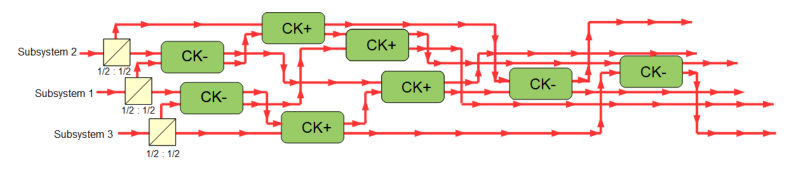
<figcaption class="paper-figure-caption"><b>Fig 1.</b> Figure 1.1: Interferometric diagram for the preparation of a qutrit angular momentum graph state |JGHZ⟩. The input state in each subsystem is the two-photon state |2, 0⟩.</figcaption>
</figure>

**Main problem.** Developing a physical implementation and representation for the qutrit (d=3) Clifford+T gate set using low-order angular momentum couplings and bosonic modes.

**Main result.** The full qutrit Clifford+T set can be realized using only two-body angular momentum couplings, rotations, and one-axis-twisting operations, with an improved bosonic mode requirement of only two modes per subsystem.

**Method.** The authors use an angular momentum representation (j=1) and the Jordan-Schwinger map to translate gates into bosonic mode operations, decomposing gates into sequences of rotations, one-axis-twisting, and Kerr nonlinearities.

**Summary.** This paper presents a theoretical framework for implementing the complete Clifford+T gate set for qutrits. It shows that these gates can be constructed using only two-body angular momentum couplings, rotations, and one-axis-twisting. The authors also provide an efficient mapping to bosonic systems, reducing the required number of modes per subsystem. Finally, the work demonstrates how these gates can be used to deterministically prepare complex entangled and graph states.

Detailed structure

**Model / system.** The study considers spin-1 (j=1) angular momentum systems and two-mode bosonic systems (e.g., optical interferometers, BECs, or circuit QED) utilizing self-Kerr and cross-Kerr interactions.

**Important parameters / regimes.** The magic angle alpha = tan^-1(sqrt(2)) for the Theta_z operator, and the edge weights phi_e for angular momentum graph states.

**Assumptions / limitations.** The analysis assumes an idealized, lossless scenario and uses h-bar = 1 for simplicity.

**Figures summary.** An interferometric diagram illustrating the preparation of a qutrit angular momentum graph state using two-photon states as input.

**Paper structure.** The paper introduces an angular momentum representation for qutrit gates, demonstrates the decomposition of the Clifford+T set into rotations and one-axis-twisting, maps these to bosonic modes via the Jordan-Schwinger map, and concludes with applications to entanglement and graph state preparation.

**Why it may be interesting.** This work provides a practical blueprint for scaling quantum computing from qubits to qutrits using standard nonlinear interactions like Kerr nonlinearities, which is highly relevant for quantum optics and circuit QED.

Abstract

We develop an angular momentum representation and implementation of the Clifford+T set of unitaries for qutrits. We show that local gates from this set can be realized by the sole use of suitable rotations and one-axis-twisting operations, which are at most quadratic in the angular momentum operators and thus can be experimentally realized in many quantum systems. Controlled rotations are shown to only require linear angular momentum couplings and, as a consequence, the full qutrit Clifford+T set is shown to be expressed solely in terms of two-body angular momentum couplings, rotations and one-axis-twisting operations. By employing the Jordan-Schwinger map, we show an analogous implementation in terms of bosonic modes, improving on the number of modes with regard to a previous scheme. Moreover, we employ the cross-Kerr interaction in order to obtain any qutrit Clifford+T gate for bosonic modes. We illustrate our findings with simple schemes for preparing entangled states of interest.

[↑ back to top](#top)

### [Representability for Quantum Theory beyond Particle-Number Conservation](http://arxiv.org/abs/2604.23869v1)

**Authors:** David A. Mazziotti  
**Type:** theory · **Category:** numerical methods · **PDF:** <https://arxiv.org/pdf/2604.23869v1>  
**Analysis basis:** full PDF text, analyzed in chunks
**Topic relevance:** `Keldysh / 2PI / non-Gaussian methods` **2/5**

↔ Scroll figures horizontally

<figure class="paper-figure-card">
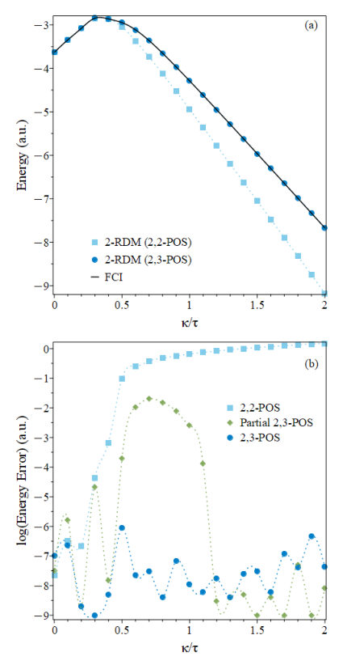
<figcaption class="paper-figure-caption"><b>Fig 1.</b> FIG. 1. (a) Ground-state energy and (b) base-10 energy error relative to FCI of the six-orbital pairing ring Hamiltonian from V2RDM with (2,2)-positivity, partial (2,3)-positivity, and full (2,3)-positivity.</figcaption>
</figure>
<figure class="paper-figure-card">

<figcaption class="paper-figure-caption"><b>Fig 2.</b> FIG. 2. Particle-number variance of the ground state of the pairing ring Hamiltonian from V2RDM with (2,2)-positivity, partial (2,3)-positivity, and full (2,3)-positivity, compared with FCI.</figcaption>
</figure>
<figure class="paper-figure-card">
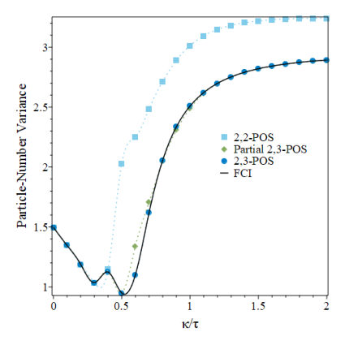
<figcaption class="paper-figure-caption"><b>Fig 3.</b> Figure 2 shows the particle-number variance as a func- tion of κ/τ from V2RDM with (2, 2)-positivity, par- tial (2, 3)-positivity, and full (2, 3)-positivity, along with FCI. The nonzero variance demonstrates that the ground state of the ring Hamiltonian is number non-conserving. The variance from (2, 2)-positivity becomes too large for κ/τ ≳0.5, while the variance from full (2, 3)-positivity is indistinguishable from FCI for all κ/τ. As in the en- ergy comparison, the partial (2, 3)-positivity results fol- low FCI near equilibrium but depart from the exact re- sults for κ/τ ≈0.5–1.2. We next consider the dissociation of linear H4 with all adjacent H–H bonds stretched equally. Figure 3(a)</figcaption>
</figure>
<figure class="paper-figure-card">
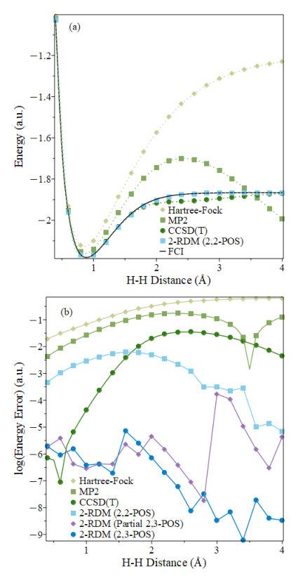
<figcaption class="paper-figure-caption"><b>Fig 4.</b> FIG. 3. (a) Potential energy curve and (b) base-10 energy error relative to FCI for the symmetric dissociation of linear H4 from Hartree–Fock, MP2, CCSD(T), and V2RDM with (2,2)- as well as partial and full (2,3)-positivity.</figcaption>
</figure>

**Main problem.** The N-representability problem for quantum systems where particle number is not conserved, specifically determining when a 2-RDM corresponds to a physical state in Fock space.

**Main result.** The development of a systematic hierarchy of (2, p)-positivity conditions that provides a unified framework for both particle-number-conserving and non-conserving systems, with (2, 3)-positivity showing extremely high accuracy.

**Method.** Variational 2-RDM (V2RDM) method using Semidefinite Programming (SDP) and a dual-cone approach to characterize the intersection of the positive cone with the two-body operator space.

**Summary.** This paper solves the 2-RDM representability problem for quantum systems where particle number is not conserved. By using a polar cone approach, the authors derive a hierarchy of constraints that work for both fixed and fluctuating particle numbers. The (2, 3)-positivity conditions are shown to be highly accurate, even in complex cases like the H4 molecule. This provides a powerful tool for simulating many-body physics without needing the full wave function.

Detailed structure

**Model / system.** The study utilizes a fermionic ring Hamiltonian (a generalization of the BCS Hamiltonian) and the linear H4 molecule to demonstrate the method's applicability to both non-conserving and conserving regimes.

**Key observables.** Ground-state energy, energy error relative to Full Configuration Interaction (FCI), and particle-number variance.

**Important parameters / regimes.** The interaction parameter kappa/tau in the ring model and the particle-number variance constraint.

**Assumptions / limitations.** The general N-representability problem is QMA-complete, implying that the full solution has exponential worst-case scaling; the method relies on the (2, p)-positivity hierarchy approximation.

**Figures summary.** Figure 1 compares ground-state energies and logarithmic errors for various positivity levels in the ring model; Figure 2 shows particle-number variance; Figure 3 shows potential energy curves and energy errors for the H4 molecule dissociation.

**Paper structure.** The paper introduces the representability problem for non-conserving systems, presents the mathematical derivation of the (2, p)-positivity hierarchy via the polar cone, demonstrates the unified framework using a fermionic ring model, and validates the accuracy using the H4 molecular dissociation.

**Why it may be interesting.** It provides a new computational framework for studying many-body systems where particle number fluctuates, such as superconducting or superfluid systems, using reduced density matrix methods.

Abstract

Representability determines when a two-particle reduced density matrix (2-RDM) corresponds to a physical quantum state, enabling many-particle quantum calculations with 2-RDMs rather than the wave function. In this Letter, we present a solution of the representability problem for quantum systems without particle-number conservation. The physically allowed set of 2-RDMs can be characterized from a geometrically `orthogonal' set, the polar cone. We derive explicit linear equations for the two-body operators in the polar cone -- the intersection of the $p$-positive cone with the two-body operator space -- to obtain a systematic hierarchy of representability conditions that do not depend on higher RDMs or the wave function. Moreover, by augmenting these conditions with the particle-number variance, we obtain a unified framework for treating both particle-number-conserving and nonconserving systems. We illustrate with a spin system and molecular H$_4$.

[↑ back to top](#top)

### [Squeezed state degradations due to mode mismatch and thermal aberrations in gravitational wave detectors](http://arxiv.org/abs/2604.23835v1)

**Authors:** Kevin Kuns, Daniel Brown  
**Type:** theory · **Category:** other · **PDF:** <https://arxiv.org/pdf/2604.23835v1>  
**Analysis basis:** full PDF text, analyzed in chunks
**Topic relevance:** `interference shaping light` **2/5**

↔ Scroll figures horizontally

<figure class="paper-figure-card">
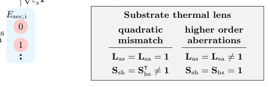
<figcaption class="paper-figure-caption"><b>Fig 1.</b> Figure 1. Coupled cavity equivalent to the differential arm motion of a gravitational wave detector. The ellipses and circles represent (potentially squeezed) quantum vacuum of the electromagnetic field at several locations. The 0 modes represent the fundamental vacuum and the 1 and subsequent modes represent the HOM vacuum. Several nodes of the system are marked with the µi labels. The squeezed states are injected at the node µas,i after being reflected off of the filter cavity (not shown but included in the analysis). The signal is detected at the node µas,r after passing through the output mode cleaner which ensures that only the fundamental mode is measured. The power absorbed in the...</figcaption>
</figure>
<figure class="paper-figure-card">
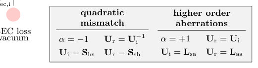
<figcaption class="paper-figure-caption"><b>Fig 2.</b> Figure 2. Coupled cavity signal flow diagram for the model of the fundamental and a single HOM described in Section II B. This system can be thought of as two separate coupled cavities which are coupled by the mismatch between the SEC and arm cavity at the ITM. As explained by Eq. (24), the HOM SEC is AC coupled with the fundamental SEC through higher order aberrations while being DC coupled through quadratic mismatch. The vacuum and important nodes from Fig. 1 are reproduced here with the superscripts 0 and 1 to indicate the fundamental and HOM, respectively. Rather than drawing the arm cavities in full, the fundamental arm cavity ra0(Ω) is given by Eq. (4) with δωa = 0 and the HOM arm...</figcaption>
</figure>
<figure class="paper-figure-card">
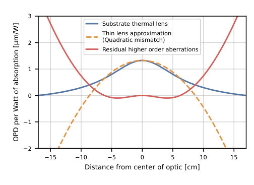
<figcaption class="paper-figure-caption"><b>Fig 3.</b> Figure 3. Optical path length differences resulting from the propagation through the substrate of a LIGO-like test mass due to thermal aberrations generated by the uniform absorption of a 4σ = 10.6 cm diameter beam. Computed using the ax- isymmetric Hello-Vinet [14] model. The equivalent quadratic thin lens is shown along with the residual OPD relative to this lens. We refer to the aberrations generated by these dis- tortions as quadratic mismatch and higher order aberrations (HOA), respectively. We parameterize the HOA mismatch by the equivalent OPD relative to the perfect compensation of an optic which may have of order one watt absorbed in the coatings. This parameterization thus allows...</figcaption>
</figure>
<figure class="paper-figure-card">
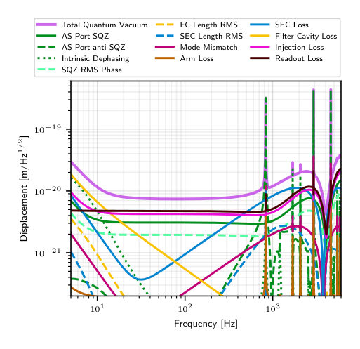
<figcaption class="paper-figure-caption"><b>Fig 4.</b> Figure 4. Quantum noise budget for Cosmic Explorer with ∆w/w = 5 % and Prel = 100 mW using the parameters of Table II. Note that this is a displacement, rather than strain, budget. The peaks in the noise above 800 Hz are due to higher order mode resonances in the arm cavities which both rotate the squeezed state and induce up to 520 mrad of intrinsic phase noise; see Section IV B.</figcaption>
</figure>
<figure class="paper-figure-card">

<figcaption class="paper-figure-caption"><b>Fig 5.</b> Figure 4 shows a budget of the quantum noises in Cos- mic Explorer using the baseline parameters of Table II. We will describe the squeezing degradations by the Mc- Culler squeezing metrics [12]. The details of using these four metrics to make noise budgets such as Fig. 4 are given in Appendix A. We first give a brief overview of these metrics and how mode mismatch contributes to them before delving into the details of how they quantify the effects of several sources of squeezing degradations in the following sections. Note that while we focus on mode mis- match, the HOMs responsible for misalignment produce squeezing degradations just as the HOMs responsible for mode mismatch do, and so...</figcaption>
</figure>
<figure class="paper-figure-card">
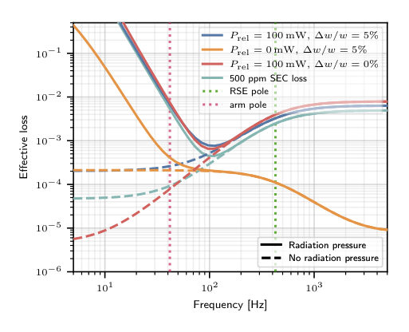
<figcaption class="paper-figure-caption"><b>Fig 6.</b> Figure 5. Direct mode mismatch loss for ∆w/w = 5 % and Prel = 100 mW along with both types of aberrations separately for LIGO A♯using the parameters of Table II. The dashed lines do not include radiation pressure and correspond to the discussion in Section IV A 1 while the solid lines include radiation pressure as discussed in Section IV A 2. The low-pass nature of quadratic mismatch and high-pass nature of higher order aberrations is evident, along with the fact that higher order modes can interfere destructively to produce less loss. 500 ppm of SEC loss is also shown for comparison.</figcaption>
</figure>
<figure class="paper-figure-card">
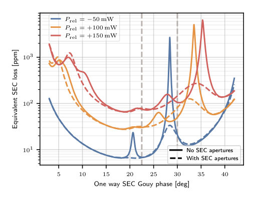
<figcaption class="paper-figure-caption"><b>Fig 7.</b> Figure 6. Mode mismatch loss for Cosmic Explorer varying Prel while keeping ∆w/w = 5 % as a function of SEC Gouy phase. The vertical dashed lines mark the 8th order resonance at 22.5◦and the 6th order resonance at 30◦in the absence of thermal aberrations and apertures. The Gouy phase is the one-way Gouy phase as computed from the round-trip ABCD matrix of the SEC; see Appendix B. Recall Fig. 3 and the fact that Prel can be negative in our parameterization.</figcaption>
</figure>
<figure class="paper-figure-card">
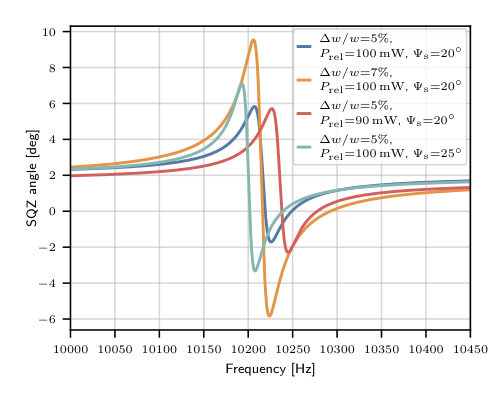
<figcaption class="paper-figure-caption"><b>Fig 8.</b> Figure 7. Squeezed state rotation around the first HOM arm cavity resonance in A♯with a SEM transmissivity of Ts = 20 % for slightly different thermal states. This exact behavior is well accounted for by Eq. (53). The RSE pole in this case is 750 Hz and the SR pole is 2 Hz. Fits to these curves give widths of between 6 and 10 Hz showing that the dynamics are characteristic of those of a signal recycled interferometer for the fundamental mode. Measuring this rotation with an audio diagnostic field [51] may prove useful in characterizing the detectors and optimizing their configurations as discussed in Section IV B 3.</figcaption>
</figure>
<figure class="paper-figure-card">
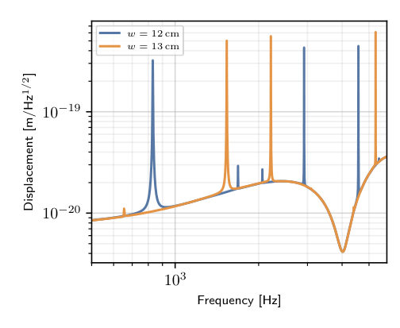
<figcaption class="paper-figure-caption"><b>Fig 9.</b> Figure 8. Higher order mode resonances in CE for two different arm cavity geometries with 70 cm ∅arm cavity apertures. Only second order mode resonances are significant after the addition of apertures. The free spectral range is 3750 Hz and the transverse mode spacing is 1460 Hz for the w = 12 cm case and 1110 Hz for the w = 13 cm case. In both cases, the first peak is due to the second order resonance in the first FSR, the second peak is due to the same resonance in the zeroth FSR, and the third peak is due to the resonance in the second FSR.</figcaption>
</figure>
<figure class="paper-figure-card">
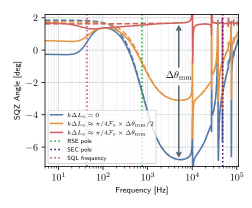
<figcaption class="paper-figure-caption"><b>Fig 10.</b> Figure 9. Broadband rotation of the squeezed state. The peaks are due to the HOM arm cavity resonances discussed in Sec- tion IV B superimposed on the broadband rotation described by Eq. (59). The dashed lines do not include radiation pressure and thus only illustrate the purely optical rotation described by Eq. (59). The solid lines include radiation pressure and thus also include the rotation due to the shifted SQL frequency. The rotation cannot be completely flattened between the SQL and RSE pole by introducing a length detuning ∆Ls because, independent of any mismatch or length detuning, two filter cavities are required to perfectly compensate the rotation due to the ponderomotive...</figcaption>
</figure>

**Main problem.** Identifying and quantifying how squeezed state degradation in gravitational wave detectors is caused by internal mode mismatch, specifically due to thermal aberrations like quadratic wavefront mismatch and higher-order aberrations.

**Main result.** The study identifies that quadratic mismatch exhibits low-pass frequency dependence while higher-order thermal aberrations exhibit high-pass behavior, and demonstrates that the total squeezing degradation is highly sensitive to the full optical path difference profile.

**Method.** The authors use a combination of analytical models (using ABCD matrices and operator graphs) and numerical simulations (using the Finesse package) to model the coupling between fundamental and higher-order modes.

**Summary.** This paper investigates how thermal aberrations in gravitational wave detectors degrade the effectiveness of squeezed light used to reduce quantum noise. It distinguishes between quadratic wavefront mismatch and higher-order aberrations, showing they have different frequency-dependent impacts (low-pass vs. high-pass). The research provides a framework for characterizing current detectors and designing future, more powerful detectors like Cosmic Explorer. Ultimately, it helps identify the specific thermal effects that must be mitigated to reach the next generation of astrophysical sensitivity.

Detailed structure

**Model / system.** A coupled cavity system representing a dual-recycled Fabry-Perot Michelson interferometer, including arm cavities, a signal extraction cavity (SEC), and external cavities for frequency-dependent squeezing.

**Key observables.** Squeezing degradation (in dB), frequency-dependent quantum noise reduction, and mode-mismatch-induced coupling.

**Important parameters / regimes.** Arm and SEC finesse, Gouy phase, power scattered into higher-order modes (Upsilon), and thermal aberration types (quadratic vs. higher-order).

**Assumptions / limitations.** The analysis assumes a geometrically stable cavity, neglects external mode mismatch, and uses a simplified thin-lens approximation for thermal lensing.

**Figures summary.** Figure 1 shows a schematic of the coupled cavity system and an operator graph; Figure 2 is a signal flow diagram; Figure 3 illustrates the optical path difference due to absorption; Figure 10 presents a detailed quantum noise budget.

**Paper structure.** The paper identifies the problem of squeezing degradation, establishes a mathematical framework for coupled cavity dynamics, decomposes thermal aberrations into two distinct types, analyzes their frequency-dependent dynamics, and concludes with a comprehensive noise budget and simulation for future detectors.

**Why it may be interesting.** This paper is highly relevant to quantum optics and open quantum systems researchers interested in how spatial mode mismatch and environmental-induced aberrations (thermal lensing) degrade the purity and utility of squeezed vacuum states in complex interferometric setups.

Abstract

To date, frequency-dependent squeezed light has been used to reduce quantum noise in interferometric gravitational wave detectors by 6.1 dB (a factor of two). Future upgrades and detectors aim to both reduce quantum noise by 10 dB (a factor of three) and to increase the circulating power in the interferometer arm cavities. Achieving these goals will be extremely challenging due, in part, to the degradations to the squeezed state caused by mode mismatch between the internal interferometer optical cavities and between the auxiliary external cavities. It is therefore imperative to gain a detailed understanding of all sources of mismatch and to obtain experience in mitigating their effects in the current detectors in order to improve astrophysical sensitivity now and in the future. Two types of internal mismatch are identified which are due to the thermal aberrations generated when the test mass optics absorb a small fraction of the circulating arm power. It is found that the dynamics responsible for the degradations caused by the mismatch between the quadratic part of the wavefront of two modes has a characteristic low-pass frequency dependence while the dynamics of the mismatch due to all higher order thermal aberrations has a high-pass behavior. As a consequence, the two types of mismatch are predominantly responsible for different squeezing degradations -- some of which are significant for the current detectors and some of which will only be important for future detectors with longer arms. The behavior of these two types of internal mismatch are described and the implications for detector design, operation, and characterization are discussed.

[↑ back to top](#top)

### [Thermodynamic Parametrisation of the Vertebrate Lifetime Cycle Invariant: Biological Proper Time, Allometric Mass-Cancellation, and Clade-Specific Predictions](http://arxiv.org/abs/2604.24458v1)

**Authors:** Mesfin Taye  
**Type:** theory · **Category:** statistical mechanics · **PDF:** <https://arxiv.org/pdf/2604.24458v1>  
**Analysis basis:** full PDF text, analyzed in chunks
**Topic relevance:** `non-equilibrium dynamics` **2/5**

↔ Scroll figures horizontally

<figure class="paper-figure-card">
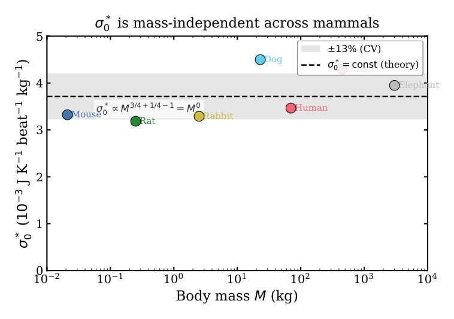
<figcaption class="paper-figure-caption"><b>Fig 1.</b> Figure 1: The mass-specific entropy cost per beat σ∗ 0 is mass-independent across mammals. σ∗ 0 ≡ P/(TfHM) plotted against body mass M for seven mammalian species spanning four orders of magnitude. Dashed line: PBTE prediction σ∗ 0 = const; grey band: ±16% coefficient of variation. The annotation confirms exact exponent cancellation σ∗ 0 ∝M 3/4+1/4−1 = M 0. All plotted values are computed from allometric scaling laws (P = 3.4 M 0.75, f = 241 M −0.25, T = 310 K) and are not independent calorimetric measurements.</figcaption>
</figure>
<figure class="paper-figure-card">
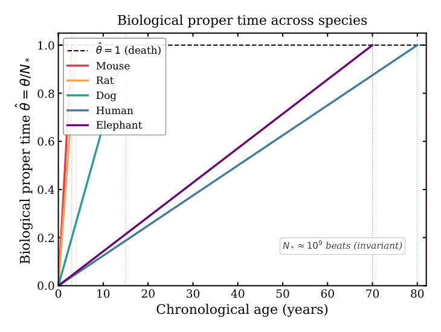
<figcaption class="paper-figure-caption"><b>Fig 2.</b> Figure 2: Biological proper time ˆθ(t) = θ(t)/N⋆is species-universal. Normalised biological proper time as a function of chronological age for five mammalian species. Species parameters: mouse (fH = 8.33 Hz, L = 3 yr), rat (fH = 5.67 Hz, L = 4 yr), dog (fH = 1.83 Hz, L = 15 yr), human (fH = 1.17 Hz, L = 80 yr), elephant (fH = 0.42 Hz, L = 70 yr); all using N⋆= 1.52 × 109. Each trajectory terminates at ˆθ = 1 (dashed line) at the species’ natural lifespan. The species-universality of the endpoint is the PBTE invariant.</figcaption>
</figure>
<figure class="paper-figure-card">
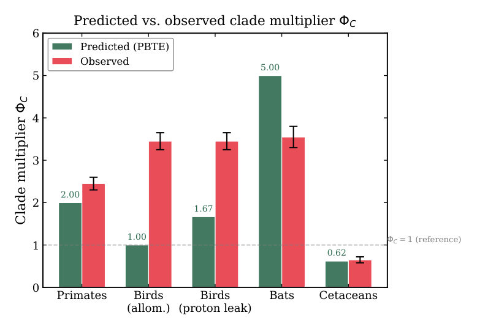
<figcaption class="paper-figure-caption"><b>Fig 3.</b> Figure 3: Predicted vs. observed clade multipliers ΦC. Grouped bar chart comparing PBTE-predicted (green) and empirically observed (red, ±95% CI) values of ΦC for primates, birds, bats, and cetaceans. Both Φduty and Φthermal are adverse for birds; their biochemical efficiency factor overcomes both.</figcaption>
</figure>
<figure class="paper-figure-card">
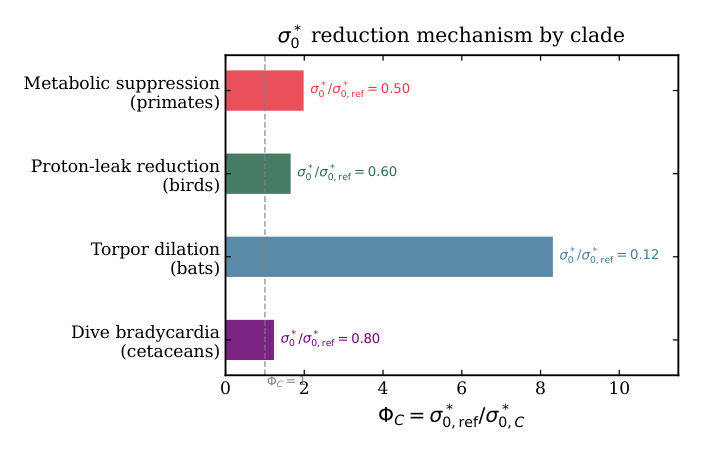
<figcaption class="paper-figure-caption"><b>Fig 4.</b> Figure 4: Physiological mechanism of σ∗ 0 reduction by clade. Horizontal bar chart of ΦC = σ∗ 0ref/σ∗ 0C annotated with the fractional entropy-cost reduction. Torpor time-dilation in bats produces the largest ΦC.</figcaption>
</figure>
<figure class="paper-figure-card">
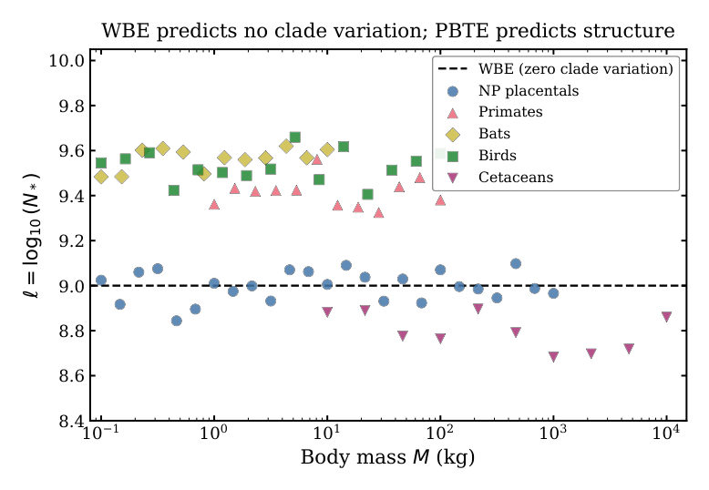
<figcaption class="paper-figure-caption"><b>Fig 5.</b> Figure 5: N⋆vs. body mass for five endotherm clades. ℓ= log10(N⋆) plotted against body mass for 150 species. Dashed line: WBE null prediction of zero inter-clade variation. PBTE predicts flat within-clade profiles displaced vertically between clades by ∆ℓ= log10(ΦC). The inter-clade offsets are the characteristic PBTE signature that WBE cannot produce.</figcaption>
</figure>
<figure class="paper-figure-card">
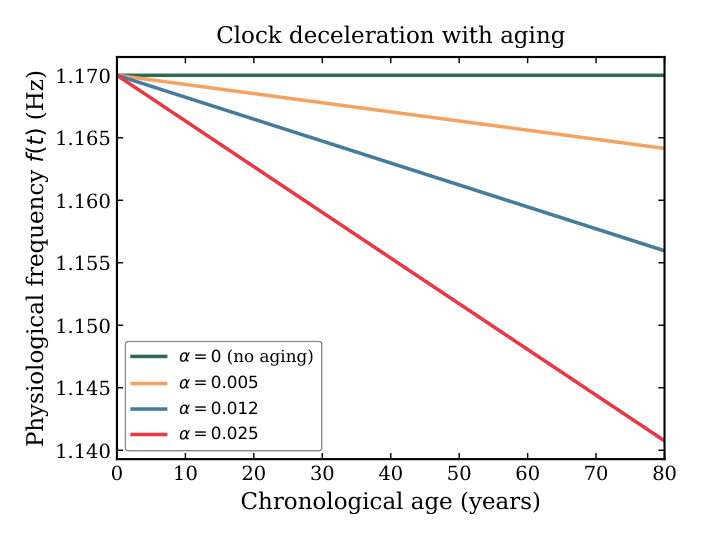
<figcaption class="paper-figure-caption"><b>Fig 6.</b> Figure 6: Physiological clock deceleration with aging. Resting frequency f(t) = f0 exp(−αγt) for f0 = 1.17 Hz, γ = 0.01 yr−1, and α ∈{0, 0.005, 0.012, 0.025}. The value α ≈0.012 reproduces the empirically observed decline of approximately 1 bpm per decade in adult resting heart rate. The clock slows but the lifespan extends proportionally, maintaining the PBTE invariant.</figcaption>
</figure>
<figure class="paper-figure-card">
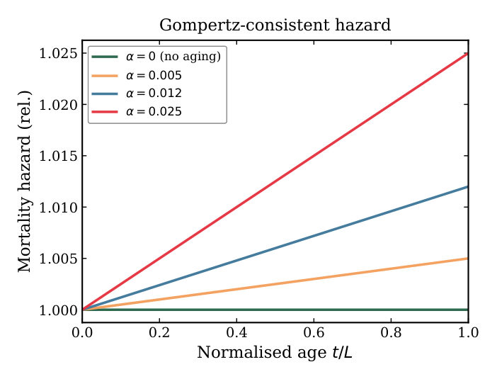
<figcaption class="paper-figure-caption"><b>Fig 7.</b> Figure 7: Gompertz-consistent mortality hazard from PBTE clock deceleration. Relative mor- tality hazard versus normalised age t/L for the same four α values as Figure 6. The hazard increases monotonically with age for α &gt; 0, reproducing the Gompertz exponential form with rate β = αγL. The Gompertz exponent is a thermodynamic consequence of the damage-accumulation model, not a free fit pa- rameter.</figcaption>
</figure>
<figure class="paper-figure-card">
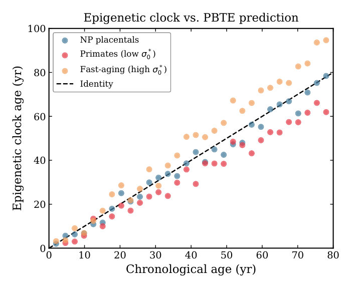
<figcaption class="paper-figure-caption"><b>Fig 8.</b> Figure 8: Epigenetic clock age vs. PBTE prediction (schematic). These data are simulated to illustrate the prediction; real cross-species methylation data are required to test it. Epigenetic clock age versus chronological age for three cohorts: non-primate placentals (slope ≈1); primates with σ∗ 0pri = 0.50 σ∗ 0ref (slope ≈0.80, biological age lags chronological); fast-aging cohort with elevated σ∗ 0 (slope ≈1.18). PBTE predicts the epigenetic slope scales as σ∗ 0/σ∗ 0ref.</figcaption>
</figure>

**Main problem.** Explaining the thermodynamic origin of the vertebrate lifetime cycle invariant (N* approx 10^9) and providing a universal metric for biological aging across diverse species.

**Main result.** The paper proposes the Principle of Biological Time Equivalence (PBTE), demonstrating that the lifetime cycle count is a conserved thermodynamic entropy budget that remains invariant across non-primate mammals due to allometric mass-cancellation.

**Method.** The author uses non-equilibrium thermodynamics, allometric scaling laws (Kleiber and Calder), and statistical analysis (ANOVA, phylogenetic independent contrasts) to link metabolic rates to entropy production.

**Summary.** This paper proposes a thermodynamic framework to explain why different vertebrate species accumulate a remarkably similar number of heartbeats over their lifetimes. By treating organisms as dissipative systems, the author shows that mass-dependent scaling laws cancel out to maintain a nearly constant entropy budget. The model successfully accounts for why certain groups, like primates or bats, deviate from this baseline due to specific physiological adaptations like neural investment or torpor. Ultimately, it introduces 'biological proper time' as a universal metric for aging.

Detailed structure

**Model / system.** The system consists of endothermic vertebrates viewed as open dissipative systems in a non-equilibrium steady state. The model introduces 'Biological Proper Time' as an intrinsic coordinate defined by the integral of cardiac frequency.

**Key observables.** Lifetime cycle count (N*), biological proper time (theta), entropy production rate (sigma_dot), and clade-specific multipliers (Phi_C).

**Important parameters / regimes.** Entropy cost per cardiac cycle (sigma_0), neural metabolic fraction (phi), duty-cycle factor (Phi_duty), and thermal multiplier (Phi_thermal).

**Assumptions / limitations.** The framework assumes a conserved lifetime entropy budget and that entropy production rate is proportional to physiological frequency (cardiac rate).

**Figures summary.** Figure 2 shows normalized biological proper time trajectories for various mammals; Figure 5 (implied) relates to the expansion/compression of biological time.

**Paper structure.** The paper moves from defining the biological proper time and the PBTE principle, to proving mass-independence via allometric scaling, then to explaining clade-specific deviations (primates, bats, birds) through physiological multipliers, and finally to discussing the implications for aging biomarkers.

Abstract

Warm-blooded vertebrates accumulate approximately $\Nstar \approx 10^9$ cardiac cycles over a natural lifetime, a striking empirical regularity first quantified by Lindstedt and Calder yet lacking a physical interpretation. We propose that this invariance is consistent with a conserved thermodynamic budget, formulated here as the Principle of Biological Time Equivalence (PBTE). The framework rests on a constitutive closure $\dotΣ = σ_0 f$, which links the entropy production rate to the intrinsic physiological frequency; integration over the lifespan yields $Σ_{\mathrm{life}} = σ_0 \Nstar$, so that the observed constancy of $\Nstar$ corresponds to an approximately constant lifetime entropy budget. Algebraic exponent cancellation under Kleiber and Calder scaling laws, $\sigstar \propto M^{3/4+1/4-1}=M^0$, is consistent with mass-independence and reproduces the numerical value $N_0 \approx 1.52\times10^9$ without free parameters. The framework offers a thermodynamically consistent account of two outstanding problems: the origin of the numerical value of $\Nstar$ and the systematic deviations observed across clades. A multiplicative correction factor $Φ_C$, constructed from physiological determinants -- activity allocation, body temperature, mitochondrial efficiency, and extrinsic hazard -- predicts long-lived clades as regimes of reduced effective entropy production per cardiac cycle.

[↑ back to top](#top)

### [Third Quantization for Order Parameters (II): Local Field Quantization in Superconducting Quantum Circuits](http://arxiv.org/abs/2604.24092v1)

**Authors:** Miao-Miao Yi, Guo-Jian Qiao, Xin Yue, C. P. Sun  
**Type:** theory · **Category:** quantum information and computing · **PDF:** <https://arxiv.org/pdf/2604.24092v1>  
**Analysis basis:** full PDF text, analyzed in chunks
**Topic relevance:** `Keldysh / 2PI / non-Gaussian methods` **2/5**

↔ Scroll figures horizontally

<figure class="paper-figure-card">
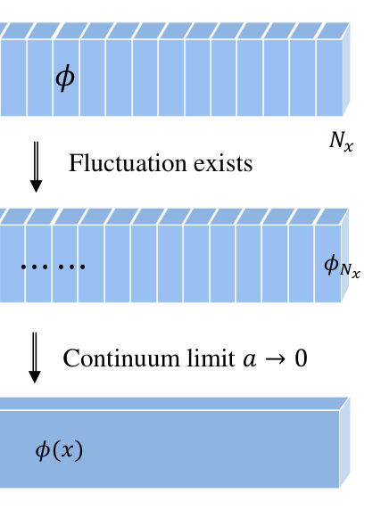
<figcaption class="paper-figure-caption"><b>Fig 1.</b> Figure 1. Starting from a uniform global phase ϕ established in the ground state, fluctuations ϕix emerge at each lattice site, followed by the continuum limit to obtain the continuous phase field ϕ(x).</figcaption>
</figure>
<figure class="paper-figure-card">
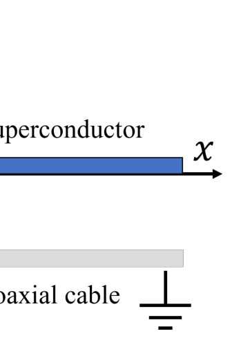
<figcaption class="paper-figure-caption"><b>Fig 2.</b> Figure 2. Simplified schematic of superconducting transmission line</figcaption>
</figure>
<figure class="paper-figure-card">
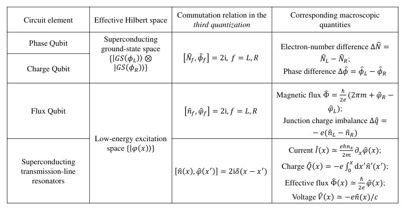
<figcaption class="paper-figure-caption"><b>Fig 3.</b> Figure 3. Correspondence between representative superconducting circuit elements, the effective Hilbert spaces in which they are described, the commutation relations emerging in third quantization, and the associated macroscopic observables.</figcaption>
</figure>

**Main problem.** Determining whether the canonical commutation relations of macroscopic variables in superconducting circuits are fundamental postulates or emergent properties from the underlying microscopic many-body physics.

**Main result.** The authors demonstrate that the non-commutativity of macroscopic circuit variables (like charge and flux) emerges naturally from the third quantization of the superconducting order parameter, providing a unified microscopic origin for capacitive and inductive elements.

**Method.** The study uses a third quantization framework applied to the superconducting order parameter, deriving a low-energy effective Hamiltonian from the microscopic BCS pairing Hamiltonian using a real-space Gaussian variational approach.

**Summary.** This paper provides a microscopic foundation for the quantization of superconducting circuits. Instead of postulating that macroscopic variables like charge and flux obey commutation relations, the authors derive these relations from the third quantization of the superconducting order parameter. They show that the quantum behavior of transmission-line resonators emerges directly from the underlying BCS physics. This establishes a unified framework where both inductive and capacitive elements share the same microscopic origin.

Detailed structure

**Model / system.** The system consists of superconducting transmission-line resonators and circuit-QED architectures, modeled using the microscopic attractive Hubbard model and the BCS theory of superconductivity in the thermodynamic limit.

**Key observables.** Local superconducting phase, Cooper-pair-number density, current, voltage, capacitance density, and inductance density.

**Important parameters / regimes.** Microscopic electron-phonon coupling, hopping amplitude (t), interaction strength (U), and the low-energy excitation subspace regime.

**Assumptions / limitations.** The derivation assumes the system is restricted to the low-energy excitation subspace, the zero-temperature case, and a spatially slowly varying electron density.

**Figures summary.** Figure 1 shows the transition from a global phase to a continuous phase field in the continuum limit; Figure 2 provides a schematic of a 1D superconducting transmission line resonator coupled to a coaxial cable.

**Paper structure.** The paper begins by establishing the microscopic problem, introduces the third quantization framework for the global phase, extends this to local field quantization, derives effective circuit parameters from microscopic models, and concludes by unifying various circuit elements.

**Why it may be interesting.** It provides a fundamental derivation of the quantum dynamics used in circuit QED, bridging the gap between many-body superconductivity theory and the operational postulates of quantum information hardware.

Abstract

The quantization of superconducting transmission-line resonators is usually introduced phenomenologically by modeling the resonator as an effective LC circuit and imposing canonical commutation relations on macroscopic variables such as charge and flux. Although this approach is highly successful, it leaves open why these macroscopic variables should obey quantum commutation relations and how this behavior emerges from the superconducting state. In this work, starting from the microscopic pairing Hamiltonian underlying BCS superconductivity, we derive the low-energy effective Hamiltonian of a circuit-QED architecture containing a superconducting transmission line with distributed capacitive and inductive elements. We establish quantitative relations between macroscopic observables, including current and voltage, and the spatially local superconducting phase, as well as the microscopic parameters of the electron-phonon system. We then extend the third quantization of the superconducting order parameter, introduced in Paper (I) for the global phase, to the spatially local case. This gives a macroscopic field quantization of the superconducting phase. We show that, after restriction to the low-energy excitation subspace, the local superconducting phase becomes a genuine quantum dynamical variable. Thus, the quantum behavior of transmission-line resonators need not be postulated at the macroscopic level, but follows from the third quantization of the superconducting order parameter. These results suggest that capacitive and inductive superconducting circuit elements share the same microscopic origin, providing a unified framework for superconducting circuit quantization.

[↑ back to top](#top)

### [Fixed-Reservoir vs Variational Quantum Architectures for Chaotic Dynamics: Benchmarking QRC and QPINN on the Lorenz System](http://arxiv.org/abs/2604.23743v1)

**Authors:** Tushar Pandey  
**Type:** theory · **Category:** disordered systems and neural networks · **PDF:** <https://arxiv.org/pdf/2604.23743v1>  
**Analysis basis:** full PDF text, analyzed in chunks
**Topic relevance:** `non-equilibrium dynamics` **1/5**

↔ Scroll figures horizontally

<figure class="paper-figure-card">
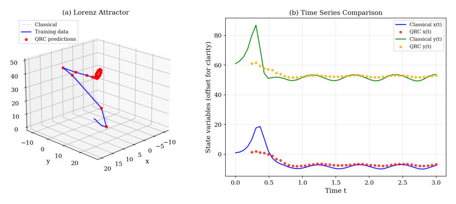
<figcaption class="paper-figure-caption"><b>Fig 1.</b> Figure 1: Quantum Reservoir Computing predictions on the Lorenz system. (a) 3D view of the Lorenz attractor showing the reference trajectory and QRC predictions. (b) Time series comparison of the x and y components (offset for clarity), demonstrating accurate tracking of chaotic dynamics.</figcaption>
</figure>
<figure class="paper-figure-card">
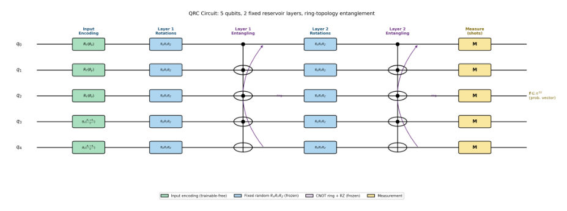
<figcaption class="paper-figure-caption"><b>Fig 2.</b> Figure 2: QRC circuit diagram: 5 qubits, 2 fixed reservoir layers with ring-topology entangle- ment. Input encoding maps the Lorenz state (x, y, z) to RY rotations on qubits q0–q4. Each reservoir layer applies random (frozen) single-qubit RXRY RZ rotations followed by a CNOT ring (including a wrap-around gate from q4 to q0) with post-CNOT RZ coupling. All reservoir parameters are fixed after random initialisation; only the classical linear readout is trained. The 32-dimensional measurement probability vector from each time step is concatenated over a win- dow w = 5 to produce a 160-dimensional feature for Ridge regression.</figcaption>
</figure>
<figure class="paper-figure-card">
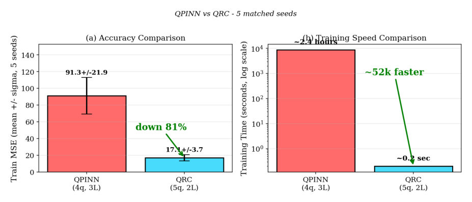
<figcaption class="paper-figure-caption"><b>Fig 3.</b> Figure 3: Summary comparison of QPINN and QRC (5 matched seeds). (a) Accuracy: QRC achieves 81% lower train MSE (17.1 ± 3.7 vs. 91.3 ± 21.9). (b) Training speed: QRC is approx- imately 52,000× faster due to closed-form Ridge regression.</figcaption>
</figure>
<figure class="paper-figure-card">
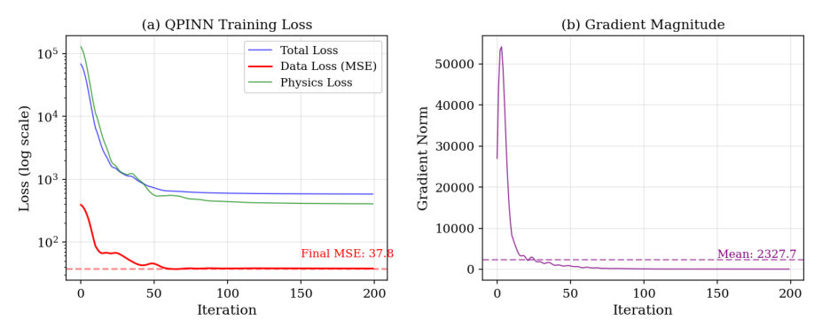
<figcaption class="paper-figure-caption"><b>Fig 4.</b> Figure 4: QPINN training dynamics over 200 iterations for a representative seed (seed 0), showing convergence to train MSE ≈37.8; the mean across 5 seeds is 91.3 ± 21.9 (Table 1). (b) Gradient magnitude remains non-vanishing (∼10), indicating capacity limitations rather than barren plateaus.</figcaption>
</figure>
<figure class="paper-figure-card">
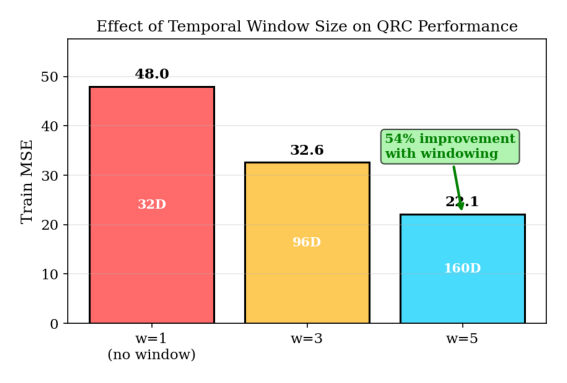
<figcaption class="paper-figure-caption"><b>Fig 5.</b> Figure 5: Ablation study showing the effect of temporal window size on QRC performance. Larger windows provide more temporal context, improving accuracy by 54% from w = 1 to w = 5.</figcaption>
</figure>

**Main problem.** Comparing the efficiency and accuracy of two quantum machine learning architectures, QPINN and QRC, for predicting chaotic time-series dynamics on NISQ devices.

**Main result.** QRC achieves significantly lower error and trains approximately 52,000 times faster than QPINN, with its success attributed to the fixed-reservoir architecture rather than barren plateaus.

**Method.** The study uses classical simulations via Qiskit Aer to benchmark a variational approach (QPINN) against a non-variational reservoir approach (QRC) using temporal windowing.

**Summary.** This paper compares two quantum machine learning approaches for predicting chaotic dynamics: the variational QPINN and the non-variational QRC. It finds that QRC is vastly more efficient, training 52,000 times faster while providing much higher predictive accuracy. The study reveals that QPINN's failures are due to circuit capacity and competing loss terms rather than the vanishing gradient problem known as barren plateaus. The results suggest that fixed-reservoir architectures are highly promising for near-term quantum applications involving complex dynamical systems.

Detailed structure

**Model / system.** The study focuses on chaotic dynamical systems, specifically the Lorenz, Rössler, and Lorenz-96 systems, using a 4-5 qubit setup with a transverse-field Ising Hamiltonian for the QRC reservoir.

**Key observables.** Mean Squared Error (MSE) for training and testing, and gradient norms for diagnosing barren plateaus.

**Important parameters / regimes.** 4-5 qubits, 2-3 circuit layers, window size w=5, and training time per seed (0.2s vs 2.4h).

**Assumptions / limitations.** The study is limited to classical simulations (no hardware noise) and assumes the performance gap is driven by the training architecture rather than quantum-specific features.

**Figures summary.** Figure 1 shows Lorenz attractor reconstructions and time-series comparisons; Figure 2 details the QRC circuit diagram; Figure 3 compares QRC and QPINN performance; Figure 4 illustrates QPINN training dynamics and loss oscillations.

**Paper structure.** The paper introduces the problem of NISQ training overhead, describes the QPINN and QRC architectures, presents a comparative performance analysis on Lorenz-type systems, performs a failure analysis regarding gradients and capacity, and concludes with generalizations to other chaotic systems.

Abstract

Deploying quantum machine learning on NISQ devices requires architectures where training overhead does not negate computational advantages. We systematically compare two quantum approaches for chaotic time-series prediction on the Lorenz system: a variational Quantum Physics-Informed Neural Network (QPINN) and a Quantum Reservoir Computing (QRC) framework utilizing a fixed transverse-field Ising Hamiltonian. Under matched resources ($4$--$5$ qubits, $2$--$3$ layers), QRC achieves an $81\%$ lower mean-squared error (test MSE $3.2 \pm 0.6$ vs. $47.9 \pm 36.6$ for QPINN) while training $\sim 52,000\times$ faster ($0.2$\,s vs. $\sim 2.4$\,h per seed). Drawing on the classical delay-embedding principle, we formalize a temporal windowing technique within the QRC pipeline that improves attractor reconstruction by providing bounded, structured input history. Analysis reveals that QPINN instability stems from capacity limitations and competing loss terms rather than barren plateaus; gradient norms remained large ($10^3$--$10^4$), ruling out exponential suppression at this scale. These failure modes are absent by construction in the non-variational QRC approach. We validate robustness across three canonical systems (Lorenz, Rössler, and Lorenz-96), where QRC consistently achieves low test MSE ($3.1 \pm 0.6$, $1.8 \pm 0.1$, and $12.4 \pm 0.6$, respectively) with sub-second training. Our findings suggest the fixed-reservoir architecture is a primary driver of QRC's advantage at these scales, warranting further investigation at larger qubit counts and on hardware where quantum-specific advantages are expected to emerge.

[↑ back to top](#top)

## Other papers (39)

*Papers from primary archives without highlighted authors or any topic match. Click to expand.*

Show other papers

### ["True" self-avoiding walks on general trees](http://arxiv.org/abs/2604.24389v1)

**Authors:** Tuan-Minh Nguyen  
**Type:** theory · **Category:** statistical mechanics · **PDF:** <https://arxiv.org/pdf/2604.24389v1>  
**Analysis basis:** full PDF text, analyzed in chunks

↔ Scroll figures horizontally

<figure class="paper-figure-card">
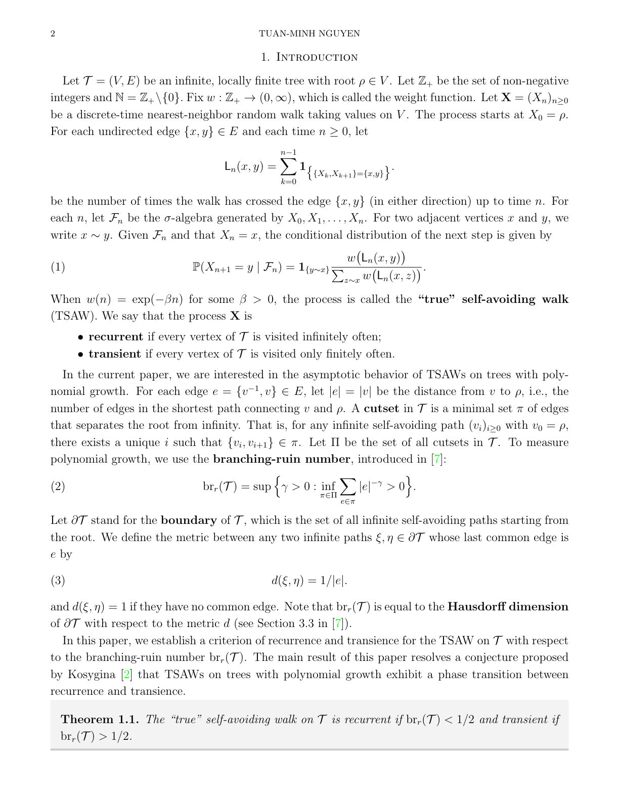
<figcaption class="paper-figure-caption"><b>Fig 1.</b> Low-resolution page preview, page 2</figcaption>
</figure>
<figure class="paper-figure-card">
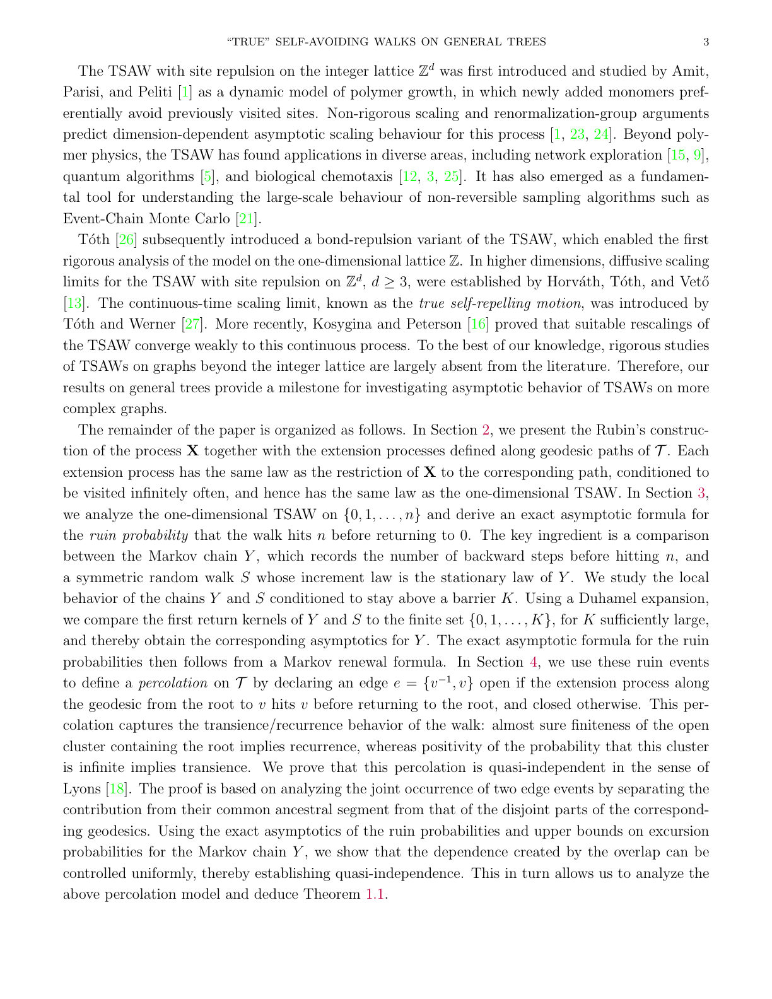
<figcaption class="paper-figure-caption"><b>Fig 2.</b> Low-resolution page preview, page 3</figcaption>
</figure>
<figure class="paper-figure-card">
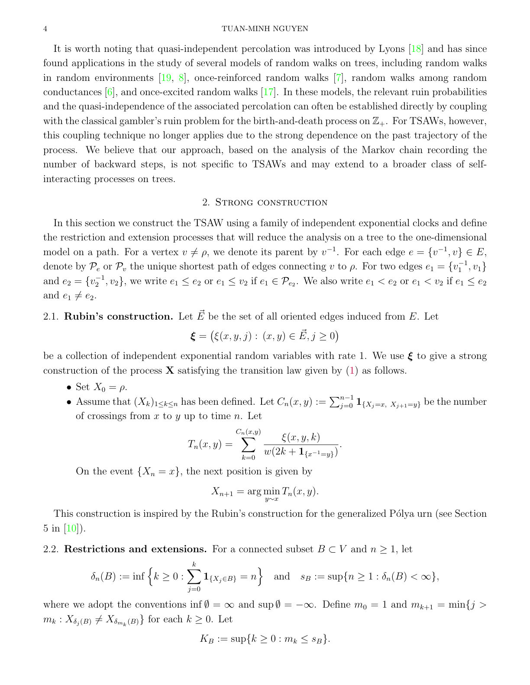
<figcaption class="paper-figure-caption"><b>Fig 3.</b> Low-resolution page preview, page 4</figcaption>
</figure>
<figure class="paper-figure-card">
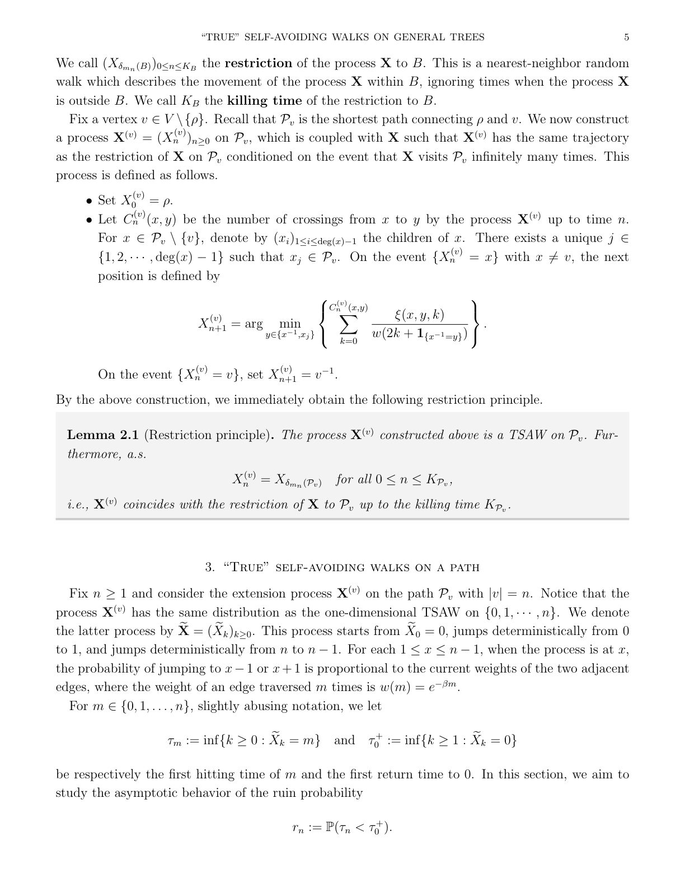
<figcaption class="paper-figure-caption"><b>Fig 4.</b> Low-resolution page preview, page 5</figcaption>
</figure>
<figure class="paper-figure-card">
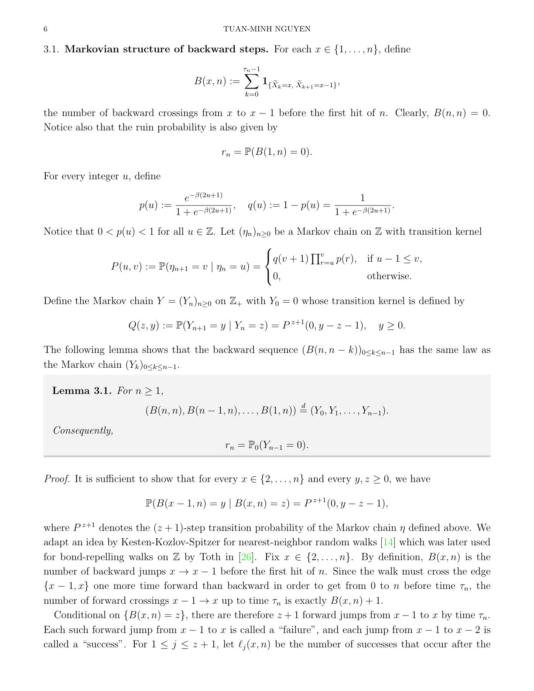
<figcaption class="paper-figure-caption"><b>Fig 5.</b> Low-resolution page preview, page 6</figcaption>
</figure>
<figure class="paper-figure-card">
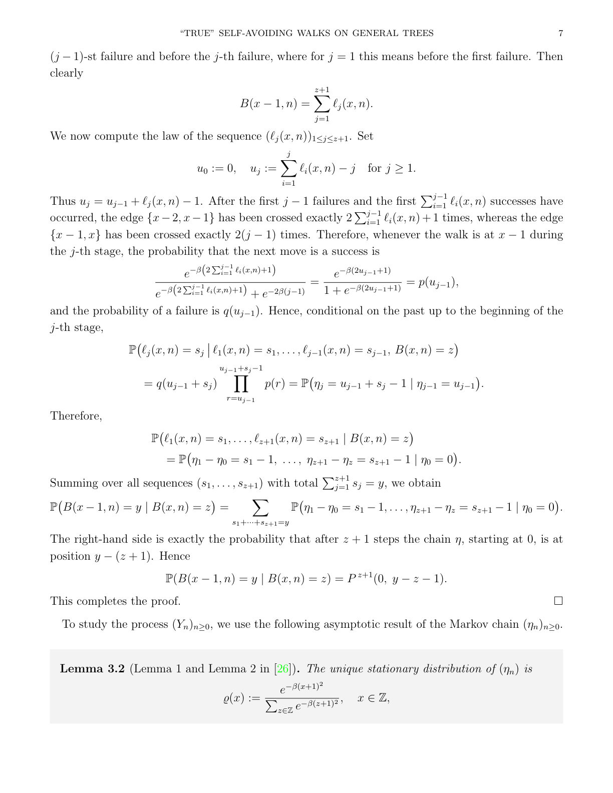
<figcaption class="paper-figure-caption"><b>Fig 6.</b> Low-resolution page preview, page 7</figcaption>
</figure>
<figure class="paper-figure-card">
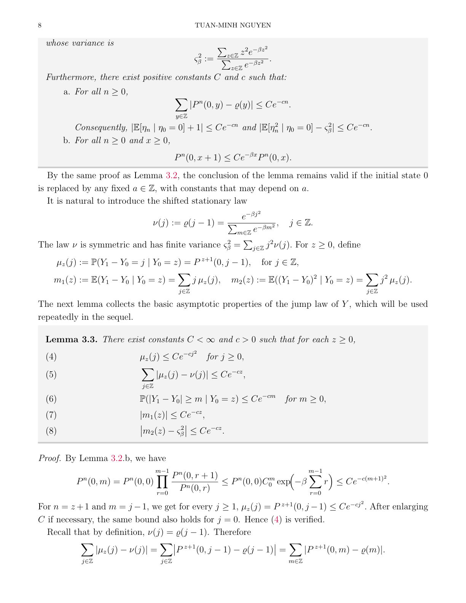
<figcaption class="paper-figure-caption"><b>Fig 7.</b> Low-resolution page preview, page 8</figcaption>
</figure>
<figure class="paper-figure-card">
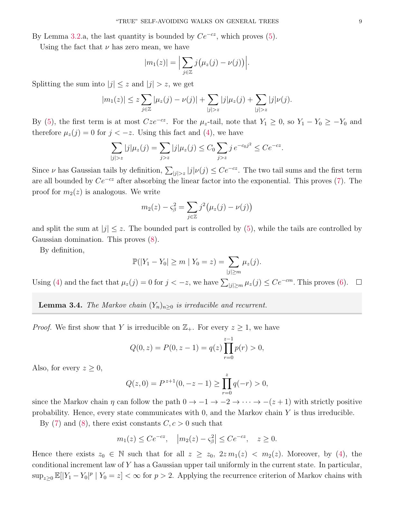
<figcaption class="paper-figure-caption"><b>Fig 8.</b> Low-resolution page preview, page 9</figcaption>
</figure>
<figure class="paper-figure-card">
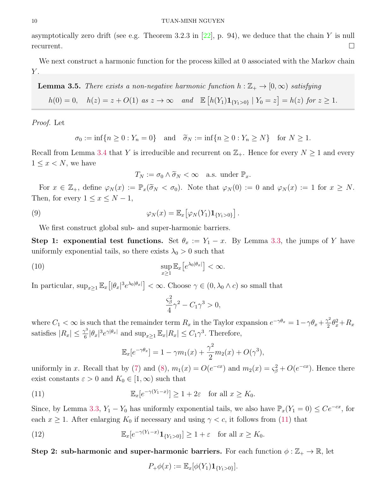
<figcaption class="paper-figure-caption"><b>Fig 9.</b> Low-resolution page preview, page 10</figcaption>
</figure>
<figure class="paper-figure-card">
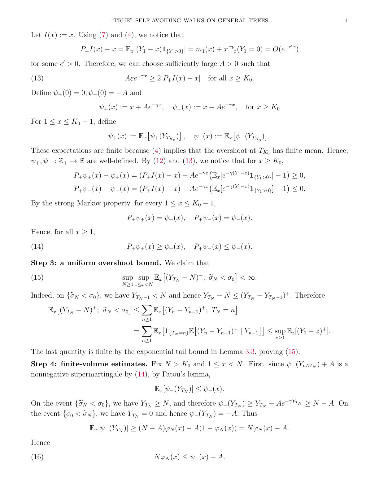
<figcaption class="paper-figure-caption"><b>Fig 10.</b> Low-resolution page preview, page 11</figcaption>
</figure>

**Main problem.** Determining the asymptotic behavior (recurrence vs. transience) of 'true' self-avoiding random walks (TSAW) on general infinite, locally finite trees.

**Main result.** The paper establishes a sharp phase transition: the walk is recurrent if the branching-ruin number of the tree is less than 1/2 and transient if it is greater than 1/2, resolving a conjecture by Kosygina.

**Method.** The author uses Rubin's construction, maps the problem to a quasi-independent percolation model, and employs Markov chain analysis, martingale theory, and Tauberian theorems.

**Summary.** This paper solves an open problem regarding the behavior of 'true' self-avoiding walks on complex tree structures. It proves that these walks undergo a phase transition between being recurrent (visiting sites infinitely often) and transient (visiting sites finitely often) based on a specific geometric property of the tree called the branching-ruin number. The study connects random walk dynamics to percolation theory and the fractal dimension of the tree's boundary. This provides a rigorous mathematical framework for understanding self-repelling processes in non-Euclidean geometries.

Detailed structure

**Model / system.** A 'true' self-avoiding random walk on an infinite, locally finite tree where edge weights decay exponentially with the number of traversals, $w(n) = \exp(-eta n)$, representing edge-repulsion.

**Key observables.** Recurrence and transience, branching-ruin number, ruin probability, and the Hausdorff dimension of the tree boundary.

**Important parameters / regimes.** The branching-ruin number (critical parameter), the exponential decay parameter $eta$, and the tree growth properties.

**Assumptions / limitations.** The tree is assumed to be infinite and locally finite; the results focus on trees with polynomial growth.

**Paper structure.** The paper begins by defining the TSAW model and the branching-ruin number, then reduces the walk's behavior to a ruin percolation problem. It develops a Markov chain construction to study 1D paths, applies quasi-independent percolation theory to general trees, and concludes with a proof of the phase transition using flow-based criteria.

Abstract

We study the asymptotic behavior of ``true" self-avoiding random walks on general infinite locally finite trees. In this model, the walk starts at the root and, at each step, from its current vertex chooses a neighboring edge to traverse with probability proportional to the current weight of that edge, where the weight of each edge after being traversed $n$ times is given by $w(n)=\exp(-βn)$. We show that the process exhibits a sharp phase transition between recurrence and transience. The critical value is determined by the branching-ruin number of the tree, which coincides with the Hausdorff dimension of the boundary of the tree under a suitable metric. We prove that the walk is almost surely transient when the branching-ruin number is greater than $1/2$, and recurrent when it is less than $1/2$. This resolves an open question posed by Kosygina.

[↑ back to top](#top)

### [A Conceptual Technology-Dependent Framework of Ternary Quantum Gates](http://arxiv.org/abs/2604.23242v1)

**Authors:** Ali Al-Bayaty  
**Type:** theory · **Category:** quantum information and computing · **PDF:** <https://arxiv.org/pdf/2604.23242v1>  
**Analysis basis:** full PDF text, analyzed in chunks

↔ Scroll figures horizontally

<figure class="paper-figure-card">
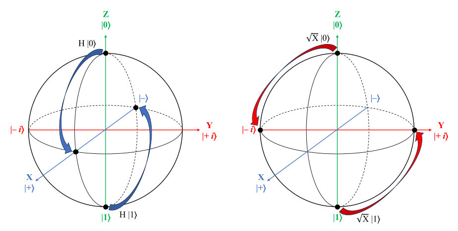
<figcaption class="paper-figure-caption"><b>Fig 1.</b> Figure 1. The Bloch sphere as a three-dimensional geometrical sphere: (a) Hadamard (H) gates create the</figcaption>
</figure>
<figure class="paper-figure-card">
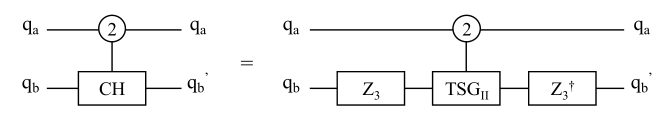
<figcaption class="paper-figure-caption"><b>Fig 2.</b> Figure 2. A two-qutrit quantum circuit of CCH, where qa is the control, qb is the target, and qb’ is the output.</figcaption>
</figure>
<figure class="paper-figure-card">
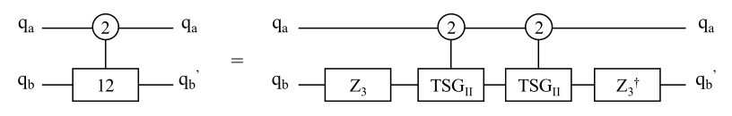
<figcaption class="paper-figure-caption"><b>Fig 3.</b> Figure 3. A two-qutrit quantum circuit of C12, where qa is the control, qb is the target, and qb’ is the output.</figcaption>
</figure>
<figure class="paper-figure-card">
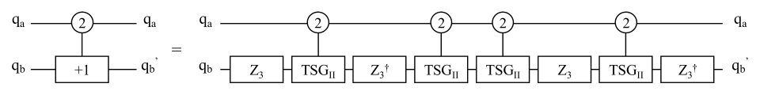
<figcaption class="paper-figure-caption"><b>Fig 4.</b> Figure 4. A two-qutrit quantum circuit of C+1, where qa is the control, qb is the target, and qb’ is the output.</figcaption>
</figure>
<figure class="paper-figure-card">
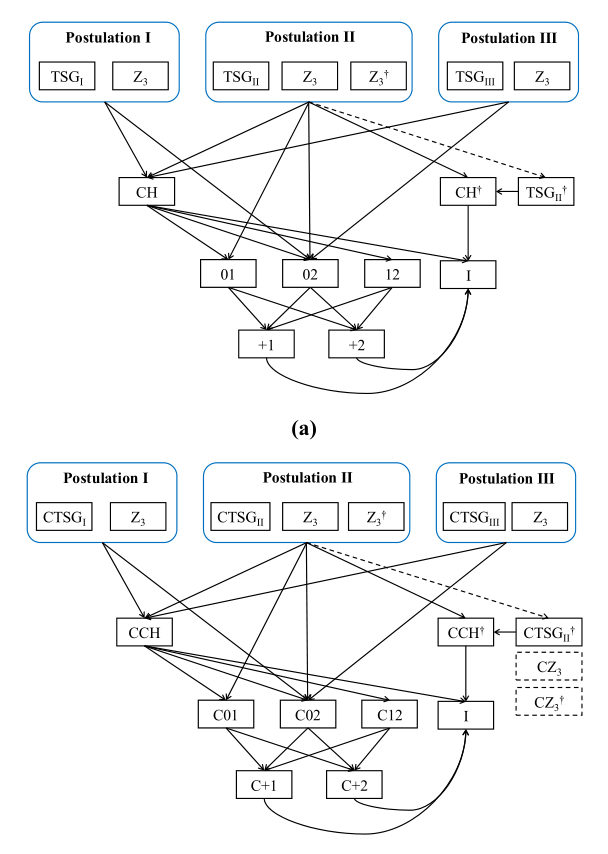
<figcaption class="paper-figure-caption"><b>Fig 5.</b> Figure 5. Our conceptual technology-dependent of three postulations (as a one framework) for</figcaption>
</figure>
<figure class="paper-figure-card">
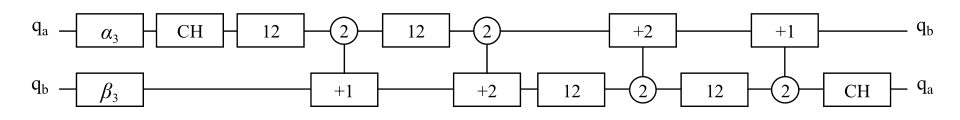
<figcaption class="paper-figure-caption"><b>Fig 6.</b> Figure 6. Our proposed (not accurate with phase-relative) two-qutrit ternary SWAP gate based on the</figcaption>
</figure>

**Main problem.** The lack of a standardized, technology-dependent framework for constructing ternary quantum gates (qutrits) that are analogous to contemporary binary gate designs.

**Main result.** The paper establishes a framework where complex ternary permutative and shift gates can be generated from a set of native Chrestenson (CH) and Z3 gates, and identifies a more cost-effective method for resetting the CH gate.

**Method.** A conceptual approach using gate decomposition and algebraic construction to derive one-qutrit and two-qutrit gates from pre-implemented native gates.

**Summary.** This paper proposes a conceptual framework for designing ternary quantum gates that are directly analogous to existing binary gate technologies. By using a 'technology-dependent' approach, the author demonstrates how complex qutrit gates, such as permutative and shift gates, can be constructed from simpler native gates like the Chrestenson and Z3 gates. The framework is applicable to superconducting and photonic systems and focuses on reducing the quantum gate cost. This work provides a foundation for more efficient ternary quantum circuit design.

Detailed structure

**Model / system.** A theoretical ternary quantum computing system using qutrits with basis states |0>, |1>, and |2>, designed for implementation in superconducting or photonic quantum platforms.

**Key observables.** Quantum cost (total number of utilized one-qutrit and two-qutrit gates).

**Important parameters / regimes.** Rotational angles (alpha_3 and beta_3) for ternary SWAP gates; complex roots of unity (omega).

**Assumptions / limitations.** The framework assumes the existence of pre-implemented, technology-dependent native ternary gates, specifically Z3 and various Ternary Superposition Gates (TSGs).

**Figures summary.** Figure 1 shows a 3D Bloch sphere analogy for binary gates; Figures 2-4 illustrate two-qutrit circuits for CCH, C12, and C+1 gates; Figure 5 provides a summary of the proposed gate framework; Figure 6 shows a conceptual ternary SWAP gate design.

**Paper structure.** The paper introduces the problem of ternary gate standardization, presents three design postulations for constructing the Chrestenson gate, derives permutative and shift gates, extends the construction to controlled two-qutrit gates, and concludes with optimization and future work.

**Why it may be interesting.** It provides a blueprint for scaling quantum architectures from qubits to qutrits, which could significantly increase computational space and efficiency in hardware-specific implementations.

Abstract

This paper introduces a conceptual framework of technology-dependent ternary quantum gates that could be implemented and fabricated into various superconducting and photonic quantum systems for operating 3-valued quantum bits (qutrits). The "technology-dependent" term means that such ternary quantum gates are on-purpose designed analogy to the contemporary binary quantum gates. Conceptually, the final built technology-dependent one-qutrit and two-qutrit ternary quantum gates are Chrestenson, Z3, 01, 02, 12, +1, +2, and their corresponding controlled gates, respectively.

[↑ back to top](#top)

### [A Fully Quantum Algorithm for Image Edge Detection](http://arxiv.org/abs/2604.23535v1)

**Authors:** Fred Sun  
**Type:** theory · **Category:** quantum information and computing · **PDF:** <https://arxiv.org/pdf/2604.23535v1>  
**Analysis basis:** full PDF text, analyzed in chunks

↔ Scroll figures horizontally

<figure class="paper-figure-card">
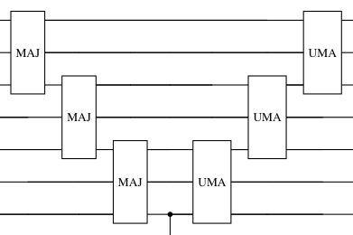
<figcaption class="paper-figure-caption"><b>Fig 1.</b> Fig. 1: 3-qubit QRCA circuit</figcaption>
</figure>
<figure class="paper-figure-card">
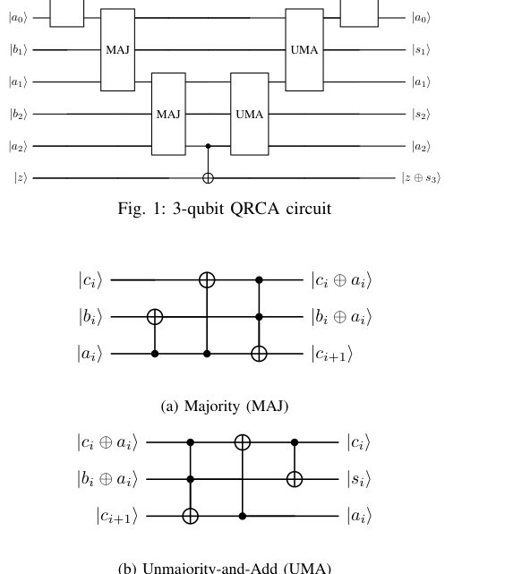
<figcaption class="paper-figure-caption"><b>Fig 2.</b> Fig. 2: Submodules of the QRCA</figcaption>
</figure>
<figure class="paper-figure-card">
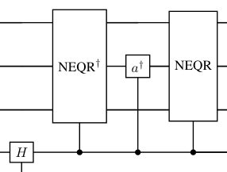
<figcaption class="paper-figure-caption"><b>Fig 3.</b> Fig. 6: Direction-Aware Edge Shifting Circuit</figcaption>
</figure>
<figure class="paper-figure-card">
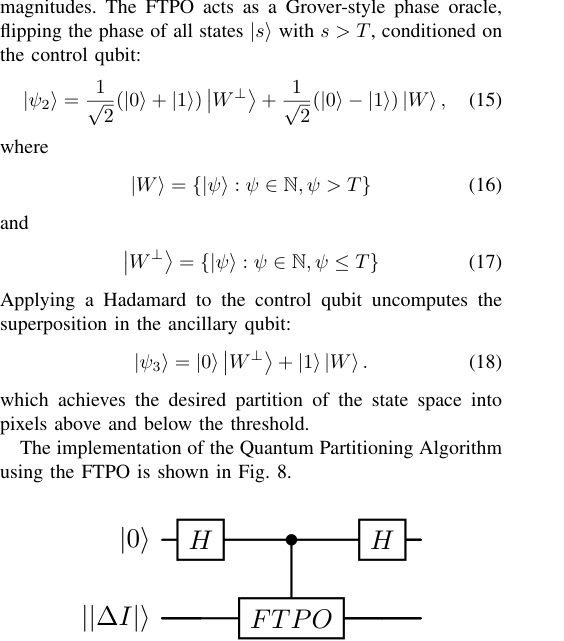
<figcaption class="paper-figure-caption"><b>Fig 4.</b> Fig. 8: QPA Circuit Implementation using FTPO</figcaption>
</figure>
<figure class="paper-figure-card">
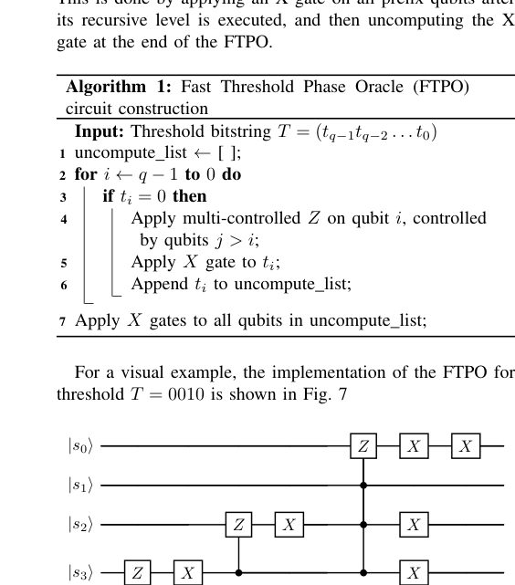
<figcaption class="paper-figure-caption"><b>Fig 5.</b> Fig. 7: FTPO Implementation for T = 0010</figcaption>
</figure>
<figure class="paper-figure-card">
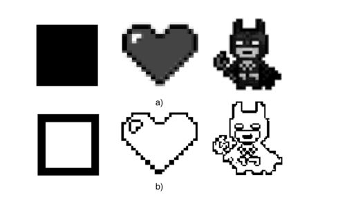
<figcaption class="paper-figure-caption"><b>Fig 6.</b> Fig. 9: a) Three grayscale test images. b) The resulting edge maps our algorithm outputs.</figcaption>
</figure>

**Main problem.** The development of an efficient, scalable quantum algorithm for image edge detection that avoids the need for classical post-processing and reduces the high qubit/gate complexity of previous NEQR-based methods.

**Main result.** The paper presents a fully quantum algorithm that achieves exponential compression of the output edge map and polynomial-time improvements in both time and space complexity compared to existing quantum edge detection models.

**Method.** The algorithm uses NEQR encoding for grayscale images, implements gradient computation via cyclic shifts and quantum arithmetic, and employs a novel Quantum Partitioning Algorithm with a Fast Threshold Phase Oracle (FTPO) for efficient thresholding.

**Summary.** This paper introduces a new quantum algorithm for edge detection that operates entirely within a quantum circuit without requiring classical post-processing. By using the NEQR representation and a novel phase oracle for thresholding, the authors reduce the number of required ancilla qubits and improve runtime complexity. The approach includes a unique direction-aware shifting mechanism to improve edge localization accuracy. Ultimately, it demonstrates a practical quantum advantage for image processing tasks by achieving exponential compression of the output.

Detailed structure

**Model / system.** The algorithm operates within the quantum circuit model using the Novel Enhanced Quantum Representation (NEQR) to encode grayscale pixel intensities deterministically in the computational basis.

**Key observables.** The magnitude of the intensity gradient (delta I) and the sign bit of the gradient.

**Important parameters / regimes.** Image resolution (2^n x 2^n), grayscale levels (2^q), and the intensity threshold (T).

**Assumptions / limitations.** The efficiency of the thresholding module assumes that thresholds have a constant number of leading zeros, and the NEQR encoding step is assumed to have a manageable overhead.

**Figures summary.** Fig 1-2 show quantum arithmetic submodules (QRCA, MAJ, UMA); Fig 3-5 detail the algorithm pipeline, pixel neighborhood generation, and subtraction modules; Fig 6-8 illustrate direction-aware shifting and the FTPO implementation; Fig 9 shows experimental edge map results.

**Paper structure.** The paper identifies limitations in classical and prior quantum edge detection, introduces the NEQR-based pipeline (encoding, gradient, shifting, thresholding), provides detailed circuit constructions for arithmetic and partitioning, performs complexity analysis, and concludes with experimental validation.

Abstract

This work introduces a novel quantum algorithm for gradient-based edge detection that operates entirely within the quantum circuit model. Grayscale images are encoded using the Novel Enhanced Quantum Representation (NEQR), allowing exact arithmetic on pixel intensities. Directional gradients are computed by generating superpositions of neighboring pixels via cyclic shift operations and performing subtraction with an exact quantum arithmetic circuit. To refine accuracy, we introduce a direction-aware shifting mechanism that aligns edges with the darker side of intensity transitions. Our novel Quantum Partitioning Algorithm enables efficient in-place thresholding of edge candidates. This work exhibits polynomial-time improvements and optimizes the ancilla count compared to previous NEQR-based quantum edge detection algorithms. These results demonstrate a resource-efficient and fully quantum approach to edge detection, highlighting a practical quantum advantage in image processing.

[↑ back to top](#top)

### [A Novel Hierarchy of Quantum Kernel Networks on Smoothed Particle Hydrodynamics](http://arxiv.org/abs/2604.24159v1)

**Authors:** Yudong Li, Wenkui Shi, Chunfa Wang, Zhihao Qian, Zhiqiang Feng, Moubin Liu  
**Type:** both · **Category:** quantum information and computing · **PDF:** <https://arxiv.org/pdf/2604.24159v1>  
**Analysis basis:** full PDF text, analyzed in chunks

↔ Scroll figures horizontally

<figure class="paper-figure-card">
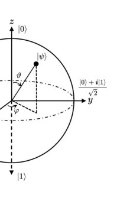
<figcaption class="paper-figure-caption"><b>Fig 1.</b> Fig. 1 Bloch sphere representation of the quantum state |ψ⟩with fundamental gate operations.</figcaption>
</figure>
<figure class="paper-figure-card">
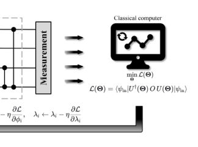
<figcaption class="paper-figure-caption"><b>Fig 2.</b> Fig. 2 Generic architecture of quantum neural networks.</figcaption>
</figure>
<figure class="paper-figure-card">
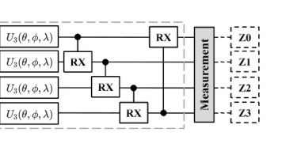
<figcaption class="paper-figure-caption"><b>Fig 3.</b> Fig. 3 Improved architecture of quantum multilayer perceptron.</figcaption>
</figure>
<figure class="paper-figure-card">
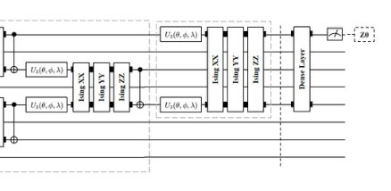
<figcaption class="paper-figure-caption"><b>Fig 4.</b> Fig. 4 Generic architecture of quantum convolutional neural network.</figcaption>
</figure>
<figure class="paper-figure-card">
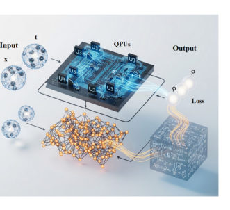
<figcaption class="paper-figure-caption"><b>Fig 5.</b> Fig. 5 Hybrid quantum-classical pathway on quantum processor units (QPUs).</figcaption>
</figure>
<figure class="paper-figure-card">
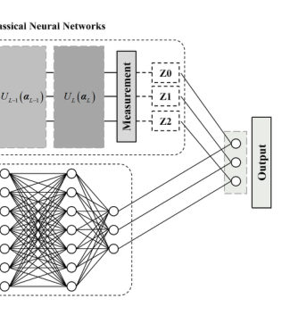
<figcaption class="paper-figure-caption"><b>Fig 6.</b> Fig. 6 Parallel architecture of quantum-classical hybrid optimization.</figcaption>
</figure>
<figure class="paper-figure-card">
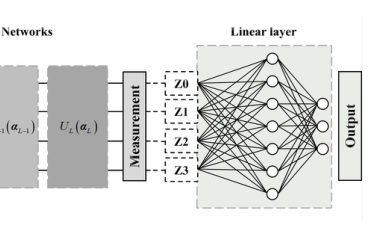
<figcaption class="paper-figure-caption"><b>Fig 7.</b> Fig. 7 Sequential architecture of quantum-classical hybrid optimization.</figcaption>
</figure>
<figure class="paper-figure-card">
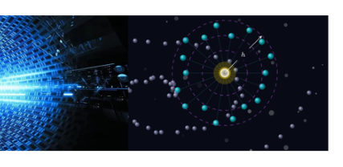
<figcaption class="paper-figure-caption"><b>Fig 8.</b> Fig. 8 SPH discretization and computational particle physics.</figcaption>
</figure>
<figure class="paper-figure-card">
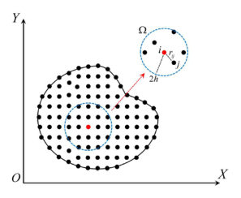
<figcaption class="paper-figure-caption"><b>Fig 9.</b> Fig. 9 Numerical discretization of physical domain.</figcaption>
</figure>
<figure class="paper-figure-card">
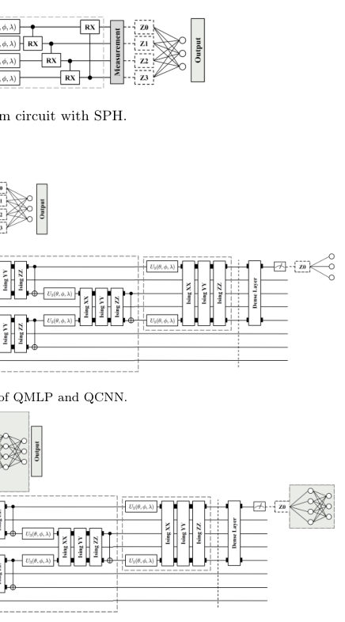
<figcaption class="paper-figure-caption"><b>Fig 10.</b> Fig. 11 Hybrid quantum-classical kernel networks with SPH.</figcaption>
</figure>

**Main problem.** Addressing the computational bottleneck in Smoothed Particle Hydrodynamics (SPH) by bridging the gap between the linear nature of qubits and the nonlinear dynamics of fluid mechanics.

**Main result.** The proposed hybrid crossed-QMLP architecture achieves fitting accuracy comparable to classical SPH, significantly outperforming pure quantum circuits in generalization and convergence.

**Method.** A sequential hybrid quantum-classical framework using variational quantum circuits (VQC) with Pauli-Z expectation values and classical neural network layers for bidirectional data compression.

**Summary.** This paper introduces a novel 'quantum-intelligent SPH' paradigm that integrates quantum kernel networks with classical Smoothed Particle Hydrodynamics. By using a hybrid 'crossed' architecture where quantum circuits are sandwiched between classical neural layers, the authors overcome the generalization failures of pure quantum circuits. The method demonstrates that quantum-classical hybrid models can match the accuracy of traditional classical SPH for complex fluid simulations. This work establishes a foundation for mapping unstructured Lagrangian particle topologies into quantum circuits.

Detailed structure

**Model / system.** A hierarchy of Lagrangian quantum network models (QMLP and QCNN) applied to Smoothed Particle Hydrodynamics (SPH), a meshfree particle-based method for fluid dynamics.

**Key observables.** Pauli-Z expectation values, density, pressure, velocity vectors, and relative norm errors.

**Important parameters / regimes.** Trainable variational parameters (theta, phi, lambda), learning rates, and spatial parameters like Euclidean distance and particle volume.

**Assumptions / limitations.** The study operates within the constraints of the NISQ era, assuming that classical layers can effectively mitigate barren plateaus and quantum noise.

**Figures summary.** Figures illustrate Bloch sphere representations, QNN/QMLP/QCNN architectures, the hybrid quantum-classical pathway, SPH discretization, and numerical comparisons of error, convergence, and fluid field reconstructions.

**Paper structure.** The paper progresses from defining the limitations of classical SPH and the potential of quantum computing to detailing specific hybrid architectures (QMLP, QCNN, and crossed-QMLP), followed by numerical validation through vortex reconstruction and scalar field advection tests, and concludes with a discussion of NISQ-era limitations.

Abstract

Currently, quantum computing and artificial intelligence are driving revolutionary advancements in computational science. This study pioneers the integration of quantum kernel networks on smoothed particle hydrodynamics (SPH). SPH has matured into a highly versatile meshfree/particle method, exceptionally suited for tracking spatiotemporal trajectories and dynamic modeling phenomena. We developed a hierarchy of Lagrangian quantum network models built upon an improved quantum multilayer perceptron (QMLP). Specifically, a sequential hybrid quantum-classical framework is constructed, utilizing Pauli-Z expectation values over traditional probability outputs to ensure robust gradient-based optimization and mitigate barren plateaus. It combines smoothing kernels with quantum learning, establishing a novel quantum intelligent SPH paradigm. The framework is validated through some continuous benchmarks on eurypalynous quantum neural networks, static multi-level nebula vortex interference reconstructions and transient scalar field advectional tests. Numerical results demonstrate that while pure elementary quantum circuits struggle with parameter-specific generalization in unstructured domains, the proposed hybrid crossed-QMLP seamlessly matches the fitting accuracy of classical SPH in quantum optimized space. Although this approach currently faces limitations in computational efficiency and hardware implementation, it nonetheless paves the way for a novel investigation into quantum SPH, by mapping unstructured Lagrangian particle topologies into integrated quantum circuits.

[↑ back to top](#top)

### [A Spectral Gap Informed Parameter Schedule for QAOA](http://arxiv.org/abs/2604.24580v1)

**Authors:** Kieran McDowall, Konstantinos Georgopoulos, Petros Wallden  
**Type:** theory · **Category:** quantum information and computing · **PDF:** <https://arxiv.org/pdf/2604.24580v1>  
**Analysis basis:** full PDF text, analyzed in chunks

↔ Scroll figures horizontally

<figure class="paper-figure-card">
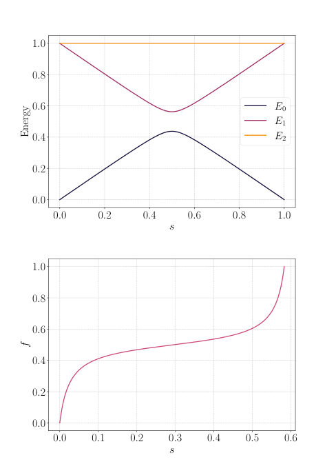
<figcaption class="paper-figure-caption"><b>Fig 1.</b> Fig. 1. (Top) Eigenvalue spectrum from HAd for Grover’s problem with the marked solution state |x⟩= |000000⟩(n = 6). (Bottom) The optimal Roland Cerf (RC) adiabatic schedule.</figcaption>
</figure>
<figure class="paper-figure-card">
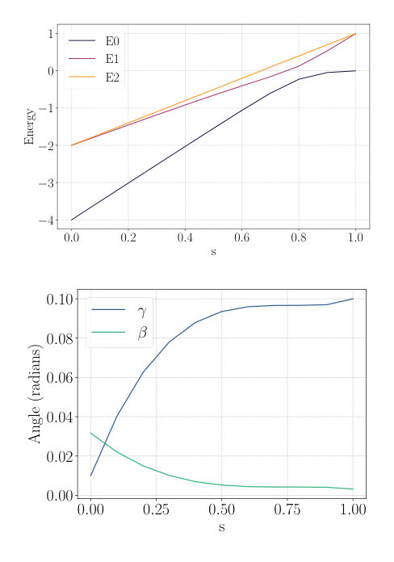
<figcaption class="paper-figure-caption"><b>Fig 2.</b> Fig. 2. (Top) Plotting Equation 7 for Grover’s problem k = 0 n = 4, with the marked solution state |x⟩= |0000⟩discritised by p = 10. (Bottom) An example of the corrsponding SGIR schedule.</figcaption>
</figure>
<figure class="paper-figure-card">
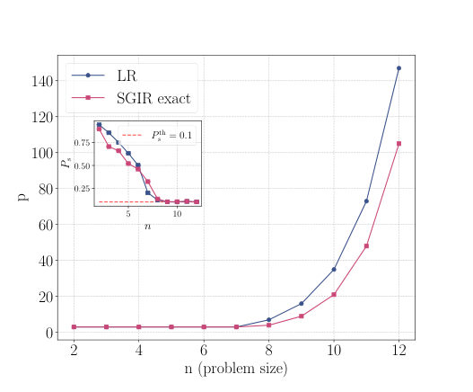
<figcaption class="paper-figure-caption"><b>Fig 3.</b> Fig. 4. Solving Grover’s problem where the QAOA depth p required to reach an optimal solution threshold P th s at different problem sizes is plotted.</figcaption>
</figure>
<figure class="paper-figure-card">
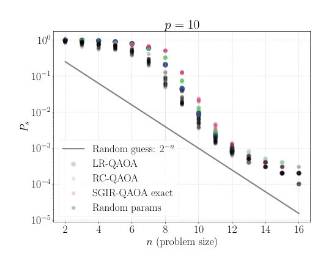
<figcaption class="paper-figure-caption"><b>Fig 4.</b> Fig. 3. Solving Grover’s problem with our QAOA methods at constant QAOA depth p = 10. At each n the experiment is repeated 10 times with a different random marked solution. The random QAOA parameters are changed for each of these instances. The y-axis is logarithmic.</figcaption>
</figure>
<figure class="paper-figure-card">
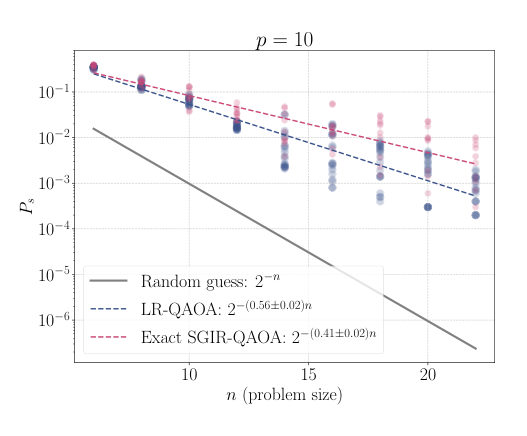
<figcaption class="paper-figure-caption"><b>Fig 5.</b> Fig. 5. Solving MIS degree 3 graphs with LR–QAOA and exact SGIR–QAOA. At each n the experiment is repeated 10 times with a different randomly generated instance. A log scale is used on the y-axis. The error in the fit for the exponential scaling coefficient is included in the legend.</figcaption>
</figure>
<figure class="paper-figure-card">
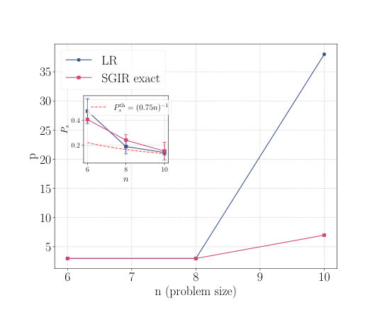
<figcaption class="paper-figure-caption"><b>Fig 6.</b> Fig. 6. Solving the MIS problem with degree 3 graphs where the QAOA depth p required to reach an optimal solution threshold P th s at different problem sizes is plotted.</figcaption>
</figure>
<figure class="paper-figure-card">
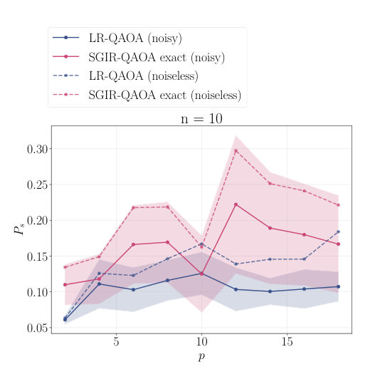
<figcaption class="paper-figure-caption"><b>Fig 7.</b> Fig. 8. Solving the MIS problem (degree three graphs) under depolarising noise. Averaging over 10 instances at the 10 node problem size. λ = 100, searching 20×20 (βstart, γend) and (∆γ, ∆β) values for each p. The shaded region correspond to the standard deviation error of the noisy points. In Figure 11 we plot the noiseless LR–QAOA and SGIR–QAOA showing behaviour at larger p .</figcaption>
</figure>
<figure class="paper-figure-card">
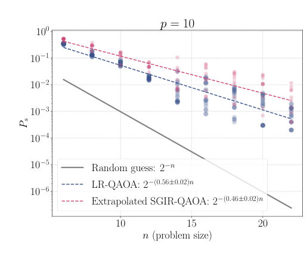
<figcaption class="paper-figure-caption"><b>Fig 8.</b> Fig. 7. Solving MIS degree 3 graphs with extrapolated SGIR–QAOA. The gaps for n = 6 −12 are calculated which inform the SGIR– QAOA schedule for n &gt; 12. At each n the experiment is repeated 10 times with a different randomly generated instance. A log scale is used on the y-axis. The error in the fit for the exponential scaling coefficient is included in the legend.</figcaption>
</figure>
<figure class="paper-figure-card">
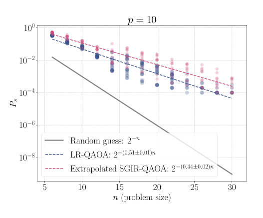
<figcaption class="paper-figure-caption"><b>Fig 9.</b> Fig. 10. Solving MIS degree 3 graphs with extrapolated SGIR–QAOA at larger n than in Figure 7. The gaps for n = 6 −12 are calculated which inform the SGIR–QAOA schedule for n &gt; 12. At each n the experiment is repeated 10 times with a different randomly generated instance. A log scale is used on the y-axis. The error in the fit for the exponential scaling coefficient is included in the legend.</figcaption>
</figure>
<figure class="paper-figure-card">
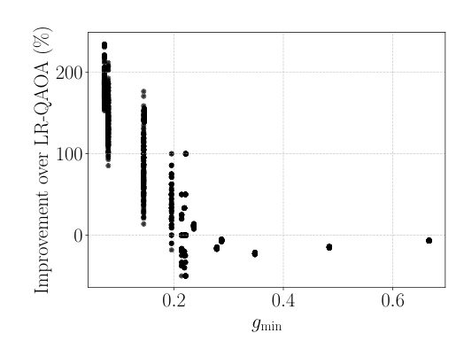
<figcaption class="paper-figure-caption"><b>Fig 10.</b> Fig. 9. The percentage improvement of SGIR-QAOA against LR- QAOA, p = 10, with the minimum spectral gap of the problem (Pearson correlation coefficient ρ = −0.68).</figcaption>
</figure>

**Main problem.** Finding optimal variational parameters for the Quantum Approximate Optimization Algorithm (QAOA) is computationally difficult, and existing 'de-variationalized' schedules like the Linear Ramp (LR-QAOA) fail to account for the closing of the spectral gap.

**Main result.** The proposed Spectral Gap Informed Ramp (SGIR-QAOA) outperforms LR-QAOA on Grover's problem and the Maximum Independent Set (MIS) problem, requiring shallower depths to reach target success probabilities and demonstrating better exponential scaling.

**Method.** The authors develop a parameter schedule that uses smooth ramps informed by the spectral gap of an adiabatic Hamiltonian, performing slower evolution where the gap is small, and use extrapolation techniques to scale the method to larger problem sizes.

**Summary.** This paper introduces a new parameter scheduling strategy for the QAOA algorithm called SGIR-QAOA. By using information about the spectral gap of an adiabatic Hamiltonian, the algorithm slows down its evolution during periods where the gap is small, effectively mitigating diabatic transitions. The authors demonstrate that this approach provides superior performance and better scaling for both Grover's search and the Maximum Independent Set problem compared to standard linear ramp methods. Furthermore, the method proves to be scalable through gap extrapolation and remains effective even in the presence of depolarizing noise.

Detailed structure

**Model / system.** The study utilizes the QAOA framework with alternating mixer and cost Hamiltonians, specifically testing on Grover's search problem, Erdős–Rényi random graphs, and 3-regular sparse graphs for the Maximum Independent Set problem.

**Key observables.** Optimal solution probability (Ps), required QAOA depth (p), and the minimum spectral gap (gmin).

**Important parameters / regimes.** QAOA depth (p), problem size (n), spectral gap (g), and depolarizing noise strength.

**Assumptions / limitations.** The method assumes that the spectral gap information from smaller system sizes can be accurately extrapolated to larger system sizes where exact calculation is impossible.

**Figures summary.** Figures show the eigenvalue spectrum of Grover's problem, comparisons of success probability (Ps) across different schedules, plots of required depth (p) vs. problem size (n), and the correlation between performance improvement and the minimum spectral gap.

**Paper structure.** The paper introduces the problem of parameter optimization in QAOA, presents the SGIR-QAOA method, validates it using Grover's problem, extends the analysis to combinatorial optimization (MIS) on various graph types, demonstrates scalability via extrapolation, and tests robustness against depolarizing noise.

Abstract

A challenge with the Quantum Approximate Optimisation Algorithm (QAOA), and variational algorithms in general, is finding good variational parameters, a task which in itself can be NP-hard. Recent work has sought to de-variationalise QAOA by picking well-informed guesses for the variational parameters. The Linear Ramp QAOA (LR-QAOA) achieves this by using parameter schedules inspired by the quantum adiabatic algorithm. We go a step further and use spectral gap information from an adiabatic Hamiltonian, with the QAOA mixer Hamiltonian as our initial Hamiltonian, to make smooth ramps which we call Spectral Gap Informed Ramps (SGIR-QAOA). SGIR-QAOA schedules perform slow evolution where the spectral gap of the adiabatic Hamiltonian is small. We show that SGIR-QAOA has performance improvements over LR-QAOA on Grover's problem at constant depth and that SGIR-QAOA requires shorter depths to achieve the same optimal solution probability. We then show that these performance benefits extend to a problem with potential practical applications -- the Maximum Independent Set (MIS) problem. Finally, we demonstrate the scalability of the SGIR-QAOA method using extrapolated spectral gap information for scales that the spectral gap cannot be exactly evaluated, and show that the advantage appears to persist under mild depolarising noise.

[↑ back to top](#top)

### [Application of a Quantum Amplitude Redistribution Algorithm to the Data Filtering Problem](http://arxiv.org/abs/2604.24742v1)

**Authors:** Karina Zakharova, Artem Chernikov, Sergey Sysoev  
**Type:** theory · **Category:** quantum information and computing · **PDF:** <https://arxiv.org/pdf/2604.24742v1>  
**Analysis basis:** full PDF text, analyzed in chunks

↔ Scroll figures horizontally

<figure class="paper-figure-card">
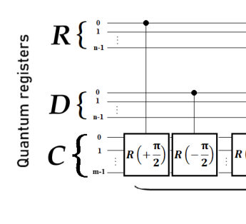
<figcaption class="paper-figure-caption"><b>Fig 1.</b> Figure 2: Schematic diagram of the rotations of the quantum algorithm for probability redistribution</figcaption>
</figure>
<figure class="paper-figure-card">
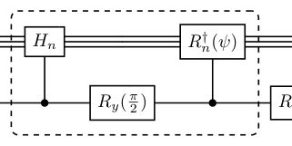
<figcaption class="paper-figure-caption"><b>Fig 2.</b> Figure 3: The first step in finding the decomposition of 𝑅𝑛+1(𝜙). The dashed lines highlight transition blocks to the appropriate basis. Here sin 𝜓</figcaption>
</figure>
<figure class="paper-figure-card">
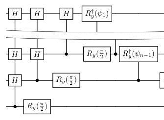
<figcaption class="paper-figure-caption"><b>Fig 3.</b> Figure 4: Decomposition of 𝑅𝑛+1(𝜙). Here sin 𝜓𝑘</figcaption>
</figure>
<figure class="paper-figure-card">
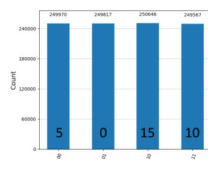
<figcaption class="paper-figure-caption"><b>Fig 4.</b> Figure 5: Probabilities of array indices [5 0 15 10] for the reference value 𝑅= 0 before processing (left) and after applying the rotations (right), 1,000,000 measurements</figcaption>
</figure>
<figure class="paper-figure-card">
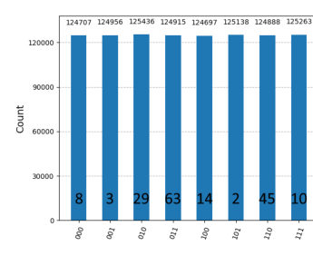
<figcaption class="paper-figure-caption"><b>Fig 5.</b> Figure 6: Probabilities of array indices [8 3 29 63 14 2 45 10] for the reference value 𝑅= 0 before processing (left) and after applying the rotations (right), 1,000,000 measurements</figcaption>
</figure>
<figure class="paper-figure-card">
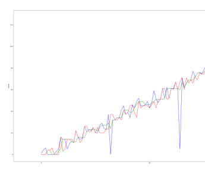
<figcaption class="paper-figure-caption"><b>Fig 6.</b> Figure 7: Processing a noisy signal with two outliers (blue) using a median filter (green) and a quantum filter (red)</figcaption>
</figure>
<figure class="paper-figure-card">
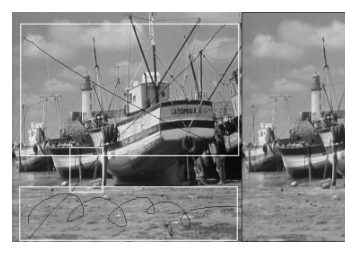
<figcaption class="paper-figure-caption"><b>Fig 7.</b> Figure 8: Processing a black-and-white 8-bit image with an artifact in PNG for- mat, 512*512 pixels. Original image (left), result of the median filter (middle), and result of the quantum feedback filter (right). Window width is 8 pixels.</figcaption>
</figure>
<figure class="paper-figure-card">

<figcaption class="paper-figure-caption"><b>Fig 8.</b> Figure 9: Processing a black-and-white 8-bit image with an artifact in PNG for- mat, 512*512 pixels. Original image (left), result of the median filter (middle), and result of the quantum feedback filter (right). Window width is 16 pixels.</figcaption>
</figure>
<figure class="paper-figure-card">
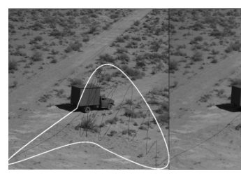
<figcaption class="paper-figure-caption"><b>Fig 9.</b> Figure 10: Processing a black-and-white 8-bit image with an artifact in TIFF format, 512*512 pixels. Original image (left), result of the median filter (mid- dle), and result of the quantum feedback filter (right). Window width is 8 pixels.</figcaption>
</figure>
<figure class="paper-figure-card">

<figcaption class="paper-figure-caption"><b>Fig 10.</b> Figure 11: Processing a black-and-white 8-bit image with an artifact in TIFF format, 512*512 pixels. Original image (left), result of the median filter (mid- dle), and result of the quantum feedback filter (right). Window width is 16 pixels.</figcaption>
</figure>

**Main problem.** Investigating the applicability of a Quantum Amplitude Redistribution Algorithm (QARA) to the data filtering problem, specifically for removing outliers from digitized signals and images.

**Main result.** The algorithm achieves a computational complexity of O(n) relative to bit-width, providing a significant speedup over classical O(M log M) median filters for large arrays, though it performs slightly lower in filtering quality.

**Method.** The authors develop a quantum circuit model using controlled rotations and a recursive unitary matrix construction to redistribute probability amplitudes, then compare its performance against classical median filters on 1D signals and 2D images.

**Summary.** This paper proposes a quantum algorithm designed to replace classical median filters for tasks like signal and image denoising. By using quantum amplitude redistribution, the algorithm can identify and filter outliers with a complexity that depends on the bit-width rather than the array size. While the filtering quality is slightly lower than classical methods, the potential for significant computational speedup on large datasets is demonstrated. The study includes testing on 1D signals and 2D images across various resolutions and formats.

Detailed structure

**Model / system.** A quantum circuit model using n-qubit registers, where Register D contains array elements and Register C contains indices, utilizing a parameterized unitary transformation R_n(phi).

**Key observables.** The measured index j from the counter register, which yields the filtered value A_j, and the probability distribution P(C_k) of measuring specific indices.

**Important parameters / regimes.** Array size M, number of qubits n, reference value r, rotation angle phi, and window width for image processing.

**Assumptions / limitations.** The algorithm assumes input data can be represented as non-negative n-bit integers and requires elements in the processed array to be distinct for optimal performance.

**Figures summary.** Figures illustrate the quantum loading process, the schematic of probability redistribution, the recursive gate decomposition, and comparative results of filtering noisy signals and various image formats (PNG, TIFF, JPG).

**Paper structure.** The paper begins by defining the algorithm's input/output, provides a mathematical proof of the transformation's unitarity, details an optimized gate decomposition, and concludes with a comparative performance analysis against classical filters.

Abstract

This paper presents an analysis of the applicability of a quantum amplitude redistribution algorithm to the data filtering problem and the results of modeling the algorithm's operation in comparison with a median filter.

[↑ back to top](#top)

### [Architecture-aware Unitary Synthesis](http://arxiv.org/abs/2604.23777v1)

**Authors:** Frans Perkkola, Arianne Meijer-van de Griend, Jukka K. Nurminen  
**Type:** theory · **Category:** quantum information and computing · **PDF:** <https://arxiv.org/pdf/2604.23777v1>  
**Analysis basis:** full PDF text, analyzed in chunks

↔ Scroll figures horizontally

<figure class="paper-figure-card">
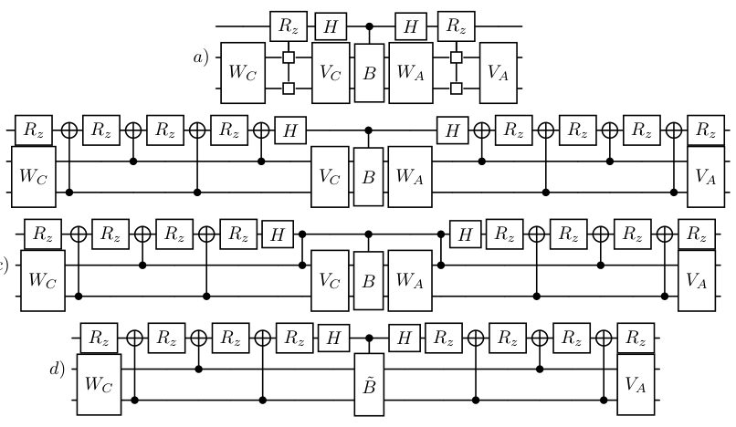
<figcaption class="paper-figure-caption"><b>Fig 1.</b> Fig. 1. A three-qubit unitary example of the CNOT merging optimization procedure. a) Decompose only the A and C multiplexers. b) Decompose the uniformly controlled Rz gates. c) Migrate the Hadamard gates through the CNOT targets. d) Merge VC, WA and the CZ gates into the central gate B.</figcaption>
</figure>
<figure class="paper-figure-card">
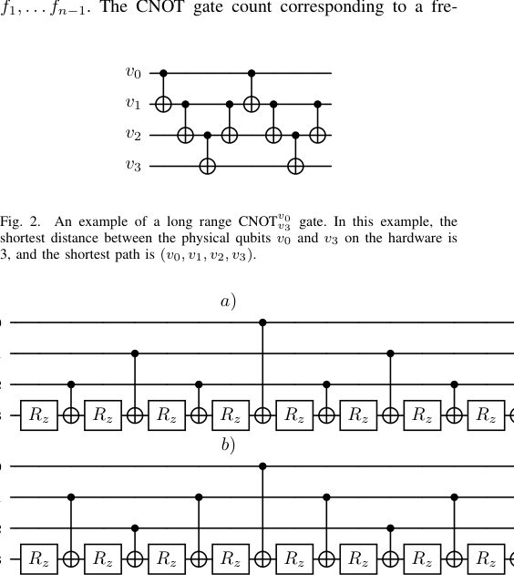
<figcaption class="paper-figure-caption"><b>Fig 2.</b> Fig. 3. Four-qubit uniformly controlled Rz gates. a) The UC gate constructed using a binary reflected Gray code as in [21]. b) An equivalent construction for the UC gate using a different Gray code.</figcaption>
</figure>
<figure class="paper-figure-card">
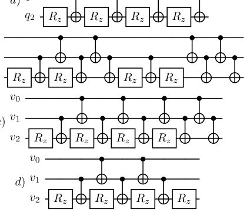
<figcaption class="paper-figure-caption"><b>Fig 3.</b> Fig. 5. Efficient construction of a three-qubit UC gate using the long range CNOT ladders. a) The logical decomposition of the UC gate, as in Fig. 1. b) The decomposition of the UC gate on physical qubits v0, v1 and v2 on a path graph using the binary reflected Gray code. c) A more efficient decomposition, using the heuristic of removing the nearest neighbor CNOT gate after a long range CNOT gate. d) The final decomposition after merging the rightmost CNOT gates into the neighboring unitary gate, as in Fig. 1.</figcaption>
</figure>
<figure class="paper-figure-card">
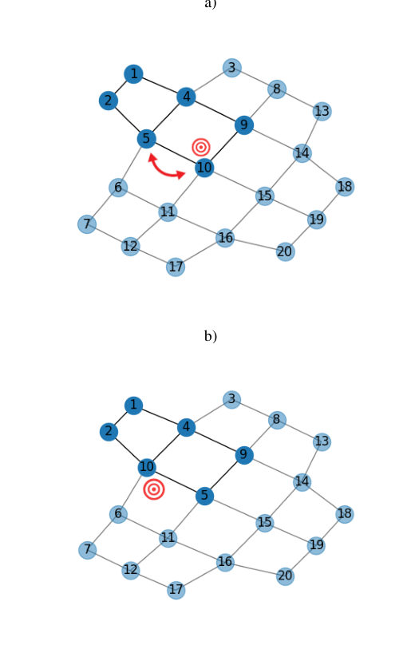
<figcaption class="paper-figure-caption"><b>Fig 4.</b> Fig. 4. An example of the swapping procedure for a 6-qubit UC gate on the IQM Garnet quantum hardware. a) The physical qubit 10 is selected as the target. Physical qubits 9, 5, 4, 2 and 1 are the control qubits of the UC gate. b) Physical qubits 10 and 5 are swapped. This gives a more efficient construction for the UC gate, as the target qubit 10 is now overall closer to the rest of the physical qubits.</figcaption>
</figure>

**Main problem.** The inefficient transpilation of generic n-qubit unitary transformations into hardware-specific gate sequences, which leads to high CNOT gate counts and long compilation runtimes.

**Main result.** The proposed architecture-aware method achieves up to a 36% reduction in CNOT counts and up to a 553x speedup in transpilation time compared to leading compilers like TKet, Qiskit, and PennyLane.

**Method.** An integrated approach that embeds transpilation into the recursive block-ZXZ decomposition using greedy qubit mapping, adaptive Gray code selection, and a CNOT reduction heuristic for long-range ladders.

**Summary.** This paper presents a new way to compile quantum circuits by making the synthesis process aware of the underlying hardware architecture from the start. Instead of treating hardware constraints as a final step, the method integrates qubit mapping and gate optimization directly into the mathematical decomposition of the unitary. This results in significantly fewer CNOT gates and much faster compilation speeds. It is particularly effective for scaling up the synthesis of larger unitaries on real-world superconducting hardware.

Detailed structure

**Model / system.** The method is benchmarked on superconducting quantum architectures, specifically the 20-qubit IQM Garnet (square lattice) and the 156-qubit IBM Marrakesh (heavy-hex) topologies.

**Key observables.** CNOT gate count, transpilation runtime, and CNOT gate ratio relative to the theoretical lower bound.

**Important parameters / regimes.** Qubit counts ranging from 3 to 11; time limit of 30 minutes for scalability testing.

**Assumptions / limitations.** The method focuses on exact unitary synthesis rather than numerical approximations and assumes hardware connectivity is restricted to adjacent physical qubits.

**Figures summary.** Figure 1 shows CNOT merging in a 3-qubit unitary; Figure 2 visualizes a long-range CNOT ladder; Figure 3 compares standard vs. optimized Gray codes; Figure 4 illustrates qubit swapping; Figure 5 shows the logical-to-physical decomposition of a UC gate.

**Paper structure.** The paper introduces the problem of post-processing inefficiency, details the architecture-aware synthesis algorithm (including mapping, Gray code, and swapping techniques), presents benchmarking results against industry-standard transpilers, and discusses scalability and limitations.

Abstract

We present a novel architecture-aware transpilation method for exact general unitary gate synthesis on superconducting quantum hardware. Our approach is tightly integrated with the optimized block-ZXZ decomposition, exploiting its recursive structure to make hardware-aware decisions at each level of the recursion rather than treating transpilation as an independent post-processing step. The method introduces three key techniques: a greedy qubit mapping strategy that minimizes pairwise distances between physical qubits, an adaptive Gray code selection combined with qubit swapping that optimizes the construction of uniformly controlled Rz gates for the target topology, and a heuristic for reducing CNOT gates by exploiting the structure of long-range CNOT ladders. We benchmark our method against TKet, Qiskit, and Pennylane on the 20-qubit IQM Garnet (square lattice) and the 156-qubit IBM Marrakesh (heavy-hex) architectures with qubit counts ranging from 3 to 11. Our method achieves CNOT count reductions of up to 36 percent on the IQM Garnet and up to 34 percent on the IBM Marrakesh compared to the best competing transpiler, while simultaneously achieving transpilation speedups of up to 553x. Furthermore, our method is the only one capable of transpiling circuits beyond 10 qubits within a 30-minute time limit across both architectures.

[↑ back to top](#top)

### [CAbLECAR: efficiently scheduling QLDPC codes on a tileable spin qubit chip with shuttling](http://arxiv.org/abs/2604.24739v1)

**Authors:** Jason D. Chadwick, Frederic T. Chong  
**Type:** theory · **Category:** quantum information and computing · **PDF:** <https://arxiv.org/pdf/2604.24739v1>  
**Analysis basis:** full PDF text, analyzed in chunks

↔ Scroll figures horizontally

<figure class="paper-figure-card">
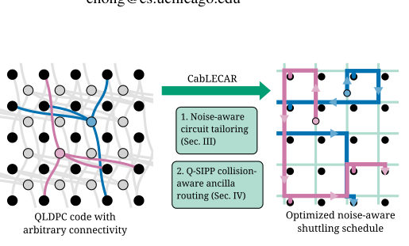
<figcaption class="paper-figure-caption"><b>Fig 1.</b> Fig. 1. Overview of the CAbLECAR framework. (Left) QLDPC codes demand complex, non-local parity checks, represented by arbitrary connec- tions between data qubits (black) and ancilla qubits (colored). (Middle) To map these abstract requirements onto physical hardware, CAbLECAR applies noise-aware circuit tailoring to mitigate shuttling-induced dephasing and utilizes a novel optimization algorithm Q-SIPP to compute collision-free routing paths. (Right) The output is a hardware-compatible, time-optimized shuttling schedule where mobile ancilla qubits physically route along a tileable grid architecture to interact with stationary data qubits. Applied to efficient QLDPC codes, these optimized...</figcaption>
</figure>
<figure class="paper-figure-card">
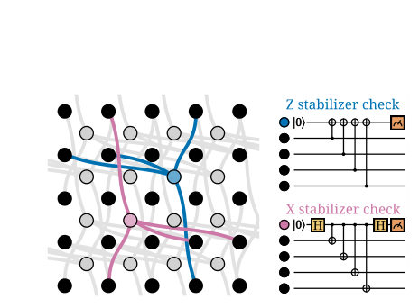
<figcaption class="paper-figure-caption"><b>Fig 2.</b> Fig. 2. Depiction of the structure of a quantum error correction code. A code block consists of a group of data qubits (black) and the logical code state is stabilized by repeated measurement of X and Z stabilizers. Typically, each stabilizer is measured using an ancilla qubit, which is initialized, entangled with the relevant data qubits, and then measured. Example X and Z checks are shown in pink and blue. The measurement results must then be decoded to determine whether any correction is needed to maintain an error-free code state. In this figure, X and Z checks both have weight 4, meaning that each ancilla qubit interacts with four data qubits in a syndrome extraction (SE) cycle.</figcaption>
</figure>
<figure class="paper-figure-card">
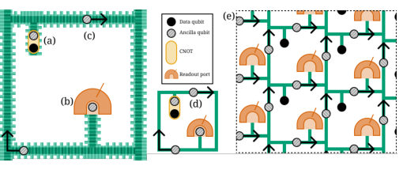
<figcaption class="paper-figure-caption"><b>Fig 3.</b> Fig. 3. The tiled unit cell architecture considered in this work. On the left is a closeup of one unit cell, which has (a) one interaction zone where gates are performed, (b) one readout port, where a qubit can be measured, and (c) shuttling channels, where qubits can travel within and between unit cells. (d) shows a simplified version of the unit cell, and (e) shows how the unit cells can be tiled into a grid-like arrangement.</figcaption>
</figure>
<figure class="paper-figure-card">
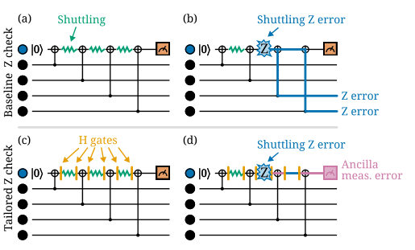
<figcaption class="paper-figure-caption"><b>Fig 4.</b> Fig. 4. Tailoring syndrome extraction circuits to mitigate shuttling noise. (a) Ancilla qubits are shuttled between CNOTs with data qubits. Shown here is a Z ancilla qubit, which is sensitive to shuttling errors. (b) Shuttling errors are heavily biased towards Z errors (dephasing). When such an error occurs, it propagates through the following CNOTs and manifests as one or more Z errors on the data qubits. (c) The tailored version of the circuit inserts H gates before and after each shuttling period. (d) This switches the Z error to an X error during each of the remaining CNOTs, preventing error propagation. The consequence is an X error on the ancilla qubit at the end of the circuit, which...</figcaption>
</figure>
<figure class="paper-figure-card">
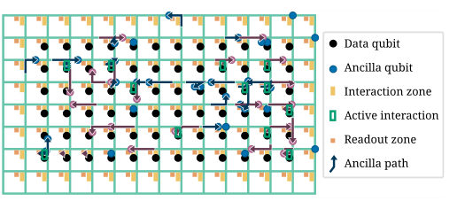
<figcaption class="paper-figure-caption"><b>Fig 5.</b> Fig. 6. Snapshot of optimized ancilla movement schedule for the [[72, 12, 6]] bicycle code. Data qubits (black) are in fixed positions, one per unit cell. Ancilla qubits (blue and pink) are shuttled between data qubits, performing CNOTs along the way. Colored arrows show ancilla movement over a 1µs time period.</figcaption>
</figure>
<figure class="paper-figure-card">
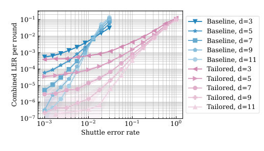
<figcaption class="paper-figure-caption"><b>Fig 6.</b> Fig. 5. Performance of the surface code shuttling schedule on the unit cell architecture [40] under varying shuttling noise, with and without CAbLECAR circuit tailoring. Tailoring allows the surface code to tolerate 5-10× higher shuttle error rates on the ancilla qubits. This increased noise resilience paves the way for considering more complex codes with longer shuttling paths.</figcaption>
</figure>
<figure class="paper-figure-card">
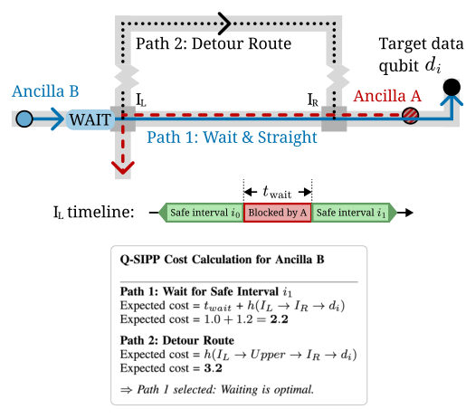
<figcaption class="paper-figure-caption"><b>Fig 7.</b> Fig. 7. A visualization of the Q-SIPP scheduling process resolving a spatial collision. Ancilla B must route to di but its shortest path through IL is temporarily blocked by Ancilla A. Instead of forcing B to take a collision-free detour, Q-SIPP projects the timeline of IL into continuous safe intervals. By calculating the heuristic cost h(s) of the detour versus the known penalty twait to utilize the next available safe interval (i1), the algorithm correctly determines that waiting at IL yields the time-optimal schedule.</figcaption>
</figure>
<figure class="paper-figure-card">
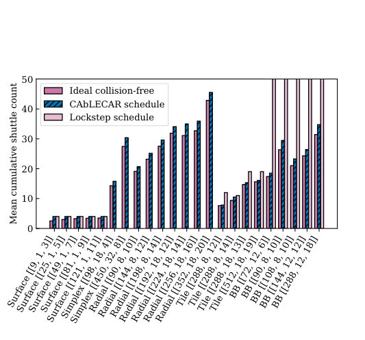
<figcaption class="paper-figure-caption"><b>Fig 8.</b> Fig. 8. Comparing average shuttle distance for CAbLECAR schedules compared to ideal minimum shuttle counts (assuming ancilla qubits can move freely past each other without collisions). We also compare to a “lockstep” schedule (all ancilla qubits moving together in a pattern) for codes where such a schedule exists. We find that CAbLECAR outperforms all lockstep schedules and is close to the collision-free ideal, with a minor 12.5% overhead (geomean). CAbLECAR reduces shuttle cost for Tile and BB codes by 19% and 86%, respectively, compared to hand-optimized lockstep schedules.</figcaption>
</figure>
<figure class="paper-figure-card">
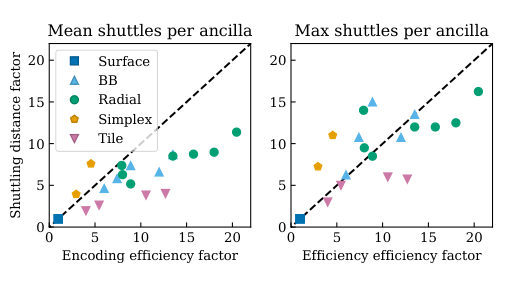
<figcaption class="paper-figure-caption"><b>Fig 9.</b> Fig. 9. Comparing shuttling overhead to efficiency factor kd2/n. Higher- efficiency codes from the Radial and Tile families improve encoding efficiency by more than their increase in shuttle count.</figcaption>
</figure>
<figure class="paper-figure-card">

<figcaption class="paper-figure-caption"><b>Fig 10.</b> Figure 8 shows the average number of unit-edge shuttles per ancilla qubit across the studied code instances. We compare the CAbLECAR optimized schedules against two baselines. First, the “ideal collision-free” schedule assumes that shuttled qubits are allowed to occupy the same shuttling channel and even pass by one another without collisions. Compared to this baseline, the CAbLECAR schedules (which prevent simulta- neous occupation of any shuttling channel) incur a geomean 12.5% shuttling overhead, demonstrating surprisingly near-</figcaption>
</figure>

**Main problem.** The difficulty of implementing high-rate QLDPC codes on semiconductor spin qubit architectures due to the mismatch between non-local code connectivity and the physical constraints of qubit shuttling, specifically regarding collision avoidance and shuttling-induced dephasing.

**Main result.** The development of the CAbLECAR framework and Q-SIPP algorithm enables efficient, collision-free ancilla routing, demonstrating that specific QLDPC codes can outperform surface codes by orders of magnitude in logical error rate when shuttling errors are sufficiently low.

**Method.** The authors use a noise-aware circuit tailoring technique to mitigate dephasing and a quantum-adapted Safe Interval Path Planning (Q-SIPP) algorithm for automated, time-optimized ancilla scheduling, validated via Stim circuit-level simulations.

**Summary.** This paper addresses the challenge of implementing high-rate QLDPC codes on spin qubit platforms that rely on physical qubit shuttling. By introducing a new scheduling algorithm (Q-SIPP) and a noise-aware circuit tailoring technique, the authors show how to mitigate dephasing and avoid collisions during ancilla movement. Their results demonstrate that under appropriate noise regimes, these advanced codes can provide massive improvements in both encoding efficiency and logical error rates compared to the standard surface code.

Detailed structure

**Model / system.** A tileable, modular semiconductor spin qubit architecture featuring a 2D grid of stationary data qubits and mobile ancilla qubits that are physically transported (shuttled) through interaction and readout zones.

**Key observables.** Logical error rate (pL), encoding efficiency (kd^2/n), shuttling overhead (ancilla movement counts), and physical error rates (p_sh, p_CX, p_H).

**Important parameters / regimes.** Shuttling error rates (ranging from 10^-1 to 10^-4), code parameters [[n, k, d]], and gate fidelities (approx 99.9%).

**Assumptions / limitations.** The evaluation assumes a simplified grid layout for data qubits and relies on the assumption that extremely low shuttling error rates (10^-4) are physically achievable.

**Figures summary.** Figure 1 shows the CAbLECAR framework overview; Figure 2 illustrates QEC syndrome extraction; Figure 3 depicts the tiled unit cell architecture; Figure 4 compares baseline vs. tailored circuits; Figure 5 shows logical error rate vs. shuttle error; Figure 6 displays an optimized movement schedule; Figure 7 visualizes collision resolution; Figure 8 compares shuttling overhead; Figure 9 shows encoding efficiency vs. overhead; Figure 12 compares various code families across error regimes.

**Paper structure.** The paper introduces the scalability bottleneck of surface codes, presents the CAbLECAR framework and Q-SIPP algorithm, details the noise-aware circuit tailoring technique, evaluates various QLDPC code families through circuit-level simulations, and concludes by identifying the performance crossover regime relative to the surface code.

Abstract

Semiconductor spin qubits are a promising platform for large-scale quantum computing, but have yet to take full advantage of the broad class of quantum low-density parity check (QLDPC) codes, which promise high encoding rates and efficient logic but require nonlocal connectivity between physical qubits. In this work, we investigate the implementation of QLDPC codes on a tileable, shuttling-based spin qubit architecture. By tailoring syndrome extraction circuits to the shuttling noise model, we significantly improve on previous surface code proposals and extend the feasible shuttling range of the architecture by 5-10x, enabling the implementation of more complex codes with long-range interactions. Taking inspiration from the field of robotics, we develop a coordinated shuttle scheduling algorithm that supports arbitrary codes and use it to benchmark the logical performance of a variety of promising code families. We find that the optimized schedules are up to 86% faster than hand-optimized schedules for certain code families. Through detailed circuit-level simulations, we identify specific QLDPC codes that improve upon prior surface code implementations by orders of magnitude, increasing encoding efficiency and reducing logical error rates. This work demonstrates the potential of shuttling-based spin qubit hardware platforms for scalable and efficient fault-tolerant quantum computation.

[↑ back to top](#top)

### [Conformal Invariance of the large-$N$ limit of the $O(N)$ universality class](http://arxiv.org/abs/2604.24675v1)

**Authors:** Santiago Cabrera, Gonzalo De Polsi, Adam Rançon, Nicolás Wschebor  
**Type:** theory · **Category:** statistical mechanics · **PDF:** <https://arxiv.org/pdf/2604.24675v1>  
**Analysis basis:** full PDF text, analyzed in chunks

↔ Scroll figures horizontally

<figure class="paper-figure-card">
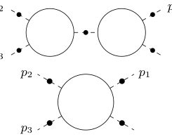
<figcaption class="paper-figure-caption"><b>Fig 1.</b> FIG. 2. Diagrammatic representation of two contributions to ˆΓ(4) vertex. Plain lines represent propagators. Integration over the loop is assumed. Dashed lines with a dot represent ˆΓ(2) vertices. The loop parts are equal to I(3) or I(4). Signs and factors N are omitted (see Eq. (42)). For each diagram, there are two possible extra permutations of momenta.</figcaption>
</figure>
<figure class="paper-figure-card">
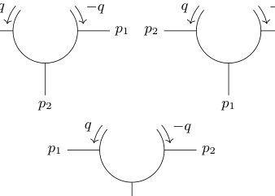
<figcaption class="paper-figure-caption"><b>Fig 2.</b> FIG. 4. Independent diagrams contributing to the only channel in H(3), where the continuous internal lines correspond to propagators given in Eq. (64) and vertices are just 1.</figcaption>
</figure>
<figure class="paper-figure-card">
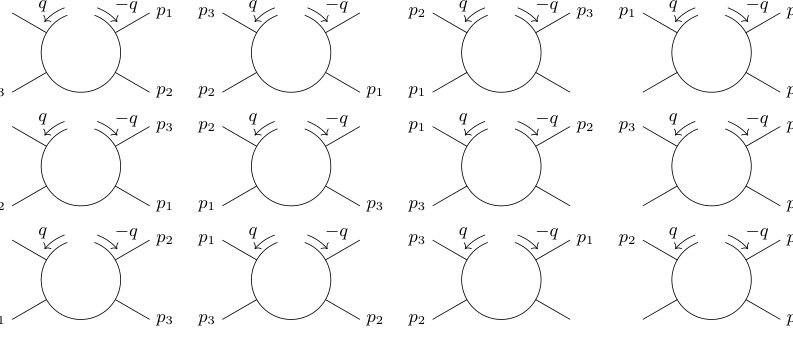
<figcaption class="paper-figure-caption"><b>Fig 3.</b> FIG. 5. Independent diagrams contributing to H(4), where the continuous internal lines correspond to propagators given in Eq .(64) and vertices are just 1. Notice that in every column, diagrams are equivalent up to a cyclic permutation of the explicit external momenta (p1, p2, p3), while diagrams within a row are equivalent up to a cyclic rotation of all external momenta. We thus refer to each row of diagrams as a different “channel”.</figcaption>
</figure>

**Main problem.** The paper investigates whether scale invariance automatically enhances to full conformal invariance at renormalization group fixed points in dimensions d > 2, specifically for the O(N) universality class.

**Main result.** The authors provide two rigorous proofs—one functional and one vertex-by-vertex—demonstrating that the large-N limit of the O(N) universality class is conformally invariant at the Wilson-Fisher fixed point.

**Method.** The study utilizes the Non-Perturbative Renormalization Group (NPRG) framework, employing Legendre transforms and analyzing modified Ward identities induced by an infrared regulator.

**Summary.** This paper provides a rigorous mathematical proof that the large-N limit of the O(N) universality class possesses full conformal symmetry. Using the non-perturbative renormalization group framework, the authors show that the scale-invariant Wilson-Fisher fixed point satisfies the necessary Ward identities for special conformal transformations. The work clarifies how the theory's structure reorganizes to realize this symmetry and provides general insights into the conditions for symmetry enhancement at criticality.

Detailed structure

**Model / system.** The model is the O(N)-symmetric scalar phi^4 theory, which includes universality classes such as the Ising, XY, and Heisenberg models, analyzed in the large-N limit.

**Key observables.** Correlation functions, critical exponents (such as nu), scaling dimensions (D_phi, D_sigma), and the energy-momentum tensor.

**Important parameters / regimes.** Dimension d (2 < d < 4), the large-N limit, the renormalization group scale k, and the vanishing anomalous dimension (eta = 0).

**Assumptions / limitations.** The proofs are specifically restricted to the large-N limit where the anomalous dimension eta is zero, and they assume the system is at the Wilson-Fisher fixed point.

**Figures summary.** The figures consist of diagrammatic representations of various vertex functions (H2, H3, gamma4) and their constituent loop channels and momentum-dependent contributions.

**Paper structure.** The paper introduces the problem of conformal symmetry in d > 2, establishes the NPRG framework and modified Ward identities, presents a functional proof of conformal invariance, provides a vertex-by-vertex proof in Fourier space, and concludes with detailed mathematical appendices verifying the algebraic identities.

Abstract

Conformal symmetry is expected to be realized in many equilibrium statistical mechanical systems at criticality. Although this is certainly true in two-dimensional systems, the three-dimensional case is subtler, and only a few proofs exist, only so in very specific cases. In this work, we give two proofs for the large $N$ limit of the $O(N)$ universality class within the non-perturbative renormalization group framework: one functional, and one vertex-by-vertex in Fourier space. While doing so, we unveil how the theory is structured in order for conformal symmetry to be realized. As a consequence, we shed light on what to expect, on rather general grounds, for a theory to be conformally invariant.

[↑ back to top](#top)

### [Do Quantum Transformers Help? A Systematic VQC Architecture Comparison on Tabular Benchmarks](http://arxiv.org/abs/2604.23931v1)

**Authors:** Chi-Sheng Chen, En-Jui Kuo  
**Type:** theory · **Category:** quantum information and computing · **PDF:** <https://arxiv.org/pdf/2604.23931v1>  
**Analysis basis:** full PDF text, analyzed in chunks

↔ Scroll figures horizontally

<figure class="paper-figure-card">
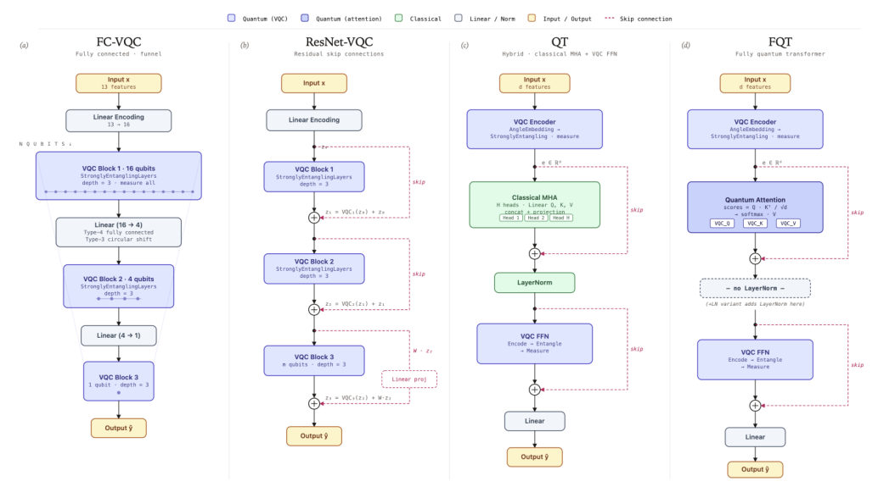
<figcaption class="paper-figure-caption"><b>Fig 1.</b> Fig. 1. Four model architectures compared. (a) FC-VQC with decreasing qubit count per block. (b) ResNet-VQC with dashed skip connections; the dimension-mismatched branch uses a linear projection W · z2. (c) QT — hybrid transformer with classical multi-head attention and a quantum VQC FFN, LayerNorm retained. (d) FQT — fully quantum attention via transpose-and-entangle T-qubit VQCs, with no LayerNorm by default.</figcaption>
</figure>
<figure class="paper-figure-card">
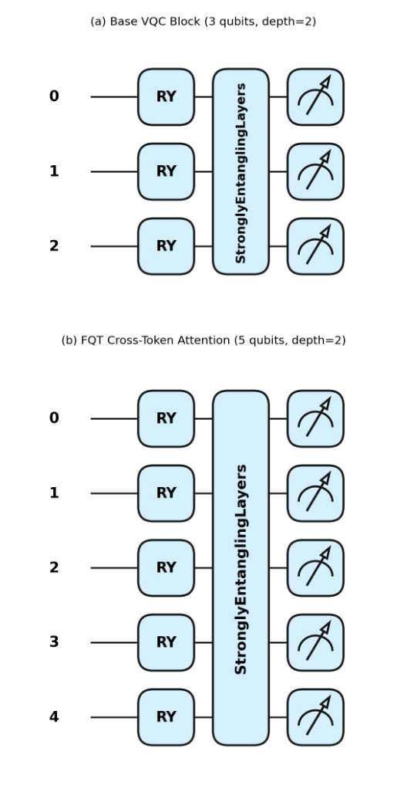
<figcaption class="paper-figure-caption"><b>Fig 2.</b> Fig. 2. Quantum circuits. Top: 3-qubit base VQC block (depth 2) used for per-token processing in all architectures. Bottom: 5-qubit cross-token VQC (depth 2) used in FQT’s quantum attention — each qubit corresponds to one token, enabling all-to-all entanglement across tokens.</figcaption>
</figure>
<figure class="paper-figure-card">
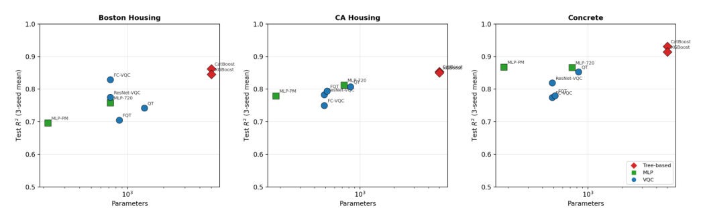
<figcaption class="paper-figure-caption"><b>Fig 3.</b> Fig. 3. Parameter efficiency across three regression datasets. Each point is a model; x-axis is parameter count (log scale), y-axis is 3-seed mean test R2. VQCs (blue circles) achieve competitive accuracy with far fewer parameters than tree-based methods (red diamonds), while MLPs (green squares) at equal capacity (MLP-720) underperform FC-VQC on Boston but catch up on larger datasets.</figcaption>
</figure>
<figure class="paper-figure-card">
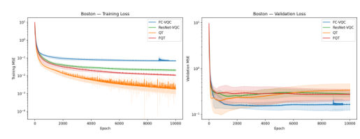
<figcaption class="paper-figure-caption"><b>Fig 4.</b> Fig. 4. Training and validation loss curves on Boston Housing (3-seed mean ± std shading). FC-VQC converges fastest; QT and FQT show higher variance across seeds.</figcaption>
</figure>
<figure class="paper-figure-card">
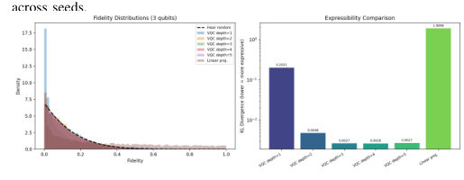
<figcaption class="paper-figure-caption"><b>Fig 5.</b> Fig. 5. Left: fidelity distributions for VQC at various depths vs. Haar-random reference (dashed). Right: KL divergence (log scale).</figcaption>
</figure>
<figure class="paper-figure-card">
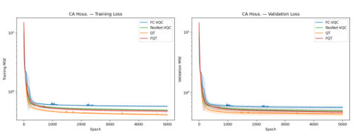
<figcaption class="paper-figure-caption"><b>Fig 6.</b> Fig. 6. Training and validation loss on CA Housing (n=20,640). Unlike Boston, QT (orange) converges to a lower val loss than FC-VQC (blue), consistent with its higher R2 on larger datasets.</figcaption>
</figure>
<figure class="paper-figure-card">
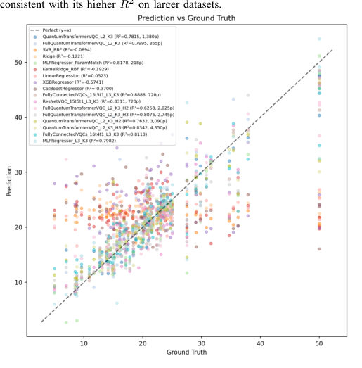
<figcaption class="paper-figure-caption"><b>Fig 7.</b> Fig. 7. Prediction vs. ground truth on Boston Housing test set (best-seed run). Points near the diagonal indicate accurate predictions. FC-VQC tracks ground truth closely despite using only 720 parameters.</figcaption>
</figure>

**Main problem.** The study addresses the lack of systematic architectural comparisons for Variational Quantum Circuits (VQCs) on classical tabular data, specifically investigating the trade-off between accuracy and parameter efficiency in quantum transformer architectures.

**Main result.** FC-VQCs achieve 90-96% of the R2 of attention-based VQCs with 40-50% fewer parameters and outperform equal-capacity MLPs, while Fully Quantum Transformers (FQT) show superior robustness to depolarizing noise compared to hybrid Quantum Transformers (QT).

**Method.** The authors perform a systematic empirical comparison of four VQC families across five regression and classification benchmarks using PennyLane simulations, evaluating metrics like R2, accuracy, expressibility (KL divergence), and noise robustness.

**Summary.** This paper provides a systematic comparison of different variational quantum circuit architectures for processing tabular data. It finds that simpler fully-connected VQCs are highly parameter-efficient and often outperform more complex quantum transformer models on small datasets. Notably, it demonstrates that fully quantum architectures are more robust to depolarizing noise than hybrid architectures. These findings offer practical guidance for designing efficient quantum machine learning models for near-term quantum hardware.

Detailed structure

**Model / system.** The study uses various VQC architectures (FC-VQC, ResNet-VQC, QT, and FQT) based on a parameterized ansatz of single-qubit rotations and CNOT entangling layers, applied to classical tabular datasets.

**Key observables.** R2 (coefficient of determination), classification accuracy, macro-averaged F1 score, KL-divergence (for expressibility), and parameter efficiency.

**Important parameters / regimes.** Circuit depth (d), number of attention heads (H), number of tokens (T), and depolarizing noise rate (pd).

**Assumptions / limitations.** The study assumes the relevance of NISQ-era constraints and relies on classical CPU simulations of quantum circuits.

**Figures summary.** Figure 1 provides an architectural overview; Figure 2 shows circuit diagrams; Figure 3 compares accuracy vs. parameter count; Figure 4 shows training/validation loss curves; Figure 5 shows fidelity distributions; Figure 6 shows convergence on larger datasets; Figure 7 shows prediction vs. ground truth.

**Paper structure.** The paper introduces the architectural problem, defines the four VQC families, details the experimental setup and benchmarks, presents comparative results on accuracy and efficiency, analyzes expressibility and noise robustness, and concludes with practical guidance for NISQ deployment.

Abstract

Variational quantum circuits (VQCs) are a leading approach to quantum machine learning on near-term devices, yet it remains unclear which circuit architecture yields the best accuracy-parameter trade-off on classical tabular data. We present a systematic empirical comparison of four VQC families -- multi-layer fully-connected (FC-VQC), residual (ResNet-VQC), hybrid quantum-classical transformer (QT), and fully quantum transformer (FQT) -- across five regression and classification benchmarks. Our key findings are: \textbf{(i)}~FC-VQCs achieve 90-96\% of the $R^2$ of attention-based VQCs while using 40-50\% fewer parameters, and consistently outperform equal-capacity MLPs (mean $R^2{=}0.829$ vs.\ MLP$_{720}$'s $0.753$ on Boston Housing, 3-seed average); \textbf{(ii)}~FC-VQC's Type~4 inter-block connectivity provides partial cross-token mixing that approximates the role of attention -- explicit quantum self-attention yields only marginal gains on most datasets while significantly increasing parameter count; \textbf{(iii)}~expressibility saturates at circuit depth~${\approx}\,3$, explaining why shallow VQCs already cover the Hilbert space effectively; \textbf{(iv)}~LayerNorm on the fully quantum transformer improves classification accuracy, suggesting normalization is important when all operations are quantum; \textbf{(v)}~in our noise study on Boston Housing, FQT degrades gracefully under depolarizing noise while QT collapses. All results are validated across three random seeds. These findings provide practical architectural guidance for deploying VQCs on near-term quantum hardware.

[↑ back to top](#top)

### [Efficient Quantum Fully Homomorphic Encryption](http://arxiv.org/abs/2604.23490v1)

**Authors:** Fengxia Liu, Zixian Gong, Kun Tian, Yi Zhang, Zhiming Zheng, Maozhi Xu  
**Type:** theory · **Category:** quantum information and computing · **PDF:** <https://arxiv.org/pdf/2604.23490v1>  
**Analysis basis:** full PDF text, analyzed in chunks

↔ Scroll figures horizontally

<figure class="paper-figure-card">
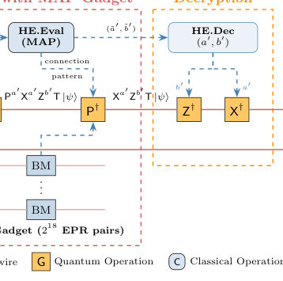
<figcaption class="paper-figure-caption"><b>Fig 1.</b> Figure 1: QFHE Quantum Circuit: T-gate Evaluation.</figcaption>
</figure>
<figure class="paper-figure-card">
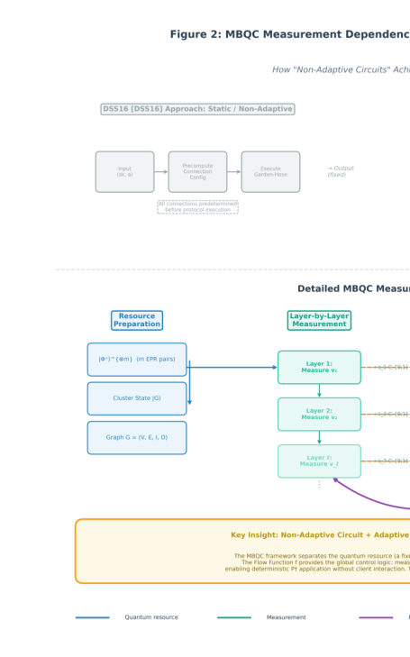
<figcaption class="paper-figure-caption"><b>Fig 2.</b> Figure 2: MBQC Dependency Flow - Adaptive Control via Flow Functions</figcaption>
</figure>

**Main problem.** Existing Quantum Fully Homomorphic Encryption (QFHE) schemes suffer from an exponential growth in quantum resource demands, specifically the number of EPR pairs required for quantum gadgets, relative to circuit depth.

**Main result.** The authors achieve an exponential improvement in efficiency, reducing the gadget size from O(lambda^2.58) to O(lambda log^2 lambda) EPR pairs, representing a concrete improvement factor of 2^15 to 2^18 for standard security parameters.

**Method.** The paper introduces a unified framework integrating Modular Arithmetic Programs (MAP), the garden-hose model, and Measurement-Based Quantum Computation (MBQC) to exploit the algebraic structure of LWE decryption.

**Summary.** This paper presents a highly efficient framework for Quantum Fully Homomorphic Encryption (QFHE) that significantly reduces the quantum resource overhead. By replacing generic Boolean circuit simulations with a specialized Modular Arithmetic Program (MAP) that tracks partial sums, the authors reduce the required number of EPR pairs from exponential to near-linear scaling. The resulting scheme supports fully classical clients and relies on standard classical LWE assumptions. This work moves QFHE from a theoretical concept toward a more practical implementation for secure quantum cloud computing.

Detailed structure

**Model / system.** The framework utilizes the Measurement-Based Quantum Computation (MBQC) model with a garden-hose protocol, employing the Quantum One-Time Pad (QOTP) and the Learning-with-Errors (LWE) cryptographic assumption.

**Key observables.** Gadget size (number of EPR pairs), branching program width and length, and security parameter lambda.

**Important parameters / regimes.** Security parameter lambda, LWE modulus q, and error standard deviation sigma (e.g., 3.2).

**Assumptions / limitations.** The scheme assumes a semi-honest server, the hardness of the classical LWE problem, and ideal, noiseless quantum operations (perfect EPR pairs and error-free measurements).

**Figures summary.** Figure 1 shows a quantum circuit diagram for T-gate evaluation; Figure 2 illustrates the MBQC dependency flow; Algorithm 1 and 2 compare different branching program approaches.

**Paper structure.** The paper identifies the efficiency bottleneck in QFHE, proposes a novel MAP tailored for LWE decryption, establishes a mapping via the garden-hose model to MBQC, provides complexity analysis and security proofs, and concludes with a comparison of concrete resource requirements.

Abstract

Quantum fully homomorphic encryption (QFHE) promises secure delegated quantum computation but has been impeded by the prohibitive quantum resource demands of existing constructions. This paper introduces a unified framework that achieves an \textbf{exponential improvement} in efficiency by synergistically integrating three theoretical tools: \textbf{modular arithmetic programs (MAP)}, the \textbf{garden-hose model}, and \textbf{measurement-based quantum computation (MBQC)}.   Our central innovation is a novel MAP tailored to the algebraic structure of Learning-with-Errors (LWE) decryption. Unlike generic approaches that incur exponential overhead, our MAP computes the inner product $\langle \boldsymbol{sk}, \boldsymbol{c} \rangle \bmod q$ by tracking a partial sum modulo $q$, requiring only $O(\log q)$ bits of state width. This yields branching programs of width $O(\log λ)$ and length $O(λ\log λ)$, thereby reducing the size of the essential quantum gadget from $O(λ^{2.58})$ to $O(λ\log^2 λ)$ EPR pairs -- a concrete improvement factor of $2^{15}$ to $2^{18}$ for standard security parameters.   Critically, we demonstrate that LWE decryption is not a \textbf{symmetric function}, necessitating our specialized MAP design beyond prior symmetric-function optimizations. The framework provides a direct mapping from the MAP to an efficient gadget via the garden-hose model, with MBQC furnishing the deterministic control flow for homomorphic evaluation.   The resulting QFHE scheme supports \textbf{fully classical clients}, relies solely on the \textbf{classical LWE assumption} (avoiding circular security or quantum hardness assumptions), and maintains compactness. This work dramatically lowers the quantum resource barrier for practical QFHE, paving the way for realistic privacy-preserving quantum cloud computing.

[↑ back to top](#top)

### [Electrical conductivity of crack-template-based transparent conducting films: mean-field approximation, effective medium theory, and simulation](http://arxiv.org/abs/2604.24211v1)

**Authors:** Yuri Yu. Tarasevich, Andrei V. Esrkepov, Irina V. Vodolazskaya  
**Type:** theory · **Category:** disordered systems and neural networks · **PDF:** <https://arxiv.org/pdf/2604.24211v1>  
**Analysis basis:** full PDF text, analyzed in chunks

↔ Scroll figures horizontally

<figure class="paper-figure-card">
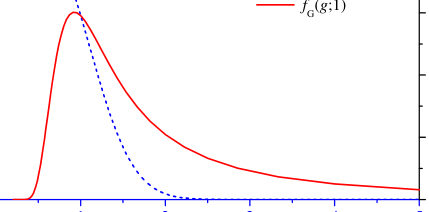
<figcaption class="paper-figure-caption"><b>Fig 1.</b> Figure 1. PDF of the length 𝑙and electrical conductivity 𝑔of edges in a network corresponding to the edges of a 2D PVD (5) for unit intensity of the Poisson process (one seed per unit area). The PDF of edge lengths was taken from [13], whereas the PDF of electrical conductivity was obtained using (5).</figcaption>
</figure>
<figure class="paper-figure-card">
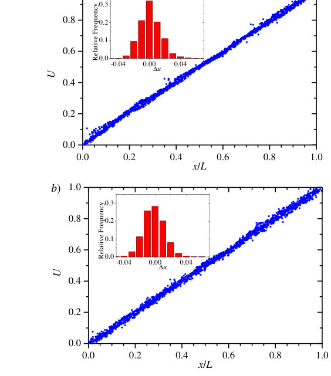
<figcaption class="paper-figure-caption"><b>Fig 2.</b> Figure 2. Node potentials as a function of the coordinate in networks corresponding to the edges of a 2D PVD with 1000 seeds. a) Original network, 𝜆= 1. b) Effective network, 𝑔m = 1. Insets: distributions of node potential fluctuations.</figcaption>
</figure>
<figure class="paper-figure-card">
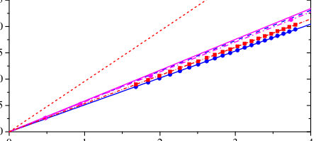
<figcaption class="paper-figure-caption"><b>Fig 3.</b> Figure 3. Comparison of direct calculation results of electrical conductivity of various networks with EMT predictions: for the original and effective networks obtained from a 2D PVD, and for a hexagonal network whose edge conductivities obey the distribution 𝑓𝐺(𝑔) shown in Fig. 1.</figcaption>
</figure>

**Main problem.** Evaluating the accuracy of analytical models, specifically Mean Field Approximation (MFA) and Effective Medium Theory (EMT), in predicting the electrical conductivity of crack-template-based transparent conducting films.

**Main result.** The MFA overestimates conductivity by approximately 13% for the original network and 79% for the effective network, with EMT being more accurate for periodic hexagonal lattices than for random Poisson-Voronoi diagrams.

**Method.** The study uses analytical approaches (MFA and EMT) combined with direct numerical simulations of 2D Poisson-Voronoi diagrams and periodic hexagonal networks to compare predicted versus actual conductivity.

**Summary.** This paper investigates how accurately standard analytical approximations can predict the electrical conductivity of random networks used in transparent conducting films. By modeling these films as Poisson-Voronoi diagrams, the authors demonstrate that the Mean Field Approximation significantly overestimates conductivity, especially in simplified 'effective' networks. The study highlights that structural homogeneity, such as in a hexagonal lattice, is crucial for the accuracy of Effective Medium Theory. These findings serve as a warning for researchers using simplified models to design hierarchical or complex crack-based electronic components.

Detailed structure

**Model / system.** The system consists of crack-template-based transparent conducting films modeled as 3-regular planar graphs corresponding to the edges of a 2D Poisson-Voronoi diagram, where edge conductivity is related to edge length.

**Key observables.** Electrical conductivity (G), edge length (l), edge conductivity (g), and node potential fluctuations (delta u).

**Important parameters / regimes.** Seed concentration (ns), areal mass density (mu), and conductivity constant (lambda).

**Assumptions / limitations.** The network is assumed to be macroscopically homogeneous and isotropic, with edge orientations and lengths being independent variables; metal conductivity is assumed temperature-independent.

**Figures summary.** Figure 1 shows probability density functions for edge length and conductivity; Figure 2 displays node potential distributions; Figure 3 compares conductivity results across different network types against theoretical predictions.

**Paper structure.** The paper introduces the problem of modeling crack-based films, defines the mathematical model using Poisson-Voronoi diagrams, applies MFA and EMT analytical frameworks, performs numerical simulations for validation, and concludes with a discussion on the error sources and limitations of the approximations.

Abstract

In our work, crack-template-based transparent conducting films were modeled as networks corresponding to the edges of a two-dimensional Poisson--Voronoi diagram. Two types of networks were considered: the original one, in which the conductivity of each edge was inversely proportional to its length, and the effective one, where all edges had the same conductivity obtained from the effective medium theory. The mean field approximation was used for analytical evaluation of the electrical conductivity. Direct numerical calculations for the Poisson--Voronoi diagram showed that the mean field approximation overestimated the conductivity of the original network by approximately 13\%, and of the effective network by 79\%. In addition, a hexagonal network with an edge conductivity distribution corresponding to the Poisson--Voronoi diagram was studied: for it, the predictions of the effective medium theory turned out to be more accurate than for the Poisson--Voronoi diagram, which was explained by the greater structural homogeneity of the periodic hexagonal lattice. Our results showed that when modeling crack-template-based transparent conducting films, especially in the case of hierarchical cracks with variable width (where the resistance was not simply proportional to the length), the application of the mean field approximation could potentially lead to significant errors.

[↑ back to top](#top)

### [Electron-phonon coupling across the TMD/hBN van der Waals interface](http://arxiv.org/abs/2604.24139v1)

**Authors:** G. Gatti, C. Berthod, J. Issing, M. Straub, S. Mandloi, Y. Alexanian, J. Avila, P. Dudin, T. K. Kim, M. D. Watson, C. Cacho, K. Watanabe, T. Taniguchi, W. Wang, N. Clark, R. Gorbachev, N. Ubrig, I. Gutierrez-Lezama, A. F. Morpurgo, A. Tamai, F. Baumberger  
**Type:** both · **Category:** strongly correlated electrons · **PDF:** <https://arxiv.org/pdf/2604.24139v1>  
**Analysis basis:** full PDF text, analyzed in chunks

↔ Scroll figures horizontally

<figure class="paper-figure-card">
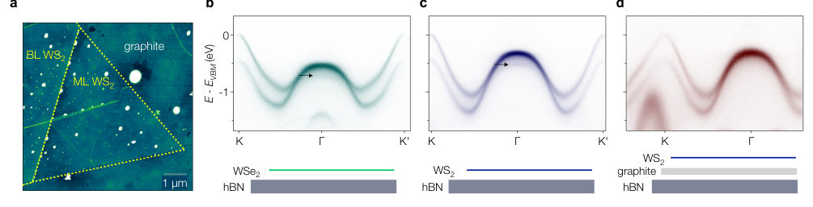
<figcaption class="paper-figure-caption"><b>Fig 1.</b> FIG. 1. Replica bands from forward electron-phonon scattering. a Atomic force microscopy (AFM) topography map of a WS2/graphite/hBN sample. b, c ARPES spectral functions along K-Γ-K’ for monolayer WSe2/hBN and WS2/hBN. The black arrow marks the dominant replica band. d ARPES spectral function of WS2/graphite/hBN. The replica band observed in (b,c) is absent.</figcaption>
</figure>
<figure class="paper-figure-card">
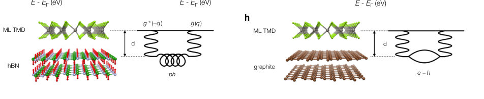
<figcaption class="paper-figure-caption"><b>Fig 2.</b> FIG. 2. Spectral function analysis. a Γ-valley ARPES spectral function of WS2/hBN. Energies are given relative to the local VBM EΓ at Γ. Markers indicate the position of the QP, S1 and S2 components extracted from a fit with 3 components. b EDC of WS2/hBN taken at Γ and a fit with the three components QP, S1 and S2. A small Shirley background has been subtracted from the data. c Fit with a minimal model for interfacial EPC. For details, see main text and App. E. d Comparison of the model with the ARPES EDC at Γ. e Sketch of the WS2/hBN interface and the associated Feynman diagram for remote EPC. f, g Γ-valley ARPES spectral function of WS2/graphite/hBN. The black line in g is a fit with the...</figcaption>
</figure>
<figure class="paper-figure-card">
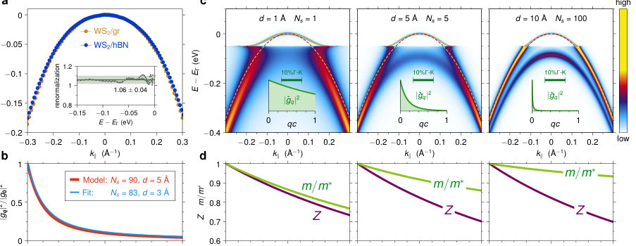
<figcaption class="paper-figure-caption"><b>Fig 3.</b> FIG. 3. Suppression of mass enhancement and momentum dependence of interfacial EPC. a Quasiparticle dispersion for WS2/hBN and WS2/graphite/hBN. The inset shows the renormalization E −EΓ(WS2/gr)/E −EΓ(WS2/hBN), which is a measure of the mass enhancement m∗/m. b Comparison of ¯g2 q obtained from the best fit to the data with the prediction of Eq. (2) with the nominal parameters Ns = 90, d = 5 ˚A. c Model spectral functions for different forms of ¯g2 q illustrate the evolution of kinks into replica bands with increasing forward scattering. All spectral functions are calculated for λ = 0.5 and a single phonon mode with ℏω0 = 50 meV. d Mass enhancement m∗/m and quasiparticle residue Z for the...</figcaption>
</figure>
<figure class="paper-figure-card">
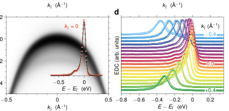
<figcaption class="paper-figure-caption"><b>Fig 4.</b> FIG. 4. a Theoretical ARPES bandmap computed with the initial values of the parameters. The inset shows the experimental EDC at k∥= 0 (red symbols) together with the theoretical curve. b ARPES bandmap computed after some parameters have been adjusted to fit the EDC at k∥= 0. A small background (grey shade) is included. c ARPES bandmap and EDC at k∥= 0 computed after an optimization of all parameters. d Best fit (solid lines) to 18 experimental EDC curves (circles) with a momentum dependent amplitude. The curves are shifted vertically for clarity.</figcaption>
</figure>
<figure class="paper-figure-card">
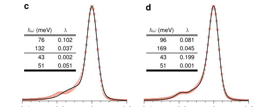
<figcaption class="paper-figure-caption"><b>Fig 5.</b> FIG. 5. Best fit of four different models (solid lines) to the WS2/hBN EDC at Γ (dots). The first (last) rows in each table show the energies and coupling strengths to hBN (WS2) phonons. a. Only hBN phonons. b Only hBN phonons with fixed ℏω1/ℏω2. c hBN phonons with fixed ℏω1/ℏω2 and unoptimized WS2 phonons. d Like c, but with optimized coupling to WS2 phonons.</figcaption>
</figure>
<figure class="paper-figure-card">
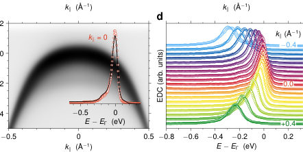
<figcaption class="paper-figure-caption"><b>Fig 6.</b> FIG. 6. a Theoretical ARPES bandmap computed with the initial values of the parameters for WSe2/hBN. The inset shows the exper- imental EDC at k∥= 0 (red symbols) together with the theoretical curve. b ARPES bandmap computed after some parameters have been adjusted to fit the EDC at k∥= 0. A small background (grey shade) is included. c ARPES bandmap and EDC at k∥= 0 computed after an optimization of all parameters. d Best fit (solid lines) to 19 experimental EDC curves (circles) with a momentum dependent amplitude. The curves are shifted vertically for clarity.</figcaption>
</figure>
<figure class="paper-figure-card">
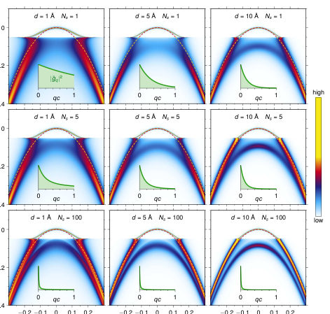
<figcaption class="paper-figure-caption"><b>Fig 7.</b> FIG. 8. Spectral function A(k, E) for a parabolic band of mass mb = m and a single phonon of energy ℏω0 = 0.05 eV, a coupling strength λ = 0.5, and various values of d and Ns. The small broadening of A(k, E −EΓ &gt; −ℏω0) reflects the value δ = 0.1 meV. The dashed line in each panel shows the bare band and the inset displays the coupling function ¯g2 q.</figcaption>
</figure>
<figure class="paper-figure-card">
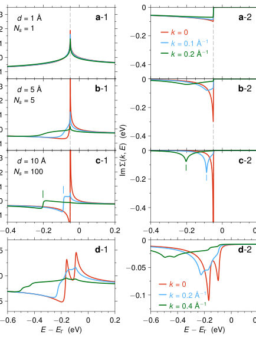
<figcaption class="paper-figure-caption"><b>Fig 8.</b> FIG. 7. Real part (left panels) and imaginary part (right panels) of the self-energy vs energy for three wavevectors k. Panels a, b, and c display the self-energy for a parabolic band of mass mb = m and a single phonon of energy ℏω0 = 0.05 eV, a coupling strength λ = 0.5, and a d = 1 ˚A, Ns = 1, b d = 5 ˚A, Ns = 5, and c d = 10 ˚A, Ns = 100. Panels d display the self-energy due to the hBN modes with the parameters optimized for WS2/hBN, which corresponds to λ = 0.14. The dashed gray lines indicate the energy of the phonon and the vertical bars in c mark the energy ℏ2k2/(2m) measured from the phonon energy.</figcaption>
</figure>
<figure class="paper-figure-card">
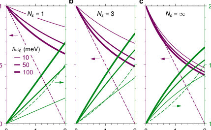
<figcaption class="paper-figure-caption"><b>Fig 9.</b> FIG. 9. Quasiparticle residue (left axes) and mass enhancement (right axes) versus α. The dashed lines show the weak-coupling behavior for the Fr¨ohlich polaron. The solid lines show the results obtained with Eqs. (I1a), (I2) and (I3) with three different phonon frequencies for a Ns = 1, b Ns = 3, and c Ns = ∞. The other parameters are mb = m and d = 0.</figcaption>
</figure>

**Main problem.** The study aims to detect and quantify long-range electron-phonon coupling (EPC) across the van der Waals interface between transition metal dichalcogenides (TMDs) and hexagonal boron nitride (hBN).

**Main result.** The researchers demonstrate that quasiparticles in TMDs are dressed by a remote cloud of phonons from the adjacent hBN layer, characterized by a long-range, forward-scattering interaction that suppresses mass enhancement.

**Method.** The study uses micro-focus angle-resolved photoemission spectroscopy (mu-ARPES) combined with a modified Fröhlich model and global optimization of a self-energy-based spectral function.

**Summary.** This paper identifies that electrons in TMD monolayers are significantly affected by phonons residing in the adjacent hBN layer. By using high-resolution ARPES, the authors observe 'replica bands' that serve as a fingerprint of this remote electron-phonon coupling. They show that this interaction is long-range and characterized by forward scattering, which explains why the expected increase in effective mass is not observed. This finding suggests that the properties of vdW heterostructures can be tuned by the vibrational modes of adjacent layers.

Detailed structure

**Model / system.** The physical system consists of monolayer TMDs (WS2 and WSe2) on hBN substrates, compared against a control system with a graphite buffer layer. The theoretical framework uses a 2D electron liquid coupled to a 3D polar substrate via a Fröhlich-type Hamiltonian.

**Key observables.** Replica bands (satellites), quasiparticle residue (Z), effective mass enhancement (m*/m), and energy distribution curves (EDCs).

**Important parameters / regimes.** Phonon energies (hBN LO/ZO and TMD LO/A1 modes), coupling strengths (alpha), separation distance (d), and number of hBN layers (Ns).

**Assumptions / limitations.** The model assumes dispersionless phonon modes and a 2D electron gas interacting with a polar 3D ionic substrate.

**Figures summary.** Figure 1 shows AFM topography and ARPES spectral functions; Figure 2 displays spectral function analysis and EDCs; Figure 4 presents theoretical ARPES bandmaps and fits to experimental data.

**Paper structure.** The paper introduces the challenge of interlayer interactions, describes the experimental setup and sample preparation, presents the discovery of remote phonon satellites, develops a modified Fröhlich model to explain the data, and discusses the implications for mass enhancement and universality.

**Why it may be interesting.** The discovery of a long-range, forward-scattering interaction that decouples quasiparticle residue from effective mass provides a unique example of how momentum-dependent many-body interactions can fundamentally alter the renormalization of particles in 2D systems.

Abstract

Many-body interactions can couple electronic states in one layer with collective excitations in the adjacent layer, providing a route to tailor properties of heterostructures. However, detecting and quantifying interlayer many-body interactions proved a major challenge. Here, we demonstrate that quasiparticles in monolayer transition metal dichalcogenides (TMDs) are dressed by a remote cloud of phonons in the adjacent hexagonal boron nitride slab. Using angle resolved photoemission, we identify replica bands in the TMDs which are a clear fingerprint of long-range electron-phonon interaction. We develop a modified Fröhlich model that shows semi-quantitative agreement with the experimental spectral functions. Our analysis shows that remote electron-phonon coupling is a generic property of interfaces with hBN. This has implications for electron mobilities in 2D materials, for superconductivity and possibly for moiré correlated phases.

[↑ back to top](#top)

### [Equations of Motion for an Economy: Capital Deepening, Technology, and Firm Survival](http://arxiv.org/abs/2604.22995v1)

**Authors:** Robert T. Nachtrieb  
**Type:** theory · **Category:** statistical mechanics · **PDF:** <https://arxiv.org/pdf/2604.22995v1>  
**Analysis basis:** full PDF text, analyzed in chunks

↔ Scroll figures horizontally

<figure class="paper-figure-card">
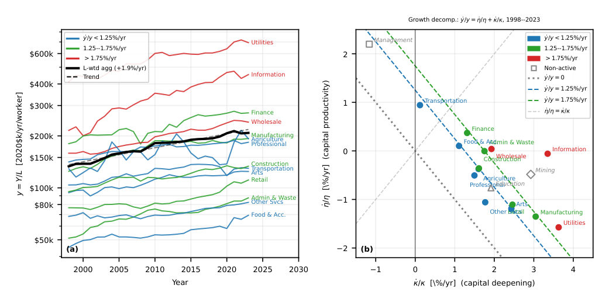
<figcaption class="paper-figure-caption"><b>Fig 1.</b> FIG. 1. Capital deepening drives output growth. BEA 2-digit NAICS, 1998–2023 (2020 $), 14 active sectors, L-weighted; Real Estate excluded (imputed rent artefact). (a) Real output per worker y = ηκ by sector (log scale); colours by growth rate: blue &lt; 1.25% yr−1, green 1.25–1.75%, crimson &gt; 1.75%; black = L-weighted aggregate (+1.9% yr−1). (b) Growth decomposition ˙y/y = ˙η/η + ˙κ/κ; open markers: non-active sectors. All sectors lie above ˙y/y = 0; capital deepening dominates; ˙η/η ≤0 in 13 of 17 sectors.</figcaption>
</figure>
<figure class="paper-figure-card">
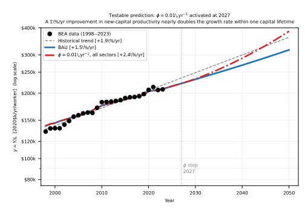
<figcaption class="paper-figure-caption"><b>Fig 2.</b> FIG. 2. Falsifiable prediction: ϕ = 0.01 yr−1 at 2027, all 14 active sectors. Black dots: BEA observed y(t), 1998– 2023. Grey dashed: historical trend (+1.9% yr−1). Blue: business-as-usual (+1.5% yr−1). Red dash-dot: ϕ = 0.01 yr−1</figcaption>
</figure>

**Main problem.** The paper seeks to derive the equations of motion for economic growth and firm survival without assuming a production function, specifically distinguishing between capital deepening and productivity improvement.

**Main result.** The study finds that historical growth has been driven by a 'structural cheapening' channel (mu) rather than a 'productivity' channel (phi), which has been zero for 75 years, and predicts that a small positive phi would significantly accelerate growth.

**Method.** The author uses a dynamical systems approach with four coupled ordinary differential equations, calibrated against BEA and BDS economic datasets using the Nelder-Mead algorithm and Kalman filtering.

**Summary.** This paper develops a dynamical model of economic growth based on accounting identities rather than traditional production functions. It identifies two distinct channels for capital productivity: one that makes capital cheaper and one that makes it more capable. By analyzing decades of US economic data, the author demonstrates that the productivity channel has been stagnant (zero) for the last 75 years. The paper concludes with a specific, testable prediction that a small increase in the productivity channel could nearly double the aggregate growth rate.

Detailed structure

**Model / system.** A competitive economy modeled at the sector level as a dynamical system of coupled relaxation equations governing capital per worker, capital productivity, and labor share, linked to micro-scale firm dynamics via a cash martingale and Zipf's law.

**Key observables.** Real output per worker (y), capital per worker (kappa), capital productivity (eta), and firm exit rates.

**Important parameters / regimes.** mu (structural cheapening rate), phi (productivity improvement rate), eta* (profit imperative/breakeven productivity), and alpha (Zipf exponent).

**Assumptions / limitations.** The model assumes a competitive economy, uses accounting identities instead of production functions, and treats firm cash reserves as a martingale under i.i.d. shocks.

**Figures summary.** Figure 2 provides a forecast of output per worker, comparing historical BEA trends and a business-as-usual projection against a testable prediction of increased growth if the productivity channel (phi) becomes positive.

**Paper structure.** The paper begins with the derivation of equations of motion from accounting identities, introduces the two-channel productivity model, presents calibration results against historical US sector data, connects macro-dynamics to micro-scale firm exit rates, and concludes with a falsifiable growth prediction.

Abstract

We derive equations of motion for capital deepening in a competitive economy directly from accounting identities, without assuming a production function. A profit imperative $η^* \equiv (w/κ+ 1/τ)/(1-f_p)$ sets the minimum viable capital productivity, where $η= Y/K$ [yr$^{-1}$] is capital productivity, $κ= K/L$ is capital per worker, $w$ is the wage rate, $τ$ is the capital lifetime, and $f_p$ is the production tax share. Four coupled relaxation equations govern $κ$, $η$, the frontier productivity $η_{\rm new}$ of new investment, and the labor share $q \equiv w/y$, with the sandwich constraint $η^* \leq η_{\rm new} \leq η$ maintained as an exact invariant. The frontier equation separates two physically distinct channels: a structural cheapening channel ($μ$, always active, drives $η_{\rm new}$ downward) and a productivity channel ($φ$, historically zero). Calibration against BEA 2-digit NAICS sector data (1998--2023) confirms $φ= 0$ for all identifiable sectors over 25 years; the 75-year postwar record extends this finding across four capital lifetimes. A step $φ= 0.01$\,yr$^{-1}$ -- a 1\%/yr improvement in new-capital productivity, modest but historically unprecedented -- nearly doubles the aggregate growth rate within one capital lifetime, a falsifiable prediction with a precise observable signature: upward-curving $η(t)$ in BEA sector data. Firms near the zero-profit threshold have a cash martingale, predicting establishment exit rate $\sim t^{-1/2}$; convolved with the Zipf firm-size distribution~\cite{WP}, this yields firm exit rate $\sim t^{-1/2}\!\log t$ with apparent exponent $b = 0.295 \pm 0.03$, confirmed against BDS data with no free parameters.

[↑ back to top](#top)

### [Exact momentum-space analysis of small spin-1/2 $J_1$-$J_2$ rings](http://arxiv.org/abs/2604.23149v1)

**Authors:** Zimeng Li, Ning Wu  
**Type:** theory · **Category:** strongly correlated electrons · **PDF:** <https://arxiv.org/pdf/2604.23149v1>  
**Analysis basis:** full PDF text, analyzed in chunks

↔ Scroll figures horizontally

<figure class="paper-figure-card">
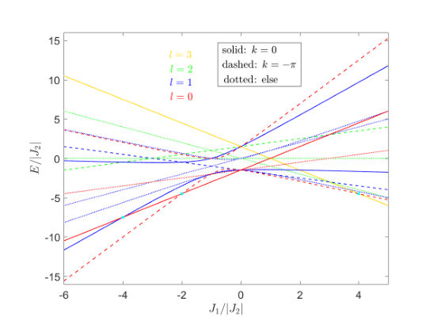
<figcaption class="paper-figure-caption"><b>Fig 1.</b> FIG. 1: Full spectrum of H(isp)(6) plotted by using the ana- lytical expressions listed in Table V. Energy levels labeled by different l’s are plotted in different colors, while those with k = 0 and k = −π are respectively indicated by solid and dashed curves. There are two ground-state level crossings at the MG point and the HKNN point.</figcaption>
</figure>
<figure class="paper-figure-card">
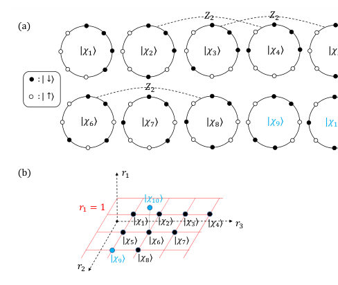
<figcaption class="paper-figure-caption"><b>Fig 2.</b> FIG. 2: (a) The ten local states |1, 1 + r1, 1 + r1 + r2, 1 + r1 + r2 + r3⟩from which we construct the ten four-magnon Bloch states |χi(k)⟩(i = 1, 2, · · · , 10) for k ∈K4. The dashed curves link two Bloch states connected by the Z2 transformation. (b) The ten Bloch states defines a ten-dimensional single-particle problem on the r1-r2-r3 lattice.</figcaption>
</figure>
<figure class="paper-figure-card">
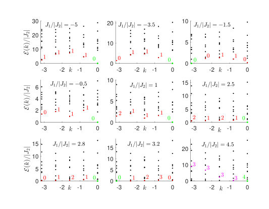
<figcaption class="paper-figure-caption"><b>Fig 3.</b> FIG. 4: The full excitation spectrum E(k)/|J2| = [E(k) − EGS]/|J2| for various values of J1/|J2|. The lowest excita- tion energy for each k is indicated in red and the green dot corresponds to the ground state. The quantum number l is shown beside each of the above dots. In the last panel with J1/|J2| = 4.5, the ground state is ferromagnetic and the spin- wave spectrum with l = 3 is indicated in pink.</figcaption>
</figure>
<figure class="paper-figure-card">
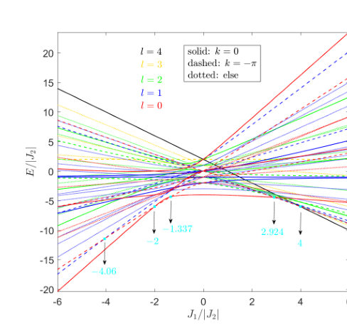
<figcaption class="paper-figure-caption"><b>Fig 4.</b> FIG. 3: Full spectrum of H(isp)(8) plotted by using the block Hamiltonians with fixed l’s. Energy levels labeled by dif- ferent l’s are plotted in different colors, while those with k = 0 and k = −π are respectively indicated by solid and dashed curves. There are four ground-state level crossings at J1/|J2| = −2, −1.337, 2.924, and 4. A singlet-triplet crossing in the first excited state also occurs at J1/|J2| = −4.06.</figcaption>
</figure>
<figure class="paper-figure-card">
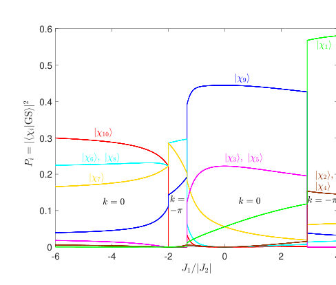
<figcaption class="paper-figure-caption"><b>Fig 5.</b> FIG. 5: The weight Pi = |⟨χi(k)|GS⟩|2 of the Bloch state |χi(k)⟩in the ground state |χi(k)⟩.</figcaption>
</figure>
<figure class="paper-figure-card">
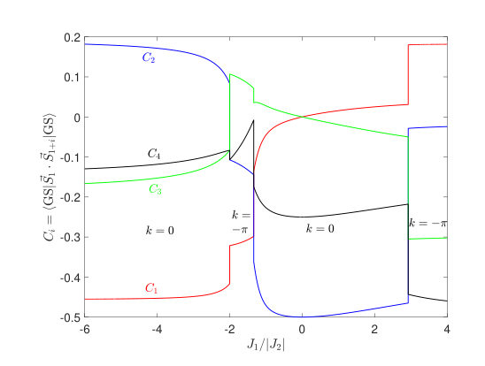
<figcaption class="paper-figure-caption"><b>Fig 6.</b> FIG. 6: Ground-state spin correlations Cr = ⟨GS|⃗S1⃗S1+r|GS⟩ (r = 1, 2, 3, and 4).</figcaption>
</figure>

**Main problem.** The paper seeks to establish an exact connection between real-space and momentum-space representations of the $J_1$-$J_2$ spin chain and to analyze the energy spectrum and ground-state properties of small spin-1/2 rings.

**Main result.** The authors successfully block-diagonalize the Hamiltonian for $N=6$ and $N=8$ rings into small matrices and demonstrate that momentum-space manifestations of the Majumdar-Ghosh and HKNN ground states are equivalent to their real-space dimer counterparts.

**Method.** The study utilizes an exact momentum-space analysis based on a set of few-magnon Bloch states to reduce the Hamiltonian into small block matrices, combined with analytical solutions and dimer expansion techniques.

**Summary.** This paper provides an exact analytical and numerical framework for studying small $J_1$-$J_2$ spin rings in momentum space. By using few-magnon Bloch states, the authors reduce the complex many-body problem into much smaller, manageable matrix blocks. They explicitly show how well-known real-space dimerized ground states, like the Majumdar-Ghosh state, appear in momentum space. The study also identifies zero-energy states and suggests that the HKNN ground state may behave as a bound state of magnons.

Detailed structure

**Model / system.** The system consists of $N=6$ and $N=8$ site spin-1/2 $J_1$-$J_2$ rings with nearest-neighbor and next-nearest-neighbor exchange interactions, including both isotropic and anisotropic (XXZ) cases.

**Key observables.** Eigenenergies, eigenstates, total angular momentum ($l$), momentum ($k$), magnetization ($M$), and spin correlation functions ($C_r$).

**Important parameters / regimes.** Exchange interaction ratio $J_1/J_2$, anisotropy parameters $\Delta_1$ and $\Delta_2$, and ring size $N$.

**Assumptions / limitations.** The analysis is limited to small ring sizes ($N=6, 8$), and certain sectors of the Hamiltonian could not be solved in closed form using Mathematica.

**Figures summary.** Figure 6 plots ground-state spin correlation functions ($C_r$) for different distances $r$, illustrating how they evolve with the $J_1/J_2$ ratio.

**Paper structure.** The paper introduces the $J_1$-$J_2$ model, details the momentum-space block-diagonalization method using Bloch states, analyzes the $N=6$ anisotropic and $N=8$ isotropic spectra, discusses specific ground-state points (MG and HKNN), and concludes with a conjecture on the nature of the HKNN state.

Abstract

This paper considers an $N$-site spin-1/2 $J_1$-$J_2$ ring with $N=6$ and $8$. With the help of a set of exact few-magnon Bloch states, we obtain the block-diagonalized Hamiltonian consisting of block matrices of at most four dimensions. Partial of the eigenstates are analytically solved. For the six-site anisotropic ring, we reveal a subset of eigenstates that are simultaneous eigenstates of the Hamiltonian and the total angular momentum operator, even though the latter is not conserved. For both the six- and eight-site isotropic rings, we achieve momentum-space manifestations of several important states, including the famous Majumdar-Ghosh (MG) ground states and the Hamada-Kane-Nakagawa-Natsume (HKNN) ground state. The equivalence of these states with their real-space counterparts is explicitly shown for $N=6$. The structure of the HKNN ground state for small rings suggests that for any even number $N$ this state might behave like a ``bound state" with $N/2$ successive down spins binding together.

[↑ back to top](#top)

### [Exhaustive and feasible parametrisation with applications to the travelling salesperson problem](http://arxiv.org/abs/2604.24297v1)

**Authors:** Marvin Schwiering, Timo Ziegler, Lennart Binkowski, Benjamin Sambale  
**Type:** theory · **Category:** quantum information and computing · **PDF:** <https://arxiv.org/pdf/2604.24297v1>  
**Analysis basis:** full PDF text, analyzed in chunks

↔ Scroll figures horizontally

<figure class="paper-figure-card">
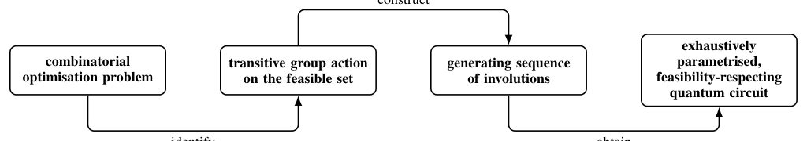
<figcaption class="paper-figure-caption"><b>Fig 1.</b> Fig. 1. High-level overview of our abstract pipeline for constructing exhaustively parametrised, feasibility-respecting quantum circuits for combinatorial optimisation problems. The task of exactly and exclusively preparing all feasible solutions via paremtrised quantum circuits can be reduced to concepts of elementary group theory. The two key ingredients are a transitive group action on the problem’s feasible set, often available from decades of operational research studying symmetries in the feasible set, and a generating sequence of involutions. The output of the pipeline is an exhaustively parametrised, feasibility-respecting quantum circuit with a fixed number of parameters.</figcaption>
</figure>
<figure class="paper-figure-card">
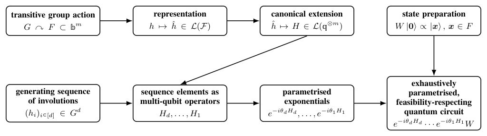
<figcaption class="paper-figure-caption"><b>Fig 2.</b> Fig. 2. Abstract pipeline for constructing an exhaustively parametrised, feasibility-respecting quantum circuit from a transitive group action on the feasible set F ⊂𝕓m. Central to this construction is the existence of a generating sequence of involutions, whose elements can be represented as m-qubit operators. Exponentiating these operators, introducing real parameters in the exponent, and prepending the state preparation of some feasible computational basis state |x⟩, completes the construction.</figcaption>
</figure>
<figure class="paper-figure-card">
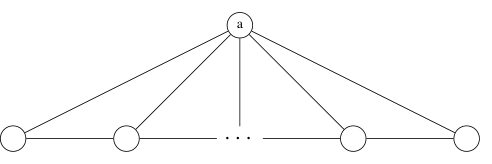
<figcaption class="paper-figure-caption"><b>Fig 3.</b> Fig. 4. Qubit connectivity required for implementing the exhaustively parametrised quantum circuit based on the bubble sort sequence. The m data qubits, encoding the TSP solutions, can be aligned on a chain. The ancilla qubit, serving as control for the Fredkin gates, has to be connected to all m data qubits. Alternatively, one can introduce m −1 ancilla qubits, each connected to two contiguous data qubits.</figcaption>
</figure>
<figure class="paper-figure-card">
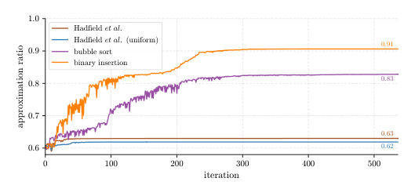
<figcaption class="paper-figure-caption"><b>Fig 4.</b> Fig. 5. Approximation ratios obtained after each COBYLA iteration, using different parametrised quantum circuits on a 9-city TSP instance. The QAOA with Hadfield et al.’s mixers was not able to significantly improve initial state’s approximation ratio, neither if a single computational basis state, nor the uniform superposition of all feasible states, was used. In contrast, the exhaustively parametrised circuit based on bubble sort was able to push the initial ratio of ≈0.60 to 0.83, while the construction based on the binary insertion sequence even reached a final approximation ratio of 0.91. Not depicted here: the bubble sort-inspired approach did not terminate before 2300 steps, but was...</figcaption>
</figure>

**Main problem.** Addressing the reachability and feasibility issues in QAOA, where conventional circuits may not cover all optimal solutions or may include infeasible states for constrained combinatorial optimization problems.

**Main result.** The authors develop a pipeline to construct 'exhaustively parameterized, feasibility-respecting' quantum circuits that are guaranteed to reach every feasible solution with a fixed number of parameters, demonstrating superior performance on TSP instances.

**Method.** The method uses group theory, specifically identifying transitive group actions and generating sequences of involutions, to build parameterized unitaries that navigate the feasible subspace of a problem.

**Summary.** This paper introduces a new class of quantum circuits for combinatorial optimization that are guaranteed to reach all feasible solutions, including the optimum, without leaving the feasible subspace. By leveraging group theory and generating sequences of group elements, the authors provide a systematic way to build these circuits. They demonstrate that for the Traveling Salesperson Problem, a binary insertion-based construction significantly outperforms standard QAOA in numerical tests. This approach reduces the parameter space and improves the efficiency of the classical optimization process.

Detailed structure

**Model / system.** The study focuses on the Traveling Salesperson Problem (TSP) modeled as an optimization over the symmetric group $S_n$, using both one-hot and compact qubit encodings.

**Key observables.** Approximation ratio (normalized expectation value of the objective Hamiltonian).

**Important parameters / regimes.** Number of variational parameters (scaling as $O(n^2)$ for bubble sort and $O(n \log n)$ for binary insertion) and the number of layers $p$.

**Assumptions / limitations.** The numerical validation assumes noiseless qubits and focuses on small-scale instances (up to 9 cities); it does not guarantee that the required optimal parameters can be found efficiently.

**Figures summary.** Figure 1 shows the abstract pipeline; Figure 2 illustrates the circuit construction flow; Figure 3 shows the implementation of exponentiated involutions using an ancilla; Figure 4 shows qubit connectivity; Figure 5 compares approximation ratios vs. optimization iterations for different methods.

**Paper structure.** The paper introduces the concept of exhaustive reachability, provides a group-theoretic mathematical framework (the abstract pipeline), applies this to TSP via bubble sort and binary insertion constructions, and concludes with numerical benchmarks and limitations.

Abstract

This paper introduces the concept of exhaustively parametrised, feasibility-respecting quantum circuits for constrained combinatorial optimisation problems. Such circuits can reach, given the right parameter values, every feasible solution with certainty -- including the optimum -- with a fixed number of parameters, while avoiding infeasible solutions altogether. This is in sharp contrast to conventional quantum alternating operator ansatz schemes, which are merely guaranteed to reach the optimum asymptotically. We introduce an abstract pipeline for constructing exhaustively parametrised, feasibility-respecting circuits from a transitive group action on a problem's feasible set. Our constructions rely on the simple combination of the group action with group representation and the novel notion of generating sequences: group elements in fixed order, possibly with repetitions, that generate the entire group. That is, we trace expressivity of parametrised quantum circuits back to the most fundamental concepts of group theory. We apply this pipeline to two concrete examples for the travelling salesperson problem, thus showing that exhaustively parametrised, feasibility-respecting circuits are not an empty definition. Furthermore, we provide numerical proof-of-principles on instances with up to nine cities, comparing the suitability of our constructions for parameter optimisation purposes against established mixers.

[↑ back to top](#top)

### [Explore Simpler Eigenmarking: Quantum Entailment Model Checking](http://arxiv.org/abs/2604.23531v1)

**Authors:** Tatpong Katanyukul  
**Type:** theory · **Category:** quantum information and computing · **PDF:** <https://arxiv.org/pdf/2604.23531v1>  
**Analysis basis:** full PDF text, analyzed in chunks

↔ Scroll figures horizontally

<figure class="paper-figure-card">
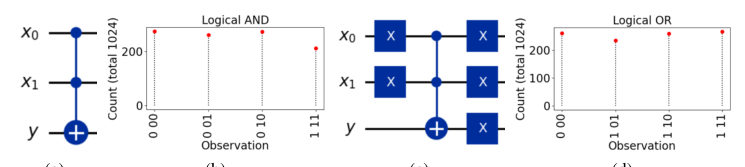
<figcaption class="paper-figure-caption"><b>Fig 1.</b> FIGURE 1. Quantum gate applications: (a) logical AND, (b) its simulated result, (c) logical OR, and (d) its simulated result.</figcaption>
</figure>
<figure class="paper-figure-card">
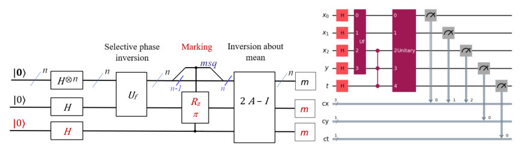
<figcaption class="paper-figure-caption"><b>Fig 2.</b> FIGURE 2. Simpler Eigenmarking. Generic diagram (left) and Qiskit graphic draw of a three-qubit system (right): x2 is the most significant qubit (msq).</figcaption>
</figure>
<figure class="paper-figure-card">
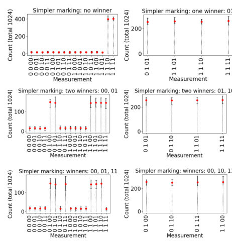
<figcaption class="paper-figure-caption"><b>Fig 3.</b> FIGURE 3. Plots of experimental results on a two-qubit system simulation. A target state has prefix 01.</figcaption>
</figure>
<figure class="paper-figure-card">
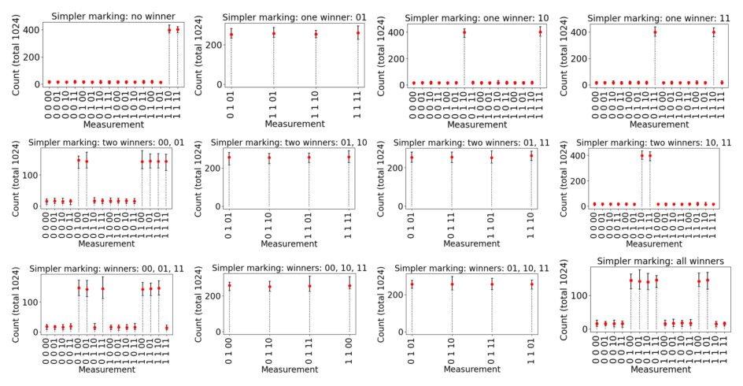
<figcaption class="paper-figure-caption"><b>Fig 4.</b> Figure 4 shows diagrams implemented entailment model checking for an example described in § Background. The simulation results are shown in Figure 5. Note that β3 and β4 introduces more logical symbols, hence more states.</figcaption>
</figure>
<figure class="paper-figure-card">
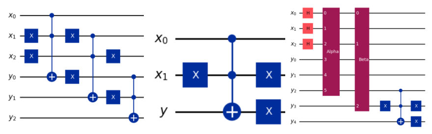
<figcaption class="paper-figure-caption"><b>Fig 5.</b> FIGURE 4. Diagrams: knowledge α : {A ⇒B,B ⇒C} (left), sentence β1 : A ⇒C (middle), and entailment checking (right).</figcaption>
</figure>
<figure class="paper-figure-card">
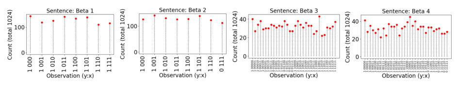
<figcaption class="paper-figure-caption"><b>Fig 6.</b> FIGURE 5. Entailment checking simulation. The decisive logic is shown as the first digit, e.g., β1 has no violation: all y’s is 1’s.</figcaption>
</figure>

**Main problem.** The paper aims to optimize the 'Eigenmarking' search algorithm for quantum entailment model checking by reducing the hardware complexity of required quantum gates.

**Main result.** The proposed 'Simpler Eigenmarking' scheme achieves significantly higher winning margins and better distinguishability using only two-qubit controlled phase rotations (CCZ gates), regardless of input size.

**Method.** The study refines the 'subtle marking' algorithm by replacing multi-qubit-controlled phase rotations with simpler CCZ gates and evaluates the performance using Qiskit-based two-qubit system simulations.

**Summary.** This paper proposes a more efficient version of the Eigenmarking quantum search algorithm designed for checking logical entailment. By replacing complex multi-qubit controlled rotations with simpler two-qubit CCZ gates, the author reduces the hardware burden for quantum computers. Simulations show that this simpler scheme provides much better distinguishability and a higher winning margin than previous methods. This makes the algorithm more viable for implementation on near-term quantum hardware.

Detailed structure

**Model / system.** The research utilizes a quantum computing framework based on Grover's algorithm, specifically simulating a three-qubit system consisting of input qubits, a tag qubit, and an ancillary qubit.

**Key observables.** Winning Margin (W) and Distinguishability (D).

**Important parameters / regimes.** The relative local winning margin (W) and the worst-case distinguishability (D).

**Assumptions / limitations.** The results are based on two-qubit system simulations; scalability to many qubits and performance on real, noisy quantum hardware remain unproven.

**Figures summary.** Figure 1 shows classical logic gate simulation; Figure 2 displays the circuit diagram for the Simpler Eigenmarking system; Figure 3 shows experimental counts for target states; Figure 4 and 5 illustrate the implementation and results of entailment checking.

**Paper structure.** The paper introduces the problem of entailment model checking, reviews existing Eigenmarking schemes (Conventional and Subtle), proposes a refined CCZ-based scheme, presents simulation results comparing performance metrics, and discusses scalability and hardware implications.

Abstract

Targeting entailment model checking, a recent study has pioneered an idea of Eigenmarking search, an improvement over Grover search using extra qubits. The extra qubits condition the quantum state evolution such that the answer states (if exist) are always in the minority. The minority criteria is essential to Grover probability-amplitude amplification and consequently the effectiveness of Grover search. In addition to enforce the minority criteria, Eigenmarking also employs complementary states (through well-orchestrated phase rotation) for easy identification of a no-answer case (related to a no-violation case in the context of model checking). Eigenmarking search has been shown effective in two-qubit simulations.   The three Eigenmarking schemes have been previously proposed. Two schemes require two extra qubits. One scheme (called ``subtle marking'') requires one extra qubit with a multiple-qubit-controlled phase rotation. Our study refines the mechanism using only one extra qubit with only two-qubit-controlled phase rotation, commonly known as \texttt{ccz}, regardless of how many qubits the input has. Using a multiple-qubit-controlled phase rotation (as in subtle marking) associates with highly entangled states. Highly entangled states in a real quantum hardware are difficult (or in some cases may even be unachievable) particularly in a scaled up scenario involving many qubits. Our proposed new Eigenmarking scheme has lightened the burden for the hardware requirement. The new Eigenmarking search has been experimented in two-qubit-system simulations and shown viable, achieving the minimal relative local winning margin of W=3.17 and the worst-case distinguishability of D=0.769 (cf. W=0.67; D=0.19 from conventional marking and W=0.28; D=0.55 from subtle marking).

[↑ back to top](#top)

### [Finite-size effects in amorphous thin Co$_{70}$Zr$_{30}$ layers](http://arxiv.org/abs/2604.23222v1)

**Authors:** Vladislav Kurichenko, Parul Rani, Björgvin Hjörvarsson  
**Type:** experiment · **Category:** disordered systems and neural networks · **PDF:** <https://arxiv.org/pdf/2604.23222v1>  
**Analysis basis:** full PDF text, analyzed in chunks

↔ Scroll figures horizontally

<figure class="paper-figure-card">
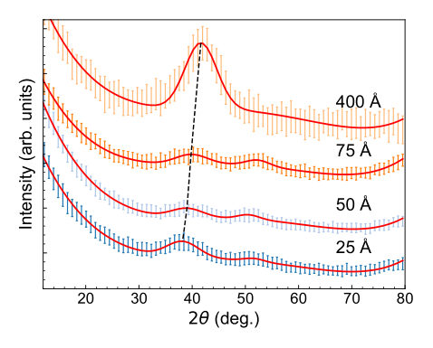
<figcaption class="paper-figure-caption"><b>Fig 1.</b> FIG. 1. Normalized GIXRD patterns of Co70Zr30 with differ- ent thickness. The patterns were offset for clarity.</figcaption>
</figure>
<figure class="paper-figure-card">
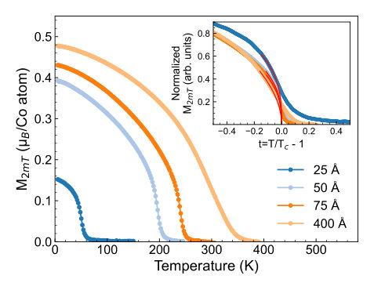
<figcaption class="paper-figure-caption"><b>Fig 2.</b> FIG. 4. M(T) dependence of Co70Zr30 layers with different thicknesses, determined using SQUID. Inset shows plot of the data in reduced units.</figcaption>
</figure>
<figure class="paper-figure-card">

<figcaption class="paper-figure-caption"><b>Fig 3.</b> FIG. 2. XRR patterns of Co70Zr30 with different thickness. The solid red lines show the GenX [16] fits of the reflectivity data. The patterns were offset for clarity.</figcaption>
</figure>
<figure class="paper-figure-card">
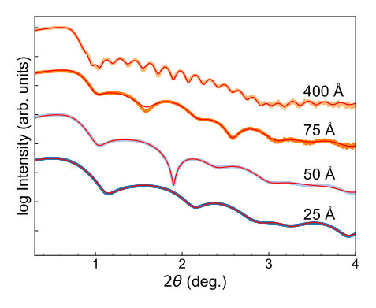
<figcaption class="paper-figure-caption"><b>Fig 4.</b> Figure 3 shows the M(H) dependencies measured at 100 K for three of the samples using MOKE. Data for the 25 Å-thick film is not shown, as its magnetic order- ing temperature lies well below 100 K. As seen in the fig- ure, both the coercivity and the saturation moment are affected by the thickness of the layers. When growing random amorphous alloys in a field a well defined uni- axial anisotropy can develop, if the growth temperature is below the magnetic ordering temperature [17]. The origin of the anisotropy is believed to be the interplay between the external field and the evolving moment, af- fecting the atomic configurations in the growing sample. Consequently, in the absence of an external...</figcaption>
</figure>
<figure class="paper-figure-card">
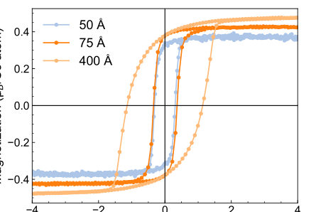
<figcaption class="paper-figure-caption"><b>Fig 5.</b> FIG. 3. M(H) dependence of Co70Zr30 with different thickness at 100 K obtained using MOKE measurements.</figcaption>
</figure>
<figure class="paper-figure-card">
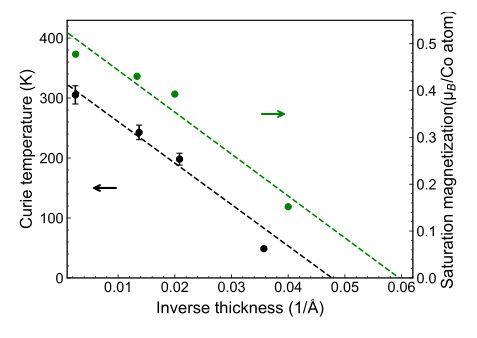
<figcaption class="paper-figure-caption"><b>Fig 6.</b> FIG. 5. TC(1/L) and MS(1/L) dependence of Co70Zr30. Dashed lines show linear fits to the experimental data.</figcaption>
</figure>
<figure class="paper-figure-card">
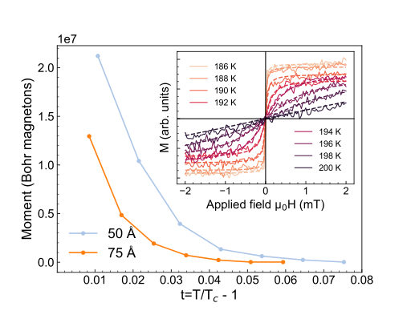
<figcaption class="paper-figure-caption"><b>Fig 7.</b> FIG. 6. M(t) dependence of Co70Zr30 with 50 Å and 75 Å thickness. The inset shows the fitting of the field depen- dence of the MOKE results above the ordering temperature for the 50 Å sample. Measurements from the 25 Å sample are not presented as the onset of ferromagnetic order is below the available temperature in the setup (77 K).</figcaption>
</figure>

**Main problem.** The study investigates how finite-size effects in amorphous Co70Zr30 thin layers influence magnetic properties, specifically the reduction in magnetic moment and ordering temperature.

**Main result.** The researchers found that decreasing layer thickness leads to a reduction in Tc and Ms following a 1/L scaling law, driven by interfacial regions with reduced magnetic interactions, and observed Griffiths phase behavior in the thinnest films.

**Method.** The study uses dc magnetron sputtering for film deposition, GIXRD and XRR for structural characterization, and SQUID magnetometry and MOKE for magnetic measurements.

**Summary.** This paper examines how the thickness of amorphous Co70Zr30 thin films affects their magnetic properties. As the films get thinner, the magnetic ordering temperature and saturation magnetization decrease due to the influence of interfacial regions. The study identifies a scaling relationship between these properties and the inverse of the thickness. Additionally, the researchers observe the presence of a Griffiths phase in very thin layers, where magnetic clusters persist above the critical temperature.

Detailed structure

**Model / system.** The system consists of amorphous Co70Zr30 single-layer thin films with thicknesses ranging from 25 to 400 Angstroms, modeled as an interior magnetic region flanked by two interfacial regions.

**Key observables.** Saturation magnetization (Ms), magnetic ordering temperature (Tc), coercivity, interatomic distances, and magnetic anisotropy.

**Important parameters / regimes.** Thickness range (25-400 A), interface thickness (approx 10 A), and the transition from ferromagnetic to Griffiths phase behavior.

**Assumptions / limitations.** The magnetic layer is modeled as having an interior region and two interfacial regions that are effectively 'magnetically dead'.

**Figures summary.** Fig 1 shows GIXRD patterns; Fig 2 shows XRR patterns; Fig 3 shows thickness-dependent MOKE hysteresis loops; Fig 4 shows temperature-dependent magnetization (SQUID) and Tc reduction.

**Paper structure.** The paper introduces the problem of finite-size effects, describes the experimental deposition and structural characterization, presents magnetic measurement results, applies a scaling model to analyze thickness dependence, and discusses the emergence of the Griffiths phase.

Abstract

Profound finite size effects are observed in both the moment and ordering temperature in thin Co$_{70}$Zr$_{30}$ layers. The results are consistent with the presence of interface regions with reduced magnetic interactions and moment. The extension of this region is determined to be around 1 nm thick at each interface. Above and near the apparent critical temperature, the magnetic properties can be understood in terms of Griffith phases.

[↑ back to top](#top)

### [GSC-QEMit: A Telemetry-Driven Hierarchical Forecast-and-Bandit Framework for Adaptive Quantum Error Mitigation](http://arxiv.org/abs/2604.24551v1)

**Authors:** Steven Szachara, Sheeraja Rajakrishnan, Dylan Jay Van Allen, Jason Pollack, Travis Desell, Daniel Krutz  
**Type:** theory · **Category:** quantum information and computing · **PDF:** <https://arxiv.org/pdf/2604.24551v1>  
**Analysis basis:** full PDF text, analyzed in chunks

↔ Scroll figures horizontally

<figure class="paper-figure-card">
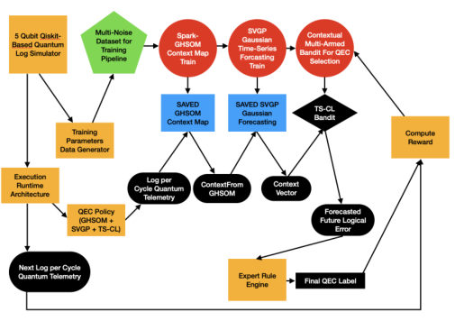
<figcaption class="paper-figure-caption"><b>Fig 1.</b> Fig. 1. GSC-QEMit implementation: An instrumented backend streams cycle-level telemetry to a classical context–forecast–bandit stack for adaptive mitigation selection.</figcaption>
</figure>
<figure class="paper-figure-card">

<figcaption class="paper-figure-caption"><b>Fig 2.</b> Figure 1 summarizes our end-to-end implementation. An instrumented backend provides streaming, per-cycle telemetry to a classical control stack consisting of a Spark–GHSOM context mapper, a Sparse Variational Gaussian Process (SVGP) forecaster, and a cost-aware Contextual Multi-Armed Bandit (CMAB) initialized via imitation learning. The controller is defined by a fixed telemetry interface and an abstract inter- vention library; the backend used here is a Qiskit Aer–based simulator for controlled evaluation, but it can be replaced by any simulator or hardware system that exposes compatible telemetry and supports a small set of intervention hooks.</figcaption>
</figure>
<figure class="paper-figure-card">

<figcaption class="paper-figure-caption"><b>Fig 3.</b> Fig. 2. Real-time adaptive response (case study: QFT). A representative execution trace under drifting noise. Top strip (barcode): the selected intervention level over time (NONE →MODERATE →SEVERE). Barcode shading encodes action: white/green = NONE, gray/orange = MODER- ATE, black/purple = SEVERE. Bottom plot: logical fidelity FL (solid) alongside the drifting effective noise indicator (dotted). Key insight: during elevated-noise intervals, the policy increases intervention intensity (switching to SEVERE); during quiescent periods it returns to NONE/MODERATE, con- serving cost while maintaining high fidelity.</figcaption>
</figure>
<figure class="paper-figure-card">
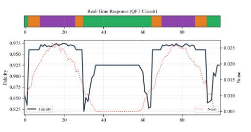
<figcaption class="paper-figure-caption"><b>Fig 4.</b> Figure 3 illustrates representative telemetry traces for the full benchmark suite under a controlled, time-varying noise process. In all the experiments, circuits are executed repeatedly over a fixed horizon Trun while the effective physical error rate peff(t) is deliberately modulated according to the drifting- noise model described in Section IV-B. No additional faults or adversarial perturbations are injected beyond this explicit drift process. The drift schedule is designed to probe two complementary regimes. In the first half of each run, the noise level is rapidly increased to a peak, producing a pronounced high- noise interval near the center of the trace. This stress-test phase...</figcaption>
</figure>
<figure class="paper-figure-card">
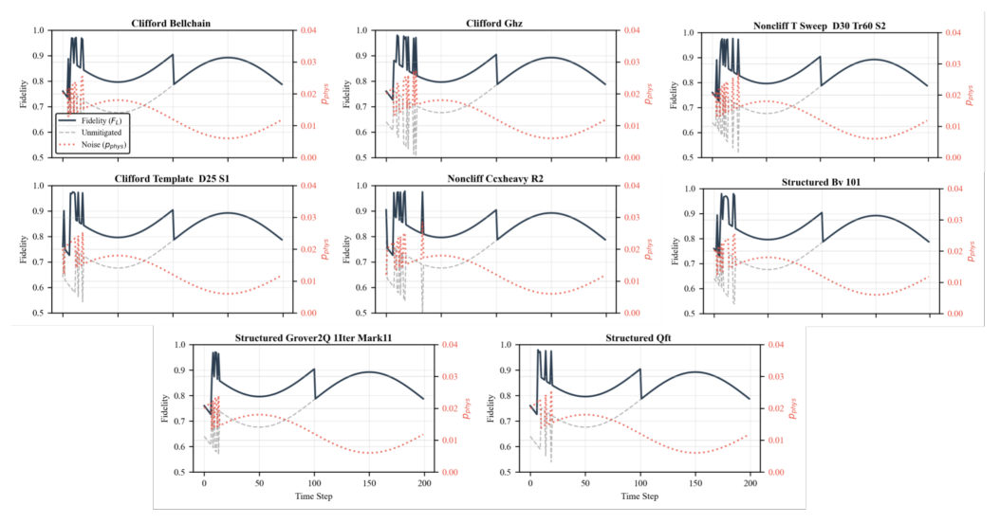
<figcaption class="paper-figure-caption"><b>Fig 5.</b> Fig. 3. Cross-benchmark stabilization under drift. Time-series traces for the evaluation suite under a controlled, time-varying noise schedule with a deliberate mid-run noise peak. Dotted: imposed effective noise indicator peff(t). Dashed: unmitigated baseline logical fidelity. Solid: adaptive fidelity under GSC-QEMit. The reduced depth of the mid-run fidelity trough under the adaptive policy reflects active mitigation escalation during high-noise intervals, followed by de-escalation as noise relaxes.</figcaption>
</figure>

**Main problem.** Managing quantum error mitigation (QEM) in the NISQ era by deciding when and how aggressively to apply mitigation techniques under time-varying, nonstationary noise while balancing fidelity gains against computational overhead.

**Main result.** The GSC-QEMit framework achieved a 9.0% average increase in logical fidelity relative to unmitigated execution and reduced unnecessary heavy interventions by approximately 35% compared to a static severe strategy.

**Method.** A three-module 'context-forecast-bandit' framework comprising a Growing Hierarchical Self-Organizing Map (GHSOM) for context discovery, a Sparse Variational Gaussian Process (SVGP) for fidelity forecasting, and a cost-aware contextual multi-armed bandit (CMAB) for decision making.

**Summary.** This paper presents GSC-QEMit, an adaptive framework designed to optimize quantum error mitigation in the presence of drifting noise. By using machine learning modules to cluster device telemetry, forecast future fidelity degradation, and select the most cost-effective mitigation level, the system avoids expensive interventions when noise is low. The approach demonstrates significant improvements in logical fidelity and resource efficiency across various quantum circuit workloads without requiring circuit-specific tuning.

Detailed structure

**Model / system.** A simulated quantum backend using Qiskit Aer with a nonstationary noise model characterized by a bounded sinusoidal drift and stochastic fluctuations around a baseline physical error rate.

**Key observables.** Average logical fidelity, logical error rate (measured via Total Variation Distance), and intervention cost.

**Important parameters / regimes.** 13-dimensional telemetry feature vector, mitigation intensity levels (NONE, MODERATE, SEVERE), and the Lagrange multiplier (lambda) controlling cost-sensitivity.

**Assumptions / limitations.** Assumes the availability of streaming telemetry and a library of discrete mitigation primitives; assumes system health can be captured via telemetry and noise patterns can be forecasted.

**Figures summary.** Figure 2 shows a case study of the QFT circuit displaying a real-time barcode of selected intervention levels over time.

**Paper structure.** The paper introduces the problem of adaptive QEM, describes the three-module GSC-QEMit architecture (GHSOM, SVGP, and CMAB), details the simulation environment and noise model, presents performance results across various circuit families, and discusses the framework's generalizability and cost-efficiency.

Abstract

Quantum error mitigation (QEM) is essential for extracting reliable results from near-term quantum devices, yet practical deployments must balance mitigation strength against runtime overhead under time-varying noise. We introduce \emph{GSC-QEMit}, a telemetry-driven, \textbf{context--forecast--bandit} framework for \emph{adaptive} mitigation that switches between lightweight suppression and heavier intervention as drift evolves. GSC-QEMit composes three coupled modules: (G) a Growing Hierarchical Self-Organizing Map (GHSOM) that clusters streaming telemetry into operating contexts; (S) an uncertainty-aware subsampled Gaussian-process forecaster that predicts short-horizon fidelity degradation; and (C) a cost-aware contextual multi-armed bandit (CMAB) that selects mitigation actions via Thompson sampling with explicit intervention cost. We evaluate GSC-QEMit on benchmark circuit families (GHZ, Quantum Fourier Transform, and Grover search) under nonstationary noise regimes simulated in Qiskit Aer, using an instrumented testbed where action labels correspond to graded mitigation intensity. Across Clifford, non-Clifford, and structured workloads, GSC-QEMit improves average logical fidelity by \textbf{+9.0\%} relative to unmitigated execution while reducing unnecessary heavy interventions by reserving them for inferred noise spikes. The resulting policies exhibit a favorable fidelity--cost trade-off and transfer across the evaluated workloads without circuit-specific tuning.

[↑ back to top](#top)

### [Motifs Enrichment as a Driver of an Emergent Preferential Attachment in rewired random regular graphs](http://arxiv.org/abs/2604.23152v1)

**Authors:** Pawat Akara-pipattana, Sergei Nechaev  
**Type:** theory · **Category:** statistical mechanics · **PDF:** <https://arxiv.org/pdf/2604.23152v1>  
**Analysis basis:** full PDF text, analyzed in chunks

↔ Scroll figures horizontally

<figure class="paper-figure-card">
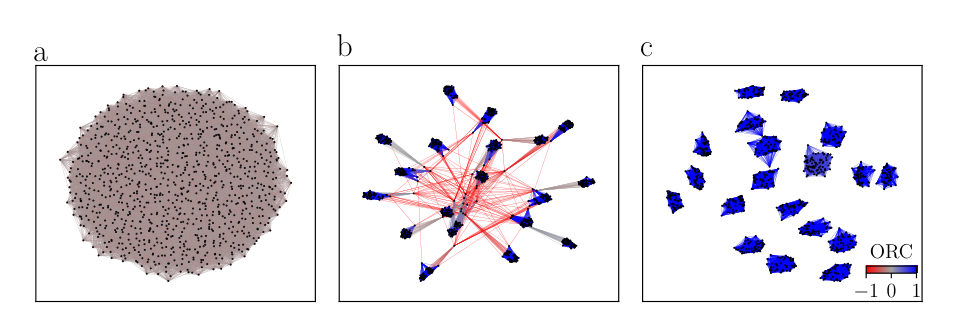
<figcaption class="paper-figure-caption"><b>Fig 1.</b> Figure 1. Different configurations of RRGs with N = 1000 and d = 50, whose edges are colored according to their Ollivier-Ricci curvature (ORC) sorted by the number of triangles: (a) typical RRG in a triangle-poor phase with negative ORC; (b) loosely connected clusters in a triangle-rich phase consisting of clusters with a positive ORC (blue), connected by the inter-cluster subgraph with a negative ORC (red); (c) disconnected cliques configuration with the maximum number of triangles and positive ORC (blue).</figcaption>
</figure>
<figure class="paper-figure-card">
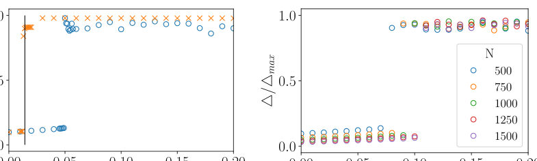
<figcaption class="paper-figure-caption"><b>Fig 2.</b> Figure 2. Normalized number of triangles as a function of λ/ log N. Blue dots designate &quot;forward rewiring&quot; with increasing λ. The orange dots correspond to &quot;backward rewiring&quot; which starts from disconnected cliques. The black vertical lines are the estimated positions of the transition points λ− cr, on the basis of (16). Panels (a)-(c) show transitions in RRGs with N = 1000 and d = 30, 50, 100 respectively. Panel (d) shows that curves for the rewiring of RRG with d = 50 collapse in coordinates with the rescaled fugacity λ/ log N for various values of N.</figcaption>
</figure>
<figure class="paper-figure-card">
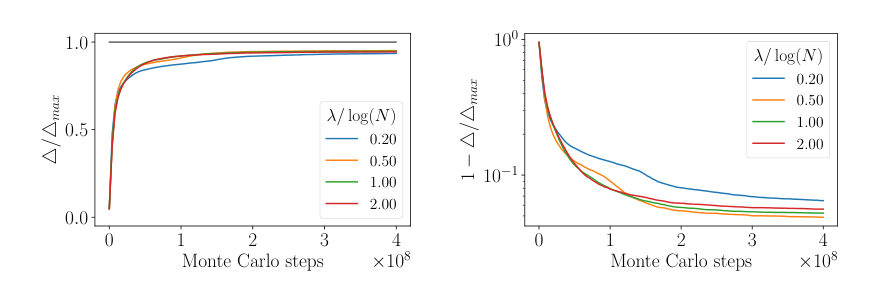
<figcaption class="paper-figure-caption"><b>Fig 3.</b> Figure 3. Left: the normalized number of triangles as a function of a number of Monte Carlo steps for rewiring of RRG of N = 1000 vertices and d = 50 at λ = 0.2, 0.5, 1, 2. The black vertical line emphasizes that the maximum number of triangles are not reached. Right: the same quantities now subtracted by one plotted in semi-logarithmic scale for better differentiation between the curves. Note higher value of lambda does not necessary lead to more triangles at the steady state.</figcaption>
</figure>
<figure class="paper-figure-card">
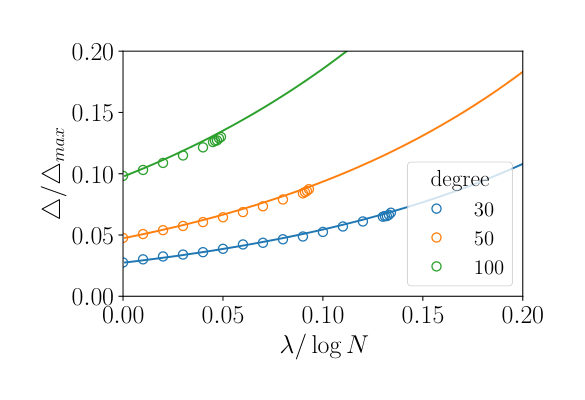
<figcaption class="paper-figure-caption"><b>Fig 4.</b> Figure 5. Normalized number of triangles in TPP at N = 1000 and d = 30, 50, 100. The solid lines are taken from the leading order term of Eq.(11).</figcaption>
</figure>
<figure class="paper-figure-card">
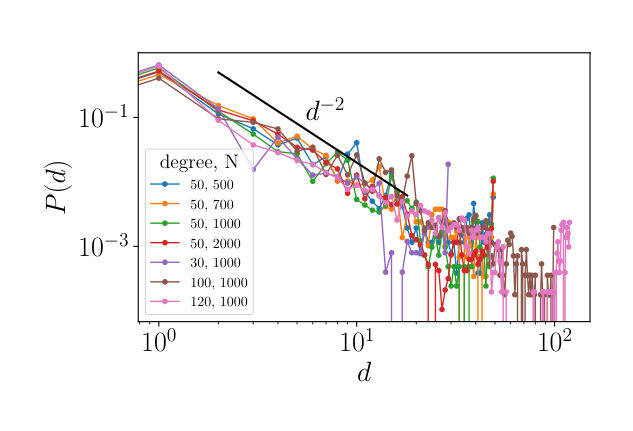
<figcaption class="paper-figure-caption"><b>Fig 5.</b> Figure 6. Inter-cluster degree distributions of rewired RRG from various degrees and sizes as indicated in the legend. The guide line highlights that all of the distribution follows power-law P(d) = d−γ with exponent γ ≈2.</figcaption>
</figure>
<figure class="paper-figure-card">
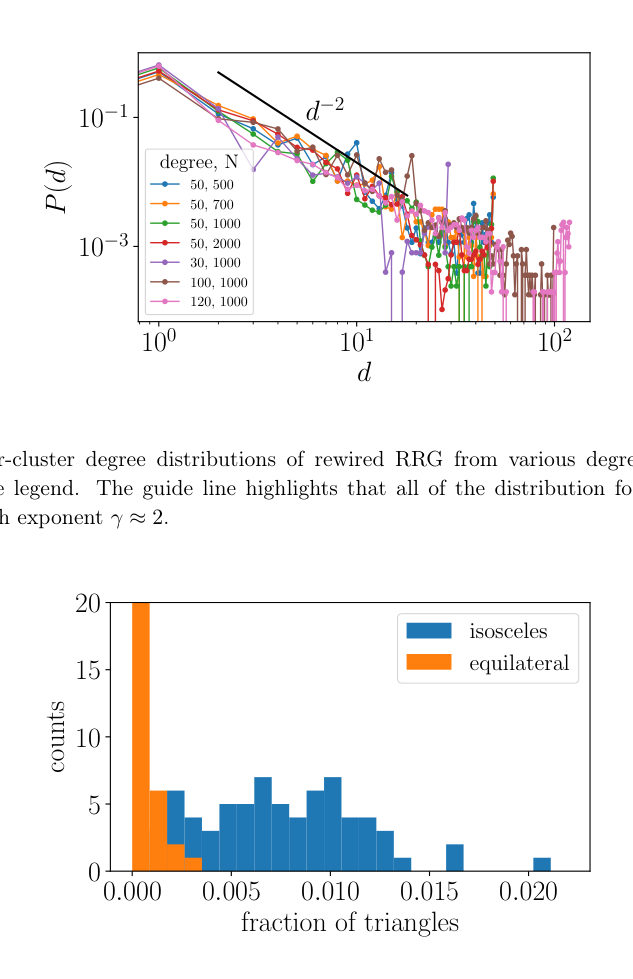
<figcaption class="paper-figure-caption"><b>Fig 6.</b> Figure 7. Distribution of isosceles and equilateral triangle as defined in IV over the same samples of graphs in Fig. 6. For each sample, both numbers of triangle are normalized by its total number of triangles. The distribution of isosceles triangles is much broader than that of the equilateral triangles. There are more isosceles triangles than equilateral triangles in all individual samples.</figcaption>
</figure>

**Main problem.** Investigating how the enrichment of local triangle motifs in rewired random regular graphs drives a phase transition and leads to the emergence of a scale-free degree distribution.

**Main result.** The authors identify a first-order phase transition between a triangle-poor and a triangle-rich phase, where the latter features an inter-cluster network with a universal power-law degree distribution exponent of gamma approximately 2.

**Method.** The study employs Metropolis Monte Carlo simulations, mean-field kinetic arguments, a chemical reaction model based on the law of mass action, and a hyperbolic embedding approach.

**Summary.** This paper explores how increasing the density of triangles in a network can spontaneously create a scale-free structure. By using a rewiring process controlled by a chemical potential (fugacity), the authors show that the network transitions from a homogeneous state to a clustered state where the connections between clusters follow a power-law distribution. They propose that this 'emergent preferential attachment' is driven by the way triangles aggregate. The study even suggests a deep connection between this topological phase and the Efimov effect in few-body physics.

Detailed structure

**Model / system.** The system consists of Rewired Random Regular Graphs (RRGs) with a fixed vertex degree d, studied in a canonical ensemble where the number of triangles is controlled by a fugacity parameter lambda.

**Key observables.** Vertex degree distribution P(d), triangle count, Ollivier-Ricci curvature (ORC), and the scaling exponent gamma.

**Important parameters / regimes.** Fugacity (lambda), vertex degree (d), and the critical transition points (lambda_minus and lambda_plus).

**Assumptions / limitations.** Assumes a rigid constraint on vertex degree, uniform distribution of cluster saturation times, and stochastic distribution of inter-cluster edges.

**Figures summary.** Figure 1 shows different graph configurations (triangle-poor, triangle-rich, and maximal triangle) classified by ORC; Figure 6 shows the power-law degree distribution on a log-log scale; Figure 7 compares the frequency of isosceles vs. equilateral triangles.

**Paper structure.** The paper introduces the rewiring model and phase transition, describes the chemical reaction model for the triangle-poor phase, presents the mean-field derivation of the scale-free inter-cluster network, and concludes with a hyperbolic geometry interpretation and connection to Efimov-like states.

Abstract

We study the statistics of rewired random regular graphs within the canonical ensemble, in which the average number of triangles is controlled by the fugacity $λ$. Using mean-field arguments, we estimate the location of the transition point $λ^{-}$. We focus primarily on the triangle-enriched phase above $λ^{-}$, where the graph becomes a loosely connected web of clusters. This inter-cluster network is scale-free and exhibits a power-law vertex degree distribution $P(d) \sim d^{-γ}$, with $γ\approx 2$ independent of degree and size of the graph. We attribute this behavior to an "emergent preferential attachment" for triangle motifs, derive the exponent $γ$ with a mean-field approach, and speculate on a possible connection between the typical topology of inter-cluster triangles and Efimov states in a conformally invariant potential.

[↑ back to top](#top)

### [Non-unitary extension of Grover's search algorithm](http://arxiv.org/abs/2604.23382v1)

**Authors:** V. N. A. Lula-Rocha, M. A. S. Trindade  
**Type:** theory · **Category:** quantum information and computing · **PDF:** <https://arxiv.org/pdf/2604.23382v1>  
**Analysis basis:** full PDF text, analyzed in chunks

↔ Scroll figures horizontally

<figure class="paper-figure-card">
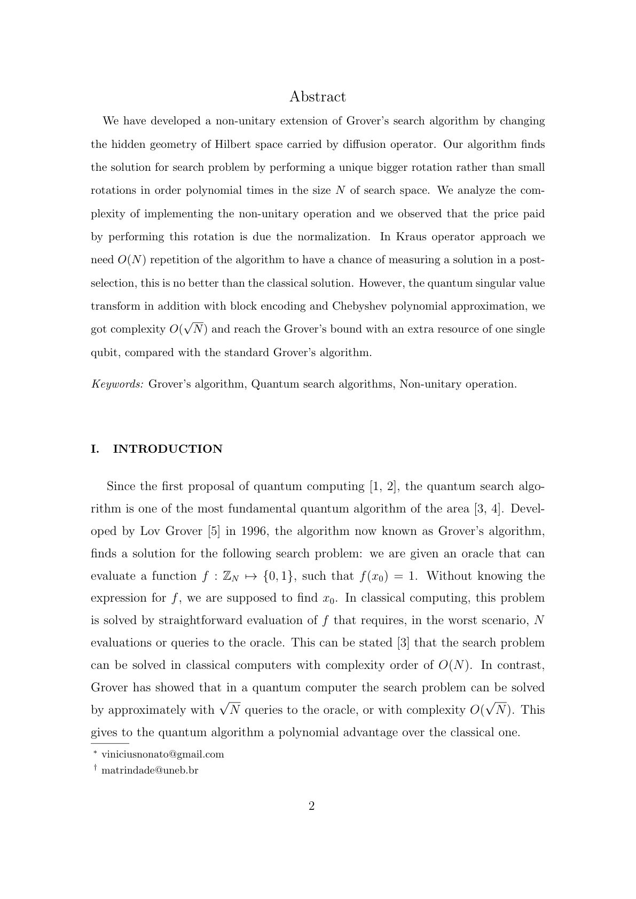
<figcaption class="paper-figure-caption"><b>Fig 1.</b> Low-resolution page preview, page 2</figcaption>
</figure>
<figure class="paper-figure-card">
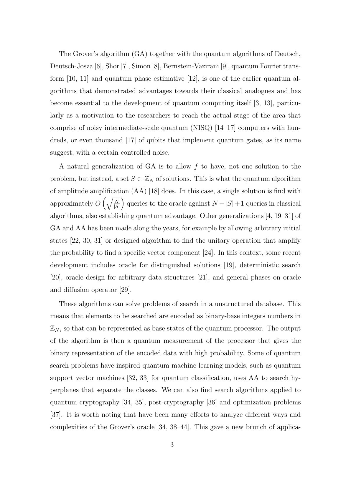
<figcaption class="paper-figure-caption"><b>Fig 2.</b> Low-resolution page preview, page 3</figcaption>
</figure>
<figure class="paper-figure-card">
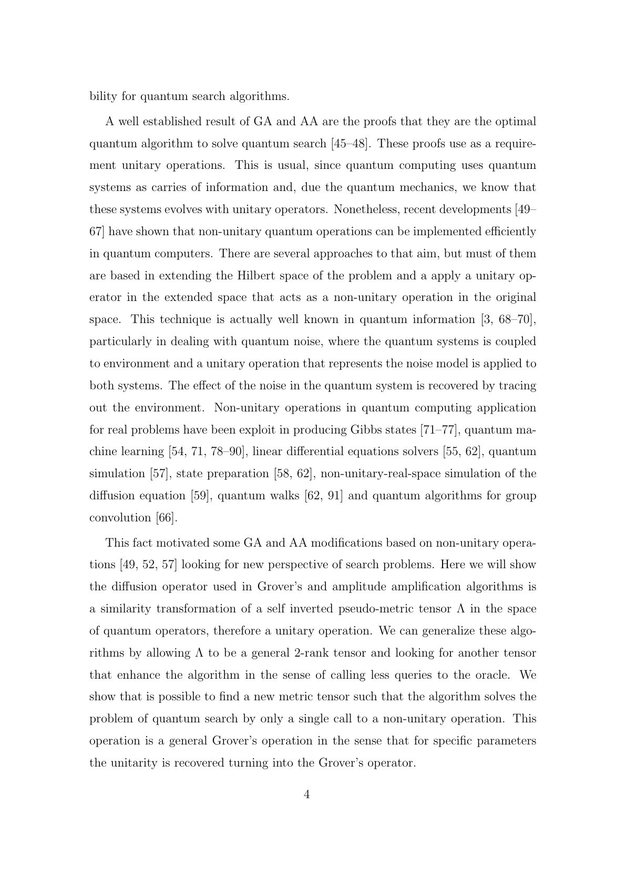
<figcaption class="paper-figure-caption"><b>Fig 3.</b> Low-resolution page preview, page 4</figcaption>
</figure>
<figure class="paper-figure-card">
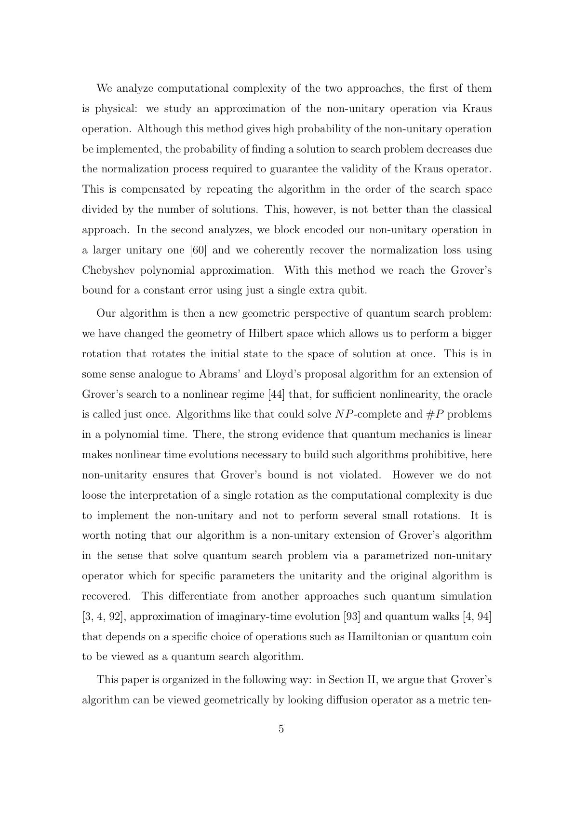
<figcaption class="paper-figure-caption"><b>Fig 4.</b> Low-resolution page preview, page 5</figcaption>
</figure>
<figure class="paper-figure-card">
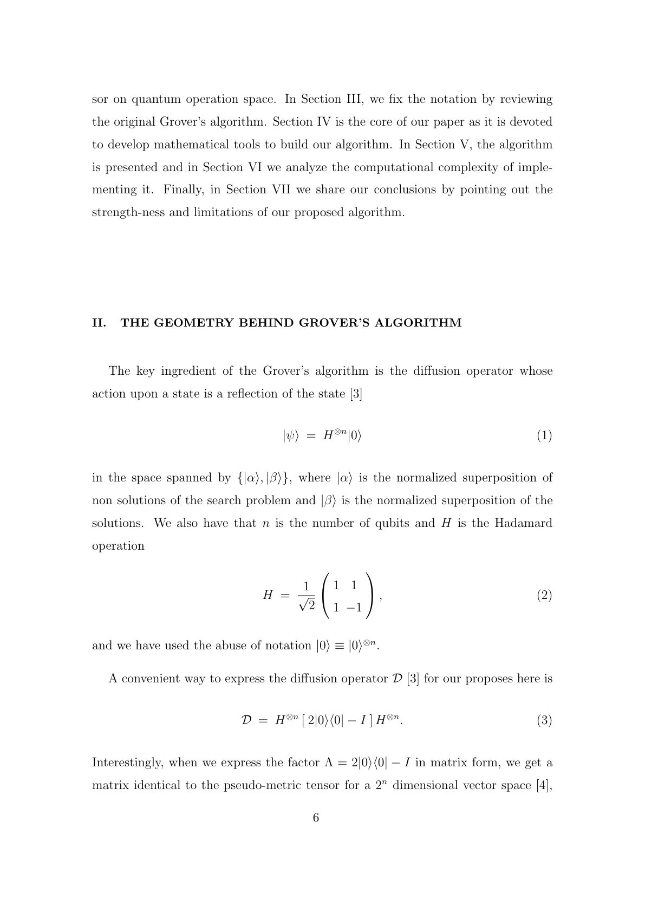
<figcaption class="paper-figure-caption"><b>Fig 5.</b> Low-resolution page preview, page 6</figcaption>
</figure>
<figure class="paper-figure-card">
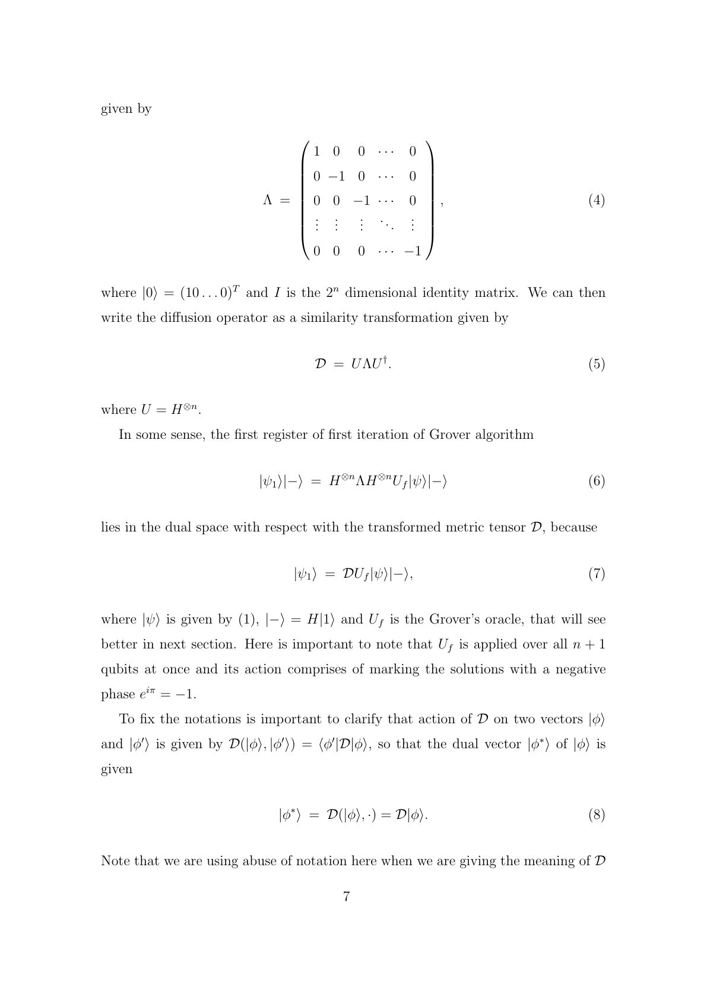
<figcaption class="paper-figure-caption"><b>Fig 6.</b> Low-resolution page preview, page 7</figcaption>
</figure>
<figure class="paper-figure-card">
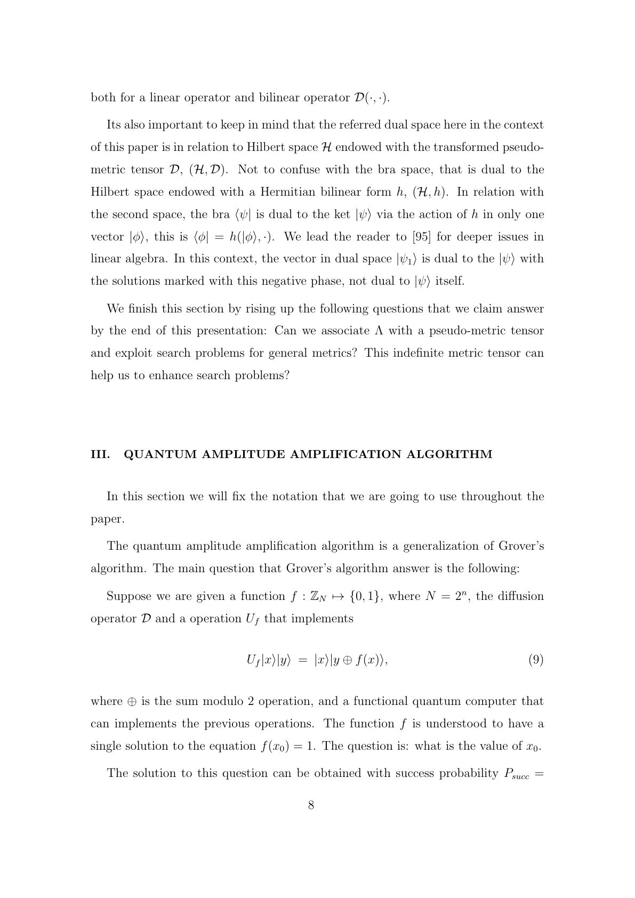
<figcaption class="paper-figure-caption"><b>Fig 7.</b> Low-resolution page preview, page 8</figcaption>
</figure>
<figure class="paper-figure-card">
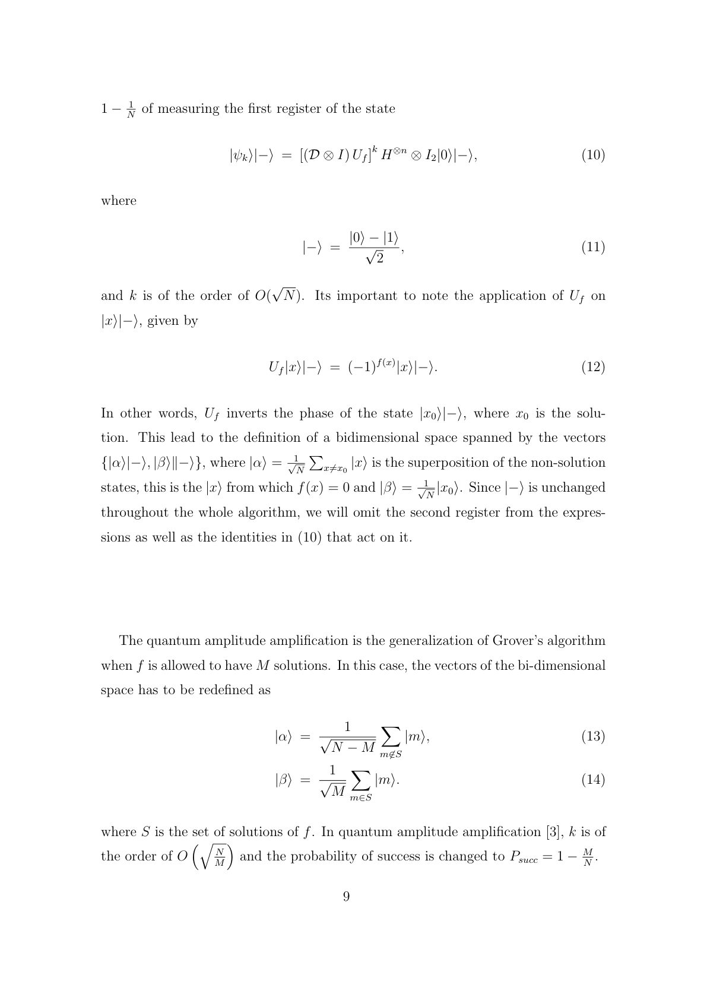
<figcaption class="paper-figure-caption"><b>Fig 8.</b> Low-resolution page preview, page 9</figcaption>
</figure>
<figure class="paper-figure-card">
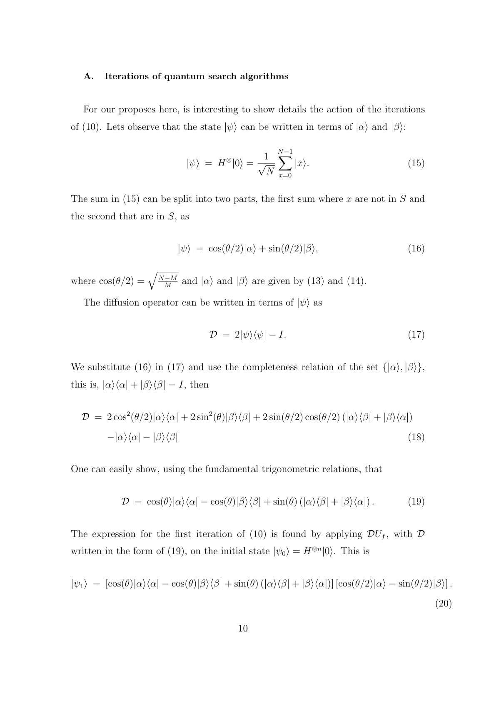
<figcaption class="paper-figure-caption"><b>Fig 9.</b> Low-resolution page preview, page 10</figcaption>
</figure>
<figure class="paper-figure-card">
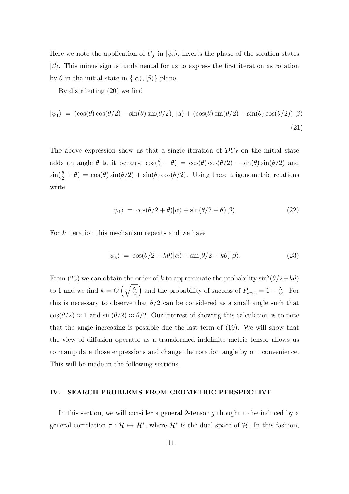
<figcaption class="paper-figure-caption"><b>Fig 10.</b> Low-resolution page preview, page 11</figcaption>
</figure>

**Main problem.** The paper investigates a non-unitary extension of Grover's search algorithm to achieve a single-step solution by modifying the hidden geometry of the Hilbert space.

**Main result.** The authors show that while a Kraus operator approach fails to provide a quantum advantage, using the Quantum Singular Value Transform (QSVT) with block encoding and Chebyshev polynomial approximation allows the algorithm to reach the Grover bound with only one additional qubit.

**Method.** The researchers use a geometric approach involving a generalized 2-rank tensor for the diffusion operator and analyze implementation via Kraus operators and QSVT-based block encoding.

**Summary.** This paper proposes a way to extend Grover's algorithm into a non-unitary regime by changing the metric tensor of the Hilbert space. While a simple non-unitary approach via Kraus operators results in no speedup over classical search, the authors demonstrate that using advanced techniques like the Quantum Singular Value Transform (QSVT) can achieve the optimal Grover complexity. This approach effectively performs the search in a single large rotation rather than many small ones, requiring only one extra ancilla qubit.

Detailed structure

**Model / system.** The model is a generalized quantum amplitude amplification framework acting on an unstructured search space of size N, utilizing a non-unitary diffusion operator D_g and a Grover oracle U_f.

**Key observables.** Success probability (P_succ) and the rotation angle (theta) in the Hilbert space.

**Important parameters / regimes.** Search space size N, number of solutions M, rotation angles theta and phi, and the normalization factor p.

**Assumptions / limitations.** The construction of the generalized operator requires prior knowledge of the number of solutions M; the implementation relies on the ability to perform block encoding.

**Paper structure.** The paper defines the geometric nature of the diffusion operator, reviews the standard Grover algorithm, develops the mathematical tools for the non-unitary extension, presents the new algorithm, and concludes with a complexity analysis.

Abstract

We have developed a non-unitary extension of Grover's search algorithm by changing the hidden geometry of Hilbert space carried by diffusion operator. Our algorithm finds the solution for search problem by performing a unique bigger rotation rather than small rotations in order polynomial times in the size $N$ of search space. We analyze the complexity of implementing the non-unitary operation and we observed that the price paid by performing this rotation is due the normalization. In Kraus operator approach we need $O(N)$ repetition of the algorithm to have a chance of measuring a solution in a post-selection, this is no better than the classical solution. However, the quantum singular value transform in addition with block encoding and Chebyshev polynomial approximation, we got complexity $O(\sqrt{N})$ and reach the Grover's bound with an extra resource of one single qubit, compared with the standard Grover's algorithm.

[↑ back to top](#top)

### [On the geometric algebras of the Ising model](http://arxiv.org/abs/2604.24688v1)

**Authors:** N. Johnson, D. Marenduzzo, A. Morozov, E. Orlandini, G. M. Vasil  
**Type:** theory · **Category:** statistical mechanics · **PDF:** <https://arxiv.org/pdf/2604.24688v1>  
**Analysis basis:** full PDF text, analyzed in chunks

↔ Scroll figures horizontally

<figure class="paper-figure-card">
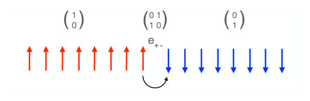
<figcaption class="paper-figure-caption"><b>Fig 1.</b> Figure 1. Sketch of a domain wall in the 1D Ising model, which can be associated with an e+−bivector acting on the edge which separates the two domains. This is because e+−=  0 1 1 0</figcaption>
</figure>
<figure class="paper-figure-card">
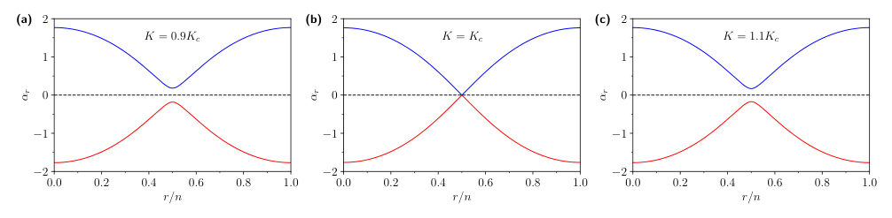
<figcaption class="paper-figure-caption"><b>Fig 2.</b> Figure 2. Dispersion relation showing the angle αr = log(λr) (logarithm of the eigenvalues of M and of W) versus r/n (normalised wavenumber). (a) Low K (high temperature) phase at K = 0.4: there is a gap in the system. (b) Critical behaviour at K = Kc ≃0.4407 (defined by K∗ c = Kc): the gap closes, and a zero-energy mode (low-energy quasi-particle excitation) appears around r = n/2. (c) High K (low temperature) phase: the gap has reopened.</figcaption>
</figure>

**Main problem.** The paper seeks to provide a unified, geometrically interpretable algebraic framework for the 1D and 2D Ising models using Clifford and Conformal Geometric Algebras (CGA).

**Main result.** The authors show that the transfer matrix, eigenvectors, and quasiparticle excitations can be naturally represented as elements of a conformal Clifford algebra, where the transfer matrix acts as a dilation and eigenvectors correspond to Majorana-like modes.

**Method.** The study employs Clifford algebra Cl(1,1) and Cl(n,n) to reformulate the transfer-matrix solution, utilizing Hestenes spinors and the properties of conformal bivectors to reinterpret the model's dynamics.

**Summary.** This paper provides a new geometric perspective on the exactly solvable 1D and 2D Ising models. By using Clifford and Conformal Geometric Algebras, the authors reinterpret the transfer matrix as a dilation and the model's excitations as Majorana-like fermions. While the underlying physical results are well-established, this framework offers a more compact and unified algebraic description of scale transformations, duality, and quasiparticle dynamics.

Detailed structure

**Model / system.** The paper analyzes the classical 1D and 2D Ising models on square lattices with periodic boundary conditions, focusing on the transfer-matrix formalism and the emergence of domain walls and quasiparticles.

**Key observables.** Partition function, transfer matrix eigenvalues, dispersion relation, and correlation length.

**Important parameters / regimes.** Coupling constant (K), dual coupling (K*), and the critical temperature/coupling (Kc).

**Assumptions / limitations.** The 2D model assumes periodic boundary conditions and the absence of an external magnetic field.

**Figures summary.** Figure 1 illustrates a domain wall in the 1D Ising model as a spin-flip via a bivector; Figure 2 displays the dispersion relation across high-temperature, critical, and low-temperature regimes.

**Paper structure.** The paper begins by introducing the Clifford algebra framework for the 1D model, extends the formalism to the 2D case using Cl(n,n), derives the dispersion relation and critical behavior, and concludes with a discussion on the pedagogical value of this geometric approach.

Abstract

We revisit the classical transfer matrix solution of the one- and two-dimensional Ising model from the perspective of Clifford and conformal geometric algebras. Building on Kaufman's spinor formulation, we show that all elements entering the solution, including the transfer matrix, its eigenvectors, and the quasiparticle excitations, admit a natural and unified interpretation as elements of an appropriate conformal Clifford algebra. In particular, the transfer matrix can be viewed as a dilation generated by a conformal bivector, while its eigenvectors correspond to null combinations of Clifford generators, closely paralleling the emergence of Majorana fermionic degrees of freedom. In the two-dimensional case, the standard eigenvalue equation for the row-to-row transfer matrix is reinterpreted as a dispersion relation for quasiparticle excitations, exposing the connection between the Ising model and a theory of free Majorana fermions. While all the explicit exact results recovered are well known, this geometric reformulation provides a unified algebraic framework which is compact and physically interpretable. Specifically, this clarifies the role of scale transformations, fermionic modes, and duality in the Ising model. We believe this approach offers a useful pedagogical complement to more conventional fermionic, Grassmann, or field theoretic treatments.

[↑ back to top](#top)

### [Optimum-Transmission Free-Space Optical Communications](http://arxiv.org/abs/2604.23417v1)

**Authors:** Prajit Dhara, Babak N. Saif, Jeffrey H. Shapiro, Saikat Guha  
**Type:** theory · **Category:** other · **PDF:** <https://arxiv.org/pdf/2604.23417v1>  
**Analysis basis:** full PDF text, analyzed in chunks

↔ Scroll figures horizontally

<figure class="paper-figure-card">
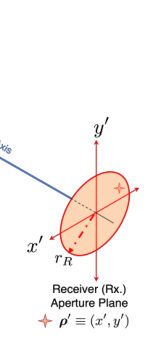
<figcaption class="paper-figure-caption"><b>Fig 1.</b> FIG. 1: Hard circular aperture propagation geometry.</figcaption>
</figure>
<figure class="paper-figure-card">
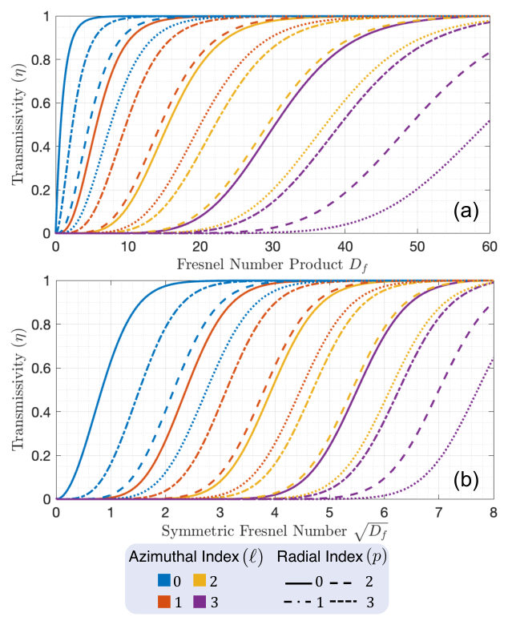
<figcaption class="paper-figure-caption"><b>Fig 2.</b> FIG. 2: Plot of modal transmissivity η of the PSW modes as a function of the free-space Fresnel number product Df (a) and the symmetric Fresnel number ( p</figcaption>
</figure>
<figure class="paper-figure-card">
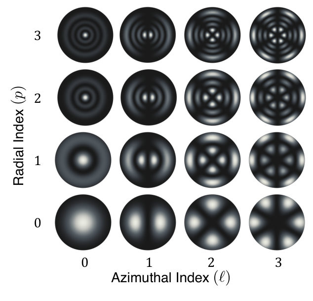
<figcaption class="paper-figure-caption"><b>Fig 3.</b> FIG. 3: Plot of higher order PSW modes ψℓ,p(r, θ) for ℓ= {0, 1, 2, 3} and p = {0, 1, 2, 3}. For each mode subplot, we choose an appropriate Df parameter (see Table I) to capture the relevant features of the corresponding mode. (i.e. the angular and radial nodes).</figcaption>
</figure>
<figure class="paper-figure-card">
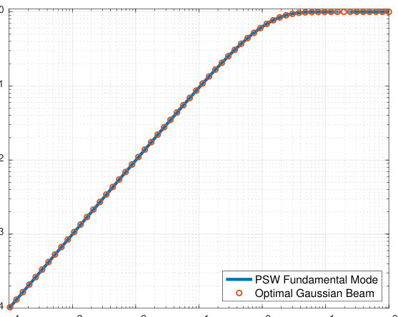
<figcaption class="paper-figure-caption"><b>Fig 4.</b> FIG. 4: Comparison of optimal (numerically optimized ξ0 in Eq. (29)) Gaussian input field’s transmissivity (red circles) with η of the fundamental PSW mode φ0,0 (blue) w.r.t. the Fresnel number product Df.</figcaption>
</figure>
<figure class="paper-figure-card">
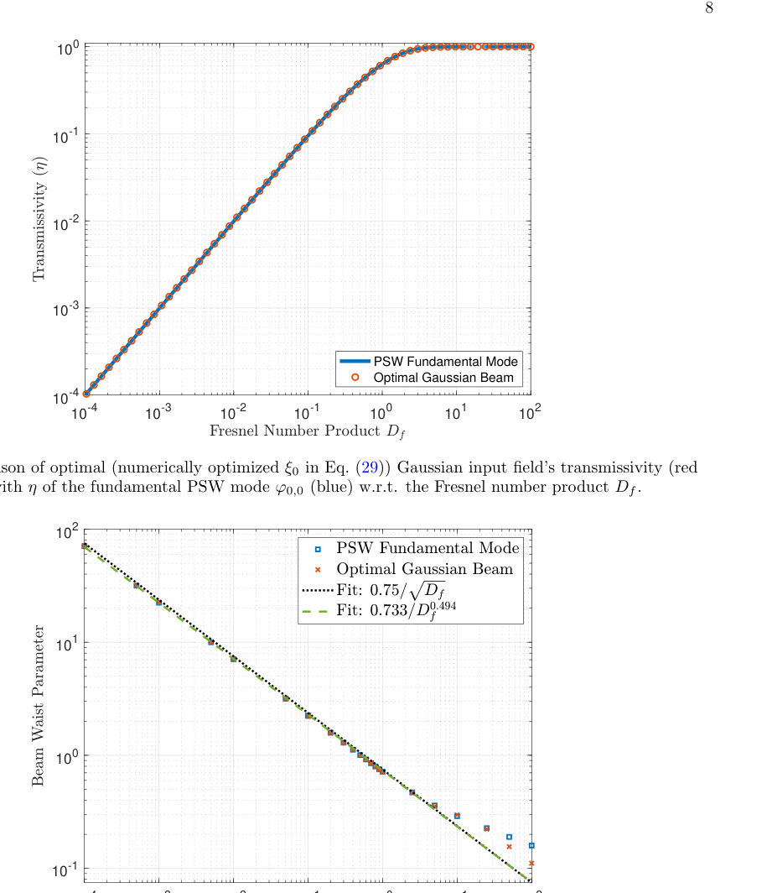
<figcaption class="paper-figure-caption"><b>Fig 5.</b> FIG. 5: Numerically obtained optimal beam parameter (ξM) plotted as a function of Df (blue squares). We note the approximate parameter fit: ξM ≈0.75/ p</figcaption>
</figure>
<figure class="paper-figure-card">
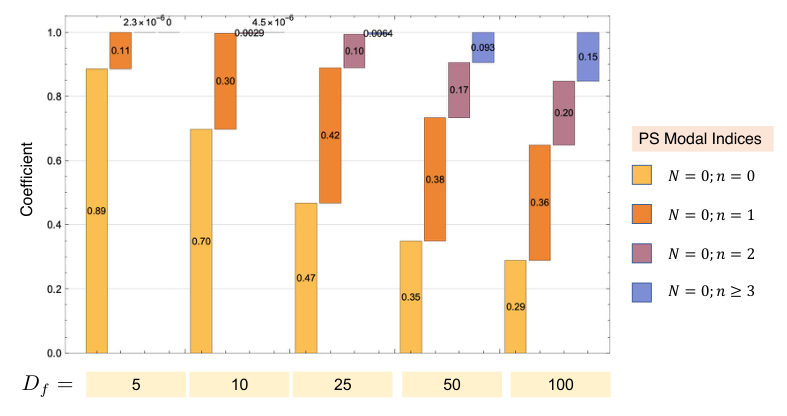
<figcaption class="paper-figure-caption"><b>Fig 6.</b> FIG. 6: Mode occupation statistics of the optimal Gaussian beam in the various PSW radially symmetric modes (i.e. φ0,n(x); n = 0, 1, 2, . . .) in the near-field. The modal indices are represented by the colored bars (indices in figure legend), and the value of Df is marked on the horizontal axis. The value of the coefficients is shown on the individual bars; the sum of the coefficients must be unity.</figcaption>
</figure>
<figure class="paper-figure-card">
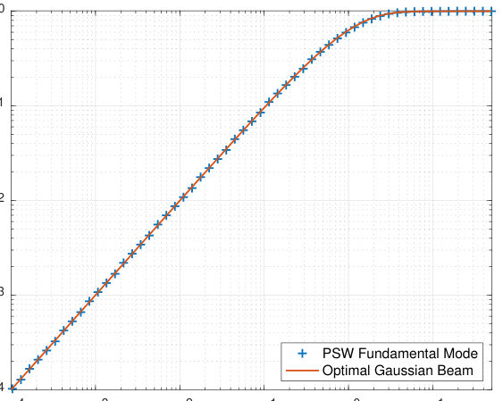
<figcaption class="paper-figure-caption"><b>Fig 7.</b> FIG. 7: Comparison of the input efficiency ηin for the optimal (numerically optimized ξ0 Gaussian input field’s transmissivity (blue cross marks) with the fundamental PSW mode φ0,0 (red-solid line) w.r.t. x = p</figcaption>
</figure>
<figure class="paper-figure-card">
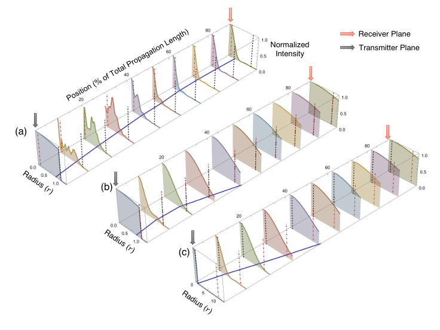
<figcaption class="paper-figure-caption"><b>Fig 8.</b> FIG. 8: Optimal beam evolution at Df = 0.1 for rT : rR ratios (a) 1 : 0.1 (a) 1 : 1 (c) 0.1 : 1. Lines (perpendicular to the x −y plane) to mark the boundary of the transmitter (black, dashed) and receiver (red, dot-dashed) apertures; blue line on the bottom x −y plane to marks the effective ‘beam width’ ( radius at which it captures 60% of the power in the transverse beam profile) as the beam evolves.</figcaption>
</figure>
<figure class="paper-figure-card">
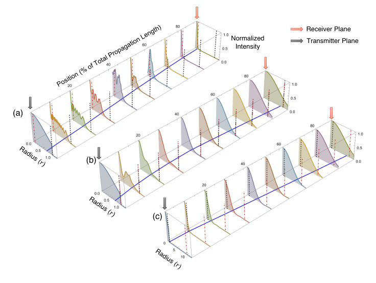
<figcaption class="paper-figure-caption"><b>Fig 9.</b> FIG. 9: Optimal beam evolution at Df = 1 for rT : rR ratios (a) 1 : 0.1 (a) 1 : 1 (c) 0.1 : 1. Lines (perpendicular to the x −y plane) to mark the boundary of the transmitter (black, dashed) and receiver (red, dot-dashed) apertures; blue line on the bottom x −y plane to marks the effective ‘beam width’ ( radius at which it captures 60% of the power in the transverse beam profile) as the beam evolves.</figcaption>
</figure>
<figure class="paper-figure-card">
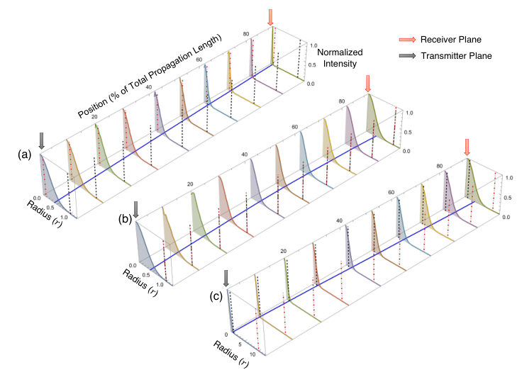
<figcaption class="paper-figure-caption"><b>Fig 10.</b> FIG. 10: Optimal beam evolution at Df = 10 for rT : rR ratios (a) 1 : 0.1 (a) 1 : 1 (c) 0.1 : 1. Lines (perpendicular to the x −y plane) to mark the boundary of the transmitter (black, dashed) and receiver (red, dot-dashed) apertures; blue line on the bottom x −y plane to marks the effective ‘beam width’ ( radius at which it captures 60% of the power in the transverse beam profile) as the beam evolves.</figcaption>
</figure>

**Main problem.** Determining the performance gap between theoretically optimal Prolate Spheroidal Wavefunction (PSW) modes and practical Gaussian beams in aperture-limited free-space optical communication links.

**Main result.** The paper proves that an aperture-truncated Gaussian beam with an optimized waist achieves the same transmissivity as the fundamental PSW mode, and derives a trace theorem showing total modal transmissivity depends only on the Fresnel number product.

**Method.** The authors use Singular Value Decomposition (SVD) of the Fresnel propagation kernel, numerical optimization of beam waist parameters, and analytical derivation of a trace theorem for the power-transfer operator.

**Summary.** This paper addresses the efficiency of light transmission in free-space optical communication. It demonstrates that while Prolate Spheroidal Wavefunctions are the mathematically optimal modes for aperture-limited channels, standard Gaussian beams with optimized widths can achieve identical transmission performance. Furthermore, the authors provide a fundamental theorem stating that the total capacity of the channel is determined solely by the Fresnel number product, regardless of the specific aperture shapes.

Detailed structure

**Model / system.** A monochromatic, scalar, paraxial optical field propagating through a free-space link between two hard circular apertures (transmitter and receiver) over a distance L.

**Key observables.** Transmissivity (eta), input efficiency (eta_in), and total modal power transmissivity (sum of eigenvalues).

**Important parameters / regimes.** Fresnel number product (Df), beam waist (xi), and aperture radii ratios (rT:rR); propagation regimes include near-field, intermediate-field, and far-field.

**Assumptions / limitations.** Paraxial approximation, monochromatic field, vacuum propagation, and hard-edged circular apertures.

**Figures summary.** Figure 1 shows the propagation geometry; Figure 2 plots modal transmissivity vs Df; Figure 6 shows mode occupation statistics; Figure 7 compares input efficiency; Figures 8-10 illustrate the evolution of beam intensity profiles across different propagation regimes.

**Paper structure.** The paper begins by defining the physical system and the PSW basis, moves to comparing Gaussian beams with PSW modes via numerical optimization, derives a trace theorem for total transmissivity, and concludes with an analysis of beam evolution across different Fresnel regimes.

Abstract

Slepian developed the Prolate Spheroidal Wavefunction (PSW) spatial-mode basis, which forms the normal modes of the Fresnel-propagation kernel of a free-space optical communications channel bookended by hard-circular apertures. The zero-th order PSW mode has the highest power-transfer eigenvalue, exciting which on the transmitter side therefore maximizes the transmissivity for single-spatial-mode communications. We show that the transmissivity performance of this fundamental PSW mode can be obtained by an aperture-truncated Gaussian beam of an optimized beam waist, despite the two mode shapes deviating from one another in the near-field regime.

[↑ back to top](#top)

### [Persistent Fermi Pockets and Robust Electron Pairing in Lightly Doped CuO$_2$ Planes of Cuprate Superconductors](http://arxiv.org/abs/2604.23162v1)

**Authors:** Hao Chen, Jumin Shi, Yinghao Li, Xiangyu Luo, Yiwen Chen, Chaohui Yin, Yingjie Shu, Jiuxiang Zhang, Taimin Miao, Bo Liang, Wenpei Zhu, Neng Cai, Xiaolin Ren, Chengtian Lin, Shenjin Zhang, Zhimin Wang, Fengfeng Zhang, Feng Yang, Qinjun Peng, Zuyan Xu, Guodong Liu, Hanqing Mao, Xintong Li, Tao Xiang, Lin Zhao, X. J. Zhou  
**Type:** experiment · **Category:** strongly correlated electrons · **PDF:** <https://arxiv.org/pdf/2604.23162v1>  
**Analysis basis:** full PDF text, analyzed in chunks

↔ Scroll figures horizontally

<figure class="paper-figure-card">
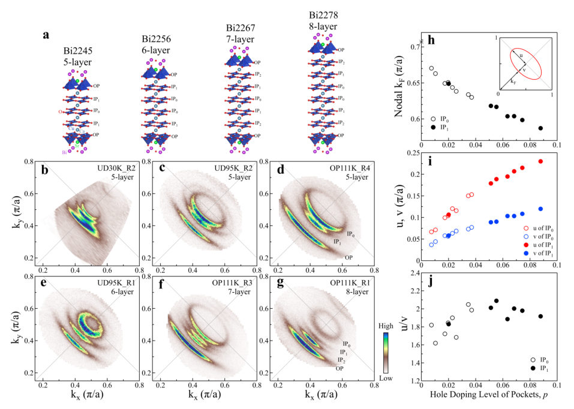
<figcaption class="paper-figure-caption"><b>Fig 1.</b> FIG. 1. Observation of Fermi pockets in multilayer Bi-based cuprates and their elec- tronic characteristics. a, Schematic crystal structures of Bi2245, Bi2256, Bi2267 and Bi2278. The innermost CuO2 plane(s) is labelled as IP0 while the outermost planes are labelled as OP. The second and third inner planes are labelled as IP1 and IP2, respectively. b-g, Fermi surface mappings measured at 15 K. Hole-like IP0 and IP1 Fermi pockets are clearly observed in region 2 of the UD30K-Bi2223 sample (b, 5-layer), region 2 of the UD95K-Bi2223 sample (c, 5-layer), region 4 of the OP111K-Bi2223 sample (d, 5-layer), region 1 of the UD95K-Bi2223 sample (e, 6-layer), region 3 of the OP111K-Bi2223 sample (f,...</figcaption>
</figure>
<figure class="paper-figure-card">
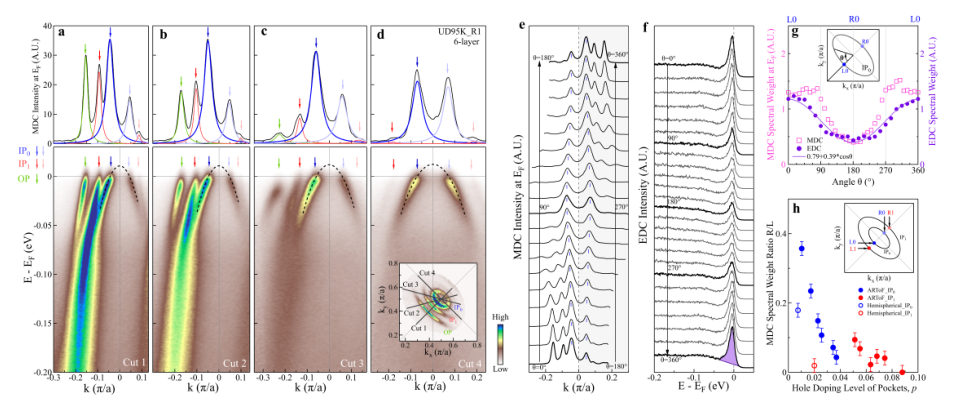
<figcaption class="paper-figure-caption"><b>Fig 2.</b> FIG. 2. Typical band structures of Fermi pockets and spectral weight distribution along the Fermi pocket measured in region 1 (6-layer) of the UD95K-Bi2223 sample at 15 K. a-d, Band structures measured along different momentum cuts (lower panels) and the corresponding MDCs at the Fermi level (upper panels). The locations of the momentum cuts are indicated by black lines in the inset of d. The observed IP0, IP1 and OP bands are marked by blue, red and green arrows, respectively. The IP0 bands are fitted by parabolic functions (dashed black lines), with the band top located at ∼11 meV. The MDCs are fitted by multiple Lorentzians so each peak area can be obtained. e, MDCs at the Fermi level...</figcaption>
</figure>
<figure class="paper-figure-card">
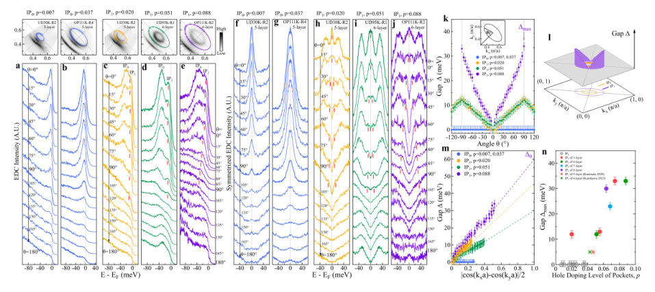
<figcaption class="paper-figure-caption"><b>Fig 3.</b> FIG. 3. Momentum-dependent photoemission spectra and energy gaps along the Fermi pockets measured at 15 K. a,b, EDCs measured along the IP0 Fermi pockets in region 2 of the UD30K-Bi2223 sample (a, 5-layer) and region 4 of the OP111K-Bi2223 sample (b, 5-layer). The Fermi momenta are indicated by open circles in the upper panels and represented by the angle θ, as defined in the inset of k. c-e, EDCs measured along the IP1 Fermi pockets in region 2 of the UD30K-Bi2223 sample (c, 5-layer), region 1 of the UD95K-Bi2223 sample (d, 6-layer) and region 2 of the OP111K-Bi2223 sample (e, 6-layer). Fermi momentum positions are marked by open circles and represented by the angle θ. f-j, Symmetrized...</figcaption>
</figure>
<figure class="paper-figure-card">
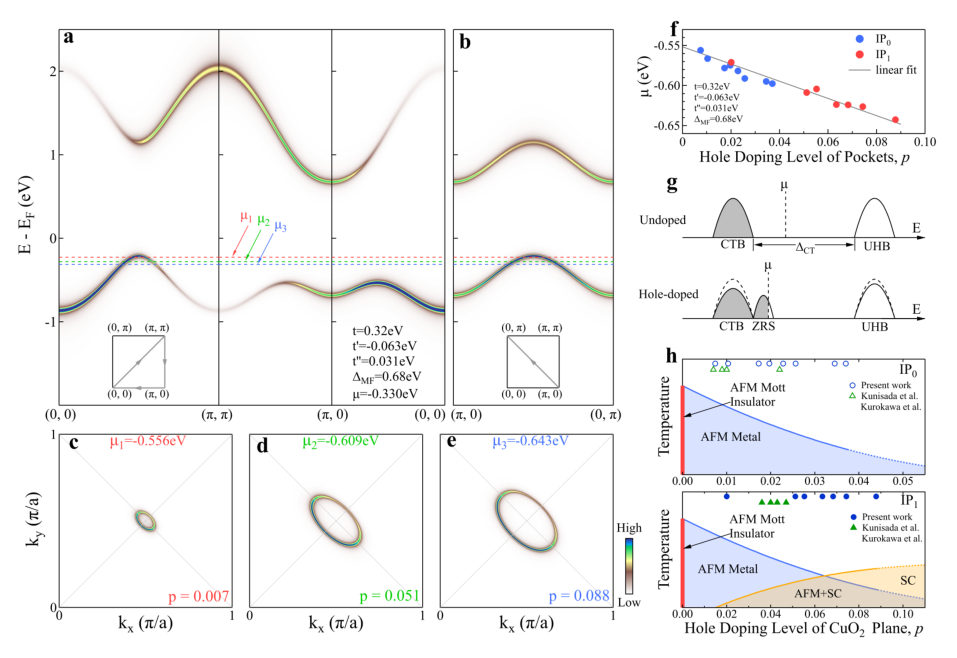
<figcaption class="paper-figure-caption"><b>Fig 4.</b> FIG. 4. Formation of the Fermi pockets in terms of the mean-field t-U model and intrinsic doping evolution of the CuO2 plane in the antiferromagnetic Mott insulating state. a,b, Simulated band structures along high-symmetry directions (0,0)–(π,π)–(π,0)–(0,0) (a) and (π,0)–(0,π) (b) based on the mean-field t–U model using t = 0.32 eV, t′ = −0.063 eV, t′′ = 0.031 eV, and ∆MF = 0.68 eV. c-e, Simulated Fermi pockets derived from the band structures in a,b by setting the chemical potential to µ1 = −0.556 eV (c), µ2 = −0.609 eV (d), and µ3 = −0.643 eV (e), as indicated by dashed lines in a,b. These simulated pockets correspond to doping levels of 0.007 (c), 0.051 (d), and 0.088 (e), respectively....</figcaption>
</figure>

**Main problem.** Determining whether the transition from a Mott insulator to a metallic state in cuprates is intrinsic or disorder-driven, and understanding the origin of electron pairing in the lightly doped regime.

**Main result.** Discovery of persistent, gapless Fermi pockets in the innermost CuO2 planes at extremely low doping (p=0.007) and the observation of robust, large anisotropic superconducting gaps (up to 33 meV) in the second innermost planes.

**Method.** High-resolution, spatially-resolved laser angle-resolved photoemission spectroscopy (laser-ARPES) using an ARToF electron energy analyzer to probe intrinsic electronic structures.

**Summary.** This paper investigates the electronic structure of the innermost layers of multilayer cuprate superconductors using high-resolution laser-ARPES. The researchers found that even at extremely low doping levels, the CuO2 planes exhibit well-defined metallic Fermi pockets, suggesting an abrupt transition from the Mott insulator. Furthermore, they observed large, anisotropic superconducting gaps in the second innermost planes, indicating that robust electron pairing can coexist with strong antiferromagnetic order. These findings provide a new framework for understanding the doping-driven phase diagram in high-temperature superconductors.

Detailed structure

**Model / system.** Multilayer Bi-based cuprate superconductors (Bi2223 and higher-order n=5-8 structures) where inner CuO2 planes are shielded from disorder.

**Key observables.** Fermi surface topology (pockets, arcs), hole doping level (p), superconducting gap magnitude and anisotropy, and spectral weight distribution.

**Important parameters / regimes.** Hole doping levels (p) from 0.007 to 0.088; superconducting gaps up to 33 meV; hopping parameters (t, t', t'').

**Assumptions / limitations.** The inner CuO2 planes are sufficiently shielded from external impurities to provide a disorder-free environment.

**Figures summary.** Fig 1 shows crystal structures and Fermi surface mappings for different layers and dopings; subsequent figures show EDC peaks, spectral weight asymmetry, and gap evolution.

**Paper structure.** Introduction to the Mott insulator-to-metal transition; Experimental setup and sample characterization; Results showing Fermi pocket persistence and doping evolution; Discussion of pairing mechanisms and coexistence with AFM order; Conclusion.

Abstract

High temperature superconductivity in cuprate superconductors is generally considered to be generated from doping the Mott insulators. The fundamental nature of the doped parent compounds as well as the microscopic origin of electron pairing remain critical issues in understanding the emergence of superconductivity. Here, using high-resolution spatially-resolved laser angle-resolved photoemission spectroscopy, we investigate the intrinsic electronic structures of the CuO$_2$ planes in multilayer cuprates Bi$_2$Sr$_2$Ca$_{n-1}$Cu$_n$O$_{2n+4+δ}$ (n=5$\sim$8). The inner CuO$_2$ planes are well shielded from the disorders and provide a rare and ideal platform to probe the intrinsic electronic phase diagram. We observe well-defined Fermi pockets with hole doping levels as low as 0.007, demonstrating an abrupt transition from the parent Mott insulator to a metallic state upon the introduction of an infinitesimal amount of doping. The innermost CuO$_2$ planes (IP$_0$) display gapless Fermi pockets, while the second innermost planes (IP$_1$) exhibit anisotropic superconducting gaps up to $\sim$33$\,$meV, indicative of robust electron pairing coexisting with strong antiferromagnetic order. Our findings provide a revised framework for understanding the doping-driven transitions and pairing mechanisms in cuprate superconductors.

[↑ back to top](#top)

### [Practical lower bounds for hybrid quantum interior point methods in linear programming](http://arxiv.org/abs/2604.24362v1)

**Authors:** Lennart Binkowski  
**Type:** theory · **Category:** quantum information and computing · **PDF:** <https://arxiv.org/pdf/2604.24362v1>  
**Analysis basis:** full PDF text, analyzed in chunks

↔ Scroll figures horizontally

<figure class="paper-figure-card">
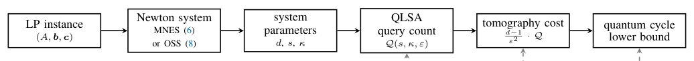
<figcaption class="paper-figure-caption"><b>Fig 1.</b> Fig. 1. Pipeline for computing the quantum runtime lower bound. Each dashed arrow marks a benevolent assumption that reduces the bound, making it more favourable to the quantum method. If this lower bound already exceeds the classical runtime, no practical quantum advantage is possible. The dimension d and the sparsity s are calculated exactly, the condition number κ is lower-bounded. The QLSA is assumed to return the approximate solution with certainty, thus allowing to set the number of QAA iterations to nQAA = 1. Furthermore, the number of IR steps for improving the initial precision ε is benevolently set to 1. Lastly, the entire IPM is assumed to converge after one iteration, which...</figcaption>
</figure>
<figure class="paper-figure-card">
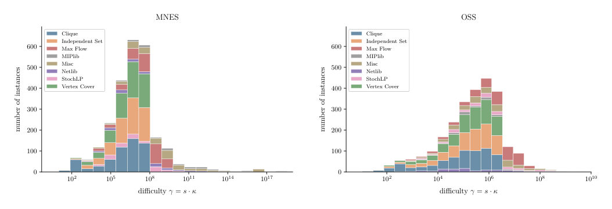
<figcaption class="paper-figure-caption"><b>Fig 2.</b> Fig. 2. Effective difficulty γ = sκ of the Newton linear systems across all benchmark instances, for the MNES (left) and OSS (right) formulations. The three binary optimisation relaxations—Clique, Independent Set, and Vertex Cover—constitute predominantly easy Newton systems in both cases. In fact, the condition number κ was often found to be exactly 1, so that their difficulties are effectively given by their sparsity s. In contrast, the Max Flow set, consisting of relaxations of an integer optimisation problem, and the benchmark sets MIPib, Misc, Netlib, and StochLP constitute the most difficult Newton systems.</figcaption>
</figure>
<figure class="paper-figure-card">
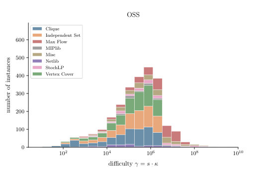
<figcaption class="paper-figure-caption"><b>Fig 3.</b> Fig. 3 shows the percentage of instances for which the quantum runtime lower bound lies below the classical HiGHS runtime, as a function of the assumed quantum cycle duration. The instances are broken down into the eight instances classes Clique, Independent Set, Max Flow, MIPlib, Misc, Netlib, StochLP, and Vertex Cover. Despite the looseness of the bounds due to the several benevolent assumptions described above, they result in slower quantum runtimes across all instances for any realistic (logical) quantum cycle duration around the current speed record of 800 ps for a physical en- tangling two-qubit gate. Most importantly, the exclusion result is robust with respect to the choice of...</figcaption>
</figure>
<figure class="paper-figure-card">
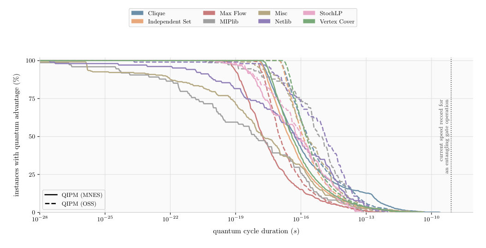
<figcaption class="paper-figure-caption"><b>Fig 4.</b> Fig. 3. Percentage of instances (y-axis), divided into eight problem classes, for which the lower bounds of the two QIPM variants’ runtimes lie below HiGHS’ solve runtime. The runtime lower bound is the product of the established lower bound on the cycle count times the assumed quantum cycle duration (x-axis). Despite the bounds’ looseness due to a chain of several benevolent assumptions, they result in slower quantum runtimes—for both QIPM variants and on all instances—in range of any realistic value for the quantum cycle duration around the current speed record for a physical entangling two-qubit gate at 800 ps [36].</figcaption>
</figure>

**Main problem.** Determining whether the asymptotic polynomial speed-ups promised by hybrid quantum interior point methods (QIPMs) translate into practical advantages for solving linear programming problems on realistic instances.

**Main result.** The study establishes that quantum runtime lower bounds exceed classical runtimes for all tested instances at realistic quantum cycle durations, effectively ruling out practical advantage for these hybrid QIPMs.

**Method.** A hybrid benchmarking approach that derives rigorous lower bounds on quantum runtime using highly benevolent assumptions and compares them against the classical HiGHS solver.

**Summary.** This paper investigates the practical viability of hybrid quantum algorithms for linear programming. By comparing the best-case quantum runtime lower bounds against state-of-the-art classical solvers, the author demonstrates that the overhead from state tomography and the complexity of the Newton systems prevent any practical advantage. The findings suggest that for realistic problem instances and hardware cycle times, classical solvers like HiGHS remain superior.

Detailed structure

**Model / system.** The mathematical model is Linear Programming (LP) solved via Primal-Dual Path-Following Interior Point Methods, utilizing a quantum pipeline with Chebyshev-based Quantum Linear System Algorithms (QLSAs) and state tomography.

**Key observables.** Quantum runtime lower bounds, effective difficulty (product of sparsity and condition number), and tomography overhead.

**Important parameters / regimes.** Sparsity (s), condition number (kappa), target precision (epsilon), and quantum cycle duration.

**Assumptions / limitations.** Highly benevolent assumptions including noise-free hardware, single-cycle oracle execution, convergence in a single iteration, and minimal iterative refinement steps.

**Figures summary.** Figure 1 illustrates the quantum runtime lower bound pipeline; Figure 2 shows the distribution of effective difficulty across different problem classes; Figure 3 plots the percentage of instances where quantum lower bounds are below classical runtimes relative to quantum cycle duration.

**Paper structure.** The paper introduces the QIPM framework, defines the benchmarking methodology and benevolent assumptions, presents the numerical estimation of system parameters, provides the exclusion analysis results across various problem families, and identifies the tomography overhead as the primary bottleneck.

Abstract

Quantum interior point methods (QIPMs) promise polynomial speed-ups over classical solvers for linear programming by outsourcing the solution of Newton linear systems to quantum linear solvers (QLSAs). However, asymptotic speed-ups do not necessarily translate to practical advantages on realistic problem instances. In this work, I evaluate whether practical advantage of a standard hybrid QIPM pipeline can already be excluded relative to the classical open-source solver HiGHS on a broad and diverse collection of LP instances spanning eight problem families, including public benchmark libraries, such as MIPlib, and relaxations of combinatorial optimisation problems. Following the hybrid benchmarking paradigm initiated by Cade et al., I derive rigorous lower bounds on the quantum runtime under a series of highly benevolent assumptions and compare them against classical runtimes. I equip the QIPMs with the best-performing functional QLSA, the Chebyshev-based method, as identified by Lefterovici et al., and evaluate two Newton system formulations proposed by Mohammadisiahroudi et al.: the modified normal equation system and the orthogonal subspace system. The exclusion analysis yields a consistent negative picture: across all instances and for any realistic quantum cycle duration, the quantum runtime lower bounds already exceed the classical runtimes, establishing that these hybrid QIPMs will offer no practical advantage over good classical solvers for realistic linear programming instances.

[↑ back to top](#top)

### [Quantum Circuit Cutting: Complexity and Optimization](http://arxiv.org/abs/2604.23700v1)

**Authors:** Yuval Idan, Eitan Zahavi, Elad Mentovich, Eliahu Cohen, Shmuel Zaks  
**Type:** theory · **Category:** quantum information and computing · **PDF:** <https://arxiv.org/pdf/2604.23700v1>  
**Analysis basis:** full PDF text, analyzed in chunks

↔ Scroll figures horizontally

<figure class="paper-figure-card">
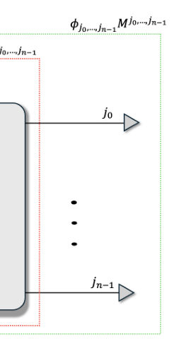
<figcaption class="paper-figure-caption"><b>Fig 1.</b> Figure 1: Evolution of a quantum state within a tensor network. The initial state tensor is enclosed by the blue dashed line. The red dashed line highlights the output state resulting from the action of the unitary operator ˆU on the initial state. Finally, the green dashed line encompasses the entire process, yielding a scalar value.</figcaption>
</figure>
<figure class="paper-figure-card">
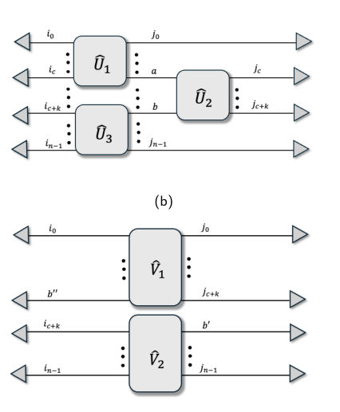
<figcaption class="paper-figure-caption"><b>Fig 2.</b> Figure 2: (a) Rank-2n unitary, which is not separable, and acting on all the qubits simultaneously. (b) Decompositions of the previous rank-2n tensor ˆU into lower-rank tensors. (c) Cutting the unitary ˆU into two sets of unitaries. (d) The contraction from Eq. (12).</figcaption>
</figure>
<figure class="paper-figure-card">
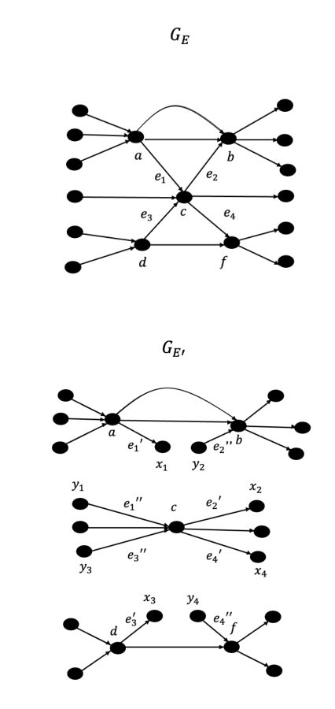
<figcaption class="paper-figure-caption"><b>Fig 3.</b> Figure 3: An example demonstrating GE′ of Definition 7, for |E′| = 4. (a) Simple tensor network T, and the connected graph (GE), that represent the tensor network. The desired edges that we wish to delete are E′ = {e1, e2, e3, e4} ⊆E. (b) Tensor network T ′ and GE′, obtained from the graph duplication, the set E′ = {e1, e2, e3, e4}, the additional vertices V ′ = {x1, y1, x2, y2, x3, y3, x4, y4} /∈V and the additional edges.</figcaption>
</figure>
<figure class="paper-figure-card">
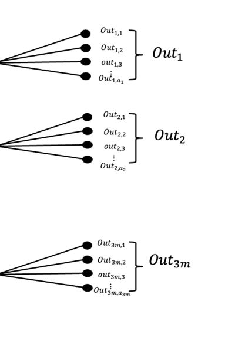
<figcaption class="paper-figure-caption"><b>Fig 4.</b> Figure 4: The case β = 0. The dag shown is G0.</figcaption>
</figure>
<figure class="paper-figure-card">
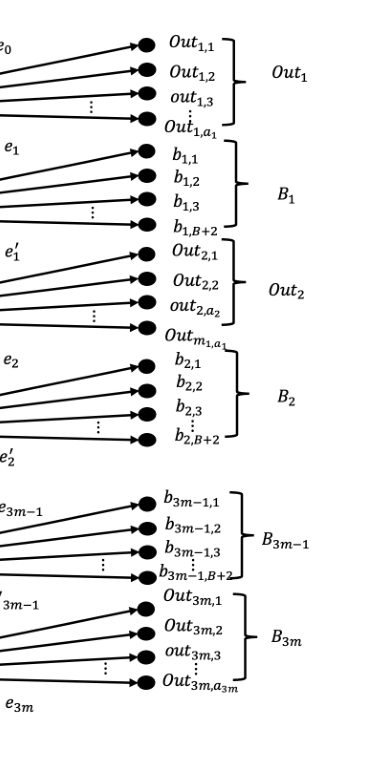
<figcaption class="paper-figure-caption"><b>Fig 5.</b> Figure 5: The connected dag ˜G used in the proof of Theorem 7.</figcaption>
</figure>
<figure class="paper-figure-card">
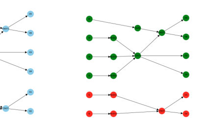
<figcaption class="paper-figure-caption"><b>Fig 6.</b> Figure 6: (a) Arbitrary quantum algorithm represented in the circuit model, each block is unitary operator with the rank of the number of inputs and outputs qubits. (b) The graph representation of the circuit in (a), which is now a legal dag. (c) After applying the constraints, the SMT solver returns two disjoint circuits, highlighted in different colors.</figcaption>
</figure>
<figure class="paper-figure-card">
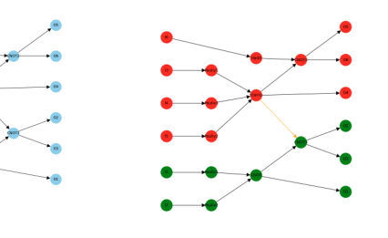
<figcaption class="paper-figure-caption"><b>Fig 7.</b> Figure 7: (a) Quantum algorithm with induced entanglement, decomposition necessitates qubit cuts. (b) The graph representation of the circuit. (c) SMT solution for the cutting protocol, yielding two separable subgraphs (red and green); the yellow edge indicates the qubit cut.</figcaption>
</figure>
<figure class="paper-figure-card">
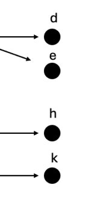
<figcaption class="paper-figure-caption"><b>Fig 8.</b> Figure 8: G′, G′′, G′′ each contains one component while G′′ ∪G′′′ contains two.</figcaption>
</figure>
<figure class="paper-figure-card">
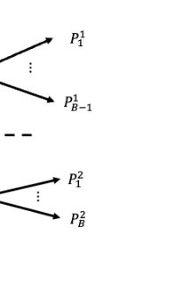
<figcaption class="paper-figure-caption"><b>Fig 9.</b> Figure 9: The case β &gt; 0. The dag shown is G′, β copies of which are added to G0.</figcaption>
</figure>
<figure class="paper-figure-card">
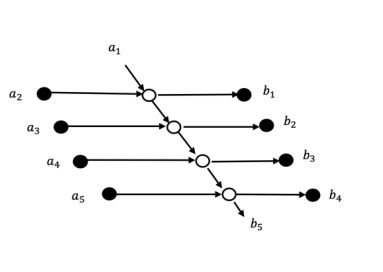
<figcaption class="paper-figure-caption"><b>Fig 10.</b> Figure 10: Illustration of the proof sketch for Theorem 5.</figcaption>
</figure>

**Main problem.** The paper addresses the computational complexity and optimization of quantum circuit cutting, which involves partitioning large quantum circuits into smaller fragments to be processed on multiple smaller QPUs.

**Main result.** The authors prove that finding the optimal circuit-cutting configuration (the Graph Duplication problem) is NP-complete in general and even for simplified 2-qubit gate circuits, but can be solved in polynomial time if the number of cuts is constant.

**Method.** The work uses a graph-theoretic framework mapping circuits to Directed A-cyclic Graphs (DAGs) and employs reductions from the 3-partition problem to establish complexity, alongside an SMT-based solver for practical optimization.

**Summary.** This paper provides a rigorous complexity-theoretic analysis of quantum circuit cutting, a vital technique for executing large circuits on fragmented NISQ hardware. By mapping the cutting process to a graph duplication problem, the authors demonstrate that finding optimal cuts is NP-complete. However, they also show that the problem is tractable when the number of cuts is small and provide an SMT-based solver to find these optimal configurations. This work helps define the computational limits of circuit decomposition strategies.

Detailed structure

**Model / system.** The study focuses on the NISQ era quantum circuit model, representing quantum operations as tensors and qubit trajectories as edges within a Directed Acyclic Graph (DAG) or Tensor Network.

**Important parameters / regimes.** beta (number of edge duplications/cuts), alpha (number of clusters), k (maximum number of input/output wires per cluster), and the qubit budget Q.

**Assumptions / limitations.** The analysis focuses on 'timelike' cuts (wire cuts) and assumes 'legal' DAGs where the number of inputs equals the number of outputs.

**Figures summary.** Figure 1 shows tensor network evolution; Figure 2 illustrates unitary decomposition; Figure 3 shows the graph duplication protocol; Figures 4-7 visualize complexity proofs and SMT solver performance; Figures 8-10 detail the mathematical construction for NP-completeness proofs.

**Paper structure.** The paper introduces the circuit cutting problem, establishes a graph-theoretic duality, provides a complexity characterization (identifying polynomial and NP-complete regimes), proposes an SMT-based optimization algorithm, and provides rigorous mathematical proofs in the appendix.

Abstract

The current noisy intermediate-scale quantum (NISQ) era is characterized by substantial errors and noise, which limit the practical feasibility of deep, many-qubit circuits. To address these constraints, quantum circuit cutting has emerged as a promising tool. Recently, there has been significant research on methods for performing such cutting effectively. In this work, the duality between quantum circuits and classical graphs - specifically, directed acyclic graphs (dags) - is leveraged to analyze the complexity of finding an optimal circuit-cutting configuration that minimizes the number of cuts. After developing a rigorous graph-theoretic framework, the complexity of identifying cut locations that partition a given quantum circuit into smaller fragments is characterized. The corresponding graph-combinatorial task is then defined, and the resulting partition problem is shown to be NP-complete. Furthermore, even a simplified version of the problem, restricted to circuits composed only of one- and two-qubit gates, is shown to be NP-complete. Finally, based on these constraints, an algorithm grounded in satisfiability modulo theories (SMT) is proposed to find optimal cuts when the number of qubits per partition is bounded. This work therefore provides a complexity-theoretic characterization of cut placement and a practical solver for bounded-size decompositions.

[↑ back to top](#top)

### [Regularization of Divergent Power Sums via Fractional Extension of Differential Generators](http://arxiv.org/abs/2604.23544v1)

**Authors:** Eric A. Galapon  
**Type:** theory · **Category:** other · **PDF:** <https://arxiv.org/pdf/2604.23544v1>  
**Analysis basis:** full PDF text, analyzed in chunks

↔ Scroll figures horizontally

<figure class="paper-figure-card">
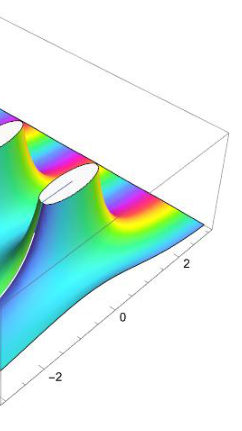
<figcaption class="paper-figure-caption"><b>Fig 1.</b> Figure 1. The plot of Liα(exp(−z)). There is one main branch cut emanating from the zeros of z at z = 0. The other branch cuts emanate from the solutions to exp(−z) = 1 which are not zeros of z.</figcaption>
</figure>
<figure class="paper-figure-card">
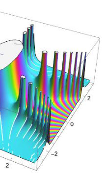
<figcaption class="paper-figure-caption"><b>Fig 2.</b> Figure 2. The plot of Liα(exp(−z −z3)). There are three main branch cuts emanating from the zeros of (z +z3) at z = 0, ±i. The other branch cuts emanate from the solutions to exp(−z −z3) = 1 which are not zeros of (z + z3).</figcaption>
</figure>

**Main problem.** The paper addresses the lack of continuity in standard Riemann zeta regularization when moving from integer to non-integer exponents alpha in divergent power sums.

**Main result.** The author develops a new regularization prescription using fractional extensions of differential generators that recovers Riemann zeta regularization as a special case while ensuring continuity and providing additional terms determined by the generator.

**Method.** The method employs fractional calculus, contour integration using Hankel-type contours, and the construction of a Generalized Spectral Function (GSF) via a differential generator L.

**Summary.** This paper introduces a generalized mathematical framework for regularizing divergent power series. By using fractional extensions of differential operators, the author creates a regularization scheme that is continuous for both integer and non-integer exponents. This method generalizes the well-known Riemann zeta regularization and allows for new regularized values that depend on the specific choice of a differential generator. The work provides a consistent way to handle branch points and singularities in the context of spectral functions.

Detailed structure

**Model / system.** The mathematical framework is applied to the regularization of divergent sums of the form sum n^alpha, with physical motivation drawn from non-interacting fermions in a box and the calculation of restoring forces.

**Key observables.** Regularized power sums, regularized products, and the generalized zeta function.

**Important parameters / regimes.** The exponent alpha (complex order), the differential generator L, and the function h(t) defining the generator.

**Assumptions / limitations.** The Generalized Spectral Function must have a holomorphic complex extension with a pole at the origin, and the function Phi(z) is assumed to be an entire function.

**Figures summary.** Figure 1 shows a complex plot of the polylogarithm Li_alpha(exp(-z)) highlighting branch cuts; Figure 2 shows a complex plot of the polylogarithm with a more complex generator, illustrating additional branch cuts.

**Paper structure.** The paper begins by defining the regularization problem, introduces the differential generator and GSF framework, develops the fractional extension via contour integrals, proves the equivalence of differential and integral forms, and concludes with explicit examples and comparison to Riemann zeta regularization.

Abstract

We reconsider the problem of regularizing the divergent series $\sum_{n=1}^{\infty}n^α$ for $\operatorname{Re}α>-1$, and offer a regularization prescription that yields the Riemann zeta regularization as a special case. The development of the regularization is framed as a two-step problem. The first step is prescribing a regularization of the divergent sum $\sum_{n=1}^{\infty}n^m$ for every non-negative integer $m$; and the second step is the extension of the sum for non-integer $α$. The extension is obtained under the consistency condition that the regularized sum for integer $m$ emerges continuously from the sum for non-integer $α$. The scheme is specified by a differential generator $L=L(\mathrm{d}/\mathrm{d}t)$ through which a generalized spectral function (GSF), $K_L(t)$, is constructed. Under the condition that the GSF has a holomorphic complex extension $K_L(z)$ with $z=0$ as a pole, the case for integer $m$ takes the regularized value $\sum_{n=1}^{\infty} n^m = (2πi)^{-1}\oint_C L^m K_L(z) z^{-1}\mathrm{d}z$, where $C$ is a closed contour enclosing only the pole of $K_L(z)$ at the origin. On the other hand, under the consistency condition, the case for non-integer $α$ takes the value $\sum_{n=1}^{\infty}n^α=(2πi)^{-1}\int_{\tilde{C}} L^α K_L(z) z^{-1}\mathrm{d}z$, where $L^α$ is the fractional extension of $L^m$ and $\tilde{C}$ is an appropriate deformation of the contour $C$. Here, we obtain the regularization corresponding to the generator $L=h(t) \mathrm{d}/\mathrm{d}t$, where $h(t)$ has the analytic extension $h(z)$ such that $1/h(z)$ is an entire function. We find that the regularized sum is equal to the Riemann zeta regularized value plus terms determined by the generator $L$.

[↑ back to top](#top)

### [Scissors modes in generalized Gross-Pitaevskii equations](http://arxiv.org/abs/2604.23219v1)

**Authors:** Neelam Shukla, Oleksandr V. Marchukov, Bastien Humbert, Jan Arlt, Jeremy Armstrong, Artem G. Volosniev  
**Type:** theory · **Category:** quantum gases · **PDF:** <https://arxiv.org/pdf/2604.23219v1>  
**Analysis basis:** full PDF text, analyzed in chunks

↔ Scroll figures horizontally

<figure class="paper-figure-card">
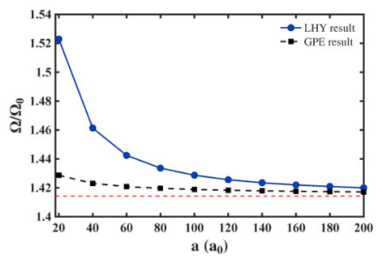
<figcaption class="paper-figure-caption"><b>Fig 1.</b> FIG. 2. Scissors mode frequency as a function of the scatter- ing length for a GPE system of 200000 atoms (black curve with square points) and an LHY system of one million atoms (green curve with circle points). A horizontal line at the value of √</figcaption>
</figure>
<figure class="paper-figure-card">
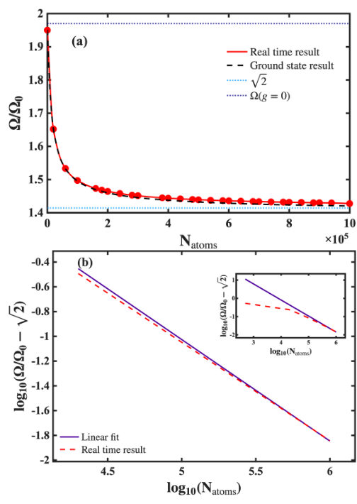
<figcaption class="paper-figure-caption"><b>Fig 2.</b> FIG. 1. Scissors mode oscillation frequency as a function of atom number for the LHY system. The upper panel shows the frequency extracted from numerical calculations (solid black curve; ‘Real time result’) and the prediction of Eq. (24) (red dashed curve; ‘Ground state result’). Both curves approach the infinite atom limit of √</figcaption>
</figure>
<figure class="paper-figure-card">
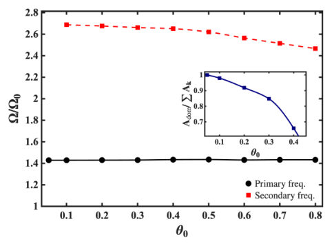
<figcaption class="paper-figure-caption"><b>Fig 3.</b> FIG. 4. Frequencies of the two dominant modes in the fit to the data presented in Fig. 3 as a function of θ0. The inset shows the fraction of the scissors mode frequency as a function of θ0 (points), with the curve added to guide the eye.</figcaption>
</figure>
<figure class="paper-figure-card">
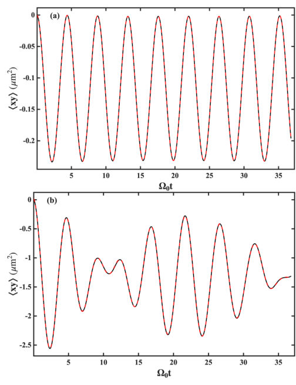
<figcaption class="paper-figure-caption"><b>Fig 4.</b> FIG. 3. Time dynamics of ⟨xy⟩as a function of time for two different initial angles (θ0), showing both the calculated data and a fit to the data (dashed curves). The calculations were done for one million atoms, all other parameters are as in Fig. 1. The upper panel is for the smallest studied initial angle, θ0 = 0.05 radians, and is fit (dashed curve) with two different modes. The lower panel is for θ0 = 0.5 radians. The fit was obtained with 13 modes.</figcaption>
</figure>
<figure class="paper-figure-card">
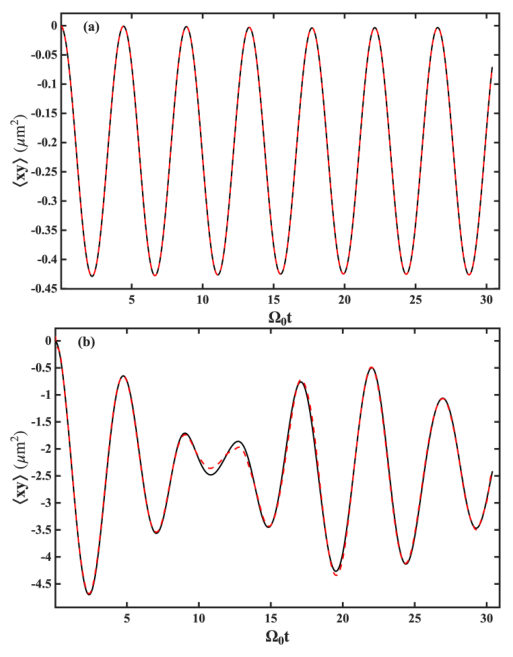
<figcaption class="paper-figure-caption"><b>Fig 5.</b> FIG. 6. Oscillation behavior of of a GPE gas for the same two initial angles as in Fig 3. The upper panel shows the small initial angle (0.05 radians) and shows the expected sinusoidal behavior of the scissors mode. The lower panel is for 0.50 radians, and the oscillation pattern indicates the presence of other modes. Both panels have fits plotted as well, the upper panel is done with three modes and the bottom mode with seven modes. This calculation was performed with 200,000 particles and the scattering length equal to 100 a0.</figcaption>
</figure>
<figure class="paper-figure-card">
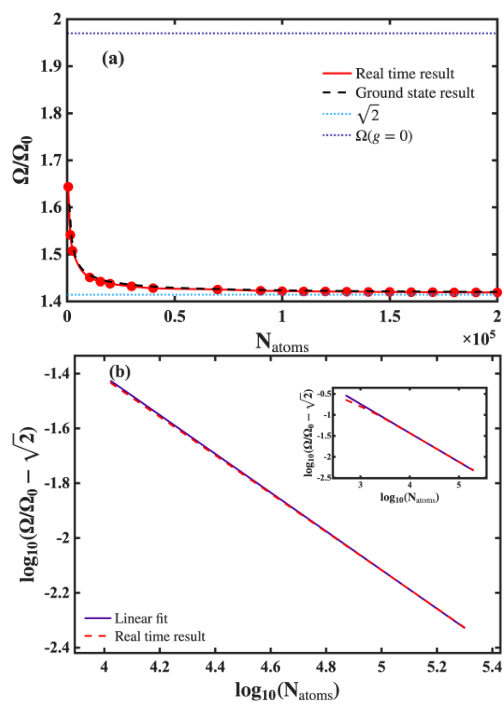
<figcaption class="paper-figure-caption"><b>Fig 6.</b> FIG. 5. Panel (a): Plot of the scissors mode frequency as a function of the number of atoms. The small and large atom limits are shown as horizontal lines. Panel (b): A log-log plot where the abscissa is the logarithm of the number of atoms and the ordinate is the logarithm of the difference of the scissors mode frequency and √</figcaption>
</figure>

**Main problem.** The study investigates whether the frequency of scissors modes in nonlinear quantum systems depends on the specific form of the nonlinearity (compressibility) in the Thomas-Fermi regime.

**Main result.** The authors establish that in the Thomas-Fermi regime, the scissors mode frequency is universal and independent of the power-law index of the nonlinearity, acting as a pure shear mode. They also show that the frequency transitions from a non-interacting limit to a universal Thomas-Fermi limit as atom number increases.

**Method.** The study employs analytical derivation using a linear approximation and the method of characteristics, alongside numerical simulations using the split-step Crank-Nicolably method to solve the generalized Gross-Pitaevskii equation.

**Summary.** This paper investigates the behavior of scissors modes in quantum gases described by generalized Gross-Pitaevskii equations. It proves that in the strongly interacting Thomas-Fermi regime, the frequency of these rotational oscillations is universal and does not depend on the specific type of nonlinearity. By simulating both standard and Lee-Huang-Yang systems, the authors demonstrate how the frequency transitions from the non-interacting to the universal limit as the number of atoms increases. The findings highlight that the scissors mode is a pure shear mode that does not probe system compressibility.

Detailed structure

**Model / system.** The system consists of degenerate Bose gases, specifically comparing standard Gross-Pitaevskii (GPE) and Lee-Huang-Yang (LHY) regimes, modeled by a generalized Gross-Pitaevskii equation with arbitrary power-law nonlinearity in an anisotropic harmonic trap.

**Key observables.** The scissors mode frequency (Omega), the expectation value of the xy coordinate (proxy for oscillation angle), and the angular momentum operator.

**Important parameters / regimes.** Power-law index (gamma), atom number (N_atoms), interaction strength (g), scattering length (a), and trap frequencies (omega_x, omega_y).

**Assumptions / limitations.** The analysis assumes the Thomas-Fermi regime (neglecting quantum pressure) and a small rotation angle (theta_0 << 1) for the analytical derivation.

**Figures summary.** Figure 1 shows scissors mode frequency vs. atom number approaching the TF limit; Figure 2 shows frequency vs. scattering length; Figure 5 illustrates the frequency convergence to the large-atom limit; Figure 6 compares sinusoidal vs. complex multi-mode oscillations at different initial angles.

**Paper structure.** The paper begins with an analytical derivation of the scissors mode frequency in generalized nonlinear systems, followed by numerical validation using LHY and GPE models, an exploration of the transition between interaction regimes, and an analysis of the effects of large initial perturbations.

**Why it may be interesting.** This paper is interesting because it identifies a universal, nonlinearity-independent feature (the scissors mode frequency) in quantum fluids, providing a robust diagnostic tool for characterizing different types of quantum liquids like LHY systems.

Abstract

We investigate scissors modes in nonlinear systems with arbitrary power-law dependence of the nonlinear term. Through analytical derivation, we establish a general expression demonstrating that, in the Thomas-Fermi regime, the frequency of the scissors mode is independent of the specific form of the nonlinearity. We conclude that the scissors mode is a shear mode that does not probe the compressibility of the system, which depends on nonlinearity. To validate our findings, we perform numerical simulations of experimentally relevant Lee-Huang-Yang (LHY) systems. Our results illustrate the transition of the scissors mode frequency from the non-interacting to the strongly interacting (Thomas-Fermi) regime. Finally, we demonstrate that the scissors mode frequency remains clearly identifiable even under strong quenches, which should facilitate the experimental observation of our findings.

[↑ back to top](#top)

### [Semiclassical phases of charged spin-$1/2$ matter-wave interferometers in gravitational wave backgrounds](http://arxiv.org/abs/2604.24751v1)

**Authors:** Nontapat Wanwieng, Apimook Watcharangkool  
**Type:** theory · **Category:** other · **PDF:** <https://arxiv.org/pdf/2604.24751v1>  
**Analysis basis:** full PDF text, analyzed in chunks

↔ Scroll figures horizontally

<figure class="paper-figure-card">
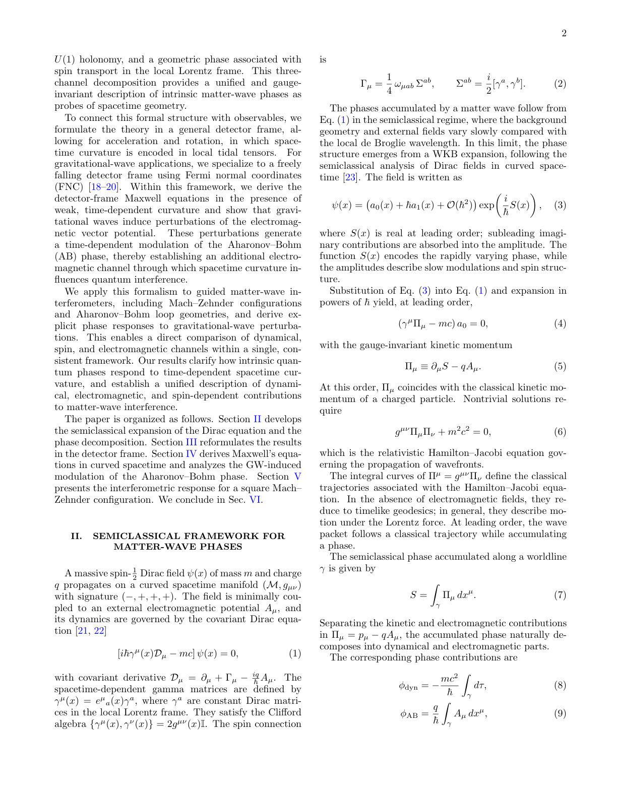
<figcaption class="paper-figure-caption"><b>Fig 1.</b> Low-resolution page preview, page 2</figcaption>
</figure>
<figure class="paper-figure-card">
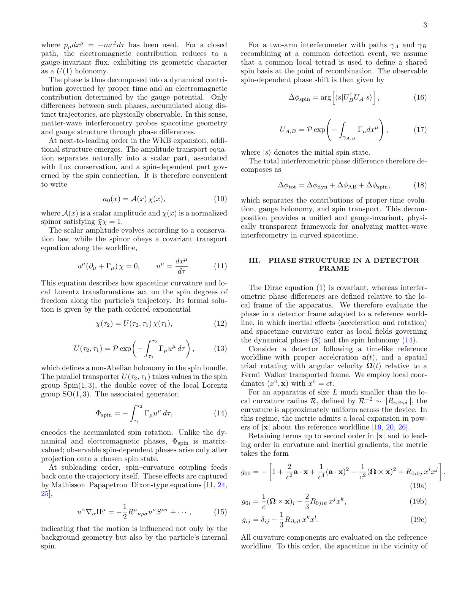
<figcaption class="paper-figure-caption"><b>Fig 2.</b> Low-resolution page preview, page 3</figcaption>
</figure>
<figure class="paper-figure-card">
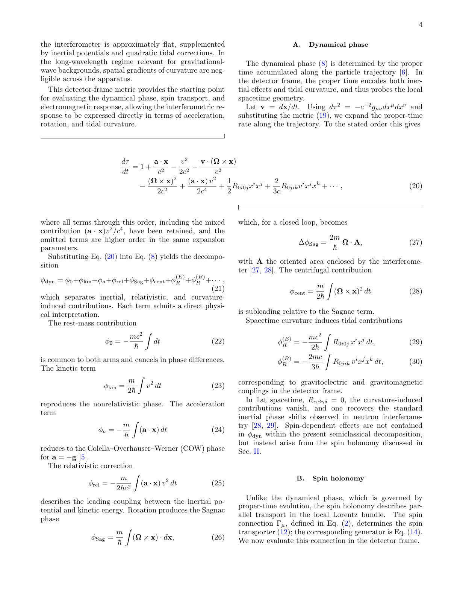
<figcaption class="paper-figure-caption"><b>Fig 3.</b> Low-resolution page preview, page 4</figcaption>
</figure>
<figure class="paper-figure-card">
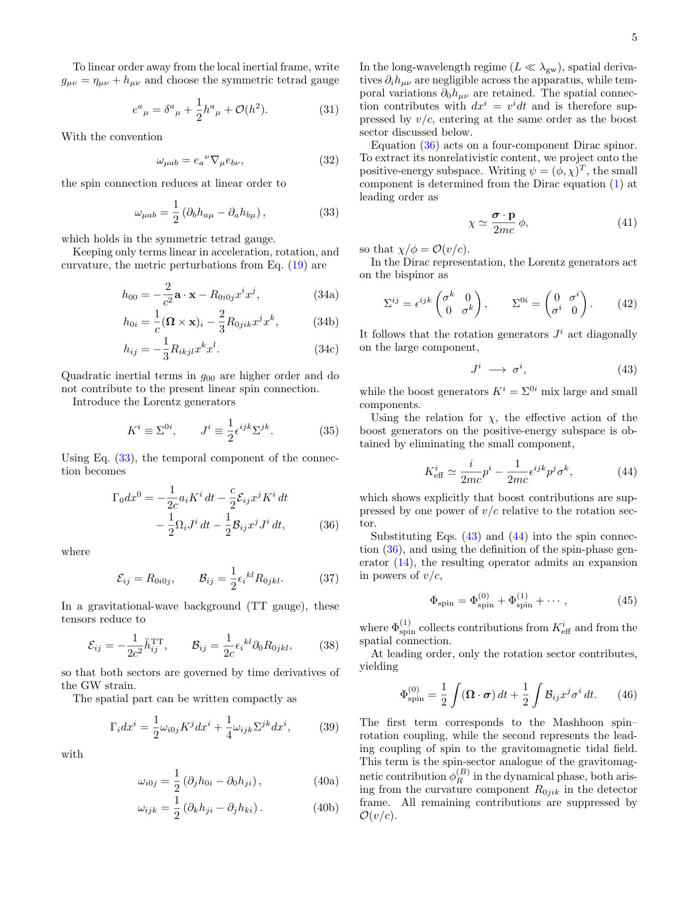
<figcaption class="paper-figure-caption"><b>Fig 4.</b> Low-resolution page preview, page 5</figcaption>
</figure>
<figure class="paper-figure-card">
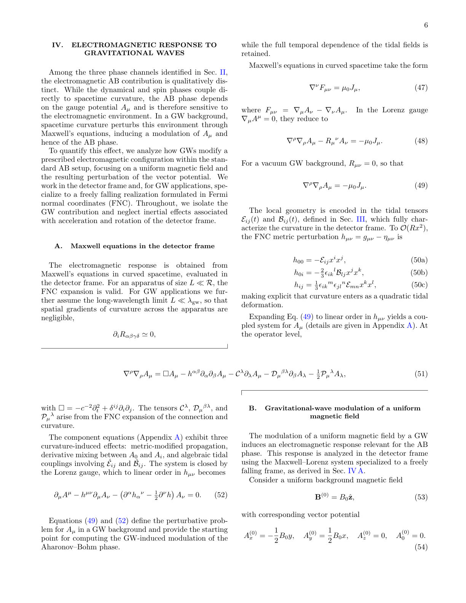
<figcaption class="paper-figure-caption"><b>Fig 5.</b> Low-resolution page preview, page 6</figcaption>
</figure>
<figure class="paper-figure-card">
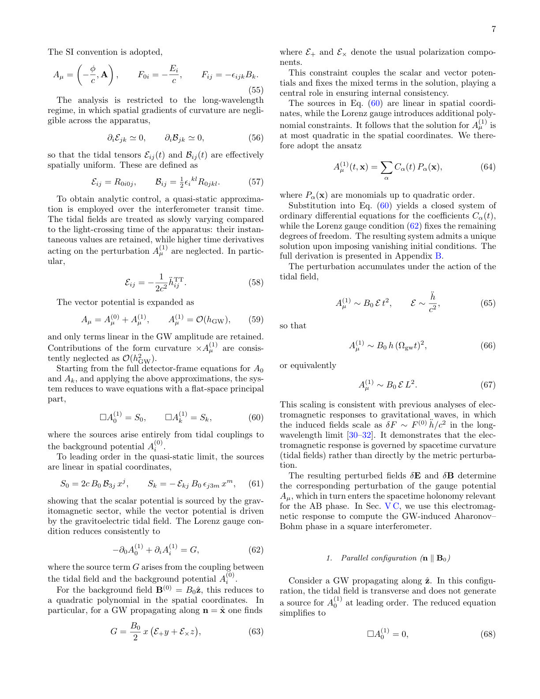
<figcaption class="paper-figure-caption"><b>Fig 6.</b> Low-resolution page preview, page 7</figcaption>
</figure>
<figure class="paper-figure-card">
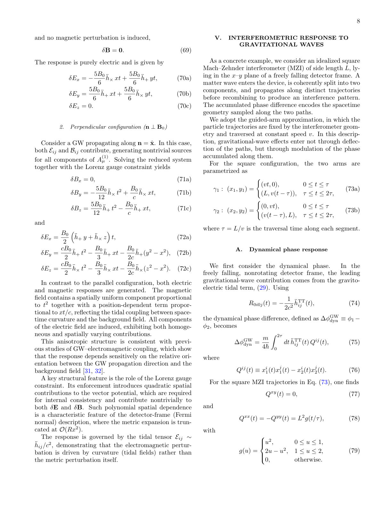
<figcaption class="paper-figure-caption"><b>Fig 7.</b> Low-resolution page preview, page 8</figcaption>
</figure>
<figure class="paper-figure-card">
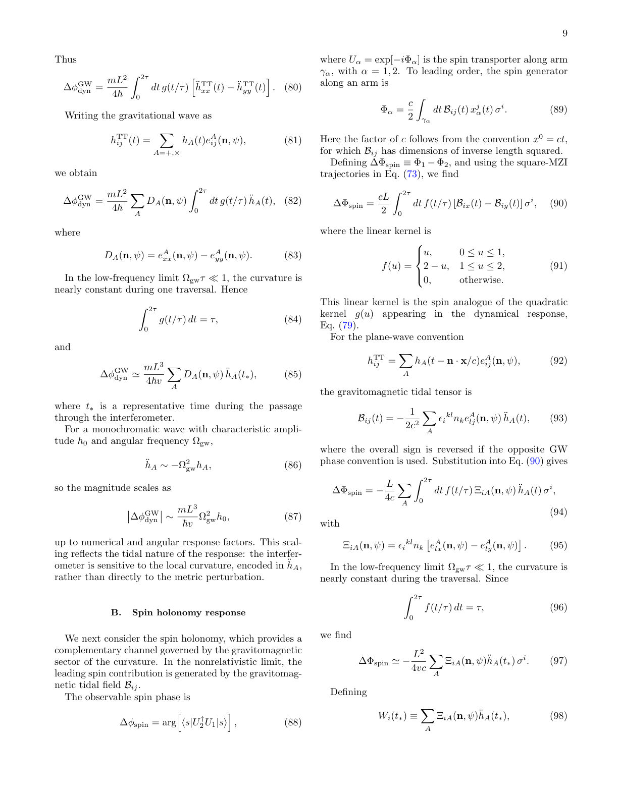
<figcaption class="paper-figure-caption"><b>Fig 8.</b> Low-resolution page preview, page 9</figcaption>
</figure>
<figure class="paper-figure-card">
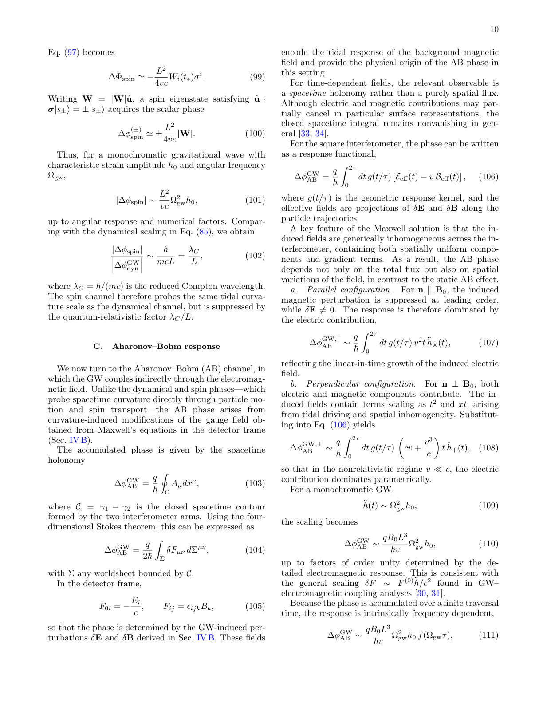
<figcaption class="paper-figure-caption"><b>Fig 9.</b> Low-resolution page preview, page 10</figcaption>
</figure>
<figure class="paper-figure-card">
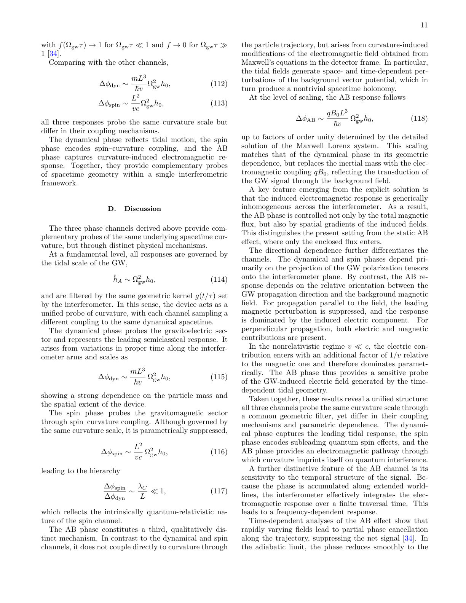
<figcaption class="paper-figure-caption"><b>Fig 10.</b> Low-resolution page preview, page 11</figcaption>
</figure>

**Main problem.** Developing a unified, gauge-invariant semiclassical framework to describe how the different components of a charged spin-1/2 matter-wave interferometer phase respond to time-dependent gravitational wave backgrounds.

**Main result.** The study identifies three distinct, complementary phase channels (dynamical, spin, and electromagnetic AB) that all probe the same tidal curvature scale, with the AB phase specifically arising from GW-induced perturbations to the electromagnetic field.

**Method.** A semiclassical WKB expansion of the covariant Dirac equation is used within the Fermi Normal Coordinate framework to analyze phase accumulation in a freely falling detector frame.

**Summary.** This paper provides a unified theoretical description of how charged spin-1/2 matter-wave interferometers sense gravitational waves. It demonstrates that the total interferometric phase consists of three distinct channels: a dynamical phase, a spin-dependent phase, and an electromagnetic Aharonov-Bohm phase. While all three channels are driven by the same tidal curvature scale, they arise from different physical couplings—namely, inertial motion, spin-curvature coupling, and curvature-induced electromagnetic perturbations. This work identifies how spacetime curvature imprints itself on quantum interference through multiple, complementary pathways.

Detailed structure

**Model / system.** A charged spin-1/2 matter-wave interferometer (such as a Mach-Zehnder configuration) propagating through a weak gravitational wave background with an additional background magnetic field.

**Key observables.** Total accumulated phase difference, decomposed into dynamical phase, spin holonomy (spin phase), and electromagnetic Aharon-Bohm phase.

**Important parameters / regimes.** Tidal scale (ddot{h} ~ Omega^2 h0), particle mass (m), charge (q), interferometer side length (L), GW frequency (Omega_gw), and background magnetic field (B0).

**Assumptions / limitations.** Semiclassical (WKB) limit, long-wavelength limit (L << lambda_gw), weak gravitational wave background, and the quasi-static approximation for tidal fields.

**Paper structure.** The paper begins with a derivation of the semiclassical framework from the Dirac equation, proceeds to decompose the phase into three physical channels, analyzes the electromagnetic response of the system to curvature, and concludes by comparing the scaling and sensitivity of the different phase components.

Abstract

A matter wave propagating through curved spacetime accumulates phase that encodes both geometry and gauge structure. We develop a semiclassical framework for charged spin-$1/2$ matter-wave interferometers based on a WKB expansion of the covariant Dirac equation, in which the phase decomposes into dynamical, spin, and electromagnetic Aharonov-Bohm (AB) contributions. In a freely falling detector frame, all three channels are governed by local tidal fields. In a weak gravitational-wave (GW) background, the dynamical and spin phases probe the gravitoelectric and gravitomagnetic sectors of curvature, while the AB phase arises from curvature-induced electromagnetic fields obtained from Maxwell's equations in curved spacetime. For a Mach-Zehnder interferometer (MZI), all three responses are determined by the same tidal scale, $\ddot{h}_A \sim Ω^2_{gw}h_0$, and filtered by a common geometric kernel, while entering through distinct physical couplings. In particular, the AB contribution depends not only on the enclosed flux but also on spatial variations of the induced fields and exhibits an intrinsic frequency dependence set by the traversal time. These results provide a unified description of matter-wave interferometric phases in time-dependent GW backgrounds and identify complementary dynamical, spin, and electromagnetic pathways through which spacetime curvature imprints itself on quantum interference.

[↑ back to top](#top)

### [Solution of a large nonlinear recurrent neural network at fixed connectivity](http://arxiv.org/abs/2604.24141v1)

**Authors:** Albert J. Wakhloo  
**Type:** theory · **Category:** disordered systems and neural networks · **PDF:** <https://arxiv.org/pdf/2604.24141v1>  
**Analysis basis:** full PDF text, analyzed in chunks

↔ Scroll figures horizontally

<figure class="paper-figure-card">
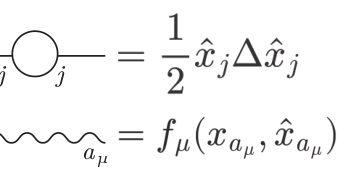
<figcaption class="paper-figure-caption"><b>Fig 1.</b> Figure 1. Diagram definitions.</figcaption>
</figure>
<figure class="paper-figure-card">
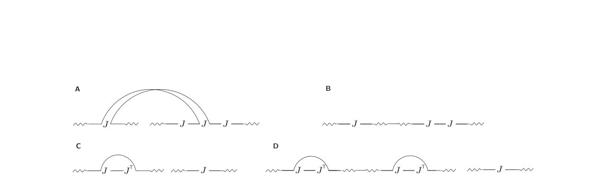
<figcaption class="paper-figure-caption"><b>Fig 2.</b> Figure 2. (A-B) Non-maximally disconnected diagrams. (C-D) Maximally disconnected, leading order diagrams. Note that both (B) and (C) contain four wavy lines and a set of repeated fixed indices, aµ = aν. The diagram in C contains 2 disconnected blocks, while the diagram in B contains only one.</figcaption>
</figure>
<figure class="paper-figure-card">
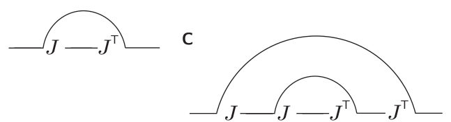
<figcaption class="paper-figure-caption"><b>Fig 3.</b> Figure 3. (A) Bare rainbow. (B) Join and (C) nest operations applied to the bare rainbow.</figcaption>
</figure>
<figure class="paper-figure-card">
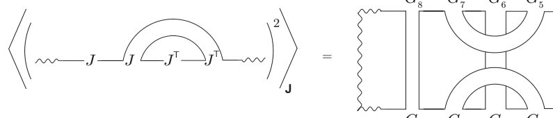
<figcaption class="paper-figure-caption"><b>Fig 4.</b> Figure 4. Mean-square diagrams. We suppress the J symbols so we can label the gaps G1, · · · , G8.</figcaption>
</figure>
<figure class="paper-figure-card">
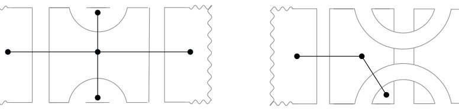
<figcaption class="paper-figure-caption"><b>Fig 5.</b> Figure 5. Multigraphs for the mean-square diagrams in Fig. 4 at order k = 4. We can see that the diagram on the right has fewer vertices and is therefore subleading.</figcaption>
</figure>
<figure class="paper-figure-card">
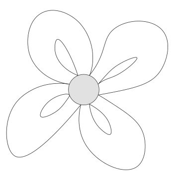
<figcaption class="paper-figure-caption"><b>Fig 6.</b> Figure 6. Ribbon graph for the top diagram in Fig. 4.</figcaption>
</figure>
<figure class="paper-figure-card">
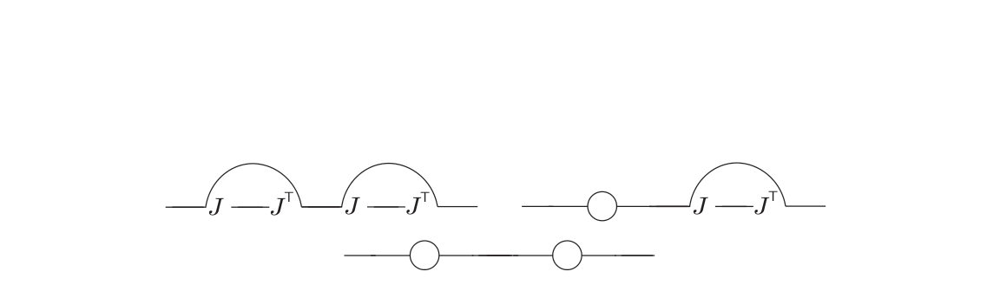
<figcaption class="paper-figure-caption"><b>Fig 7.</b> Figure 8. A rainbow and its decorations. Note that the diagram obtained by replacing only the right bare rainbow with a bubble is equivalent to the diagram in the upper right hand corner. Since we sum over equivalence classes of diagrams (Sec. 2.2), including both in the sum over decorations–i.e. counting the corresponding cρ twice–would double count the corresponding term in the expansion of Eq. (2.8)</figcaption>
</figure>

**Main problem.** Calculating the moments, response functions, and pairwise correlations of a large nonlinear recurrent neural network at a fixed connectivity without averaging over synaptic weights.

**Main result.** The paper proves a generalized Wick theorem for the network and validates the Shen-Hu conjecture, providing closed-form Fourier space equations for the linear response and correlation functions.

**Method.** The author uses the Martin-Siggia-Rose-De Dominicis-Janssen (MSRDJ) formalism, a 1/sqrt(N) diagrammatic expansion, and graph theory (ribbon graphs and Euler's theorem) to identify and resum leading-order terms.

**Summary.** This paper provides an analytical solution for the dynamics of large nonlinear recurrent neural networks at fixed connectivity. By using a diagrammatic expansion, the author shows that the leading-order behavior is dominated by 'chain' diagrams after a specific cancellation of 'rainbow' and 'bubble' diagrams. The work proves the Shen-Hu conjecture and establishes a generalized Wick theorem for these systems. This allows for the calculation of precise correlation and response functions in the large N limit without needing to average over the random weights.

Detailed structure

**Model / system.** A large (N) nonlinear random recurrent neural network with dynamics defined by preactivations subject to random synaptic weights (J_ij) and Gaussian external input noise.

**Key observables.** Moments and response functions of pre- and post-activations, pairwise correlations, and linear response functions.

**Important parameters / regimes.** Large N limit, synaptic variance (sigma^2), connectivity matrix (J_ij), and the 1/sqrt(N) expansion parameter.

**Assumptions / limitations.** The analysis assumes the large N limit, i.i.d. synaptic weights, and that the geometric series of the expansion does not diverge (sigma|phi'| < 1).

**Figures summary.** Figures define diagrammatic notation (gaps, bubbles, wavy lines), illustrate the difference between leading-order and subleading diagrams, and show the structure of rainbow and chain diagrams.

**Paper structure.** The paper begins by defining the model and the MSRDJ generating functional, proceeds to a diagrammatic expansion in 1/sqrt(N), uses graph theory and combinatorial arguments to prove the cancellation of certain diagrams (rainbows and bubbles), and concludes with the derivation of closed-form solutions for correlation and response functions.

Abstract

We calculate the moments and response functions of a nonlinear random recurrent neural network in the large $N$ limit. Our approach does not require averaging over synaptic weights and gives the first nontrivial term in a $1/\sqrt{N}$ expansion of general intensive-order correlation functions, proving a recent conjecture by Shen and Hu as a special case. Our results provide an analytical link between synaptic connectivity, correlations in spontaneous activity, and the response of a network to small perturbations.

[↑ back to top](#top)

### [Spin excitation of the Heisenberg antiferromagnet with frustration: from the bounce-lattice antiferromagnet through the maple-leaf-lattice antiferromagnet to the exact-dimer system](http://arxiv.org/abs/2604.24055v1)

**Authors:** Hiroki Nakano, Toru Sakai  
**Type:** theory · **Category:** strongly correlated electrons · **PDF:** <https://arxiv.org/pdf/2604.24055v1>  
**Analysis basis:** full PDF text, analyzed in chunks

↔ Scroll figures horizontally

<figure class="paper-figure-card">
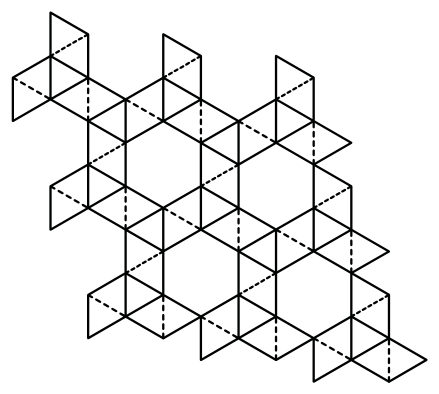
<figcaption class="paper-figure-caption"><b>Fig 1.</b> FIG. 1: Form of the target system. The interaction bonds Jd and Jb are represented by broken and solid lines, respectively. Solid lines form the bounce lattice. When the broken and solid lines are equivalent, the system is reduced to the maple-leaf lattice.</figcaption>
</figure>
<figure class="paper-figure-card">
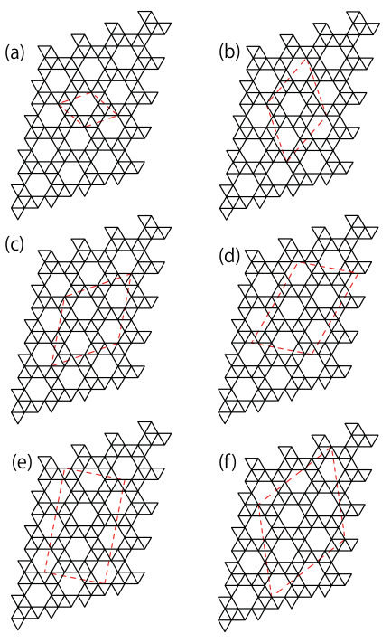
<figcaption class="paper-figure-caption"><b>Fig 2.</b> FIG. 2: Finite-size clusters under the periodic boundary con- dition denoted by broken red lines: (a) unit cell of the system (N = 6) and cases (b) N = 18, (c) N = 24, (d) N = 30, (e) N = 36, and (f) N = 42.</figcaption>
</figure>
<figure class="paper-figure-card">
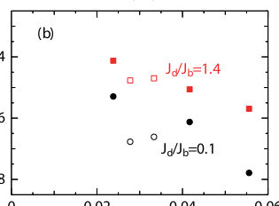
<figcaption class="paper-figure-caption"><b>Fig 3.</b> FIG. 3: Ground-state energy per site measured in units of Jb for S = 1/2: (a) N = 18 and 36 from Ref. 4 (circles and squares linked by dotted lines) and additional results for N = 24 (blue triangles), N = 30 (green crosses), and N = 42 (red pluses). The solid line represents the energy level of the exact-dimer state. (b) System-size dependence for the cases of Jd/Jb = 0.1 (black circles) and 1.4 (red squares). Closed and open symbols correspond to the cases of rhombic and nonrhombic clusters, respectively.</figcaption>
</figure>
<figure class="paper-figure-card">
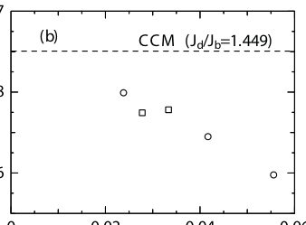
<figcaption class="paper-figure-caption"><b>Fig 4.</b> FIG. 4: (a) Edge of the exact-dimer phase in the case of S = 1/2 for the N = 42 cluster. Circles show the numeri- cal diagonalization results, the horizontal broken line denotes the energy level of the exact-dimer state and the solid line is obtained by fitting data outside the exact-dimer phase. (b) System-size dependence of the edge of the exact-dimer phase for finite-size clusters. Circles and squares correspond to rhombic and nonrhombic clusters, respectively. The hori- zontal broken line shows the result obtained by the coupled- cluster method in Ref. 4.</figcaption>
</figure>
<figure class="paper-figure-card">
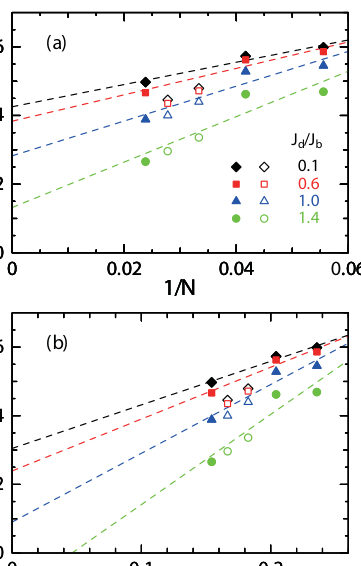
<figcaption class="paper-figure-caption"><b>Fig 5.</b> FIG. 5: Extrapolation of the spin excitation gap for S = 1/2 as functions of (a) 1/N and (b) 1/ √</figcaption>
</figure>
<figure class="paper-figure-card">
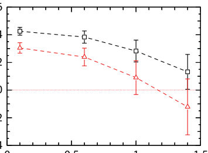
<figcaption class="paper-figure-caption"><b>Fig 6.</b> FIG. 6: Fitting error bars for extrapolation analysis of the spin excitation gap for S = 1/2 using 1/N (black squares) and 1/ √</figcaption>
</figure>
<figure class="paper-figure-card">
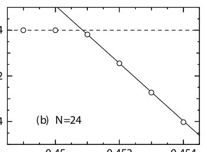
<figcaption class="paper-figure-caption"><b>Fig 7.</b> FIG. 8: Ground-state energy around the edge of the exact- dimer phase for S = 1: (a) N = 18 and (b) N = 24. Circles correspond to results from the numerical diagonalization. The horizontal broken line denotes the energy level of the exact- dimer state. The solid line is obtained by fitting data outside the exact-dimer phase.</figcaption>
</figure>
<figure class="paper-figure-card">
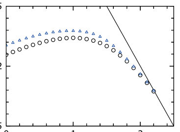
<figcaption class="paper-figure-caption"><b>Fig 8.</b> FIG. 7: Ground-state energy per site measured in units of Jb for S = 1: N = 18 (black circles) and N = 24 (blue triangles). The solid line represents the energy level of the exact-dimer state.</figcaption>
</figure>
<figure class="paper-figure-card">
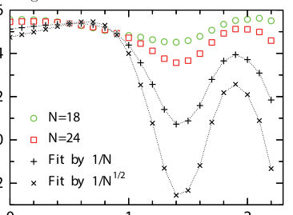
<figcaption class="paper-figure-caption"><b>Fig 9.</b> FIG. 9: Spin excitation gap for S = 1: N = 18 (green circles) and N = 24 (red squares). Raw data are analyzed by plotting the spin excitation gap as functions of 1/N or 1/ √</figcaption>
</figure>

**Main problem.** The study investigates the spin excitation gap and ground-state properties of the Heisenberg antiferromagnet under varying degrees of frustration, specifically tracing the evolution from the bounce-lattice to the exact-dimer system.

**Main result.** For both S=1/2 and S=1, the system is gapped at low Jd/Jb and becomes gapless at Jd/Jb approximately 1.4; for S=1, an additional gapped region appears near the exact-dimer phase boundary.

**Method.** Highly parallelized numerical diagonalization using the Lancative algorithm on clusters up to 42 sites (S=1/2) and 24 sites (S=1), with finite-size scaling analysis.

**Summary.** This paper explores the phase transitions and spin gap behavior in frustrated 2D Heisenberg antiferromagnets. By studying the transition from the bounce-lattice to the exact-dimer system, the authors identify specific regimes where the system is gapped or gapless. The study provides new numerical data for S=1/2 clusters up to 42 sites and explores the previously less understood S=1 case. These findings help clarify the magnetic properties of frustrated lattices and relate to experimental observations in materials like Na2Mn3O7.

Detailed structure

**Model / system.** A 2D Heisenberg antiferromagnet with spin S=1/2 and S=1, featuring interaction bonds (Jb) forming a bounce lattice and dimer interactions (Jd) that transition the system through a maple-leaf lattice to an exact-dimer phase.

**Key observables.** Ground-state energy (Eg), spin excitation gap (Delta), and spin correlation functions (dimer, hexagonal, and triangular bonds).

**Important parameters / regimes.** Spin magnitude (S=1/2, S=1) and the interaction ratio Jd/Jb (or Jb/Jd).

**Assumptions / limitations.** The study assumes periodic boundary conditions and uses finite-size clusters to extrapolate to the thermodynamic limit.

**Figures summary.** Fig 1 shows the lattice schematic; Fig 3 shows ground-state energy per site; Fig 6 shows extrapolation analysis of the spin gap; Fig 7 shows ground-state energy as a function of Jd/Jb.

**Paper structure.** The paper introduces the lattice models, describes the numerical diagonalization method, presents results for S=1/2 and S=1 spin systems, and concludes with phase boundary identification and comparison to existing literature.

Abstract

The spin-S Heisenberg antiferromagnet on the two-dimensional lattice is investigated for S=1/2 and S=1. We consider interaction at isolated dimers ($J_{\rm d}$) and interaction bonds that form the bounce lattice ($J_{\rm b}$). For $J_{\rm d}=J_{\rm b}$, the system is reduced to the maple-leaf-lattice antiferromagnet. We primarily conduct highly parallelized numerical diagonalization to examine the spin excitation gap above the ground state for various $J_{\rm b}/J_{\rm d}$ cases. For S=1/2, we report calculations for a 42-site cluster that has not been previously treated. The S=1 case is examined for the first time for clusters up to 24 sites. Regardless of whether S=1/2 or 1, we find that the system has a gapped nature for small $J_{\rm d}/J_{\rm b}$ and becomes gapless at $J_{\rm d}/J_{\rm b}\sim 1.4$. For S=1, we also find that another gapped region appears between the gapless case at $J_{\rm d}/J_{\rm b}\sim 1.4$ and the boundary of the exact-dimer phase.

[↑ back to top](#top)

### [Statistical Mechanics of Household Income and Wealth: Derivation from Firm Dynamics via Maximum Entropy and Mixture Aggregation](http://arxiv.org/abs/2604.22976v1)

**Authors:** Robert T. Nachtrieb  
**Type:** theory · **Category:** statistical mechanics · **PDF:** <https://arxiv.org/pdf/2604.22976v1>  
**Analysis basis:** full PDF text, analyzed in chunks

↔ Scroll figures horizontally

<figure class="paper-figure-card">
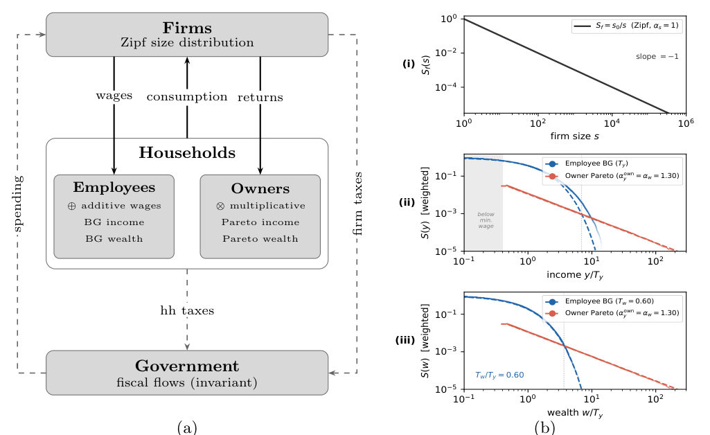
<figcaption class="paper-figure-caption"><b>Fig 1.</b> FIG. 1. (a) Three-sector money flow diagram. Solid arrows: flows determining the distributions (wages, consumption, capital returns). Dashed arrows: fiscal flows (taxes, government spending), shown to leave the GB form robust. Employees (⊕additive wages) yield BG income and wealth; Owners (⊗multiplicative returns) yield Pareto income and wealth. (b) Survival functions S(x) = P(X &gt; x) on log–log axes, from Monte Carlo simulation (dots) and analytic fits (dashed lines), population-weighted (femp = 0.97, fown = 0.03). Firm size (i) follows Zipf (Sf ∼s−1, slope −1). Income (ii) and wealth (iii) each show a BG bulk (concave, set by temperature Ty or Tw) transitioning to a Pareto tail (straight...</figcaption>
</figure>

**Main problem.** The lack of a mechanistic link between firm-level microeconomics and the observed two-class structure of household income and wealth (exponential Boltzmann-Gibbs bulk vs. power-law Pareto tail).

**Main result.** The paper derives the two-class income/wealth structure from first principles, showing that the Pareto exponent for wealth is directly determined by firm-size scaling without tuned parameters.

**Method.** The study uses Fokker-Planck equations, Maximum Entropy principles, and mixture aggregation, validated by Monte Carlo agent simulations and empirical data from Compustat and BDS.

**Summary.** This paper provides a statistical mechanics derivation of the observed two-class structure in economic inequality. It connects firm-level dynamics, specifically Gibrat's law and firm-size scaling, to the emergence of a Boltzmann-Gibbs distribution for the majority and a Pareto tail for the wealthy. The model successfully reproduces empirical wealth exponents using observed firm-value scaling without any free parameters. It also predicts the ratio of wealth to income for lower-class households and firm exit rates.

Detailed structure

**Model / system.** A three-sector economy consisting of Firms, Households (Employees and Owners), and Government, modeled via Gibrat's Law for firm growth and additive/multiplicative noise dynamics for wealth.

**Key observables.** Pareto wealth exponent (alpha_w), firm-size exponent (theta), wealth-to-income temperature ratio (Tw/Ty), and firm exit rates.

**Important parameters / regimes.** Firm-value scaling (theta), returns-per-employee size exponent (zeta), and the crossover point (x1) determined by demography.

**Assumptions / limitations.** Within-firm wages follow Maximum Entropy distributions; firm growth follows Gibrat's Law (multiplicative Itô noise); wealth dynamics for employees involve a reflecting boundary at zero.

**Figures summary.** Figure 1(a) provides a money flow diagram illustrating the interactions and fiscal flows between the firm, household, and government sectors.

**Paper structure.** The paper establishes a mechanistic chain from firm growth (Gibrat's Law) to firm size (Zipf), then applies Maximum Entropy and mixture aggregation to derive income/wealth distributions, followed by empirical validation using firm-value and exit-rate data.

Abstract

The distribution of income and wealth in developed economies exhibits a robust two-class structure: an exponential (Boltzmann--Gibbs) bulk covering $\sim\!97\%$ of the population, and a power-law (Pareto) tail in the upper $\sim\!3\%$. We derive this structure from first principles via an explicit mechanistic chain: Gibrat's law for firm growth implies a Zipf firm-size distribution; maximum entropy applied to within-firm wages, combined with mixture aggregation across firms, yields a Boltzmann--Gibbs income distribution with temperature $T_y$ for employees; additive-noise wealth dynamics with a reflecting wall at zero produce a Boltzmann--Gibbs employee wealth distribution with temperature $T_w$. For firm owners, multiplicative capital returns produce a Pareto wealth tail with exponent $α_w = 1/θ$, where $θ$ encodes how total returns scale with firm size. The empirical value $α_w \approx 1.30$ \cite{Yakovenko2009} is reproduced with no tuned parameters from the observed firm value scaling $V = V_0(s/s_0)^{0.77}$~\cite{Axtell2001}, and simultaneously yields the first quantitative estimate of the returns-per-employee size exponent: $ζ= θ- 1 \approx -0.23$. For empirical values $ν\approx 0.3$, $c \approx 0.81$, $k \approx 0.15$ (BEA long-run savings rate $\approx 5\%$), the model gives $T_w/T_y \approx 1.7\,\text{yr}$, i.e.\ lower-class households hold roughly 1--2 years of income as wealth, with the precise ratio depending on savings and tax rates and testable cross-country. As a parameter-free empirical test, firms near zero profit have a cash martingale whose first-passage time gives establishment exit rate $\sim t^{-1/2}$; convolving with the Zipf firm-size distribution yields firm-level exit rate $\sim t^{-1/2}\!\log t$, with apparent exponent $b = 0.295 \pm 0.03$, confirmed against BDS firm-age data with no free parameters.

[↑ back to top](#top)

### [Symmetry-Guided Design of Quantum Couplers in Dirac materials: AA-Bilayer Graphene Coupler](http://arxiv.org/abs/2604.23759v1)

**Authors:** Petr Červenka, Vít Jakubský  
**Type:** theory · **Category:** other · **PDF:** <https://arxiv.org/pdf/2604.23759v1>  
**Analysis basis:** full PDF text, analyzed in chunks

↔ Scroll figures horizontally

<figure class="paper-figure-card">
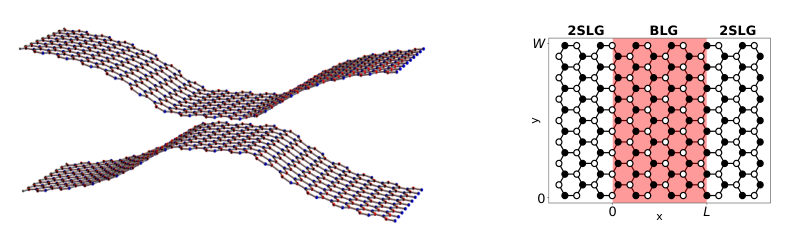
<figcaption class="paper-figure-caption"><b>Fig 1.</b> Figure 1: (Color online) The model of AA-stacked bilayer coupler. Two layers of graphene can get deformed such that they form the stripe of AA-stacking.</figcaption>
</figure>
<figure class="paper-figure-card">
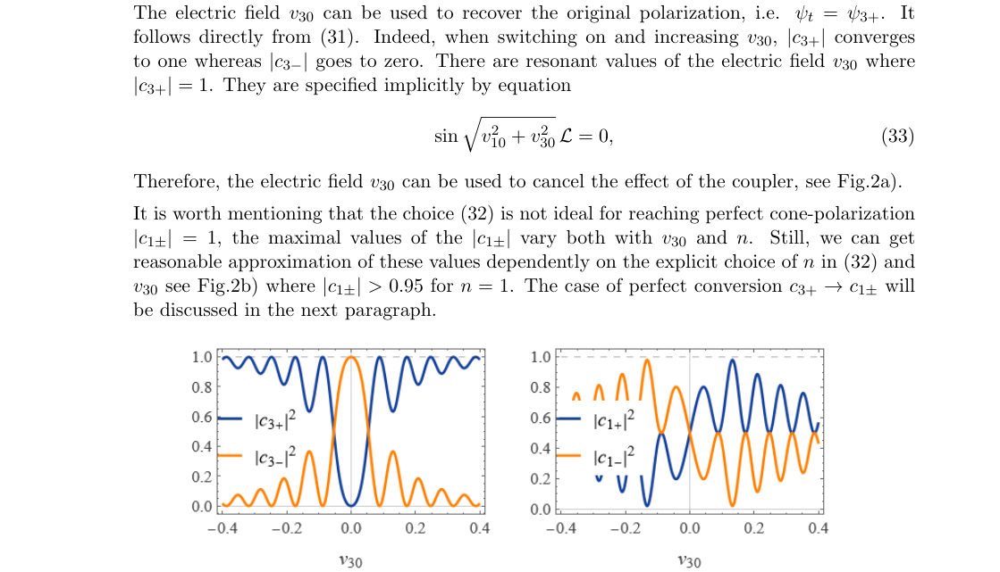
<figcaption class="paper-figure-caption"><b>Fig 2.</b> Figure 2: Polarization coefficients |c3±|2 (left) and |c1±|2 (right) in dependence on the electric field v30. We fixed |v10| = 0.1, n = 1 that corresponds to L ∼47.12.</figcaption>
</figure>
<figure class="paper-figure-card">
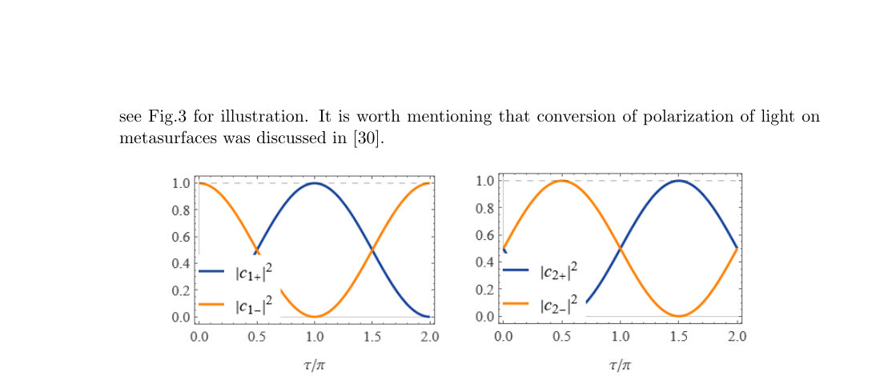
<figcaption class="paper-figure-caption"><b>Fig 3.</b> Figure 3: Oscillation of polarization coefficients |c1±|2 and |c2±|2 as function of parallel magnetic field. We fixed |v10| = 0.1.</figcaption>
</figure>
<figure class="paper-figure-card">
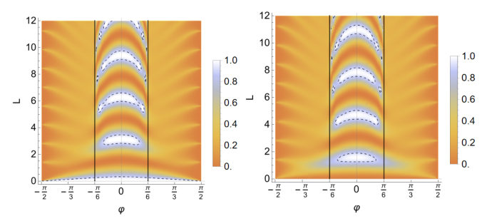
<figcaption class="paper-figure-caption"><b>Fig 4.</b> Figure 4: Transmission on the layer one |c3+|2 (left) and the layer two |c3−|2 (right) as a function of L and φ. The area between dashed curves has transmission greater than 95%. Black vertical lines symbolize the critical angle φ− c .</figcaption>
</figure>
<figure class="paper-figure-card">
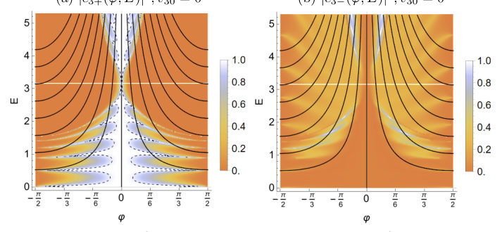
<figcaption class="paper-figure-caption"><b>Fig 5.</b> Figure 5: Transmission on the layer one |c3+|2 and the layer two |c3−|2 as a function of the energy E with v30 = 0 (upper line) and with v30 ̸= 0 (lower line). We set W = L = 6, t = 1, v30 = 3. The white line indicates E = p</figcaption>
</figure>
<figure class="paper-figure-card">
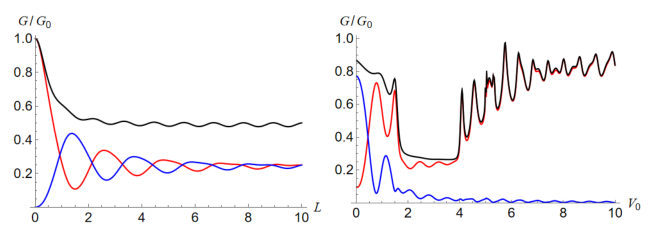
<figcaption class="paper-figure-caption"><b>Fig 6.</b> Figure 6: The conductance of AA bilayer coupler with semiconducting AC edges . The parameter are v10 = t = 1, W = 1.03, EF = 3 and magic length L = L↓= 3/2π. The electric field is here denoted v30 ≡V0.</figcaption>
</figure>

**Main problem.** Designing a theoretical framework for quantum couplers in Dirac materials that can modulate the polarization of transmitted quasiparticles (such as layer, spin, or valley) without causing significant reflection or loss.

**Main result.** The authors developed a symmetry-guided design strategy that uses Klein tunneling to ensure reflectionless transmission, demonstrating that polarization can be precisely controlled via external electric and magnetic fields in AA-bilayer graphene.

**Method.** The authors use an auxiliary Hamiltonian approach and a unitary transformation to 'reverse-engineer' the required potential for a desired polarization transformation, treating Klein tunneling as free-particle dynamics in disguise.

**Summary.** This paper presents a method to design quantum couplers in Dirac materials like graphene that can switch or rotate the polarization of particles. By utilizing the property of Klein tunneling, the authors show how to achieve perfect, lossless transmission. They demonstrate that external electric and magnetic fields can be used to precisely tune the output state, such as converting layer polarization to cone polarization. The framework is particularly effective for nanoribbon geometries where transport is restricted to specific channels.

Detailed structure

**Model / system.** The system consists of AA-stacked bilayer graphene nanoribbons with armchair edges and localized interlayer interaction, described by a Hamiltonian including interlayer hopping, electric fields, and parallel magnetic fields.

**Key observables.** Polarization coefficients (layer, cone, and pseudo-spin), transmission amplitudes, reflection coefficients, and conductance.

**Important parameters / regimes.** Interlayer coupling strength (t), perpendicular electric field (v30), parallel magnetic field (v20), coupler length (L), and nanoribbon width (W).

**Assumptions / limitations.** The construction is exact at normal incidence (py = 0) and assumes the continuity of the wavefunction at the coupler boundaries.

**Figures summary.** Figure 1 introduces the system; Figure 2 shows the dependence of polarization coefficients on the electric field; Figure 3 illustrates the oscillation of polarization coefficients as a function of other parameters.

**Paper structure.** The paper introduces a theoretical framework for coupler design, details the physical model of AA-bilayer graphene, applies a unitary transformation method to achieve controlled polarization, and analyzes various regimes including narrow-metallic and wider-coupler multi-channel transport.

Abstract

We develop a theoretical framework for designing quantum couplers based on Dirac materials that can modulate the polarization of transmitted quasiparticles without significantly perturbing their propagation. We analyze in detail the conditions required for perfect transmission (Klein tunneling) together with controlled polarization transformation of the incoming states. We then discuss an explicit model of a quantum coupler composed of AA-stacked bilayer graphene nanoribbons with armchair edges and a localized interlayer interaction. Perfect transmission through the desired polarization channels is examined for both narrow and wide couplers. We show that the transmission of polarized states can be finely tuned by external fields.

[↑ back to top](#top)

### [Terahertz magneto-nanoscopy of encapsulated monolayer graphene](http://arxiv.org/abs/2604.22940v1)

**Authors:** Richard H. J. Kim, Sunwoong Yang, Taehoon Kim, Samuel J. Haeuser, Joong-Mok Park, Randall K. Chan, Thomas Koschny, Young-Mi Bahk, Sung Ju Hong, Jigang Wang  
**Type:** experiment · **Category:** other · **PDF:** <https://arxiv.org/pdf/2604.22940v1>  
**Analysis basis:** full PDF text, analyzed in chunks

↔ Scroll figures horizontally

<figure class="paper-figure-card">
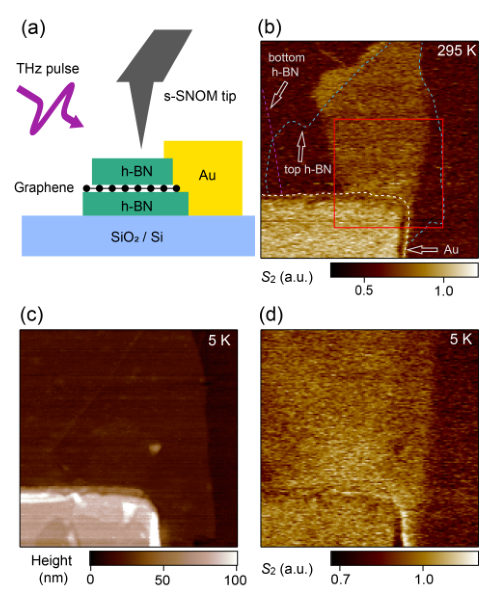
<figcaption class="paper-figure-caption"><b>Fig 1.</b> FIG. 1. Terahertz nanoimaging of encapsulated monolayer graphene. (a) Schematic of the monolayer graphene sandwiched by h-BN flakes and the terahertz near-field measurement scheme based on an atomic force microscope. (b) A 20 µm by 20 µm terahertz near-field image of graphene at room temperature. The borders of top and bottom h- BN and gold electrode are respectively outlined by blue, purple, and white dashed lines for clarity. Low temperature (c) topography and (d) terahertz near-field mapping of graphene in the red boxed region shown in (b) at zero magnetic field. Graphene appears bright in (b) and (d).</figcaption>
</figure>
<figure class="paper-figure-card">
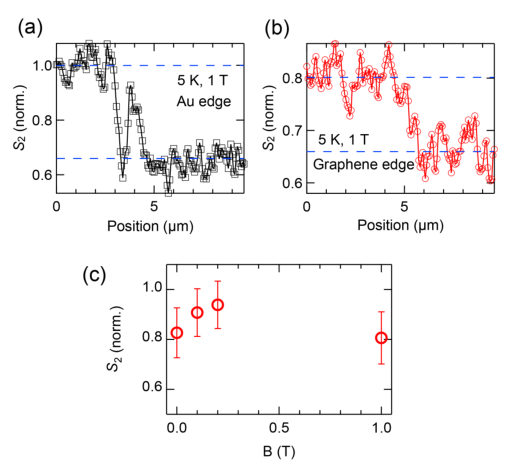
<figcaption class="paper-figure-caption"><b>Fig 2.</b> FIG. 2. Magnetic-field-dependent terahertz near-field contrast of graphene. Terahertz near-field amplitude line scans across (a) a gold microstructure edge and (b) the edge of graphene at 5 K and 1 T. Gold and graphene lies on the left half in each of the line scans. (c) Average and standard deviations of near-field signals from graphene line scans at different magnetic fields from 0 to 1 T. The scattered signals S2 are normalized to the average value obtained from gold each taken at the corresponding field value.</figcaption>
</figure>
<figure class="paper-figure-card">
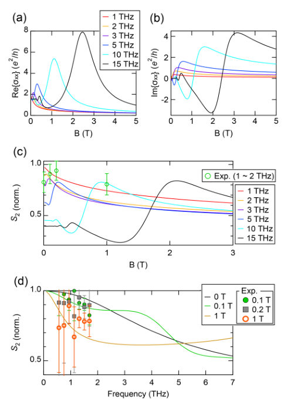
<figcaption class="paper-figure-caption"><b>Fig 3.</b> FIG. 4. Magneto-optical conductivity and measured terahertz scat- tering near-field amplitude of graphene. Calculated (a) real-part and (b) imaginary part of the longitudinal conductivity of graphene at different terahertz frequencies as a function of the magnetic field. (c) Calculated S2 amplitude of graphene with respect to gold as a function of magnetic field using the conductivity values from (a) and (b). Experimental values are identical to those shown in Fig. 2(c). (d) Calculated S2 amplitude of graphene with respect to gold as a function of frequency for different magnetic field values and the ex- perimental values taken from Fig. 3(c).</figcaption>
</figure>
<figure class="paper-figure-card">
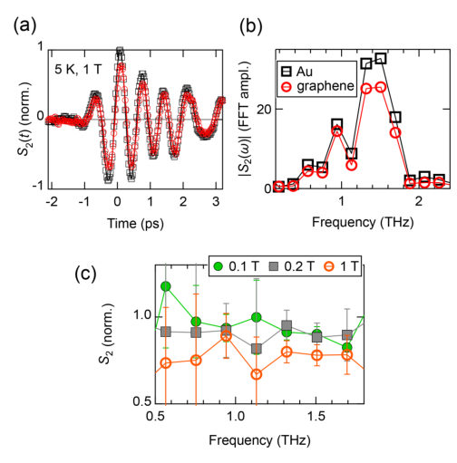
<figcaption class="paper-figure-caption"><b>Fig 4.</b> FIG. 3. Terahertz magneto-nanospectroscopy of graphene. (a) Ter- ahertz near-field time traces measured on gold and graphene at 5 K and 1 T. (b) Fourier-transformed spectra of the time traces in (a). (c) Relative amplitude spectra of graphene with respect to the spectra taken from gold at fields of 0.1, 0.2, and 1 T. Standard deviations were calculated from data points showing the noise level at the be- ginning of the time-domain traces.</figcaption>
</figure>
<figure class="paper-figure-card">
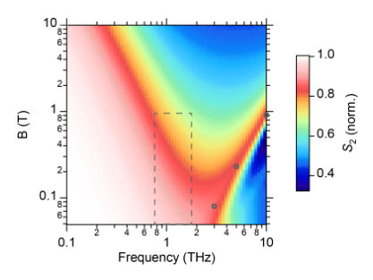
<figcaption class="paper-figure-caption"><b>Fig 5.</b> FIG. 5. Calculated S2 of graphene as a function of magnetic field and frequency in the terahertz range using Eq. (1) together with the finite dipole model and the transfer matrix model. The dashed box repre- sents the space surveyed in this study, and circled markers correspond to the cyclotron resonance peaks at 3, 5, and 10 THz as presented in Fig. 4(c).</figcaption>
</figure>

**Main problem.** Investigating the nanoscale terahertz conductivity and magnetotransport properties of encapsulated monolayer graphene at cryogenic temperatures and under magnetic fields.

**Main result.** The study demonstrates that graphene acts as a near-perfect high-q reflector in the THz regime, with measurable changes in near-field amplitude observed under magnetic fields up to 1 T, consistent with cyclotron resonance of Dirac fermions.

**Method.** Scattering-type scanning near-field optical microscopy (s-SNOM) using a cantilever-based AFM, combined with time-domain THz spectroscopy and magneto-optical conductivity calculations.

**Summary.** This paper uses THz near-field microscopy to probe the local conductivity of encapsulated graphene at very low temperatures and in magnetic fields. It shows that graphene behaves as a near-perfect reflector for THz waves, but this reflectivity is subtly tuned by magnetic fields. The results align with theoretical predictions of cyclotron resonance in Dirac fermions. This work provides a foundation for studying nanoscale THz transport in 2D quantum materials.

Detailed structure

**Model / system.** The physical system is monolayer graphene encapsulated between two flakes of hexagonal boron nitride (h-BN/graphene/h-BN) on a SiO2/Si substrate, studied in a split-pair magnet cryostat.

**Key observables.** Near-field amplitude (S2), topography, THz near-field images, relative amplitude spectra, and longitudinal magneto-optical conductivity.

**Important parameters / regimes.** Temperatures down to 5 K, magnetic fields up to 1 T, THz frequency range of 0.5 to 1.8 THz, and tip radius of 40 nm.

**Assumptions / limitations.** Assumed charge-neutral graphene, omission of h-BN layers in the transfer matrix model for simplicity, and use of a phenomenological width for Landau level transitions.

**Figures summary.** Fig 1 shows the experimental setup and THz near-field maps; Fig 2 displays line scans across edges and signal variations at different magnetic fields; Fig 3 presents THz time traces, Fourier-transformed spectra, and relative amplitude spectra.

**Paper structure.** The paper introduces the experimental setup and sample preparation, presents THz near-field imaging and topography, details the magneto-optical response and conductivity measurements, compares experimental data to theoretical models, and concludes with the implications for 2D quantum materials.

Abstract

This study investigates the nanoscale conductivity of encapsulated monolayer graphene at temperatures down to 5 K and magnetic fields of up to 1 T. We use the scattering-type scanning near-field optical microscopy (s-SNOM) technique to probe magnetic-field-dependent responses from graphene close to charge neutrality in the terahertz spectral region. We observe the near-perfect high-$q$ reflector behavior of graphene but with subtle changes by the presence of magnetic fields. Measurements align with calculations of the magneto-optical conductivity and the near-field spectroscopic contrast that describes the field-tunable cyclotron resonance of Dirac fermions. Our result provides an initial step toward understanding temperature and magnetic-field effects on nanoscale terahertz transport in two-dimensional quantum materials.

[↑ back to top](#top)

### [Umklapp corrections to Landau damping and conditions for non-trivial modifications to quantum critical transport](http://arxiv.org/abs/2604.24274v1)

**Authors:** Vibhu Mishra  
**Type:** theory · **Category:** strongly correlated electrons · **PDF:** <https://arxiv.org/pdf/2604.24274v1>  
**Analysis basis:** full PDF text, analyzed in chunks

↔ Scroll figures horizontally

<figure class="paper-figure-card">
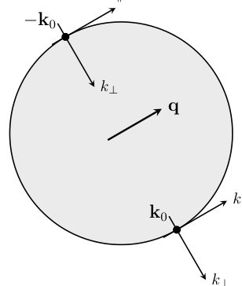
<figcaption class="paper-figure-caption"><b>Fig 1.</b> FIG. 1. The two antipodal patches contributing to ΠATP.</figcaption>
</figure>
<figure class="paper-figure-card">
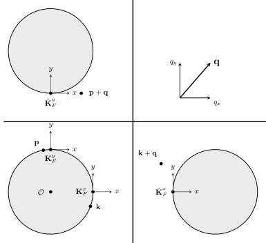
<figcaption class="paper-figure-caption"><b>Fig 2.</b> FIG. 2. The two umklapp contributions to ΠU. O is the center of the original FS. Also shown are the two umklapp partners accessible via momentum transfer q. The proportions are greatly exaggerated for visual clarity. The analysis in the main text focuses on umklapp along the x direction as the steps for the y direction are exactly the same.</figcaption>
</figure>
<figure class="paper-figure-card">
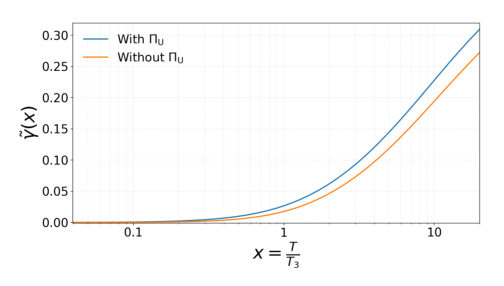
<figcaption class="paper-figure-caption"><b>Fig 3.</b> FIG. 3. The scattering rate of the electron at Kx F in terms of dimensionless temperature for the SYK model above TNFL. The boson thermal mass has been included here with Tm = T4 set by hand. Here α ≡∆q/kF = 10.0 ≫g2ε−1 F = 1.0 which sets T2 = α−1T3 ≪T3 ≪T4 = αT3. The three tick labels shown on the x-axis correspond to T2, T3 and T4 respectively.</figcaption>
</figure>
<figure class="paper-figure-card">
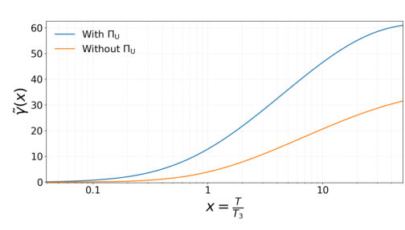
<figcaption class="paper-figure-caption"><b>Fig 4.</b> FIG. 4. The same plot for the naive large-N limit. The boson thermal mass has been included in both cases with T2 = Tm for simplicity which leads to √x saturation at large x. Here α ≡∆q/kF = 0.1 ≪g2ε−1 F = 1.0 which sets T4 = αT3 ≪ T3 ≪T2 = Tm = α−1T3. The three tick labels shown on the x-axis correspond to T4, T3 and T2 respectively.</figcaption>
</figure>
<figure class="paper-figure-card">
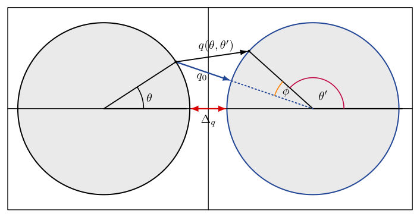
<figcaption class="paper-figure-caption"><b>Fig 5.</b> FIG. 5. The parameterization of the FS used to evaluate the scattering rate. The point Kx F corresponds to the electron at θ = 0 which sets θ′ + ϕ = π. For this electron the scattering momenta qϕ ≡q(θ = 0, θ′ = π −ϕ)</figcaption>
</figure>

**Main problem.** Investigating how Umklapp scattering corrections modify Landau damping and quantum critical transport in 2D and 3D Ising-nematic metals.

**Main result.** In 2D, Umklapp processes introduce a new frequency dependence (Omega^2/3 or Omega^1/2) that can potentially reduce the temperature scale for linear resistivity, whereas in 3D, the Umklapp contribution does not modify the standard criticality.

**Method.** The study uses the Random Phase Approximation (RPA) and explicit patch calculations to evaluate the particle-hole bubble and the imaginary part of the boson self-energy.

**Summary.** This paper examines how Umklapp scattering, occurring when a Fermi surface is near a Brillouin zone boundary, affects the properties of quantum critical metals. It finds that in 2D, these processes introduce new frequency-dependent terms in the boson self-energy, which can alter the temperature scale for the onset of linear resistivity. In contrast, the effect is negligible in 3D. The findings are highly dependent on the specific large-N theoretical framework used to model the system.

Detailed structure

**Model / system.** A 2D and 3D Ising-nematic metal where the Fermi surface approaches the Brillouin zone boundary, modeled via an effective fermion-boson coupling (Yukawa-type) and analyzed in various large-N limits.

**Key observables.** Landau damping (boson self-energy), resistivity, scattering rate, and the dynamical critical exponent (z).

**Important parameters / regimes.** Momentum transfer (q), frequency (Omega), temperature (T), distance to the zone boundary (Delta q), and the number of species (N).

**Assumptions / limitations.** Assumes a large-N limit (specifically analyzing naive vs. matrix large-N), uses Taylor expansions for the Fermi distribution and dispersion near the Fermi surface, and assumes Omega is much smaller than the Fermi energy.

**Figures summary.** Figure 1 shows antipodal patches on the Fermi surface; Figure 2 illustrates Umklapp contributions; Figure 3 shows temperature-dependent crossover scales; Figure 5 illustrates the Fermi surface parameterization for scattering rate calculations.

**Paper structure.** The paper begins by defining the Umklapp contribution to the polarization bubble, proceeds to a dimensional analysis comparing 2D and 3D, evaluates the frequency scaling in different temperature regimes, and concludes by discussing the stability of the z=3 criticality and the relevance of different large-N limits.

Abstract

We compute the particle--hole bubble for an Ising-nematic metal when the critical Fermi surface approaches the Brillouin zone boundary for $d=2$ dimensions. We find two qualitatively distinct contributions: i)~the standard antipodal piece, which gives $Π_{\rm{ATP}}(\mathbf{q}, iΩ)\proptoΩ/q$ and ii)~an additional umklapp piece from electrons near the zone boundary, which gives $Π_{\rm{U}}(\mathbf{q}, iΩ)\propto Ω^α$ at the minimum umklapp momentum $q\approx Δ_q$ with $α= 2/3 $ or $1/2$ depending on the temperature $T$. At high $T$ when $α= 1/2$, the minimum $T$ for the activation of linear/quasi-linear in $T$ resistivity, which is expected to be $T_U \propto Δ_q^3$ from $z=3$ criticality, could potentially get reduced to $T_U \propto Δ_q^4$ due to the $\sqrtΩ$ term and discuss why we find only one hyper-specific scenario where this possibility might be realized. For $d=3$ the umklapp contribution gives $Π_{\rm{U}}\sim Ω$ irrespective of $T$ therefore $T_U$ is not modified in this case.

[↑ back to top](#top)

### [Universal Complex Quantum-Like Bits from Hermitian Weighted Graphs](http://arxiv.org/abs/2604.23991v1)

**Authors:** Ethan Dickey, Sabre Kais  
**Type:** theory · **Category:** quantum information and computing · **PDF:** <https://arxiv.org/pdf/2604.23991v1>  
**Analysis basis:** full PDF text, analyzed in chunks

↔ Scroll figures horizontally

<figure class="paper-figure-card">
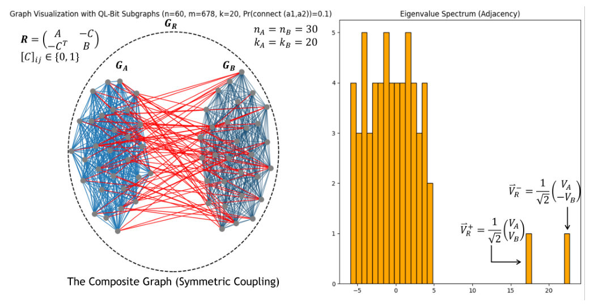
<figcaption class="paper-figure-caption"><b>Fig 1.</b> Figure 1: A QL-bit built from two regular subgraphs coupled by a bipartite block. In the real symmetric bench- mark shown here, the outlying eigenvectors are the symmetric and antisymmetric combinations (VA, VB)T / √</figcaption>
</figure>

**Main problem.** Determining the structural requirements for weighted graphs to realize arbitrary complex quantum-like (QL) bit states as exact, spectrally isolated, two-level eigenstates with a real spectrum.

**Main result.** The authors prove that while complex-symmetric and real-symmetric couplings face phase obstructions that prevent universality, Hermitian coupling provides a robust mechanism to realize any complex amplitude ratio with a prescribed real eigenvalue and spectral gap.

**Method.** The study uses algebraic graph theory, specifically graph reduction of block-coupled regular graphs to a 2x2 effective operator, and spectral analysis of the reduced matrix.

**Summary.** This paper investigates how to construct 'quantum-like' bits using complex-weighted graphs. It identifies that standard symmetric coupling models are not universal because they restrict the possible complex phases of the target state. However, the authors prove that using Hermitian coupling allows for the exact realization of any arbitrary complex amplitude ratio with a real spectrum. Finally, they show that these states can be densely approximated using finite graphs with simple discrete weights.

Detailed structure

**Model / system.** A system of block-coupled regular subgraphs (Ga and Gb) connected via a bipartite coupling block C, acting as a quantum-like two-level system in a synchronized subspace.

**Key observables.** Complex amplitude ratio (r), target eigenvalue (lambda), and spectral gap (delta).

**Important parameters / regimes.** Amplitude ratio r, eigenvalue lambda, spectral gap delta, and the discrete weight alphabet {0, +/-1, +/-i}.

**Assumptions / limitations.** The subgraphs are assumed to be regular, and the coupling is assumed to be algebraically regular to ensure the existence of a synchronized subspace.

**Figures summary.** Figure 1 illustrates the block-coupled graph structure and the reduction to the effective two-level system.

**Paper structure.** The paper first establishes the reduction principle for block-coupled graphs, then presents an obstruction theorem for non-universal symmetric models, followed by a proof of universality for Hermitian and asymmetric models, and concludes with a density theorem for discrete graph realizations.

**Why it may be interesting.** This work is interesting for researchers in quantum information and open quantum systems because it identifies a fundamental structural mechanism (Hermitian conjugate pairing) for synthesizing arbitrary complex phases in classical network-based quantum-like models.

Abstract

We study when block-coupled regular graphs can realize prescribed complex quantum-like bit states as exact synchronized eigenstates. Two regular subgraphs $G_A$ and $G_B$ supply normalized all-ones eigenvectors $V_A$ and $V_B$, and algebraically regular bipartite couplings reduce the full graph-supported operator exactly to a $2\times 2$ effective block on $\mathcal S=\operatorname{span} \{ \lvert 0\rangle, \lvert 1\rangle \}$. Within this reduction we prove that two natural symmetric complexifications are not universal under a real-spectrum requirement: complex symmetric coupling with real diagonal regularities forces the target computational basis amplitude ratio $r=ω_2/ω_1$, for $\lvert ψ\rangle = ω_1\lvert 0\rangle + ω_2\lvert 1\rangle$, to satisfy $r^2\in\mathbb{R}$, while real symmetric coupling with complex diagonal regularities forces $r+1/r\in\mathbb{R}$. Replacing complex symmetry by Hermitian coupling removes this phase obstruction. For any nonbasis target state, any prescribed real eigenvalue, and any prescribed nonzero signed spectral gap, a Hermitian weighted coupling realizes the target exactly. Additionally, an independently tuned directed-coupling model gives a second universality mechanism. We then pass from continuous effective parameters to finite weighted graphs with entries in $\{0, \pm1, \pm i\}$ (the fourth roots of unity and zero), characterize the balanced discrete coupling lattice by perfect matchings, and show that exact discrete Hermitian realizations are dense in the synchronized pure-state space. These results give a universality taxonomy for complex QL-bits and identify Hermitian conjugate pairing as the robust structural mechanism that supports arbitrary complex amplitudes with real two-level spectra.

[↑ back to top](#top)

### [Van Hove Singularity-Driven Topological Magnetism in Twisted MoTe2](http://arxiv.org/abs/2604.23587v1)

**Authors:** Heonjoon Park, Julian Stewart, Xiao-Wei Zhang, Taige Wang, Canxun Zhang, Evgeny Redekop, Jiaqi Cai, Weijie Li, Eric Anderson, Takashi Taniguchi, Kenji Watanabe, Jiun-Haw Chu, David Cobden, Andrea Young, Liang Fu, Ting Cao, Di Xiao, Xiaodong Xu  
**Type:** both · **Category:** strongly correlated electrons · **PDF:** <https://arxiv.org/pdf/2604.23587v1>  
**Analysis basis:** full PDF text, analyzed in chunks

↔ Scroll figures horizontally

<figure class="paper-figure-card">
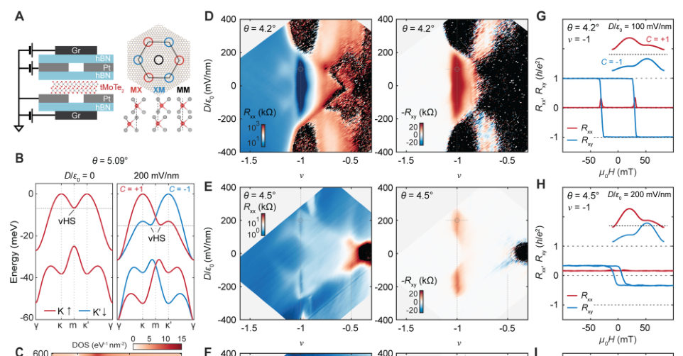
<figcaption class="paper-figure-caption"><b>Fig 1.</b> Fig. 1. Twist angle-tuned topology, magnetism, and van Hove singularities (vHSs) in homobilayer MoTe2. A, Schematic of the dual-gated device (left) and the moiré superlattice of twisted bilayer MoTe2 (right). B, Calculated moiré band structure for a 5.09° device at electric fields of D/ε0 = 0 (left) and 200 mV/nm (right), showing electric-field-tunable vHSs. C, Calculated density of states (DOS) as a function of electric field and filling factor ν at θ = 5.09°. The vHS is marked by the dotted white line, while the layer polarization (LP) boundary is identified by the sharp change in DOS. D–F, Longitudinal resistance Rxx (left panels) and Hall resistance Rxy (right panels) as functions of...</figcaption>
</figure>
<figure class="paper-figure-card">
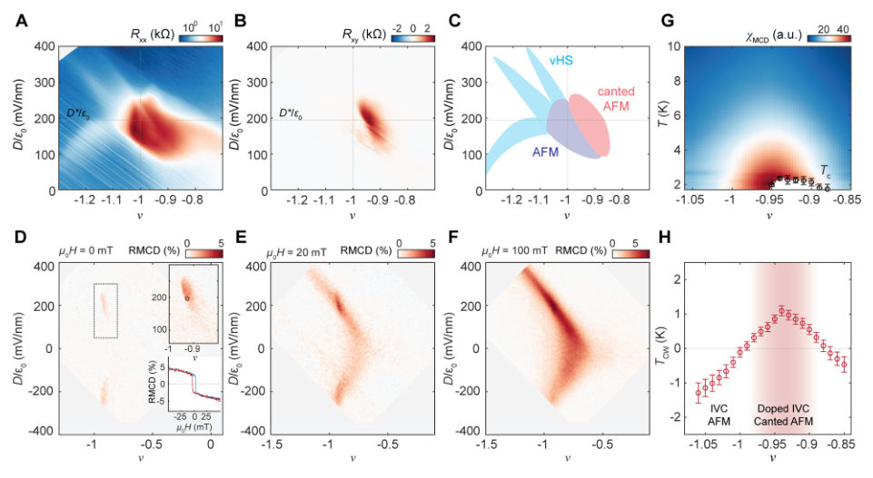
<figcaption class="paper-figure-caption"><b>Fig 2.</b> Figure 2. vHS-driven anomalous Hall effect hot spots in the 4.8° device. A-B, Zoomed-in map of Rxx (A) and Rxy (B) near the vHSs, measured under the same conditions as Fig. 1F. Rxx exhibits a complex structure with multiple resistive peaks (see Supplementary Fig. S6 for temperature dependence). The anomalous Hall effect (AHE) emerges at finite electric field and slightly below ν = −1. C, Schematic phase diagram near the vHS. D-F, Reflective magnetic circular dichroism (RMCD) as a function of D/ε0 and ν at magnetic fields μ0H = 0 mT (D), 20 mT (E), and 100 mT (F). The RMCD signal indicates that spin polarization rapidly develops with applied magnetic field along the vHS feature. However, the...</figcaption>
</figure>
<figure class="paper-figure-card">
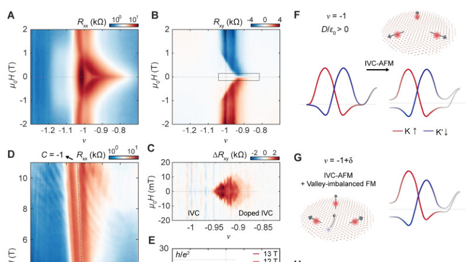
<figcaption class="paper-figure-caption"><b>Fig 3.</b> Figure 3. Magnetic-field-induced Chern insulator emerging from vHS-driven correlated phases. All data are taken at fixed D*/ε0 = 194 mV/nm, shown in Figs. 2A-B. A-B, Rxx (A) and Rxy (B) as a function of magnetic field and filling factor near ν = −1. C, Hysteretic component ΔRxy, defined as the difference between up and down magnetic field sweeps, showing a localized region of enhanced anomalous Hall response in the dotted rectangle in (B). D, Rxx vs ν extended to high magnetic fields. A pronounced resistance minimum develops, consistent with a magnetic-field-induced Chern insulating state following a Streda slope corresponding to C = −1. E, Rxy as a function of ν at selected magnetic...</figcaption>
</figure>
<figure class="paper-figure-card">
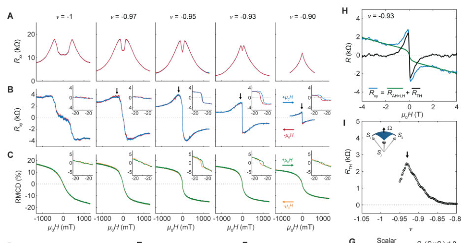
<figcaption class="paper-figure-caption"><b>Fig 4.</b> Figure 4. Topological Hall effect and chiral spin texture. A-C, Rxx (A), Rxy (B), and RMCD (C) as functions of magnetic field at selected filling factors ν, measured at fixed D*/ε0 = 194 mV/nm shown in Figs. 2A-B. Colors indicate the magnetic field sweep direction. Insets show enlarged views of the low-field region, using the same axes and units, to emphasize the hysteresis. Black arrows mark the field at which the topological Hall contribution is largest, around 100 mT, well above the coercive field of the anomalous Hall hysteresis, around 10 mT. D-E, Hartree-Fock calculations show the evolution of the intervalley-coherent order parameter Uv(1) and valley polarization Pv with Zeeman field...</figcaption>
</figure>

**Main problem.** Investigating how Van Hove singularities (vHSs) in twisted MoTe2 drive unconventional magnetic phases and topological transitions.

**Main result.** The study identifies a vHS-driven topological magnetism featuring an intervalley-coherent antiferromagnetic state that evolves into a canted phase and a C = -1 Chern insulator under magnetic fields.

**Method.** Combined transport measurements, reflective magnetic circular dichroism (RMCD), and nano-SQUID-on-tip microscopy with theoretical Hartree-Fock and continuum model calculations.

**Summary.** This paper explores how Van Hove singularities in twisted MoTe2 can be used to engineer topological magnetism. By tuning the displacement field and filling factor, the authors observe a transition from an intervalley-coherent antiferromagnetic state to a Chern insulator. The study demonstrates that the high density of states at the vHS promotes complex spin textures, including a topological Hall effect. This work establishes a new route for controlling chiral magnetism in moiré materials.

Detailed structure

**Model / system.** A large-angle twisted bilayer MoTe2 (tMoTe2) moiré superlattice, specifically focusing on the 4.8 degree regime near filling factor nu = -1.

**Key observables.** Longitudinal resistance (Rxx), Hall resistance (Rxy), RMCD signal, valley polarization, and scalar spin chirality.

**Important parameters / regimes.** Twist angle (theta), filling factor (nu), displacement field (D/epsilon0), and magnetic field (muB).

**Assumptions / limitations.** The theoretical model assumes a continuum Hamiltonian for the K valley and uses a screened Coulomb interaction within a Hartree-Fock framework.

**Figures summary.** Figure 1 shows the moiré lattice configuration, band structure, and transport maps; supplementary figures include Landau fan diagrams, magnetic hysteresis, and nano-SQUID magnetization maps.

**Paper structure.** The paper introduces the moiré system and vHS physics, details the experimental fabrication and measurement techniques, presents the evolution of electronic and magnetic phases across different twist angles, and concludes with theoretical modeling of the observed magnetic order.

**Why it may be interesting.** The discovery of tunable, interaction-driven topological magnetism and chiral spin textures in moiré systems provides a platform for studying emergent gauge fields and engineered topological phase transitions.

Abstract

Van Hove singularities (vHSs) strongly amplify electron interactions and can stabilize correlated phases in topological bands. Here we report signatures of topological magnetism in large-angle twisted bilayer MoTe2 driven by the interplay of vHSs, strong correlations, and valley topology. In a 4.8 degree device, electrostatic tuning to a vHS produces a spontaneous anomalous Hall hot spot near nu = -1. Combined transport and reflective magnetic circular dichroism measurements indicate that this regime is not governed by magnetization alone, but instead emerges from a correlated intervalley-coherent antiferromagnetic state that evolves with doping into a canted phase. With increasing magnetic field, the Hall response develops an additional finite-field component consistent with a topological Hall effect from a noncoplanar spin texture, before transitioning into a C = -1 Chern insulator. Our results establish tunable vHSs in moire topological bands as a route to chiral magnetism and engineering topological phase transitions.

[↑ back to top](#top)

### [Visons in Kitaev Spin Liquids with Majorana Fermi Surfaces](http://arxiv.org/abs/2604.23014v1)

**Authors:** Caio V. S. Soares, Rodrigo G. Pereira  
**Type:** theory · **Category:** strongly correlated electrons · **PDF:** <https://arxiv.org/pdf/2604.23014v1>  
**Analysis basis:** full PDF text, analyzed in chunks

↔ Scroll figures horizontally

<figure class="paper-figure-card">
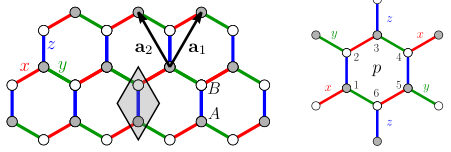
<figcaption class="paper-figure-caption"><b>Fig 1.</b> FIG. 1. Kitaev honeycomb model. (a) Sites in sublattices A and B are represented by gray and white dots, respectively. The three sets of nearest-neighbor bonds are labeled by α = x, y, z, highlighted in red, green, and blue, respectively. The primitive lattice vectors are a1 = ( 1</figcaption>
</figure>
<figure class="paper-figure-card">
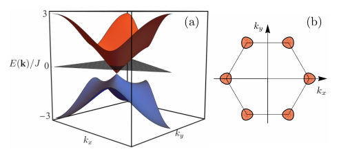
<figcaption class="paper-figure-caption"><b>Fig 2.</b> FIG. 2. (a) Dispersion of Majorana fermions in the perturbed KHM with isotropic couplings and J′ = 0.1J. The two bands are represented in one half of the Brillouin zone centered at the K point, corresponding to momentum q0 = ( 2π</figcaption>
</figure>
<figure class="paper-figure-card">
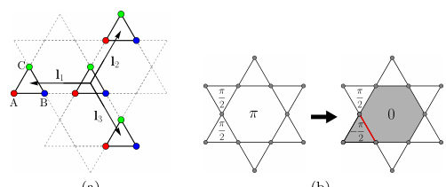
<figcaption class="paper-figure-caption"><b>Fig 3.</b> FIG. 3. Kagome lattice. (a) The three sublattices, A, B, and C, are represented in red, blue, and green, respectively. In terms of a1 = ( 1</figcaption>
</figure>
<figure class="paper-figure-card">
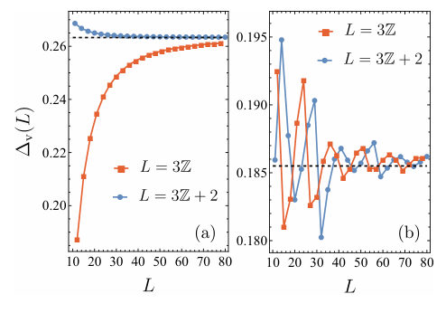
<figcaption class="paper-figure-caption"><b>Fig 4.</b> FIG. 5. Vison gaps in the unperturbed KHM (J′ α = 0). The symbols represent exact diagonalization results obtained for lattices with N = L2 unit cells. We consider two sets of coupling constants: (a) the isotropic case Jx = Jy = Jz = 1; the dashed line represents the result ∆v = 0.2633 from the analytical approach in Ref. [50]; (b) an anisotropic case in the gapless phase Jx = 1.8, Jy = 1.3, Jz = 1; the dashed line represents ∆v = 0.1855, which we obtained using Eq. (31).</figcaption>
</figure>
<figure class="paper-figure-card">
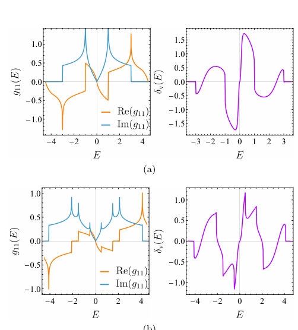
<figcaption class="paper-figure-caption"><b>Fig 5.</b> FIG. 4. Matrix element g11(E) of the local Green’s functions and phase shift δv(E) in the unperturbed KHM (J′ α = 0) for two sets of coupling constants: (a) isotropic model with Jx = Jy = Jz = 1; (b) anisotropic model in the gapless phase with Jx = 1.8, Jy = 1.3, and Jz = 1.</figcaption>
</figure>
<figure class="paper-figure-card">

<figcaption class="paper-figure-caption"><b>Fig 6.</b> Figure 4 illustrates the energy dependence of the local Green’s function and the phase shift in the unperturbed Kitaev model. In addition to the isotropic model Jx = Jy = Jz studied in Ref. [50], we consider an example of anisotropic coupling constants in the regime 0 &lt; Jz &lt; Jy &lt; Jx. When the coupling constants obey the triangle inequality Jx &lt; Jy+Jz, the system remains in the gapless phase [8], but the Dirac cone in the Majorana dispersion is located at an incommensurate wave vector. As shown in Fig. 4, we find δv(−E) = −δv(E) as a consequence of particle-hole symmetry, and the phase shift is nonzero for |E| &lt; Emax, where Emax is the maximum energy in the Majorana fermion bands.</figcaption>
</figure>
<figure class="paper-figure-card">
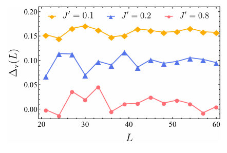
<figcaption class="paper-figure-caption"><b>Fig 7.</b> FIG. 6. Vison gap in the perturbed KHM with isotropic cou- plings Jα = 1 and J′ α = J′, for different values of J′. Here we select system sizes with L mod 3 = 0.</figcaption>
</figure>
<figure class="paper-figure-card">
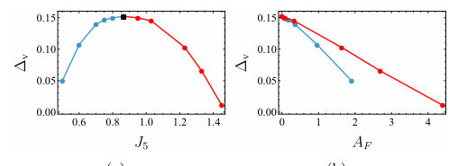
<figcaption class="paper-figure-caption"><b>Fig 8.</b> FIG. 8. Vison gap in the thermodynamic limit for the CYF model with J∇= J′ ∇= 1 and J∆= J′ ∆= 0.5. (a) Gap as function of J5. The black square corresponds to the point J5 = 0.865, where the Majorana Fermi surface shrinks to a Dirac point. Blue and red dots represent values of J5 below and above this point, respectively. (b) Vison gap as a function of the area AF enclosed by the Majorana Fermi surface.</figcaption>
</figure>
<figure class="paper-figure-card">
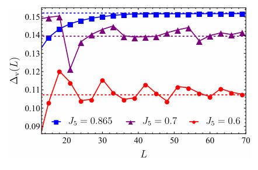
<figcaption class="paper-figure-caption"><b>Fig 9.</b> FIG. 7. Gap for creating a (∆, 7) vison pair in the CYF model. Here we fix J∇= J′ ∇= 1, J∆= J′ ∆= 0.5, and consider three values of J5. The symbols represent the data from exact diagonalization in lattices with L mod 3 = 0. The dashed lines represent the respective results from the analyt- ical expression for ∆v in the thermodynamic limit.</figcaption>
</figure>
<figure class="paper-figure-card">
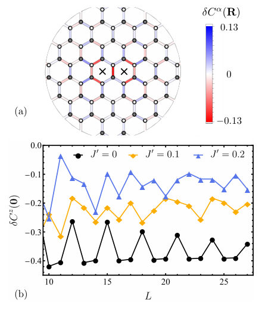
<figcaption class="paper-figure-caption"><b>Fig 10.</b> FIG. 9. (a) Spatial pattern of nearest-neighbor spin correla- tions in the vicinity of a vortex pair in the perturbed KHM. The vortices are created in the plaquettes marked by crosses. The color scale represents the relative change δCα(R) defined in Eq. (36). Here we use J′/J = 0.2 and L = 13. (b) Rela- tive change in the spin correlation on the central z bond as a function of system size for three different values of J′.</figcaption>
</figure>

**Main problem.** The study investigates how the presence of a Majorana Fermi surface affects the properties of visons (Z2 gauge field vortices) and the stability of the Kitaev quantum spin liquid ground state.

**Main result.** The vison gap decreases as the Majorana Fermi surface area increases, signaling a potential instability of the spin liquid, while larger Fermi surfaces also tend to screen the vison's effect on local spin correlations.

**Method.** The authors combine numerical exact diagonalization on finite lattices with an analytical approach using Green's function techniques and scattering phase shifts (Fumi's theorem).

**Summary.** This paper explores the physics of vison excitations in Kitaev quantum spin liquids that possess a Majorana Fermi surface. By comparing analytical scattering theory with numerical exact diagonalization, the authors show that expanding the Fermi surface reduces the energy cost to create visons, suggesting a transition toward magnetic order. They also demonstrate that the Fermi surface acts to screen the impact of visons on local spin correlations. The work provides important insights into the stability of gapless Kitaev phases.

Detailed structure

**Model / system.** The study focuses on Kitaev-type models, specifically a perturbed Kitaev honeycomb model with next-nearest-neighbor interactions and the Chua-Yao-Fiette (CYF) model on a kagome lattice.

**Key observables.** Vison gap, Majorana fermion dispersion, local spin correlations, and scattering phase shifts.

**Important parameters / regimes.** Majorana Fermi surface size, perturbation strength (J'/J), and system size (L).

**Assumptions / limitations.** The analytical approach focuses on the flux-free sector of the perturbed Kitaev honeycomb model.

**Figures summary.** Figure 1 illustrates the honeycomb lattice and Z2 flux operators; Figure 2 shows Majorana dispersion and the Fermi surface; Figure 3 shows the kagome lattice and vison pair creation; Figure 5 and 6 present vison gap data; Figure 9 shows spatial maps of spin correlations and their size dependence.

**Paper structure.** The paper introduces the problem of visons in Majorana metals, presents the perturbed KHM and CYF models, details the analytical and numerical methodologies, reports results regarding the vison gap and spin correlations, and concludes with open questions regarding vison interactions and line Fermi surfaces.

Abstract

The excitation spectrum of Kitaev quantum spin liquids consists of itinerant Majorana fermions, which can be gapless or gapped, and vortices of a $\mathbb{Z}_2$ gauge field, known as visons, which are always gapped. In this work, we investigate visons in Kitaev-type models where the Majorana fermions form a Fermi surface. In this case, the creation of a vison pair is analogous to introducing a local impurity potential in a metal. Since the gapless modes lead to strong finite-size effects, we compare the numerical calculation of the vison gap on finite lattices with the result from an analytical approach based on Green's function techniques. We find that the vison gap decreases as the size of the Fermi surface increases, signalling an instability of the quantum spin liquid ground state. We also show that larger Fermi surfaces tend to suppress the change in local spin correlations due to the Majorana-vison scattering potential.

[↑ back to top](#top)

### [Wichmann-Kroll vacuum polarization correction to lithium-like systems in a Gaussian basis set](http://arxiv.org/abs/2604.23660v1)

**Authors:** Haisum Hayat, Harry M. Quiney  
**Type:** theory · **Category:** other · **PDF:** <https://arxiv.org/pdf/2604.23660v1>  
**Analysis basis:** full PDF text, analyzed in chunks

↔ Scroll figures horizontally

<figure class="paper-figure-card">
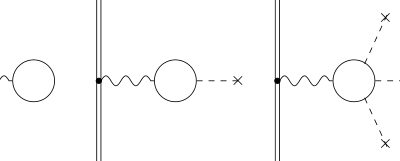
<figcaption class="paper-figure-caption"><b>Fig 1.</b> FIG. 1. Leading order contributions to the total unrenor- malized vacuum polarization. Double lines indicate electron propagation in an external field. The individual terms are the (a) zero-potential, (b) one-potential and (c) three-potential.</figcaption>
</figure>

**Main problem.** Extending the calculation of the Wichmann-Kroll vacuum polarization correction from one-electron hydrogenic systems to multi-electron lithium-like systems using finite Gaussian basis sets.

**Main result.** The authors successfully implemented a Gaussian basis set approach for lithium-like systems, finding results in good agreement (within 1%) with existing literature and demonstrating the method's effectiveness for potentials where analytic Green's functions are unavailable.

**Method.** The study uses a Dirac-Hartree-Fock (DHF) approach with a 'charge-conjugated, kinetically-matched, Gaussian' (CKG) basis set, which is a variation of the Dual Kinetic Balance (DKB) method, implemented in FORTRAN9  using quadruple precision.

**Summary.** This paper presents a method for calculating Wichmann-Kroll vacuum polarization corrections in lithium-like atoms using a finite Gaussian basis set. By employing a specialized 'charge-conjugated, kinetically-matched, Gaussian' basis, the authors extend successful one-electron calculations to multi-electron systems. The results show strong agreement with established literature and demonstrate that this basis set approach can handle complex atomic potentials where analytical solutions are not possible. This provides a foundation for future ab initio QED calculations in more complex atomic and molecular systems.

Detailed structure

**Model / system.** The physical system consists of lithium-like and hydrogen-like ions with high atomic numbers (Z = 70 to 100), modeled using the Dirac-Coulomb Hamiltonian and a Gaussian nuclear charge density.

**Key observables.** Energy shift (delta E) of electron states due to vacuum polarization.

**Important parameters / regimes.** Atomic number (Z), fine-structure constant (alpha), angular momentum (kappa), and the basis set parameters (alpha=0.01, beta=1.35).

**Assumptions / limitations.** The calculation focuses on higher-order QED corrections of order alpha(Z*alpha)^(n >= 3) and assumes the validity of the mean-field electron density via the DHF method.

**Figures summary.** Figure 1 displays Feynman diagrams representing the zero-potential, one-potential, and three-potential contributions to unrenormalized vacuum polarization.

**Paper structure.** The paper introduces the necessity of QED in strong fields, details the mathematical formalism of the Wichmann-Kroll correction, describes the implementation of the CKG basis set, presents comparative results for hydrogen-like and lithium-like systems, and concludes with the potential for future complex atomic/molecular applications.

**Why it may be interesting.** This work provides a scalable numerical framework for calculating high-order QED corrections in multi-electron systems, which is essential for high-precision spectroscopy and understanding atomic structure in highly charged ions.

Abstract

Recent developments have seen the application of finite Gaussian basis sets to the $α(Zα)^{n\geq3}$ vacuum polarization. The energy shift for $s$ and $p$ electron states have been tabulated and their convergence investigated. In this work, we extend this problem to the multi-electron case. Hartee-Fock potentials obtained self-consistently are used to treat the vacuum polarization for lithium-like systems and are found to be in good agreement with comparable results in the literature. The results presented in this work demonstrate the use of Gaussian basis sets for atomic potentials whose Green's functions expressions cannot be simply obtained via analytic or numerical methods.

[↑ back to top](#top)

## Secondary cond-mat archives

*Papers from cond-mat.mtrl-sci, mes-hall, other, soft, supr-con. These archives are de-prioritized — they appear at the end regardless of relevance score.*

### Relevant in secondary archives (18)

### [Deterministic Transferable Planar Dielectric Mirrors for Investigating Strong Light-Matter Coupling](http://arxiv.org/abs/2604.23062v1)

**Authors:** Atanu Patra, Subhamoy Sahoo, Johannes Düreth, Simon Betzold, Sven Höfling  
**Type:** experiment · **Category:** other · **PDF:** <https://arxiv.org/pdf/2604.23062v1>  
**Analysis basis:** full PDF text, analyzed in chunks
**Topic relevance:** 🔥 `quantum optics experiment` **4/5** · `correlated cavity matter` **3/5** · `QC/QI experiment` **2/5** · `Tavis-Cummings & cavity-many-emitter` **2/5** · `analog quantum simulation` **2/5**

↔ Scroll figures horizontally

<figure class="paper-figure-card">
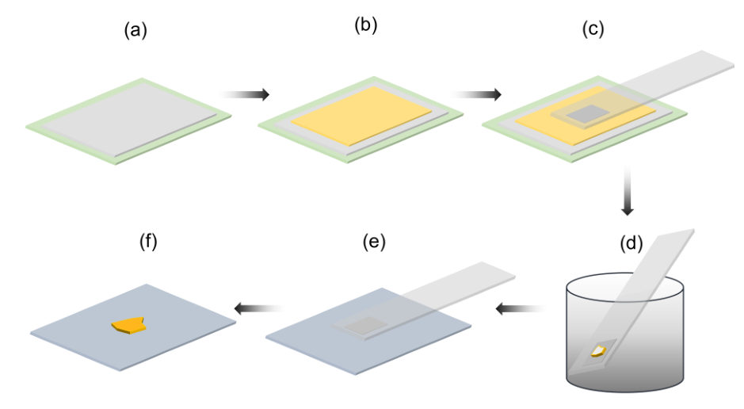
<figcaption class="paper-figure-caption"><b>Fig 1.</b> FIG. 1. The schematic diagram of the steps to fabricate the transferable DBRs is shown. The glass substrate</figcaption>
</figure>
<figure class="paper-figure-card">
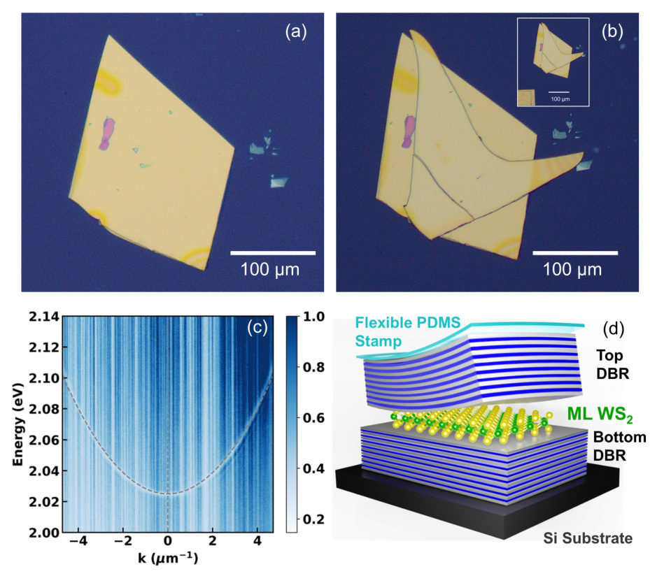
<figcaption class="paper-figure-caption"><b>Fig 2.</b> FIG. 2. (a) The transferred bottom DBR with the WS2 monolayer flake and (b) the full cavity structure with</figcaption>
</figure>
<figure class="paper-figure-card">
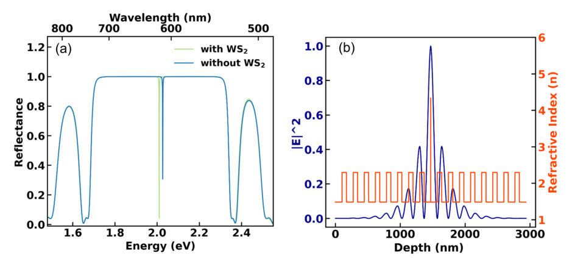
<figcaption class="paper-figure-caption"><b>Fig 3.</b> FIG. 3. (a) The variation of the cavity mode of the monolithic structure with (light green) and without</figcaption>
</figure>
<figure class="paper-figure-card">
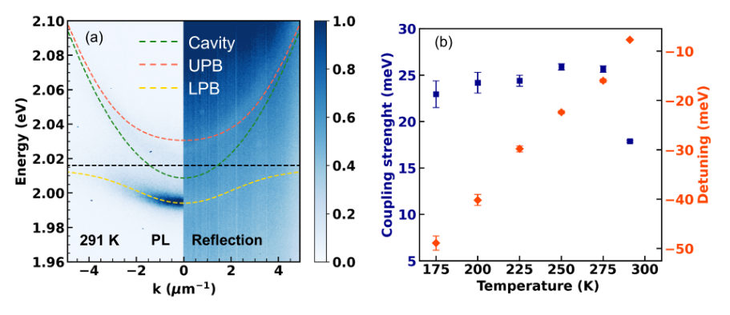
<figcaption class="paper-figure-caption"><b>Fig 4.</b> FIG. 4. (a) k-space PL (left side) and reflection (right side) of WS2 monolayer at room temperature are</figcaption>
</figure>

**Main problem.** Conventional microcavity fabrication techniques like sputtering or PECVD can damage sensitive 2D materials and degrade electrical contacts, while standard DBR fabrication leads to significant material waste.

**Main result.** The authors developed a deterministic dry-transfer method to create high-Q dielectric microcavities that preserve the integrity of WS2 monolayers, successfully demonstrating strong exciton-photon coupling at both room and cryogenic temperatures.

**Method.** A viscoelastic PDMS-based dry-transfer approach is used to pick up and place SiO2/TiO2 Bragg mirror fragments onto a WS2 monolayer, avoiding high-energy deposition processes.

**Summary.** This paper presents a new way to make high-quality optical cavities for 2D materials without damaging them. By using a 'dry-transfer' method with PDMS, the researchers can place mirrors on top of WS2 monolayers without using harsh deposition techniques. They successfully demonstrated strong light-matter coupling, where excitons and photons interact strongly, even at room temperature. This approach is much more efficient and less wasteful than traditional methods, paving the way for integrated 2D photonic devices.

Detailed structure

**Model / system.** The system is a planar Fabry-Perot microcavity consisting of a WS2 monolayer embedded between a top and bottom SiO2/TiO2 distributed Bragg reflector (DBR) stack.

**Key observables.** Cavity mode energy, Q factor, Rabi splitting, exciton energy, coupling strength (g), and angle-resolved (k-space) photoluminescence.

**Important parameters / regimes.** Q factor ~ 4x10^3, Rabi splitting ~ 36 meV at room temperature, and temperature range from 175 K to 275 K.

**Assumptions / limitations.** The transfer process is assumed to be damage-free and the structural integrity of the 2D material is preserved.

**Figures summary.** Figures show the dispersion of the cavity mode, microscope images of the structure, Lorentz fits of the spectra, and the variation of k-space photoluminescence across different temperatures.

**Paper structure.** The paper introduces the fabrication challenge, describes the deterministic dry-transfer method and DBR fabrication, presents the characterization of the cavity modes and Q factor, demonstrates strong coupling in WS2, and analyzes the temperature dependence of the coupling strength.

**Why it may be interesting.** This work provides a robust experimental platform for studying cavity QED and light-matter interactions in 2D materials, which is essential for developing scalable photonic quantum technologies and exploring polaritonic physics.

Abstract

Optical cavities play a central role in photonic and quantum technologies by enhancing light-matter interactions. In semiconductor microcavities, achieving high quality (Q) factors typically relies on sophisticated epitaxial growth techniques, such as molecular beam epitaxy, which offer atomic-scale precision but are costly and limited in material compatibility. For dielectric microcavities, high Q factors can be achieved using dielectric Bragg mirrors. However, conventional deposition techniques for the top mirrors, such as plasma-enhanced chemical vapor deposition or sputtering, can damage embedded emitters. This limitation is particularly severe for van der Waals materials, especially atomically thin semiconductors. Moreover, the conventional top-mirror deposition can cover or degrade predefined metal contacts. Recovering electrical access typically requires additional lithography and etching steps. Here, a deterministic dry-transfer approach is developed to fabricate complete dielectric microcavities using both top and bottom SiO_2/TiO_2 Bragg mirrors without post-growth lift-off processes, reaching a Q factor ~ 4x10^3. Using a WS_2 monolayer as the active medium, clear signatures of strong exciton-photon coupling are observed at both room temperature and cryogenic temperatures. These results demonstrate an efficient cavity fabrication approach that preserves the integrity of the emitter of layered materials, enabling next generation integrated photonic devices.

[↑ back to top](#top)

### [Stark-tunable O-band single-photon sources based on deterministically fabricated quantum dot--circular Bragg gratings on silicon](http://arxiv.org/abs/2604.23422v1)

**Authors:** Sarthak Tripathi, Kartik Gaur, Priyabrata Mudi, Peter Ludewig, Alexander Kosarev, Kerstin Volz, Imad Limame, Stephan Reitzenstein  
**Type:** experiment · **Category:** quantum information and computing · **PDF:** <https://arxiv.org/pdf/2604.23422v1>  
**Analysis basis:** full PDF text, analyzed in chunks
**Topic relevance:** 🔥 `QC/QI experiment` **4/5** · 🔥 `quantum optics experiment` **4/5** · `interference shaping light` **2/5**

↔ Scroll figures horizontally

<figure class="paper-figure-card">
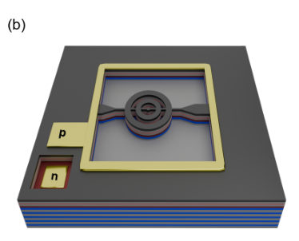
<figcaption class="paper-figure-caption"><b>Fig 1.</b> Fig. 1 Layer and device design of the QD-eCBG quantum light sources. (a) Schematic of the monolithically grown III-V heterostructure on silicon (b) Three-dimensional illustration of the electrically contacted circular Bragg grating, showing the central mesa, concentric Bragg rings, and the electrical ridge required for biasing.</figcaption>
</figure>
<figure class="paper-figure-card">
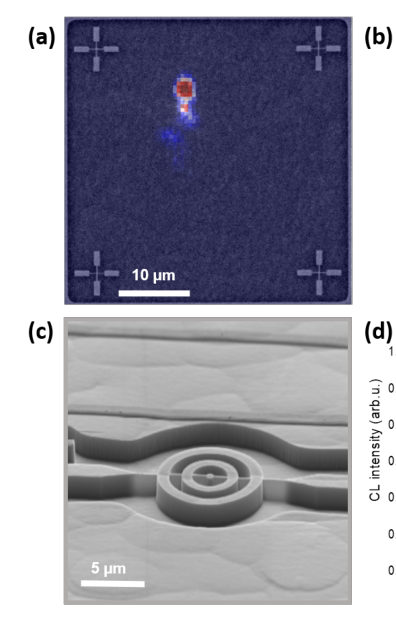
<figcaption class="paper-figure-caption"><b>Fig 2.</b> Fig. 2 Deterministic integration of InGaAs QDs into eCBGs with enhanced O-band emission. (a) CL map overlaid on a secondary-electron image, identifying spatially localized InGaAs QDs relative to alignment markers. (b) CL map after marker-based lithography, confirming successful integration of the selected QD into the eCBG. (c) Tilted SEM image of a fabricated device, showing well-defined sidewalls and the electrical access ridge. (d) CL spectra at 20 K before and after integra- tion, demonstrating enhanced emission near 1300 nm due to cavity coupling and improved vertical photon extraction.</figcaption>
</figure>
<figure class="paper-figure-card">
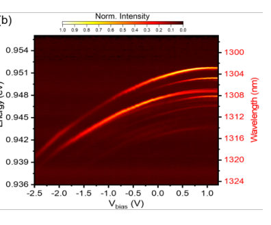
<figcaption class="paper-figure-caption"><b>Fig 3.</b> Fig. 3 Excitonic emission and electrically controlled wavelength tuning of a single QD in an eCBG device. (a) µPL spectrum of eCBG1 recorded at 4 K under pulsed picosecond excitation at 1225 nm, showing emission from the neutral exciton (X, black), charged exciton (X±, green), biexciton (XX, red), and charged biexciton (XX±, yellow). Line assignments are based on excitation- power and polarization-dependent µPL measurements. (b) False-color map of bias-dependent µPL spectra acquired at 4 K, demonstrating electrically controlled wavelength tuning of an excitonic transition via the QCSE.</figcaption>
</figure>
<figure class="paper-figure-card">
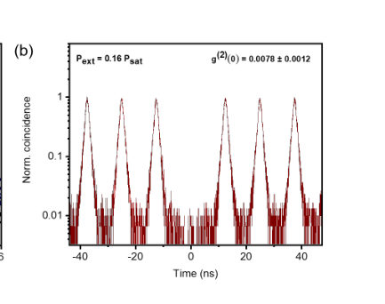
<figcaption class="paper-figure-caption"><b>Fig 4.</b> Fig. 4 Time-resolved µPL and second-order correlation confirming high-purity single- photon emission from a QD-eCBG. (a) Time-resolved µPL measurement showing a single- exponential decay with an extracted spontaneous emission decay time of 0.775 ± 0.022 ns. (b) Second-order autocorrelation measurement under pulsed excitation yielding fitted g(2)(0) = 0.0078 ± 0.0012, corresponding to a single-photon purity of 99.22 ± 0.18%, comparable to state-of-the-art pla- nar InGaAs QD single-photon sources.</figcaption>
</figure>
<figure class="paper-figure-card">
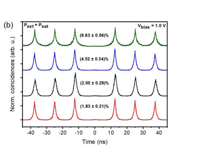
<figcaption class="paper-figure-caption"><b>Fig 5.</b> Fig. 5 Temperature-dependent µPL and photon autocorrelation of a QD-eCBG device. (a) Waterfall plot of µPL spectra recorded from an eCBG1 device at temperatures of 4, 20, 40, and 77 K under pulsed excitation, showing well-resolved QDs emission up to liquid-nitrogen temperature. The X transition is indicated by the gray areas. (b) Second-order photon autocorrelation measure- ments g(2)(τ) of the X transition acquired at the same temperatures and at saturation pump power, demonstrating preserved single-photon emission characteristics up to 77 K.</figcaption>
</figure>
<figure class="paper-figure-card">
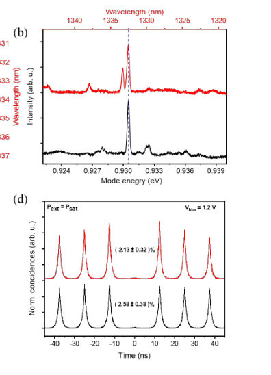
<figcaption class="paper-figure-caption"><b>Fig 6.</b> Fig. 6 Electrical tuning of two QD-eCBGs into spectral resonance with preserved single- photon emission. (a) Bias-dependent tuning of two excitonic emission lines from two QD-eCBG devices, demonstrating that they can be brought into mutual resonance by electrical control. (b) µPL spectra recorded at the resonance bias, confirming identical emission energies. (c) Time-resolved µPL measurements at the resonance bias, revealing comparable radiative lifetimes of both devices. (d) Second-order autocorrelation measurements g(2)(τ) acquired at the resonance bias, showing preserved single-photon purity for both emitters.</figcaption>
</figure>

**Main problem.** The challenge of creating single-photon sources that simultaneously offer high extraction efficiency, wide electrical tunability, and compatibility with silicon-based telecom-wavelength quantum networks.

**Main result.** Demonstrated a silicon-compatible, electrically tunable InGaAs quantum dot platform in the telecom O-band that achieves a record 16 nm Stark tuning range and high single-photon purity up to 77 K.

**Method.** The researchers used MOCVD growth of III-V layers on silicon, deterministic electron-beam lithography for device fabrication, and micro-photoluminescence spectroscopy combined with Hanbury Brown and Twint measurements.

**Summary.** This paper presents a breakthrough in quantum photonics by integrating InGaAs quantum dots directly onto silicon for telecom-band operation. The researchers developed an electrically contacted circular Bragg grating that allows for a record-breaking 16 nm wavelength tuning via the Stark effect. The device maintains high single-photon purity and efficient photon extraction even at temperatures up to 77 K. This platform offers a scalable route for building large-scale, silicon-compatible quantum communication networks.

Detailed structure

**Model / system.** The platform consists of InGaAs quantum dots embedded in electrically contacted circular Bragg grating (eCBG) resonators, integrated on a silicon substrate via a GaP nucleation and defect-filtering layer architecture.

**Key observables.** Photon extraction efficiency (PEE), second-order autocorrelation g2(0), spectral tuning range (nm/meV), radiative lifetime, and single-photon purity.

**Important parameters / regimes.** Telecom O-band (1302 nm), temperature range 4 K to 77 K, Stark shift of 16 nm, and photon extraction efficiency of 21.7%.

**Assumptions / limitations.** The design assumes that the loss introduced by the electrical ridge-based architecture can be minimized to maintain high optical performance.

**Figures summary.** Figure 1 shows the heterostructure schematic and 3D device architecture; Figure 5 displays temperature-dependent photoluminescence and photon statistics; Figure 6 demonstrates the electrical tuning of two separate emitters into spectral resonance.

**Paper structure.** The paper introduces the integration challenge, describes the MOCVD growth and device fabrication, presents the optical and electrical characterization of the eCBG resonators, demonstrates the large Stark tuning range, and concludes with the demonstration of spectral alignment between two separate emitters.

**Why it may be interesting.** This work is highly relevant to quantum optics and quantum networks as it provides a scalable, silicon-integrated method for controlling the spectral properties of single-photon emitters, which is essential for interference-based quantum protocols.

Abstract

Semiconductor quantum dots (QDs) offer outstanding quantum-optical properties, making them highly attractive for quantum information technologies. However, combining wide-range electrical tunability, efficient photon extraction, elevated-temperature operation, monolithic silicon integration, and telecom-wavelength compatibility remains a major challenge. Here, we demonstrate electrically contacted circular Bragg grating (eCBG) resonators incorporating InGaAs QDs directly grown on silicon, enabling bright single-photon emission in the telecom O-band. Deterministic electron-beam lithography and a ridge-based vertical p--i--n diode architecture enable precise device integration and electrical control of individual emitters. The QD--eCBGs exhibit a quantum-confined Stark shift of approximately 16 nm (11 meV) at 4 K, representing a record for QDs embedded in nanophotonic structures at telecom wavelengths. This is achieved alongside a photon extraction efficiency of $(21.7 \pm 3.0)\%$ into the first lens, while maintaining excellent radiative properties and high single-photon purity, with $g^{(2)}(0)=0.0078 \pm 0.0012$ below saturation and $g^{(2)}(0)=0.0183 \pm 0.0021$ at saturation under pulsed excitation. Robust antibunching persists up to 77 K, with $g^{(2)}(0)=0.0663 \pm 0.0056$, enabling operation with liquid-nitrogen or compact Stirling cryocoolers. Furthermore, spatially separated QD--eCBGs can be electrically tuned into spectral resonance without degrading photon statistics. These results establish a silicon-compatible, electrically addressable telecom O-band quantum light platform combining wide spectral tunability, high single-photon purity, and elevated-temperature operation, providing a scalable route toward practical photonic quantum networks.

[↑ back to top](#top)

### [Analytical Treatment of Noise-Suppressed Klein Tunneling in Graphene with Possible Implications for Quantum-Dot Qubits](http://arxiv.org/abs/2604.23279v1)

**Authors:** Kamal Azaidaoui, Ahmed Jellal, Hocine Bahlouli, A. Al Luhaibi, Michael Vogl  
**Type:** theory · **Category:** other · **PDF:** <https://arxiv.org/pdf/2604.23279v1>  
**Analysis basis:** full PDF text, analyzed in chunks
**Topic relevance:** `non-equilibrium dynamics` **3/5** · `Kondo & dissipative impurity` **2/5** · `correlated / nonlocal dissipation` **2/5** · `methods for driven-dissipative` **2/5**

↔ Scroll figures horizontally

<figure class="paper-figure-card">
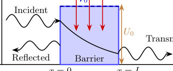
<figcaption class="paper-figure-caption"><b>Fig 1.</b> FIG. 1. Quantum tunneling across a barrier of static height U0, whose amplitude fluctuates in time with noise strength V0. The temporal fluctuations introduced by noise are indicated by the red arrows. Moreover, the incident, reflected, and transmitted waves are schematically indicated.</figcaption>
</figure>
<figure class="paper-figure-card">
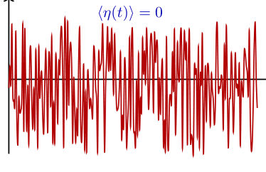
<figcaption class="paper-figure-caption"><b>Fig 2.</b> FIG. 2. Sample realization of Gaussian white noise fluctua- tions, the noise has zero mean and shows δ temporal correla- tions, ⟨η(t)η(t′)⟩= δ(t −t′).</figcaption>
</figure>
<figure class="paper-figure-card">
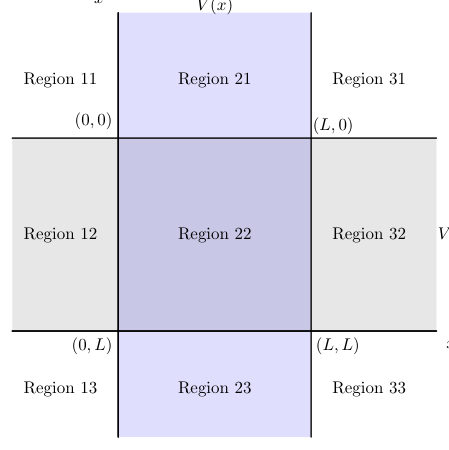
<figcaption class="paper-figure-caption"><b>Fig 3.</b> FIG. 3. Schematic of the nine regions in the (x, x′) plane used in the density-matrix scattering formalism. The vertical and horizontal lines at x = 0 and x = L, and at x′ = 0 and x′ = L, mark the interfaces of the noisy barrier. Each region (i, j) corresponds to x and x′ being in the left (x &lt; 0), inside the barrier, (0 &lt; x &lt; L), or in the right lead (x &gt; L).</figcaption>
</figure>
<figure class="paper-figure-card">
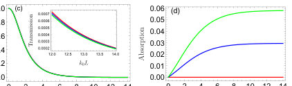
<figcaption class="paper-figure-caption"><b>Fig 4.</b> FIG. 4. Transmission and absorption for a non-relativistic Schr¨odinger particle traversing a static and noisy barrier as a function of k0L. With k0 = √2mU0. The top row corresponds to electrons with energy ϵ = 1.1 U0 that is larger than the barrier height: (a) transmission T and (b) absorption A. The bottom row corresponds to the tunneling regime ϵ = 0.9 U0: (c) transmission T and (d) absorption A. Curves are shown for noise strength V0/U0 = 0 (red), 0.01 (blue), and 0.02 (green).</figcaption>
</figure>
<figure class="paper-figure-card">
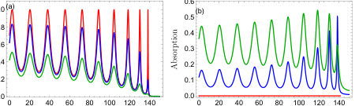
<figcaption class="paper-figure-caption"><b>Fig 5.</b> FIG. 7. Transmission (a) and absorption (b) probabilities for electrons in graphene tunneling through a noisy barrier as a function of incoming energy for an incident angle ϕ = 45◦, barrier width L = 110 nm, and static barrier height is U0 = 200 meV . The three curves correspond to noise strength V0 = 0 (red), 20 (blue), and 40 meV(green).</figcaption>
</figure>
<figure class="paper-figure-card">
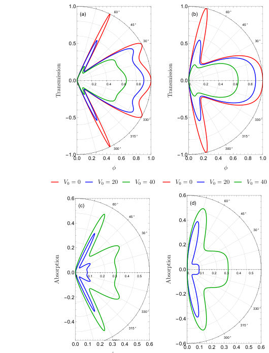
<figcaption class="paper-figure-caption"><b>Fig 6.</b> FIG. 6. Angular dependence of transmission and ab- sorption probabilities for tunneling through a noisy barrier in graphene. Panels (a,b) show the transmission T(ϕ) for U0 = 200 and 285 meV, and panels (c,d) show the correspond- ing absorption A(ϕ). The incoming energy is ϵ = 80 meV, the barrier width is L = 110 nm. Curves correspond to the noise strength V0 = 0, 20, and 40 meV.Parameters are chosen to facilitate comparison with standard Klein-tunneling setups in the literature, see Ref. [6].</figcaption>
</figure>
<figure class="paper-figure-card">
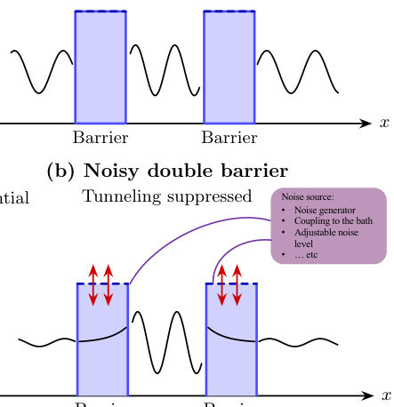
<figcaption class="paper-figure-caption"><b>Fig 7.</b> FIG. 8. Illustration of Quantum confinement in two cases:(a) Clean double barrier where Klein tunneling dominates, and the particle cannot efficiently be confined. (b) A noisy double barrier, based on our calculations, could suppress Klein tun- neling and confine the particle.</figcaption>
</figure>

**Main problem.** Investigating how temporal noise (stochastic fluctuations in barrier height) can be used as a mechanism to suppress Klein tunneling in graphene.

**Main result.** Noise induces a complex longitudinal wavevector in graphene, leading to the exponential suppression of Klein tunneling even at normal incidence, effectively turning a noisy barrier into a tunable dissipative element.

**Method.** The authors map the stochastic dynamics of a time-dependent potential onto a time-independent Lindblad master equation for the density matrix, which is then solved using a spatial matching technique in a nine-region construction.

**Summary.** This paper explores how temporal fluctuations in a potential barrier can suppress the Klein tunneling effect in graphene. By using a Lindblad master equation approach, the authors show that noise introduces an imaginary component to the wavevector, causing exponential decay of transmission. This mechanism allows for the tuning of barrier opacity without changing the physical geometry. The findings suggest that controlled noise could improve electron confinement in graphene-based devices, such as quantum dots for spin qubits.

Detailed structure

**Model / system.** The study models electrons in graphene (massless Dirac fermions) and non-relativistic Schrödinger particles traversing a 1D rectangular potential barrier whose height fluctuates according to Gaussian white noise.

**Key observables.** Transmission probability (T), reflection probability (R), and absorption probability (A), representing the loss of coherent flux.

**Important parameters / regimes.** Barrier height (U0), noise strength (V0), barrier width (L), incident energy (epsilon), and incident angle (phi).

**Assumptions / limitations.** The noise is modeled specifically as Gaussian white noise (Markovian/memoryless), and the potential is assumed to be piecewise constant.

**Figures summary.** Fig 1 shows a schematic of the noisy barrier; Fig 2 shows a realization of Gaussian white noise; Fig 3 shows the nine-region construction in the (x, x') plane; Fig 4 shows T and A for Schrödinger particles; Fig 6 shows angular dependence of T and A; Fig 7 shows energy dependence; Fig 8 compares clean vs. noisy double barriers for confinement.

**Paper structure.** The paper establishes a benchmark with Schrödinger particles, develops the Lindblad formalism for noise, applies it to graphene to demonstrate Klein tunneling suppression, and discusses applications to quantum dots.

**Why it may be interesting.** The paper provides an analytical framework for treating stochastic driving as a control mechanism for transport, demonstrating how dissipation can be used to break symmetry-protected phenomena like Klein tunneling.

Abstract

We study quantum tunneling through a potential barrier whose height fluctuates in time and is modeled by Gaussian white noise. We map the stochastic dynamics onto an equivalent time-independent Lindblad equation for the density matrix, allowing fully analytical solutions. For Schrödinger particles, noise introduces dissipation that suppresses Fabry-Pérot oscillations and yields an exponentially decaying transmission. Applying the same formalism to graphene, we demonstrate that noise induces a complex longitudinal wavevector within the barrier, leading to a strong suppression of transmission and Klein tunneling, even at normal incidence. Our approach promises improved control over Klein tunneling. These results demonstrate that noisy barriers can act as tunable dissipative elements, offering a pathway to enhanced control of electron transport in graphene-based devices. We also briefly discuss how our results could guide the design of graphene quantum dots for potential use in spin qubit devices.

[↑ back to top](#top)

### [Density protected states in active matter under virtual confinement](http://arxiv.org/abs/2604.24232v1)

**Authors:** Giuseppe Fava, Francesco Ginelli, Benoît Mahault  
**Type:** both · **Category:** statistical mechanics · **PDF:** <https://arxiv.org/pdf/2604.24232v1>  
**Analysis basis:** full PDF text, analyzed in chunks
**Topic relevance:** `non-equilibrium dynamics` **3/5** · `driven-dissipative phase transition` **2/5** · `non-equilibrium universality` **2/5**

↔ Scroll figures horizontally

<figure class="paper-figure-card">
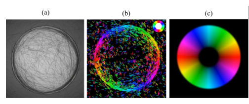
<figcaption class="paper-figure-caption"><b>Fig 1.</b> FIG. 1. (a) Experimental ring configuration formed by O.lutea cyanobacteria at the edge of an illuminated region. Reprinted from Ref. [7]. (b) Typical snapshot of a stationary ring configuration obtained from the microscopic dynamics (1). The color-disk (top right) measures the local nematic an- gle Φ. Black indicates the absence of particles. Here β = 0.3, ρ0 = 0.5, L = 512, R = 100. (c) Stationary solution obtained from continuum Eqs. (2) with ρ0 = 1, L = 128, R = 32 and other parameters as in Fig. 4.</figcaption>
</figure>
<figure class="paper-figure-card">
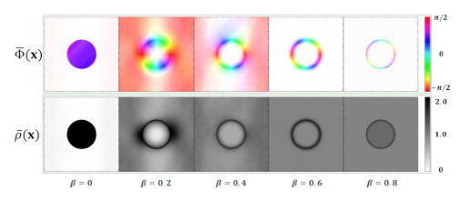
<figcaption class="paper-figure-caption"><b>Fig 2.</b> FIG. 2. Stationary configurations at fixed global density ρ0 = 1 and for β ∈[0, 0.8]. The top row shows the (color- coded) time-averaged nematic angle field, where disordered regions appear white. The bottom row shows the time- averaged density (gray-scale). System size: L = 512 and R = 100.</figcaption>
</figure>
<figure class="paper-figure-card">
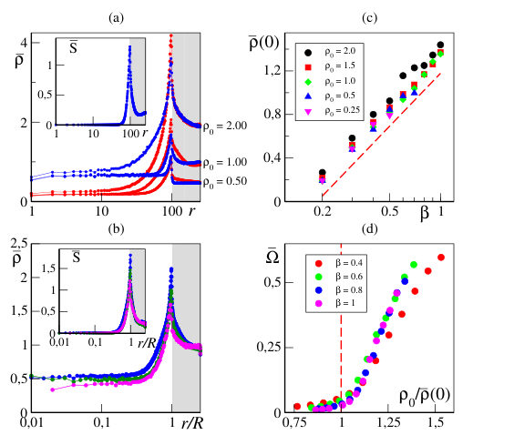
<figcaption class="paper-figure-caption"><b>Fig 3.</b> FIG. 3. (a) Radially averaged stationary density profiles for β = 0.2 (red) and 0.4 (blue) and ρ0 = 0.25, 1, 2. The curves corresponding to equal ρ0 overlap for r &gt; R (gray region). Inset: nematic amplitude for ρ0 = 1. (b) Stationary profiles for fixed β = 0.3 and ρ0 = 1 as functions of r/R with system size L = 256 (magenta), L = 512 (green) and L = 1024 (blue) keeping L/R = 5.12. (c) Core density ¯ρ(r = 0) as a function of β for different values of ρ0. The red dashed line marks the best logarithmic fit (vertically shifted for clarity) ¯ρ(0) = 0.7 ln(β/0.15) (d) Nematic order parameter measured in homogeneous systems of linear size L = 100 as a function of ρ0 rescaled by the core density...</figcaption>
</figure>
<figure class="paper-figure-card">
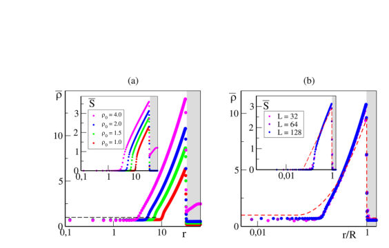
<figcaption class="paper-figure-caption"><b>Fig 4.</b> FIG. 4. Stationary solutions of the continuum model (2). Radial density and nematic order (inset) profiles for different values of the global density ρ0(a) and three different system sizes L(b). In (a) L = 128, R = 32 and the black dashed line indicates ρc = 1. In (b), ρ0 = 2, R = 1</figcaption>
</figure>

**Main problem.** Understanding the mechanism behind the formation of large-scale, density-protected ring structures in active matter under virtual confinement, such as light-responsive patterns.

**Main result.** The system self-assembles into a high-density nematic ring at the boundary of illumination, which creates a protected disordered core with a density independent of the global particle density.

**Method.** The study combines microscopic agent-based simulations of a 2D Vicsek-style model with a hydrodynamic continuum theory and linear stability analysis.

**Summary.** This paper investigates how active nematic particles under light-induced confinement self-organize into dense rings. These rings act as a screen, creating a central core where the density is 'protected' and remains independent of the overall system density. The researchers use both particle simulations and hydrodynamic theory to show that this effect arises from the interplay between alignment and active currents. The findings provide a robust mechanism for pattern formation in active matter that is applicable to various experimental platforms.

Detailed structure

**Model / system.** A 2D model of dry active nematics consisting of self-propelled particles with nematic symmetry, subject to virtual confinement via light-induced polarity reversals at a circular boundary.

**Key observables.** Local density, nematic amplitude (S), nematic angle (Phi), nematic tensor (Q), and radial density profiles.

**Important parameters / regimes.** Repulsion strength (beta), global particle density (rho_0), illumination radius (R), and topological charge (k).

**Assumptions / limitations.** Thin interface limit for the light-induced boundary, a minimal truncation of hydrodynamic equations, and small noise amplitude.

**Figures summary.** Figure 1 shows an experimental reference of cyanobacteria forming rings and a simulation snapshot of a stationary ring configuration with nematic angle color-coding.

**Paper structure.** The paper introduces the problem via experimental motivation, presents a microscopic model and its hydrodynamic counterpart, details the emergence of ring formation and density protection, analyzes the scaling and stability of these states, and concludes with limitations.

**Why it may be interesting.** The concept of density protection and boundary-induced structure formation via localized driving provides insights into non-equilibrium phase transitions and the stability of patterns in driven-dissipative systems.

Abstract

We investigate photo-responsive structure formation in a minimal model of dry active nematics. Combining microscopic simulations with the analysis of the corresponding hydrodynamic theory, we show that the system generically self-assembles into a dense, nematically ordered ring at the boundary of circular illumination patterns. Remarkably, these boundary structures give rise to a protected disordered core whose density is self-selected and independent of the global particle density. Our analysis reveals that these states emerge from a generic interplay between local nematic alignment and curvature-driven active currents. These results identify a robust route to boundary-induced structure formation in active matter and provide experimentally testable predictions.

[↑ back to top](#top)

### [Role of ultrafast electron-optical-phonon interactions in high harmonic generation from graphene](http://arxiv.org/abs/2604.23294v1)

**Authors:** Adam Herling, Ofer Neufeld  
**Type:** theory · **Category:** other · **PDF:** <https://arxiv.org/pdf/2604.23294v1>  
**Analysis basis:** full PDF text, analyzed in chunks
**Topic relevance:** `non-equilibrium dynamics` **3/5** · `Keldysh / 2PI / non-Gaussian methods` **2/5**

↔ Scroll figures horizontally

<figure class="paper-figure-card">
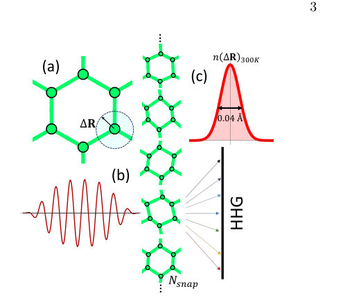
<figcaption class="paper-figure-caption"><b>Fig 1.</b> FIG. 1: Illustration of thermal optical phonons in graphene at Γ. The graphene lattice (including phonons) is driven by an intense laser, causing HHG. (a) Equilibrium lattice (∆R = 0). Possible ∆R displacements are indicated by the arrow and circle around one atom. (b) Series of snapshots for varying phonon-induced lattice displacements, generating static lat- tice configurations that are sampled with proper weights to include phononic interactions. The displacements are grossly exaggerated for illustrative purposes. (c) Exemplary phononic displacement distribution function at 300K.</figcaption>
</figure>
<figure class="paper-figure-card">
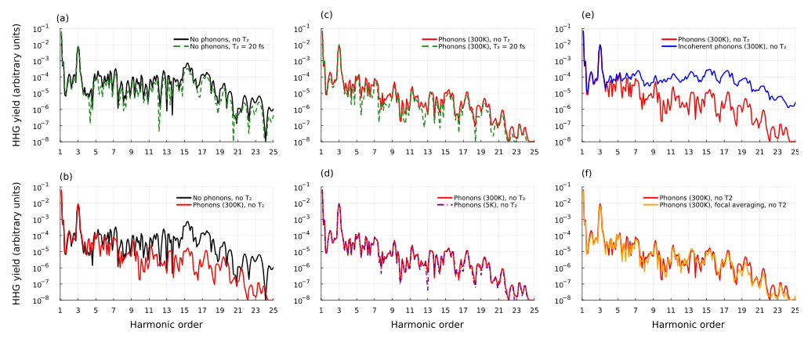
<figcaption class="paper-figure-caption"><b>Fig 2.</b> FIG. 2: HHG spectra from graphene simulated at varying levels of theory. (a) HHG at the equilibrium case (no phononic DOF) with/without phenomenological dephasing. (b) HHG emission with phononic DOF compared to equilibrium case, showing strong suppression of the plateau and spectral cleaning. (c) HHG emission including phononic DOF and with/without phenomenological dephasing. (d) Temperature-dependence of HHG in graphene calculated including phononic DOF and without phenomenological dephasing. (e) Comparison of coherent/incoherent summations over HHG phononic snapshots. (f) HHG emission including phononic DOF with/without Gaussian focal beam averaging. Calculations performed for a peak...</figcaption>
</figure>
<figure class="paper-figure-card">
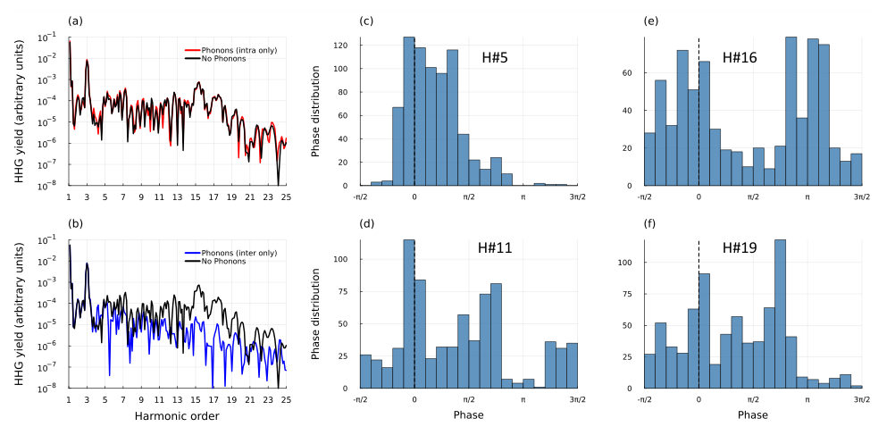
<figcaption class="paper-figure-caption"><b>Fig 3.</b> FIG. 3: (a) HHG emission with phononic DOF included only in intraband channel, compared to the equilibrium case. (b) Same as (a) but for interband emission. (c-f) Select harmonic order phase distributions across phononic snapshots from the interband emission channel (all other harmonics are delegated to the SI). Simulations performed in similar conditions to Fig. 2 without phenomenological dephasing. Zero phase in each case is offset to the equilibrium case phase (dashed black line).</figcaption>
</figure>
<figure class="paper-figure-card">
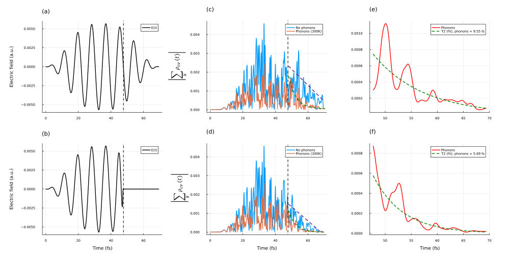
<figcaption class="paper-figure-caption"><b>Fig 4.</b> FIG. 4: Interband coherence dynamics for BZ-averaged ρCV (t). (a) Laser electric field. (b) Interband coherence dynamics with/without phonons. Vertical dashed line represents the temporal region towards the end of the pulse from which on the dynamics are fitted to an exponentially decaying function (dashed green). Linear dashed line in purple marks the non- exponential coherence leakage in the equilibrium case. (c) Same as (b) but in the temporal fitting region with the optimally-fitted exponential function. (d-e) Same as (a-c) but for a case where the laser electric field is artificially halted in simulations in order to obtain a cleaner extraction of dephasing. Simulations do not include...</figcaption>
</figure>
<figure class="paper-figure-card">
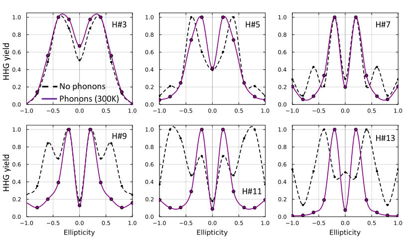
<figcaption class="paper-figure-caption"><b>Fig 5.</b> FIG. 5: Ellipticity-dependence of normalized HHG yields for select harmonic orders with/without phononic interactions. Simulations performed without phenomenological dephasing.</figcaption>
</figure>
<figure class="paper-figure-card">
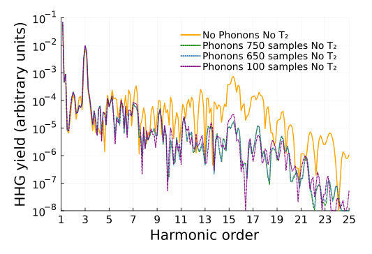
<figcaption class="paper-figure-caption"><b>Fig 6.</b> FIG. 6: Convergence of HHG emission in the phononic case with respect to number of phononic configuration sampling, Nsnap. Simulations performed in similar conditions to Fig. 2 in main text at 300K.</figcaption>
</figure>
<figure class="paper-figure-card">
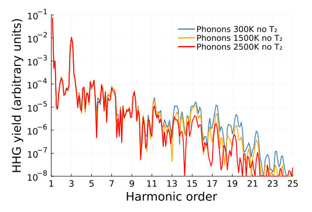
<figcaption class="paper-figure-caption"><b>Fig 7.</b> FIG. 7: HHG temperature dependence from graphene in high temperature conditions. Simulations performed in similar conditions to Fig. 2(d) in main text.</figcaption>
</figure>
<figure class="paper-figure-card">
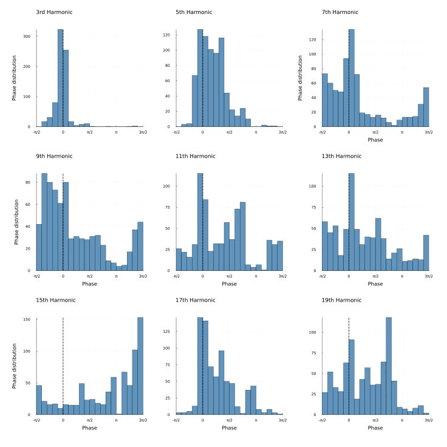
<figcaption class="paper-figure-caption"><b>Fig 8.</b> FIG. 8: Phononic phase scrambling effect in interband HHG. Histograms of harmonic phases across snapshots are presented for all odd harmonic orders, complementing select harmonic orders presented in the main text in Fig. 3(c-d) (identical simulation methodology and conditions are employed here).</figcaption>
</figure>
<figure class="paper-figure-card">
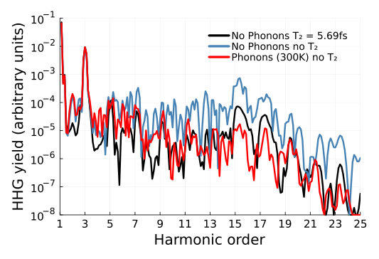
<figcaption class="paper-figure-caption"><b>Fig 9.</b> FIG. 9: HHG yields comparing the phononic case with the equilibrium case with phenomenological dephasing set to T2 = 5.69 fs, which yields similar magnitudes of HHG suppression. Simulations performed in similar conditions to Fig. 1(a,b) in the main text.</figcaption>
</figure>

**Main problem.** The paper addresses the 'dephasing time problem' in graphene HHG, specifically why experimental high-order harmonics above 3 eV are suppressed and why a very short phenomenological dephasing time is required in simulations.

**Main result.** Optical phonons cause 'phase scrambling' through destructive interference in the interband current, which suppresses high-energy harmonics and explains the experimental lack of emission above 3 eV. This effect is driven by zero-point motion and is largely temperature-independent.

**Method.** The authors use a 'static limit' formalism where the lattice is frozen during the electronic timescale, computing HHG by ensemble-averaging over thermally-occupied phonon snapshots using Semiconductor Bloch Equations.

**Summary.** This paper investigates how optical phonons in graphene influence high harmonic generation (HHG). It reveals that phonons induce phase variations that lead to destructive interference, effectively suppressing high-energy harmonics above 3 eV. The study finds that this suppression is primarily due to zero-point motion, making the effect robust even at low temperatures. Furthermore, the research identifies electron-phonon scattering as the dominant source of electronic dephasing in the strong-field regime.

Detailed structure

**Model / system.** The system is monolayer graphene modeled with a second-order nearest-neighbor tight-binding Hamiltonian. The model includes longitudinal and transverse optical (LO/TO) phonon modes at the Gamma point that perturb the hopping amplitudes.

**Key observables.** Time-dependent current (intraband and interband components), HHG spectral power, harmonic phase distributions, and HHG ellipticity-dependent curves.

**Important parameters / regimes.** Laser frequency, ellipticity, temperature, phonon frequency, and a calculated dephasing time of T2 ~ 5.7 fs.

**Assumptions / limitations.** The 'static limit' approximation assumes the lattice is frozen on the electronic timescale; phonons are treated as fixed snapshots that act on electrons without back-action.

**Figures summary.** Figure 1 illustrates the phonon-induced lattice distortions and sampling; Figure 2 compares HHG spectra with and without phonons; Figure 4 shows interband coherence decay and dephasing fitting; Figure 5 demonstrates how phonons smooth the ellipticity dependence of harmonics.

**Paper structure.** The paper introduces the dephasing problem and the role of phonons, describes the tight-binding and phonon-sampling model, presents results on HHG suppression and phase scrambling, discusses temperature dependence and dephasing rates, and concludes with implications for other 2D materials.

**Why it may be interesting.** It provides a concrete physical mechanism (phononic phase scrambling) for electronic decoherence in a strong-field regime, which is highly relevant to the study of open quantum systems and ultrafast dynamics in solids.

Abstract

High harmonic generation (HHG) is a widely explored process in solids, where intense lasers drive attosecond-to-femtosecond electron dynamics within bands, causing high-energy emission. While electrons and photons are considered the main players in HHG, solids also host ubiquitous phonons that are typically assumed negligible in HHG due to their longer timescales. We theoretically study HHG in graphene with a formalism including optical phonons in the static limit, where the lattice is frozen on the electronic timescale and HHG is computed by sampling thermally-occupied phonons and ensemble-averaging. We show that in graphene: (i) Optical phonons strongly suppress HHG yields by coupling to interband currents and causing harmonic phase scrambling (destructive interference), explaining the lack of experimental HHG above ~3 eV. (ii) HHG yields become temperature-dependent due to phonon occupations, though in graphene this dependence is weak since phonon energy scales are dominated by zero-point motion. (iii) Optical phonons dephase interband coherences at a rate equivalent to T2~5.7 fs, substantially faster than e-e scattering, suggesting thermal phonons dominate electronic decoherence in strong fields. (iv) Phonons smoothen HHG ellipticity-dependent curves, yielding better agreement with experiments. Remarkably, all effects are timescale-independent, arising in the static picture of electron-phonon interactions, making results transferable to attosecond phenomena. Our results shed light on the dephasing time problem in HHG and the role of phonons on attosecond timescales, with implications for other systems and processes such as Floquet gaps and photocurrents in graphene.

[↑ back to top](#top)

### [Non-Hermitian corner skin effect in a two-dimensional photonic crystal](http://arxiv.org/abs/2604.23209v1)

**Authors:** Huyen Thanh Phan, Katsunori Wakabayashi  
**Type:** theory · **Category:** other · **PDF:** <https://arxiv.org/pdf/2604.23209v1>  
**Analysis basis:** full PDF text, analyzed in chunks
**Topic relevance:** `analog quantum simulation` **2/5** · `correlated / nonlocal dissipation` **2/5** · `driven-dissipative phase transition` **2/5** · `methods for driven-dissipative` **2/5** · `non-equilibrium dynamics` **2/5** · `spintronics-quantum-optics interface` **2/5**

↔ Scroll figures horizontally

<figure class="paper-figure-card">
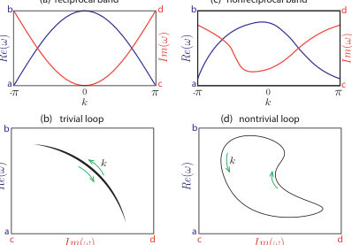
<figcaption class="paper-figure-caption"><b>Fig 1.</b> FIG. 1. (a) Schematic of a 1D reciprocal complex band structure, where ω(k) = ω(−k). (b) The complex eigenfrequencies in (a) form a curved line (trivial loop) in complex plane. (c) Schematic of a 1D nonreciprocal complex band structure, where ω(k) ̸= ω(−k). (d) The complex eigenfrequencies in (c) show a closed loop (nontrivial loop) in complex plane.</figcaption>
</figure>
<figure class="paper-figure-card">
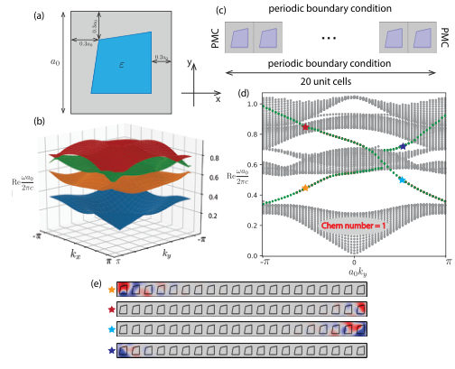
<figcaption class="paper-figure-caption"><b>Fig 2.</b> FIG. 2. (a)Schematic of one unit cell of investigated 2D non- Hermitian PhC. (b) k-dependent dispersion of real part of eigenfre- quencies, showing a complete band gap between the first and the sec- ond bands. (c) Schematic of a super cell for ribbon structure, which is periodic along y direction and finite in x direction. (d) Photonic band structure for the structure in (c). Topological edge states (green color) are numerically observed above the first bulk band. (e) Field profile of the topological edge states marked by colored stars in (d).</figcaption>
</figure>
<figure class="paper-figure-card">
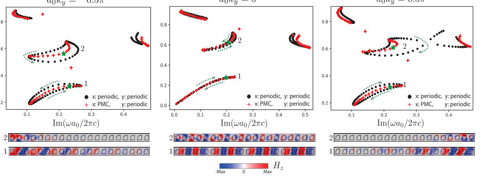
<figcaption class="paper-figure-caption"><b>Fig 3.</b> FIG. 3. Photonic band structure for the infinite structure (black) and ribbon structure (red) at a0ky = −0.5π (left panel), a0ky = 0 (middle panel) and a0ky = 0.5π (right panel). The green arrows denote the winding direction (clockwise or anti-clockwise) when kx is varied from −π/a0 to π/a0. Number 1 and 2 indicate band indices.The lower panels are field profile of the states labeled by green stars in the corresponding band structures. The states enclosed by the point gap exhibit skin effect, where EM waves are highly localized at the boundaries of structures.</figcaption>
</figure>
<figure class="paper-figure-card">
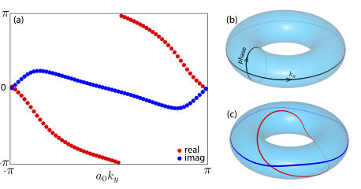
<figcaption class="paper-figure-caption"><b>Fig 4.</b> FIG. 4. (a) Complex geometrical phase in y direction of the first band of investigated 2D non-Hermitian PhC. Red dots indicate real part of geometrical phase, blue dots denote imaginary part of geometrical phase. (b) The coordinate system in (a) is equivalent to a torus under periodic boundary condition. (c) The real and imaginary part of the complex geometrical phase are represented by red and blue lines on the torus.</figcaption>
</figure>
<figure class="paper-figure-card">
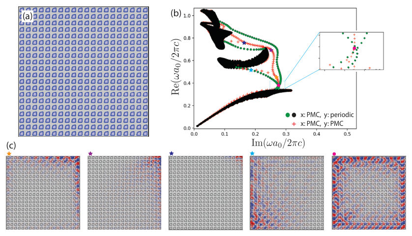
<figcaption class="paper-figure-caption"><b>Fig 5.</b> FIG. 5. (a) Schematic of investigated finite structure, system size is 20 × 20 unit cells. PMC boundary condition is applied to all four boundaries. (b) Photonic dispersion in the complex plane of the finite structure (red) in (a) and semi-infinite (black) in Fig. 2(c). The inset shows enlarged figure of the region enclosed by the blue dot line. The topological edge states form loop in complex plane and encloses the complex eigenfrequencies of the corner modes. (c) Field profile of the corner skin modes labeled by the stars in (b) and the extended topological edge states labeled by the magenta circle in (b).</figcaption>
</figure>
<figure class="paper-figure-card">
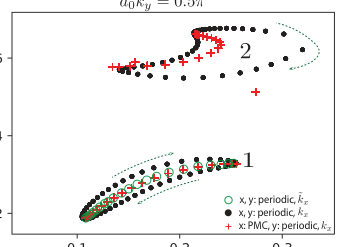
<figcaption class="paper-figure-caption"><b>Fig 6.</b> FIG. 6. (a) Schematic of eigenfrequencies of the infinite structure (black) and eigenfrequencies of semi-infinite structure (red). From left to right panels, kim x is varied from 0 to the critical point, where eigenfrequencies of two structures become identical. (b) Band struc- ture of infinite structure with real kx (black), semi-infinite structure (red) and infinite structure with complex ˜kx.</figcaption>
</figure>

**Main problem.** Investigating the second-order non-Hermitian skin effect (corner localization) in a continuous 2D photonic crystal, moving beyond traditional tight-binding models.

**Main result.** Demonstrated that a point gap in the complex eigenfrequency spectrum leads to the emergence of corner skin modes in truncated structures, distinguishing them from Hermitian topological corner states.

**Method.** Numerical simulations using the Finite Element Method (FEM) and extended plane-wave expansion, combined with non-Bloch band theory and complex Berry phase analysis.

**Summary.** This paper explores the non-Hermitian corner skin effect in a 2D photonic crystal made of lossy magneto-optical materials. The authors show that point gaps in the complex frequency spectrum cause electromagnetic waves to localize at the corners of finite structures. Unlike traditional topological corner states, these skin modes are driven by non-Hermitian topology and their number scales with the system size. This work is significant because it moves the study of non-Hermitian skin effects from simplified tight-binding models to more realistic, continuous photonic platforms.

Detailed structure

**Model / system.** A 2D non-Hermitian photonic crystal composed of lossy magneto-optical materials arranged in a square unit cell, featuring broken inversion, mirror, and time-reversal symmetries.

**Key observables.** Complex eigenfrequencies, winding numbers, Chern numbers, and spatial field profiles of edge and corner states.

**Important parameters / regimes.** Point gaps in the complex spectrum, winding number (w), and the presence of nonreciprocity via the permittivity tensor.

**Assumptions / limitations.** The lattice constant is fixed at a=1, and the magnetization is assumed to be parallel to the z-direction.

**Figures summary.** Figure 1 shows 1D vs 2D band structure topology; Figure 2 displays the unit cell, dispersion, and ribbon edge state profiles; Figure 3 shows complex eigenfrequency spectra; Figure 5 illustrates corner skin mode localization and field profiles; Figure 6 compares infinite and ribbon-based complex wave vector dispersions.

**Paper structure.** The paper introduces the non-Hermitian skin effect, describes the photonic crystal model and its symmetry breaking, presents numerical results for ribbon (edge) and finite (corner) structures, provides topological characterization via winding numbers, and concludes with a comparison to existing models.

**Why it may be interesting.** The study of non-Hermitian topology and skin effects is highly relevant to open quantum systems and quantum optics, as it provides a realistic continuous-system platform for studying how dissipation and non-reciprocity drive novel localization phenomena.

Abstract

We numerically study topological effects of electromagnetic (EM) waves   in a two-dimensional (2D) non-Hermitian photonic crystal (PhC) composed   of lossy magneto-optical materials. In this system, not only the EM   wavefunctions but also the complex eigenfrequencies exhibit nontrivial   topological properties. We demonstrate that the non-Hermitian skin   effect, protected by point gaps in the complex eigenfrequency spectrum,   emerges at both the edges and corners of truncated structures. This   phenomenon has no counterpart in Hermitian systems. In addition, we identify non-Hermitian topological edge states   originating from the nontrivial topology of the bulk bands. While most   previous studies of non-Hermitian topology have focused on   tight-binding models, our work addresses a continuous photonic system,   providing a more realistic platform and offering a concrete route   toward experimental realization of non-Hermitian effects.

[↑ back to top](#top)

### [A practicable method for the analysis of complex motion of biological and soft matter](http://arxiv.org/abs/2604.24387v1)

**Authors:** Jun Ma  
**Type:** theory · **Category:** statistical mechanics · **PDF:** <https://arxiv.org/pdf/2604.24387v1>  
**Analysis basis:** full PDF text, analyzed in chunks
**Topic relevance:** `methods for driven-dissipative` **2/5** · `non-equilibrium dynamics` **2/5** · `quantum measurements` **2/5**

↔ Scroll figures horizontally

<figure class="paper-figure-card">
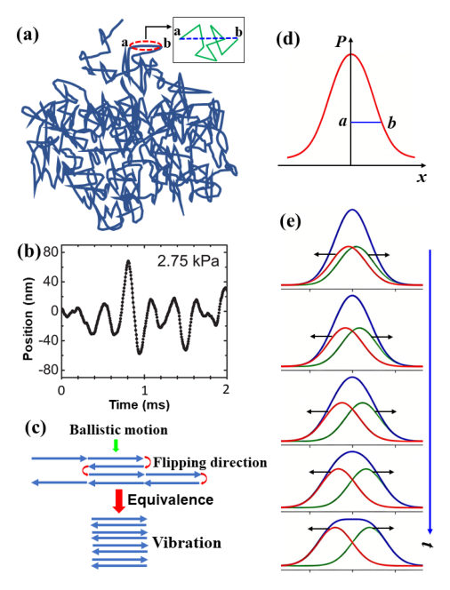
<figcaption class="paper-figure-caption"><b>Fig 1.</b> Figure 1: (a) Irregular trajectories of Brownian motion, inset: a segment of trajectory ‘ab’ consisted of a number of steps produced by the ballistic motion of Brownian particle. (b) One-dimensional trajectories of a 3 µm diameter silica bead in air at 2.75 kPa performs ballistic motion around the equilibrium position ‘0’ due to consistently flipping the motion direction [10]. (c) The ensemble effect of random ballistic motion is equivalent to a vibration. An arrow represents one step of ballistic motion. (d) The segment of trajectory (e.g.,‘ab’) is the displacement (x) of particle observed under optical microscopy, whose probability density P displays a Gaussian distribution. (e) The...</figcaption>
</figure>
<figure class="paper-figure-card">
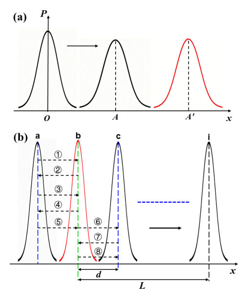
<figcaption class="paper-figure-caption"><b>Fig 2.</b> Figure 2: (a) The wave packet moving along x axis is expected to reach the position A′, but it actually arrives at the position A due to the oscillating motion. (b) The propagation mechanism of wave packet: the oscillating motion plus drift motion. A oscillating motion consists of the forward motion ①and the backward motion ②, so as to the motion ③④. After the oscillation motion ①②③④⑤, the wave packet drifts to ⑥ due to a fluctuation of random field along the positive x direction, producing a drift motion with a displacement d. The wave packet is continually repeating above process until producing the net displacement L, which corresponds to the displacement in (a) with OA = L</figcaption>
</figure>
<figure class="paper-figure-card">
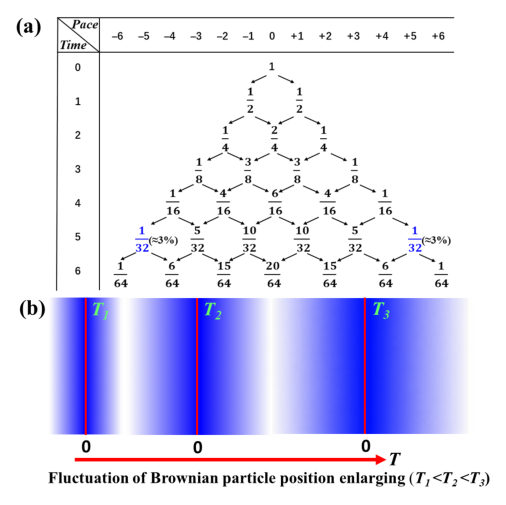
<figcaption class="paper-figure-caption"><b>Fig 3.</b> Figure 3: The fluctuation of wave packet (particle) position due to the asymmetry of the forward and backward motion of wave packet. (a) Symmetrical distribution of the forward and backward motion of wave packet, represented by the pace numbers. ‘0’ pace is the mean position of wave packet (particle) with no fluctuation. The probability of wave packet (particle) distribution decreases with the pace number increasing. (b) The position fluctuation of wave packet (particle) enlarges with temperature increasing. ‘0’ corresponding to ‘0’ pace in (a). With the pace number increasing at the two sides of ‘0’, the probability of particle distribution decreases, representing with blue color becoming...</figcaption>
</figure>

**Main problem.** The lack of an analytical method to decipher the complex, stochastic 'fingerprint' trajectories of biological and soft matter to extract underlying dynamical information.

**Main result.** The development of a method that maps the Gaussian probability distribution of Brownian particle displacements onto a propagating wave packet, allowing for the extraction of microscopic dynamical information from irregular trajectories.

**Method.** A quantization-inspired approach that transforms the probability density of particle displacement into a wave function, using Fourier transforms and Taylor expansions of the angular frequency to relate ballistic motion to wave packet dynamics.

**Summary.** This paper presents a new analytical method for studying the complex, random motions found in biological and soft matter. By treating the stochastic trajectories of particles like Brownian motion as propagating wave packets, the author can extract hidden dynamical information from seemingly random paths. The method bridges the gap between microscopic ballistic steps and macroscopic diffusion. This approach allows for a systematic study of how spatio-temporal microstructures evolve in complex fluids.

Detailed structure

**Model / system.** A 1D model of a spherical Brownian particle (e.g., proteins, bacteria, or silica beads) undergoing a series of random ballistic motion steps in a fluid, driven by a random thermal field.

**Key observables.** Mean-squared displacement, probability distribution P(x,t), group velocity (vg), mean displacement, and diffusion constant (D).

**Important parameters / regimes.** Ballistic step length (l), step time (tb), diffusion exponent (alpha), diffusion constant (D), and effective mass (m*).

**Assumptions / limitations.** The initial distribution of the wave function is Gaussian, the number of extra steps follows a Gaussian distribution, and the time intervals are integer multiples of the ballistic step time.

**Figures summary.** Figure 1 shows irregular Brownian trajectories and a 1D model of a silica bead performing ballistic motion with direction flipping. Figure 2 illustrates the wave packet propagation mechanism, showing how oscillating motion and drift lead to net displacement.

**Paper structure.** The paper introduces the problem of analyzing irregular trajectories, proposes a wave packet quantization model, derives the mathematical framework for the wave function, maps microscopic parameters to macroscopic observables, and concludes with the implications for studying soft matter dynamics.

**Why it may be interesting.** The paper uses a mathematical analogy between Brownian motion uncertainty and quantum mechanical wave packets, providing a framework for treating stochastic classical trajectories using tools similar to those used in open quantum systems and wave mechanics.

Abstract

Biological function of living matter is fulfilled by complex motions of biological and soft matter. Unlike general motion is deterministic described by Newton's laws, these motions are mostly random and uncertain for the position in stochastic process, being characterized as irregular trajectories of movement without a defined velocity. Like human fingerprint, the trajectory is the identity of the motion containing fundamental dynamical information. Such irregular trajectories randomly inter-wind and twist to each other to produce a complicated turmoil configuration in which so far the unrealized mechanism of motion is hidden. Nowadays, the analytical method for this fingerprint trajectory is still missed. Here we develop a practicable method to decipher complicated trajectory configuration, which uncovers abundant dynamical information hiding in irregular trajectories, revealing the remarkable evolution of spatial-temporal micro-structure, thus leading to the novel systematic study of the dynamics of biological and soft matter.

[↑ back to top](#top)

### [Spin Seebeck Effect in Normal-Metal--Chiral-Insulator Heterostructure](http://arxiv.org/abs/2604.23111v1)

**Authors:** Jiayan Zhang, Gaoyang Li, Gaomin Tang, Yanxia Xing  
**Type:** theory · **Category:** other · **PDF:** <https://arxiv.org/pdf/2604.23111v1>  
**Analysis basis:** full PDF text, analyzed in chunks
**Topic relevance:** `Keldysh / 2PI / non-Gaussian methods` **2/5** · `non-equilibrium dynamics` **2/5**

↔ Scroll figures horizontally

<figure class="paper-figure-card">
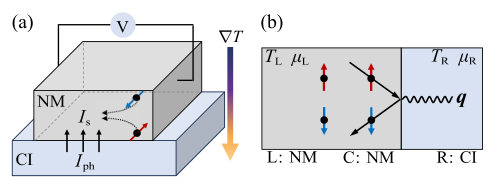
<figcaption class="paper-figure-caption"><b>Fig 1.</b> FIG. 1. (a) Schematic of the experimental device. The temperature gradient ∇T is perpendicular to the NM–CI in- terface. The black arrows at the interface denote the conver- sion of the phAM current Iph to the spin current Is. Elec- trons in the NM are shown as black solid circles, with blue (red) arrows indicating the spin orientations. The black dot- ted lines with arrows are electron trajectories arising from spin-dependent scattering. (b) Schematic of a two-terminal device for NM–NM–CI heterostructure. TL (TR) and µL (µR) are the temperature and chemical potential of the left (right) lead, respectively. The black straight lines with arrows repre- sent electrons before and after...</figcaption>
</figure>
<figure class="paper-figure-card">
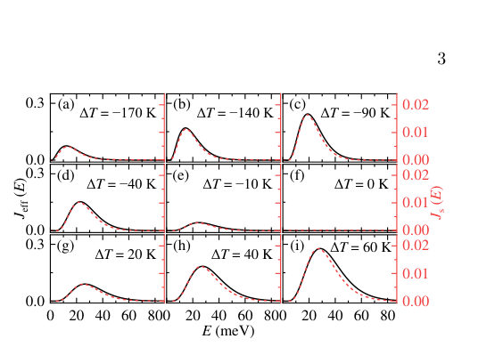
<figcaption class="paper-figure-caption"><b>Fig 2.</b> FIG. 3. Effective spectral density Jeff(E) and spin current density Js(E) as a function of energy E at different ∆T for µL = 1 meV. Other parameters: T0 = 90 K, εd = 0, α = 5, and ω0 = 7 meV.</figcaption>
</figure>
<figure class="paper-figure-card">
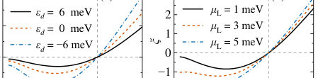
<figcaption class="paper-figure-caption"><b>Fig 3.</b> FIG. 2. Spin current Is as a function of the thermal bias ∆T (a) for different T0 with µL = 1 meV and εd = 0, (b) for different µL with T0 = 90 K and εd = 0, and (c) for different εd with µL = 1 meV and T0 = 90 K. (d) ξ plotted as a function of ∆T for different µL with T0 = 90 K and εd = 0. Other parameters: α = 5, and ω0 = 7 meV.</figcaption>
</figure>
<figure class="paper-figure-card">
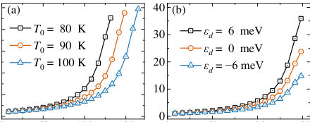
<figcaption class="paper-figure-caption"><b>Fig 4.</b> FIG. 4. (a) Rectification ratio η as a function of −∆T for different T0 with µL = 1 meV and εd = 0. (b) η as a function of −∆T for different εd with T0 = 90 K and µL = 1 meV.</figcaption>
</figure>

**Main problem.** Investigating the generation and control of spin currents via the phonon-mediated Spin Seebeck Effect (SSE) in a normal-metal-chiral-insulator heterostructure.

**Main result.** The study identifies two nonlinear phenomena: negative differential SSE, where increasing thermal bias decreases spin current, and spin-current rectification, which enables a thermally controlled spin diode.

**Method.** The authors utilize the nonequilibrium Green's function (NEGF) formalism to calculate spin transport and solve for Green's functions and phonon self-energies self-consistently.

**Summary.** This paper explores how the angular momentum of chiral phonons can be converted into electron spin current in a metal-insulator heterostructure. By using the NEGF formalism, the authors demonstrate that this process can lead to unexpected nonlinear effects like negative differential spin Seebeck effect and spin-current rectification. These findings suggest that such structures could function as thermally controlled spin diodes. The work provides a theoretical foundation for developing new types of phonon-driven spintronic devices.

Detailed structure

**Model / system.** A two-terminal heterostructure consisting of a normal metal (NM) and a chiral insulator (CI), where the central region is modeled as a quantum dot with spin-microrotation coupling between electrons and chiral phonons.

**Key observables.** Spin current (Is) in the left lead and the rectification ratio (eta).

**Important parameters / regimes.** Thermal bias (delta T), average temperature (T0), chemical potential (muL), on-site potential (epsilon_d), and phonon coupling strength (alpha).

**Assumptions / limitations.** The central region is simplified to a quantum dot model to capture essential physics, and the phonon reservoir is modeled using a super-Ohmic spectral density.

**Figures summary.** Fig 1 shows device schematics for phonon-to-spin conversion; Fig 2 illustrates spin current dependence on thermal bias, chemical potential, and interfacial potential; Fig 3 plots effective spectral and spin current densities; Fig 4 shows the rectification ratio.

**Paper structure.** The paper introduces the physical mechanism of phonon-mediated SSE, presents the theoretical NEGF framework, analyzes the effects of various parameters (bias, chemical potential, interface), identifies nonlinear transport phenomena, and concludes with implications for spintronic devices.

Abstract

Phonons can carry angular momentum and exhibit chirality through the circular polarization of atomic motion. This enables a phonon-mediated spin Seebeck effect (SSE) via the conversion of phonon angular momentum into electron spin angular momentum. In this Letter, we develop a theoretical framework for calculating the spin current in a normal-metal (NM)-chiral-insulator (CI) heterostructure within the nonequilibrium Green's function formalism. We discuss the influence of (i) the thermal bias across the NM-CI interface, (ii) the chemical potential of the NM, and (iii) the insertion of an additional interfacial layer, on the spin transport properties. We identify two remarkable nonlinear spin transport phenomena: negative differential SSE and spin-current rectification. The negative differential SSE arises from the competition between the thermal bias and the thermally excited electron density. The spin-current rectification suggests the possibility of realizing a thermally controlled spin diode. We also find that the spin transport behavior is closely associated with an effective interfacial spectral density. This work provides a novel route toward thermally controlled spintronic devices using chiral phonons.

[↑ back to top](#top)

### [Crystalline metal flakes: Platforms for advanced plasmonics and hybrid 2D material architectures](http://arxiv.org/abs/2604.22988v1)

**Authors:** Sergejs Boroviks, Siarhei Zavatski, Thorsten Feichtner, Jer-Shing Huang, Olivier J. F. Martin, Bert Hecht, N. Asger Mortensen  
**Type:** both · **Category:** other · **PDF:** <https://arxiv.org/pdf/2604.22988v1>  
**Analysis basis:** full PDF text, analyzed in chunks
**Topic relevance:** `quantum optics experiment` **2/5** · `interference shaping light` **1/5**

↔ Scroll figures horizontally

<figure class="paper-figure-card">
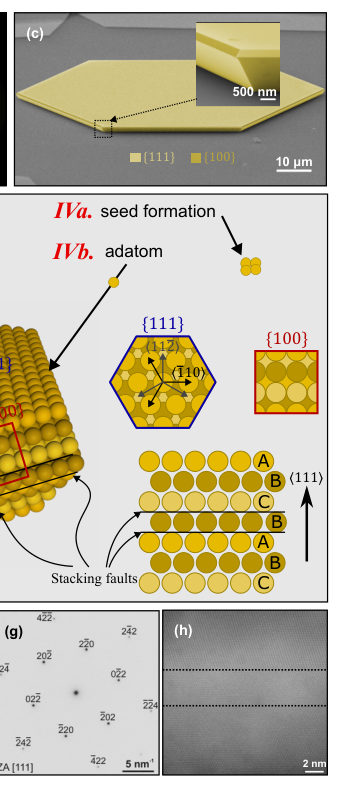
<figcaption class="paper-figure-caption"><b>Fig 1.</b> Fig. 1. Morphology and crystal structure of Au flakes. (a) Bright-field, (b) dark-field optical micrographs and (c) 75-degree tilted view SEM of a typical Au flake sample; the inset in (c) shows a close-up of the indicated corner of the flake. (d) A schematic drawing of an Au flake morphology, exhibiting a typical distribution of the two lattice planes, {100} and {111}-type, as side facets. Additionally, stacking fault defects in the middle are illustrated. Growth model: I-III Chemical reactions leading to the reduction of Au atoms that can form crystal seeds (IVa) or bind to the surface of an already existing crystal (IVb). (e) TEM image of a small flake sample. (f) High-resolution TEM...</figcaption>
</figure>
<figure class="paper-figure-card">
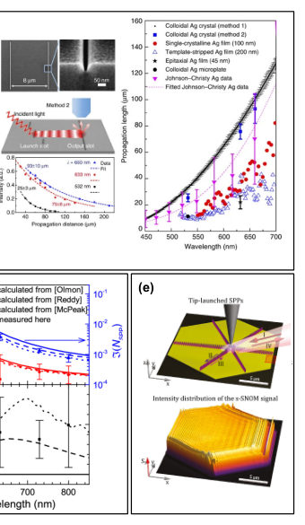
<figcaption class="paper-figure-caption"><b>Fig 2.</b> Fig. 2. Linear optical properties of crystalline flakes measured using far-field techniques (a–c) and using SNOM (d,e). (a) Micro-ellipsometry measurements of the complex permittivity of a thin Au flake in comparison with measurements on a bulk crystal from Olmon et al. [131]. (b) Excitation and scattering of a SPP from the edges of an Ag flake. (c) illustration of the SPP propagation length measurement on a surface of an Ag flake with milled in- and out-coupling slits using (left top) white light interference and (left bottom) direct laser excitation and scattering; (right) comparison of these measurements against other experimental reports. SNOM measurements of SPP propagating on an Au...</figcaption>
</figure>
<figure class="paper-figure-card">
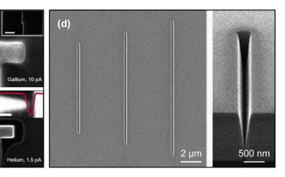
<figcaption class="paper-figure-caption"><b>Fig 3.</b> Fig. 3. Comparison of Ga and He FIB milling-based fabrication in poly- and monocrys- talline Au nanostructures. (a) (top) Plasmonic waveguides and (bottom) bull’s eye resonator and (b) V-grooves fabricated with Ga ion FIB. (c) He ion milling of fine fea- tures (asymmetric gap antenna) in a blank predefined with Ga FIB. (d) He ion-polished V-groove plasmonic waveguides premilled with Ga FIB. (a) Reprinted with permission from Ref. [11], (b) from Ref. [28], (c) from Ref. [150], and (d) from Ref. [149].</figcaption>
</figure>
<figure class="paper-figure-card">
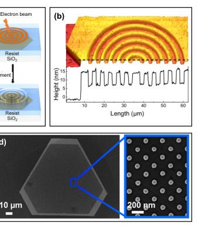
<figcaption class="paper-figure-caption"><b>Fig 4.</b> Fig. 4. Examples of EBL-based fabrication of crystalline nanostructures. (a) Typical fabrication process flow for EBL-based nanofabrication with crystalline Au flakes. (b) AFM image of an Au flake patterned with a concentric ring shape using method shown in (a) and cysteamine as an etchant; lower part of the panel shows a profile along the indicated dashed. (c) SEM and (d) dark-field optical microscope images of crystalline Au nanoantenna arrays fabricated using EBL and RIE. (e) SEM image of a crystalline Au nanodisk array fabricated using EBL and IBE. (a,b) Reprinted with permission from Ref. [76], (c,d) from Ref. [153], and (e,f) from Ref. [174].</figcaption>
</figure>
<figure class="paper-figure-card">
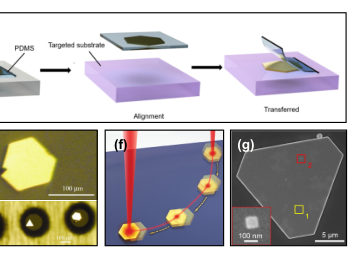
<figcaption class="paper-figure-caption"><b>Fig 5.</b> Fig. 5. Examples of crystalline flake micromanipulation. (a) Schematic diagram of Au flake transfer from a glass onto another substrate using PDMS stamp. (b) Planar gap plasmon waveguide comprised of Au flake transferred atop of another flake with a dielectric spacer; inset shows a close-up SEM image of the coupling structure FIB-milled in the lower flake. (c) Integration of Au flake with optical fiber for a background-free excitation of plasmonic nanocavities by the evanescent fields: inset shows an Au flake transferred on the core of an angled fibered tip. (d) Exfoliated hBN flake placed atop of an Au flake. (e) Manipulation of Au flake using a pin (top) and Au flakes placed in...</figcaption>
</figure>
<figure class="paper-figure-card">
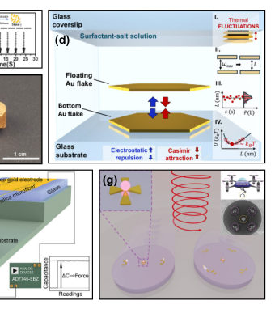
<figcaption class="paper-figure-caption"><b>Fig 6.</b> Fig. 6. Selected application examples of monocrystalline flakes in nano- and micro- devices. (a) Micrograph of stretchable and bendable electrodes deposited on &quot;Ecoflex&quot; substrates; inset shows close-up SEM image of the indicated area. (b) Au flakes as a force sensor: (right) plot shows variation of in-plane electric resistance of the film upon finger touch or air nozzle blow, insets illustrate applied stimuli, and (right) schematically depict deformation of the sample upon applied mechanical force. (c) Photograph of an amyloid fibril-based ultralow-density aerogel; inset shows close-up SEM image revealing porous composition of the sample. (d) Casimir self-assembly of a pair of Au flakes...</figcaption>
</figure>
<figure class="paper-figure-card">
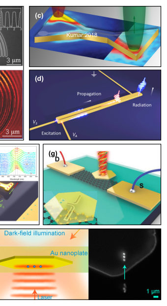
<figcaption class="paper-figure-caption"><b>Fig 7.</b> Fig. 7. Selected application examples of monocrystalline flakes in nano- and micro- devices. (a) Plasmonic two-wire transmission lines for mode conversion: SEM image (left), scattering diagrams (top) and far-field scattering images (bottom) for orthogonal polarization excitations. (b) SEM image (top) and SNOM scan (bottom) of broadband plasmonic logic gates based on curved gratings. (c) Schematic illustration of an on-chip all-optical information processing device: directional signal transmittance mediated by 2D plasmonic eigenmodes supported by crystalline cavities. (d) Electrically-modulated two-wire transmission line allows excitation of distinct propagating modes. (e) Pseudo- colored...</figcaption>
</figure>
<figure class="paper-figure-card">
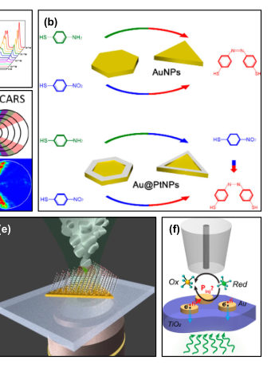
<figcaption class="paper-figure-caption"><b>Fig 8.</b> Fig. 8. Selected application examples of monocrystalline flakes in bio and chemical sensing, and catalysis. (a) Ultraspecific attomolar detection of C-reactive protein biomarkers. Flowchart shows immobilization process and graph on the right hand- side show SERS spectra of rhodamine B isothiocyanate, which is bound to the Au nanoparticles, and serves as a marker (SERS nanotag). (b) Photocatalytic conver- sion of 4-aminothiophenol and 4-nitrobenzenethiol on bare Au flakes (top) and on Pt-coated flakes (bottom). (c) Plasmonic Doppler gratings for surface-enhanced coherent anti-Stokes Raman scattering. (d) Detection of SARS-CoV-2 DNA and RNA sequences using Au flakes functionalized with...</figcaption>
</figure>
<figure class="paper-figure-card">
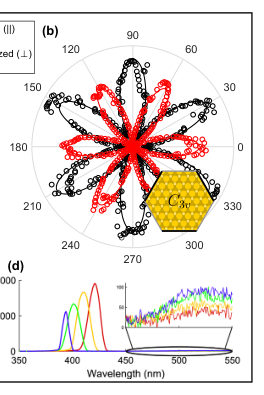
<figcaption class="paper-figure-caption"><b>Fig 9.</b> Fig. 10. Anisotropic SHG from crystalline Au surface. (a,b) Polar plot of second- harmonic intensity as a function of crystal orientation angle for co-polarized (black) and cross-polarized (red) signals at polycrystalline surface (a) and {111}-type surface (b). Insets in (a,b) show schematic diagrams of the first few layers of atom arrangements at the two types of surfaces. (c,d) Spectrum of the nonlinear reflection from polycrystalline surface (c) and {111}-type surface (d). The inset in (d) shows a zoom-in of the measured NPL spectral region (450–550 nm). Curve colors indicate excitation wavelength: 780 nm (blue), 800 nm (green), 820 nm (yellow), and 840 nm (red). Reprinted with...</figcaption>
</figure>
<figure class="paper-figure-card">
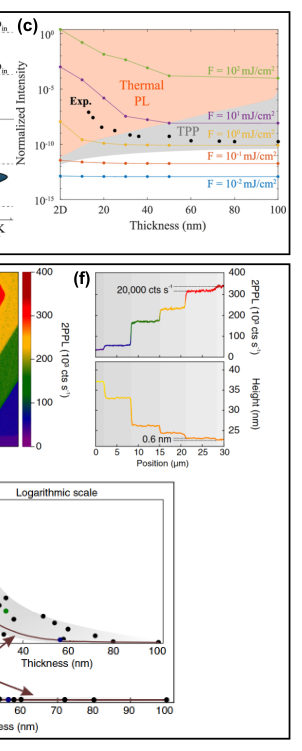
<figcaption class="paper-figure-caption"><b>Fig 10.</b> Fig. 11. Nonlinear photoluminescence from Au flakes. (a) Illustration of an Au {111}-type illuminated by a femtosecond Gaussian pulse, along with the resulting nonlinear photoluminescence. (b) Dynamics of the occupied density of electronic states upon optical excitation. From the equilibrium state at room temperature, electrons are promoted to higher energy levels, and the associated holes are subsequently filled by emitting photons with different energies (colored curves). Once the pulse is gone, after a transient time of the order of tens of femtoseconds, the electronic states reach thermal equilibrium at a higher temperature than initially. (c) Nonlinear photoluminescence as a function...</figcaption>
</figure>

**Main problem.** Addressing the limitations of conventional polycrystalline metal films, such as high Ohmic losses and surface roughness, by utilizing crystalline metal flakes for advanced plasmonics and hybrid 2D material architectures.

**Main result.** Crystalline metal flakes provide superior structural definition and reduced scattering, enabling enhanced plasmonic performance, precise nanostructuring via FIB/EBL, and effective integration with 2D materials.

**Method.** The paper reviews chemical synthesis methods (polyol, Brust-Schiffrin, etc.), nanofabrication techniques (FIB, EBL, etching), and characterization tools (SEM, TEM, SNOM, ellipsometry).

**Summary.** This review examines the emergence of crystalline metal flakes as a superior alternative to traditional polycrystalline films for nanophotonics. It highlights how their high crystallinity and atomic flatness reduce optical losses and enable precise nanostructuring. The paper covers various chemical synthesis routes, fabrication methods like FIB and EBL, and the integration of these flakes with 2D materials. Ultimately, it positions these flakes as essential platforms for advanced applications in sensing, optoelectronics, and quantum plasmonics.

Detailed structure

**Model / system.** The primary system consists of quasi-monocrystalline noble metal flakes (Au, Ag, Al, Cu) characterized by atomically flat surfaces, well-defined {111} facets, and stacking faults.

**Key observables.** Surface Plasmon Polariton (SPP) propagation length, complex permittivity, surface roughness, aspect ratio, and nonlinear optical responses.

**Important parameters / regimes.** Thickness (from ~1.9 nm to >1 um), lateral size (up to ~250 um), and crystal facets ({111} vs {100}).

**Assumptions / limitations.** The flakes are treated as quasi-monocrystals due to the presence of twin planes/stacking faults required for anisotropic growth.

**Figures summary.** Fig 1: Morphology and crystal structure of Au flakes; Fig 2: Linear optical properties and SPP propagation; Fig 3: Comparison of Ga-FIB vs He-FIB milling quality; Fig 4: EBL fabrication flow and patterned nanostructures; Fig 5: Examples of micromanipulation techniques.

**Paper structure.** The review begins by contrasting polycrystalline vs. crystalline films, moves to the structural and chemical synthesis of flakes, discusses fabrication and nanostructuring techniques, explores integration with 2D materials, and concludes with future prospects.

**Why it may be interesting.** The paper is highly relevant to quantum optics and nanophotonics due to its discussion on quantum plasmonics, nonclassical light generation, and the manipulation of light-matter interactions in hybrid architectures.

Abstract

Crystalline noble metal flakes are emerging as versatile platforms in nanophotonics, enabling a broad range of optical phenomena and applications. Their atomically flat surfaces, high crystallinity, and superior optical quality open new avenues in advanced plasmonics, quantum light generation, and hybrid photonic systems. In contrast to conventional polycrystalline metal films, which typically suffer from higher optical losses due to grain boundaries, surface roughness, and structural disorder, these monocrystalline flakes provide minimal scattering and enhanced performance. They serve as templates for precise nanostructuring through techniques like focused-ion beam (FIB) milling and are crucial for advanced applications in sensing and optoelectronics. Additionally, they facilitate frontier research in quantum plasmonics, enabling fundamental studies of nonlocal optical effects and the generation of nonclassical light. Furthermore, the well-defined $\{111\}$ facets of these flakes host Tamm--Shockley surface states that support 2D plasmons coexisting with bulk modes. At near-infrared wavelengths and beyond, crystalline flakes act as nearly ideal metallic mirrors, featuring surface roughness limited only to atomic terrace steps, making them highly suitable for integration with 2D materials in hybrid photonic architectures. This review surveys the key roles these flakes play, highlighting recent developments and discussing future prospects while emphasizing their unique benefits in addressing fundamental and applied challenges in modern nanophotonics.

[↑ back to top](#top)

### [Accelerating Quantum Materials Characterization: Hybrid Active Learning for Autonomous Spin Wave Spectroscopy](http://arxiv.org/abs/2604.23821v1)

**Authors:** William Ratcliff  
**Type:** both · **Category:** disordered systems and neural networks · **PDF:** <https://arxiv.org/pdf/2604.23821v1>  
**Analysis basis:** full PDF text, analyzed in chunks
**Topic relevance:** `spintronics-quantum-optics interface` **2/5**

↔ Scroll figures horizontally

<figure class="paper-figure-card">
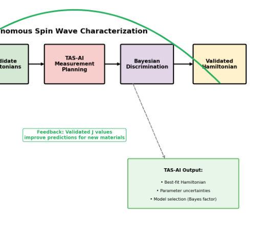
<figcaption class="paper-figure-caption"><b>Fig 1.</b> Figure 1: Hybrid TAS-AI workflow. The controller begins with agnostic Log-GP mapping to localize signal, hands off to physics-informed discrimina- tion/refinement once structure is detected, and uses motion-aware sequencing to optimize wall-clock time. An optional constrained audit layer can request targeted falsification probes under the same kinematic and safety constraints enforced by the numerical planners.</figcaption>
</figure>
<figure class="paper-figure-card">
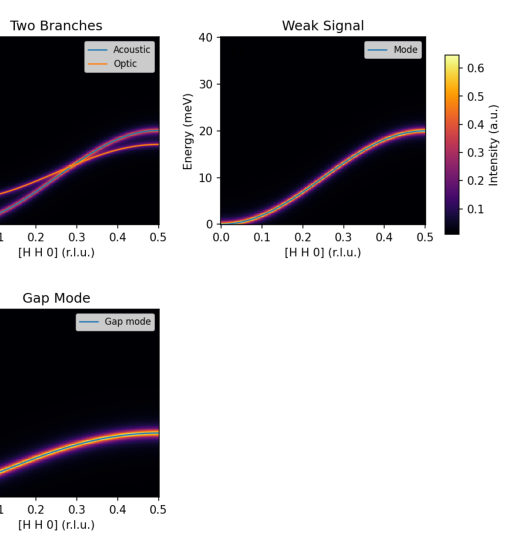
<figcaption class="paper-figure-caption"><b>Fig 2.</b> Figure 2: Synthetic benchmark scenarios used to test discovery-oriented behav- ior: single branch, two branches, weak signal, sharp feature, and gap mode.</figcaption>
</figure>
<figure class="paper-figure-card">
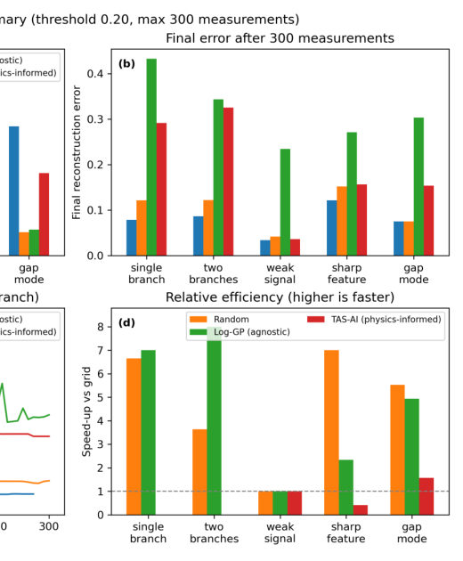
<figcaption class="paper-figure-caption"><b>Fig 3.</b> Figure 3: Analytic blind-reconstruction benchmarks. Agnostic methods are favored by the global reconstruction metric because they are optimized for dis- covery rather than for parameter inference.</figcaption>
</figure>
<figure class="paper-figure-card">
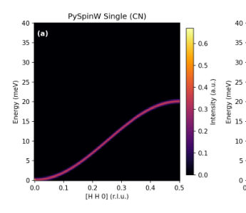
<figcaption class="paper-figure-caption"><b>Fig 4.</b> Figure 4: PySpinW ground-truth benchmarks with Cooper–Nathans-derived energy broadening. Panels (a) and (b) show the two benchmark surfaces. Panel (c) reports mean final weighted reconstruction error after 300 measurements, with individual seed values overlaid. Under this stricter realism-heavy whole- window benchmark, none of the methods reaches the 0.20 threshold within budget; enhanced Log-GP is competitive with grid on the gapless case and performs best on the gapped case, while physics-only TAS-AI performs poorly on this blind global-mapping objective.</figcaption>
</figure>
<figure class="paper-figure-card">
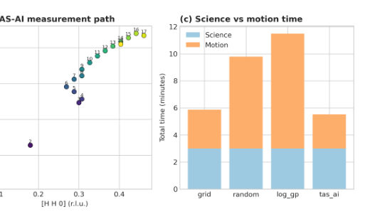
<figcaption class="paper-figure-caption"><b>Fig 5.</b> Figure 5: Controlled time-aware parameter-refinement study for the square- lattice ferromagnet. Once the model family is fixed, the motion-aware physics- informed planner reaches the RMS threshold earliest by prioritizing parameter- sensitive measurements with high information rate. Panel (a) shows RMS er- ror versus elapsed experiment time, panel (b) shows the TAS-AI path through (𝐻, 𝐸) space, and panel (c) separates science counting from motion overhead. In the representative run shown here, TAS-AI reaches threshold in 170 s while the random baseline does so only after 542 s; grid and Log-GP do not converge within the same budget.</figcaption>
</figure>
<figure class="paper-figure-card">
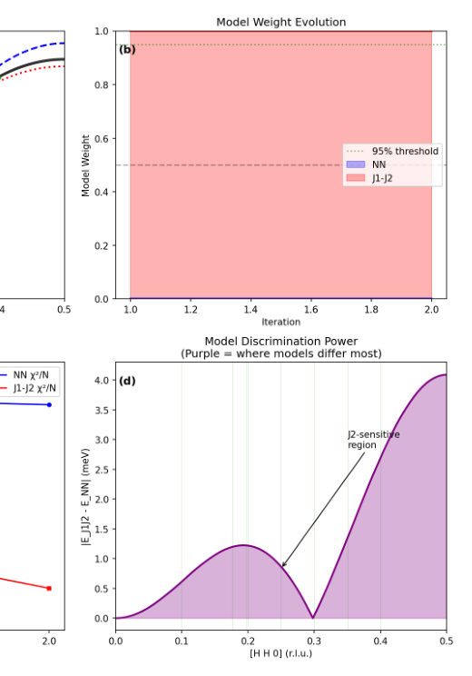
<figcaption class="paper-figure-caption"><b>Fig 6.</b> Figure 6: In-loop Hamiltonian discrimination. The x-axis counts cumulative measurements, including the seeded points used to initialize the comparison; thus the decisive jump occurs within eight total measurements rather than eight post-seed updates. The AIC-derived evidence ratio becomes decisive in the representative run because the planner targets the regions where the competing dispersions diverge most strongly. In panel (d), the green vertical guides mark the measurement locations used for the corresponding discrimination trace.</figcaption>
</figure>
<figure class="paper-figure-card">
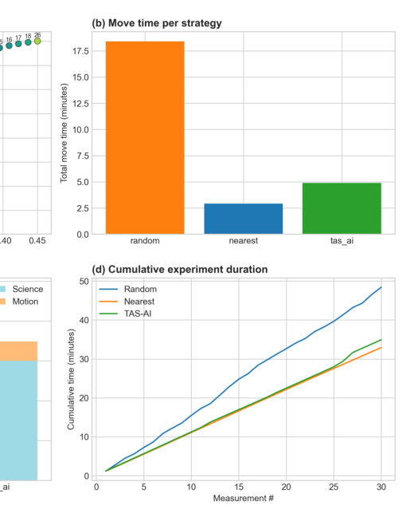
<figcaption class="paper-figure-caption"><b>Fig 7.</b> Figure 7: Controlled motion-aware scheduling diagnostics on a fixed candidate set. Panel (a) shows the fixed candidate measurements colored by their posi- tion in the executed schedule, so the color scale encodes traversal order rather than intensity. Panels (b)-(d) then separate the corresponding cumulative path length, elapsed time, and per-point timing summaries. The figure is intended as a scheduling diagnostic, not as a second benchmark of adaptive discovery.</figcaption>
</figure>
<figure class="paper-figure-card">
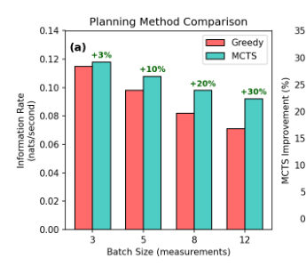
<figcaption class="paper-figure-caption"><b>Fig 8.</b> Figure 8: MCTS batch planning reduces path inefficiency relative to one-step greedy ordering when motion dominates the cost budget.</figcaption>
</figure>
<figure class="paper-figure-card">
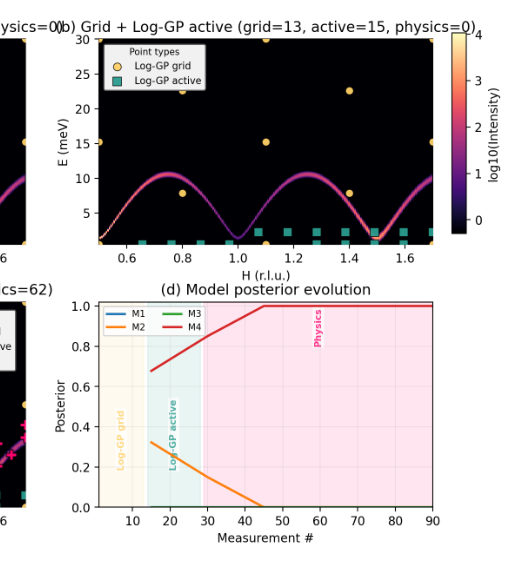
<figcaption class="paper-figure-caption"><b>Fig 9.</b> Figure 9: Hybrid handoff from agnostic discovery to physics-informed inference. The agnostic front end uses the enhanced Log-GP policy (§3.1). In panel (d), the colored vertical bands mark the contiguous controller phases: coarse grid discovery, active Log-GP remapping, and physics-informed refinement. The figure makes the control transition explicit rather than mixing all points into a single trajectory.</figcaption>
</figure>
<figure class="paper-figure-card">
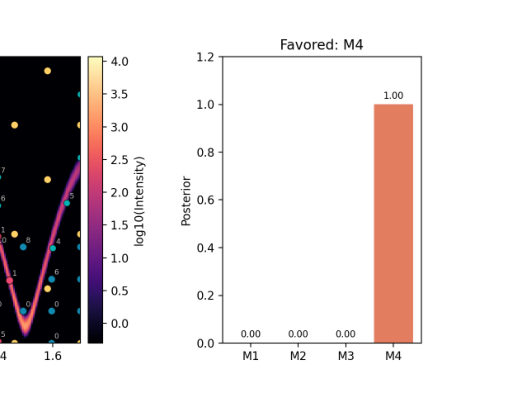
<figcaption class="paper-figure-caption"><b>Fig 10.</b> Figure 10: Pilot LLM-audited closed-loop run (90 measurements). The left panel shows the executed measurements over the synthetic intensity map, with enhanced Log-GP grid, enhanced Log-GP active, and physics points shown sep- arately. The right panel shows the final model posteriors. The overseer operates only at the routing layer while preserving the same numerical posteriors, kine- matic constraints, and safety checks as the non-LLM loop.</figcaption>
</figure>

**Main problem.** The challenge of automating neutron spectroscopy, specifically balancing the tasks of signal detection, Hamiltonian inference, and parameter refinement while avoiding 'algorithmic myopia' where a controller over-refines an incorrect model.

**Main result.** The TAS-AI framework successfully uses a hybrid agnostic-to-physics-informed workflow to accelerate characterization, reducing wall-clock time by 32% and using an LLM-based audit layer to prevent model lock-in.

**Method.** A hybrid active learning framework (TAS-AI) combining Log-Gaussian Process mapping for discovery, physics-informed planning for refinement, and an LLM-based 'audit committee' for strategic falsification.

**Summary.** This paper presents TAS-AI, an autonomous framework designed to accelerate the characterization of quantum materials via neutron spectroscopy. It addresses the inefficiency of using a single controller for all experimental tasks by proposing a hybrid approach: model-agnostic methods for initial signal discovery and physics-informed methods for parameter refinement. The authors also introduce an LLM-based audit layer to prevent the system from getting stuck on incorrect physical models. The framework demonstrates significant reductions in experimental wall-clock time and improved robustness in model selection.

Detailed structure

**Model / system.** The study uses a high-fidelity digital twin of a Triple-Axis Spectrometer (TAS) to simulate spin-wave spectroscopy on square-lattice magnetic systems, including ferromagnetic and antiferromagnetic Hamiltonians with J1-J1 and anisotropy parameters.

**Key observables.** Momentum-energy coordinates (Q, E), intensity (I), uncertainty (sigma), and AIC-derived evidence ratios for model selection.

**Important parameters / regimes.** Exchange constants (J1, J2), anisotropy (D), motor speeds (v_H, v_E), and counting time (t).

**Assumptions / limitations.** The framework relies on fast Laplace/Levenberg-Marquardt approximations for real-time decision-making and assumes the use of a digital twin for validation.

**Figures summary.** Figure 1 illustrates the TAS-AI workflow stages; Figure S1 shows the effect of energy tapering on edge-locking; Figure 9 shows the transition between controller phases.

**Paper structure.** The paper introduces the TAS-AI framework, details the three-stage hybrid workflow (agnostic discovery, physics-informed refinement, and strategic audit), presents benchmarks on model discrimination and parameter accuracy, discusses the mitigation of algorithmic myopia via LLMs, and concludes with software implementation details.

Abstract

Autonomous neutron spectroscopy must solve three distinct tasks: detection (where is the signal?), inference (which Hamiltonian governs it?), and refinement (what are the parameters?). No single controller solves all three equally well. We present TAS-AI, a hybrid agnostic-to-physics-informed framework for autonomous triple-axis spin-wave spectroscopy that separates these tasks explicitly. In blind reconstruction benchmarks, model-agnostic methods such as random sampling, coarse grids, and Gaussian-process mappers reach a global error threshold more reliably and with fewer measurements than physics-informed planning, supporting the claim that discovery and inference are distinct tasks requiring distinct controllers. Once signal structure is localized, the physics-informed stage performs in-loop Hamiltonian discrimination and parameter refinement: in a controlled square-lattice test between nearest-neighbor-only and J1-J2 Hamiltonians, TAS-AI reaches a decisive AIC-derived evidence ratio (>100) in fewer than 10 measurements, while motion-aware scheduling cuts wall-clock time by 32% at a fixed measurement budget. We also identify a failure mode of posterior-weighted design, algorithmic myopia, in which the planner over-refines the current leading model while under-sampling low-intensity falsification probes. A constrained falsification channel sharply reduces time spent committed to the wrong model and accelerates correct model selection without modifying the Bayesian inference engine. In controlled two-model ablations, both a deterministic top-two max-disagreement rule and an LLM-based audit committee achieve this gain under identical constraints. We demonstrate the full workflow in silico using a high-fidelity digital twin and provide an open-source Python implementation.

[↑ back to top](#top)

### [Emergence of dual axion response in condensed matter](http://arxiv.org/abs/2604.23186v1)

**Authors:** Elina Kokurina, Dmitry Vagin, Eduardo Barredo-Alamilla, Maxim A. Gorlach  
**Type:** theory · **Category:** strongly correlated electrons · **PDF:** <https://arxiv.org/pdf/2604.23186v1>  
**Analysis basis:** full PDF text, analyzed in chunks
**Topic relevance:** `spintronics-quantum-optics interface` **2/5**

↔ Scroll figures horizontally

<figure class="paper-figure-card">
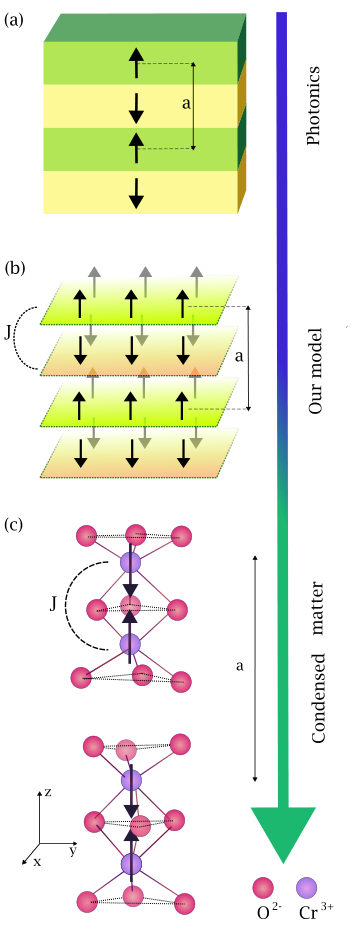
<figcaption class="paper-figure-caption"><b>Fig 1.</b> FIG. 1. Hierarchy of the models featuring nonreciprocal magneto-electric effect. (a) Multilayered metamaterial com- posed of gyrotropic layers with out-of-plane magnetization features axion [22] or dual axion [31] response depending on the properties of the layers. (b) Our simplified model of the spin lattice with antiferromagnetic exchange coupling between the spins in the neighboring layers. (c) Realistic condensed matter structure Cr2O3 featuring an antiferromag- netic arrangement of Cr spins [32] and promising for observing dual axion response.</figcaption>
</figure>
<figure class="paper-figure-card">
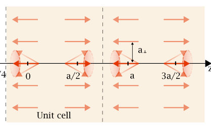
<figcaption class="paper-figure-caption"><b>Fig 2.</b> FIG. 2. Geometry of antiferromagnetic spin lattice and choice of the material boundary in the effective medium description.</figcaption>
</figure>
<figure class="paper-figure-card">
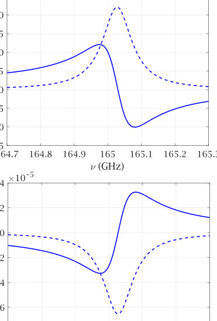
<figcaption class="paper-figure-caption"><b>Fig 3.</b> FIG. 3. Calculated material parameters of Cr2O3 at fre- quencies close to magnon resonance. The parameters are a = 1.359 nm, a⊥ = 0.496 nm, s = 3/2, g = 2.0, ℏKeff/(2π) = 21.9 GHz, ℏJ/(2π) = 58.1 GHz [40] and α = 2.2 · 10−4 [41]. Magnon resonance frequency is 165 GHz. (a) Permeability. (b) Dual axion response. Solid and dashed lines indicate real and imaginary parts, respectively.</figcaption>
</figure>
<figure class="paper-figure-card">
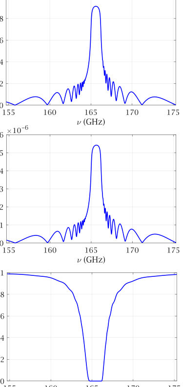
<figcaption class="paper-figure-caption"><b>Fig 4.</b> FIG. 4. Reflection and transmission properties of a finite slab of model antiferromagnetic structure resembling Cr2O3 calculated in the effective medium approximation. The total number of periods N = 2.0 · 107, permittivity ε = 1. (a) Co- polarized reflection. (b) Cross-polarized reflection. (c) Co- polarized transmission. Cross-polarized transmission vanishes identically.</figcaption>
</figure>
<figure class="paper-figure-card">
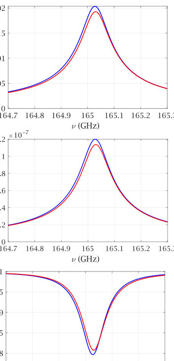
<figcaption class="paper-figure-caption"><b>Fig 5.</b> FIG. 5. Reflection and transmission properties of a finite slab of model antiferromagnetic structure resembling Cr2O3 calculated via effective medium model (solid blue lines) and discrete dipole method (solid red lines). The total number of periods is N = 800, while the remaining parameters are the same as in Fig. 4.</figcaption>
</figure>
<figure class="paper-figure-card">
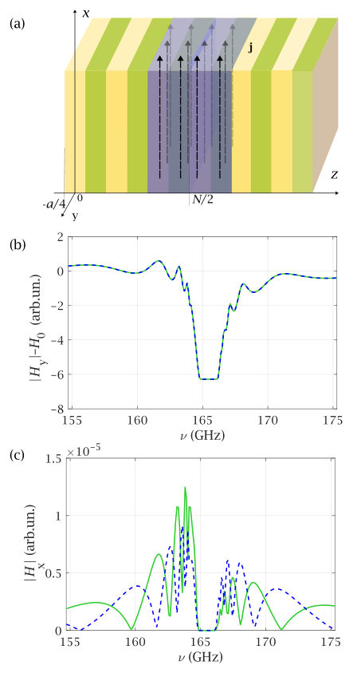
<figcaption class="paper-figure-caption"><b>Fig 6.</b> FIG. 6. Probing the type of nonreciprocal magneto-electric effect by the external sources. (a) Geometry of excitation of antiferromagnetic spin lattice. (b,c) Co- and cross-polarized components of magnetic field produced by the planar cur- rent source. The magnetic field is presented in the arbitrary units. H0 denotes the magnetic field of a planar current in vacuum. Green and blue dashed lines correspond to the effec- tive medium calculation for axion and dual axion responses, respectively. Parameters of the simulation match those in Fig. 4.</figcaption>
</figure>
<figure class="paper-figure-card">
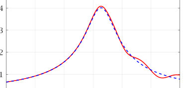
<figcaption class="paper-figure-caption"><b>Fig 7.</b> FIG. 7. Cross-polarized component of magnetic field created by the current exciting our model antiferromagnetic structure consisting of N = 800 periods. Solid red line shows the re- sult of the discrete dipole model. Predictions of the effective medium model for the materials with axion or dual axion re- sponse are shown by the blue dashed and green solid lines, respectively. Parameters of the simulation match those in Fig. 5, magnetic field is shown in the arbitrary units having the same scale in all three cases.</figcaption>
</figure>

**Main problem.** Investigating whether the recently predicted dual axion response, a nonreciprocal magneto-electric effect involving magnetic charge, can emerge in condensed matter systems like antiferromagnets rather than just in engineered metamaterials.

**Main result.** The authors prove that a periodic antiferromagnetic spin lattice exhibits an emergent dual axion response, which can be distinguished from the conventional axion response by analyzing the frequency dependence of polarization rotation from an internal current source.

**Method.** The study uses linear response theory, the semi-classical Landau-Lifshitz-Gilbert (LLG) equation, and the Discrete Dipole Approximation (DDA) for numerical validation, alongside an effective medium approach.

**Summary.** This paper investigates the emergence of a 'dual axion response' in condensed matter systems, specifically antiferromagnetic spin lattices. While previously predicted for metamaterials, the authors demonstrate that realistic materials like Cr2O3 can host this effect. They show that while standard scattering experiments cannot distinguish between conventional and dual axion responses, internal excitation probes can. This work proposes a new way to identify nonreciprocal magneto-electric coupling in solids.

Detailed structure

**Model / system.** A periodic antiferromagnetic spin lattice (e.g., Cr2O3 or MnBi2Te4) with Heisenberg-type exchange coupling, magnetic anisotropy, and dipole-dipole interactions.

**Key observables.** Axion coefficients (chi and dual axion chi-tilde), effective permeability, reflection and transmission coefficients (r_xy, t_xy), and polarization rotation (Ey/Ex).

**Important parameters / regimes.** Lattice period-to-wavelength ratio (xi), magnon resonance frequency, exchange constants (J, J_perp), and anisotropy (K).

**Assumptions / limitations.** Effective medium limit (subwavelength regime), linearized spin dynamics, neglect of spatial dispersion, and neglect of transverse exchange coupling.

**Figures summary.** Figure 1 compares metamaterials to spin lattices; Figure 2/3 show the lattice geometry and calculated material parameters for Cr2O3; Figure 4/5/6/7 show reflection/transmission properties and the diagnostic comparison between axion and dual axion models using simulated current sources.

**Paper structure.** The paper establishes a hierarchy from metamaterials to spin lattices, derives effective electromagnetic properties from the LLG equation, validates the dual axion emergence via numerical simulations, and provides a diagnostic recipe for experimental identification.

**Why it may be interesting.** The discovery of a dual axion response in natural solids suggests a new topological phase or invariant in condensed matter and provides a method to probe broken symmetries using internal radiation sources.

Abstract

Recently, it was predicted that nonreciprocal magneto-electric effect in antiferromagnetic multilayered metamaterials occurs in two distinct versions. One is the conventional axion response, while another one is dual axion response captured by electrodynamics with magnetic charge. Here we investigate a model condensed matter system of spins coupled through antiferromagnetic exchange interaction and derive its effective electromagnetic properties. We predict that this system gives rise to the emergent dual axion field, support our conclusion by numerical simulations and put forward candidate materials.

[↑ back to top](#top)

### [Modeling the Zero-Phonon Line of Strained SnV Centers in Diamond; Including Reflections on Computational Cost and Accuracy](http://arxiv.org/abs/2604.23715v1)

**Authors:** Danny E. P. Vanpoucke  
**Type:** theory · **Category:** quantum information and computing · **PDF:** <https://arxiv.org/pdf/2604.23715v1>  
**Analysis basis:** full PDF text, analyzed in chunks
**Topic relevance:** `spintronics-quantum-optics interface` **2/5**

↔ Scroll figures horizontally

<figure class="paper-figure-card">
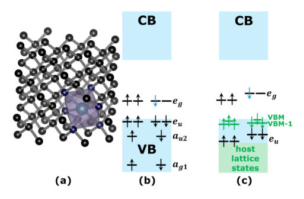
<figcaption class="paper-figure-caption"><b>Fig 1.</b> Figure 1. (a) Ball-and-stick representation of the local envi- ronment of the SnV color center. The Sn atom is shown in teal, and the six bonded C atoms are shown in dark blue. Together, these seven atoms are considered to represent the color center in diamond. (b) Schematic representation of the color center states according to group theory, and (c) their effective positioning as well as relevant states at the top of the valence band in practical DFT calculations.</figcaption>
</figure>
<figure class="paper-figure-card">
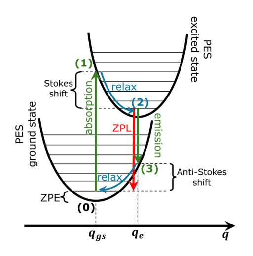
<figcaption class="paper-figure-caption"><b>Fig 2.</b> Figure 2. Schematic representation of the Franck–Codon ap- proximation of the ZPL of a color center.</figcaption>
</figure>

**Main problem.** Predicting the Zero-Phonon Line (ZPL) position and pressure coefficient of SnV color centers in diamond while evaluating the trade-off between computational accuracy and cost.

**Main result.** The SnV0 ZPL is predicted to be redshifted by ~43 nm relative to SnV-, and the pressure coefficient is found to be a robust observable at approximately 1.4 nm/GPa across different methods.

**Method.** First-principles Density Functional Theory (DFT) using PBE and HSE06 functionals, comparing the delta-KS and Franck-Condon approximations.

**Summary.** This paper investigates the optical properties of SnV color centers in diamond using first-principles calculations. It compares different DFT functionals and approximations to determine the accuracy of predicting the Zero-Phonon Line and its response to pressure. The study finds that while absolute ZPL positions are sensitive to the chosen method, the relative shift between charge states and the pressure coefficient are robust. These findings are crucial for the development of SnV-based quantum photonic devices.

Detailed structure

**Model / system.** Tin-Vacancy (SnV) color centers in diamond, specifically the neutral (SnV0) and negative (SnV-) charge states, modeled using large supercells (512 and 1000 atoms) to simulate dilute limits.

**Key observables.** Zero-Phonon Line (ZPL) position (nm/eV), pressure coefficient (nm/GPa), and Hirshfeld-I atomic charges.

**Important parameters / regimes.** Supercell size (0.195% and 0.100% concentrations), charge states (SnV0, SnV-), and hydrostatic strain levels (+/- 1%, +/- 2%).

**Assumptions / limitations.** The use of the delta-KS approximation assumes vertical excitations, while the Franck-Condon model assumes structural relaxation; absolute ZPL accuracy is limited by the inherent precision of DFT functionals.

**Figures summary.** Figure 1 shows the SnV local environment, symmetry-based energy level diagrams, and the positioning of Kohn-Sham states relative to the valence band.

**Paper structure.** The paper introduces the SnV system, details the DFT methodology and functional comparisons, presents results for ZPL positions and pressure coefficients, and concludes with a discussion on computational efficiency and accuracy.

**Why it may be interesting.** This work is highly relevant for quantum photonics and quantum information, as it provides essential spectroscopic parameters (ZPL and strain response) for SnV centers, which are promising candidates for scalable quantum networks.

Abstract

Among the group-IV vacancy color centers in diamond, the SnV holds promise for photonics based quantum applications. In this work, the Tin-Vacancy (SnV) zero-phonon line (ZPL) and its pressure coefficient are calculated using first principles approaches. The predicted absolute ZPL position is shown to be strongly influenced by the method and supercell size used. The results are therefore extrapolated to the dilute limit allowing for direct comparison with experiments. The importance of identifying the color-center related Kohn--Sham states is highlighted, as well as the shifting of these states due to electron excitations as well as supercell size and k-point position. In contrast to the absolute ZPL positions, the relative position of the SnV$^0$ ZPL is consistently redshifted about $43$ nm compared to the SnV$^-$ ZPL. In addition, the pressure coefficient is shown to be very robust over different methods, always resulting in a value of about $1.4$ nm/GPa, for both SnV$^0$ and SnV$^-$. Finally, the computational accuracy and cost are put into perspective.

[↑ back to top](#top)

### [Nitrogen doping induced metal-insulator transition with iso-symmetric character in rutile VO2](http://arxiv.org/abs/2604.24240v1)

**Authors:** Baichen Lin, Shanquan Chen, Yubo Zhang, Yangyang Si, Haoliang Huang, Chuanrui Huo, Frans Munnik, Yongqi Dong, Lu You, Jian Shao, Yu-Chieh Ku, Nguyen Nhat Quyen, Aryan Keshri, Zhenlin Luo, Weiwei Zhao, Chun-Fu Chang, Chih-Wei Luo, Sujit Das, Shiqing Deng, Chang-Yang Kuo, Zuhuang Chen  
**Type:** both · **Category:** strongly correlated electrons · **PDF:** <https://arxiv.org/pdf/2604.24240v1>  
**Analysis basis:** full PDF text, analyzed in chunks
**Topic relevance:** `non-equilibrium dynamics` **2/5**

↔ Scroll figures horizontally

<figure class="paper-figure-card">
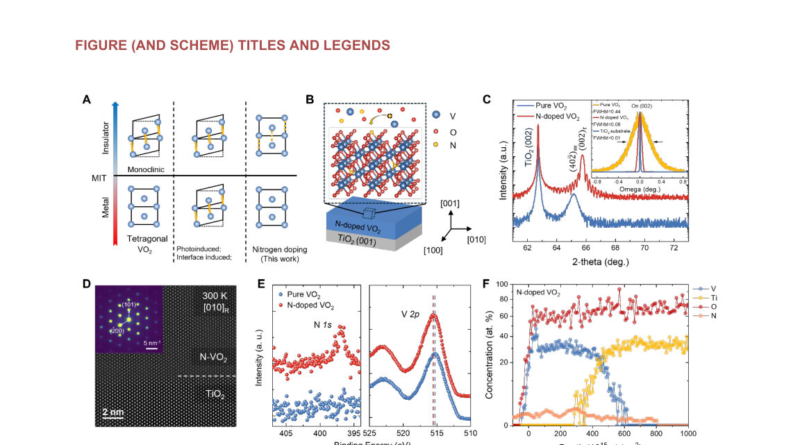
<figcaption class="paper-figure-caption"><b>Fig 1.</b> Figure 1. Fabrication of high-quality N-doped VO2 epitaxial thin films by reactive pulsed-laser deposited technique in N2-containing growth atmosphere. (A) Strategies for constructing an iso- symmetric phase transition in VO2 films. Left panel illustrates the conventional phase transition from metallic rutile to insulating monoclinic VO2. Middle panel shows the metallic monoclinic phase of VO2 induced by photon excitation or interfacial effects. Right panel demonstrates the rutile insulating phase induced by nitrogen doping. The yellow lines represent the existent (solid) and absent (dashed) V-V dimers, respectively. (B) Schematic illustration of nitrogen doping in rutile VO2, where...</figcaption>
</figure>
<figure class="paper-figure-card">
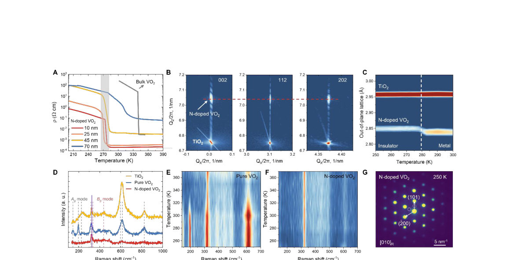
<figcaption class="paper-figure-caption"><b>Fig 2.</b> Figure 2. Iso-symmetric electronic phase transition in 25 nm-thick N-doped VO2 thin films. (A) Temperature-dependent electrical resistivity of N-doped VO2 thin films with thicknesses of 10 nm, 25 nm, 45 nm, and 70 nm. The grey band highlights the consistent MIT temperature (TMIT) for films up to 45 nm. The TMIT of bulk single-crystal VO2 (~340 K) is reproduced from ref. 38 with permission. Copyright 2007, Elsevier. (B) Room-temperature RSM of the N-doped VO2 thin film around the (002), (112), and (202) TiO2 reflections. The (002), (112), and (202) reflection peaks of the N-doped VO2 thin film show the same Qz value, which is highlighted via a red dashed line. (C) Temperature-dependent XRD...</figcaption>
</figure>
<figure class="paper-figure-card">
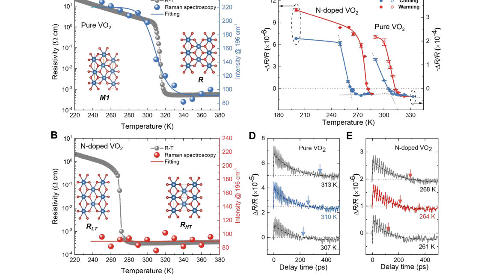
<figcaption class="paper-figure-caption"><b>Fig 3.</b> Figure 3. Enhanced MIT speed in 25 nm-thick N-doped VO2 thin films due to iso-symmetric phase transition. (A and B) Comparison of the temperature-dependent Raman spectroscopy and resistivity for (A) 25 nm-thick pure VO2 and (B) the 25 nm-thick N-doped VO2 thin films, highlighting the coupling behavior between SPT and MIT. (C to E) Ultrafast dynamics of pure VO2 and N-doped VO2 thin films. (C) Peak amplitude of the transient reflectivity change (R/R) spectra at 0 ps (see Figure S12) of pure VO2 and N- doped VO2 thin films with cooling and warming processes. The -R/R of the N-doped VO2 and pure VO2 thin films are plotted into the left and right Y-axis, respectively, which is indicated by...</figcaption>
</figure>
<figure class="paper-figure-card">
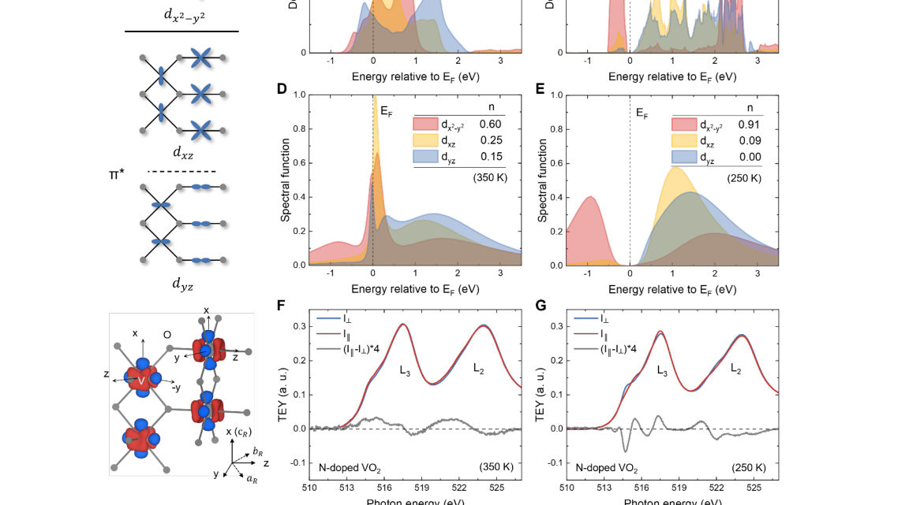
<figcaption class="paper-figure-caption"><b>Fig 4.</b> Figure 4. Orbital-dominated MIT in rutile VO2. (A) Schematics of orbital occupation behavior in rutile VO2. Top: Diagram of t2g orbitals, with 𝒅𝒙𝟐−𝒚𝟐 orbitals forming 𝒅|| band and 𝒅𝒙𝒛/𝒅𝒚𝒛 orbitals contributing to 𝝅∗ band. Site 1 is rotated 90˚ around the c-axis to align with Site 2. Bottom: Local coordinate system defining the d-orbitals on V atoms. Isosurfaces denote the electron redistribution during the metallic-to-insulating transition, expressed as ∆𝒏= 𝒏𝒊𝒏𝒔𝒖𝒍𝒂𝒕𝒐𝒓−𝒏𝒎𝒆𝒕𝒂𝒍, where red and blue indicate electron depletion and accumulation, respectively. (B, C) Electronic density-of-states for the (B) high- and (C) zero-temperature phases. (D, E) Spectral functions for phases at (D) 350 K...</figcaption>
</figure>

**Main problem.** The metal-insulator transition (MIT) in VO2 is typically coupled to a symmetry-lowering structural phase transition, which limits the switching speed and endurance of Mottronic devices. The study aims to achieve an iso-symmetric MIT where the electronic transition occurs without changing the crystal symmetry.

**Main result.** Nitrogen doping in VO2 thin films suppresses V-V dimerization, enabling an iso-symmetric, tetragonal-to-tetragonal MIT driven by a Mott mechanism. This transition exhibits faster switching kinetics compared to undoped VO2.

**Method.** The researchers used reactive pulsed laser deposition (PLD) for nitrogen doping, combined with structural characterization (XRD, STEM, Raman), chemical analysis (XPS, ERDA), and ultrafast time-resolved optical reflectivity. Theoretical validation was performed using DFT (r2SCAN) and DFT+DMFT.

**Summary.** This paper reports the successful engineering of an iso-symmetric metal-insulator transition in VO2 thin films through nitrogen doping. By substituting nitrogen into oxygen sites, the researchers suppressed the structural dimerization that usually accompanies the transition, maintaining tetragonal symmetry throughout. This approach results in faster electronic switching speeds and provides evidence for a Mott-driven, rather than Peierls-driven, transition. These findings are significant for developing high-performance, high-speed electronic and photonic 'Mottronic' devices.

Detailed structure

**Model / system.** Epitaxial VO2 thin films grown on (001) TiO2 substrates, where nitrogen ions (N3-) substitutionally replace oxygen (O2-) sites to induce p-type carrier density.

**Key observables.** Transition temperature (T_MIT), lattice parameters, carrier density, V-V dimerization, transient reflectivity (delta R/R), and orbital occupation (d_parallel and pi* bands).

**Important parameters / regimes.** Nitrogen doping concentration (~1%), transition temperature (~280 K), switching time (~207 ps for N-doped vs ~264 ps for pure VO2), and bandgap (~0.89 eV).

**Assumptions / limitations.** The study assumes the nitrogen is incorporated substitutionally at oxygen sites without significant interstitial presence or oxygen vacancies.

**Figures summary.** Figure 1 shows the fabrication strategy, N-doping schematic, and evidence of film quality via XRD and STEM. Figure 2 presents electrical resistivity, RSM, and Raman spectroscopy showing symmetry preservation. Figure 3 compares ultrafast transient reflectivity spectra and decay times.

**Paper structure.** The paper begins with the fabrication strategy and structural verification of N-doped VO2, moves to characterizing the electrical and structural properties of the phase transition, presents ultrafast dynamics of the switching process, and concludes with theoretical modeling (DFT/DMFT) of the orbital-driven Mott mechanism.

**Why it may be interesting.** The paper demonstrates a way to decouple electronic and structural phase transitions using chemical doping, providing a playground for studying pure Mott physics and orbital-driven transitions in a controlled, high-speed manner.

Abstract

Metal-insulator transitions (MITs) in correlated oxides offer immense potential for next-generation Mottronic devices. However, their integration into practical applications is often hindered by the coupling of MITs with symmetry-lowering structural phase transitions, which limits switching speed and endurance. In this study, we engineered an iso-symmetric MIT on average in epitaxial rutile VO2 thin films via an in-situ nitrogen doping strategy. Nitrogen incorporation effectively suppresses V-V dimerization, enabling an iso-symmetric MIT, while preserving the original crystal symmetry. Furthermore, in-operando time-resolved optical reflectivity measurements revealed a shortened switching time in nitrogen-doped films, highlighting their enhanced performance. Our findings provide critical insights into the underlying mechanisms of MITs and introduce anion doping as a powerful tool for tailoring phase transitions in strongly correlated electron systems. This approach opens new avenues for the development of high-performance electronic and photonic devices.

[↑ back to top](#top)

### [Structural Colours with Transition Metal Dichalcogenide Nanostructures](http://arxiv.org/abs/2604.24411v1)

**Authors:** Ida Juliane Bundgaard, Catarina G. Ferreira, Yonas Lebsir, Christos Tserkezis  
**Type:** theory · **Category:** other · **PDF:** <https://arxiv.org/pdf/2604.24411v1>  
**Analysis basis:** full PDF text, analyzed in chunks
**Topic relevance:** `interference shaping light` **2/5**

↔ Scroll figures horizontally

<figure class="paper-figure-card">
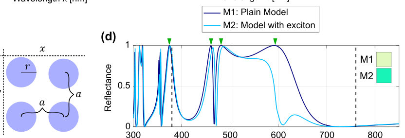
<figcaption class="paper-figure-caption"><b>Fig 1.</b> Figure 1. Illustration of the differences between a model of a lossless HID compared to a toy model, with the same base permittivity with one Lorentzian added to represent an exciton at 600 nm. Panel (a) shows the real (full lines) and imaginary part (dashed lines) of the permittivities of the plain model (M1, dark blue line) and the toy model (M2, light blue line). Panel (b) shows the normalised scattering cross sections, σsc, of a single NP of the array for both the plain model (M1, dark blue line) and the toy model (M2, light blue line) as well as the normalised absorption cross section, σabs, of the toy model (M2, red line). The plain model exhibits no absorption and its σabs is thus...</figcaption>
</figure>
<figure class="paper-figure-card">
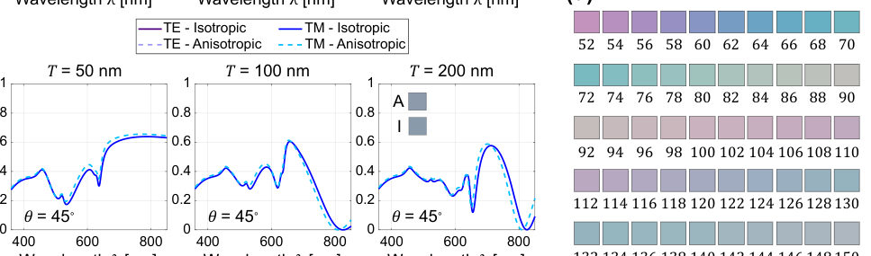
<figcaption class="paper-figure-caption"><b>Fig 2.</b> Figure 2. Visualisations of the investigation of a WS2 slab. (a) Reflectance of TE and TM light impringing on a T = 100 nm slab, illustrated by the sketch in (b), when assumed isotropic or anisotropic for three incidence angles, θ. (c) Reflectance of TM light at θ = 45◦for varying thicknesses when the slab is assumed isotropic or anisotropic. (d) Colours stemming from the reflectance spectra for isotropic WS2 slabs, with thicknesses varying from 52 nm to 150 nm in steps of 2 nm, as indicated by the numbers below each square.</figcaption>
</figure>
<figure class="paper-figure-card">
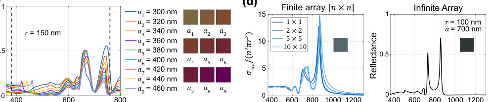
<figcaption class="paper-figure-caption"><b>Fig 3.</b> Figure 3. Visualisations of data obtained from arrays of spherical NPs. Panels (a), (b), and (c) show reflectance spectra and corresponding colours for infinite arrays of spherical NPs, with variable lattice constants and radii of (a) 90 nm, (b) 110 nm, and (c) 150 nm. Panel (d) shows the normalised scattering cross section of finite arrays of varying sizes and the reflectance spectra of an infinite array of spherical WS2 NPs, with radius r = 100 nm and lattice constant a = 700 nm. The inset in each subpanel shows the colours of a single NP and the colour of the infinite array, respectively.</figcaption>
</figure>
<figure class="paper-figure-card">
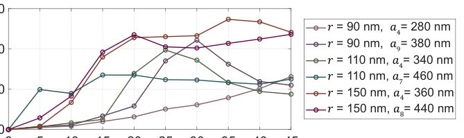
<figcaption class="paper-figure-caption"><b>Fig 4.</b> Figure 4. Colours obtained from selected arrays with NPs of radius (a) 90 nm (b) 110 nm and (c) 150 nm with a variation of incidence angle. Each panel contains the colours from the TE, TM and total (average of TM and TE) reflectances as the angle of incidence is varied from 0◦to 45◦. (d) The colour difference, ∆ELab, between the average colour at each incidence angle with respect to the colour at normal incidence.</figcaption>
</figure>
<figure class="paper-figure-card">
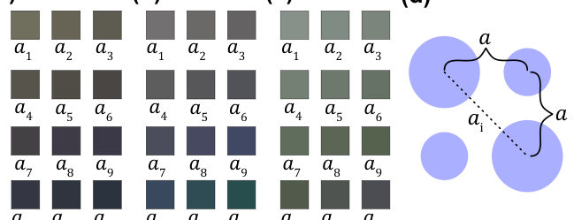
<figcaption class="paper-figure-caption"><b>Fig 5.</b> Figure 5. Colours obtained from arrays with NPs of radius (a) 70 nm, (b) 100 nm and (c) the combined bipartite array at the same lattice constants varying from a1 = 260 nm to a12 = 480 nm in steps of 20 nm. An illustration of the configuration of particles in the bipartite array can be seen in (d).</figcaption>
</figure>
<figure class="paper-figure-card">
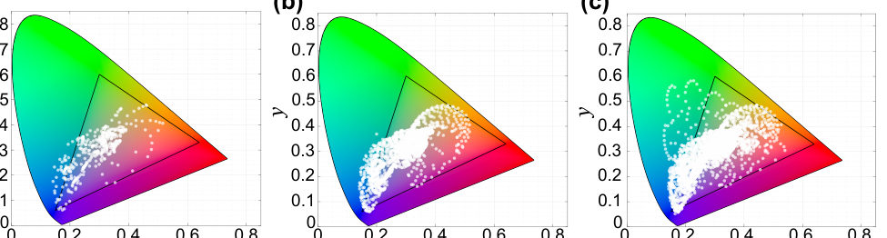
<figcaption class="paper-figure-caption"><b>Fig 6.</b> Figure 6. Plots of the CIE colour space, where each white dot represents a colour obtained by one of the arrays investigated. Subfigure (a) show arrays consisting of spherical WS2 NPs, where the radius of the particles vary from 30 nm to 150 nm in steps of 10 nm, while the lattice constant varies from the diameter of the particles to 800 nm in steps of 20 nm. In (b) arrays with intermediate radii in steps of two have been added as well as selected bipartite arrays. In subfigure (c) arrays of the same structure as the arrays in (a) but utilising several different TMDs, here MoS2[57], MoSe2[58], HfS2[59] and HfSe2[58].</figcaption>
</figure>

**Main problem.** Investigating the potential of Transition Metal Dichalcogenide (TMD) nanostructures, specifically nanoparticle arrays, as a platform for generating tunable structural colours.

**Main result.** TMD nanosphere arrays can achieve a wide range of colours by tailoring particle radius and lattice separation, with expanded colour space coverage possible through different TMD materials and bipartite array configurations.

**Method.** Semi-analytical calculations using the T-matrix approach, Mie theory, and lattice sums, combined with colorimetric analysis (CIE XYZ/Lab) to evaluate perceived colour.

**Summary.** This paper explores how TMD nanostructures can be engineered to produce a wide variety of structural colours. By adjusting the size and arrangement of TMD nanoparticles, researchers can manipulate Mie resonances and lattice modes to cover a large portion of the visible RGB spectrum. The study also highlights how material-specific features, like excitonic transitions, can be used to further tune the optical response. This work provides a roadmap for designing highly tunable, nanostructured optical surfaces.

Detailed structure

**Model / system.** Arrays of spherical TMD nanoparticles (such as WS2, MoS2, and HfSe2) in square and bipartite lattices, as well as thin anisotropic TMD slabs.

**Key observables.** Reflectance spectra, scattering and absorption cross-sections, CIE XYZ tristimulus values, and color difference (Delta E_Lab).

**Important parameters / regimes.** Particle radius (30-150 nm), lattice constant (up to 800 nm), incidence angle, material type, and slab thickness.

**Assumptions / limitations.** Nanoparticles are treated as isotropic for small structures; relative permeability is assumed to be unity; spherical geometries are used as a first approximation for more complex morphologies.

**Figures summary.** Figure 1 shows permittivity and cross-sections for different models; Figure 3 displays reflectance spectra and colours for various radii and lattice constants; Figure 4 shows angular dependence; Figure 5 compares different array configurations; Figure 6 presents CIE colour space plots showing coverage expansion.

**Paper structure.** The paper introduces the concept of TMD-based structural colours, details the electromagnetic modeling and colorimetric methods, analyzes the impact of particle geometry and material properties (including excitons and anisotropy), explores array configurations for maximizing colour gamut, and concludes with potential extensions.

Abstract

We introduce transition metal-dichalcogenide (TMD) nanostructures as a promising platform for the realisation of structural colours. Processing of semianalytically calculated reflectance spectra of TMD nanosphere arrays shows a wide range of colours, which are obtained simply through tailoring the radius and separation of spheres in the array, with the size-dependent Mie modes of the nanoparticles being the primary contributor to the spectra. Additionally, it is demonstrated that further coverage of the colour space can be obtained by employing different materials or different lattice unit cells. Theoretical examination of the impact of the excitonic attributes of TMDs on the resulting structural colours indicates that self-hybridisation between nanoparticle modes and excitonic transitions may be employed for further tuneability. Moreover, the impact of TMD anisotropy on the structural colours is shown to be negligible for small structures at typical viewing angles, while the viewing angle itself may impact the colour. This work sets out to be a general investigation of TMD nanoarchitectures, with a focus on nanosphere arrays, for structural colours, by examining both inherent material features through the lens of colourimetry, and the ability of such structures to sustain a broad range of hues.

[↑ back to top](#top)

### [Ultrafast spectroscopy and role of interlayer coupling in high harmonic generation from layered solids](http://arxiv.org/abs/2604.23506v1)

**Authors:** Eyal Uzner, Ofer Neufeld  
**Type:** theory · **Category:** other · **PDF:** <https://arxiv.org/pdf/2604.23506v1>  
**Analysis basis:** full PDF text, analyzed in chunks
**Topic relevance:** `non-equilibrium dynamics` **2/5**

↔ Scroll figures horizontally

<figure class="paper-figure-card">
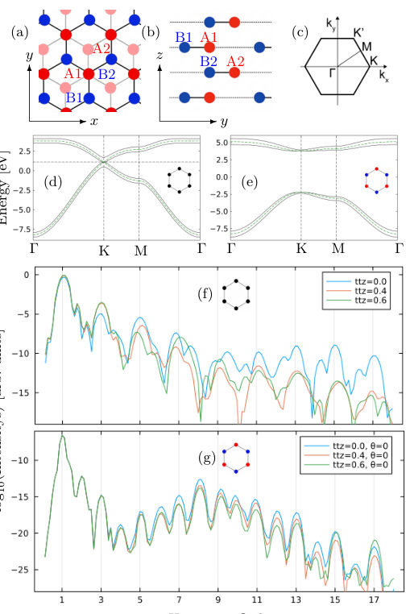
<figcaption class="paper-figure-caption"><b>Fig 1.</b> FIG. 1: (a–b) Illustration of lattice geometry showing top view over xy planes (a), and side view showing AB stacking configuration (b). (c) Hexagonal BZ with high symmetry points for kz = 0 plane. (d,e) TB band structures for graphene/graphite and monolayer/bulk hBN, where bands are indicated by green dashed lines for the monolayers, and black solid lines for bulks. (f–g) Exemplary HHG spectra for (f) graphene/graphite and (g) hBN, calculated for linear driving along Γ-K for various values of interlayer couplings (legends are in eV).</figcaption>
</figure>
<figure class="paper-figure-card">
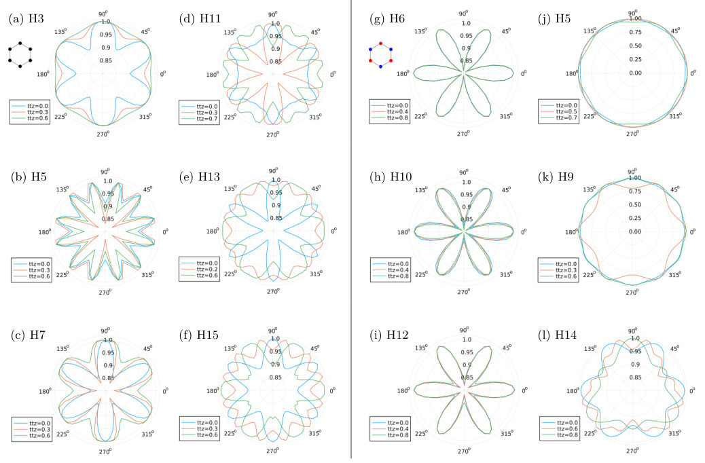
<figcaption class="paper-figure-caption"><b>Fig 2.</b> FIG. 2: Orientation dependence of normalized harmonic yields from layered solids for various interlayer coupling strengths. (a–f) Normalized HHG yields from graphite. (g–l) Normalized HHG yields from hBN. Select harmonics are presented that cover the full range of physical behaviors observed (all other harmonics orders are delegated to the SI).</figcaption>
</figure>
<figure class="paper-figure-card">
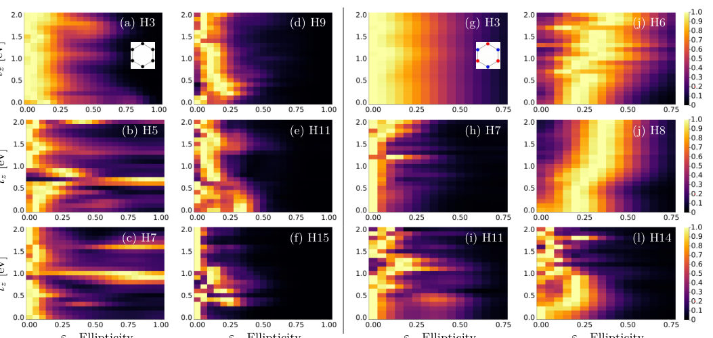
<figcaption class="paper-figure-caption"><b>Fig 3.</b> FIG. 3: Ellipticity dependence of normalized harmonic yields from layered solids for varying interlayer coupling strength. (a–f) Select harmonics from graphite. (g–l) Select harmonics from hBN. Other harmonic orders, as well as inter/intra-band separation, is delegated to the SI.</figcaption>
</figure>
<figure class="paper-figure-card">
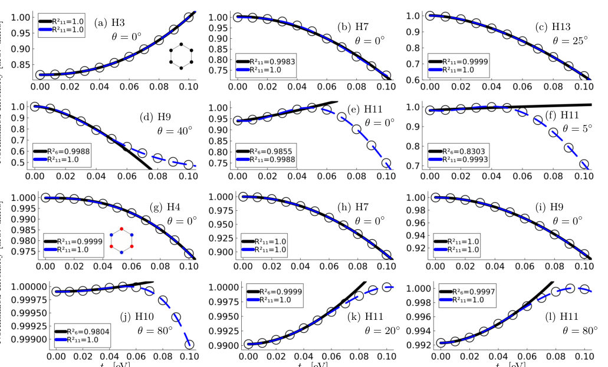
<figcaption class="paper-figure-caption"><b>Fig 4.</b> FIG. 4: Harmonic yield dependence on the interlayer hopping parameter up to 100 meV in the perturbative regime. Exact numerical results from SBE simulations are given by the empty circle black markers. Black solid lines and blue dash lines are: generic power law fitted function, 4’th-order polynomial fitted function, respectively. Note that the R2 values are given in the legend for each fit, and the sub-text in R2 indicates the number of points over which the fit was made (generally the power-law dependence was fitted over a shorter domain since it cannot capture curvature changes that appear towards larger tz (see discussion in text)). (a–f) HHG in graphite. (g–l) HHG in hBN.</figcaption>
</figure>

**Main problem.** Investigating how interlayer coupling affects high harmonic generation (HHG) in layered solids, specifically addressing the gap where out-of-plane hopping is often neglected.

**Main result.** The authors show that interlayer coupling can significantly alter HHG angular and ellipticity dependence and develop an analytic theory showing HHG yields follow a 4th-order polynomial in the coupling parameter.

**Method.** Numerical solutions of the Semiconductor Bloch Equations (SBE) in the Houston basis and length gauge, combined with an analytic perturbative expansion of the laser-driven current.

**Summary.** This paper explores how the vertical coupling between layers in materials like graphite and hBN influences high harmonic generation. The authors demonstrate that even when a laser is polarized in-plane, the out-of-plane hopping can change the direction and shape of the emitted harmonics. They provide a new mathematical framework using a 4th-order polynomial to accurately predict these changes. This work suggests that HHG can be used as a powerful spectroscopic tool to measure interlayer interactions and potentially control ultrafast electron dynamics.

Detailed structure

**Model / system.** A 4-band tight-binding model for AB-stacked honeycomb lattices, applied to materials including graphite, hexagonal boron nitride (hBN), and WS2, including interlayer hopping along the c-axis.

**Key observables.** HHG emission spectrum, time-dependent electric current, angular dependence of harmonics, and ellipticity dependence of harmonics.

**Important parameters / regimes.** Interlayer coupling strength (tz), laser polarization angle (theta), laser ellipticity (epsilon), and dephasing time (T2).

**Assumptions / limitations.** The interlayer hopping is treated as a perturbation; the model uses a phenomenological dephasing time; the laser is assumed to be off-resonant and femtosecond-scale.

**Figures summary.** Fig 1: Lattice geometry, Brillouin zone, and band structures. Fig 2: HHG yields vs. orientation for graphite and hBN. Fig 3: HHG yields vs. ellipticity. Fig 4: Dependence of HHG yield on the interlayer hopping parameter with comparison of power-law and 4th-order polynomial fits.

**Paper structure.** Introduction of the problem of interlayer coupling, description of the tight-binding model and SBE method, presentation of the analytic perturbative theory, numerical validation via HHG spectra and angular/ellipticity dependence, and discussion of implications for spectroscopy and control.

Abstract

High harmonic generation (HHG) in solids has recently emerged as a powerful all-optical approach for probing material properties and ultrafast electron dynamics in quantum systems. It has been widely applied for studying two-dimensional and layered solids of various kinds. In these studies, the laser is usually polarized within the layered planes, where most electron dynamics occurs, while out-of-plane hopping is commonly neglected. This is despite of interlayer hopping being ubiquitous in nano-systems. Here we develop theory for HHG in layered solids in presence of interlayer coupling and employ it for studying strong-field driven hexagonal BN, graphite, and the transition metal dichalcogenide WS$_2$. We show that sufficiently intense couplings can alter typical HHG emission characteristics such as angular or ellipticity dependence even when the driving laser is polarized in-plane. We develop an analytic perturbation theory for the laser-driven current expanded in the interlayer coupling parameter and explicitly show that HHG yields follow a 4'th order polynomial form, which is validated numerically. Our work should motivate experiments for probing interlayer coupling via HHG spectroscopy, as well as exploring its modulation as a control parameter for ultrafast dynamics and attopulse generation via laser driving and mechanical strain.

[↑ back to top](#top)

### [Campbell penetration depth in a single crystal of heavy fermion superconductor CeCoIn$_5$](http://arxiv.org/abs/2604.23657v1)

**Authors:** Hyunsoo Kim, Makariy A. Tanatar, Cedomir Petrovic, Ruslan Prozorov  
**Type:** experiment · **Category:** strongly correlated electrons · **PDF:** <https://arxiv.org/pdf/2604.23657v1>  
**Analysis basis:** full PDF text, analyzed in chunks
**Topic relevance:** `Kondo & dissipative impurity` **1/5**

↔ Scroll figures horizontally

<figure class="paper-figure-card">
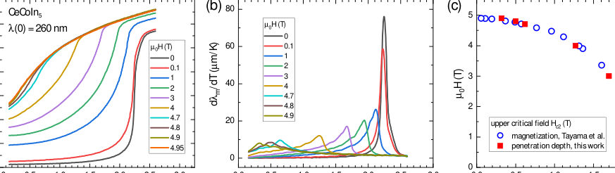
<figcaption class="paper-figure-caption"><b>Fig 1.</b> FIG. 1. (a) Temperature-dependent in-plane magnetic penetration depth λm(T) in a single crystal CeCoIn5 sample with Hac and Hdc applied along the crystallographic c-axis. Different curves correspond to different values of the applied dc magnetic field indicated in the legend. (b) First temperature-derivative dλm/dT of λm(T) shown in panel (a). The sharp peaks correspond to superconducting phase transitions for each applied field. (c) The superconducting H-T phase diagram. The derivative maximum criteria was compared to bulk measurements determined at a discontinuous jump in dc magnetization measurements by T. Tayama et al. [51].</figcaption>
</figure>
<figure class="paper-figure-card">
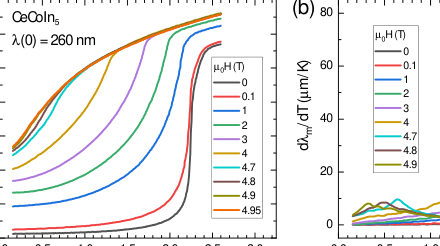
<figcaption class="paper-figure-caption"><b>Fig 2.</b> Figure 1(a) shows the magnetic field evolution of λm(T) from µ0Hdc = 0 to 5 T. In the absence of a magnetic field, the single crystal sample exhibits a step- like superconducting phase transition near T = 2.3 K where the London penetration depth, λL, diverges. The temperature dependence of λL in the Meissner state of unconventional superconductors is determined by the symmetry of the superconducting gap. In particular, a power-law behavior ∆λ(T) ∼T n best describes its low- temperature behavior below typically 0.3Tc. For a line- nodal superconductor, the exponent n varies between 1 and 2 depending on the impurity scattering [74] and the nature of the scattering center [75]. The...</figcaption>
</figure>
<figure class="paper-figure-card">
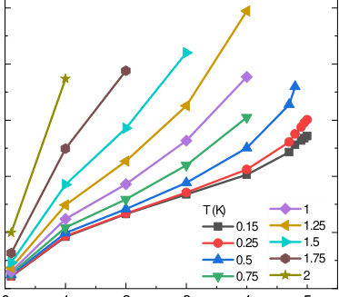
<figcaption class="paper-figure-caption"><b>Fig 3.</b> FIG. 2. (a) Temperature-variation of Campbell penetration depth λC at various fixed fields in CeCoIn5. (b) Isothermal field-variation of λC at various fixed temperatures.</figcaption>
</figure>
<figure class="paper-figure-card">
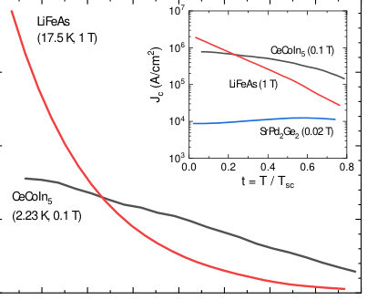
<figcaption class="paper-figure-caption"><b>Fig 4.</b> FIG. 4. Temperature-dependent theoretical critical current density Jc(t) with a dc magnetic field µ0H0 = 0.1 T in CeCoIn5 where t is the reduced temperature T/Tc. Jc(T) in LiFeAs and SrPd2Ge2 are shown for comparison, which are taken in µ0H0 = 1 T and 0.02 T, respectively. The magnetic fields for each superconductor are the minimum applied field for the measurement of Jc.</figcaption>
</figure>

**Main problem.** Investigating the superconducting pairing symmetry and vortex lattice properties of the heavy fermion superconductor CeCoIn5 by measuring the Campbell penetration depth.

**Main result.** The measured Campbell penetration depth deviates from conventional sqrt(H) behavior, signaling a vortex lattice symmetry change, and the critical current density Jc(T) shows a nearly T-linear dependence, providing new evidence for unconventional superconductivity.

**Method.** Frequency-domain tunnel diode resonator (TDR) technique used to measure temperature and magnetic field dependent magnetic penetration depth.

**Summary.** This paper uses the tunnel diode resonator technique to study the Campbell penetration depth in the heavy fermion superconductor CeCoIn5. The researchers found that the magnetic field dependence of the Campbell depth deviates from standard models, which they interpret as a change in the symmetry of the vortex lattice. Additionally, they discovered that the critical current density follows a T-linear dependence, which is highly unusual for conventional superconductors. These findings provide significant new evidence for the unconventional nature of superconductivity in this material.

Detailed structure

**Model / system.** Single crystals of the heavy fermion superconductor CeCoIn5 in the clean limit, using a single-vortex pinning model with a quadratic pinning potential.

**Key observables.** Magnetic penetration depth (lambda_m), Campbell penetration depth (lambda_C), London penetration depth (lambda_L), and critical current density (Jc).

**Important parameters / regimes.** Temperature range 0.15 K to 2.5 K, magnetic fields up to 5 T, coherence length xi(0) = 24 nm, and London penetration depth lambda_L(0) approx 260 nm.

**Assumptions / limitations.** The pinning potential radius rp is assumed to be the coherence length xi, and the system is assumed to be in the clean limit.

**Figures summary.** Fig 1 shows temperature-dependent penetration depth, its derivative, and the resulting H-T phase diagram; Fig 4 compares the temperature dependence of Jc in CeCoIn5 to other superconductors like LiFeAs and SrPd2Ge2.

**Paper structure.** The paper introduces the scientific problem of CeCoIn5 symmetry, describes the TDR experimental setup and sample preparation, presents measurements of lambda_m and lambda_C, analyzes the vortex lattice symmetry changes and Jc temperature dependence, and concludes with a comparison to other superconducting systems.

Abstract

The temperature and magnetic field dependent magnetic penetration depth, $λ_m(T,H)$, was measured in a single crystal of a heavy fermion superconductor CeCoIn$_5$ using a frequency-domain tunnel diode resonator. In addition to the London penetration depth, which yields the superfluid density, measurements in a finite DC magnetic field provide Campbell penetration depth, $λ_C(T,H)$, which is directly linked to the true (unrelaxed) critical current density, $J_c$. The measured $λ_C(H)$ in CeCoIn$_5$ deviates significantly from the conventional $\sim \sqrt{H}$ behavior, and its slope changes abruptly at the characteristic magnetic field values. Considering that our sample is in the clean limit, we interpret this deviation as a fingerprint of the vortex lattice symmetry change. The temperature dependence $J_c(T)$ of CeCoIn$_5$ calculated from $λ_C(T)$ is nearly $T$-linear over the entire temperature range, also in stark contrast to expectations in a conventional type-II superconductor. Our results provide new evidence for unconventional superconductivity in CeCoIn$_5$ from the never-before-measured Campbell penetration depth.

[↑ back to top](#top)

### [Magnetic interactions and spin orders in Cr$_8$ and V$_8$ ring-shaped molecular magnets from non-collinear ab initio calculations](http://arxiv.org/abs/2604.23565v1)

**Authors:** Maria Barbara Maccioni, Elia Stocco, Luca Binci, Andrea Floris, Matteo Cococcioni  
**Type:** theory · **Category:** strongly correlated electrons · **PDF:** <https://arxiv.org/pdf/2604.23565v1>  
**Analysis basis:** full PDF text, analyzed in chunks
**Topic relevance:** `spintronics-quantum-optics interface` **1/5**

↔ Scroll figures horizontally

<figure class="paper-figure-card">
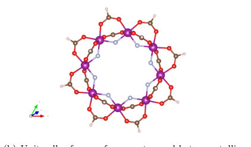
<figcaption class="paper-figure-caption"><b>Fig 1.</b> FIG. 1. M8-ring structure reduced through the hydrogen sat- uration. Color code: M violet, F grey, O red, C brown, H white.</figcaption>
</figure>
<figure class="paper-figure-card">
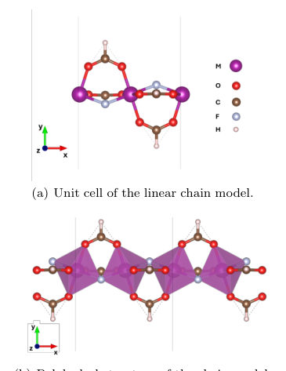
<figcaption class="paper-figure-caption"><b>Fig 2.</b> FIG. 2. Representation of the M-chain molecular structures, unit-cell and supercell, adopted in this study.</figcaption>
</figure>
<figure class="paper-figure-card">
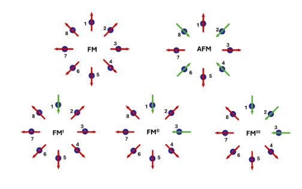
<figcaption class="paper-figure-caption"><b>Fig 3.</b> FIG. 4. Non-collinear magnetic setups, in V8 radial configu- ration, considered to calculate the exchange parameters be- tween all neighbor magnetic sites, J2, J3 and J4 .</figcaption>
</figure>
<figure class="paper-figure-card">
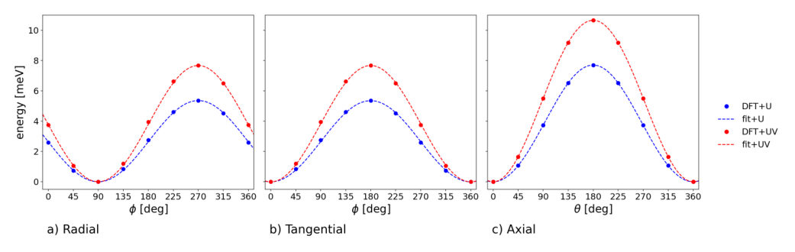
<figcaption class="paper-figure-caption"><b>Fig 4.</b> FIG. 5. Non-collinear DFT total energy profiles obtained rotating a single spin in Cr8 starting from the AFM ground state configuration in each direction. Dots are results from ab initio calculations; dashed curves are fit obtained from Eq. (7).</figcaption>
</figure>
<figure class="paper-figure-card">
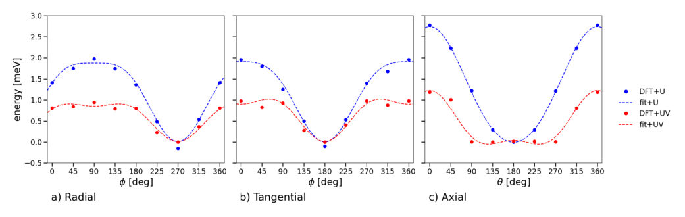
<figcaption class="paper-figure-caption"><b>Fig 5.</b> FIG. 6. Non-collinear DFT total energy profiles obtained rotating a single spin in V8 starting from the FM ground state configuration in each direction. Dots are results from ab initio calculations; dashed curves are fit obtained from Eq. (7).</figcaption>
</figure>
<figure class="paper-figure-card">
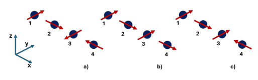
<figcaption class="paper-figure-caption"><b>Fig 6.</b> FIG. 8. Helical and non-helical spin configurations used to to evaluate the dz antisymmetric exchange couplings in chain model.</figcaption>
</figure>
<figure class="paper-figure-card">
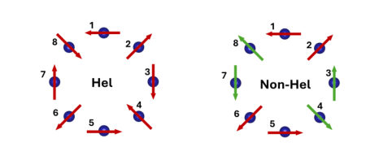
<figcaption class="paper-figure-caption"><b>Fig 7.</b> FIG. 7. Magnetic spin configurations used to evaluate dz in Cr8 and V8</figcaption>
</figure>
<figure class="paper-figure-card">
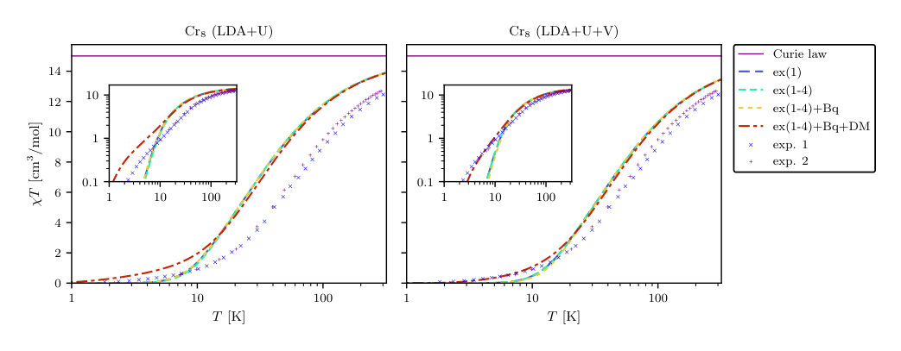
<figcaption class="paper-figure-caption"><b>Fig 8.</b> FIG. 9. Magnetic susceptibility of Cr8. The plots shows the magnetic susceptibility χ weighted by the temperature T as obtained from LDA+U (left) and LDA+U+V (right) by considering progressively only some of the computed interactions. The solid purple line correspond to a system of free spins and therefore the susceptibility recovers the Curie law. The curve ex(1) correspond to an anisotropic Heisenberg hamiltonian with only the 11 nearest neighbor interactions whose parameters are reported in Table II. The curve ex(1-4) includes also the 2nd, 3rd and 4th nearest neighbor interactions reported in Tables III and IV. Finally, ex(1-4)+Bq includes biquadratic and ex(1-4)+Bq+DM also DM...</figcaption>
</figure>
<figure class="paper-figure-card">
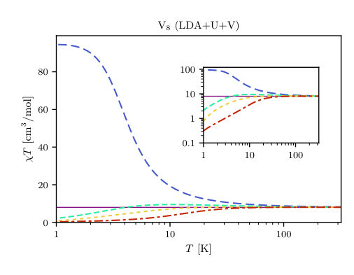
<figcaption class="paper-figure-caption"><b>Fig 9.</b> FIG. 10. Magnetic susceptibility of V8. The same legend and considerations of Figure 9 also apply here.</figcaption>
</figure>
<figure class="paper-figure-card">
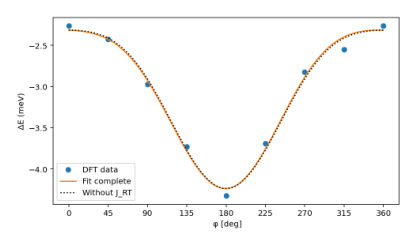
<figcaption class="paper-figure-caption"><b>Fig 10.</b> FIG. 12. Comparison of fitted energy curves with and without off-diagonal exchange terms (tangential configuration) for the V8 system. A single spin is being rotated from its reference orientation. Data points are the same shown in Fig. 6 of the main text.</figcaption>
</figure>

**Main problem.** The study aims to refine the magnetic description of Cr8 and V8 molecular rings by investigating interactions beyond the standard Heisenberg exchange, specifically biquadratic coupling and Dzyaloshinskii-Moriya (DM) interactions.

**Main result.** The researchers found that biquadratic terms are essential for capturing low-energy excitations in V8, and that DM interactions in Cr8 have a geometric origin due to structural curvature, whereas in V8 they have an intrinsic electronic origin.

**Method.** Non-collinear Density Functional Theory (DFT) using LDA+U and LDA+U+V functionals, combined with spin rotation methods and exact diagonalization of an extended spin Hamiltonian.

**Summary.** This paper investigates the magnetic properties of Cr8 and V8 molecular rings using advanced non-collinear DFT calculations. It moves beyond the simple Heisenberg model to include biquadratic and Dzyaloshinskii-Moriya interactions. The study reveals that while Cr8's magnetic anisotropy is largely geometric, V8 possesses intrinsic, complex interactions that significantly alter its ground state. The use of extended Hubbard functionals (LDA+U+V) is shown to be crucial for accurate quantitative agreement with experimental data.

Detailed structure

**Model / system.** Octanuclear ring-shaped molecular magnets Cr8 (antiferromagnetic) and V8 (ferromagnetic/antiferromagnetic transition), modeled using an extended spin Hamiltonian including Heisenberg, biquadratic, and DM terms.

**Key observables.** Magnetic susceptibility (chi and chiT), total magnetization, energy spectra, and exchange coupling constants (J1 through J4).

**Important parameters / regimes.** Exchange couplings (J), biquadratic parameters (BQ), DM interaction components (dr, dt, dz), and Hubbard parameters (U, V).

**Assumptions / limitations.** Use of hydrogen saturation to simplify organic ligands and the use of the Local Density Approximation (LDA) for exchange-correlation energy.

**Figures summary.** Figure 1 shows the polyhedral structure of the M8 rings; Figure 2 shows the linear chain models; Figure 7 illustrates spin configurations for DM extraction; Figure 13 compares magnetic susceptibility across different Hamiltonian approximations; Figure 14 shows spin-resolved energy spectra.

**Paper structure.** The paper introduces the molecular systems, describes the non-collinear DFT methodology, analyzes the magnetic interactions and energy profiles of Cr8, investigates the complex biquadratic and DM interactions in V8, and concludes with a comparison of different Hamiltonian models and their agreement with experimental susceptibility.

**Why it may be interesting.** The paper provides deep insights into how structural geometry and electronic correlations (via Hubbard U and V) generate complex, non-collinear magnetic interactions, which is highly relevant to understanding many-body dynamics and spin-spin coupling in molecular-scale systems.

Abstract

We employ density functional theory within a non-collinear framework to investigate the magnetic properties of the octanuclear molecular rings Cr$_8$ and V$_8$. Our aim is to generalize the evaluation of the effective magnetic interactions by explicitly including non-collinear spin configurations, thereby refining our understanding of their dependence upon the underlying electronic structure and molecular geometry. By analyzing the energetics of a variety of magnetic configurations, particularly non-collinear arrangements with neighboring spins oriented along different directions, we move beyond the exchange-only Heisenberg Hamiltonian describing the low-energy sector of the excitation spectrum. This approach enables us to distinguish between in-plane and out-of-plane exchange interactions, and to incorporate biquadratic coupling terms into the effective spin Hamiltonian. We reveal significant antisymmetric exchange interactions of the Dzyaloshinskii-Moriya (DM) type whose dependence on the curvature of the annular structure is clarified by a comparison with the results obtained from linear chains of equal composition. Our work demonstrates that interactions beyond conventional exchange, particularly biquadratic anisotropic terms, in the spin Hamiltonian are essential for accurately capturing the low-energy excitations of these systems. The closest quantitative agreement with experimental results (particularly for the case of Cr$_8$) is achieved when extended Hubbard functionals are used for the evaluation of the effective magnetic couplings.

[↑ back to top](#top)

### [Mapping Reversal Pathways and Interaction Fields in Artificial Spin Ice](http://arxiv.org/abs/2604.24382v1)

**Authors:** Brindaban Ojha, Matías P. Grassi, Vassilios Kapaklis  
**Type:** both · **Category:** disordered systems and neural networks · **PDF:** <https://arxiv.org/pdf/2604.24382v1>  
**Analysis basis:** full PDF text, analyzed in chunks
**Topic relevance:** `non-equilibrium dynamics` **1/5**

↔ Scroll figures horizontally

<figure class="paper-figure-card">
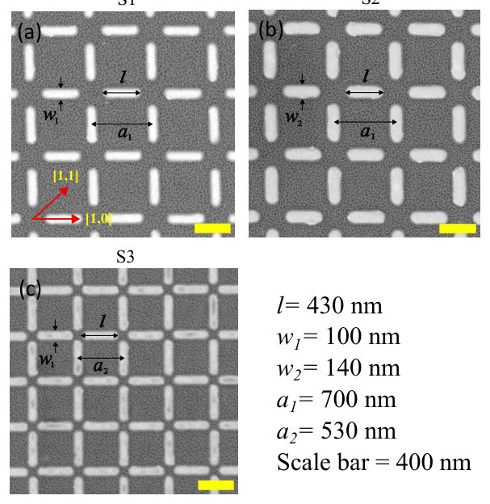
<figcaption class="paper-figure-caption"><b>Fig 1.</b> Figure 1: Scanning electron microscopy images of square artificial spin ice arrays patterned by electron-beam lithography (EBL). The nanomagnets have lateral dimensions of l1 = 430 nm, w1 = 100 nm, and a1 = 700 nm for S1 (a); l1 = 430 nm, w1 = 140 nm, and a1 = 700 nm for S2 (b); and l1 = 430 nm, w1 = 100 nm, and a1 = 530 nm for S3 (c). During FORC measurements, the field was applied along the [1,1] direction of the lattice. The scale bar is 400 nm.</figcaption>
</figure>
<figure class="paper-figure-card">
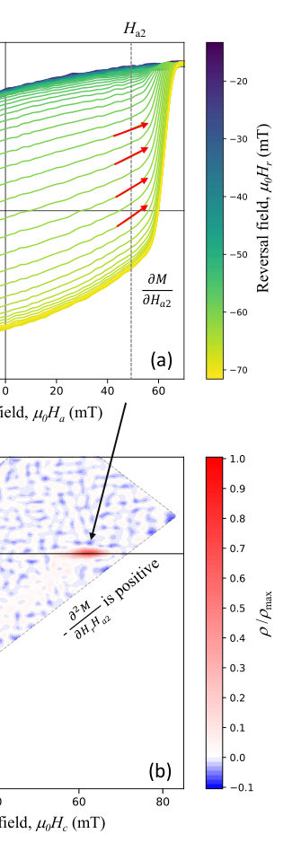
<figcaption class="paper-figure-caption"><b>Fig 2.</b> Figure 2: (a) Processed family of FORCs acquired for S1. (b) Corresponding FORC diagram of S1.</figcaption>
</figure>
<figure class="paper-figure-card">
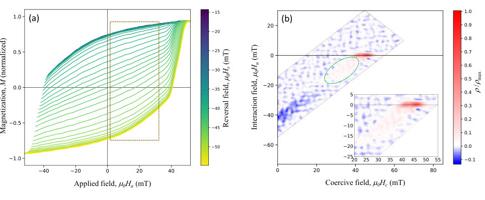
<figcaption class="paper-figure-caption"><b>Fig 3.</b> Figure 3: (a) Representative FORCs of S2. (b) Corresponding FORC diagram in the Hu–Hc coordinate system. Inset: zoomed-in view of the central peak with a boomerang-shaped feature.</figcaption>
</figure>
<figure class="paper-figure-card">
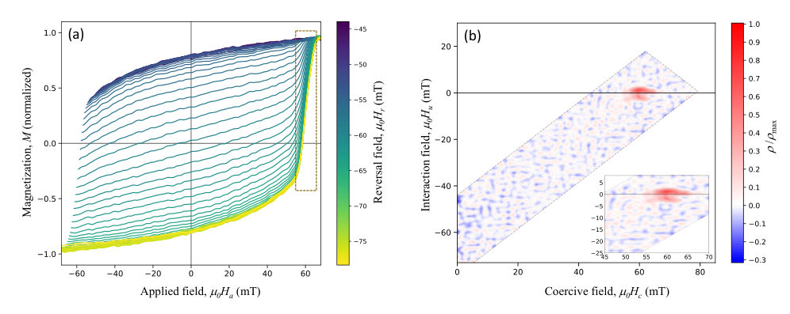
<figcaption class="paper-figure-caption"><b>Fig 4.</b> Figure 4: (a) A family of FORCs for S3 with the applied field along the [1,1] direction of the lattice. (b) Corresponding FORC diagram plot- ted in the Hc–Hu coordinate system. Inset: zoomed-in view of the central peak highlighting its vertical spreading.</figcaption>
</figure>
<figure class="paper-figure-card">
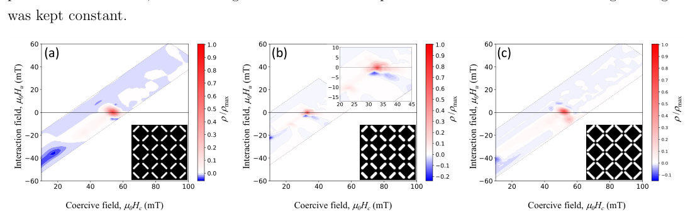
<figcaption class="paper-figure-caption"><b>Fig 5.</b> Figure 5: Simulated FORC distributions of Case I (S1) (a), Case II (S2) (b), and Case III (S3) (c). Inset: square array of 36 nanomagnets used in the simulations.</figcaption>
</figure>
<figure class="paper-figure-card">
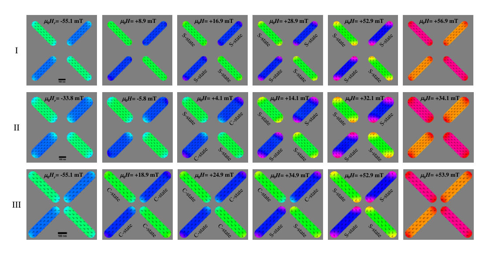
<figcaption class="paper-figure-caption"><b>Fig 6.</b> Figure 6: Evolution of magnetic texture in nanomagnets as a function of applied field for Case I (S1), Case II (S2), and Case III (S3). The top, middle, and bottom rows correspond to the simulated counterparts of S1, S2, and S3, respectively. The images show the field-driven reversal sequence from the negative reversal state toward positive saturation, highlighting the distinct intermediate configurations that emerge in each case, including S-domain states, mixed S + C states, and C-state-mediated reversal. The comparison illustrates how changes in geometry and interaction strength modify the reversal pathway and the complexity of the internal magnetic textures.</figcaption>
</figure>

**Main problem.** Understanding how nanomagnet geometry and lattice pitch govern magnetization reversal pathways and the strength of dipolar interactions in artificial spin ice (ASI).

**Main result.** The study demonstrates that reducing aspect ratio induces complex C-type domain textures (boomerang FORC features), while reducing lattice pitch strengthens dipolar interactions, leading to a broad distribution of local bias fields.

**Method.** First-order reversal curve (FORC) measurements using the Magneto-optical Kerr effect (MOKE) combined with MuMax3 micromagnetic simulations.

**Summary.** This paper investigates how the geometry and spacing of nanomagnets in artificial spin ice control magnetic reversal and interaction strengths. By using FORC measurements and micromagnetic simulations, the authors show that changing the aspect ratio can trigger complex internal magnetization textures, while decreasing the lattice pitch enhances dipolar coupling. These findings provide a way to engineer interaction landscapes, which is crucial for developing new types of magnetic-based neuromorphic computing and reservoir computing architectures.

Detailed structure

**Model / system.** Square artificial spin ice (ASI) arrays consisting of lithographically defined ferromagnetic Permalloy (Ni80Fe20) nano-islands on a Ta/AlOx multilayer stack.

**Key observables.** FORC diagrams (contour plots), magnetization traces (minor loops), interaction field (Hu), and coercive field (Hc), and magnetic textures (S-type, C-type, and mixed states).

**Important parameters / regimes.** Nanomagnet length, width, aspect ratio, lattice pitch, and demagnetization energy density.

**Figures summary.** FORC diagrams showing boomerang features for increased width (S2) and vertical elongation for reduced pitch (S3); magnetization reversal sequences through intermediate C and S states; and illustrations of C- and S-state magnetic domain textures.

**Paper structure.** The paper introduces the problem of mapping interaction landscapes, describes the experimental and simulation setup, analyzes three different geometric configurations (S1, S2, S3) to isolate intra-island and inter-island effects, and concludes with implications for neuromorphic computing.

**Why it may be interesting.** The study explores how local interactions and geometric constraints drive collective behavior and complex switching landscapes, which is conceptually related to the study of glassy dynamics and reconfigurable networks in many-body systems.

Abstract

In artificial spin ice (ASI), magnetic interactions between nanomagnets determine both the stable states and the switching pathways under an applied field. Here, first-order reversal curve (FORC) measurements are used to map how these interactions govern magnetization reversal in square arrays as the element shape and spacing are varied. The FORC diagrams show that some geometries reverse more uniformly, whereas others exhibit broader, more asymmetric responses, indicating stronger interaction effects and more complex reversal pathways. Combined FORC analysis and micromagnetic simulations also capture subtle changes in internal magnetization textures during switching, linking local behavior within individual elements to collective behavior across the array. These results establish FORC as a practical tool for mapping and engineering interaction landscapes, with direct relevance to reconfigurable magnetic reservoirs and neuromorphic functionality.

[↑ back to top](#top)

### Other secondary papers (55)

Show other secondary papers

### [A Single Twist-Angle Selection Method for the Electronic Structure of Bilayer Materials](http://arxiv.org/abs/2604.23405v1)

**Authors:** Ryan A. Baker, William Z. Van Benschoten, James J. Shepherd  
**Type:** theory · **Category:** numerical methods · **PDF:** <https://arxiv.org/pdf/2604.23405v1>  
**Analysis basis:** full PDF text, analyzed in chunks

↔ Scroll figures horizontally

<figure class="paper-figure-card">
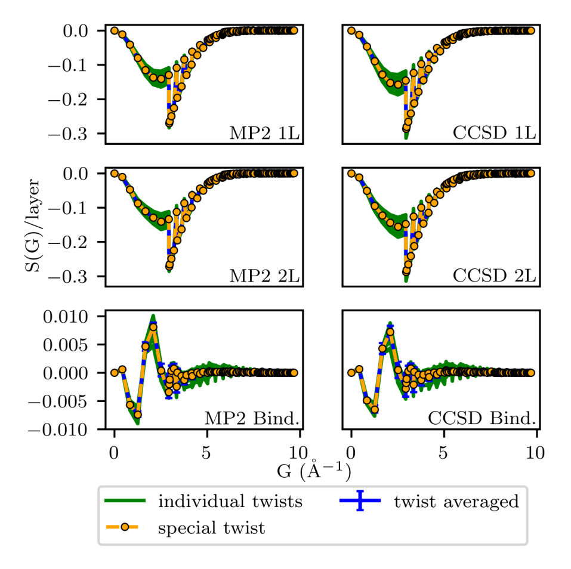
<figcaption class="paper-figure-caption"><b>Fig 1.</b> FIG. 1. Example construction of the binding transition structure factor S(G) with respect to the magnitude</figcaption>
</figure>
<figure class="paper-figure-card">
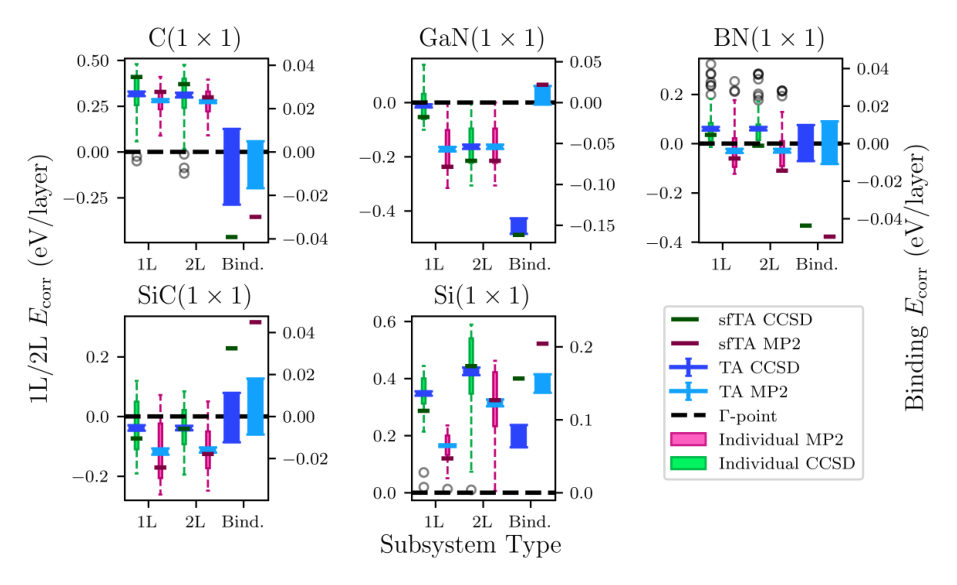
<figcaption class="paper-figure-caption"><b>Fig 2.</b> FIG. 2. Monolayer (1L), bilayer (2L), and binding (Bind.) correlation energies for comparison of original</figcaption>
</figure>
<figure class="paper-figure-card">
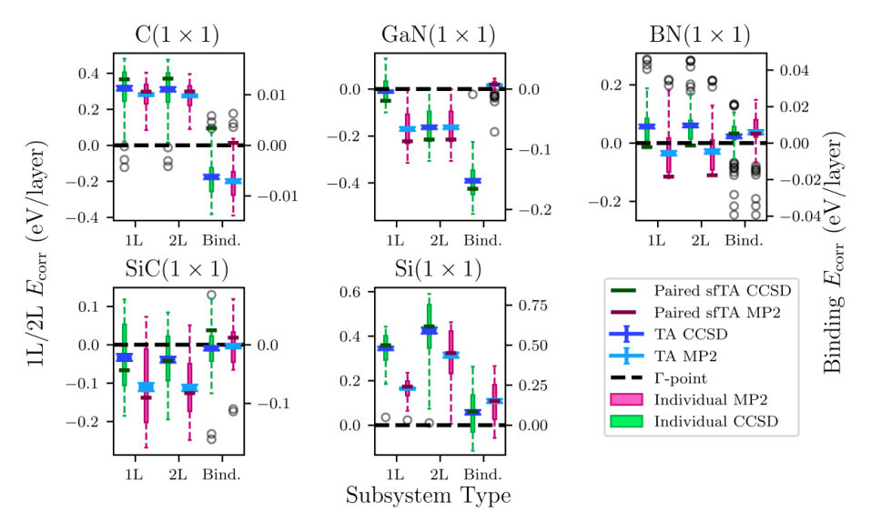
<figcaption class="paper-figure-caption"><b>Fig 3.</b> FIG. 3. Monolayer (1L), bilayer (2L), and binding (Bind.) correlation energies for comparison of paired</figcaption>
</figure>
<figure class="paper-figure-card">
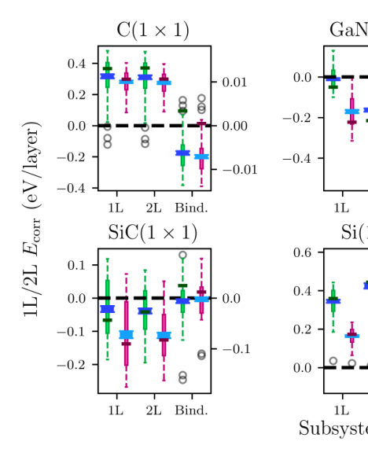
<figcaption class="paper-figure-caption"><b>Fig 4.</b> Fig. 2–4 26(2) 20(2) 20(3) 21(2) 20(2) 6(1) 25(2) 23(2) 4(1)</figcaption>
</figure>
<figure class="paper-figure-card">
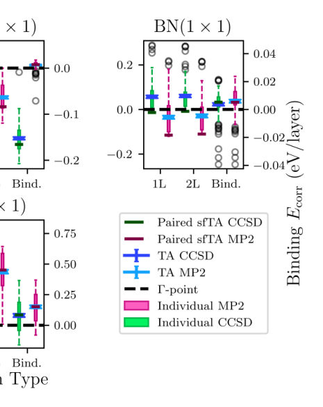
<figcaption class="paper-figure-caption"><b>Fig 5.</b> Fig. 5 – – – 18(4) 23(4) 16(1) 14(4) 21(4) 10(1)</figcaption>
</figure>
<figure class="paper-figure-card">
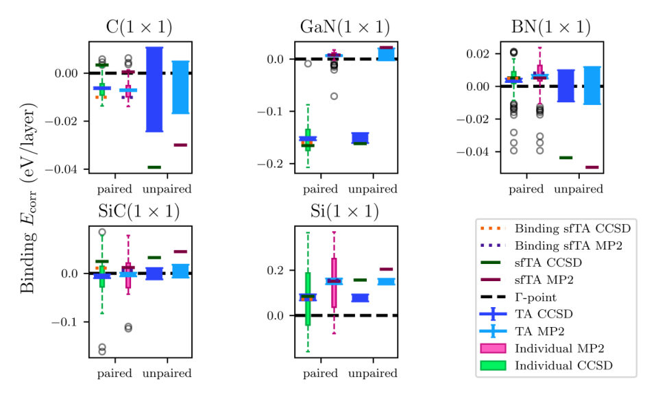
<figcaption class="paper-figure-caption"><b>Fig 6.</b> FIG. 4. Binding correlation energy for comparison across both sfTA variants for the five test systems: C,</figcaption>
</figure>
<figure class="paper-figure-card">
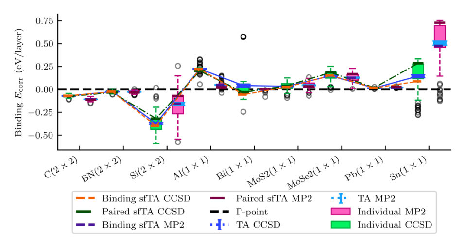
<figcaption class="paper-figure-caption"><b>Fig 7.</b> FIG. 5. Binding correlation energy using TA, paired sfTA, and binding sfTA for challenge test set. Systems</figcaption>
</figure>
<figure class="paper-figure-card">
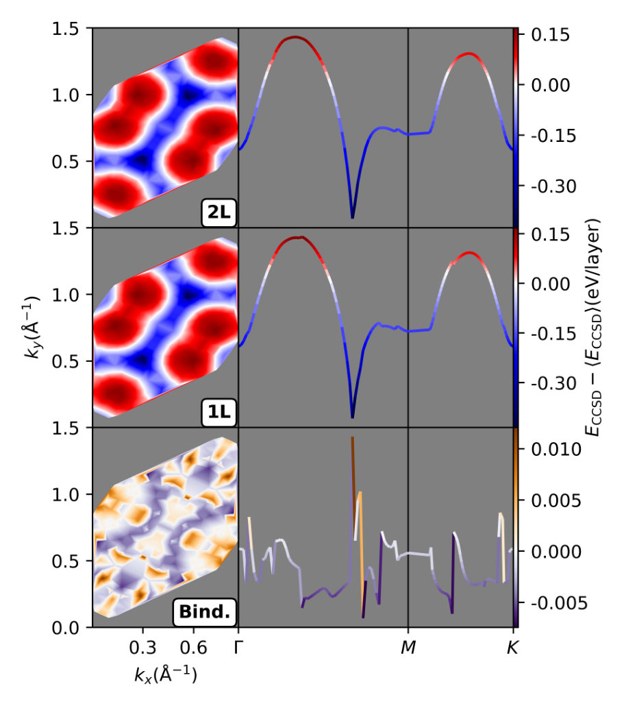
<figcaption class="paper-figure-caption"><b>Fig 8.</b> FIG. 6. Contour plots of the monolayer (1L), bilayer (2L) and binding (Bind.) CCSD correlation energy for</figcaption>
</figure>

**Main problem.** The high computational cost of using twist-angle averaging (TA) to reduce finite-size errors in the electronic structure calculations of bilayer materials.

**Main result.** The development of 'paired sfTA' and 'binding sfTA' variants significantly improves the accuracy of interlayer binding correlation energies, with 'binding sfTA' achieving results approaching the true twist-averaged limit.

**Method.** The authors extend the Structure Factor Twist Averaging (sfTA) method by using low-level MP2 calculations to select a single 'special twist angle' for high-level CCSD calculations, specifically tailoring the selection process to include the binding transition structure factor.

**Summary.** This paper introduces new variants of the Structure Factor Twist Averaging (sfTA) method designed to efficiently calculate the electronic structure of bilayer materials. By using a 'binding' approach to select a single twist angle for both layers, the authors significantly reduce the error in interlayer binding energy calculations. The new method maintains the massive computational savings of the original sfTA while approaching the accuracy of much more expensive twist-averaging protocols. This is particularly important for studying the correlation energies of 2D materials like graphene and transition metal dichalcogenides.

Detailed structure

**Model / system.** The study focuses on low-dimensional bilayer systems, including various 2D materials such as graphene, BN, SiC, MoS2, and MoSe2, primarily in AB stacking configurations.

**Key observables.** Interlayer binding correlation energy, monolayer and bilayer correlation energies, and the transition structure factor S(G).

**Important parameters / regimes.** Twist angle/offset, k-mesh density, and the mean absolute error (MAE) relative to the twist-averaged (TA) reference.

**Assumptions / limitations.** The method assumes that the transition structure factor at the selected special twist angle accurately approximates the twist-averaged value, and that MP2 can serve as a reliable intermediate for CCSD calculations.

**Figures summary.** Figure 1 shows the construction of the binding transition structure factor; Figure 2 uses box plots to compare MAE across sfTA variants; Figure 5 compares binding correlation energies for various systems; Figure 6 provides contour plots of energy landscapes in graphene to demonstrate error cancellation.

**Paper structure.** The paper introduces the problem of finite-size errors in bilayers, proposes two new variants of the sfTA method (paired and binding), evaluates their accuracy against TA benchmarks across multiple material systems, and provides a physical explanation for the improved accuracy via error cancellation in energy landscapes.

Abstract

Structure factor twist averaging (sfTA) is a newer method that has been shown to reproduce twist-averaged (TA) CCSD energies for bulk systems at a low computational cost. In this work, we extend this method for the treatment of low-dimensional materials in the form of two variants: paired sfTA and binding sfTA. These variants affect which twist angles are used in the sfTA protocol, as well as how the special twist angle is selected, namely by using the binding structure factor. These changes are meant to incorporate the binding interaction into the twist-angle selection algorithm within sfTA. Both variants are tested on a variety of bilayer systems, and the resulting binding correlation energies are compared to original sfTA results. We show that the variants are able to produce results approaching TA, with binding sfTA producing the most accurate energies. We also use contour plots of the test systems to show that these improvements are most likely caused by a cancellation of errors.

[↑ back to top](#top)

### [A step-by-step workflow to extract the genuine circular dichroism of thin films](http://arxiv.org/abs/2604.24653v1)

**Authors:** Franziska Schölzel, Arina Narudin, Aleksandra Ciesielska, Alexander Ehm, Dietrich R. T. Zahn, Wouter van Gompel, Simon Kahmann, Georgeta Salvan  
**Type:** experiment · **Category:** other · **PDF:** <https://arxiv.org/pdf/2604.24653v1>  
**Analysis basis:** full PDF text, analyzed in chunks

↔ Scroll figures horizontally

<figure class="paper-figure-card">
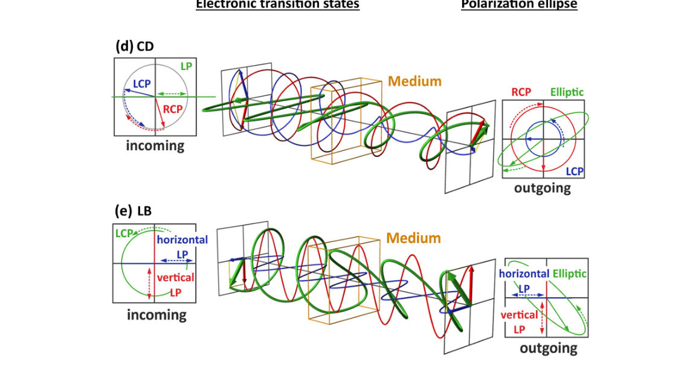
<figcaption class="paper-figure-caption"><b>Fig 1.</b> FIG. 1. (a, b) Energy-level diagrams illustrating the microscopic origin of CD. Optical activity arises from</figcaption>
</figure>
<figure class="paper-figure-card">
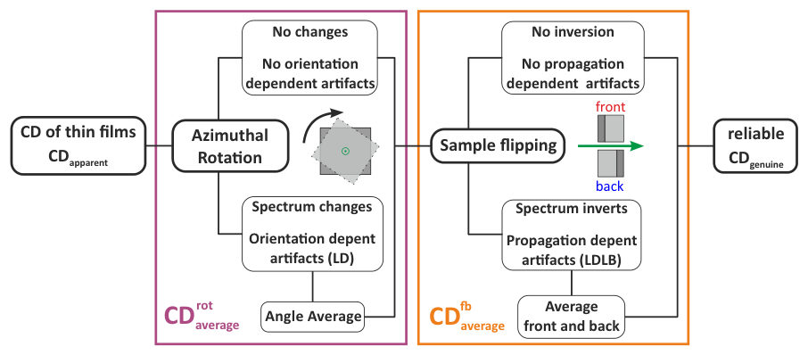
<figcaption class="paper-figure-caption"><b>Fig 2.</b> FIG. 2. Flow chart of the two-step workflow for diagnosing and reducing artifacts in CD measurements.</figcaption>
</figure>
<figure class="paper-figure-card">
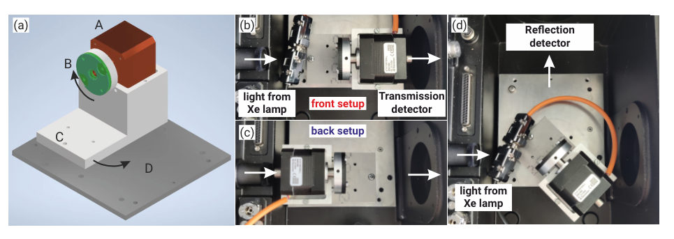
<figcaption class="paper-figure-caption"><b>Fig 3.</b> FIG. 3. (a) Technical drawing of the designed rotation mount with the components (A) step motor, (B)</figcaption>
</figure>
<figure class="paper-figure-card">
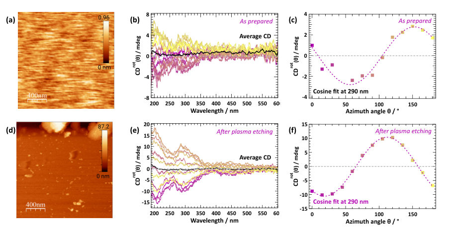
<figcaption class="paper-figure-caption"><b>Fig 4.</b> FIG. 4. (a)/(d) (1.3 × 1.3)µm2 non-contact AFM images, (b)/(e) CD spectra in front configuration for</figcaption>
</figure>
<figure class="paper-figure-card">
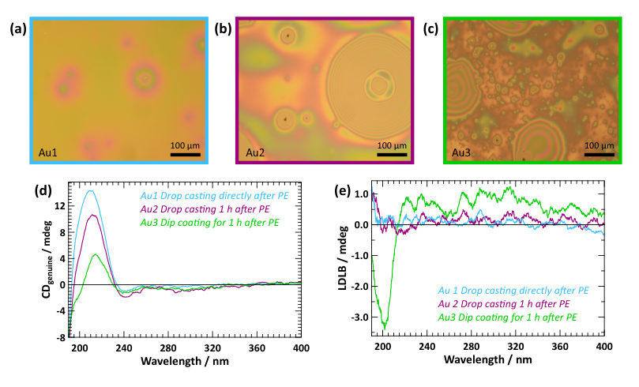
<figcaption class="paper-figure-caption"><b>Fig 5.</b> FIG. 5. Optical Microscopy images with 20× magnification of Boc-L-Cysteine deposited via (a) drop</figcaption>
</figure>
<figure class="paper-figure-card">
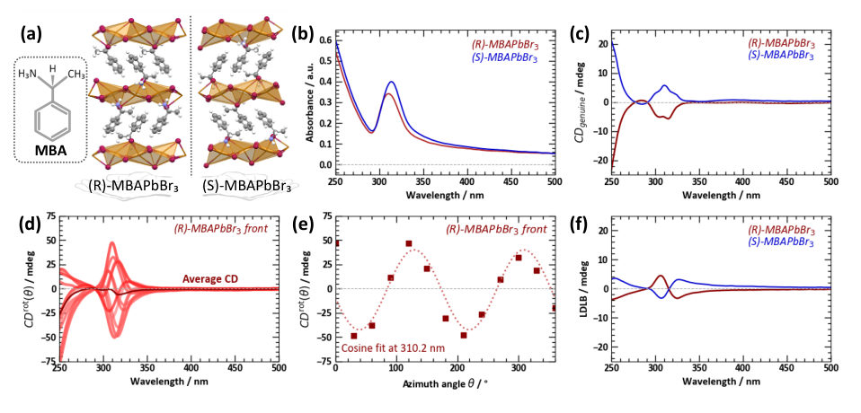
<figcaption class="paper-figure-caption"><b>Fig 6.</b> FIG. 6. 1D chiral perovskites thin films. (a) Crystal structures of (R)- and (S)-MBAPbBr3, featuring the</figcaption>
</figure>

**Main problem.** The difficulty of distinguishing genuine circular dichroism (CD) from artifacts caused by linear optical anisotropy (LD/LB) and instrumental imperfections in chiral thin films.

**Main result.** The authors present a reliable two-step workflow involving azimuthal sample rotation and sample flipping to isolate the orientation-invariant CD response from anisotropy-induced artifacts.

**Method.** A combination of azimuthal rotation (to remove orientation-dependent artifacts) and sample flipping (to remove propagation-dependent artifacts), supported by a custom-built rotation stage and a Python analysis script.

**Summary.** This paper provides a practical tutorial for researchers working with chiral thin films. It addresses the common problem where structural anisotropy mimics circular dichroism, leading to false signals. By using a specific rotation and flipping protocol, the authors show how to mathematically and experimentally cancel out these artifacts. The method is validated on both metallic and perovskite systems, providing a standardized way to extract intrinsic chiroptical properties.

Detailed structure

**Model / system.** The experimental platform uses a commercial CD spectrophotometer equipped with a custom-built automated rotation mount. The study applies this to chiral thin films, including molecules on metallic surfaces and chiral metal halide perovskites.

**Key observables.** Circular Dichroism (CD), ellipticity, rotatory strength, dissymmetry factor (g_CD), linear dichroism (LD), and linear birefringence (LB).

**Important parameters / regimes.** Azimuthal angle (theta), thickness non-uniformity, surface roughness, and the 50kHz signal from the Photoelastic Modulator (PEM).

**Assumptions / limitations.** The sample is assumed to be in a normal transmission geometry; the method may fail in the presence of significant scattering, reflections, or complex interference effects.

**Figures summary.** Figure 1 shows the microscopic origin of CD and LB; Figure 2 presents the workflow flowchart; Figure 3 shows the custom rotation hardware; Figure 4 demonstrates artifact identification in gold films using azimuthal dependence; Figure 5 shows CD extraction for Boc-Cysteine/Au films.

**Paper structure.** The paper begins with the physical origin of CD and artifacts, introduces a custom hardware setup and a two-step experimental workflow, validates the method using achiral gold films to identify artifacts, and demonstrates successful application to chiral molecular and perovskite thin films.

Abstract

Circular Dichroism (CD) spectroscopy has evolved from a purely solution based method towards a powerful tool in the analysis of chiral thin films. Although a straightforward technique, the genuine CD signal is often accompanied by artifacts arising from optical anisotropy and instrumental imperfections. This tutorial presents a two-step workflow that reliably isolates the orientation invariant CD response for anisotropic thin films by combining azimuthal sample rotation with sample flipping. For this purpose, a home-built sample stage was developed, which enables systematic suppression of many anisotropy-induced artifacts in commercial CD spectrophotometers. Both a detailed description of the setup itself as well as the needed python script are provided. The reliability of the workflow is demonstrated on two selected samples from different research fields: chiral molecules attached to metallic surfaces as well as metal halide perovskites incorporating chiral spacer molecules

[↑ back to top](#top)

### [A Symmetric Unified Transport and Charge Model for MOSFETs from Diffusive to Ballistic Regimes](http://arxiv.org/abs/2604.23541v1)

**Authors:** Chien-Ting Tung  
**Type:** both · **Category:** other · **PDF:** <https://arxiv.org/pdf/2604.23541v1>  
**Analysis basis:** full PDF text, analyzed in chunks

↔ Scroll figures horizontally

<figure class="paper-figure-card">
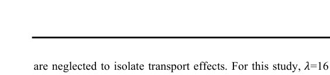
<figcaption class="paper-figure-caption"><b>Fig 1.</b> Fig. 1 verifies the model behavior in the long-channel limit by comparing the IdVd and CggiVg (intrinsic gate capacitance) curves with those of the DD model. At L=2 m, and the device operates in the fully diffusive regime. In this case, (7a) reduces to 𝑣dd, and the channel charge fully relaxes to local equilibrium. Consequently, the UT model reproduces the classic square-law behavior, yielding the same IV and CV curves as the DD model.</figcaption>
</figure>
<figure class="paper-figure-card">
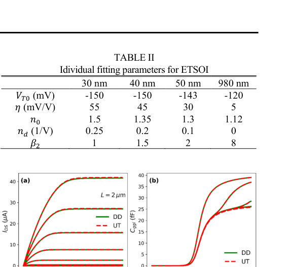
<figcaption class="paper-figure-caption"><b>Fig 2.</b> Fig. 1. (a) IdVd and (b) CggiVg curves of the DD and UT model at L=2 m.</figcaption>
</figure>
<figure class="paper-figure-card">
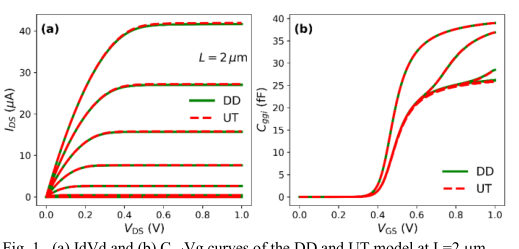
<figcaption class="paper-figure-caption"><b>Fig 3.</b> Fig. 2. (a) IdVd and (b) CggiVg curves of the DD, BT and UT model at L=30 nm.</figcaption>
</figure>
<figure class="paper-figure-card">
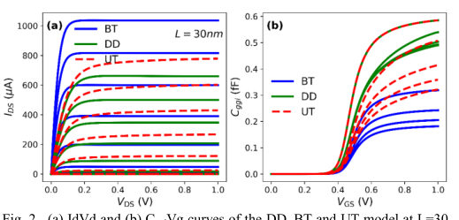
<figcaption class="paper-figure-caption"><b>Fig 4.</b> Fig. 3. (a) IdVd and (b) CggiVg curves of the BT and UT model at L=1 nm.</figcaption>
</figure>
<figure class="paper-figure-card">
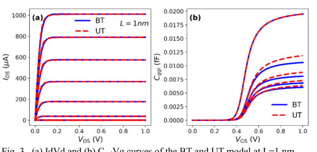
<figcaption class="paper-figure-caption"><b>Fig 5.</b> Fig. 4. (a) IdVd and (b) IdVg of a 980 nm ETSOI. Symbol: data [7]. Line: model.</figcaption>
</figure>
<figure class="paper-figure-card">
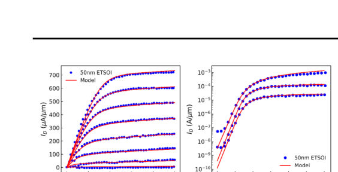
<figcaption class="paper-figure-caption"><b>Fig 6.</b> Fig. 5. (a) IdVd and (b) IdVg of a 50 nm ETSOI. Symbol: data [20]. Line: model.</figcaption>
</figure>
<figure class="paper-figure-card">
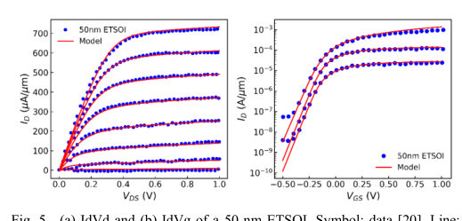
<figcaption class="paper-figure-caption"><b>Fig 7.</b> Fig. 6. (a) IdVd and (b) IdVg of a 40 nm ETSOI. Symbol: data [20]. Line: model.</figcaption>
</figure>
<figure class="paper-figure-card">
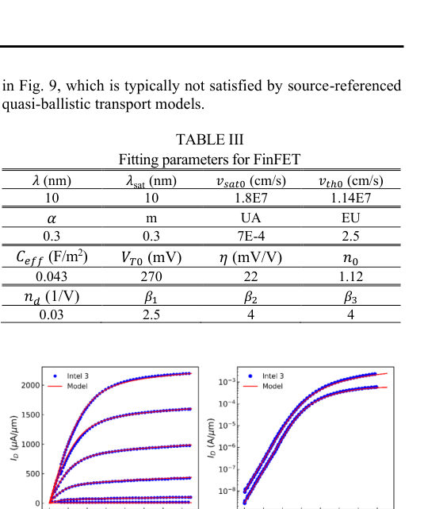
<figcaption class="paper-figure-caption"><b>Fig 8.</b> Fig. 8. (a) IdVd and (b) IdVg of an Intel 3 FinFET. Symbol: data [20]. Line: model.</figcaption>
</figure>
<figure class="paper-figure-card">
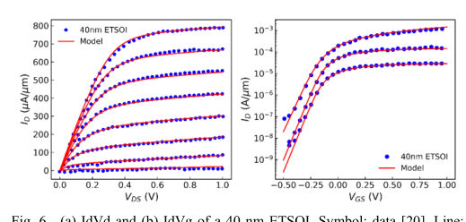
<figcaption class="paper-figure-caption"><b>Fig 9.</b> Fig. 7. (a) IdVd and (b) IdVg of a 30 nm ETSOI. Symbol: data [20]. Line: model.</figcaption>
</figure>
<figure class="paper-figure-card">
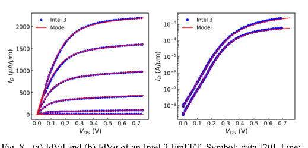
<figcaption class="paper-figure-caption"><b>Fig 10.</b> Fig. 9. The DC and AC symmetry test of this model.</figcaption>
</figure>

**Main problem.** The need for a unified compact model for MOSFETs that smoothly and physically describes carrier transport across the transition from the diffusive (long-channel) to the ballistic (short-channel) regime while maintaining DC and AC symmetry.

**Main result.** The proposed Symmetric Unified Transport (UT) model successfully bridges the drift-diffusion and ballistic regimes, capturing velocity overshoot and capacitance reduction while passing both DC and AC symmetry tests.

**Method.** The model uses Matthiessen's rule to combine drift-diffusion and ballistic velocities and employs a weighted sum approach to connect charge distributions, incorporating quantum capacitance and a high-field scattering length.

**Summary.** This paper proposes a new mathematical framework for modeling MOSFETs that works across all channel lengths, from large-scale transistors to extremely small, ballistic ones. It solves a common problem in semiconductor modeling where models become discontinuous or physically inaccurate at very small scales. By unifying drift-diffusion and ballistic transport through a symmetric approach, the model accurately predicts current and capacitance. The model is validated using experimental data from advanced technologies like FinFETs.

Detailed structure

**Model / system.** The physical system is MOSFETs (including FinFET, FDSOI, and GAA architectures) with channel lengths ranging from micrometer to sub-20-nm scales.

**Key observables.** Drain-source current (Ids), gate capacitance (Cgg), threshold voltage (Vt), effective mobility, and charge distributions.

**Important parameters / regimes.** Transition from Drift-Diffusion (DD) to Ballistic Transport (BT) regimes; thermal injection velocity (vth); high-field scattering length (lambda_sat); channel lengths from 1 nm to 2 um.

**Assumptions / limitations.** Uses 1D Poisson and charge sheet approximations; assumes the scattering length L can be used in the transmission rate instead of a voltage-dependent critical length; GCA-based charge density is not applicable under fully ballistic conditions.

**Figures summary.** Figure 1 shows model verification; Figure 8 compares model predictions to experimental data for Intel 3 FinFET Id-Vds and Id-Vgs; Figure 9 displays DC and AC symmetry test results.

**Paper structure.** The paper introduces the scientific problem of transport modeling, presents the three-part unified transport and charge model, details the mathematical formulation for velocity and charge, validates the model against theoretical limits and experimental data from various MOSFET technologies, and concludes with symmetry test results.

Abstract

This paper presents a symmetric unified transport (UT) compact model for MOSFETs that bridges drift-diffusion (DD) and ballistic transport (BT) regimes. The proposed model self consistently accounts for both current and charge across the DD-BT transition. Quantum capacitance and carrier transport are incorporated into the charge density formulation. Drain side velocity saturation and the source side thermal velocity limit are unified within a single framework using a physically motivated high field scattering length, enabling accurate modeling from DD square law behavior to the ballistic limit. In addition, a physical channel charge and capacitance model is developed to capture capacitance reduction in the quasi ballistic regime, which is not considered in standard compact models. The model is verified using theoretical analysis and experimental data from MOSFETs with multiple channel lengths, achieving accurate fitting using only physical transport parameters. The formulation is continuous and symmetric, and it passes both DC and AC symmetry tests.

[↑ back to top](#top)

### [Agentic Fusion of Large Atomic and Language Models to Accelerate Materials Discovery](http://arxiv.org/abs/2604.23758v1)

**Authors:** Mingze Li, Yu Rong, Songyou Li, Lihong Wang, Jiacheng Cen, Liming Wu, Anyi Li, Zongzhao Li, Qiuliang Liu, Rui Jiao, Tian Bian, Pengju Wang, Hao Sun, Jianfeng Zhang, Ji-Rong Wen, Deli Zhao, Shifeng Jin, Tingyang Xu, Wenbing Huang  
**Type:** both · **Category:** disordered systems and neural networks · **PDF:** <https://arxiv.org/pdf/2604.23758v1>  
**Analysis basis:** full PDF text, analyzed in chunks

↔ Scroll figures horizontally

<figure class="paper-figure-card">
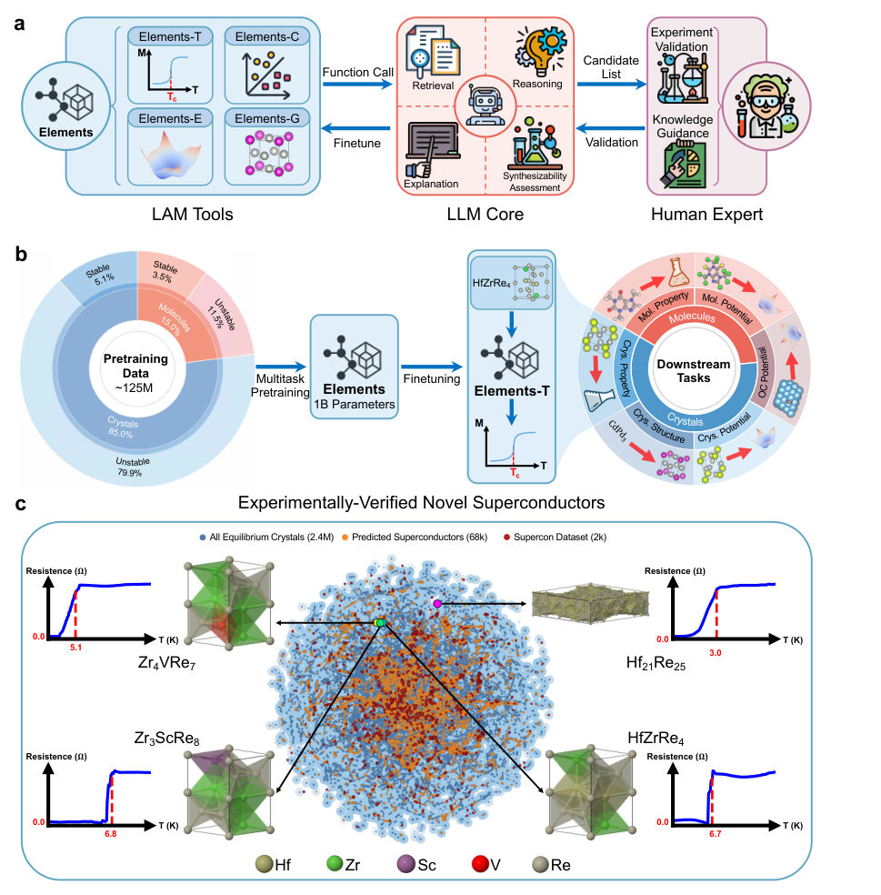
<figcaption class="paper-figure-caption"><b>Fig 1.</b> Fig. 1 Overview of our methodologies and results. a, The agentic framework. ElementsClaw integrates specialized Elements variants (Elements-T/C/E/G) and LLMs’ reasoning to identify candidates for experimental validation. b, Omni-domain large atomic model development. Elements is pretrained on 125 million structures, enabling seamless adaptation across diverse downstream tasks. c, Large-scale superconductor discovery. By leveraging Elements-T (predicted Tc &gt; 4 K) and Elements-C (positive output), ElementsClaw screens across 2.4 million distinct stable crystals and identifies a repository of 68k potential superconductors, significantly enriching the existing SuperCon database, which contains...</figcaption>
</figure>
<figure class="paper-figure-card">
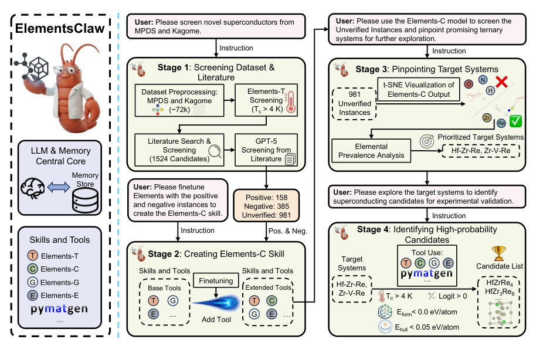
<figcaption class="paper-figure-caption"><b>Fig 2.</b> Fig. 2 The Multi-Stage Agentic Discovery Process of ElementsClaw. Guided by human expertise, the agent first curates labeled superconducting instances via Elements-T screening and GPT-5-driven literature synthesis from existing datasets (Stage 1). It then creates the Elements-C classification skill through finetuning Elements (Stage 2), enabling the systematic screening of unverified instances to pinpoint promising ternary systems (Stage 3). Finally, ElementsClaw identifies high- probability candidate phases for downstream experimental validation (Stage 4). Notably, although we illustrate only a single representative dialogue for each stage, the actual process involves granular, multi-turn...</figcaption>
</figure>
<figure class="paper-figure-card">
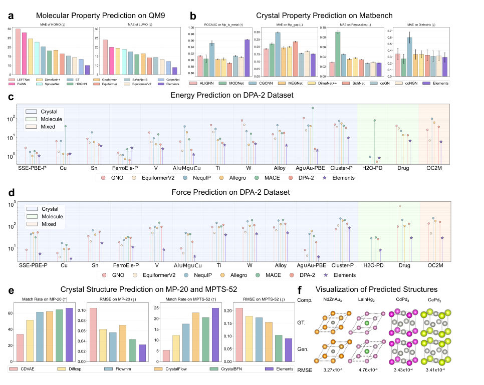
<figcaption class="paper-figure-caption"><b>Fig 3.</b> Fig. 3 Comparisons between Elements and SOTA methods across 22 downstream tasks in terms of property prediction, interatomic potential estimation, and structure prediction. The results of all compared methods are directly copied from the corresponding benchmarks. a, MAE results of molecular property prediction (HOMO and LUMO) on the QM9 dataset containing stable molecules. b, MAE results of crystal property prediction (MP_is_metal, Mp_gap, Perovskites, and Dielectric) on Matbench containing stable crystals. c-d, RMSEs of energy (c) and force prediction (d) on the DPA-2 dataset containing unstable molecules and crystals. e, Match Rate and RMSE results of crystal structure prediction on MP-20...</figcaption>
</figure>
<figure class="paper-figure-card">
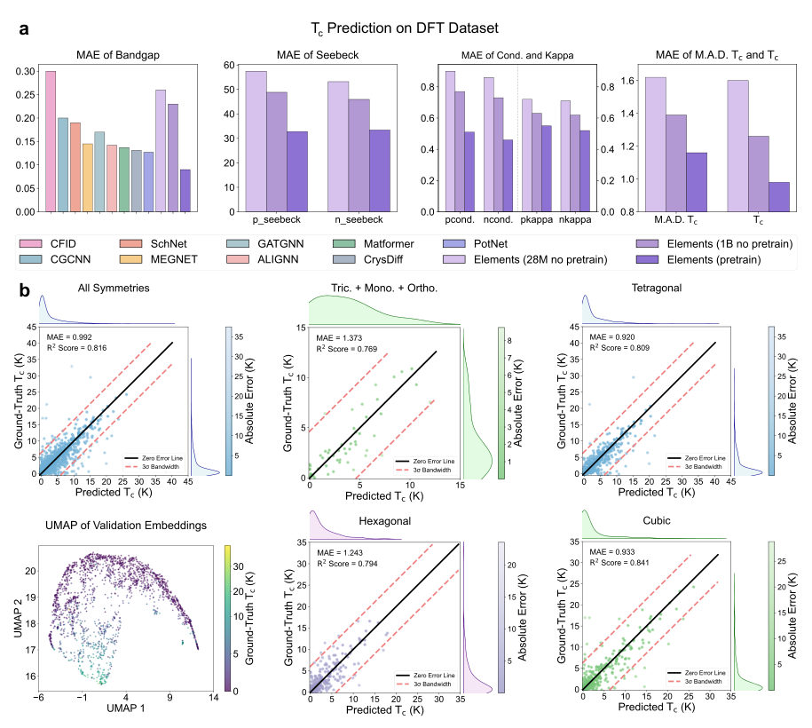
<figcaption class="paper-figure-caption"><b>Fig 4.</b> Fig. 4 The performance of Elements-T after finetuning on the DFT dataset. a, MAE results for key superconductivity- related properties on the DFT dataset. From left to right, the four panels report the MAE for the bandgap (eV), Seebeck coefficients (µV/K), electrical conductivity and electronic thermal conductivity (log-scaled σ/τ in 1/(Ω· m · s) and κe/τ in W/(m · K · s), respectively), and critical temperature Tc (K). For the electrical conductivity (p/n Cond.) and electronic thermal conductivity (p/n Kappa), we predict the log-transformed values due to their wide dynamic range spanning several orders of magnitude. In the fourth panel, the M.A.D. Tc denotes the calculation via the...</figcaption>
</figure>
<figure class="paper-figure-card">
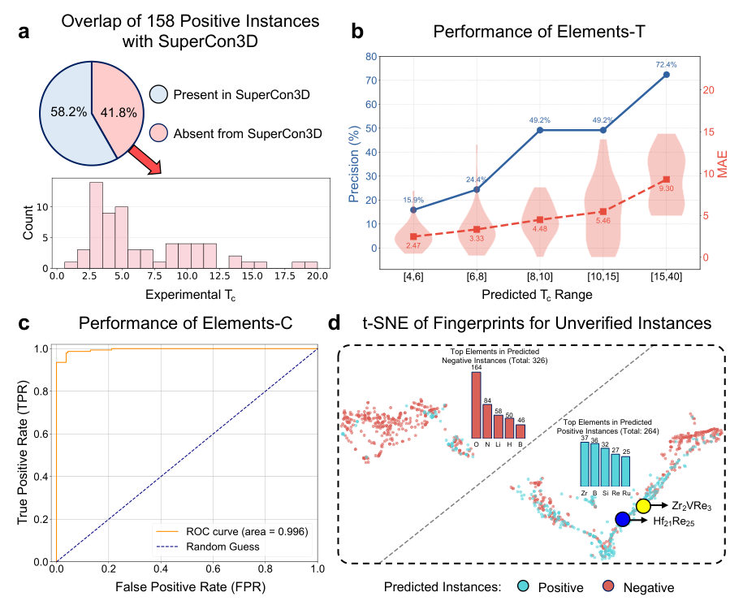
<figcaption class="paper-figure-caption"><b>Fig 5.</b> Fig. 5 Superconductor screening from existing databases and literature by ElementsClaw. a, Overlap between positive instances and the SuperCon3D database, revealing that 41.8% of the identified materials represent novel entries absent from the SuperCon3D database. The experimental Tc distribution of these undocumented materials is illustrated in the histogram below. b, Performance evaluation of Elements-T. The plot illustrates the classification precision (blue line) and the MAE of Tc predictions (red violin plots) across varying predicted Tc intervals. c, ROC curve for the classification model Elements-C, achieving an AUC of 0.996. d, t-SNE visualization of crystal fingerprints for the...</figcaption>
</figure>
<figure class="paper-figure-card">
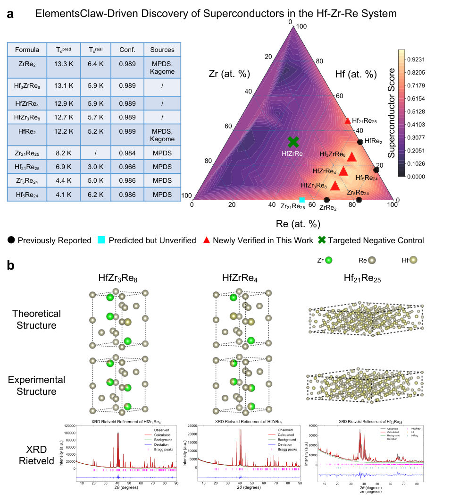
<figcaption class="paper-figure-caption"><b>Fig 6.</b> Fig. 6 Identifying superconducting phases in the Hf–Zr–Re system for experimental verification. a, (Left) Table of the successful discovery of experimentally-verified superconductors; (Right) Ternary phase diagram illustrating the distribution of explored materials. Within the diagram, black circles denote previously reported superconducting phases, cyan squares represent predicted superconductors without experimental verification, and red triangles highlight candidates successfully predicted and experimentally confirmed as novel superconductors in this work, including Hf21Re25 sourced from the MPDS dataset, alongside HfZr3Re8, HfZrRe4, and Hf3ZrRe8. The green cross indicates the targeted...</figcaption>
</figure>

**Main problem.** The challenge of accelerating materials discovery by moving from isolated deep learning models to an autonomous, agentic framework capable of orchestrating the full discovery pipeline, from screening to experimental validation.

**Main result.** The ElementsClaw framework successfully identified and experimentally synthesized four new superconductors, including Zr3ScRe8 and HfZrRe4, and screened 2.4 million crystals to find 68,000 high-confidence candidates.

**Method.** An agentic framework (ElementsClaw) that fuses Large Atomic Models (LAMs) for numerical computation with Large Language Models (LLMs) for high-level reasoning, literature retrieval, and tool orchestration.

**Summary.** This paper introduces ElementsClaw, an AI agentic framework that combines Large Atomic Models with Large Language Models to automate the materials discovery process. By orchestrating specialized tools for property prediction and structure generation, the system can autonomously navigate vast chemical spaces. The authors demonstrate the framework's power by discovering and experimentally validating several new superconductors. This approach represents a shift from using AI as a simple predictive tool to using it as an autonomous researcher capable of complex decision-making.

Detailed structure

**Model / system.** The system uses the Elements foundation model, a 1-billion-parameter EquiformerV2-based LAM pretrained on 125 million structures, integrated with specialized modules for property prediction (Elements-T), classification (Elements-C), stability (Elements-E), and generation (Elements-G).

**Key observables.** Superconducting transition temperature (Tc), magnetic susceptibility, electrical resistivity, energy above hull (E_hull), formation energy (E_form), and crystal structure parameters.

**Important parameters / regimes.** Critical temperature (Tc), 125 million pretraining structures, 2.4 million screened crystals, and 28 GPU hours for large-scale screening.

**Assumptions / limitations.** The framework assumes that the learned interatomic potentials and property predictions from the LAM are sufficiently accurate to guide experimental synthesis without exhaustive DFT verification for every candidate.

**Figures summary.** Figure 1 shows the ElementsClaw framework overview, the Elements model development, and large-scale discovery results. Figure 2 illustrates the agentic discovery workflow. Figure 3 compares Elements against SOTA methods across 22 tasks. Figure 4 shows Tc prediction performance and clustering. Figure 5 details the superconductor screening results.

**Paper structure.** The paper introduces the scientific problem of isolated AI models, describes the architecture of the ElementsClaw agentic framework and the Elements foundation model, details the four-stage discovery pipeline (screening, skill creation, pinpointing, and prioritization), presents large-scale screening results and experimental validation of new superconductors, and concludes with performance benchmarks.

Abstract

The discovery of novel materials is critical for global energy and quantum technology transitions. While deep learning has fundamentally reshaped this landscape, existing predictive or generative models typically operate in isolation, lacking the autonomous orchestration required to execute the full discovery process. Here we present ElementsClaw, an agentic framework for materials discovery that synergizes Large Atomic Models (LAMs) with Large Language Models (LLMs). In response to varied human requirements, ElementsClaw dynamically orchestrates a suite of LAM tools finetuned from our proposed model Elements for atomic-scale numerical computation, while leveraging LLMs for high-level semantic reasoning. This shift moves AI-driven materials science from isolated processes toward integrated and human interactive discovery. In the demanding domain of superconductors, our agentic system guides the experimental synthesis of four new superconductors, including Zr3ScRe8 with a transition temperature of 6.8 K and HfZrRe4 at 6.7 K. At scale, ElementsClaw screens more than 2.4 million stable crystals within only 28 GPU hours, identifying 68,000 high-confidence superconducting candidates and vastly expanding the known superconducting space. These results demonstrate how our agent accelerates materials discovery with high physical fidelity.

[↑ back to top](#top)

### [Amorphous High Density Plutonium](http://arxiv.org/abs/2604.23491v1)

**Authors:** J. K. Katz, A. Rollett, R. J. Hemley  
**Type:** experiment · **Category:** disordered systems and neural networks · **PDF:** <https://arxiv.org/pdf/2604.23491v1>  
**Analysis basis:** full PDF text, analyzed in chunks

↔ Scroll figures horizontally

<figure class="paper-figure-card">
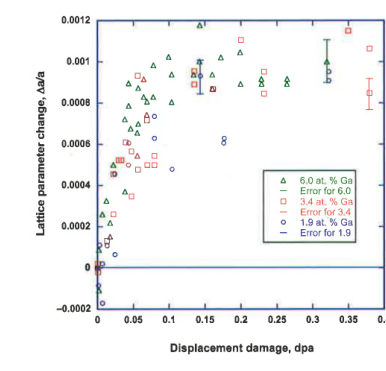
<figcaption class="paper-figure-caption"><b>Fig 1.</b> Figure 1: Left (from [18]): The increase of the lattice constant of Ga-stabilized δ-Pu under self</figcaption>
</figure>

**Main problem.** Explaining the anomalous, rapid density changes and lattice parameter discrepancies in alpha and delta plutonium phases under self-irradiation at cryogenic and ambient temperatures.

**Main result.** The authors propose that radiation damage induces the formation of a metastable, high-density amorphous (glassy) phase with an intermediate density between the alpha and delta phases.

**Method.** Experimental analysis using X-ray diffraction (XRD), dilatometry (bulk dimension measurements), and comparison with accelerated aging using 238-Pu spikes.

**Summary.** This paper investigates why plutonium undergoes rapid, unexpected swelling or shrinkage at very low temperatures under self-irradiation. The researchers found that the lattice expansion measured by X-ray diffraction does not match the bulk density changes, suggesting the creation of a new phase. They propose that radiation damage creates a high-density amorphous or glassy phase that acts as an intermediate state between the alpha and delta phases of plutonium. This discovery helps explain how the material recovers its original structure upon heating.

Detailed structure

**Model / system.** The physical system consists of plutonium phases, specifically high-density alpha-Pu and low-density, aluminum-alloyed metastable delta-Pu, subject to self-irradiation from alpha and beta decay.

**Key observables.** Lattice parameter (a), bulk density, linear dilation (length changes), and volumetric shrinkage/swelling rates.

**Important parameters / regimes.** Temperature regimes (4 K vs. room temperature), radiation dose (displacements per atom, dpa), and annealing temperature (~100 K).

**Assumptions / limitations.** The assumption that accelerated aging via 238-Pu enrichment is equivalent to natural aging, and that the recrystallization of the amorphous phase is nucleated by the existing crystalline template.

**Figures summary.** Figure 1 compares XRD data and dilatometry for Ga-stabilated delta-Pu, showing that the lattice constant increases more rapidly than the bulk sample dimension.

**Paper structure.** The paper introduces the problem of anomalous density changes, presents experimental observations of cryogenic and ambient temperature behavior, rejects the phase conversion hypothesis in favor of an amorphous phase model, and discusses the implications for room-temperature dynamics.

Abstract

Metastable aluminum-alloyed $δ$-plutonium shrinks rapidly and pure $α$-plutonium swells rapidly at 4 K. At ambient temperature alloyed $δ$-plutonium swells about $10^{-3}$ as fast as it shrinks at 4 K, but its bulk density decreases more slowly than would be inferred from the increase in its lattice parameter determined by X-ray diffraction. These results might be explained as the result of ingrowth of the opposite phases, but they have not been found in X-ray diffraction. The cryogenic results may be explained by ingrowth of an amorphous phase with density intermediate between those of $α$ and $δ$. This phase, when formed from alloyed $δ$-plutonium, rapidly but not instantaneously anneals to $δ$-plutonium at temperatures $\gtrapprox 100\,$K; when formed from pure $α$-plutonium it anneals to $α$ at similar temperatures. The room temperature discrepancy between growth of lattice parameter and length of $δ$-plutonium is also explained by ingrowth of a denser amorphous phase that is continuously formed and annealed out.

[↑ back to top](#top)

### [Atomistic Mechanisms of Temperature-Dependent Ion Track Formation in Gallium Nitride under Swift Heavy Ion Irradiation](http://arxiv.org/abs/2604.24288v1)

**Authors:** Jiayu Liang, Shaowei He, Wenlong Liao, Tan Shi, Hang Zang, Yonghong Li, Xiaojun Fu, Chuanjian Yao, Chaohui He, Jianan Wei, Huan He  
**Type:** both · **Category:** other · **PDF:** <https://arxiv.org/pdf/2604.24288v1>  
**Analysis basis:** full PDF text, analyzed in chunks

↔ Scroll figures horizontally

<figure class="paper-figure-card">
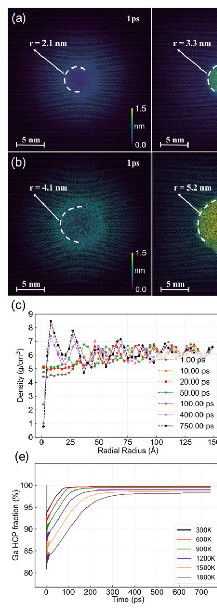
<figcaption class="paper-figure-caption"><b>Fig 1.</b> FIG. 1. The cross-sectional schematics (25 nm thickness) of GaN at 200 nm depth</figcaption>
</figure>
<figure class="paper-figure-card">
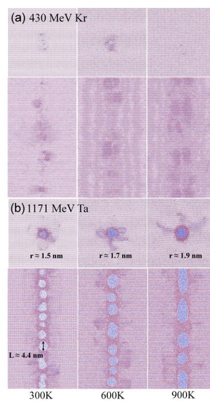
<figcaption class="paper-figure-caption"><b>Fig 2.</b> FIG. 2. The cross and longitudinal diagrams (25 nm thickness) of final ion tracks</figcaption>
</figure>
<figure class="paper-figure-card">
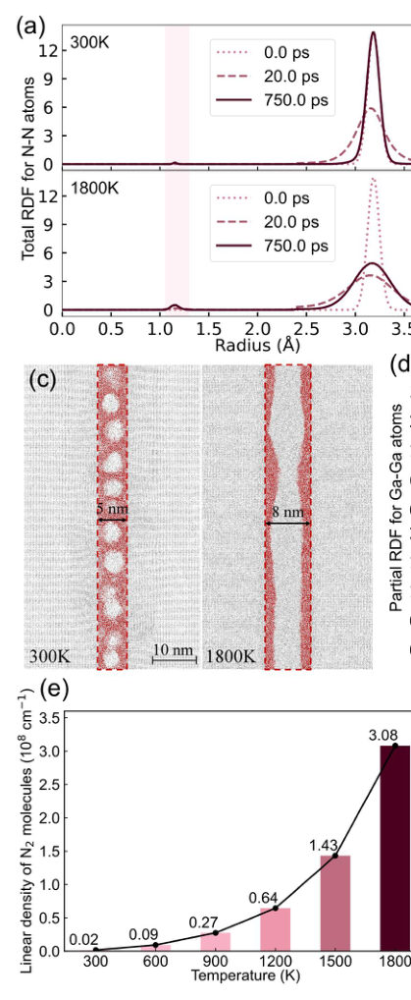
<figcaption class="paper-figure-caption"><b>Fig 3.</b> FIG. 3. Under 1171 MeV Ta irradiation: (a) Total radial distribution function (RDF)</figcaption>
</figure>
<figure class="paper-figure-card">
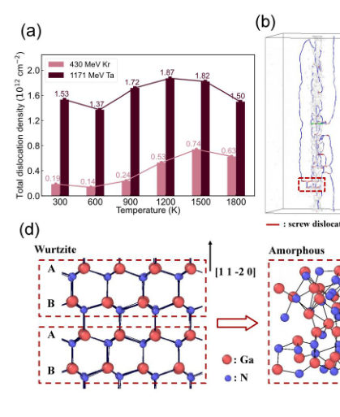
<figcaption class="paper-figure-caption"><b>Fig 4.</b> FIG. 4. (a) Total dislocation density as a function of temperature. (b)(c) The</figcaption>
</figure>

**Main problem.** Understanding the atomistic mechanisms of temperature-dependent ion track formation and structural degradation in Gallium Nitride (GaN) under swift heavy ion irradiation.

**Main result.** The study reveals a temperature-driven transition from discontinuous tracks to continuous channels, driven by the decomposition of GaN into Ga clusters and N2 molecules, and identifies that zincblende nanodomains and screw dislocations create pathways for leakage current.

**Method.** A multi-scale approach combining the Two-Temperature Model (TTM) with Molecular Dynamics (MD) simulations.

**Summary.** This paper investigates how high-energy ions damage GaN crystals at different temperatures using advanced simulations. It finds that increasing temperature causes ion tracks to evolve from broken segments into continuous channels filled with nitrogen bubbles. The process involves the chemical decomposition of GaN into gallium and nitrogen gas. These structural changes, including the formation of new crystal phases and dislocations, are critical because they can lead to electrical leakage and device failure in next-generation electronics.

Detailed structure

**Model / system.** Wurtzite Gallium Nitride (GaN) subjected to irradiation by 430 MeV Kr and 1171 MeV Ta ions at temperatures ranging from 300 K to 1800 K.

**Key observables.** Ion track morphology (radius and continuity), radial density profiles, atomic displacement radius, phase fractions (wurtzite vs. zincblende), dislocation density, and spatial distribution of N2 and Ga clusters.

**Important parameters / regimes.** Electronic stopping power (Se), initial simulation temperature (300 K - 1800 K), and ion species (Kr and Ta).

**Assumptions / limitations.** The melting-quenching process deviates from thermodynamic equilibrium due to extremely high cooling rates.

**Figures summary.** Figure 1 shows cross-sectional schematics and radial density profiles of the ion track evolution; Figure 2 displays final ion track morphology; Figure 3 illustrates the spatial distribution and radial distribution functions of N2 and Ga; Figure 4 quantifies dislocation density and morphology.

**Paper structure.** The paper introduces the problem of radiation tolerance in GaN, describes the TTM-MD methodology, presents results on temperature-dependent track morphology and atomic-scale decomposition, analyzes defect generation and phase transformations, and concludes with implications for device failure.

Abstract

The radiation tolerance of gallium nitride under extreme conditions is critical for its deployment in next-generation electronic and optoelectronic devices, yet the microscopic mechanisms governing swift heavy ion induced damage at elevated temperatures remain poorly understood. Therefore, this study employs a coupled approach including the two-temperature model and molecular dynamics simulations to resolve the entire processes of ion track generation induced by swift heavy ions irradiation across a wide temperature range. A temperature-driven morphological transition of ion tracks, evolving from discontinuous segments to continuous tracks composed of isolated nanobubbles, and ultimately to fully continuous channels is observed. Under lower electronic stopping loss of 430 MeV Kr irradiation, increasing temperature significantly enhances track visibility, enlarges track radii and promotes nanobubble formation. For higher electronic stopping conditions of 1171 MeV Ta irradiation, continuous ion tracks consisting of discontinuous nanobubbles (~1.5 nm radius) emerge already at 300 K, followed by a thermally activated transition into continuous channels with further radial expansion. At the atomic scale, SHI irradiation induces decomposition of wurtzite GaN into Ga clusters and N2 molecules along the ion trajectory, with Ga-rich regions and recrystallized wurtzite phases accumulating near bubble interfaces, while N2 preferentially segregates within bubble cores. Additionally, zincblende nanodomains nucleate around ion tracks and exhibit strong spatial correlation with radiation-induced dislocation networks, particularly screw dislocations, providing potential pathways for leakage current and increased susceptibility to single-event burnout.

[↑ back to top](#top)

### [Attention Is Not All You Need for Diffraction](http://arxiv.org/abs/2604.23811v1)

**Authors:** Elizabeth J. Baggett, Edward G. Friedman, Abhishek Shetty, Derrick Chan-Sew, Vanellsa Acha, Harshita Dwarcherla, Paul Kienzle, William Ratcliff  
**Type:** both · **Category:** disordered systems and neural networks · **PDF:** <https://arxiv.org/pdf/2604.23811v1>  
**Analysis basis:** full PDF text, analyzed in chunks

↔ Scroll figures horizontally

<figure class="paper-figure-card">
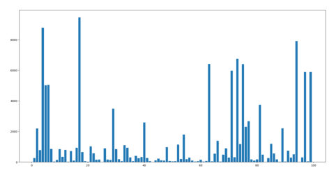
<figcaption class="paper-figure-caption"><b>Fig 1.</b> FIG. 1. Extinction-group distribution in the Inorganic Crys- tal Structure Database (ICSD), showing severe geological class imbalance.</figcaption>
</figure>
<figure class="paper-figure-card">
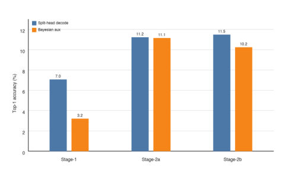
<figcaption class="paper-figure-caption"><b>Fig 2.</b> FIG. 2. Effect of curriculum stages on real RRUFF holdout Top-1 accuracy. RRUFF domain fine-tuning (Phase 2) is the dominant factor in bridging the sim-to-real gap.</figcaption>
</figure>
<figure class="paper-figure-card">
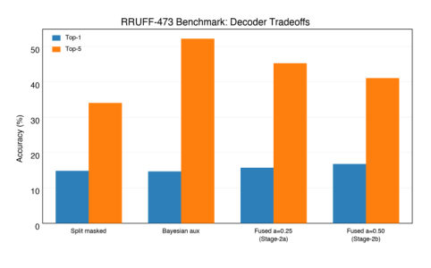
<figcaption class="paper-figure-caption"><b>Fig 3.</b> FIG. 3. Decoder comparison on the RRUFF-473 benchmark.</figcaption>
</figure>
<figure class="paper-figure-card">
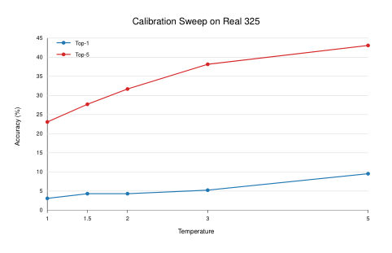
<figcaption class="paper-figure-caption"><b>Fig 4.</b> FIG. 4. Post-hoc calibration restores ranking accuracy on RRUFF-325. Results shown for the final Stage-2c checkpoint. Softening the auxiliary logits (T = 5) before adding the ge- ological prior decouples structural evidence from geological overconfidence.</figcaption>
</figure>
<figure class="paper-figure-card">
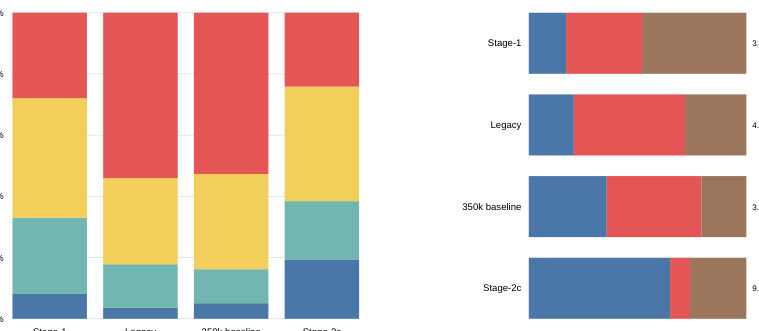
<figcaption class="paper-figure-caption"><b>Fig 5.</b> FIG. 5. Topological structure of Top-1 errors on the RRUFF-325 benchmark. Left: error-distance distribution on the condensed extinction-group subgroup graph. Right: directionality. Calibration and preferred-orientation-aware training shift errors toward shorter graph distances, reduce the strong descendant bias of the non-PO model, and reveal that many residual failures are local lateral hops rather than distant hallucinations.</figcaption>
</figure>
<figure class="paper-figure-card">
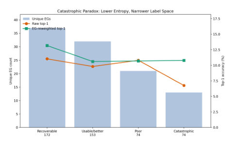
<figcaption class="paper-figure-caption"><b>Fig 6.</b> FIG. 6. The catastrophic paradox. Classical profile-fit qual- ity and neural classification difficulty do not align monotoni- cally; extinction-group reweighting removes about 45% of the recoverable-versus-catastrophic gap.</figcaption>
</figure>

**Main problem.** Automating the determination of crystal symmetry (extinction groups) from powder X-ray diffraction patterns, which is an ill-posed inverse problem due to overlapping peaks and experimental noise.

**Main result.** A physics-informed transformer architecture, combined with a three-stage training curriculum and post-hoc temperature scaling, significantly improves the accuracy and reliability of symmetry classification on real-world mineral data.

**Method.** The authors use a transformer-based model with a physics-aware positional encoding and a dual-head decoder, trained via a curriculum of synthetic pretraining, realistic fine-tuning with preferred orientation, and Bayesian prior injection.

**Summary.** This paper addresses the difficulty of identifying crystal symmetry from X-ray diffraction patterns using machine learning. By incorporating crystallographic physics—such as reciprocal-space coordinates and symmetry-based decoding—into a transformer architecture, the authors overcome the 'synthetic-to-real' domain gap. They demonstrate that a structured training curriculum and proper model calibration are just as vital as model capacity. The resulting model provides a fast, robust alternative to computationally expensive classical refinement methods.

Detailed structure

**Model / system.** The physical system is powder X-ray diffraction (PXRD) of crystals/minerals. The model is a physics-informed transformer featuring an explicit sin^2(theta) coordinate channel and a split-head decoder for crystallographic rule learning.

**Key observables.** Top-1/Top-k accuracy, Expected Calibration Error (ECE), Negative Log-Likelihood (NLL), and topological error metrics (mean DAG distance, error directionality).

**Important parameters / regimes.** 99 extinction groups (classification targets), 230 space groups (baseline), temperature scaling factor (T=5), and the alpha weight for fusion decoding.

**Assumptions / limitations.** The primary limitation is an information-theoretic ceiling on highly degraded mixtures; the model assumes that symmetry-defining features can be recovered despite noise and texture.

**Figures summary.** Figure 1 shows geological class imbalance in the ICSD; Figure 2 illustrates the impact of the training curriculum on RRUFF accuracy; PCA analysis shows the learned physics embedding aligns with the reciprocal-space ruler.

**Paper structure.** The paper introduces the symmetry problem, describes the physics-informed transformer architecture, details the three-stage training curriculum, presents performance benchmarks on RRUFF datasets, and concludes with a topological error analysis and efficiency comparison with classical methods.

Abstract

Determining crystal symmetry from powder X-ray diffraction is a central problem in materials characterization, yet multiple space groups can produce indistinguishable patterns, making automated classification difficult. We show that attention-based architectures, while superior to convolutional networks for this task, are insufficient on their own: reliable symmetry extraction requires encoding crystallographic knowledge into both the network architecture and the training curriculum. We introduce a physics-informed transformer that classifies powder patterns into 99 extinction groups, the most specific symmetry classification accessible from diffraction data alone, using an explicit sin^2(theta) coordinate channel, physics-aware positional encoding, and a structured multi-task decoder that separates geometric rule learning from holistic pattern recognition. A three-stage curriculum of balanced synthetic pretraining, realistic fine-tuning with explicit preferred-orientation modeling, and Bayesian prior injection proves essential for bridging the synthetic-to-real domain gap, while post-hoc temperature scaling rather than additional training is the key remaining ingredient for robust real-data transfer. By mapping predictions onto the directed acyclic graph of maximal translationengleiche subgroups, we show that the calibrated model's errors are not random but physically structured: they remain local on the subgroup hierarchy and flow predominantly toward lower-symmetry descendants, consistent with the physical erasure of systematic-absence cues by real-world noise. These results establish that physics-informed target design, curriculum, and calibrated inference matter as much as model capacity for scientific machine learning on diffraction data.

[↑ back to top](#top)

### [Bottom-up realization of a type-II organic-TMD heterointerface: Pentacene on monolayer WS2](http://arxiv.org/abs/2604.24671v1)

**Authors:** Michele Capra, Christian S. Kern, Mira S. Arndt, Karl J. Schiller, Max Niederreiter, Francesco Presel, Iolanda Di Bernardo, Marco Gruenewald, Torsten Fritz, Stefan Tappertzhofen, Martin Sterrer, Peter Puschnig, Mirko Cinchetti, Giovanni Zamborlini  
**Type:** both · **Category:** other · **PDF:** <https://arxiv.org/pdf/2604.24671v1>  
**Analysis basis:** full PDF text, analyzed in chunks

↔ Scroll figures horizontally

<figure class="paper-figure-card">
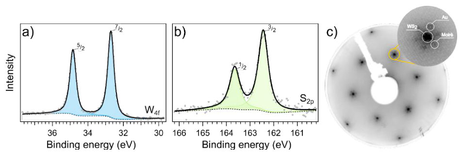
<figcaption class="paper-figure-caption"><b>Fig 1.</b> Figure 1 – XPS spectra of monolayer WS2 measured at room temperature. a) tungsten 4f orbitals and b) sulfur 2p orbital. c) LEED pattern of WS2/Au(111) interface, showing the moiré pattern – inset - induced by slight mismatch in lattice constants for Au(111) and WS2.</figcaption>
</figure>
<figure class="paper-figure-card">
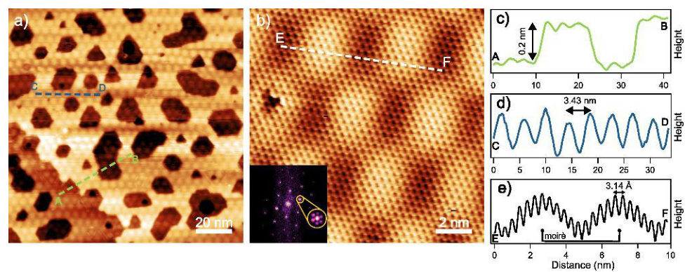
<figcaption class="paper-figure-caption"><b>Fig 2.</b> Figure 2 – a) Large scale STM image of WS2/Au(111) interface; 𝑉= 0.084𝑉, 𝐼= 20 𝑝𝐴, (130 × 130) 𝑛𝑚2, 𝑇= 77𝐾; b) Atomic resolution of WS2 monolayer; 𝑉= −1.4 𝑉, 𝐼= 20 𝑝𝐴, (13 × 13 )𝑛𝑚2, 𝑇= 4𝐾; inset shows the Fast Fourier Trasform of image b) where moirè satellite spots are observed, as in the LEED pattern; c) Height profile across Au(111) terrace step and hole,, consistent with the height of single layer of Au(111); d) line profile showing the moirè periodicity; e) line profile showing the lattice constant of WS2 superimposed to the moirè periodicity induce by the underneath Au(111).</figcaption>
</figure>
<figure class="paper-figure-card">
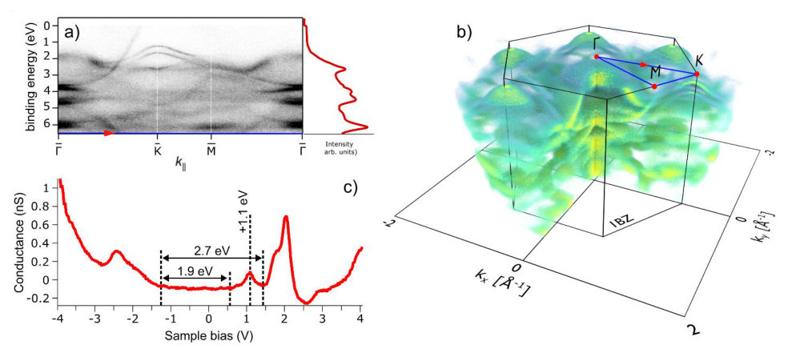
<figcaption class="paper-figure-caption"><b>Fig 3.</b> Figure 3 – a) ARPES spectra of monolayer WS2/Au(111) along high symmetry directions in the Brillouine zone (shown in b). The characterstic spin split bands of WS2 are clearly visbile at the K point, while the inset on the right shows the angle integrated spectrum of the WS2/Au(111) interface; ħ𝜔= 21.2 𝑒𝑉, 𝑇= 6𝐾; b) 3D rendiring of the full emission cone/bands of WS2/Au(111), ħ𝜔= 21.2 𝑒𝑉, 𝑇= 6𝐾; c) dI/dV spectrum acquired on monolayer WS2/Au(111), showing a 2eV gap and interface states located at +1eV, set point ∆𝑉= 4 𝑉, 𝐼= 30 𝑝𝐴, 𝑇= 77𝐾;</figcaption>
</figure>
<figure class="paper-figure-card">
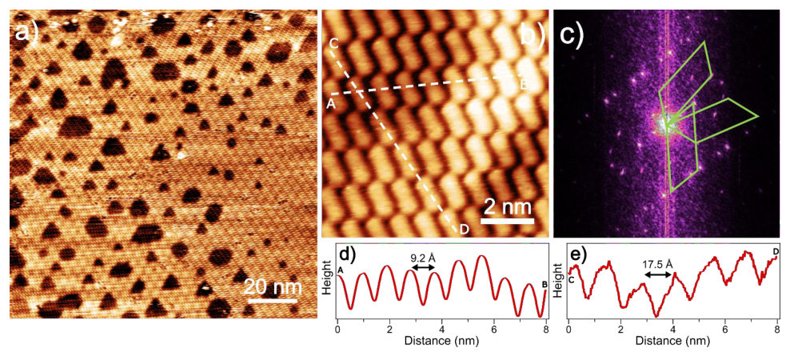
<figcaption class="paper-figure-caption"><b>Fig 4.</b> Figure 4 - a) Large scale STM image of pentacene self assembly on WS2/Au(111) interface, 𝑉= −1.4 𝑉, 𝐼= 20 𝑝𝐴, (130 × 130) 𝑛𝑚2, 𝑇= 77𝐾; b) Close up of pentacene molecular layer atop WS2 monolayer, 𝑉= −1.4 𝑉, 𝐼= 20 𝑝𝐴, (8.5 × 8.5) 𝑛𝑚2, 𝑇= 77K; c) Fast Fourier Transform of image a) where the three different rotational domains of 5A on the hexagonal symmetry of WS2 are highlighted in green; d) measured periodicity of pentacene self-assembled monolayer short axis; e) measured periodicity of pentacene self-assembled monolayer long axis.</figcaption>
</figure>
<figure class="paper-figure-card">
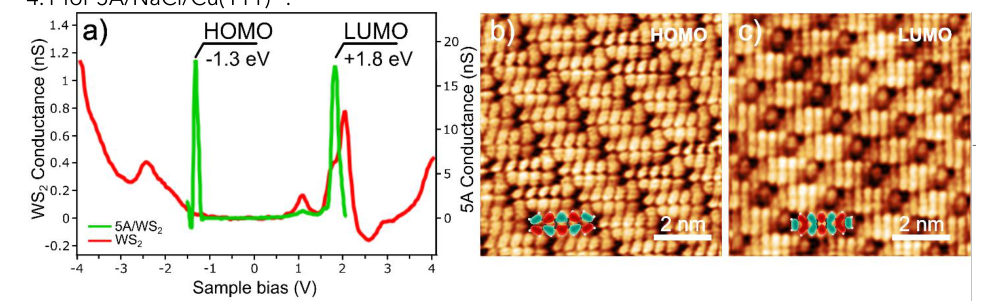
<figcaption class="paper-figure-caption"><b>Fig 5.</b> Figure 5 – a) dI/dV spectrum of pentacene monolayer atop WS2/Au(111), green line, superimposed to the dI/dV spectrum of pristine WS2/Au(111), red line, set point; b) STM image of 5A-HOMO molecular orbital, 𝑉= −1.3𝑉, 𝐼= 20 𝑝𝐴, (7 × 7) 𝑛𝑚2, 𝑇= 77𝐾; c) STM image of 5A-LUMO molecular orbital, 𝑉= +1.8𝑉, 𝐼= 20 𝑝𝐴, (7 × 7) 𝑛𝑚2, 𝑇= 77𝐾,</figcaption>
</figure>
<figure class="paper-figure-card">
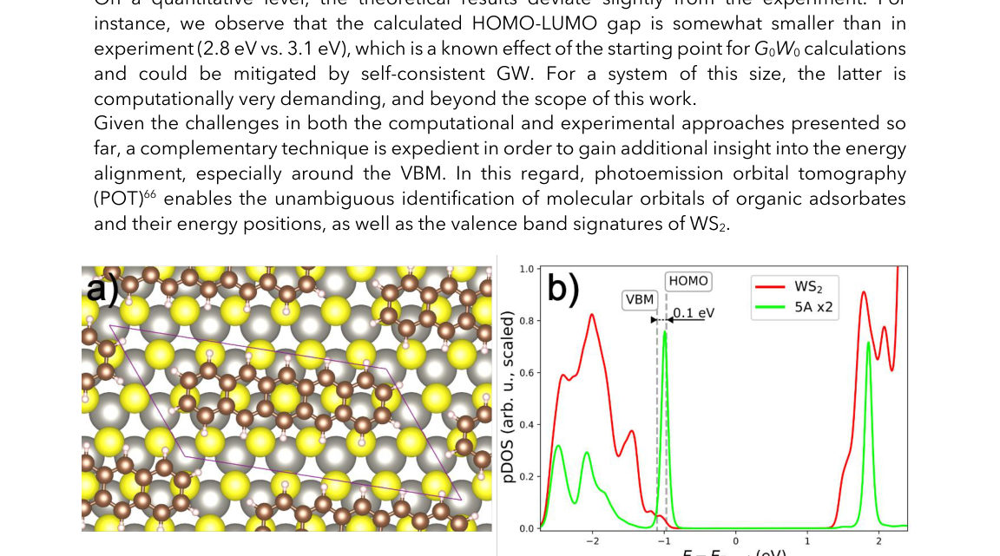
<figcaption class="paper-figure-caption"><b>Fig 6.</b> Figure 5. - Structure used in the DFT/G0W0 calculations. W atoms are depicted in silver, S in yellow, C in brown and H in white. The unit cell is indicated in purple. (b) Density of states from G0W0 projected on WS2 (green) and on 5A (red, scaled by a factor of 2). Dashed lines marked with HOMO and VBM show the energy positions for the momentum maps depicted in Fig. 7 d) and e), respectively.</figcaption>
</figure>
<figure class="paper-figure-card">
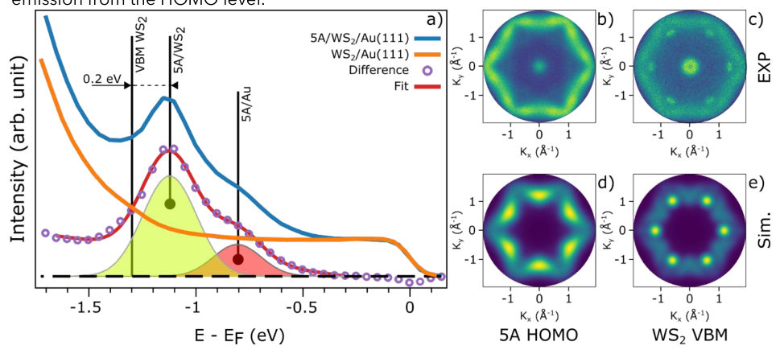
<figcaption class="paper-figure-caption"><b>Fig 7.</b> Figure 7 – a) Comparison of UPS spectra: pristine WS2/Au(111), orange line, and pentacene monolayer, blue line. To enhance pentacene features, the difference between the UPS spectra, before and after 5A deposition, is plotted, red line; b)-c) Symmetrized experimental pentacene POT averaged in the energy range associated only to 5A/WS2 interface and VBM of pristine WS2/Au(111); d)-e) DFT calculated 5A/WS2/Au(111) POT and WS2/Au(111) VBM. All spectrum and k-maps are acquired at ħ𝜔= 26.4 𝑒𝑉, 𝑇= 77𝐾.</figcaption>
</figure>

**Main problem.** The challenge of creating high-quality, electronically homogeneous interfaces between organic semiconductors and transition metal dichalcogenides (TMDs) using bottom-up synthesis to enable efficient charge separation.

**Main result.** The researchers successfully demonstrated the bottom-up growth of a highly ordered pentacene monolayer on WS2, establishing a Type-II (staggered) band alignment critical for optoelectronic applications.

**Method.** The study combines reactive molecular beam epitaxy (MBE) for synthesis with STM-STS, photoemission orbital tomography (POT), and G0W0 electronic structure calculations for characterization.

**Summary.** This paper reports the successful bottom-up synthesis of a pentacene/WS2 heterostructure using molecular beam epitaxy. By using a non-toxic sulfur source (DMDS), the authors achieved atomically flat WS2 layers that allow for a highly ordered organic molecular overlayer. Using advanced spectroscopy and many-body calculations, they confirmed a Type-II band alignment, which is essential for separating charges in future solar cells and spintronic devices. This system serves as a model platform for studying charge transfer and energy-level renormalization in 2D hybrid interfaces.

Detailed structure

**Model / system.** A hybrid van der Waals heterostructure consisting of a self-assembled monolayer of pentacene (5A) on a monolayer of WS2, which is grown epitaxially on an Au(111) substrate.

**Key observables.** Band alignment (Type-II), HOMO-LUMO gap, WS2 transport gap, moiré periodicity, and molecular orbital momentum maps.

**Important parameters / regimes.** Temperature regimes of 4K, 77K, and 950K; WS2 lattice constant of ~0.314 nm; moiré periodicity of ~3.43 nm.

**Assumptions / limitations.** The computational model uses a supercell approach that ignores the Au substrate to manage lattice mismatch.

**Figures summary.** Figure 7 shows UPS spectra comparisons for pristine WS2 and pentacene, experimental and DFT-calculated momentum maps for orbital identification, and symmetrized POT data.

**Paper structure.** The paper introduces the problem of interface quality, describes the MBE synthesis of WS2 using DMDS, details the structural and chemical characterization (XPS, LEED, STM), presents the electronic structure analysis (STS, POT, ARPES), validates results with G0W0 calculations, and concludes with the implications for hybrid heterostructures.

Abstract

Stacked van der Waals heterostructures based on transition metal dichalcogenides (TMDs) exhibit a rich variety of exotic interfacial phenomena. Substituting one component with an organic semiconductor (OSC) enables the design of hybrid heterostructures with tunable functionalities for optoelectronic, photovoltaic, and spintronic applications. In this work, exploiting scanning tunneling spectroscopy (STS), photoemission orbital tomography (POT) and G0W0 electronic structure calculations, we experimentally and theoretically demonstrate the self-assembly of an ordered single layer of pentacene (5A) above monolayer WS2, exhibiting a type-II (staggered) band alignment in the hybrid 5A/WS2 interface. Central to this result is the synthesis of extended, atomically flat WS2 - an essential prerequisite for a highly ordered and electronically homogeneous OSC/TMD interface - which can only be reliably achieved via bottom-up growth, most notably molecular beam epitaxy (MBE). We realize this by leveraging Au(111) as an atomically clean and conductive sample for epitaxial growth - a necessary requirement for reliable and comparable STS/POT characterizations. The high quality of the synthesized heterostructure, together with its type-II band alignment, establishes pentacene/WS2 as a model system for orbital-resolved studies of charge transfer, energy-level renormalization, and non-equilibrium interfacial processes in hybrid organic-inorganic-2D heterostructures.

[↑ back to top](#top)

### [Characterizing Fill Factor Limitations in Perovskite-Silicon Tandem Solar Cells](http://arxiv.org/abs/2604.24098v1)

**Authors:** Yueming Wang, Nan Sun, Chris Dreessen, Gaosheng Huang, Alexander Eberst, Kaining Ding, Thomas Kirchartz  
**Type:** both · **Category:** other · **PDF:** <https://arxiv.org/pdf/2604.24098v1>  
**Analysis basis:** full PDF text, analyzed in chunks

↔ Scroll figures horizontally

<figure class="paper-figure-card">
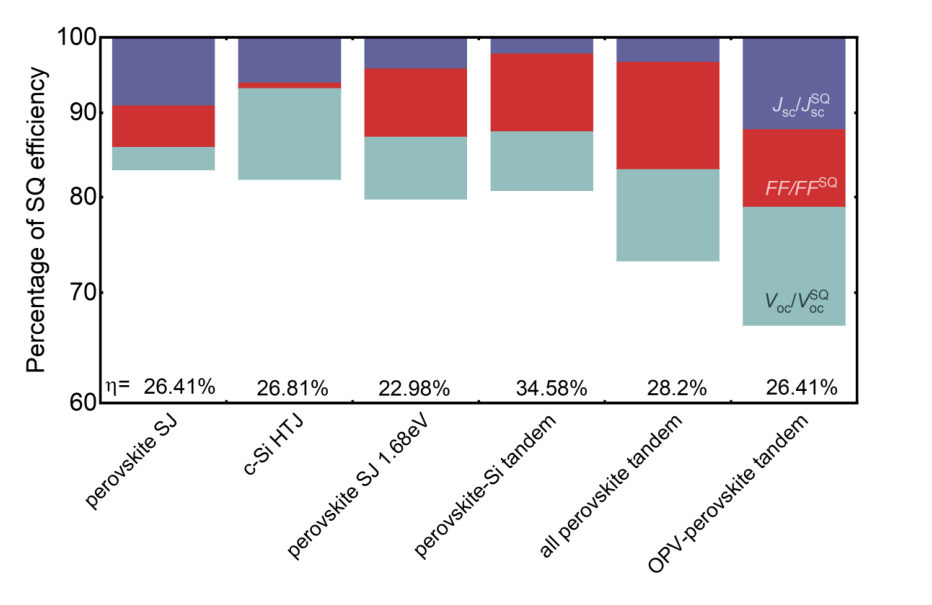
<figcaption class="paper-figure-caption"><b>Fig 1.</b> Figure 1. The relative losses of photovoltaic parameters of a selected group of high-efficiency single- junction and tandem solar cells are presented, normalized to their respective values within the framework of the SQ model. As the product of each ratio gives the normalized efficiency according to equation (1), and because multiplicative factors preserve their area on a logarithmic scale, the y-axis is a logarithmic axis in % of losses, whereby the lowest edge of each column represents the normalized efficiency 𝜂real 𝜂SQ ⁄ .</figcaption>
</figure>
<figure class="paper-figure-card">

<figcaption class="paper-figure-caption"><b>Fig 2.</b> Figure 1. The blue sections of the bars in Figure 1 represent the loss due to imperfect photocurrent</figcaption>
</figure>
<figure class="paper-figure-card">
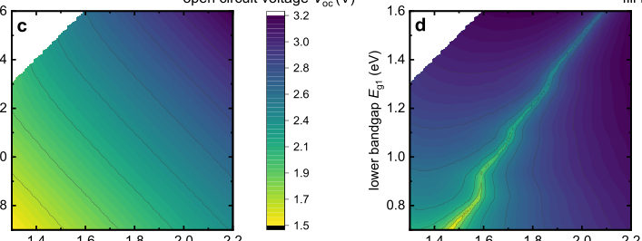
<figcaption class="paper-figure-caption"><b>Fig 3.</b> Figure 2. Contour plots for the photovoltaic parameters in the radiative limit for (a) efficiencies, (b) short-circuit current densities, (c) open-circuit voltages, and (d) fill factors of monolithic 2-T tandem solar cells. All data are plotted as a function of the two band gaps of the two subcells.</figcaption>
</figure>
<figure class="paper-figure-card">
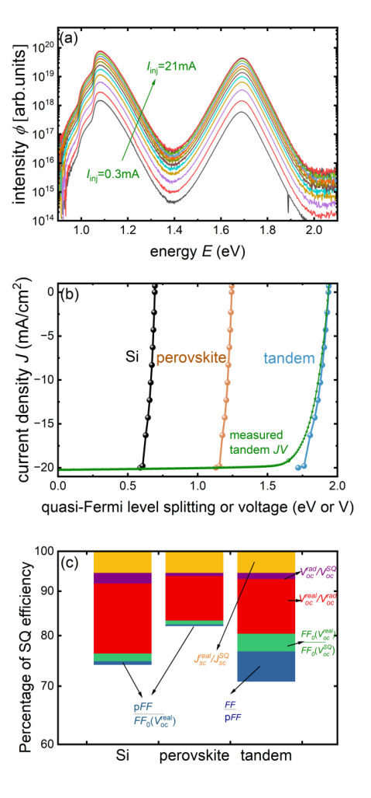
<figcaption class="paper-figure-caption"><b>Fig 4.</b> Figure 3. (a) Injection-dependent absolute electroluminescence (EL) spectra of the perovskite and silicon sub-cells. Measurements were performed under various injected current to vary bias voltages. (b) reconstructed J-V curves calculated from injection-dependent electroluminescence measurements (sphere) The J-V measurement under 1-sun illumination of tandem cell is plotted in green. (c) the percentage of Shockley-Queisser efficiencies for perovskite-Si tandem solar cell and sub-cells in losses of current densities, voltages and fill factors corresponding to a multiplicative factor in equation (8) plotted on a logarithmic scale.</figcaption>
</figure>
<figure class="paper-figure-card">
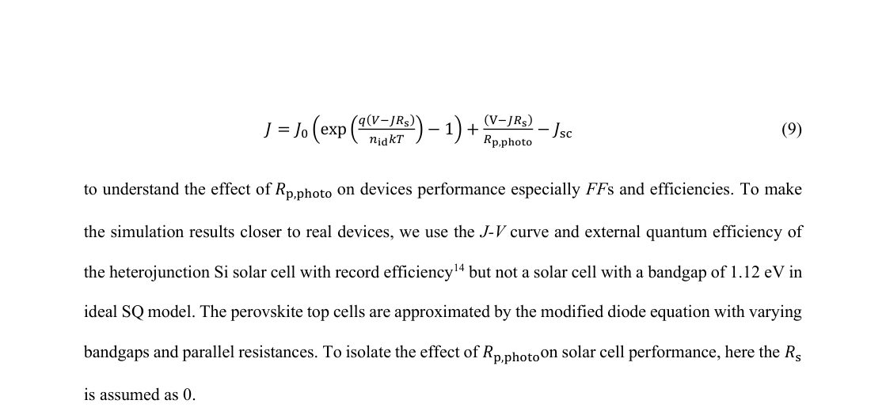
<figcaption class="paper-figure-caption"><b>Fig 5.</b> Figure 4a shows the efficiency of monolithic perovskite-Si tandem solar cells changing with parallel</figcaption>
</figure>
<figure class="paper-figure-card">
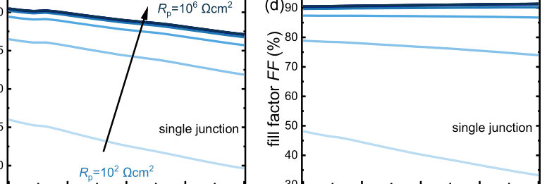
<figcaption class="paper-figure-caption"><b>Fig 6.</b> Figure 4. (a) Efficiency and (b) FF vs. bandgap for tandem solar cells with record heterojunction c-Si fixed as the bottom cell and perovskite top cells varying parallel resistance. (c) Efficiency and (d) FF vs. bandgap for different values of the parallel resistance of the single-junction perovskite solar cells.</figcaption>
</figure>
<figure class="paper-figure-card">
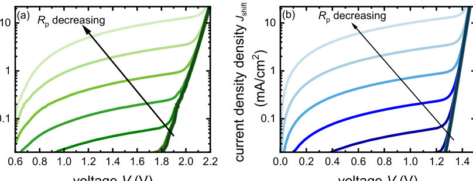
<figcaption class="paper-figure-caption"><b>Fig 7.</b> Figure 5. Simulated J-V curve under 1 sun illumination of (a) perovskite-Si tandem solar cells and (b) single-junction perovskite solar cells. J-V curve shifted to the first quadrant by adding Jsc with varied parallel resistances 𝑅p,photo (from 102 to 106 Ωcm2). The bandgap of perovskite is 1.74 eV.</figcaption>
</figure>
<figure class="paper-figure-card">
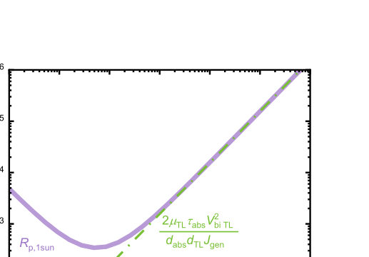
<figcaption class="paper-figure-caption"><b>Fig 8.</b> Figure 6. Calculated parallel resistance (Rp,photo ) (defined as 𝑅p,photo = 𝑑𝑉𝑑𝐽 ⁄ |𝑉=0) under illumination at one sun as a function of the mobility of charge transport layer using equation (13). Higher mobilities generally lead to higher shunt resistances. The exception are extremely low mobilities, where the series resistance becomes so high that the whole current-voltage curve becomes purely ohmic. In this case, the increasing series resistance with lower mobilities also drives up the measured parallel resistance. For relatively efficient devices, however, the shunt resistance and the transport layer mobility are</figcaption>
</figure>
<figure class="paper-figure-card">
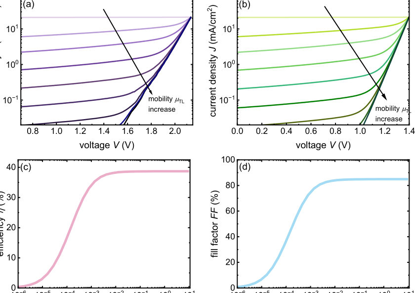
<figcaption class="paper-figure-caption"><b>Fig 9.</b> Figure 7. Simulated 1 sun illuminated J-V of (a) perovskite-Si tandem solar cells and (b) single junction perovskite solar cells shifted to first quandary by adding Jsc with varied charge transport layer mobility µTL (from 10-6 to 1 cm2V-1s-1). Simulated (c) efficiencies and (d) FFs of perovskite-Si tandem solar cells vs. charge transport layer mobility µTL (from 10-6 to 1 cm2V-1s-1). The bandgap of perovskite is 1.74 eV.</figcaption>
</figure>
<figure class="paper-figure-card">
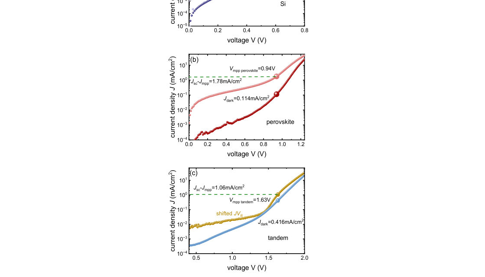
<figcaption class="paper-figure-caption"><b>Fig 10.</b> Figure 8. Dark current-voltage (J-V) curves and illuminated J-V curve shifted to the first quadrant by adding Jsc of (a) Si single junction solar cell (b) perovskite single junction solar cell and (c) perovskite- Si tandem solar cell.</figcaption>
</figure>

**Main problem.** Identifying and characterizing the mechanisms responsible for Fill Factor (FF) losses in perovskite-silicon monolithic tandem solar cells, specifically distinguishing between series resistance and the 'photoshunt' effect.

**Main result.** The study identifies 'photoshunt'—an illumination-dependent reduction in parallel resistance due to low charge transport layer mobility—as a critical FF loss mechanism, and shows that operating in a 'bottom-cell limited' regime can mitigate this effect.

**Method.** The authors combine experimental characterization (electroluminescence spectroscopy, EQE, and J-V measurements) with equivalent circuit modeling and analytical derivations to quantify resistive losses.

**Summary.** This paper investigates why perovskite-silicon tandem solar cells fail to reach their theoretical efficiency limits, focusing on the Fill Factor. The researchers identify a phenomenon called 'photoshunt,' where low mobility in the charge transport layers causes an apparent drop in parallel resistance under light. They demonstrate that this loss can be minimized by designing cells that are slightly limited by the bottom silicon cell's current. This work provides a roadmap for improving the efficiency of next-generation tandem photovoltaics.

Detailed structure

**Model / system.** A monolithic two-terminal perovskite-silicon tandem solar cell consisting of a perovskite top cell (approx. 1.7 eV) and a silicon heterojunction bottom cell.

**Key observables.** Fill Factor (FF), short-circuit current density (Jsc), open-circuit voltage (Voc), series resistance (Rs), and photoshunt resistance (Rp,photo).

**Important parameters / regimes.** Charge transport layer mobility (mu_TL), bandgap (Eg), current matching conditions, and the radiative limit (Shockley-Queisser limit).

**Assumptions / limitations.** The Shockley-Queisser model assumes radiative recombination is the only recombination mechanism and assumes a standard AM1.5G solar spectrum.

**Figures summary.** Figure 1 shows efficiency losses relative to the SQ limit; Figure 2 shows SQ limits for varying bandgaps; Figure 3 shows EL spectra and reconstructed J-V curves; Figure 4 shows tandem efficiency and FF as functions of top-cell bandgap and photoshunt resistance; Figure 5 shows simulated J-V curves.

**Paper structure.** The paper begins by defining the efficiency gap relative to the SQ limit, introduces the experimental characterization via EL, presents the discovery of the photoshunt mechanism through analytical modeling, and concludes with design strategies for high-efficiency tandem cells.

Abstract

Perovskite-silicon tandem technology has exceeded the single junction theoretical efficiency limit. However, there is still distance to the thermodynamic limit mainly caused by the fill factor. This work presents a methodology to illustrate the mechanisms of FF loss in perovskite-Si monolithic tandem solar cells. Apart from the series resistance related loss characterized by electroluminescence, another loss factor is from the photoshunt, a phenomenon in which the parallel resistance apparently reduces under illumination in perovskite solar cells due to the moderate charge transport layer mobility. In addoition, the two-diode property of the Si cell can also influence the FF of tandem devices. The photoshunt can be hidden when the bottom cell is over illuminated, which explains highly efficient tandem solar cells are usually bottom cell limited. This work outlines strategies that overcoming the photoshunt issue can move the perovskite top cell closer to low FF losses in tandem solar cells.

[↑ back to top](#top)

### [Chirality Transfer to the Centrosymmetric Magnetic Sublattice in the Hybrid Perovskite (R)-/(S)-3-Fluoropyrrolidinium Copper(II) Chloride](http://arxiv.org/abs/2604.22952v1)

**Authors:** Zheng Zhang, Mingyu Xu, Jose L. Gonzalez Jimenez, Stephen Zhang, Weiwei Xie, Xianghan Xu, Daniel B. Straus  
**Type:** experiment · **Category:** strongly correlated electrons · **PDF:** <https://arxiv.org/pdf/2604.22952v1>  
**Analysis basis:** full PDF text, analyzed in chunks

↔ Scroll figures horizontally

<figure class="paper-figure-card">
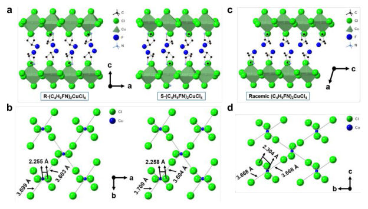
<figcaption class="paper-figure-caption"><b>Fig 1.</b> Figure 1. Crystal structures of (a) and (b) (R)- and (S)-(C4H9FN)2CuCl4, and (c) and (d) racemic (C4H9FN)2CuCl4. Hydrogen atoms are omitted for clarity.</figcaption>
</figure>
<figure class="paper-figure-card">
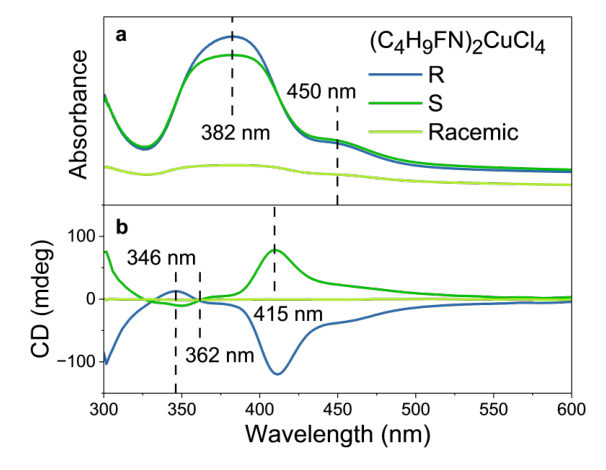
<figcaption class="paper-figure-caption"><b>Fig 2.</b> Figure 2. (a) UV-Vis absorption and (b) CD spectra of (R)-, (S)-(C4H9FN)2CuCl4 and racemic (C4H9FN)2CuCl4 thin films.</figcaption>
</figure>
<figure class="paper-figure-card">
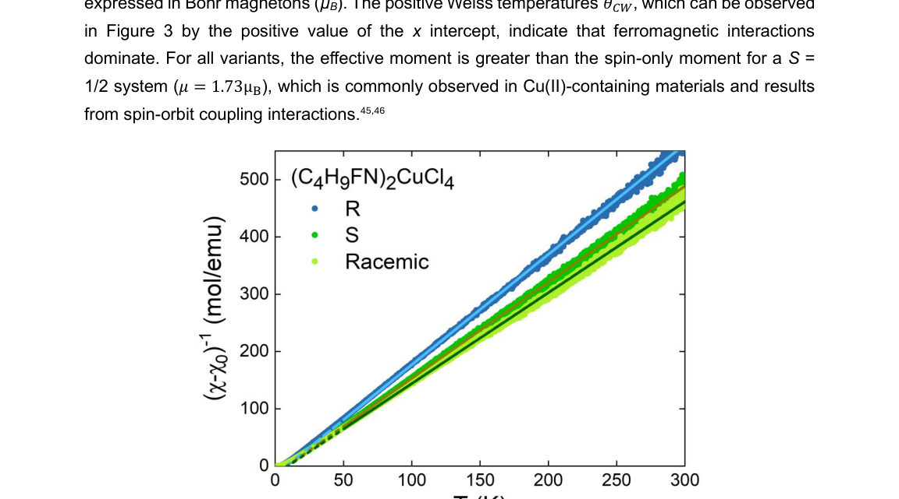
<figcaption class="paper-figure-caption"><b>Fig 3.</b> Figure 3. Plot of the inverse susceptibility (𝜒−𝜒0)−1 versus temperature for powder samples of (R)-, (S)-, and racemic (C4H9FN)2CuCl4. Curie-Weiss fits are shown as solid lines with extrapolations of the fits as dashed lines.</figcaption>
</figure>
<figure class="paper-figure-card">
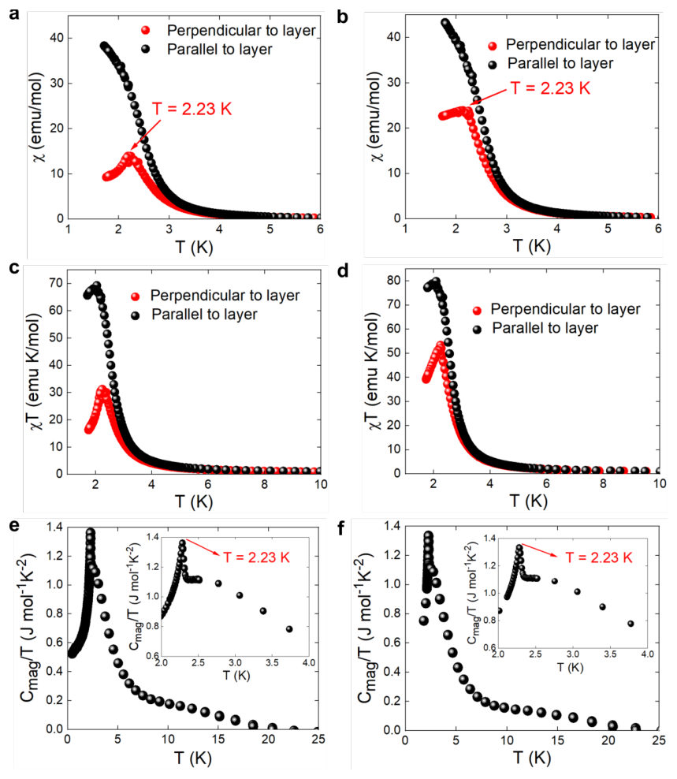
<figcaption class="paper-figure-caption"><b>Fig 4.</b> Figure 4. Plots of the magnetic susceptibility and magnetic specific heat capacity data for (a), (c), (e) chiral (C4H9FN)2CuCl4 and (b), (d), (f) racemic (C4H9FN)2CuCl4 single crystals.</figcaption>
</figure>
<figure class="paper-figure-card">
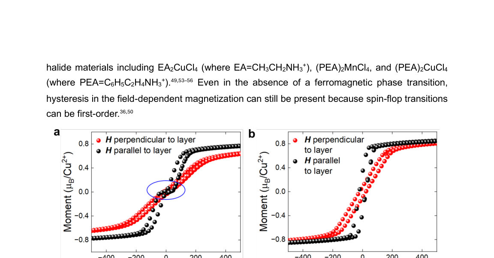
<figcaption class="paper-figure-caption"><b>Fig 5.</b> Figure 5. Plots of the magnetic moment vs. magnetic field H (at T=1.8 K) for (a) chiral and (b) racemic (C4H9FN)2CuCl4 single crystals. The blue circle in panel a is likely a spin-flop transition.</figcaption>
</figure>
<figure class="paper-figure-card">
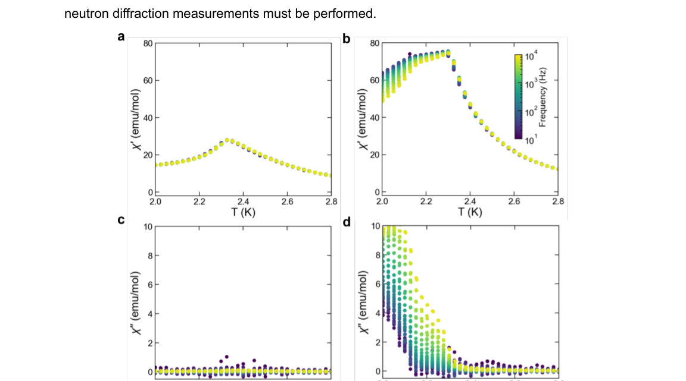
<figcaption class="paper-figure-caption"><b>Fig 6.</b> Figure 6. In-phase (χ’) component of AC susceptibility for (a) (R)-(C4H9FN)2CuCl4 and (b) racemic (C4H9FN)2CuCl4. Out-of-phase (χ’’) component of AC susceptibility component for (c) (R)-(C4H9FN)2CuCl4 and (d) racemic (C4H9FN)2CuCl4.</figcaption>
</figure>
<figure class="paper-figure-card">
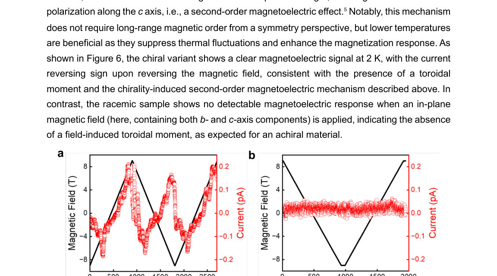
<figcaption class="paper-figure-caption"><b>Fig 7.</b> Figure 7. Magnetoelectric data collected at 2 K on (a) chiral and (b) racemic (C4H9FN)2CuCl4 crystals. The magnetic field is applied along the in-plane (110) direction and the out-of-plane magnetoelectric current is collected. 3. Conclusion</figcaption>
</figure>

**Main problem.** Investigating the mechanism of chirality transfer from chiral organic cations to a structurally centrosymmetric (achiral) inorganic magnetic sublattice in a hybrid perovskite.

**Main result.** The chiral organic cations induce chiral magnetic order in the achiral Cu-Cl sublattice, evidenced by a second-order magnetoelectric effect present only in the enantiopure forms.

**Method.** Single-crystal X-ray diffraction, Circular Dichroism (CD) spectroscopy, magnetic susceptibility, specific heat capacity, and magnetoelectric current measurements.

**Summary.** This paper demonstrates that chirality can be transferred from organic molecules to an inorganic magnetic lattice in a hybrid perovskite. While the copper-chloride sublattice is structurally centrosymmetric, the presence of chiral cations induces chiral magnetic order. This is experimentally verified through the observation of a second-order magnetoelectric effect in the enantiopure crystals, which is absent in the racemic mixture. This finding provides a method for designing new materials with tailored chiral magnetic and optical properties.

Detailed structure

**Model / system.** A 2D magnetic S=1/2 metal halide perovskite, (R)- and (S)-3-fluoropyrrolidinium copper(II) chloride, consisting of Cu-Cl inorganic layers separated by chiral organic cations.

**Key observables.** Néel temperature (TN), magnetoelectric signal, circular dichroism (CD) spectra, magnetic susceptibility (DC and AC), and specific heat capacity.

**Important parameters / regimes.** Néel temperature TN = 2.23 K, spin S=1/2, space groups P212121 (chiral) and P21/c (racemic).

**Assumptions / limitations.** The study assumes the observed magnetoelectric effect is a direct consequence of the induced toroidal moment from structural chirality.

**Figures summary.** Figure 1 shows the crystal structures of the (R), (S), and racemic variants; Figure 6 displays AC susceptibility components; Figure 7 shows the magnetoelectric signal in chiral vs. racemic samples.

**Paper structure.** The paper introduces the chirality transfer problem, describes the synthesis and structural characterization of the hybrid perovskite, presents magnetic and optical measurements to demonstrate chirality transfer, and concludes with the observation of the magnetoelectric effect.

Abstract

Incorporating chiral organic cations into organic-inorganic hybrid materials has been shown to enable the inorganic sublattice to display chiroptical properties. We report a new two-dimensional magnetic (S=1/2) chiral metal halide material, (R)- and (S)-$(C_4H_9FN)_2CuCl_4$ (where $(C_4H_9FN)^+$ is 3-fluoropyrrolidinium), which consists of Cu-Cl inorganic layers separated by $(C_4H_9FN)^+$ organic cations. The presence of the chiral $(C_4H_9FN)^+$ organic cation induces formation of chiral magnetic order, even though the inorganic sublattice itself is structurally centrosymmetric. We also report the racemic variant, containing an equal amount of (R)- and (S)- cations, which shows no evidence of chiral magnetic order. When the magnetic susceptibility is measured perpendicular to inorganic Cu-Cl layer propagation direction, an antiferromagnetic phase transition at Néel temperature $T_N = 2.23~K$ is observed in both the chiral and racemic materials, and the existence of the magnetic phase transition is supported by specific heat capacity measurements. Field-induced magnetic chirality is observed through the existence of a second-order magnetoelectric effect in the chiral variant, while no magnetoelectric signal is observed for the racemic material, indicating the absence of magnetic chirality. Our findings demonstrate that materials exhibiting chiral magnetic order can be created through the incorporation of a chiral cation into an organic-inorganic hybrid magnetic material, potentially allowing for the design of tailored materials that combine chiral magnetism with other desirable optical and electronic properties that come from structural chirality.

[↑ back to top](#top)

### [Comparative analysis of nonlinear elastic moduli of polystyrene, polycarbonate and PMMA](http://arxiv.org/abs/2604.23244v1)

**Authors:** A. V. Belashov, A. A. Zhikhoreva, Y. M. Beltukov, I. V. Semenova  
**Type:** experiment · **Category:** disordered systems and neural networks · **PDF:** <https://arxiv.org/pdf/2604.23244v1>  
**Analysis basis:** full PDF text, analyzed in chunks

↔ Scroll figures horizontally

<figure class="paper-figure-card">
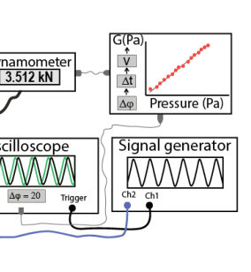
<figcaption class="paper-figure-caption"><b>Fig 1.</b> Figure 1: Experimental setup used for measurements of nonlinear elastic moduli of polymer samples.</figcaption>
</figure>
<figure class="paper-figure-card">
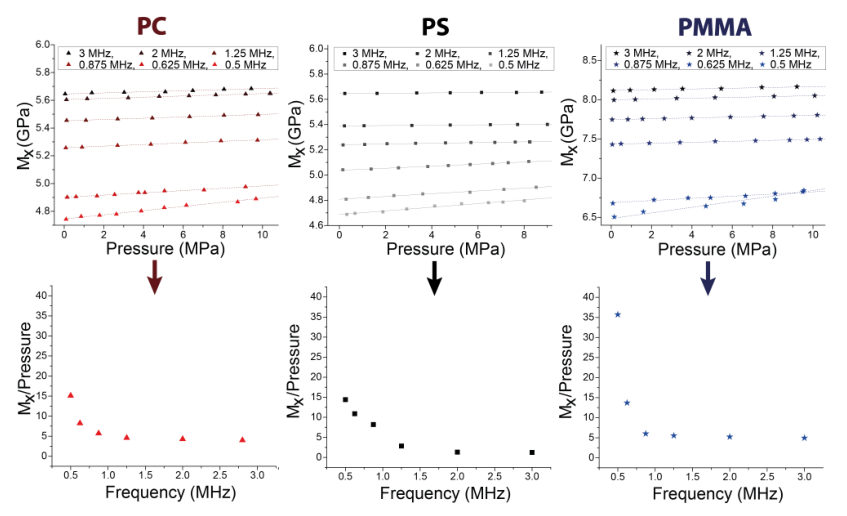
<figcaption class="paper-figure-caption"><b>Fig 2.</b> Figure 2: Flowchart of experimental data processing for the three polymer samples. First row: effective elastic modulus 𝑀𝑥as a function of applied pressure, second row: dimensionless slope coefficient 𝛼𝑥as a function of wave frequency.</figcaption>
</figure>
<figure class="paper-figure-card">
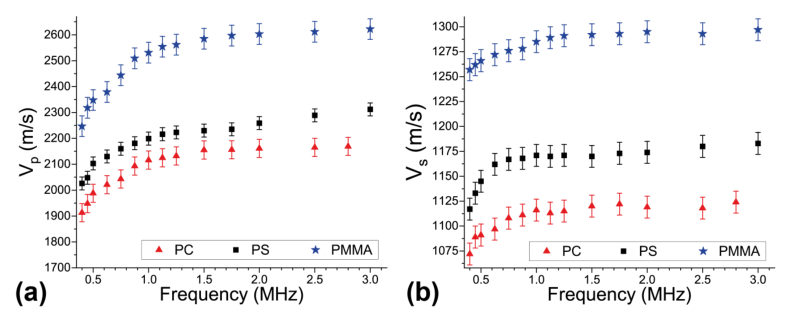
<figcaption class="paper-figure-caption"><b>Fig 3.</b> Figure 3: Frequency dependencies of (a) longitudinal and (b) shear wave velocities in samples of PC, PS, and PMMA in the range of 0.45-3 MHz.</figcaption>
</figure>
<figure class="paper-figure-card">
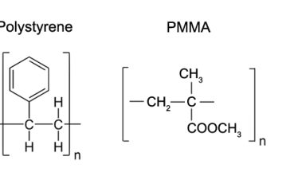
<figcaption class="paper-figure-caption"><b>Fig 4.</b> Figure 4: Molecular structures of PC, PS and PMMA.</figcaption>
</figure>
<figure class="paper-figure-card">
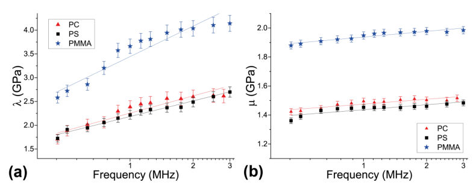
<figcaption class="paper-figure-caption"><b>Fig 5.</b> Figure 5: Linear elastic moduli (a) 𝜆and (b) 𝜇of PC, PS, and PMMA in the frequency range of 0.45-3 MHz.</figcaption>
</figure>
<figure class="paper-figure-card">
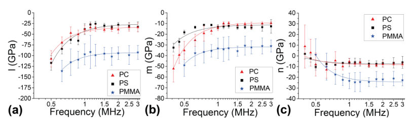
<figcaption class="paper-figure-caption"><b>Fig 6.</b> Figure 6: Fitting of the frequency dependencies of nonlinear elastic moduli 𝑙(a), 𝑚(b) and 𝑛(c) under assumption of a single dominating relaxation process.</figcaption>
</figure>

**Main problem.** The study addresses the lack of experimental data regarding the frequency and temperature dependence of nonlinear viscoelastic properties in glassy amorphous polymers.

**Main result.** Nonlinear elastic moduli exhibit much more profound frequency dependence (1.5-2.5x) than linear moduli, with significant variations occurring below 1 MHz due to relaxation processes. PMMA showed higher absolute values for both linear and nonlinear moduli compared to PC and PS.

**Method.** The researchers used the acousto-elastic effect to measure variations in longitudinal and shear ultrasonic wave velocities under applied static pressure (0-12 MPa) in the frequency range of 0.4-3 MHz.

**Summary.** This paper provides a comparative experimental analysis of the linear and nonlinear elastic properties of three common glassy polymers: PS, PC, and PMMA. Using ultrasonic wave measurements, the authors demonstrate that nonlinear moduli are much more sensitive to frequency changes than linear moduli, particularly below 1 MHz. The study identifies that PMMA's polar groups lead to higher moduli values and highlights how molecular structures influence relaxation processes. The findings help validate nonlinear viscoelastic models for amorphous materials.

Detailed structure

**Model / system.** The physical system consists of three glassy amorphous polymers: Polystyrene (PS), Polycarbonate (PC), and Poly(methyl methacrylate) (PMMA). The mechanical behavior is modeled using Murnaghan's model for nonlinear elasticity, which includes five parameters (two Lamé and three Murnaghan moduli) derived from the energy density function.

**Key observables.** Longitudinal and shear ultrasonic wave velocities, wave packet transition times, and phase shifts under static pressure.

**Important parameters / regimes.** Lamé moduli (lambda, mu), Murnaghan moduli (l, m, n), frequency range (0.4-3 MHz), and the relaxation exponent (gamma between 2.4 and 2.9).

**Assumptions / limitations.** The polymers are assumed to have a broad spectrum of relaxation times; the applied pressure range is assumed to be within the elastic regime without irreversible deformation; and the effective elastic moduli are assumed to depend linearly on static pressure.

**Figures summary.** Figure 1 shows the experimental setup; Figure 2 is a flowchart of data processing; Figure 3 displays frequency dependence of wave velocities; Figure 4 shows molecular structures of the polymers; Figure 5 shows frequency dependence of moduli.

**Paper structure.** The paper introduces the problem of nonlinear viscoelasticity, describes the experimental setup and materials, details the mathematical models for calculating moduli, presents the frequency-dependent results and material comparisons, and concludes with a discussion on the molecular origins of the observed nonlinearities.

Abstract

We present the comparative experimental analysis of frequency dependencies of linear (Lamé) and nonlinear (Murnaghan) elastic moduli of polystyrene, PMMA and polycarbonate. The measurement methodology, based on the acousto-elastic effect, provided data on variations of these moduli in block samples of the polymers in the frequency range of 0.45-3 MHz. In all the three polymers the linear Lamé moduli demonstrated moderate rise with frequency, most pronounced rise was observed in modulus $λ$ of PMMA in about 35%. The frequency dependencies of Murnaghan moduli were considerably nonlinear. At higher frequencies above ~1 MHz no significant variations of the Murnaghan moduli occurred, while at lower frequencies the absolute values of the moduli $l$ and $m$ demonstrated rapid rise, more pronounced for the modulus $l$. At the same time the absolute values of the modulus $n$ decreased and demonstrated a tendency to become positive at lower frequencies. Both linear and nonlinear moduli of PMMA had higher values than those of PC and PS, with the latter two demonstrating close values of both types of moduli. The potential origins of the differences in nonlinear elastic properties of the three polymers are discussed.

[↑ back to top](#top)

### [Complementary-polarity double-layer LiTaO3 resonators for symmetry-selective SH2 excitation with ultrahigh electromechanical coupling (kt^2 = 25.7%)](http://arxiv.org/abs/2604.24309v1)

**Authors:** Hao Yan, Zhen-hui Qin, Zhi-Wen Wang, Shu-Mao Wu, Chen-Bei Hao, Hua-Yang Chen, Sheng-Nan Liang, Ke Chen, Si-Yuan Yu, Yan-Feng Chen  
**Type:** both · **Category:** other · **PDF:** <https://arxiv.org/pdf/2604.24309v1>  
**Analysis basis:** full PDF text, analyzed in chunks

↔ Scroll figures horizontally

<figure class="paper-figure-card">
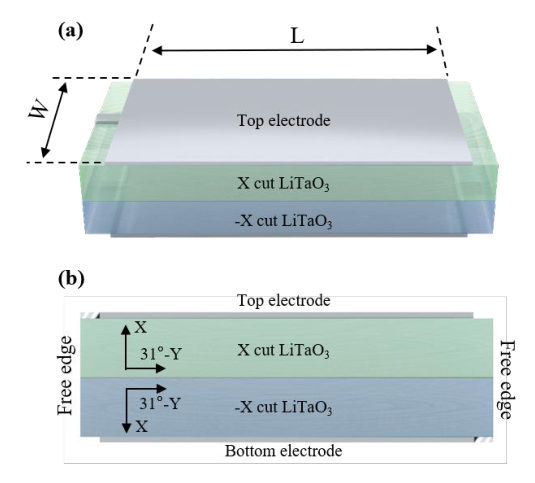
<figcaption class="paper-figure-caption"><b>Fig 1.</b> FIG. 1. (a) Three-dimensional diagram of the double-layer lithium tantalate structure resonator.</figcaption>
</figure>
<figure class="paper-figure-card">
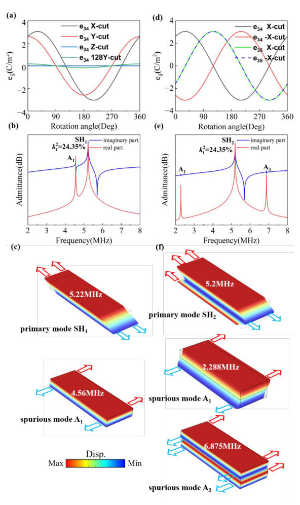
<figcaption class="paper-figure-caption"><b>Fig 2.</b> FIG. 2. (a) Piezoelectric coefficient e34 of the LiTaO3 at different rotation angles for four cuts.</figcaption>
</figure>
<figure class="paper-figure-card">
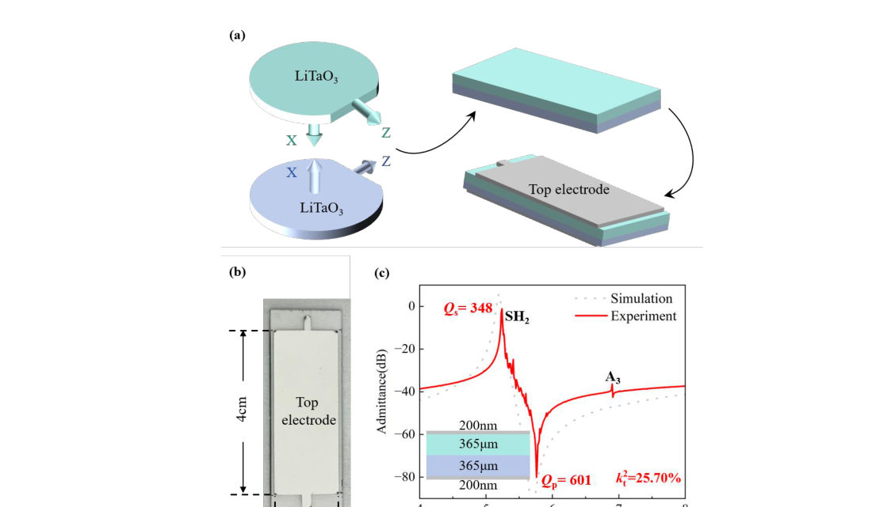
<figcaption class="paper-figure-caption"><b>Fig 3.</b> FIG. 3. (a) Fabrication process schematic of the device. (b) Device micrograph and structural</figcaption>
</figure>
<figure class="paper-figure-card">
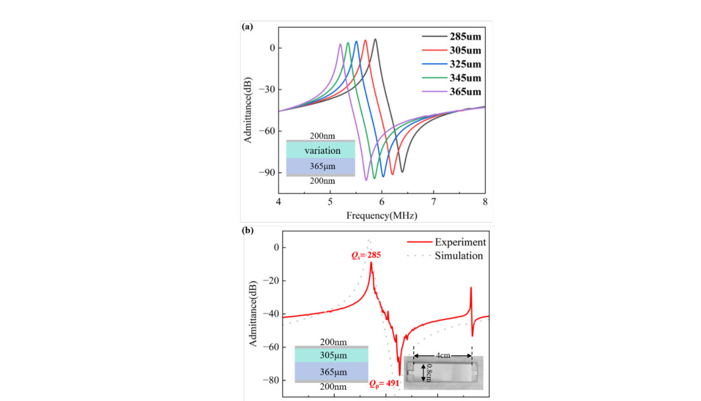
<figcaption class="paper-figure-caption"><b>Fig 4.</b> FIG. 4. (a) Effect of varying the single-layer film thickness. (b) Simulated and measured</figcaption>
</figure>
<figure class="paper-figure-card">
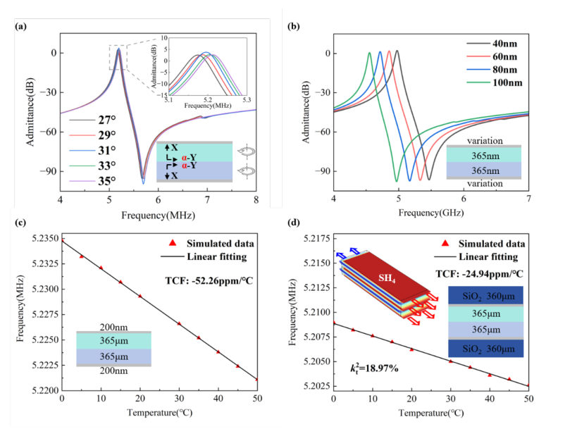
<figcaption class="paper-figure-caption"><b>Fig 5.</b> FIG. 5. (a) Effect of varying the relative rotation angle between the top and bottom films.</figcaption>
</figure>

**Main problem.** The need to increase the electromechanical coupling coefficient (kt^2) in LiTaO3 resonators for wider bandwidth applications while simultaneously suppressing unwanted spurious modes and maintaining temperature stability.

**Main result.** The development of a double-layer LiTaO3 resonator with complementary polarization that achieves an ultrahigh electromechanical coupling of 25.7% and suppresses parasitic modes through symmetry-selective excitation.

**Method.** The researchers used rotation-bonding of two 31 deg Y-oriented LiTaO3 films with complementary (+X/-X) polarization, followed by finite-element analysis (FEA) to predict frequency scaling and temperature compensation.

**Summary.** This paper presents a new way to build lithium tantalate (LiTaO3) acoustic resonators by bonding two layers with opposite polarities. This specific arrangement allows for the selective excitation of a desired mode (SH2) while canceling out unwanted interference modes. The result is a record-high electromechanical coupling of 25.7%, which is crucial for creating wideband ultrasonic filters and sensors. The design is also scalable to much higher frequencies and can be made temperature-stable using a compensation layer.

Detailed structure

**Model / system.** A double-layer bulk acoustic resonator consisting of two 365 um thick LiTaO3 plates rotation-bonded with an in-plane relative rotation of 121 degrees, featuring aluminum electrodes for longitudinal electric field driving.

**Key observables.** Electromechanical coupling coefficient (kt^2), resonance frequency (fs), quality factors (Qs and Qp), and temperature coefficient of frequency (TCF).

**Important parameters / regimes.** kt^2 = 25.7%, resonance frequency = 5.24 MHz, rotation angle = 121 degrees, and predicted TCF of -25 ppm/deg C with SiO2 compensation.

**Assumptions / limitations.** The frequency scaling assumes the ability to reduce film and electrode thickness while preserving the coupling coefficient; temperature modeling assumes known temperature-dependent material constants.

**Figures summary.** Fig 1 shows the 3D and cross-sectional diagrams of the resonator; Fig 2 displays piezoelectric coefficients at different rotation angles, admittance spectra for single and double-layer resonators, and displacement-field distributions for primary and spurious modes.

**Paper structure.** The paper introduces the problem of coupling and spurious modes, describes the fabrication and structural design of the bilayer resonator, presents experimental measurements of coupling and frequency, provides FEA simulations for scaling and temperature stability, and concludes with potential applications.

Abstract

We report a structurally simple double-layer lithium tantalate (LiTaO3) bulk acoustic resonator that enables symmetry-selective excitation of the second-order thickness-shear (SH2) mode with ultrahigh electromechanical coupling. Two 31 deg Y-oriented single-crystal LiTaO3 films are rotation-bonded with complementary polarization (+X/-X) and driven by a longitudinal electric field. Matching between the effective piezoelectric symmetry and the SH2 mode yields an effective electromechanical coupling coefficient of kt^2 = 25.7% at 5.24 MHz. To our knowledge, this is the highest kt^2 reported for a LiTaO3 resonator architecture to date. The measured response is dominated by the target SH2 mode, with only weak parasitic features in the operating band. The structure is also tunable: the resonance frequency and coupling can be adjusted through geometric parameters while maintaining stable modal behavior, indicating good process tolerance. Finite-element analysis further suggests straightforward frequency scaling beyond 5 GHz by reducing the film and electrode thickness while preserving approximately 25% kt^2. In addition, introducing a SiO2 compensation layer is predicted to improve the temperature coefficient of frequency to approximately -25 ppm/deg C. These results establish complementary-polarity double-layer LiTaO3 as a practical platform for high-coupling, spurious-suppressed acoustic resonators and provide a scalable route toward wideband ultrasonic resonators, filters, and related transducers.

[↑ back to top](#top)

### [Constitutive relations for colloidal gel](http://arxiv.org/abs/2604.23642v1)

**Authors:** Saikat Roy, Yezaz Ahmed Gadi Man  
**Type:** theory · **Category:** disordered systems and neural networks · **PDF:** <https://arxiv.org/pdf/2604.23642v1>  
**Analysis basis:** full PDF text, analyzed in chunks

↔ Scroll figures horizontally

<figure class="paper-figure-card">
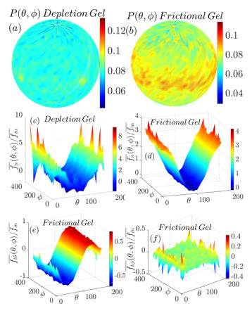
<figcaption class="paper-figure-caption"><b>Fig 1.</b> FIG. 1. (a) Contact orientation distribution is plotted on a unit sphere for the depletion gel at ϕ = 0.25 for βU0 = 50. (b) The same distribution is plotted for the frictional gel at identical conditions. Isotropy in contact orientations is also maintained at higher values of attraction strengths and vol- ume fractions (see [19]). (c)-(d) show the universality in an- gular modulation of the normal forces irrespective of the fric- tional interactions or lack thereof. (e) depicts the azimuthally symmetric sinusoidal modulation of ftθ(θ, ϕ) (f) Negligible isotropic background value as observed for ftϕ(θ, ϕ).</figcaption>
</figure>
<figure class="paper-figure-card">
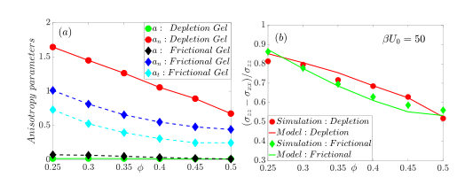
<figcaption class="paper-figure-caption"><b>Fig 2.</b> FIG. 2. (a) Evolution of contact anisotropy, a, and normal force anisotropy parameter, an, is shown as a function of volume fraction for gels with central and non-central inter- actions. In addition, the evolution of the tangential force anisotropy, at, is presented for the frictional gel. Here, βU0 = 50. Similar values are observed for higher attraction strengths. (b) Comparison of dimensionless NSD values as obtained in the simulation with those of the model predic- tion. Here, βU0 = 50. Model comparison is also remarkable for a higher βU0 (not shown).</figcaption>
</figure>
<figure class="paper-figure-card">
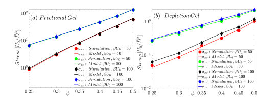
<figcaption class="paper-figure-caption"><b>Fig 3.</b> FIG. 3. Comparison between the prediction of the proposed model and the simulation observations for the relevant stress components covering a wide range of volume fractions, attrac- tion strengths, and the nature of interparticle interactions.</figcaption>
</figure>
<figure class="paper-figure-card">
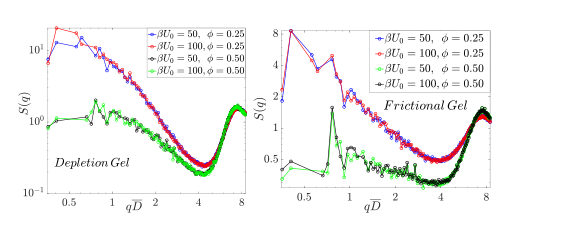
<figcaption class="paper-figure-caption"><b>Fig 4.</b> FIG. 5. (a) S(q) is plotted for the depletion gel system for two different values of attraction strengths βU0 = 50 and 100 at the dilute and the dense regime. (b) S(q) is plotted for the frictional gel at the identical conditions.</figcaption>
</figure>
<figure class="paper-figure-card">
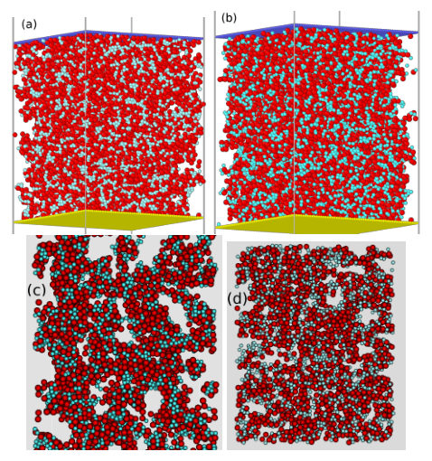
<figcaption class="paper-figure-caption"><b>Fig 5.</b> FIG. 4. (a) Illustration of typical depletion gel structure at ϕ = 0.25 for βU0 = 50. (b) The gel network for the fric- tional case at the identical conditions. (c)-(d) shows the gel structure in a thin slice for the depletion and frictional gels, respectively.</figcaption>
</figure>
<figure class="paper-figure-card">
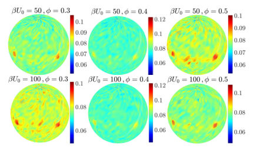
<figcaption class="paper-figure-caption"><b>Fig 6.</b> FIG. 6. Bond orientation probability density function, P(θ, ϕ) for the depletion gel is plotted at different stages of the consol- idation process and for different values of the potential mini- mum, βU0 = 50 and 100.</figcaption>
</figure>
<figure class="paper-figure-card">
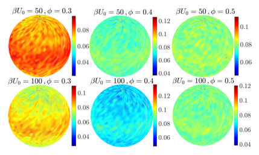
<figcaption class="paper-figure-caption"><b>Fig 7.</b> FIG. 7. Contact orientation probability density function, P(θ, ϕ) for the frictional gel is plotted for different volume fractions and varied attraction strengths, βU0 = 50 and 100.</figcaption>
</figure>
<figure class="paper-figure-card">

<figcaption class="paper-figure-caption"><b>Fig 8.</b> Fig. 6 presents the probability density of interparticle bond orientations on the surface of a unit sphere for the</figcaption>
</figure>
<figure class="paper-figure-card">
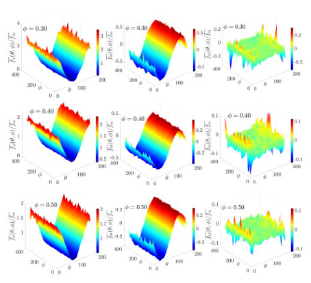
<figcaption class="paper-figure-caption"><b>Fig 9.</b> FIG. 10. Directional variation of the different components (fn(θ, ϕ), ftθ(θ, ϕ), ftϕ(θ, ϕ)) of the pairwise interaction force normalized by the mean normal force over all interactions is shown for the frictional gel system across different volume fractions. Here, βU0 = 50.</figcaption>
</figure>
<figure class="paper-figure-card">
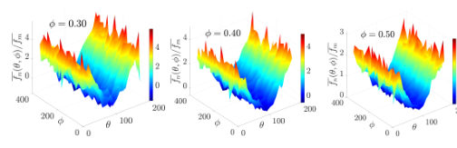
<figcaption class="paper-figure-caption"><b>Fig 10.</b> FIG. 8. Directional variation of the pairwise central inter- action forces normalized by the mean normal force over all interactions is shown for the depletion gel system across dif- ferent volume fractions. Here, βU0 = 50.</figcaption>
</figure>

**Main problem.** Existing continuum theories for colloidal gels fail because they assume a stress-free reference state and affine deformation, which do not account for the inherent quenched internal stresses and structural inhomogeneities in amorphous gels.

**Main result.** The authors propose new constitutive relations that relate macroscopic stress to internal state parameters (force and contact anisotropy), successfully capturing the evolution of Normal Stress Difference (NSD) and demonstrating that stress anisotropy originates from the force network rather than the contact network.

**Method.** Large-scale 3D Langevin dynamics simulations of depletion and frictional gels using the LAMMPS code, combined with a mathematical framework involving spherical harmonic expansions of contact and force distributions.

**Summary.** This paper addresses the failure of traditional continuum mechanics to describe the mechanical response of colloidal gels. By accounting for the quenched internal stresses present in amorphous materials, the authors develop new constitutive relations that accurately predict macroscopic stress components and Normal Stress Differences. Through large-scale simulations, they show that stress anisotropy is driven by the force network rather than the contact network. This work provides a more robust framework for understanding the rheology of complex, disordered soft matter.

Detailed structure

**Model / system.** The study uses two models of colloidal gels: depletion gels (modeled with a Morse potential for short-range attraction) and frictional gels (modeled via the Discrete Element Method with non-hydrodynamic contact friction).

**Key observables.** Shear modulus (Gc), axial and transverse stresses (sigma_zz, sigma_xx, sigma_yy), Normal Stress Difference (N1, N2), contact orientation distribution, and anisotropy parameters (a, an, at).

**Important parameters / regimes.** Volume fraction (phi), attraction strength (beta U0), coordination number (zc), and the distinction between central (depletion) and non-central (frictional) interactions.

**Assumptions / limitations.** The contact network is assumed to be nearly isotropic; hydrodynamic forces are neglected in the quasistatic limit; and pairwise interaction forces are assumed to be statistically independent of branch vectors.

**Figures summary.** Figure 1 shows contact orientation and force angular modulation; Figure 2 compares anisotropy parameter evolution; Figures 4-7 show gel structure snapshots, static structure factors, and probability density functions for bond orientations.

**Paper structure.** The paper begins by critiquing traditional continuum theories, introduces the proposed constitutive relations based on stressed reference states, describes the simulation models for depletion and frictional gels, presents results on stress anisotropy and force network modulation, and concludes with the validation of the new relations.

Abstract

The theoretical treatment of depletion gels with central interactions often involves expanding the free energy around a stress-free reference state to derive a constitutive relation between global stress and strain. The premise upon which the previous continuum theories are based, i.e., the stress-free reference state and the affine deformation, both of which do not hold in the context of amorphous gel materials. Gels never reach a true global minimum in the potential energy landscape and contain local regions of significant compressive and tensile stress, interspersed with zero-stress regions. Hence, expansion of free energy around a stressed reference state will produce scalar terms in harmonic expansion, the effects of which are qualitatively different from the terms appearing in the expansion around an unstressed reference state. In this study, we demonstrate the limitations of traditional continuum theories and propose simple constitutive relations that better capture the mechanical response of gel materials. The robustness of the proposed relations is established through large-scale numerical simulations of depletion and frictional gels across a vast parameter space.

[↑ back to top](#top)

### [Cosine bands, flat bands and superconductivity in orthorhombic iron selenide](http://arxiv.org/abs/2604.24298v1)

**Authors:** Ian D R Mackinnon, Jose A Alarco  
**Type:** both · **Category:** strongly correlated electrons · **PDF:** <https://arxiv.org/pdf/2604.24298v1>  
**Analysis basis:** full PDF text, analyzed in chunks

↔ Scroll figures horizontally

<figure class="paper-figure-card">
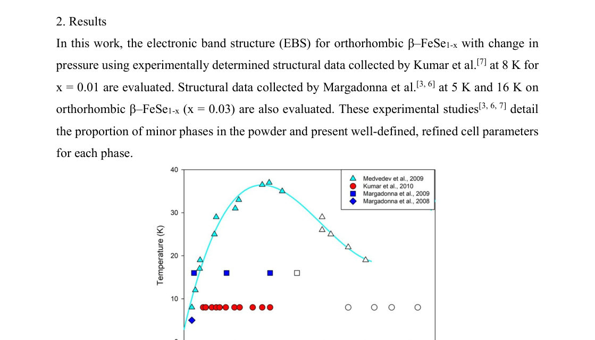
<figcaption class="paper-figure-caption"><b>Fig 1.</b> Figure 1: Experimental data for β–FeSe1-x showing (a) superconducting transition temperature</figcaption>
</figure>
<figure class="paper-figure-card">
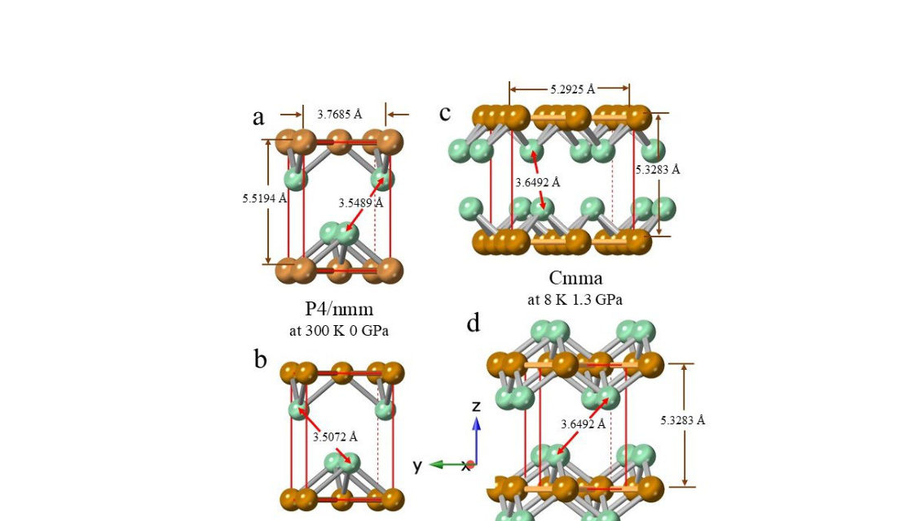
<figcaption class="paper-figure-caption"><b>Fig 2.</b> Figure 2: Crystal structure schematics showing space group symmetries used for DFT</figcaption>
</figure>
<figure class="paper-figure-card">
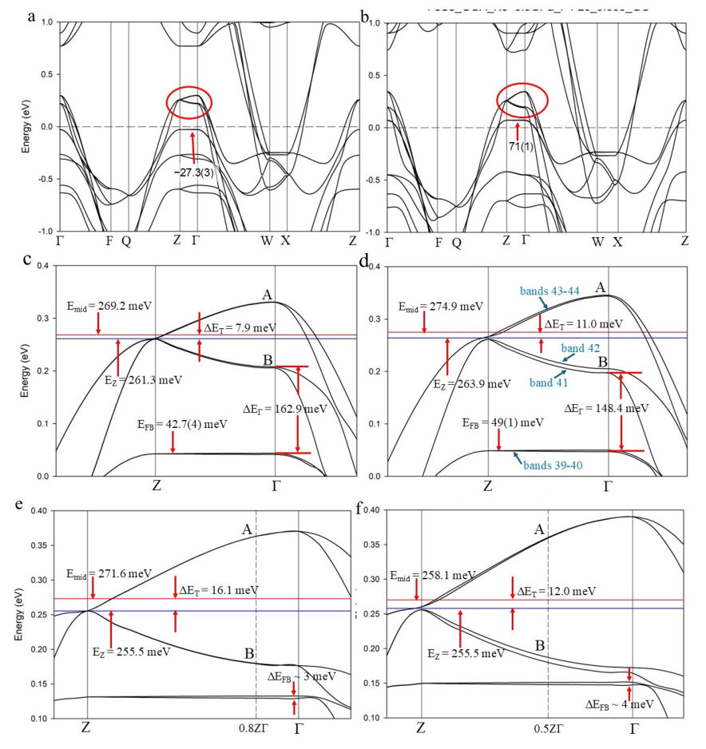
<figcaption class="paper-figure-caption"><b>Fig 3.</b> Figure 3: Calculated band structures for the 2c superlattice (space group P1) based on</figcaption>
</figure>
<figure class="paper-figure-card">
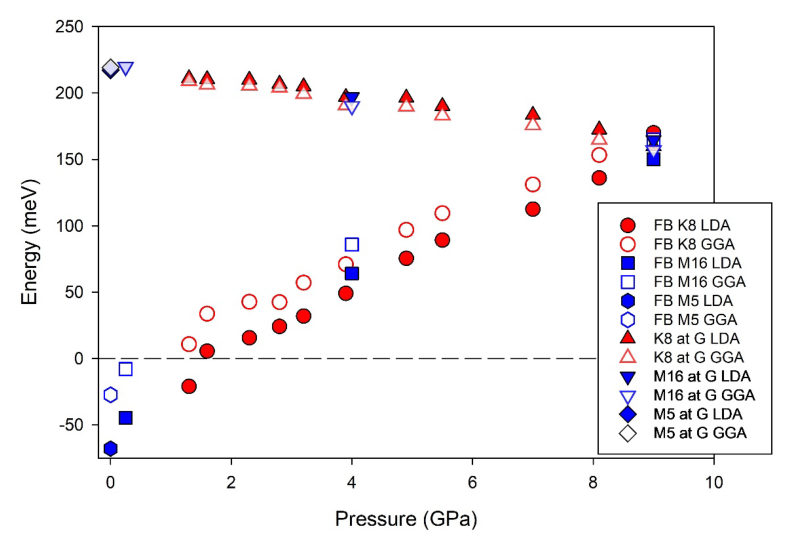
<figcaption class="paper-figure-caption"><b>Fig 4.</b> Figure 4: Energy values from DFT calculated EBSs for β–FeSe1-x (P1 2c lattice) with pressure</figcaption>
</figure>
<figure class="paper-figure-card">
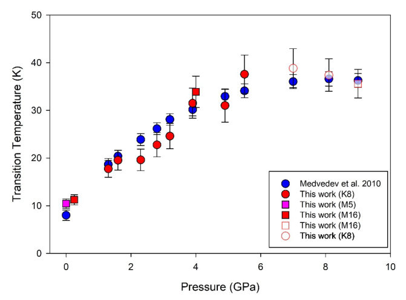
<figcaption class="paper-figure-caption"><b>Fig 5.</b> Figure 5: Comparison of experimental Tc (blue circles),[8] with average calculated Tc (red and</figcaption>
</figure>
<figure class="paper-figure-card">
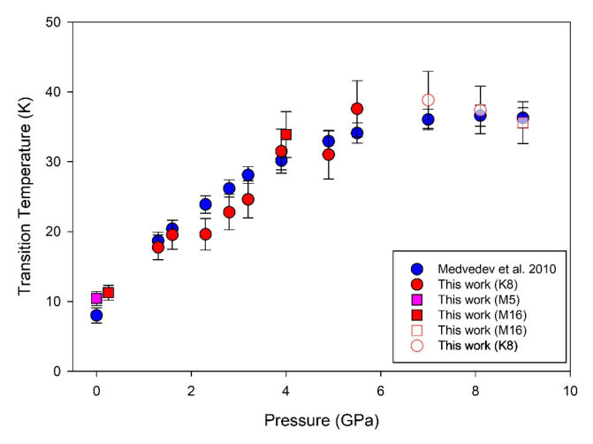
<figcaption class="paper-figure-caption"><b>Fig 6.</b> Figure 5 compares experimental data compiled by Medvedev et al.[8] on β–FeSe1-x for x = 0.01</figcaption>
</figure>
<figure class="paper-figure-card">
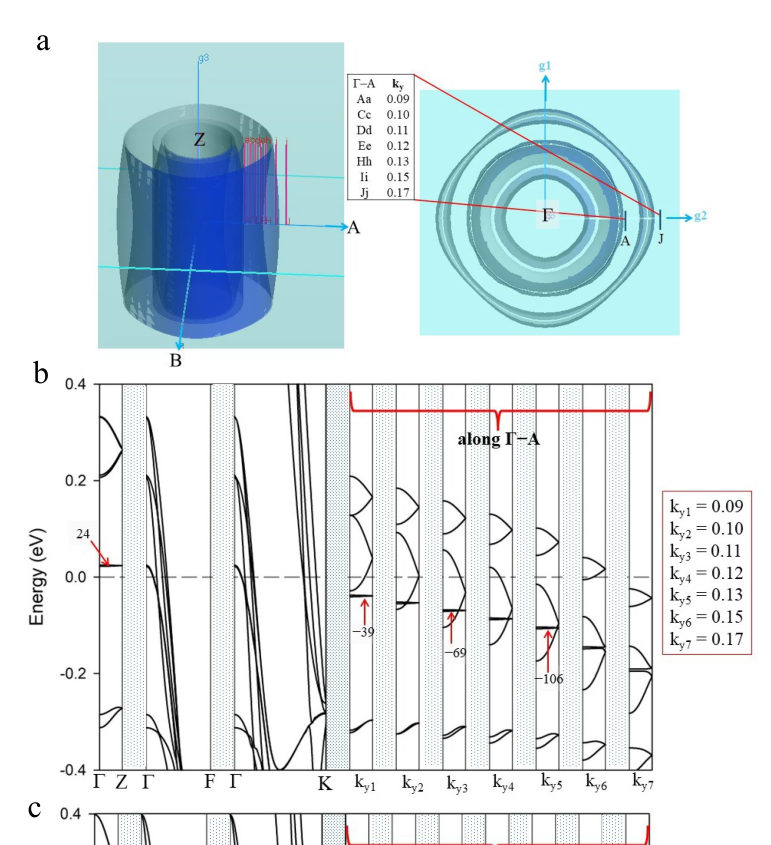
<figcaption class="paper-figure-caption"><b>Fig 7.</b> Figure 6. Band features near EF for orthorhombic β–FeSe1-x (a) Fermi surfaces showing</figcaption>
</figure>
<figure class="paper-figure-card">
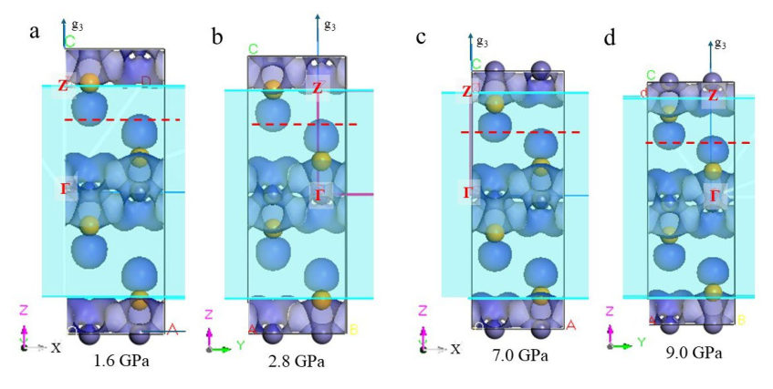
<figcaption class="paper-figure-caption"><b>Fig 8.</b> Figure 7: EDD plots for orthorhombic β–FeSe1-x calculated for a 2c P1 lattice at (a) 1.6 GPa,</figcaption>
</figure>

**Main problem.** Investigating how pressure-induced changes in the electronic band structure, specifically the interaction between flat bands and cosine-shaped bands, influence superconductivity in orthorhombic beta-FeSe1-x.

**Main result.** The study finds that the energy convergence of flat bands and cosine bands at approximately 9.0 GPa coincides with the experimental peak in Tc, suggesting that flat bands help enhance and sustain superconductivity up to 23 GPa.

**Method.** Ab initio Density Functional Theory (DFT) calculations using LDA and GGA functionals, combined with a P1 2c superlattice approach and COOP analysis.

**Summary.** This paper explores the relationship between electronic band topology and superconductivity in iron selenide under high pressure. It identifies that the interaction between flat bands (originating from Selenium lone pairs) and cosine-shaped bands is a key driver for the enhancement of the superconducting transition temperature. The researchers demonstrate that the peak in Tc at 9 GPa corresponds to specific band energy convergences. The study provides a microscopic view of how pressure-induced structural changes and charge transfer mechanisms sustain superconductivity up to 23 GPa.

Detailed structure

**Model / system.** The physical system is orthorhombic beta-FeSe1-x (specifically x=0.01 and x=0.03) under high pressure (up to 23 GPa), focusing on the role of Selenium lone pair electrons and their impact on band topology.

**Key observables.** Superconducting transition temperature (Tc), superconducting gap, electronic band structures (EBS), Fermi surface topology, and electron density difference (EDD).

**Important parameters / regimes.** Pressure regimes from 0 to 23 GPa; temperature regimes from 5 K to 16 K; energy scales in meV.

**Assumptions / limitations.** Use of a P1 superlattice to moderate band intersections; reliance on experimentally determined cell dimensions for DFT input.

**Figures summary.** Figure 1 shows Tc vs pressure and diffraction data; Figure 2 shows crystal structure schematics; Figure 3 displays calculated band structures and FB energy shifts; Figure 4 tracks energy changes; Figure 5 compares calculated and experimental Tc; Figure 6 illustrates band intersections and Fermi surface orientations; Figure 7 shows electron density difference plots.

**Paper structure.** The paper introduces the problem of pressure-induced superconductivity, describes the structural and computational models (DFT/superlattice), analyzes the evolution of band structures and Fermi surfaces under pressure, discusses the role of Selenium lone pairs in bonding and charge transfer, and concludes by correlating band topology changes with experimental Tc trends.

Abstract

Electronic band structures (EBSs) for orthorhombic beta FeSe1-x at less than 16 K and up to 23 GPa using experimentally determined cell dimensions are evaluated for cosine-shaped bands near, or crossing, EF. Cosine shaped bands are present in reciprocal directions parallel to the c axis at all pressures. Calculations using a P1 cell derived from Cmma symmetry with a 2c superlattice moderates the effect of intersecting bands to 9.0 GPa. This approach enables determination of a superconducting gap consistent with experimentally determined values. Key influences on charge distribution and transfer in the interplanar region of beta FeSe1-x are lone pair electrons which feature as flat bands (FBs) near EF along GZ in an EBS. FBs also influence the topology of Fermi surfaces as pressure increases and in directions parallel to the c* direction (i.e. offset along ky) within the Brillouin zone. At the Fermi surface along b*, cosine bands split and align favorably for electron-hole pairing with nodal inflection points located at EF. For P greater than 12.0 GPa, FBs interact with folded cosine bands invoking additional band dispersions. These calculations suggest that FBs participate in, and with increased pressure, enhance and sustain the superconducting properties of beta FeSe1-x to 23 GPa.

[↑ back to top](#top)

### [Cosolvency response in polymer brushes](http://arxiv.org/abs/2604.23521v1)

**Authors:** Huaisong Yong, Binyu Zhao  
**Type:** theory · **Category:** statistical mechanics · **PDF:** <https://arxiv.org/pdf/2604.23521v1>  
**Analysis basis:** full PDF text, analyzed in chunks

↔ Scroll figures horizontally

<figure class="paper-figure-card">
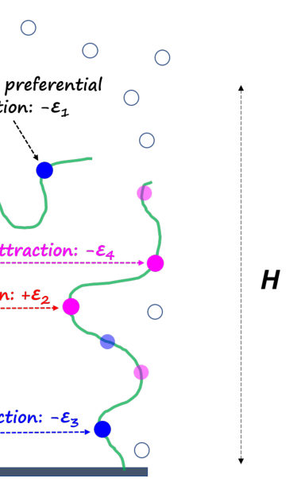
<figcaption class="paper-figure-caption"><b>Fig 1.</b> Figure 1. A schematic illustration of the preferential-solvation effect of cosolvent on polymer brush chains.</figcaption>
</figure>
<figure class="paper-figure-card">
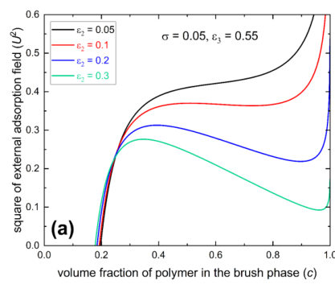
<figcaption class="paper-figure-caption"><b>Fig 2.</b> Figure 2. Based on Equation(11), the square of the external adsorption field, U</figcaption>
</figure>
<figure class="paper-figure-card">
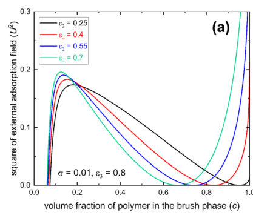
<figcaption class="paper-figure-caption"><b>Fig 3.</b> Figure 3. Based on Equation(11), the square of the external adsorption field, U</figcaption>
</figure>
<figure class="paper-figure-card">
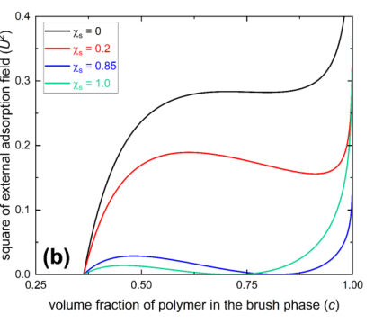
<figcaption class="paper-figure-caption"><b>Fig 4.</b> Figure 4. Based on Equation(11), the external adsorption field U is plotted as a function of the monomer</figcaption>
</figure>
<figure class="paper-figure-card">
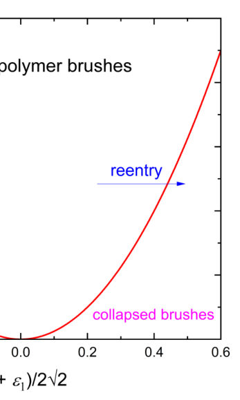
<figcaption class="paper-figure-caption"><b>Fig 5.</b> Figure 5. Phase diagram of parameter space for the discontinuous phase transition of polymer brushes</figcaption>
</figure>
<figure class="paper-figure-card">
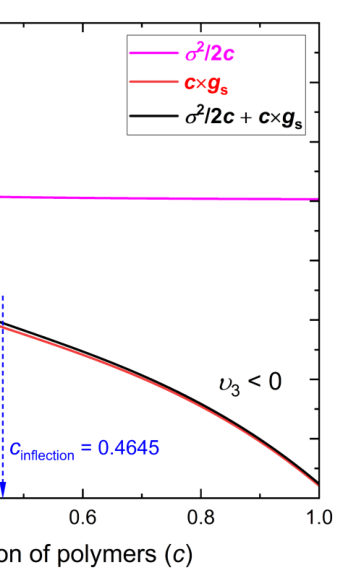
<figcaption class="paper-figure-caption"><b>Fig 6.</b> Figure 6. An example of the free energy per unit volume as a function of polymer concentration for the</figcaption>
</figure>
<figure class="paper-figure-card">
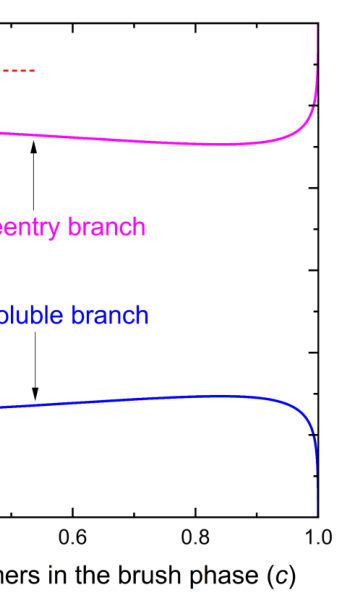
<figcaption class="paper-figure-caption"><b>Fig 7.</b> Figure 7. Definition of the soluble transition and reentry transition. In the figure, μA denotes the cosolvent</figcaption>
</figure>

**Main problem.** The paper addresses the lack of an analytic theory to explain the cosolvency effect in polymer brushes, specifically how polymer chains that are poorly soluble in two pure solvents become soluble in certain mixtures.

**Main result.** The authors develop the first analytic theory with closed-form solutions, revealing that preferential adsorption of a cosolvent induces an effective repulsion between different types of solvated monomers, driving a discontinuous soluble transition and subsequent re-collapse.

**Method.** A mean-field free-energy model based on an extension of Flory-Huggins theory is used, employing perturbation expansions and Maxwell construction to determine phase boundaries.

**Summary.** This paper provides the first analytical framework to describe the cosolvency effect in polymer brushes. It demonstrates that the phenomenon is driven by an effective repulsion between monomers solvated by different solvents, triggered by preferential adsorption. The theory predicts a complex phase behavior including a discontinuous swelling transition followed by a re-collapse. Notably, it shows that repulsive interactions between the two solvents in the bulk are not a prerequisite for cosolvency. This work offers a theoretical foundation for designing smart, stimulus-responsive materials.

Detailed structure

**Model / system.** The system consists of polymer brushes (chains end-anchored to a surface) immersed in a binary mixture of two poor solvents. The model incorporates preferential adsorption, effective monomer-monomer repulsion, and a concentration-dependent chi-function.

**Key observables.** Brush thickness, monomer volume fraction, effective Flory-Huggins parameter (chi-function), and phase transition boundaries (spinodal and binodal).

**Important parameters / regimes.** Preferential-solvation strength (epsilon_1), repulsion coupling (epsilon_2), grafting density (sigma), solvent demixing tendency (chi_s), and chemical potential (mu).

**Assumptions / limitations.** The theory assumes a homogeneous density profile (Alexander-de Gennes approach), an incompressible system, and identical sizes for monomers and solvent molecules.

**Figures summary.** Figure 1 shows a schematic of preferential solvation; Figure 2 plots the square of the external adsorption field vs. monomer density to show the effect of repulsion and grafting density; Figure 3 shows the phase transition conditions; Figure 5 presents the derived phase diagram; Figure 6 illustrates the free energy density and the role of the third virial coefficient.

**Paper structure.** The paper introduces the cosolvency problem, presents a mean-field free-energy framework, derives analytical solutions for the solvation and phase transitions, explores specific regimes like low grafting density and symmetric solvents, and concludes with a phase diagram and discussion of implications for material design.

Abstract

We present the first analytic theory with elegant and closed-form analytical solutions to explore the cosolvency effect in polymer brushes, where polymer chains that are poorly soluble in two pure solvents become fully soluble in certain mixtures thereof. This effect is key to designing stimulus-responsive smart materials but has not previously been addressed by analytic theory for polymer brushes. Our theoretical framework reveals that preferential adsorption of cosolvent induces an effective repulsion between monomers solvated by cosolvent and those solvated by solvent. The equilibrium solvation of polymer chains by cosolvent gives rise to a concentration-dependent $χ$-function, which captures the effective interactions within the brush and reproduces the reentrant behavior characteristic of the cosolvency effect. The model predicts a discontinuous soluble transition followed by a re-collapse transition at higher cosolvent concentrations. Analytical treatment within a minimal free-energy model for the case of two symmetric poor solvents shows that the swelling and re-collapse transitions share the same thermodynamic origin. For low-density brushes, we derive an analytical approximation and delineate the phase diagram of parameter space in which discontinuous transitions occur. For cosolvency to take place, the theory specifies a minimum strength for preferential solvation and the associated repulsive coupling. Furthermore, it demonstrates that, contrary to previous models, repulsive interactions between cosolvent and solvent in the bulk are not required. This work lays the groundwork for the rational design of smart stimulus-responsive materials based on the cosolvency effect in polymer brushes, a capability which was not previously established.

[↑ back to top](#top)

### [DNA melting: intra base-pair dynamics and a vector generalization of the Peyrard-Bishop-Dauxois model](http://arxiv.org/abs/2604.23771v1)

**Authors:** Nikos Theodorakopoulos  
**Type:** theory · **Category:** statistical mechanics · **PDF:** <https://arxiv.org/pdf/2604.23771v1>  
**Analysis basis:** full PDF text, analyzed in chunks

↔ Scroll figures horizontally

<figure class="paper-figure-card">
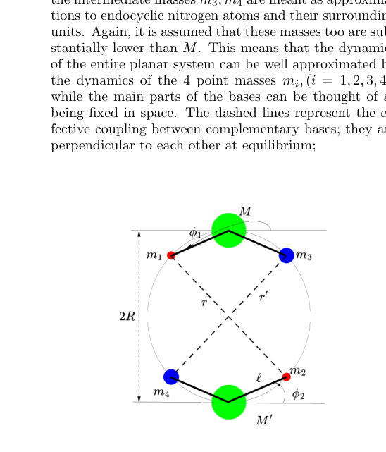
<figcaption class="paper-figure-caption"><b>Fig 1.</b> FIG. 1: A toy model of a single base plane in the DNA double helix. The large full circles reperesent the core of each base, of mass M and M ′, respectively, and are positioned at diametri- cally opposite points of a circle of radius R. Attached to each base at a distance l = 2R sin(π/8) are two point masses, one smaller, mimicking the carbonyl and exocyclic amino groups, and another approximating endocyclic nitrogen and its sur- rounding unit. The angle between the bond connecting the mass mi to its neighboring base core and the horizontal line is ϕi; at equilibrium, ϕ(0) 2 = ϕ(0) 1 −π = π/8. The dashed lines represent the effective couplings between the complementary bases; they are...</figcaption>
</figure>
<figure class="paper-figure-card">
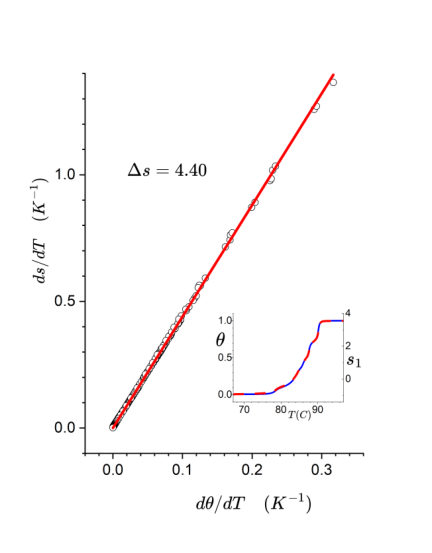
<figcaption class="paper-figure-caption"><b>Fig 2.</b> FIG. 2: Melting entropy for a single PBD chain. The onset shows that the curves for the entropy s1 (right y-axis, red, dashed) and the melting fraction (left y-axis, solid, blue) θ coincide when appropriately rescaled. The main plot shows the temperature derivative of the anharmonic part of the en- tropy vs the temperature derivative of the melting fraction (open circles). The linear fit to the data through the origin yields the slope ∆s∗. The absence of scattering in the data points (which originate in different regions of the melting pro- file) confirms the validity of the Ansatz (6) and, hence, that the melting entropy of a base pair is largely independent of chemical composition and/or...</figcaption>
</figure>
<figure class="paper-figure-card">
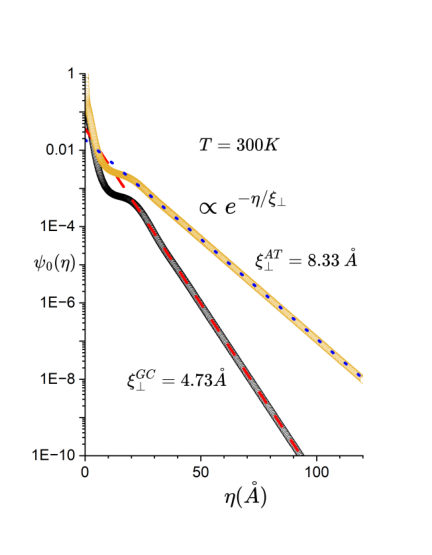
<figcaption class="paper-figure-caption"><b>Fig 3.</b> FIG. 3: The eigenfunction ψ0 in the homogeneous case. Note the purely exponential asymptotics which allow the extraction of ξ⊥for GC and AT. Parameters are the same as in Section III.</figcaption>
</figure>
<figure class="paper-figure-card">
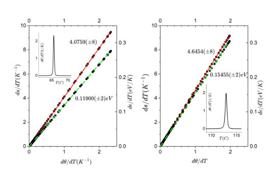
<figcaption class="paper-figure-caption"><b>Fig 4.</b> FIG. 4: Extraction of single chain PBD (N=1000) average energies and entropies per site (cf Fig. 1); left panel: pure AT: ds/dT as a function of the temperature derivative of the melting fraction (squares, left y-axis); dϵ/dT as a function of the temperature derivative of the melting fraction (cir- cles, right y-axis); the lines represent least square fits and their slopes provide estimates for melting entropy and en- ergy, respectively; the onset shows the temperature derivative of the melting fraction as a function of temperature. right panel: same for pure GC. The Morse depth parameters used, DAT = 0.1291 eV , DGC = 0.1681, correspond to a salt con- centration 0.2M.</figcaption>
</figure>

**Main problem.** The original scalar Peyrard-Bishop-Dauxois (PBD) model fails to accurately predict DNA melting entropies, unzipping forces, and DNA hairpin opening rates.

**Main result.** By generalizing the PBD model from a 1D scalar to a 2D vector order parameter, the model achieves much better agreement with experimental values for melting entropy, unzipping force, and hairpin kinetics.

**Method.** The author uses an atomistic toy model to derive a vector-based Hamiltonian and employs the Transfer Integral (TI) operator method to calculate partition functions and thermodynamic quantities.

**Summary.** This paper proposes a new 'vector' version of the PBD model to better describe DNA melting. By treating base-pair separation as a 2D vector rather than a 1D scalar, the model accounts for the internal degrees of freedom within the base plane. This modification successfully corrects major discrepancies in predicted melting entropy and unzipping forces. Most significantly, it reduces the error in DNA hairpin opening rates from 17 orders of magnitude to a much more reasonable factor of 20.

Detailed structure

**Model / system.** The system is DNA denaturation (melting) modeled as a chain of nonlinear oscillators. The new model treats each base pair as a planar vector with two independent 1D oscillators representing intra base-pair motion.

**Key observables.** Melting entropy, unzipping force, hairpin opening rates, melting fraction, and imino proton exchange equilibrium constants.

**Important parameters / regimes.** Morse potential depth (D) and width (1/alpha), stacking interaction parameters (b, k, rho), temperature (T), and salt concentration.

**Assumptions / limitations.** The model assumes the dynamics are restricted to a planar geometry and that the mass of the base core is much larger than the attachment masses, allowing the core to be treated as fixed.

**Figures summary.** Figure 1 shows the atomistic toy model of a single base plane; Figure 2 shows the melting entropy and fraction for a single PBD chain; Figure 4 shows thermodynamic integration results for AT and GC sequences.

**Paper structure.** The paper introduces the failure of the scalar PBD model, presents an atomistic toy model for a vector generalization, derives the new Hamiltonian, calculates thermodynamic and kinetic observables, and compares results to experimental data.

Abstract

The Peyrard-Bishop-Dauxois (PBD) model of DNA denaturation, although successful in the description of melting profiles, fails to predict melting entropies, unzipping forces and dynamical properties, e.g. hairpin dynamics. The paper presents an atomistic "toy model" of the intra base-pair motion which suggests that the thermodynamics may be better described by a planar vector - rather than a scalar - order parameter. This leads to correct estimates of melting entropy, unzipping force, hairpin opening rates, and the equilibrium constant of open/closed base pair states during imino proton exchange.

[↑ back to top](#top)

### [Effective phonon models based on symmetry-adapted multipole basis -- Hidden chiral phonon angular momentum splitting in ferroaxial systems](http://arxiv.org/abs/2604.23109v1)

**Authors:** Yu Xie, Rikuto Oiwa, Satoru Hayami  
**Type:** theory · **Category:** other · **PDF:** <https://arxiv.org/pdf/2604.23109v1>  
**Analysis basis:** full PDF text, analyzed in chunks

↔ Scroll figures horizontally

<figure class="paper-figure-card">
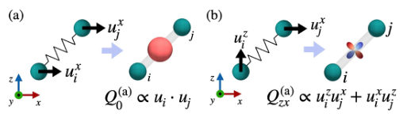
<figcaption class="paper-figure-caption"><b>Fig 1.</b> FIG. 1: (a) Schematic illustration of the force constant for the diagonal isotropic interaction, corresponding to the electric monopole Q(a) 0 at the bond center, and (b) that for the off-diagonal anisotropic interaction, corre- sponding to the electric quadrupole Q(a) zx at the bond cen- ter.</figcaption>
</figure>
<figure class="paper-figure-card">
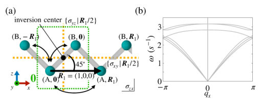
<figcaption class="paper-figure-caption"><b>Fig 2.</b> FIG. 2: (a) Schematic illustration of the one-dimensional zigzag chain. (b) Phonon energy dispersion of the model.</figcaption>
</figure>
<figure class="paper-figure-card">
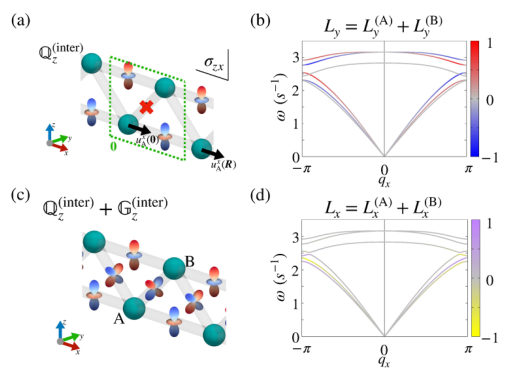
<figcaption class="paper-figure-caption"><b>Fig 3.</b> FIG. 4: (a) Schematic representation of the electric dipole ˆQ(inter) z defined in Eq. (22), and (b) the corre- sponding phonon energy dispersion with the phonon AM distribution. (c) Combined order of ˆQ(inter) z and ˆG(inter) z and (d) the corresponding phonon energy dispersion with phonon AM distribution.</figcaption>
</figure>
<figure class="paper-figure-card">
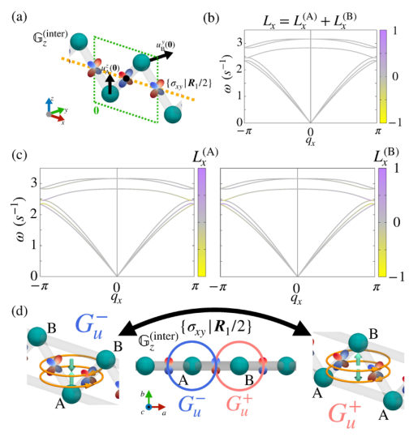
<figcaption class="paper-figure-caption"><b>Fig 4.</b> FIG. 3: (a) Schematic representation of the electric toroidal dipole ˆG(inter) z defined in Eq. (21), and (b) the corresponding phonon energy dispersion and AM dis- tribution. (c) Sublattice-resolved phonon AM distribu- tion under ferroaxial order described by ˆG(inter) z . (d) Antiferro-type chiral order of ET quadrupoles G± u cor- responding to Fig. 4(a).</figcaption>
</figure>

**Main problem.** The microscopic origin of phonon angular momentum (AM) splitting in ferroaxial systems and the mechanism by which ferroaxiality and polarity combine to create global chirality are unclear.

**Main result.** The authors identify that ferroaxial order creates 'hidden' sublattice-resolved chiral phonons that cancel globally, while adding polar order lifts this cancellation to produce observable global chirality.

**Method.** A symmetry-based framework using a Symmetry-Adapted Multipole Basis (SAMB) to decompose the force-constant matrix into bond-centered electric multipoles.

**Summary.** This paper proposes a new theoretical framework to understand how different types of crystal symmetry-breaking (ferroaxial and polar) affect phonon angular momentum. By decomposing force constants into electric multipoles, the authors show that ferroaxial systems possess a 'hidden' chirality that is only revealed as a global property when polar order is present. This provides a unified way to predict and control phonon properties through electronic ordering and external fields.

Detailed structure

**Model / system.** A minimal 1D zigzag-chain model with two sublattices (A and B) in space group No. 51 (point group D2h), using a harmonic approximation for the potential energy.

**Key observables.** Phonon energy dispersion, phonon angular momentum (AM) distribution, and sublattice-resolved AM.

**Important parameters / regimes.** Electric and electric toroidal multipoles, isotropic and anisotropic force constants (k1, k2, k'1, k'2), and ferroaxial/polar order parameters.

**Assumptions / limitations.** The study is restricted to the harmonic approximation (second-order expansion) and assumes a bond-based formulation where energy depends on relative displacements.

**Figures summary.** Fig 1 shows schematics of isotropic and anisotropic interactions via multipoles; Fig 2 displays the 1D zigzag chain and its phonon dispersion; Fig 3 illustrates electric toroidal dipoles and the distribution of sublattice-resolved AM.

**Paper structure.** The paper introduces a new symmetry-based framework (SAMB), applies it to a 1D zigzag chain model, analyzes the emergence of hidden chirality in ferroaxial states, and demonstrates how polar contributions lead to global chirality.

Abstract

We propose a symmetry-based framework for constructing effective harmonic phonon models using a symmetry-adapted multipole basis. By decomposing the force-constant matrix into bond-centered electric multipoles, we identify the minimal microscopic ingredients responsible for phonon angular-momentum splitting. Applying this framework to a minimal zigzag-chain model, we show that ferroaxial order gives rise to a hidden sublattice-resolved chiral phonons, while an additional polar contribution leads to finite global chirality. Our results provide a unified symmetry-based description of hidden and emergent phonon phenomena and suggest a route to control phonon properties via electronic orderings and external fields.

[↑ back to top](#top)

### [Electrical tunability of terahertz nonlinearity in graphene](http://arxiv.org/abs/2604.24651v1)

**Authors:** Sergey Kovalev, Hassan A. Hafez, Klaas-Jan Tielrooij, Jan-Christoph Deinert, Igor Ilyakov, Nilesh Awari, David Alcaraz, Karuppasamy Soundarapandian, David Saleta, Semyon Germanskiy, Min Chen, Mohammed Bawatna, Bertram Green, Frank H. L. Koppens, Martin Mittendorff, Mischa Bonn, Michael Gensch, Dmitry Turchinovich  
**Type:** both · **Category:** other · **PDF:** <https://arxiv.org/pdf/2604.24651v1>  
**Analysis basis:** full PDF text, analyzed in chunks

↔ Scroll figures horizontally

<figure class="paper-figure-card">
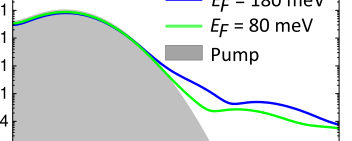
<figcaption class="paper-figure-caption"><b>Fig 1.</b> Figure 1: Thermodynamic model calculations for the Fermi energy dependence of the THz nonlinearity of</figcaption>
</figure>
<figure class="paper-figure-card">
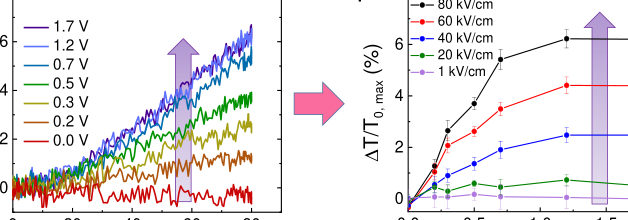
<figcaption class="paper-figure-caption"><b>Fig 2.</b> Figure 3: Dependence of THz field-induced saturable absorption on the gating voltage revealed by TPTP</figcaption>
</figure>
<figure class="paper-figure-card">
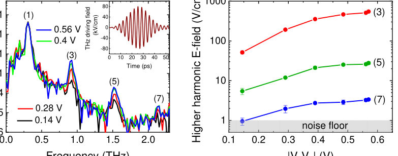
<figcaption class="paper-figure-caption"><b>Fig 3.</b> Figure 4. Gating dependence of THz higher harmonics generation. (a) The THz amplitude spectra of the THz</figcaption>
</figure>
<figure class="paper-figure-card">
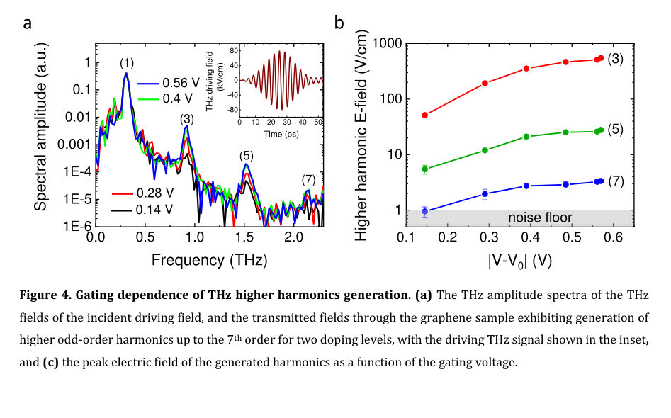
<figcaption class="paper-figure-caption"><b>Fig 4.</b> Fig. 5(c). We see a good agreement between the experiment and the model calculations for</figcaption>
</figure>
<figure class="paper-figure-card">
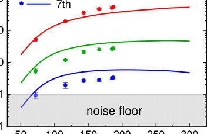
<figcaption class="paper-figure-caption"><b>Fig 5.</b> Figure 5: The thermodynamic model calculations. (a &amp; b) the thermodynamic model calculations (solid lines)</figcaption>
</figure>

**Main problem.** Achieving efficient, electrical control over the large nonlinear terahertz (THz) response in graphene for applications in high-frequency electronics.

**Main result.** Graphene's THz nonlinearity can be tuned by a factor of ~70 using low gating voltages (a few volts), with optimal gating enhancing third-harmonic generation efficiency by approximately two orders of magnitude.

**Method.** The study uses nonlinear THz spectroscopy, including THz pump-probe and multi-cycle THz time-domain spectroscopy, combined with a thermodynamic model of carrier heating and cooling.

**Summary.** This paper demonstrates that the massive nonlinear optical response of graphene in the terahertz regime can be electrically tuned using very low voltages. By adjusting the Fermi energy through gating, the researchers achieved a 70-fold modulation in THz transmission and a 100-fold increase in third-harmonic generation efficiency. The mechanism is driven by the ultrafast heating and subsequent cooling of the electronic population. This work provides a foundation for developing highly efficient, voltage-controlled graphene-based components for ultra-high-frequency signal processing.

Detailed structure

**Model / system.** The system is CVD-grown monolayer graphene on a quartz substrate, controlled via a polymer electrolyte gate. The physical model is a single-band thermodynamic approach describing the interplay of THz-induced electronic heating and phonon-mediated cooling.

**Key observables.** THz third-harmonic generation (THG) efficiency, THz saturable absorption, differential transmission (delta T/T0), and carrier temperature (Te).

**Important parameters / regimes.** Fermi energy (E_F) between 50 and 200 meV, peak electric field strengths up to 80 kV/cm, and momentum scattering time (tau) dominated by long-range Coulomb scattering.

**Assumptions / limitations.** The single-band model assumes carrier density conservation and is valid when E_F > k_B Te; the modulation speed is currently limited by the polymer electrolyte gate.

**Figures summary.** Figure 1 shows THz waveforms and the temporal modulation of conductivity/absorbance; Figure 3 illustrates harmonic electric field enhancement; Supplementary figures show conductivity spectra, electronic temperature evolution, and Hall measurement validation.

**Paper structure.** The paper introduces the problem of THz nonlinearity in graphene, describes the experimental setup and gating mechanism, presents results for both single-cycle and multi-cycle pulses, validates the findings with a thermodynamic model, and concludes with implications for high-frequency device design.

Abstract

Graphene is conceivably the most nonlinear optoelectronic material. Its nonlinear optical coefficients in the terahertz (THz) frequency range surpass those of other materials by many orders of magnitude. This, in particular, allows one to use graphene for extremely efficient up-conversion of sub-THz electronic input signals into the THz frequency range at room temperature and under ambient conditions, thus paving the way for practical graphene-based ultrahigh-frequency electronic technology. Here, we show that the THz nonlinearity of graphene can be efficiently controlled using electrical gating, with gating voltages as low as a few volts. For example, optimal electrical gating enhances the power conversion efficiency in THz third-harmonic generation in graphene by about two orders of magnitude. This essentially converts graphene from an almost perfectly linear, inert electronic material to a material with the highest possible THz nonlinearity. We demonstrate gating control of THz nonlinearity of graphene for both ultrashort single-cycle and quasi-monochromatic multi-cycle input signals. Our experimental results are in quantitative agreement with a physical model of graphene nonlinearity, describing the time-dependent thermodynamic balance maintained within the electronic population of graphene during interaction with ultrafast electric fields. Our results can serve as a basis for straightforward and accurate design of devices and applications for efficient electronic signal processing in graphene at ultra-high frequencies.

[↑ back to top](#top)

### [Electronic and optical properties of arsenic monolayers: from planar honeycomb to the puckered phase](http://arxiv.org/abs/2604.24585v1)

**Authors:** Niloufar Dadkhah, Walter R. L. Lambrecht  
**Type:** theory · **Category:** other · **PDF:** <https://arxiv.org/pdf/2604.24585v1>  
**Analysis basis:** full PDF text, analyzed in chunks

↔ Scroll figures horizontally

<figure class="paper-figure-card">
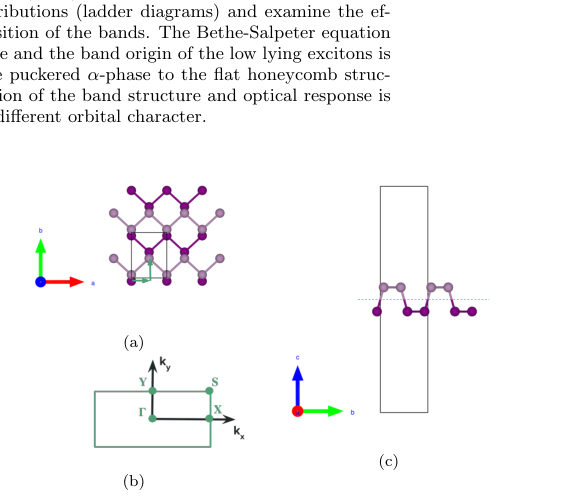
<figcaption class="paper-figure-caption"><b>Fig 1.</b> FIG. 1. Crystal structure of α-arsenene shown from the top view (a) and the side view (c), along with the correspond- ing reciprocal-space Brillouin zone and high-symmetry points (b). In panels (a) and (c), the green arrows and dashed line indicate a glide-mirror symmetry operation. The operation consists of a non-primitive translation followed by a mirror reflection, where the mirror plane passes halfway between the two sublattices, as illustrated by the dashed line in (c). The Cartesian axes are defined as x ∥a, y ∥b, and z ∥c, where y corresponds to the puckering direction and x lies along the shorter in-plane lattice vector.</figcaption>
</figure>
<figure class="paper-figure-card">
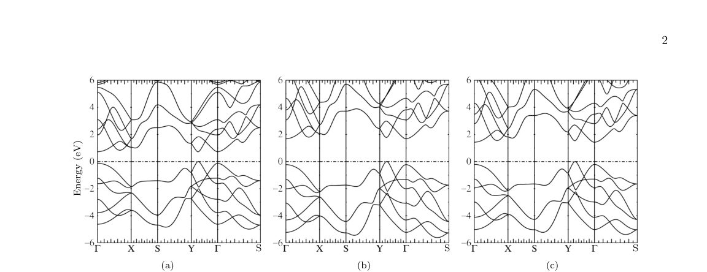
<figcaption class="paper-figure-caption"><b>Fig 2.</b> FIG. 2. Band structure of the relaxed puckered phase calculated using (a) LDA, (b) QSGW, and (c) QSG ˆ W. The y-axis shows energy (eV), and the x-axis follows the chosen high-symmetry path.</figcaption>
</figure>
<figure class="paper-figure-card">
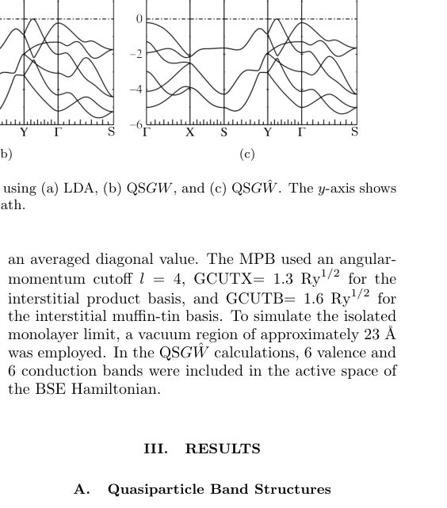
<figcaption class="paper-figure-caption"><b>Fig 3.</b> Fig. 2 shows the band structure of the relaxed puckered phase obtained using LDA, QSGW, and QSG ˆW. For the DFT starting point, structural parameters were taken from the Materials Project [24, 25] and further relaxed using QE. The in-plane lattice constants are a = 3.69 ˚A and b = 4.72 ˚A, and a vacuum spacing of 22.5 ˚A was used along the out-of-plane direction to avoid interac- tions between periodic images. In LDA, the gap is direct at an intermediate point between Γ and Y. After includ- ing quasiparticle corrections, both QSGW and QSG ˆW predict an indirect gap, with the VBM located between Γ and Y and the CBM at Γ. The lowest conduction band also displays shallow local minima along Γ–X...</figcaption>
</figure>
<figure class="paper-figure-card">
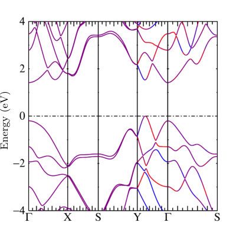
<figcaption class="paper-figure-caption"><b>Fig 4.</b> FIG. 3. Band structure of α-arsenene including SOC. Spin– orbit coupling mixes the spin character of the bands; blue and red colors indicate spin-up and spin-down contributions, respectively, with intermediate colors corresponding to mixed character.</figcaption>
</figure>
<figure class="paper-figure-card">
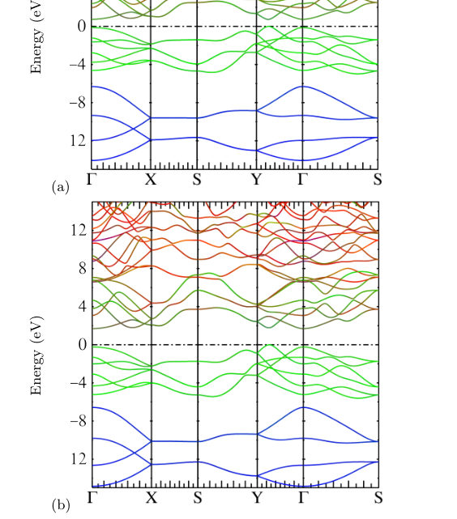
<figcaption class="paper-figure-caption"><b>Fig 5.</b> FIG. 4. Orbital-resolved band structures from (a) LDA and (b) QSGW calculations. Colors denote s (blue), p (green), and d (red) character.</figcaption>
</figure>
<figure class="paper-figure-card">
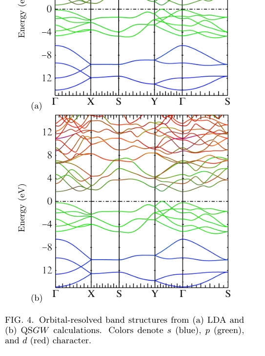
<figcaption class="paper-figure-caption"><b>Fig 6.</b> Fig. 5 shows the imaginary part of the macroscopic dielectric function for light polarized along the two in- plane directions. The independent-particle approxima- tion (IPA) spectrum is compared with the corresponding BSE result, where electron–hole interactions and local- field effects are explicitly included. As expected for the puckered structure, the optical response is strongly anisotropic: the x and y polarizations show different onset energies and different distributions of oscillator strength. In both polarizations the BSE spectrum is red- shifted relative to the IPA result, reflecting the binding of electron–hole pairs. The first bright exciton appears near 1.8 eV for x...</figcaption>
</figure>
<figure class="paper-figure-card">
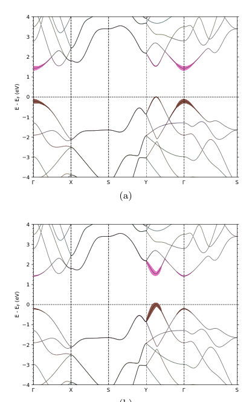
<figcaption class="paper-figure-caption"><b>Fig 7.</b> FIG. 6. k-space distributions of the first two bright excitons with y polarization. (a) First exciton, at 1.089 eV, mainly near Γ. (b) Second exciton, at 1.175 eV, concentrated along the Γ–Y path.</figcaption>
</figure>
<figure class="paper-figure-card">
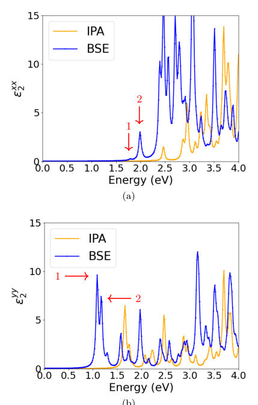
<figcaption class="paper-figure-caption"><b>Fig 8.</b> FIG. 5. Imaginary part of the macroscopic dielectric func- tion for (a) x-polarized and (b) y-polarized light. Orange: independent-particle approximation (IPA). Blue: Bethe– Salpeter equation (BSE). The first and second bright excitons are labeled as 1 and 2, respectively.</figcaption>
</figure>
<figure class="paper-figure-card">
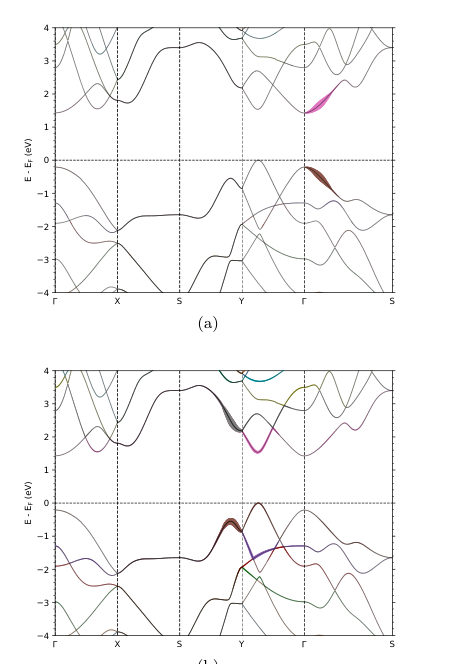
<figcaption class="paper-figure-caption"><b>Fig 9.</b> FIG. 7. k-space distributions of the first two bright excitons for x polarization. (a) Lowest bright exciton at 1.787 eV. (b) Second bright exciton, at 1.988 eV, plotted with weights scaled by 100 for visibility.</figcaption>
</figure>
<figure class="paper-figure-card">
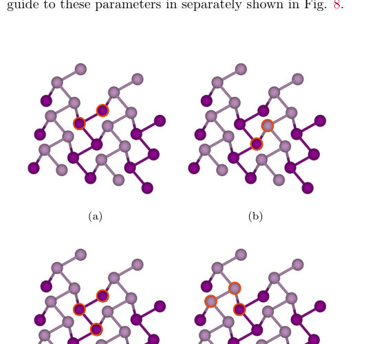
<figcaption class="paper-figure-caption"><b>Fig 10.</b> FIG. 8. Guide to the structural parameters that vary under strain, as shown in Fig. 9. Orange circles indicate (a) the in-plane bond length d1, (b) the out-of-plane bond length d2, (c) the in-plane bond angle θ1, and (d) the out-of-plane bond angle θ2. Upon going from the relaxed puckered structure to the flat limit, d1 changes from 2.509 to 2.521 ˚A, d2 from 2.490 to 2.523 ˚A, θ1 from 94.783◦to 120.057◦, and θ2 from 100.367◦</figcaption>
</figure>

**Main problem.** The study investigates the evolution of electronic and optical properties of arsenic monolayers as they undergo a structural transition from a puckered alpha-phase to a flat honeycomb phase under biaxial strain.

**Main result.** The researchers found that quasiparticle corrections reveal an indirect band gap and significant p-d orbital hybridization, and that biaxial strain induces a transition where the lowest exciton shifts from bright to dark.

**Method.** The study uses Density Functional Theory (DFT) with LDA, many-body perturbation theory via the quasi-particle self-consistent GW (QSGW) and QSW methods, and the Bethe-Salpeter Equation (BSE) for optical response.

**Summary.** This paper explores how the electronic and optical properties of arsenic monolayers change when they are flattened by biaxial strain. Using advanced many-body methods, the authors show that while simple models predict a direct gap, more accurate calculations reveal an indirect gap and significant orbital hybridization. They also demonstrate that strain can turn bright excitons into dark ones, providing insight into the tunable optoelectronic properties of 2D materials.

Detailed structure

**Model / system.** The physical system is a monolayer of arsenic (As), a Group-V element, studied in two structural phases: a puckered alpha-phase (similar to black phosphorus) and a flat honeycomb structure.

**Key observables.** Band gaps (direct and indirect), orbital composition (p and d character), exciton binding energies, optical anisotropy (x vs y polarization), and exciton brightness.

**Important parameters / regimes.** Biaxial strain levels, spin-orbit coupling (SOC), and in-plane/out-of-plane bond lengths and angles.

**Assumptions / limitations.** The study assumes the validity of the LDA and QSGW approximations for electronic structure and the BSE for electron-hole interactions.

**Figures summary.** Figure 1 shows the crystal structure and Brillouin zone; Figure 2 compares LDA, QSGW, and QSW band structures; Figure 3 shows SOC effects; Figure 4 shows orbital-resolved bands; Figure 5 compares dielectric functions (IPA vs BSE); Figures 6-7 show k-space distribution of excitons; Figures 10-13 show band structure evolution under strain and Brillouin zone folding.

**Paper structure.** The paper begins with structural characterization, moves to electronic structure calculations (LDA, QSGW, and SOC effects), analyzes orbital hybridization, investigates optical properties and excitonic effects, and concludes with a study of the phase transition under biaxial strain.

Abstract

Group-V monolayer materials exhibit intriguing electronic and optical properties, influenced by their unique crystal symmetries and structural phases. In this work, we study arsenic monolayers, investigating their electronic and optical properties across different phases, including planar, and puckered forms, using density functional theory (DFT) and quasi-particle self-consistent $GW$ (QS$GW$) methods, with and without vertex contributions (ladder diagrams) and examine the effects of spin-orbit coupling and the orbital composition of the bands. The Bethe-Salpeter equation (BSE) method is used to study the optical response and the band origin of the low lying excitons is determined. The gradual transformation from the puckered $α$-phase to the flat honeycomb structure is studied under biaxial strain and the evolution of the band structure and optical response is described in terms of band inversions of bands of different orbital character.

[↑ back to top](#top)

### [Electronic Spectroscopy of Atomic Defects in Molybdenum Disulfide under Ambient Conditions](http://arxiv.org/abs/2604.23391v1)

**Authors:** Joshua R. Evans, Diego A. Garibay, Aiden N. Kuhls, Mehmet Z. Baykara  
**Type:** experiment · **Category:** other · **PDF:** <https://arxiv.org/pdf/2604.23391v1>  
**Analysis basis:** full PDF text, analyzed in chunks

↔ Scroll figures horizontally

<figure class="paper-figure-card">
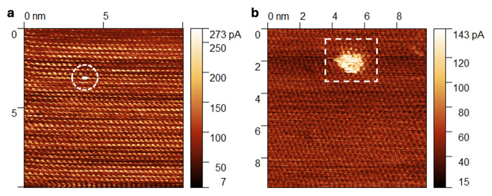
<figcaption class="paper-figure-caption"><b>Fig 1.</b> FIG 1. (a) Current map comprising a point defect (highlighted by the dashed white circle)</figcaption>
</figure>
<figure class="paper-figure-card">
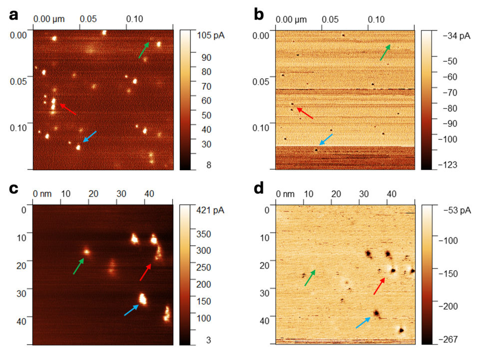
<figcaption class="paper-figure-caption"><b>Fig 2.</b> FIG 2. Pairs of current maps recorded at different bias voltages on MoS2. The top row shows two</figcaption>
</figure>
<figure class="paper-figure-card">
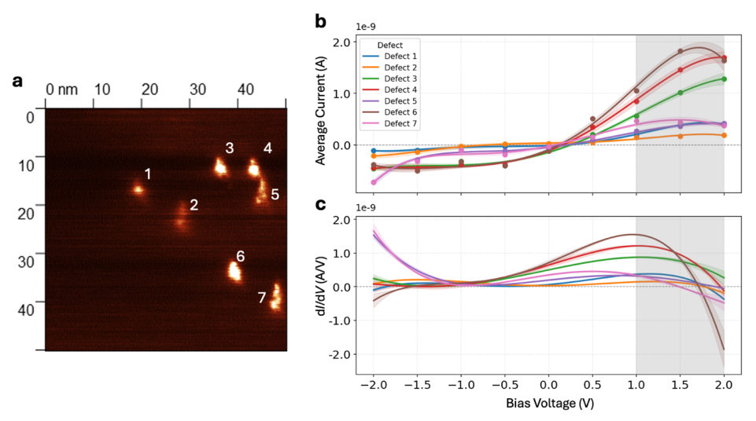
<figcaption class="paper-figure-caption"><b>Fig 3.</b> FIG 3. (a) Current map of defects on MoS2 imaged at a bias voltage of +2 V. (b) Average current</figcaption>
</figure>
<figure class="paper-figure-card">
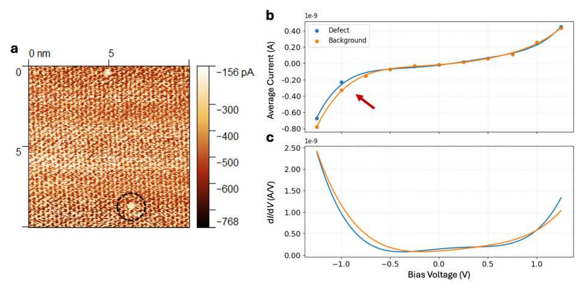
<figcaption class="paper-figure-caption"><b>Fig 4.</b> FIG 4. (a) A 10 × 10 nm2 current map on MoS2 imaged at a bias voltage of -1 V, where two point</figcaption>
</figure>

**Main problem.** The difficulty of identifying the chemical identity and electronic nature of atomic-scale defects in MoS2 under realistic, ambient conditions without the need for ultra-high vacuum environments.

**Main result.** The researchers successfully categorized and chemically identified various defects (n-type/p-type metal substitutions and oxygen substitutions) using a new C-AFM spectroscopy method, specifically identifying point defects as oxygen substitutions rather than sulfur vacancies.

**Method.** A new 'Discrete I-V spectroscopy' approach using Conductive Atomic Force Microscopy (C-AFM) under ambient conditions, involving high-speed scanning of current maps at discrete bias voltages and polynomial fitting to extract differential conductance.

**Summary.** This paper presents a new method for performing electronic spectroscopy on individual atomic defects in MoS2 under ambient conditions using C-AFM. By using a 'discrete I-V spectroscopy' technique, the authors can identify the chemical nature of defects, such as distinguishing between n-type/p-type metal substitutions and oxygen substitutions. This approach avoids the need for ultra-high vacuum environments, making it highly relevant for studying 2D materials in practical device-operating conditions. The study provides a way to map the electronic density of states of defects with high spatial resolution.

Detailed structure

**Model / system.** The physical system is molybdenum disulfide (MoS2) thin films, specifically focusing on atomic-scale defects including transition metal substitutions (Re, V, Nb) and oxygen substitutions at sulfur sites.

**Key observables.** Local conductivity, differential conductance (dI/dV-V), current maps, and spatial morphology of electronic perturbations.

**Important parameters / regimes.** Ambient conditions (22-23 C, 20-50% humidity), scan sizes from 10x10 nm2 to 150x150 nm2, and defect densities ranging from 10^11 to 10^12 cm-2.

**Assumptions / limitations.** The study assumes that the electronic signatures (dI/dV-V) can be reliably compared to existing STM and DFT data to achieve chemical identification.

**Figures summary.** Fig 1 shows atomic-resolution current maps of single-atom and larger defects; Fig 2 displays current maps at different bias polarities showing changes in spatial morphology; Fig 3 presents I-V curves and derived differential conductance spectra for identified defects; Fig 4 demonstrates the identification of oxygen substitutions via current attenuation and lack of in-gap states.

**Paper structure.** The paper introduces the problem of defect characterization, describes the new C-AFM discrete I-V spectroscopy methodology, presents the categorization of substitution defects, details the identification of oxygen-based point defects, and concludes with a comparison of findings to existing literature.

Abstract

Transition metal dichalcogenides (TMDs) attract significant attention as potential building blocks in next-generation electronic devices. On the other hand, a comprehensive understanding of how various defects affect local electronic properties under realistic operational conditions is yet to be formed. Here, we present results of electronic spectroscopy experiments performed on individual defects in the prototypical TMD molybdenum disulfide (MoS2) under ambient conditions, by way of conductive atomic force microscopy (C-AFM). Data acquired in the form of consecutive, high-resolution current maps at various bias voltages allow the assessment of local conductivity and differential conductance as a function of bias voltage for individual defects, the effects of which range from single atomic sites to several nanometers in lateral size. Characteristic behavior in spectroscopy data allows the categorization of observed defects into distinct groups, and their chemical identification as n-type and p-type transition metal substitutions of molybdenum atoms, as well as oxygen substitutions of sulfur atoms.

[↑ back to top](#top)

### [Errors that matter: Uncertainty-aware universal machine-learning potentials calibrated on experiments](http://arxiv.org/abs/2604.24607v1)

**Authors:** Matthias Kellner, Teitur Hansen, Thomas Bligaard, Karsten Wedel Jacobsen, Michele Ceriotti  
**Type:** both · **Category:** disordered systems and neural networks · **PDF:** <https://arxiv.org/pdf/2604.24607v1>  
**Analysis basis:** full PDF text, analyzed in chunks

↔ Scroll figures horizontally

<figure class="paper-figure-card">
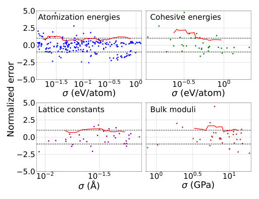
<figcaption class="paper-figure-caption"><b>Fig 1.</b> FIG. 1. Normalized errors vs. uncertainty estimates from cross-validated data. UAFD is 5-fold cross-validated on atom- ization energies, cohesive energies, lattice constants, and bulk moduli. Running root-mean-square normalized error (RM- SNE) (red) is shown in each plot averaged over 30 points in the atomization energies and averaged over 10 points in the rest. Running RMSNE shows that uncertainty estimates are good for atomization energies, lattice constants, and bulk moduli. Cohesive energies have too low uncertainty estimates compared to errors.</figcaption>
</figure>
<figure class="paper-figure-card">
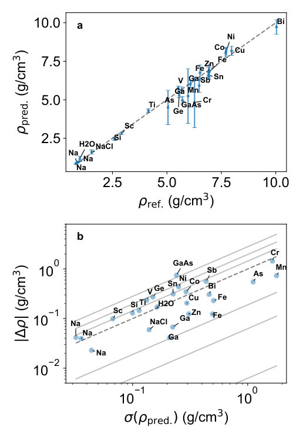
<figcaption class="paper-figure-caption"><b>Fig 2.</b> FIG. 2. PET-UAFD predicted densities against experimental reference densities. In subplot a) we plot reference densi- ties against predicted PET-UAFD densities and indicate the PET-UAFD uncertainties as error bars. The dashed line in- dicates the identity line. In subplot b) we plot PET-UAFD predicted uncertainties σ(ρpred.) against unsigned prediction errors |∆ρ|. The dashed line indicates the unit line, and gray lines from bottom to top are the 0.5, 5, 15, 85, 95, and 99.5 % quantile lines of the log folded normal distribution, indicating that between the lowermost and uppermost line 99 % of the samples should be found.</figcaption>
</figure>
<figure class="paper-figure-card">
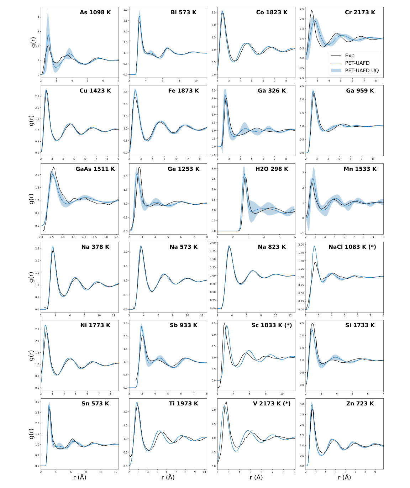
<figcaption class="paper-figure-caption"><b>Fig 3.</b> FIG. 3. Radial distribution function of selected liquids at ambient pressures ordered alphabetically. PET-UAFD predicted pair correlation functions are drawn in blue and the PET-UAFD predicted ±1 standard deviation uncertainties are shaded in blue. Data points that are marked with an asterisk (*) are affected by reported or potentially large measurement uncertainties. More details are given in the main text and the appendix section S9.</figcaption>
</figure>
<figure class="paper-figure-card">
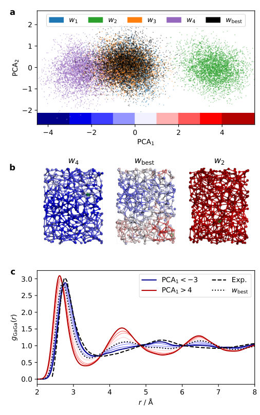
<figcaption class="paper-figure-caption"><b>Fig 4.</b> FIG. 4. Demonstration of the origin of invariant points in the pair correlation functions generated by an MLIP ensemble for liquid Ga at 326 K. (a) Principal components of the atom- resolved pair-correlation function ˜g(r, i). The color-coded rectangles correspond to the coloring of atoms in panel b and the average correlation functions in panel c. (b) Representa- tive snapshots extracted from simulations using the weighted potentials w4, wbest, and w2, color-coded according to the first PCA component.</figcaption>
</figure>
<figure class="paper-figure-card">
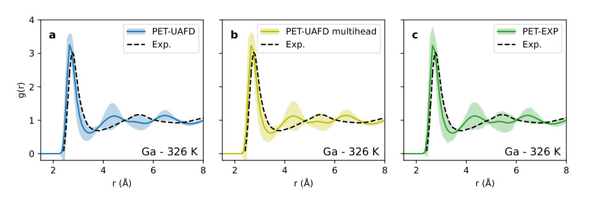
<figcaption class="paper-figure-caption"><b>Fig 5.</b> FIG. 5. Comparing simulated and experimentally obtained RDFs for liquid gallium at 326 K: a) PET-UAFD predicted RDF±1σ compared with experiment; b) PET-UAFD multihead model predicted RDF±1σ compared to experiment; c) RDF±1σ obtained by the full PET-EXP protocol (combining thermodynamic reweighting and PET-UAFD multihead models) compared to experiment.</figcaption>
</figure>

**Main problem.** Machine-learning interatomic potentials (MLIPs) accurately mimic their DFT training references but fail to account for the inherent errors in the underlying electronic structure approximations relative to experimental reality.

**Main result.** The authors developed PET-UAFD, an ensemble of MLIPs calibrated against experimental data, which provides accurate predictions for liquid densities and structural properties while using the ensemble spread to quantify uncertainty relative to experiment.

**Method.** The framework uses an uncertainty-aware functional distribution approach (UAFD) to train an ensemble of MLIPs on various DFT functionals and employs the PET-EXP protocol (statistical reweighting) for efficient uncertainty quantification.

**Summary.** This paper presents a new way to make machine-learning potentials truly predictive by calibrating them against experimental data rather than just approximate DFT calculations. By using an ensemble of models representing different levels of DFT theory, the authors can estimate how much a prediction might deviate from physical reality. They introduce an efficient protocol (PET-EXP) that allows for this uncertainty quantification at almost no extra computational cost. The method successfully predicts the properties of various liquids and provides a reliable way to assess the trustworthiness of atomistic simulations.

Detailed structure

**Model / system.** The study utilizes the Point Edge Transformer (PET) architecture to create universal MLIPs trained on an ensemble of DFT functionals (PBE, PBEsol, PBE+U, r2SCAN, r2SCAN-D3) applied to various solids and liquids.

**Key observables.** Atomization energies, cohesive energies, lattice constants, bulk moduli, liquid densities, and radial distribution functions (RDFs).

**Important parameters / regimes.** A fixed local cutoff radius of 4.5 Angstroms; ensemble weights (w0 to w4); temperature and pressure in NPT ensembles.

**Assumptions / limitations.** The error in the MLIP is primarily driven by the variation in the underlying DFT functional space; the predictive distribution can be estimated by sampling specific unit vector points.

**Figures summary.** Plots of normalized errors vs. predicted uncertainties; radial distribution functions (RDFs) for various liquids with shaded uncertainty bands; PCA analysis of atomic environments; and parity plots comparing predictions to experimental values.

**Paper structure.** The paper introduces the problem of DFT-inherent error, describes the PET-UAFD and PET-EXP frameworks, presents calibration results on static solid properties, demonstrates transferability to liquid structures and densities, and discusses the computational efficiency and physical origin of prediction errors.

Abstract

Machine-learning models of atomic-scale interactions achieve the accuracy of the quantum mechanical calculations on which they are trained, but at a dramatically lower computational cost. Their predictions can be made trustworthy by uncertainty quantification techniques that estimate the residual error relative to their reference. These errors, however, do not include uncertainty contributions from the approximations inherent in the electronic structure calculations, which are often the main source of discrepancy with empirical observations. We construct an ensemble of ML potentials trained on multiple electronic-structure references and calibrate it against experimental data on cohesive energies, atomization energies, lattice constants and bulk moduli of simple materials and molecules, similar to the uncertainty-aware functional distribution approach. The resulting ensemble of models, which we call PET-UAFD, can be used to simulate matter across a wide range of compositions and thermodynamic conditions. By comparison with experimental measurements of the density and structure of liquids, we demonstrate that, even outside the static properties on which it was calibrated, PET-UAFD enables predictions that are as accurate against experiments as the best available electronic-structure reference and that the spread in the ensemble can be used to assess the reliability of such predictions. We also introduce the PET-EXP protocol that uses shallow ensembles and statistical reweighting techniques to provide accurate estimates of uncertainty relative to experimental measurements at virtually no additional cost over a simulation based on a single conventional ML potential. Ultimately, this approach provides a practical and inexpensive approach to elevate machine-learning potentials from faithful interpolators of approximate theories to genuinely predictive tools anchored in experimental reality.

[↑ back to top](#top)

### [Evidence of Micron-Scale Ion Damage in (010), (110), and (011) $β-Ga_2O_3$ Epitaxial Layers](http://arxiv.org/abs/2604.24190v1)

**Authors:** Carl Peterson, Chinmoy Nath Saha, Yizheng Liu, James S. Speck, Sriram Krishnamoorthy  
**Type:** experiment · **Category:** other · **PDF:** <https://arxiv.org/pdf/2604.24190v1>  
**Analysis basis:** full PDF text, analyzed in chunks

↔ Scroll figures horizontally

<figure class="paper-figure-card">
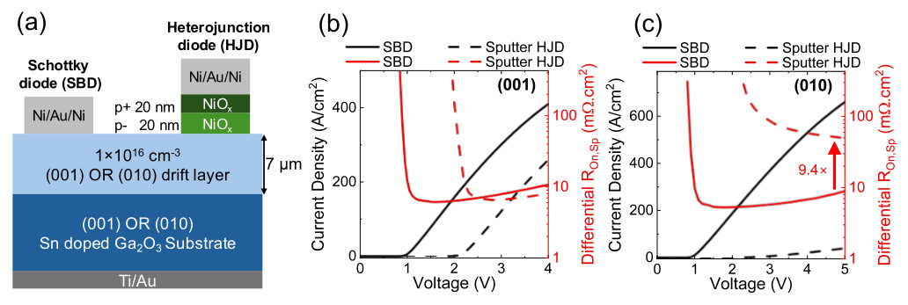
<figcaption class="paper-figure-caption"><b>Fig 1.</b> FIG. 1. (a) Device schematic of the reference SBDs and NiOx HJDs co-fabricated on (001) and (010) β- Ga2O3 drift layers. (b) J-V and differential Ron,sp plots for (001) SBD and ion-damaged HJD diodes (c) J- V and differential Ron,sp plots for (010) SBD and ion-damaged HJD diodes, showing a 9.4× increase in Ron,sp for sputter damaged (010) devices.</figcaption>
</figure>
<figure class="paper-figure-card">
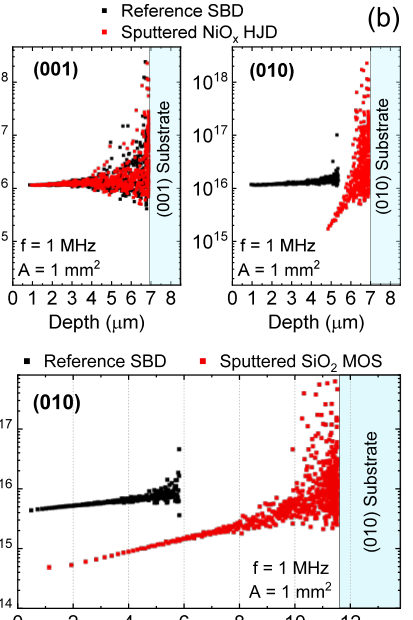
<figcaption class="paper-figure-caption"><b>Fig 2.</b> FIG. 2. ND − NA vs. depth profiles from high-voltage C-V of reference SBD and sputtered HJD diodes on 7 µm thick 1×1016 cm-3 doped (a) (001) epitaxial layers and (b) (010) epitaxial layers. (c) ND − NA vs. depth profiles of reference SBD and sputtered SiO2 MOSCAPs, showing sputtered ion damage up to 11.5 microns into the (010) material.</figcaption>
</figure>
<figure class="paper-figure-card">
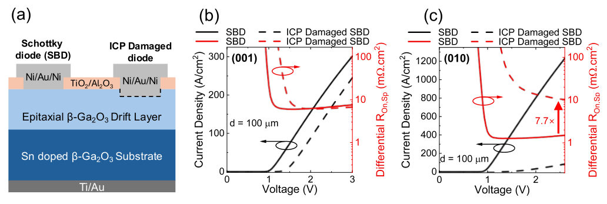
<figcaption class="paper-figure-caption"><b>Fig 3.</b> FIG. 3. (a) Device schematic showing reference metal-first FP-SBDs and ICP damaged SBDs co- fabricated on thick (001) and (010) β-Ga2O3 drift layers. (b) J-V and differential Ron,sp plots for (001) SBD and ICP damaged SBDs (c) J-V and differential Ron,sp plots for (010) SBD and ICP damaged SBDs, showing a 7.7× increase in Ron,sp for ICP damaged (010) devices.</figcaption>
</figure>
<figure class="paper-figure-card">
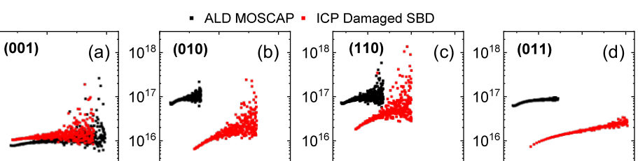
<figcaption class="paper-figure-caption"><b>Fig 4.</b> FIG. 4. ND − NA vs. depth profiles of reference MOSCAPs and ICP damaged SBDs on a 10 µm thick 1×1016 cm-3 doped (a) (001) film and on 8.8 µm thick 1×1017 cm-3 doped (b) (010), (c) (110), and (d) (011) epitaxial layers. Depletion of ND − NA from ICP damage is observed in all epitaxial layers except for the (001) orientation.</figcaption>
</figure>
<figure class="paper-figure-card">

<figcaption class="paper-figure-caption"><b>Fig 5.</b> FIG. 3(c). Additionally, the reduction of zero-bias ND − NA for the ICP damaged (010) epilayer (91%) is</figcaption>
</figure>
<figure class="paper-figure-card">
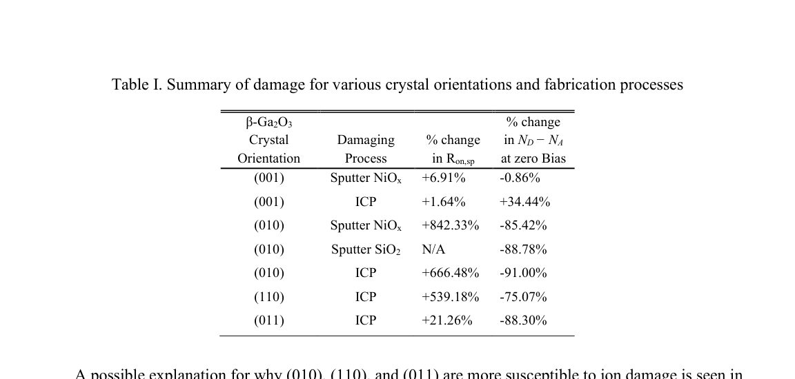
<figcaption class="paper-figure-caption"><b>Fig 6.</b> FIG. 5. The first row FIG. 5(a-d) shows VESTA55 plots of the various orientations, which are one unit</figcaption>
</figure>
<figure class="paper-figure-card">
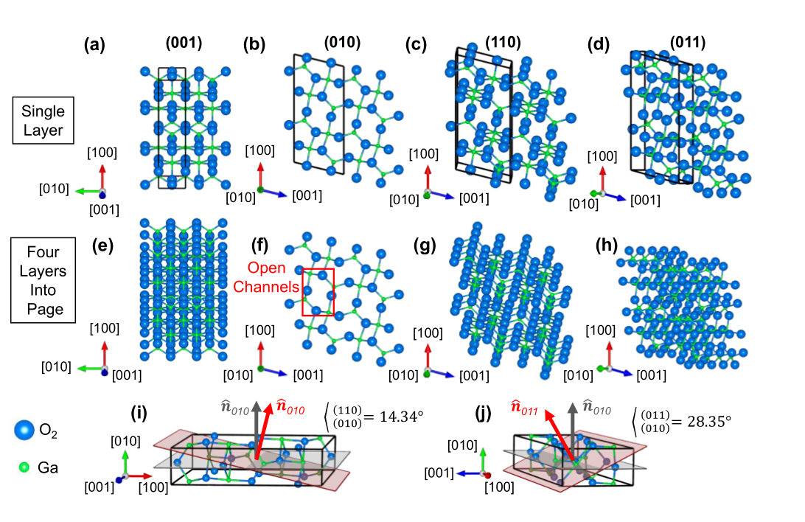
<figcaption class="paper-figure-caption"><b>Fig 7.</b> FIG. 5. β-Ga2O3 crystal structure models for the (a, e) (001), (b, f) (010), (c, g) (110), and (d, h) (011) planes, showing the large channeling pathways present in (010) plane when compared to the (001) plane. Row (a-d) depicts a crystal structure 1 unit cell thick, whereas row (e-h) depicts a crystal structure 4 unit cells thick into the page. The (110) and (011) planes are rotated from the (010) plane by an angle of (i) 14.34° and (j) 28.35° respectively, with the normal vectors 𝒏̂ =</figcaption>
</figure>

**Main problem.** Investigating the origin and extent of anisotropic, micron-scale ion damage in beta-Ga2O3 epitaxial layers caused by sputtering and ICP etching processes.

**Main result.** Ion damage is highly orientation-dependent, causing significant charge depletion (up to 11.5 um deep) and increased on-resistance in (010), (110), and (011) orientations, while the (001) orientation remains largely unaffected due to ion channeling effects.

**Method.** Experimental characterization using J-V and high-voltage C-V measurements on NiOx heterojunction p-n diodes, Schottky barrier diodes, and MOSCAPs subjected to RF sputtering and BCl3-based ICP etching.

**Summary.** This paper demonstrates that common fabrication processes like sputtering and plasma etching cause significant, deep-seated damage in specific crystal orientations of beta-Ga2O3. While the (001) orientation is resistant, the (010), (110), and (011) planes suffer from massive charge depletion and increased resistance. The authors suggest this is due to ions channeling through open paths in the crystal structure. This finding is critical for developing reliable power electronics using beta-Ga2O3.

Detailed structure

**Model / system.** Beta-Ga2O3 (ultra-wide bandgap semiconductor) epitaxial layers with various crystallographic orientations: (001), (010), (110), and (011).

**Key observables.** Specific on-resistance (Ron,sp), net donor concentration (ND - NA), charge depletion depth, and Schottky barrier height (Von).

**Important parameters / regimes.** Depletion depth up to 11.5 um, reduction in net donor concentration by 85-91%, and increase in Ron,sp by up to 9.4x.

**Assumptions / limitations.** The damage is attributed to energetic ions traveling through open crystal channels along the [010] direction and creating compensating point defects.

**Paper structure.** The paper introduces the problem of anisotropic damage, details the fabrication and etching processes, presents electrical characterization results (J-V and C-V) for different orientations, and concludes with a proposed mechanism involving ion channeling and defect creation.

Abstract

We report on the experimental observation of up to 11.5 $μm$ deep charge depletion in (010), (110), and (011) $β-Ga_2O_3$ epitaxial layers due to ion damage from sputtering and inductively coupled plasma (ICP) etching processes whereas charge depletion in (001) $β-Ga_2O_3$ epitaxial layers was minimal. The orientation-dependent reduction in CV-measured charge density was first observed in $NiO_x$ reactively sputtered heterojunction p-n diodes (HJDs). When compared to reference low-damage Schottky barrier diodes (SBDs), the sputtered HJDs showed a $9.4{\times}$ increase in the specific on resistance $(R_{on,sp})$ and 85% reduction in net donor concentration $(N_D - N_A)$ at zero bias for sputter-damaged HJDs on (010) epitaxial layers whereas HJDs on (001) remained unchanged. Similarly, sputtered SiO2 caused a reduction of $N_D - N_A$ 11.5 $μm$ deep into the (010) material. Next, SBDs were fabricated on $β-Ga_2O_3$ surfaces previously etched via a BCl3 based ICP process and compared to SBDs on un-etched surfaces. The (010) SBDs on etched surfaces exhibited a $7.7{\times}$ increase in $R_{on,sp}$ and a 91% reduction in $N_D - N_A$ at zero bias where the (001) etched diodes exhibited little change. Additionally, (110) and (011) diodes fabricated on ICP damaged surfaces also saw a ~82% reduction in $N_D - N_A$ at zero bias, indicating (110) and (011) are also susceptible to ion damage. Damage in the (010), (110), and (011) diodes is potentially caused by energetic ions that travel into the open channels present along the [010] direction and create compensating point defects which could potentially diffuse further.

[↑ back to top](#top)

### [From Data-Driven Models to Physical Insight: Vibrational Entropy Governed by Atomic Volume](http://arxiv.org/abs/2604.23369v1)

**Authors:** Shivam Tripathi, Jatin Kawatra, Varun Malviya, Krishna Mehta  
**Type:** theory · **Category:** disordered systems and neural networks · **PDF:** <https://arxiv.org/pdf/2604.23369v1>  
**Analysis basis:** full PDF text, analyzed in chunks

↔ Scroll figures horizontally

<figure class="paper-figure-card">

<figcaption class="paper-figure-caption"><b>Fig 1.</b> Figure 1: Parity plot comparing predicted and actual vibrational entropy (Svib) values for the</figcaption>
</figure>
<figure class="paper-figure-card">
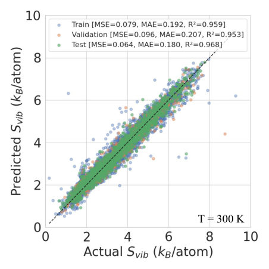
<figcaption class="paper-figure-caption"><b>Fig 2.</b> Figure 2: Top five features ranked by mean absolute SHAP values, demonstrating that atomic</figcaption>
</figure>
<figure class="paper-figure-card">
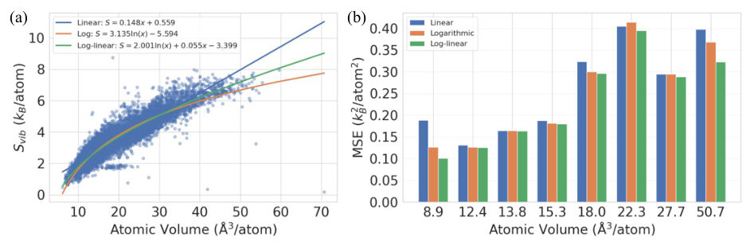
<figcaption class="paper-figure-caption"><b>Fig 3.</b> Figure 3: (a) Dependence of vibrational entropy (Svib) on atomic volume, showing fitted linear,</figcaption>
</figure>
<figure class="paper-figure-card">
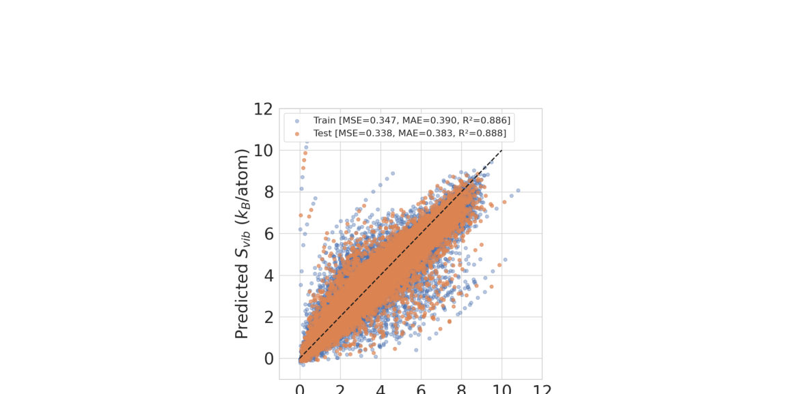
<figcaption class="paper-figure-caption"><b>Fig 4.</b> Figure 4: Parity plot comparing predicted and actual vibrational entropy (Svib) for the temperature-</figcaption>
</figure>

**Main problem.** Calculating vibrational entropy using first-principles phonon methods is computationally expensive, creating a bottleneck for high-throughput materials discovery.

**Main result.** The authors developed a highly accurate, interpretable log-linear model and a temperature-dependent formulation that predicts vibrational entropy using atomic volume as the primary descriptor.

**Method.** The study combines a feedforward neural network trained on Materials Project and PhononDB descriptors with SHAP analysis and least-squares regression to derive simplified analytical models.

**Summary.** This paper presents a way to bypass expensive phonon calculations by using machine learning and simple analytical models to predict vibrational entropy. By analyzing a large dataset, the authors found that atomic volume is the most important factor governing this property. They developed a new log-linear model and a temperature-dependent framework that captures both low-temperature Debye-like and high-temperature Einstein-like behavior. This approach enables much faster, large-scale screening of materials for thermodynamic stability.

Detailed structure

**Model / system.** The study analyzes a dataset of 9,866 crystalline materials, utilizing a single-hidden-layer neural network and a log-linear model relating vibrational entropy to atomic volume.

**Key observables.** Vibrational entropy (S_vib)

**Important parameters / regimes.** Atomic volume, temperature (100-500 K), transition temperature (T* = 200 K), and Debye/Einstein temperature regimes.

**Assumptions / limitations.** The study operates within the harmonic approximation and assumes atomic volume serves as a sufficient effective descriptor for mass and bonding strength.

**Figures summary.** Figure 1 shows a parity plot of predicted vs actual S_vib; Figure 2 ranks feature importance via SHAP; Figure 3 compares linear, logarithmic, and log-linear models; Figure 4 shows parity plots for the temperature-dependent model.

**Paper structure.** The paper introduces the computational bottleneck of phonon calculations, describes the dataset and neural network architecture, uses SHAP analysis to identify atomic volume as the key driver, presents the derivation of a simplified log-linear model, introduces a temperature-dependent formulation, and validates the models via parity plots and error analysis.

Abstract

Vibrational entropy plays a central role in determining phase stability and temperature dependent behavior in materials, yet its calculation from first-principles phonon methods remains computationally demanding. In this work, we combine data-driven modeling with physically motivated analysis to develop an efficient and interpretable framework for predicting vibrational entropy. Using a dataset derived from PhononDB, a feedforward neural network trained on Materials Project and composition based descriptors achieves high predictive accuracy, while SHAP analysis identifies atomic volume as the dominant factor governing vibrational entropy. Guided by this insight, simplified analytical models are constructed, revealing a logarithmic dependence of vibrational entropy on atomic volume consistent with lattice dynamical considerations. A logarithmic linear model is shown to provide an accurate and physically interpretable description across the full range of materials.   To extend the analysis to finite temperatures, a temperature dependent formulation is introduced that incorporates T3 scaling at low temperatures and logarithmic dependence at higher temperatures, consistent with Debye and Einstein type behavior. This unified model captures both structural and thermal contributions to vibrational entropy with good accuracy. Overall, the proposed framework demonstrates that vibrational entropy can be predicted using simple, physically meaningful relationships, offering a computationally efficient alternative to full phonon calculations and enabling entropy informed materials screening.

[↑ back to top](#top)

### [Geometry selective colossal negative dielectric permittivity in CaFe2O4 nanostructures](http://arxiv.org/abs/2604.24124v1)

**Authors:** Sourav Sarkar, Kalyan Mandal  
**Type:** experiment · **Category:** other · **PDF:** <https://arxiv.org/pdf/2604.24124v1>  
**Analysis basis:** full PDF text, analyzed in chunks

↔ Scroll figures horizontally

<figure class="paper-figure-card">
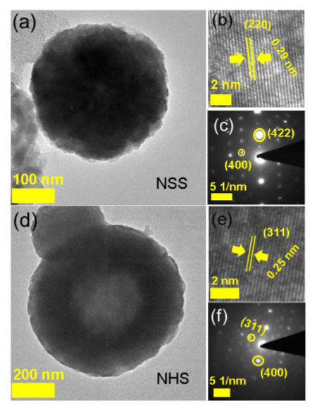
<figcaption class="paper-figure-caption"><b>Fig 1.</b> Fig. 1: TEM micrographs of CaFO (a) NSS, and (d) NHS. The thick shell and hollow cavity are visible for NHS. (220) and (311) crystallographic planes with the corresponding interplanar distances are shown for (b) NSS and (e) NHS, respectively. The SAED patterns identified with different crystallographic planes are shown for (c) NSS and (f) NHS.</figcaption>
</figure>
<figure class="paper-figure-card">
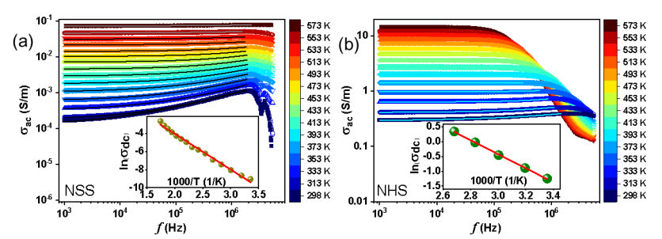
<figcaption class="paper-figure-caption"><b>Fig 2.</b> Fig. 2: Frequency (f) variation of ac conductivity of CaFO (a) NSS, and (b) NHS at different temperatures, T. The adjacent colour bar indicates the colour code for different T. The corresponding fits according to Jonscher’s law (equation (1)) are shown in solid black or grey line for NSS and cyan line for NHS. The law is valid only up to certain f for all T for NSS and T up to 373 K for NHS. Corresponding insets show Arrhenius plot (natural logarithm of dc conductivity vs. inverse of temperature). The solid red line indicates linear fitting.</figcaption>
</figure>
<figure class="paper-figure-card">
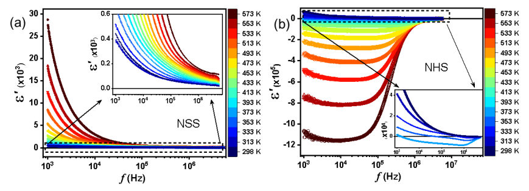
<figcaption class="paper-figure-caption"><b>Fig 3.</b> Fig. 3: Frequency variation of real part of relative permittivity, ′, of CaFO (a) NSS, and (b) NHS at different temperatures, T. The adjacent colour bar indicates the colour code for different T. The inset of (a), and (b) show the enlarged portions of the corresponding curves for NSS and NHS, respectively, near ′ = 0. A solid black horizontal line at ′ = 0 is drawn for a guide to the eye.</figcaption>
</figure>
<figure class="paper-figure-card">
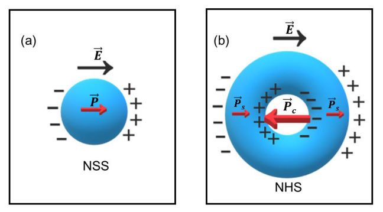
<figcaption class="paper-figure-caption"><b>Fig 4.</b> Fig. 4: Schematic interpretation of the corresponding polarization mechanism for (a) NSS and (b) NHS. The black and red arrows indicate the direction of the applied electric field and the polarization vector developed in the material. The larger arrow for polarization in central cavity (𝑃𝑐⃗⃗⃗ ) than that of the shell region (𝑃𝑠⃗⃗⃗ ) indicates stronger polarization in the cavity than the shell area for NHS.</figcaption>
</figure>
<figure class="paper-figure-card">
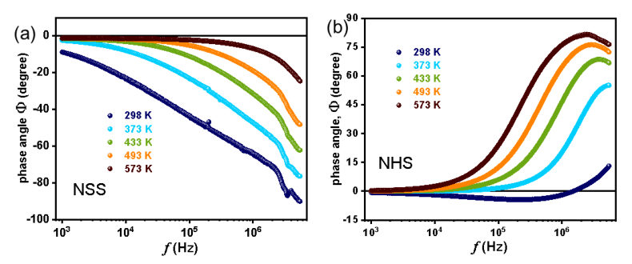
<figcaption class="paper-figure-caption"><b>Fig 5.</b> Fig. 5: Frequency variation of phase shift angle, , of CaFO (a) NSS, and (b) NHS at different temperatures, T. For clarity,  corresponding to some select T only are shown, as indicated by the colour code. A solid black horizontal line at  = 0 is drawn for a guide to the eye.</figcaption>
</figure>

**Main problem.** Achieving epsilon-negative (ENG) behavior in single-phase materials without the use of conductive metallic fillers, which are traditionally required in multi-phase composites.

**Main result.** The study demonstrates that nano hollow spherical (NHS) morphology of Calcium Ferrite (CaFe2O4) induces colossal negative permittivity due to a phase inversion of polarization within the hollow cavity, a feature absent in solid nano spheres.

**Method.** The researchers used a template-free solvothermal method for synthesis and characterized the morphology using XRD, TEM, and SAED, while analyzing dielectric properties via frequency and temperature-dependent measurements.

**Summary.** This paper reports a method to achieve colossal negative permittivity in a single-phase material, CaFe2O4, by simply changing its nanostructure from solid to hollow spheres. Unlike traditional metamaterials that require adding metal fillers, the hollow geometry itself induces a phase inversion of polarization. This effect is driven by charge accumulation at the inner cavity boundary, creating a net polarization opposite to the applied electric field. This discovery suggests that morphology engineering can be a powerful tool for designing novel dielectric materials for applications like superlenses and antennas.

Detailed structure

**Model / system.** The physical system consists of Calcium Ferrite (CaFe2O4) nanostructures in two morphologies: Nano Solid Spheres (NSS) and Nano Hollow Spheres (NHS), studied in the temperature range of 298 K to 573 K and frequency range up to several MHz.

**Key observables.** Relative permittivity (epsilon'), AC conductivity, phase shift angle (Phi), and activation energy (Ea).

**Important parameters / regimes.** Temperature (298 K–570 K), frequency (kHz–MHz range), and morphology (hollow vs. solid).

**Assumptions / limitations.** The mechanism assumes that the polarization within the air-filled cavity partially offsets the polarization in the shell, leading to a net polarization opposite to the applied electric field.

**Figures summary.** Fig 1 shows TEM and SAED for morphology and crystallinity; Fig 2 shows frequency dependence of AC conductivity and Arrhenius plots for activation energy; Fig 3 shows frequency dependence of permittivity for NSS and NHS; Fig 4 provides a schematic of the polarization inversion mechanism; Fig 5 shows the frequency variation of the phase shift angle.

**Paper structure.** The paper introduces the problem of ENG materials, describes the synthesis and characterization of the two morphologies, presents the comparative dielectric and conductivity measurements, proposes a physical mechanism based on polarization inversion in the hollow cavity, and concludes with the significance of morphology engineering.

Abstract

Negative permittivity metamaterial is a scientifically rich avenue due to its tremendous application in several arena of materials research including novel superlens, band-gap materials, invisibility cloaks, antenna and filter design. Traditionally, epsilon negative (ENG) behaviour is achieved in multi-phase composites with the addition of conducting metal fillers. However, this study reports colossal ENG feature in a single phase Calcium Ferrite for a particular nano hollow spherical (NHS) morphology, without the use of any filler. On the contrary, the same material synthesized in a different morphology, namely, nano solid sphere (NSS) shows conventional dielectric behaviour. Occurrence of ENG is successfully interpreted with the phase inversion of dominant polarization within the hollow cavity of NHS. This report marks a significant step in realizing colossal ENG in a single phase material just by restructuring the nanoscale morphology.

[↑ back to top](#top)

### [Improved Electrochemical Performance and Diffusion kinetics by Boron-doping in Na$_{0.66}$Mn$_{0.8}$Fe$_{0.2}$O$_{2}$ Layered Cathodes for Sodium-Ion Batteries](http://arxiv.org/abs/2604.24683v1)

**Authors:** Jayashree Pati, P. Senthilkumar, Deepak Seth, Riya Gulati, Manish Kr. Singh, Madhav Sharma, Anita Dhaka, M. Ali Haider, Rajendra S. Dhaka  
**Type:** both · **Category:** other · **PDF:** <https://arxiv.org/pdf/2604.24683v1>  
**Analysis basis:** full PDF text, analyzed in chunks

↔ Scroll figures horizontally

<figure class="paper-figure-card">
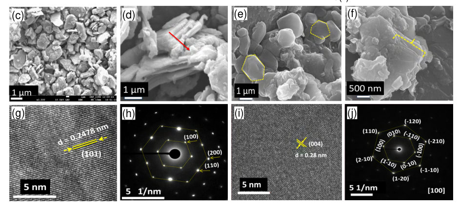
<figcaption class="paper-figure-caption"><b>Fig 1.</b> FIG. 1. The Rietveld refinements (black lines) of X-ray diffraction patterns (red color) of the (a) NMFO and (b) B-NMFO samples with corresponding crystal structures in the inset of (a). The FE-SEM images showing submicron particles of (c) NMFO and (e) B-NMFO samples with the magnified view showing flake like layered patterns in (d, e), respectively. The HR-TEM images showing 2D lattice fringes with inter-planar distance in (g, i) and the SAED patterns with respective indexed planes in (h, j) for the NMFO and B-NMFO samples, respectively.</figcaption>
</figure>
<figure class="paper-figure-card">
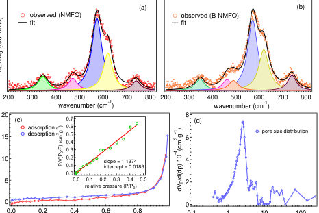
<figcaption class="paper-figure-caption"><b>Fig 2.</b> FIG. 2. The Raman spectra in a range of 200–820 cm−1</figcaption>
</figure>
<figure class="paper-figure-card">
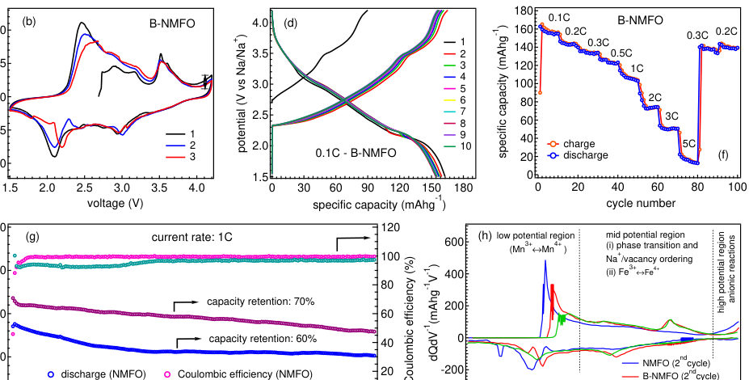
<figcaption class="paper-figure-caption"><b>Fig 3.</b> FIG. 3. The electrochemical measurements of NMFO and B-NMFO cathodes: (a, b) the cyclic voltammetry curves at a scan rate of 0.05 mVs−1 for 3 cycles in a voltage window of 1.5–4.2 V, (c, d) the galvanostatic discharge-charge (GCD) voltage profiles at a current rate of (c) 0.05 C for 5 cycles for NMFO, and (d) 0.1 C for 10 cycles for B-NMFO. (e, f) The rate capability measurement at different current rates in a voltage window of 1.5–4.2 V for the (e) NMFO up to 5 cycles each, and (f) B-NMFO up to 10 cycles each. (g) the long cycling measurement of NMFO and B-NMFO at current rate of 1 C up to 200 cycles, (h) the dQ/dV versus voltage curves for 2nd and 100th cycles of B-NMFO and 2nd cycle of...</figcaption>
</figure>
<figure class="paper-figure-card">
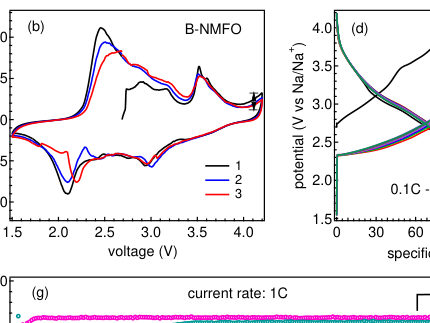
<figcaption class="paper-figure-caption"><b>Fig 4.</b> Fig. 3(b), the weak redox events in the range of 2.5–4 V comprise of complex phase transitions incurred by the Na+ vacancy ordering and Fe3+/4+ reaction [53]. Intrigu- ingly, a distinct and reversible redox pair at 3.5/3 V pro- vides an additional capacity in the doped cathode [54]. The small oxidation peak at ∼4.1 V due to oxygen redox reaction (O2−/On−) signifies the electrochemical stabil- ity of used electrolyte (1M NaPF6 in carbonate solvents) within the operational voltage window [55]. Further, the Na+ storage behavior is investigated by measuring the Galvanostatic charge-discharge curves, as represented in Figs. 3(c, d). A couple of plateaus at 2 and 4 V are visible in the discharge...</figcaption>
</figure>
<figure class="paper-figure-card">
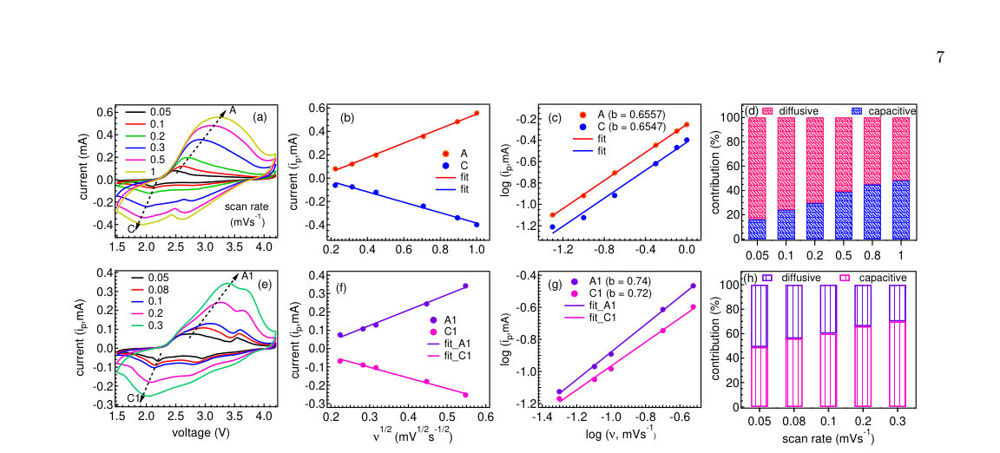
<figcaption class="paper-figure-caption"><b>Fig 5.</b> FIG. 4. The Cyclic voltammetry curves at different scan rates in a voltage window of 1.5–4.2 V, showing anodic (A, A1) and cathodic (C, C1) peaks for the (a) NMFO and (e) B-NMFO cathodes. The linear relation between peak current ip and square root of scan rate for different scan rates for the (b) NMFO (f) B-NMFO. The linear fitting between log i vs log ν for the (c) NMFO (g) B-NMFO. The capacitive and diffusive contribution at different scan rates for the (d) NMFO (h) B-NMFO.</figcaption>
</figure>
<figure class="paper-figure-card">
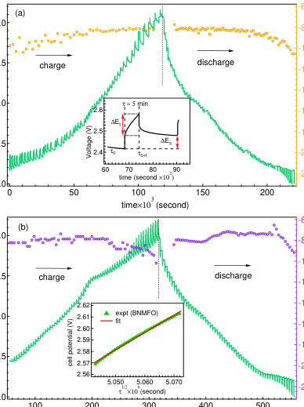
<figcaption class="paper-figure-caption"><b>Fig 6.</b> FIG. 5. The GITT measurements at 0.1 C in a voltage win- dow of 2.0–4.2 V during 2nd cycle with logarithimic diffusion- coefficient profile of (a) the NMFO cathode with the inset showing a schematic labeling of different parameters of a sin- gle titration curve before, during and after application of a current pulse for 10 min, (b) the B-NMFO cathode with inset presenting linear relation between cell potential and τ 1/2 .</figcaption>
</figure>
<figure class="paper-figure-card">
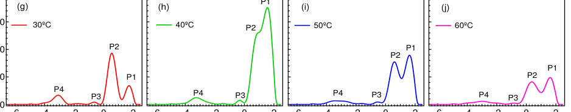
<figcaption class="paper-figure-caption"><b>Fig 7.</b> FIG. 6. The Na ion migration and the DRT mechanism of B-NMFO cathode: (a) the energy and reaction co-ordinate plot showing the energy barrier between the two Na-sites, (b) the 2D conduction pathways of Na1 and Na2 in the ab−plane, (c) the 3D view of Na-ion conduction paths shown by blue colored isosurfaces in between the gallery of yellow color octahedral slabs, (d) the EIS recorded in a temperature range of 25–60◦C, the DRT profiles of EIS spectra recorded at (e) different temperatures, (f) 25◦C, (g) 30◦C, (h) 40◦C, (i) 50◦C, (j) 60◦C.</figcaption>
</figure>
<figure class="paper-figure-card">
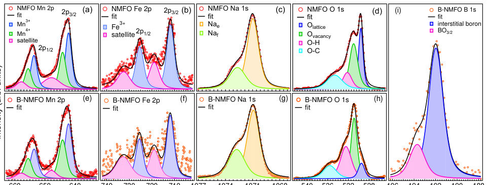
<figcaption class="paper-figure-caption"><b>Fig 8.</b> FIG. 7. The core level XPS spectra of Mn 2p, Fe 2p, Na 1s and O 1s of (a–d) NMFO, (e–h) B-NMFO samples, (i) the B 1s of B-NMFO sample along with the deconvoluted components.</figcaption>
</figure>
<figure class="paper-figure-card">
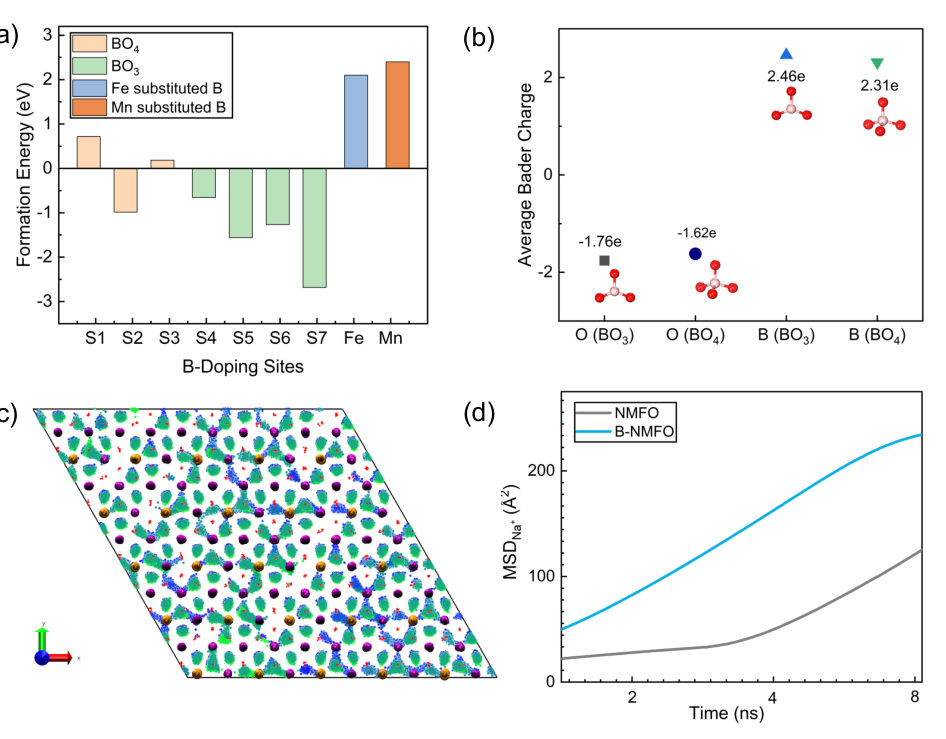
<figcaption class="paper-figure-caption"><b>Fig 9.</b> FIG. 8. (a) The DFT calculated formation energies for B-NMFO system for possible boron occupancy at seven distinct sites for comparison. (b) The Bader charge distribution, (c) the Na-ion trajectory density maps (from green to blue) showing diffusion pathways in the bulk NMFO structure (color scheme: O–red, B–orange, Fe–black, Mn–purple). (d) The mean squared displacement (MSD) versus time plot for the Na-ion diffusion.</figcaption>
</figure>

**Main problem.** Improving the electrochemical performance, structural stability, and sodium-ion diffusion kinetics of Mn-rich Na0.66Mn0.8Fe0.2O2 (NMFO) layered cathodes for sodium-ion batteries.

**Main result.** Boron doping enhances specific capacity (from 133 to 163 mAh/g) and cycling stability (from 60% to 70% retention) by stabilizing the lattice oxygen via strong B-O bonds and facilitating a reversible P2 to O'P4 phase transition.

**Method.** The study combines experimental techniques (sol-gel synthesis, XRD, Raman, XPS, EIS, GITT) with computational methods (DFT for energetics/electronic properties and classical MD simulations for Na-ion transport).

**Summary.** This paper investigates how Boron doping can optimize Mn-rich layered cathodes for sodium-ion batteries. By introducing Boron, the researchers improved both the capacity and the long-term cycling stability of the material. The enhancement is attributed to stronger B-O bonds that stabilize the oxygen framework and a more efficient sodium-ion diffusion pathway. Computational modeling via DFT and MD simulations confirms that Boron prefers specific interstitial sites that promote better ion transport and structural reversibility.

Detailed structure

**Model / system.** The physical system is a P2-type hexagonal layered transition metal oxide, specifically Na0.66Mn0.8Fe0.2O2 (NMFO) and its Boron-doped counterpart (B-NMFO), used as a cathode in sodium-ion battery coin cells.

**Key observables.** Specific capacity, capacity retention, Na-ion diffusion coefficient (D_Na), voltage polarization, redox potentials, and B-O vibrational modes.

**Important parameters / regimes.** Diffusion coefficient range (10^-8 to 10^-10 cm^2/s), B-O bond energy (809 kJ/mol), and b-parameter for capacitive vs. diffusive contributions (0.65 to 0.74).

**Assumptions / limitations.** The study assumes the effectiveness of the sol-gel process for stoichiometry and uses a classical pair-potential model for MD simulations.

**Figures summary.** Figures include density maps of Na-ion diffusion pathways, Mean Square Displacement (MSD) plots demonstrating enhanced diffusivity in B-NMFO, and electrochemical/structural characterization data.

**Paper structure.** The paper follows a logic of: problem identification (instability in NMFO) -> synthesis and structural characterization (XRD, Raman, TEM) -> electrochemical performance testing (capacity, cycling, rate capability) -> kinetic analysis (GITT, CV, DRT) -> theoretical investigation (DFT and MD simulations) -> conclusion.

Abstract

We report the electrochemical investigation and study the diffusion kinetics of boron doped Na$_{0.66}$Mn$_{0.8}$Fe$_{0.2}$O$_{2}$ (B-NMFO) cathode materials for sodium-ion batteries. Notably, the B-NMFO cathode exhibits improved specific capacity of 163 mAh g$^{-1}$ as compared to 133 mAhg$^{-1}$ at 0.1~C for the NMFO cathode. Further, we observe better capacity retention of 70\% for B-NMFO as compared to the NMFO (60\%) at 1 C after 200 cycles, indicating high structural stability due to the presence of strong B-O bonds. The diffusion coefficient evaluation through galvanostatic intermittent titration technique and cyclic voltammetry, which is found to be in the range of 10$^{-8}$--10$^{-10}$ cm$^{2}$s$^{-1}$. Interestingly, the temperature dependent distribution of relaxation time (DRT) analysis provides a clear understanding about the individual physical processes occurring at different time domains during the electro-chemical testing. Moreover, density functional theory is employed to determine the energetics and the electronic properties of B-NMFO, which suggests that the interstitial tetrahedral sites, especially those next to vacancies, are the dominant incorporation path ways for B in the host structure. Additionally, classical molecular dynamics (MD) simulations are applied to gain insights into the Na-ion transport properties in the bulk structures cathode materials.

[↑ back to top](#top)

### [Interfacial breathing as a dynamic failure law in all-solid-state batteries: amplitude, phase lag and dual-timescale memory as design principles](http://arxiv.org/abs/2604.24075v1)

**Authors:** Changdeuck Bae  
**Type:** theory · **Category:** other · **PDF:** <https://arxiv.org/pdf/2604.24075v1>  
**Analysis basis:** full PDF text, analyzed in chunks

↔ Scroll figures horizontally

<figure class="paper-figure-card">
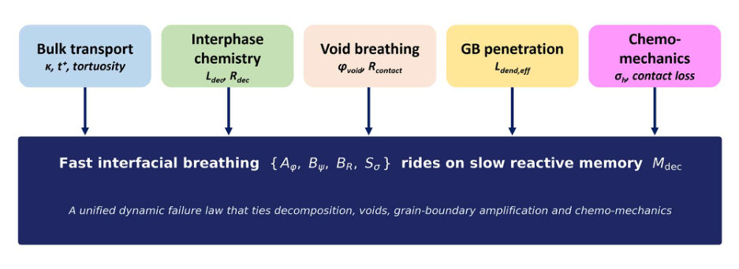
<figcaption class="paper-figure-caption"><b>Fig 1.</b> Figure 1 | Multiscale failure hierarchy in all-solid-state batteries. Bulk transport establishes the initial operating window, but the decisive losses emerge from decomposition-layer growth, interfacial void evolution, grain-boundary transport and chemo-mechanical contact loss. In this review these five levels are treated not as independent mechanisms but as the coupled components of a single breathing system: a chemo-electro-mechanical oscillation of the Li | SE contact whose four signatures {Aφ, Bψ, BR, Sσ} ride on a slow reactive memory Mdec.</figcaption>
</figure>
<figure class="paper-figure-card">
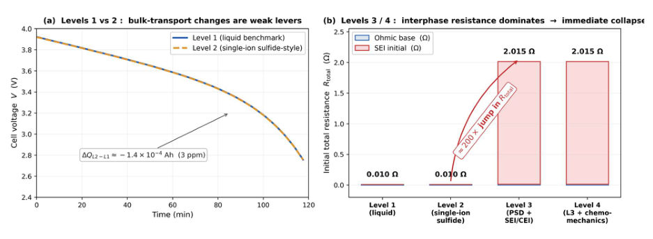
<figcaption class="paper-figure-caption"><b>Fig 2.</b> Figure 2 | Reduced-order benchmark demonstrates the weakness of bulk-transport levers. a, Levels 1 (liquid) and 2 (single-ion sulfide-style) discharge curves at 0.5 C are nearly indistinguishable; the delivered-capacity difference is only 1.4 × 10⁻⁴ Ah (~3 ppm). b, Once the interphase terms of Levels 3 and 4 are activated, the initial resistance budget is dominated by the SEI contribution, which enters at ≈ 200× the base ohmic value, and the model collapses immediately into an interface-limited state.</figcaption>
</figure>
<figure class="paper-figure-card">
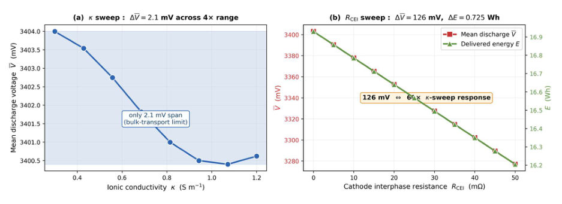
<figcaption class="paper-figure-caption"><b>Fig 3.</b> Figure 3 | Interfacial resistance dominates over bulk conductivity across realistic parameter ranges. a, Sweeping the ionic conductivity κ from 0.3 to 1.2 S m⁻¹ — a four-fold range that spans most competitive solid electrolytes — shifts the mean discharge voltage by only 2.1 mV. b, Sweeping the cathode-electrolyte interphase resistance RCEI from 0 to 50 mΩ, in contrast, shifts the mean discharge voltage by 126 mV and the delivered energy by 0.725 Wh.</figcaption>
</figure>
<figure class="paper-figure-card">
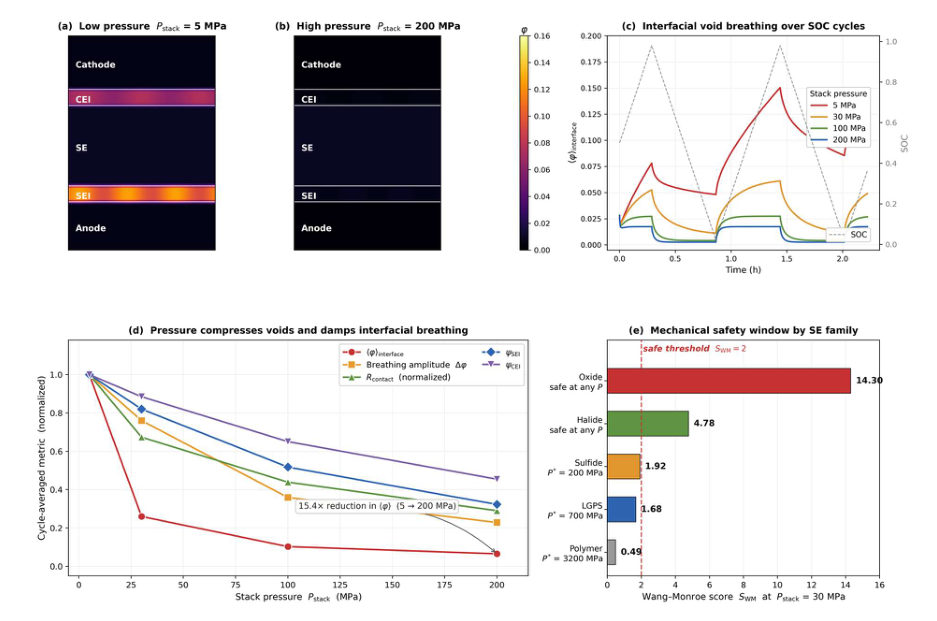
<figcaption class="paper-figure-caption"><b>Fig 4.</b> Figure 4 | Phase-field breathing calculations: pressure reshapes the reactive interface. a, b, Low-pressure (5 MPa) and high-pressure (200 MPa) snapshots of the void field in a representative sulfide ASSB on a 60 × 40 grid. c, The interfacial void fraction ⟨φ⟩interface follows the SOC-driven breathing cycles, with markedly larger oscillation at low pressure. d, Increasing pressure compresses voids, lowers Rcontact and reduces the SEI / CEI order parameters. e, The mechanical safety window differs strongly by SE family: oxide and halide systems are intrinsically safe at any pressure, whereas sulfides require 200 MPa, LGPS 700 MPa, and polymer electrolytes 3.2 GPa to reach the Monroe–Newman...</figcaption>
</figure>
<figure class="paper-figure-card">
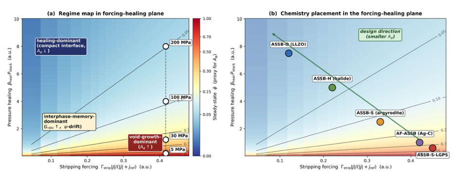
<figcaption class="paper-figure-caption"><b>Fig 5.</b> Figure 6 | Breathing-regime map: three regions of interfacial dynamics. a, The forcing–healing plane with three labelled regions and the four-pressure sweep overlaid as a vertical trajectory. b, Chemistry placement on the same plane: oxides lie in the healing- dominant region, halides in the intermediate interphase-memory region, and sulfide / LGPS / anode-free systems in the void-growth region.</figcaption>
</figure>
<figure class="paper-figure-card">
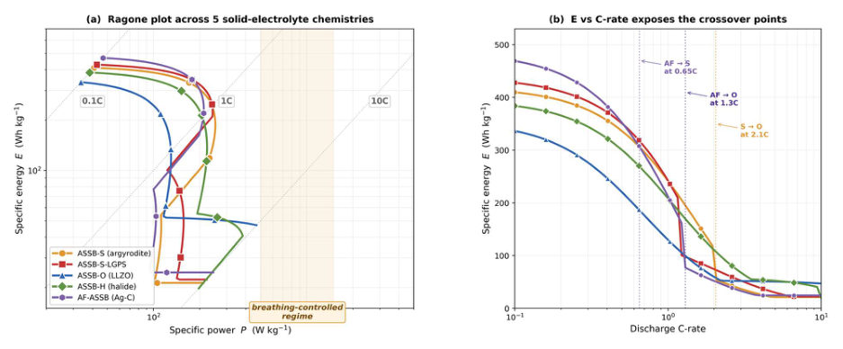
<figcaption class="paper-figure-caption"><b>Fig 6.</b> Figure 8 | Ragone crossover and its origin in breathing + memory. a, Ragone plot (specific energy E versus specific power P) for five solid-electrolyte chemistries on log–log axes. Dotted diagonals indicate iso-C-rate loci (0.1 C, 1 C, 10 C); the shaded band highlights the breathing-controlled regime in which rank inversions concentrate. b, The same data replotted as E versus C-rate, so that crossovers appear as explicit intersections. AF-ASSB loses to sulfide argyrodite at ≈ 0.65 C, AF-ASSB loses to oxide at ≈ 1.3 C, and sulfide argyrodite loses to oxide at ≈ 2.1 C. The crossover C-rates are direct measurements of the dominant breathing descriptor in each chemistry.</figcaption>
</figure>

**Main problem.** The failure of all-solid-state batteries (ASSBs) is traditionally analyzed using static mean quantities, which fails to capture the dynamic, cycle-scale instabilities of the interface.

**Main result.** The paper identifies that battery degradation is driven by a dual-timescale process of 'interfacial breathing' (fast oscillations) and 'reactive memory' (slow accumulation), and demonstrates that stack pressure can suppress breathing but cannot undo chemical memory.

**Method.** A coupled chemo-electro-mechanical phase-field model using Cahn-Hilliard and Allen-Cahn equations, supplemented by a reduced-order electrochemical benchmark.

**Summary.** This paper proposes a new framework for understanding the degradation of all-solid-state batteries by focusing on dynamic interfacial oscillations rather than static resistance. It distinguishes between fast, cycle-scale 'breathing' of the lithium contact and the slow, irreversible 'memory' of chemical decomposition. The study shows that while mechanical pressure can effectively control contact breathing, it cannot mitigate the accumulation of interphase products. This provides a roadmap for designing more stable batteries through both pressure programming and interphase chemistry engineering.

Detailed structure

**Model / system.** A stratified 2D model of a Li | Solid Electrolyte interface (including sulfide, oxide, and halide chemistries) featuring evolving void fields, interphase thickness, and hydrostatic stress.

**Key observables.** Void amplitude (A_phi), interphase breathing (B_psi), resistance breathing (B_R), stress signature (S_sigma), and reactive memory (M_dec).

**Important parameters / regimes.** Stack pressure (P_stack), ionic conductivity (kappa), C-rate, and the forcing-healing regime map.

**Assumptions / limitations.** The mechanical description is purely elastic and does not yet include lithium creep or viscoelasticity.

**Figures summary.** Figure 1 shows a hierarchy of multiscale failure; Figure 2 compares electrochemical levels; Figure 3 shows the effect of varying ionic conductivity; Figure 5 demonstrates pressure-induced suppression of breathing signatures but invariance of memory; Figure 6 presents a regime map of battery chemistries.

**Paper structure.** The paper introduces the dynamic failure problem, presents a phase-field modeling framework, establishes a static baseline via electrochemical benchmarks, analyzes the effects of pressure and conductivity, proposes a regime map for different chemistries, and concludes with experimental design principles.

Abstract

All-solid-state batteries fail not only by bulk transport limits, but by a reactive interface that evolves during cycling. We show that degradation is governed by two coupled processes: interfacial breathing, the cycle-scale oscillation of lithium contact, and reactive memory, the slow accumulation of electrolyte decomposition. Four descriptors capture breathing, together with a memory metric based on decomposed interphase thickness. A reduced electrochemical benchmark shows that ionic conductivity has little effect on mean discharge voltage, whereas cathode electrolyte interphase resistance causes major voltage and energy losses. A phase-field model of a sulfide-based cell shows that higher stack pressure strongly suppresses breathing-related fluctuations, but leaves reactive memory nearly unchanged. Thus, pressure controls breathing, not memory. The resulting regime map identifies void-growth-dominant, healing-dominant, and interphase-memory-dominant regions. The theory also predicts energy-density rank inversion with C rate, where an initially superior architecture loses advantage at higher rate as breathing intensifies and interphase memory locks in. The design target is therefore not merely higher conductivity or lower resistance, but simultaneous suppression of breathing and independent control of reactive memory through interphase chemistry.

[↑ back to top](#top)

### [Large language model-enabled automated data extraction for concrete materials informatics](http://arxiv.org/abs/2604.22938v1)

**Authors:** Zhanzhao Li, Kengran Yang, Qiyao He, Kai Gong  
**Type:** both · **Category:** disordered systems and neural networks · **PDF:** <https://arxiv.org/pdf/2604.22938v1>  
**Analysis basis:** full PDF text, analyzed in chunks

↔ Scroll figures horizontally

<figure class="paper-figure-card">
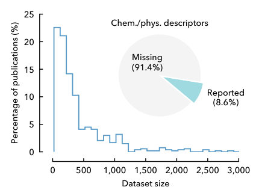
<figcaption class="paper-figure-caption"><b>Fig 1.</b> Fig. 1 Survey of dataset sizes used in peer-reviewed publications applying machine learning on cement and concrete materials. The survey focuses on laboratory datasets for regression tasks. Dataset sizes after data preprocessing were recorded, with the maximum size taken for studies using multiple datasets. The inset shows the proportion of publications whose datasets include chemical or physical descriptors of binders versus those that lack them. Data source: Web of Science; period: 1990–2024. Detailed survey methodology is provided in Supplementary Note 2.</figcaption>
</figure>
<figure class="paper-figure-card">
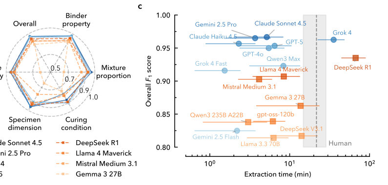
<figcaption class="paper-figure-caption"><b>Fig 2.</b> Fig. 2 Overview of the automated data extraction pipeline. a, The pipeline employs a sequential chain of large language model (LLM)-based extraction and processing agents to retrieve and integrate key concrete materials information from both tables and text in scientific publications, enabling the construction of a structured, machine-readable database. b, c, The pipeline is benchmarked across a range of proprietary (blue) and open (orange) LLMs, evaluated against a human-extracted ground-truth dataset compiled from 58 publications. Panel b shows representative models and their category-wise performance (F1 score), while panel c summarizes the overall F1 score versus extraction time for all...</figcaption>
</figure>
<figure class="paper-figure-card">
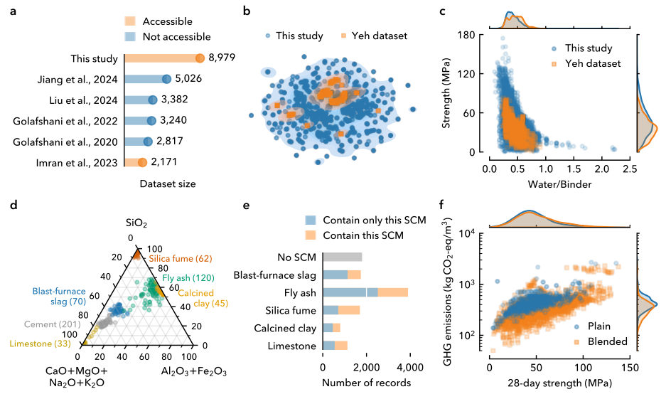
<figcaption class="paper-figure-caption"><b>Fig 3.</b> Fig. 3 Overview of the curated database. a, Comparison of size and accessibility between the database developed in this study and the five largest laboratory compressive strength datasets for blended cement concrete reported in the literature (refs.67–71)). The detailed survey methodology and the comparison with the ten largest datasets are provided in Supplementary Note 2 and Supplementary Note 5, respectively. b, Two-dimensional Uniform Manifold Approximation and Projection (UMAP)72</figcaption>
</figure>
<figure class="paper-figure-card">
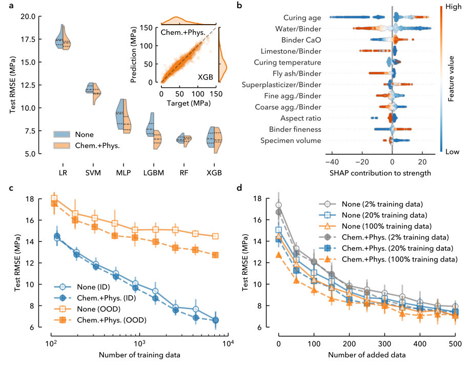
<figcaption class="paper-figure-caption"><b>Fig 4.</b> Fig. 4 Machine learning analyses of the curated database. a, Violin plot showing the in-distribution (ID) performance of models with and without additional chemical and physical descriptors included as input features. The base input features comprise mixture proportions, curing conditions, and specimen dimensions. Each violin includes individual data points from 10 runs with different random seeds, with horizontal dashed lines indicating the median and interquartile range. The inset shows a parity plot of predicted versus measured compressive strength for XGBoost (XGB) using both chemical and physical descriptors as input features, with marginal kernel density estimates shown along each...</figcaption>
</figure>
<figure class="paper-figure-card">
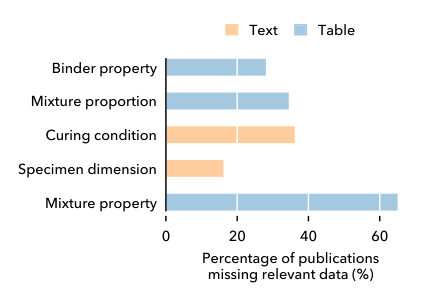
<figcaption class="paper-figure-caption"><b>Fig 5.</b> Fig. 5 Overview of missing data in text or tables across different categories of concrete materials information in the literature. Results for mixture proportion and mixture property are based on the outcome of article screening, while those for binder property, curing condition, and specimen dimension are derived from the curated database (before missing data imputation).</figcaption>
</figure>

**Main problem.** The scarcity of large, high-quality, and accessible experimental datasets for concrete materials informatics due to the labor-intensive nature of manual data extraction from unstructured scientific literature.

**Main result.** The development of an LLM-powered pipeline that achieved F1 scores up to 0.97, enabling the creation of the largest open laboratory database for blended cement concrete with nearly 9,000 high-quality records.

**Method.** A modular, sequential chain of specialized Large Language Model (LLM) agents (extraction and processing) used to automate the extraction, cleaning, and structuring of data from XML/HTML scientific publications.

**Summary.** This paper presents an automated pipeline using Large Language Models to extract complex materials data from scientific literature. By using specialized LLM agents, the authors successfully built a massive database of nearly 9,000 records for blended cement concrete. This approach overcomes the bottleneck of manual data collection and demonstrates that large-scale, automated curation can significantly improve the accuracy and generalization of machine learning models in materials science.

Detailed structure

**Model / system.** The physical system is blended cement concrete, involving mixtures of Portland cement and supplementary cementitious materials (SCMs) like fly ash, slag, and silica fume. The computational platform is an automated LLM-based data extraction and machine learning pipeline.

**Key observables.** Compressive strength, binder chemical/physical properties (oxide compositions, Blaine fineness), mixture proportions, and curing conditions.

**Important parameters / regimes.** Water-to-binder ratio, CaO, SiO2, Al2O3, Fe2O3, MgO, curing age, temperature, and humidity.

**Assumptions / limitations.** The pipeline performs significantly better with XML/HTML formats than PDF; the study focuses on concrete-level formulations and excludes mineral-level characteristics like particle shape.

**Figures summary.** Figure 1 shows dataset size gaps in existing studies; Figure 2 compares LLM performance (F1 score vs. time); Figure 3 illustrates the scale and diversity of the new database via UMAP and ternary diagrams; Figure 4 evaluates ML model performance (ID vs. OOD) and feature importance via SHAP; Figure 5 quantifies missing data in literature.

**Paper structure.** The paper introduces the data scarcity problem, describes the LLM-agent pipeline architecture, benchmarks various LLMs, presents the newly constructed large-scale concrete database, evaluates machine learning models for strength prediction, and discusses future directions for multimodal extraction.

Abstract

The promise of data-driven materials discovery remains constrained by the scarcity of large, high-quality, and accessible experimental datasets. Here, we introduce a generalizable large language model (LLM)-powered pipeline for automated extraction and structuring of materials data from unstructured scientific literature, using concrete materials as a representative and particularly challenging example. The pipeline exhibits robust performance across a broad range of LLMs and achieves an $F_1$ score of up to 0.97 for diverse composition--process--property attributes. Within one hour, it extracts nearly 9,000 high-quality records with over 100 attributes screened from more than 27,000 publications, enabling the construction of the largest open laboratory database for blended cement concrete. Machine learning analyses underscore the importance of large, diverse, and information-rich datasets for enhancing both in-distribution accuracy and out-of-distribution generalization to unseen materials. The proposed pipeline is readily adaptable to other materials domains and accelerates the development of scalable data infrastructures for materials informatics.

[↑ back to top](#top)

### [Mesoscopic Josephson effect in graphene disk at magnetic field](http://arxiv.org/abs/2604.23470v1)

**Authors:** Adam Rycerz  
**Type:** theory · **Category:** other · **PDF:** <https://arxiv.org/pdf/2604.23470v1>  
**Analysis basis:** full PDF text, analyzed in chunks

↔ Scroll figures horizontally

<figure class="paper-figure-card">
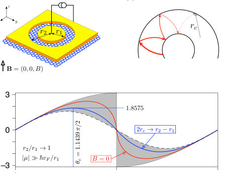
<figcaption class="paper-figure-caption"><b>Fig 1.</b> Figure 1: (a) Schematic of a graphene disk with inner radius r1 and outer radius r2, contacted by two circular superconducting elec- trodes (yellow areas). A current source drives a dissipationless su- percurrent through the annular region. The uniform magnetic field B = (0, 0, B) is perpendicular to the sample. A separate gate electrode (not shown) allows one to tune the carrier concentration. (b) At low field but high doping, such that the cyclotron diameter 2rc &gt; r2 −r1, incoherent scattering along the classical trajectory governs the transport. (c) Current-phase relation for high doping (|µ| ≫ℏvF /r1) and the narrow-disk limit (r2/r1 →1). Red line correspond to the B = 0 case (see Ref....</figcaption>
</figure>
<figure class="paper-figure-card">
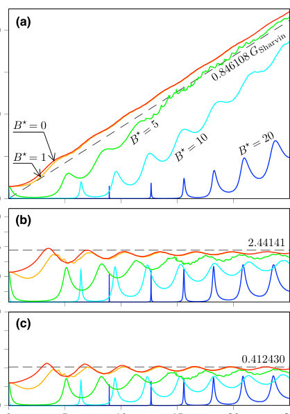
<figcaption class="paper-figure-caption"><b>Fig 2.</b> Figure 2: (a) Normal-state conductance 1/RN, (b) product IcRN, and (c) skewness of the current-phase relation S as functions of the chemical potential for different magnetic fields, B⋆≡eBr2 1/2ℏ, specified for each line in (a); same line-color encoding is used in (a)–(c). The radii ratio is r2/r1 = 2 (a = 0.5). Dashed-black lines correspond to the B →0, |µ| ≫ℏvF /r1 limit (see Ref. [26]).</figcaption>
</figure>
<figure class="paper-figure-card">
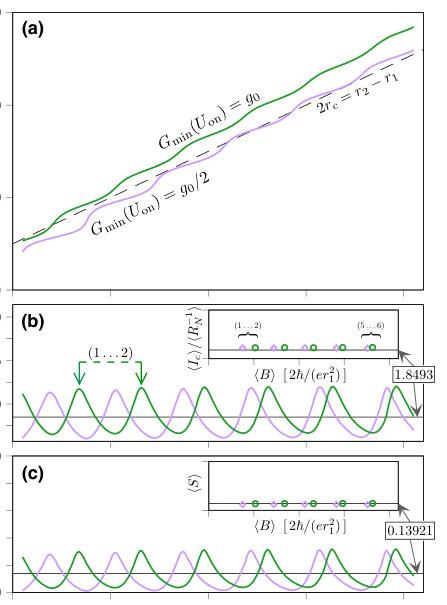
<figcaption class="paper-figure-caption"><b>Fig 3.</b> Figure 3: (a) Chemical potential corresponding to the activation voltage (µon ≡eUon/2) for the normal state displayed as function of the magnetic field for the two selected threshold conductances: Gmin(Uon) = ηg0, with η = 0.5, 1 [solid lines]. Additional line [dashed] marks 2rc = r2−r1 (or µ⋆ on = B⋆). (b) Product IcRN and (c) skewness S calculated at µ = µon [solid lines]. Thin horizontal lines in (b,c) mark the predictions for incoherent scattering (see also Table I). Insets in (b,c) depict the averages taken for the consecutive intervals between the maxima, i.e., (1 . . . 2), . . . , (5 . . . 6).</figcaption>
</figure>

**Main problem.** Investigating the mesoscopic Josephson effect in a graphene Corbino disk under a perpendicular magnetic field, specifically looking for deviations from the standard tunneling-limit current-phase relation.

**Main result.** In the limit of vanishing conductance, the system exhibits an enhanced I_cR_N product (~1.85 Delta_0/e) and positive skewness (S ~ 0.14) compared to the standard tunneling limit.

**Method.** Quantum-mechanical mode-matching analysis using the Dirac-Bogoliubov-De-Gennes equation, compared against an incoherent scattering approximation.

**Summary.** This paper explores how the geometry and magnetic field of a graphene Corbino disk influence the Josephson effect. It demonstrates that even in the limit of very high resistance, the junction maintains mesoscopic features like an enhanced I_cR_N product and a skewed current-phase relation. The study provides a detailed comparison between exact quantum-mechanical calculations and simpler scattering models. These findings highlight the persistence of non-trivial transport properties in graphene-based superconducting junctions.

Detailed structure

**Model / system.** A superconductor-graphene-superconductor (S-g-S) junction in a Corbino (disk) geometry, featuring an annular graphene sample with two circular superconducting electrodes.

**Key observables.** Critical current (I_c), normal-state resistance (R_N), current-phase relation (CPR), skewness (S), and conductance (G).

**Important parameters / regimes.** Magnetic field (B), chemical potential (mu), radii ratio (a), and the short-junction limit (junction width much smaller than coherence length).

**Assumptions / limitations.** Short-junction limit (width << coherence length); use of an incoherent scattering approximation for comparison; averaging datasets to mitigate Landau level resonance effects.

**Figures summary.** Fig 1 shows the Corbino geometry and the current-phase relation; Fig 2 displays conductance, I_cR_N, and skewness as functions of chemical potential; Fig 3 shows the relationship between chemical potential and magnetic field-induced resonances and compares averaged results to incoherent scattering predictions.

**Paper structure.** The paper introduces the Corbino geometry, presents the theoretical framework (DBdG equation), details the numerical mode-matching method, compares results with an incoherent scattering model, and analyzes the evolution of Josephson observables under varying magnetic fields and doping.

Abstract

Unlike for tunneling Josephson junctions, for which the current-phase relation is given by the sine function, with the critical current ($I_c$) and normal-state resistance ($R_N$) following the relation $I_cR_N=(π/2)\,Δ_0/e$ (where $Δ_0$ is the superconducting gap and electron charge is $-e$), mesoscopic Josephson junctions show more complex current-phase relations, with the skewness $S>0$, what is related to the presence -- in case the leads are in the normal state -- of transmission probabilities taking the values comparable to $1$. Here, we show that these features also appear for a superconductor-graphene-superconductor (S-g-S) junction in the disk-shaped (Corbino) geometry, when the magnetic field is adjusted such that $I_c\rightarrow{}0$ and $R_N\rightarrow{}\infty$. In such a case, the product $I_cR_N\approx{}1.85\,Δ_0/e$, and the skewness $S\approx{}0.14$. The results obtained from quantum-mechanical mode-matching analysis for the Dirac-Bogoliubov-De-Gennes equation are compared with simpler model assuming incoherent scattering between two circular interfaces separating the sample and the leads.

[↑ back to top](#top)

### [Multi-photon schemes for mid-infrared detection](http://arxiv.org/abs/2604.23429v1)

**Authors:** Alistair H. Duff, J. E. Sipe  
**Type:** theory · **Category:** other · **PDF:** <https://arxiv.org/pdf/2604.23429v1>  
**Analysis basis:** full PDF text, analyzed in chunks

↔ Scroll figures horizontally

<figure class="paper-figure-card">
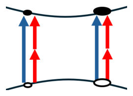
<figcaption class="paper-figure-caption"><b>Fig 1.</b> FIG. 1: Schematic representation of the generation of current through the interference of degenerate 2PA (D-2PA) at the fundamental frequency ω and 1PA at the harmonic 2ω. The larger ovals on the right indicate constructive interference for the electron-hole transition at positive k, versus destructive interference at −k.</figcaption>
</figure>
<figure class="paper-figure-card">
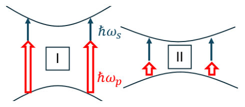
<figcaption class="paper-figure-caption"><b>Fig 2.</b> FIG. 2: Schematic representation of the ND-2PA process for the same signal photon but different pump and band gap selections. The bold red arrows represent the pump photon energy, and the narrow blue arrows the signal photon energy.</figcaption>
</figure>
<figure class="paper-figure-card">
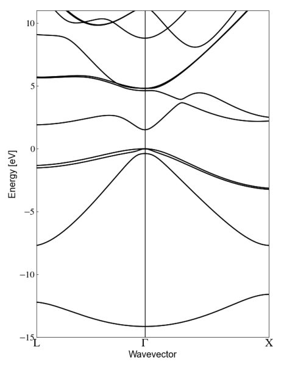
<figcaption class="paper-figure-caption"><b>Fig 3.</b> FIG. 3: GaAs band structure along two high symmetry directions in the BZ, calculated with the 30-band k · p model.</figcaption>
</figure>
<figure class="paper-figure-card">
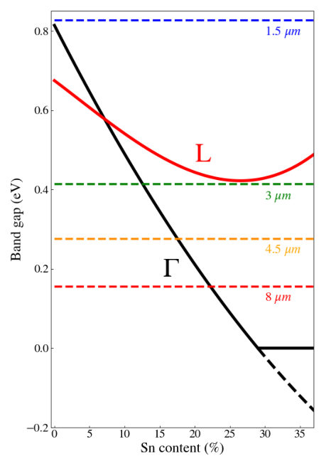
<figcaption class="paper-figure-caption"><b>Fig 4.</b> FIG. 4: Evolution of the direct and indirect band gap with increasing Sn concentration, as calculated with the 30-band k · p model.</figcaption>
</figure>
<figure class="paper-figure-card">
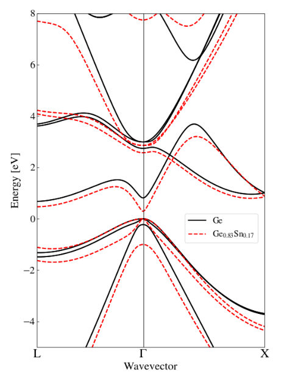
<figcaption class="paper-figure-caption"><b>Fig 5.</b> FIG. 5: Ge and Ge0.83Sn0.17 band structure along two high symmetry directions in the BZ, calculated with the 30-band k · p model.</figcaption>
</figure>
<figure class="paper-figure-card">
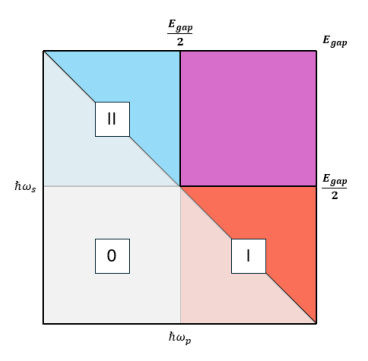
<figcaption class="paper-figure-caption"><b>Fig 6.</b> FIG. 6: Representation of where in the parameter space of signal and pump frequencies relative to the material band gap scheme I and scheme II exist.</figcaption>
</figure>
<figure class="paper-figure-card">
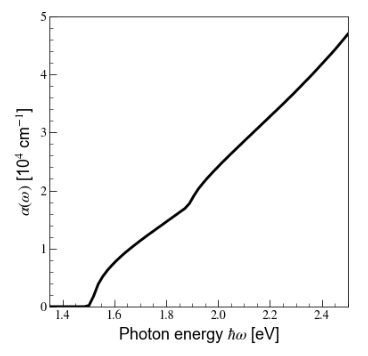
<figcaption class="paper-figure-caption"><b>Fig 7.</b> FIG. 7: 1PA of GaAs as a function of incident photon energy ℏω near the band gap, calculated with the 30-band k · p model.</figcaption>
</figure>
<figure class="paper-figure-card">
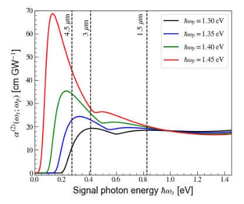
<figcaption class="paper-figure-caption"><b>Fig 8.</b> FIG. 8: ND-2PA of GaAs as a function of signal photon energy ℏωs in the presence of four different pump energies ℏωp, calculated with the 30-band k · p model. Only the largest component α(2) xxxx is shown.</figcaption>
</figure>
<figure class="paper-figure-card">
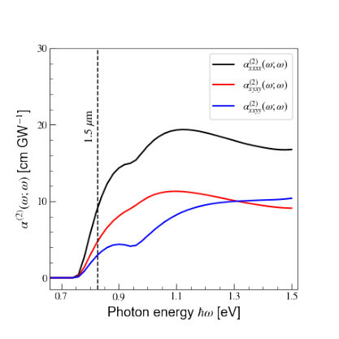
<figcaption class="paper-figure-caption"><b>Fig 9.</b> FIG. 9: The three independent components of the D-2PA tensor of GaAs as a function of incident photon energy ℏω, calculated with the 30-band k · p model.</figcaption>
</figure>
<figure class="paper-figure-card">
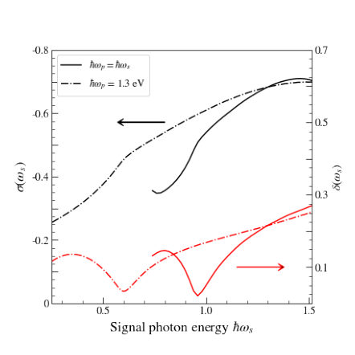
<figcaption class="paper-figure-caption"><b>Fig 10.</b> FIG. 10: The spectral dependence of the anisotropy and linear-circular dichroism for D-2PA and ND-2PA with a pump at ℏωp = 1.3 eV, calculated with the 30 band k · p GaAs model. σ plotted in black uses the left axis, while δ plotted in red uses the right axis.</figcaption>
</figure>

**Main problem.** Developing efficient mid-infrared (MIR) detection methods that avoid cryogenic temperatures by comparing two multi-photon absorption schemes using non-degenerate two-photon absorption (ND-2PA).

**Main result.** The study finds that Ge(1-x)Sn(x) alloys (Scheme II) exhibit a substantially larger nonlinear response and three-color injected current compared to GaAs (Scheme I) in the mid-infrared window.

**Method.** Theoretical calculations using first- and second-order time-dependent perturbation theory and a 30-band k.p model.

**Summary.** This paper investigates theoretical methods for detecting mid-infrared light using multi-photon processes in semiconductors. It compares a scheme using wide-gap GaAs to one using narrow-gap Germanium-Tin alloys. The researchers demonstrate that the GeSn-based approach provides much higher sensitivity and larger nonlinear current generation. This work is significant for developing room-temperature infrared detectors.

Detailed structure

**Model / system.** The physical systems studied are bulk GaAs and Ge(1-x)Sn(x) alloys, modeled using a 30-band k.p Hamiltonian to account for the entire Brillouin zone and anisotropic nonlinear responses.

**Key observables.** Nonlinear absorption coefficient (alpha), three-color injected current response tensor, linear electric susceptibility, and anisotropy/dichroism parameters.

**Important parameters / regimes.** Photon energies (signal and pump), alloy composition (x), band gap energy, and pump intensities up to 1 TW/cm2.

**Assumptions / limitations.** Independent particle approximation, continuous wave limit, neglect of many-body effects, neglect of phonon-mediated indirect absorption, and neglect of local inversion symmetry breaking in GeSn alloys.

**Figures summary.** Figure 1 shows a schematic of current generation via interference between degenerate 2PA and 1PA; Figure 2 shows schematics of the two ND-2PA schemes (Scheme I and Scheme II).

**Paper structure.** The paper introduces the problem of MIR detection, defines two multi-photon schemes, details the 30-band k.p modeling approach, compares the nonlinear responses and current injection of GaAs and GeSn, and provides technical parameters for the alloys.

Abstract

We calculate the theoretical non-degenerate two photon absorption and three color injected current response tensors for bulk GaAs and Ge$_{1-x}$Sn$_x$ for a range of alloy compositions. In particular, by including a ''pump'' beam we compare two ''schemes'' that are sensitive to mid-infrared photons. In ''scheme I'' we consider GaAs and a pump photon with energy greater than half the band gap, and in ''scheme II'' we consider Ge$_{1-x}$Sn$_x$ with a pump photon with energy less than half the band gap. We find that for certain pump and alloy concentrations Ge$_{1-x}$Sn$_x$ has a substantially larger nonlinear response and three-color injected current than GaAs in the mid-infrared frequency window where both materials can absorb photons via non-degenerate two-photon absorption.

[↑ back to top](#top)

### [Nearly Isotropic Magnon Transport in Epitaxial Lithium Aluminum Ferrite Thin Films](http://arxiv.org/abs/2604.23943v1)

**Authors:** Yiming Li, Katya Mikhailova, Lerato Takana, Daisy O'Mahoney, Sauviz P. Alaei, Guanxiong Qu, Dominic Petruzzi, Samuel Crossley, Harold Y. Hwang, Ian R. Fisher, Clare C. Yu, Yuri Suzuki  
**Type:** experiment · **Category:** other · **PDF:** <https://arxiv.org/pdf/2604.23943v1>  
**Analysis basis:** full PDF text, analyzed in chunks

↔ Scroll figures horizontally

<figure class="paper-figure-card">
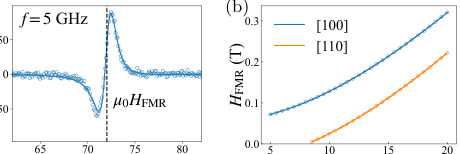
<figcaption class="paper-figure-caption"><b>Fig 1.</b> FIG. 2. (a) Field dependence of the FMR signal at 5 GHz and 250 K. (b) Frequency dependence of HFMR at 250 K can be fit to the Kittel equation to deduce the Land´e g-factor, effective magnetization Meff and in-plane anisotropy field H4,∥along the [100] and [110] axes.</figcaption>
</figure>
<figure class="paper-figure-card">
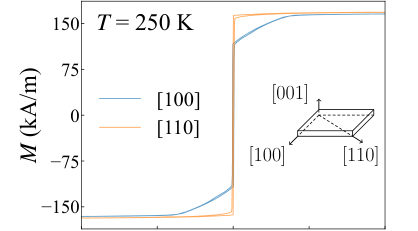
<figcaption class="paper-figure-caption"><b>Fig 2.</b> FIG. 1. Field dependence of the magnetization for a (001) LAFO film on (001) MAO along the in-plane [100] and [110] directions at 250 K. (inset) Schematic diagram of the LAFO film showing the [001] out-of-plane axis and the [100] and [110] in-plane axes.</figcaption>
</figure>
<figure class="paper-figure-card">
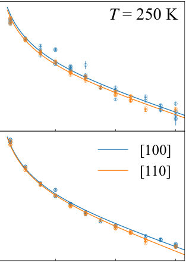
<figcaption class="paper-figure-caption"><b>Fig 3.</b> FIG. 4. Amplitudes of the SHE nonlocal resistance ∆RSHE (upper panel) and amplitudes of the SSE nonlocal resistance ∆RSSE (lower panel) as a function of the magnon propaga- tion distance d along the [100] and [110] directions at 250 K. Measurements were taken with an injection charge current of I0 = 0.4 mA, 0.5 mA and 0.6 mA on each device and one or two devices at the same distance d. A single best-fit curve is plotted for each orientation and for each type of nonlocal resistance.</figcaption>
</figure>
<figure class="paper-figure-card">
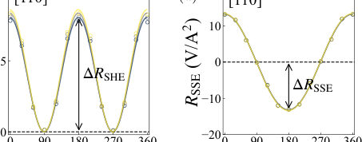
<figcaption class="paper-figure-caption"><b>Fig 4.</b> FIG. 3. Nonlocal spin transport measurements along the [100] directions show (a) SHE nonlocal resistance RSHE and (b) SSE nonlocal resistance RSSE as a function of the angle γ between the magnetization and the magnon propagation di- rection. Similar SHE and SSE measurements are shown for magnon propagation along the [110] direction in (c) and (d). These measurements were taken on a device with Pt elec- trodes a distance d = 0.5 µm apart at 250 K and 300 mT with 3 different injection currents I0: 0.4 mA (yellow), 0.5 mA (grey) and 0.6 mA (blue).</figcaption>
</figure>

**Main problem.** The study aims to determine if the anisotropic magnon transport observed in magnesium aluminum ferrite (MAFO) is a general feature of spinel ferrites or if isotropic in-plane magnon propagation can be achieved for information transport.

**Main result.** The researchers found that epitaxial lithium aluminum ferrite (LAFO) thin films exhibit nearly isotropic magnon diffusion lengths along the [100] and [110] directions at 250 K, despite having pronounced fourfold in-plane magnetic anisotropy.

**Method.** Nonlocal transport measurements using platinum electrodes were used to detect electrically (Spin Hall Effect) and thermally (Spin Seebeck Effect) generated magnons, combined with SQUID magnetometry and broadband Ferromagnetic Resonance (FMR).

**Summary.** This paper investigates magnon transport in lithium aluminum ferrite (LAFO) thin films to address the need for low-loss, isotropic magnetic waveguides. While previous spinel ferrites showed anisotropic transport, LAFO demonstrates nearly identical magnon diffusion lengths along different in-plane directions. This isotropy is attributed to isotropic exchange stiffness and potential angular averaging. These findings suggest that LAFO is a promising platform for developing efficient, isotropic magnon-based information interconnects.

Detailed structure

**Model / system.** The physical system consists of epitaxial (001) lithium aluminum ferrite (LAFO) thin films grown on MgAl2O4 substrates, characterized by a spinel structure with significant in-plane magnetic anisotropy.

**Key observables.** Magnon diffusion length (lambda), nonlocal resistance (R_SHE and R_SSE), saturation magnetization (Ms), anisotropy field (H4,parallel), and Gilbert damping (alpha).

**Important parameters / regimes.** Temperature of 250 K, magnetic field of 300 mT, and film thickness of approximately 12 nm.

**Assumptions / limitations.** The analysis assumes a 1D magnon diffusion model and attributes the observed isotropy to nearly isotropic exchange stiffness and effective angular averaging due to inhomogeneous broadening.

**Figures summary.** Fig 1 shows magnetization field dependence and hysteresis loops; Fig 2 shows FMR frequency dependence; Fig 3 demonstrates the angular dependence of nonlocal resistance (cos^2 and cos dependence).

**Paper structure.** The paper introduces the problem of magnon anisotropy, describes the growth and structural characterization of LAFO films, presents magnetic property measurements (SQUID and FMR), details the nonlocal transport experiments, and concludes with a discussion on the mechanism of isotropic transport.

Abstract

Low-loss magnetic insulating thin films are promising for information transport via magnons, where isotropic in-plane magnon propagation is desirable. We report nonlocal measurements of electrically and thermally generated magnons in epitaxial (001) lithium aluminum ferrite Li$_{0.5}$Al$_{0.7}$Fe$_{1.8}$O$_4$ thin films with pronounced fourfold in-plane magnetic anisotropy. By measuring the inverse spin Hall signal as a function of the magnon diffusion distance, we deduce magnon diffusion lengths that are nearly identical along the [100] and [110] directions at 250~K. This isotropy is consistent with a nearly isotropic exchange stiffness. These results highlight spinel ferrites as viable platforms for isotropic magnon transport.

[↑ back to top](#top)

### [Non-Bloch band theory of nonlinear eigenvalue problems](http://arxiv.org/abs/2604.24284v1)

**Authors:** Kota Otsuka, Kazuki Yokomizo  
**Type:** theory · **Category:** other · **PDF:** <https://arxiv.org/pdf/2604.24284v1>  
**Analysis basis:** full PDF text, analyzed in chunks

↔ Scroll figures horizontally

<figure class="paper-figure-card">
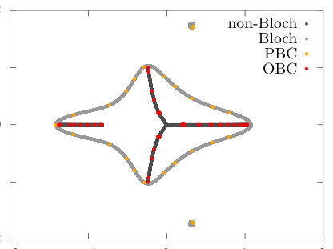
<figcaption class="paper-figure-caption"><b>Fig 1.</b> FIG. 1. Eigenvalues of the nonreciprocal hopping system. The black and gray curves represent the non-Bloch and Bloch bands, respectively. The red and orange dots indicate the spectra of the open-boundary and periodic-boundary systems with L = 10, respectively. The parameters are set to be tR = 1 and tL = 0.5.</figcaption>
</figure>
<figure class="paper-figure-card">
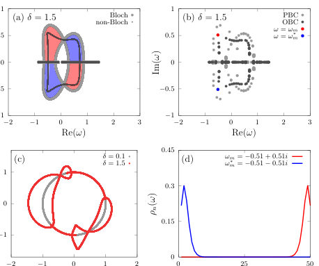
<figcaption class="paper-figure-caption"><b>Fig 2.</b> FIG. 2. Eigenvalues, generalized Brillouin zones, and eigen- states of the model with the nonlinear pseudo-Hermiticity. (a) Bloch and non-Bloch bands. The winding number (15) takes +1, −1, and 0 in the red, blue, and white regions, re- spectively. (b) Spectra of the open-boundary and periodic- boundary systems. (c) Generalized Brillouin zones. The gray curve represents the unit circle. (d) Spatial profiles of the eigenstates defined in Eq. (28). The corresponding eigenval- ues are shown in the same colors in (b). The parameters are m = 0.9, t = 1, and v = 0.5, and the system size is L = 50 in (b) and (d).</figcaption>
</figure>
<figure class="paper-figure-card">
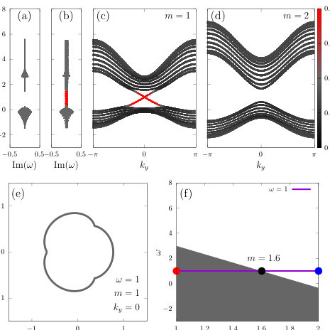
<figcaption class="paper-figure-caption"><b>Fig 3.</b> FIG. 3. Eigenvalues and Chern number of the nonlinear Chern insulator with nonreciprocal hopping amplitudes. (a) Continuum bands with m = 1. (b) Spectra with m = 1 un- der a full open boundary condition. The gray and red points represent the spectra of the bulk eigenstates and the edge states, respectively. (c) and (d) Spectra under the cylindrical geometry (open boundary conditions in the x direction). The color bar means the biorthogonal inverse participation ratio defined in Eq. (46). (e) Generalized Brillouin zones of the auxiliary bands n = + and n = −. (f) Chern number (50) for the lower band n = −. The Chern number is −1 and 0 in the gray and white regions, respectively. The...</figcaption>
</figure>

**Main problem.** The breakdown of conventional Bloch band theory and topological characterization in nonlinear eigenvalue problems due to extreme sensitivity to boundary conditions.

**Main result.** The establishment of a non-Bloch band theory framework that uses Generalized Brillouin Zones (GBZs) to accurately reproduce open boundary condition spectra and predict topological edge states in nonlinear systems.

**Method.** Development of a non-Bloch framework using complex-valued Bloch wavenumbers and the construction of Generalized Brillouin Zones (GBZs) via the characteristic equation of the nonlinear system.

**Summary.** This paper introduces a non-Bloch band theory specifically designed for nonlinear eigenvalue problems. It addresses the failure of standard Bloch theory in systems where parameters depend on the eigenvalue, which typically causes a discrepancy between periodic and open boundary spectra. By using Generalized Brillouin Zones, the authors can accurately predict the spectra and the emergence of the nonlinear skin effect. The framework is successfully extended to 2D to establish a bulk-boundary correspondence for nonlinear Chern insulators.

Detailed structure

**Model / system.** 1D and 2D tight-binding models featuring nonlinear eigenvalue equations where system parameters depend on the eigenvalue, including nonreciprocal hopping models and nonlinear Chern insulators.

**Key observables.** Complex eigenvalue spectra, winding numbers, Chern numbers, and the biorthogonal inverse participation ratio (bi-IPR).

**Important parameters / regimes.** Nonreciprocity strength (tL/tR, gamma_x), nonlinearity strength (delta), and mass parameter (m).

**Assumptions / limitations.** The nonlinearity follows specific analytical forms (e.g., f(omega) = omega or -omega^2), and the 2D extension assumes mirror symmetry to suppress skin effects in one direction.

**Figures summary.** Fig 1 compares Bloch vs. non-Bloch bands and PBC vs. OBC spectra; Fig 3 shows the reproduction of bulk and edge spectra in 2D, the disappearance of edge states, and the calculation of Chern number transitions.

**Paper structure.** The paper introduces the problem of nonlinear eigenvalue sensitivity, develops the 1D non-Bloch framework and GBZ construction, investigates the nonlinearity-induced skin effect and pseudo-Hermiticity, and extends the theory to 2D topological Chern insulators.

**Why it may be interesting.** This work provides a critical theoretical tool for understanding nonlinear dynamics in optics, mechanical oscillators, and weakly interacting bosonic systems where boundary-induced spectral shifts are prevalent.

Abstract

Nonlinear eigenvalue problems arise in a wide range of physical systems, in which system parameters depend on the eigenvalue. Such systems have been proposed to exhibit an extreme sensitivity of their spectra to boundary conditions, which leads to the breakdown of conventional topological characterizations. In this work, we establish a non-Bloch framework for calculating continuum bands that reproduce the spectra of the nonlinear system with open boundary conditions. This non-Bloch band theory enables us not only to calculate the eigenvalues but also to reveal phenomena unique to the nonlinear system. We further investigate the topological bulk-boundary correspondence in a nonlinear Chern insulator within an extended version of this framework.

[↑ back to top](#top)

### [Nonintegral Flux Trapping in Frustrated Josephson Networks of Triplet Superconductors](http://arxiv.org/abs/2604.24734v1)

**Authors:** Grayson R. Frazier, Colton Lelievre, Yi Li  
**Type:** theory · **Category:** strongly correlated electrons · **PDF:** <https://arxiv.org/pdf/2604.24734v1>  
**Analysis basis:** full PDF text, analyzed in chunks

↔ Scroll figures horizontally

<figure class="paper-figure-card">
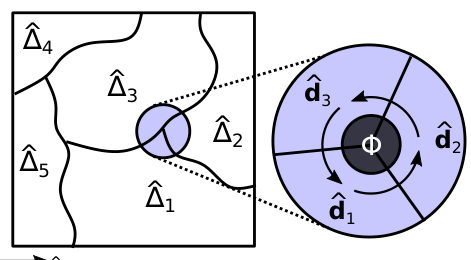
<figcaption class="paper-figure-caption"><b>Fig 1.</b> FIG. 1. Schematic of Josephson junction network in a spin triplet superconductor. At each superconducting grain, the pairing correlation is given by ˆ∆n(k), which can be expressed in terms of its d vector, ˆdn. Between neighbouring grains, there is Josephson coupling, which is dependent on the relative orientation of d vectors and U(1) phase difference. At the intersection of three grains, there is a three-grain ring, as shown on the right. If the Josephson network is frustrated, this can lead to spontaneous trapped flux, Φ.</figcaption>
</figure>
<figure class="paper-figure-card">
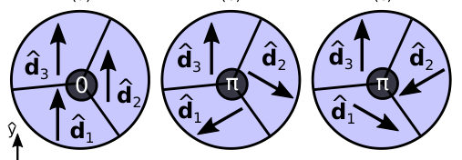
<figcaption class="paper-figure-caption"><b>Fig 2.</b> FIG. 2. Example of minimal-energy d vector configurations in the three-grain Josephson ring. (a) For DM-like coupling |D0| &lt; |J0|/ √</figcaption>
</figure>
<figure class="paper-figure-card">
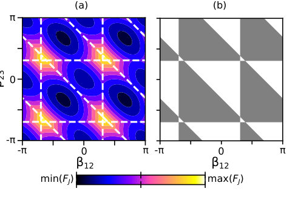
<figcaption class="paper-figure-caption"><b>Fig 3.</b> FIG. 3. Flux trapping and frustration in three-grain network of triplet superconductors. (a) Contour plot of the free energy FJ in Eq. (8) as a function of the relative d vector orientation angles β1,2 and β2,3 for D0 = −0.7J0, which is above the critical value D∗= |J0|/ √</figcaption>
</figure>

**Main problem.** Investigating how anisotropic Josephson coupling between spin-triplet Cooper pairs in a junction network leads to frustrated d-vector textures and spontaneous nonintegral flux trapping.

**Main result.** The authors identify a critical coupling strength D* = |J0|/sqrt(3) above which the system enters a frustrated regime characterized by chiral 120-degree d-vector textures and the spontaneous trapping of pi-flux.

**Method.** The study uses a theoretical framework involving the minimization of the Josephson free energy and the analytical derivation of an emergent geometric phase arising from d-vector orientations.

**Summary.** This paper explores how the internal spin structure of triplet superconductors can induce frustration in Josephson junction networks. By analyzing the competition between different types of anisotropic coupling, the authors show that a transition occurs to a state with chiral d-vector textures. This transition leads to the spontaneous trapping of fractional (pi) magnetic flux. The findings suggest new ways to engineer frustrated superconducting states using magnetic textures.

Detailed structure

**Model / system.** A Josephson junction network of superconducting grains (such as polycrystals or single-crystal networks) with spin-triplet pairing, modeled via a three-grain ring with Heisenberg-like and Dzyaloshinskii-Moriya-type interactions.

**Key observables.** Nonintegral/fractional flux trapping (specifically pi-flux), spontaneous Josephson currents, and chiral d-vector textures.

**Important parameters / regimes.** Anisotropic coupling amplitudes (J0, D0, Gamma), the dimensionless ratio x = D0/J0, and the critical value D* = |J0|/sqrt(3).

**Assumptions / limitations.** The analysis assumes unitary triplet pairing (d x d* = 0) and neglects the self-inductance of the network.

**Figures summary.** Figure 1 provides a schematic of a Josephson junction network illustrating superconducting grains, d-vector orientations, and a three-grain ring demonstrating flux trapping.

**Paper structure.** The paper introduces the problem of flux trapping in triplet networks, defines the Hamiltonian and coupling terms, performs an analytical derivation of the critical coupling regime, compares the results to half-quantum vortices, and discusses experimental candidates and implications for glassy phases.

Abstract

In a Josephson junction network, anisotropic coupling between spin triplet pairing correlations can lead to frustrated $d$ vector textures that support spontaneous Josephson currents and nonintegral flux trapping. Such networks can appear in superconducting polycrystals, as well as single-crystal superconductors. In analogy to classical spin systems, in which the presence of geometric frustration and anisotropic superexchange can lead to nontrivial spin textures, Josephson networks with anisotropic Josephson couplings cannot simultaneously optimize their $\mathrm{U}(1)$ superconducting phase difference and relative $d$ vector orientations. The internal pairing structure of Cooper pairs twists as they tunnel across the Josephson junction, and the $d$ vector texture enters as an emergent geometric phase which can spontaneously trap fractional flux. For unitary triplet pairing order, this mechanism can support $π$-flux trapping above a critical value of antisymmetric Josephson coupling, and is distinct from usual half-quantum vortices. The results of this work reveal new routes to engineer frustrated Josephson networks from the interplay of magnetic textures and spin triplet superconducting pairing order.

[↑ back to top](#top)

### [Optical Properties of Indium-Gallium-Oxide Microcrystalline Alloy Films: From the Visible to the Deep-UV](http://arxiv.org/abs/2604.23884v1)

**Authors:** HM Borhanul Alam, Dipak Oli, You Qiang, Bisheswor Acharya, Jesse Huso, Matthew D. McCluskey, Leah Bergman  
**Type:** experiment · **Category:** disordered systems and neural networks · **PDF:** <https://arxiv.org/pdf/2604.23884v1>  
**Analysis basis:** full PDF text, analyzed in chunks

↔ Scroll figures horizontally

<figure class="paper-figure-card">
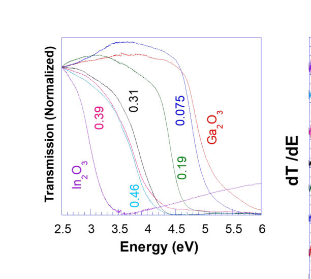
<figcaption class="paper-figure-caption"><b>Fig 1.</b> Fig 1. The normalized transmission spectra for the two end members of the alloy: Ga2O3, and In2O3, as well as for the alloys of composition: x = 0.075, 0.19, 0.31, 0.39, and 0.46. Fig 2. The optical gaps of the samples obtained from the derivative of the transmission spectra.</figcaption>
</figure>
<figure class="paper-figure-card">
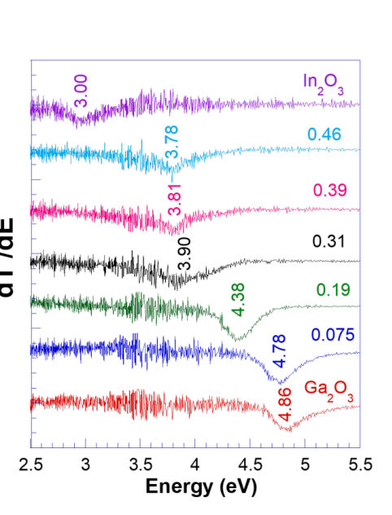
<figcaption class="paper-figure-caption"><b>Fig 2.</b> Figure 3 summarizes the optical gap behavior as a function of alloy composition. Also</figcaption>
</figure>
<figure class="paper-figure-card">
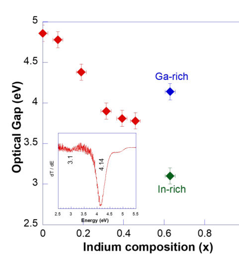
<figcaption class="paper-figure-caption"><b>Fig 3.</b> Fig 3. The behavior of the optical gap as a function of composition. Also included in the inset is the optical characteristic of a sample with high indium composition x = 0.63 that exhibits two optical gaps weak one at 3.1 eV attributed to In-rich domains and one at the UV range of 4.14 eV due to Ga-rich domains.</figcaption>
</figure>
<figure class="paper-figure-card">
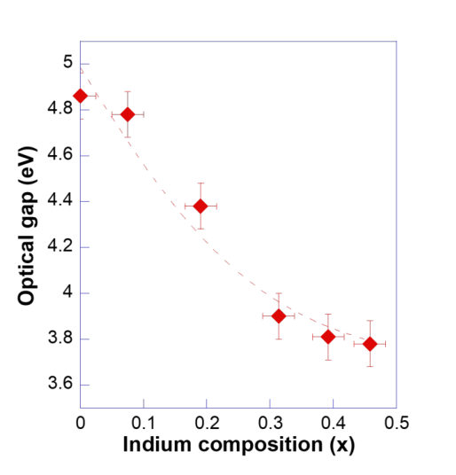
<figcaption class="paper-figure-caption"><b>Fig 4.</b> Fig 4. The optical gap as a function of composition (diamonds) and a fit of the data using the saturation model of Equation 1 (line) for which a saturation composition x ~ 0.3 was ascertained.</figcaption>
</figure>
<figure class="paper-figure-card">
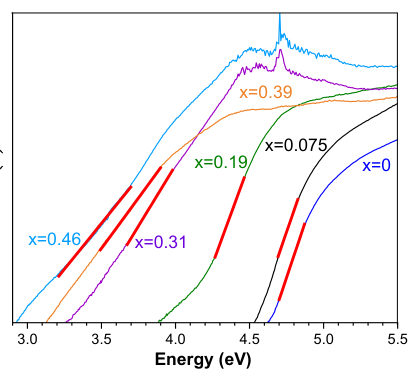
<figcaption class="paper-figure-caption"><b>Fig 5.</b> Fig 6. Urbach model plots of the samples of composition x = 0, 0.075, 0.19, 0.39, and 0.46. For each plot, the straight line below the optical gap is a fit to Equation 2 from which the Urbach energy was ascertained.</figcaption>
</figure>
<figure class="paper-figure-card">
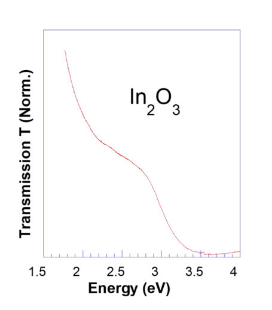
<figcaption class="paper-figure-caption"><b>Fig 6.</b> Fig 5. The transmission spectrum of the In2O3 sample that includes the visible range.</figcaption>
</figure>
<figure class="paper-figure-card">
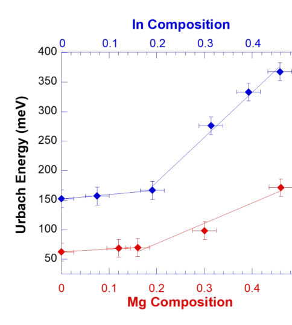
<figcaption class="paper-figure-caption"><b>Fig 7.</b> Fig 7. Urbach energies as a function for composition for two alloy systems; MgxZn1-xO (red) and (InxGa1-x)2O3 (blue). The films of these two alloy systems exhibit similar granular morphology.</figcaption>
</figure>
<figure class="paper-figure-card">
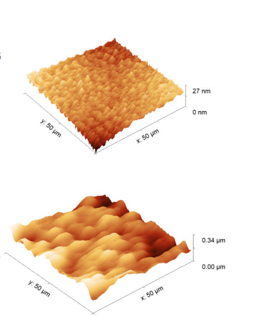
<figcaption class="paper-figure-caption"><b>Fig 8.</b> Fig 8. AFM images for x = 0.19 (top) and x = 0.39 (bottom), showing the granular morphology of the films.</figcaption>
</figure>
<figure class="paper-figure-card">
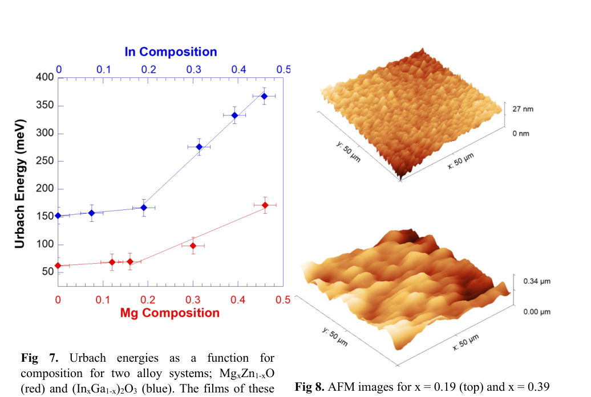
<figcaption class="paper-figure-caption"><b>Fig 9.</b> Figure 8, the morphology of the low compositions film consists of relatively sharp micro-</figcaption>
</figure>
<figure class="paper-figure-card">
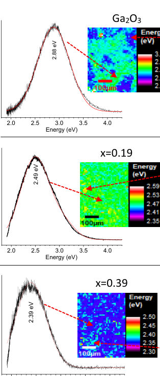
<figcaption class="paper-figure-caption"><b>Fig 10.</b> Fig 9. The scanning PL of the self-trapped hole for Ga2O3 and for Indium composition for x = 0.19 and x = 0.39. For each sample, the spectra represent the two dominant energy regions. The spectral lineshape is fitted by a Gaussian function.</figcaption>
</figure>

**Main problem.** Investigating the tunable optical properties and the onset of phase separation in (InxGa1-x)2O3 microcrystalline alloy films.

**Main result.** The study identifies the onset of incipient phase separation at x ~ 0.3, where phase-segregated precipitates act as a major defect type, and finds that large Urbach energies are driven by strong hole-phonon coupling.

**Method.** Wet chemical synthesis followed by UV-Vis transmission spectroscopy, spatial photoluminescence mapping, AFM, and EDS analysis.

**Summary.** This paper explores how changing the indium content in (InxGa1-x)2O3 films tunes their optical properties from the deep-UV to the visible spectrum. The researchers discovered that at a composition of x ~ 0.3, the material begins to undergo phase separation, creating defects that significantly impact the optical properties. They also found that the material exhibits much larger Urbach energies than similar alloy systems due to strong coupling between holes and phonons. This work is important for designing transparent conducting oxides and wide-bandgap semiconductors.

Detailed structure

**Model / system.** Microcrystalline (InxGa1-x)2O3 alloy films ranging from beta-Ga2O3 to In2O3, characterized using a saturation model for the optical gap and an Urbach model for absorption band tails.

**Key observables.** Optical gap (E_OG), Urbach energy (E_u), self-trapped hole (STH) photoluminescence emission, and compositional-dependent absorption tails.

**Important parameters / regimes.** Indium composition (x), solubility limit/saturation composition (x0 ~ 0.3), and hole-phonon coupling strength.

**Assumptions / limitations.** The use of a tanh-based saturation model to identify the onset of phase separation.

**Figures summary.** Figure 1 shows normalized transmission spectra; Figure 3 and 5 include transmission spectra showing absorption features and the In2O3 optical gap.

**Paper structure.** The paper introduces the alloy system, describes the synthesis and characterization methods, presents the compositional dependence of the optical gap and STH PL, analyzes phase separation via saturation modeling, compares Urbach energies with the MgxZn1-xO system, and concludes with the impact of hole-phonon coupling.

Abstract

The tailored optical properties of $(In_xGa_{1-x})_2O_3$ microcrystalline films were studied as a function of composition x via transmission, Urbach energy analysis, and spatial photoluminescence (PL) mapping of the self-trapped hole (STH) emission, with the objective of addressing material characteristics specific to this alloy system. Up to x = 0.46, the optical gap exhibited a redshift of 1 eV from the deep to the near-UV range, while the STH PL was redshifted by 0.5 eV in the visible range. For higher composition, x = 0.63, the transmission spectra indicated the co-existence of two optical gaps attributed to Ga-rich and to In-rich domains, implying that this sample is phase-separated. However, the saturation behavior of the optical gap and that of the STH PL showed that incipient phase separation occurs at a lower composition: x ~ 0.3. This is consistent with the compositional trend found for Urbach energy, implying that phase segregation in the alloys is a major defect even at its incipient stages. Additionally, Urbach analysis of $(In_xGa_{1-x})_2O_3$ was compared to that of $Mg_xZn_{1-x}O$. Both systems were found to have similar compositional dependence: at lower range, Urbach energies exhibited a negligible increase, while at the higher range a significant dependence on the composition was found. The main difference between the two alloy systems is in their Urbach energy: those for $(In_xGa_{1-x})_2O_3$ were significantly larger than those of $Mg_xZn_{1-x}O$. This stems from the strong hole coupling to phonons of $(In_xGa_{1-x})_2O_3$, which provides a dynamic transition additionally to that of defect-type.

[↑ back to top](#top)

### [Ostwald ripening controlled by diffusion of a sparingly soluble component](http://arxiv.org/abs/2604.23850v1)

**Authors:** Alexey Kabalnov  
**Type:** theory · **Category:** statistical mechanics · **PDF:** <https://arxiv.org/pdf/2604.23850v1>  
**Analysis basis:** full PDF text, analyzed in chunks

↔ Scroll figures horizontally

<figure class="paper-figure-card">
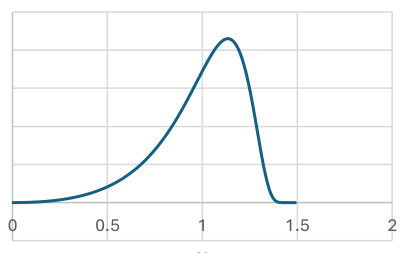
<figcaption class="paper-figure-caption"><b>Fig 1.</b> Figure 1. LSW particle size distribution attractor. Extension to two-component case We now will be exploring Ostwald ripening in a system with two-component dispersed phase 1. Consider an ensemble of spherical liquid drops formed by two completely miscible components, 1 and 2. Both components are soluble in the medium, with the solubilities for the individual components 𝐶!.</figcaption>
</figure>
<figure class="paper-figure-card">
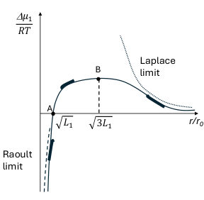
<figcaption class="paper-figure-caption"><b>Fig 2.</b> Figure 2. Cartoon illustrating the change in the excess chemical potential of the soluble component in the drop. Three possible locations for the initial radius are marked in bold, indicating, from left to right, the stable range (lock-in is possible), metastable range (lock-in is possible but susceptible to the system polydispersity) and unstable range (particles ripen). If originally all the particles are located at the radii to the left of point A on the graph, the initial polydispersity of the particles does not cause the particles to diverge more in size, as there is a restoring force to bring them back to equilibrium; this is caused by the positive value of derivative of the chemical...</figcaption>
</figure>
<figure class="paper-figure-card">
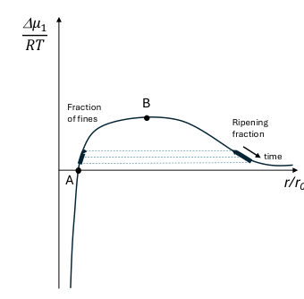
<figcaption class="paper-figure-caption"><b>Fig 3.</b> Figure 3. Cartoon illustrating the evolution of a ripening system with L1&lt;1. As the ripening proceeds in almost classical-style fashion, the ripening fraction gradually coarsens with time, and the excess chemical potential diminishes. All the small particle size drops are however caught into the fraction of &#x27;fines&#x27;, which co-exists with the ripening fraction. In the this process the total number of particles remains constant and does not decrease as 1/n~t as it would have been in case of the classical ripening. On the other hand, if the particles are to the right of the point B, they cannot come to equilibrium with each other, as small di3erences in the particle size will only amplify with...</figcaption>
</figure>
<figure class="paper-figure-card">
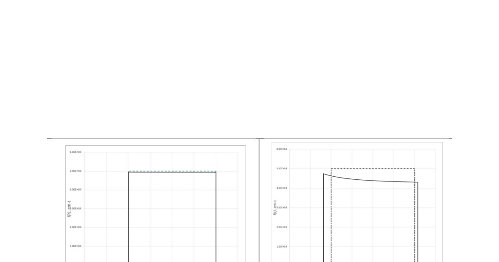
<figcaption class="paper-figure-caption"><b>Fig 4.</b> Figure 4. Evolution of a stepwise uniform number particle size distribution during the transition to lock in. Dashed lines: initial distributions; continuous lines: final distributions. Left: x02 = 0.1;L1 = 22;</figcaption>
</figure>
<figure class="paper-figure-card">
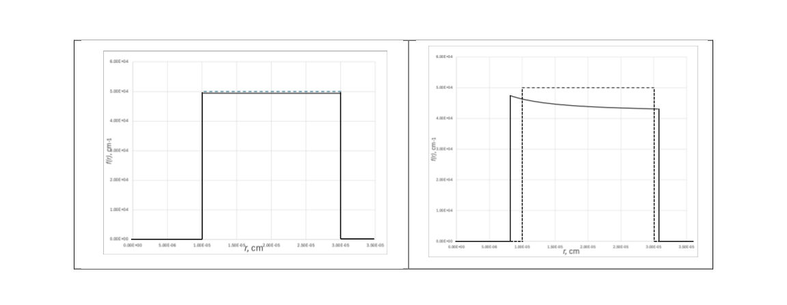
<figcaption class="paper-figure-caption"><b>Fig 5.</b> Figure 5. Relative changes in the initial value of the initial mole fraction x2 during the transition to lock -n plotted versus the final particle size for the uniform distribution. The same set of parameters as in Figure 4; Dashed line: x02 = 0.1, L1 = 22; continuous line: x02 = 0.1, L1 = 2.</figcaption>
</figure>
<figure class="paper-figure-card">
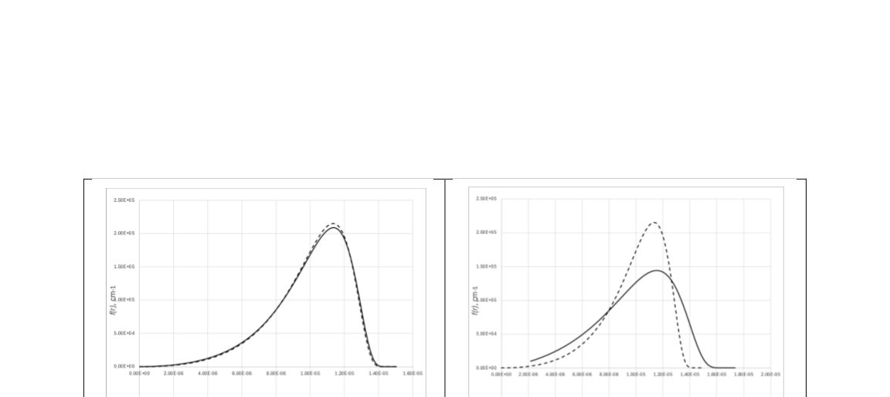
<figcaption class="paper-figure-caption"><b>Fig 6.</b> Figure 6. Evolution of LSW number particle size distribution during the transition to lock in. Dashed lines: initial distributions; continuous lines: final distributions. left: x02 = 0.1;L1 = 11; &amp;-</figcaption>
</figure>
<figure class="paper-figure-card">
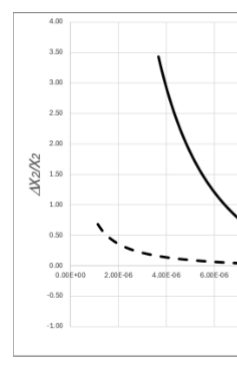
<figcaption class="paper-figure-caption"><b>Fig 7.</b> Figure 7. Relative changes in the initial value of the initial mole fraction x2 during the transition to lock-in of LSW plotted versus the final particle size. The same set of parameters as in Figure 6; Dashed line: x02 = 0.1, L1 = 11. ; continuous line: x02 = 0.1, L1 = 1.</figcaption>
</figure>
<figure class="paper-figure-card">
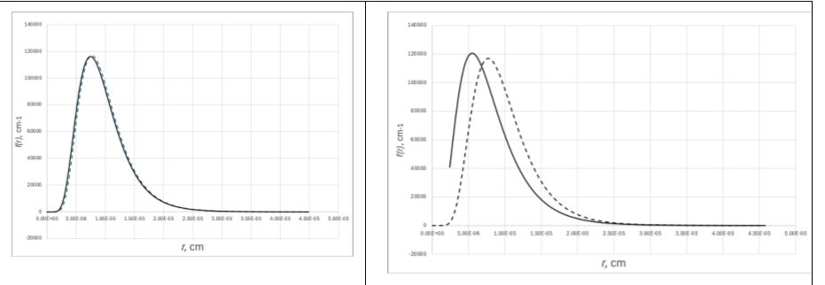
<figcaption class="paper-figure-caption"><b>Fig 8.</b> Figure 8. Evolution of the initial log-normal distribution (µ= -0.0957, s = 0.408), Ref [10] during the transition to lock-in. Left: x02 = 0.1, L1 = 11,</figcaption>
</figure>
<figure class="paper-figure-card">
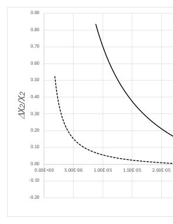
<figcaption class="paper-figure-caption"><b>Fig 9.</b> Figure 9. Relative changes in the initial value of the initial mole fraction x2 during the transition to lock-in of lognormal distribution plotted versus the final particle size for lognormal . The same set of parameters as in Figure 8; Dashed line: x02 = 0.1, L1 = 11; continuous line: x02 = 0.1, L1 = 1.</figcaption>
</figure>
<figure class="paper-figure-card">
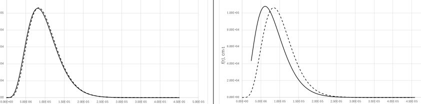
<figcaption class="paper-figure-caption"><b>Fig 10.</b> Figure 10. Evolution of the initial Gamma distribution ( n=6.138 ), Ref [10] during the transition to lock-in. Left: x02 = 0.1, L1 = 11, ,</figcaption>
</figure>

**Main problem.** The paper investigates how the addition of a sparingly soluble component affects the kinetics and particle size distribution of Ostwald ripening in dispersed systems.

**Main result.** The author derives a generalized growth law that accounts for molar volume differences and non-ideality, showing that high concentrations of the additive follow classical LSW theory while low concentrations lead to bimodal distributions.

**Method.** The study uses an extension of the Lifshits-Slezov-Wagner (LSW) theory, employing mass flux analysis, the Kelvin equation, and numerical simulations of particle size evolution.

**Summary.** This paper extends the classical LSW theory of Ostwald ripening to systems containing a sparingly soluble additive. It demonstrates that at high additive concentrations, the system maintains classical cubic growth and distribution patterns, but at low concentrations, the distribution splits into a bimodal pattern consisting of 'fines' and ripening particles. The author provides a new mathematical framework to account for non-ideal solution behavior and differences in molar volumes, offering practical insights for stabilizing emulsions.

Detailed structure

**Model / system.** A two-component dispersed phase (e.g., oil-in-water emulsions) consisting of spherical liquid drops in a medium, where the second component is sparingly soluble.

**Key observables.** Particle size distribution (PSD), ripening rate (cubic law), critical radius, and the lock-in number.

**Important parameters / regimes.** Lock-in number (L1), molar fraction of the second component (x2,0), interfacial tension, and molar volume differences.

**Assumptions / limitations.** Quasi-steady-state mode, negligible solubility of the medium in the dispersed phase, and small-scale expansion of the Kelvin equation.

**Figures summary.** Figure 1 shows the LSW particle size distribution attractor; Figure 2 illustrates chemical potential vs. particle size regimes; Figure 3 shows the evolution of bimodal distributions; Figures 4-11 show the evolution of various initial distributions (uniform, log-normal, gamma) toward the lock-in state.

**Paper structure.** The paper revisits and extends a previous model, establishes the applicability of LSW theory in high-concentration regimes, derives an improved extrapolatory equation for ripening rates, analyzes the transition to bimodal distributions at low concentrations, and concludes with practical stabilization strategies.

Abstract

Additives of sparingly soluble components are known to slow down or completely inhibit Ostwald ripening in dispersed systems. In this paper, our earlier model of stabilization against Ostwald ripening is revisited and extended. In a quasi-steady-state mode, the process is shown to be controlled by the diffusion of the less soluble component, and the whole machinery of the classical Lifshits-Slezov-Wagner (LSW) theory can be leveraged almost without any change. The particle size distribution is predicted to follow the same distribution function pattern as in the classic LSW theory. The rate of ripening follows the classic cubic law. To extend our earlier result, an improved extrapolatory equation for the ripening rate is derived, that covers the whole formulation range, accounts for the difference in molar volumes of the components and for the solution non-ideality. The behavior described above is observed over the range of high concentrations of the poorly soluble component, with the cutoff determined by the lock-in number described in the previous paper of this series. When the concentration of the additive is low, the kinetics no longer follows the LSW pattern; instead, the particle size distribution becomes bimodal, with the fraction of 'fines' enriched by the poorly soluble component and the fraction of the large particles to ripen as if no additive were present. The lock-in parameter L1 can be used to characterize for the transition from one mode to another. In the end, some practical stabilization approaches for emulsions are discussed.

[↑ back to top](#top)

### [Phase transformation kinetics in MoS2 governed by S-S repulsive interactions and defect-interface compatibility](http://arxiv.org/abs/2604.24209v1)

**Authors:** Pai Li, Ziao Tian, ZengFeng Di, Feng Ding  
**Type:** theory · **Category:** statistical mechanics · **PDF:** <https://arxiv.org/pdf/2604.24209v1>  
**Analysis basis:** full PDF text, analyzed in chunks

↔ Scroll figures horizontally

<figure class="paper-figure-card">
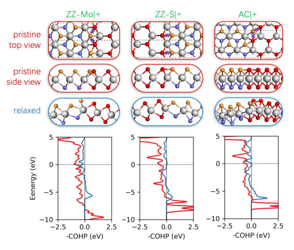
<figcaption class="paper-figure-caption"><b>Fig 1.</b> Fig. 1 | DFT analysis of S–S repulsive interactions at H–T’ grain boundaries. Top and side views of the atomic structures before relaxation (red frames), and side views of the fully optimized geometries after relaxation (blue frames) for S-rich interfaces: ZZ-Mo|+, ZZ-S|+, and AC|+. Repulsive S–S interactions are indicated by wavy lines between closely spaced S atoms. Mo atoms are gray; upper and lower S atoms in T-phase area are orange and blue, respectively; overlapping S atoms (in top view) in H-phase area are colored red. Below each atomic model are the corresponding crystal orbital Hamilton population (COHP) curves for S–S pairs, plotted before (red) and after (blue) relaxation....</figcaption>
</figure>
<figure class="paper-figure-card">
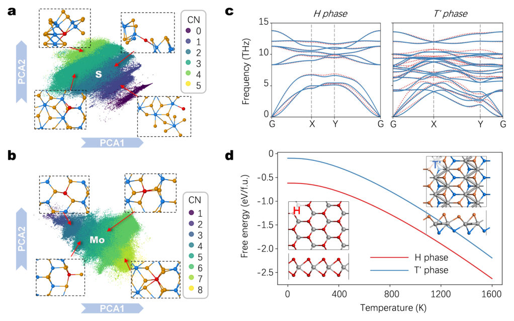
<figcaption class="paper-figure-caption"><b>Fig 2.</b> Fig. 2 | Training and validation of the MLFF and phase stability of MoS2. (a, b) Principal component analysis (PCA) of local atomic environments in the training set, colored by Mo–S coordination number (CN): (a) for S-centered and (b) for Mo-centered environments. Insets show representative local structures; S atoms are orange, Mo atoms are blue, and the central atom (S in a, Mo in b) is highlighted in red. (c) Phonon dispersion of H- and T’-phase MoS2 computed using the MLFF (blue solid lines) and DFT (red dashed lines). (d) Helmholtz free energy as a function of temperature for the H and T’ phases. The insets show supercell structures of the H phase and the distorted T’ phase, with Mo–Mo...</figcaption>
</figure>
<figure class="paper-figure-card">
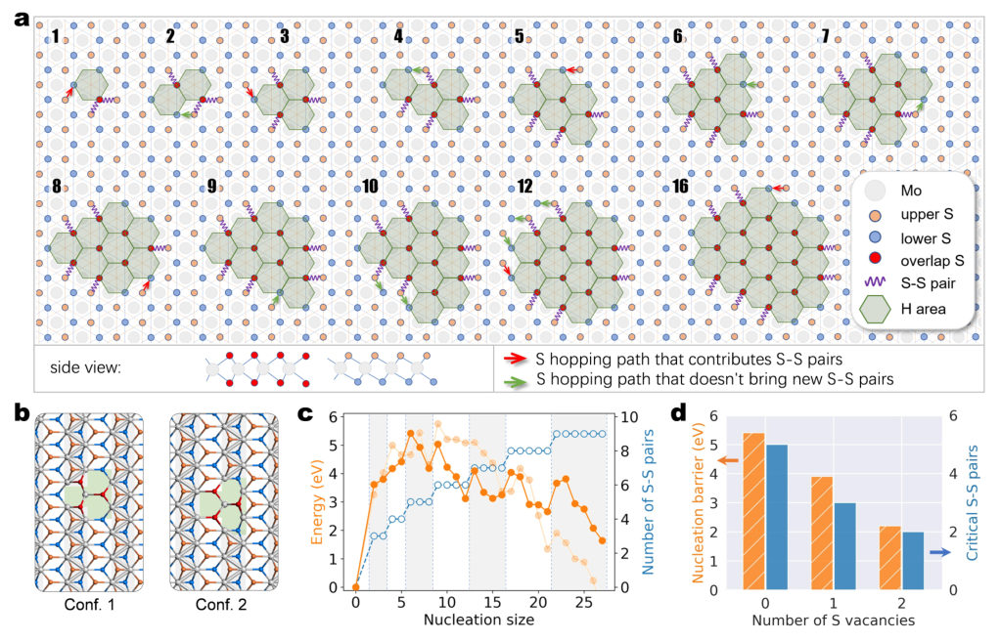
<figcaption class="paper-figure-caption"><b>Fig 3.</b> Fig. 3 | Nucleation of the H phase in T-phase MoS2. (a) Schematic illustration of homogeneous nucleation within the T matrix. Each nucleus is labeled by the number of H-like hexagonal rings it contains. Red (green) arrows indicate S atom hops that create (avoid) new S–S pairs; wavy lines denote repulsive S–S interactions. Upper and lower S atoms are shown in orange and blue in T-like areas, respectively; overlapping sites (in top view) are colored red in H-like areas. (b) Two distinct local configurations for size-3 nuclei in the T’ phase, arising from its reduced symmetry compared to the ideal T structure. This structural degeneracy persists across all nucleus sizes. (c) Energy profiles...</figcaption>
</figure>
<figure class="paper-figure-card">
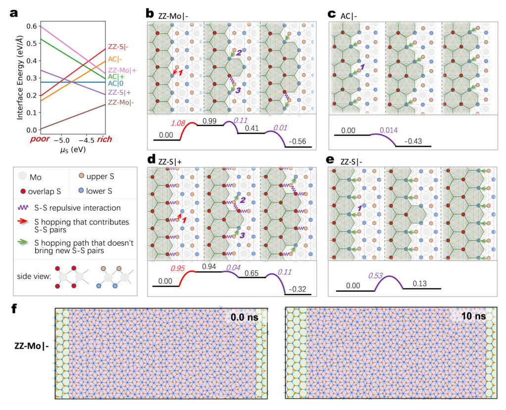
<figcaption class="paper-figure-caption"><b>Fig 4.</b> Fig. 4 | Analysis of H–T’ interface propagation. (a) Interface energy of various H–T’ boundaries as a function of sulfur chemical potential (𝜇S), showing the thermodynamic stability of different interfaces under S-poor (with Mo metal as energy reference) and S-rich (with S8 molecule as energy reference) conditions. (b–e) Atomic-scale mechanisms of interface motion for (b) ZZ-Mo|-, (c) AC|-, (d) ZZ-S|+, and (e) ZZ-S|-. The red (green) arrows denote S atom hops that create (avoid) new S–S pairs; wavy lines highlight repulsive S–S pairs. Upper and lower S atoms in T’ areas are shown in orange and blue, respectively; overlapping (in top view) S atoms in H areas are colored red. Energy barriers...</figcaption>
</figure>
<figure class="paper-figure-card">
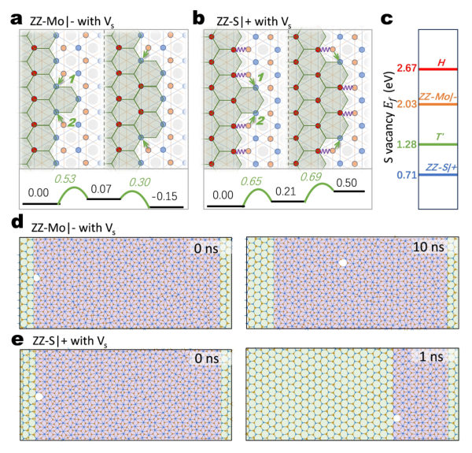
<figcaption class="paper-figure-caption"><b>Fig 5.</b> Fig. 5 | H–T’ interface propagation facilitated by sulfur vacancies (VS). (a) Propagation mechanism of the ZZ-Mo|- interface with one VS. Elementary steps are illustrated in the inset, with reaction energies and energy barriers shown below. (b) Propagation mechanism of the ZZ-S|+ interface with one VS. (c) Formation energy of VS at different positions in the MoS2 lattice. (d,e) Molecular dynamics simulations at 1200 K for ZZ-Mo|- and ZZ-S|+ interfaces with VS. The H and T’ phases are colored green and purple, respectively; sulfur vacancies are highlighted in white. While ZZ-Mo|- and ZZ-S|+ are the most stable interfaces with low intrinsic mobility, the presence of a VS significantly...</figcaption>
</figure>
<figure class="paper-figure-card">
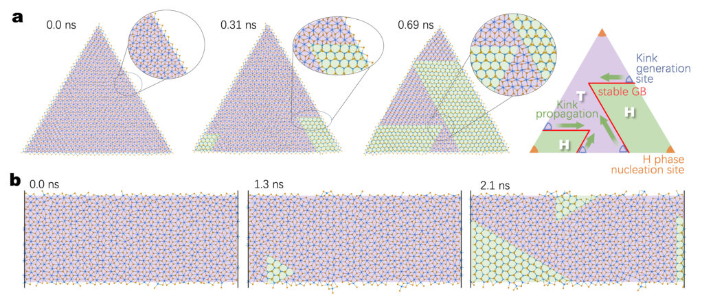
<figcaption class="paper-figure-caption"><b>Fig 6.</b> Fig. 6 | Snapshots of MoS2 phase transformation from T’ to H phase at 1200 K. (a) MD simulation of a triangular MoS2 island with zigzag edges. The rightmost inset illustrates the two key stages of interface evolution: kink generation at the stable grain boundary (GB) and subsequent kink migration into the T’ phase. (b) Simulation of a MoS2 ribbon with armchair edges. Time stamps above each snapshot indicate the simulation time; time zero corresponds to the completion of equilibration at 1200 K, marking the start of the production run. The T’ and H phases are colored purple and green, respectively.</figcaption>
</figure>

**Main problem.** Understanding the kinetic arrest of the metastable T' phase in monolayer MoS2 and determining why it persists despite a strong thermodynamic driving force toward the stable H phase.

**Main result.** The phase transformation is kinetically hindered by repulsive S-S interactions at grain boundaries that create high energy barriers for kink generation. The study also reveals that sulfur vacancies fail to accelerate transformation at the most stable interface because they are thermodynamically unstable there and migrate away.

**Method.** The researchers used machine learning-accelerated molecular dynamics (via DeepMD-kit) and first-principles DFT calculations to study nucleation and interface propagation.

**Summary.** This paper investigates why the metastable T' phase in MoS2 persists despite thermodynamic pressure to transform into the H phase. By using machine learning-accelerated molecular dynamics, the authors show that repulsive interactions between sulfur atoms at grain boundaries create significant energy barriers. They demonstrate that while defects can sometimes help, sulfur vacancies actually migrate away from the most stable interfaces, failing to catalyze the transition. This work provides a new paradigm for controlling phase transitions in 2D materials through interface-specific design.

Detailed structure

**Model / system.** The physical system is monolayer MoS2, specifically focusing on the phase transition between the metastable metallic T' phase and the stable semiconducting H phase, including various grain boundary configurations (ZZ and AC) and the role of sulfur vacancies.

**Key observables.** Nucleation barriers, S-S pair counts, interface propagation velocity, kink density, and vacancy formation energies.

**Important parameters / regimes.** The system operates in a low-density kink regime (Nk << L/a) where the rate-limiting step is kink generation rather than migration; S-S distance and COHP-derived antibonding character are critical.

**Assumptions / limitations.** The kinetic modeling of interface propagation assumes steady-state conditions and a low-density limit of kinks where kink-kink interactions are negligible.

**Figures summary.** Fig 1: DFT analysis of S-S repulsion and COHP curves; Fig 2: MLFF training details; Fig 3: Energy profiles of nucleation pathways and the effect of vacancies; Fig 4: Analysis of H-T' interface propagation and energy barriers for different grain boundaries.

**Paper structure.** The paper begins with a DFT-based investigation of atomic-scale S-S repulsion, moves to the development and validation of a machine learning force field, presents large-scale MD simulations of nucleation and growth, and concludes with a kinetic model of interface propagation and the role of defects.

Abstract

The metastable T' phase in monolayer MoS2 exhibits remarkable persistence despite a strong thermodynamic driving force toward the stable H phase. Using machine learning-accelerated molecular dynamics and first-principles calculations, we reveal that this kinetic arrest originates from repulsive S-S interactions, which impose high energy barriers during both nucleation and grain boundary propagation. While sulfur vacancies can alleviate these barriers in certain interfaces, they fail to accelerate transformation at the most stable interface, ZZ-Mo|-, due to their thermodynamic instability there. Instead, vacancies migrate into the T' phase, leaving the advancing front defect-free. Direct simulations of nanostructures confirm that H-phase nucleation initiates at corners or edges, and all observed growth fronts adopt the ZZ-Mo|- configuration, consistent with its low interfacial energy but slow kinetics. Our work establishes that phase transformation in 2D materials is governed not by global defect concentration, but by the local compatibility between defects and moving interfaces, offering a new paradigm for controlling structural transitions through interface-specific design.

[↑ back to top](#top)

### [Physical Basis for Band Transport and Dimensionality in Amorphous Oxide Semiconductor Field-Effect Transistors](http://arxiv.org/abs/2604.24641v1)

**Authors:** Ananth Dodabalapur, Chankeun Yoon, Xiao Wang  
**Type:** both · **Category:** disordered systems and neural networks · **PDF:** <https://arxiv.org/pdf/2604.24641v1>  
**Analysis basis:** full PDF text, analyzed in chunks

↔ Scroll figures horizontally

<figure class="paper-figure-card">
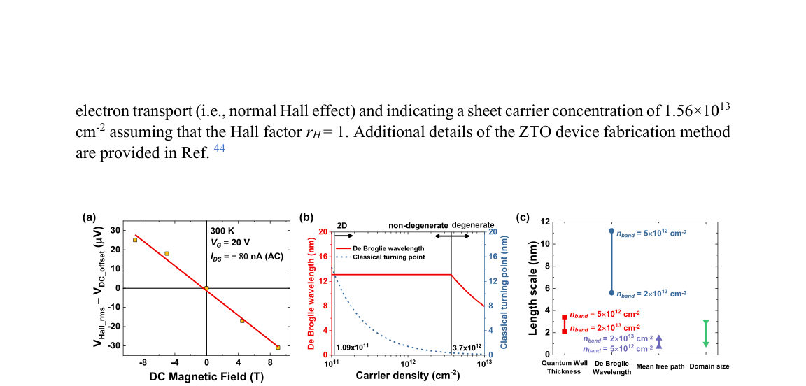
<figcaption class="paper-figure-caption"><b>Fig 1.</b> Figure 1. (a) Measured Hall voltage as a function of DC magnetic field for a ZTO TFT at room temperature. Carrier density is determined by 𝒏= 𝒓𝑯𝑰𝒅𝑩(𝒒𝒅𝑽) ⁄ . (b) De Broglie wavelength and Classical turning point distance as functions of total induced sheet carrier density, showing that for most carrier densities, the classical turning point is less than the de Broglie wavelength. (c) Illustration of the length scales of interest, including the ranges of effective quantum well thickness, De Broglie wavelength, and mean free path as a function of carrier density. The range of reported crystalline domain size of various oxide semiconductors is also shown for comparison. For calculations in (b)...</figcaption>
</figure>
<figure class="paper-figure-card">
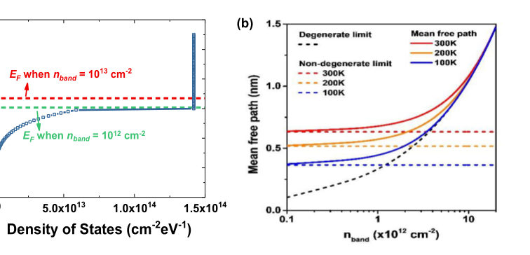
<figcaption class="paper-figure-caption"><b>Fig 2.</b> Figure 2. (a) Calculated density of states (DOS) as a function of energy. The band-state DOS is calculated as 1.42×1014 cm-2eV-1 for E &gt; 0 eV, while for E &lt; 0 eV, the trap DOS is 6.5×1013× 𝒆𝑬/𝟎.𝟎𝟗𝟗𝟏𝒆𝑽 cm-2eV-1 for E &lt; 0 eV. The dashed lines indicate Fermi levels, EF, corresponding to carrier densities of n2D = 1012 and 1013 cm-2. (b) Calculated mean free path as a function of carrier density in the band at different temperatures. The colored horizontal dashed lines are the mean free path values in the non-degenerate limit based on Eq. 9. The colored solid lines are for the mean free path in more general conditions based on Eq. 10 and 11. A value 𝝁𝟎= 𝟐𝟎 𝐜𝐦𝟐/𝐕𝐬 for the nominal band mobility...</figcaption>
</figure>
<figure class="paper-figure-card">
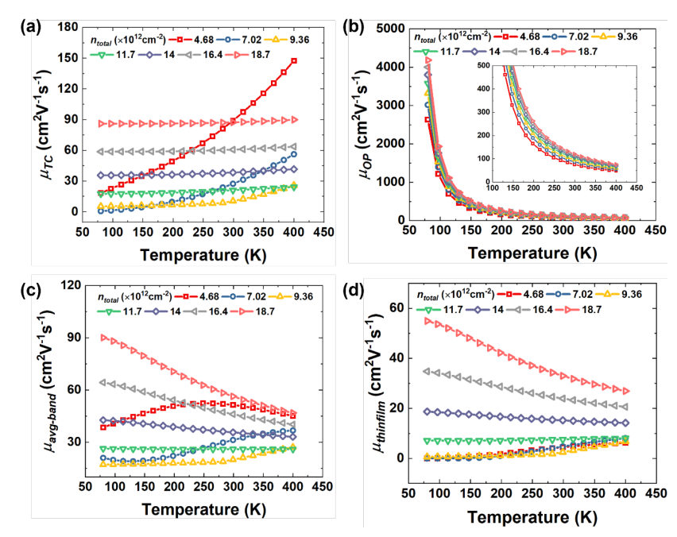
<figcaption class="paper-figure-caption"><b>Fig 3.</b> Fig. 3. Temperature dependence of (a) 𝝁𝑻𝑪, (b) 𝝁𝑶𝑷, (c) 𝝁𝒂𝒗𝒈−𝒃𝒂𝒏𝒅, and (d) 𝝁𝒕𝒉𝒊𝒏−𝒇𝒊𝒍𝒎 for different sheet carrier densities. Calculations were conducted with Cox = 0.75 μF/cm2, Vov = 1 V ~ 4 V, using NT = 6.5×1012/cm2, Tta = 1150 K, εs = 10, ε∞ = 4, and ħ =30 meV</figcaption>
</figure>
<figure class="paper-figure-card">
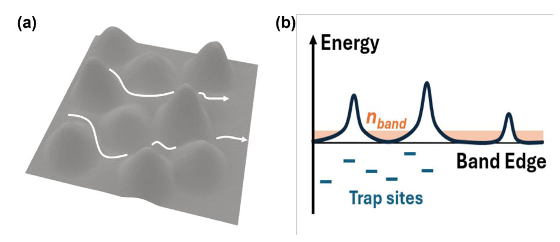
<figcaption class="paper-figure-caption"><b>Fig 4.</b> Fig. 4 Schematic illustration of percolation conduction in disordered amorphous semiconductors: (a) real-space percolation pathways and (b) the corresponding energy landscape.</figcaption>
</figure>
<figure class="paper-figure-card">
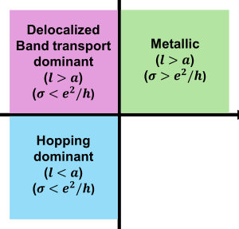
<figcaption class="paper-figure-caption"><b>Fig 5.</b> Fig. 6. (a) Calculated density of states (DOS) as a function of energy. The dashed lines indicate the band edge and the Fermi level at the metal-insulator transition criterion. The critical band carrier density is 1.2×1013/cm2, corresponding to EF = 84meV. (b) Schematic classification of transport regime in terms of conductivity and mean free path, showing hopping, delocalized band transport, and metallic regimes.</figcaption>
</figure>
<figure class="paper-figure-card">
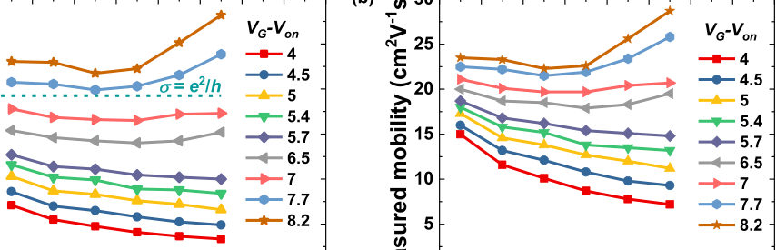
<figcaption class="paper-figure-caption"><b>Fig 6.</b> Fig. 7 (a) 2D conductivity of the ZTO TFT from Ref. 22. The minimum 2D metallic conductivity is illustrated by the purple dashed line. (b) Measured mobility of this ZTO TFT as a function of gate voltage. Von is the on-voltage of the transistor 76 (analogous to the threshold voltage). For reference, the sheet carrier density, which increases linearly with Vg – Von, is ~1.15×1013 cm-2 for (Vg – Von ) = 7.7 V.</figcaption>
</figure>

**Main problem.** The paper seeks to establish a consistent physical basis for charge transport and dimensionality in amorphous oxide semiconductor (AOS) FETs, addressing uncertainties regarding the role of crystalline order, high trap density, and the validity of band transport models in nominally amorphous materials.

**Main result.** The authors demonstrate that high-mobility AOS FETs are best described by a trap-influenced band transport model in a quasi-2D channel, supported by evidence of nanoscale crystalline domains and delocalized carrier transport.

**Method.** The study combines structural analysis (FEM, TEM, STEM) with electronic transport measurements (Hall effect, carrier velocity) and theoretical modeling (Schrödinger-Poisson analysis, MTR and percolation models).

**Summary.** This paper provides a conceptual framework to justify using band-transport models in amorphous oxide semiconductors. By analyzing structural and electronic data, the authors show that despite the amorphous nature, the presence of nanoscale crystalline domains and high carrier mobilities allow for a quasi-2D band transport description. The work reconciles the Multiple Trapping and Release (MTR) model with percolation effects caused by spatial disorder. This is crucial for the accurate design and scaling of advanced AOS-based transistors.

Detailed structure

**Model / system.** The system consists of Amorphous Oxide Semiconductor (AOS) FETs, such as IGZO and ZTO. The transport is modeled using an extended Multiple Trapping and Release (MTR) framework combined with percolation theory to account for spatial inhomogeneities.

**Key observables.** Carrier mobility, carrier density, Hall voltage, carrier velocity, mean free path, and subband energies.

**Important parameters / regimes.** Effective mass (m*), De Broglie wavelength, nanocrystalline domain size (1-5 nm), mean free path (> 1 nm), and the metal-insulator transition threshold (e^2/h).

**Assumptions / limitations.** Use of effective medium approximation, parabolic band assumption, and the assumption that the accumulation layer can be treated as a quasi-2D system.

**Figures summary.** Figure 1 shows crystalline domain sizes and the relationship between De Broglie wavelength and carrier density; Figure 2 displays the Density of States and Fermi level positions; Figure 3 plots the temperature dependence of various scattering mechanisms and mobility; Figure 4 illustrates the impact of spatial non-uniformity and velocity saturation.

**Paper structure.** The paper begins by defining the problem of transport interpretation in AOS, moves to structural evidence of nanocrystalline domains, presents electronic evidence for band transport and 2D confinement, develops a mathematical framework for MTR and percolation, and concludes by integrating these models to describe high-field transport.

Abstract

A consistent and widely accepted physical basis for interpretation of charge transport in amorphous oxide semiconductor (AOS) field-effect transistors (FETs), and more generally device physics, has been hampered by uncertainties in crystalline order, dimensionality, and the effects of a significant density of traps. The overarching theme of this paper is to build and justify a much-needed conceptual framework for describing advanced AOS transistors, particularly those with very small channel lengths. Combining new work and selecting prior research results on charge transport and device physics together with literature reports from various groups on morphology, physical properties, electronic structure and percolation effects, the main evidence that is available in support of a trap-influenced band transport picture in quasi-2-dimensional channels in high mobility AOS FETs is presented.

[↑ back to top](#top)

### [Pulsed Vertical Electric Dipole Over a Lossy Halfspace: On the Time-Domain Zenneck Wave](http://arxiv.org/abs/2604.23254v1)

**Authors:** Giampiero Lovat  
**Type:** theory · **Category:** other · **PDF:** <https://arxiv.org/pdf/2604.23254v1>  
**Analysis basis:** full PDF text, analyzed in chunks

↔ Scroll figures horizontally

<figure class="paper-figure-card">
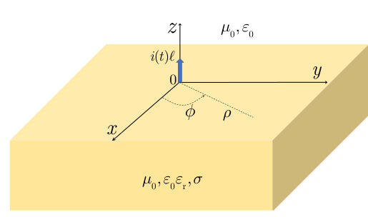
<figcaption class="paper-figure-caption"><b>Fig 1.</b> Fig. 1: VED at the interface between two half-spaces: geometrical configuration of the problem.</figcaption>
</figure>
<figure class="paper-figure-card">
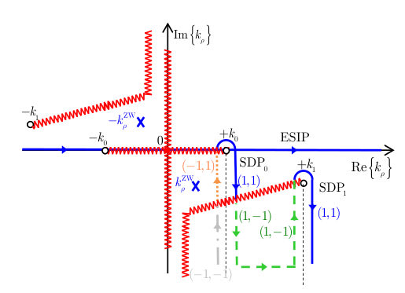
<figcaption class="paper-figure-caption"><b>Fig 2.</b> Fig. 2: Original and deformed integration paths in kρ plane. The Zenneck pole lies on the (1, 1) sheet.</figcaption>
</figure>
<figure class="paper-figure-card">
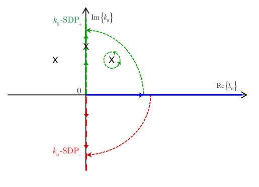
<figcaption class="paper-figure-caption"><b>Fig 3.</b> Fig. 3: Original integration path (blue solid line) and k0- SDPs for k0 integration. Dashed red line: k0-SDP for SDP0 and SDP1 (when τ &lt; ρ), k0-SDP for SDP1 (when τ &lt; ρ√εr ). Dashed green line: k0-SDP for SDP0 (when τ &gt; ρ) and SDP1 (when τ &gt; ρ√εr ).</figcaption>
</figure>
<figure class="paper-figure-card">
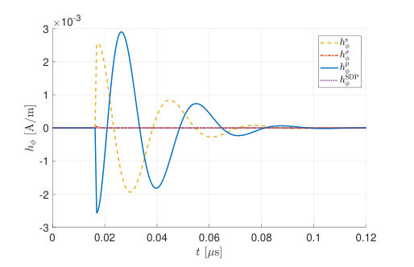
<figcaption class="paper-figure-caption"><b>Fig 4.</b> Fig. 5: DDT contributions of hϕ(ρ, t) for the case ρ = 5 m.</figcaption>
</figure>
<figure class="paper-figure-card">
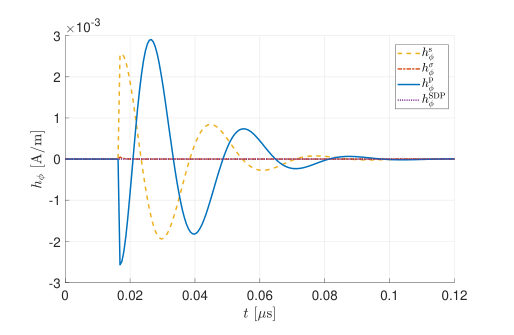
<figcaption class="paper-figure-caption"><b>Fig 5.</b> Fig. 6 we report the dispersion curves k(1,m) 0 (q) obtained from D0(k0, q) = 0. Although three distinct trajectories exist for each q, the modal-pole response is accurately represented by a single dominant modal pole, which we denote as kZW 0 ≡k(1,1) 0 (q). This pole is generated by the second (frequency-plane) deformation and, as clarified next, provides a compact and physically interpretable TD footprint of the ZW: as it can be seen, kZW 0 (q) is complex for small q and becomes purely imaginary for larger q. In practice, a very accurate approximation of the field is obtained as</figcaption>
</figure>
<figure class="paper-figure-card">
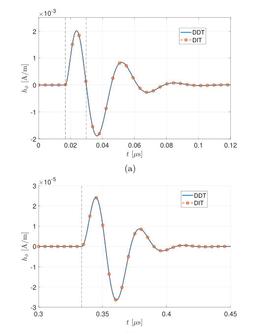
<figcaption class="paper-figure-caption"><b>Fig 6.</b> Fig. 4: TD field hϕ calculated through the proposed DDT and through a double inverse transform (DIT) for two representative distances: ρ = 5 m (a) and ρ = 100 m (b).</figcaption>
</figure>
<figure class="paper-figure-card">
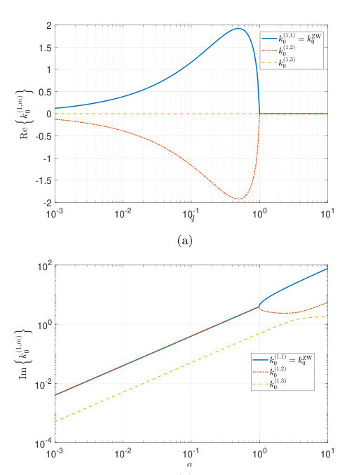
<figcaption class="paper-figure-caption"><b>Fig 7.</b> Fig. 6: Modal-pole dispersion curves: the three roots k(1,m) 0 (q) as functions of the real parameter q ≥0. Parameters: εr = 3.2 and σ = 0.02 S/m. Real part (a) and imaginary part (b).</figcaption>
</figure>
<figure class="paper-figure-card">
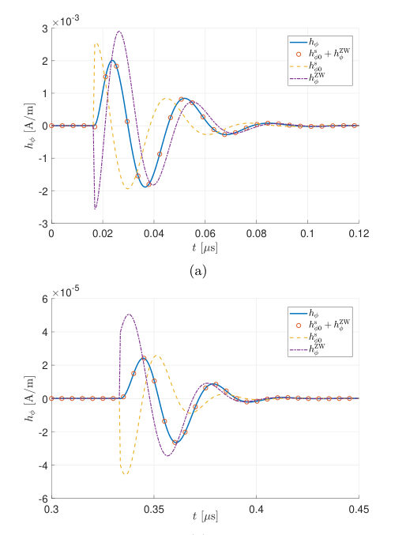
<figcaption class="paper-figure-caption"><b>Fig 8.</b> Fig. 7: TD field hϕ(ρ, t) for ρ = 5 m (a) and ρ = 100 m (b): total field hϕ calculated through the proposed DDT, its approximation hs ϕ0 + hZW ϕ , and the single components hs ϕ0 and hZW ϕ .</figcaption>
</figure>
<figure class="paper-figure-card">
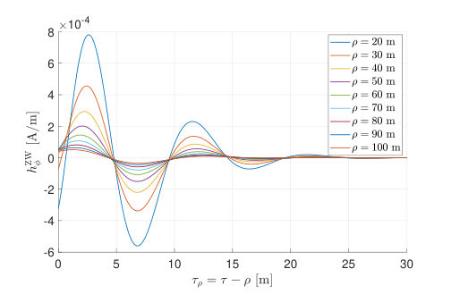
<figcaption class="paper-figure-caption"><b>Fig 9.</b> Fig. 8: Modal contribution hZW ϕ as a function of the reduced time τρ for different values of ρ.</figcaption>
</figure>
<figure class="paper-figure-card">
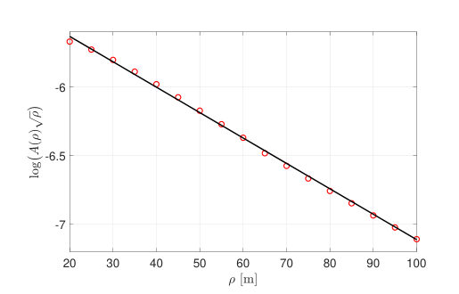
<figcaption class="paper-figure-caption"><b>Fig 10.</b> Fig. 9: Spatial attenuation of the modal contribution hZW ϕ .</figcaption>
</figure>

**Main problem.** The paper investigates the transient electromagnetic field signatures of the Zenneck wave excited by a pulsed vertical electric dipole over a lossy half-space, addressing whether the Zenneck wave is a physical phenomenon or a mathematical artifact.

**Main result.** The study identifies a specific modal contribution that acts as a time-domain footprint of the Zenneck wave, exhibiting waveform invariance in reduced time and spatial attenuation consistent with a surface wave.

**Method.** The author employs the Double-Deformation Technique (DDT), involving successive contour deformations in both the transverse-wavenumber and frequency planes, to decompose the field into source-pole, loss-pole, modal-pole, and residual contributions.

**Summary.** This paper provides a rigorous mathematical framework to identify the Zenneck wave in the time domain. By using a double-deformation technique, the author decomposes the electromagnetic field into distinct physical components, proving that a specific modal contribution represents the Zenneck wave. The study shows that this wave can dominate the field during a finite late-time interval and exhibits characteristic spatial attenuation. This work helps resolve long-standing debates regarding the physical reality of the Zenneck wave in pulsed excitation scenarios.

Detailed structure

**Model / system.** A vertical electric dipole (VED) is located at the interface between free space and a lossy, homogeneous, isotropic half-space characterized by complex permittivity.

**Key observables.** The transient azimuthal magnetic field (h_phi) and the radiated TM-polarized field.

**Important parameters / regimes.** Relative permittivity (epsilon_r), conductivity (sigma), central frequency (f0), spectral damping (alpha_0), and observation distance (rho).

**Assumptions / limitations.** The source is a causal, damped-sinusoidal pulsed current; the media are homogeneous and isotropic; the analysis assumes the validity of the Sommerfeld representation.

**Figures summary.** Figures illustrate the physical geometry, the complex integration paths for wavenumber and frequency deformations, the decomposition of field contributions, dispersion curves, and the validation of the DDT method against standard inverse transforms.

**Paper structure.** The paper begins with the physical model and geometry, moves to the mathematical derivation using the double-deformation technique, presents the field decomposition and validation, analyzes temporal and spatial regimes (including waveform invariance and attenuation), and concludes with asymptotic analysis of the late-time tail.

Abstract

We investigate the transient electromagnetic field radiated by a pulsed vertical electric dipole above a lossy half-space and identify its time-domain signatures associated with the Zenneck wave. Starting from the classical Sommerfeld representation, we derive a causal time-domain formulation based on the double-deformation technique, with successive contour deformations in the transverse-wavenumber and frequency planes. This yields an explicit decomposition of the field into source-pole, loss-pole, modal-pole, and residual steepest-descent contributions. The resulting expressions exactly satisfy causality and are validated against a reference solution obtained through a standard double inverse transform. The analysis shows that one modal contribution, generated by the frequency-plane deformation and related to the frequency-domain Zenneck pole, exhibits reduced-time invariance and a spatial attenuation consistent with a surface-wave component. Under suitable source and observation conditions, this term can dominate the field over a broad and physically relevant finite late-time interval. At the same time, for the considered damped-sinusoidal excitation, the strict asymptotic tail at fixed distance remains algebraic of order $t^{-5/2}$, with contributions from both the residual continuous spectrum and the modal-pole family. These results provide a rigorous and physically interpretable time-domain manifestation of the frequency-domain Zenneck wave in the pulsed half-space problem.

[↑ back to top](#top)

### [Quenched Dipole Pairs in Viscous Fluid Membranes across the Saffman Crossover: Integrable Hamiltonian Dynamics](http://arxiv.org/abs/2604.23868v1)

**Authors:** Satyagni Bhattacharya, Debdatta Dey, Samyak Jain, Yassir Khan, Tirthankar Mazumder, Aryaman Mihir Seth, Nikhil Mogalapalli, Divyansh Tiwari, Pravallika Vemparala, Rickmoy Samanta  
**Type:** theory · **Category:** other · **PDF:** <https://arxiv.org/pdf/2604.23868v1>  
**Analysis basis:** full PDF text, analyzed in chunks

↔ Scroll figures horizontally

<figure class="paper-figure-card">
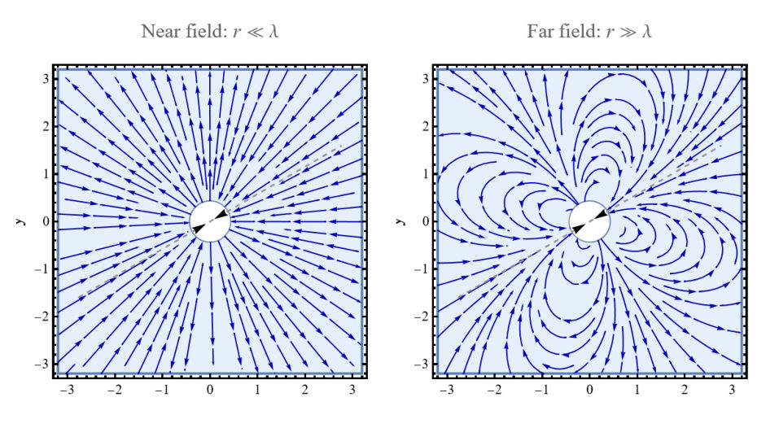
<figcaption class="paper-figure-caption"><b>Fig 1.</b> FIG. 1. Near- and far-field velocity fields generated by a single force dipole (puller) in a viscous</figcaption>
</figure>
<figure class="paper-figure-card">
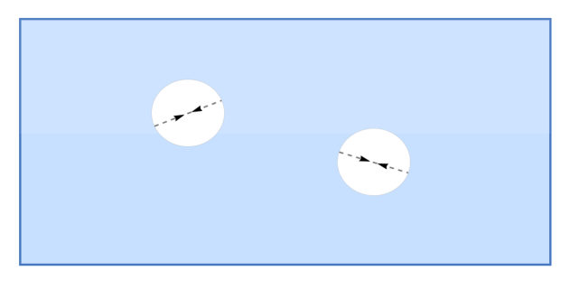
<figcaption class="paper-figure-caption"><b>Fig 2.</b> FIG. 2. Schematic of two identical force dipoles (pullers) embedded in a viscous fluid membrane.</figcaption>
</figure>
<figure class="paper-figure-card">
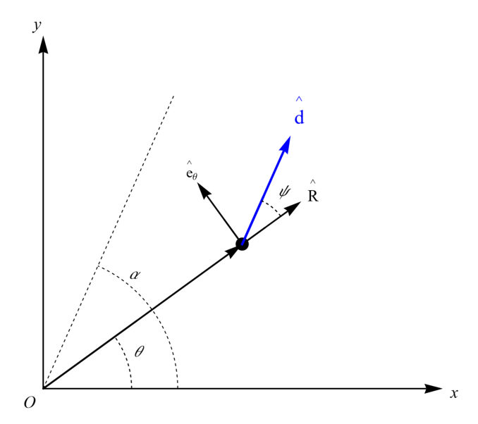
<figcaption class="paper-figure-caption"><b>Fig 3.</b> FIG. 3. Geometry of two aligned quenched dipoles in the plane. The relative position vector</figcaption>
</figure>
<figure class="paper-figure-card">
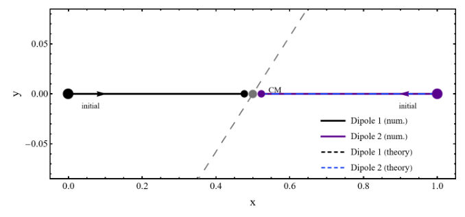
<figcaption class="paper-figure-caption"><b>Fig 4.</b> FIG. 4. Near-zone trajectories of two aligned quenched dipoles (pullers) with initial positions</figcaption>
</figure>
<figure class="paper-figure-card">

<figcaption class="paper-figure-caption"><b>Fig 5.</b> Figure 4 confirms this prediction through agreement between the analytic solution and direct</figcaption>
</figure>
<figure class="paper-figure-card">
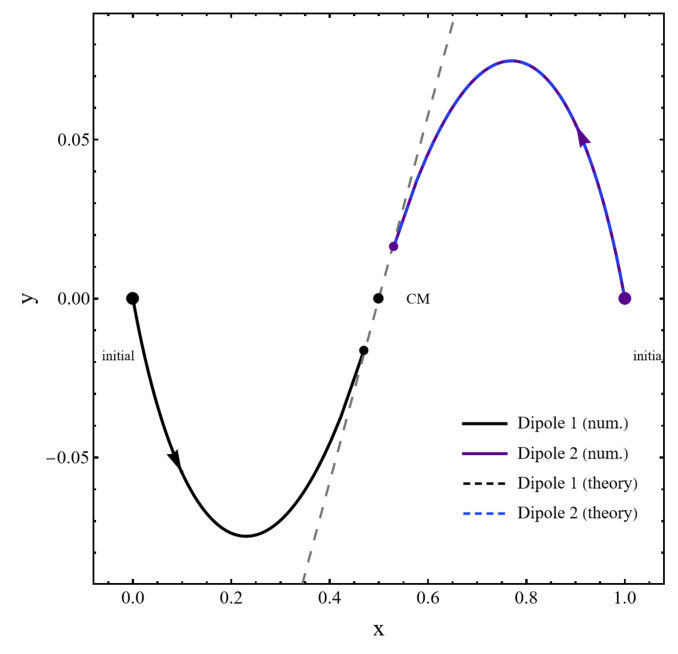
<figcaption class="paper-figure-caption"><b>Fig 6.</b> FIG. 5. Far-zone trajectories of two aligned quenched dipoles (pullers) with initial conditions</figcaption>
</figure>
<figure class="paper-figure-card">
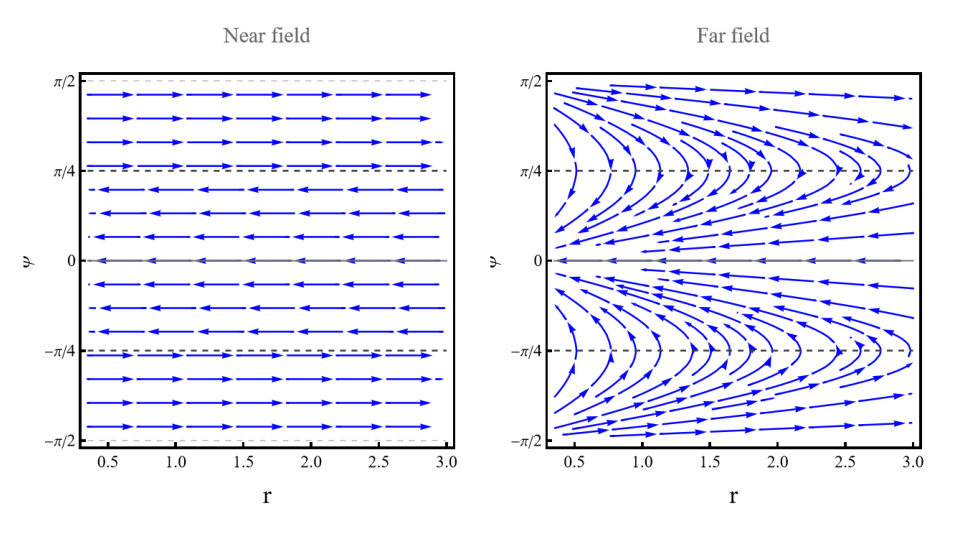
<figcaption class="paper-figure-caption"><b>Fig 7.</b> FIG. 6. Phase portraits of the quenched two-dipole dynamics in the (r, ψ) plane for pullers (σ &gt; 0).</figcaption>
</figure>

**Main problem.** The paper investigates how the Saffman crossover (the transition from near-field to far-field hydrodynamic flow) reorganizes the interaction and phase-space structure of quenched force-dipole pairs in viscous membranes.

**Main result.** The Saffman crossover induces a transition from effectively 1D dynamics (where angular mismatch is conserved) to 2D dynamics (with coupled radial and angular evolution), leading to a universal cubic collapse law for pullers in the far-field.

**Method.** The authors use an analytical approach involving 2D Fourier transforms, derivation of the membrane Green's function, and asymptotic analysis of the resulting hydrodynamic equations within a Hamiltonian framework.

**Summary.** This paper explores how hydrodynamic screening in fluid membranes changes the way active particles interact. It shows that the Saffman crossover fundamentally changes the nature of the interaction from a simple 1D-like radial motion to a complex 2D coupled motion. For 'puller' type particles, this leads to a predictable, universal way that particles aggregate over time. This work provides a minimal mathematical framework for understanding how momentum leakage into a surrounding fluid can reorganize the dynamics of embedded inclusions.

Detailed structure

**Model / system.** A 2D incompressible, viscous membrane coupled to an infinite 3D surrounding fluid, containing two identical, orientation-fixed (quenched) force-dipoles (either pullers or pushers).

**Key observables.** Velocity fields, vorticity fields, relative separation (R), angular evolution (psi), and the scaling of the collapse time (tc).

**Important parameters / regimes.** Saffman length (lambda), dipole strength (sigma), membrane viscosity (eta_s), and the distinction between pullers (sigma > 0) and pushers (sigma < 0).

**Assumptions / limitations.** Flat membrane geometry, infinite subphase, low Reynolds number (Stokes flow), incompressible 2D flow, and fixed dipole orientations.

**Figures summary.** Figure 1 visualizes the velocity fields of a single puller dipole, comparing the purely radial near-field flow to the rotational far-field flow. Figure 2 provides a schematic of the two-dipole system and their relative coordinates.

**Paper structure.** The paper introduces the physical problem of dipolar interactions, derives the hydrodynamic Green's function for the membrane, analyzes the near-field and far-field asymptotic regimes, constructs a Hamiltonian description of the two-body problem, and concludes with the derivation of universal scaling laws for particle aggregation.

Abstract

We investigate an analytic theory of force-dipole hydrodynamics in a viscous membrane coupled to an infinite surrounding fluid, focusing on quenched (orientation-fixed) dipoles. While the single-dipole flow exhibits the known Saffman crossover from a near-field \(v\sim r^{-1}\) to a screened far-field \(v\sim r^{-2}\), we show that this crossover induces a qualitatively new reorganization of dipole--dipole interactions. For two identical quenched dipoles, the near-field dynamics is exactly solvable and effectively one-dimensional, with a fixed line of centers and linear evolution of the squared separation. In the far field, the system remains integrable but becomes intrinsically two-dimensional, with coupled radial and angular dynamics and an exact first integral. For pullers, the angular dynamics drives alignment toward an attracting manifold, leading to universal late-time collapse \(R\sim (t_c-t)^{1/3}\), in contrast to the near-field scaling \(R\sim (t_c-t)^{1/2}\). The Saffman crossover thus reorganizes the Hamiltonian phase-space structure of dipolar interactions and produces a transition from effectively one-dimensional to fully coupled dynamics, providing a minimal framework for aggregation in viscous fluid membranes.

[↑ back to top](#top)

### [Record magnetoresistance, enhanced superconductivity, and fermiology in WTe2](http://arxiv.org/abs/2604.23378v1)

**Authors:** Gianluca Delgado, Elliott Runburg, Chaowei Hu, Yuzhou Zhao, Jonathan M. DeStefano, Keng Tou Chu, Florie Mesple, Ellis Thompson, Kenji Watanabe, Takashi Taniguchi, Jihui Yang, Matthew Yankowitz, Xiaodong Xu, Jiun-Haw Chu, David H. Cobden  
**Type:** experiment · **Category:** strongly correlated electrons · **PDF:** <https://arxiv.org/pdf/2604.23378v1>  
**Analysis basis:** full PDF text, analyzed in chunks

↔ Scroll figures horizontally

<figure class="paper-figure-card">
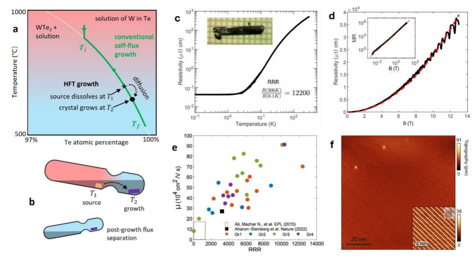
<figcaption class="paper-figure-caption"><b>Fig 1.</b> Figure 1. Horizontal flux transfer (HFT) growth and characterization of WTe2 crystals. a. Binary phase diagram of WTe2 contrasting growth techniques. In conventional self-flux growth, a starting solution of W in Te is steadily cooled from temperature 𝑇𝑖 to 𝑇𝑓 and the crystals form as the saturated solution tracks the solubility line (green). In HFT growth, the source dissolves at 𝑇1 (black star) and crystals grow at a constant temperature 𝑇2 and flux composition (black dot). b. (Top) sketch of how this is achieved, by applying a temperature gradient to a tilted sealed ampule with a neck which traps the source metal at higher temperature 𝑇1, where it gradually dissolves, while crystals grow...</figcaption>
</figure>
<figure class="paper-figure-card">
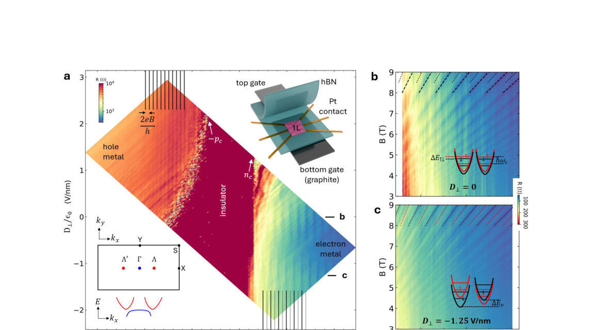
<figcaption class="paper-figure-caption"><b>Fig 2.</b> Figure 2. Quantum oscillations in monolayer WTe2 at high magnetic fields. a. 4-terminal longitudinal resistance 𝑅𝑥𝑥 vs gate-doping 𝑛𝑒 and perpendicular displacement field 𝐷⊥ at 𝐵= 9 T for device 1. The combs are drawn to show how the fundamental period of the SdH oscillations (spacing of the thicker lines) on the electron-doped side (right) is twice that on the hole-doped side (left). Upper inset: cartoon of monolayer device structure. Lower inset: Brillouin zone and sketch of bands along the zone axis at 𝐵= 0. b. 𝑅𝑥𝑥 vs 𝑛𝑒 and 𝐵 at 𝐷⊥= 0. A single Landau fan dominates, with minima indicated by the dashed lines, and evidence for spin degeneracy lifting is visible at higher fields (dotted...</figcaption>
</figure>
<figure class="paper-figure-card">
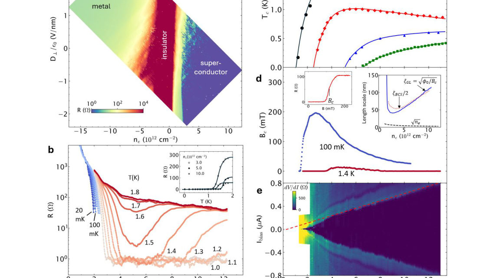
<figcaption class="paper-figure-caption"><b>Fig 3.</b> Figure 3. Enhanced gated superconductivity. a. 𝑅𝑥𝑥 vs gate doping 𝑛𝑒 and displacement field 𝐷⊥ at 𝐵= 0 and base temperature. b. 𝑅𝑥𝑥 vs 𝑛𝑒 at 𝐷⊥= 0 for the indicated temperatures. Inset: 𝑅𝑥𝑥 vs 𝑇 at the indicated dopings. Solid lines are guides for the eye. c. Critical temperature 𝑇𝑐 vs 𝑛𝑒 (black circles) for Device 1, and corresponding measurements from three monolayer WTe2 devices reported in the literature (red diamonds [Ref. 33], blue triangles [Ref. 14], green squares [Ref. 15]). All solid lines here are guides for the eye. d. Variation of critical field 𝐵𝑐 with 𝑛𝑒 at the indicated temperatures. Left inset: a trace of 𝑅𝑥𝑥 vs 𝐵 at 100 mK and 𝑛𝑒= 4.6 × 1012 cm-</figcaption>
</figure>
<figure class="paper-figure-card">
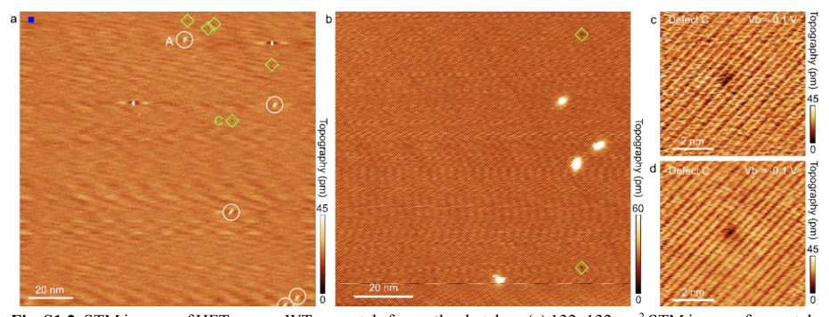
<figcaption class="paper-figure-caption"><b>Fig 4.</b> Fig. 1f S2.1a S2.1b S2.1c S2.1d S2.1e S2.1f Vb (V) 0.3 0.3 0.25 0.25 -0.15 0.25 -0.15 I (pA) 20 20 100 100 100 100 100</figcaption>
</figure>

**Main problem.** The electronic properties of WTe2 are highly sensitive to crystal disorder, which obscures intrinsic phenomena like quantum oscillations and superconductivity.

**Main result.** Using a new Horizontal Flux Transport growth technique, the authors achieved record-high crystal purity, leading to the largest reported magnetoresistance in a metal, enhanced superconductivity (Tc up to 1.8 K), and the first observation of quantum oscillations in WTe2 monolayers.

**Method.** The study employs Horizontal Flux Transport (HFT) for crystal growth, Scanning Tunnelability Microscopy (STM) for defect characterization, and low-temperature electrical transport measurements (including Shubnikov-de Haas oscillations) in dual-gate field-effect transistors.

**Summary.** This paper reports a breakthrough in the growth of WTe2 using a Horizontal Flux Transport technique, which significantly reduces crystal disorder. This improved quality allows for the observation of unprecedentedly large magnetoresistance and the first quantum oscillations in WTe2 monolayers. Furthermore, the researchers demonstrate an enhanced superconducting dome with a critical temperature reaching 1.8 K. These findings provide a new platform for studying topological electronics and gated superconducting devices.

Detailed structure

**Model / system.** The physical system consists of high-purity bulk and monolayer WTe2, a topological semimetal, studied in both bulk crystals and electrostatically doped monolayer field-effect transistors encapsulated by hBN.

**Key observables.** Residual Resistivity Ratio (RRR), magnetoresistance (MR), transport and quantum mobility, critical temperature (Tc), valley splitting, and Landau fan diagrams.

**Important parameters / regimes.** RRR up to 12,200; magnetoresistance of 7.8 x 10^5 at 13 T; Tc approaching 1.8 K; electron density (ne) and perpendicular displacement field (D_perp).

**Assumptions / limitations.** The analysis assumes the superconductivity follows BCS clean-limit theory and that the discrepancy between transport and quantum mobility is due to persistent long-range scattering mechanisms.

**Figures summary.** Figure 1 compares HFT vs conventional growth and shows STM images; Figure 2 displays resistance maps showing Landau fans and valley splitting; Figure 3 presents evidence of the superconducting dome and scaling of critical current.

**Paper structure.** The paper begins by introducing the HFT growth method and demonstrating improved crystal quality, followed by bulk transport properties (magnetoresistance), then moves to monolayer studies (quantum oscillations and valley splitting), and concludes with the characterization of the enhanced superconducting state and defect analysis.

Abstract

The diverse electronic properties of transition metal chalcogenides can be very sensitive to crystal imperfections. A new crystal growth technique, known as horizontal flux transport, offers a route to improved crystal quality. By refining this technique and applying it to the topological semimetal WTe2, we achieved crystals with an order of magnitude less disorder as determined by electrical transport and scanning tunneling microscopy measurements. At low temperatures these crystals exhibit the largest magnetoresistance reported in a metal. Exfoliated monolayers show quantum oscillations for the first time in the electrostatically doped metallic states, enabling determination of band degeneracies and the valley splitting induced by an electric field. Moreover, they exhibit a gated superconducting dome with a greatly enhanced critical temperature approaching 1.8 K. This advance opens up new avenues for employing WTe2 in topological electronics and gated superconducting devices, and promises comparable breakthroughs with other chalcogenides.

[↑ back to top](#top)

### [Remotely programming the weights of a spintronic neural network by a radiofrequency broadcast signal](http://arxiv.org/abs/2604.24561v1)

**Authors:** M. Menshawy, D. Sanz-Hernández, L. Mazza, V. Puliafito, G. Finocchio, A. Jenkins, R. Ferreira, L. Benetti, J. Grollier, F. A. Mizrahi  
**Type:** experiment · **Category:** disordered systems and neural networks · **PDF:** <https://arxiv.org/pdf/2604.24561v1>  
**Analysis basis:** full PDF text, analyzed in chunks

↔ Scroll figures horizontally

<figure class="paper-figure-card">
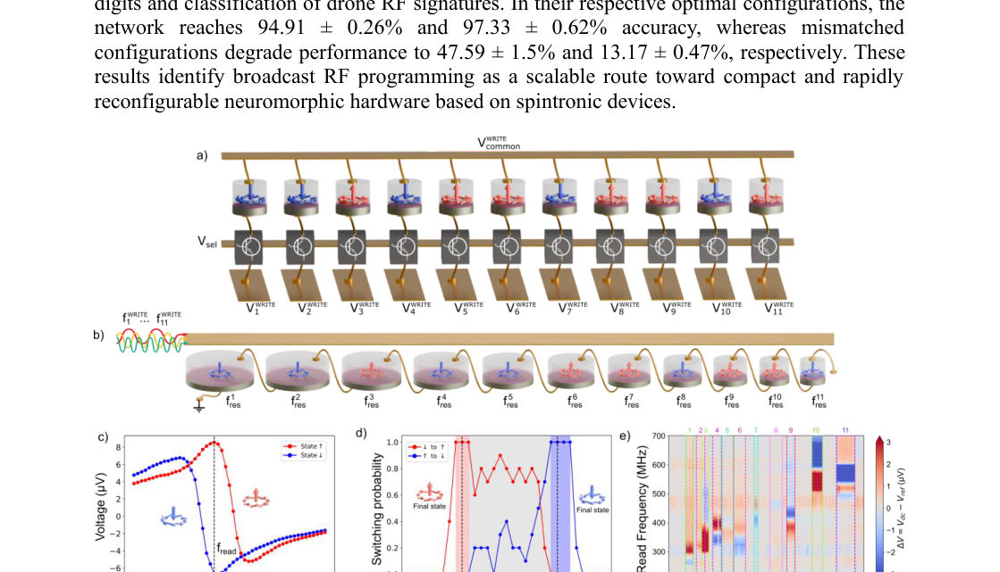
<figcaption class="paper-figure-caption"><b>Fig 1.</b> Figure 1. (a) Schematic of a perceptron and equivalent circuit of a row of selector-controlled memory devices. (b) Schematic of a chain of spintronic synapses programmed by a broadcast RF signal. (c) Reading the synaptic state of a single MTJ: dc voltage Vdc across an MTJ versus RF input frequency, at a power of -20 dBm and at zero field. (d) Programming the synapse: switching probability versus RF input frequency, at a power of 0 dBm. The red and blue curves respectively represent switching from down to up and up to down. The red, grey and blue shaded zones respectively represent a final state that is up, random or down. Probabilities are evaluated over 10 independent trials. (f) Response...</figcaption>
</figure>
<figure class="paper-figure-card">
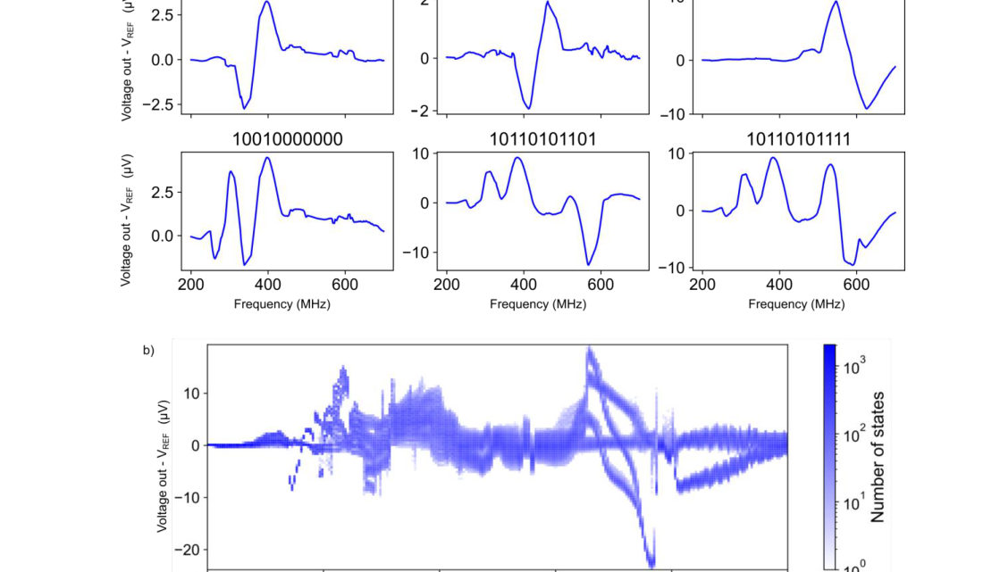
<figcaption class="paper-figure-caption"><b>Fig 2.</b> Figure 2. (a-f) Response of the chain versus input frequency. The response is the voltage difference between the measured configuration and the reference (fully down) state. Each panel corresponds to a different configuration. “1” and “0” respectively refer to up and down states. (g) Density map of the chain response over all 2048 configurations. For each input frequency, the color scale indicates how many configurations produce a given output voltage. By applying sequences of RF write pulses selected from the programming bands identified in Figure 1f, we can set each 11-junction chain into any of its 211 = 2048 binary configurations (Methods). Starting from a fully down or fully up...</figcaption>
</figure>
<figure class="paper-figure-card">
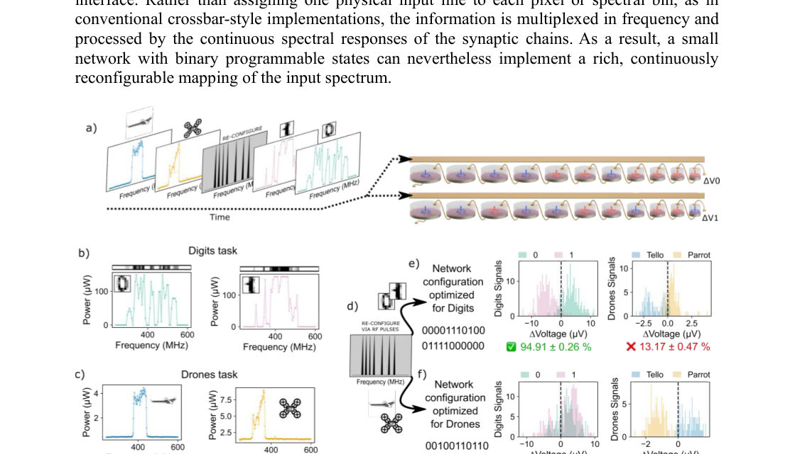
<figcaption class="paper-figure-caption"><b>Fig 3.</b> Figure 3. (a) Schematic of an image sent to the network as an RF signal. (b) Examples of spectra for images of the digits dataset. (c) Examples of spectra of the drones signatures. (d-g) Histograms of the voltage difference between the response of chains 0 and 1, for the different datasets and network configurations. The dashed vertical line corresponds to a difference of 0, which separates the histograms when classification is perfect. Here the network comprises only 22 binary synapses. Thus, we can evaluate, for all possible network configurations, the classification accuracy over the whole dataset, defined as the proportion of correctly classified examples. This allows us to identify,...</figcaption>
</figure>

**Main problem.** The challenge of selectively programming a large number of non-volatile synaptic weights in dense in-memory computing architectures without the scalability bottlenecks of individual electrical access lines or complex selector devices.

**Main result.** Demonstrated a scalable method for remote, frequency-selective programming of 22 spintronic synapses using a single broadcast RF signal, enabling the same hardware to be reconfigured for distinct tasks like digit classification and drone signature identification.

**Method.** The researchers used high-power RF pulses to induce frequency-selective vortex-core polarity reversal in MTJs and low-power RF signals for readout via the spin-diode effect, utilizing frequency multiplexing to address individual junctions.

**Summary.** This paper presents a way to program a spintronic neural network remotely using radiofrequency signals. By using different frequencies to target specific magnetic tunnel junctions, the researchers can change the weights of the network without needing individual wires for every synapse. This allows a single piece of hardware to be reconfigured 'on the fly' to perform different tasks, such as recognizing handwritten digits or identifying drone RF signatures. This approach offers a highly scalable and compact route for building next-generation edge intelligence hardware.

Detailed structure

**Model / system.** A spintronic neural network consisting of two series-connected chains of 11 vortex-based magnetic tunnel junctions (MTJs) with varying diameters, all coupled to a shared metallic strip line for RF delivery.

**Key observables.** DC voltage (Vdc) across the MTJ chains, switching probability, spectral transfer function, and classification accuracy.

**Important parameters / regimes.** RF power (ranging from -20 to 13 dBm), frequency range (240-600 MHz), magnetic field strength (-300 to -20 mT), and MTJ diameters (300-800 nm).

**Assumptions / limitations.** The model assumes the microwave field from the strip line is proportional to the RF current amplitude and neglects certain logarithmic terms in the switching field calculation.

**Figures summary.** Figures show the experimental setup, the frequency-dependent voltage response and spectral reshaping of the MTJ chains, the mapping of pixel intensities to RF waveforms, and the performance of the network on digit and drone identification tasks.

**Paper structure.** The paper introduces the scalability problem in neuromorphic computing, describes the experimental MTJ-based platform and RF programming mechanism, presents the results of frequency-selective weight programming, demonstrates task-specific reconfigability, and provides an analytical scaling law for switching energy.

Abstract

Selectively programming large number of non-volatile synaptic weights without compromising scalability is a key challenge for in-memory computing. Here, we demonstrate remote programming of synaptic weights in series-connected chains of 11 vortex-based magnetic tunnel junctions using broadcast radiofrequency signals applied through a shared strip line. The programming relies on frequency-selective reversal of the vortex-core polarity and therefore does not require individual access lines or selector devices. By reconfiguring the binary states of these chains, we reshape the weighted sums they perform on frequency-multiplexed RF inputs. Using a 22-synapse network composed of two such chains, we remotely reconfigure the same hardware to perform two distinct tasks: handwritten-digit classification and drone RF-signature identification. The digit-optimized configuration reaches 94.91 +/- 0.26% accuracy on handwritten digits but only 13.17 +/- 0.47% on drone RF signatures, whereas the drone-optimized configuration reaches 97.33 +/- 0.62% on drones but only 47.59 +/- 1.5% on digits. Broadcast RF programming thus provides a compact and scalable route to rapidly reconfigurable spintronic neuromorphic hardware.

[↑ back to top](#top)

### [RKKY interaction in altermagnets with adiabatic electron-phonon coupling](http://arxiv.org/abs/2604.23082v1)

**Authors:** Bui D. Hoi  
**Type:** theory · **Category:** strongly correlated electrons · **PDF:** <https://arxiv.org/pdf/2604.23082v1>  
**Analysis basis:** full PDF text, analyzed in chunks

↔ Scroll figures horizontally

<figure class="paper-figure-card">
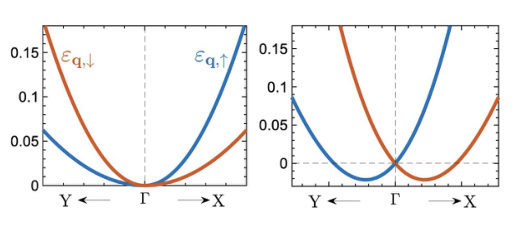
<figcaption class="paper-figure-caption"><b>Fig 1.</b> FIG. 1. Low-energy electronic dispersion, i.e., the band struc- ture, along the Y ←Γ →X high-symmetry path of the first Brillouin zone for a 2D Rashba dx2−y2-wave altermagnet de- scribed by Eq. (2), shown in the absence (left panel) and in the presence (right panel) of RSOC α = 0.5 eV·Å.</figcaption>
</figure>
<figure class="paper-figure-card">
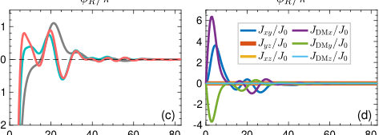
<figcaption class="paper-figure-caption"><b>Fig 2.</b> FIG. 2. (a,b) Angular dependence of the RKKY tensor com- ponents Jij for a pristine 2D Rashba dx2−y2-wave altermagnet without EPC as a function of the relative orientation angle ϕR between two magnetic impurities separated by R = 30 Å. (a) Heisenberg and Ising components Jxx, Jyy, and Jzz exhibit a periodic oscillatory behavior with ϕR reflecting the underly- ing spin-split Fermi surface anisotropy. (b) Anisotropic and DM components show finite angular modulations (still peri- odic) arising from the interplay between altermagnetic spin- splitting and spin-orbit coupling. (c,d) Distance dependence of the corresponding RKKY couplings for fixed ϕR = π/3. (c) The diagonal terms display...</figcaption>
</figure>
<figure class="paper-figure-card">
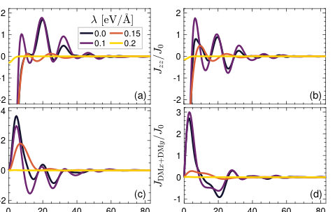
<figcaption class="paper-figure-caption"><b>Fig 3.</b> FIG. 3. Spatial dependence of RKKY exchange components for several values of EPC λ in a 2D Rashba dx2−y2-wave al- termagnet. Parameters: δ = 0.5, α = 0.2 eV·Å, εF = 0, ˜λ/λ = 1/4, and ϕR = π/3. (a) In-plane symmetric exchange Jxx+yy = Jxx + Jyy, (b) out-of-plane Ising component Jzz, (c) off-diagonal symmetric (compass) term Jxy, and (d) anti- symmetric (DM) combination JDM,x+DM,y = JDM,x + JDM,y. Increasing EPC (λ) reduces the long-range coherence and, be- yond a moderate coupling strength, suppresses all exchange contributions.</figcaption>
</figure>
<figure class="paper-figure-card">
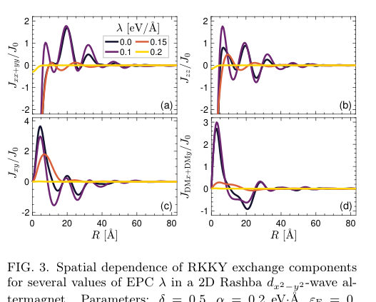
<figcaption class="paper-figure-caption"><b>Fig 4.</b> Figure 3 shows the spatial dependence of distinct com- ponents of the indirect exchange interaction between two localized magnetic moments, obtained from an RKKY calculation based on the Rashba-altermagnet model in- cluding EPC. Other model parameters are held fixed at δ = 0.5, α = 0.2 eV·Å, εF = 0, ˜λ/λ = 1/4, and direc- tion ϕR = π/3. To better distinguish the in-plane and out-of-plane contributions and to avoid redundant fea- tures in the plots, we next present the combined in-plane components Jxx+yy and JDMx+DMy. Figure 3(a) displays the combined in-plane sym- metric exchange, which largely captures the isotropic (Heisenberg-like) component of the RKKY tensor in the plane. For λ = 0 the...</figcaption>
</figure>
<figure class="paper-figure-card">
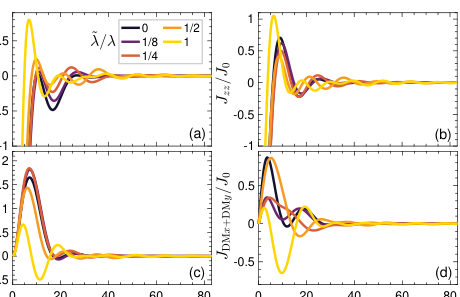
<figcaption class="paper-figure-caption"><b>Fig 5.</b> FIG. 4. Distance dependence of the phonon-renormalized RKKY interaction components in a 2D Rashba dx2−y2-wave altermagnet for different ˜λ, denoting the EPC to the spin-split bands. The parameters are δ = 0.5, α = 0.2 eV·Å, εF = 0, λ = 0.15 eV/Å, and ϕR = π/3. Increasing ˜λ both renormal- izes amplitudes and shifts the oscillation phases, producing component-specific enhancement, suppression, and even sign changes.</figcaption>
</figure>
<figure class="paper-figure-card">
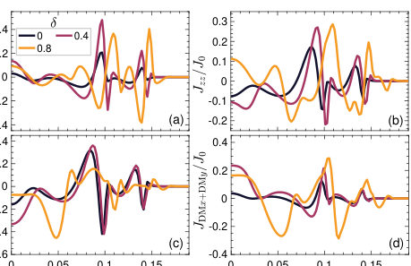
<figcaption class="paper-figure-caption"><b>Fig 6.</b> FIG. 5. Evolution of the different components of the RKKY exchange interaction as a function of the EPC strength λ for different values of the altermagnetic order parameter δ. In- creasing δ leads to a pronounced enhancement of both the am- plitude and complexity of the oscillations in exchange chan- nels, reflecting the strong modulation of phonon-mediated interactions by the altermagnetic order. Parameters: α = 0.2 eV·Å, εF = 0, ˜λ/λ = 1/4, ϕR = π/3, and R = 30 Å.</figcaption>
</figure>
<figure class="paper-figure-card">
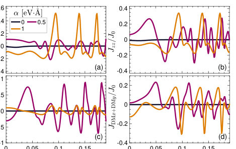
<figcaption class="paper-figure-caption"><b>Fig 7.</b> FIG. 6. Dependence of the RKKY interaction components on the EPC strength λ for different RSOC strengths α. Here, δ = 0.5, εF = 0, ˜λ/λ = 1/4, ϕR = π/3, and R = 30 Å. For vanishing RSOC (α = 0), the RKKY interactions are pre- dominantly isotropic, with the in-plane Heisenberg and out- of-plane Ising terms showing small amplitude oscillations as a function of λ. Increasing α enhances anisotropic effects, leading to larger amplitudes and pronounced oscillations in all components, especially in the off-diagonal Jxy and DM terms, indicating that RSOC significantly modulates the spin texture of the indirect exchange.</figcaption>
</figure>
<figure class="paper-figure-card">
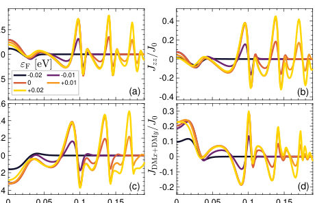
<figcaption class="paper-figure-caption"><b>Fig 8.</b> FIG. 7. Dependence of the normalized RKKY interaction components on the EPC strength λ for several values of the chemical potential (Fermi energy) εF. Parameters are δ = 0.5, α = 0.2 eV·Å, ˜λ/λ = 1/4, ϕR = π/3, and R = 30 Å. Increas- ing εF modifies the oscillation amplitude and period of all RKKY components by altering the Fermi wave vector of the spin-split Rashba bands. Positive (negative) εF shifts, cor- responding to electron (hole) doping, induce phase displace- ments of opposite sign, reflecting the asymmetric contribution of the upper and lower Rashba branches to the exchange.</figcaption>
</figure>

**Main problem.** Investigating how adiabatic electron-phonon coupling (EPC) and Rashba spin-orbit coupling (RSOC) modulate the noncollinear RKKY exchange interaction in 2D altermagnets.

**Main result.** Static lattice distortions act as a tuning knob to control the magnitude, anisotropy, and chirality of RKKY couplings, enabling the engineering of ferromagnetic/antiferromagnetic alignments and DM chiralities.

**Method.** Second-order perturbation theory and numerical momentum-space integration using a Green's function-based approach within a continuum model.

**Summary.** This paper explores how lattice vibrations (phonons) can be used to control magnetic interactions in altermagnets. By considering the coupling between electrons and slow phonons, the authors show that one can tune the strength and direction of the RKKY interaction. This includes the ability to switch between ferromagnetic and antiferromagnetic alignments and control the chirality of spin textures. These findings suggest a practical way to engineer complex magnetic states in altermagnet-based spintronic devices.

Detailed structure

**Model / system.** A 2D Rashba d-wave altermagnet model incorporating spin-dependent static-Holstein-type electron-phonon coupling and Rashba spin-orbit coupling.

**Key observables.** Noncollinear RKKY exchange tensor components, including Heisenberg, Ising-like, Dzyaloshinskii-Moriya (DM), and compass-type interactions.

**Important parameters / regimes.** Rashba spin-orbit coupling strength (alpha), altermagnetic anisotropy (delta), electron-phonon coupling strength (lambda), and Fermi energy (epsilon_F).

**Assumptions / limitations.** The study assumes the adiabatic (slow phonon) limit, zero temperature, and d-wave symmetry.

**Figures summary.** Figure 1 shows electronic dispersion with and without RSOC; Figure 3 shows spatial dependence of RKKY components with varying EPC; Figure 6 shows RKKY components as a function of EPC and RSOC; Figure 7 shows dependence on Fermi energy.

**Paper structure.** The paper introduces altermagnetic properties, defines a continuum Hamiltonian with RSOC and EPC, derives the RKKY exchange tensor via perturbation theory, and performs systematic parameter scans (RSOC, EPC, and doping) to demonstrate tunability.

Abstract

Altermagnets, characterized by time-reversal symmetry breaking without net magnetization and momentum-dependent spin-split bands, offer a promising platform for spintronics due to their anisotropic spin textures and potential for tunable magnetic interactions. Here, we theoretically investigate the slow phonon-renormalized Ruderman-Kittel-Kasuya-Yosida (RKKY) interaction in two-dimensional Rashba $d$-wave altermagnets, incorporating arbitrary Rashba spin-orbit coupling (RSOC) strength and spin-dependent static-Holstein electron-phonon coupling (EPC). Using a continuum model Hamiltonian that captures altermagnetic anisotropy, RSOC, and adiabatic lattice distortions, we compute the noncollinear RKKY exchange tensor via second-order perturbation theory and numerical momentum-space integration. Our results reveal that static lattice distortions provide a versatile tuning knob for engineering the magnitude, anisotropy, and chirality of RKKY couplings: moderate EPC suppresses long-range coherence while inducing component-specific phase shifts and sign reversals, particularly in Dzyaloshinskii-Moriya and compass-like terms, enabling control over ferromagnetic/antiferromagnetic alignments and clockwise/counterclockwise chiralities. Systematic parameter scans demonstrate enhanced oscillatory complexity with altermagnetic order, RSOC, and doping. These findings establish slow phonons as a low-energy tuning knob that systematically controls the magnitude, anisotropy, phase, and chirality of noncollinear RKKY couplings - even at arbitrary Rashba strength - thereby providing a practical route to engineer ferromagnetic/antiferromagnetic alignments and clockwise/counterclockwise DM chiralities in altermagnet-based heterostructures.

[↑ back to top](#top)

### [Room-temperature shape-memory effect in Sr(Ni$_{1-x}$Cu$_x$)$_2$P$_2$](http://arxiv.org/abs/2604.24019v1)

**Authors:** Juan Schmidt, Alexander J. Horvarth, Seok-Woo Lee, Sergey L. Bud'ko, Paul C. Canfield  
**Type:** experiment · **Category:** strongly correlated electrons · **PDF:** <https://arxiv.org/pdf/2604.24019v1>  
**Analysis basis:** full PDF text, analyzed in chunks

↔ Scroll figures horizontally

<figure class="paper-figure-card">
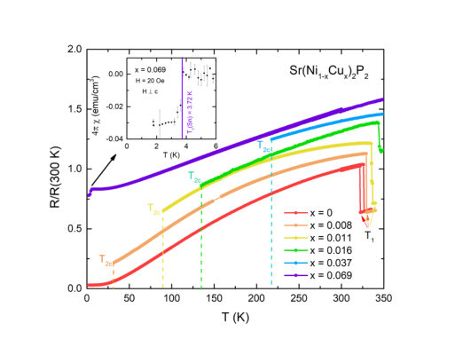
<figcaption class="paper-figure-caption"><b>Fig 1.</b> FIG. 2. Main panel: temperature-dependent resistance normalized by its value at 300 K measured upon cooling for Sr(Ni1−xCux)2P2; a constant offset of 0.1 was added between each curve in order to visualize them more clearly. Inset: magnetic susceptibility measured under a ZFC protocol with a field of 20 Oe applied perpendicular to c for the x =0.069, in order to estimate a superconducting volume fraction of less than 0.04. The temperature history protocol in which the datasets were taken is discussed in the main text.</figcaption>
</figure>
<figure class="paper-figure-card">
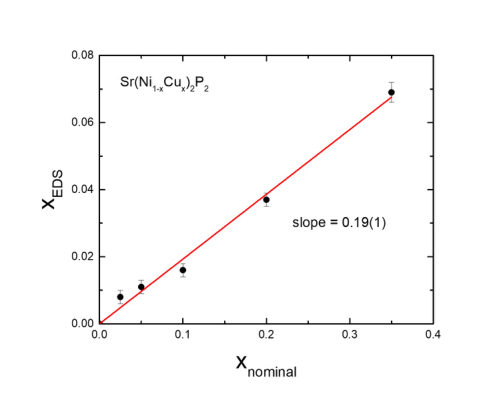
<figcaption class="paper-figure-caption"><b>Fig 2.</b> FIG. 1. Fraction of Cu in Sr(Ni1−xCux)2P2 determined by EDS, xEDS, as a function of the nominal Cu fraction that was originally present in the high-temperature solution that the crystals were grown from. The red line represents the linear fit, for which a zero intercept was forced.</figcaption>
</figure>
<figure class="paper-figure-card">
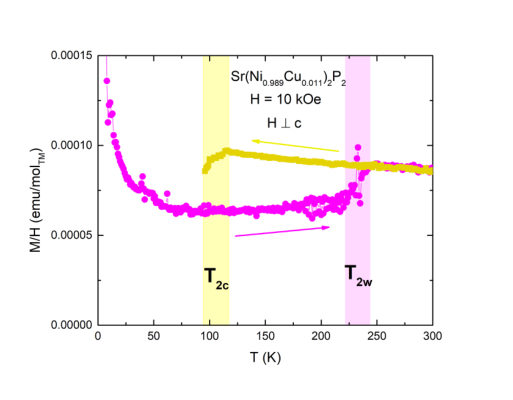
<figcaption class="paper-figure-caption"><b>Fig 3.</b> FIG. 4. (a) Temperature-dependent magnetization normalized by the field of 10 kOe applied perpendicular to the crystallographic c-axis, measured upon cooling and warming for Sr(Ni0.989Cu0.011)2P2; the ranges corresponding to the transitions T2w and T2c are shaded in gray.</figcaption>
</figure>
<figure class="paper-figure-card">
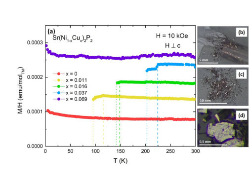
<figcaption class="paper-figure-caption"><b>Fig 4.</b> FIG. 3. (a) Temperature-dependent magnetization normalized by the field of 10 kOe applied perpendicular to the crystallographic c-axis, measured upon cooling for Sr(Ni1−xCux)2P2; a constant offset of 0.00005 emu/molT M was added between each curve in order to visualize them more clearly. (b)-(d) Photos (with increasing magnification) of the shattered crystal fragments for x = 0.016 after cycling through the cT transition.</figcaption>
</figure>
<figure class="paper-figure-card">
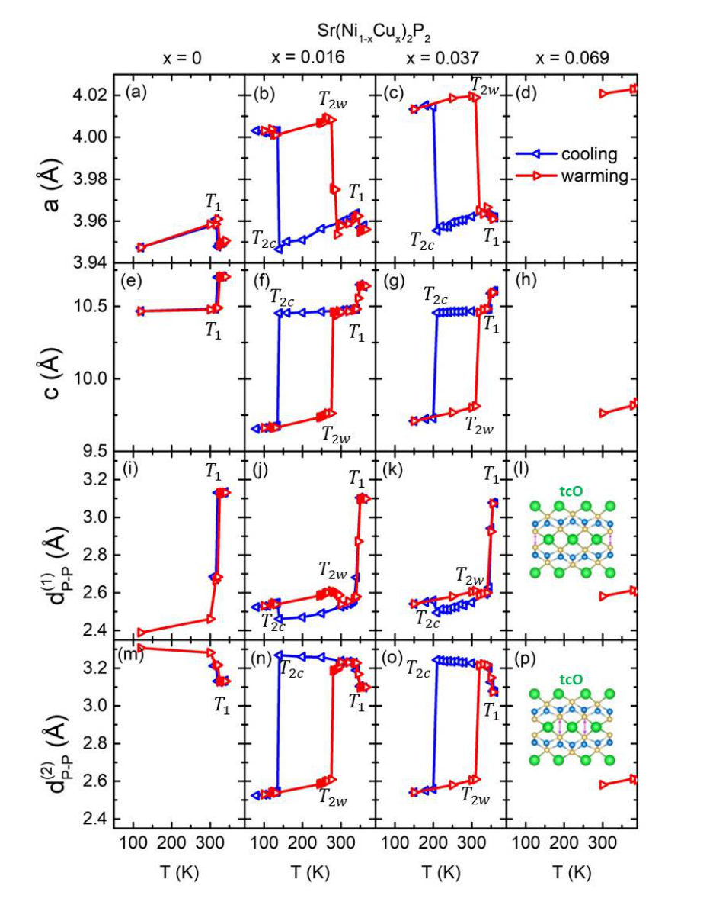
<figcaption class="paper-figure-caption"><b>Fig 5.</b> FIG. 5. (a-h) Temperature-dependent lattice parameters and (i-p) P-P distances of Sr(Ni1−xCux)2P2 with (a,e,i,m) x = 0, (b,f,j,n) x = 0.016, (c,g,k,o) x = 0.037, and (d,h,l,p) x = 0.069, determined by single-crystal x-ray diffraction; d(1) P-P and d(2) P-P correspond to the shorter and longer distance between P atoms across the Sr layers, indicated with magenta arrows in the structure diagrams of panels (l) and (p), respectively. The values of b are not displayed given that they are equal to a for the ucT phase, and to 3a for the tcO phase.</figcaption>
</figure>
<figure class="paper-figure-card">
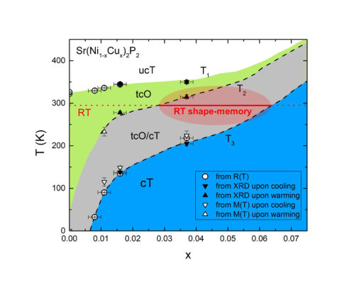
<figcaption class="paper-figure-caption"><b>Fig 6.</b> FIG. 6. Temperature-composition phase diagram of Sr(Ni1−xCux)2P2. The transitions determined from resistance, XRD and magnetization measurements are represented with open circles, solid triangles and solid circles, respectively. The triangles pointing down and up were obtained upon cooling and heating, respectively. The white, green and blue regions correspond to the ucT, tcO and cT phases, respectively. The gray region delimited by the two dashed lines (determined by T2w and T2c) corresponds to the hysteresis region, where either tcO or cT can be metastable. The red dotted line indicates the room temperature, and the compositions highlighted with the red oval and solid red line correspond...</figcaption>
</figure>
<figure class="paper-figure-card">
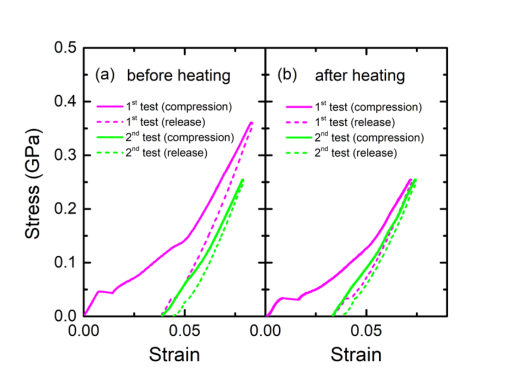
<figcaption class="paper-figure-caption"><b>Fig 7.</b> FIG. 8. Uniaxial stress versus strain curves measured along the c axis on single-crystalline micropillars of Sr(Ni0.963Cu0.037)2P2 at room temperature. (a) Results obtained on the as-grown sample before heating, on the first compression (magenta solid line), first release (magenta dashed line), second compression (green solid line), and second release (green dashed line). (b) Similar results obtained after heating the sample to 373 K and then returning to room temperature.</figcaption>
</figure>
<figure class="paper-figure-card">
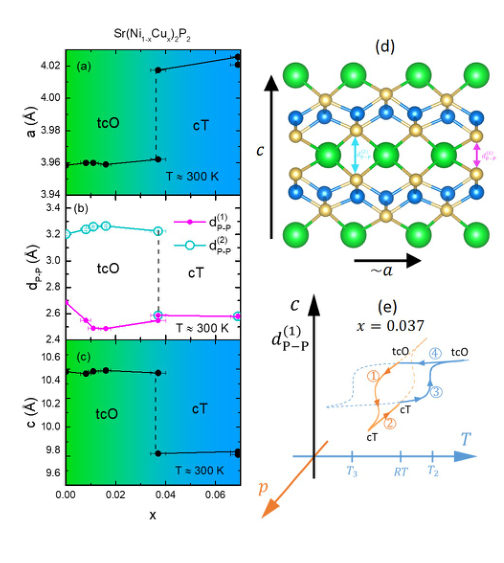
<figcaption class="paper-figure-caption"><b>Fig 8.</b> FIG. 7. Dependence of the (a) a and (c) c lattice parameters, as well as (b) the P-P distances across the Sr planes, as a function of the Cu fraction, x in Sr(Ni1−xCux)2P2. (d) Schematic diagram of the tcO structure indicating a, c, d(1) P-P and d(2) P-P. (e) Schematic protocol to illustrate the shape-memory of the sample with x = 0.037 when combining changes of pressure with changes of temperature.</figcaption>
</figure>
<figure class="paper-figure-card">
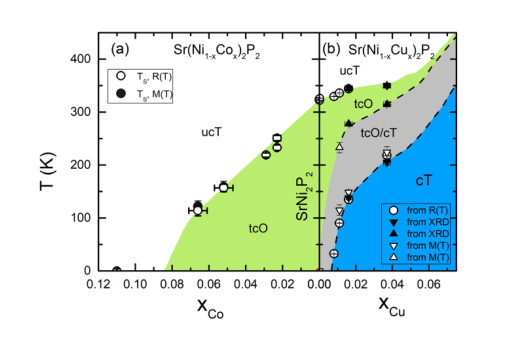
<figcaption class="paper-figure-caption"><b>Fig 9.</b> FIG. 9. Combined T −x phase diagram for Sr(Ni1−xMx)2P2, with (a) M = Co increasing to the left, and (b) M = Cu increasing to the right.</figcaption>
</figure>
<figure class="paper-figure-card">
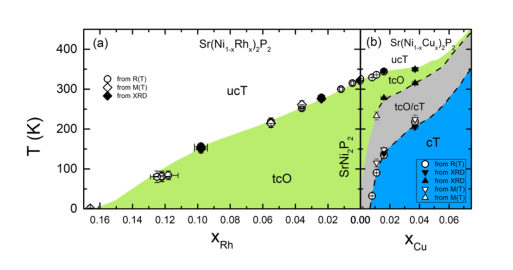
<figcaption class="paper-figure-caption"><b>Fig 10.</b> FIG. 10. Combined T −x phase diagram for Sr(Ni1−xMx)2P2, with (a) M = Rh increasing to the left, and (b) M = Cu increasing to the right.</figcaption>
</figure>

**Main problem.** Investigating how Cu substitution in SrNi2P2 can tune structural phase transitions and stabilize the collapsed tetragonal (cT) state to achieve a room-temperature shape-memory effect.

**Main result.** The researchers demonstrated that Cu substitution favors P-P bonding, allowing the tcO-cT transition hysteresis to span room temperature, making Sr(Ni0.963Cu0.037)2P2 a candidate for room-temperature shape-memory applications.

**Method.** Single-crystal growth via Sn flux, followed by structural characterization using X-ray diffraction, transport and magnetic measurements (resistance and magnetization), and nanomechanical compression tests on micro-pillars.

**Summary.** This paper explores the tuning of structural phase transitions in Sr(Ni1-xCux)2P2 through chemical substitution. By increasing the Cu fraction, the researchers were able to stabilize the collapsed tetragonal phase and shift the thermal hysteresis of the structural transition to encompass room temperature. The study demonstrates a significant shape-memory effect with high recoverable strain and low fatigue. This makes the material a promising candidate for practical engineering applications involving smart materials.

Detailed structure

**Model / system.** The physical system is the intermetallic compound Sr(Ni1-xCux)2P2, which features three structural phases (ucT, tcO, and cT) characterized by varying degrees of P-P bonding across Sr layers.

**Key observables.** Lattice parameters (a, b, c), P-P bond distances, transition temperatures (T1, T2c, T2w), thermal hysteresis width, and recoverable strain.

**Important parameters / regimes.** Cu substitution fraction (x), temperature (T), and applied mechanical stress.

**Figures summary.** Figure 1 shows the relationship between nominal and measured Cu fraction; Figure 6 presents a T-x phase diagram highlighting the hysteresis and room-temperature target region; Figure 10 compares phase stability between Rh and Cu substitution.

**Paper structure.** The paper introduces the structural phases of SrNi2P2, details the chemical substitution and crystal growth methods, presents the temperature-dependent structural and transport results, constructs a T-x phase diagram, and concludes with mechanical testing demonstrating the shape-memory effect.

Abstract

The compound SrNi$_2$P$_2$ can exhibit multiple crystal structures with no P-P pairs bonded (uncollapsed tetragonal, or ucT, state), with one-third of the P-P pairs bonded (one-third collapsed orthorhombic, or tcO, state), or with all P-P pairs bonded (collapsed tetragonal, or cT, state) across the Sr layers. The system can be tuned into its different states by changing temperature, mechanical stress, or chemical composition. Changes in bonding may manifest in changes of macroscopic properties of the material, such as its shape, electrical conductivity, or magnetism. In this work, we show that SrNi$_2$P$_2$ can be tuned among the three states by changing Cu substitution and temperature. We present temperature-dependent resistance and single-crystal x-ray diffraction results in Sr(Ni$_{1-x}$Cu$_x$)$_2$P$_2$ single-crystals that show that Cu substitution favors the P-P bonding, stabilizing the cT state at ambient pressure. We construct a $T-x$ phase diagram that shows how all of these transition temperatures increase with increasing Cu fraction, $x$. The transition between the tcO state and the cT state exhibits a very large thermal hysteresis, which can be tuned to temperatures close to room temperature. In particular, the properties of Sr(Ni$_{0.963}$Cu$_{0.037}$)$_2$P$_2$ may make it suitable for applications as a shape memory material at room temperature.

[↑ back to top](#top)

### [Shear-driven mixing of segregated granular materials](http://arxiv.org/abs/2604.24702v1)

**Authors:** Hugo N. Ulloa, Tomás Trewhela  
**Type:** theory · **Category:** statistical mechanics · **PDF:** <https://arxiv.org/pdf/2604.24702v1>  
**Analysis basis:** full PDF text, analyzed in chunks

↔ Scroll figures horizontally

<figure class="paper-figure-card">

<figcaption class="paper-figure-caption"><b>Fig 1.</b> Fig 1 Granular systems experiencing particle size segregation: (A) Debris flow;13 (B) Kanaga Volcano with its segre- gated lava flow deposit from the 1906 eruption. [Credit: Coombs, M. L., Alaska Volcano Observatory / U.S. Geological Survey]; (C) Riverbed armoring; (D) Brazilian nut effect [credit: University of Rochester/Adam Fenster]; (E) Mined coal mobilized by conveyor belt [Credit: Dave Hunt/AAP]; (F) Slump flow test for concrete mixture [youtube video link].</figcaption>
</figure>
<figure class="paper-figure-card">
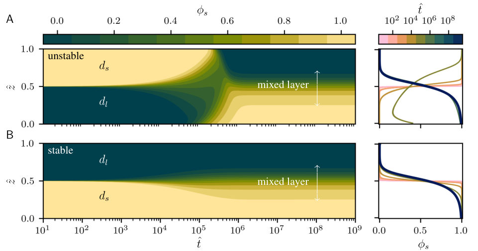
<figcaption class="paper-figure-caption"><b>Fig 2.</b> Fig 2 Numerical solutions for Rd = 2.0. Evolution of the small-particle concentration field ϕs(t, z) with depth and time, together with the final concentration profiles, for a granular flow that is initially (A) unstably segregated and (B) stably segregated. 3 Degree of segregation</figcaption>
</figure>
<figure class="paper-figure-card">
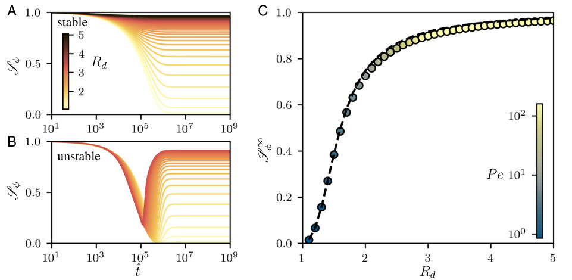
<figcaption class="paper-figure-caption"><b>Fig 3.</b> Fig 3 Degree of segregation Sϕ as a function of particle-size ratio Rd and segregation P´eclet number Pe. Temporal evolution of Sϕ for 1 ≤Rd ≤5, starting from an (A) initially stable segregated state and an (B) initially unstable segregated state. (C) Final state of the degree of segregation, denoted as S ∞ ϕ as a function of Rd and Pe, with colour indicating the magnitude of Pe. The dashed line traces the analytical solution for the asymptotic, steady-state degree of segregation in equation (12) with Pe evaluated according to equation (4).</figcaption>
</figure>
<figure class="paper-figure-card">
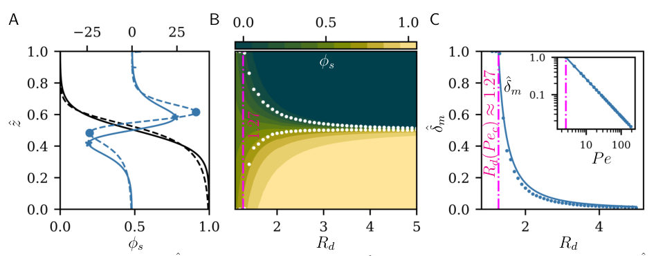
<figcaption class="paper-figure-caption"><b>Fig 4.</b> Figure 4 describes the process of obtaining the thickness of the mixing layer and its dependence on the particle-size ratio Rd and the P´eclet number Pe. The theoretical solution for the small particle concentration ϕs profile at steady state in (13) is shown in figure 4A, compared to the numerical solution result for Rd = 2.0, which is independent of the initial condition, as discussed in figure 3. In figure 4A, the second derivative of both profiles ∂ˆzˆzϕs is plotted in blue to show the changes in curvature of ϕs that correspond to the maximum and minimum points marked with stars ⋆and circles •, for theoretical and numerical solutions, respectively. We see discrepancies in the ϕs...</figcaption>
</figure>
<figure class="paper-figure-card">
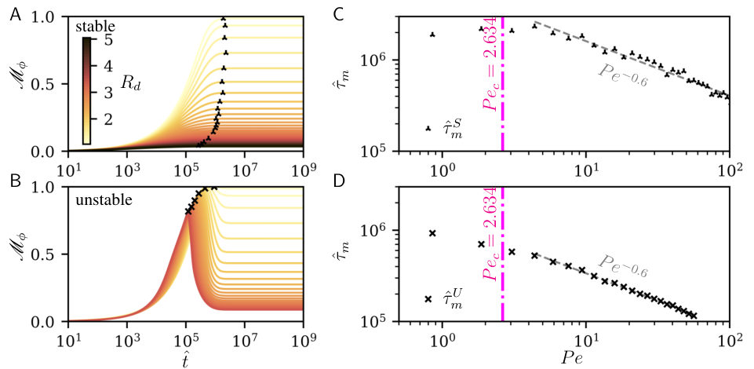
<figcaption class="paper-figure-caption"><b>Fig 5.</b> Fig 5 Timescale for maximal mixing. Temporal evolution of Mϕ for 1 ≤Rd ≤5, starting from (A) an initially stable segregated state and (B) an initially unstable segregated state. Markers denote the time ˆτm at which the maximum degree of mixing, Mϕ = 1 −Sϕ, is achieved, computed from the minimum value of Sϕ(t). ˆτm as a function of Pe for (C) an initially stable segregated state and (D) an initially unstable segregated state.</figcaption>
</figure>

**Main problem.** Understanding the competition between shear-driven segregation and diffusive remixing in polydisperse granular flows to determine what controls the extent and rate of mixing.

**Main result.** The development of a scaling framework that quantifies mixing-layer thickness and timescales, showing that the final mixed layer thickness is independent of initial configuration and scales inversely with the Péclet number.

**Method.** Numerical integration of a coupled nonlinear PDE system using the Method of Lines (MOL) in Python, combined with analytical derivation of segregation and mixing metrics.

**Summary.** This paper investigates how external shear drives the mixing and segregation of granular materials with different particle sizes. The authors provide a predictive scaling framework that relates the thickness of the resulting mixing layer and the time taken to reach equilibrium to the Péclet number and particle-size ratio. The study shows that the final state of the system is independent of whether the initial state was stable or unstable. These findings are important for optimizing industrial processes and understanding natural phenomena like planetary surface dynamics.

Detailed structure

**Model / system.** A non-cohesive, bidisperse granular medium of rigid spheres with two different diameters undergoing external shear, modeled via a continuum-based convective-diffusive transport equation.

**Key observables.** Degree of segregation (S_phi), mixing-layer thickness (delta_m), mixing degree (M_phi), and characteristic mixing timescales (tau_m).

**Important parameters / regimes.** Particle-size ratio (Rd), Péclet number (Pe) representing the ratio of segregation to diffusion, and the dimensionless coupling parameter (E).

**Assumptions / limitations.** Assumes uniform pressure, uses a specific mu(I)-rheology for layer height, and relies on a continuum description that may require further validation via DEM or experiments.

**Figures summary.** Figure 1 shows real-world examples of segregation; Figure 2 compares concentration profiles for stable vs. unstable initial conditions; Figure 3 shows temporal evolution of segregation; Figure 4 illustrates the calculation of mixing-layer thickness and identifies critical thresholds.

**Paper structure.** Introduction to granular segregation/mixing, description of the convective-diffusive model and numerical methods, presentation of scaling laws for layer thickness and timescales, and discussion of limitations and future extensions.

Abstract

As granular materials flow and settle, interactions among particles of different sizes or properties drive mixing and segregation, producing rich dynamics that reshape systems ranging from industrial hoppers to planetary surfaces. A hallmark of such polydisperse flows is shear-driven size segregation, whereby particles rearrange so that larger grains migrate above smaller ones. Despite substantial progress in modelling granular flow and segregation, key questions concerning the underlying mechanisms remain unresolved. In particular, the physics of granular mixing -- the natural counterpart of segregation -- has received far less attention. Here, we investigate the dynamics of initially segregated granular materials driven out of equilibrium by external shear. We ask: what controls the extent and rate of segregation and mixing in a sheared granular flow? Answering this question is essential for understanding how external forcing disrupts stable and unstable particle configurations and for optimising processes that require controlled mixing. Using theoretical analysis and numerical experiments, we develop and validate a scaling framework that quantifies the mixing dynamics. Our results provide new insight into the physics of granular flows and lay the foundation for improved prediction and design in both natural and industrial settings.

[↑ back to top](#top)

### [Spin-current model of electric polarization with the tensor gyromagnetic ratio](http://arxiv.org/abs/2604.22968v1)

**Authors:** Mariya Iv. Trukhanova, Pavel A. Andreev  
**Type:** theory · **Category:** strongly correlated electrons · **PDF:** <https://arxiv.org/pdf/2604.22968v1>  
**Analysis basis:** full PDF text, analyzed in chunks

↔ Scroll figures horizontally

<figure class="paper-figure-card">
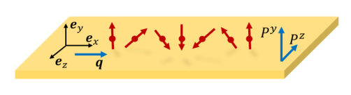
<figcaption class="paper-figure-caption"><b>Fig 1.</b> FIG. 1. (Color online) The cycloid spiral spin structure in the absence of an external magnetic field (17). The cycloidal structure lies in the xy-plane with the wave vector q = (q, 0, 0) which lies in this plane. Two projections of electric polariza- tion (20) and (21) appear according to the definition (19). One of them is determined by the non-diagonal component of g-factor.</figcaption>
</figure>
<figure class="paper-figure-card">
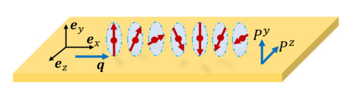
<figcaption class="paper-figure-caption"><b>Fig 2.</b> FIG. 2. (Color online) The helicoidal spiral spin structure in the absence of an external magnetic field (23). The spin- density-wave state lies in the yz-plane with the wave vector q = (q, 0, 0) perpendicular to this plane. Two projections of electric polarization (24) and (25) appear according to the definition (19), and are determined by the non-diagonal com- ponents of the gyromagnetic ratio (g-factor).</figcaption>
</figure>

**Main problem.** The paper aims to generalize the spin-current model of electric polarization to account for the anisotropic tensor gyromagnetic ratio (g-factor) in magnetic structures.

**Main result.** The authors predict that the non-diagonal components of the tensor g-factor induce new, macroscopic electric polarization components in cycloidal and helicoidal spin orders that are absent in the isotropic scalar case.

**Method.** The study utilizes the many-particle quantum hydrodynamics (MPQH) method applied to a microscopic Pauli-Schrölar Hamiltonian.

**Summary.** This paper extends the standard spin-current model of electric polarization to include the effects of an anisotropic tensor g-factor. It identifies three distinct mechanisms for the magnetoelectric effect: symmetric Heisenberg exchange, Dzyaloshinskii-Moriya interaction, and a novel spin-spin interaction via nonmagnetic ions. The research demonstrates that the tensor nature of the g-factor allows for the emergence of new electric polarization components in complex magnetic textures like helicoidal spirals. This is particularly important for understanding multiferroic materials containing heavy ions where spin-orbit coupling is strong.

Detailed structure

**Model / system.** The model considers clusters of magnetic transition metal ions and diamagnetic oxygen ions, specifically focusing on multiferroic perovskite-like structures (e.g., rare-earth manganites) with noncollinear spin orders.

**Key observables.** Macroscopic electric polarization (P), spin current density tensor (Js), spin density, and torque density.

**Important parameters / regimes.** Tensor gyromagnetic ratio (g-factor), exchange interaction constants (Heisenberg and Dzyaloshinskii-Moriya), and spin density.

**Assumptions / limitations.** The ions are treated as localized point-like quasi-particles in the crystal lattice, and the derivation focuses on the stationary state where the time derivative of momentum density is zero.

**Figures summary.** Figure 1 illustrates a cycloidal spiral spin structure in the xy-plane with a wave vector along the x-axis.

**Paper structure.** The paper begins by defining the Hamiltonian and the problem of g-factor anisotropy, proceeds to derive the momentum and spin density balance equations using quantum hydrodynamics, analyzes specific polarization mechanisms (Heisenberg, DM, and Keffer-like), and concludes with predictions for specific spin geometries (cycloidal and helicoidal).

Abstract

The spin-current model of electric polarization of spin origin is developed for a magnetic structure with anisotropic tensor gyromagnetic ratio (g-factor). Three mechanisms of the magnetoelectric effect are proposed, caused by the symmetric Heisenberg exchange interaction, the Dzyaloshinsky-Moriya interaction, and the spin-spin interaction related to the odd anisotropy of the symmetric exchange interaction of magnetic ions via nonmagnetic ion. The dependence of electric polarization on the spin density and tensor g-factor in the generalized spin-current model is derived. New solutions for macroscopic electric polarization, that arise in the cycloidal and helicoidal spin orders and are caused by the non-diagonal components of the gyromagnetic ratio, are predicted. The extended of the spin-current model to including a tensor g-factor can be important for the magnetic ferroelectrics with heavy ions which take part in the formation of magnetoelectric effect.

[↑ back to top](#top)

### [Step- and terrace-resolved crystal truncation rod scattering from vicinal surfaces under coherent heteroepitaxy](http://arxiv.org/abs/2604.24604v1)

**Authors:** Junlin Wu, Erqi Xu, Qihui Lin, Jiaqing Yue, Jiale Wang, Zihao Xu, Guangxu Ju  
**Type:** both · **Category:** other · **PDF:** <https://arxiv.org/pdf/2604.24604v1>  
**Analysis basis:** full PDF text, analyzed in chunks

↔ Scroll figures horizontally

<figure class="paper-figure-card">
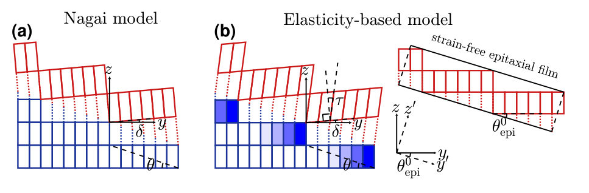
<figcaption class="paper-figure-caption"><b>Fig 1.</b> FIG. 1. Sketch of (a) the Nagai model and (b) the elasticity-based model for a fully strained epitaxial film on a vicinal substrate. (a) The substrate coordinate axes are defined by z ∥[001] and y ∥[010]. The substrate off-cut angle is θ, and δ denotes the lattice tilt of the epilayer relative to substrate. (b) In the elasticity-based model, τ characterizes the triclinic deformation, corresponding to a shear-induced deviation of the strained lattice from an orthogonal geometry. The quantity θ0 epi is the off-cut angle of the strain-free epilayer. The reference coordinate system (y′, z′) is defined with z′ normal to the surface of the strain- free epilayer. The strained epilayer lattice is then...</figcaption>
</figure>
<figure class="paper-figure-card">
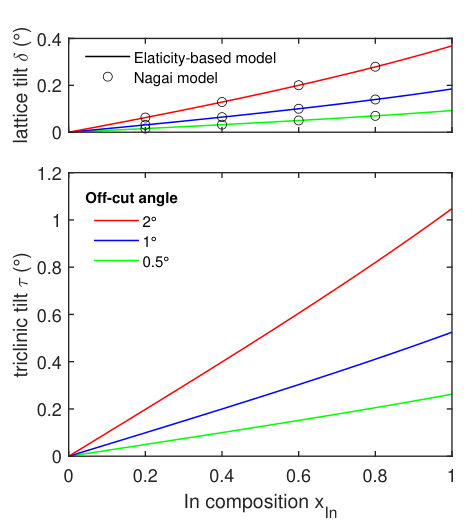
<figcaption class="paper-figure-caption"><b>Fig 2.</b> FIG. 2. Lattice tilt angle δ and triclinic tilt angle τ for a co- herently strained InxGa1−xN film on GaN(0001) as functions of composition xIn for off-cut angles of 0.5◦, 1◦, and 2◦. δ is calculated using both the Nagai and elasticity-based mod- els, while τ is obtained from the elasticity-based model. The two models give nearly identical δ, whereas τ reflects shear- induced deformation.</figcaption>
</figure>
<figure class="paper-figure-card">
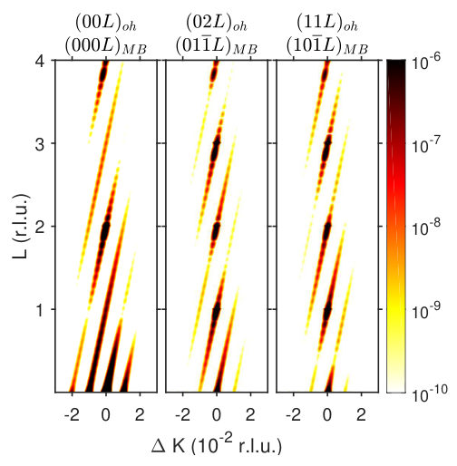
<figcaption class="paper-figure-caption"><b>Fig 3.</b> FIG. 3. Typical CTRs from a vicinal surface with a het- eroepitaxial film, illustrated here using the InGaN/GaN sys- tem. The film introduces additional Bragg peaks and thick- ness fringes along the CTRs.</figcaption>
</figure>
<figure class="paper-figure-card">
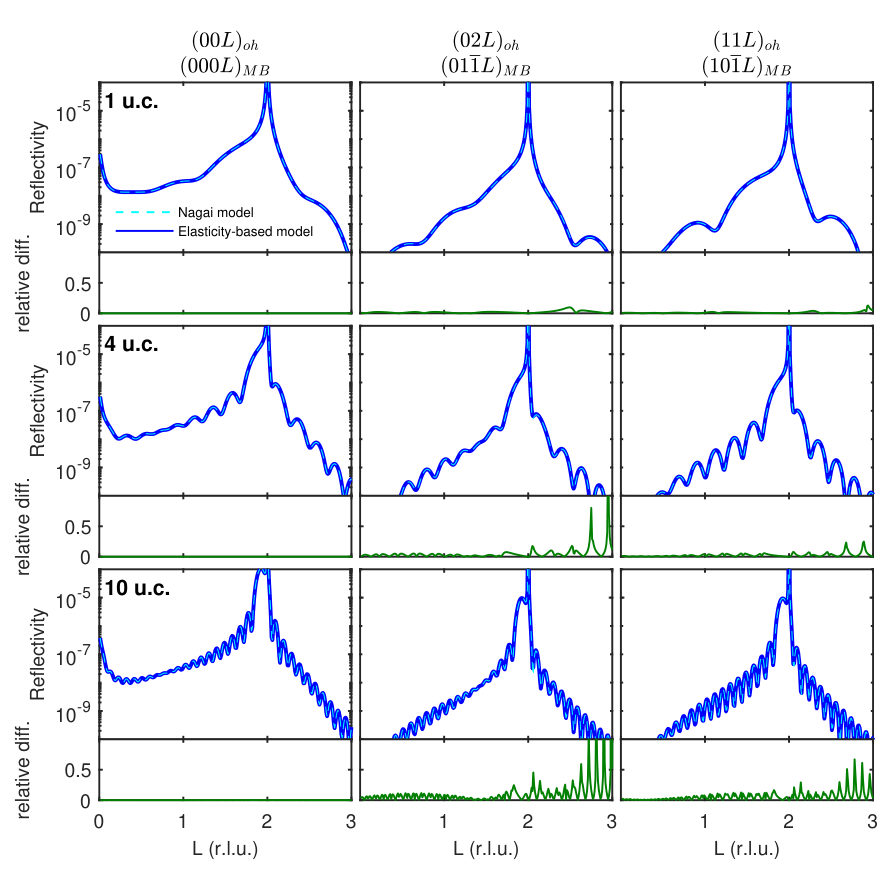
<figcaption class="paper-figure-caption"><b>Fig 4.</b> FIG. 4. Calculated reflectivities for the (00L0), (02L0), and (11L0) CTRs (from left to right) at L0 = 2 for a vicinal GaN(0001) surface with M = 100, covered by a coherent In0.3Ga0.7N film. Rows correspond to film thicknesses of 1, 4, and 10 unit cells (top to bottom). The lower panels show the relative difference between the Nagai and elasticity-based model. The non-specular CTRs are markedly more sensitive to triclinic deformation than the specular CTR, and the this sensitivity increases with film thickness.</figcaption>
</figure>
<figure class="paper-figure-card">
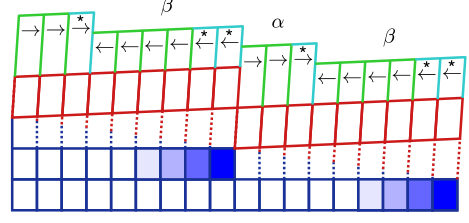
<figcaption class="paper-figure-caption"><b>Fig 5.</b> FIG. 5. Schematic illustration of the unit-cell configuration on a vicinal surface. Bulk unit cells (blue), internal film unit cells (red), and top film unit cells with reconstruction (green) or modified reconstruction (cyan) are shown. The total terrace width is composed of α and β terraces, with M = 9 unit cells. The α terrace has width N = 3, within which a modified region of width Nα∗= 1 is present. The β terrace contains a modified region of width Nβ∗= 2. The film thickness is J = 3 unit cells. Arrows indicate the reconstruction orientation, which alternates between α- and β-terminated terraces. The blue shading highlights the summation index m defined in Eq. (32), with the darkest region...</figcaption>
</figure>
<figure class="paper-figure-card">
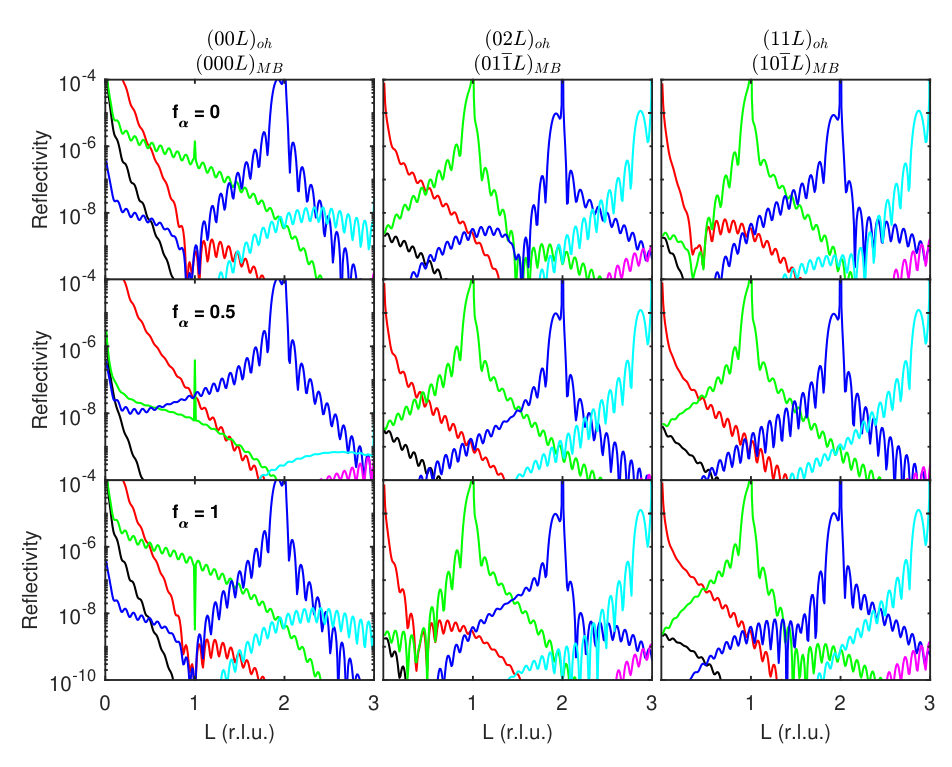
<figcaption class="paper-figure-caption"><b>Fig 6.</b> FIG. 6. Calculated reflectivities for the (00L0), (02L0), and (11L0) CTRs for a vicinal GaN(0001) surface with M = 100, covered by a coherent In0.3Ga0.7N epitaxial film with a thickness of 10 unit cells. Colors denote different CTRs with L0 = −1 to 4, and rows correspond to different α-terrace fractions fα.</figcaption>
</figure>
<figure class="paper-figure-card">
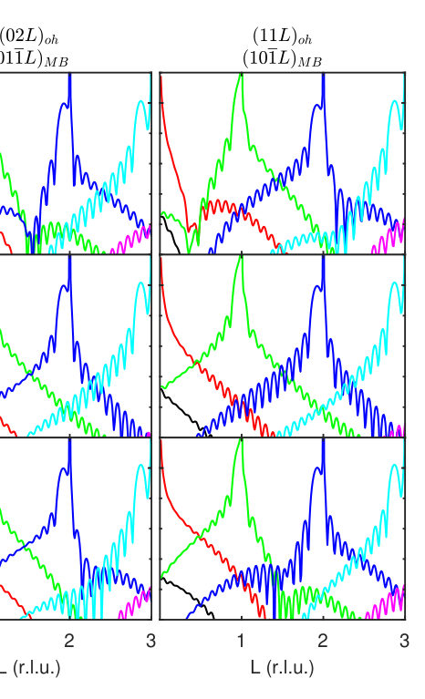
<figcaption class="paper-figure-caption"><b>Fig 7.</b> Figure 6 shows the calculated CTR reflectivities for a vicinal GaN(0001) surface with a coherent InGaN film. Three families of CTRs are considered: (00L0), (02L0), and (11L0), for L0 = −1 to 4, with varying terrace frac- tions fα. The overall behavior is similar to that for a GaN surface with no epitaxial film, modulated by the ex- tra Bragg peaks and thickness fringes due to the film[15]. The (00L0) CTRs exhibit a symmetric dependence on fα about fα = 0.5. The profiles for fα = 0 and fα = 1</figcaption>
</figure>
<figure class="paper-figure-card">
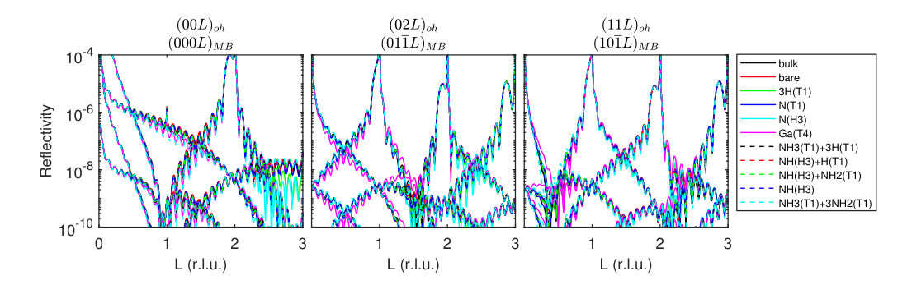
<figcaption class="paper-figure-caption"><b>Fig 8.</b> FIG. 7. Calculated CTR reflectivities for a vicinal GaN(0001) surface with M = 100 and a 10-unit-cell thick coherent In0.3Ga0.7N epitaxial film, for various reconstructions[35] at fα = 0.</figcaption>
</figure>
<figure class="paper-figure-card">
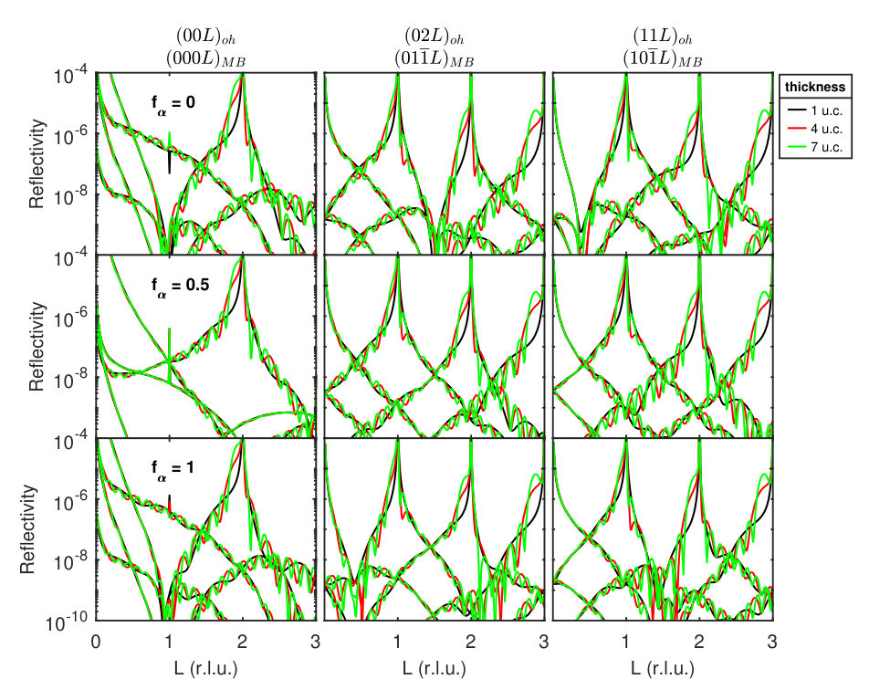
<figcaption class="paper-figure-caption"><b>Fig 9.</b> FIG. 8. Calculated reflectivities for the (00L0), (02L0), and (11L0) CTRs for L0 = −1 to 4 of a vicinal GaN(0001) surface with M = 100, covered by a coherent In0.3Ga0.7N epitaxial film. Rows correspond to α-terrace fractions fα (top to bottom). Colors correspond to film thicknesses of 1, 4, and 7 unit cells.</figcaption>
</figure>
<figure class="paper-figure-card">
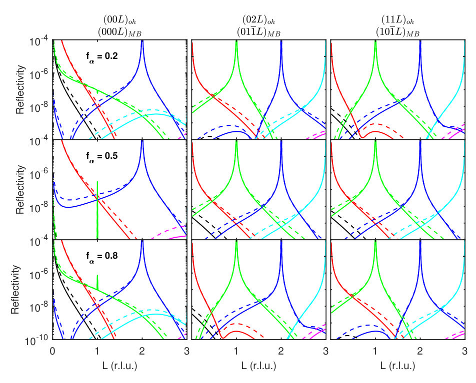
<figcaption class="paper-figure-caption"><b>Fig 10.</b> FIG. 9. Calculated reflectivities for the (00L0), (02L0), and (11L0) CTRs for a vicinal GaN(0001) surface without an epitaxial film, showing only the effect of a modified surface reconstruction with x∗ In,α = x∗ In,β = 1. Solid and dashed curves correspond to fα∗= fβ∗= 0 and 0.2, respectively. Colors denote different CTRs with L0 = −1 to 4. Rows correspond to different α-terrace fractions fα.</figcaption>
</figure>

**Main problem.** The lack of a general theoretical formalism for Crystal Truncation Rod (CTR) scattering that simultaneously accounts for vicinal surface geometry, coherent heteroepitaxial strain, and terrace-resolved structural/kinetic evolution.

**Main result.** The development of an elasticity-based model that predicts triclinic deformation (shear strain) in non-specular CTRs, and the demonstration that this framework can quantitatively extract real-time growth parameters like thickness, composition, and terrace ordering.

**Method.** The authors use linear elasticity theory and a phase-based scattering formalism to derive CTR intensities, comparing a simplified Nagai model with a refined elasticity-based model using complex-plane trajectory analysis.

**Summary.** This paper presents a unified theoretical framework for analyzing Crystal Truncation Rod (CTR) scattering from vicinal surfaces during heteroepitaxial growth. It highlights that while standard models capture lattice tilt, an elasticity-based approach is necessary to account for triclinic deformation caused by shear strain, which is visible in non-specular rods. The framework successfully incorporates complex surface features like terrace ordering and indium enrichment. Ultimately, the authors demonstrate that this model enables the quantitative extraction of real-time structural and kinetic parameters during the growth of InGaN/GaN films.

Detailed structure

**Model / system.** The physical system is the coherent heteroepitaxial growth of InGaN on vicinal GaN surfaces, characterized by periodic terraces, atomic steps, and lattice mismatch-induced strain.

**Key observables.** CTR reflectivity intensity, Bragg peak positions, interference fringes, lattice tilt (delta), triclinic deformation (tau), and oscillation periods (delta J).

**Important parameters / regimes.** Off-cut angle (theta), In-composition (x_In), film thickness (J), terrace width (M), and elastic constants (C_ijkl).

**Assumptions / limitations.** The epilayer is assumed to be coherently strained, the off-cut angles are small (theta < 2 degrees), and the kinematic approximation is used for intensity calculations.

**Figures summary.** Figure 1 compares Nagai and elasticity models; Figure 2 shows lattice tilt and triclinic deformation; Figure 4 shows CTR reflectivity for different thicknesses; Figure 10-12 illustrate real-time growth trajectories and intensity oscillations; Figures 13-16 analyze reflectivity using complex-plane trajectories.

**Paper structure.** The paper begins by introducing the theoretical need for a refined model, compares the Nagai and elasticity-based models, extends the formalism to include surface reconstruction and terrace ordering, demonstrates the sensitivity of non-specular rods to shear, and concludes by showing the feasibility of extracting real-time growth kinetics from in situ measurements.

Abstract

We develop a general theory of crystal truncation rod (CTR) scattering from vicinal surfaces with a coherently strained heteroepitaxial film. The formalism incorporates film-induced interference fringes, full elastic lattice distortion, terrace ordering, surface reconstruction, and real-time growth evolution within a unified description. Comparison between Nagai model and elasticity-based model shows that the lattice tilt is nearly identical in the two approaches, whereas the elasticitybased model predicts an additional triclinic deformation arising from shear strain. This deformation has little effect on specular CTRs but strongly modifies non-specular rods, making them a sensitive probe of the full elastic state of coherent epitaxial films. We further show that the characteristic sensitivity of vicinal CTRs to terrace ordering, surface reconstruction, and terrace-resolved compositional modification remains robust in the presence of a coherent film. Representative calculations for InGaN/GaN demonstrate that the framework enables quantitative interpretation of both static and real-time CTR measurements and provides access to step- and terrace-resolved structural and kinetic information during heteroepitaxial growth.

[↑ back to top](#top)

### [Super Landau Model and Howe Duality: From Supermonopole Harmonics to Quantum Matrix Geometry](http://arxiv.org/abs/2604.24112v1)

**Authors:** Kazuki Hasebe  
**Type:** theory · **Category:** other · **PDF:** <https://arxiv.org/pdf/2604.24112v1>  
**Analysis basis:** full PDF text, analyzed in chunks

↔ Scroll figures horizontally

<figure class="paper-figure-card">
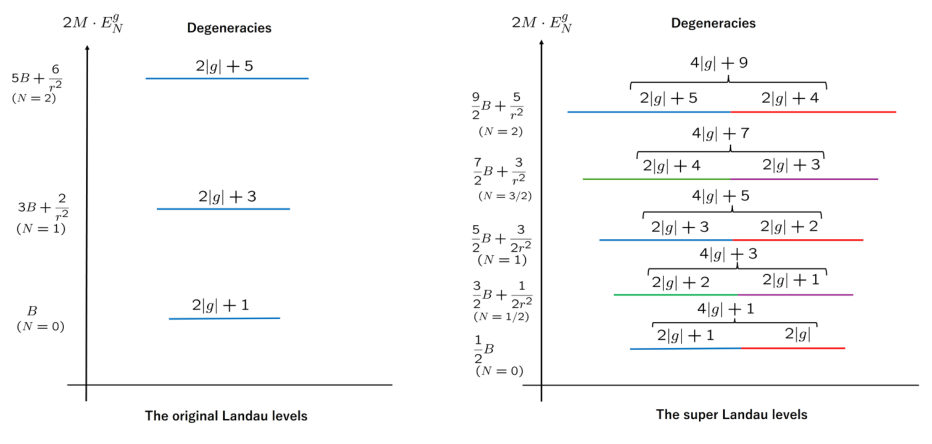
<figcaption class="paper-figure-caption"><b>Fig 1.</b> Figure 1: Left: The original LLs (2.63). Right: The super Landau levels (2.58). Blue/red lines denote bosonic/fermionic states in integer Landau levels, while green/purple lines denote bosonic/fermionic states in half-integer Landau levels. Both of the LLs and the degeneracies are (almost) doubled in the SUSY system.</figcaption>
</figure>
<figure class="paper-figure-card">
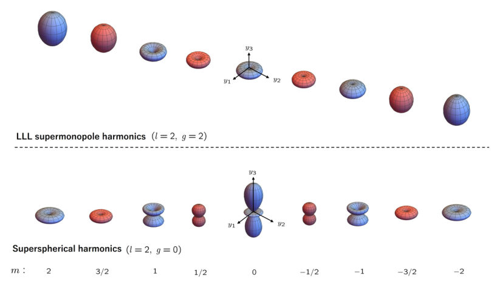
<figcaption class="paper-figure-caption"><b>Fig 2.</b> Figure 2: The probability densities for the LLL supermonopole harmonics and the superspherical harmonics.</figcaption>
</figure>
<figure class="paper-figure-card">
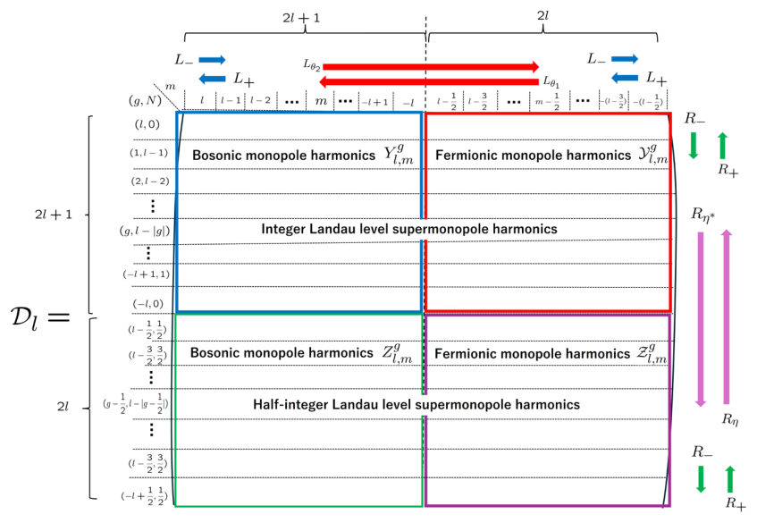
<figcaption class="paper-figure-caption"><b>Fig 3.</b> Figure 3: Structure of the super D-matrix (l = N + |g|). The rows in the blue (red) rectangles correspond to bosonic (fermionic) monopole harmonics in the integer Landau levels, while those in the green (purple) rectangles realize the bosonic (fermionic) monopole harmonics in the half-integer Landau levels. The colored arrows indicate the actions of the ladder operators of the two independent uosp(1|2) algebras.</figcaption>
</figure>
<figure class="paper-figure-card">
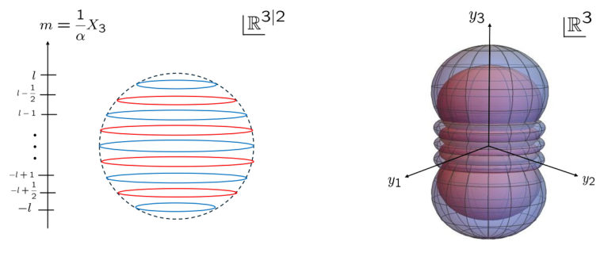
<figcaption class="paper-figure-caption"><b>Fig 4.</b> Figure 4: Left: the fuzzy supersphere. The blue and red latitudes respectively correspond to the bosonic and fermionic degrees of freedom. Right: The probability densities of the l = 2 LLL eigenstates from Fig.2 (also recall (C.8)). The elements (= latitudes) in the left figure correspond to the supermonopole harmonics in the right figure.</figcaption>
</figure>
<figure class="paper-figure-card">
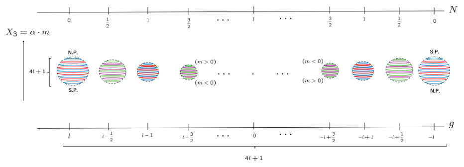
<figcaption class="paper-figure-caption"><b>Fig 5.</b> Figure 5: Evolution of the fuzzy supersphere geometry. As the supermonopole charge g varies, the fuzzy superspheres associated with integer LLs (constituted from blue and red latitudes) and half-integer LLs (constituted from green and purple latitudes) appear alternately. The radius of the fuzzy supersphere shrinks as |g| decreases, and upon crossing g = 0, the northern (m &gt; 0) and southern (m &lt; 0) hemispheres are interchanged.</figcaption>
</figure>
<figure class="paper-figure-card">
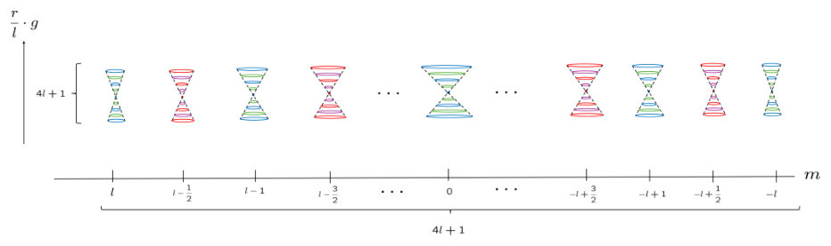
<figcaption class="paper-figure-caption"><b>Fig 6.</b> Figure 6: Evolution of the fuzzy supercone . The slope of the fuzzy super cones decreases, as m varies from l to 0, and subsequently increases as m moves from 0 to −l.</figcaption>
</figure>
<figure class="paper-figure-card">
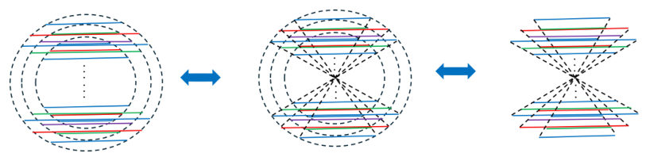
<figcaption class="paper-figure-caption"><b>Fig 7.</b> Figure 7: An intuitive picture of the emergence of fuzzy supercones. The left denotes the stacked fuzzy superspheres with their latitudes. From this nested structure, fuzzy supercone geometries naturally emerge as shown in the middle. The right depicts the dual description as a family of the fuzzy supercones.</figcaption>
</figure>

**Main problem.** The paper investigates whether the super Landau model can be used to derive supermatrix geometries (supersymmetric non-commutative geometries) and explores the role of Howe duality in this process.

**Main result.** The author demonstrates that Howe duality provides the underlying structure of the super Landau model, relating different Landau levels and inducing geometric transformations between fuzzy objects. The paper also provides an explicit construction of supermonopole harmonics and derives the matrix coordinates for fuzzy supersphere geometries.

**Method.** The study employs the graded Hopf map, super-spinor derivative operators (edth operators), and the level projection method. It also utilizes the representation theory of the UOSp(1|2) superalgebra and the theta correspondence of Howe duality.

**Summary.** This paper explores the connection between supersymmetric Landau models and the emergence of non-commutative (fuzzy) geometries. By applying Howe duality, the author shows how different Landau levels are related and how dual fuzzy geometries arise. The work provides explicit mathematical tools, such as supermonopole harmonics and matrix coordinates for superspheres, suggesting that Howe duality is a fundamental mechanism for understanding the geometry of matrix models.

Detailed structure

**Model / system.** A supersymmetric extension of the Landau model (the super Landau model) defined on a supersphere (S2|2) in the presence of a supermonopole field. The system is characterized by the UOSp(1|2) super-rotational symmetry.

**Key observables.** Supermonopole harmonics, energy eigenvalues, super-spin, magnetic charge, Chern number, and probability densities on the supermanifold.

**Important parameters / regimes.** Magnetic charge (g), Landau level index (N), super-spin (l), and the non-commutative scale factor.

**Assumptions / limitations.** The derivation assumes the validity of the UOSp(1|2) algebraic structure and focuses on the high-magnetic-field/Lowest Landau Level (LLL) limit where kinetic terms are quenched.

**Paper structure.** The paper begins with a review of the super Landau model basics, proceeds to the construction of supermonopole harmonics and the derivation of the super-Hamiltonian, moves to the definition of a probabilistic interpretation via Berezin integration, and concludes by demonstrating how Howe duality realizes an internal-external space duality in quantum matrix geometries.

Abstract

Landau models serve as quantum mechanical systems for generating quantum matrix geometries. In this paper, we demonstrate that Howe duality provides the underlying structure of the super Landau model, reflecting a general feature of coset-type Landau models. The (super) Howe duality relates different Landau levels and accounts for the emergence of a dual fuzzy geometry. By employing super-spinor derivative operators, the supermonopole harmonics in both integer and half-integer Landau levels are explicitly constructed and the algebraic structure of the super-Hilbert space is revealed. We propose a consistent probabilistic interpretation for these wavefunctions defined on a supermanifold. Through a level projection method, we derive the matrix coordinates of fuzzy supersphere geometries for arbitrary Landau levels, along with a precise determination of the non-commutative scale factor. It is shown that the theta correspondence of Howe duality induces a geometric transformation between fuzzy objects. Finally, we point out that Howe duality realizes an internal-external space duality and underlies quantum matrix geometries, suggesting that it may play a fundamental role in understanding Matrix model geometries.

[↑ back to top](#top)

### [Sustainability-informed materials design](http://arxiv.org/abs/2604.22987v1)

**Authors:** Rachel Woods-Robinson, Amalie Trewartha  
**Type:** theory · **Category:** other · **PDF:** <https://arxiv.org/pdf/2604.22987v1>  
**Analysis basis:** full PDF text, analyzed in chunks

↔ Scroll figures horizontally

<figure class="paper-figure-card">

<figcaption class="paper-figure-caption"><b>Fig 1.</b> Figure 1: Schematic representation of the current state of sustain- ability impact assessment in inorganic solid-state materials across var- ious technology readiness levels (TRLs). “Design flexibility” reflects the degrees of freedom in material and process choices, while “assess- ment likelihood” reflects the practical feasibility and commonness of practice of applying life cycle assessment (LCA) or related life cycle thinking (LCT) methods. TRL positions and curve shapes are illustra- tive and not intended to represent precise, quantitative relationships.</figcaption>
</figure>
<figure class="paper-figure-card">
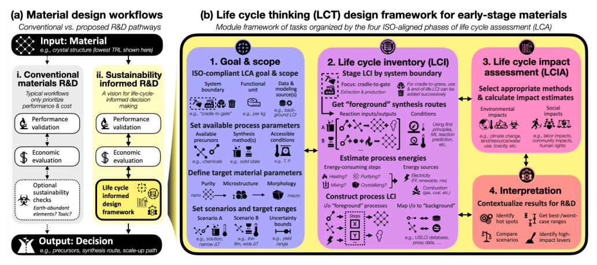
<figcaption class="paper-figure-caption"><b>Fig 2.</b> Figure 2: A vision and framework for life cycle thinking (LCT) in materials design. (a) Comparison of conventional material R&amp;D’s focus on performance and cost (i) with a proposed pathway integrating LCT into early-stage materials design (ii). Conventional workflows occasionally consider sustainability ad hoc checks (e.g., “earth-abundance” or toxicity, based on elemental composition), but rarely consider process-level implications across the life cycle. The proposed pathway introduces a dedicated life-cycle–informed design step. (b) Modular framework for incorporating LCT into early-stage materials design, with tasks organized according to the four ISO-standardized phases of LCA3,4: goal...</figcaption>
</figure>

**Main problem.** Sustainability assessments (LCA) are typically performed too late in the materials development cycle, after environmental and social impacts are already 'locked in' by design choices.

**Main result.** The authors propose a modular 'Life Cycle Thinking' (LCT) framework that integrates sustainability into the earliest stages of materials design by using uncertainty as a tool for decision-making.

**Method.** The framework utilizes materials informatics, predictive synthesis (ML and physics-based), and process modeling to estimate material and energy flows at low Technology Readiness Levels (TRLs).

**Summary.** This paper argues for moving sustainability analysis from a retrospective check to an early-stage design driver in materials science. By adopting 'Life Cycle Thinking,' researchers can use the high uncertainty of early-stage development to identify critical trade-offs before design choices become irreversible. The authors propose a framework that leverages machine learning and predictive synthesis to estimate environmental impacts during the initial discovery phase. This approach aims to prevent the 'lock-in' of unsustainable material processes and promote responsible innovation in inorganic materials.

Detailed structure

**Model / system.** The scope focuses on inorganic solid-state materials, such as lithium-ion battery cathodes, across various stages of technological development.

**Key observables.** Life Cycle Inventory (LCI) inputs/outputs (precursors, stoichiometry, yields), energy intensity, and environmental impact indicators (GHGs, water use, toxicity).

**Important parameters / regimes.** Technology Readiness Levels (TRLs), design flexibility, and uncertainty bounds.

**Assumptions / limitations.** The framework assumes that predictive synthesis tools can provide sufficiently plausible reaction pathways and that early-stage analyses can prioritize decision relevance over numerical precision.

**Figures summary.** Figure 1 shows the trade-off between design flexibility and assessment likelihood across TRLs; Figure 2 compares conventional R&D to the proposed LCT pathway and outlines a modular implementation based on ISO-standardized LCA phases.

**Paper structure.** The paper identifies the problem of retrospective assessment, proposes a new Life Cycle Thinking framework based on key principles, details the integration of predictive technologies, and outlines a cross-stakeholder agenda for implementation.

Abstract

While material innovation can enable sustainable development, environmental and social impacts of emerging materials are often assessed only after design choices are "locked in." Here, we argue for a shift in perspective: life cycle thinking should enter at the earliest stages of materials development, where uncertainty is highest but design freedom is greatest. Rather than treating incomplete knowledge as a barrier, we reframe it as an inherent feature that can illuminate trajectories, tradeoffs, and consequences -- and enable intervention while change remains possible. Focusing on inorganic solid materials, we identify disconnects between materials science and sustainability analysis, propose an adaptable, decision-oriented framework to embed sustainability into material design across evolving technology stages, and highlight how recent advances such as predictive synthesis can help operationalize this integration. Guided by the framework's governing principles, we outline a cross-stakeholder agenda to shift from retrospective correction to anticipatory, responsible material design from the outset.

[↑ back to top](#top)

### [Synchronized molecular dynamics method for thin-layer flows of complex fluids](http://arxiv.org/abs/2604.24138v1)

**Authors:** Shugo Yasuda, Kotaro Oda, Fumito Muragaki, Yuta Taketa, Masashi Iwayama, Tomohide Ina  
**Type:** theory · **Category:** numerical methods · **PDF:** <https://arxiv.org/pdf/2604.24138v1>  
**Analysis basis:** full PDF text, analyzed in chunks

↔ Scroll figures horizontally

<figure class="paper-figure-card">
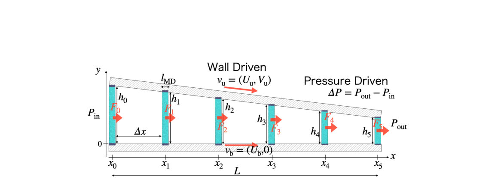
<figcaption class="paper-figure-caption"><b>Fig 1.</b> FIG. 1. Geometry of the problem. Laminar flow in a narrow gap is considered, where local MD</figcaption>
</figure>
<figure class="paper-figure-card">
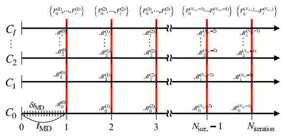
<figcaption class="paper-figure-caption"><b>Fig 2.</b> FIG. 2. The synchronization scheme for local MD cells {C0, · · · , CI} proceeds as follows. Given</figcaption>
</figure>
<figure class="paper-figure-card">

<figcaption class="paper-figure-caption"><b>Fig 3.</b> FIG. 3. Schematic of the nested parallelization scheme of the SMD method. MD simulations</figcaption>
</figure>
<figure class="paper-figure-card">
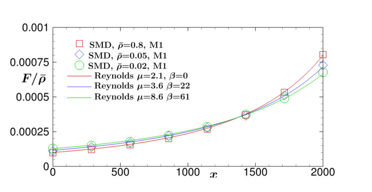
<figcaption class="paper-figure-caption"><b>Fig 4.</b> FIG. 4. Force distributions along the channel for the pressure-driven flows with ∆P/¯ρ = 0.6. The</figcaption>
</figure>
<figure class="paper-figure-card">

<figcaption class="paper-figure-caption"><b>Fig 5.</b> Figure 4 shows the force distributions along the channel. Here, the results of the SMD</figcaption>
</figure>
<figure class="paper-figure-card">

<figcaption class="paper-figure-caption"><b>Fig 6.</b> FIG. 5. Velocity profiles of each MD cell for the pressure-driven flows with distinct fluid densities:</figcaption>
</figure>
<figure class="paper-figure-card">
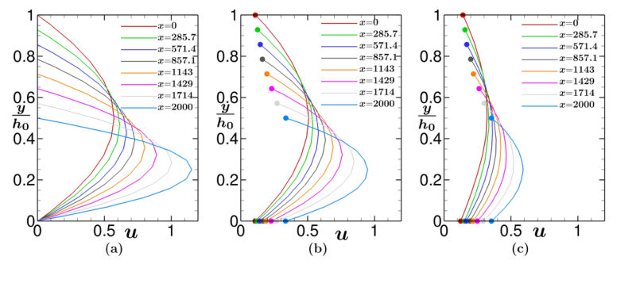
<figcaption class="paper-figure-caption"><b>Fig 7.</b> Figure 5 shows the velocity profiles in each MD cell. Each velocity profile has a parabolic</figcaption>
</figure>
<figure class="paper-figure-card">
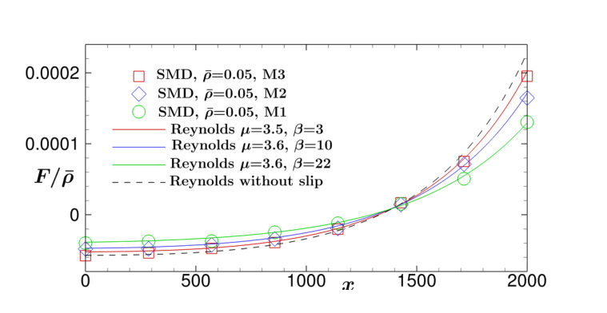
<figcaption class="paper-figure-caption"><b>Fig 8.</b> FIG. 6. Force distributions along the channel for wall-driven flows with Ub=0.8 and Uu=Vu=0.</figcaption>
</figure>
<figure class="paper-figure-card">
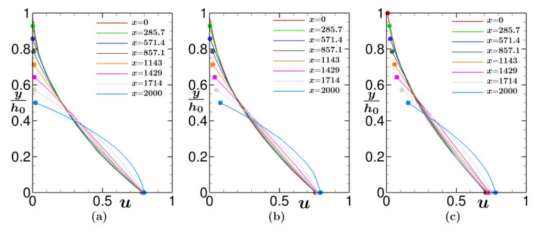
<figcaption class="paper-figure-caption"><b>Fig 9.</b> FIG. 7. Velocity profiles of each MD cell for wall-driven flows for three different wall interaction</figcaption>
</figure>
<figure class="paper-figure-card">
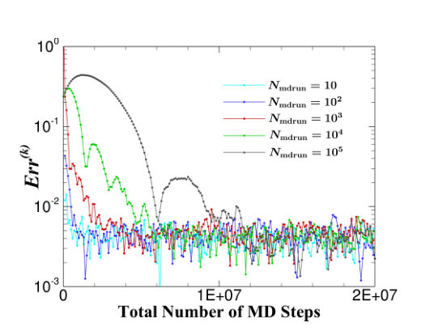
<figcaption class="paper-figure-caption"><b>Fig 10.</b> FIG. 8. The convergence behaviors of Eq. (21) for different values of Nmdrun are plotted against</figcaption>
</figure>

**Main problem.** Predicting the flow of complex fluids (polymers, colloids) in thin-layer geometries where constitutive relations and boundary conditions, such as slip, are unknown and difficult to establish.

**Main result.** The proposed SMD method successfully captures shear-thinning and polymer conformation dynamics in polymeric flows and validates against modified Reynolds equations for Newtonian fluids.

**Method.** A multiscale Synchronized Molecular Dynamics (SMD) method that couples local MD cells with a macroscopic lubrication description by iteratively updating external forces to satisfy continuity.

**Summary.** This paper introduces the Synchronized Molecular Dynamics (SMD) method, a multiscale computational technique for simulating complex fluid flows in thin channels. By coupling local molecular dynamics simulations with a macroscopic lubrication model, the method bypasses the need for predefined constitutive equations. It is validated against known Newtonian models and successfully demonstrates the ability to capture complex phenomena like shear-thinning and polymer stretching. This provides an efficient way to study micro-to-macro transport properties in complex fluids.

Detailed structure

**Model / system.** Thin-layer/film flows in high-aspect-ratio channels (e.g., wedge-shaped) using Lennard-Jones fluids for validation and the Kremer-Grest chain model for polymeric liquids.

**Key observables.** Cross-sectional velocity profiles, streamwise pressure distribution, polymer conformation dynamics (bond orientation tensor), and slip velocity/length.

**Important parameters / regimes.** Reynolds number (Re << 1), aspect ratio (epsilon << 1), Weissenberg number, fluid density, and fluid-wall interaction strength.

**Assumptions / limitations.** Laminar, incompressible flow in the lubrication limit (low Reynolds number and thin-layer geometry) where scales can be separated.

**Figures summary.** Figure 1 shows the MD cell geometry; Figure 2 illustrates the SMD iteration scheme; Figure 3 shows the MPI parallelization hierarchy; Figures 9-13 present error analysis, force distributions, and velocity profiles for polymeric vs. Newtonian fluids.

**Paper structure.** Introduction of the problem -> Description of the SMD multiscale framework and implementation -> Validation using LJ fluids and slip analysis -> Application to polymeric fluids and non-Newtonian effects -> Appendix with lubrication theory derivation.

Abstract

We propose a multiscale computational method for thin-layer flows of complex fluids, termed the synchronized molecular dynamics (SMD) method, which directly couples local molecular dynamics (MD) simulations with a macroscopic lubrication description. In thin layers, the flow can be decomposed into cross-sectional dynamics that are strongly influenced by interfacial effects, and streamwise transport along the channel. The SMD method exploits this separation of scales by sparsely distributing local MD cells along the channel and synchronizing them through macroscopic conservation laws.   In this framework, the macroscopic continuity equation is enforced by iteratively updating the external forces applied to each MD cell, thereby allowing the cross-sectional velocity profiles and the streamwise pressure distribution to be obtained without prescribing constitutive relations or boundary conditions. The method is validated for pressure-driven and wall-driven flows of Lennard--Jones fluids in a wedge-shaped channel, demonstrating excellent agreement with a modified Reynolds equation that accounts for boundary slip.   The SMD method is further applied to polymeric lubrication flows modeled by the Kremer--Grest chain model. At large pressure differences, the present approach naturally captures pronounced shear-thinning behavior coupled with microscopic polymer conformation dynamics. The results demonstrate that the SMD method provides an efficient and physically consistent framework for the multiscale simulation of complex fluid thin-layer flows.

[↑ back to top](#top)

### [Three-dimensional topological ferroelectrics](http://arxiv.org/abs/2604.23969v1)

**Authors:** Haohao Sheng, Sheng Zhang, Zhong Fang, Hongming Weng, Zhijun Wang  
**Type:** theory · **Category:** other · **PDF:** <https://arxiv.org/pdf/2604.23969v1>  
**Analysis basis:** full PDF text, analyzed in chunks

↔ Scroll figures horizontally

<figure class="paper-figure-card">
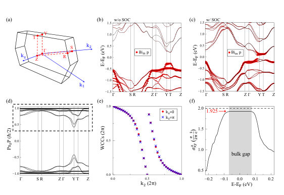
<figcaption class="paper-figure-caption"><b>Fig 1.</b> FIG. 2. (Color online) Electronic structure, spin spectrum, and 3D QSHI state of γ-Bi4Br4. (a) Brillouin Zone and high symmetry k-points of primitive cell. (b,c) Electronic band structure (b) without (w/o) SOC and (c) with (w/) SOC. The size of red dots represents the weight of the Biin p orbitals. Here, Biin are the middle Bi atoms that form a zigzag chain in each layer [Fig. 1(a)]. (d) Spin spectrum for the eigenval- ues of the projected spin matrix PszP. The black dashed box presents the upper spin bands. (e) The k1-directed spin- resolved Wilson loops of the upper spin bands for the kz = 0 (red dots) and kz = π (blue crossing points) planes. The resulting spin-resolved Wannier charge...</figcaption>
</figure>
<figure class="paper-figure-card">
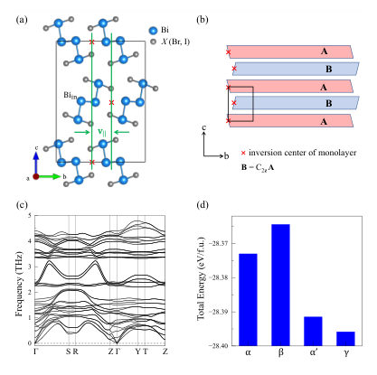
<figcaption class="paper-figure-caption"><b>Fig 2.</b> FIG. 1. (Color online) Crystal structure and stability of γ- Bi4Br4. (a) Crystal structure. a, b, and c represent the con- ventional cell vectors. The red crossings “x” indicate the in- version center of each layer. (b) Schematic diagram of vdW stacking. (c) Phonon spectrum. (d) The total energies per formula unit for different phases.</figcaption>
</figure>
<figure class="paper-figure-card">
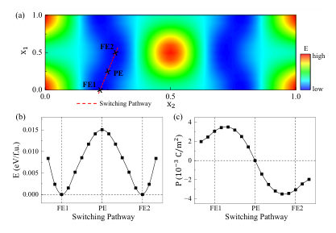
<figcaption class="paper-figure-caption"><b>Fig 3.</b> FIG. 3. (Color online) Ferroelectric polarization and switch- ing of γ-Bi4Br4. (a) Contour plot of total energy per formula unit as a function of the v|| = (x1, x2). The FE switching pathway is marked by a red dotted line. (b) Energy profile and (c) polarization transition along the pathway. The total energies of two FE phases (FE1 and FE2) are set to zero. PE is the middle paraelectric phase.</figcaption>
</figure>
<figure class="paper-figure-card">
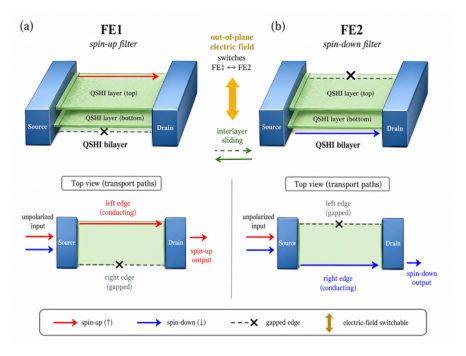
<figcaption class="paper-figure-caption"><b>Fig 4.</b> FIG. 5. (Color online) Electrically controlled spin-filter de- vice. (a, b) A fully spin-polarized current is realized, where opposite spin polarizations are spatially locked to the differ- ent conducting edges and can be switched by an out-of-plane electric field.</figcaption>
</figure>
<figure class="paper-figure-card">
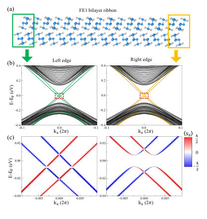
<figcaption class="paper-figure-caption"><b>Fig 5.</b> FIG. 4. (Color online) Topological edge states in Bi4Br4 π- bilayer. (a) Crystal structure of the FE1 ribbon. (b) Band structures with SOC of the FE1 ribbon. The left edge states (green dots) and the right edge states (orange dots) are shown in the left panel and the right panel, respectively. (c) The zoom-in band structures corresponding to the red dashed boxes in (b). The color scale and the size of dots represent the expectation value of the sz spin.</figcaption>
</figure>

**Main problem.** The search for intrinsic 3D topological ferroelectric insulators that possess sizable band gaps and robust band topology, overcoming the limitations of 2D heterostructures and unstable 3D candidates.

**Main result.** The prediction of a new gamma-phase of bismuth monohalides (Bi4Br4 and Bi4I4) that acts as a 3D quantum spin Hall insulator with switchable ferroelectric polarization.

**Method.** First-principles calculations, including phonon spectrum and ab initio molecular dynamics for stability, and spin-resolved Wilson loops to calculate the spin Chern number.

**Summary.** The paper predicts a new class of 3D topological ferroelectric insulators using bismuth monohalides (Bi4Br4 and Bi4I4). These materials feature a 3D quantum spin Hall insulator state that remains robust during ferroelectric switching via interlayer sliding. The researchers demonstrate that the polarization can be controlled with a low energy barrier, enabling the design of an electrically controlled spin-filter device. This provides a promising platform for developing new nonvolatile spintronic technologies.

Detailed structure

**Model / system.** A 3D van der Waals layered structure of bismuth monohalides (Bi4X4, where X=Br, I) in the noncentrosymmetric Cmc2_1 space group.

**Key observables.** Spin Chern number (Csz = 2), spin Hall conductivity, bulk polarization, and energy barrier for ferroelectric switching.

**Important parameters / regimes.** Band gap of ~0.15 eV with SOC, ferroelectric switching energy barrier of 15 meV/f.u., and spin Hall conductivity of ~1.925 (e^2/2pi c).

**Assumptions / limitations.** The study assumes the stability and synthesizability of the predicted gamma-phase based on density functional theory calculations.

**Figures summary.** Fig 1 shows the crystal structure, vdW stacking, phonon spectrum, and phase energies; Fig 2 shows the Brillouin zone, band structures with and without SOC, and the evolution of Wannier charge centers.

**Paper structure.** The paper introduces the motivation for 3D topological ferroelectrics, presents the predicted structure and stability of Bi4X4, characterizes its topological properties via spin Chern numbers, demonstrates the ferroelectric switching mechanism, and proposes a spin-filter device application.

Abstract

Three-dimensional (3D) topological ferroelectric (FE) insulators, in which topological and FE orders naturally coexist, enable field-controlled spintronic devices. In this work, we predict a new structure of bismuth monohalides Bi4Br4 and Bi4I4, denoted $γ$ phase, and demonstrate that it is an ideal 3D topological FE insulator. Systematic first-principles calculations confirm the stability and synthesizability of $γ$-Bi4X4 (X=Br, I). Although the noncentrosymmetric $γ$ phase crystallizes in the space group $Cmc2_1$ with no symmetry-based classifications/indicators, the nontrivial topology can be characterized by the spin Chern number (SCN). Spin-resolved Wilson loops show the $s_z$ SCN $C_{s_z}=2$, indicating the spin-resolved topology of a 3D quantum spin Hall insulator state. The $z$-direction polarization can be switched by interlayer sliding, requiring only crossing a small energy barrier. Finally, we design an electrically controlled spin-filter device on bilayer films that can generate a switchable spin-polarized current. Combining a single-phase crystal, a sizable band gap, and robust band topology against FE switching, these bismuth monohalides serve as a prototype of intrinsic 3D topological FE insulators, providing an ideal platform for realizing new nonvolatile functionalities in spintronic devices.

[↑ back to top](#top)

### [Ultra-High Dynamic Strength of Additively Manufactured GRX-810 Under Coupled Conditions of High Strain Rate and Elevated Temperature](http://arxiv.org/abs/2604.23143v1)

**Authors:** Naveen Dinujaya, Suhas Eswarappa Prameela  
**Type:** both · **Category:** other · **PDF:** <https://arxiv.org/pdf/2604.23143v1>  
**Analysis basis:** full PDF text, analyzed in chunks

↔ Scroll figures horizontally

<figure class="paper-figure-card">
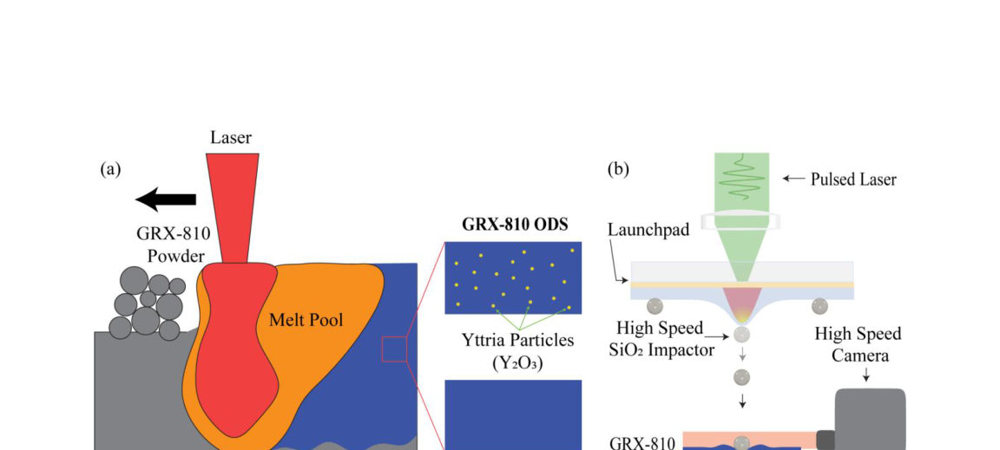
<figcaption class="paper-figure-caption"><b>Fig 1.</b> Fig. 1. Overview of material fabrication and high strain rate testing. (a) Schematic of the laser powder bed fusion (LPBF) process used to produce GRX-810 in both ODS and non-ODS conditions. (b) Schematic of the laser induced particle impact testing (LIPIT) setup used to probe the dynamic response of GRX-810 under extreme high strain rate loading. Methods The high strain rate impact experiments were carried out using LIPIT (Fig. 1b), which is a platform consisting of four main components: launching laser, launch pad assembly, target stage, and an in situ optical imaging system for resolving particle impact and rebound. Particle launch was achieved using a pulsed Nd:YAG laser (532 nm...</figcaption>
</figure>
<figure class="paper-figure-card">
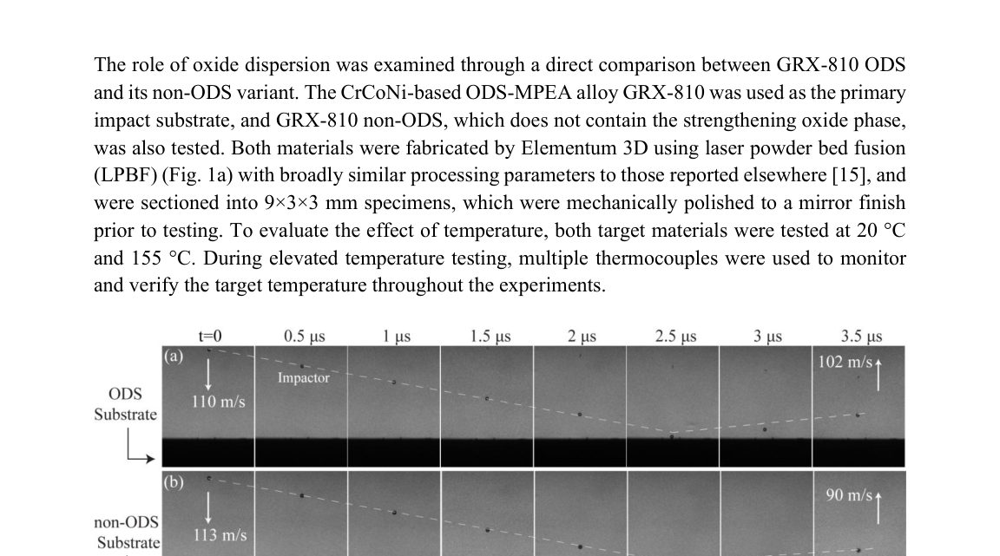
<figcaption class="paper-figure-caption"><b>Fig 2.</b> Fig. 2. In situ observations of microparticle impact and rebound on GRX-810 substrates at 20 °C. (a) A silica microparticle enters from the top of the field of view at an impact velocity of 110 m/s, strikes the GRX-810 ODS substrate, and rebounds at 102 m/s. (b) A silica microparticle impacts the GRX-810 non-ODS substrate at 113 m/s and rebounds at 90 m/s. The scale bar is the same in all images.</figcaption>
</figure>
<figure class="paper-figure-card">
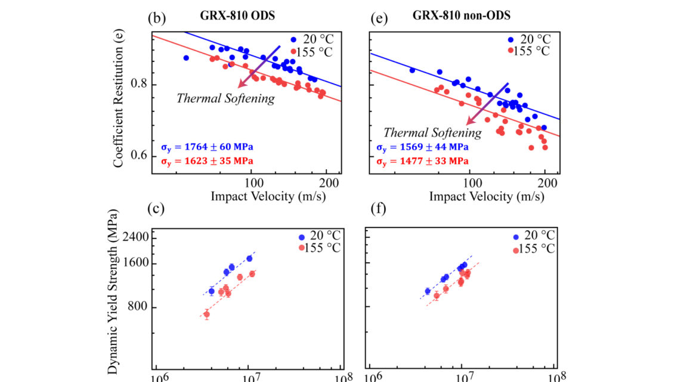
<figcaption class="paper-figure-caption"><b>Fig 3.</b> Fig. 3. Impact velocity plotted against coefficient of restitution (CoR) on a double-logarithmic scale over the range of impact velocities examined. The solid lines represent fits to the scaling law for ideally plastic impact, with 𝑌𝑑 as the fitting parameter (from Eq.1). (a) and (d) Schematic illustrations of a microparticle accelerating toward the GRX-810 ODS and non-ODS substrates, respectively. (b) CoR curves for GRX-810 ODS at 20 °C and 155 °C. (e) CoR curves for GRX-810 non-ODS at 20 °C and 155 °C. For both materials, impacts at the higher temperature produce lower rebound velocities, reflected by lower CoR values, indicating thermal softening. (c) Dynamic</figcaption>
</figure>
<figure class="paper-figure-card">
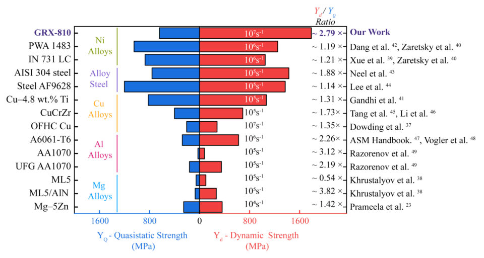
<figcaption class="paper-figure-caption"><b>Fig 4.</b> Fig. 4. Comparison of quasi static strength and dynamic strength at strain rates of 104 𝑠−1 −107 𝑠1 for various alloys, together with the quasi-static to dynamic strength increment ratio. GRX-810 ODS exhibits the highest absolute strength in the dataset. Its quasi static to</figcaption>
</figure>
<figure class="paper-figure-card">
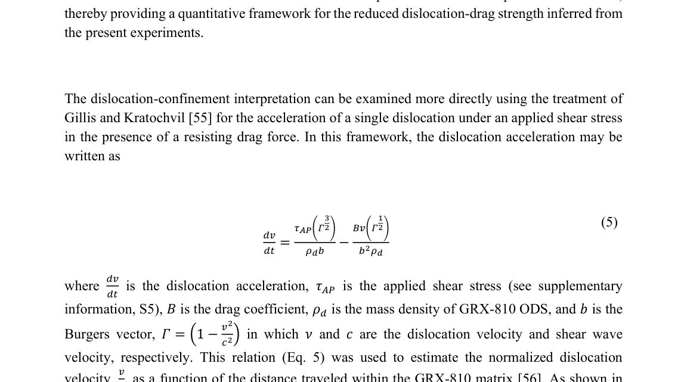
<figcaption class="paper-figure-caption"><b>Fig 5.</b> Fig. 5d, dislocations accelerate rapidly at short distances, but the rate of acceleration decreases progressively as the dislocation-drag term becomes increasingly important. Under these conditions, the dislocation velocity approaches a steady-state value asymptotically. Using the present matrix properties, the model predicts a steady-state normalized dislocation velocity of approximately 0.66 𝑐. Accordingly, the value of 121.9 nm is interpreted here as the uninterrupted glide distance required for a dislocation to approach, or numerically converge to, this steady state velocity (Fig. 5d). This interpretation is consistent with prior studies showing that dislocation velocities in the range...</figcaption>
</figure>
<figure class="paper-figure-card">
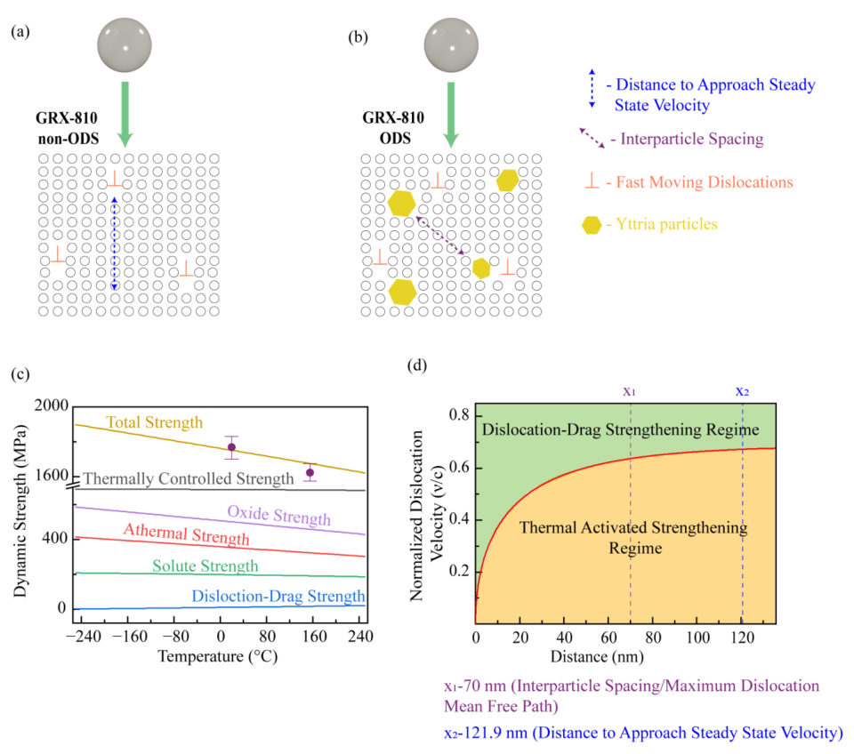
<figcaption class="paper-figure-caption"><b>Fig 6.</b> Fig. 5. Mechanistic interpretation of oxide dispersion effects on the high strain rate response of GRX-810. (a) Schematic illustration of a microparticle accelerating toward the GRX-810 non- ODS substrate, showing dislocation motion in the matrix. The dashed blue line indicates the reference uninterrupted glide distance required for a dislocation to approach the steady state dislocation velocity. (b) Schematic illustration of a microparticle accelerating toward the GRX- 810 ODS substrate, showing dislocation motion in the matrix together with oxide particles (yellow). The purple line indicates the interparticle spacing between oxide particles. (c) Calculated contributions of the individual...</figcaption>
</figure>

**Main problem.** Understanding the deformation mechanisms and dynamic strength of additively manufactured CrCoNi-based oxide-dispersion-strengthened (ODS) alloys under the coupled conditions of ultra-high strain rates and elevated temperatures.

**Main result.** The ODS variant exhibits significantly higher dynamic strength at ambient temperature due to athermal Orowan strengthening, but undergoes pronounced thermal softening at elevated temperatures because the oxide-particle network limits dislocation glide distance, suppressing the phonon-drag contribution.

**Method.** Laser-induced particle impact testing (LIPIT) using silica microparticles and high-speed videography, combined with a semi-empirical scaling model and a dislocation dynamics framework to decompose strength contributions.

**Summary.** This paper investigates how adding nanoscale yttria particles to a CrCoNi-based alloy affects its strength during ultra-high-speed impacts at high temperatures. While the particles provide extra strength at room temperature through the Orowan mechanism, they actually cause a larger drop in strength when heated because they prevent dislocations from moving long enough to benefit from phonon-drag effects. This research is crucial for designing materials for extreme environments like rocket engines.

Detailed structure

**Model / system.** The physical system is an additively manufactured CrCoNi-based ODS-MPEA (GRX-810) containing yttria nanoparticles. The modeling uses a strength summation framework including thermal, athermal, solute, and dislocation-drag components, alongside the Gillis and Kratochvil framework for dislocation acceleration.

**Key observables.** Particle impact and rebound velocities, Coefficient of Restitution (CoR), dynamic yield strength, and grain size evolution.

**Important parameters / regimes.** Strain rates of 10^6 to 10^7 s^-1, temperatures of 20 C and 155 C, interparticle spacing of ~70 nm, and impact velocities of 80-210 m/s.

**Assumptions / limitations.** The oxide particles are assumed to be thermally stable without coarsening, and the impact response is modeled assuming elastic-perfectly plastic behavior of the substrate.

**Figures summary.** Fig 1 shows the LPBF fabrication and LIPIT setup; Fig 2 shows in situ high-speed images of particle impact and rebound; Fig 5d compares the required glide distance for drag development against the actual interparticle spacing.

**Paper structure.** The paper introduces the material and problem, describes the LIPIT experimental setup and fabrication, presents results for dynamic strength at different temperatures, develops a mechanistic model for dislocation-drag suppression, and concludes with the implications for extreme environment applications.

Abstract

Deformation mechanisms in CrCoNi-based oxide-dispersion-strengthened multi-principal element alloys (CrCoNi-based ODS-MPEA) have been extensively studied under quasi-static and low strain rate loading over a wide temperature range, yet their behavior at high strain rates and elevated temperatures remains poorly understood. In this work, we investigate the high strain rate response of the CrCoNi-based ODS-MPEA alloy GRX-810 and its non-ODS variant. The ODS variant contains a high density of hexagonal yttria nanoparticles that serve as the strengthening oxide phase. At high strain rates and ambient temperature, GRX-810 ODS exhibits higher dynamic strength, approximately 2.79 times its quasi-static strength, than both conventional alloys and its non-ODS variant because of the additional athermal strengthening provided by the nanoscale oxide dispersion. At high strain rates and elevated temperatures, however, GRX-810 ODS undergoes thermal softening. This response is consistent with dislocation confinement associated with the small interparticle spacing of the oxide dispersion, which limits the phonon-drag contribution, together with the temperature-dependent reduction of elastic constants that lowers the athermal strengthening terms, including the oxide-related contribution. Additional weakening of the solute-pinning mechanism at elevated temperature further reduces the dynamic yield strength.

[↑ back to top](#top)

### [Unconventional mixed state in the nematic superconductor LiFeAs](http://arxiv.org/abs/2604.23401v1)

**Authors:** G. Lamura, T. Winyard, P. Gentile, M. Speight, F. Anger, B. Buchner, S. Wurmehl, T. Shiroka  
**Type:** both · **Category:** strongly correlated electrons · **PDF:** <https://arxiv.org/pdf/2604.23401v1>  
**Analysis basis:** full PDF text, analyzed in chunks

↔ Scroll figures horizontally

<figure class="paper-figure-card">
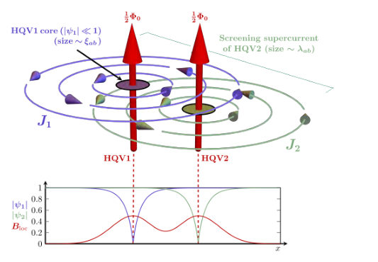
<figcaption class="paper-figure-caption"><b>Fig 1.</b> FIG. 1. Coreless (skyrmion) vortex, consisting of a bound state of two spatially separated HQVs with independent order parameters and phases. The cores of the two HQVs are spanned by the respec- tive supercurrents J1 and J2: HQV1 is crossed by J2 and visa-versa, thus lacking a core where both OPs are zero simultaneously. This can be seen in the bottom panel as a cross-section in the splitting direction of the two independent OPs and the resulting local field Bloc is shown. Such bound state still carries a single quantum of magnetic flux Φ0 as a whole.</figcaption>
</figure>
<figure class="paper-figure-card">
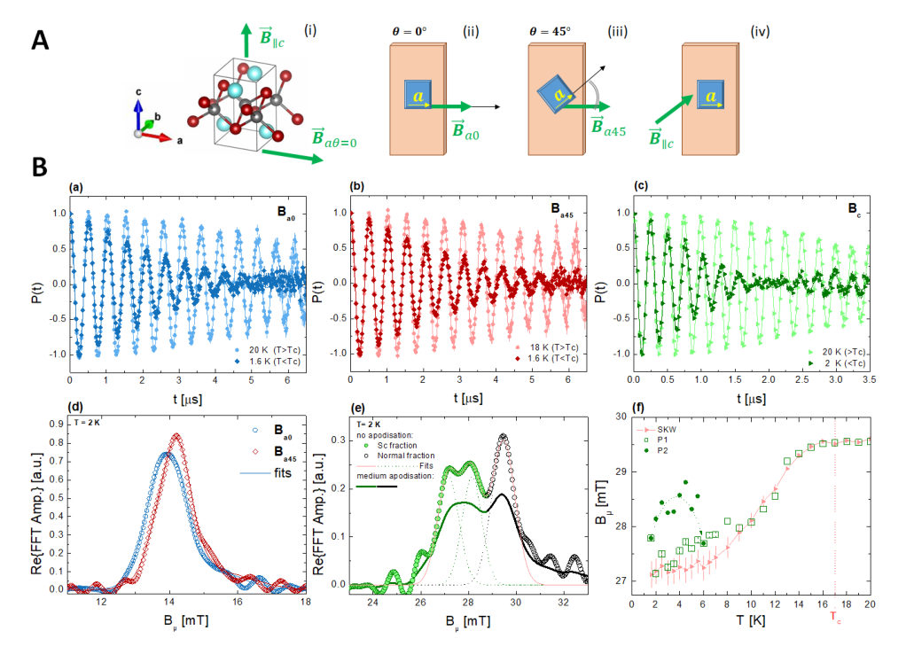
<figcaption class="paper-figure-caption"><b>Fig 2.</b> FIG. 2. TF-µSR experiments. Panel A: Crystal structure of LiFeAs (cyan, gray, and red spheres represent Li, Fe, and As atoms, respectively) and relative directions of the applied magnetic field(i). Experimental configuration: the sample is glued using vacuum grease to a thin copper foil on the µSR sample-holder. This fixes its a-axis direction at low temperature, while allowing it to be changed at 300 K. The magnetic field Bapp was applied parallel to the a-axis (ii), at 45◦from it (iii), and parallel to the c-axis (iv). Panel B: TF-µSR polarization above and below Tc in a magnetic field applied parallel to the a-axis (Ba0) (a), at 45 degrees from it (B45) (b), and parallel to the c-axis...</figcaption>
</figure>
<figure class="paper-figure-card">
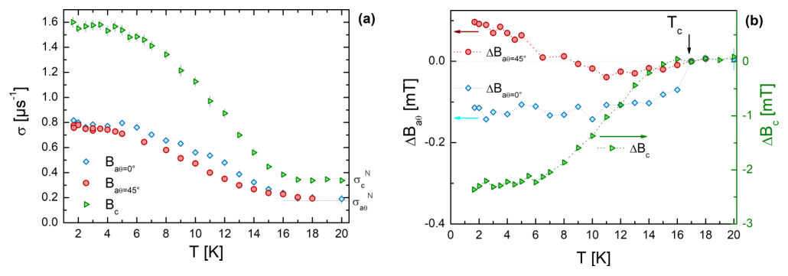
<figcaption class="paper-figure-caption"><b>Fig 3.</b> FIG. 3. µSR relaxation — in-plane vs. out-of-plane results. Temperature evolution of the fit parameters, as resulting from fits of the experimental asymmetry in the time domain [25]: (a) TF-µSR depolarization rate in a magnetic field applied in the ab-plane (Ba0, Ba45) and out-of-plane (Bc). (b) Diamagnetic field shift recorded in all the applied-field configurations.</figcaption>
</figure>
<figure class="paper-figure-card">
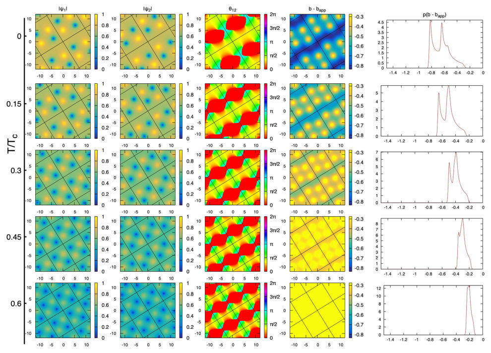
<figcaption class="paper-figure-caption"><b>Fig 4.</b> FIG. 4. Contour plots of the SC skyrmion chains (i.e., lattice solutions) for the model given by Eq. (2). From left to right: OP magnitudes |ψ1| and |ψ2|, relative phase θ12, local magnetic field strength Bloc, and its probability density p(B).</figcaption>
</figure>

**Main problem.** The study seeks experimental evidence for unconventional, coreless (skyrmionic) vortex states in the bulk of the nematic superconductor LiFeAs.

**Main result.** Using muon-spin spectroscopy, the authors demonstrate an unconventional vortex lattice characterized by peak splitting in the magnetic field distribution, which evolves from a skyrmion chain phase to a standard Abrikostov lattice with increasing temperature.

**Method.** The researchers combine transverse-field muon-spin spectroscopy (TF-muSR) with Ginzburg-Landau numerical simulations using gradient descent and Newton flow methods to minimize Gibbs free energy.

**Summary.** This paper reports the discovery of an unconventional vortex lattice in the bulk superconductor LiFeAs. By analyzing muon-spin spectroscopy data, the authors find evidence of 'coreless' vortices, which are bound states of half-quantum vortices. They demonstrate that as temperature increases, these complex skyrmion chains transition into a conventional Abrikosov vortex lattice. This work provides a rare experimental glimpse into the complex topological textures possible in multi-component superconducting order parameters.

Detailed structure

**Model / system.** The physical system is the nematic superconductor LiFeAs, modeled using a multi-component Ginzburg-Landau theory with a complex vector order parameter and strong spin-orbit coupling.

**Key observables.** Local magnetic field probability distribution p(B), depolarization rate (sigma), diamagnetic shift, and the topological winding number of the skyrmion field.

**Important parameters / regimes.** Temperature (1.6 K to 6 K), magnetic field orientation (parallel to a-axis, 45 degrees, and c-axis), and the superconducting gap (approx 2.01-2.57 meV).

**Assumptions / limitations.** The Ginzburg-Landau model is treated as an effective theory for qualitative predictions rather than precise quantitative accuracy; the simulation assumes a periodic lattice structure.

**Figures summary.** Figure 1 shows a schematic of coreless vortices; Figure 2 displays crystal structure and muSR configurations alongside peak splitting in the field distribution; Figure 4 presents contour plots of the skyrmion lattice solutions including order parameter magnitudes and local magnetic fields.

**Paper structure.** The paper introduces the problem of unconventional vortices, describes the LiFeAs system and muSR experimental setup, presents the observation of peak splitting and anisotropy, details the Ginzburg-Landau numerical modeling and simulation results, and concludes with the interpretation of the temperature-dependent phase evolution.

Abstract

In the mixed state of type-II bulk superconductors, the magnetic field penetrates in the form of vortices enclosing one magnetic flux quantum: this is the conventional Abrikosov vortex lattice. Here, by using transverse muon-spin spectroscopy, we demonstrate the presence of an unconventional vortex lattice in LiFeAs single crystals. We also show evidence that the new mixed phase consists of stripes of "coreless" vortices, which are bound states of two spatially separated half-quantum vortices.

[↑ back to top](#top)

### [Understanding Damping Mechanisms via Spin Diffusion Length in Low-damping Li$_{0.5}$Al$_{1.0}$Fe$_{1.5}$O$_4$ Spinel Ferrite Thin Films](http://arxiv.org/abs/2604.24094v1)

**Authors:** Katya Mikhailova, Lerato Takana, Guanxiong Qu, Juan A. Hofer, Hervé M. Carruzzo, Ivan K. Schuller, Clare C. Yu, Yuri Suzuki  
**Type:** both · **Category:** other · **PDF:** <https://arxiv.org/pdf/2604.24094v1>  
**Analysis basis:** full PDF text, analyzed in chunks

↔ Scroll figures horizontally

<figure class="paper-figure-card">
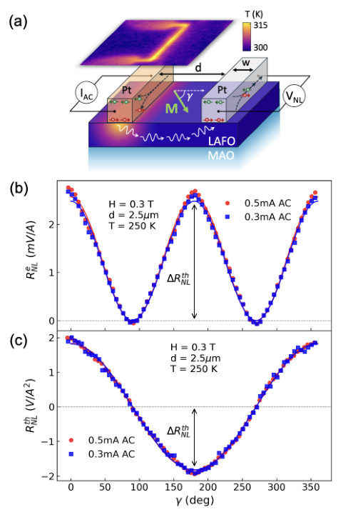
<figcaption class="paper-figure-caption"><b>Fig 1.</b> FIG. 1. Nonlocal transport experimental setup. (a) Schematic of a device consisting of Pt injector and detector strips (width w) on a LAFO thin film grown on MgAl2O4 (MAO). Magnons are injected into LAFO electrically via the spin Hall effect (SHE) and thermally via the spin Seebeck ef- fect, and detected a distance d away via the inverse SHE. The LAFO magnetization M is rotated in-plane by an angle γ us- ing an in-plane external magnetic field H. The image above the schematic is a mid-wave infrared (MWIR) microscopy im- age taken at T = 300 K for a device with d = 5.0 µm when a 0.5 mA ac current is applied. (b, c) Nonlocal resistance (de- fined from harmonic voltages) as a function of...</figcaption>
</figure>
<figure class="paper-figure-card">
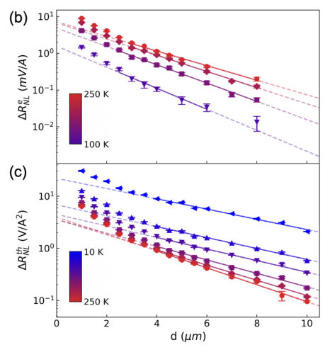
<figcaption class="paper-figure-caption"><b>Fig 2.</b> FIG. 2. Nonlocal resistance amplitude as a function of injector-detector distance d for (a) electrically and (b) ther- mally generated magnons for select temperatures. Solid lines are fits to Eq. (3) and are used to extract λe,th m , and dashed lines are extrapolations beyond the fitted range. The data are well described by a single exponential decay over the selected distance range.</figcaption>
</figure>
<figure class="paper-figure-card">
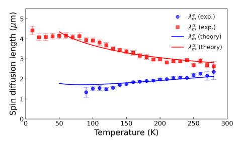
<figcaption class="paper-figure-caption"><b>Fig 3.</b> FIG. 3. Spin diffusion length as a function of temperature for thermally (λth m) and electrically generated magnons (λe m). Circles denote the experimental data extracted from fits to the nonlocal resistance using Eq. (3), while solid lines denote the theoretical modeling. The parameters for the model are listed in Supplemental Section VI [33].</figcaption>
</figure>

**Main problem.** The study aims to understand the distinct damping mechanisms and temperature-dependent trends of spin diffusion lengths (SDL) for electrically versus thermally generated magnons in low-damping LAFO thin films.

**Main result.** The researchers found that thermal SDL decreases with temperature due to magnon-phonon scattering, while electrical SDL increases with temperature because the scattering from magnetic impurities (modeled as two-level systems) weakens as they approach saturation.

**Method.** The study uses nonlocal transport measurements in Pt/LAFO devices, employing the Spin Hall Effect for electrical injection and the Spin Seebeck Effect for thermal generation, combined with mid-wave infrared microscopy for thermal mapping.

**Summary.** This paper investigates why different methods of generating magnons in LAFO thin films lead to opposite temperature dependencies in their spin diffusion lengths. By distinguishing between high-k (thermal) and low-k (electrical) magnon populations, the authors show that thermal magnons are limited by increasing phonon scattering, whereas electrical magnons are limited by impurity-driven scattering that decreases with temperature. This work provides a way to probe fundamental damping mechanisms in low-loss magnetic insulators, which are critical for future spintronic technologies.

Detailed structure

**Model / system.** The physical system consists of Li0.5Al1.0Fe1.5O4 (LAFO) spinel ferrite thin films grown on MgAl2O4 substrates. The transport is modeled using a 1D magnon diffusion equation considering both magnon-number-conserving and non-conserving scattering channels.

**Key observables.** Spin diffusion length (SDL), nonlocal resistance amplitudes, Gilbert damping, and thermal decay length.

**Important parameters / regimes.** Temperature range (10 K to 280 K), film thicknesses (16 nm and 86 nm), and magnon energy cutoff (5.3 K).

**Assumptions / limitations.** The model assumes isotropic magnon dispersion, a 1D diffusion approximation, and that compressive strain from the substrate is the primary driver of easy-plane anisotropy.

**Figures summary.** The notes do not provide specific figure descriptions, but imply figures showing temperature-dependent SDL, thickness-dependent transport, and structural characterization via XRD.

**Paper structure.** The paper introduces the problem of magnon damping, describes the material growth and device fabrication, presents experimental transport and thermal imaging results, develops a theoretical diffusion model to explain the divergent SDL trends, and concludes with a comparison of scattering mechanisms.

Abstract

The mechanisms underlying magnon damping are of fundamental and technological interest in low-damping materials. We find low-damping ferrimagnetic insulator Li$_{0.5}$Al$_{1.0}$Fe$_{1.5}$O$_4$ (LAFO) thin films to be a promising model system for probing these mechanisms because of its distinct temperature dependent spin diffusion length (SDL) trends for electrically and thermally generated magnons. With increasing temperature, the electrical SDL shows minimal change, while the thermal SDL decreases. We attribute these trends to distinct magnon populations and scattering mechanisms: thermally generated high $k$ magnons are limited by magnon-phonon scattering, whereas electrically generated low $k$ magnons are limited by relaxational scattering from magnetic impurities.

[↑ back to top](#top)

### [Visualizing Vortex Cluster Dynamics in the Weak Type-II Superconductor CaSb$_2$](http://arxiv.org/abs/2604.23117v1)

**Authors:** Yusuke Iguchi, Nabhanila Nandi, Mohamed Oudah  
**Type:** experiment · **Category:** strongly correlated electrons · **PDF:** <https://arxiv.org/pdf/2604.23117v1>  
**Analysis basis:** full PDF text, analyzed in chunks

↔ Scroll figures horizontally

<figure class="paper-figure-card">
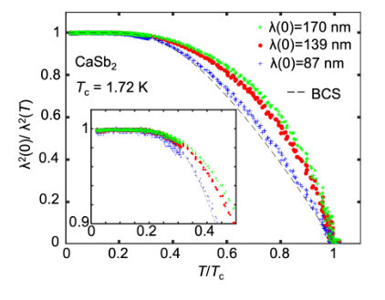
<figcaption class="paper-figure-caption"><b>Fig 1.</b> FIG. 1. Scanning SQUID susceptometry measurements on CaSb2 with the applied field normal to ab plane yield a tem- perature dependence of the superfluid density consistent with a single-gap BCS model, showing clear deviations from pre- viously proposed multiband models [24].</figcaption>
</figure>
<figure class="paper-figure-card">
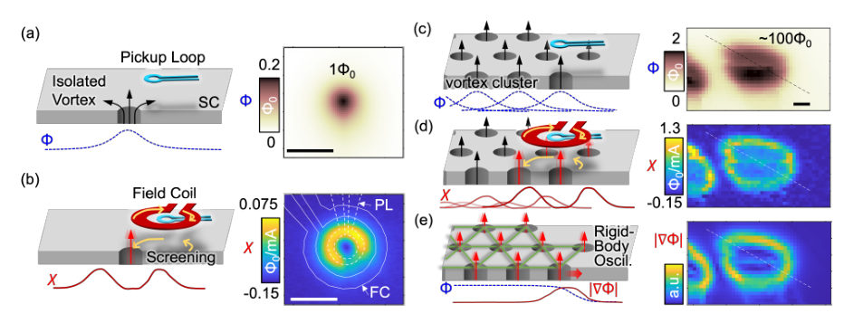
<figcaption class="paper-figure-caption"><b>Fig 2.</b> FIG. 2. Local observation of partially collective vortex cluster dynamics. (a-b) Magnetometry Φ and susceptometry χ over an isolated vortex at 1.5 K in CaSb2, together with schematic illustrations (left). These serve as a reference for evaluating cluster behavior. (c–e) Left: schematic images of (c) magnetometry over a vortex cluster, (d) locally induced magnetic dynamics in a cluster, and (e) rigid-body-like collective oscillation of the entire cluster (shown for comparison). Right: corresponding measurements, (c) flux scan (from Fig. 3(c)), (d) susceptibility scan (from Fig. 3(g)), and (e) the derivative |∇Φ| calculated from (c), representing the rigid-body approximation mode. Scale bars:...</figcaption>
</figure>
<figure class="paper-figure-card">
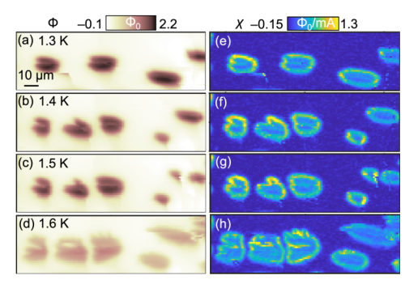
<figcaption class="paper-figure-caption"><b>Fig 3.</b> FIG. 3. Temperature-induced morphological transforma- tions and consistent dynamic magnetic responses of vortex clusters in CaSb2. (a-d) Magnetometry and (e-h) susceptom- etry of vortex clusters formed under under 1.7 Oe field cooling, shown at temperatures increasing from 1.3 K to 1.6 K. While the cluster morphology evolves from compact to elongated or fragmented shapes with increasing temperature, the enhanced boundary response persists, indicating robust collective vor- tex dynamics.</figcaption>
</figure>
<figure class="paper-figure-card">
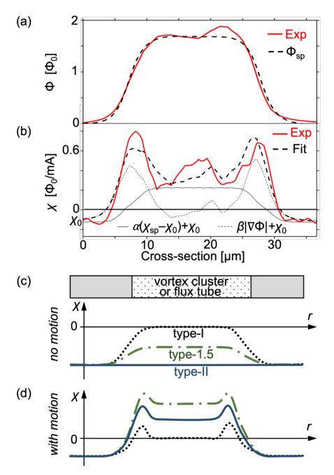
<figcaption class="paper-figure-caption"><b>Fig 4.</b> FIG. 4. Quantitative modeling of vortex clusters and dy- namics. (a) Cross-section of ϕ along the dashed line in Fig. 2(c) compared with a triangular-lattice cluster simu- lation Φsp, constructed by superposing isolated-vortex data with lattice constant a = 1.65 µm (range: 1.55—1.65 µm). (b) Cross-section of the measured χ compared with the scaled model α(χsp −χ0) + β|∇Φ| + χ0, with fit parameters χ0 = −0.12 Φ0/mA, α ≃0.17, and β ≃1.61 µm/mA. (c,d) Schematic susceptibility across vortex clusters in various su- perconductors, contrasting (c) strong-pinning and (d) weak- pinning regimes, with finite internal response appearing only in dynamic type-II and type-1.5 cases.</figcaption>
</figure>

**Main problem.** Determining the origin of vortex clustering in the weak Type-II superconductor CaSb2 and whether it arises from intrinsic non-monotonic vortex-vortex interactions or disorder-induced pinning.

**Main result.** The study reveals dense vortex clusters with suppressed internal motion and enhanced susceptibility at the boundaries, indicating collective dynamics that cannot be explained by simple rigid-body motion or independent vortex models.

**Method.** Scanning SQUID susceptometry was used to simultaneously image local magnetic flux and local ac susceptibility at temperatures between 0.03 and 1.74 K.

**Summary.** This paper uses scanning SQUID microscopy to visualize the dynamics of vortex clusters in the superconductor CaSb2. The researchers found that vortices within clusters move differently at the edges compared to the interior, showing enhanced susceptibility at the boundaries. This behavior suggests complex, non-monotonic vortex interactions that challenge existing single-band superconductivity theories. The findings provide a new way to probe physics beyond the standard Ginzburg-Landau description of Type-II superconductors.

Detailed structure

**Model / system.** The physical system is CaSb2, a weak Type-II superconductor with a non-symmorphic structure. The study uses a monopole model for isolated vortices and a linear superposition model for vortex clusters.

**Key observables.** Local magnetic flux (Phi), local ac susceptibility (chi), and the spatial derivative of flux (|grad Phi|).

**Important parameters / regimes.** Critical temperature Tc = 1.72 K; Ginzburg-Landau parameter kappa between 0.95 and 3.3; penetration depth lambda between 87 and 250 nm.

**Assumptions / limitations.** The magnetic susceptibility signal is assumed to be intrinsic rather than an artifact of mechanical vibrations or magnetic-induced cantilever motion.

**Figures summary.** Figures show temperature-dependent morphological changes in clusters (from compact to fragmented), comparison of flux profiles with monopole models, and simulated susceptibility maps for triangular vortex lattices.

**Paper structure.** The paper introduces the material and problem, describes the scanning SQUID experimental setup, presents the discovery of cluster dynamics, tests various motion models (rigid-body vs. independent), and performs a validation analysis against extrinsic noise sources.

Abstract

Scanning SQUID imaging of CaSb$_2$ reveals dense vortex clusters with enhanced boundary susceptibility and suppressed internal vortex motion, which features inconsistent with both isolated vortex and flux tube behaviors. These measurements provide the first local visualization of magnetic dynamics within vortex clusters in a weakly pinned superconductor, offering a new route to probe non-monotonic vortex-vortex interactions that are typically expected in single-band type-II/1 or multiband type-1.5 superconductors. Although the superfluid density follows a single-gap BCS model and the Ginzburg-Landau parameter of CaSb$_2$ lies slightly outside the type-II/1 regime, vortex clustering and spatially inhomogeneous dynamics are clearly observed, indicating physics beyond existing microscopic theories for single-band superconductors.

[↑ back to top](#top)

### [Wafer-scale hybrid molecular beam epitaxy of BaTiO3 and SrTiO3 on silicon](http://arxiv.org/abs/2604.23259v1)

**Authors:** Xiaodong Tian, Yan Lin, Hanbin Gao, Han Yu, Yunpeng Ma, Ruiqi Liang, Changfu Chen, Wei Li, Chenguang Deng, Qiang Zheng, Qian Li  
**Type:** experiment · **Category:** other · **PDF:** <https://arxiv.org/pdf/2604.23259v1>  
**Analysis basis:** full PDF text, analyzed in chunks

↔ Scroll figures horizontally

<figure class="paper-figure-card">
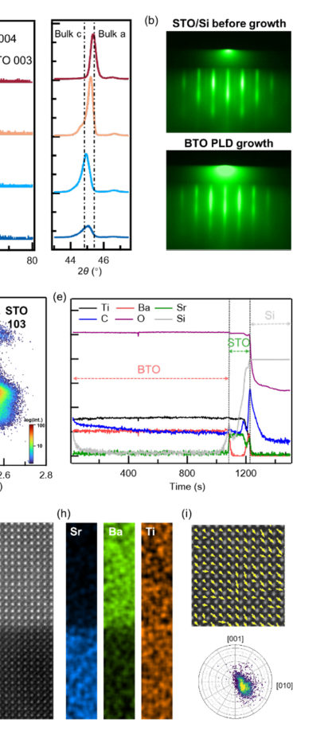
<figcaption class="paper-figure-caption"><b>Fig 1.</b> Fig. 2 (a) Comparison of q–2q scan patterns for the BTO films grown via hybrid MBE,</figcaption>
</figure>
<figure class="paper-figure-card">
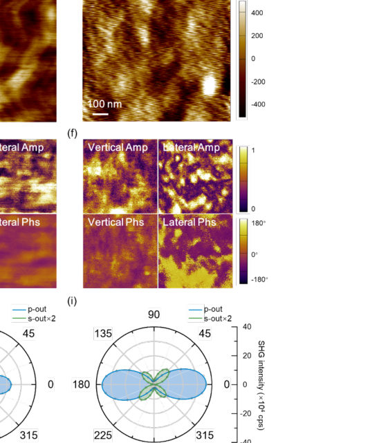
<figcaption class="paper-figure-caption"><b>Fig 2.</b> Fig. 3 (a–c) AFM topography images of the fully hMBE-grown BTO films (hMBE_1</figcaption>
</figure>
<figure class="paper-figure-card">
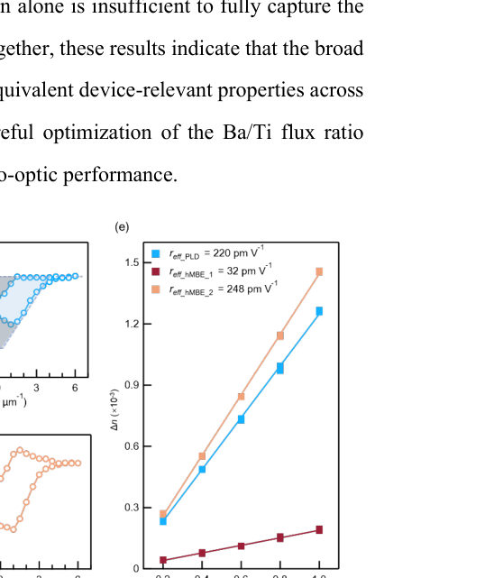
<figcaption class="paper-figure-caption"><b>Fig 3.</b> Fig. 4 (a) Wavelength-dependent refractive index (n) and extinction coefficient (k)</figcaption>
</figure>

**Main problem.** Achieving scalable, high-quality, and uniform epitaxial growth of barium titanate (BTO) on 4-inch silicon wafers for integrated photonics, while overcoming challenges in stoichiometry control and slow growth rates.

**Main result.** Demonstrated continuous, wafer-scale growth of high-quality BTO on SrTiO3-buffered Si using hybrid molecular beam epitaxy (hMBE), achieving superior crystallinity and a larger effective electro-optic coefficient (248 pm/V) compared to PLD-grown films.

**Method.** A hybrid molecular beam epitaxy (hMBE) approach using titanium tetraisopropoxide (TTIP) as a metalorganic precursor, combined with Sr-passivation of Si(001) and atomic oxygen from an RF plasma source.

**Summary.** This paper presents a breakthrough in the scalable production of ferroelectric thin films for silicon photonics. By using a hybrid molecular beam epitaxy (hMBE) technique with a metalorganic titanium precursor, the researchers achieved high-quality, uniform BTO growth on 4-inch silicon wafers. The method provides much faster growth rates and better crystalline quality than traditional techniques like PLD. This advancement is crucial for developing next-generation, energy-efficient integrated photonic circuits.

Detailed structure

**Model / system.** The experimental platform consists of BTO/SrTiO3/Si heterostructures grown on 4-inch Si(001) wafers, utilizing a self-regulating, adsorption-controlled growth regime.

**Key observables.** Effective electro-optic (EO) coefficient, growth rate, lattice parameters, surface roughness, domain configurations (a-domain vs. c-domain), and optical refractive indices.

**Important parameters / regimes.** Growth rate (>75 nm/h), TTIP/Ba flux ratio, temperature (600-800 C), and lattice mismatch/rotation (45 degrees).

**Assumptions / limitations.** The growth is governed by a self-regulating, adsorption-controlled mechanism where the growth rate is limited by the Ba flux.

**Figures summary.** The figures likely illustrate the growth process, RHEED patterns for in-situ monitoring, XRD mapping for wafer-scale uniformity, STEM images of the BTO/STO/Si interface, AFM/PFM for surface morphology and domains, and electro-optic response measurements.

**Paper structure.** The paper introduces the problem of BTO/Si integration, describes the hMBE experimental setup and precursor use, details the substrate preparation and growth process, compares hMBE with PLD/sputtering, analyzes structural and chemical properties, and concludes with the functional electro-optic performance.

Abstract

The integration of epitaxial barium titanate (BTO) on silicon represents a highly promising pathway for next-generation, energy-efficient photonic integrated circuits due to BTO's exceptionally high Pockels coefficients. However, the scalable epitaxy of BTO on Si remains hindered by complex stoichiometric control and slow growth rates. In this work, we demonstrate the continuous, uniform wafer-scale growth of high-quality BTO films on SrTiO3 (STO)-buffered 4-inch Si(001) wafers using a fully hybrid molecular beam epitaxy (hMBE) approach. By utilizing titanium tetraisopropoxide as a titanium precursor, we achieve a self-regulating, adsorption-controlled layer-by-layer growth at rates exceeding 75 nm/h, while maintaining an atomically sharp and structurally coherent BTO/STO interface. We systematically compare the structural, ferroelectric, and electro-optic (EO) properties of fully hMBE-grown BTO with those deposited via pulsed laser deposition (PLD) on identical STO/Si templates. While both techniques yield high-quality c-domain dominated films, the optimized hMBE-grown BTO exhibits superior crystallinity and a larger effective EO coefficient of 248 pm/V, surpassing that of the PLD-grown films (220 pm/V). These results highlight the advantages of the fully hMBE approach as a scalable, deterministic, and high-performance materials platform for wafer-scale integrated ferroelectric photonics.

[↑ back to top](#top)

### [Weak Polar Optical Phonon Scattering Decouples Electron and Phonon Transport in Layered Thermoelectric Materials](http://arxiv.org/abs/2604.23328v1)

**Authors:** Zhonghao Xia, Michele Reticcioli, Yateng Wang, Yali Yang, Alessandro Stroppa, Jiangang He  
**Type:** theory · **Category:** other · **PDF:** <https://arxiv.org/pdf/2604.23328v1>  
**Analysis basis:** full PDF text, analyzed in chunks

↔ Scroll figures horizontally

<figure class="paper-figure-card">
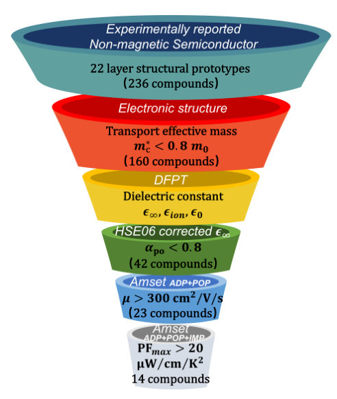
<figcaption class="paper-figure-caption"><b>Fig 1.</b> Figure 1. Screening workflow for identifying layered semiconductors with high carrier mobility and power factor at room temperature.</figcaption>
</figure>
<figure class="paper-figure-card">
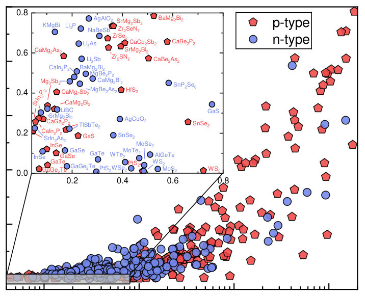
<figcaption class="paper-figure-caption"><b>Fig 2.</b> Figure 2. Distribution of the 236 screened compounds in the parameter space defined by the polar coupling constant αpo and conductivity mass m∗ c along the cross-plane direction.</figcaption>
</figure>
<figure class="paper-figure-card">
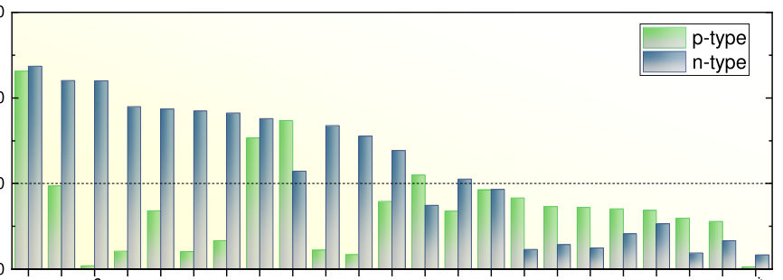
<figcaption class="paper-figure-caption"><b>Fig 3.</b> Figure 3. (a) The cross-plane carrier mobility at 300 K and a carrier concentration of 1 × 1019 cm−3, calculated by considering both ADP and POP scattering, as a function of the product of αpo and m∗ c for materials that satisfy both screening thresholds. The symbol color represents the fraction of polar optical phonon scattering in the total scattering rate. (b) The correlation between the high-frequency dielectric constant ϵ∞and 1/ϵ∞−1/ϵ0. (c) The maximum power factor at room temperature among the high-mobility samples, considering three scattering mechanisms.</figcaption>
</figure>
<figure class="paper-figure-card">
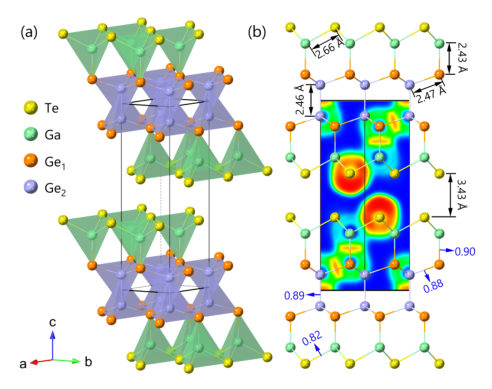
<figcaption class="paper-figure-caption"><b>Fig 4.</b> Figure 4. (a) The conventional unit cell and (b) the ELF of along [110] direction for GaGe2Te. The black arrows mark the chemical bond lengths and the vertical distances between layers, and the blue arrows are the corresponding integrated crystal orbital bond index ICOBI.</figcaption>
</figure>
<figure class="paper-figure-card">
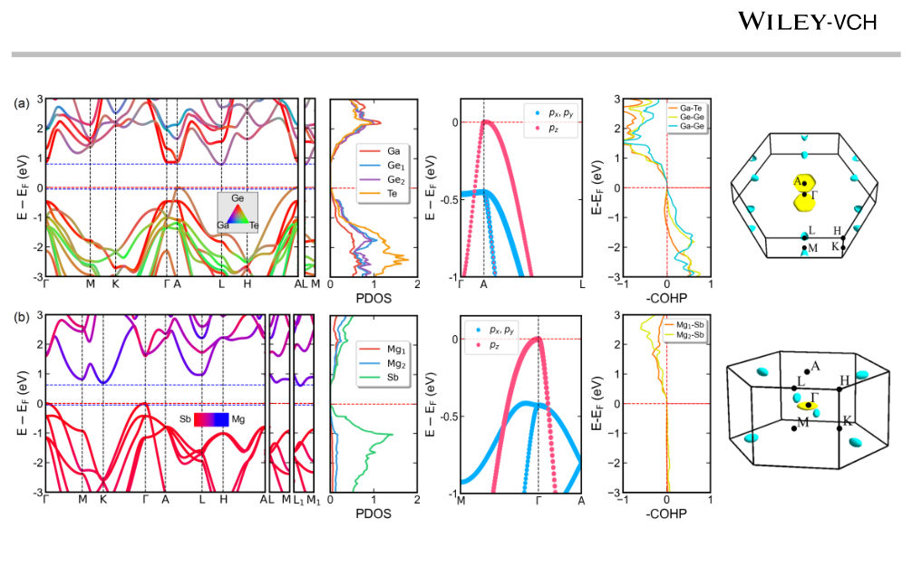
<figcaption class="paper-figure-caption"><b>Fig 5.</b> Figure 5. Element-resolved band structures, atom-projected density of states, enlarged views of the orbital-projected valence bands near the Γ point, -COHP curves calculated using the PBEsol exchangecorrelation functional, and Fermi surfaces of (a) GaGe2Te and (b) Mg3Sb2. The Fermi surfaces corresponding energy levels are indicated by blue dashed lines in the band-structure panels. The yellow and cyan surfaces represent the Fermi surfaces near the VBM and CBM, respectively.</figcaption>
</figure>
<figure class="paper-figure-card">
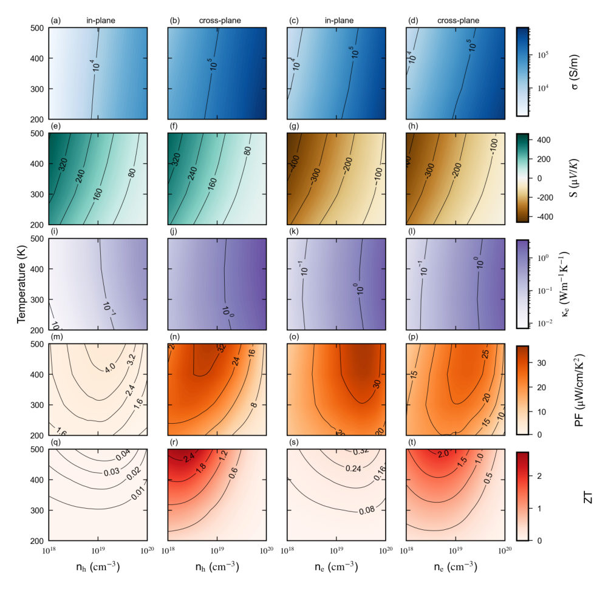
<figcaption class="paper-figure-caption"><b>Fig 6.</b> Figure 6. Calculated electronic transport properties of GaGe2Te for p-type (left two columns) and n-type (right two columns) doping using the Perturbo package, including both electron–phonon and impurity (IMP) scattering: (a)–(d) electrical conductivity σ, (e)–(h) Seebeck coefficient S, (i)–(l) electrical thermal conductivity κe, (m)–(p) power factor PF, and (q)–(t) figure of merit ZT, for carrier concentrations from 1018–1020 cm−3 and temperatures from 200 to 500 K.</figcaption>
</figure>
<figure class="paper-figure-card">
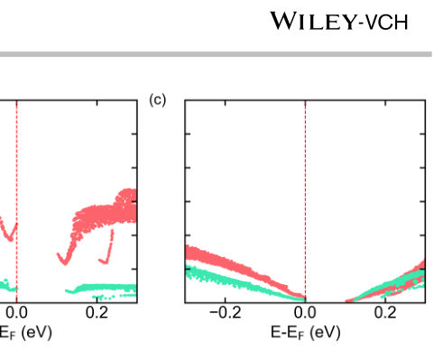
<figcaption class="paper-figure-caption"><b>Fig 7.</b> Figure 7. (a) Total scattering rate (b) long-range and (c) remainder contributions for n-type and p-type doping.</figcaption>
</figure>
<figure class="paper-figure-card">
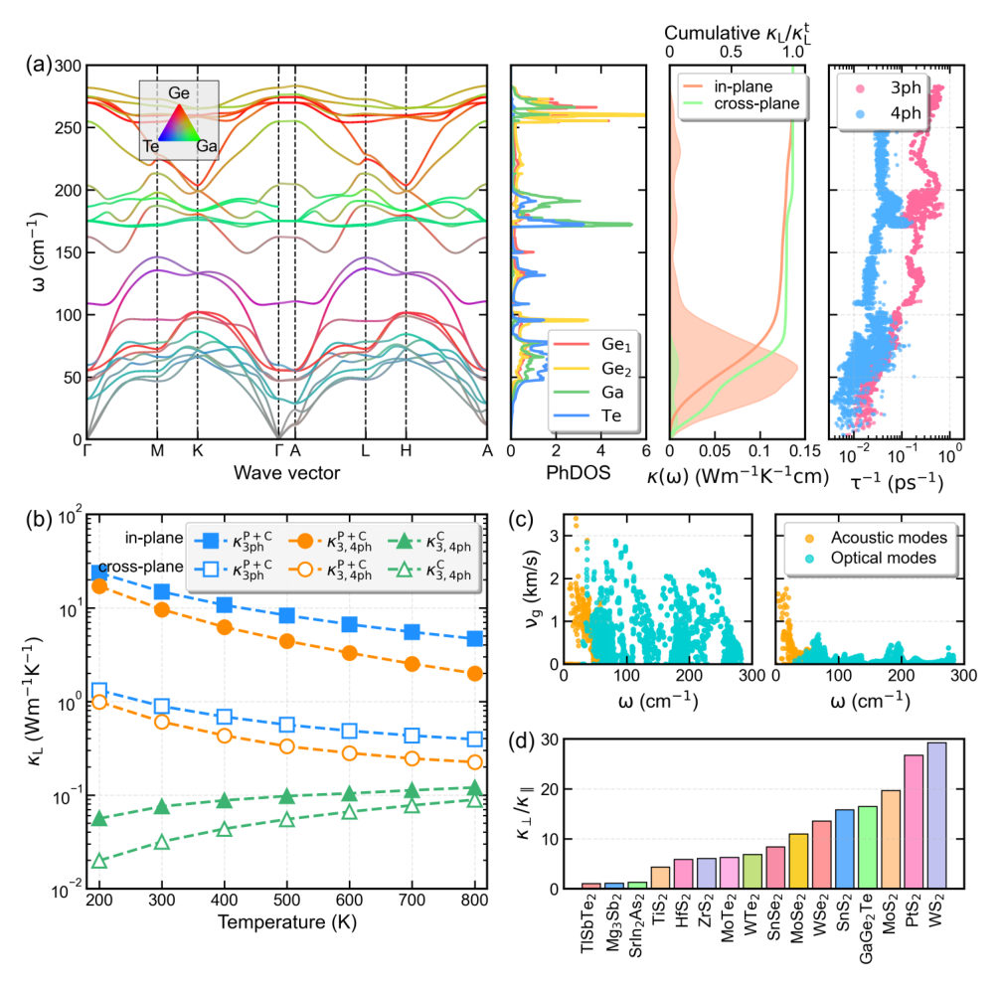
<figcaption class="paper-figure-caption"><b>Fig 8.</b> Figure 8. (a) The atom resolution phonon dispersion including non-analytical corrections, phonon density of states PhDOS, lattice con- ductivity spectrum κ(ω), the ratio cumulative κL to total lattice thermal conductivity κt L and the 3ph and 4ph scattering rates (τ −1) at 300 K. (b) The calculated κL as a function of temperature in in-plane and cross-plane directions. (c) The phonon group velocity at room temperature in in-plane (left) and cross-plane (right). (d) The κ⊥/κ∥in different compounds [35,71–74].</figcaption>
</figure>

**Main problem.** The fundamental challenge in designing high-performance thermoelectric materials is the strong interdependence between electrical conductivity, Seebeck coefficient, and lattice thermal conductivity, particularly the trade-off between high mobility and low thermal conductivity in layered compounds.

**Main result.** The study identifies a strategy to decouple electron and phonon transport by suppressing polar optical phonon (POP) scattering through high covalency, highlighting GaGe2Te as a standout candidate with exceptionally high cross-plane power factor and ultralow thermal conductivity.

**Method.** High-throughput density functional theory (DFT) calculations using VASP and HSE06, combined with Boltzmann transport theory (BoltzTraP2, AMSET, Perturbo) and advanced phonon dynamics (FourPhonon, SCPH, CSLD).

**Summary.** This paper presents a computational strategy to design high-efficiency thermoelectric materials by breaking the link between electron and phonon transport. By screening hundreds of layered semiconductors, the authors found that minimizing the ionic dielectric constant can suppress polar optical phonon scattering, allowing for high carrier mobility. They identify GaGe2Te as a premier candidate that achieves both high electrical power factors and ultralow thermal conductivity due to its unique covalent bonding and structural anisotropy. This 'covalency engineering' approach provides a new pathway for discovering high-performance energy-harvesting materials.

Detailed structure

**Model / system.** A high-throughput screening of 236 thermodynamically stable layered semiconductors, with a detailed focus on the layered van der Waals semiconductor GaGe2Te, which features a Ge bilayer and strong intralayer covalent bonding.

**Key observables.** Electrical conductivity, Seebeck coefficient, power factor (S^2sigma), lattice thermal conductivity, carrier mobility, and thermoelectric figure of merit (ZT).

**Important parameters / regimes.** Temperature of 300 K, carrier concentrations of 1e18 to 1e20 cm^-3, effective mass (m*), ionic dielectric constant (epsilon_ion), and Fröhlich coupling constant (alpha_po).

**Assumptions / limitations.** Calculations of electron transport were performed within the constant relaxation time approximation for certain components; phonon transport was treated as diffusive (particle-like).

**Figures summary.** The figures include scattering rate decompositions (total, long-range, and remainder), phonon dispersion and density of states, thermal conductivity spectra, and analysis of the ionic dielectric constant and bonding indices.

**Paper structure.** The paper begins with a high-throughput screening of 236 compounds, followed by a detailed investigation of the physical mechanism of POP scattering suppression, a specific case study of GaGe2Te's electronic and phononic properties, and a concluding discussion on the design principles for decoupling transport.

Abstract

High-performance thermoelectric (TE) materials are crucial for efficient waste-heat recovery and solid-state cooling technologies. A persistent challenge in TE materials design arises from the strong interdependence among the electrical conductivity ($σ$), Seebeck coefficient ($S$), and lattice thermal conductivity ($κ_{\mathrm{L}}$). Layered compounds can effectively suppress $κ_{\mathrm{L}}$ along the cross-plane direction owing to weak interlayer interactions; however, they often suffer from low carrier mobility ($μ$) caused by limited band dispersion and strong polar optical phonon (POP) scattering. Here, we perform high-throughput density functional theory calculations to screen 236 layered semiconductors and identify candidates with low effective mass ($m^{*}$) and weak POP scattering. We identify 23 compounds with high cross-plane $μ$, among which 14 exhibit large power factors ($S^{2}σ$). Notably, GaGe$_{2}$Te stands out with exceptionally high cross-plane $σ$ and power factor, enabled by a favorable combination of small $m^{*}$ and a small ionic dielectric constant. Simultaneously, GaGe$_{2}$Te exhibits an ultralow cross-plane $κ_{\mathrm{L}}$ of 0.57~W~m$^{-1}$~K$^{-1}$ at 300~K, originating from weak interlayer bonding and pronounced phonon anharmonicity. These results demonstrate an effective strategy to decouple electron and phonon transport in layered materials by mitigating POP scattering, thereby providing a promising pathway toward high-performance thermoelectric materials.

[↑ back to top](#top)

