
# arxiv digest (quant-ph + cond-mat) — 2026-04-29

*177 papers · 40 relevant · 6 highlighted*

## 🔥 Most relevant (40)

*Every paper with at least one nonzero topic score, sorted by best-matching score. 🔥 marks scores ≥4/5. Click the title to jump to the full entry below; click [arXiv] to open the paper page. `(secondary)` marks papers from de-prioritized cond-mat archives.*

Show 40 relevant papers

- ⭐ [Randomised measurements of a disorder-induced entanglement transition in a neutral atom quantum processor](#paper-2604.24854) [[arXiv]](http://arxiv.org/abs/2604.24854v1) — 🔥 `Rydberg arrays` **5/5** · 🔥 `QC/QI experiment` **4/5** · 🔥 `analog quantum simulation` **4/5** · 🔥 `entanglement & information structure` **4/5** · 🔥 `non-equilibrium dynamics` **4/5** · `quantum measurements` **3/5** · `exotic spin models in light-matter` **2/5** · `measurement-induced transitions` **2/5** · `non-equilibrium universality` **2/5** · `scars & prethermalization` **2/5**
- [Emergent prethermal Bethe integrability in a periodically driven Rydberg chain](#paper-2604.24850) [[arXiv]](http://arxiv.org/abs/2604.24850v1) — 🔥 `scars & prethermalization` **5/5** · 🔥 `Rydberg arrays` **4/5** · 🔥 `non-equilibrium dynamics` **4/5** · `analog quantum simulation` **3/5** · `driven-dissipative phase transition` **3/5** · `entanglement & information structure` **3/5** · `exotic spin models in light-matter` **3/5**
- [Synthetic Polariton Matter in the solid state](#paper-2604.25413) [[arXiv]](http://arxiv.org/abs/2604.25413v1) — 🔥 `analog quantum simulation` **4/5** · 🔥 `driven-dissipative phase transition` **4/5** · `Tavis-Cummings & cavity-many-emitter` **3/5** · `correlated cavity matter` **3/5** · `exotic spin models in light-matter` **3/5** · `non-equilibrium dynamics` **3/5** · `non-equilibrium universality` **3/5** · `quantum optics experiment` **3/5** · `Keldysh / 2PI / non-Gaussian methods` **2/5** · `methods for driven-dissipative` **2/5** · `entanglement & information structure` **1/5**
- [Continuous Reset-Induced Phase Transition in Measurement-Free Random Quantum Circuits](#paper-2604.25640) [[arXiv]](http://arxiv.org/abs/2604.25640v1) — 🔥 `driven-dissipative phase transition` **4/5** · 🔥 `entanglement & information structure` **4/5** · 🔥 `measurement-induced transitions` **4/5** · 🔥 `non-equilibrium universality` **4/5** · `non-equilibrium dynamics` **3/5** · `methods for driven-dissipative` **2/5** · `quantum measurements` **2/5**
- [Temporal hopping dynamics in exciton-polariton condensation](#paper-2604.25519) [[arXiv]](http://arxiv.org/abs/2604.25519v1) `(secondary)` — 🔥 `driven-dissipative phase transition` **4/5** · 🔥 `non-equilibrium dynamics` **4/5** · 🔥 `quantum optics experiment` **4/5** · `Keldysh / 2PI / non-Gaussian methods` **3/5** · `methods for driven-dissipative` **3/5** · `non-equilibrium universality` **3/5**
- [Entanglement Dynamics in a Two Transmon Qubit System under Continuous Measurement and Postselection](#paper-2604.25311) [[arXiv]](http://arxiv.org/abs/2604.25311v1) — 🔥 `quantum measurements` **4/5** · `correlated / nonlocal dissipation` **3/5** · `driven-dissipative phase transition` **3/5** · `entanglement & information structure` **3/5** · `methods for driven-dissipative` **3/5** · `measurement-induced transitions` **2/5** · `non-equilibrium dynamics` **2/5**
- ⭐ [Quantum limit cycles with continuous symmetries from coherent parametric driving: exact solutions and many-body extensions](#paper-2604.25864) [[arXiv]](http://arxiv.org/abs/2604.25864v1) — 🔥 `driven-dissipative phase transition` **4/5** · `entanglement & information structure` **3/5** · `methods for driven-dissipative` **3/5** · `non-equilibrium dynamics` **3/5** · `Keldysh / 2PI / non-Gaussian methods` **2/5** · `correlated / nonlocal dissipation` **2/5** · `non-equilibrium universality` **2/5**
- [Testing a continuous-variable Bell-like inequality with a hybrid-encoded system](#paper-2604.25901) [[arXiv]](http://arxiv.org/abs/2604.25901v1) — 🔥 `QC/QI experiment` **4/5** · 🔥 `quantum optics experiment` **4/5** · `quantum measurements` **3/5** · `entanglement & information structure` **2/5** · `interference shaping light` **2/5**
- [3D integration of a hybrid quantum dot circuit-QED device for fast gate dispersive charge readout and coherent spin-photon coupling](#paper-2604.25871) [[arXiv]](http://arxiv.org/abs/2604.25871v1) `(secondary)` — 🔥 `QC/QI experiment` **4/5** · 🔥 `quantum optics experiment` **4/5** · `quantum measurements` **3/5** · `spintronics-quantum-optics interface` **3/5**
- [Finite-time transitions in optimal control and non-equilibrium relaxation](#paper-2604.25798) [[arXiv]](http://arxiv.org/abs/2604.25798v1) — 🔥 `driven-dissipative phase transition` **4/5** · 🔥 `non-equilibrium dynamics` **4/5** · `non-equilibrium universality` **3/5** · `quantum measurements` **2/5**
- [Nonlinearity-enhanced Quantum Sensing in Discrete Time Crystal Probes](#paper-2604.25286) [[arXiv]](http://arxiv.org/abs/2604.25286v1) — 🔥 `non-equilibrium dynamics` **4/5** · `driven-dissipative phase transition` **3/5** · `entanglement & information structure` **2/5** · `non-equilibrium universality` **2/5** · `quantum measurements` **2/5**
- [Phase diagram of a dual-species Rydberg atom ladder](#paper-2604.24889) [[arXiv]](http://arxiv.org/abs/2604.24889v1) — 🔥 `Rydberg arrays` **4/5** · `analog quantum simulation` **3/5** · `entanglement & information structure` **3/5** · `exotic spin models in light-matter` **3/5**
- [Quantum Compressed Sensing Enables Image Classification with a Single Photon](#paper-2604.25480) [[arXiv]](http://arxiv.org/abs/2604.25480v1) — 🔥 `QC/QI experiment` **4/5** · 🔥 `quantum optics experiment` **4/5** · `quantum measurements` **3/5** · `interference shaping light` **2/5**
- [Anomalous Mixed-State Floquet Topology in One-Dimensional Open Quantum Systems](#paper-2604.25248) [[arXiv]](http://arxiv.org/abs/2604.25248v1) — 🔥 `non-equilibrium dynamics` **4/5** · `driven-dissipative phase transition` **3/5** · `methods for driven-dissipative` **3/5** · `entanglement & information structure` **2/5**
- [Demonstration of quantum random number generation using nitrogen vacancy centres](#paper-2604.24870) [[arXiv]](http://arxiv.org/abs/2604.24870v1) — 🔥 `QC/QI experiment` **4/5** · 🔥 `quantum optics experiment` **4/5** · `quantum measurements` **2/5** · `spintronics-quantum-optics interface` **2/5**
- [Nanoscale Sensing of Solid-State Samples with High Frequency Resolution](#paper-2604.25660) [[arXiv]](http://arxiv.org/abs/2604.25660v1) — 🔥 `QC/QI experiment` **4/5** · 🔥 `spintronics-quantum-optics interface` **4/5** · `non-equilibrium dynamics` **2/5** · `quantum measurements` **2/5**
- [Semi-transmitter-device-independent quantum key distribution](#paper-2604.25225) [[arXiv]](http://arxiv.org/abs/2604.25225v1) — 🔥 `QC/QI experiment` **4/5** · 🔥 `quantum optics experiment` **4/5** · `entanglement & information structure` **2/5** · `quantum measurements` **2/5**
- ⭐ [Getting large-scale quantum neural networks ready for quantum hardware](#paper-2604.24886) [[arXiv]](http://arxiv.org/abs/2604.24886v1) — 🔥 `methods for driven-dissipative` **4/5** · `non-equilibrium dynamics` **3/5** · `driven-dissipative phase transition` **2/5** · `entanglement & information structure` **2/5**
- [Probing Spin Dynamics Across Magnetic Phase Transitions in CrCl3 Nanoflakes Using Nitrogen-Vacancy Microscopy](#paper-2604.25002) [[arXiv]](http://arxiv.org/abs/2604.25002v1) `(secondary)` — 🔥 `spintronics-quantum-optics interface` **4/5** · `QC/QI experiment` **3/5** · `correlated / nonlocal dissipation` **2/5** · `quantum measurements` **2/5**
- [Hardware Realization of a Hamiltonian Simulation Algorithm for Time-Domain Maxwells Equations](#paper-2604.25229) [[arXiv]](http://arxiv.org/abs/2604.25229v1) — 🔥 `QC/QI experiment` **4/5** · `non-equilibrium dynamics` **2/5** · `quantum measurements` **2/5** · `quantum optics experiment` **2/5**
- [Near-identical photons from distant quantum dot-cavity devices](#paper-2604.25615) [[arXiv]](http://arxiv.org/abs/2604.25615v1) — 🔥 `QC/QI experiment` **4/5** · 🔥 `quantum optics experiment` **4/5** · `interference shaping light` **2/5**
- [Determination of the Fermi Energy of Diamond using Photoluminescence Spectral Analysis](#paper-2604.25097) [[arXiv]](http://arxiv.org/abs/2604.25097v1) — 🔥 `QC/QI experiment` **4/5** · `spintronics-quantum-optics interface` **3/5** · `quantum optics experiment` **2/5**
- [Nonreciprocal magnon blockade based on nonlinear effects](#paper-2604.25141) [[arXiv]](http://arxiv.org/abs/2604.25141v1) — 🔥 `spintronics-quantum-optics interface` **4/5** · `interference shaping light` **3/5** · `methods for driven-dissipative` **2/5**
- [Quantum sensing-enabled deuterium NMR spectroscopy with nanoscale sensitivity at low magnetic fields](#paper-2604.25752) [[arXiv]](http://arxiv.org/abs/2604.25752v1) — 🔥 `spintronics-quantum-optics interface` **4/5** · `QC/QI experiment` **3/5** · `quantum measurements` **2/5**
- [Adaptive Sensing beyond Non-Adaptive Information Limits: End-to-End Co-Design of Geometry, Policy, and Inference](#paper-2604.25193) [[arXiv]](http://arxiv.org/abs/2604.25193v1) — 🔥 `quantum measurements` **4/5** · `entanglement & information structure` **2/5** · `methods for driven-dissipative` **2/5**
- [Ground-state energies of Ising models calculated using the samples from a quantum computer that simulates short-time evolution](#paper-2604.25715) [[arXiv]](http://arxiv.org/abs/2604.25715v1) — 🔥 `QC/QI experiment` **4/5** · `entanglement & information structure` **2/5** · `non-equilibrium dynamics` **2/5**
- [Quantum memory and scrambling from the perspective of a classical neural network](#paper-2604.25663) [[arXiv]](http://arxiv.org/abs/2604.25663v1) — 🔥 `entanglement & information structure` **4/5** · 🔥 `non-equilibrium dynamics` **4/5**
- [Spectral tuning of single T centres by the Stark effect](#paper-2604.25170) [[arXiv]](http://arxiv.org/abs/2604.25170v1) — 🔥 `QC/QI experiment` **4/5** · 🔥 `quantum optics experiment` **4/5**
- [Universal Topological Power Transfer with Arbitrarily Large Chern Number in Driven Quantum Spin Chains](#paper-2604.24851) [[arXiv]](http://arxiv.org/abs/2604.24851v1) — 🔥 `non-equilibrium dynamics` **4/5** · `analog quantum simulation` **2/5** · `exotic spin models in light-matter` **2/5**
- [Magnetic quantum phases of spin-orbit-coupled anisotropic dipolar bosons in square lattices](#paper-2604.25694) [[arXiv]](http://arxiv.org/abs/2604.25694v1) — 🔥 `analog quantum simulation` **4/5** · `exotic spin models in light-matter` **3/5**
- [MCMit: Mid-Circuit Measurement Error Mitigation](#paper-2604.25863) [[arXiv]](http://arxiv.org/abs/2604.25863v1) — 🔥 `QC/QI experiment` **4/5** · `quantum measurements` **3/5**
- [Optimized thermal control of a dual-wavelength-resonant nonlinear cavity](#paper-2604.25883) [[arXiv]](http://arxiv.org/abs/2604.25883v1) — 🔥 `quantum optics experiment` **4/5** · `QC/QI experiment` **3/5**
- [A simple method to fabricate Josephson junctions](#paper-2604.25195) [[arXiv]](http://arxiv.org/abs/2604.25195v1) — 🔥 `QC/QI experiment` **4/5** · `quantum optics experiment` **2/5**
- [Bell Test of Photons from Electron-Positron Annihilation via POVM-based Compton Polarimetry](#paper-2604.25034) [[arXiv]](http://arxiv.org/abs/2604.25034v1) — 🔥 `quantum measurements` **4/5** · `entanglement & information structure` **2/5**
- [Numerically-Exact Quantum-Simulation Approach for Two-Dimensional Spectroscopy of Open Quantum Systems](#paper-2604.25753) [[arXiv]](http://arxiv.org/abs/2604.25753v1) — 🔥 `methods for driven-dissipative` **4/5** · `non-equilibrium dynamics` **2/5**
- [Deterministic Realization of Classical Dissipation on Quantum Computers](#paper-2604.25429) [[arXiv]](http://arxiv.org/abs/2604.25429v1) — 🔥 `methods for driven-dissipative` **4/5**
- [Experimental Workflows for Combinatorial Optimization: Towards Quantum Advantage](#paper-2604.25162) [[arXiv]](http://arxiv.org/abs/2604.25162v1) — 🔥 `QC/QI experiment` **4/5**
- [Magnomechanical Coupling in Suspended 2D van der Waals Ferromagnets](#paper-2604.25588) [[arXiv]](http://arxiv.org/abs/2604.25588v1) `(secondary)` — 🔥 `spintronics-quantum-optics interface` **4/5**
- [Millikelvin digital-to-analog converter for superconducting quantum processors](#paper-2604.25303) [[arXiv]](http://arxiv.org/abs/2604.25303v1) — 🔥 `QC/QI experiment` **4/5**
- [Simon's Algorithm for the Even-Mansour Cipher on Quantum Hardware](#paper-2604.25509) [[arXiv]](http://arxiv.org/abs/2604.25509v1) — 🔥 `QC/QI experiment` **4/5**

## ⭐ Highlighted (6)

*Papers by authors on your watch list. Click the title to jump to the full entry below; click [arXiv] to open the paper page.*

Show 6 highlighted papers

- ⭐ [Getting large-scale quantum neural networks ready for quantum hardware](#paper-2604.24886) [[arXiv]](http://arxiv.org/abs/2604.24886v1) — Igor Lesanovsky
- ⭐ [Uncovering Exotic Paired States in the 2D Spin-Imbalanced Fermi Gas with Neural Wave Functions](#paper-2604.24883) [[arXiv]](http://arxiv.org/abs/2604.24883v1) — Johannes Knolle
- ⭐ [Quantum limit cycles with continuous symmetries from coherent parametric driving: exact solutions and many-body extensions](#paper-2604.25864) [[arXiv]](http://arxiv.org/abs/2604.25864v1) — Aashish A. Clerk
- ⭐ [Anomaly and symmetry-charge flow in mixed states](#paper-2604.24872) [[arXiv]](http://arxiv.org/abs/2604.24872v1) — Sebastian Diehl
- ⭐ [Dynamical dimer structure factor of the triangular $S=1/2$ Heisenberg antiferromagnet](#paper-2604.24868) [[arXiv]](http://arxiv.org/abs/2604.24868v1) — Johannes Knolle
- ⭐ [Randomised measurements of a disorder-induced entanglement transition in a neutral atom quantum processor](#paper-2604.24854) [[arXiv]](http://arxiv.org/abs/2604.24854v1) — Andrew J. Daley

## All papers (88, sorted by relevance)

*Papers from quant-ph and your primary cond-mat archives (quant-gas, stat-mech, str-el, dis-nn). Highlighted papers (⭐) come first, then everything else sorted by topic-relevance score, highest first.*

### ⭐ [Randomised measurements of a disorder-induced entanglement transition in a neutral atom quantum processor](http://arxiv.org/abs/2604.24854v1)

**Highlighted author(s):** Andrew J. Daley

**Authors:** Apollonas S. Matsoukas-Roubeas, Oscar Scholin, Lucas Sá, Arinjoy De, Majd Hamdan, Alexei Bylinskii, Andrew J. Daley, Dorian A. Gangloff

**Type:** both · **Category:** other · **PDF:** <https://arxiv.org/pdf/2604.24854v1>

**Analysis basis:** full PDF text, analyzed in chunks

**Topic relevance:** 🔥 `Rydberg arrays` **5/5** · 🔥 `QC/QI experiment` **4/5** · 🔥 `analog quantum simulation` **4/5** · 🔥 `entanglement & information structure` **4/5** · 🔥 `non-equilibrium dynamics` **4/5** · `quantum measurements` **3/5** · `exotic spin models in light-matter` **2/5** · `measurement-induced transitions` **2/5** · `non-equilibrium universality` **2/5** · `scars & prethermalization` **2/5**

📷 Fig 1

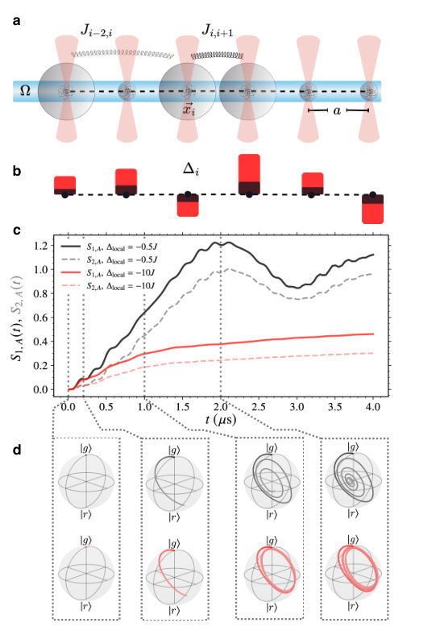 

FIG. 1. Disorder-dependent entanglement growth in a neutral-atom array. a Schematic of a chain of 87Rb atomic qubits trapped in optical tweezers with lattice con- stant a. Qubits are encoded in the |g⟩≡ 5S1/2 (small spheres) and |r⟩≡ 70S1/2 (large spheres) levels of 87Rb atoms. A global Rydberg drive (blue shade) excites the atoms to the Rydberg state and a Rydberg atom i located at posi- tion ⃗xi interacts with every other excited atom j with inter- action energy Jij due to the van der Waals interaction. b An illustration showing that each atom can be individually detuned from resonance with the global laser drive Ωby an amount ∆i(t) = ∆global(t) + ∆local(t)hi with a static coef- ficient...

📷 Fig 2

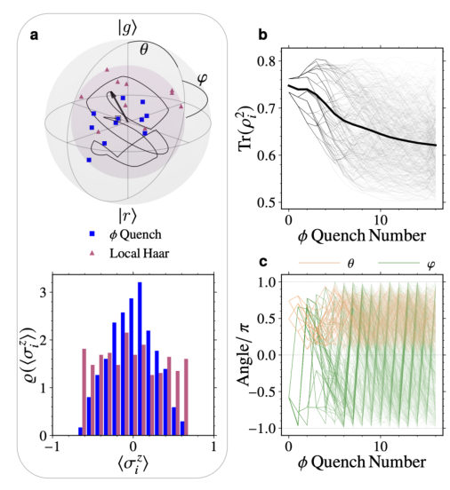 

FIG. 2. Simulation of the modified randomised mea- surement protocol. a (Top) The black arrow is the Bloch vector of the third qubit in a chain of six atoms evolved for 1µs under a Hamiltonian drawn from the chaotic ensemble (|∆local| = 0.5J); the inner purple sphere has radius of the length of the Bloch vector to be randomised, and the outer gray is the unit sphere. Blue squares are 10 realisations of our “ϕ-quench” sequence on the initial Bloch vector (black arrow). Rose triangles are single-qubit rotations, on the ini- tial Bloch vector, drawn directly from the Haar distribution. The solid curve is the trajectory from the initial to the final vector after evolution under an example...

📷 Fig 3

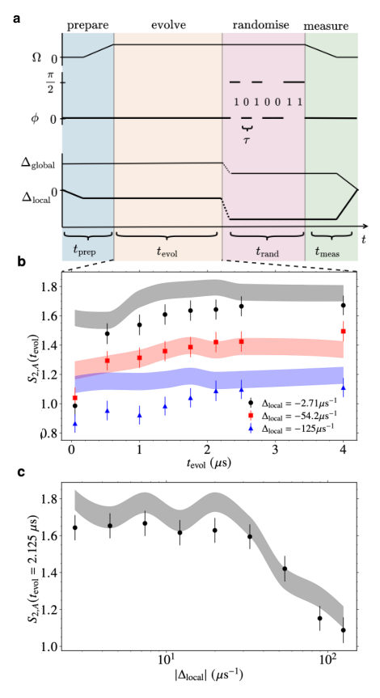 

FIG. 3. Measurement of the disorder-dependence of entanglement entropy. a Experimental protocol showing the time dependence of the Aquila Hamiltonian parameters: Ωand ∆local are ramped to their target values; held for tevol; ramped to values optimised for randomised rotations (Ap- pendix B); held while ϕ ∈{0, π

📷 Fig 4

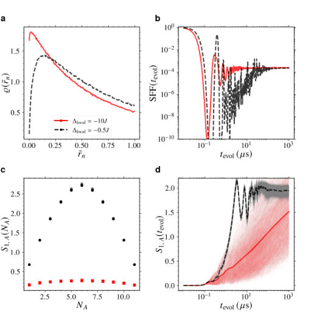 

FIG. 4. Spectral and dynamical signatures of the disorder- induced entanglement transition for the Aquila Hamiltonian [Eq. (1)] with time-independent parameters. In all cases, we take N = 12 qubits with 1000 disordered realisations, and ⟨∆i⟩= 0.5J, J = 5.42µs−1 nearest neighbor interac- tion strength, and Rabi drive Ω= 2.92J. Black curves and circles correspond to ∆local = −0.5J, and red curves and squares to ∆local = −10J. a Probability density for the level spacing ratios ˜rn = min{rn, 1/rn}, where rn = sn/sn−1 (sn = En+1 −En) To produce the histogram, the data is binned uniformly into 200 bins. b Spectral form factor as a function of evolution time. c von Neumann entropy of ten ex- cited...

📷 Fig 5

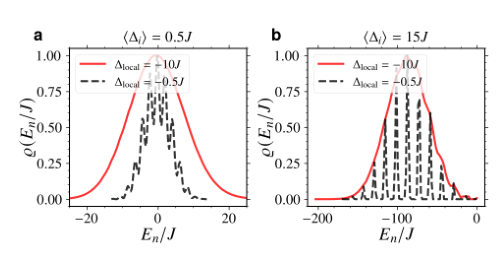 

FIG. 5. The parameter ⟨∆i⟩induces an overall shift of the many-body spectrum. a For low values, e.g., ⟨∆i⟩= 0.5J, the experimentally accessible initial state—whose energy is zero—lies approximately in the middle of the spectrum. b For large values, e.g., ⟨∆i⟩= 15J, the same initial state is located far from the spectral center, effectively outside the main support of the many-body density of states. We use 100 bins.

📷 Fig 6

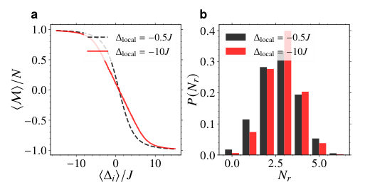 

FIG. 6. a Magnetisation of the ground state for an N = 6 qubit system (normalised by the number of qubits), averaged over 500 disordered realisations , for different amounts of un- certainty in ∆local. b Probability of measuring Nr qubits in the Rydberg state for low and high mean ⟨∆i⟩, for 6 qubits.

📷 Fig 7

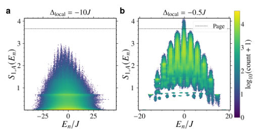 

FIG. 7. Density plot of the von Neumann entropy of eigen- states for 1000 realisations of a N = 12 qubit system with ⟨∆i⟩= 0.5J, for an equal bipartition, as a function of the cor- responding eigenenergy, S1,A(En). In a, we set ∆local = −10J and in b we set ∆local = −0.5J. The color scale represents log10(count + 1) obtained from a 120 × 120 two-dimensional histogram, so brighter regions correspond to a higher density of eigenstates at a given energy-entropy pair.

📷 Fig 8

 

Fig. 7 shows the distribution of the bipartite von Neu- mann entropy S1,A(En) of energy eigenstates for a 12-

📷 Fig 9

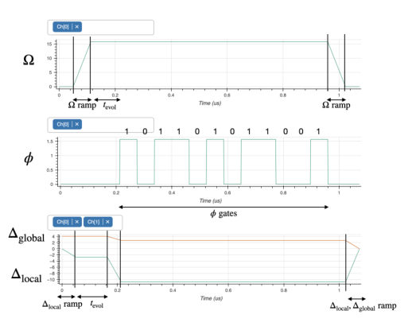 

FIG. 9. Example task submitted to Aquila showing the time-dependent functions Ω, ϕ, ∆local, ∆global. First ∆local is ramped while Ωis kept at 0 in order to freeze any spuri- ous excitations that can occur when ramping together with ∆local, then Ωis ramped up. The system remains constant for a time tevol. ∆local and ∆global are ramped to their de- sired values during the randomised phase. ϕ flips between 0 and π/2 with equal probability for, in the full experiment, 16 times (in this illustration, 12). Ωis then ramped down to 0 with ∆local still constant. Finally, ∆local and ∆global are also ramped down to 0.

📷 Fig 10

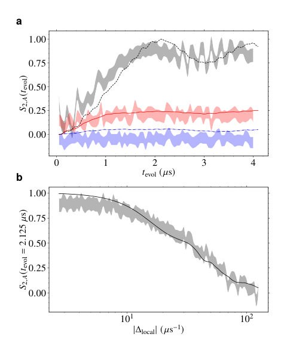 

FIG. 8. a Numerically computed second-order R´enyi en- tropy as a function of evolution time shown as curves for ∆local = −0.5J (black, dashed line), ∆local = −10J (red, solid line), and ∆local = −23.06J (blue, dashed-dotted line). The shaded areas show emulated protocols with ±1 SEM propa- gating multinomial shot noise and with the same parameters as the experiment in Fig. 3a. b Numerically computed second- order R´enyi entropy as a function of ∆local and emulated pro- tocol with ±1 SEM propagating multinomial shot noise and with the same parameters as the experiment in Fig. 3b.

**Main problem.**

Measuring entanglement dynamics and the transition from quantum chaos to many-body localization (MBL) in analog quantum simulators that lack universal local gate control.

**Main result.**

The authors demonstrate a randomized measurement protocol using global controls and local detuning to extract Rényi entropy, successfully resolving the transition from linear to logarithmic entanglement growth in a neutral-atom processor.

**Method.**

A modified randomized measurement toolbox using a phi-quench protocol (switching between non-commuting Hamiltonians) to approximate local rotations, combined with numerical simulations to account for decoherence and readout errors.

**Summary.**

This paper presents a new method for measuring entanglement in analog quantum simulators using only global controls and local energy tuning. Using the QuEra Aquila neutral-atom processor, the authors demonstrate that they can observe the transition from a quantum chaotic regime to a many-body localized regime. The protocol bypasses the need for local single-qubit gates by using a sequence of phase quenches. The results show distinct entanglement growth patterns (linear vs. logarithmic) that match numerical predictions even in the presence of noise.

Detailed structure

**Model / system.**

A 1D chain of Rydberg atoms (N=6 to N=12) in the QuEra Aquila platform, governed by a long-range interacting transverse-field Ising model with programmable local and global detuning.

**Key observables.**

Second-order Rényi entropy (S2,A), von Neumann entropy (S1,A), subsystem purity, level spacing ratio (r-parameter), and Spectral Form Factor (SFF).

**Important parameters / regimes.**

Rabi frequency (Omega), local detuning (Delta_local), global detuning (Delta_global), and interaction strength (J).

**Assumptions / limitations.**

The system is small-scale (N=6) to stay within coherence times; the protocol assumes the phi-quench sequence effectively approximates a 2-design.

**Figures summary.**

Fig 1: Schematic of the atom array and Hamiltonian parameters. Fig 2: Validation of the randomized rotation protocol via Bloch vector trajectories. Fig 3: Experimental entanglement growth across low, moderate, and high disorder regimes. Fig 4: Numerical signatures of the transition (level statistics and SFF).

**Paper structure.**

Introduction to entanglement dynamics and MBL; description of the hardware and Hamiltonian; development of the global-to-local randomized measurement protocol; experimental implementation on Aquila; results showing the disorder-induced transition; and error analysis/numerical validation.

**Why it may be interesting.**

It provides a practical way to perform complex many-body measurements (like Rényi entropy) on analog hardware that lacks the high-fidelity local gates required by standard randomized measurement toolboxes, bridging the gap between analog simulation and quantum information protocols.

Abstract

The development and spread of entanglement in complex quantum systems is central to exploring many-body phenomena out of equilibrium. Measuring entanglement dynamics can shed light on information scrambling and thermalisation, namely on transitions from many-body quantum chaos to localisation in disordered, interacting systems. In quantum computing systems, entanglement entropy and other nonlinear functions of the density matrix have been recently measured, in particular by using the randomised measurement toolbox. However, it is difficult to implement the required arbitrary unitary rotations on specific subsystems without universal local control. Here we devise and demonstrate the measurement of entanglement entropy in a programmable analogue quantum simulator using a randomised measurement protocol that leverages local energy tuning together with a global field to bypass the need for local gate control. We implement this on a commercially available neutral-atom quantum simulator, QuEra's Aquila, and use it to show how programmable disorder in the local Hamiltonian parameters leads to a transition from chaotic to localised entanglement dynamics. Given current decoherence times, we clearly resolve disorder-specific, time-dependent entanglement spreading in small systems. Our work extends the utility of programmable analogue quantum simulators, and opens further opportunities for wider randomised measurement toolboxes in a range of other analogue systems.

[↑ back to top](#top)

### ⭐ [Quantum limit cycles with continuous symmetries from coherent parametric driving: exact solutions and many-body extensions](http://arxiv.org/abs/2604.25864v1)

**Highlighted author(s):** Aashish A. Clerk

**Authors:** Sihan Chen, Aashish A. Clerk

**Type:** theory · **Category:** statistical mechanics · **PDF:** <https://arxiv.org/pdf/2604.25864v1>

**Analysis basis:** full PDF text, analyzed in chunks

**Topic relevance:** 🔥 `driven-dissipative phase transition` **4/5** · `entanglement & information structure` **3/5** · `methods for driven-dissipative` **3/5** · `non-equilibrium dynamics` **3/5** · `Keldysh / 2PI / non-Gaussian methods` **2/5** · `correlated / nonlocal dissipation` **2/5** · `non-equilibrium universality` **2/5**

📷 Fig 1

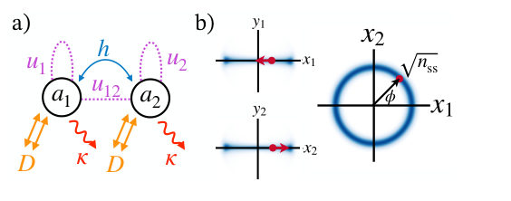 

FIG. 1. a) Minimal two-mode realization of our coherently- driven many-body limit cycle setup: two bosonic modes with self-Kerr u1, u2 and cross-Kerr u12 nonlinearity tuned to u1 = u2 = u12, coupled by an imaginary hopping term ih, subject to onsite parametric driving D, single photon loss κ. b) Steady-state phase space profile: the single-mode Wigner function W(xi, yi) and the joint quadrature probability distri- bution P(x1, x2) = ⟨x1, x2|ˆρ|x1, x2⟩. The red dots and arrow indicate the semiclassical trajectory of the limit cycles. The state forms a uniform ring in the (x1, x2) plane with radius √nss, and angle ϕ labels the limit cycles phase. The behavior depicted here generalizes to an...

📷 Fig 2

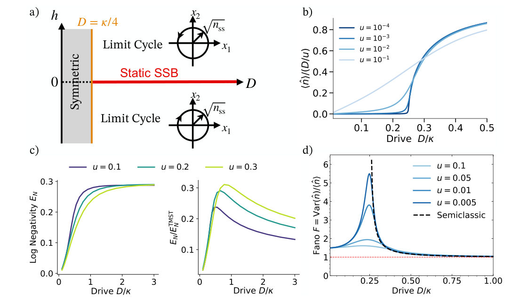 

FIG. 2. a) Phase diagram of the model for N = 2. Three phases are identified: limit cycles phase (h ̸= 0, D &gt; κ/4), static phase with spontaneous symmetry breaking (SSB), and a symmetric phase. The orange line marks the transition between the SSB phase and the symmetric phase. b) Order parameter characterizing the transition from SSB to symmetric phase for various nonlinearities u, setting κ = 1. The limit D/u →∞corresponds to the thermodynamic limit, and the transition is second order. c) Log-negativity EN and the ratio of EN to that of a thermal two-mode squeezed state of the same purity and total photon number. With u = 0.1, D = 3, there are n = 30 total photons in the cavity. d) Fano...

📷 Fig 3

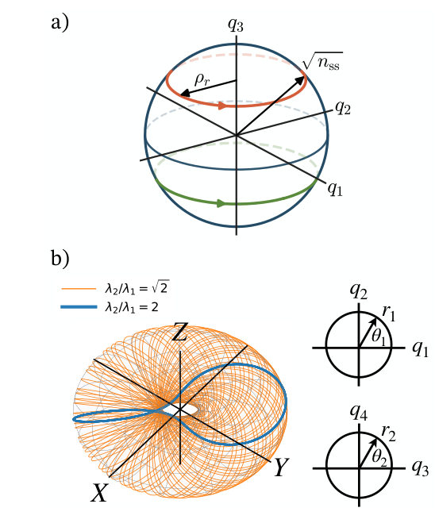 

FIG. 3. a) Attractor manifold for N = 3 with antisymmet- ric coupling in the first two modes, in coordinates that block diagonalizes K. Red and green are two realizations on the semiclassical steady-state solution, depending on the initial condition. b) Stereographic projection of a Clifford torus T 2 ⊂S3 into R3, parameterized by (r1eiθ1, r2eiθ2) and sub- ject to r2 1 + r2 2 = nss. Left: when λ2/λ1 is irrational, the trajectory is quasiperiodic and fills the torus; when it is ra- tional, the trajectory closes onto a periodic orbit. Right: the corresponding circular motion in 2 × 2 blocks with radii ri and angular velocity hλi.

📷 Fig 4

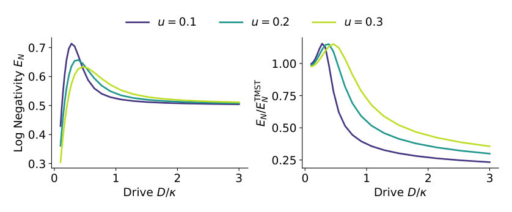 

FIG. 4. Log-negativity EN and the ratio of EN to that of a thermal two-mode squeezed state of the same purity and photon number in the ˆb-mode partition, where the Hamiltonian has the form of a NDPO. We set κ = 1.

**Main problem.**

The paper addresses the fundamental tension between using coherent driving to minimize noise and maintaining continuous internal symmetries in driven-dissipative quantum systems. It seeks to realize quantum limit cycles with continuous symmetries that are robust and exhibit reduced phase noise.

**Main result.**

The authors identify a class of multi-mode bosonic models with O(N) symmetry that can be exactly solved, demonstrating that coherent parametric driving can yield symmetry-enriched limit cycles with phase noise suppression below the Schawlow-Townes limit.

**Method.**

The study employs a combination of exact analytical solutions via a 2N-mode purification method, semiclassical analysis using Langevin equations, and a mechanical analogy mapping quadrature dynamics to a particle in a potential.

**Summary.**

This paper presents a new class of multi-mode bosonic models that realize quantum limit cycles with continuous O(N) symmetries using coherent parametric driving. By using coherent rather than incoherent driving, the authors show that phase noise can be suppressed below the standard Schawlow-Townes limit. The models are exactly solvable, allowing for a precise study of steady-state entanglement and the emergence of quantum limit tori. The findings are applicable to experimental platforms like superconducting circuits and quantum optics.

Detailed structure

**Model / system.**

A multi-mode bosonic system featuring Kerr-type nonlinearities, subject to resonant parametric (two-photon) driving and single-photon loss, compatible with superconducting circuits and quantum optical setups.

**Key observables.**

Steady-state entanglement (log-negativity), phase diffusion coefficient, Fano ratio, photon number, and the existence of quantum limit tori.

**Important parameters / regimes.**

Kerr nonlinearity (u), parametric drive amplitude (D), photon loss rate (kappa), and antisymmetric coupling strength (h).

**Assumptions / limitations.**

The analysis of phase-locking assumes a weak symmetry-breaking term; the semiclassical Fano ratio is valid in the limit cycle phase.

**Figures summary.**

Figures show log-negativity and its ratio to a thermal squeezed state as a function of drive strength, and the behavior of the Fano ratio across different regimes.

**Paper structure.**

The paper introduces the problem of noise-symmetry trade-offs, presents the O(N) symmetric model and its exact solution, performs semiclassical stability and noise analysis, explores higher-dimensional limit tori, and concludes with the effects of symmetry-breaking perturbations.

**Why it may be interesting.**

It provides a unified framework for understanding how coherent driving can achieve high-precision quantum oscillations with reduced phase noise and non-Gaussian entanglement, which is highly relevant for quantum optics and open quantum systems.

Abstract

There is widespread interest in many-body quantum systems that exhibit limit-cycle or time-crystalline behaviour. An ideal quantum limit cycle would be realized using fully coherent driving (to minimize noise) and also have a continuous internal symmetry (to ensure generation of monochromatic radiation). While these two requirements may seem incompatible, we introduce in this work a large class of multi-mode bosonic limit cycle models based on coherent parametric driving which possess an O(N) continuous symmetry. Surprisingly, the full quantum dissipative steady state of these models can be found exactly. They exhibit rich physics, including steady state entanglement, reduced phase diffusion and the possibility of realizing quantum limit tori. The basic mechanism we identify provides a unified way to understand how coherent parametric driving can yield symmetry-enriched limit cycles, and also helps us understand related models where the relevant symmetries are weakly broken. The models we study are compatible with a range of different experimental platforms, including quantum optical setups and superconducting quantum circuits.

[↑ back to top](#top)

### ⭐ [Getting large-scale quantum neural networks ready for quantum hardware](http://arxiv.org/abs/2604.24886v1)

**Highlighted author(s):** Igor Lesanovsky

**Authors:** Mario Boneberg, Simon Kochsiek, Igor Lesanovsky

**Type:** theory · **Category:** quantum information and computing · **PDF:** <https://arxiv.org/pdf/2604.24886v1>

**Analysis basis:** full PDF text, analyzed in chunks

**Topic relevance:** 🔥 `methods for driven-dissipative` **4/5** · `non-equilibrium dynamics` **3/5** · `driven-dissipative phase transition` **2/5** · `entanglement & information structure` **2/5**

📷 Fig 1

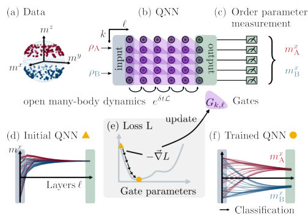 

FIG. 1. Physics-informed quantum neural network architecture and training. (a) Structured dataset that is used to train the network. It consists of labeled quan- tum states. In the example shown they are represented on the Bloch sphere, spanned by the magnetization compo- nents mx,y,z [see main text] and fall into two classes: A (red dots, northern hemisphere) and B (blue dots, southern hemi- sphere). (b) The corresponding states (ρA and ρB) are fed into the first layer of qubits of a quantum neural network. Lo- cal, translation-invariant gates, applied between consecutive layers, propagate these states layer-by-layer to the rightmost (output) layer according to an open quantum many-body...

📷 Fig 2

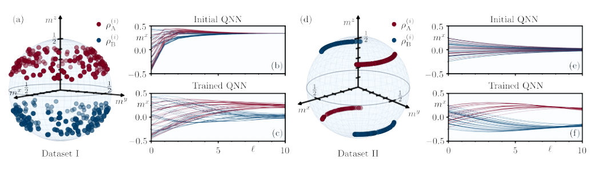 

FIG. 2. Training on datasets I and II. (a) Dataset I of quantum states represented on the Bloch sphere. Class A states (red dots) can be distinguished from class B states (blue dots) by measuring ˆmz, i.e. populations. (b) Evolution of the expectation value mx through the layers of the initial QNN for the validation data. All trajectories converge towards a single stationary magnetization. (c) Evolution of mx for the trained QNN. Initial states with different labels have output magnetizations in different ranges, implying perfect classification on the validation set. The training algorithm thus found a solution which classifies the data in a basis where the original states were not...

**Main problem.**

The difficulty of scaling Quantum Neural Networks (QNNs) due to exponentially large Hilbert spaces, barren plateaus, and measurement noise in the NISQ era.

**Main result.**

The development of physics-informed QNNs that use dissipative many-body dynamics to successfully classify quantum states and reduce the complexity of required observables.

**Method.**

Tensor network simulations (MPS and MPO) are used to train the network via a Nadam stochastic gradient descent variant using a contrastive loss function.

**Summary.**

This paper proposes a new class of physics-informed quantum neural networks designed for large-scale hardware. By mimicking the dissipative dynamics of open many-body systems, these networks can learn to classify complex quantum states using only a single observable. The approach effectively addresses the challenges of barren plateaus and measurement noise. Simulations on systems up to 550 qubits demonstrate that the network can reduce the complexity of tasks by mapping multi-observable problems into a single-observable measurement.

Detailed structure

**Model / system.**

A large-scale layered quantum many-body system on a rectangular lattice, where evolution is modeled via a Lindblad master equation with parameterized Hamiltonian and jump operators.

**Key observables.**

Magnetization (specifically the x-component, m_x) used as an order parameter for classification.

**Important parameters / regimes.**

System size up to 550 qubits (50 sites, 11 layers), learning rate 0.05, and 5000-shot measurement scale.

**Assumptions / limitations.**

The use of SVD truncation in tensor networks is assumed to capture the essential physics without qualitatively altering the training results.

**Figures summary.**

Figure 1 illustrates the QNN architecture and the training process from untrained to trained states; Figure 2 shows the mapping of input datasets to distinct magnetization ranges; Supplementary figures demonstrate the convergence of bond dimensions and the stability of training losses.

**Paper structure.**

The paper introduces the QNN scaling challenge, describes the physics-informed architecture based on Lindbladian dynamics, presents training results on two distinct datasets, and provides a validation of the numerical methods via tensor network truncation analysis.

**Why it may be interesting.**

It bridges quantum machine learning with open quantum systems, showing how dissipative many-body dynamics can be leveraged to create robust, noise-resilient architectures for feature extraction.

Abstract

Quantum neural networks generalize classical artificial neural networks into the quantum domain. They are formulated as parameterized quantum circuits which are optimized by measuring and minimizing a suitably chosen loss function. The core challenge in understanding, implementing and ultimately using quantum neural networks is that they represent many-body systems with an exponentially large Hilbert space, in combination with a large parameter search space. Moreover, noise -- which is inherent to any quantum measurement -- sets practical limits for the estimation of training loss. Here, we study physics-informed large-scale quantum neural networks that are trained through a finite number of noisy loss function measurements. We show that this architecture permits the construction of nontrivial decision boundaries that enable the classification of quantum states through measuring an order parameter. Our approach can directly process quantum data that is output from quantum simulators and computers and is well suited for implementation on current hardware. Moreover, owed to a close link between the neural network dynamics and the evolution of Markovian open many-body quantum systems, one may expect a certain robustness to noise, which is ubiquitous in the current NISQ era.

[↑ back to top](#top)

### ⭐ [Anomaly and symmetry-charge flow in mixed states](http://arxiv.org/abs/2604.24872v1)

**Highlighted author(s):** Sebastian Diehl

**Authors:** Ze-Min Huang, Sebastian Diehl

**Type:** theory · **Category:** strongly correlated electrons · **PDF:** <https://arxiv.org/pdf/2604.24872v1>

**Analysis basis:** full PDF text, analyzed in chunks

**Topic relevance:** `methods for driven-dissipative` **3/5** · `correlated / nonlocal dissipation` **2/5** · `driven-dissipative phase transition` **2/5** · `entanglement & information structure` **2/5** · `non-equilibrium dynamics` **2/5**

📷 Fig 1

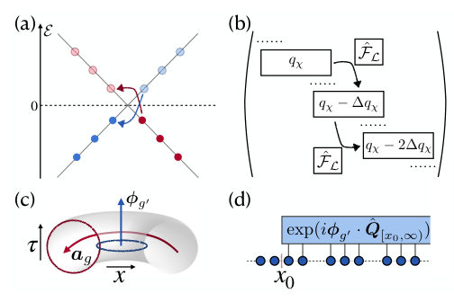 

FIG. 1. Conceptual illustration of spectral flow (a) and symmetry-charge flow (b) induced by a large gauge transformation; (c) temporal (red, ag) and spatial (blue, ϕg′) fluxes; and (d) the spatial flux-insertion operator (blue, ϕg′). For a Dirac fermion (a), a large gauge transformation (i.e., H Ax →H Ax + 2π) generated by the operator ˆFL, creates a left-handed mode (red circle) from the ground state and annihilates a right-handed one (blue), reducing the net chiral charge by 2 and moving the ground state to a different charge sector. Going beyond this ground-state picture, the anomaly persists for mixed states (b), i.e., a large gauge transformation permutes symmetry-charge sectors of...

📷 Fig 2

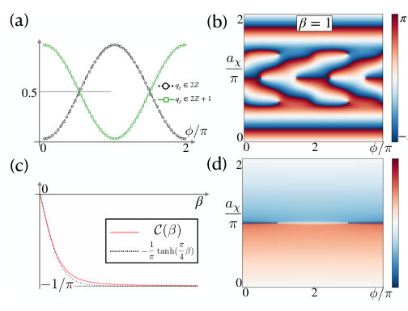 

FIG. 2. Staggered fermions (a–c) and a Z2 spin model (d). (a) Sector exchange under flux insertion: pqχ∈2Z and pqχ∈2Z+1 versus ϕ = H Ax dx, at β = 1 for a 10-site system. (b) Sχ versus aχ and ϕ. (c) C(β) (red solid) versus β, compared with −1

📷 Fig 3

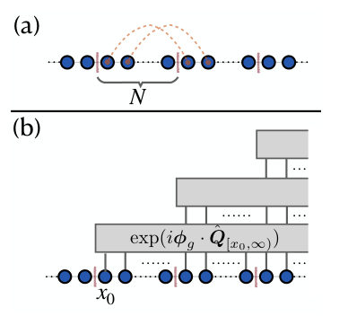 

FIG. 3. Illustration of flux insertion in a finite periodic chain. (a) A periodic N-site chain is obtained from an infinite chain by identifying sites separated by N. (b) The flux-threaded finite chain is generated by repeatedly applying eiϕg· ˆQ[x0+mN,∞) starting at cuts x0 + mN with m ∈Z.

**Main problem.**

The paper addresses the failure of traditional 't Hooft anomaly formulations and spectral flow mechanisms when applied to mixed states, where charge exchange with the environment and state impurity invalidate standard diagnostics.

**Main result.**

The authors derive a universal 'symmetry-charge flow' for Abelian symmetries, which generalizes spectral flow to mixed states by describing how applied fields redistribute statistical weight across symmetry-resolved charge sectors.

**Method.**

The study employs an algebraic approach using flux-insertion operators and large gauge transformations, supplemented by tensor network formalisms (MPS/MPO/PEPS) and K-matrix effective field theories.

**Summary.**

This paper resolves the problem of non-universal anomalies in mixed states by introducing the concept of symmetry-charge flow. Unlike traditional spectral flow, which relies on ground-state level crossings, symmetry-charge flow describes the redistribution of charge sectors in a density matrix under flux insertion. This mechanism is shown to be universal for both bosonic and fermionic systems and is insensitive to temperature or state purity. The work establishes a deep link between mixed-state anomalies and the presence of long-range entanglement.

Detailed structure

**Model / system.**

The analysis covers (1+1)-dimensional systems, including tight-binding staggered fermion models with $U(1)$ and chiral symmetries, and $Z_2$ symmetric spin chains, as well as 2D SPT phases represented by PEPS.

**Key observables.**

Symmetry-charge flow, anomaly coefficients, chiral current non-conservation, and the 3-cocycle phase.

**Important parameters / regimes.**

Temperature (inverse temperature beta), spatial and temporal fluxes, and the K-matrix for bosonic theories.

**Assumptions / limitations.**

The derivation for 2D reduced density matrices assumes the system is at an RG fixed point; results are primarily focused on Abelian symmetries.

**Figures summary.**

Figure 1 illustrates spectral flow vs. symmetry-charge flow and flux-insertion; Figure 2 shows sector exchange in fermion models; Figure 3 depicts the construction of flux-threaded periodic chains.

**Paper structure.**

The paper begins by identifying the breakdown of pure-state anomalies in mixed states, introduces the algebraic flux-insertion framework, provides numerical verification in fermion and spin models, proves the connection to long-range entanglement, and extends the results to 2D SPT phases using tensor networks.

**Why it may be interesting.**

This is highly relevant for many-body dynamics and open quantum systems because it provides a robust, state-independent diagnostic for topological properties that remains valid even when a system is coupled to an environment or at finite temperature.

Abstract

The $(1+1)$-dimensional chiral anomaly is a paradigmatic exact result in quantum field theory, traditionally formulated for zero-temperature pure states where it arises from spectral flow induced by external gauge fields and captures universal ground-state properties. In mixed states, however, the participation of many states and charge exchange with the environment invalidate this mechanism. Naive extensions yield model-dependent anomaly coefficients, calling its universality into question. Here, we resolve this problem for Abelian symmetries by deriving the anomaly from an algebraic relation between the symmetry and its flux-insertion operator. We obtain symmetry-charge flow, a mixed-state generalization of spectral flow, in which an applied field redistributes statistical weight across symmetry-resolved charge sectors. Fixed solely by symmetry, the anomaly restores universality and applies to both pure and mixed states in fermionic and bosonic systems. We substantiate these results in tight-binding fermionic models with continuous symmetry and in spin models with discrete symmetries.

[↑ back to top](#top)

### ⭐ [Uncovering Exotic Paired States in the 2D Spin-Imbalanced Fermi Gas with Neural Wave Functions](http://arxiv.org/abs/2604.24883v1)

**Highlighted author(s):** Johannes Knolle

**Authors:** Wan Tong Lou, Gino Cassella, Andres Perez Fadon, Halvard Sutterud, David Pfau, James S. Spencer, Johannes Knolle, W. M. C. Foulkes

**Type:** theory · **Category:** quantum gases · **PDF:** <https://arxiv.org/pdf/2604.24883v1>

**Analysis basis:** full PDF text, analyzed in chunks

**Topic relevance:** `analog quantum simulation` **2/5**

📷 Fig 1

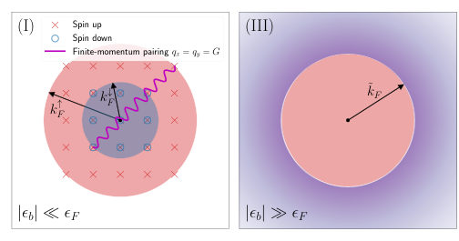 

FIG. 1: Mean-field (BCS) momentum density of the SIFG. Left: regime (I), weakly interacting SIFG. The crosses and circles indicate the occupied spin-up and spin-down momentum states of the (N ↑, N ↓) = (25, 9) SIFG. The wavy purple line shows the optimal pairing between opposite spins in the weakly interacting limit. The spin-up and spin-down Fermi circles of the infinite system are colored pink and blue-gray, respectively. Right: regime (III), strongly interacting SIFG. The mauve region indicates the diffuse momentum density arising from the tightly-bound real-space pairs. The area of the Fermi circle with radius ˜kF matches the density of unpaired majority-spin fermions.

📷 Fig 2

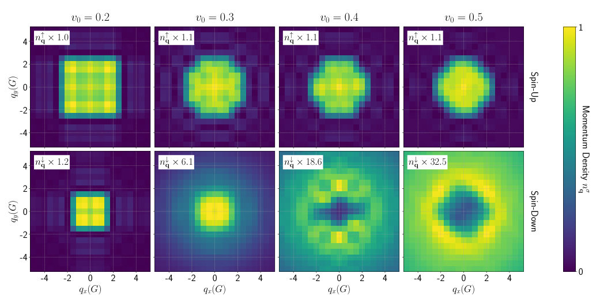 

FIG. 2: Momentum density of the (N ↑, N ↓) = (25, 9) SIFG for a range of different interaction strengths across the BCS-BEC crossover. The top and bottom rows show the momentum densities of spin-up and spin-down particles, respectively. The strength of the interaction, v0, increases from left to right. To aid comparison, all momentum densities are normalized such that their maximum value is equal to one. This is accomplished by multiplying the momentum density by the number in the top-left corner in each subfigure.

📷 Fig 3

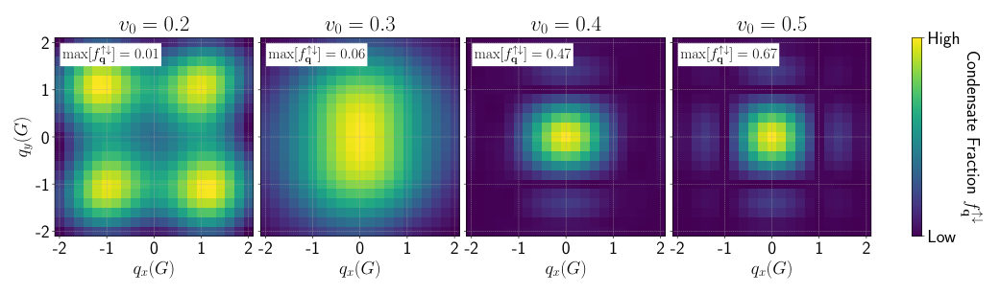 

FIG. 3: Condensate fraction of the (N ↑, N ↓) = (25, 9) SIFG for a range of different interaction strengths across the BCS-BEC crossover. The condensate fraction in each subfigure has been rescaled to aid comparison, with the maximum condensate fraction shown in the top-left corner of each subfigure.

📷 Fig 4

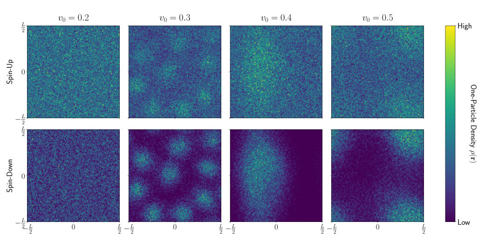 

FIG. 4: One-particle density of the (N ↑, N ↓) = (25, 9) SIFG for a range of different interaction strengths across the BCS-BEC crossover. The plots on the top row are the densities of spin-up particles and the plots on the bottom row are the densities of spin-down particles.

📷 Fig 5

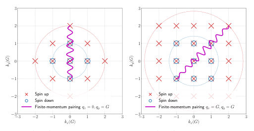 

FIG. 5: Occupied momentum states of the SIFG in our simulations. The red crosses and the blue circles represent spin-up (majority) and spin-down (minority) particles, respectively. The big red and blue dashed circles represent the “Fermi surfaces”. The yellow curly lines denote one of the optimal finite-momentum pairing in each case.

📷 Fig 6

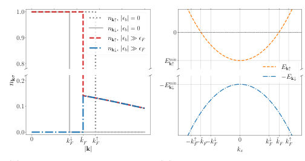 

FIG. 6: The spin-resolved momentum density and the band structure of the SIFG from the mean-field BCS calculations.

📷 Fig 7

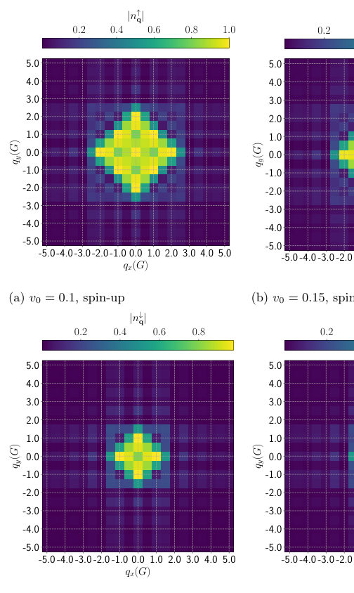 

FIG. 7: Momentum density of the (N ↑, N ↓) = (13, 5) SIFG for v0 = 0.1, 0.15, 0.2.

📷 Fig 8

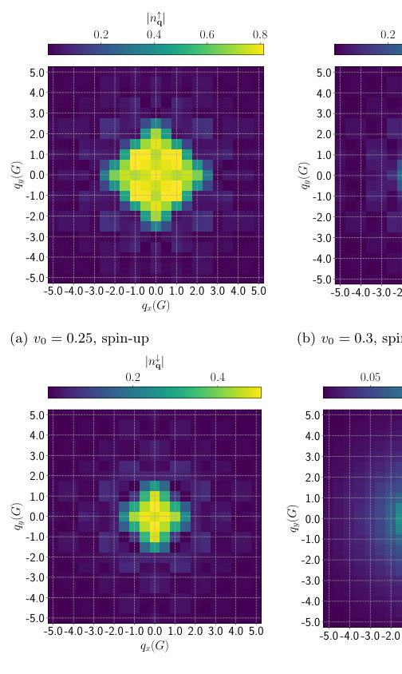 

FIG. 8: Momentum density of the (N ↑, N ↓) = (13, 5) SIFG for v0 = 0.25, 0.3, 0.35.

📷 Fig 9

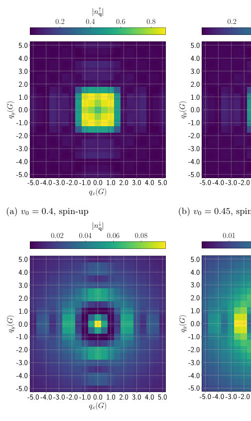 

FIG. 9: Momentum density of the (N ↑, N ↓) = (13, 5) SIFG for v0 = 0.4, 0.45, 0.5.

📷 Fig 10

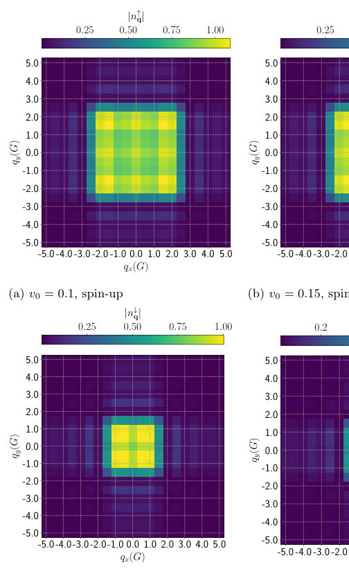 

FIG. 10: Momentum density of the (N ↑, N ↓) = (25, 9) SIFG for v0 = 0.1, 0.15, 0.2.

**Main problem.**

Investigating the zero-temperature phase diagram and exotic paired states of a 2D spin-imbalanced Fermi gas across the BCS-BEC crossover.

**Main result.**

The study identifies three distinct regimes: an FFLO phase in the weak-interaction BCS limit, a new crystalline phase of Cooper pairs in the intermediate regime, and a phase-separated Bose-Fermi mixture in the strong-interaction BEC limit.

**Method.**

Neural Network Variational Monte Carlo using the AGPs FermiNet Ansatz, optimized via JAX-based KFAC gradient descent.

**Summary.**

This paper explores the phase diagram of a 2D spin-imbalanced Fermi gas using neural network-based quantum Monte Carlo. It reveals the existence of an exotic crystalline phase of Cooper pairs at intermediate interaction strengths, situated between the FFLO phase and a phase-separated BEC limit. The work demonstrates how neural wave functions can capture complex correlations and spontaneous symmetry breaking in strongly interacting many-body systems.

Detailed structure

**Model / system.**

A 2D spin-imbalanced Fermi gas with short-ranged attractive interactions, modeled using a modified Pöschl-Teller potential in a periodic square box.

**Key observables.**

Momentum density (spin-resolved), condensate fraction, one-particle real-space density, two-body density matrix, and pairing energy.

**Important parameters / regimes.**

Interaction strength (v0), scattering length parameter (eta), and spin imbalance (N_up/N_down ratio).

**Assumptions / limitations.**

The study is subject to finite-size effects due to the small number of particles simulated, though the phase diagram is argued to be qualitatively robust.

**Figures summary.**

Figures show momentum density evolution, condensate fraction across the crossover, and real-space density maps illustrating the formation of a crystalline lattice and phase separation.

**Paper structure.**

The paper introduces the physical problem and model, describes the Neural Network VMC methodology, presents the results across three interaction regimes (BCS, crossover, BEC), and discusses the physical origins of the observed phases.

**Why it may be interesting.**

It uses advanced machine learning architectures (FermiNet) to discover a previously unpredicted crystalline phase in a purely attractive system, driven by emergent effective repulsion.

Abstract

We study the zero-temperature phase diagram of the 2D spin-imbalanced Fermi gas with short-ranged attractive interactions using the recently developed neural network variational Monte Carlo method with the AGPs FermiNet Ansatz. The Fulde-Ferrell-Larkin-Ovchinnikov phase is observed in the weakly interacting BCS limit and a polarised superfluid is seen in the strongly interacting BEC limit. When the interactions are strong, the minority-spin momentum density is reduced almost to zero in the momentum-space region occupied by the unpaired majority-spin electrons. When the interactions are very strong, phase separation occurs, with regions containing bosonic pairs and unpaired regions occupied by the remaining majority-spin particles. In addition, we observe translational symmetry breaking at intermediate interaction strengths, where the system forms an exotic crystal of Cooper pairs in a Fermi fluid of unpaired majority-spin particles. We provide a possible explanation for the formation of the crystalline phase, explain the origins of the k-space momentum-density hole when the pairs are tightly bound, and discuss how our approach opens new directions for future work.

[↑ back to top](#top)

### ⭐ [Dynamical dimer structure factor of the triangular $S=1/2$ Heisenberg antiferromagnet](http://arxiv.org/abs/2604.24868v1)

**Highlighted author(s):** Johannes Knolle

**Authors:** Markus Drescher, Laurens Vanderstraeten, Roderich Moessner, Frank Pollmann, Johannes Knolle

**Type:** theory · **Category:** strongly correlated electrons · **PDF:** <https://arxiv.org/pdf/2604.24868v1>

**Analysis basis:** full PDF text, analyzed in chunks

📷 Fig 1

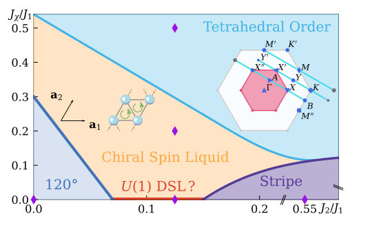 

FIG. 1. Schematic phase diagram of the extended Heisen- berg model on the triangular lattice with a scalar chiral inter- action. The qualitative phase boundaries follow previous nu- merical studies (cf. Ref. [44, 45]). The inset within the chiral spin-liquid regime shows the triangular lattice with Bravais vectors a1 = (1, 0)T and a2 = (1/2, √

📷 Fig 2

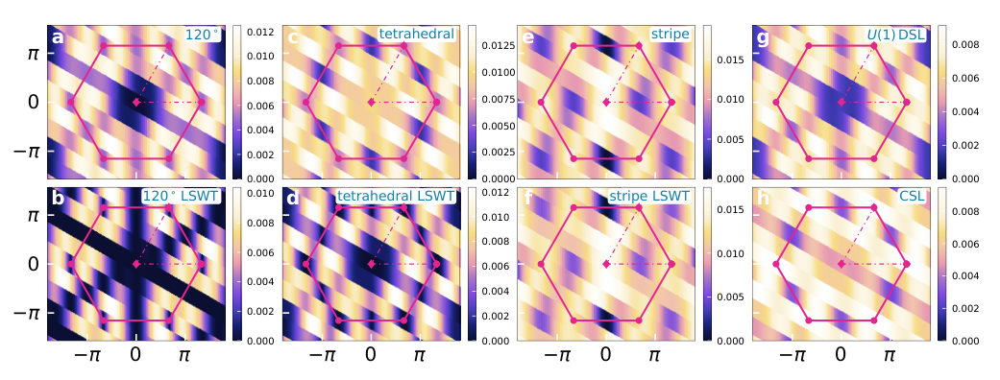 

FIG. 2. The static dimer structure factor χD(k) for the various ordered and liquid phases considered in this work. The left column shows the results for the 120○phase at J2 = 0 from MPS (top) and LSWT (bottom), the following column for the tetrahedral phase for J2/J1 = 0.125 and Jχ/J1 = 0.5 (MPS, c, LSWT, d), the third column for the stripe order with J2/J1 = 0.55 (MPS, e, spin-wave result, f). The last column shows the numerical data for the candidate J1 −J2 QSL (g) and the chiral spin liquid (h). The former ground state at J2/J1 = 0.125 (Jχ = 0) was stabilized in the odd (low-energy) sector (cf. End Matter), the ground state in the CSL for J2/J1 = 0.125 together with Jχ/J1 = 0.2...

📷 Fig 3

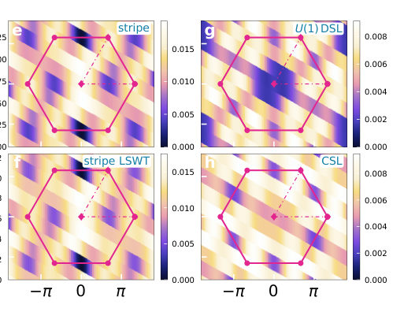 

Figure 3a–d presents the dynamical dimer structure factor SD(k,ω) in the 120○phase. The main panels show the data from the MPS-based time evolution, con- trasted with the dynamical spin-wave result in the corre-

📷 Fig 4

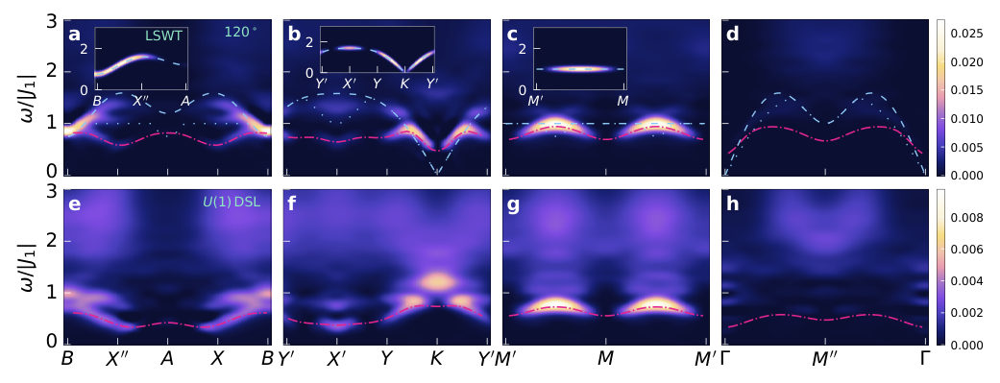 

FIG. 3. Dynamical dimer structure factor SD(k, ω) for the 120○order (a–d) and the J1 −J2 QSL (e–h). The chosen coupling parameters are J2 = 0 and J2/J1 = 0.125 (both Jχ = 0), respectively. The main panels show the results obtained from numerical time evolutions performed on YC6 cylinders with an MPS bond dimension of χ = 2000 and a cylinder length of Lx = 51. The simulations reached the maximum evolution time of tsim = 60 J1 in steps of δt = 0.04 J1. The structure factors displayed were obtained for a Gaussian broadening σ = 11.4 J1. The insets in panels a–c for the 120○order feature the dimer spectral function along the corresponding cuts as computed within leading-order spin-wave theory....

📷 Fig 5

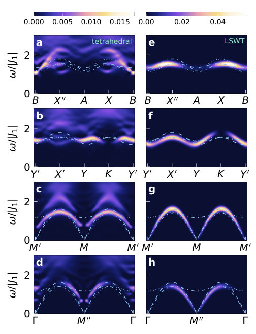 

FIG. 4. The dynamical dimer structure factor in the tetra- hedrally ordered phase at Jχ/J1 = 0.5 and J2/J1 = 0.125. The left column shows the results from dynamical MPS simula- tions at bond dimension χ = 2000 on a YC6 cylinder of size 6 × 81. The maximum evolution time was tsim = 60 J1 with a time-step size of δt = 0.04 J1. The right-hand column presents the leading-order dynamical spin-wave results obtained on a cylinder of dimensions 6×220. The spectral function was com- puted with a Gaussian broadening determined by α = 10−6. The blue lines indicate the three magnon modes arising from the various ground state configurations (cf. the section on spin-wave theory).

📷 Fig 6

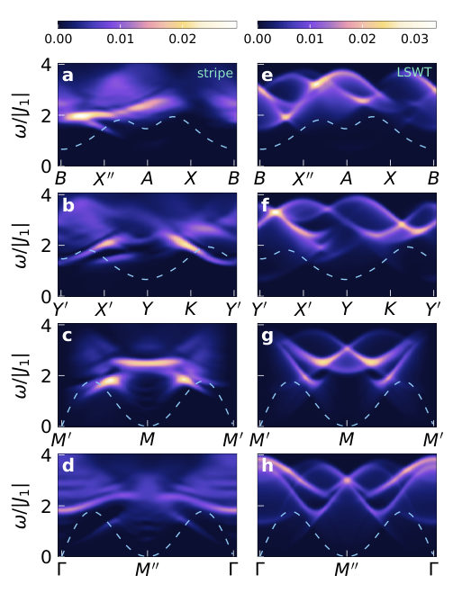 

FIG. 5. The dynamical dimer structure factor in the stripe phase at J2/J1 = 0.55 (Jχ = 0). The spectral func- tion cuts from the large-scale MPS numerics is displayed on the left. The simulation was performed at a bond dimension of χ = 2000 on a YC6 cylinder with Lx = 126. The dynam- ical parameters are identical to in Fig. 4. The right column shows the corresponding result from the lowest non-vanishing order in spin-wave theory. It was computed on an equivalent cylinder of size 6×180. The blue dashed line marks the single- magnon dispersion as obtained within LSWT.

📷 Fig 7

 

Figure 6 summarizes the findings for the dynamical dimer structure factor in the chiral spin-liquid phase at Jχ/J1 = 0.2 (J2/J1 = 0.125). The chiral spin liquid is an inherently gapped phase [42, 103]. Accordingly, the lower edge of the excitation continuum along M–M ′

📷 Fig 8

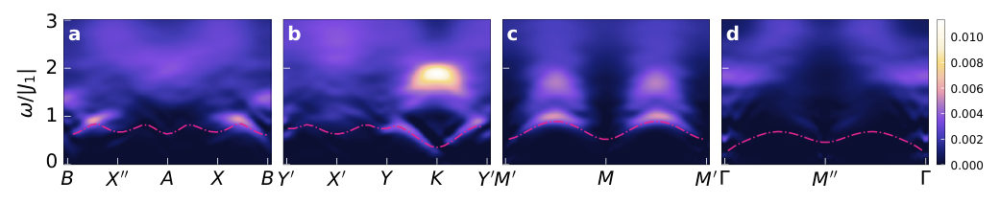 

FIG. 6. The dynamical dimer structure factor in the chiral spin-liquid phase. The chosen coupling parameters are J2/J1 = 0.125 and Jχ/J1 = 0.2. The main panels show the results obtained from numerical time evolutions performed on YC6 cylinders with an MPS bond dimension of χ = 2000 and a cylinder length of Lx = 81. The simulations were performed up to tsim = 60 J1 in steps of δt = 0.04 J1. We applied a Gaussian broadening of σ = 11.4 J1. The red dot-dashed line marks the excitation dispersion obtained from the MPS quasiparticle ansatz.

📷 Fig 9

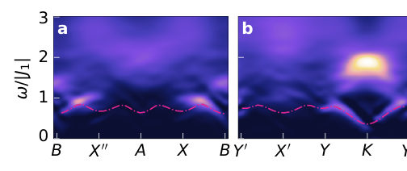 

Figure 7 presents the data for the static dimer struc- ture factor

📷 Fig 10

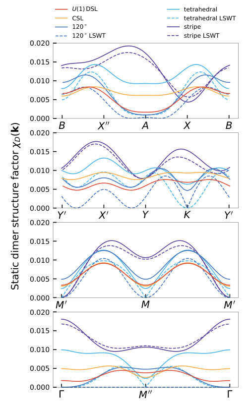 

FIG. 7. Profile plots of the static dimer structure factor χD(k) for the various phases considered in this work. For the ordered ground states, we present also the leading-order spin-wave result as a dashed line of the corresponding color. The data displayed and hence also the parameter choices are identical to Fig. 2 in the main text.

**Main problem.**

The study aims to resolve the spin-singlet excitation spectrum in frustrated quantum magnets, which is difficult to probe using standard spin structure factors, to better understand candidate quantum spin liquid (QSL) phases.

**Main result.**

The researchers identify low-energy modes in ordered phases due to avoided quasiparticle decay and find evidence for gapless singlet monopole excitations in the U(1) Dirac spin liquid phase at the X points of the Brillouin zone.

**Method.**

Large-scale GPU-accelerated Matrix-Product-State (MPS) simulations using iDMRG and time evolution, supplemented by Linear Spin-Wave Theory (LSWT) for comparison.

**Summary.**

This paper investigates the dynamical dimer structure factor in the triangular-lattice Heisenberg antiferromagnet to distinguish between various magnetic phases. Using high-resolution GPU-accelerated tensor network simulations, the authors probe spin-singlet excitations that are otherwise invisible in standard spin-spin correlations. They provide evidence for singlet monopole excitations in the U(1) Dirac spin liquid and observe avoided quasiparticle decay in ordered phases. The results serve as a theoretical guide for future experimental studies using techniques like RIXS.

Detailed structure

**Model / system.**

An extended spin-1/2 Heisenberg antiferromagnet on a triangular lattice, including nearest-neighbor (J1), next-nearest-neighbor (J2), and scalar chiral (Jchi) interactions.

**Key observables.**

Dynamical dimer structure factor S^D(k, omega), static dimer structure factor, and spin structure factor.

**Important parameters / regimes.**

Exchange couplings J1, J2, and Jchi; bond dimension chi = 2000; YC6 cylinder geometry.

**Assumptions / limitations.**

The study is subject to finite-size effects due to the cylinder geometry, which prevents full resolution of the gapless continuum in the 2D limit.

**Figures summary.**

Figures show the dynamical dimer structure factor for tetrahedral and stripe phases, comparisons between MPS and LSWT, the static dimer structure factor across various phases, and spatial configurations of tetrahedral spin order.

**Paper structure.**

The paper introduces the problem of probing singlet sectors, describes the Hamiltonian and numerical MPS methods, presents results for ordered phases (120, stripe, tetrahedral) and QSL candidates (U(1) Dirac, chiral), compares findings with LSWT, and discusses experimental implications for RIXS and Raman scattering.

Abstract

The dynamical dimer structure factor is an observable probing spin-singlet excitations of quantum magnets distinct from those commonly studied by the spin structure factor. We report the dimer response for the extended spin-$1/2$ antiferromagnetic Heisenberg model on the triangular lattice using large-scale GPU-accelerated matrix-product-state simulations. We investigate the ordered phases with $120^\circ$ coplanar, collinear stripe, and tetrahedral spin order, as well as candidate quantum spin-liquid (QSL) regimes, comprising an expected gapless $U(1)$ Dirac QSL and a chiral QSL at finite spin-scalar-chirality coupling. In the ordered phases, we find low-energy modes below the onset of the two-magnon continuum illustrating avoided quasiparticle decay. Within the candidate gapless QSL, we observe absolute dispersion minima at momenta of half the Brillouin zone corners, $X\equiv K/2$, in agreement with field-theory predictions that singlet monopole excitations of the $U(1)$ Dirac spin liquid become gapless at these points. Thus, the high-resolution dynamical dimer response provides support for a $U(1)$ Dirac QSL with singlet monopole excitations.

[↑ back to top](#top)

### [Emergent prethermal Bethe integrability in a periodically driven Rydberg chain](http://arxiv.org/abs/2604.24850v1)

**Authors:** Saptadip Roy, Arnab Sen, Diptiman Sen, K. Sengupta

**Type:** theory · **Category:** other · **PDF:** <https://arxiv.org/pdf/2604.24850v1>

**Analysis basis:** full PDF text, analyzed in chunks

**Topic relevance:** 🔥 `scars & prethermalization` **5/5** · 🔥 `Rydberg arrays` **4/5** · 🔥 `non-equilibrium dynamics` **4/5** · `analog quantum simulation` **3/5** · `driven-dissipative phase transition` **3/5** · `entanglement & information structure` **3/5** · `exotic spin models in light-matter` **3/5**

📷 Fig 1

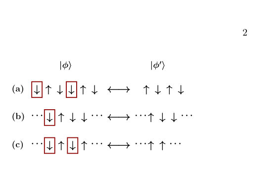 

FIG. 2. Schematic representation of the mapping between Fock states in the constrained Hilbert space of H(2) F (denoted by |ϕ⟩) and those of HXXZ (denoted by |ϕ′⟩). The mapping involves deleting a down-spin (↓) marked by red squares on the left of any up-spin (↑) of the PXP chain. (a) A state |ϕ⟩ with periodicity R = 3 and a number of up-spins in a block m1 = 1 is mapped to |ϕ′⟩with R′ = 2 and the same m1. (b) Example of a flippable up-spin in |ϕ⟩; this gets mapped to a ↑↓pair in |ϕ′⟩. (c) Example of a non-flippable up-spin in |ϕ⟩ which gets mapped to consecutive up-spins in |ϕ′⟩. See text for details.

📷 Fig 2

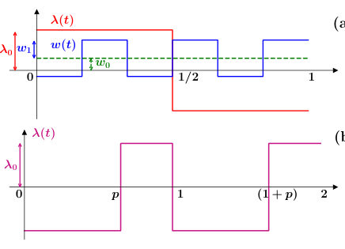 

FIG. 1. (a) Schematic representation of the two-tone square pulse drive protocol with λ(t) = +(−)λ0 for t ≤(&gt;)T1/2 and w(t) = w0 ± w1 with time-period T1/3 as shown. (b) Schematic representation of the single-tone asymmetric square pulse (p ̸= 1/2) drive protocol where λ(t) = −(+)λ0 for t ≤(&gt;)pT1.

📷 Fig 3

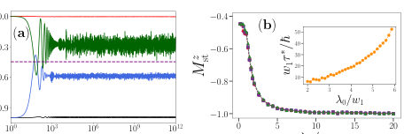 

FIG. 4. (a) Plot of M z(nT1) as a function of n starting from |vac⟩for γ/π = 2 (black) and 1.9 (blue), and similar plots starting from an |AFM⟩for γ/π = 2 (red) and 1.9 (green). The purple dotted line indicates the ITE average value of M z. For all plots λ0/w1 = 20 and L = 28. (b) Plot of M z st starting from |vac⟩as a function of λ0/w1 for L = 24 (red), 26 (blue) and 28 (green) at γ/π = 1. The plots show a gradual crossover to the thermal phase where M z st →−0.45 for λ0/w1 ≤1.0. The inset shows a plot of w1τ ∗/ℏ(where τ ∗= n∗T1) as a function of λ0/w1 for a system size L = 26, indicating exponential growth of n∗, the minimum number of drive cycles after which M z changes by 5% of M z(0) =...

📷 Fig 4

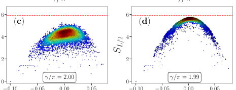 

FIG. 3. (a) Plot of r as a function of γ/π for w0/λ0 = 0.05, L = 26, and w1/λ0 = 0.05 (blue) and 0.1 (red), showing sharp dips at γ/π = m for integer m (ω1 = ω∗ m). The magenta (black) dashed lines r = 0.39 (0.527) correspond to values of r for the Poisson ensemble (COE). The insets show P(rp) dis- playing Poisson (Wigner-Dyson) statistics at γ = 2 (1.99)π. (b) Same as in (a) with w1/λ0 = 0.05 but around γ/π = 2 and for different L. The inset shows a closeup of the sharp rise of r from 0.39 to 0.527. (c) Plot of SL/2 as a function of EF T1/ℏ for Floquet quasienergies for γ/π = 2, L = 26, w0/λ0 = 0.05 and w1/λ0 = 0.05, displaying a wide spread. (d) Same as in (c) but for γ/π = 1.99 showing a...

📷 Fig 5

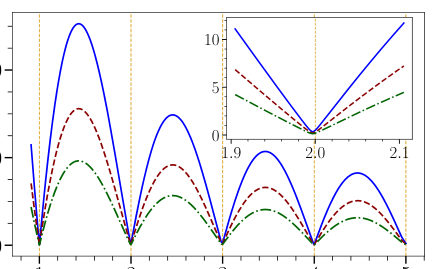 

FIG. 5. Plot of Frobenius norm N of commutator [HF , CPXP 3 ] as a function of γ/π, where the Floquet Hamiltonian HF is obtained numerically taking matrix logarithm of time evolu- tion operator U(T1, 0), in K = 0 sector of system sizes L = 20 (green), L = 22 (red) and L = 24 (blue). The inset shows behavior of N around γ = 2π. For all plots, w0/w1 = 1, q = 3 and λ0/w1 = 20. See text for details.

📷 Fig 6

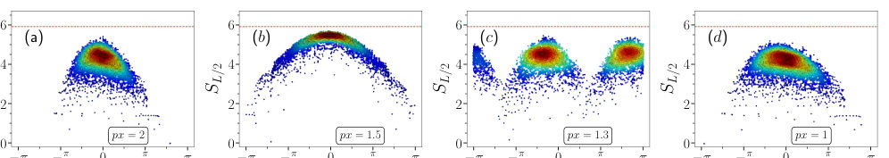 

FIG. 1. Plot of half-chain entanglement SL/2 as a function of EF T1/ℏfor Floquet quasienergies for x = λ0T1/(πℏ) = 10, (a) px = 2, (b) px = 1.5, (c) px = 1.3, and (d) px = 1. For all plots the system size is L = 26 with PBC, and we have considered the translation symmetric and parity symmetric sector.

📷 Fig 7

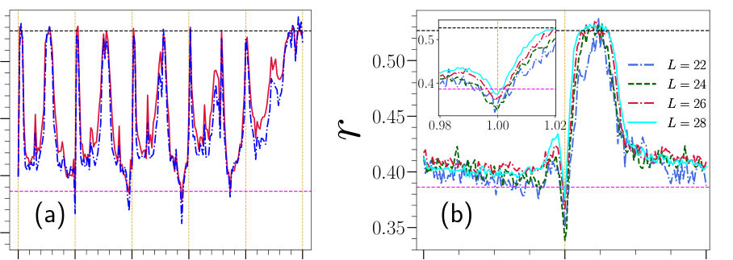 

FIG. 2. (a) Plot of r as a function of px where x = λ0T1/(πℏ) = 10 for L = 20, R = +1 sector with OBC (red) and L = 26, K = 0, P = +1 sector with PBC showing sharp dips at px = m for integer m which correspond to special points. The magenta (black) dashed lines r = 0.39 (0.527) correspond to the value of r for the Poisson ensemble (COE). (b) Same as in (a) for K = 0, P = +1 sector with PBC but around px = 1, for different chain lengths L. The inset shows a closeup of a sharp rise of r from 0.39 to 0.527.

📷 Fig 8

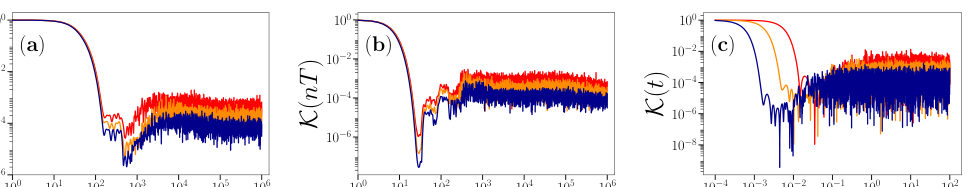 

FIG. 3. (a) Plot of K(nT1) as a function of the number of drive cycles n for L = 24 (red), L = 26 (orange) and L = 28 (blue); the driven chain is assumed to have PBC and we are in the K = 0, P = +1 sector. For all plots w0/w1 = 1 and γ/π = 2. (b) same as in (a) but with γ/π = 1.67. (c) Plot of K(t) := 1 D2sec PDsec j1,j2=1 ei(Ej1 −Ej2 )t/ℏfor the eigenspectrum {Ej} of an undriven XXZ Hamiltonian in a longitudinal magnetic field with parameters ∆/J = −1/2, B/J = −3. The parameters are chosen so that H(2) F can be directly mapped to such an XXZ chain at γ = 2π. For all plots, Dsec is the Hilbert space dimension of the chosen magnetization sector, the chain lengths are chosen to be L = 18...

📷 Fig 9

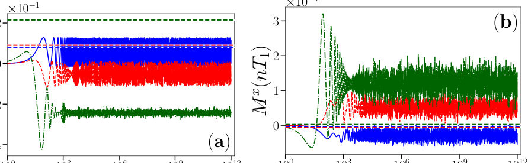 

FIG. 4. (a) Plot of M x(nT1) as a function of the number of drive cycles n for γ/π = 2 (blue), 1.99 (green) and 1.9 (red) for |ψ(0)⟩= |vac⟩; the driven chain is assumed to have PBC and we are in the K = 0, P = +1 sector. For all plots w0/w1 = 1 and L = 28. (b) same as in (a) but for |ψ(0)⟩= |AFM⟩. The dotted lines show the corresponding ETH predicted DE values while the black dashed line indicated the ITE value.

**Main problem.**

Investigating the emergence of prethermal Bethe integrability in periodically driven Rydberg atom chains and identifying drive protocols that prevent rapid thermalization.

**Main result.**

The authors identify specific drive protocols and frequencies where the Floquet Hamiltonian maps to an integrable XXZ spin chain, leading to an extensive number of approximately conserved charges and suppressed heating for exponentially long timescales.

**Method.**

The study uses Floquet perturbation theory to derive effective Hamiltonians and exact diagonalization to analyze spectral statistics, entanglement entropy, and magnetization dynamics.

**Summary.**

This paper explores how periodic driving can induce emergent integrability in a Rydberg atom chain. By using specific square-pulse driving protocols, the authors show that the system's effective Hamiltonian can be mapped to the integrable XXZ spin chain at certain frequencies. This leads to a prethermal regime where the system avoids thermalization and maintains conserved charges for extremely long periods. The findings are supported by both analytical mapping and numerical simulations of level statistics and entanglement.

Detailed structure

**Model / system.**

A one-dimensional chain of Rydberg atoms in the strong interaction limit, described by a PXP-like Hamiltonian with a Rydberg blockade constraint, subject to periodic driving (two-tone and asymmetric square pulse protocols).

**Key observables.**

Level spacing ratio (r), half-chain entanglement entropy, longitudinal magnetization, and spectral form factor.

**Important parameters / regimes.**

Drive frequency (omega), drive amplitude (lambda_0), phase accumulated during the drive (gamma), and the large drive amplitude regime (lambda_0 >> w_0, w_1).

**Assumptions / limitations.**

The analysis primarily focuses on the large drive amplitude regime and assumes the validity of the Floquet expansion for high-frequency driving.

**Figures summary.**

Figure 1 shows the drive protocols; Figure 2 illustrates the mapping between the constrained Rydberg chain and the unconstrained XXZ model; Figure 3 compares spectral form factors at different frequencies.

**Paper structure.**

The paper introduces the driven Rydberg system, presents the analytical derivation of the effective Hamiltonian using Floquet perturbation theory, establishes the mapping to the XXZ model, and provides numerical verification through exact diagonalization of spectral and dynamical observables.

**Why it may be interesting.**

It demonstrates a method to engineer integrability in non-integrable, constrained many-body systems via Floquet engineering, providing a way to control thermalization and preserve quantum information in Rydberg arrays.

Abstract

We study a chain of periodically driven Rydberg atoms and identify a class of drive protocols for which the system exhibits emergent prethermal Bethe integrability at special drive frequencies. We provide a perturbative analytic expression of its Floquet Hamiltonian in the large drive amplitude regime. We demonstrate integrability of the leading term of this Floquet Hamiltonian at special drive frequencies, which we identify, by mapping it to the Hamiltonian of the paradigmatic spin-$1/2$ ${\rm XXZ}$ chain. We support our analytical results by exact diagonalization studies on finite chains. Our numerical results on level statistics, half-chain entanglement entropy, and longitudinal magnetization of the driven chain brings out its emergent integrable nature at the special drive frequencies which persists up to a large prethermal timescale.

[↑ back to top](#top)

### [Synthetic Polariton Matter in the solid state](http://arxiv.org/abs/2604.25413v1)

**Authors:** Sylvain Ravets

**Type:** both · **Category:** quantum gases · **PDF:** <https://arxiv.org/pdf/2604.25413v1>

**Analysis basis:** full PDF text, analyzed in chunks

**Topic relevance:** 🔥 `analog quantum simulation` **4/5** · 🔥 `driven-dissipative phase transition` **4/5** · `Tavis-Cummings & cavity-many-emitter` **3/5** · `correlated cavity matter` **3/5** · `exotic spin models in light-matter` **3/5** · `non-equilibrium dynamics` **3/5** · `non-equilibrium universality` **3/5** · `quantum optics experiment` **3/5** · `Keldysh / 2PI / non-Gaussian methods` **2/5** · `methods for driven-dissipative` **2/5** · `entanglement & information structure` **1/5**

📷 Fig 1

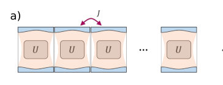 

Fig. 1 Schematic illustration of a synthetic photonic material composed of an array of coupled optical cavities. (a) Neighboring cavities are coupled with strength 𝐽, while each cavity contains a nonlinear medium that induces an effective photon–photon interaction 𝑈. (b) The system maps onto a Bose–Hubbard model with hopping amplitude 𝐽and on-site interaction 𝑈.

📷 Fig 2

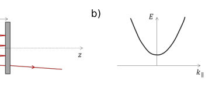 

Fig. 2 Geometrical optics illustration of a planar Fabry—Perot cavity. (a) A light ray entering the cavity undergoes multiple reflections between the mirrors before escaping, during which it experiences a transverse drift that depends on the in-plane wavevector k∥. (b) This transverse motion is equivalent to that of a massive particle, as reflected in the cavity photon dispersion relation: the energy varies quadratically with k∥ , providing the confined photons with an effective mass.

📷 Fig 3

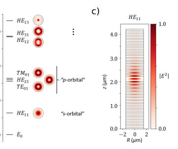 

Fig. 3 Photon confinement in semiconductor microcavities. (a) Schematic of a Bragg cavity composed of two distributed Bragg reflectors (grey) and a central cavity spacer (green). Using nanofabrication techniques, lateral microstructures can be defined, typically a few microns in diameter. (b) Calculated energy spectrum for a 3 µm micropillar, obtained by numerically solving the full three-dimensional Maxwell equations for a structure containing 15 Bragg mirror pairs in both the top and bottom DBR, and a cavity spacer of optical thickness 𝜆0 (design wavelength 𝜆0 = 852 nm). A series of discrete modes emerges, labeled according to the hybrid electric (HE𝑛𝑚) modes of a cylindrical waveguide....

📷 Fig 4

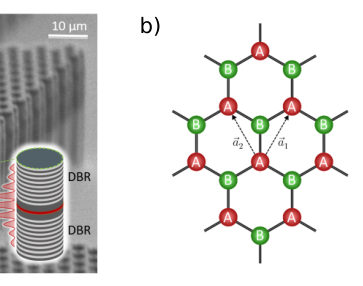 

Fig. 4 A regular lattice of polariton micropillars. (a) Scanning electron microscope image of a honeycomb lattice of polariton micropillars. The inset shows a single micropillar used as a building block. (b) Schematic of the honeycomb lattice, highlighting the two sublattices 𝐴and 𝐵and the primitive lattice vectors a1 and a2.

📷 Fig 5

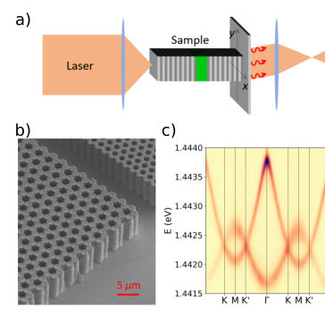 

Fig. 5 Experimental measurement of photonic band structures. (a) Schematic of the experimental setup: the Fourier-plane emission is imaged onto the entrance slit of a spectrometer. (b) Scanning electron microscope image of the fabricated lattice. (c) Measured emission intensity as a function of 𝑘𝑥for 𝑘𝑦= 0. (d) By repeating the measurement for multiple values of 𝑘𝑦, the full three-dimensional band structure is reconstructed.

📷 Fig 6

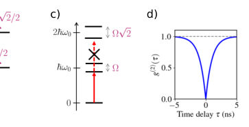 

Fig. 6 Coupling of cavity photons to a single two-level system. (a) Schematic of the experimental setup. (b) Energy levels in the bare basis, with the coupling terms in the Hamiltonian indicated by magenta arrows. (c) Energy ladder in the normal-mode (dressed-state) basis, which becomes anharmonic as illustrated by the red arrows. (d) This anharmonicity gives rise to the photon blockade effect, resulting in photon antibunching.

📷 Fig 7

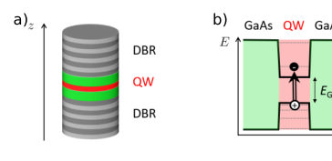 

Fig. 7 Quantum well excitons coupled to cavity photons. (a) Schematic of a micropillar cavity embedding a semiconductor quantum well at its center. (b) Bandgap engineering creates a confining potential for charge carriers. Under optical excitation (double arrow), an electron is promoted from the valence band (VB) to the conduction band (CB), leaving behind a hole. (c) The Coulomb attraction between the electron and the hole binds them into an exciton.

📷 Fig 8

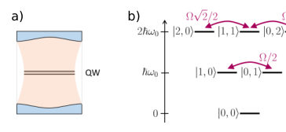 

Fig. 8 Exciton-polaritons in a single mode cavity. (a) Schematic of a single mode cavity embedding a quantum well at its center. (b) Linear Hamiltonian energy levels in the bare basis, with the coupling terms indicated by magenta arrows. (c) Energy ladder in the polariton basis, for the linear Hamiltonian.

**Main problem.**

The challenge of engineering and controlling new phases of matter, such as strongly correlated bosonic phases, by creating synthetic photonic materials in the solid state.

**Main result.**

The paper demonstrates that exciton-polaritons in semiconductor microcavities can be arranged into periodic arrays to emulate the Bose-Hubbard model, providing a scalable platform for exploring many-body quantum physics.

**Method.**

The work uses a combination of electromagnetic modeling (Maxwell equations), tight-binding approximations (LCAO), and the driven-dissipative Gross-Pitaevskii equation to describe both single-particle and many-body dynamics.

**Summary.**

This paper reviews the development of synthetic polariton matter using semiconductor microcavities. By confining photons in cavities and coupling them to excitons, researchers can create hybrid quasiparticles with controllable mass and interactions. These particles can be arranged into artificial crystals to simulate complex quantum models like the Bose-Hubbard model. This platform offers a scalable way to explore strongly correlated bosonic phases and topological physics in a driven-dissipative environment.

Detailed structure

**Model / system.**

The primary system is exciton-polaritons in semiconductor microcavities (micropillars) which, when arranged in lattices, map onto the Bose-Hubbard model and the Jaynes-Cummings model.

**Key observables.**

Photoluminescence signal, energy-momentum dispersion, photon statistics (second-order correlation function g2(0)), and spatial/temporal correlation functions.

**Important parameters / regimes.**

Effective photon mass (m_ph), hopping amplitude (J), on-site interaction (U), Rabi splitting (Omega), and the ratio of interaction to linewidth (U/gamma).

**Assumptions / limitations.**

The paraxial approximation for photon dispersion, the weak-guidance approximation for electromagnetic fields, and the treatment of excitons as bosons at low density.

**Figures summary.**

Figure 1 shows a schematic of synthetic photonic materials and the mapping to the Bose-Hubbard model; Figure 2 illustrates the geometrical optics and derivation of effective photon mass; Figure 7 and 8 show semiconductor microcavity structures and exciton formation.

**Paper structure.**

The paper progresses from the fundamental physics of photon confinement and effective mass to the engineering of periodic lattices, then explores the transition from linear single-particle physics to nonlinear many-body regimes and emergent quantum phases.

**Why it may be interesting.**

It presents a scalable, solid-state alternative to cold atom platforms for studying driven-dissipative many-body physics, including Bose-Hubbard dynamics, topological phases, and non-equilibrium phase transitions like KPZ physics.

Abstract

Synthetic materials are obtained by assembling atoms or artificial atoms into regular arrays, thereby forming artificial crystals that offer powerful platforms to emulate and explore condensed-matter phenomena in highly controlled settings. They enable probing outstanding questions in many-body physics and designing new phases of matter with no direct analogue in nature. Beyond their fundamental interest, these materials hold potential for future technological applications through the emergence of novel concepts and functionalities. Synthetic materials have been engineered using a wide range of physical platforms, including both natural atoms and fabricated artificial atoms in the solid-state. A particularly intriguing approach relies on photons. When confined in optical cavities and strongly coupled to matter excitations, photons acquire an effective mass and can experience interactions, giving rise to hybrid light-matter quasiparticles known as polaritons. By arranging polaritons in periodic structures, one can engineer synthetic photonic materials with tailored band structures and controllable interactions, offering a promising route toward exploring strongly correlated photonic phases. This chapter focuses on a solid-state realization of such systems: exciton polaritons confined in semiconductor microcavities. Following a general introduction, we describe how photon mass and photonic band structures emerge from cavity confinement, and how interactions arise via strong coupling to excitons in quantum wells. We finally review how these ingredients can be used to explore rich physics from the mean-field to the quantum regime.

[↑ back to top](#top)

### [Continuous Reset-Induced Phase Transition in Measurement-Free Random Quantum Circuits](http://arxiv.org/abs/2604.25640v1)

**Authors:** Hinata Yokoyama, Kengo Anzai, Dina Syverud-Lindland, Yoshihito Kuno, Hiroaki Matsueda

**Type:** theory · **Category:** statistical mechanics · **PDF:** <https://arxiv.org/pdf/2604.25640v1>

**Analysis basis:** full PDF text, analyzed in chunks

**Topic relevance:** 🔥 `driven-dissipative phase transition` **4/5** · 🔥 `entanglement & information structure` **4/5** · 🔥 `measurement-induced transitions` **4/5** · 🔥 `non-equilibrium universality` **4/5** · `non-equilibrium dynamics` **3/5** · `methods for driven-dissipative` **2/5** · `quantum measurements` **2/5**

📷 Fig 1

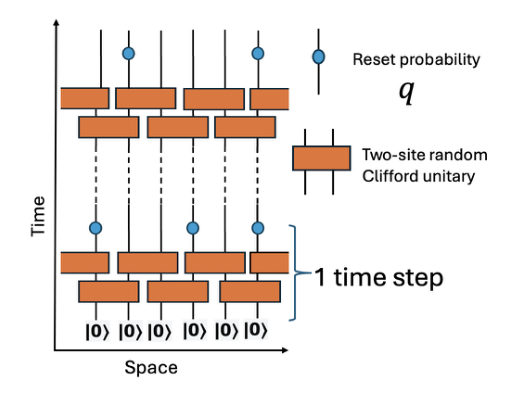 

FIG. 1. A schematic representation of the random Clifford circuit subjected to the reset channel. The orange block represents a two- site random Clifford unitary gate, and the blue dot represents a reset channel. The horizontal and vertical axes represent the spatial and time directions, respectively. The reset channel is applied at each site with probability q = p/L. The system evolves from product states of |0⟩basis. Each time step includes two layer of the two-site unitary gates and the single layer reset channel with probability q for each sites.

📷 Fig 2

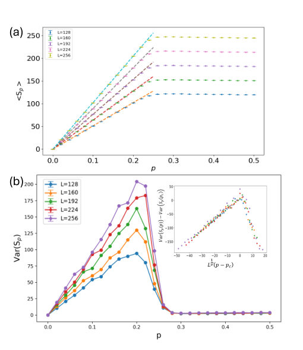 

FIG. 2. (a) p-dependence of Sp. The data were taken from L = 128 to L = 256. The dashed lines represent analytical expectation of Eq. (7) of p &lt; pc case. (b) p-dependence of variance of Sp. The peak increases as L is incremented. Inset: The data of FSS. We observe the data collapse. ν = 1.04(36) and pc = 0.20(3) are obtained. For all data point, the trajectory samples are O(103) and the total time step is T = 4L.

📷 Fig 3

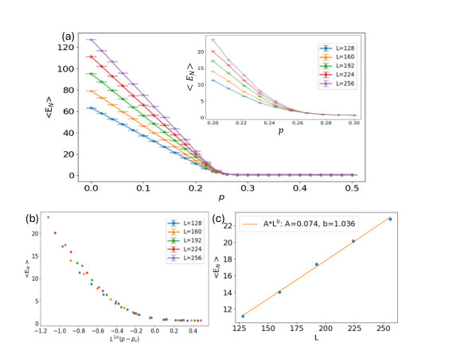 

FIG. 3. (a) p-dependence of the MBN. The lines for different system sizes from L = 128 to L = 256 merge all together after p ≈0.26 (inset). (b) The results of the FSS for the MBN. The numerically extracted results are pc = 0.268(12) and ν = 2. (c) L-dependence of EN and the linear fitting for p = 0.20. The data were averaged over O(103) at T = 4L.

📷 Fig 4

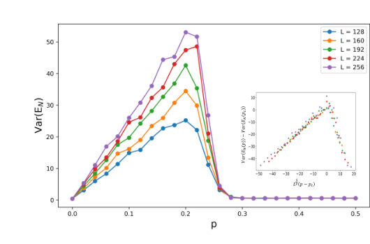 

FIG. 4. p-dependence of variance of EN. The peak increases with the increase of L. Inset: The data of FSS analysis. We observe the data collapse with ν = 1.08(16) and pc = 0.20(3). The total number of the trajectory sample is O(103) and we set T = 4L.

📷 Fig 5

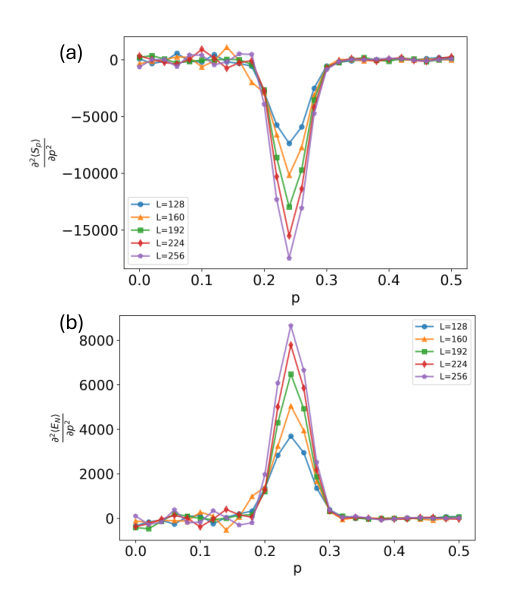 

FIG. 5. p-dependence of the second derivative for Sp [(a)] and EN [(b)]. Both peaks are observed with p = 0.24. The absolute values of the peaks get large as increasing the system size L.

📷 Fig 6

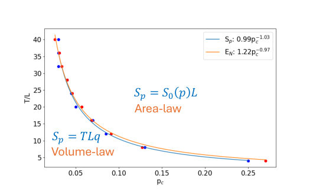 

FIG. 7. Transition-boundary curve of the reset-induced phase tran- sition on T/L-p plane. This result is obtained by observing the log- arithmic purity and the MBN. The curve is created by numerically estimated critical points pc’s. The blue (orange) line is the estimated curve using Sp (EN). The regions above and below the curve corre- spond to distinct phases associated with each quantity. The numeri- cally extracted results are ν ≈1 for Sp and ν = 2 for the MBN. The data is taken at T/L = 4, 8, 12, 16, 20, 24, 28, 32, 36, and 40. The fitting curve suggests that T/L ∝1/pc.

📷 Fig 7

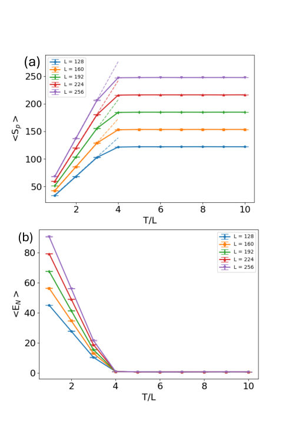 

FIG. 6. T/L-dependence of Sp [(a)] and EN [(b)].We fix p = 0.25. Both values saturate to a finite value at T ∼4L in which the reset-induced phase transition occurs. The data were averaged over O(103).

**Main problem.**

The study investigates the nature of entanglement phase transitions induced by reset channels in random quantum circuits, specifically determining if the transition is continuous or first-order in the qubit regime.

**Main result.**

For qubits (d=2), the reset-induced phase transition is found to be continuous (second-order) and belongs to the 2D Ising universality class, contradicting the first-order transition predicted by the large-d classical mapping.

**Method.**

The authors use efficient stabilizer circuit simulations for d=2 and an analytical mapping of the circuit onto a 2D classical statistical spin model on a triangular lattice.

**Summary.**

This paper explores phase transitions in random quantum circuits driven by reset channels rather than measurements. While previous studies in the large-dimension limit predicted a first-order transition, this work uses stabilizer simulations to show that for qubits, the transition is continuous and follows the 2D Ising universality class. The study also demonstrates that the critical point depends on the ratio of circuit depth to system size. These findings provide a deeper understanding of how local dissipation shapes entanglement structure in quantum many-body systems.

Detailed structure

**Model / system.**

A 1D random Clifford (unitary) quantum circuit with a brickwork pattern of two-site gates, subject to a local reset channel that purifies sites to the |0> state with probability q.

**Key observables.**

Logarithmic purity (Sp), Many-body negativity (MBN/En), entanglement entropy, and the variance of these observables.

**Important parameters / regimes.**

Qudit dimension (d), reset probability (p or q), and the ratio of total time to system size (T/L).

**Assumptions / limitations.**

The large-d limit assumes a mapping to a classical statistical spin model; the study focuses on the d=2 (qubit) regime using stabilizer formalism.

**Figures summary.**

Figure 1 shows the circuit schematic; Figure 2 illustrates the p-dependence of purity and its variance, demonstrating data collapse for finite-size scaling; Appendix figures show the evolution of spin configurations and domain walls.

**Paper structure.**

The paper introduces the reset-induced transition, describes the circuit model and its mapping to a classical spin model, presents numerical results for d=2 showing a continuous transition, discusses the dependence on T/L, and concludes with the comparison between small-d and large-d regimes.

**Why it may be interesting.**

This work is highly relevant for researchers in open quantum systems and many-body dynamics as it identifies a new universality class for noise-induced transitions and explores how the dimension of the Hilbert space fundamentally changes the order of a phase transition.

Abstract

We study a random unitary quantum circuit with only reset channels, which has high feasibility for real quantum devices. In particular, we investigate the many-body statistical physics properties, "reset-induced" entanglement phase transitions comparing the classical statistical picture in the large "$d$" limit of qudits. In the property of the reset-induced phase transition the parameter of qudit $d$ is essential. That is, the transition properties induced by the reset channel significantly depend on $d$. We numerically elucidate this statement employing efficient stabilizer circuit simulations for $d=2$. Specifically, large fluctuations are observed near the critical point, indicating that the reset-induced phase transition is continuous. We obtain clear data collapses, consistent with a second-order mixed phase transition. This behavior differs from expectations based on the classical statistical mapping in the large-$d$ limit.

[↑ back to top](#top)

### [Entanglement Dynamics in a Two Transmon Qubit System under Continuous Measurement and Postselection](http://arxiv.org/abs/2604.25311v1)

**Authors:** Roson Nongthombam, Amarendra K. Sarma

**Type:** theory · **Category:** quantum information and computing · **PDF:** <https://arxiv.org/pdf/2604.25311v1>

**Analysis basis:** full PDF text, analyzed in chunks

**Topic relevance:** 🔥 `quantum measurements` **4/5** · `correlated / nonlocal dissipation` **3/5** · `driven-dissipative phase transition` **3/5** · `entanglement & information structure` **3/5** · `methods for driven-dissipative` **3/5** · `measurement-induced transitions` **2/5** · `non-equilibrium dynamics` **2/5**

📷 Fig 1

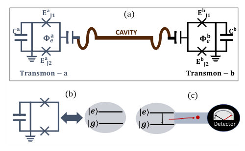 

FIG. 1. (a) Schematic of a transmon–cavity–transmon cou- pled system, where two transmons (a and b) are capacitively coupled via a cavity. (b) Representation of the transmon qubit as an effective two-level system with ground and ex- cited states |g⟩and |e⟩. (c) Schematic of the monitoring of spontaneous emission from the transmon qubit. The emitted photon is collected through a transmission line and routed to a detector that registers its presence.

📷 Fig 2

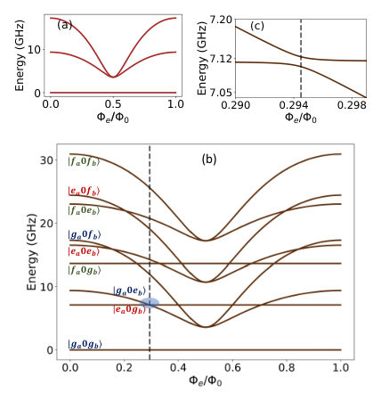 

FIG. 2. Energy (eigenvalue) spectrum of (a) a single transmon and (b) a coupled transmon-cavity-transmon system. The spectrum is obtained by varying the externally applied flux Φe. In panel (b), one of the transmons (denoted by a) is fixed at Φe = 0.3 Φ0, while the flux of the other transmon (denoted by b) is varied. For clarity, only the zero-excitation cavity manifold is shown. At the flux point Φe = 0.2945 Φ0 (indicated by the dotted line), the states |ea 0 gb⟩and |ga 0 eb⟩ exhibit an avoided crossing. A zoomed-in view of this region, highlighted by the shaded circle in (b), is shown in (c). The energy gap at the avoided crossing is given by 2Geg (refer Eq.(12)). The parameters used are...

📷 Fig 3

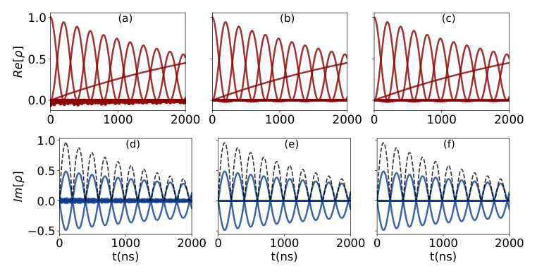 

FIG. 3. Comparison of the real and imaginary parts of the density matrix elements for (a,d) the transmon-cavity-transmon coupled system [Eq. (2)], (b,e) the dispersive transmon-cavity-transmon system [Eq. (5)], and (c,f) the effective transmon- transmon system [Eq. (12)]. The oscillations observed in (a,d) and (b,e) occur between the populations ⟨ea0gb|ˆρtct|ea0gb⟩and ⟨ga0eb|ˆρtct|ga0eb⟩. These oscillations decay over time due to environmental dissipation. As a result the ground-state population ⟨ga0gb|ˆρtct|ga0gb⟩increases. Since the cavity remains in its ground state throughout the evolution, the effective transmon- transmon model reproduces the same dynamics. In this case, the...

📷 Fig 4

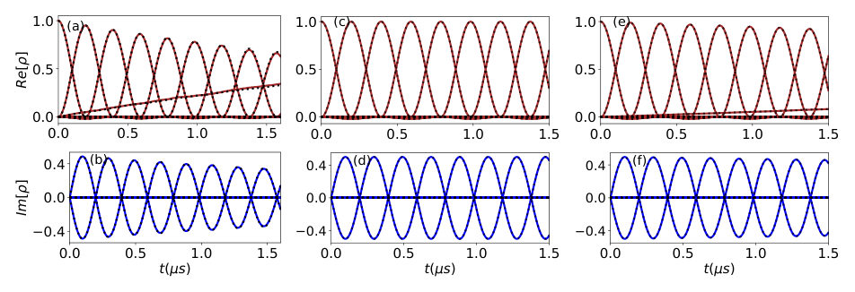 

FIG. 4. Comparison between the trajectory ensemble average (dotted curve) and the average dynamics obtained from the master equation (solid curve). The top row shows the real part of the density matrix, while the bottom row shows the imaginary part. (a,b) Unmonitored case with ηx = 0. The trajectory average is taken over 2000 realizations. The two approaches show excellent agreement. (c,d) Perfect postselection case with ηx = 1. Since quantum jumps are postselected, all trajectories are identical and coincide with the master equation evolution conditioned on postselection. (e,f) Imperfect postselection with ηx = 0.8. Here too, all trajectories remain identical and closely follow the...

📷 Fig 5

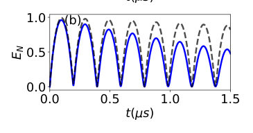 

FIG. 5. (a) Comparison of the two-transmon entanglement measure between the unmonitored case ηx = 0 (solid) and the efficient postselection case ηx = 1 (dashed). While the entanglement in the unmonitored case decays, the entangle- ment under perfect postselection persists. (b) Comparison of the two-transmon entanglement measure between the un- monitored case ηx = 0 (solid) and the inefficient postselec- tion case ηx = 0.8 (dashed). While the entanglement in the unmonitored case decays, the entanglement under imperfect postselection degrades at a slower rate.

📷 Fig 6

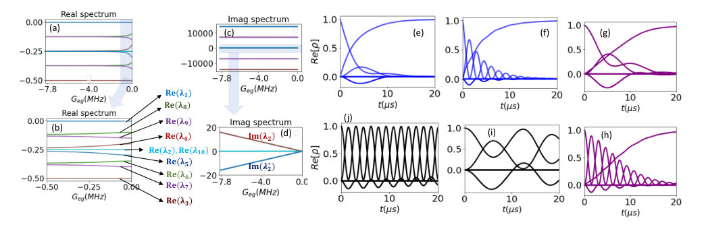 

FIG. 6. Eigenvalue spectrum of the Liouvillian superoperator (a-d) and the corresponding evolution of density matrix elements (e-j). The real part of the spectrum is shown in (a), and a zoomed-in view near Geg = 0, highlighted by the shaded region, is shown in (b). There are 16 eigenvalues in total, of which ten real parts are shown explicitly in (b). The remaining six arise as complex conjugate pairs of λi with i = 2, 6, 7, 8, 9, 10. The imaginary part of the spectrum is shown in (c). The contribution to the coherent dynamics arises from Im(λ2) and Im(λ∗ 2), as illustrated in (d). Panels (e-j) show the evolution of the real part of density matrix elements in the unmonitored case (ηx = 0)...

📷 Fig 7

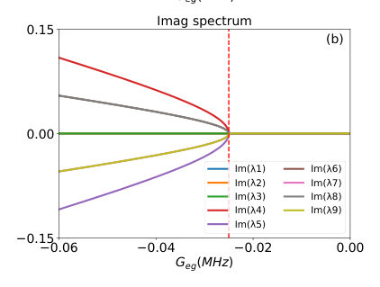 

FIG. 7. Eigenvalue spectrum of the Liouvillian superoperator in the interaction frame. (a) Real part of the spectrum. (b) Imaginary part of the spectrum. The exceptional point (EP), located at Geg = 0.025, is indicated by the red dotted line. The parameters are the same as in Fig. 7.

📷 Fig 8

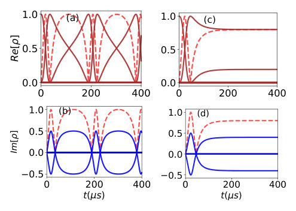 

FIG. 8. Real (a,c) and imaginary (b,d) parts of the density matrix evolution. (a,b) Evolution for Geg = 0.03 MHz, which lies to the left of the exceptional point (EP). This resembles the PT -symmetric phase dynamics. (c,d) Evolution for Geg = 0.02 MHz, which lies to the right of the EP. This resembles the broken PT -symmetric phase dynamics. The entanglement dynamics in both the broken and unbroken PT -symmetric phases are shown by the red dotted curve.

**Main problem.**

The study investigates how continuous measurement and postselection affect the entanglement dynamics and coherence of a two-transmon system.

**Main result.**

Postselection of 'no-click' trajectories significantly slows the decay of entanglement compared to unmonitored scenarios and reveals the emergence of an exceptional point and PT-symmetric phases.

**Method.**

The authors use quantum trajectory theory, stochastic master equations, and Liouvillian superoperator spectrum analysis to model the system's evolution.

**Summary.**

This paper explores the entanglement dynamics of two coupled transmons under continuous monitoring. By analyzing trajectories where no photons are detected (postselection), the authors show that entanglement decay can be significantly suppressed. The study also identifies the emergence of an exceptional point and distinct PT-symmetric phases in the system's Liouvillian spectrum. These findings offer potential strategies for managing decoherence in quantum information processing.

Detailed structure

**Model / system.**

A two-transmon qubit system coupled via a microwave cavity in the dispersive regime, where an effective transmon-translam interaction is mediated by virtual cavity excitations.

**Key observables.**

Entanglement (logarithmic negativity), population dynamics, coherence dynamics, and the Liouvillian eigenvalue spectrum.

**Important parameters / regimes.**

Transmon energies, coupling strength (Geg), detector efficiency (eta_x), and spontaneous emission rates (Gamma).

**Assumptions / limitations.**

The system operates in the dispersive regime with large detuning, the cavity remains in the zero-excitation manifold, and thermal excitations are neglected.

**Figures summary.**

Fig 1 shows the setup and monitoring scheme; Fig 2 shows energy spectra and avoided crossings; Fig 4 compares trajectory averages to master equations; Fig 6 shows density matrix evolution; Fig 7 identifies the exceptional point; Fig 8 compares PT-symmetric phases.

**Paper structure.**

The paper begins by defining the transmon-cavity-transmon Hamiltonian, derives an effective two-transmon model via dispersive transformation, validates the model against the full system, applies quantum trajectory theory for measurement and postselection, and concludes with a Liouvillian spectrum analysis to identify PT-symmetric phases and exceptional points.

**Why it may be interesting.**

It provides deep insights into how measurement backaction and postselection can be used to engineer and preserve entanglement in dissipative superconducting circuits, specifically through the lens of non-Hermitian physics and PT-symmetry.

Abstract

We investigate the role of continuous measurement and postselection in the dynamics and entanglement of a transmon-cavity-transmon coupled system. In the dispersive regime, characterized by a large detuning between the transmons and the cavity, the two transmons interact via virtual excitation of the cavity, giving rise to an effective transmon-transmon coupling. In addition to this coherent interaction, each transmon undergoes spontaneous emission, which is continuously monitored through independent detection channels. By incorporating realistic detector inefficiencies, we analyze both efficient and imperfect monitoring scenarios and demonstrate that postselection significantly slows down the decay of entanglement compared to the unmonitored case. We formulate the stochastic master equation for the coupled system, derive the corresponding postselected master equation, and investigate the dynamics through the Liouvillian superoperator spectrum. In the interaction frame, we identify the emergence of an exceptional point and characterize the associated broken and unbroken PT-symmetric phases. We show how these phases influence the system dynamics and the corresponding entanglement behavior. Our results provide insight into how continuous measurement and postselection affect entanglement in dissipative quantum systems, with potential applications in quantum information processing.

[↑ back to top](#top)

### [Testing a continuous-variable Bell-like inequality with a hybrid-encoded system](http://arxiv.org/abs/2604.25901v1)

**Authors:** Yu Meng, Ying Wang, Clara Henke, Nikolai Bart, Arne Ludwig, Peter Lodahl, Jonas S. Neergaard-Nielsen, Ulrik L. Andersen, Leonardo Midolo, Zheng-Hao Liu

**Type:** experiment · **Category:** quantum information and computing · **PDF:** <https://arxiv.org/pdf/2604.25901v1>

**Analysis basis:** full PDF text, analyzed in chunks

**Topic relevance:** 🔥 `QC/QI experiment` **4/5** · 🔥 `quantum optics experiment` **4/5** · `quantum measurements` **3/5** · `entanglement & information structure` **2/5** · `interference shaping light` **2/5**

📷 Fig 1

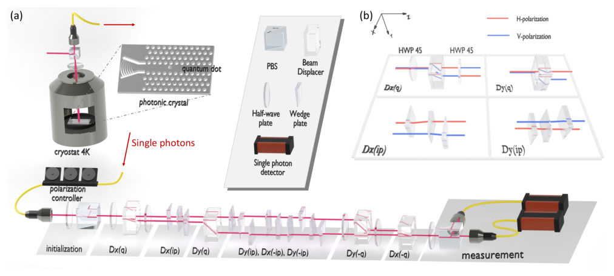 

Fig. 1. Experimental scheme. (a) Setup for measuring the real expectation of the displacement operators. The single photons are generated from the quantum dot in the cryostat and collected with an objective system. They propagate through a sequence of polarization-controlled x-and p-displacement boxes acting on the photonic spatial modes. A polarization measurement reveals the expectations of the CV operators. The figure shows the configuration for measuring the operators in the third row of the CV Peres–Mermin square (cf. Table I(a)); other rows and columns are designed similarly by replacing the displacement boxes. (b) Displacement operations. We realize q- and p-displacement operators...

📷 Fig 2

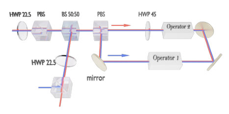 

Fig. 2. Commutativity test. This Hadamard test-like setup is used to measure the degree of incompatibility between two operators.

**Main problem.**

Testing noncontextuality (Kochen-Specker contextuality) in continuous-variable (CV) quantum systems, specifically overcoming the limitation that Gaussian CV systems cannot violate Bell-like inequalities under standard quadrature measurements.

**Main result.**

Demonstration of a violation of a CV Bell-like noncontextual hidden-variable inequality by 380 standard deviations using a hybrid-encoded system.

**Method.**

A black-box-style approach using the Hadamard test to probe expectation values of displacement operators and a quantum switch-like setup to measure the non-commutation fraction of operators.

**Summary.**

The researchers successfully demonstrated a violation of a continuous-variable Bell-like inequality by 380 standard deviations. They achieved this by using a hybrid system that combines photon polarization (DV) with the spatial modes of a single photon (CV). By mapping spatial modes to the GKP code space and using a Hadamard test, they bypassed the limitations of Gaussian measurements. This experiment provides a robust way to study quantum contextuality in unbounded-dimension systems.

Detailed structure

**Model / system.**

A hybrid-encoded photonic system where a discrete-variable (DV) qubit is encoded in photon polarization and a continuous-variable (CV) system is encoded in the spatial modes of a single photon generated from an InAs/GaAs quantum dot.

**Key observables.**

Real parts of phase-space displacement operators, non-commutation fraction (kappa), and second-order correlation function g2(0).

**Important parameters / regimes.**

Displacement scale q0 = 3 mm, p-displacement beam deflection of 78.3 urad, and g2(0) = 0.83 +/- 0.05%.

**Assumptions / limitations.**

The analysis assumes the validity of the plane-wave approximation for the spatial wavefunction and addresses the impact of imperfect commutativity between observables.

**Figures summary.**

Figure 1 shows the experimental setup for measuring displacement operators and the optical toolbox; Table II-IV present the Peres-Mermin square operators, experimental expectation values, and commutativity test results.

**Paper structure.**

The paper introduces the problem of CV contextuality, describes the hybrid experimental platform and encoding, details the implementation of displacement operators, presents the violation of the Bell-like inequality, verifies operator commutativity, and discusses the impact of experimental disturbance.

**Why it may be interesting.**

This work is highly relevant to quantum optics and quantum information as it demonstrates a high-significance violation of noncontextuality in a hybrid CV-DV architecture, providing a path to study fundamental quantum mechanics using spatial modes.

Abstract

Continuous-variable quantum systems are promising candidates for quantum computing and quantum information processing. It is widely known that quadrature measurements on Gaussian continuous-variable systems can be described by a noncontextual hidden-variable model and cannot violate a Bell inequality. Here, we demonstrate that the observation fails when sequential measurements are involved. Our experiment is realized by mapping the spatial modes of a single photon, deterministically generated from an InAs/GaAs quantum emitter, to the logical operations in the Gottesman--Kitaev--Preskill code space. Employing a black-box-style approach, we observe a violation of the Bell-like noncontextual hidden-variable inequality by 380 standard deviations. Our results address the conceptual loopholes in previous works and open up new possibilities for studying fundamental quantum physics using photonic-encoded continuous-variable systems.

[↑ back to top](#top)

### [Finite-time transitions in optimal control and non-equilibrium relaxation](http://arxiv.org/abs/2604.25798v1)

**Authors:** Jan Meibohm, Samuel Monter, Sarah A. M. Loos, Clemens Bechinger

**Type:** both · **Category:** statistical mechanics · **PDF:** <https://arxiv.org/pdf/2604.25798v1>

**Analysis basis:** full PDF text, analyzed in chunks

**Topic relevance:** 🔥 `driven-dissipative phase transition` **4/5** · 🔥 `non-equilibrium dynamics` **4/5** · `non-equilibrium universality` **3/5** · `quantum measurements` **2/5**

📷 Fig 1

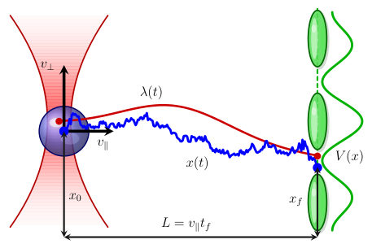 

FIG. 1. A particle (blue) is driven by a harmonic trap (red) at constant mean horizontal velocity v∥toward an obstacle (green), characterized by an energetic cost V(x). The trap controls the lateral velocity v⊥to minimize the total work performed on the particle.

📷 Fig 2

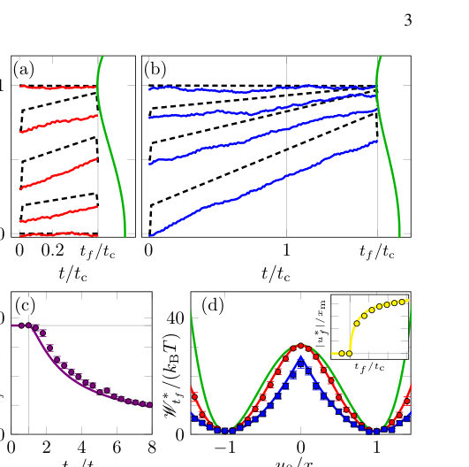 

FIG. 2. Optimal control protocols for different average initial posi- tions u0 (dashed) and experimental trajectories [solid red in (a), blue in (b)], with process durations: (a) tf = 0.47tc, and (b) t f = 1.65tc. (c) W ∗ t f at u0 = 0 as a function of tf from experiments (markers) and theory (line) for V0 = κx2m = 151kBT (d) W ∗ t f as a function of u0 at tf = 0.47tc (red) and t f = 1.65tc (blue). Results from experi- ments (markers) and theory (lines) for V0 = κx2m = 124kBT. ˜V(uf ) is shown in green. Inset: |u∗ f | as a function of the control time t f (yellow) from experiments (markers) and theory (solid line).

📷 Fig 3

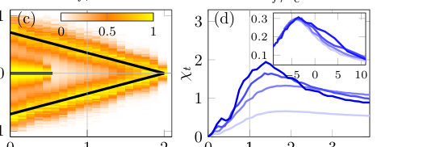 

FIG. 3. Results of the free-relaxation experiment, post-processed with the reweighing method, for V0 = 40kBT from 2000 trajectories. (a) Rate function V ∗ t f as a function of x f , for different t f . (b) Or- der parameter density P(|x0|,tf ) as a function of t from experiments (heat map) and |x∗ 0| from theory (solid line). P(|x0|,tf ) is scaled to unity at each tf to improve visibility. (c) Trajectory density of re- laxation trajectories that reach x f = 0 at different times t f from ex- periment (heat map), combined for tf = 0.55tc and t = 2tc. Solid lines show the theoretical predictions. (d) Susceptibility of the order parameter x0 as a function tf at V0 = 10kBT, 20kBT, 30kBT, and...

**Main problem.**

Investigating finite-time transitions in the optimal control of particles in structured environments and establishing a link between these control transitions and dynamical phase transitions in non-equilibrium relaxation.

**Main result.**

The study identifies a sharp transition in optimal control strategy at a critical duration (tc) where the system switches from a symmetric, zero-control solution to a symmetry-broken, active steering solution. This transition is shown to be the dual of a finite-time dynamical phase transition (FTDPT) in relaxation processes.

**Method.**

The authors combine theoretical frameworks, including the Pontryagin principle and Large Deviation Theory, with experimental measurements using optical tweezers, acousto-optical deflectors, and digital video microscopy.

**Summary.**

This paper explores how the duration of a control process determines the optimal strategy for moving a particle through a complex environment. It discovers that at a specific critical time, the optimal strategy abruptly changes from doing nothing to actively steering the particle. The researchers prove that this change in control is mathematically equivalent to a dynamical phase transition seen in non-equilibrium relaxation. The findings were verified using experimental optical tweezers on colloidal particles.

Detailed structure

**Model / system.**

A colloidal silica particle in a water-glycerol mixture manipulated via optical tweezers within a symmetric double-well potential. The dynamics are modeled using an overdamped Langevin equation.

**Key observables.**

Optimal control protocol (lambda*(t)), optimal trajectory (u*(t)), stochastic work (W), order parameter (|u*_f|), and susceptibility (chi_t).

**Important parameters / regimes.**

Control duration (tf), critical time (tc), particle relaxation time (tau_p), trap stiffness (kappa), and the potential barrier height (V0).

**Assumptions / limitations.**

The analysis assumes the weak-noise limit (kB T << V0) and uses the Euler-Machlup functional to identify optimal fluctuations.

**Figures summary.**

Figures depict the jumps in the optimal control protocol at boundary points and the scaling behavior of the susceptibility near the critical point.

**Paper structure.**

The paper introduces the problem of finite-time control, describes the experimental setup and Langevin model, presents the theoretical derivation of the control transition using the Pontryagin principle, demonstrates the mapping to dynamical phase transitions in relaxation, and concludes with the experimental verification of these transitions.

**Why it may be interesting.**

This work is highly relevant for researchers in open quantum systems and many-body dynamics as it provides an experimental platform to study rare event physics and dynamical phase transitions without the sampling bottlenecks typically associated with observing rare fluctuations.

Abstract

We theoretically and experimentally study finite-time optimal control of a colloidal particle steered through a spatially inhomogeneous environment, modeled by a position-dependent energetic cost at the final state. The competition between this state-dependent penalty and path-dependent dissipation gives rise to a sharp transition in the control strategy at a critical control duration. We further show that this transition can be linked to a dynamical phase transition in nonequilibrium relaxation after a quench, where the control cost maps onto the rate function governing rare trajectories.

[↑ back to top](#top)

### [Nonlinearity-enhanced Quantum Sensing in Discrete Time Crystal Probes](http://arxiv.org/abs/2604.25286v1)

**Authors:** Rozhin Yousefjani, Shaikha Al-Naimi, Saif Al-Kuwari, Abolfazl Bayat

**Type:** both · **Category:** quantum information and computing · **PDF:** <https://arxiv.org/pdf/2604.25286v1>

**Analysis basis:** full PDF text, analyzed in chunks

**Topic relevance:** 🔥 `non-equilibrium dynamics` **4/5** · `driven-dissipative phase transition` **3/5** · `entanglement & information structure` **2/5** · `non-equilibrium universality` **2/5** · `quantum measurements` **2/5**

📷 Fig 1

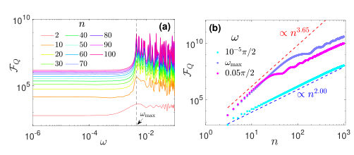 

FIG. 1. (a) The evolution of the QFI as a function of the deviation ω over various period cycles n, in a DTC probe with size L=12, fixed pulse error ε=0.01 in the π/2 x-rotation, and with the nonlinearity degree γ=2. The dashed line marks the finite-size threshold ωmax separating the DTC phase and non-DTC region. (b) The dynamics of the QFI over thousands of period cycles obtained for a DTC probe operating within the DTC phase for ω=10−5π/2, at the finite-size threshold ωmax, and inside the non-DTC region for ω = 0.05π/2. The other parameters are similar to the panel (a).

📷 Fig 2

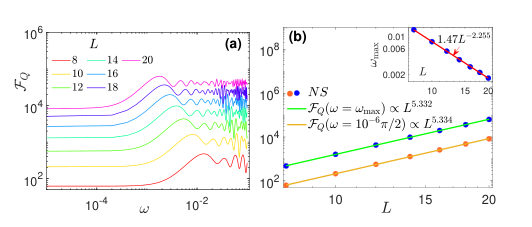 

FIG. 2. (a) The QFI versus the deviation ω in DTC probe with var- ious sizes, fix ε=0.01, and nonlinearity degree γ=2. The results are obtained after n=2 period cycle. (b) The extracted QFI for two de- termined values of the ω as a function of the system size L. The numerical simulations (NS) are well described by the fitting function FQ ∝Lβ. For a DTC probe with ω=10−6π/2 namely within the DTC phase we achieve β=5.334. At the finite-size threshold ωmax the ob- tained exponent is β=5.332. The inset depicts the extracted ωmax at different L’s. The numerical results (dots) follow the algebraic func- tion ωmax ∝L−2.255.

📷 Fig 3

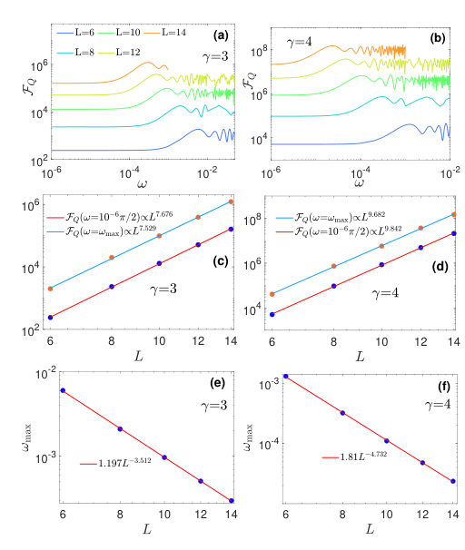 

FIG. 3. The QFI as a function of the deviation ω over n = 2 period cycles in DTC probes with (a) γ=3 and (b) γ=4. The results in both panels are obtained for different system sizes but fixed ε=0.01. The obtained QFI within the DTC phase for ω=10−6π/2 and at the finite- size threshold ωmax in DTC probes with (c) γ=3 and (d) γ=4. The numerical results (dots) in both panels are well-mapped by the fitting function FQ ∝Lβ for the reported β’s in the corresponding plots. The extracted finite-size threshold ωmax is shown in panels (e) and (f) for γ = 3 and γ = 4, respectively. The numerical results (dots) are properly fitted by the functions ωmax ∝L−3.512 and ωmax ∝L−4.732, for γ=3 and γ=4,...

📷 Fig 4

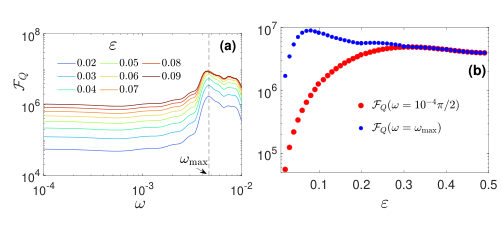 

FIG. 4. (a) The QFI as a function of the deviation ω for different values of the ε. (b) The extracted QFI as a function of ε deep in the DTC phase, ω = 10−4π/2, and at the finite-size threshold, ω = ωmax. In both panels, the results are obtained for a system of size L = 12 with nonlinearity γ=2 after n=10 period cycle.

**Main problem.**

Investigating how nonlinear spatial interaction profiles can enhance the precision of quantum sensing using Discrete Time Crystal (DTC) probes.

**Main result.**

Increasing the nonlinearity exponent increases the system-size scaling exponent of the Quantum Fisher Information, and pulse imperfections can actually enhance sensing performance for product-state probes.

**Method.**

Analytical derivation of QFI upper bounds and scaling laws, combined with numerical simulations using Exact Diagonalization and the Time-Dependent Variational Principle (TDVP) with Matrix Product States.

**Summary.**

This paper explores using Discrete Time Crystals as probes for quantum sensing, specifically focusing on how nonlinear interaction profiles can boost sensitivity. The authors show that increasing the nonlinearity exponent leads to a significant increase in the scaling of the Quantum Fisher Information with system size. They also find that pulse errors, typically seen as detrimental, can actually enhance the information encoded in the state. The study concludes with a proposed implementation using programmable ZZ gates on superconducting quantum processors.

Detailed structure

**Model / system.**

A one-dimensional chain of spin-1/2 particles subject to a periodically driven (Floquet) Hamiltonian featuring nonlinear Stark-type Ising interactions and global spin rotations.

**Key observables.**

Quantum Fisher Information (QFI), revival fidelity, and the nonlinearity exponent (gamma).

**Important parameters / regimes.**

Nonlinearity exponent (gamma), detuning (omega), pulse error (epsilon), system size (L), and number of Floquet cycles (n).

**Assumptions / limitations.**

The analysis focuses on product-state probes within the DTC regime and assumes the stability of the DTC phase via mechanisms like Stark-type localization.

**Figures summary.**

Figures demonstrate the scaling of QFI with system size and nonlinearity, the stability window of the DTC phase, and the impact of pulse errors on sensing precision.

**Paper structure.**

The paper introduces the DTC sensing concept, provides an analytical framework for nonlinear scaling, presents numerical results for QFI growth and system-size exponents, analyzes the impact of pulse errors, and concludes with a proposed digital implementation on superconducting qubits.

**Why it may be interesting.**

It demonstrates a novel way to use many-body non-equilibrium phases and engineered nonlinearities to achieve many-body enhancement in quantum metrology, while showing that experimental imperfections can be leveraged as a resource.

Abstract

Discrete time crystals are non-equilibrium phases of matter in periodically driven systems, characterized by robust subharmonic oscillations and broken discrete time-translation symmetry. Their long-lived coherent dynamics and resilience to imperfections make them promising resources for quantum sensing. A disorder-free discrete-time crystal probe can provide the quantum-enhanced estimation of the coupling parameter. Here, we extend this sensing mechanism to nonlinear interactions and show that this nonlinear profile strongly enhances the sensing precision by increasing the system-size scaling exponent of the quantum Fisher information. Our analytical discussion separates a rigorous seminorm upper bound from the physically relevant scaling realized by product-state probes in the time crystal regime. Numerically, we find that the quantum Fisher information retains its quadratic long-time growth with the number of Floquet cycles, while its system-size exponent increases approximately linearly with the nonlinearity exponent, identifying nonlinearity as a resource for quantum-enhanced sensitivity. We further show that stronger nonlinearities shrink the time crystal stability window, making the probe more sensitive to small deviations from the resonant condition. We also analyze the effect of imperfect pulses and show that such imperfections can enhance, rather than suppress, the information encoded in the evolved state. Finally, we discuss a digital implementation of the nonlinear DTC sensing protocol using superconducting qubits.

[↑ back to top](#top)

### [Phase diagram of a dual-species Rydberg atom ladder](http://arxiv.org/abs/2604.24889v1)

**Authors:** Lei-Yi-Nan Liu, Shi-Rong Peng, Ze-Yuan Huang, Xing-Man Wei, Yun-Han Zou, Su Yi, Jian Cui

**Type:** theory · **Category:** other · **PDF:** <https://arxiv.org/pdf/2604.24889v1>

**Analysis basis:** full PDF text, analyzed in chunks

**Topic relevance:** 🔥 `Rydberg arrays` **4/5** · `analog quantum simulation` **3/5** · `entanglement & information structure` **3/5** · `exotic spin models in light-matter` **3/5**

📷 Fig 1

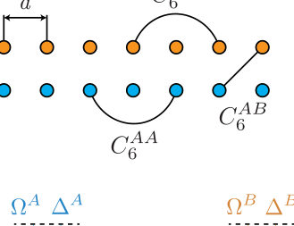 

FIG. 1. (a) Ladder lattice of two-species Rydberg atoms. Blue (A) and orange (B) circles denote the two atomic species, with lattice spacing d along both legs and rungs. The van der Waals interactions are characterized by CAA 6 , CAB 6 , and CBB 6 . (b) Illustration of energy levels, detunings ∆and external fields Ωof A and B atoms.

📷 Fig 2

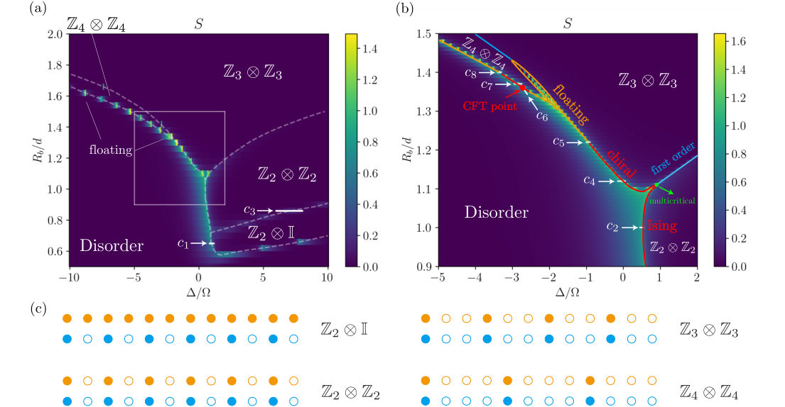 

FIG. 2. (a) Ground-state phase diagram of the ladder system. Four distinct ordered phases are identified, as illustrated in (c). The phase boundaries are determined from the bipartite entanglement entropy S and are indicated by white dashed lines. (b) Enlarged view of the region highlighted by the white square in (a). This regime contains three ordered phases, one disordered phase, and several floating-phase regions. Blue (red) lines denote first-order (continuous) phase transitions. Floating phases are marked by or enclosed within orange lines. The green dot indicates the multi-critical point, while the red dot marks a CFT point belonging to the Ashkin-Teller universality class. Among the...

📷 Fig 3

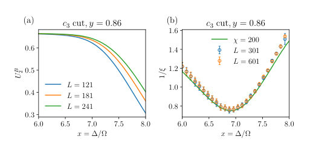 

FIG. 4. (a) Binder cumulant U B 2 for different system sizes at c3 cut (y = Rb/d = 0.86). (b) Inverse correlation length 1/ξ extracted from finite systems of size L = 301 and L = 601 by fitting the correlation functions Cs(x). Error bars indicate one standard deviation. The green line shows the result obtained from VUMPS [52] with bond dimension χ = 200.

📷 Fig 4

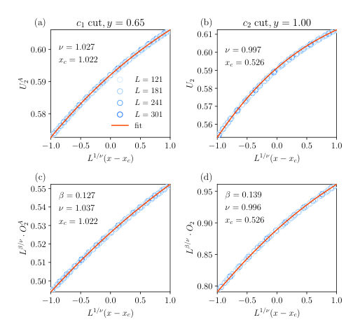 

FIG. 3. Finite size scaling analysis of binder cumulant and order parameter at cut c1 and c2. We extract critical ex- ponents β, ν and the position of critical point xc for c1 cut in (a)(c), and for c2 cut in (b)(d). We fit the data using a 14th-order polynomial by minimizing the distance between the data points and the polynomial curve.

📷 Fig 5

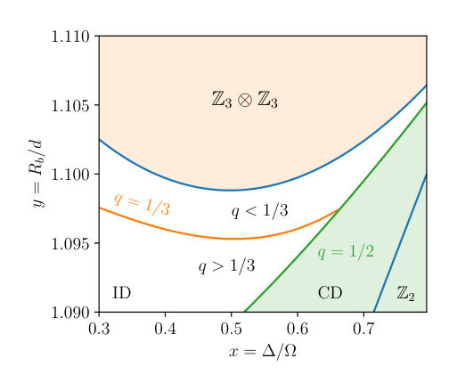 

FIG. 6. Illustration of the wave vector q near the boundary between the disordered phase and the Z3(⊗Z3)- and Z2(⊗Z2)- ordered phases. The blue lines denote the phase boundaries extracted from the crossing points of the Binder cumulant for different system sizes. The green line marks the boundary be- tween the commensurate disorder (CD) and incommensurate disorder (ID) phases. In the green (orange) shaded region, the wave vector takes the commensurate value q = 1/2 (q = 1/3). The orange line indicates the commensurate line within the ID region: above this line, the wave vector satisfies q &lt; 1/3, while below it q &gt; 1/3.

📷 Fig 6

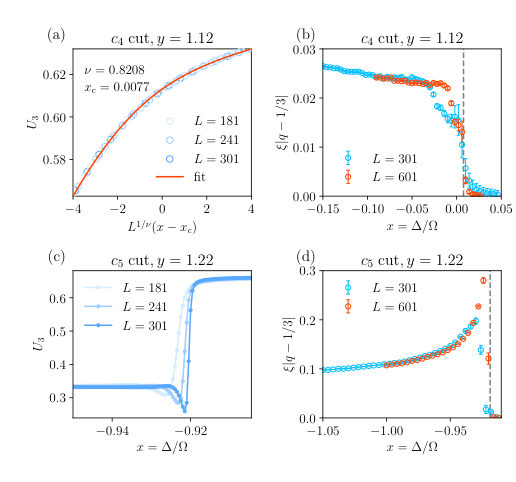 

FIG. 5. (a) Data collapse of the Binder cumulant along cut c4, yielding a critical exponent ν ≈0.82. The data are fitted using a 20th-order polynomial. (b) The phase transition indicator ξ|q −1/p| along cut c4 approaches a finite, nonzero constant, indicating a chiral phase transition. (c) The Binder cumulant along cut c5 exhibits a sudden drop, signaling the emergence of a floating phase. (d) The corresponding phase- transition indicator along cut c5 diverges, indicating a KT transition.

📷 Fig 7

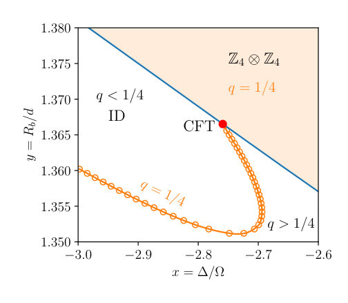 

FIG. 7. Illustration of the wave vector q near the boundary between the disordered phase and the Z4 ⊗Z4 ordered phases. The blue lines indicate the phase boundaries extracted from the crossing points of the Binder cumulant for different system sizes. The orange shaded region corresponds to the commen- surate regime where the wave vector is fixed at q = 1/4. The orange line denotes the commensurate line within the incom- mensurate disordered (ID) region: above this line the wave vector satisfies q &lt; 1/4, while below it q &gt; 1/4. The CFT point, defined as the intersection of the phase boundary and the q = 1/4 line, is highlighted by a large red dot.

📷 Fig 8

 

Fig. 8 (a). From this analysis, we extract the critical ex- ponent ν and the critical location xc. In Fig. 8 (b), we determine the central charge c ≈1 and the dynamical critical exponent z ≈1, confirming that this transition point is indeed described by a conformal field theory. The correlation lengths obtained from the correlation func- tions are consistent with the previously extracted ν and xc, as shown in Fig. 8 (c). Moreover, as shown in Fig. 8 (d), the indicator ξ|q − 1/4| approaches zero near the critical point along the c6 cut, signaling a conformal phase transition. This behav- ior is qualitatively different from that along the c7 and c8 cuts, shown in Fig. 8 (e) and (f). Along the...

📷 Fig 9

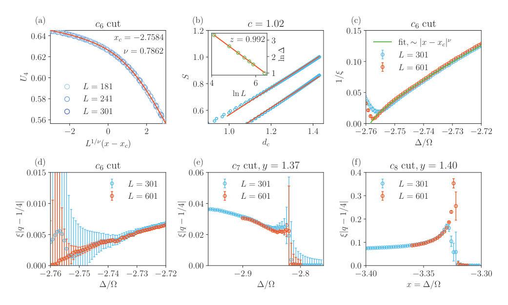 

FIG. 8. (a) Data collapse of the Binder cumulant along c6 cut (CFT cut, y = −0.1442x + 0.9687), yielding a critical exponent ν ≈0.786. The data are fitted using a 20th-order polynomial. (b) Central charge c and dynamical exponent z (inset) are extracted at the critical point xc. (c) The correlation length at the disorder side show good agreement with the extracted exponent and xc from (a). (d-f) Phase transition indicators along different cuts.

📷 Fig 10

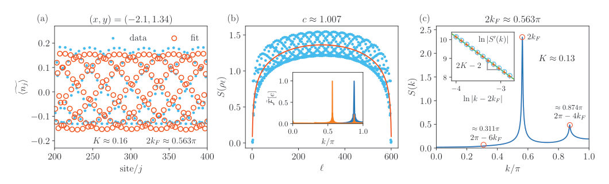 

FIG. 9. Data analysis of the floating phase at (∆/Ω, Rb/d) = (x, y) = (−2.1, 1.34), obtained from a system of size L = 601. (a) Friedel oscillations of the local excitation density ˜nj, fitted using Eq.(20). Blue dots denote the DMRG data, while orange open circles indicate the fitting results. (b) Entanglement entropy S(ρℓ) for bi-partitions ℓ|(L −ℓ), used to extract the central charge c. Here ρℓis the reduced density matrix of the first ℓrungs. Blue dots and the orange solid line represent the DMRG data and the corresponding fit, respectively. Inset: Normalized Fourier transforms of the fitting residuals, denoted by e F[e]. The blue and orange curves correspond to the residuals from...

**Main problem.**

The study investigates the ground-state phase diagram and the nature of quantum phase transitions in a one-dimensional dual-species Rydberg atom ladder.

**Main result.**

The authors identify multiple ordered phases (Z2, Z3, Z4), floating phases, and a smooth crossover between Z2 regimes, as well as a multi-critical point where Ising, chiral, and first-order transition lines intersect.

**Method.**

Large-scale Density-Matrix Renormal-group (DMRG) calculations using the ITensor library, supplemented by finite-size scaling and Conformal Field Theory (CFT) analysis.

**Summary.**

This paper explores the phase diagram of a 1D ladder made of two different species of Rydberg atoms. By using DMRG simulations, the authors find a variety of ordered and floating phases, including Z2, Z3, and Z4 symmetries. A key finding is the discovery of a multi-critical point where different types of phase transitions meet. The study also highlights a smooth crossover between certain phases, a feature unique to the dual-species setup. This work shows that mixed-species Rydberg arrays are a powerful platform for studying advanced many-body physics.

Detailed structure

**Model / system.**

A 1D ladder geometry consisting of two species of Rydberg atoms (Type-A and Type-B, specifically modeled after Cs and Rb) with competing van der Waals interactions and single-site driving.

**Key observables.**

Bipartite entanglement entropy, Binder cumulants, order parameters, correlation functions, structure factor, and the Luttinger parameter.

**Important parameters / regimes.**

Rabi frequency (Omega), detuning (Delta), interaction scales (CAA, CBB, CAB), and the ratio of interaction range to lattice spacing (Rb/d).

**Assumptions / limitations.**

Identical Rabi frequencies and detunings for both atomic species; use of an effective interaction cutoff length.

**Figures summary.**

Figure 1 shows the ladder lattice schematic, energy levels, and Rydberg states; Figure 2 presents the ground-state phase diagram; Figure 6 and 7 illustrate wave vector behavior and the CFT critical point at phase boundaries; Figure 9 shows the structure factor peaks.

**Paper structure.**

The paper introduces the dual-species ladder platform, details the Hamiltonian and numerical methodology, presents the identified phase diagram, analyzes the nature of specific phase transitions and multi-criticality, and concludes with the physical implications for Rydberg arrays.

**Why it may be interesting.**

It demonstrates how dual-species architectures enable complex phenomena like chiral criticality and multi-critical points that are inaccessible in standard single-species Rydberg arrays, providing a rich playground for studying 1D quantum phase transitions.

Abstract

Dual-species Rydberg atom arrays extend single-species platforms by introducing competing interaction scales and enhanced quantum fluctuations, enabling phenomena beyond homogeneous settings. In this work, we study the ground-state phase diagram of a one-dimensional dual-species Rydberg atom ladder using large-scale density-matrix renormalization group calculations. We identify disordered phases, multiple ordered phases with $\mathbb{Z}_2$, $\mathbb{Z}_3$, and $\mathbb{Z}_4$ symmetry, as well as floating phases characterized by incommensurate wave vectors and algebraically decaying correlations. Importantly, we observe a smooth crossover between distinct $\mathbb{Z}_2$-ordered regimes, reflecting a reorganization of low-energy degrees of freedom rather than a true phase transition, which is absent in single-species Rydberg arrays. We further uncover a multi-critical point at the boundary between the $\mathbb{Z}_2 \otimes \mathbb{Z}_2$ and $\mathbb{Z}_3 \otimes \mathbb{Z}_3$ ordered phases, where Ising, chiral, and first-order transition lines intersect. Our results demonstrate that dual-species Rydberg atom arrays provide a unique platform for realizing crossover physics and multi-critical behavior inaccessible in single-species architectures.

[↑ back to top](#top)

### [Quantum Compressed Sensing Enables Image Classification with a Single Photon](http://arxiv.org/abs/2604.25480v1)

**Authors:** Yanshan Fan, Jianyong Hu, Shuxiao Wu, Zhixing Qiao, Guosheng Feng, Changgang Yang, Jianqiang Liu, Ruiyun Chen, Chengbing Qin, Guofeng Zhang, Liantuan Xiao, Suotang Jia

**Type:** both · **Category:** quantum information and computing · **PDF:** <https://arxiv.org/pdf/2604.25480v1>

**Analysis basis:** full PDF text, analyzed in chunks

**Topic relevance:** 🔥 `QC/QI experiment` **4/5** · 🔥 `quantum optics experiment` **4/5** · `quantum measurements` **3/5** · `interference shaping light` **2/5**

📷 Fig 1

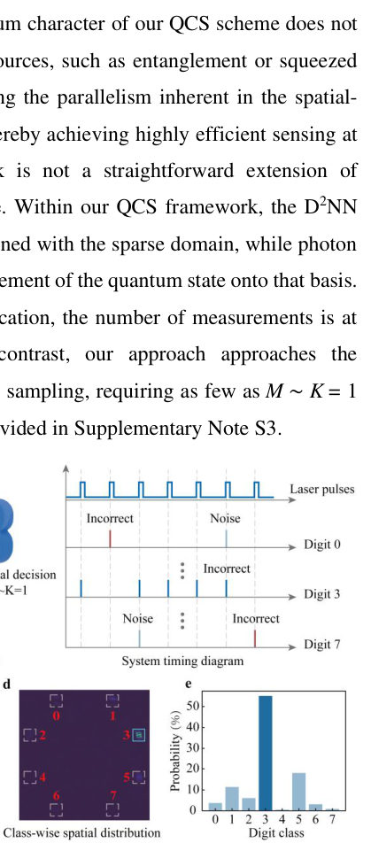 

Fig. 1 Theoretical model and experimental validation of QCS image classification. a Schematic

📷 Fig 2

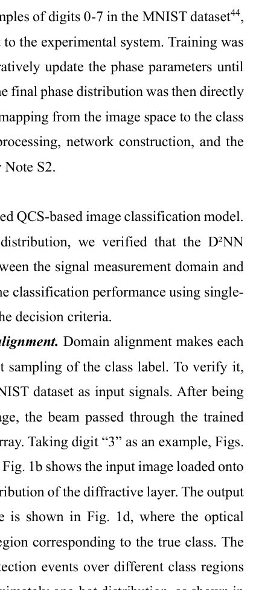 

Fig. 1e. These results confirm that domain alignment between the signal measurement

📷 Fig 3

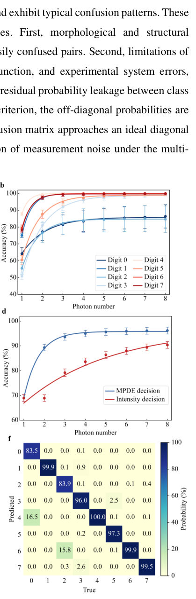 

Fig. 2 Performance characterization of the QCS-based image classification model. a Statistical

📷 Fig 4

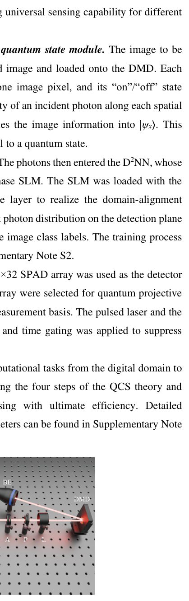 

Fig. 3 Experimental setup of the QCS-based image classification model. LS: light source; BE:

**Main problem.**

The inefficiency of the traditional 'imaging-then-processing' pipeline in photon-limited scenarios, where reconstructing high-dimensional images for simple classification wastes scarce photons and introduces latency.

**Main result.**

The development of a Quantum Compressed Sensing (QCS) framework that achieves high-accuracy image classification (up to 95.0%) using as few as four photon detection events, approaching the information-theoretic limit.

**Method.**

The method reformulates classification as a sparse-signal measurement problem, using a Diffractive Deep Neural Network (D2NN) to physically align the measurement basis with the class space, enabling 'measurement-as-decision'.

**Summary.**

This paper presents a method for image classification that operates at the extreme energy efficiency limit using single photons. By using a diffractive deep neural network to align physical measurements with class labels, the researchers bypass the need for full image reconstruction. The system achieves high accuracy by treating classification as a sparse-signal problem. This approach is particularly valuable for sensing in extremely low-light or high-noise environments.

Detailed structure

**Model / system.**

An experimental platform consisting of an attenuated pulsed laser, a Digital Micromirror Device (DMD) for signal encoding, a Spatial Light Modulator (SLM) implementing a D2NN for domain-alignment, and a SPAD array for projective measurement.

**Key observables.**

Photon landing statistics on the SPAD array, photon arrival times, and class-probability distributions.

**Important parameters / regimes.**

Sparsity K=1, measurement scaling reduction from O(K log(N/K)) to M=1, 633 nm wavelength, and 2.4 ns time-gating window.

**Assumptions / limitations.**

The system assumes effective suppression of dark counts via time-gating and relies on the successful training of the D2NN to concentrate photon distributions.

**Figures summary.**

Fig 1 shows the QCS model schematic, input images, and experimental intensity distribution; Fig 2 displays accuracy vs. photon count, trade-offs between accuracy and event probability, and confusion matrices; Fig 3 details the experimental hardware setup.

**Paper structure.**

The paper introduces the problem of imaging inefficiency, presents the QCS theoretical framework, describes the experimental implementation using D2NN and DMD, provides performance metrics (accuracy vs. photon count), and concludes with error/confusion analysis.

**Why it may be interesting.**

It demonstrates a practical application of quantum superposition and adaptive measurement to reach information-theoretic limits in sensing, which is highly relevant to quantum optics and quantum-enhanced imaging.

Abstract

Image classification is a core task of intelligent sensing, conventionally follows a sequential imaging then processing pipeline. However, redundant high-dimensional image reconstruction is inherently inefficient, especially in photon limited scenarios. Here we report a photon level image classification method using quantum compressed sensing, which reformulates the classification task as a sparse signal measurement problem directly oriented toward class labels. By exploiting the parallelism of photonic quantum superposition states, a single photon can be encoded the complete spatial information of a high-dimensional image. Through a diffractive deep neural network, we physically construct a dedicated measurement basis aligned with the class space, enabling signal-dependent adaptive compressive measurement. Ideally, our method can extract class information via a single quantum projective measurement, reducing the required number of measurements from the logarithmic scaling O(Klog(N/K)) of classical compressed sensing to the constant-order information-theoretic limit M = K = 1. Experimental results show that a classification accuracy of 69.0% can be achieved by using a single-photon detection event as the decision criterion, while it increases to 95.0% with four-photon detection events. This work demonstrates image classification at the energy efficiency limit and introduces a measurement as decision framework. It provides a foundation for intelligent sensing systems that operate under extreme photon budgets and harsh environments.

[↑ back to top](#top)

### [Anomalous Mixed-State Floquet Topology in One-Dimensional Open Quantum Systems](http://arxiv.org/abs/2604.25248v1)

**Authors:** Görkem D. Dinc, Alexander Schnell, Andy M. Martin

**Type:** theory · **Category:** statistical mechanics · **PDF:** <https://arxiv.org/pdf/2604.25248v1>

**Analysis basis:** full PDF text, analyzed in chunks

**Topic relevance:** 🔥 `non-equilibrium dynamics` **4/5** · `driven-dissipative phase transition` **3/5** · `methods for driven-dissipative` **3/5** · `entanglement & information structure` **2/5**

📷 Fig 1

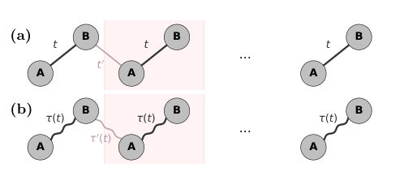 

FIG. 1. Sketch of the SSH model. In red, we highlight a unit cell consisting of two sites, A and B, connected by bonds indicating the intracell and intercell nearest-neighbour hop- pings. (a) Fixed intracell and intercell hoppings t and t′, respectively, and (b) time-periodically modulated hoppings τ(t) = t + 2V cos(ωt) (intracell) and τ ′(t) = t′ −2V cos(ωt) (intercell). Here, V and ω denote the driving strength and frequency, respectively.

📷 Fig 2

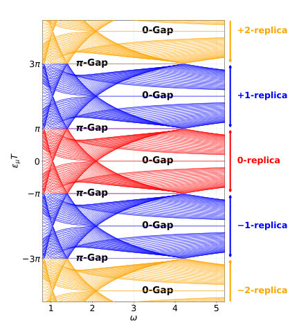 

FIG. 2. Extended OBC quasienergy spectra εµT of the periodically driven SSH Hamiltonian HPDSSH(t) in Eq. (9), showing the zeroth and first two (±2) Floquet replicas as a function of driving frequency ω for a chain length L = 40, a driving strength of V = −0.2 and tunneling amplitudes t = 0.8, t′ = 1.3. Due to the periodic modulation, each Flo- quet replica exhibits a gap at εµT = 0 (mod 2π) (0 gap) and another at εµT = π (mod 2π) (π gap), allowing topological edge states in either gap.

📷 Fig 3

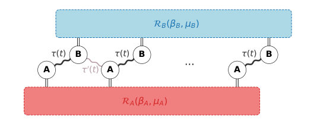 

FIG. 3. Sketch of the system-bath configuration of interest in this work. Sublattice A (B) of the SSH chain is coupled dissipatively to a Markovian fermionic thermal bath RA (RB) at inverse temperature βA (βB) and chemical potential µA (µB). Here, the tunnelling amplitudes τ(t) and τ ′(t) are time- periodically modulated with driving frequency ω and driving amplitude V , as in Fig. 1(b). The drive is chosen to preserve the chiral symmetry of the system.

📷 Fig 4

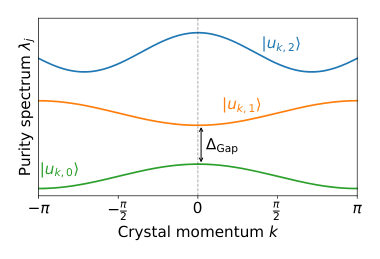 

FIG. 4. Schematic purity spectrum λj of a Gaussian mixed state as a function of crystal momentum k, exhibiting purity bands |uk,j⟩and a finite purity gap ∆Gap between the lowest bands, required for the well-definedness of topological invari- ants like the EGP ϕEGP.

📷 Fig 5

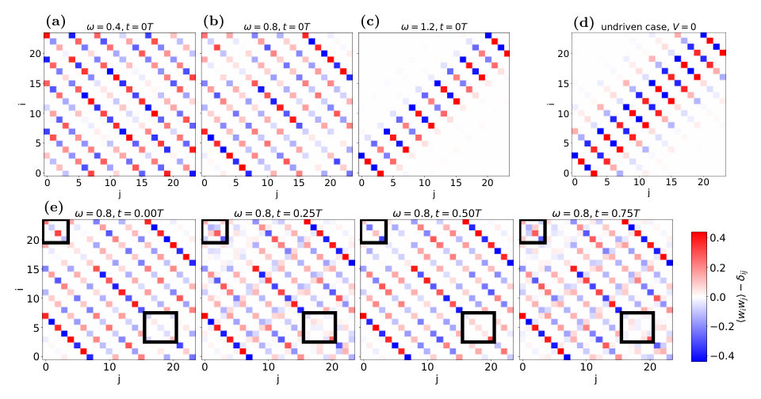 

FIG. 5. Behaviour of the steady-state correlations between Majorana sites in a driven and undriven dissipative SSH chain. (a-c) Correlation matrix WNESS(0) −1 = ℑ[CNESS(0)] evaluated at time t = 0T for a chain of length L = 6, with hopping amplitudes t = 1.3, t′ = 0.8, chemical potentials µA = µB = 0, inverse temperatures βA = βB ≡β = 2, dissipation strength λ = 0.05, density of states gA,c = gB,c ≡gc = 0.01, and driving strength V = −0.3, for ω = 0.4 (a), ω = 0.8 (b), and ω = 1.2 (c). (d) WNESS(t) −1 for the undriven case V = 0. (e) WNESS(t) −1 for ω = 0.8 and t ∈[0T, 0.25T, 0.5T, 0.75T], illustrating the effect of micromotion.

📷 Fig 6

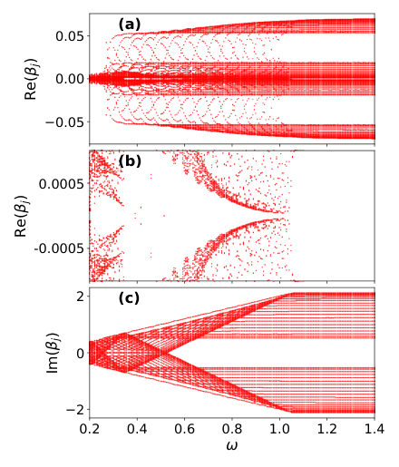 

FIG. 6. Liouvillian rapidity spectrum {βj} of the driven dis- sipative SSH chain. We show ℜ{βj} (a) and ℑ{βj} (c) of the OBC rapidity spectrum for a chain length of L = 20, system parameters as in Fig. 5, and reservoir density of states g(E) as in Eq. (46) with gc = 0.01, as a function of the driving fre- quency ω. To calculate the Floquet-Born-Markov rates, we cut off the Floquet spectrum at |Kmax| = 3. Note that (b) is the zoomed-in view of (a).

📷 Fig 7

 

Fig. 2), which is expected since in the limit of vanishing coupling, the spectrum of the (Majorana) Floquet Lind- bladian [63–65] is fully determined by the (Majorana) Floquet Hamiltonian HF Majo. At weak coupling, here, this also holds because we neglect Lamb-shift terms [24, 55]. Note that we only plot the principal branch of the Majo- rana spectrum, restricted to [−2ω, 2ω]. We observe both the 0 and π gaps, with the latter arising solely from the periodic drive. Note that for high frequencies ω &gt; 1.05, the π gap closes and thus cannot host edge states, which is expected since in the high-frequency regime, the sys- tem approaches a static time-averaged Floquet Liouvil- lian LF Majo [63,...

📷 Fig 8

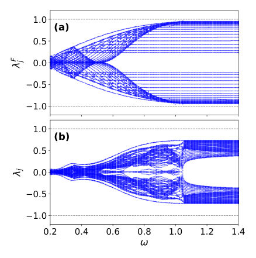 

FIG. 7. OBC purity spectra of a driven dissipative SSH chain. Purity spectrum {λF j } obtained from the steady-state covari- ance matrix in the Floquet basis CF NESS for a chain length of L = 20 (a), and the same system parameters as in Fig. 6, as a function of ω. We observe a similar (quasi-)band structure as in Fig. 6(c), with a finite purity gap at λ = 0 and, due to the Floquet drive, additional finite (±π) purity gaps opening up. The purity spectra {λj} obtained from the steady-state covariance matrix CNESS(tf), evaluated at fixed time tf = 0, is shown in (b).

📷 Fig 9

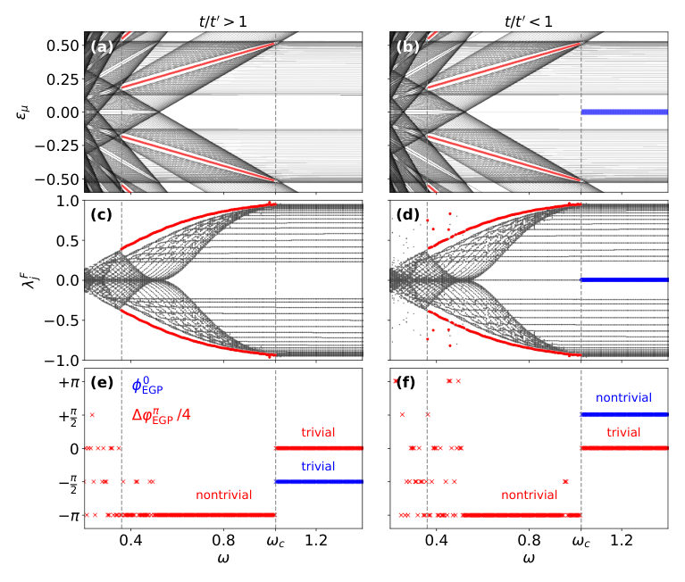 

FIG. 8. Finite temperature topological phase transitions in a driven dissipative SSH chain. Quasienergy spectrum {εµ} as a function of the driving frequency ω, calculated from HMajo, for a chain length of L = 50 unit cells, a driving strength V = −0.3 and tunneling amplitudes t = 0.8, t′ = 1.3 (a) and t = 1.3, t′ = 0.8 (b). (c) Floquet basis purity spectrum {λF j }, calculated for L = 20, and corresponding pair of topological invariants (ϕ0 EGP, ∆ϕπ EGP) (e), calculated for L = 6, as a function of ω, for the same parameters as in Fig. 6. (d) and (f) show the same for interchanged tunneling amplitudes, i.e. t = 1.3, t′ = 0.8. In the regime ω &gt; ωc, ϕ0 EGP correctly predicts the existence of...

📷 Fig 10

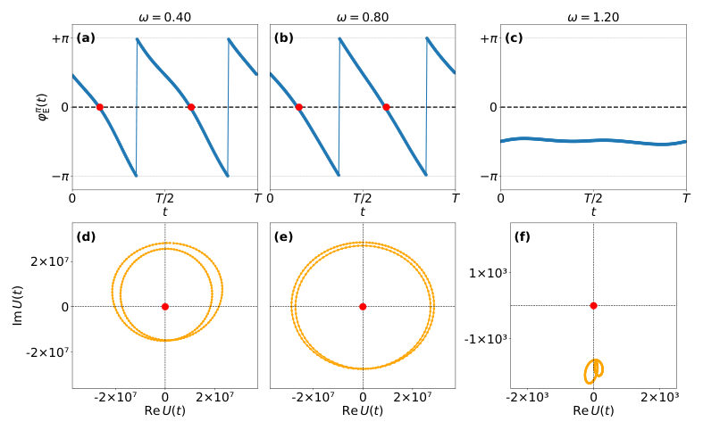 

FIG. 9. (a-c) Onto the lower Floquet band projected EGP ϕπ EGP(t) = arg (Zπ(t)), obtained from Cπ NESS(t), plotted over t within a period t ∈[0, T], for a chain length of L = 6, OBC and the same system parameters as in Fig. 6, for ω = 0.40 (a), ω = 0.80 (b) and ω = 1.2 (c). The plots show that ϕπ EGP(t) itself is not quantised but strongly indicate that accumulated differential changes in the EGP ∆ϕπ EGP within a period T are. (d-f) winding of U π(t) ≡Zπ(t) as t traverses the interval t ∈[0, T] for the same parameters as in (a-c) and ω = 0.40 (d), ω = 0.80 (e) and ω = 1.2 (f). In (d) and (e) Zπ(t) encircles the origin (red dots) twice (nontrivial) in the counterclockwise direction and in...

**Main problem.**

Investigating whether the topological classification of isolated Floquet systems persists in driven-dissipative, mixed-state settings at finite temperatures.

**Main result.**

The study establishes that a Z x Z topological classification exists for the driven-dissipative SSH chain, characterized by a pair of invariants associated with the 0 and pi quasienergy gaps.

**Method.**

The authors use Floquet-Born-Markov theory to model system-bath coupling and the Ensemble Geometric Phase (EGP) to generalize topological invariants to mixed states.

**Summary.**

This paper explores how topology survives in quantum systems that are both periodically driven and subject to dissipation. By studying a driven SSH chain, the authors show that the complex topological structure (Z x Z) found in isolated systems remains intact even when the system is coupled to thermal baths. They introduce the Ensemble Geometric Phase as a way to track these topological features in mixed states. The results demonstrate that topological edge modes can be protected in both the 0 and pi quasienergy gaps of the steady state.

Detailed structure

**Model / system.**

A one-dimensional, periodically driven Su-Schrieffer-Heeger (SSH) chain of Majorana fermions coupled to thermal reservoirs.

**Key observables.**

Ensemble Geometric Phase (EGP), purity spectrum, quasienergy spectrum, and Liouvillian rapidity spectrum.

**Important parameters / regimes.**

Driving frequency (omega), driving strength (V), hopping amplitudes (t, t'), and reservoir temperature.

**Assumptions / limitations.**

The system is treated within the Born-Markov approximation (weak coupling) and the steady state is assumed to be a Gaussian quadratic state.

**Figures summary.**

Figures illustrate the SSH model geometry, the formation of Floquet replicas and edge states in the quasienergy spectrum, the purity spectrum gaps, and the winding of the EGP in the complex plane.

**Paper structure.**

The paper introduces the driven-dissipative SSH model, develops the Floquet-Born-Markov framework for Gaussian states, defines the Ensemble Geometric Phase, and then applies these tools to identify topological invariants and phase transitions.

**Why it may be interesting.**

It provides a robust theoretical framework for extending Floquet topology from isolated, zero-temperature systems to realistic, dissipative, and finite-temperature non-equilibrium steady states.

Abstract

We investigate the non-equilibrium topology of a periodically driven, dissipative Su-Schrieffer-Heeger chain using the ensemble geometric phase (EGP) $φ_{\mathrm{EGP}}$-a generalisation of the Zak phase to open quantum systems. In contrast to earlier work, we use Floquet-Born-Markov theory to describe the coupling to thermal reservoirs microscopically. We show that the steady state can be characterised by a Hermitian purity spectrum, providing a direct analogue of band topology for mixed states. The periodic drive induces nontrivial winding and a quasienergy spectrum with distinct $0$ and $π$ band gaps, with protected edge modes in each gap. We identify a pair of topological invariants $(φ^{0}_{\mathrm{EGP}}, Δφ^π_{\mathrm{EGP}})$, revealing a structure consistent with a $\mathbb{Z}\times\mathbb{Z}$ classification known from isolated Floquet SSH systems, and show how it extends to a dissipative, finite-temperature setting in regimes where the steady-state structure remains well defined. Our results demonstrate when and how known Floquet topology survives in a driven-dissipative Gaussian steady state and establish Floquet topology as a robust concept beyond isolated zero-temperature systems. The underlying formalism provides a general framework for quadratic fermionic systems with linear bath couplings.

[↑ back to top](#top)

### [Demonstration of quantum random number generation using nitrogen vacancy centres](http://arxiv.org/abs/2604.24870v1)

**Authors:** Conrad Strydom, Mark Tame

**Type:** both · **Category:** quantum information and computing · **PDF:** <https://arxiv.org/pdf/2604.24870v1>

**Analysis basis:** full PDF text, analyzed in chunks

**Topic relevance:** 🔥 `QC/QI experiment` **4/5** · 🔥 `quantum optics experiment` **4/5** · `quantum measurements` **2/5** · `spintronics-quantum-optics interface` **2/5**

📷 Fig 1

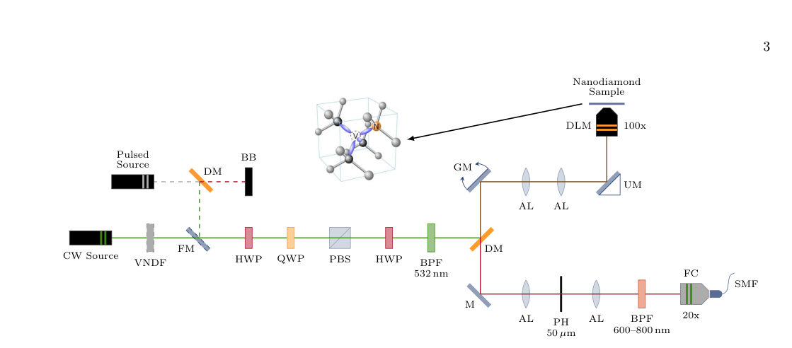 

FIG. 1: Laser-scanning confocal microscopy setup used to excite NV centres in fluorescent nanodiamonds and collect the emit- ted photons. The following abbreviations are used: continuous-wave (CW), variable neutral density filter (VNDF), dichroic mirror (DM), beam block (BB), flip mirror (FM), half-wave plate (HWP), quarter-wave plate (QWP), polarising beamsplit- ter (PBS), bandpass filter (BPF), galvonometric mirror (GM), achromatic lens (AL), upright mirror (UM), diffraction-limited microscope (DLM), mirror (M), pinhole (PH), fibre coupler (FC) and single-mode fibre (SMF).

📷 Fig 2

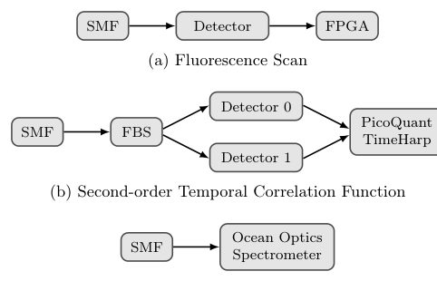 

FIG. 2: Different configurations for the various types of analysis needed to identify and characterise regions of in- terest on the nanodiamond sample. The abbreviations used here (not already introduced) are field-programmable gate ar- ray (FPGA) and fibre beamsplitter (FBS). The final data ac- quisition device in each configuration is connected to a PC for data processing and recording.

📷 Fig 3

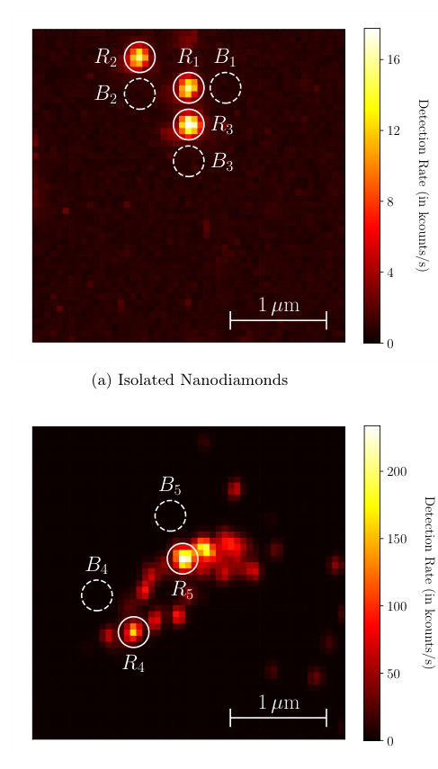 

FIG. 3: Fluorescence scan image of an area of the nanodia- mond sample with (a) Isolated Nanodiamonds and (b) Clus- ters of Nanodiamonds. The integration time for each pixel is 0.1 s. The regions of interest are marked by solid white circles and are labelled R1 to R5. The capture regions used to take background measurements for these respective regions are marked by dashed white circles and are labelled B1 to B5.

📷 Fig 4

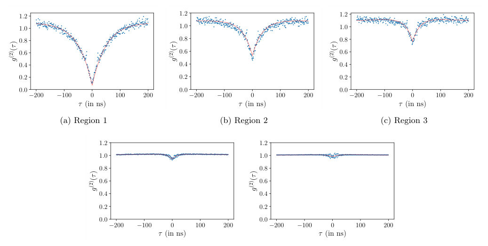 

FIG. 5: The second-order temporal correlation functions for the different regions of interest. The data points (shown in blue) are an average of 10 measurements, each with an integration time of 1200 s. The best fit curves (see Eq. (4)) are shown in red.

📷 Fig 5

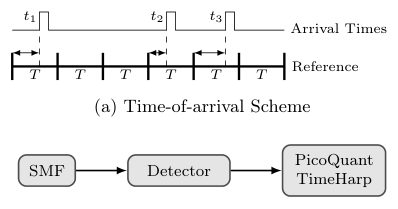 

FIG. 6: The time-of-arrival scheme for QRNG. (a) Variation of the time-of-arrival scheme first proposed by Nie et al. [29], in which random numbers are determined by the arrival times of photons at a detector relative to an external time reference. (b) The configuration for our experimental implementation of the time-of-arrival scheme.

📷 Fig 6

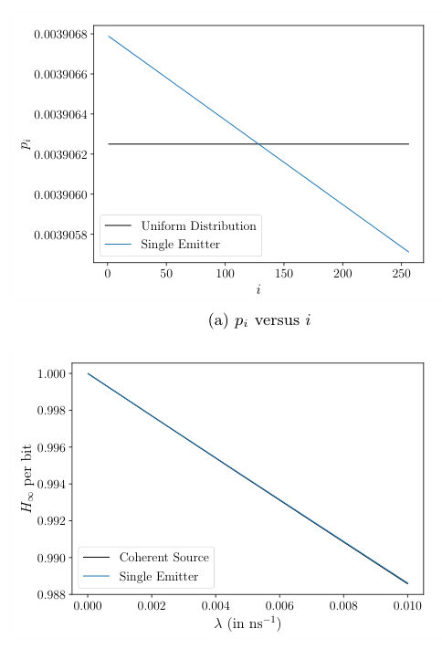 

FIG. 7: Theoretical analysis of QRNG based on the arrival times of photons emitted by the single NV centre in Re- gion 1. The second-order temporal correlation function pa- rameters (γ1 = γ, γ2 = γ 20, β and ρ) used for this analysis are given in Table I. (a) pi versus i for both the ideal uni- form distribution and the single NV centre in Region 1, with λ = 0.0000216 ns−1. (b) H∞versus λ for both a coherent source and the single NV centre in Region 1.

📷 Fig 7

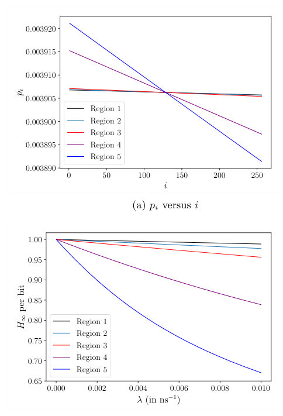 

FIG. 8: Theoretical analysis of QRNG based on the arrival times of photons emitted by NV centres in the different re- gions of interest. The second-order temporal correlation func- tion parameters (γ1 = γ, γ2 = γ 20, β and ρ) used for this analysis are given in Table I. (a) pi versus i for the differ- ent regions of interest, with the values of λ in Table II used. (b) H∞versus λ for the different regions of interest.

📷 Fig 8

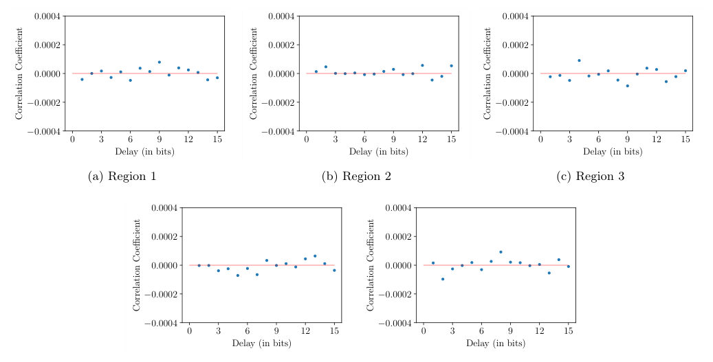 

FIG. 9: Pearson correlation coefficients for 1-bit to 15-bit delays of the different 800 Mbit samples generated from the arrival times of photons emitted by NV centres in the different regions of interest.

📷 Fig 9

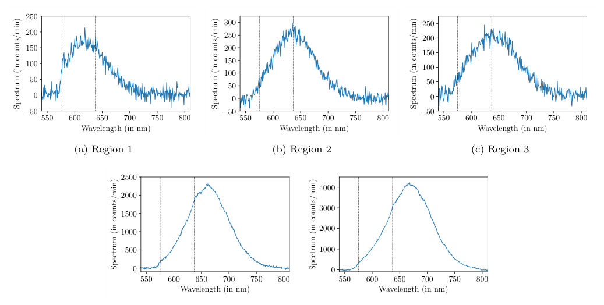 

FIG. 10: Fluorescence spectra for the different regions of interest. These fluorescence spectra are an average of 10 measurements, each with an integration time of 60 s. The dashed black lines indicate the positions of the zero phonon lines of NV0 and NV−

**Main problem.**

The need for high-speed, robust, and truly unpredictable quantum random number generation (QRNG) using locally available hardware rather than cloud-based systems.

**Main result.**

Demonstrated a time-of-arrival QRNG using NV centers in nanodiamonds that achieves generation rates up to 4.77 Mbits/s, passing NIST and ENT statistical tests without post-processing.

**Method.**

A time-of-arrival scheme measuring the arrival times of photons emitted by NV centers, combined with theoretical min-entropy estimation and statistical validation using NIST and ENT suites.

**Summary.**

This paper demonstrates a high-speed quantum random number generator using the arrival times of photons from nitrogen-vacancy centers in nanodiamonds. By using clusters of up to 50 NV centers, the researchers achieved generation rates significantly higher than previous NV-based methods. The generated bits passed rigorous statistical tests without needing any post-processing or randomness extraction. The work suggests a path toward highly compact, on-chip quantum cryptographic components.

Detailed structure

**Model / system.**

Nitrogen-vacancy (NV) centers in fluorescent nanodiamonds, modeled as a three-level system (ground, excited, and metastable shelving states) with potential background contamination.

**Key observables.**

Photon detection rate, second-order temporal correlation function g2(tau), min-entropy, and fluorescence spectra.

**Important parameters / regimes.**

Generation rates (0.173 to 4.77 Mbits/s), photon flux (lambda), and the number of NV centers (N) ranging from 1 to ~50.

**Assumptions / limitations.**

Assumes at most one photon arrives during the time interval T, and that the photon flux is time-independent.

**Figures summary.**

Fig 1: Confocal microscopy setup schematic; Fig 2: Fluorescence scanning maps; Fig 4: Three-level NV model; Fig 5: g2(tau) plots for different regions; Fig 7: Probability distribution and entropy plots; Fig 8: Experimental entropy and distribution results; Fig 10: Fluorescence spectra.

**Paper structure.**

The paper introduces the QRNG problem, describes the experimental confocal setup and NV center characterization, presents the time-of-arrival implementation and its performance across different NV clusters, provides a theoretical framework for entropy and uniformity, and concludes with future integration prospects.

**Why it may be interesting.**

The paper combines quantum optics (single-photon statistics) with practical quantum information tasks (QRNG), offering insights into how multi-emitter systems and source imperfections affect the entropy of quantum-derived random bits.

Abstract

Quantum random number generation (QRNG) relies on the inherent unpredictability of quantum mechanical phenomena to efficiently generate high-quality random numbers that can be used in a wide range of cryptography and simulation applications. Here we report the experimental demonstration of QRNG from the arrival times of photons emitted by nitrogen vacancy (NV) centres in fluorescent nanodiamonds. The generation rates achieved range from 0.173 Mbits/s for a region with a single NV centre to 4.77 Mbits/s for a region with just under 50 NV centres, where the latter demonstrates an order of magnitude improvement compared to the highest generation rate previously achieved with NV centres. For all the regions investigated, the generated bits passed the ENT and NIST Statistical Test Suites without post-processing. The results are consistent with our theoretical analysis, where we show that the min-entropy is very close to the ideal value of one per bit for all the regions investigated. This work opens up new possibilities for robust QRNG in highly compact on-chip settings.

[↑ back to top](#top)

### [Nanoscale Sensing of Solid-State Samples with High Frequency Resolution](http://arxiv.org/abs/2604.25660v1)

**Authors:** P. Alsina-Bolívar, D. B. Bucher, J. Casanova

**Type:** both · **Category:** quantum information and computing · **PDF:** <https://arxiv.org/pdf/2604.25660v1>

**Analysis basis:** full PDF text, analyzed in chunks

**Topic relevance:** 🔥 `QC/QI experiment` **4/5** · 🔥 `spintronics-quantum-optics interface` **4/5** · `non-equilibrium dynamics` **2/5** · `quantum measurements` **2/5**

📷 Fig 1

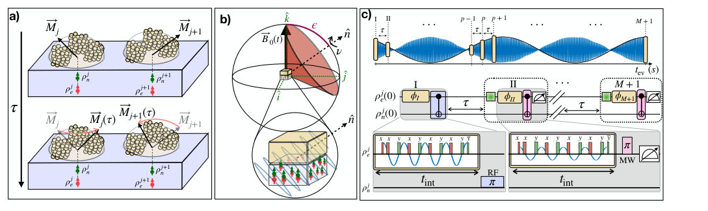 

Figure 1. a) (Top) Each sensor comprising an electron and a memory qubit, probes a distinct region of the sample (for clarity, only the j-th and ( j + 1)-th units in the ensemble are depicted). These regions exhibit distinct initial magnetizations ( ⃗M j and ⃗ M j+1) as a result of statistical polarisation. (Bottom) After a time τ each magnetization vector evolves owing to the combined action of ⃗B0(t) and Hc(t) in Eqs. (2) and (3). b) Trajectory of ⃗B0(t) in Eq. (2). This traces a cone, with aperture ϵ and central axis ˆn. The inset shows in more detail the diamond-sample block irradiated with RF and MWs. c) (Top) Signal emitted by the sample. The colored boxes correspond to the...

📷 Fig 2

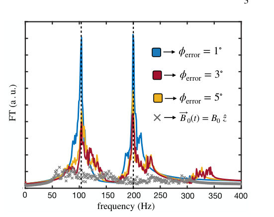 

Figure 2. Simulated spectrum for a sample with two magnetically non-equivalent protons. The solid colored lines represent the spec- tra obtained using our protocol under various misalignment errors, while gray crosses depict the typical powder spectrum (for a non- rotating magnetic field) for comparison. Dashed vertical lines in- dicate the theoretical resonances predicted by our framework. The results demonstrate the protocol’s robustness against both increas- ing misalignments and stochastic amplitude noise (0.25% fluctua- tions with a 1 ms correlation time).

**Main problem.**

Achieving high-frequency resolution in nanoscale NMR spectroscopy using NV centers is hindered by chemical shift anisotropy (CSA) and strong dipole-dipole interactions in solid-state samples.

**Main result.**

The authors propose a quantum control protocol using a rotating magnetic field and RF decoupling that successfully isolates the isotropic chemical shift and provides a robust analytical mapping for sample characterization.

**Method.**

The protocol employs a slowly rotating magnetic field to average out CSA and a frequency-switched Lee-Goldburg (fsLG) inspired RF scheme for dipolar decoupling, combined with multi-point correlation spectroscopy.

**Summary.**

This paper presents a new quantum control method for using NV centers to perform high-resolution NMR on solid-state surfaces. By synchronizing a rotating magnetic field with specific RF decoupling pulses, the researchers can suppress unwanted anisotropic interactions and dipolar couplings. This allows for the precise detection of isotropic chemical shifts, which serve as a unique fingerprint for nanoscale materials. The study demonstrates that the protocol is robust against experimental imperfections like magnetic field misalignment and amplitude noise.

Detailed structure

**Model / system.**

The system consists of an ensemble of NV centers in diamond (electron and nitrogen memory spins) acting as sensors to probe a solid-state sample containing a collection of nuclear spins (e.g., protons) in the statistical polarization regime.

**Key observables.**

Isotropic chemical shifts (delta_iso), Bloch-Siegert shifts, and the averaged electron spin state (S_z).

**Important parameters / regimes.**

Magnetic field rotation frequency (nu), RF Rabi frequency (Omega), magnetic field aperture (epsilon), and the number of spins (N).

**Assumptions / limitations.**

The rotation frequency is much smaller than the Zeeman splitting; the effective Rabi frequency is the dominant interaction; and the large N limit allows approximating nuclear spin operators with expectation values.

**Figures summary.**

Figure 1 shows the NV sensor schematic, magnetization evolution, and the rotating magnetic field trajectory. Figure 2 presents simulated NMR spectra for non-equivalent protons, demonstrating robustness against misalignment and noise.

**Paper structure.**

The paper introduces the challenge of nanoscale sensing, describes the physical model and Hamiltonian, details the proposed rotating field and RF control protocol, provides an analytical derivation of the effective Hamiltonian using Average Hamiltonian Theory, and validates the method through numerical simulations of error robustness.

**Why it may be interesting.**

The paper presents an advanced quantum control protocol for managing many-body interactions (dipolar coupling) and anisotropy, which is highly relevant to the control of spin ensembles and the development of high-precision quantum sensors.

Abstract

To meet the growing demand for nanoscale surface analysis, nitrogen-vacancy (NV) centers offer a high-sensitivity alternative by leveraging their ability to operate in immediate proximity to the sample. In this work, we propose a quantum control protocol designed to overcome the inherent challenges of solid-state environments, specifically by mitigating anisotropy and strong dipole-dipole interactions to enable the detection of isotropic chemical shifts at the nanoscale. To achieve this, our scheme synchronizes a slowly rotating magnetic field with tailored RF decoupling and MW control of the NV sensors. We provide an analytical mapping that explicitly links the measured spectrum to the control sequence features and the underlying system parameters, enabling a straightforward characterization of the sample.

[↑ back to top](#top)

### [Semi-transmitter-device-independent quantum key distribution](http://arxiv.org/abs/2604.25225v1)

**Authors:** Qiang Zeng, Abhishek Mishra, Haoyang Wang, Zhiliang Yuan

**Type:** both · **Category:** quantum information and computing · **PDF:** <https://arxiv.org/pdf/2604.25225v1>

**Analysis basis:** full PDF text, analyzed in chunks

**Topic relevance:** 🔥 `QC/QI experiment` **4/5** · 🔥 `quantum optics experiment` **4/5** · `entanglement & information structure` **2/5** · `quantum measurements` **2/5**

📷 Fig 1

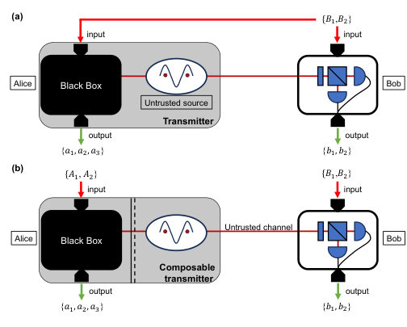 

FIG. 1. (a) Transmitter-device-independent configuration. The inputs of Alice are determined by Bob. (b) Semi- transmitter-device-independent configuration. Alice’s mea- surement device is treated as black box, and her inputs are individually selected. The entanglement source is integrated into a composable transmitter, sending one of the entangled photons to the measurement in a one-way manner with the other side being independent of Alice’s inputs.

📷 Fig 2

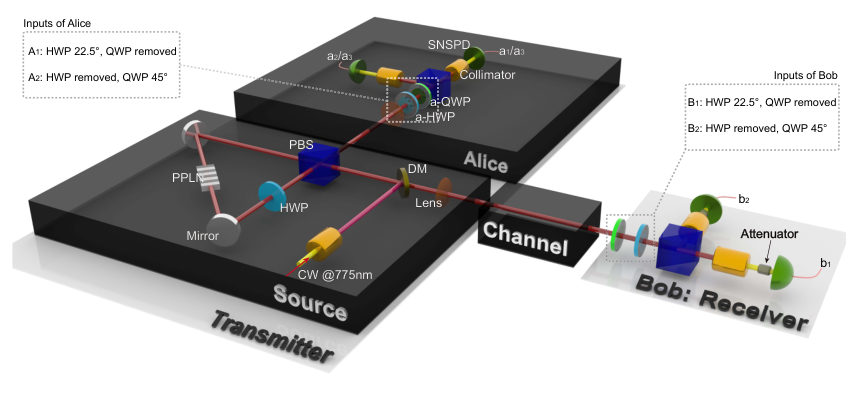 

FIG. 2. Experimental setup. The setup of transmitter is contained in two isolated virtual black boxes indicating the internal mechanism are not postulated. The PPLN crystal dimensions are: 2×1×10 mm3 (W×H×L). Abbreviations: a-HWP, active half wave plate; a-QWP, active quarter wave plate; DM, dichroic mirror; PBS, polarization beam splitter; SNSPD, superconducting nanowire single-photon detector.

📷 Fig 3

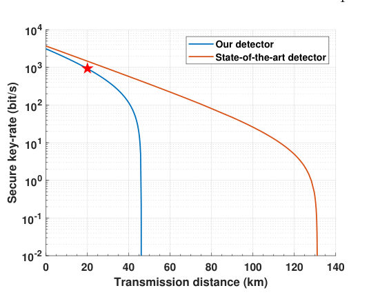 

FIG. 4. Comparison of our detector and state-of-the-art de- tector at the receiver with respect to the relation between se- cure key-rate and transmission distance from the transmitter to the trusted receiver. The equivalent transmission distance is estimated through a standard telecom optical fiber with a loss of 0.2 dB/km. The red pentagram denotes the estimated secure key-rate based on our experimental data point.

📷 Fig 4

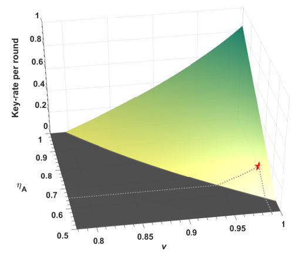 

FIG. 3. Key-rate bound by the performance of the trans- mitter. Parameters ηA and v are the heralding efficiency of Alice and the visibility of the entanglement state, respec- tively. The simulation adopts ηB = 25%, pA D = 1 × 10−3, and pB D = 2.6 × 10−3. The red pentagram denotes our experimen- tal data point.

📷 Fig 5

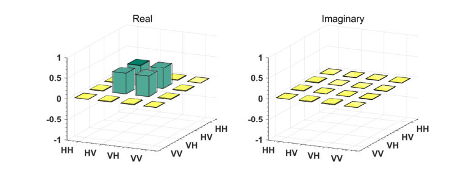 

FIG. 5. State tomography results. Reconstructed state density matrix from the experimental data. The state density matrix of the maximally entangled state (|01⟩+ |10⟩) / √

📷 Fig 6

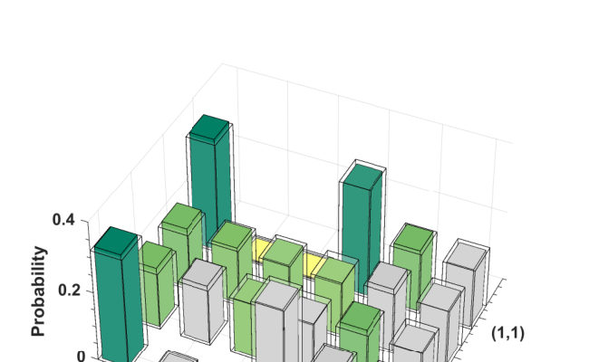 

FIG. 6. The results of full probability distribution. The ten gray bars denote the redundant correlation probabilities due to the probability conservation and no-signaling constraints.

**Main problem.**

Addressing transmitter-side vulnerabilities in quantum key distribution (QKD) by formalizing and experimentally demonstrating a semi-transmitter-device-independent (STDI) protocol.

**Main result.**

The authors successfully demonstrated the first discrete-variable 1sDI-QKD protocol, achieving a secure key rate of 1 kbps over an equivalent fiber distance of 20 km.

**Method.**

The study uses a composable transmitter approach that integrates an untrusted source with a detection module, utilizing the Devetak-Winter bound and the NPA hierarchy for security verification.

**Summary.**

This paper introduces a semi-transmitter-device-independent (STDI) protocol for quantum key distribution to mitigate vulnerabilities in the photon source. By treating the transmitter as a composable unit of an untrusted source and a black-box detector, the authors reduce the stringent requirements of full device-independence. They experimentally demonstrate this protocol using polarization entanglement, achieving a 1 kbps key rate over 20 km of fiber. This approach offers a more practical path toward secure, large-scale quantum communication networks.

Detailed structure

**Model / system.**

A polarization-entanglement-based system using a Sagnac-loop interferometer with a PPLN crystal for SPDC, featuring superconducting nanowire single-photon detectors (SNSPDs) and active wave plates.

**Key observables.**

Secure key rate, photon detection statistics (single clicks, double clicks, no-clicks), and state fidelity via tomography.

**Important parameters / regimes.**

Heralding efficiency (65%), dark count probabilities, detection efficiency (25% simulated), and a critical heralding efficiency threshold of 54.8%.

**Assumptions / limitations.**

The detectors are assumed to be indistinguishable from dark counts, and Bob's detectors are assumed to anti-commute.

**Figures summary.**

Figure 1 illustrates the proposed STDI configuration compared to standard DI; Figure 2 shows the experimental setup; Figure 5 shows state tomography results; Figure 6 compares experimental probability distributions with theoretical predictions.

**Paper structure.**

The paper introduces the problem of transmitter-side dependence, proposes the STDI protocol, details the experimental setup and detection modeling, presents security analysis via numerical optimization, and concludes with experimental validation and performance metrics.

**Why it may be interesting.**

This work is highly relevant to quantum optics and quantum networks as it provides a practical bridge between high-security device-independent protocols and the high-loss tolerance required for real-world fiber-based quantum communication.

Abstract

Transmitter-device-dependence is a longstanding but often implicit problem in quantum key distribution (QKD), as compared to measurement-device-dependence. One-sided device-independent (1sDI) scenario relaxes the security conditions of DI framework and offers an intuitive solution to transmitter-sided dependence. Here we show that, by constructing a composable transmitter in a 1sDI configuration, the transmitter-device-dependence can be largely eliminated. Our scheme integrates the entanglement source into the transmitter as an individual part, and the detection module is another individual part treated as black box. In a proof-of-principle experiment we obtain a secure key-rate of 1~kbps at an equivalent transmission fiber distance of 20~km, demonstrating the first discrete-variable 1sDI-QKD. By implementing semi-transmitter-device-independent security while maintaining strong loss tolerance, our approach bridges security and practicality for real-world 1sDI-QKD deployments.

[↑ back to top](#top)

### [Hardware Realization of a Hamiltonian Simulation Algorithm for Time-Domain Maxwells Equations](http://arxiv.org/abs/2604.25229v1)

**Authors:** Gautam Sharma, Apurva Tiwari, Niladri Gomes, Jezer Jojo, J. Eric Bracken, Jay Pathak

**Type:** both · **Category:** quantum information and computing · **PDF:** <https://arxiv.org/pdf/2604.25229v1>

**Analysis basis:** full PDF text, analyzed in chunks

**Topic relevance:** 🔥 `QC/QI experiment` **4/5** · `non-equilibrium dynamics` **2/5** · `quantum measurements` **2/5** · `quantum optics experiment` **2/5**

📷 Fig 1

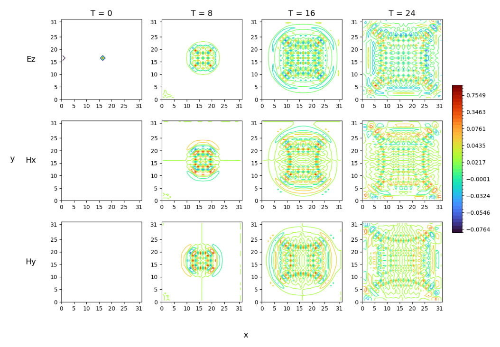 

Fig. 1: Simulation results for the 2D Maxwell’s equations on an empty 32×32 grid with PMC boundary conditions on all edges and PEC boundaries on top and bottom surfaces. From top to bottom, the rows show the evolution of the field components Ez, Hx, and Hy, respectively. Columns correspond to snapshots at times T = 0, 8, 16, and 24.

📷 Fig 2

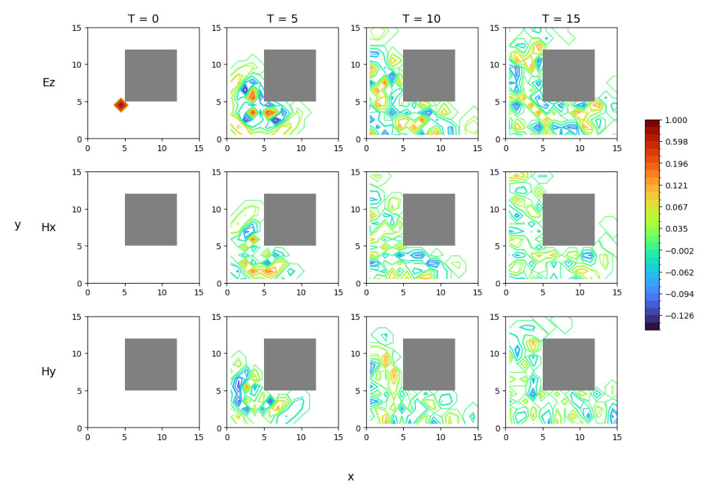 

Fig. 2: Simulation results for the 2D Maxwell’s equations on a 16 × 16 grid with an internal scatterer and PMC boundary conditions on all outer edges. From top to bottom, the rows show the evolution of the field components Ez, Hx, and Hy, respectively. Columns correspond to snapshots at times T = 0, 5, 10, and 15.

📷 Fig 3

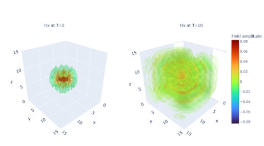 

Fig. 3: Three-dimensional evolution of the magnetic-field component Hx shown as an isosurface on a 16 × 16 × 16 grid with PMC boundary conditions. The fields are excited by an initially localized point source in the Ez component at the center of the domain, (x0, y0, z0) = (8, 8, 8).

📷 Fig 4

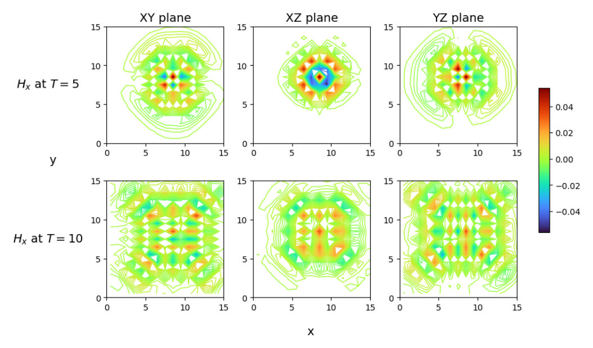 

Fig. 4: Orthogonal two-dimensional cross sections of the Hx field taken through the center of the domain in the xy, xz, and yz planes at times T = 5, 10.

📷 Fig 5

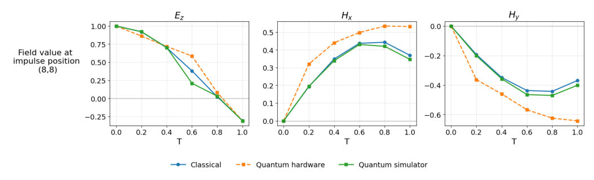 

Fig. 5: Comparison of field values measured at the center of the 16×16 computational grid, (8, 8), where the initial electric-field excitation is applied. Time evolution of the field components Ez, Hx, and Hy is shown for classical simulation, noise-free quantum simulation, and quantum hardware execution. The noise-free quantum results closely follow the analytical solution, while the hardware results qualitatively reproduce the correct temporal behavior despite the presence of device noise.

**Main problem.**

Developing a practical quantum-hardware implementation for simulating the time-domain Maxwell equations, specifically overcoming the challenges of non-unitary dynamics and the extraction of signed vector-field values.

**Main result.**

The authors demonstrate the first quantum-hardware implementation of a Hamiltonian simulation algorithm for signed vector-field solutions, showing that the IonQ QPU can qualitatively reproduce electromagnetic field evolution.

**Method.**

The approach uses Schrödingerisation to transform non-unitary dynamics into a unitary form, Bell-basis decomposition for efficient circuit construction, and ADAPT-AQC for circuit compression, alongside a relative-phase-based sign reconstruction technique.

**Summary.**

This paper presents the first experimental demonstration of a quantum algorithm capable of computing and measuring time-evolving electromagnetic vector fields on real quantum hardware. By using Schrödingerisation and Bell-basis decomposition, the authors map the non-unitary Maxwell equations onto a unitary quantum circuit. They successfully implemented this on an IonQ trapped-ion processor, using circuit compression techniques to make the depth manageable for NISQ-era devices. The results show that the hardware can accurately capture the temporal evolution and reflections of electromagnetic waves.

Detailed structure

**Model / system.**

The system involves electromagnetic field propagation in a homogeneous, lossless, and isotropic medium, discretized on a 3D Yee finite-difference time-domain grid and implemented on an IonQ trapped-ion quantum processor.

**Key observables.**

Magnitudes and physical directions (signs) of the electric (E) and magnetic (H) field components.

**Important parameters / regimes.**

Grid dimensions (up to 16x16x16), time steps (dt = 0.1, 0.01), and qubit requirements (n = log2 N + 3).

**Assumptions / limitations.**

The medium is assumed to be homogeneous, lossless, and isotropic; the simulation is source-free; and the boundary conditions are limited to PEC and PMC types.

**Figures summary.**

Figures show snapshots of E and H field evolution in 2D and 3D grids, including reflections from PEC scatterers, and a comparison between classical, noise-free, and hardware-based field values.

**Paper structure.**

The paper progresses from the continuous Maxwell equations to a discrete matrix-based ODE system, introduces the Schrödingerisation and Bell-basis framework, details the hardware implementation and circuit compression, and concludes with numerical validation on IonQ hardware.

**Why it may be interesting.**

This work is highly relevant for quantum optics and many-body dynamics as it provides a foundational framework for using quantum hardware to solve complex classical electromagnetic problems, potentially bridging the gap between quantum computing and computational electromagnetics.

Abstract

We present the first quantum-hardware implementation of a Hamiltonian simulation algorithm that produces signed vector-field solutions to the time-domain Maxwells equations using a Schrodingerisation-based approach.The electromagnetic fields are discretized using finite-difference operators, and the resulting non-unitary matrices are mapped to Bell-basis Trotter blocks, enabling efficient circuit construction. We introduce a measurement procedure that retrieves not only field amplitudes, but also physical directions of the electric and magnetic field values at select spatial points. Implementing this logic on quantum hardware relies on relative-phase-based sign reconstruction. Numerical results obtained using IonQ QPU, show good agreement with analytical solutions of benchmark problems in two dimensions and on simulators; in three dimensions. We further extend our approach to compute fields scattered from simple bodies, by enforcing appropriate boundary conditions. Our work lays the foundational steps towards realizing quantum-hardware solutions for computational electromagnetics.

[↑ back to top](#top)

### [Near-identical photons from distant quantum dot-cavity devices](http://arxiv.org/abs/2604.25615v1)

**Authors:** Thibaut Pollet, Victor Guilloux, Duc-Duy Tran, Anton Pishchagin, Stephen Wein, Joseph A. Sulpizio, William Hease, Petr Stepanov, Petr Steindl, Nico Margaria, Samuel Mister, Martina Morassi, Aristide Lemaître, Thi Huong Au, Sébastien Boissier, Pascale Senellart

**Type:** experiment · **Category:** quantum information and computing · **PDF:** <https://arxiv.org/pdf/2604.25615v1>

**Analysis basis:** full PDF text, analyzed in chunks

**Topic relevance:** 🔥 `QC/QI experiment` **4/5** · 🔥 `quantum optics experiment` **4/5** · `interference shaping light` **2/5**

📷 Fig 1

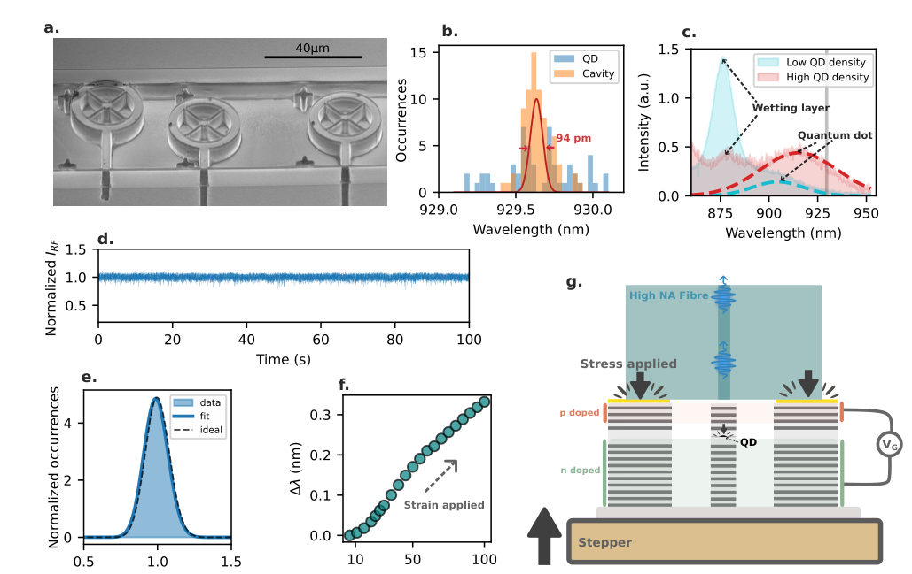 

FIG. 1. Fabrication of low-noise identical single-photon sources. a. Scanning electron microscope image of three micropillar single-photon sources. b. Wavelength distribution of fabricated micropillar cavities, fitted to a normal distribution yielding a FWHM of 94 ± 2 pm. The wavelength distribution of the QDs embedded in the micropillars shows a larger standard deviation requiring post-fabrication tuning to bring the QDs into resonance with their respective cavities. c. Spectral distri- bution of the QD ensemble under above-band excitation for two wafers with different QD areal densities, fitted with Gaussian functions. The pronounced wetting-layer emission in the blue curve indicates that...

📷 Fig 2

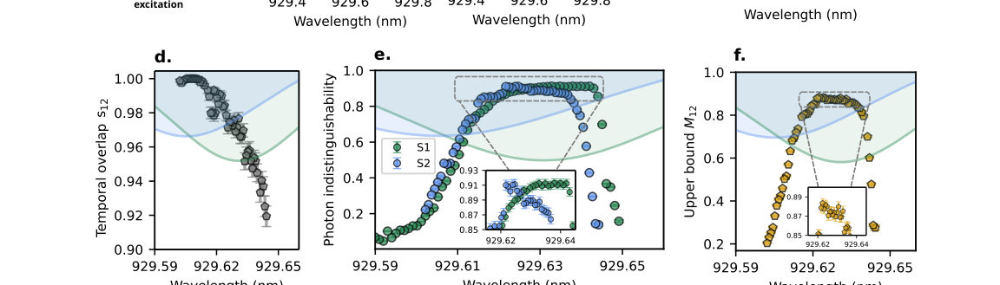 

FIG. 2. Individual performance of the two QD-cavity single-photon sources. a. Working principle of the LA phonon-assisted excitation scheme. b. Charge plateau of the negative trion X−state for the two QDs embedded in the separate micropillars S1 and S2. The dashed lines represent the cavity resonance of each micropillar. c. Lifetimes of S1 and S2 measured at different wavelengths by varying the PIN bias. The data points are fitted with a Lorentzian function to model the detuning-dependent Purcell effect. The fitted curve is reproduced in the following three figures to help visualize the effect of the cavities. d. Temporal overlap calculated using Eq. 1 from the extracted lifetimes of the...

📷 Fig 3

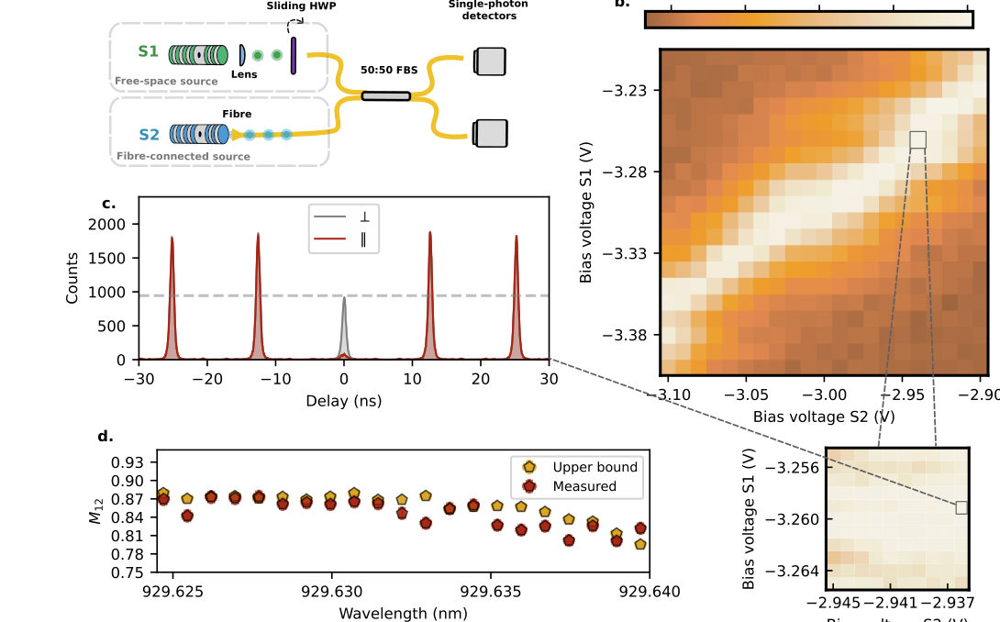 

FIG. 3. Two-photon interference between remote QDs embedded in two separate micropillar cavities. a. Illustration of the HOM interference setup, including the motorized HWP placed in one of the optical paths to switch between orthogonal (⊥) and parallel (∥) polarization configurations (see Extended Data Fig. 3 for more information). b. Remote-source indistinguishability as a function of emitter wavelengths, measured by varying the PIN bias voltage of each sources. At each pair of wavelengths, the photon correlations in the ⊥and ∥configurations are recorded for 1 s. We plot the visibility extracted using Eq. 10 and corrected for setup imperfections (Methods). We perform a finer scan around...

**Main problem.**

Achieving high-visibility quantum interference (indistinguishability) between single photons emitted from spatially distant and independent semiconductor quantum dot-cavity sources.

**Main result.**

Demonstrated a record mutual indistinguishability of 88 +/- 1% between two distant sources, reaching the upper bound set by the intrinsic performance of the individual emitters.

**Method.**

The researchers used a combination of strain-tuning (via piezo-driven fiber) and electrical tuning (via PIN diode Stark shift) to align wavelengths, followed by Hong-Ou-Mandel interference measurements.

**Summary.**

This paper reports on the successful creation of near-identical photons from two separate, distant quantum dot-cavity devices. By using a dual-tuning approach involving both strain and electric fields, the researchers were able to overcome wavelength mismatches and spectral noise. They achieved a high mutual indistinguishability of 88%, which is nearly the maximum possible value allowed by the individual sources. This achievement is a significant milestone for scaling up photonic quantum technologies and building large-scale quantum networks.

Detailed structure

**Model / system.**

The platform consists of two independent InGaAs quantum dot-cavity micropillars embedded in a PIN diode structure, cooled to 5 K, using longitudinal acoustic (LA) phonon-assisted excitation.

**Key observables.**

Two-photon indistinguishability (M12), Hong-Ou-Mandel visibility (V_HOM), second-order correlation function (g2(0)), and spectral noise/fluctuations.

**Important parameters / regimes.**

Indistinguishability of 88%, cavity Q factor of 8000, charge noise at 4.8% of natural linewidth, and photon collection efficiency between 15.6% and 27.5%.

**Assumptions / limitations.**

The calculation of the theoretical upper bound assumes perfect temporal overlap (s12 = 1) between the two photons.

**Figures summary.**

Fig 1: SEM images and fabrication details showing wavelength/cavity distribution and low charge noise. Fig 2: Principles of phonon-assisted excitation and lifetime/Purcell effect measurements. Fig 3: Extraction of mutual indistinguishability and comparison to theoretical bounds. Extended Data: Fabrication process, g2(0) measurements, and optical setup schematics.

**Paper structure.**

The paper introduces the challenge of remote interference, describes the fabrication and tuning architecture, presents the characterization of individual source stability, demonstrates the successful interference of distant sources, and concludes with the scalability and future potential of the approach.

**Why it may be interesting.**

This work is highly relevant to quantum optics and quantum networks as it demonstrates a scalable method to bridge the gap between single-source performance and remote-source interference, a prerequisite for photon-mediated entanglement in quantum computing.

Abstract

Scalable optical quantum technologies require interference between large numbers of indistinguishable single-photons emitted by independent sources. Semiconductor quantum dots are known to be excellent on-demand sources of single-photons. They show record efficiency when inserted into optical cavities to control their spontaneous emission and generate trains of near identical photons over microsecond timescales. However, generating perfectly identical photons from distant cavity-based sources has remained a long-standing challenge. It requires precise matching of the emission wavelengths and emission dynamics, while simultaneously minimizing spectral noise across all time scales for distant emitters in uncorrelated environments. Here, we report on the nanofabrication of a large number of quantum dot-cavity sources with ultra-low spectral noise and wavelength dispersion. The high source efficiency and the use of two tuning mechanisms enable precise optimization of the spectral overlap between distant sources. With this approach, we demonstrate a two-photon indistinguishability of $88\pm1$ % between photons emitted from two distant sources. Remarkably, this value reaches the upper bound set by the intrinsic indistinguishability of photons emitted successively by each source. These results represent a key milestone for scaling photon-based quantum technologies.

[↑ back to top](#top)

### [Determination of the Fermi Energy of Diamond using Photoluminescence Spectral Analysis](http://arxiv.org/abs/2604.25097v1)

**Authors:** Yifan Song, Sina Ilkhani, Leah Webb, Helen Highland, Shunki Nakamura, Stephen B. Cronin, Susumu Takahashi

**Type:** experiment · **Category:** quantum information and computing · **PDF:** <https://arxiv.org/pdf/2604.25097v1>

**Analysis basis:** full PDF text, analyzed in chunks

**Topic relevance:** 🔥 `QC/QI experiment` **4/5** · `spintronics-quantum-optics interface` **3/5** · `quantum optics experiment` **2/5**

📷 Fig 1

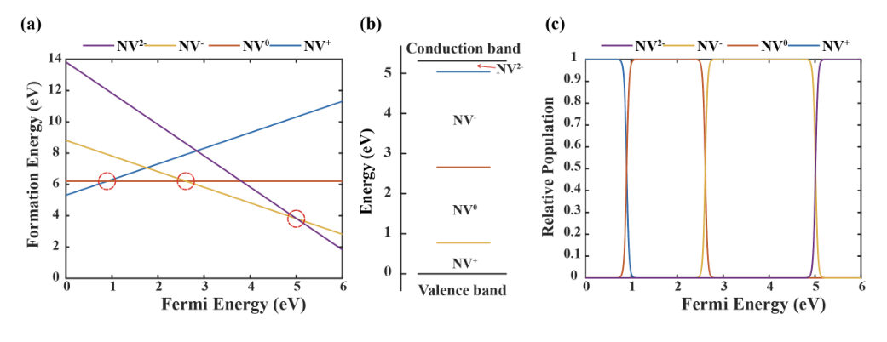 

FIG. 1. NV charge states and the Fermi energy. (a) The energy diagram for different NV charge states with respect to the conduction band and valence band. (b) The DFT calculation of the formation energy of the NV center as a function of Fermi energy [1]. (c) The Relative populations of NV charge states as a function of Fermi energy.

📷 Fig 2

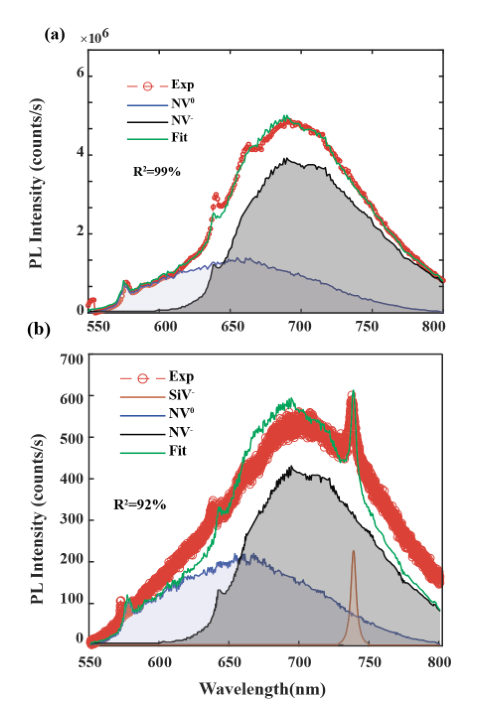 

FIG. 2. PL spectrum decomposition analysis. (a) PL spectrum of Sample 1. The PL intensity is normalized by the measurement time. The data was taken with a laser power of 7 mW and an integration time of 750 ms. The y-axis shows the normalized intensity in units of (count/s). From the fit, we obtained cNV −and cNV 0 were 1.46×106 and 2.95×106, giving [NV 0] and [NV −] to be 55.0 ± 0.2% and 45.0 ± 0.2 %, respectively. (b) PL spectrum of Sample 4. The data was taken with a laser power of 10 mW and an integration time of 5 s. The y-axis shows the normalized intensity in units of (count/s). cNV −and cNV 0 were 2059 and 1367, giving [NV 0] and [NV 0] to be 60.0 ± 0.2 and 40.0 ± 0.2 %,...

📷 Fig 3

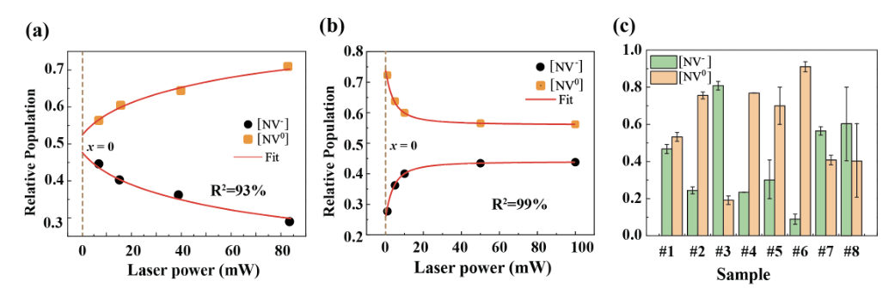 

FIG. 3. [NV −] and [NV 0] as a function of laser power. (a)-(b) results from Sample 1 and 4, respectively. Black zand orange points: experimental data (square: NV0, dot: NV−); red line: fitting. The obtained fitting parameters were the following. (a) Sample 1. A1,NV 0 = 0.43 ± 0.03, A2,NV 0 = 0.32 ± 0.02, A1,NV −= 0.57 ± 0.03, A2,NV 0 = 0.68 ± 0.02, x0 = 0.8 ± 0.5, and n = 1 ± 1. (b) Sample 4. A1,NV 0 = 0.778 ± 0.001, A2,NV 0 = 0.601 ± 0.001, A1,NV −= 0.222 ± 0.001, A2,NV 0 = 0.399 ± 0.001, x0 = 3.90±0.04, and n = 1.40±0.02. For Samples 4, 5, and 6, we obtained n = 1.40±0.01, 0.6±0.6, and 1.5±0.6, respectively. For Samples 7 and 8, we found n = 1 ± 1 and 1 ± 3, respectively. (c) Relative...

📷 Fig 4

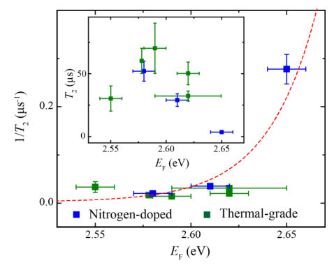 

FIG. 4. Dependence of the Fermi energy (EF ) on 1/T2. The inset shows T2 as a function of EF . A red dashed line represents the fit with Eq. 7. In the fit, β = 38.68 (eV−1), corresponding to T = 300 K,and x0 = 2.57 (eV) were used. from the fit result, we obtained A = 0.010 ± 0.004 (µs−1) and Γ = 0.002 ± 0.012 (µs−1). The obtained Γ value agrees with the contribution from the nuclear decoherence [27].

📷 Fig 5

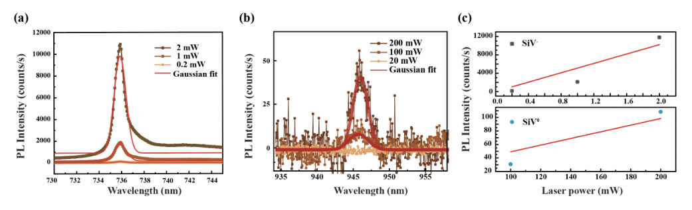 

FIG. 5. PL spectra of the SiV centers measured at 77 K with an excitation wavelength of 633 nm. (a) PL spectra of the SiV−

📷 Fig 6

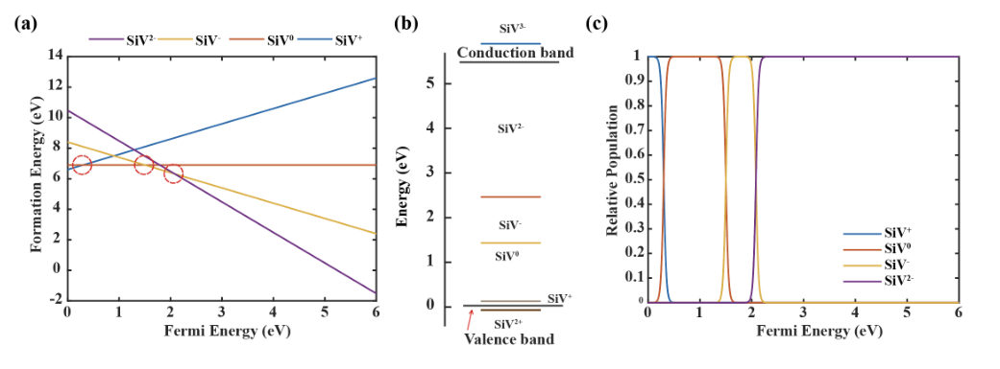 

FIG. 6. SiV charge states and the Fermi energy. (a) Formation energies of SiV charge states as a function of Fermi energy. [16] (b) The energy diagram for energetically favorable charge states. (c) The Relative populations of SiV states as a function of Fermi energy.

**Main problem.**

The difficulty of experimentally determining the Fermi energy in diamond due to the highly non-linear relationship between Fermi energy and donor-acceptor concentrations.

**Main result.**

The development of a non-destructive method to determine the Fermi energy by analyzing the relative populations of NV and SiV charge states via photoluminescence spectroscopy.

**Method.**

The method combines photoluminescence (PL) spectral decomposition with Density Functional Theory (DFT) models to relate charge state populations to the Fermi energy.

**Summary.**

This paper presents a new experimental method to precisely determine the Fermi energy in diamond using photoluminescence spectroscopy. By measuring the ratio of different charge states of NV and SiV centers and applying DFT-based models, the researchers can map the Fermi energy across different diamond types. The study also demonstrates how this energy level affects spin coherence times and charge state stability. This technique is highly advantageous because it offers high spatial and temporal resolution and can function in extreme environments.

Detailed structure

**Model / system.**

The physical system consists of various diamond crystals (CVD, HPHT, and polycrystalline) containing nitrogen-vacancy (NV) and silicon-vacancy (SiV) defect centers.

**Key observables.**

Relative populations of NV- and NV0 centers, spin coherence time (T2), and PL intensity.

**Important parameters / regimes.**

Fermi energy (Ef), nitrogen donor concentration (P1 centers), and laser power dependence.

**Assumptions / limitations.**

The method relies on the accuracy of DFT-derived formation energies and assumes the ability to extrapolate populations to zero laser power to avoid laser-induced charge state conversion.

**Figures summary.**

Figure 1 shows energy diagrams and DFT-calculated formation energies; Figure 2 displays PL spectra and the results of spectral decomposition analysis; Figure 3 shows the dependence of parameters on specific variables.

**Paper structure.**

The paper introduces the problem of Fermi energy determination, presents the proposed PL-based method using DFT integration, demonstrates the method on various nitrogen-doped and thermal-grade diamond samples, investigates the correlation between Fermi energy and spin coherence (T2), extends the method to SiV centers, and concludes with the method's advantages and potential applications.

**Why it may be interesting.**

This is relevant for quantum information because controlling the charge state stability and spin coherence of NV centers is critical for the development of robust solid-state qubits and quantum sensors.

Abstract

Electronic band structures and the Fermi energy provide essential information for understanding the electronic properties of solids. In semiconductors, the Fermi energy level is determined by the donor and acceptor concentrations. For diamond, the relationship between the Fermi energy level and the donor-acceptor concentrations is highly nonlinear; therefore, experimental determination of the Fermi energy level is important. Here, we report a method to determine the Fermi energy of diamond based on photoluminescence (PL) measurement. The density-functional-theory (DFT) study by Deák et al.~\cite{deak2014formation} showed the relationship between the Fermi energy and the formation energies of nitrogen-vacancy centers in the negatively charged (NV-) and neutrally charged (NV0) charge states. In the present method, we measure the relative populations of the NV- and NV0 centers from PL spectral analysis and, using these populations and the DFT result, determine the Fermi energy of the diamond samples. Moreover, we show the application of the method to study the spin coherence and the stability against the charge state conversion of the NV centers on several diamond samples. We also extend the method for the Fermi energy determination using the silicon-vacancy (SiV) center in diamond. The PL-based method is advantageous for determining the Fermi energy with high spatial and fast time resolutions, even in extreme environments, and can be extended to determine various wide band gap semiconductors.

[↑ back to top](#top)

### [Nonreciprocal magnon blockade based on nonlinear effects](http://arxiv.org/abs/2604.25141v1)

**Authors:** Han-Qiu Zhang, Shuang-Shuo Chu, Jian-Song Zhang, Wen-Xue Zhong, Guang-Ling Cheng

**Type:** theory · **Category:** quantum information and computing · **PDF:** <https://arxiv.org/pdf/2604.25141v1>

**Analysis basis:** full PDF text, analyzed in chunks

**Topic relevance:** 🔥 `spintronics-quantum-optics interface` **4/5** · `interference shaping light` **3/5** · `methods for driven-dissipative` **2/5**

📷 Fig 1

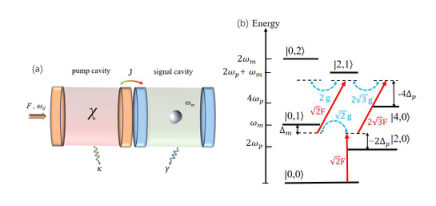 

FIG. 1: (a) Sketch of a hybrid cavity magnonic system, where the pump cavity is driven coherently by a field F, and a YIG sphere with frequency ωm. (b) Energy-level diagram. The corresponding transition pathways show the destructive in- terference process.

📷 Fig 2

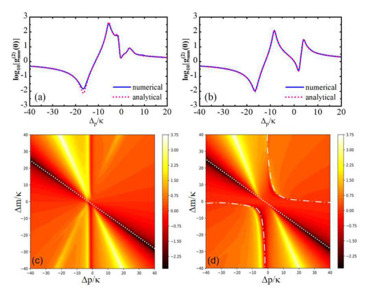 

FIG. 2: The analytical solutions and the numerical results of log10 g(2) mm(0) are plotted as functions of the detuning ∆p/κ; χ = 0.5κ and g = 0.5κ in (a); χ = 0.5κ and g = 5κ in (b). Equal-time second-order correlation function log10 g(2) mm(0) versus the photon detuning ∆p and magnon detuning ∆m, the coupling strength is chosen as (c) g = 0.5κ and (d) g = 5κ. The white dotted lines represent the the interference-induced UMB condition (6χ + 2∆p + 3∆m = 0) and the white dash- dotted curves denote the condition of MB (g2 = (χ+∆p)∆m). The other parameters are κ/2π = 2.0 MHz, γ/2π = 1.0 MHz, ∆m = 10κ, and F = 0.05κ.

📷 Fig 3

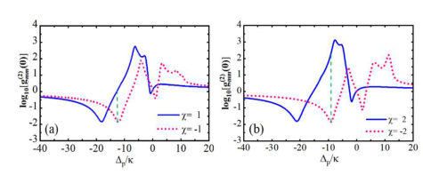 

FIG. 3: The red dotted lines are the second-order correlation functions for positive Kerr effect coefficient. The blue solid lines are the second-order correlation functions for negative Kerr effect coefficient, log10 g(2) mm(0) are plotted as functions of the detuning ∆p/κ; χ = 1κ (blue solid line) and χ = −1κ (red dotted line) in (a); χ = 2κ (blue solid line) and χ = −2κ (red dotted line) in (b). The other parameters are κ/2π = 2.0 MHz, γ/2π = 1.0 MHz, ∆m = 10κ, F = 0.05κ, and g = 1κ.

**Main problem.**

Achieving nonreciprocal unconventional magnon blockade (NUMB) in a hybrid cavity-magnon system to prepare single-magnon resources.

**Main result.**

The study demonstrates that nonreciprocity can be achieved by adjusting the sign of the Kerr nonlinearity, providing a method to induce magnon blockade through either destructive interference or anharmonic energy splitting.

**Method.**

The authors use adiabatic elimination of the signal cavity mode, a rotating reference frame, and the probability amplitude method to find analytical solutions, validated by numerical simulations of the master equation.

**Summary.**

This paper proposes a scheme to achieve nonreciprocal magnon blockade in a hybrid system of two microwave cavities and a YIG sphere. By utilizing nonlinear effects like Kerr nonlinearity and parametric driving, the researchers show how to control the magnon blockade effect. The study identifies two distinct regimes: unconventional blockade via destructive interference and conventional blockade via energy splitting. This work offers a new method for generating single-magnon resources essential for quantum information tasks.

Detailed structure

**Model / system.**

A hybrid system consisting of two microwave cavities (pump and signal) and one Yttrium Iron Garnet (YIG) sphere, featuring nonlinear photon-photon coupling, magnetic dipole interaction, and Kerr nonlinearity.

**Key observables.**

The second-order correlation function g(2) of the magnon mode, used to identify magnon bunching, antibunching, and perfect blockade.

**Important parameters / regimes.**

Kerr nonlinearity (chi), coupling strengths (g, J, g_ms), detunings (Delta_p, Delta_m, Delta_s), and decay rates (kappa, gamma).

**Assumptions / limitations.**

The signal cavity mode is eliminated using second-order perturbation theory under the condition that its detuning is much larger than the coupling strengths.

**Figures summary.**

Figure 2 plots the log of the second-order correlation function against detuning, showing the transition between weak and strong coupling regimes and identifying specific blockade frequency conditions.

**Paper structure.**

The paper introduces the physical platform, derives an effective Hamiltonian via adiabatic elimination, presents analytical solutions for the blockade conditions, and uses numerical simulations to demonstrate nonreciprocity and the transition between different blockade regimes.

**Why it may be interesting.**

It provides a novel mechanism for controlling quantum interference and nonreciprocity in hybrid systems, which is highly relevant for developing single-photon/magnon sources and quantum information processing.

Abstract

We present an alternative scheme to achieve nonreciprocal unconventional magnon blockade (NUMB) in a hybrid system formed by two microwave cavities and one yttrium iron garnet (YIG) sphere, where the pump and signal cavities interact nonlinearly with each other and the signal cavity is coupled to the YIG sphere. It is found that the nonlinear coupling occurs between the pump cavity and magnon modes due to the dispersive interactions among three bosonic modes. Meanwhile, the Kerr nonlinearity is present in the pump cavity. Based on these nonlinear effects, a nonreciprocal magnon blockade could be achieved with the help of weak parametric driving of the pump cavity. The present work provides an alternative method to prepare single magnon resource, which may be helpful for quantum information processing.

[↑ back to top](#top)

### [Quantum sensing-enabled deuterium NMR spectroscopy with nanoscale sensitivity at low magnetic fields](http://arxiv.org/abs/2604.25752v1)

**Authors:** Dileep Singh, Riley W. Hooper, Christoph Findler, Utsab Banerjee, Dominik B. Bucher

**Type:** experiment · **Category:** other · **PDF:** <https://arxiv.org/pdf/2604.25752v1>

**Analysis basis:** full PDF text, analyzed in chunks

**Topic relevance:** 🔥 `spintronics-quantum-optics interface` **4/5** · `QC/QI experiment` **3/5** · `quantum measurements` **2/5**

📷 Fig 1

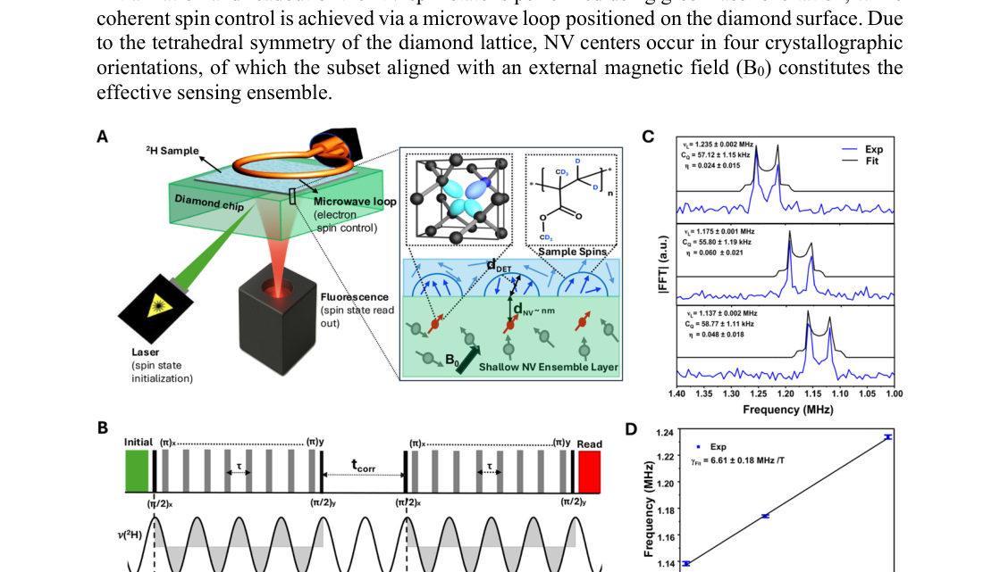 

Figure 1. Nanoscale 2H NMR using NV centers. (A) A deuterated sample is deposited on a diamond chip hosting a shallow ensemble of NV centers. Optical excitation initializes and reads out the NV electronic spins, while microwave fields provide coherent spin control. The enlarged insets illustrate the nanoscale sensing geometry: 2H spins in the deuterated polymer sample couple to near-surface NV centers via magnetic dipolar interactions, with the detection volume defined by the NV–sample separation dNV (a few nanometers). An external magnetic field B0 along the NV axis sets the ²H Larmor frequency. The insets highlight the NV defect in diamond and the deuterated PMMA-d₈. (B) Pulse sequence...

📷 Fig 2

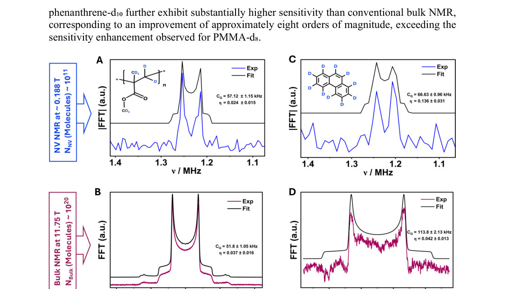 

Figure 2. Benchmarking of NV-detected and bulk ²H NMR spectra. ²H NV-NMR spectra of a PMMA-d₈ thin film (A) are compared with the corresponding bulk spectrum (B), showing similar quadrupolar powder patterns and comparable quadrupolar coupling constants CQ and asymmetry parameters η, but with 7 orders of magnitude higher sensitivity at much lower magnetic field. For phenanthrene-d₁₀, the NV-NMR spectrum (C) displays a clear quadrupolar splitting, with the bulk spectrum (D) presenting an even larger quadrupolar-broadened line shape. Experimental spectra (blue, purple) are overlaid with simulated spectra (black) fit using ssNake to extract CQ and η. To rationalize the observed quadrupolar...

**Main problem.**

Traditional NMR spectroscopy is limited by weak signal strength and requires large sample volumes and high magnetic fields, making nanoscale detection difficult.

**Main result.**

The researchers demonstrated nanoscale deuterium (2H) NMR spectroscopy using NV centers in diamond, achieving a sensitivity enhancement of six to eight orders of magnitude over inductive detection at low magnetic fields.

**Method.**

The study uses NV-based correlation spectroscopy with XY8-N dynamical decoupling pulse blocks to detect statistical spin fluctuations (spin noise) from nanometer-scale volumes.

**Summary.**

This paper presents a method for performing deuterium NMR spectroscopy at the nanoscale using nitrogen-vacancy centers in diamond. By detecting spin noise rather than inductive signals, the researchers achieved a massive sensitivity boost compared to conventional NMR. The technique successfully reproduces complex quadrupolar powder patterns at much lower magnetic fields than standard equipment. This approach enables the study of molecular dynamics and phase transitions in extremely small volumes, potentially reaching the single-molecule limit.

Detailed structure

**Model / system.**

The experimental platform consists of an ensemble of nitrogen-vacancy (NV) centers in diamond implanted ~8 nm below the surface, used to sense deuterated polymers (PMMA-d8) and molecular solids (phenanthrene-d10) at low magnetic fields (~180 mT).

**Key observables.**

2H Larmor frequency, quadrupolar coupling constant (CQ), asymmetry parameter (eta), and gyromagnetic ratio (gamma).

**Important parameters / regimes.**

Low magnetic field regime (~180 mT), nanoscale detection volumes, and sensitivity enhancement of 6-8 orders of magnitude.

**Figures summary.**

Figure 1A shows the experimental geometry; 1B shows the pulse sequence; 1C shows experimental 2H spectra; 1D shows the linear Zeeman dependence of resonance frequency vs. magnetic field.

**Paper structure.**

The paper introduces the limitations of bulk NMR, describes the NV-based experimental setup and pulse sequence, presents the results for deuterium NMR in polymers and solids, validates the findings via temperature-dependent studies and bulk NMR comparison, and concludes with the potential for single-molecule spectroscopy.

Abstract

Nuclear magnetic resonance (NMR) spectroscopy provides unparalleled access to molecular structure and dynamics but is traditionally limited by weak signal strength, requiring large sample volumes and high magnetic fields. Here, we demonstrate nanoscale deuterium (2H) NMR spectroscopy using nitrogen vacancy (NV) centers in diamond, reproducing the characteristic quadrupolar powder line shapes that are present in the conventional bulk NMR spectra. By detecting statistical spin fluctuations from nanometer scale detection volumes, our approach delivers a sensitivity enhancement of six to eight orders of magnitude over inductive detection while operating at magnetic fields two orders of magnitude lower than those used in conventional NMR. Temperature dependent measurements of a deuterated polymer and molecular solid reveal distinct motional averaging and phase transitions with nanoscale sensitivity. Powder-like NV detected 2H NMR establishes a powerful tool for probing molecular dynamics on the nanoscale and, in the ultimate limit, at the single molecule level - capabilities beyond those of most existing spectroscopic techniques.

[↑ back to top](#top)

### [Adaptive Sensing beyond Non-Adaptive Information Limits: End-to-End Co-Design of Geometry, Policy, and Inference](http://arxiv.org/abs/2604.25193v1)

**Authors:** Arvin Keshvari, William Tuxbury, Zin Lin

**Type:** theory · **Category:** numerical methods · **PDF:** <https://arxiv.org/pdf/2604.25193v1>

**Analysis basis:** full PDF text, analyzed in chunks

**Topic relevance:** 🔥 `quantum measurements` **4/5** · `entanglement & information structure` **2/5** · `methods for driven-dissipative` **2/5**

📷 Fig 1

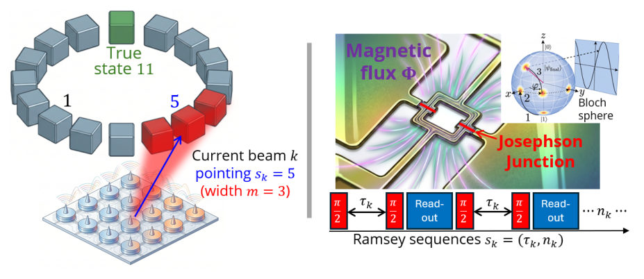 

Figure 1: Scene illustrations for the two case studies. Left (Case Study A, §6): a phased-array antenna interrogates a ring of 16 target cells; the true state (green, cell 11), the current beam pointing at cell sk = 5 with width m = 3, and the adaptive redirect selected by π⋆at the next epoch. Right (Case Study B, §7): the x-mon transmon cross on sapphire with a SQUID loop (two Josephson junctions) at the end of the +x arm, the external flux Φext threading the loop, a meandering readout resonator, and the Bloch-sphere view of the qubit; the bottom timeline shows the adaptive Ramsey sequences sk = (τk, nk) chosen by π⋆(bk) at each epoch.

📷 Fig 2

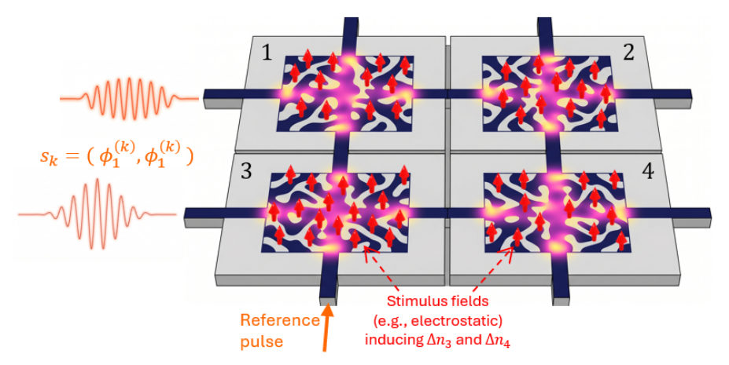 

Figure 2: Case Study C overview. A 2 × 2 lattice of identical cross-waveguide scatterers (cells 1–4), each carrying the same inverse-designed binary-permittivity pattern in its central design region. Two coherent broadband light pulses enter at the left edge: an action pulse carrying the adaptive input phases sk = (ϕ(k) 1 , ϕ(k) 2 ) at epoch k, and a fixed-phase reference pulse. External stimulus fields (e.g., electrostatic) acting on the cells induce per-cell refractive-index shifts ∆n1, . . . , ∆n4, which constitute the hidden state x = vec(∆n) ∈R4 to be estimated. The intensity overlays inside each cell visualize the electromagnetic near-field response under one such probe. Port powers...

📷 Fig 3

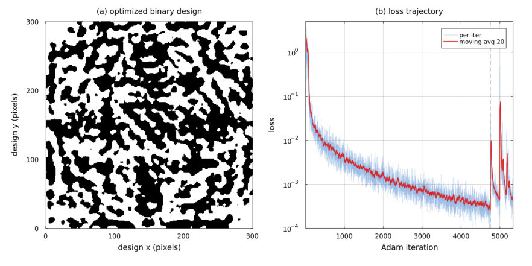 

Figure 3: Final optimized binary permittivity of the 300×300 design region (main panel). Inset: joint-DP loss trajectory from a fully random initialization through the full co-design; light blue, per-iteration loss; red, 20-iteration moving average; dashed, the transition into the filter-constrained projection phase.

📷 Fig 4

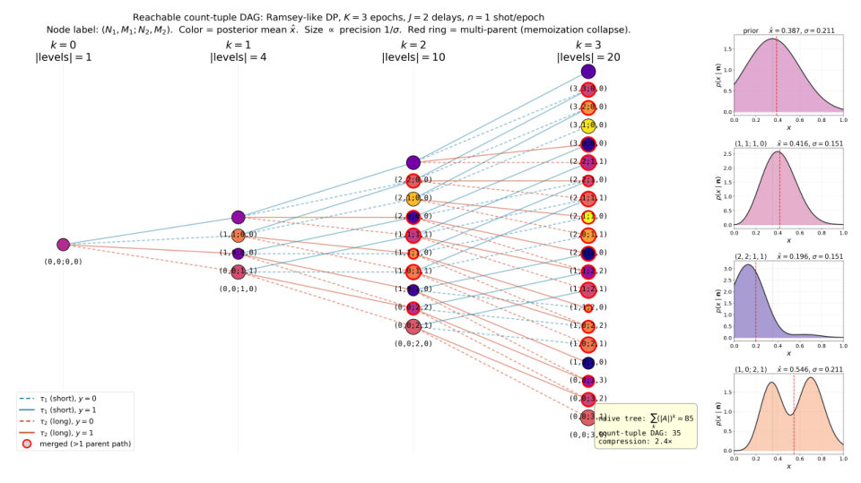 

Figure 1: Reachable count-tuple DAG for a Ramsey-like DP at K = 3 epochs, J = 2 delays, n = 1 shot per epoch. Nodes: reachable count-tuples (N1, M1; N2, M2), one column per epoch; colour = posterior mean ˆx (plasma scale); size ∝posterior precision 1/σ; red ring marks nodes reached by more than one parent path (the memoization collapse). Edges: colour by action (τ1 / τ2), style by outcome (y = 0 dashed / y = 1 solid). The compression-ratio box in the lower right compares the naive playout-tree size to the count-tuple DAG size. Right column: four representative posteriors — the prior at the root and three distinct terminal-belief shapes at k = 3.

**Main problem.**

The lack of end-to-end co-design between physical hardware geometry and adaptive measurement policies, which leads to information loss at the analog-to-digital boundary.

**Main result.**

The development of a 'joint-DP' framework that achieves massive performance gains in sensing, including a 123x reduction in MSE for photonic metasensors and an 11.3x reduction for superconducting qubit flux sensors.

**Method.**

A joint dynamic programming (joint-DP) approach using differentiable dynamic programming and the envelope theorem to compute exact, unbiased gradients of the hardware geometry without smoothing the Bellman maximum.

**Summary.**

This paper introduces a new optimization framework called 'joint-DP' for the simultaneous end-to-end design of physical hardware and adaptive measurement policies. By using the envelope theorem to differentiate through the Bellman equation, the authors avoid the biases introduced by traditional smoothing methods. The framework demonstrates significant improvements in sensing precision across radar, superconducting qubits, and photonic metasurfaces. This approach ensures that the hardware is specifically optimized to exploit the information gained during adaptive measurement steps.

Detailed structure

**Model / system.**

A general framework for sensing modeled as Partially Observable Markov Decision Processes (POMDPs), applied to three specific systems: a radar beam-search, a superconducting-qubit flux sensor (Ramsey spectroscopy), and a high-dimensional photonic metasensor.

**Key observables.**

Mean-Squared Error (MSE), Mutual Information (MI), Expected Fisher log-determinant, and Expected Value of Perfect Information (EVPI).

**Important parameters / regimes.**

Hardware geometry (c), adaptive measurement policy (pi), belief state (b), and the number of sensing epochs (K).

**Assumptions / limitations.**

The hardware is designed once and remains fixed for the lifetime of the device; the inner policy is Bellman-optimal; and the computational cost of the Bellman recursion must fit within memory.

**Paper structure.**

The paper introduces the problem of fragmented optimization, proposes the joint-DP framework, details the mathematical derivation of the 'sharp-max' gradient via the envelope theorem, presents a hierarchy of relaxation methods for scalability, and validates the method through three diverse case studies (radar, SQUID, and photonics).

**Why it may be interesting.**

This is highly relevant for quantum optics and open quantum systems because it provides a principled way to optimize the design of quantum sensors and measurement protocols (like Ramsey spectroscopy) by simultaneously optimizing the physical device and the adaptive control sequence.

Abstract

Inverse design has made vast physical parameter spaces a substrate for emergent behavior. In sensing, the stakes of this principle are sharpest at the analog-to-digital boundary, where any information the hardware fails to capture is information no downstream algorithm can recover; hardware optimization alone is therefore not enough, and the geometry must be co-designed with a rule for what to measure next. We formulate this co-design as \emph{joint dynamic programming} (joint-DP): a single optimization over the continuous hardware geometry and a Bellman-optimal adaptive measurement policy. The outer hardware gradient is computed by differentiable dynamic programming with a sharp Bellman maximum, which the envelope theorem makes exact and bias-free, and a relaxation hierarchy carries the common framework from small discrete POMDPs to $10^5$-pixel photonic topologies. Across three case studies, joint-DP beats the natural baseline of its community by a large factor: on a radar beam-search POMDP, classical information-bound-guided geometry selection loses $2.8\times$ in attainable adaptive value; on a superconducting-qubit flux sensor, joint-DP reduces deployed mean-squared error by $11.3\times$ over the joint Bayesian Cramér--Rao baseline, with both geometries numerically co-optimized under their respective objectives; and on a $90{,}000$-pixel photonic metasensor, joint-DP via the Bayesian Fisher-information-matrix surrogate reduces deployed mean-squared error by $123\times$ relative to a randomized baseline. For any sensor whose hardware is designed once but whose policy runs for the device's lifetime, joint optimization of hardware and policy is the minimum principled procedure.

[↑ back to top](#top)

### [Ground-state energies of Ising models calculated using the samples from a quantum computer that simulates short-time evolution](http://arxiv.org/abs/2604.25715v1)

**Authors:** John P. T. Stenger, C. Stephen Hellberg, Daniel Gunlycke

**Type:** both · **Category:** quantum information and computing · **PDF:** <https://arxiv.org/pdf/2604.25715v1>

**Analysis basis:** full PDF text, analyzed in chunks

**Topic relevance:** 🔥 `QC/QI experiment` **4/5** · `entanglement & information structure` **2/5** · `non-equilibrium dynamics` **2/5**

📷 Fig 1

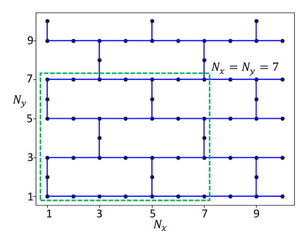 

Figure 1. Heavy-hex lattice. The circles represent lattice sites and the lines represent connectivity. We describe the size of a lattice by the number of layers in the x-direction Nx and the number of layers in the y-direction Ny. An example Nx = 7, Ny = 7 lattice is outlined by the dashed lines.

📷 Fig 2

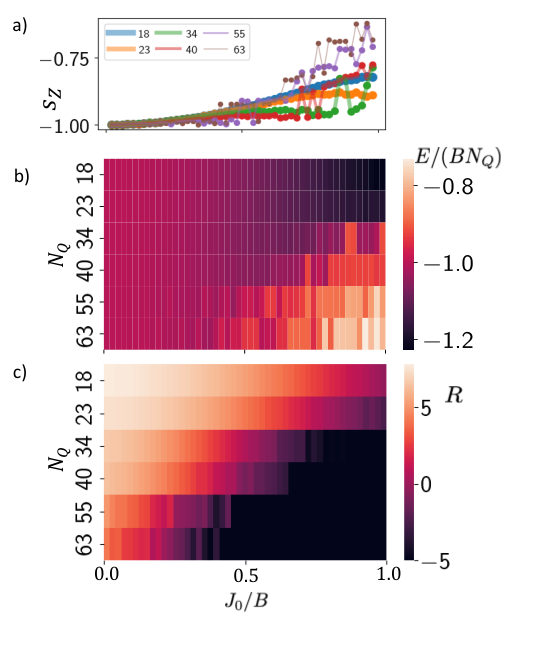 

Figure 2. Results for the homogeneous coupling model. (a) the average spin as a function of the coupling strength J0 for various lattice sizes. The total number of qubits NQ = 18, 23, 34, 40, 55, 63 corresponds to lattice sizes of Nx = Ny = 5, 6, 7, 8, 9, 10 respectively. (b) Effective ground-state energy E1 0 as a function of the total number of qubits NQ and the coupling strength J0. (c) the information ratio R as a function of the total number of qubits NQ and the coupling strength J0.

📷 Fig 3

 

Figure 2 shows the results for the homogeneous cou- plings. In Fig. 2a, we plot the average spin sZ = P

📷 Fig 4

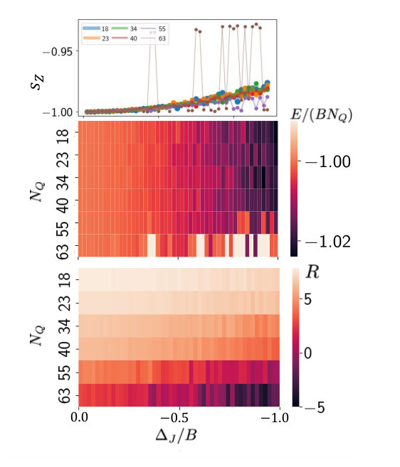 

Figure 3. Results from the random-coupling model. (a) the average spin as a function of the coupling-strength bound ∆J for various lattice sizes. The total number of qubits NQ = 18, 23, 34, 40, 55, 63 corresponds to lattice sizes of Nx = Ny = 5, 6, 7, 8, 9, 10 respectively. (b) Effective ground-state energy E1 0 as a function of the total number of qubits NQ and the coupling-strength bound ∆J. (c) the information ratio as function of the total number of qubits NQ and the coupling- strength bound ∆J.

📷 Fig 5

 

Figure 4 shows the basis state structure for the ground state under several different scenarios. The panels on the left hand side (Fig. 4a,b,c) show data from an ex- actly solved square lattice model where we average over the results of 1000 different random couplings. Fig. 4a shows plots of the number of basis states with a proba- bility above P Ψ s &gt; 0.1/|B1| as a function of the number of spins NQ. For ∆J/B &lt; 1 we see that the number of significant basis states grows nearly linearly with the size of the system. As we increase ∆J/B &gt; 1 we see that the number of significant basis states also increases. How- ever, the dependence on NQ does not surpass cubic even for the largest coupling...

📷 Fig 6

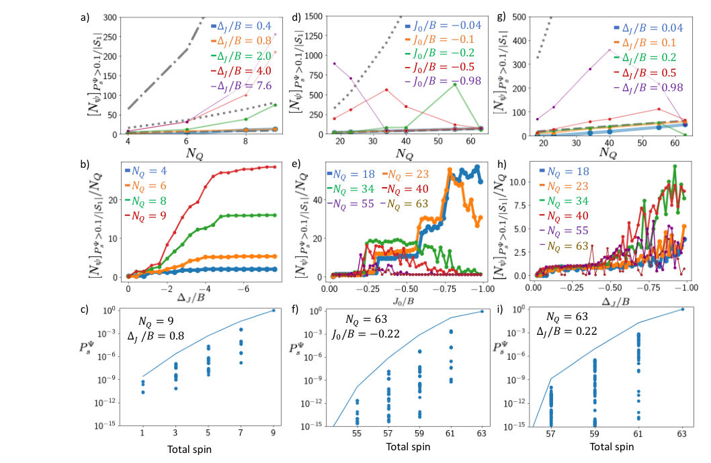 

Figure 4. Basis state structure of the ground state. (a),(b),(c) are for a small square lattice model exactly solved and averaged over 1000 different random couplings. (d),(e),(f) are for the homogeneous model. (g),(h),(i) are for the random-coupling model. (a),(d),(g) show the number of basis states Nψ that have a probability in the ground state greater than P Ψ s &gt; 0.1/|B1| as a function of NQ for select values of the coupling J0 or ∆J. The dashed, dotted, and dash-dot lines represent linear NQ, square N 2 Q, and cubic N 3 Q boundaries respectively. (b),(e),(h) show the number of basis states Nψ that have a probability in the ground state greater than P Ψ s &gt; 0.1/|B1| as a function of the...

📷 Fig 7

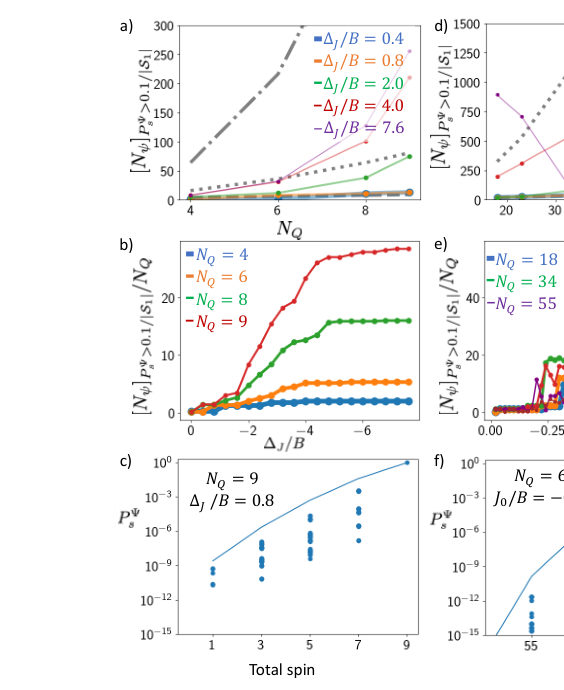 

Fig. 4b also shows the total number of basis states with P Ψ s &gt; 0.1/|B1| but as a function of the coupling ∆J and divided by NQ. We see that the number of basis states with probability above the cutoff increases incrementally. This is due to the small system size, as the probability distribution is discrete. This is seen clearly in Fig. 4c where we plot the probability of each basis state sorted into bins of total spin. Notice that there is a single basis state with total spin equal to 9 with the highest prob- ability. For each pair of spins that is flipped, the total probability of all of the basis states with that total spin decreases exponentially. The panels in the middle column (Fig....

**Main problem.**

Estimating ground-state energies of Ising models using short-time evolution on near-term quantum hardware while managing the impact of hardware errors and decoherence.

**Main result.**

The CVQE algorithm effectively finds ground-state energies for up to 63 qubits, demonstrating that the number of significant basis states scales subexponentially, though errors increase with qubit number and coupling strength.

**Method.**

The Cascaded Variational Quantum Eigensolver (CVQE) uses a Guided-Sampling Ansatz (GSA) where short-time adiabatic state preparation generates a subspace for classical eigenvalue solving.

**Summary.**

This paper presents a method to calculate the ground-state energies of Ising models using a quantum computer to simulate short-time evolution. By using the CVQE algorithm on up to 63 qubits, the authors demonstrate that the required computational subspace grows slowly with system size. They identify how hardware errors scale with coupling strength and qubit count, and propose an information ratio as a diagnostic for calculation accuracy. The work highlights the potential for near-term quantum devices to perform useful simulations of spin systems.

Detailed structure

**Model / system.**

Transverse-field Ising models (both homogeneous and random-coupling/spin-glass) on a heavy-hex lattice, implemented on the IBM ibm_torino quantum processor.

**Key observables.**

Ground-state energy (E0), average spin (sZ), information ratio (R), and number of significant basis states (N_psi).

**Important parameters / regimes.**

Coupling strength (J0 or delta J), transverse field (B), number of qubits (NQ), and the ratio of coupling to field strength.

**Assumptions / limitations.**

The method assumes that short-time diabatic evolution can capture the ground state within a manageable subspace and that the heavy-hex architecture can be used to reach the quantum utility regime.

**Figures summary.**

Figure 1 shows lattice connectivity; Figure 2 plots average spin, energy, and information ratio for homogeneous models; Figure 3 shows similar metrics for random-coupling models; Figure 4 compares basis state probability distributions between exact and CVQE results.

**Paper structure.**

The paper introduces the CVQE algorithm and GSA, applies it to homogeneous and random Ising models on IBM hardware, performs error and entropic analysis, provides a mathematical framework for diabatic evolution, and concludes with scaling and utility assessments.

**Why it may be interesting.**

It provides a practical framework for using short-coherence-time devices to study many-body dynamics and ground states, specifically showing how to use diabatic processes to bypass the need for full adiabaticity.

Abstract

We find the ground-state energy of the Ising model using the Cascaded Variational Quantum Eigensolver (CVQE) algorithm with the Guided-Sampling Ansatz (GSA) using up to 63 qubits on a quantum computer. We study a heavy-hex lattice to match the qubit architecture, allowing us to perform calculations in the quantum utility regime. We study both a homogeneous and random-coupling model. We locate the boundary of acceptable quantum errors as a function of the number of qubits and coupling strength. An entropic analysis is performed giving insights into the quantum computing performance. A subspace analysis is performed that suggests that the Ising model is especially suited for near-term quantum computing.

[↑ back to top](#top)

### [Quantum memory and scrambling from the perspective of a classical neural network](http://arxiv.org/abs/2604.25663v1)

**Authors:** Dimitrios Maroulakos, Andrzej Wal, Marcin Kowalik, Czesław Jasiukiewicz, Rohit Kumar Shukla, Sunil K. Mishra, Levan Chotorlishvili

**Type:** theory · **Category:** disordered systems and neural networks · **PDF:** <https://arxiv.org/pdf/2604.25663v1>

**Analysis basis:** full PDF text, analyzed in chunks

**Topic relevance:** 🔥 `entanglement & information structure` **4/5** · 🔥 `non-equilibrium dynamics` **4/5**

📷 Fig 1

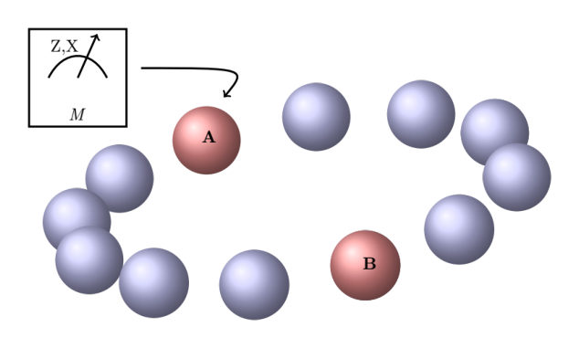 

Figure 1: The proposed model mimics the experimental setup of the work [17]. The atomic chain with a length of up to 30 nm, formed on the Ir(001) surface [18]. The spins are coupled by the nearest-neighbor ferromagnetic and the next- nearest-neighbor antiferromagnetic interactions. Competing exchange interaction terms lead to spin frustration. The Dzyaloshinskii-Moriya (DM) interaction between nearest spins stabilizes the chiral spin order. When studying the effect of quantum memory, we perform two measurements of the qubit A and measure the Z and X components of the spin. When studying OTOC, we consider two local perturbations ˆW = ˆσz A = ˆσz 1 and ˆV = ˆσz B = ˆσz L/2, where L is the...

📷 Fig 2

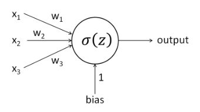 

Figure 2: The pictorial plot of the artificial neurons which are used to predict the time-dependence of OTOC and quantum memory.

📷 Fig 3

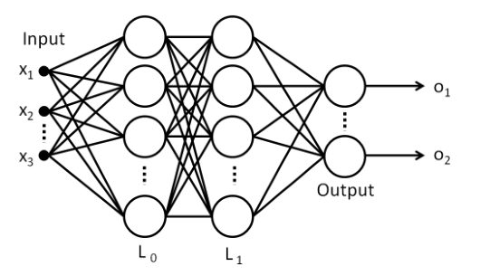 

Figure 3: Schematic of an ANN used to predict OTOC C(t) and quantum memory, for given values of exchange constants J1, J2, and DM constant D. The ANN consists of two hidden dense layers L0 and L1 with 64 and 32 neurons, respectively. The output layer contains 25 neurons.

📷 Fig 4

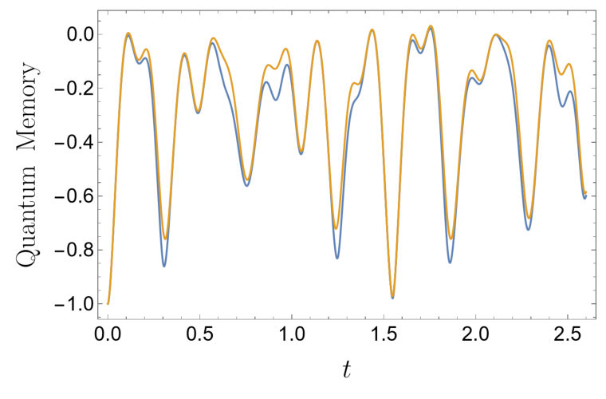 

Figure 4: Plot for the left hand side (amber) and the right hand side (blue), as functions of time for the inequality S+(X|B)+S+(Z|B) ≥log2(1/c)+S+(A|B), (8), where c = 1/2 is a measure of complementarity and S+(X|B), S+(Z|B) are conditional quantum entropies of the states (6), (7), |ψ1,2⟩≡|0⟩A , |1⟩A and |ϕ1,2⟩= 1 √

📷 Fig 5

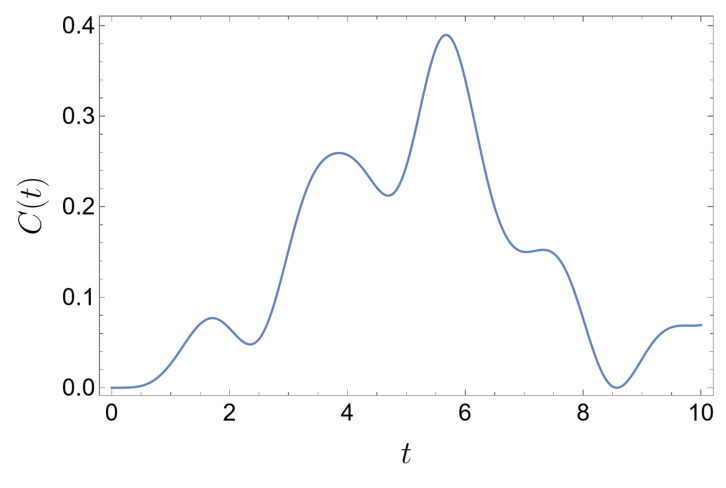 

Figure 5: Plot for C+(t), in (12) and the first excited state n1 = 1, where we take |φni⟩≡ni. The spin chain has length, L = 10 and perform summation over all states n2, n3, n4. For the coefficient An3n4 n1n2, use expressions in (46)-(49), taking into account (4).For phase we use (50). The time unit is set by |J1|/ℏ.

📷 Fig 6

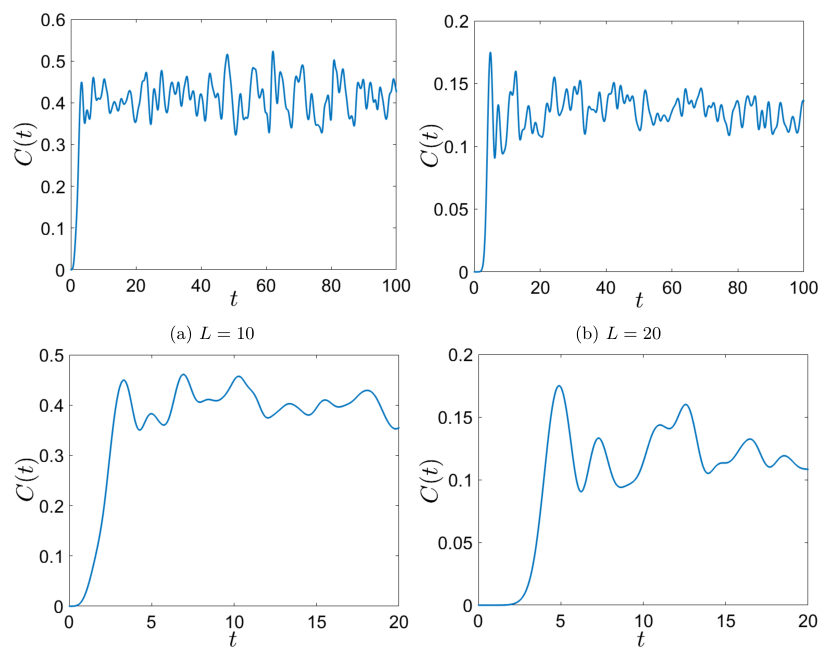 

Figure 6: OTOC as a function of time for two excitation case. The number of the spins L = 10 (6a) and L = 20 (6b). Figure 6c and Figure 6d are the same but plotted for a shorter time interval. The system parameters are J1 = −1, J2 = 1, D = 0.5. The time unit is set by |J1|/ℏ.

📷 Fig 7

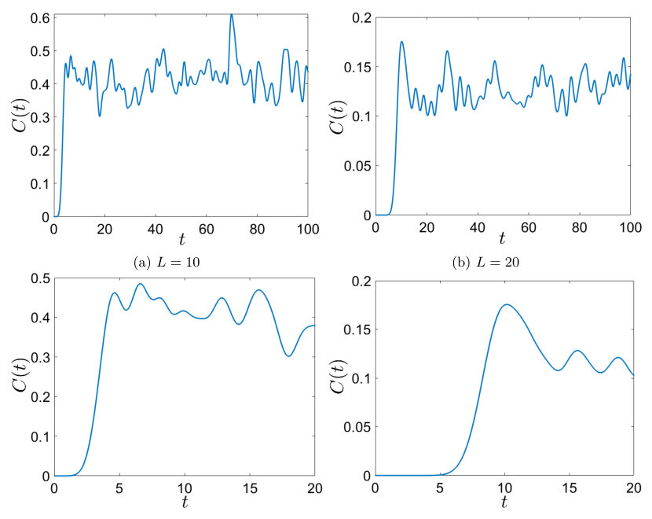 

Figure 7: OTOC as a function of time for two excitation case and nearest neighbor coupling. The number of the spins L = 10 (7a) and L = 20 (7b). Figures 7c, 7d are the same but plotted for a shorter time interval. The system parameters are J1 = −1, J2 = 0, D = 0.5. The time unit is set by |J1|/ℏ.

📷 Fig 8

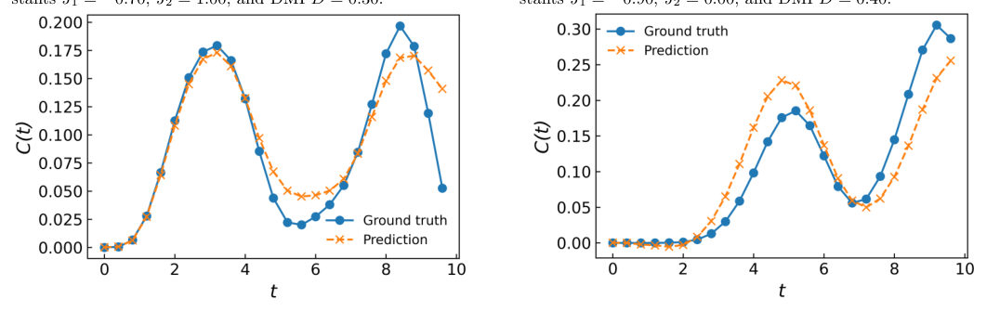 

Figure 8: The exact (ground truth) and the predicted via neural network values of OTOC as a function of time. For particular values of parameters specified in the captions of corresponding figures, respectively. As we see, the maximal values of the exact and predicted OTOCs are synchronized in time and show good qualitative agreement for all sets of parameters.

📷 Fig 9

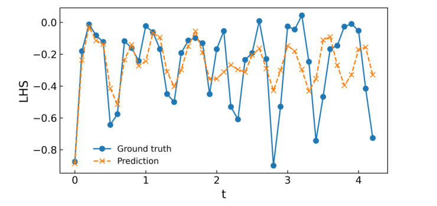 

Figure 9: The time-dependent quantum memory for anticlockwise (LHS) propagating spin excitations. The values of the parameters: J1 = −0.90, J2 = 0.90, D = 0.50. We see growth in time mismatch between exact and predicted by neural network peaks of the quantum memory. The result for clockwise (RHS) propagating spin excitations manifests the same trend (not shown).

📷 Fig 10

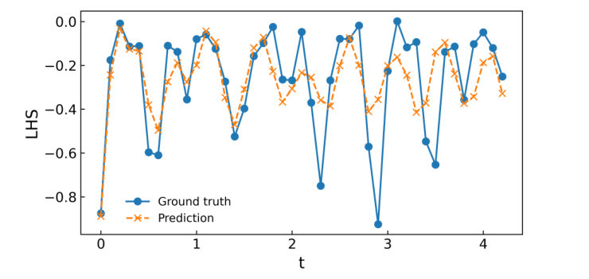 

Figure 10: The time-dependent quantum memory for anticlockwise (LHS) propagating spin excitations. The values of the parameters: J1 = −0.90, J2 = 0.90, D = 0.0. When DM interaction is zero D = 0, the mismatch between the exact and predicted via the neural network peaks and phases of the quantum memory signal are smaller than in the nonzero DM case. The result for clockwise (RHS) propagating spin excitations manifests the same trend (not shown).

**Main problem.**

The study investigates the time-dependent dynamics of quantum memory and information scrambling (OTOC) in chiral spin chains, specifically looking at how broken inversion symmetry affects these processes.

**Main result.**

Quantum memory is found to be more sensitive to broken inversion symmetry and the Dzyaloshinskii-Moriya interaction than OTOC, exhibiting faster oscillations and a lack of equilibration. Additionally, a classical neural network can predict these dynamics, though its accuracy decreases with stronger DMI.

**Method.**

The authors use exact diagonalization and analytical derivations for single and two-excitation sectors, combined with a classical deep learning artificial neural network (ANN) trained via backpropagation to predict time-series results.

**Summary.**

This paper explores how quantum information scrambles and how quantum memory evolves in a chiral spin chain. By comparing the Out-of-Time-Ordered Correlator (OTOC) with a modified quantum memory formalism, the authors show that quantum memory is a more sensitive probe of broken inversion symmetry. They also demonstrate that a classical artificial neural network can be trained to predict these complex quantum dynamics, although the prediction error increases as the Dzyaloshinskii-Moriya interaction becomes stronger.

Detailed structure

**Model / system.**

A 1D chiral spin-1/2 chain (modeled after multiferroic materials or atoms on Ir(001) surfaces) featuring nearest-neighbor ferromagnetic (J1) and next-nearest-neighbor antiferromagnetic (J2) interactions, along with a Dzyaloshinskii-Moriya (DM) interaction term.

**Key observables.**

Out-of-Time-Ordered Correlator (OTOC), Quantum Memory (via Entropic Uncertainty Relations), von Neumann entropy, and multipartite entanglement (CKW monogamy inequality).

**Important parameters / regimes.**

Dzyaloshinskii-Moriya interaction strength (D), exchange constants (J1, J2), and the number of excitations.

**Assumptions / limitations.**

The analysis is restricted to specific excitation sectors (single and two-excitation) and periodic boundary conditions; the neural network is a classical architecture, not a quantum one.

**Figures summary.**

Figure 1 shows the experimental setup of an atomic chain; Figure 2 and 3 illustrate the neural network architecture; Figure 4 plots the time-dependent reduction in measurement uncertainty; Figure 5 shows OTOC dynamics.

**Paper structure.**

The paper introduces the problem of time-dependent quantum memory, defines the chiral spin chain Hamiltonian, presents the analytical and numerical methods for calculating OTOC and entropy, describes the ANN training protocol, and concludes with a comparison of the sensitivity of different observables and the predictive performance of the network.

**Why it may be interesting.**

This paper is relevant for many-body dynamics and open quantum systems because it explores how broken symmetries and chiral interactions influence the propagation of information and the stability of quantum correlations, providing a bridge between classical machine learning and quantum information diagnostics.

Abstract

Entropic uncertainty relations are universal quantifiers of fundamental uncertainties of quantum measurements and are widely discussed in the quantum metrology literature. Quantum memory is a phenomenon related to the specific type of quantum correlations that allows for reducing fundamental uncertainties of quantum measurements. In the present work, the modified concept of quantum memory for time-dependent problems is proposed. We compare the time-dependent formulation of quantum memory with the out-of-time-ordered correlator (OTOC). Quantum memory is a rigorous mathematical concept that requires demanding calculations. Thus, until now, quantum memory has been discussed mainly for simple model systems and stationary problems. In the present work, we demonstrate that quantum memory can also be studied for realistic and physically relevant systems, e.g., the atomic helical spin chain, as well as the emergence and propagation of quantum correlations in time. We found that quantum memory manifests faster oscillations in time than OTOC and does not equilibrate. Furthermore, an artificial neural network is trained and asked to predict results for OTOC and quantum memory. These results show that quantum memory is more sensitive than OTOC in terms of broken inversion symmetry and the nonreciprocal effect.

[↑ back to top](#top)

### [Spectral tuning of single T centres by the Stark effect](http://arxiv.org/abs/2604.25170v1)

**Authors:** Michael Dobinson, Felix Hufnagel, Simon A. Meynell, Camille Bowness, Melanie Gascoine, Walter Wasserman, Prasoon K. Shandilya, Christian Dangel, Michael L. W. Thewalt, Stephanie Simmons, Daniel B. Higginbottom

**Type:** experiment · **Category:** quantum information and computing · **PDF:** <https://arxiv.org/pdf/2604.25170v1>

**Analysis basis:** full PDF text, analyzed in chunks

**Topic relevance:** 🔥 `QC/QI experiment` **4/5** · 🔥 `quantum optics experiment` **4/5**

📷 Fig 1

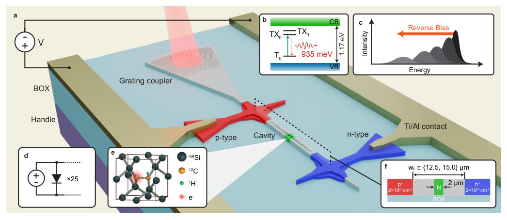 

FIG. 1. Overview of the hybrid nanophotonic cavity and p-i-n diode architecture. a, Illustration of the device consisting of a grating coupler, nanophotonic cavity, and p-i-n diode. The p-doped (red) and n-doped (blue) regions are connected electrically through waveguide crossings to form a diode across the nanophotonic cavity. Varying the voltage applied to the diode modulates the electric field within the device. b, Energy levels of the T centre within the silicon bandstructure. The ground state, T0, and excited state, TX0, of the T centre are shown alongside the conduction band minimum (CB) and valence band maximum (VB). c, Sketch of the ZPL emission spectrum illustrating the...

📷 Fig 2

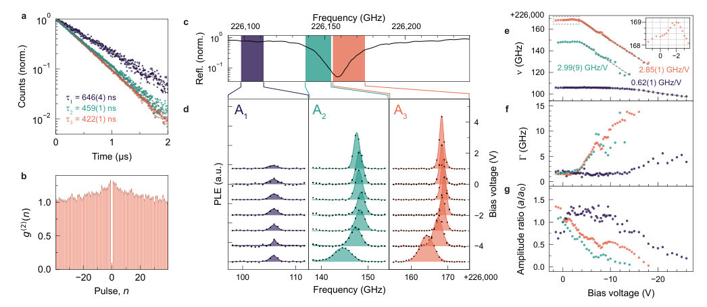 

FIG. 2. Stark tuning of single cavity-coupled T centres. a, Time-resolved luminescence decay transient of the zero-phonon line (ZPL) under pulsed resonant excitation at 0 V. The data are normalized and then fit to single exponential functions (grey dashed lines) to extract the excited-state lifetime. b, Background-corrected second-order correlation function for centre A3 under pulsed resonant excitation, yielding g(2)(0) = 0.090(6). c, Reflection spectrum of the cavity with a fitted Lorentzian FWHM of 41(1) GHz. d, PLE spectra of the ZPLs for three separate T centres (A1, A2, and A3), demonstrating spectral shifting in response to an applied bias voltage. Solid lines indicate fits to...

📷 Fig 3

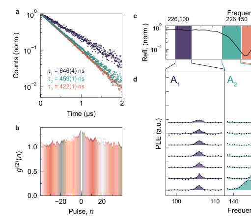 

FIG. 3. Lifetime reduction by tuning into the cav- ity resonance. The emission of centre A3 is Stark tuned across the cavity resonance, with the excited-state life- time measured at specific spectral positions by pulsed resonant optical excitation (orange circles). The detun- ing ν −νcav represents the offset from the cavity reso- nance at νcav = 226, 158 GHz. Error bars are centred on the datapoints and correspond to ±1 standard deviation of the propagated fit error. The dashed black line indi- cates a Lorentzian fit to the data, with the shaded grey region representing a ±1 standard deviation confidence interval of the fit.

📷 Fig 4

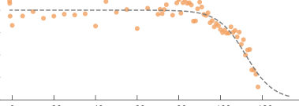 

FIG. 4. Modulation of the ZPL intensity with ap- plied bias. a, The optical response of cavity-coupled T centres in a 15 µm device, showing the intensity modula- tion of centre B1 under applied voltages from −70 V to −120 V, captured with PLE spectroscopy. b, The nor- malized integrated area of the fitted skewed Voigt func- tion for centre B1 (purple circles). The area decreases continuously past a threshold until the emission is fully quenched at −120 V. The integrated area data are fit- ted to a sigmoid activation function (black dashed line), a model relevant for intensity modulation by both field ionization and Fermi level crossing.

📷 Fig 5

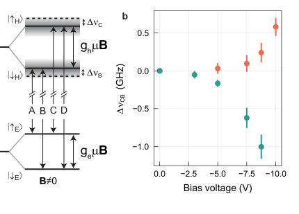 

FIG. 5. Electronic modulation of spin-dependent optical transition splittings. a, Level structure of the T centre under an applied magnetic field showing the four spin-dependent optical transitions, A–D. The grey shaded regions depict the shifting of the excited state energy levels due to an applied electric field. b, Change in splitting between the C and B transitions ∆νCB(V ) for centres A2 (green circles) and A3 (orange circles) under an applied bias voltage with B = 600 mT applied along the [¯110] crystal axis.

📷 Fig 6

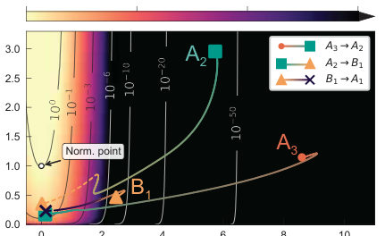 

FIG. 6. Effects of detuning and linewidth on visi- bility and excitation probability. a, Modelled HOM visibility for above-bandgap excitation of two inhomo- geneously broadened quantum emitters. We model the effects of spectral diffusion (SD) and frequency detuning for emitters with lifetimes of 458 ns (corresponding to centre A2) and a 0.5 ns detector gating window. The vis- ibility is evaluated for one emitter with fixed properties while varying the second emitter in two cases: SD broad- ening from Γ0 = 1.52 GHz at zero detuning (solid line), and varied detunings with fixed SD linewidths (dashed line). b, Modelled maximum joint excitation probability for resonant excitation of two...

📷 Fig 7

 

Figure 5b shows the change in the C–B splitting as a function of bias voltage for centres A2 and A3, ∆νCB(V ) = νCB(V ) −νCB(0). We observe a nega- tive change for A2 ∆νCB(−8.75 V) = −1.0(2) GHz and a positive change for A3 ∆νCB(−10.0 V) =

**Main problem.**

Nanophotonic integration of silicon T centres causes spectral broadening and inhomogeneous distribution, preventing the mutual resonance required for entanglement protocols.

**Main result.**

The researchers demonstrated DC Stark tuning of up to 30 GHz in silicon T centres using p-i-n diodes, enabling 55% of emitters to be brought into mutual resonance and significantly increasing the joint excitation probability.

**Method.**

The study uses pulsed photoluminescence-excitation (PLE) spectroscopy, time-resolved single-photon detection, and second-order correlation measurements on silicon-on-insulator (SOI) nanophotonic cavities under cryogenic temperatures and applied reverse bias.

**Summary.**

This paper demonstrates the use of the DC Stark effect to achieve local spectral tuning of single silicon T centres in nanophotonic cavities. By integrating these centres into p-i-n diodes, the researchers achieved a tuning range of 30 GHz, allowing a majority of emitters to be brought into resonance. The study also explores the physical mechanisms behind linewidth broadening and luminescence quenching under high bias. This advancement provides a pathway to increase the yield of performant spin-photon interfaces for large-scale quantum information technologies.

Detailed structure

**Model / system.**

The system consists of single silicon T centres (solid-state defects) integrated into 1-D silicon nanophotonic cavities with p-i-n diode structures on SOI substrates, operated at cryogenic temperatures (1.6-2.5 K).

**Key observables.**

Zero-phonon line (ZPL) frequency, linewidth (homogeneous and inhomogeneous), photon statistics (g2(0)), excited-state lifetime, and luminescence intensity modulation.

**Important parameters / regimes.**

Tuning range of 30 GHz, cavity quality factor Q = 5500, temperature T = 2.5 K, and reverse bias voltages up to -120 V.

**Assumptions / limitations.**

Assumed that the observed spectral shifts are due to the Stark effect rather than Joule heating; TCAD simulations were performed at 300 K to avoid carrier freeze-out.

**Figures summary.**

Fig 1: Device architecture and T centre structure; Fig 2: Lifetime, photon statistics, and PLE spectra under bias; Fig 4: Intensity modulation and sigmoidal quenching; Fig 5: Energy level structure and splitting modulation; Fig 6: Modeling of joint excitation probability.

**Paper structure.**

Introduction to T centres and the challenge of integration; Device fabrication and architecture; Demonstration of Stark tuning and spectral control; Investigation of linewidth broadening and quenching mechanisms; Analysis of spin-orbit coupling and charge state dynamics; Conclusion on scalability.

**Why it may be interesting.**

This work is highly relevant to quantum optics and quantum networks as it demonstrates a scalable method for controlling the spectral overlap of solid-state emitters, which is a fundamental requirement for photon-mediated entanglement and quantum repeaters.

Abstract

Among the many solid-state emitters being explored for scalable quantum technologies, the silicon T centre is a leading candidate offering long-lived spin qubits, a telecommunications-band spin-photon interface, and integration with on-chip photonic circuits. However, nanophotonic integration broadens both the inhomogeneous spectral distribution and individual emitter linewidths. Here, we integrate single T centres into silicon nanophotonic cavities with p-i-n diodes for local electronic control. These devices enable Stark tuning up to 30 GHz, sufficient to bring 55(2)% of on-chip T centres into mutual resonance, and demonstrate tunable lifetime reduction across the cavity resonance. A model of the joint excitation probability shows an orders-of-magnitude increase in entanglement rate by tuning distinct emitters into mutual resonance. Luminescence modulation at high reverse biases reveals a transition to a dark charge state. Finally, bias-induced modulation of the optical transition splitting uncovers a potential mechanism for electrically driven excited-state spin mixing via spin-orbit coupling. Localized and individual spectral tuning increases the yield of performant silicon spin-photon interfaces and the number of devices per chip available for large-scale entanglement and quantum information technologies.

[↑ back to top](#top)

### [Universal Topological Power Transfer with Arbitrarily Large Chern Number in Driven Quantum Spin Chains](http://arxiv.org/abs/2604.24851v1)

**Authors:** Anshuman Tripathi, Mircea Trif, Thore Posske

**Type:** theory · **Category:** strongly correlated electrons · **PDF:** <https://arxiv.org/pdf/2604.24851v1>

**Analysis basis:** full PDF text, analyzed in chunks

**Topic relevance:** 🔥 `non-equilibrium dynamics` **4/5** · `analog quantum simulation` **2/5** · `exotic spin models in light-matter` **2/5**

📷 Fig 1

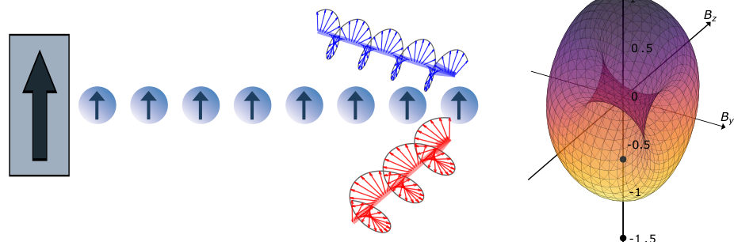 

FIG. 1. The frequency converter setup. (a) The XXZ spin-1/2 chain, where the first spin is coupled to a static magnetic reservoir pointing in x-direction, and the last spin is coupled to the two incommensurate circularly polarized magnetic drives in the xz (blue field) and xy (red field) planes. (b) The self-intersecting torus traced by the drives for field strength B = 1/2. The black dots mark two degeneracy points, the one enclosed by the torus yields the Chern number C = 1 for a chain length N = 8 and anisotropy ∆= −0.78J.

📷 Fig 2

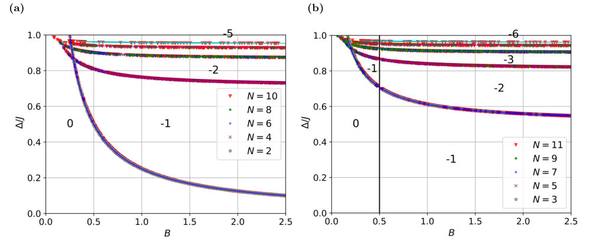 

FIG. 2. The topological sectors, separated by quantum critical points, i.e., parameters of gap closure δE = 0. The universal collapse of trajectories as a function of anisotropy ∆and the magnetic field B pointing in the −x direction. The respective markers are the numerical value of the degeneracy calculated for (a) even and (b) odd chain lengths, and the colored curves are the hyperbolic fits (∆/J −cos(π/N))(B + b) = c, see Appendix B for values. The critical points accumulate in dependence on the chain length N for both the odd and even cases. By choosing the magnitude and starting point of B, diverse topological pumps can be realized.

📷 Fig 3

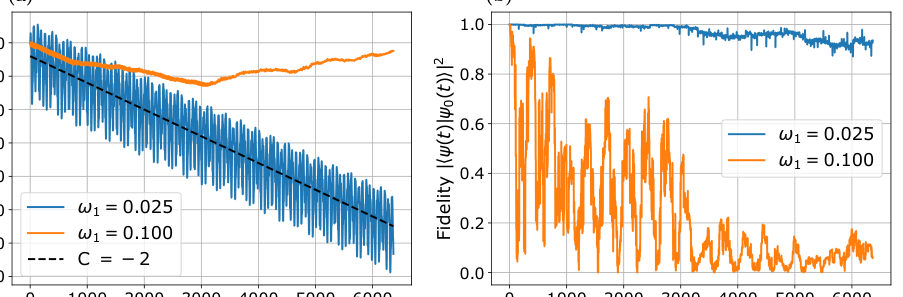 

FIG. 3. Dynamics of energy transfer (a) and the corresponding ground-state fidelity (b). Time evolution is simulated for a spin chain of length N = 4 with parameters ∆= J and B = 1, driven by incommensurate frequencies related by the golden ratio, ω2 = ω1(1 + √

📷 Fig 4

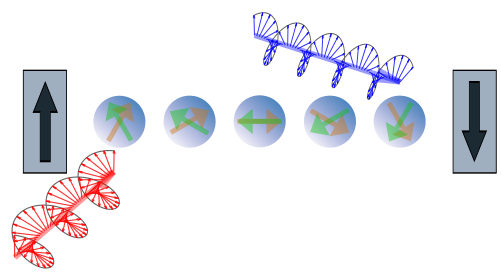 

FIG. 4. A general frequency converter setup with distributed boundary driving and fine tuning to the degeneracy point. A wide variety of driving protocols can be engineered by apply- ing different combinations of static tuning fields to arbitrary sites to establish the degeneracy landscape, while subjecting other localized spins to the incommensurate phase drives.

📷 Fig 5

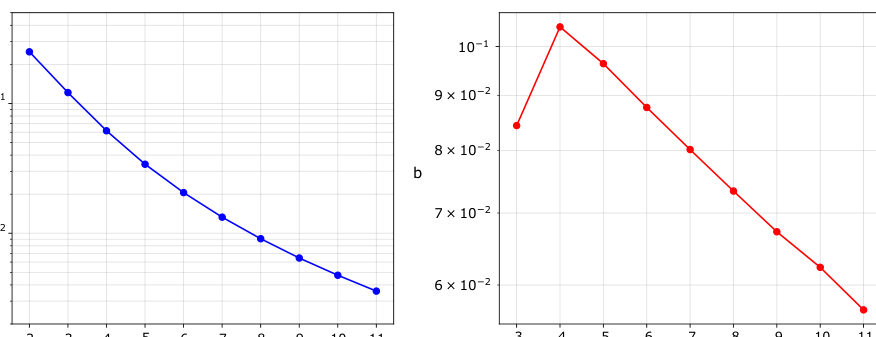 

FIG. 5. Scaling of the hyperbolic fit parameters with chain length N. (a) The parameter c of the new accumulated trajectories with increase of N, plotted on a logarithmic scale. (b) The parameter b (for N ≥3 as b = 0 for N = 2), plotted on a logarithmic scale.

**Main problem.**

Existing topological frequency converters are limited to small integer Chern numbers, which restricts the possible amplification and conversion factors of power transfer between driving fields.

**Main result.**

The authors demonstrate that in an interacting XXZ Heisenberg spin chain, the Chern number scales linearly with the chain length N, enabling a topological frequency converter with an arbitrarily large, quantized conversion ratio.

**Method.**

The study uses the Lanczos algorithm for ground state calculation, the Crank-Nicolson method for time evolution, and a gauge-invariant projection method to calculate the Chern number via Berry flux summation.

**Summary.**

This paper presents a theoretical mechanism for achieving arbitrarily large, quantized power transfer between two driving frequencies. By using an interacting XXZ Heisenberg spin chain, the authors show that the Chern number—which dictates the conversion ratio—increases linearly with the system size. This allows for a topological frequency converter with a tunable and potentially massive amplification factor. The study also identifies universal scaling laws for the quantum critical points that govern this process.

Detailed structure

**Model / system.**

An interacting XXZ Heisenberg spin-1/2 chain of length N, where the first spin is coupled to a static magnetic field and the last spin is driven by two incommensurate, circularly polarized magnetic drives.

**Key observables.**

Time-averaged pumped power (P), Chern number (C), ground-state fidelity, and energy transfer.

**Important parameters / regimes.**

Exchange anisotropy (delta/J), magnetic field strength (B), chain length (N), and driving frequencies (omega1, omega2).

**Assumptions / limitations.**

The system operates in the adiabatic or quasi-adiabatic regime, and the driving frequencies are sufficiently small to maintain the system near the instantaneous ground state.

**Figures summary.**

Figure 3 compares energy transfer and fidelity in adiabatic vs. diabatic regimes; Figure 4 shows a general frequency converter setup; Figure 5 illustrates the scaling of hyperbolic fit parameters (b and c) with chain length N.

**Paper structure.**

The paper introduces the problem of limited conversion factors, describes the XXZ spin chain model and driving mechanism, presents numerical results for Chern number scaling and degeneracy trajectories, analyzes the scaling of critical points using hyperbolic fits, and concludes with discussion on experimental platforms and limitations.

**Why it may be interesting.**

This work is highly relevant for many-body dynamics and quantum optics as it provides a scalable mechanism for high-gain, quantized energy/frequency conversion using topological protection in interacting systems.

Abstract

Topological frequency converters exploit a quantized transfer of power between two driving fields in a quantum system, a phenomenon topologically protected by the Chern number of the associated fiber bundle. While realizations with few-spin systems have theoretically demonstrated this effect, the conversion factors have typically been restricted to small integer values. Here, we investigate an interacting $XXZ$ Heisenberg spin-$1/2$ chain driven adiabatically by two magnetic drives with incommensurate frequencies. The Chern number, determined by the degeneracy points enclosed by the adiabatic trajectory, increases systematically with the chain length and can be tuned through the exchange anisotropy, providing direct control of the topological pumping strength. We reveal a universal dependency of the anisotropy and magnetic field strength for odd and even chain lengths of the quantum critical points. This provides a mechanism for a topological frequency converter with an arbitrarily large, quantized conversion ratio in interacting quantum spin chains. The mechanism remains the same for arbitrary coupling regions of the drives.

[↑ back to top](#top)

### [Magnetic quantum phases of spin-orbit-coupled anisotropic dipolar bosons in square lattices](http://arxiv.org/abs/2604.25694v1)

**Authors:** Nitin Kaloya, Kuldeep Suthar

**Type:** theory · **Category:** quantum gases · **PDF:** <https://arxiv.org/pdf/2604.25694v1>

**Analysis basis:** full PDF text, analyzed in chunks

**Topic relevance:** 🔥 `analog quantum simulation` **4/5** · `exotic spin models in light-matter` **3/5**

📷 Fig 1

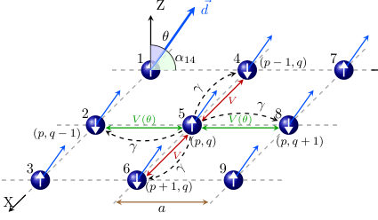 

FIG. 1. Schematic representation of spin-flip complex hopping (γ) of spin-orbit coupled dipolar bosons in two-dimensional square op- tical lattices. The dipoles are assumed to lie within the yz-plane and the angle θ subtended by the polarization axis with the z-axis is the tilt angle, that defines the direction of polarization. The tilt angle is shown by the blue-shaded region. The angle between the polariza- tion axis and the relative position vector (r4 −r1), α14, is shown by the green shaded region. The dipolar interaction strengths between bosons at lattice sites (p, q) and (p ± 1, q) are denoted by Vσσ and V↑↓for intra- and interspin interactions, whereas these interactions along...

📷 Fig 2

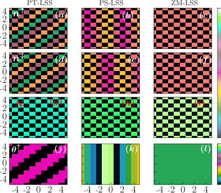 

FIG. 2. Spatial distributions of spin-resolved densities and phases in lattice supersolid states. Panels (a)−(c) show the spin-up density n↑, (d)−(f) the spin-down density n↓, and (g)−(i) the total density N = n↑+ n↓. Panels (j)−(l) display the phase θ↑of spin-up com- ponent. The three columns correspond to the phase-twisted lattice SS, phase-striped lattice SS, and zero-momentum lattice SS phases, respectively. Here a is the lattice constant.

📷 Fig 3

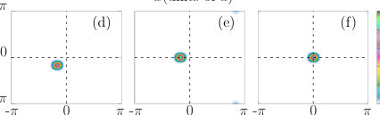 

FIG. 3. Real-space phase θσ variations across lattice and the asso- ciated spin-resolved momentum distributions for different supersolid states. Upper panel (a,b,c) depicts the phase configurations of the PT, PS, and ZM supersolid, while lower panel (d,e,f) displays the corresponding momentum-space distributions. Here, a is the lattice constant.

📷 Fig 4

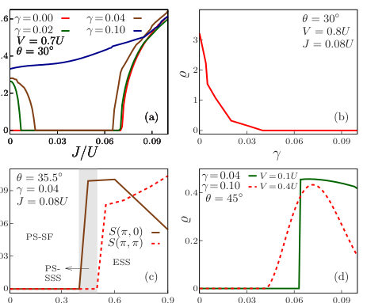 

FIG. 5. (a) The average SF order parameter as a function of hopping amplitude at V = 0.7 and θ = 30◦for different SOC strengths, that demarcates density-modulating compressible phases on either sides of CBDW(1,0) phase. (b) The spin-dependent momentum measure characterizing PT-DCSS to PS-DCSS transition with γ. (c) Structure factor at (π, π) and (π, 0) distinguishing different orders of mag- netic supersolid phases at J = 0.08 and θ = 35.5◦. (d) ϱ with hopping amplitude for two cases corresponding to PT-SF to PS-SF (green solid line) and PT-SSS to PS-SSS (red dashed line) phase tran- sition.

📷 Fig 5

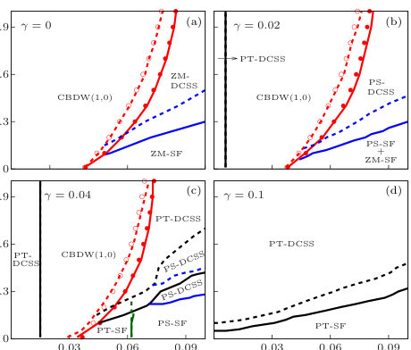 

FIG. 4. Ground-state phase diagrams for SOC strengths (a) γ = 0, (b) γ = 0.02, (c) γ = 0.04 and γ = 0.1 with ζ = 0. The solid (dashed) lines are the phase boundaries for the tilt angle θ = 0 ◦(30 ◦) in the hopping amplitude and dipolar interaction strength plane. The red filled (open) circles are the phase boundaries between incom- pressible and compressible phases, obtained by mean-field decou- pling theory for θ = 0 ◦(30 ◦) [Eq. (12)]. Here, U↑↓/U = 0.5 and µ/J = 10.

📷 Fig 6

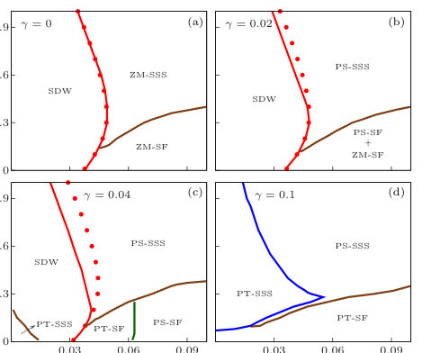 

FIG. 7. Ground-state phase diagrams for U↑↓/U = 0.5 and µ/J = 10 with SOC strengths (a) γ = 0, (b) 0.02, (c) 0.04 and (d) 0.1. The tilt angle is θ = 45 ◦and ζ = 0. Phase boundaries marked by red filled circles are obtained from analytical theory [Eq. (15)].

📷 Fig 7

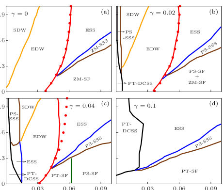 

FIG. 6. Ground-state phase diagrams for U↑↓/U = 0.5 and µ/J = 10 with SOC strengths (a) γ = 0, (b) 0.02, (c) 0.04, and (d) 0.1. The tilt angle of polarized dipolar bosons is θ = 35.5 ◦with ζ = 0. Phase boundaries marked by red filled circles are obtained from analytical mean-field decoupling theory [Eq. (15)].

📷 Fig 8

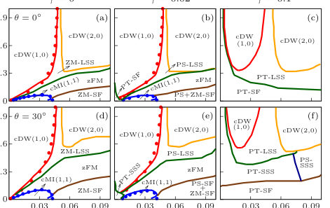 

FIG. 8. Ground-state phase diagrams in presence of interspin NN interactions V↑↓= ζV where ζ = 1 for U↑↓/U = 0.5 and µ/J = 10 with SOC strengths γ = 0, 0.02, and 0.1 in (a,d), (b,e), and (c,f). The tilt angle is θ = 0 ◦for upper panel (a,b,c) and 30 ◦for lower panel (d,e,f). The phase boundaries marked by the red and blue filled circles are obtained from mean-field decoupling theory [Eq. (16)].

📷 Fig 9

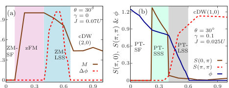 

FIG. 9. (a) Variation of the magnetization M and SF-order param- eter imbalance ∆ϕ as a function of the dipolar interaction V/U for θ = 30◦, γ = 0, and J = 0.07U. Different quantum phases such as ZM-SF, zFM, ZM-LSS, and cDW(2, 0) are identified, with phase boundaries indicated by shaded regions. (b) Corresponding behavior of the structure factors S(0, π), S(π, π), and SF-order parameter ϕ as a function of V/U for θ = 30◦, γ = 0.1, and J = 0.025U. The emergence of PT-SF, PT-SSS, PT-LSS, and cDW(1, 0) phases is highlighted.

📷 Fig 10

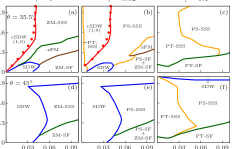 

FIG. 10. Ground-state phase diagrams in presence of interspin NN interactions V↑↓= ζV where ζ = 1 for U12/U = 0.5 and µ/J = 10 with SOC strengths γ = 0, 0.02 and 0.1 in (a) &amp; (d), (b) &amp; (e) and (c) &amp; (f). The angle is θ = 35.5 ◦from (a)-(c) and 45 ◦from (d)-(f). The cSDW phase possesses the stripe-order in total occupancy while SDW phase has stripe-ordered variation in individ- ual components. Phase boundaries marked by red filled circles are obtained from mean-field decoupling theory [Eq. (15)].

**Main problem.**

Investigating the interplay between synthetic spin-orbit coupling and anisotropic dipolar interactions in 2D square optical lattices to understand the emergence of exotic magnetic quantum phases.

**Main result.**

The study identifies novel finite-momentum crystal phases, including phase-twisted and phase-striped supersolids and superfluids, and reveals a quantum phase transition at a magic tilt angle where off-site interactions vanish.

**Method.**

The authors employ a site-decoupled Gutzwiller ansatz and mean-field decoupling theory, supplemented by second-order perturbative analysis to determine phase boundaries.

**Summary.**

This paper explores how the combination of spin-orbit coupling and tunable anisotropic dipolar interactions creates complex quantum phases in 2D square lattices. By varying the tilt angle of the dipoles, the researchers found that the system can transition between checkerboard and stripe-ordered states, particularly at a specific 'magic angle'. The study also highlights the emergence of phase-twisted and phase-striped supersolids. These findings offer a roadmap for experimentalists using ultracold atoms to observe exotic density-correlated and magnetic phases.

Detailed structure

**Model / system.**

A two-component (pseudospinor) bosonic system in a 2D square optical lattice described by an extended Bose-Hubbard Model, including Rashba-type spin-orbit coupling and anisotropic nearest-neighbor dipolar interactions.

**Key observables.**

Superfluid order parameter, on-site densities, density imbalance, static structure factor S(k), momentum distribution, and magnetization.

**Important parameters / regimes.**

Spin-orbit coupling strength (gamma), dipole tilt angle (theta), hopping amplitude (J/U), dipolar interaction strength (V/U), and the magic angle (theta_M approx 35.3 degrees).

**Assumptions / limitations.**

The long-range dipolar interaction is truncated to nearest-neighbor interactions, and the single-particle hopping and SOC terms are treated as small perturbations.

**Figures summary.**

Figure 1 shows a schematic of spin-flip complex hopping and dipole orientation; other figures present ground-state phase diagrams for various SOC strengths and tilt angles, and illustrate phase boundaries for transitions between insulating and compressible phases.

**Paper structure.**

The paper introduces the physical system and model, details the theoretical methodology (Gutzwiller and mean-field), presents phase diagrams and results regarding the effects of tilt angle and SOC strength, and concludes with the implications for experimental observations.

**Why it may be interesting.**

It provides a detailed parameter space for observing novel finite-momentum crystal phases and supersolidity in ultracold dipolar gases, which is highly relevant for many-body dynamics and synthetic gauge field research.

Abstract

We examine the two-dimensional spin-orbit-coupled bosons in the presence of an anisotropic dipolar interaction in square lattices. The spin-orbit coupling leads to finite-momentum superfluid and supersolid states, while the nearest-neighbour interaction induces crystalline characteristics in the quantum phases of soft-core bosons. We employ site-decoupled Gutzwiller ansatz and mean-field decoupling theory to obtain the phase diagrams and investigate the effects of the tilt of magnetic dipoles with respect to the polarization axis. Our study reveals the intriguing quantum phase transition of checkerboard finite-momentum phase-twisted and phase-stripe states into their stripe counterparts at a magic tilt angle, at which the off-site interaction along one of the directions becomes zero. At smaller tilt angles, the checkerboard charge-density-wave phase intervened by two compressible finite-momentum phases, and at strong spin-orbit coupling strengths, the phase-twisted supersolid and superfluid phases emerge. At larger tilt angles, a transition between the striped order of phase-twisted states and phase-stripe states occurs. The inclusion of off-site inter-component correlation leads to density-correlated phases, lattice-induced supersolid, and ferromagnetic quantum phases. Our study highlights novel finite-momentum crystal phases of spin-orbit-coupled dipolar bosons and provides a parameter space to observe them in quantum gas experiments.

[↑ back to top](#top)

### [MCMit: Mid-Circuit Measurement Error Mitigation](http://arxiv.org/abs/2604.25863v1)

**Authors:** Emmanouil Giortamis, Felix Gust, Aleksandra Świerkowska, Sandra Stankovic, Innocenzo Fulginiti, Yanbin Chen, Xiaorang Guo, Benjamin Lienhard, Martin Schulz, Pramod Bhatotia

**Type:** both · **Category:** quantum information and computing · **PDF:** <https://arxiv.org/pdf/2604.25863v1>

**Analysis basis:** full PDF text, analyzed in chunks

**Topic relevance:** 🔥 `QC/QI experiment` **4/5** · `quantum measurements` **3/5**

📷 Fig 1

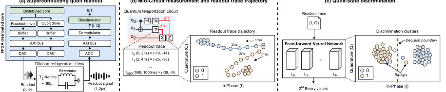 

Figure1:Superconductingreadout(§2.1). (a)SuperconductingqubitreadoutpipelineonanFPGAcontroller.(b)TheMCMinatele- portation circuit can produce a readout trace of 1𝜇𝑠: 500 samples spaced 2ns apart. (c) The readout trace is input to a Feed-forward Neural Network comprising N layers. The network discriminates 0 and 1 using a decision boundary that separates the states.

📷 Fig 2

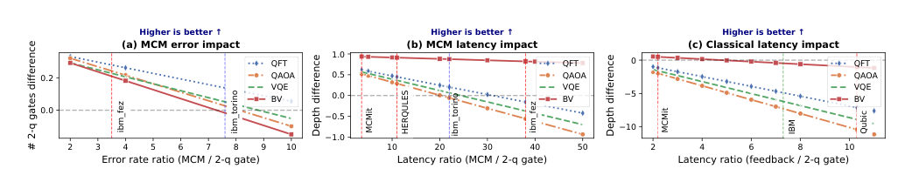 

Figure 2: MECH [112] performance analysis. (a) Impact of MCM errors as a ratio to the 2-qubit gate errors. (b) Impact of MCM latency as a ratio to the 2-qubit gate latency. (c) Impact of classical feedback latency as a ratio to the 2-qubit gate latency. There is a linear performance improvement with MCM error and (classical) latency reduction.

📷 Fig 3

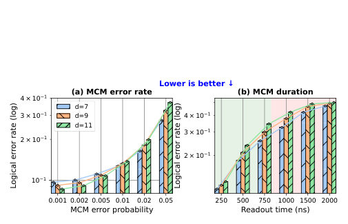 

Figure 3: Logical error rate of the surface code on the Google Sycamore architecture [6]. (a) Increasing with the MCM error rate. (b) Increasing with the MCM duration. Green marks durations available with MCMit; red marks those available with HERQULES [68].

📷 Fig 4

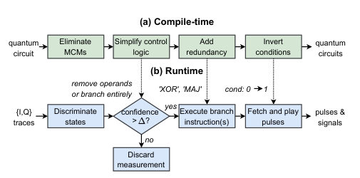 

Figure 5: MCMit workflow (§ 4.2). (a) Compile-time workflow and (b) runtime workflow.

📷 Fig 5

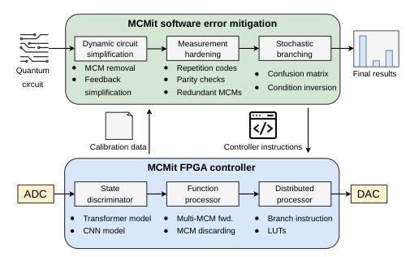 

Figure 4: MCMit overview (§ 4). MCMit comprises the error mitigation software and the FPGA controller.

📷 Fig 6

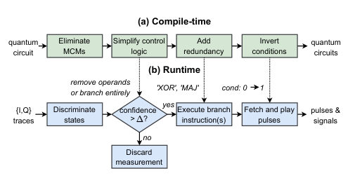 

Fig. 5 shows the compile-time and runtime workflows of MCMit. The software layer operates only at compile-time, while the FPGA controller layer operates only at runtime. Compile-time workflow. To apply the first stage to the input quan- tum circuit, dynamic circuit simplification, we execute three sub- stages: (1) we identify and remove up to 𝑀MCMs, where 𝑀dictates the computational complexity of our static analysis tool, and (2), we simplify the control logic that is based on those MCMs. This removes some operands (e.g., XOR) in subsequent branch instructions or elim- inates the branches entirely, effectively reducing classical latency. (3) We apply the measurement hardening pass, which...

📷 Fig 7

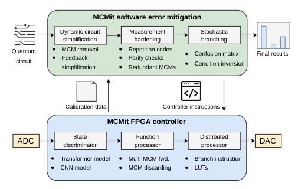 

Fig. 4 shows the MCMit architecture, comprising the MCMit soft- ware layer for circuit-level error mitigation and the MCMit FPGA controller, which integrates the fast multi-qubit branching logic and the high-accuracy qubit-state discriminator model. Fastclassicalfeedback.MCMitintroducesafastmulti-qubitbranch instruction, which executes scalable conditional logic based on the

📷 Fig 8

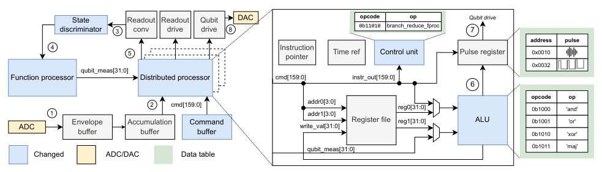 

Figure 6: MCMit controller (§ 5). Blue boxes show modified components, yellow boxes show ADC/DAC components, and green boxes show example data tables. Steps (1)-(8) are executed for a conditional feedback operation based on an MCM result.

📷 Fig 9

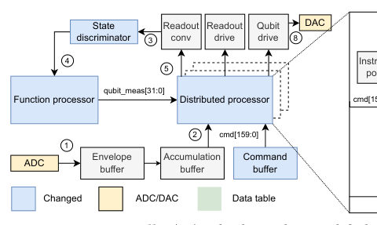 

Fig. 6 shows the design of our FPGA controller, based on the open- source Qubic framework [107]. At a high level, the controller com- prises a function processor, a distributed processor, a set of buffers, and a set of interfaces. Function processor. The function processor is responsible for ap- plying processing functions to qubit readout results and, as such, supports an interface between external components, such as state discriminators or dedicated QEC decoders, if needed. Distributed processor. The distributed processor comprises mul- tiple cores, each managing interfaces to the function processor and inter-core synchronization. Cores execute programs featuring pre- cisely timed pulse...

📷 Fig 10

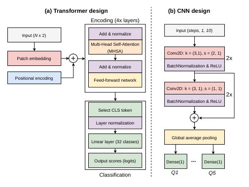 

Figure 7: The MCMit qubit-state discriminators (§ 6).

**Main problem.**

Mid-circuit measurements (MCMs) and classical feedback latency/errors create significant bottlenecks in dynamic quantum circuits, leading to increased decoherence and branching errors in QEC and DQC.

**Main result.**

The MCMit co-design reduces feedback latency by up to 70%, improves circuit depth by up to 7x, and achieves up to 80% lower logical error rates in surface codes through improved state discrimination and hardware-software mitigation.

**Method.**

A hardware-software co-design featuring an FPGA-based controller with a multi-control branch instruction and neural network discriminators (Transformer and CNN) paired with software-level MCM elimination and stochastic branching.

**Summary.**

This paper presents MCMit, a holistic hardware-software co-design to mitigate errors and latency in mid-circuit measurements. By combining an FPGA-based controller with new neural network-based state discriminators and software-level error mitigation, the authors significantly reduce the overhead of dynamic quantum circuits. The approach improves readout accuracy for short durations and reduces logical error rates in quantum error correction. This is crucial for the advancement of distributed quantum computing and scalable fault-tolerant architectures.

Detailed structure

**Model / system.**

The implementation uses the Qubic 2.0 open-source framework on an Xilinx Alveo FPGA, evaluated using experimentally extracted readout traces from a five-qubit superconducting QPU and simulated surface code patches.

**Key observables.**

MCM error rates (bit-flips), readout fidelity, classical feedback latency, circuit depth, and logical error rates in surface codes.

**Important parameters / regimes.**

Readout durations (250ns to 2000ns), signal-to-noise ratio (SNR), and surface code distances (d=7, 9, 11).

**Assumptions / limitations.**

The evaluation assumes realistic noise models derived from IBM Heron processors and the effectiveness of the hardware-software co-design scales with the reduction of measurement-induced errors.

**Figures summary.**

Figure 1 shows the readout pipeline and neural network architectures; Figure 2 analyzes the impact of MCM error and latency on performance; Figure 6 illustrates the modified controller architecture; Figure 7 details the Transformer and CNN designs; Figure 8 demonstrates dynamic circuit simplification.

**Paper structure.**

The paper introduces the bottleneck of MCMs, proposes the MCMit co-design (hardware and software layers), details the implementation on FPGA, evaluates performance using experimental traces and QEC simulations, and concludes with a discussion on scalability and future directions.

Abstract

Distributed Quantum Computing (DQC) and Quantum Error Correction (QEC) rely on dynamic circuits that include Mid-Circuit Measurements (MCMs) and classical feedback. These operations present a major bottleneck: MCMs suffer from high error rates that lead to real-time branching errors, while MCM and classical feedback latencies amplify decoherence errors. Current hardware controllers, qubit-state discriminators, and software error mitigation techniques fail to address these challenges holistically.   We propose MCMit, a hardware-software co-design to mitigate branching and latency-induced errors. MCMit introduces a scalable, constant-latency multi-control branch instruction for faster classical feedback and two qubit-state discriminators, a transformer, and a CNN, with high accuracy even under short measurement durations. On the software side, static MCM elimination and stochastic branching complement the hardware by mitigating residual branching errors that persist despite hardware improvements.   We implement MCMit on Qubic and evaluate it using experimentally extracted QPU readout traces. Our branch instruction reduces feedback latency by up to 70\%, improving circuit depths by up to $7\times$ over Qubic. Our CNN discriminator achieves 37-73\% higher accuracy for short measurement durations than the baselines, leading to up to 80\% lower logical error rates in QEC. Last, our software mitigation improves fidelity by 18--30\% over baseline methods.

[↑ back to top](#top)

### [Optimized thermal control of a dual-wavelength-resonant nonlinear cavity](http://arxiv.org/abs/2604.25883v1)

**Authors:** Fabian Meylahn, Henning Vahlbruch, Benno Willke

**Type:** experiment · **Category:** quantum information and computing · **PDF:** <https://arxiv.org/pdf/2604.25883v1>

**Analysis basis:** full PDF text, analyzed in chunks

**Topic relevance:** 🔥 `quantum optics experiment` **4/5** · `QC/QI experiment` **3/5**

📷 Fig 1

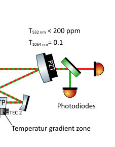 

Fig. 1. Configuration of the bow-tie cavity, for dispersion-control enabled co-resonance and, thus, for high nonlinear interaction. The periodically poled potassium titanyl phosphate (PPKTP) crystal is mounted on a bimetallic heat sink, creating a constant- temperature zone and an adjustable thermal gradient zone via thermoelectric coolers (TECs). Two piezoelectric elements (PZTs) attached to the convex coupling mirrors enable resonator length tuning. A bright 532 nm pump beam and a weak 1064 nm seed beam (at half the pump-light frequency) are combined on a dichroic beam splitter and injected through the same input port. This port exhibits a power transmission (T) of 300 parts per million...

📷 Fig 2

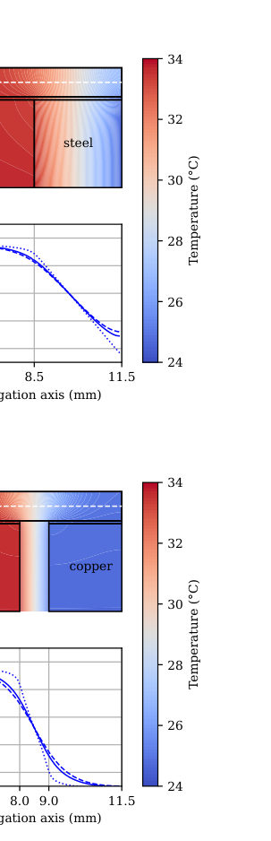 

Fig. 2. Finite element simulations of temperature distributions in the heat sink and the nonlinear PPKTP crystal. a) Gradient heating: A controlled temperature gradient applied to the right heat sink surface propagates through the bimetallic construction to the crystal. Primary heat flow occurs through the heat sink and the generated temperature gradient is adapted by the crystal b) Segmented heating: The crystal itself forms the only thermal bridge across an air gap between two temperature zones. Heat flow through the crystal creates a strong thermal gradient that peaks at the air-gap position and close to the heat sink interface.

📷 Fig 3

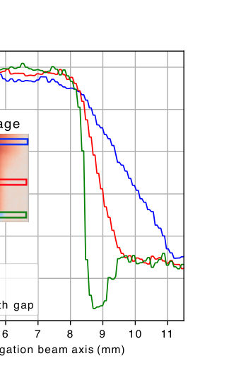 

Fig. 3. Measured temperature distribution along the beam propagation axis for different heating schemes (inset images). The phase-matching constant-temperature zone is maintained at 33.7 ◦C in all configurations. The gradient heating scheme exhibits a 2.7 ◦C/mm thermal gradient. For segmented heating, a steep thermal slope develops across the thermal isolation layer here simulated as an air gap when bridged by the thin polyamide layer, with an even steeper gradient observed without this interfacial layer. The second temperature zone in segmented heating is set to 24.7 ◦C. Thermal images were corrected for a slight spurious gradient caused by camera temperature non-uniformity, verified...

📷 Fig 4

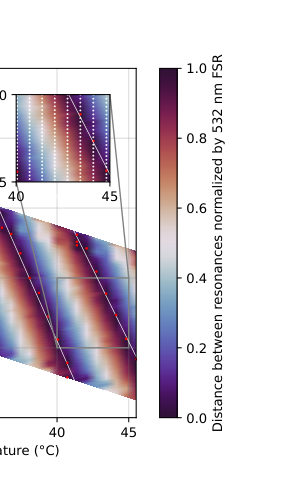 

Fig. 4. Plot showing the distance between the fundamental resonances of the TEM00 mode of 1064 nm light from 532 nm light, normalized by the free spectral range (FSR) of the 532 nm light, color-coded as a function of the phase matching temperature and temperature gradient settings. White lines represent linear fits to co-resonance conditions (red dots). The results show a required temperature gradient along the steel section of −2.07 ◦C/mm to −2.32 ◦C/mm per degree change in phase matching temperature (temperature of the cooper section). The inset shows measurement points (white) with red markers indicating the positions closest to the co-resonance.

📷 Fig 5

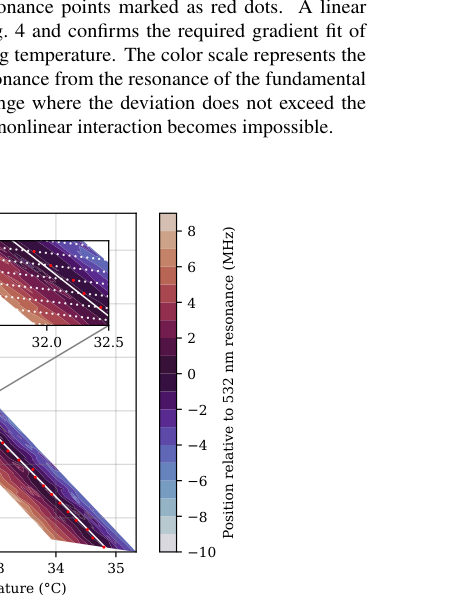 

Fig. 5. Detailed mapping of double-resonance conditions across phase-matching temperatures from 29 ◦C to 35 ◦C. The inset displays measurement data points (white) with red markers indicating positions closest to co-resonance. Co-resonance conditions exhibit a near-linear dependence on temperature gradient, with the white fit line showing a slope of −2.29 ◦C/(mm ◦C).

📷 Fig 6

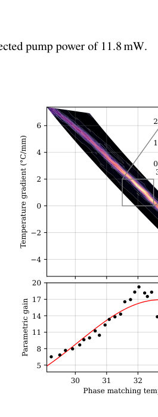 

Fig. 6. Upper: Parametric gain color coded versus phase-matching temperature and temperature gradient. The inset displays the measurement step size (white points). Lower: Parametric gain values per phase-matching temperature. The fitted model yields a peak gain of 16.91 at an optimal temperature of 32.7 ◦C with a full width at half maximum of 6.3 ◦C

**Main problem.**

The dispersion of optical resonators often prevents the simultaneous resonance (co-resonance) of multiple interacting wavelengths, which is essential for efficient nonlinear processes like squeezing and parametric amplification.

**Main result.**

The authors demonstrate a novel thermal control method using a monolithic bimetallic heat sink that creates a controlled temperature gradient to achieve precise dispersion control and co-resonance.

**Method.**

A bimetallic heat sink (copper and stainless steel) is used to generate a longitudinal temperature gradient across a PPKTP crystal, validated by FEM simulations and experimental thermal imaging.

**Summary.**

This paper presents a new way to control the dispersion in nonlinear optical cavities using a bimetallic heat sink. By creating a shallow temperature gradient across a nonlinear crystal, the researchers can achieve simultaneous resonance for two different wavelengths. This method reduces mechanical and thermal stress compared to traditional heating methods. The technique is highly relevant for improving the efficiency of devices used in quantum optics and precision measurements.

Detailed structure

**Model / system.**

A traveling-wave bow-tie resonator containing a 11.5 mm PPKTP crystal, operating at 1064 nm and 532 nm wavelengths.

**Key observables.**

Parametric gain, temperature gradient (°C/mm), resonance positions, and predicted squeezing/anti-squeezing levels.

**Important parameters / regimes.**

Temperature stability (300 ppm), pump parameter (x = 0.77), and quantum efficiency (97.5%).

**Assumptions / limitations.**

Predictions for squeezing assume high quantum efficiency and negligible phase noise during detection.

**Figures summary.**

Fig 2 compares bimetallic vs. segmented heating stress; Fig 3 shows experimental thermal profiles; Fig 4 and 5 map the double-resonance conditions and frequency deviations.

**Paper structure.**

Introduction of the dispersion problem, description of the bimetallic heat sink design, FEM simulation results, experimental validation of thermal gradients, demonstration of dual-wavelength co-resonance, and discussion of applications.

**Why it may be interesting.**

This work provides a practical engineering solution for stabilizing the nonlinear optical platforms required for generating squeezed light and high-gain parametric amplification, which are foundational for continuous-variable quantum information and gravitational wave detection.

Abstract

Optical resonator-enhanced nonlinear interactions are of great importance for the efficient generation of continuous-wave second harmonic generation, optical parametric oscillation, frequency mixing, and the generation of squeezed light. In order to maximize these interactions within the intra-cavity nonlinear material, high intensities, optimal phase matching, and simultaneous resonance of all interacting fields are required. However, the dispersion of the optical resonator often prevents the co-resonance of multiple wavelengths. Here, we present a novel implementation using a monolithic bimetallic heat sink for controlling the resonator dispersion based on a shallow temperature gradient directly applied to a section of the nonlinear crystal. This method enables precise dispersion control and is designed to minimize mechanical and thermal stresses in the nonlinear crystal, thus providing an additional method for designing highly efficient and reliable resonator-enhanced nonlinear devices for demanding applications such as gravitational wave detection, quantum optics, and frequency conversion.

[↑ back to top](#top)

### [A simple method to fabricate Josephson junctions](http://arxiv.org/abs/2604.25195v1)

**Authors:** Imran Mahboob, Satoshi Sasaki, Takaaki Takenaka

**Type:** experiment · **Category:** quantum information and computing · **PDF:** <https://arxiv.org/pdf/2604.25195v1>

**Analysis basis:** full PDF text, analyzed in chunks

**Topic relevance:** 🔥 `QC/QI experiment` **4/5** · `quantum optics experiment` **2/5**

📷 Fig 1

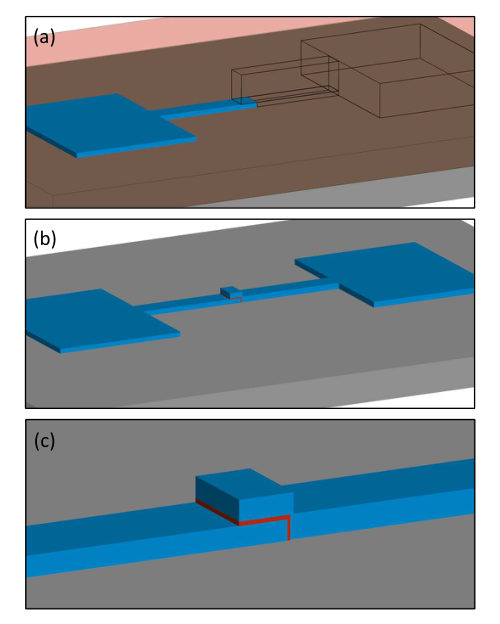 

FIG. 1: (a) The aluminum pattern of the base layer (blue) is deposited on a silicon substrate. Photoresist (pink) is pat- terned with 365nm UV light, and the resultant pattern is de- picted by the hollow boxes (black lines). The overlap between the resist pattern and the base aluminum layer defines the JJ. (b) The deposition of the top metal layer (blue) is preceded by argon milling to expose pristine aluminum which is then oxidized (red) where the aluminum sandwich defines the JJ. A zoom of the junction region where the vertical component of the JJ makes an insignificant contribution to the overall junction resistance.

📷 Fig 2

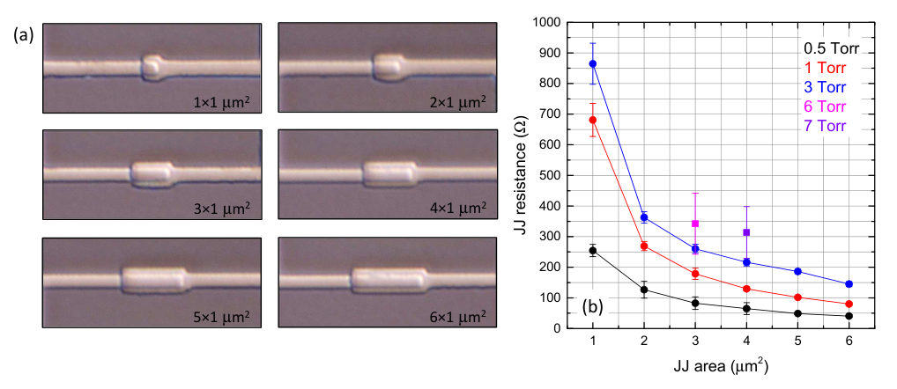 

FIG. 2: (a) Optical micrographs, acquired with Keyence VHX-7000 digital microscope, reveal JJs from this simple fabrication method can be successfully fabricated, even with an area as small as 1 × 1 µm2, with excellent alignment between base and top aluminum layers. (c) Room temperature JJ resistance as a function of junction size for test patterns (circles) and functional SQUID resonator devices (squares) all with 10 minutes oxidation with a range of pressures. All error bars correspond to 1 standard deviation and are invisible for the largest junctions.

📷 Fig 3

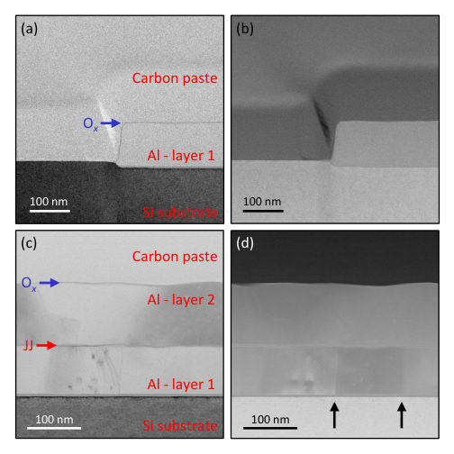 

FIG. 3: (a) and (b) BF and HAADF STEM with only the base 120 nm thick aluminum (Al) layer deposited on the argon etched silicon (Si) substrate. (c) and (d) BF and HAADF STEM following the completed device with the highly uniform 1-2 nm thick JJ clearly resolvable (red arrow). Also visible in the BF STEM images is the ∼2 nm thick oxide (Ox) cap (blue arrows). The carbon paste is employed as a conductive adhesive layer during focused ion beam milling used to access the JJ’s cross-section for STEM.

📷 Fig 4

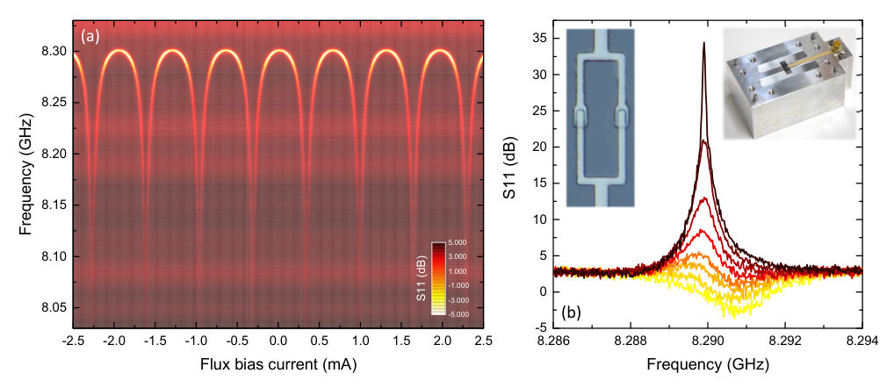 

FIG. 4: (a) A SQUID based 2D resonator’s response to magnetic flux bias is measured via a capacitively coupled 3D cavity at millikelvin temperatures. This device was repeatedly measured with more than 10 thermal cycles in a 6-month period, and it sustained a nominally unchanged flux response thus indicating the stability of the JJs in the SQUID. (b) Parametric amplification is measured with a flux bias of 0.16 mA that is combined with microwave modulation at ∼16.6 GHz with increasing power from -33 to -26 dBm (orange to black lines) yielding a gain of almost 40 dB. The cavity is continuously probed with approximately 10 photons where the bare response (with microwave flux modulation deactivated)...

**Main problem.**

The difficulty and high resistance variation associated with fabricating reliable Al/AlOx/Al Josephson junctions using complex electron-beam lithography techniques like the Dolan bridge.

**Main result.**

A simplified photolithography-based fabrication method was demonstrated that achieves significantly lower resistance variation (25% vs 200%) and high stability for SQUIDs and parametric amplifiers.

**Method.**

A minimal approach using maskless photolithography, argon etching to remove contaminants, and controlled in-situ oxidation followed by electron-beam evaporation.

**Summary.**

This paper presents a simplified, scalable method for fabricating Al/AlOx/Al Josephson junctions using standard photolithography instead of complex e-beam lithography. The technique significantly reduces resistance variation and improves device uniformity across multiple chips. The researchers demonstrated the method's effectiveness by creating stable SQUIDs and a Josephson parametric amplifier with 40 dB of gain. This approach could be pivotal for the widespread production of superconducting quantum technologies.

Detailed structure

**Model / system.**

The experimental platform consists of Al/AlOx/Al Josephson junctions and SQUIDs integrated into 2D resonators and 3D cavities for quantum-limited parametric amplification.

**Key observables.**

Junction resistance (Rjj), flux response symmetry/periodicity, parametric amplification gain, and transmission electron microscopy (TEM) structural analysis.

**Important parameters / regimes.**

Junction areas of 1 to 6 um^2, oxidation pressures from 0.5 to 7 Torr, and amplification gains of approximately 40 dB.

**Assumptions / limitations.**

The method assumes that the argon milling step effectively removes contaminants to ensure pristine interfaces for the oxide barrier.

**Figures summary.**

Fig 1 shows the fabrication schematic; Fig 2 displays optical micrographs and resistance vs. area plots; Fig 3 presents STEM images of the junction structure; Fig 4 shows SQUID resonator response and parametric amplification gain.

**Paper structure.**

The paper introduces a new fabrication protocol, details the experimental steps and structural characterization via TEM, demonstrates device performance through resistance tuning and stability tests, and concludes with a demonstration of quantum-limited parametric amplification.

**Why it may be interesting.**

The development of more scalable and reproducible hardware for superconducting circuits is crucial for the realization of large-scale quantum processors and high-fidelity quantum-limited amplifiers.

Abstract

A minimal method to fabricate Al/AlO$_x$/Al Josephson junctions (JJs) using photolithography and argon etching, before metallization and oxidation, is demonstrated. JJs with areas ranging from 1 to 6 $μ$m$^2$ can be fabricated and, with the appropriate oxidation conditions, the junction resistance can be varied by $\sim$2 orders of magnitude. Transmission electron microscopy reveals the successful fabrication of JJs with few grain boundaries suggesting reduced energy loss from two-level-systems. Superconducting QUantum Interference Devices (SQUIDs) fabricated from this methodology exhibit reduced resistance variation of over multiple chips, compared with electron beam lithography, and the devices can sustain repeated thermal cycles to 10 mK with the excellent flux response remaining unchanged. The quantum applications of this technology are demonstrated by embedding a SQUID resonator into a 3D cavity and parametrically amplifying low photon numbers with gains of $\sim$40 dB. This work establishes the simplest approach to fabricating JJs to date, and it could prove pivotal to the widespread utilization of superconducting circuit-based quantum technologies.

[↑ back to top](#top)

### [Bell Test of Photons from Electron-Positron Annihilation via POVM-based Compton Polarimetry](http://arxiv.org/abs/2604.25034v1)

**Authors:** Jack Clarke, Preslav Asenov, Jesse Smeets, Jia-Shian Wang, David B. Cassidy, Alessio Serafini

**Type:** both · **Category:** quantum information and computing · **PDF:** <https://arxiv.org/pdf/2604.25034v1>

**Analysis basis:** full PDF text, analyzed in chunks

**Topic relevance:** 🔥 `quantum measurements` **4/5** · `entanglement & information structure` **2/5**

📷 Fig 1

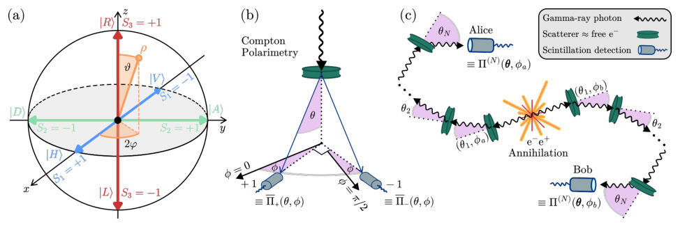 

FIG. 1. (a) The Bloch sphere in polarization space (ϑ, φ). States along the equator of the Bloch sphere represent linearly polarized states. The north and south poles represent the circularly polarized eigenstates, which Compton polarimetry cannot distinguish. (b) POVM-based Compton polarimetry. Following a Compton scattering event, two polarization-insensitive detectors separated by azimuthal angle ∆ϕ = π/2 realize non-projective measurements of orthogonal linear polarization states. Detection at arbitrary (θ, ϕ) corresponds to the POVM element Π(1)(θ, ϕ). In the KUW Bell test, a value ±1 is assigned to detection at (θ, ϕ±) with ϕ+ = ϕ and ϕ−= ϕ + π/2, corresponding to the dichotomic,...

📷 Fig 2

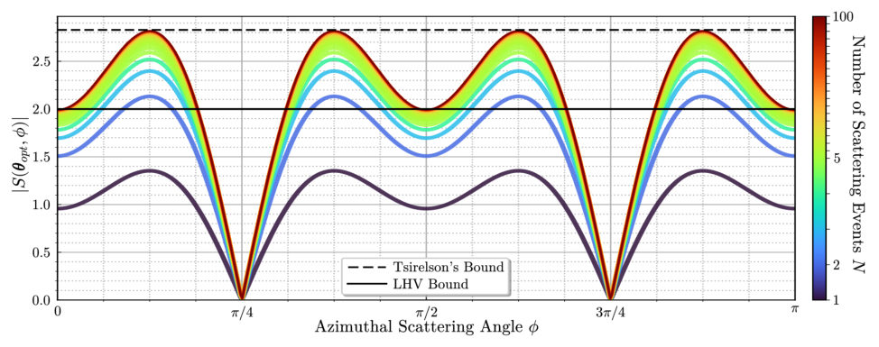 

FIG. 2. Plot of the CHSH function optimized over polar scattering angles ∣S(θopt, ϕ)∣for N = 1 to N = 100 scattering events. Even for N = 2, the LHV bound = 2 is exceeded around ϕ = (2m + 1)π/8 with m ∈Z, and as N increases Tsirelson’s bound of 2 √

**Main problem.**

The inability to conclusively demonstrate polarization entanglement in MeV-scale photons from electron-positron annihilation due to the lack of ideal projective-polarization measurements.

**Main result.**

The authors show that using sequential Compton scattering events (N >= 2) allows the measurement to converge toward an ideal projective measurement, enabling the violation of CHSH inequalities.

**Method.**

A POVM-based framework using the Stokes-Mueller formalism to model sequential Compton scattering, supplemented by Geant4 Monte Carlo simulations for experimental feasibility.

**Summary.**

This paper addresses the difficulty of verifying entanglement in high-energy gamma-ray photons. By applying the POVM formalism to Compton polarimetry, the authors demonstrate that while a single scattering event is too weak to violate Bell inequalities, increasing the number of sequential scattering events improves measurement sharpness. This approach allows for a robust, model-independent certification of entanglement that can rule out local hidden variable models in electron-positron annihilation processes.

Detailed structure

**Model / system.**

The system consists of entangled photon pairs produced from electron-positron annihilation at the MeV scale, analyzed via Compton polarimetry involving multiple sequential scattering events.

**Key observables.**

CHSH function (S), Compton analyzing power (beta), polarization correlations, and coincidence count rates.

**Important parameters / regimes.**

Number of scattering events (N), photon energy (511 keV), azimuthal angles (phi), and polar scattering angles (theta).

**Assumptions / limitations.**

Assumes each scattering event is independent with no quantum coherence between involved electrons; assumes a simplified dichotomic, normalized POVM.

**Figures summary.**

Fig 1 shows the Bloch sphere, a schematic of the POVM-based polarimetry, and the Bell test setup; Fig 2 plots the optimized CHSH function violation as a function of the number of scattering events N.

**Paper structure.**

The paper introduces the problem of high-energy entanglement certification, develops a POVM mathematical framework for sequential scattering, analyzes the convergence of measurement sharpness (beta) toward ideal projection, and concludes with experimental feasibility simulations.

**Why it may be interesting.**

It provides a novel application of POVM formalism and quantum state discrimination theory to high-energy physics, demonstrating how non-projective measurements can be transformed into Bell-violating measurements through sequential interactions.

Abstract

Quantum entanglement between gamma-ray photons emitted following electron-positron annihilation is expected to be maximal and may be characterized via non-classical polarization correlations. However, this is difficult to verify experimentally because there are no established schemes that approach ideal projective-polarization measurements for high-energy photons. Hence, polarization entanglement between MeV-scale annihilation photons has not yet been conclusively demonstrated. We develop here a framework that models polarization measurements of high-energy photons via Compton polarimetry, employing the formalism of positive operator-valued measures (POVMs). We extend the POVM description to sequences of repeated interactions and show that the measurement converges toward an ideal projective measurement of linear polarization as the number of interactions increases. We demonstrate that this progressive improvement in measurement sharpness can enable the experimental violation of CHSH inequalities.

[↑ back to top](#top)

### [Numerically-Exact Quantum-Simulation Approach for Two-Dimensional Spectroscopy of Open Quantum Systems](http://arxiv.org/abs/2604.25753v1)

**Authors:** Yi-Xuan Yao, Hao-Yue Zhang, Cheng-Ge Liu, Rong-Hang Chen, Qing Ai, Franco Nori

**Type:** theory · **Category:** numerical methods · **PDF:** <https://arxiv.org/pdf/2604.25753v1>

**Analysis basis:** full PDF text, analyzed in chunks

**Topic relevance:** 🔥 `methods for driven-dissipative` **4/5** · `non-equilibrium dynamics` **2/5**

📷 Fig 1

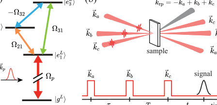 

FIG. 1. Schematic of 2DS and its application for enantiodetection of chiral molecules. (a) The four-level structure in a left-handed chiral molecule with three control fields applied for distinguishing the two chiral forms. The difference between the two chiral forms lies in the fact that the transition dipole moments between |eL 2 ⟩↔|eL 3 ⟩and |eR 2 ⟩↔ |eR 3 ⟩are opposite in sign, resulting in ΩL 32 = −ΩR 32 = −Ω32. The incident probe pulses with wave vectors ⃗kp (p = a, b, c) are applied to induce the transition between |gα⟩and |eα 1 ⟩ with Rabi frequency Ωp. (b) Schematic illustration of 2DS. The detection pulses employ the square-wave approximation, and the curve represents the signal.

📷 Fig 2

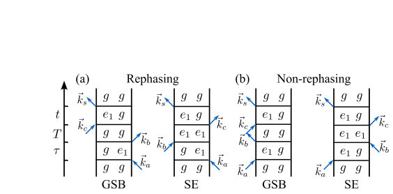 

FIG. 2. Double-sided Feynman diagrams for the (a) rephasing and (b) non-rephasing signals. The arrows represent the incident probe pulses and the signals.

📷 Fig 3

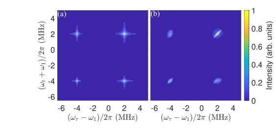 

FIG. 3. The rephasing signals of the 2DS simulated by the BET with (left) linear χ(t), (right) nonlinear χ(t) at population time T = 0. In the linear case, the parameters are γ/2π = 0.1 MHz, Aj = 8 MHz, nc = 750, ω0/2π = 1 kHz, while in the nonlinear case, the parameters are Aj = 350 MHz, nc = 750, ω0/2π = 25 Hz. For both cases, the ensemble size is N = 6000.

📷 Fig 4

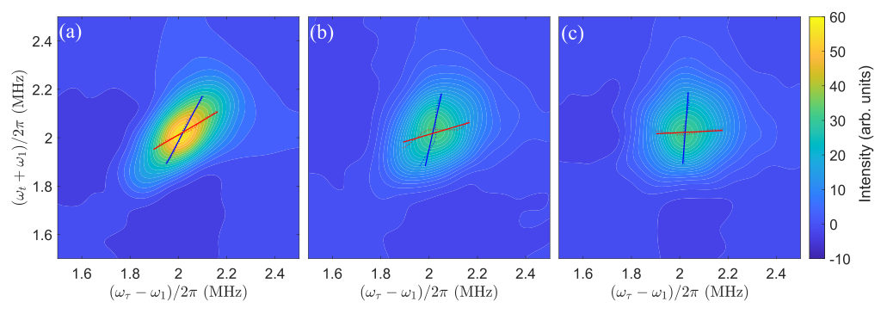 

FIG. 4. The top-right diagonal peak in the absorptive 2DS of pure left-handed chiral molecules simulated by the BET at population time T = 0, 4, 8 µs. The red (blue) dotted lines are the center lines for ωτ (ωt). The red (blue) solid lines are the least-squares fitting of the center lines for ωτ (ωt). The parameters of the TCF are ∆= 1 MHz and τc = 4 µs, while the other parameters are Aj = 1 MHz, nc = 3.6 × 104, ω0/2π = 125 Hz and the ensemble size is N = 6000.

📷 Fig 5

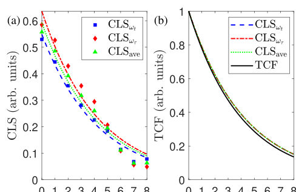 

FIG. 5. Comparison of the CLS with TCF. (a) The dependence of the CLS on the population time T . The red diamonds, blue squares and green triangle are the CLS with respect to ωτ and ωt, and their average. The red dashed-dotted line, blue dashed line, and the green dotted line are the corresponding fitted results. (b) Comparison of the normalized fitted results with the TCF plotted as the black solid line.

📷 Fig 6

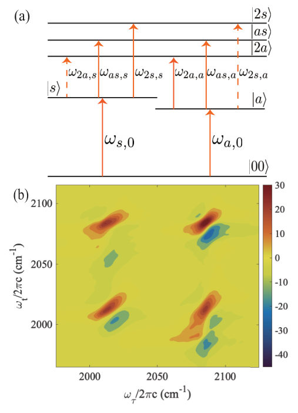 

FIG. 6. (a) The energy-level structure of the RDC. The solid (dashed) arrows represent the allowed (forbidden) transitions. (b) The absorptive 2DS at T = 0 obtained by the BET-based quantum-simulation approach.

📷 Fig 7

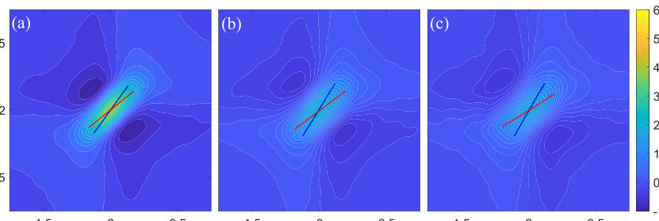 

FIG. 7. The top-right diagonal peak in the rephasing signal of the 2DS simulated by the BET at population times (a) T = 0 µs, (b) T = 4 µs, (c) T = 8 µs. The red (blue) dotted lines are the center lines for ωτ (ωt). The red (blue) solid lines are the least-squares fitting of the center lines for ωτ (ωt). The parameters are the same as in Fig. 4.

📷 Fig 8

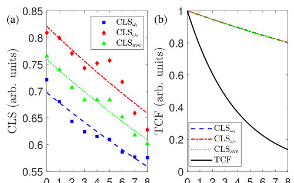 

FIG. 8. (a) The dependence of the CLS, extracted from the rephasing signal of the 2DS, on the population time T . The red diamonds (blue squares) are the CLS corresponding to ωτ (ωt). CLSave is the average of CLSωt and CLSωτ . The red dashed-dotted line, blue dashed line, and the green dotted line are the corresponding fitted results. (b) The normalized CLSs are compared with the TCF denoted by the black solid line. The parameters are the same as in Fig. 4.

📷 Fig 9

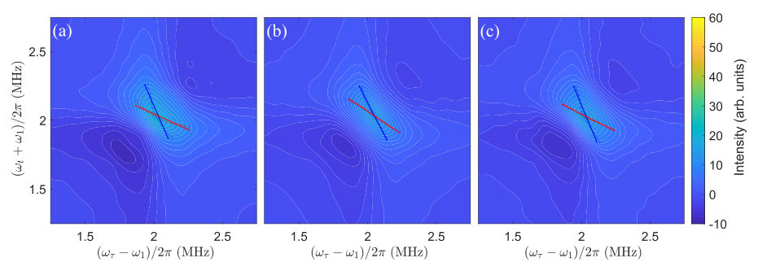 

FIG. 9. The top-right diagonal peak in the non-rephasing signal of the 2DS simulated by the BET at population times (a) T = 0 µs, (b) T = 4 µs, (c) T = 8 µs. The red (blue) dotted lines are the center lines for ωτ (ωt). The red (blue) solid lines are the least-squares fitting of the center lines for ωτ (ωt). The parameters are the same as in Fig. 4.

📷 Fig 10

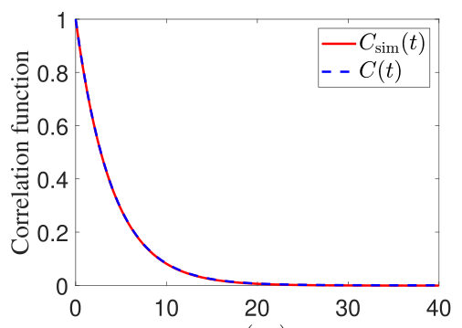 

FIG. 11. Comparison between Csim(t) by the BET and the preset TCF C(t). The parameters are the same as those in Fig. 4.

**Main problem.**

The need for numerically-exact and computationally-efficient theoretical simulations of Two-Dimensional Spectroscopy (2DS) to interpret complex dynamics in open quantum systems, especially when conventional perturbative methods fail.

**Main result.**

The authors propose a quantum-simulation approach based on the bath-engineering technique (BET) that accurately reproduces 2DS patterns and demonstrates that the bath's time correlation function (TCF) can be extracted from the absorptive spectrum.

**Method.**

A quantum-simulation approach using the Bath-Engineering Technique (BET), which replaces complex system-bath interactions with a noise Hamiltonian containing time-dependent stochastic variables.

**Summary.**

This paper introduces a new numerical framework for simulating Two-Dimensional Spectroscopy in open quantum systems using the bath-engineering technique. By replacing complex environments with a stochastic noise Hamiltonian, the method achieves numerical exactness more efficiently than traditional hierarchical methods. The authors demonstrate that this approach can accurately model chiral enantiodetection and complex molecular dynamics in chloroform. Furthermore, they show that while individual 2D signals are insufficient for extracting bath correlations, the combined absorptive spectrum allows for the successful reconstruction of the bath's time correlation function.

Detailed structure

**Model / system.**

The study utilizes a Brownian Oscillator Model for the bath and applies the method to a four-level system for chiral enantiodetection and a six-level system representing RDC dissolved in chloroform.

**Key observables.**

2D spectra (rephasing and non-rephasing signals), absorptive 2DS, time correlation functions (TCFs), and center-line slope (CLS).

**Important parameters / regimes.**

Spectral density, Rabi frequencies, transition dipole moments, coherence time, population time, and signal time.

**Assumptions / limitations.**

Square-pulse approximation, Rotating-Wave Approximation (RWA), short-time approximation for the line-shape function, and the high-temperature limit where the TCF is real.

**Figures summary.**

Figure 1 shows the chiral molecule structure and 2DS process; Figures 7-10 illustrate 2DS peak dynamics and CLS behavior; Figures 11-14 demonstrate the convergence of the BET method with respect to ensemble size and time step.

**Paper structure.**

The paper introduces the BET-based simulation approach, demonstrates its application to a four-level chiral system, validates the extraction of TCFs via CLS theory, applies the method to a complex molecular system (RDC), and concludes with convergence and scalability analyses.

**Why it may be interesting.**

It provides a powerful, numerically-exact alternative to HEOM for simulating non-Markovian dynamics in large, complex systems, which is highly relevant for researchers in open quantum systems and quantum optics.

Abstract

Two-dimensional spectroscopy (2DS) is a powerful ultrafast technique for probing electronic and vibrational dynamics in complex microscopic systems. Extracting detailed information on system dynamics and system-bath interactions from 2DS experiments requires precise theoretical simulations for comparison, which motivates the development of numerically-exact and computationally-efficient simulation approaches. Here, we propose a quantum-simulation approach for 2DS based on the bath-engineering technique (BET), which has been successfully employed in quantum simulations of open quantum dynamics. To demonstrate our approach, we first simulate the 2DS of a driven four-level system in chiral enantiodetection, where we also assess the applicability of the center-line slope (CLS) method for extracting time correlation functions (TCFs) from the 2DS. We further apply our approach to the 2DS of ${\rm Rh(CO)_2C_5H_7O_2}$ (RDC) dissolved in chloroform, where the results reproduce the main spectral patterns observed in experiments. Our work provides a numerically-exact and efficient framework for simulating 2DS, and can offer additional insight into the dynamics of open quantum systems.

[↑ back to top](#top)

### [Deterministic Realization of Classical Dissipation on Quantum Computers](http://arxiv.org/abs/2604.25429v1)

**Authors:** Muhammad Idrees Khan, Sauro Succi, Hua-Dong Yao

**Type:** theory · **Category:** quantum information and computing · **PDF:** <https://arxiv.org/pdf/2604.25429v1>

**Analysis basis:** full PDF text, analyzed in chunks

**Topic relevance:** 🔥 `methods for driven-dissipative` **4/5**

📷 Fig 1

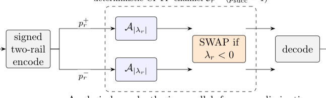 

Figure 1: Block-encoding-free CPTP realization of the diagonal MRT dissipative update. The classical nonequilibrium moment δmr is mapped onto two rails (p+ r , p− r ) by the signed population encoding (7). Each rail is damped by an amplitude-damping channel with survival |λr|, and a rail SWAP is applied when λr &lt; 0; the decoder (9) reads off δm′ r = λr δmr exactly (Theorem 3.3). The boxed region is trace-preserving by construction, so the per-application success probability is unity: no heralding, post-selection, or amplitude amplification is required, in contrast to block-encoded realizations of the same contraction (Section 4). The SWAP branch is selected by the classical sign of λr and...

📷 Fig 2

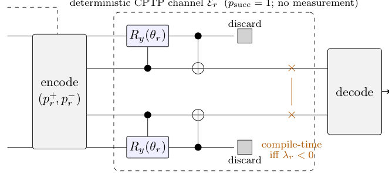 

Figure 2: Gate-level realization of the CPTP channel Er of Figure 1. Each amplitude-damping box is opened into its Stinespring dilation: a fresh ancilla |0⟩a±, a rail-controlled rotation Ry(θr) with θr = 2 arccos p

📷 Fig 3

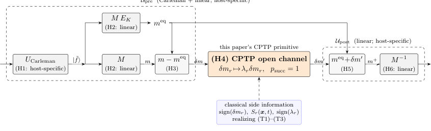 

Figure 3: Register-level block diagram of the hybrid Carleman–CPTP collision step (26), realizing specialization (U3) of the host-agnostic schema (23). The outer dashed frames mark the induced grouping Upre =(H1)◦(H2)◦(H3) and Upost =(H5)◦(H6). The orange block (H4) is the CPTP open channel of Theorem 3.3, whose signed two-rail internal structure is detailed in Figures 1– 2 (block and gate level). The dashed arrow entering (H4) from below carries the classical side information  sign(δmr), Sr(x, t), sign(λr)  realizing the bookkeeping items (T1)–(T3) of Section 4.3 (encoding-scale choice: Remark 3.1; adaptive scaling: Proposition 3.6).

📷 Fig 4

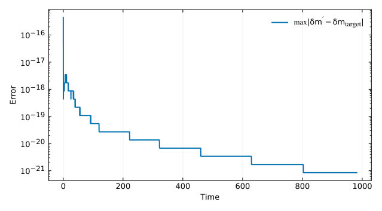 

Figure 4: Dissipative-mode audit maxr∈D, sites |δm′ r −λrδmr| versus advective LBM time for the run defined in Section 6.1. The error stays at the IEEE-754 double-precision floor throughout.

**Main problem.**

Quantum Lattice Boltzmann Methods (QLBM) suffer from an exponential decay in success probability because implementing the dissipative collision step via standard block-encoding or LCU requires post-selection.

**Main result.**

The authors present a deterministic, block-encoding-free construction using a CPTP channel that achieves a success probability of 1 for the dissipative MRT block.

**Method.**

The method uses a signed two-rail population encoding and an amplitude-damping quantum channel to realize the relaxation, effectively replacing post-selection with classical bookkeeping.

**Summary.**

This paper solves a major scalability bottleneck in quantum fluid dynamics simulations. By replacing probabilistic block-encoding with a deterministic CPTP channel using a two-rail encoding, the authors eliminate the multiplicative decay of success probability during the dissipative collision step. This allows for much larger and longer-running quantum Lattice Boltzmann simulations. The method is proven to be accurate to machine precision and is compatible with various quantum computing architectures.

Detailed structure

**Model / system.**

The paper focuses on the Multiple-Relaxation-imTime (MRT) Lattice Boltzmann Method (LBM) for fluid dynamics, specifically implementing the dissipative collision step in moment space.

**Key observables.**

Non-equilibrium moments (delta m_r), rail number operators, and the pointwise residual error of the dissipative update.

**Important parameters / regimes.**

Relaxation parameters (lambda_r), overrelaxation regime (lambda_r < 0), and the encoding scale (S_r).

**Assumptions / limitations.**

The construction assumes a modewise diagonal collision operator and does not cover block-coupled collision matrices or the full Carleman-linearized collision step.

**Figures summary.**

Figure 1 shows the high-level pipeline from classical moments to decoded updates; Figure 2 displays the gate-level circuit; Figure 3 illustrates the hybrid Carleman-CPTP collision pipeline; Figure 4 shows the error evolution in a 3D Taylor-Green vortex simulation.

**Paper structure.**

The paper introduces the QLBM bottleneck, proposes a two-rail CPTP construction, provides formal proofs for the deterministic update (Theorem 3.3) and success probability (Corollary 3.4), details the gate-level implementation, and validates the method through 3D lattice and synthetic numerical audits.

**Why it may be interesting.**

This is highly relevant for researchers in open quantum systems as it provides a way to implement non-unitary, dissipative dynamics deterministically using CPTP maps and amplitude damping, avoiding the probabilistic overhead of standard gate-based methods.

Abstract

Lattice Boltzmann (LB) on quantum devices must reconcile unitary gate evolution with the dissipative \emph{collision} step. In the multiple-relaxation-time (MRT) class, we work in the common setting of \emph{modewise diagonal} moment relaxation, $δm_r'=λ_r\,δm_r$ with $λ_r\in[-1,1]$ (overrelaxation if $λ_r<0$). Embedding that contraction in a unitary by block encoding or a linear combination of unitaries (LCU) typically yields subunitary success probability that decays multiplicatively across modes, sites, and time, a key bottleneck for quantum LB. \emph{For the dissipative MRT block alone} we give a \emph{block-encoding-free} construction: a signed \emph{two-rail} population encoding, then a completely positive trace-preserving (CPTP) map (per-rail amplitude damping with survival $|λ_r|$ and, if $λ_r<0$, a rail SWAP) so that, after the decode, the map agrees with classical MRT relaxation exactly (expectations of the rail number operators, common encoding--decode scale). Trace preservation gives success probability $1$ for that substage. The main result is the dissipative MRT block; construction of the equilibrium moment vector~$m^{\mathrm{eq}}=Mf^{\mathrm{eq}}$ (prescribed~$f^{\mathrm{eq}}$, host moment matrix~$M$; notation as in Section~\ref{subsec:generic-mrt}), moment transforms, streaming, and boundaries are composed with it as in a standard host pipeline and lie outside the scope of the formal theorem. Hybrid and fully coherent encodings, adaptive scales, Carleman-based context, and a one-rail no-go in the same nonnegative population framework are in the main text. Audits of the open-channel map on a long LBM collide-stream simulation and on stencil-free inputs both match the target to machine precision.

[↑ back to top](#top)

### [Experimental Workflows for Combinatorial Optimization: Towards Quantum Advantage](http://arxiv.org/abs/2604.25162v1)

**Authors:** Prashanti Priya Angara, Luis F. Rivera, Ulrike Stege, Hausi Müller, Ibrahim Shehzad

**Type:** both · **Category:** quantum information and computing · **PDF:** <https://arxiv.org/pdf/2604.25162v1>

**Analysis basis:** full PDF text, analyzed in chunks

**Topic relevance:** 🔥 `QC/QI experiment` **4/5**

📷 Fig 1

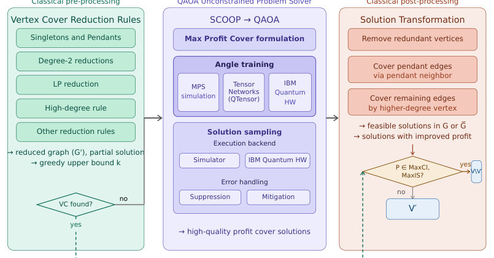 

Fig. 1: End-to-end classical-quantum pipeline for solving combinatorial optimization problems via the profit framework. The pipeline consists of three stages: (1) classical pre-processing to reduce the graph size, (2) hybrid quantum-classical optimization using the unconstrained QAOA solver on the MAXPC formulation, and (3) classical post-processing to obtain feasible solutions for the original problem. The routing diamonds indicate problem-specific transformations applied at the input and output stages.

📷 Fig 2

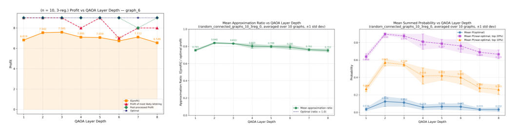 

Fig. 2: QAOA solver performance on synthetic graph instances. (a) MAXPC profit comparison for a representative single graph instance: optimal profit, most likely sampled profit, probability-weighted average profit, post-processed profit. (b) Approximation ratio for 3-regular graphs, n = 10. (c) Aggregate summed probability across all synthetic graph instances, with mean &amp; variance of probability mass on optimal &amp; near-optimal solutions (≥90%-optimal, ≥80%-optimal) across QAOA p layers.

**Main problem.**

Demonstrating practical quantum advantage for combinatorial optimization by moving beyond standalone algorithms toward end-to-end, integrated hybrid workflows.

**Main result.**

The proposed three-stage pipeline effectively uses classical pre-processing to reduce problem size and post-processing to ensure feasibility, allowing QAOA to produce competitive solutions on real IBM hardware.

**Method.**

A hybrid 'sandbox' workflow involving classical reduction rules (pre-processing), the SCOOP framework to transform constrained problems into unconstrained 'twins', and QAOA execution on IBM quantum hardware.

**Summary.**

This paper presents a complete experimental workflow for solving complex graph optimization problems like Minimum Vertex Cover and Maximum Clique. Instead of focusing solely on the quantum algorithm, the authors integrate classical pre-processing to shrink problem sizes and classical post-processing to ensure solution feasibility. By using the SCOOP framework to avoid difficult penalty terms in the quantum circuit, they demonstrate that QAOA can provide meaningful improvements on real IBM quantum hardware. This approach provides a practical roadmap for achieving quantum utility in combinatorial optimization.

Detailed structure

**Model / system.**

The study utilizes the IBM Quantum System One at PINQ2, specifically the 156-qubit IBM Heron r2 processor (ibm_quebec) with a heavy-hexagonal lattice topology.

**Key observables.**

Approximation ratios, probability mass of optimal and near-optimal solutions, expected values, and profit gain over random sampling.

**Important parameters / regimes.**

QAOA circuit depth (p up to 8), graph vertex counts (up to 128 on hardware, up to 4,941 in pipeline evaluation), and error suppression strategies (measurement twirling and dynamical decoupling).

**Assumptions / limitations.**

The strategy assumes an 'instance-aware' approach where classical methods exhaust tractable substructures, leaving only hard parts for the quantum processor.

**Figures summary.**

Figure 1 illustrates the end-to-end pipeline; Figure 2 shows the practitioner's decision landscape, approximation ratios for various graphs, and cumulative probability curves for solution quality.

**Paper structure.**

The paper introduces the need for end-to-end workflows, describes the three-stage sandbox platform (pre-processing, quantum solver, post-processing), details the SCOOP framework for unconstrained transformation, presents experimental results on IBM hardware, and concludes with a discussion on the path to quantum utility.

Abstract

Demonstrating quantum advantage for combinatorial optimization requires more than standalone algorithmic results; it calls for end-to-end case studies that integrate problem modelling, quantum execution, and classical refinement into practical workflows. This paper presents a sandbox platform for experimenting with hybrid quantum-classical workflows in graph optimization, enabling the systematic study of end-to-end optimization pipelines. Using our platform, we investigate three classically intractable and mutually reducible graph problems -- Minimum Vertex Cover, Maximum Independent Set, and Maximum Clique -- by transforming them into an unconstrained problem and solving the resulting instances with QAOA on IBM platforms. Our workflow combines classical pre-processing to reduce instance size, quantum optimization on the reduced problem, and classical postprocessing to map quantum outputs to high-quality feasible solutions, thereby avoiding direct constraint encoding in the quantum circuit. We evaluate the approach on synthetic graphs, benchmark instances, and real-world networks, and report hardware experiments on IBM Quantum System One at PINQ2 in Bromont, Quebec, powered by IBM's 156-qubit Heron r2 processor on graphs up to 128 vertices, with circuits involving up to 128 qubits and 13,555 two-qubit gates. The results illustrate how sandbox-style end-to-end experimentation can expose bottlenecks, clarify the role of classical-quantum workload partitioning, and provide domain experts and practitioners with a practical guide for interpreting quantum optimization outputs and assessing quantum utility on the road to quantum advantage in combinatorial optimization.

[↑ back to top](#top)

### [Millikelvin digital-to-analog converter for superconducting quantum processors](http://arxiv.org/abs/2604.25303v1)

**Authors:** Ruizi Hu, Zongyuan Li, Zhancheng Yao, Yufei Wu, Qiang Zhang, Yining Jiao, Quan Guan, Lijing Jin, Wangwei Lan, Chengyao Li, Lu Ma, Liyong Mao, Huijuan Zhan, Ze Zhan, Ran Gao, Lijuan Hu, Kannan Lu, Xizheng Ma, Tenghui Wang, Peng Xiang, Chunqing Deng, Shasha Zhu

**Type:** experiment · **Category:** quantum information and computing · **PDF:** <https://arxiv.org/pdf/2604.25303v1>

**Analysis basis:** full PDF text, analyzed in chunks

**Topic relevance:** 🔥 `QC/QI experiment` **4/5**

📷 Fig 1

 

FIG. 1. SFQ-programmable DAC architecture and de- vice implementation. a, Conceptual architecture for scal- able qubit control using SFQ-programmable digital-to-analog converters (DACs). b, Circuit-level implementation of the SFQ-programmable flux DAC integrated with a fluxonium qubit. SFQ pulses are generated by a dc/SFQ converter and transmitted through a Josephson transmission line (JTL) to the DAC. A bias current Ibias sets the DAC operating point and provides bias for the dc/SFQ converter and JTL. c, Opti- cal micrograph of the multi-chip module device (left), showing the integration of the qubit chip (right) and the digital con- trol chip (middle).

📷 Fig 2

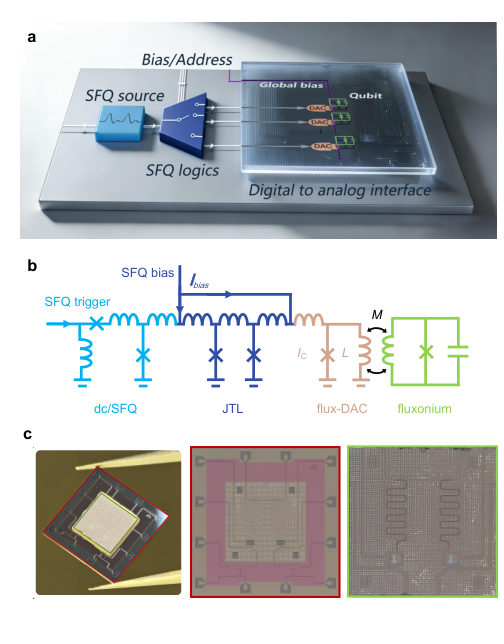 

Figure 1a illustrates the proposed architecture for scal- able static control of superconducting qubits using SFQ- programmable DACs. SFQ pulses generated from a common source are processed by superconducting digital logic and routed through a demultiplexing network, en- abling selective programming of individual DACs. Each DAC converts SFQ pulses into persistent flux stored in a superconducting loop, providing a programmable local flux bias for the qubit; such devices are hereafter referred to as flux DACs. This control architecture is fully com-

📷 Fig 3

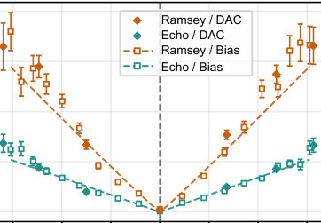 

FIG. 4. Qubit characterization under DAC control. a, Fluxonium qubit frequency as a function of external flux. Blue circles show spectroscopy measured using a conventional bias line, and the dashed curve is a fit to the fluxonium Hamil- tonian, yielding (EC, EJ, EL)/h = (1.3, 5.08, 0.806) GHz. Or- ange diamonds show the qubit frequencies obtained using the DAC analog output in combination with a fixed conventional bias. Comparing spectroscopy under DAC control with that obtained using conventional bias provides a precise calibra- tion of the DAC analog output. b, Pure dephasing rate Γϕ as a function of first-order flux sensitivity ∂ω01/∂Φqubit. Green and orange squares denote Ramsey and...

**Main problem.**

The scalability of superconducting quantum processors is limited by the 'wiring bottleneck,' where the need for individual room-temperature control lines for each qubit leads to excessive heat load and calibration overhead.

**Main result.**

The researchers demonstrated a millikelvin digital-to-analog converter (DAC) integrated with fluxonium qubits that allows for deterministic, quantized flux tuning via SFQ pulses without degrading qubit coherence.

**Method.**

The team used a multi-chip module architecture to integrate an SFQ-based DAC with high-coherence fluxonium qubits, employing single-flux-quantum pulses to program persistent flux states in an rf-SQUID-based storage loop.

**Summary.**

This paper presents a breakthrough in superconducting quantum hardware by introducing a millikelvin-compatible digital-to-analog converter. By using single-flux-quantum pulses to program local flux storage, the device enables precise, non-volatile tuning of fluxonium qubits. This approach significantly reduces the need for individual room-temperature wires, addressing a major bottleneck in scaling up quantum processors. Crucially, the DAC operates without introducing measurable decoherence to the qubits.

Detailed structure

**Model / system.**

The system consists of a multi-chip module (MCM) featuring a digital control chip and a qubit chip (fluxonium qubits on sapphire) connected via indium bumps, utilizing an rf-SQUID-based DAC and SFQ logic.

**Key observables.**

Qubit frequency shifts, flux increment steps (approx. 4.8 mPhi0), qubit relaxation time (T1), and dephasing rates (Ramsey and Echo measurements).

**Important parameters / regimes.**

Operating temperature below 20 mK, screening parameter beta_L = 243, storage inductance L = 1 nH, and critical current Ic approx 80-133 uA.

**Assumptions / limitations.**

Assumes that required flux biases across different qubits lie within a narrow range suitable for a shared global coarse bias, and that the reset protocol reliably converges to a deterministic state.

**Figures summary.**

Figure 1 shows the conceptual architecture and circuit implementation; Figure 3 illustrates the linear evolution of DAC output and the programming margin; Figure 4 compares qubit spectroscopy and dephasing rates between conventional and DAC-controlled bias.

**Paper structure.**

The paper introduces the scalability problem, describes the DAC architecture and SFQ-based programming mechanism, presents experimental characterization of flux increments and qubit coherence, and discusses the implications for large-scale integrated control stacks.

Abstract

Scaling superconducting quantum processors is increasingly constrained by the wiring, heat load, and calibration overhead associated with delivering high-resolution analog signals from room temperature to qubits at millikelvin temperature. Here we demonstrate a superconducting digital-to-analog converter (DAC) integrated with high-coherence fluxonium qubits in a multi-chip module architecture. The DACs generate persistent analog flux signals for tuning qubit parameters and are programmed deterministically using single-flux-quantum (SFQ) pulses, providing a digital interface compatible with established SFQ routing and demultiplexing technologies. Operating at millikelvin temperature, the DACs enable in-situ tuning of fluxonium qubits without measurable degradation of qubit coherence. The presented device provides a static control primitive for flux-tunable qubits, enabling parameter homogenization and eliminating the need for individual room-temperature DC bias lines. These results establish SFQ-programmable millikelvin DACs as a building block for digitally controlled superconducting quantum processors.

[↑ back to top](#top)

### [Simon's Algorithm for the Even-Mansour Cipher on Quantum Hardware](http://arxiv.org/abs/2604.25509v1)

**Authors:** Anina Köhler, Jakob Murauer, Tim Heine, Stefan Rosemann, Tobias Hemmert

**Type:** both · **Category:** quantum information and computing · **PDF:** <https://arxiv.org/pdf/2604.25509v1>

**Analysis basis:** full PDF text, analyzed in chunks

**Topic relevance:** 🔥 `QC/QI experiment` **4/5**

📷 Fig 1

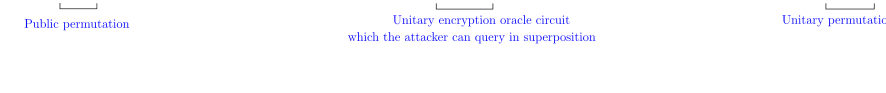 

Fig. 2. Representation of (a) classical Even-Mansour encryption, (b) secret unitary encryption oracle UEM, (c) synthesized unitary permutation oracle UP .

📷 Fig 2

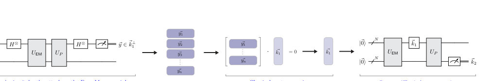 

Fig. 3. Schematic workflow of the attack: Quantum sampling via Simon’s algorithm and final quantum/classical secret key extraction.

📷 Fig 3

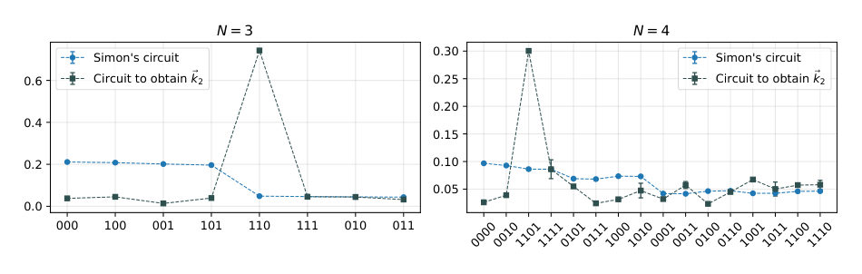 

Fig. 4. Mean relative distribution of five independent 3 and 4-bit trials on ibm miami. Small deviations demonstrate hardware reproducibility, with all individual runs succeeding.

📷 Fig 4

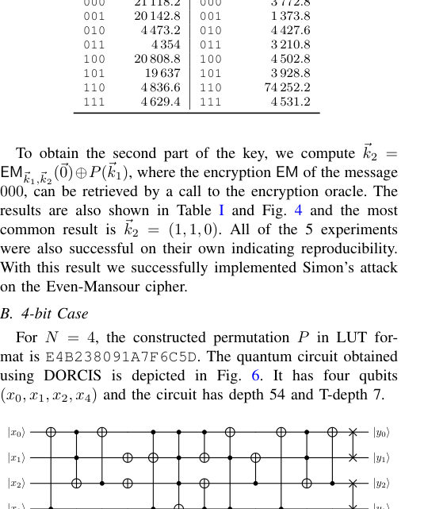 

Fig. 6. Quantum circuit for the 4-qubit permutation.

📷 Fig 5

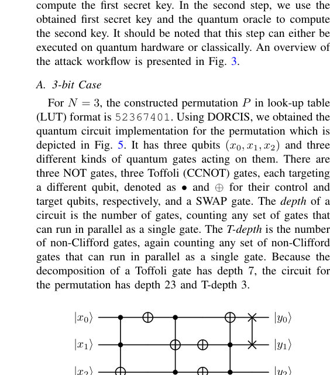 

Fig. 5. Quantum circuit for the 3-qubit permutation.

📷 Fig 6

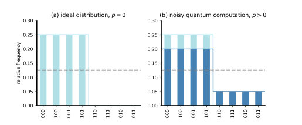 

Fig. 7. Schematic result of Simon’s circuit for the 3-bit case. (a) No noise for p = 0, (b) if p &gt; 0, depolarizing noise pulls towards a uniform distribution.

**Main problem.**

Evaluating the practical feasibility of implementing Simon's algorithm for quantum cryptanalysis of the Even-Mansour cipher on NISQ-era hardware and investigating the scalability of quantum circuit synthesis tools.

**Main result.**

Successful secret key recovery for N=3 and N=4 bit-length Even-Mansour constructions was demonstrated on the IBM miami processor, though a classical memory bottleneck was identified for N=5.

**Method.**

The researchers implemented Simon's period-finding algorithm using the DORCIS toolchain for circuit synthesis, applied error mitigation techniques like Dynamical Decoupling and Pauli Twirling, and used Gaussian elimination for post-processing.

**Summary.**

This paper presents a proof-of-concept implementation of Simon's algorithm to attack the Even-Mansour symmetric cipher on real NISQ hardware. By using the IBM miami processor, the authors successfully recovered secret keys for very small bit-lengths (N=3 and N=4). The study highlights both the potential for quantum cryptanalysis on current hardware and the significant classical computational bottlenecks in synthesizing larger quantum circuits.

Detailed structure

**Model / system.**

The experimental platform is the IBM miami NISQ quantum processor, utilizing a quantum encryption oracle representing the Even-Mansour cipher acting on quantum states.

**Key observables.**

Recovery of the secret key vector k1 via the identification of the hidden period, and the frequency distribution of measurement outcomes.

**Important parameters / regimes.**

Key lengths N=3, 4, and 5; circuit depth and T-depth; depolarization parameter p; and the number of shots (10^5 per experiment).

**Assumptions / limitations.**

The attack assumes a quantum oracle model (access to the encryption of quantum states), which is considered impractical in real-world settings.

**Figures summary.**

Figures include schematics of the quantum circuit and the Even-Mansour process, representations of the encryption oracle, workflow diagrams for the attack, and distributions of measurement results comparing ideal vs. noisy outcomes.

**Paper structure.**

The paper introduces the cryptanalytic problem, describes the hardware and circuit synthesis methodology, presents experimental results for small bit-lengths, analyzes noise and collision impacts, and discusses scalability limitations and future work.

Abstract

Simon's algorithm is a polynomial period-finding algorithm that has been used to exploit the algebraic structure of specific symmetric ciphers, showing that exponential speedups in their cryptanalysis are theoretically possible. While the theoretical framework for an attack using Simon's algorithm on the Even-Mansour cipher is well-established, practical implementations on noisy intermediate-scale quantum (NISQ) hardware remain limited. This paper presents a proof of concept quantum cryptanalysis of the Even-Mansour cipher using Simon's period-finding algorithm on NISQ hardware. For N = 3 and N = 4, we successfully demonstrate secret key recovery for N-bit constructions on the ibm_miami processor. Our experiments also identify a scaling limitation in the classical pre-processing stage: The DORCIS circuit optimization tool encountered a memory bottleneck at N = 5, preventing the generation of optimized circuits for larger key lengths. Our results suggest firstly that Simon's algorithm is effective for the Even-Mansour cipher for short bit lengths on current quantum hardware. Secondly, while DORCIS is effective for the small-scale S-boxes for which it was designed, there remains a need for the investigation of more scalable and efficient synthesis tools capable of handling larger and more general permutations in the context of Even-Mansour ciphers.

[↑ back to top](#top)

### [Characterization of Thermalization Behaviour in a Generalized Aubry-André Model](http://arxiv.org/abs/2604.25983v1)

**Authors:** S. Mal, D. K. Nandy, B. K. Sahoo

**Type:** theory · **Category:** disordered systems and neural networks · **PDF:** <https://arxiv.org/pdf/2604.25983v1>

**Analysis basis:** full PDF text, analyzed in chunks

**Topic relevance:** `analog quantum simulation` **3/5** · `entanglement & information structure` **3/5** · `non-equilibrium dynamics` **3/5** · `scars & prethermalization` **3/5** · `non-equilibrium universality` **2/5** · `driven-dissipative phase transition` **1/5** · `methods for driven-dissipative` **1/5**

📷 Fig 1

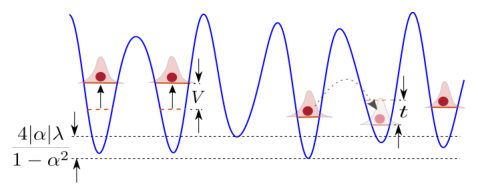 

FIG. 1. A schematic representation of the generalised Aubry- Andr´e model. The maxima and minima of the quasi-periodic potential of the considered system are governed by two pa- rameters α and λ with the quasi-periodic wavenumber given by the irrational number q = ( √

📷 Fig 2

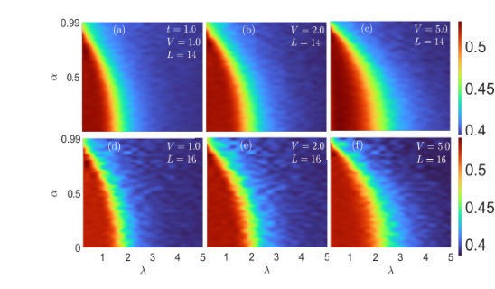 

FIG. 2. The average of adjacent gap ratio ⟨r⟩defined in Eq. (2) is presented in the plane of α and λ for different values of interaction with L = 14 (upper row) and L = 16 (lower row). For a fixed value of α, we observe ⟨r⟩≈0.53 for smaller values of λ, signifying that the level statistics follow the GOE distribution.

📷 Fig 3

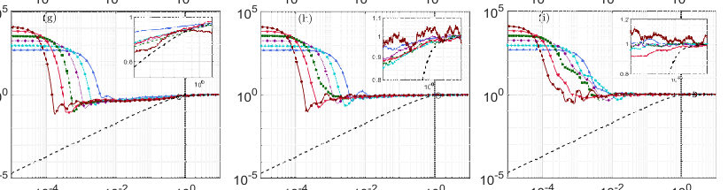 

FIG. 3. Spectral form factor K(τ) is shown as a function of scaled time τ for different values of α = 0 (a, b, c), 0.3 (d, e, f), 0.7 (g, h, i) and λ = 0.65 (a, d, g), 1.35 (b, e, h), 10.15 (c, f, i). The black dashed line corresponds to KGOE(τ) and the dotted vertical line represents the scaled Heisenberg time τH. The Thouless time τT h is identified as K →KGOE and indicated by the dashed circles. For a lower value of λ, the ratio of Thouless time and Heisenberg time τT h/τH &lt;&lt; 1 for all three values of α. As the value of λ increases, the ratio approaches unity and for large λ goes past unity. The insets represent the magnified images near Thouless time.

📷 Fig 4

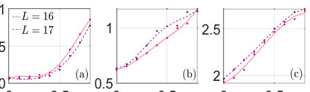 

FIG. 4. The scaled Thouless time τTh is shown as a function of α for three different values of λ = 0.65 (a), 1.35 (b) and 10.15 (c) with L = 16 and 17. In the ergodic regime, with λ &lt; 1, τTH increases rapidly as α approaches unity.

📷 Fig 5

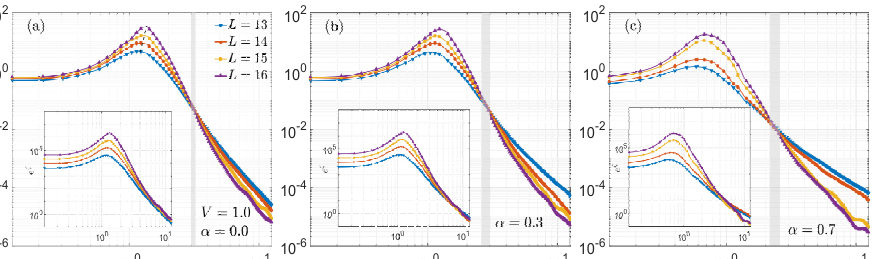 

FIG. 5. Scaled fidelity susceptibility F for the local operator nL/2 (n(L+1)/2) for even (odd) lattice sizes as a function of λ is plotted for different values of α. We consider L = 13, 14, 15 and 16 for α = 0.0, 0.3 and 0.7. In the insets, we show the behavior of unscaled fidelity susceptibility eζ. The crossing of the three curves, indicated with the shaded region, specifies the transition λ∗between ergodic and localized phases. With increasing α, λ∗decreases as predicted by the earlier analysis. The dashed line indicates the peak-drift behavior towards higher values of λ as the system size is increased.

📷 Fig 6

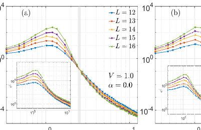 

FIG. 6. Scaled fidelity susceptibility F for the extended AGP operator (P

📷 Fig 7

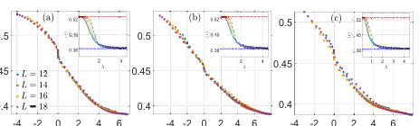 

FIG. 7. Mean level spacing ratio ⟨r⟩for different systems sizes L, calculated for α = 0 (a), 0.3 (b) and 0.7 (c). Insets show ⟨r⟩as a function of λ. In the main panels, we plot ⟨r⟩ as a function of scaling parameter Θ = sgn[λ −λ∗]L/ξ, with ξ = ξBKT is a BKT correlation length, assuming the crossing point ansatz λ∗= λ0 + λ1L. The optimal parameters ν, λ0 and λ1 in ξBKT are obtained by minimizing the cost function Cr. The number of data points included in the minimization procedure is Np = 264.

📷 Fig 8

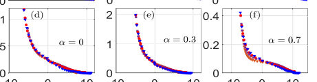 

FIG. 8. Scaled fidelity susceptibility for extended operator and different system sizes are calculated for α = 0, 0.3 and 0.7, and plotted as a function of Θ = sgn[λ −λ∗]L/ξ, with ξ = ξ0 (upper panel) and ξ = ξBKT (lower panel), assuming the crossing point ansatz λ∗= λ0+λ1L. The parameters ν, λ0 and λ1 in ξBKT are obtained by minimizing CF. The dotted vertical line represents the critical point λ = λ∗at which F becomes discontinuous. The number of data points included in the minimization procedure is Np = 240.

📷 Fig 9

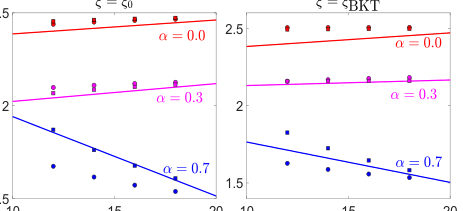 

FIG. 9. Critical point λ∗as a function of system size L, for the power-law correlation ξ = ξ0 (left) and BKT-type correlation ξ = ξBKT (right) for different values of α. λ∗are obtained from the best data collapse of CF. The straight lines represent the linear dependence of critical value λ∗= λ0 + λ1L. The square and circular markers are different nonlinear ansatz λ∗= λ0 + λ1/ln(L) and λ∗= λ0 + λ1/L, respectively.

📷 Fig 10

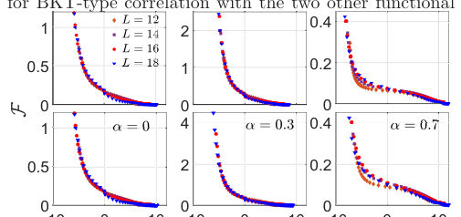 

FIG. 10. F for the extended operator are plotted with ξ = ξBKT, assuming the critical ansatz λ∗= λ0 +λ1/ln(L) (upper panel) and λ∗= λ0 + λ1/L (lower panel).

**Main problem.**

The study aims to characterize the ergodic-to-many-body localization (MBL) transition in the generalized Aubry-André model (GAA) with interacting spinless fermions.

**Main result.**

The analysis constructs a phase diagram using the fidelity susceptibility ($\chi_n$) and shows that the system exhibits distinct scaling behaviors corresponding to ergodic, intermediate, and localized regimes.

**Method.**

The research employs advanced numerical techniques including Exact Diagonalization (ED), finite-size scaling analysis via cost-function minimization, and diagnostics based on the adjacent gap ratio and spectral form factor.

**Summary.**

This paper investigates the ergodic-to-Many-Body Localization (MBL) transition in the interacting generalized Aubry-André model. The authors utilize sophisticated diagnostics, including the fidelity susceptibility and spectral statistics, alongside finite-size scaling analysis. By mapping out a phase diagram, they characterize the transition point ($\lambda^*$) and demonstrate how the system's thermalization properties change as the disorder strength and quasi-periodic modulation are varied. This work advances the understanding of quantum chaos in complex, disordered quantum systems.

Detailed structure

**Model / system.**

The system is the generalized Aubry-André model (GAA) Hamiltonian, which includes tunneling ($t$), quasi-periodic modulation ($\lambda$), and nearest-neighbor interactions ($V$). The model is studied for interacting spinless fermions.

**Key observables.**

Fidelity susceptibility ($\chi_n$), adjacent gap ratio ($\langle r 
angle$), Spectral Form Factor (SFF), and the Thouless time ($	au_{Th}$).

**Important parameters / regimes.**

Disorder strength ($\lambda$), quasi-periodic parameter ($\alpha$), system size ($L$), and the critical disorder strength ($\lambda^*$).

**Assumptions / limitations.**

The analysis compares scaling behavior using two correlation length ansatzes: power-law ($\xi_0$) and Berezinskii-Kosterlitz-Thouless (BKT) type ($\xi_{BKT}$).

**Figures summary.**

Figures illustrate phase diagrams in the $\alpha-\lambda$ plane using $\langle r 
angle$, and show scaling collapse plots for the fidelity susceptibility ($F$) using both $\xi_0$ and $\xi_{BKT}$ ansatzes.

**Paper structure.**

The paper systematically analyzes the transition by first establishing the Hamiltonian and then applying multiple diagnostic tools ($\chi_n$, $\langle r 
angle$, SFF) across varying system sizes and parameters to map out the phase diagram and determine scaling laws.

**Why it may be interesting.**

The application of fidelity susceptibility and finite-size scaling to probe the MBL transition in a quasi-periodic interacting system provides a rigorous theoretical framework for understanding quantum chaos in disordered settings.

Abstract

Although random matrix theory provides a fundamental framework for characterizing quantum chaos, encompassing both ergodic and localized phases, a comprehensive understanding of the universal features governing the critical transition remains elusive in many disordered and quasi-random systems. In this study, we explore the ergodic-to-many-body localization transition in the generalized Aubry-André model with interacting spinless fermions. Using the concept of Frobenius norm of an adiabatic gauge potential, we construct a phase diagram that captures the sensitivity of the eigenspectrum to infinitesimal adiabatic gauge deformations. To examine the stability of the critical disordered strength with respect to system size, we perform an unbiased finite-size scaling analysis via cost-function minimization techniques. Additionally, by analyzing the adjacent gap ratio and spectral form factor, we determine the scaling behavior of the Thouless time as a function of the disorder strength.

[↑ back to top](#top)

### [Markovian thermodynamics of non-Markovian Langevin equations](http://arxiv.org/abs/2604.25095v1)

**Authors:** Andreas Dechant, Kiyoshi Kanazawa

**Type:** theory · **Category:** statistical mechanics · **PDF:** <https://arxiv.org/pdf/2604.25095v1>

**Analysis basis:** full PDF text, analyzed in chunks

**Topic relevance:** `entanglement & information structure` **3/5** · `non-equilibrium dynamics` **3/5** · `Keldysh / 2PI / non-Gaussian methods` **2/5** · `correlated / nonlocal dissipation` **2/5** · `methods for driven-dissipative` **2/5**

📷 Fig 1

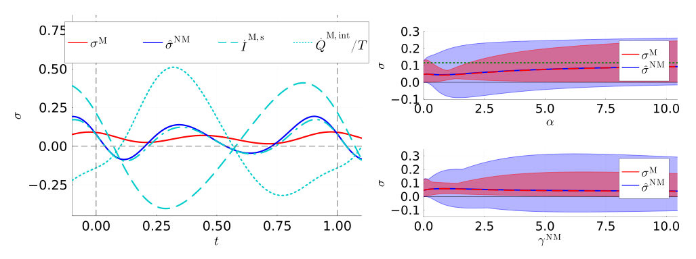 

FIG. 1. Markovian and non-Markovian EPR for a particle in a trap with periodically varying trap stiffness. Left: As a function of time for one period of the driving (indicated by the dashed vertical lines). The red line is the Markovian EPR Eq. (6), the blue line the apparent non-Markovian EPR Eq. (7). The light blue lines are the information flow Eq. (38) (dashed), the heat flow due to the interaction with the auxiliary mode Eq. (19) (dotted) and the sum of both terms (dash-dotted). Right: As a function of the decay rate (top) and magnitude (bottom) of the memory friction. The solid lines are the time-averaged EPRs, the shaded area indicates the range of the EPRs over one period of the...

📷 Fig 2

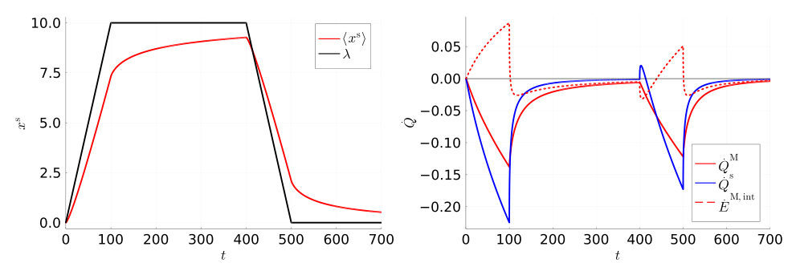 

FIG. 2. Heat flow for a driven particle with power-law memory. Left: Position of the trap λ(t) (purple) and the resulting mean position of the particle ⟨xs(t)⟩(red). Right: Markovian heat flow in Eq. (6) (red) and non-Markovian heat flow in Eq. (7) (blue), as well as the rate of change of interaction energy ˙EM,int = dt U int (red dashed). Parameters are γs = 0.1, γNM = 100, ks = 1, while the power-law memory is given by Eq. (22) with τ0 = 0.01, τ1 = 1000 and β = 0.5, and we use da = 8 exponential modes to fit it.

**Main problem.**

Addressing thermodynamic inconsistencies in non-Markovian systems, specifically the apparent violation of the second law where entropy production can transiently decrease.

**Main result.**

The authors show that a Markovian embedding provides a unique and physically consistent thermodynamic description where entropy production increases monotonically, resolving apparent violations through heat and information exchange with auxiliary degrees of freedom.

**Method.**

The study uses an 'inverse coarse-graining' technique to embed non-Markovian Generalized Langevin Equations (GLE) into a high-dimensional Markovian representation using auxiliary degrees of freedom and matrix decomposition.

**Summary.**

This paper develops a consistent thermodynamic framework for non-Markovian Langevin equations by embedding them into a higher-dimensional Markovian system. It demonstrates that while non-Markovian entropy production can appear to decrease, this is simply due to uncaptured heat and information exchange with auxiliary environmental degrees of freedom. The authors prove that the resulting Markovian thermodynamic quantities are unique and independent of the specific embedding choice. This approach provides a way to recover the monotonic increase of entropy required by the second law of thermodynamics.

Detailed structure

**Model / system.**

A target system with degrees of freedom x_s(t) evolving via a non-Markovian GLE with a memory kernel and thermal noise, embedded into an extended system with auxiliary degrees of freedom x_a and a quadratic interaction potential.

**Key observables.**

Entropy production (Markovian and non-Markovian), heat flow (interaction and total), work, information flow, and mutual information.

**Important parameters / regimes.**

Memory kernel decay rates, friction coefficients, temperature, and the number of auxiliary modes used for power-law approximation.

**Assumptions / limitations.**

The memory kernel is linear and satisfies the fluctuation-dissipation relation; forces are conservative; the noise acting on the target and auxiliary systems is independent.

**Figures summary.**

Figure 1 and 2 show the evolution of particle position in a time-dependent trap, comparing Markovian and non-Markovian heat flows and the rate of change of interaction energy.

**Paper structure.**

The paper introduces the problem of non-Markovian thermodynamics, develops the Markovian embedding construction, proves the uniqueness of thermodynamic quantities, and applies the framework to specific models like power-law memory and time-dependent traps.

**Why it may be interesting.**

This work is highly relevant for open quantum systems and many-body dynamics as it provides a rigorous thermodynamic framework for systems with memory, resolving how information exchange with an environment can mimic entropy-decreasing processes.

Abstract

We develop the thermodynamics of non-Markovian generalized Langevin equations by embedding them in a high-dimensional Markovian representation involving auxiliary degrees of freedom. If the memory is linear and satisfies detailed balance with the noise, we provide an explicit construction of the embedding for non-Markovian dynamics with many degrees of freedom and hydrodynamic interactions. Moreover, while the embedding is generally not unique, we show that it results in unique values of thermodynamic quantities of the Markovian system. This allows us to define the Markovian entropy production of a non-Markovian system, which, in contrast to the definition based directly on the non-Markovian dynamics, is guaranteed to increase monotonically with time. Moreover, the Markovian representation allows us to identify the apparent decrease in the non-Markovian entropy with heat and information exchange between the system and the auxiliary degrees of freedom.

[↑ back to top](#top)

### [Pseudo-Hermiticity of the Nakajima-Zwanzig Projected Liouvillian in the Jaynes-Cummings Model](http://arxiv.org/abs/2604.25801v1)

**Authors:** Kejun Liu

**Type:** theory · **Category:** other · **PDF:** <https://arxiv.org/pdf/2604.25801v1>

**Analysis basis:** full PDF text, analyzed in chunks

**Topic relevance:** `methods for driven-dissipative` **3/5** · `Tavis-Cummings & cavity-many-emitter` **2/5** · `driven-dissipative phase transition` **2/5** · `non-equilibrium dynamics` **2/5** · `non-equilibrium universality` **2/5**

📷 Fig 1

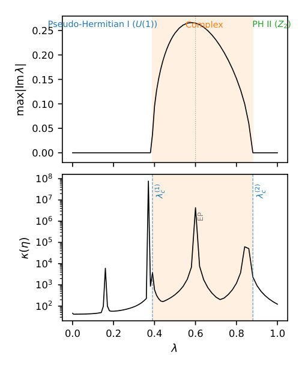 

FIG. 1. Re-entrant pseudo-Hermitian phase of QLQ un- der counter-rotating deformation. At λ = 0 (JC), pro- tection is U(1); at λ = 1 (Rabi), protection is Z2. The complex-spectrum window is bracketed by EP boundaries at λ(1) c ≈0.39 and λ(2) c ≈0.88. Top panel: maximum imaginary part of QLQ eigenvalues. Bottom panel: condition number κ(η) of the metric on a log scale, diverging at the boundaries. An interior EP at λ ≈0.60 produces a secondary κ spike.

**Main problem.**

The paper seeks to resolve the unexplained anomaly where the non-Hermitian Nakajima-Zwanzig projected Liouvillian (QLQ) in the Jaynes-Cummings model exhibits a purely real spectrum.

**Main result.**

The authors prove that QLQ is pseudo-Hermitian in the Mostafazadeh sense, meaning a positive-definite metric exists that ensures a real spectrum. They also identify a re-entrant pseudo-Hermitian phase during the transition from the Jaynes-Cummings to the Rabi model.

**Method.**

The study uses biorthonormal diagonalization of the QLQ matrix, construction of a symmetrizing metric from left eigenvectors, and a continuous lambda-deformation to scan parameter regimes.

**Summary.**

This paper resolves why the non-Hermitian Nakajima-Zwanzig projected Liouvillian in the Jaynes-Cummings model has a real spectrum by demonstrating its pseudo-Hermiticity. By finding a positive-definite metric that intertwines the operator with its adjoint, the authors explain the spectral reality and explore how this property persists or breaks during the transition to the Rabi model. The study also identifies specific regimes of broken pseudo-Hermiticity and characterizes the nature of exceptional points in the thermodynamic limit. This provides a deep mathematical foundation for the analyticity of memory kernels in quantum optical models.

Detailed structure

**Model / system.**

The system is the Jaynes-Cummings model and its deformation into the full Rabi model, describing a single-mode cavity coupled to a two-level atom in an open quantum dynamics framework using the Nakajima-Zwanzig projection formalism.

**Key observables.**

The spectrum of the projected Liouvillian (real vs. complex eigenvalues), the intertwining residual, the condition number of the metric, and the scaling of the critical exponent at exceptional points.

**Important parameters / regimes.**

Coupling strength (g), detuning (omega_0/omega_c), deformation parameter (lambda) ranging from 0 to 1, bath temperature (beta), and Hilbert space truncation (N_max).

**Assumptions / limitations.**

The analysis assumes a truncation of the Hilbert space (N_max) and considers vacuum or thermal baths.

**Figures summary.**

The figures (implied by tables) present convergence data for the intertwining residual, verification of the metric across various JC scenarios, a scan of the lambda-deformation showing PH and complex regimes, and critical-exponent fits for eigenvalue coalescence.

**Paper structure.**

The paper identifies the spectral anomaly, introduces the mathematical framework of pseudo-Hermiticity, presents numerical verification of the metric and its stability, analyzes the transition from JC to Rabi models, and discusses the scaling of exceptional points.

**Why it may be interesting.**

This is highly relevant for researchers in open quantum systems and quantum optics as it provides a fundamental structural reason (pseudo-Hermiticity) for the stability of real spectra in non-Hermitian generators, which is crucial for understanding memory kernels and dissipation.

Abstract

The Nakajima-Zwanzig projected Liouvillian QLQ, the generator of the exact memory kernel in open quantum dynamics, is manifestly non-Hermitian yet has been reported to possess a purely real spectrum in the Jaynes-Cummings model -- an anomaly unexplained since observation. We resolve this anomaly by showing that QLQ is pseudo-Hermitian in the Mostafazadeh sense: a positive-definite metric eta>0 exists such that (QLQ)^dag eta = eta (QLQ), forcing the spectrum to be real. The pseudo-Hermiticity is genuine: the Delta N = 0 and Delta N = +/-2 sectors are individually non-Hermitian (residuals 1.70 and 5.06, respectively), yet the global spectrum is protected by eta. The metric survives the bath-truncation limit (N_max = 3--20, matrix dimension up to 1764 x 1764) with intertwining residual <10^{-11}. A continuous deformation to the full Rabi model reveals a re-entrant pseudo-Hermitian phase with two exceptional-point boundaries, in which the metric condition number diverges. The result supplies a structural reason for Hardy-space analyticity of the memory kernel in the canonical quantum-optical model.

[↑ back to top](#top)

### [Hierarchical Reconstruction of Time-arrow from Multi-time Correlations](http://arxiv.org/abs/2604.25749v1)

**Authors:** Yijia Cheng, Ruicheng Bao, Zhonghuai Hou

**Type:** both · **Category:** statistical mechanics · **PDF:** <https://arxiv.org/pdf/2604.25749v1>

**Analysis basis:** full PDF text, analyzed in chunks

**Topic relevance:** `methods for driven-dissipative` **3/5** · `non-equilibrium dynamics` **3/5** · `entanglement & information structure` **2/5** · `quantum measurements` **2/5**

📷 Fig 1

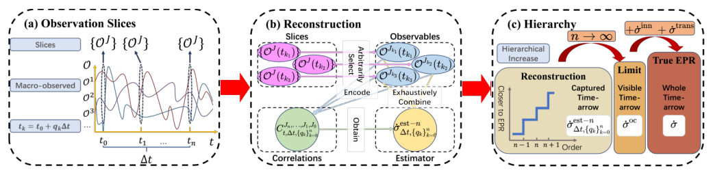 

FIG. 1. (a) From observations to observation slices. The evolving observables are sampled at time points tk, forming observation slices. (b) From observation slices to reconstruction. Multi-time correlations are constructed from selections of each slice, then we can obtain the reconstruction. (c) Hierarchical reconstruction of the time-arrow. Each additional sampling time point (step) adds temporal information and tightens the reconstruction, bringing it closer to the whole time-arrow. When n →∞and ˙σinn = ˙σtrans = 0, the reconstruction reaches the true EPR.

📷 Fig 2

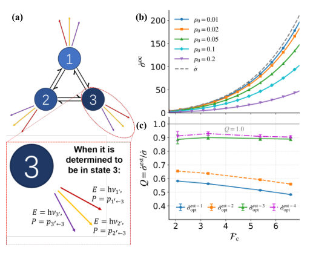 

FIG. 2. (a) Biomolecular process with many-to-many state- signal correspondence. Each microscopic state (circles in shades of blue) can emit photons detected in different color channels (colored arrows), with probabilities pmap J←i satisfying P

**Main problem.**

How to reconstruct the true Entropy Production Rate (EPR) and quantify thermodynamic irreversibility from partially observed, coarse-grained, or noisy experimental data.

**Main result.**

The authors establish a monotonic hierarchy of lower bounds on the EPR, where increasing the order of multi-time correlations systematically provides tighter bounds that converge to the true EPR under ideal conditions.

**Method.**

A hierarchical reconstruction framework using multi-time correlation functions of state observables, optimized via a search over time intervals and observation thresholds, and analyzed using the data-processing inequality.

**Summary.**

This paper presents a new method for estimating the entropy production rate (EPR) from experimental observations. By using higher-order multi-time correlations, the authors create a hierarchy of increasingly accurate lower bounds on the true thermodynamic irreversibility. They demonstrate that as more temporal information is included, the estimate converges toward the true EPR. The framework is particularly useful for systems with coarse-grained or noisy data, such as single-molecule fluorescence experiments.

Detailed structure

**Model / system.**

The framework is applied to Markovian jump processes and encompasses overdamped Langevin dynamics, with specific illustrative models involving three-state biomolecular processes and single-molecule Fluorescence Correlation Spectroscopy (FCS).

**Key observables.**

Multi-time correlation functions, Entropy Production Rate (EPR), and composition-like macroscopic observables.

**Important parameters / regimes.**

Number of observation slices (n), time interval (delta t), intermediate measurement times (qk), and the recoloring matrix (R) representing observation ambiguity.

**Assumptions / limitations.**

Assumes non-equilibrium steady states (NESS), 'composition-like' observables with constant sums, and stationarity of the processes.

**Figures summary.**

Figure 1 illustrates the transition from raw observables to multi-time correlations and the hierarchical tightening of bounds; Figure 2 shows the impact of observation ambiguity (recoloring) and the convergence of the hierarchy; Figure S1 shows the optimization landscape for parameters.

**Paper structure.**

The paper introduces the problem of EPR estimation, defines the mathematical framework for multi-time correlation reconstruction, proves the hierarchical lower-bound property using the data-processing inequality, demonstrates optimization strategies for time intervals, and compares the method's performance against existing bounds like the pseudo-EPR.

**Why it may be interesting.**

This work provides a systematic way to extract thermodynamic information from time-series data, which is highly relevant for characterizing dissipation and irreversibility in open quantum systems and driven many-body dynamics where full state knowledge is unavailable.

Abstract

The entropy production rate (EPR), a key measure of thermodynamic irreversibility in stochastic thermodynamics, is difficult to determine directly in experiments, motivating lower-bound-based estimation from observations. However, a systematic framework for organizing increasing amounts of the irreversibility information in experimental state observables into progressively tighter bounds remains lacking. Here, we show that multi-time correlations of a class of state observations naturally encode this information to provide a hierarchy. By defining a reconstruction operation as a combination of correlations, we obtain a sequence of lower bounds on the EPR. Correlations of higher order capture the thermodynamic information at greater temporal depth, thereby capturing more irreversibility and yielding tighter bounds. Under ideal conditions, this hierarchy converges to the full EPR in the limit of infinitely dense observations over a finite time window.

[↑ back to top](#top)

### [Hierarchy of entropy production and thermodynamic trade-off relations in non-Markovian systems](http://arxiv.org/abs/2604.25245v1)

**Authors:** Ken Funo, Tan Van Vu, Keiji Saito

**Type:** theory · **Category:** statistical mechanics · **PDF:** <https://arxiv.org/pdf/2604.25245v1>

**Analysis basis:** full PDF text, analyzed in chunks

**Topic relevance:** `methods for driven-dissipative` **3/5** · `non-equilibrium dynamics` **3/5** · `correlated / nonlocal dissipation` **2/5** · `entanglement & information structure` **2/5**

📷 Fig 1

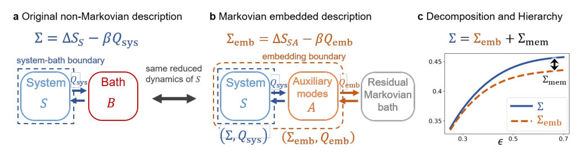 

FIG. 1. Hierarchy of entropy production under Markovian embedding. a Original non-Markovian description (1) with the entropy production Σ and heat Qsys based on system observables. b Equivalent Markovian embedded description (3), in which the bath is given by auxiliary modes A and a residual Markovian bath. The inner system-bath boundary recovers (Σ, Qsys), whereas the outer embedding boundary gives (Σemb, Qemb). c The difference between Σ and Σemb is the non-negative memory contribution Σmem between the system and auxiliary modes, yielding the hierarchy Σ ≥Σemb (5). We plot Σ and Σemb by varying a parameter ϵ that controls Σmem (see Methods for details).

📷 Fig 2

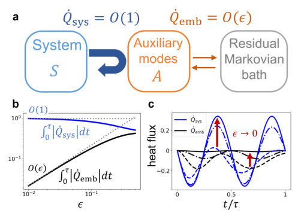 

FIG. 2. Memory-assisted heat exchange with sup- pressed dissipation. a Schematic of the model. b Nu- merical plot showing the scaling of R τ 0 dt| ˙Qsys| = O(1) (blue curve) and R τ 0 dt| ˙Qemb| = O(ϵ) (black curve). c Plot of ˙Qsys(t) (blue curve) and ˙Qemb(t) (red curve), by choosing ϵ = 1, 0.1, 0.01 (dashed, dashdot, solid curves, respectively). A near-reversible exchange of heat between the system and auxiliary modes is realized in the limit of ϵ →0, while dis- sipation is strongly suppressed, as ˙Qemb and Σ scale as O(ϵ) (see also Fig. 1c).

📷 Fig 3

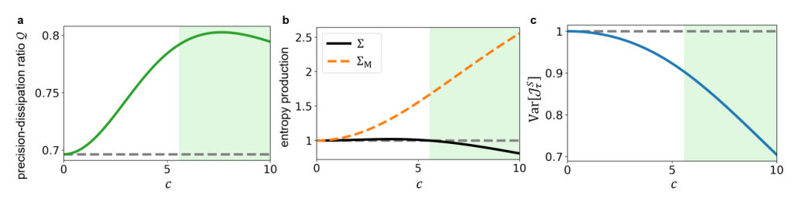 

FIG. 3. Effect of memory on the transient TUR. a Precision-to-dissipation ratio Q defined in Eq. (16) as a function of the coupling c to the non-Markovian bath. The ratio can be enhanced relative to the Markovian limit c = 0. b The entropy production Σ (black solid curve) and apparent Markovian entropy production ΣM (orange dashed curve); their separation reflects the negative correction ΣNM ≤0. c Variance of the current Var[J S τ ]. The green shaded region marks the range of c for which memory suppresses both Σ and Var[J S τ ] relative to the Markovian limit c = 0.

**Main problem.**

The paper investigates how non-Markovian memory effects modify fundamental thermodynamic trade-off relations, such as the Thermodynamic Uncertainty Relation (TUR), speed limits, and power-efficiency trade-offs.

**Main result.**

The authors establish a hierarchy of entropy production where the true non-Markovian entropy production upper bounds that of its Markovian embedding, and use this to derive non-Markovian extensions of key thermodynamic bounds.

**Method.**

The study employs a Markovian embedding technique to represent non-Markovian dynamics as an enlarged Markovian system, using relative entropy and the Cauchy-Schwarz inequality to decompose and bound entropy production.

**Summary.**

This paper establishes a fundamental hierarchy of entropy production for non-Markovian systems by using a Markovian embedding technique. It proves that the entropy production of a non-Markovian system is always greater than or equal to its embedded Markovian counterpart. Using this hierarchy, the authors derive new versions of the Thermodynamic Uncertainty Relation, thermodynamic speed limits, and power-efficiency trade-offs. The results show that memory effects can be exploited to enhance the precision of currents relative to dissipation. The findings apply to both classical Langevin dynamics and quantum master equations.

Detailed structure

**Model / system.**

The model consists of non-Markovian open systems described by generalized Langevin dynamics (Zwanzig model) coupled to structured Gaussian baths, including both underdamped and overdamped regimes and extensions to the quantum regime via the GKSL master equation.

**Key observables.**

Entropy production, heat current, power, efficiency, Thermodynamic Uncertainty Relation (TUR) precision, and thermodynamic speed limits.

**Important parameters / regimes.**

Memory kernel, spectral density (Drude-Lorentz, super-Ohmic), temperature, coupling strength, and the underdamped/overdamped regimes.

**Assumptions / limitations.**

The derivation assumes specific initial conditions, such as the system and bath being in a conditional thermal state or a product state with vanishing initial interaction.

**Figures summary.**

Figure 1 illustrates the entropy production hierarchy and decomposition into embedded and memory-induced parts; Figure 2 shows memory-assisted heat exchange with suppressed dissipation; Figure 3 demonstrates the application of the current definition in a harmonic potential.

**Paper structure.**

The paper introduces the problem of memory-induced irreversibility, develops the Markovian embedding framework, establishes the entropy production hierarchy, derives various non-Markovian thermodynamic trade-off relations, and discusses extensions to the quantum regime and specific bath models.

**Why it may be interesting.**

This paper is highly relevant for researchers in open quantum systems as it provides a quantitative framework to treat bath memory as a thermodynamic resource and establishes new bounds for precision and efficiency in non-Markovian environments.

Abstract

Non-Markovian dynamics arise when a system is coupled to a bath with finite correlation time, giving rise to memory effects that allow the bath to temporarily store and return excitations. However, how memory modifies irreversibility and whether it can be exploited to improve thermodynamic performance is not well established. We address this question by employing a Markovian embedding of generalized Langevin dynamics, in which bath memory is encoded in auxiliary modes and irreversible dissipation in a residual Markovian bath. Here we show that the entropy production defined for the original non-Markovian system upper bounds that of the embedded system, thereby establishing a hierarchy of entropy production under Markovian embedding. Leveraging this hierarchy, we derive non-Markovian extensions of the thermodynamic uncertainty relation, speed limit, and power-efficiency trade-off. For underdamed generalized Langevin systems, sufficiently structured baths allow finite heat currents at vanishingly small entropy production, whereas Carnot efficiency at finite power remains unattainable for ordinary spectral densities. In the overdamped regime, memory effects can simultaneously reduce entropy production and current fluctuations, thereby enhancing the precision-to-dissipation ratio. We further discuss the extension of the hierarchy to generic bath models and the quantum regime. These results provide a quantitative framework for exploiting memory as a thermodynamic resource and for designing energy-efficient protocols in structured environments.

[↑ back to top](#top)

### [Nonlocal correlations for bosonic fields in black hole quantum atmosphere](http://arxiv.org/abs/2604.24976v1)

**Authors:** Adam Z. Kaczmarek, Johann Gil, Zygmunt Bąk, Ewa A. Drzazga-Szczȩśniak, Dominik Szczȩśniak

**Type:** theory · **Category:** quantum information and computing · **PDF:** <https://arxiv.org/pdf/2604.24976v1>

**Analysis basis:** full PDF text, analyzed in chunks

**Topic relevance:** `entanglement & information structure` **3/5** · `correlated / nonlocal dissipation` **2/5** · `non-equilibrium dynamics` **2/5** · `quantum measurements` **2/5**

📷 Fig 1

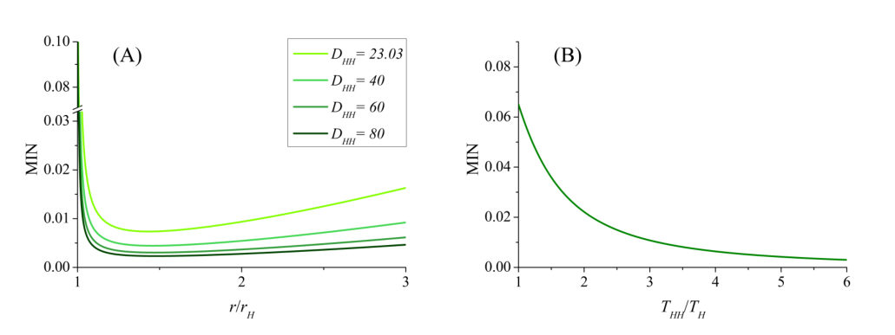 

FIG. 1: (A) The measurement-induced nonlocality (MIN) for the physically accessible bosonic quantum modes as a function of the scaled distance (r/rH) and (B) as a function of scaled temperature THH/TH, for the selected values of the so-called Hartle-Hawking constant (DHH) and Ω= 1.

📷 Fig 2

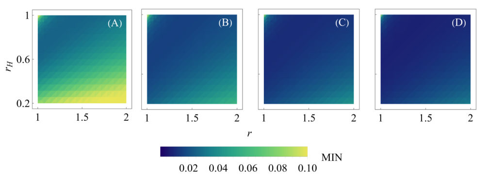 

FIG. 2: (A)-(D) The measurement-induced nonlocality of the physically accessible bosons (MIN(ρABI)) on a plane characterized by the distance from a black hole (r) and the event horizon size (rH). The results are depicted for the set of selected values of constant (DHH ∈{23.03, 40, 60, 80}). The diagrams are plotted for the Ω= 1.

**Main problem.**

Investigating how the 'quantum atmosphere' (the spatially extended thermal region surrounding a black hole) influences nonlocal quantum correlations in bosonic fields.

**Main result.**

Bosonic nonlocal correlations exhibit a pronounced degradation at a finite radial distance from the event horizon and eventually vanish, showing a more sensitive response to radiation compared to fermionic systems.

**Method.**

The study uses Measurement-Induced Nonlocality (MIN) as a quantifier, employing a single-mode approximation and Bogoliubov-style transformations within the Kruskal basis to analyze the Hartle-Hawking vacuum.

**Summary.**

This paper examines how the thermal environment of a black hole's 'quantum atmosphere' affects nonlocal correlations in bosonic fields. Unlike fermionic fields, which show a gradual degradation due to the Pauli exclusion principle, bosonic fields exhibit a much more rapid loss of nonlocality at a specific radial distance. The researchers found that as the thermal effects increase, the region where quantum correlations can be effectively utilized shrinks. This suggests that while bosonic systems are highly sensitive probes of black hole radiation, they are also more easily decohered by the surrounding environment.

Detailed structure

**Model / system.**

A bipartite system of two observers (Alice and Bob) sharing a maximally entangled Bell state of a massless bosonic scalar field in a Schwarzschild black hole spacetime, specifically within the Hartle-Hawking vacuum.

**Key observables.**

Measurement-Induced Nonlocality (MIN)

**Important parameters / regimes.**

Scaled radial distance (r/rH), scaled Hartle-Hawking temperature (THH/TH), and the Hartle-Hawking constant (DHH).

**Assumptions / limitations.**

The study assumes a massless scalar field, a Schwarzschild black hole geometry, and utilizes a single-mode approximation for the bosonic bipartite states.

**Figures summary.**

Figure 1 shows MIN as a function of normalized radius and scaled temperature; Figure 2 displays the MIN on a plane of distance (r) and horizon size (rH) for various DHH values, illustrating the shrinkage of the correlation region.

**Paper structure.**

The paper introduces the concept of the quantum atmosphere, defines the bosonic field model in Schwarzschild spacetime, applies the MIN quantifier to evaluate correlations, compares bosonic results to previous fermionic studies, and concludes with the implications for using bosonic probes.

**Why it may be interesting.**

It explores how curved spacetime and thermal environments (open quantum system dynamics) affect entanglement and nonlocality, specifically highlighting how different quantum statistics (Bose vs. Fermi) lead to different degradation patterns in quantum correlations.

Abstract

Recent theoretical studies propose that Hawking radiation may not emerge strictly at the event horizon but rather from the spatially extended region surrounding a black hole, commonly referred to as the quantum atmosphere. In this work, we explore how this concept influences nonlocal quantum correlations in a bosonic bipartite system located at certain distance from a Schwarzschild black hole. By employing the measurement-induced nonlocality (MIN), as a quantifier of quantum correlations, we analyze the response of bosonic fields to the thermal and geometric characteristics associated with the Hartle-Hawking vacuum. In this manner, we extend previous studies that primarily focused on the fermionic systems. Our results reveal that, when quantum atmosphere is taken into account, the behavior of MIN departs from its conventional near-horizon profile. In particular, bosonic nonlocal correlations are found to exhibit a pronounced degradation at a finite radial distance from the event horizon and to ultimately vanish as scaled distance increases further. To some extent this behavior contrasts with the previously considered fermionic case, indicating that bosonic fields provide potentially stronger response to the quantum atmosphere.

[↑ back to top](#top)

### [Polarization-preserving wavefront rotator](http://arxiv.org/abs/2604.25475v1)

**Authors:** Suman Karan, Aman Srivastava, Pratham Sachin Todkar, Anand K. Jha

**Type:** both · **Category:** quantum information and computing · **PDF:** <https://arxiv.org/pdf/2604.25475v1>

**Analysis basis:** full PDF text, analyzed in chunks

**Topic relevance:** `interference shaping light` **3/5** · `quantum optics experiment` **3/5** · `QC/QI experiment` **2/5**

📷 Fig 1

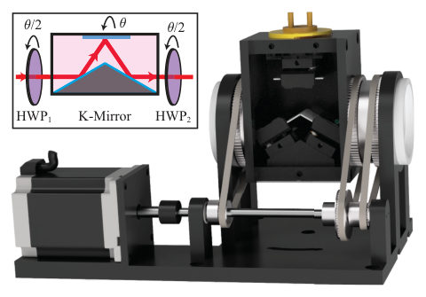 

Fig. 1. Three-dimensional model of the home-built polarization-preserving wavefront rotator (PPWR) device for wavefront rotation. It consists of a K-mirror with two half- wave plates (HWP), HWP1 and HWP2, placed before and after the K-mirror, respectively. Both HWPs and the K-mirror are mounted on a common rotation stage driven by a stepper mo- tor. The HWPs rotate at half the rotation angle of the K-mirror. The inset shows the conceptual schematic.

📷 Fig 2

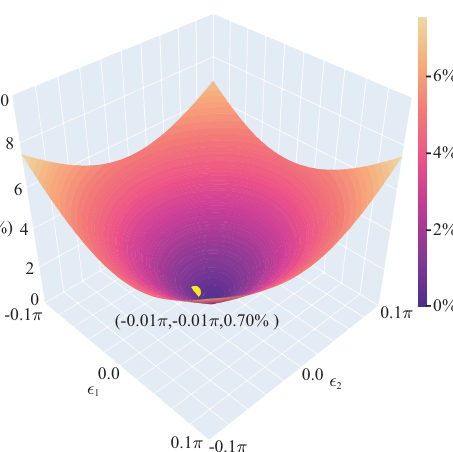 

Fig. 2. Numerically simulated plot of mean polarization er- rors ¯D in % as a function of the retardance errors ϵ1 and ϵ2 of HWP1 and HWP2, respectively, for a linearly polarized input state. The yellow dot marks the operating point corresponding to commercially available Thorlabs HWPs.

📷 Fig 3

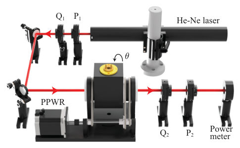 

Fig. 3. Schematic of the experimental setup to measure the transmitted state of polarization at different rotation angles of the polarization-preserving wavefront rotator (PPWR) device. P1, P2: polarizers; Q1, Q2: quarter-wave plates.

📷 Fig 4

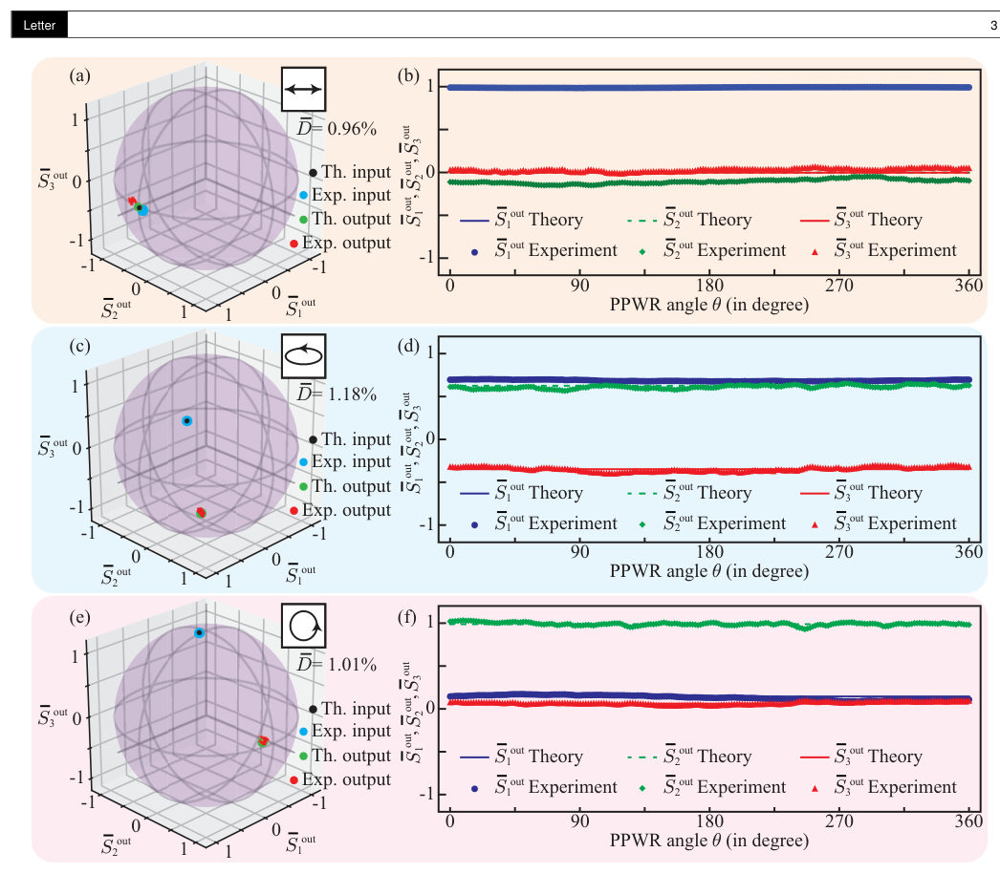 

Fig. 4. Poincaré sphere representation of the transmitted states of polarization at different rotation angles of the PPWR device for three different input states of polarization: (a) linear, (c) elliptical, and (e) circular. The corresponding normalized Stokes parameters are shown in (b), (d), and (f), respectively. The incident state of polarization in each case is shown in the inset.

**Main problem.**

Standard wavefront rotators like K-mirrors introduce rotation-dependent polarization changes, which limits their use in applications like astronomical derotation and OAM spectrum characterization in quantum optics.

**Main result.**

The authors demonstrate that placing half-wave plates before and after a K-mirror and rotating them at half the K-mirror's rotation angle makes the transmitted polarization state independent of the rotation angle.

**Method.**

The study uses Jones matrix analysis for theoretical proof and an experimental setup with a He-Ne laser, polarizers, and a K-mirror to validate the approach.

**Summary.**

This paper presents a new method for creating a polarization-preserving wavefront rotator. By placing half-wave plates before and after a K-mirror and rotating them at half the rotation angle of the mirror, the polarization change becomes independent of the rotation angle. This approach is universal and works for any wavefront rotator. Experimental results show a very low polarization error of approximately 1%, making it highly effective for precision applications in astronomy and quantum information science.

Detailed structure

**Model / system.**

The physical system is a Polarization-Preserving Wavefront Rotator (PPWR) consisting of a K-mirror sandwiched between two half-wave plates (HWPs) mounted on a common rotation stage.

**Key observables.**

Stokes parameters (S0, S1, S2, S3), Poincaré sphere geodesic distance (mean polarization error), and retardance error.

**Important parameters / regimes.**

K-mirror base angle (30 degrees), HWP rotation angle (half the K-mirror angle), and HWP retardance error (epsilon).

**Assumptions / limitations.**

The theoretical ideal assumes perfect half-wave plates (zero retardance error), while the experimental error is limited by the retardance imperfection of commercial HWPs.

**Figures summary.**

Fig 1 shows a 3D model of the PPWR device; Fig 2 plots simulated polarization error vs. HWP retardance error; Fig 3 shows the experimental setup for Stokes parameter measurement; Fig 4 shows Poincaré sphere representations of measured states and normalized Stokes parameters.

**Paper structure.**

The paper introduces the problem of polarization change in K-mirrors, presents a theoretical solution using a HWP sandwich, provides a mathematical proof via Jones matrices, describes the experimental implementation and setup, and concludes with error analysis and experimental validation.

**Why it may be interesting.**

This is highly relevant for quantum optics and photonic quantum technology, as it provides a universal method to rotate wavefronts (e.g., for OAM manipulation) without disturbing the polarization state of qubits or optical modes.

Abstract

A K-mirror rotates the wavefront of an incident optical field. However, the rotation always introduces polarization changes in the transmitted field. This is a serious concern for applications ranging from astronomical image derotation to orbital angular momentum spectrum characterization in photonic quantum technology. Recent efforts have shown that the polarization change can be minimized significantly, but these require either a very small base angle that limits the field of view, or mirrors with a customized refractive index. Making the transmitted polarization state completely independent of the rotation angle has remained an open problem. In this work, we show that placing half-wave plates before and after a K-mirror and rotating them synchronously at half the K-mirror rotation angle makes the polarization change in the transmitted field exactly independent of the rotation angle. This works for any wavefront rotator, any base angle, any mirror refractive index, and any input state of polarization. We experimentally demonstrate the approach using a K-mirror with a base angle of $30^{\circ}$, which gives the largest field of view among practical designs, and find a mean polarization error of ~1%, limited only by the retardance imperfection of commercially available half-wave plates. This has significant practical implications for applications that require precise wavefront rotation without polarization change.

[↑ back to top](#top)

### [Spinodal-like scaling behavior after a temperature quench across the first-order phase transition in three-dimensional $q$-state Potts models](http://arxiv.org/abs/2604.25351v1)

**Authors:** Andrea Pelissetto, Davide Rossini, Ettore Vicari

**Type:** theory · **Category:** statistical mechanics · **PDF:** <https://arxiv.org/pdf/2604.25351v1>

**Analysis basis:** full PDF text, analyzed in chunks

**Topic relevance:** `non-equilibrium dynamics` **3/5** · `non-equilibrium universality` **3/5**

📷 Fig 1

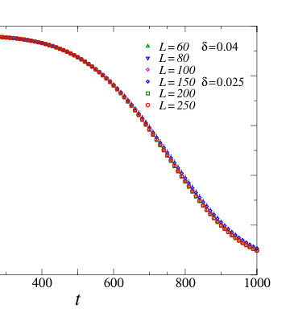 

Figure 1. Post-quench time evolution of the rescaled energy density E(t) for the 3D q = 6 Potts model, versus the time t for several values of δ and L. The data for different sizes and same δ approach an asymptotic curve, which provides an accurate approximation of the time evolution in the thermodynamic limit. Statistical errors are hardly visible in the figure.

📷 Fig 2

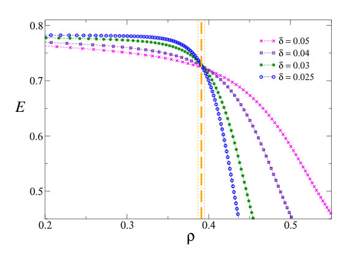 

Figure 2. Post-quench evolution of the q = 6 energy density E(t) in the thermodynamic limit versus ρ = (ln t)3/2δ. The vertical dashed line corresponds to the estimate ρs = 0.391(4) of the asymptotic crossing point (the interval between the dotted lines gives the uncertainty).

📷 Fig 3

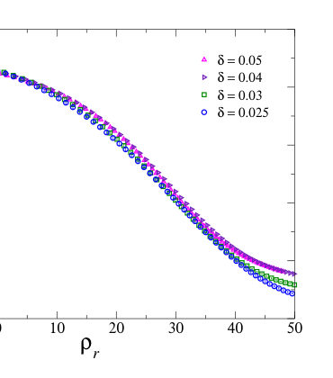 

Figure 3. The post-quench energy density E(t) versus ρr ≡(ρ −ρs) δ−θ, using the optimal values ρs = 0.391 and θ = 1.8. The data appear to approach an asymptotic scaling curve with decreasing δ.

**Main problem.**

Investigating the out-of-equilibrium spinodal-like scaling behavior in 3D systems following a temperature quench across a first-order phase transition.

**Main result.**

The study confirms that post-quench dynamics are driven by droplet nucleation, leading to a predicted scaling variable rho = (ln t)^(3/2 * delta) and a spinodal-like discontinuity in the energy density scaling function.

**Method.**

Monte Carlo simulations using a heat-bath algorithm with a checkerboard update scheme on a 3D q=6 Potts model.

**Summary.**

This paper investigates how a system behaves when suddenly cooled across a first-order phase transition in three dimensions. By studying the 3D q=6 Potts model, the authors show that the energy density follows a specific scaling law related to the time it takes for droplets to nucleate. Their results support a 'spinodal-like' scenario where the phase change is driven by the growth and merging of these droplets. This provides a clearer understanding of non-equilibrium dynamics in systems undergoing discontinuous phase transitions.

Detailed structure

**Model / system.**

A three-dimensional q-state Potts model (specifically q=6) with a Hamiltonian representing short-range interactions, undergoing a thermal first-order phase transition.

**Key observables.**

Rescaled energy density E(t) and the scaling variable rho = (ln t)^(3/2 * delta).

**Important parameters / regimes.**

The distance from the transition point delta = (beta/beta_fo) - 1, the scaling exponent kappa = 3/2, and the thermodynamic limit.

**Assumptions / limitations.**

The primary assumption is that the nucleation of smooth droplets is the dominant and slowest mechanism driving the post-quance phase change.

**Figures summary.**

Figure 1 shows energy density convergence to the thermodynamic limit; Figure 2 demonstrates a stable crossing point for the scaling variable rho; Figure 3 shows data collapse onto a single curve using a rescaled variable rho_r.

**Paper structure.**

The paper introduces the problem of post-quench dynamics, presents a scaling argument based on droplet nucleation, details the Monte Carlo numerical methodology, provides results for the 3D q=6 model, and concludes with the verification of the spinodal-like scenario.

Abstract

We study the out-of-equilibrium spinodal-like behavior of three-dimensional (3D) $q$-state Potts models (for $q\ge 3$), observed when the temperature is quenched across the first-order transition (FOT) point $β_{\rm fo}=T_{\rm fo}^{-1}$. We consider a standard quench protocol, in which high-temperature configurations, thermalized at $β_i<β_{\rm fo}$, are driven across the FOT by a purely relaxational dynamics at $β>β_{\rm fo}$. We focus on the emergence of spinodal-like behaviors in the thermodynamic limit, associated with the dynamic phase change. We argue that, if the nucleation of smooth droplets is the relevant mechanism of the post-quench phase change, for sufficiently small $β_{\rm fo}-β_i>0$, the time-dependent energy density should scale in terms of $ρ= (\ln t)^{3/2} δ$, where $δ= β/β_{\rm fo}-1$, with a discontinuity at a particular value $ρ=ρ_s>0$. This implies the emergence of a spinodal-like behavior, whose time scale $τ$ increases exponentially as $\ln τ\approx (ρ_s/δ)^{2/3}$ in the limit $δ\to 0^+$. We present a numerical analysis of the quench protocol in the 3D $q=6$ Potts model, which supports the above spinodal-like scenario.

[↑ back to top](#top)

### [Universal Characterization of Classical Qubit Noise](http://arxiv.org/abs/2604.25705v1)

**Authors:** Yuan-De Jin, Zheng-Fei Ye, Wen-Long Ma

**Type:** theory · **Category:** quantum information and computing · **PDF:** <https://arxiv.org/pdf/2604.25705v1>

**Analysis basis:** full PDF text, analyzed in chunks

**Topic relevance:** `methods for driven-dissipative` **3/5** · `quantum measurements` **3/5**

📷 Fig 1

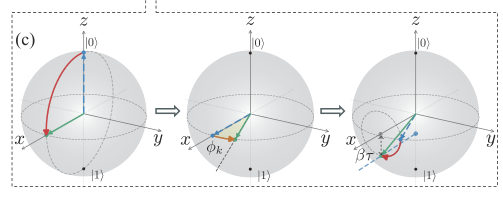 

FIG. 1. Schematic of a universal protocol for characterizing a classical stochastic noise process via sequential RIMs on a qubit. (a) A realization of the continuous stochastic noise process. (b) Direct sampling of the noise field with sequential RIMs. (c) Evolution of the qubit during a single RIM with φ1 = π/2 and φ2 = π. The free evolution time τ in a RIM should be much shorter than the delay time ∆t.

📷 Fig 2

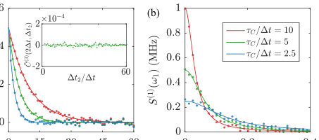 

FIG. 2. Reconstruction of (a) the two-point cumulant ˜C(2)(∆t1) and (b) noise spectrum S(1)(ω) of the OU process with three correlation times τC = 1, 0.5, 0.25 µs (red, green, blue line). Solid lines are theoretical results and dots are re- constructed from the RIM outcomes. The inset in (a) shows the three-point cumulant ˜C(3)(2∆t, ∆t2). The parameters are Γ = 1 MHz2, τ = 0.05 µs, ∆t = 0.1 µs, and Ns = 5 × 108.

📷 Fig 3

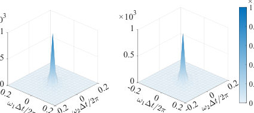 

FIG. 3. Reconstruction of (a) three-point cumulant ˜C(3)(∆t1, ∆t2) (MHz3) and (b) bispectrum of a non-Gaussian noise through our method. The noise is produced by three TLFs with the coupling strength λ = 119 kHz and switching rate {Wj} = {4.77, 21.35, 95.49} kHz. Note that the inac- cessible points with ∆t1 = 0, ∆t2 = 0 and ∆t1 = ∆t2 for the reconstructed cumulant are smoothed by the neighbor- hood values. The parameters are τ = 0.15 µs, ∆t=2 µs and Ns = 4 × 108.

📷 Fig 4

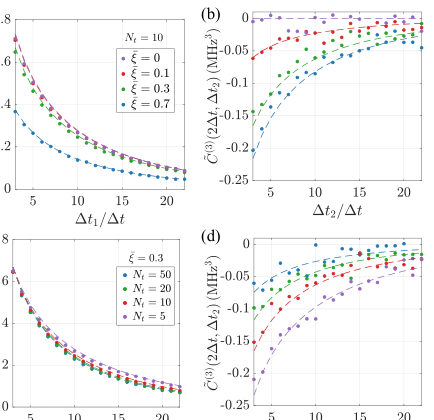 

FIG. 4. Non-Gaussian-to-Gaussian transition in a sparse bath containing Nt TLFs. Here we show the ideal (dashed lines) and reconstructed (points) two-point and three-point cumu- lants with (a-b) different ¯ξ and (c-d) different Nt. The cou- pling strength is λ = 207/√Nt kHz and the switching rate obeys a log-uniform distribution ranging from 4.77 kHz to 95.49 kHz. The parameters are τ = 0.15 µs, ∆t = 2 µs and Ns = 9 × 108.

📷 Fig 5

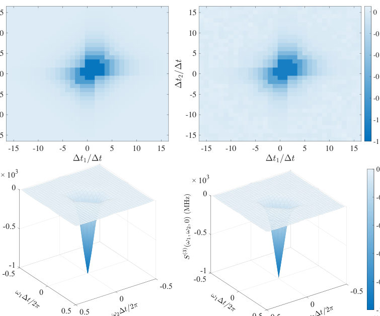 

FIG. 1. Reconstruction of (a) four-point cumulant slice C(4)(2∆t, ∆t2, ∆t3) and (b) trispectrum slice S(3)(ω1, ω2, 0) of a classical noise. The noise is produced by a single TLF with the coupling strength λ = 206 kHz and switching rate Wj = 63 kHz. Note that the inaccessible points are smoothed by the neighborhood values for the reconstructed cumulant. The parameters are τ = 0.25 µs, ∆t=1 µs and Ns = 5 × 108.

**Main problem.**

The need for a universal and efficient method to fully characterize classical stochastic noise processes (both Gaussian and non-Gaussian) that cause qubit dephasing without requiring complex dynamical decoupling pulse sequences.

**Main result.**

The authors propose a protocol using repetitive Ramsey interferometry measurements (RIMs) that can directly sample the noise field and reconstruct arbitrary-order correlation functions, including bispectra and trispectra.

**Method.**

A protocol of sequential Ramsey Interferometry Measurements (RIMs) where the phase difference between pulses is tuned to achieve either linear or quadratic response, allowing for the estimation of n-point noise correlations.

**Summary.**

The paper introduces a new method for characterizing qubit dephasing noise using repetitive Ramsey measurements. Unlike traditional spectroscopy, this method does not require complex dynamical decoupling sequences and can directly detect higher-order correlations like the bispectrum and trispectrum. It is shown to be effective for both Gaussian and non-Gaussian noise models and is robust against measurement errors and qubit decoherence. This offers a universal approach for noise spectroscopy across various quantum platforms.

Detailed structure

**Model / system.**

A single probe qubit subject to pure dephasing caused by a classical stochastic noise process beta(t). Specific noise models tested include the Gaussian Ornstein-Uhlenbeck process and an ensemble of non-Gaussian Two-Level Fluctuators (TLFs).

**Key observables.**

n-point correlation functions of measurement outcomes, n-point noise cumulants, noise power spectrum, bispectrum, and trispectrum.

**Important parameters / regimes.**

Short evolution regime (beta*tau << 1), phase difference (delta_phi), evolution time (tau), and delay time between cycles (delta_t).

**Assumptions / limitations.**

The noise is classical and stochastic with zero mean; the system operates in the short-evolution regime where the noise is approximately constant during the Ramsey time.

**Figures summary.**

Figure 1 shows the reconstruction of 4-point cumulants and trispectra; Figure 2 demonstrates the reconstruction of the 2-point correlation and spectrum for an OU process; Figure 3 shows 3-point cumulant and bispectrum reconstruction for TLFs; Figure 4 shows the transition from non-Gaussian to Gaussian noise.

**Paper structure.**

Introduction of the noise characterization problem, description of the RIM protocol and mathematical framework for n-point correlations, derivation of the direct sampling condition and handling of repeated time indices, numerical validation using Gaussian (OU) and non-Gaussian (TLF) models, and an analysis of robustness against measurement errors.

**Why it may be interesting.**

This paper provides a powerful tool for open quantum systems researchers to characterize complex, non-Gaussian environments using simple measurement sequences, bypassing the need for complex pulse engineering.

Abstract

We propose a general method to fully characterize a classical stochastic noise process causing qubit dephasing through repetitive Ramsey interferometry measurements (RIMs) on the qubit. Compared to filter-function-based spectroscopy, our method does not require complicated dynamical decoupling pulses and can directly detect arbitrary-order correlation functions of such noise processes. We show that each RIM with a short evolution time and suitably chosen control pulses can perform a direct sampling of the noise field and the $n$-point correlations of the RIM outcomes are proportional to the $n$-point correlation functions of the noise processes. Then we numerically demonstrate this method for characterizing two typical examples of classical noises, including the Ornstein-Uhlenbeck processes producing Gaussian noises and an ensemble of TLFs producing non-Gaussian noises. Our method is independent of qubit lifetime and robust against qubit decoherence and measurement errors, thus offering a universal and efficient protocol for qubit noise spectroscopy across diverse platforms.

[↑ back to top](#top)

### [Data-Driven Hamiltonian Reduction for Superconducting Qubits via Meta-Learning](http://arxiv.org/abs/2604.24912v1)

**Authors:** Arielle Sanford, Andrew T. Kamen, Frederic T. Chong, Andy J. Goldschmidt

**Type:** both · **Category:** quantum information and computing · **PDF:** <https://arxiv.org/pdf/2604.24912v1>

**Analysis basis:** full PDF text, analyzed in chunks

**Topic relevance:** `QC/QI experiment` **3/5** · `methods for driven-dissipative` **2/5**

📷 Fig 1

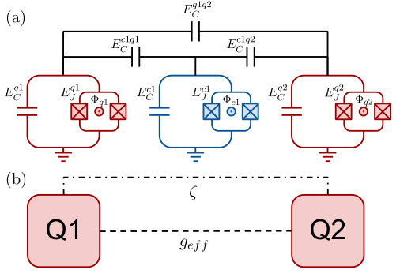 

Fig. 1. (a) Circuit diagram of the transmon-coupler-transmon architecture: two frequency-tunable transmon qubits (red) capacitively coupled to a tunable coupler (blue). Each mode is characterized by its charging and Josephson energies Ei C, Ei J, with capacitive coupling energies Ejk C setting the inter-mode couplings. The qubit and coupler frequencies are tunable via the SQUID fluxes Φq1, Φq2, Φc1. (b) Effective two-qubit description after coupler elimination: the qubits acquire an effective exchange coupling geff and a residual ZZ interaction ζ.

📷 Fig 2

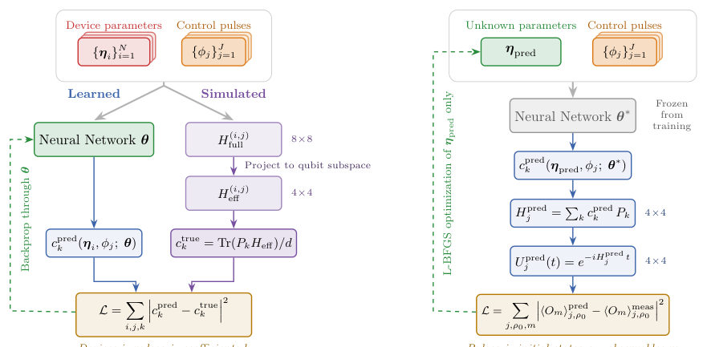 

Fig. 2. HAML pipeline: schematic of the two-stage framework. Left: during training, a neural network with shared parameters θ learns to predict effective Hamiltonian coefficients from simulated device parameters and control pulses. Right: during adaptation, the trained network is frozen, and only the device parameter vector ηpred is optimized using hardware measurements.

📷 Fig 3

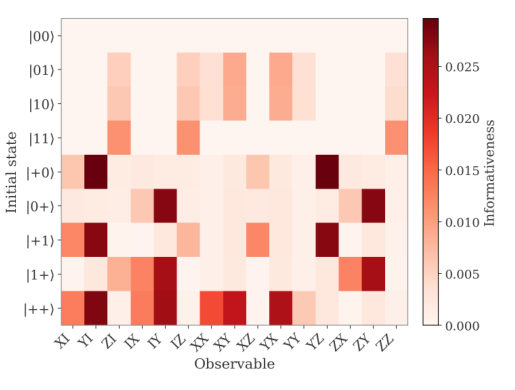 

Fig. 3. Raw informativeness of every candidate (initial state, observable) pair, computed as the variance of the predicted expectation value across N = 500 random draws of (η, ϕ) from the training distribution. Rows: candidate initial states, restricted to tensor products of single-qubit states. Columns: single- and two-qubit Pauli observables (excluding the identity). Darker cells are uninformative; brighter cells are sensitive to the learned parameters.

📷 Fig 4

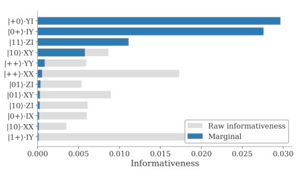 

Fig. 4. Greedy selection trajectory. Each row corresponds to one (initial state, observable) candidate, ordered by selection (top = first picked); rows below the selected set show the highest-informativeness candidates that were not selected. Gray bars: raw informativeness. Colored bars: marginal informativeness after orthogonalization against previously-selected pairs.

📷 Fig 5

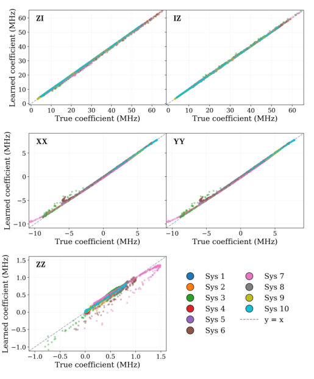 

Fig. 5. Predicted vs ground-truth projected Pauli coefficients on 10 held-out, adapted devices. Shown are 300 random control points per device. Color encodes device; dashed line is y = x.

📷 Fig 6

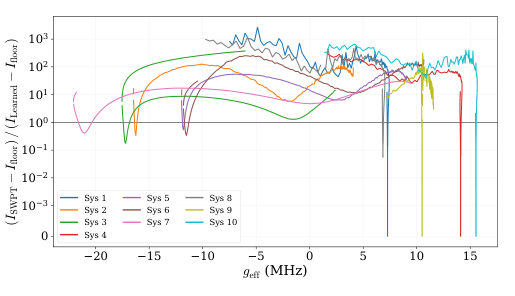 

Fig. 7. Infidelity gain of HAML over SWPT, (ISWPT−IFloor)/(ILearned−Ifloor), with fidelity floor Ifloor, as a function of effective coupling geff, per held-out device.

📷 Fig 7

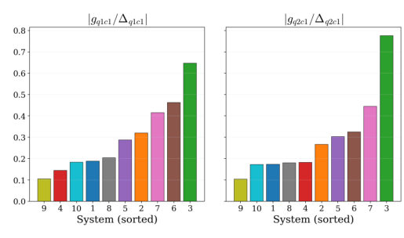 

Fig. 6. Perturbative expansion ratio |gqic1/∆qic1| for i = 1 (left) and i = 2 (right), across the 10 held-out devices, at the fast-gate operating flux Φc1 = 1.35. Bars are sorted ascending; bar color identifies the device.

**Main problem.**

Accurately mapping the complex multi-mode dynamics of superconducting processors (including couplers and resonators) to an effective qubit-level Hamiltonian, especially in regimes where traditional Schrieffer-Wolff perturbation theory fails.

**Main result.**

The HAML framework achieves a 6x improvement in absolute error and an 8x improvement in relative error compared to Schrieffer-Wolff theory, effectively capturing parasitic ZZ interactions and maintaining accuracy in strong-hybridization regimes.

**Method.**

A two-phase meta-learning framework (HAML) consisting of an offline supervised training phase on simulated devices and an online adaptation phase using a small number of hardware measurements and L-BFGS optimization.

**Summary.**

The paper presents HAML, a meta-learning framework designed to rapidly adapt effective Hamiltonian models for superconducting qubits. By training on simulated data and adapting to real hardware with minimal measurements, the method bypasses the need for complex analytical perturbation theory. It excels in regimes where traditional methods break down, such as strong hybridization and parasitic ZZ interactions. This approach offers a scalable solution for the calibration and control of near-term quantum processors.

Detailed structure

**Model / system.**

A transmon-coupler-transmon architecture consisting of two frequency-tunable qubits capacitively coupled to a tunable coupler, modeled by an 8-level multi-mode Hamiltonian under the rotating wave approximation.

**Key observables.**

Effective Pauli coefficients (ZI, IZ, XX, YY, ZZ) and expectation values of single- and two-qubit Pauli operators.

**Important parameters / regimes.**

Qubit and coupler frequencies, Josephson and charging energies, capacitive coupling energies, and SQUID fluxes; specifically focuses on the transition from dispersive to strong-hybridization regimes.

**Assumptions / limitations.**

The framework assumes that the dynamics can be effectively captured by a reduced qubit subspace and relies on the availability of simulated data for the initial training phase.

**Figures summary.**

Figure 1 shows the device architecture and effective model; Figure 2 illustrates the HAML training and adaptation pipeline; Figure 3 and 4 demonstrate measurement selection strategies; Figure 5 shows prediction accuracy on held-out devices; Figure 6 and 7 show performance in the strong-hybridization regime and error reduction compared to SWPT.

**Paper structure.**

The paper introduces the problem of Hamiltonian reduction, presents the HAML meta-learning architecture (training and adaptation phases), details the measurement selection strategy, compares performance against Schrieffer-Wolff theory, and evaluates scalability and error characteristics.

**Why it may be interesting.**

This is highly relevant for researchers in open quantum systems and quantum optics as it provides a data-driven way to handle complex, multi-mode dynamics and strong coupling without relying on the validity of perturbative expansions.

Abstract

We introduce HAML (Hamiltonian Adaptation via Meta-Learning), a framework for fast online adaptation of effective Hamiltonian models of superconducting quantum processors. HAML proceeds in two phases. A supervised training phase uses an ensemble of simulated devices to learn an offline map from control inputs and device parameters to effective Hamiltonian coefficients. An online adaptation phase then uses a small number of hardware-accessible measurements to identify the unknown parameters of a new device. By training directly against effective two-qubit coefficients extracted from full multi-mode simulations, HAML implicitly learns the reduction from full multi-mode Hamiltonians to effective qubit descriptions without invoking perturbation theory. We further show that a variance-maximizing greedy selection of measurement configurations boosts online adaptation efficiency. We demonstrate HAML on a transmon-coupler-transmon system, recovering effective two-qubit coefficients across a wide range of operating regimes, including parameter regions where Schrieffer-Wolff perturbation theory (SWPT) breaks down. This establishes a scalable, sample-efficient approach to Hamiltonian reduction and characterization for near-term quantum processors, with direct implications for calibration, control, and error mitigation.

[↑ back to top](#top)

### [Heralding probability optimization for nonclassical light generated by photon counting measurements on multimode Gaussian states](http://arxiv.org/abs/2604.25910v1)

**Authors:** Jaromír Fiurášek

**Type:** theory · **Category:** quantum information and computing · **PDF:** <https://arxiv.org/pdf/2604.25910v1>

**Analysis basis:** full PDF text, analyzed in chunks

**Topic relevance:** `quantum measurements` **3/5** · `Keldysh / 2PI / non-Gaussian methods` **2/5**

📷 Fig 1

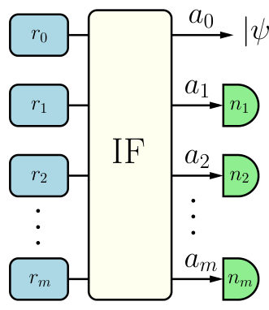 

FIG. 1. Scheme for generation of single-mode nonclassical state of light |ψN⟩with stellar rank N by photon counting measure- ments on m heralding modes of m + 1-mode Gaussian state. The Gaussian state has vanishing coherent displacements and can be generated from m+1 single-mode squeezed vaccuum states with suitably chosen squeezing constants rj by their interference in optical interferometer IF.

📷 Fig 2

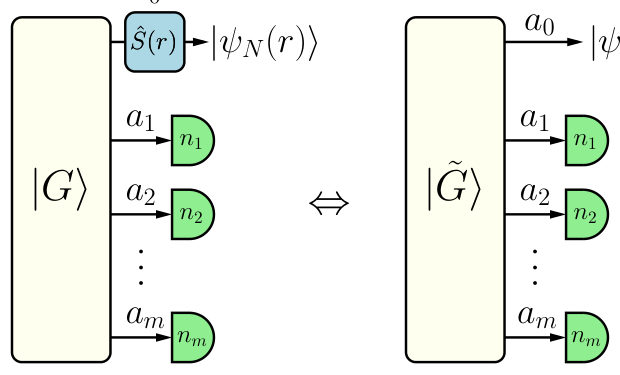 

FIG. 2. Scheme for generation of single-mode squeezed superpositions of Fock states. The state generated from Gaussian core state |G⟩can be squeezed by unitary squeezing operation ˆS(r) acting on mode a0. This is equivalent to utilizing a different input multimode Gaussian state | ˜G⟩with modified squeezing properties.

📷 Fig 3

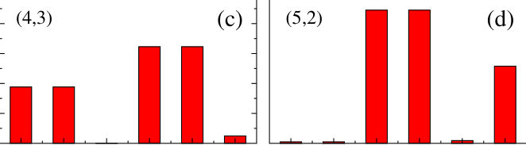 

FIG. 3. Results of maximization of the heralding probability pS for balanced superposition target states |ψ6⟩(a,b) and |ψ7⟩ (c,d) defined in Eq. (53). For each heralding pattern (n1, n2) considered, six configurations (s1, s2, ν) generating the state were identified and the maximum achievable heralding probability pS for each configuration is plotted. Note that all the plotted pS are nonzero, although some of them are very small. See also Table I in the Appendix B.

📷 Fig 4

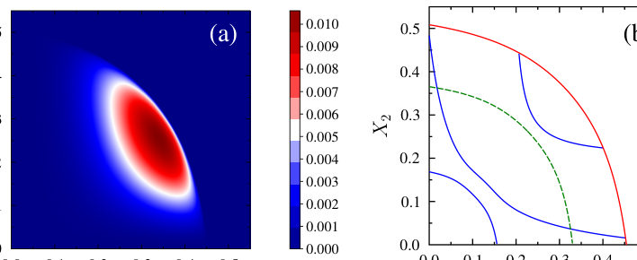 

FIG. 4. (a) Dependence of the heralding probability pS on X1 and X2 is plotted for target state |ψ6⟩, heralding pattern (4, 2), and the optimal configuration s1 = −0.072 −1.199i, s2 = −0.960 −0.109i, ν = 0.859 + 0.913i. The set of points satisfying the squeezing constraint D = 0 is plotted for this configuration in panel (b) for two different squeezing values µ2 = 0.25 (blue solid lines) and µ2 = 0.65 (green dashed line). The red curve represents the physical boundary in the (X1, X2) plane where the largest eigenvalue of AA† becomes equal to 1.

📷 Fig 5

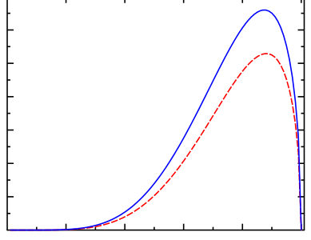 

FIG. 5. Maximum heralding probability for target state |ψ6⟩defined in Eq. (53) when the maximum squeezing is set to µ2 = tanh2 rmax. The results are plotted for two heralding patterns (3,3) (blue solid line) and (4,2) (red dashed line).

📷 Fig 6

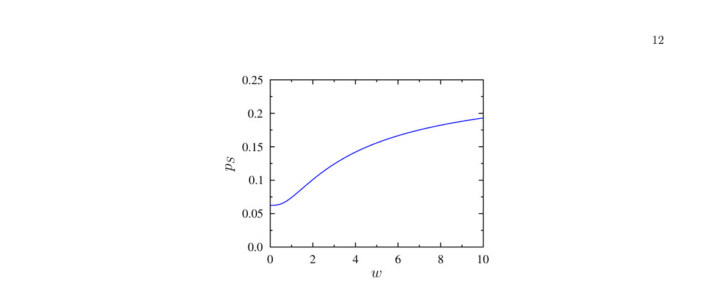 

FIG. 6. Optimal heralding probability pS of generation of the entangled two-mode state |Φ(w)⟩is plotted as function of the state parameter w.

**Main problem.**

Optimizing the heralding probability for the conditional preparation of non-classical (non-Gaussian) states of light using photon-counting measurements on multimode Gaussian states.

**Main result.**

The authors demonstrate that maximizing the heralting probability can be formulated as solving a system of polynomial equations, providing an efficient way to find optimal configurations and incorporate squeezing constraints.

**Method.**

The optimization is framed using the stellar (Bargmann) representation and solved via algebraic techniques such as Gröbner basis construction and homotopy continuation.

**Summary.**

This paper presents a new method for maximizing the success rate (heralding probability) of generating non-classical light. By transforming the optimization problem into a system of polynomial equations, the authors enable efficient calculation of optimal squeezing and detection parameters. The approach is versatile enough to handle constraints on available squeezing and can be applied to various target states, including Fock state superpositions and single-rail qubits. This is crucial for improving the efficiency of optical quantum information processing.

Detailed structure

**Model / system.**

The system consists of multimode squeezed Gaussian states where non-Gaussian states (like Fock state superpositions or GKP states) are generated via photon-number measurements on a subset of modes.

**Key observables.**

Heralding probability (p_S), photon number pattern, and photon number parity.

**Important parameters / regimes.**

Squeezing parameters (r_j), photon number pattern (n_1, n_2, ...), and available single-mode quadrature squeezing limits.

**Assumptions / limitations.**

Focuses on Gaussian states with vanishing coherent displacements and assumes the signal mode is directly coupled to all heralding modes.

**Figures summary.**

Figure 1 shows the scheme for generating single-mode nonclassical states; Figure 2 illustrates the generation of squeezed superpositions of Fock states; Figure 3 plots maximum heralding probability for various target states; Figure 4 shows the dependence of p_S on damping parameters.

**Paper structure.**

The paper introduces the problem of state preparation, develops a mathematical framework using polynomial equations, applies the method to various target states (single-mode and multi-mode), incorporates squeezing constraints, and provides specific numerical examples and applications to single-rail qubits.

**Why it may be interesting.**

This is highly relevant for quantum optics and photonic quantum computing, as it provides a scalable mathematical tool to optimize the success rates of generating essential non-Gaussian resources like GKP and cat states.

Abstract

Generation of highly non-classical quantum states of light is essential for optical quantum information processing and quantum metrology. Given the lack of sufficiently strong nonlinear interactions between optical fields, the commonly employed optical quantum-state preparation schemes are conditional, based on nonlinearity induced by heralding photon number measurement on a part of a multimode squeezed Gaussian state. Development and optimization of such probabilistic quantum-state engineering schemes represents one of the central challenges in current quantum optics. As technology advances and experiments progress to detection of higher numbers of photons, the maximization of the heralding probability becomes essential to ensure sufficiently high state-preparation rates. Here, we show that for the conditional quantum state preparation schemes based on Gaussian states and photon number measurements the maximization of the heralding probability can be formulated as finding solution to a system of polynomial equations, which offers an efficient way to find the optimal configuration and allows us to apply techniques dedicated specifically to solving such systems of equations. Our approach can seamlessly incorporate bounds on the available single-mode quadrature squeezing, which is highly experimentally relevant. We mainly consider generation of finite superpositions of Fock states but show that the approach can be straightforwardly extended to generation of squeezed superpositions of Fock states. We focus on Gaussian states with vanishing coherent displacements, hence the conditionally generated states have well defined photon number parity. We illustrate our general methodology on examples of generation of single-mode and two-mode states with two heralding modes.

[↑ back to top](#top)

### [Non-magnetic floating phases in frustrated Haldane chains with a single-ion anisotropy](http://arxiv.org/abs/2604.25493v1)

**Authors:** Bowy M. La Riviere, Natalia Chepiga

**Type:** theory · **Category:** strongly correlated electrons · **PDF:** <https://arxiv.org/pdf/2604.25493v1>

**Analysis basis:** full PDF text, analyzed in chunks

**Topic relevance:** `entanglement & information structure` **3/5** · `Frenkel-Kontorova` **2/5**

📷 Fig 1

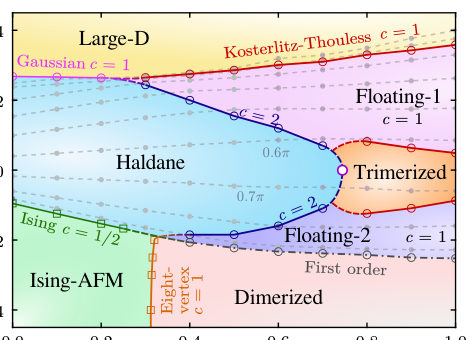 

FIG. 1. Phase diagram of the bilinear–biquadratic J1–J2 spin-1 chain with single-ion anisotropy D [Eq. (1)] at θ = 0.2π. It contains five gapped phases: Haldane, large-D, and three symmetry-broken phases — trimerized, dimerized, and Ising antiferromagnetic (AFM). In addition, two floating phases appear: critical Luttinger liquids with central charge c = 1, gapped magnetic excitations and incommensurate quasi-long-range order. The trimerized phase is separated from both floating phases by Kosterlitz–Thouless (KT) tran- sitions (red lines). Another KT transition separates Floating- 1 from the large-D phase. Dashed gray lines mark constant wave-vector q (step 0.1π); along D = 0, correlations...

📷 Fig 2

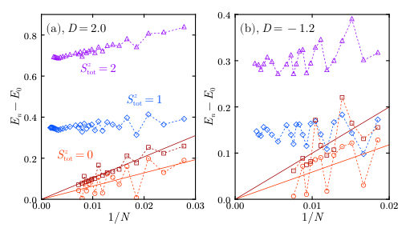 

FIG. 3. Examples of the finite-size scaling of the two low- lying singlet excitations (red), and singlet-triplet (blue) and singlet-quintuplet (purple) energy gaps inside (a) Floating-1 and (b) Floating-2 phases. Data is shown for J2 = 0.9. Lines are linear fits through origin.

📷 Fig 3

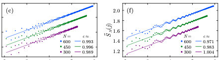 

FIG. 2. Visualization and numerical evidences of emer- gence of (a)-(c) Floating-1 and (d)-(f) Floating-2 phases. (a),(d) Valence bond singlet (VBS) sketches of prolifera- tion of (a) Sz i = 0 in the Floating-1 phase for D &gt; 0 and (b) dimers in the Floating-2 phase for D &lt; 0 over a trimerized state. (c),(f) Friedel oscillations profile of nearest- neighbor correlations (blue) inside (c) the Floating-1 phase with q ≈0.458π ∈(0, 2π/3); and (f) the Floating-2 phase with q ≈0.883π ∈(2π/3, π). In (b) we also present local den- sity of zeros Oi (red), the wave-vector q is the same for both local observables. (b),(e) Finite-size scaling of the reduced entanglement entropy with the conformal...

📷 Fig 4

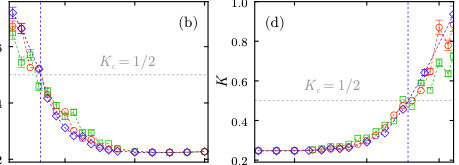 

FIG. 4. Numerical data suggesting a single topological tran- sition with central charge c = 2 between the Haldane phase and (a)-(b) the Floating-1 and (c)-(d) Floating-2 phases. All results are taken for J2 = 0.5 and three different chain lengths N (different colored symbols). Dashed blue lines mark esti- mated location of the transition. The transition out of the floating phase associated with LL parameter K crossing the critical value Kc = 1/2 corresponds to the point where the central charge reaches the value c = 2. In the Haldane phase K and c should be treated as a effective finite-size estimate of the critical exponent and central charge correspondingly.

📷 Fig 5

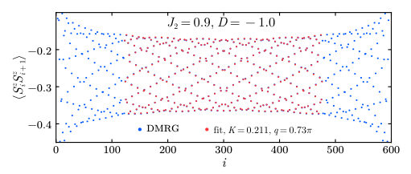 

FIG. 7. Example of fitting nearest-neighbor correlations ⟨Sz i Sz i+1⟩against Eq.(3) in the floating phase.

📷 Fig 6

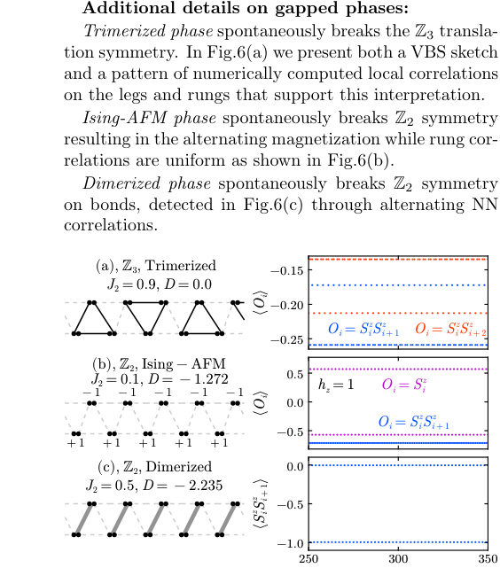 

FIG. 6. VBS sketches and local observables extracted in the three ordered phases: (a) Trimerized phase with period-3 al- ternating NN ⟨Sz i Sz i+1⟩and NNN ⟨Sz i Sz i+2⟩; (b) Alternating local magnetization Sz i and uniform NN correlations in Ising- AFM phase; and (c) Alternating NN correlations in the dimer- ized phase.

📷 Fig 7

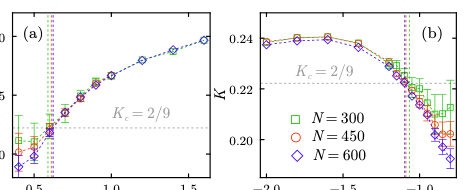 

FIG. 8. Luttinger liquid exponent K across Kosterlitz- Thouless transition between gapped trimerized phase and (a) Floating-1 and (b) Floating-2 phases along J2 = 0.9. The transitions takes place when LL exponent reaches critical value Kc = 2/9 (vertical dotted lines).

📷 Fig 8

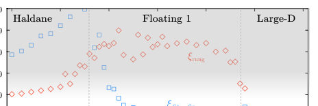 

FIG. 11. Correlation length extracted from the decay of dimer-dimer (red) and spin-spin (blue) correlations along J2 = 0.5. Spin-spin correlation length remains finite across the non-magnetic Floating-1 phase but diverges at the c = 2 transition to the Haldane phase. Shaded area indicate that the results should be treated with caution as correlation lengths are comparable to the size of the system (N = 450). Dashed vertical lines denote estimates of the transitions.

📷 Fig 9

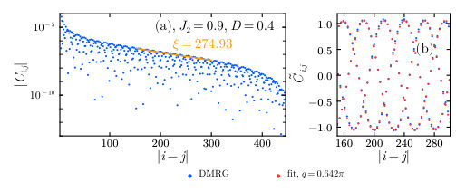 

FIG. 10. Example of fitting the dimer-dimer correlation function to the Ornstein-Zernicke form (4) in two steps: (a) First, the correlation length ξ is extracted from the main slope of the logarithm of |Ci,j|. (b) Then we fit the reduced correla- tions ˜Ci,j = Ci,j ·Ae|i−j|/ξp

📷 Fig 10

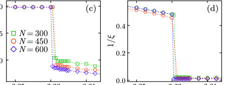 

FIG. 12. Finite jump in (a) Luttinger liquid parameter, (b) incommensurate wave-vector, (c) alternation in nearest- neighbor correlations Drung N/2 = |Sz N/2−1Sz N/2 −Sz N/2Sz N/2+1|, and (d) inverse of the correlation length at J2 = 0.5 sup- porting first order transition between the Floating-2 and the dimerized phase.

**Main problem.**

The study investigates the effect of single-ion anisotropy on the quantum phase transitions out of the trimerized phase in frustrated Haldane chains, specifically addressing the nature of the transition between the Haldane and trimerized phases.

**Main result.**

The authors discover a rich phase diagram containing five gapped phases and two new critical 'floating' phases that are non-magnetic. They also identify a composite critical line with central charge c=2 at the transition between the Haldane and floating phases.

**Method.**

Large-scale Density Matrix Renormalization Group (DMRG) simulations using Matrix Product States (MPS) and finite-size scaling of entanglement entropy and correlation functions.

**Summary.**

This paper explores the phase diagram of frustrated spin-1 chains subject to single-ion anisotropy. Using DMRG, the authors identify two previously unknown non-magnetic 'floating' phases that emerge from the trimerized background. They demonstrate that the transition from the topological Haldane phase to these floating phases is a composite transition with a central charge of c=2. The work provides a new perspective on the long-standing problem of the transition between Haldane and trimerized phases in 1D spin systems.

Detailed structure

**Model / system.**

A bilinear-biquadratic spin-1 J1-J2 frustrated Haldane chain (zig-zag ladder) with single-ion anisotropy D.

**Key observables.**

Central charge (c), Luttinger liquid parameter (K), incommensurate wave-vector (q), entanglement entropy, local density of zeros, and spin-spin/dimer-dimer correlation functions.

**Important parameters / regimes.**

Next-nearest-neighbor interaction (J2/J1), single-ion anisotropy (D/J1), and the bilinear-biquadratic angle (theta).

**Assumptions / limitations.**

The study assumes the system can be accurately modeled by the 1D Hamiltonian and relies on the validity of the Calabrese-Cardy formula for extracting central charge from finite-size entanglement entropy.

**Figures summary.**

Figures include sketches of various phases (Trimerized, Ising-AFM, Dimerized), fits of nearest-neighbor correlations to extract wave-vectors and Luttinger parameters, and the evolution of the Luttinger parameter across Kosterlitz-Thouless transitions.

**Paper structure.**

The paper introduces the problem of the Haldane-trimerized transition, describes the Hamiltonian and numerical methods, presents the discovered phase diagram including the new floating phases, analyzes the criticality and central charge of the transitions, and concludes with implications for emergent symmetries.

**Why it may be interesting.**

The discovery of non-magnetic floating phases and the identification of a composite c=2 critical line provides deep insight into the interplay between topological order and symmetry-breaking transitions, which is highly relevant to many-body dynamics and 1D quantum systems.

Abstract

We investigate the effect of a single-ion anisotropy on the bilinear-biquadratic spin-1 J1-J2 chain, focusing on the quantum phase transitions out of the trimerized phase. Using large-scale density matrix renormalization group simulations, we uncover a rich phase diagram comprising five gapped phases and, remarkably, two critical floating phases. These incommensurate Luttinger liquid phases emerge from the proliferation of non-magnetic domains - 0-states and dimers - within a trimerized background and are confined to the zero magnetization sector, while magnetic excitations remain gapped. We show that the transition between the topological Haldane phase and the floating phases are governed by a composite critical line with central charge c=2, consistent with a coexistence of magnetic and non-magnetic critical modes. Our results shed new light on the long-standing problem of the Haldane-trimerized transition.

[↑ back to top](#top)

### [Polynomial Resource Classification of Quantum Circuit Familes via Classical Shadows](http://arxiv.org/abs/2604.25708v1)

**Authors:** Andrew Maciejunes, Ross Gore, Sachin Shetty, Barry Ezell

**Type:** theory · **Category:** quantum information and computing · **PDF:** <https://arxiv.org/pdf/2604.25708v1>

**Analysis basis:** full PDF text, analyzed in chunks

**Topic relevance:** `quantum measurements` **3/5** · `entanglement & information structure` **2/5**

📷 Fig 1

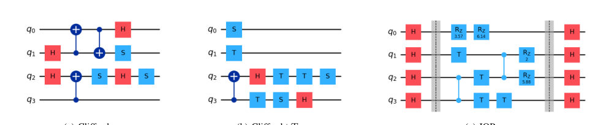 

Fig. 1. We illustrate an example Clifford, Clifford+T, and IQP circuits for the reader with four qubits and Nc = 10. (a) The Clifford circuit is comprised of gates from the Clifford gate set as defined above. (b) We observe a disproportionate amount of T gates for the Clifford+T example. This is done to ensure distinctness from the Clifford circuit family. (c) We show an example IQP circuit. It is clear that Nc for IQP circuits refers to the number of operations between the Hadamard gates.

📷 Fig 2

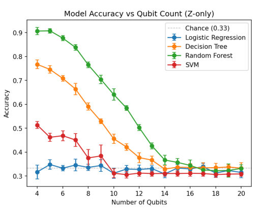 

Fig. 2. Classifier accuracy vs. qubit count under the Z-only measurement strategy (4–20 qubits). Error bars show std over 10 repeated train/test splits.

📷 Fig 3

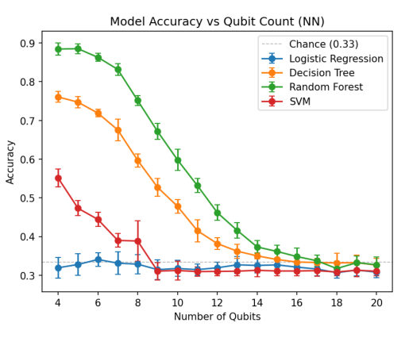 

Fig. 3. Classifier accuracy vs. qubit count under the nearest-neighbor ZZ measurement strategy (4–20 qubits). Error bars show std over 10 repeated train/test splits.

📷 Fig 4

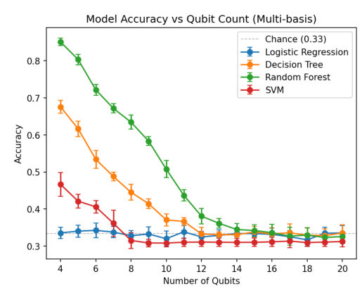 

Fig. 4. Classifier accuracy vs. qubit count under the multi-basis measurement strategy (4–20 qubits). Error bars show std over 10 repeated train/test splits.

📷 Fig 5

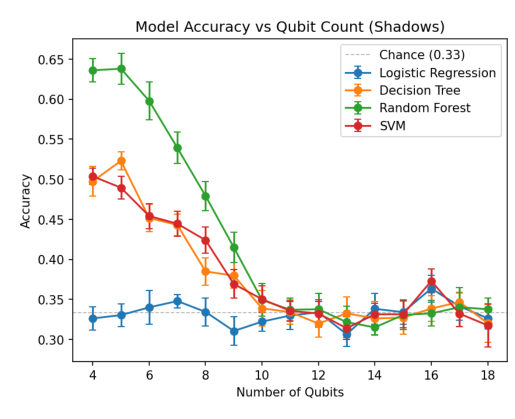 

Fig. 5. Classifier accuracy vs. qubit count under the classical shadows measurement strategy (4–18 qubits). Shadows data is unavailable for 19–20 qubits due to incomplete simulation runs. Error bars show std over 10 repeated train/test splits.

**Main problem.**

Determining whether different polynomial-resource measurement strategies can effectively classify quantum circuit families (Clifford, Clifford+T, and IQP) as the number of qubits increases.

**Main result.**

Z-basis-only measurements outperform multi-basis and classical shadows because the discriminative signal is concentrated in local ZZ correlations, though all strategies fail above approximately 12 qubits under a quadratic shot budget.

**Method.**

The authors use a Random Forest classifier to compare four measurement strategies (Z-only, NN ZZ, multi-basis, and classical shadows) using noiseless Qiskit simulations.

**Summary.**

This paper investigates how to distinguish between different types of quantum circuits using limited measurement resources. It finds that for circuits like IQP, measuring only in the Z-basis is more effective than more complex methods like classical shadows. However, it also reveals a fundamental scaling limit where a quadratic shot budget becomes insufficient to distinguish these families once the system exceeds about 12 qubits. The findings suggest that the key information for classification is stored in local, nearest-neighbor correlations.

Detailed structure

**Model / system.**

The study examines three families of random quantum circuits: Clifford, Clifford+T, and IQP (Instantaneous Quantum Polynomial), implemented on 4 to 20 qubits.

**Key observables.**

Pauli correlators (specifically ZZ, XX, YY, XY, XZ, YZ), Hamming-weight, and single-qubit marginals.

**Important parameters / regimes.**

Qubit count (n), shot budget (s = 16n^2), and the diagonal fraction of gates in the Z-basis.

**Assumptions / limitations.**

The study assumes a polynomial-resource constraint and uses noiseless classical simulations, which may not account for real-device noise.

**Figures summary.**

Figure 1 provides visual examples of the gate structures for Clifford, Clifford+T, and IQP circuit families.

**Paper structure.**

The paper introduces the classification problem, defines the circuit families and measurement strategies, presents empirical results comparing accuracy across strategies, provides a theoretical framework for the optimality of Z-basis measurements, and discusses scaling limits and open questions.

Abstract

We compare four polynomial-resource measurement strategies, (I) $Z$-basis-only, (II) nearest-neighbor $ZZ$ (NN), (III) multi-basis ($Z$, $X$, $Y$), and (IV) classical shadows, for classifying three quantum circuit families: IQP, Clifford, and Clifford$+T$. We find $Z$-only measurements outperform multi-basis and classical shadows across all qubit counts and all four classifiers evaluated, and the $O(\nqubits)$-feature NN strategy matches $Z$-only to within $0.02$ in Random Forest accuracy. The best result is a Random Forest accuracy of $0.91$ at 4--5 qubits under $Z$-only ($0.89$ for NN, $0.85$ for multi-basis, $0.67$ for shadows). All four strategies collapse to near-chance accuracy ($\approx 0.33$) above approximately 12 qubits under the quadratic shot budget $\shots = 16\nqubits^2$. These findings indicate that the discriminative signal between these circuit families is concentrated in local, nearest-neighbor $Z$-basis correlations, consistent with the diagonal gate structure of IQP circuits, and that additional Pauli correlator types or long-range correlations carry no compensating discriminative power for this task. We provide a formal theoretical framework showing that circuits with high diagonal fraction in a given basis concentrate their correlator structure in that basis, and that any deviation from the dominant basis incurs a provably higher estimator variance. These results establish that a quadratic shot budget is insufficient for reliable classification above approximately 12 qubits, but do not rule out the existence of a subquadratic or otherwise more efficient polynomial-resource strategy; whether any polynomial measurement protocol can classify these families at large qubit counts remains an open question.

[↑ back to top](#top)

### [Universal transport of active colloids with sensory delay in motility landscapes](http://arxiv.org/abs/2604.25745v1)

**Authors:** Adrià Garcés, Ueli Töpfer, Lucio Isa, Demian Levis, Ignacio Pagonabarraga

**Type:** both · **Category:** statistical mechanics · **PDF:** <https://arxiv.org/pdf/2604.25745v1>

**Analysis basis:** full PDF text, analyzed in chunks

**Topic relevance:** `non-equilibrium dynamics` **3/5** · `non-equilibrium universality` **2/5**

📷 Fig 1

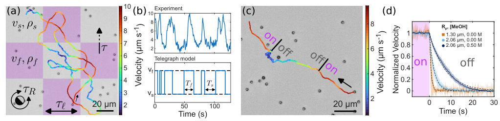 

FIG. 1. (a) Experimental microscopy image with an overlaid single-particle trajectory at 8 V, 4 kHz and illumination intensity 6.3 W cm−2. Color map indicates instantaneous speed; arrow denote propulsion direction. Violet regions mark illuminated checkerboard domains. (b) Top: Propulsion speed v(t) in the checkerboard landscape. Bottom: Two-state telegraph process switching between vf and vs, reproducing the measured speed statistics via mean occupation times ⟨Tf⟩and ⟨Ts⟩. (c) Single-particle trajectory under global temporal illumination switching (on–off–on, with 6.3 W cm−2), at 4 V, 4 kHz and 0.5 M methanol; arrow indicates the direction of motion. (d) Normalized velocity decay following...

📷 Fig 2

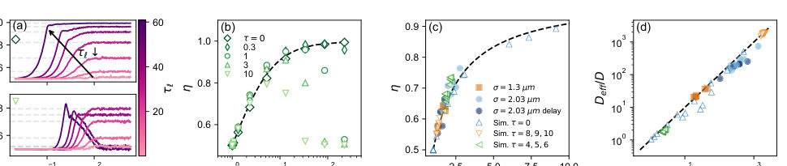 

FIG. 2. (a) Time evolution of the occupation fraction η(t) in a checkerboard landscape of total size L = 1 and domain size ℓ= 1/4 with vs = 0 and vf = ℓ/τℓ, with τℓ∈[0.1, 60.8] and for τr = 1, τD = 103 and τ = 0 (top), τ = 10 (bottom). (b) Stationary values of the occupation fraction η in the same conditions as in (a) and different values of τ. The dashed line represents the theoretical prediction in the τ = 0 limit. (c) Collapse of the stationary values of η in the presence of delay using the scaling in Eq. (7). Circles represent experiments performed with particles of 2.03 µm of diameter without and with methanol doping [40] and squares with particles of 1.3 µm of diameter, without...

📷 Fig 3

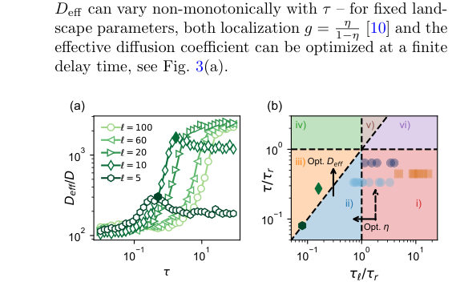 

FIG. 3. (a) Effective diffusivity as a function τ for vf = 10, vs = 1, τr = 6.26, D = 1.25 × 10−12, system size L = 103 and domain sizes ℓranging from 10 to 100. Deff either grows monotonically with delay or shows an optimal value at given τ ∗for ℓ≤10. (b) Time–scale separation of the experiments and the optimal value for ℓ= 10 in panel a). The latin numerals indicate all the dynamic (ordering) regimes of the time scales τr = 1/Dr, τℓ= ℓ/vf and τ. Note that only the fast regions are represented, while corresponding slow regions of each experiment lay on the right of each scatter. The green diamond and hexagon shaped–markers correspond to the maxima in panel a).

**Main problem.**

Understanding how sensory delay (the finite time required for particles to adapt their velocity) affects the transport properties and localization of active colloids moving through heterogeneous motility landscapes.

**Main result.**

The authors develop a theoretical framework that maps delayed dynamics onto a delay-free theory by using delay-renormalized effective Péclet numbers, showing that sensory delay can optimize both particle localization and effective diffusion.

**Method.**

The study combines experimental microscopy of Janus colloids, numerical simulations, and an analytical approach using a telegraph process and moment expansion of the Fokker-Planck equation.

**Summary.**

This paper investigates how the time delay in an active particle's ability to adapt its speed to its environment influences its movement. By studying Janus colloids in light-patterned landscapes, the authors show that this delay can be used to tune particle localization and diffusion. They provide a mathematical mapping that allows the complex delayed dynamics to be understood through a simpler, renormalized version of standard active matter theory. The findings reveal that both density patterns and transport properties follow universal scaling laws.

Detailed structure

**Model / system.**

The system consists of UV-responsive silica-titania Janus colloids in a checkerboard motility landscape where self-propulsion speed is spatially modulated. The dynamics are modeled using an Active Brownian Particle (ABP) framework with a Langevin equation featuring an exponential kernel for velocity adaptation.

**Key observables.**

Mean square displacement (MSD), effective diffusion coefficient (Deff), stationary density/occupation fraction (eta), and Péclet numbers (Pe).

**Important parameters / regimes.**

Sensory delay time (tau), rotational diffusion (Dr), domain size (l), switching rates (alpha, beta), and Péclet numbers (Pe).

**Assumptions / limitations.**

The theory is valid in the slow-switching regime (delta << 1) and assumes rotational diffusion follows the Stokes-Einstein relation.

**Figures summary.**

Figure 1 shows particle trajectories and the telegraph process model; Figure 2 demonstrates the evolution and scaling of the occupation fraction with delay; Figure S-series includes MSD curves, residence time distributions, and parameter summaries.

**Paper structure.**

The paper introduces the problem of sensory delay in motility landscapes, describes the experimental setup and the telegraph process model, presents analytical derivations for transport coefficients, validates the theory with experimental and numerical data, and concludes with a discussion on the optimization of transport and scaling regimes.

**Why it may be interesting.**

The study of delayed feedback and non-Markovian adaptation in active matter provides insights into the control of transport and the emergence of universal scaling in non-equilibrium systems, which is highly relevant to open quantum systems and driven many-body dynamics.

Abstract

We experimentally, numerically and analytically explore the diffusive transport of active colloidal particles with sensory delay, navigating motility landscapes in which the self-propulsion speed depends on space. We show how the transport properties can be obtained by replacing the space dependence of the self-propulsion speed by a dynamical stochastic switching process in the absence of delay, and extend the theory for systems with finite delayed responses. We obtain analytical results for the mean square displacement and the effective diffusion coefficient which accurately predict experimental measurements and numerical simulations across multiple scales. We show how, within the regime of validity of the delay-extended theory, density patterns and effective diffusion obey universal scaling forms. Our work provides minimal framework describing the transport properties of active swimmers with internal adaptation dynamics in motility landscapes.

[↑ back to top](#top)

### [Pulse Quality Optimisation in Quantum Optimal Control](http://arxiv.org/abs/2604.25768v1)

**Authors:** Dylan Lewis, Roeland Wiersema

**Type:** theory · **Category:** quantum information and computing · **PDF:** <https://arxiv.org/pdf/2604.25768v1>

**Analysis basis:** full PDF text, analyzed in chunks

**Topic relevance:** `Rydberg arrays` **3/5**

📷 Fig 1

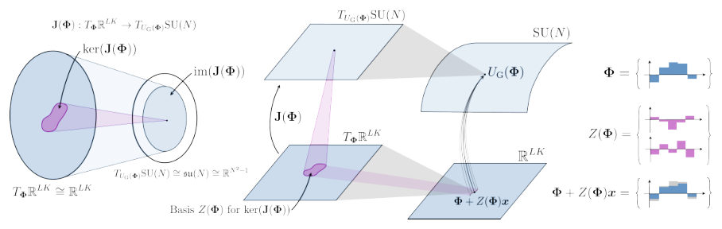 

FIG. 1. The unitary UG(Φ) is an element of the special unitary group SU(N), and a point on a smooth manifold. UG(Φ) is also a map from parameters Φ, in the space RLK, to the special unitary group. The Jacobian J(Φ) is a map from the tangent space of the parameter space TΦRLK to the tangent space of the special unitary group TUG(Φ)SU(N). The kernel of the Jacobian J(Φ) is then spanned by the tangent vectors in TΦRLK that get mapped to the zero vector in TUG(Φ)SU(N). The leftmost illustration shows how, if dim(TΦRLK) &gt; dim(TUG(Φ)SU(N)), the Jacobian map has a non-trivial kernel. The kernel can be described by an orthonormal set of basis vectors, Z(Φ). This illustrates the key idea in GECKO,...

📷 Fig 2

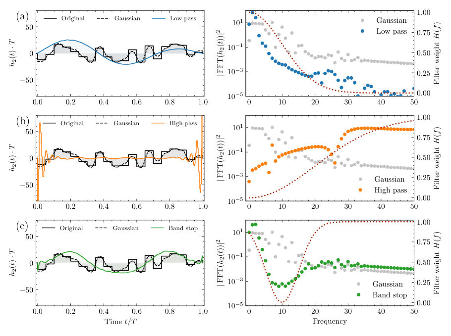 

FIG. 2. GECKO frequency filtering. The left column shows the original signal for h2(t) with L = 20 as a black solid line. The dashed and coloured lines show the signal smoothed with a Gaussian filter of width σ = 4 and the signal obtained with GECKO-based spectral filtering, respectively. The filtered signals are represented with L = 320 piecewise steps. On the right, we show the power of the Fourier-transformed signal with the frequencies per unit time. The right y-axis indicates the filter weight w ∈[0, 1]. The grey dots indicate the power spectrum before filtering, and the coloured dots indicate the power spectrum after filtering. All signals reported here have fidelity F ≃0.999999. (a)...

📷 Fig 3

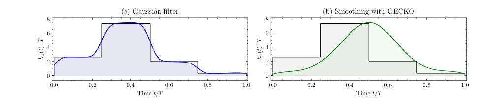 

FIG. 3. Control pulses for the local field h1(t) implementing a two-qubit CZ gate under the Hamiltonian in Eq. (15) with h2(t) = 0. The black line is the solution (infidelity &lt; ε = 1 × 10−7) with 4 piecewise steps. The pulse is then smoothed (a) with a Gaussian filter (in the left plot in blue) and (b) with GECKO (in the right plot in green) and then optimised again to maintain a solution with infidelity &lt; ε. The re-optimised solutions were found using GEOPE, but GRAPE or another quantum-control method could also be used.

📷 Fig 4

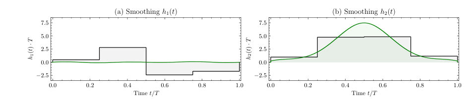 

FIG. 4. Control pulses for the local fields (a) h1(t) and (b) h2(t) implementing a two-qubit CZ gate under the Hamiltonian in Eq. (15). The initial solution with 4 piecewise steps is given in black and the solution given by smoothing with GECKO is given in green. The solution maintains an infidelity ε &lt; 1×10−7. After smoothing, GECKO effectively eliminates the need for the h1(t) control.

📷 Fig 5

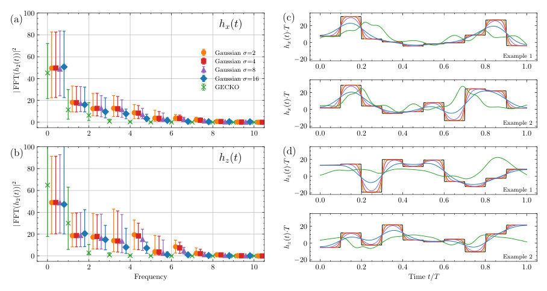 

FIG. 5. GECKO pulse smoothing over 100 independently initialised solutions with L = 10 piecewise steps. Each solution is refined to L = 320 and smoothed either with Gaussian filters of different widths σ or with GECKO. The two panels on the left show the median power of the resulting pulses hx(t) and hz(t) averaged over the 100 initialisations. The error bars indicate the 25th and 75th percentiles. The two panels on the right show two examples of the resulting pulses found by the different smoothing procedures. All pulses shown have an infidelity of ε &lt; 1 × 10−4.

📷 Fig 6

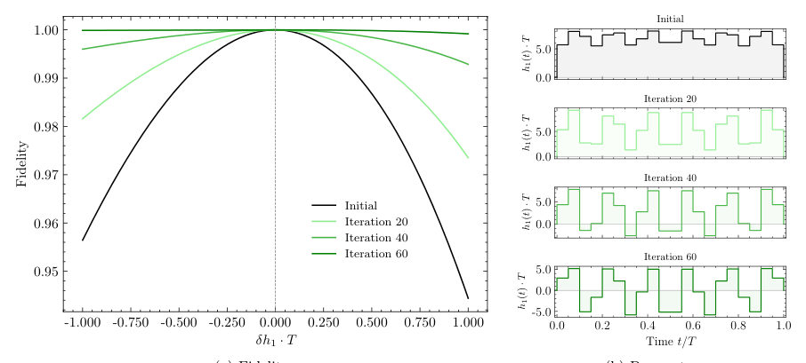 

FIG. 6. The robustness quality function is optimised with GECKO for a CZ gate pulse with the model of Eq. (15) where h2(t) = 0 and L = 20 piecewise steps. (a) Fidelity is plotted against the small deviation δh1 of the solution parameter h1(t). After 20 iterations of GECKO, the pulse is re-optimised with GEOPE to ensure a high fidelity solution. (b) The parameters after each of the 20 iterations of GECKO are shown.

📷 Fig 7

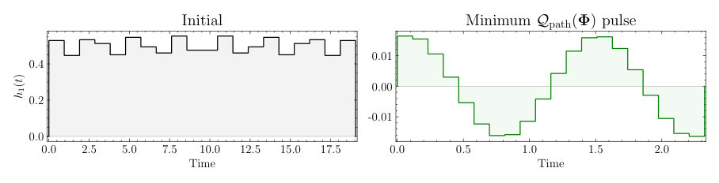 

FIG. 7. CZ pulse under the Hamiltonian in Eq. (15) with h2(t) = 0 and L = 20 piecewise steps. (a) The initial pulse after optimal control (GEOPE). (b) The final pulse after GECKO is used to minimise the pulse duration function Qpath(Φ). The total time is reported in units of the fixed drift coupling strength g, giving T = 2.323/g.

📷 Fig 8

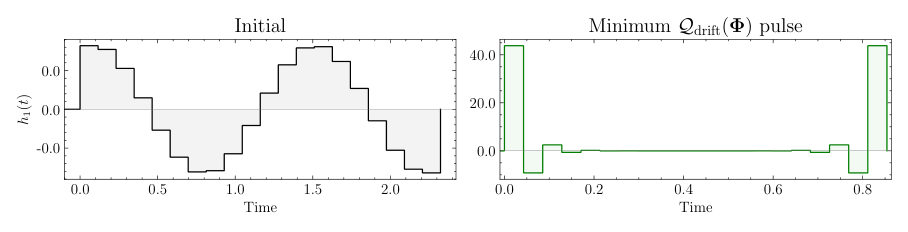 

FIG. 8. The pulse solution for a CZ gate pulse with the model of Eq. (15) where h2(t) = 0 and L = 20 piecewise steps. (a) The initial pulse is the GECKO path-length-optimised solution shown in Fig. 7. (b) The final pulse after GECKO minimisation of Qdrift. The total time is reported in units of the fixed drift coupling strength g, giving T = 0.854/g.

**Main problem.**

Standard quantum optimal control methods focus on maximizing gate fidelity but often neglect practical hardware constraints like pulse smoothness, spectral bandwidth, and robustness to parameter errors.

**Main result.**

The authors introduce GECKO, a method that optimizes secondary pulse-quality objectives (e.g., spectral filtering, smoothness, and robustness) by traversing the nullspace of the control Jacobian, thereby improving pulse quality without degrading gate fidelity.

**Method.**

GECKO (Geometric Quantum Control with Kernel Optimisation) uses the Riemannian geometry of the SU(N) group to identify the kernel of the Jacobian map, allowing parameter updates that leave the implemented unitary unchanged to first order.

**Summary.**

This paper presents GECKO, a new method for post-processing quantum control pulses to meet experimental hardware constraints. By utilizing the geometric properties of the SU(N) group, the algorithm identifies pulse updates that do not change the gate fidelity but do improve properties like smoothness and spectral purity. The authors demonstrate that GECKO can effectively filter high-frequency noise and increase robustness to parameter errors. This approach allows for the optimization of secondary pulse qualities without sacrificing the high-fidelity performance achieved by initial control searches.

Detailed structure

**Model / system.**

The method is demonstrated on two-qubit systems using a transverse-field Ising Hamiltonian to implement CZ and CNOT gates, relevant to platforms like ion traps and Rydberg atom arrays.

**Key observables.**

Unitary fidelity, pulse power spectrum (FFT), pulse smoothness (sum of squared differences), and robustness to parameter deviations.

**Important parameters / regimes.**

Control parameters (amplitudes, phases, detunings), pulse duration (T), drift coupling strength (g), and the step size (s) for optimization updates.

**Assumptions / limitations.**

The method assumes a high-fidelity initial solution is already available and that the control landscape can be effectively explored via the Jacobian's kernel.

**Figures summary.**

Figure 1 illustrates the geometric concept of the Jacobian map; Figure 2 shows successful frequency filtering; Figure 3 demonstrates pulse smoothing; Figure 4 shows the elimination of unnecessary control parameters; Figure 5 compares GECKO's spectral performance against Gaussian filtering.

**Paper structure.**

The paper introduces the problem of hardware constraints, presents the GECKO geometric framework, details the mathematical mechanism of kernel optimization, demonstrates applications in frequency filtering, smoothing, and robustness, and concludes with scalability discussions and limitations.

**Why it may be interesting.**

This is highly relevant for researchers in AMO and quantum optics as it provides a systematic way to bridge the gap between theoretical high-fidelity gates and the practical, bandwidth-limited, and noisy pulses required in experimental platforms like Rydberg arrays and ion traps.

Abstract

Quantum optimal control methods are widely used to design experimental control pulses such as laser amplitudes, phases, or detunings, that implement a target unitary evolution. In practice, what makes a pulse "good" depends not only on its fidelity, but also on the experimental setting and the relevant hardware constraints. Here, we introduce geometric quantum control with kernel optimisation (GECKO), a model-agnostic method for improving control pulses after a high-fidelity solution has been found. GECKO uses the Riemannian geometry of the special unitary group to identify directions in pulse space that leave the implemented unitary unchanged to first order, allowing one to traverse level sets of the control landscape while optimising a chosen differentiable pulse-quality function. We demonstrate GECKO on a transverse-field Ising Hamiltonian implementing CZ and CNOT gates, optimising pulse properties including spectral filtering, smoothness, robustness to parameter deviations, and pulse duration. In all cases, GECKO finds substantially improved pulse solutions.

[↑ back to top](#top)

### [Quantum-enhanced Network Tomography](http://arxiv.org/abs/2604.25194v1)

**Authors:** Yufei Zheng, Zihao Gong, Saikat Guha, Don Towsley

**Type:** theory · **Category:** quantum information and computing · **PDF:** <https://arxiv.org/pdf/2604.25194v1>

**Analysis basis:** full PDF text, analyzed in chunks

**Topic relevance:** `quantum measurements` **3/5**

📷 Fig 1

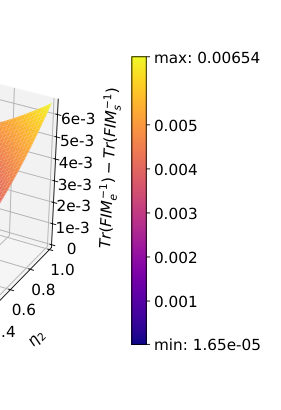 

Figure 1: Tr(I−1 e,d) −Tr(I−1 s,d ) with respect to η1 and η2.

📷 Fig 2

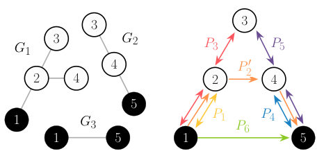 

Figure 2: A network and two sets of probes that guarantees identifiability.

📷 Fig 3

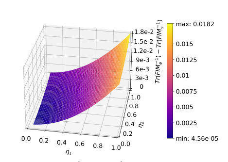 

Figure 3: Differences in the two metrics for the two-channel setup.

**Main problem.**

Optimizing network tomography to estimate unknown link transmissivities in optical networks using quantum probes while maximizing information orthogonality and identifiability.

**Main result.**

The authors propose a probe construction algorithm that guarantees link identifiability and maximizes information-orthogonal subsets, and they demonstrate that independent squeezed probes outperform entangled probes in shared-link configurations.

**Method.**

The study uses Fisher Information Matrix (FIM) analysis, the Floyd-Warshall algorithm for probe routing, and matrix algebra (Sherman-Morrison and Matrix Determinant Lemma) to evaluate estimation precision.

**Summary.**

This paper addresses the challenge of estimating the transmissivity of individual links in an optical network using quantum-enhanced probes. The authors develop an algorithm to route probes such that all links are identifiable and parameters are decoupled into independent, parallelizable sets. They show that while quantum probes (squeezed or entangled) offer advantages over classical coherent states, sharing entanglement across different paths is actually less efficient than using independent squeezed probes. The work provides closed-form metrics to quantify the quantum advantage in network monitoring.

Detailed structure

**Model / system.**

An undirected graph representing an optical network with lossy bosonic channels (pure-loss) and a subset of nodes acting as monitors equipped with homodyne detection.

**Key observables.**

Link transmissivities (eta), determinant of the Fisher Information Matrix (det(FIM)), and the trace of the inverse Fisher Information Matrix (Tr(FIM^-1)).

**Important parameters / regimes.**

Classical energy (N), quantum energy/squeezing (Na), number of pulses in an entangled block (n), and link transmissivity (eta).

**Assumptions / limitations.**

The network topology and monitors are known; probes are not entangled with each other; and the analysis is restricted to Gaussian distributions.

**Figures summary.**

Figure 1 shows the difference in FIM determinant and trace of the inverse between different probe types; Figure 2 illustrates the difference between optimal and sub-optimal probe routing; Figure 3 compares the performance of independent versus entangled probes in a two-channel setup.

**Paper structure.**

The paper begins by defining the network tomography problem, introduces quantum probe types, proposes a probe construction algorithm (FindProbe), provides a mathematical framework for FIM analysis, compares different physical implementations (squeezing vs. entanglement), and concludes with a discussion on complexity and optimization.

**Why it may be interesting.**

This paper is highly relevant to quantum optics and quantum networks as it provides a rigorous statistical framework for characterizing the precision of parameter estimation in lossy photonic networks using continuous-variable quantum states.

Abstract

Network tomography refers to the use of inference techniques for inferring internal network states from end-to-end probes. Quantum probes, implemented by sending blocks of $n$ coherent-state pulses augmented with continuous-variable (CV) squeezing ($n=1$) or weak temporal-mode entanglement ($n>1$) over a lossy channel to a receiver with homodyne detection capabilities, are known to carry information about the channel transmissivity. Assuming a subset of nodes in an optical network is capable of sending and receiving such probes through intermediate nodes with all-optical switching capabilities, we leverage these quantum probes to estimate link transmissivities.   To determine how to route the probes in a network, we propose a probe construction algorithm that guarantees link identifiability, while maximizing the number of information orthogonal sets of transmissivities. A set of probes induces a Fisher information matrix (FIM). We then derive two metrics, the determinant of the FIM and the trace of its inverse, to evaluate the performance of the probes. In particular, our results can be used to characterize the quantum improvement in estimating link transmissivities in a general optical network.

[↑ back to top](#top)

### [Symmetry-Protected Topological Phases in the Triangular Majorana-Hubbard Ladder](http://arxiv.org/abs/2604.24887v1)

**Authors:** Will Holdhusen, Alberto Nocera, Jian-Xin Zhu, Armin Rahmani

**Type:** theory · **Category:** strongly correlated electrons · **PDF:** <https://arxiv.org/pdf/2604.24887v1>

**Analysis basis:** full PDF text, analyzed in chunks

**Topic relevance:** `entanglement & information structure` **3/5**

📷 Fig 1

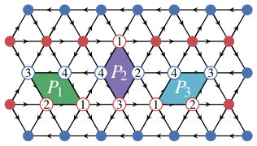 

FIG. 2: Decorated triangular lattice encoding hopping signs ηn,m from Eq. (1) as arrows. Red and blue cir- cles indicate the two-site unit cell structure formed by this gauge. Numbered sites indicate the index order for plaquette operators. The 4-leg cylindrical ladder we study is formed by identifying the top and bottom row of sites.

📷 Fig 2

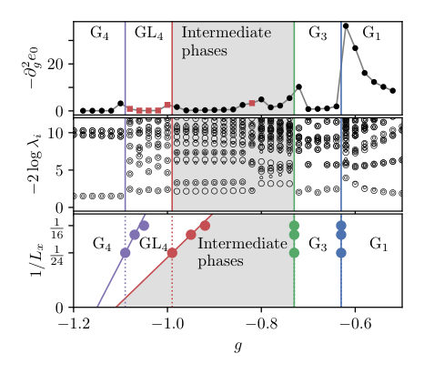 

FIG. 3: Top: energy susceptibility −∂2ge0 computed on an Lx = 24 torus with x-APBC. Black circles (red squares) correspond to points with even (odd) ground- state fermion parity. Vertical lines correspond to phase transitions Center: Entanglement spectrum calculated on the same Lx = 24 torus. Alternating large and small circles make degeneracies visible. Bottom: Finite-size scaling of the phase boundaries from x-APBC results.

📷 Fig 3

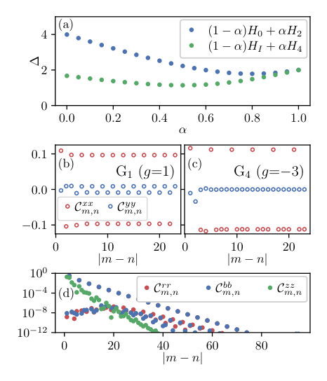 

FIG. 4: (a) Gap (extrapolated to the thermodynamic limit from finite-size x-OBC results) along a path con- necting the noninteracting Hamiltonian H0 to the Ising model H2 and the interaction Hamiltonian HI to the simpler H4. (b) String-order correlations Cxx m,n and Cyy m,n in the even-parity ground state of the G1 phase on an Lx = 96 cylinder. Indices m and n are the one- dimensional indices set up in Eq. (2). Correlations are calculated relative to a point m at the middle of the system. (c) The same correlations, now computed from the same system in one of the even-parity ground states of the G4 phase. (d) Correlations in local fermionic op- erators in the same system at g = 1 showing...

📷 Fig 4

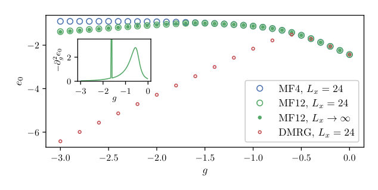 

FIG. 2: Comparison of energy densities between the four-parameter mean-field (MF4) used in earlier work[2], the 12-parameter mean-field derived here (MF12) and DMRG results, all on computed on finite ladders with x-APBC. Lx →∞mean-field results were obtained from finite-size scaling. The inset plots energy susceptibility for the Lx → ∞MF12 case.

📷 Fig 5

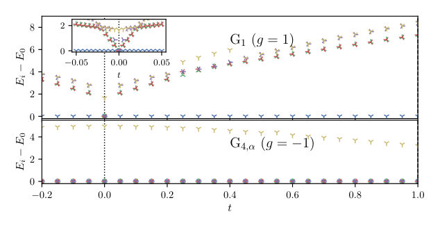 

FIG. 3: Energy gaps as a function of t with fixed g showing the fate of the G1 (top) and G4 (bottom) phases in the strong coupling limit. The inset zooms into the region around t = 0 in the G1 case.

📷 Fig 6

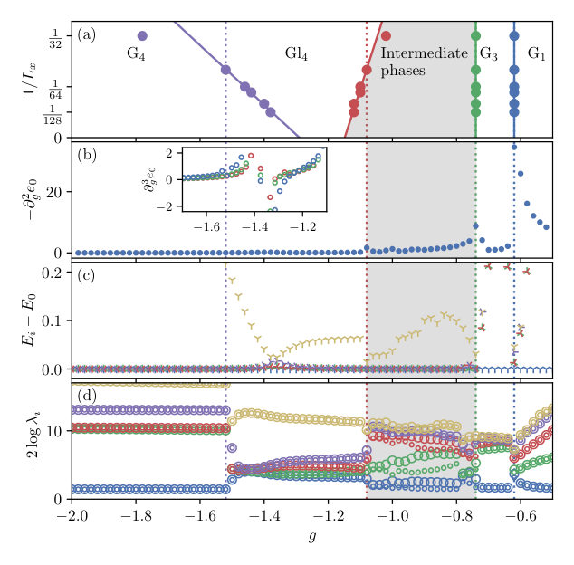 

FIG. 4: Phase transition signatures in x-OBC systems. (a) Finite-size scaling of critical points (identified via dis- continuities in entanglement spectrum). Solid lines indicate a linear fit obtained from Lx ≥48 results. Dashed lines indicate a linear fit excluding Lx = 32. The dotted vertical lines indicate the location of the critical points for Lx = 48. (b) Energy susceptibility computed on an Lx = 48 cylinder. The inset shows the a zoomed-in view of a discontinuity in ∂3 ge0 at g ≈−1.36 with Lx = 48, 96, and 128 results plotted in blue, green, and red. (c) Low-lying energy gaps in the even parity sector for the same Lx = 48 cylinder. Note the level crossing between the third and fourth...

📷 Fig 7

 

FIG. 5: Magnetic correlations in the G3 and GL4 phases computed on an Lx = 96 cylinder in the even parity sec- tor. One of four degenerate states was selected in the GL4 phase.

📷 Fig 8

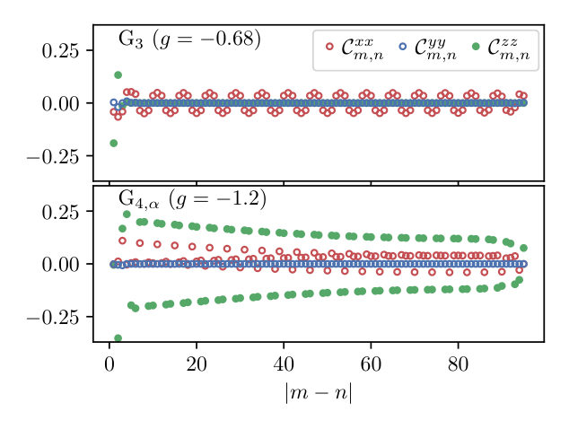 

Fig. 5 plots magnetic and fermionic correlations in the G3 and GL4 phases computed on an Lx = 96 cylinder. This plot makes clear a six-site repeating structure in the G3 phase. Correlations in the GL4 phase are less easily understood. Notably, this phase exhibits long-range connected correlations in σz, which are absent in the gapped SPT phases.

📷 Fig 9

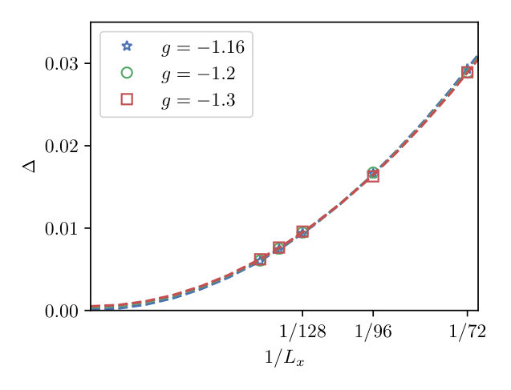 

FIG. 6: Finite-size scaling of gaps in the even parity sector in the GL4 phase. The plotted best-fit lines are of the form ∆= α/L2 x + β with α ≈150 and very small β ≈10−4.

📷 Fig 10

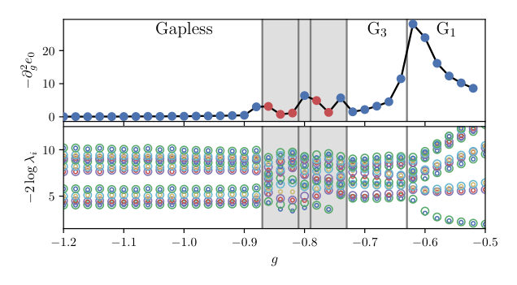 

FIG. 7: Energy susceptibility (top) and entanglement spectrum as a function of g on an x-APBC torus with Lx = 19. Vertical lines indicate phase transitions.

**Main problem.**

The study aims to map the phase diagram of the triangular-lattice Majorana-Hubbard (TLMH) model on a four-leg ladder and resolve previous discrepancies regarding the existence of a gapless phase.

**Main result.**

The authors identify a rich variety of phases, including multiple symmetry-protected topological (SPT) phases (G1, G4) and a gapless phase (GL4), while demonstrating that previously reported gapless features in certain regimes were artifacts of finite-size effects and boundary conditions.

**Method.**

The researchers used large-scale Density Matrix Renormalim Group (DMRG) and Variational Uniform Matrix Product States (VUMPS) simulations, supplemented by Exact Diagonalization (ED) and finite-size scaling analysis.

**Summary.**

This paper provides a comprehensive mapping of the phase diagram for the triangular Majorana-Hubbard ladder. By using advanced tensor network methods, the authors identify several new symmetry-protected topological phases and clarify that certain previously reported gapless phases are actually due to boundary-induced defects. The work is significant for understanding how interactions and lattice geometry stabilize exotic Majorana phases, which are relevant for topological quantum computing architectures.

Detailed structure

**Model / system.**

A four-leg triangular-lattice Majorana-Hubbard ladder, which can be physically realized as arrays of vortex-bound Majorana zero modes on the surface of a topological superconductor.

**Key observables.**

Entanglement spectrum degeneracies, entanglement entropy (to extract central charge), energy susceptibility, string order, fermion parity, and energy density scaling.

**Important parameters / regimes.**

Hopping amplitude (t), interaction strength (g), and system size/geometry (L_x, cylinder vs. torus).

**Assumptions / limitations.**

The study assumes the validity of the 1D spin-1/2 mapping via Jordan-Wigner transformation and relies on the thermodynamic limit extrapolation from finite-size DMRG.

**Figures summary.**

Figures include the naming of the phase diagram, entanglement entropy fits for extracting central charge, and comparisons of energy density across different boundary conditions and system sizes.

**Paper structure.**

The paper introduces the TLMH model and its symmetries, describes the numerical methods (DMRG, VUMPS), presents the mapped phase diagram, characterizes specific SPT and gapless phases through various observables, and concludes with a discussion on the origin of the gapless mode and the role of boundaries.

Abstract

We map the phase diagram of the triangular-lattice Majorana-Hubbard model on a four-leg ladder using DMRG and variational uniform matrix product states, revealing a richer variety of phases than previously known. Analysis of entanglement-spectrum degeneracies and adiabatic connections identifies multiple symmetry-protected topological (SPT) phases. These phases could be realized in arrays of vortex-bound Majorana modes on the surface of a topological superconductor.

[↑ back to top](#top)

### [Parallel distributed quantum gates for dual-species quantum emitters](http://arxiv.org/abs/2604.25140v1)

**Authors:** Zhihao Xie, Adam Miranowicz, Zhenhua Li, Tao Li, Franco Nori

**Type:** theory · **Category:** quantum information and computing · **PDF:** <https://arxiv.org/pdf/2604.25140v1>

**Analysis basis:** full PDF text, analyzed in chunks

**Topic relevance:** `correlated / nonlocal dissipation` **2/5** · `quantum measurements` **2/5** · `spintronics-quantum-optics interface` **2/5**

📷 Fig 1

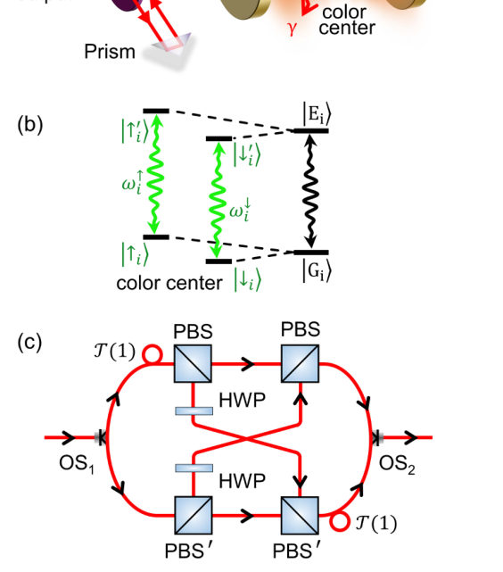 

FIG. 1. (a) Schematic of the CPF gate based on a color center (i.e., SiV−or GeV−) coupled to a single-sided cavity. Here, PBS stands for a polarizing beam splitter, and γ (κ) is the color center (cavity) decay rate. (b) Relative-level structure and optical transitions of the negatively charged SiV−and GeV−color centers. The dipole transitions coupling the ground branch (|Gi⟩) states | ↑i⟩and | ↓i⟩to the excited branch (|Ei⟩) states | ↑′ i⟩and | ↓′ i⟩) for i = A, B are H polarized with frequencies ω↑ i and ω↓ i of the SiV−and GeV−

📷 Fig 2

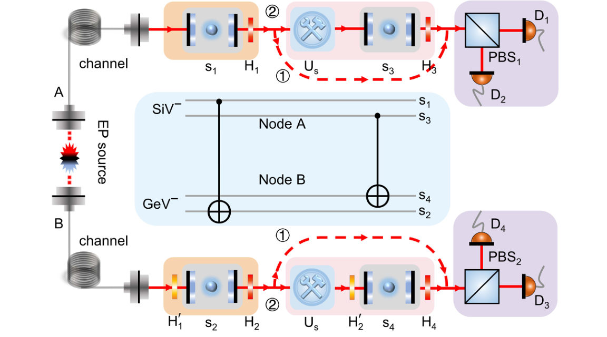 

FIG. 2. Schematics of distributed CNOT gates on spatially separated dual-species qubits. The SiV−(s1, s3) centers are the control qubits and the GeV−(s2, s4) centers are the target qubits, encoded in two ground states (| ↑A,B⟩, | ↓A,B⟩). Hi (i = 1, . . . , 4) performs the Hadamard transformation, while H′ 1,2 performs a Hadamard-like transformation. PBSs are polarizing beam splitters. Du (u=1, . . . , 4) are detectors, Us is a gate that performs T (1)|H⟩↔T (0)|V ⟩, while 1 ○and 2 ○ indicate different optical paths.

📷 Fig 3

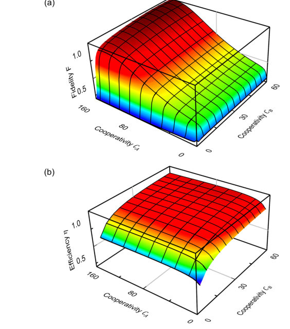 

FIG. 3. Average fidelity F and efficiency η of the parallel distributed CNOT gate vs the color center–cavity cooperativities CA and CB.

📷 Fig 4

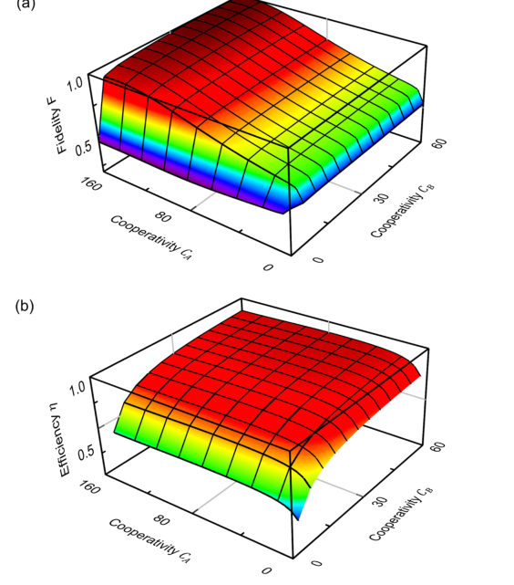 

FIG. 4. (a) Average fidelity and efficiency of the distributed CNOT gate on the spatially separated SiV− (s1) and GeV−(s2) color centers. Here the normalized parameters are ∆↑A = ∆↑B = 0, ∆↓A = ∆↓B = 100, ∆CA = 1.5, and ∆CB = 0.5.

📷 Fig 5

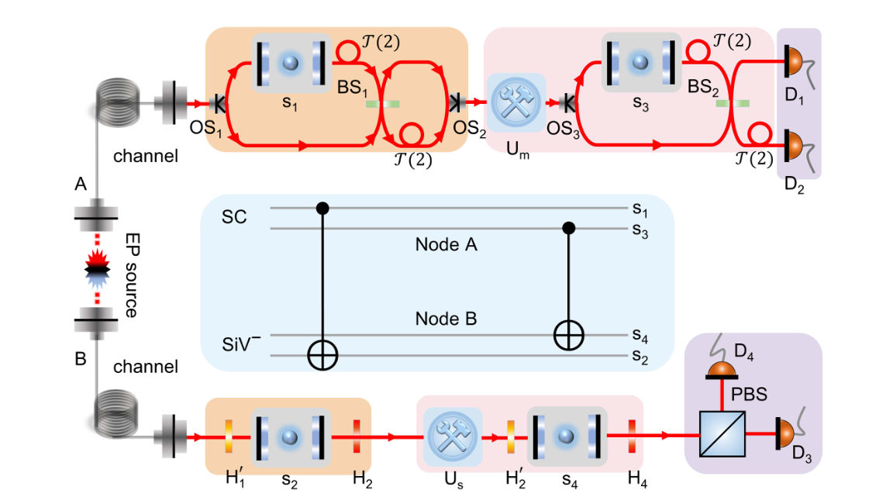 

FIG. 5. Schematic of the parallel distributed CNOT gate with two superconducting qubits s1 and s3 as the controls and two SiV−qubits s2 and s4 as the corresponding targets. BSi denotes a balanced microwave beam splitter and combines with time-delay T (2) to complete the Hadamard transformation for microwave photons. Hi is a π/8-half-wave plate and performs the Hadamard transformation. H′ i performs a Hadamard-like transformation. PBS is a polarizing beam splitter that transmits (reflects) H-polarized (V -polarized) photons.

📷 Fig 6

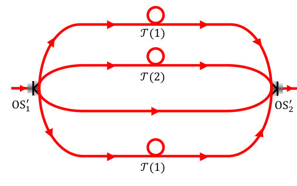 

FIG. 6. Schematic of the gate Um. OS′ 1 directs the microwave photon with time delays ˆT (0), ˆT (1), ˆT (2), and ˆT (3) into four different paths from top to bottom, respectively. OS′ 2 combines four paths into one spatial mode.

**Main problem.**

The difficulty of scaling quantum computers due to local errors and the challenge of implementing efficient, nonlocal gates between different types of stationary qubits (dual-species) without complex frequency conversion.

**Main result.**

A scalable, 'always-ready' protocol for parallel distributed CNOT gates between different species (e.g., color centers and superconducting qubits) using high-dimensional entangled photons, achieving high fidelity (~0.999) and efficiency.

**Method.**

The authors propose a protocol using entangled photon pairs as a data bus, utilizing cavity-photon-qubit (CPF) gates, time-bin and polarization encoding, and single-photon measurements to herald gate completion.

**Summary.**

This paper proposes a method to perform multiple quantum gates simultaneously between different types of quantum bits, such as diamond color centers and superconducting qubits. By using entangled photons with different frequencies, the protocol avoids the need for complex frequency conversion or pre-shared entanglement. The researchers show that using high-dimensional photon states can increase the capacity of the network, allowing one photon pair to service multiple qubit pairs. The proposed system achieves very high fidelity and is robust enough to be used in future large-scale quantum computing clouds.

Detailed structure

**Model / system.**

A hybrid quantum network consisting of spatially separated nodes containing dual-species emitters, such as SiV- and GeV- color centers in diamond and superconducting qubits, connected via an entangled photon pair source.

**Key observables.**

Average gate fidelity (F) and average gate efficiency (eta).

**Important parameters / regimes.**

High-cooperativity regime (C_A, C_B), cavity decay rates (kappa), emitter decay rates (gamma), and photon detuning (Delta).

**Assumptions / limitations.**

Assumes photons are in resonance with one dipole transition and detuned from others; assumes the ability to perform local single-qubit operations based on measurement results.

**Figures summary.**

Fig 1 shows the CPF gate schematic and color center structures; Fig 2 illustrates the parallel CNOT gate setup; Fig 3 and 4 plot fidelity and efficiency as functions of cooperativity; Fig 5 and 6 detail the implementation for superconducting and SiV- qubits.

**Paper structure.**

The paper begins with the motivation for distributed computing, introduces the dual-species CPF gate mechanism, develops the parallel distributed protocol using qudit encoding, provides a performance analysis (fidelity/efficiency), and extends the framework to hybrid microwave-optical systems.

**Why it may be interesting.**

It presents a highly practical framework for hybrid quantum networking, demonstrating how high-dimensional entanglement (qudits) can be used to multiplex quantum gates, which is relevant to quantum optics and scalable quantum architecture design.

Abstract

We propose a parallel protocol for implementing distributed nonlocal quantum gates between spatially separated stationary qubits encoded in dual-species quantum emitters (i.e., color-center and superconducting qubits). By utilizing entangled photon pairs with distinct frequencies as a quantum data bus, our approach connects spatially separated devices without requiring quantum frequency conversion or preshared entanglement, while maintaining an always-ready and resource-efficient property for distributed quantum computing and networks. Furthermore, we demonstrate the feasibility of implementing parallel distributed nonlocal quantum gates on multiple pairs of spatially separated qubits using a single high-dimensional entangled photon pair, which directly benefits from the enhanced quantum capacity provided by optical qudit encoding. Our protocol establishes a scalable and practically implementable framework for distributed quantum networks, potentially enabling the development of future large-scale quantum computing architectures.

[↑ back to top](#top)

### [USEQIP: Outcomes and experiences from 17 years of undergraduate summer schools in experimental quantum information science](http://arxiv.org/abs/2604.25124v1)

**Authors:** John M Donohue, Michael J Grabowecky, George Nichols, Martin Laforest, Lino Eugene, Fiona Thompson, Peter Sprenger, Kevin Resch, David G Cory

**Type:** both · **Category:** quantum information and computing · **PDF:** <https://arxiv.org/pdf/2604.25124v1>

**Analysis basis:** full PDF text, analyzed in chunks

**Topic relevance:** `QC/QI experiment` **2/5** · `quantum optics experiment` **2/5** · `spintronics-quantum-optics interface` **1/5**

📷 Fig 1

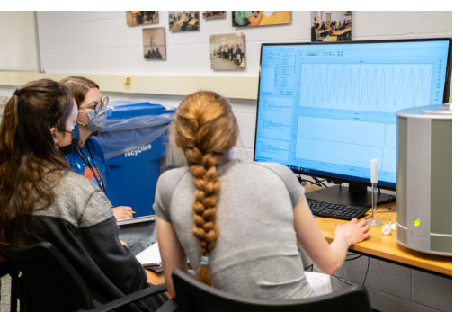 

Fig. 1: Students observe a free induction decay (FID) trace on a desktop NMR spectrometer during USEQIP 2022.

📷 Fig 2

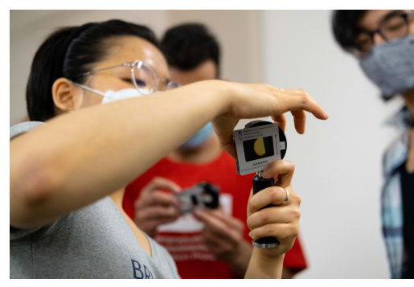 

Fig. 2: Students use polarizing slides to identify unknown optical components as part of the QKD lab during USEQIP 2022.

📷 Fig 3

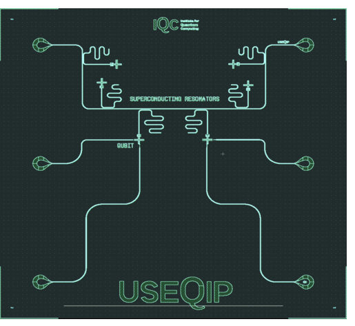 

Fig. 3: Design of the chip developed for the USEQIP 2022 nanofabrication lab activity.

📷 Fig 4

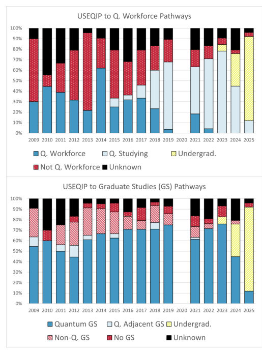 

Fig. 4: Quantum workforce status (top) and graduate studies (GS) pathways (bottom) of alumni from the USEQIP program grouped by the year they participated, from a digital survey of their public online presence as of January 2026.

**Main problem.**

Addressing the urgent need for a trained, quantum-literate, and proficient workforce to support the rapid growth of the quantum information science and technology (QIST) industry.

**Main result.**

A 17-year longitudinal analysis of the USEQIP program demonstrates its success in creating a talent pipeline, with 66% of alumni continuing in quantum fields and 75% of graduates pursuing quantum-related graduate studies.

**Method.**

The study uses quantitative and qualitative analysis of student ratings (Likert scales), alumni career tracking via professional networks, and longitudinal program data from 2009 to 2025.

**Summary.**

This paper provides a comprehensive retrospective of the USEQIP summer school program over 17 years. It details how hands-on laboratory training in platforms like NMR, photonics, and superconductivity helps bridge the gap between theory and experiment for undergraduates. The results highlight the program's significant impact on building a diverse and skilled global quantum workforce.

Detailed structure

**Model / system.**

The program covers diverse experimental platforms including NMR (spin qubits), photonics (entangled photon pairs), superconducting circuits (Josephson junctions), NV centers in diamond, and trapped ions.

**Key observables.**

NMR observables (FID, Rabi oscillations, T2*), photonic observables (Bell parameter S, coincidence rates), and superconducting properties (critical current, gap voltage, Shapiro steps).

**Important parameters / regimes.**

Student-to-facilitator ratio (max 5:1), program selectivity (11% acceptance rate), and demographic representation across various physics and engineering disciplines.

**Assumptions / limitations.**

The QKD analogy uses a laser diode instead of a true single-photon source, and alumni tracking is limited by the availability of publicly accessible professional data.

**Figures summary.**

Figure 1 shows students performing NMR experiments; Figure 2 shows students using polarizing slides for QKD; Figure 3 shows a nanofabricated transmon qubit chip design; Figure 4 displays alumni career trajectories.

**Paper structure.**

The paper introduces the QIST workforce challenge, details the USEQIP program structure and curriculum, describes the various experimental laboratory modules, presents longitudinal results on student learning and alumni career outcomes, and discusses future challenges and program evolution.

Abstract

To grow the quantum information science and technology workforce, opportunities for students to gain experiential learning and build a sense of belonging in the broader community are essential. The Undergraduate School on Experimental Quantum Information Processing (USEQIP) is a two-week summer school for undergraduate students that has been held since 2009 with the goal of introducing undergraduate students from around the world to the tools of quantum information research, paired with a summer internship program. Here we report on the structure, impact, and outlook of the program, including hands-on laboratory activities refined over many iterations of the program. We highlight the career trajectories of program alumni, many of whom have made significant contributions to the quantum field.

[↑ back to top](#top)

### [A unified quantum random walk model for internal crystal effects in dynamical diffraction](http://arxiv.org/abs/2604.25808v1)

**Authors:** Owen Lailey, Dusan Sarenac, David G. Cory, Michael G. Huber, Dmitry A. Pushin

**Type:** theory · **Category:** quantum information and computing · **PDF:** <https://arxiv.org/pdf/2604.25808v1>

**Analysis basis:** full PDF text, analyzed in chunks

**Topic relevance:** `analog quantum simulation` **2/5** · `interference shaping light` **2/5**

📷 Fig 1

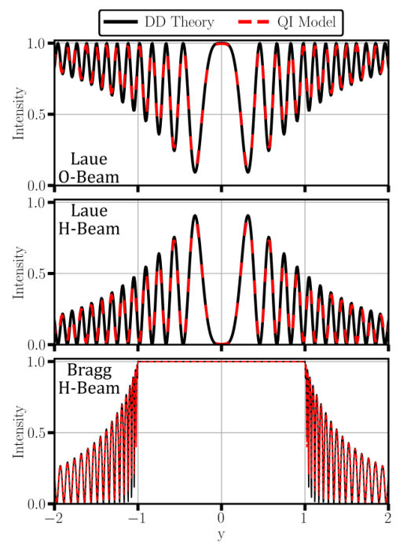 

FIG. 1. Transmitted (O-beam) and diffracted (H-Beam) in- tensity profiles in both the Laue and Bragg geometry for an incident misset monochromatic plane wave. The misset angle δθ is related to the conventional dimensionless misset param- eter y according to y = 2∆H sin(θB)δθ/λ [3, 4]. The crystal thickness is t = 10∆H (220), λ = 2.72 ˚A, γ = π/52, and 0 ≤η ≤4000. The QI model and DD equations (Eq. 7,8) are in excellent agreement.

📷 Fig 2

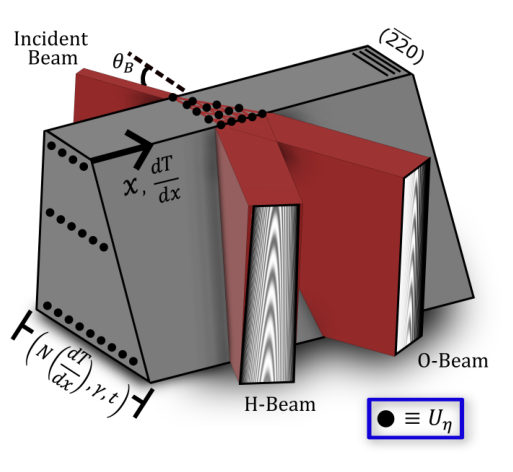 

FIG. 2. Schematic of the QI model implementation of a tem- perature gradient dT/dx in a perfect silicon crystal wedge, with varying thickness t. A tall incident beam undergoes Bragg diffraction producing pendell¨osung interference fringes in the O- and H-Beam observed at a 2D position sensitive detector. The temperature gradient is normal to the Bragg planes and modifies the number of simulation nodes N with respect to the undeformed case (Eq. 12). The black circles represent the QI model nodes which apply the unitary Bragg operator (Eq. 4).

📷 Fig 3

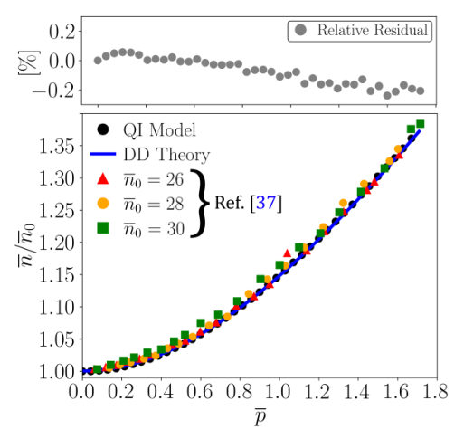 

FIG. 4. The measured fringe order ratio n/n0 for 220 Ag Kα1, at various observation points n0, as a function of temperature gradient dT/dx (Eq. 11) from Ref [37], as well as the predic- tion from DD theory given by Eq. 10, and the QI model simu- lation (from Fig. 3). The relative residual percentage between the QI model results and the DD theoretical curve is shown above the data: (QI −DD)/DD.

📷 Fig 4

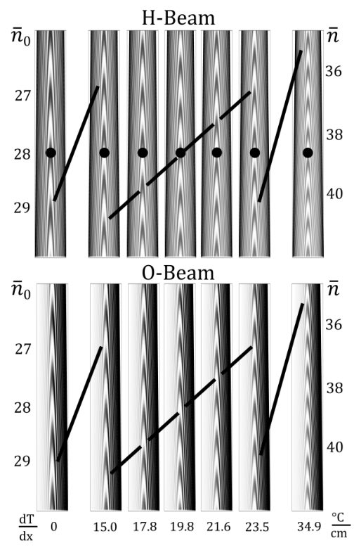 

FIG. 3. Simulated O- and H-Beam interference patterns for 220 Ag Kα1 incident on a crystal wedge subject to linear tem- perature gradients (see Fig. 2) with magnitudes (0 ≤ dT

📷 Fig 5

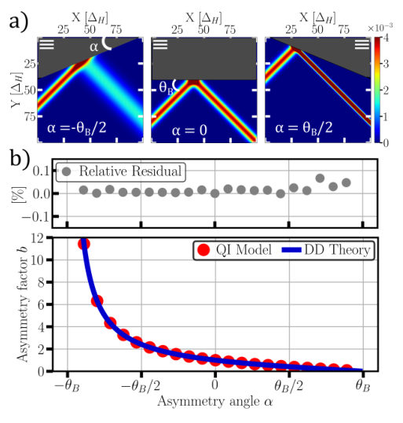 

FIG. 5. (a) QI model simulations of Bragg diffraction at θB = 45◦from crystals with asymmetry angles α = −θB/2, α = 0, and α = θB/2. The input Gaussian width is win = 4∆H and γ = π/100 from Eq. 5. (b) Comparison of the QI model and DD theory for wout/win = |b|, where θB = 45◦and α is varied from −θB to θB. The relative residual (QI - DD) / DD demonstrates agreement at the 0.1 % level.

📷 Fig 6

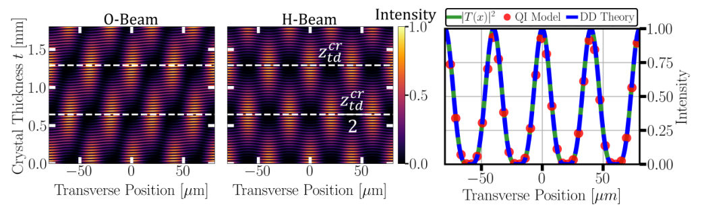 

FIG. 6. Simulated DD Talbot carpets in both the O- and H-Beam in the Laue geometry for a periodic amplitude grating with D = 40 µm. The Talbot distance is zcr td ≈1.3 mm. As shown in the rightmost plot, the QI model self-image (transverse intensity at t = zcr td in the H-Beam) matches the incident grating periodicity and DD theory result. These simulations neglect the effects of absorption.

**Main problem.**

Conventional dynamical diffraction theory is difficult to apply to complex crystal geometries and imperfections like temperature gradients, surface roughness, and asymmetric cuts.

**Main result.**

The authors developed a unified quantum random walk model that accurately reproduces all established dynamical diffraction effects, including the DD Talbot effect and temperature-induced fringe shifts, with high precision.

**Method.**

A quantum information-based approach using a discrete 2D lattice of nodes where a unitary operator simulates transmission and reflection, mapped to the two-wave approximation of dynamical diffraction.

**Summary.**

This paper introduces a unified quantum information model based on quantum random walks to simulate dynamical diffraction in crystals. The model provides a flexible framework to account for complex imperfections such as temperature gradients, surface roughness, and asymmetric crystal geometries that are difficult to model with traditional theory. It successfully reproduces established effects like Pendellösung oscillations and the DD Talbot effect. This approach serves as a powerful tool for designing next-generation neutron and X-ray optical components.

Detailed structure

**Model / system.**

The model treats neutron and X-ray propagation through crystals (Laue and Bragg geometries) as a quantum random walk through a lattice of nodes, incorporating features like temperature gradients via node scaling and asymmetric cuts via free-space nodes.

**Key observables.**

Transmitted (O-beam) and diffracted (H-beam) intensity profiles, reflectivity, beam width, angular divergence, and Pendellösung interference patterns.

**Important parameters / regimes.**

Bragg angle, wavelength, Pendellösung period, temperature gradient, asymmetry angle, and the dimensionless misset parameter y.

**Assumptions / limitations.**

The study utilizes the two-wave approximation and a small-angle approximation for the wavevector component along the crystal surface.

**Figures summary.**

Figure 1 compares the QI model to standard theory for plane waves; Figure 2 shows a crystal wedge with temperature gradients; Figure 3 illustrates Pendellösung fringe movement; Figure 4 quantifies fringe order ratio vs. temperature; Figure 5 shows beam width transformation in asymmetric crystals and simulated Talbot carpets.

**Paper structure.**

The paper introduces the limitations of traditional diffraction theory, presents the new unified quantum random walk model, validates it against standard theory for ideal crystals, demonstrates its ability to incorporate various internal imperfections (gradients, asymmetric cuts), and concludes by showcasing its utility for modeling complex phenomena like the internal Talbot effect.

**Why it may be interesting.**

The paper demonstrates how quantum information frameworks, specifically quantum random walks, can be used as a versatile computational toolkit to model complex wave propagation and interference phenomena in classical-like systems.

Abstract

The theory of dynamical diffraction (DD) in perfect crystals is the backbone of high-precision neutron and X-ray diffraction experiments, enabling accurate determination of crystal structure factors and the realization of perfect crystal interferometers. In practice, however, real crystals exhibit deformations and imperfections, including surface roughness, defects, temperature gradients, angled crystal faces, and curvature, that degrade interferometer performance and are difficult to model using conventional DD theory, particularly in complex geometries. To address these challenges, a quantum information (QI) model for DD has been under development, with demonstrated experimental agreement for both ideal crystals and in the presence of some imperfections such as surface roughness and defects. Here, we present a unified quantum random walk model that is now suitable for reproducing all established DD effects. We demonstrate this by incorporating a broad range of internal crystal effects influencing DD intensity distributions, including linear temperature gradients, the DD Talbot effect, and angled or miscut crystals. These results establish the QI model as a comprehensive and flexible framework for experimental analysis, as well as for the design of next-generation perfect crystal neutron interferometers and neutron optical components, such as condensing monochromators.

[↑ back to top](#top)

### [Co-rotating Vortices on Surfaces of Variable Negative Curvature: Hamiltonian Structure and Drift Dynamics](http://arxiv.org/abs/2604.25682v1)

**Authors:** Gaurang Mangesh Joshi, Rickmoy Samanta

**Type:** theory · **Category:** quantum gases · **PDF:** <https://arxiv.org/pdf/2604.25682v1>

**Analysis basis:** full PDF text, analyzed in chunks

**Topic relevance:** `analog quantum simulation` **2/5** · `non-equilibrium dynamics` **2/5**

📷 Fig 1

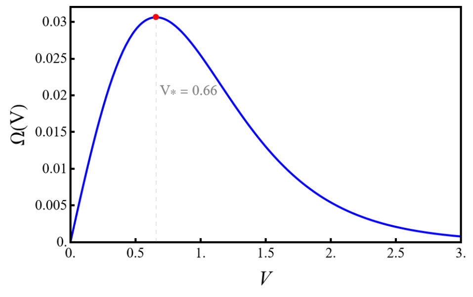 

FIG. 1. Angular velocity Ω(V ) of the symmetric co–rotating vortex pair on a catenoid, given by

📷 Fig 2

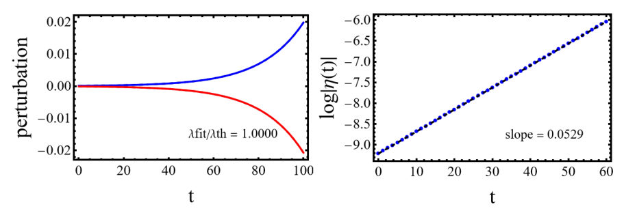 

FIG. 2. Linear stability of the symmetric co–rotating two–vortex configuration on the catenoid. (a)

📷 Fig 3

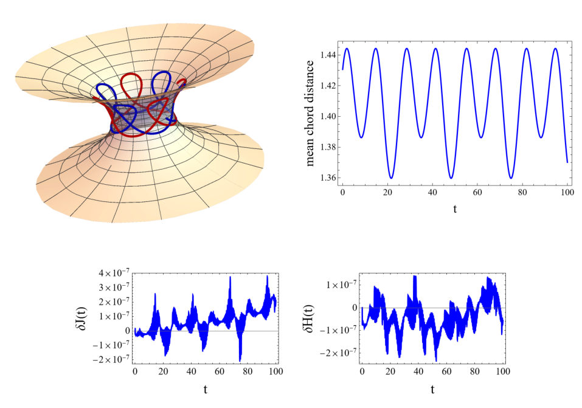 

FIG. 3. Dynamics of a generic equal–strength co–rotating vortex pair on the catenoid. Top

📷 Fig 4

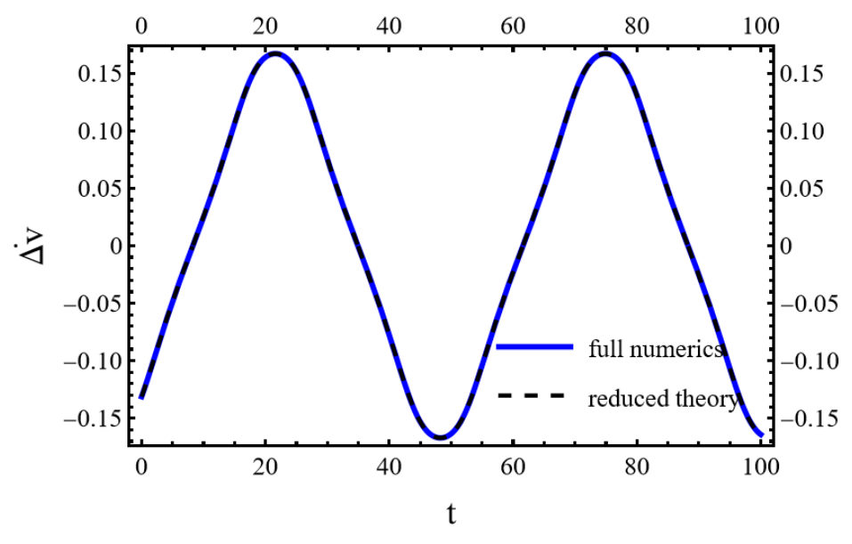 

FIG. 4. Comparison of the full numerical dynamics and the reduced analytic theory for a generic

📷 Fig 5

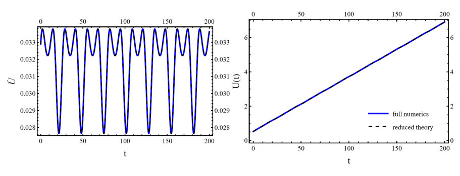 

FIG. 5. Verification of the reduced theory for the mean azimuthal drift of a generic equal–strength

📷 Fig 6

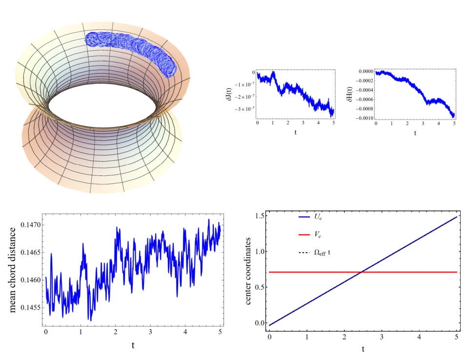 

FIG. 6. Preview of collective many-vortex dynamics on the catenoid. The simulation uses a

**Main problem.**

The study investigates how variable negative curvature on a catenoid influences the motion, stability, and transport of point vortex pairs and many-vortex clusters.

**Main result.**

The authors identify an exact antipodal co-rotating solution where angular velocity is driven by the curvature gradient, and demonstrate that many-vortex clusters undergo a coherent, curvature-induced azimuthal drift.

**Method.**

The researchers use a Hamiltonian framework with the Kirchhoff-Routh function, performing linear stability analysis and Liouville reduction to a single quadrature, alongside direct numerical simulations.

**Summary.**

This paper explores how the variable negative curvature of a catenoid affects the dynamics of point vortices. It proves that for two vortices, the rotation speed is determined by the gradient of the Gaussian curvature rather than the curvature itself. The study also shows that the symmetric co-rotating state is unstable. Finally, it demonstrates that larger clusters of vortices can move together in a coherent azimuthal drift, suggesting a new mechanism for curvature-induced transport in quantum gases.

Detailed structure

**Model / system.**

The system consists of point vortices (incompressible, 2D-like flow) on a catenoid, a minimal surface of variable negative curvature, modeled using a Hamiltonian with a curvature-induced Robin function term.

**Key observables.**

Angular velocity (Omega), Hamiltonian (H), angular momentum (J), instability growth rate (lambda), and azimuthal drift rate.

**Important parameters / regimes.**

Vortex strengths (Gamma), throat radius (a), Gaussian curvature (K), and the meridional coordinate (V).

**Assumptions / limitations.**

The study assumes point-vortex dynamics (incompressible flow) and focuses specifically on the geometry of the catenoid.

**Figures summary.**

Figure 1 plots angular velocity against latitude; Figure 2 shows the exponential growth of perturbations in the unstable regime; Figure 6 demonstrates the localized drift of a 10-vortex cluster.

**Paper structure.**

The paper introduces the geometric problem, derives the Hamiltonian and conserved quantities, analyzes the integrability and stability of two-vortex pairs, and extends the findings to many-vortex clusters via numerical simulation.

**Why it may be interesting.**

This work is relevant for researchers studying the dynamics of superfluid films and Bose-Einstein condensates, as it provides a theoretical framework for how underlying geometric curvature gradients can drive transport and collective motion in quantum fluids.

Abstract

Vortices in fluids and superfluids underpin phenomena ranging from Bose--Einstein condensates and superfluid films to neutron stars and hydrodynamic micro-rotors, where geometry can strongly influence their motion. Curvature can induce vortex motion with no planar analogue. We study Hamiltonian vortex motion on a catenoid, a minimal surface of variable negative curvature, and derive explicit equations of motion, conserved quantities, and reductions for co-rotating vortex pairs. For two identical vortices we find an exact antipodal solution in which the pair rotates rigidly at fixed latitude, with angular velocity $Ω=(Γ/16π)\,K'(V)/\sqrt{-K(V)}$, where $K(V)$ is the Gaussian curvature. Thus the motion is governed by the curvature gradient rather than the curvature itself. The symmetric state is linearly unstable, with growth rate $λ=\sqrt{3}|Ω|$, in agreement with numerical simulations. For generic equal-strength pairs, conservation of the Hamiltonian and rotational momentum reduces the nonlinear dynamics to a single quadrature, yielding bounded relative oscillations together with a secular azimuthal drift. Simulations of the full equations confirm the reduced theory and reveal the same curvature-induced transport mechanism in a localized many-vortex cluster, motivating a broader theory of collective vortex drift on curved surfaces.

[↑ back to top](#top)

### [Moving Cooling Source Induced Phase Separation in Binary Liquids: an interplay of competing velocities](http://arxiv.org/abs/2604.25302v1)

**Authors:** Lakshmipriya K, Harssh Karn, Sutapa Roy

**Type:** theory · **Category:** statistical mechanics · **PDF:** <https://arxiv.org/pdf/2604.25302v1>

**Analysis basis:** full PDF text, analyzed in chunks

**Topic relevance:** `non-equilibrium dynamics` **2/5** · `non-equilibrium universality` **2/5**

📷 Fig 1

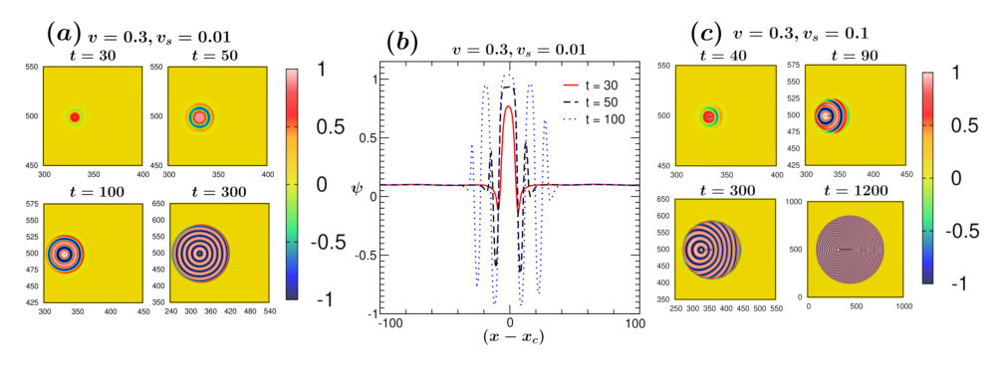 

FIG. 1. A moving cooling source induced phase separation in a binary mixture with an off-critical composition, ψ0 = 0.1. At t = 0, the source is positioned at (L/3, L/2) and translates along positive x direction with a constant speed vs. The cold temperature front propagates radially outward from the source with a constant speed v. L = 1000, dt = 0.001, Ti = 1, and Ts = −1. (a): Coarsening patterns for v = 0.3 and vs = 0.01 are shown at four representative times. The color code represents the order parameter ψ, where ψ &gt; 0 and &lt; 0 correspond to the A and B rich phase, respectively. Near the source, concentric circular rings of alternate phases emerge. As time progresses, additional rings...

📷 Fig 2

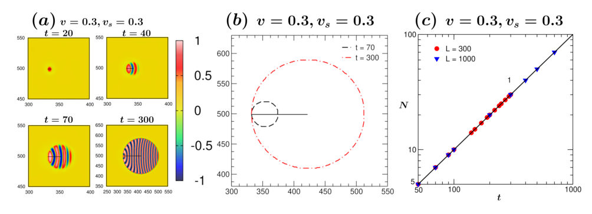 

FIG. 2. (a) Coarsening patterns for v = 0.3, vs = 0.3 at four representative times are shown for L = 1000, Ti = 1, Ts = −1. The position of the moving cooling source is indicated by a solid line. Circular domains emerge, consisting of stripes of alternating phases. As time progresses, the domain size increases along with the number of stripes. (b) Temperature contours corresponding to the same parameters as in (a) are shown at two representative times. These contours delineate regions where a(r, t) &gt; 0 and &lt; 0. (c) Double logarithmic plot of the number of stripes N vs. time t for v = 0.3, vs = 0.3, Ti = 1, Ts = −1 for four different system sizes. Symbols refer to numerical data and the...

📷 Fig 3

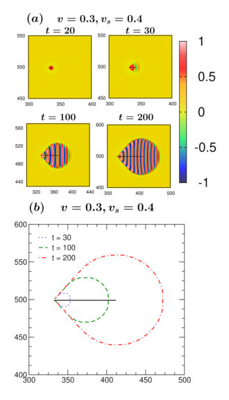 

FIG. 3. (a) Phase separation patterns for v = 0.3 and vs = 0.4 at four different times are shown. In the vicinity of the cooling source, an asymmetric, leaf-like domain emerges, consisting of stripes of alter- nating phases. With increasing time, additional stripes form and the overall domain size increases. For clarity, only a portion of the simu- lation domain is displayed. (b) Temperature contours corresponding to the same parameters as in (a) are shown at three representative times. The leaf-shaped contour, arising from the condition vs &gt; v, closely correlates with the domain morphology. As time progresses, the source moves rightward and the contour becomes larger.

📷 Fig 4

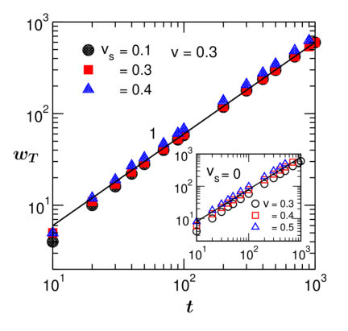 

FIG. 4. (a) Plot of the spatial region wT over which the cold tem- perature front propagates, defined by the condition a(r, t) &lt; 0, vs. time t, on a double-logarithmic scale. Solid line stands for a linear growth. Inset: same plot for a stationary source (vs = 0).

📷 Fig 5

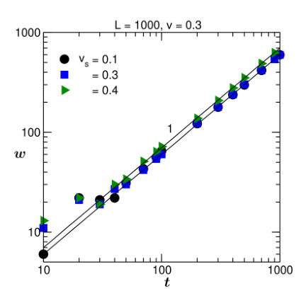 

FIG. 5. Log–log plot of the domain width w as a function of time for fixed v and three different vs.

📷 Fig 6

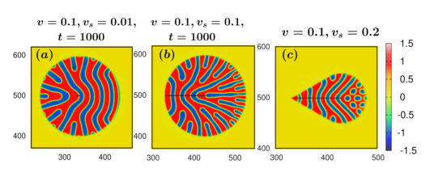 

FIG. 7. Domain morphology for (a) v = 0.1, vs = 0.01 and (b) v = 0.1, vs = 0.1, for L = 1000, Ti = 1, Ts = −1. Translational speed of the cooling source vs influences the direction of bending of the stripes. (c) Domain morphology for v = 0.1 and vs = 0.2 is shown at a representative time. The significantly larger source velocity vs (as compared to the front velocity v) yields strongly asymmetric pattern.

📷 Fig 7

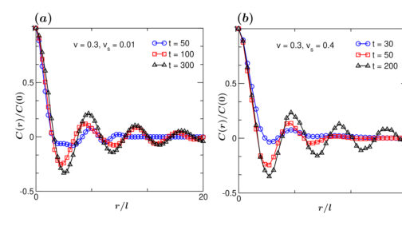 

FIG. 6. Scaled two-point equal time correlation function C(r, t)/C(r = 0, t), is shown at three representative times for v = 0.3 and two different values of vs. Data from different times are marked by different symbols.

📷 Fig 8

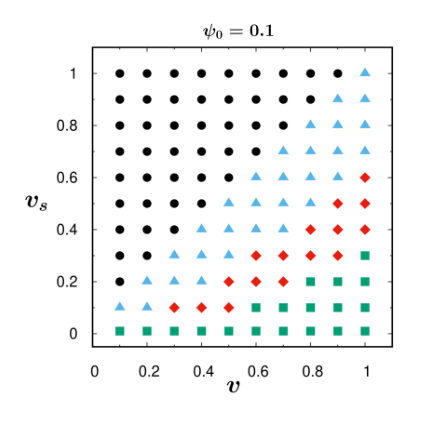 

FIG. 8. Phase diagram of the system in the v−vs parameter plane for ψ0 = 0.1. All data refer to Ti = 1, Ts = −1. Symbols correspond to distinct pattern shapes- square: concentric circular rings, diamond: semicircular stripes pattern, triangle up: circular domain with verti- cal stripes, circle: asymmetric domain with stripes.

📷 Fig 9

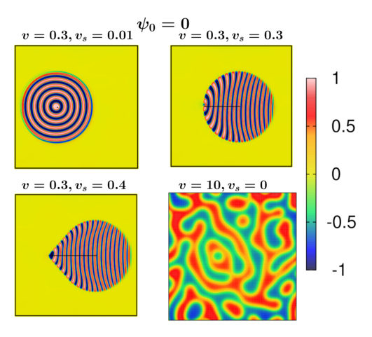 

FIG. 10. Pattern morphologies at critical composition ψ0 = 0, for different combinations of v and vs.

📷 Fig 10

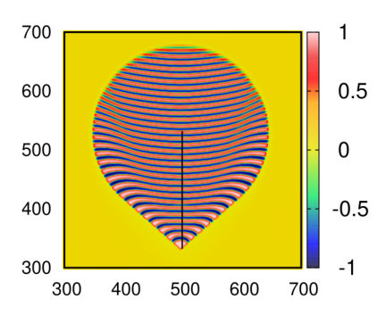 

FIG. 9. Domain morphology for v = 0.3, vs = 0.4 for a cooling source moving along the y direction. Initially the source is placed at (L/2, L/3). The solid line represents the propagation of the cooling source.

**Main problem.**

Investigating how the competition between the translation velocity of a moving cooling source and the radial propagation velocity of thermal fronts determines the pattern morphology and kinetics of phase separation in binary liquids.

**Main result.**

The study identifies distinct morphological regimes (concentric rings, asymmetric stripes, and leaf-like structures) controlled by the velocity ratio and absolute magnitudes of the source and front velocities, showing that pattern engineering is possible by tuning these scales.

**Method.**

Numerical simulations using a finite-difference method to solve a modified Cahn-Hilliard-Cook framework.

**Summary.**

This paper explores how the motion of a cooling source influences the patterns formed during the phase separation of a binary liquid. By comparing the speed of the moving source to the speed of the spreading cold front, the authors demonstrate that different geometric structures, such as rings or leaf-like domains, can be produced. The findings suggest that one can precisely engineer specific patterns by controlling these two velocity scales. This work provides a framework for understanding non-equilibrium phase separation in driven, inhomogeneous systems.

Detailed structure

**Model / system.**

A 2D binary mixture undergoing phase separation, modeled via a Cahn-Hilliard-Cook equation that explicitly couples a time-dependent temperature field (generated by a moving source) with a concentration field.

**Key observables.**

Order parameter (concentration difference), domain morphology (shape and symmetry), number of stripes (N), domain width (w), and the two-point equal-time correlation function.

**Important parameters / regimes.**

Velocity of the cooling source (vs), velocity of the thermal front (v), velocity ratio (gamma = vs/v), and initial composition (psi_0).

**Assumptions / limitations.**

The temperature field is driven by a moving source with radial propagation; the study focuses on the non-equilibrium dynamics of the demixing transition.

**Figures summary.**

Figure 1 shows the evolution of concentric rings and the transition to semi-circular stripes; Figure 2 illustrates vertical stripe-like structures and the linear growth of the number of stripes; Figure 3 displays asymmetric leaf-like morphologies; Figure 4 and 5 demonstrate the linear temporal growth of temperature front width and domain width.

**Paper structure.**

The paper introduces the problem of moving cooling sources, describes the Cahn-Hilliard-Cook model and numerical setup, presents results categorized by velocity regimes (Case I, II, and III), analyzes scaling and kinetics, and concludes with implications for pattern engineering.

Abstract

We investigate phase separation dynamics in a binary mixture subjected to a moving cooling source from which cold temperature fronts propagate radially outward into the mixture. The motion of the source introduces two distinct velocity scales: $v_s$ associated with the translation of the source, and $v$ related to the propagation of the cooling thermal fronts. Competition between the two velocities determines how long a region of the fluid experiences a temperature change, which directly controls phase separation. A modified Cahn Hilliard Cook framework is employed, incorporating explicit coupling between the time-dependent temperature and concentration fields. Our numerical simulation results reveal that the evolving patterns and kinetics strongly depend on both the ratio and absolute magnitudes of these two competing velocities. Same value of $v_s/v$ yields distinctly different patterns for different $v$. The temperature profile delineating spatial regions with local temperatures above and below the demixing temperature controls the shape of the patterns formed. The rich parameter space enables one to engineer desired pattern structures by tuning the two velocities.

[↑ back to top](#top)

### [QCalEval: Benchmarking Vision-Language Models for Quantum Calibration Plot Understanding](http://arxiv.org/abs/2604.25884v1)

**Authors:** Shuxiang Cao, Zijian Zhang, Abhishek Agarwal, Grace Bratrud, Niyaz R. Beysengulov, Daniel C. Cole, Alejandro Gómez Frieiro, Elena O. Glen, Hao Hsu, Gang Huang, Raymond Jow, Greshma Shaji, Tom Lubowe, Ligeng Zhu, Luis Mantilla Calderón, Nicola Pancotti, Joel Pendleton, Brandon Severin, Charles Etienne Staub, Sara Sussman, Antti Vepsäläinen, Neel Rajeshbhai Vora, Yilun Xu, Varinia Bernales, Daniel Bowring, Elica Kyoseva, Ivan Rungger, Giulia Semeghini, Sam Stanwyck, Timothy Costa, Alán Aspuru-Guzik, Krysta Svore

**Type:** both · **Category:** quantum information and computing · **PDF:** <https://arxiv.org/pdf/2604.25884v1>

**Analysis basis:** full PDF text, analyzed in chunks

**Topic relevance:** `QC/QI experiment` **2/5** · `Rydberg arrays` **1/5** · `quantum measurements` **1/5**

📷 Fig 1

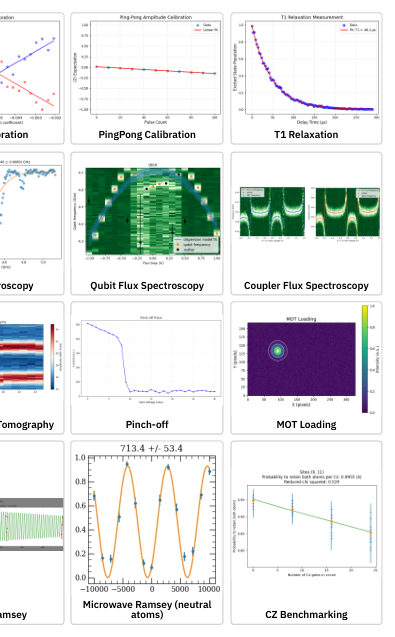 

Figure 1: Representative calibration plots from QCalEval. The benchmark is visually heteroge- neous: it includes 1D line traces with oscillations and decays, 2D spectroscopy maps with ridges and hotspots, scatter or histogram-style readout diagnostics, and image-like measurements of spatial structure. Unlike natural-image benchmarks, the key information is carried by scientific geometry rather than object identity: peak locations, fringe spacing, contrast, linewidth, clustering, and the presence or absence of fitted structure determine whether an experiment is reliable or unreliable.

📷 Fig 2

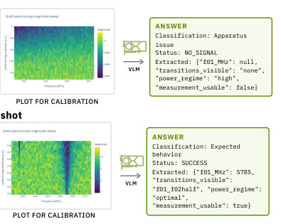 

Figure 2: Task illustration with examples from the qubit spectroscopy experiment. Models are eval- uated under both zero-shot (single plot, no demonstrations) and in-context learning (demonstration examples provided) settings. Each evaluation is an independent conversation with no shared context.

📷 Fig 3

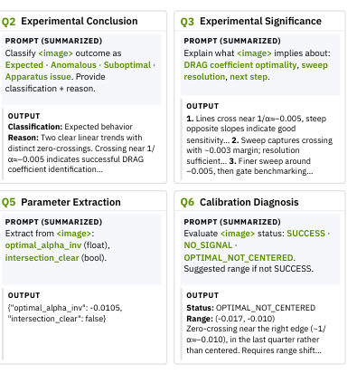 

Figure 3: The six question types in QCalEval, illustrated on a DRAG calibration example. Q1 uses a universal prompt across all families; Q2–Q6 prompts are customized per experiment family with family-specific background context, failure mode definitions, and parameter extraction schemas.

**Main problem.**

The lack of a systematic evaluation for how well Vision-Language Models (VLMs) can interpret and diagnose quantum calibration plots, which is essential for automating quantum hardware management.

**Main result.**

The study identifies a 'two-step capability gap' where models detect visual features but fail at scientific reasoning, and an 'MM-ICL gap' where many open-weight models degrade under multi-image in-context learning.

**Method.**

The authors introduce QCalEval, a benchmark of 243 samples across 22 experiment families, and evaluate 18 VLMs using zero-shot and in-context learning settings across six task types.

**Summary.**

This paper introduces QCalEval, the first benchmark designed to test if Vision-Language Models can understand quantum calibration plots. It evaluates models on tasks ranging from simple data extraction to complex scientific diagnosis of superconducting and neutral atom systems. The researchers found that while models are good at seeing features, they struggle with high-level reasoning and often exhibit an 'optimistic bias' toward successful results. The work also presents a fine-tuned model, NVIDIA Ising Calibration 1, which shows improved performance in hardware-specific diagnostics.

Detailed structure

**Model / system.**

The benchmark covers various quantum platforms, specifically superconducting qubits (e.g., Rabi, Ramsey, DRAG) and neutral atoms (e.g., Rydberg spectroscopy, MOT loading).

**Key observables.**

Peak locations, fringe spacing, contrast, linewidth, clustering, geometric structures (ridges, hotspots, oscillations, decays), and operational statuses (SUCCESS/FAILURE).

**Important parameters / regimes.**

Transition frequencies (f01), power regimes, T1/T2* relaxation times, and DRAG coefficients.

**Assumptions / limitations.**

The benchmark uses a mix of simulated and real hardware data; the evaluation assumes that LLM-based judges can accurately assess free-text scientific reasoning.

**Figures summary.**

Figure 1 shows diverse calibration plots (1D, 2D, scatter); Figure 2 illustrates the zero-shot vs. in-context learning setup; Figure 3 shows task taxonomy using DRAG calibration; Case studies show failures in readout and Ramsey fringes.

**Paper structure.**

Introduction of the calibration automation problem, presentation of the QCalEval benchmark and task taxonomy, evaluation of various VLMs (closed and open-weight), SFT ablation studies, release of the Ising Calibration 1 model, and discussion of limitations.

Abstract

Quantum computing calibration depends on interpreting experimental data, and calibration plots provide the most universal human-readable representation for this task, yet no systematic evaluation exists of how well vision-language models (VLMs) interpret them. We introduce QCalEval, the first VLM benchmark for quantum calibration plots: 243 samples across 87 scenario types from 22 experiment families, spanning superconducting qubits and neutral atoms, evaluated on six question types in both zero-shot and in-context learning settings. The best general-purpose zero-shot model reaches a mean score of 72.3, and many open-weight models degrade under multi-image in-context learning, whereas frontier closed models improve substantially. A supervised fine-tuning ablation at the 9-billion-parameter scale shows that SFT improves zero-shot performance but cannot close the multimodal in-context learning gap. As a reference case study, we release NVIDIA Ising Calibration 1, an open-weight model based on Qwen3.5-35B-A3B that reaches 74.7 zero-shot average score.

[↑ back to top](#top)

### [Quantum Error Correction Exploiting Quantum Spatial Distribution and Gauge Symmetry](http://arxiv.org/abs/2604.25747v1)

**Authors:** Ryo Asaka

**Type:** theory · **Category:** quantum information and computing · **PDF:** <https://arxiv.org/pdf/2604.25747v1>

**Analysis basis:** full PDF text, analyzed in chunks

**Topic relevance:** `correlated / nonlocal dissipation` **2/5** · `entanglement & information structure` **2/5**

📷 Fig 1

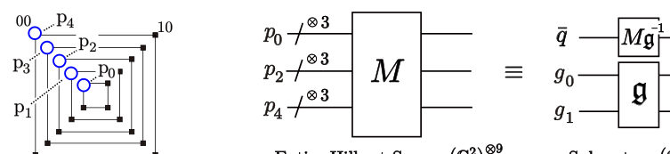 

Figure 1: (a) Three physical particles {p0, p2, p4} and two measurement particles {p1, p3}. We specify four vertices of each square as 00, 10, 11, and 01. (b) Conceptual image of the gauge symmetry [Eqs. (3.1) and (3.2)], where M is any operation in End((C2)⊗9) and g is any gauge operation in the gauge algebra G. The effect that the virtual logical qubit ¯q receives from any operation M acting on the three physical particles depends only on M modulo G generated by the gauge transformations and stabilizer generators in Table 1.

📷 Fig 2

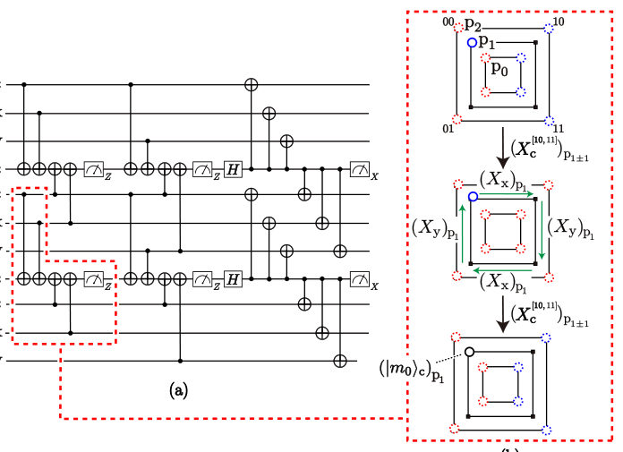 

Figure 2: (a) Stabilizer measurement scheme, i.e., measurement of s0-s5 eigenvalues. Be- fore measuring the spin state of ancillary particle p1 (resp. p3) at stage k ∈{0, 1, 2}, the sk (resp. sk+1) eigenvalue is mapped onto this spin state. Here, each mapping consists of submappings, each of which transfers the ZcZxIy, ZcIxZy or XcXxXy eigenvalue of physical particle pj±1 onto the spin state of ancillary particle pj. (b) Procedure for s0 eigenvalue map- ping ((|0⟩c)p1 →(|m0⟩c)p1), where m0 ∈{0, 1} denotes that the eigenvalue of s0 is (−1)m0. The color of circles represents the particles’ spin state, red for |0⟩c and blue for |1⟩c. Each dashed circle denotes a −1 eigenstate of physical...

📷 Fig 3

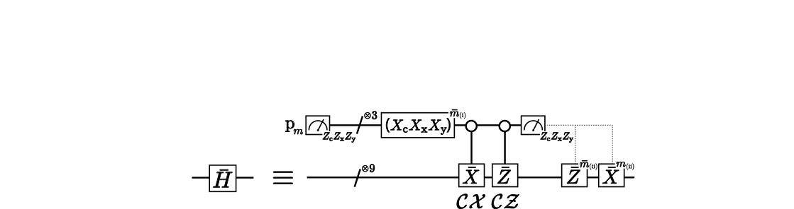 

Figure 3: Gate-teleportation circuit for the logical Hadamard gate that converts the ¯Z eigenstates of the three-particle system to ¯X eigenstates, and vice versa. Here, the upper line in the left-hand circuit is a three-particle system, and the lower line is a particle (pm; mediator particle) that resides in a square with four vertices placed at a site vertically or horizontally adjacent to the system. Two meter symbols on the upper line each represent an eigenvalue measurement of ZcZxZy for the particle pm, and these outcomes are denoted by (−1)m(i) and (−1)m(ii) (m(i),m(ii) ∈{0, 1}), respectively. Namely, (XxXx, Xy) ¯m(i) or ¯Z ¯m(ii) (resp. ¯Xm(ii)) indicate that ZxZx, Zy or ¯X (resp....

📷 Fig 4

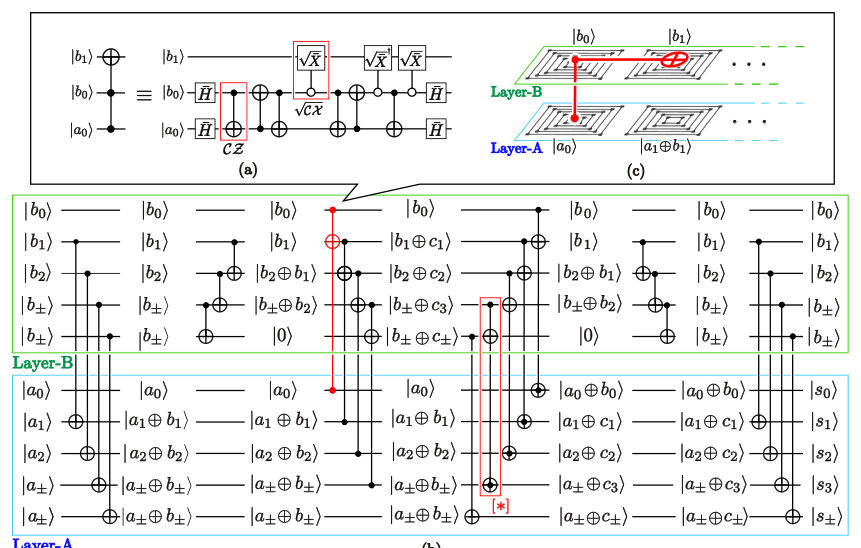 

Figure 4: (a) Circuit for the Toffoli gate, which applies logical ¯X operator to the top system if and only if both of the other two systems are in the −1 eigenstate of ¯Z. (b) Quantum adder [53–55] that adds two numbers a (= a2a1a0) and b (= b2b1b0) and outputs their sum s = a + b (= s3s2s1s0), where ai, bi, si ∈{0, 1} for 0 ≤i ≤3. The signs of their numbers are denoted by a±, b±, and s±, each taking the value 0 or 1 to indicate positive or negative sign, respectively. Here, cj is defined by c1 := a0b0, cj := aj−1bj−1 ⊕bj−1cj−1 ⊕cj−1aj−1 for 2 ≤j ≤3, and c± := a±b± ⊕a±c3 ⊕b±c3. Similarly, we define s0 := a0 ⊕b0, si := ai ⊕bi ⊕ci for 1 ≤i ≤2, and s3 := a±⊕b±⊕c3. The gate labeled [*] in the...

**Main problem.**

Developing a quantum error correction (QEC) scheme that exploits Quantum Spatial Distribution (QSD) and gauge symmetry to protect against noise affecting both spin and position states.

**Main result.**

The authors prove that gauge symmetry provides resilience against a unified noise model (spin/position decoherence and dephasing) and demonstrate that QSD allows for scalable, space-efficient quantum gates and adders using only nearest-neighbor interactions.

**Method.**

The study utilizes the stabilizer formalism and operator quantum error correction, specifically employing Poulin's stabilizer formalism to implement a subsystem structure with gauge qubits.

**Summary.**

This paper introduces a quantum error correction scheme that utilizes both the spin and position states of particles (Quantum Spatial Distribution). By leveraging gauge symmetry, the authors demonstrate that the system can be made resilient to noise that affects both spin and spatial coherence. The architecture is shown to be highly flexible, allowing for the 'stacking' of systems to implement universal quantum gates and even a quantum adder using only local, short-range interactions. This approach provides a potential path toward space-efficient and scalable quantum computing architectures.

Detailed structure

**Model / system.**

A system of particles arranged on nested squares where each particle possesses both a spin (coin) state and a position (spatial) state, encoding Shor's nine-qubit code through superpositions of these states.

**Key observables.**

Stabilizer generators (s0-s5), logical Pauli operators (X-bar, Z-bar), and gauge transformations.

**Important parameters / regimes.**

Error probabilities (p) for spin-flip, phase-flip, and tunneling/position-related noise; interaction range limited to nearest and next-nearest neighbors.

**Assumptions / limitations.**

Gate operations are assumed to act exclusively on either spin or position states to reduce circuit depth; the error analysis assumes single-event errors do not involve simultaneous Pauli-X operations on both axes.

**Figures summary.**

Figure 1 shows the physical arrangement of particles on nested squares and the concept of gauge symmetry; Figure 2 illustrates the stabilizer measurement scheme; Figure 3 shows a gate-teleportation circuit for the logical Hadamard gate; Figure 4 displays circuits for Toffoli and quantum adder implementations; Figure 5 shows the CX gate procedure and two-layer architecture.

**Paper structure.**

The paper begins by defining the QSD architecture and encoding, introduces a unified noise model, proves the error-correcting capabilities provided by gauge symmetry, and concludes by demonstrating the implementation of universal quantum gates and a quantum adder.

**Why it may be interesting.**

This work is highly relevant to open quantum systems and quantum computing as it proposes a novel way to use spatial degrees of freedom (positional states) as a resource for error protection and architectural flexibility.

Abstract

We explore what the integrated use of quantum spatial distribution (QSD), or more specifically, superposition of both spin and position states of particles, and gauge symmetry (GS) within stabilizer formalism provides for quantum error correction. The exploration employs $3+2$ particles on nested squares proposed in the companion letter (arXiv:2504.07941), where three of them encode Shor's nine-qubit code and the remaining two detect errors in this code through their spin state measurements (unlike the letter's quantum walk model, each particle evolves by gate operations acting exclusively on either its spin or position state). The first result is that the GS offers resilience against three types of noise acting on a particle: arbitrary decoherence of its spin or position state, and dephasing of both states, which partly or completely destroys its QSD. To show that, we formulate a noise model unifying the above noise and prove the correctability of this unified model under our error-correcting scheme. The second result is that QSD provides architectural flexibility allowing us to stack the error-correcting systems both vertically and horizontally. Indeed, we show implementations of the error detection (stabilizer measurement), logical Hadamard and Toffoli gates, and a quantum adder with the required interactions only between nearest-neighbor and next-nearest-neighbor particles.

[↑ back to top](#top)

### [Robustness of fiber-optic attenuators to 1061-nm sub-nanosecond pulsed laser radiation in quantum key distribution systems](http://arxiv.org/abs/2604.25620v1)

**Authors:** Daria Ruzhitskaya, Irina Zhluktova, Anastasiya Ponosova, Fedor Ushakov, Andrey Zverev, Galina Tertyshnikova, Tianyi Xing, Kirill Min'kov, Daniil Trefilov, Anqi Huang, Vladimir Kamynin, Vladimir Tsvetkov, Vadim Makarov

**Type:** experiment · **Category:** quantum information and computing · **PDF:** <https://arxiv.org/pdf/2604.25620v1>

**Analysis basis:** full PDF text, analyzed in chunks

**Topic relevance:** `QC/QI experiment` **2/5** · `quantum optics experiment` **2/5**

📷 Fig 1

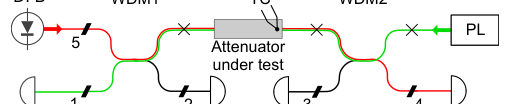 

FIG. 1. Experimental setup. DFB, 1550-nm distributed- feedback laser; WDM, wavelength-division multiplexer; PL, pulsed laser; TC, thermocouple fixed on the attenuator hous- ing. Light directions with minimal loss in setup are denoted by green (light gray) for 1061 nm and red (dark gray) for 1550 nm.

📷 Fig 2

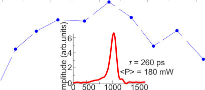 

FIG. 2. The dependence of average output power and pulse duration of PL in single-pulse regime. Inset shows the pulse shape.

📷 Fig 3

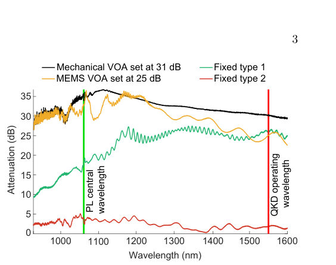 

FIG. 3. Initial transmission spectra of the testing attenua- tors. The spectra show the intrinsic attenuation profile of each sample. The red and green vertical lines denote the operating wavelength of the QKD system and the central wavelength of the PL used in tests, respectively.

📷 Fig 4

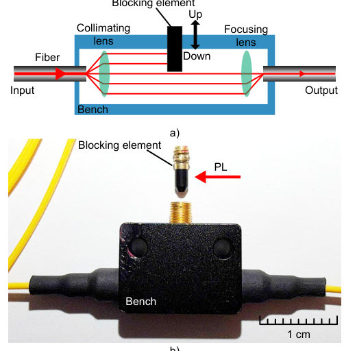 

FIG. 4. Manual VOA with blocking element. (a) Simplified cross-section (not to scale). Red arrows denote light propa- gation direction. (b) Photograph of tested sample.

📷 Fig 5

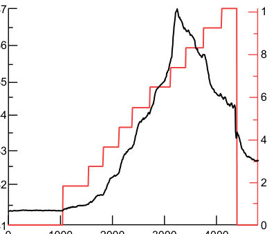 

FIG. 6. Variation of the MEMS attenuation coefficient (black line) depending on the incident power of PL (red or gray line) in single-pulse regime.

📷 Fig 6

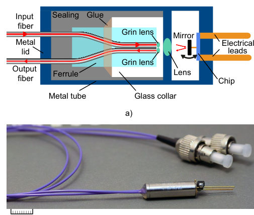 

FIG. 5. MEMS variable optical attenuator. (a) Simplified cross-section showing main elements (not to scale). Red ar- rows denote light propagation direction. (b) Photograph of the test sample.

📷 Fig 7

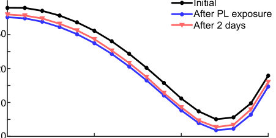 

FIG. 7. Alteration in the attenuation of MEMS VOA follow- ing testing in the multi-pulse exposure regime.

📷 Fig 8

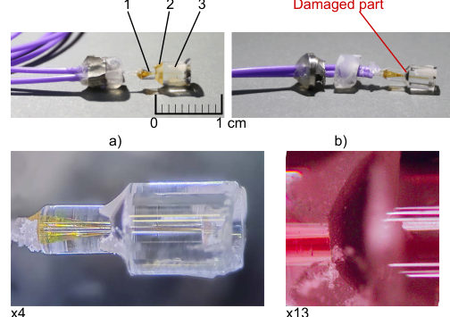 

FIG. 8. Internal MEMS components after attack by (a) cw laser (damaged in [11]) and (b) PL. 1, ferrule; 2, glue; 3, glass collar. Darkening area indicates damage after exposure to PL. (c) Optical microscope images of the damaged area after exposure to PL.

📷 Fig 9

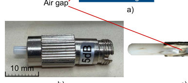 

FIG. 9. Fixed attenuator with gap-loss. (a) Simplified cross- section (not to scale). Red arrows denote light propagation direction. (b) Photograph of the attenuator. (c) The internal elements under the section of metal housing.

📷 Fig 10

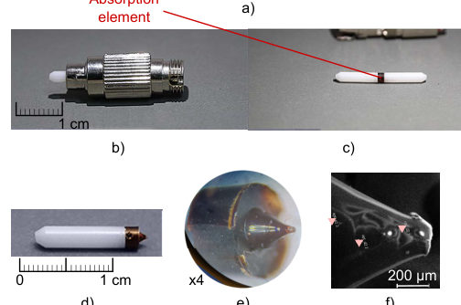 

FIG. 10. Fixed attenuator with absorption element. (a) Sim- plified cross-section (not to scale). Red arrows denote light propagation direction. (b) Photograph of the attenuator. (c) The internal component with the metal housing removed. (d) Magnified view of one of the ferrules with the absorbing element. (e) Optical microscope (Altami SM 1065) image of the absorbing element’s tip. (f) Scanning electron microscope (Quattro S) image of the same tip. Red triangles mark the areas where elemental analysis was performed.

**Main problem.**

Investigating the vulnerability of fiber-optic attenuators in QKD systems to laser-damage attacks (LDAs) using 1061-nm sub-nanosecond pulsed lasers, which may create hidden side-channels.

**Main result.**

MEMS-based attenuators suffered irreversible damage (up to 3.8 dB reduction), and pulsed irradiation was found to 'prime' absorption-based fixed attenuators, significantly lowering their optical damage threshold for subsequent CW attacks.

**Method.**

Experimental exposure of four types of fiber-optic attenuators to 1061-nm pulsed laser radiation (up to 1 W average power) and monitoring changes in 1550-nm transmission, accompanied by microscopic and spectroscopic analysis.

**Summary.**

This paper investigates how high-power pulsed lasers at 1061 nm can damage or 'prime' optical components in QKD systems. The researchers found that MEMS-based attenuators can suffer permanent damage, and that pulsed light can lower the damage threshold of fixed attenuators for subsequent continuous-wave attacks. These findings reveal a potential hidden side-channel for eavesdropping that existing countermeasures might not address.

Detailed structure

**Model / system.**

An experimental setup involving a 1061-nm pulsed laser (master oscillator and YDFA stages) and a 1550-nm DFB laser simulating QKD signals, testing various attenuators including MEMS-based, mechanical, and fixed-gap/absorption types.

**Key observables.**

Attenuation coefficient changes at 1550 nm, transmission spectra (1061 nm vs 1550 nm), surface temperature, and microscopic damage patterns.

**Important parameters / regimes.**

1061-nm wavelength, 1550-nm operating wavelength, 1 MHz repetition rate, 260-410 ps pulse duration, and laser average power up to 1030 mW.

**Assumptions / limitations.**

The study assumes that the observed attenuation changes (reduction >= 1 dB or increase >= 3 dB) are sufficient to constitute a successful eavesdropping or denial-of-service attack.

**Figures summary.**

Fig 1: Experimental setup schematic; Fig 2: Laser power vs. pulse duration; Fig 3: Transmission spectra comparison; Fig 4: Mechanical VOA photo; Fig 5-7: MEMS VOA attenuation changes and damage; Fig 8: Microscopic damage comparison.

**Paper structure.**

Introduction of the LDA threat, description of the experimental setup and laser parameters, results for different attenuator types (mechanical, MEMS, fixed), analysis of damage mechanisms (carbonization/priming), and conclusions on security implications.

Abstract

The security of quantum key distribution (QKD) systems relies on the physical integrity of their components. While laser-damage attacks (LDAs) using high-power continuous-wave (cw) lasers have been well studied, the threat posed by pulsed lasers at alternative wavelengths remains underestimated. Here, we experimentally investigated the stability of four types of fiber-optic attenuators under exposure to sub-picosecond pulses at 1061 nm with average power reaching 1 W. Mechanical variable attenuators with blocking elements and fixed air-gap attenuators show resistance to this attack. MEMS-based variable attenuators exhibit increased attenuation or irreversible damage that causes a permanent reduction in attenuation of approximately 3.8 dB. For fixed attenuators with an absorption element, we demonstrate that initial pulsed irradiation significantly lowers the optical damage threshold of the components compared to direct cw attacks. The attenuation reduction achieved is up to 7 dB at a 1 W cw laser at 1550 nm. These results highlight the possibility of establishing a hidden side-channel for eavesdropping attacks and underscore the insufficiency of existing countermeasures against sophisticated LDA scenarios.

[↑ back to top](#top)

### [Thermal conductivity of aligned polymers with kinks](http://arxiv.org/abs/2604.25037v1)

**Authors:** Igor V. Parshin, Igor V. Rubtsov, Alexander L. Burin

**Type:** theory · **Category:** disordered systems and neural networks · **PDF:** <https://arxiv.org/pdf/2604.25037v1>

**Analysis basis:** full PDF text, analyzed in chunks

**Topic relevance:** `non-equilibrium dynamics` **2/5** · `non-equilibrium universality` **2/5**

📷 Fig 1

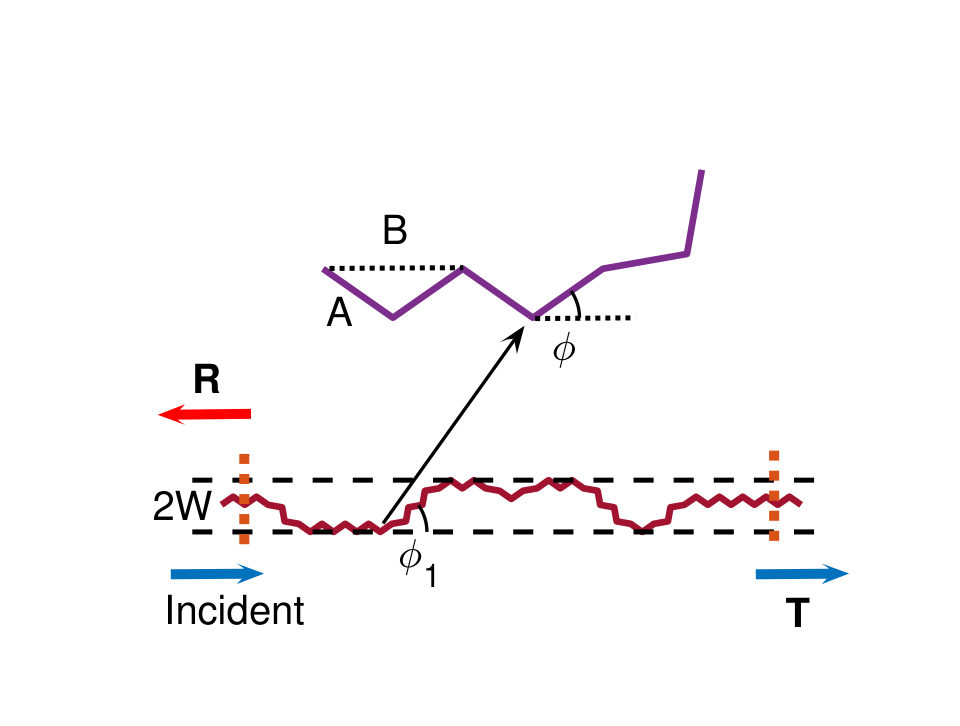 

Figure 1: The fence model of polymer molecule with kinks. Displacement of y-coordinated is restricted by the width 2W. Thick dashed lines indicate molecular borders. Thick arrows show incident, transmitted and reflected waves characterized by their transmission and reflection coefficients T and R. The top chart shows the enhanced fragment of the molecule containing kink.

📷 Fig 2

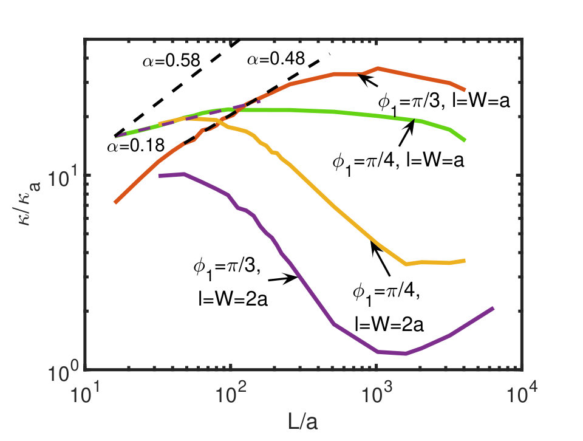 

Figure 2: Average thermal conductivity vs length for different realizations of kinks with restricted transverse displacement, Fig. 1. Straight black dashed line shows L0.38±0.2 and L0.46 length dependencies discovered in Refs.63,64 for comparison.

📷 Fig 3

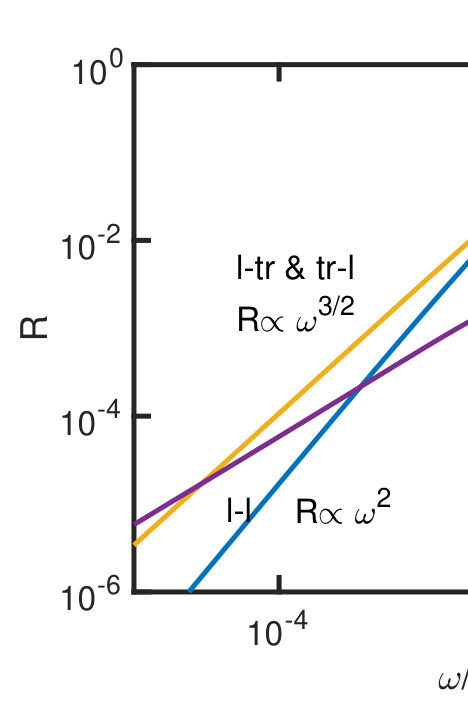 

Figure 3: Reflection from a set of kinks modeling elementary defect.

📷 Fig 4

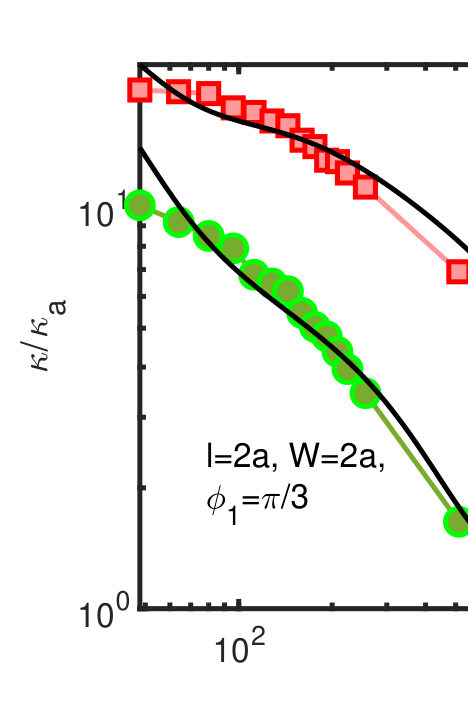 

Figure 4: Interpolation of a thermal conductivity constructed using the elementary kink model.

**Main problem.**

Understanding how structural defects, specifically gauche kinks, affect the thermal conductivity and phonon transport regimes in aligned polymer chains.

**Main result.**

The study identifies a non-monotonic dependence of thermal conductivity on chain length, featuring ballistic transport at short scales, Anderson localization at intermediate scales, and superdiffusive transport (scaling as L^1/3) at long scales.

**Method.**

Numerical evaluation using an advanced transfer matrix method to compute phonon transmission coefficients, integrated via the generalized Landauer formula.

**Summary.**

This paper investigates how structural kinks in aligned polymers influence heat transport. By using a numerical transfer matrix approach, the authors show that thermal conductivity does not follow a simple Fourier law but instead exhibits a non-monotonic dependence on chain length. They identify three distinct regimes: ballistic transport, Anderson localization, and long-range superdiffusive transport. These findings provide a microscopic explanation for the high thermal conductivity observed in aligned polymer nanofibers.

Detailed structure

**Model / system.**

A 2D 'fence model' representing aligned polymer molecules (like polyethylene) with randomly distributed gauche kinks modeled as local rotations and transverse displacements.

**Key observables.**

Thermal conductivity (kappa) as a function of chain length (L/a), phonon transmission coefficients (T and R), and reflection coefficient R(omega).

**Important parameters / regimes.**

Kink density (n), inter-kink distance (l), rotation angle (phi_1), transverse displacement (W), and chain length (L).

**Assumptions / limitations.**

The model assumes harmonic interactions between nearest and next-nearest neighbors and treats kinks as independent, non-intersecting defects in the dilute limit.

**Figures summary.**

Figure 1 illustrates the fence model and geometry; Figure 2 compares thermal conductivity vs. length to experimental power-law scaling; Figure 3 shows a single defect model and frequency-dependent reflection.

**Paper structure.**

The paper introduces the problem of heat transport in polymers, describes the 2D fence model and Hamiltonian, details the transfer matrix method, presents results on length-dependent conductivity regimes, and discusses implications for molecular alignment and biological membranes.

**Why it may be interesting.**

The paper explores the transition between ballistic, localized, and superdiffusive transport regimes in a disordered 1D-like system, which is a fundamental topic in many-body dynamics and disordered systems.

Abstract

Thermal conductivity of aligned polymer molecules can be exceptionally high along the alignment direction due to energy transport through strong covalent bonds. At the same time, it is highly sensitive to molecular conformation, varying by orders of magnitude as a result of gauche kinks. Here, we theoretically investigate phonon transport in kinked polymers by numerically evaluating thermal conductivity and interpreting the results in terms of phonon scattering from randomly distributed kinks. For strongly aligned polymers with restricted deviations from a linear backbone, we find that heat transport becomes superdiffusive at long lengths, with thermal conductivity scaling as $κ\propto L^{1/3}$. At shorter lengths, thermal conductivity exhibits non-monotonic behavior: it increases at very short scales due to ballistic transport of almost all phonons, then decreases at intermediate lengths due to the Anderson localization of most phonon modes. These results are consistent with experiments and molecular dynamics simulations, and they elucidate the microscopic mechanisms governing heat transport in polymers.

[↑ back to top](#top)

### [Tightening energy-based boson truncation bound using Monte Carlo-assisted methods](http://arxiv.org/abs/2604.24896v1)

**Authors:** Jinghong Yang, Christopher F. Kane, Shabnam Jabeen

**Type:** theory · **Category:** numerical methods · **PDF:** <https://arxiv.org/pdf/2604.24896v1>

**Analysis basis:** full PDF text, analyzed in chunks

**Topic relevance:** `analog quantum simulation` **2/5** · `methods for driven-dissipative` **2/5**

📷 Fig 1

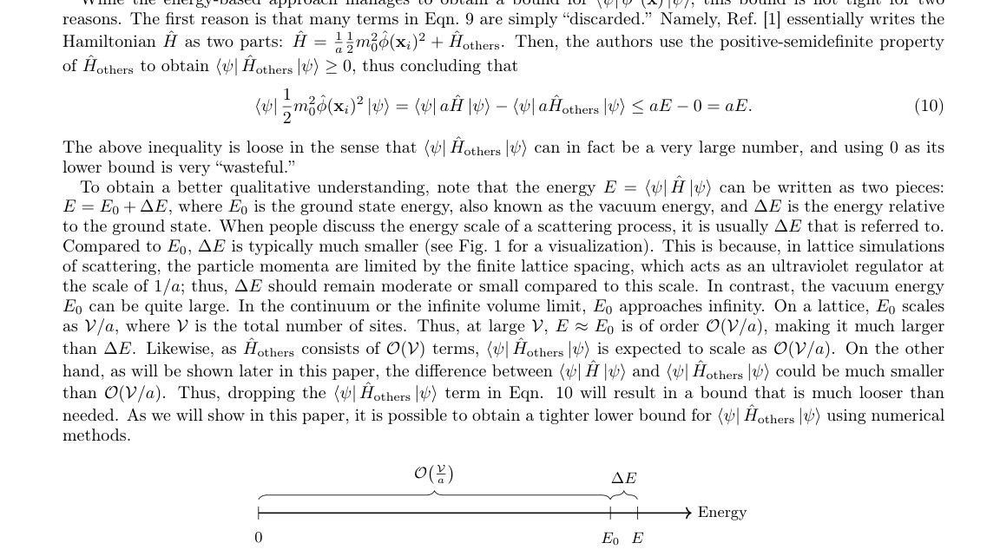 

FIG. 1. A schematic representation of the energy scales in the system. The vacuum energy E0 scales as O(V/a), whereas ∆E is significantly smaller in the typical scattering scenarios.

📷 Fig 2

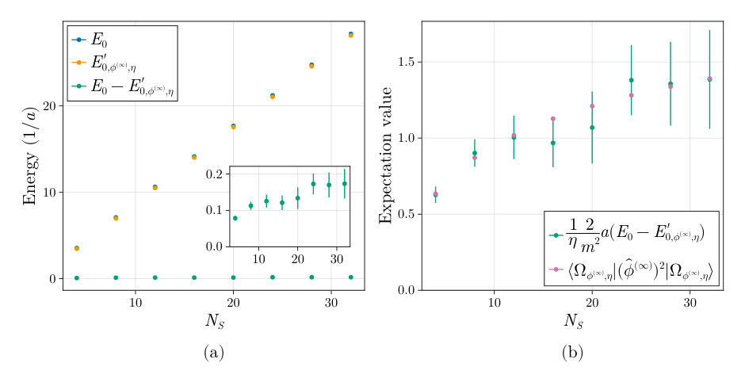 

FIG. 2. Comparison between energy scales. (a) the ground state energy E0 of ˆH, E′ 0,ϕ(∞),η of ˆH′ ϕ(∞),η, and their difference E0 −E′ 0,ϕ(∞),η at different lattice sizes NS. The inset plot shows a zoomed-in plot of E0 −E′ 0,ϕ(∞),η. (b) the value of

📷 Fig 3

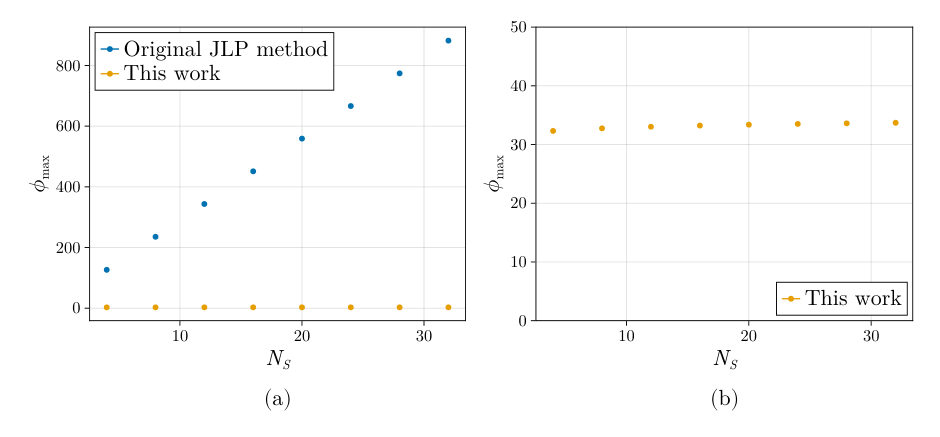 

FIG. 3. Estimation of the required truncation cutoff ϕmax at different lattice sizes NS. The error budget is set to be ϵ = 0.01, and the energy above vacuum ∆E is set to 1/a. (a) the comparison between the original JLP method and the approach in this work. (b) a zoomed-in view of the truncation scales of the latter.

📷 Fig 4

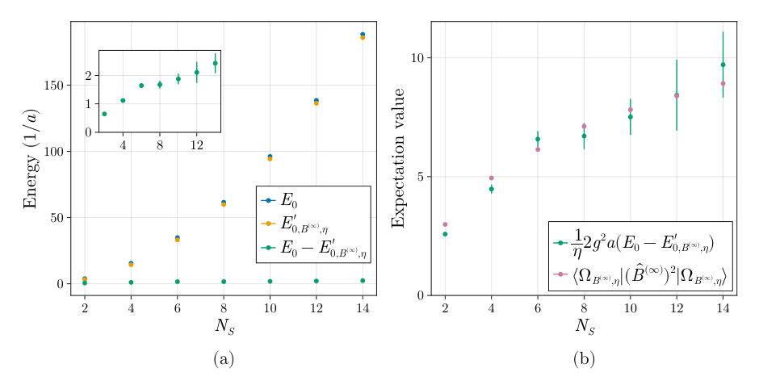 

FIG. 4. Comparison between energy scales. (a) the ground state energy E0 of ˆHU(1), E′ 0,B(∞),η of ˆH′ B(∞),η, and their difference E0 −E′ 0,B(∞),η at different lattice sizes NS. Each lattice has NS × NS plaquettes spatially. The inset plot shows a zoomed-in

📷 Fig 5

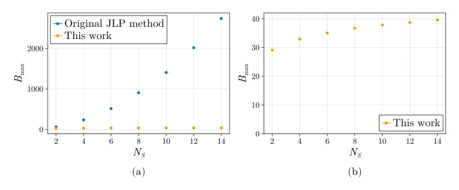 

FIG. 5. Estimation of the required truncation cutoff Bmax at different lattice size. Each lattice has NS ×NS plaquettes spatially. The error budget ϵ is set to 0.01; the allowed energy above vacuum ∆E is set to 1/a. (a) the comparison between the original energy-based bound and the approach in this work. (b) a zoomed-in view of the truncation scales of the latter.

📷 Fig 6

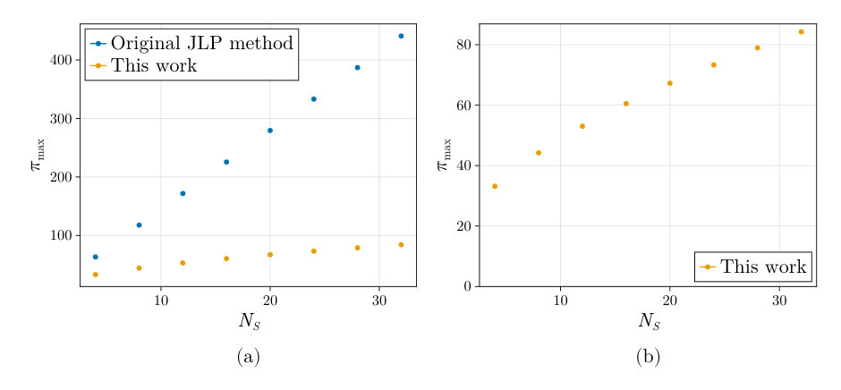 

FIG. 6. Estimation of the required truncation cutoff for π field at different lattice sizes. The error budget ϵ is set to 0.01. a∆E is set to 1. (a) comparison of the obtained πmax between the original JLP method and the approach in this work. (b) a zoomed-in view of the latter.

📷 Fig 7

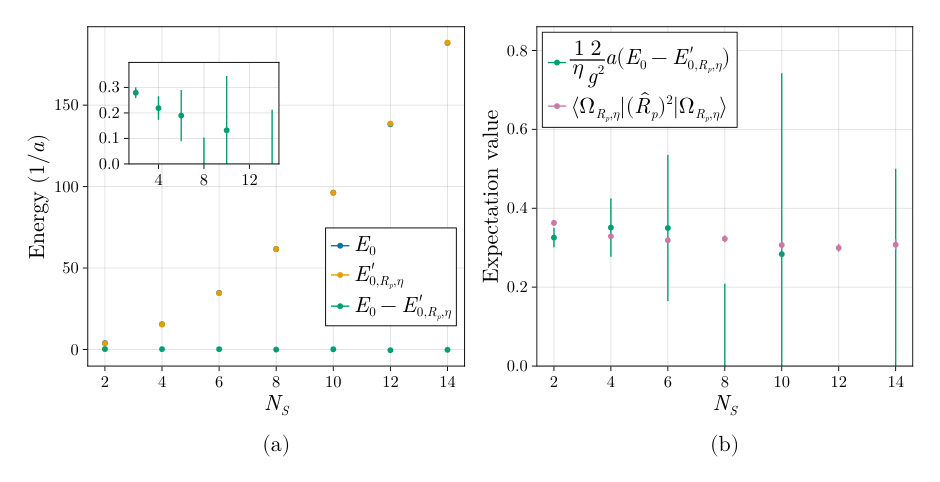 

FIG. 7. Comparison between energy scales. (a) the ground state energy E0 of ˆHU(1), E′ 0,Rp,η of ˆH′ Rp,η, and their difference E0 −E′ 0,Rp,η at different lattice size NS. Each lattice has NS × NS plaquettes spatially. The inset plot shows a zoomed-in view of E0 −E′ 0,Rp,η. (b) 1

📷 Fig 8

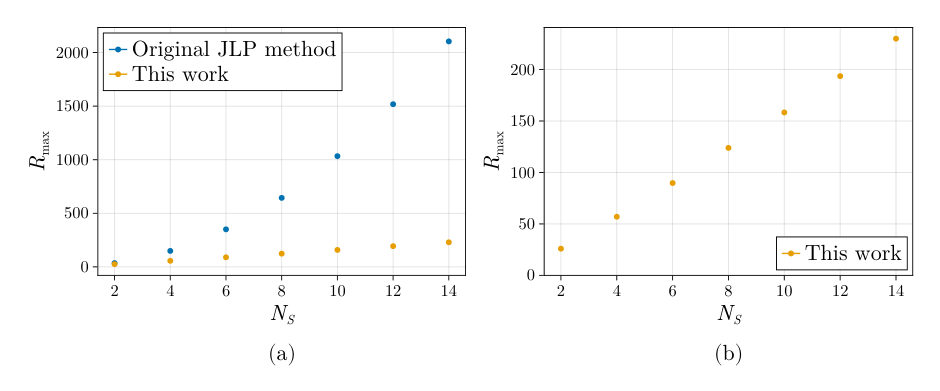 

FIG. 8. Estimation of the relative scale of truncation Rp for plaquette at position (1, 1) at different lattice sizes. Each lattice has NS × NS plaquettes spatially. Here, a∆E is set to 1. In (a), we plot the required truncation cutoff Rp,max as obtained in our method and in the original JLP method. (b) gives a zoomed-in view of our results.

📷 Fig 9

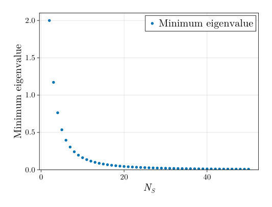 

FIG. 10. Minimum eigenvalue for M matrix for different lattice sizes in 2+1d dual formalism U(1) gauge theory.

📷 Fig 10

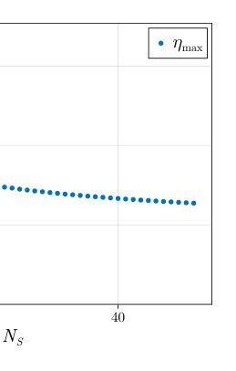 

FIG. 11. ηmax for different lattice sizes in 2+1d dual formalism U(1) gauge theory.

**Main problem.**

The existing energy-based bound for boson truncation in quantum field theory simulations is overly conservative and scales unfavorably with the lattice volume, leading to excessive qubit requirements.

**Main result.**

The authors developed a new methodology that significantly tightens the truncation bound, achieving reductions in the required cutoff proportional to the volume or its square root in different field components.

**Method.**

A dual approach combining an improved analytical derivation (p-norm trick) with a numerical procedure using Euclidean path-integral Monte Carlo (Monte Carlo-assisted method).

**Summary.**

This paper addresses the inefficiency of current methods for determining the truncation cutoff needed when simulating bosonic fields on quantum computers. By using a combination of a new analytical p-norm technique and Monte Carlo simulations, the authors significantly tighten the energy-based bounds. This reduction in the required cutoff helps mitigate the unfavorable scaling of computational resources with system volume. The approach is successfully applied to both scalar field theory and U(1) gauge theory.

Detailed structure

**Model / system.**

The method is demonstrated on (1+1)-dimensional scalar phi-4 field theory and (2+1)-dimensional U(1) gauge theory in the dual formalism.

**Key observables.**

Field truncation cutoffs (phi_max, pi_max, B_max), truncation error (epsilon), and expectation values of field operators.

**Important parameters / regimes.**

Lattice volume (V), lattice spacing (a), mass (m_0), coupling constant (lambda_0 or g), and target digitization error (epsilon).

**Assumptions / limitations.**

The energy of the state relative to the vacuum is assumed to be below 1/a, and the method relies on the applicability of energy-based bounds.

**Figures summary.**

Figure 12 and 13 show the extrapolation of field expectation values toward the continuum limit (zero temporal lattice spacing) for scalar and U(1) gauge theories.

**Paper structure.**

The paper introduces the problem of boson truncation error, reviews existing bounds, presents the new analytical and Monte Carlo-based methodologies, demonstrates the method's efficiency on scalar and gauge theories, and performs continuum limit extrapolations.

**Why it may be interesting.**

This work provides a more efficient way to digitize bosonic degrees of freedom, which is crucial for reducing the computational overhead and qubit requirements in the quantum simulation of gauge theories.

Abstract

Quantum simulation offers a promising framework for quantum field theory calculations. Obtaining reliable results, however, requires careful characterization of systematic uncertainties. One important source is the boson truncation error, which arises from representing infinite-dimensional local Hilbert spaces with finite-dimensional ones. Previous studies have examined this problem from several perspectives. In particular, Jordan, Lee, and Prekill (arXiv:1111.3633) derived an energy-based bound applicable to generic low-energy states across a broad class of field theories. However, this approach often yields overly conservative bounds, especially at large volumes. In this work, we introduce a new methodology that significantly tightens the energy-based boson truncation bound through two complementary advances: an improved analytic derivation and a Monte Carlo-based numerical procedure. We demonstrate the method in (1+1)-dimensional scalar field theory and (2+1)-dimensional U(1) gauge theory in the dual formalism. Our approach substantially mitigates the volume dependence of the required truncation cutoff, achieving reductions nearly proportional to the volume in some cases and to the square root of the volume in others.

[↑ back to top](#top)

### [Bohmian Trajectories in a Bistable Potential Well](http://arxiv.org/abs/2604.25048v1)

**Authors:** O. F. de Alcantara Bonfim

**Type:** theory · **Category:** other · **PDF:** <https://arxiv.org/pdf/2604.25048v1>

**Analysis basis:** full PDF text, analyzed in chunks

**Topic relevance:** `quantum measurements` **2/5**

📷 Fig 1

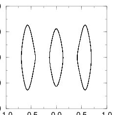 

FIG. 1. (a) Potential as a function of the position, for ξ = 4. The dashed line is the bistable potential with maximum at the origin and minima at x = ±0.66. The system of units used is such that ℏ= M = 1, and the distances are measured in units of β−1. The dotted line is the quantum potential at t = 0, corresponding to the initial wave packet ψ(x) = iu0(x) + 10 u3(x). The solid line is the effective potential Veff = V + Q. (b) Particle motion under the action of the effective potential. The phase-space plots are for different initial conditions: left (x0 = −0.5), center (x0 = 0), and right (x0 = 0.5).

📷 Fig 2

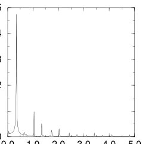 

FIG. 2. (a) Phase-space portrait of the motion of a quan- tum particle in a bistable potential with initial wave packet ψ(x, 0) = iu0(x)+u1(x)+10 u3(x) and initial position x0 = 0. The distances are measured in units of β−1 and ℏ= M = 1. (b) Stroboscopic view of the phase portrait. Positions and velocities are shown at times multiple of T = 2π/ω, with ω = (E3 −E1)/ℏ. (c) Power spectrum as a function of fre- quency f = ω/2π obtained from the time series of x(t).

📷 Fig 3

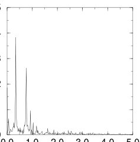 

FIG. 3. (a) Phase-space plot for a quantum particle in a bistable potential. The particle position at t = 0 is x0 = 0, and the initial wave packet is ψ(x, 0) = iu0(x) + u1(x) + 4 u2(x) + 10 u3(x). In the system of units used, ℏ= M = 1, and the lengths are measured in units of β−1. (b) Strobo- scopic view of the motion. Each point corresponds to the position and velocity measured at time intervals taken with a strobe frequency ω = (E3 −E1)/ℏ. (c) Power spectrum obtained from the time series of x(t) as a function of the fre- quency f = ω/2π.

📷 Fig 4

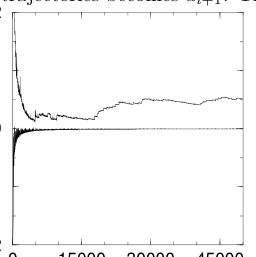 

FIG. 4. Upper curve: Largest Lyapunov exponent for a par- ticle in a bistable potential. The length unit is taken to be β−1, and in the system of units used ℏ= M = 1. The time dependence of the mean rate of exponential separation λ(t) was calculated from Eq. (11) (with t = n∆t) along a tra- jectory generated by the same initial conditions as those of Fig. 3(a). Lower curve: Largest Lyapunov exponent for the quasi-periodic motion shown in Fig. 2.

**Main problem.**

Investigating whether Bohmian trajectories in a one-dimensional bistable potential can exhibit chaotic behavior, challenging existing literature that claims chaos is impossible in 1D systems.

**Main result.**

The study demonstrates that Bohmian trajectories can undergo periodic, quasiperiodic, and chaotic motion, with transitions occurring continuously depending on the initial wave packet.

**Method.**

Numerical integration of the Bohmian guidance equation using a fourth-order Runge-Kutta algorithm, combined with Fourier analysis, stroboscopic (Poincare) plots, and Lyapunov exponent calculations.

**Summary.**

This paper explores the fundamental dynamics of Bohmian mechanics in a 1D system. It refutes the idea that 1D Bohmian trajectories are restricted from chaos by showing that a continuous bistable potential can produce periodic, quasiperiodic, and chaotic trajectories. By tuning the initial wave packet, the author demonstrates a continuous transition between these dynamical regimes. This provides new insights into the complex, non-linear nature of trajectories in the de Broglie-Bohm interpretation.

Detailed structure

**Model / system.**

A single quantum particle of mass M moving in a one-dimensional, analytically solvable, continuous bistable potential V(x).

**Key observables.**

Particle position x(t), velocity, power spectrum P(f), phase-space portraits (Poincare plots), and the largest Lyapunov exponent.

**Important parameters / regimes.**

Potential shape parameters (beta and xi), initial wave packet coefficients (cn), and the initial position of the particle.

**Assumptions / limitations.**

The dynamics are governed by the de Broglie-Bohm interpretation of quantum mechanics, specifically utilizing the effective potential V_eff = V + Q.

**Figures summary.**

Fig 1 shows the classical, quantum, and effective potentials alongside phase-space plots. Fig 2 displays a trajectory, Poincare plot, and power spectrum for quasiperiodic motion. Fig 3 shows similar plots for chaotic motion. Fig 4 illustrates the time dependence of the largest Lyapunov exponent.

**Paper structure.**

The paper introduces the bistable potential and Bohmian framework, presents numerical methods, details specific cases of periodic and quasiperiodic motion, demonstrates the emergence of chaos, and concludes with a Lyapunov exponent analysis to confirm chaotic regimes.

Abstract

We analyze the dynamics of a quantum particle in a one-dimensional bistable potential within the framework of Bohm's quantum mechanics. We give arguments that evidence the fallacy of certain claims found in the literature dealing with the impossibility of chaotic behavior of Bohmian trajectories in one-dimensional systems. We find that an appropriate choice for the initial position and wave packet causes the particle to undergo periodic, quasiperiodic, or chaotic motion. The transitions between these regimes occur in a continuos fashion.

[↑ back to top](#top)

### [Bond-dimension scaling of a local-refinement advantage over hyperoptimized tensor-network contraction on Sycamore like topologies](http://arxiv.org/abs/2604.25532v1)

**Authors:** Rubén Darío Guerrero

**Type:** theory · **Category:** numerical methods · **PDF:** <https://arxiv.org/pdf/2604.25532v1>

**Analysis basis:** full PDF text, analyzed in chunks

**Topic relevance:** `methods for driven-dissipative` **2/5**

📷 Fig 1

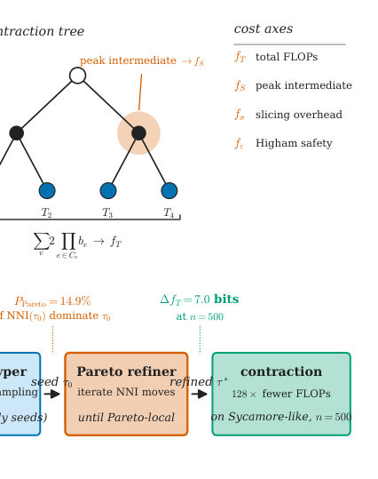 

Figure 1: Pipeline and cost structure. (a) A tensor network N = (T , E) (left) is contracted via a rooted binary contraction tree τ (right). Each internal node v contracts two children; the total floating-point work fT sums over all internal nodes, and the peak intermediate tensor size fS (log2 entry count) is the maximum over them (highlighted in vermillion). The four cost axes (fT , fS, fσ, fε) quantify total work, peak memory, slicing overhead, and a conservative Higham-style forward-error bound, respectively. (b) A nearest-neighbor interchange (nni) move [11] swaps one of an internal node’s grandchildren with its sibling; two variants per internal edge give a neighborhood of size 4(n...

📷 Fig 2

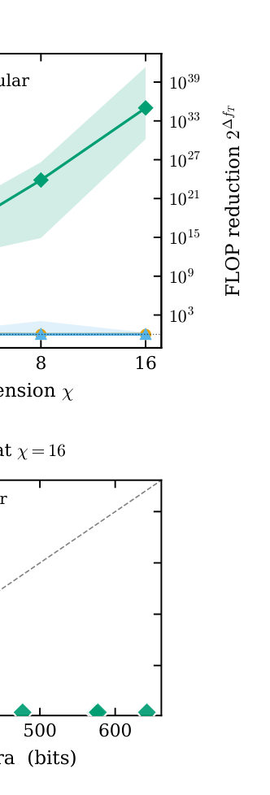 

Figure 2: Bond-dimension scaling of the refinement advantage at n=500, 25 seeds per cell. (a) Median ∆fT = fT (cotengra-hyper) −fT (refiner) in bits as a function of χ ∈{2, 4, 8, 16} for the three topology fam- ilies; bands are [25%, 75%] IQR. The right axis converts to the predicted multiplicative FLOP-cost reduction 2∆fT . Sycamore-like grows approximately linearly in χ from 14.69 bits (∼2.6 × 104×) at χ=2 to 116.31 bits (∼1.0 × 1035×) at χ=16; both controls have median |∆fT | ≤0.71 bits at every χ. Annotated win rates (refiner-beats-cotengra-hyper fraction over 25 seeds): on Sycamore-like, 100% at every χ; on random d=3- regular, 80%→40% as χ : 2→16; on QAOA p=2, 72%→44%. (b) Per-seed...

📷 Fig 3

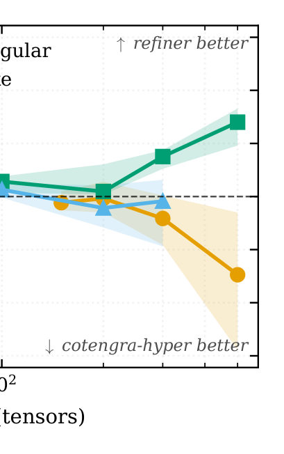 

Figure 3: Length scaling of the predicted FLOP-cost reduction at χ=2. Median ∆fT = fT (cotengra-hyper)− fT (refiner) versus n at matched wallclock (tcotengra-hyper = thyper +ttnc-PLS). Positive ∆fT indicates the refiner beats cotengra-hyper. Bands: [25%, 75%] IQR over 25–30 seeds. Sycamore-like reaches ∆fT = 7.0 bits (128×) at n=500 on 24/25 seeds; this is the χ=2 anchor of the broader sweep in Fig. 2, and a conservative lower bound on the cell. Random d=3-regular diverges negatively at large n; QAOA p=2 sits near zero.

📷 Fig 4

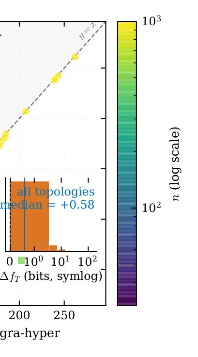 

Figure 4: Per-seed fT (refiner) vs fT (cotengra-hyper), bits. Below-diagonal: refiner wins. Shape encodes topology; color encodes n (log). The dashed offset parallel to the identity line marks a 27 = 128× FLOP reduction, i.e., ∆fT = 7 bits, anchored to the Sycamore-like cluster at n=500. Inset: ∆fT distribution on symlog axis (all topologies pooled); median +0.58 bits, Sycamore-like tail visible.

📷 Fig 5

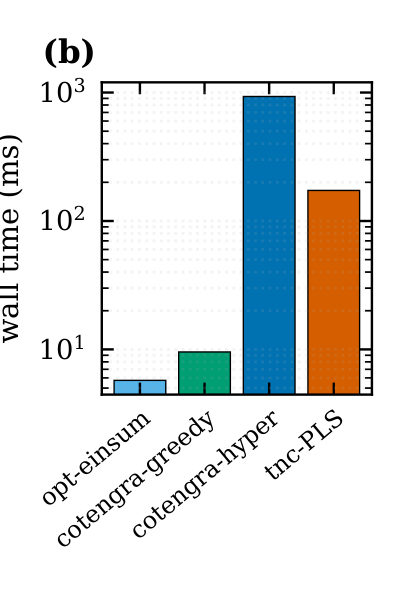 

Figure 5: External validation on the Sycamore-53 connectivity graph [9]. (a) fT (bits); the refiner achieves 22.69 vs cotengra-hyper’s 22.99, a 1.23× reduction. (b) Optimizer wallclock (log). The n=53 instance sits at the small end of the Sycamore-like scale.

📷 Fig 6

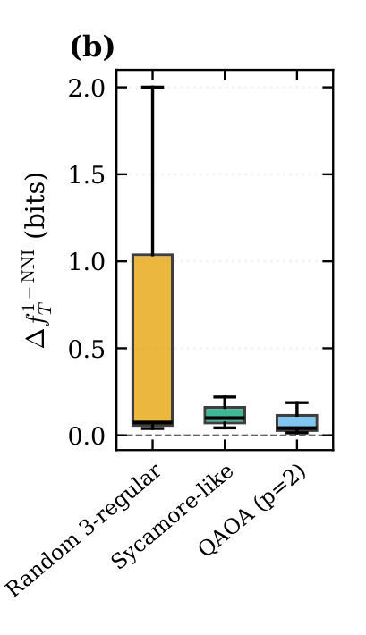 

Figure 6: Mechanism of the Sycamore-like advantage. (a) PPareto, fraction of nni neighbors of the cotengra-hyper seed that Pareto-dominate it on all four axes: median 14.9% on Sycamore-like vs 2.3% and 4.5% on random 3-regular and QAOA. The seed is far from Pareto-local on Sycamore-like. (b) Best single- move fT reduction available in the same neighborhood.

**Main problem.**

Identifying and addressing a 'refinement gap' in the cotengra-hyper tensor-network contraction pipeline where hyperoptimization fails to find the most efficient contraction orders on specific topologies.

**Main result.**

A local-refinement stage using Nearest-Neighbor Interchange (NNI) provides a massive, monotonically increasing FLOP-cost reduction advantage on Sycamore-like topologies as the bond dimension increases.

**Method.**

The authors append a GPU-parallelized NNI search stage to the existing cotengra-hyper pipeline, using a four-axis Pareto-dominance acceptance rule to optimize FLOPs, memory, slicing overhead, and error bounds.

**Summary.**

This paper introduces a local-refinement algorithm to improve the efficiency of tensor network contractions. By adding a nearest-neighbor interchange search to existing hyperoptimization pipelines, the authors show that one can capture significant computational savings that hyperoptimizers miss. This advantage is particularly dramatic on Sycamore-like topologies, where the reduction in floating-point operations grows exponentially with the bond dimension. The method is computationally efficient and requires no changes to the existing optimization framework.

Detailed structure

**Model / system.**

The study focuses on tensor network contraction orders for Sycamore-like topologies (2D grids with diagonal couplings), random 3-regular graphs, and QAOA interaction graphs.

**Key observables.**

Delta f_T (log-scale difference in predicted FLOP-cost in bits), win rate of the refiner, and the fraction of Pareto-dominating neighbors (P_Pareto).

**Important parameters / regimes.**

Bond dimension (chi) ranging from 2 to 16, number of tensors (n) up to 500, and circuit depth (m) for Sycamore-53 circuits.

**Assumptions / limitations.**

The use of a predicted cost-model as a proxy for actual computational cost at large bond dimensions.

**Figures summary.**

Figures show the monotonic growth of cost reduction (bits) with bond dimension, the topology-specific nature of the advantage compared to control graphs, and the success of the refiner on actual Sypectrum-53 circuit depths.

**Paper structure.**

The paper identifies a gap in existing pipelines, introduces the NNI refinement method, demonstrates scaling advantages on Sycamore-like topologies, provides control experiments on random/QAOA graphs, performs ablation studies on acceptance rules, and validates results on actual quantum circuit architectures.

Abstract

We identify a missing local-refinement stage in the cotengra tensor-network contraction pipeline and show that its impact grows monotonically with bond dimension on the \emph{connectivity graph} of Sycamore-like topologies. Appending a nearest-neighbor interchange (NNI) search to the \cotengra{} output at matched 8-s wallclock yields a median \emph{predicted} cost-model gap $Δ\fT$ at $n{=}500$ that grows monotonically and approximately linearly in $χ$, from $\sim\!15$~bits at $χ{=}2$ to $\sim\!116$~bits at $χ{=}16$ (Fig.~\ref{fig:chi_sweep}), with the refiner winning on $25/25$ seeds at every tested $χ$. Two control families -- random $3$-regular and QAOA $p{=}2$ interaction graphs -- show median $|Δ\fT| \leq 0.71$~bits across both controls at every $χ$, with refiner win rate falling toward chance as $χ$ grows; the signal is topology-specific, not a generic refinement-budget effect. An ablation establishes that refinement itself, not the four-axis Pareto acceptance rule, drives the gain ($|Δ\fT| \lesssim 0.1$ bits between scalar and Pareto arms at $χ{=}2$). The Sycamore-circuit envelope (App.~\ref{em:sec:results:syccirc}) reports the corresponding refinement on actual random circuits at depths $m \in \{4, 6, 8, 10, 12\}$, where the refiner wins on $5/5$ instances at every depth. The advantage is therefore largest precisely in the bond-dimension regime relevant to physical contraction.

[↑ back to top](#top)

### [Ember: An Extensible Benchmark Suite for Quantum Annealing Embedding Algorithms](http://arxiv.org/abs/2604.25433v1)

**Authors:** Zachary Macaskill-Smith, Unmol Sharma, Melissa Warner, Kálmán Varga, David A. B. Hyde

**Type:** both · **Category:** quantum information and computing · **PDF:** <https://arxiv.org/pdf/2604.25433v1>

**Analysis basis:** full PDF text, analyzed in chunks

**Topic relevance:** `QC/QI experiment` **2/5**

📷 Fig 1

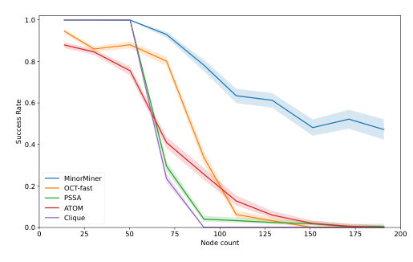 

Fig. 1. Success rate vs. node count (20-node bins, all graph categories pooled). Shaded bands show pointwise 95% confidence intervals (Wilson score interval for binomial proportions, computed per 20-node bin). CLIQUE fails completely above n = 64—the maximum clique K64 embeddable in Chimera C16—producing a 100% →0% transition in a single step. Above 80 nodes, only MINORMINER is maintaining meaningful success rates.

📷 Fig 2

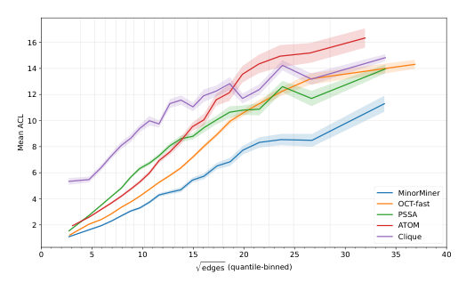 

Fig. 2. Mean ACL vs. p

📷 Fig 3

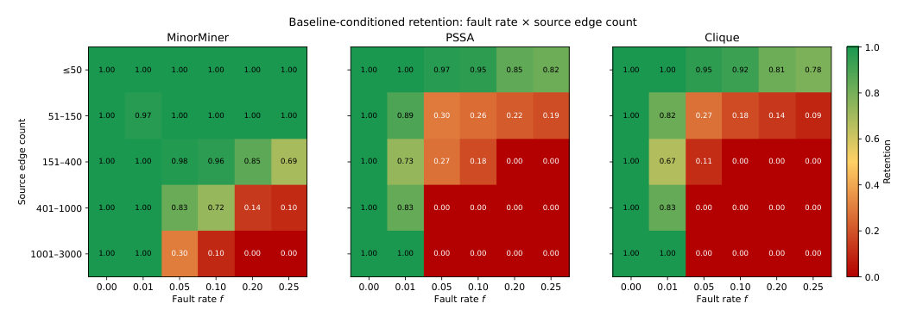 

Fig. 3. Baseline-conditioned retention stratified by source edge count: fraction of embeddings successful at f = 0 that remain successful at each fault rate f. MINORMINER degrades gracefully across all graph sizes; PSSA and CLIQUE exhibit sharp cliffs between f = 0.01 and f = 0.05 at medium edge counts. The 1001–3000 row for PSSA and CLIQUE is sparsely populated (few baseline successes) and its precision is correspondingly limited; the &gt; 3000 row has no baseline successes for any algorithm.

**Main problem.**

The lack of a standardized, reproducible, and comparable benchmarking framework for minor embedding algorithms used to map logical problem graphs onto the sparse hardware topologies of quantum annealers.

**Main result.**

The authors introduce Ember, a benchmarking suite that reveals no single embedding algorithm dominates universally; performance rankings vary systematically based on graph structure, hardware topology (Chimera, Pegasus, Zephyr), and hardware fault rates.

**Method.**

The development of Ember, an open-source Python framework featuring a massive library of 24,016 graphs across 35 categories and a unified analysis pipeline to evaluate algorithms like MINORMINER, OCT-FAST, and CHARME.

**Summary.**

This paper introduces Ember, a new benchmarking suite designed to provide a standardized way to compare algorithms that map logical problems to quantum annealing hardware. By testing a vast library of graph types, the authors demonstrate that the 'best' algorithm depends heavily on the specific structure of the problem and the hardware topology being used. The framework also allows researchers to study how embedding quality degrades under realistic hardware errors. This work is crucial for the development of more efficient compilers for quantum annealing processors.

Detailed structure

**Model / system.**

The study focuses on D-Wave quantum annealing hardware architectures, specifically the Chimera, Pegasus, and Zephyr topologies, used for solving Quadratic Unconstrained Binary Optimization (QUBO) problems.

**Key observables.**

Success rate, Average Chain Length (ACL), Maximum Chain Length (MCL), wall time (runtime), and algorithmic retention under simulated hardware faults.

**Important parameters / regimes.**

Graph node count (up to 65,536), edge density, hardware connectivity (node degree), and qubit/edge error rates (fault rates up to 0.25).

**Assumptions / limitations.**

Chain length is used as a proxy for annealing fidelity; the fault model assumes uniform random removal of qubits/edges rather than spatially correlated errors.

**Figures summary.**

Figure 1 shows success rate decay vs. node count; Figure 2 plots Mean ACL vs. edge count; Figure 3 illustrates algorithmic retention under increasing hardware fault rates.

**Paper structure.**

The paper introduces the problem of embedding standardization, presents the Ember framework and its graph library, details the evaluation of various algorithms across different topologies, analyzes performance scaling and robustness to faults, and concludes with future research directions.

Abstract

Minor embedding is a required compilation step for quantum annealing, mapping logical problem graphs onto sparse hardware topologies. Despite its central role in determining solution quality, no standardized benchmark exists for comparing embedding algorithms: prior studies use incompatible graph libraries, inconsistent metrics, and non-reproducible experimental setups, making cross-algorithm comparisons unreliable. We present Ember (Embedding Minor Benchmark for Evaluative Reproducibility), an open-source benchmarking framework addressing this gap. Ember provides a standardized algorithm interface with seeded, reproducible execution infrastructure; a diverse graph library of 24,016 instances spanning structured, random, and physics-motivated problem types not previously used in embedding benchmarks; and a unified analysis pipeline supporting all three current D-Wave hardware topologies (Chimera, Pegasus, Zephyr). We evaluate five algorithms across the full library on Chimera and find that no algorithm dominates universally: rankings vary systematically with graph structure, and the best algorithm depends on the family being embedded. We also examine the effects of hardware topology (including Pegasus and Zephyr), qubit error rates, and evaluate a reinforcement-learning approach (CHARME) within a narrower test set. Ember is available at https://github.com/zachmacsmith/ember and is installable via pip install ember-qc.

[↑ back to top](#top)

### [Exact results for the Hubbard model on bipartite lattices in spatial dimensions $d>1$: Seven theorems from the full [SU(2)$\times$SU(2)$\times$U(1)]/$\mathbb{Z}_2^2$ symmetry](http://arxiv.org/abs/2604.25712v1)

**Authors:** J. M. P. Carmelo

**Type:** theory · **Category:** strongly correlated electrons · **PDF:** <https://arxiv.org/pdf/2604.25712v1>

**Analysis basis:** full PDF text, analyzed in chunks

**Topic relevance:** `entanglement & information structure` **2/5**

📷 Fig 1

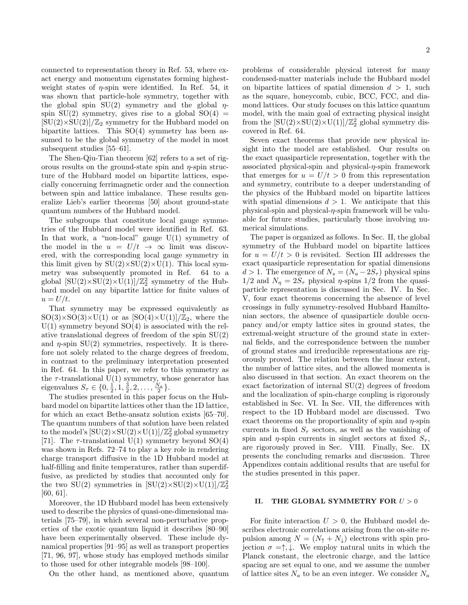 

Low-resolution page preview, page 2

📷 Fig 2

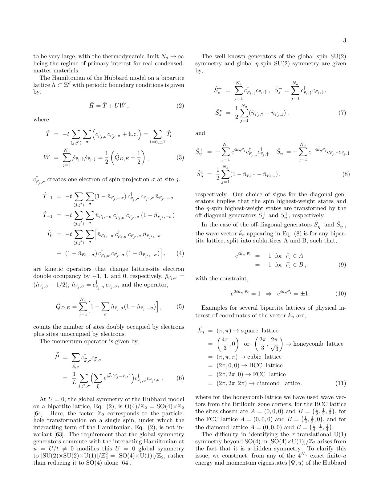 

Low-resolution page preview, page 3

📷 Fig 3

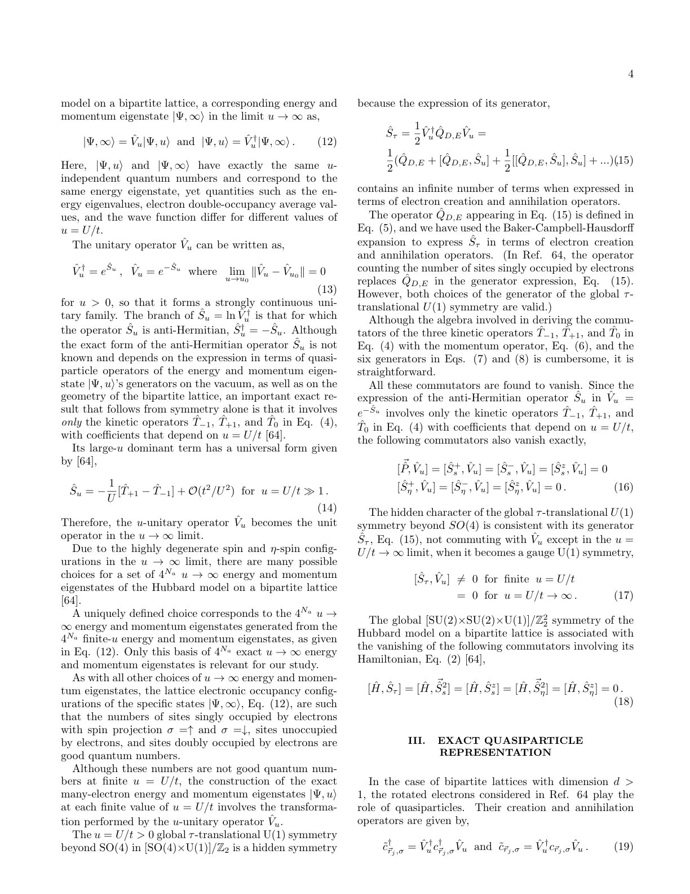 

Low-resolution page preview, page 4

📷 Fig 4

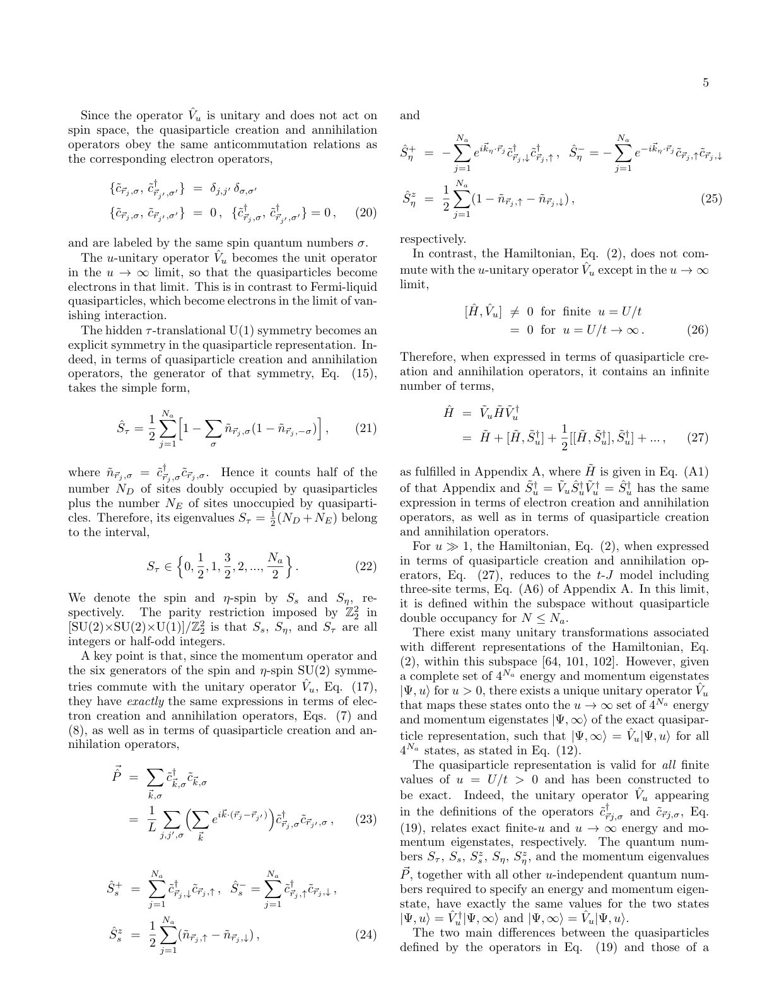 

Low-resolution page preview, page 5

📷 Fig 5

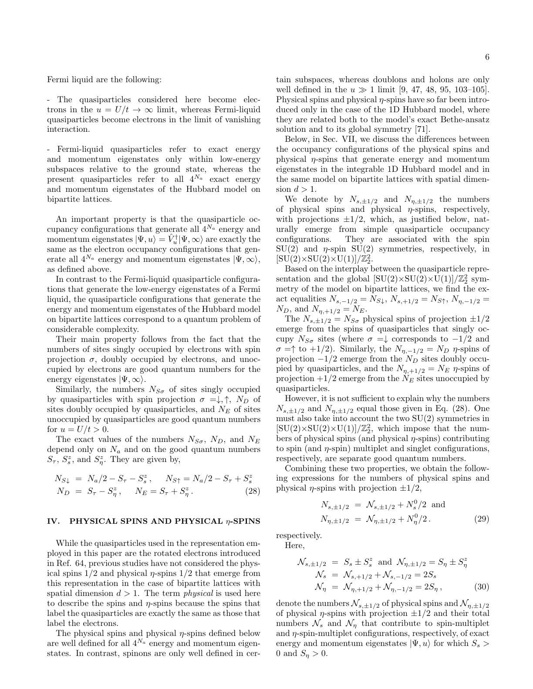 

Low-resolution page preview, page 6

📷 Fig 6

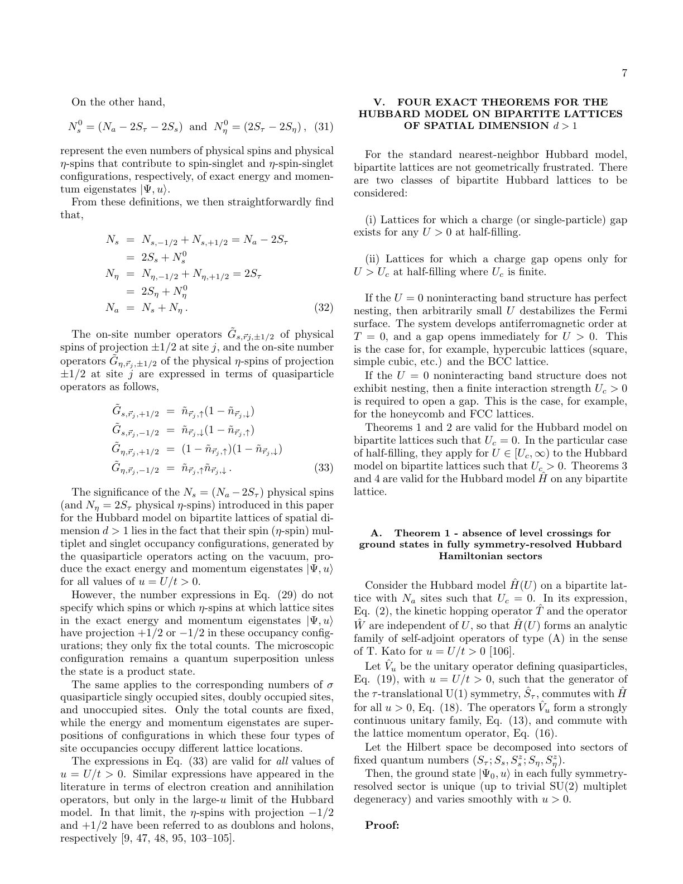 

Low-resolution page preview, page 7

📷 Fig 7

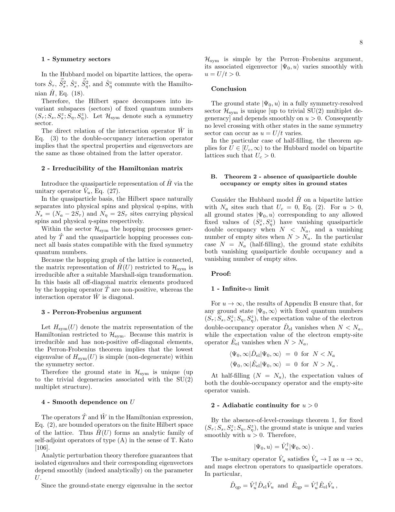 

Low-resolution page preview, page 8

📷 Fig 8

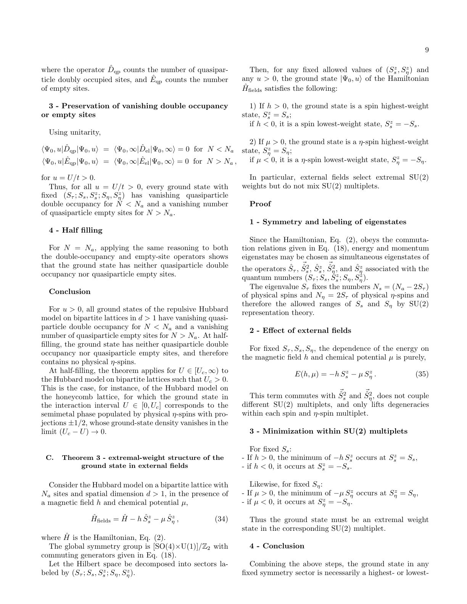 

Low-resolution page preview, page 9

📷 Fig 9

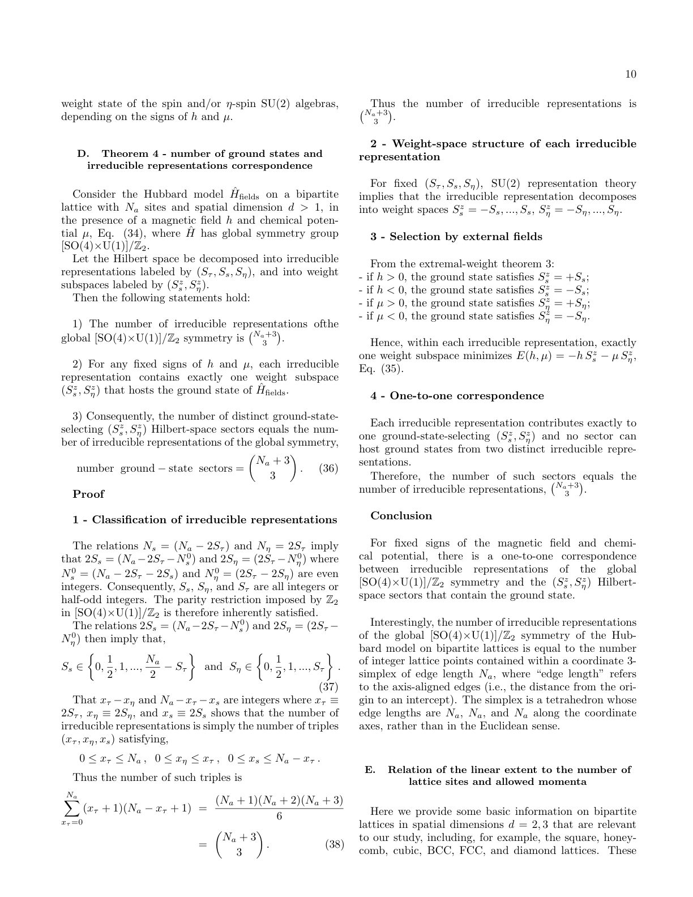 

Low-resolution page preview, page 10

📷 Fig 10

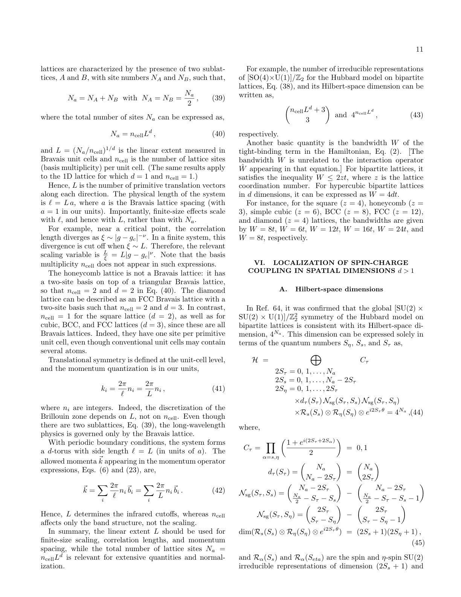 

Low-resolution page preview, page 11

**Main problem.**

The paper aims to establish exact results for the Hubbard model on bipartite lattices in dimensions d > 1 by utilizing its full [SU(2) x SU(2) x U(1)]/Z2^2 global symmetry, specifically addressing the previously ignored hidden U(1) symmetry.

**Main result.**

The author establishes seven exact theorems regarding the ground state properties, including the absence of level crossings in symmetry-resolved sectors, the absence of quasiparticle double occupancy/empty sites, and the decomposition of spin-charge entanglement.

**Method.**

The study employs an exact quasiparticle representation via a u-unitary transformation and utilizes the Perron-Frobenius theorem and analytic perturbation theory to prove ground state properties.

**Summary.**

This paper provides a rigorous mathematical framework for the Hubbard model on bipartite lattices in dimensions greater than one. By identifying a hidden U(1) symmetry, the author establishes seven exact theorems that describe the ground state's behavior, such as the absence of level crossings and the suppression of certain charge fluctuations. These results offer a robust foundation for understanding electronic correlations in materials like graphene and cuprate superconductors. The work also demonstrates how the model reduces to the t-J model in the strong-coupling limit.

Detailed structure

**Model / system.**

The Hubbard model on bipartite lattices (such as square, honeycomb, cubic, BCC, FCC, and diamond) with transfer integral t and on-site repulsion U.

**Key observables.**

Spin S_s, eta-spin S_eta, tau-translational U(1) generator S_tau, energy and momentum eigenstates, and spin/eta-spin currents.

**Important parameters / regimes.**

Interaction strength u = U/t, number of lattice sites N_a, and the presence of external magnetic fields (h) or chemical potential (mu).

**Assumptions / limitations.**

The results are derived for bipartite lattices in spatial dimensions d > 1 and specifically focus on the regime of finite U > 0.

**Paper structure.**

The paper begins by identifying the full global symmetry and introducing a quasiparticle representation, followed by the derivation of seven specific theorems regarding ground state properties, and concludes with an analysis of the large-u limit and the mapping to the t-J model.

Abstract

There are few exact results for the Hubbard model on bipartite lattices of spatial dimension $d>1$. Nevertheless, the Hubbard model with transfer integral $t$ and onsite repulsion $U$ on bipartite lattices with $N_a$ sites, such as the square, honeycomb, cubic, body-centered cubic, face-centered cubic, and diamond lattices, provides the simplest toy model for describing electronic correlations in many condensed-matter systems and is therefore a quantum problem of considerable physical interest. Seven exact theorems that provide new physical insight into the model are established. Overall, the exact framework based on physical spins and physical $η$-spins for the Hubbard model on bipartite lattices of spatial dimension $d>1$ introduced in this paper offers a robust foundation for future studies of the model, as well as of the condensed-matter materials, such as cuprate superconductors, graphene and graphene-derived systems, and other quantum systems, that it describes.

[↑ back to top](#top)

### [Hidden optical nonlinearities in linear spectra of quantum emitter arrays](http://arxiv.org/abs/2604.25010v1)

**Authors:** Sricharan Raghavan-Chitra, Arghadip Koner, Joel Yuen-Zhou

**Type:** theory · **Category:** other · **PDF:** <https://arxiv.org/pdf/2604.25010v1>

**Analysis basis:** full PDF text, analyzed in chunks

**Topic relevance:** `Keldysh / 2PI / non-Gaussian methods` **2/5**

📷 Fig 1

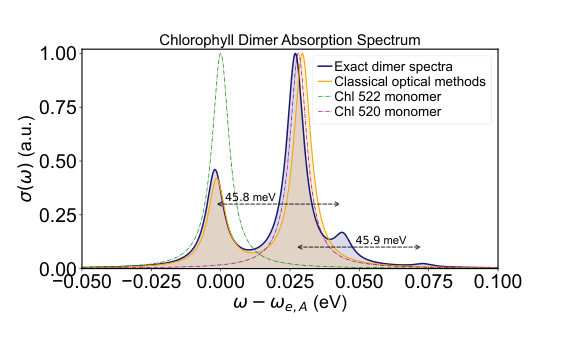 

FIG. 1. Absorption spectrum of the Chl522–Chl520 heterodimer computed using parameters from Ref. [46] within a minimal three- level system basis that captures the essential physics of the phenomenon. Details of the simulations and explicit parameters are provided in Section 2 of the Supplementary Information. The blue curve shows the exact dimer spectrum obtained from Eq. 9, while the orange curve corresponds to classical optical treatments (e.g., DDA/CPA/CES), which neglect contributions from ground- state vibrational excitations to the linear response by restricting each monomer to a single ground vibrational level. The red dash– dot curve shows the normalized monomer absorption of...

📷 Fig 2

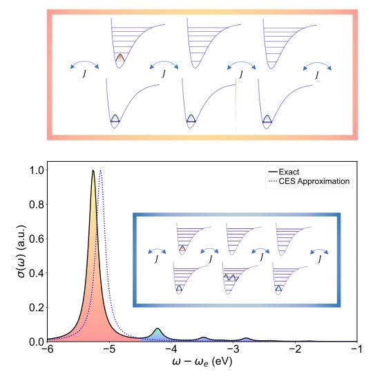 

FIG. 2. Linear absorption spectra of linearly coupled quantum emitter arrays comprising ten emitters computed by exact numerical diagonalization. The details of the model and the parameters are presented in Section 3 of the Supplementary Information. The DDA/CES/CPA captures the orange features in the exact spectra of the emitter arrays, analogous to those in Fig. 1, which physically arises from Rayleigh-type transitions, as schematically illustrated in the orange box. In contrast, spectral features such as the first blue-shifted peak, displaced from the orange peak by precisely one quantum of the ground- state vibrational frequency, are entirely absent within the DDA/CES/CPA...

📷 Fig 3

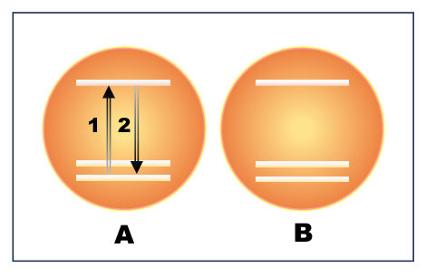 

FIG. 1. The ladder diagram [47] of the heterodimer illustrates the photophysical process in which the incident light field interacts perturbatively with monomer A alone. The double-line arrows denote processes directly mediated by the incoming laser. The numbers adjacent to each arrow indicate the sequence of interactions: (1) excitation of monomer A by the laser and (2) de-excitation of monomer A through a second interaction with the laser.

📷 Fig 4

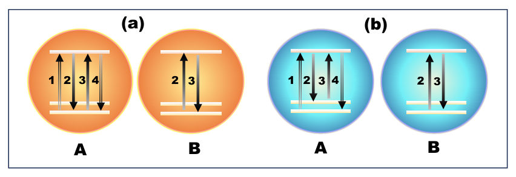 

FIG. 2. The ladder diagram [47] corresponding to the second-order term in Eq. [eq:dysonexpansion] illustrates the case where the light field interacts perturbatively with monomer A alone. Both diagrams involve two successive dipole-dipole interactions, through which the excitation is transferred to monomer B and subsequently returned to monomer A. Panel (a) captures a purely Rayleigh-type photophysical process, with no vibrational excitation in the ground electronic state, whereas panel (b) includes a Raman-type contribution in which vibrational coherence is generated in monomer A. The double-line arrows denote processes directly mediated by the incoming laser, while the solid arrows...

📷 Fig 5

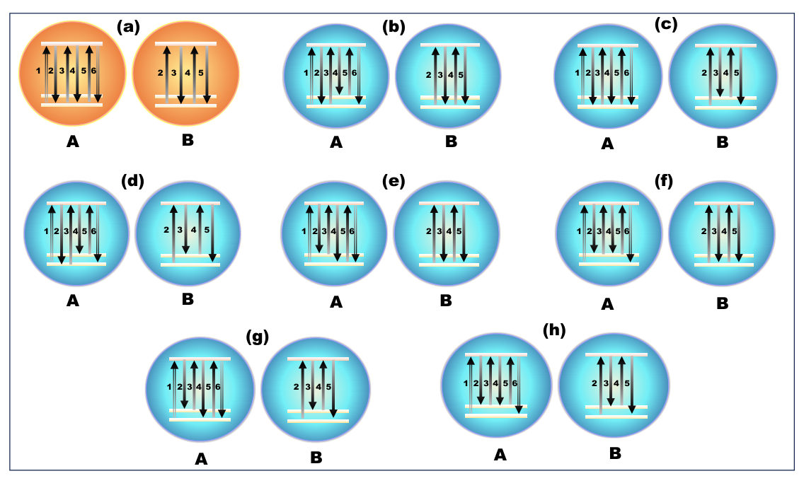 

FIG. 3. All possible ladder diagrams [47] are shown corresponding to fourth order in the interaction between the monomers. Further, these diagrams correspond to the component where the light source interacts only with monomer A. Only Rayleigh-type photophysical processes takes place in the orange diagram (a), whereas, Raman-type processes also takes place in the blue diagrams (b-h). Here, the double line arrows correspond to direct processes due to the laser and the solid line arrows correspond to processes due to the dipole-dipole interaction (J- coupling). The numbers adjacent to each arrow indicate the sequence of interactions: (1) excitation of monomer A by the laser, (2–5) exciton...

📷 Fig 6

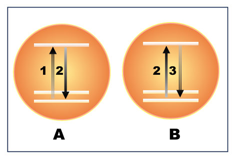 

FIG. 4. The ladder diagram [47] represents the pathway in which the light field excites monomer A and subsequently de-excites monomer B. This diagram corresponds to a first-order interaction process. The double-line arrows denote direct interactions with the laser field, while the solid arrows represent dipole-dipole (J-coupling) mediated processes. The numbers adjacent to each arrow indicate the sequence of interactions: (1) excitation of monomer A by the laser, (2) exciton transfer from A to B via dipole-dipole coupling, and (3) de-excitation of monomer B through a second interaction with the laser.

📷 Fig 7

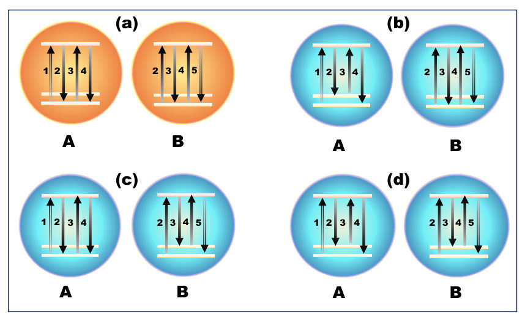 

FIG. 5. The ladder diagram [47] represents the pathway in which the light field excites monomer A and subsequently de-excites monomer B. This diagram corresponds to a third-order interaction process. The orange diagram (a) captures only Rayleigh-type processes, whereas the blue diagrams (b–d) additionally include Raman-type processes. The double-line arrows denote direct interactions with the laser field, while the solid arrows represent dipole-dipole (J-coupling) mediated processes. The numbers adjacent to each arrow indicate the sequence of interactions: (1) excitation of monomer A by the laser, (2–4) exciton transfer from A to B via dipole-dipole coupling, and (5) de-excitation of...

📷 Fig 8

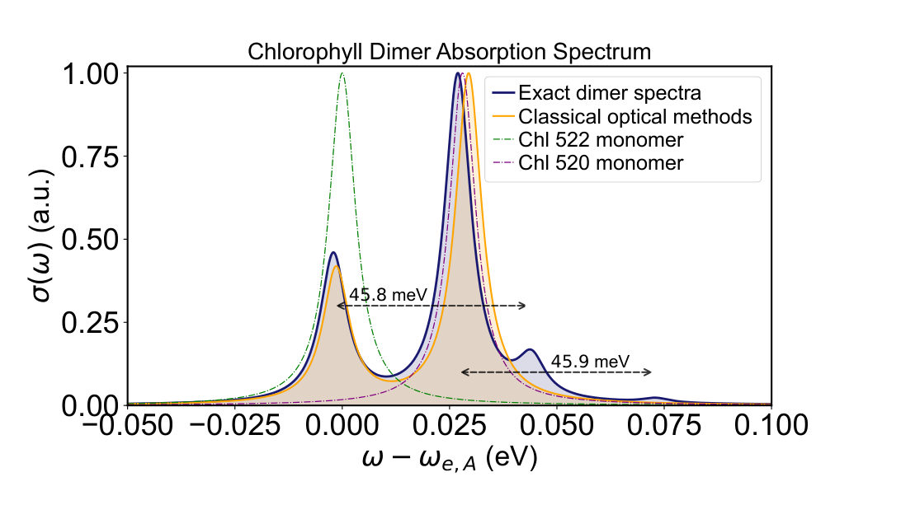 

FIG. 6. The absorption spectrum of the chlorophyll dimer (Ch522–Ch520), as shown in Fig. 1 of the main text, is reproduced here for reference.

📷 Fig 9

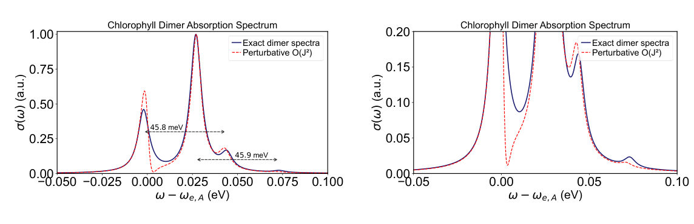 

FIG. 7. Perturbative analysis of the heterodimer spectra. The blue curve denotes the exact dimer spectrum, corresponding to Fig. 1 of the main text, while the red dashed curve is obtained by retaining terms only through O(J2) in Eq. (17). As shown in the left panel, this perturbative correction is sufficient to reproduce the Raman feature near ω −ωe,A ≈0.05. The right panel, which provides a zoomed-in view of the left panel, further shows that the same O(J2) approximation captures the Raman feature near ω −ωe,A ≈0.75.

📷 Fig 10

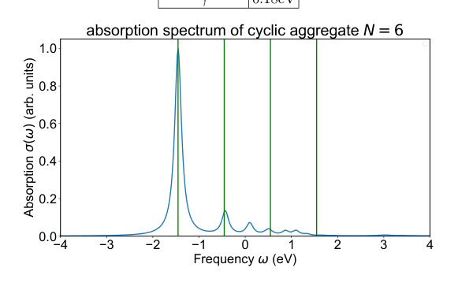 

FIG. 8. Parameters and the corresponding exact absorption spectra for an idealized circular aggregates, where, all of the dipole moments are aligned. The parameters corespond to the Fig. 17 (i) in Hestand et al. [3]. We have used eV for the purpose of the simulation, however, the unit doesn’t affect the spectra.

**Main problem.**

Investigating whether the linear optical spectrum of coupled quantum emitter arrays can encode nonlinear optical information, specifically Raman-type vibrational signatures, challenging the classical assumption that linear response depends only on individual linear susceptibilities.

**Main result.**

Demonstrated that inter-emitter interactions allow nonlinearities of individual monomers to emerge as vibrational sidebands in the linear response of arrays, even without cavities or permutational symmetry.

**Method.**

Theoretical framework using retarded Green's functions, Dyson expansion, and a diagrammatic approach (ladder diagrams) to identify photophysical pathways and compute exact absorption spectra.

**Summary.**

The paper shows that the linear absorption spectrum of quantum emitter arrays contains 'hidden' nonlinear information from the individual emitters. By using inter-emitter coupling, Raman-type vibrational features of monomers appear as sidebands in the collective linear response. This effect does not require cavities or high symmetry, making it a general feature of molecular aggregates and 1D arrays. This discovery bridges the gap between linear and nonlinear spectroscopy and enables new methods for spectral engineering.

Detailed structure

**Model / system.**

Quantum emitter arrays, including molecular heterodimers (e.g., Chl522-Chl520) and 1D/cyclic aggregates, modeled using a three-level vibronic Hamiltonian with electronic and vibrational degrees of freedom and dipole-dipole coupling.

**Key observables.**

Linear absorption spectrum (sigma(omega)), Raman-type sidebands, and vibrational combination bands.

**Important parameters / regimes.**

Excitonic coupling strength (J), vibrational frequency (omega_v), Huang-Rhys factor (lambda^2), electronic/vibrational decay rates (gamma), and exciton bandwidth (W).

**Assumptions / limitations.**

Assumes inter-emitter coupling is mediated by the electromagnetic vacuum; uses a truncated three-level basis per monomer and a simplified shifted harmonic oscillator model.

**Figures summary.**

Ladder diagrams illustrating zeroth, second, and fourth-order photophysical processes (Rayleigh vs. Raman pathways); plots of linear absorption spectra for heterodimers and 1D arrays showing emergent sidebands.

**Paper structure.**

Introduction of the challenge to classical optical frameworks; derivation of the Green's function and Dyson expansion; application to heterodimers to show Raman encoding; extension to 1D/cyclic arrays; comparison with classical approximations (DDA/CPA) and many-body approximations (TPA).

**Why it may be interesting.**

It reveals a way to probe hidden nonlinear/vibrational degrees of freedom using only linear spectroscopy, providing a new pathway for spectral engineering and quantum sensing in molecular aggregates and solid-state arrays.

Abstract

Classical optical frameworks such as the discrete dipole approximation (DDA) assume that the linear spectrum of coupled quantum emitters can be computed solely from the linear susceptibilities of individual constituents. However, recent polariton studies show that cavity linear response can encode nonlinear optical susceptibilities. Here, we demonstrate that this phenomenon is more general: emitter-emitter interactions allow nonlinearities of individual emitters to emerge in the linear response of arrays, without cavities or permutational symmetry. To illustrate this phenomenon, we show linear spectra for coupled heterodimers and linear chains, and demonstrate that Raman features of individual monomers show up as vibrational sidebands of collective resonances. Moreover, tuning Raman-type anharmonicities enables systematic control of spectral features, establishing a genuine quantum optical effect in molecular aggregates and quantum emitter arrays, which goes beyond mean-field descriptions in light-matter interactions.

[↑ back to top](#top)

### [Kohn-Sham Hamiltonian from Effective Field Theory: Quasiparticle Band Narrowing from Frozen Core Dynamics](http://arxiv.org/abs/2604.25199v1)

**Authors:** Xiansheng Cai, Han Wang, Kun Chen

**Type:** theory · **Category:** strongly correlated electrons · **PDF:** <https://arxiv.org/pdf/2604.25199v1>

**Analysis basis:** full PDF text, analyzed in chunks

**Topic relevance:** `Keldysh / 2PI / non-Gaussian methods` **2/5**

📷 Fig 1

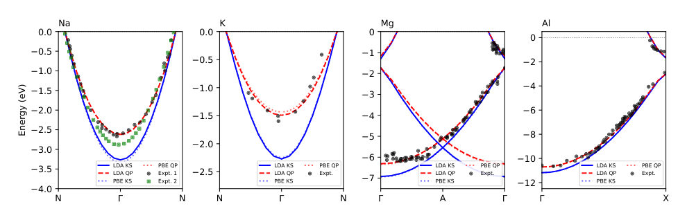 

FIG. 1. Valence bands compared with ARPES data. Solid: LDA KS (blue) and QP (red). Dotted: PBE KS and QP. Na and K along N–Γ–N: Expt. 1 = Ref. [2], Expt. 2 = Ref. [3], K expt. = Ref. [4]. Mg along Γ–A–Γ: expt. = Ref. [5]. Al along Γ–X: expt. = Ref. [6]. PBE closely tracks LDA, confirming robustness to the functional.

📷 Fig 2

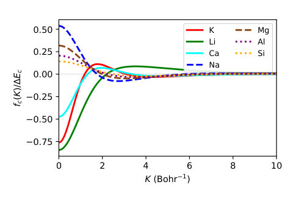 

FIG. 2. Dimensionless ratio f c K/∆Ec for the dominant core channel of each element. This ratio controls zcore [Eq. (3)]: elements with large |f c/∆Ec| have large corrections. K and Li have the largest ratios because ∆Ec is small (1.7 to 2.6 Ha) while |f c K| ∼Jc ∼1 to 2 Ha is comparable. The [Ne]-core se- ries Na–Mg–Al–Si shows monotonically decreasing amplitude: |f c K| is nearly the same for all four because Jc and the orbital size ⟨r⟩c scale inversely with Z, keeping |fc| ∼Jc⟨r⟩c ∼1 Ha; meanwhile ∆E2s roughly triples from Na to Si. The sign change near K ≈2 to 3 Bohr−1 leads to partial cancellation in the coherent sum F c νk.

📷 Fig 3

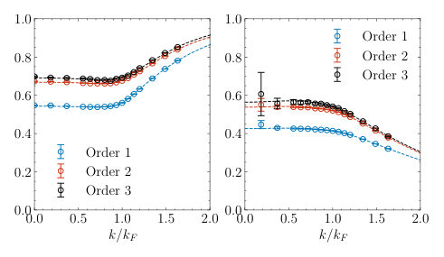 

FIG. 3. Quasiparticle properties of the UEG at rs = 4 from DiagMC. Left: z(k) = 1/(1−∂ωRe Σ) is nearly constant within the Fermi sea. Right: [ϵk −∆Re Σ(k)]/ϵk (where ϵk = k2/2m and ∆Σ(k) = Σ(k) −Σ(0)) is likewise flat, confirming ∂ωΣ + ∂ϵΣ ≈0 and hence m∗≈m.

📷 Fig 4

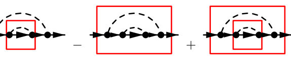 

FIG. 4. RPT self-energy diagrams to second order. (a) KS propagator. (b,c) Two- and three-point counterterms. (d) First- order Fock residual. (e) RPA/bubble. (f) SOX/charge-vertex. (g) Nested Fock. Solid boxes (red): P Γ 2 subtraction; dashed boxes (blue): P 0 3 subtraction.

📷 Fig 5

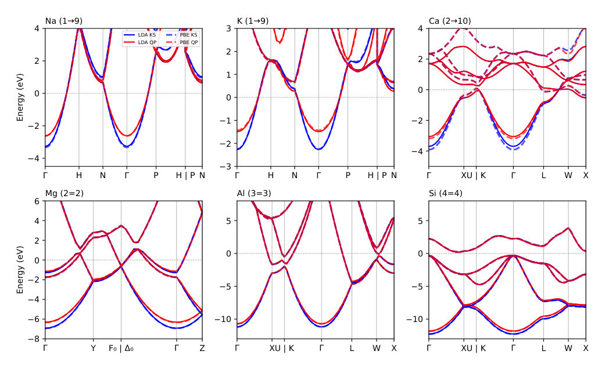 

FIG. 5. LDA vs PBE band structures with EFT quasiparticle correction for seven elements. Solid: LDA; dashed: PBE. Blue: KS; red: QP.

📷 Fig 6

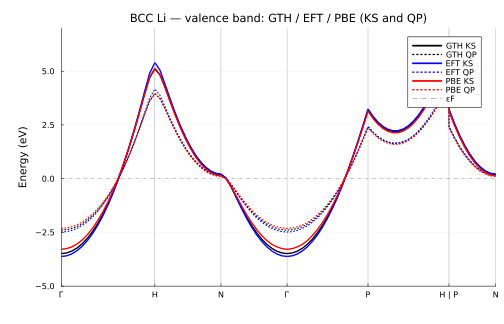 

FIG. 6. Li BCC band structure along N–Γ–H. Blue: KS; red: EFT QP. Solid: GTH-LDA (Zv = 1); dashed: EFT nonlocal KB PSP; dotted: PBE (Zv = 3).

**Main problem.**

The systematic overestimation of bandwidth in alkali and alkaline-earth metals by Kohn-Sham eigenvalues compared to ARPES measurements, caused by the neglect of dynamical core-electron excitations in standard DFT.

**Main result.**

The derivation of an Effective Field Theory (EFT) that introduces a renormalization factor (z_core) to the Kohn-Sham bands, successfully resolving the bandwidth discrepancy by accounting for frozen-core dynamics.

**Method.**

Construction of an EFT for the inhomogeneous electron gas using a dual-fermion approach and Renormalized Perturbation Theory (RPT) to integrate out core electrons.

**Summary.**

This paper addresses the long-standing discrepancy between DFT-calculated Kohn-Sham bands and experimental ARPES data in simple metals. By using an Effective Field Theory to account for the dynamical effects of core electrons that are usually 'frozen' in standard pseudopotentials, the authors derive a correction factor that narrows the predicted bandwidth. This approach successfully matches experimental results for several elements and demonstrates how LLM-based agents can be used to reconstruct and verify fundamental many-body theories.

Detailed structure

**Model / system.**

The system consists of sp-bonded metals (Li, Na, K, Mg, Ca, Al, Si) modeled via a Born-Oppenheimer action and a Kohn-Sham Hamiltonian augmented by an energy-dependent pseudopotential.

**Key observables.**

Quasipability bandwidth, quasiparticle residue (z), effective mass (m*), and the frozen-core renormalization factor (z_core).

**Important parameters / regimes.**

Core excitation energy (Delta E_c), core form factor (f_c^K), and the scale separation ratio (epsilon_F / Delta E_c).

**Assumptions / limitations.**

Assumes scale separation between core and valence energies, approximate Galilean invariance of the uniform electron gas, and the validity of the Born-Oppenheimer approximation.

**Figures summary.**

Comparison of LDA and PBE band structures with and without EFT corrections for various elements; validation of the Li BCC valence band structure using different pseudopotentials.

**Paper structure.**

Introduction of the bandwidth discrepancy; derivation of the EFT and the energy-dependent pseudopotential; application of Renormalized Perturbation Theory; numerical validation against ARPES and DMFT; discussion of the 'Agentic Science' paradigm for theory construction.

Abstract

Kohn-Sham (KS) eigenvalues are routinely compared with angle-resolved photoemission (ARPES) and used as input for many-body methods, yet density functional theory (DFT) assigns them no physical meaning. For alkali and alkaline-earth metals, KS bandwidths overestimate ARPES measurements by 20-35%, a discrepancy that persists across all exchange-correlation functionals. We construct an effective field theory (EFT) of the inhomogeneous electron gas and show that two conditions imply KS bands are the quasiparticle bands, up to a frozen-core renormalization factor zcore: a scale separation between core excitation energies and the valence Fermi energy, and an approximate Galilean invariance of the uniform electron gas confirmed by diagrammatic Monte Carlo. This factor reflects dynamical core excitations that conventional pseudopotentials freeze out and no static potential can capture. The correction 1-zcore reaches 20-35% for alkali metals but falls below 5% for Al and Si, explaining both the failure and success of KS band theory. We derive a closed-form post-SCF formula and validate it for Li, Na, K, Ca, Mg, Al, and Si; the predicted quasiparticle bands resolve the long-standing ARPES bandwidth discrepancy, matching embedded dynamical mean-field theory at negligible cost. This work also exemplifies first-principles agentic science, a direction particularly suited to the AGI-for-Science paradigm: an LLM-co-developed derivation with controlled approximations, verified symbolically and against a few experiments, becomes a deterministic harness for agentic scale-out, resolving simultaneously the LLM audit bottleneck and the non-falsifiability of fit-based AI-for-science.

[↑ back to top](#top)

### [On the Mathematics of Information-Thermodynamics](http://arxiv.org/abs/2604.24948v1)

**Authors:** Dallin Fisher, Qi-Jun Hong

**Type:** theory · **Category:** statistical mechanics · **PDF:** <https://arxiv.org/pdf/2604.24948v1>

**Analysis basis:** full PDF text, analyzed in chunks

**Topic relevance:** `entanglement & information structure` **2/5**

📷 Fig 1

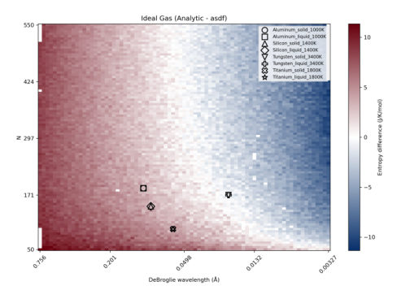 

FIG. 1: Heatmap showing the discrepancy between the asdf method and the analytic solutions for entropy of an ideal gas for 8, 000 ensembles with varying N and Λ. For real systems simulated with sufficiently sized cells, asdf is in good agreement with the analytic solutions.

📷 Fig 2

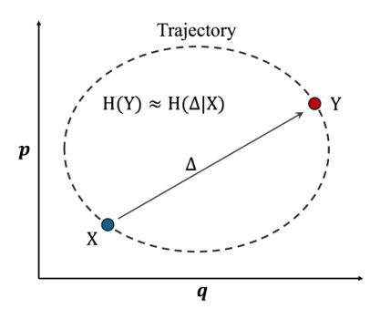 

FIG. 2: The entropy of a microstate Y can be approximated as the conditional entropy of the mapping between an uncorrelated microstate X and Y .

📷 Fig 3

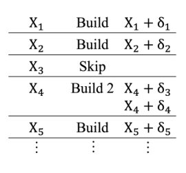 

FIG. 3: The information relayed from sender to receiver to construct a microstate Y given a relative microstate X can be constructed as procedural operations over a fixed sequence of the elements in X. For each element in X, information on how the receiver can build elements in Y must be supplied.

📷 Fig 4

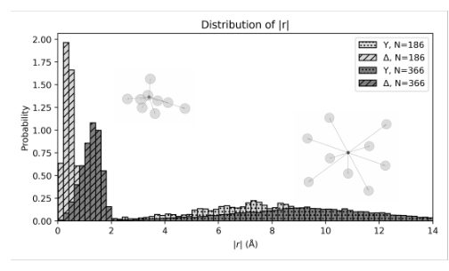 

FIG. 4: Distribution of vector magnitudes r for raw and mapped (∆) data at varying system sizes for solid aluminum at T = 1000 K. The ∆representation produces a sharply peaked distributions near r = 0 with reduced variance, reflecting a concentration of residual displacements that is favorable for finite-precision encoding.

📷 Fig 5

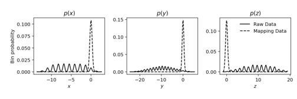 

FIG. 5: Marginal coordinate distributions p(x), p(y), and p(z) for silicon in the diamond phase at 1400 K, shown for both raw and mapped (∆) representations. The transformation from raw to ∆coordinates removes the lattice-scale positional structure and recasts the system in terms of local displacements about a reference configuration. As a result, the periodic features present in the raw coordinate distributions collapse into sharply localized peaks at zero in the ∆representation.

**Main problem.**

The difficulty of computing thermodynamic entropy in interacting and complex systems where closed-form solutions are rare, and the need to validate an information-theoretic framework for entropy estimation.

**Main result.**

The authors analytically and numerically demonstrate that the asdf method accurately reproduces the thermodynamic entropy for the ideal gas and 1D harmonic oscillator, and successfully generalizes to complex condensed phases like liquids and solids.

**Method.**

The asdf method uses an information-theoretic approach that reformulates entropy estimation as the Shannon entropy of a residual mapping distribution between two decorrelated microstates.

**Summary.**

This paper validates the 'asdf' method, a new information-theoretic framework for calculating thermodynamic entropy from molecular configurations. By treating entropy as the Shannon entropy of a residual mapping between microstates, the authors show that the method can recover exact results for ideal gases and harmonic oscillators. The framework is shown to be robust for complex condensed matter systems, including liquids and solids, and can implicitly account for momentum contributions through proper discretization. This provides a powerful, compression-based approach to estimating entropy in large-scale molecular dynamics simulations.

Detailed structure

**Model / system.**

The study uses benchmarks including the classical monatomic ideal gas and the 1D harmonic oscillator, and extends to complex condensed matter systems such as aluminum, silicon, titanium, and tungsten in both solid and liquid phases.

**Key observables.**

Thermodynamic entropy (S), Shannon entropy (H), entropy of mixing, and thermal de Broglie wavelength.

**Important parameters / regimes.**

Particle number (N), temperature (T), thermal de Broglie wavelength (Lambda), and Debye temperature (Theta_D).

**Assumptions / limitations.**

The method assumes the separability of the Hamiltonian and that the momentum contribution can be recovered via a specific discretization scale related to the de Broglie wavelength.

**Figures summary.**

Figure 1 shows the convergence of the asdf method to the ideal gas analytic solution; Figure 4 illustrates the reduction in variance in the residual mapping compared to raw coordinates; Figure 5 shows marginal coordinate distributions for silicon.

**Paper structure.**

The paper begins with the validation of the asdf method against the ideal gas and 1D harmonic oscillator, moves to the generalization of the framework to interacting systems and mixtures, and concludes with applications to real material systems (solids and liquids) and the integration of electronic/quantum effects.

Abstract

We present a validation of the asdf method, an information-theoretic framework for computing thermodynamic entropy from molecular configurations. The method reformulates entropy estimation as the Shannon entropy of a residual mapping distribution defined between two decorrelated microstates. We demonstrate analytically that for the closed-form Hamiltonians with known solutions, the classical ideal gas and the one-dimensional harmonic oscillator's entropy obtained from the compressibility of the residual mapping object reproduces the exact thermodynamic entropy. In each case, the conditional entropy of the residual mapping object with respect to an uncorrelated microstate is shown to coincide with the ensemble entropy derived from the canonical partition function. These results establish consistency between the asdf formalism and classical statistical mechanics for analytically solvable systems. We further discuss how the framework generalizes to interacting Hamiltonians. The analysis supports the interpretation of thermodynamic entropy as an information measure encoded geometrically in inter-microstate mappings and motivates application of the method to complex condensed phases.

[↑ back to top](#top)

### [Optimizing ground state preparation protocols with autoresearch](http://arxiv.org/abs/2604.25610v1)

**Authors:** Luis Mantilla Calderón, Jérôme F. Gonthier, Ignacio Gustin, Varinia Bernales, Alán Aspuru-Guzik

**Type:** theory · **Category:** numerical methods · **PDF:** <https://arxiv.org/pdf/2604.25610v1>

**Analysis basis:** full PDF text, analyzed in chunks

**Topic relevance:** `entanglement & information structure` **2/5**

📷 Fig 1

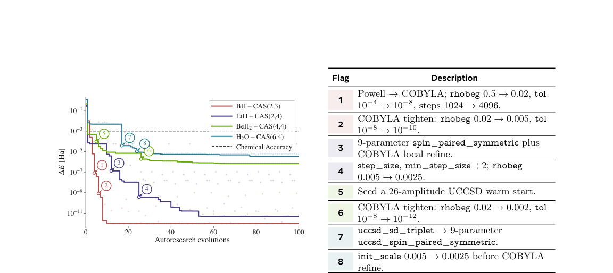 

Figure 1 Combined log-scale VQE milestone figure for the four completed 100-iteration archival campaigns in the fixed-budget study. Left: pale points denote every evaluated candidate, solid lines denote the running best ∆E, and the dashed horizontal line marks chemical accuracy. Numbered callouts highlight later, energetically meaningful changes in the search trajectory rather than the trivial first ansatz swap. Right: short technical summaries of the corresponding code edits, with flag tint matching the molecule colour used in the plot. The full VQE mutation logs are listed in the external log supplement (83).

📷 Fig 2

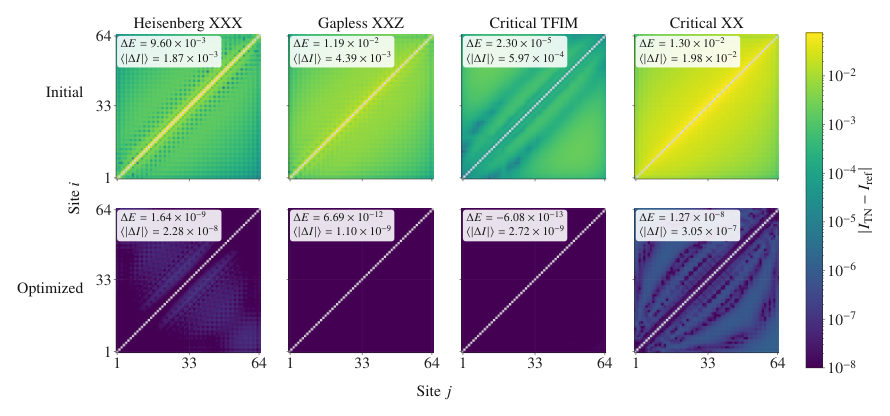 

Figure 2 Tensor-network mutual-information error matrices for the four one-dimensional critical L = 64 benchmarks: Heisenberg XXX, gapless XXZ, critical TFIM, and critical XX. Columns denote Hamiltonians; the top row shows the archived baseline protocol and the bottom row shows the current best optimized protocol from the autoresearch run. Each panel plots the absolute entrywise error |ITN ij −Iref ij | relative to a frozen high-accuracy DMRG2 MPS reference, with the diagonal masked in gray because self-information entries are not compared.

📷 Fig 3

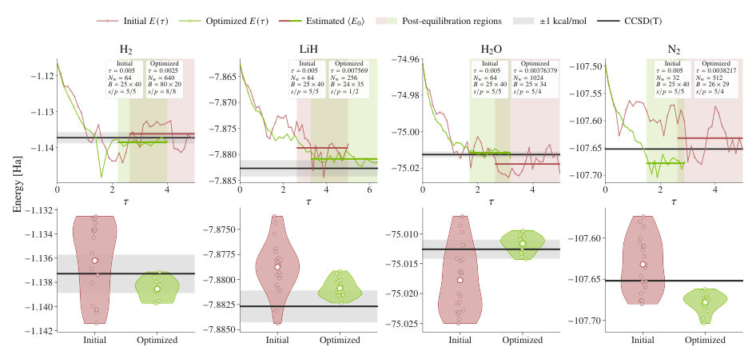 

Figure 3 AFQMC comparison across H2, LiH, H2O, and N2 for the molecular benchmark suite under the fixed post-equilibration live scorer. The top row shows the sampled mixed-estimator traces E(τ) for the initial and best archived optimized configurations, with the post-equilibration sampling regions shaded and the post-equilibration energy estimates ⟨E0⟩drawn as bold horizontal segments. The bottom row shows the corresponding distributions of stored post-equilibration block energies. The shared horizontal guides mark the frozen CCSD(T) reference and the ±1 kcal/mol chemical-accuracy window. The parameter boxes summarize the initial and optimized AFQMC controls for each molecule: τ is the...

📷 Fig 4

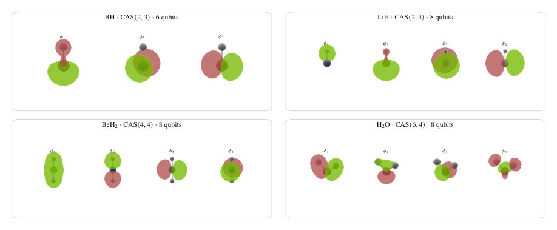 

Figure 4 Active-orbital gallery for the four VQE benchmark molecules used in the main text: BH, LiH, BeH2, and H2O. Each panel shows the active-space molecular orbitals used to construct the corresponding CAS Hamiltonian, with positive and negative orbital lobes colored separately.

📷 Fig 5

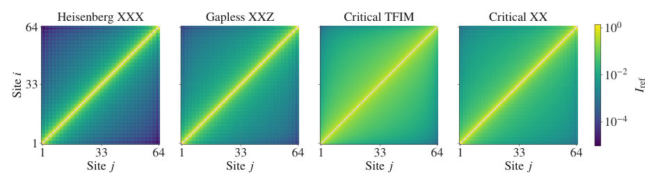 

Figure 5 Frozen reference mutual-information matrices for the four one-dimensional critical L = 64 tensor-network benchmarks. Each panel shows Iref ij for the corresponding high-accuracy DMRG2 MPS reference state, with the diagonal masked in gray.

**Main problem.**

Automating the optimization of ground-state preparation protocols (ansatz design, hyperparameters, and algorithmic choices) to replace manual, labor-intensive tuning.

**Main result.**

An LLM-based 'autoresearch' agent successfully mutated simple baseline protocols into complex, high-performing ones, achieving significant energy error reductions in VQE, DMRG, and AFQMC.

**Method.**

An evolutionary coding strategy using LLM coding agents (GPT-5.4) that generates code edits, executes benchmarks, and uses scalar energy proxies to iteratively improve quantum and classical simulation protocols.

**Summary.**

This paper introduces 'autoresearch,' an automated framework using LLM coding agents to optimize quantum simulation protocols. By treating ground-state preparation as a code-optimization problem, the agent iteratively mutates algorithms like VQE, DMRG, and AFQMC to minimize energy errors. The authors demonstrate that the agent can significantly outperform manual baselines within fixed computational budgets. This approach promises to automate much of the tedious parameter-tuning work in quantum many-body simulations.

Detailed structure

**Model / system.**

The study covers several systems: molecular electronic structures (BH, LiH, BeH2, H2O) for VQE; 1D spin-1/2 chains (Heisenberg XXX, XXZ, TFIM, XX) for DMRG; and small molecules (H2, LiH, H2O, N2) for AFQMC.

**Key observables.**

Ground-state energy error (relative to FCI or CCSD(T)), Rayleigh quotient, mutual-information error, and statistical stability (energy variance).

**Important parameters / regimes.**

Computational wall-time budgets, bond dimension, imaginary-time step, walker population, and optimizer hyperparameters (step size, tolerance).

**Assumptions / limitations.**

The effectiveness is evaluated under strict, fixed computational time and resource constraints; the scope is limited to small-scale proof-of-concept systems.

**Figures summary.**

Figure 1 shows VQE energy error evolution over iterations; Figure 2 compares mutual-information error matrices for spin chains; Figure 3 displays AFQMC energy traces and energy distributions.

**Paper structure.**

The paper introduces the autoresearch concept, details the agentic framework (gsopt), presents specific applications to VQE, DMRG, and AFQMC, and concludes with discussions on future scaling and automation.

**Why it may be interesting.**

It presents a novel way to use generative AI to automate the discovery of optimized numerical protocols for many-body physics and quantum chemistry, potentially reducing the human effort required for complex simulation tuning.

Abstract

Artificial intelligent language-model based coding agents have significantly changed the way we interact with computers in our day-to-day, as it is common to use them to create, improve, and run programming scripts only using natural language. Agent code updates can be better guided when such programs can be executed and scored automatically rather than judged by human preference. In quantum computing and classical quantum simulation settings, ground-state preparation has a parallel structure: candidate protocols can be ranked by estimated energies and other proxies indicating proper quantum-state convergence. In this work, we study how autoresearch, a code optimization strategy based on coding agents, can be used to optimize hyperparameter choices of different ground-state preparation and sampling protocols, including the variational quantum eigensolver (VQE), density matrix renormalization group (DMRG), and auxiliary-field quantum Monte Carlo (AFQMC). We validate the viability and capacity of this method on simple spin models and molecular Hamiltonians. Across all three settings, the agent mutates simple baselines into complex protocols with improved energy proxies while operating under constrained space-time computational budgets. We conclude with discussions of other quantum routines that support executable scalar scoring, enabling evolutionary coding agents to automate a substantial portion of the protocol-tuning work that would otherwise be required manually.

[↑ back to top](#top)

### [Pareto Frontier of Neural Quantum States: Scalable, Affordable, and Accurate Convolutional Backflow for Strongly Correlated Lattice Fermions](http://arxiv.org/abs/2604.25775v1)

**Authors:** Yuntian Gu, Zeyao Han, Wenrui Li, Zhiyu Xiao, Tao Xiang, Mingpu Qin, Liwei Wang, Dingshun Lv

**Type:** theory · **Category:** numerical methods · **PDF:** <https://arxiv.org/pdf/2604.25775v1>

**Analysis basis:** full PDF text, analyzed in chunks

**Topic relevance:** `entanglement & information structure` **2/5**

📷 Fig 1

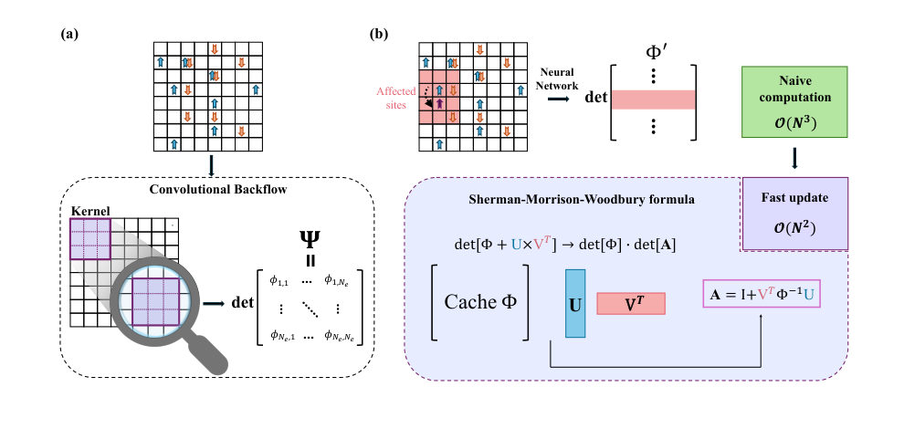 

FIG. 1. Network Architecture and Efficient Local Updates. (a) Given an input configuration, a convolutional layer gathers information from local neighborhoods. The wavefunction is expressed as the determinant of the resulting backflow matrix. (b) SCALE enables efficient updates by only recomputing the orbitals of the affected sites. The computational cost of the determinant is reduced from O(N 3) to O(N 2) via the Sherman-Morrison-Woodbury formula.

📷 Fig 2

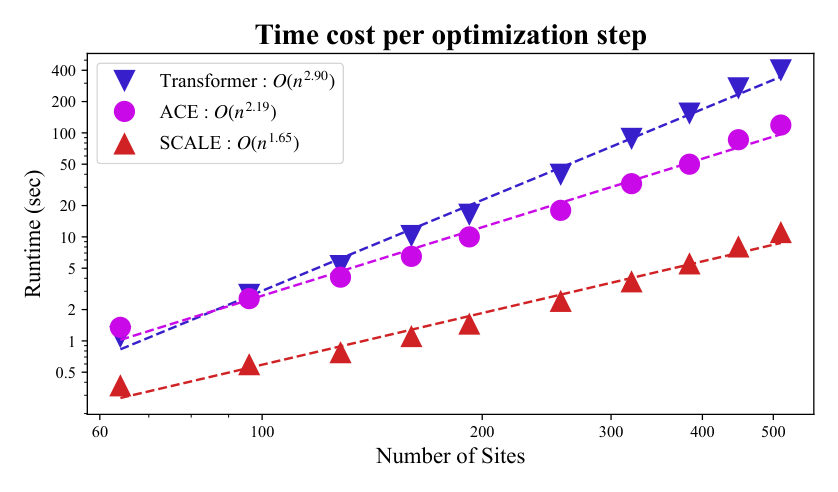 

FIG. 2. Time cost per optimization step as a function of system size. The plot compares the runtime scaling of SCALE against global architectures (ACE and Transformer) under a fixed batch size. SCALE achieves a highly favorable asymptotic complexity (empirically ≈O(N 1.65)), resulting in substantial speed-ups for larger systems compared to the steeper scaling of ACE (≈O(N 2.19)) and Transformer (≈O(N 2.90)).

📷 Fig 3

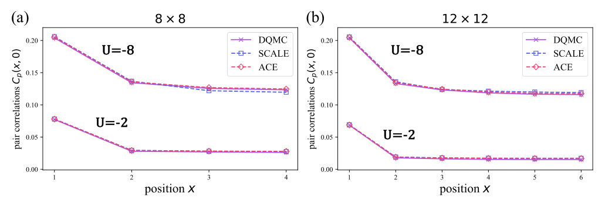 

FIG. 3. Pair correlations Cp(x, 0) for the attractive Hubbard model. The plots show results for (a) 8 × 8 and (b) 12 × 12 systems at weak (U = −2) and strong (U = −8) interaction strengths, with t′ = 0. The results from our ACE and SCALE models perfectly align with the exact DQMC benchmarks, demonstrating their high accuracy. Statistical uncertainties from Monte Carlo sampling are smaller than the marker size in all panels.

📷 Fig 4

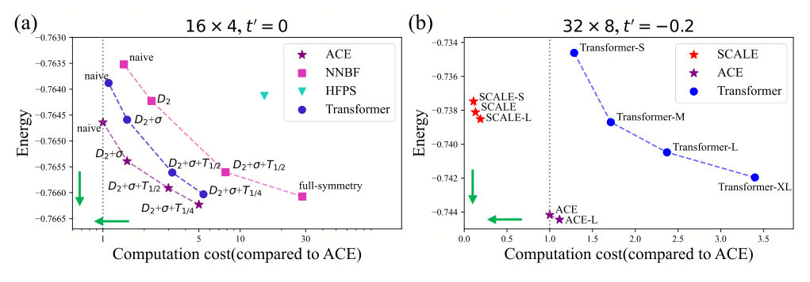 

FIG. 4. Accuracy vs. Cost trade-off on the U = 8 Hubbard model. The plots compare variational ground state energy against relative computational cost. (a) For the 16 × 4 (t′ = 0) system, we analyze the effect of progressively enforcing symmetries on the ACE architecture (purple stars). Labels denote the cumulative addition of point group (D2), spin-flip (σ), half-translation (T1/2), and quarter-translation (T1/4) symmetries. ACE achieves lower energies than Transformer [21], HFPS [23], and NNBF [25] while maintaining a fraction of the computational cost of the full-symmetry NNBF. (b) On the larger 32 × 8 (t′ = −0.2) system, the ACE and SCALE variants establish a superior Pareto front,...

📷 Fig 5

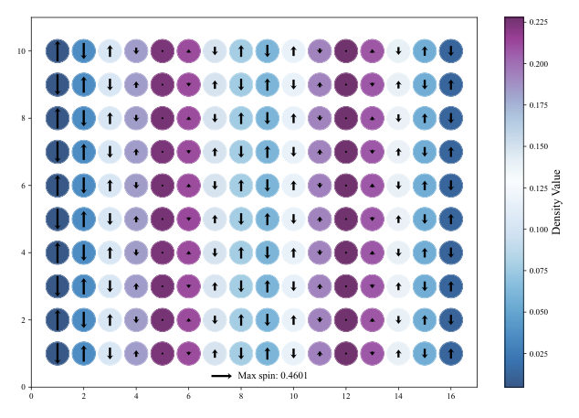 

FIG. 5. Ground state density and spin distribution for the 16 × 10 t −J model with J/t = 1/3, t′/t = 0.2, hm = 0.5 at 1/8 doping under cylindrical boundary conditions. The color of the circles indicates the local hole density, and the arrows represent the magnitude and direction of the local spin density. We can see a clear filled stripe state from the results.

📷 Fig 6

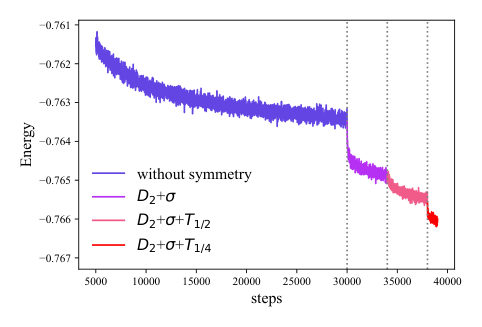 

FIG. 6. Variational energy of ACE as a function of optimization steps. The system is a Hubbard model with size 16 × 4 and t′ = 0. We can see that symmetry projection greatly increases the variational accuracy.

📷 Fig 7

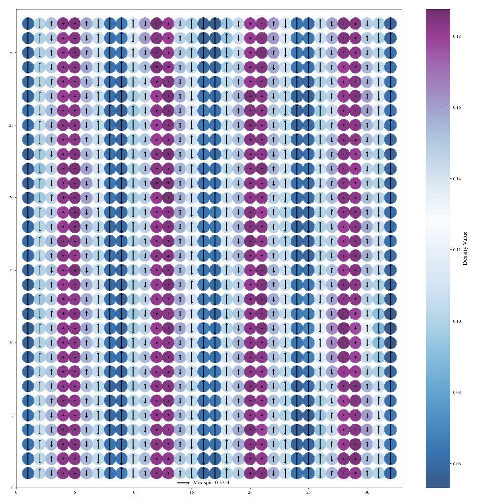 

FIG. 7. Ground state density and spin distribution for the 32 × 32 Hubbard model with t′ = 0 at 1/8 doping under PBC. The color of the circles indicates the local hole density, and the arrows represent the magnitude and direction of the local spin density. We can see a clear filled stripe state from the results.

**Main problem.**

The high computational resource intensity and scaling bottlenecks of Neural Quantum States (NQS) for simulating strongly correlated many-fermion systems.

**Main result.**

The introduction of a new Pareto frontier of NQS architectures, SCALE (for efficiency) and ACE (for accuracy), which significantly improve computational scaling and variational accuracy on large-scale Hubbard and t-J models.

**Method.**

Two new convolutional backflow architectures: SCALE, which uses a tailored design and Sherman-Morrison-Woodbury updates to reduce complexity from O(N^4) to O(N^3), and ACE, which uses a deep convolutional stack for maximum expressive power.

**Summary.**

This paper presents two new Neural Quantum State (NQS) architectures, SCALE and ACE, designed to balance efficiency and accuracy in simulating strongly correlated fermions. SCALE achieves a significant speed-up by reducing computational scaling through efficient local updates, while ACE sets new benchmarks for variational accuracy using deep convolutional stacks. The authors demonstrate the effectiveness of these methods on the Hubbard and t-J models, even resolving stripe orientation in large-scale simulations. This work provides a powerful new toolkit for exploring the physics of unconventional superconductivity and other complex electronic phases.

Detailed structure

**Model / system.**

Strongly correlated lattice fermions, specifically the 2D Hubbard model (including repulsive and attractive regimes) and the t-J model on various lattice sizes and geometries (cylinders and square lattices).

**Key observables.**

Ground-state energy, pair-pair correlation functions, spin density, hole density, and off-diagonal long-range order (ODLRO).

**Important parameters / regimes.**

Hubbard U, hopping parameters (t, t'), doping levels (e.g., 1/8-doped), and lattice dimensions (up to 32x32).

**Assumptions / limitations.**

The use of Green's Function Monte Carlo (GFMC) is subject to the fixed-node approximation; ACE's depth prevents the use of the efficient caching scheme used in SCALE.

**Figures summary.**

Figure 1 illustrates the convolutional backflow kernel and efficient local updates via the Sherman-Morrison-Woodbury formula. Figure 2 shows runtime scaling of different architectures. Figure 3 displays pair correlations for the attractive Hubbard model. Figure 4 shows the accuracy vs. cost trade-off and the Pareto front for different systems. Figure 5 visualizes ground-state spin and hole density.

**Paper structure.**

The paper introduces the computational problem, presents the two new NQS architectures (SCALE and ACE), details the algorithmic improvements for efficiency, provides benchmarks against existing methods (DMRG, Transformer-based NQS), applies the methods to physical problems (Hubbard and t-J models), and discusses the physical implications for stripe phases.

**Why it may be interesting.**

This paper is highly relevant for many-body dynamics and numerical physics as it provides a scalable way to simulate large-scale fermionic systems, potentially enabling the study of complex phase transitions and emergent orders that were previously computationally inaccessible.

Abstract

Neural Quantum States (NQS) are now among the most accurate methods for studying strongly correlated many-fermion systems, outperforming existing many-body approaches for large systems. However, NQS calculations remain extremely resource-intensive. Here, we introduce a new Pareto frontier of efficiency and accuracy for NQS in simulating strongly correlated lattice fermions, defined by two complementary backflow-related architectures: the Sparse Convolutional Ansatz for Lattice Electrons (SCALE) (state-of-the-art efficiency) and the Accurate Convolutional ansatz for lattice Electrons (ACE) (state-of-the-art accuracy), benchmarked on the iconic Hubbard and $t-J$ models for large lattices. SCALE uses a tailored convolutional design enabling efficient local updates via low-rank determinant updates, reducing computational scaling from $O(N^4)$ to $O(N^3)$ in backflow methods and yielding a >40$\times$ practical speed-up in tests while maintaining high variational accuracy. As an application, we study the previously inaccessible 1/8-doped pure Hubbard model up to $32 \times 32$, finding no significant energy difference between horizontal and vertical filled stripe states - contrasting with half-filled stripe states when next-nearest-neighbor hoppings are included. ACE employs a deep convolutional stack to maximize expressive power, achieving unprecedented accuracy on large systems. Extensive benchmarks on Hubbard and $t-J$ models show SCALE delivers variational energies competitive with leading methods at a fraction of the cost, while ACE sets a new accuracy benchmark, surpassing recent results with only 1/6 the runtime for $16 \times 4$ systems. These new NQS approaches provide scalable, affordable, and accurate tools for exploring strongly correlated fermionic physics, such as the microscopic mechanism of unconventional superconductivity.

[↑ back to top](#top)

### [Quantum Dynamics via Score Matching on Bohmian Trajectories](http://arxiv.org/abs/2604.25137v1)

**Authors:** Lei Wang

**Type:** theory · **Category:** numerical methods · **PDF:** <https://arxiv.org/pdf/2604.25137v1>

**Analysis basis:** full PDF text, analyzed in chunks

**Topic relevance:** `methods for driven-dissipative` **2/5**

📷 Fig 1

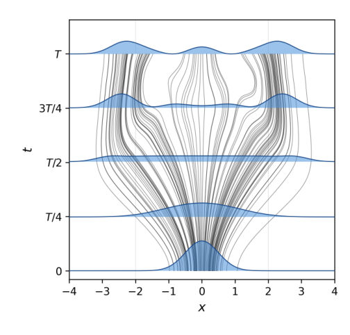 

FIG. 1. Quantum dynamics as a continuous normalizing flow. The black curves are deterministic, non-crossing Bohmian trajectories, launched from particle positions sampled from the initial density and tracking the time-dependent densities shown by the blue waterfall. The blue waterfall plots the ex- act density |Ψ(x, t)|2 at evenly spaced snapshots, showing an initial Gaussian wavepacket splitting into multimodal densi- ties in a symmetric double-well potential.

📷 Fig 2

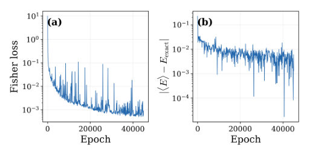 

FIG. 3. Training convergence on the d = 4 Morse chain over 45,000 epochs (raw per-epoch values, log scale). (a) Fisher loss vs. epoch. (b) Mean-energy error |⟨E⟩−Eexact| vs. epoch. ⟨E⟩is averaged over the M = 5000 particles and the trajec- tory time [0, T], and Eexact = 2.3236 is obtained from a 4D split-operator FFT reference.

📷 Fig 3

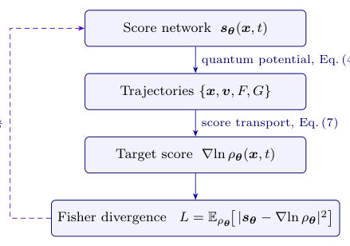 

FIG. 2. Training loop for the self-consistent score matching on Bohmian trajectories. The score network sθ determines the quantum potential Q, which together with the classical po- tential V drives the Bohmian trajectories via Eq. (5). Along each trajectory we co-integrate the deformation gradient F and its velocity counterpart G via Eq. (8). The Fisher diver- gence (Eq. (6)) measures the mismatch between sθ and the score target (Eq. (7)), and gradients dL/dθ propagate end- to-end through the trajectory via BPTT.

📷 Fig 4

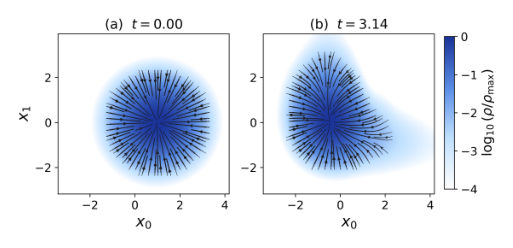 

FIG. 5. Learned score field sθ(x, t) (streamlines) on the (x0, x1) slice of the d = 4 Morse chain (x2 = x3 = 0). Back- ground: exact slice density on a log scale. (a) t = 0: Gaussian initial state with approximately radial score. (b) t = π: an- harmonic coupling deforms the density and the score field. The learned streamlines remain aligned with the exact den- sity gradient across the wavepacket.

📷 Fig 5

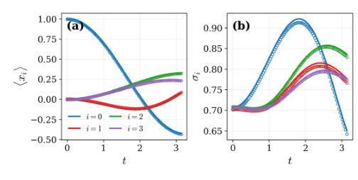 

FIG. 4. Mean ⟨xi⟩(t) (a) and width σi(t) (b) for each of the four modes of the d = 4 Morse chain. Solid lines: exact FFT reference. Open circles: M = 20,000 particles propagated with the trained score network.

**Main problem.**

Efficiently solving the time-dependent Schrödinger equation (TDSE) in high dimensions, avoiding the exponential scaling of grid-based methods and the training difficulties of existing neural-network approaches like PINNs.

**Main result.**

The authors prove that a self-consistent score-matching objective on Bohmian trajectories recovers exact Schrödinger dynamics for nodeless wave functions and demonstrate high-accuracy density reconstruction in Morse chains.

**Method.**

A generative modeling approach that treats quantum dynamics as a continuous normalizing flow, using a neural network to learn the score function (gradient of the log-density) by minimizing a self-consistent Fisher divergence loss along Bohmian trajectories.

**Summary.**

This paper introduces a new way to solve the time-dependent Schrödinger equation by using neural networks to learn the score function of a quantum density. By simulating particles following Bohmian trajectories, the method reinterprets quantum evolution as a continuous normalizing flow. The authors prove that minimizing a specific loss function leads to exact solutions for wave functions without nodes. They demonstrate the method's success on complex systems like anharmonic Morse chains, showing that it can accurately capture quantum vibrations and density evolution.

Detailed structure

**Model / system.**

The method is tested on a 1D double-well potential for wavepacket splitting and a d-dimensional Morse chain representing anharmonic vibrations with a coupled potential.

**Key observables.**

Probability density (rho), score function (s), quantum potential (Q), deformation gradient (F), mean-energy error, and KL divergence.

**Important parameters / regimes.**

Morse chain parameters (D=12.5, beta=0.2, lambda=0.3); training with 5,000 particles over time T=pi with dt=0.01.

**Assumptions / limitations.**

The primary assumption is that the wave function is nodeless (rho > 0), which ensures the phase is single-valued and the score is well-defined.

**Figures summary.**

The figures demonstrate the convergence of the Fisher loss, the accuracy of the learned density compared to exact solutions, and the reproduction of physical observables like dipole oscillations and mode breathing in the Morse chain.

**Paper structure.**

The paper introduces the problem of TDSE scaling, presents the Bohmian/Madelung framework, proposes the score-matching/normalizing flow method, provides a mathematical proof of exactness for nodeless states, and validates the approach via simulations of double-well and Morse chain systems.

**Why it may be interesting.**

It provides a novel bridge between generative modeling (score matching) and quantum dynamics, offering a scalable, particle-based alternative to grid-based solvers that could be extended to many-body systems via fermion-flow architectures.

Abstract

We solve the time-dependent Schrödinger equation by learning the score function, the gradient of the log-probability density, on Bohmian trajectories. In Bohm's formulation of quantum mechanics, particles follow deterministic paths under the classical potential supplemented by a quantum potential depending on the score function of the evolving density. These non-crossing Bohmian trajectories form a continuous normalizing flow governed by the score. We parametrize the score with a neural network and minimize a self-consistent Fisher divergence between the network and the score of the resulting density. We prove that the zero-loss minimizer of this self-consistent objective recovers Schrödinger dynamics for nodeless wave functions, a condition naturally met in quantum vibrations of atoms. We demonstrate the approach on wavepacket splitting in a double-well potential and anharmonic vibrations of a Morse chain. By recasting real-time quantum dynamics as a self-consistent score-driven normalizing flow, this framework opens the time-dependent Schrödinger equation to the rapidly advancing toolkit of modern generative modeling.

[↑ back to top](#top)

### [Quantum Optimization Methods for the Generalized Traveling Salesman Problem](http://arxiv.org/abs/2604.25531v1)

**Authors:** Maximilian Zorn, Melinda Braun, Michael Ertl, Tommy Kiss, Sara Juarez Oropeza, Claudia Linnhoff-Popien, Jonas Stein

**Type:** both · **Category:** quantum information and computing · **PDF:** <https://arxiv.org/pdf/2604.25531v1>

**Analysis basis:** full PDF text, analyzed in chunks

**Topic relevance:** `QC/QI experiment` **2/5**

📷 Fig 1

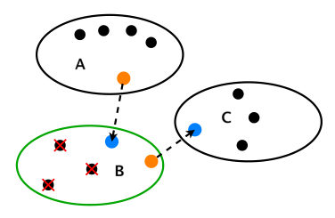 

Fig. 1. Example illustrating the application of the NN2C extended prepro- cessing method: Here, for cluster B, the best entry node (blue) and best exit node (orange) are selected. All not selected nodes (red X) are removed. This step is repeated for all clusters.

📷 Fig 2

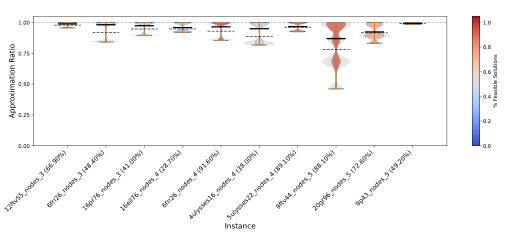 

Fig. 2. Distribution of solution quality achieved by Q-GTSP on the Subsample Small dataset with 3 to 5 nodes. The violins show the approximation ratio distribution over sampled feasible solutions, while the instance labels report the feasible-shot rate.

📷 Fig 3

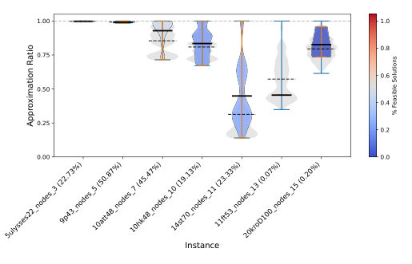 

Fig. 3. Distribution of solution quality achieved by Q-GTSP on the Subsample Medium dataset with 3 to 20 nodes. The violins show the approximation ratio distribution over sampled feasible solutions, while the instance labels report the feasible-shot rate.

📷 Fig 4

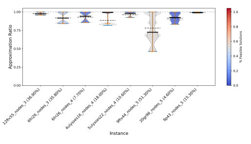 

Fig. 4. Distribution of solution quality achieved by C-QAOA on the Subsam- ple Small dataset with 3 to 5 nodes. The violins show the approximation ratio distribution over sampled feasible solutions, while the instance labels report the feasible-shot rate.

📷 Fig 5

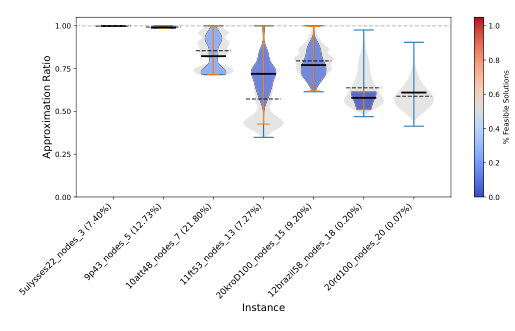 

Fig. 5. Distribution of solution quality achieved by C-QAOA on the Subsam- ple Medium dataset with 3 to 20 nodes. The violins show the approximation ratio distribution over sampled feasible solutions, while the instance labels report the feasible-shot rate.

📷 Fig 6

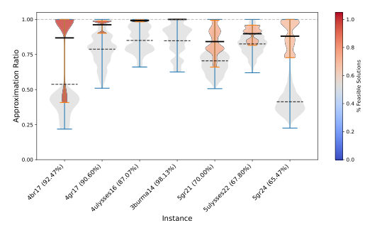 

Fig. 6. Distribution of solution quality achieved by Q-GTSP on the Preprocess Small dataset (3–5 nodes), where the corresponding original GTSPLIB instances range from 14 to 24 nodes. The violins show the approximation ratio distribution over sampled feasible solutions, while the instance labels report the feasible-shot rate.

📷 Fig 7

 

Figure 7 shows that on most instances, both approaches (QAOA and quantum annealing) consistently find optimal or near optimal solutions until a node count of 13 and above. However, expanding the instance sizes to up to 20 nodes decreases the solvers’ performance drastically, in particular, the feasibility ratio drops below 50% on all instances, almost reaching 0% on the 11ft53 instance with 13 nodes. Addi- tionally, the mean is below the random threshold in 4 of the instances, meaning that the majority of sampled solutions are worse than random guessing. Analogous to similar problems, we suspect that the multitude of constraints makes it very hard for the purely QUBO-based quantum annealing...

📷 Fig 8

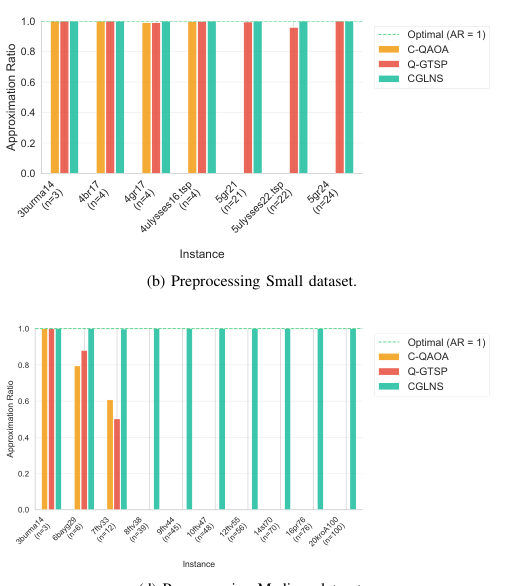 

Fig. 7. Solution quality of the best shot measured in approximation ratio at 1500 shots.

📷 Fig 9

 

Fig. 8. Distribution of solution quality achieved by C-QAOA on the Preprocess Medium dataset (3–20 nodes), where the corresponding original GTSPLIB instances range from 14 to 100 nodes. The violins show the approximation ratio distribution over sampled feasible solutions, while the instance labels report the feasible-shot rate.

📷 Fig 10

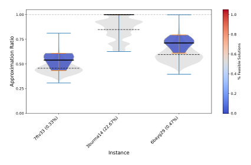 

Figure 6 indicates that Q-GTSP, consistently achieves ap- proximation ratios that are above the average of the sampled solution landscape for the Preprocess Small instances with 3 to 5 nodes. Across all considered instances, it also shows a high feasibility rate, ranging from approximately 65% up to 98%. This is notably higher than the feasibility rates observed for the Subsample Small instances with the same number of nodes (3 to 5), cf. Figure 2. It should be noted, however, that the preprocessed instances are derived from original GTSPLIB instances and retain the same number of clusters, while only the number of nodes is reduced. Consequently, solutions obtained for preprocessed...

**Main problem.**

The paper investigates the performance and scalability of quantum optimization methods, specifically Quantum Annealing and QAOA, for solving the Generalized Traveling Salesman Problem (GTSP).

**Main result.**

Quantum solvers achieve competitive solution quality on very small graphs, but both approaches suffer from a sharp degradation in feasibility and scalability as the number of nodes increases beyond 15.

**Method.**

The authors propose a novel QUBO formulation for annealing and a constrained QAOA pipeline using an XY-mixer, supplemented by a node-reduction preprocessing technique (extended NN2C).

**Summary.**

This paper evaluates how well current NISQ-era quantum hardware can solve the Generalized Traveling Salesman Problem. By comparing Quantum Annealing and a constrained QAOA approach, the authors demonstrate that while quantum methods can match classical performance on tiny instances, they struggle significantly with feasibility as problem size grows. The study identifies critical bottlenecks like the difficulty of maintaining constraints via penalty terms and the limitations of hardware embedding.

Detailed structure

**Model / system.**

The problem is modeled as an undirected, weighted graph mapped to an Ising Hamiltonian or a QUBO matrix. The experimental platforms include the D-Wave Advantage2 QPU for annealing and Qiskit Aer simulations targeting IBM Heron-class hardware.

**Key observables.**

Approximation ratio, feasibility rate (percentage of valid tours), solution cost, and embedding failure rates.

**Important parameters / regimes.**

Number of nodes (n) and clusters (K), QAOA layers (p), penalty factor (lambda), and variational parameters (gamma, beta).

**Assumptions / limitations.**

The preprocessing method assumes that reducing the node count preserves the essential structure of the optimal tour, and the QAOA implementation assumes a fixed shot budget and low-depth circuits.

**Figures summary.**

Figures illustrate the NN2C preprocessing method and show the distribution of solution quality (approximation ratio) and feasibility across various small and medium-sized GTSP datasets.

**Paper structure.**

The paper reviews existing TSP/GTSP quantum work, introduces the proposed QUBO and C-QAOA formulations, describes the preprocessing and dataset generation methods, presents empirical benchmarking results, and concludes with an analysis of scalability bottlenecks.

Abstract

This paper studies quantum optimization baselines for the Generalized Traveling Salesman Problem (GTSP), a clustered routing problem that naturally models variant selection and sequencing problems under discrete alternatives. We propose a novel GTSP QUBO formulation focused on maintaining feasible solutions for quantum annealing, as well as a hardware-executable gate-based pipeline utilizing the Quantum Approximate Optimization Algorithm (QAOA). We implement a constrained QAOA variant using an XY-mixer, which preserves the stepwise Hamming weight in the ideal circuit model, while feasibility with respect to the full GTSP constraints is tracked explicitly during post-processing. We compare the two quantum optimization paradigms on problem instances from GTSPLIB, an established benchmark dataset, and validate against classical state-of-the-art solvers. To mitigate current quantum hardware size limitations, we further extend a preprocessing method to reduce the node count in instance clusters, constructing new NISQ-friendly instances from reduced subsets. Across all tested instances, quantum solvers often produce competitive solution quality when tested on smaller graphs, but exhibit higher runtimes and a sharp degradation in feasibility and scalability as instance size grows. Our evaluation highlights where quantum optimizers can already succeed and which algorithmic bottlenecks, like sampling rates, runtime issues, and other practical failure modes, remain as open problems.

[↑ back to top](#top)

### [Quantum-Inspired Robust and Scalable SAR Object Classification](http://arxiv.org/abs/2604.25755v1)

**Authors:** Maximilian Scharf, Marco Trenti, Felix Bock, Padraig Davidson, Tobias Brosch, Benjamin Rodrigues de Miranda, Sigurd Huber, Timo Felser

**Type:** both · **Category:** numerical methods · **PDF:** <https://arxiv.org/pdf/2604.25755v1>

**Analysis basis:** full PDF text, analyzed in chunks

**Topic relevance:** `entanglement & information structure` **2/5**

📷 Fig 1

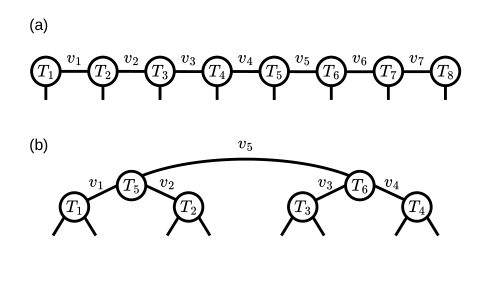 

Figure 1 Example of the graph of an MPS (a) and a TTN (b) encoding a rank-8 tensor. The open edges correspond to the indices that are not contracted.

📷 Fig 2

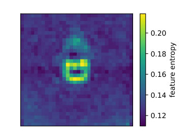 

Figure 2 Feature entropies of the TTN model trained on the original MSTAR dataset.

📷 Fig 3

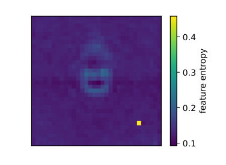 

Figure 3 Feature entropies of the TTN model trained on a poisoned dataset where one single pixel in the back- ground was correlated to the target class.

📷 Fig 4

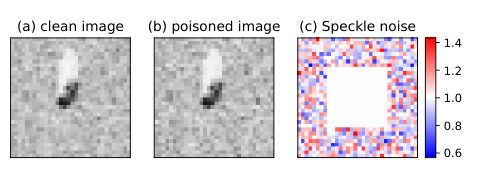 

Figure 4 Illustration of the noise that was applied to the background. The difference between the original image (a) and the poisoned image (b) is barely visible. c) The speckle noise that was injected to the background region D. The region in the center, where the target is located, is left unchanged. This specific noise pattern was ap- plied to all samples of this class, and a different pattern to the other classes, respectively, but all generated from the same normal distribution.

📷 Fig 5

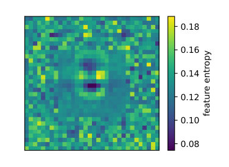 

Figure 5 Feature entropies of the model TTN trained on a poisoned dataset where the background was strongly correlated to the target class.

📷 Fig 6

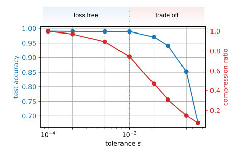 

Figure 6 Comparison of the number of parameters in the model and the test accuracy of the compressed model with increasing compression threshold ε.

**Main problem.**

The challenge of achieving robust and scalable Synthetic Aperture Radar (SAR) object classification that is resistant to data poisoning and efficient enough for deployment on edge devices.

**Main result.**

Tensor networks, specifically Tree Tensor Networks, provide a way to compress models by up to 75% while maintaining high accuracy and offer a diagnostic tool via entanglement entropy to detect data poisoning.

**Method.**

The study uses Tensor Network Machine Learning (TNML) with a local feature map to encode data into a higher-dimensional Hilbert space, utilizing DMRG and Riemannian optimization for training.

**Summary.**

This paper explores using quantum-inspired tensor networks to improve the classification of radar (SAR) images. It demonstrates that these networks can be significantly compressed for use on small devices like drones without losing accuracy. Furthermore, it shows that tools from quantum information theory, such as entanglement entropy, can be used to detect if a model has been compromised by malicious data poisoning.

Detailed structure

**Model / system.**

The model uses loop-free tensor network geometries, specifically Matrix Product States (MPS) and Tree Tensor Networks (TTN), where the weight tensor is interpreted as a state of a many-body quantum system.

**Key observables.**

Schmidt coefficients, von Neumann (entanglement) entropy, and feature importance metrics.

**Important parameters / regimes.**

Bond dimension (chi), compression threshold (epsilon), and compression ratio (r).

**Assumptions / limitations.**

The study focuses on real-valued tensor networks rather than complex-valued ones and is limited to loop-free geometries.

**Figures summary.**

Figure 1 shows MPS and TTN graph structures; Figures 2, 3, and 5 use entropy to identify clean vs. poisoned pixels/background; Figure 4 shows poisoned SAR images; Figure 6 plots the trade-off between compression, parameters, and accuracy.

**Paper structure.**

The paper introduces the SAR classification problem, defines the Tensor Network Machine Learning framework, describes the application of quantum information tools for robustness and compression, presents experimental results on the MSTAR dataset, and discusses operational implications.

Abstract

SAR image classification naturally has to deal with huge noise and a high dynamic range particularly requiring robust classification models. Additionally, the deployment of these models on edge devices, such as drones and military aircraft, requires a careful balance between model size and classification accuracy. This study explores the potential of tensor networks to meet these robustness requirements, specifically evaluating their resilience to data poisoning. Unlike previous works that concentrated on conventional neural networks for SAR object detection, this research focuses on the robustness and model reduction capabilities of tensor networks in object classification. Our findings indicate that tensor networks are adept at addressing both the challenges of robustness and the need for model efficiency, thereby contributing valuable insights to the ongoing discourse in radar applications and deep learning methodologies in general.

[↑ back to top](#top)

### [Raman Characterization of Two-Dimensional Quasiperiodic Antiferromagnets on Various Lattices: Spin-Orbit Mechanism](http://arxiv.org/abs/2604.25401v1)

**Authors:** Takashi Inoue, Shoji Yamamoto

**Type:** theory · **Category:** strongly correlated electrons · **PDF:** <https://arxiv.org/pdf/2604.25401v1>

**Analysis basis:** full PDF text, analyzed in chunks

**Topic relevance:** `spintronics-quantum-optics interface` **2/5**

📷 Fig 1

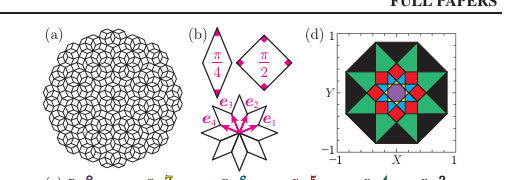 

Fig. 2. (a) C8v-symmetric finite Ammann-Beenker lattice with L = 481 sites. (b) The Ammann-Beenker lattice is generated from a rhombus with an acute angle of π/4 and a square. The canonical basis vectors of a four- dimensional hypercubic lattice are projected onto four vectors, denoted e1, e2, e3, and e4, which serve as the primitive translation vectors for the two-dimensional Ammann-Beenker lattice. (c) Six types of vertices in the Ammann-Beenker lattice with coordination numbers z = 3 to 8. (d) The pro- jection window of the Ammann-Beenker lattice is a single octagon. The col- ors of the domains correspond to the vertices shown in (c).

📷 Fig 2

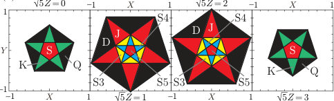 

Fig. 1. (a) C5v-symmetric finite Penrose lattice with L = 526 sites. (b) The Penrose lattice is generated from two rhombic prototiles with acute angles of π/5 and 2π/5. The canonical basis vectors of a five-dimensional hypercubic lattice are projected onto five vectors, denoted e1, e2, e3, e4, and e5. Any four of these vectors can be chosen as the primitive translation vectors for the two- dimensional Penrose lattice, with the constraint P5 n=1 en = 0. (c) Eight types of vertices in the Penrose lattice with coordination numbers z = 3 to 7. (d) The projection windows of the Penrose lattice consist of a three-dimensional stack of four pentagons located at Z = 0, 1/ √

📷 Fig 3

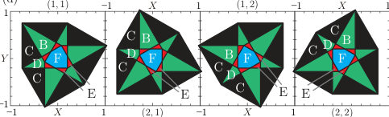 

Fig. 3. (a) C3v-symmetric finite Socolar lattice with L = 784 sites. (b) The Socolar lattice is generated from a rhombus with an acute angle of π/6, a reg- ular hexagon, and a square. The canonical basis vectors of a six-dimensional hypercubic lattice are projected onto six vectors, denoted e1, e2, e3, e4, e5, and e6. Two vectors chosen from {e1, e3, e5} and two from {e2, e4, e6} form the primitive translation vectors of the two-dimensional Socolar lattice, with the constraints e1 + e3 + e5 = 0 and e2 + e4 + e6 = 0. (c) Five types of vertices in the Socolar lattice with coordination numbers z = 3 to 6. (d) The projection window of the Socolar lattice consists of four hexagons specified by ( √

📷 Fig 4

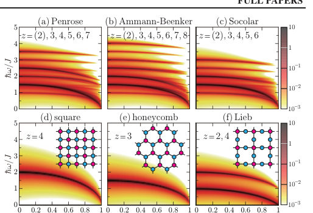 

Fig. 5. Contour plots of the spin-orbit mechanism magnetic Raman spectra I⊥(ω) (18) as a function of the exchange anisotropy ∆for bipartite quasiperi- odic lattices with open boundaries and for periodic lattices. Penrose lattice of L = 10351 (a), Ammann-Beenker lattice of L = 10457 (b), Socolar lattice of L = 11566 (c), square lattice (d), honeycomb lattice (e), and Lieb lattice (f). Note that z = 2 vertices are artifacts of finite open-boundary clusters. Insets show schematic diagrams of the periodic lattices.

📷 Fig 5

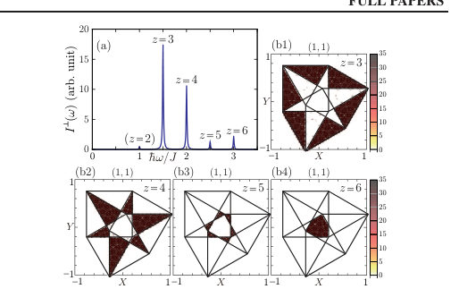 

Fig. 8. The same as Fig. 6 for the Socolar lattice of L = 11566 and z = 3 to 6 [(a) and (b1-b4)]. The projection window for ( √

📷 Fig 6

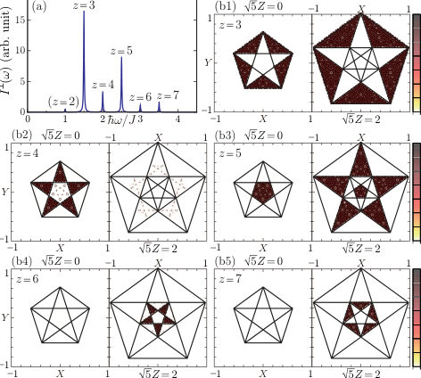 

Fig. 6. Spin-orbit-mechanism magnetic Raman spectrum I⊥(ω) (18) in the Ising limit (∆= 0) for the Penrose lattice of L = 10351 (a). Contour plots of site-resolved Raman spectra I⊥(ω)|l (21) multiplied by the number of sites in the perpendicular space at ℏω = zJS with z = 3 to 7 (b1-b5). The projection windows for √

📷 Fig 7

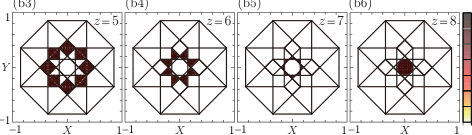 

Fig. 7. The same as Fig. 6 for the Ammann-Beenker lattice of L = 10457 and z = 3 to 8 [(a) and (b1-b6)].

📷 Fig 8

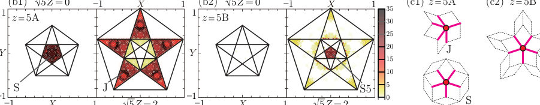 

Fig. 9. Spin-orbit-mechanism magnetic Raman spectra I⊥(ω) (18) for the Penrose lattice of L = 10351 at ∆= 0.4, shown for the frequency ranges J ≤ℏω ≤2J (a1), 2J ≤ℏω ≤3J (a2), and 3J ≤ℏω ≤4J (a3). Contour plots of the site-resolved Raman spectra I⊥(ω)|l (21) multiplied by the number of sites in the perpendicular space at the two split peaks indicated by arrows in (a2), associated with sites of coordination number z = 5 (b1, b2). Real-space local environments corresponding to each branch of the z = 5 peak (c1, c2).

📷 Fig 9

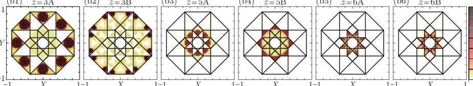 

Fig. 10. Spin-orbit-mechanism magnetic Raman spectra I⊥(ω) (18) for the Ammann-Beenker lattice of L = 10457 at ∆= 0.4, shown for the frequency ranges J ≤ℏω ≤2J (a1), 2J ≤ℏω ≤3J (a2), and 3J ≤ℏω ≤4J (a3). Contour plots of site-resolved Raman spectra I⊥(ω)|l (21) multiplied by the number of sites in the perpendicular space at the characteristic peaks, indicated by arrows in (a1) and (a2), associated with the sites of coordination numbers z = 3, z = 5, and z = 6 (b1-b6). Corresponding real-space local environments for each peak (c1-c6). The site coloring follows Fig. 2(c).

📷 Fig 10

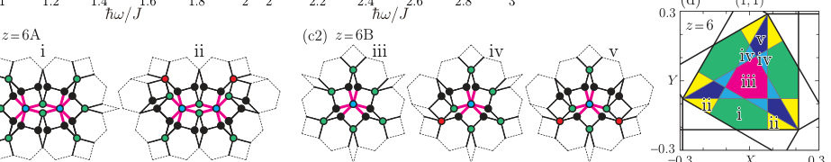 

Fig. 11. Spin-orbit-mechanism magnetic Raman spectra I⊥(ω) (18) for the Socolar lattice of L = 11566 at ∆= 0.5, shown for the frequency ranges J ≤ℏω ≤2J (a1) and 2J ≤ℏω ≤3J (a2). Contour plots of the site-resolved Raman spectra I⊥(ω)|l (21) multiplied by the number of sites in the perpendicular space at the two peaks, indicated by arrows in (a2), both associated with coordination number z = 6 (b1, b2). Real-space local environments of z = 6 sites categorized into five subtypes (i-v) defined by their next-nearest-neighbor configurations (c1, c2). The site coloring follows Fig. 3(c). Partitioning of the z = 6 domain in the perpendicular space into five subdomains (labeled i-v) corresponding to...

**Main problem.**

The study aims to characterize the first-order (single-magnon) Raman scattering spectra in 2D quasiperiodic antiferromagnets via the spin-orbit mechanism and compare them to periodic lattices.

**Main result.**

In quasiperiodic lattices, Raman peaks bifurcate as exchange anisotropy moves toward the Heisenberg point, whereas periodic lattices remain singly peaked; the perpendicular-space representation of the spectra serves as a structural fingerprint.

**Method.**

The authors use linear spin-wave theory (LSW) with Holstein-Primakoff and Bogoliubov transformations, combined with a numerical analysis of finite clusters and perpendicular-space projection techniques.

**Summary.**

This paper investigates how the lack of translational symmetry in quasiperiodic lattices affects magnetic Raman scattering through the spin-orbit mechanism. It demonstrates that unlike periodic lattices, quasiperiodic structures exhibit peak splitting in their single-magnon spectra as the system moves away from the Ising limit. The study shows that these spectral features are highly sensitive to local coordination environments, allowing the Raman spectrum to act as a fingerprint for different quasiperiodic tilings.

Detailed structure

**Model / system.**

The system consists of spin-1/2 two-dimensional quasiperiodic antiferromagnets on Penrose, Ammann-Beenker, and Socolar lattices, modeled by a nearest-neighbor antiferromagnetic XXZ Hamiltonian.

**Key observables.**

First-order (single-magnon) and second-order (two-magnont) Raman scattering intensities, and site-resolved spectral weights.

**Important parameters / regimes.**

Exchange anisotropy (delta), exchange interaction strength (J), coordination number (z), and the spin-orbit coupling constant (lambda).

**Assumptions / limitations.**

The study assumes the spin-orbit mechanism involves an indirect electric-dipole coupling and utilizes the linear spin-wave approximation.

**Figures summary.**

Figures illustrate the geometric construction and projection windows of the Penrose, Ammann-Beenker, and Socolar lattices, followed by plots of Raman spectra, peak splittings, and site-resolved spectral weights mapped onto perpendicular-space domains.

**Paper structure.**

The paper begins with the geometric construction of quasiperiodic lattices, introduces the XXZ Hamiltonian and the spin-orbit Raman mechanism, presents numerical results for various lattices and anisotropy regimes, and concludes with a discussion on the structural sensitivity of the spectra.

Abstract

We study first-order (single-magnon) inelastic light scatterings in spin-$\frac{1}{2}$ two-dimensional quasiperiodic antiferromagnets in comparison with those emergent on periodic lattices. Unlike second-order (two-magnon) Raman scatterings based on an exchange interaction between neighboring spins, the present observations involve an indirect electric-dipole coupling which proceeds through a spin-orbit interaction. We discuss the nearest-neighbor antiferromagnetic XXZ Hamiltonian on various quasiperiodic and periodic bipartite lattices. The first-order spectra, of our present interest, consist only of rotation-invariant and mirror-symmetric magnons, while the second-order ones cannot select any particular magnon. With the exchange anisotropy moving away from the Ising limit toward the Heisenberg isotropic point, every initial delta-function peak bifurcates or divides into more in each individual manner on quasiperiodic lattices, while it remains singly peaked all the way on periodic lattices. Such splittings depend on how many types of isocoordinated sites for each coordination number and relative positions between those of the same type. A perpendicular-space representation of the first-order Raman spectrum serves as a fingerprint of each quasiperiodic tiling.

[↑ back to top](#top)

### [Restoration of Ensemble Equivalence by Quantum Fluctuations](http://arxiv.org/abs/2604.25837v1)

**Authors:** Alessandro Campa, Andrea Trombettoni

**Type:** theory · **Category:** statistical mechanics · **PDF:** <https://arxiv.org/pdf/2604.25837v1>

**Analysis basis:** full PDF text, analyzed in chunks

**Topic relevance:** `Keldysh / 2PI / non-Gaussian methods` **2/5**

📷 Fig 1

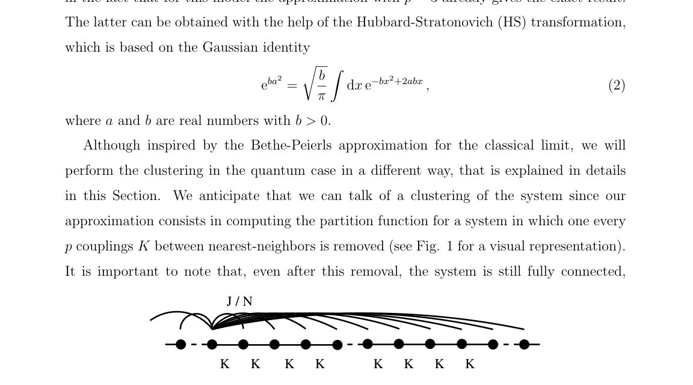 

FIG. 1. The clustering adopted for our calculations. The system is still fully connected through the

📷 Fig 2

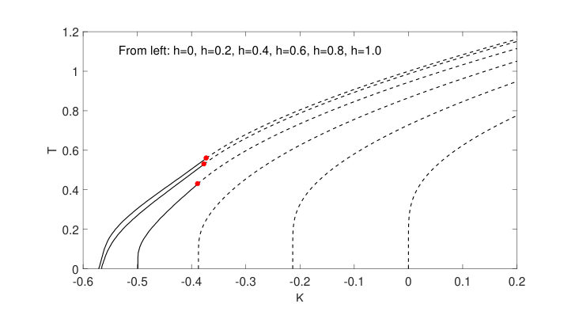 

FIG. 2. The (K, T) phase diagram for p = 8. The different lines, corresponding to different values

📷 Fig 3

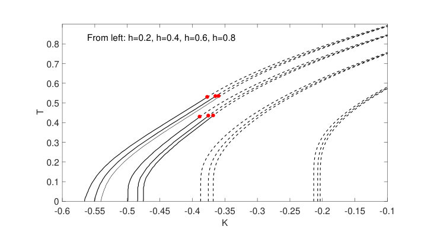 

FIG. 3. The (K, T) phase diagram for p = 8, p = 10 and p = 12. Each one of the four bunches of

📷 Fig 4

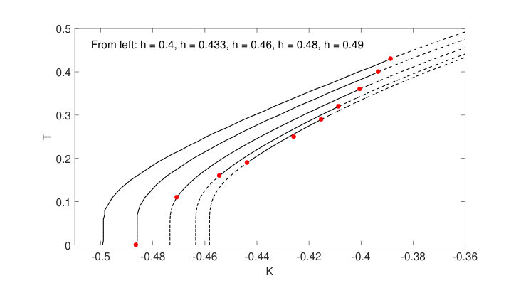 

FIG. 4. The (K, T) phase diagram for p = 8 corresponding to 5 different values of h between

📷 Fig 5

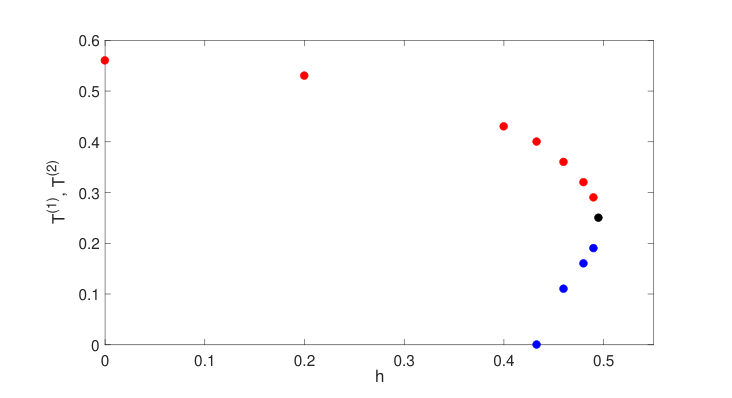 

FIG. 5. The temperatures T (1)(h, p) (blue circles) and T (2)(h, p) (red circles) as a function of h for

📷 Fig 6

 

FIG. 6. The (K, T) phase diagram for p = 8, p = 10 and p = 12. The curves are the same as those

📷 Fig 7

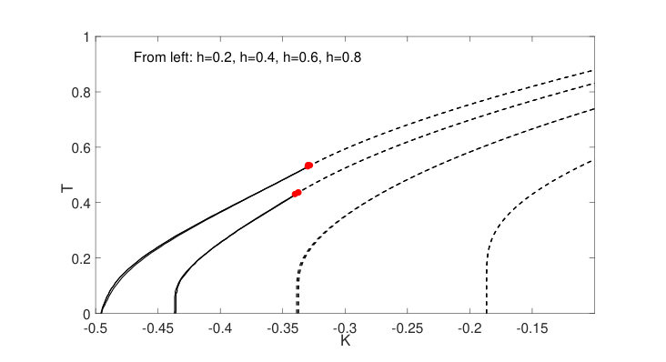 

Fig. 6; it is the region where the first-order portions of the phase transition lines occur, and

**Main problem.**

The study investigates whether quantum fluctuations, induced by a transverse magnetic field, can restore ensemble equivalence in a long-range interacting system that exhibits ensemble inequivalence in its classical limit.

**Main result.**

The authors find that ensemble inequivalence present in the classical Nagle-Kardat model is removed above a threshold transverse field value hc, where phase transitions become exclusively second-order.

**Method.**

The researchers use a Hubbard-Stratonovich transformation combined with a p-blocking approximation and a rescaling procedure to calculate the partition function and determine the phase diagram.

**Summary.**

This paper explores the impact of a transverse magnetic field on the thermodynamic phase diagram of a quantum spin chain with long-range and short-range interactions. It specifically addresses the phenomenon of ensemble inequivalence, which is a hallmark of certain classical long-range systems. The authors demonstrate that sufficiently strong quantum fluctuations can suppress first-order transitions, thereby restoring ensemble equivalence. By using a p-blocking approximation and a rescaling technique, they provide a way to map the phase transitions of the full model using computationally tractable finite-size blocks.

Detailed structure

**Model / system.**

A one-dimensional quantum spin chain, known as the quantum Nagle-Kardar model, featuring mean-field (all-to-all) ferromagnetic coupling, nearest-neighbor interactions, and a transverse magnetic field.

**Key observables.**

Average magnetization per spin and the nature of phase transition lines (first-order vs. second-order).

**Important parameters / regimes.**

Transverse field strength (h), mean-field coupling (J), nearest-neighbor coupling (K), temperature (T), and the blocking parameter (p).

**Assumptions / limitations.**

The study assumes that quantum fluctuations play a role similar to thermal fluctuations regarding equilibrium order and relies on a scaling property to extrapolate from finite p-blocks to the thermodynamic limit.

**Figures summary.**

Figure 1 illustrates the clustering/p-blocking method; Figure 2 shows the (K, T) phase diagram with first and second-order lines and tricritical points; Figure 3 shows the clustering of phase diagrams for different p values; Figure 6 demonstrates the successful collapse of rescaled curves.

**Paper structure.**

The paper introduces the quantum Nagle-Kardar model, details the Hubbard-Stratonovich and p-blocking methodologies, presents the numerical results for various p-blocks and h values, demonstrates the scaling/rescaling success, and concludes with the identification of the critical field for restoring ensemble equivalence.

**Why it may be interesting.**

This paper is interesting for many-body dynamics researchers because it demonstrates how quantum-induced fluctuations can fundamentally alter the thermodynamic stability and ensemble properties of long-range interacting systems.

Abstract

We study the thermodynamic phase diagram of a one-dimensional quantum spin chain subjected to both mean-field and nearest-neighbor interactions, and to a transverse magnetic field $h$. The purpose is to determine the effect of the quantum fluctuations, due to the transverse field, on the phase diagram, in particular with respect to the occurrence of ensemble inequivalence. We denote our model as a quantum Nagle-Kardar model. To perform the calculation of the canonical partition function, we show that, due to the presence of the mean-field term, in the thermodynamic limit one can use the Hubbard-Stratonovich transformation in spite of the non-commutativity of the different operators appearing in the Hamiltonian, and we adopt a procedure of successive approximations that lead to the determination of the phase diagram thanks to a scaling property of the phase transition lines. The results show that the ensemble inequivalence, present in the classical Nagle-Kardar model, is removed above a threshold value $h_c$ for the transverse field. For $h$ larger than $h_c$ the phase diagram exhibits only second-order phase transition lines, implying therefore restoration of ensemble equivalence.

[↑ back to top](#top)

### [Sign Embedding Quantum Algorithms for Matrix Equations and Matrix Functions](http://arxiv.org/abs/2604.25333v1)

**Authors:** Yanqiao Wang, Jin-Peng Liu

**Type:** theory · **Category:** quantum information and computing · **PDF:** <https://arxiv.org/pdf/2604.25333v1>

**Analysis basis:** full PDF text, analyzed in chunks

**Topic relevance:** `methods for driven-dissipative` **2/5**

📷 Fig 1

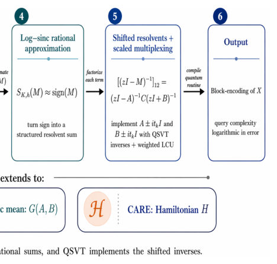 

Figure 1: method overview

📷 Fig 2

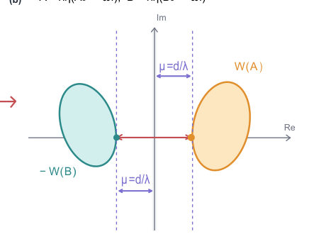 

Figure 2: shift-rotation and common scaling

📷 Fig 3

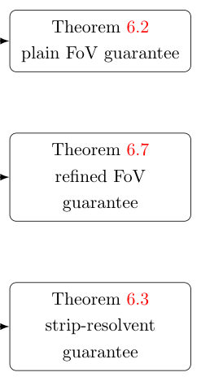 

Figure 3: Roadmap for the three ordinary Sylvester regimes treated in Section 6.

**Main problem.**

Developing a systematic quantum algorithmic framework for solving various matrix equations (such as Sylvester, Lyapunov, and Riccati equations) and computing matrix functions (such as square roots and geometric means) in an operator-output setting.

**Main result.**

The authors introduce a 'sign-embedding' framework that provides explicit block-encodings for a wide array of structured matrix problems, achieving query complexity that is linear in inverse-conditioning parameters and logarithmic in error tolerance.

**Method.**

The framework uses a three-step pipeline: compressing the target operator into a matrix sign object, applying a logarithmic-sinc quadrature rule for rational approximation, and implementing the resulting shifted inverses using Quantum Singular Value Transformation (QSVT).

**Summary.**

This paper presents a unified quantum computing framework for solving complex matrix equations and computing matrix functions. By using a 'sign-embedding' technique, the authors can transform difficult matrix problems into a standardized form that is easier to implement on a quantum computer. The method is particularly powerful because it works for non-normal and non-diagonalizable matrices, provided certain spectral gaps are known. The resulting algorithms are highly efficient, scaling logarithmically with the required precision.

Detailed structure

**Model / system.**

The paper focuses on mathematical operators including the Sylvester operator (AX + XB = C), the Lyapunov equation, the Continuous-time Algebraic Riccati Equation (CARE), and matrix functions like the principal square root and matrix geometric means.

**Important parameters / regimes.**

Field-of-Values (FoV) gap, strip-resolvent bounds, error tolerance (epsilon), and conditioning parameters (mu, gamma, and kappa).

**Assumptions / limitations.**

The algorithms rely on the existence of a Field-of-Values gap or a strip-resolvent hypothesis to ensure error control and handle non-normal or non-diagonalizable matrices.

**Figures summary.**

Figure 1 illustrates the algorithmic pipeline from sign function to QSVT implementation; Figure 2 shows the transformation of matrices to separate their numerical ranges along the real axis.

**Paper structure.**

The paper introduces the sign-embedding framework, details the mathematical construction of the augmented matrices for various equations, describes the log-sinc approximation and QSVT implementation, provides complexity analysis for different regimes (FoV gap and strip-resolvent), and concludes with a comparative analysis against existing quantum algorithms.

**Why it may be interesting.**

This is highly relevant for researchers in open quantum systems and many-body dynamics, as the ability to efficiently solve Riccati and Lyapunov equations is fundamental to studying master equations, stability, and control in quantum systems.

Abstract

We develop a systematic sign-embedding framework of operator-output quantum algorithms for matrix equations and matrix functions. Differing from the contour-integral treatment, we start with the matrix-sign embedding route: an augmented matrix $M$ whose half-plane matrix sign compresses the target operator either as a block of $\text{sign}(M)$ or, in projector form, through $(I-\text{sign}(M))/2$; we then construct a logarithmic-sinc approximation for the half-plane sign operator and combine it with structure-aware scaled multiplexing and nodewise rebalancing of shifted inverse families. For ordinary Sylvester equations, we offer an explicit block-encoding of the target matrix solution with query complexity linear in the inverse-conditioning parameters and logarithmic in the target error tolerance, under non-normal and non-diagonalizable settings given a field-of-values (FoV) gap or strip-resolvent hypotheses. These algorithms propagate the same overlap-based normalization bookkeeping to ordinary and generalized Sylvester equations, generalized Lyapunov equations, principal square roots and inverse square roots, matrix geometric means, and continuous-time algebraic Riccati equations (CARE). These results identify matrix-sign embeddings and nodewise rebalancing as reusable design principles for structured operator-output quantum linear algebra.

[↑ back to top](#top)

### [Six textbook mistakes in quantum field theory](http://arxiv.org/abs/2604.24871v1)

**Authors:** Alexandros Gezerlis

**Type:** theory · **Category:** other · **PDF:** <https://arxiv.org/pdf/2604.24871v1>

**Analysis basis:** full PDF text, analyzed in chunks

**Topic relevance:** `Keldysh / 2PI / non-Gaussian methods` **2/5**

📷 Fig 1

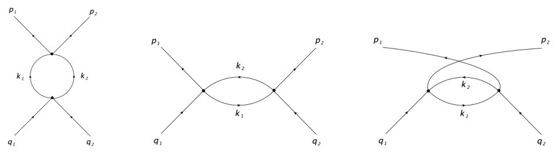 

FIG. 1: Connected, momentum-space, second-order Feynman diagrams representing the S-matrix in a 2 →2 process (for a quartic interaction) in the s, t, and u channels.

📷 Fig 2

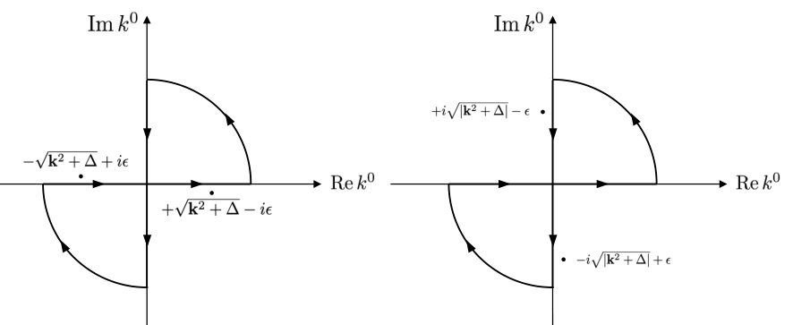 

FIG. 2: Contour of integration for Wick rotation, relevant to the 2 →2 process of Fig. 1 for the cases of: (a) k2 + ∆&gt; 0, and (b) k2 + ∆&lt; 0.

**Main problem.**

The paper identifies and corrects widespread conceptual errors and pedagogical 'muddledness' found in introductory Quantum Field Theory (QFT) textbooks and research literature.

**Main result.**

The author provides rigorous corrections to six specific themes, including the validity of relativistic quantum mechanics, the derivation of Noether's theorem, the proper promotion of fields to operators, particle localization, normal ordering, and the nature of Wick rotation.

**Method.**

The author uses a comparative approach, quoting specific textbook mistakes and providing mathematically rigorous corrections using canonical quantization, contour integration, and the Newton-Wigner position operator.

**Summary.**

This paper serves as a pedagogical critique of common misconceptions in Quantum Field Theory textbooks. The author identifies six specific areas where introductory texts often sacrifice mathematical rigor for simplicity, potentially leading to fundamental misunderstandings. By providing corrected derivations and physical insights, the work aims to prevent the propagation of these errors in the physics literature. It is particularly useful for instructors and graduate students seeking a deeper, more accurate foundation in QFT.

Detailed structure

**Model / system.**

The discussion focuses on relativistic scalar field theory (Klein-Gordon field) and scalar electrodynamics, specifically examining the transition from classical Lagrangian/Hamiltonian density to the interacting S-matrix.

**Key observables.**

S-matrix (scattering amplitude), Feynman propagator, probability density, and conserved currents.

**Important parameters / regimes.**

Mass (m), coupling constant (lambda), momentum (k, p, q), and the infinitesimal epsilon (i-epsilon prescription).

**Assumptions / limitations.**

The discussion is limited to the core aspects of QFT relevant to a first-semester graduate course and assumes familiarity with basic relativistic quantum mechanics.

**Figures summary.**

Figure 1 shows momentum-space second-order Feynman diagrams for a 2 to 2 process; Figure 2 illustrates the integration contour in the complex k0 plane for different pole configurations.

**Paper structure.**

The paper begins with a notation summary, followed by a systematic presentation of six thematic errors, each containing a textbook quote, a mathematical correction, and references to authoritative literature, concluding with a pedagogical reflection.

Abstract

This article discusses incorrect statements appearing in textbooks on quantum field theory (QFT); some of these mistakes also appear in the research literature. The focus is not on errors made by an individual author, but on conceptual muddledness that is widespread in introductory textbooks. We start from a bare-bones summary of QFT, meant to establish the notation. We then turn to our six paradigmatic themes, in each case quoting a specific example of the textbook mistake, a summary of material that is known to experts but is frequently mishandled in introductory works, pointers to authoritative references where the relevant concept is handled properly, as well as a concise correction that rectifies any issues. The goal of this work is to warn readers of the existence of several pitfalls and thereby stop these errors from further propagating in the literature on QFT.

[↑ back to top](#top)

### [Statistical mechanics in continuous space with tensor network methods](http://arxiv.org/abs/2604.25060v1)

**Authors:** Gunhee Park, Tomislav Begušić, Si-Jing Du, Johnnie Gray, Garnet Kin-Lic Chan

**Type:** theory · **Category:** numerical methods · **PDF:** <https://arxiv.org/pdf/2604.25060v1>

**Analysis basis:** full PDF text, analyzed in chunks

**Topic relevance:** `methods for driven-dissipative` **2/5**

📷 Fig 1

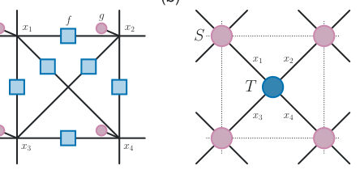 

FIG. 2. (a) Diagrammatic representation of the factor graph for the hard disk partition function, where the on-site and pairwise terms are shown as pink circles and blue squares, respectively. (b) When the pair connectivity is restricted to nearest-neighbor and next-nearest-neighbor interactions, the factor graph can be transformed into an equivalent represen- tation where tensors are placed at the original lattice sites and at the centers of the square units.

📷 Fig 2

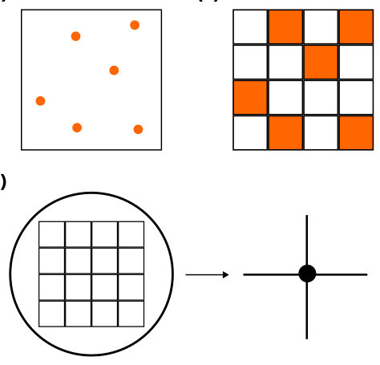 

FIG. 1. (a) Particles in a box. (b) Same system in the site rep- resentation, where colors denote occupied lattice grid points. (c) Grid points in a cell are coarse-grained into one effective site.

📷 Fig 3

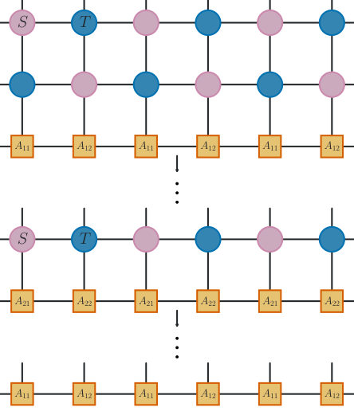 

FIG. 3. 2 × 2 unit cell structure for the transfer matrix of the partition function composed of S and T tensors in the infinite tensor network. Its boundary MPS is characterized by two alternating two-site uniform MPS with tensors (A11, A12) and (A21, A22).

📷 Fig 4

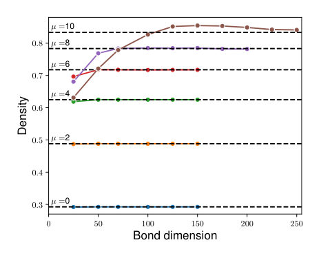 

FIG. 4. Within the infinite TN framework, the density is plot- ted as a function of MPS bond dimension using the boundary contraction method. The reference MC data is shown as the dashed lines, where the MC is performed on a finite system with L = 28 using periodic boundary conditions.

📷 Fig 5

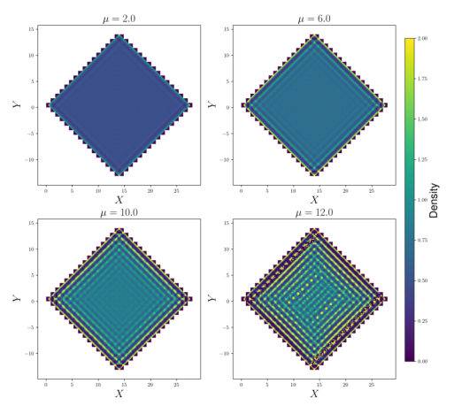 

FIG. 5. Spatially resolved densities in a finite box with open boundary conditions at µ = 2, 6, 10, and 12.

📷 Fig 6

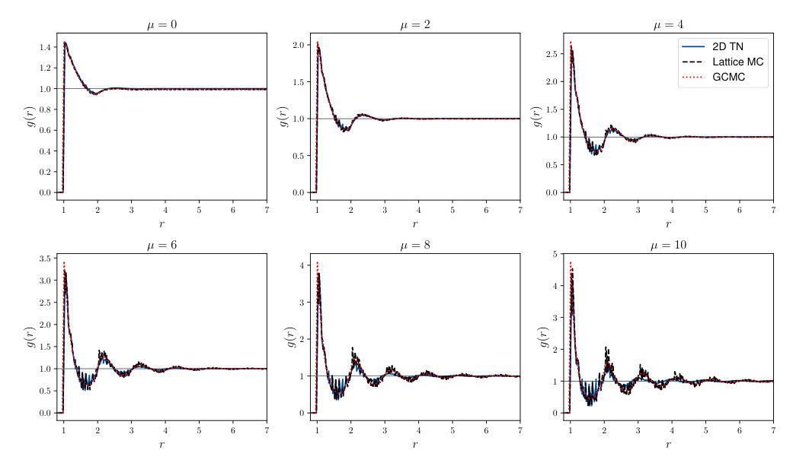 

FIG. 6. Pair correlation functions computed from infinite TN and MC calculations. For the MC reference, the GCMC data from both the continuous space (red dotted) and the discretized lattice (black dashed) are presented.

📷 Fig 7

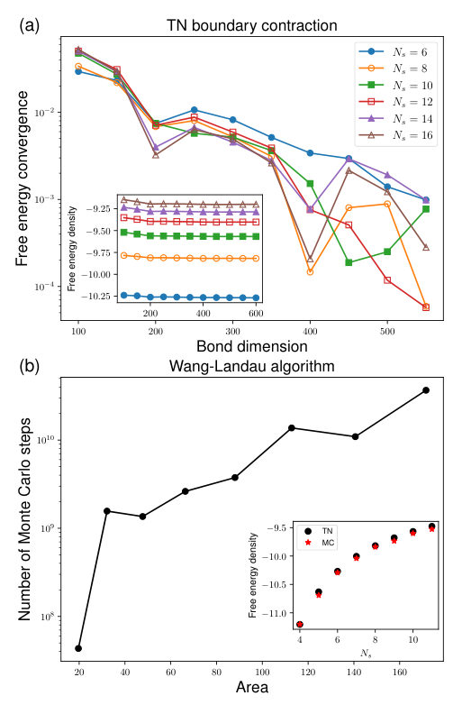 

FIG. 7. (a) Free energy convergence using the TN boundary contraction method as a function of MPS bond dimension for various system sizes. Free energy convergence is quantified by the computed free energy density difference between the given bond dimension and the maximum bond dimension, χmax = 600. Free energy density values for different system sizes are plotted in the inset. (b) The number of Monte Carlo steps in the Wang-Landau algorithm as a function of area. The inset shows a comparison of the free energy density calculated via the TN and MC methods. See the main text for the details of the Monte Carlo procedures.

📷 Fig 8

 

FIG. 8. Density as a function of lattice discretization constant compared to density in the continuum, indicated as dashed lines, at three different chemical potential values.

📷 Fig 9

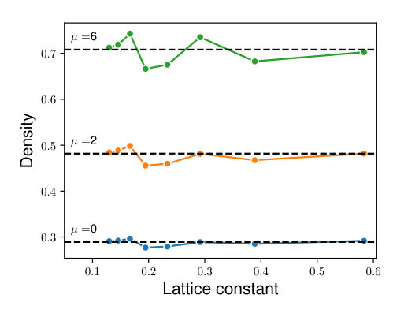 

Fig. 8 shows the convergence of the density values as a function of the lattice discretization in the lattice GCMC calculations compared to GCMC in the contin- uum, where the smallest lattice discretization used in the plot corresponds to the lattice discretization value used in this work.

**Main problem.**

Extending tensor network (TN) methods, which are traditionally limited to lattice models, to simulate interacting particle systems in continuous space.

**Main result.**

The developed TN framework accurately reproduces local observables and captures liquid-to-solid phase transitions in 2D hard-disk systems, offering a deterministic alternative to Monte Carlo methods with linear scaling of computational cost relative to system size.

**Method.**

A real-space discretization and cell-based coarse-graining scheme are used to map continuous particles onto an effective lattice model, which is then solved using TN boundary contraction via Matrix Product States (MPS) and Matrix Product Operators (MPO).

**Summary.**

This paper presents a new way to use tensor networks to study classical statistical mechanics in continuous space. By discretizing space into a grid and using a coarse-graining scheme, the authors transform a continuous particle problem into an effective lattice model. This allows for the deterministic calculation of absolute free energies and local observables, such as density and pair correlation functions. The method is shown to be highly efficient, scaling linearly with system size, and successfully captures the liquid-to-solid phase transition in hard-disk systems.

Detailed structure

**Model / system.**

The study focuses on 2D hard-disk systems with a pairwise repulsive potential, where continuous coordinates are mapped to a fine grid and grouped into cells to create an effective lattice representation.

**Key observables.**

Density, pair correlation functions, and absolute free energy density.

**Important parameters / regimes.**

Inverse temperature (beta), chemical potential (mu), lattice constant (a), and tensor network bond dimension (D).

**Assumptions / limitations.**

The method assumes a discretization of continuous space and uses a coarse-graining approximation where each cell contains at most one particle; the current scope is limited to 2D and short-range potentials.

**Figures summary.**

Figure 1 shows the mapping from particles to a coarse-grained cell model; Figure 2 illustrates the factor graph and TN representation; Figure 3 shows the unit cell structure; Figure 4 shows density convergence with bond dimension; Figure 5 displays spatially resolved densities in a finite box; Figure 6 compares pair correlation functions with GCMC; Figure 7 compares free energy convergence and computational scaling; Figure 8 demonstrates convergence to the continuum limit.

**Paper structure.**

The paper introduces the problem of continuous-space simulation, details the discretization and coarse-graining methodology, describes the construction of the tensor network, presents benchmark results against Monte Carlo simulations (density, correlation, and free energy), and concludes with scaling analysis and future directions.

Abstract

Tensor network (TN) methods are well established for computing partition functions in statistical mechanics, though this use has traditionally been limited to lattice models. We extend the scope of TN methodology to interacting particle systems in continuous space. Through a real-space discretization combined with a cell-based coarse-graining scheme, we formulate an effective lattice model that explicitly preserves spatial locality. The partition function of this model is represented as a TN, and the thermodynamic quantities are computed via boundary contraction. We apply this framework to the two-dimensional hard-disk problem and demonstrate the strengths of the TN formulation compared to existing Monte Carlo simulations.

[↑ back to top](#top)

### [The Classification of Pauli Stabilizer Codes: A Lattice and Continuum Treatise](http://arxiv.org/abs/2604.24847v1)

**Authors:** Bowen Yang, Matthew Yu

**Type:** theory · **Category:** quantum information and computing · **PDF:** <https://arxiv.org/pdf/2604.24847v1>

**Analysis basis:** full PDF text, analyzed in chunks

**Topic relevance:** `entanglement & information structure` **2/5**

📷 Fig 1

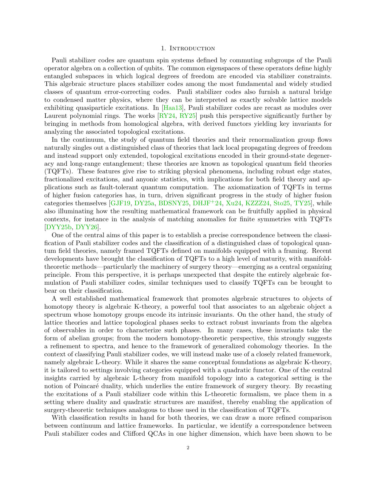 

Low-resolution page preview, page 2

📷 Fig 2

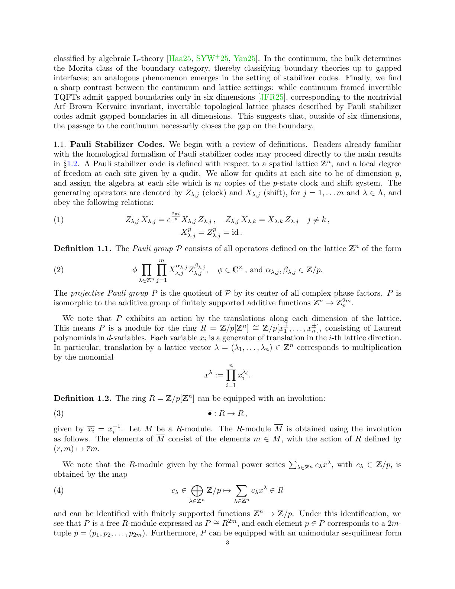 

Low-resolution page preview, page 3

📷 Fig 3

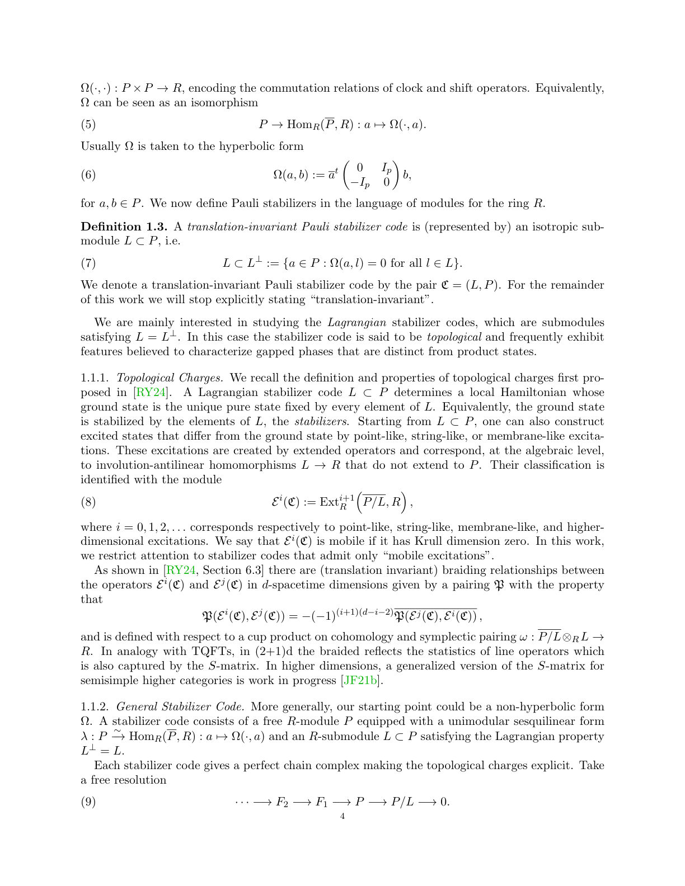 

Low-resolution page preview, page 4

📷 Fig 4

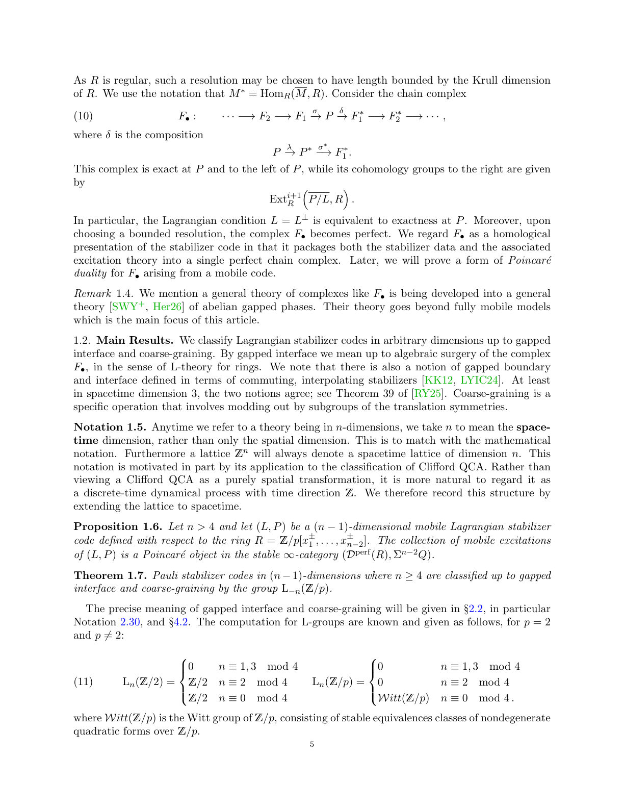 

Low-resolution page preview, page 5

📷 Fig 5

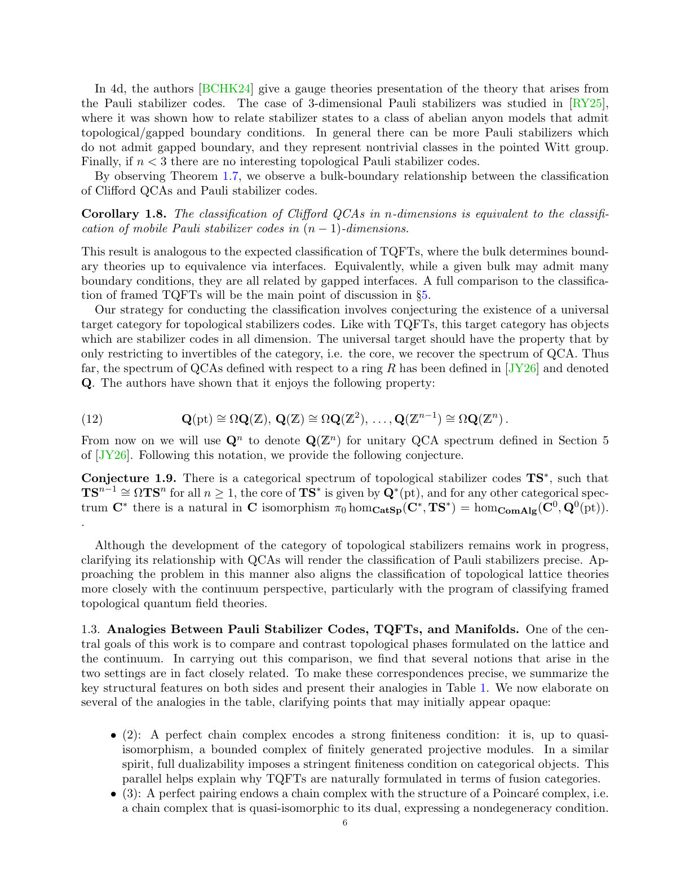 

Low-resolution page preview, page 6

📷 Fig 6

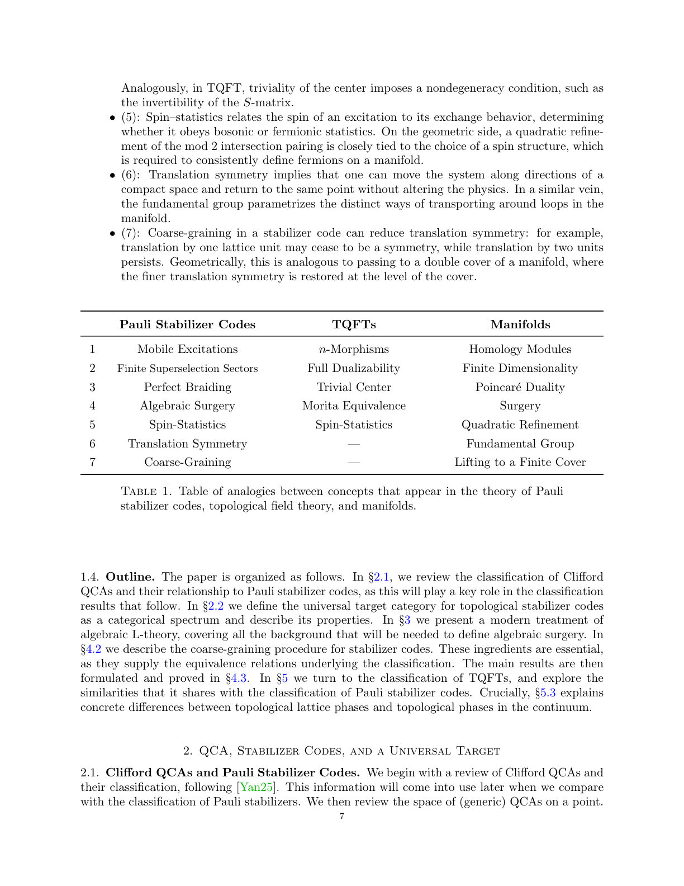 

Low-resolution page preview, page 7

📷 Fig 7

 

Low-resolution page preview, page 8

📷 Fig 8

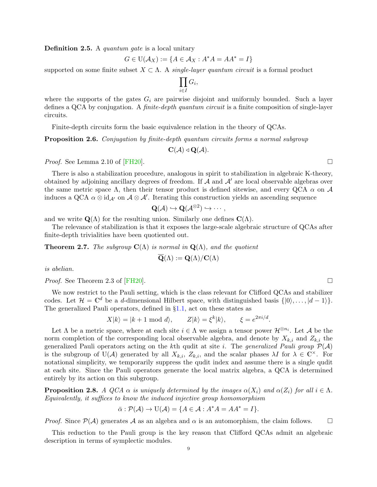 

Low-resolution page preview, page 9

📷 Fig 9

 

Low-resolution page preview, page 10

📷 Fig 10

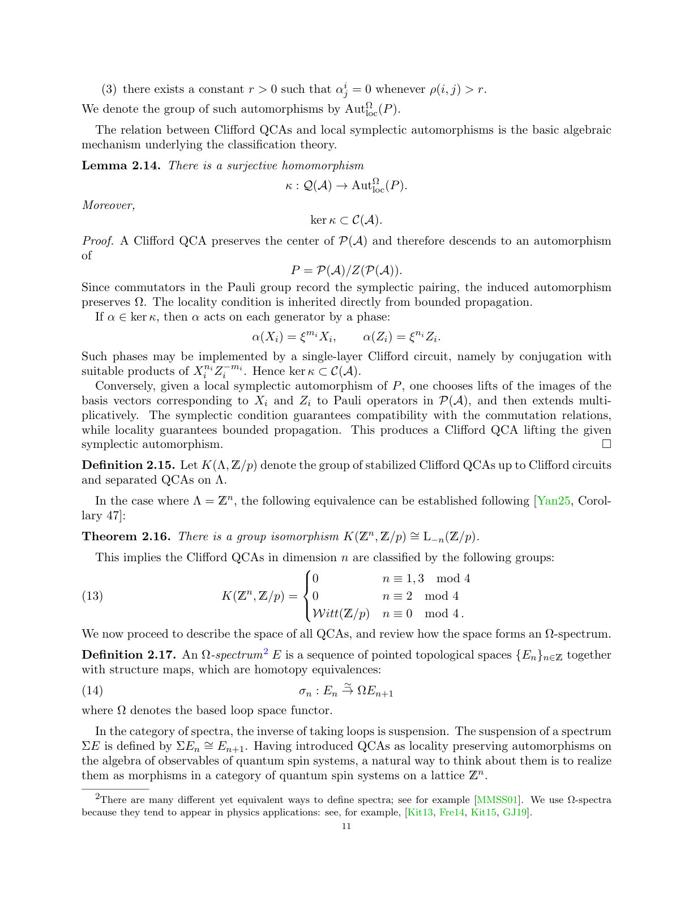 

Low-resolution page preview, page 11

**Main problem.**

The classification of mobile Pauli stabilizer codes up to gapped interfaces and coarse-graining, and establishing the relationship between these lattice models and continuum framed TQFTs.

**Main result.**

The authors establish a bulk-boundary correspondence where the equivalence class of a Pauli stabilizer code is described by a Clifford QCA in one dimension higher, and identify qualitative distinctions between lattice and continuum theories regarding gapped boundaries.

**Method.**

The study utilizes algebraic L-theory, surgery theory, and homological algebra within a categorical framework of perfect chain complexes and quadratic functors.

**Summary.**

This paper provides a rigorous mathematical classification of Pauli stabilizer codes using the framework of algebraic L-theory. It establishes a fundamental link between lattice-based stabilizer codes and continuum-based topological quantum field theories (TQFTs). A key finding is a bulk-boundary correspondence relating stabilizer codes to Clifford Quantum Cellular Automata. The work also highlights how lattice theories can admit gapped boundaries in dimensions where continuum TQFTs cannot.

Detailed structure

**Model / system.**

The system consists of Pauli stabilizer codes defined by commuting subgroups of the Pauli operator algebra on a spatial lattice Z^n, specifically focusing on translation-invariant, mobile excitations.

**Key observables.**

Topological charges (point-like, string-like, and membrane-like excitations) and their braiding relationships.

**Important parameters / regimes.**

Lattice dimension n, Krull dimension of excitations (restricted to zero for mobile codes), and the prime p for qudit systems.

**Assumptions / limitations.**

The work assumes translation invariance and restricts the scope to 'mobile' stabilizer codes where excitations have Krull dimension zero.

**Figures summary.**

Table 1 provides a structural analogy between Pauli stabilizer codes, TQFTs, and manifold theory, mapping physical concepts like mobile excitations to mathematical concepts like n-morphisms.

**Paper structure.**

The paper introduces the algebraic framework for stabilizer codes, develops a classification using L-theory, establishes a bulk-boundary correspondence with Clifford QCAs, and concludes by comparing the results to the classification of framed TQFTs.

Abstract

We classify mobile Pauli stabilizer codes up to gapped interfaces and coarse-graining using the framework of algebraic $\mathrm{L}$-theory. We compare this classification with that of framed TQFTs, theories that arise naturally in the continuum, highlighting a close structural relationship between the two. Our approach is formulated in the category of perfect chain complexes equipped with quadratic functor over the Laurent polynomial ring $R = \mathbb{Z}/p[x_1^{\pm 1}, \ldots, x_n^{\pm 1}]$, within which the collection of topological operators of Pauli stabilizer codes arise naturally as objects. In particular, we establish a bulk-boundary correspondence for lattice theories: the equivalence class of a Pauli stabilizer code up to gapped interface is described by a Clifford QCA in one dimension higher. This is done using the universal target category for stabilizer codes, which is the categorical spectrum whose existence and universal properties are introduced in this work. We conclude by highlighting subtle differences between the classification of Pauli stabilizer codes and TQFTs, leading to qualitative distinctions between lattice and continuum theories.

[↑ back to top](#top)

### [The mixed-dimensional quantum MacWilliams identity: bounds for codes and absolutely maximally entangled states in heterogeneous systems](http://arxiv.org/abs/2604.25790v1)

**Authors:** David González-Lociga, Simeon Ball

**Type:** theory · **Category:** quantum information and computing · **PDF:** <https://arxiv.org/pdf/2604.25790v1>

**Analysis basis:** full PDF text, analyzed in chunks

**Topic relevance:** `entanglement & information structure` **2/5**

📷 Fig 1

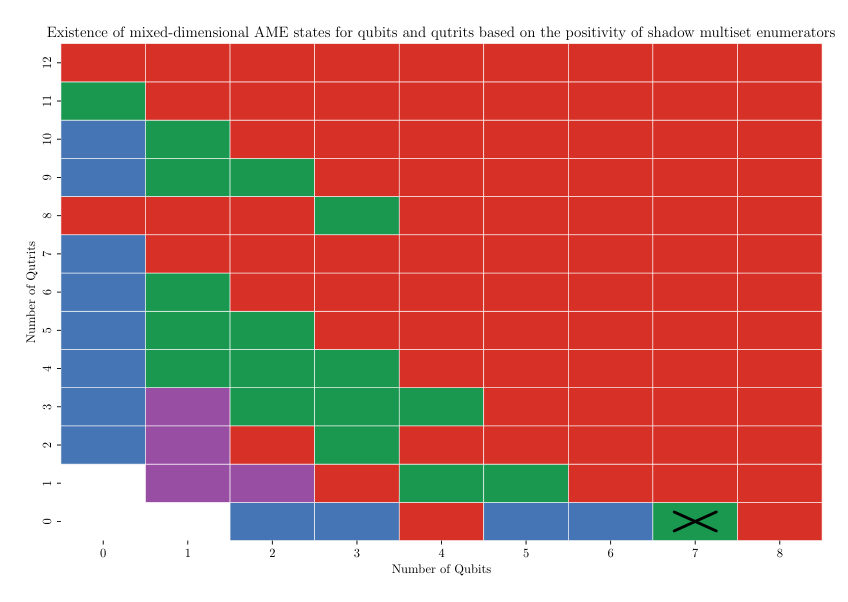 

FIG. 1. Existence of mixed-dimensional AME states formed by qubits and qutrits based on the positivity of shadow multiset enumerators. Green squares represent potentially existing states, while red squares indicate states strictly forbidden by negative shadow enumerators. Blue squares are already existing states in homogeneous systems [21, 22]. The seven-qubit AME state was ruled out by [23], marked with a cross. Purple squares represent existing AME states in heterogeneous scenarios. The C2 ⊗C3 has the trivial AME 1 √

📷 Fig 2

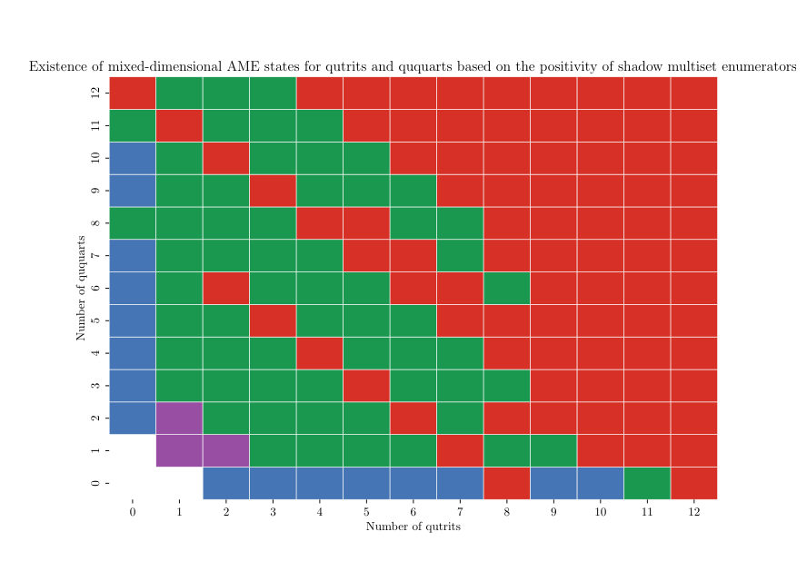 

FIG. 2. Existence of mixed-dimensional AME states based on the positivity of shadow multiset enumerators for qutrits and ququarts. Green squares represent potentially existing states, while red squares indicate states strictly forbidden by negative shadow enumerators. Blue squares are already existing states in homogeneous systems [21, 22]. Purple squares represent existing AME states in heterogeneous scenarios given in Eqs. (A1) and (A2). The AME formed by a single qutrit and single ququart is trivial.

**Main problem.**

The lack of a formal mathematical framework to characterize quantum error-correcting codes (QECC) and absolutely maximally entangled (AME) states in heterogeneous quantum architectures where local dimensions vary across subsystems.

**Main result.**

The derivation of a mixed-dimensional quantum MacWilliams identity and shadow identity, which allows for the formulation of generalized Hamming, Singleton, and Scott bounds, as well as a new tighter Singleton bound for pure codes.

**Method.**

The authors introduce a framework based on dimension multisets and multivariate weight enumerators, utilizing linear programming and a combinatorial grid method for state construction.

**Summary.**

This paper develops a new mathematical language to describe quantum error correction in heterogeneous systems, such as networks combining qubits and higher-dimensional qudits. By replacing standard scalar weights with dimension multisets, the authors establish a mixed-dimensional version of the MacWilliams identity. This allows them to derive new, tighter bounds on code parameters and identify specific configurations where absolutely maximally entangled states are physically impossible. The work provides a systematic way to evaluate the viability of complex, multi-dimensional quantum architectures.

Detailed structure

**Model / system.**

Mixed-dimensional Hilbert spaces formed by the tensor product of subsystems with varying local dimensions (e.g., combinations of qubits, qutrits, and ququarts) representing heterogeneous quantum networks.

**Key observables.**

Shor-Laflamme enumerators, unitary weight enumerators, shadow weight enumerators, and dimensional minimum distance.

**Important parameters / regimes.**

Code dimension (K), dimensional minimum distance (D), dimension multisets, and the AME threshold (Delta).

**Assumptions / limitations.**

The framework assumes a 'nice error basis' closed under multiplication and that the operators used in the weight enumerators are Hermitian.

**Figures summary.**

Heatmaps showing the existence/non-existence landscape of AME states for varying qubit/qutrit/ququart configurations, and combinatorial grids used for state construction.

**Paper structure.**

The paper begins by introducing the dimension multiset framework, moves to the derivation of the mixed-dimensional MacWilliams and shadow identities, establishes generalized bounds (Hamming, Singleton, Scott) and a feasibility linear program, and concludes with the analysis and construction of AME states.

Abstract

As emerging quantum architectures evolve into heterogeneous networks combining different physical substrates, such as qubits for logic and higher-dimensional qudits for robust communication, the traditional scalar metrics of quantum error correction become insufficient. To address this, we introduce a mathematical framework based on dimension multisets to characterize quantum error-correcting codes (QECC) and absolutely maximally entangled (AME) states in mixed-dimensional Hilbert spaces. By replacing scalar weights with multisets, we accurately capture the exact physical composition of error supports across these diverse systems. Our central result is the mixed-dimensional quantum MacWilliams identity, which establishes the formal algebraic relationship between Shor-Laflamme enumerators and unitary weight enumerators. From this foundation, we deduce the mixed-dimensional shadow identity and derive rigorous, generalized constraints on code parameters, explicitly formulating the mixed-dimensional quantum Hamming, Singleton and Scott bounds, and developing a linear program to systematically evaluate code viability. For the Singleton bound, a tighter bound that has no homogeneous analogue is derived for pure mixed-dimensional codes. Finally, we deploy this enumerator machinery to thoroughly analyze AME states, utilizing shadow inequalities to constrain their existence and introducing a combinatorial grid method for the explicit construction of mixed-dimensional tripartite AME states.

[↑ back to top](#top)

### [Tunable thermal conductivity through dual spin-phonon coupling in van der Waals ferromagnetic insulator Cr2Ge2Te6](http://arxiv.org/abs/2604.25115v1)

**Authors:** Zhongbin Wang, Wenlong Tang, Simin Pang, Hongxing Zhu, Renkang Fan, Baohai Jia, Junxue Li, Ben Xu, Jun Zhang, Lin Xie, Jiaqing He

**Type:** experiment · **Category:** strongly correlated electrons · **PDF:** <https://arxiv.org/pdf/2604.25115v1>

**Analysis basis:** full PDF text, analyzed in chunks

**Topic relevance:** `spintronics-quantum-optics interface` **2/5**

📷 Fig 1

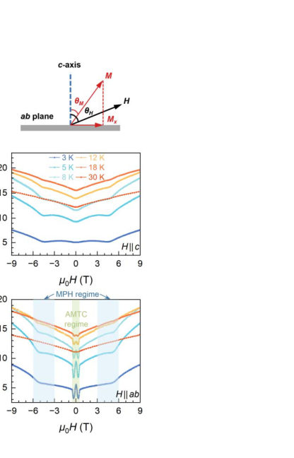 

Fig. 1: Magnetothermal transport in the dual magnon-phonon coupling regime of Cr2Ge2Te6 (CGT).

📷 Fig 2

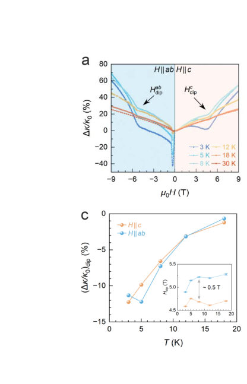 

Fig.2: High-field resonance dip originating from magnon-phonon hybridization.

📷 Fig 3

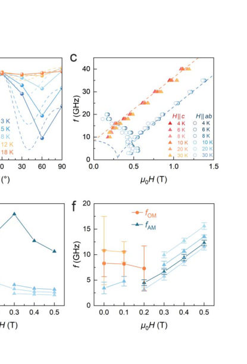 

Fig. 3: Low-field anisotropic magnetothermal conductivity originating from magnetic anisotropy

📷 Fig 4

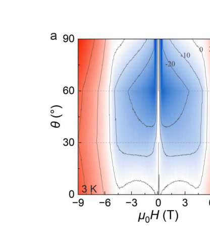 

Fig. 4: Magnetothermal transport phase diagram Δκ(H, θ) at low temperatures.

**Main problem.**

The difficulty of actively manipulating phonon transport due to the charge-neutral nature of heat carriers and the lack of a unified framework for controlling them via spin-phonon coupling.

**Main result.**

Discovery of two distinct magnetic-field-tunable regimes in thermal conductivity: a high-field regime driven by isotropic magnon-phonon hybridization (magnon polarons) and a low-field regime driven by anisotropic magnon gap softening.

**Method.**

Integration of four-probe longitudinal thermal conductivity measurements with Brillouin light scattering (BLS) and ferromagnetic resonance (FMR) spectroscopy.

**Summary.**

This paper demonstrates a method to control heat transport in a 2D magnetic insulator using magnetic fields. The researchers identified two different ways that spin-phonon coupling affects thermal conductivity: one at high fields through the creation of hybrid magnon-phonon particles, and another at low fields through the rotation of magnetization. This work provides a framework for using magnetic field magnitude and direction as 'knobs' to engineer phonon transport in van der Waals materials.

Detailed structure

**Model / system.**

The physical system is Cr2Ge2Te6 (CGT), a two-dimensional van der Waals ferromagnetic insulator with strong magnetocrystalline anisotropy.

**Key observables.**

Thermal conductivity (kappa), relative change in thermal conductivity (delta-kappa/kappa0), magnon frequency, and magnetic anisotropy gap.

**Important parameters / regimes.**

Magnetic field magnitude (H), field orientation (theta), temperature (T), and the saturation field (Hs).

**Assumptions / limitations.**

The study assumes the validity of the magnon polaron model for high-field resonance and uses an empirical exponential function to approximate the monotonic background of thermal conductivity.

**Figures summary.**

Fig 1: Measurement setup and temperature/field dependence of kappa showing ballistic, AMTC, and MPH regimes. Fig 2: Evidence of high-field resonance dips and calculated magnon-phonon dispersion relations. Fig 3: Low-field AMTC analysis including angular dependence and BLS spectra. Fig 4: Magnetothermal transport phase diagram and thermal quenching of SPC features.

**Paper structure.**

The paper introduces the challenge of phonon manipulation, presents experimental thermal transport data, identifies two anomalous magnetic field regimes, uses spectroscopic techniques (BLS/FMR) to reveal the microscopic origins (magnon-phonon hybridization and gap softening), and concludes with a phase diagram and implications for phonon engineering.

Abstract

The active manipulation of phonon transport remains a central challenge in phononics and spin caloritronics due to the charge-neutral nature of heat carriers. Spin-phonon coupling (SPC) offers a promising route for the dynamic control of heat carriers, yet its progress has been limited due to the lack of a unified framework and suitable material platforms. Here, we report on the magnetic field-tunable phonon transport behavior in the ferromagnetic insulator Cr2Ge2Te6. We observed two distinct anomalous regimes at both the high and low fields that were governed by isotropic magnon-phonon hybridization and an anisotropic magnon softening process, respectively. By integrating detailed transport behavior with Brillouin light scattering and ferromagnetic resonance, we uncovered the microscopic origins of these anomalous regimes and demonstrated that both the field magnitude and orientation could act as versatile tuning knobs to manipulate the thermal conductivity. Our findings provide experimental evidence of the SPC effect on phonon transport, demonstrating the dual impact of SPC within a unified system. This work will not only broaden the fundamental understanding of quasiparticle interactions but also establish a viable framework for dynamic phonon engineering. Furthermore, the characteristics of this system highlight the potential for achieving field-tunable phonon transport in similar platforms such as two-dimensional (2D) magnetic materials.

[↑ back to top](#top)

### [Highly fluctuating double-$q$ magnetic order in the van der Waals metal CeTe$_3$](http://arxiv.org/abs/2604.25436v1)

**Authors:** Ryutaro Okuma, Yuita Fujisawa, Natsumi Maekawa, Akiko Nakao, Yoshihisa Ishikawa, Riki Kobayashi, Yoshinori Okada, Daichi Ueta

**Type:** both · **Category:** strongly correlated electrons · **PDF:** <https://arxiv.org/pdf/2604.25436v1>

**Analysis basis:** full PDF text, analyzed in chunks

**Topic relevance:** `Kondo & dissipative impurity` **1/5**

📷 Fig 1

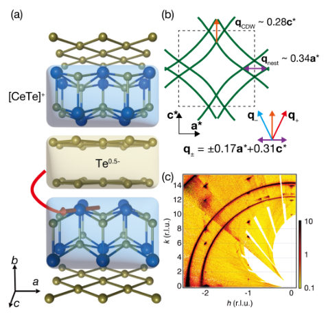 

FIG. 1. vdW antiferromagnet CeTe3. (a) Crystal structure, where blue and gold spheres represent Ce and Te atoms, re- spectively. The conducting Te0.5−square nets are stacked along the b axis via vdW coupling and interact with the mag- netic [CeTe]+ layers through Kondo coupling. Crystal struc- ture is drawn by VESTA [17]. (b) Quasi-two-dimensional Fermi surface of CeTe3. The nearly tetragonal slab symme- try gives rise to characteristic nesting vectors along the a∗

📷 Fig 2

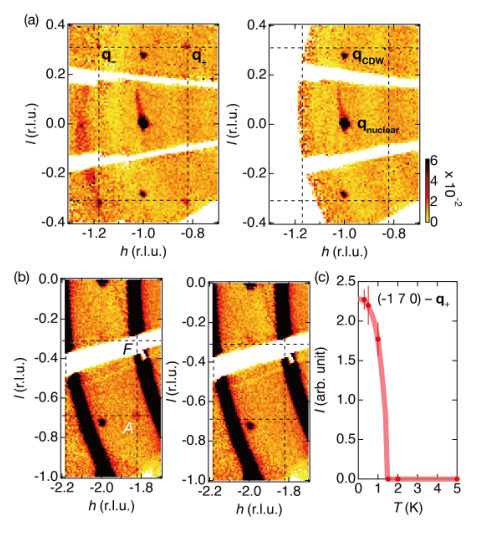 

FIG. 2. Magnetic order in CeTe3 detected by neutron diffrac- tion. (a) Diffraction patterns in the h5l plane at 0.3 K (left) and 5 K (right). Crossings of the dashed lines indicate the magnetic Bragg peak positions. (b) Diffraction patterns in the h6l plane at 0.3 K (left) and 5 K (right). (c) Tempera- ture dependence of the integrated intensity at (−1, 7, 0)−q+. The transparent red line is a guide to the eye.

📷 Fig 3

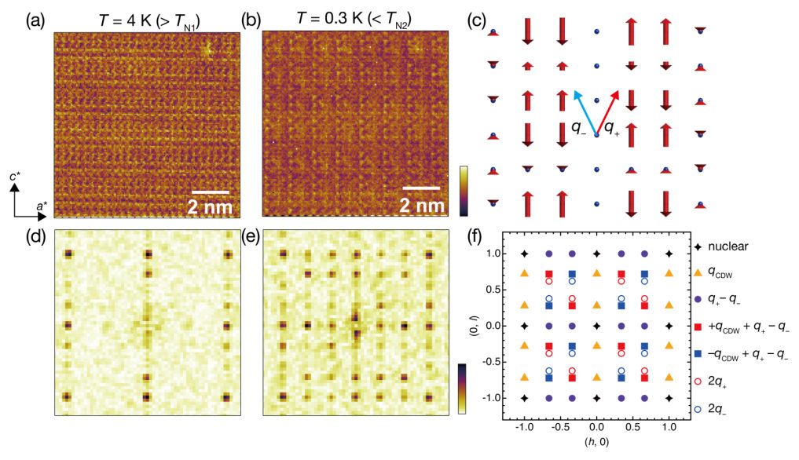 

FIG. 3. (a,b) Conductance maps near the Fermi level (E −EF = +14 mV) measured (a) above TN1 and (b) below TN2. The set point is -60 mV/200 pA. (c) Schematic of the double-q spin-density-wave (SDW) structure consistent with the neutron and STM experiments, drawn by SpinW[49]. The magnetic moment of the Ce1 site, as defined in Table III, is indicated. (d,e) Corresponding Fourier transform images obtained from (a) and (b), respectively. (f)Charge modulations below TN2 that can be explained by the double-q magnetic structure and CDW order (filled symbols). Experimentally negligible peaks are shown by open symbols. See the main text for the details. Panels (a,b,d,e) are adapted from Ref.[29].

**Main problem.**

The study aims to determine the microscopic magnetic structure of the van der Waals metal CeTe3 and understand the interplay between magnetism, c-f hybridization, and charge-density-wave (CDW) instabilities.

**Main result.**

The researchers identified a double-q magnetic order with moments predominantly aligned along the c-axis, where the reduced magnetic moment indicates strong quantum fluctuations driven by c-f hybridization.

**Method.**

The study combines single-crystal neutron diffraction down to 0.3 K with scanning tunneling microscopy (STM) to analyze magnetic Bragg peaks and real-space charge modulations.

**Summary.**

This paper investigates the magnetic ground state of the van der Waals metal CeTe3. Using neutron diffraction and STM, the authors reveal a double-q magnetic order with significantly reduced moments due to quantum fluctuations. They demonstrate that the magnetic structure is intimately linked to the material's itinerant charge degrees of freedom and residual CDW instabilities. This work provides key insights into how magnetism and conduction electrons interact in low-dimensional van der Waals materials.

Detailed structure

**Model / system.**

The system is CeTe3, a van der Waals antiferromagnet consisting of magnetic [CeTe]+ layers coupled to highly conducting Te0.5- square nets, characterized by a quasi-two-dimensional electronic structure.

**Key observables.**

Magnetic propagation vectors (q_plus and q_minus), magnetic Bragg peaks, ordered magnetic moment, and charge density modulations (FFT peaks).

**Important parameters / regimes.**

Magnetic transition temperatures (TN1 approx 3 K, TN2 approx 1.3 K), propagation vectors q_plus = (0.17, 0, 0.31), and the reduced magnetic moment of approx 0.32 mu_B.

**Assumptions / limitations.**

The magnetic structure refinement was performed using an undistorted Cmcm structure without explicitly including the CDW modulation.

**Figures summary.**

Fig 1 shows the crystal structure, Fermi surface, and neutron diffraction patterns; Fig 2 shows magnetic structure refinement and satellite peaks; Fig 3 presents STM conductance maps and the schematic of the double-q spin-density-wave structure.

**Paper structure.**

The paper introduces the CeTe3 system, presents neutron diffraction data to identify magnetic propagation vectors, uses STM to confirm the double-q nature via charge modulation, and discusses the physical implications of c-f hybridization and CDW coupling.

Abstract

CeTe$_3$ is a van der Waals antiferromagnet composed of magnetic [CeTe]$^+$ layers coupled to highly conducting Te$^{0.5-}$ square nets. Its simple quasi-two-dimensional electronic structure and cleavable nature make it an appealing platform for exploring correlated magnetism in reduced dimensions. To clarify the nature of its low-temperature state, we performed single-crystal neutron diffraction down to 0.3 K, complemented by scanning tunneling microscopy. A magnetic transition near 1.5 K gives rise to incommensurate Bragg peaks at $q_{\pm}\sim(\pm0.17,0,0.31)$, consistent with a double-$q$ magnetic order whose moments are predominantly aligned along the $c$ axis. The strongly reduced ordered moment is consistent with enhanced quantum fluctuations driven by $c$-$f$ hybridization, while the deviation of the propagation vectors from simple nesting suggests a coupling to residual charge-density-wave instabilities of the quasi-one-dimensional Te-derived bands. These results indicate that CeTe$_3$ hosts a correlated magnetic ground state where spin and itinerant charge degrees of freedom are intimately linked in the van der Waals limit.

[↑ back to top](#top)

### [Minimum Toffoli depth for the multi-controlled Toffoli gate via teleportation](http://arxiv.org/abs/2604.25861v1)

**Authors:** Spyros Tserkis, Muhammad Umer, Eleftherios Mastorakis, Dimitris G. Angelakis

**Type:** theory · **Category:** quantum information and computing · **PDF:** <https://arxiv.org/pdf/2604.25861v1>

**Analysis basis:** full PDF text, analyzed in chunks

**Topic relevance:** `quantum measurements` **1/5**

📷 Fig 1

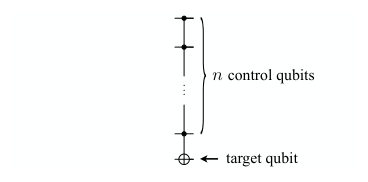 

FIG. 1. Quantum circuit representation of an (n+1)-qubit MCT gate.

📷 Fig 2

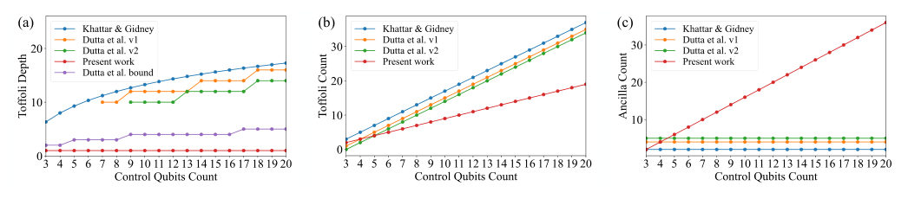 

FIG. 2. In panels (a)-(c) we plot the Toffoli depth, the Toffoli count, and the ancilla count, respectively, against the number of control qubits in an MCT gate decomposition. The color code is the same for all three panels. With blue we have the corresponding values for the decomposition by Khattar and Gidney [17]. With orange the corresponding values for the protocol derived by Dutta et al. [18] that uses one ancilla qubit and with green the corresponding protocol by the same authors that uses two ancilla qubits. With red we have the corresponding values for the teleportation-based protocol proposed in this work. With purple there is a trend appearing only on panel (a) corresponding to...

📷 Fig 3

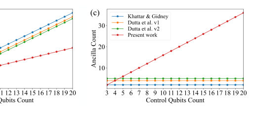 

Fig. 2(c) we compare the additional qubits, also known as ancilla qubits, required for each implementation. A detailed analysis of how our proposed decomposition compares with the rest is deferred to section V.

📷 Fig 4

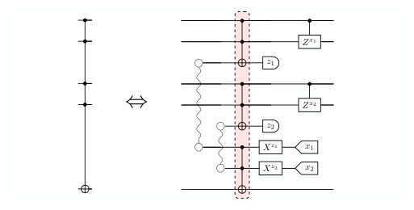 

FIG. 4. An MCT5 gate as a unitary operation (left) and through a teleportation-based decomposition (right).

📷 Fig 5

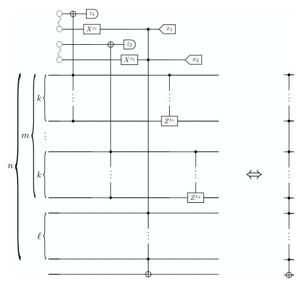 

FIG. 3. Protocol for the teleportation of an MCTn+1 gate based on Ref. [32]. The MCTn+1 gate is teleported using m number of MCTk+1 gates and a single MCTm+ℓ+1 gate. The squiggly lines correspond to Bell states of the form |Φ+⟩= (|00⟩+ |11⟩)/ √

📷 Fig 6

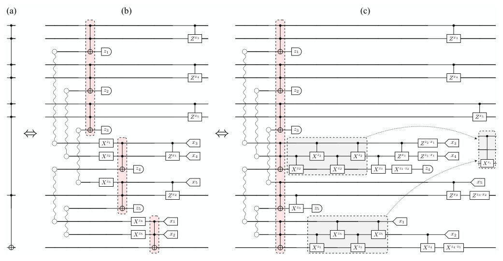 

FIG. 5. Teleportation-based decomposition of an MCT8 gate. Toffoli gates applied on closest-neighboring qubits are indicated with a red dashed box. In panel (a) the MCT8 gate is depicted as a unitary operation. Panel (b) depicts the teleportation-based decomposition of the MCT8 gate that includes ten ancilla qubits. The Toffoli depth of this circuit is equal to three due to the measurement outcomes required for the conditional gates. Panel (c) depicts the teleportation-based decomposition of the MCT8 gate with Toffoli depth equal to one after classically conditioned gates have been commuted to the right hand-side of the circuit. In the gray box it is shown how four consecutive gates can be...

📷 Fig 7

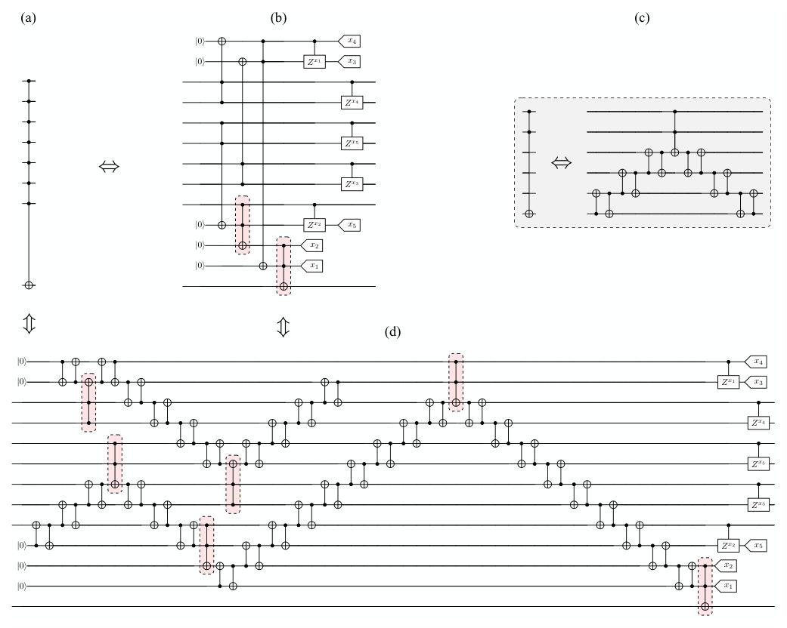 

FIG. 6. Dutta et al. decomposition of an MCT8 gate [18]. Toffoli gates applied on closest-neighboring qubits are placed within a red dashed box. Panel (a) depicts the MCT8 gate as a unitary operation. In panel (b) the Dutta et al. decomposition [18] of the MCT8 gate is depicted that corresponds to the lower bound (purple line) in Fig. 2(a). This decomposition has a Toffoli-depth equal to three, five ancilla qubits, and only two of the Toffoli gates are applied on closest-neighboring qubits. Panel (d) depicts the corresponding circuit where all Toffoli gates have been replaced by circuit primitives, shown in panel (c), that allow for only closest-neighboring interactions based on Ref. [44].

📷 Fig 8

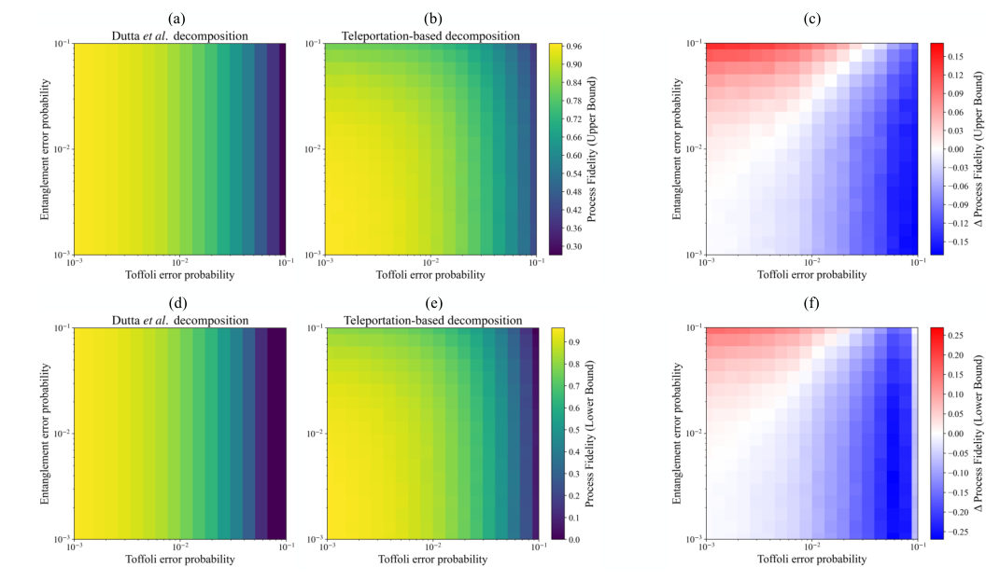 

FIG. 7. Panels (a) and (b) depict side by side the upper bound of process fidelity of the Dutta et al. decomposition and the teleportation-based decomposition, respectively. Both are plotted against the Toffoli error rate and the entanglement error rate that range from 10−3 to 10−1. Panel (c) depicts a value called ∆process fidelity, corresponding to the subtraction of the fidelity found for the teleportation-based decomposition from the Dutta et al. decomposition. Red is the region where the Dutta et al. decomposition is preferable and blue the region where the teleportation-based decomposition is preferable. Analogously panels (d) and (e) depicts to the lower bound of the process fidelity...

📷 Fig 9

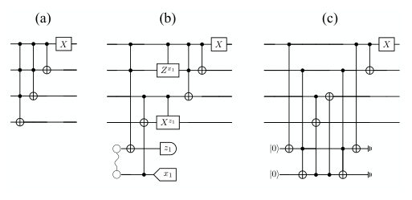 

FIG. 8. Panel (a) depicts the MCT-based construction of the adder operator modulo 24. Panel (b) depicts an analogous construction but substitutes the MCT4 gate with the teleportation-based decomposi- tion according to the protocol discussed in section V. Panel (c) de- picts the adder operator modulo 24 based on Vedral et al. [1].

📷 Fig 10

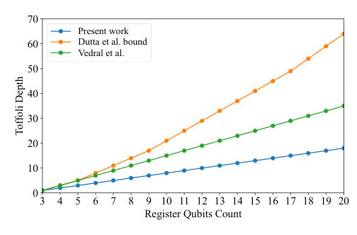 

FIG. 9. The Toffoli depth of the adder operator is plotted for three different decompositions against the total number of register qubits. The decomposition of the adder operator through the teleportation- based decomposition developed in this work is the optimal overall in terms of minimizing Toffoli depth.

**Main problem.**

The decomposition of multi-controlled Toffoli (MCT) gates into simpler gates typically results in high circuit depth, which increases susceptibility to decoherence.

**Main result.**

The authors introduce a teleportation-based decomposition that achieves a unit Toffoli depth, independent of the number of controls, while maintaining a relatively low Toffoli count.

**Method.**

A recursive gate teleportation protocol that uses ancilla qubits and Bell states to decompose an (n+1)-qubit MCT gate into smaller MCT gates and measurements.

**Summary.**

This paper presents a new method for decomposing multi-controlled Toffoli gates using quantum teleportation. The proposed technique achieves a constant Toffoli depth that does not increase with the number of control qubits. While it requires a linear increase in ancilla qubits, it offers significant advantages for circuit depth and error resilience in specific noise regimes. The authors demonstrate the utility of this method in optimizing quantum adders, QROM, and quantum machine learning architectures.

Detailed structure

**Model / system.**

General quantum computing circuits and architectures, specifically focusing on the implementation of MCT gates, quantum adders, QROM, and quantum machine learning primitives.

**Key observables.**

Toffoli depth, Toffoli count, ancilla qubit count, and process fidelity.

**Important parameters / regimes.**

Number of control qubits (n), Toffoli error probability, and entanglement error probability.

**Assumptions / limitations.**

The protocol assumes the ability to distribute entangled pairs across non-neighboring (distant) qubits and assumes a hierarchical error scaling between different gate types.

**Figures summary.**

Figure 1 shows the MCT gate circuit; Figure 2 compares depth, count, and ancilla scaling against existing methods; Figure 3 illustrates the teleportation protocol; Figure 4 and 5 show specific gate decompositions (MCT5, MCT8); Figure 7 shows process fidelity bounds and differences; Figure 8 and 9 compare adder constructions; Figure 10 shows QROM and QML applications.

**Paper structure.**

The paper introduces the problem of MCT decomposition, presents a new teleportation-based protocol, provides a comparative analysis of gate metrics (depth, count, ancilla), evaluates noise resilience via fidelity simulations, and demonstrates practical applications in quantum adders, QROM, and quantum machine learning.

Abstract

The decomposition of complex quantum operations into experimentally feasible gate sets has been a central challenge since the early development of quantum computing. The multi-controlled Toffoli (MCT) gate is a key example, with applications across a wide range of quantum algorithms, whose decomposition into smaller gates, however, typically leads to deep circuits. In this work, we introduce a teleportation-based decomposition that implements an arbitrary MCT gate with unit Toffoli depth, independent of the number of controls, while maintaining a relatively low Toffoli count compared to existing approaches. This is achieved at the cost of a linear overhead in ancilla qubits and the ability to distribute entangled pairs across distant qubits, a capability already available in several quantum computing platforms. We further demonstrate the advantages of this implementation in circuits that rely on MCT gates, such as the adder operator, quantum read-only memory, quantum neurons, and quantum decision trees.

[↑ back to top](#top)

## Other papers (49)

*Papers from primary archives without highlighted authors or any topic match. Click to expand.*

Show other papers

### [A graph-aware bounded distance decoder for all stabilizer codes](http://arxiv.org/abs/2604.25424v1)

**Authors:** Harikrishnan K J, Amit Kumar Pal

**Type:** theory · **Category:** quantum information and computing · **PDF:** <https://arxiv.org/pdf/2604.25424v1>

**Analysis basis:** full PDF text, analyzed in chunks

📷 Fig 1

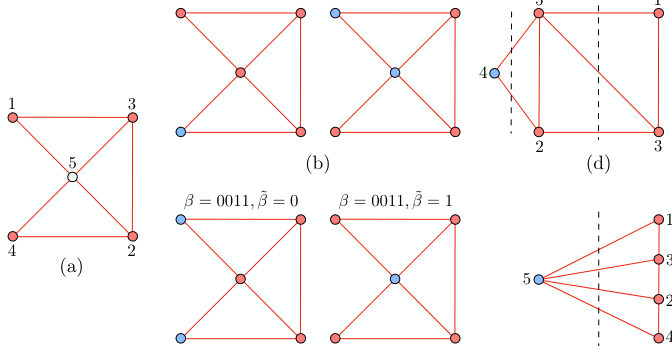 

FIG. 1. (a) The equivalent graph associated with the [[5, 1, 3]] perfect code. See Appendix. B for the stabilizers and a detailed discussion. White node indicate the Hadamard in the Hr. A demonstration of resulting graph syndromes in the case of (b) σz 4 and (c) σx 5 errors where the blue nodes indicates the non-trivial graph generators of α. The corresponding feedforward network corresponding to the minimum weight scenarios (b) σz 4 error where β = 1001, ˜β = 0 and (d) σx 5 error where β = 0011, ˜β = 1.

📷 Fig 2

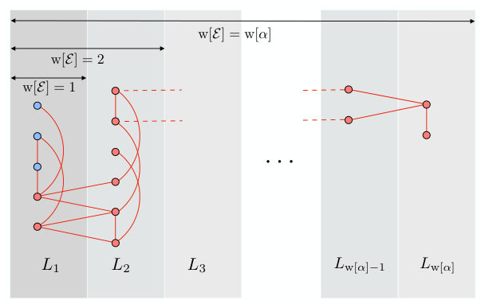 

FIG. 2. A demonstration of feedforward network structure of a graph. The graph syndrome nodes (shown in blue) and their neighbors belong to the left most layer L1. Any later layer contains neighbors of preceding layer as well as their neighbors (See Sec. III B). Nodes after Lw[α] can be discarded by virtue of Eq. (40).

📷 Fig 3

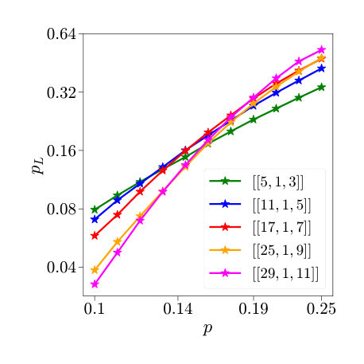 

FIG. 3. Log-log plot of logical error rate pL against the phys- ical error rate p in the case of optimal codes under depolariza- tion noise corrected with BDD (see Sec. III C and Appendix. C for code details). Errors are sampled according to Eq. (43) with px = py = pz = p/3. Each of the datapoints correspond to 104

📷 Fig 4

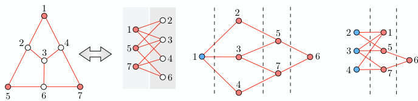 

FIG. 4. (a) The equivalent bipartite graph associated with smallest [[7, 1, 3]] CSS code. The white nodes indicates Hadamard operations. See Appendix. D for the stabilizers and a detailed discussion. A demonstration of graph syndrome and the corresponding feedforward network corresponding to the trivial logical syndrome in the case of (c) σz 1 (d) σx 1 error.

📷 Fig 5

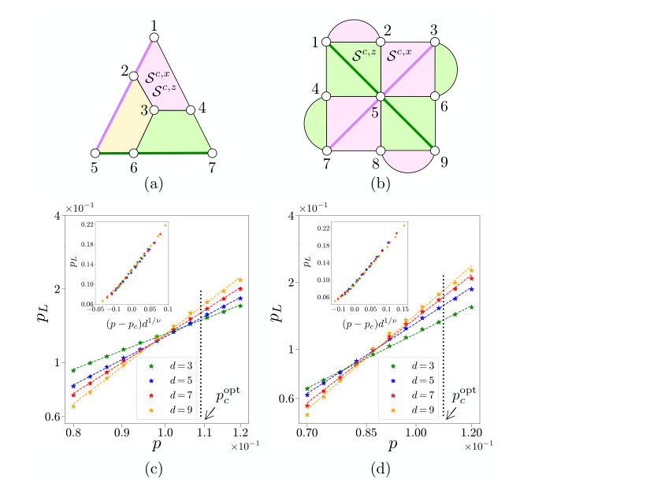 

FIG. 5. Schematics of d = 3, k = 1 (a) triangular color and (b) rotated surface codes with N = 7 and N = 9 physical qubits respectively. The thick pick and green lines represent the logical z and x operators respectively. The log-log plot of pL against p for code distances three to nine of (c) triangular color (d) rotated surface codes. Both of them are under bit flip channel corresponding to py = pz = 0 of Eq. (43). The vertical black dotted line indicates the theoretical known optimal threshold noise strengths popt c = 0.109(2)[78] (popt c = 0.1094(2)[79]) of color (surface) code. The inset shows the data collapse (Eq. (53)) obtained near the BDD threshold physical error probability pc...

**Main problem.**

The difficulty of developing efficient, generalized decoding strategies for all stabilizer codes, particularly non-CSS codes, where standard methods like Belief Propagation often fail or are computationally prohibitive.

**Main result.**

The development of a graph-aware Bounded Distance Decoder (BDD) that achieves near-optimal performance for CSS codes and satisfactory performance for non-CSS codes up to distance d=11, accompanied by the QGDecoder open-source library.

**Method.**

The authors leverage the local Clifford equivalence between stabilizer codes and graph states, using a graph-based framework with strategic pruning (via a feed-forward network structure) and structured sampling to reduce the search space.

**Summary.**

This paper presents a new decoding strategy called Graph-Aware Bounded Distance Decoding that works for any stabilizer code by mapping them to graph states. By using graph pruning and structured sampling, the authors significantly reduce the computational complexity of finding the most likely error. The method shows high efficiency for both CSS and non-CSS codes and provides a new open-source tool, QGDecoder, for the quantum error correction community.

Detailed structure

**Model / system.**

The study focuses on quantum stabilizer codes, including both CSS (surface and color codes) and non-CSS families, subjected to depolarizing and bit-flip error models.

**Key observables.**

Logical error rate (pL), threshold error probability (pc), and critical exponent (nu).

**Important parameters / regimes.**

Code distance (d), physical error rate (p), target weight threshold (T), and number of physical (N) and logical (k) qubits.

**Assumptions / limitations.**

The decoder assumes perfect syndrome measurement and focuses on specific error models like depolarizing and bit-flip noise.

**Figures summary.**

Figure 1 shows the graph representation of the [[5,1,3]] code; Figure 2 illustrates the feed-forward network structure for graph pruning; Figure 3 displays logical error rate vs. physical error rate for non-CSS codes; Figure 4 shows the bipartite graph syndrome for CSS codes; Figure 5 shows code schematics and data collapse plots for threshold estimation.

**Paper structure.**

The paper introduces the decoding bottleneck, establishes the mathematical mapping between stabilizer codes and graph states, proposes the graph-aware BDD algorithm with pruning techniques, demonstrates performance on non-CSS and CSS codes, performs finite-size scaling analysis for thresholds, and introduces the QGDecoder software.

Abstract

We formulate a bounded distance decoding strategy applicable to all stabilizer codes including both CSS and non-CSS code-families. The framework emerges out of the local Clifford equivalence between arbitrary stabilizer states and graph states. Using the graphical representation of the stabilizers and the syndromes, we constitute the bounded distance decoding as an adaptable generalization of maximum likelihood decoding, ensuring correction of all errors with weights upper bounded by a target weight. We show that strategic pruning associated with a feed-forward network structure of the graph can reduce the search space and subsequently the runtime of the designed decoder. We demonstrate satisfactory performance of the bounded distance decoder in the case of the optimal non-CSS codes up to distance $d=11$ subjected to the depolarizing error on all qubits, and near-optimal decoding for the color and the surface codes, both belonging to the CSS family, under the bit-flip errors on the qubits. We also develop an open-source library, QGDecoder, enabling the graph-aware bounded distance decoding of arbitrary stabilizer codes.

[↑ back to top](#top)

### [A Quantum Spectral Framework for Solving PDEs](http://arxiv.org/abs/2604.25825v1)

**Authors:** Chih-Kang Huang, Giacomo Antonioli, Frédéric Barbaresco

**Type:** theory · **Category:** quantum information and computing · **PDF:** <https://arxiv.org/pdf/2604.25825v1>

**Analysis basis:** full PDF text, analyzed in chunks

📷 Fig 1

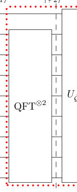 

Figure 4. Quantum circuit for solving the 2D Poisson equation on a 16 × 16 grid using 9 qubits. The circuit consists of a the QFT⊗2, followed by the block encoding of the diagonal filter corresponding to the inverse Laplacian, and concludes with an inverse QFT⊗2 to return to the spatial domain.

📷 Fig 2

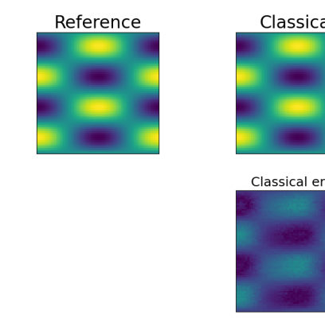 

Figure 5. Visualizations of the reference, classical, and quantum solutions, along with the absolute errors of the classical and quantum methods relative to the reference for the 2D elliptic case with N = 64 and A =diag(10, 1).

📷 Fig 3

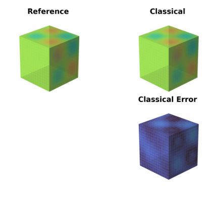 

Figure 6. Visualizations of the reference, classical, and quantum solutions, along with the absolute errors of the classical and quantum methods relative to the reference for the 3D elliptic case with N = 16 and A =diag(10, 1, 1).

📷 Fig 4

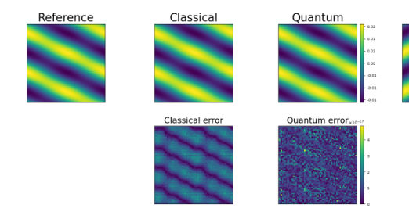 

Figure 7. Visualizations of the reference, classical, and quantum solutions, along with the absolute errors of the classical and quantum methods relative to the reference for the 2D Helmholtz equation with N = 64, k = 2π × 0.5 (Left) and k = 2π × 0.1 (Right).

📷 Fig 5

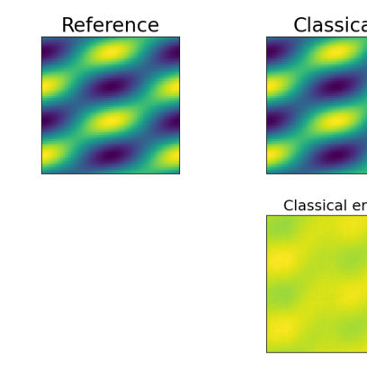 

Figure 8. Visualizations of the reference, classical, and quantum solutions, along with the absolute errors of the classical and quantum methods relative to the reference for the 2D diffusion case with N = 64 and A =diag(10, 1).

📷 Fig 6

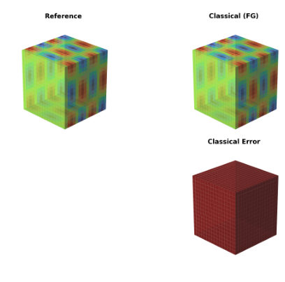 

Figure 9. Visualizations of the reference, classical, and quantum solutions, along with the absolute errors of the classical and quantum methods relative to reference for the 3D diffusion case with N = 16 and A =diag(1,100, 1).

📷 Fig 7

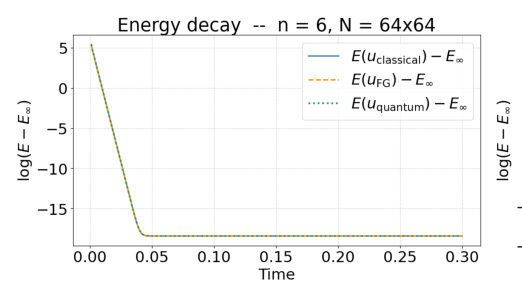 

Figure 10. Evolutions and dissipations of the energy 15 for the diffusion case with (Left) d = 2, N = 64 and A=diag(100, 1); (Right) d = 3, N = 16 and A=diag(1, 100, 1) for the Reference, Classical and Quantum methods. We track log(E(u)−E∞) where E∞is the energy of the steady-state solution, since E can become negative during evolution.

**Main problem.**

Addressing the curse of dimensionality in solving Partial Differential Equations (PDEs) by developing a quantum algorithmic alternative to standard matrix inversion methods.

**Main result.**

The authors present a quantum spectral framework that achieves polylogarithmic gate complexity and demonstrates numerical accuracy comparable to classical FFT-based spectral solvers.

**Method.**

The framework utilizes the Quantum Fourier Transform (QFT) combined with Quantum Block Encoding (QBE) and quantum reversible arithmetic to implement an inverse spectral filter.

**Summary.**

This paper introduces a specialized quantum subroutine for solving linear PDEs by exploiting the diagonal structure of differential operators in the Fourier domain. By using Quantum Block Encoding and reversible arithmetic, the authors bypass the high complexity of generic matrix encoding methods. The framework is validated against classical spectral methods for Poisson, Helmholtz, and diffusion equations. This approach offers a path toward efficient quantum simulation of complex physical systems in high dimensions.

Detailed structure

**Model / system.**

The mathematical models include second-order linear elliptic (Poisson, Helmholtz) and parabolic (anisotropic diffusion) PDEs on a d-dimensional flat torus.

**Key observables.**

Relative L2-errors, energy functional E(u) for dissipation tracking, and error distributions.

**Important parameters / regimes.**

Dimensionality (d), grid size (N), condition number (kappa), and precision (epsilon).

**Assumptions / limitations.**

Periodic boundary conditions, constant coefficients, and a noiseless quantum computing setting with efficient state preparation.

**Figures summary.**

The figures illustrate quantum circuit sequences for controlled rotations and block encoding, the d-dimensional QFT, and visual comparisons of quantum vs. classical solution distributions and energy dissipation trajectories.

**Paper structure.**

The paper progresses from defining the limitations of classical PDE solvers to proposing a quantum spectral framework, detailing the block encoding and arithmetic implementation, providing complexity analysis, and concluding with numerical validation via Qiskit simulations.

Abstract

Partial differential equations (PDEs) are fundamental across numerous scientific fields. As these problems scale to high dimensions, classical numerical schemes introduce severe computational bottlenecks, known as the curse of dimensionality. Attempts to solve this problem typically rely on either classical sparsity and low-rank decompositions, or neural network surrogate models. On the other hand, Quantum Computing offers a promising alternative, as it allows us to operate in significantly larger spaces while demanding far fewer resources. In this work, we present a quantum subroutine to solve second-order linear PDEs by exploiting the structural properties of the filter in Fourier space using Quantum Block Encoding (QBE) with quantum reversible arithmetic. This approach serves as a specialized alternative to standard quantum matrix inversion, which typically relies solely on Quantum Singular Value Transformation (QSVT) without exploiting the inherent structural properties of the matrix. We validate the proposed methodology against its classical counterpart to prove its correctness. This framework provides a foundation for extending these methods toward quantum group Fourier transforms, wavelet-based analysis, and equivariant quantum neural networks (EQNNs), offering a promising path toward solving broader classes of problems, including nonlinear PDEs.

[↑ back to top](#top)

### [A SWAP-free Framework for QAOA](http://arxiv.org/abs/2604.25058v1)

**Authors:** Thiago Assis, Pedro Baptista, Laila Lopes, Diego Ferreira, Gabriel Coutinho

**Type:** theory · **Category:** quantum information and computing · **PDF:** <https://arxiv.org/pdf/2604.25058v1>

**Analysis basis:** full PDF text, analyzed in chunks

📷 Fig 1

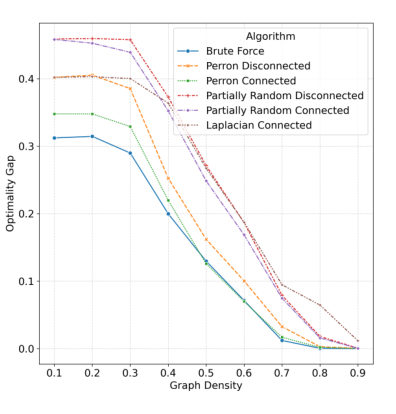 

Figure 1: Comparison of heuristics. The plots show how normalized lambda and optimality gap vary with graph density for n = 8.

📷 Fig 2

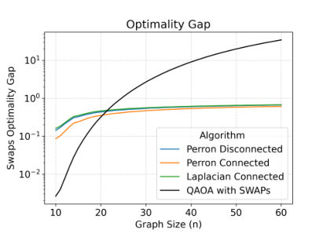 

Figure 2: Optimality gap as a function of n for four algorithms: Perron Con- nected, Perron Disconnected, Laplacian Connected, and ideal QAOA with SWAP errors.

**Main problem.**

The performance of QAOA on NISQ devices is degraded by SWAP gates required to implement non-native interactions on sparse hardware topologies. The paper seeks to determine if a hardware-compatible approximation of the cost Hamiltonian can outperform an exact but noisy implementation.

**Main result.**

The authors propose a SWAP-free framework that uses a Mixed-Integer Semidefinite Program (MISDP) to optimize qubit mapping and Hamiltonian approximation. They demonstrate that for larger problem sizes (n > 20), this hardware-aware approximation significantly outperforms the standard SWAP-induced noise baseline.

**Method.**

The framework uses an MISDP formulation to simultaneously select a hardware-compatible cost matrix and optimize qubit allocation. For larger instances, the authors introduce spectral-based heuristics (e.g., Perron and Laplacian-based) to solve the optimization problem efficiently.

**Summary.**

This paper addresses the high error rates in NISQ-era quantum computing caused by SWAP gates during algorithm transpilation. Instead of using an exact Hamiltonian that requires many noisy gates, the authors propose modifying the problem itself to fit the hardware's native connectivity. By using a mathematical framework to find the best hardware-compatible approximation, they show that an imprecise but 'SWAP-free' algorithm can actually produce more accurate results than an exact but heavily noisy one as the number of qubits increases.

Detailed structure

**Model / system.**

The study focuses on the Quantum Approximate Optimization Algorithm (QAOA) applied to Quadratic Unconstrained Binary Optimization (QUBO) problems, specifically cardinality-constrained models. The physical model involves an XY-type mixer Hamiltonian and a cost Hamiltonian implemented on a hardware graph representing NISQ device connectivity.

**Key observables.**

The deviation/error between original and embedded cost matrices (lambda), the optimality gap, and the normalized lambda objective value.

**Important parameters / regimes.**

Graph density (d), number of qubits (n), cardinality constraint (k), number of QAOA layers (l), and CNOT error rate (0.33%).

**Assumptions / limitations.**

The study assumes perfect classical optimization of the variational parameters (beta and gamma) to isolate the effects of qubit allocation and noise.

**Figures summary.**

Figure 1 compares various spectral heuristics against a brute-force benchmark for small n; Figure 2 shows the optimality gap of the proposed heuristics compared to the SWAP-based baseline as a function of problem size n.

**Paper structure.**

The paper introduces the problem of SWAP-induced noise, formulates the SWAP-free framework as an MISDP, proves the NP-completeness of the decision problem, provides theoretical bounds using the Lovasz number, introduces spectral heuristics for scalability, and benchmarks the approach against SWAP-based noise using a financial index-tracking problem.

Abstract

The performance of the Quantum Approximate Optimization Algorithm (QAOA) on noisy intermediate-scale quantum (NISQ) devices is strongly limited by sparse qubit connectivity. When interactions required by QAOA Hamiltonians are not aligned to the hardware topology, transpilation introduces SWAP gates, increasing circuit depth and noise. We propose a SWAP-free QAOA framework based on modifying the cost Hamiltonian so that it can be implemented natively on the hardware. We formulate this as a mixed-integer semidefinite program (MISDP) that selects a hardware-compatible approximation of the original cost matrix and optimizes the allocation of logical variables to physical qubits. We prove that the associated decision problem is NP-complete and derive theoretical guarantees relating the MISDP objective to the loss in the original optimization problem through the Lovász number of the hardware graph. Since solving MISDPs is practical only for small instances, we introduce heuristics based on spectral properties of the problem matrix and hardware graph. Our experiments on a cardinality-constrained quadratic optimization model for index tracking show competitive performance against a baseline representing ideal QAOA under SWAP-induced noise. These results indicate that, on sparse NISQ architectures, a hardware-aware approximation of the objective may be more effective than an exact but heavily transpiled Hamiltonian implementation.

[↑ back to top](#top)

### [Approximate Sparse State Preparation with the Grover-Rudolph Algorithm](http://arxiv.org/abs/2604.24973v1)

**Authors:** Debora Ramacciotti, Martin Steinbach, Bence Temesi, Andreea-Iulia Lefterovici, Antonio F. Rotundo

**Type:** theory · **Category:** quantum information and computing · **PDF:** <https://arxiv.org/pdf/2604.24973v1>

**Analysis basis:** full PDF text, analyzed in chunks

📷 Fig 1

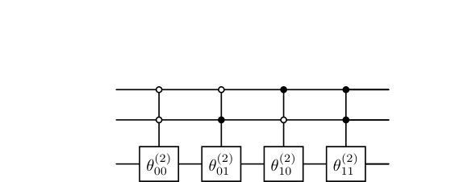 

Fig. 1: Circuit diagram of a uniformly controlled y-rotation on three qubits. We indicate the Ry rotation just by the applied angle to simplify the notation.

📷 Fig 2

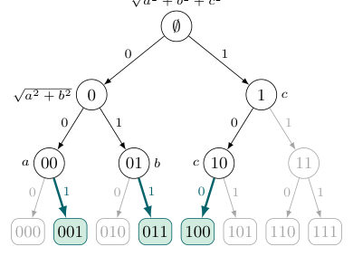 

Fig. 2: Preparation tree for the state |ψ⟩= a |001⟩+ b |011⟩+ c |100⟩. The highlighted leaves are the nonzero basis states of the target state, while faded nodes indicate zero-amplitude branches. The non-faded nodes correspond to the nonzero prefix sets Sk. The coarse-grained state |ψ(2)⟩, for instance, is given by a |00⟩+ b |01⟩+ c |10⟩.

📷 Fig 3

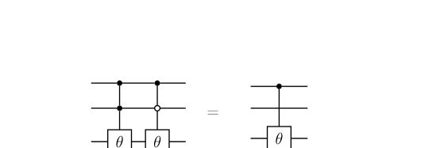 

Fig. 3: Example of optimization procedure. Here, θ(2) 11 = θ(2) 10 = θ(2) 1e = θ.

📷 Fig 4

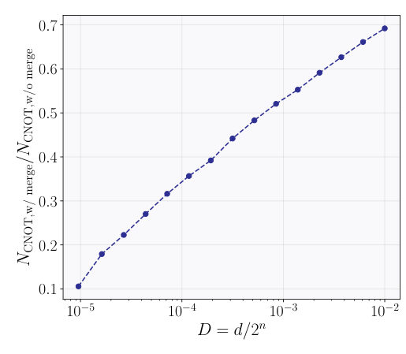 

Fig. 4: CNOT reduction due to the exact merges. We plot the ratio of the CNOT count after the merging procedure to that before the merging procedure, using the single-rotation decomposition in both cases, against the sparsity percentage D = d/2n. The number of qubits is fixed at n = 20 qubits, and each point is averaged across 20 repetitions.

📷 Fig 5

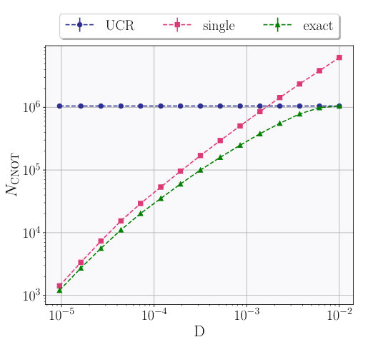 

Fig. 5: Comparison between the uniform rotation algorithm (blue), single rotations after merges (pink), and the exact algorithm (green). We plot the CNOT gate count against the sparsity percentage D = d/2n, for simulation of n = 20 qubits and average across 20 repetitions.

📷 Fig 6

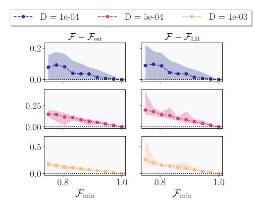 

Fig. 6: Performance assessment of the overlap estimation. The number of qubits is fixed to 15, and the number of intervals to M = 20, while the sparsity percentage D is varied. The two columns show, respectively, Fest −F and F −FLB as functions of the minimum allowed overlap Fmin, where FLB is the lower bound of Thm. 8, and F is the true overlap. The curves represent averages over 20 random real instances, while the shaded areas show the minimum and maximum values observed across repetitions.

📷 Fig 7

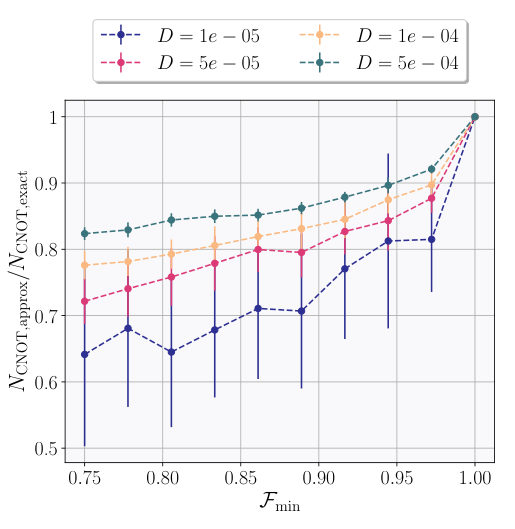 

Fig. 7: Comparison between the exact and approximate al- gorithms. The number of qubits is fixed to n = 20, and the number of intervals to M = 20, while the sparsity percentage D is varied. The plot shows the ratio of the number of CNOTs in the approximate algorithm to that in the exact scheme. Each data point corresponds to an average over 20 repetitions, with 10 points plotted per curve.

📷 Fig 8

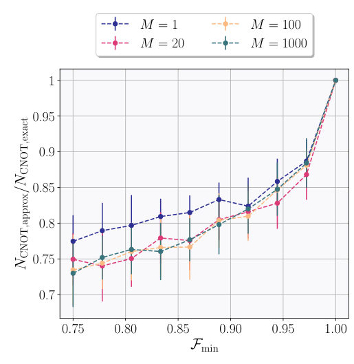 

Fig. 8: Comparison between the exact and the approximate algorithm for different values of M. The number of qubits is fixed to n = 20, and the sparsity percentage to D = 5 · 10−5. The plot shows the ratio of the number of CNOTs in the approximate algorithm to that in the exact scheme. Each data point corresponds to an average over 20 repetitions, with 10 points plotted per curve.

**Main problem.**

The challenge of reducing the circuit complexity, specifically the CNOT gate count, for preparing sparse quantum states using the Grover-Rudolph algorithm.

**Main result.**

The proposed exact optimization reduces CNOT counts by up to 90% for highly sparse states, while an additional approximate variant provides a further 20-30% reduction with controllable error.

**Method.**

The authors propose an exact gate-merging and control-stripping procedure and an approximate greedy optimization strategy that merges rotations with similar angles based on a classically computable overlap estimator.

**Summary.**

This paper presents two new optimization techniques for the Grover-Rudolph algorithm to make sparse quantum state preparation more efficient. The first method uses exact gate merging to significantly reduce CNOT counts without any loss in fidelity. The second method introduces an approximate approach that allows for even greater gate reductions by merging similar rotation angles, provided the resulting error stays below a user-defined threshold. These improvements are particularly valuable for implementing quantum algorithms on early fault-tolerant quantum computers.

Detailed structure

**Model / system.**

The work focuses on the preparation of sparse quantum states where the number of non-zero amplitudes d is much smaller than the Hilbert space dimension 2^n.

**Key observables.**

CNOT gate count, state overlap (fidelity), and the error in the overlap estimator.

**Important parameters / regimes.**

Sparsity (d/2^n), minimum allowed overlap threshold (F_min), and the number of threshold steps (M) in the greedy procedure.

**Assumptions / limitations.**

The analysis is limited to real, positive quantum states; the locations and number of non-zero entries are known a priori; and the approximate method introduces a small, controllable infidelity.

**Figures summary.**

Circuit diagrams of rotations, illustrations of preparation trees and gate merging, plots of CNOT reduction versus sparsity, and performance assessments of the overlap estimator and greedy algorithm.

**Paper structure.**

The paper introduces the problem of sparse state preparation, details an exact optimization method via gate merging and control stripping, presents an approximate greedy optimization strategy with an overlap estimator, provides complexity analysis and numerical validation, and discusses limitations.

Abstract

Sparse quantum state preparation is a common subroutine in quantum algorithms, where classical data with few nonzero entries must be loaded into a quantum state. In this work, we consider the Grover-Rudolph algorithm, which has recently been shown to efficiently prepare sparse states, and we propose two improvements. First, we extend an existing gate-merging procedure by allowing rotations to merge with virtual zero-angle gates on unreachable branches of the preparation tree, reducing the number of CNOTs and control qubits. Second, we introduce an approximate variant in which rotations with similar but not identical angles are merged at the cost of a small, controllable error in the prepared state. We derive a classically computable estimate of the resulting overlap with the target state, which is used to guide the merging decisions.

[↑ back to top](#top)

### [Beyond Single Trajectories: Optimal Control and Jordan-Lie Algebra in Hybrid Quantum Walks for Combinatorial Optimization](http://arxiv.org/abs/2604.25760v1)

**Authors:** Tianen Chen, Yun Shang

**Type:** theory · **Category:** quantum information and computing · **PDF:** <https://arxiv.org/pdf/2604.25760v1>

**Analysis basis:** full PDF text, analyzed in chunks

📷 Fig 1

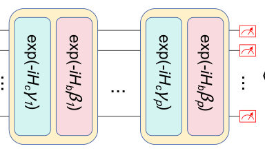 

FIG. 1. Schematic of a p-layer QAOA. |s⟩= |+⟩⊗n is the ini- tial state. ⟨Hc⟩= ⟨ψ(β, γ)|Hc|ψ(β, γ)⟩is the objective func- tion. Each yellow area is corresponding to a layer of QAOA which alternately applies e−iHcγi and e−iHbβi.

📷 Fig 2

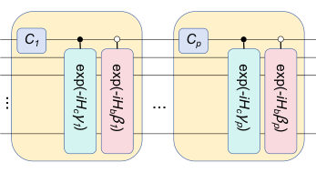 

FIG. 2. Schematic of a p-step HQW. |0⟩⊗|s⟩= |0⟩⊗|+⟩⊗n

📷 Fig 3

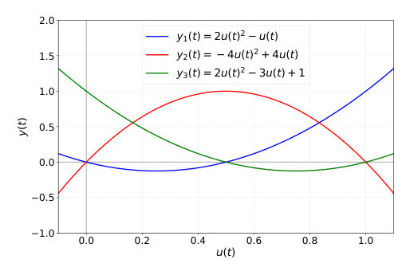 

FIG. 3. The function graph of y1(t) (blue), y2(t) (red) and y3(t) (green) with respect to u(t).

📷 Fig 4

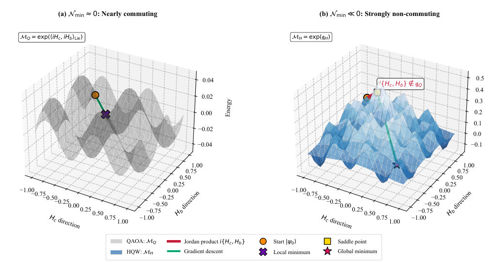 

FIG. 4. Geometric interpretation of the Jordan product’s role. (Left) When Nmin ≈0, the QAOA manifold MQ is nearly flat. (Right) When Nmin ≪0, the HQW manifold MH becomes highly curved, with transverse directions (red arrows) generated by the Jordan product i{Hc, Hb}.

📷 Fig 5

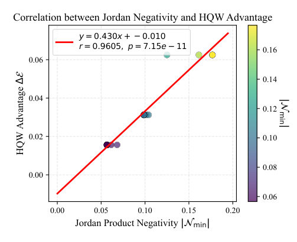 

FIG. 5. Correlation between Jordan negativity Nmin and HQW performance advantage. The solid line shows a linear fit y = 0.430x −0.010 with correlation coefficient r = 0.9605 (p = 7.15 × 10−11).

📷 Fig 6

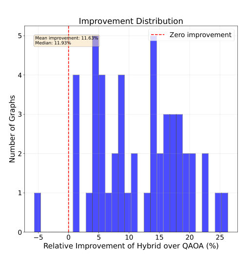 

FIG. 7. Distribution of HQW’s relative improvement over QAOA across 50 8-vertex graphs with 18-23 edges for the average-performance comparison. Mean: 11.63%, median: 11.93%.

📷 Fig 7

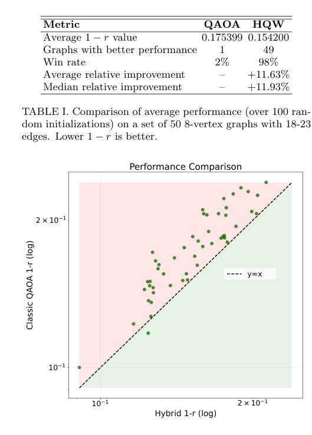 

FIG. 6. Scatter plot of average 1 −r (over 100 initializa- tions) for QAOA vs. HQW on 50 8-vertex graphs with 18-23 edges. Each point corresponds to one graph; the diagonal line indicates equal performance. Both axes show 1 −r on a log- arithmic scale.

📷 Fig 8

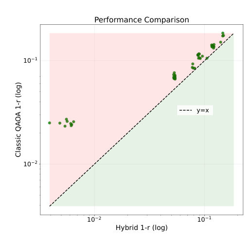 

FIG. 8. Scatter plot of average 1 −r (over 100 initializa- tions) for QAOA vs. HQW on 50 8-vertex graphs with 24-28 edges. Each point corresponds to one graph; the diagonal line indicates equal performance. Both axes show 1 −r on a log- arithmic scale.

📷 Fig 9

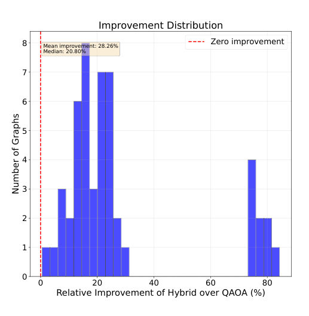 

FIG. 9. Distribution of HQW’s relative improvement over QAOA across 50 8-vertex graphs with 24-28 edges for the average-performance comparison. Mean: 28.26%, median: 20.80%.

📷 Fig 10

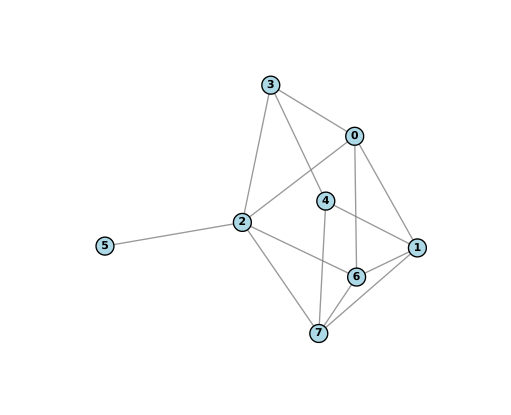 

FIG. 10. The 8-vertex graph for the Max-Cut problem.

**Main problem.**

The standard QAOA is limited by a single, fixed evolution path, which prevents the coherent superposition of multiple trajectories. The authors aim to develop a more expressive Hybrid Quantum Walk (HQW) ansatz that can superpose multiple Hamiltonian-driven paths to improve combinatorial optimization.

**Main result.**

The HQW framework systematically outperforms QAOA in convergence speed, solution accuracy, and robustness for Max-Cut and Maximum Independent Set problems. This advantage is theoretically linked to the larger Jordan-Lie algebra generated by HQW and the 'negativity of the Jordan product' in its dynamical Lie algebra.

**Method.**

The authors use Pontryagin's Minimum Principle to derive the optimal dynamical coin operator and employ Dynamical Lie Algebra (DLA) and Jordan-Lie algebra analysis to characterize the algorithm's expressivity. Numerical performance is evaluated using the Adam optimizer on PennyLane simulations.

**Summary.**

This paper introduces a Hybrid Quantum Walk (HQW) ansatz that generalizes the QAOA by allowing for the coherent superposition of multiple evolution trajectories. By using a dynamical coin operator, the HQW accesses a larger Jordan-Lie algebraic structure than the standard QAOA. Numerical experiments on Max-Cut and Maximum Independent Set problems demonstrate that this approach leads to superior convergence and accuracy. The performance gain is fundamentally linked to the algebraic incompatibility of the Hamiltonians, quantified by the negativity of the Jordan product.

Detailed structure

**Model / system.**

A Hybrid Quantum Walk (HQW) model acting on a composite Hilbert space of a coin space and a position (graph) space. The system involves non-commuting cost and mixer Hamiltonians, where the coin operator controls the superposition of different evolutionary paths.

**Key observables.**

Approximation ratio error (1-r), ground state probability, Jordan product negativity (Nmin), and the sensitivity vector for the coin operator.

**Important parameters / regimes.**

QAOA depth (p), HQW steps (2p), graph edge density, and the learning rate of the Adam optimizer.

**Assumptions / limitations.**

The study assumes the context of the NISQ era and focuses on small-scale graph instances (up to 12 vertices) for numerical validation.

**Figures summary.**

Figure 1 shows a QAOA circuit schematic; Figure 2 shows the HQW circuit; Figure 3 displays Hamiltonian component weights; Figure 4 provides a geometric interpretation of the manifold curvature; Figure 5 shows the correlation between Jordan negativity and performance advantage; Figure 18 and 19 show statistical performance distributions and win rates.

**Paper structure.**

The paper introduces the limitation of QAOA, proposes the HQW ansatz, derives the optimal control for the coin operator using PMP, provides an algebraic analysis using Jordan-Lie algebra to explain the enhanced expressivity, and concludes with numerical benchmarks on combinatorial optimization problems.

Abstract

The Quantum Approximate Optimization Algorithm (QAOA) follows a single, fixed evolution path, overlooking the potential computational advantage of coherently superposing multiple trajectories. Here we overcome this limitation with a hybrid quantum walk (HQW) ansatz that super poses multiple Hamiltonian-driven paths coherently within each circuit layer via a dynamical coin operator. QAOA emerges as a special case of this framework with a static Pauli-X coin. Using Pontryagin's minimum principle, we derive the optimal form of the coin operator, demonstrating that it generally differs from a constant gate. A dynamical Lie algebra analysis reveals that HQW generates a strictly larger Jordan-Lie algebra, providing an algebraic foundation for its enhanced expressivity. Especially, we reveal the connection between the unique Jordan product negativity in HQW's DLA and its performance advantages. Numerical experiments on Max-Cut and Maximum Independent Set problems show that HQW systematically outperforms QAOA in convergence speed, solution accuracy, and robustness. Our work establishes a path-superposition paradigm for quantum optimization, combining optimal control theory with algebraic structure to guide the design of advanced quantum algorithms.

[↑ back to top](#top)

### [Bridging the Quantum Divide: A Learning-Centric Quantum Hackathon for Underrepresented Students (Extended Version)](http://arxiv.org/abs/2604.24995v1)

**Authors:** Fahimeh Bayeh, Linh Dinh, Dongho Lee, Scott Wesley

**Type:** experiment · **Category:** quantum information and computing · **PDF:** <https://arxiv.org/pdf/2604.24995v1>

**Analysis basis:** full PDF text, analyzed in chunks

📷 Fig 1

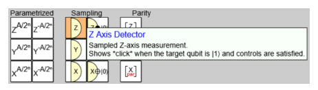 

Fig. 1: An example of unclear documentation in Quirk.

📷 Fig 2

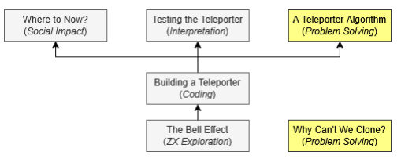 

Fig. 2: The objective structure for a teleportation challenge.

📷 Fig 3

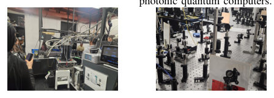 

Fig. 4: The visit to Ultrafast Quantum Control Lab.

📷 Fig 4

 

Fig. 5: The second day of the event: The competition

📷 Fig 5

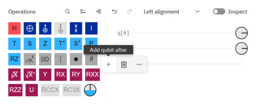 

Fig. 8: Adding a new wire in Qiskit Composer.

📷 Fig 6

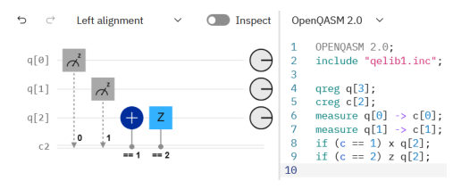 

Fig. 6: An example of control misuse in Qiskit Composer.

📷 Fig 7

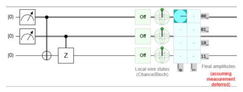 

Fig. 7: An example of control use in Quirk.

📷 Fig 8

 

Fig. 9: Modifying controls in Qiskit Composer.

**Main problem.**

Designing an effective, inclusive, and accessible quantum computing hackathon for underrepresented high school students to bridge the diversity gap in quantum education.

**Main result.**

The hackathon successfully increased students' recognition of quantum vocabulary and shifted interest in quantum and STEM careers toward higher levels, while effectively reaching target demographics.

**Method.**

The authors implemented a two-day hackathon using the Integrated Course Design (ICD) framework, mastery learning, and specification grading, utilizing the Quirk circuit simulator for hands-on learning.

**Summary.**

This paper details the creation of a learning-centric quantum computing hackathon designed specifically for underrepresented high school students in Nova Scotia. By using a 'backwards design' approach and visual tools like the Quirk simulator, the program aims to lower the barrier to entry for complex quantum concepts. The results demonstrate measurable increases in student interest in quantum technologies and improved recognition of fundamental quantum terms. The study highlights how pedagogical choices in software and grading can promote inclusivity in the quantum workforce.

Detailed structure

**Model / system.**

The educational platform uses quantum circuit-based computational thinking tools, specifically the Quirk simulator, to teach concepts like qubits, entanglement, and quantum teleportation.

**Key observables.**

Student STEM affinity (via Likert scales), recognition of quantum vocabulary (e.g., superposition, entanglement), and demographic representation.

**Important parameters / regimes.**

Target demographics (Indigenous, African Nova Scotian, and female students), two-day duration, and use of visual/block-based programming abstractions.

**Assumptions / limitations.**

Assumes students have only basic algebra and general science knowledge; assumes the effectiveness of visual simulators like Quirk for novices without physics backgrounds.

**Figures summary.**

Figure 1 shows unclear documentation in Quirk; Figure 2 outlines the structure of a teleportation challenge; Figure 3 shows a physical Bloch sphere model; Figures 6-9 compare the interface friction and error-prone nature of Qiskit Composer versus Quirk.

**Paper structure.**

The paper introduces the diversity gap in quantum computing, describes the pedagogical frameworks (ICD, mastery learning), details the curriculum design and tool selection (Quirk vs. Qiskit), presents the hackathon implementation, and concludes with an analysis of student feedback and learning outcomes.

Abstract

This paper describes the design and implementation of a two-day quantum hackathon for underrepresented high school students in Nova Scotia, Canada. The first day of the hackathon is spent introducing students to quantum computing through hands-on activities, whereas the second day teaches students to apply this knowledge through guided challenges. Both days are informed by the theory of mastery learning and specification grading, with the full curriculum being crafted within the Integrated Course Design framework. This requires identifying situational factors unique to our target demographics, from which we develop learning outcomes, and then work backwards to a full curriculum with educative assessments. A novel aspect of our hackathon is that all circuit simulations are performed within Quirk: a decision based on best practices in computer science education. Based on feedback from students, we conclude that our hackathon successfully introduced students to the basics of quantum computing, and was able to reach most of our target demographics.

[↑ back to top](#top)

### [Collective and separate metal-insulator transitions in correlated vanadium dioxide](http://arxiv.org/abs/2604.25638v1)

**Authors:** Xuanchi Zhou, Xiaohui Yao, Wentian Lu, Chunwei Yao, Xiaomei Qiao

**Type:** both · **Category:** strongly correlated electrons · **PDF:** <https://arxiv.org/pdf/2604.25638v1>

**Analysis basis:** full PDF text, analyzed in chunks

📷 Fig 1

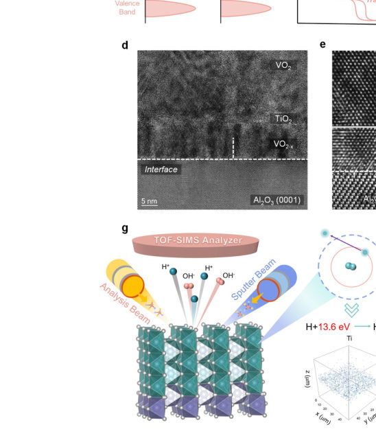 

Fig. 1 | Collective and separate metal-insulator transition (MIT) in correlated VO2. a, Schematic of band-filling control over electronic band structure of correlated electronic system. b, Collective and separate MIT properties in correlated system. c, Realizing the collective and separate MIT in VO2/TiO2/VO2-x system through inserting an electronically insulating TiO2. d, High-resolution transmission electron microscopy (HRTEM) images for VO2/TiO2/VO2-x trilayer. e, Zoom-in images for cross-sectional HRTEM and respective Fast Fourier Transform (FFT) images for VO2/TiO2/VO2-x trilayer. f, Vanadium, titanium and aluminum elementary distributions for as-grown VO2/TiO2/VO2-x trilayer...

📷 Fig 2

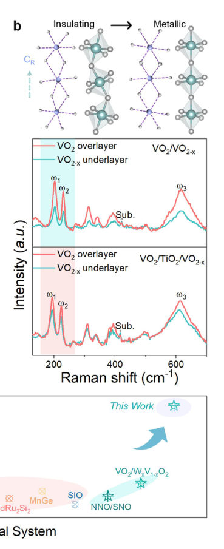 

Fig. 2 | The facile switching between collective and separative MIT in VO2. a, Temperature dependence of material resistivity (ρ-T) as compared for VO2/VO2-x bilayer and VO2/TiO2/VO2-x trilayer. b, Raman spectra compared for VO2 and oxygen-deficient VO2-x in VO2/VO2-x bilayer and VO2/TiO2/VO2-x trilayer. c, Temperature coefficient of material resistivity compared for VO2 monolayer, VO2/VO2-x bilayer and VO2/TiO2/VO2-x trilayer. d, The collective length scale achievable in VO2/VO2-x system, in comparison with other quantum material systems, covering superconducting, ferroic and phase change materials.36-40

📷 Fig 3

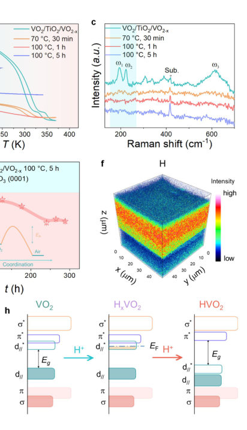 

Fig. 3 | Tunable two-step MIT in VO2 system through hydrogenation. a, Comparing the X-ray diffraction (XRD) patterns for VO2/TiO2/VO2-x trilayer through hydrogenation. b, ρ-T tendency compared for hydrogenated VO2/TiO2/VO2-x system. c, Raman spectra for VO2/TiO2/VO2-x system via hydrogenation. d, Reversible electronic phase modulations in VO2/TiO2/VO2-x system via hydrogenation. e, Temporal evolution for hydrogen-induced variation in material resistivity (RH/R0) in hydrogenated VO2/TiO2/VO2-x system. f, Three-dimensional ToF-SIMS hydrogen element maps for hydrogenated VO2/TiO2/VO2-x trilayer. g, Depth-profile of the hydrogen elementary distribution in VO2/TiO2/VO2-x trilayer. h, Schematic...

📷 Fig 4

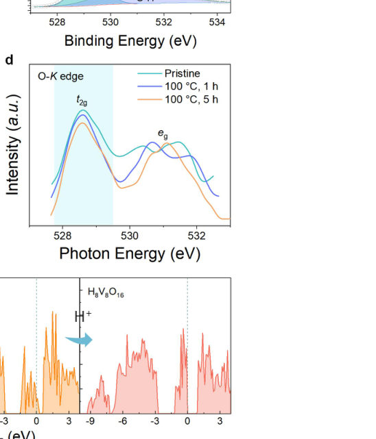 

Fig. 4 | Hydrogen-triggered electronic orbital reconfiguration in VO2. a-b, X-ray photoelectron spectra (XPS) spectra as compared for the a, vanadium and b, oxygen core levels of VO2/TiO2/VO2-x system under different hydrogenation conditions. c-d, c, V-L edge and d, O-K edge of soft X-ray absorption spectra (sXAS) for VO2/TiO2/VO2-x through hydrogenation. e, Calculated density of states (DOS) of VO2 film c, before and after hydrogenation. d-e, Calculated fat band structure for VO2/TiO2/VO2-x system through hydrogenation.

**Main problem.**

Understanding and actively controlling the interplay between collective and separate metal-insulator transitions (MIT) in correlated electron systems.

**Main result.**

The researchers achieved reversible, on-demand manipulation of the MIT in VO2 heterostructures, transitioning between one-step collective and two-step separate transitions via oxygen vacancy engineering and hydrogen-induced band-filling.

**Method.**

Experimental techniques include laser molecular beam epitaxy, HRTEM, XPS, sXAS, and ToF-SIMS, complemented by DFT calculations using the GGA+U approach.

**Summary.**

This paper demonstrates a method to control the metal-insulator transition in vanadium dioxide by engineering its heterostructure. By using a TiO2 interlayer and introducing mobile hydrogen, the researchers can switch between a collective transition and a two-step separate transition. This is achieved by manipulating the electronic band-filling and orbital reconfiguration. The work transforms the collective length scale from a fixed property into a dynamic parameter for designing adaptive correlated electronics.

Detailed structure

**Model / system.**

The study uses VO2/VO2-x homojunctions and VO2/TiO2/VO2-x trilayers grown on c-plane Al2O3 substrates, utilizing TiO2 as an insulating interlayer and mobile hydrogen as a control agent.

**Key observables.**

Temperature-dependent resistivity (rho-T), Raman spectroscopy (V-V dimerization), X-ray absorption spectra (V-L and O-K edges), and elemental depth profiling.

**Important parameters / regimes.**

Collective length scale (~5-10 nm), transition temperature (T_MIT), oxygen deficiency (x), and hydrogen-related band filling.

**Assumptions / limitations.**

The use of the GGA+U approach assumes a Hubbard U of 3.32 eV for V-3d states to accurately model electron correlations.

**Figures summary.**

Fig 1: Structural characterization and elemental mapping of the trilayer; Fig 2: Comparison of resistivity and Raman spectra showing collective vs. separate MIT; Fig 3: Effects of hydrogenation on lattice and transport properties; Fig 4: Electronic structure analysis via XPS, sXAS, and DFT.

**Paper structure.**

The paper begins with structural and chemical validation of the heterostructures, moves to demonstrating the switching between collective and separate MIT regimes, explores the reversible control via hydrogenation, and concludes with the underlying orbital and electronic band-filling mechanism.

Abstract

Deciphering the complicated interplay between collective and separate behaviors lies at the heart of first-order metal-insulator transition (MIT) in correlated electron systems, enabling the rational design of exotic electronic states and functionalities. The critical balance between collective and separate behaviors defines a fundamental collective length scale, typically shorter than 5 nm, that governs emergent quantum orders, yet active control over this dichotomy remains elusive. Here, we realize on-demand manipulation of the collective and separate MIT within the correlated VO2 system in a reversible fashion. Artificially designing the oxygen deficiency in VO2/VO2-x homojunction fosters a collective MIT with an extended collective length scale, whereas the introduction of a TiO2 interlayer drives a crossover from this collective to a two-step separate MIT via decoupling of the electronic order parameter. Incorporating mobile hydrogens into the VO2/TiO2/VO2-x trilayer enables reversible control over electronic phase modulations, transitioning a two-step MIT towards either a one-step MIT or collective electron localization. This ionic control over the electronic band structure of VO2 flexibly triggers multi-state MIT, a process governed by hydrogen-related band filling. Our findings transform the collective length scale from a passive threshold into a dynamic design parameter, establishing a viable handle for engineering collective and separate MIT for adaptive correlated electronics.

[↑ back to top](#top)

### [Critical Role of Hydrogen in Unconventional Superconductors: The Case of Hydrogenated FeSe Layers](http://arxiv.org/abs/2604.25500v1)

**Authors:** Lan-Lin Du, Yang Yang, Shiqi Hu, Sheng Meng

**Type:** theory · **Category:** strongly correlated electrons · **PDF:** <https://arxiv.org/pdf/2604.25500v1>

**Analysis basis:** full PDF text, analyzed in chunks

📷 Fig 1

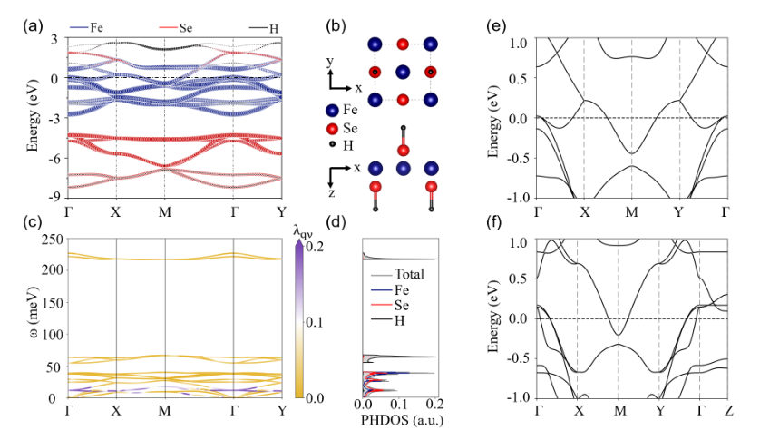 

FIG. 1. (a) Fatbands near the Fermi level from DFT, composed of Fe 𝑑orbitals (blue), Se 𝑝orbitals (red), and H 𝑠orbitals (black). (b) Atomic configuration of FeSeH. (c) Phonon dispersions of FeSeH, with the EPC strength (𝜆𝑞,𝜈) (represented in colorbar). (d) Total and atom-resolved phonon density of states. Band structure from DFT of (e) FeSeH and (f) bulk FeSe.

📷 Fig 2

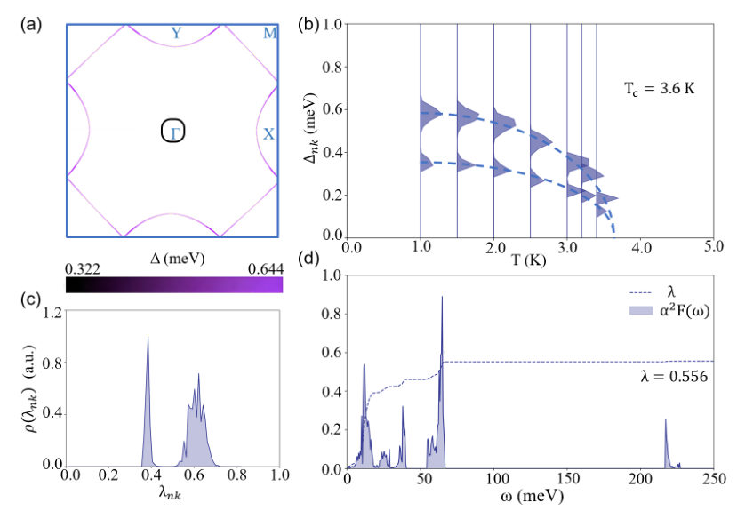 

FIG. 2. (a) FeSeH’s superconducting gap Δ(𝑘) as a function of electron momentum 𝑘on the Fermi surface at 1 K. The blue square represents the first Brillouin zone. (b) The temperature dependence of the two superconducting gaps. (c) Distribution of the state-resolved EPC strength 𝜆𝑛𝑘. (d) The frequncy dependence of the isotropically averaged Eliashberg spectral function 𝛼2𝐹and the EPC strength 𝜆.

📷 Fig 3

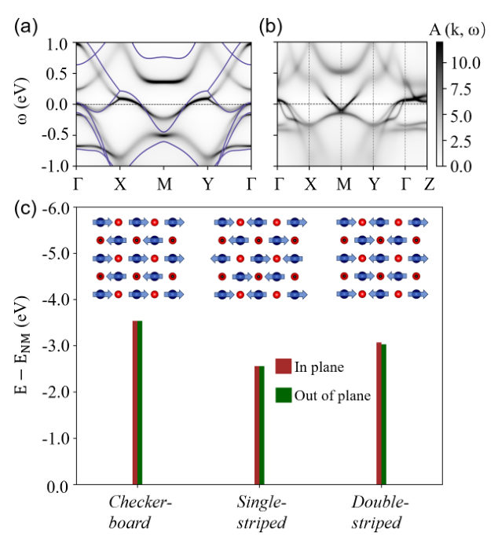 

FIG. 3. Spectral function from DMFT of (a) FeSeH and (b) bulk FeSe. The gray shaded line is the spectral function of DMFT, and the purple line is the energy band of DFT. (c) Energies of three antiferromagnetic configurations (checkerboard, single- striped and double-striped) of FeSeH with magnetic moments pointing in plane and out of plane. The atomic configuration and arrows in the upper area indicate the direction of the magnetic moments in the in-plane case. 𝐸NM represents the energy of nonmagnetic configuration.

📷 Fig 4

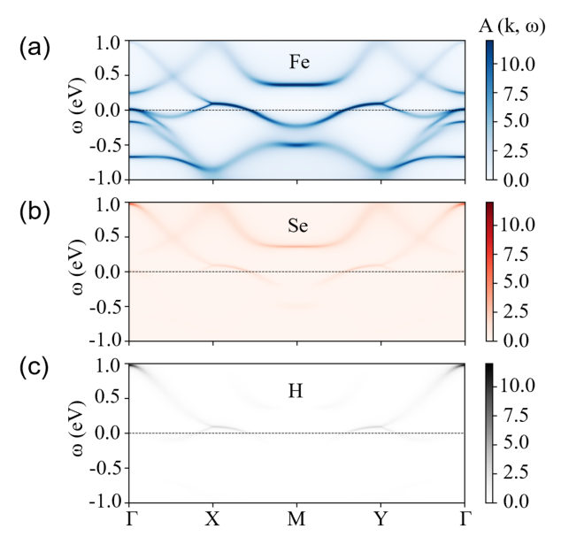 

FIG. 4. Element-resolved DMFT spectral function for the band structure of FeSeH projected onto (a) Fe, (b) Se, (c) H.

📷 Fig 5

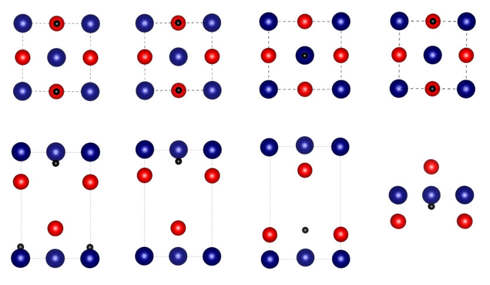 

FIG. 5. Other configurations we obtained after structure relaxation (Top: top view; Bottom: side view) but with imaginary phonon frequencies. The former three are bulk-type, while the last one is monolayer-type.

📷 Fig 6

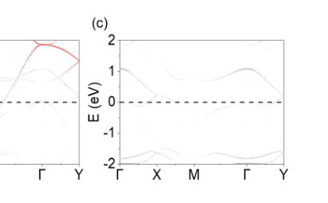 

FIG. 6. Atomic resolved bands contributed by (a) Fe, (b) Se, (c) H from DFT calculations.

📷 Fig 7

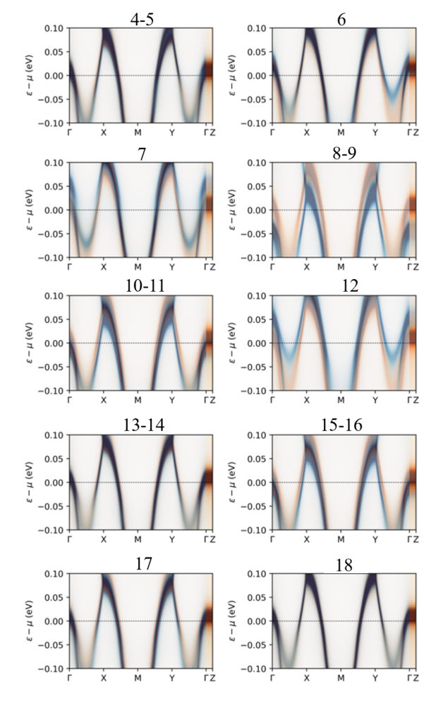 

FIG. 7. Changes of DMFT spectral functions near the Fermi surface under the perturbation of the fifteen optical phonon modes. Orange color represents the initial spectral function, while blue represents the one after perturbation. The numbers are indices of the optical phonon modes ranging from 4 to 18.

**Main problem.**

Understanding the microscopic role of hydrogen in tuning superconductivity in unconventional, strongly correlated superconductors like FeSe.

**Main result.**

Hydrogenation of FeSe creates a stable FeSeH phase where electronic correlations drive hydrogen-derived spectral weight toward the Fermi surface, significantly enhancing electron-phonon coupling and predicting a Tc exceeding 40 K.

**Method.**

First-principles calculations using DFT and DFPT, combined with Dynamical Mean Field Theory (DMFT) to treat strong correlations and anisotropic Eliashberg theory for superconductivity.

**Summary.**

This paper investigates how adding hydrogen to FeSe layers enhances superconductivity. The authors find that strong electronic correlations play a critical role by shifting hydrogen-related electronic states toward the Fermi surface, which boosts the electron-phonon coupling. This mechanism leads to a predicted superconducting transition temperature of over 40 K and a two-gap state. The work provides a new microscopic perspective on pairing in strongly correlated systems and identifies FeSeH as a platform for future superconducting quantum devices.

Detailed structure

**Model / system.**

A hydrogenated FeSe monolayer (FeSeH) with 1:1:1 stoichiometry, modeled using an 18-band s-p-d model involving Fe d-orbitals, Se p-orbitals, and H s-orbitals.

**Key observables.**

Superconducting transition temperature (Tc), electron-phonon coupling strength (lambda), Fermi surface topology, superconducting gap structure, and Eliashberg spectral function.

**Important parameters / regimes.**

Tc > 40 K, EPC strength lambda (ranging from 0.15 in bulk to 2.23 with DMFT), and a two-gap superconducting state.

**Assumptions / limitations.**

The study assumes the validity of the DMFT-corrected EPC within the Migdal-Eliashberg formalism and focuses on the 1:1:1 stoichiometry.

**Figures summary.**

Fig 1 shows orbital composition, atomic configuration, and phonon dispersions; Fig 2 displays the superconducting gap, temperature dependence, and Eliashberg spectral function; Fig 3 compares DMFT and DFT spectral functions.

**Paper structure.**

The paper introduces the problem of hydrogen in unconventional superconductors, presents the structural and electronic properties of FeSeH via DFT, applies DMFT to reveal correlation-enhanced EPC, calculates superconducting properties via Eliashberg theory, and concludes with implications for quantum devices.

Abstract

Hydrogenation is known to tune superconductivity in a wide range of materials. While its microscopic role has been clarified in phonon-mediated superconductors such as hydrogenated MgB2, LaH10, and H3S, much less is known for hydrogenated cuprates and iron-based superconductors, where even the underlying structural motifs remain elusive. Using hydrogenated FeSe as a prototypical example, we reveal how hydrogen affects superconductivity in the presence of strong electronic correlations: correlation-induced orbital renormalization shifts hydrogen-derived spectral weight from the high-energy region toward the Fermi surface (FS), remarkably enhancing the electron-phonon coupling (EPC). We predict a structurally stable FeSeH phase where, compared to bare FeSe, hydrogen incorporation reshapes the FS topology and increases the number of channels for electron-phonon scattering, while simultaneously introducing high-frequency phonons that strengthen pairing. First-principles EPC calculations combined with dynamical mean field theory (DMFT) yield a superconducting transition temperature (Tc) exceeding 40 K. Fully anisotropic Eliashberg theory reveals a two-gap superconducting state, consistent with the gap structure experimentally observed in doped FeSe. Our findings identify correlation-enhanced EPC as a plausible microscopic mechanism for iron-based superconductivity and offer a new perspective on pairing in strongly correlated systems. In addition, this work establishes hydrogenated FeSe as a promising platform for engineering two-dimensional superconductors and superconducting quantum devices.

[↑ back to top](#top)

### [Crystal-Field Symmetry Constraints in Layered Honeycomb ErBr$_3$](http://arxiv.org/abs/2604.24951v1)

**Authors:** Biaoyan Hu, Mingyuan Hu, Franz Demmel, Andrey A. Podlesnyak, Jiaqing He, Liusuo Wu

**Type:** both · **Category:** strongly correlated electrons · **PDF:** <https://arxiv.org/pdf/2604.24951v1>

**Analysis basis:** full PDF text, analyzed in chunks

📷 Fig 1

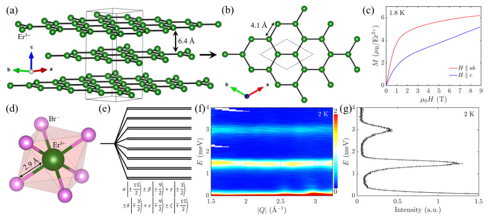 

FIG. 1. (a) Three-dimensional crystal structure of ErBr3, showing stacked honeycomb layers of Er3+ ions separated along the crystallographic c axis. The interlayer spacing is indicated. (b) Top view of a single honeycomb layer in the ab plane, with the nearest-neighbor Er–Er distance labeled. (c) Field-dependent magnetization measured at 1.8 K for magnetic fields applied parallel to the honeycomb plane (H ∥ab) and along the crystallographic c axis (H ∥c), demonstrating pronounced magnetic anisotropy. (d) Local coordination environment of an Er3+ ion, illustrating the ErBr6 octahedron. (e) CEF energy-level scheme of the Er3+ ion. The J = 15/2 multiplet is split into a series of Kramers...

📷 Fig 2

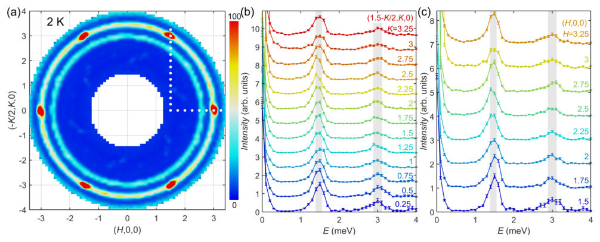 

FIG. 2. (a) Elastic-channel neutron scattering intensity of ErBr3 measured with an Al holder at T = 2 K in the (H, K, 0) plane. The white dots mark the momentum positions at which the constant-Q energy cuts shown in (b) and (c) were taken. (b),(c) Constant-Q energy cuts measured at representative wave vectors along (1.5 −K/2, K, 0) and (H, 0, 0), respectively. Successive curves are vertically offset for clarity. In both momentum directions, peaks are observed near 1.5 and 3 meV, highlighted by the gray shaded regions. The nearly unchanged peak positions for different wave vectors indicate no detectable dispersion within experimental resolution.

📷 Fig 3

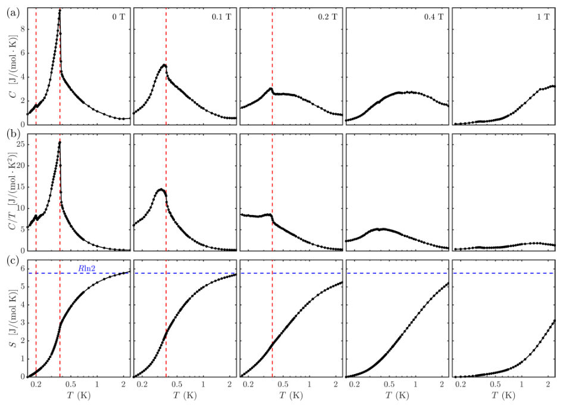 

FIG. 3. (a) Specific heat C(T), (b) C(T)/T, and (c) entropy S(T) of ErBr3 at representative magnetic fields applied within the honeycomb plane (H ∥ab). Vertical dashed red lines mark the thermodynamic anomalies. The horizontal dashed blue line indicates the entropy R ln 2 expected for a Kramers doublet ground state.

📷 Fig 4

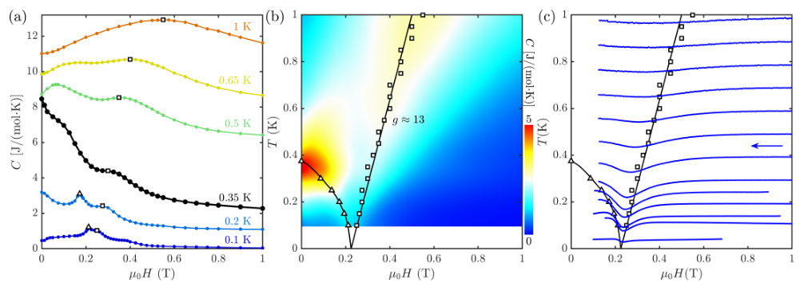 

FIG. 4. Field evolution of the thermodynamic response of ErBr3 for magnetic fields applied within the honeycomb plane (H ∥ab). (a) Field dependence of the specific heat measured at selected temperatures, vertically offset for clarity. A sharp anomaly associated with the thermodynamic phase boundary is observed, together with a broader crossover feature. (b) Field– temperature (H–T) color map of the specific heat C of ErBr3 for H ∥ab. Open triangles mark the low-field anomalies and define the black phase-boundary curve. Open squares mark the high-field anomalies, and the straight Zeeman-scale guide with g ≈13 is drawn through them. (c) Magnetocaloric-effect measurements of ErBr3 during...

**Main problem.**

Investigating how local crystal-field (CEF) symmetry constraints in the rare-earth magnet ErBr3 govern low-energy dynamics and field-dependent thermodynamic responses.

**Main result.**

The local CEF symmetry enforces a vanishing leading-order transverse matrix element within the ground-state Kramers doublet, suppressing transverse magnetic excitations and resulting in a thermodynamic response that splits into a phase boundary and a crossover line under an in-plane field.

**Method.**

The study combines thermodynamic measurements (specific heat, magnetocaloric effect, magnetization) with inelastic neutron scattering (INS) and crystal-field analysis using the McPhase package.

**Summary.**

This paper demonstrates how the local symmetry of the crystal field in ErBr3 suppresses the lowest-order transverse magnetic fluctuations. By using neutron scattering and thermodynamic measurements, the authors show that the ground-state Kramers doublet's symmetry prevents certain magnetic transitions. This leads to a unique thermodynamic phase diagram where an in-plane magnetic field separates a phase boundary from a broader crossover. The study provides a clear link between single-ion symmetry and collective magnetic behavior in 2D honeycomb lattices.

Detailed structure

**Model / system.**

ErBr3, a layered honeycomb magnet with a rhombohedral BiI3-type structure where Er3+ ions (J=15/2) reside in a trigonal crystal-field environment.

**Key observables.**

Magnetization, specific heat, magnetocaloric effect, and inelastic neutron scattering intensity.

**Important parameters / regimes.**

Effective g-factor of approximately 13; CEF energy scales near 1.5 and 3 meV; zero-field thermodynamic anomalies at 0.375 K and 0.2 K.

**Assumptions / limitations.**

The analysis assumes the ground-state doublet belongs to a specific symmetry class determined by the mJ composition of the wave function.

**Figures summary.**

Fig 1 shows the crystal structure, magnetic anisotropy, and CEF energy levels; Fig 3 displays field-dependent specific heat and magnetocaloric effect maps showing phase boundaries and crossovers.

**Paper structure.**

The paper introduces the material and its structural properties, presents thermodynamic measurements under magnetic fields, details neutron scattering results, and concludes by relating the observed dynamics to the underlying crystal-field symmetry constraints.

Abstract

We show that the local crystal-field symmetry of ErBr$_3$ enforces $\langle ψ_\pm | J^{\pm} | ψ_\mp \rangle = 0$ within the ground-state Kramers doublet, thereby removing the lowest-order transverse channel from the low-energy sector. Thermodynamic measurements reveal two zero-field anomalies. Under an in-plane magnetic field, the thermodynamic response separates into a phase boundary and a broader crossover line. Consistently, inelastic neutron scattering measurements above the ordering temperature reveal no well-defined low-energy dispersive magnetic modes. These results show that the crystal-field ground-state symmetry strongly constrains the low-energy dynamics and provides a natural framework for understanding the field-dependent thermodynamic response of ErBr$_3$.

[↑ back to top](#top)

### [Defect-Adaptive Lattice Surgery on Irregular Boundary Surface-Code Patches](http://arxiv.org/abs/2604.25524v1)

**Authors:** GunSik Min, Yujin Kang, Jun Heo

**Type:** theory · **Category:** quantum information and computing · **PDF:** <https://arxiv.org/pdf/2604.25524v1>

**Analysis basis:** full PDF text, analyzed in chunks

📷 Fig 1

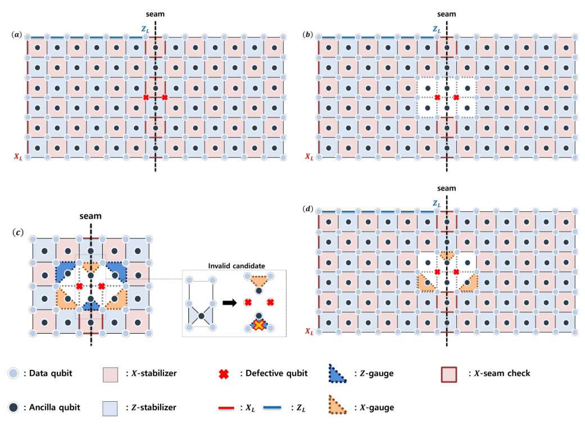 

FIG. 1. Boundary data-qubit defects during an XL ⊗XL merge. (a) A representative seam-boundary defect pair destroys the native seam region of the intended merge, so the regular defect-free seam picture no longer applies. (b) The broken neighborhood is reconstructed in terms of locally available gauge fragments and defect-adapted effective checks. (c) A naive opposite-type completion is invalid because the required cross-patch gauge bridge is not source-admissible. The surviving reduced opposite-type fragments are therefore left individually incompatible with the candidate X-type seam super-check. (d) The merge must therefore be carried out on the boundary-deformed patch using a...

📷 Fig 2

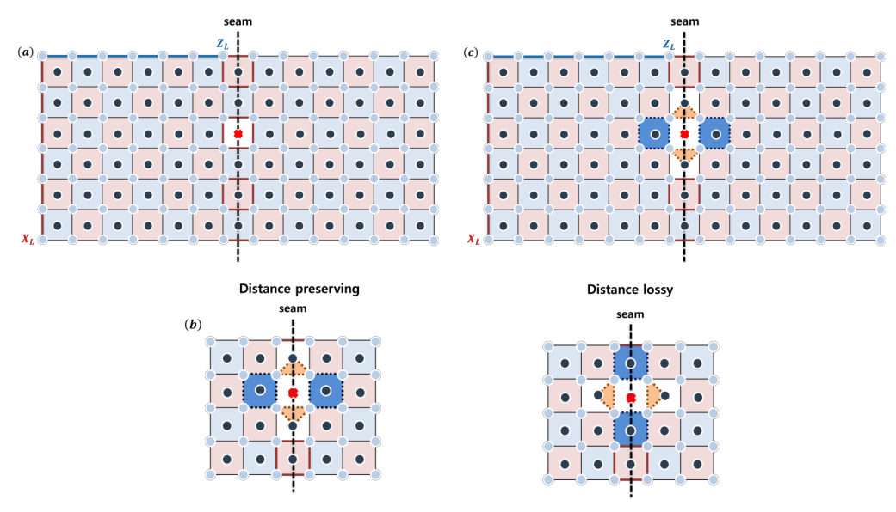 

FIG. 2. Seam-check ancilla defect and support-preserving seam reconstruction. (a) A defective seam ancilla removes one native seam measurement from the merge interface while leaving the intended data-qubit support intact. (b) The missing seam measurement is replaced by a pair of repurposed local gauge measurements whose product reconstructs the seam value. (c) The adjacent opposite-type larger checks are promoted to gauges, and their product defines an induced super-stabilizer that restores the local commutation structure. In contrast to the boundary data-qubit defect in Fig. 1, this case is handled primarily by support-preserving measurement reconstruction rather than by a larger boundary...

📷 Fig 3

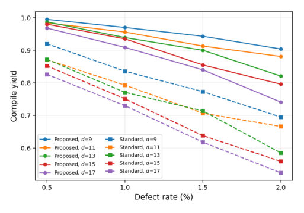 

FIG. 4. Compile yield versus defect rate (XX merge). The proposed method (solid, circles) consistently outperforms the standard method (dashed, squares) across all distances. At q = 0.5%, the proposed yield ranges from 0.968 to 0.995, compared with 0.826 to 0.920 for the standard method. At q = 2.0%, the proposed yield remains in the range 0.741– 0.904, whereas the standard method drops to 0.524–0.695. The gain reflects additional instances recovered by GF(2)- certified seam super-check reconstruction.

📷 Fig 4

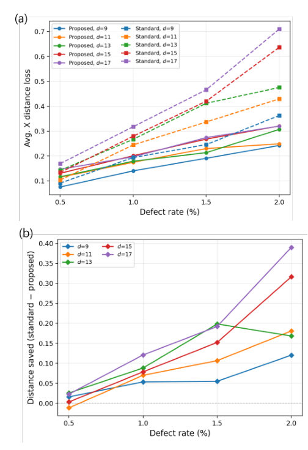 

FIG. 3. Distance preservation under boundary defects for the compiled XX merge. (a) Average effective X-distance loss, d −deff, as a function of defect rate for the proposed method and the standard method. (b) Distance saved by the proposed method relative to the standard method, de- fined as (d −deff)std −(d −deff)prop. The increasing separa- tion with defect rate and distance shows that certified fused seam-super-check reconstruction mitigates geometry-induced distance degradation.

📷 Fig 5

 

Figure 4 shows the compile yield as a function of defect rate for both methods across all five distances. At q = 0.5%, the proposed method achieves compile yield 0.968– 0.995, whereas the standard method gives 0.826–0.920, corresponding to a gain of +7–14 percentage points. This gap widens with increasing defect rate: at q = 2.0%, the proposed method yields 0.741–0.904 while the standard method yields only 0.524–0.695, i.e., a gain of +21–24 percentage points across the full distance range. The advantage is consistent across all studied dis- tances. The yield gain measures how often recovered seam rows turn an otherwise unavailable merge parity into a compilable one. Within our row-space...

📷 Fig 6

 

Figure 3 shows the average X-distance loss d −deff and the distance saved by the proposed method over the standard method. As plotted, this figure reports the XX- merge X-distance metric. Both methods incur larger ab- solute distance loss as the defect rate q increases and as the target distance d becomes larger. However, the proposed method consistently preserves more distance at every (d, q) point. The distance improvement comes from instances in which a broken native seam row would otherwise be re- moved from the effective seam family, but can instead

📷 Fig 7

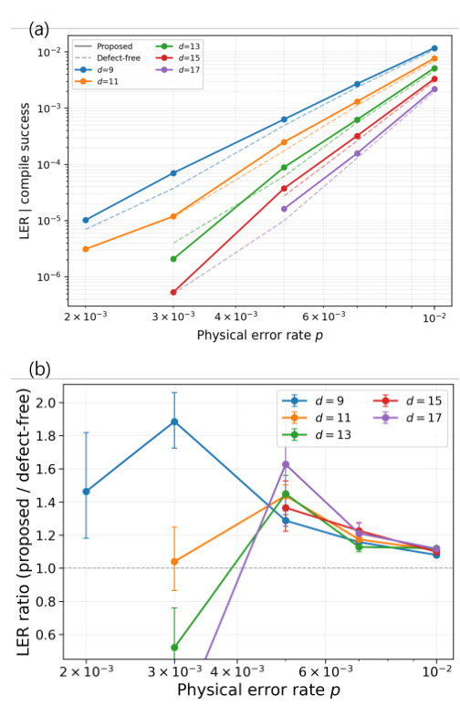 

FIG. 5. Logical performance of the compiled defect-adaptive XX merge at qdata = 1% and qanc = 0.5% under the SI1000- MR noise model. For each successful defect instance, the sampled circuit uses the synthesized seam-measurement rule and the merge-parity observable returned by the compiler. (a) Success-conditioned logical error rate, LER | compile success, as a function of physical error rate p for the proposed method and the defect-free merge reference. (b) LER ratio, defined as (LERproposed)/(LERdefect-free). The ratios remain modest at high p, while larger excursions in the lowest-LER regime are consistent with finite-sampling fluctuations. The largest ratio excursions occur at the...

📷 Fig 8

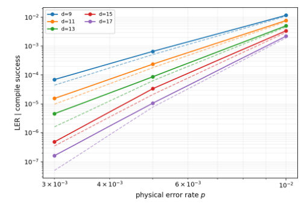 

FIG. 6. Success-conditioned logical error rate for the compiled defect-adaptive ZZ merge. Solid curves show the proposed defect-adaptive merge and dashed curves show the defect-free ZZ-merge reference. The simulation uses the transposed seam geometry with the same synthesized-observable construction as the XX-merge sampling. The close, approximately par- allel curves provide a direct check that the certified parity- extraction rule carries over to the X ↔Z transposed merge under the i.i.d. defect model.

**Main problem.**

How to perform fault-tolerant lattice surgery (specifically the merge operation) when hardware defects like broken boundaries or missing ancillas disrupt the standard seam geometry.

**Main result.**

The introduction of a defect-adaptive compiler that uses GF(2) synthesis to reconstruct logical parities, achieving significantly higher compile yield and preserved code distance with minimal logical error overhead.

**Method.**

A three-layer synthesis approach (identification, certification, and extraction) that formulates parity reconstruction as a GF(2) binary-support synthesis problem and uses fused seam-super-check constructions.

**Summary.**

This paper addresses the challenge of performing logical operations in surface-code quantum computers when physical defects break the standard lattice geometry. The authors propose a compiler-level method that treats lattice surgery as a parity-synthesis problem, allowing the system to 'reconstruct' the desired logical operations from available, irregular measurements. Their approach significantly improves the success rate (compile yield) of operations on noisy hardware while maintaining the effective code distance. The method is robust enough to handle both missing data qubits and missing measurement ancillas.

Detailed structure

**Model / system.**

Surface-code-based quantum error correction on imperfect hardware, specifically planar patches with irregular boundaries, data-qubit defects, and ancilla-type defects.

**Key observables.**

Joint logical parity (XX and ZZ merges), gauge outcomes, and effective code distance.

**Important parameters / regimes.**

Physical error rate p (10^-3 to 10^-2), defect rates q (0.5% to 2.0%), and code distances d (9 to 17).

**Assumptions / limitations.**

The framework assumes that a valid defect-adapted patch has already been constructed (the memory problem is solved) and focuses specifically on the merge primitive.

**Figures summary.**

Figure 1 illustrates boundary data-qubit defects and seam reconstruction; Figure 2 shows seam-check ancilla defects and replacement via gauge measurements; Figure 3 shows X-distance loss; Figure 4 plots compile yield vs. defect rate; Figure 5 shows success-conditioned LER.

**Paper structure.**

The paper identifies the seam-boundary defect problem, proposes a unified algebraic synthesis framework, provides a formal theorem for parity execution, and validates the method through circuit-level simulations comparing compile yield, distance preservation, and logical error rates.

Abstract

Defect-adaptive surface-code methods have substantially advanced the construction of valid logical patches on imperfect hardware, but fault-tolerant computation also requires executable logical oper ations on the resulting irregular geometries. We formulate the seam-boundary defect problem: how to perform a lattice-surgery merge when the intended seam intersects deformed boundaries, disabled checks, and gauge-inferred super-stabilizers. We introduce a defect-adaptive lattice-surgery method that reconstructs the target joint logical parity from the seam-related measurements available on the irregular merged patch, together with constraints inherited from the separated pre-merge code space. The reconstruction is expressed as a compact GF(2) binary-support synthesis problem. If the requested parity is realizable, the solution gives an executable parity-extraction rule over raw, schedule-tagged gauge outcomes; otherwise, it certifies a parity-synthesis failure rather than conflat ing it with patch invalidity. The framework accommodates boundary data-qubit defects, seam-check ancilla defects, and gauge-inferred seam super-checks within a single synthesis layer. Circuit-level samples of the synthesized merge operation show improved compile yield, preserved effective dis tance, and only modest success-conditioned logical-error overhead relative to the defect-free merge reference; an explicit ZZ-merge sampling check confirms the expected transposed-geometry behav ior under the same success-conditioned observable construction. More broadly, the results identify certified parity synthesis as a compilation layer between defect-adaptive patch construction and executable fault-tolerant logical operations on imperfect surface-code hardware.

[↑ back to top](#top)

### [Dielectric signatures of crystal-field and low-temperature correlated dynamics in NdMgAl11O19](http://arxiv.org/abs/2604.24937v1)

**Authors:** Sonu Kumar, Gaël Bastien, Maxim Savinov, Małgorzata Śliwińska-Bartkowiak, Ross H. Colman, Stanislav Kamba

**Type:** experiment · **Category:** strongly correlated electrons · **PDF:** <https://arxiv.org/pdf/2604.24937v1>

**Analysis basis:** full PDF text, analyzed in chunks

📷 Fig 1

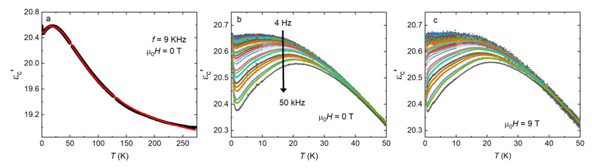 

FIG. 1. Dielectric response of NdMgAl11O19. (a) Zero-field permittivity ε′ c(T) measured at f = 9 kHz; the solid line is the combined fit using a Barrett background and a term associated with thermal depopulation of the first excited CEF doublet [Eqs. (1)–(3)]. (b,c) Temperature dependence of ε′ c(T) at selected frequencies in (b) µ0H = 0 and (c) µ0H = 9 T.

📷 Fig 2

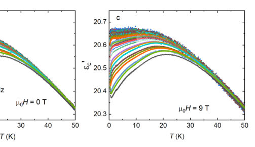 

Figure 1(a) shows the temperature dependence of the real part of the dielectric permittivity, ε′ c(T), measured in zero magnetic field at f = 9 kHz up to 275 K. On cool- ing, ε′ c(T) increases, passes through a broad maximum near ∼25–30 K, then decreases and finally shows a fur- ther upturn below a few kelvin. Between approximately 35 and 200 K, the response is nearly frequency indepen- dent within the experimental resolution, indicating that this interval is dominated by the intrinsic high-frequency dielectric background. In this temperature range, the smooth increase of ε′ c(T) on cooling is well described by a Barrett formula [Eq. (1)], as commonly used in incip- ient ferroelectrics and...

📷 Fig 3

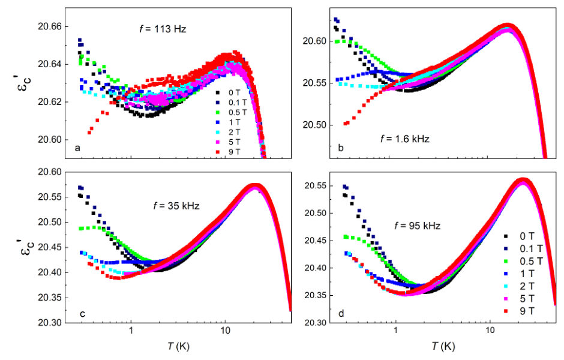 

FIG. 2. Temperature dependence of ε′ c(T) of NdMgAl11O19 in magnetic fields µ0H = 0–9 T: (a) f = 113 Hz, (b) f = 1.6 kHz, (c) f = 35 kHz, and (d) f = 95 kHz.

📷 Fig 4

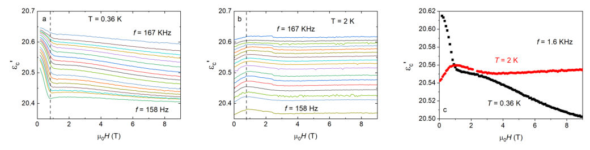 

FIG. 3. Field dependence of the real permittivity ε′ c(H) of NdMgAl11O19. Panels (a) and (b) show measurements at several frequencies between 158 Hz and 167 kHz at (a) T = 0.36 K and (b) T = 2 K. Panel (c) compares ε′ c(H) measured at the selected frequency f = 1.6 kHz for T = 0.36 K and T = 2 K. The vertical dashed line marks the crossover field µ0Hc ≃0.85 T.

📷 Fig 5

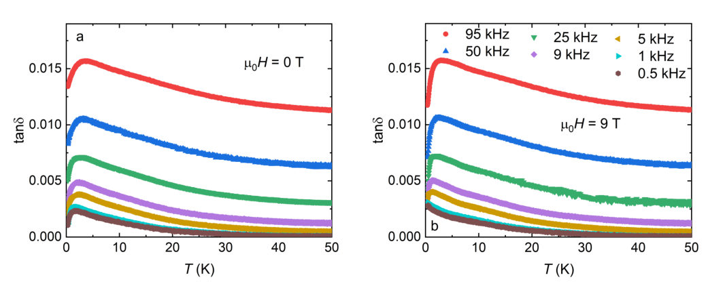 

FIG. 4. Temperature dependence of the loss tangent tan δ(T) of NdMgAl11O19 measured at various frequencies with E ∥H ∥c in (a) µ0H = 0 T and (b) µ0H = 9 T.

📷 Fig 6

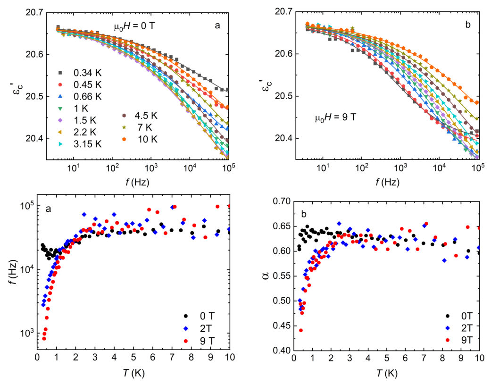 

FIG. 5. Cole–Cole analysis of the frequency-dependent real permittivity of NdMgAl11O19. Panels (a) and (b) show represen- tative fits of ε′ c(f) using the Cole–Cole form [Eq. (B1)] at selected temperatures in µ0H = 0 and 9 T, respectively. Panels (c) and (d) show the temperature dependence of the characteristic relaxation frequency frel = 1/(2πτ) and the Cole–Cole broad- ening parameter α, respectively, extracted from fits in µ0H = 0, 2, and 9 T.

📷 Fig 7

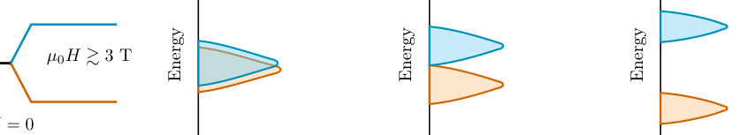 

FIG. 6. Qualitative schematic of broadening and field evolution in the low-energy CEF sector of NdMgAl11O19. Panel (a) shows an idealized single-ion picture without broadening: a degenerate zero-field ground-state doublet evolves into two Zeeman-split branches with increasing field. Panels (b)–(d) illustrate the corresponding broadened low-energy response in the presence of disorder and weak interactions. In panel (b), the zero-field response appears as an unresolved broadened doublet. In panel (c), the applied field separates the low-energy manifold into two partially overlapping broadened branches. In panel (d), the same two branches are more clearly resolved at higher field, approaching...

**Main problem.**

The study aims to distinguish between crystal-electric-field (CEF) effects and low-temperature correlated magnetic dynamics in the frustrated magnet NdMgAl11O19.

**Main result.**

The researchers identified three dielectric components: a Barrett-like host background, a CEF-related contribution from the first excited doublet at ~26 K, and a low-temperature dispersive channel driven by AFM correlations and disorder.

**Method.**

Dielectric spectroscopy was performed on single crystals using an impedance analyzer across a wide temperature (0.3 K to 275 K) and magnetic field (up to 9 T) range.

**Summary.**

This paper investigates the dielectric properties of the frustrated magnet NdMgAl11O19. By using dielectric spectroscopy, the authors successfully separate the signatures of high-energy crystal-field excitations from low-energy magnetic correlations. They demonstrate how an applied magnetic field can tune the system from a correlated, disorder-broadened regime to a distinct single-ion regime. This work provides a clear reference for understanding how local structural disorder and exchange interactions compete in Kramers-protected systems.

Detailed structure

**Model / system.**

The system is NdMgAl11O19, a magnetoplumbite hexaaluminate featuring Nd3+ moments on a frustrated triangular lattice and a polarizable AlO5 network.

**Key observables.**

Real part of the permittivity (epsilon'_c), loss tangent (tan delta), and the Cole-Cole broadening parameter (alpha).

**Important parameters / regimes.**

CEF energy gap (delta = 25.85 K), crossover magnetic field (mu0Hc = 0.85 T), and the dynamical energy scale (W/kB = 1.9 K).

**Assumptions / limitations.**

The analysis assumes the presence of local structural disorder (Mg/Al site mixing) and uses a qualitative model for the evolution of the CEF sector under magnetic fields.

**Figures summary.**

Figure 1 shows zero-field permittivity vs temperature; Figure 6 provides a qualitative schematic of the CEF doublet evolution from a broadened zero-field state to a resolved single-ion limit in high fields.

**Paper structure.**

The paper introduces the material and its magnetic properties, presents dielectric spectroscopy results across temperature and field, analyzes the CEF energy scales using the Barrett formula, discusses low-temperature dynamics and disorder, and concludes with a schematic model of the field-tuned energy landscape.

Abstract

We report dielectric spectroscopy of single-crystalline \ce{NdMgAl11O19}, a magnetoplumbite hexaaluminate in which localized \ce{Nd^{3+}} moments coexist with a polarizable \ce{AlO5} bipyramidal network. The real part of the permittivity, $\varepsilon'_{c}(T)$, measured along the crystallographic $c$ axis, increases as the temperature is lowered from 275~K to 30~K and is frequency-independent between 4~Hz and 50~kHz. At lower temperatures, a frequency-dependent decrease in permittivity is observed, followed by a further upturn below 2~K. The high-frequency $\varepsilon'_{c}(T)$ is described by a Barrett formula supplemented by an effective two-level contribution, yielding a robust gap of $Δ= 25.85 \pm 0.32$~K consistent with the lowest \ce{Nd^{3+}} crystal-electric-field (CEF) splitting. Below $\sim 30$~K, the dielectric response becomes strongly frequency and magnetic-field dependent. Isothermal $\varepsilon_c'(H)$ measurements reveal a reproducible low-field crossover near $μ_0H_c \simeq 0.85$~T, which we attribute to the competition between antiferromagnetic correlations and Zeeman splitting of the ground-state Kramers doublet. \ce{NdMgAl11O19} thus provides a Kramers reference system in which dielectric signatures of the excited-state CEF manifold can be distinguished from those of the field-tuned, correlation-dominated ground-state doublet sector in a centrosymmetric frustrated magnetoplumbite host

[↑ back to top](#top)

### [Differentiation of electron doping and oxygen reduction in electron-doped cuprates](http://arxiv.org/abs/2604.25450v1)

**Authors:** M. Miyamoto, M. Horio, K. Moriya, A. Takahashi, K. Tanaka, Y. Koike, T. Adachi, I. Matsuda

**Type:** experiment · **Category:** strongly correlated electrons · **PDF:** <https://arxiv.org/pdf/2604.25450v1>

**Analysis basis:** full PDF text, analyzed in chunks

📷 Fig 1

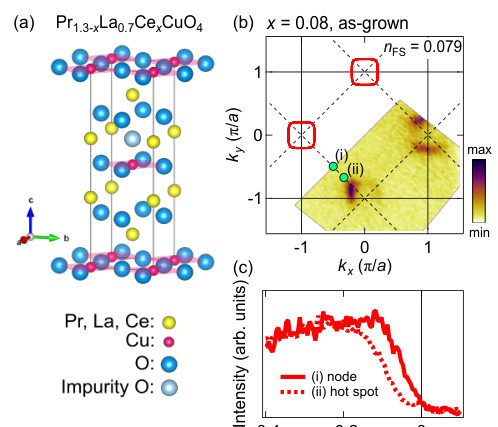 

FIG. 1. Characterization of the as-grown sample. (a) Crystal structure of PLCCO with an impurity oxygen atom at the apical site. (b) Fermi surface map of the as-grown PLCCO (x = 0.08) sample. The red curves indicate the result of tight-binding fitting with the √

📷 Fig 2

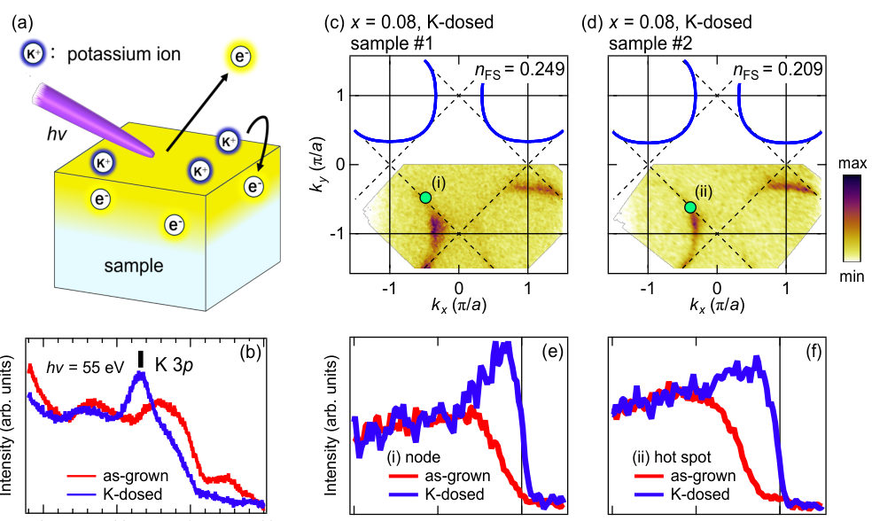 

FIG. 2. Effect of electron doping on the as-grown sample. (a) Schematic illustration of photoemission from the K-dosed surface. The adsorbed K atoms are ionized and donate electrons to the sample surface. (b) Core-level spectra of the as-grown PLCCO (x = 0.08) sample before and after K dosing. (c), (d) Fermi surface maps for the as-grown PLCCO (x = 0.08) samples #1 and #2, respectively. The results of tight-binding fitting (eq. 1) are shown as blue curves. EDCs (e) at the node and (f) at the hot spot taken from the points indicated in (c), (d), and Fig. 1(b).

📷 Fig 3

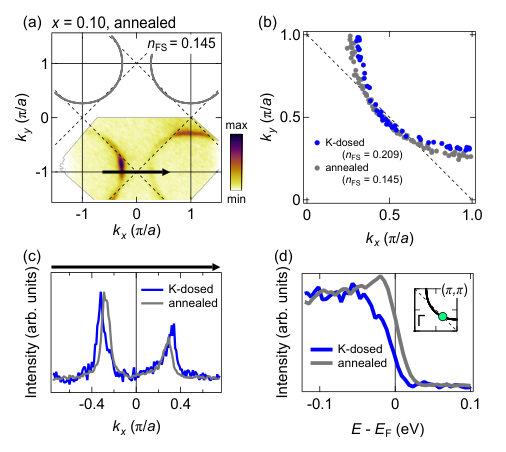 

FIG. 3. Influence of disorder on the pseudogap. (a) Fermi surface map of the annealed PLCCO (x = 0.10) sam- ple. The black curve indicates the result of tight-binding fit- ting (eq. 1). (b) Comparison of Fermi wavenumber kF for the x = 0.10 annealed sample and the K-dosed x = 0.08 as-grown sample. (c) Momentum distribution curves for the two sam- ples at the Fermi level plotted along the BZ boundary [black arrow in (a)]. To alleviate intensity variation due to matrix- element effects, photoemission signals have been symmetrized with respect to the kx + ky = 0 line. (d) EDCs at the hot spot (indicated in the inset) for the two samples.

**Main problem.**

The study aims to disentangle whether the pseudogap and superconductivity in electron-doped cuprates are driven by electron concentration (via Ce substitution) or by oxygen non-stoichiometry (via reduction annealing).

**Main result.**

While alkali-metal dosing increases electron concentration and suppresses antiferromagnetic Fermi surface reconstruction, the pseudogap persists, suggesting that the pseudogap is driven by impurity oxygen atoms rather than just carrier density.

**Method.**

The researchers used Angle-Resolved Photoemission Spectroscopy (ARPES) combined with potassium (K) dosing on the surface of PLCCO crystals to inject electrons without changing oxygen content.

**Summary.**

This paper investigates the origin of the pseudogap in electron-doped cuprates by separating the effects of electron doping from oxygen reduction. By using potassium dosing to add electrons to the surface without altering oxygen levels, the authors show that the pseudogap remains even when the Fermi surface reconstruction is suppressed. This leads to the conclusion that apical oxygen impurities are a key factor in the formation of the pseudogap. The findings provide crucial insight into the complex interplay between chemistry and electronic correlations in high-Tc superconductors.

Detailed structure

**Model / system.**

The physical system is the electron-doped cuprate Pr1.3-xLa0.7CexCuO4 (PLCCO), studied using a 2D tight-binding model with sqrt(2) x sqrt(2) antiferromagnetic order to fit Fermi surface data.

**Key observables.**

Fermi surface maps, Energy Distribution Curves (EDCs), Fermi surface area (n_FS), and K 3p core-level spectra.

**Important parameters / regimes.**

Electron concentration (n_FS), spectral gap (Delta), and the presence of apical oxygen impurities.

**Assumptions / limitations.**

The ARPES measurements are surface-sensitive, probing only the topmost CuO2 layer (inelastic mean free path ~5 A).

**Figures summary.**

Fig 1 shows the crystal structure, Fermi surface maps, and EDCs for as-grown samples; Fig 2 shows K-dosing schematics, K 3p spectra, and the resulting increase in electron concentration and Fermi surface changes.

**Paper structure.**

The paper introduces the problem of oxygen vs. doping, describes the K-dosing and ARPES experimental setup, presents results showing the persistence of the pseudogap despite increased doping, and concludes that oxygen impurities are the primary driver of the pseudogap.

Abstract

Electron-doped cuprates require not only electron doping by chemical substitution but also post-growth reduction annealing for realizing superconductivity. However, electron concentration can also be varied by reduction annealing, making it challenging to disentangle the respective influences of electron concentration and oxygen non-stoichiometry. Here, by combining alkali-metal dosing and angle-resolved photoemission spectroscopy, we monitored changes in the electronic structure of an electron-doped cuprate while supplying additional electrons to its surface without modifying oxygen content. Whereas a Fermi surface reconstruction due to long-range antiferromagnetic order was suppressed by alkali-metal deposition, the pseudogap -- which is associated with short-range spin/charge correlations and can be suppressed by efficient reduction annealing -- was found to persist. The results highlight significant contribution of impurity oxygen atoms to pseudogap formation in electron-doped cuprates.

[↑ back to top](#top)

### [Dispersion of Anyon Bloch Bands](http://arxiv.org/abs/2604.24859v1)

**Authors:** Kishore Iyer, Andreas Feuerpfeil, Valentin Crépel, Nicolas Regnault, Christophe Mora

**Type:** theory · **Category:** strongly correlated electrons · **PDF:** <https://arxiv.org/pdf/2604.24859v1>

**Analysis basis:** full PDF text, analyzed in chunks

📷 Fig 1

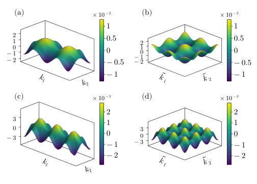 

FIG. 1. Anyon dispersion spectra. Coulomb interaction energy of anyon Bloch states on a square torus for the bosonic system m = 2 [(a)-(b)], and the fermionic system m = 3 [(c)- (d)], both at system size Nϕ = 25 and s1 = 1, s2 = 0. Results in (a) &amp; (c) are obtained from MC simulations, while those in (b) &amp; (d) are from ED on anyon Bloch wavefunctions. The energies are shown in units of e2/(ϵl). In (a) &amp; (c), the ener- gies are plotted with respect to anyon momenta, showing an m−fold periodicity in the anyon magnetic BZ, as predicted by analytical arguments. In (b) &amp; (d), the energies are shown with respect to electron centre of mass momenta in the elec- tronic BZ. The spectrum displays an...

📷 Fig 2

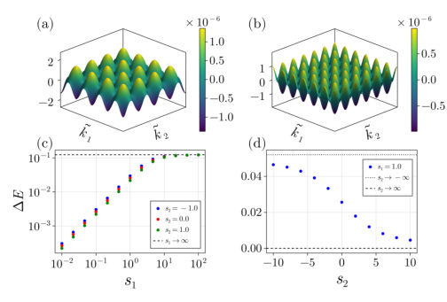 

FIG. 2. Higher harmonics and bandwidth. (a)-(b) Anyon dispersion at s1 = 0, s2 = 1 for (a) m = 2 and (b) m = 3 both at Nϕ = 25. The dispersion exhibits a (2m)2-fold degeneracy. (c)-(d) Bandwidth (∆E) evolution with quantum geometry for m = 2, Nϕ = 25. (c) ∆E as a function of s1 at fixed s2. On a square torus, ∆E is symmetric under s1 →−s1 as detailed in Appendix H; we only show the s1 &gt; 0 part here. ∆E scales linearly for small s1. While positive s2 suppresses ∆E, negative s2 enhances it. In the large s1 limit, all curves converge to a common saturation value as the first harmonic dominates the localization physics. (d) ∆E vs. s2 at fixed s1. Increasing s2 suppresses ∆E toward a saturated...

📷 Fig 3

 

Fig. 2(c)/(d). This can be understood by noting that a positive s2 localizes electrons at the nodes of the first harmonic, driving the system to a second harmonic dom- inated regime and reducing the bandwidth, as illustrated in Appendix H. A negative s2 on the other hand re- inforces the first harmonic minima, thus increasing the bandwidth. In the large s1 limit however, the influence of s2 becomes negligible, as the s1 contributions domi- nate. Discussion— FCI anyons exhibit a non-trivial disper- sion due to the non-uniform quantum geometry of the underlying Chern band. We construct anyon Bloch wave- functions, which enable efficient computation of this dis- persion. The spectrum exhibits...

**Main problem.**

Understanding the energy dispersion and bandwidth of anyonic excitations in Fractional Chern Insulators (FCIs) and how non-uniform quantum geometry and higher harmonics shape this dispersion.

**Main result.**

The authors analytically construct anyon Bloch states and show that anyon dispersion arises from non-uniform quantum geometry, with higher harmonics of the geometry acting to suppress the bandwidth through emergent magnetic translation symmetries.

**Method.**

The study uses an analytical construction of single-anyon Bloch states via Laughlin wavefunctions on a torus, supplemented by numerical Exact Diagonalization (ED) and Monte Carlo (MC) simulations.

**Summary.**

This paper investigates how the non-uniformity of the underlying quantum geometry in Fractional Chern Insulators drives the dispersion of anyonic excitations. By constructing analytical anyon Bloch states, the authors demonstrate that the anyon bandwidth is controlled by the harmonics of the Kähler potential. They find that higher harmonics can suppress dispersion by inducing emergent magnetic translation symmetries. The work provides a controlled method for evaluating anyon spectra in ideal band FCIs, which is crucial for understanding moiré materials.

Detailed structure

**Model / system.**

The system consists of anyonic excitations (quasiholes) in a Fractional Chern Insulator (FCI) at filling fraction 1/m, modeled on a 2D torus with a non-uniform Kähler potential representing the quantum geometry.

**Key observables.**

Anyon dispersion spectra (E_k), anyon bandwidth (delta E), and the degeneracy of the energy levels.

**Important parameters / regimes.**

Filling fraction (m), strength of the first and second harmonics of the Kähler potential (s1, s2), and the magnetic length (l2).

**Assumptions / limitations.**

The study focuses on 'ideal bands' (flat electronic dispersion) and Laughlin-like wavefunctions, primarily in the context of single-anyon excitations.

**Figures summary.**

Figures show anyon dispersion spectra for different m values, the evolution of bandwidth as a function of s1 and s2, and the breakdown of FCI stability at high modulation.

**Paper structure.**

The paper introduces the problem of anyon dispersion, develops the analytical framework for anyon Bloch states, analyzes the role of quantum geometry harmonics, provides numerical verification via ED and MC, and discusses the implications for symmetry and stability.

Abstract

Fractional Chern insulators (FCIs) are zero magnetic field analogs of fractional quantum Hall states. While the electrons forming an FCI are not subject to an external magnetic field, their anyonic excitations experience a magnetic field with finite-flux due to a many-body Berry phase, whose lattice periodicity generically induces some dispersion. From Laughlin wavefunctions at filling 1/m, we analytically construct single-anyon Bloch states in an ideal band, providing a basis to efficiently compute the dispersion. The anyon spectrum exhibits an $m$-fold degeneracy in the reduced magnetic Brillouin zone (BZ), which originates from the topological degeneracy of the FCI. From our wavefunctions, we derive the m^2-fold degeneracy seen in previous works, showing it to be a splicing of anyon momenta into the electronic BZ. Finally, we find that the anyon dispersion bandwidth is controlled by quantum geometry non-uniformity, growing linearly at weak modulation and saturating at strong modulation. Remarkably, higher harmonics of the quantum geometry alone strongly suppress the dispersion, which we attribute to emergent magnetic translation symmetries. When combined with the first harmonic, a positive (negative) second harmonic drives the system toward a second- (first-) harmonic-dominated regime, thereby reducing (enhancing) the bandwidth. Our results offer an analytically controlled method for evaluating anyon spectra in ideal band FCI, shedding light on how non-uniform quantum geometry and emergent symmetries shape the dispersion of anyons.

[↑ back to top](#top)

### [Efficient Complex-Valued State Preparation on Bucket Brigade QRAM](http://arxiv.org/abs/2604.25644v1)

**Authors:** Alessandro Berti, Francesco Ghisoni

**Type:** theory · **Category:** quantum information and computing · **PDF:** <https://arxiv.org/pdf/2604.25644v1>

**Analysis basis:** full PDF text, analyzed in chunks

📷 Fig 1

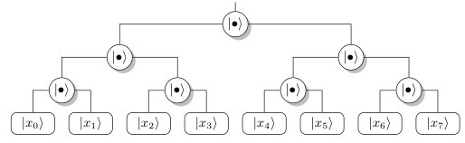 

Fig. 2: BBQRAM architecture for N = 8 memory cells. Circles are routing switches initialized in the wait state |•⟩; rectangles are memory cells, which can be either classical or quantum bits, storing |xi⟩.

📷 Fig 2

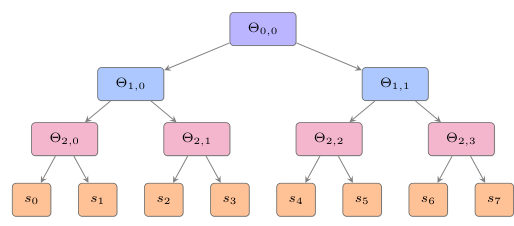 

Fig. 3: The angle tree Θ for K = 8 entries (Definition 10); nodes hold one t-bit unsigned rotation angle, depth log2 K − 1 = 2, node count K −1 = 7. The orange leaf row shows the one-bit sign field {s0, . . . , s7} added for real signed data (Corollary 15); the complex case replaces this by the t-bit phase layer Φ of Figure 4.

📷 Fig 3

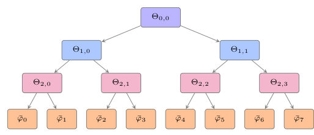 

Fig. 4: The complex angle tree Γ = (Θ, Φ) for K = 8 entries (Definition 16). The angle tree Θ has depth log2 K −1 and stores one unsigned amplitude-splitting angle per internal node of the squared-moduli tree T; it is consumed level by level during Step 1. The phase layer Φ holds one entry-wise phase ¯φz per leaf of T and is consumed by a single coherent retrieval in Step 2.

📷 Fig 4

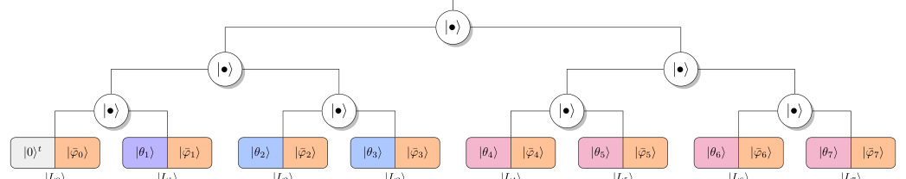 

Fig. 5: BBQRAM mapping of the complex angle tree Γ = (Θ, Φ) (Proposition 17). Cell L0 holds a dummy zero in the angle field; for z ≥1, each cell stores one node of Θ as the rotation-angle field |θz⟩and the corresponding leaf phase | ¯φz⟩from Φ, for a total width of 2t bits. The angle field drives magnitude splitting through cascades of controlled Ry gates; the phase field is applied through cascades of controlled phase gates.

📷 Fig 5

 

Fig. 6: BBQRAM-cell layout for the example matrix, instantiating Figure 5 with the precomputed angles θz and phases ¯φz derived above. Cell |L0⟩stores a dummy zero in the angle field and the phase ¯φ0 ≈0.464; for z ≥1, each cell holds the angle θz = Θl(z)−1,d(z) alongside the phase ¯φz.

**Main problem.**

Efficiently preparing complex-valued quantum states (amplitude and phase encoding) from large classical datasets while minimizing the computational overhead of reversible arithmetic on the QPU.

**Main result.**

The authors present a framework that achieves polylogarithmic BBQRAM query complexity for complex matrices by replacing expensive quantum subroutines with classical precomputation of rotation angles and phases.

**Method.**

A two-step procedure involving magnitude preparation via a cascade of controlled Ry gates and phase encoding via a cascade of controlled P gates, utilizing a precomputed 'complex angle tree' structure.

**Summary.**

This paper improves the efficiency of loading complex-valued classical data into quantum computers using a specific QRAM architecture. By precomputing rotation angles and phases classically, the authors eliminate the need for complex reversible arithmetic (like square roots) on the quantum processor. The resulting method maintains efficient polylogarithmic query time while reducing the required quantum hardware resources. This is a significant step toward practical quantum machine learning and quantum linear algebra applications.

Detailed structure

**Model / system.**

A hardware-aware Bucket Brigade QRAM (BBQRAM) architecture interacting with a Quantum Processing Unit (QPU) using a segment tree data structure.

**Key observables.**

Query complexity, QPU qubit count, gate count, and state fidelity/precision.

**Important parameters / regimes.**

Matrix dimensions (M, N), total entries (K), fixed-point precision (t), and target error (eta).

**Assumptions / limitations.**

Assumes a fault-tolerant architecture, fixed-point precision, and that classical preprocessing/loading of the QRAM is amortized over repeated preparations.

**Figures summary.**

Figure 1 shows controlled rotation cascades; Figure 2 depicts the BBQRAM architecture; Figure 3 illustrates the Angle Tree and sign bit integration; Figure 4 shows the complex angle tree structure; Figure 5 shows the BBQRAM mapping for complex entries.

**Paper structure.**

The paper introduces the problem of state preparation, presents an improved architecture-aware framework for complex values, details the classical precomputation and two-step quantum algorithm, provides resource complexity comparisons, and discusses limitations and future work.

Abstract

Efficient quantum state preparation is a critical component in quantum algorithms that process large classical data, and it is fundamental to realizing quantum advantage in domains such as machine learning, quantum linear algebra, and quantum finance. Building on the framework of~\cite{berti2025efficient}, which integrates Bucket Brigade QRAM (BBQRAM) with a segment tree to achieve amplitude encoding in polylogarithmic query time, we present two improvements within the same architecture-aware framework. First, we remove the $U_{2\mathrm{CR}}$ subroutine by classically precomputing the rotation angles determined by the segment tree and storing these angles directly in the BBQRAM cells. The tradeoff is that the classically loaded QRAM stores precomputed fixed-point angles rather than raw subtree weights. Second, we extend the construction to complex-valued matrices $A \in \mathbb{C}^{M \times N}$ by storing a leaf phase alongside each precomputed rotation angle and using a two-step magnitude-then-phase procedure; the real signed case is naturally subsumed as a one-bit phase specialization. At unchanged $\mathcal{O}(\log_2^2(MN))$ BBQRAM query complexity, the QPU procedure reduces to BBQRAM retrievals and controlled-rotation cascades, with $\mathcal{O}(MN)$ memory cells per matrix and no reversible arithmetic on the QPU.

[↑ back to top](#top)

### [Electrohydrodynamic lubrication theory](http://arxiv.org/abs/2604.25350v1)

**Authors:** Anirban Chatterjee, Yacine Amarouchene, Thomas Salez

**Type:** theory · **Category:** statistical mechanics · **PDF:** <https://arxiv.org/pdf/2604.25350v1>

**Analysis basis:** full PDF text, analyzed in chunks

📷 Fig 1

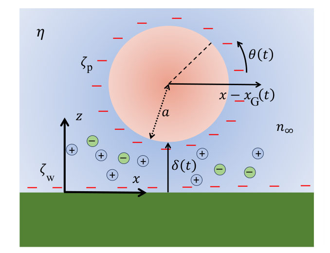 

FIG. 1. Schematic of the system. An infinite rigid cylinder (pink) of radius a moves in a viscous

📷 Fig 2

 

Figure 1 presents the system under investigation. We consider an infinite rigid cylinder of

📷 Fig 3

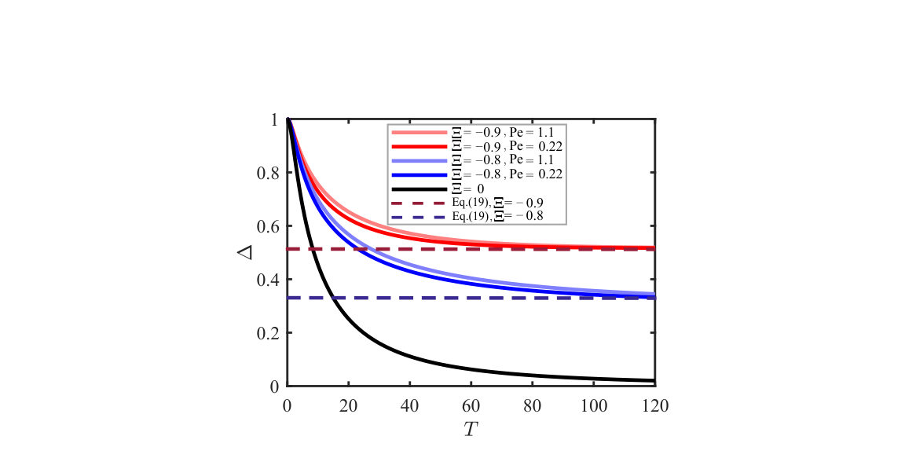 

FIG. 2. Dimensionless distance ∆between the cylinder and the wall a as function of the dimen-

📷 Fig 4

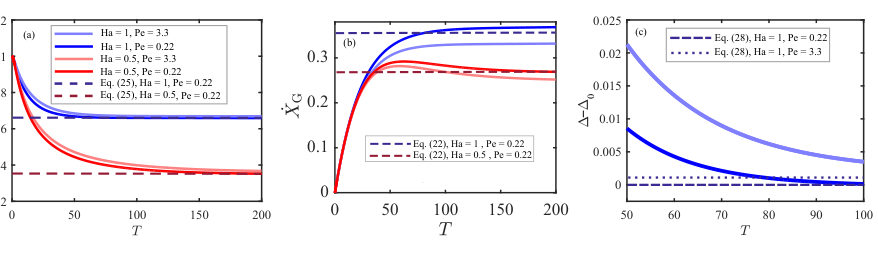 

FIG. 3. (a) Dimensionless distance ∆between the cylinder and the wall as a function of the di-

📷 Fig 5

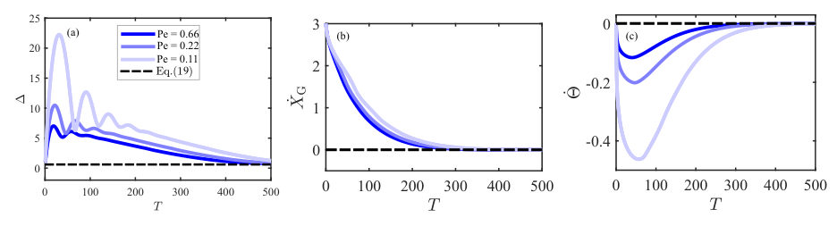 

FIG. 4. (a) Dimensionless distance ∆between the cylinder and the wall as a function of the

**Main problem.**

Characterizing the electrohydrodynamic motion and the emergence of symmetry-breaking lift forces for a charged cylinder moving near a charged boundary in an electrolyte.

**Main result.**

The development of an electrohydrodynamic lubrication framework that predicts a generalized electroviscous lift force and an extended mobility matrix incorporating surface charges and ions.

**Method.**

The authors use lubrication theory, Debye-Huckel electrostatics, and Nernst-Planck electrokinetics to derive coupled nonlinear ordinary differential equations, which are analyzed via numerical simulations and asymptotic analysis.

**Summary.**

This paper establishes a theoretical framework for understanding how electric charges on particles and surfaces influence their motion in fluids. By combining fluid mechanics with electrokinetics, the authors show that moving ions create an extra 'lift' force that pushes a cylinder away from a wall. The study provides new mathematical tools to predict how particles will move, slide, or rotate in industrial and biological environments where electric fields and ions are present.

Detailed structure

**Model / system.**

An infinite rigid cylinder of radius 'a' moving in a Newtonian electrolyte near a rigid flat wall, considering the coupling of hydrodynamic, electrostatic, and electrokinetic forces.

**Key observables.**

Normal distance (gap height), longitudinal position, rotation, streaming potential, and electroviscous lift force.

**Important parameters / regimes.**

Debye screening length (kappa inverse), Péclet number (Pe), Hartmann number (Ha), surface potentials (zeta potentials), and the lubrication parameter (epsilon).

**Assumptions / limitations.**

Small-gap lubrication approximation (epsilon << 1), linearized Poisson-Boltzmann/Debye-Huckel electrostatics, and an open-circuit condition (no net current).

**Figures summary.**

Figure 1 shows a schematic of the cylinder, wall, and electrolyte; Figure 4 displays the time evolution of dimensionless distance, longitudinal velocity, and angular velocity showing damped oscillations toward equilibrium.

**Paper structure.**

The paper introduces the physical problem, defines the mathematical framework (hydrodynamics, electrostatics, electrokinetics), derives the coupled equations of motion, presents numerical results for various motion regimes (sedimentation and sliding), and concludes with asymptotic analysis and validation.

Abstract

The free motion of charged colloids within ionic solutions and in the vicinity of charged boundaries, is a phenomenon that occurs in various natural, biological and industrial settings. Here, we develop an electrohydrodynamic lubrication theoretical framework, in order to characterize such a motion in the case of an infinite rigid cylinder near a rigid wall. Combining hydrodynamic lubrication theory, Debye-H\''uckel electrostatics, and Nernst-Planck electrokinetics, we derive the three coupled equations of motion for the normal, longitudinal and rotational degrees of freedom of the cylinder, which are then investigated numerically and through asymptotic analysis. Our results reveal complex behaviours, beyond existing asymptotic electroviscous-lift expressions, and extend the classical Faxen-Brenner-like mobility matrix when surface charges and dissolved ions are incorporated.

[↑ back to top](#top)

### [Electronic structures of spin-orbit-coupled metal candidate PbRe$_2$O$_6$: one dimensionality and molecular orbital formation](http://arxiv.org/abs/2604.25539v1)

**Authors:** Yuki Yanagi, Michi-To Suzuki

**Type:** theory · **Category:** strongly correlated electrons · **PDF:** <https://arxiv.org/pdf/2604.25539v1>

**Analysis basis:** full PDF text, analyzed in chunks

📷 Fig 1

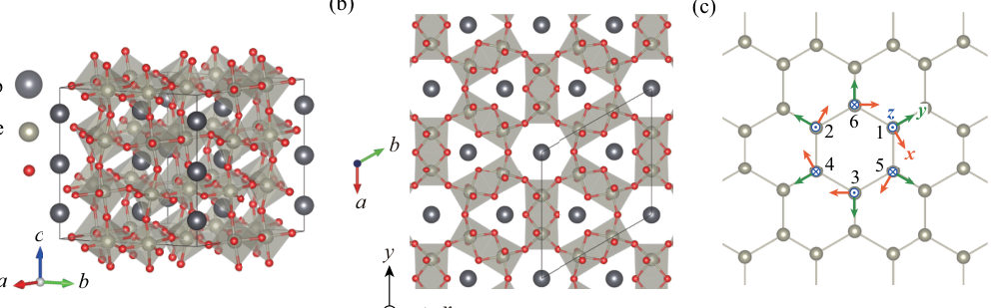 

FIG. 1. (a) Crystal structure of PbRe2O6 and (b) that on ab-plane. The solid line represents the conventional unit cell. (c) Same as (b) but the only Re-atoms with local coordinates are shown.

📷 Fig 2

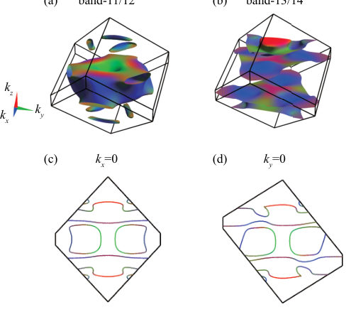 

FIG. 3. Fermi surfaces of PbRe2O6 in the presence of the SOC (a) for band-11/12 and (b) for band-13/14. (c) and (d) Intersections on kx = 0 and ky = 0-planes, respectively. RGB color-coding represents the Re-5d orbital weights as follows, R: dzx, G: dyz, and B: dv-orbital weights.

📷 Fig 3

 

FIG. 2. Band structures of PbRe2O6 (a) with and (b) without spin- orbit coupling. The solid line and cross represent the results obtained by the Wannier interpolation and density functional calculation, re- spectively. (c) Enlarged view of the low energy band structure and (d) density of states per spin with spin-orbit coupling. (e) and (f) those without spin-orbit coupling.

📷 Fig 4

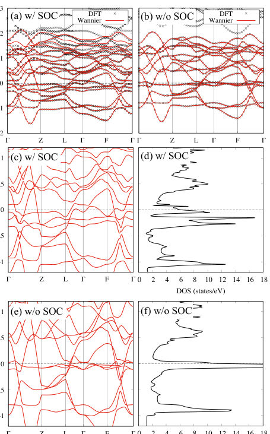 

Figure 4(e) shows the molecular orbital-resolved DOS in the finite SOC case. Although the molecular orbitals shown in Fig. 4(a) are no longer irreps. due to the finite SOC, each components are well separated in energy as in the SOC free case. The molecular orbital picture also works well even in the finite SOC case. The main difference in DOS of the fi- nite SOC case from the SOC free one is the splitting of the Eg-components just below the Fermi level, which is a natural consequence of the effects of the SOC on Eg-states as follows: Eg ⊗E 1

📷 Fig 5

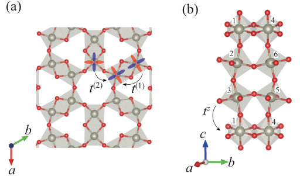 

FIG. 5. Schematics of (a) in-plane and (b) out-of-plane hoppings.

📷 Fig 6

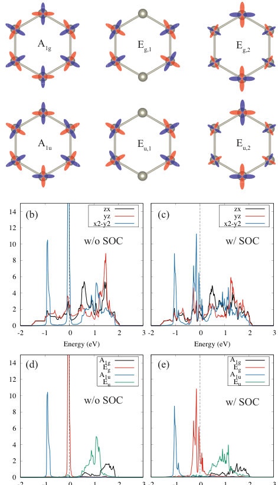 

FIG. 4. (a) Molecular orbitals derived from dv-orbitals on a hexagon in the SOC-free case. Size of orbitals corresponds to the weight of the wave function. (b) DOS for molecular orbital representation from dv-orbitals in the absence of the SOC and (c) presence of the SOC.

**Main problem.**

Understanding the microscopic origin of the electronic structure, one-dimensionality, and successive structural phase transitions in the spin-orbit-coupled metal candidate PbRe2O6.

**Main result.**

The study identifies that the coexistence of quasi-1D Fermi surfaces (from d_yz and d_zx orbitals) and flat bands (from molecular orbital formation of d_v orbitals) provides a microscopic origin for the material's observed phase transitions and anisotropic transport.

**Method.**

First-principles density functional theory (DFT) calculations using the WIEN2K code, combined with Wannier function construction (Wannier90) and a 36-orbital tight-binding model.

**Summary.**

This paper investigates the electronic properties of the spin-orbit-coupled metal PbRe2O6 using first-principles calculations. It reveals that the material's electronic structure is characterized by both one-dimensional Fermi surfaces and flat bands arising from molecular orbital formation. These features are shown to be responsible for the highly anisotropic charge transport and the successive structural phase transitions observed experimentally. The study provides a microscopic link between orbital physics and macroscopic transport phenomena.

Detailed structure

**Model / system.**

The physical system is PbRe2O6, a 5d-electron compound with a centrosymmetric trigonal structure that undergoes structural phase transitions. The model includes Re-t2g orbitals and describes molecular orbital formation on Re-hexagon networks.

**Key observables.**

Fermi surfaces, density of states (DOS), charge transport anisotropy, and hopping parameters.

**Important parameters / regimes.**

Spin-orbit coupling (SOC) strength, hopping parameters (e.g., |t_v,v(1)/t_v,v(2)| ~ 0.08), and structural transition temperatures (T_s1 ~ 265 K, T_s2 ~ 123 K).

**Assumptions / limitations.**

The molecular orbital picture remains valid even when spin-orbit coupling lifts the degeneracy of the Eg states.

**Figures summary.**

Fig 1 shows crystal structures; Fig 2 displays band structures and DOS with and without SOC; Fig 3 shows orbital-weighted Fermi surfaces; Fig 4 illustrates molecular orbital wavefunctions and DOS.

**Paper structure.**

The paper introduces the material and its properties, presents DFT-calculated band structures and DOS, analyzes the orbital-dependent hopping and dimensionality, describes the formation of molecular orbitals, and concludes by linking these electronic features to observed phase transitions.

Abstract

We present a first-principles investigation of the electronic structure of the inversion-symmetry-broken spin-orbit-coupled metal candidate PbRe$_2$O$_6$. Our calculations reveal that the Fermi surfaces derived from the $d_{yz}$ and $d_{zx}$ orbitals exhibit pronounced one-dimensional characteristics, which naturally account for the highly anisotropic charge transport observed experimentally. In addition, the $d_{x^2-y^2}$ orbitals on each Re haxagon form molecular orbitals, where the resulting $E_g$ molecular states generate nearly dispersionless bands in close proximity to the Fermi level. The coexistence of these quasi-1D Fermi surfaces and molecular-orbital-induced flat bands provides a possible microscopic origin for the successive phase transitions observed in PbRe$_2$O$_6$.

[↑ back to top](#top)

### [Elucidating mechanism of optical cavities in superconducting strip single photon detectors using transmission line and impedance models](http://arxiv.org/abs/2604.25425v1)

**Authors:** Hiroki Kutsuma, Taro Yamashita

**Type:** both · **Category:** other · **PDF:** <https://arxiv.org/pdf/2604.25425v1>

**Analysis basis:** full PDF text, analyzed in chunks

📷 Fig 1

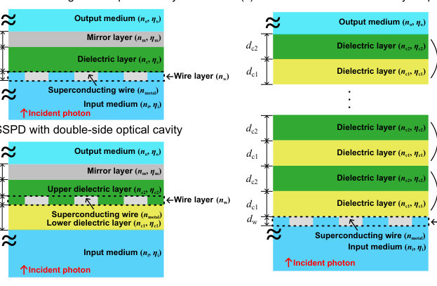 

Figure 1. Schematics of SSPDs with optical cavities. (a) SSPD with single-side optical cavity. (b) SSPD with double-side optical cavity. (c) SSPD with dielectric multi-layer optical cavity. The two dielectric layers with different refractive indices are stacked in N periods.

📷 Fig 2

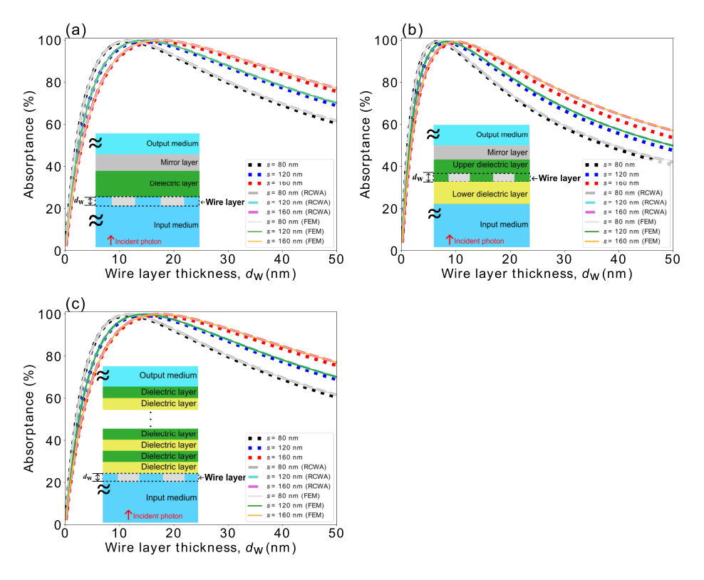 

Figure 2. Comparisons of analytical and simulation results. In each figure, the results represented by the dotted lines are calculated using the analytical formulae given by the transmission line model, and those represented by dashed (solid) lines are obtained from the simulations using RCWA (FEM). (a) Dependence of the absorptance on the thickness of the wire layer of SSPDs with single-side optical cavities. (b) Dependence of the absorptance on the thickness of the wire layer of SSPDs with double-side optical cavities. (c) Dependence of the absorptance on the thickness of the wire layer of SSPDs with dielectric multi-layer optical cavities.

📷 Fig 3

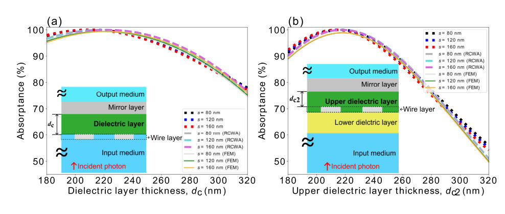 

Figure 3. Comparisons between analytical and simulation results. In each figure, the results represented by the dotted lines are calculated using the analytical formula given by the transmission line model, and those represented by the dashed (solid) lines are obtained from simulations using RCWA (FEM). (a) Dependence of the absorptance on the thickness of the dielectric layer of SSPDs with single-side optical cavities. (b) Dependence of the absorptance on the thickness of the upper dielectric layer of SSPDs with double-side optical cavities.

📷 Fig 4

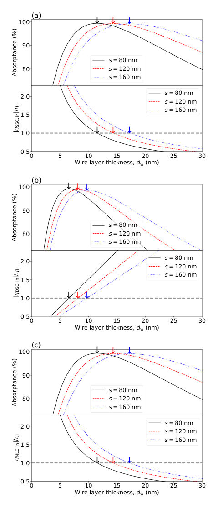 

Figure 4. Dependence of the absorptance and ratio of the input impedance to the impedance of the input media on the thickness of the wire layer. The upper panel of each figure shows the absorptance as a function of the thickness of the wire layer, determined by Eq. (9) in (a), Eq. (17) in (b), and Eq. (34) in (c). The lower panel shows the ratio of the absolute value of the input impedance of SSPDs with the cavities to the impedance of the input medium. (a) SSPDs with single-side optical cavities. (b) SSPDs with double-side optical cavities. (c) SSPDs with dielectric multi-layer optical cavities. The arrows indicate the maximum absorptance and corresponding ratio of the input impedance to...

**Main problem.**

The physical mechanism by which optical cavities in superconducting strip single photon detectors (SSPDs) achieve maximum photon absorptance is not clearly understood, particularly regarding how different cavity configurations affect performance.

**Main result.**

The study demonstrates that maximum absorptance is achieved through impedance matching between the SSPD and the input medium, and provides analytical formulae for optimal layer thicknesses.

**Method.**

The authors use a transmission line model (transfer matrix formalism) and an impedance model to derive analytical results, which are then validated against numerical simulations using RCWA (S4) and FEM (COMSOL).

**Summary.**

This paper provides a theoretical framework to understand and design optical cavities for superconducting single-photon detectors. By applying transmission line and impedance matching principles, the authors derive analytical expressions for maximizing photon absorption. They show that the optimal performance occurs when the detector's input impedance matches the incident medium. The findings are validated through rigorous numerical simulations and offer a practical design methodology for high-efficiency superconducting detectors.

Detailed structure

**Model / system.**

The system consists of various SSPD configurations, including single-side, double-side, and dielectric multi-layer optical cavities, comprising superconducting wires, dielectric layers, and metallic mirrors.

**Key observables.**

Absorptance (A), reflection coefficient (r), transmission coefficient (t), and input impedance ratio (|eta_in|/eta_i).

**Important parameters / regimes.**

Wire and dielectric layer thicknesses (dw, dc), filling factor (f), refractive index (n), and wavelength (1550 nm).

**Assumptions / limitations.**

Assumptions include the metallic mirror acting as a Perfect Electrical Conductor (PEC) or having high imaginary refractive index, photon wavelength being much longer or shorter than wire width, and negligible loss in the dielectric layer.

**Figures summary.**

Figure 1 shows schematics of the three cavity configurations; Figure 2 compares absorptance vs. wire thickness for different configurations; Figure 3 shows absorptance vs. dielectric thickness; Figure 4 illustrates the relationship between absorptance and the impedance ratio.

**Paper structure.**

The paper introduces the problem, presents the transmission line and impedance models, derives analytical formulae for various cavity types, validates these models via numerical simulations, and concludes with a proposed design workflow.

Abstract

We clarified the physical mechanism of superconducting strip single photon detectors (SSPDs) with optical cavities by using transmission line and impedance models. By introducing the transmission line model, we derived the analytical formulae for the absorptance of SSPDs with optical cavities. We compared the absorptance obtained from the analytical formulae for SSPDs with single-side, double-side, and dielectric multi-layer optical cavities against the results of numerical simulations. The comparison showed that the results were nearly identical. By introducing the impedance model, it was clearly shown that the SSPDs with optical cavities achieved the maximum absorptance when their input impedance of the SSPDs with optical cavities matched the impedance of the input medium. The design concepts proposed in this study are applicable to other superconducting detectors, such as microwave kinetic inductance detectors and transition-edge sensors.

[↑ back to top](#top)

### [Excluded volume and molecular field in the Lennard-Jones fluid: a modified first-order perturbation theory](http://arxiv.org/abs/2604.25882v1)

**Authors:** A. Trokhymchuk, V. Hordiichuk, R. Melnyk, I. Nezbeda

**Type:** theory · **Category:** statistical mechanics · **PDF:** <https://arxiv.org/pdf/2604.25882v1>

**Analysis basis:** full PDF text, analyzed in chunks

📷 Fig 1

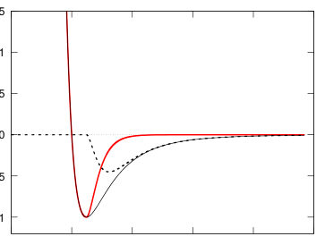 

Figure 1. Lennard-Jones potential u(r) (the thin solid line) and two choices of its decomposition. The left panel: The CA decomposition suggested within the WCA method – into the repulsive interaction (the thick solid line) and the attractive interaction (the thin dashed line). The right panel: The NCA decomposition suggested in Ref. [15] and used in present study – into the short-range interaction uSR(r) (the thick solid line) and the remaining attraction ∆u(r) (the thin dashed line). .

📷 Fig 2

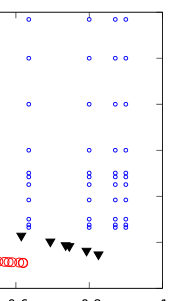 

Figure 2. Vapor-liquid phase diagram of the system with short-range attraction uSR(r) according to Eq. (7) (the empty circles) from Ref. [15] in comparison against the same for the Lennard-Jones fluid (the solid triangles) from Ref. [16]. The empty small circles in supercritical region indicate thermodynamic states for which MD simulations were performed.

📷 Fig 3

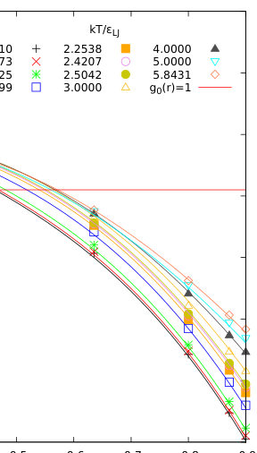 

Figure 3. Dependence of the perturbation term a(T, ρ) on density for the set of fixed temperatures T ⋆shown in figure. The results of calculations according to Eq. (11) are marked by symbols. The thin solid curves correspond to the results of polynomial parametrization, Eq. (14), while the thick solid horizontal line presents the result of mean-field approximation by assuming gSR(r) = 1 in Eq. (11).

📷 Fig 4

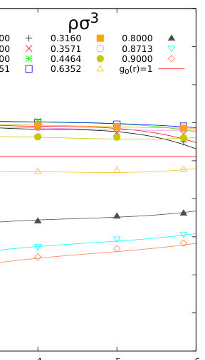 

Figure 4. Dependence of the perturbation term a(T, ρ) on temperature for the set of fixed densities ρ⋆shown in figure. The results of calculations according to Eq. (11) are marked by symbols. The thin solid curves correspond to the results of polynomial parametrization, Eq. (14), while the thick solid horizontal line presents the result of mean-field approximation by assuming gSR(r) = 1 in Eq. (11).

📷 Fig 5

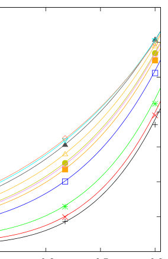 

Figure 5. Dependence of the pressure βp = p/kT on density for the set of fixed temperatures T ⋆= kT/ϵLJ. The solid lines are the results of of computer-based equation of state for LJ fluid [1], the filled symbols show results of Eq. (17).

📷 Fig 6

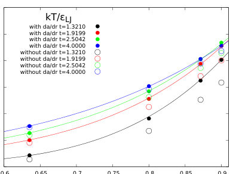 

Figure 6. The same as in Fig. 5 but with the open symbols corresponding to negligence of the density derivative in Eq. (17).

📷 Fig 7

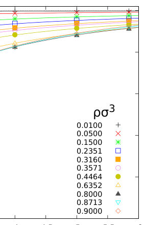 

Figure 7. Dependence of the internal energy βE/N = E/NkT on temperature for the set of fixed densities ρ⋆= ρσ3 LJ shown in figure. The solid lines are the results of computer-based approach due to Kolafa and Nezbeda [1], the filled symbols show results of Eq. (18).

**Main problem.**

The failure of classical first-order perturbation theories (like WCA) to accurately describe the thermodynamics of Lennard-Jones fluids due to the overlap of the perturbation term with the region of strong structural correlations.

**Main result.**

A non-classical approach using a range-based decomposition—where the reference system includes the entire short-range part of the potential—provides a highly accurate equation of state by transforming the perturbation into a small, near-mean-field quantity.

**Method.**

The authors use Molecular Dynamics simulations to evaluate a first-order perturbation theory where the reference system is defined by a short-range potential, and the long-range tail is treated as a perturbation, including necessary density and temperature derivatives for thermodynamic consistency.

**Summary.**

This paper proposes a new way to split the Lennard-Jones potential for use in first-order perturbation theory. Instead of splitting by interaction strength (repulsion vs. attraction), it splits by interaction range, putting all short-range interactions into the reference system. This makes the remaining perturbation term much smaller and easier to model as a mean-field-like quantity. The study proves that including the density derivatives of this new term is essential for an accurate and thermodynamically consistent description of the fluid.

Detailed structure

**Model / system.**

The system is a Lennard-Jones (LJ) fluid, characterized by a pairwise additive potential with repulsive and attractive components, studied in the supercritical thermodynamic domain.

**Key observables.**

Helmholtz free energy, pressure, internal energy, and the perturbation contribution a(T, rho).

**Important parameters / regimes.**

Supercritical temperature and density ranges, Lennard-Jones parameters epsilon and sigma, and the decay parameters of the two-Yukawa reference potential.

**Assumptions / limitations.**

The perturbation contribution remains small and smoothly varying because it is restricted to the long-range tail, and the success of the theory depends on the reference system capturing the local structure.

**Figures summary.**

Figure 1 compares CA and NCA decomposition strategies; Figure 2 shows a phase diagram of the reference system; Figure 3 and 4 show the density and temperature dependence of the perturbation term; Figure 5 and 6 demonstrate the accuracy of the resulting pressure and the necessity of the density-derivative term; Figure 7 shows the accuracy of the internal energy.

**Paper structure.**

The paper introduces the problem of classical perturbation theory limitations, proposes a non-classical range-based decomposition, details the simulation-based evaluation of the new reference system, presents the results for the perturbation term's behavior, and concludes by demonstrating thermodynamic consistency and accuracy against benchmark data.

Abstract

The equation of state and, more generally, the thermodynamics of the Lennard-Jones fluid have long served as a benchmark problem in the statistical theory of fluids. Among available theoretical approaches, first-order perturbation theory occupies a special position: only at this level does the correction to the Helmholtz free energy admit an exact statistical-mechanical expression. In this work, we present a systematic, simulation-based assessment of a non-classical first-order perturbation theory in which the reference system incorporates the entire short-range part of the interaction, while the perturbation is confined to the remaining long-range tail. We show that this range-based decomposition transforms the perturbation contribution into a small, smoothly varying, near-mean-field quantity over a broad supercritical thermodynamic domain. When its density and temperature derivatives are consistently retained, the resulting equation of state reproduces high-accuracy reference data with excellent fidelity. The results demonstrate that the success of first-order perturbation theory is governed primarily by the physical content of the reference system and by the consistent treatment of its state dependence, rather than by the formal truncation order of the expansion.

[↑ back to top](#top)

### [Extending UNIQuE: Quantum Simulation Speedup for the HHL Algorithm](http://arxiv.org/abs/2604.25148v1)

**Authors:** Reece Robertson, Ameya Bhave

**Type:** theory · **Category:** quantum information and computing · **PDF:** <https://arxiv.org/pdf/2604.25148v1>

**Analysis basis:** full PDF text, analyzed in chunks

📷 Fig 1

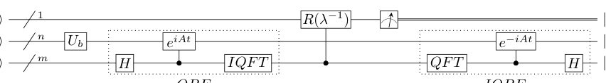 

Fig. 1: A high-level overview of the HHL algorithm. The algorithm uses three quantum registers: a one-qubit ancilla register a, an n-qubit b register to encode the value of |b⟩(and later |x⟩), and an m-qubit clock register c. The algorithm begins by encoding |b⟩into b via the state-preparation unitary Ub. Next, the Quantum Phase Estimation (QPE) routine is used to apply the eigenvalues of A to b. This routine uses the Inverse Quantum Fourier Transform (IQFT) as a subroutine. Following this, an R(λ−1) rotation is used to invert the eigenvalues applied to b (provided that a is measured to be in the |1⟩state), and the Inverse Quantum Phase Estimation (IQPE) is used to disentangle c from b. In...

📷 Fig 2

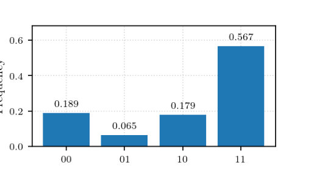 

Fig. 2: Illustrative results of simulating and emulating the HHL algorithm on (8).

📷 Fig 3

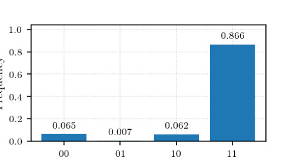 

Fig. 3: Illustrative results of simulating and emulating the HHL algorithm on (12).

**Main problem.**

The challenge of efficiently replicating the behavior of the HHL quantum algorithm on classical hardware, specifically overcoming the exponential scaling of traditional state-vector simulation with respect to the number of counting qubits.

**Main result.**

The proposed emulation method achieves a runtime advantage over the Intel Quantum Simulator for small linear systems by removing the exponential dependence on the number of counting qubits used for eigenvalue accuracy.

**Method.**

An extension of the Unconventional Noiseless Intermediate Quantum Emulator (UNIQuE) that bypasses intermediate quantum circuit steps like QPE and instead directly computes the final probability distribution by diagonalizing the matrix A.

**Summary.**

This paper introduces a new classical emulation method for the HHL quantum algorithm that scales more efficiently than standard state-vector simulation. By focusing on reproducing the final output distribution rather than simulating every intermediate gate, the authors eliminate the exponential cost associated with the precision of eigenvalue estimation. Benchmarks show that this emulator provides a significant speedup for small linear systems while maintaining high accuracy. This approach offers a more scalable way to verify and study the outcomes of HHL-type algorithms on classical hardware.

Detailed structure

**Model / system.**

The HHL algorithm applied to an s-sparse, N x N invertible Hermitian matrix A, involving ancilla, solution, and clock registers.

**Key observables.**

The probability distribution of the final state and the ratio of probabilities of measuring the ancilla qubit in the |1> state to estimate the solution vector.

**Important parameters / regimes.**

The size of the linear system (N), the condition number (kappa), the error tolerance (epsilon), and the number of counting qubits (m).

**Assumptions / limitations.**

The study assumes a noiseless/perfect quantum computing environment and focuses on replicating the final sampling distribution rather than intermediate gate operations.

**Figures summary.**

Figure 1 shows the HHL quantum circuit diagram; Figure 2 and 3 present histograms comparing simulation and emulation results for different qubit sizes to demonstrate accuracy and stability.

**Paper structure.**

The paper introduces the problem of HHL simulation, describes the proposed UNIQuE extension, details the emulation methodology, provides a comparative benchmark against the Intel Quantum Simulator, and concludes with error analysis and scaling results.

Abstract

In an extension of the Unconventional Noiseless Intermediate Quantum Emulator, this work introduces a classical emulation of the quantum Harrow-Hassidim-Lloyd algorithm for sampling from the solution space of linear systems. The emulated HHL algorithm scales exponentially with the number of qubits required to represent the linear system, which is an advantage over the state vector simulation of the HHL algorithm, which scales exponentially as a function of both the size of the linear system and the magnitude of its largest (scaled) eigenvalue. We benchmark our emulator by comparing it with the Intel Quantum Simulator and demonstrate a runtime advantage for small linear systems.

[↑ back to top](#top)

### [Flat band in multiband-metal MnSb$_2$](http://arxiv.org/abs/2604.25324v1)

**Authors:** Carl Jonas Linnemann, Kim-Khuong Huynh, Davide Ceresoli, Martin Bremholm

**Type:** both · **Category:** strongly correlated electrons · **PDF:** <https://arxiv.org/pdf/2604.25324v1>

**Analysis basis:** full PDF text, analyzed in chunks

📷 Fig 1

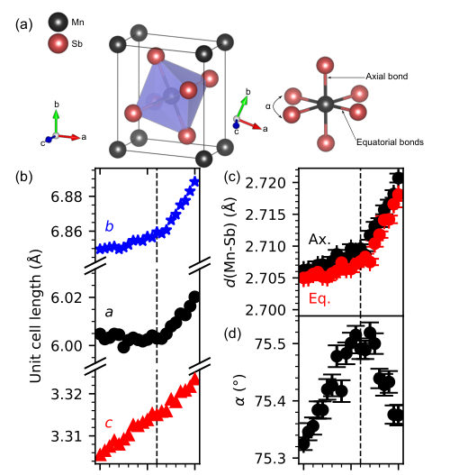 

FIG. 1. (a) Crystal structure of MnSb2, showing the MnSb6 octahedron with axial and equatorial Mn-Sb bonds. (b) Ex- tracted unit cell parameters from SCXRD showing a kink at 230 K. (c) Mn-Sb bond lengths (d) Bond angle α.

📷 Fig 2

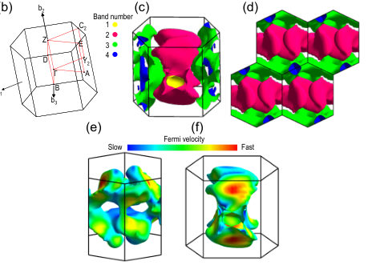 

FIG. 2. (a) Calculated electronic band structure, with colors indicating the contributions from Mn 3d orbitals, and the total and atomic projected density of states. (b) Brillouin zone and the path used in the band structure (c-d) Fermi surface of band 2, with colors marking the contributions from the distinct bands.

📷 Fig 3

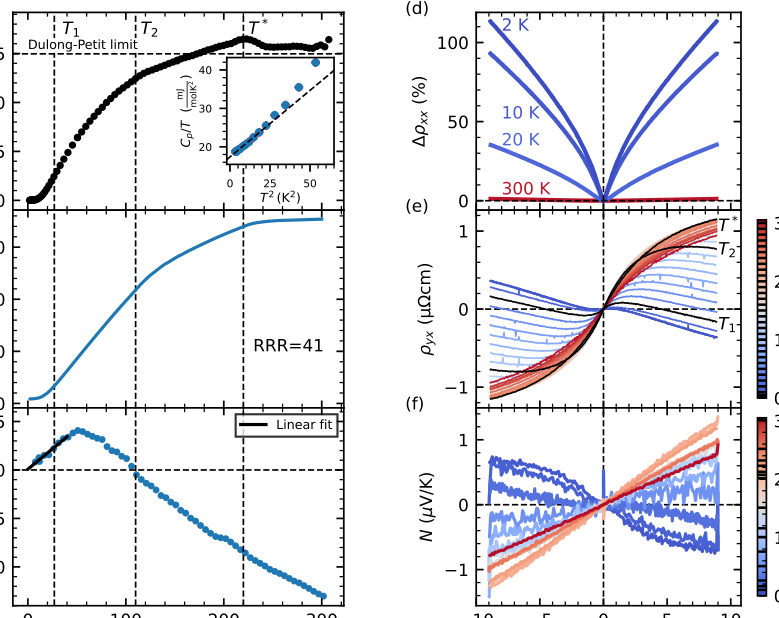 

FIG. 3. Measured physical properties of MnSb2: (a) Heat capacity, with the insert showing the fit to the low temperature heat capacity. (b) Resistivity ρxx. (c) Seebeck coefficient with a linear fit to the low temperature Seebeck coefficient. (d) Magnetoresistivity at selected temperatures. (e) All measured ρyx. The measured curves closest to the observed transitions are marked in black. f) Nernst signal. The vertical lines in (a-c) mark the observed transitions, while in (e) the lines serve as a guide to the eye.

📷 Fig 4

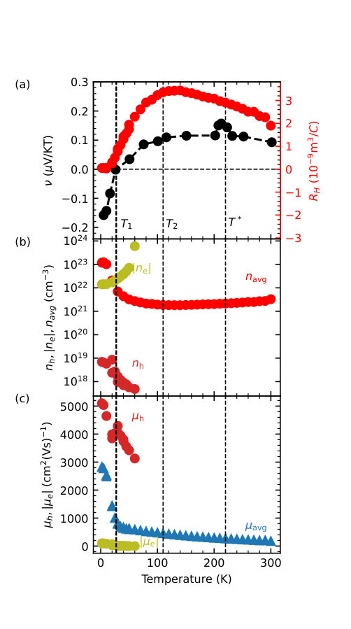 

FIG. 4. Derived properties from ρyx and the Nernst coeffi- cient. (a) Nernst coefficient ν showing a sign switching below 30 K together with the Hall coefficient extracted from a lin- ear fit between ±1 T to the low field ρyx. (b) Carrier numbers extracted from ρyx. (c) Mobilities extracted from ρyx as well as the average mobility extracted from the low field ρxx.

**Main problem.**

The study aims to characterize the electronic and transport properties of MnSb2, a previously under-investigated member of the TMSb2 marcasite family, and to determine if it possesses a flat band at the Fermi level.

**Main result.**

The researchers successfully synthesized MnSb2 using high pressure and confirmed the presence of a flat band at the Fermi level, making it the first marcasite in this series to exhibit such a feature at the Fermi energy.

**Method.**

The study combines high-pressure/high-temperature synthesis with structural characterization (SC-XRD, P-XRD), electronic transport measurements (resistivity, Hall effect, Seebeck, Nernst), heat capacity, and DFT calculations.

**Summary.**

This paper reports the first successful synthesis of the marcasite compound MnSb2 using high-pressure techniques. The authors demonstrate that, unlike other members of its family which are semiconductors, MnSb2 is a multi-band metal. Crucially, they identify a flat band located at the Fermi level, which leads to heavy-electron behavior. The study also details several temperature-dependent phase transitions and transport anomalies.

Detailed structure

**Model / system.**

The physical system is MnSb2, a multi-band metal with an orthorhombic marcasite structure. It is characterized by Mn 3d orbitals and is predicted to have an antiferromagnetic ground state.

**Key observables.**

Electrical resistivity, Hall resistivity, Seebeck coefficient, Nernst signal, heat capacity, Sommerfeld constant (gamma), and lattice parameters.

**Important parameters / regimes.**

Temperature-dependent phase transitions at 230 K, 110 K, and 30 K; Sommerfeld constant gamma = 17.4 mJ/(mol K^2); carrier masses (electron-like mass approx 11me).

**Assumptions / limitations.**

The analysis assumes the validity of the two-band model for extracting carrier dynamics and uses DFT to model the electronic band structure and magnetic stability.

**Figures summary.**

Figure 2 shows the calculated electronic band structure, Brillouin zone, and Fermi surface; Figure 3 displays measured physical properties including heat capacity and resistivity.

**Paper structure.**

The paper begins with the synthesis and structural characterization of MnSb2, followed by an investigation of its electronic transport and thermodynamic properties, and concludes with a comparison between experimental results and DFT calculations.

Abstract

Marcasite compounds formed between $3d$ transition metals and antimony (TMSb$_2$) have been heavily studied due to their intriguing physical properties. For instance they can possess flat bands in their electronic structure, however due to their semiconducting nature, these intriguing electronic states often reside far from the Fermi level, and observations of their properties remained elusive. In addition, the studies of the marcasite series is incomplete across the $3d$ TMs as the electronic and physical properties of MnSb$_2$ are little studied, as its synthesis requires the application of pressure. We successfully used a high-pressure approach to obtain MnSb$_2$, the last TMSb$_2$ that was still missing, and confirm its marcasite structure. The results of our measurements of electronic transport properties are consistent with the manifestation of a flat band that resides at the vicinity of the Fermi level and being in good agreement with the DFT band structure.

[↑ back to top](#top)

### [Graph-Conditioned Meta-Optimizer for QAOA Parameter Generation on Multiple Problem Classes](http://arxiv.org/abs/2604.25275v1)

**Authors:** Kien X. Nguyen, Ilya Safro

**Type:** theory · **Category:** quantum information and computing · **PDF:** <https://arxiv.org/pdf/2604.25275v1>

**Analysis basis:** full PDF text, analyzed in chunks

📷 Fig 1

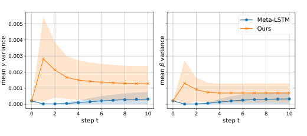 

Fig. 1. Diversity of generated parameter trajectories on QAOA circuits for MaxCut with depth p = 10. At each rollout step t, we compute the mean squared deviation of the generated angles from the instance-mean trajectory, averaged over angle dimensions {γℓ}p ℓ=1 (left) and {βℓ}p ℓ=1 (right). Curves show the mean across test instances; shaded bands indicate ±1 standard deviation across instances. Meta-LSTM exhibits lower diversity (near-identical paths) than our graph-conditioned meta-optimizer.

📷 Fig 2

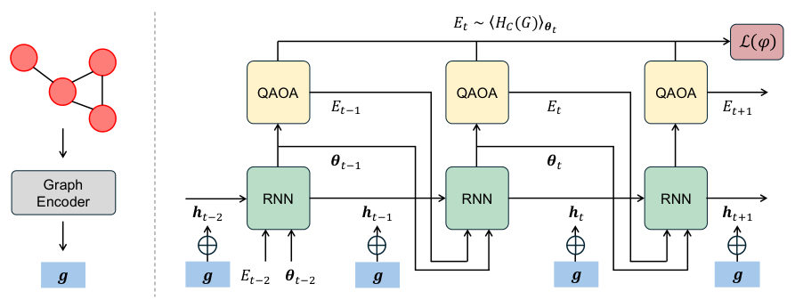 

Fig. 2. Overview of the graph-conditioned meta-optimizer training pipeline. (Left) The graph instance is first projected to a fixed-dimension vector g by a graph encoder. (Right) A meta-optimizer, realized by a recurrent neural network (RNN), is trained to produce a trajectory of QAOA variational parameters. At each step t, the graph embedding g is injected to the RNN hidden state ht, effectively conditioning parameter generation on instance-specific graph features.

📷 Fig 3

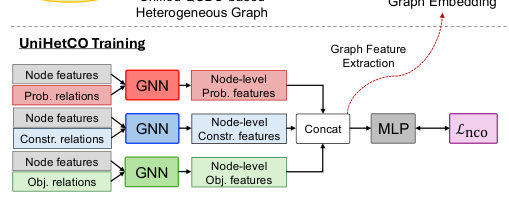 

Fig. 3. Overview of the UniHetCO graph encoder. UniHetCO not only encodes the problem instance structure (red), but also its objective (green) and constraints (blue), into a unified graph representation. This property makes feature transfer across different problem classes possible.

📷 Fig 4

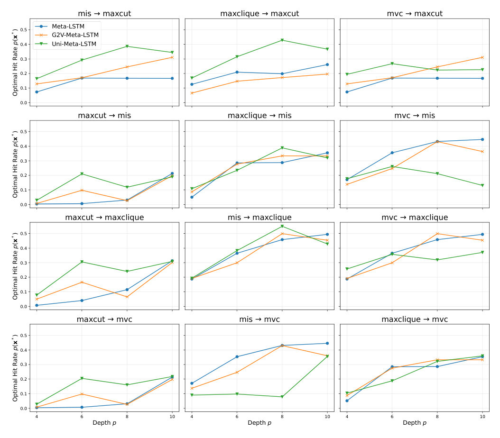 

Fig. 4. Optimal hit rate p(x∗) on cross-problem parameter transfer. We report pairwise problem transfer across four circuit depths p ∈{4, 6, 8, 10}, resulting in 48 transfer settings. The meta-optimizer is trained on one problem class and then fine-tuned on another with 5 gradient steps.

📷 Fig 5

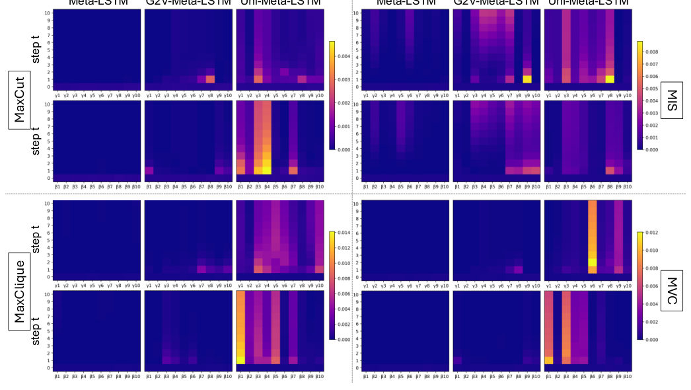 

Fig. 5. Visualization of diversity in generated parameter trajectories among three methods, Meta-LSTM, G2V-Meta-LSTM and Uni-Meta-LSTM, on four problem classes (MaxCut, MIS, MaxClique and MVC). The trajectories are plotted on the QAOA circuit depth p = 10 and unrolling horizon T = 10.

📷 Fig 6

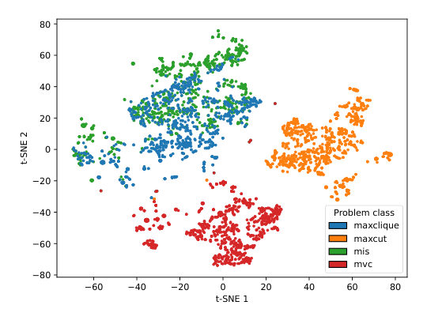 

Fig. 6. A demonstration of the UniHetCO embedding space: t-SNE visualization of UniHetCO graph embeddings for 1000 training instances from each of four problem classes (MaxCut, MIS, MaxClique, and MVC), totaling 4000 points. The embeddings form well-separated clusters by problem class, while also reflecting problem similarity; MIS and MaxClique exhibit partially interleaved clusters, consistent with their closely related structure.

**Main problem.**

The difficulty of efficiently tuning QAOA parameters across different combinatorial optimization problem classes and preventing 'trajectory collapse' in existing meta-optimizers.

**Main result.**

The proposed graph-conditioned meta-optimizer (Uni-Meta-LSTM) achieves superior parameter transferability and higher trajectory diversity across various graph problem types compared to unconditioned or structure-only models.

**Method.**

A neural meta-optimizer (LSTM) is trained end-to-end using differentiable feedback from the QAOA objective, conditioned on problem-aware graph embeddings generated via the UniHetCO framework.

**Summary.**

This paper introduces a new meta-optimizer for the QAOA algorithm that uses graph embeddings to improve how parameters are transferred between different types of optimization problems. By incorporating both the structure of the graph and the specific constraints of the problem into the neural network, the authors prevent the optimizer from producing identical, non-adaptive parameter paths. The method demonstrates significant improvements in finding optimal solutions for problems like MaxCut and Maximum Clique, even when trained on different problem classes. This approach reduces the computational effort required for parameter tuning in variational quantum algorithms.

Detailed structure

**Model / system.**

The study focuses on the Quantum Approximate Optimization Algorithm (QAOA) applied to combinatorial problems including MaxCut, Maximum Independent Set, Maximum Clique, and Minimum Vertex Cover, using a cost Hamiltonian derived from quadratic programming formulations.

**Key observables.**

Solution quality (Approximation Ratio, Optimal Hit Rate), Feasibility Rate, Trajectory Diversity (variance of angles), and Optimization Effort (convergence time).

**Important parameters / regimes.**

Circuit depth (p), penalty parameter (lambda), and graph embeddings (g).

**Assumptions / limitations.**

The meta-optimizer generates a short parameter trajectory rather than a full optimization; the framework assumes compatibility with a standard X-mixer Hamiltonian.

**Figures summary.**

Figure 1 compares trajectory diversity between the proposed method and Meta-LSTM; Figure 2 shows the training pipeline; Figure 3 illustrates the UniHetCO encoder; Figure 5 shows heatmaps of parameter variance; Figure 6 presents t-SNE visualizations of the embedding space.

**Paper structure.**

The paper introduces the problem of parameter transferability, presents the UniHetCO graph embedding and the graph-conditioned LSTM architecture, details the training mechanism using differentiable feedback, evaluates performance across multiple problem classes and transfer settings, and discusses limitations regarding circuit depth scaling.

Abstract

We study parameter transferability for the Quantum Approximate Optimization Algorithm (QAOA) across multiple combinatorial optimization problem classes from a parameter generation perspective. Specifically, a meta-optimizer is trained on one problem class and deployed on another during test time. Prior work employs a Long Short-Term Memory network to emulate QAOA optimization trajectories, but the learned dynamics usually collapse to near-identical paths, limiting cross-problem transfer efficiency. In this paper, we present a problem-aware graph-conditioned meta-optimizer for QAOA that learns to generate parameter trajectories over a fixed horizon, providing strong initializations with only a few steps. The optimizer is conditioned on compact graph embeddings and trained end-to-end using differentiable feedback from the QAOA objective, avoiding the need for ground-truth angles. We evaluate across multiple graph problem classes, including MaxCut, Maximum Independent Set, Maximum Clique, and Minimum Vertex Cover. We report both solution quality and feasibility-aware metrics where constraints apply. Results across a comprehensive empirical study consisting of 64 settings show that the learned optimizer can reduce optimization effort and improve performance over standard initialization, while exhibiting transferable behavior across graph families and problem types.

[↑ back to top](#top)

### [Griffiths inequalities and Gibbs-Bogoliubov inequality for general gauge glasses with Gaussian disorder on Nishimori line](http://arxiv.org/abs/2604.25697v1)

**Authors:** Manaka Okuyama, Masayuki Ohzeki

**Type:** theory · **Category:** disordered systems and neural networks · **PDF:** <https://arxiv.org/pdf/2604.25697v1>

**Analysis basis:** full PDF text, analyzed in chunks

📷 Fig 1

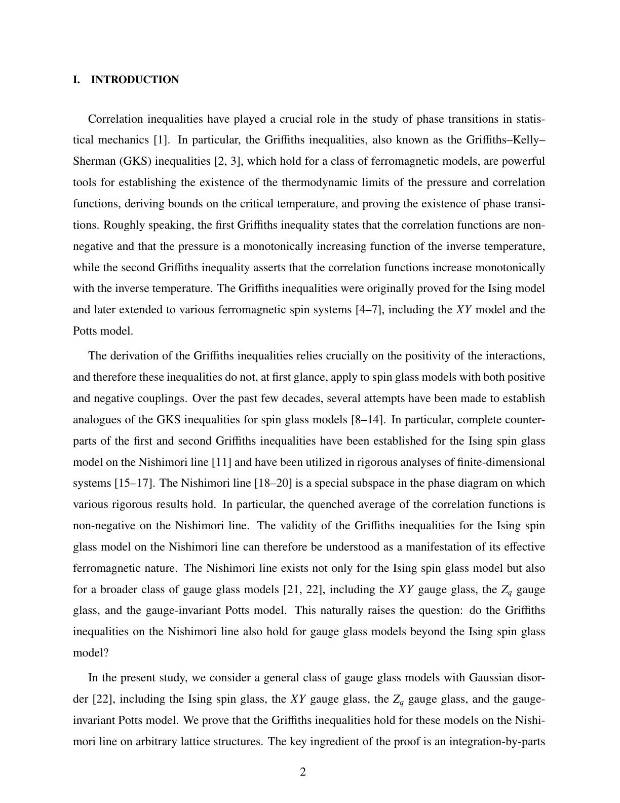 

Low-resolution page preview, page 2

📷 Fig 2

 

Low-resolution page preview, page 3

📷 Fig 3

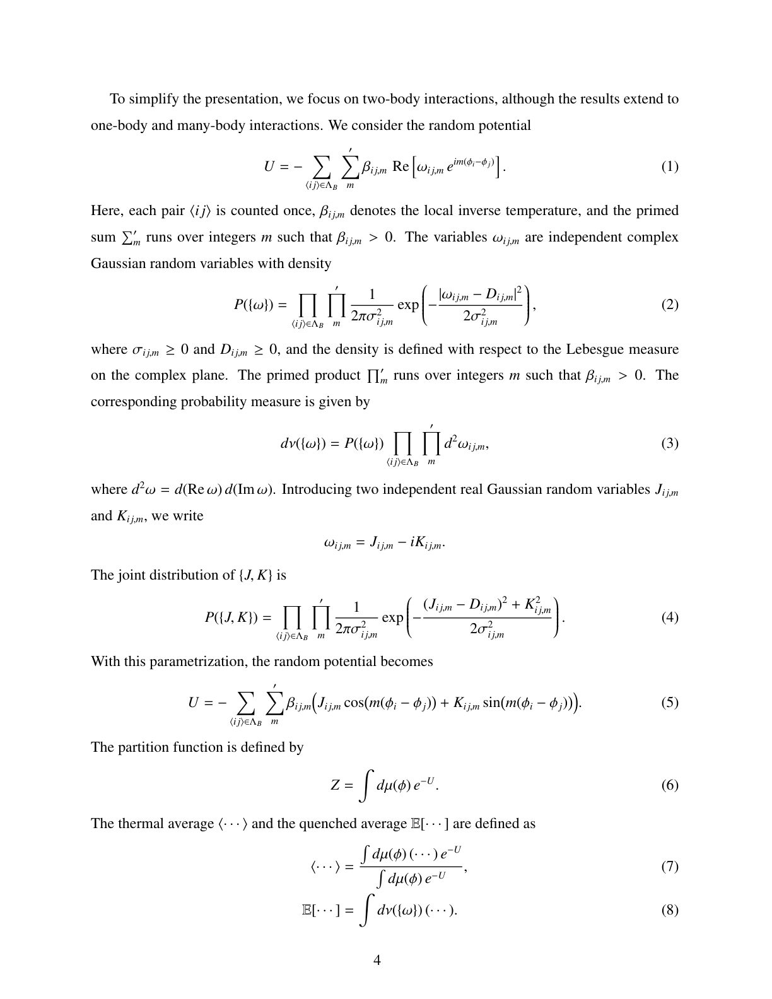 

Low-resolution page preview, page 4

📷 Fig 4

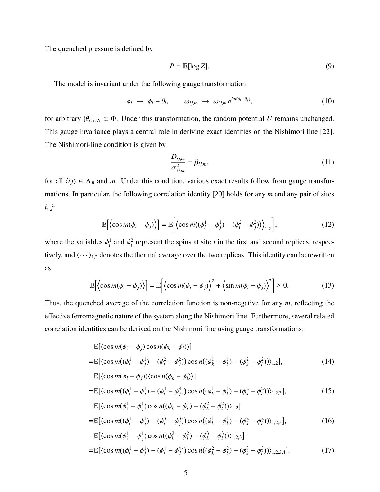 

Low-resolution page preview, page 5

📷 Fig 5

 

Low-resolution page preview, page 6

📷 Fig 6

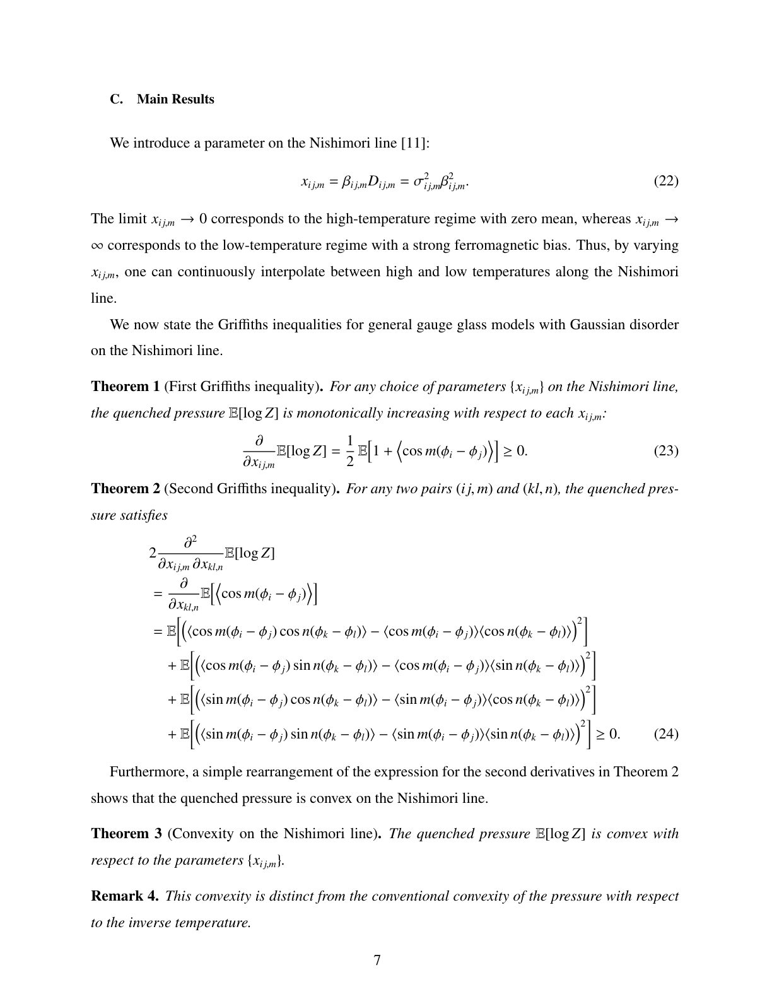 

Low-resolution page preview, page 7

📷 Fig 7

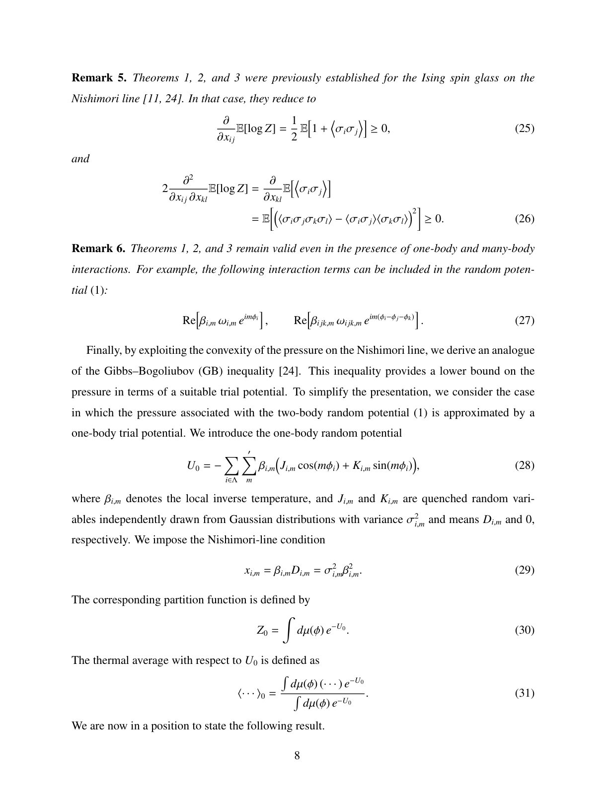 

Low-resolution page preview, page 8

📷 Fig 8

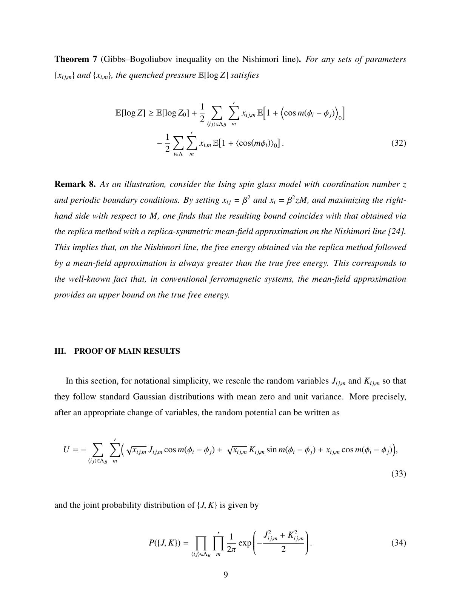 

Low-resolution page preview, page 9

📷 Fig 9

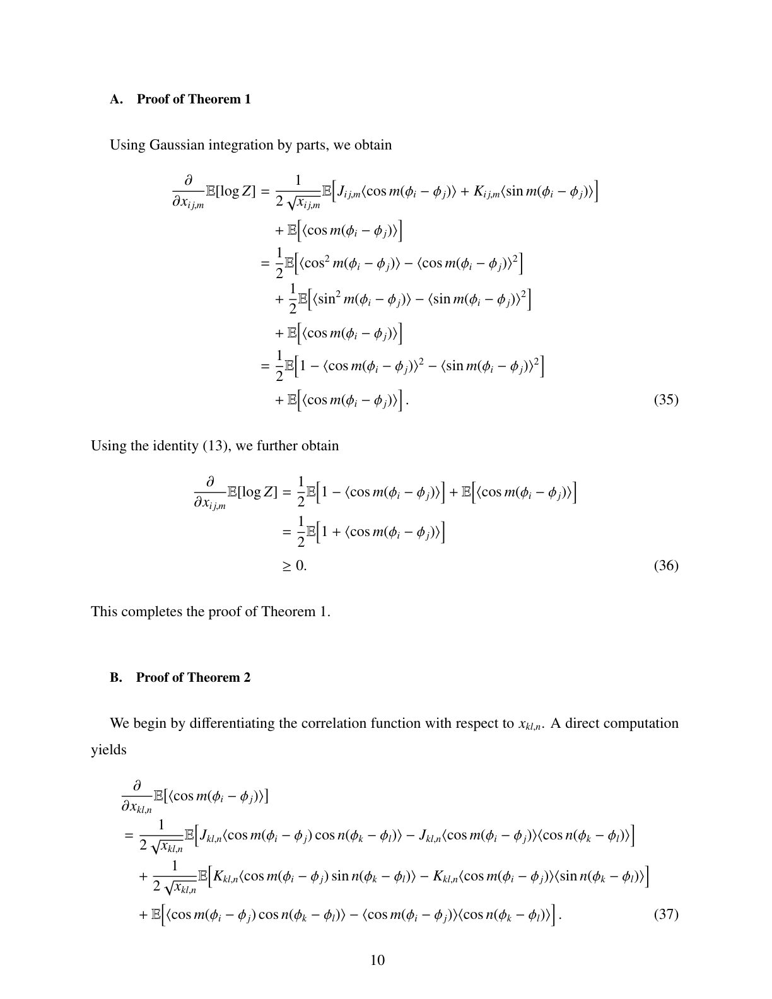 

Low-resolution page preview, page 10

📷 Fig 10

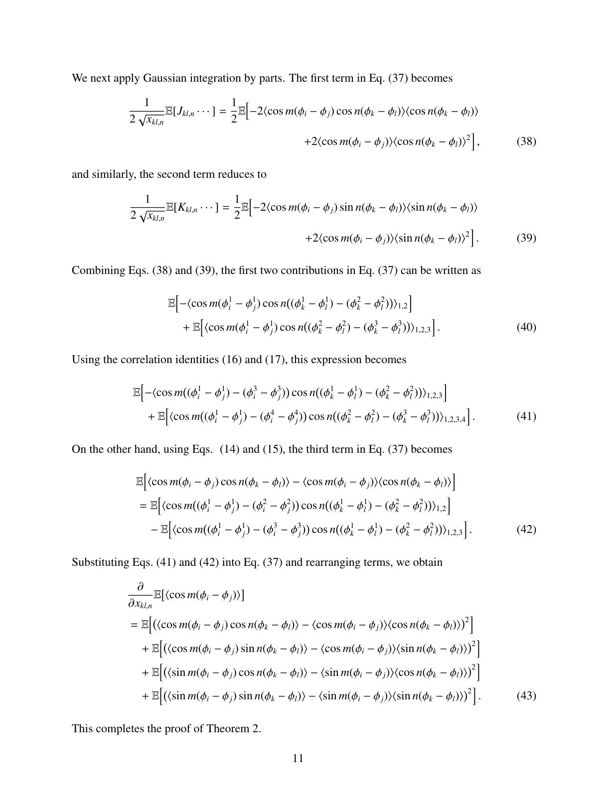 

Low-resolution page preview, page 11

**Main problem.**

The paper aims to extend the validity of Griffiths inequalities and the Gibbs-Bogoliubov inequality from the Ising spin glass to a broader class of gauge glass models.

**Main result.**

The authors prove that the first and second Griffiths inequalities hold for general gauge glass models on the Nishimori line, implying monotonicity of pressure and correlation functions, and establish an analogue of the Gibbs-Bogoliubov inequality.

**Method.**

The proof utilizes Gaussian integration-by-parts, gauge transformations, and the derivation of correlation identities involving multiple replicas.

**Summary.**

This paper provides a mathematical generalization of known properties of the Ising spin glass to a much wider range of gauge glass models. By proving that Griffiths inequalities hold on the Nishimori line, the authors show that certain thermodynamic quantities like pressure and correlations behave monotonically. Additionally, they show that a replica-symmetric mean-field approximation provides an upper bound on the true quenched free energy. This work clarifies the 'effective ferromagnetic nature' of these complex disordered systems under specific temperature constraints.

Detailed structure

**Model / system.**

A class of gauge glass models with Gaussian disorder on the Nishimori line, including the Ising spin glass, XY gauge glass, Zq gauge glass, and gauge-invariant Potts model on arbitrary lattice structures.

**Key observables.**

Quenched pressure (E[log Z]), correlation functions, and quenched average of the free energy.

**Important parameters / regimes.**

The Nishimori line condition, local inverse temperature (beta), and the interpolating parameter (x) representing the strength of the ferromagnetic bias.

**Assumptions / limitations.**

The results are restricted to Gaussian disorder and systems constrained to the Nishimori line; the spin space is assumed to be a compact Abelian group.

**Paper structure.**

The paper introduces the general gauge glass model, proves the first and second Griffiths inequalities via differentiation and integration by parts, demonstrates the convexity of the quenched pressure, and concludes by establishing the Gibbs-Bogoliubov inequality and its implications for mean-field theory.

Abstract

We consider a class of gauge glass models with Gaussian disorder on the Nishimori line, including the Ising spin glass, the $XY$ gauge glass, the $Z_q$ gauge glass, and the gauge-invariant Potts model. We prove that the first and second Griffiths inequalities hold for these models on arbitrary lattice structures. As a consequence, both the pressure and the correlation functions are monotonically increasing with respect to the inverse temperature along the Nishimori line. Furthermore, we establish an analogue of the Gibbs--Bogoliubov inequality for this class of models. This result implies that, on the Nishimori line, the approximate quenched free energy obtained via the replica method with a replica-symmetric mean-field approximation is always greater than the true quenched free energy. Our results provide a broad generalization of previous results established for the Ising spin glass with Gaussian disorder on the Nishimori line.

[↑ back to top](#top)

### [Identifying strong correlation using only the Kohn-Sham density of one-electron states](http://arxiv.org/abs/2604.25125v1)

**Authors:** Daniel D. Rivera, Gustavo M. Dalpian, John P. Perdew

**Type:** theory · **Category:** strongly correlated electrons · **PDF:** <https://arxiv.org/pdf/2604.25125v1>

**Analysis basis:** full PDF text, analyzed in chunks

📷 Fig 1

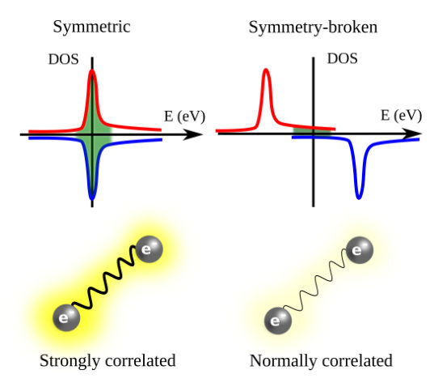 

FIG. 1. Spin symmetry breaking effect on the density of states. The green shaded region marks the vicinity of the Fermi level. Positive/red (negative/blue) density of states correspond to spin up (down). The figure illustrates that symmetric states exhibit a larger number of degenerate elec- tronic states near the Fermi level. Symmetry breaking reduces the number of quasi-degenerate states in this region, thereby reducing the effective impact of the missing electron–electron interactions at the non-interacting level.

📷 Fig 2

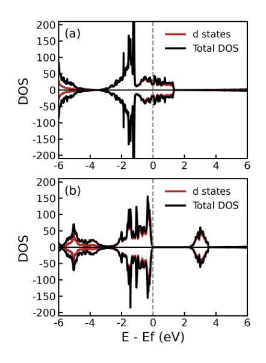 

FIG. 3. Densities of states for (a) symmetric (nonmagnetic) and (b) symmetry-broken (antiferromagnetic) NiO. The den- sity of states is plotted upward for spin ↑and downward for spin ↓.

📷 Fig 3

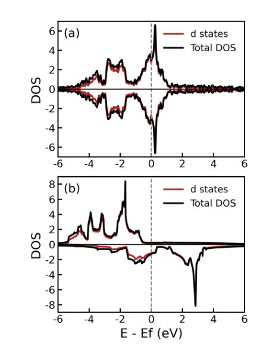 

FIG. 2. Densities of states for (a) symmetric (nonmagnetic) and (b) symmetry-broken (ferromagnetic) Fe. The density of states is plotted upward for spin ↑and downward for spin ↓.

📷 Fig 4

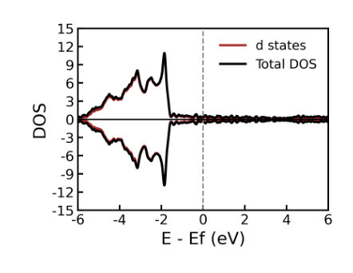 

FIG. 4. Density of states for symmetric (nonmagnetic) Cu.

📷 Fig 5

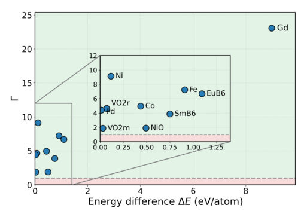 

FIG. 5. ∆E vs Γ plot. Green (red) region is for strongly (normally) correlated system.

**Main problem.**

Developing a practical, computable indicator to identify strongly correlated electronic systems using only the Kohn-Sham density of one-electron states.

**Main result.**

The authors introduce a correlation parameter (Gamma) based on the density of states at the Fermi level that successfully distinguishes between normally correlated and strongly correlated regimes.

**Method.**

Spin Density Functional Theory (spin-DFT) using the r2SCAN meta-GGA functional within the VASP/PAW framework, comparing symmetric and symmetry-broken configurations.

**Summary.**

This paper proposes a new way to identify strongly correlated materials without needing expensive beyond-DFT methods like DFT+U. By looking at the density of states in a standard Kohn-Sham calculation, the authors show that a specific parameter (Gamma) can predict whether a system will require explicit treatment of electron correlation. The method works by observing how spin symmetry breaking lifts degeneracies, effectively transforming a strongly correlated system into a normally correlated one. This provides a practical diagnostic tool for researchers to determine the reliability of standard DFT for new materials.

Detailed structure

**Model / system.**

A diverse set of electronic systems including transition metals (Ni, Fe, Co, Pd, Cu, Ag, Zn, Cd), oxides (NiO, VO2), and rare-earth compounds (EuB6, SmB6, Gd).

**Key observables.**

Correlation parameter (Gamma), energy difference between symmetric and symmetry-broken states (Delta E), and the ratio of density of states at the Fermi level.

**Important parameters / regimes.**

Gamma (ratio of KS DOS to uniform electron gas DOS), Gaussian-smeared Gamma_g, and the energy width (delta) for integrating states around the Fermi level.

**Assumptions / limitations.**

The energy difference between symmetric and symmetry-broken states serves as a proxy for correlation energy; the approach is subject to standard DFT limitations like self-interaction error.

**Figures summary.**

Figure 1 shows how spin symmetry breaking reduces near-degenerate states; Figure 2 and 3 illustrate the reduction of DOS at the Fermi level and band-gap opening in Fe and NiO, respectively; Supplemental figures show DOS changes for various other materials.

**Paper structure.**

The paper introduces the problem of identifying strong correlation, proposes the Gamma parameter, tests it against a wide range of metals and oxides, validates it using a Gaussian-smeared version (Gamma_g), and compares the results to the Stoner criterion and Hubbard model.

Abstract

Strongly correlated systems have long been a central and highly non-trivial topic in condensed matter physics. At the non-interacting level, strong correlation can be associated with powerful (near) degeneracies between occupied and unoccupied states, which leads to a high density of states near the Fermi level in metallic configurations. Such regimes are commonly treated with beyond-density functional theory (DFT) approaches, such as DFT+U or DFT+DMFT while maintaining symmetric configurations. Here, we explore the hypothesis that symmetry breaking in the Kohn-Sham (KS) non-interacting system can qualitatively account for the energetic effects of strong correlation in the corresponding interacting system within standard DFT. By lifting near-degeneracies around the Fermi level, symmetry breaking diminishes the potential correlation effects, reducing the need for an explicit treatment of electron correlation, transforming an otherwise strongly correlated symmetric configuration into a normally correlated one, thus avoiding the need for interacting methods beyond DFT. This naturally connects nonmagnetic to magnetic states. We apply this idea to both strongly and normally correlated metals and observe that spin symmetry breaking leads to a pronounced reduction of the density of states at the Fermi level and a significant lowering of the total energy in strongly correlated cases. To describe the degree of correlation that the interacting system would have relative to the KS state, we introduce a correlation parameter ($Γ$), defined as the ratio between the Kohn-Sham density of one-electron states at the Fermi level and that of a corresponding uniform electron gas. This parameter distinguishes strongly correlated systems, which would require explicit treatment, from normally correlated ones, which do not.

[↑ back to top](#top)

### [INJEQT: Improved Magic-State Injection Protocol for Fault-Tolerant Quantum Extractor Architectures](http://arxiv.org/abs/2604.25094v1)

**Authors:** Sayam Sethi, Sahil Khan, Aditi Awasthi, Abhinav Anand, Jonathan Mark Baker

**Type:** theory · **Category:** quantum information and computing · **PDF:** <https://arxiv.org/pdf/2604.25094v1>

**Analysis basis:** full PDF text, analyzed in chunks

📷 Fig 1

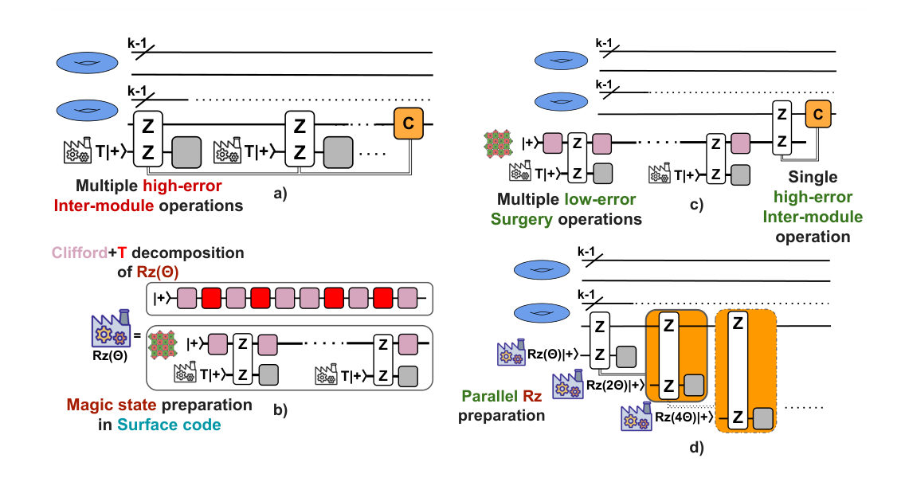 

Fig. 1: Overview of magic state injection techniques. (a) Baseline standard injection: Represented by the Tour de Gross architecture, which relies on multiple high-error inter-module operations. (b) Surface code Rz-factory: Illustration of the Clifford+T decomposition of the Rz-state and the synthesis of an Rz-factory within the surface code using multiple |T⟩- factories. (c) Proposed qLDPC injection: Our method injects the prepared Rz-state into the qLDPC code, utilizing a single inter-module operation and fault-tolerant lattice surgery operations on surface code. (d) Time-efficient injection (INJEQT): Simultaneous preparation of multiple Rz-states required for post-injection corrections,...

📷 Fig 2

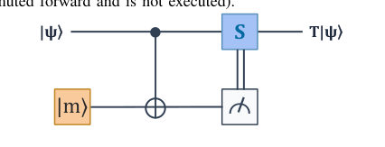 

Fig. 2: The two magic-state injection techniques considered in this work. |m⟩is the magic state being injected which can be either of T |+⟩or Rz(θ) |+⟩depending on the factory choice.

📷 Fig 3

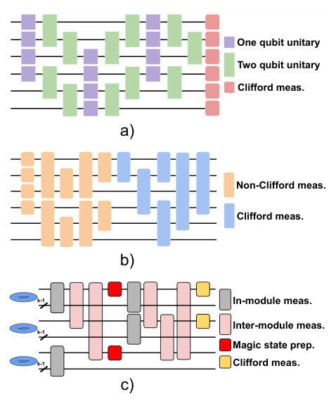 

Fig. 3: Illustration of circuits across different abstraction layers. (a) Standard Circuit Model illustrating single and two- qubit unitary gates followed by measurements. (b) Pauli- Based Computing Model representing the computation as a sequence of Clifford and non-Clifford measurements. (c) Tour de Gross ISA, showing the modular instruction set architecture including In-module, Inter-module measurement and magic state preparation. For further details on the exact compilation process, see Ref. [14] and Ref. [31].

📷 Fig 4

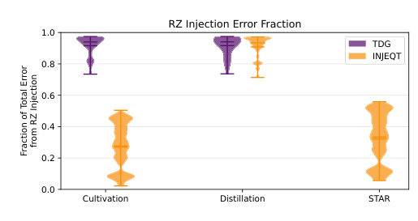 

Fig. 4: Fraction of the total program infidelity (error) that comes from Rz injections across all benchmarks. INJEQT reduces the error contribution from Rz for all factory types.

📷 Fig 5

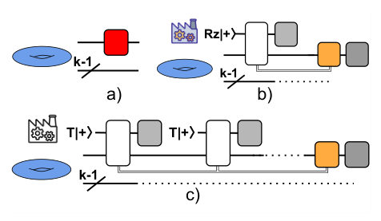 

Fig. 5: Illustration of magic state injection techniques within the Tour de Gross (TDG) ISA. (a) Magic state preparation represented as a primitive within the TDG instruction set architecture. (b) Direct injection of an Rz magic state sourced from a dedicated Rz-factory, followed by necessary feed- forward corrections. (c) Sequential injection of magic states as a series of T-gates from a T-factory to realize non-Clifford rotations, including subsequent adaptive Clifford correction.

📷 Fig 6

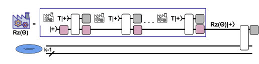 

Fig. 6: Execution of the 2-level INJEQT factory where we perform multiple sequential injections onto the auxiliary code. Each injection can be done either via lattice surgery or transversal CNOT (Figure 2). Once the Rz(θ) state is prepared in this auxiliary code, it is then injected onto the extractor module via an inter-module measurement.

📷 Fig 7

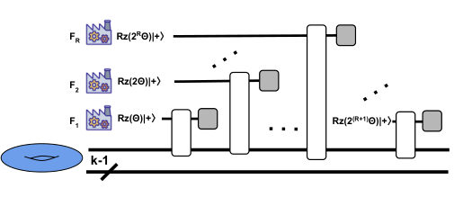 

Fig. 7: INJEQT pre-fetching technique using R copies of the 2-level factories. All R factories begin preparing different Rz(θi = 2i−1θ) states. Once the Rz(θ) state completes preparation in F1, it is injected onto the extractor module. If the measurement result indicates that a correction is required, then the already prepared Rz(2θ) state is injected, and so on. Simultaneously, F1 begins preparing the next un-prepared state, i.e., the Rz(2R+1θ) state. The execution may stall if the preparation time for F1 exceeds the time taken to inject the previous R states.

📷 Fig 8

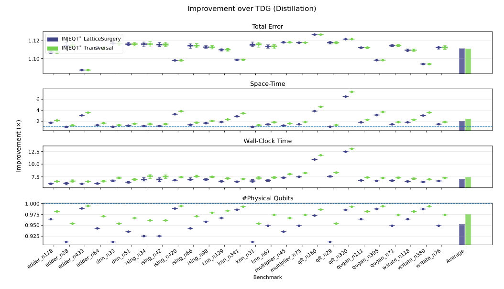 

Fig. 8: Improvements gained by INJEQT∗over TDG across different metrics for the entire benchmark suite for the distillation factory. We also report the mean improvement at the end.

📷 Fig 9

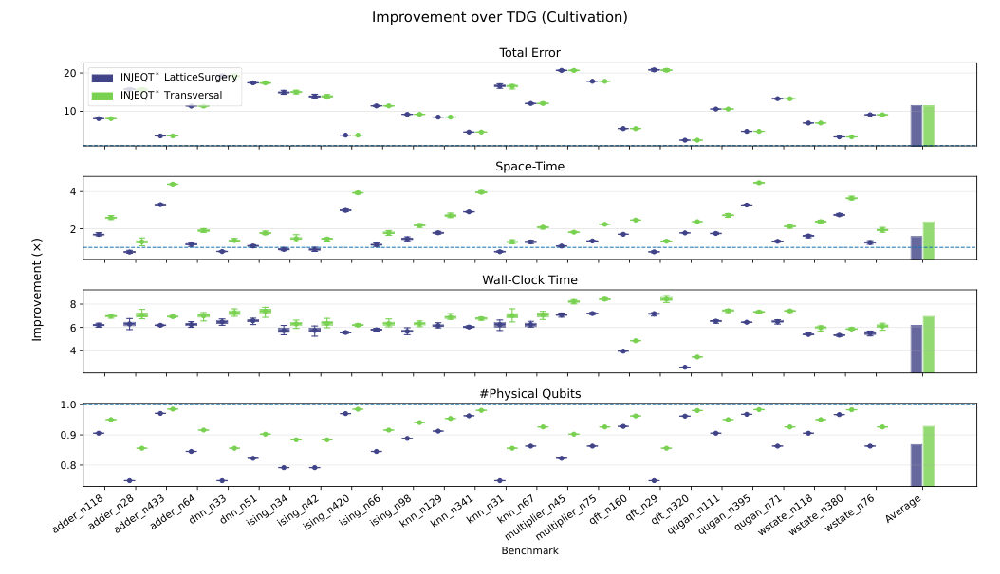 

Fig. 9: Improvements gained by INJEQT∗over TDG across different metrics for the entire benchmark suite for the cultivation factory. We also report the mean improvement at the end.

📷 Fig 10

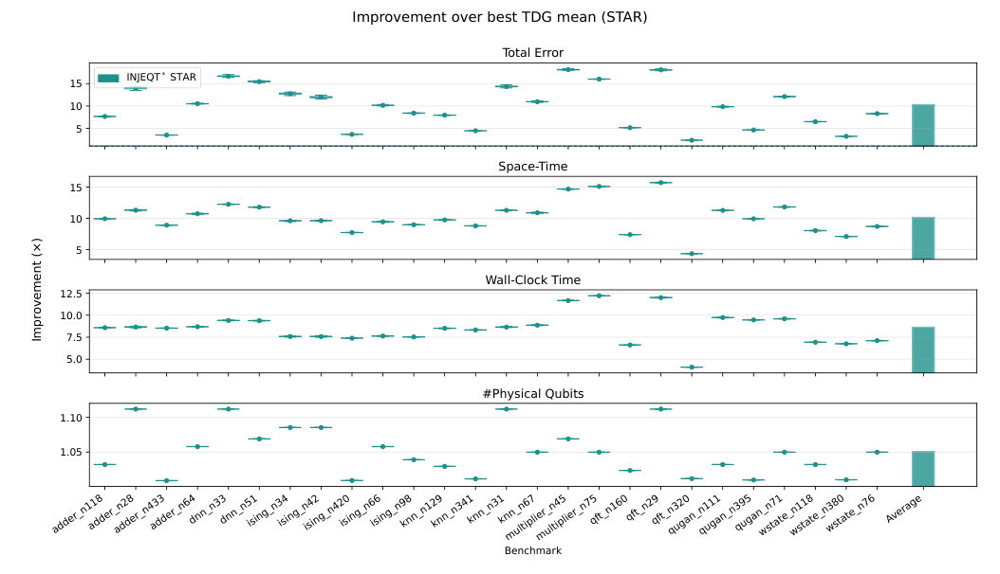 

Fig. 10: Improvements gained by INJEQT∗over TDG across different metrics for the entire benchmark suite for the STAR factory. We use the better of distillation or cultivation for the corresponding TDG metric. We also report the mean improvement at the end.

**Main problem.**

In near-term fault-tolerant quantum computing (FTQC) extractor architectures, the 'synthillation' process (combining T-state preparation and injection) is the primary source of error, specifically due to expensive and error-prone inter-module measurements.

**Main result.**

The proposed INJEQT protocol reduces overall error rates by up to 22x and improves wall-clock time by up to 13x by using an auxiliary code to synthesize Rz states with fewer inter-module measurements.

**Method.**

The authors propose a 2-factory design that uses an auxiliary code (like the surface code) to synthesize Rz(theta) states, combined with a pre-fetching strategy to prepare states in parallel to mitigate latency.

**Summary.**

This paper addresses the critical error bottleneck in fault-tolerant quantum computing architectures that rely on 'extractor' modules. By introducing the INJEQT protocol, the authors demonstrate a way to synthesize rotation states in an auxiliary code to minimize the most error-prone inter-module measurements. Their approach significantly reduces both the error budget and the execution time of quantum programs. The results show substantial improvements in efficiency and robustness across different quantum error correction codes and hardware models.

Detailed structure

**Model / system.**

The study focuses on extractor-based architectures using qLDPC codes (such as the Gross code) and evaluates performance using Pauli-Based Computing (PBC) models, including lattice surgery and transversal CNOT-based injection.

**Key observables.**

Total program error rate, wall-clock time, physical qubit count, and space-time cost.

**Important parameters / regimes.**

Logical error rates, code distances (d), number of INJEQT factories (R), and precision scales (epsilon_synth) ranging from 10^-8 to 10^-10.

**Assumptions / limitations.**

Assumes the validity of the extractor-based architecture and specific error profiles for inter-module measurements; neglects trivial operations like syndrome extraction due to negligible error contribution.

**Figures summary.**

Figure 1 compares four injection techniques; Figure 2 illustrates two injection techniques; Figure 6 shows the 2-level INJEQT factory process; Figure 7 shows the pre-fetching technique; Figures 8-10 plot improvements in error, time, and space-time metrics for various factory types (Distillation, Cultivation, STAR).

**Paper structure.**

The paper identifies the bottleneck in FTQC architectures, introduces the INJEQT protocol and pre-fetching strategy, provides a theoretical derivation for Rz injection efficiency, evaluates the protocol across various factory types and injection models, and concludes with a robustness analysis.

Abstract

Near-term FTQC system designs are constrained by limited error budgets and largely sequential execution of non-Clifford gates. As a result, reducing the number of the most-error prone instructions becomes critical for successful program execution. In this work, we study the extractor architecture, a recently proposed FTQC design that enables universal quantum computation on spatially-efficient QEC codes such as the BB code family. In these architectures, over $90\%$ of the total program error arises from the synthillation process, which involves $\lvert T\rangle$-state preparation and injection to implement non-Clifford gates. We observe that standard Rz synthillation requires multiple sequential $\lvert T\rangle$-state injections, each incurring an inter-module measurements, the most expensive instruction in the architecture, which cumulatively dominate the overall error budget.   To address this bottleneck, we propose INJEQT, a $2$-factory design that uses an auxiliary code capable of synthesizing $Rz(θ)$ states with lower error rates. These states are then injected into the extractor modules using only a constant number of inter-module measurements. This approach reduces overall error rates by up to $22\times$. We further reduce the time overhead by a pre-fetching strategy that prepares the Rz states and their correction states in parallel. This approach improves the wall-clock time by up to $13\times$ and reduces the space-time cost by up to $7.2\times$, for an optimal choice of the number of INJEQT factories for each metric. We evaluate INJEQT for multiple state preparation techniques such as distillation, cultivation and STAR, and model the execution times for both lattice surgery-based and transversal CNOT based injections. Our results demonstrate that INJEQT is robust across factory choices and device technologies, enabling more efficient architectural designs for FTQC.

[↑ back to top](#top)

### [Intrinsic magnetotransport and orientation dependent topological Hall effect in EuAuBi](http://arxiv.org/abs/2604.25365v1)

**Authors:** Lipika, Sneh, Shobha Singh, Ralf Koban, Walter Schnelle, Kaustuv Manna

**Type:** experiment · **Category:** strongly correlated electrons · **PDF:** <https://arxiv.org/pdf/2604.25365v1>

**Analysis basis:** full PDF text, analyzed in chunks

📷 Fig 1

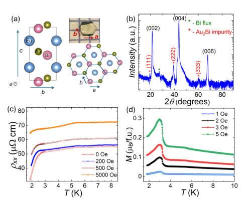 

FIG. 1. (a) Crystal structure of EuAuBi, the blue, pink, and brown represents Eu,Bi, and Au atoms respectively. The hexagonal shaped crystal (grown using Bi flux) of approxi- mately 2mm is shown (b) X-ray diffraction θ - 2θ plot (in logarithmic scale) of EuAuBi crystal grown using Bi flux, the primary peaks corresponds to the (001) planes of EuAuBi and the peaks indicated by red asterisk corresponds to the Au2Bi impurity phase formed in the crystal, Temperature-dependent (c) resistivity, and (d) magnetization in the presence of dif- ferent magnetic fields.

📷 Fig 2

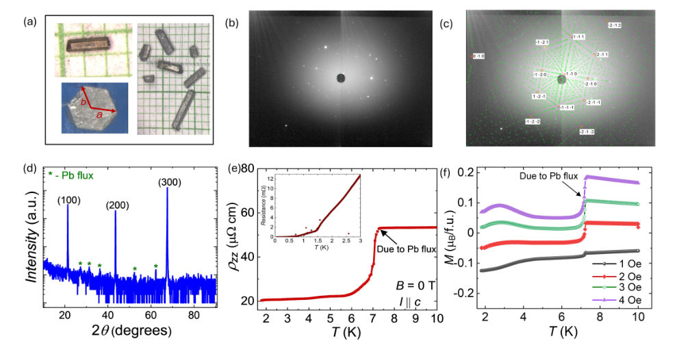 

FIG. 2. (a) The as-grown rod-shaped crystals (grown using Pb flux) of approximately 2-3 mm are obtained with hexagonal cross-section area, (b) the Laue x-rays diffraction pattern of the crystal, (c) simulated pattern of the laue diffraction matches with the (1-10) plane, (d) the θ - 2θ XRD diffraction pattern shows the (h00) plane of the crystal indicating the crystal is c-oriented, (e) Temperature-dependent resistivity of EuAuBi crystal grown using Pb flux, the drop at 7 K is due to Pb flux [26] that is present over the crystal surface. The inset shows the temperature-dependent resistance of the same crystal measured up to 300 mK. (f) The temperature-dependent magnetization in the presence...

📷 Fig 3

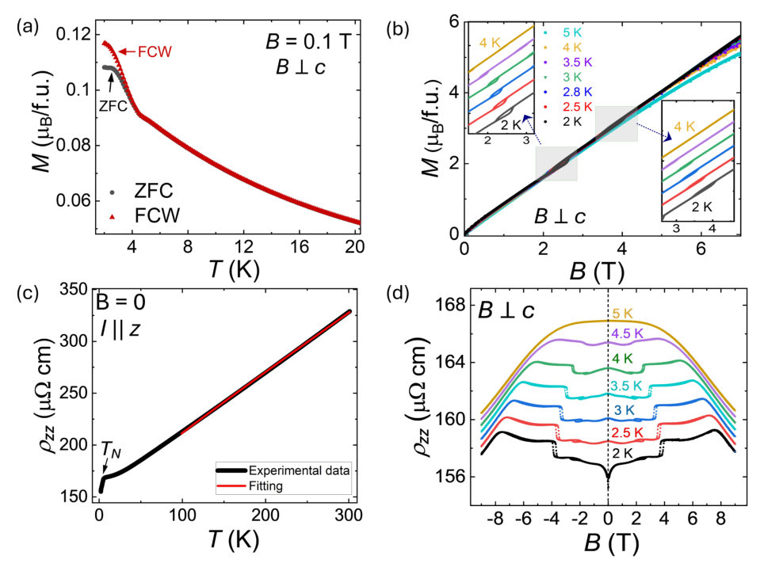 

FIG. 3. (a) Zero-field cooling (ZFC) and Field-cooled warming (FCW) magnetization curves in the presence of 0.1 T magnetic field applied in-plane of the crystal. (b) Field-dependent magnetization M (B) at different temperatures for B ⊥c. The zoomed in parts of the anomalies are shown in the insets. (c) Temperature-dependent resistivity in the absence of magnetic field for I ∥z is depicted in black color along with the fitting (by red color) obtained using the Eq. 1 in temperature range 100 - 300 K. (d) Field-dependent resistivity ρzz at different temperatures for B ⊥c.

📷 Fig 4

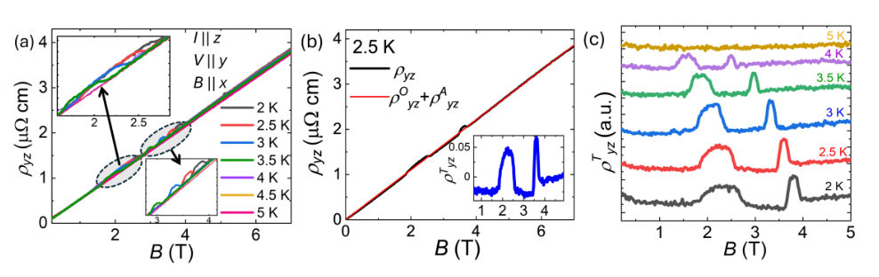 

FIG. 4. (a) Field-dependent Hall signal ρyz at different temperatures for I ∥z, V ∥y, and B ∥x, (b) Fitting of ρyz using ρO yz + ρA yz at T = 2.5 K. Inset shows the topological Hall effect signal extracted at T = 2.5 K (c) Topological Hall signal, ρT yz extracted from the ρyz by subtracting ρyz O and ρyz A at different temperatures.

📷 Fig 5

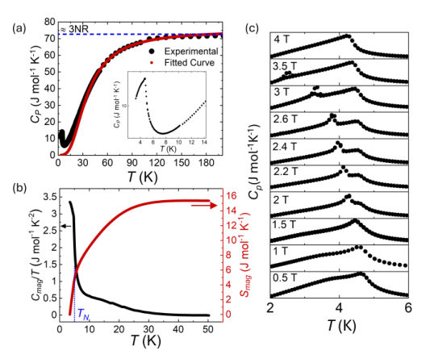 

FIG. 5. (a) Black curve is the experimental data of zero field temperature-dependent specific heat Cp (T) and red curve represents the fitting of experimental curve using con- tributions from electronic and phononic (Debye and Ein- stein) specific heats. (b) Temperature-dependent plot of mag- netic part of specific heat (Cmag/T) and entropy (Smag. (c) Temperature-dependent specific heat at different magnetic fields.

📷 Fig 6

 

Fig. 5(b) presents the temperature dependence of Cmag/T and Smag. The magnetic entropy exhibits a rapid increase up to TN, followed by a gradual rise until it saturates at higher temperature. The entropy saturates at approximately 15.5 J mol−1 K−1, which is close to the expected magnetic entropy Rln(2S+1) = Rln8 J mol−1 K−1 for Eu2+ (S = 7/2). Notably, the magentic entropy is recovered around 25 K, while the TN ∼4.8 K, indicating the presence of short-range correlation above the long-range ordering temperature (TN). This behaviour is similarly observed in other Eu based compounds like EuMg2Sb2, EuCo2P2, EuMg2Bi2, etc [38–40]. The temperature dependence of Cp measured under different applied...

**Main problem.**

The study aims to investigate the intrinsic physical properties of the magnetic topological semimetal EuAuBi, specifically determining the origin of previously reported superconductivity and uncovering orientation-dependent topological transport signatures.

**Main result.**

The researchers demonstrate that superconductivity in EuAuBi is extrinsic (due to Au2Bi impurities) and identify a new topological Hall effect (THE) signal that emerges in c-axis oriented crystals during metamagnetic transitions.

**Method.**

The study utilizes a Pb-flux growth method to produce high-quality, impurity-free single crystals, followed by characterization via X-ray diffraction, magnetometry (SQUID), and transport measurements (resistivity and Hall effect).

**Summary.**

This paper reports the successful growth of high-quality EuAuBi single crystals using a Pb-flux method, which eliminates Au2Bi impurities responsible for previously reported superconductivity. By using c-axis oriented crystals, the authors discover a topological Hall effect that appears during metamagnetic transitions. The study links electronic transport anomalies to magnetic reconstruction and non-collinear spin textures. These findings highlight how crystal orientation is crucial for observing topological signatures in magnetic semimetals.

Detailed structure

**Model / system.**

The physical system is EuAuBi, an antiferromagnetic topological semimetal with a hexagonal crystal structure (space group P63mc) and Eu atoms situated along the c-axis.

**Key observables.**

Electrical resistivity, magnetization, Hall resistivity (including decomposition into ordinary, anomalous, and topological components), specific heat, and magnetoresistance.

**Important parameters / regimes.**

Neel temperature (TN approx 4.8 K), Debye temperature (approx 135 K), and metamagnetic transition fields (approx 2 T and 3 T).

**Assumptions / limitations.**

The analysis assumes that the Hall signal can be decomposed into ordinary, anomalous, and topological components and that the superconductivity in previous studies was due to secondary phases.

**Figures summary.**

Figure 1 shows the crystal structure and evidence of impurities in Bi-flux crystals; Figure 2 displays the high-quality Pb-flux grown crystals and their XRD/Laue patterns; Figure 3 presents magnetization and specific heat data showing the antiferromagnetic transition and metamagnetic features.

**Paper structure.**

The paper begins with crystal growth and structural characterization, moves to the investigation of impurities and the debunking of intrinsic superconductivity, then explores transport properties and the discovery of the orientation-dependent topological Hall effect, and concludes with thermodynamic evidence of magnetic reconstruction.

Abstract

We report the growth of high-quality single crystals of the magnetic topological semimetal EuAuBi using a Pb flux method, which effectively suppresses the formation of secondary Au2Bi impurity phases that were prevalent in the previously reported Bi flux grown crystals. This growth optimization enables reliable investigation of the intrinsic physical properties of EuAuBi. Importantly, Pb flux growth stablilizes c axis oriented single crystals, enabling Hall measurements in a previously unexplored geometry. In this configuration (I parallel to c, B perpendicular to c), a finite residual Hall contribution, known as topological Hall signal emerges below the antiferromagnetic ordering temperature and within a narrow magnetic field range. This Hall contribution coincides with the metamagnetic transitions, anomalies in magnetoresistance, and an additional feature in field-dependent specific heat, indicating strong coupling between the electronic transport and field induced magnetic reconstructions. Consequently, these findings underscore the significance of crystal orientation in uncovering topological transport signatures in magnetic semimetals such as EuAuBi.

[↑ back to top](#top)

### [Local tensor-train surrogates for quantum learning models](http://arxiv.org/abs/2604.25631v1)

**Authors:** Sreeraj Rajindran Nair, Christopher Ferrie

**Type:** theory · **Category:** quantum information and computing · **PDF:** <https://arxiv.org/pdf/2604.25631v1>

**Analysis basis:** full PDF text, analyzed in chunks

📷 Fig 1

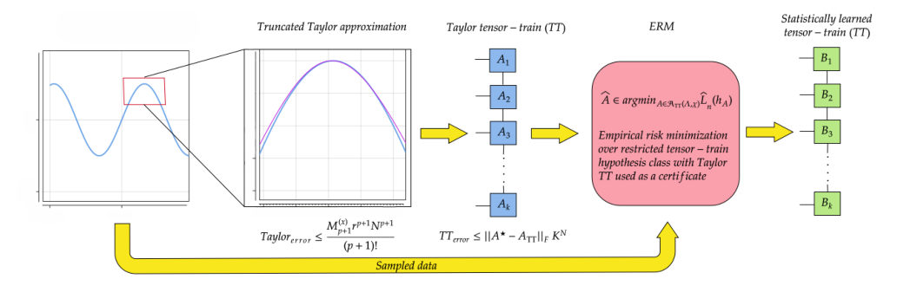 

Figure 1: Sample illustration of the local tensor-train surrogates (LTTS): Starting from a function f, we restrict to a local patch and approximate f by a truncated Taylor polynomial. The Taylor coefficients are embedded as a tensor and represented in tensor-train (TT) format with cores A1, . . . , Ak, which serves as an analytical certificate predictor with a known error bound decomposition. An empirical risk minimizer (ERM) then fits a new TT with cores B1, . . . , Bk directly from sampled function values in the local patch that potentially uses the Taylor-TT certificate as a warm-start initialization instead of a random initialization. We present deterministic bounds on the certificate’s...

📷 Fig 2

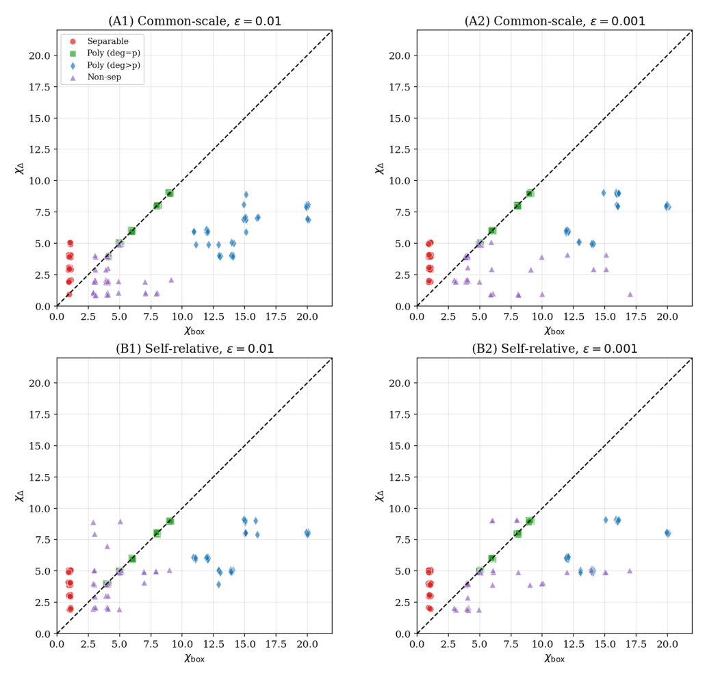 

Figure 2: Scatter of minimal TT rank caps (χbox, χ∆) for 176 test cases across four (N, p) configurations. Top row: common-scale criterion ∥A −ATT∥F ≤ε∥Abox∥F ; bottom row: self-relative criterion ∥A − ATT∥F ≤ε∥A∥F . Left column: ε = 10−2; right column: ε = 10−3. Points above the dashed diagonal indicate rank inflation (ρ &gt; 1); points below indicate deflation (ρ &lt; 1). Small random jitter is added for visibility since ranks are discrete. Separable functions cluster above the diagonal at χbox = 1; matched- degree polynomials lie on the diagonal; higher-degree polynomials and additional non-separable families fall below the diagonal under the common-scale criterion and move closer to the...

📷 Fig 3

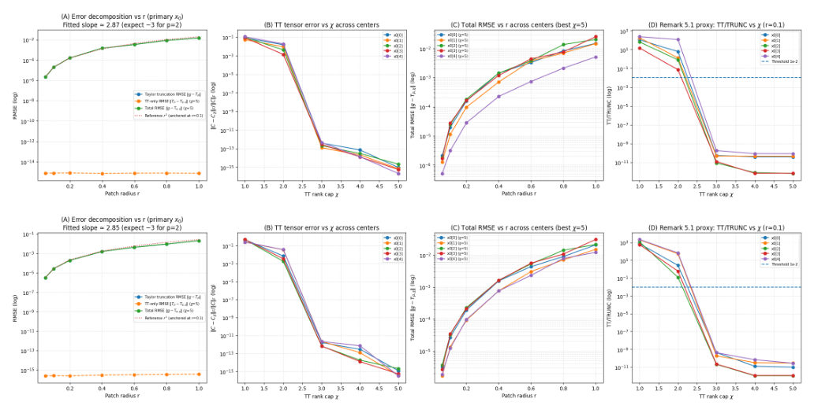 

Figure 3: Local TT surrogate (LTTS) validation across two datasets: Top row: synthetic Gaussian classification. Bottom row: UCI Banknote Authentication. Each row shows the same 4-panel diagnostic: (A) error decomposition vs patch radius r at the primary center x0, including an r3 reference, (B) TT coefficient-tensor truncation error ∥C −Cχ∥F /∥C∥F vs rank cap χ across multiple centers; (C) total surrogate RMSE ∥g −Tp,χ∥vs r across centers at the best (largest) χ used; (D) Remark 5.1 proxy, TT/TRUNC = RMSE(Tp −Tp,χ)/RMSE(g −Tp) vs χ at r ≈0.1, with the 10−2 threshold indicating when TT compression error is negligible relative to Taylor truncation.

**Main problem.**

The high computational cost of repeated quantum circuit evaluations during the inference phase of Quantum Machine Learning (QML) models.

**Main result.**

The development of a framework for local Tensor-Train (TT) surrogates that provides provable error certificates and statistical guarantees for approximating black-box quantum models.

**Method.**

A combination of Taylor polynomial approximation, Tensor-Train (TT) compression via TT-SVD, and Empirical Risk Minimization (ERM) within local patches of the input space.

**Summary.**

This paper introduces a method to create fast classical 'surrogates' for expensive quantum machine learning models. By using Tensor-Train decomposition and Taylor expansions within local patches of data, the authors create a framework that is much faster than direct circuit evaluation. The method provides mathematical guarantees on the accuracy of these surrogates, effectively separating the complexity of the representation from the complexity of the features. Numerical tests show speedups of up to 400x while maintaining high accuracy.

Detailed structure

**Model / system.**

Arbitrary trained quantum machine learning models, such as Variational Quantum Algorithms (VQAs) and Parametrized Quantum Circuits (PQCs), treated as black-box functions mapping classical inputs to expectation values.

**Key observables.**

Expectation values of quantum observables (e.g., Z expectation value), RMSE, and TT/TRUNC error ratios.

**Important parameters / regimes.**

Patch radius (r), polynomial degree (p), TT bond dimension (chi), number of data dimensions (N), and sample size (n).

**Assumptions / limitations.**

The target function is locally smooth and continuously differentiable; the input data is sampled i.i.d. from a distribution supported on a local patch; the quantum model is treated as a black-box.

**Figures summary.**

Figure 1 illustrates the LTTS workflow; Figure 3 shows error decomposition, TT compression error vs. rank, and surrogate RMSE vs. patch radius across different datasets.

**Paper structure.**

The paper identifies the QML inference bottleneck, proposes the LTTS framework, establishes a deterministic error certificate via Taylor-TT construction, provides statistical generalization bounds via ERM, analyzes rank scaling, and validates the method with numerical experiments.

Abstract

A key bottleneck in quantum machine learning is the computational cost of repeated quantum circuit evaluations during the inference phase. To address this, we present a framework for constructing fast, cheap, provably accurate classical tensor-train surrogates of fully trained quantum machine learning models within local patches of their input data space. The approach combines Taylor polynomial approximation with a tensor-train (TT) representation and embeds it in a statistical learning paradigm via empirical risk minimization. In our analysis, the Taylor-TT construction serves as a deterministic error certificate proving that the TT hypothesis class contains a good approximation; empirical risk minimization then provably recovers a surrogate with controlled generalization error and explicit bounds. This translates into three independently controllable error sources: (i) Taylor truncation error controlled by the patch radius $r$ and polynomial degree $p$, (ii) TT approximation error controlled by the bond dimension $χ$, and (iii) statistical estimation error. While the parameter count scales polynomially in the number of data dimensions $N$, i.e., $d_{\mathrm{eff}} = N(p+1)χ^2$ rather than the naive $(p+1)^N$, the worst-case constants inherit an exponential factor through the tensor-product feature norm during Taylor polynomial embedding onto TT. This cleanly separates representation complexity from feature-induced constants. Our risk bounds and sample complexity depend explicitly on the local patch radius $r$.

[↑ back to top](#top)

### [Magnetic phases of the anisotropic triangular Hubbard model from the ghost-Gutzwiller approximation in the rotating spin-frame](http://arxiv.org/abs/2604.24848v1)

**Authors:** Azin Kazemi-Moridani, Samuele Giuli, Tsung-Han Lee, A. -M. S. Tremblay, Michel Côté, Nicola Lanatà, Olivier Gingras

**Type:** theory · **Category:** strongly correlated electrons · **PDF:** <https://arxiv.org/pdf/2604.24848v1>

**Analysis basis:** full PDF text, analyzed in chunks

📷 Fig 1

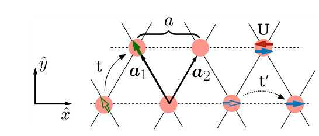 

FIG. 1. Hubbard model and the geometry of the anisotropic triangular lattice. The model contains the nearest-neighbor hoppings t along ±a1 and ±a2, and t′ along ±(a1−a2), along with the double occupation cost U. For t′ = t, the model is isotropic and C6 symmetric, and anisotropic for t′ ̸= t.

📷 Fig 2

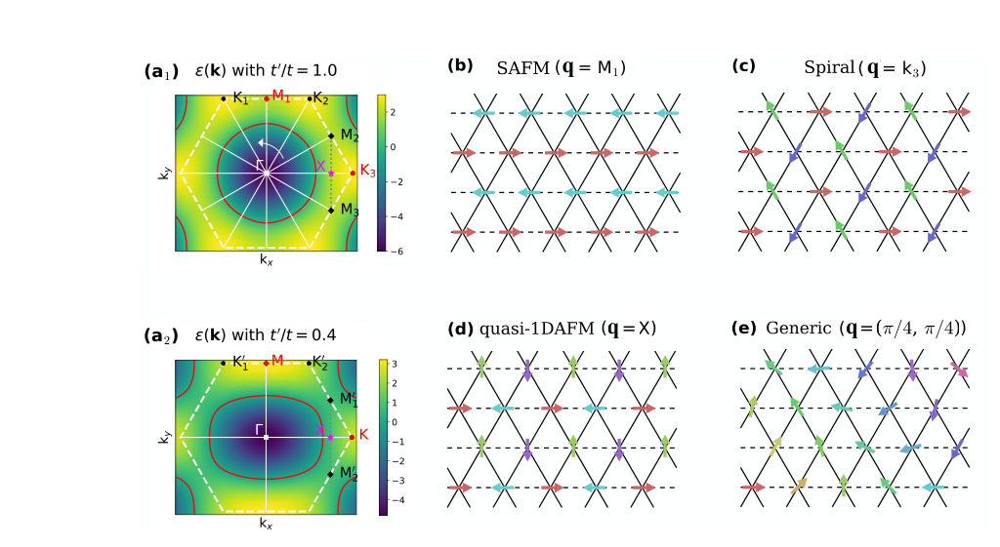 

FIG. 2. (a1, a2) Non-interacting dispersions ε(k) of the triangular lattice for the isotropic (t′/t = 1) and the anisotropic (here t′/t = 0.4) lattice, respectively. The dashed hexagon, full straight lines, and arrow indicate the Brillouin zone, mirror symmetries, and C6 symmetry, respectively. Solid red lines indicate the Fermi surface. The dotted grey line highlights the momentum characteristic of decoupled one-dimensional chains. In the isotropic case, the M and K points are symmetry- equivalent. In the anisotropic case, the M ′ and K′ points are symmetry-equivalent, but inequivalent to the M and K points. (b-e) Real space representation of the different classes of magnetic phases. (b)...

📷 Fig 3

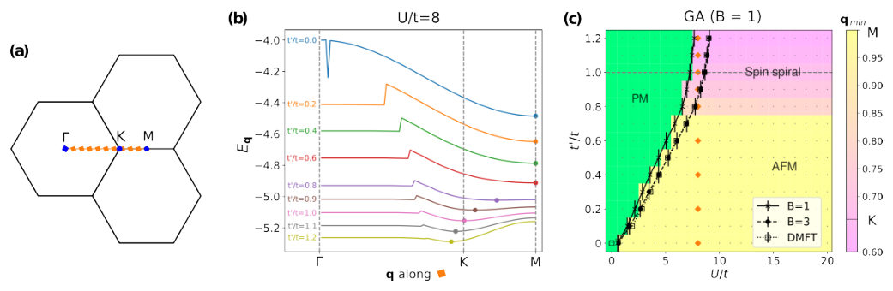 

FIG. 3. Results for magnetic phases with a wavevector along the Γ −M high-symmetry path. (a) Visual representation of the high-symmetry path. It goes from the zone center at Γ to the middle of a neighboring zone edge at M, going through a corner of the Brillouin zone at K. This path allows us to capture both the AFM state (at M), the spiral state (at K), the quasi-one-dimensional 1DAFM state (at X in the middle), and other generic states in between. (b) Total energy Eq in the grand canonical ensemble along the path Γ −M at fixed U/t = 8 for several t′/t obtained with GA (B = 1). All states with finite t′ display a plateau at small momentum, where the system falls into the metallic solution....

📷 Fig 4

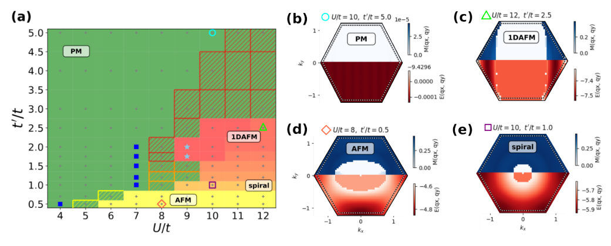 

FIG. 4. Results for magnetic states with wavevectors on the full two-dimensional grid. (a) Phase diagram obtained by extracting the magnetic ordering wavevector that minimizes the total energy Eq. The solid colors correspond to the ghost-GA B = 3 phase diagrams, while the hatched regions represent the phases obtained with GA when they differ from ghost-GA. The green color represents the paramagnetic (PM) state, while the color gradient represents the continuous evolution of magnetic states, with yellow, orange, and red the AFM, spiral quasi-1DAFM states, respectively. As in the results depicted in Fig. 3, the magnetic q fall on the high-symmetry path along Γ −X −K −M. The blue squares and...

📷 Fig 5

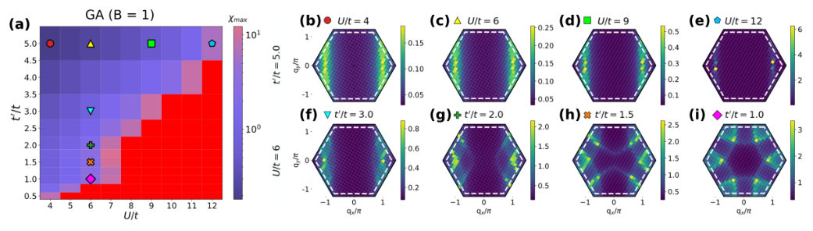 

FIG. 5. Phase diagram based on the magnetic susceptibility. (a) Largest value in q of the susceptibility χm q defined in Eq. 9, obtain with GA (B = 1) and using ϕx/t = 10−2. As we move away in parameter space from the magnetic dome depicted in Fig. 4, the amplitude of the susceptibility decreases. In the following subfigures, we present χm q on the q-grid for a few examples. (b-e) Magnetic susceptibility at fixed t′/t = 5 along increasing U/t. While χm q starts to look like a vertical line passing through the X-point characteristic of the quasi-1DAFM state, the amplitude is far from diverging. As U/t increases, the amplitude also increases, and the maximum of χm q localizes close to the...

📷 Fig 6

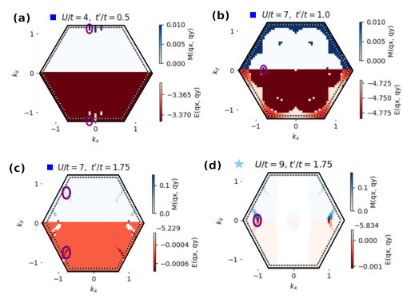 

FIG. 6. Anomalies at the phase boundary between the paramagnetic and magnetic solutions. Some points have a shallow minimum (highlighted by the purple circle) in the q-dependent total energy Eq that is either away from the Γ −M high-symmetry path, or at an unexpected place in the (t′/t, U/t) phase diagram. We discard the shallow minima and believe the unexpected points are due to coarse-graining of the q-mesh. Magnetism becomes very sensitive to this at the phase boundary. (a-c) correspond to some points of the GA phase diagram, while (d) corresponds to the ghost-GA phase diagram.

📷 Fig 7

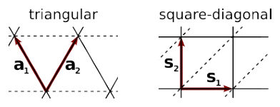 

FIG. 7. Triangular lattice and square lattice with an extra diagonal hopping. Both are topologically equivalent.

**Main problem.**

Determining the magnetic phase diagram of the anisotropic triangular Hubbard model and evaluating the accuracy of the ghost-Gutzwiller approximation (ghost-GA) compared to DMFT.

**Main result.**

The ghost-GA achieves near-DMFT accuracy at a fraction of the cost by using auxiliary orbitals to capture dynamical fluctuations, successfully identifying paramagnetic, spiral, and SDW phases while finding that the 1D AFM phase is not stabilized.

**Method.**

The study uses the ghost-Gutzwiller approximation (ghost-GA) combined with a rotating spin-frame formulation for direct total-energy minimization over a high-resolution momentum grid.

**Summary.**

This paper investigates the magnetic phase diagram of the anisotropic triangular Hubbard model using an improved variational method called the ghost-Gutzwiller approximation. By adding 'ghost' orbitals, the authors are able to capture dynamical correlation effects that standard Gutzwiller methods miss, reaching accuracy levels close to much more expensive DMFT calculations. The study maps out various magnetic phases, including spiral and spin-density wave orders, and provides an efficient framework for studying frustrated magnetic systems.

Detailed structure

**Model / system.**

The half-filled Hubbard model on an anisotropic triangular lattice, characterized by nearest-neighbor hopping t and diagonal hopping t'.

**Key observables.**

Staggered magnetization (Mq), total energy (Eq), magnetic susceptibility (chi_q), and ordering wavevector (q).

**Important parameters / regimes.**

Interaction strength (U/t), anisotropy/frustration ratio (t'/t), and the number of ghost orbitals (B).

**Assumptions / limitations.**

The analysis is restricted to coplanar magnetic configurations; the ghost-GA is a single-site method that neglects non-local correlations.

**Figures summary.**

Fig 1 shows the lattice geometry; Fig 2 shows electronic dispersions and real-space magnetic phases; Fig 3 presents energy curves and the 1D phase diagram; Fig 4 shows the full 2D phase diagram; Fig 5 displays magnetic susceptibility scans; Fig 7 demonstrates the topological equivalence of lattice representations.

**Paper structure.**

The paper introduces the model and geometry, describes the ghost-GA and rotating spin-frame methodology, presents the phase diagram and energy minimization results, compares the accuracy of GA vs ghost-GA vs DMFT, discusses susceptibility behavior, and concludes with a proof of lattice equivalence.

Abstract

We investigate the magnetic phase diagram of the half-filled Hubbard model on the anisotropic triangular lattice using the Gutzwiller approximation (GA) and its ghost generalization (ghost-GA). By combining a rotating spin-frame formulation with high-resolution momentum grids, we determine magnetic ground states through direct total-energy minimization over the ordering wavevector. We benchmark standard GA and ghost-GA against dynamical mean-field theory (DMFT) and dual-fermion results. We show that GA already captures the qualitative structure of the phase diagram, but systematically overestimates the stability of magnetic order due to the absence of dynamical fluctuations. We find that introducing a small number of auxiliary ''ghost'' orbitals is sufficient to recover most dynamical effects and significantly improves quantitative agreement with DMFT. Exploring the full Brillouin zone, we obtain a phase diagram comprising paramagnetic and various magnetic phases. In contrast to ladder dual-fermion susceptibility-based predictions, we find that the one-dimensional antiferromagnetic phase is never stabilized, despite being the leading instability in certain regimes. Our results establish ghost-GA as an efficient and systematically improvable framework for studying magnetism in frustrated systems, capable of achieving near-DMFT accuracy at a fraction of the computational cost. They also highlight that standard GA performs qualitatively well for capturing the general phase diagram, enabling the investigation of incommensurate magnetic orders in more complex systems.

[↑ back to top](#top)

### [Networked Realization of Quantum LDPC Codes](http://arxiv.org/abs/2604.25026v1)

**Authors:** Swayangprabha Shaw, Narayanan Rengaswamy

**Type:** theory · **Category:** quantum information and computing · **PDF:** <https://arxiv.org/pdf/2604.25026v1>

**Analysis basis:** full PDF text, analyzed in chunks

📷 Fig 1

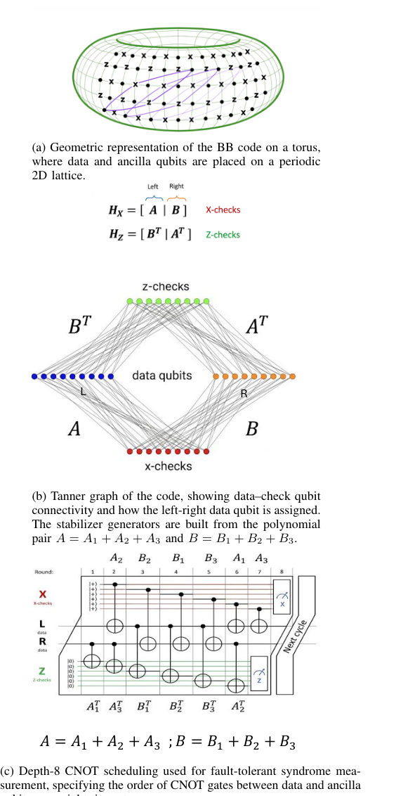 

Fig. 1: Bivariate bicycle (BB) code [15]: (a) toric representa- tion, (b) Tanner graph, and (c) depth-8 measurement schedule.

📷 Fig 2

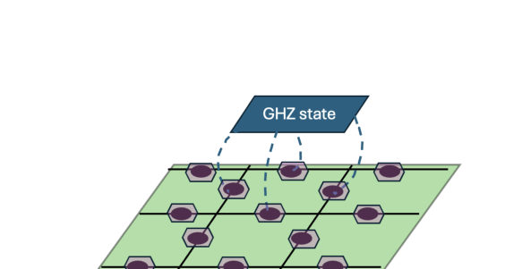 

Fig. 2: Schematic of networked surface code architecture. The hexagonal regions represent individual processors, each con- taining one data qubit. A GHZ state is utilized for syndrome extraction, as illustrated by the dashed lines connecting the GHZ state to specific data qubits within the grid structure.

📷 Fig 3

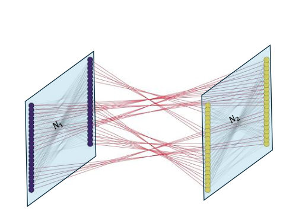 

Fig. 3: Balanced graph partitioning of the combined X-Z Tanner graph across two nodes, N1 and N2. The red lines represent bridge edges connecting check qubits and data qubits distributed across the two nodes. We performed balanced graph partitioning on this combined X-Z Tanner graph using pymetis [23]. This assigns every data qubit and every check qubits to one of the two network partitions.

📷 Fig 4

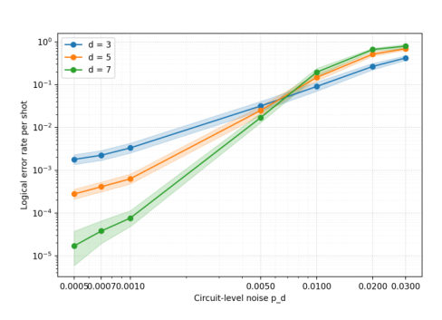 

Fig. 5: Surface code performance with noisy GHZ (pGHZ = 0.002) under full circuit-level noise. This reproduces the exact performance and ≈7.5% threshold estimated in [1].

📷 Fig 5

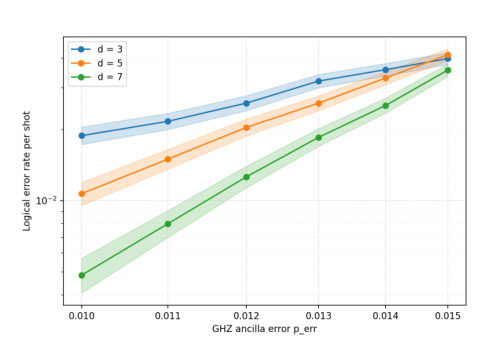 

Fig. 4: Surface code performance with varying GHZ noise rate (p = 0). A clear threshold is visible, below which logical error rates decrease with increasing code distance.

📷 Fig 6

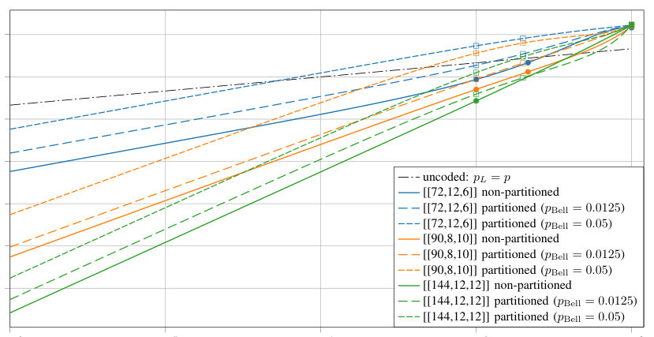 

Fig. 6: Logical error-rate comparison between non-partitioned and partitioned BB code implementations for the [[72, 12, 6]], [[90, 8, 10]], and [[144, 12, 12]] codes under circuit-level noise. Solid curves correspond to non-partitioned implementations, while dashed curves correspond to partitioned implementations obtained from a pymetis bipartition of the combined Tanner graph. In the partitioned case, cross-partition interactions are implemented using Bell-pair-assisted bridge operations, and the effect of Bell-link quality is shown for Bell-state fidelities FBell = 0.99 and FBell = 0.96 (equivalently, pBell = 0.0125 and pBell = 0.05). The black dash-dotted line denotes the uncoded...

**Main problem.**

The non-local stabilizer connections required by high-performance QLDPC codes like Bivariate Bicycle (BB) codes present significant hardware challenges for monolithic processors. This work investigates whether these codes can be effectively implemented in a networked architecture where qubits are distributed across multiple modules.

**Main result.**

The study finds that a networked implementation of BB codes is viable if Bell pair fidelity is maintained at approximately 99% or higher. It also identifies a local gate noise threshold of roughly 1% for these partitioned codes.

**Method.**

The authors use Stim for circuit-level noise simulations and PyMetis for balanced min-cut partitioning of the X-Z Tanner graph. Decoding is performed using Belief Propagation with Ordered Statistics Decoding (BP-OSD) for BB codes and PyMatching for surface codes.

**Summary.**

This paper explores the feasibility of implementing Bivariate Bicycle QLDPC codes in a distributed quantum network. By partitioning the code across two nodes and using Bell-pair-assisted gates, the authors quantify the noise penalty introduced by the network. They demonstrate that while partitioning increases the error rate, the advantage of QLDPC codes can be preserved provided the inter-node entanglement fidelity remains high (above 99%). This provides a roadmap for scaling quantum error correction using modular hardware.

Detailed structure

**Model / system.**

A networked quantum architecture consisting of two interconnected nodes. Each node contains a subset of the code's qubits and ancillas, with inter-module operations mediated by teleported CNOT gates using pre-shared Bell pairs.

**Key observables.**

Logical error rate (pL), error thresholds for gate and GHZ noise, and Bell pair demand per syndrome cycle.

**Important parameters / regimes.**

Bell pair fidelity (F_Bell), physical error rate (p), encoding rate, code distance (d), and the number of cut edges (E_cut) in the Tanner graph.

**Assumptions / limitations.**

The noise model assumes stochastic depolarizing errors on all gates, measurements, and resets, and that the network connectivity is limited to the edges defined by the partitioning strategy.

**Figures summary.**

Figure 1 shows the BB code structure and measurement schedule; Figure 2 depicts the networked surface code architecture; Figure 3 illustrates the graph partitioning strategy; Figure 4 and 5 show surface code error thresholds; Figure 6 compares logical error rates for different BB code families.

**Paper structure.**

The paper introduces the challenge of non-local QLDPC codes, establishes a surface code baseline in a networked setting, proposes a partitioning strategy for BB codes, presents circuit-level noise simulations and threshold analyses, and concludes with performance comparisons and future directions.

Abstract

Quantum low-density parity-check (QLDPC) codes with good parameters are promising candidates for low-overhead fault-tolerant quantum computing, but their non-local stabilizers require long-range connectivity and frequent qubit movement, introducing practical challenges. Prior work has studied the networked implementation of topological codes, where each node only holds one or a few qubits of the entire code, and demonstrated competitive performance under practical constraints such as the quality of network-provided entanglement. However, since these codes are already geometrically local, such a networked setting might not be essential. In this work, we propose and study the networked implementation of better QLDPC codes, specifically bivariate bicycle codes due to their similarity to surface codes and the controlled amount of long-range connections in their stabilizers. We begin by recreating networked surface codes in Stim, with one code qubit per node, and provide additional insights into their circuit-level noise performance. We then extend this approach to bipartitions of bivariate bicycle codes, using balanced min-cut partitioning on their combined X-Z Tanner graph to identify optimal qubit splits. For stabilizers spanning nodes, we implement teleported CNOTs and vary the Bell pair fidelity enabling these gates. Through circuit-level noise simulations with BP-OSD decoding, we provide the first insights into networked realizations of these codes and compare their performance with monolithic implementations. We conclude by outlining advantages, limitations, and future directions.

[↑ back to top](#top)

### [Observation and Control of Moiré-Tailored Topological Dirac States](http://arxiv.org/abs/2604.25598v1)

**Authors:** R. Ganser, M. P. T. Masilamani, B. Geldiyev, M. M. Hirschmann, A. Consiglio, J. Schusser, D. Di Sante, M. Ünzelmann, F. Reinert

**Type:** both · **Category:** strongly correlated electrons · **PDF:** <https://arxiv.org/pdf/2604.25598v1>

**Analysis basis:** full PDF text, analyzed in chunks

📷 Fig 1

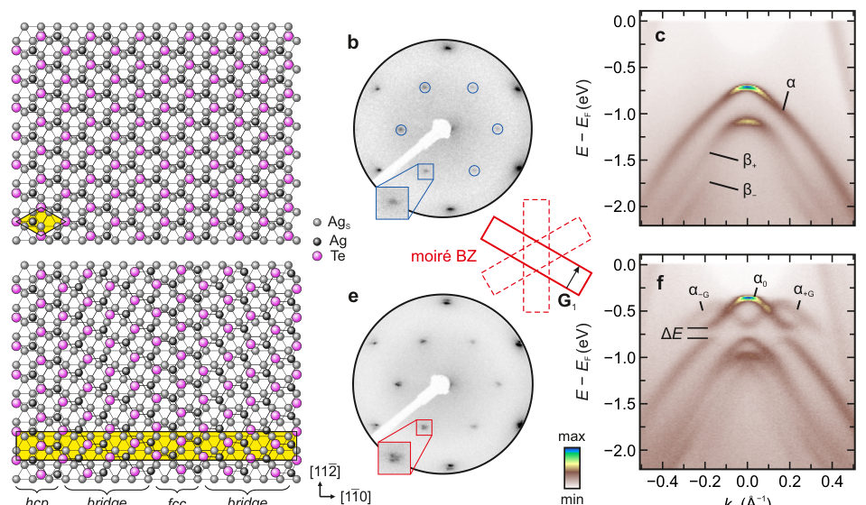 

FIG. 1. Structural and electronic characterization of the flat (a-c) and moir´e-modulated (d-f) honeycomb monolayer AgTe on Ag(111). a, A ball model of the flat AgTe/Ag(111), where the surface unit cell is indicated by the yellow rhombus. b, The associated LEED image reveals the ( √

📷 Fig 2

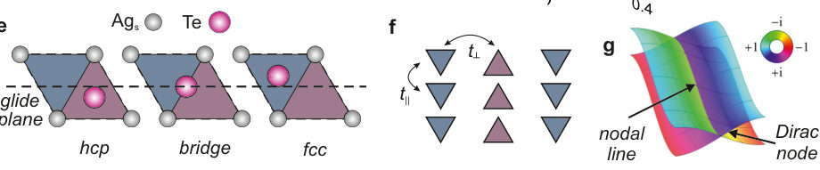 

FIG. 2. Formation of moir´e band gaps and Dirac nodal lines from non-symmorphic moir´e superlattice symmetry. a,b ARPES data and c,d continuum model calculations (see text). a, c, Constant energy contours with the top and bottom slices correspond to energies of −0.35 eV and −0.46 eV relative to EF, respectively. b, d, Band structure cuts along the two distinct momentum paths indicated in a (cuts 1 and 2). Key electronic features, i.e., Dirac cone and Dirac nodal line are labeled across all plots for clarity. ARPES data was conducted at 40 K. e Schematic illustrating the emergence of a glide-plane symmetry resulting from the formation of a moir´e superlattice. For better visibility, we here...

📷 Fig 3

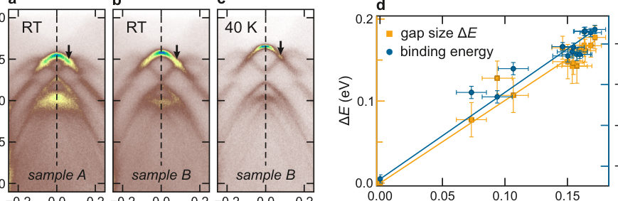 

FIG. 3. Structural tuning of the moir´e electronic band structure via the AgTe coverage and temperature. a–c, ARPES intensity maps recorded at room temperature (RT) (a, b) and at 40 K (c). Black arrows mark the symmetry-enforced Dirac crossings. f, Mutual scaling of the energy gap ∆E (yellow squares) and the energy of the valence band maximum (blue circles) against the moir´e reciprocal lattice vector gmoir´e. The linear trend highlights the systematic response of the AgTe band structure to the moir´e superlattice periodicity. The error bars are derived from the confidence intervals by varying the center position (of the energy peak or Dirac point momentum) within reasonable limits. This is...

**Main problem.**

The difficulty of directly observing and distinguishing true gapless moiré-Dirac quasiparticles from trivial photoemission artifacts in moiré heterostructures.

**Main result.**

Direct spectroscopic evidence of topologically protected, moiré-dressed Dirac nodal lines that can be continuously tuned by adjusting the moiré lattice periodicity.

**Method.**

Angle-resolved photoemission spectroscopy (ARPES) and low-energy electron diffraction (LEED) combined with density functional theory (DFT) and a continuum model analysis.

**Summary.**

This paper reports the discovery of topologically protected Dirac nodal lines in a 1D moiré superlattice formed by AgTe on Ag(111). Using ARPES, the researchers demonstrate that these massless Dirac states are protected by the non-symmorphic glide-mirror symmetry of the superlattice. They show that the electronic structure, including the band gaps and Dirac points, can be continuously controlled by tuning the moiré periodicity through temperature or coverage. This work establishes moiré heterostructures as a versatile platform for engineering and controlling topological electronic states.

Detailed structure

**Model / system.**

An epitaxial surface-moiré heterostructure consisting of a compressed AgTe monolayer on an Ag(111) substrate, characterized by a 1D superlattice potential and non-symmorphic glide-mirror symmetry.

**Key observables.**

Band dispersions, band gaps (approx. 160 meV), bandwidth (approx. 200 meV), and moiré reciprocal lattice vectors.

**Important parameters / regimes.**

Moiré lattice periodicity, temperature (40 K to room temperature), and AgTe coverage.

**Assumptions / limitations.**

The use of a modified nearly-free-electron continuum model and a coupled-chain tight-binding toy model to represent the superlattice potential.

**Figures summary.**

Fig 1 shows structural and electronic characterization of flat vs. moiré AgTe; Fig 3 shows ARPES intensity maps at different temperatures/coverages and a plot of universal scaling behavior for the energy gap and valence band maximum.

**Paper structure.**

The paper introduces the moiré system, presents structural and electronic characterization, details the spectroscopic observation of Dirac states, provides symmetry-based topological analysis, demonstrates tunability via temperature and coverage, and concludes with scaling laws.

Abstract

Moiré heterostructures provide a powerful framework for tailoring electronic band structures via controlled long-range periodic superlattice potentials. Beyond widely studied moiré-tailored flat bands, folded band structures can host emergent Dirac states, which have recently attracted considerable interest. Direct momentum-resolved observation of gapless moiré-Dirac quasiparticles, however, is challenging and has so far remained elusive. By performing angle-resolved photoemission spectroscopy measurements on an epitaxial surface-moiré structure, we here provide direct spectroscopic evidence of moiré-dressed Dirac states with topological character. Driven by the one-dimensional superlattice potential, electrons propagate anisotropically with a weak but massless Dirac dispersion along the confinement direction. The observed band crossings belong to topological nodal lines pinned to the mini-Brillouin zone boundaries. As such, they are enforced and robustly protected by the non-symmorphic symmetry of the superlattice. Finally, we demonstrate that the topological excitations can be almost continuously controlled by tuning the moiré lattice periodicity, directly unveiling moiré heterostructures as a promising platform for creating and controlling topological moiré-Dirac states.

[↑ back to top](#top)

### [One Coordinate at a Time: Convergence Guarantees for Rotosolve in Variational Quantum Algorithms](http://arxiv.org/abs/2604.25613v1)

**Authors:** Sayantan Pramanik, M Girish Chandra

**Type:** theory · **Category:** quantum information and computing · **PDF:** <https://arxiv.org/pdf/2604.25613v1>

**Analysis basis:** full PDF text, analyzed in chunks

📷 Fig 1

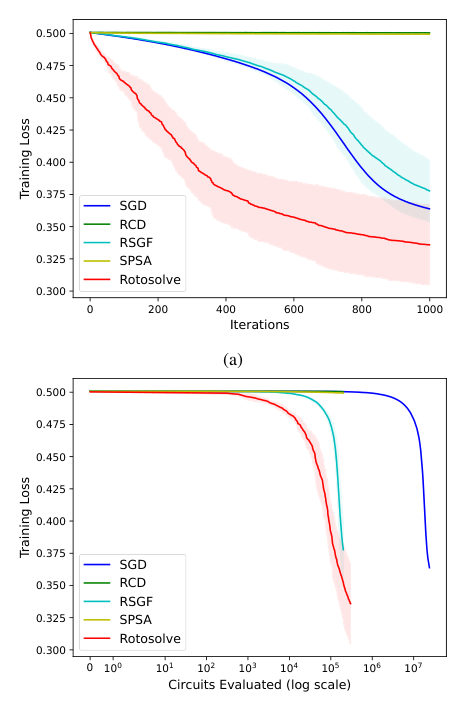 

Fig. 1: Plot of training loss against (a) iterations, and (b) the number of circuit-executions (on a log-scale) for SGD, RCD, RSGF, SPSA, and Rotosolve .

**Main problem.**

The paper addresses the open question of whether the Rotosolve algorithm, a popular coordinate-descent method for training parametrized quantum circuits, possesses formal convergence guarantees.

**Main result.**

The authors prove that Rotosolve converges to epsilon-stationary points in non-convex smooth landscapes and to epsilon-suboptimal points under the Polyak-Lojasiewicz condition, providing explicit worst-case convergence rates.

**Method.**

The study uses a rigorous mathematical analysis of the trigonometric structure of the objective function, comparing Rotosolve's performance and shot-complexity against RCD, SGD, SPSA, and RSGF.

**Summary.**

This paper provides the first formal convergence guarantees for the Rotosolve algorithm used in training variational quantum circuits. It proves that the algorithm is effective in both non-convex and PL-condition landscapes, even in the presence of finite-shot noise. The authors demonstrate that Rotosolve is hyperparameter-free and can outperform standard gradient-based methods like SGD in quantum machine learning tasks. This work turns a previously heuristic optimization method into a mathematically grounded tool for quantum computing.

Detailed structure

**Model / system.**

The study focuses on Variational Quantum Algorithms (VQAs) using parametrized quantum circuits where the objective function is the expectation value of a Hermitian observable.

**Key observables.**

The expectation value of a Hermitian observable H, and the gradient norm for stationarity.

**Important parameters / regimes.**

The number of parameters d, the noise variance sigma^2 in the finite-shot regime, and the Polyak-Lojasiewicz constant mu.

**Assumptions / limitations.**

Assumes the objective function is coordinate-wise smooth, the estimator is unbiased with bounded variance, and the landscape satisfies the Polyak-Lojasiewicz condition almost everywhere.

**Figures summary.**

Figure 1(a) shows training loss vs. iterations for various optimizers, and Figure 1(b) shows training loss vs. number of circuit executions, demonstrating Rotosolve's efficiency.

**Paper structure.**

The paper defines the Rotosolve algorithm and its trigonometric basis, proves convergence theorems for stationary and suboptimal points, compares complexity with RCD, and validates findings via QML numerical experiments.

Abstract

In this paper, we resolve an open question in the field of optimization algorithms for training parametrized quantum circuits: Does the popular Rotosolve algorithm converge? Until now, interpolation-based coordinate descent methods such as Rotosolve have mostly been treated as heuristics, lacking any formal convergence guarantees. We rigorously analyze Rotosolve, and show that it converges to $\varepsilon$-stationary points if the optimization landscape is non-convex and smooth; and to $\varepsilon$-suboptimal points if the objective function additionally obeys the Polyak-Lojasiewicz (PL) condition. Further, we derive explicit worst-case rates of convergence in the finite quantum measurement regime. These rates are contrasted against those from a similar coordinate-based method: Randomized Coordinate Descent (RCD). Although in the worst case their rates are, prima facie, equivalent, we present arguments for a more nuanced comparison between the two. We highlight that Rotosolve is hyperparameter-free, and implicitly uses first and second derivatives in its updates. Finally, we supplement our theoretical findings with numerical experiments from Quantum Machine Learning; and compare the performance of Rotosolve against RCD, Stochastic Gradient Descent, Simultaneous Perturbation Stochastic Approximation, and Randomized Stochastic Gradient Free methods.

[↑ back to top](#top)

### [Piezomagnetic effect of a rare-earth-based altermagnet TbPt6Al3](http://arxiv.org/abs/2604.25282v1)

**Authors:** Ryohei Oishi, Kazunori Umeo, Takuya Aoyama, Takahiro Onimaru, Kaya Kobayashi

**Type:** experiment · **Category:** strongly correlated electrons · **PDF:** <https://arxiv.org/pdf/2604.25282v1>

**Analysis basis:** full PDF text, analyzed in chunks

📷 Fig 1

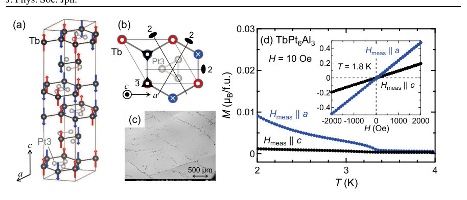 

Fig. 1. (Color online) (a) Magnetic structure of TbPt6Al326) in which Pt1, Pt2, Pt4, and Al are omitted for clar-

📷 Fig 2

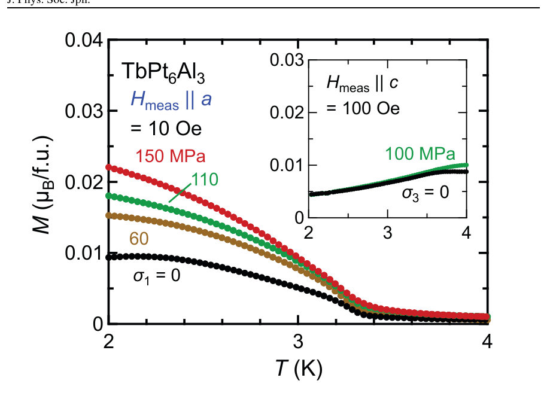 

Fig. 2. (Color online) Temperature dependence of magnetization M(T) of the single crystal of TbPt6Al3 under

📷 Fig 3

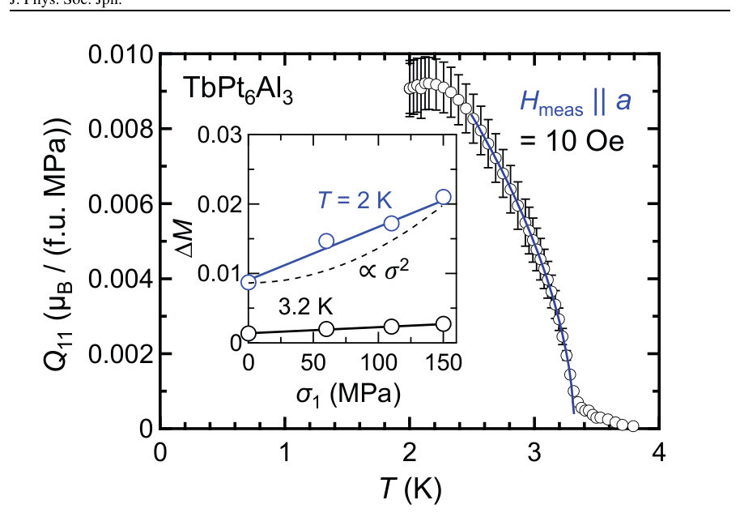 

Fig. 3. (Color online) Temperature dependence of the piezomagnetic coefficient Q11 of TbPt6Al3. The blue

📷 Fig 4

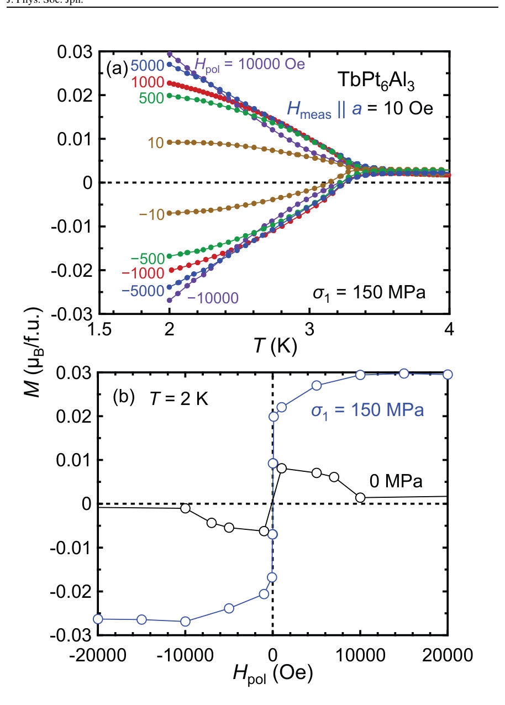 

Fig. 4. (Color online) (a) Temperature dependence of magnetization of TbPt6Al3 at σ1 = 150 MPa and Hmeas ∥

**Main problem.**

Investigation of the piezomagnetic (PZM) effect in the rare-earth-based g-wave altermagnet TbPt6Al3 and understanding the origin of its exceptionally large PZM coefficient.

**Main result.**

The study observes a linear PZM effect with a coefficient Q11 that is over two orders of magnitude larger than in other altermagnets, attributed to the strong relativistic spin-orbit coupling of Tb3+ 4f electrons.

**Method.**

Magnetization measurements were performed on single-crystalline samples under uniaxial stress using a superconducting magnetometer and a custom-made pressure cell.

**Summary.**

This paper reports the discovery of an exceptionally large linear piezomagnetic effect in the altermagnet TbPt6Al3. The observed PZM coefficient is more than 100 times larger than those found in transition-metal-based altermagnets. The researchers attribute this massive response to the strong relativistic spin-orbit coupling inherent in the 4f electrons of the terbium ions. This finding provides new insight into how heavy rare-earth elements can be used to enhance magneto-elastic responses in altermagnetic materials.

Detailed structure

**Model / system.**

The system is TbPt6Al3, a rare-earth-based g-wave altermagnet with a trigonal structure (space group 3-bar c) and collinear antiferromagnetic order.

**Key observables.**

Piezomagnetic coefficient (Q11), Néel temperature (TN), critical exponent (beta), and magnetization (M) under uniaxial stress.

**Important parameters / regimes.**

PZM coefficient Q11 = 9.1 x 10^-3 mu_B/(f.u. MPa) at 2 K; TN = 3.32 K; critical exponent beta = 0.28; poling field = 10,000 Oe.

**Assumptions / limitations.**

Assumes the observed magnetization change is due to the PZM effect and that the single-domain state is achieved via the described poling process.

**Paper structure.**

The paper introduces the material and the PZM effect, describes the experimental setup for applying uniaxial stress, presents the temperature and stress dependence of magnetization, analyzes the critical exponent, and concludes with a discussion on the role of spin-orbit coupling.

Abstract

We have investigated the piezomagnetic (PZM) effect of the rare-earth-based g-wave altermagnet TbPt6Al3 by magnetization measurements of single-crystalline samples under uniaxial stress sigma. The magnetization in magnetic field along the trigonal a axis increases linearly with sigma for T < TN, indicating the emergence of PZM effect, while the theoretically predicted nonlinear PZM effect was not observed. PZM coefficient of Q11 at 2 K is obtained as 9.1 times 10^-3 mu_B/(f.u. MPa), which is larger by more than two orders of magnitude than those for other altermagnets and noncollinear antiferromagnets. Temperature dependence of Q11 below TN yielded the critical component beta as 0.28, whose value is close to that of the magnetic moment estimated by the neutron powder diffraction. We propose that the large Q11 and the large poling field of 10000 Oe to achieve the single-domain state in TbPt6Al3 are due to the strong relativistic spin-orbit coupling of the 4f electrons in the Tb3+ ions.

[↑ back to top](#top)

### [Predicting challenging phase transitions with Bayesian active learning](http://arxiv.org/abs/2604.25756v1)

**Authors:** Lorenzo Bastonero, Gabriel Joalland, Chiara Cignarella, Lorenzo Monacelli, Nicola Marzari

**Type:** theory · **Category:** disordered systems and neural networks · **PDF:** <https://arxiv.org/pdf/2604.25756v1>

**Analysis basis:** full PDF text, analyzed in chunks

📷 Fig 1

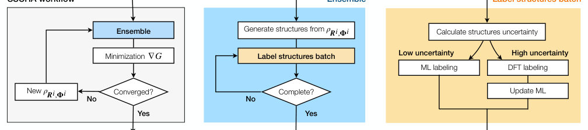 

FIG. 1. Schematic overview of the presented on-the-fly active learning scheme. Top panels, left to right, the proposed active learning scheme involves: (a) the generation of an ensemble of structures from the nuclear Gaussian density matrix ρRi,Φi at iteration i; (b) the selection of structures based on ML uncertainty, using a sparse Gaussian process force field; (c) DFT labeling, i.e., perform ground-state calculation to assign total energy E, forces, and stress of the selected structures, and use these to update the ML potential. Panel (d) schematically represents the on-the-fly active learning SSCHA with its nested processes. The left gray panel shows the SSCHA minimization workflow,...

📷 Fig 2

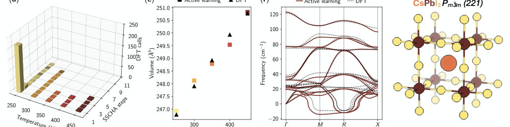 

FIG. 2. Thermodynamic and dynamical properties from the proposed active learning approach. Results of the present active-learning framework applied to (a – c) Li2O and to (d – f) α–CsPbI3 to calculate the equilibrium volume as a function of temperature, and compared to reference SSCHA calculations carried out entirely with DFT (SSCHA-DFT). (a,d) Number of DFT labeling calls during the on-the-fly training as a function of temperature and number of SSCHA minimization steps. Each iteration required the labeling of 200 and 400 configurations, for Li2O and α–CsPbI3 respectively. (b,e) Finite- temperature SSCHA equilibrium volume as obtained from the on-the-fly active learning procedure and...

📷 Fig 3

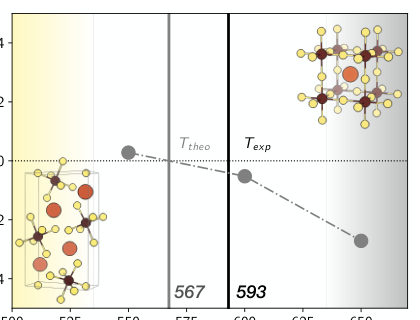 

FIG. 3. δ →α phase transition of CsPbI3. SSCHA Gibbs free energy difference between δ and α phase of CsPbI3 as a function of temperature, represented by the gray bullets. The crossing ∆Gδ→α = 0 indicates the predicted phase tran- sition temperature Ttheo, and it is compared with the experi- mental temperature Texp ≃320◦C = 593 K from Ref. 32.

**Main problem.**

Accurately predicting crystal thermodynamics and challenging phase transitions in materials with strong anharmonicity is computationally expensive due to the massive number of DFT evaluations required.

**Main result.**

The authors developed an on-the-fly Bayesian active learning framework that reduces the DFT workload by 98.4-99.8% while maintaining first-principles accuracy, successfully predicting the phase transition temperature of CsPbI3.

**Method.**

An iterative active learning workflow combining the Stochastic Self-Consistent Harmonic Approximation (SSCHA) with Sparse Gaussian Process (SGP) machine learning potentials using ACE descriptors.

**Summary.**

This paper presents a new machine learning-driven approach to accelerate the study of materials undergoing complex phase transitions. By using Bayesian active learning, the researchers can train highly accurate interatomic potentials using only a tiny fraction of the computational cost typically required by first-principles methods. The method successfully captures the temperature-dependent stability of perovskites, which is crucial for developing stable solar cells and batteries. This framework provides a scalable way to explore the thermodynamic landscapes of materials under realistic, high-temperature conditions.

Detailed structure

**Model / system.**

The study focuses on materials with significant anharmonicity, specifically Li2O (a superionic conductor) and CsPb and CsPbI3 (metal-halide perovskites) in their alpha and delta phases.

**Key observables.**

Gibbs free energy difference, phase transition temperature, phonon dispersions, equilibrium volume, and thermal expansion coefficient.

**Important parameters / regimes.**

Temperature (250-450 K for CsPbI3), pressure (ambient), and uncertainty thresholds for active learning selection.

**Assumptions / limitations.**

The nuclear density matrix is assumed to be representable as a multivariate Gaussian.

**Figures summary.**

Figure 1 shows the active learning workflow (ensemble generation, uncertainty selection, and DFT labeling); Figure 2 illustrates SSCHA calculations and temperature ranges; Figure 3(b) displays the Gibbs free energy difference vs. temperature to identify the phase transition.

**Paper structure.**

The paper introduces the problem of anharmonicity, presents the Bayesian active learning framework integrated with SSCHA, demonstrates efficiency and accuracy on Li2O and CsPbI3, and provides a detailed hyperparameter optimization analysis.

Abstract

Materials underpin modern technologies, from energy harvesting, storage, and conversion to information and communication technologies. Their functionality is often governed by the interplay between competing phases, as thermodynamic behavior shapes microscopic properties and ultimately determines technological performance; for instance, the light absorption of inorganic metal-halide perovskites in solar cells. Accurately predicting crystal thermodynamics, however, remains a major challenge for computational approaches because strong anharmonic effects require extensive sampling of the potential energy surface. Here, we present an on-the-fly Bayesian framework, combined with the stochastic self-consistent harmonic approximation, for learning first-principles interatomic potentials. This approach enables the prediction of thermodynamic properties over a broad temperature range with first-principles accuracy while requiring training on only a few tens to a few hundreds of atomic configurations. To demonstrate its power, we investigate the thermodynamic and dynamical properties of Li$_2$O, $α$-CsPbI$_3$, and $δ$-CsPbI$_3$, requiring only 44, 256, and 50 total-energy calculations, respectively. Notably, we show that this framework accurately captures the phase diagram of CsPbI$_3$, which explains its spontaneous degradation into the non-absorbing yellow phase, predicting the transition temperature with remarkable accuracy and efficiency. More broadly, the method presented opens a novel route toward accelerated materials engineering under realistic conditions for a wide range of technologically relevant applications, including solid-state batteries, optoelectronic devices, and memristors.

[↑ back to top](#top)

### [Proof of the Error Scaling for Universally Robust Dynamical Decoupling Sequences](http://arxiv.org/abs/2604.25807v1)

**Authors:** Domenico D'Alessandro, Phattharaporn Singkanipa, Daniel Lidar

**Type:** theory · **Category:** quantum information and computing · **PDF:** <https://arxiv.org/pdf/2604.25807v1>

**Analysis basis:** full PDF text, analyzed in chunks

📷 Fig 1

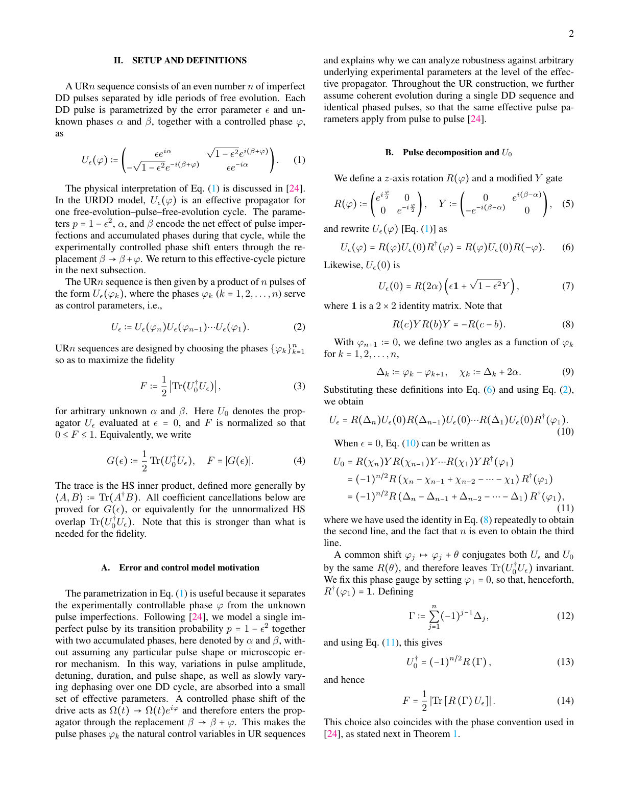 

Low-resolution page preview, page 2

📷 Fig 2

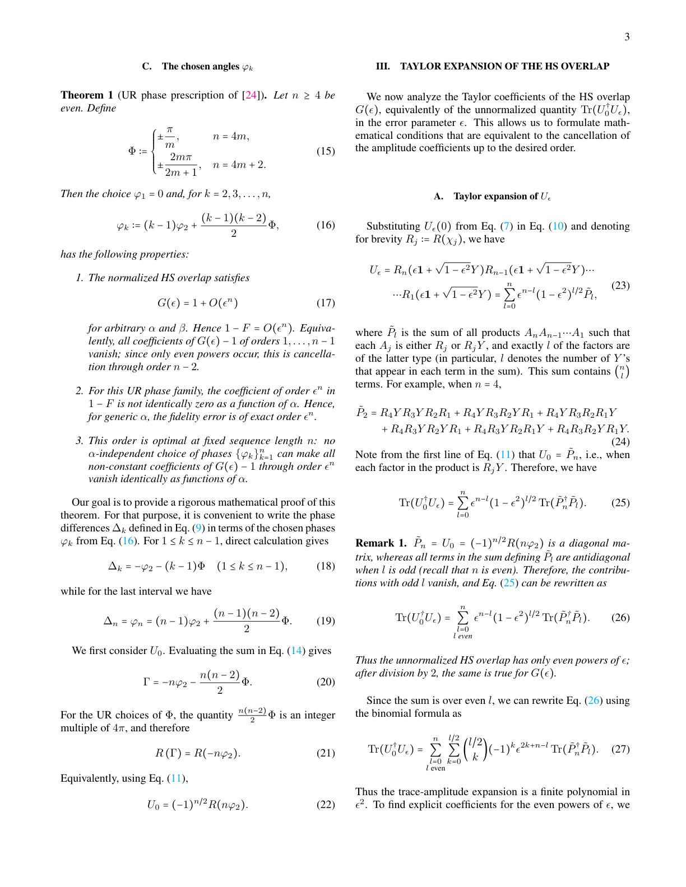 

Low-resolution page preview, page 3

📷 Fig 3

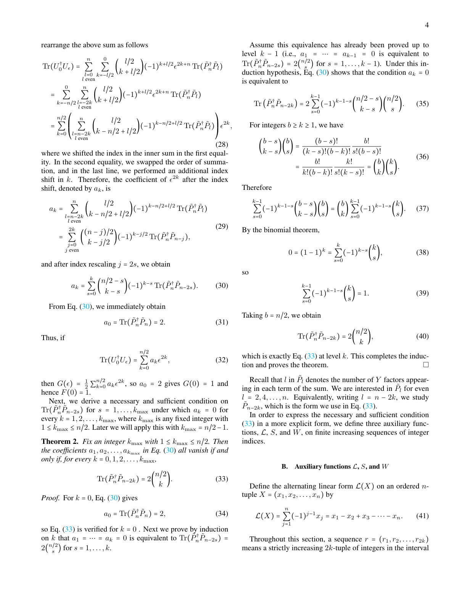 

Low-resolution page preview, page 4

📷 Fig 4

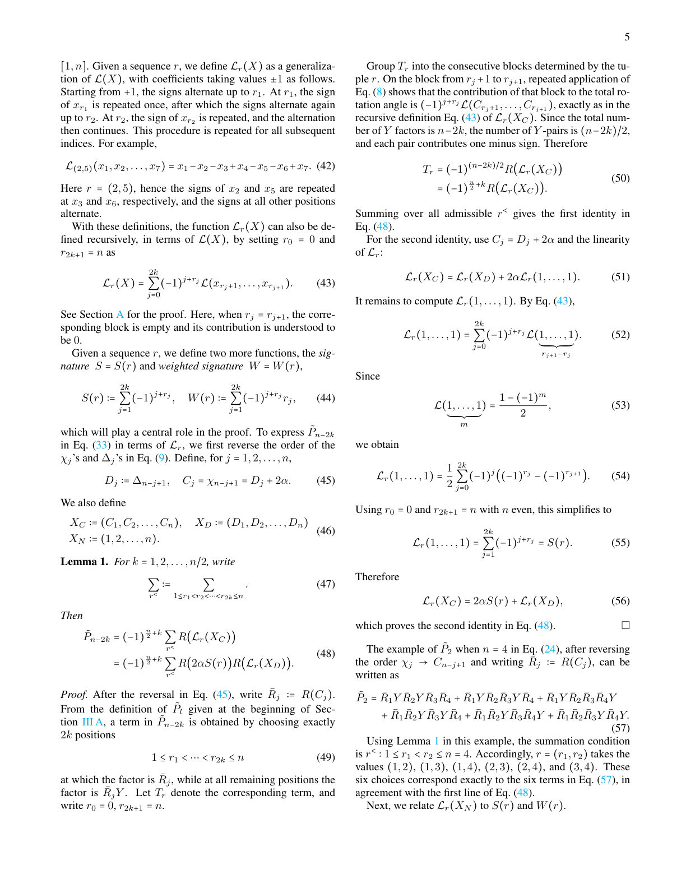 

Low-resolution page preview, page 5

📷 Fig 5

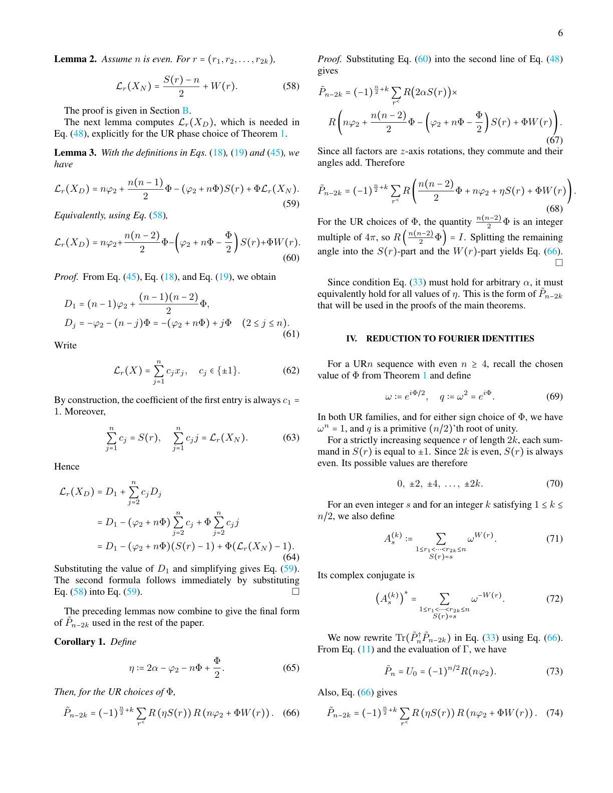 

Low-resolution page preview, page 6

📷 Fig 6

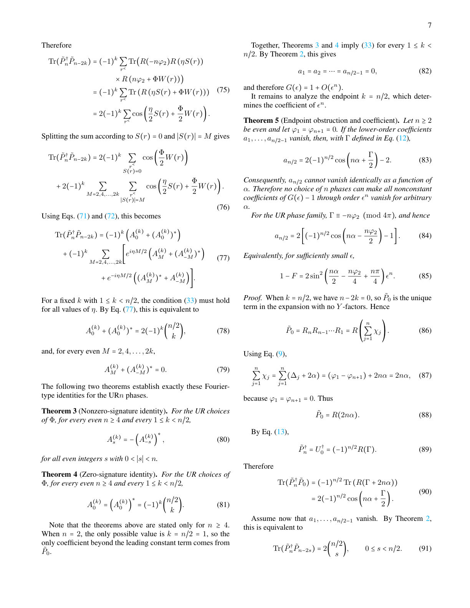 

Low-resolution page preview, page 7

📷 Fig 7

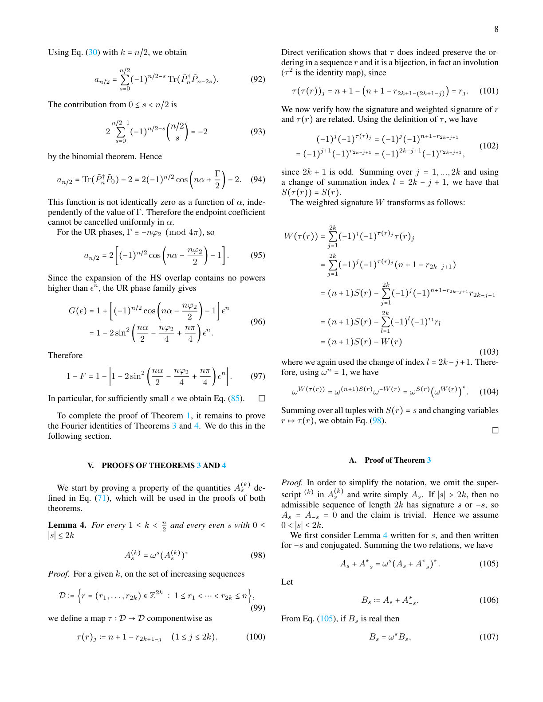 

Low-resolution page preview, page 8

📷 Fig 8

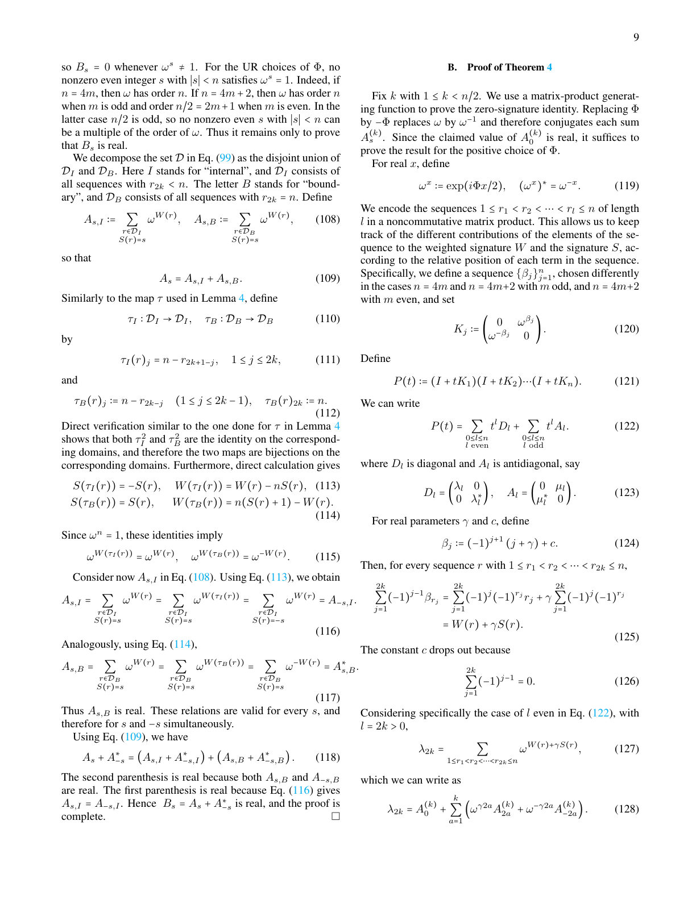 

Low-resolution page preview, page 9

📷 Fig 9

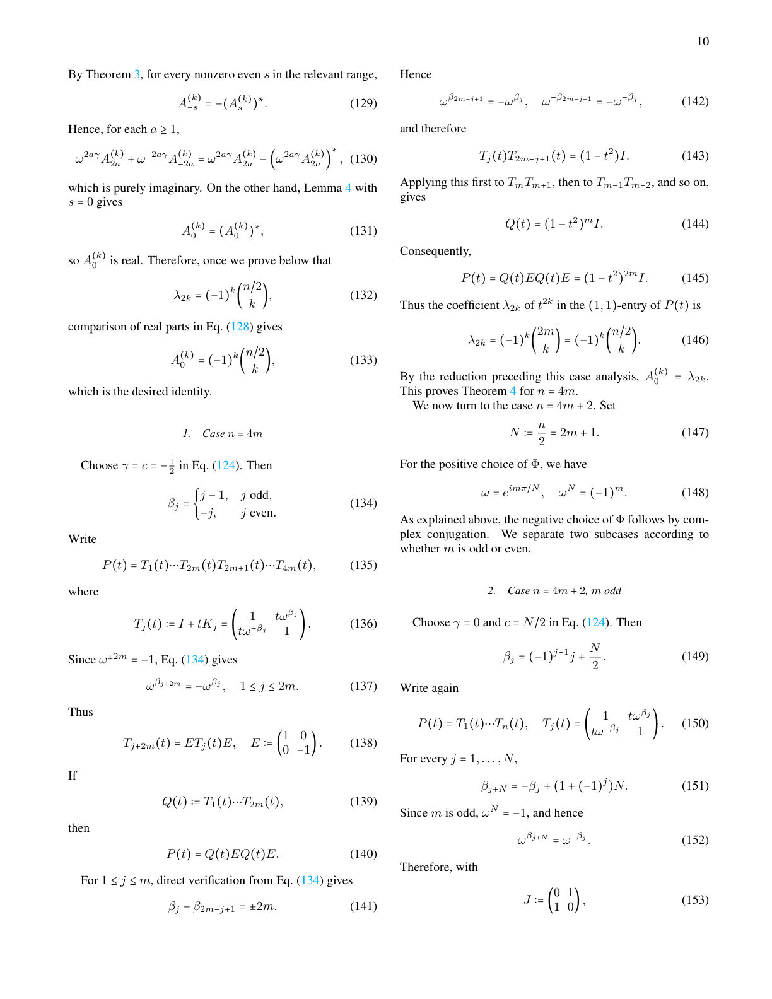 

Low-resolution page preview, page 10

📷 Fig 10

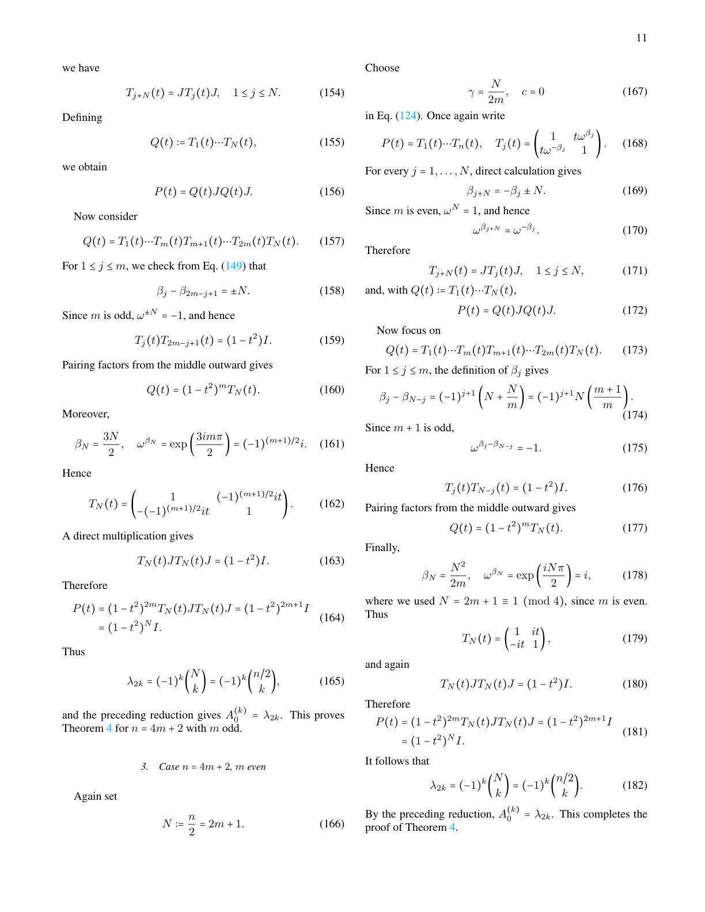 

Low-resolution page preview, page 11

**Main problem.**

The paper seeks to provide a rigorous mathematical proof for the claimed error scaling of Universally Robust (URn) dynamical decoupling sequences, specifically proving that for even n, the fidelity error scales as O(epsilon^n).

**Main result.**

The authors establish that the URn phase prescription satisfies the necessary and sufficient conditions to cancel error coefficients up to order n-1, and they identify the specific leading-order error term at order epsilon^n.

**Method.**

The work employs a Taylor series expansion of the Hilbert-Schmidt overlap, using algebraic tools like trace identities, matrix-product generating functions, and Fourier-type identities to prove the vanishing of error coefficients.

**Summary.**

This paper provides the first rigorous mathematical proof that Universally Robust (URn) dynamical decoupling sequences achieve high-order error suppression. By analyzing the Taylor expansion of the quantum fidelity, the authors prove that for even-length sequences, error coefficients are cancelled up to order n-1. This establishes that the fidelity error scales as O(epsilon^n). The work also identifies the specific mathematical structure responsible for this robustness and shows that the error cannot be suppressed beyond order n.

Detailed structure

**Model / system.**

The study uses an effective pulse-cycle model for quantum information processing, involving a sequence of n imperfect pulses separated by free evolution periods, where pulses are characterized by an error parameter epsilon and controlled phases.

**Key observables.**

Fidelity (F) and the normalized Hilbert-Schmidt overlap (G(epsilon)).

**Important parameters / regimes.**

Error parameter epsilon, number of pulses n (even), control phases phi_k, and rotation angles alpha and beta.

**Assumptions / limitations.**

The sequence length n is an even integer; the environment's correlation time is longer than the sequence duration (coherent evolution); and pulses are identical except for controlled phase shifts.

**Paper structure.**

The paper begins by defining the URn problem and the pulse model, then moves to establishing necessary and sufficient conditions for coefficient cancellation via Taylor expansion, followed by the use of combinatorial and Fourier-type identities to prove the vanishing of specific error terms, and concludes by identifying the non-vanishing leading-order error.

**Why it may be interesting.**

This provides the fundamental mathematical foundation for a class of robust control sequences used to protect qubits from noise, which is critical for scaling quantum computing and improving the coherence of quantum sensors.

Abstract

Universally robust dynamical decoupling (UR$n$) sequences were proposed to compensate pulse imperfections arising from arbitrary experimental parameters while achieving high-order error suppression with only a linear increase in the number of pulses. Although their performance was supported by analytical arguments, numerical simulations, and experiments, a complete mathematical proof of the claimed order of error compensation has been absent. In this work, we present a rigorous proof for UR$n$ DD sequences with even $n$. Using a series expansion of a quantity whose modulus is the fidelity $F$, we derive necessary and sufficient conditions for the cancellation of its coefficients up to, but not including, order $n$. The UR$n$ phase prescription satisfies these conditions, and therefore $1-F=O(ε^n)$. Our results establish the UR$n$ construction on firm analytical grounds and clarify the structure responsible for its high-order robustness.

[↑ back to top](#top)

### [Quantum annealing inspired algorithms for the NISQ Era](http://arxiv.org/abs/2604.25573v1)

**Authors:** Rijul Sachdeva, Vrinda Mehta, Manpreet Singh Jattana, Kristel Michielsen, Fengping Jin

**Type:** theory · **Category:** quantum information and computing · **PDF:** <https://arxiv.org/pdf/2604.25573v1>

**Analysis basis:** full PDF text, analyzed in chunks

📷 Fig 1

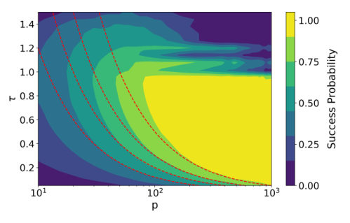 

FIG. 1: Success probability of AQA with first-order approximation: variation with time step (τ) and number of steps (p). Red lines denote constant total annealing time τ p.

📷 Fig 2

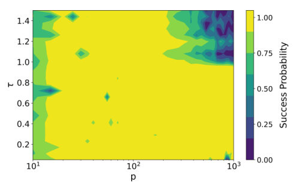 

FIG. 3: Success probability of QAOA initialized with AQA parameters: τ ∈[0.05,1.5], p ∈[10,1000], capped at 8000 function evaluations.

📷 Fig 3

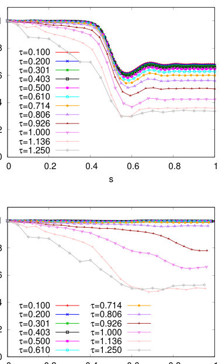 

FIG. 2: Overlap of the instantaneous state of an 8-variable system evolving under AQA with the (a) ground state E0(s) and (b) the lowest three energy states of the instantaneous QA Hamiltonian H(s) given by Eq. (3) for ta = 25 and various τ.

📷 Fig 4

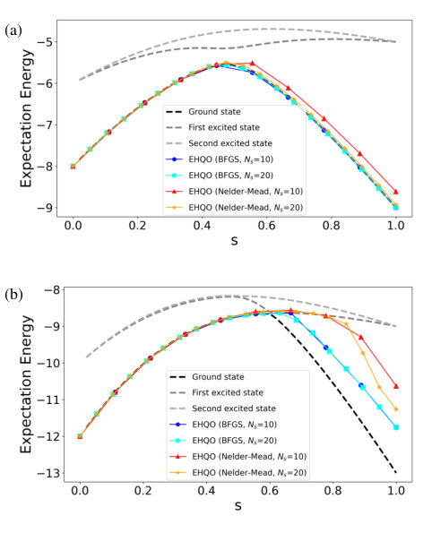 

FIG. 4: Expectation value of H(sj) with respect to the final state at each step j under the EHQO algorithm using the QAOA ansatz with p = 25 and Ns = 10,20.

📷 Fig 5

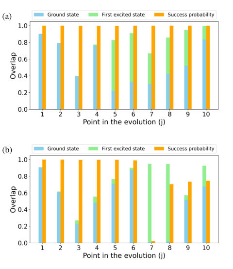 

FIG. 5: Overlaps in EHQO for an 8 and 12 -qubit Hamiltonian of the initial wavefunction (i.e., using parameters from the previous optimization process) with the ground state and the first excited state of the intermediate Hamiltonians. Also depicted are the final success probabilities after optimization at each point.

📷 Fig 6

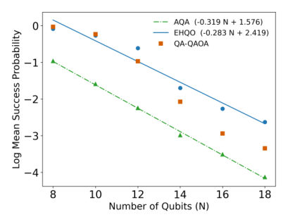 

FIG. 7: Scaling of mean success probability for 100 instances of 8-18 qubit 2-SAT problems for AQA (green triangles) and EHQO (blue circles).

📷 Fig 7

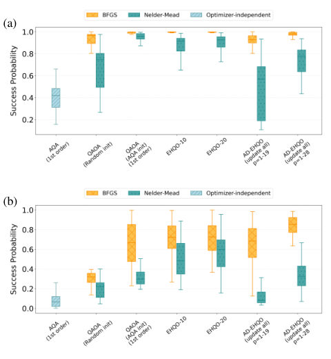 

FIG. 6: Quartiles of success probabilities for different types of EHQO for (a) 8-qubit and (b) 12-qubit Hamiltonian using both BFGS and Nelder-Mead.

**Main problem.**

The difficulty of implementing faithful Quantum Annealing on NISQ devices due to high circuit depth and noise, necessitating more resource-efficient, QA-inspired hybrid algorithms.

**Main result.**

The study identifies that Approximate Quantum Annealing (AQA) parameters can serve as an effective warm start for QAOA, and introduces EHQO, a multi-step variational scheme that shows improved scaling and performance on hard 2-SAT instances.

**Method.**

The authors use a discretized annealing ansatz (AQA) and a multi-step variational scheme (EHQO) based on the Suzuki-Trotter product formula, evaluated via numerical simulations on the JUQCS simulator.

**Summary.**

This paper proposes new variational quantum algorithms inspired by the physics of quantum annealing to better suit the limitations of NISQ hardware. It introduces Approximate Quantum Annealing (AQA) to find efficient parameter regimes for QAOA initialization and presents Evolving Hamiltonian Quantum Optimization (EHQO) as a way to guide optimization through a sequence of intermediate Hamiltonians. Numerical tests on 2-SAT problems demonstrate that these methods can improve success probabilities and offer better scaling than standard QAOA. The work provides a practical strategy for leveraging annealing-like dynamics to enhance hybrid quantum-classical optimization.

Detailed structure

**Model / system.**

The study focuses on combinatorial optimization problems formulated as Ising Hamiltonians, specifically using ensembles of hard 2-SAT instances with 8 to 18 variables.

**Key observables.**

Success probability (median and mean), expectation value of the Hamiltonian, and overlap with ground and excited states.

**Important parameters / regimes.**

Trotterization time step (tau), number of layers (p), annealing schedule functions (A(s) and B(s)), and the number of intermediate steps (Ns).

**Assumptions / limitations.**

The algorithms are evaluated on relatively small problem sizes (up to 18 qubits) and assume the availability of classical optimizers like BFGS.

**Figures summary.**

Figure 1 shows a parameter scan of success probability vs. tau and p; Figure 4 shows expectation energy evolution during EHQO; Figure 5 illustrates state overlap loss during anti-crossings; Figure 6 compares success probabilities across algorithms; Figure 7 shows the scaling of success probability with problem size.

**Paper structure.**

The paper introduces the problem of NISQ-era annealing, defines the AQA and EHQO algorithms, presents parameter scans to identify operational regimes, details the EHQO multi-step framework, provides numerical benchmarks on 2-SAT instances, and concludes with scaling analysis.

Abstract

We study algorithms inspired by quantum annealing that are suited for the NISQ era. First, we analyze approximate quantum annealing (AQA), which employs a discretized annealing ansatz in which the time step and the number of layers are allowed to deviate from a faithful implementation of quantum annealing. Parameter scans identify regimes that reproduce annealing-like behavior with reduced resources, making them more suitable for NISQ devices. The resulting parameters can then be used as an effective warm start for the quantum approximate optimization algorithm (QAOA), improving its performance compared to random initializations. We also introduce evolving Hamiltonian quantum optimization (EHQO), a multistep variational scheme that guides the optimization process through intermediate Hamiltonians derived from the standard annealing Hamiltonian. Numerical simulations on sets of hard 2-SAT instances suggest that quantum annealing-inspired algorithms provide practical strategies for enhancing variational quantum optimization.

[↑ back to top](#top)

### [Quantum channels preserving sigma-additivity and Ulam measurable cardinals](http://arxiv.org/abs/2604.25854v1)

**Authors:** S. V. Dzhenzher

**Type:** theory · **Category:** other · **PDF:** <https://arxiv.org/pdf/2604.25854v1>

**Analysis basis:** full PDF text, analyzed in chunks

📷 Fig 1

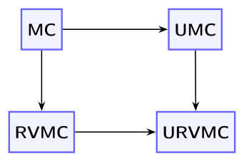 

Figure 1. Obvious relations between measurability of caridinals. MC is measurable cardinal. UMC is Ulam measurable cardinal. RVMC is real-valued measurable cardinal. URVMC is Ulam real-valued measurable cardinal

**Main problem.**

The paper investigates the relationship between the properties of quantum states on infinite-dimensional Hilbert spaces and the set-theoretic existence of Ulam measurable cardinals.

**Main result.**

The author proves that any sigma-additive state on the diagonal algebra is representable as a Pettis integral and constructs a quantum channel that maps normal states into a singular sigma-additive state, effectively archiving information in the singular sector.

**Method.**

The study utilizes set-theoretic tools including sigma-complete ultrafilters and large cardinal axioms, alongside mathematical frameworks like the Pettis integral and Yosida-Hewitt decomposition.

**Summary.**

This paper explores the mathematical intersection of quantum state theory and large cardinal axioms in set theory. It specifically looks at quantum states on infinite-dimensional Hilbert spaces where the dimension is an Ulam measurable cardinal. The author demonstrates how quantum channels can be constructed to move information from normal, local states into a 'singular' sector that is invisible to compact operators. This provides a formal mathematical framework for the concept of information archiving within the non-normal sector of a state space.

Detailed structure

**Model / system.**

The system consists of a Hilbert space l2(kappa) where kappa is an Ulam measurable cardinal, focusing on the diagonal algebra of operators and the distinction between normal and singular states.

**Key observables.**

Projectors representing diagonal operators and the induced measures on the power set of the index set.

**Important parameters / regimes.**

The cardinality kappa (specifically when it is an Ulam measurable cardinal) and the property of sigma-additivity.

**Assumptions / limitations.**

The results assume the framework of ZFC set theory and the existence of large cardinals (Ulam measurable cardinals); the scope is restricted to the diagonal algebra D(H).

**Figures summary.**

A diagram illustrating the hierarchical relationships between different types of large cardinals, such as Measurable, Ulam real-valued measurable, and Ulam measurable cardinals.

**Paper structure.**

The paper begins by establishing the representation of states via Pettis integrals, moves to characterizing singular states through their induced measures, and concludes with the construction and analysis of a quantum channel that transforms normal states into singular states.

Abstract

This paper investigates the interplay between the properties of quantum states on the Hilbert space \(\ell_2(κ)\) and the set-theoretic nature of the cardinal $κ$.   We focus on the existence of singular $σ$-additive states~ -- functionals whose induced measures are $σ$-additive yet vanish on singletons.   While the existence of such states is known to be equivalent to the Ulam measurability of $κ$, their structural and dynamical properties remain largely unexplored.   We prove that any $σ$-additive state on the diagonal algebra is representable as a Pettis integral over a singular $σ$-additive measure, extending the classical representation theory to the non-normal sector.   Furthermore, we construct a class of quantum channels using $σ$-complete ultrafilters that map normal states to singular $σ$-additive states, effectively <<archiving>> information into the singular part of the state space.

[↑ back to top](#top)

### [Quantum Rotors on the Fuzzy Sphere and the Cubic CFT](http://arxiv.org/abs/2604.24840v1)

**Authors:** Andreas Stergiou

**Type:** theory · **Category:** statistical mechanics · **PDF:** <https://arxiv.org/pdf/2604.24840v1>

**Analysis basis:** full PDF text, analyzed in chunks

📷 Fig 1

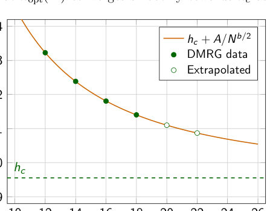 

Fig. 1: Finite-size dependence of hopt(N) for w = 0.6. Filled circles are the DMRG values obtained via the secant method applied to gS(hopt) = 0; open circles are extrapolated using the fit (3.9) with (3.10).

📷 Fig 2

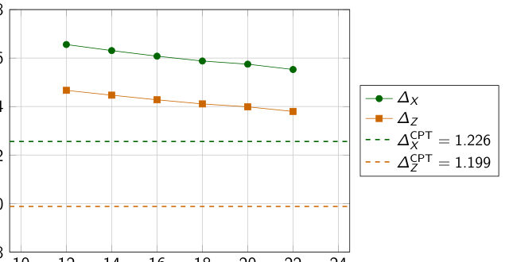 

Fig. 2: Finite-size dependence of ∆X and ∆Z at w = 0.6. Both dimensions decrease monotonically towards

📷 Fig 3

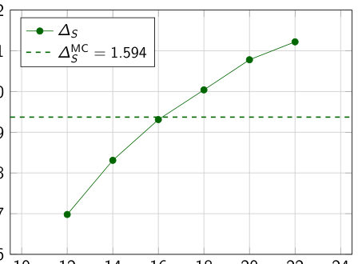 

Fig. 3: Finite-size dependence of ∆S at w = 0.6. The dashed line shows the Monte Carlo determination

📷 Fig 4

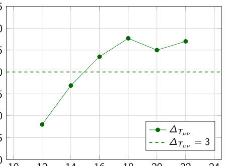 

Fig. 4: Finite-size dependence of ∆Tµν at w = 0.6. The dashed line marks the exact protected value

📷 Fig 5

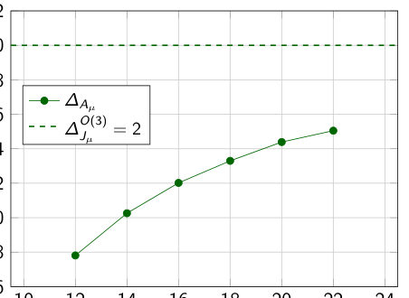 

Fig. 5: Finite-size dependence of ∆Aµ at w = 0.6. The dashed line marks the protected dimension ∆Jµ =

📷 Fig 6

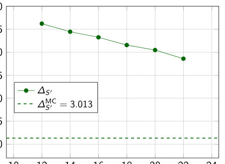 

Fig. 6: Finite-size dependence of ∆S′ at w = 0.6. The dashed line shows the Monte Carlo determination

**Main problem.**

The difficulty of non-perturbatively studying the 3D cubic conformal field theory (CFT) because its observables are numerically very close to the more symmetric O(3) model, making it hard to isolate the cubic fixed point.

**Main result.**

The fuzzy sphere regularization successfully isolates the cubic critical point, demonstrating the lifting of degeneracy in the rank-two symmetric tensor and providing scaling dimensions consistent with Monte Carlo and conformal perturbation theory benchmarks.

**Method.**

The study uses the fuzzy sphere regularization method combined with Exact Diagonalization (ED) and the Density Matrix Renimormalization Group (DMRG) implemented in the FuzzifiED Julia package.

**Summary.**

This paper presents a method to study the 3D cubic conformal field theory by using a fuzzy sphere regularization to prevent the system from reverting to O(3) symmetry. By 'hard-coding' cubic symmetry into the Hamiltonian, the authors successfully isolate the cubic critical point. Using ED and DMRG, they calculate scaling dimensions that align with established Monte Carlo and conformal perturbation theory results. This demonstrates that the fuzzy sphere is a powerful tool for resolving closely spaced universality classes.

Detailed structure

**Model / system.**

A quantum rotor model on a fuzzy sphere, where the O(3) symmetric Hamiltonian is deformed by adding a cubic-invariant two-body interaction to break continuous rotational symmetry down to the cubic group (Oh).

**Key observables.**

Scaling dimensions of key operators (scalar singlets, spin-one primary, and stress-energy tensor) and the splitting of the O(3) rank-two traceless symmetric tensor into Eg and T2g representations.

**Important parameters / regimes.**

Moment of inertia (I), Heisenberg coupling (J), cubic anisotropy strength (w), and the kinetic energy tuning parameter (h).

**Assumptions / limitations.**

The model uses a truncated rotor basis (l=0 and l=1 only), and results are subject to finite-size effects with non-rigorous thermodynamic limit extrapolations.

**Figures summary.**

Figures show the finite-size dependence of operator dimensions, specifically the monotonic decrease of the S' operator dimension and the convergence of the X and Z operators.

**Paper structure.**

The paper introduces the problem of symmetry enhancement, describes the fuzzy sphere construction and Hamiltonian deformation, details the numerical methods (ED and DMRG), presents the results for various operator dimensions, and compares them to existing benchmarks.

Abstract

The three-dimensional cubic conformal field theory governs the critical behaviour of Heisenberg magnets with cubic anisotropy. Studying this theory non-perturbatively is challenging, because its most easily accessible observables are numerically very close to those of the more symmetric $O(3)$ model. In this work, we overcome this difficulty using the fuzzy sphere regularisation method. By adding a cubic-invariant two-body interaction to the quantum rotor Hamiltonian used for the $O(3)$ model, we break the continuous rotational symmetry by construction and unambiguously isolate the cubic critical point. Using exact diagonalisation and the density matrix renormalisation group, we calculate the scaling dimensions of several key operators, including the leading scalar singlets, and resolve the splitting of the $O(3)$ rank-two traceless symmetric tensor into the $E_g$ and $T_{2g}$ representations of the cubic group. Our results are consistent with existing Monte Carlo, conformal perturbation theory, and $\varepsilon$ expansion benchmarks, demonstrating the power of the fuzzy sphere in resolving closely spaced universality classes.

[↑ back to top](#top)

### [Quantum-Accelerated Gowers $U_2$ Norm for Bent Boolean Functions](http://arxiv.org/abs/2604.25503v1)

**Authors:** Rajdeep Dwivedi, C. A Jothishwaran, Sugata Gangopadhyay, Vishvendra Singh Poonia

**Type:** theory · **Category:** quantum information and computing · **PDF:** <https://arxiv.org/pdf/2604.25503v1>

**Analysis basis:** full PDF text, analyzed in chunks

📷 Fig 1

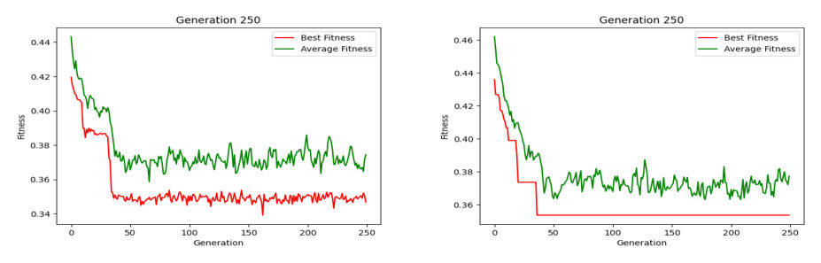 

Figure 1: Fitness evolution for n = 6 variables. The theoretical bent threshold is U2(f)4 = 0.3536. Both methods converge to this vicinity; the quantum run exhibits wider generation-to- generation variation due to finite-sample shot noise.

📷 Fig 2

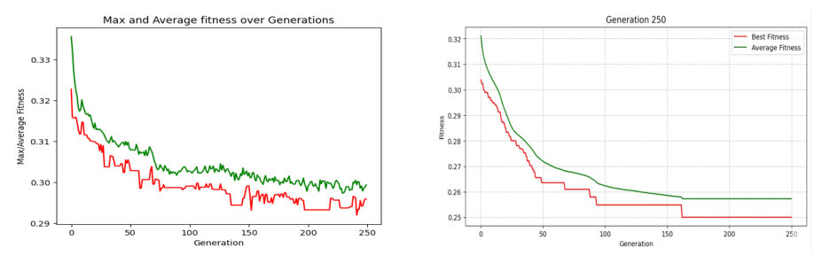 

Figure 2: Fitness evolution for n = 8 variables. The classical GA converges to best fitness U2(f)4 = 0.2500 the exact theoretical bent threshold by around generation 165, and holds steady thereafter. The quantum run (250 generations) reaches U2(f)4 ≈0.2829, consistent with the classical trajectory at the same generation count.

**Main problem.**

Finding bent Boolean functions, which are maximally nonlinear and resistant to affine approximation, is computationally hard for large numbers of variables due to the exponential cost of evaluating fitness metrics.

**Main result.**

The authors demonstrate a quantum-accelerated genetic algorithm that uses a quantum circuit to evaluate the Gowers U2 norm, providing a superpolynomial complexity advantage for n > 25.

**Method.**

A hybrid quantum-classical genetic algorithm (GA) is proposed, utilizing a 3n-qubit quantum circuit as an evolutionary fitness function to estimate the Gowers U2 norm.

**Summary.**

This paper presents a hybrid quantum-classical genetic algorithm designed to find bent Boolean functions more efficiently than classical methods. By using a quantum circuit to evaluate the Gowers U2 norm, the authors show that the computational cost can be reduced from exponential to polynomial for large numbers of variables. The study validates that this quantum-assisted approach can successfully navigate the search space to reach theoretical optimality. This provides a clear roadmap for using future fault-tolerant quantum computers to solve hard combinatorial optimization problems in Boolean algebra.

Detailed structure

**Model / system.**

The study focuses on Boolean functions f: F2^n -> F2 and uses a quantum circuit model with three n-qubit registers (X, A, B) and a phase-oracle Uf to encode function values as phases.

**Key observables.**

Gowers U2 norm (fitness metric), Walsh-Hadamard spectral flatness, and the bent threshold (2^-n/4).

**Important parameters / regimes.**

Number of variables (n=6, n=8), crossover point (n approx 25), number of shots (M=1000), and mutation rate (pm=0.8).

**Assumptions / limitations.**

The performance advantage assumes the availability of fault-tolerant quantum hardware and is subject to finite-sampling (shot) noise.

**Figures summary.**

Figure 1 shows the fitness evolution for n=6, illustrating convergence and the impact of shot noise; Figure 2 shows the fitness evolution for n=8, demonstrating the classical GA reaching the exact theoretical threshold.

**Paper structure.**

The paper introduces the problem of bent function construction, proposes a hybrid quantum-classical GA, provides a complexity analysis comparing quantum and classical scaling, validates the method via simulations for n=6 and n=8, and discusses future extensions to larger n and higher-order norms.

Abstract

Bent Boolean functions extremal objects that maximally resist affine approximation are   notoriously hard to construct for large numbers of variables.   We propose a hybrid quantum-classical genetic algorithm (GA) that uses a   \emph{quantum circuit} to evaluate the Gowers $U_2$ norm as the evolutionary   fitness function.   Our central contribution is a complexity-theoretic separation: the quantum evaluation   circuit requires only $3n$ qubits and $\bigO(n^2)$ two-qubit gates per function query,   whereas the classical computation of the exact Gowers $U_2$ norm demands   $\bigO(2^{2n})$ arithmetic operations an exponential overhead that renders it   infeasible for $n \gtrsim 25$.   We validate the framework on $n=6$ and $n=8$ variable systems.   For $n=8$, our classical GA run extended to 1000 generations achieves best fitness   $\Utwof = 0.250000$ \emph{exactly} the theoretical bent threshold $2^{-n/4}$ with   average fitness $0.257267$, confirming that the Gowers $U_2$ norm is a superior   fitness criterion over Walsh-Hadamard spectral flatness.   Quantum-assisted evaluation faithfully reproduces the classical trajectory up to   finite-sampling noise, and our complexity analysis demonstrates that for   $n > 25$ the quantum evaluator provides a decisive computational advantage   on fault-tolerant hardware.

[↑ back to top](#top)

### [Rethinking Dimensional Regularization in Critical Phenomena](http://arxiv.org/abs/2604.25103v1)

**Authors:** P. Beretta, A. Codello

**Type:** theory · **Category:** statistical mechanics · **PDF:** <https://arxiv.org/pdf/2604.25103v1>

**Analysis basis:** full PDF text, analyzed in chunks

📷 Fig 1

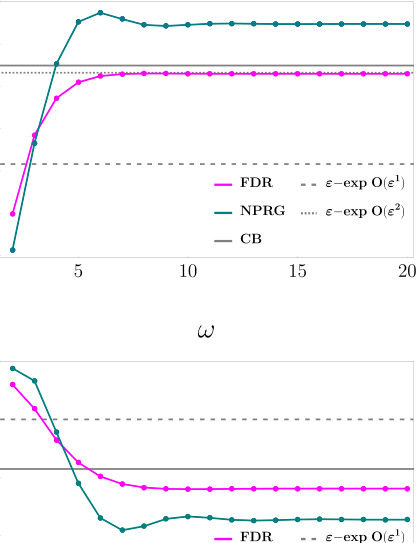 

FIG. 1. Convergence in successive truncations of the critical exponents ν and ω in d = 3. Comparison is shown among the FDR-LPA (magenta) and NPRG-LPA (teal). We also report ε-expansion and CB values for comparison.

📷 Fig 2

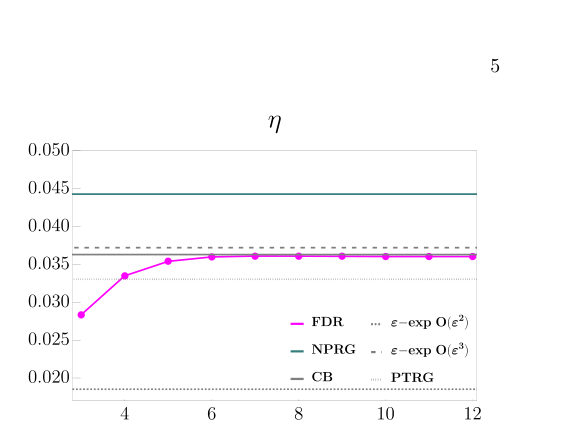 

FIG. 2. Convergence of the critical exponent η in the FDR approximation discussed in the text (magenta) in d = 3. We also display reference results from state-of-the-art CB [31]; second order of the derivative expansion of the NPRG (teal), with the Θ2 cutoff [35]; and the m →∞limit of PTRG [28]. Dashed lines report ε-expansion O(ε2) and O(ε3) results (without re-summation).

**Main problem.**

The paper addresses the limitations of the standard epsilon-expansion in critical phenomena and the scheme dependencies/complexities introduced by mass cutoffs in existing functional Renormalization Group (RG) frameworks.

**Main result.**

The authors propose a new 'Functional Dimensional Regularization' (FDR) scheme that combines the agility of DR with the generality of functional RG, achieving faster convergence and critical exponent estimates that rival or exceed state-of-the-art methods.

**Method.**

The FDR method constructs beta functions by summing DR beta functions over all critical dimensions (d_c = 0, 2, 4, ...), effectively treating all poles in the complex d-plane as fundamental to the flow.

**Summary.**

This paper introduces Functional Dimensional Regularization (FDR), a new renormalization group scheme for studying critical phenomena. By summing dimensional regularization beta functions over all critical dimensions, the authors create a method that avoids the need for explicit mass cutoffs. The FDR approach shows remarkable accuracy in calculating critical exponents for the 3D Ising model, even at low orders of approximation. It effectively bridges the gap between the simplicity of the epsilon-expansion and the power of functional RG.

Detailed structure

**Model / system.**

The study focuses on scalar field theory (specifically lambda-phi^4 theory) and its application to the Ising universality class and Wilson-Fisher fixed point in three dimensions.

**Key observables.**

Critical exponents (nu, omega, eta), RG spectrum (scaling dimensions/eigenvalues), and beta functions.

**Important parameters / regimes.**

Dimension d, coupling constants (lambda_2, lambda_4, lambda_6, ...), and the DR mass scale mu.

**Assumptions / limitations.**

The current analysis is primarily restricted to one-loop master formulas and focuses on even couplings to avoid complexity; the method is tested via the Local Potential Approximation (LPA) and derivative expansions.

**Figures summary.**

Figure 1 compares convergence of critical exponents; Figure 3 and 4 illustrate the Feynman diagrams contributing to the standard two-loop DR flow versus the one-loop FDR flow.

**Paper structure.**

The paper introduces the limitation of existing RG methods, proposes the FDR framework, demonstrates its mathematical construction via summing critical dimensions, validates it by reproducing known epsilon-expansion results, and compares its convergence and accuracy against NPRG and Conformal Bootstrap methods.

Abstract

We show that it is possible to use dimensional regularization (DR) beyond the usual $\varepsilon$-expansion in the context of renormalization group (RG) calculations in Critical Phenomena. Based on this fact, we propose a new functional RG scheme - Functional Dimensional Regularization (FDR) - and apply it to a scalar theory in three dimensions. We compute the critical exponents of the Ising universality class directly in $d=3$ under various typical approximations. The method that emerges combines the agility typical of DR with the generality proper of functional RG. Moreover, at a given order of approximation, FDR seems to provide faster convergence and better estimates than other functional RGs.

[↑ back to top](#top)

### [Robust Metal-Insulator Transition Despite Surface Dead-Layer Growth in Sub-10-nm Cr-Doped V2O3 Nanocrystals](http://arxiv.org/abs/2604.25488v1)

**Authors:** Yoichi Ishiwata, Ichidai Harada, Masaki Imamura, Kazutoshi Takahashi, Hirofumi Ishii, Masato Yoshimura, Nozomu Hiraoka, Yuji Inagaki, Kenta Akashi, Tatsuya Kawae, Tetsuya Kida, Masashi Nantoh

**Type:** experiment · **Category:** strongly correlated electrons · **PDF:** <https://arxiv.org/pdf/2604.25488v1>

**Analysis basis:** full PDF text, analyzed in chunks

📷 Fig 1

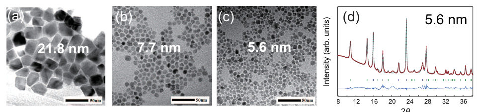 

FIG. 1. TEM images for Cr-doped V2O3 NCs with average sizes of (a) 21.8 ± 3.8 nm, (b) 7.7 ± 2.1 nm, and (c) 5.6 ± 2.0 nm. (d) Synchrotron XRD pattern of the 5.6 nm sample with Rietveld refinement confirming the corundum structure.

📷 Fig 2

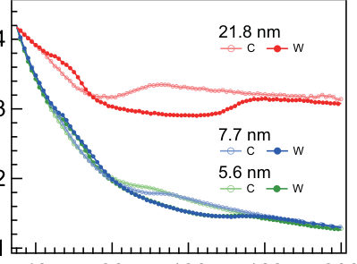 

FIG. 2. Temperature-dependent magnetic susceptibility of Cr-doped V2O3 NCs with sizes of 5.6 nm, 7.7 nm, and 21.8 nm. Warming curves exhibit a clear increase near 155 K, in- dicative of the antiferromagnetic-to-paramagnetic transition.

📷 Fig 3

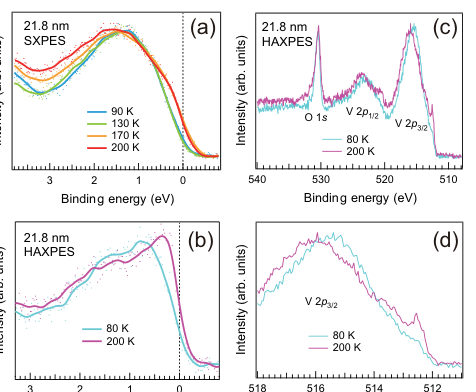 

FIG. 3. Photoemission spectra of the 21.8 nm sample. (a) SXPES valence-band spectra showing temperature-induced changes, including the emergence of a shoulder feature near EF above 170 K. (b) HAXPES spectra revealing a clear metal- lic response at 200 K. (c,d) V 2p and O 1s core-level spectra, which exhibit temperature-dependent changes consistent with the MIT.

📷 Fig 4

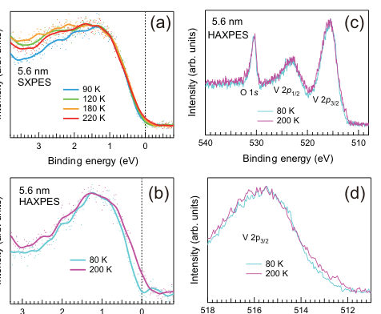 

FIG. 5. Photoemission spectra of the 5.6 nm sample. (a) SXPES valence-band spectra remain insulating-like across all temperatures, indicating that the probed region is entirely within the insulating surface layer. (b) HAXPES spectra show a slight increase in spectral weight near EF at 200 K, suggesting that the NC interior undergoes a MIT even at this extreme size. (c,d) V 2p and O 1s core-level spectra exhibit subtle changes between 80 and 200 K, confirming the persis- tence of the MIT internally.

📷 Fig 5

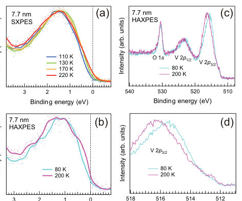 

FIG. 4. Photoemission spectra of the 7.7 nm sample. (a) SXPES valence-band spectra showing minimal temperature- induced changes across the measured range. (b) HAXPES spectra reveal a metallic response at 200 K despite strong surface suppression. (c,d) V 2p and O 1s core-level spectra exhibit small but discernible changes between 80 and 200 K, consistent with a weakened MIT signature.

📷 Fig 6

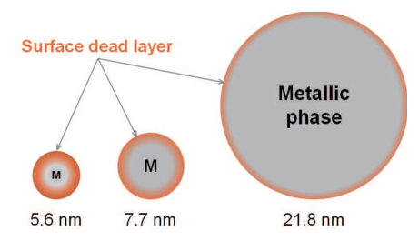 

FIG. 6. Schematic illustration of the two-layer model: an insulating surface layer surrounds a metallic interior in Cr- doped V2O3 NCs. As size decreases, the insulating layer thickens and strongly influences both surface-sensitive and deeper-probing photoemission spectra.

**Main problem.**

Investigating whether the metal-insulator transition (MIT) in Cr-doped V2O3 nanocrystals is intrinsically suppressed by extreme size reduction or if it persists in the particle interior despite the growth of an insulating surface dead-layer.

**Main result.**

The MIT persists down to an average particle size of 5.6 nm, with the transition occurring in the nanocrystal interior while an insulating surface dead-layer grows and suppresses quasiparticle weight as size decreases.

**Method.**

The study uses synchrotron-based photoemission spectroscopy (SXPES for surface sensitivity and HAXPES for deep probing) combined with magnetic susceptibility measurements and structural characterization (TEM, XRD).

**Summary.**

This study examines the stability of the Mott metal-insulator transition in Cr-doped V2O3 nanocrystals as they are scaled down to the sub-10-nm regime. By comparing surface-sensitive and deep-probing photoemission spectroscopy, the researchers found that while an insulating 'dead-layer' grows at the surface as particles shrink, the metallic phase persists in the nanocrystal interior. The results show that the fundamental limit for the transition is approximately 5 nm, though the shrinking conductive core poses practical challenges for electronic device applications.

Detailed structure

**Model / system.**

The physical system consists of Cr-doped V2O3 nanocrystals with average particle sizes of 5.6 nm, 7.7 nm, and 21.8 nm, modeled as a two-layer system with an insulating surface dead-layer surrounding a metallic core.

**Key observables.**

Transition temperature (T_MIT), magnetic susceptibility (chi), quasiparticle (QP) weight, and spectral weight near the Fermi level.

**Important parameters / regimes.**

Particle sizes (5.6 nm to 21.8 nm), probing depths (1.1 nm for SXPES and 7.8 nm for HAXPES), and a fundamental size limit of approximately 5 nm.

**Assumptions / limitations.**

The thickness of the effective surface layer may be influenced by local surface morphology, and the transition is discussed within the context of the Mott criterion.

**Figures summary.**

Fig 1 shows TEM images and XRD patterns for size characterization; Fig 2 displays temperature-dependent magnetic susceptibility showing the transition near 155 K; Fig 3 shows valence-band spectra comparing SXPES and HAXPES.

**Paper structure.**

The paper introduces the problem of nanoscaling in Mott systems, describes the synthesis and characterization of V2O3 nanocrystals, presents magnetic and spectroscopic evidence for the persistence of the MIT, discusses the growth of the surface dead-layer, and concludes with the implications for device miniaturization.

Abstract

We investigated the size dependence of the metal-insulator transition (MIT) in Cr-doped V2O3 nanocrystals by photoemission spectroscopy using complementary probing depths, together with magnetic susceptibility measurements. Photoemission spectra show that MIT signatures persist down to an average particle size of 5.6 nm, and magnetic susceptibility measurements exhibit a nearly size-invariant transition onset. The contrast between surface-sensitive and deeper-probing photoemission spectra reveals that the transition survives in the nanocrystal interior. At the same time, the spectra indicate a systematic suppression of coherent quasiparticle weight with decreasing size, pointing to the growth of an insulating surface dead layer. These results demonstrate that nanoscaling does not intrinsically eliminate the MIT itself, but progressively enhances the influence of surface-driven insulating behavior, thereby providing insight into the practical limits of miniaturizing Mott-based devices.

[↑ back to top](#top)

### [Sector-dominant graph-local drivers for path-window barrier Hamiltonians on the Boolean hypercube](http://arxiv.org/abs/2604.25494v1)

**Authors:** Takiko Sasaki, Tetsuji Tokihiro

**Type:** theory · **Category:** quantum information and computing · **PDF:** <https://arxiv.org/pdf/2604.25494v1>

**Analysis basis:** full PDF text, analyzed in chunks

📷 Fig 1

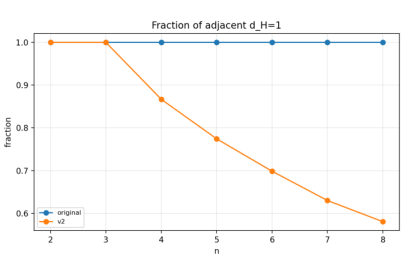 

Figure 1: Locality diagnostics for the strict sector-snake ordering and the fast 𝑣2 ordering in the regenerated 𝑛≤8 benchmark. The strict ordering keeps all adjacent moves at Hamming distance one in these checked cases. The 𝑣2 ordering preserves the skeleton and fixed prefix but introduces longer adjacent jumps.

📷 Fig 2

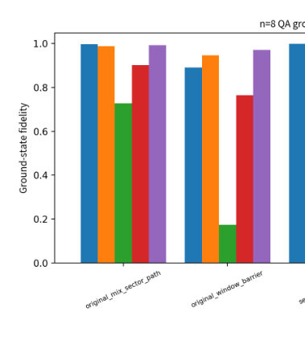 

Figure 2: Regenerated 𝑛= 8 baseline and best-hybrid comparison for the non-diagonal target classes in table 5. The sector-dominant hybrid improves the window-barrier targets, while standard TF remains very strong for sector/path mixture controls.

📷 Fig 3

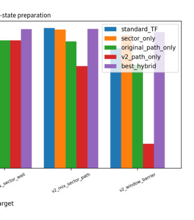 

Figure 3 illustrates the role of the mixing parameters. The best region is not 𝛼= 1, which would be a path-only driver. Instead, the high-fidelity region keeps a large sector component and uses the path-window term as an additional geometry-aware component. This observation is the basis for the phrase “sector-dominant hybrid driver” used throughout the paper.

📷 Fig 4

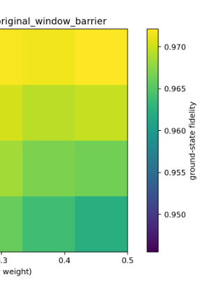 

Figure 3: Regenerated heatmap for the centered original-window barrier target with driver window 𝑤= 4. The useful region is sector-dominant with a substantial but not standalone path-window component and a small transverse-field catalyst.

📷 Fig 5

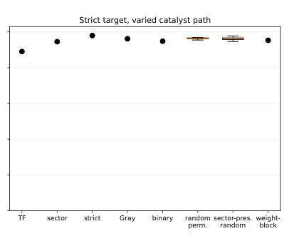 

Figure 4: Distributional path-order controls. Boxplots show 64 sampled random permutations and 64 sampled sector-preserving random orderings; single points show TF, sector-only, and deterministic orderings. Left: matched target/driver controls. Right: strict target with varied catalyst path.

📷 Fig 6

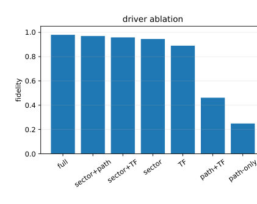 

Figure 5: Left: driver ablation. The path-window graph is weak as a standalone driver, while the full sector-dominant hybrid is strongest. Right: anneal-time dependence. The full hybrid becomes clearly advantageous at intermediate and long anneal times, while all broad drivers approach high fidelity for 𝑇= 160.

📷 Fig 7

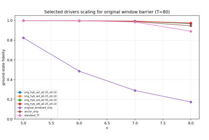 

Figure 6: Left: regenerated grid-based minimum gaps for selected drivers on the 𝑛= 8 original- window barrier target. Right: finite-size summary for selected drivers over 𝑛= 5, . . . , 8 at 𝑇= 80. The path-only driver deteriorates strongly, while sector-dominant hybrids remain high at the tested finite sizes.

📷 Fig 8

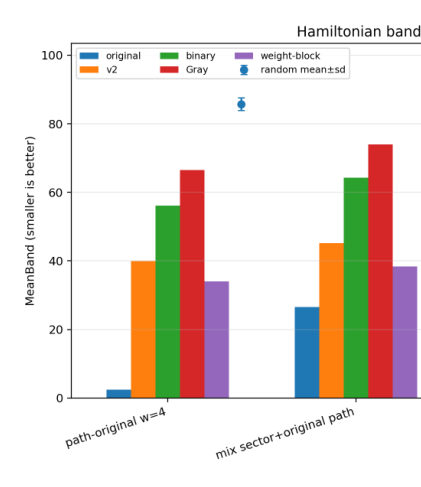 

Figure 7: Representative rows of table 9. The strict ordering is extremely effective for Hamiltonians whose off-diagonal support is local in the strict path coordinate. It is not the best ordering for ordinary 1D hopping or pair creation, where a different locality is more natural.

📷 Fig 9

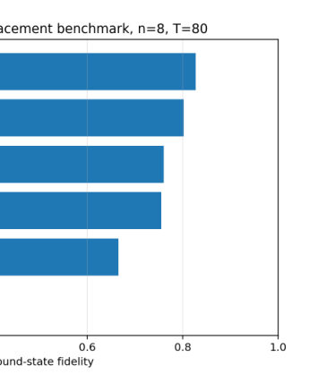 

Figure 8: Ground-state-preparation fidelity for the staged sensor-placement benchmark. The sector-dominant hybrid driver improves over TF-only and sector-only, whereas the path-window driver alone remains weak.

**Main problem.**

Designing problem-dependent, graph-local adiabatic drivers to improve ground-state preparation fidelity in quantum annealing on Boolean hypercubes.

**Main result.**

A hybrid driver combining sector, path-window, and transverse-field components significantly improves fidelity for non-diagonal target Hamiltonians aligned with the driver's geometry, though it provides no advantage for standard diagonal-cost annealing.

**Method.**

Numerical simulations of the time-dependent Schrodinger equation using finite-size studies (up to n=8) and ablation controls to identify the roles of different driver components.

**Summary.**

This paper investigates how to design specialized 'drivers' for quantum annealing that are tailored to the specific structure of a problem. By using a hybrid approach that combines Hamming-weight sectors with specific path-window coordinates, the authors show they can significantly improve the success rate of finding ground states for certain classes of non-diagonal Hamiltonians. While not a universal solution for all quantum annealing problems, it provides a design principle for using graph-local information to guide quantum dynamics.

Detailed structure

**Model / system.**

Quantum annealing on an n-dimensional Boolean hypercube using a time-dependent Hamiltonian consisting of a hybrid driver and a non-diagonal target Hamiltonian with path-window barrier structures.

**Key observables.**

Ground-state preparation fidelity, energy residual, minimum spectral gap, and MeanBand (matrix bandwidth metric).

**Important parameters / regimes.**

Number of qubits (n up to 8), annealing time (T), driver window width (w), and mixing parameters (alpha, epsilon).

**Assumptions / limitations.**

The study is limited to finite-size systems (n <= 8) and the effectiveness is conditional on the target Hamiltonian's geometry being aligned with the driver's coordinates.

**Figures summary.**

Boxplots comparing different path-order controls, ablation studies showing the necessity of each driver component, and performance comparisons for sensor-placement benchmarks.

**Paper structure.**

The paper introduces the sector/path coordinate construction, presents numerical experiments on fidelity and spectral gaps, performs ablation studies to isolate driver mechanisms, and concludes with validation via specific benchmark problems.

Abstract

We study finite-size adiabatic state preparation on Boolean hypercubes using graph-local drivers built from sector/path coordinates related to monotone Gray-code representatives. The construction is not presented as a new all-$n$ Gray-code existence theorem; rather, it provides finite representatives, explicitly checked through the cases used in the numerical experiments, for testing problem-dependent graph-local drivers. For ordinary diagonal-cost transverse-field annealing, the ordering does not yield a robust advantage, and we include this negative result as a baseline. For non-diagonal target Hamiltonians whose geometry is expressed in the same sector/path coordinates, hybrid drivers combining sector, path-window, and small transverse-field components can substantially improve the final ground-state fidelity in centered barrier instances. Reproduction runs from the accompanying code confirm a representative centered original-window barrier value of approximately \(0.9799\) for the fixed-control hybrid parameters \((w,α,ε)=(8,0.50,0.15)\), while also showing that the improvement is target-class dependent. Randomized and ablation controls indicate that the dominant contribution is the sector-preserving skeleton, with strict one-bit completion acting as a secondary refinement. We provide code, finite certificates, CSV files, validation logs, and reproduction scripts to make the finite-size claims traceable.

[↑ back to top](#top)

### [Self-consistent vertex corrected $GW$ with static and dynamic screening using tensor hypercontraction: assessment of molecular ionization potentials](http://arxiv.org/abs/2604.25581v1)

**Authors:** Munkhorgil Wang, Ming Wen, Pavel Pokhilko, Chia-Nan Yeh, Miguel A. Morales, Dominika Zgid

**Type:** theory · **Category:** numerical methods · **PDF:** <https://arxiv.org/pdf/2604.25581v1>

**Analysis basis:** full PDF text, analyzed in chunks

📷 Fig 1

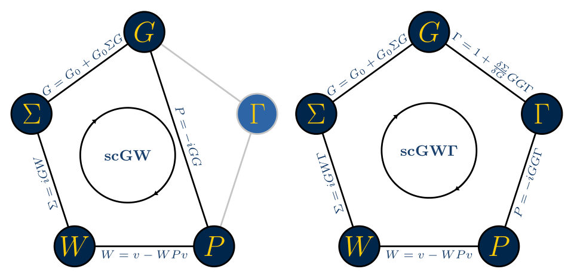 

Figure 1: Hedin’s Pentagon. The interacting one-body Green’s function G, the vertex func- tion Γ, the irreducible polarizability P, the dynamically screened Coulomb interaction W and the self-energy Σ

📷 Fig 2

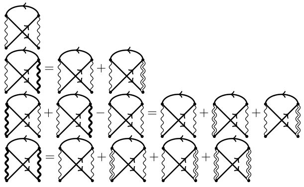 

Figure 2: Skeleton Feynman diagrams for the self-energy approximations considered in this work. Panel (a) shows the GW self-energy, and panel (b) shows the interaction decomposition introduced in Eq. (26). Panels (c)–(f) depict the vertex self-energies, ˜ΣSOX(U(1),U(2)), of SOX, SOSEX, 2SOSEX, and G3W2, respectively. For each vertex-corrected approximation, both the compact form in terms of the full screened interaction W and the expanded form obtained by substituting Eq. (26)—with terms written explicitly in v and ˜W—are shown. Bold wavy lines denote the full screened interaction W, while double-wavy lines denote the screening contribution ˜W.

📷 Fig 3

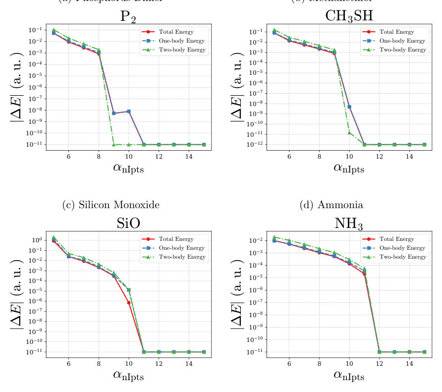 

Figure 3: Basis set convergence of Etot, Estat 1b and Edyn 2b using the logarithmic scale, with respect to αIpts for selected molecules. The energy contributions are calculated at the THC- scGW/cc-pVQZ level. For clarity, energy differences smaller than 10−12 a.u. are set to zero. All 29-molecules are reported in Supporting Information Figs. S1 and S2

📷 Fig 4

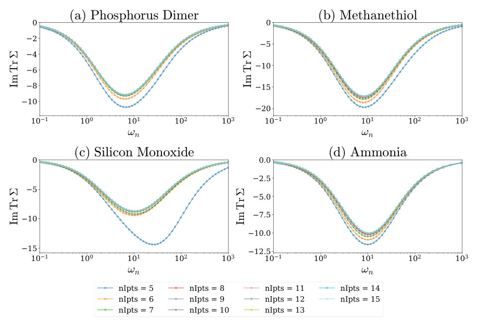 

Figure 4: The convergence behavior of the trace of the imaginary part of the dynamic self- energy ImTr(Σ(ωn)) with respect to αIpts for selected molecules. Only the spin α component of the self-energy is printed. The calculations were performed at the THC-scGW /cc-pVQZ level.

📷 Fig 5

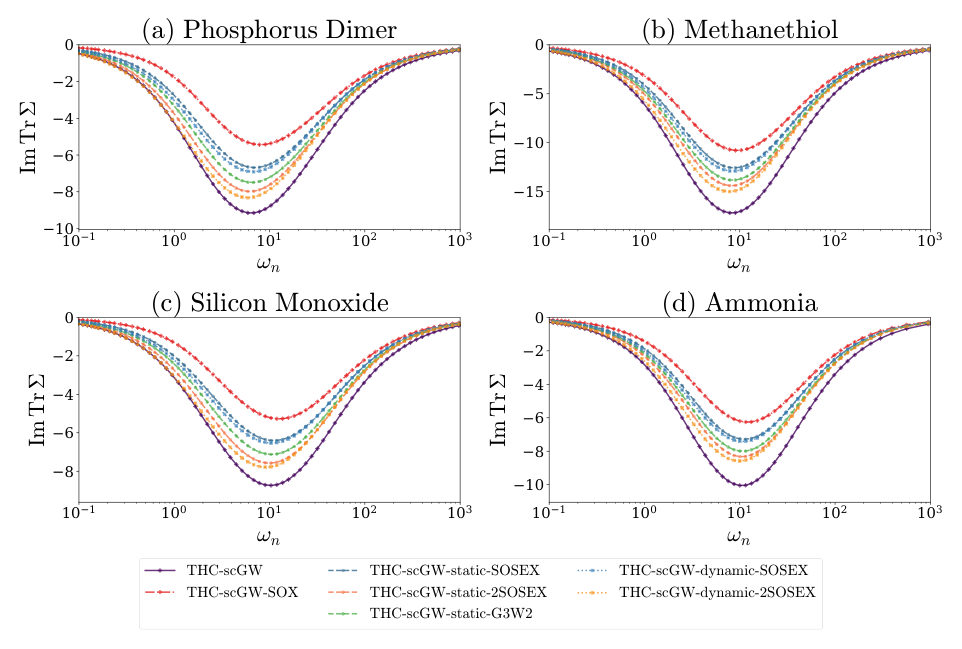 

Figure 5: The trace of the imaginary part of the dynamic self-energy ImTr[Σ(ωn)] as a function of frequency ωn for various vertex methods listed

📷 Fig 6

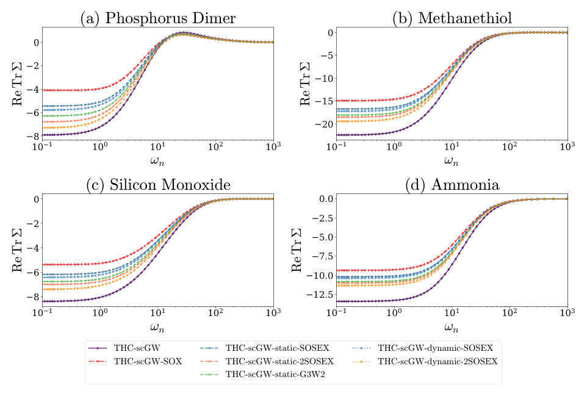 

Figure 6: The trace of the real part of the dynamic self-energy ReTr(Σ(ωn)) as a function of frequency ωn for various vertex methods listed

📷 Fig 7

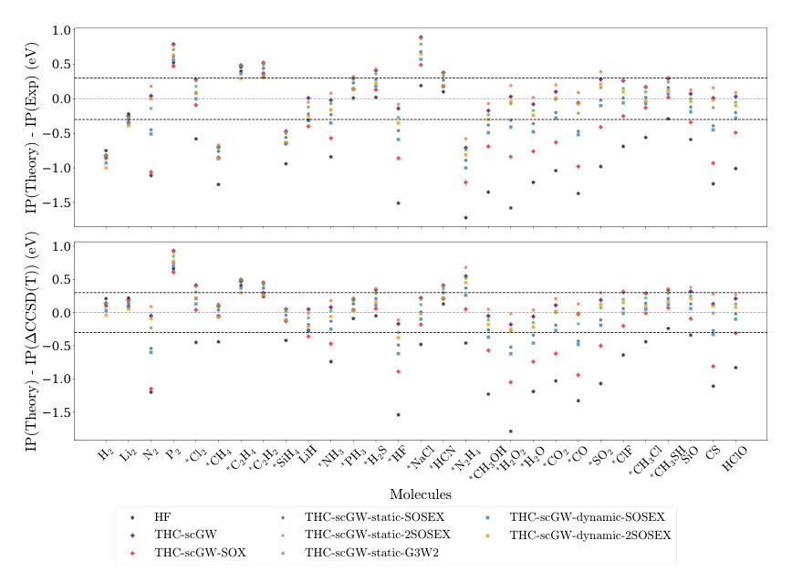 

Figure 7: Upper panel: The first IP differences in eV for the G0W0Γ29 data set evaluated w.r.t. ∆CCSD(T). Lower panel: The first IP differences in eV for the G0W0Γ29 data set evaluated w.r.t. experimental values. Comparisons in cc-pVQZ basis set are made for THC- scGW and all the vertex schemes discussed in this work. Experimental values marked * for respective molecular cases correspond to vertical ionization energies.

📷 Fig 8

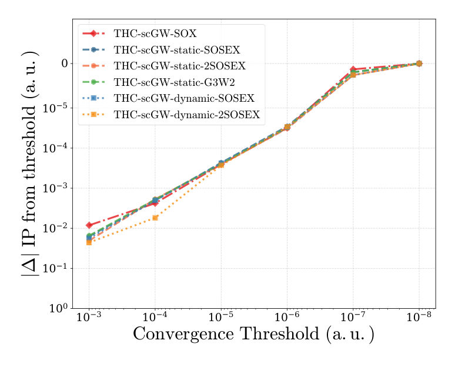 

Figure 8: The convergence of the first IP value for water produced for all six THC-scGWΓ variants using different convergence thresholds. On the y-axis, we report the absolute differ- ence of IP when compared with the one obtained with 10−7 a.u convergence threshold. Both the x- and y-axes are in logarithmic scale.

📷 Fig 9

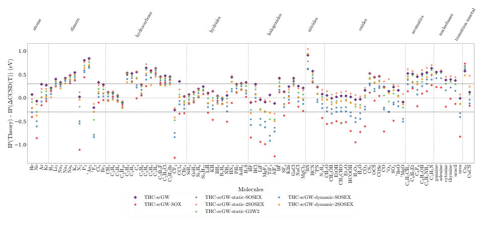 

Figure 9: The first IP values calculated by THC-scGW and six THC-scGWΓ variants for the GW100 set. All molecules are categorized into ten groups. The ∆CCSD(T) results were used as the standard reference. The dagger sign † showcase the failure of convergence in SOX. Horizontal lines represent ±0.3 eV error range from the reference values.

📷 Fig 10

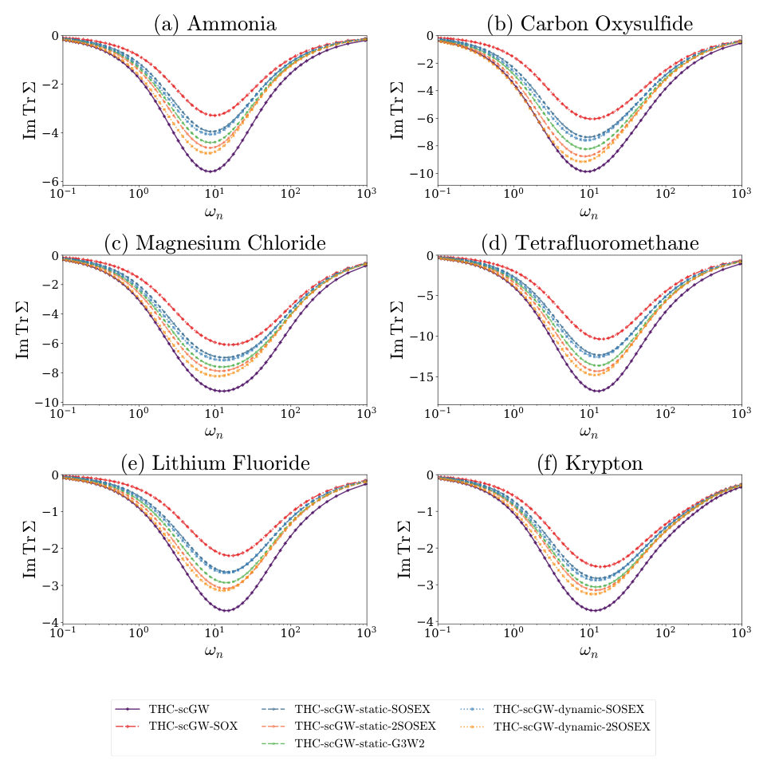 

Figure 10: Imaginary part of the trace self-energy, ImTr[Σ(iωn)], for six selected molecules: ammonia, carbon oxysulfide, magnesium chloride, tetrafluoromethane, lithium fluoride, and krypton. Across these representative systems, the imaginary part preserves a robust screening-controlled ordering over Matsubara frequency.

**Main problem.**

The high computational cost of implementing fully self-consistent vertex-corrected GW (scGWGamma) methods for realistic molecular systems and the need to evaluate if Tensor Hypercontraction (THC) can accelerate these calculations without introducing significant errors.

**Main result.**

THC decomposition introduces negligible errors into scGW ionization potentials, proving it is a reliable acceleration route, though vertex corrections primarily cause systematic shifts in IPs rather than consistent accuracy improvements.

**Method.**

Self-consistent GW (scGW) and vertex-corrected scGWGamma using Tensor Hypercontraction (THC) for acceleration, incorporating various vertex approximations like SOX, SOSEX, and G3W2.

**Summary.**

This paper evaluates the use of Tensor Hypercontraction (THC) to accelerate expensive self-consistent GW calculations with vertex corrections. The authors demonstrate that THC provides a reliable way to reduce computational scaling without sacrificing the accuracy of molecular ionization potentials. They also find that while vertex corrections are important, they often result in systematic shifts in energy values rather than simple accuracy improvements. This work identifies THC as a key enabling technology for applying high-level many-body perturbation theory to larger molecular systems.

Detailed structure

**Model / system.**

Small molecular systems benchmarked using the G0W0Gamma and GW100 datasets, treated within a many-body Green's function framework using the Luttinger-Ward formulation in a grand-canonical ensemble.

**Key observables.**

Molecular first ionization potentials (IPs), electron affinities (EAs), and total electronic energy decomposition (one-body and two-body contributions).

**Important parameters / regimes.**

Interpolation-point ratio (alpha_Ipts), frequency grids (real vs. imaginary axis), temperature (beta), and chemical potential (mu).

**Assumptions / limitations.**

The study assumes the validity of the THC decomposition for the dynamic part of the self-energy and focuses on vertex corrections applied only to the self-energy level while keeping polarization at the GW level.

**Figures summary.**

Figure 1 illustrates Hedin's equations; Figure 3 shows logarithmic plots of energy convergence as a function of the THC interpolation-point ratio.

**Paper structure.**

The paper introduces the computational challenge of vertex corrections, establishes the mathematical framework of many-body perturbation theory, details the THC acceleration technique and various vertex approximations, presents benchmark results on molecular datasets, and discusses convergence and error analysis.

**Why it may be interesting.**

The development of efficient numerical scaling via THC for many-body Green's function methods is highly relevant to the advancement of large-scale classical simulations of many-body dynamics and electronic correlations.

Abstract

In this work, we benchmark tensor hypercontraction (THC)-accelerated fully self-consistent $GW$ (sc$GW$) and vertex-corrected self-consistent $GW$ (sc$GWΓ$) methods for predicting molecular first ionization potentials (IPs). The vertex function, $Γ$, is inserted into the self-energy in a fully self-consistent manner, and representative sc$GW$ and sc$GWΓ$ variants are assessed across the $G_0W_0\Gamma29$ and $GW100$ data sets. We find that the THC decomposition introduces negligible errors into self-consistent $GW$ ionization potentials, indicating that the acceleration preserves the underlying fully self-consistent results. Across both benchmark sets, vertex-corrected sc$GWΓ$ methods primarily produce systematic shifts in the IPs relative to sc$GW$ rather than consistent accuracy improvements. These results identify THC as a reliable route to lower-cost sc$GW$ and sc$GWΓ$ calculations

[↑ back to top](#top)

### [Stabilizers for Compiling Logical Circuits under Hardware Constraints](http://arxiv.org/abs/2604.25042v1)

**Authors:** Jack Weinberg, Narayanan Rengaswamy

**Type:** theory · **Category:** quantum information and computing · **PDF:** <https://arxiv.org/pdf/2604.25042v1>

**Analysis basis:** full PDF text, analyzed in chunks

📷 Fig 1

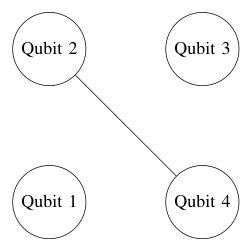 

Fig. 1. Toy Connectivity Graph

📷 Fig 2

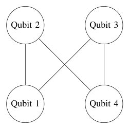 

Fig. 2. Non-Trivial Connectivity Graph

**Main problem.**

How to compile arbitrary logical quantum gates on hardware with restricted connectivity and limited accessible Hamiltonians by leveraging the redundancy of error-correcting codes.

**Main result.**

The authors provide a closed-form solution to the compilation problem by formulating it as a least-squares optimization over the stabilizer subalgebra, allowing for the selection of physical Hamiltonians that are easier to implement.

**Method.**

The problem is reduced to a least-squares minimization problem using the Moore-Penrose pseudoinverse within the framework of Lie algebra (su(N)) and the adjoint action.

**Summary.**

This paper presents a novel method for quantum compilation that utilizes the redundancy in error-correcting codes to find physical implementations of logical gates that respect hardware constraints. By treating the choice of stabilizer as a least-squares optimization problem, the authors show how to avoid expensive operations like SWAP gates by instead using naturally accessible physical Hamiltonians. The framework is general for any unitary in the SU(N) group and provides a mathematically precise way to bridge the gap between logical algorithms and physical hardware connectivity.

Detailed structure

**Model / system.**

The framework applies to quantum error-correcting codes (specifically the [[4, 2, 2]] code) and hardware architectures with restricted connectivity, such as superconducting, trapped ion, or neutral atom platforms.

**Key observables.**

The distance (error) between the target logical Hamiltonian and the accessible physical Hamiltonian, and the fidelity of the implemented unitary.

**Important parameters / regimes.**

The connectivity graph of the hardware, the specific error-correcting code used, and the set of accessible Lie algebra generators.

**Assumptions / limitations.**

The method assumes a fixed error-correcting code and encoding circuit, a predefined set of accessible Hamiltonians, and that the hardware allows for the implementation of the resulting physical Hamiltonian.

**Figures summary.**

Figure 1 shows a toy connectivity graph used for the CNOT implementation example; Figure 2 displays a non-trivial connectivity graph for a 4-qubit system.

**Paper structure.**

The paper introduces the dual problem of fault-tolerance and compilation, develops a mathematical framework using Lie theory to define logical and stabilizer subalgebras, formulates the compilation as a least-squares optimization, provides a closed-form solution via the pseudoinverse, and demonstrates the approach using the [[4, 2, 2]] code.

Abstract

To implement quantum algorithms on a quantum computer, we must overcome the twin problems of fault-tolerance -- how can we realize a relatively noiseless computation by cleverly combining noisy components? -- and compilation -- how can we realize an arbitrary quantum algorithm given the basic operations available on the quantum device at hand? We show how treating the former problem via error-correcting codes enables greater flexibility in resolving the latter. Specifically, we explicitly leverage the fact that error-correcting codes introduce redundancy which renders physically distinct operators logically indistinguishable. In terms of computation, it suffices to implement any operator logically equivalent to some target, yet from a compilation perspective, certain choices may be preferable to others. Our novel contribution is making this intuition precise in the general setting of the special unitary group. In particular, we describe how to reduce the problem of making a compilation-ideal choice to a least squares problem and provide a closed form solution thereof. Using our framework, it is possible to circumvent inserting costly swaps to adhere to hardware connectivity; instead, we could realize the logical target through a distinct physical Hamiltonian that is natively accessible. We elucidate our approach using the $[[4,2,2]]$ code. We discuss connections to compressed sensing that may pave the way to efficient compilation leveraging physical degrees of freedom.

[↑ back to top](#top)

### [The odd-parity ALM induced reconstruction of the Chern-insulating phase in Haldane-Hubbard model](http://arxiv.org/abs/2604.25537v1)

**Authors:** Minghuan Zeng, Zheng Qin, Ling Qin, Shiping Feng, Lin Wu, Dong-Hui Xu, Rui Wang

**Type:** theory · **Category:** strongly correlated electrons · **PDF:** <https://arxiv.org/pdf/2604.25537v1>

**Analysis basis:** full PDF text, analyzed in chunks

📷 Fig 1

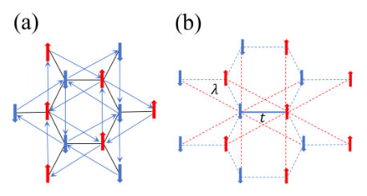 

FIG. 1. (Color online) (a)The schematic illustration of the ground state of hexagon-lattice HH model having the compensated collinear magnetism with opposite sublattice currents denoted by slight blue arrows, where the bold up-(red) and downward(blue) solid arrows represent the corresponding spin polarizations. (b)The schematic illustration of the 2-site cluster slave spin approximation, where the NN hopping denoted by the blue solid line and the onsite electron Coulomb repulsion within the 2-site cluster are treated using the numerical method of exact diagonalization, while the coupling between this 2-site cluster and the environment, denoted by the red and blue dashed lines, are roughly...

📷 Fig 2

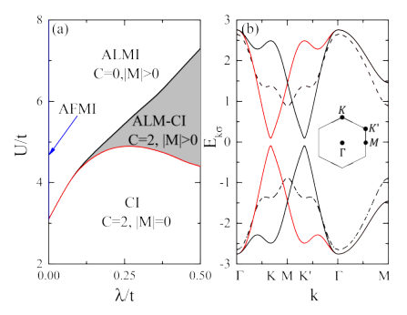 

FIG. 2. (Color online) (a)The phase diagram of HH model as a function of Haldane hopping λ and onsite electron Coulomb repulsion U, which consists of four regimes: AFMI at λ = 0 for U &gt; UAFM ≈3.1, CI with the Thouless-Kohmoto- Nightingale-Nijs number C = 2 at small U ′s, the odd-parity ALM-CI phase with C = 2 and |M| &gt; 0 in the intermediate interaction regime, and odd-parity ALMI at large interaction strengths[From Ref. 19]. (b)The momentum dependence of the spinon energy dispersion Ekσ in Eq.(9) along the zigzag direction in the first Brillouin zone at λ = 0.3 as well as U =4.8(black dashed) and 5.5 for up(red solid) and down(black solid) spinons. The inset displays the schematic...

📷 Fig 3

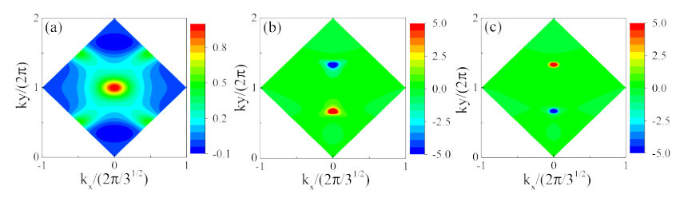 

FIG. 3. (Color online)The spin resolved spinon Berry curvature Bσ(k) as a function of momentum at λ = 0.3 with (a)U = 4.8(CI), (b)5.5(ALM-CI), and (c)6.1(ALMI) in the first Brillouin zone.

📷 Fig 4

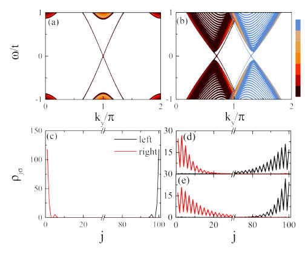 

FIG. 4. (Color online)The zigzag energy dispersion as a function of momentum ky mapped by the electron spectrum function Aσ(ky, ω) at λ = 0.3 with (a)U = 4.8(CI) and (b)5.5(ALM-CI), respectively. (c)the electronic LDOS of the edge mode as a function of site location j in the CI state with λ = 0.3 and U = 4.8; (d)the up- and (e)down-spin electronic LDOS of the edge mode in the ALM-CI phase with λ = 0.3 and U = 5.5. Here, the the color scale at the right- hand side in the first row measures the spectral weight for up-spin electrons; the legend ”left” and ”right” in subfigure (c) represent the left and right edge mode in the first row, respectively.

📷 Fig 5

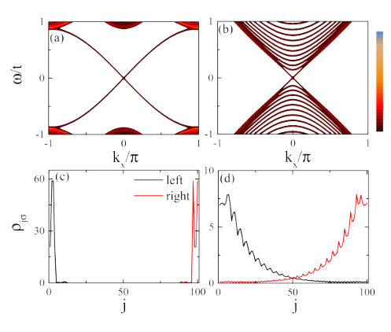 

FIG. 5. (Color online)The armchair energy dispersion as a function of momentum kx mapped by the electron spectrum function Aσ(kx, ω) at λ = 0.3 with (a)U = 4.8(CI) and (b)5.5(ALM-CI). The corresponding electron LDOS of the edge modes as a function of site location j are respectively plotted in subfigure (c) and (d). Here, the legend ”left” and ”right” represent the left and right edge mode in the first row, respectively.

📷 Fig 6

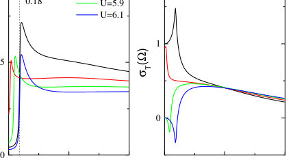 

FIG. 6. (Color online) (a)The longitudinal (σL) and (b)the transverse (σT) optical conductivity as a function of energy Ωat δ = 0 and λ = 0.3 with U = 5.5(black), 5.7(red), 5.9(green), and 6.1(blue). Here, the black dashed line in subfigure(a) denotes the single-particle energy gap 2|∆+1↑| at λ = 0.3 and U = 5.5.

**Main problem.**

The study investigates how odd-parity altermagnetism (ALM) reconstructs the momentum-space topology, edge states, and Hall transport in the presence of electronic interactions in a Chern insulator.

**Main result.**

The transition from a conventional Chern-insulating phase to an ALM-induced phase redistributes Berry curvature and alters edge state symmetry without changing the total Chern number, while maintaining quantized low-frequency Hall conductivity.

**Method.**

The authors employ the cluster slave-spin method, utilizing a 2-site cluster with exact diagonalization and a mean-field decoupling approach to treat strong electronic correlations.

**Summary.**

This paper explores how odd-parity altermagnetism affects the topological properties of the Haldane-Hubbard model. It demonstrates that while the global Chern number remains invariant during the transition to an altermagnetic Chern-insulating phase, the local Berry curvature is significantly redistributed. This reconstruction leads to spin-valley-locked edge states in zigzag ribbons and specific signatures in the optical Hall response. The findings establish the Haldane-Hubbard model as a key platform for studying the interplay of symmetry, interactions, and topology.

Detailed structure

**Model / system.**

The Haldane-Hubbard model on a hexagonal lattice, which includes nearest-neighbor hopping, next-nearest-neighbor Haldane hopping, and onsite Coulomb repulsion.

**Key observables.**

Berry curvature, edge state spectra (zigzag and armchair ribbons), Chern number, and optical conductivity (longitudinal and transverse).

**Important parameters / regimes.**

Hubbard interaction strength (U), Haldane hopping (lambda), and chemical potential (mu).

**Assumptions / limitations.**

The use of a 2-site cluster slave-spin approximation and a mean-field treatment for the coupling between the cluster and its environment.

**Figures summary.**

Fig 1 shows the HH model ground state and the slave-spin approximation scheme; Fig 2 presents the phase diagram and spinon energy dispersion; Fig 3 illustrates spin-resolved Berry curvature across different interaction regimes; Fig 4 details the evolution of zigzag edge spectra and LDOS.

**Paper structure.**

The paper introduces the problem of odd-parity ALM in correlated phases, describes the HH model and slave-spin method, presents the phase diagram and Berry curvature redistribution, analyzes edge state evolution in different ribbon geometries, discusses optical response, and concludes with experimental implications.

Abstract

Odd-parity altermagnetism(ALM) extends compensated collinear magnetism beyond the even-parity spin splitting of conventional altermagnets, but its role in correlated topological phases remains largely unexplored. Using the cluster slave-spin method, we show that the odd-parity ALM appearing in the ALM Chern-insulating phase of Haldane-Hubbard model significantly reconstructs the local topology in the conventional Chern-insulating phase, while the total Chern number remains unchanged compared to the Chern-insulating phase. The Berry curvature becomes spin and valley selective; zigzag ribbons develop chiral-symmetry-breaking edge states; while armchair ribbons remain inversion symmetric. The optical response mirrors this separation between the local reconstruction and the global topology: low-energy spectra are governed by quasiparticles near the gap, whereas the low-frequency Hall conductivity stays quantized, $σ_{\rm T\uparrow}(Ω\to 0)=σ_{\rm T\downarrow}(Ω\to 0)=e^2/h$. These results establish the Haldane-Hubbard model as a minimal correlated platform for odd-parity altermagnetic topology.

[↑ back to top](#top)

### [Theory of Anderson localization on the hyperbolic plane](http://arxiv.org/abs/2604.24917v1)

**Authors:** Alexander Altland, Tobias Micklitz, Devasheesh Sharma, Maksimilian Usoltcev, Carolin Wille

**Type:** theory · **Category:** disordered systems and neural networks · **PDF:** <https://arxiv.org/pdf/2604.24917v1>

**Analysis basis:** full PDF text, analyzed in chunks

📷 Fig 1

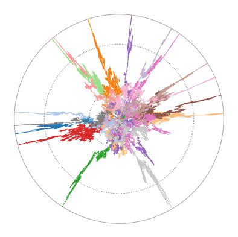 

FIG. 1: A number of diffusive Brownian motion processes simulated on H2. The dashed curves indicate geodesic circles of radii r = (1, 2, 5)L. Note the crossover from diffusive to ballistic behavior, as trajectories escape to infinity.

📷 Fig 2

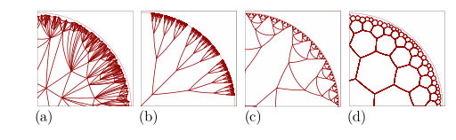 

FIG. 3: Discretizations of the hyperbolic plane: (a) Pois- son–Delaunay random graph, (b) q = 4 Bethe lattice, (c) (p, q) = (3, 2) Husimi-cactus graph, (d) {p, q} = {7, 3} regu- lar polygon tessellation. Discussion, see text.

📷 Fig 3

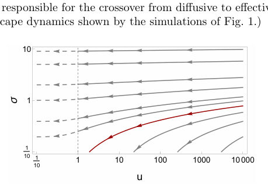 

FIG. 2: Flow of the two parameters (σ, u) as a function of the RG length scale. A separatrix (red line) divides the pa- rameter plane into a metallic and an insulating regime. In the metallic regime (above the separatrix), the RG flow ter- minates (u(ℓ) ∼1) at finite, non-zero conductivity, while in the complementary, localizing, regime, the conductivity flows to zero on an RG length scale below the curvature scale and localization occurs before the effect of the curvature is felt.

📷 Fig 4

 

Fig. 2 visualizes the flow (σ, u)(ℓ) traced out by the solutions above. Note the extreme efficiency of the hy- perbolic plane in protecting metallicity: for systems with weak to moderate disorder σ &gt; 1, even a small curva- ture with large radius L ∼Λ−1 exp(2πσ) suffices to block strong localization. In this parameter domain, the cutoff u(ℓ) ∼1 below which loop interference becomes ineffec- tive is reached at finite residual values of the conduc- tivity. The boundary to the localized regime is marked by a separatrix, σsep(u) defined by the condition that σsep(u →1) ≲1, i.e. a conductivity suppressed down to small values at u ∼1. Finally, note that the β-function defined by the right-hand...

📷 Fig 5

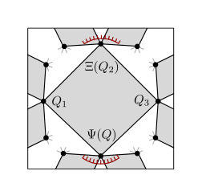 

FIG. 4: Two cell generations of a cactus with q = 3 (p = 4)- gons meeting at each vertex.

📷 Fig 6

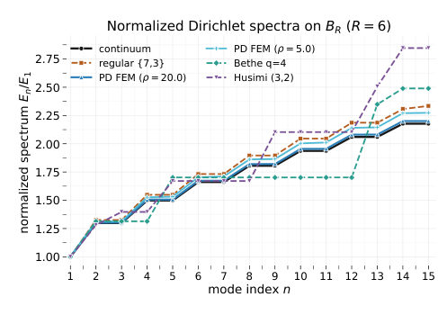 

FIG. 5: Spectra of different graph discretizations of a trun- cation of H2 at a finite radius R in units of curvature radius L, compared to the continuum theory (black) of the same ge- ometry with Dirichlet boundary conditions. The curves are scaled manually to a coinciding lowest mode value. (The lat- ter is finite, and determined by the effective curvature whose detailed comparison between different discretizations is not straightforward.) We notice strong deviations between the continuum and both Bethe, and Husimi cactus discretizations. The regular {7, 3} tessellation shows much better agreement, with, however, increasing deviations beyond the lowest lying modes. As expected, the PD...

**Main problem.**

Developing a unified theoretical framework for Anderson localization on the hyperbolic plane that interpolates between 2D-like behavior at short scales and infinite-dimensional behavior at large scales.

**Main result.**

The derivation of a two-parameter renormalization group flow for conductivity and curvature, identifying a critical line (separatrix) that separates metallic and insulating phases.

**Method.**

A combination of a non-linear sigma-model using the supersymmetry formalism, renormalization group analysis, and lattice discretization using Poisson-Delaunay random graphs.

**Summary.**

This paper provides a complete theory of Anderson localization on a surface with negative curvature. It explains how the geometry of the hyperbolic plane causes a crossover from standard 2D localization to a high-dimensional regime where metallicity can be protected. By using both field theory and graph-based models, the authors derive a unified renormalization group flow that predicts a true phase transition between metallic and insulating states.

Detailed structure

**Model / system.**

The two-dimensional hyperbolic plane (H2) with constant negative curvature, modeled via a Hamiltonian with a delta-correlated random potential and discretized using various graph structures like Bethe lattices and Poisson-Delaunay graphs.

**Key observables.**

Scale-dependent conductivity (sigma), scale-dependent curvature (u), resistance (R), and critical exponents (nu and beta).

**Important parameters / regimes.**

Disorder strength (W), curvature radius (L), conductivity (sigma), and the scaling variable (u).

**Assumptions / limitations.**

One-loop approximation in the renormalization group integration; use of a delta-correlated random potential; assumption that the Poisson-Delaunay discretization accurately captures the continuum spectrum in the high-density limit.

**Figures summary.**

Figure 4 shows a generation of a cactus graph; Figure 5 is mentioned in the context of discretization/graph properties.

**Paper structure.**

The paper begins with a continuum sigma-model to establish the 2D-like localization physics, moves to a lattice discretization (Bethe lattice and random graphs) to capture the high-dimensional transition, and concludes by deriving the coupled RG flow equations and the critical line.

Abstract

The two-dimensional hyperbolic plane, $\mathbb{H}^2$, is an unusual system in that dimensionality changes with scale: locally two-dimensional and planar at short distances, but effectively infinite-dimensional at large scales, it provides an interesting paradigm for the study of (quantum) phase transitions, notably the disorder-driven Anderson transition. Generalizing previous work, which treated short and large distance scales separately, we develop a unified framework interpolating between the principles of low- and high-dimensional Anderson localization. As a main result, we derive a two-parameter flow in a plane spanned by scale-dependent curvature (setting the system's effective dimensionality) and conductivity, with an extended critical line separating metallic and insulating phases.

[↑ back to top](#top)

### [Thermodynamic Identification of the Internal Superconducting Phase Boundary in UTe$_2$ for $H \parallel b$](http://arxiv.org/abs/2604.25896v1)

**Authors:** Michal Vališka, Tetiana Haidamak, Andrej Cabala, Petr Proschek, Andreas Hausprug, Sergei Zherlitsyn, Vladimír Sechovský

**Type:** experiment · **Category:** strongly correlated electrons · **PDF:** <https://arxiv.org/pdf/2604.25896v1>

**Analysis basis:** full PDF text, analyzed in chunks

📷 Fig 1

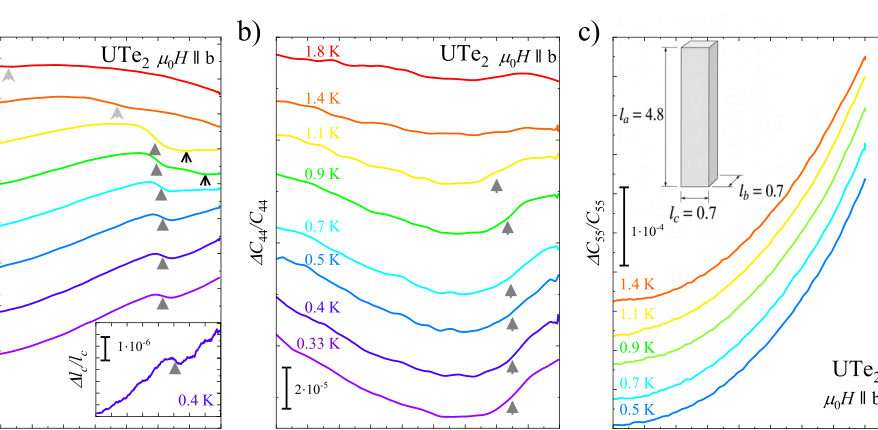 

FIG. 1. Field dependence of the elastic response for H ∥b. (a) Longitudinal mode C33(H) measured with q ∥c and u ∥c, showing a pronounced softening anomaly near 14 T. The inset shows a selected field window of the transverse magnetostriction ∆lc/lc for H ∥b. (b) Transverse mode C44(H) measured with q ∥c and u ∥b, where a weaker hardening anomaly is observed in the same field range. (c) Transverse mode C55(H) measured with q ∥c and u ∥a, where no corresponding anomaly is resolved within the experimental resolution; the inset shows the measured sample and its dimensions in millimeters. Vertical scales are indicated by the scale bars in each panel.

📷 Fig 2

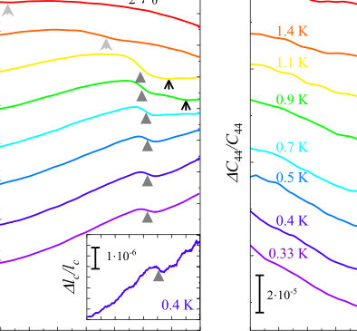 

Figure 2 summarizes temperature sweeps of C33, C44, and C55 at selected fields. The marked anomalies pro- vide complementary transition points for constructing the phase diagram in Fig. 3. The mode selectivity also has symmetry implications. In orthorhombic D2h symmetry, different shear modes probe different strain channels: C44 couples to εbc, C55 to εac, and C66 to εab [27, 28]. Recent ultrasound work argued that the low-field superconducting state is single- component, with an odd-parity B2u state as the most compatible candidate, based on the absence of shear- modulus discontinuities at Tc [28]. In this context, the finite anomaly in C44, together with the absence of a resolvable C55...

📷 Fig 3

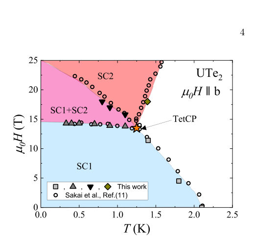 

FIG. 3. H–T phase diagram of UTe2 for H ∥b. Filled symbols denote phase boundaries determined in the present work, and open symbols indicate literature data from ac- susceptibility measurements by Sakai et al. [11]. The ultrasound-resolved internal boundary remains nearly con- stant in field near 14 T and terminates near 13.5 T and 1.25 K at a tetracritical point (TetCP), completing the local phase- diagram topology by providing the fourth phase line required at the TetCP. The superconducting regions SC1, SC1+SC2, and SC2 are indicated.

📷 Fig 4

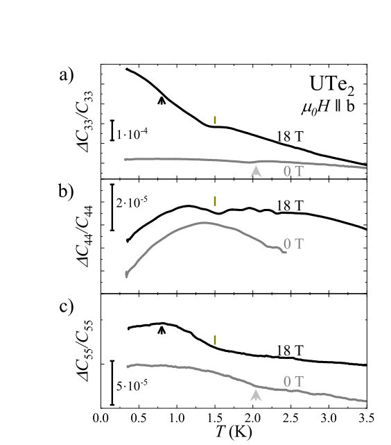 

FIG. 2. Temperature dependence of the elastic response for selected magnetic fields. (a) C33(T ) measured with q ∥c and u ∥c. (b) C44(T ) measured with q ∥c and u ∥b. (c) C55(T ) measured with q ∥c and u ∥a. Each panel includes the 0 and 18 T curves, and the marked anomalies denote transition points used to construct the phase diagram in Fig. 3. Vertical scales are indicated by the scale bars in each panel.

**Main problem.**

The existence of an unresolved internal superconducting phase boundary in UTe2 for magnetic fields along the b-axis lacked definitive bulk thermodynamic evidence.

**Main result.**

Ultrasound measurements provide the first bulk thermodynamic evidence for this internal phase boundary, identifying a tetracritical point near 13.5 T and 1.25 K and revealing symmetry-selective coupling to lattice strain.

**Method.**

Pulse-echo ultrasound spectroscopy of various elastic modes (C33, C44, C55) and transverse magnetostriction measurements.

**Summary.**

This paper provides the first thermodynamic confirmation of an internal superconducting phase boundary in UTe2 for magnetic fields applied along the b-axis. Using ultrasound spectroscopy, the authors observed a significant softening in the C33 elastic mode and a kink in magnetostriction at approximately 14 T. They identified a tetracritical point where the phase boundary terminates and demonstrated that the anomaly is symmetry-selective. This discovery confirms the boundary is a bulk thermodynamic feature and supports the existence of multicomponent superconductivity in this material.

Detailed structure

**Model / system.**

The physical system is UTe2, an orthorhombic heavy-fermion paramagnet and unconventional superconductor, studied in high magnetic fields (up to 18 T) and low temperatures (down to 0.33 K).

**Key observables.**

Elastic constants (C33, C44, C55), relative frequency shift (delta f/f), and transverse magnetostriction (delta lc/lc).

**Important parameters / regimes.**

Magnetic field H parallel to the b-axis, temperature down to 0.33 K, and the phase boundary near 14-15 T.

**Assumptions / limitations.**

The study assumes the use of ultraclean single crystals to ensure the observed features are intrinsic bulk properties.

**Figures summary.**

Figure 1 shows the field dependence of elastic responses: (a) C33 softening and magnetostriction kink at 14 T, (b) C44 hardening anomaly, and (c) no resolvable anomaly in C55.

**Paper structure.**

The paper introduces the unresolved phase boundary problem, describes the experimental setup using ultrasound and magnetostriction, presents the identification of the thermodynamic boundary via elastic anomalies, discusses the symmetry-selective coupling and the tetracritical point, and concludes with implications for the order-parameter structure.

Abstract

The $H$--$T$ phase diagram of UTe$_2$ for magnetic field along the hard $b$ axis contains an unresolved internal boundary near $μ_0H \sim 14$--15~T, previously inferred from ac susceptibility and transport experiments but lacking thermodynamic evidence. We report ultrasound results for several elastic modes in an ultraclean UTe$_2$ single crystal with $T_c>2$~K for $H \parallel b$ down to 0.33~K and up to 18~T. A pronounced anomaly in the longitudinal $C_{33}$ mode, with a weaker response in $C_{44}$ and no resolvable anomaly in $C_{55}$, establishes this feature as a bulk thermodynamic phase boundary and reveals a symmetry-selective coupling to lattice strain. The phase line remains nearly constant in field near 14~T and terminates near 13.5~T and 1.25~K at a tetracritical point, providing the thermodynamic evidence for the fourth phase boundary in the $H$--$T$ phase diagram. The results constrain the order-parameter structure of the high-field phase and support field-induced multicomponent superconductivity in UTe$_2$.

[↑ back to top](#top)

### [Topochemical Fluorination of La$_2$NiO$_{4+δ}$ Single Crystals](http://arxiv.org/abs/2604.25575v1)

**Authors:** Hasan Yilmaz, Masahiko Isobe, Oliver Clemens, Pascal Puphal

**Type:** experiment · **Category:** strongly correlated electrons · **PDF:** <https://arxiv.org/pdf/2604.25575v1>

**Analysis basis:** full PDF text, analyzed in chunks

📷 Fig 1

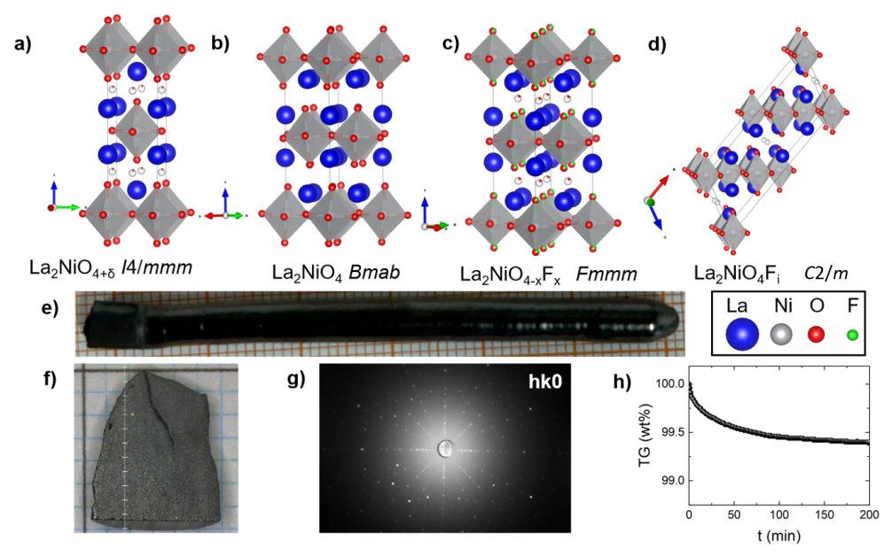 

FIG. 1. Structure. Crystal structure, diffraction, and macroscopic appearance of the grown oxide single crystal. (a) Crystal structure of La2NiO4+δ (I 4/mmm) (for 0.1 &lt; δ &lt; 0.15 [28] (b) reduced La2NiO4 (Bmab) (c) La2NiO4−xF2x (Fmmm) and (d) a Fluorine intercalated superstructure discussed further below of La2NiO4Fi (C2/m), all highlighting the corner-sharing octahedral framework. (b) Laue X-ray diffraction pattern recorded in the hk0 plane, confirming high crystalline quality and long-range order. (e) As-grown rod and (f) cut single crystal pieces obtained by the optical floating zone method. (g) Laue X- ray diffraction pattern recorded in the hk0 plane, confirming high crystalline quality...

📷 Fig 2

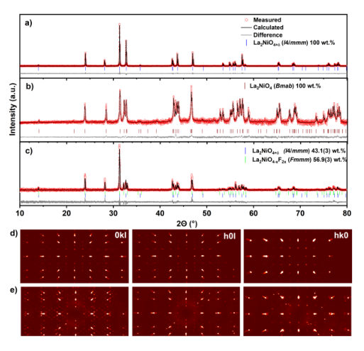 

FIG. 2. XRD. Rietveld fit of the room-temperature pow- der X-ray Diffraction (PXRD) pattern of (a) as-grown La2NiO4+δ (b) after TGA reduction in Ar/H2 flow at 450 °C (c) after first PTFE fluorination. Rietveld fit of the room- temperature Single Crystal X-ray Diffraction (SC-XRD) pattern of (d) as-grown La2NiO4+δ, (e) after twice PTFE fluorination treatment.

📷 Fig 3

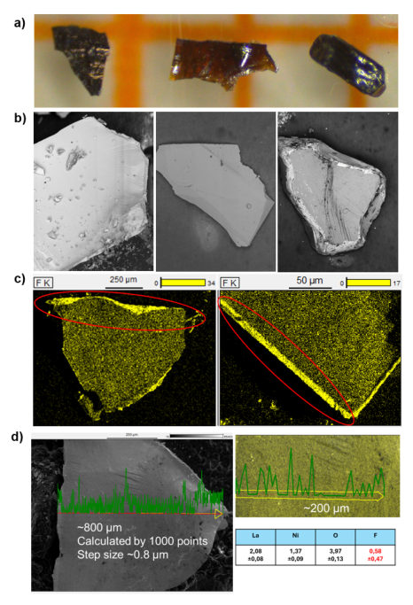 

FIG. 3. Chemical composition and distribution. (a) Microscopic images of La2NiO4 single crystals on millime- ter scale before and after TGA reduction in Ar/H2 flow at 450 °C as well as PTFE treated (last). (b) SEM-BSE im- ages of cross-sectioned single crystals of the same as grown La2NiO4.15, reduced La2NiO4 and after PTFE fluorination. (c) Corresponding fluorine (F Kα) elemental maps on a PTFE treated specimen, highlighting pronounced fluorine accumu- lation near the crystal surface (marked by red ellipses), in- dicative of surface-dominated fluorination (d) EDX line scan acquired across the crystal cross section of a cleaved crystal over, as well as a magnified view, of the near-surface...

📷 Fig 4

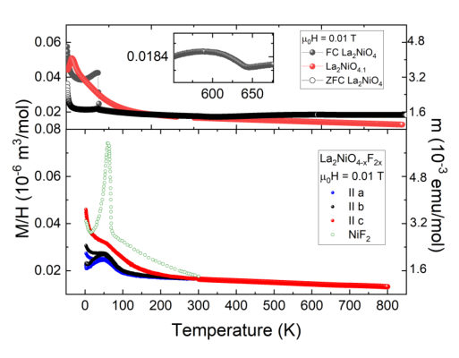 

FIG. 4. Directional-dependent magnetization of La2NiO4−xF2x single crystals. For comparison, data from as-grown La2NiO4.18 (red) and reduced La2NiO4 (black) are put as a top panel. The inset shows a magnification of the high temperature transition in reduced La2NiO4 (black). The bottom panel shows the temperature-dependent magnetiza- tion measured in a field of 0.1 T along the a-, b−and c-axes for a twice PTFE treated crystal. Pronounced anisotropy is observed in the a-axis ZFC curve (black) compared to c (red). The 80 K transition is put as a reference data of NiF2 [37] (green hollow spheres)

📷 Fig 5

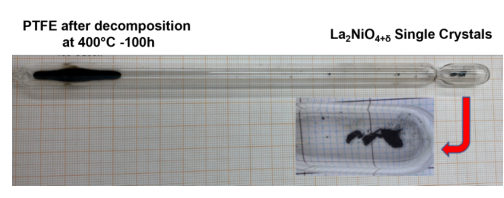 

FIG. 5. Prepared glass reactors after fluorination process with PTFE

**Main problem.**

The study addresses the lack of systematic research on the topochemical fluorination of bulk single crystals of La2NiO4+d, aiming to understand the intrinsic structure-property relationships and the mechanism of fluorine incorporation.

**Main result.**

The researchers discovered that topochemical fluorination preserves the Ruddlesden-Popper framework while inducing a previously unreported fluorine-intercalated superstructure (C2/m symmetry) and altering the antiferromagnetic ordering.

**Method.**

Single crystals were grown via the optical floating zone method and subjected to fluorination using agents like PTFE, PVDF, and CuF2. Characterization included SC-XRD, SEM-EDX, TGA, and magnetic susceptibility measurements.

**Summary.**

This paper investigates the topochemical fluorination of La2NiO4+d single crystals using various fluorine-containing agents. It demonstrates that fluorine can be intercalated into the rock-salt layers of the Ruddlesden-Popper structure without destroying the crystal framework. The study reveals the emergence of a new monoclinic superstructure and changes in the material's magnetic properties. This work provides a new route for tuning the electronic and structural properties of nickelates in bulk form.

Detailed structure

**Model / system.**

The physical system consists of La2NiO4+d (Ruddlesden-Popper n=1) single crystals, including their topochemically reduced (La2NiO4) and fluorinated (La2NiO4-xF2x) variants.

**Key observables.**

Lattice parameters, space group symmetry, fluorine incorporation degree, Ni valence states, Neel temperature (TN), magnetic anisotropy, and magnetic susceptibility (ZFC/FC).

**Important parameters / regimes.**

Fluorine content (approximately F0.1), oxygen excess (delta), and temperature ranges for fluorination (250C to 400C).

**Assumptions / limitations.**

The fluorination process is assumed to be a diffusion-limited mechanism, and the observed magnetic transitions are analyzed in the context of potential NiF2 impurities.

**Figures summary.**

Fig 1 shows crystal structures, Laue patterns, and TGA data; Fig 2 shows XRD Rietveld refinements; Fig 3 displays SEM/EDX images and fluorine elemental maps; Fig 4 presents temperature-dependent magnetization curves.

**Paper structure.**

The paper introduces the problem of bulk fluorination, describes the crystal growth and fluorination methods, presents structural characterization (XRD) and chemical analysis (EDX/TGA), followed by magnetic property measurements and a discussion of the findings.

Abstract

Topochemical fluorination offers a low--temperature route for modifying the anion chemistry and electronic ground states of layered transition-metal oxides, providing access to metastable phases and functionalities that are not able to be achieved through conventional solid--state synthesis. Despite extensive work on polycrystalline samples and thin films, topochemical fluorination of bulk single crystals has not been studied, limiting insights into intrinsic structure property relationships. Here, we investigate the topochemical fluorination of optical float zone grown (OFZ) La$_2$NiO$_{4+δ}$ single crystals using polymer-based PTFE, PVDF and inorganic CuF$_{2}$ fluorination agents and compare it to our topochemical pathways of reduction of LaNiO$_{3-x}$. By systematically investigating direct and indirect contact reaction pathways, we can understand fluorination mechanisms, quantify the degree of fluorine incorporation, and evaluate the resulting structural and magnetic modifications in a detail that was not possible in powder and thin films. Powder and single--crystal X-ray diffraction reveal that fluorination proceeds without destroying the Ruddlesden--Popper framework, while inducing lattice parameter changes consistent with anion intercalation in the bulk and ion exchange on the surface. This even induces a clear superstructure, which was not reported before and extends the understanding of anion insertion reactions beyond what is known on stage ordering in nickelates. Energy-dispersive X--ray spectroscopy confirms strong fluorine incorporation on the surface and reduced homogeneity in the bulk. Magnetic susceptibility measurements demonstrate a change in antiferromagnetic ordering upon fluorination.

[↑ back to top](#top)

### [Training cell stress patterns in 3D cellular packings](http://arxiv.org/abs/2604.25439v1)

**Authors:** Shabeeb Ameen, Tao Zhang, J. M. Schwarz

**Type:** theory · **Category:** disordered systems and neural networks · **PDF:** <https://arxiv.org/pdf/2604.25439v1>

**Analysis basis:** full PDF text, analyzed in chunks

📷 Fig 1

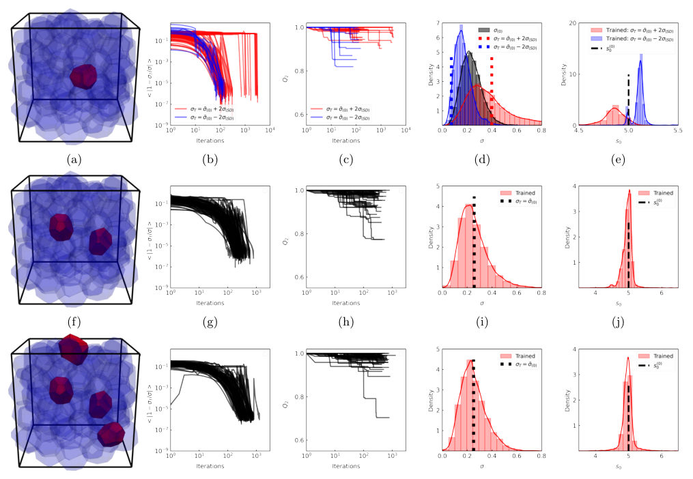 

FIG. 1: Learning single-cell stresses reveals asymmetry, global coordination, and slower lowering with more target cells. We train randomly chosen target cells on 100 initial configurations with 216 total cells and periodic boundary conditions. (a)-(e) Training one target cell to high or low target stresses, defined as 2 standard deviations above (red) and below (blue) the initial mean stress. (b) The error in cell stress with respect to the target stress is tracked with training iterations for every successful training instance for both these single cell training tasks. (c) The overlap of the topology of the cell packing with the initial configuration, tracked for each successful training...

📷 Fig 2

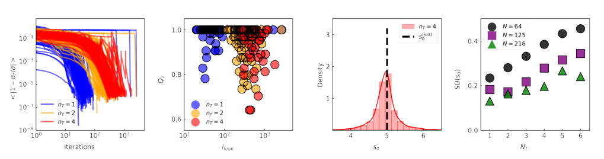 

FIG. 2: Learning with different constraint loads and system sizes. (a) Error vs iteration for 100 runs, for constraint load NT = 1, 2, 4 with N = 64. (b) Scatter plot: overlap of trained configuration with initial configuration vs. final iteration number, for NT = 1, 2, 4 with N = 64. (c) Distribution of final s0 values for the hidden cells with NT = 4 and, again, N = 64 (d) Standard deviation for the final s0 distribution as a function of constraint load for different system sizes.

📷 Fig 3

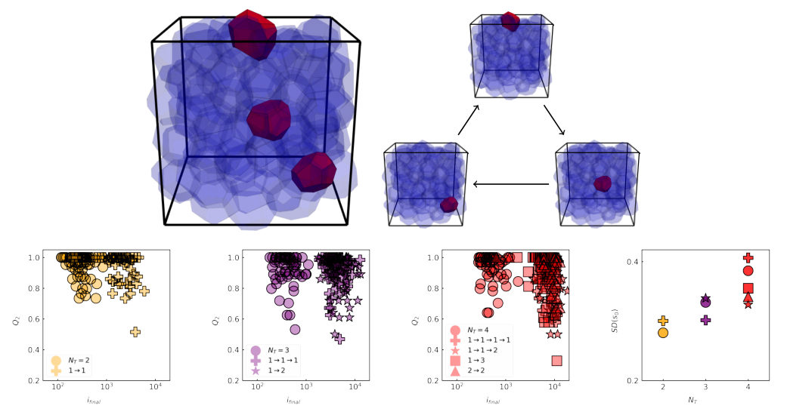 

FIG. 3: Training target cells in sequence. The schematic shows how a 3-cell pattern can be addressed in a 1 →1 →1 sequence. Training (a) NT = 2 (b) NT = 3 (c) NT = 4 target cells with N = 64 for various sequential patterns denoted by different symbols. (d) A comparison of the final standard deviation hidden cell parameter distribution as a consequence of the choice of sequence.

📷 Fig 4

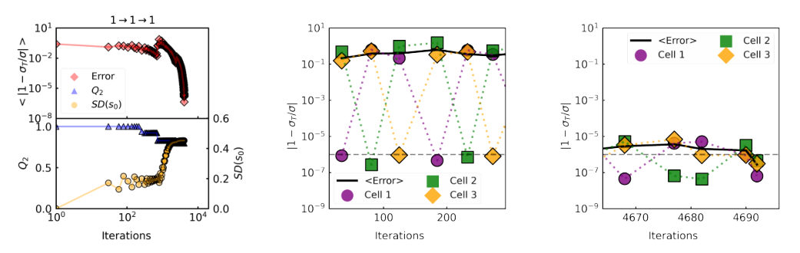 

FIG. 4: Compatibility and forgetting in sequential learning. A single instance of training a 1 →1 →1 sequence with N = 64. (a) Error, overlap, and standard deviation of the hidden parameter distribution vs. training iterations. (b) Tracking errors on each cell in the early stages of training. (c) Tracking errors on each cell in the later stages of training.

📷 Fig 5

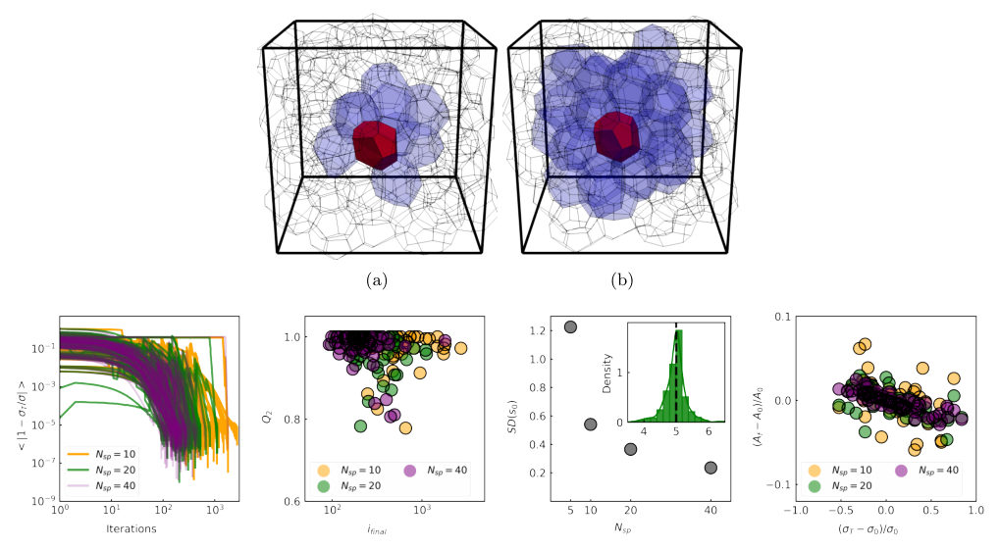 

FIG. 5: Training cells stresses in spheroids that can impact spheroid shape. A single target cell is picked at the center of a spheroid of Nsp cells, and trained for a target stress σT = ¯σ0, or the initial mean stress. (a) A spheroid with Nsp = 10 and (b) a spheroid with Nsp = 40 cells. The single target cell at the center is shown in red. (c) Error versus interation number for different spheroid sizes demonstrates that increasing the spheroid size for the single-cell training task reduces the number of iterations needed. (d) Scatter plot of final overlap parameter and final iteration number. Generally, increasing spheroid size also reduces the number of cell neighbor changes needed. (e)...

📷 Fig 6

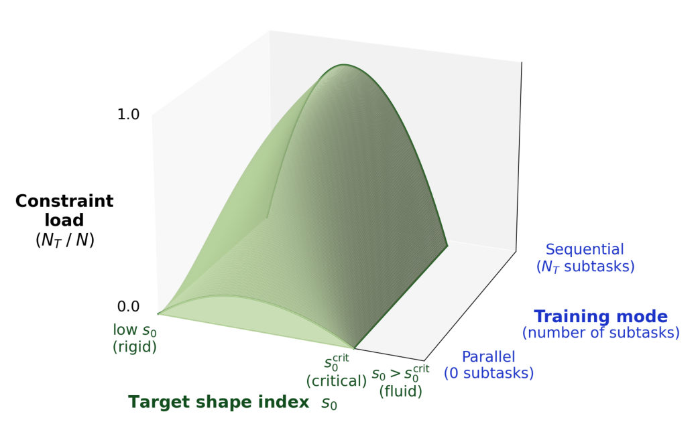 

FIG. 6: A conceptual learning phase diagram for training cell stresses. The trainable region (green) is shown as a function of constraint load (ratio of target to hidden cells), cell packing rigidity (controlled by the target shape index), and training mode. Rigidity governs an effective exploration–exploitation balance: fluid-like regimes enhance exploration through cellular rearrangements but do not necessarily lead to successful learning, as increased rearrangements can also elevate error and destabilize target stress patterns, while rigid regimes constrain accessible configurations and favor exploitation of existing states. Constraint load sets an effective capacity, with low values...

**Main problem.**

Investigating whether 3D cellular packings can function as trainable matter capable of learning and realizing prescribed internal cellular stress patterns through the evolution of mechanical parameters and network topology.

**Main result.**

The study demonstrates that learning is a collective process where tissue rigidity controls an exploration-exploitation tradeoff, and that increasing constraint load leads to slower, more heterogeneous learning dependent on rare topological rearrangements.

**Method.**

A contrastive learning algorithm is used to update hidden-cell shape indices, combined with a hybrid Langevin-FIRE minimization protocol to handle energy discontinuities during cell rearrangements.

**Summary.**

This paper explores how 3D cellular packings can be trained to achieve specific internal stress patterns, treating the tissue as a nonconventional AI platform. It shows that learning involves both continuous parameter updates and discrete topological rearrangements. The researchers find that the ability to learn depends heavily on the system's rigidity and the density of constraints. Ultimately, the work proposes a framework where biological dysfunction can be viewed as 'mislearning' and suggests that tissues could be engineered as adaptive materials.

Detailed structure

**Model / system.**

A 3D vertex model representing confluent cellular tissue, where cell energy is defined by volume and surface area stiffness, and structural plasticity allows for neighbor exchanges (rearrangements).

**Key observables.**

Cellular stress tensors (maximum shear stress), cell shape indices, topology overlap (rearrangements), and training error/yield.

**Important parameters / regimes.**

Constraint load (ratio of target to total cells), tissue rigidity (controlled by shape index), and training protocol (parallel vs. sequential).

**Assumptions / limitations.**

The model assumes a confluent vertex model with periodic boundary conditions and assumes deformations remain within a linear regime for the clamping subroutine.

**Figures summary.**

Figures show the success of single-cell training, the impact of constraint load on error and parameter distribution, the efficiency difference between sequential and parallel training, and a conceptual phase diagram for learnability.

**Paper structure.**

The paper introduces the concept of learning in reconfigurable tissues, describes the 3D vertex model and contrastive learning algorithm, analyzes the impact of rigidity and constraint load on learning dynamics, compares parallel and sequential training protocols, and concludes with biological implications and a unified theory of learning in collective matter.

Abstract

The task of learning patterns is typically associated with systems that update parameters on fixed architectures, such as neural networks, where learning proceeds through continuous optimization. Here, we demonstrate that pattern learning can also emerge in reconfigurable cellular tissue, where both mechanical parameters and network topology evolve. Using a three-dimensional vertex model, we show that cellular packings can be trained to realize prescribed cell stress patterns through a contrastive learning algorithm to update hidden-cell shape indices. We find that learning is intrinsically collective, requiring coordinated, system-wide parameter adjustments, with learnability governed by an interplay between mechanical state, capacity, and training protocol. In particular, the rigidity of the tissue controls an effective exploration-exploitation tradeoff: fluid-like regimes enhance exploration through cellular rearrangements, while rigid regimes constrain dynamics and favor exploitation of existing configurations. These rearrangements introduce discontinuous learning dynamics, enabling the system to transition between distinct local minima in the cost function landscape. As the ratio of target cells to the total number cells in the packing or constraint load increases, learning becomes slower, more heterogeneous, and increasingly dependent on rare rearrangements that allow escape from geometrically constrained states. Finally, training cells in sequence, in contrast to parallel protocols, provides an alternative route that can be more robust but generally takes longer to train for the constraint loads studied. These results suggest a learning phase diagram governed by constraint load, cell packing rigidity, and training protocol. By enabling the training of localized internal states, this work positions tissues not only as adaptive materials, but as nonconventional AI platforms.

[↑ back to top](#top)

### [Use case study: benchmarking quantum breadth-first search for maximum flow problems](http://arxiv.org/abs/2604.24962v1)

**Authors:** Andreea-Iulia Lefterovici, Lara Lelakowski, Michael Perk

**Type:** theory · **Category:** quantum information and computing · **PDF:** <https://arxiv.org/pdf/2604.24962v1>

**Analysis basis:** full PDF text, analyzed in chunks

📷 Fig 1

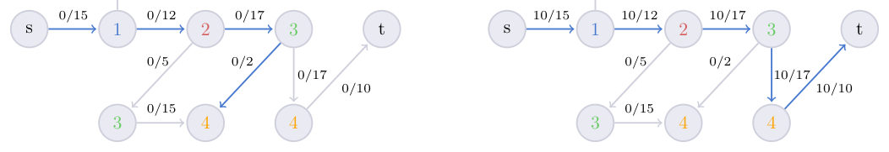 

Fig. 1: Application of Dinic’s algorithm to find the maximum flow for the graph shown in (a). The BFS finds, as show in (b), three layers, depicted in blue, red and green, respectively. The first path (up) is found by performing a DFS and gives a flow value of f1 = min(10, 17, 17, 10) = 10. The second path (down) yields a flow of f2 = min(15, 30, 17, 15) = 15. At this point, no additional paths can be found, implying that a blocking flow has been reached. The first block of iteration stops. The second block of iteration is depicted in (c) and (d), and takes as an input an updated version of the original the graph, where the remaining capacities have been adjusted. For simplicity, we removed...

📷 Fig 2

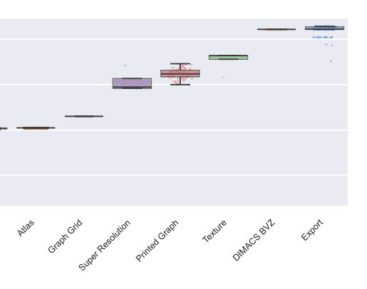 

Fig. 2: Standard maximum flow benchmark dataset [19], [20] with sizes between 50 and 300,000 vertices.

📷 Fig 3

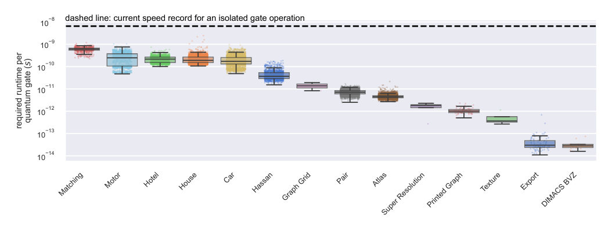 

Fig. 3: Minimum required time per quantum gate operation to match the execution time of BFS within Dinic’s algorithm for standard classical benchmark datasets. The dashed line at 6.5−9s is the current best achieved time for a gate operation [21]. Since all required times fall below this threshold, achieving a better performance using qBFS is not feasible.

**Main problem.**

Evaluating whether the asymptotic speedup of Quantum Breadth-First Search (qBFS) can translate into a practical advantage for solving the maximum flow problem using Dinic's algorithm.

**Main result.**

The study finds that for realistic problem sizes, achieving a quantum advantage would require quantum gate operation speeds that are several orders of magnitude faster than current physical limits.

**Method.**

A hybrid benchmarking approach that uses classical execution of Dinic's algorithm to log BFS runtimes and then analytically estimates the required quantum gate cycles and speeds.

**Summary.**

This paper investigates whether quantum algorithms for graph traversal can provide a practical advantage in solving maximum flow problems. By using a hybrid approach, the authors estimate the hardware requirements needed to outperform classical Dinic's algorithm. They conclude that the required gate speeds for a practical advantage are physically impossible with current or near-term technology. This highlights the gap between asymptotic quantum speedups and practical utility for large-scale network problems.

Detailed structure

**Model / system.**

The study uses flow networks (directed graphs with capacities) and models the quantum component as a QSearch-based implementation of Grover's algorithm to replace classical BFS subroutines.

**Key observables.**

Runtime complexity, number of quantum cycles, and required gate operation times.

**Important parameters / regimes.**

Number of vertices (V), number of edges (E), edge capacities (C), and the physical threshold for gate operation speed (6.5-9 ns).

**Assumptions / limitations.**

Assumes a simplified gate model where one Grover iteration requires 2|L| cycles, assumes the qBFS produces the same layered graph structure as classical BFS, and ignores overheads like error correction or qubit connectivity.

**Figures summary.**

Figure 1 illustrates the execution of Dinic's algorithm on a graph via layered networks; Figure 2 shows the range of problem sizes in the benchmark dataset; Figure 3 compares the required quantum gate speeds to the current physical speed record.

**Paper structure.**

The paper introduces the maximum flow problem and Dinic's algorithm, describes the proposed qBFS substitution, details the hybrid benchmarking methodology and analytical lemmas, presents the results comparing required gate speeds to physical limits, and concludes with a discussion of the implications for quantum advantage.

Abstract

The maximum flow problem asks to find the largest possible flow from a source to a sink in a capacitated network. It arises frequently in scheduling, project selection, and as a core subroutine in broader optimisation tasks. Classically, it can be efficiently solved using Dinic's algorithm, which repeatedly performs breadth-first search (BFS) and blocking flow computations on the graph. As a potential candidate for quantum speedups, these BFS subroutines can be naturally replaced with quantum BFS (qBFS), an instantiation of Grover's search algorithm. In this paper, we evaluate the expected performance of qBFS on standard classical datasets. These instances are too large to be solved directly on current quantum hardware, so we adopt a hybrid benchmarking approach: (i) we run a classical implementation of Dinic's algorithm and isolate the runtime of its BFS subroutines; (ii) we analytically estimate the minimum number of quantum cycles required to implement qBFS, where we use the classically logged data. Our results indicate that achieving a practical quantum advantage for realistic problem sizes would translate to quantum gate operation times surpassing physical limitations.

[↑ back to top](#top)

### [Validity of DFT+U band gaps in all its known functional forms](http://arxiv.org/abs/2604.25706v1)

**Authors:** Andrew C. Burgess, David D. O'Regan

**Type:** theory · **Category:** strongly correlated electrons · **PDF:** <https://arxiv.org/pdf/2604.25706v1>

**Analysis basis:** full PDF text, analyzed in chunks

📷 Fig 1

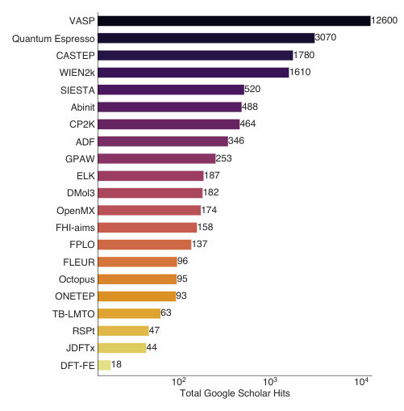 

FIG. 1. The number of Google Scholar hits [103], on a log- arithmic scale, for a range of DFT packages that implement it [104–131]. The search was conducted by searching the name of the DFT package in conjunction with DFT+U.

📷 Fig 2

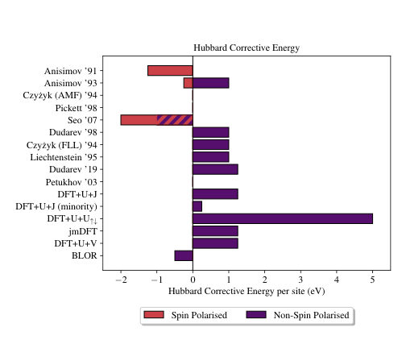 

FIG. 2. DFT+U correction to the total energy of the spin polarized and non-spin polarised hydrogen lattice at the in- finite separation limit upon non-self consistent application of each DFT+U-type functional. The Hubbard U, Hund’s J and intersite V parameters were set at 5 eV, 1 eV and 0 eV, respectively. Seo’s DFT+U functional yields a negative en- ergetic correction for both the spin polarized and non-spin polarized hydrogen lattices of -2 eV and -1 eV, respectively.

📷 Fig 3

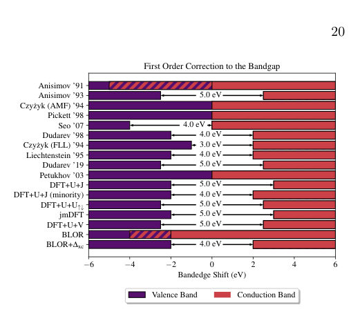 

FIG. 3. Correction to the bandgap of the spin polarized hy- drogen lattice at the infinite separation limit upon non-self consistent application of each DFT+U-type functional. The Hubbard U, Hund’s J and intersite V parameters were set at 5 eV, 1 eV and 0 eV, respectively. Two DFT+U functionals, namely Anisimov ’91 and BLOR, reduce the Kohn Sham gap by 5 eV and 2 eV, respectively, while most other functionals increase the Kohn Sham gap of this system.

📷 Fig 4

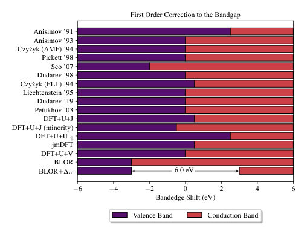 

FIG. 4. Correction to the bandgap of the non-spin polarized hydrogen lattice at the infinite separation limit upon non-self consistent application of each DFT+U-type functional. The Hubbard U, Hund’s J and intersite V parameters were set at 5 eV, 1 eV and 0 eV, respectively. Most DFT+U functionals fail to modify the Kohn Sham gap of this system.

📷 Fig 5

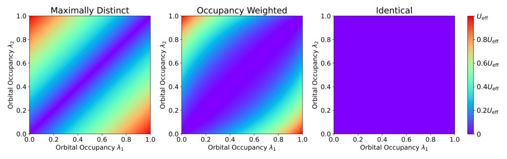 

FIG. 5. Dudarev’s DFT+U correction to the bandgap ∆σ GKS as a function of the spin-resolved subspace occupancy eigenvalues of a d-orbital subspace under octahedral or tetrahedral crystal field splitting. Under octahedral or tetrahedral crystal field splitting, in the absence of further symmetry breaking, there will be two eigenspaces (of dimensions 2 and 3) of the d-orbital spin-resolved subspace occupancy matrix, the eigenvalues of which we label λσ eg and λσ t2g. The existence of only two distinct spin-resolved subspace occupancy eigenvalues enables the DFT+U bandgap correction of Eq. 106 to be readily plotted as a function of λσ eg and λσ t2g once a suitable model for the orbital...

**Main problem.**

Investigating whether the single-particle eigenspectrum gap (eigenvalue gap) in DFT+U and hybrid functionals is a theoretically valid proxy for the fundamental band gap.

**Main result.**

The authors prove that for pristine periodic crystals in the thermodynamic limit, the DFT+U eigenvalue gap exactly matches the fundamental gap, a result that holds across various functional forms and projection operators.

**Method.**

A rigorous analytical derivation using the Generalized Kohn-Sham (GKS) framework, applying Janak's theorem and scaling analysis of functional derivatives with respect to electron count.

**Summary.**

This paper provides a formal theoretical proof that the eigenvalue gap in DFT+U and hybrid functional calculations accurately represents the fundamental band gap for periodic solids. By analyzing the scaling of functional derivatives in the thermodynamic limit, the authors show that the derivative discontinuity term vanishes in the bulk. This resolves long-standing doubts about the conceptual validity of using single-particle spectra as a proxy for total-energy-derived gaps. However, they also clarify that this equivalence breaks down for molecules and defective systems.

Detailed structure

**Model / system.**

The study focuses on pristine, infinite periodic crystals (solids) in the thermodynamic limit, including transition-metal and lanthanide-bearing crystals and the hydrogen lattice in the Mott-Hubbard limit.

**Key observables.**

Fundamental band gap (energy difference between electron addition and removal), single-particle eigenspectrum gap (eigenvalue gap), and total energies.

**Important parameters / regimes.**

Hubbard U and Hund's J parameters, effective Hubbard parameter Ueff, and subspace projection operators.

**Assumptions / limitations.**

The validity is strictly limited to pristine periodic systems with converged k-point sampling; it does not apply to isolated molecules or defective solids.

**Figures summary.**

Figure 1 is a logarithmic scale bar chart showing the widespread utility of the DFT+U method by displaying Google Scholar hits for various DFT software packages.

**Paper structure.**

The paper begins by defining the energy functional and GKS Hamiltonian, proceeds to an analytical proof of the eigenvalue gap validity in the bulk limit, extends the proof to various functional forms and projection methods, and concludes by discussing the limitations regarding defective and isolated systems.

Abstract

The Density Functional Theory plus Hubbard $U$ (DFT+$U$) technique is one of the most widely used tools by condensed matter physicists and solid state chemists for the simulation of transition-metal and lanthanide bearing crystals, and increasingly of much more diverse chemistries. Although often synonymous with the corrective functionals of Dudarev et al. and Liechtenstein et al., there exists a wide variety of DFT+$U$-type functionals ready to be utilized, and no doubt yet to be developed. Since the earliest days, the gap in the DFT+$U$ single-particle eigenspectrum has been associated with the fundamental band gap, and the method has typically found more success for spectra than for total-energy derived properties. There has been some doubt, however, as to the conceptual validity of this association. Here, extending findings from recent years regarding local and semi-local functionals, we prove that the DFT+$U$ eigenspectrum gap is indeed valid, in the sense that it matches its own fundamental gap calculated using total-energy differences. This is true for pristine periodic systems with converged $k$-point sampling but not, however, for defective ones or isolated systems. We show that bandgap validity for solids holds in the presence of pseudopotentials and PAW potentials, when using hybrid functionals, and in DFT+$U$(+$J$) irrespective of the level of subspace projection onto the band-edge states. We survey every DFT+$U$-type functional known to have been published to date, within a unified notation. We verify analytically under which conditions the eigenvalue gap equals its fundamental gap for each functional, and analyze its effect on total energies and gaps for the hydrogen lattice in the Mott-Hubbard limit.

[↑ back to top](#top)

## Secondary cond-mat archives

*Papers from cond-mat.mtrl-sci, mes-hall, other, soft, supr-con. These archives are de-prioritized — they appear at the end regardless of relevance score.*

### Relevant in secondary archives (13)

### [Temporal hopping dynamics in exciton-polariton condensation](http://arxiv.org/abs/2604.25519v1)

**Authors:** Elena Rozas, Wojciech Bukalski, Yannik Brune, Adbhut Gupta, Kirk Baldwin, Loren N. Pfeiffer, Hassan Alnatah, Jonathan Beaumariage, David W. Snoke, Paolo Comaron, Marzena H. Szymanska, Marc Aßmann

**Type:** both · **Category:** statistical mechanics · **PDF:** <https://arxiv.org/pdf/2604.25519v1>

**Analysis basis:** full PDF text, analyzed in chunks

**Topic relevance:** 🔥 `driven-dissipative phase transition` **4/5** · 🔥 `non-equilibrium dynamics` **4/5** · 🔥 `quantum optics experiment` **4/5** · `Keldysh / 2PI / non-Gaussian methods` **3/5** · `methods for driven-dissipative` **3/5** · `non-equilibrium universality` **3/5**

📷 Fig 1

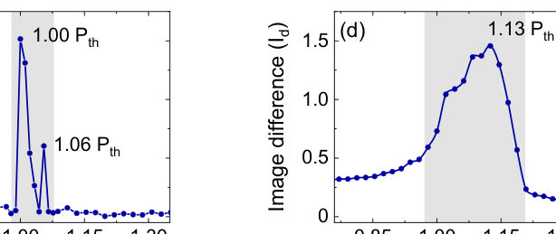 

Fig. 1: Threshold behavior and instability of the polariton condensate. (a) Measured polariton occupancy (black) and its corresponding PL linewidth (purple) as a function of the normalized pump power. The solid lines serve as guides to the eye. Empty diamonds highlight the pump powers at which detailed measurements are performed: 0.95Pth,1.00Pth,1.06Pth,1.10Pth,1.22Pth and 1.35Pth. Two insets show the real-space image of the uncondensed polaritons (left) and the trapped polariton condensate (right). (b) Average image difference Id, as defined in Eq. (1), around the threshold area. The gray shaded area indicates the range of powers where instabilities of the polariton condensate are...

📷 Fig 2

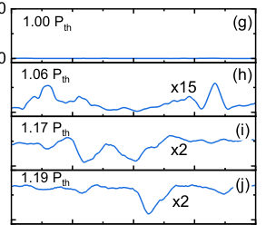 

Fig. 2: Time-resolved photon number Experimental (a-f) and numerically simulated (g-l) photon numbers with increasing pump power. Below threshold (a), no measurable signal is detected due to the strong blueshift of the emission, which prevents the spectral overlap with the local oscillator. Panels (b) and (c) are magnified by a factor of three for clarity.

📷 Fig 3

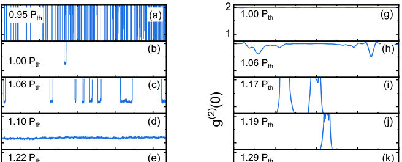 

Fig. 3: Time-resolved second-order correlation function g(2)(0). Experimental (a-f) and numerical (g-l) g(2)(0) with increasing pump power. Due to the mismatch between signal and LO at 0.95 Pth (a), no signal is detected and therefore, g(2)(0) results in random values.

**Main problem.**

Investigating the temporal dynamics and stability of exciton-polariton condensation near the threshold, specifically whether the observed instabilities are intrinsic to the driven-dissipative nature of the system.

**Main result.**

The study discovers a dynamical regime of stochastic 'hopping' between condensed and non-condensed states near the threshold, demonstrating that coherence (reduction of g2(0) toward 1) can emerge even during these intense temporal fluctuations.

**Method.**

Experimental time-resolved homodyne detection and optical trapping are combined with numerical simulations using the stochastic Truncated Wigner Approximation (TWA).

**Summary.**

This paper explores the transition to polariton condensation, revealing that the process is not a static phase transition but involves a period of stochastic hopping between states. By using homodyne detection and TWA simulations, the authors show that the system fluctuates wildly near the threshold while simultaneously building up phase coherence. This demonstrates that the observed instabilities are an intrinsic feature of the driven-dissipative nature of polaritons. The work challenges the idea that a stable, stationary state is required for the emergence of coherence.

Detailed structure

**Model / system.**

Exciton-polariton condensates in a high-Q GaAs microcavity, modeled via a stochastic partial differential equation framework that couples the polariton field to an excitonic reservoir.

**Key observables.**

Second-order correlation function g2(0), photon number, linewidth, and the average image difference (Id) for detecting temporal fluctuations.

**Important parameters / regimes.**

Pump power relative to threshold (P/Pth), specifically identifying an instability window near 1.0 Pth, and the presence of a reservoir-driven driven-dissipative regime.

**Assumptions / limitations.**

The Truncated Wigner Approximation is used, which requires commutator corrections at low densities to remain physically accurate; simulations use a larger pumping ring than the experiment for computational stability.

**Figures summary.**

Fig 1 shows occupancy, linewidth, and image difference vs pump power; Fig 2 compares experimental and numerical time-resolved photon numbers; Fig 3 compares experimental and numerical evolution of g2(0).

**Paper structure.**

The paper introduces the problem of threshold dynamics, presents experimental observations of hopping and coherence buildup, validates these with TWA simulations, and concludes with the implications for driven-dissipative systems.

**Why it may be interesting.**

It provides a deep look into non-equilibrium phase transitions and how quantum coherence can be established in a system characterized by strong fluctuations and stochastic switching, which is central to open quantum systems research.

Abstract

Polariton condensates provide a versatile platform for exploring non-equilibrium phase transitions and collective phenomena in open quantum systems. Near the condensation threshold, these systems are particularly sensitive to fluctuations and instabilities, which can strongly influence the condensate formation. Using optical trapping and homodyne detection, we directly access the photon statistics and second-order correlation function $g^{(2)}(0)$ of the condensate. We show that polariton condensation near the threshold is not a purely static transition, but instead undergoes a dynamical regime characterized by stochastic hopping between condensed and non-condensed states. These intermittent dynamics are accompanied by a gradual reduction of $g^{(2)}(0)$ towards unity, revealing the progressive build-up of coherence even in the presence of strong temporal fluctuations. Numerical simulations, based on a stochastic Truncated Wigner description of the driven-dissipative polariton field, reproduce these dynamics and capture the essential role of noise and reservoir interactions. This work demonstrates that the observed temporal hopping is an intrinsic feature of polariton condensation, providing a dynamical perspective that goes beyond static descriptions of the condensation phase transition.

[↑ back to top](#top)

### [3D integration of a hybrid quantum dot circuit-QED device for fast gate dispersive charge readout and coherent spin-photon coupling](http://arxiv.org/abs/2604.25871v1)

**Authors:** Sebastien Granel, Frederic Gustavo, Jean-Luc Thomassin, Heimanu Niebojewski, Benoit Bertrand, Frederic Berger, Alain Gueugnot, Chafik Mhamdi, Etienne Dumur, Romain Maurand, Simon Zihlmann

**Type:** experiment · **Category:** quantum information and computing · **PDF:** <https://arxiv.org/pdf/2604.25871v1>

**Analysis basis:** full PDF text, analyzed in chunks

**Topic relevance:** 🔥 `QC/QI experiment` **4/5** · 🔥 `quantum optics experiment` **4/5** · `quantum measurements` **3/5** · `spintronics-quantum-optics interface` **3/5**

📷 Fig 1

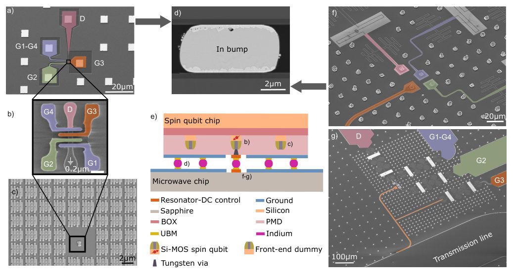 

FIG. 1. Flip-chip architecture: (a) Top-view false-colour SEM image of a representative NbN circuitry patterned on the qubit-chip to connect the Si-MOS transistor to the control lines and the readout resonator. The areas where NbN is etched away appear in dark grey, while the UBMs appear as white squares. One open-end of the resonator shown in Figs. 1-f) and g) is galvanically connected through an In bump interconnect to the gate G3 highlighted in orange. The source of the transistor is grounded at the MOS chip level while all remaining contacts, D (pink), G2 (green) and G1 and G4 (both in purple) are galvanically connected through indium bumps to filtered DC control lines on the microwave...

📷 Fig 2

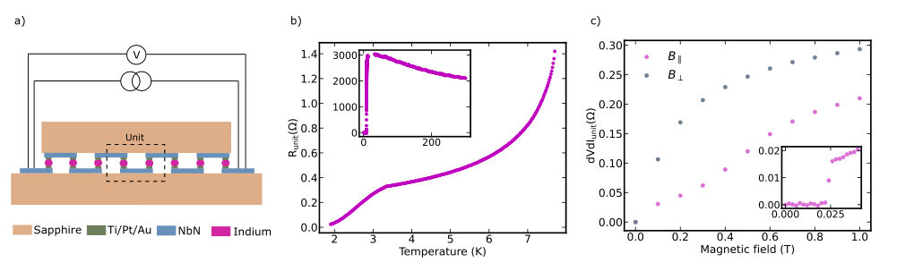 

FIG. 2. DC characterization of the bump interconnects: (a) Schematics of a daisy-chain containing four units (each containing two bump interconnects) used for DC characterization. (b) Resistance per unit of a 2000-unit daisy chain as a function of temperature. The largest fraction of the resistance originates from the sheet resistance of the disordered NbN layers [26], which turns superconducting at 8.6 K. Below 3.4 K the indium bumps become superconducting as well leading to a vanishing resistance with deceasing temperature. (c) Differential resistance per unit (dV/dI) of a 200 unit daisy chain as a function of magnetic field measured at 10 mK. A zero-resistance state is observed up to the...

📷 Fig 3

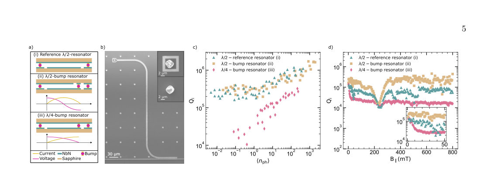 

FIG. 3. RF-characterization of interconnects: (a) Schematic of the three types of resonators used to assess high-frequency losses of In bump interconnects. A λ/2-resonator on the bottom chip serves as a reference (i), while a λ/2-resonator on the bottom chip with a bump at the voltage-antinode connecting to an isolated NbN-pad on the top chip (see also top inset in (b)) is predominantly probing dielectric losses of the interconnect (ii). A λ/4-resonator on the bottom chip with a bump at the voltage-node connecting to the ground plane on the top chip (see also bottom inset in (b)) is predominantly probing ohmic losses of the interconnect (iii). b) SEM image of a resonator on the bottom chip...

📷 Fig 4

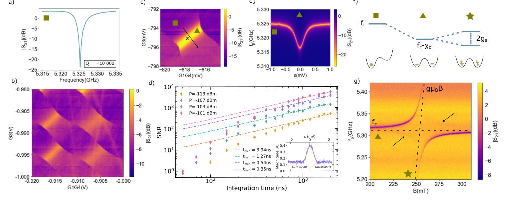 

FIG. 4. Gate-based charge dispersive readout and strong spin-photon coupling in a 3D-integrated hybrid quantum dot cQED device. (a) Transmission amplitude through the feedline as a function of probe frequency at zero magnetic field before forming QDs (e.g. in the Coulomb blockade region). In the single photon limit, we extract an internal quality factor Qi = 10000 and a coupling quality factor Qc = 1600. (b) Double quantum dot stability diagram in the many hole regime dispersively sensed with the microwave cavity. (c) Transmitted amplitude at 5.325 GHz as a function of the voltages applied to the gates G3 and G1G4 at B=0 (note that gate G1 and G4 are shorted together at the device level)....

**Main problem.**

Achieving low microwave losses in hybrid circuit QED is difficult because the complex material stacks required for various quantum degrees of freedom often induce high losses. The goal is to develop a 3D-integration process to separate the microwave circuit from the semiconductor device to optimize both independently.

**Main result.**

The authors demonstrated a high-yield 3D-integrated flip-chip architecture using indium bumps that achieves record-sensitivity gate-based dispersive charge readout and strong spin-photon coupling (gs/2pi = 75 MHz).

**Method.**

A 3D flip-chip assembly process was used to bond a silicon MOS spin qubit chip to a NbN superconducting resonator chip using dense indium bumps. The device performance was evaluated through DC daisy-chain testing and RF characterization of various resonator types.

**Summary.**

This paper presents a successful 3D-integration technique for hybrid quantum dot circuit QED using a flip-chip architecture with indium bump interconnects. By separating the silicon MOS qubit chip from the superconducting NbN resonator chip, the researchers overcame the high microwave losses typically associated with complex semiconductor material stacks. The device demonstrates extremely fast and sensitive charge readout and achieves strong coherent coupling between hole spins and microwave photons. This advancement provides a scalable pathway for high-fidelity spin readout and long-range entanglement in quantum computing architectures.

Detailed structure

**Model / system.**

A hybrid circuit QED platform consisting of a semi-industrial silicon MOS hole double quantum dot (DQD) on one chip and a high-impedance (1.7-1.8 kOhm) Niobium Nitride (NbN) superconducting resonator on a sapphire chip, connected via 10 um pitch indium bumps.

**Key observables.**

Internal quality factors (Qi), signal-to-noise ratio (SNR) for readout, charge-photon coupling strength (gc/2pi), spin-photon coupling strength (gs/2pi), and dispersive frequency shifts.

**Important parameters / regimes.**

Indium bump pitch of 10 um, NbN resonator impedance of 1.7-1.8 kOhm, spin-photon coupling gs/2pi = 75 MHz, and charge-photon coupling gc/2pi = 350 MHz.

**Figures summary.**

The figures likely illustrate the 3D integration architecture, the indium bump interconnect properties (resistance and yield), the RF resonator quality factors, the dispersive readout signal strength (SNR), and the avoided crossing in the transmission spectrum demonstrating spin-photon coupling.

**Paper structure.**

The paper introduces the challenge of losses in hybrid cQED, describes the 3D-integration fabrication and assembly process, presents DC and RF characterization of the interconnects, demonstrates the dispersive charge readout performance, and concludes with the demonstration of strong spin-photon coupling.

**Why it may be interesting.**

This work is highly relevant to quantum optics and open quantum systems as it demonstrates a scalable architecture for achieving the strong coupling regime between a solid-state spin qubit and a microwave cavity, which is a fundamental requirement for quantum networks and spin-photon interfaces.

Abstract

Hybrid circuit quantum electrodynamics (cQED) aims at coupling various quantum degrees of freedom, among which are spin and charge degrees of freedom in gate defined quantum dots, phonons or magnons... with quantized electromagnetic fields in superconducting microwave cavities to investigate fundamental physics questions or for quantum computation and simulation. However, low microwave losses, key for many hybrid cQED experiments, are challenging to achieve given the often exotic and/or complex material stacks (e.g. semiconducting material, ferromagnets, or piezoelectric materials) required to host the various quantum degrees of freedom. In this work, we present a 3D-integration process to overcome this challenge for semi-industrial silicon MOS spin qubits. The process is based on dense indium bump interconnects at a pitch of 10 μm and superconducting thin films of Niobium Nitride (NbN). First, we report on DC and RF interconnect properties that demonstrate a high galvanic interconnection yield and internal quality factors above 105 in the single photon regime for NbN resonators interrupted by a single indium bump interconnect. Eventually, we fabricated a 3D-integrated hybrid circuit quantum electrodynamics (cQED) device based on a semi-industrial MOS hole double quantum dot and a high impedance NbN resonator. For this device, we report a cavity internal quality factor above 10000 and demonstrate record sensitivity for gate-based dispersive readout of the charge degree of freedom with an SNR of 100 in 300 ns. Finally, we demonstrate strong spin-photon coupling of gs/{2π} = 75 MHz, which highlights the viability of 3D-integration for quantum dot based hybrid spin circuit quantum electrodynamics and opens to high-fidelity spin readout and microwave photon-based remote spin qubit entanglement.

[↑ back to top](#top)

### [Probing Spin Dynamics Across Magnetic Phase Transitions in CrCl3 Nanoflakes Using Nitrogen-Vacancy Microscopy](http://arxiv.org/abs/2604.25002v1)

**Authors:** Ben Hammons, Jitender Kumar, Sehrish Iqbal, Prem Karki, Karishma Prasad, Tianlin Li, Aram Pirali, Ayodimeji E. Aregbesola, Rupak Timalsina, Xia Hong, Jian Wang, Kapildeb Ambal, Ilja Fescenko, Abdelghani Laraoui

**Type:** experiment · **Category:** strongly correlated electrons · **PDF:** <https://arxiv.org/pdf/2604.25002v1>

**Analysis basis:** full PDF text, analyzed in chunks

**Topic relevance:** 🔥 `spintronics-quantum-optics interface` **4/5** · `QC/QI experiment` **3/5** · `correlated / nonlocal dissipation` **2/5** · `quantum measurements` **2/5**

📷 Fig 1

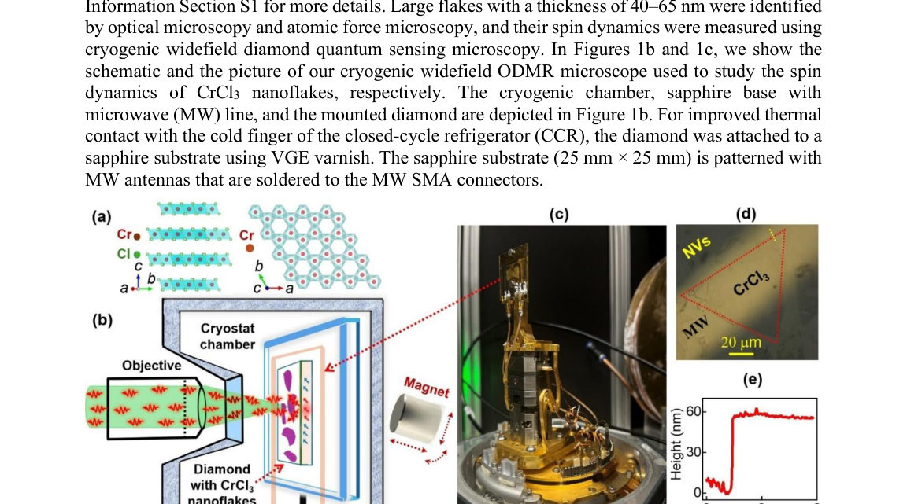 

Figure 1. (a) Crystal structure of CrCl3 in the R3̅m phase (side view) and the honeycomb lattice of Cr spins in a single layer of CrCl₃ (top view). Cl atoms are omitted for clarity. Schematic (b) and a photograph (c) of the cryogenic diamond quantum sensing microscope. It is housed inside the cryostat chamber; an objective is outside of the chamber to focus the green (532 nm) laser and collect the NV red (650-750 nm) florescence; CrCl3 flakes are transferred onto the diamond, which is mounted on a sapphire substrate with MW stripline; the sample is controlled by Attocube (X, Y, Z) piezo-motors for precise motion. A permanent magnet is used outside the chamber to apply magnetic field. (d)...

📷 Fig 2

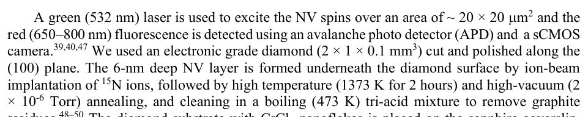 

Figure 2a depicts NV ODMR spectra for a temperature window (4.7 – 28 K) that covers the magnetic phases of the CrCl3 flake (thickness of ~60 ± 1 nm). We used low MW (~100 mW) and laser (~ 38 mW) powers to prevent excess heating and flake degradation. Four peaks appear in the ODMR spectrum: f-, f+ for NV spins aligned along [111] and fm-, fm+ for NV spins merged and aligned in the opposite direction of the applied magnetic field H of 1.45 mT.22 A clear ODMR contrast decrease is observed for all NV peaks in the AFM and FM states. Figure 2b shows the zoomed temperature-dependent ODMR spectra of f- in Figure 2a. Interestingly, the normalized fluorescence contrast clearly separated into three...

📷 Fig 3

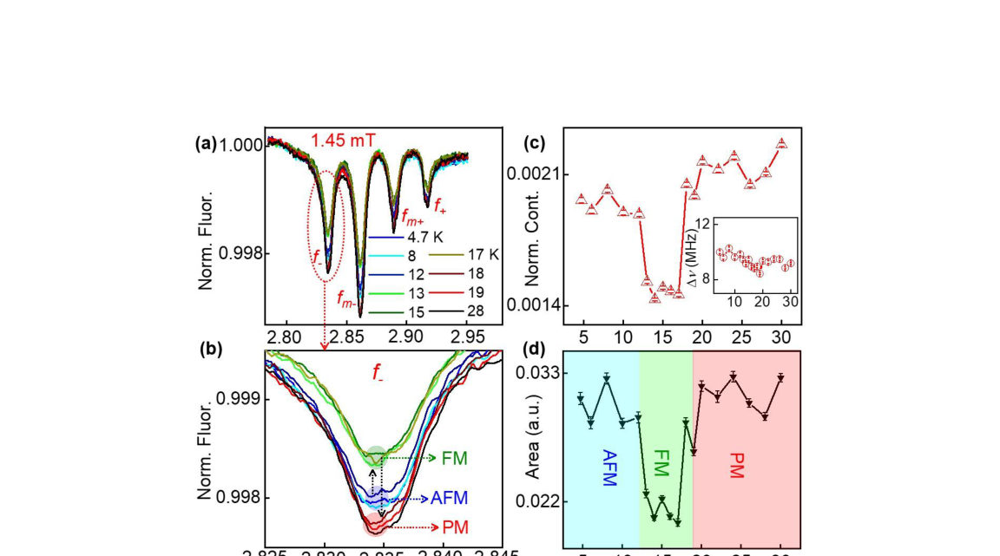 

Figure 2: (a) CW-ODMR spectra of ensemble NVs on the CrCl3 flake placed on top of the diamond, measured at different temperatures (4.7 – 28 K). Four distinct ODMR dips (f -, fm-, f+, and fm+) are observed at an external magnetic field of 1.45 mT applied along the NV quantization axis. (b) A zoomed-in view of the f - ODMR peak, showing clear distinctions among the three magnetic phases (AFM, FM, PM), visible as abrupt changes in contrast across the phase transitions. ODMR contrast (c) and area (d), extracted from the Gaussian fitting of the f - ODMR peak, versus temperature. The inset in (c) shows the corresponding change in FWHM vs temperature.

📷 Fig 4

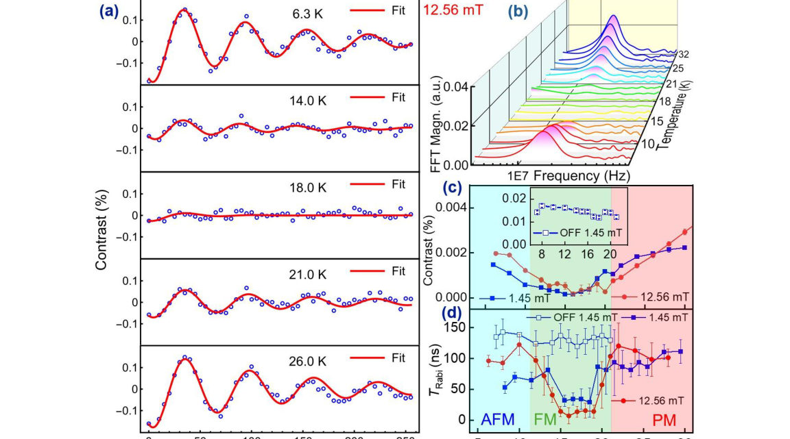 

Figure 3. (a) Rabi oscillations (fluorescence vs time) of NVs underneath the CrCl3 flake recorded at the three different magnetic state temperature regimes: PM (21 K, 26 K), FM (14 K, 18 K), and AFM (6.3 K). (b) Fast Fourier Transformation (FFT) of the Rabi oscillations in (a) and Figure S3.3.1 recorded at temperatures in the range 6.3 – 32 K. Rabi amplitude (c) and decay (TR) versus temperature measured at H of 1.45 mT (filled rectangles) and 12.56 mT (filled circles). The controlled (off the flake) data at H of 1.45 mT are plotted (open rectangles) in the insets of (c) and (d) for the Rabi amplitude and decay, respectively.

📷 Fig 5

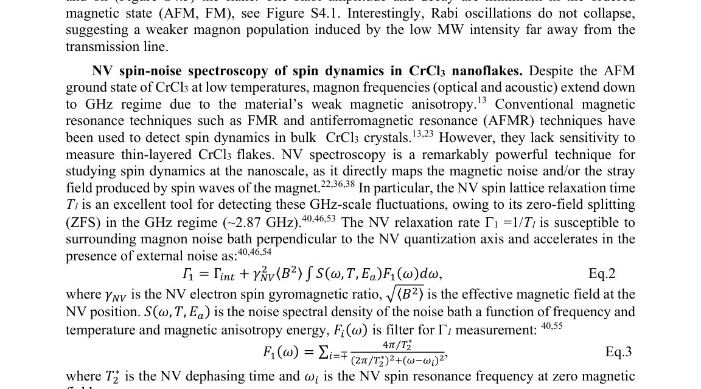 

Figure 4a shows T1 (fluorescence vs time) curves taken on and off the 60-nm thick CrCl3 flake at H of 1.45 mT and three temperatures (4.3, 15, and 30 K), representing the distinct magnetic (AFM, FM, PM) phases. The NV T1 curves are fitted with an exponential decay to deduce T1:

📷 Fig 6

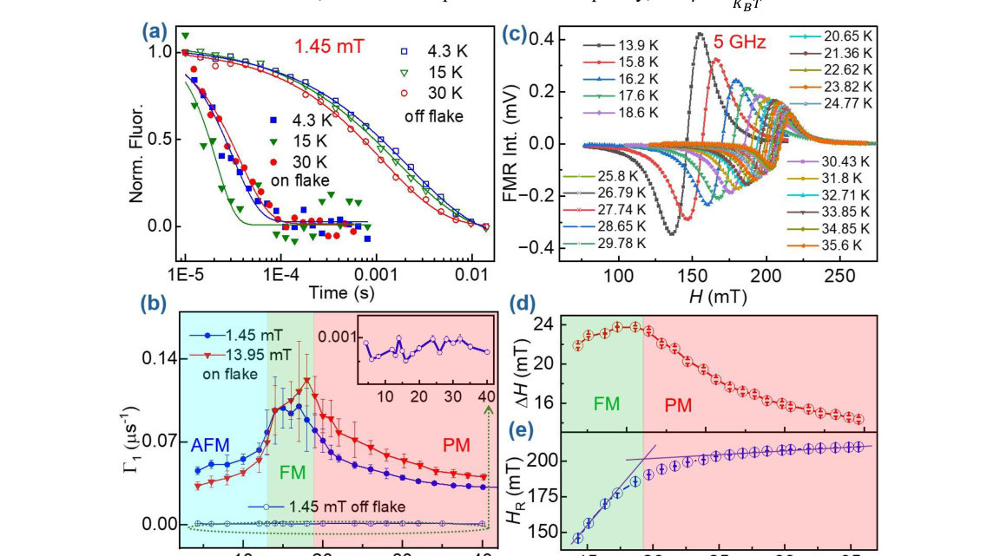 

Figure 4. (a) Measured (scattered) and fitted (solid lines) T1 (fluorescence vs time) curves at three temperatures (4.3, 15, and 30 K) on and off the 60-nm CrCl3 flake. (b) 1 vs temperature at H of 1.45 and 13.95 mT on the flake. The off-flake 1 curve is zoomed in the inset for better presentation, where no effect is observed. (c) Temperature-dependent FMR (intensity vs applied magnetic field H) spectra of CrCl3 micro-crystals measured at a MW frequency of 5 GHz, recorded at temperatures in the range of 13.9 K - 35.6 K (d). Temperature dependence of the linewidth ΔH (d) and resonance field HR (e), obtained by fitting the FMR spectra in (c) with a Lorentzian function (Supporting...

📷 Fig 7

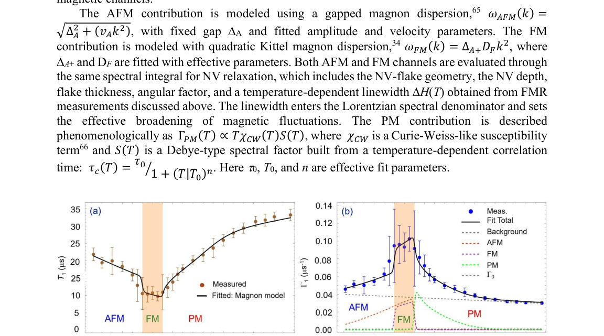 

Figure 5. (a) Measured (scattered) and fitted (black solid line) NV T1 vs temperature. The fitting was done through the weighted three-window magnon model at a magnetic field of 1.54 mT. (b) Measured 1 and fitted (black solid line) vs temperature at a magnetic field of 1.54 mT. The dashed lines show the 1 fit decomposition using the three window magnon model.

**Main problem.**

The study aims to probe and understand the intrinsic spin dynamics and magnetic noise in CrCl3 van der Waals nanoflakes across its antiferromagnetic, ferromagnetic, and paramagnetic phase transitions.

**Main result.**

The researchers observed a significant enhancement of magnetic noise and a collapse of NV spin coherence in the ferromagnetic phase, identifying intensified GHz-range spin fluctuations and validating these findings with FMR spectroscopy.

**Method.**

The study uses cryogenic diamond quantum sensing microscopy (NV center-based magnetometry) to measure ODMR, Rabi oscillations, and T1 relaxation, complemented by broadband FMR spectroscopy.

**Summary.**

This paper investigates the magnetic phase transitions and spin dynamics of CrCl3 nanoflakes using diamond NV-center microscopy. By measuring spin relaxation and coherence, the authors identify a massive increase in magnetic noise during the ferromagnetic phase. This noise is linked to GHz-frequency spin fluctuations and magnons. The results are significant for developing future 2D magnonic and hybrid quantum-magnon technologies.

Detailed structure

**Model / system.**

The physical system consists of CrCl3 van der Waals nanoflakes (thickness 42-65 nm) interfaced with shallow nitrogen-vacancy (NV) centers in diamond used as nanoscale quantum sensors.

**Key observables.**

NV spin resonance contrast, Rabi oscillation amplitude and decay (Tr), spin-lattice relaxation rate (G1 = 1/T1), and FMR linewidth and resonance field.

**Important parameters / regimes.**

Temperature range of 4-45 K, magnetic fields from 1.45 mT to 40.38 mT, and frequency range of 4-15 GHz.

**Assumptions / limitations.**

The use of a phenomenological additive model assumes that the total relaxation rate can be decomposed into independent contributions from AFM, FM, and PM fluctuation channels.

**Figures summary.**

Figure 1 shows the crystal structure and the cryogenic microscope setup; Figure 2 displays temperature-dependent ODMR spectra; Figure 4 presents the fitted T1 relaxation rate data.

**Paper structure.**

The paper introduces the material and problem, describes the NV microscopy and FMR experimental setup, presents the phase identification via ODMR, details the spin dynamics and noise measurements in different magnetic phases, provides a phenomenological model for the relaxation rate, and concludes with implications for 2D magnonics.

**Why it may be interesting.**

The study provides experimental insights into how many-body spin fluctuations and magnon-mediated noise drive decoherence in a quantum sensor, which is highly relevant to the study of open quantum systems and dissipation in magnetic architectures.

Abstract

CrCl3, a layered van der Waals (vdW) magnet, exhibits in-plane magnetic anisotropy and enhanced interlayer coupling upon stacking, making it an ideal platform to host exotic nanoscale magnetic phenomena such as magnon hydrodynamics and meron-like topological spin defects. When interfaced with other vdW materials, its antiferromagnetic-to-ferromagnetic and ferromagnetic-to-paramagnetic phase transitions and magnetic anisotropy can be tuned by voltage, strain, and layer stacking. Understanding the spin dynamics of CrCl3 at its magnetic phase transitions is crucial to its applications in magnonics. Here, we investigate the spin dynamics of CrCl3 nanoflakes using cryogenic diamond quantum sensing microscopy, based on measuring optically detected magnetic resonance, Rabi oscillations, and spin-lattice relaxation time (T1) of shallow nitrogen vacancy (NV) centers in diamond. In the ferromagnetic regime, we observe a pronounced reduction in the NV spin resonance contrast, a collapse of the Rabi oscillations, and a strong enhancement by two orders of magnitude of the relaxation rate, G1 = 1/T1. These observations indicate intensified spin fluctuations in the gigahertz range. Broadband ferromagnetic resonance spectroscopy on CrCl3 microcrystals reveals resonance frequencies in the 4-15 GHz range together with a linewidth of ~24 mT, further supporting the NV measurements. A phenomenological model of magnetic-noise-induced NV relaxation reproduces the temperature dependence of G1 by combining antiferromagnetic, ferromagnetic, and paramagnetic fluctuation channels, indicating that magnetic noise is strongest in the ferromagnetic regime and evolves markedly across the phase diagram. These results are crucial for using CrCl3 in 2D magnonics and hybrid quantum-magnon systems.

[↑ back to top](#top)

### [Magnomechanical Coupling in Suspended 2D van der Waals Ferromagnets](http://arxiv.org/abs/2604.25588v1)

**Authors:** Ritesh Das, Alvaro Bermejillo-Seco, Herre S. J. van der Zant, Peter G. Steeneken, Yaroslav M. Blanter

**Type:** theory · **Category:** quantum information and computing · **PDF:** <https://arxiv.org/pdf/2604.25588v1>

**Analysis basis:** full PDF text, analyzed in chunks

**Topic relevance:** 🔥 `spintronics-quantum-optics interface` **4/5**

📷 Fig 1

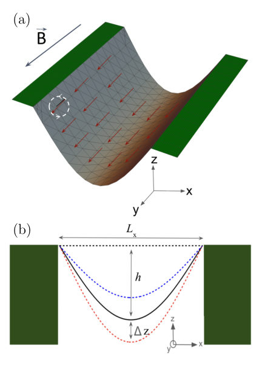 

FIG. 1: The magnomechanical system. (a) 3D view of the suspended ferromagnet. The magnons are aligned in-plane via an external magnetic field along y. (b) 2D cross-section of the magnomechanical system. The magnet is pre-strained by pulling it down vertically by a distance h and oscillates around this position with amplitude ∆z. The mechanical displacements are exag- gerated for clarity.

📷 Fig 2

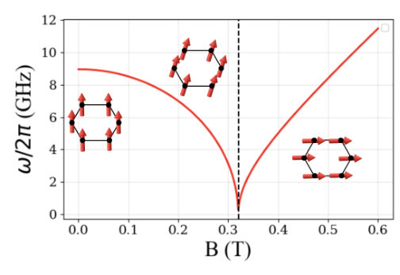 

FIG. 2: Ferromagnetic resonance frequency of CrGeTe3 vs. an applied in-plane external field. The insets show the ground state of CrGeTe3 at the corresponding field. The external field cants the spins towards the plane. The dashed line represents the saturation field at which the spins lie completely in-plane [30, 41].

📷 Fig 3

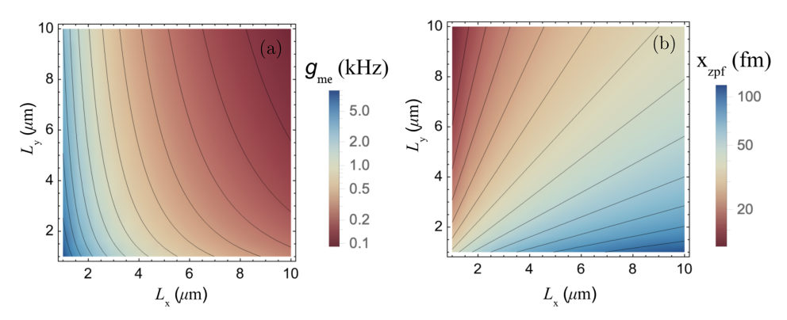 

FIG. 3: (a) The magnetoelastic single magnon-phonon coupling rate gme and (b) zero point fluctuation xzpf vs. membrane length Lx and membrane width Ly for initial deformation h = 100 nm and thickness Lz = 20 nm. The contour lines are for visual guidance only.

📷 Fig 4

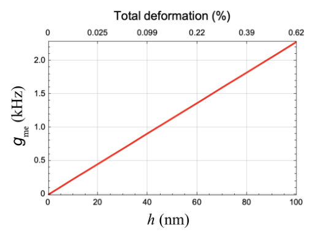 

FIG. 4: The magnetoelastic single magnon-phonon cou- pling rate gme vs. initial displacement and total defor- mation for Lx = Ly = 2 µm and Lz = 20 nm.

📷 Fig 5

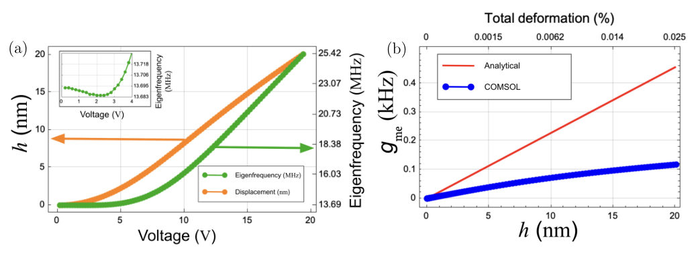 

FIG. 5: (a) Mechanical deformation h and mechanical eigenfrequency as a function of applied gate voltage, ob- tained from COMSOL simulations. The inset shows eigenfrequency as a function of voltage from 0 to 4 V (b) Sin- gle magnon-phonon coupling strength as a function of the mechanical deformation h. The red line shows the ana- lytical result, which neglects the reduction of the mechanical eigenfrequency induced by electrostatic gating. The blue symbols correspond to COMSOL simulations.

**Main problem.**

The weak magnon-phonon coupling in conventional bulk platforms like YIG spheres limits the realization of efficient, coherent magnomechanical systems for hybrid information processing.

**Main result.**

Suspended 2D van der Waals ferromagnetic membranes, such as CrGeTe3, exhibit magnomechanical coupling rates up to three orders of magnitude higher than YIG spheres and are highly tunable via electrostatic gating.

**Method.**

The authors use a theoretical framework involving the Holstein-Primakoff transformation and linearized magnetoelastic interactions, supplemented by COMSOL Multiphysics simulations to model electrostatic-induced deformation.

**Summary.**

This paper proposes using suspended 2D van der Waals ferromagnets as a new platform for magnomechanics. By utilizing the large magnetoelastic coupling and the ability to induce pre-strain via electrostatic gating, the authors demonstrate coupling rates significantly higher than those found in traditional YIG-based systems. The study shows that the coupling strength can be tuned by orders of magnitude through voltage-induced deformation. This makes these membranes a robust candidate for developing chip-scale hybrid quantum information processing devices.

Detailed structure

**Model / system.**

A suspended, doubly-clamped 2D van der Waals ferromagnetic membrane (specifically CrGeTe3) with in-plane magnetization, subject to out-of-plane mechanical oscillations and electrostatic pre-strain.

**Key observables.**

Single magnon-phonon coupling rate (g0), mechanical eigenfrequency, cooperativity (C), and static deformation (h).

**Important parameters / regimes.**

Magnon frequencies in the GHz scale, mechanical frequencies in the 10-100 MHz range, coupling rates in the Hz to kHz range, and pre-strain scaling linearly with coupling.

**Assumptions / limitations.**

The model assumes the thin membrane limit (Lz << Ly < Lx), focuses on the Kittel mode, neglects higher-order strain components, and assumes small displacement amplitudes.

**Figures summary.**

Figure 1 shows the 3D and 2D geometry of the membrane; Figure 2 illustrates ferromagnetic resonance and spin alignment; Figure 4 shows coupling vs. pre-strain; Figure 5 compares COMSOL simulations to analytical models for frequency and coupling strength.

**Paper structure.**

The paper introduces the problem of weak coupling in bulk systems, proposes the 2D vdW membrane platform, derives the analytical coupling mechanism and scaling laws, validates the model with numerical simulations of electrostatic tuning, and concludes with the potential for hybrid quantum technologies.

**Why it may be interesting.**

The platform offers a highly tunable, high-cooperativity interface between magnons and phonons, which is a key building block for hybrid quantum transducers and quantum memory in quantum networks.

Abstract

Magnomechanical systems provide a promising route for exploring coherent hybrid magnon-phonon interactions and hybrid information processing, but their realization has so far been limited by weak magnon-phonon coupling in conventional bulk platforms. We show that a suspended membrane of a two-dimensional van der Waals ferromagnet with in-plane magnetization and out-of-plane mechanical oscillations exhibits large magnomechanical coupling dominated by magnetoelastic interactions. The parametric single magnon-phonon coupling rate scales linearly with pre-strain and can reach hundreds of Hertz to low kiloHertz in suspended membranes of van der Waals ferromagnets such as CrGeTe_3 under experimentally realistic conditions. This rate exceeds typical values reported for YIG spheres by more than three orders of magnitude. Our results demonstrate that suspended membranes of van der Waals magnets provide a robust and highly tunable platform for magnomechanics.

[↑ back to top](#top)

### [Control of relaxation properties of a macroscopic nuclear spin ensemble](http://arxiv.org/abs/2604.25548v1)

**Authors:** János Ádám, Andrew J. Winter, Deniz Aybas, Dmitry Budker, Derek F. Jackson Kimball, Arne Wickenbrock, Alexander O. Sushkov

**Type:** experiment · **Category:** other · **PDF:** <https://arxiv.org/pdf/2604.25548v1>

**Analysis basis:** full PDF text, analyzed in chunks

**Topic relevance:** `spintronics-quantum-optics interface` **3/5** · `QC/QI experiment` **2/5**

📷 Fig 1

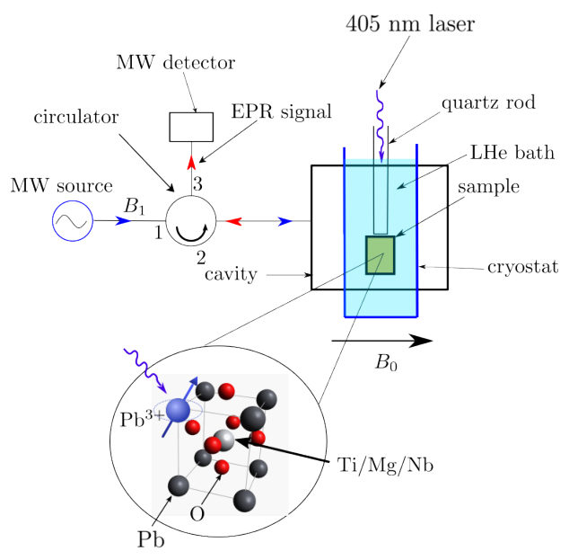 

FIG. 1. Experimental setup schematic. The probe field (blue arrow) generated in the microwave source travels through a circulator and is coupled into a cavity. We place the sample (yellow rectangle) inside a temperature controlled cryostat. The sample is placed in the middle of the cavity (for PMN-PT we observed heavy losses therefore displaced the sample from the cavity center). A 405 nm laser light (purple wavy arrow) is coupled using a quartz rod. A bias magnetic field (B0) is applied. After illumination paramagnetic centers are excited; this changes the impedance of the cavity which results in reflections (red arrow). The reflected signal travels through the circulator and gets absorbed...

📷 Fig 2

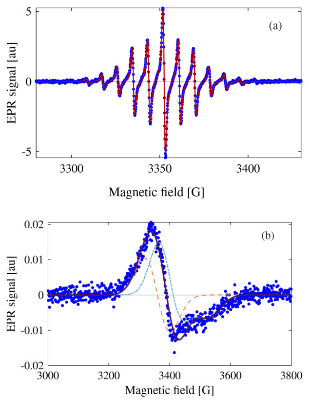 

FIG. 2. (a) The EPR spectrum of PT crystal at 10 K and 0.2 mW (30 dB attenuation) illuminated by 405 nm laser (blue dots). The signal belongs to the electron spins of 204Pb, 206Pb and 208Pb paramagnetic centers which have no nuclear spin. The central line is associated with the electron spin Zeeman interaction of the I = 0 paramagnetic center, the satellite lines on each side arise from the super-hyperfine interactions of the electron spin with the nuclear spins on neighboring atomic lattice sites. We model the spectrum with the superposition of eleven Lorentzian lineshapes (red solid line). (b) the EPR spectrum of PMN-PT crystal at 10 K and 1.3 mW (22 dB attenuation) illuminated by 405 nm...

📷 Fig 3

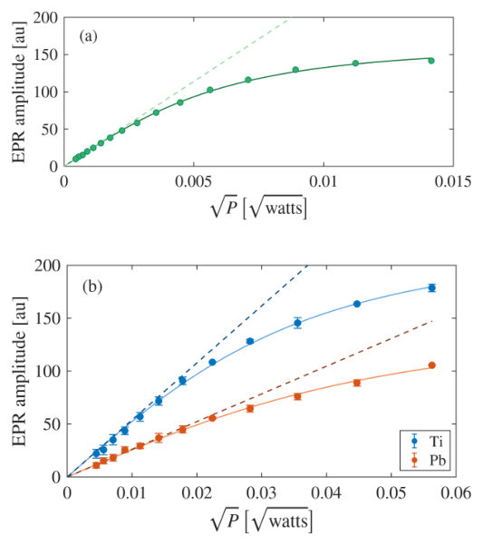 

FIG. 3. (a) Saturation curve of PT. The spectrum of PT has been measured at different microwave amplitudes and the area under the data has been integrated (green dots). The data has been fitted (dark green line) with Eq. (6) where a = 2.3 × 104, b = 2 × 104. The signal saturates at high amplitudes due to power broadening. The linear equation, without the power broadening denominator term is shown with light green dashed line. (b) Saturation curve of PMNPT. The spectrum of PMN- PT has been measured at different microwave powers, similar to (a). However, since the spectrum is the superposition of two different populations, direct integration is not possible. Therefore the fitted curves has...

📷 Fig 4

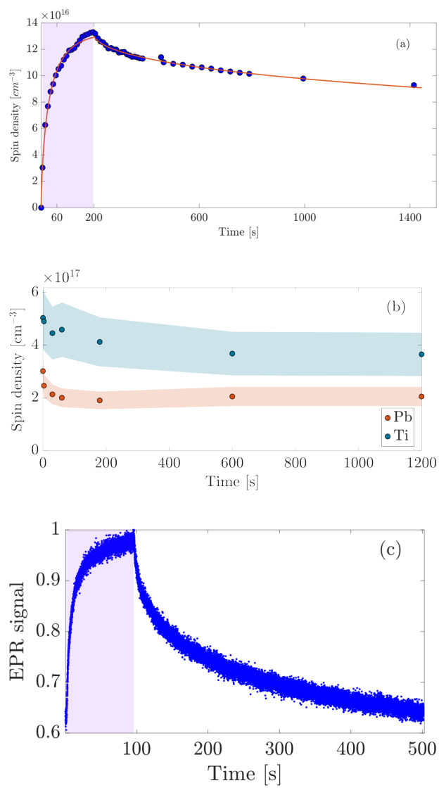 

FIG. 4. The photo-ionization and recombination dynamics of light-induced paramagnetic centers. (a) Build-up and decay of paramagnetic centers in PT at 10 K. The purple shaded area shows when the laser was on. (b) The decay of densities of Pb3+

📷 Fig 5

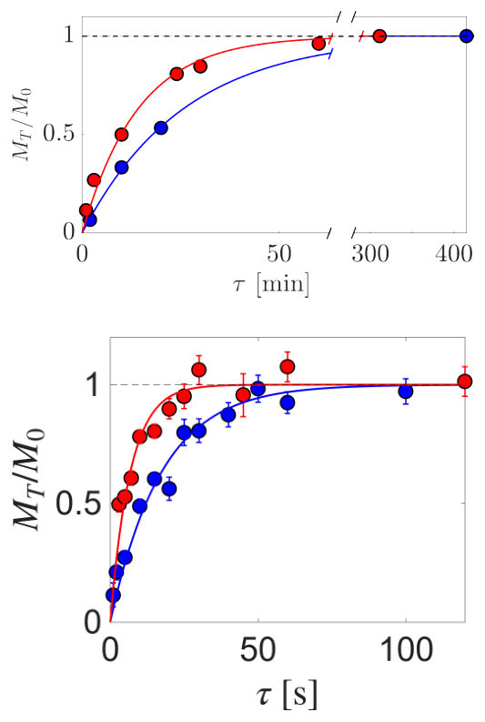 

FIG. 5. Pb NMR saturation-recovery measurement of PMN-PT with light off (blue) and light on (red). The Y-axis shows transverse magnetization, normalized in units of maximal longitudinal magnetization. The X-axis shows the saturation recovery delay time τ. (a) The measurements at 40 MHz NMR frequency. (b) The measurements at 4.6 MHz NMR frequency.

📷 Fig 6

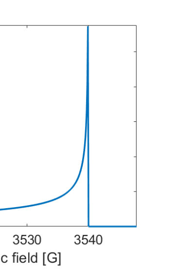 

FIG. 6. The power lineshape with B⊥= 3510 G and B∥= 3540 G.

📷 Fig 7

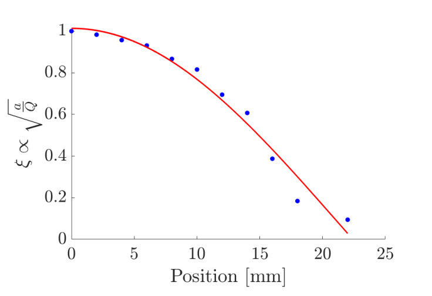 

FIG. 7. The spatial dependence of the microwave field along the cavity axis. The data points show ξ ∝ p

**Main problem.**

Controlling the nuclear spin population relaxation time (T1) in macroscopic spin ensembles at cryogenic temperatures, where phonon freeze-out leads to prohibitively long relaxation times.

**Main result.**

Demonstrated that 405 nm laser illumination can optically control the 207Pb nuclear T1 relaxation time by creating transient paramagnetic centers (Pb3+ and Ti3+) in ferroelectric crystals.

**Method.**

Used X-band Electron Paramagnetic Resonance (EPR) spectroscopy and saturation-recovery Nuclear Magnetic Resonance (NMR) at 10 K under 405 nm laser illumination.

**Summary.**

This paper demonstrates a method to optically control the nuclear spin relaxation time in lead-based ferroelectric crystals. By using a 405 nm laser, the researchers induce paramagnetic centers that act as a spin bath, effectively shortening the long T1 times caused by cryogenic temperatures. This technique allows for faster thermal polarization and dynamic nuclear polarization. Such control is a critical step toward improving the sensitivity of NMR-based searches for dark matter, such as axion-like particles.

Detailed structure

**Model / system.**

The system consists of 207Pb nuclear spin ensembles in lead-containing ferroelectric crystals (PbTiO3 and PMN-PT). The model relates the nuclear relaxation rate to the density of photoinduced paramagnetic centers using a Zeeman and hyperfine interaction Hamiltonian.

**Key observables.**

EPR spectra (voltage signal), g-factors, linewidths, spin number densities, and nuclear T1 relaxation times.

**Important parameters / regimes.**

Temperature of 10 K; 405 nm laser wavelength; spin densities of approximately 10^17 cm^-3; reduction of T1 from 1550 s to 850 s at 40 MHz.

**Assumptions / limitations.**

Isotropic hyperfine interaction assumption for certain centers; powder-like orientational averaging for Ti3+ due to lattice disorder; treating unresolved hyperfine structure as Gaussian broadening.

**Figures summary.**

Figure 1 shows the experimental setup; Figure 2 shows the EPR spectrum of PT; Figure 7 shows the spatial dependence of the microwave field along the cavity axis.

**Paper structure.**

The paper introduces the problem of long T1 times, describes the experimental setup and materials, details the EPR characterization of paramagnetic centers, presents NMR results for T1 control, and concludes with a model relating relaxation to spin density.

**Why it may be interesting.**

The ability to optically manipulate relaxation rates in a solid-state spin bath is highly relevant to open quantum systems and the development of efficient initialization protocols for quantum sensing and precision metrology.

Abstract

Macroscopic spin ensembles in solids are powerful platforms for quantum sensing and precision metrology. A key challenge is controlling the nuclear spin population relaxation time $T_1$, which can become prohibitively long at cryogenic temperatures due to phonon freeze-out. We demonstrate optical control of the $T_1$ relaxation time of the $^{207}$Pb nuclear spin ensemble in lead-containing ferroelectric crystals PbTiO$_3$ (PT) and (PbMg$_{1/3}$Nb$_{2/3}$O$_3$)$_{2/3}$-(PbTiO$_3$)$_{1/3}$ (PMN-PT). Using X-band electron paramagnetic resonance (EPR) spectroscopy at 10 K, we characterize light-induced paramagnetic centers created by 405 nm laser illumination. In PT, we observe paramagnetic Pb$^{3+}$ centers and their hyperfine interaction with nearby nuclear spins. In PMN-PT, we identify two populations: isotropic Pb$^{3+}$ centers and anisotropic Ti$^{3+}$ centers occupying $d$-orbitals, with spin number densities of $(2.5 \pm 1.0) \times 10^{17}$ cm$^{-3}$ and $(4.1 \pm 1.7) \times 10^{17}$ cm$^{-3}$, respectively. Power-dependent EPR measurements enable extraction of spin relaxation times. We investigate the ionization and recombination dynamics of these transient paramagnetic centers. Using saturation-recovery nuclear magnetic resonance, we demonstrate that laser illumination reduces the $^{207}$Pb nuclear $T_1$ by approximately a factor of two, from $(17 \pm 2)$ s to $(7 \pm 1)$ s at 4.6 MHz, and from $(1550 \pm 40)$ s to $(850 \pm 70)$ s at 40 MHz. We develop a model relating the nuclear relaxation rate to the density of photoinduced paramagnetic centers. This optical control of nuclear spin relaxation provides a pathway toward accelerated thermal polarization and dynamic nuclear polarization in solid-state NMR-based precision measurements, including searches for axion-like dark matter.

[↑ back to top](#top)

### [From Ultrafast Demagnetization to Ultrafast Spintronics : a 30 years story](http://arxiv.org/abs/2604.25431v1)

**Authors:** Quentin Remy, Stéphane Mangin

**Type:** both · **Category:** other · **PDF:** <https://arxiv.org/pdf/2604.25431v1>

**Analysis basis:** full PDF text, analyzed in chunks

**Topic relevance:** `non-equilibrium dynamics` **3/5** · `spintronics-quantum-optics interface` **2/5**

📷 Fig 1

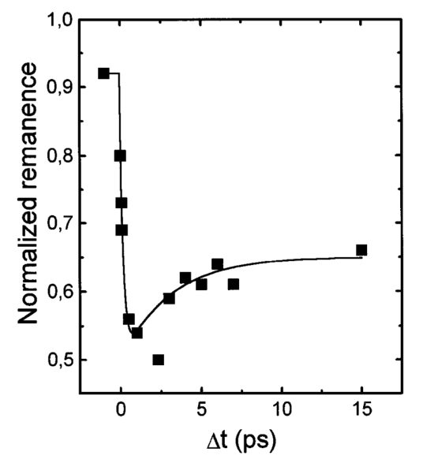 

Figure 1. Longitudinal MOKE signal of a Ni(22 nm)/MgF₂(100 nm) film as a function of pump-probe delay20. The pump excitation is a 7 mJ/cm2 pulse with a duration of 60 fs duration. The signal is normalized to the static signal without pump. The sharp drop within a few hundred femtoseconds provides the first direct evidence of ultrafast demagnetization, while the picosecond recovery reflects electron-spin-lattice equilibration. The solid line is a guide to the eye.

📷 Fig 2

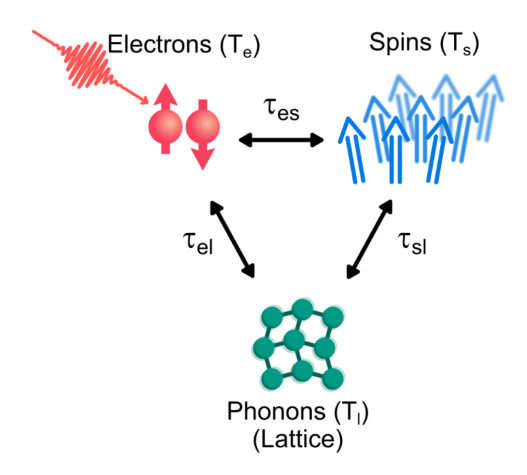 

Figure 2. Schematic representation of the three-temperature model20. Electrons, spins, and phonons are described as coupled subsystems, each characterized by an effective temperature, 𝑇!, 𝑇", and 𝑇#, respectively. Energy is exchanged between these reservoirs through phenomenological coupling/time constants, while each subsystem is assumed to remain internally thermalized at all times. A femtosecond laser pulse only acts on the electronic reservoir.

📷 Fig 3

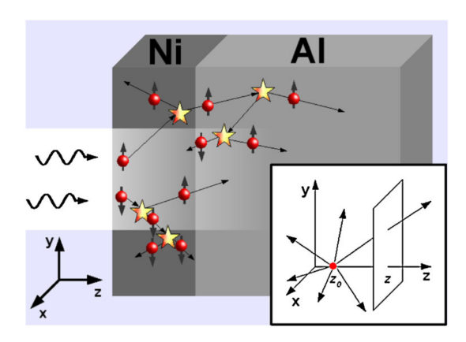 

Figure 3. Superdiffusive spin transport following femtosecond laser excitation81. Majority and minority hot electrons propagate with different velocities and inelastic mean free paths, producing a transient spin-polarized current that removes angular momentum from the excited region.

📷 Fig 4

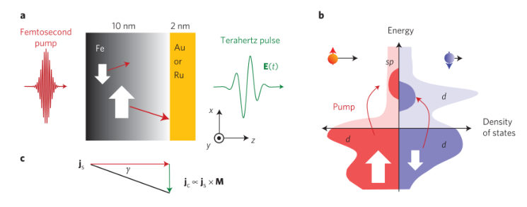 

Figure 4. Terahertz emission from a ferromagnet/normal-metal bilayer92. (a) Femtosecond demagnetization drives an ultrafast spin current into the adjacent heavy metal, where spin- orbit coupling converts it into an in-plane charge pulse that radiates a broadband THz transient. (b) The excitation transforms slow majority-spin d electrons (red) into fast sp electrons, thereby launching a spin current towards the gold or ruthenium cap layer. (c) Illustration of the relationship between the spin current, charge current and the spin Hall angle 𝛾.

📷 Fig 5

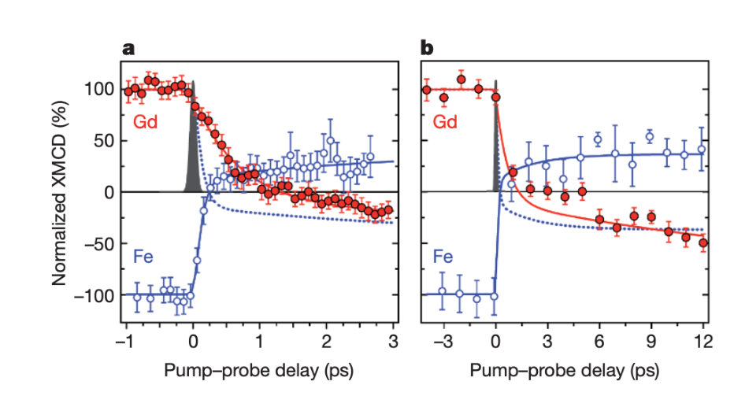 

Figure 5. Element-specific XMCD traces in GdFeCo89. The 3d and 4f sublattices demagnetize on distinct timescales, revealing ultrafast inter-sublattice angular-momentum transfer and the formation of a transient ferromagnetic-like state.(a) and (b) correspond to the same dynamics on different timescales.

📷 Fig 6

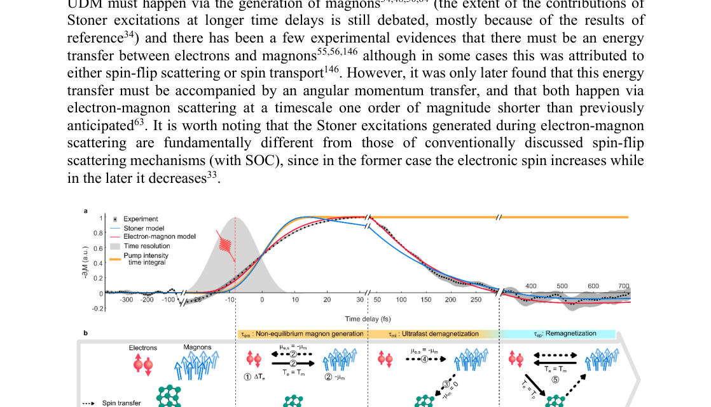 

Figure 6. (a) Experimentally determined demagnetization rate −𝜕+𝑀 for permalloy (dotted line) using THz emission spectroscopy63. The yellow curve is the time integral of the effective pump-pulse intensity envelope (light grey shaded area). The blue curve is the best fit from the Stoner model (or equivalently a temperature model) while the red curve shows the result of the phenomenological electron-magnon model. The dark grey area around the data points represents the uncertainty. (b) Scenario of magnetization dynamics according to the phenomenological electron-magnon model. The numbers indicate the various steps of the spin dynamics while the equalities next to each arrow indicates the...

📷 Fig 7

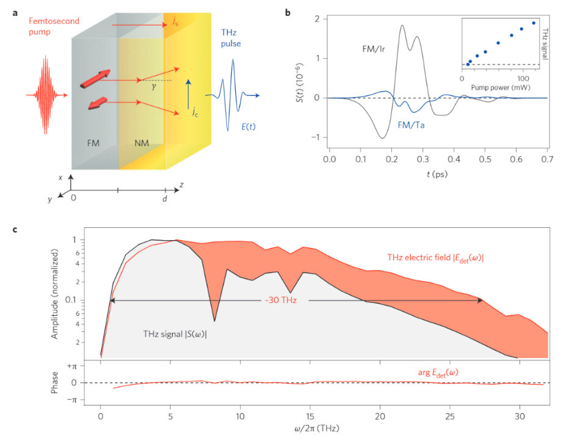 

Figure 7. Principle of a spintronic terahertz emitter and typical emission from93. (a) A femtosecond laser pulse generates a spin-polarized current in a FM|NM bilayer; spin- orbit coupling in the NM layer converts it into an ultrafast transverse charge current, producing a THz electromagnetic transient. (b) Example of electro-optic THz signal S(t) from capped CoFeB films and its scaling with pump power (inset). (c) Corresponding Fourier spectra showing broadband emission extending to tens of terahertz and an approximately flat spectral phase characteristic of a near-Fourier-limited THz pulse.

📷 Fig 8

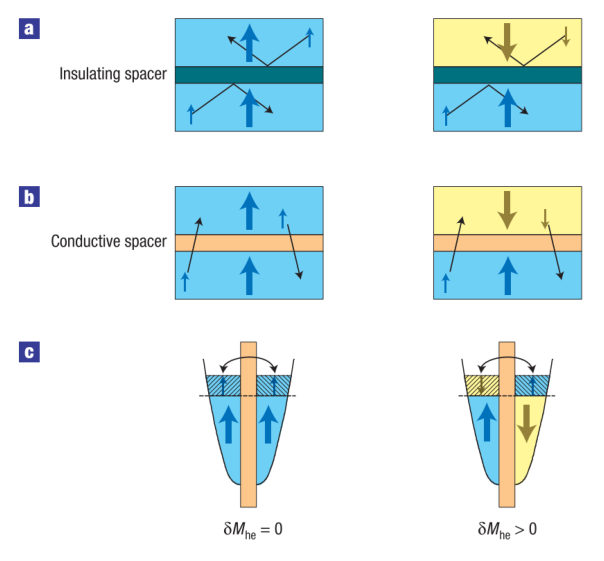 

Figure 8. Hot-electron transport and interlayer spin-angular-momentum transfer in Co/Pt multilayers from ref163 (a) When the two magnetic stacks are separated by an insulating spacer, hot electrons excited by the femtosecond pulse are localized, preventing interlayer transport of spin angular momentum. (b) With a metallic spacer, hot electrons propagate across the spacer and transfer spin angular momentum between the two Co/Pt multilayers. (c) Schematic majority-spin parabolic bands of the two multilayers. The quantity δMhe denotes the demagnetization component arising from hot-electron-mediated spin transfer.

📷 Fig 9

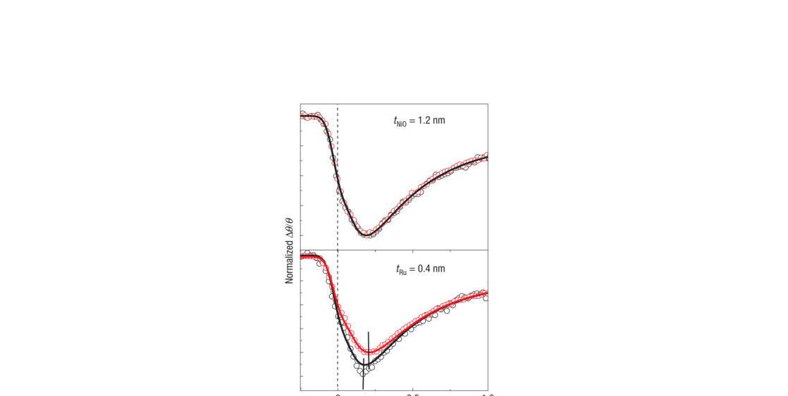 

Figure 9. Normalized TR-MOKE measurements. measured in the parallel (red) and antiparallel states in [Co/ Pt]4/ Co/ S/Co/[Pt / Co]4 heterostructure with S= 1.2 nm of NiO (top figure) and 0.4 nm of Ru (bottom figure) . Curves are normalized at 3 ps, after electron thermalization. The solid lines are fits to the data

📷 Fig 10

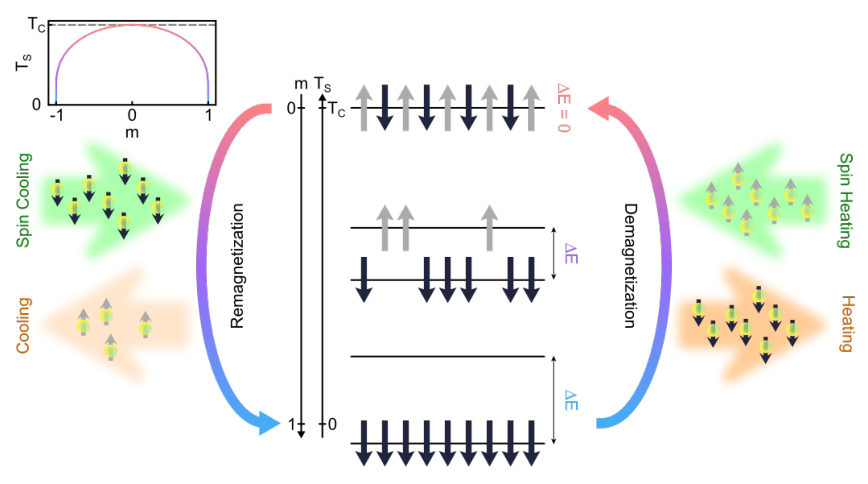 

Figure 10. Two-level mean-field picture of critical slowing down and its suppression by ultrafast spin cooling and heating. The magnetization is represented by the population imbalance between two spin states separated by an energy 𝛥𝐸 proportional to the normalized magnetization 𝑚. Near 𝑚= 0, the collapse of 𝛥𝐸 leads to identical transition rates and critical slowing down. An external source of angular momentum, such as an injected spin accumulation, introduces an additional splitting 𝛥𝐸!"# that breaks the degeneracy and restores finite magnetization dynamics. Depending on the sign of the injected angular momentum, the spin system undergoes ultrafast spin heating or spin cooling, enabling...

**Main problem.**

Understanding the microscopic mechanisms of angular momentum transfer and redistribution in magnetic systems during ultrafast (femtosecond to picosecond) demagnetization and its evolution into ultrafast spintronic applications.

**Main result.**

The paper traces the 30-year evolution from observing sub-picosecond magnetization quenching to developing deterministic all-optical switching and ultrafast spin-injection devices, highlighting that angular momentum is redistributed among spin, orbital, and lattice reservoirs rather than destroyed.

**Method.**

A review of experimental techniques including femtosecond pump-probe spectroscopy, MOKE, THz emission, and XMCD, alongside theoretical frameworks like the three-temperature model, TDDFT, and superdiffusive transport models.

**Summary.**

This review paper provides a comprehensive 30-year history of the field of ultrafast magnetism. It explains how the discovery of sub-picosecond magnetization quenching led to new ways of controlling spin via light. The authors detail the transition from fundamental studies of spin-lattice relaxation to the engineering of ultrafast spintronic devices like all-optical switches. The work highlights the complex interplay between electrons, spins, and phonons in non-equilibrium states. Ultimately, it outlines the potential for high-speed, energy-efficient information processing using femtosecond-scale magnetic control.

Detailed structure

**Model / system.**

The review covers various magnetic systems including ferromagnets (Ni, Fe), rare-earth transition-metal (RE-TM) ferrimagnets (GdFeCo), and heterostructures like spin valves and magnetic tunnel junctions.

**Key observables.**

Magnetization dynamics (quenching and recovery), spin currents, spin accumulation, THz radiation, and magnon/electron/phonon temperatures.

**Important parameters / regimes.**

Femtosecond to picosecond timescales, femtojoule energy scales, spin-orbit coupling, spin-mixing conductance, and non-equilibrium regimes.

**Assumptions / limitations.**

The review discusses the limitations of the three-temperature model, noting it fails to capture certain non-equilibrium features like magnon generation without demagnetization.

**Figures summary.**

Figure 1 shows Ni magnetization quenching via MOKE; Figure 2 illustrates the three-temperature model; Figure 3 depicts superdiffusive spin transport; Figure 4 shows THz emission from bilayers; Figure 6 compares experimental data.

**Paper structure.**

The paper follows a historical and thematic progression: starting with the discovery of ultrafast demagnetization, moving to the identification of microscopic angular momentum transfer mechanisms, then to the development of all-optical switching (AOS), and finally to the integration of these phenomena into ultrafast spintronic devices.

**Why it may be interesting.**

The study of rapid angular momentum redistribution between coupled reservoirs (spin, orbital, and lattice) and the dynamics of strongly out-of-equilibrium quantum materials provides insights relevant to open quantum systems and non-equilibrium many-body dynamics.

Abstract

The discovery of femtosecond laser-induced ultrafast demagnetization in 1996 opened a new field, femtomagnetism, in which magnetic order can be quenched on timescales shorter than a picosecond. This seminal observation revealed that angular momentum can be transferred out of the spin system with unprecedented speed, launching intense efforts to disentangle the roles of electrons, phonons, and spins in the non-equilibrium regime. Soon it became evident that ultrafast demagnetization generates spin-flips, spin polarization, magnons and spin currents, providing new channels for angular-momentum flow. These insights laid the foundation for linking femtomagnetism with spintronics. An emblematic breakthrough in this evolution is the helicity-independent single-pulse all-optical switching (AOS) observed in rare-earth transition-metal (RE-TM) ferrimagnets such as GdFeCo. This mechanism, operating at femtojoule-scale energies and without external magnetic fields, establishes RE-TM alloys as benchmark systems for understanding and exploiting angular-momentum flow at the femtosecond timescale. Building on these concepts, the combination of ultrafast optical excitation with spintronic devices has demonstrated deterministic magnetization reversal driven by femtosecond pulses in spin valves and tunnel junctions, including rare-earth-free systems. Ultrafast spin injection, acting analogously to spin transfer torque but operating three orders of magnitude faster, allows reversal of both ferromagnetic and ferrimagnetic layers. By enabling ultrafast and energy-efficient switching, ultrafast spintronics promises scalable technologies for high-speed information processing while raising fundamental questions about angular momentum transfer in strongly out-of-equilibrium quantum materials.

[↑ back to top](#top)

### [Nonlocal Cooper pairs in finite topological superconductors and their relation to Majorana nonlocality](http://arxiv.org/abs/2604.25169v1)

**Authors:** Hiroto Mizoguchi, Yutaro Nagae, Yasuhiro Asano, Satoshi Ikegaya

**Type:** theory · **Category:** quantum information and computing · **PDF:** <https://arxiv.org/pdf/2604.25169v1>

**Analysis basis:** full PDF text, analyzed in chunks

**Topic relevance:** `entanglement & information structure` **3/5** · `Keldysh / 2PI / non-Gaussian methods` **2/5**

📷 Fig 1

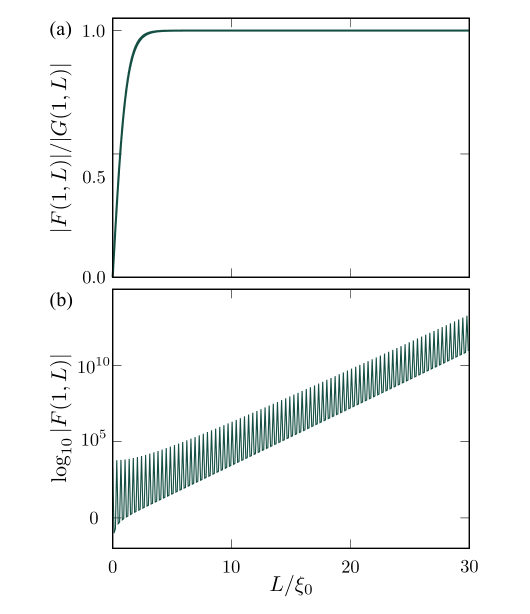 

FIG. 1. (a) |F(1, L)|/|G(1, L)| at ω = 0 as a function of the system length L. (b) log10 |F(1, L)| at ω = 0 as a function of L.

📷 Fig 2

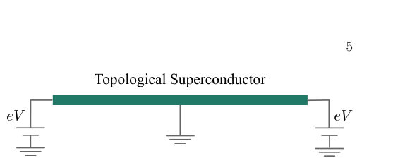 

FIG. 2. Schematic illustration of a multiterminal setup with normal leads attached to both ends of a topological supercon- ductor.

**Main problem.**

The paper investigates the manifestation of Majorana nonlocality through the lens of pair correlations (anomalous Green's functions) in finite topological superconductors, addressing the gap between quasiparticle-based and pair-correlation-based perspectives.

**Main result.**

The authors identify that in the low-frequency regime, normal and anomalous Green's functions become identical up to a phase factor and exhibit pronounced nonlocality, where nonlocal correlations grow exponentially with system length while local correlations vanish.

**Method.**

The study employs an analytical derivation of the Matsubara Gor'kov Green's function using the Dyson equation and the hard-wall limit, which is then verified numerically using the recursive Green's function method.

**Summary.**

This paper explores how Majorana nonlocality is reflected in the pair correlations of finite topological superconductors. The authors show that at low energies, the single-particle and Cooper-pair correlations become essentially identical and exhibit a striking nonlocality where correlations between opposite ends of the system grow exponentially with length. This discovery links the unusual transport properties, such as positive noise cross-correlation, directly to the emergence of unconventional nonlocal Cooper pairs. These findings advance the understanding of Majorana-based states for potential use in topological quantum computing.

Detailed structure

**Model / system.**

The system is a finite one-dimensional Kitaev chain model representing topological superconductors, such as semiconductor-superconductor hybrid nanowires or magnetic atom chains.

**Key observables.**

Normal and anomalous Green's functions (G and F), fermion parity, scattering coefficients (elastic cotunneling and crossed Andreev reflection), and zero-frequency noise power cross-correlation.

**Important parameters / regimes.**

Low-frequency/low-energy regime (omega << Delta), system length (L) relative to coherence length (xi_0), and the Majorana coupling energy (E_M).

**Assumptions / limitations.**

The analysis assumes a 1D Kitaev chain model and focuses on the low-frequency/low-energy regime where the system length is much larger than the coherence length.

**Figures summary.**

Figure 1(a) shows the ratio of anomalous to normal Green's functions remains 1 across system lengths, while Figure 1(b) demonstrates the exponential growth of nonlocal correlations with system length.

**Paper structure.**

The paper introduces the problem of Majorana nonlocality, derives the Gor'kov Green's functions for a finite system, establishes the equivalence of single-particle and pair correlations, links these correlations to fermion parity and transport anomalies, and concludes with implications for quantum computation.

**Why it may be interesting.**

This work provides a new perspective on Majorana nonlocality through pair correlations, which is a fundamental concept for developing topological quantum computation and understanding entanglement in superconducting systems.

Abstract

We identify two fundamental properties of the Gor'kov Green's function of finite one-dimensional topological superconductors. In the low-frequency (low-energy) regime, the normal and anomalous Green's functions, which describe single-particle and Cooper-pair correlations, respectively, become identical up to a phase factor. Moreover, they exhibit pronounced nonlocality: correlations between the two ends of the system grow exponentially with system length, whereas local correlations at either end vanish in the zero-frequency limit. These striking features signify the emergence of unconventional nonlocal Cooper pairs associated with a nonlocal fermionic mode composed of hybridized Majorana end modes. The nonlocal Cooper pairs are directly linked to fermion parity and to the nonlocal transport properties of finite topological superconductors. By focusing on pair correlations, our analysis advances the understanding of Majorana nonlocality, a key concept in topological quantum computation.

[↑ back to top](#top)

### [Doping-Induced Brightening of Dark Excitons and Trions in a WSe$_2$ Monolayer](http://arxiv.org/abs/2604.25553v1)

**Authors:** Grzegorz Krasucki, Artur O. Slobodeniuk, Kacper Walczyk, Katarzyna Olkowska-Pucko, Kenji Watanabe, Takashi Taniguchi, Adam Babiński, Maciej R. Molas

**Type:** experiment · **Category:** other · **PDF:** <https://arxiv.org/pdf/2604.25553v1>

**Analysis basis:** full PDF text, analyzed in chunks

**Topic relevance:** `quantum optics experiment` **2/5** · `spintronics-quantum-optics interface` **2/5**

📷 Fig 1

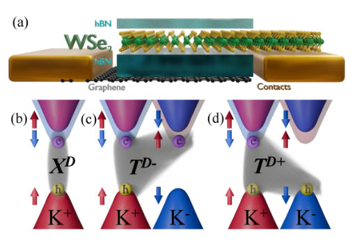 

FIG. 1. (a) Schematic illustration of the investigated het- erostructure. The gated device consists of hBN/WSe2 ML/hBN/graphene, with Pt contacts to the graphene layer and the WSe2 ML. Applying an external voltage enables con- trol of the carrier density in the WSe2 ML. (b-d) Schematic diagrams of (b) the dark exciton (XD), (c) the dark negative trion (T D−), and (d) the dark positive trion (T D+).

📷 Fig 2

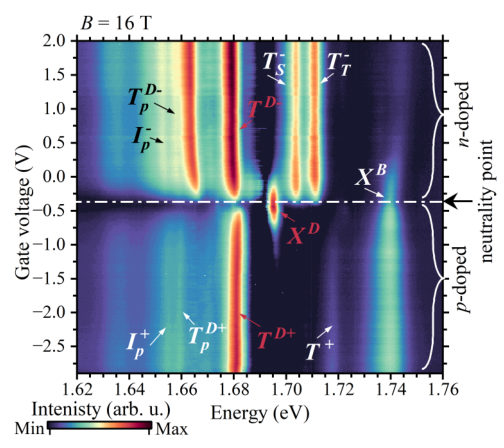 

FIG. 2. False-colour map of the low-temperature (T = 10 K) PL of a WSe2 ML versus gate voltage, measured in an in-plane magnetic field of 16 T. The n-type, charge-neutral, and p-type regimes are indicated, with the neutrality point marked. The observed excitonic complexes, including bright (XB, T +, T − S , and T − T ), dark (XD, T D−, and T D+), and phonon replicas of dark complexes (T D+ p , T D− p , I+ p , and I− p ), are labeled. Their origin is discussed in the text.

📷 Fig 3

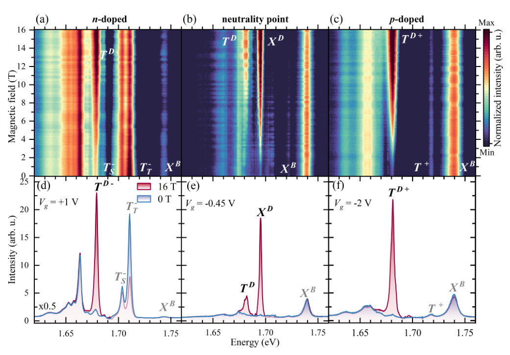 

FIG. 3. (a)-(c) False-colour maps of low-temperature (T = 10 K) PL of a WSe2 ML versus in-plane magnetic field for three representative gate voltages: (a) n-doped regime, (b) neutrality point, and (c) p-doped regime. The colour-coded intensities in panels (a)-(c) are normalised to the maximum intensity in each panel for clarity. (d)-(f) Comparison of the corresponding PL spectra in the three regimes measured at zero magnetic field (blue curves) and at B = 16 T (red curves). The intensities in panels (d)–(f) correspond to the absolute values measured in the experiment. The intensity in panel (d) is therefore scaled by a factor of 0.5.

📷 Fig 4

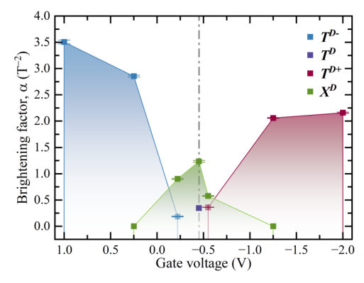 

FIG. 5. Extracted brightening factors (α) of the XD, T D, T D−, and T D+ transitions as a function of the gate voltage. The vertical dashed line marks the charge neutrality point.

📷 Fig 5

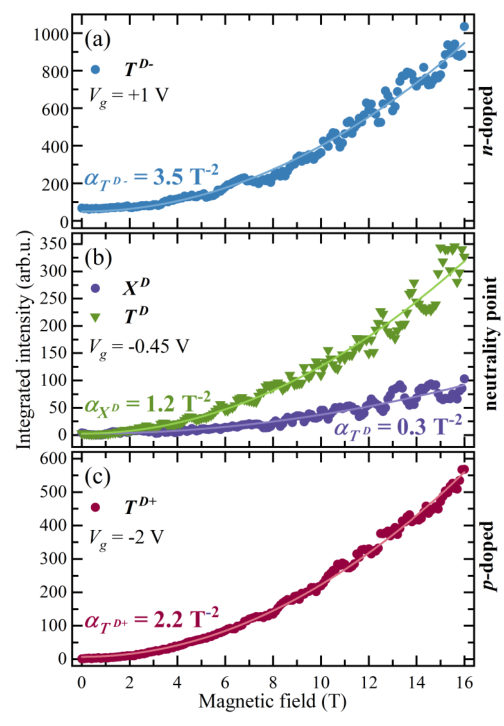 

FIG. 4. Magnetic-field dependence of the integrated intensi- ties of dark excitonic complexes extracted for three represen- tative gate voltages: (a) n-doped regime, (b) the neutrality point, and (c) p-doped regime. Coloured curves represent fits to the function ID = I0 + αB2.

**Main problem.**

The study investigates how electrostatic doping affects the in-plane magnetic-field-induced brightening (optical activation) of dark excitons and dark trions in monolayer WSe2.

**Main result.**

The researchers found a strong, non-trivial dependence of brightening rates on carrier density, revealing a pronounced asymmetry between the neutral dark exciton and charged dark trions.

**Method.**

Low-temperature micro-photoluminescence spectroscopy was performed on a gated WSe2 heterostructure under in-plane magnetic fields up to 16 T, with data analyzed using a steady-state rate-equation model.

**Summary.**

This paper explores how changing the number of electrons or holes in a WSe2 monolayer affects the way dark excitons and trions become visible under a magnetic field. By using a gate voltage, the authors tune the material through n-type, neutral, and p-type regimes. They discovered that the way these dark states 'brighten' is highly asymmetric depending on the doping. This work provides a deeper understanding of how charge carriers influence the optical properties of transition metal dichalcogenides.

Detailed structure

**Model / system.**

The physical system is a monolayer WSe2 (S-TMD) heterostructure (hBN/WSe2/hBN/graphene) where carrier density is tuned via gate voltage through n-type, neutral, and p-type regimes.

**Key observables.**

Integrated PL intensities of bright and dark excitonic complexes (X_B, X_D, T_D-, T_D+), brightening factors (alpha), and carrier densities.

**Important parameters / regimes.**

In-plane magnetic field (up to 16 T), gate voltage, carrier density (10^10 to 10^12 cm^-2), and temperature (10 K).

**Assumptions / limitations.**

The rate-equation model assumes thermal dissociation is negligible when energy splitting is much larger than kBT and that the brightening factor is proportional to the dark complex population and bright analogue intensity.

**Figures summary.**

Figure 1 shows the device schematic; Figure S1 provides a PL map of various complexes across different doping regimes; Figure S2 displays magneto-PL maps and plots of integrated intensities vs. magnetic field with quadratic fits.

**Paper structure.**

The paper introduces the problem of dark exciton activation, describes the experimental device and spectroscopic setup, presents the results of doping-dependent brightening, provides a rate-equation model to explain the observed asymmetry, and concludes with the implications for TMD carrier dynamics.

**Why it may be interesting.**

The study explores the controlled optical activation of spin-forbidden states and the complex many-body dynamics of excitonic complexes, which is relevant to understanding light-matter interactions and carrier recombination in two-dimensional systems.

Abstract

Optically dark excitonic states play a critical role in the valleytronic, electronic, and optical properties of monolayer semiconducting transition metal dichalcogenides. Here, we investigate how electrostatic doping affects the in-plane magnetic-field-induced activation of dark excitonic complexes in a gated WSe$_2$ monolayer. By continuously tuning the carrier density via gate voltage, we access $n$-type, charge-neutral, and $p$-type regimes and track the corresponding brightening dynamics. We find that the brightening rates of the dark negative trion ($T^{D-}$), dark neutral exciton ($X^{D}$), and dark positive trion ($T^{D+}$) exhibit a strong and nontrivial dependence on doping. In particular, the pronounced asymmetry in the brightening behaviour of the neutral $X^{D}$ complex and the charged $T^{D-}$ and $T^{D+}$ trions reveals distinct underlying carrier interactions, which we describe using a rate-equation model for their steady-state populations. These findings highlight the key role of dark excitonic complexes in governing the optical response and carrier dynamics of doped S-TMD monolayers.

[↑ back to top](#top)

### [Electric-field control of hydrogen bonding via interfacial charge at atomic resolution](http://arxiv.org/abs/2604.25114v1)

**Authors:** Nassar Doudin, Jian Jiang, Chun Tang, Xiao Cheng Zeng, Mohammed Th. Hassan

**Type:** both · **Category:** statistical mechanics · **PDF:** <https://arxiv.org/pdf/2604.25114v1>

**Analysis basis:** full PDF text, analyzed in chunks

**Topic relevance:** `driven-dissipative phase transition` **2/5** · `non-equilibrium dynamics` **2/5**

📷 Fig 1

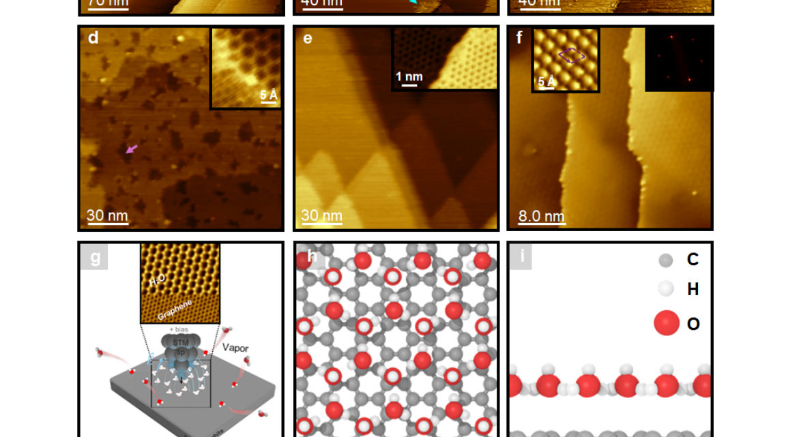 

Fig. 1| Electric-field control of hydrogen-bond ordering in interfacial water and ice on graphite. a. Large-area STM image of pristine graphite (350 × 350 nm2, Voltage Bias, VS = +1.9 V, tunneling current, It = 250 pA), showing a perfectly clean surface. Inset (2.5 × 2.5 nm2 , It = +0.21 V, It = 250 pA): atomic-resolution image resolving the hexagonal lattice (lattice constant ≈ 2.46 Å, red dashed line). b–f, STM image sequence of the formation of a first ice layer recorded at 76 K. b, STM image (200 × 200 nm2, VS = +1.3 V, It = 250 pA) acquired after exposure to 0.05 L of water at 76 K (L, 1 L = 1.33 × 10–6 mbar·s), showing fuzzy features (cyan arrows) indicative of highly mobile water...

📷 Fig 2

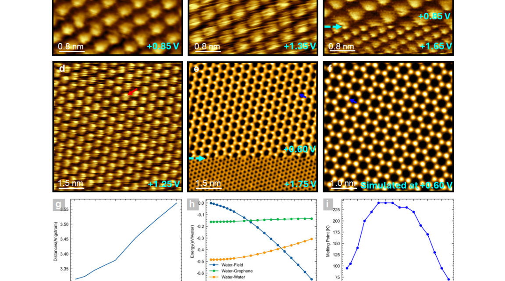 

Fig. 2| Bias-dependent, electric-field-driven evolution of the hydrogen-bond network in interfacial ice on graphite at 76 K. a, STM image (4 × 4 nm2, VS = +0.85 V, It = 280 pA) showing a well-ordered hexagonal ice structure with stable contrast. Scan direction: bottom to top. b, Increasing the bias (4 × 4 nm2, VS = +1.35 V, It = 280 pA) induces molecular-scale fluctuations, revealing reversible switching between two molecular configurations (red arrow). c, STM image (4 × 4 nm2, It = 280 pA) acquired across regions scanned at different bias voltages. The dashed cyan line marks the boundary between areas imaged at different biases; increasing bias progressively destabilizes the ice structure,...

📷 Fig 3

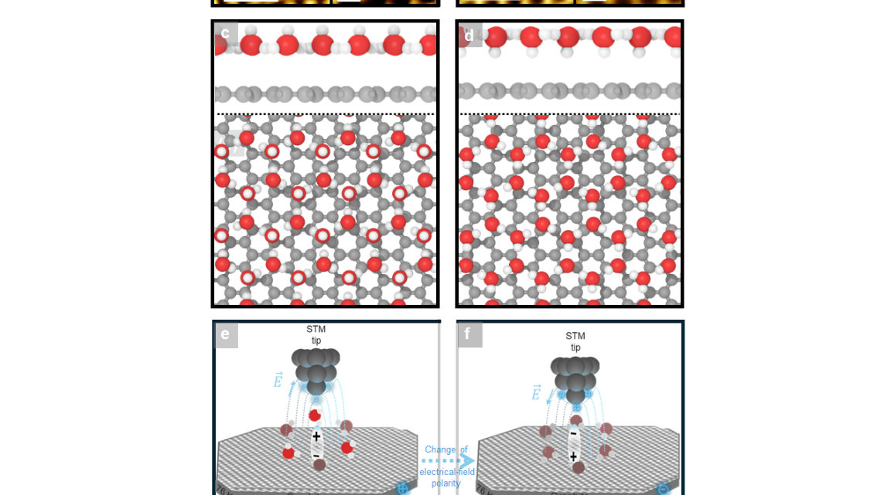 

Fig. 4| Electric-field polarity-driven switching of a monolayer ice lattice on graphite. a, Empty-state STM image of the ice monolayer (8 × 8 nm2, Vs = +0.6 V, It = 300 pA) acquired at 76 K. Inset: high-resolution image (2.5 × 2.5 nm2, Vs = +0.55 V, It = 300 pA). b, Filled-state STM image of the same region (8 × 8 nm2, Vs = +0.6 V, It = 300 pA), showing contrast inversion while preserving lattice symmetry. Inset: high-resolution image (2.5 × 2.5 nm2, Vs = +0.55 V, It = 300 pA). c-d, Optimized atomic structures of monolayer ice on graphene corresponding to opposite molecular dipole orientations (H-up and H-down). e&amp;f, Schematic illustrations of electric-field-induced switching of the...

**Main problem.**

Achieving deterministic, atomic-scale control over hydrogen-bond networks and understanding how external electric fields drive phase transitions and structural reconfiguration.

**Main result.**

An external electric field enables the reversible transition from a mobile, non-wetting water phase to an ordered hexagonal ice monolayer on graphite through interfacial charge redistribution.

**Method.**

Low-temperature scanning tunneling microscopy (STM) and non-contact AFM are combined with first-principles DFT and classical molecular dynamics simulations.

**Summary.**

This paper demonstrates how an external electric field can be used to precisely control the structure and electronic properties of a 2D ice monolayer on graphite. By tuning the voltage bias, researchers can trigger the condensation of mobile water into an ordered hexagonal lattice and even switch the orientation of molecular dipoles. The mechanism is driven by interfacial charge redistribution rather than simple geometric effects. This work provides a new way to electrically program molecular organization at the atomic scale.

Detailed structure

**Model / system.**

A monolayer of hexagonal ice on a hydrophobic graphite (HOPG) substrate, characterized by a coupled electromechanical system of molecular dipoles and interfacial charge.

**Key observables.**

Lattice strain, conductance states, molecular dipole orientation (H-up vs. H-down), and tunneling contrast.

**Important parameters / regimes.**

External electric field (via voltage bias), temperature (76 K), and water dose (Langmuirs).

**Assumptions / limitations.**

The observed dynamics are assumed to be independent of STM tip effects; simulations use the TIP4P/Ice water model.

**Figures summary.**

Fig 1 shows the transition from clean graphite to mobile water to ordered ice; Fig 2 demonstrates bias-dependent evolution and MD-simulated melting; Fig 3 shows lattice strain and quantized conductance; Fig 4 illustrates polarity-driven dipole switching.

**Paper structure.**

The paper introduces the challenge of H-bond control, demonstrates field-induced nucleation of ice, explores the electromechanical coupling and lattice strain, details the reversible dipole switching via polarity reversal, and concludes with the mechanism of interfacial charge redistribution.

**Why it may be interesting.**

The study demonstrates a programmable, many-body system where an external field tunes the energy landscape, driving transitions between stable, bistable, and unstable phases, which is relevant to understanding driven-dissipative dynamics and phase transitions in molecular assemblies.

Abstract

Hydrogen-bond networks govern molecular structure and function across chemistry, biology and materials science, yet their deterministic control at the atomic scale remains a central challenge (1-9).Here, we directly visualize how an external electric field enables reversible control of a hydrogen-bond network in monolayer ice on graphite through interfacial charge redistribution. Low-temperature scanning tunnelling microscopy reveals a field-driven transition from a mobile, physisorbed, non-wetting water phase to an ordered hexagonal monolayer, enabling deterministic nucleation, growth and complete wetting on an otherwise inert surface. Systematic variation of the field induces continuous lattice strain coexisting with discrete conductance states, revealing coupled structural and electronic responses. Reversal of the field polarity drives collective dipolar inversion, enabling switching between symmetry-equivalent configurations without disrupting the lattice. Supported by first-principles theory and bias-dependent imaging, these effects arise from field-induced modification of the interfacial electronic structure rather than purely geometric or orientational effects. These results establish interfacial charge redistribution as a general mechanism for electrically programming hydrogen-bond networks, providing a route to control molecular organization, electronic properties and collective dipolar order at interfaces.

[↑ back to top](#top)

### [Linear response from tilted Dirac cones under strain-induced pseudomagnetic fields](http://arxiv.org/abs/2604.25758v1)

**Authors:** Sanskar Sharma, Ipsita Mandal

**Type:** theory · **Category:** other · **PDF:** <https://arxiv.org/pdf/2604.25758v1>

**Analysis basis:** full PDF text, analyzed in chunks

**Topic relevance:** `Keldysh / 2PI / non-Gaussian methods` **2/5** · `non-equilibrium dynamics` **2/5**

📷 Fig 1

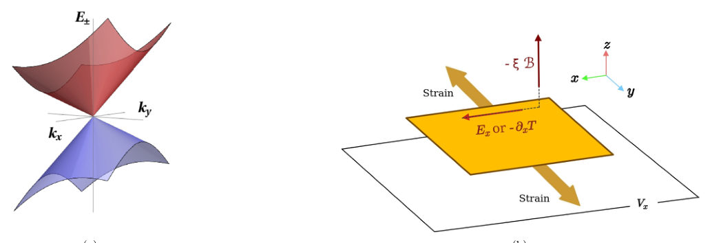 

FIG. 1. (a) Energy bands for a tilted Dirac cone. (b) Set-up to measure the longitudinal transport coefficients in the presence of a strain-induced pseudomagnetic field. Here, a uniform and time-independent electric field (Ex) or temperature gradient (−∂xT) is applied in the x-direction and Vx is the associated voltage.

📷 Fig 2

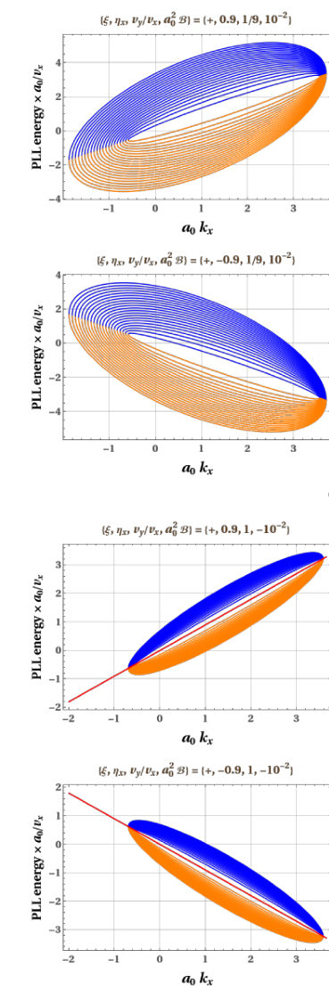 

FIG. 2. Dispersion of the PLLs for some chosen parameters shown in the plot-labels.

📷 Fig 3

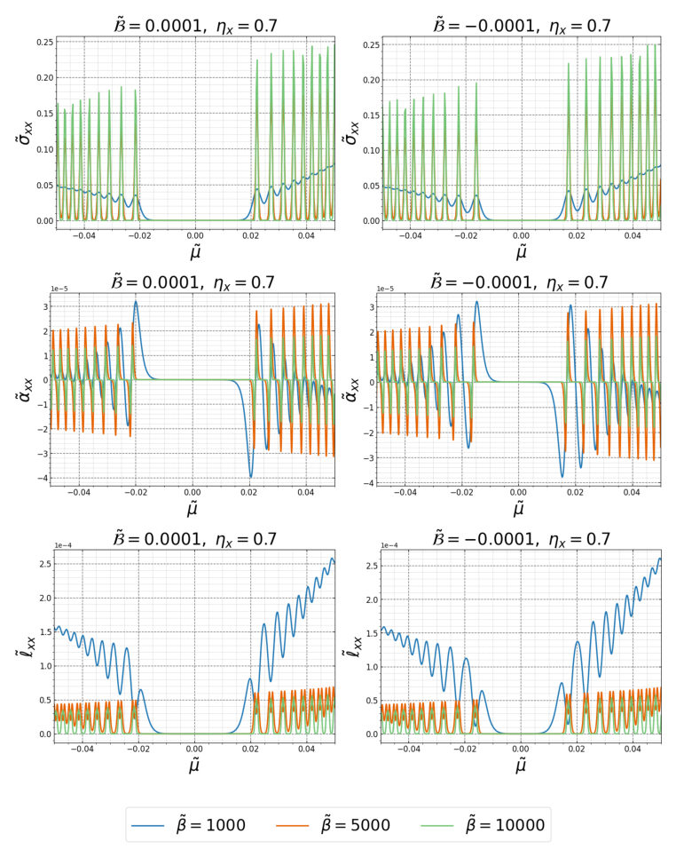 

FIG. 3. Linear-response coefficients ˜σxx, ˜αxx, and ˜ℓxx, as functions of ˜µ. We have plotted them for 3 different values of β. We have taken vy/vx = 0.8.

📷 Fig 4

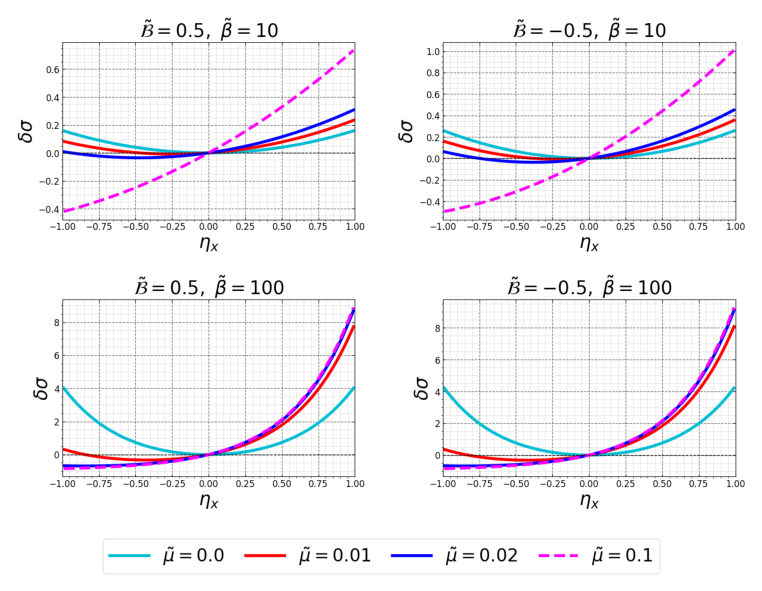 

FIG. 4. Variation of electrical conductivity with ηx by setting vy/vx to 0.8. Here, δσ ≡σxx(ηx)/σxx(ηx = 0) −1.

📷 Fig 5

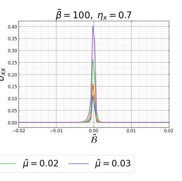 

FIG. 5. Variation of electrical conductivity with B.

📷 Fig 6

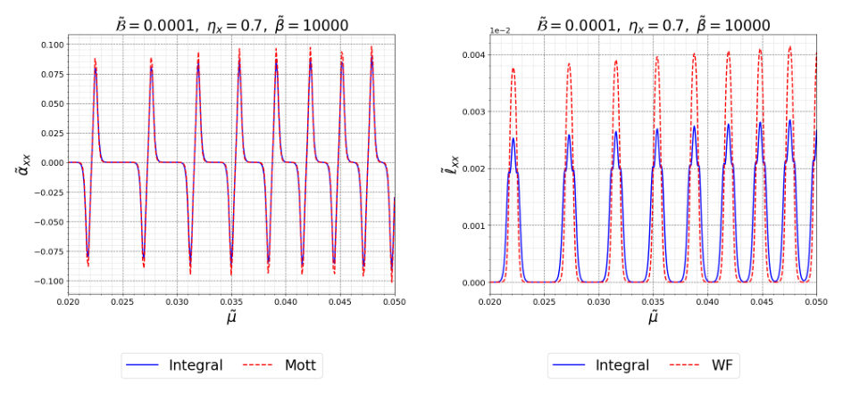 

FIG. 6. Comparision of the Mott Relation and the Wiedemann-Franz (WF) law [cf. Eq. (15)] with the results obtained from the original integrals [cf. Eq. (13)]. While the blue lines represent the results obtained from the actual integrals (indicated by the label “Integral”), the dotted red lines show the answers obtained by using the relations. We have used here vy/vx = 0.8.

**Main problem.**

Investigating how the interplay between tilted Dirac cones and strain-induced pseudomagnetic fields affects the dispersion and longitudinal transport properties of 2D anisotropic Dirac systems.

**Main result.**

The authors show that pseudo-Landau levels (PLLs) are dispersive due to the tilt, leading to finite longitudinal group velocities and non-vanishing transport coefficients, which can be tuned via strain.

**Method.**

The study uses a semiclassical Boltzmann framework and solves the eigenvalue equation for the Hamiltonian using a Sturm-Liouville approach and confluent hypergeometric functions.

**Summary.**

This paper explores how mechanical strain and the resulting pseudomagnetic fields modify the electronic properties of 2D Dirac materials. Unlike standard Landau levels, the levels in these strained, tilted systems are dispersive, meaning they depend on momentum. This dispersion allows for finite longitudinal transport that can be controlled by tuning the tilt and strain. The study provides a theoretical framework for using mechanical deformation to engineer conductance in valleytronic devices.

Detailed structure

**Model / system.**

A 2D anisotropic Dirac system (such as graphene or organic conductors) subject to uniaxial strain, modeled by a generalized Weyl-like Hamiltonian with a tilt parameter and a strain-induced pseudogauge field.

**Key observables.**

Longitudinal electrical conductivity, thermoelectric conductivity, and thermal conductivity, as well as the validity of the Mott relation and Wiedemann-Franz law.

**Important parameters / regimes.**

Tilt parameter (eta_x), pseudomagnetic field strength (B), chemical potential (mu), temperature (T), and velocity anisotropy (v_y/v_x).

**Assumptions / limitations.**

Assumes a type-I (undertilted) phase, small strain magnitude, and that the strain primarily affects off-diagonal hopping terms.

**Figures summary.**

Figure 1 shows tilted energy bands and an experimental setup schematic; Figure 2 displays the dispersion of pseudo-Landau levels; Figure 3 plots longitudinal response coefficients as functions of chemical potential.

**Paper structure.**

The paper begins by defining the tilted Hamiltonian and strain mechanism, derives the dispersive pseudo-Landau level spectrum and wavefunctions, applies the Boltzmann formalism to calculate transport coefficients, and concludes by testing the validity of standard transport relations.

Abstract

We investigate the transport signatures of pseudo-Landau levels (PLLs) in two-dimensional anisotropic Dirac systems with tilted cones, whose effective bandstructure results from strain-induced pseudogauge fields. In contrast to conventional Landau quantisation, the PLLs exhibit explicit momentum-dependence by being dispersive, leading to finite longitudinal group-velocities. We analyse the transport properties within the semiclassical Boltzmann framework by computing the electrical, thermoelectric, and thermal response in the linear regime, which acquire nonzero longitudinal components. We also check the validity of the Mott relation and Wiedemann-Franz law in our system. Our results provide a unified framework for understanding the interplay between tilted spectrum and structural deformation in affecting quantum transport, and suggest unambiguous experimental signatures in strain-engineered systems.

[↑ back to top](#top)

### [Femtosecond tunneling spectroscopy of ultrafast band bending dynamics at the atomic limit](http://arxiv.org/abs/2604.25146v1)

**Authors:** Vedran Jelic, Kaedon Cleland-Host, Stefanie Adams, Mohamed Hassan, Austin Hayes, Tyler L. Cocker

**Type:** both · **Category:** other · **PDF:** <https://arxiv.org/pdf/2604.25146v1>

**Analysis basis:** full PDF text, analyzed in chunks

**Topic relevance:** `non-equilibrium dynamics` **2/5**

📷 Fig 1

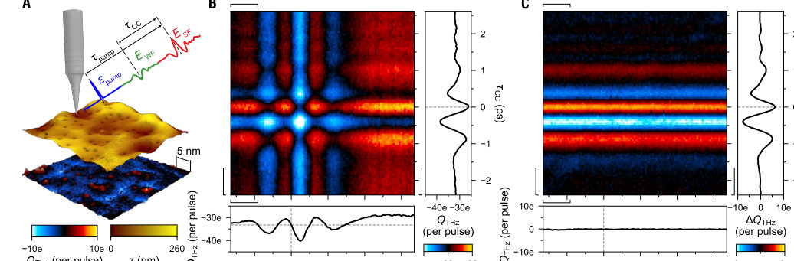 

Fig. 1. Optical pump – terahertz probe multidimensional nanospectroscopy of gallium arsenide. (A) Visualization of the pulse sequence incident on the metallic STM tip (top) together with the defect-induced band-bending landscape (middle) and simultaneously recorded terahertz-induced tunnel current, QTHz(x,y) (bottom). The sequence consists of a femtosecond near-infrared pump pulse with energy εpump ∝ R |Epump|2dt, where Epump is the pump electric field. The pump center wavelength is 810 nm and its duration is 50 fs. A strong-field terahertz probe pulse with field ESF(t) is delayed by τpump relative to the pump pulse. A weak-field terahertz pulse with incident field EWF(t), arrives with a...

📷 Fig 2

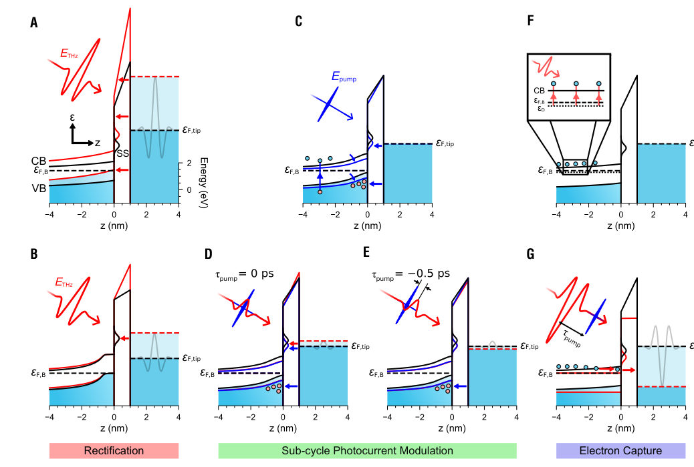 

Fig. 2. Terahertz-pulse-induced rectification, sub-cycle photocurrent modulation and electron capture. (A) Simulated band diagrams, produced with the Poisson solver SEMITIP, for terahertz-field-induced (ETHz) rectification (red arrows) on the pristine surface with Vd.c. = 3.0 V and VTHz,pk = 4.0 V. The conduction band (CB) and valence band (VB) are plotted with (red curve) and without (black curve) the terahertz field present, where εF,B is the Fermi level of the bulk and εF,tip is the Fermi level of the tip. (B) Simulated band diagram for terahertz-pulse-induced rectification near a negatively charged defect (VGa) with Vd.c. = 1.1 V and VTHz,pk = 1.9 V. The red arrow shows...

📷 Fig 3

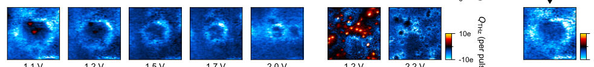 

Fig. 3. Ultrafast manipulation of the band-bending landscape. (A) Schematic and simulated band diagram of lateral tip-induced band bending around a negatively charged (VaGa) defect. The valence band (VB) and conduction band (CB) edges at the surface are shifted by the combined fields of the tip and charged defect at Vd.c. = 2.0 V. (B to D) Schematics (top) and simulated band diagrams (bottom) with the tip 10 nm (B), 1 nm (C), and 0 nm (D) away from a negatively charged defect at Vd.c. = 2.0 V and VTHz,pk = −0.3 V. The tip’s Fermi level alignment with the C4 surface state (SS) maximizes the photocurrent at a lateral distance of 1 nm from the negatively charged defect. (E) Simultaneously...

📷 Fig 4

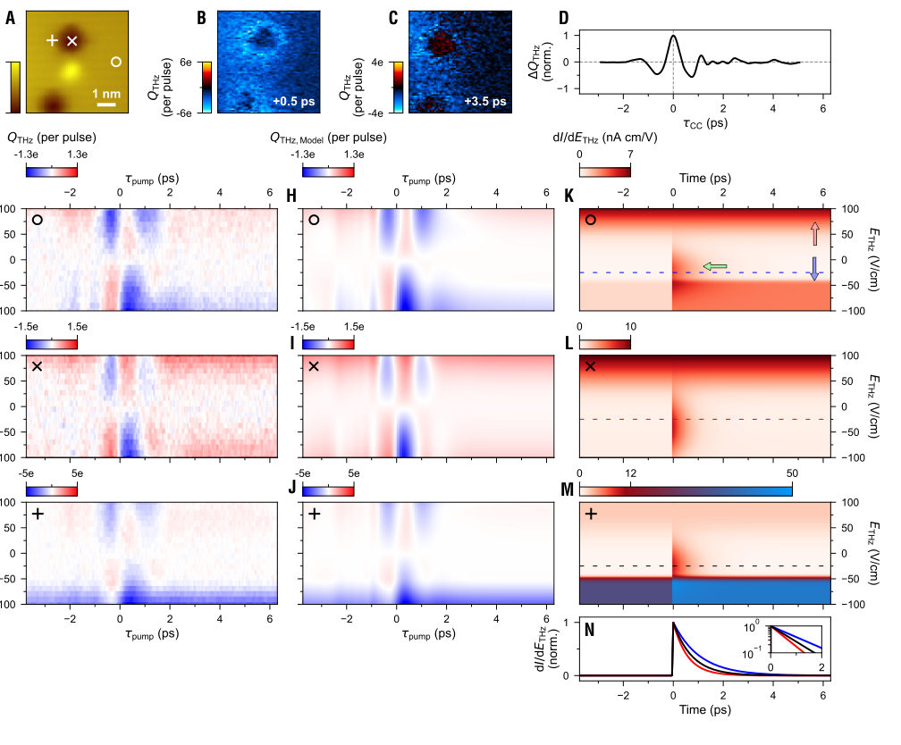 

Fig. 4. Sub-cycle differential conductance spectroscopy of an atomic defect. (A and B) Simultaneously acquired STM topography and THz-STM images of two gallium vacancies (dark depressions) and an adsorbed atom (bright protrusion) on the silicon-doped GaAs(110) surface measured in constant-current mode with τpump = 0.5 ps, ETHz,pk = −80 V/cm, εpump = 50 pJ, Vd.c. = 2.4 V, and Id.c. = 30 pA. Image size 6 × 6 nm2; scan speed 1 nm/s. (C) THz-STM image of the same area acquired at τpump = 3.5 ps with other parameters the same as (B). (D) Terahertz near-field waveform measured via cross-correlation (see fig. S8 for details). (E to J) Experimental (left) and simulated (right) two-dimensional...

**Main problem.**

Resolving ultrafast (femtosecond to picosecond) photocarrier motion and the resulting dynamic reshaping of the potential energy landscape at atomic length scales.

**Main result.**

Demonstrated that lightwave-driven THz-STM can track transient electronic structure and time-dependent band bending near individual surface defects with unprecedented spatio-temporal resolution.

**Method.**

An optical-pump/THz-probe configuration using femtosecond near-infrared pulses and a strong-field THz pulse, combined with THz time-domain spectroscopy (THz-TDS) to disentangle coherent field dynamics from sample response.

**Summary.**

This paper presents a new regime of ultrafast tunneling spectroscopy using lightwave-driven THz-STM. By using an optical pump and a THz probe, the researchers can image how photoexcited carriers dynamically reshape the electronic landscape at the atomic scale. They successfully disentangle different physical processes, such as charge rectification and photocurrent modulation, near surface defects. This technique provides unprecedented spatio-temporal resolution for studying carrier transport and band alignment in semiconductors.

Detailed structure

**Model / system.**

The physical system is an n-type silicon-doped GaAs(110) surface containing atomic-scale defects like gallium vacancies. The experimental platform is lightwave-driven terahertz scanning tunneling microscopy (THz-STM) coupled with 3D Poisson solver (SEMITIP) simulations.

**Key observables.**

Transient photocurrents, time-dependent band bending, rectified charge (Q_THz), differential rectified charge (delta Q_THz), and time-dependent differential conductance.

**Important parameters / regimes.**

Femtosecond to picosecond temporal scales; atomic-scale spatial resolution; peak THz electric fields around -100 V/cm; photocurrent lifetimes ranging from ~580 fs to 910 fs.

**Assumptions / limitations.**

The THz waveform shape remains invariant under photoexcitation, preventing the study of the evolving dielectric function; the junction remains in the tunneling regime without reaching field emission.

**Figures summary.**

Fig 1: STM/THz-STM topography and defect distribution; Fig 2: Poisson simulations of rectification, modulation, and electron capture; Fig 3: Lateral band bending and tip-defect distance dependence; Fig 4: 2D THz-STS maps and extracted time-dependent differential conductance.

**Paper structure.**

Introduction of the challenge in resolving ultrafast dynamics; description of the THz-STM experimental setup and THz-TDS waveform measurement; presentation of simulation results for physical mechanisms (rectification, modulation, capture); experimental demonstration of tracking band bending at defects; and discussion of extracted carrier lifetimes.

Abstract

Atomic-scale disorder shapes the potential energy landscape traversed by photoexcited charge carriers, while the carriers themselves also dynamically reshape this landscape. However, resolving ultrafast photocarrier motion at atomic length scales has remained a central challenge in materials science. Here, we demonstrate that lightwave-driven terahertz scanning tunneling microscopy (THz-STM) provides access to these dynamics by probing the ultrafast evolution of local electronic structure following resonant interband excitation. Applying this approach to the photoexcited GaAs(110) surface, we image the resulting femtosecond carrier dynamics by tracking the transient photocurrents produced by ultrafast shifts in the energy alignment of surface and bulk electronic states near individual surface defects. Supported by modeling, we experimentally resolve the time-dependent band bending produced by photoinduced charge carriers across the atomic-scale landscape of the sample surface. Crucially, we employ terahertz time-domain spectroscopy in the tip near-field to disentangle the coherent sub-cycle dynamics induced by the terahertz driving field from the intrinsic sample response. We establish a new regime of ultrafast tunneling spectroscopy that captures transient electronic structure and dynamic band alignment with unprecedented spatio-temporal resolution, which has significant implications for understanding carrier transport, defect-mediated processes, and the development of optoelectronic technologies based on dynamically tunable materials.

[↑ back to top](#top)

### [Probing sliding ferroelectricity in bilayer T$_\mathrm{d}$-WTe$_2$ with high-harmonic generation](http://arxiv.org/abs/2604.25483v1)

**Authors:** Elias Greil, Alba de las Heras, Angel Rubio, Anna Galler

**Type:** theory · **Category:** other · **PDF:** <https://arxiv.org/pdf/2604.25483v1>

**Analysis basis:** full PDF text, analyzed in chunks

**Topic relevance:** `non-equilibrium dynamics` **2/5**

📷 Fig 1

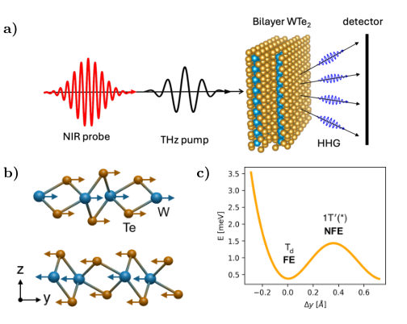 

FIG. 1: Schematic of the THz pump - NIR probe setup for ferroelectric switching. (a) A THz pump pulse excites coherent phonons in bilayer Td-WTe2, fol- lowed by a time-delayed NIR pulse, which drives HHG to probe the lattice and electronic structure. (b) Dynam- ics of the 0.24 THz interlayer shear phonon. (c) Poten- tial energy as a function of interlayer shear displacement, calculated using the nudged elastic band (NEB) method within DFT (see Methods). The THz pulse can drive a transition from the FE Td phase to a non-ferroelectric (NFE) intermediate state.17

📷 Fig 2

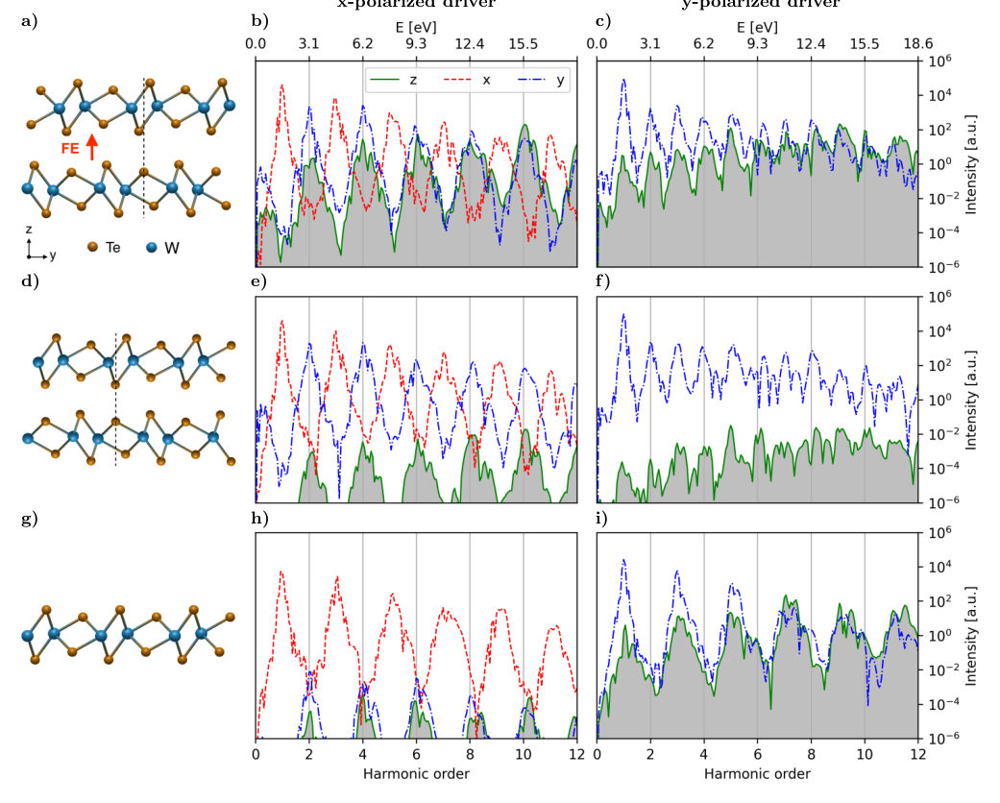 

FIG. 2: Signatures of sliding ferroelectricity in HHG. (a) The polar Td structure of bilayer WTe2 exhibits FE polarization in the out-of-plane (z) direction. (b) HHG spectrum obtained for a 16-cycle driving laser pulse with a wavelength of 800 nm, linearly polarized along the x direction, and an intensity of 1 TW/cm2. (c) Corresponding HHG spectrum for a driving laser polarized along the y direction. (d–f) Same as in (a–c), but for the non-ferroelectric (NFE) intermediate structure, obtained from Td via an interlayer shear displacement along y. The z-polarized harmonics (shaded in grey) are strongly suppressed. (g–i) For a full comparison, we also show the HHG spectra from monolayer WTe2.

📷 Fig 3

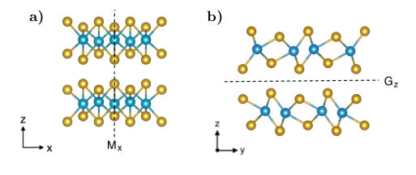 

FIG. 4: Symmetries of the non-ferroelectric 1T′(∗) structure. (a) Mirror plane Mx (corresponding to the yz plane). (b) Glide-plane symmetry Gz, consist- ing of a reflection across the xy plane combined with a fractional translation along the y direction.

📷 Fig 4

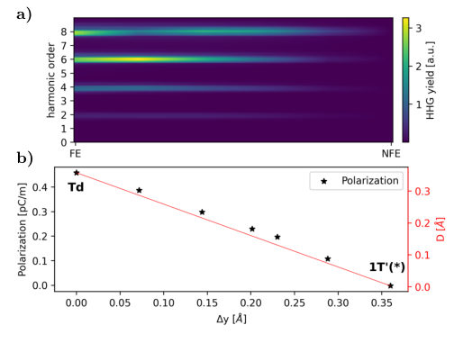 

FIG. 3: HHG response along the FE switching pathway. (a) Harmonic yield of the z-polarized harmon- ics as a function of the shear displacement ∆y. The HHG yield is computed for an x-polarized driving field with a wavelength of 800 nm and an intensity of 1 TW/cm2. The z harmonics progressively vanish as the shear dis- placement approaches the NFE 1T′(∗) structure. (b) The ferroelectric polarization is directly proportional to the deviation from the xy glide-plane symmetry, which is present only in the 1T′(∗) structure. The deviation from this symmetry is quantified by a mean absolute displace- ment measure D (see Methods).

📷 Fig 5

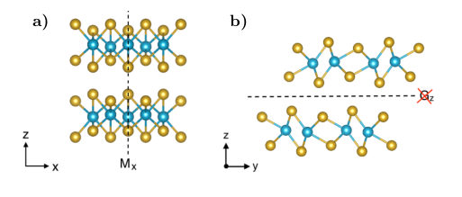 

FIG. 5: Symmetries of the ferroelectric Td struc- ture. (a) Mirror plane Mx. (b) Illustration of the broken glide-plane symmetry Gz.

📷 Fig 6

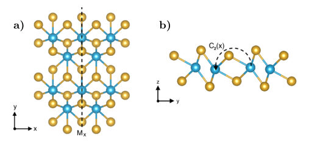 

FIG. 6: Symmetries of monolayer WTe2. (a) xy- plane of the monolayer highlighting the mirror symmetry Mx. (b) The monolayer additionally shows a two-fold rotational symmetry C2(x) around the x-axis.

📷 Fig 7

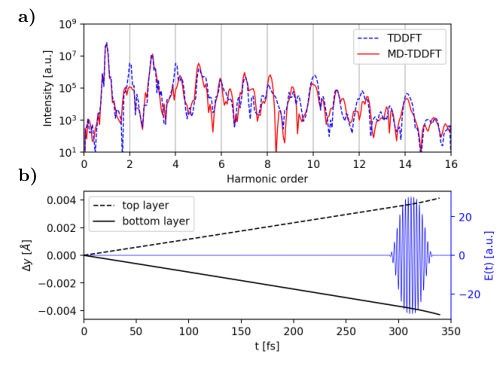 

FIG. 7: Results of the MD-TDDFT simulations. (a) Comparison of the total HHG spectrum obtained from coupled electron–ion dynamics (MD-TDDFT, red) with that from fixed ionic positions corresponding to the Td phase of bilayer WTe2 (TDDFT, blue). (b) Time evo- lution of the ionic displacements during the first 350 fs fol- lowing initialization of the interlayer shear mode. Shown are the displacements ∆y of the centers of mass of the top layer (dashed black line) and bottom layer (solid black line). After 300 fs, a 16-cycle 800 nm probe pulse is ap- plied, and the resulting HHG spectrum is shown in (a).

📷 Fig 8

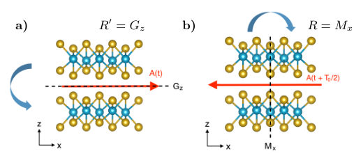 

FIG. 8: Shared symmetries of the NFE 1T′(∗) structure and an x-polarized external field. (a) The glide-plane symmetry Gz leaves both the crystal structure and the external field invariant. (b) The mirror symmetry Mx maps the external field onto itself with a temporal shift of T0/2, corresponding to a reversal of its direction.

**Main problem.**

Investigating whether high-harmonic generation (HHG) can serve as an all-optical, non-invasive probe to identify and monitor sliding ferroelectricity and lattice symmetry in 2D materials.

**Main result.**

The breaking of glide-plane symmetry in the ferroelectric phase of bilayer WTe2 produces robust, detectable z-polarized harmonics, providing a spectroscopic fingerprint for the ferroelectric state.

**Method.**

First-principles simulations using time-dependent density functional theory (TDDFT) and molecular dynamics (MD-TDDFT) implemented in the Octopus code, combined with Jones matrix formalism for symmetry analysis.

**Summary.**

This paper demonstrates that high-harmonic generation can be used as a powerful optical tool to detect ferroelectricity in 2D materials. By studying bilayer WTe2, the authors show that the breaking of specific crystal symmetries during interlayer sliding leads to unique z-polarized harmonic signals. The study uses advanced TDDFT simulations to prove that these electronic signatures are robust and decoupled from slow lattice vibrations. This provides a non-invasive way to monitor the switching of ferroelectric states in quantum materials.

Detailed structure

**Model / system.**

Bilayer Td-WTe2, a 2D semimetal featuring switchable out-of-plane ferroelectric polarization driven by interlayer sliding/shear motion.

**Key observables.**

Polarization-resolved high-harmonic spectra (x, y, and z components) and the emergence of even vs. odd harmonic orders.

**Important parameters / regimes.**

800 nm NIR pulse, 16-cycle duration, 1 TW/cm2 peak intensity, and a 0.24 THz interlayer shear phonon mode.

**Assumptions / limitations.**

The Ehrenfest approximation is used for electron-ion coupling; the translational component of the glide-plane operation is ignored in symmetry analysis; spin-orbit coupling and spin polarization are neglected.

**Figures summary.**

Figure 1 shows the THz pump-NIR probe setup and the energy profile of the switching pathway; Figure 2 compares HHG spectra for different phases; Figure 7 compares MD-TDDFT with fixed-ion simulations; Figure 8 illustrates symmetry-driven selection rules.

**Paper structure.**

The paper introduces the problem of probing sliding ferroelectricity, describes the structural and symmetry properties of WTe2, details the TDDFT/MD methodology, presents the results of polarization-resolved HHG spectra, and concludes with the utility of HHG as a diagnostic tool.

Abstract

High-harmonic generation is a sensitive all-optical probe of symmetry and electron dynamics in solids. Here, we use first-principles time-dependent density functional theory (TDDFT) to study high-harmonic generation in T$_d$-WTe$_2$, a two-dimensional semimetal with switchable out-of-plane ferroelectric polarization driven by interlayer sliding. We show that the mirror-symmetry breaking underlying the ferroelectric state produces robust signatures in polarization-resolved high-harmonic spectra, enabling optical identification of the polarization state. By incorporating interlayer shear motion in coupled electron-lattice TDDFT simulations, we further show that the 0.24 THz shear mode is slow enough to remain effectively decoupled from the ultrafast electronic response responsible for harmonic emission. Our results establish high-harmonic spectroscopy as a non-invasive probe of sliding ferroelectricity and lattice symmetry in two-dimensional quantum materials.

[↑ back to top](#top)

### [Ultrafast Energy Absorption in Silicon Controlled by Two-Color Double Pulses](http://arxiv.org/abs/2604.25093v1)

**Authors:** Eiyu S. Gushiken, Mizuki Tani, Hiroki Katow, Kenichi L. Ishikawa

**Type:** theory · **Category:** other · **PDF:** <https://arxiv.org/pdf/2604.25093v1>

**Analysis basis:** full PDF text, analyzed in chunks

**Topic relevance:** `non-equilibrium dynamics` **2/5**

📷 Fig 1

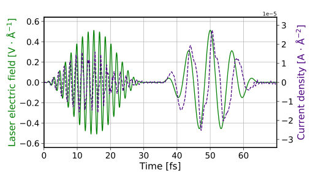 

FIG. 1. Temporal profile of the electric field E(t) (green solid, left axis) and induced current density J(t) (purple dashed, right axis) for a double-pulse 515 + 2060 nm, I1 = I2 = 3.5 × 1012 W/cm2, Tdelay = 35 fs.

📷 Fig 2

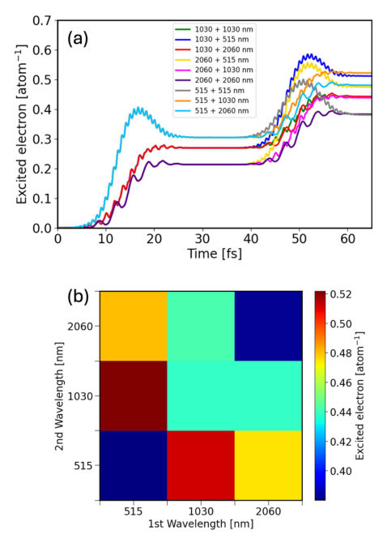 

FIG. 3. (a) Temporal profile of the calculated number of excited carriers for each wavelength combination with I1 = I2 = 3.5 × 1012 W/cm2 and Tdelay = 35 fs. (b) Total number of excited carriers for each wavelength combination.

📷 Fig 3

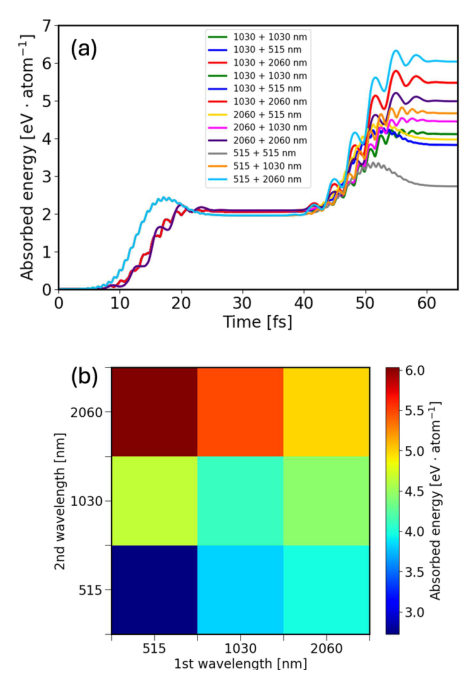 

FIG. 2. (a) Temporal profile of the absorbed energy for each wavelength combination with I1 = I2 = 3.5 × 1012 W/cm2

📷 Fig 4

 

Figure 3 shows the time evolution [panel (a)] and fi- nal values [panel (b)] of the number of excited electrons under each wavelength combination. When the wave- length is shorter, i.e., the photon energy is higher, the first pulse excites more electrons due to more efficient interband transitions (See around 0–30 fs in panel (a)). However, the final number of excited electrons after the second pulse does not strongly depend on the wavelength combination, compared with the absorbed energy shown in Fig. 2(a). These results suggest that the increased energy deposition observed for certain double-pulse con- figurations arises primarily from a higher energy gain per excited carrier, rather than...

📷 Fig 5

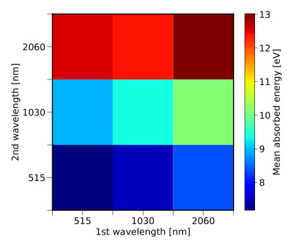 

FIG. 4. Mean absorbed energy per excited electron for each wavelength combination with I1 = I2 = 3.5 × 1012 W/cm2

📷 Fig 6

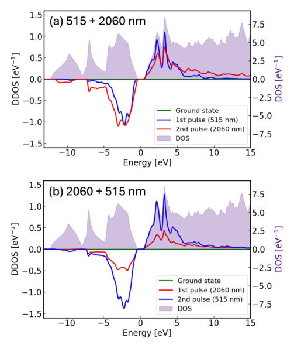 

FIG. 5. DDOS at t = 35 and 65 fs, corresponding to the times immediately after the first and second laser pulses, re- spectively, for I1 = I2 = 3.5 × 1012 W/cm2. Panels (a) and (b) show the results for the 515+2060 nm and 2060+515 nm, respectively.

📷 Fig 7

 

FIG. 6. Number of electrons excited to states within and be- yond the projection energy range ϵmax = 15 eV after double- pulse irradiation at I1 = I2 = 3.5 × 1012 W/cm2.

📷 Fig 8

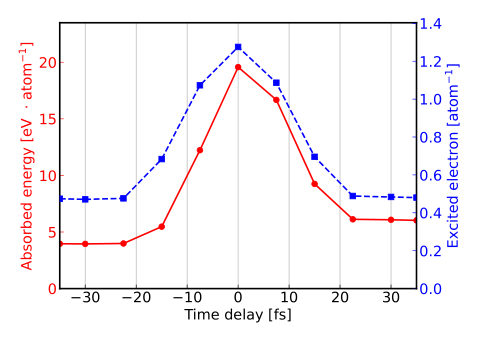 

FIG. 7. Total absorbed energy and number of excited elec- trons as a function of the delay time Tdelay in the 515 + 2060 nm configuration. The intensity is fixed at I1 = I2 = 3.5 × 1012 W/cm2. A positive delay means that the 515 nm pulse precedes the 2060 nm pulse.

📷 Fig 9

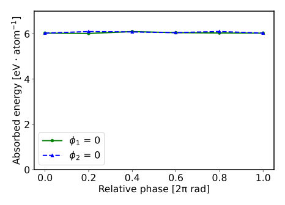 

FIG. 8. Relative phase dependence of the absorbed energy at 515 + 2060 nm, Tdelay = 35 fs, and I1 = I2 = 3.5 × 1012 W/cm2. ϕ1 and ϕ2 denote the carrier–envelope phases of the 515 nm and 2060 nm pulses, respectively.

📷 Fig 10

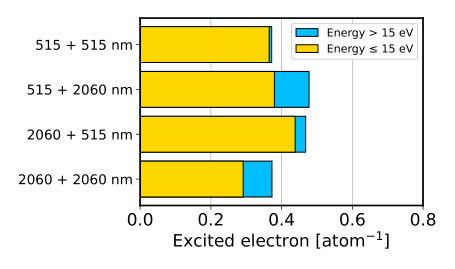 

Figure 7 shows the total absorbed energy and the num- ber of excited electrons as functions of the delay time Tdelay at I1 = I2 = 3.5 × 1012 W/cm2. A positive de- lay means that the 515 nm pulse precedes the 2060 nm pulse. When the pulses overlap (−20 ≲Tdelay ≲20), the energy absorption is increased, as we have previously reported [40]. In contrast, when the pulses are well sepa- rated, both the absorbed energy and the excited electron number are virtually independent of the delay time. In Fig. 8 we show the dependence of the total absorbed

**Main problem.**

The study investigates how the wavelength, intensity, and temporal sequence of two-color femtosecond double-pulses can be used to control energy absorption and electron dynamics in crystalline silicon.

**Main result.**

The researchers found that energy absorption is maximized in an intermediate intensity regime when a short-wavelength pulse precedes a long-wavelength pulse, driven by increased energy gain per electron through intraband acceleration.

**Method.**

The study uses Time-Dependent Density Functional Theory (TDDFT) implemented via the SALMON code, employing the Kohn-Sham equations in the velocity gauge.

**Summary.**

This paper demonstrates that energy deposition in silicon can be precisely tuned using two-color laser pulses. By adjusting the wavelength and the order of the pulses, one can switch between mechanisms like multiphoton absorption and intraband acceleration. Specifically, a short-wavelength pulse followed by a long-wavelength pulse optimizes energy absorption by increasing the energy gain of each excited electron. This provides a microscopic blueprint for controlling ultrafast energy transfer in semiconductors.

Detailed structure

**Model / system.**

The physical system is crystalline (bulk) silicon with a diamond structure. The model utilizes a periodic 8-atom unit cell with norm-conserving pseudopotals and a modified Becke-Johnson exchange-correlation potential.

**Key observables.**

Total absorbed energy, induced current density, number of excited electrons, mean absorbed energy per electron, and Differential Density of States (DDOS).

**Important parameters / regimes.**

Wavelengths of 515, 1030, and 2060 nm; peak intensities from 2e11 to 1e13 W/cm2; pulse delay times; and pulse sequence order.

**Assumptions / limitations.**

The study focuses on the initial coherent transient regime (up to 65 fs) and does not account for long-term electron-phonon energy transfer or thermal equilibrium.

**Figures summary.**

Figure 1 shows temporal profiles of the electric field and current density; Figure 7 shows absorbed energy and electron number vs. delay time; Figure 16 and 17 show the evolution of the Differential Density of States and electron populations.

**Paper structure.**

The paper introduces the problem of ultrafast energy control, describes the TDDFT methodology and silicon model, presents results across low, intermediate, and high intensity regimes, analyzes the microscopic mechanisms of carrier excitation and acceleration, and concludes with implications for tunable energy transfer.

Abstract

We theoretically show that energy absorption in crystalline silicon can be controlled by two-color femtosecond double-pulse irradiation, in which two temporally separated pulses with different wavelengths interact sequentially with the system. Using time-dependent density functional theory, we systematically examine the wavelength and intensity dependence of the absorbed energy over peak intensities of $2\times10^{11}$-$10^{13}$ W/cm$^2$ and wavelengths of 515, 1030, and 2060 nm. We find that the mechanism governing energy absorption and the optimal wavelength combination strongly depend on the intensity regime. In the low-intensity regime, multiphoton interband absorption is dominant, and energy absorption is enhanced for pulse pairs composed of shorter wavelengths. In contrast, in the high-intensity regime, the contributions of tunneling ionization and intraband acceleration become significant, leading to enhanced absorption for longer-wavelength combinations. In the intermediate-intensity regime, a pronounced enhancement is observed when a short-wavelength pulse precedes a long-wavelength pulse. Our analysis reveals that the nonequilibrium electronic state prepared by the first pulse modifies the excitation process induced by the second pulse, thereby enhancing the absorbed energy through an increased energy gain per excited electron. In this regime, the energy absorption is governed not only by the number of excited carriers but also by the energy gain per excited electron, which can be strongly modified by the pulse sequence. These results indicate that ultrafast energy transfer in semiconductors is tunable by appropriately designing the wavelength and intensity combination of the two pulses, and provide microscopic insight into two-color strong-field excitation.

[↑ back to top](#top)

### Other secondary papers (27)

Show other secondary papers

### [Absence of Quasi-Majorana False Positives in Full-Shell Hybrid Nanowires](http://arxiv.org/abs/2604.24858v1)

**Authors:** Carlos Payá, César Robles, Pablo San-Jose, Elsa Prada

**Type:** theory · **Category:** disordered systems and neural networks · **PDF:** <https://arxiv.org/pdf/2604.24858v1>

**Analysis basis:** full PDF text, analyzed in chunks

📷 Fig 1

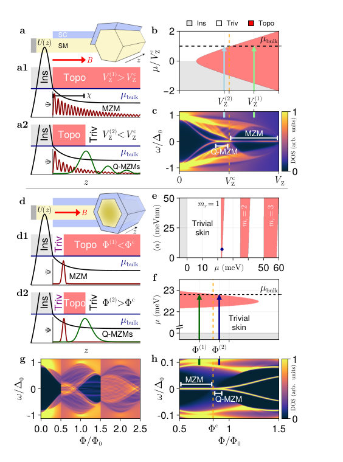 

FIG. 1. Smooth electrostatic confinement in par- tial and full-shell nanowires. (a) Schematic of a local spectroscopy setup for a semi-infinite partial-shell nanowire threaded by a magnetic field B and with an insulating tunnel barrier U(z) that leaks into the nanowire over a length χ. In panel (a1), given a chemical potential µbulk, a Zeeman field VZ greater than a critical value V c Z drives the entire wire into the topological regime, developing a Majorana zero mode (MZM) at its end (red wave function). For a weaker field, in (a2), only a region of the wire becomes topological, developing quasi- Majorana zero modes (Q-MZMs) at its boundaries (red/green overlapping wave functions). (b)...

📷 Fig 2

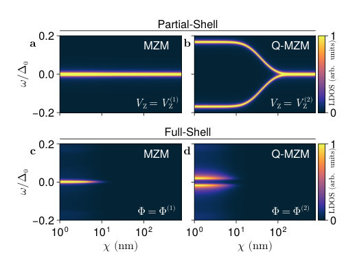 

FIG. 2. Detection of MZM versus quasi-MZMs. LDOS of the mJ = 0 sector versus smoothness parameter χ and energy ω at the end of a semi-infinite partial-shell (a,b) and full-shell (c,d) hybrid nanowires. The left (right) column cor- responds to the Majorana (quasi-Majorana) case. In (d), the visibility of low-energy states is lost before the Q-MZM peak if formed. Parameters taken at the green and blue marks of Fig. 1(c,h), respectively. Other parameters in Appendix E.

📷 Fig 3

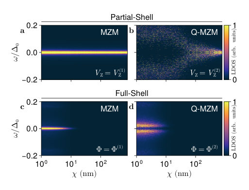 

FIG. 3. Same as Fig. 2 but in the presence of short-range disorder. Parameters are given in Appendix E.

📷 Fig 4

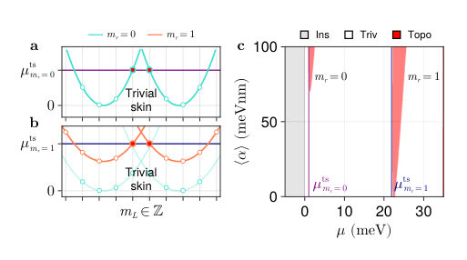 

FIG. 4. Origin of the trivial skin. (a) Schematic repre- sentation of the topological filling of the first radial subband (mr = 0) of a full-shell nanowire as a function of angular mo- mentum mL ∈Z with ∆0 = 0, Φ = 0.5Φ0 and kz = 0. As the chemical potential µ increases, various mL are occupied. A topological transition can only occur for specific mL modes (highlighted in red). Consequently, µ must reach a threshold value µts, which in turn generates a trivial skin at the hybrid nanowire’s end. (b) Same as (a) but for the second radial sub- band (mr = 1). Notice that (a) [(b)] represents a case with unrealistically strong (realistically small) SOC. (c) Topologi- cal phase diagram as a...

**Main problem.**

The difficulty in distinguishing true Majorana zero modes (MZMs) from 'quasi-Majorana' false positives in tunneling spectroscopy due to smooth electrostatic disorder at the ends of partial-shell nanowires.

**Main result.**

Full-shell hybrid nanowires prevent false positives because a 'trivial skin' forms at the wire end, which hides quasi-Majorana states from local probes while allowing true MZMs to remain detectable.

**Method.**

Numerical simulations using the Quantica.jl package to calculate the Bogoliubov-de Gennes Hamiltonian, local density of states, and topological invariants.

**Summary.**

This paper addresses the critical issue of false-positive Majorana signatures in hybrid nanowires. It demonstrates that while smooth disorder can create fake Majorana-like states in conventional partial-shell wires, a full-shell nanowire design inherently suppresses these signals. By creating a 'trivial skin' that masks non-topological states, the full-shell architecture makes tunneling spectroscopy a much more reliable tool for detecting true Majorana zero modes.

Detailed structure

**Model / system.**

A comparison between partial-shell and full-shell Al/InAs hybrid nanowires, where the full-shell geometry acts as a synthetic vortex with fluxoid quantization and radial confinement.

**Key observables.**

Local Density of States (LDOS), Zero-Energy Peaks (ZEPs), and topological phase diagrams.

**Important parameters / regimes.**

Zeeman field (V_Z), magnetic flux (Phi), chemical potential (mu), spin-orbit coupling (alpha), and electrostatic smoothness parameter (chi).

**Assumptions / limitations.**

The electrostatic potential is modeled as an exponentially decaying profile; the superconducting shell is treated via an effective self-energy approximation.

**Figures summary.**

Fig 1 shows schematics and phase diagrams for both wire types, including DOS and wavefunctions; Fig 3 compares the impact of strong short-range disorder on MZM vs Q-MZM visibility.

**Paper structure.**

The paper introduces the MZM detection problem, compares partial-shell and full-shell geometries, details the emergence of the 'trivial skin' in full-shell wires, and evaluates the robustness of this protection against disorder.

Abstract

Tunneling spectroscopy cannot be used as an unambiguous detection tool for Majorana zero modes (MZMs) in conventional partial-shell nanowires. The presence of smooth confinement at the end of the hybrid wire (among other sources of disorder) can create exponentially pinned zero-energy states, called quasi-MZMs, that mimic all local signatures of MZMs but lack topological protection. We find that this ambiguity in MZM detection does not occur in full-shell hybrid nanowires, an alternative nanowire design where a superconducting shell fully surrounds the semiconductor core. Acting as a synthetic vortex, a full-shell hybrid nanowire hosts Caroli-de Gennes-Matricon analog states. In the presence of smooth confinement, these states create a topologically trivial skin at the wire's end that prevents the local probe from detecting quasi-MZMs. Conversely, the trivial skin disappears when true MZMs form at the edge. This renders tunneling spectroscopy a reliable MZM detection technique for full-shell hybrid nanowires in the presence of smooth disorder.

[↑ back to top](#top)

### [Benchmarking bandgap prediction in semiconductors under experimental and realistic evaluation settings](http://arxiv.org/abs/2604.25568v1)

**Authors:** Haolin Wang, Xianyuan Liu, Anna Jungbluth, Alexandra J. Ramadan, Robert D. J. Oliver, Haiping Lu

**Type:** both · **Category:** disordered systems and neural networks · **PDF:** <https://arxiv.org/pdf/2604.25568v1>

**Analysis basis:** full PDF text, analyzed in chunks

📷 Fig 1

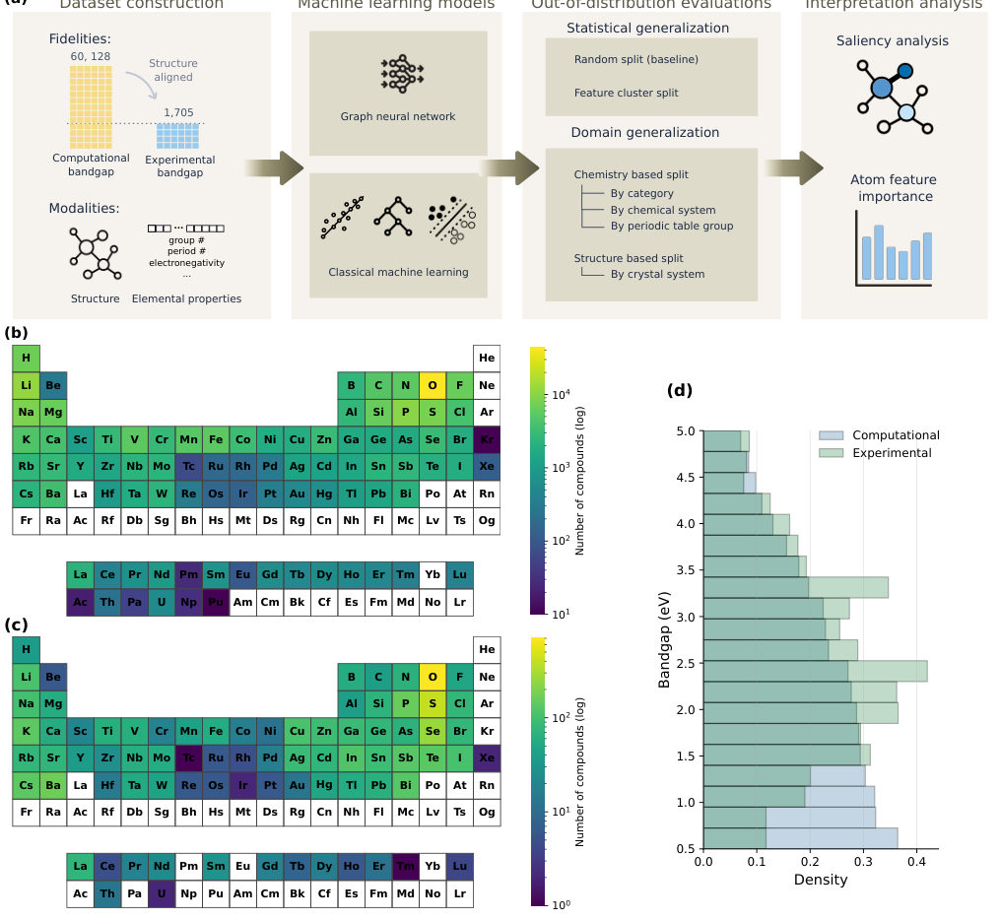 

Figure 1. Overview of the RealMat-BaG benchmark design. a, Schematic overview of the benchmark pipeline. The dataset is constructed across two fidelity levels: a computational dataset derived from the Materials Project and an experimental dataset compiled from Zhuo et al. (2018)42, BandgapDatabase128, and DS217. Two modalities, crystal structure and elemental property information, are incorporated for model training. Model performance is evaluated under an in-distribution random split as well as multiple out-of-distribution (OOD) settings. Interpretability is analyzed using graph-based gradient saliency methods for GNNs and SHapley Additive exPlanations (SHAP) for atomic feature importance...

📷 Fig 2

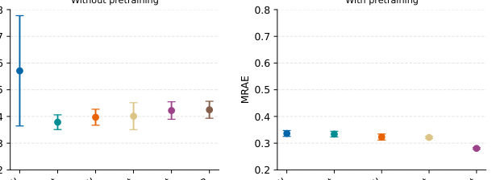 

Figure 2. Effect of computational pretraining on data efficiency and robustness in experimental bandgap prediction. a, Effect of pretraining across experimental training data fractions. Test mean relative absolute error (MRAE) of six models as a function of the fraction of available experimental training data (full training set, n = 1,534), evaluated on a fixed hold-out test set shared across all experiments. Solid lines denote models initialized with computational pretraining (the 0% point corresponds to direct transfer), whereas dashed lines indicate models without pretraining. The inset shows the mean performance across five GNN models, with shaded regions indicating the standard...

📷 Fig 3

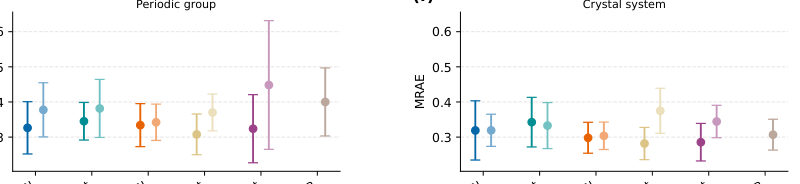 

Figure 3. Model generalization under domain-based out-of-distribution (OOD) evaluation settings. a-b, Category leave-one-material-out (LOMO) evaluation with a shared color scale, where lower MRAE indicates better performance. Each cell reports the test MRAE on one held-out material category, and the value shown at the right of each row is the average across categories. In both panels, the material categories on the horizontal axis are ordered by sample count in descending order, and the number in parentheses indicates the number of compounds in that category. Panel a, shows pretrained models, whereas panel b, shows the corresponding models without pretraining and additionally includes SVR...

📷 Fig 4

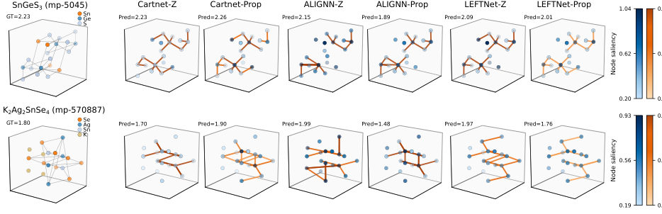 

Figure 4. Effect of atomic encoding across evaluation settings, and model interpretability at the structural level. Comparison of test MRAE under atomic number (Z) and elemental property (Prop) encodings across four GNN models. a, Random split. b, Feature-based out-of-distribution (OOD) split. c, Crystal-system-based split. d, Category-level leave-one-material-out (LOMO) results, shown as a heatmap of ∆MRAE (Prop −Z) to provide a clearer view of patterns across models and categories. Supplementary Table 13 reports the full results for each model and category. e, Node- and edge-level gradient saliency maps (atoms and interatomic bonds, respectively) for two representative materials SnGeS3...

📷 Fig 5

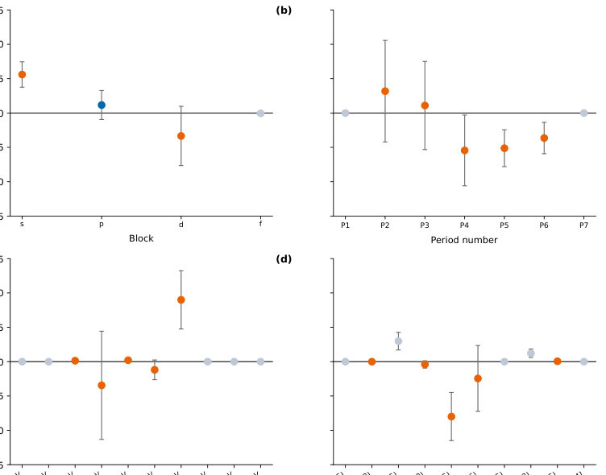 

Figure 5. SHAP-based interpretation of elemental-property atomic encoding in SVR. Mean signed SHAP values for four representative input properties, averaged over 10-fold cross-validation under the random split: a, block, b, period number, c, first ionization energy, and d, electronegativity. Positive SHAP values indicate that increasing the proportion of atoms within the corresponding interval increases the predicted bandgap, whereas negative values indicate the opposite trend. Error bars represent the standard deviation across folds. The color of each point indicates the data density (non-zero proportion) within the corresponding interval, categorized as low (&lt;33%), medium (33%–67%), and...

**Main problem.**

Machine learning models trained on computational DFT data struggle to generalize to experimental semiconductor bandgap measurements due to data fidelity gaps and distribution shifts.

**Main result.**

The authors introduce RealMat-BaG, a benchmark revealing that while computational pretraining improves performance in data-scarce regimes, current models face fundamental generalization limits in specific chemical families like silicides and antimonides.

**Method.**

The study uses a new benchmark framework (RealMat-BaG) to evaluate GNNs and classical ML models across random, feature-based, and structural (LOMO) splits, incorporating SHAP and gradient saliency for interpretability.

**Summary.**

This paper addresses the reliability gap between computational material predictions and experimental reality. By introducing the RealMat-BaG benchmark, the authors systematically evaluate how well machine learning models predict semiconductor bandgaps when faced with unseen chemistries and structures. They find that while pretraining on large DFT datasets helps, certain material classes remain highly unpredictable. The work provides a roadmap for developing more robust AI tools for materials discovery.

Detailed structure

**Model / system.**

The physical system consists of inorganic semiconductors (oxides, chalcogenides, etc.). The models evaluated include Graph Neural Networks (CGCNN, ALIGNN, CHGNet, LEFTNet, CartNet) and classical baselines (SVR, RFR, LR).

**Key observables.**

Semiconductor bandgap (eV), Mean Relative Absolute Error (MRAE), and Mean Absolute Error (MAE).

**Important parameters / regimes.**

Chemical composition, crystal systems, and elemental properties (electronegativity, ionization energy, etc.).

**Assumptions / limitations.**

The use of CGCNN-derived embeddings as a valid proxy for the feature space; the assumption that computational pretraining can be effectively transferred to experimental domains.

**Figures summary.**

Figure 1 shows the RealMat-BaG pipeline and data distribution mismatches; Figure 2 illustrates the impact of pretraining on error across data fractions; Figure 3 shows MRAE across various OOD splits; Figure 4 compares elemental encodings and saliency maps; Figure 5 presents SHAP-based feature importance for classical models.

**Paper structure.**

Introduction of the generalization gap; presentation of the RealMat-BaG benchmark and dataset; evaluation of GNN and classical models under various OOD splits; analysis of pretraining utility; interpretability analysis via saliency and SHAP; discussion of limitations and future directions.

Abstract

Accurate bandgap prediction is crucial for semiconductor applications, yet machine learning models trained on computational data often struggle to generalize to experimental bandgap measurements. Challenges related to data fidelity, domain generalization, and model interpretability remain insufficiently addressed in existing evaluation frameworks. To bridge this gap, we introduce RealMat-BaG, a benchmark for assessing model reliability under experimentally relevant conditions. We curate an open-access dataset of experimental bandgaps with aligned crystal structures and compare graph neural networks as well as classical machine learning baselines. Our framework evaluates performance across statistical and domain-based splits, examines transfer from DFT-computed to experimental bandgaps, and analyzes interpretability at both elemental-property and structural levels. Our results reveal the fundamental generalization limitations of current bandgap prediction models and establish a benchmark aligned with experimental measurements for developing more reliable learning strategies for materials discovery.

[↑ back to top](#top)

### [Benchmarking Universal Machine-Learned Interatomic Potentials for High-Temperature Metal-Organic Framework Chemistry](http://arxiv.org/abs/2604.25262v1)

**Authors:** Connor W. Edwards, Jack D. Evans

**Type:** theory · **Category:** disordered systems and neural networks · **PDF:** <https://arxiv.org/pdf/2604.25262v1>

**Analysis basis:** full PDF text, analyzed in chunks

📷 Fig 1

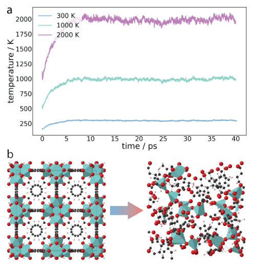 

Figure 1: a) Temperature profiles for 40 ps AIMD simulations at 300, 1000 and 2000 K. b) Initial and final structures of UiO-66 taken from a 40 ps AIMD simulation at 2000 K. Zirconium is teal, carbon is black, oxygen is red and hydrogen is pink.

📷 Fig 2

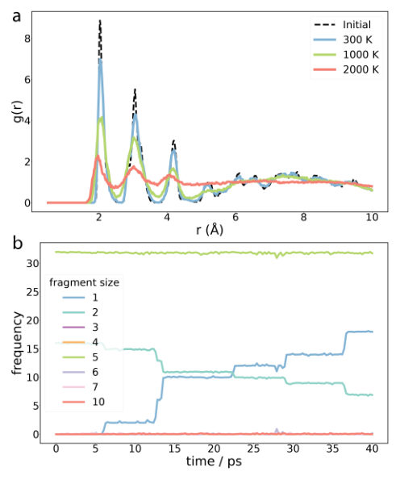 

Figure 2: a) RDF of initial crystalline CALF-20 MOF with RDFs from the final structures after 40 ps at 300, 1000 and 2000 K. RDFs are averaged over 50 fs. b) Analysis of CALF-20 linker size over time showing decomposition of oxalate pillar into CO2 and the azolate linker persisting during a 40 ps AIMD simulation at 2000 K.

📷 Fig 3

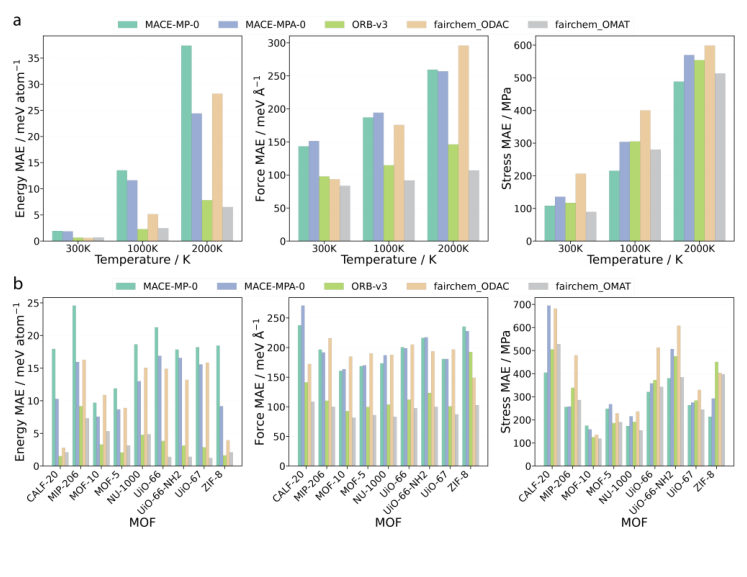 

Figure 3: Mean absolute error (MAE) in energy, force, and stress for five uMLIPs benchmarked against nine MOFs at 300, 1000, and 2000 K. a) MAE values averaged across all MOFs at each temperature. b) MAE values averaged across temperatures (300, 1000, and 2000 K) for each MOF.

📷 Fig 4

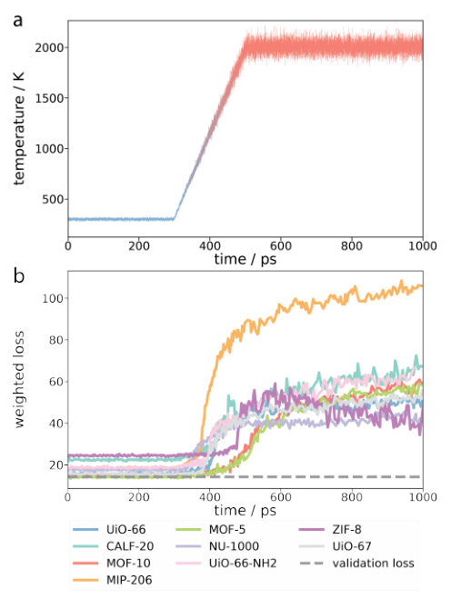 

Figure 4: a) Temperature profile during a 1 ns simulation produced with ORB-v3. b) Loss during the 1 ns simulation, showing agreement with AIMD validation tests at low temperature but higher loss as temperature increases.

**Main problem.**

The unreliability of universal machine-learned interatomic potentials (uMLIPs) for simulating high-temperature decomposition and non-equilibrium events in Metal-Organic Frameworks (MOFs).

**Main result.**

While ORB-v3 and fairchem OMAT perform well near equilibrium, all tested uMLIPs exhibit significant error accumulation (generative error) during high-temperature MD, failing to accurately capture structural decomposition and bond-breaking.

**Method.**

The authors generated a high-temperature benchmark dataset using 40 ps ab initio molecular dynamics (AIMD) trajectories at 300, 1000, and 2000 K and evaluated five leading uMLIPs.

**Summary.**

This paper provides a critical benchmark for universal machine-learned interatomic potentials applied to Metal-Organic Frameworks under extreme thermal conditions. By simulating MOFs at temperatures up to 2000 K, the authors demonstrate that current models fail to accurately capture the chemistry of structural decomposition and bond breaking. They highlight a significant 'validation gap' where errors during long-duration molecular dynamics far exceed errors found in static validation. The work emphasizes the need for new training datasets that include high-energy, non-equilibrium, and amorphous states.

Detailed structure

**Model / system.**

The study focuses on nine chemically diverse zinc- and zirconium-based MOFs, including ZIF-8, CALF-20, MOF-5, and UiO-66, and benchmarks models such as ORB-v3, MACE-MP-0a, and fairchem OMAT.

**Key observables.**

Energy, force, and stress Mean Absolute Errors (MAE); Radial Distribution Functions (RDF); Root Mean Square Displacement (RMSD); metal-ligand bond lengths; and gas species formation.

**Important parameters / regimes.**

Temperatures of 300 K, 1000 K, and 2000 K; 40 ps AIMD trajectories; 1 ns temperature ramp simulations.

**Assumptions / limitations.**

The study assumes that the accuracy of uMLIPs can be assessed by comparing their predictions against DFT-level reference data (PBE/DFT-D3).

**Figures summary.**

Figure 1 shows temperature profiles for the AIMD simulations and a visual comparison of the initial and final structures of UiO-66 at 2000 K.

**Paper structure.**

The paper introduces the problem of high-temperature MOF simulation, describes the generation of the AIMD benchmark dataset, presents the performance evaluation of various uMLIPs across different temperature regimes, analyzes the discrepancy between static and generative errors, and concludes with future directions for training potentials on non-equilibrium states.

Abstract

Universal machine-learned interatomic potentials (uMLIPs) offer a promising approach to performing atomistic simulations at near-DFT accuracy with greatly reduced computational cost. Here, we present a new high-temperature benchmarking dataset of 40~ps ab~initio molecular dynamics (AIMD) trajectories simulated at 300, 1000, and 2000 K for nine zinc- and zirconium-based metal-organic frameworks (MOFs): ZIF-8, CALF-20, MOF-10, MOF-5, MIP-206, UiO-66, UiO-67, UiO-66-NH2, and NU-1000. These trajectories capture equilibrium dynamics, thermally induced distortions, and early-stage decomposition events, including linker degradation and metal node aggregation. Subsequently, we use this dataset to benchmark five leading uMLIPs: ORB-v3, MACE-MP-0a, MACE-MPA-0, fairchem ODAC23, and fairchem OMAT. Our results reveal that ORB-v3 and fairchem OMAT achieve the lowest energy, force, and stress errors across all temperatures. However, all models exhibit significant error under high-temperature conditions. Long-timescale molecular dynamics simulations produced with ORB-v3 demonstrate that the generative error of uMLIPs far exceeds model losses captured during static validation, highlighting the limitations of current universal models for simulating high-temperature MOF dynamics. This work provides a benchmark for assessing the robustness of uMLIPs in extreme regimes and guides future development of potentials capable of accurately modeling the chemistry of high-temperature MOF dynamics.

[↑ back to top](#top)

### [Binary topological logic gates in Kane-Mele nanostructures via local control of edge-state transport](http://arxiv.org/abs/2604.25633v1)

**Authors:** K. Zberecki

**Type:** theory · **Category:** quantum information and computing · **PDF:** <https://arxiv.org/pdf/2604.25633v1>

**Analysis basis:** full PDF text, analyzed in chunks

📷 Fig 1

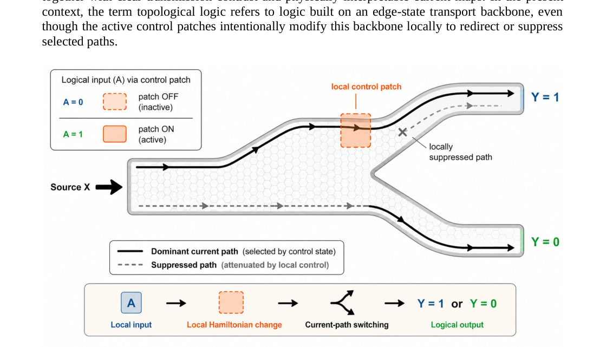 

Fig. 1 A localized control patch modifies the local Hamiltonian in a branched honeycomb device and redirects the dominant edge-current path between complementary outputs and . The logical input A is encoded in the inactive/active state of the patch, while the logical output is assigned from the branch receiving the dominant transmitted current. In this way, binary logic is realized by local control of edge-state transport rather than by fine-tuned interference.

📷 Fig 2

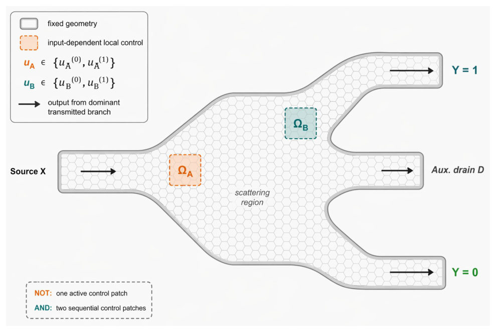 

Fig. 2 Generic device blueprint and notation for the Kane–Mele nanostructure family used for binary topological logic. The common multiterminal platform consists of a honeycomb-lattice scattering region connected to a source lead X, complementary logical collectors and , and an optional auxiliary drain D. Logical inputs are encoded through spatially fixed local control patches, denoted and , whose Hamiltonian parameters are switched between discrete states without changing the device geometry. The logical output is assigned from the branch receiving the dominant transmitted current. This common notation underlies both the single-patch NOT device and the two-stage AND architecture.

📷 Fig 3

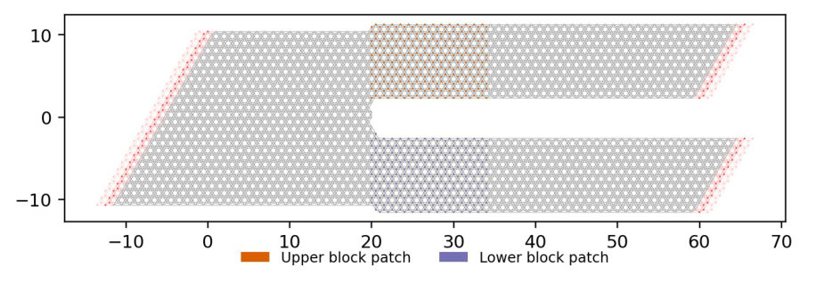 

Fig. 3 Kane–Mele nanostructure used for the binary NOT gate. The honeycomb-lattice scattering region is connected to one source lead and two output branches. The highlighted upper and lower block patches indicate the localized regions used to shape the accessible edge-current paths; the upper patch is the input-dependent active control region, while the lower patch acts as an auxiliary static region that improves branch discrimination.

📷 Fig 4

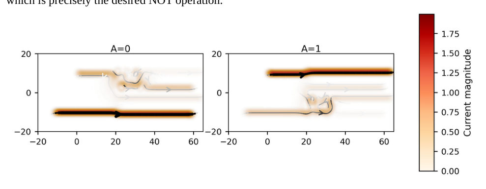 

Fig. 4 Real-space current maps for the Kane–Mele NOT gate for the two binary input states. For

📷 Fig 5

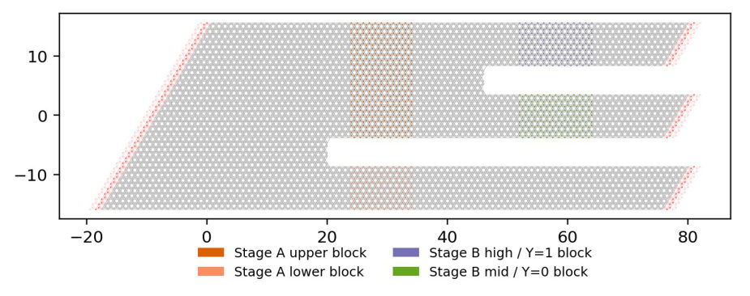 

Fig. 5 Geometry of the Kane–Mele nanostructure used for the binary AND gate. The highlighted internal regions mark the functional control patches: stage-A upper and lower blocking zones (orange shades) and stage-B regions associated with the collector and the complementary sector (blue and green, respectively). The device operates through sequential modification of the accessible edge-current paths inside the multiterminal nanostructure.

📷 Fig 6

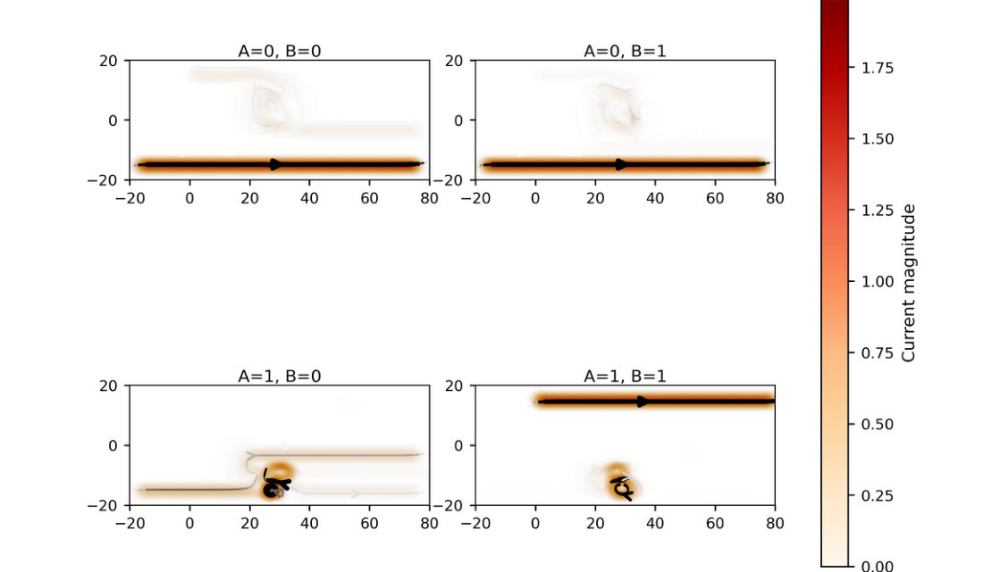 

Fig. 6 Local current maps for the binary AND gate at the selected operating point. The four panels correspond to the input combinations , , , and . Only the configuration supports a continuous transmitting path toward the collector, whereas the remaining three cases are redirected into the complementary sector.

📷 Fig 7

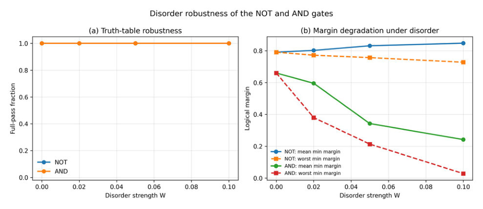 

Fig. 7 Disorder robustness of the primitive NOT and AND gates. (a) Full-pass fraction as a function of the disorder strength W. Both gates reproduce the correct truth table for all tested disorder realizations across the entire scanned range. (b) Mean minimum margin and worst minimum margin versus . The NOT gate retains a large logical margin throughout the scan, whereas the AND gate remains logically correct but exhibits a more pronounced degradation of the margin at stronger disorder.

📷 Fig 8

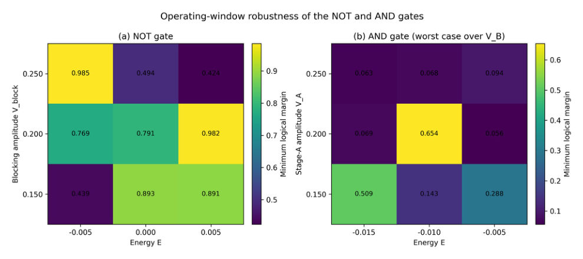 

Fig. 8 Operating-window robustness of the primitive NOT and AND gates. (a) Minimum logical margin for the NOT gate as a function of the operating energy E and blocking amplitude . (b) Worst-case minimum logical margin for the AND gate as a function of E and the stage-A amplitude

**Main problem.**

Designing simple and physically transparent binary logic gates (NOT and AND) using topological edge states in Kane-Mele nanostructures, moving away from fine-tuned interference-based mechanisms.

**Main result.**

Demonstration of functional NOT and AND gates that operate via the controlled real-space rerouting of edge currents, showing robustness against static disorder and parameter drift.

**Method.**

Numerical transport modeling using the Landauer-Büttiker framework and the Kwant package to calculate terminal transmission and bond-current maps.

**Summary.**

This paper proposes a new way to build primitive binary logic gates using the edge states of topological insulators. Instead of relying on delicate quantum interference, the authors show that logic can be achieved by simply rerouting edge currents using local electrical or magnetic perturbations. They successfully demonstrate NOT and AND gates that are robust against small amounts of disorder. This provides a transparent and scalable framework for developing post-CMOS topological computing components.

Detailed structure

**Model / system.**

Kane-Mele nanostructures (honeycomb lattice) in the Quantum Spin Hall regime, featuring localized control patches with electrostatic, exchange-like, and Rashba-type perturbations.

**Key observables.**

Terminal-resolved transmission, logical margin, current maps, edge-weight diagnostic, and truth table classification rate.

**Important parameters / regimes.**

Nearest-neighbor hopping (t=1), intrinsic spin-orbit coupling (0.06), electrostatic amplitudes, and exchange-field amplitudes.

**Assumptions / limitations.**

Coherent transport regime (Landauer-Büttiker), ideal reservoirs, linear-response regime, and absence of edge roughness or finite-temperature effects.

**Figures summary.**

Fig 1: Localized control patch in a branched device. Fig 2: Device blueprint for multi-terminal platforms. Fig 3-4: NOT gate geometry and current maps showing path redirection. Fig 5-6: AND gate architecture and current redistribution. Fig 7: Stability against disorder. Fig 8: Stability against energy and amplitude drift.

**Paper structure.**

The paper introduces the problem of topological logic, describes the Kane-Mele model and control mechanisms, details the design of NOT and AND gate architectures, presents transport results and truth table validation, and concludes with robustness analysis against disorder and parameter fluctuations.

Abstract

Topological edge states are an attractive starting point for post-CMOS device concepts, but turning them into elementary logic still requires simple architectures with a clear physical mechanism. Here we investigate binary logic in Kane-Mele nanostructures with spatially localized control regions. Logical inputs are encoded through local electrostatic, exchange-like, and Rashba-type perturbations, while the output is read out from terminal transmission within a coherent Landauer-Büttiker framework. We demonstrate working NOT and AND gates in multiterminal honeycomb geometries and show, with the help of current maps, that their operation is governed by controlled rerouting of edge currents rather than by fine-tuned interference. Robustness tests further indicate a stable operating window within the tested parameter range for the NOT gate and a somewhat narrower but still reliable one for the AND gate. These results identify Kane-Mele nanostructures as a transparent platform for primitive topological binary logic.

[↑ back to top](#top)

### [Bragg-Williams order competes with superconductivity](http://arxiv.org/abs/2604.25843v1)

**Authors:** Xu Liu, Xu Chen, Chuizhen Chen, Boqin Song, Jing Chen, Xijing Dai, Qinghua Zhang, Feng Jin, Xingya Wang, Weiwei Dong, Dongliang Yang, Gefei Li, Pengju Zhang, Jiangping Hu, Jian-gang Guo, Tianping Ying, Xiaolong Chen

**Type:** both · **Category:** strongly correlated electrons · **PDF:** <https://arxiv.org/pdf/2604.25843v1>

**Analysis basis:** full PDF text, analyzed in chunks

📷 Fig 1

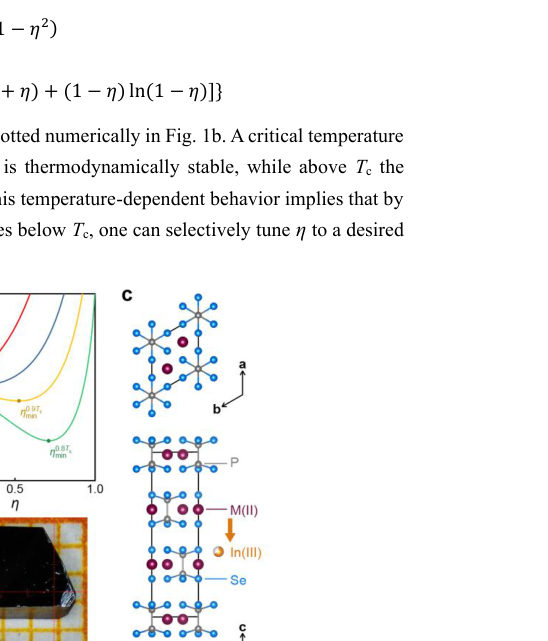 

FIG 1. a, Schematic of a simplified two-dimensional square model with 50% of atomic occupation,

📷 Fig 2

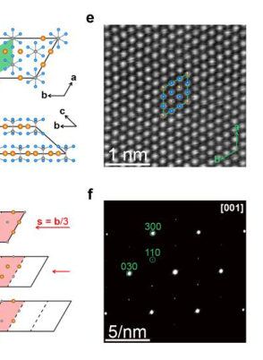 

FIG 2. a, HAADF image and b, indexed SAED image of O-phase. c, Crystal structure of the O-phase. d,

📷 Fig 3

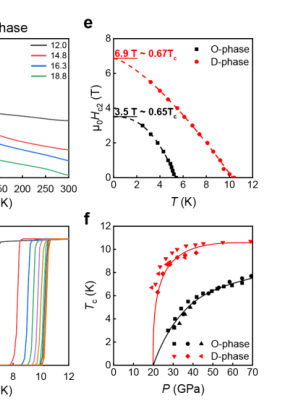 

FIG 3. Temperature-dependent resistance of the a-b, O- and c-d, D-phases of In2/3PSe3 with the variation

**Main problem.**

The study aims to understand how Bragg-Williams order (BWO), a classical structural order parameter, influences superconductivity and whether it acts as an independent competing order.

**Main result.**

The researchers found that the disordered phase of In2/3PSe3 achieves a significantly higher superconducting transition temperature (11 K) than the ordered phase (7 K), demonstrating that BWO suppresses superconductivity by stiffening phonon modes.

**Method.**

The study combines experimental techniques like high-pressure transport, Raman spectroscopy, and STEM with theoretical frameworks including Ginzburg-Landau phenomenological analysis and BCS-McMillan microscopic theory.

**Summary.**

This paper investigates the competition between structural vacancy ordering and superconductivity in In2/3PSe3. By using thermal treatment to tune the Bragg-Williams order without changing chemical composition, the authors show that a disordered lattice promotes a higher superconducting Tc. The mechanism is identified as a reduction in electron-phonon coupling due to lattice stiffening in the ordered phase. This work extends the concept of competing orders to include classical structural parameters.

Detailed structure

**Model / system.**

The physical system is In2/3PSe3, a member of the MPSe3 family, which can be switched between an ordered (O-phase) and disordered (D-phase) state via thermal treatment.

**Key observables.**

Superconducting transition temperature (Tc), Bragg-Williams order parameter (eta), electron-phonon coupling (lambda), Hall resistance, and Raman-active modes.

**Important parameters / regimes.**

Pressure (up to ~37 GPa), temperature, and the vacancy order parameter (eta).

**Assumptions / limitations.**

The thermodynamic analysis uses a classical solid solution model considering only nearest-neighbor interactions.

**Figures summary.**

Figure 1 shows BWO schematics and crystal structures; Figure 2 displays STEM and SAED images of the O and D phases; Figure S6-S9 include superconducting transitions under magnetic fields, resistance vs. temperature, and Hall resistance.

**Paper structure.**

The paper introduces the BWO concept, describes the experimental platform and phase control, presents high-pressure transport and structural results, provides the theoretical mechanism for competition via phonon stiffening, and concludes with thermodynamic modeling of the order-disorder transition.

Abstract

Orderings in charge and spin have been extensively studied to unravel their correlation to emergent superconductivity over the past decades. Bragg-Williams order (BWO), a classical structural order parameter describing site occupancy in alloys, has long been speculated to influence superconducting behavior. Yet, its role still remains ambiguous, largely due to the difficulty of isolating BWO from concomitant charge doping or competing electronic instabilities. Here, we establish In2/3PSe3 as a platform wherein indium vacancies are reversibly configurable between ordered and disordered states via thermal treatment. We show that the disordered phase undergoes a pressure-induced superconducting transition with a Tc of 11 K, significantly higher than the 7 K observed in its ordered counterpart. This constitutes a rare instance in which pure BWO variation drives a substantial shift in Tc. By combining a Ginzburg-Landau phenomenological analysis with a BCS-McMillan microscopic description, we demonstrate that BWO naturally suppresses superconductivity through electron-phonon interactions, a mechanism supported by ultra-low-wavenumber Raman measurements. Our findings support BWO as an independent order parameter that competes directly with superconductivity, extending the concept of competing orders beyond conventional electronic and magnetic degrees of freedom.

[↑ back to top](#top)

### [Chemical transformation of MgH2/V2O5 composite to Mg-V-O rock salt and its influence on the electrochemical Li conversion and hydrogen storage characteristics of MgH2](http://arxiv.org/abs/2604.25718v1)

**Authors:** D. Pukazhselvan, Ihsan Caha, Francisco J. A. Loureiro, Francis Leonard Deepak, Catarina de Lemos, Aliaksandr L. Shaula, Sergey M. Mikhalev, Duncan Paul Fagg

**Type:** experiment · **Category:** other · **PDF:** <https://arxiv.org/pdf/2604.25718v1>

**Analysis basis:** full PDF text, analyzed in chunks

📷 Fig 1

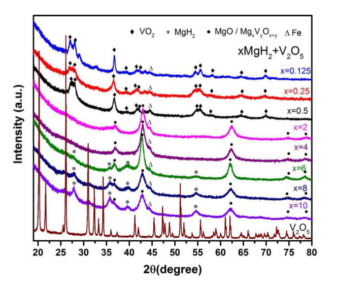 

Fig.1 XRD profiles obtained for the15h ball milled xMgH2+V2O5 (x=0, 0.125, 0.25, 0.5, 2, 4, 6, 8 and 10) composite (V2O5 correspond to x=0).

📷 Fig 2

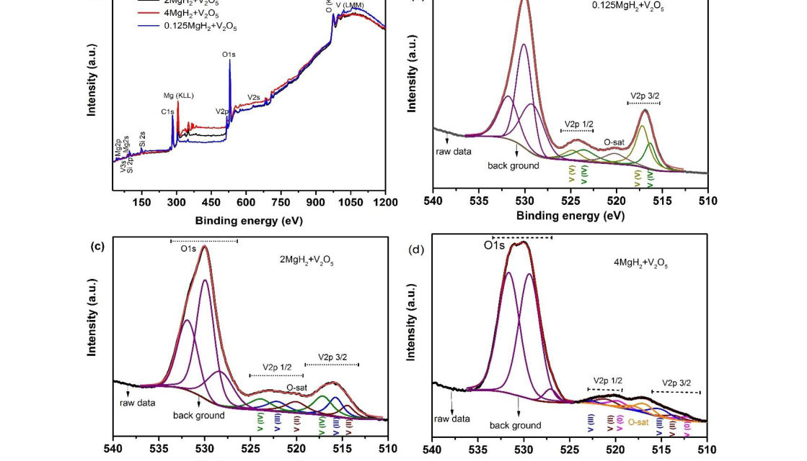 

Fig.2 XPS (a) survey spectra corresponding to xMgH2+V2O5 (x=0.125, 2 and 4). The V2p and O1s high resolution binding energy profiles obtained for the samples, (b) 0.125MgH2+V2O5, (c) 2MgH2+V2O5 and (d) 4MgH2+V2O5.

📷 Fig 3

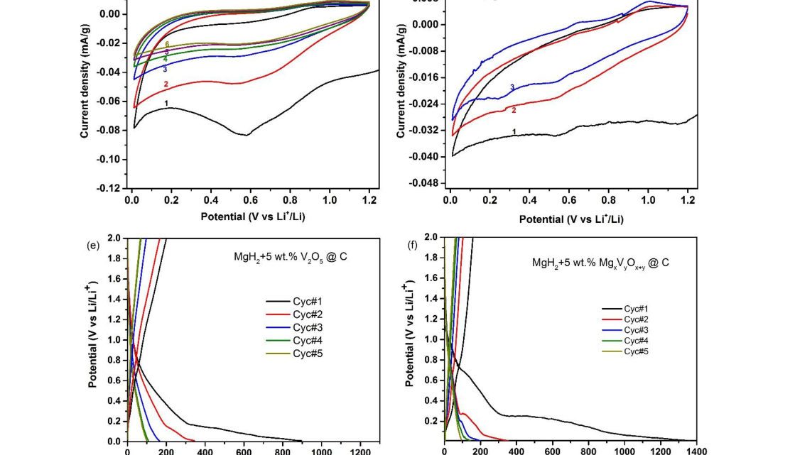 

Fig.3 Cyclic voltammetry profiles corresponding to the battery employing (a) 5 wt.% V2O5 added MgH2 as anode active material (battery “A”), (b) 5 wt.% MgxVyOx+y added MgH2 as anode active material (battery “B”), (c) carbon substrate alone as anode active material and (d) pure MgH2 (additive free) as anode active material. Five cycles charge/discharge profiles corresponding to (e) battery “A” and, (f) battery “B”.

📷 Fig 4

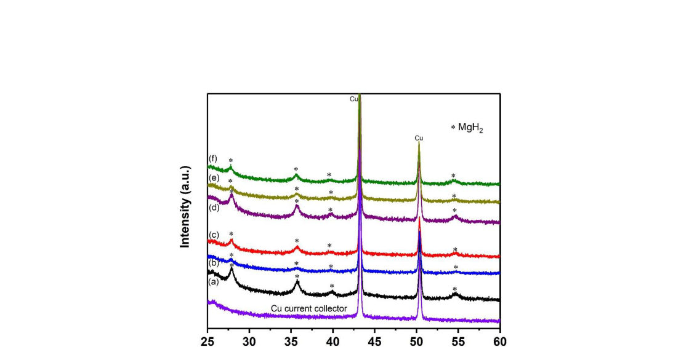 

Fig.4 XRD profiles corresponding to (a) the fresh anode used in battery “A”, (b) recovered anode from “A” after first discharge, (c) recovered anode from “A” after 5th charging cycle, (d) the fresh anode used in battery “B”, (e) recovered anode from “B” after first discharge, (f) recovered anode from “B” after 5th charging cycle. The XRD profile of Cu current collector is provided for comparison.

📷 Fig 5

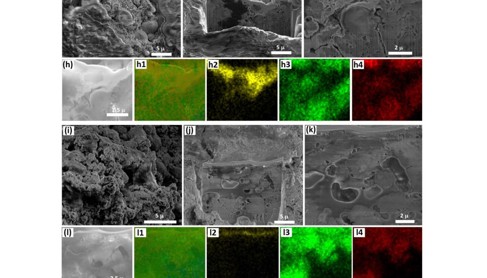 

Fig.5 SEM / EDX profiles of anodes employed in battery “A”. Images (a), (b), (c) and (d), fresh anode (surface and cross sections). Images d1, d2, d3 and d4 correspond to EDS maps of cross section region given in “(d)” (d1 is collective distribution of Mg, V, Pt and O, d2 is Pt alone, d3 is Mg alone and d4 is O). In similar sequence images, (e), (f), (g), (h), h1, h2, h3 and h4 correspond to SEM/EDX of electrode recovered from battery “A” after first discharge. The images (i), (j), (k), (l), l1, l2, l3 and l4 correspond to SEM/EDX of electrodes recovered from battery “A” after fifth recharge cycle.

📷 Fig 6

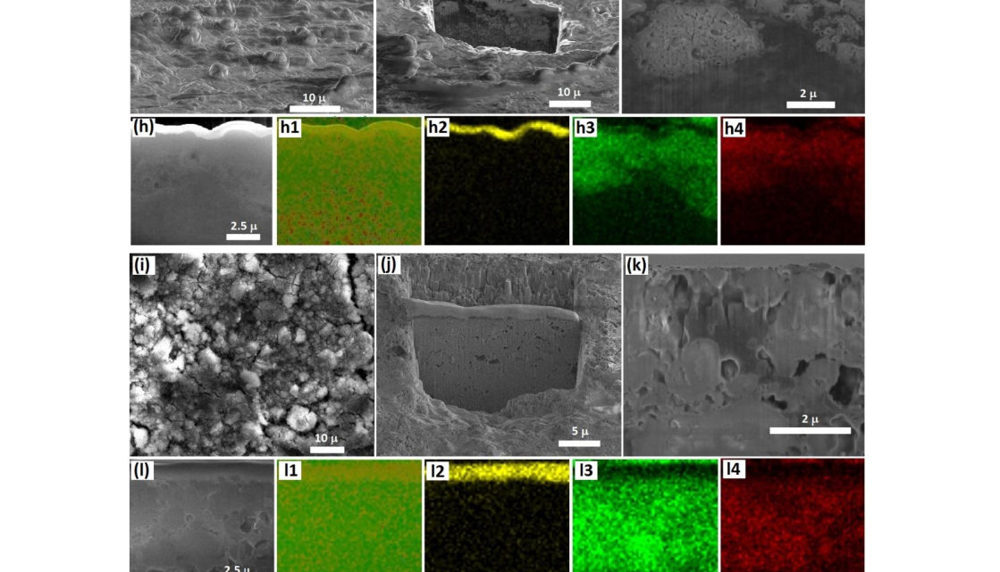 

Fig.6 SEM / EDX profiles of anodes employed in battery “B”. Images (a), (b), (c) and (d), fresh anode (surface and cross sections). Images d1, d2, d3 and d4 correspond to EDS maps of cross section region given in “(d)” (d1 is collective distribution of Mg, V, Pt and O, d2 is Pt alone, d3 is Mg alone and d4 is O). In similar sequence images, (e), (f), (g), (h), h1, h2, h3 and h4 correspond to SEM/EDX of electrode recovered from battery “B” after first discharge. The images (i), (j), (k), (l), l1, l2, l3 and l4 correspond to SEM/EDX of electrodes recovered from battery “B” after fifth recharge cycle.

📷 Fig 7

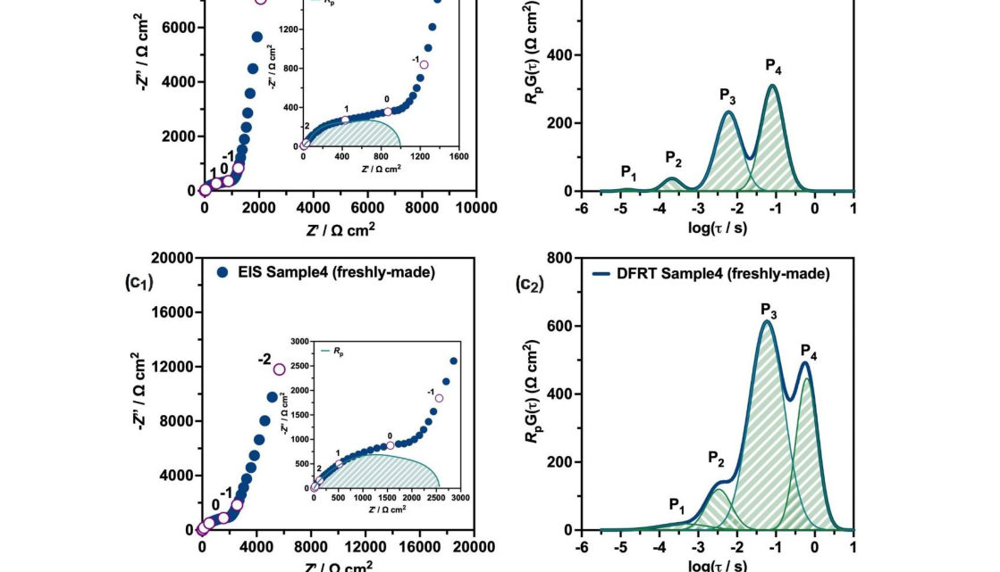 

Figure 7 – (a1), (b1), and (c1) Complex plane impedance spectra obtained for the fleshly-made batteries (the high-magnification inset includes the subtracted polarization branch. The numbers represent the decades (log10f) of the measuring frequency); (a2), (b2), and (c2) the corresponding DFRTs of the polarization branch.

📷 Fig 8

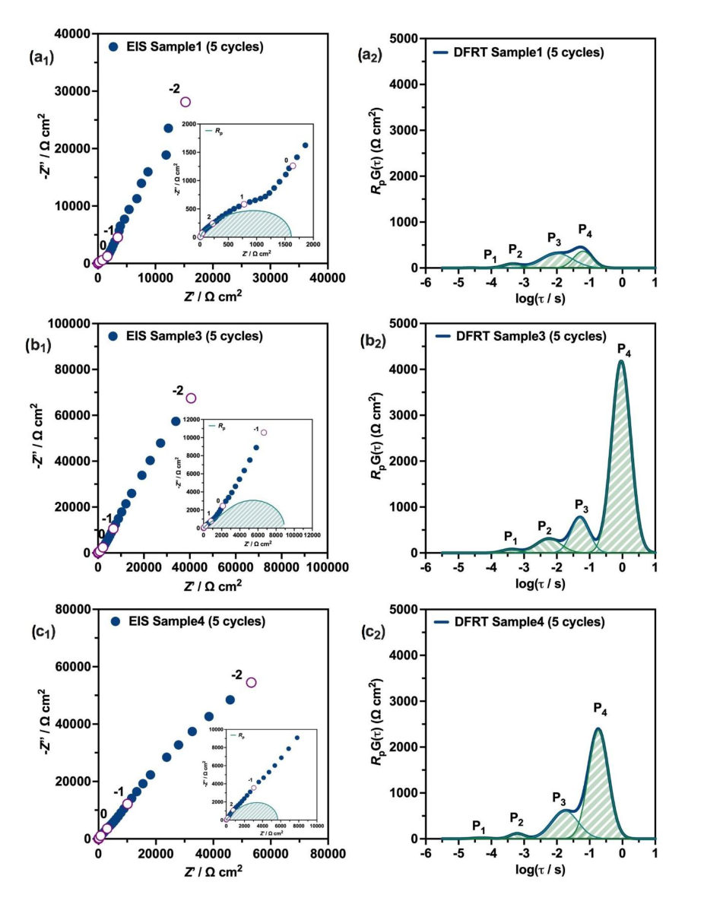 

Figure 8 – (a1), (b1), and (c1) Complex plane impedance spectra obtained for the 5 cycles batteries (the high-magnification inset includes the subtracted polarization branch. The numbers represent the decades (log10f) of the measuring frequency); (a2), (b2), and (c2) the corresponding DFRTs of the polarization branch.

**Main problem.**

Investigating the chemical transformation of MgH2/V2O5 composites into a Mg-V-O rock salt phase and understanding how this interaction affects the electrochemical Li conversion and capacity degradation in Li-ion battery anodes.

**Main result.**

The in-situ formation of a Mg-V-O rock salt phase significantly enhances the initial discharge capacity (up to 1350 mAh/g), but the system still suffers from limited reversibility due to slow charge transfer processes and surface blockage rather than electrolyte degradation or physical swelling.

**Method.**

The study uses planetary ball milling for synthesis, XRD and XPS for structural/chemical characterization, and electrochemical techniques including CV, EIS, and Distribution of Relaxation Times (DRFT) for performance analysis.

**Summary.**

This paper explores how adding vanadium oxide to magnesium hydride creates a new Mg-V-O rock salt phase during processing. This new phase improves the initial lithium discharge capacity in battery anodes. However, the researchers found that the battery still struggles with poor reversibility, which they traced to slow charge transfer and surface blockage rather than physical damage to the material. This work is important for developing more stable high-capacity anode materials for lithium-ion batteries.

Detailed structure

**Model / system.**

The experimental platform consists of Li-ion coin cells using MgH2-based anodes doped with varying concentrations of V2O5 or the in-situ formed Mg-V-O rock salt phase, with a Li metal counter electrode and 1M LiPF6 in EC/DMC electrolyte.

**Key observables.**

Electrochemical capacity (discharge/recharge), oxidation states of Vanadium, polarization resistance (Rp), ohmic resistance (Rohm), and charge transfer resistance components.

**Important parameters / regimes.**

Additive concentrations (0 to 10 wt.%), discharge/recharge capacity (mAh/g), and time constants/capacitance in the impedance spectra.

**Assumptions / limitations.**

The study assumes that the observed capacity loss is not due to electrolyte degradation or physical detachment of the active material, based on constant ohmic resistance and post-mortem SEM/EDX analysis.

**Figures summary.**

Figures include SEM and EDX maps showing the morphology and elemental distribution of anodes at different cycling stages, and EIS data comparing resistance components for different additive compositions.

**Paper structure.**

The paper begins with the synthesis and structural characterization of the composites, followed by electrochemical performance testing, detailed impedance analysis using DRFT to identify degradation mechanisms, and post-mortem morphological analysis.

Abstract

This study investigates the lithium conversion behavior of a hydrogen storage material based on vanadium oxide added magnesium hydride. To understand the chemical interaction between vanadium oxide and magnesium hydride, detailed X ray diffraction and X ray photoelectron spectroscopy analyses were performed on ball milled composites with varying compositions. The results confirm the formation of a combined magnesium vanadium oxide with a rock salt structure, indicating strong chemical interaction between the components. It is further shown that the presence of a small amount of this oxide additive significantly influences the lithium reaction with magnesium hydride, leading to a high initial discharge capacity and limited recharge capacity in lithium ion coin cells. Post use analyses confirm the presence of magnesium hydride, suggesting that volume expansion is not responsible for the observed irreversibility. Electrochemical impedance spectroscopy using differential function of relaxation times indicates that electrolyte degradation is not a major issue. Instead, slow charge transfer processes are identified as the limiting factor, and these are sensitive to the composition of the additive. These findings highlight that improving electrode and electrolyte compatibility is essential for enhancing performance in this system.

[↑ back to top](#top)

### [Determination of Burgers vectors of dislocations in monoclinic $β$-Ga$_2$O$_3$ crystals by large-angle convergent-beam electron diffraction](http://arxiv.org/abs/2604.25428v1)

**Authors:** Yoshihiro Sugawara, Yongzhao Yao, Yukari Ishikawa

**Type:** experiment · **Category:** other · **PDF:** <https://arxiv.org/pdf/2604.25428v1>

**Analysis basis:** full PDF text, analyzed in chunks

📷 Fig 1

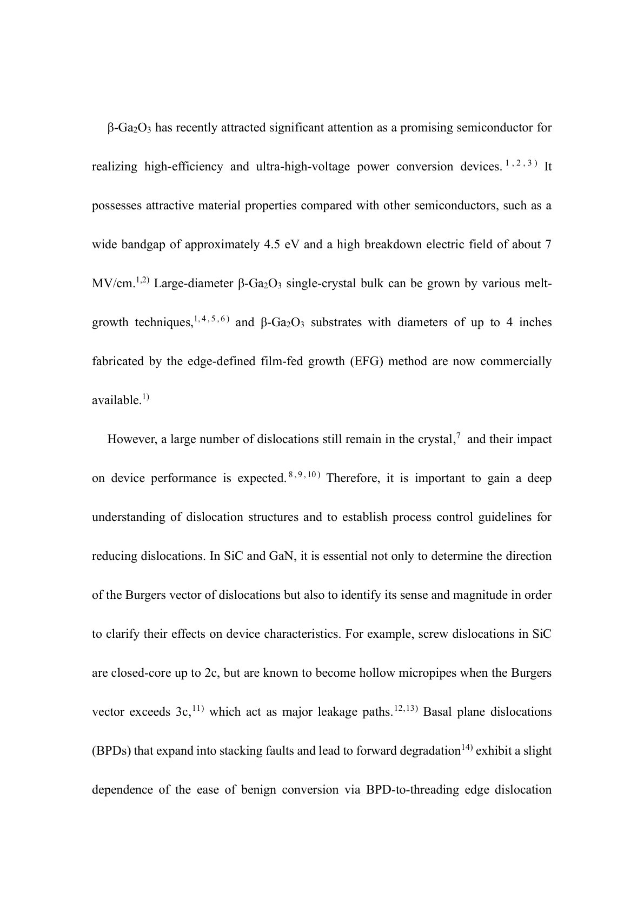 

Low-resolution page preview, page 2

📷 Fig 2

 

Low-resolution page preview, page 3

📷 Fig 3

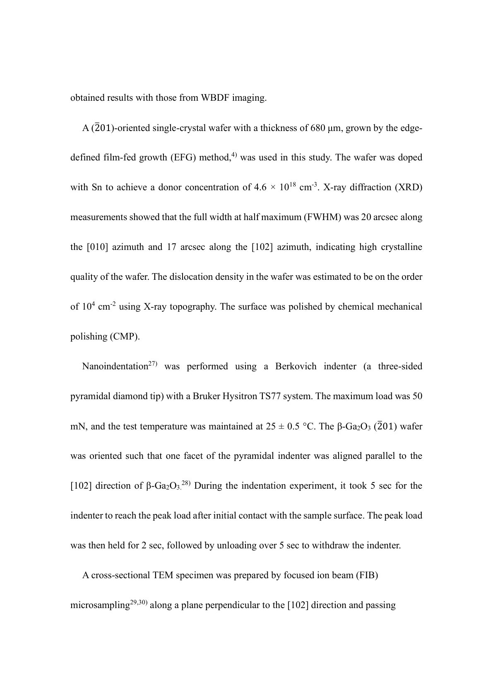 

Low-resolution page preview, page 4

📷 Fig 4

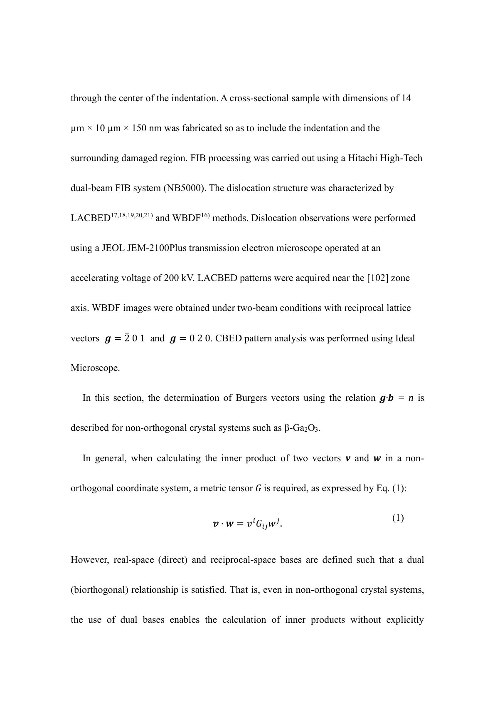 

Low-resolution page preview, page 5

📷 Fig 5

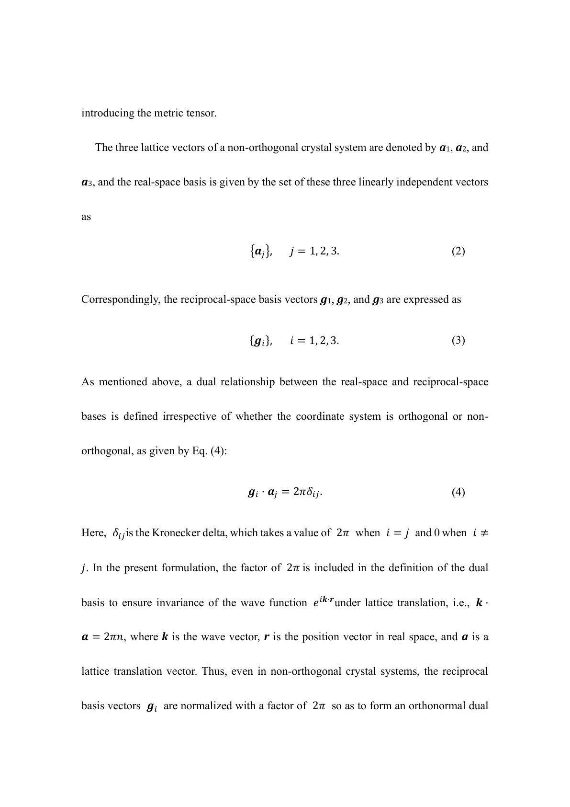 

Low-resolution page preview, page 6

📷 Fig 6

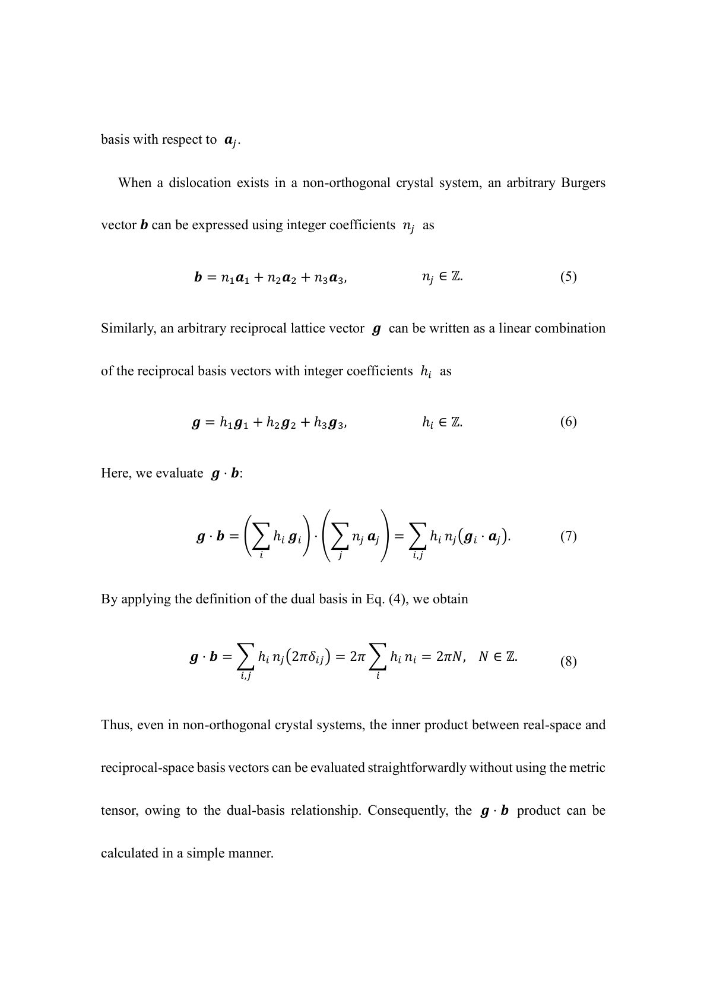 

Low-resolution page preview, page 7

📷 Fig 7

 

Low-resolution page preview, page 8

📷 Fig 8

 

Low-resolution page preview, page 9

📷 Fig 9

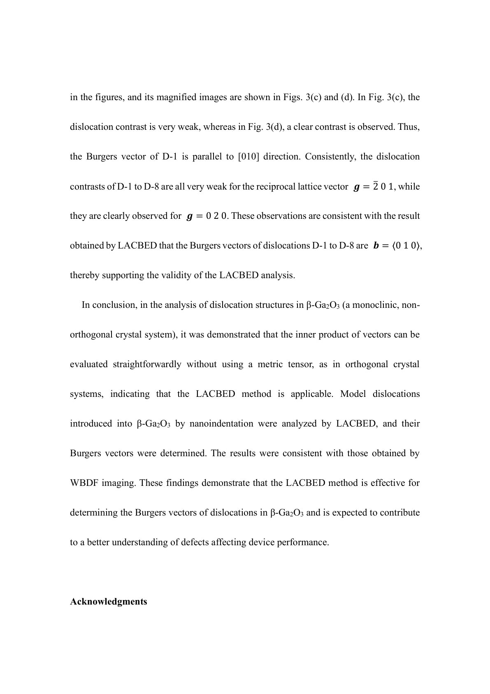 

Low-resolution page preview, page 10

📷 Fig 10

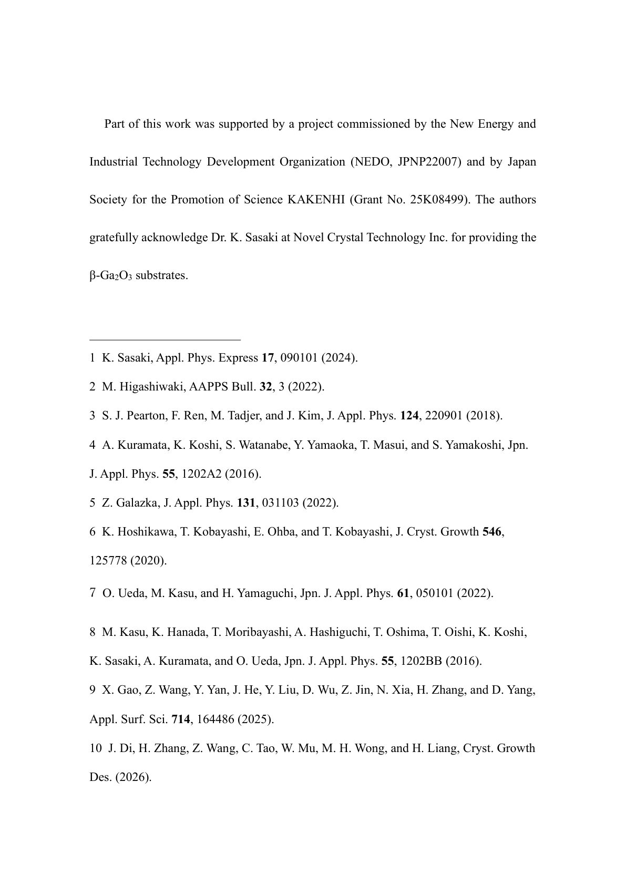 

Low-resolution page preview, page 11

**Main problem.**

The difficulty of accurately determining the Burgers vectors (direction, magnitude, and sense) of dislocations in the non-orthogonal monoclinic crystal structure of beta-Ga2O3.

**Main result.**

The researchers successfully demonstrated that Large-Angle Convergent-Beam Electron Diffraction (LACBED) can be used to unambiguously determine Burgers vectors in beta-Ga2O3, identifying a consistent Burgers vector of b = [010] for dislocations introduced by nanoindentation.

**Method.**

The study uses nanoindentation to introduce dislocations, followed by TEM analysis using LACBED and Weak-Beam Dark-Field (WBDF) imaging, employing a dual-basis mathematical framework to calculate vector inner products without a metric tensor.

**Summary.**

This paper presents a method for determining the Burgers vectors of dislocations in beta-Ga2O3, a material critical for high-voltage power electronics. By using Large-Angle Convergent-Beam Electron Diffraction (LACBED), the authors bypassed the need for a complex metric tensor calculation in non-orthogonal crystal systems. They successfully identified the Burgers vector of nanoindentation-induced dislocations as [010]. The results were validated using Weak-Beam Dark-Field imaging, proving LACBED is an effective tool for characterizing defects in this material.

Detailed structure

**Model / system.**

The physical system consists of monoclinic beta-Ga2O3 single-crystal wafers (Sn-doped) containing dislocations (D-1 through D-8) generated via Berkovich nanoindentation.

**Key observables.**

LACBED node counts (n), dislocation contrast in WBDF images, and reciprocal lattice vectors (g).

**Important parameters / regimes.**

Dislocation density of approximately 10^4 cm^-2, electron beam energy of 200 kV, and nanoindentation load of 50 mN.

**Assumptions / limitations.**

The method assumes the validity of the dual relationship between real and reciprocal lattice bases for non-orthogonal systems and uses the Cherns-Preston rule for sign determination.

**Figures summary.**

Fig 1 shows a BF-STEM image of the indentation site and strain fields; Fig 2 displays LACBED patterns with identified node counts; Fig 3 shows WBDF images demonstrating dislocation contrast under different g-vectors.

**Paper structure.**

The paper introduces the problem of dislocation characterization in beta-Ga2O3, describes the experimental setup (nanoindentation and TEM), presents the mathematical framework for LACBED in monoclinic systems, details the results of Burgers vector determination, and validates the findings against WBDF imaging.

Abstract

We demonstrate the applicability of large-angle convergent-beam electron diffraction (LACBED) for Burgers vector determination in monoclinic $β$-Ga$_2$O$_3$. The inner product $g \cdot b$ in this non-orthogonal system can be evaluated without a metric tensor by using the dual relationship between real and reciprocal lattice bases. Based on this framework, Burgers vectors of dislocations introduced by nanoindentation were unambiguously determined from LACBED node counts. The results are consistent with weak-beam dark-field imaging, confirming the effectiveness of LACBED for $β$-Ga$_2$O$_3$.

[↑ back to top](#top)

### [Entropic Trapping of Hard Spheres in Spherical Confinement](http://arxiv.org/abs/2604.24967v1)

**Authors:** Praveen K. Bommineni, Junwei Wang, Nicolas Vogel, Michael Engel

**Type:** both · **Category:** statistical mechanics · **PDF:** <https://arxiv.org/pdf/2604.24967v1>

**Analysis basis:** full PDF text, analyzed in chunks

📷 Fig 1

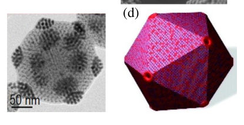 

FIG. 1. Examples demonstrating templating of icosahe- dral clusters. (a) Schematic representation of a mixture of many small particles and a few large particles in an emulsion droplet. (b) Scanning electron microscopy observation of the successful diffusion of five large polystyrene colloidal parti- cles (red) into the vertices of the icosahedral cluster. (c) Co- assembly of two types of grafted nanoparticles into a patchy icosahedron in a drying emulsion droplet [29]. Reprinted with permission from AAAS. (d) Molecular crystallization and seg- regation of anionic and cationic surfactants [30]. Copyright 2004 by the National Academy of Sciences.

📷 Fig 2

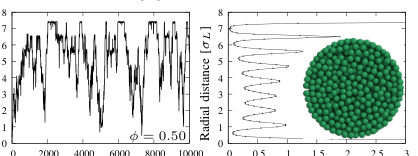 

FIG. 2. Layering in confined hard sphere fluids. The left side shows the evolution of radial distance from the confinement center of a randomly chosen test sphere, while the right side displays shell packing fraction profiles in thin spherical shells obtained by averaging over many frames. Insets show typical cross-sectional views of the confined fluids. Clusters are shown at three packing fractions: (a) ϕ = 0.30, (b) ϕ = 0.40, and (c) ϕ = 0.50. Note that layering persists throughout the entire cluster in (c), even though this cluster is not yet crystalline. Simulations were performed with N = 2000 spheres.

📷 Fig 3

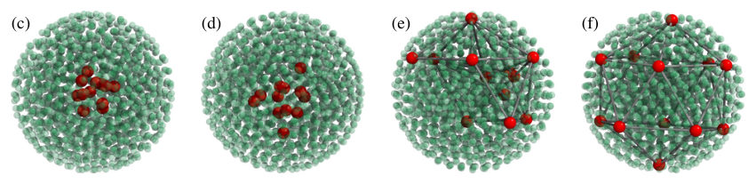 

FIG. 3. Twelve large spheres form a perfect icosahedral frame. (a) Large spheres hop between shells increasing total free volume, which tracks crystallization progress. (b) Histogram showing the evolution of large sphere separations as they settle into the icosahedral frame. Simulation snapshots show: (c) Initial setup with large spheres positioned at the confinement center; (d) Outward diffusion of large spheres; (e) Intermediate state showing a partially formed icosahedral frame; (f) Completed icosahedral frame at the end of the trajectory. EDMD simulations were conducted with NL = 12 large and NS = 1288 small spheres at fluid-solid coexisting packing fraction ϕ = 0.53 and for sphere size...

📷 Fig 4

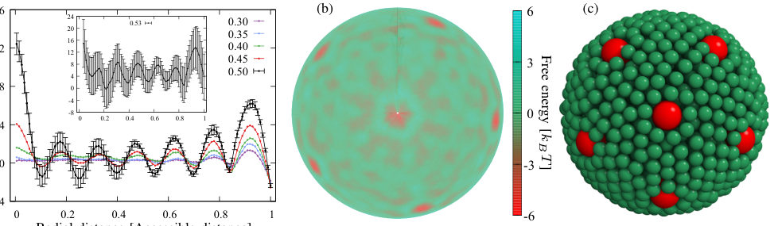 

FIG. 4. Quantification of entropic trapping. (a) Free energy profiles of a single large test particle in a system of NS = 1299 small spheres as a function of radial distance. Radial distance is measured from the confinement center and normalized by the distance accessible to the test sphere. Simulation parameters are α = 0.55 and ϕ ∈[0.30, 0.35, . . . , 0.50] (labelled on the right); the inset corresponds to ϕ = 0.53. For ϕ ≥0.5, we performed ten simulations for each biasing bin to improve statistics. Solid lines are a guide to the eye. Error bars indicate standard errors. (b) Two-dimensional free energy profile on the cluster surface. (c) Simulated cluster with twelve large spheres (red)...

**Main problem.**

Understanding the mechanism behind the 'entropic trapping' of large impurity particles at the vertices of icosahedral colloidal clusters under spherical confinement.

**Main result.**

Large spheres are driven by entropic forces from the center to the cluster surface, where they settle into deep free energy minima at icosahedral vertices, forming a stable icosahedral frame.

**Method.**

Event-driven molecular dynamics (EDMD) for trajectories and Monte Carlo umbrella sampling with the Weighted Histogram Analysis Method (WHAM) for free energy landscapes.

**Summary.**

This study investigates how large impurity particles are trapped at the vertices of icosahedral clusters in confined hard-sphere systems. Using molecular dynamics and free energy calculations, the authors show that entropic forces drive these impurities to the surface of the cluster. The findings demonstrate that the particles settle into specific energy minima, creating a robust icosahedral frame. This mechanism provides insight into the self-assembly of complex structures in soft matter and potentially biological systems like viral capsids.

Detailed structure

**Model / system.**

A binary mixture of monodisperse small hard spheres and a small number of larger hard spheres confined within a hard spherical cavity (simulating emulsion droplets).

**Key observables.**

Radial distance, shell packing fraction, total free volume, dimensionless pressure (P*), mean squared displacement (MSD), and spatial separation histograms.

**Important parameters / regimes.**

Size ratio (alpha = 0.55), packing fraction (phi ranging from 0.30 to 0.53), and particle numbers (N_S = 1288, N_L = 12).

**Assumptions / limitations.**

The trapping effect is predominantly entropic due to the hard-sphere nature; the system is in a regime where particles can relax into minimum free energy positions.

**Figures summary.**

Figure 1 shows experimental/schematic motivation; Figure 2 shows the transition from fluid to layered structures; Figure 3 illustrates the progression of large spheres forming an icosahedral frame; Figure 4 quantifies radial and surface free energy profiles.

**Paper structure.**

The paper introduces the experimental phenomenon, describes the hard-sphere model and simulation methods, presents results on structural evolution and layering, quantifies the entropic driving forces via free energy, and concludes with a derivation of the virial pressure for the system.

Abstract

Monodisperse spherical colloidal particles confined within emulsion droplets can crystallize into icosahedral clusters. Experimentally it was observed that a few large colloidal particles added as defects preferentially migrate to the vertices of the icoshedral clusters. To understand this structure formation phenomenon, we simulate the confined self-assembly of hard spheres in the presence of a small number of larger particles. The results demonstrate that large spheres are significantly influenced by concentric shells of small spheres near the crystallization transition. Entropic forces drive the large spheres to the cluster surface, where they settle into free energy minima at the icosahedron vertices. Notably, the addition of twelve large spheres results in the formation of a perfect icosahedral frame. Free energy calculations via umbrella sampling are used to quantify this process and show that both the migration to the cluster surface and the trapping at the vertices with trapping strength of multiple $k_\text{B}T$ results from free energy minimization. Moreover, our study reveals that the crystallization pathway and dynamics of large spheres are consistent across different systems, suggesting robustness of entropic trapping.

[↑ back to top](#top)

### [Excitation of Low-Frequency Modes and the Effects of Protein Dynamics on Spectral Densities of Bacteriochlorophyll Molecules](http://arxiv.org/abs/2604.25460v1)

**Authors:** Sayan Maity, Tristan A. Mauck, Ulrich Kleinekathöfer

**Type:** theory · **Category:** other · **PDF:** <https://arxiv.org/pdf/2604.25460v1>

**Analysis basis:** full PDF text, analyzed in chunks

📷 Fig 1

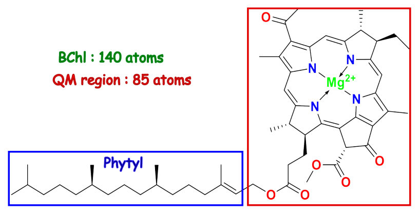 

Figure 1. Two-dimensional chemical structure of the BChl pigment (which is actually a BChl a) present

📷 Fig 2

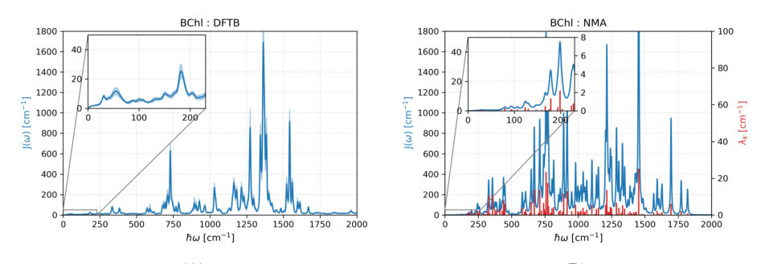 

Figure 2. (A) Gas phase spectral density of the BChl molecule derived from the average of 10 NVE tra-

📷 Fig 3

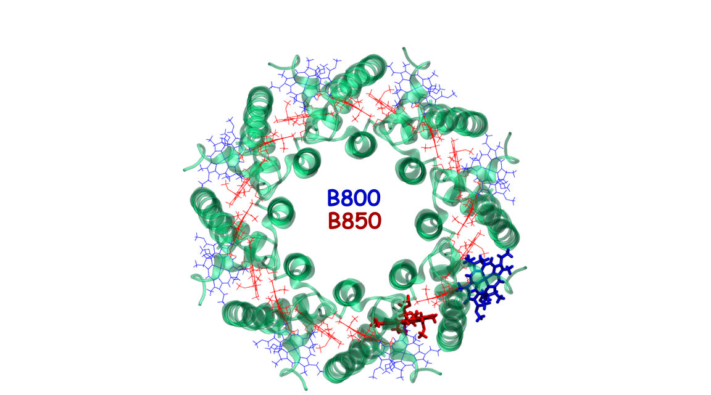 

Figure 3. LH2 complex from the purple bacterium Rs. molischianum (PDB code: 1LGH), showing the

📷 Fig 4

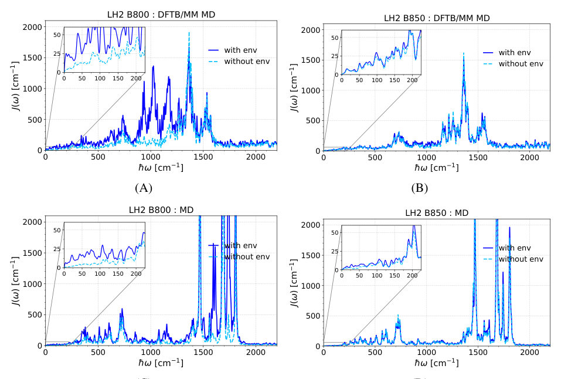 

Figure 4. Spectral densities of the studied BChl pigment from the B800 (A, C) and the B850 (B, D) rings

📷 Fig 5

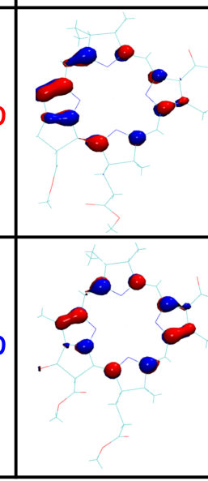 

Figure 5. The HOMO and LUMO of the BChl pigments in the B800 and B850 rings were analyzed

📷 Fig 6

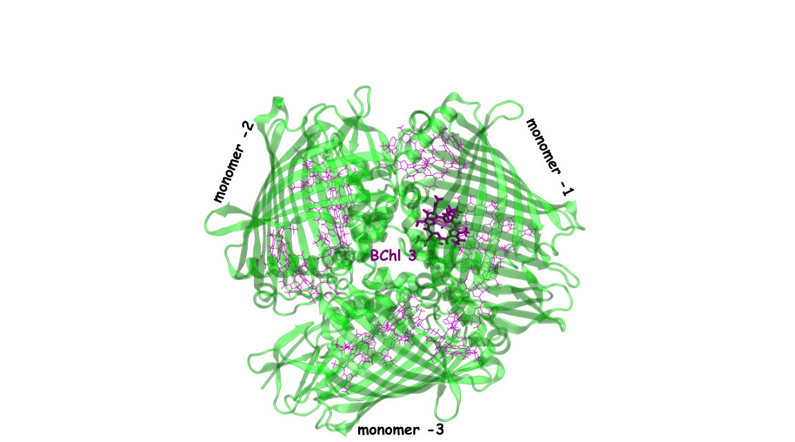 

Figure 6. An example of the trimeric FMO complex from the green sulfur bacterium C. tepidum (PDB

📷 Fig 7

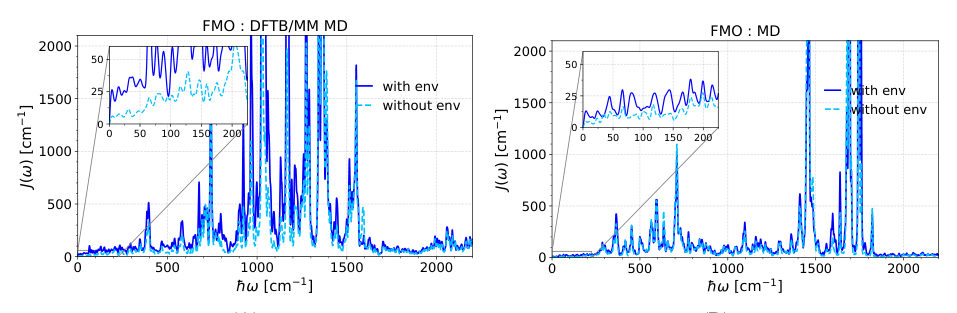 

Figure 7. Spectral densities of a BChl pigment in the FMO complex based on DFTB/MM MD (A) and

**Main problem.**

The study addresses the failure of classical molecular dynamics and normal mode analysis to accurately capture low-frequency intramolecular vibrational modes of bacteriochlorophyll molecules, which are crucial for exciton transfer.

**Main result.**

The authors demonstrate that Born-Oppenheimer molecular dynamics (BOMD) using the DFTB approach accurately recovers low-frequency spectral density contributions from both protein fluctuations and intrinsic pigment vibrations, whereas classical methods miss the latter.

**Method.**

The researchers use a QM/MM framework employing Born-Oppenheimer molecular dynamics (BOMD) based on density functional-based tight-binding (DFTB3) and compare it with classical MD and Normal Mode Analysis (NMA).

**Summary.**

This paper investigates how low-frequency vibrations in bacteriochlorophyll molecules contribute to the spectral density in photosynthetic complexes. It shows that traditional classical MD and normal mode analysis fail to capture important intrinsic molecular vibrations. By using Born-Oppenheimer molecular dynamics with a tight-binding approach, the authors successfully model both protein-driven and pigment-intrinsic low-frequency modes. This finding is significant for accurately simulating exciton transfer in biological light-harvesting systems.

Detailed structure

**Model / system.**

The study focuses on light-harvesting complexes, specifically the B800 and B850 rings of the LH2 complex from purple bacteria and the FMO complex from green sulfur bacteria, modeled using a Frenkel Hamiltonian.

**Key observables.**

Spectral densities (J(omega)), site energy fluctuations, reorganization energies, and Huang-Rhys factors.

**Important parameters / regimes.**

Low-frequency vibrational modes (below 235 cm-1), excitation energy gaps, and the influence of the protein electrostatic environment.

**Assumptions / limitations.**

The DFTB method is semi-empirical and may overestimate reorganization energies; the study also notes that the accuracy of intramolecular modes is sensitive to the choice of classical force fields.

**Figures summary.**

Figures include structural representations of the LH2 complex, comparisons of spectral densities across different methods, and analysis of the impact of the protein environment on pigment excitation energies.

**Paper structure.**

The paper introduces the problem of low-frequency mode modeling, describes the QM/MM and BOMD methodology, presents gas-phase benchmarking, extends the analysis to the LH2 and FMO complexes, and concludes with a discussion on environmental impacts and methodological limitations.

**Why it may be interesting.**

This paper is highly relevant to open quantum systems researchers as it provides a more accurate way to model the spectral density of the bath, which is a fundamental input for describing decoherence and energy transfer in biological quantum dynamics.

Abstract

In the theory of open quantum systems, spectral densities are key quantities for modeling the dynamics and spectroscopic properties of the system under investigation. In the case of light-harvesting complexes, they encode the frequency-dependent coupling of electronic excitations in pigment molecules to their environment, reflecting contributions from both intrinsic vibrational modes and the protein surrounding. In particular, the low-frequency components of the spectral densities are crucial for exciton transfer between pigment molecules. Apparently, slow internal modes of bacteriocholophyll molecules in the gas phase are less well represented by common force fields based on classical molecular dynamics (MD) simulations. Here, we demonstrate that Born-Oppenheimer molecular dynamics (BOMD) based on the numerically efficient density functional-based tight-binding approach can accurately recover these low-frequency features, whereas normal mode analysis captures them only partially. In contrasting approaches for determining spectral densities, the low-frequency region of the spectral densities obtained is only associated with protein fluctuations; the usage of BOMD, however, also captures the low-frequency contributions arising from slow intramolecular vibrations of the pigment molecules themselves. Notably, this behavior is consistently observed for both the flexible B800 and the more rigid B850 rings in light-harvesting 2 (LH2) complexes of purple bacteria, as well as in the Fenna-Matthews-Olson (FMO) complex of green sulfur bacteria. Interestingly, we also find that the spectral densities of the pigments in the B850 ring of LH2 are not influenced by the environment, i.e., the gaps between ground and first excited state are not changed significantly by the fluctuations of the protein environment.

[↑ back to top](#top)

### [Fundamental picture of the conduction mechanism in solid-state polymer electrolytes revealed by terahertz spectroscopy](http://arxiv.org/abs/2604.25497v1)

**Authors:** Johanna Weidelt, Jijeesh Ravi Nair, Diddo Diddens, Wentao Zhang, Felix Pfeiffer, Tiago de Oliveira Schneider, Markus Meinert, Tomoki Hiraoka, Linda Nesterov, Masoud Baghernejad, Dmitry Turchinovich, Hassan A. Hafez

**Type:** both · **Category:** disordered systems and neural networks · **PDF:** <https://arxiv.org/pdf/2604.25497v1>

**Analysis basis:** full PDF text, analyzed in chunks

📷 Fig 1

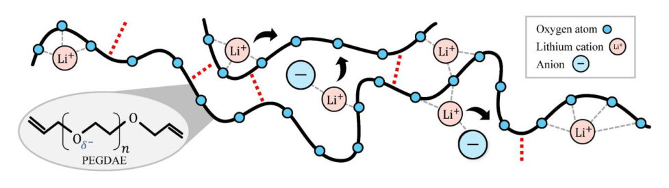 

Fig. 1. Schematic illustration of the hopping charge transport in PEO-based electrolytes: intra- and interchain hopping, ei- ther direct or mediated by the salt anions. Black lines represent the PEGDAE chains with the small blue dots corresponding to the comprised oxygen atoms (the chemical structure of PEGDAE is shown on the bottom left). The chemical structure of the anions depends on the comprised salt. Red dashed lines indicate cross-linking.

📷 Fig 2

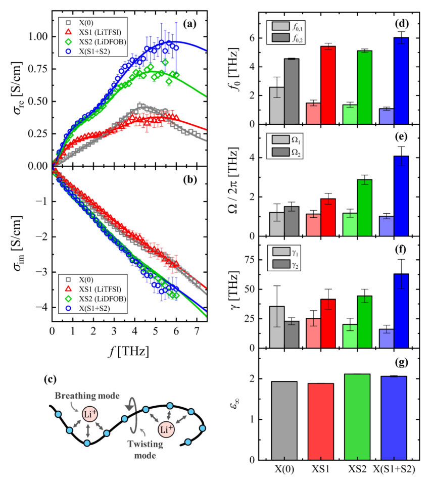 

Fig. 2. (a) Real and (b) imaginary part of the frequency-dependent conductivity spectra of bare cross-linked polymer (X), single salt electrolytes (XS1 (LiTFSI) and XS2 (LiDFOB)) and dual salt electrolyte (X(S1+S2) (LiTFSI+LiDFOB)). Symbols for data points obtained by the broadband spintronic emitter, and solid lines to the Lorentzian fit. The error-bars are derived from the thickness uncertainty of the samples along with the standard error of the mean of the data acquired in repeated measurements. (c) Schematic of the dynamics associated with the resonance frequencies: the twisting motion of the poly- mer backbone and the breathing movement of the crown-like oxygen shell around the 𝐋𝐢+....

📷 Fig 3

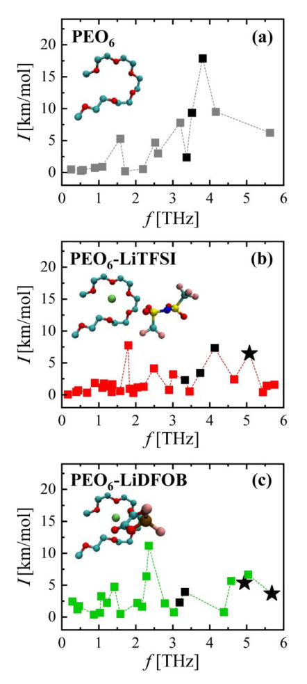 

Fig. 3: DFT predicted resonances with snapshots depicting the associated clusters being a PEO hexamer (a) and Li+ together with the anions TFSI (b) or DFOB (c). Hydrogen atoms have been omitted for clarity. The frequencies associated with the twisting motion of the polymer backbone are marked by black squares while the ones linked to the breathing movement of the crown-ether-like oxygen shell around the 𝐋𝐢+ are represented by black stars.

📷 Fig 4

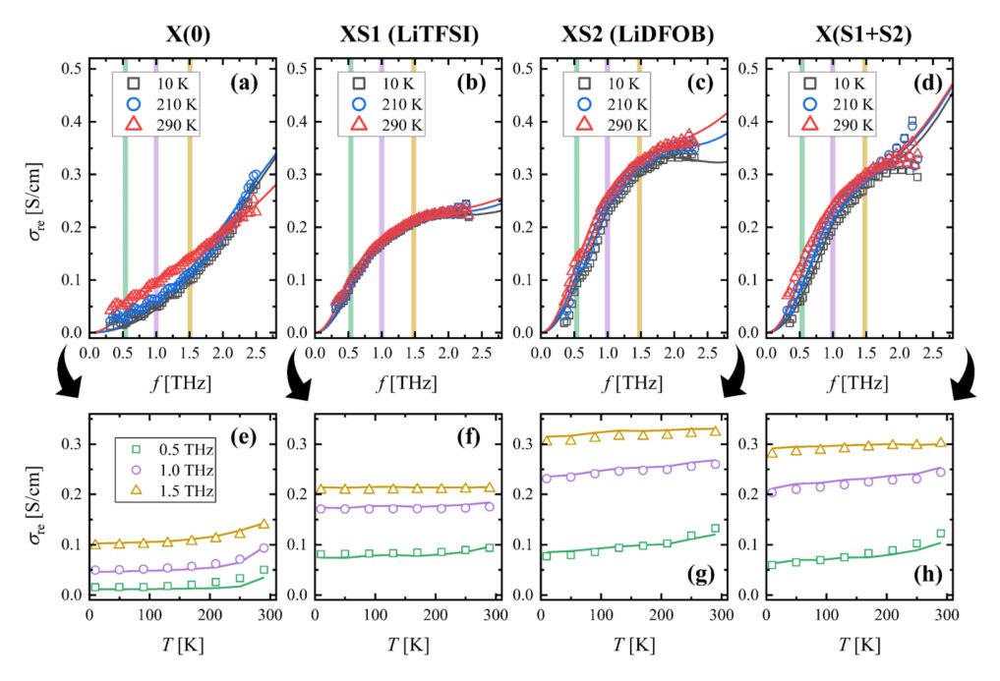 

Fig. 4: Temperature-dependent real-valued conductivity. For each sample, the real-valued conductivity spectra as function of frequency at different temperatures are shown in the respective upper panel, while the temperature dependence of the conductivity at selective frequencies indicated by the vertical colored lines is shown in the respective lower panel. [(a), (e)] for X(0), [(b), (f)] for XS1, [(c), (g)] for XS2, and [(d), (h)] for X(S1+S2). Symbols for the data and solid lines for the Lorentz model fitting.

📷 Fig 5

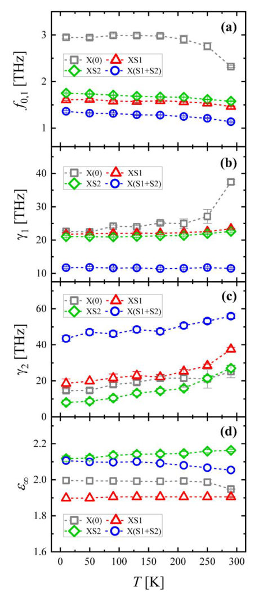 

Fig. 5: Temperature- and sample dependent Lorentzian fit parameters: (a) the low-frequency resonance 𝒇𝟎,𝟏, (b) the asso- ciated damping rate 𝜸𝟏, (c) the damping rate 𝜸𝟐 belonging to the high frequency resonance 𝒇𝟎,𝟐, and (d) high-frequency dielectric constant. The lines are guide-to-the-eye.

**Main problem.**

Understanding the fundamental conduction mechanism and molecular dynamics in solid-state polymer electrolytes (SPEs) and how salt addition affects lithium-ion transport.

**Main result.**

The study identifies that low-frequency polymer vibrations, specifically the twisting of the PEO backbone and the breathing of the Li+ coordination shell, facilitate lithium-ion hopping transport.

**Method.**

Terahertz time-domain spectroscopy (THz-TDS) was used for broadband and temperature-dependent measurements, complemented by Density Functional Theory (DFT) calculations and Electrochemical Impedance Spectroscopy (EIS).

**Summary.**

This paper investigates the conduction mechanism in solid-state polymer electrolytes using terahertz spectroscopy. By analyzing vibrational modes, the researchers show that the movement of the polymer backbone and the coordination shell around lithium ions are directly linked to ionic conductivity. The study uses a combination of THz-TDS, temperature-dependent studies, and DFT calculations to provide a microscopic picture of ion hopping. These findings are crucial for improving the performance of solid-state lithium batteries.

Detailed structure

**Model / system.**

The physical system consists of cross-linked poly(ethylene oxide) (PEO) electrolytes doped with lithium salts (LiTFSI, LiDFOB). The analysis uses a Lorentz oscillator model to describe resonant vibrational modes and DFT to assign molecular motions.

**Key observables.**

THz conductivity spectra, complex refractive index, absorption coefficient, dielectric function, and ionic conductivity.

**Important parameters / regimes.**

Temperature (10 K to 300 K), salt concentration (wt%), and frequency range (0.1 to 8 THz).

**Assumptions / limitations.**

The Drude model was rejected as unsuitable for the observed conductivity; the analysis assumes the absence of significant Fabry-Perot etalon multi-reflections in the THz-TDS measurements.

**Figures summary.**

Fig 1 shows a schematic of Li+ hopping; Fig 2 presents THz conductivity spectra and vibrational mode dynamics; Fig 3 shows DFT-predicted resonances and molecular clusters; Fig 4 displays temperature-dependent conductivity spectra.

**Paper structure.**

The paper introduces the problem of SPE conduction, describes the experimental THz-TDS and cryogenic setups, presents the results of salt-dependent and temperature-dependent conductivity, validates vibrational modes via DFT, and concludes with the correlation between THz vibrations and macroscopic ion transport.

Abstract

Solid polymer electrolytes (SPEs) based on cross-linked poly(ethylene oxide) (PEO) encompassing lithium salts have gained significant attention as separators in solid-state lithium metal batteries. Here, we employ terahertz time-domain spectroscopy (THz-TDS), as a noninvasive contact-free technique, to investigate the conduction properties of these cross-linked SPEs and unravel their dependencies on the added lithium salt and the sample temperature. The obtained THz conductivity spectra are dominated by THz absorption bands, which we attribute to resonant vibrations within the polymer matrix of the electrolyte. By careful application of Lorentz model, the conductivity spectra have been analyzed, and the relevant polymer vibration modes have been quantitatively assessed. Calculations based on the density functional theory (DFT) were performed to elucidate the possible microscopic mechanisms of these resonant vibrations. This study sheds light on the relevance of polymer matrix vibrations validating the hopping transport of lithium ions in SPEs which ultimately leads to the technologically relevant ionic conduction in the solid-state polymer-based electrolytes.

[↑ back to top](#top)

### [Geometric Rashba Control of Polar Pairing at LaAlO$_3$/KTaO$_3$ Interfaces](http://arxiv.org/abs/2604.25805v1)

**Authors:** Yi Zhou

**Type:** theory · **Category:** strongly correlated electrons · **PDF:** <https://arxiv.org/pdf/2604.25805v1>

**Analysis basis:** full PDF text, analyzed in chunks

📷 Fig 1

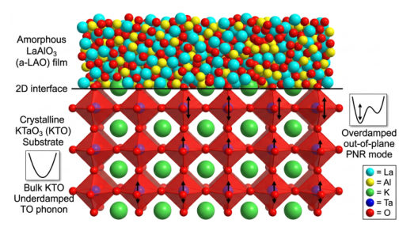 

FIG. 1. 3D atomic schematic of the amorphous- LaAlO3/KTaO3 (a-LAO/KTO) interface and the relevant bosonic modes. Deep in the insulating KTO substrate (bot- tom), Ta ions sit in a symmetric harmonic potential (U-shape inset); any bulk PNRs present are randomly oriented, and the lack of charge carriers precludes superconductivity. At the interface, beneath the amorphous LAO overlayer (top), the built-in electric field tilts the local potential into an asym- metric double-well (tilted W-shape inset). This field forces Ta ions vertically off-center, aligning the interfacial polar nanore- gions (PNRs) into static out-of-plane dipoles. These aligned PNRs extend throughout the thickness of the 2D...

📷 Fig 2

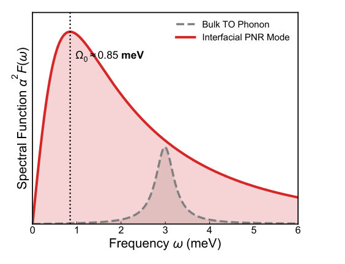 

FIG. 3. The Eliashberg electron-boson spectral function α2F(ω). The underdamped transverse optical phonon in bulk KTO (gray dashed line) peaks at higher energies (∼3 meV). At the a-LAO/KTO interface, the soft dynamics of polar nanoregions (PNRs) are modeled by an overdamped Brown- ian oscillator (red solid line). This yields a broad low-energy spectral density peaking at an effective frequency Ω0 ≈0.85 meV, representative of the physically relevant near-threshold fit regime. Unlike a pure Debye relaxator, the Brownian os- cillator spectrum decays rapidly at high frequencies (∝ω−3), providing the microscopic UV regularization required to yield a well-defined Allen-Dynes second moment.

📷 Fig 3

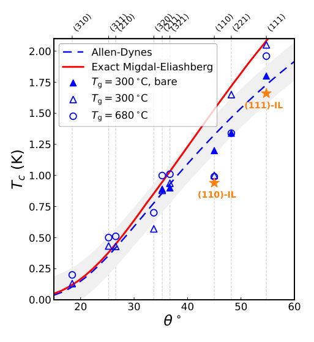 

FIG. 4. Experimental superconducting Tc versus orientation angle θ for a-LAO/KTO interfaces [4]. The dashed blue line is the Allen-Dynes curve evaluated with representative near- threshold parameters Ω0 ≈0.85 meV, λ0 ≈0.25, C ≈2.88, and µ∗= 0.13. The solid red line represents the corre- sponding exact numerical solution of the isotropic Matsubara- Eliashberg equations using the same spectrum and represen- tative parameters. While the exact solution yields a systemat- ically larger Tc at stronger coupling, both approaches display the same qualitative quasi-linear Tc(θ) behavior arising from the non-linear mapping of the underlying sin2(θ) pairing in- put.

**Main problem.**

Explaining the origin of the strong, quasi-linear dependence of the superconducting transition temperature (Tc) on crystallographic orientation at LaAlO3/KTaO3 interfaces and why KTaO3 exhibits a higher Tc scale than SrTiO3.

**Main result.**

The authors propose a geometric mechanism where dynamic Rashba coupling, driven by polar nanoregion fluctuations, scales with sin(theta), leading to a pairing strength lambda(theta) = lambda0 + C sin^2(theta) that naturally produces the observed quasi-linear Tc(theta) dependence.

**Method.**

The study employs Migdal-Eliashberg theory using an effective electron-boson spectral function derived from an overdamped Brownian oscillator model, verified via exact Matsubara-Eliashberg numerical solutions and Allen-Dynes interpolation.

**Summary.**

This paper proposes a theoretical framework to explain why superconductivity at LaAlO3/KTaO3 interfaces is highly sensitive to the crystal orientation angle. By modeling the interaction between electrons and fluctuating polar nanoregions through a geometric Rashba vertex, the authors show that the pairing strength follows a sin^2(theta) dependence. This mechanism successfully reproduces the observed quasi-linear dependence of the transition temperature on the orientation angle. Furthermore, the model explains why the larger spin-orbit coupling in KTaO3 leads to a much higher superconducting temperature compared to SrTiO3.

Detailed structure

**Model / system.**

The system is the 2D electron gas at the LaAlO3/KTaO3 (LAO/KTO) interface, modeled using a reduced isotropic helicity-band description with a dynamic Rashba vertex and an interaction mediated by overdamped polar nanoregion (PNR) fluctuations.

**Key observables.**

Superconducting transition temperature (Tc) as a function of orientation angle (theta), pairing strength (lambda), and parity mixing amplitude.

**Important parameters / regimes.**

Crystallographic orientation angle (theta), Rashba coupling strength, overdamping rate (gamma), bosonic frequency (Omega_B), and Coulomb pseudopotential (mu*).

**Assumptions / limitations.**

Use of a reduced isotropic helicity-band description, assumption of the strongly overdamped regime, and a forward-scattering approximation for the interaction vertex.

**Figures summary.**

The figures likely show the calculated Tc(theta) dependence, the mapping between lambda(theta) and Tc(theta), and the comparison between the proposed model and experimental data.

**Paper structure.**

The paper introduces the experimental problem of orientation-dependent Tc, develops a microscopic model based on geometric Rashba coupling and PNR fluctuations, performs numerical Eliashberg calculations to derive scaling laws, and concludes by comparing the results to KTO and STO experimental benchmarks.

Abstract

At LaAlO$_3$/KTaO$_3$ interfaces, the superconducting $T_c$ exhibits a striking quasi-linear dependence on crystallographic orientation, coexisting with switchable polar nanoregions (PNRs). We propose an effective minimal Eliashberg framework in which overdamped PNR fluctuations provide the pairing glue, while geometric Rashba coupling controls its angular dependence. Within a reduced isotropic helicity-band description, the dynamic Rashba vertex scales as $\sin(θ)$, yielding a pairing strength $λ(θ)=λ_0+C\sin^2(θ)$. Exact Matsubara-Eliashberg numerical solutions show that this non-linear mapping naturally yields the same qualitative quasi-linear $T_c(θ)$ dependence within the reduced model. Because the Rashba-activated polar channel is amplified by the large atomic spin-orbit coupling of Ta $5d$ orbitals, the same framework also rationalizes why KTaO$_3$ interfaces exhibit both a much stronger orientational dependence and a substantially higher $T_c$ scale than their SrTiO$_3$ counterparts.

[↑ back to top](#top)

### [Global DIC-based sample-detector geometry refinement for accurate EBSD indexing](http://arxiv.org/abs/2604.25869v1)

**Authors:** Claire Griesbach, Dennis M. Kochmann

**Type:** both · **Category:** other · **PDF:** <https://arxiv.org/pdf/2604.25869v1>

**Analysis basis:** full PDF text, analyzed in chunks

📷 Fig 1

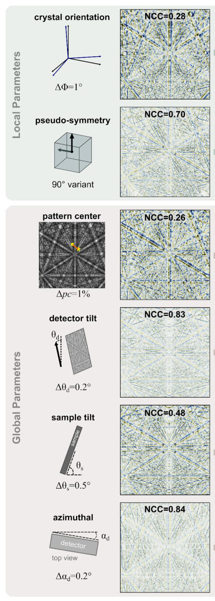 

Figure 1: Coupling between pattern shifts due to local orientation and global geometry changes

📷 Fig 2

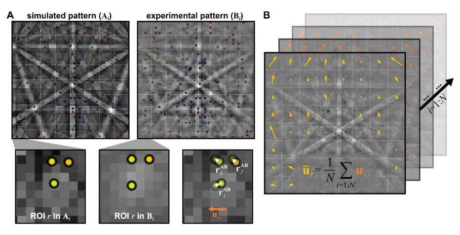 

Figure 2: DIC-based calculation of the displacement field representing pattern misalignment: (A) Example pair of

📷 Fig 3

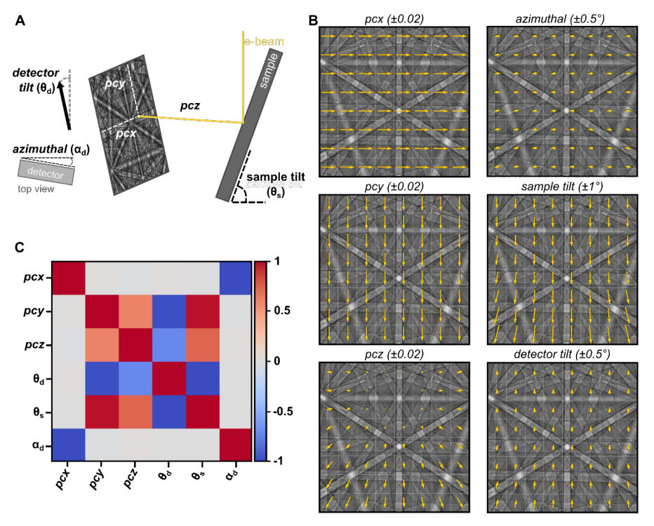 

Figure 3: Sample-detector geometry parameter sensitivities: (A) schematic showing sample-detector geometry parameters;

📷 Fig 4

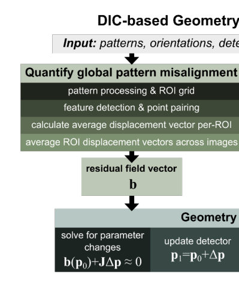 

Figure 4: Schematic summary of the DIC-based geometry refinement algorithm

📷 Fig 5

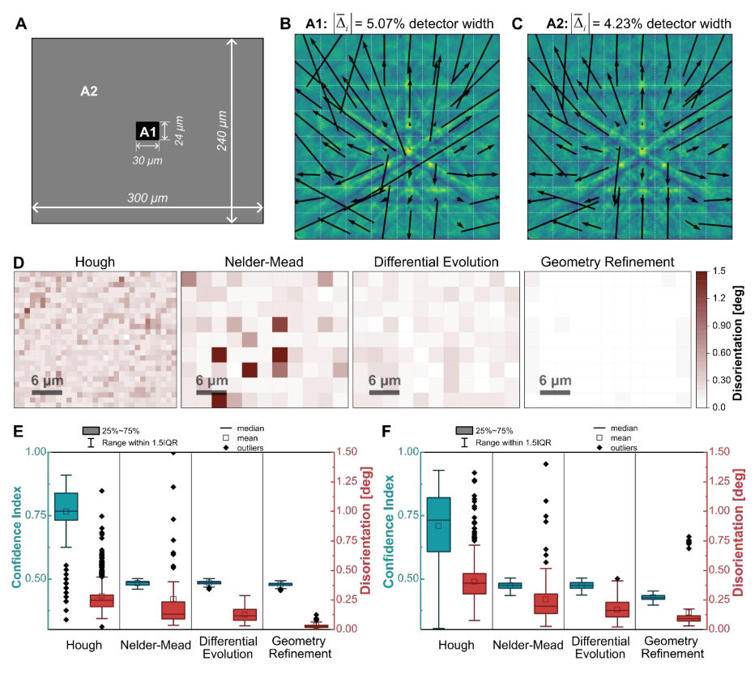 

Figure 5: Comparison of geometry refinement methods applied to a Si single crystal: (A) Schematic showing scan areas

📷 Fig 6

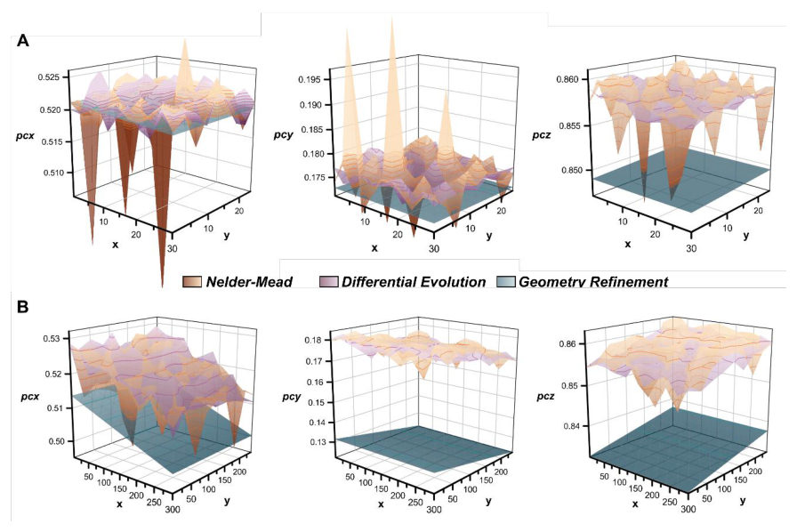 

Figure 6: Calibrated pattern center maps: Refined pcx, pcy, and pcz values as a function of position for each geometry

📷 Fig 7

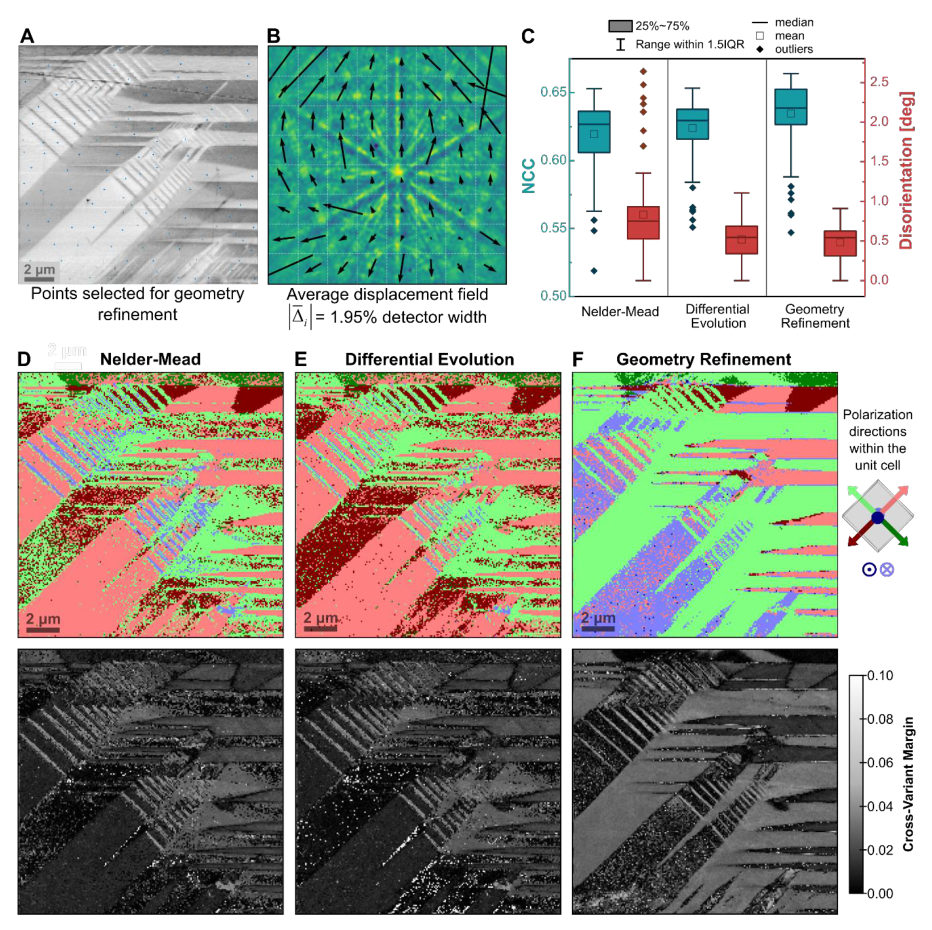 

Figure 7: Geometry optimization for accurate PS variant discrimination in BTO: (A) PRIAS signal of EBSD map with

📷 Fig 8

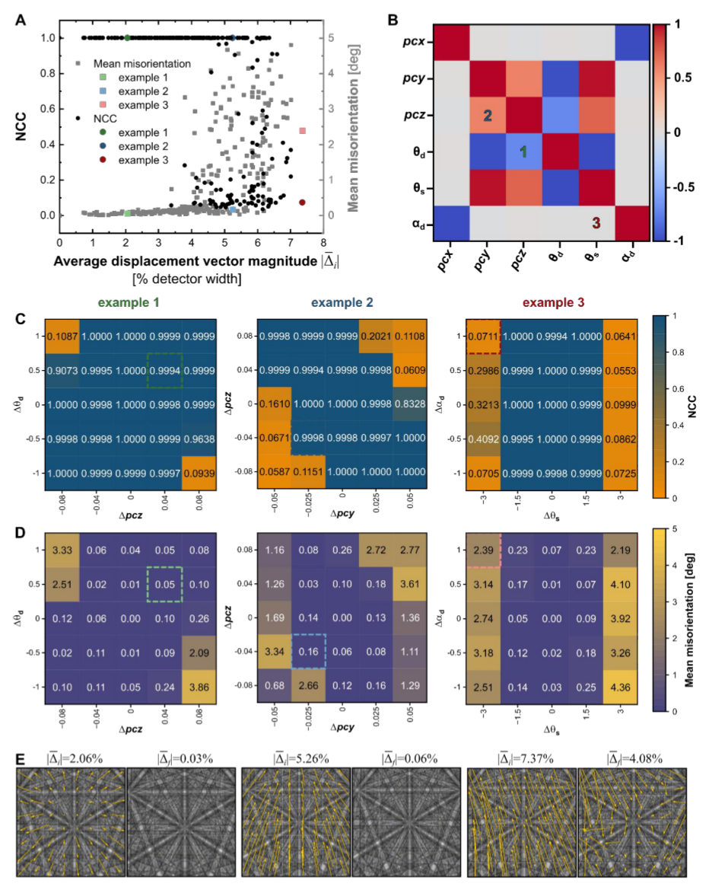 

Figure 8: Validity bounds of parameter perturbations: (A) Average NCC after geometry refinement and average

📷 Fig 9

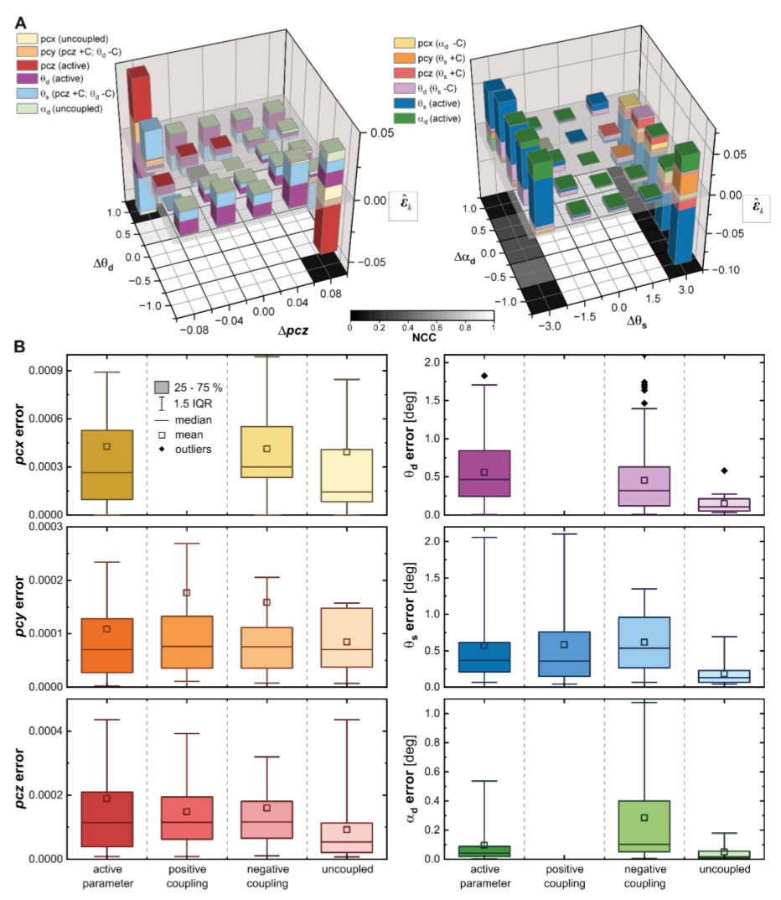 

Figure 9: Geometry parameter errors: (A) Normalized error of each geometry parameter as stacked columns for the 25

**Main problem.**

Inaccurate EBSD orientation indexing caused by the coupling between global sample-detector geometry errors and local crystallographic orientation changes.

**Main result.**

A global DIC-based refinement method that achieves high orientation accuracy (0.03 degree disorientation in Si) and effectively discriminates pseudosymmetric variants in BTO, performing up to 50x faster than traditional optimization.

**Method.**

A global Digital Image Correlation (DIC) algorithm that uses a Jacobian sensitivity matrix and a weighted least-squares approach to decouple map-wide pattern shifts from local orientation changes.

**Summary.**

This paper presents a new method for refining the sample-detector geometry in EBSD microscopy using Digital Image Correlation. By analyzing spatially coherent pattern shifts across an entire map, the method decouples global geometric errors from local crystal orientation changes. This approach is significantly faster than traditional optimization and provides much higher accuracy, particularly for distinguishing between similar crystal variants in complex materials like barium titanate.

Detailed structure

**Model / system.**

Electron Backscatter Diffraction (EBSD) microscopy using Kikuchi patterns, with experimental demonstrations on single-crystal silicon and barium titanate (BTO).

**Key observables.**

Kikuchi patterns, Normalized Cross-Correlation (NCC), disorientation angles, Confidence Index (CI), and displacement fields.

**Important parameters / regimes.**

Six geometry parameters: pattern center (pc_x, pc_y, pc_z), detector tilt, detector azimuthal angle, and sample tilt; refinement reliability is valid for displacements < 4% of detector width.

**Assumptions / limitations.**

The refinement algorithm relies on a linear approximation of geometry parameter sensitivities, which may fail for large geometric perturbations.

**Figures summary.**

Figure 1 shows parameter coupling and pattern shifts; Figure 5 compares refinement methods on Si using disorientation and CI maps; Figure 6 shows spatial stability of pattern centers; Figure 7 demonstrates application to BTO domain identification; Figure 8/9 show error analysis, coupling matrices, and parameter error statistics.

**Paper structure.**

The paper introduces the problem of geometry-orientation coupling, presents the DIC-based refinement algorithm, validates it using Si single crystals for accuracy and speed, demonstrates its utility in identifying pseudosymmetric variants in BTO, and concludes with a sensitivity/error analysis of the linear approximation.

Abstract

Electron backscatter diffraction is a powerful tool for mapping crystallographic microstructures. However, the primary crux to improving orientation accuracy and applying the technique to challenging materials lies in the correct calibration of the sample-detector geometry. Many approaches have aimed at overcoming this barrier through various pattern center calibration strategies, but the pattern center only defines part of the sample-detector geometry. Here, we present a DIC-based geometry refinement method that obtains a single map-consistent sample-detector geometry, refining both the pattern center and sample/detector angles. We effectively decouple the local orientation changes from the global geometry effects on the Kikuchi patterns by calculating the consistent map-wide simulated-to-experimental pattern shifts associated with global geometry parameter errors. Using single-crystal silicon and barium titanate (a material possessing six pseudosymmetric variants) as model materials, we demonstrate improved map-wide orientation consistency and more robust discrimination of pseudosymmetric variants than the Nelder-Mead and Differential Evolution optimization strategies.

[↑ back to top](#top)

### [High-field magneto-optical imaging of superconducting critical states beyond 10 T using a paramagnetic garnet sensor](http://arxiv.org/abs/2604.25274v1)

**Authors:** Yuto Kinoshita, Masayuki Toyoda, Yoshiaki Kobayashi, Masayuki Itoh, Masashi Tokunaga

**Type:** experiment · **Category:** strongly correlated electrons · **PDF:** <https://arxiv.org/pdf/2604.25274v1>

**Analysis basis:** full PDF text, analyzed in chunks

📷 Fig 1

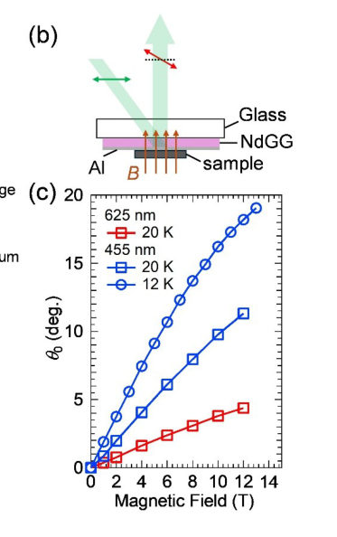 

FIG. 1. (a) Schematic of the magneto-optical imaging system under high magnetic fields

📷 Fig 2

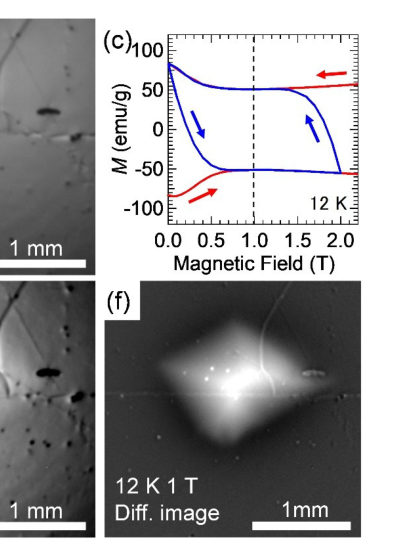 

FIG. 2. (a) Optical image of the sample. (b) Microscope image of the magneto-optical

📷 Fig 3

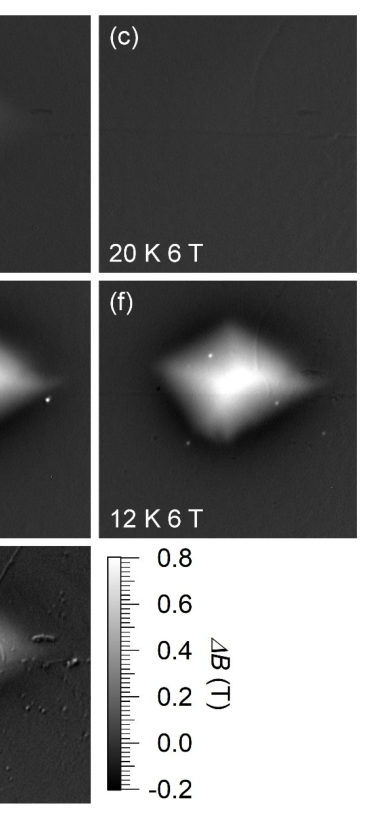 

FIG. 3. Differential images of the magnetic flux distribution obtained by subtracting

📷 Fig 4

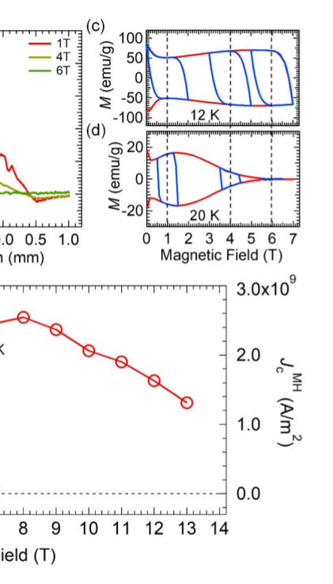 

FIG.4. (a,b) Line profiles of Δ𝐵 at various magnetic fields at 12 K and 20 K,

📷 Fig 5

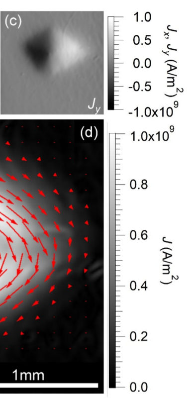 

FIG. 5. (a) Δ𝐵 image at 12 K and 12 T. (b,c) Spatial distributions of the current density

**Main problem.**

Conventional magneto-optical imaging (MOI) is limited to low magnetic fields because standard indicators saturate, making it difficult to spatially resolve the critical current density (Jc) in superconductors under high magnetic fields (> 10 T).

**Main result.**

The researchers developed a high-field MOI technique using a paramagnetic Nd-garnet sensor that enables imaging up to 13 T, successfully mapping the magnetic flux and vector current density in iron-based superconductors.

**Method.**

The technique uses a paramagnetic Nd-garnet indicator in a polarizing microscope system to detect Faraday rotation induced by magnetic fields, followed by quantitative reconstruction of Jc using the Bean model and Fourier transformation.

**Summary.**

This paper presents a new magneto-optical imaging technique that overcomes the saturation limits of conventional indicators by using a paramagnetic Nd-garnet sensor. This allows for the spatial visualization of magnetic flux and current density in superconductors at much higher magnetic fields (up to 13 T) than previously possible. The researchers demonstrated this by mapping the critical current density in iron-based superconductors, providing a powerful tool to study inhomogeneous current transport in high-field regimes.

Detailed structure

**Model / system.**

The experimental platform consists of a polarizing microscope integrated with a superconducting magnet (up to 13 T) used to image bulk single crystals of the iron-based superconductor Ba(Fe1-xCox)2As2.

**Key observables.**

Faraday rotation angle, magnetic flux density distribution (Bz), critical current density (Jc), and vector current density components (Jx, Jy).

**Important parameters / regimes.**

Magnetic fields up to 13 T, temperatures of 12 K and 20 K, and wavelengths of 455 nm and 625 nm.

**Assumptions / limitations.**

Assumed a linear relationship between intensity and magnetic field within a +/- 1 T range and that Jc is locally field-independent.

**Figures summary.**

Fig 1: Schematic of MOI setup and Faraday rotation dependence on field/wavelength; Fig 2: Optical images of flux trapping and flux penetration; Fig 3: Differential flux images at various high fields; Fig 4: Line profiles and comparison of Jc from MOI vs magnetization; Fig 5: Vector maps of current density components.

**Paper structure.**

Introduction of the high-field imaging problem, description of the Nd-garnet indicator and optical setup, calibration of the Faraday rotation, demonstration of flux imaging in Ba(Fe,Co)2As2, quantitative extraction of Jc, and vector mapping of current distributions.

Abstract

Spatially resolved characterization of the critical current density Jc in superconductors under high magnetic fields is crucial for both fundamental understanding and practical applications. However, conventional techniques primarily provide bulk-averaged values, making it difficult to resolve local variations of Jc, especially in high magnetic fields. In this work, we develop a magneto-optical imaging (MOI) technique that enables visualization of superconducting critical states in steady magnetic fields up to 13 T. This is achieved by employing a paramagnetic Nd-garnet indicator combined with a polarizing microscope system. Using this method, we directly image the magnetic flux distribution in a bulk single crystal of an iron-based superconductor Ba(Fe1-xCox)2As2 (x = 0.075) at 12 K and 20 K across the entire sample area (approximately 1 mm). From the measured magnetic field distributions, we quantitatively reconstruct the spatial distribution of the critical current density. The extracted field dependence of Jc is in good agreement with that obtained from conventional magnetization measurements. Furthermore, we demonstrate vector mapping of current flow within the sample by converting the magnetic field distribution into local current-density distributions. Our results establish high-field MOI as a powerful approach for spatially resolved evaluation of superconducting critical states and provide a new pathway for investigating inhomogeneous current transport in superconductors under high magnetic fields.

[↑ back to top](#top)

### [Influence of Heterogeneity on the Response of Architected Metamaterials](http://arxiv.org/abs/2604.25075v1)

**Authors:** Sarvesh Joshi, Jingye Tan, Craig M. Hamel, Stavros Gaitanaros, Nikolaos Bouklas

**Type:** theory · **Category:** disordered systems and neural networks · **PDF:** <https://arxiv.org/pdf/2604.25075v1>

**Analysis basis:** full PDF text, analyzed in chunks

📷 Fig 1

 

Figure 1: The realizations showcase the variation of α(X) with CV (a) 0.01%, (b) 1.0%, and (c) 10.0% for an unstructured mesh with ℓcorr = 4ℓnl.

📷 Fig 2

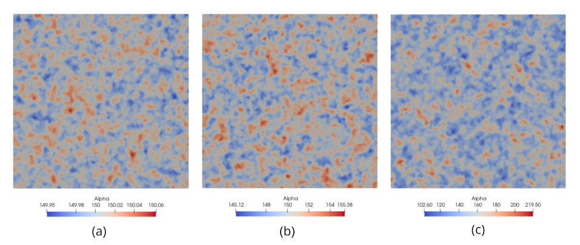 

Fig. 1 shows three realizations of α(X) generated on an unstructured mesh with fixed correlation length ℓcorr = 4ℓnl2, while systematically increasing the coefficient of variation

📷 Fig 3

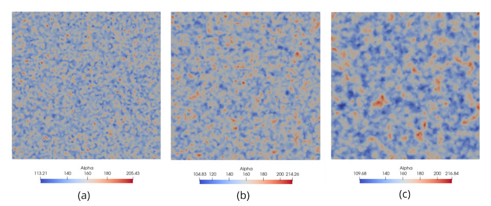 

Figure 2: The realizations showcase the variation of α(X) with ℓcorr = (a) ℓnl, (b) 2ℓnl, and (c) 4ℓnl for unstructured mesh with CV = 10.0%.

📷 Fig 4

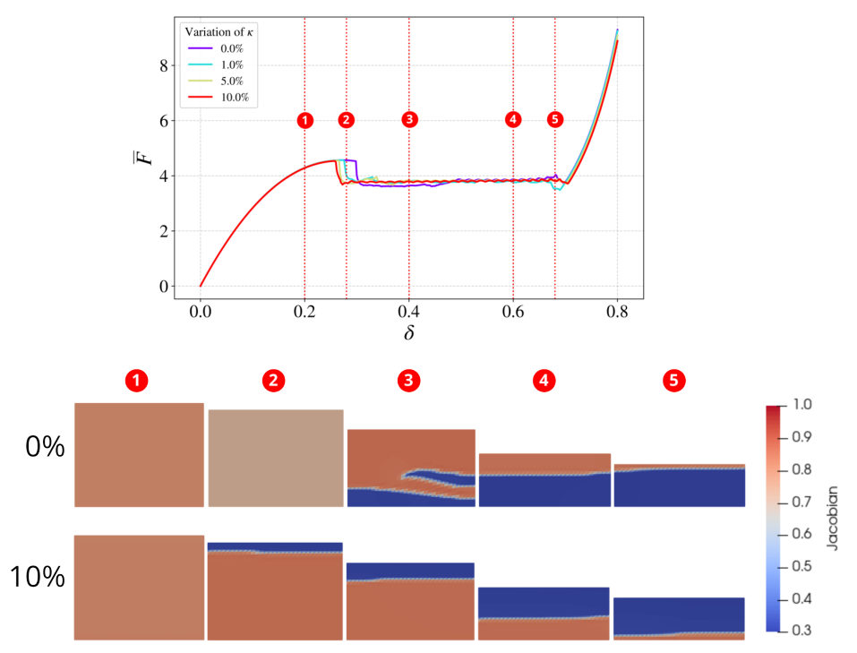 

Figure 3: Adapted from Joshi et al. [65]. Influence of vertical grading in the bulk modulus κ on the force— displacement response and Jacobian field J of a metastable material. Graded profiles correspond to 0.0% and 10.0% variation across the domain height. Snapshots for the 0.0% and 10.0% cases at five loading stages illustrate the impact of property heterogeneity on densification evolution.

📷 Fig 5

 

Fig. 3 presents the corresponding force–displacement responses together with representa- tive contours of the Jacobian field J at five characteristic loading stages. In the homogeneous

📷 Fig 6

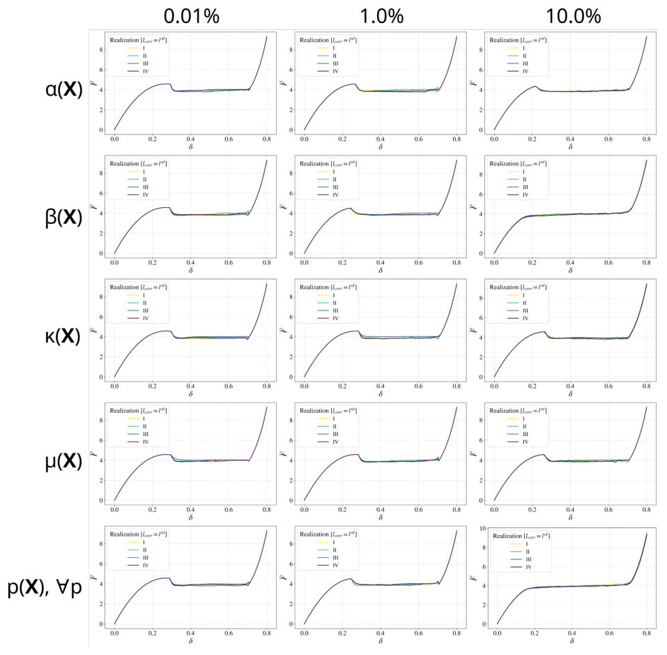 

Figure 4: Influence of coefficient of variation of confined compression response for ℓcorr = ℓnl. Force– displacement curves are shown for CV = 0.01%, 1.0%, and 10.0%, with four realizations for each case. Rows correspond to heterogeneity introduced individually in α, β, κ and µ, followed by the case where all parameters are heterogeneous, p ∈{α, β, κ, µ}, simultaneously. Increasing variance progressively stabilizes the transition plateau and mitigates limit-load drops, with the most pronounced stabilization observed when all parameters are heterogeneous at CV = 10.0%.

📷 Fig 7

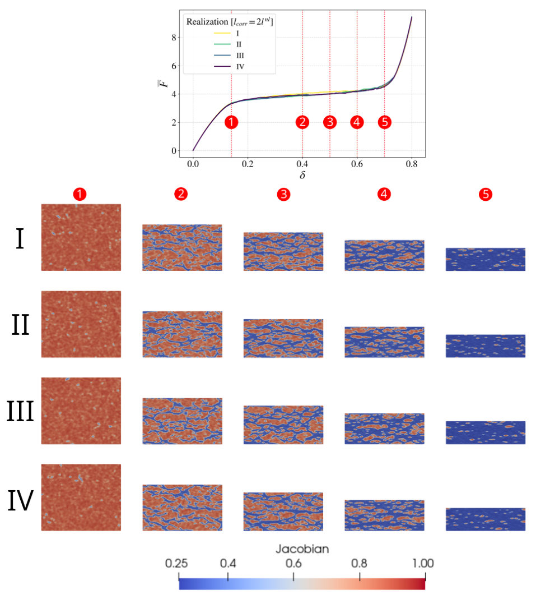 

Figure 5: Effect of stochastic heterogeneity on densification patterns under confined compression. Jacobian contours J are shown for four realizations in which all constitutive parameters (α, β, κ, and µ) are modeled as Gaussian Random Fields with CV = 10.0% and correlation length ℓcorr = 2ℓnl on an unstructured mesh. Five snapshots corresponding to increasing stages of loading illustrating the evolution of the densified phase. Despite realization-to-realization variability in local stiffness distributions, all realizations exhibit consistent macroscopic responses and similar qualitative growth mechanisms of the densified phases.

📷 Fig 8

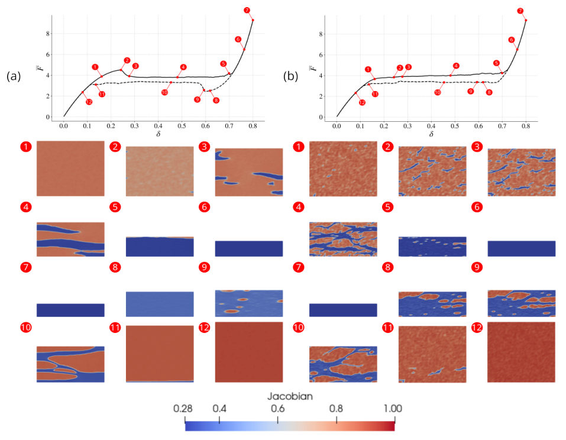 

Figure 6: Cyclic confined compression response with stochastic heterogeneity in all constitutive parameters for ℓcorr = ℓnl. Loading–unloading force–displacement curves are shown for (a) CV = 1.0% and (b) CV = 10.0%, together with representative Jacobian contours at selected stages of the cycle. Increasing variance eliminates the limit load drop and leads to a stable hysteresis response, accompanied by a transition from localized band-like densification to distributed, network-like transition patterns.

📷 Fig 9

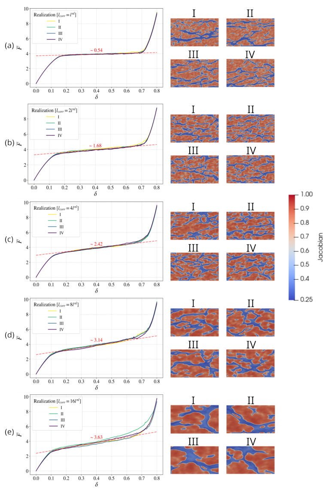 

Figure 7: Effect of correlation length on localization under confined compression for CV = 10.0% applied to all constitutive parameters. Shown are Jacobian contours at δ = 0.4 for four realizations on a structured mesh with ℓcorr = (a) ℓnl, (b) 2ℓnl, (c) 4ℓnl, (d) 8ℓnl, and (e) 16ℓnl. Increasing correlation length leads to larger, more coherent pockets of compliant material and correspondingly coarser densification patterns, resulting in a systematic increase in the intermediate-regime stiffness of the macroscopic response. 22

📷 Fig 10

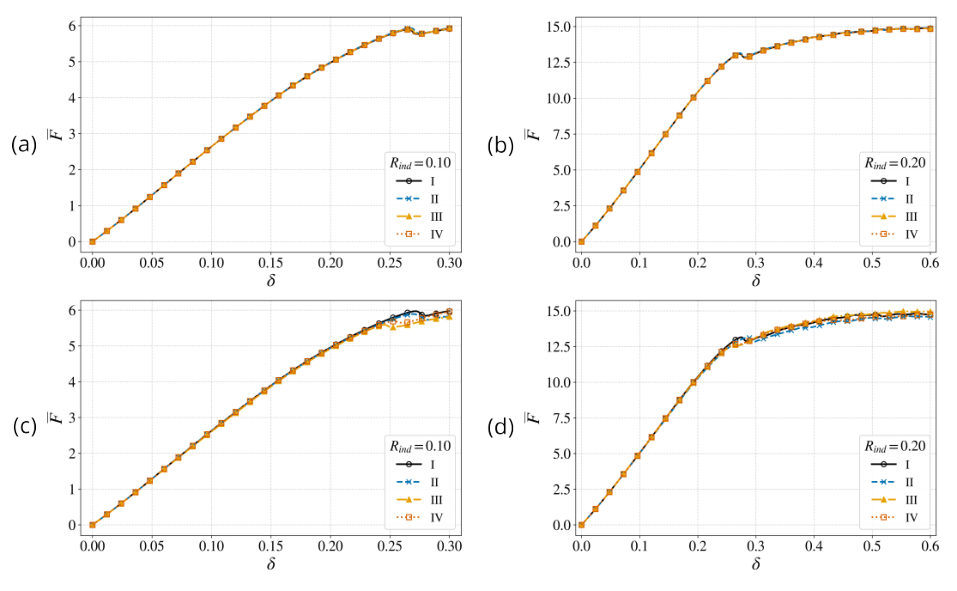 

Figure 8: Effect of heterogeneity magnitude and indenter radius on the indentation response. Force– displacement curves are shown for CV = 1.0% with (a) Rind = 0.1 and (b) Rind = 0.2, and for CV = 10.0% with (c) Rind = 0.1 and (d) Rind = 0.2. In all cases, the correlation length is fixed at ℓcorr = ℓnl, and four independent realizations are reported for each configuration.

**Main problem.**

Understanding how stochastic material heterogeneity, introduced via Gaussian random fields, influences the macroscopic mechanical response, stability, and localization patterns in architected metamaterials.

**Main result.**

The study demonstrates that heterogeneity fundamentally alters phase nucleation, localization morphology, and macroscopic response, such as changing the plateau slope and even eliminating the initial elastic regime.

**Method.**

Finite element simulations using a gradient-enhanced, nonlocal continuum formulation and Gaussian Random Fields (GRF) implemented via a stochastic elliptic PDE.

**Summary.**

This paper develops a mathematical framework to study how random material fluctuations affect the stability and deformation of engineered metamaterials. By using Gaussian Random Fields, the authors show that the spatial scale and intensity of disorder can change how these materials collapse and densify. The work provides a unified way to link manufacturing imperfections to macroscopic mechanical failure. This is crucial for designing more robust and predictable architected structures.

Detailed structure

**Model / system.**

Architected metamaterials (e.g., foams and lattices) modeled using a nonlinear, thermodynamically consistent, gradient-enhanced continuum framework with a non-convex Helmholtz free energy density.

**Key observables.**

Phase nucleation sites, localization morphology, macroscopic force-displacement response, Jacobian field (densification), and effective bulk modulus.

**Important parameters / regimes.**

Coefficient of variation (amplitude of fluctuations), correlation length (spatial scale of fluctuations), nonlocal lengthscale, and constitutive parameters (alpha, beta, kappa, mu).

**Assumptions / limitations.**

The material is isotropic, the process is isothermal and quasi-static, and the focus is limited to purely elastic architected metamaterials.

**Figures summary.**

Visualizations of stochastic field realizations at different variance and correlation levels; plots of effective bulk modulus versus constitutive parameters; and analytical plots of the Helmholtz free energy density.

**Paper structure.**

The paper identifies the problem of manufacturing-induced heterogeneity, introduces a nonlinear continuum theory with stochastic parameters via GRFs, details the numerical implementation in FEniCS, and presents parametric studies on how amplitude and correlation length affect mechanical stability and localization.

**Why it may be interesting.**

While focused on mechanics, the use of Gaussian Random Fields to study how spatial disorder drives localization and phase-transition-like phenomena (densification) shares deep mathematical parallels with studying disorder-induced localization in many-body systems.

Abstract

Architected metamaterials like foams and lattices exhibit complex responses governed by microstructural instabilities, localization, and phase-transition-like phenomena. Their behavior is further affected by heterogeneities inherent in their microstructure often caused through manufacturing processes. In this study we extend a gradient-enhanced, nonlocal continuum formulation to incorporate stochastic material heterogeneity through Gaussian random fields imposed on selected constitutive parameters. The framework enables independent control of both the amplitude and spatial correlation of material fluctuations while preserving thermodynamic consistency and regularization of localization. It also introduces a characteristic lengthscale ratio between the nonlocal and correlation lengthscales, that enables modeling at the limit of random or spatially correlated microstructures. Finite element simulations of confined compression and indentation show that heterogeneity fundamentally alters phase nucleation, localization morphology, and macroscopic response. Overall, the proposed framework provides a unified approach for linking stochastic material variability to instability-driven mechanics in architected metamaterials, enabling improved understanding of imperfection sensitivity, stability and design. It showcases how heterogeneity alone can influence characteristic features of the response, such as stability, slope of the plateau region, and elimination of the initial elastic regime.

[↑ back to top](#top)

### [Magnetoplasma excitations in interacting GaAs disks](http://arxiv.org/abs/2604.25736v1)

**Authors:** S. A. Andreeva, A. A. Gavrilov, K. R. Dzhikirba, A. S. Astrakhantseva, A. V. Shchepetilnikov, O. V. Orlov, V. V. Solovyev, I. V. Kukushkin

**Type:** experiment · **Category:** other · **PDF:** <https://arxiv.org/pdf/2604.25736v1>

**Analysis basis:** full PDF text, analyzed in chunks

📷 Fig 1

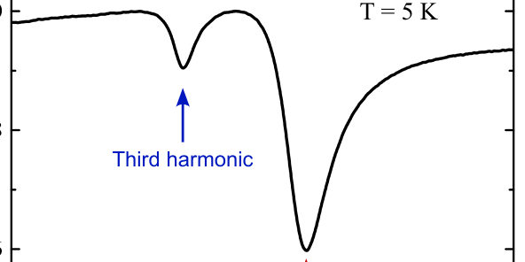 

Figure 1. Transmission dependence on magnetic field for a sample with d = 100 and a = 200 µm

📷 Fig 2

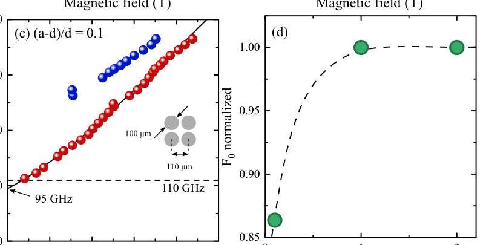 

Figure 2. Magnetodispersions for samples with d = 100 µm and (a) a = 300 µm, (b) 200 µm and

**Main problem.**

Investigating how inter-disk coupling and lateral screening affect the magnetoplasma dispersion and collective modes in a square lattice of 2D electron system disks.

**Main result.**

The system behaves as a collection of isolated disks at large separations, but as the lattice period decreases, the plasma frequency shifts to lower values (from 110 GHz to 95 GHz) due to increased coupling.

**Method.**

Magneto-optical terahertz (THz) transmission spectroscopy using a microwave generator and frequency extenders to track resonance evolution in a perpendicular magnetic field.

**Summary.**

This paper studies how the interaction between closely spaced 2D electron disks affects their collective plasma oscillations. By using THz spectroscopy on a GaAs-based disk array, the researchers show that while large separations allow for an independent-disk description, bringing the disks closer together causes a significant shift in the plasma frequency. This demonstrates the transition from isolated excitations to a coupled regime where inter-disk electromagnetic fields modify the dispersion.

Detailed structure

**Model / system.**

A square lattice of 2D electron system (2DES) disks etched from an AlGaAs/GaAs/AlGaAs quantum well, with varying lattice periods (a = 300, 200, and 110 micrometers) and disk diameter (d = 100 micrometers).

**Key observables.**

Magnetoplasma resonance frequencies (1st and 3rd harmonics), plasma frequency (F0), and transmission spectra.

**Important parameters / regimes.**

Lattice constant (a), disk diameter (d), magnetic field (B), cyclotron frequency, and the proximity factor (a-d)/d.

**Assumptions / limitations.**

The use of the dipole approximation (explaining the absence of even-numbered modes) and comparison against a non-retarding plasmon dispersion model.

**Figures summary.**

Figures show magnetodispersion for different lattice periods including harmonics and edge modes, and the dependence of the plasma frequency on the disk proximity factor.

**Paper structure.**

The paper introduces the experimental platform, describes the THz spectroscopy setup, presents the evolution of magnetoplasma modes with decreasing lattice spacing, compares results to theoretical models, and discusses the effects of coupling on mode resolution.

Abstract

We investigate the effect of inter-disk coupling on the magnetoplasmon dispersion in a square lattice of two-dimensional electron system (2DES) disks etched from a GaAs quantum well. Using magneto-optical terahertz (THz) spectroscopy, we track the evolution of the collective modes as disk lattice period is systematically reduced, thereby increasing the coupling strength. At large distances, the system exhibits magnetoplasma modes corresponding to individual excitations in disks. As the inter-disk distance decreases, we observe a modification to magnetoplasma dispersion.

[↑ back to top](#top)

### [Microscopic Theory of Chiral-Phonon-Induced Orbital Selectivity in Helical Crystals](http://arxiv.org/abs/2604.25328v1)

**Authors:** Tomomi Tateishi, Akihito Kato, Alexander S. Ovchinnikov, Jun-ichiro Kishine

**Type:** theory · **Category:** other · **PDF:** <https://arxiv.org/pdf/2604.25328v1>

**Analysis basis:** full PDF text, analyzed in chunks

📷 Fig 1

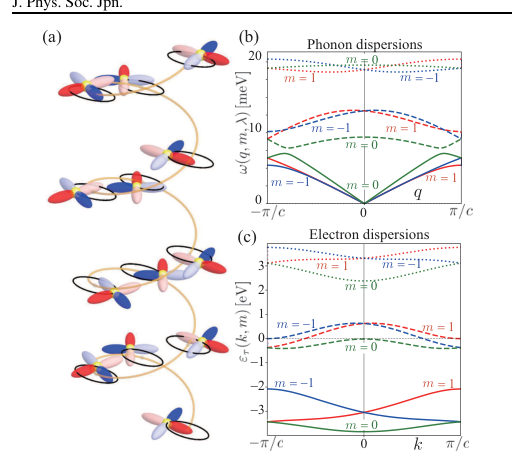 

Fig. 1. (a) Schematic illustration of a rotational phonon mode in a heli- cal crystal and the p-orbital rotation comoving with the displaced ions. The yellow spheres denote ions undergoing rotational motion, the black ellipses represent their classical orbits, and the red and blue lobes depict the two pla- nar electronic p orbitals following the ionic displacement. (b) Phonon and (c) electron dispersions for a chiral crystal belonging to helical line-group sym- metry L31, resolved by CAM m = ±1, 0. Electron dispersions are obtained using the Slater–Koster parameters: t0 ++ = t0 −−= 0.242964, t0 00 = 1.034072, t0 +−= −0.496482 + 0.859932i, t0 +0 = −0.665492 −1.152666i, t0 −0 = (t0 +0)∗, and...

📷 Fig 2

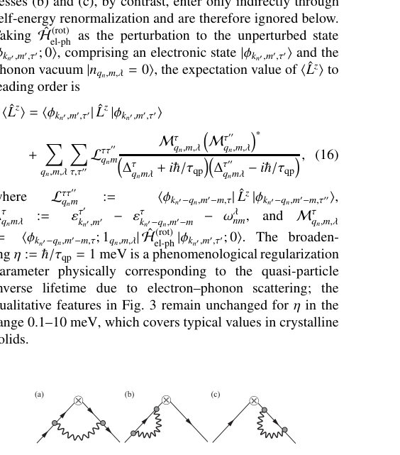 

Fig. 2. Diagrammatic representation of the leading-order contributions to ⟨ˆLz⟩from the electron–phonon interaction. Solid arrowed lines: electron propagation; wavy lines: chiral-phonon propagation; filled circles: rotational electron–phonon vertices at which CAM is exchanged between electrons and phonons (the phonon CAM is correlated with its mechanical angular mo- mentum19)); crossed circles: insertion of ˆLz. Process (a) shows the dominant contribution to ⟨ˆLz⟩evaluated in this work; processes (b) and (c) show self- energy corrections to the electron propagation.

📷 Fig 3

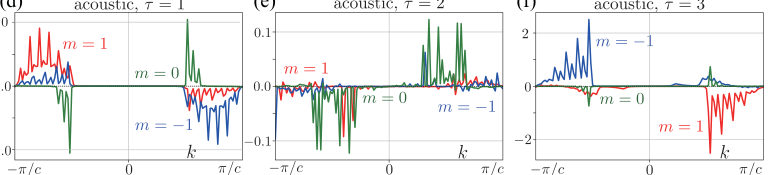 

Fig. 3. Expectation value of ⟨ˆLz⟩/ℏas a function of k. The same Slater–Koster parameters as in Fig. 1 (c) are used. The value 1/(Mc2) = 1.0×1042 kg−1m−2, consistent with typical ionic masses and lattice constants of helical crystals, is adopted. The top row (a)–(c) shows the unperturbed contribution for different initial electronic states, τ = 1, 2, 3, while the lower panels (d)–(f) display the perturbative contribution [second term in Eq. (16)] for acoustic phonon branch λ = 1. Within each panel, curves represent the m = +1 (red), m = −1 (blue), and m = 0 (green) branches.

**Main problem.**

The paper investigates the microscopic mechanism of Chirality-Induced Orbital Selectivity (CIOS) in helical crystals, specifically how chiral phonons transfer angular momentum to electronic orbital degrees of freedom.

**Main result.**

The authors derive a rotational electron-phonon interaction that drives orbital transfer (m_l to m_l - m_s) following crystal angular momentum conservation, finding that the orbital response is enhanced at intermediate wave vectors and suppressed near the Gamma point and BZ boundary.

**Method.**

A symmetry-based microscopic theory using the irreducible representations of the helical line group L31, employing perturbation theory and a modified tight-binding approximation.

**Summary.**

This paper provides a microscopic theoretical framework for understanding how chiral phonons in helical crystals induce orbital selectivity in electrons. By analyzing the rotational electron-phonon interaction, the authors show that angular momentum is transferred from the lattice to the electronic p-orbitals in a way that conserves crystal angular momentum. This mechanism provides a fundamental link to the phenomenon of Chirality-Induced Spin Selectivity (CISS). The study also predicts that this effect is highly dependent on the crystal momentum, being most prominent at intermediate wave vectors.

Detailed structure

**Model / system.**

A 1D effective model of a 3D helical crystal with L31 symmetry (e.g., Tellurium) featuring p-orbital electrons and chiral phonon modes.

**Key observables.**

The expectation value of the z-component of orbital angular momentum <L_z>

**Important parameters / regimes.**

Electronic orbital index (m_l), phonon rotational mode eigenvalue (m_s), helical rotation angle (alpha), and wave vector (k).

**Assumptions / limitations.**

Weak-coupling regime; use of a discrete lattice definition for local rotation; expansion of the overlap integral to first order in nuclear displacement.

**Figures summary.**

Fig 1 shows schematic rotational phonon modes, phonon dispersions by CAM, and electron dispersions. Fig 2 provides a diagrammatic representation of the leading-order contributions to orbital angular momentum. Fig 3 shows the unperturbed orbital angular momentum response.

**Paper structure.**

The paper introduces the problem of CIOS, defines the helical crystal model and Hamiltonian, derives the analytical form of the rotational electron-phonon vertex, calculates the orbital angular momentum response using perturbation theory, and discusses the connection to CISS and k-dependent suppression/enhancement.

Abstract

We present a microscopic theory of chirality-induced orbital selectivity (CIOS) in helical crystals, in which truly chiral phonons selectively transfer angular momentum to electronic orbital degrees of freedom. For a threefold helical crystal with line-group symmetry $L3_1$, we show that phonon-induced local rotations generate a rotational electron--phonon interaction proportional to $\hat{L}^{\pm}$, which drives the orbital transfer $m_{\ell}\to m_{\ell}-m_{s}$ in accordance with crystal angular momentum (CAM) conservation, where $m_{s}=\pm 1$ denotes the eigenvalue of the phonon rotational mode. Evaluating $\langle\hat{L}^{z}\rangle$ to leading order in perturbation theory, we find that the orbital response is suppressed near the $Γ$ point and the BZ boundary, and enhanced at intermediate wave vectors -- a feature intimately tied to the degeneracy structure of the phonon bands.

[↑ back to top](#top)

### [Non-Oberbeck-Boussinesq effects in coldwater](http://arxiv.org/abs/2604.24979v1)

**Authors:** Gustavo Estay, Daisuke Noto, Hugo N. Ulloa

**Type:** theory · **Category:** other · **PDF:** <https://arxiv.org/pdf/2604.24979v1>

**Analysis basis:** full PDF text, analyzed in chunks

📷 Fig 1

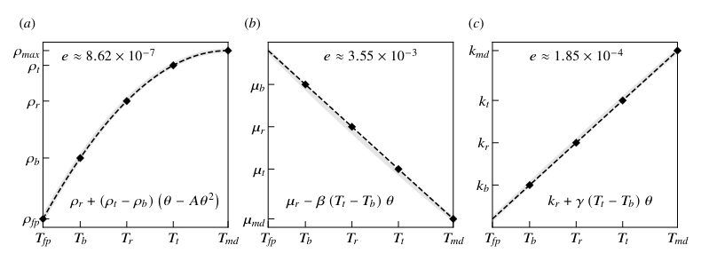 

Figure 1. Temperature dependence of material properties for cold water, including (a) density, (b) dynamic viscosity and (c) thermal conductivity. Black dashed lines correspond to the models described in § 2.1, while key values are highlighted with diamonds, considering example values of 𝑇𝑏, 𝑇𝑟and 𝑇𝑡. Actual values of water properties are shown with continuous grey lines. The maximum relative error of each model is indicated in the corresponding panel, and defined for a general function 𝑓(𝑇) as 𝑒= max𝑇(| 𝑓−𝑓model| /| 𝑓|).

📷 Fig 2

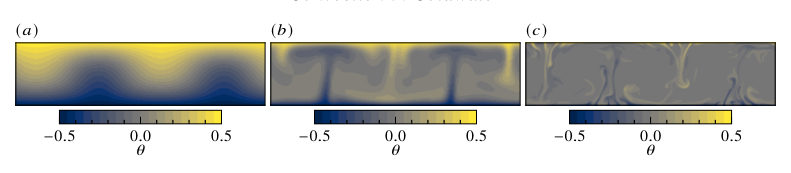 

Figure 2. Instantaneous snapshots of the temperature field 𝜃for cases with variable material properties for different values of the Rayleigh number: (𝑎) Ra = 2.15 × 103, (𝑏) Ra = 2.15 × 105, (𝑐) Ra = 4.64 × 107.

📷 Fig 3

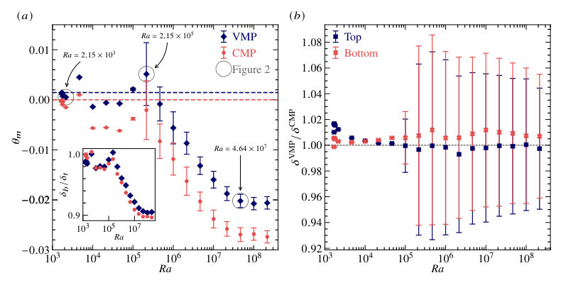 

Figure 3. (𝑎) Mean temperature 𝜃𝑚as a function of the Rayleigh number Ra for simulations with CMP (red circles) and VMP (blue diamonds). Vertical bars denote temporal variability through standard deviation at steady state. The horizontal dashed lines indicate the mean temperature for the conductive state for cases with CMP (red) and VMP (blue). Cases that are also shown in figure 2 are highlighted with a grey circle. The inset shows the ratio between bottom and top boundary layer thickness 𝛿𝑏/𝛿𝑡following the previous notation for CMP and VMP cases, without indicating temporal variability. (𝑏) Ratio between boundary layer thickness of VMP and CMP cases 𝛿VMP/𝛿CMP as a function of the Rayleigh...

📷 Fig 4

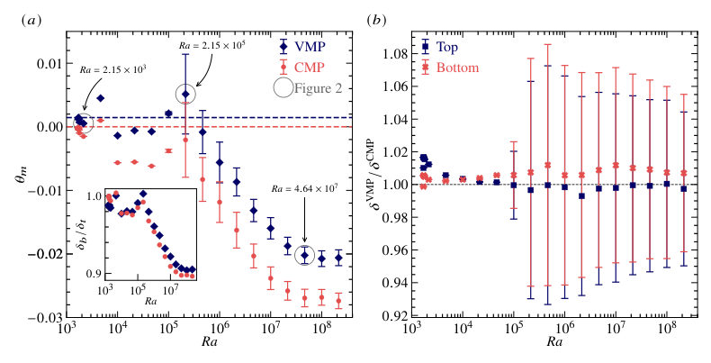 

Figure 4(𝑏) shows the Reynolds number, defined in (2.13), as a function of Ra −Ra𝑐. Consistent with the previous analysis of the heat transfer rate, the behaviour of the Re can be effectively described by power laws in the same two regimes. The region close to the onset exhibits an exponent of 0.5, while an exponent of 0.58 is observed for the strongly supercritical regime. Again, there is no significant difference in the exponents obtained from the simulations with CMP and VMP.

📷 Fig 5

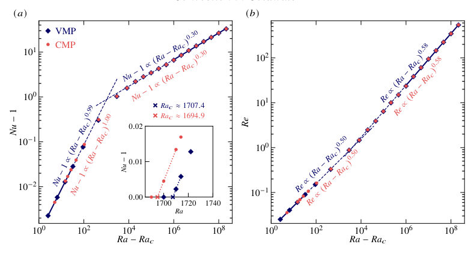 

Figure 4. (𝑎) Heat transfer rate represented by ‘Nu −1’ as a function of ‘Ra −Ra𝑐’ for VMP (blue diamonds) and CMP (red circles) cases. Solid blue lines represent power-law fits for the VPM case across low and high Ra regions, whereas the dashed lines correspond to their extrapolation. In the fully steady convective regime, the fit obtained is Re ∝(Ra −Ra𝑐); in the turbulent convective regime, the fitting gives Re ∝(Ra −Ra𝑐)0.3. The inset shows ‘Nu−1’ as a function of Ra in a range close to the onset, where the dotted lines indicate the extrapolation used to estimate the critical Rayleigh numbers Ra𝑐(see § 3), which are indicated by crosses on the horizontal axis. (𝑏) Reynolds number, Re,...

📷 Fig 6

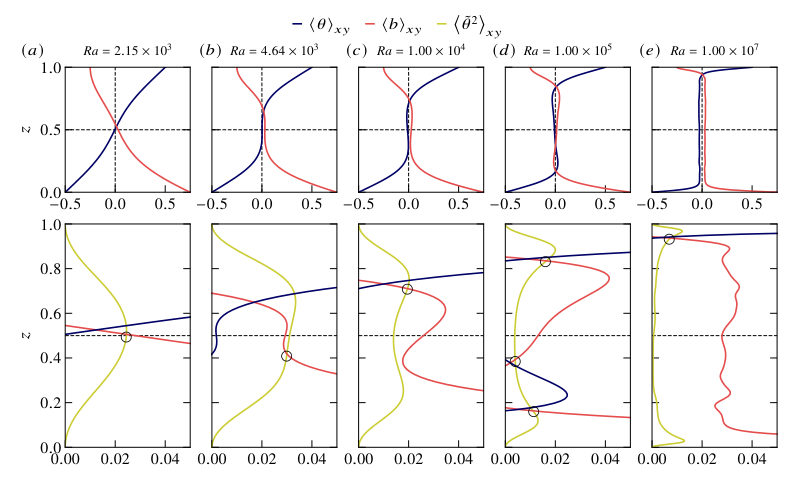 

Figure 5. Horizontally-averaged temperature, buoyancy, and temperature variance for increasing Ra, showing reduced upper-lower asymmetry and an upward shift of the zero-crossing of the mean temperature ⟨𝜃⟩𝑥𝑦, from positive to negative bulk mean temperature. The intersection between ⟨𝑏⟩𝑥𝑦and ⟨˜𝜃2⟩𝑥𝑦that determines the change in temperature sign is highlighted with black circles.

📷 Fig 7

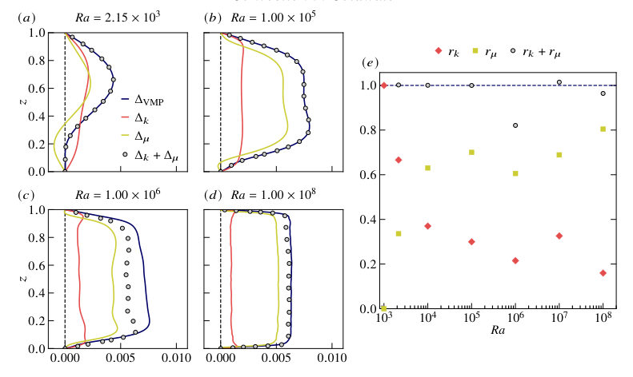 

Figure 6. Panels from (𝑎) to (𝑑) show the individual and joint effects of variable conductivity and viscosity in the laterally-averaged temperature profile, with respect to the CMP case (5.1), for different Rayleigh numbers. Panel (𝑒) shows the relative effect of variable conductivity (𝑟𝑘) and viscosity (𝑟𝜇) in the temperature increase with respect to their joint effect (5.2), as a function of the Rayleigh number. To emphasise the nonlinear interaction between variable viscosity and conductivity, the linear superposition of their individual effects is shown with grey circles in all panels.

**Main problem.**

Investigating how non-Oberbeck-Boussinesq effects, specifically nonlinear density-temperature relations and temperature-dependent viscosity and thermal conductivity, modify Rayleigh-Bénard convection in coldwater systems.

**Main result.**

The study finds that these effects break the vertical symmetry of the temperature profile, shift the critical Rayleigh number, and that while heat transfer follows classical scaling after accounting for the shift, the Reynolds number scaling matches Grossmann-Lohse theory at an intermediate Prandtl number.

**Method.**

Two-dimensional Direct Numerical Simulations (DNS) using the Dedalus spectral solver.

**Summary.**

This paper examines how the unique physical properties of water near freezing—such as its non-linear density relation and temperature-dependent viscosity—affect convective heat transfer. Using direct numerical simulations, the authors show that these 'non-Oberbeck-Boussinesq' effects break the vertical symmetry of temperature profiles and shift the onset of convection. The results demonstrate that despite these complexities, the heat transfer and flow velocity still follow established scaling theories when the shift in the critical Rayleigh number is properly accounted for. This work is significant for understanding heat distribution and mixing in ice-covered aquatic environments.

Detailed structure

**Model / system.**

A Rayleigh-Bénard convection framework representing ice-bounded aquatic systems, utilizing a quadratic equation of state for density and linear models for temperature-dependent viscosity and thermal conductivity.

**Key observables.**

Nusselt number (Nu), Reynolds number (Re), mean temperature (theta_m), boundary layer thicknesses, and critical Rayleigh number (Ra_c).

**Important parameters / regimes.**

Rayleigh number (Ra), Prandtl number (Pr), and dimensionless parameters A (EOS nonlinearity), B (viscosity contrast), and C (conductivity contrast).

**Assumptions / limitations.**

The density dependence is modeled via a quadratic equation of state, and viscosity and thermal conductivity variations are modeled linearly.

**Figures summary.**

Figure 1 displays the temperature dependence of water properties, specifically the quadratic model for density and linear models for dynamic viscosity and thermal conductivity.

**Paper structure.**

The paper introduces the problem of non-Oberbeck-Boussinesq effects in coldwater, describes the numerical model and governing equations, presents results regarding symmetry breaking and temperature shifts, analyzes scaling laws for heat and momentum transport, and concludes with implications for cryospheric dynamics.

Abstract

Water exhibits an anomalous nonlinear temperature-density ($ρ$-$T$) relation as it approaches freezing, along with an increase in viscosity, and a decrease in thermal conductivity. These departures from the standard Oberbeck--Boussinesq approximation, which assumes constant material properties and a linear $ρ$-$T$ relation, can modify convection in ice-bounded aquatic systems, yet their effects remain unexplored. Here, we examine these effects via the canonical Rayleigh--Bénard convection framework using direct numerical simulations. We show that non-Oberbeck--Boussinesq effects lower the mean fluid temperature relative to the standard case and break the classical symmetry of the mean temperature profile. The magnitude of this symmetry breaking depends on both the Rayleigh number $Ra$ and the temperature-dependent material properties retained in the governing equations. We further identify a small but measurable shift in the critical Rayleigh number, $Ra_c$. After accounting for this shift, the nondimensional heat transfer rate, $Nu$, follows the classical scaling with supercriticality, while $Re$ remains consistent with the Grossmann--Lohse unifying theory, $Re\propto (Ra-Ra_c)^{1/2}$ for low-$Ra$ convection (regime $\mathrm{I}_u$) and $Re\propto (Ra-Ra_c)^{4/7}$ at high-$Ra$ (regime $\mathrm{III}_u$). Unlike the classical expectation that the latter scaling arises at high Prandtl number, here it is obtained at an intermediate Prandtl number, $Pr\sim 10$. Our results establish how near-freezing material anomalies affect both local and global properties of convection, with implications for heat distribution and mixing in cryospheric liquid waters.

[↑ back to top](#top)

### [Physical properties of transition metal hydride superconductors Mg2TmH6 (Tm = Rh, Pd, Ir, Pt) by first-principles calculations](http://arxiv.org/abs/2604.25626v1)

**Authors:** Md Ashraful Alam, Md Abdul Hadi Shah, F. Parvin, S. H. Naqib

**Type:** theory · **Category:** other · **PDF:** <https://arxiv.org/pdf/2604.25626v1>

**Analysis basis:** full PDF text, analyzed in chunks

📷 Fig 1

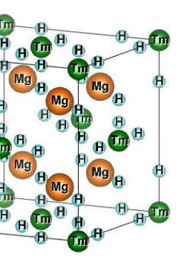 

Fig. 1. Crystal structure of Mg2TmH6 (Tm = Rh, Pd, Ir, Pt).

📷 Fig 2

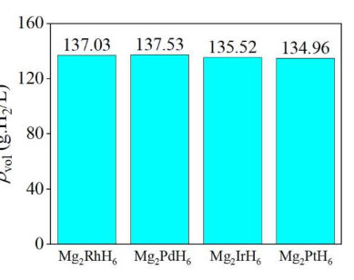 

Fig. 2. Hydrogen energy storage capacity of Mg2TmH6 (Tm = Rh, Pd, Rr, Pt).

📷 Fig 3

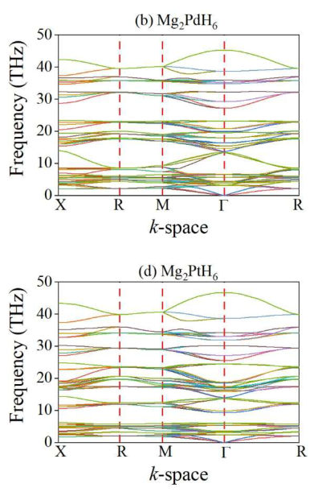 

Fig. 3. Phonon dispersion curve for Mg2TmH6 (Tm = Rh, Pd, Ir, Pt).

📷 Fig 4

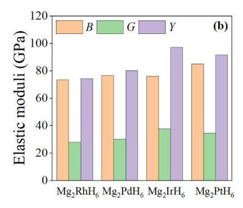 

Fig. 4. (a) Elastic constants and (b) elastic moduli of Mg2TmH6.

📷 Fig 5

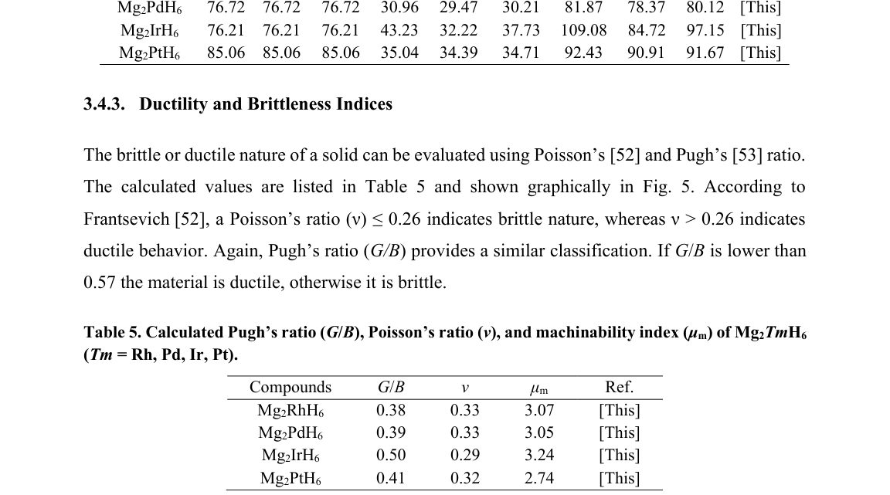 

Fig. 4 shows that all the studied compounds exceed the critical value of Poisson’s ratio and fall

📷 Fig 6

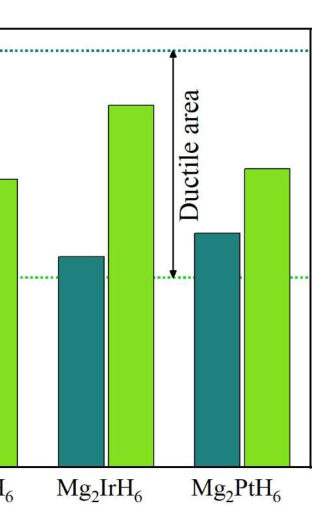 

Fig. 5. Poisson’s ratio and Pugh’s ratio of Mg2TmH6.

📷 Fig 7

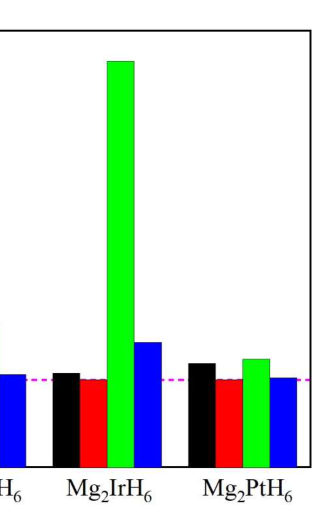 

Fig. 6. Anisotropy indices of Mg2TmH6.

📷 Fig 8

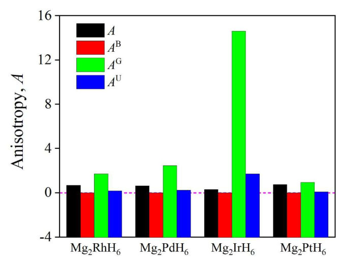 

Fig. 6 shows that Mg2IrH6 stands out with significantly higher shear anisotropy (Aᴳ) and universal

📷 Fig 9

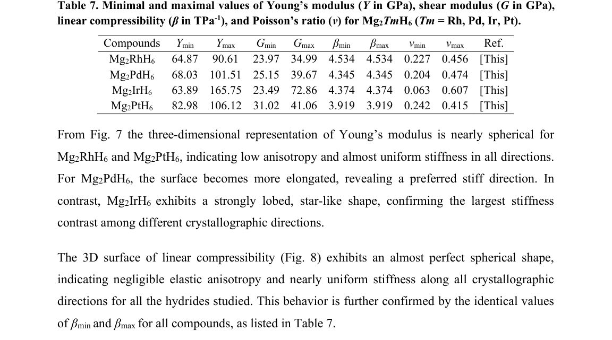 

Fig. 9 shows that the shear modulus surface of Mg2RhH6 is relatively rounded with moderately

📷 Fig 10

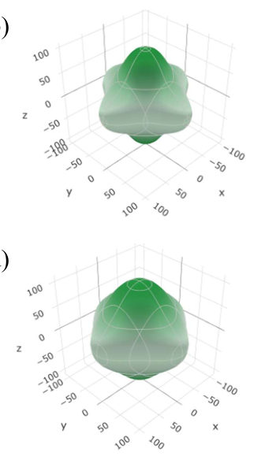 

Fig. 7. 3D view of Young’s modulus for (a) Mg2RhH6, (b) Mg2PdH6,

**Main problem.**

The study investigates the structural, electronic, mechanical, thermodynamic, and optical properties of a specific family of transition metal hydrides (Mg2TmH6, where Tm = Rh, Pd, Ir, Pt) to evaluate their potential for hydrogen storage, superconductivity, and optoelectronic applications.

**Main result.**

The hydrides are found to be thermodynamically, mechanically, and dynamically stable, with predicted superconducting transition temperatures between 25-44 K and significant potential for hydrogen storage and UV optoelectronics.

**Method.**

First-principles calculations using Density Functional Theory (DFT) within the CASTEP code, employing the Generalized Gradient Approximation (GGA) and the plane-wave pseudopotential method.

**Summary.**

This paper uses first-principles DFT calculations to comprehensively characterize a family of transition metal hydrides (Mg2RhH6, Mg2PdH6, Mg2IrH6, and Mg2PtH6). The researchers demonstrate that these materials are stable and possess multi-functional properties, including potential for high-temperature superconductivity, efficient hydrogen storage, and use in UV optoelectronics. The study specifically highlights the mechanical robustness and the interesting elastic anisotropy found in these compounds.

Detailed structure

**Model / system.**

A series of cubic transition metal hydrides with the formula Mg2TmH6 (Tm = Rh, Pd, Ir, Pt) belonging to the Fm-3m space group.

**Key observables.**

Lattice parameters, cohesive energy, formation enthalpy, hydrogen storage capacity (gravimetric and volumetric), elastic constants, Young's modulus, Bulk modulus, shear modulus, superconducting transition temperature (Tc), and optical reflectivity/absorption.

**Important parameters / regimes.**

Transition metal type (Tm), superconducting transition temperature (25-44 K), hydrogen storage capacity (2.42-3.84 wt%), and melting temperatures (up to 1577.51 K).

**Assumptions / limitations.**

The superconducting transition temperature calculation assumes a linear dependence of the electron-phonon coupling constant on the density of states at the Fermi level and a constant electron-phonon interaction strength.

**Figures summary.**

Figure 1 shows the crystal structure; Figure 2 displays hydrogen storage capacities; Figure 3 shows phonon dispersion curves; Figures 7-10 present 3D elastic anisotropy surfaces; Figure 15 illustrates optical properties including absorption and conductivity.

**Paper structure.**

The paper begins with structural and stability analysis, followed by mechanical and elastic property investigations, then moves to thermophysical and acoustic properties, and concludes with electronic, superconducting, and optical property characterizations.

Abstract

In this work, a comprehensive first-principles investigation of the structural, hydrogen storage potential, electronic, elastic, mechanical, thermophysical, superconducting, and optical properties of Mg2TmH6 (Tm = Rh, Pd, Ir, Pt) hydrides is presented. Obtained results demonstrate that Mg2TmH6 hydrides combine favorable hydrogen storage, mechanical robustness, superconductivity, and multifunctional optical properties, making them promising candidates for energy storage, superconducting and advanced optoelectronic applications.

[↑ back to top](#top)

### [Proximity Ferroelectricity Driven by Mobile High-Miller-Index Domain Walls](http://arxiv.org/abs/2604.25343v1)

**Authors:** Changming Ke, Shi Liu

**Type:** theory · **Category:** other · **PDF:** <https://arxiv.org/pdf/2604.25343v1>

**Analysis basis:** full PDF text, analyzed in chunks

📷 Fig 1

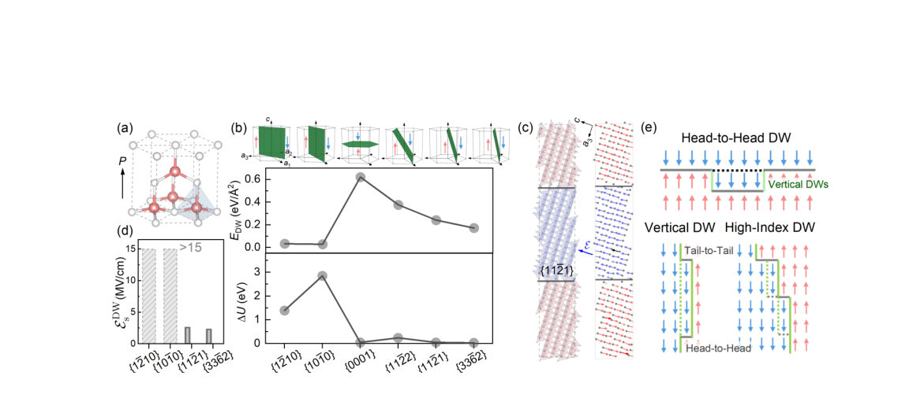 

FIG. 1. High-Miller-index domain walls enable switching in pristine AlN at low electric

📷 Fig 2

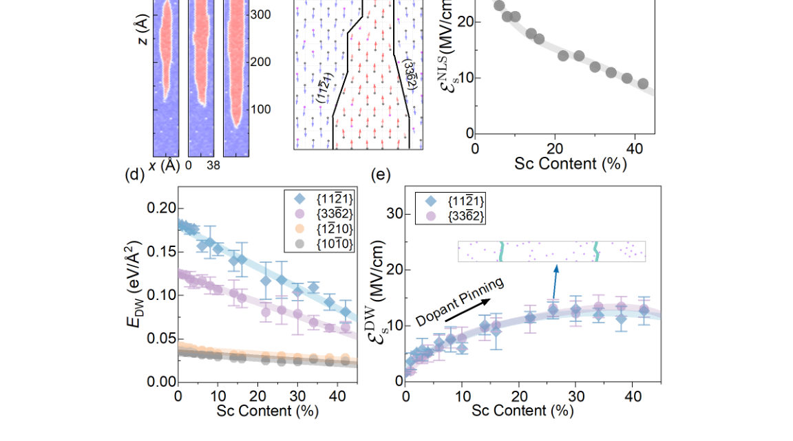 

FIG. 2. Dual role of Sc doping in domain nucleation and DW motion. (a) Domain

📷 Fig 3

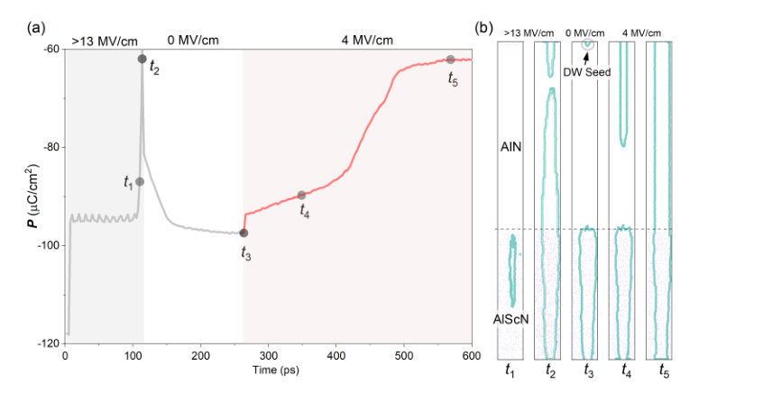 

FIG. 3. Proximity ferroelectricity in AlN/Al0.6Sc0.4N originates from the injection

📷 Fig 4

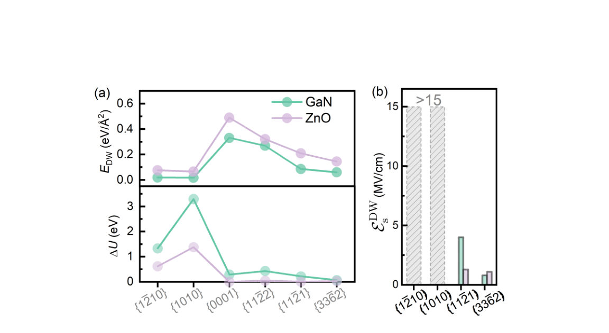 

FIG. 4. Mobile high-index DWs in polar wurtzites. (a) DFT-calculated DW energies and

**Main problem.**

Explaining the 'proximity ferroelectricity' puzzle, where undoped AlN layers undergo polarization reversal when in contact with ferroelectric AlScN layers.

**Main result.**

The study identifies high-Miller-index domain walls as the driving mechanism, which are nucleated by Sc dopants in AlScN and then propagate rapidly through undoped AlN due to reduced pinning.

**Method.**

The researchers used first-principles DFT calculations, Ab initio Molecular Dynamics (AIMD), and large-scale Machine-Learning Molecular Dynamics (MLMD) using the Deep Potential model.

**Summary.**

This paper resolves the mystery of how undoped AlN can switch polarization when placed next to ferroelectric AlScN. The authors show that high-index domain walls, which are stabilized by Scandium, act as seeds that move easily into the undoped layers. This 'divide-and-conquer' mechanism allows for low-field switching across thick undoped layers. The findings suggest that controlling high-index interfaces is a powerful way to engineer ferroelectric properties in nitride-based electronics.

Detailed structure

**Model / system.**

The physical system consists of wurtzite-structure heterostructures, specifically AlN/AlScN multilayers, as well as comparisons to GaN and ZnO.

**Key observables.**

Domain wall formation energy (E_DW), migration barriers (delta U), switching fields (E_DW^s), and Avrami exponents (n).

**Important parameters / regimes.**

Scandium (Sc) concentration, electric field strength (ranging from low-field to 15 MV/cm), and Miller indices of domain walls.

**Assumptions / limitations.**

The study assumes the validity of the Deep Potential model for large-scale atomistic simulations and focuses on the kinetic aspects of domain wall motion.

**Figures summary.**

Fig 1 shows the AlN unit cell, the correlation between domain wall energy and migration barriers, and a schematic of the domain wall motion mechanics.

**Paper structure.**

The paper introduces the proximity ferroelectricity puzzle, presents the discovery of mobile high-index walls via DFT and MLMD, details the dual role of Sc dopants in nucleation and pinning, and concludes with the 'divide-and-conquer' mechanism in heterostructures.

Abstract

Wurtzite ferroelectrics such as scandium-doped aluminum nitride (AlScN) are promising for next-generation memory because of their compatibility with semiconductor processes and strong spontaneous polarization. Ferroelectric switching in these materials is typically attributed to doping-induced softening of the bulk switching barrier. However, recent reports of proximity ferroelectricity, in which undoped AlN layers up to 500 nm thick fully switch in AlN/AlScN multilayers, challenge this view. Here, we reveal an alternative switching mechanism mediated by high-Miller-index domain walls, long overlooked due to their complex geometry and presumed instability. Using first-principles calculations and machine-learning molecular dynamics simulations, we show that these walls, once nucleated, migrate with exceptionally low barriers. The Sc dopants play a dual role: they stabilize high-index walls and thereby promote nucleation, while also introducing pinning that hinders wall motion. In multilayers, our simulations demonstrate that mobile domain walls nucleated in AlScN can propagate deep into adjacent AlN, where they move easily without dopant pinning, enabling low-field switching across thick undoped layers. This microscopic divide-and-conquer mechanism resolves the puzzle of proximity ferroelectricity and highlights high-index interfaces as an underexplored lever for controlling ferroelectric switching.

[↑ back to top](#top)

### [Reversible Modulation of Thermal Conductivity in GaN via Strain-Driven Reorganization of Dislocation Ensembles](http://arxiv.org/abs/2604.25287v1)

**Authors:** Shantal Adajian, Fanghao Zhang, Zeyu Xiang, Tanay Tak, Miguel Zepeda-Rosales, Nikhil Tulshibagwale, Kirk Fields, Bolin Liao

**Type:** both · **Category:** disordered systems and neural networks · **PDF:** <https://arxiv.org/pdf/2604.25287v1>

**Analysis basis:** full PDF text, analyzed in chunks

📷 Fig 1

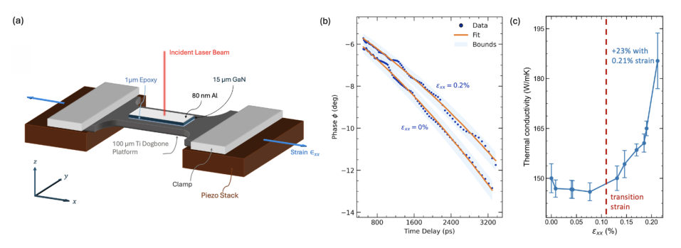 

Figure 1: In-situ strain-dependent thermal conductivity measurements in c-plane

📷 Fig 2

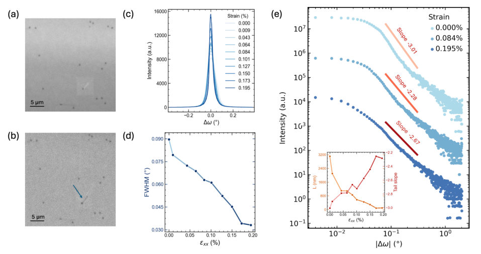 

Figure 2: Cathodoluminescence (CL) and High-resolution x-ray diffraction char-

📷 Fig 3

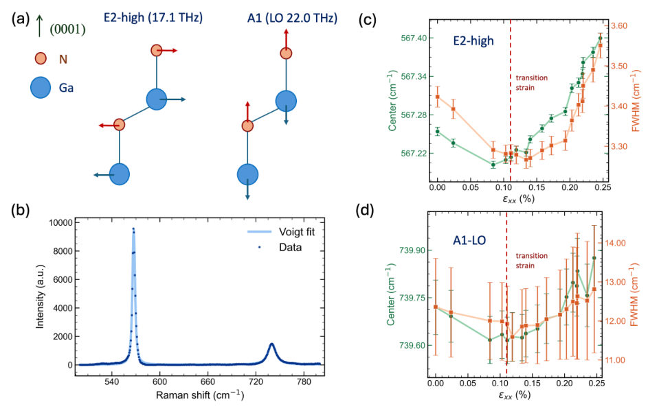 

Figure 3: Strain-dependent Raman spectroscopy of c-plane GaN. (a) The two

**Main problem.**

Investigating whether the thermal transport in GaN can be dynamically and reversibly controlled by using elastic strain to reorganize dislocation ensembles.

**Main result.**

A 23% enhancement in thermal conductivity was observed under only 0.21% uniaxial tensile strain, driven by the strain-induced screening and ordering of dislocation strain fields.

**Method.**

The study combines in situ time-domain thermoreflectance (TDTR), high-resolution x-ray diffraction (HRXRD), Raman spectroscopy, and cathodoluminescence imaging with DFT and phonon Boltzmann transport simulations.

**Summary.**

This paper demonstrates that the thermal conductivity of GaN can be reversibly increased by 23% through the application of very small amounts of elastic strain. Instead of reducing the number of defects, the strain causes existing dislocations to reorganize into more ordered, screened configurations that scatter phonons less effectively. This work introduces dislocation correlations as a new, tunable degree of freedom for controlling heat transport in crystalline solids.

Detailed structure

**Model / system.**

The physical system is c-plane Gallium Nitride (GaN) thin films containing threading dislocation ensembles, manipulated via a uniaxial strain platform using piezoelectric stacks.

**Key observables.**

Thermal conductivity, dislocation density, dislocation correlation range, XRD diffuse scattering power law, and Raman phonon linewidth.

**Important parameters / regimes.**

Uniaxial tensile strain (up to 0.21%), dislocation density (10^7-10^10 cm^-2), and a strain threshold of ~0.1%.

**Assumptions / limitations.**

Dislocation-related phonon scattering is approximated via the Carruthers expression, and the measured thermal response is assumed to reflect bulk transport rather than surface effects.

**Figures summary.**

Figure 1 shows the experimental setup and the increase in thermal conductivity with strain; Figure 2 shows CL maps of dislocations before and after strain cycling; Supplemental figures show XRD rocking curves, Raman spectra, and FEM strain simulations.

**Paper structure.**

The paper introduces the problem of static defects, presents the experimental strain platform, details the thermal and structural measurements (TDTR, XRD, Raman), provides computational validation (DFT, BTE), and concludes with the mechanism of dislocation reorganization.

Abstract

Crystalline defects are generally regarded as static phonon scatterers that irreversibly suppress thermal transport. Here we show that elastic strain can dynamically and reversibly reorganize dislocation ensembles and strongly modify heat conduction. Using in situ strain-dependent time-domain thermoreflectance measurements, we observe a reversible enhancement of thermal conductivity in GaN by 23% under only 0.21% uniaxial strain. High-resolution x-ray diffraction reveals progressive narrowing of the symmetric (0002) reflection together with a crossover of the diffuse scattering tails from a $q^{-3}$ to a $q^{-2}$ power law, indicating a strain-induced change in the statistical correlations of threading dislocations. Raman spectroscopy further shows a non-monotonic evolution of the $E_{2}^{\mathrm{high}}$ phonon linewidth, with a minimum near the same threshold strain at which thermal conductivity sharply increases. These results support a picture in which elastic strain promotes reversible screening and ordering of long-range dislocation strain fields, thereby reducing phonon scattering. Our work establishes defect correlations as a tunable degree of freedom for controlling thermal transport in crystalline solids.

[↑ back to top](#top)

### [Spin-Axis-Layer Locking for Intrinsic Bipolar Altermagnetic Semiconductors: Proof-of-Concept in Bilayer CuBr2](http://arxiv.org/abs/2604.25658v1)

**Authors:** Wei Ma, Dengpan Ma, Zhiheng Lv, Zhifeng Liu

**Type:** theory · **Category:** strongly correlated electrons · **PDF:** <https://arxiv.org/pdf/2604.25658v1>

**Analysis basis:** full PDF text, analyzed in chunks

📷 Fig 1

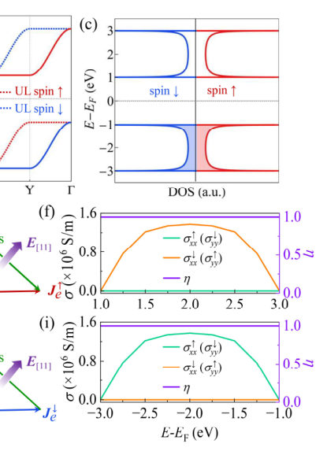 

Fig. 1. Schematic illustration of the SALL model for intrinsic BAMSs. (a) Schematic of the lattice model comprising two perpendicularly stacked quasi-1D FM monolayers (UL: upper layer; BL: bottom layer). (b) Spin- and layer-resolved band structure and (c) the corresponding DOS. Orthogonal Fermi-surface contours for the conduction (d) and valence (g) bands. Schematics of the SALL effect for (e) electron- and (h) hole-doped regimes. Energy-dependent conductivities and spin polarization (η) for electrons (f) and holes (i).

📷 Fig 2

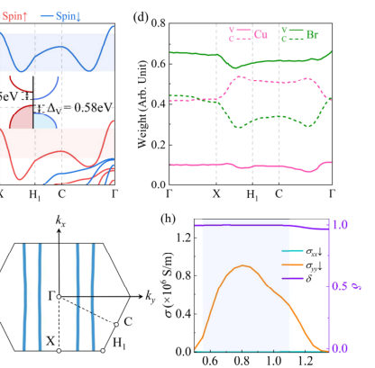 

Fig. 2. Characterization of the quasi-1D FM CuBr2 monolayer building block. (a) Crystal structure and (b) simulated STM image. (c) Spin-resolved band structure, with the inset illustrating the ideal BMS nature. The shaded regions highlight the broad energy windows that host open 1D Fermi surfaces. (d) Atom-resolved wave-function weights for the topmost valence (V, solid lines) and bottommost conduction (C, dashed lines) bands. 2D Fermi surface contours for the (e) valence and (g) conduction bands. Calculated energy-dependent conductivities (σxx, σyy) and the directional polarization ratio (δ) for the (f) hole- and (h) electron-doped regimes. The corresponding shaded areas in (f) and (h)...

📷 Fig 3

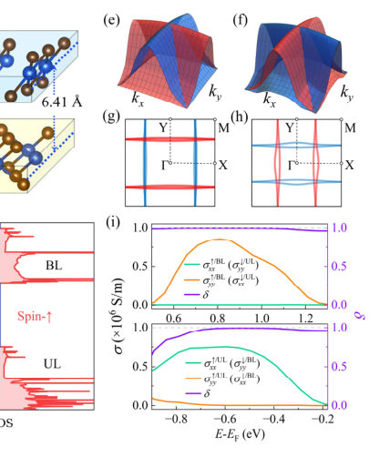 

Fig. 3. Altermagnetic state and intrinsic SALL effect in the cross-stacked CuBr2 bilayer. (a) Top and (b) perspective views of the 90°-rotated bilayer structure. (c) Spin-resolved band structure with d-wave spin splitting (inset). (d) Spin- and layer-projected DOS. 3D “tent-like” band dispersions for the (e) valence and (f) conduction bands. 2D orthogonal intersecting Fermi surface contours for the (g) hole- and (h) electron-doped regimes. (i) Calculated energy-dependent, spin- and layer-resolved conductivities alongside the directional polarization ratio (δ) for electrons (top panel) and holes (bottom panel).

📷 Fig 4

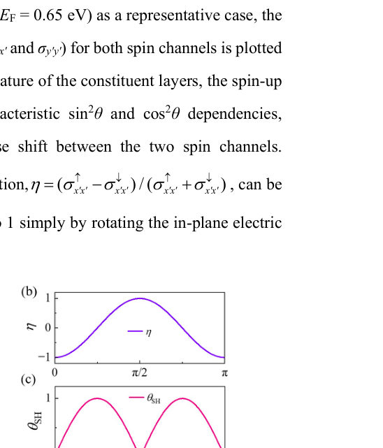 

Fig. 4. Macroscopic anisotropic transport and optimal pure spin current generation. Angular dependence of the calculated transport properties for the electron-doped regime (E−EF = 0.65 eV). (a) Longitudinal (σx'x') and transverse (σy'y') conductivities for the spin-up (top panel) and spin-down (bottom panel) channels as a function of the electric field angle θ. (b) Tunable longitudinal spin polarization (η) driven by the in- plane electric field angle. (c) The charge-to-spin conversion efficiency (effective spin Hall angle, θSH), reaching a theoretical maximum of 1.0 at θ = π/4 and 3π/4.

**Main problem.**

The challenge is to achieve efficient, all-electrical control of spin and magnetic degrees of freedom in spintronics without relying on external strain, valley polarization, or external magnetic fields.

**Main result.**

The authors propose a Spin-Axis-Layer Locking (SALL) paradigm in a twisted bilayer of CuBr2 that enables 100% spin polarization and near-unity charge-to-spin conversion efficiency via electrostatic gating.

**Method.**

The study uses first-principles DFT calculations to identify the material properties and a tight-binding Hamiltonian model to simulate transport and symmetry properties.

**Summary.**

This paper introduces a new way to control spin in a material called an altermagnetic semiconductor. By twisting two layers of CuBr2 by 90 degrees, the researchers created a state where the spin of an electron is tied to both the specific layer it is in and the direction it is moving. This 'locking' allows for highly efficient electrical switching of spin currents using only a gate voltage, potentially leading to much lower-power spintronic devices.

Detailed structure

**Model / system.**

A bilayer system formed by vertically stacking two quasi-1D ferromagnetic CuBr2 monolayers with a 90-degree twist, creating an A-type altermagnetic state.

**Key observables.**

Spin polarization (eta), conductivity (longitudinal and transverse), directional polarization ratio (delta), and effective spin Hall angle (theta_SH).

**Important parameters / regimes.**

Curie temperature (Tc approx 38.6 K), exchange splitting (Delta_V = 3.45 eV, Delta_C = 0.58 eV), and electron-doped vs. hole-doped regimes.

**Assumptions / limitations.**

The layers are assumed to be decoupled due to a large van der Waals gap, and the transport is modeled using a minimal tight-binding Hamiltonian.

**Figures summary.**

Figure 4 shows the angular dependence of conductivities, the tunability of longitudinal spin polarization with electric field angle, and the charge-to-spin conversion efficiency.

**Paper structure.**

The paper introduces the limitations of existing BAMS systems, proposes the SALL paradigm using a 90-degree twisted CuBr2 bilayer, demonstrates the symmetry and electronic structure via DFT, and analyzes transport properties and switching capabilities via tight-binding modeling.

Abstract

Electrical control of spin and magnetic sublattice degrees of freedom is essential for multifunctional and low-power spintronic devices. Bipolar altermagnetic semiconductors (BAMSs)-characterized by opposite spin polarizations at the valence and conduction band edges-offer such control, yet known systems require external strain and sizable valley polarization for gate-tunable switching. Here, we propose a universal spin-axis-layer locking (SALL) paradigm to overcome these limitations. By stacking two quasi-1D ferromagnetic monolayers with a 90 degrees twist, the bilayer reconstructs altermagnetic symmetry, yielding an intrinsic BAMS state where carrier spin is locked to specific layers and transport directions. Using synthesized CuBr2 monolayers as proof-of-concept, we demonstrate via first-principles calculations a robust BAMS state. Electrostatic gating enables simultaneous, reversible switching of carrier type, spin, and active layer, generating fully spin-polarized axial charge currents and directionally controllable pure spin currents with near-unity charge-to-spin conversion efficiency. This SALL model establishes a versatile, strain-independent strategy for advanced all-electrical altermagnetic devices.

[↑ back to top](#top)

### [Structure Prediction and Bonding Analysis of B$_{18}$Ag$_2$ Clusters Featuring Double-Ring Motifs](http://arxiv.org/abs/2604.25908v1)

**Authors:** Peter Ludwig Rodríguez-Kessler

**Type:** theory · **Category:** other · **PDF:** <https://arxiv.org/pdf/2604.25908v1>

**Analysis basis:** full PDF text, analyzed in chunks

📷 Fig 1

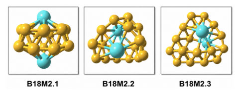 

FIG. 1. Lowest energy structures for B18Ag2 cluster at PBE0/def2-TZVP.

📷 Fig 2

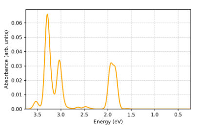 

FIG. 2. IR and UV-VIS spectra of B18Ag2 cluster.

📷 Fig 3

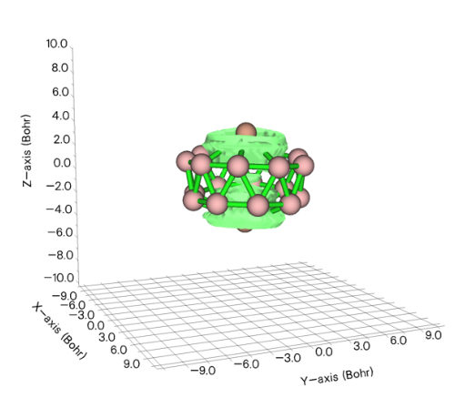 

FIG. 3. Reduced density gradient (RDG) isosurface for the B18Ag2 cluster (isovalue s=0.5).

📷 Fig 4

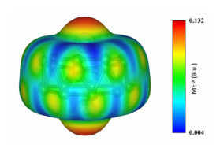 

FIG. 4. Molecular electrostatic potential (MEP) mapped onto the electron density isosurface (ρ = 0.01 a.u.) for the B18Ag2 cluster.

**Main problem.**

The study investigates the structural stability, electronic structure, and bonding characteristics of silver-doped boron clusters, specifically B18Ag2.

**Main result.**

The global minimum is identified as a bent double-ring structure of two stacked B9 rings stabilized by Ag atoms, featuring aromatic-like sigma-delocalization and weak Ag-B electrostatic interactions.

**Method.**

Density Functional Theory (DFT) using ORCA 6.0.0 with PBE0 and omegaB97X-D3 functionals, combined with basin-hopping global optimization and real-space bonding analyses (ELF, RDG, MEP).

**Summary.**

This paper explores how silver doping stabilizes boron nanostructures by forming a bent double-ring motif. Using DFT and global optimization, the authors show that the stability is driven by electron delocalization within the boron framework. The silver atoms act as axial stabilizers through weak electrostatic interactions. The study provides insights into the electronic and optical properties of metal-doped boron clusters, which could be relevant for designing new nanostructures.

Detailed structure

**Model / system.**

The physical system is the B18Ag2 cluster, a silver-doped boron nanostructure consisting of two stacked B9 rings with Ag atoms positioned axially.

**Key observables.**

UV-Vis absorption spectrum, IR vibrational spectrum, electron localization function (ELF), reduced density gradient (RDG), and molecular electrostatic potential (MEP).

**Important parameters / regimes.**

Relative energies of isomers (eV), vibrational frequencies (cm-1), and electronic transition energies (eV).

**Assumptions / limitations.**

The study focuses on the B18M2 size regime and does not explore the interaction of Ag with larger boron clusters or other metal compositions.

**Figures summary.**

Figure 1 shows the lowest energy isomers; Figure 2 displays calculated IR and UV-Vis spectra; Figure 3 presents the RDG isosurface for multicenter bonding; Figure 4 shows the MEP mapped onto the electron density.

**Paper structure.**

The paper follows a logical progression from structural optimization and isomer energy comparison to detailed electronic, optical, and vibrational analysis, concluding with a discussion on the role of coinage-metal doping.

Abstract

The structural stability, electronic structure, and bonding characteristics of the silver-doped boron cluster B18Ag2 were investigated using density functional theory (DFT) combined with global optimization techniques. Basin-hopping searches identify a bent double-ring structure as the global minimum, consisting of two stacked B9 rings symmetrically stabilized by Ag atoms located above and below the boron framework. The UV-Vis absorption spectrum exhibits weak transitions in the near-infrared region and intense bands in the visible and near-ultraviolet regions, reflecting delocalized electronic excitations within the boron framework. Charge analysis indicates moderate electron redistribution from Ag atoms to the boron scaffold. Real-space bonding analyses based on the electron localization function (ELF), reduced density gradient (RDG), and molecular electrostatic potential (MEP) reveal that bonding is dominated by {$σ$}-delocalization over the boron skeleton, while Ag-B interactions are weak, non-directional, and primarily electrostatic. The continuous annular electron delocalization within the double-ring structure suggests an aromatic-like character. These findings establish B18Ag2 as a silver-stabilized boron double-ring cluster in which global electron delocalization governs structural stability, while Ag atoms act as axial stabilizing centers that modulate the electronic structure. This work provides new insight into the role of coinage-metal doping in stabilizing extended boron nanostructures.

[↑ back to top](#top)

### [Substitutional platinum as an efficient nonradiative recombination center in silicon](http://arxiv.org/abs/2604.25621v1)

**Authors:** Zhenxing Dai, Menglin Huang, Xin-Gao Gong, Shiyou Chen

**Type:** theory · **Category:** other · **PDF:** <https://arxiv.org/pdf/2604.25621v1>

**Analysis basis:** full PDF text, analyzed in chunks

📷 Fig 1

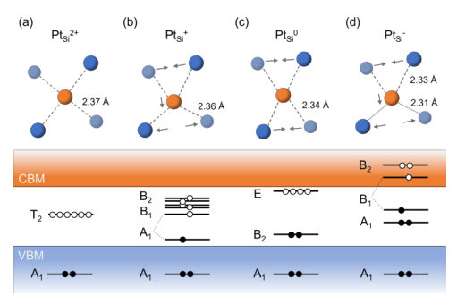 

FIG. 1. Equilibrium atomic structures of the platinum substitutional defect in the (a) double-positive, (b) single-positive, (c) neutral, and (d) single-negative charge states. Platinum atom is shown in orange and silicon atoms are in blue, with each unique Si-Pt bond length labeled. The corresponding electron energy level diagrams at the Γ point with character symmetry labels are shown in the bottom panel.

📷 Fig 2

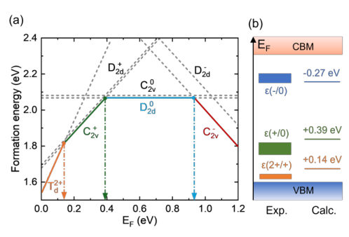 

FIG. 2. (a) Calculated formation energies of the PtSi defect as a function of the Fermi level (EF). Solid lines represent the ground- state configuration for each charge state (T 2+ d , C+ 2v, D0 2d, and C− 2v), while dashed lines denote higher-energy metastable configurations. The vertical dashed arrows mark the thermodynamic transition lev- els. (b) Comparison between the calculated transition levels (this work) and experimental values1,8,12,16,17,19,23,25. All energies are referenced to the VBM or CBM as indicated.

📷 Fig 3

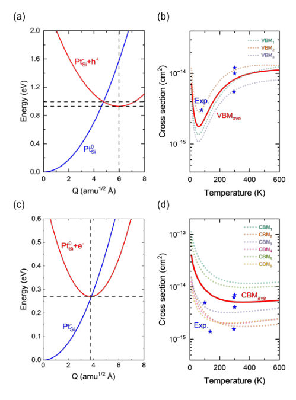 

FIG. 3. (a) CC diagram for hole capture (Pt− Si + h+ →Pt0 Si) to the D2d neutral state. (b) Calculated σpA as a function of tempera- ture, showing the average value (solid line) and contributions from three degenerate VBM states (dotted lines) compared with exper- imental data1,17,20,25 (stars). (c) CC diagram for electron capture (Pt0 Si + e−→Pt− Si) from the D∗ 2d neutral state. (d) Calculated σnA compared with experimental data1,8,12,17,23,25. Solid and dotted lines show the average and individual contributions from six CBM states.

📷 Fig 4

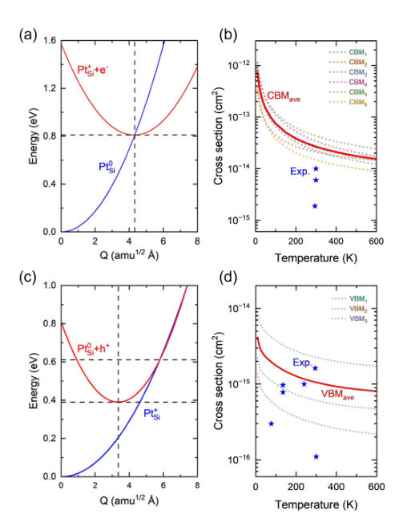 

FIG. 4. (a) CC diagram for electron capture (Pt+ Si +e−→Pt0 Si) to the D2d neutral state. (b) Calculated σnD as a function of temperature, showing the average value (solid line) and contributions from six degenerate CBM states (dotted lines) compared with experimental data1,17,20 (stars). (c) CC diagram for hole capture (Pt0 Si +h+ →Pt+ Si) from the D∗ 2d neutral state. (d) Calculated σpD compared with ex- perimental data1,8,12,17,23,25 (stars). Solid and dotted lines show the average and individual contributions from three VBM states.

**Main problem.**

The study aims to resolve the debate regarding the microscopic nonradiative recombination mechanism of substitutional platinum (PtSi) in silicon and determine if its donor and acceptor levels are the primary recombination-controlling states.

**Main result.**

The researchers found that both donor and acceptor levels of PtSi exhibit large capture cross sections, making it an effective recombination center, and that accounting for symmetry-equivalent Jahn-Teller configurations is crucial for matching experimental values.

**Method.**

First-principles calculations using Density Functional Theory (DFT) with the HSE hybrid functional and VASP, combined with nonradiative multiphonon theory and the Climbing Image Nudged Elastic Band (CI-NEB) method.

**Summary.**

This paper investigates how platinum impurities in silicon act as efficient centers for nonradiative carrier recombination. By using advanced first-principles simulations, the authors show that the capture of electrons and holes is driven by specific electronic transitions at donor and acceptor levels. A key finding is that the efficiency of this process is highly dependent on Jahn-Teller distortions and the inclusion of symmetry-equivalent defect configurations. The results provide a microscopic understanding that aligns well with experimental observations of carrier lifetime in silicon power devices.

Detailed structure

**Model / system.**

The physical system is substitutional platinum (PtSi) impurities in a silicon (Si) crystal lattice, specifically focusing on deep-level defects that introduce donor and acceptor levels within the band gap.

**Key observables.**

Formation energies, transition levels (2+/+, +/0, 0/-), carrier capture cross sections for electrons and holes, and Pt-Si bond lengths.

**Important parameters / regimes.**

Jahn-Teller distortion symmetries (Td, D2d, C2v), capture cross section magnitudes (10^-15 to 10^-14 cm^2), and temperature-dependent capture behavior.

**Assumptions / limitations.**

Neglected spin-orbit coupling due to negligible effects; use of the harmonic approximation for effective phonon energy; use of a semiclassical picture for carrier capture via potential energy surface crossing.

**Figures summary.**

Figure 1 shows equilibrium atomic structures and energy level diagrams for different charge states; Figure 2 shows calculated formation energies and a comparison of transition levels with experimental data; Figure 3 includes configuration coordinate diagrams and potential energy surfaces.

**Paper structure.**

The paper introduces the problem of PtSi recombination, details the DFT and multiphonon theory methods, presents structural and energetic results (transition levels), discusses the impact of Jahn-Teller distortions on capture cross sections, and concludes with the implications for recombination efficiency.

Abstract

Platinum (Pt) is widely used for carrier-lifetime control in silicon power devices, yet the microscopic nonradiative recombination mechanism of the substitutional platinum ($\text{Pt}_\text{Si}$) dopant remains debated. Using first-principles calculations combined with nonradiative multiphonon theory, we systematically investigate the electronic structures and carrier capture dynamics of $\text{Pt}_\text{Si}$. Our results show that both the donor ($+/0$) and acceptor ($0/-$) levels of $\text{Pt}_\text{Si}$ exhibit large capture cross sections for electron and hole carriers, thereby making $\text{Pt}_\text{Si}$ an effective recombination center. Notably, the calculated capture cross sections are sensitive to the symmetry-equivalent defect configurations with different Jahn-Teller distortions. By accounting for two different $D_{2d}$ configurations of neutral $\text{Pt}_\text{Si}$ during transitions properly, our calculated carrier capture cross sections align well with experimental values. This work provides a microscopic picture of the carrier capture processes induced by $\text{Pt}_\text{Si}$ and emphasizes the importance of symmetry-equivalent configurations in defect-assisted nonradiative recombination.

[↑ back to top](#top)

### [Thermodynamic surface reconstruction governs catalytic behavior in high-entropy alloys](http://arxiv.org/abs/2604.25454v1)

**Authors:** Taegyeong Kim, Youngtak Kim, Sathya Sheela Subramanian, Geun Ho Gu

**Type:** both · **Category:** disordered systems and neural networks · **PDF:** <https://arxiv.org/pdf/2604.25454v1>

**Analysis basis:** full PDF text, analyzed in chunks

📷 Fig 1

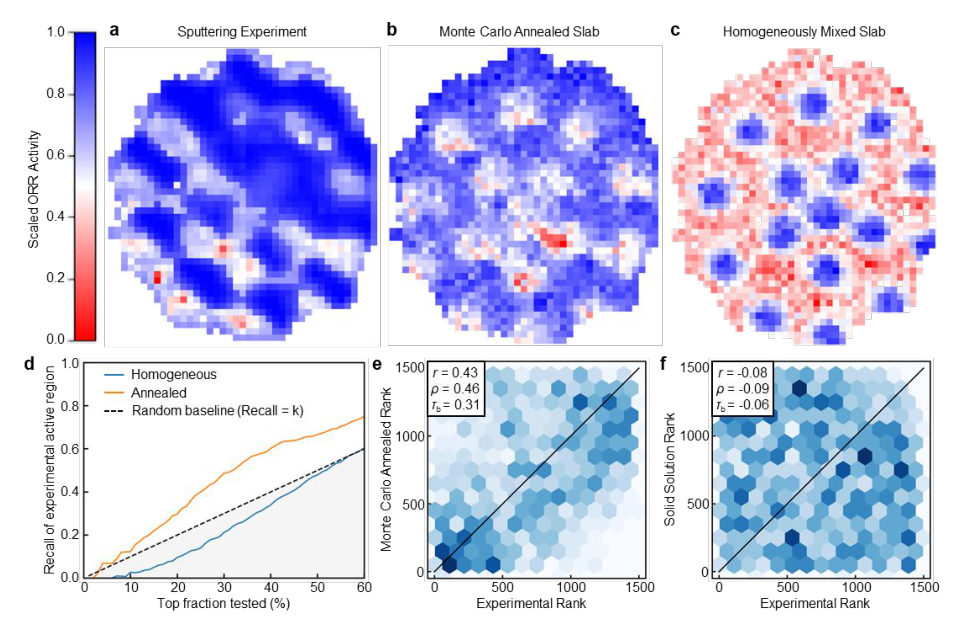 

Figure 1. Homogeneous surface model fails to capture the experimental activity landscape. a Experimental composition-activity map obtained from SECCM measurements of high-throughput sputter sample from Banko et al.19, revealing localized regions of enhanced activity across the compositional space (See Figure S2). b Activity predicted from thermodynamically annealed surfaces, resembling the trend in the experimental map. c Predicted activity assuming a homogeneously mixed surface, which fails to reproduce the experimentally observed features and displays weak spatial correspondence. All activities are min-max normalized. d Continuous recall analysis relative to the random-selection limit...

📷 Fig 2

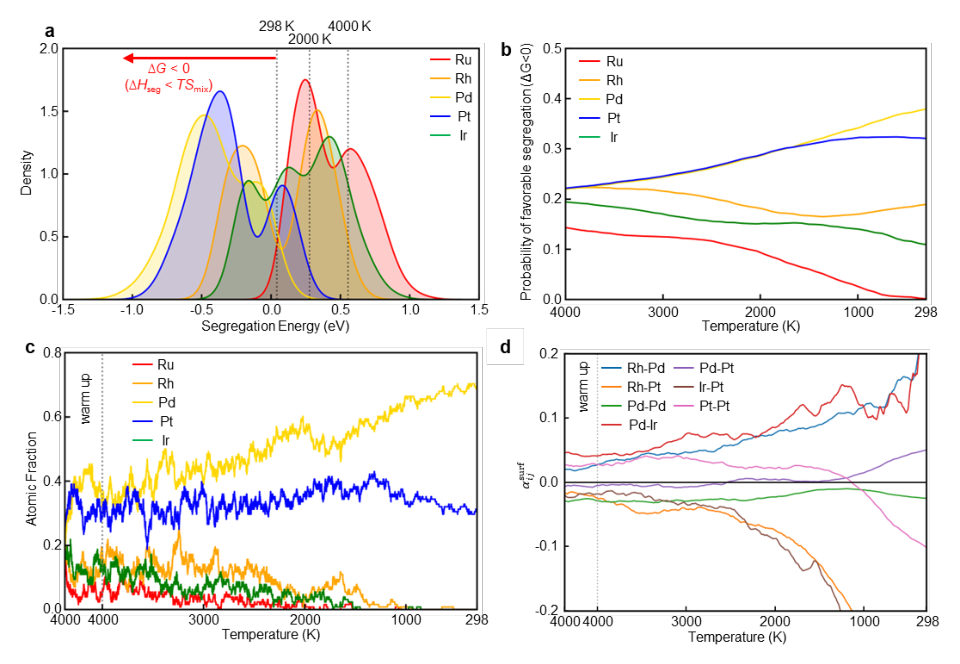 

Figure 2. Thermodynamic origin of surface ordering. a Element-resolved segregation energy distributions showing strong surface preference for Pd and Pt, moderate preference for Rh and Ir, and bulk stabilization of Ru. The dashed line denotes the maximum configurational entropy contribution for reference. The data is constructed by performing random segregation to 50 homogeneous slabs. The vertical lines indicate the 𝑇𝑆𝑚𝑖𝑥 at different temperature. b Probability of favorable segregation events (ΔG &lt; 0) as a function of temperature. Each point represents the normalized fraction of surface-subsurface exchange steps with negative segregation free energy. The distribution reflects the...

📷 Fig 3

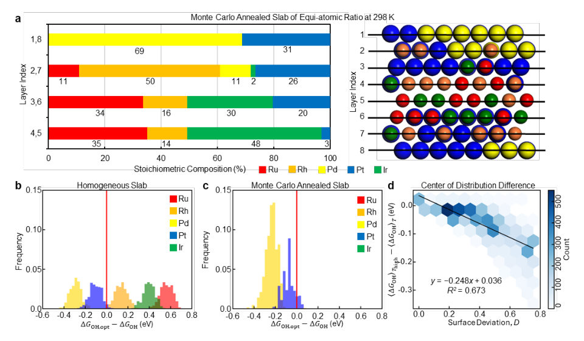 

Figure 3. Surface ordering reshapes the active-site landscape. a Layer-resolved elemental composition of the annealed slab for the equal composition. The surface layer is strongly enriched in Pd and Pt, while Rh preferentially occupies the subsurface layer and Ru/Ir are stabilized in deeper layers, illustrating vertical chemical partitioning of the catalyst. Distribution of the adsorption energy distance from optimal (ΔGOH,opt - ΔGOH) for b homogeneous and c thermodynamically annealed surfaces. The homogeneous model exhibits known multiple distinct bell shaped populations arising from diverse local ensembles, whereas annealing concentrates the distribution into dominant Pd and Pt peaks,...

📷 Fig 4

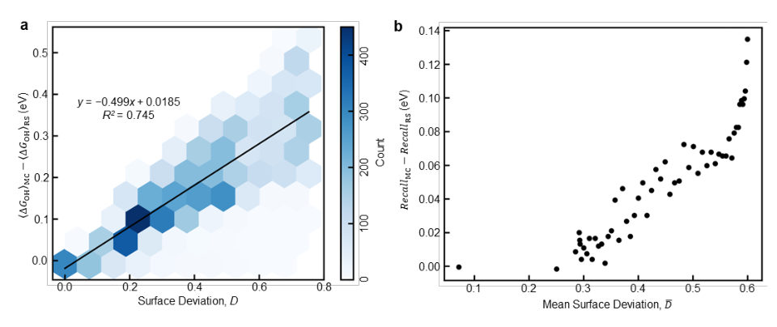 

Figure 4. Surface compositional deviation indicates when homogeneous HEA models break down. a Pixel-wise shift in the mean OH adsorption free energy, ⟨Δ𝐺OH

**Main problem.**

The study investigates the failure of the 'homogeneous surface' assumption in predicting the catalytic activity of high-entropy alloys (HEAs) by neglecting thermodynamic surface reconstruction.

**Main result.**

Thermodynamically annealed surfaces, which account for surface segregation and ordering, accurately reproduce experimental activity landscapes, whereas homogeneous models fail and misidentify active compositions.

**Method.**

The researchers used a Crystal Graph Convolutional Neural Network (CGCNN) to evaluate energies in Monte Carlo Metropolis annealing simulations, comparing these to experimental data from a sputtered combinatorial library characterized via SECCM and EDX.

**Summary.**

This paper demonstrates that predicting the catalytic performance of high-entropy alloys requires accounting for surface reconstruction rather than assuming a random, homogeneous mixture. By using machine-learning-accelerated Monte Carlo simulations, the authors show that thermodynamic annealing leads to surface segregation that narrows the distribution of adsorption energies toward a catalytically favorable state. This finding identifies a critical failure in current screening models that neglect the chemically selective interfaces formed by elemental enrichment. Ultimately, the work establishes that the thermodynamically selected surface state is the true governing parameter for predictive catalysis in multicomponent alloys.

Detailed structure

**Model / system.**

The physical system is a multicomponent high-entropy alloy (Ru-Rh-Pd-Pt-Ir) featuring a vertically stratified surface structure driven by the competition between segregation energetics and configurational entropy.

**Key observables.**

Catalytic activity landscape (OH adsorption energy), surface compositional deviation (D), Warren-Cowley short-range order parameter, and rank correlation coefficients (Spearman, Kendall, Pearson).

**Important parameters / regimes.**

Annealing temperature (ranging from 4000 K to 298 K), surface segregation energy, and the Sabatier optimum for OH adsorption.

**Assumptions / limitations.**

The study assumes that the catalytic activity can be modeled via a linear relationship between adsorption energy and nearest-neighbor elemental composition.

**Figures summary.**

Figure 1 compares experimental and predicted activity maps and shows the failure of homogeneous models; Figure 2 details segregation energies and temperature-dependent surface evolution; Figure 3 shows the contraction of adsorption energy distributions toward the Sabatier optimum; Figure 4 relates adsorption energy shifts to surface compositional deviation.

**Paper structure.**

The paper introduces the problem of model validity, presents experimental and simulated activity maps, analyzes the thermodynamic drivers of surface reconstruction (segregation and ordering), quantifies the predictive error of homogeneous models, and concludes with the establishment of a validity boundary for such models.

Abstract

High-entropy alloys are widely modeled as homogeneously mixed surfaces, yet the validity of this assumption for catalytic prediction remains unclear. Here, we reproduce high-throughput experimental measurements using thermodynamic simulations and show that surface ordering is essential for accurately capturing the compositional activity landscape. Homogeneous surface models fail to reproduce experimentally observed trends and, in some regimes, perform at or below the random-selection baseline. In contrast, thermodynamically annealed surfaces restore meaningful agreement with the experimental activity landscape and substantially improve the recovery of active compositions. Segregation energetics reveal strong surface enrichment of preferred elements, producing chemically selective interfaces that collapse the broad adsorption-energy spectrum of random alloys into a narrower distribution of catalytically favorable sites. By linking predictive error to the degree of short-range order, we identify a validity boundary for homogeneous models and establish the thermodynamically selected surface state as a governing parameter for predictive catalysis in multicomponent alloys.

[↑ back to top](#top)

### [Tuning magnitude and direction of lattice thermal conductivity in transition metal dichalcogenide heterobilayers](http://arxiv.org/abs/2604.25576v1)

**Authors:** Elliot Perviz, Antonio Cammarata

**Type:** theory · **Category:** other · **PDF:** <https://arxiv.org/pdf/2604.25576v1>

**Analysis basis:** full PDF text, analyzed in chunks

📷 Fig 1

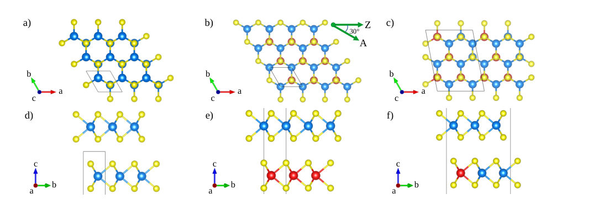 

FIG. 1: Top-down views of a) homobilayer MoS2, b) heterobilayer MoS2-WS2, and c) W-doped heterobilayer MoS2-MoWS2 (33% W); corresponding side views are shown in d)-f), respectively. Mo, S, and W atoms are depicted in blue, yellow, and red. Black lines in each plot draw the boundaries of the associated primitive cell. Green arrows in b) indicate the 30◦sector between one pair of zigzag (Z) and armchair (A) crystallographic axes, where Z is fixed parallel to the a lattice vector and subsequently the Cartesian x direction.

📷 Fig 2

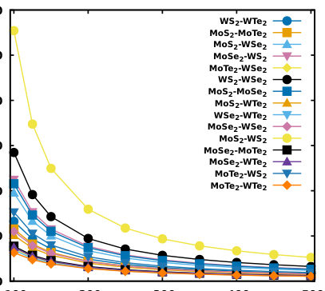 

FIG. 2: Maximum principal conductivity derived from the exact solution of the LBTE via [38] as a function of temperature for the set of unique pristine MX2 heterobilayers.

📷 Fig 3

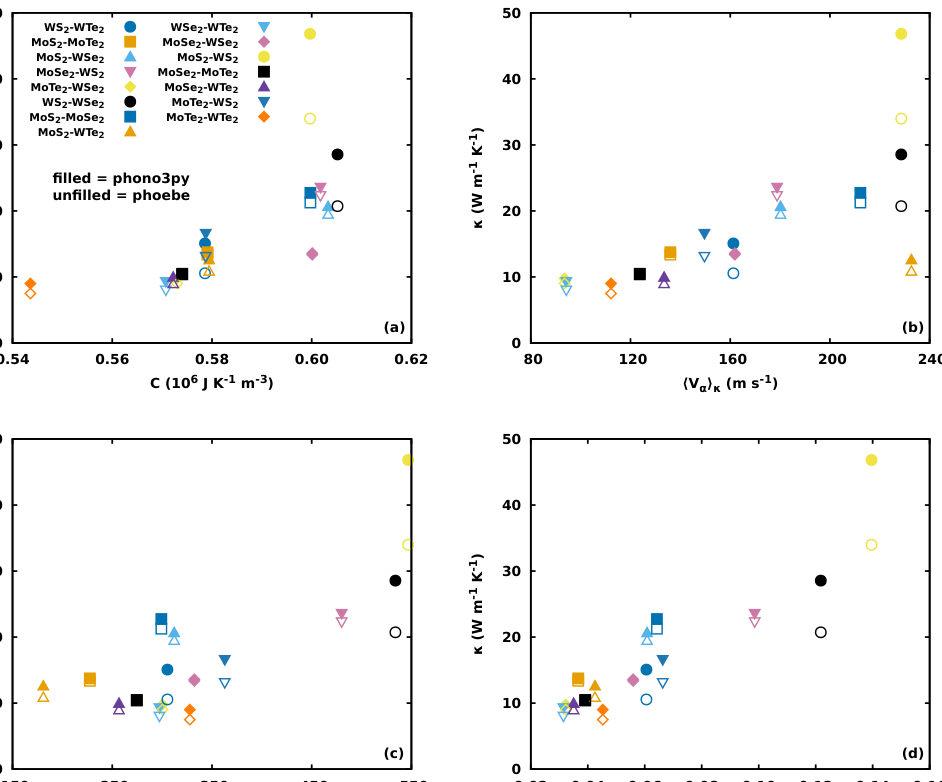 

FIG. 3: Maximum (in=plane) conductivities (κ = κmax = κmin) for the specified set of TMD heterobilayers, as a function of: (a) heat capacity C; (b) transport-weighted modal average relaxon velocities ⟨Vα⟩κ; (c) transport-weighted modal average relaxon lifetimes ⟨τα⟩κ; (d) transport-weighted modal average relaxon mean free paths ⟨Λα⟩κ. Filled and unfilled markers correspond to results obtained from phono3py and phoebe, respectively.

📷 Fig 4

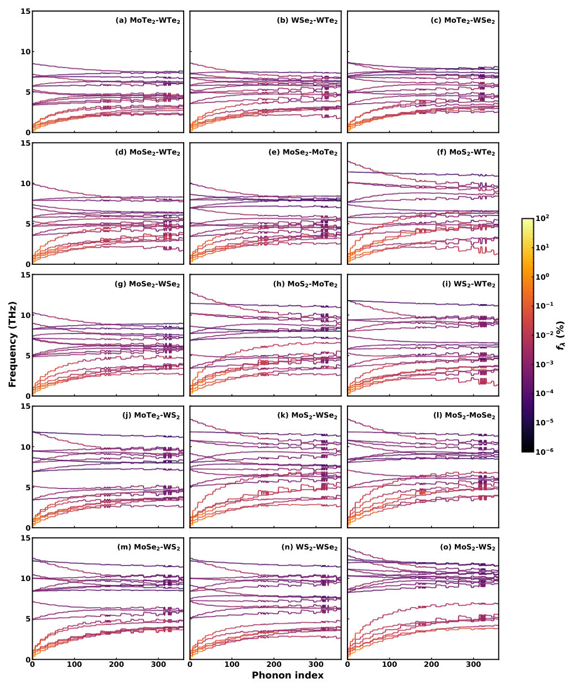 

FIG. 4: |q|-sorted phonon frequencies sampled on the transport mesh, with systems ordered from smallest to largest LTC in plots (a)-(o), determined via phono3py LBTE calculations. The colour distinguishes the percentage contribution of each phonon mode (expressed in %) to the the maximum (in-plane) LTC.

📷 Fig 5

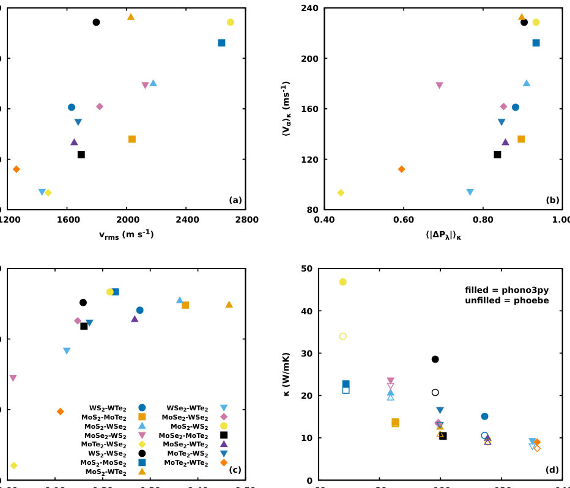 

FIG. 5: (a) Transport weighted modal average relaxon velocity ⟨Vα⟩κ plotted against the root mean square average phonon group velocities vrms in the 0-4 THz frequency range. (b) ⟨Vα⟩κ as a function of the transport-weighted modal average phonon layer participation ⟨∆Pλ⟩κ. (c) ⟨∆Pλ⟩κ as a function of the layer mass contrast |∆M|. (d) Lattice thermal conductivity κ as a function of the average mass ⟨M⟩.

📷 Fig 6

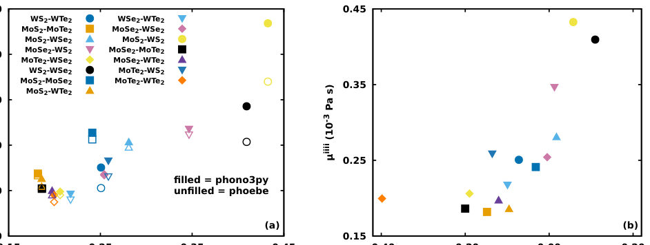 

FIG. 6: (a) Maximum (in-plane) conductivity, κ = κmax = κmin, as a function of the maximum component of thermal viscosity µiiii. (b) µiiii as a function of the M-X cophonicity Cph, i.e. the relative overlap of the atom-projected phonon densities of states between M and X atoms.

📷 Fig 7

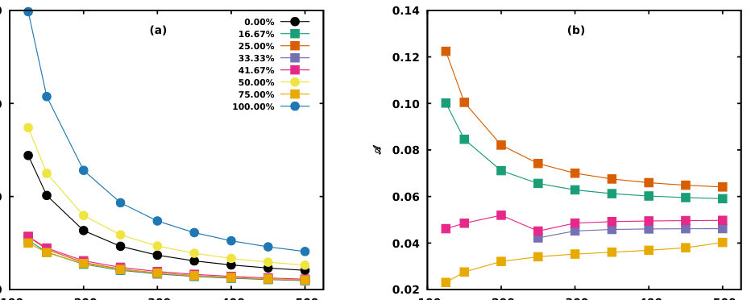 

FIG. 7: Thermal transport properties of doped heterobilayers bounded by MoS2 and WS2 homobilayers, with W treated as the dopant. (a) Maximum in-plane conductivity, κmax, as a function of temperature. (b) Anisotropy, A, between the maximum (emax) and minimum (emin) transport directions.

📷 Fig 8

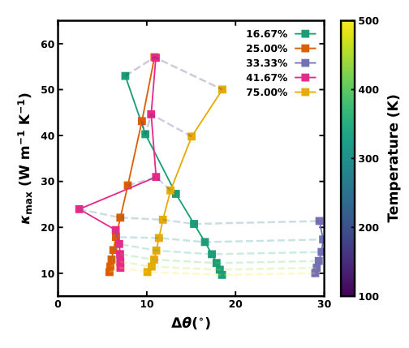 

FIG. 8: Maximum (in-plane) LTC κmax plotted against ∆θ, which describes the deviation of the direction of maximum LTC emax from the nearest zigzag direction. Data-points from different systems at the same temperatures are connected by a faint dashed coloured line, with temperature set according to the colour bar.

📷 Fig 9

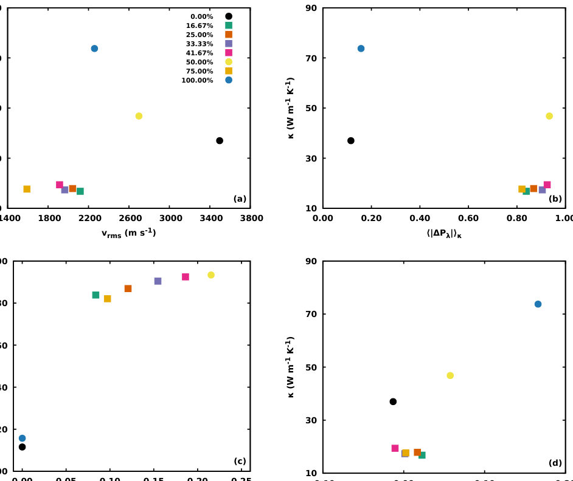 

FIG. 9: (a) Maximum in-plane conductivity κmax as a function of the average phonon group velocity projected onto the direction of maximum transport, vrms, evaluated over the [0, 4] THz frequency range. (b) κmax as a function of the transport-weighted modal average layer mode localisation ⟨|∆Pλ|⟩κ. (c) ⟨|∆Pλ|⟩κ as a function of the layer mass contrast |∆M|. (d) κmax plotted against the M-X cophonicity Cph.

**Main problem.**

Understanding the microscopic mechanisms that determine the magnitude and direction of lattice thermal conductivity (LTC) in transition metal dichalcogenide (TMD) heterobilayers and how doping can tune these properties.

**Main result.**

Pristine heterobilayers exhibit isotropic in-plane LTC, while W-doped systems exhibit reduced and anisotropic LTC where the direction of maximum transport can be tuned via doping and temperature.

**Method.**

First-principles calculations using VASP and phono3py, employing the 'relaxon' framework to solve the linearized Boltzmann transport equation and analyzing phonon-based descriptors.

**Summary.**

This study investigates how the lattice thermal conductivity in TMD heterobilayers can be controlled. By using a 'relaxon' framework, the authors show that thermal transport is linked to phonon group velocity and layer localization. They demonstrate that while pristine layers are isotropic, introducing dopants breaks symmetry, allowing for the tuning of the direction of maximum heat flow. This provides a potential pathway for designing 2D materials with customized thermal properties.

Detailed structure

**Model / system.**

Pristine and W-doped MX2-M'X2 transition metal dichalcogenide (TMD) heterobilayers, specifically focusing on Mo-W-S-Se-Te configurations.

**Key observables.**

Lattice thermal conductivity (LTC), phonon group velocity, layer localization, phonon lifetime, mean free path, and thermal viscosity.

**Important parameters / regimes.**

Temperature, mass contrast between layers, dopant concentration (x), and lattice mismatch.

**Assumptions / limitations.**

Neglects extrinsic scattering (isotopes, defects, boundaries) for pristine layers; assumes the validity of the relaxon framework for heat transport.

**Figures summary.**

Figure 1 shows atomic arrangements of homobilayers, heterobilayers, and doped bilayers; Figure 2 plots LTC vs. temperature; Figure 3 shows correlations between LTC and phonon descriptors; Figure 5 illustrates the relationship between relaxon velocity and phonon group velocity.

**Paper structure.**

The paper introduces the problem of thermal transport in TMDs, describes the first-principles and relaxon-based methodology, analyzes pristine heterobilayers to establish phonon-based descriptors, investigates the effects of W-doping on anisotropy, and concludes with implications for high-throughput material design.

Abstract

We investigate the nanoscale mechanisms determining lattice thermal conductivity (LTC) of pristine and W-doped MX$_2$-M$^\prime$X$^\prime_2$ transition metal dichalcogenide heterobilayers from first principles, using the exact solution of the linearised Boltzmann transport equation in both phonon and relaxon bases. Pristine heterobilayers exhibit isotropic in-plane LTC with preserved ordering across temperature. Relaxon analysis identifies descriptors linking LTC to phonon properties such as the phonon group velocity and layer localisation. While systems with lighter atoms generally favour higher LTC, a sufficiently large mass contrast is required to induce layer localisation of the transport-relevant vibrational modes. Further, we show through the thermal viscosity that the relative distribution of vibrational states between metal/non-metal sublattices influences the balance between Normal and Umklapp scattering processes. On the other hand, doped systems exhibit reduced and anisotropic in-plane LTC, retain a well-defined layer character, but are strongly affected by enhanced phonon-phonon scattering due to mass disorder. Notably, we find that both configuration and temperature dictate the direction of maximum thermal transport, which opens the possibility to tune the direction of maximum (and minimum) conductivity via doping in novel 2D functional materials. Thanks to its general formulation, the analysis protocol can be readily extended to other van der Waals heterostructures, and the descriptors may be implemented in high-throughput engines to identify promising layered materials with tailored thermal transport characteristics.

[↑ back to top](#top)

### [Universal material basis for biocompatible printed electrolytes in Organic Electrochemical Transistors](http://arxiv.org/abs/2604.25830v1)

**Authors:** Moritz Flemming, Paul Zechel, Rakesh R. Nair, Emil Mahnke, Markus Löffler, Alyna Ong, Bernd Rellinghaus, Lukas M. Eng, Karl Leo, Hans Kleemann

**Type:** experiment · **Category:** other · **PDF:** <https://arxiv.org/pdf/2604.25830v1>

**Analysis basis:** full PDF text, analyzed in chunks

📷 Fig 1

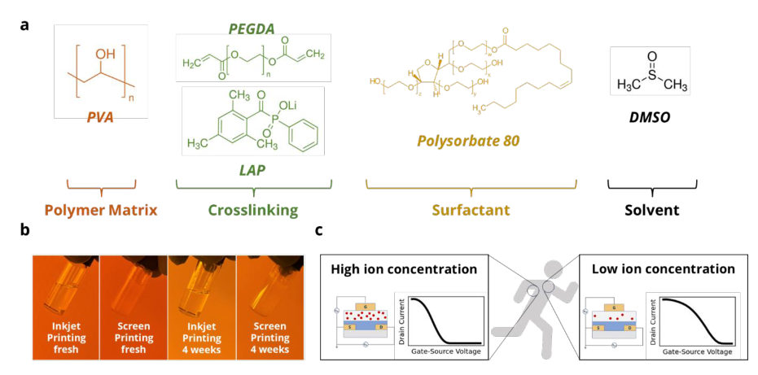 

Figure 1: a) Components used in the material basis. Adding an ionic liquid forms the ionic gel ink (IGI). (b) IGI solutions based on [MTEOA][MeOSO3] for inkjet / screen printing freshly prepared and after 4 weeks without differences visible. (c) Application of an OECT as a sensor to analyze the sweat production for athletes.

📷 Fig 2

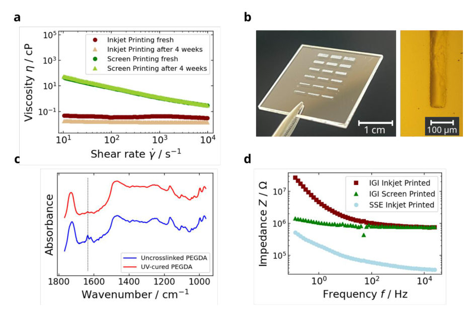 

Figure 2: (a) Shear rate dependent viscosity of IGI formulations. (b) Micrograph of screen printed and inkjet IGI structures. For screen printing, the resolution can be downscaled to 200 µm, while 60 µm are possible for inkjet printing. (c) FTIR spectrum of IGI thin films before and after UV curing. The characteristic C=C double-bond vibration peak at 1636 cm-1 almost completely vanishes when PEGDA polymerizes. (d) Impedance of IGI films compared to a solid-state electrolyte (SSE)[25].

📷 Fig 3

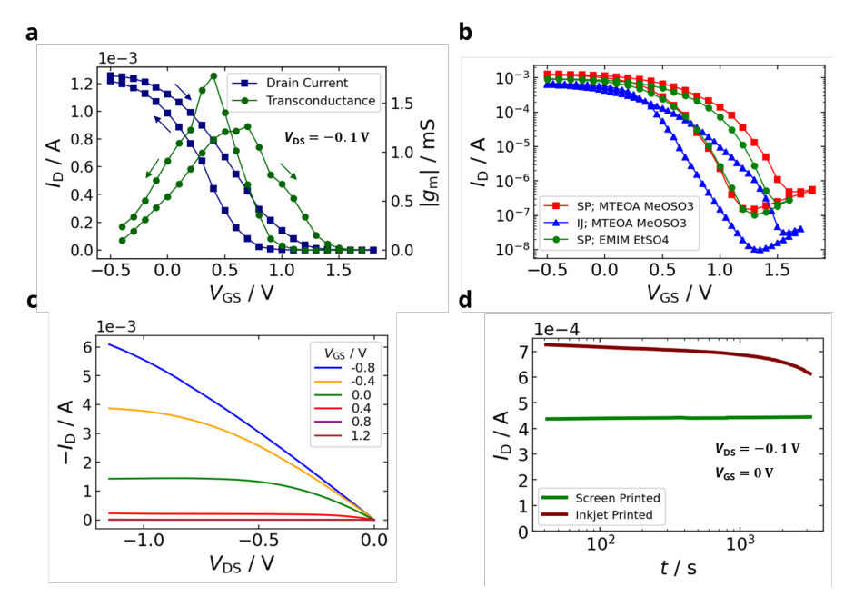 

Figure 3: (a) Transfer curve and transconductance |gm| of an OECT with screen printed IGI. (b) Transfer curve comparison for three different IGI formulations. (c) Output characteristics of a device with inkjet-printed IGI. (d) Stability analysis for OECTs with IGI under constant gate voltage VG = 0 V.

📷 Fig 4

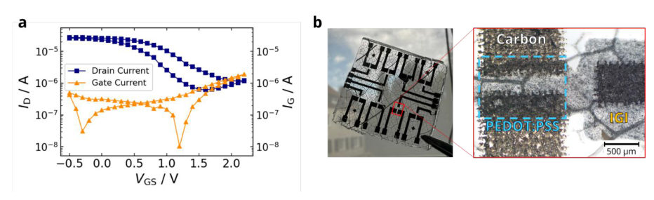 

Figure 4: (a) Transfer characteristics of a fully biocompatible OECT on a leaf substrate[34], (b) corresponding substrate / micrograph of the active area.

**Main problem.**

Developing a universal, biocompatible, and stable electrolyte for Organic Electrochemical Transistors (OECTs) that can be easily printed using both inkjet and screen-printing methods.

**Main result.**

The authors developed a UV-curable polymer matrix that serves as a universal basis for electrolytes, enabling high-stability, biocompatible, and printable OECTs, including a demonstration on a leaf substrate.

**Method.**

The researchers used a polymer matrix (PVA, DMSO, PEGDA, etc.) combined with ionic liquids, employing both inkjet and screen-printing techniques followed by UV-induced cross-linking and electrochemical characterization.

**Summary.**

This paper presents a new material platform for creating printable electrolytes used in Organic Electrochemical Transistors. By using a UV-curable polymer matrix, the authors created a system that can be tuned for either inkjet or screen printing while maintaining high biocompatibility and long-term stability. The electrolyte can remain stable in ambient air for over 30 days, and the technology was successfully demonstrated by printing a transistor directly onto a leaf. This work is significant for the development of low-cost, flexible, and biodegradable bioelectronics.

Detailed structure

**Model / system.**

The experimental platform consists of Organic Electrochemical Transistors (OECTs) using Organic Mixed Ionic Electronic Conductors (OMIECs), specifically PEDOT:PSS, with various electrolyte formulations and substrates ranging from glass to biodegradable leaves.

**Key observables.**

Transconductance, on/off ratio, drain current stability, viscosity, ionic conductivity, and device lifetime.

**Important parameters / regimes.**

Viscosity (for printing regime selection), threshold voltage, and device stability over 30 days in ambient air.

**Figures summary.**

Figure 1 shows the chemical components of the material basis; Figure 3 presents transfer/transconductance characteristics, comparisons of different IGI formulations, and stability analysis; Figure 4 demonstrates the transfer characteristics and micrograph of the OECT on a leaf substrate.

**Paper structure.**

The paper introduces the problem of electrolyte stability and biocompatibility, describes the development of the universal polymer matrix, details the printing and fabrication processes for different viscosity regimes, presents electrochemical and stability characterization, and concludes with a demonstration of a fully biocompatible device on a leaf.

Abstract

Organic Electrochemical Transistors (OECTs) stand out for their interplay between ionic and electronic conduction, making them ideal analogues to biological synapses for neuromorphic computing and biosensing applications. Furthermore, they can be printed into integrated circuits on flexible substrates, enabling low-cost and high-throughput fabrication of complete electronic systems. However, most OECT electrolytes for integrated circuits still lack biocompatibility and suffer from rheology-related printing challenges. This paper presents a novel material basis that can be combined with an ionic liquid to fabricate an electrolyte for OECTs that only contains biocompatible materials. It allows rheological adjustments to enable the use of electrolyte in both inkjet and screen printing. Furthermore, the electrolyte is UV-curable, enabling it to transition into solid-state structures after printing. Extended ink and device lifetimes for screen-printed structures enable the fabrication of advanced OECTs that can operate in ambient air for over 30 days after fabrication. Ultimately, a fully screen-printed transistor using only biocompatible materials on a leaf substrate is shown

[↑ back to top](#top)

### [Visualizing Crystallization Dynamics and Transformation Pathways of Disordered Rocksalt Oxides During Thermally Activated Sol-Gel Synthesis](http://arxiv.org/abs/2604.24941v1)

**Authors:** Diyi Cheng, Tim Kodalle, Anika T. Promi, Ansuman Halder, Raphael F. Moral, Madeline Grass, Venkata S. Avvaru, Haegyeom Kim, Carolin M. Sutter-Fella, Haimei Zheng

**Type:** experiment · **Category:** disordered systems and neural networks · **PDF:** <https://arxiv.org/pdf/2604.24941v1>

**Analysis basis:** full PDF text, analyzed in chunks

📷 Fig 1

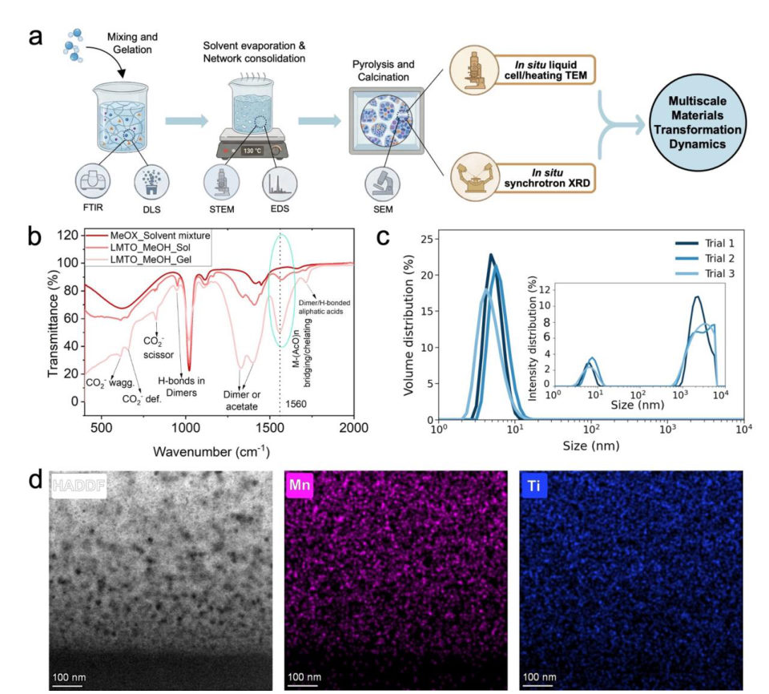 

Figure 1. Sol-gel synthesis workflow and sol/gel properties before pyrolysis. a, schematic overview of the sol-gel synthesis process and the characterization tools used at each step, including FTIR, DLS, STEM- EDS, SEM, in situ liquid cell heating TEM, and in situ SXRD, for probing multiscale material transformation and crystallization dynamics. Note that gelation was performed at 70 °C. Pyrolysis was performed in the range of 130-400 °C in air and calcination was performed in the range of 400-1000 °C in argon atmosphere. b, FTIR spectra showing the evolution from precursor solution to gel. MeOX_Solvent Mixture represents the solvent mixture (methanol, water and acetic acid), LMTO_MeOH_Sol...

📷 Fig 2

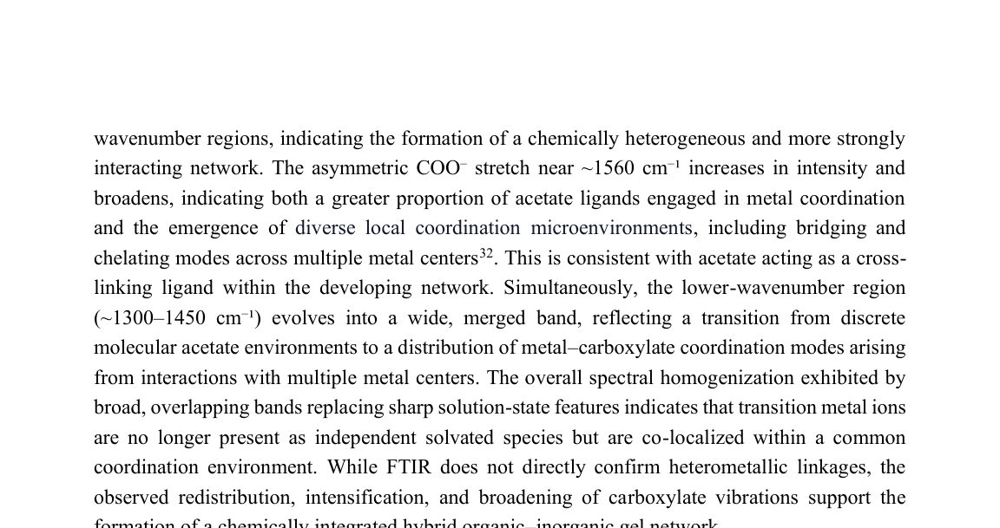 

Figure 1c presents DLS results that are used to probe the size distribution of species in the LMTO precursor solution. The volume-weighted size distributions from three replicate measurements show a narrow, reproducible population centered at approximately 4–6 nm, indicating that the solution is dominated by small, dispersed metal–ligand clusters rather than large aggregates. The close overlap among replicates confirms good measurement consistency. The volume distribution is reported here in preference to the intensity distribution (Figure 1c, inset), as larger species scatter disproportionately more light and can obscure the true population composition; the intensity distribution does show...

📷 Fig 3

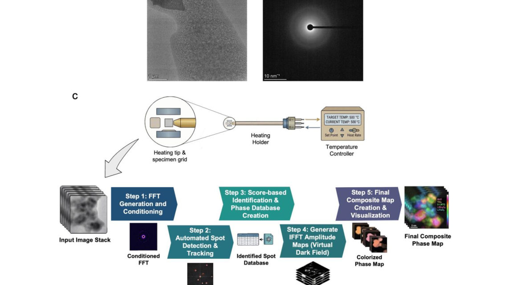 

Figure 2. Gel examination prior to in situ TEM measurement and the workflow for in situ dataset analysis. a &amp; b, Low-magnification morphology of LMTO gel before heating and corresponding SAED pattern showing the amorphous feature. c, in situ heating setup for the liquid cell configuration for the gel sample, along with the five-step virtual dark-field image analysis employed to generate the in situ datasets shown in Figure 3.

📷 Fig 4

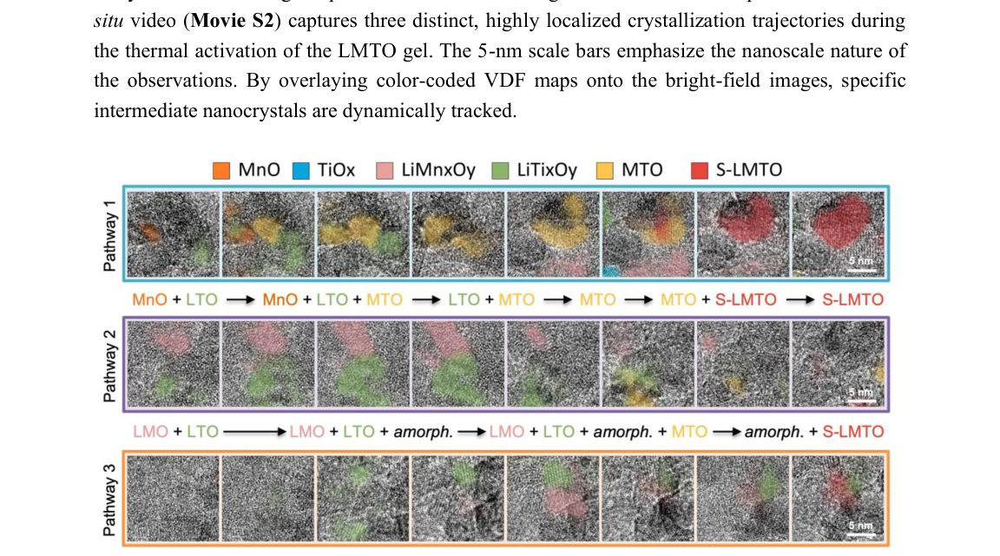 

Figure 3. Crystallization pathways captured during the heating sequence till 400 °C. Each color corresponds to a specific individual phase or a group of phases. Orange color denotes MnO. Blue color denotes the group of titanium oxides, including rutile TiO2, anatase TiO2, and Ti2O3. Pink color denotes the group of lithium manganese oxides, including LiMn2O4, LiMnO2, and Li2MnO2. Green color denotes the group of lithium titanates, including orthorhombic LiTi2O4, spinel LiTi2O4, Li2Ti3O7, LiTiO2, and Li2TiO3. Yellow color denotes the group of manganese titanates, including MnTiO3, Mn2TiO4, MnTi2O4, and Mn2Ti4O. Red color denotes S-LMTO. Each unique crystallization pathway is expressed in...

📷 Fig 5

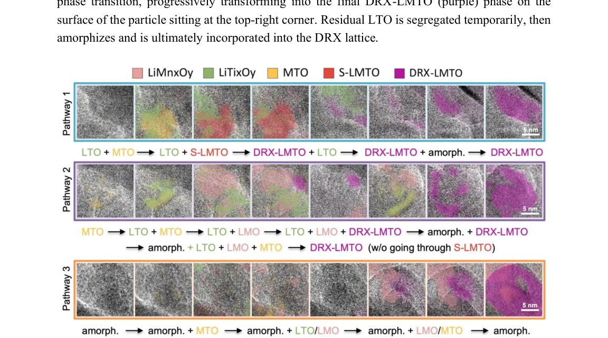 

Figure 4. Crystallization pathways identified during the heating sequence from 400 °C to 800 °C. Each color corresponds to a specific individual phase or a group of phases. Pink color denotes the group of lithium manganese oxides, including LiMn2O4, LiMnO2, and Li2MnO2. Green color denotes the group of lithium titanates, including orthorhombic LiTi2O4, spinel LiTi2O4, Li2Ti3O7, LiTiO2, and Li2TiO3. Yellow color denotes the group of manganese titanates, including MnTiO3, Mn2TiO4, MnTi2O4, and Mn2Ti4O. Red color denotes S-LMTO and purple color denotes DRX-LMTO. Each unique crystallization pathway is expressed in acronyms underneath each image sequence.

📷 Fig 6

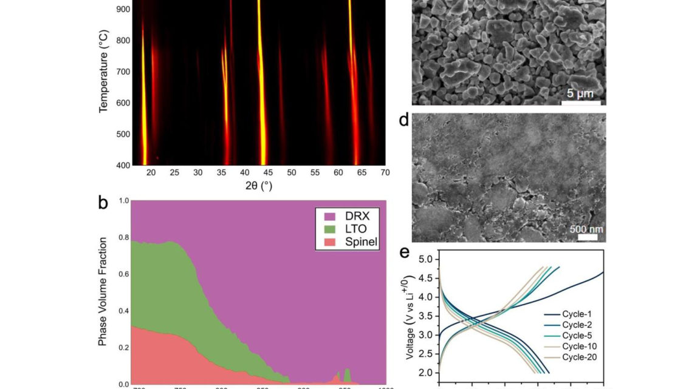 

Figure 5. In situ synchrotron-based XRD measurements and post-synthesis characterizations of DRX-LMTO samples. a, contour plot showing the evolution of diffraction intensity as a function of temperature and 2θ (converted to Cu Kα for convenience). b, quantified evolution of the relative phase volume fractions during heating. The methanol-derived sample exhibits progressive consumption of S- LMTO and LTO intermediates with increasing temperature, accompanied by strong growth of the DRX phase, which becomes dominant above ~880 °C. c &amp; d, surface morphologies of DRX-LMTO sample as synthesized powder and casted electrode, respectively. e, galvanostatic charge–discharge voltage profiles of the...

**Main problem.**

Understanding the complex, multiscale crystallization dynamics and transformation pathways of disordered rocksalt (DRX) oxides during thermally activated sol-gel synthesis.

**Main result.**

The study identifies two distinct nanoscale crystallization pathways: a classical multi-step transition through stable intermediates and a 'kinetic shortcut' where nanocrystals dissolve into an amorphous matrix to directly precipitate the DRX structure.

**Method.**

A multiscale approach combining in situ liquid cell heating TEM, in situ synchrotron X-ray diffraction (SXRD), and FTIR spectroscopy, supported by a custom Python-based automated image processing pipeline for phase mapping.

**Summary.**

This paper investigates how disordered rocksalt oxides form during the sol-gel synthesis process. By using in situ electron microscopy and synchrotron X-ray diffraction, the researchers discovered that while the bulk material follows a standard multi-step phase transition, certain nanoscale regions undergo a 'kinetic shortcut' through an amorphous state. This finding reveals that local chemical heterogeneity in the precursor can drive unexpected crystallization pathways. Understanding these dynamics is crucial for controlling material homogeneity and optimizing the synthesis of high-performance battery cathodes.

Detailed structure

**Model / system.**

The physical system is the thermally activated sol-gel synthesis of Li1.2Mn0.4Ti0.4O2 (LMTO), a disordered rocksalt-type cathode material for lithium batteries, evolving from molecular precursors through a xerogel state to crystalline particles.

**Key observables.**

Nanoscale phase distribution maps, crystallization trajectories, phase volume fractions, d-spacings, and chemical coordination signatures (FTIR).

**Important parameters / regimes.**

Temperature regimes (pyrolysis at 25-400 C and calcination at 400-800 C), chemical microenvironments in the gel, and particle size scales (4-6 nm clusters).

**Assumptions / limitations.**

TEM imaging was subject to sample drift requiring frame removal; the processed video length may not represent the total recording time.

**Figures summary.**

Figure 1 shows the experimental workflow and precursor characterization (FTIR, DLS, STEM-EDS); Figure 2 details the TEM setup and automated image processing pipeline; Figure 5 presents SXRD contour plots and quantified phase evolution vs. temperature.

**Paper structure.**

The paper introduces the sol-gel synthesis potential, describes the multiscale characterization workflow, details the chemical/colloidal nature of the precursor, presents the automated phase mapping pipeline, reports the discovery of dual nanoscale crystallization pathways, compares local TEM findings with bulk SXRD results, and concludes with electrochemical performance.

Abstract

Sol-gel synthesis is a wet-chemical processing route for the fabrication of functional materials offering control over composition, morphology, and microstructure at relatively low processing temperatures compared to conventional solid-state synthesis methods. While the sol-gel process initiates with intermixed molecular precursors, the transformation pathways at the early nucleation stage are insufficiently understood. Here, the chemical and structural transformation of disordered rocksalt (DRX) Li1.2Mn0.4Ti0.4O2 (LMTO), a promising cathode material for lithium batteries, is studied by multiscale characterization tools. In situ heating transmission electron microscopy (TEM) using a liquid cell visualizes and identifies crystallization pathways at nanoscale. While some regions follow a classical multi-step transition through thermodynamically stable intermediates, others exhibit a kinetic shortcut in which intermediate nanocrystals dissolve into a localized amorphous matrix that directly precipitates the DRX structure. Macroscale FTIR corroborates the findings to be related to chemically distinct microenvironments in the gel precursor, with transition metal ions more strongly incorporated into the acetate-coordinated network than lithium. Although in situ heating TEM captures diverse local transformation pathways, in situ SXRD indicates that the macroscopic transformation proceeds predominantly through spinel LMTO and lithium titanite intermediates toward DRX-LMTO. The findings shed light on the spatiotemporal chemical and structural transformations in sol-gel derived DRX-LMTO materials, and call for fine tuning of such sol-gel chemistries to manipulate the crystallization pathways and achieve target material homogeneity more efficiently.

[↑ back to top](#top)

