
# arxiv digest (quant-ph + cond-mat) — 2026-04-30

*158 papers · 32 relevant · 2 highlighted*

## 🔥 Most relevant (32)

*Every paper with at least one nonzero topic score, sorted by best-matching score. 🔥 marks scores ≥4/5. Click the title to jump to the full entry below; click [arXiv] to open the paper page. `(secondary)` marks papers from de-prioritized cond-mat archives.*

Show 32 relevant papers

- [Cavity-mediated coherence protection and one-axis twisting for spins in solids](#paper-2604.26909) [[arXiv]](http://arxiv.org/abs/2604.26909v1) — 🔥 `Tavis-Cummings & cavity-many-emitter` **5/5** · 🔥 `Dicke superradiance` **4/5** · 🔥 `QC/QI experiment` **4/5** · 🔥 `correlated cavity matter` **4/5** · 🔥 `quantum optics experiment` **4/5** · `analog quantum simulation` **3/5** · `correlated / nonlocal dissipation` **3/5** · `spintronics-quantum-optics interface` **3/5** · `exotic spin models in light-matter` **2/5** · `non-equilibrium dynamics` **2/5** · `superradiant laser` **2/5** · `driven-dissipative phase transition` **1/5** · `entanglement & information structure` **1/5** · `quantum measurements` **1/5**
- ⭐ [High-fidelity entangling gates and nonlocal circuits with neutral atoms](#paper-2604.25987) [[arXiv]](http://arxiv.org/abs/2604.25987v1) — 🔥 `QC/QI experiment` **5/5** · 🔥 `Rydberg arrays` **5/5** · 🔥 `entanglement & information structure` **4/5** · `non-equilibrium dynamics` **3/5** · `quantum optics experiment` **2/5**
- [Gouy phase engineering of self-splitting quantum correlations](#paper-2604.26816) [[arXiv]](http://arxiv.org/abs/2604.26816v1) — 🔥 `interference shaping light` **5/5** · 🔥 `quantum optics experiment` **5/5** · 🔥 `QC/QI experiment` **4/5** · `entanglement & information structure` **2/5** · `quantum measurements` **2/5**
- [Arbitrary parallel entangling gates with independent calibration on a trapped ion quantum computer](#paper-2604.25993) [[arXiv]](http://arxiv.org/abs/2604.25993v1) — 🔥 `QC/QI experiment` **5/5** · `analog quantum simulation` **3/5** · `non-equilibrium dynamics` **3/5** · `quantum optics experiment` **3/5** · `entanglement & information structure` **2/5**
- ⭐ [One knob to tune them all: Phase-controlled photon statistics and linewidth in partially pumped atomic ensembles](#paper-2604.26117) [[arXiv]](http://arxiv.org/abs/2604.26117v1) — 🔥 `Dicke superradiance` **4/5** · 🔥 `correlated / nonlocal dissipation` **4/5** · 🔥 `interference shaping light` **4/5** · `free-space correlated emission` **3/5** · `superradiant laser` **3/5** · `methods for driven-dissipative` **2/5** · `non-equilibrium dynamics` **2/5**
- [Observation of Non-Markovian Evolution of Tripartite Quantum Steering](#paper-2604.26711) [[arXiv]](http://arxiv.org/abs/2604.26711v1) — 🔥 `QC/QI experiment` **4/5** · 🔥 `entanglement & information structure` **4/5** · 🔥 `quantum optics experiment` **4/5** · `non-equilibrium dynamics` **3/5** · `correlated / nonlocal dissipation` **2/5** · `quantum measurements` **2/5**
- [Addressable Rydberg excitation in arrays of single neutral atoms with a strongly focused flat-top beam](#paper-2604.26580) [[arXiv]](http://arxiv.org/abs/2604.26580v1) — 🔥 `QC/QI experiment` **4/5** · 🔥 `Rydberg arrays` **4/5** · `interference shaping light` **3/5** · `methods for driven-dissipative` **2/5** · `quantum optics experiment` **2/5**
- [Solvable Random Unitary Dynamics in a Disordered Tomonaga-Luttinger Liquid](#paper-2604.25995) [[arXiv]](http://arxiv.org/abs/2604.25995v1) — 🔥 `Keldysh / 2PI / non-Gaussian methods` **4/5** · 🔥 `entanglement & information structure` **4/5** · `non-equilibrium dynamics` **3/5** · `non-equilibrium universality` **2/5** · `scars & prethermalization` **2/5**
- [A Gaussian asymmetry measure](#paper-2604.26878) [[arXiv]](http://arxiv.org/abs/2604.26878v1) — 🔥 `entanglement & information structure` **4/5** · 🔥 `non-equilibrium dynamics` **4/5** · `Keldysh / 2PI / non-Gaussian methods` **2/5** · `non-equilibrium universality` **2/5** · `scars & prethermalization` **2/5**
- [Reservoir-mediated spin entanglement in the mean-force Gibbs state](#paper-2604.26562) [[arXiv]](http://arxiv.org/abs/2604.26562v1) — 🔥 `correlated / nonlocal dissipation` **4/5** · `entanglement & information structure` **3/5** · `Keldysh / 2PI / non-Gaussian methods` **2/5** · `methods for driven-dissipative` **2/5** · `non-equilibrium dynamics` **2/5**
- [Random Number Generators in Advanced Optical Experiments: A Comparative Analysis of Semiclassical, Quantum, and Hybrid Architectures](#paper-2604.26554) [[arXiv]](http://arxiv.org/abs/2604.26554v1) — 🔥 `QC/QI experiment` **4/5** · 🔥 `quantum optics experiment` **4/5** · `interference shaping light` **2/5** · `quantum measurements` **2/5**
- [Diffusion with conserved marginal distributions and information theory in fracton hydrodynamics](#paper-2604.26093) [[arXiv]](http://arxiv.org/abs/2604.26093v1) — 🔥 `entanglement & information structure` **4/5** · `non-equilibrium dynamics` **3/5** · `non-equilibrium universality` **2/5** · `scars & prethermalization` **2/5**
- [Optical squeezing mediated by levitated oscillators at their quantum ground state](#paper-2604.26790) [[arXiv]](http://arxiv.org/abs/2604.26790v1) — 🔥 `quantum optics experiment` **4/5** · `quantum measurements` **3/5** · `Tavis-Cummings & cavity-many-emitter` **2/5** · `correlated / nonlocal dissipation` **2/5**
- [Digital Simulation of Non-Hermitian Knotted Bands on Quantum Hardware](#paper-2604.26914) [[arXiv]](http://arxiv.org/abs/2604.26914v1) — 🔥 `QC/QI experiment` **4/5** · `correlated / nonlocal dissipation` **2/5** · `non-equilibrium dynamics` **2/5** · `quantum measurements` **2/5**
- [Fluctuations of path-dependent thermodynamic quantities in open quantum systems via two-point system-only measurements](#paper-2604.26856) [[arXiv]](http://arxiv.org/abs/2604.26856v1) — 🔥 `quantum measurements` **4/5** · `methods for driven-dissipative` **3/5** · `non-equilibrium dynamics` **3/5**
- [Chip-to-chip entanglement distribution over 80-km multicore fiber link](#paper-2604.26791) [[arXiv]](http://arxiv.org/abs/2604.26791v1) — 🔥 `QC/QI experiment` **4/5** · 🔥 `quantum optics experiment` **4/5**
- [Minimal action shortcut to adiabaticity in a driven Kitaev chain: competing gaps in a topological transition at finite-time](#paper-2604.26146) [[arXiv]](http://arxiv.org/abs/2604.26146v1) — 🔥 `non-equilibrium dynamics` **4/5** · `analog quantum simulation` **2/5** · `non-equilibrium universality` **2/5**
- [Protein folding on a 64 qubit trapped-ion hardware via counterdiabatic quantum optimization](#paper-2604.26861) [[arXiv]](http://arxiv.org/abs/2604.26861v1) — 🔥 `QC/QI experiment` **4/5** · `exotic spin models in light-matter` **2/5** · `quantum measurements` **2/5**
- [Quantum Complexity and New Directions in Nuclear Physics and High-Energy Physics Phenomenology](#paper-2604.26376) [[arXiv]](http://arxiv.org/abs/2604.26376v1) — 🔥 `entanglement & information structure` **4/5** · `Keldysh / 2PI / non-Gaussian methods` **2/5** · `non-equilibrium dynamics` **2/5**
- [Schwinger-Keldysh Path Integral for Gauge theories](#paper-2604.26941) [[arXiv]](http://arxiv.org/abs/2604.26941v1) — 🔥 `Keldysh / 2PI / non-Gaussian methods` **4/5** · `methods for driven-dissipative` **2/5** · `non-equilibrium dynamics` **2/5**
- [Non-Equilibrium Orbital Transport in Terahertz Optorbitronics](#paper-2604.26717) [[arXiv]](http://arxiv.org/abs/2604.26717v1) `(secondary)` — 🔥 `non-equilibrium dynamics` **4/5** · `spintronics-quantum-optics interface` **3/5**
- [Typical entanglement entropy with charge conservation](#paper-2604.26141) [[arXiv]](http://arxiv.org/abs/2604.26141v1) — 🔥 `entanglement & information structure` **4/5** · `non-equilibrium dynamics` **3/5**
- [All pure entangled states can lead to fully nonlocal correlations](#paper-2604.26605) [[arXiv]](http://arxiv.org/abs/2604.26605v1) — 🔥 `entanglement & information structure` **4/5** · `quantum measurements` **2/5**
- [Hardware-Efficient Hamiltonian Simulation via Trotter-Initialized Variational Optimization with Native Placement](#paper-2604.26663) [[arXiv]](http://arxiv.org/abs/2604.26663v1) — 🔥 `QC/QI experiment` **4/5** · `non-equilibrium dynamics` **2/5**
- [Kondo transport in an anisotropic two-dimensional electron gas with quadratic momentum-dependent spin splitting](#paper-2604.26767) [[arXiv]](http://arxiv.org/abs/2604.26767v1) — 🔥 `Kondo & dissipative impurity` **4/5** · `Keldysh / 2PI / non-Gaussian methods` **2/5**
- [Nonclassical traits in multi-copy state discrimination](#paper-2604.26647) [[arXiv]](http://arxiv.org/abs/2604.26647v1) — 🔥 `quantum measurements` **4/5** · `entanglement & information structure` **2/5**
- [Rigged Liouville space formulation for quasi-Hermitian Liouville operators](#paper-2604.26322) [[arXiv]](http://arxiv.org/abs/2604.26322v1) — 🔥 `methods for driven-dissipative` **4/5** · `non-equilibrium dynamics` **2/5**
- [Quantum Feature Selection with Higher-Order Binary Optimization on Trapped-Ion Hardware](#paper-2604.26834) [[arXiv]](http://arxiv.org/abs/2604.26834v1) — 🔥 `QC/QI experiment` **4/5** · `entanglement & information structure` **1/5**
- [Genuine tripartite entanglement in Bhabha scattering with an entangled spectator particle](#paper-2604.26380) [[arXiv]](http://arxiv.org/abs/2604.26380v1) — 🔥 `entanglement & information structure` **4/5**
- [Hardware-Efficient Quantum Optimization for Transportation Networks via Compressed Adiabatic Evolution](#paper-2604.26175) [[arXiv]](http://arxiv.org/abs/2604.26175v1) — 🔥 `QC/QI experiment` **4/5**
- [Large-Scale Quantum Circuit Simulation on an Exascale System for QPU Benchmarking](#paper-2604.26423) [[arXiv]](http://arxiv.org/abs/2604.26423v1) — 🔥 `QC/QI experiment` **4/5**
- [Quantum Gatekeeper: Multi-Factor Context-Bound Image Steganography with VQC Based Key Derivation on Quantum Hardware](#paper-2604.26413) [[arXiv]](http://arxiv.org/abs/2604.26413v1) — 🔥 `QC/QI experiment` **4/5**

## ⭐ Highlighted (2)

*Papers by authors on your watch list. Click the title to jump to the full entry below; click [arXiv] to open the paper page.*

Show 2 highlighted papers

- ⭐ [High-fidelity entangling gates and nonlocal circuits with neutral atoms](#paper-2604.25987) [[arXiv]](http://arxiv.org/abs/2604.25987v1) — Markus Greiner, Vladan Vuletić, Mikhail D. Lukin
- ⭐ [One knob to tune them all: Phase-controlled photon statistics and linewidth in partially pumped atomic ensembles](#paper-2604.26117) [[arXiv]](http://arxiv.org/abs/2604.26117v1) — Martino Stefanini, Jamir Marino

## All papers (74, sorted by relevance)

*Papers from quant-ph and your primary cond-mat archives (quant-gas, stat-mech, str-el, dis-nn). Highlighted papers (⭐) come first, then everything else sorted by topic-relevance score, highest first.*

### ⭐ [High-fidelity entangling gates and nonlocal circuits with neutral atoms](http://arxiv.org/abs/2604.25987v1)

**Highlighted author(s):** Markus Greiner, Vladan Vuletić, Mikhail D. Lukin  
**Authors:** Simon J. Evered, Muqing Xu, Sophie H. Li, Alexandra A. Geim, J. Pablo Bonilla Ataides, Marcin Kalinowski, Dolev Bluvstein, Nishad Maskara, Christian Kokail, Markus Greiner, Vladan Vuletić, Mikhail D. Lukin  
**Type:** experiment · **Category:** quantum information and computing · **PDF:** <https://arxiv.org/pdf/2604.25987v1>  
**Analysis basis:** full PDF text, analyzed in chunks
**Topic relevance:** 🔥 `QC/QI experiment` **5/5** · 🔥 `Rydberg arrays` **5/5** · 🔥 `entanglement & information structure` **4/5** · `non-equilibrium dynamics` **3/5** · `quantum optics experiment` **2/5**

📷 Fig 1

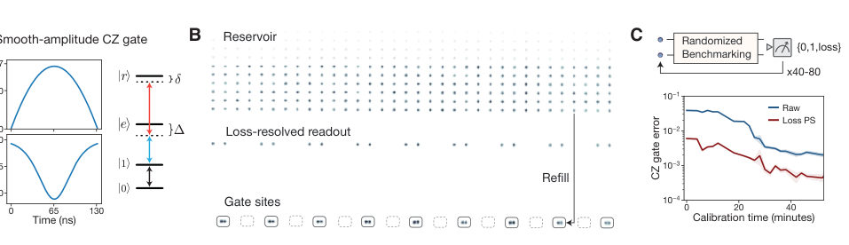 
FIG. 1. CZ entangling gates in a neutral atom processor with fast cycle rates. (A) Rydberg gate realized through a smooth-amplitude gate pulse at roughly Ω= 2π × 17 MHz peak Rabi frequency, with a detuning profile δ(t). Two-photon excitation scheme consists of transitions at 420 nm and 1015 nm, exciting from qubit state |1⟩to the Rydberg state |r⟩= 53S1/2, mJ = −1/2 through the intermediate state manifold |e⟩= 6P3/2 with intermediate state detuning ∆= 2π × 7.8 GHz (see fig. S1B for more detailed excitation diagram). (B) Images of the atoms separated into processor zones, with gate sites used for benchmarking and high-fidelity quantum circuits, and state-selective readout to perform loss...

📷 Fig 2

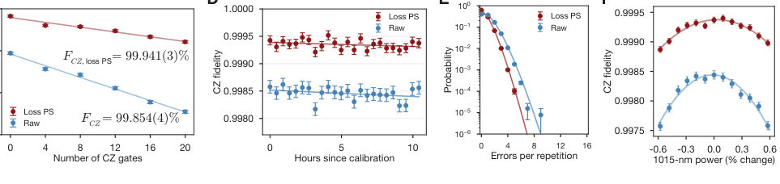 
FIG. 2. Stable low-error CZ gate performance. (A) Benchmarking methods based on repeated CZ gate applications: global echo randomized benchmarking (“echo RB”) [24] and symmetric stabilizer benchmarking (“SSB”) [29]. (B) Return probability as a function of number of CZ gates, fitted to an exponential decay, giving a raw fidelity of 99.854(4)% and a loss- postselected fidelity of 99.941(3)%. (C) Comparison of CZ gate fidelity measured with different benchmarking protocols: echo RB with and without an extra single-qubit π pulse before readout, resonant pushout of |1⟩versus state-selective readout (SSR), and SSB versus echo RB. (D) Stability of the CZ fidelity measured for over 10 hours with...

📷 Fig 3

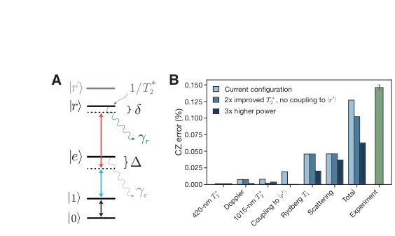 
FIG. 3. Error breakdown and path to further improve- ment. (A) Illustration of error sources for Rydberg entan- gling gates, including scattering from the intermediate state γe, Rydberg state lifetime γr, ground-Rydberg coherence T ∗ 2 , and coupling to the other Rydberg state |r′⟩= 53S1/2, mJ = +1/2. (B) Numerical error budget showing contributions of individual errors, total theoretical errors, and experimental data. Error breakdowns are shown for the current configu- ration, as well as projected values attainable with technical improvements and higher laser intensities [38].

📷 Fig 4

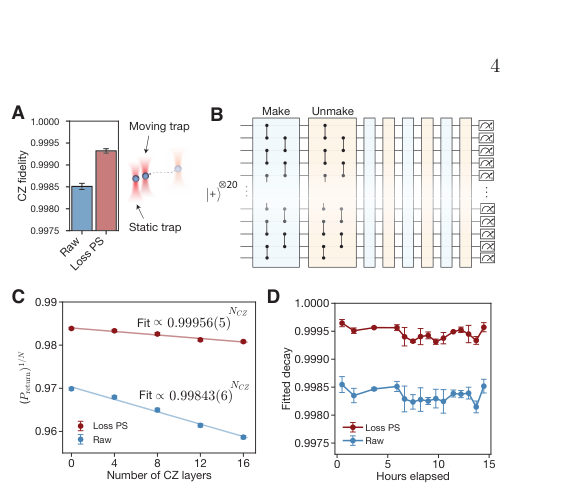 
FIG. 4. High-fidelity quantum circuits with atom mo- tion. (A) Raw and loss-postselected CZ fidelity measured with echo RB, with one atom in a static trap generated by a spatial light modulator (SLM) and one atom in a moving trap generated by an acousto-optic deflector (AOD). (B) Protocol for making and unmaking one-dimensional cluster states to study CZ gate performance in a quantum circuit. (C) Decay of global return probability Preturn as a function of the num- ber of total CZ gates, fit to an exponential decay, for N = 20 qubits. (D) Stability of the fitted decay over time, without recalibration.

📷 Fig 5

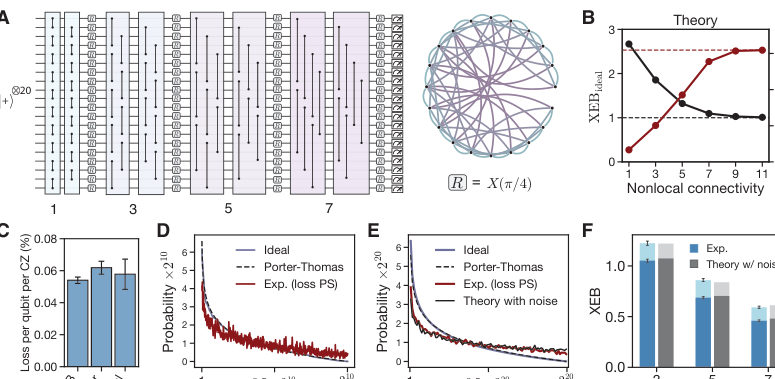 
FIG. 5. High-fidelity scrambling circuits with nonlocal connectivity. (A) Nonlocal quantum circuit implementation. CZ gates of increasing nonlocal connectivity (with labels given below the circuit) are interspersed with single-qubit gates, R = X(π/4). The resulting connectivity for the 20-qubit circuit is illustrated on the right. (B) Theoretical values for the half-system-size von Neumann entanglement entropy and XEBideal as a function of the degree of nonlocal CZ gates added to the circuit (“nonlocal connectivity”). Dashed lines indicate the Page entropy value and XEBideal = 1. (C) Loss per qubit per CZ gate compared for different circuits in this work: randomized benchmarking (RB), the...

**Main problem.** The primary challenge is achieving high-fidelity two-qubit entangling gates and implementing complex, nonlocal quantum circuits to enable fault-tolerant quantum computation.

**Main result.** The researchers achieved state-of-the-art CZ gate fidelities of 99.854(4)% (improving to 99.941(3)% with loss postselection) and successfully implemented nonlocal circuits exhibiting super-ballistic scrambling.

**Method.** The team used a neutral-atom processor with smooth-amplitude pulses, randomized benchmarking (RB), and symmetric stabilizer benchmarking (SSB) to characterize gate performance and error sources.

**Summary.** This paper reports a significant advancement in neutral-atom quantum computing by demonstrating extremely high-fidelity CZ gates. By using optimized pulse shapes and efficient atom rearrangement, the researchers achieved gate fidelities near 99.9%. They further demonstrated that these high-fidelity gates can be used to execute complex, nonlocal quantum circuits that exhibit super-ballistic scrambling. This progress provides a scalable path toward fault-tolerant quantum error correction.

Detailed structure

**Model / system.** A reconfigurable neutral-atom quantum processor using 87Rb atoms trapped in optical tweezers (SLM and AOD-controlled) and manipulated via Rydberg blockade interactions.

**Key observables.** CZ gate fidelity, return probability, cross-entropy benchmarking (XEB), entanglement entropy, and Porter-Thomas distribution convergence.

**Important parameters / regimes.** Rabi frequency of 2pi x 17 MHz, Rydberg state n=53, gate stability over 10 hours, and atom loss rate per gate.

**Assumptions / limitations.** The error analysis assumes that the primary error drivers are Rydberg state decay, intermediate state scattering, and position-induced frequency noise.

**Figures summary.** Figure 1 shows the gate pulse profile and processor architecture; Figure 2 presents benchmarking results and fidelity stability; Figure 3 details the error budget; Figure 4 illustrates gates with moving atoms; Figure 5 demonstrates 20-qubit circuit performance and XEB results.

**Paper structure.** The paper introduces the gate design and architecture, presents high-fidelity benchmarking and error analysis, demonstrates stability and robustness to atom movement, and concludes with the implementation of complex nonlocal scrambling circuits.

**Why it may be interesting.** This work is highly relevant for researchers in quantum optics and many-body dynamics as it demonstrates the control of entanglement in large-scale, reconfigurable systems and explores the transition to chaotic, scrambling dynamics in a programmable platform.

Abstract

Creation and manipulation of entanglement with low error is essential in quantum information systems. In practice, two-qubit entangling gates constitute a dominant error source, limiting circuit depths and performance in fault-tolerant architectures. Using a neutral-atom quantum processor, we realize entangling CZ gates with a high Rabi frequency smooth-amplitude pulse, employing state-selective readout and qubit reuse for fast calibration, and achieve state-of-the-art fidelities of 99.854(4)% which improve to 99.941(3)% upon loss postselection, with stable performance for 10 hours. We then use these low-error gates in quantum circuits with coherent atom rearrangement. We first benchmark performance by creating and disentangling cluster states, and subsequently implement scrambling circuits featuring longer-range connectivity to study non-locally entangled states generated through chaotic dynamics. These results pave the way towards deep-circuit, efficient fault-tolerant quantum computation.

[↑ back to top](#top)

### ⭐ [One knob to tune them all: Phase-controlled photon statistics and linewidth in partially pumped atomic ensembles](http://arxiv.org/abs/2604.26117v1)

**Highlighted author(s):** Martino Stefanini, Jamir Marino  
**Authors:** Oksana Chelpanova, Martino Stefanini, Dusan Sarenac, Tim Thomay, Jamir Marino  
**Type:** theory · **Category:** other · **PDF:** <https://arxiv.org/pdf/2604.26117v1>  
**Analysis basis:** full PDF text, analyzed in chunks
**Topic relevance:** 🔥 `Dicke superradiance` **4/5** · 🔥 `correlated / nonlocal dissipation` **4/5** · 🔥 `interference shaping light` **4/5** · `free-space correlated emission` **3/5** · `superradiant laser` **3/5** · `methods for driven-dissipative` **2/5** · `non-equilibrium dynamics` **2/5**

📷 Fig 1

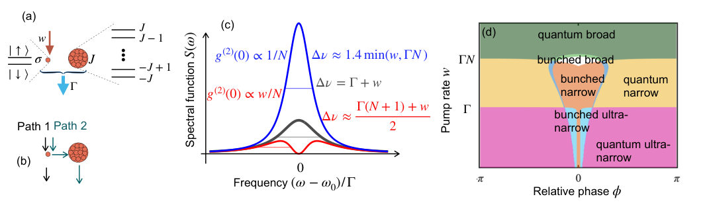 
FIG. 1. (a) Schematic of the setup. A single spin σ is incoherently pumped at rate w and decays collectively together with the collective spin J. (b) Illustration of the two pathways in Liouvillian processes by which excitations are transferred from the pump to the environment: path 1 corresponds to excitation and subsequent emission by the pumped atom, while path 2 corresponds to transfer of the excitation to the unpumped spin J, followed by emission into the environment. (c) Spectral function of a single atom driven to the steady state by incoherent pumping w and loss Γ (black line), the spectral function for the setup in panel (a) (red line), and the spectral function for the same setup...

📷 Fig 2

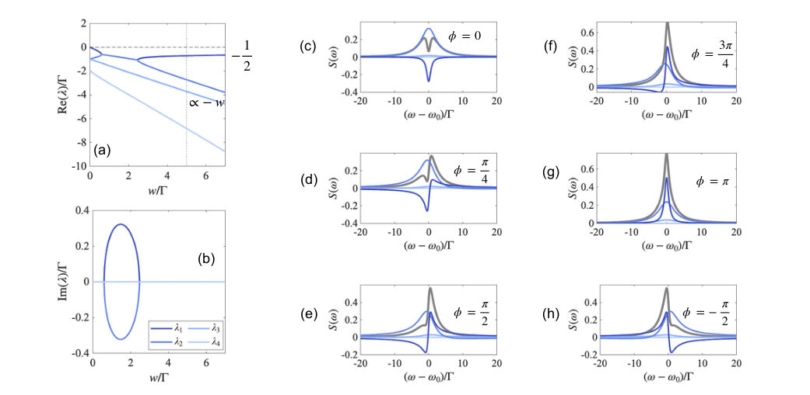 
FIG. 2. Spectral decomposition of S (ω) for a system of two spins. (a) Real and (b) imaginary parts of the Liouvillian eigenvalues for a system of 1 + 1 spins. The real part of the slowest eigenvalue λ1 saturates at the value −Γ/2, while the other eigenvalues decrease linearly with the pump rate w. (c–h) Contributions to the spectral function from different Liouvillian eigenmodes for w = 5Γ, using Eq. (5). In the symmetric case (c), the eigenvalue λ1 contributes to S (ω) with a negative sign, and the linewidth is determined by | Re λ2|. In the antisymmetric case (g), the interference is constructive and the linewidth is proportional to the real part of the slowest eigenvalue | Re λ1|. For...

📷 Fig 3

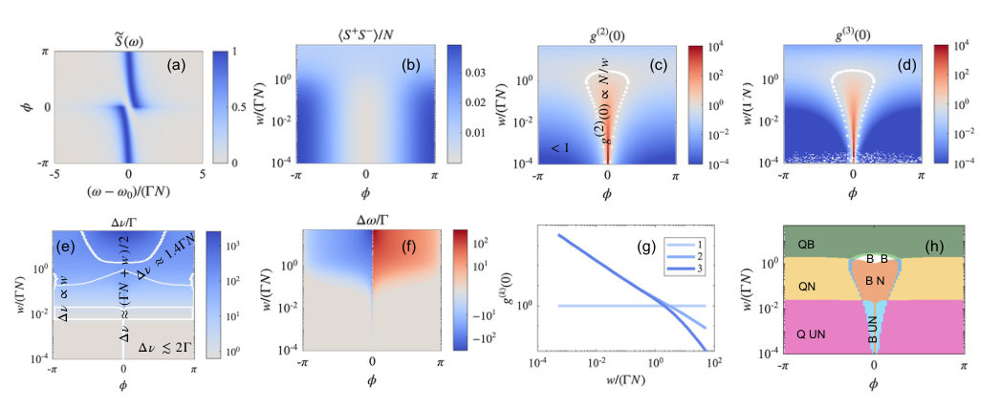 
FIG. 3. Properties of the light emitted by an ensemble of 101 atoms. (a) Normalized spectral function ˜S (ω) = S (ω)/ max(S (ω)) for different values of the phase ϕ, with the pump rate fixed at w = ΓN. (b) Intensity, (c) second- and (d) third-order coherence, (e) linewidth, and (f) position of the largest peak (line shift) as functions of the phase ϕ and pump rate w. For ϕ close to π the emitted light is always quantum and g(2)(0) ∝1/N, while for ϕ ≈0 the photon statistics can be tuned by varying w, with g(2)(0) ∝NΓ/w. (g) Higher-order coherences as a function of w for different k and ϕ = 0. (h) Schematic of the accessible regimes summarizing the scaling of g(2)(0) and ∆ν. By tuning w and...

📷 Fig 4

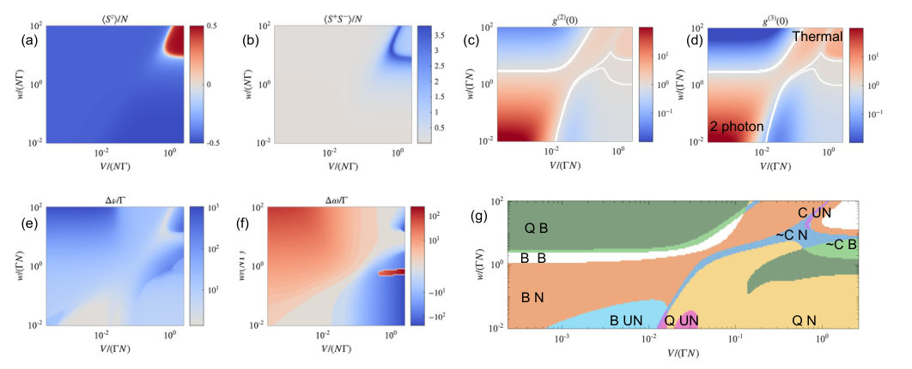 
FIG. 4. Properties of the light emitted by an ensemble of 21 atoms in the presence of coherent interaction V. Steady-state (a) magnetization, (b) intensity, (c) second- and (d) third-order coherence, (e) linewidth, and (f) position of the peak in the spectral function as functions of the pump rate w and interaction strength V. (g) Diagram summarizing the regimes with bunched light g(2)(0) &gt; 1 and ultra-narrow ∆ν &lt; 2Γ (B UN), narrow ∆ν &lt; ΓN (B N), broad ∆ν &gt; ΓN (B B) linewidth, classical (or coherent) light g(2)(0) →1 with ultra-narrow (C UN, superradiant lasing regime), narrow (C N) and broad (C B) linewidth and quantum light g(2)(0) &lt; 1 with ultranarrow (Q UN), narrow (Q N) and broad (Q B)...

📷 Fig 5

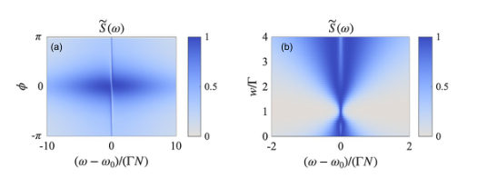 
FIG. 5. Normalized spectral function for system of 21 spins gov- erned by model (C1) as a function of (a) ϕ for w = ΓN and (b) as a function of pump rate for ϕ = 0.

📷 Fig 6

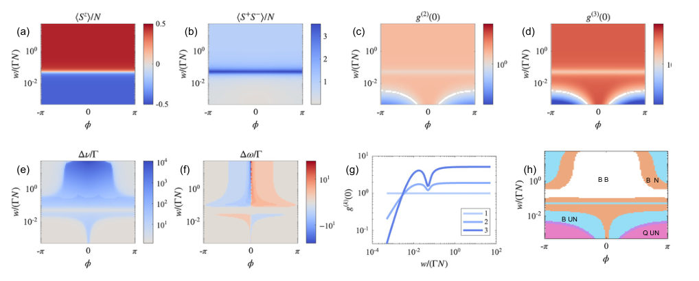 
FIG. 6. Properties of the light emitted by an ensemble of 21 atoms governed by model (C1). Steady-state (a) magnetization, (b) intensity, (c) second-order coherence, (d) third-order coherence, (e) linewidth, and (f) position of the peak in the spectral function as functions of the pump rate w and the phase ϕ. (g) Dependence of the k-th order coherence on the pump rate for different orders k and ϕ = π. The light displays thermal statistics in the bunched regime. (h) Diagram summarizing the regimes with bunched light g(2)(0) &gt; 1 and ultra-narrow linewidth ∆ν &lt; 2Γ (B UN), bunched light with narrow linewidth ∆ν &lt; ΓN (B N), bunched light with broad linewidth ∆ν &gt; ΓN (B B), and quantum...

📷 Fig 7

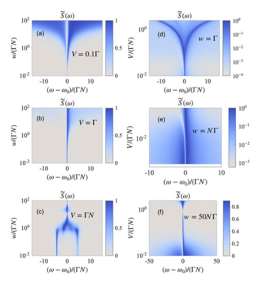 
FIG. 7. Normalized spectral functions for the partially pumped system with coherent interaction. Normalized spectral functions for model (8) as a function of pump rate (a–c) and interaction strength (d–f). Notice, that ˜S (ω) in panels (d) and (e) is plotted in logarithmic scale to emphasize fine details.

**Main problem.** The study seeks a versatile method to independently control both the photon statistics (quantum vs. classical) and the spectral linewidth of light emitted from an atomic ensemble.

**Main result.** The authors demonstrate that a single relative phase between pumped and unpumped atoms acts as a 'knob' to tune light from antibunched to bunched, and from broad to ultra-narrow linewidths.

**Method.** The study uses exact numerical solutions within the Dicke manifold, spectral decomposition of the Liouvillian, and adiabatic elimination for large-scale limits.

**Summary.** This paper investigates how a relative phase in a partially pumped atomic ensemble can serve as a single control knob for light properties. By tuning this phase and the pump rate, the researchers show that one can transition between quantum (antibunched) and classical (bunched) light while simultaneously controlling the spectral linewidth. The study also demonstrates that coherent interactions can replicate these interference effects and even stabilize superradiant-like lasing. This work offers a flexible framework for designing customized quantum light sources using collective dissipation.

Detailed structure

**Model / system.** A minimal model of an ensemble of N+1 two-level atoms where one atom is incoherently pumped and the rest undergo collective decay, described by a Lindblad master equation with a phase-dependent jump operator.

**Key observables.** Photon statistics (g2, g3), spectral function S(omega), linewidth (delta nu), magnetization (Sz), and light intensity.

**Important parameters / regimes.** Relative phase (phi), pump rate (w), collective decay rate (Gamma), and coherent interaction strength (V).

**Assumptions / limitations.** The analysis primarily focuses on the maximal J subspace (Dicke states) and assumes a Lindblad master equation framework.

**Figures summary.** Fig 1 shows the setup and emission pathways; Fig 3/4 illustrates various regimes of linewidth and photon statistics; Fig 6 summarizes the relationship between observables like magnetization, intensity, and coherence.

**Paper structure.** The paper introduces the partially pumped model, analyzes the phase-controlled interference mechanism, explores the scaling of linewidth and statistics, extends the model to include coherent interactions, and discusses experimental implementation via cavity QED.

**Why it may be interesting.** It provides a novel mechanism for engineering light sources where dissipation and interference are used as resources to tailor quantum optical properties and stabilize narrow-linewidth emission.

Abstract

We study a minimal model of collective light emission from an incoherently driven ensemble of atoms where incoherent drive is applied only to a part of atoms and show that both the linewidth and the photon statistics can be controlled within a single framework. In this setting, collective dissipation induces correlations between the pumped and unpumped parts of the system, leading to interference between their emission contributions. By introducing a relative phase between these contributions and tuning the pump rate, we demonstrate that the properties of the emitted light can be varied over a broad range. In particular, the linewidth can be made either independent of system size or scale extensively with it, while the photon statistics can be tuned from antibunched or quantum to bunched. We further show that the role of the relative phase in controlling the interference can alternatively be played by the coherent interaction. By tuning the interaction strength together with the pump rate, one can access the same regimes as in the dissipation-only model. In addition, coherent interactions stabilize regimes of coherent emission with narrow linewidth, reminiscent of superradiant lasing. Our results illustrate how interference in partially driven collective systems provides a flexible mechanism for tailoring both spectral and statistical properties of light.

[↑ back to top](#top)

### [Cavity-mediated coherence protection and one-axis twisting for spins in solids](http://arxiv.org/abs/2604.26909v1)

**Authors:** Rikuto Fukumori, Chengyi Luo, Alexey Tiranov, Karolina Waszkowska, Philippe Goldner, Andrei Faraon  
**Type:** experiment · **Category:** other · **PDF:** <https://arxiv.org/pdf/2604.26909v1>  
**Analysis basis:** full PDF text, analyzed in chunks
**Topic relevance:** 🔥 `Tavis-Cummings & cavity-many-emitter` **5/5** · 🔥 `Dicke superradiance` **4/5** · 🔥 `QC/QI experiment` **4/5** · 🔥 `correlated cavity matter` **4/5** · 🔥 `quantum optics experiment` **4/5** · `analog quantum simulation` **3/5** · `correlated / nonlocal dissipation` **3/5** · `spintronics-quantum-optics interface` **3/5** · `exotic spin models in light-matter` **2/5** · `non-equilibrium dynamics` **2/5** · `superradiant laser` **2/5** · `driven-dissipative phase transition` **1/5** · `entanglement & information structure` **1/5** · `quantum measurements` **1/5**

📷 Fig 1

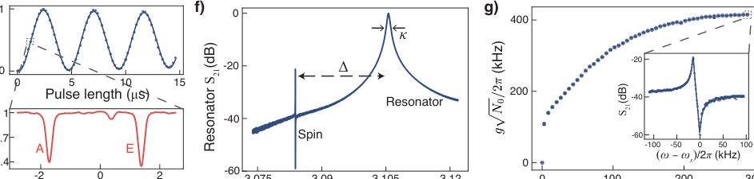 
FIG. 1. System overview. (a) Cutaway of a loop-gap microwave resonator hosting a millimeter-scale 171Yb3+:CaWO4 crystal. Red beam: optical input/output (I/O) at ∼973 nm for initialization and readout; spin excitation and resonator transmission measurements are done via antennas at the microwave I/O ports on the outer loops. Right: schematic of cavity-mediated spin-exchange interactions. (b) Simplified energy level diagram shows the spin manifold |↓⟩,|↑⟩split by ωs/2π = 3.08385 GHz and two optical transitions (A,E) to an excited state |e⟩used for pumping and absorption-based population readout. (c) Spin spectroscopy obtained by sweeping the frequency of a weak 2 ms excitation pulse; a...

📷 Fig 2

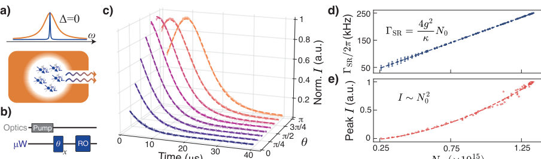 
FIG. 2. Superradiant emission. (a) The spin and resonator are approximately on resonance (∆≈0), resulting in collectively enhanced emission through the resonator output. (b) Pulse sequence. Optical initialization →microwave rotation to polar angle θ →readout of the microwave emission from the resonator. (c) Emission dynamics (normalized intensity) versus initial polar angle θ, with simulations (dashed) overlaid. Near inversion (θ ≈π), the characteristic delayed superradiant burst is visible. (d) Superradiant emission rate ΓSR versus N0 at θ = π/6. ΓSR is extracted by fitting the emission traces to numerical simulations (SI). The rate scales linearly with N0 (dashed line), consistent with...

📷 Fig 3

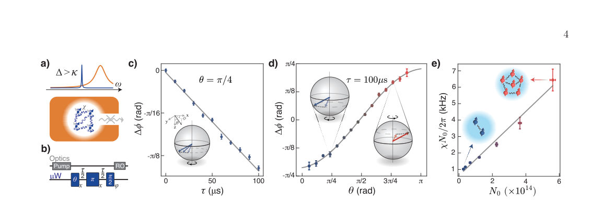 
FIG. 3. One-axis twisting dynamics. (a) The resonator is detuned from the spin (|∆| ≫κ), resulting in unitary cavity- mediated interactions while suppressing superradiant emission. (b) Pulse sequence. Optical initialization is followed by a spin Hahn-echo sequence with initial rotation θ. The phase of the final π/2 pulse (φ) is varied to extract the phase shift induced by OAT dynamics. (c) Evolution of the Bloch-vector azimuthal angle ∆ϕ versus τ at θ = π/4. The slope of the overlaid linear fit gives χN0 cos(π/4). (d) Evolution of ∆ϕ vs. θ at τ = 100 µs. Data is fit to ∆ϕ = χN0τ cos θ. (e) Collective interaction rate χN0 vs. N0 at θ = π/4. For each optical pumping time, χN0 (y-axis) is...

📷 Fig 4

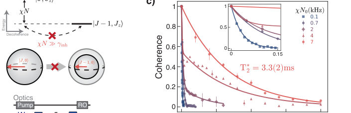 
FIG. 4. Many-body gap protection. (a) The χ ˆJ2 term opens a many-body energy gap of size χN0 between a collective state |J, Jz⟩and a less coherent state |J −1, Jz⟩, suppressing inhomogeneous dephasing. In the Bloch sphere representation, this corresponds to a suppression of the shrinkage of the collective Bloch vector. (b) Experimental pulse sequence for measuring the Ramsey coherence time. The readout is performed optically in the population basis. (c) Ramsey coherence versus delay time τ for five values of the collective interaction rate χN0/2π ≈0.1, 0.7, 2, 4, 7 kHz (blue to red). At low χN0, the coherence decays with the disorder-limited Ramsey time T∗ 2 =52(3) µs. As χN0 exceeds γinh,...

**Main problem.** The challenge of realizing coherent, cavity-mediated, all-to-all interactions and utilizing many-body gap protection in solid-state spin ensembles to overcome intrinsic inhomogeneous dephasing.

**Main result.** Demonstration of superradiant emission and unitary one-axis twisting in a Yb:CaWO4 crystal, achieving a 65-fold extension of Ramsey coherence time through interaction-induced gap protection.

**Method.** The researchers used microwave-driven spin spectroscopy, optical pumping/readout, and resonator transmission measurements in a 3D loop-gap resonator at millikelvin temperatures.

**Summary.** This paper reports the first observation of coherent, cavity-mediated all-to-all interactions in a solid-state spin ensemble using Yb:CaWO4. By tuning the spin-resonator detuning, the authors observe both superradiant emission and unitary one-axis twisting dynamics. Crucially, they demonstrate that the resulting many-body energy gap suppresses inhomogeneous dephasing, extending the ensemble's Ramsey coherence time from microseconds to milliseconds. This establishes a new platform for quantum metrology and many-body physics in the solid state.

Detailed structure

**Model / system.** A millimeter-scale 171Yb3+:CaWO4 crystal coupled to a 3D microwave loop-gap resonator, described by the Tavis-Cummings Hamiltonian in the rotating frame.

**Key observables.** Superradiant emission rate, one-axis twisting phase shift, Ramsey coherence time (T2*), and resonator transmission (S21).

**Important parameters / regimes.** Resonant regime (superradiance) vs. dispersive regime (one-axis twisting); single-ion coupling g/2pi approx 15 mHz; inhomogeneous linewidth gamma_inh/2pi < 5 kHz.

**Assumptions / limitations.** Uniform single-spin coupling across the ensemble; adiabatic elimination of the cavity field in the dispersive limit; neglecting the single-particle rotation term in the large-N limit.

**Figures summary.** System overview and energy levels; spin spectroscopy and Rabi oscillations; resonator transmission spectra; extraction of collective coupling; and demonstration of superradiance and one-axis twisting dynamics.

**Paper structure.** The paper introduces the solid-state platform, details the experimental setup and spin properties, demonstrates superradiance in the resonant regime, demonstrates one-axis twisting in the dispersive regime, shows the enhancement of coherence via many-body gap protection, and discusses future metrological implications.

**Why it may be interesting.** It demonstrates a solid-state implementation of cavity QED phenomena (superradiance and OAT) typically associated with cold atoms, and shows how many-body interactions can be engineered to protect quantum information against environmental disorder.

Abstract

Long-range interactions between emitters give rise to collective phenomena, including superradiance, spin squeezing, and coherence protection, that are important to both fundamental physics and quantum technologies. Despite progress in cold atoms, coherent cavity-mediated all-to-all interactions have not yet been realized in a solid-state ensemble. Here we demonstrate such interactions in a $^{171}$Yb$^{3+}$:CaWO$_4$ crystal coupled to a microwave resonator, observing superradiant emission on resonance and unitary one-axis twisting dynamics in the dispersive regime. The same interaction also opens a many-body energy gap that suppresses inhomogeneous dephasing, extending the ensemble Ramsey coherence time from tens of microseconds to milliseconds without decoupling pulses. These results establish a solid-state platform for collective many-body physics with direct implications for quantum technologies. Specifically, the observed one-axis twisting dynamics opens a path towards spin squeezing for entanglement-enhanced quantum metrology, and the extended coherence due to gap-protection is relevant for both microwave photon storage and precision measurement.

[↑ back to top](#top)

### [Gouy phase engineering of self-splitting quantum correlations](http://arxiv.org/abs/2604.26816v1)

**Authors:** A. L. S. Santos Junior, M. Damaceno, A. C. Barbosa, N. A. Ribeiro, G. B. Alves, P. H. Souto Ribeiro, A. Z. Khoury  
**Type:** experiment · **Category:** quantum information and computing · **PDF:** <https://arxiv.org/pdf/2604.26816v1>  
**Analysis basis:** full PDF text, analyzed in chunks
**Topic relevance:** 🔥 `interference shaping light` **5/5** · 🔥 `quantum optics experiment` **5/5** · 🔥 `QC/QI experiment` **4/5** · `entanglement & information structure` **2/5** · `quantum measurements` **2/5**

📷 Fig 1

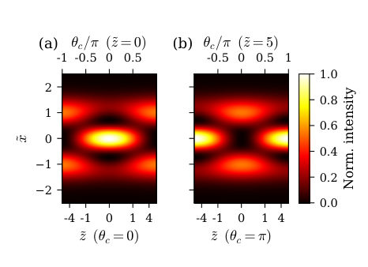 
FIG. 1. Self-splitting beam dynamics under free propagation. Transverse intensity of the superposition given by Eq.(3) as a function of ˜z for (a) θc = 0 and (b) θc = π. The upper axis shows the one-to-one mapping between z and the control phase θc applied at ˜z = 0 in (a) and at ˜z = 5 in (b).

📷 Fig 2

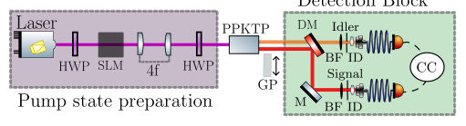 
FIG. 2. Experimental setup. A 405 nm CW laser is shaped by a spatial light modulator (SLM) and imaged onto a non- linear crystal, generating photon pairs at 780 nm (signal) and 840 nm (idler) via SPDC. A dichroic mirror (DM) separates signal and idler photons and sends them to single-photon de- tection in coincidence (CC). Two configurations are used: in the heralded one, only the signal coupler is scanned; in the biphoton one, both couplers are scanned synchronously. In the biphoton configuration a glass plate (GP) is inserted to demonstrate phase sensitivity improvement.

📷 Fig 3

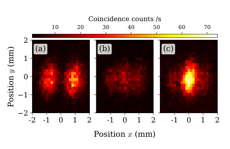 
FIG. 3. Experimental characterization of the self-splitting quantum spatial correlation at the heralded single-photon level. The pump beam is prepared as the self-splitting su- perposition Ψ at ˜z = 0. Panels (a), (b), and (c) show the coincidence counts resolved over the transverse scan position (x, y) in the detection plane located at ˜z = 5 for pump rela- tive phases θc = 0, π/2, and π, respectively.

📷 Fig 4

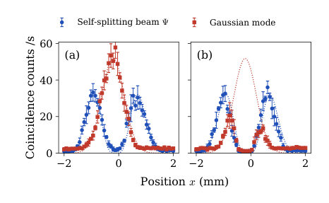 
FIG. 4. Coincidence counts as a function of transverse x posi- tion. (a) Without obstacle: the HG00 mode (purple squares) fitted by a Gaussian profile (dotted curve), and the superpo- sition state (blue circles) fitted with the dashed curve. (b) With an obstacle (≈1.2 mm slit), the same theoretical pro- files in (a) are overlaid as a reference.

📷 Fig 5

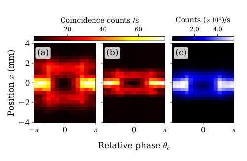 
FIG. 5. Experimental emulation of the self-splitting effect by tuning θc. Varying θc reproduces the effective longitudinal evolution along the optical axis discussed in the simulation of Fig. 1. Panels (a) and (b) show the coincidence counts from an xz-emulated scan of the signal arm for two detec- tion configurations: (a) the heralded single-photon, with the idler fixed at xi = 0, and (b) the biphoton state, obtained by jointly scanning both detectors with xs = xi. Panel (c) shows the single-photon counts measured with an attenuated pump under the same scan conditions as (a).

📷 Fig 6

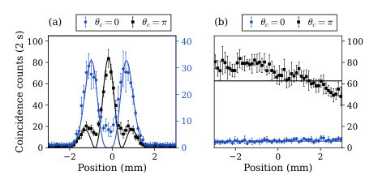 
FIG. 6. Self-splitting biphoton distribution for θc = 0 (blue circles) and θc = π (black squares). Panel (a) shows the standard joint-scan configuration (xi = xs), while panel (b) shows the counter-scan configuration (xi = −xs).

📷 Fig 7

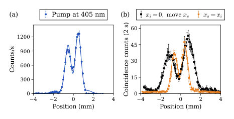 
FIG. 7. Phase-sensing in the self-splitting interferometer. (a) Far-field interference of the pump beam (405 nm) after inserting a glass plate in the left near-field peak. (b) Spatial coincidence distribution of the down-converted photons for two detection configurations: idler fixed at xi = 0 (heralded single-photon) and joint detection (xi = xs).

**Main problem.** Investigating how the spatial structure and propagation dynamics of a structured pump beam can be transferred to quantum-correlated photon pairs via Gouy phase engineering.

**Main result.** The researchers demonstrated that the pump beam's self-splitting and recombination dynamics are imprinted onto the photon correlations, creating a Mach-Zehnder-like interferometer that enables heralded single-photon interference, two-photon NOON state interference, and super-resolution.

**Method.** Using Spontaneous Parametric Down-Conversion (SPDC) in a PPKTP crystal, the pump beam is shaped with a Spatial Light Modulator (SLM) into Hermite-Gauss mode superpositions, and the resulting photon correlations are analyzed via 2D coincidence scanning.

**Summary.** This paper demonstrates how the Gouy phase of a structured pump beam can be used to engineer the spatial correlations of photon pairs produced via SPDC. By manipulating the pump beam's modes, the researchers created a 'self-splitting' quantum correlation that acts as a built-in Mach-Zehnder interferometer. They successfully observed heralded single-photon interference and two-photon NOON state interference, even achieving super-resolution. This technique provides a new way to control quantum light propagation and develop robust quantum metrology applications.

Detailed structure

**Model / system.** An experimental platform consisting of a 405 nm CW laser, a PPKPT crystal for SPDC, and an SLM to prepare structured modes; the system utilizes the Gouy phase of Hermite-Gauss modes to engineer the spatial evolution of the biphoton state.

**Key observables.** Coincidence counting rate, heralded single-photon interference patterns, two-photon NOON state interference, and spatial fringe spacing.

**Important parameters / regimes.** Control phase (theta_c), Rayleigh length (z_R), beam width (w(z)), and the two-photon de Broglie wavelength.

**Assumptions / limitations.** Paraxial approximation for light propagation, thin crystal approximation for the SPDC process, and the assumption of full transfer of the pump's angular spectrum to the two-photon state.

**Figures summary.** Figure 1 shows the transverse intensity patterns of the self-splitting beam; Figure 2 depicts the experimental setup; Figure 3 displays 2D scans of heralded single-photon patterns; Figure 7 shows the far-field interference of the pump beam and the spatial coincidence distribution of down-converted photons.

**Paper structure.** The paper introduces the concept of Gouy phase engineering, describes the experimental setup and mode preparation, presents the results of the transfer of spatial structure to photon pairs, demonstrates the implementation of a spatial interferometer with super-resolution, and concludes with the implications for quantum metrology.

**Why it may be interesting.** This work is highly relevant to quantum optics and quantum information as it demonstrates a novel method for engineering complex spatial quantum states and implementing interferometric protocols (like NOON state sensing) using the intrinsic propagation dynamics of structured light.

Abstract

In this work, we demonstrate the effect of self-splitting spatial quantum correlations induced by Gouy phase engineering. In the process of spontaneous parametric down conversion the pump beam is structured with a mode superposition that produces a dynamical splitting and recombination of the light beam. This structure is transferred to the quantum correlations between signal and idler photons. As a result the joint two-photon probability distribution propagates like a self-splitting and recombining light beam, implementing a Mach-Zehnder-like interferometer. We observe heralded single-photon interference and two-photon NOON state interference. These results open new avenues for applications in quantum metrology.

[↑ back to top](#top)

### [Arbitrary parallel entangling gates with independent calibration on a trapped ion quantum computer](http://arxiv.org/abs/2604.25993v1)

**Authors:** Matthew Diaz, Masoud Mohammadi-Arzanagh, Yingyue Zhu, Mohammad Hafezi, Norbert M. Linke, Alaina M. Green, Arthur Y. Nam  
**Type:** both · **Category:** quantum information and computing · **PDF:** <https://arxiv.org/pdf/2604.25993v1>  
**Analysis basis:** full PDF text, analyzed in chunks
**Topic relevance:** 🔥 `QC/QI experiment` **5/5** · `analog quantum simulation` **3/5** · `non-equilibrium dynamics` **3/5** · `quantum optics experiment` **3/5** · `entanglement & information structure` **2/5**

📷 Fig 1

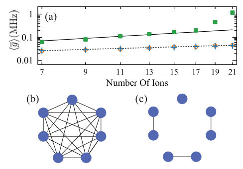 
FIG. 2. (a) Average calculated norm of pulse functions ⟨g⟩of parallel gate pulses as a function of the number of ions N for different numbers of gates parallelized, with τ = 2000µs; Av- erage was performed over all instances of the unique gate pat- tern studied. Squares: Parallelizing all N 2  gates as shown in the graph pattern example (b). Crosses: Parallelizing ⌊n/2⌋ disjoint gates as shown in the graph pattern example (c). Cir- cles: Parallelizing two disjoint gates. A solid line (⟨¯g⟩∼N) and a dashed line (⟨¯g⟩∼ √

📷 Fig 2

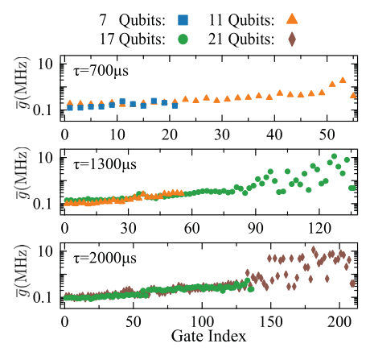 
FIG. 1. Calculated norm of pulse function g for parallel gate pulses as a function of gate indices, ordered according to the maximum weight matching problem solution, with the gate time specified on each plot. Fourier basis functions used span the frequency range of (ω1/(2π) −100kHz, (ωN/(2π) + 100kHz), where ω1 and ωN are the lowest and highest mo- tional mode frequencies, respectively. For visual clarity only half of the gate solutions are plotted.

📷 Fig 3

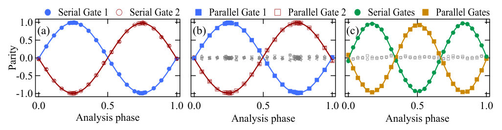 
FIG. 3. Parity scans for two disjoint gates with serial implementation (a), parallel implementation (b), and two gates with one overlapping ion for both serial and parallel (c). A parity scan is conducted by first implementing the desired XX gates then appending single-qubit π

📷 Fig 4

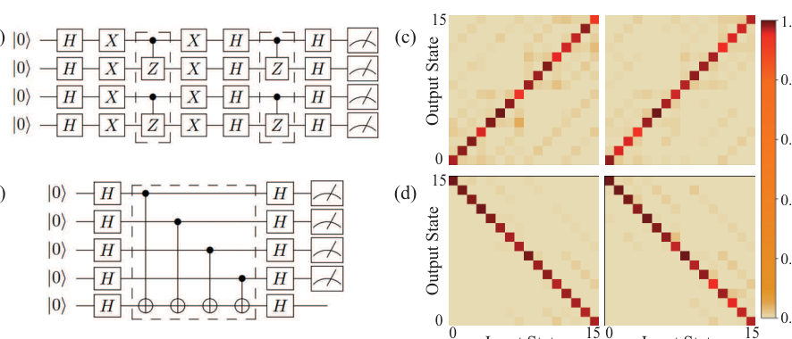 
FIG. 4. Circuits and experimental results for four-qubit HS and five-qubit BV. (a)-(b): Circuits for HS, BV, respectively. The dashed boxes represent parallelized gates in our experiments. (c) shows output state probabilities for the HS algorithm for serial (left) and parallel (right) implementations. (d) shows equivalent plots to (c), but for the BV algorithm. Note the color scale in non-linear for clarity.

📷 Fig 5

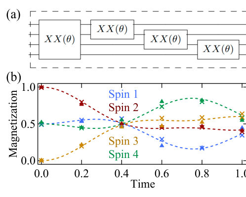 
FIG. 5. Circuits and experimental results for four-qubit HH simulations. (a) A representative subcircuit of our HH sim- ulation, implementing evolution corresponding to the Hamil- tonian term proportional to P

📷 Fig 6

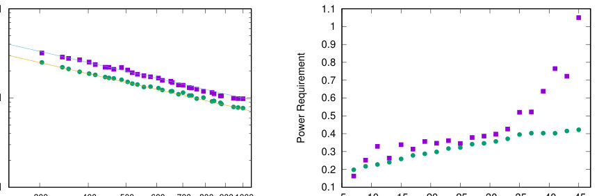 
FIG. 6. Power scaling ¯g of parallel vs. serial gates. Purple squares represent parallel, green circles represent serial. (a) Simulations with N = 13. For parallel, we consider N sets of N−1

📷 Fig 7

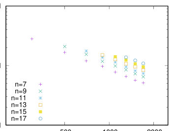 
FIG. 7. Average pulse power ⟨¯g⟩as a function of gate dura- tion τ for various number of ions. All n 2  gates are solved for their simultaneous implementation and the pulse power requirement ¯g is averaged over all gates.

**Main problem.** The challenge of accelerating quantum computation in trapped-ion systems by implementing arbitrary parallel entangling gates without incurring exponential increases in power, gate time, or control complexity.

**Main result.** The authors demonstrate a pulse-synthesis method that enables graph-pattern-agnostic parallel gates with fidelities comparable to single-pair gates, achieving significant algorithmic speedups in tasks like the Heisenberg Hamiltonian simulation.

**Method.** An iterative three-step pulse synthesis approach using sine-based basis functions, a maximum weight matching problem for mode assignment, and a projector operator to explicitly cancel qubit-qubit crosstalk.

**Summary.** This paper presents a new method for implementing arbitrary parallel entangling gates in a trapped-ion quantum computer. By using an iterative pulse-shaping technique, the authors can execute multiple gates simultaneously across different graph patterns without needing unique calibrations for every possible combination. The approach significantly reduces execution time for various quantum algorithms while maintaining high gate fidelities. This advancement is crucial for scaling quantum architectures, particularly for multi-chain setups.

Detailed structure

**Model / system.** A trapped-ion quantum computer using 171Yb+ ions, where entanglement is driven via Mølmer-Sørensen (XX) gates through spin-motion coupling in the Lamb-Dicke regime.

**Key observables.** Gate fidelity (via parity scans), entanglement phase angle, pulse power (RMS Rabi frequency), and gate duration.

**Important parameters / regimes.** Lamb-Dicke parameters, motional mode frequencies, gate duration, and the number of ions (N).

**Assumptions / limitations.** Assumes off-resonant coupling to other modes is naturally suppressed and that accurate estimation of Lamb-Dicke parameters is possible.

**Figures summary.** Figure 1 shows calculated pulse functions; Figure 4 compares output state probabilities for HS and BV algorithms; Figure 5 shows magnetization evolution in HH simulations; Figure 6 compares power scaling and power-time tradeoffs; Figure 7 shows power requirements vs. gate duration for various ion chain lengths.

**Paper structure.** The paper introduces the problem of parallelization, describes the physical platform and Hamiltonian, details the iterative pulse synthesis and power rebalancing methods, presents experimental/simulated benchmarks for various algorithms (HS, BV, HH), and discusses scaling and hardware implications.

**Why it may be interesting.** This work is highly relevant for researchers in quantum optics and AMO because it provides a scalable control protocol for many-body dynamics in ion chains, addressing the fundamental trade-off between gate speed, power, and crosstalk in driven quantum systems.

Abstract

Parallel processing of information plays a critical role in accelerating computation. This includes quantum computers, where parallel processing of quantum information will play a critical role in practical quantum advantage. Here, we demonstrate a new type of parallel entangling gates in a trapped-ion quantum computer, that simultaneously provides efficient gate-pulse synthesis and calibration, as well as graph-pattern-agnostic implementation. We demonstrate the resulting reduced execution time in three well-known algorithms, exhibiting disjoint gates, a star graph and a ring graph respectively. For disjoint qubit pairs the execution time of our parallel gates is comparable to that of a single-pair entangling gate resulting in an approximately linear speed up. For all graph patterns our parallel gate fidelities are comparable to the fidelity of a single-pair entangling gate. These advantages motivate architectures featuring multiple medium length ion chains in future quantum computing devices.

[↑ back to top](#top)

### [Observation of Non-Markovian Evolution of Tripartite Quantum Steering](http://arxiv.org/abs/2604.26711v1)

**Authors:** Yan Wang, Shao-qi Lin, Rui-qi Shen, Fang-liang Chen, Fang-liang Chen, Fang-liang Chen, Yong-nan Sun, Qi-ping Su, Chui-ping Yang  
**Type:** experiment · **Category:** quantum information and computing · **PDF:** <https://arxiv.org/pdf/2604.26711v1>  
**Analysis basis:** full PDF text, analyzed in chunks
**Topic relevance:** 🔥 `QC/QI experiment` **4/5** · 🔥 `entanglement & information structure` **4/5** · 🔥 `quantum optics experiment` **4/5** · `non-equilibrium dynamics` **3/5** · `correlated / nonlocal dissipation` **2/5** · `quantum measurements` **2/5**

📷 Fig 1

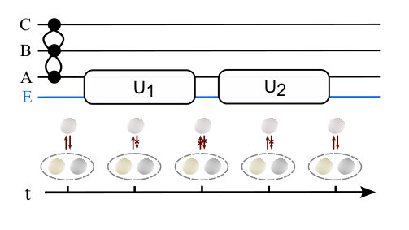 
FIG. 1. Theoretical illustration of ideal tripartite non- Markovian evolution. The subsystem (A) of tripartite state (composed of A, B and C) undergoes the time-dependent interactions (varying with t) with its surrounding environ- ments (E) denoted with operations U1 and U2. The whole tripartite quantum steering dynamical evolution, including the sudden death and revival processes, covers steerable in one-sided and two-sided device-independent (1SDI and 2SDI) scenarios, only steerable in 2SDI scenario, and unsteerable in both scenarios.

📷 Fig 2

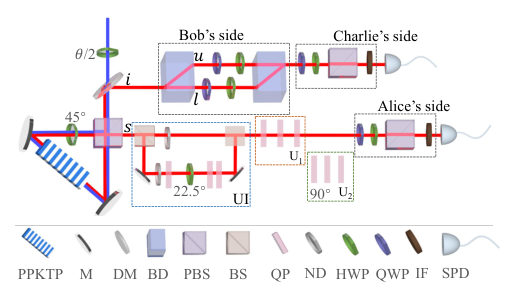 
FIG. 2. Experimental setup. Polarization-entangled pho- ton pairs are generated via parametric down-conversion in a periodically poled potassium titanyl phosphate (PPKTP) crystal. One photon is sent to the interference which sepa- rated and combined by two beam displacers (BDs), while the other one passes through the unbalanced interferometer (UI) in the blue dashed box, preparing the initial system state ρABC(θ, η). On Alice’s side, the sequence of quartz plates (QPs) at 0◦and 90◦are respectively inserted to introduce the time-dependent operations U1 and U2 corresponding to the orange and green boxes. We mark the QPs at 90◦in the green box, leaving the rest at 0◦in the blue and orange...

📷 Fig 3

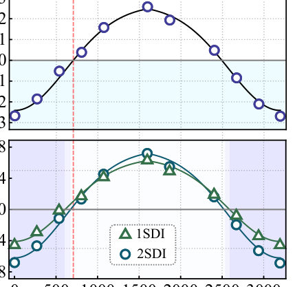 
FIG. 3. The non-Markovian evolution processes of ini- tial system state ρABC(θ = π/4, η = 1). (a) The evolution of entanglement witness (EW) versus the total thickness of quartz plates L(λ), with the entangled region in light blue re- gion. (b) The evolution of steering witness (SW) in one-sided and two-sided device-independent scenarios (1SDI and 2SDI) versus L(λ), with experimental results in hollow triangles and circles. The dark, light, and unshaded backgrounds are de- noted the states steerable in 1SDI and 2SDI scenarios, steer- able only in 2SDI scenarios, and unsteerable in both regions. The red dotted line denotes the entanglement boundary of L(λ). All error bars are calculated...

📷 Fig 4

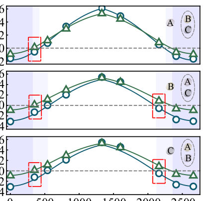 
FIG. 4. Different configurations of non-Markovian evolution processes of system state (ρABC(θ = π/4, η = 0.66)). (a) Alice versus Bob and Charlie (A|BC). (b) Bob versus Alice and Charlie (B|AC). (c) Charlie versus Alice and Bob (C|AB). The horizontal axis is the total thickness of quartz plates L(λ), and the vertical axis is the degree of tri- partite steering witness (SW), with the steerable boundaries in gray dashed lines. Hollow triangles and circles represent SW in one-sided and two-sided device independent scenar- ios (1SDI and 2SDI). The dark, light, and unshaded back- grounds are denoted states steerable in 1SDI and 2SDI sce- narios, steerable only in 2SDI scenarios, and unsteerable...

**Main problem.** The study investigates the non-Markovian evolution of tripartite quantum steering, specifically looking for the death and revival of quantum correlations and the asymmetric, hierarchical structures of steering in multipartite systems under decoherence.

**Main result.** The researchers experimentally observed the 'death and revival' of tripartite quantum steering and demonstrated a complex asymmetric steering structure across different bipartitions that does not exist in bipartite systems.

**Method.** The team used an optical setup with polarization-entangled photon pairs, employing an unbalanced interferometer and quartz plates to engineer time-dependent dephasing and memory effects, followed by three-qubit quantum state tomography.

**Summary.** This paper reports the experimental observation of non-Markovian evolution in tripartite quantum steering using photon polarization and path modes. The researchers demonstrated that quantum correlations can undergo 'sudden death' and subsequent 'revival' due to environmental memory effects. They also uncovered an asymmetric steering structure across different bipartitions, a feature absent in simpler bipartite systems. These findings highlight the potential of using non-Markovian environments to protect and recover multipartite quantum resources for asymmetric quantum information processing.

Detailed structure

**Model / system.** The physical system consists of tripartite GHZ-type mixed states encoded in the path and polarization degrees of freedom of photons, interacting with an environment via a dephasing mechanism.

**Key observables.** One-sided device-independent (1SDI) and two-sided device-independent (2SDI) steering, entanglement witness (EW), and the degree of non-Markovianity (M).

**Important parameters / regimes.** Purity of the GHZ state (eta), control parameter for the superposition state (theta), and the degree of non-Markovianity (M).

**Assumptions / limitations.** The initial global state is assumed to be factorized, and the model assumes Bob and Charlie share the same environmental frequency.

**Figures summary.** Figure 1 provides a theoretical illustration of the tripartite non-Markovian evolution and transitions between steering regimes; Figure 2 details the experimental setup including the PPKTP crystal, interferometer, and measurement apparatus.

**Paper structure.** The paper introduces the problem of multipartite steering in non-Markovian environments, describes the experimental setup and state preparation, presents the results of the steering death and revival processes, analyzes the asymmetric hierarchical structures, and concludes with implications for quantum information processing.

**Why it may be interesting.** This work is highly relevant for researchers in open quantum systems and quantum optics as it provides experimental evidence of how memory effects can revive multipartite quantum resources and reveals new directional dynamics unique to multipartite systems.

Abstract

The memory effects in open quantum systems can induce information backflow and revive quantum correlations, thereby providing a powerful way to protect and recover useful quantum resources in realistic noisy environments. However, such dynamics remains experimentally unexplored in multipartite quantum steering. Here we observe different non-Markovian evolution of tripartite quantum steering using Greenberger-Horne-Zeilinger-type mixed states, covering both death and revival processes. In particular, we experimentally demonstrate the more intricate asymmetric steering structure of tripartite quantum steering through different bipartitions, which do not arise in bipartite systems. Our results provide foundational insights into the hierarchical and directional structures in multipartite quantum steering, and highlight its potential as a useful resource for asymmetric quantum information processing.

[↑ back to top](#top)

### [Addressable Rydberg excitation in arrays of single neutral atoms with a strongly focused flat-top beam](http://arxiv.org/abs/2604.26580v1)

**Authors:** I. V. Iukhnovets, M. Y. Goloshchapov, A. P. Gordeev, O. V. Bychkova, I. B. Bobrov, G. I. Struchalin, S. S. Straupe  
**Type:** both · **Category:** other · **PDF:** <https://arxiv.org/pdf/2604.26580v1>  
**Analysis basis:** full PDF text, analyzed in chunks
**Topic relevance:** 🔥 `QC/QI experiment` **4/5** · 🔥 `Rydberg arrays` **4/5** · `interference shaping light` **3/5** · `methods for driven-dissipative` **2/5** · `quantum optics experiment` **2/5**

📷 Fig 1

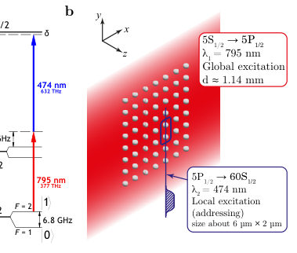 
FIG. 1. Illumination of atoms in a trap array by two Rydberg-excitation beams. (a) Scheme of two-photon exci- tation to the |r⟩state via the intermediate |p⟩state. (b) Experimental realization. The beam for the first excitation stage is global and propagates along the OX direction. The for the second excitation stage provides site-selective address- ing, propagates along OZ, and has a flat-top intensity profile.

📷 Fig 2

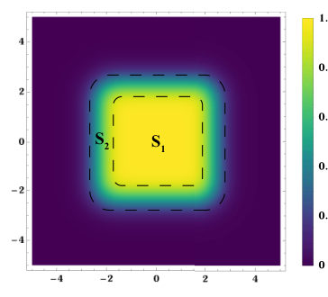 
FIG. 2. Flat-top profile zones (the color scale represents the intensity normalized to its maximum value)

📷 Fig 3

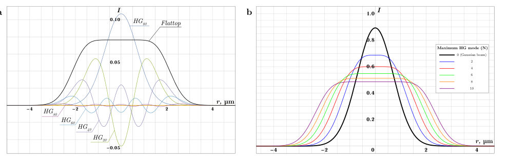 
FIG. 3. (a) Flat-top beam constructed as a superposition of the first five even Hermite–Gaussian modes. (b) Dependence of the flat-top width and intensity on N.

📷 Fig 4

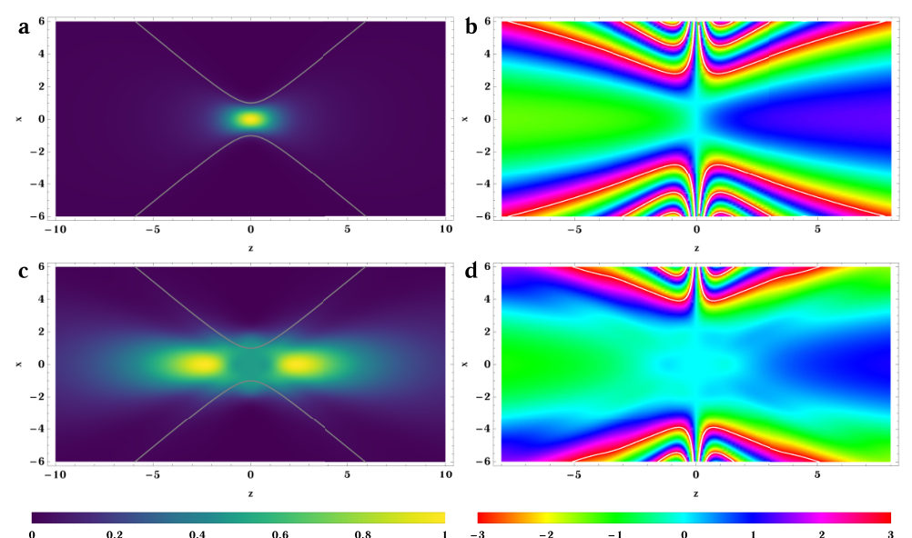 
FIG. 4. Longitudinal intensity and phase profiles for a Gaussian beam (a, b) and the flat-top beam of x- and y-axis orders N = M = 8 (c, d). Phase profiles do not include the factor exp(−ikz). Intensities are normalized to their respective peak values; phases are given in radians. The intensity panels also include the analytical Gaussian-beam waist for reference (gray lines).

📷 Fig 5

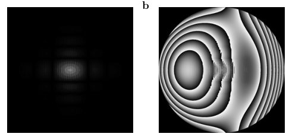 
FIG. 5. Representative examples of holograms generated for flat-top beam preparation using an SLM. (a) Without aber- ration correction. (b) Superimposed with the hologram for aberration correction.

📷 Fig 6

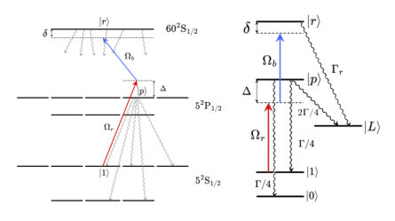 
FIG. 6. Effective 5-level system. (a) Full hyperfine structure of 52S1/2 and 52P1/2. (b) Reduced atomic levels with effective decay level |L⟩.

📷 Fig 7

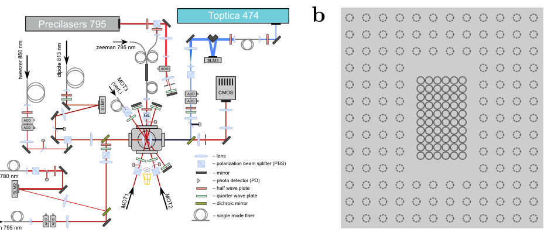 
FIG. 7. (a) Optical scheme of the experimental setup. (b) Computational zone (shown centered; when forming the computa- tional array, either the five leftmost or the five rightmost columns are used) and storage zone.

📷 Fig 8

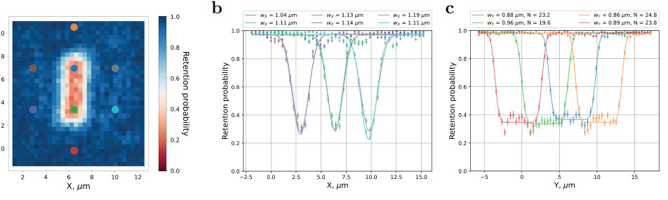 
FIG. 8. (a) Atom ionization density map. The addressed atoms are shown in blue and green. Other colors correspond to the non-addressed atoms. (b) Transverse profile of the beam along the x-axis approximated by Gaussian. (c) Transverse profile of the beam along the y-axis approximated by a flat-top profile.

📷 Fig 9

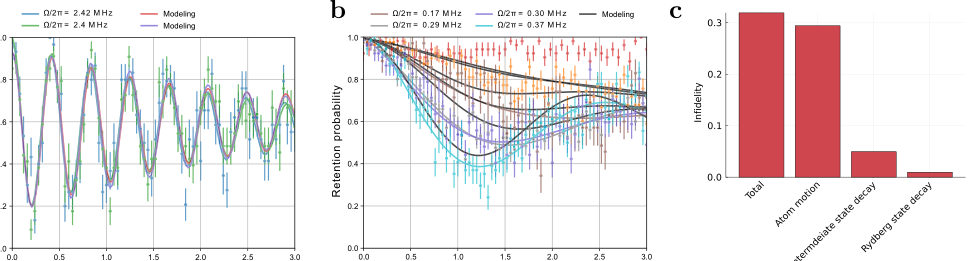 
FIG. 9. Modeling and experimental results. (a) Rydberg Rabi oscillations on addressed atoms. (b) Rydberg Rabi oscillations on nonaddressed atoms. (c) CZ gate error budget.

📷 Fig 10

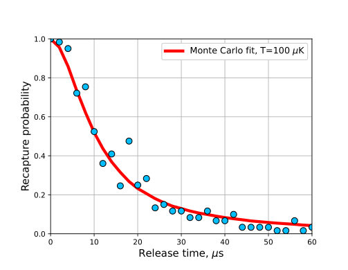 
FIG. 10. The atom temperature is extracted by fitting the release–recapture curve with a Monte Carlo simulation.

**Main problem.** The need for high-fidelity, site-selective Rydberg excitation in neutral-atom arrays by overcoming the non-uniformity of laser beam intensity and phase profiles that cause crosstalk and gate errors.

**Main result.** The development of a method to synthesize strongly focused 'flat-top' beams using a superposition of Hermite-Gaussian or Laguerre-Gaussian modes, demonstrating intensity uniformity exceeding 99% and significant crosstalk suppression.

**Method.** Beam shaping is achieved via a phase-only Spatial Light Modulator (SLM) to imprint a hologram, while the dynamics are analyzed using numerical solutions of the Lindblad master equation and Monte Carlo wave function methods.

**Summary.** This paper presents a method to create 'flat-top' laser beams for precise, site-selective Rydberg excitation in neutral-atom arrays. By superimposing Hermite-Gaussian or Laguerre-Gaussian modes using a spatial light modulator, the authors achieve highly uniform intensity profiles. This technique minimizes crosstalk between neighboring atoms and ensures consistent Rabi frequencies across the target array. The approach is experimentally validated, showing high uniformity and providing a scalable path for high-fidelity quantum gates.

Detailed structure

**Model / system.** The system consists of arrays of single $^{87}$Rb atoms trapped in optical dipole traps, utilizing a two-photon Rydberg excitation scheme ($5S_{1/2} 	o 5P_{1/2} 	o 60S_{1/2}$) and the Rydberg blockade effect.

**Key observables.** Rabi oscillation visibility, atomic ionization density maps, crosstalk parameter (ratio of Rabi frequencies), and atom survival probability.

**Important parameters / regimes.** Rabi frequency ($\approx 2.4$ MHz), atom temperature ($\approx 100$ $\mu$K), beam waist ($w_x \approx 1.1$ $\mu$m, $w_y \approx 3.0$ $\mu$m), and trap depth ($800$ $\mu$K).

**Assumptions / limitations.** The paraxial approximation is used for beam propagation, and the beam phase is assumed to be uniform in the flat region.

**Figures summary.** Schematics of the excitation process and experimental setup; illustrations of the flat-top profile zones; plots of SLM holograms with and without aberration correction; and data on Rabi oscillations and the error budget for CZ gates.

**Paper structure.** The paper introduces the problem of beam non-uniformity, provides a theoretical framework for constructing flat-top beams via mode superposition, details the experimental implementation using SLM and aberration correction, and concludes with numerical/experimental validation of crosstalk suppression and error analysis.

**Why it may be interesting.** It provides a practical solution for improving gate fidelities in neutral-atom quantum computing by combining advanced optical beam-shaping theory with experimental implementation and rigorous error budgeting.

Abstract

We present a method for generating a laser beam with flat intensity and phase profiles in the focal region where the beam interacts with neutral $^{87}$Rb atoms in an array of optical dipole traps. We synthesize the beam as a superposition of Hermite--Gaussian or Laguerre--Gaussian modes. Then we give analytical expressions for the coefficients of such a superposition, an analysis of beam propagation along the $z$ axis in the vicinity of the waist, and several other related theoretical issues. Rydberg two-qubit dynamics driven by this flat-top profile are analyzed through numerical solutions of the Lindblad master equation using our in-house Julia package. Beam preparation is demonstrated on a neutral-atom experimental platform. Measurements reveal a difference in the visibility of Rabi oscillations for addressed atoms compared with neighboring ones, confirming the effective spatial selectivity provided by the flat-top beam profile.

[↑ back to top](#top)

### [Solvable Random Unitary Dynamics in a Disordered Tomonaga-Luttinger Liquid](http://arxiv.org/abs/2604.25995v1)

**Authors:** Tian-Gang Zhou, Thierry Giamarchi  
**Type:** theory · **Category:** disordered systems and neural networks · **PDF:** <https://arxiv.org/pdf/2604.25995v1>  
**Analysis basis:** full PDF text, analyzed in chunks
**Topic relevance:** 🔥 `Keldysh / 2PI / non-Gaussian methods` **4/5** · 🔥 `entanglement & information structure` **4/5** · `non-equilibrium dynamics` **3/5** · `non-equilibrium universality` **2/5** · `scars & prethermalization` **2/5**

📷 Fig 1

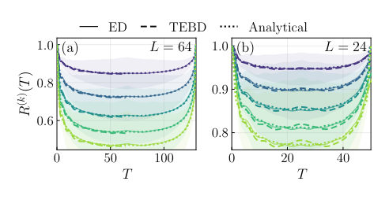 
FIG. 1. Free-fermion benchmark at ∆= 0 with σh = 0.05. In each panel, curves for k = 1, . . . , 5 are shown from top to bottom. (a) L = 64. Solid lines are free-fermion numer- ics from exact diagonalization. Dashed lines denote TEBD benchmark data, available up to T = 64. Dotted lines are the field-theory prediction using the discrete-momentum formula in Eq. (9). (b) L = 24 with all other settings unchanged. In both cases, a single UV cutoff α is obtained from a k = 1 and then kept fixed for all k.

📷 Fig 2

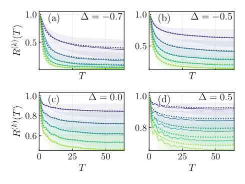 
FIG. 2. Time dependence of the normalized FP R(k)(T) for the interacting XXZ chain with L = 64, J = 1 and σh = 0.05 at ∆= −0.7, −0.5, 0.0, 0.5 with panels (a)–(d). For each panel from top to bottom, the different colors label k = 1 . . . 5. Solid curves with shaded uncertainty are TEBD numerics. Dotted curves are the TLL prediction from Eq. (9). For each ∆, a single UV cutoff α is obtained from a k = 1 fit in an intermediate-time window and then kept fixed for all k.

📷 Fig 3

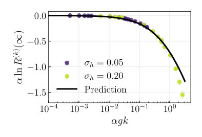 
FIG. 3. Late-time one-parameter collapse. From the late- time plateau with last 10% of time points near T ∼64, we plot α ln R(k)(∞) versus αgk with g = 8πKγ/u2 and γ = σ2 h/π2, for k = 1, . . . , 5, σh = 0.05, 0.2, and selected anisotropic pa- rameters ∆= −0.7, 0.0, 0.5. The black curve is the analytic prediction from Eq. (10), with no additional fitting.

📷 Fig 4

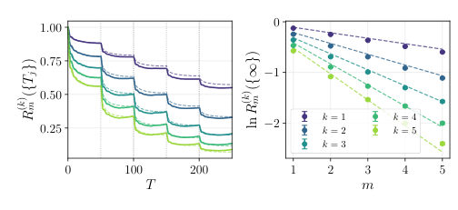 
FIG. 4. Multiple-quench FP decay with ∆= 0, L = 50, σh = 0.05, and p = 1. (a) Normalized FP ratio R(k) m ({Tj}) versus total evolution time T = P

📷 Fig 5

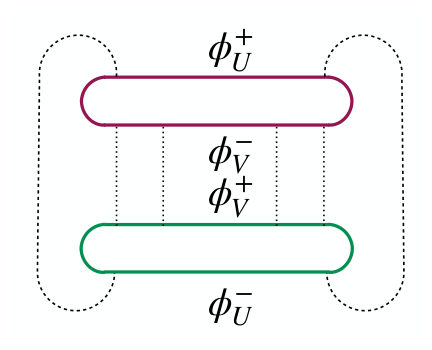 
FIG. 5. The illustration of the Keldysh contour for the FP with k = 1. The solid lines represent the contours and the dashed lines represent the disorder coupling.

📷 Fig 6

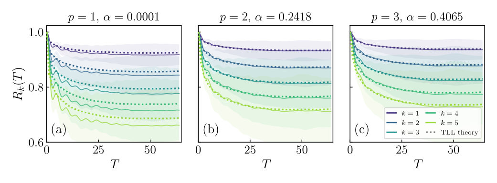 
FIG. 6. Comparison of filter orders p = 1, 2, 3 for the XXZ chain with L = 64, ∆= 0.5, and σh = 0.05. Solid curves are TEBD data and dotted curves are the TLL prediction from Eq. (9), with k = 1, . . . , 5 from top to bottom in each panel. The UV cutoff α is fitted from k = 1 and held fixed for all k. Increasing p sharpens the suppression of the 2kF disorder component and improves the theory and numerics agreement.

📷 Fig 7

 
FIG. 7. Time dependence of the normalized FP Rk(T) for the interacting XXZ chain with L = 64, J = 1, ∆= −0.7, −0.5, 0.0, 0.5, and σh = 0.05 for panels (a)–(d) and σh = 0.2 for panels (e)–(h). In each panel, different colors cor- respond to k = 1, . . . , 5 from top to bottom. Solid curves with shaded uncertainty bands are TEBD numerics. Dashed curves are the TLL prediction from Eq. (9). For each ∆, a single UV cutoff α is extracted from a k = 1 fit in an intermediate time window and held fixed for all k.

**Main problem.** The lack of an analytical treatment for the randomness of unitary ensemble dynamics, specifically the decay of the frame potential, in interacting 1D systems with disorder.

**Main result.** The authors derive a closed-form expression for the frame potential of a Tomonaga-Luttinger liquid with Gaussian forward-scattering disorder, showing it decays as a power law at early times and reaches a late-time plateau.

**Method.** The study employs bosonization and the Schwinger-Keldysh formalism, utilizing the matrix determinant lemma to evaluate the disorder-averaged Keldysh action.

**Summary.** This paper provides the first analytical description of how unitary dynamics in a disordered 1D interacting system approach Haar randomness. By studying the Tomonaga-Luttinger liquid, the authors show that the frame potential reaches a plateau determined by a single coupling parameter. They also demonstrate that randomness can be enhanced using multiple-quench protocols and that approaching the ferromagnetic limit maximizes scrambling. These findings offer practical guidance for designing analog quantum simulators.

Detailed structure

**Model / system.** A Tomonaga-Luttinger liquid (TLL) with quenched Gaussian forward-scattering disorder, with a microscopic realization provided by a random-field XXZ spin chain.

**Key observables.** Frame potential (FP) and the normalized frame potential ratio R(k).

**Important parameters / regimes.** Luttinger parameter (K), sound velocity (u), disorder strength (gamma), dimensionless coupling (g), and anisotropy (Delta).

**Assumptions / limitations.** The disorder is restricted to the forward-scattering regime, and the analysis focuses on the gapless phase of the TLL at low temperatures.

**Figures summary.** Figure 6 compares different filter orders (p=1, 2, 3) to show how higher-order filtering improves agreement between theory and numerics; Figure 7 shows the time evolution of the FP ratio for various anisotropy and disorder strengths.

**Paper structure.** The paper introduces the problem of quantifying unitary randomness, presents the analytical derivation using Keldysh field theory, validates the results using TEBD and exact diagonalization, and discusses optimization via multiple quenches and filtering.

**Why it may be interesting.** It provides a direct analytical link between many-body parameters (like compressibility and interaction strength) and the performance of quantum algorithms, specifically regarding how effectively a system can act as a quantum design.

Abstract

Disordered one-dimensional interacting systems have long been characterized via conventional correlation functions. A complementary quantum-information perspective quantifies the randomness of the unitary ensemble dynamics generated by a quantum system through the frame potential, which serves as a practical diagnostic for quantum algorithmic performance. However, no analytical treatment has yet been achieved for experimentally accessible interacting one-dimensional systems. In this Letter, we derive a closed-form expression for the frame potential of a Tomonaga-Luttinger liquid with quenched Gaussian forward-scattering disorder. Exploiting the exactly quadratic structure of the disorder-averaged Keldysh action, we show that the frame potential decays as a power law at early times and saturates to a late-time plateau controlled by a single coupling parameter. Taking the random field XXZ spin chain as a specific microscopic realization, we show that the strongest randomness is achieved near the Heisenberg ferromagnetic point and can be exponentially enhanced through a multiple-quench protocol. We validate our results across the entire gapless phase, with direct implications for algorithm design in analog quantum simulation platforms.

[↑ back to top](#top)

### [A Gaussian asymmetry measure](http://arxiv.org/abs/2604.26878v1)

**Authors:** Riccardo Travaglino, Pasquale Calabrese  
**Type:** theory · **Category:** statistical mechanics · **PDF:** <https://arxiv.org/pdf/2604.26878v1>  
**Analysis basis:** full PDF text, analyzed in chunks
**Topic relevance:** 🔥 `entanglement & information structure` **4/5** · 🔥 `non-equilibrium dynamics` **4/5** · `Keldysh / 2PI / non-Gaussian methods` **2/5** · `non-equilibrium universality` **2/5** · `scars & prethermalization` **2/5**

📷 Fig 1

 
Figure 1: Gaussian asymmetry in a quench from tilted ferromagnetic state for a subsystem of size ℓwith different values of tilting angle θ. The curves clearly show the occurrence of the quantum Mpemba effect. Symbols are numerical exact results at ℓA = 100 and lines are the quasiparticle picture prediction. The linear decrease up to t = ℓA/2 and the following saturation is a clear sign of the validity of the quasiparticle picture directly at the level of ∆S(G) A . This has to be contrasted with the standard EA, which is nonlinear at early times.

📷 Fig 2

 
Figure 2: Gaussian asymmetry as a probe for the lack of symmetry restoration in a quench from the tilted N´eel state with different tilting angles. The asymmetry is evaluated over a subsystem of size ℓ= 100. As in Fig. 1 notice the linear decrease followed by saturation.

📷 Fig 3

 
Figure 3: ⟨∆S(G) A ⟩g for typical Gaussian states. The symbols represents the numerical averages over large samples for L = 100 and L = 200. The behavior is smooth as a function of ℓA/L. The dashed lines represent the two asymptotic regimes, confirming the parabolic growth at small ℓA and the linear behavior for ℓA →L.

📷 Fig 4

 
Figure 4: Dynamics of the variance difference (7.10) after a quench from the tilted ferromagnetic state. The squares are the exact predictions obtained through correlation matrix techniques, cf. Eq. (7.11). Dashed lines are the quasiparticle predictions (7.10). The data show that the Mpemba effect can be diagnosed through the variance difference of the charge distribution.

**Main problem.** The standard definition of entanglement asymmetry is analytically difficult to use in free-fermionic systems because the symmetrized state becomes non-Gaussian. The authors aim to introduce a new asymmetry measure that remains strictly within the Gaussian manifold.

**Main result.** The authors introduce a Gaussian asymmetry measure that quantifies the distance to the manifold of symmetric Gaussian states, which is extensive in subsystem size and can detect the quantum Mpemba effect and symmetry restoration.

**Method.** The study utilizes correlation matrix techniques, the quasiparticle picture for dynamics, and relative entropy to define the new measure and analyze its properties.

**Summary.** The paper addresses the analytical limitations of standard entanglement asymmetry in free-fermionic systems by proposing a new 'Gaussian asymmetry' measure. This new measure stays within the Gaussian manifold, allowing for exact calculations using correlation matrices and the quasiparticle picture. It successfully captures complex dynamical phenomena such as the quantum Mpemba effect and the lack of symmetry restoration in certain quenches. Furthermore, the authors show that charge fluctuations can serve as a practical experimental probe for these symmetry-related dynamics.

Detailed structure

**Model / system.** The work focuses on Gaussian states in free-fermionic systems, specifically 1D hopping models (fermionic XX spin chain) and quenches from tilted ferromagnetic or Néel states.

**Key observables.** Gaussian asymmetry, entanglement entropy, non-Gaussianity, charge fluctuations (variance), and Full Counting Statistics (FCS).

**Important parameters / regimes.** Subsystem size (L_A), total system size (L), tilting angle (theta), and quasiparticle velocity (v_k).

**Assumptions / limitations.** The dynamics are restricted to the Gaussian manifold (e.g., quadratic Hamiltonians), and the focus is primarily on U(1) charge symmetry.

**Figures summary.** Figure 1 shows the time evolution of Gaussian asymmetry under different tilting angles; Figure 2 shows the lack of symmetry restoration in tilted Néel state quenches; Figure 3 shows the average Gaussian asymmetry for Gaussian ensembles; Figure 4 demonstrates the use of charge variance as a diagnostic for the Mpemba effect.

**Paper structure.** The paper introduces the Gaussian asymmetry measure, proves its mathematical properties (minimization and monotonicity), applies it to the dynamics of quantum quenches (detecting the Mpemba effect and symmetry restoration), and concludes by proposing experimentally accessible charge-based diagnostics.

**Why it may be interesting.** This paper is highly relevant for many-body dynamics as it provides a new, analytically tractable tool to study symmetry-breaking and relaxation phenomena like the Mpemba effect using simple, experimentally accessible charge fluctuations.

Abstract

The study of Entanglement Asymmetry has emerged in recent years as a powerful tool to characterise the symmetry properties of quantum states in relation to a given charge operator through the lens of entanglement. While extremely powerful and general, the standard definition of asymmetry introduces significant non-Gaussian features in free-fermionic systems, leading to certain analytical limitations. In this work, we introduce an asymmetry measure that remains strictly within the Gaussian manifold and analyse its properties. In particular, we show that it quantifies the minimal distance between a Gaussian state and the manifold of symmetric Gaussian states. We further demonstrate that this measure captures the established dynamical signatures of entanglement asymmetry, such as the Mpemba effect, symmetry restoration, and the lack thereof. The Gaussian structure allows these novel asymmetry measures to be computed exactly using correlation matrix techniques, and to be described asymptotically through the quasiparticle picture. We also comment on the possibility of using charge fluctuations to characterise the asymmetry of a Gaussian state.

[↑ back to top](#top)

### [Reservoir-mediated spin entanglement in the mean-force Gibbs state](http://arxiv.org/abs/2604.26562v1)

**Authors:** L. A. Williamson, W. McEniery, F. Cerisola, J. Anders  
**Type:** theory · **Category:** statistical mechanics · **PDF:** <https://arxiv.org/pdf/2604.26562v1>  
**Analysis basis:** full PDF text, analyzed in chunks
**Topic relevance:** 🔥 `correlated / nonlocal dissipation` **4/5** · `entanglement & information structure` **3/5** · `Keldysh / 2PI / non-Gaussian methods` **2/5** · `methods for driven-dissipative` **2/5** · `non-equilibrium dynamics` **2/5**

📷 Fig 1

 
FIG. 1. (a) System setup: two qubits (level spacings ωz(1 ± ϵ)) are coupled to a common bosonic reservoir with spectral density J(ω) and coupling strength λ. The mean- force Gibbs state is obtained by tracing out the bosonic reser- voir. (b) After the reaction-coordinate mapping, the qubits couple to a single bosonic mode (the reaction coordinate, fre- quency Ω) with coupling strength g ∝λ. The reaction co- ordinate couples to the remaining reservoir modes (spectral density JRC(ω)) with coupling strength λRC characterised by the width γ of J(ω). (c) Example reservoir spectral densities J(ω) (Eq. (16), solid line) and JRC(ω) (Eq. (17), dashed line), scaled by their maximum value, with γ...

📷 Fig 2

 
FIG. 2. Thermal entanglement, quantified by the negativity N, for the mean-force Gibbs state of two qubits, which arises from the coupling to a common bosonic reservoir. (a,b) Entanglement mediated by a single-mode reservoir (γ →0) for varying T and g. Solid lines are obtained from ρnarrow MF [Eq. (14)], black dashed lines are obtained from numerical diagonalisation of ˆHRC S . (a) Entanglement decreases monotonically with increasing temperature and is absent for T ≥TN . Inset: purity of ρnarrow MF decreases with increasing temperature and, for kBT/Ω≲0.013, decreases with increasing g due to entanglement with the RC. (b) For fixed T ≤TN , entanglement of ρnarrow MF peaks at g = gpeak and...

📷 Fig 3

 
FIG. 4. (a) Negativity as a function of qubit level spacing ωz with ϵ = 0. At T = 0 the entanglement increases mono- tonically with decreasing ωz/Ω. For a fixed T &gt; 0, thermal fluctuations increase with decreasing ωz/Ω(which decreases ∆), resulting in a peak in entanglement. Diamonds mark the level spacing that gives ∆= kBT, at which point N is ap- proximately half its peak value. Vertical dotted line indicates ωz/Ω= 0.02. (b) Negativity as a function of asymmetry ϵ with ωz/Ω= 0.02, which is scaled by its ϵ = 0 value N0 for ease of comparison. At T = 0 the entanglement is indepen- dent of ϵ. For a fixed T &gt; 0, thermal fluctuations increase with increasing ϵ, and hence N decreases. Solid...

📷 Fig 4

 
FIG. 3. Lowest order correction to entanglement due to reservoir spectral density broadening at strong coupling, quantified via ∂N/∂γ2|γ=0 evaluated from Eq. (5). Entan- glement increases with γ (∂N/γ2 &gt; 0) in the gray region and decreases with γ (∂N/∂γ2 &lt; 0) in the red region. The bound- ary between these two regions follows gpeak (blue dashed line). Blue solid line indicates TN . Results are for ωz/Ω= 0.02 and ϵ = 0.

**Main problem.** Characterizing the nature of equilibrium entanglement between two qubits mediated by a common thermal bosonic reservoir under strong coupling.

**Main result.** The authors derive analytic expressions for the mean-force Gibbs state, finding that entanglement is a non-monotonic function of coupling strength and can be enhanced by broadening the reservoir spectral density.

**Method.** The study employs the Mean-Force Gibbs (MFG) state framework, utilizing Reaction-Coordinate (RC) mapping, polaron transformations, and perturbative expansions in both coupling strength and spectral density width.

**Summary.** This paper investigates how two qubits can become entangled through their shared interaction with a thermal bosonic reservoir. By using the mean-force Gibbs state, the authors show that entanglement is not simply a monotonic function of coupling strength but peaks at a specific value. They also demonstrate that a broader reservoir spectrum can actually enhance qubit entanglement compared to a single-mode reservoir. These findings provide a theoretical benchmark for studying strong-coupling effects in open quantum systems.

Detailed structure

**Model / system.** A spin-boson model consisting of two qubits (spin-1/2) strongly coupled to a common bosonic reservoir, characterized by a spectral density and reorganization energy.

**Key observables.** Negativity (as an entanglement monotone) and purity.

**Important parameters / regimes.** Coupling strength (lambda), temperature (T), reservoir spectral density width (gamma), qubit level spacing (omega_z), and qubit asymmetry (epsilon).

**Assumptions / limitations.** The system is assumed to reach the mean-force Gibbs state; the perturbative expansion is valid to the second order in coupling strength; and the low-temperature limit is used for certain analytical derivations.

**Figures summary.** Fig 1 shows the system setup, RC mapping, and calculation regimes; Fig 2 shows negativity and purity as functions of spectral broadening; Fig 3 identifies the boundary between regimes where broadening enhances or decreases entanglement.

**Paper structure.** The paper introduces the physical problem and model, presents the derivation of the MFG state using RC mapping and perturbative methods, explores the effects of temperature and coupling strength, investigates the impact of spectral density broadening, and validates results via numerical diagonalization.

**Why it may be interesting.** It provides a comprehensive understanding of how strong system-reservoir coupling and reservoir properties can be used as a resource to engineer entanglement in thermal equilibrium.

Abstract

Two qubits strongly coupled to a common bosonic reservoir can become entangled with each other, despite having no direct interaction. In equilibrium, such coupling-induced coherences can be described by the mean-force Gibbs state. Here we derive approximate, analytic expressions for the two-qubit mean-force Gibbs state, and use these to characterize equilibrium qubit-qubit entanglement mediated by a thermal reservoir. Entanglement, which is highest at lowest temperatures, is a non-monotonic function of the system-reservoir coupling strength. Moreover, we find that broadening the reservoir spectral density beyond a single mode, as is realistic for typical baths, can enhance the qubit entanglement. Our results provide a comprehensive understanding of reservoir-mediated two-qubit entanglement in thermal equilibrium and provide a benchmark to compare with numerical methods, as well as demonstrating the utility of strong system-reservoir coupling as a resource.

[↑ back to top](#top)

### [Random Number Generators in Advanced Optical Experiments: A Comparative Analysis of Semiclassical, Quantum, and Hybrid Architectures](http://arxiv.org/abs/2604.26554v1)

**Authors:** Daniil D. Reshetnikov, Anna A. Kretova, Anastasia A. Fominova, Evgenii A. Vashukevich, Tatiana Y. Golubeva, Kirill S. Tikhonov  
**Type:** experiment · **Category:** quantum information and computing · **PDF:** <https://arxiv.org/pdf/2604.26554v1>  
**Analysis basis:** full PDF text, analyzed in chunks
**Topic relevance:** 🔥 `QC/QI experiment` **4/5** · 🔥 `quantum optics experiment` **4/5** · `interference shaping light` **2/5** · `quantum measurements` **2/5**

📷 Fig 1

 
Figure 1: The coherent quasi-single-photon source of RNSs: the linearly polarized single-mode laser light (the 810 nm semiconductor laser with a 3 mW output power), weakened by the grey filter (GF), passes through the half-wave plate (HWP) and hits the polarizing beam splitter (PBS). After passing the beam splitter, photons are measured by detectors (D1, D2) and the correspond- ing signal is sent to the correlator (Corr.).

📷 Fig 2

 
Figure 2: The heralded (genuine) single-photon source of RNSs: pumping a nonlinear χ(2) crystal with laser ra- diation generates correlated photon-pairs in the entan- gled state |ψ⟩= 2−1/2(|H1H2⟩+ |V1V2⟩). One photon from each pair is measured by the ”heralding” detector (D3), signaling the existence of its partner. The polar- ization of this second, "heralded" photon is rotated to the diagonal basis using the half-wave plate (HWP). It is then directed to the polarizing beam splitter (PBS) where it has a fundamentally random probability of be- ing measured by either detector (D1) or detector (D2), thus generating a random bit.

📷 Fig 3

 
Figure 3: The hybrid source of RNSs: the χ2-crystal gen- erates the Bell state |ψ+⟩= 2−1/2(|H1V2⟩+ |V1H2⟩), representing a pair of photons in a superposition of hor- izontal (H) and vertical (V) polarizations. One photon from the pair is reflected and strikes the detector 3 (D3). Simultaneously, the entire output of the coherent source (CS) is reflected by the same PBS and mixed with the heralded photons. After polarization rotation with the HWP, the combined radiation is then directed to the sec- ond PBS and then measured by either detector 1 (D1) or detector 2 (D2), thus generating a random bit sequence.

📷 Fig 4

 
Figure 4: Median p-values of the NIST Statistical Test Suite for the five RNSs sources: a) Coherent single- photon source, b) Heralded single-photon source, c) Hybrid source, d) Software-based source, and e) Mixed quantum/software-based source. The tests are grouped into five categories for clarity: (I) ”Balance”, (II) ”Tem- plate”, (III) ”Complexity”, (IV) ”Spectral”, and (V) ”Structural”. The dashed line indicates the expected p-value =0.5.

📷 Fig 5

 
Figure 4 provides the obtained median p-values of the NIST statistical test suite for the original and post-processed data. The graphs include a black dashed line at expected p-value = 0.5 to represent the ideal result for a random sequence. It is important to note that Maurer’s Universal Statistical Test (9) has an expected p-value of 1. To ensure consistent scaling across the graph,

📷 Fig 6

 
Figure 5: Comparison of p-value distributions obtained for raw and post-processed sequences for: a) Coherent single- photon source, b) Heralded single-photon source, c) Hybrid source, and d) Software-based source. The p-value intervals are plotted on the x-axis; the count of p-values falling within the specified intervals is indicated on the y-axis. In case of the uniform distribution, the Count value for all intervals is 42.

📷 Fig 7

 
Figure 6: The percentage of tests passed by the subse- quences for: a) Coherent quasi-single-photon source, b) Heralded single-photon source, c) Hybrid source, and d) Software-based source. The tests are grouped into five categories for clarity: (I) ”Balance”, (II) ”Template”, (III) ”Complexity”, (IV) ”Spectral”, and (V) ”Struc- tural”. The threshold for a passing p-value was set at the default of 0.01.

📷 Fig 8

 
Figure 7: Randomness quality as a function of mixing frequency for: □(red) – balanced coherent quasi-single photon source, ◦(blue) – software-based ”Python” source. The dashed line indicates the expected p-value =0.5. The tests represent following groups: (I) ”Balance”, (II) ”Template”, and (V) ”Structural”. Ωdenotes the proportion (or ”period”) of pseudorandom bits to genuine random bits in the mixed random number stream

📷 Fig 9

 
Figure 8: a) Median p-values from the NIST Statistical Test Suite for randomness quality assessment. Results are shown for the hybrid source and for digitally mixed bits from two combinations: the coherent quasi-single-photon source with the heralded source, and the software-based source with the heralded source. b) The averaged distribution of these p-values across the entire NIST test suite for all characterized sources.

📷 Fig 10

 
Figure 9: The example of the stream numbering proposed by V.F. Babkin. a) Step 1: a Bernoulli sequence A1A2A3A4... is divided into subsequences of length n = 8. Step 2: in each subsequence (e.g. A1), the posi- tion of the ”1”s is identified. Step 3: A1 is assigned a number Num(A1) in accordance with (5). b) Step 4: the cardinality |Rk n| of the set of all possible mutual permutations of k = 2 ”1”s in n = 8 positions is calculated. Step 5: employing the binary form (6) of |Rk n| and inequality (7), the belonging of Num(A1) to specific block is identified. c) Step 6: The decimal form Num(A1) is converted to binary (8). Step 7: since Num(A1)10 belongs to block 3, the new subsequence B1...

**Main problem.** The trade-off between generation rate and statistical quality in optical Random Number Generators (RNGs), specifically addressing the limitations of high-rate semiclassical sources and low-rate quantum sources.

**Main result.** The authors propose and demonstrate a novel hybrid architecture that mixes photons from semiclassical and quantum sources, achieving high-quality random number sequences at an enhanced rate that can surpass traditional digital extraction methods.

**Method.** A comparative analysis of semiclassical, quantum, and hybrid optical architectures using NIST and diehard statistical test suites, alongside an evaluation of von Neumann and Babkin randomness extractors.

**Summary.** This paper investigates the optimization of optical random number generators by comparing semiclassical, quantum, and a new hybrid architecture. While semiclassical sources are fast but less random, and heralded quantum sources are high-quality but slow, the proposed hybrid approach combines both to achieve high-speed, high-quality randomness. The study also evaluates how different digital post-processing techniques, like the Babkin method, affect the statistical integrity of the generated sequences. Ultimately, the hybrid physical mixing of photons is shown to be superior to digital software-based mixing.

Detailed structure

**Model / system.** An experimental optical platform comprising an attenuated 810 nm laser (semiclassical source), a heralded single-photon source via Spontaneous Parametric Down-Conversion (SPDC) in a Type-2 BBO crystal (quantum source), and a hybrid setup that coherently mixes both.

**Key observables.** Generation rate (bits per second), sequence quality (NIST p-values), Mean Absolute Error (MAE) of p-values, photon statistics, and polarization-related metrics like Stokes parameters.

**Important parameters / regimes.** Mean photon number per pulse (approx. 0.1), mixing frequency (ratio of pseudorandom to genuine random bits), and the number of bits used for statistical validation.

**Assumptions / limitations.** The semiclassical source is treated as a quasi-single-photon source via attenuation; the effectiveness of the hybrid source assumes the additivity of entropy from mixed radiation.

**Figures summary.** Schematics of the coherent, heralded, and hybrid architectures; comparison of median p-values across different sources; p-value distributions for raw vs. post-processed data; and the impact of mixing frequency on randomness quality.

**Paper structure.** Introduction to RNG importance; description of semiclassical and quantum experimental setups; presentation of the proposed hybrid architecture; comparative statistical analysis using NIST tests; evaluation of post-processing/extraction algorithms; and discussion of results and limitations.

**Why it may be interesting.** This work is highly relevant to quantum optics and quantum information as it addresses the practical implementation of high-speed, high-entropy entropy sources essential for quantum key distribution and fundamental quantum optical experiments.

Abstract

Random numbers sequences (RNSs) play a vital role in various scientific and engineering applications. They are critical to the integrity of classical and quantum cryptography, the accuracy of mathematical modeling and Monte Carlo simulations, and the core mechanics of applications in fields as diverse as gambling and statistical sampling. While the primary criteria for RNSs sources are their quality and generation rate, their integration into experimental designs is equally significant for many fundamental physical tests and applications. This work presents a comparative analysis of optical random number generation architectures, which can be seamlessly included into various advanced classical and quantum optical experimental schemes. In particular, we evaluate the trade-off between the high generation rate of an attenuated laser (a quasi-single-photon source) and the superior statistical quality of a heralded single-photon source operating at a much lower frequency. To overcome the limitations of each individual source, we propose and examine a novel hybrid architecture that utilizes their mixed radiation, enabling the generation of highquality RNSs at an enhanced rate. Furthermore, we demonstrate that the raw sequences generated by such a source can not only exhibit but, in some cases, even surpass the degree of randomness achieved by sequences processed through powerful randomness extractors.

[↑ back to top](#top)

### [Diffusion with conserved marginal distributions and information theory in fracton hydrodynamics](http://arxiv.org/abs/2604.26093v1)

**Authors:** Vaibhav Mohanty, Sunghan Ro  
**Type:** theory · **Category:** statistical mechanics · **PDF:** <https://arxiv.org/pdf/2604.26093v1>  
**Analysis basis:** full PDF text, analyzed in chunks
**Topic relevance:** 🔥 `entanglement & information structure` **4/5** · `non-equilibrium dynamics` **3/5** · `non-equilibrium universality` **2/5** · `scars & prethermalization` **2/5**

📷 Fig 1

 
FIG. 1. Microscopic model for shear-only transport, where one-dimensional marginal distributions are conserved, and the subsystem symmetries include conservation of mass along ev- ery row and column of the lattice. Purple lattice sites are occupied.

📷 Fig 2

 
FIG. 2. Numerical results for two-dimensional marginal-conserving diffusion. (A) The initial distribution at t = 0, (B) an intermediate distribution from numerics at t = 2 × 105, (C) the final distribution from numerics at t = 2 × 106, (D) the final distribution from theory (i.e. the product distribution). (E) Marginal distributions along each axis for initial, final numerics, and final theory. (F) Agreement (Pearson r = 0.999) between ρeq(x, y) equilibrium distributions from theory and numerics, where each data point is the density at some point (x, y).

📷 Fig 3

 
FIG. 3. Generalized microscopic model for (A) d = 3, k = 3, where two-dimensional (and one-dimensional) marginal distribu- tions are conserved, and the associated subsystem symmetries include conservation of mass along every line and every plane; and for (B) d = 3, k = 2, where only one-dimensional marginal distributions are conserved, and the associated subsystem symmetries include conservation of mass along every plane but not every line. Purple lattice sites are occupied.

📷 Fig 4

 
FIG. 4. KL divergence DKL[ρ||ρeq] for two-dimensional marginal-conserving diffusion plotted as a function of time, showing monotonic decrease towards zero.

**Main problem.** Investigating the nature of nonlinear hydrodynamic equations and information-theoretic evolution in systems with subsystem symmetries, specifically regarding the conservation of marginal distributions.

**Main result.** Subsystem symmetries generically produce nonlinear hydrodynamic equations with shear-only transport, where initial localization in marginals is preserved; additionally, total correlation decays monotonically while pairwise mutual information can exhibit non-monotonic behavior in dimensions d > 2.

**Method.** The authors use a gradient expansion of a microscopic master equation to derive a continuum hydrodynamic limit, apply the maximum-entropy principle to find equilibrium distributions, and utilize information-theoretic functionals (KL divergence, total correlation) to analyze dynamics.

**Summary.** This paper explores how conservation laws applied to subsystems (marginals) rather than the whole system lead to nonlinear hydrodynamic equations. The authors show that these symmetries result in shear-only transport and the preservation of initial spatial localization. They also demonstrate that while total correlation always decreases toward equilibrium, pairwise mutual information can temporarily increase in dimensions higher than two. This work connects the physics of fracton-like systems with the principles of information theory and entropy production.

Detailed structure

**Model / system.** A lattice-based particle system (e.g., 2D square lattice) featuring shear-only transport and subsystem symmetries where mass density is conserved along hyperplanes, providing a hydrodynamic realization of partial multipole-moment conservation.

**Key observables.** Particle density, current tensor, marginal distributions, Shannon entropy, KL divergence, Total Correlation, and pairwise Mutual Information.

**Important parameters / regimes.** Dynamical scaling exponent z = 2k, diffusion constant D, and dimensionality d.

**Assumptions / limitations.** Assumes vanishing boundary terms during integration by parts and that noise is Gaussian, local in space and time.

**Figures summary.** Figure 1 illustrates the microscopic shear model on a lattice; Figure 2 shows numerical simulations of density evolution from a mixture of Gaussians to a product-form equilibrium; Figure 4 shows the monotonic decrease of KL divergence.

**Paper structure.** The paper introduces the problem of subsystem symmetries, derives the nonlinear hydrodynamic equations via continuum limit, generalizes the theory to higher dimensions, explores the connection to partial multipole-moment conservation, and concludes with an information-theoretic analysis of entropy and correlation dynamics.

**Why it may be interesting.** It provides a fundamental link between fracton hydrodynamics and information theory, offering concrete observables like non-monotonic mutual information that can be tested in site-resolved quantum gas microscopes.

Abstract

Diffusion with multipole-moment conservation gives rise to transport laws that generalize Fick's law and has attracted growing attention following experimental advances in strongly tilted optical lattices. It was recently shown that conserving complete multipole-moment groups leads to subdiffusive dynamics governed by a nonlinear diffusion equation, raising the question of whether hydrodynamic equations would also be nonlinear when the conservation law is imposed only at the subsystem level. Here we show that subsystem symmetries generically produce nonlinear hydrodynamic equations with shear-only transport, in which any localization present in the initial marginal distributions is preserved at long times by the conservation of those marginals. A linear regime emerges only as a limiting case for small fluctuations around a uniform background. We derive the deterministic and fluctuating parts of the hydrodynamic equations in arbitrary dimensions and obtain the corresponding maximum-entropy equilibrium distributions under constrained marginals. We also show that marginal-conserving diffusion provides a concrete hydrodynamic realization of partial multipole-moment conservation, and we offer an information-theoretic interpretation in which total correlation decays monotonically even when pairwise mutual information does not.

[↑ back to top](#top)

### [Optical squeezing mediated by levitated oscillators at their quantum ground state](http://arxiv.org/abs/2604.26790v1)

**Authors:** A. Pontin, Q. Deplano, F. Marino, F. Marin  
**Type:** experiment · **Category:** other · **PDF:** <https://arxiv.org/pdf/2604.26790v1>  
**Analysis basis:** full PDF text, analyzed in chunks
**Topic relevance:** 🔥 `quantum optics experiment` **4/5** · `quantum measurements` **3/5** · `Tavis-Cummings & cavity-many-emitter` **2/5** · `correlated / nonlocal dissipation` **2/5**

📷 Fig 1

 
FIG. 1: Pictorial view of the experiment. a) An optical tweezer confines a silica nanosphere. The

📷 Fig 2

 
FIG. 2: Spectral covariance matrix. Fluctuations of the cavity output field quadratures are re-

📷 Fig 3

 
FIG. 3: 2D map of the optical quadrature spectrum. (a) experimental, model independent map.

📷 Fig 4

 
FIG. 4: Optimal quadrature spectrum. The optimal experimental spectrum (blue) is compared

**Main problem.** The challenge of demonstrating optical squeezing mediated by mechanical oscillators that are specifically prepared in their quantum ground state, while overcoming the mutually exclusive regimes of traditional optomechanics.

**Main result.** Demonstration of optical squeezing below the shot-noise level (2% below vacuum fluctuations) mediated by two mechanical modes in their quantum ground state.

**Method.** The researchers used balanced heterodyne detection and a numerical lock-in amplifier to reconstruct the full spectral covariance matrix of the optical field, incorporating a phase noise model to achieve agreement with experimental data.

**Summary.** This paper reports the first demonstration of optical squeezing mediated by two mechanical oscillators that are simultaneously cooled to their quantum ground state. Using a levitated nanoparticle in an optical cavity, the researchers observed squeezing 2% below the shot-noise level. The study successfully accounts for experimental phase noise to match theoretical predictions. This achievement bridges mechanical quantum control with the generation of non-classical light, establishing a new platform for multi-mode optomechanical quantum interfaces.

Detailed structure

**Model / system.** A levitated silica nanoparticle in an optical tweezer placed inside a high-finesse optical cavity, operating in the resolved sideband and strong coupling regimes where two transverse mechanical modes hybridize with the optical mode.

**Key observables.** Quadrature fluctuations, spectral covariance matrix elements (S_QQ, S_PP, S_QP, S_PQ), power spectral densities, and occupation numbers.

**Important parameters / regimes.** Mechanical frequencies (approx. 121 kHz and 109 kHz), occupation numbers (n < 1), cavity linewidth (57 kHz), and detection efficiency (0.32).

**Assumptions / limitations.** The model assumes the nanosphere is in its quantum ground state and uses a Gaussian-distributed fluctuating phase to account for residual experimental phase noise.

**Figures summary.** Figure 1 shows the experimental setup; Figure 2 displays the reconstructed spectral covariance matrix; Figure 3 presents 2D maps of the optical quadrature spectrum; Figure 4 compares the optimal quadrature spectrum against models with and without phase noise.

**Paper structure.** The paper introduces the experimental setup and the problem of ground-state mediated squeezing, describes the optomechanical platform and detection methods, presents the reconstruction of the covariance matrix and the observation of squeezing, and concludes with a discussion on modeling phase noise and future directions.

**Why it may be interesting.** This work is highly relevant for researchers in quantum optics and open quantum systems as it demonstrates the control of non-classical light through the hybridization of multiple mechanical modes in the quantum regime, providing a platform for multi-mode quantum interactions.

Abstract

We demonstrate optical squeezing below the shot-noise level generated through the interaction of an optical cavity field with two center-of-mass modes of a levitated nanoparticle, simultaneously cooled to occupation numbers well below unity. By analyzing the quadrature fluctuations of the cavity output through heterodyne detection, we resolve the full spectral covariance matrix of the optical field and map regions of sub-shot-noise squeezing as a function of detection phase and frequency. Operating in the resolved sideband and strong coupling regime where mechanical modes hybridize with the optical mode, we observe consistent squeezing in the band 70-95 kHz with a lowest variance of 0.98 (2$\%$ below vacuum fluctuations). We thus demonstrate optical squeezing mediated by multiple mechanical oscillators in their quantum ground state, bridging mechanical quantum control with non-classical light and establishing levitated optomechanics as a platform for multimode quantum interactions.

[↑ back to top](#top)

### [Digital Simulation of Non-Hermitian Knotted Bands on Quantum Hardware](http://arxiv.org/abs/2604.26914v1)

**Authors:** Truman Yu Ng, Yuzhu Wang, Wei Jie Chan, Ruizhe Shen, Tianqi Chen, Ching Hua Lee  
**Type:** both · **Category:** quantum information and computing · **PDF:** <https://arxiv.org/pdf/2604.26914v1>  
**Analysis basis:** full PDF text, analyzed in chunks
**Topic relevance:** 🔥 `QC/QI experiment` **4/5** · `correlated / nonlocal dissipation` **2/5** · `non-equilibrium dynamics` **2/5** · `quantum measurements` **2/5**

📷 Fig 1

 
FIG. 1. Examples of braids and their corresponding knots/links from braid closure. a) The Hopf link is formed from two strands. b) Solomon’s knot is formed from four strands. σi denotes strand i crossing over strand i + 1. The braid word is formed by recording the crossings from the bottom to the top. The twister models that host these braids are described in their respective sections in the Mea- sured Knotted Bands on Quantum Hardware section.

📷 Fig 2

 
FIG. 2. Our workflow from quantum circuit implementation to the measurement and topological characteriza- tion of non-Hermitian braiding. a) Given any non-Hermitian N-band model, a M-qubit non-unitary operator e−i ˆ H(N)(k)t

📷 Fig 3

 
FIG. 3. Characterization of braids from the measured winding number W+−(k) for the two-band twister model Eq. (15). Its eigenvalues E±(k) are defined below Eq. (15). In the upper row, the measured and theoretical values of ⟨ˆσα ±(k)⟩ are given in Eqs. (16) and (17) respectively. In all plots, the color gradient indicates the evolution of k for k ∈[0, 2π] and the cross markers are measured data on ibm_marrakesh. The winding number computation is given in Eq. (22), and the black dashed lines in the bottom row correspond to Eq. (13), which denote the crossings on the braid diagram and the projection plane for each knot/link. The chosen parameters agree with Ref. [96]. a(i) The reconstructed...

📷 Fig 4

 
FIG. 4. Variety of topologically inequivalent braids of the four-band twister model Eq. (23). There are eight regions, each corresponding to a braid, and the boundaries are given in Eq. (53). The Jones polynomials VL(s) for a knot/link L, and their winding number matrices Eq. (12) are shown for each braid. Both serve as topological indices that uniquely distinguish the knots and links, although this property does not hold in general. The parameters used are (m0, m1) = (1.5, 1), (1.5, 0.5), (1.5, −0.08), (1.5, −3), (1.5, −0.18), (1.5, −1), (1, −1.5), (1.5, −1.8) for the a) Hopf chain, b) Solomon’s knot, c) Hopf link + unlink, d) unknot, e) unknot + unlink, f) double unlinks, g) Hopf link,...

📷 Fig 5

 
FIG. 5. Characterization of braids via the elements of the phase-shifted measured winding numbers ˜ Wij(k) Eq. (30) for the four-band twister model Eq. (23). a(i) The band structure is computed by diagonalizing Eq. (23) with parameters (m0, m1) = (−0.5, −0.4). a(ii) The projected eigenstate trajectories Eq. (27) are in good agreement with a(i). a(iii) Measured winding number matrix elements ˜ Wij(k) after phase-shifting Eq. (29) on ibm_marrakesh. The six crossings (solid colored circles) in the evolution of ˜ Wij(k) are detected whenever ˜ Wij(k) = −1/4 (black dashed lines); the black dashed lines correspond to Eq. (13). a(iv) The braid diagram is reconstructed from the identified...

📷 Fig 6

 
FIG. 6. Determining the rotation angles for Solomon’s knot. In each plot, the yellow regions denote the angles λ(k) that yield the largest overlap ψ(kj, λopt i ) φi(kj) (see Eq. (33)) where ψ(kj, λopt i ) is the classically evolved state with t = 20 and |φi(kj)⟩is the true eigenstate obtained by diagonalizing Eq. (23). The parameters used are (m0, m1) = (−0.5, −0.4).

📷 Fig 7

 
FIG. 7. Variety of topologically inequivalent braids of the two-band twister model Eq. (15). The boundaries are given in Eq. (43), and Eq. (38) distinguishes each braid. The analogous diagram for N = 4 braid strands is far more complicated and a particular parameter cross-section is pre- sented in Fig. 4 of the main text.

📷 Fig 8

 
FIG. 8. The winding number evolution for the Hopf link + unlink, unknot + unlink, Hopf link, unknot, and unlink of the four-band twister model Eq. (23). The black dashed lines correspond to Eq. (59), which denote the crossings (solid colored circles) on the braid diagrams. It is important to note that the labels i and j in ˜ Wij(k) correspond to the initial labels at k = 0 before any permutations. The parameters used are (m1, m2) = (−1, −1.5), (−0.7, −1.5), (−2.5, −2.4), (−1.85, 0.25), (−1.4, −0.25) for the Hopf link, unknot, unlink, Hopf link + unlink, and unknot + unlink re- spectively.

📷 Fig 9

 
FIG. 9. Geometric significance of the winding number between two bands. Given two bands i (red) and j (blue), the winding number Wij is topologically well defined only when the trajectories form closed paths in the complex plane, namely when the initial and final points coincide as the same set of points. This condition is satisfied in the leftmost and middle columns, whereas the rightmost column provides a counterexample in which Wij is not well defined, and becomes sensitive to perturbations. For multiple bands, it may require multiple periods for all the winding numbers to be topological.

📷 Fig 10

 
FIG. 10. νE for the Hopf link, unknot, and unlink of Eq. (15). The blue/orange plot denotes E+(k) = p

**Main problem.** The difficulty of simulating and characterizing complex, multi-band non-Hermitian knotted band structures on programmable quantum hardware due to the high cost of variational optimization and the challenges of extracting topological braid information.

**Main result.** The authors successfully implemented a non-variational protocol on a superconducting quantum processor to reconstruct complex knots and links, such as the Hopf chain and Solomon's knot, by mapping energy band windings to braid words and knot invariants.

**Method.** A non-variational protocol using unitary embedding and post-selection on an ancilla qubit to simulate non-unitary evolution, combined with a measurement strategy that extracts a winding matrix to reconstruct braid words and knot polynomials.

**Summary.** This paper presents a new method to simulate and identify complex knotted energy bands in non-Hermitian systems using a quantum computer. By avoiding expensive optimization, the authors use a non-variational protocol to extract topological information like braid words and knot polynomials. They experimentally demonstrate this on an IBM quantum processor, successfully reconstructing complex structures like the Solomon's knot. This approach offers a general way to study exotic non-Hermitian topology on near-term quantum devices.

Detailed structure

**Model / system.** A family of N-band non-Hermitian 'twister' Hamiltonians implemented on an IBM superconducting quantum processor (ibm_marrakesh), utilizing ancilla qubits for non-unitary dynamics.

**Key observables.** Braid words, knot invariants (Alexander and Jones polynomials), winding number matrix (W_ij), and Bloch angles (theta, phi) for eigenstate reconstruction.

**Important parameters / regimes.** Hamiltonian parameters m0 and m1, number of bands N, and the number of harmonics V.

**Assumptions / limitations.** The reconstruction assumes a fixed gauge where the final component of the eigenstate is real-valued, and the error model assumes exponential decay in the weak-noise regime.

**Figures summary.** Figure 1 shows the relationship between braids and their closures (Hopf link and Solomon's knot); Figure 2 details the experimental workflow including circuit implementation and winding number calculation; Figure 3 demonstrates N=2 braid characterization; Figure 4 shows phase boundaries in parameter space.

**Paper structure.** The paper begins with the mathematical definition of braids and knots, introduces the twister Hamiltonian and the non-variational measurement protocol, details the quantum circuit implementation via unitary embedding, presents experimental results for N=2 and N=4 systems, and concludes with a comparison of topological invariants and error analysis.

**Why it may be interesting.** This work is highly relevant for researchers in open quantum systems and many-body dynamics as it provides a scalable framework for exploring non-Hermitian topology and complex spectral braiding using near-term quantum hardware.

Abstract

Knots and links represent a fundamental motif of non-local connectivity that permeates the physical sciences from string theory to protein folds. While spectral braiding has been explored in two-band non-Hermitian models across various platforms, its direct simulation and characterization on programmable quantum hardware, particularly beyond two strands, remains a formidable challenge due to the limitations of variational optimization in these systems. Here, we introduce a family of non-Hermitian multi-band twister models and implement a non-variational protocol to characterize their complex braided band structures on a programmable superconducting quantum processor. By mapping the winding of eigenstates to the spectral topology, we devise an efficient measurement strategy that extracts braid information, including braid words and knot invariants like the Alexander and Jones polynomials, without requiring full spectral tomography or repeated optimization. We experimentally demonstrate the reconstruction of complicated knots and links such as the Hopf chain and Solomon's knot. Our approach provides a general framework for investigating exotic non-Hermitian topology on near-term quantum devices, opening a route to simulate more sophisticated topological structures in knot theory.

[↑ back to top](#top)

### [Fluctuations of path-dependent thermodynamic quantities in open quantum systems via two-point system-only measurements](http://arxiv.org/abs/2604.26856v1)

**Authors:** Alessandra Colla, Andrea Smirne, Heinz-Peter Breuer, Bassano Vacchini  
**Type:** theory · **Category:** statistical mechanics · **PDF:** <https://arxiv.org/pdf/2604.26856v1>  
**Analysis basis:** full PDF text, analyzed in chunks
**Topic relevance:** 🔥 `quantum measurements` **4/5** · `methods for driven-dissipative` **3/5** · `non-equilibrium dynamics` **3/5**

📷 Fig 1

 
Figure 1. Temporal evolution of the correction factor Λw S (t) and its bound for (a) monotonic and (b) periodic driving pro- tocols. Parameters are set to δ = 1, β = 1, γ = 0.01, and tf = 10, with all quantities expressed in units of ω. For (a) we have taken Ω= π/20, while for (b) we have taken Ω= π/5.

📷 Fig 2

 
Figure 2. Temperature sensitivity of the correction factors. (a) Evolution of Λw S (t) and its analytical bound for varying bath temperatures. As temperature decreases, the bound converges and the oscillations in the exact factor flatten. (b) Comparison of Λw S (t) with the internal energy correction factor Λu S(t) for the same temperature range. Parameters in both figures are: δ = 1, γ = 0.01, and tf = 10 in units of ω.

📷 Fig 3

 
Figure 3. Correction factors at different temperatures for the Jaynes-Cummings model. (a) Work correction factor Λw S (t) for varying temperatures; as temperature decreases, the factor rises to saturate the analytical bound. (b) Comparison with the internal energy factor Λu S(t), which remains consistently higher for this parameter set. The finite environment induces distinct, clean oscillations and recurrences. Parameters are in units of ω, and are given by ωm = 2, and g = 0.01.

📷 Fig 4

 
Figure 4. High-temperature dynamics of the correction fac- tors Λw S (t) and Λu S(t) for the Jaynes-Cummings model. For both factors, the regular oscillations observed at low temper- ature are replaced by complex, multi-frequency behavior and sharp peaks. The factor can temporarily drop below 1. Pa- rameters are in units of ω and given by ωm = 2, and g = 0.01.

📷 Fig 5

 
Figure 5. Correction factors at stronger couplings. (a) Evolution of Λw S (t) and its bound showing a highly structured profile with higher deviations from unity. (b) Comparison between Λw S (t) and Λu S(t). While both exhibit sharp, isolated peaks and temporary values below one, the work correction factor Λw S (t) displays a characteristic initial peak absent in the internal energy factor Λu S(t). Parameters are in units of ω and given by ωm = 2, and g = 0.1.

**Main problem.** The lack of an operational procedure to evaluate thermodynamic fluctuations (work, heat, and internal energy) in open quantum systems using only system-accessible degrees of freedom, especially in non-unital and strong-coupling regimes.

**Main result.** The authors propose a two-point system-only measurement scheme that provides exact equalities for thermodynamic fluctuations and identifies correction factors to the Jarzynski equality. They specifically show that in pure decoherence dynamics, the Jarzynable equality for work holds identically at any coupling strength.

**Method.** A Two-Point Measurement Scheme (TPMS) applied to the reduced system using dynamics-dependent thermodynamic observables, utilizing the time-local master equation framework and the 'minimal dissipation' approach.

**Summary.** This paper develops a new method to measure thermodynamic quantities like work and heat in open quantum systems by only looking at the system itself. It overcomes the difficulty of accounting for environmental effects and renormalization in strong-coupling regimes. The authors derive new versions of the Jarzynski equality that include correction factors for non-unital dynamics. They demonstrate that for certain types of decoherence, standard fluctuation theorems remain valid even at high coupling. The framework is versatile enough to cover both Markovian and non-Markovian dynamics.

Detailed structure

**Model / system.** An open quantum system (specifically a qubit) interacting with a heat bath, described by a time-local (TCL) master equation. The model includes phase-covariant dynamics and the Jaynes-Cummings model for non-Markovian regimes.

**Key observables.** Work (w), heat (q), internal energy (u), non-equilibrium free energy, and correction factors (Lambda) for fluctuations.

**Important parameters / regimes.** Inverse temperature (beta), coupling strength (weak vs. strong/ultrastrong), Markovian vs. non-Markovian regimes, and unital vs. non-unital dynamics.

**Assumptions / limitations.** The environment starts in a thermal state, and the initial system-environment state is factorized.

**Figures summary.** Figure 1 shows the temporal evolution of the work correction factor and its upper bound; Figure 3 illustrates the work correction factor for a qubit at varying temperatures.

**Paper structure.** The paper introduces the problem of thermodynamic fluctuations in open systems, proposes a new measurement framework using system-only observables, derives modified Jarzynski-like equalities and bounds, and then applies the framework to specific cases like pure decoherence and the Jaynes-Cummings model.

**Why it may be interesting.** It provides a unified, operational framework for studying non-equilibrium thermodynamics in complex regimes (strong coupling, non-Markovianity) without needing to measure the environment, which is highly relevant for anyone working on open quantum systems or quantum thermodynamics.

Abstract

We propose a method to evaluate general thermodynamic fluctuations in open quantum systems, based on performing a two-point measurement scheme on the system using dynamics-dependent thermodynamic observables. Our approach allows one to obtain exact equalities for fluctuations of path-dependent thermodynamic quantities such as work and heat, and to isolate correction factors to Jarzynski's equality, requiring only access to the system degrees of freedom. This framework is flexible and can be applied to the limiting case of closed systems, recovering previous, yet seemingly contradictory, results from the literature. Moreover, the formalism admits a straightforward extension to strongly coupled open quantum systems. We investigate the effect of specific dynamical classes on the fluctuation relations, and show that the pure decoherence case is particularly special, as it deterministically does not contain any heat contribution and thus constitutes a class of open system dynamics for which the Jarzynski equality for work fluctuations is identically true at any coupling strength. Finally, we look explicitly at the shape and size of the correction factors to Jarzynski's equality for a qubit undergoing phase covariant dynamics, both in the weakly-coupled regime and in the deep non-Markovian regime.

[↑ back to top](#top)

### [Chip-to-chip entanglement distribution over 80-km multicore fiber link](http://arxiv.org/abs/2604.26791v1)

**Authors:** Damien Roux, Giulia Guarda, Mujtaba Zahidy, Yunhong Ding, Siyan Zhou, Domenico Ribezzo, Battulga Munkhbat, Francesco Da Ros, Davide Bacco, Caterina Vigliar  
**Type:** experiment · **Category:** quantum information and computing · **PDF:** <https://arxiv.org/pdf/2604.26791v1>  
**Analysis basis:** abstract only; PDF text extraction failed or PDF unavailable
**Topic relevance:** 🔥 `QC/QI experiment` **4/5** · 🔥 `quantum optics experiment` **4/5**

**Main problem.** The difficulty of distributing path-encoded entanglement over long distances due to the fragility of phase coherence between spatial modes in photonic integrated circuits.

**Main result.** Successful chip-to-chip distribution of path-encoded entangled states over an 80-km dual-core fiber link with a Bell state fidelity of 85.7% and a secure key rate of 2.03 bit/s.

**Method.** Generation of telecom-band entangled photon pairs via spontaneous four-wave mixing in silicon photonic spiral waveguides, followed by distribution through an actively stabilized multicore fiber link.

**Summary.** The researchers demonstrated the distribution of path-encoded entanglement between two silicon photonic chips over an 80-km fiber link. By using an actively stabilized dual-core fiber, they overcame the phase coherence issues typically associated with long-distance spatial mode encoding. The experiment achieved a high Bell state fidelity and successfully implemented a quantum key distribution protocol. This result proves that silicon photonics can serve as a scalable platform for large-scale, device-independent quantum networks.

Detailed structure

**Model / system.** An experimental platform consisting of fully integrated silicon photonic transmitter and receiver chips connected by an 80-km dual-core fiber link.

**Key observables.** Bell state fidelity and secure key rate (BBM92 protocol).

**Important parameters / regimes.** 80-km fiber distance, 85.7% Bell state fidelity, 2.03 bit/s secure key rate.

**Paper structure.** The paper introduces the challenge of long-range entanglement, describes the experimental setup using silicon photonics and multicore fiber, reports the fidelity of the distributed states, demonstrates QKD implementation via the BBM92 protocol, and concludes with the implications for scalable quantum networks.

**Why it may be interesting.** This work demonstrates a practical implementation of long-distance quantum communication using integrated photonics, which is highly relevant to quantum optics and the development of scalable quantum networks.

Abstract

Long-range quantum entanglement is essential for building large-scale quantum networks and unconditionally secure cryptographic systems based on quantum key distribution (QKD). While photonic integrated circuits offer a highly scalable platform, the fragility of phase coherence between spatial modes has prevented the distribution of path-encoded entanglement over long distances. Here, we report chip-to-chip distribution of path-encoded entangled states over 80 km between fully integrated silicon photonic transmitter and receiver chips. Telecom-band entangled photon pairs are generated via spontaneous four-wave mixing in on-chip spiral waveguides and distributed between chips over a dual-core, actively stabilized fiber link. Upon distribution, we measure a Bell state fidelity of $85.7 \pm 0.2 \%$. Implementing the BBM92 protocol with the same source, we obtain a secure key rate of 2.03 bit/s in the infinite-key regime. These results establish silicon photonic chips as a viable platform for long-distance path-encoded entanglement-based quantum key distribution, paving the way toward scalable, device-independent quantum networks.

[↑ back to top](#top)

### [Minimal action shortcut to adiabaticity in a driven Kitaev chain: competing gaps in a topological transition at finite-time](http://arxiv.org/abs/2604.26146v1)

**Authors:** Rafael Bentes de Sales, Krissia Zawadzki  
**Type:** theory · **Category:** strongly correlated electrons · **PDF:** <https://arxiv.org/pdf/2604.26146v1>  
**Analysis basis:** full PDF text, analyzed in chunks
**Topic relevance:** 🔥 `non-equilibrium dynamics` **4/5** · `analog quantum simulation` **2/5** · `non-equilibrium universality` **2/5**

📷 Fig 1

 
FIG. 1. (a) Evolution of the energy eigenvalues ε± 0 (purple) and ε± π (yellow) across the phase diagram. (b) Schematic of the minimal action protocols from µ0 &lt; −2ω to µ f &gt; 2ω, crossing the entire topological phase. (c) Spectral gaps Γk/ω versus the chemical potential µ/ω for |∆| = 2ω (top), |∆| = 0.5ω (middle), and |∆| = 0.1ω (bottom). In (a) and (c), the spectral gap closes at µ = −2ω for the k = 0 subspace (purple solid lines) and at µ = 2ω for the k = π subspace (yellow solid lines), defining the boundaries between the trivial and topological phases of the Kitaev chain. In (c), the curve with varying color represents ΓS 3, an energy gap solution that exists only when Eq. (11) is...

📷 Fig 2

 
FIG. 2. Kitaev Chain’s phases. The main feature of the topological phase is the offset in the pairing of Majorana modes, which leaves MZMs unpaired at the ends of the chain. No unpaired quasi-particle is left in the trivial phase.

📷 Fig 3

 
FIG. 3. Comparison between the two-plateaus protocol (2pMA, solid lines) and the linear ramp (LR, dashed lines) for |∆| = ω, driven between two trivial phases and crossing two transitions with µ0 = −µf = −3ω. System sizes N = 20, 50 and 80 are shown in red, green and blue, respectively. The minimal action protocol demonstrates superior performance, achieving high fidelity in significantly shorter time scales compared to the linear ramp across all considered system sizes.

📷 Fig 4

 
FIG. 4. Fidelities (a) and time-dependent control protocol µ(t)/ω (b) for a Kitaev chain with N = 30 and |∆| = ω. The quench is performed from µ0 = 3ω to µ f = −3ω. Panel (a) shows that the MA-STA proto- col offers a significant advantage over the standard linear ramp (LR, blue dashed lines) in achieving high-fidelity state preparation at short time scales. However, within this framework, the two-plateau opti- mization (2pMA, solid red lines, illustrated on the right of Fig. 1b) is essential, as the single-plateau protocol (MA, dot-dashed black lines, left of Fig. 1b) is insufficient and fails to converge to the target state even for longer durations. This highlights that the additional...

📷 Fig 5

 
FIG. 5. Fidelities for |∆| = ω, N = 60, and a quench from µ0 = 0 to µf = −3ω. The plots compare the MA-STA protocol (solid lines) with the linear ramp (dashed lines) for the even (red) and odd (blue) ground states. In (a), the control is optimized for the lowest- energy momentum subspace (ktarget = π/N), while in (b), it targets the second-lowest energy subspace (ktarget = 2π/N). Notably, the odd ground state fidelity is inherently higher due to its trivial dy- namics in the odd sector. Furthermore, panel (b) reveals an unex- pected improvement in the even ground state fidelity when targeting the second-lowest subspace, suggesting that optimal many-body con- trol requires accounting for...

📷 Fig 6

 
FIG. 6. Fidelities for |∆| = ω, N = 14, and a quench from µ0 = 0 to µ f = −3ω. The plots compare the MA-STA protocol (solid lines) with the linear ramp (dashed lines) for the even (red) and odd (blue) ground states. In (a), the fidelity is calculated using the bulk approx- imation, while in (b), results are obtained via exact diagonalization. Although the bulk model predicts a clear advantage for the MA-STA protocol, the exact dynamics in (b) reveal that the linear ramp can perform better for small system sizes. These quantitative discrepan- cies arise because the bulk approximation neglects the discrete nature of the energy spectrum and finite-size effects, which are dominant at N = 14.

📷 Fig 7

 
FIG. 7. Work probability distribution P(W) for the MA-STA protocol in (a) and (b), and distribution moments ((c), (d) and (e)) as a function of the quench duration ωτ. Results are obtained via exact diagonalization of a Kitaev spin chain with N = 14 sites and a quench from µ0 = 0 to µf = −3ω. Panels (a) and (b) show the evolution of the work distribution starting from the even and odd ground states, respectively. Panels (c), (d) and (e) show, respectively, the first, second and third moments of the distributions using the MA protocol (solid lines) and the linear ramp (dashed lines) for both the even (red) and odd (blue) ground states. Insets in (c)-(e) highlight the sudden quench regime (ωτ...

📷 Fig 8

 
FIG. 8. Fidelity for various values of ∆with µ0 = −3ω, µ f = 0 and N = 60. The total time goes up to ωτ = 120 (a), and at ωτ = 60 (gray plane) the fidelities are plotted for continuously varying ∆(b). Results’ colors change from blue for ∆= 0.1ω, to black for ∆= 0.5ω and to red for ∆= ω, with solid lines for the MA-STA protocol and dashed for the simple linear ramp.

**Main problem.** The difficulty of preparing many-body ground states via shortcuts to adiabaticity (STA) in critical systems where multiple energy gaps close during a topological phase transition.

**Main result.** A multi-step 'two-plateau' Minimal Action Shortcut to Adiabaticity (MA-STA) protocol is proposed, which significantly outperforms linear ramps in achieving high fidelity and suppressing work fluctuations.

**Method.** The authors use the Minimal Action Shortcut to Adiabaticity (MA-STA) framework to minimize an adiabatic action integral, employing a multi-step optimization strategy to handle competing momentum-dependent gaps.

**Summary.** This paper addresses the challenge of driving a Kitaev chain through a topological phase transition without inducing excitations. The authors find that standard shortcuts to adiabaticity fail when multiple momentum-dependent gaps close simultaneously. By proposing a multi-step 'two-plateau' optimization strategy, they demonstrate that high-fidelity state preparation can be achieved much faster than traditional linear ramps. The study also highlights how accounting for different momentum subspaces is crucial for effective control in many-body systems.

Detailed structure

**Model / system.** A 1D Kitaev chain of spinless fermions with time-dependent chemical potential, characterized by hopping amplitude, superconducting pairing, and parity-conserving dynamics.

**Key observables.** State fidelity, work statistics (probability distribution, mean, variance, and skewness), and spectral gaps in different momentum sectors.

**Important parameters / regimes.** Chemical potential (driving parameter), superconducting gap (pairing amplitude), hopping amplitude, and the ratio of pairing to hopping (|delta|/omega).

**Assumptions / limitations.** The use of the thermodynamic limit (bulk approximation) and the assumption that the Hamiltonian remains block-diagonal in parity sectors.

**Figures summary.** Figure 1 shows energy eigenvalue evolution and spectral gaps; Figure 3 compares fidelity across different system sizes; Figure 4 illustrates the necessity of the two-plateau approach; Figure 7 displays work distribution and its moments.

**Paper structure.** The paper introduces the problem of gap closures in topological transitions, defines the Kitaev chain model, presents the MA-STA optimization framework, analyzes the impact of competing gaps, proposes a multi-step strategy, and validates the results through fidelity and work statistics comparisons.

**Why it may be interesting.** This work is highly relevant for many-body dynamics as it provides a practical control strategy for navigating complex phase diagrams where multiple energy scales and symmetries compete, a common challenge in driving strongly correlated systems.

Abstract

One of the main difficulties in preparing many-body ground states is achieving the target state through simple counterdiabatic controls. For critical systems crossing a transition to a topological phase, this task becomes even more challenging due to the closing of the gaps in multiple symmetry sectors. This is the case of the Kitaev chain, whose transition between the trivial and topological phases involves states belonging to different symmetry sectors. In this work, we apply the recently introduced minimal action shortcut to adiabaticity (MA-STA) to a Kitaev chain and propose a multi-step strategy to obtain the optimal control protocol to drive the system across its different phases. Our results show that high fidelities can be achieved through the adapted MA-STA at time scales much shorter than those of linear ramp protocols. We also compare the performance of both controls in suppressing work fluctuations. These findings may guide the design of STA protocols in many-body systems where competing energy scales and symmetries shape the global dynamics.

[↑ back to top](#top)

### [Protein folding on a 64 qubit trapped-ion hardware via counterdiabatic quantum optimization](http://arxiv.org/abs/2604.26861v1)

**Authors:** Alejandro Gomez Cadavid, Pavle Nikačević, Pranav Chandarana, Sebastián V. Romero, Enrique Solano, Narendra N. Hegade, Miguel Angel Lopez-Ruiz, Claudio Girotto, Hanna Linn, Hakan Doga, Evgeny Epifanovsky, Panagiotis Kl. Barkoutsos, Ananth Kaushik, Martin Roetteler  
**Type:** both · **Category:** quantum information and computing · **PDF:** <https://arxiv.org/pdf/2604.26861v1>  
**Analysis basis:** full PDF text, analyzed in chunks
**Topic relevance:** 🔥 `QC/QI experiment` **4/5** · `exotic spin models in light-matter` **2/5** · `quantum measurements` **2/5**

📷 Fig 1

 
Fig. 1. Raw energy distributions for LEPFSGKALCSWSIC (53 qubits, high pruning). BF-DCQO (blue) produces samples with a mean energy 2.9× lower than the random case (red). The dashed line marks Eref = −8.46.

📷 Fig 2

 
Fig. 2. Consensus pipeline energy distributions for LEPFSGKALCSWSIC (53 qubits, high pruning). Using quantum seeds (blue) is clearly shifted to lower energies compared to using random seeds (red).

📷 Fig 3

 
Fig. 3. Split-violin plot of consensus pipeline energy distributions across all 6 sequences (best pruning per sequence). Left half (blue): quantum (BF-DCQO); right half (red): random baseline. White lines indicate mean energy. Green lines show Eref.

📷 Fig 4

 
Fig. 4. Per-sample repair energy distributions for LEPFSGKALCSWSIC (53 qubits, high pruning). Using quantum seeds (blue) yields comparable energies to using random seeds (red).

**Main problem.** Optimizing the protein folding problem, an NP-hard combinatorial task, on near-term digital quantum hardware by finding the minimum-energy conformation of peptide sequences.

**Main result.** Demonstrated the largest trapped-ion hardware implementation of protein folding to date (up to 61 qubits), achieving a 2.9x reduction in mean energy compared to random sampling and reaching classical reference energies in 4 out of 6 tested sequences.

**Method.** Used Bias-Field Digitized Counterdiabatic Quantum Optimization (BF-DCQO), a non-variational algorithm that employs a bias-feedback mechanism and counterdiabatic driving to suppress diabatic transitions, combined with a consensus-based post-processing pipeline.

**Summary.** This paper presents a large-scale demonstration of protein folding optimization using a 64-qubit trapped-ion quantum computer. By using a specialized algorithm called BF-DCQO, the researchers were able to significantly improve the energy of sampled protein configurations compared to random methods. The approach uses a hybrid workflow where the quantum hardware identifies key residue interactions, and classical post-processing ensures the resulting structures are physically valid. This work marks a significant step in using near-term quantum hardware for complex, large-scale biological optimization tasks.

Detailed structure

**Model / system.** A 64-qubit Barium-based trapped-ion development system with all-to-all connectivity, utilizing a coarse-grained tetrahedral lattice model for protein folding mapped to higher-order spin-glass Hamiltonians.

**Key observables.** Ising energy distributions, residue-contact variable expectation values, and bitstring samples.

**Important parameters / regimes.** Evolution time (T), number of Trotter steps, pruning threshold (theta), and number of iterations (R=10).

**Assumptions / limitations.** The algorithm assumes that the quantum processor can provide structured statistical information in the interaction sector that can be successfully integrated with classical geometric constraints.

**Figures summary.** Figure 1 shows energy distributions comparing BF-DCQO to random sampling; Figure 2 shows the improvement in energy distributions after the consensus pipeline; Figure 3 provides a split-violin plot of the performance advantage.

**Paper structure.** The paper introduces the protein folding problem and the hardware platform, details the BF-DCQO algorithm and the encoding/mapping process, describes the post-processing pipelines, presents experimental results and energy comparisons, and concludes with limitations and future directions.

**Why it may be interesting.** It demonstrates a large-scale implementation of a non-variational quantum algorithm on a complex, all-to-all connected trapped-ion system, showcasing how counterdiabatic driving and feedback loops can be used to tackle high-order, many-body optimization problems.

Abstract

We report the largest trapped-ion hardware demonstration of lattice protein-folding optimization to date, using bias-field digitized counterdiabatic quantum optimization (BF-DCQO) on a fully connected 64-qubit Barium development system similar to the forthcoming IonQ Tempo line. Six peptide sequences with 14-16 amino-acid residues are encoded using a coarse-grained tetrahedral lattice model, yielding higher-order spin-glass Hamiltonians with long-range interactions involving up to five-body terms and mapped to 46-61 qubits. The resulting instances are demanding for near-term quantum hardware because low-energy configurations must satisfy backbone-geometry constraints while optimizing dense residue-contact interactions. BF-DCQO uses a non-variational bias-feedback mechanism, where low-energy samples from each round define longitudinal fields that guide subsequent quantum evolutions. Across the studied instances, BF-DCQO shifts raw sampled energy distributions toward lower energies than uniform random sampling, with the strongest improvements appearing in residue-contact variables. To preserve this signal, we introduce a consensus-based post-processing pipeline that combines quantum-learned contact information with feasible backbone geometries. The resulting hybrid workflow reaches the classical reference energy in multiple instances and improves over the corresponding random-seeded pipeline. These results show that BF-DCQO can generate structured samples for dense protein-folding Hamiltonians at previously unexplored trapped-ion scales.

[↑ back to top](#top)

### [Quantum Complexity and New Directions in Nuclear Physics and High-Energy Physics Phenomenology](http://arxiv.org/abs/2604.26376v1)

**Authors:** Caroline E. P. Robin, Martin J. Savage  
**Type:** theory · **Category:** numerical methods · **PDF:** <https://arxiv.org/pdf/2604.26376v1>  
**Analysis basis:** full PDF text, analyzed in chunks
**Topic relevance:** 🔥 `entanglement & information structure` **4/5** · `Keldysh / 2PI / non-Gaussian methods` **2/5** · `non-equilibrium dynamics` **2/5**

📷 Fig 1

 
Fig. 1. Left: 8-qubit graph (LC equivalent to a stabilizer) state with volume-law entanglement entropy. The vertices represent the qubits and edges represent entanglement between them created by the CZ gates in Eq. (5). Right: Arbitrary 8-qubit state (schematic) with entanglement and magic. The magic creates complex (non-regular) patterns of entanglement.

📷 Fig 2

 
Fig. 2. Artist view of the lattice of stabilizer states mapping a finite many-body Hilbert space.

📷 Fig 3

 
Fig. 3. Entanglement-magic diagram (schematic) and hardness of classical simulations. The light blue regions denote regions of the Hilbert space that are easy to represent, while the darker regions represent states with higher complexity. States with low (area law) entanglement (near the y axis) may be described efficiently with tensor networks (TNs) while states with low magic and arbitrary entanglement entropy (near the x axis) may be represented with (low-rank superposition of) stabilizer states. The dashed line shows that the magic profile depends on the entanglement content. For example, states with low- entanglement cannot encompass maximal magic. The shape shown here is based on...

📷 Fig 4

 
Fig. 4. Pauli distribution of a 12-qubit stabilizer state (left) and an arbitrarily selected state with non-zero magic (right). Only non-zero Pauli string expectation values are shown.

📷 Fig 5

 
Fig. 6. Flat (left) versus non-flat (right) bipartite entanglement spectra. Both spectra yields the same von Neumann entangle- ment entropy S ≃3.322 (calculated here with log2).

📷 Fig 6

 
Fig. 7. GSE per qudit as a function of the qudit T-gate doping rate q, for different qudit local dimensions (dloc = 3, 5, 11) and system sizes N. The value qc(dloc) denotes the critical doping rate, at which the GSE density saturates. For N →∞the GSE saturates to the Haar value log(dloc). [Figure from Ref. [188] used with permission from the authors under Creative Commons Attribution 4.0 International license [175].]

📷 Fig 7

 
Fig. 8. The upper panel shows (a): phase transitions in en- tanglement; and (b): possible phase transitions in entangle- ment and nonstabilizerness. The lower panel shows the magic- entanglement phase diagram observed in Ref. [192], with the new transition between regions II and III. [Figure adapted from Ref. [192] with permission from the authors under Creative Commons Attribution 4.0 International license [175].]

📷 Fig 8

 
Fig. 9. The renormalization flow of non-local linear magic, anti-flatness and entanglement entropy for Gaussian (upper panel) and Hadamard (lower panel) smearing. A set of 200 6- qubit Haar-random states was selected and flowed by successive Gaussian smearing (from 0 to 26 applications of a width=1 Gaussian profile) or Hadamard transform truncations over a finite interval (by subtracting 2, 4, 8, 16, 32 and 55 states, re- spectively). The dashed gray lines correspond to the 2-qubit relation between the entanglement entropy and four times the anti-flatness (equal to the non-local magic).

📷 Fig 9

 
Fig. 10. Resources characterizing the computational complexity of quantum many-body states: entanglement, non-stabilizerness (magic), and non-Gaussianity. Figure inspired by Ref. [211].

📷 Fig 10

 
Fig. 13. Magic power M(ˆS) (left panel) and entanglement power E(ˆS) (right panel) in Σ−n and Λp scattering, obtained us- ing N2LO-χEFT phase shifts from Ref. [252]. Isospin symmetry between Σ+p and Σ−n has been assumed, and Coulomb inter- actions have been neglected. The uncertainty bands represent the maximum and minimum values in magic and entanglement derived from the N2LO phase-shift uncertainty bands [252]. [Fig- ure from Ref. [52] used with permission from the authors under Creative Commons Attribution 4.0 International license [175].]

**Main problem.** The challenge of simulating complex quantum many-body systems in nuclear and high-energy physics due to exponential complexity growth and the sign problem. The paper seeks to quantify quantum complexity to identify which processes require quantum computers versus classical methods.

**Main result.** The review establishes a complexity hierarchy and phase diagram, categorizing states by entanglement and 'magic' (non-stabilizerness). It argues that characterizing these complexity measures can guide the development of optimal hybrid quantum-classical simulation strategies.

**Method.** The authors review various QIS-derived techniques, including tensor networks (MPS, DMRG), stabilizer formalism, and neural quantum states, alongside quantum complexity measures like entanglement entropy and non-stabilizerness (magic).

**Summary.** This review explores how advances in quantum information science are transforming nuclear and high-energy physics. It focuses on using complexity measures—such as entanglement and non-stabilizerness—to distinguish between problems solvable by classical computers and those requiring quantum advantage. By mapping out a complexity phase diagram, the authors provide a roadmap for developing efficient hybrid quantum-classical algorithms. Ultimately, the work aims to guide the simulation of complex phenomena like hadron structure, lattice gauge theories, and extreme matter.

Detailed structure

**Model / system.** The review covers a wide range of systems including nuclei, hadrons, lattice gauge theories (QCD, Schwinger model), and dense neutrino environments in supernovae, as well as models like the Lipkin-Meshkov-Glick model and lambda-phi-4 theory.

**Key observables.** Quantum complexity measures (entanglement entropy, non-stabilizerness/magic, non-Gaussianity), Pauli distribution, and physical observables like scattering amplitudes and nuclear deformation.

**Important parameters / regimes.** Complexity classes (BQP, QMA), entanglement scaling (area law vs. volume law), and the transition from NISQ to error-corrected quantum computing.

**Assumptions / limitations.** The review assumes that characterizing the complexity of states is a viable path to optimizing computational resources, though the exact boundaries of the complexity phase diagram remain unknown.

**Figures summary.** Figure 1 shows a graph state and a schematic of state complexity; Figure 2 depicts the lattice of stabilizer states; Figure 3 presents a complexity phase diagram mapping easy to hard simulation regions; Figure 4 compares Pauli distributions for stabilizer vs. magic states; Figure 5 illustrates stabilizer 2-Renyi entropy on a Bloch sphere.

**Paper structure.** The paper begins by defining the scientific problem of many-body complexity, moves into specific QIS techniques and complexity measures (entanglement, magic, non-Gaussianity), applies these frameworks to nuclear and high-energy physics systems, and concludes by discussing the future of hybrid quantum-classical simulation and hardware constraints.

**Why it may be interesting.** It provides a unified framework for understanding how information-theoretic resources like entanglement and magic dictate the feasibility of classical simulations, which is directly applicable to many-body dynamics and the development of new numerical algorithms.

Abstract

Advances in quantum information science (QIS) are providing transformative insights into the complexity of quantum many-body systems, potentially defining new frontiers in nuclear and high-energy physics. This review explores how QIS-derived techniques are fostering new analytic frameworks and algorithms - both classical and quantum - to tackle (some of the) present barriers to discovery in fundamental physics, with applicability to other science domains. We highlight how these techniques are shedding new light on the structure and dynamics of hadrons, nuclei, matter in extreme conditions, and beyond. Importantly, they are expected to play an essential role in the development of large-scale quantum simulations of such systems, particularly in setting the balance among quantum and classical computational resources.

[↑ back to top](#top)

### [Schwinger-Keldysh Path Integral for Gauge theories](http://arxiv.org/abs/2604.26941v1)

**Authors:** Greg Kaplanek, Maria Mylova, Andrew J. Tolley  
**Type:** theory · **Category:** other · **PDF:** <https://arxiv.org/pdf/2604.26941v1>  
**Analysis basis:** full PDF text, analyzed in chunks
**Topic relevance:** 🔥 `Keldysh / 2PI / non-Gaussian methods` **4/5** · `methods for driven-dissipative` **2/5** · `non-equilibrium dynamics` **2/5**

📷 Fig 1

 
Low-resolution page preview, page 2

📷 Fig 2

 
Low-resolution page preview, page 3

📷 Fig 3

 
Low-resolution page preview, page 4

📷 Fig 4

 
Low-resolution page preview, page 5

📷 Fig 5

 
Low-resolution page preview, page 6

📷 Fig 6

 
Low-resolution page preview, page 7

📷 Fig 7

 
Low-resolution page preview, page 8

📷 Fig 8

 
Low-resolution page preview, page 9

📷 Fig 9

 
Low-resolution page preview, page 10

📷 Fig 10

 
Low-resolution page preview, page 11

**Main problem.** Developing a consistent BRST-invariant Schwinger-Keldysh path-integral formalism for non-equilibrium, non-Abelian gauge theories with generic initial states.

**Main result.** The authors derive a path integral that is manifestly invariant under a diagonal (retarded) BRST symmetry and establish the framework for constructing BRST-invariant Open Effective Field Theories (EFTs).

**Method.** The study utilizes the Schwinger-Keldysh (closed time path) formalism, Nakanishi-Lautrup field representation, and the Hata-Kugo prescription for handling indefinite Hilbert spaces and boundary conditions.

**Summary.** This paper provides a rigorous mathematical framework for studying non-equilibrium gauge theories using the Schwinger-Keldysh formalism. It solves the problem of maintaining BRST gauge invariance when dealing with arbitrary initial states and boundary terms at finite times. By using the Nakanishi-Lautrup representation, the authors show how to construct consistent effective field theories for open systems. This work is foundational for understanding the real-time dynamics of plasmas and symmetry-breaking phases in high-energy physics.

Detailed structure

**Model / system.** Non-Abelian Yang-Mills theories coupled to charged matter, specifically focusing on the Hard Thermal Loop (HTL) effective theory and gauge theories in a Higgs phase.

**Key observables.** Real-time expectation values, in-in correlation functions, Wigner functions, and Ward-Takahashi-Slavnov-Taylor identities.

**Important parameters / regimes.** Non-equilibrium regimes, finite-time boundaries, gauge-fixing parameter (xi), and coupling constant (g).

**Assumptions / limitations.** The analysis assumes spatial boundary contributions can be neglected and focuses on the perturbative regime, noting that the Gribov ambiguity may break BRST symmetry non-perturbatively.

**Paper structure.** The paper begins with the quantization of the indefinite Hilbert space and the construction of BRST-invariant wavefunctions, moves to the development of the Schwinger-Keldysh path integral for non-Abelian theories, and concludes with the application to Open EFTs like HTL and the Higgs phase.

Abstract

We develop the Schwinger-Keldysh path-integral formalism for open non-Abelian gauge theories that are gauge-fixed via the BRST method in covariant gauges. We focus on generic initial states, pure and mixed, specified at finite times suitable for non-equilibrium processes. We pay particular attention to the handling of the indefinite Hilbert space, the construction of BRST-invariant Schrodinger picture wavefunctionals, density matrices and inner product, the implementation of the Hata-Kugo prescription, and the role of boundary terms at both the initial and final times. We highlight the advantages of the Nakanishi-Lautrup field representation in dealing with initial/final conditions. The resulting Schwinger-Keldysh path integral is manifestly invariant under a diagonal (retarded) BRST symmetry for arbitrary physical initial states, whether pure or mixed. From this, we obtain the corresponding Ward-Takahashi-Slavnov-Taylor identities, valid perturbatively. Non-perturbatively the Gribov ambiguity is expected to break or modify the BRST symmetry. The naive advanced BRST symmetry is shown to be explicitly violated by the in-in boundary conditions. We show that the Feynman-Vernon influence functional derived by integrating out charged matter and/or hard gluon modes remains (perturbatively) BRST invariant. When the Open EFT action is expanded to second order in advanced fields it exhibits an exact symmetry under a contraction of the original BRST symmetry. This Keldysh BRST symmetry is equivalent to the BRST associated with the retarded gauge transformations together with a linearly realized BRST transformation of the advanced fields. These govern the structure of the leading terms in an Open EFT. We illustrate this with the explicit example of Hard Thermal Loop Effective Theory, and construct the general form of the Open EFT in a Higgs phase when all gauge symmetries are spontaneously broken.

[↑ back to top](#top)

### [Typical entanglement entropy with charge conservation](http://arxiv.org/abs/2604.26141v1)

**Authors:** Eugenio Bianchi, Pietro Donà, Erick Muiño  
**Type:** theory · **Category:** statistical mechanics · **PDF:** <https://arxiv.org/pdf/2604.26141v1>  
**Analysis basis:** full PDF text, analyzed in chunks
**Topic relevance:** 🔥 `entanglement & information structure` **4/5** · `non-equilibrium dynamics` **3/5**

📷 Fig 1

 
Figure 1: The local entropy η(s) for the case of: (left) N qubits with fixed global U(1) charge, (center) N qutrits with fixed global U(1) charge, and (right) N two-species hardcore bosons with fixed global U(1) charge corresponding to fixed total number of particles.

📷 Fig 2

 
Figure 2: The heat capacity c∗(s) for the case of: (left) N qubits with fixed global U(1) charge, (center) N qutrits with fixed global U(1) charge, and (right) N two-species hardcore bosons with fixed global U(1) charge corresponding to fixed total number of particles.

📷 Fig 3

 
Figure 3: The function η(s) for the case of N qubits with SU(2) charge (left), for the case of N spin-1 (qutrits) with SU(2) charge (center), and for the case of N spin- 1

**Main problem.** Determining the asymptotic behavior and typicality of entanglement entropy in many-body systems subject to fixed global abelian (U(1)) and non-abelian (SU(2)) charge conservation.

**Main result.** The authors derive a general formula for the average entanglement entropy that can be expressed via a single quantity representing local thermal entropy, and show that the variance is exponentially suppressed, making the entropy 'typical'.

**Method.** The study employs asymptotic analysis using Laplace's method and the saddle-point approximation, alongside group theory (character theory and Haar measures) and information theory (Kullback-Leibler divergence).

**Summary.** This paper provides a general framework for calculating the typical entanglement entropy in many-body systems with fixed global charges. By mapping the problem to a thermodynamic context, the authors show that the entanglement entropy scales according to a local thermal entropy function. The results cover both abelian U(1) and non-abelian SU(2) symmetries, demonstrating that the entropy is highly concentrated around its average. This work offers a powerful tool for studying the entanglement properties of quantum chaotic systems and the effects of symmetry on information scrambling.

Detailed structure

**Model / system.** The framework applies to any many-body system with a local single-charge symmetry group in the thermodynamic limit, including specific models like qubits, qutrits, and spin-trimers under U(1) and SU(2) symmetries.

**Key observables.** Average entanglement entropy, variance of entanglement entropy, and local entropy/heat capacity.

**Important parameters / regimes.** Thermodynamic limit (N approaching infinity), subsystem fraction (f), global charge density (s), and local Hilbert space dimension (k).

**Assumptions / limitations.** The analysis assumes a finite-dimensional local Hilbert space and focuses on the thermodynamic limit; it also assumes the smoothness of the integrand except in specific critical regimes.

**Figures summary.** Figure 1 plots local entropy versus charge density for various U(1) models; Figure 2 is mentioned but its specific content is not detailed in the notes.

**Paper structure.** The paper introduces the problem of charge-conserved entanglement, develops a thermodynamic mapping using relative entropy, provides asymptotic expansions for U(1) and SU(2) symmetries, analyzes specific model examples, and discusses the implications for quantum chaos and typicality.

**Why it may be interesting.** This is highly relevant for many-body dynamics as it provides a universal thermodynamic interpretation of entanglement scaling and establishes how global symmetries influence the entanglement properties of random states, which is crucial for understanding thermalization and quantum chaos.

Abstract

We consider a many-body Hilbert space with a fixed global charge and show that the typical entanglement entropy of a subsystem, at the leading and subleading order in the thermodynamic limit, can be expressed in terms of a single quantity which represents the local thermal entropy at fixed charge density. We find a general formula which applies both to abelian U(1) symmetry and non-abelian SU(2) symmetry, including the case of a local Hilbert space which transforms under a general reducible representation of the symmetry group. We illustrate the general formula with model systems and discuss the relevance of the results as a probe of quantum chaos for physical Hamiltonians.

[↑ back to top](#top)

### [All pure entangled states can lead to fully nonlocal correlations](http://arxiv.org/abs/2604.26605v1)

**Authors:** Martin J. Renner, Edwin Peter Lobo, Arturo Konderak, Remigiusz Augusiak, Antonio Acín  
**Type:** theory · **Category:** quantum information and computing · **PDF:** <https://arxiv.org/pdf/2604.26605v1>  
**Analysis basis:** full PDF text, analyzed in chunks
**Topic relevance:** 🔥 `entanglement & information structure` **4/5** · `quantum measurements` **2/5**

📷 Fig 1

 
FIG. 1. In a Bell scenario, two parties obtain the outputs a, b based on the inputs x, y, generating the joint probability distributions p(a, b|x, y). In a quantum realization, these prob- ability distributions are derived from the measurements on a shared entangled state via the Born rule (6).

📷 Fig 2

 
FIG. 2. Graphical representations of the local (L), quantum (Q), and non-signaling (NS) set. a) A section of the set of quantum correlations in the two-input two-output scenario. The local polytope (L) is bounded by the CHSH inequality [45]. The Tsirelson’s bound (TB) identifies the maximal violation of the CHSH inequality allowed by quantum correlations. The Popescu-Rohrlich (PR) box provides the maximal violation of the CHSH inequality via non-signaling correlations. b) A schematic representation of a fully nonlocal (FNL) quantum distribution. It is a point on the boundary of the non-signaling set that does not contain a vertex of the local polytope.

**Main problem.** The paper investigates whether maximal entanglement is a necessary condition for 'full nonlocality' (correlations with zero local content) and seeks to identify the conditions under which pure entangled states exhibit such nonlocality.

**Main result.** The authors prove that in all bipartite dimensions d >= 3, non-maximally entangled states can be fully nonlocal, and that all pure entangled states can be 'activated' to show full nonlocality in the many-copy scenario.

**Method.** The study establishes a link between full nonlocality and the 'antidistinguishability' of quantum states, using geometric interpretations of Bell sets, Semidefinite Programming (SDP), and analysis of Schmidt coefficients.

**Summary.** This paper addresses the long-standing question of whether maximal entanglement is required for full nonlocality. The authors demonstrate that for dimensions 3 and higher, non-maximally entangled states can indeed exhibit full nonlocality. Furthermore, they show that any pure entangled state, no matter how weakly entangled, can be activated to produce fully nonlocal correlations if enough copies of the state are provided. This work provides new sufficient conditions for nonlocality based on Schmidt coefficients.

Detailed structure

**Model / system.** The study focuses on bipartite quantum systems in d x d Hilbert spaces, specifically considering pure entangled states in Schmidt form and their tensor products (many-copy scenario).

**Key observables.** Local content (LC), Bell functionals, and the overlap of post-measurement states.

**Important parameters / regimes.** Schmidt coefficients (lambda_max, lambda_min), dimension (d), and the number of copies (k).

**Assumptions / limitations.** The results primarily focus on pure states and assume the availability of certain measurement sets like Mutually Unbiased Bases (MUBs).

**Figures summary.** Figure 1 shows a standard Bell scenario; Figure 2 illustrates the geometry of Local, Quantum, and Non-signaling sets and the PR box; Table I compares local deterministic strategies with the PR box.

**Paper structure.** The paper introduces the concept of full nonlocality, establishes the link to antidistinguishability, proves the existence of non-maximally entangled fully nonlocal states for d >= 3, demonstrates the activation of nonlocality via multiple copies, and provides bounds on local content.

**Why it may be interesting.** This is highly relevant for quantum information theorists as it provides a fundamental limit on the utility of entanglement for tasks like quantum pseudo-telepathy and clarifies the relationship between entanglement and non-classical correlations.

Abstract

It is a well-established fact that some quantum correlations can be nonlocal, meaning that they cannot be described by a local hidden variable model. Certain quantum correlations have a form of nonlocality so strong that they cannot be reproduced even by models having an arbitrarily small local hidden variable component. These correlations are called fully nonlocal and lead to Bell inequalities in which the maximum quantum value saturates the non-signaling bound. A well-known example of this effect, which is also referred to as quantum pseudo-telepathy or all-versus-nothing proofs of nonlocality, is the quantum distribution fulfilling the Peres-Mermin square, in which the underlying state is a $4\times4$ dimensional maximally entangled state. Other examples of full nonlocality are known but, so far, all of them are for maximally entangled states and it is an open question whether maximal entanglement is necessary for full nonlocality. In this work, we first establish a link between full nonlocality and the concept of antidistinguishability of quantum states. We use this connection to show that in every bipartite $d\times d$ Hilbert space, with $d\geq3$, there are non-maximally entangled states that are fully nonlocal. In fact, we derive simple sufficient conditions for full nonlocality that are only based on the smallest and largest Schmidt coefficients. We also show that in every dimension there exist pure entangled states that do not exhibit full nonlocality. Finally, we show that all pure entangled states can be activated to show full nonlocality in the many-copy scenario.

[↑ back to top](#top)

### [Hardware-Efficient Hamiltonian Simulation via Trotter-Initialized Variational Optimization with Native Placement](http://arxiv.org/abs/2604.26663v1)

**Authors:** F. S. Luiz, P. N. Ferreira, M. C. de Oliveira  
**Type:** both · **Category:** quantum information and computing · **PDF:** <https://arxiv.org/pdf/2604.26663v1>  
**Analysis basis:** full PDF text, analyzed in chunks
**Topic relevance:** 🔥 `QC/QI experiment` **4/5** · `non-equilibrium dynamics` **2/5**

📷 Fig 1

 
Figure 1. Hardware fidelity on IBM Torino. (a) Scenario B (n = 4, J = 1.0): the variational pipeline (27 CX) achieves higher Fhw than the blackbox (187 CX) across all initial states, despite lower simulation fidelity. (b) Scenario C (n = 5): the blackbox circuit (863 CX) produces essentially random output (Fhw ≈0.07), while the pipeline circuit (93 CX) retains meaningful fidelity.

📷 Fig 2

 
Figure 2. Process fidelity under depolarizing noise for three error rate regimes. The adaptive native pipeline (15 CX, blue) maintains F &gt; 0.83 even at pessimistic noise rates, while the blackbox circuit (217 CX, red) drops below F = 0.10. The fixed native method (63 CX, orange) falls between the two. Error bars show standard deviation over 10 seeds.

📷 Fig 3

 
Figure 3. Gradient landscape scaling for the Trotter-structured variational ansatz (L = 3 layers, Heisenberg J = 1.0). (a) Gradient variance versus qubit count: random initialization (red) exhibits exponential decay (∼0.067n, barren plateau), while Trotter initialization (blue) decays much more slowly (∼0.54n). (b) Mean absolute gradient: Trotter initialization maintains |∇C| ∼10−2 across n = 3–8, providing informative gradients for L-BFGS optimization.

📷 Fig 4

 
Figure 4. Fidelity of the adaptive native pipeline across 36 parameter configurations (4 Hamiltonian types × 3 evolution times × 3 coupling strengths). Green cells indicate F ≥0.99 (weak/moderate coupling); yellow indicates F ≥0.99 achieved with variational refinement (strong coupling). The pipeline maintains high fidelity across all tested regimes.

📷 Fig 5

 
Figure 5. CX gate count (left, log scale) and fidelity (right) versus number of qubits for the Heisenberg model (J = 0.5, t = 1.0). Native methods (adaptive and fixed) exhibit linear CX scaling, while Qiskit blackbox decomposition grows exponentially, becoming impractical above n = 6.

📷 Fig 6

 
Figure 6. Error mitigation comparison on IBM Torino (n = 4, J = 1.0). For computational basis states, mitigation provides no consistent improvement. For the | + + + +⟩state, twirling modestly improves all methods but does not change the relative ordering. The depth gap between pipeline (27 CX) and blackbox (187 CX) circuits cannot be closed by mitigation.

**Main problem.** The high circuit depth and gate count required by generic quantum compilers for Hamiltonian simulation lead to excessive noise and decoherence on NISQ devices.

**Main result.** A structure-aware compilation framework achieves significantly higher hardware fidelity and lower CX gate counts (up to 136x reduction) compared to generic blackbox transpilation, even outperforming exact synthesis in noisy regimes.

**Method.** A three-stage pipeline combining native hardware placement, a greedy oracle for adaptive Trotter block selection, and variational refinement using a Trotter-initialized ansatz.

**Summary.** This paper presents a new way to compile quantum circuits for simulating time-evolving Hamiltonians. Instead of treating the evolution as a generic operation, the method uses the known structure of the Hamiltonian to create much shorter circuits. By combining adaptive Trotter steps with a variational refinement step, the authors show that these shorter, approximate circuits actually perform better on real noisy hardware than deeper, exact circuits. This approach significantly reduces the number of error-prone two-qubit gates and helps avoid the vanishing gradient problem in quantum optimization.

Detailed structure

**Model / system.** 1D chains of 3-8 qubits using Heisenberg, Ising, and XY models, validated on IBM Torino and IBM Heron-based hardware architectures.

**Key observables.** Process fidelity (F), hardware fidelity (Fhw), Hellinger fidelity, CX gate count, and gradient variance.

**Important parameters / regimes.** Number of qubits (n=3-8), coupling strength (J=0.5, 1.0), evolution time (t), and error regimes (optimistic, typical, pessimistic).

**Assumptions / limitations.** The Hamiltonian has a known local structure (nearest-neighbor) and the framework is limited by classical computational costs for larger qubit counts.

**Figures summary.** Figures show hardware fidelity comparisons between the pipeline and blackbox methods, process fidelity under various depolarizing noise levels, and gradient landscape analysis demonstrating the avoidance of barren plateals.

**Paper structure.** The paper introduces the problem of compilation bottlenecks, details the three-stage adaptive native pipeline, compares it against standard Trotter and blackbox baselines, provides hardware validation on IBM Torino, and analyzes scaling and noise resilience.

**Why it may be interesting.** It provides a practical strategy for executing many-body dynamics on near-term hardware by prioritizing circuit shallowness and structural preservation over exactness, which is crucial for simulating many-body physics.

Abstract

Compiling time-evolution operators of the form $U(t)=e^{-iHt}$ into hardware-native gate sequences is a central bottleneck for digital quantum simulation on noisy intermediate-scale quantum (NISQ) devices. Generic transpilation treats $U(t)$ as an arbitrary unitary, discarding the structure of Hamiltonian dynamics and producing circuits whose depth exceeds hardware coherence limits. We introduce a structure-aware compilation framework that treats product-formula decompositions as synthesis primitives rather than simulation approximations. The method combines (i) native placement of Hamiltonian terms onto the hardware coupling map, (ii) adaptive selection of Trotter blocks via a greedy discretization procedure, and (iii) variational refinement using a Trotter-initialized ansatz. Across Heisenberg, Ising, and XY models with $n=3$--$8$ qubits, the compiled circuits achieve fidelities $F>0.996$ with approximately linear scaling in the number of entangling gates, while generic synthesis produces circuits that are orders of magnitude deeper. On IBM Torino hardware, we observe a regime in which shorter approximate circuits outperform deeper exact decompositions: a 27-CX circuit achieves higher hardware fidelity ($F_{\mathrm{hw}}=0.987$) than a 187-CX exact circuit. These results demonstrate that, in the NISQ regime, structure-aware approximate compilation can outperform exact structure-agnostic synthesis, providing a practical pathway for executing Hamiltonian dynamics without requiring pulse-level control.

[↑ back to top](#top)

### [Kondo transport in an anisotropic two-dimensional electron gas with quadratic momentum-dependent spin splitting](http://arxiv.org/abs/2604.26767v1)

**Authors:** M. R. Parymuda  
**Type:** theory · **Category:** strongly correlated electrons · **PDF:** <https://arxiv.org/pdf/2604.26767v1>  
**Analysis basis:** full PDF text, analyzed in chunks
**Topic relevance:** 🔥 `Kondo & dissipative impurity` **4/5** · `Keldysh / 2PI / non-Gaussian methods` **2/5**

📷 Fig 1

 
FIG. 1. (a) Energy spectrum of the quadratic spin-splitting model. (b) Schematic illustration of the momentum-space spin texture generated by the spin-orbit field gα(k). The arrows indicate the spin polarization in the two helicity bands, aligned parallel or antiparallel to gα(k).

📷 Fig 2

 
FIG. 2. (a) Graphical solution of self-consistent equation f(t) = t for several values of αeff. (b) Renormalized Kondo temperature as a function of αeff.

📷 Fig 3

 
FIG. 3. Temperature dependence of the longitudinal resistivity corrections on a semilogarithmic scale for several values of the effective mass my: (a) ∆ρxx/ρxx 0 and (b) ∆ρyy/ρyy 0 . The parameter values are specified in the main text.

**Main problem.** The study investigates how a quadratic, momentum-dependent spin texture in a two-dimensional electron gas (2DEG) modifies Kondo transport properties and the Kondo temperature (TK).

**Main result.** The Kondo temperature is strongly suppressed by the quadratic spin-splitting coupling, leading to a 'Kondo collapse' at a critical coupling value where TK drops by approximately 37%.

**Method.** A Green's function formalism and many-body approach are used to calculate electronic self-energy and resistivity corrections to the third order in the s-d exchange coupling.

**Summary.** This paper explores how momentum-dependent spin-orbit coupling affects the Kondo effect in a 2D electron gas. It demonstrates that a quadratic spin texture significantly suppresses the Kondo temperature and can even cause a complete 'Kondo collapse' at a critical coupling strength. The research also details how mass anisotropy influences longitudinal resistivity. These findings are important for understanding transport in materials with complex spin textures like BaSbPt.

Detailed structure

**Model / system.** An anisotropic two-dimensional electron gas (2DEG) with S=1/2 Kondo impurities, described by a low-energy effective k.p model featuring quadratic spin-splitting and anisotropic effective masses.

**Key observables.** Longitudinal resistivity corrections (delta rho_xx/rho_xx_0 and delta rho_yy/rho_yy_0) and the renormalized Kondo temperature (TK).

**Important parameters / regimes.** Quadratic spin-splitting coupling (alpha), s-d exchange coupling (J_sd), effective mass anisotropy (m_x, m_y), and impurity broadening (Gamma).

**Assumptions / limitations.** The study assumes a dilute concentration of magnetic impurities, a weak-coupling regime, and a high-temperature regime (TK < T << D).

**Figures summary.** Fig 1 shows the energy spectrum and momentum-space spin texture; Fig 2 illustrates the self-consistency equation solution and the decrease of TK with alpha; Fig 3 shows temperature dependence of resistivity corrections.

**Paper structure.** The paper introduces the physical model and spin texture, develops a Green's function framework for transport, derives analytical expressions for resistivity and conductivity, and analyzes the temperature-dependent scaling and the Kondo collapse phenomenon.

Abstract

We investigate the transport properties of an anisotropic two-dimensional electron gas with a quadratic spin texture, described by a low-energy effective $ k\cdot p$ model, in the presence of $S=1/2$ Kondo impurities. We develop a Green's function framework that captures the interplay between the spin texture and the Kondo scattering for calculating transport properties in such systems. Using this framework, we evaluate the longitudinal resistivity corrections $Δρ^{xx}/ρ^{xx}_0$ and $Δρ^{yy}/ρ^{yy}_0$ to third order in the $s$-$d$ exchange coupling and analyze their temperature dependence. We further determine the Kondo temperature $T_K$ and show that it is strongly suppressed with increasing quadratic spin-splitting coupling $α$. In particular, we identify a critical coupling $α_{cr}$ marking the onset of a Kondo collapse, at which $T_K$ is reduced by approximately 37\% relative to that of the conventional two-dimensional electron gas.

[↑ back to top](#top)

### [Nonclassical traits in multi-copy state discrimination](http://arxiv.org/abs/2604.26647v1)

**Authors:** Tim Achenbach, Leevi Leppäjärvi, Hanwool Lee, Teiko Heinosaari  
**Type:** theory · **Category:** quantum information and computing · **PDF:** <https://arxiv.org/pdf/2604.26647v1>  
**Analysis basis:** full PDF text, analyzed in chunks
**Topic relevance:** 🔥 `quantum measurements` **4/5** · `entanglement & information structure` **2/5**

📷 Fig 1

 
Figure 1. Alice is randomly asked to prepare a state with label i. She sends k instances of that state to Bob, to whom the label is unknown. He tries to figure out the label, measuring the states and finally outputting his guess j. If j = i, they succeed. The measurement strategies can vary from Bob making a collective global measurement on all copies to making individual local measurements on the different copies.

📷 Fig 2

 
Figure 3. The gap between f(k) and g(k) increases with the num- ber of copies. Since both functions are monotonically increasing, this suggests a quantum advantage.

📷 Fig 3

 
Figure 4. The success probability for multi-copy discrimination of trine states scales exponentially in both, quantum as well as classical, theories. However, it takes about k = 11 copies for classical theory to be practically 1, whereas k = 5 copies are sufficient for quantum theory to achieve effectively success probability 1.

📷 Fig 4

 
Figure 5. This plot shows the success probability for 2 copies from 3-state ensembles, given a theory and measurement strategy. Solid lines correspond to the trine ensemble and the dashed line to classical theory. For the double trine ensemble, the optimal success probabil- ity by SEP and AD measurements are analytically derived in [20]. The bounds for the success probability by AD1 and NAD measure- ments (green and purple shaded regions respectively) are numerically calculated in [25]. Interestingly, we numerically find that entangled measurements can outperform separable measurements for the poly- gon theory with m = 8. In addition, we have a brown shaded area for hexagon, since the...

📷 Fig 5

 
Figure 8. The lower (C)GU-bound h(k) surpasses the classical upper bound g(k) for all k ∈[25], whereas the gap increases in alignment with the success probability shown in Figure 3.

**Main problem.** The paper investigates the minimum-error discrimination of multi-copy states, specifically comparing the success probabilities of quantum (qubit) strategies versus classical (bit-like) strategies under different measurement hierarchies.

**Main result.** The authors prove that for all n > k, a qubit strategy exists that outperforms all bit strategies, and they identify instances of nonlocality without entanglement (NLWE) where certain bit-like theories outperform the best qubit strategies using classical measurements.

**Method.** The study employs mathematical frameworks from Generalized Probabilistic Theories (GPTs), using Positive Operator-Valued Measures (POVMs), the Pretty Good Measurement (PGM), and Semidefinite Programming (SDP) to calculate success probabilities and bounds.

**Summary.** This paper explores how having multiple copies of a quantum state changes the advantage of quantum theory over classical theory during state discrimination. The authors demonstrate that while qubits can outperform bits in multi-copy settings, certain classical-like theories can actually surpass qubits under specific measurement constraints. By analyzing different measurement hierarchies like LOCC and global operations, the study identifies new instances of nonlocality without entanglement. The results provide general bounds for operational theories and show how the success probability scales with the number of copies.

Detailed structure

**Model / system.** The model considers an ensemble of n states, each provided in k identical copies. It compares two-level quantum systems (qubits) with classical bit-like systems (commuting states) and explores polygon state spaces P(m) for specific geometric analyses.

**Key observables.** Average success probability (P) of state discrimination.

**Important parameters / regimes.** Number of states (n), number of copies (k), dimension of Hilbert space (d), and the number of vertices in polygon models (m).

**Assumptions / limitations.** The states are prepared with equal prior probabilities; the focus is restricted to the minimum-error discrimination task.

**Figures summary.** Figure 1 shows a schematic of the discrimination task; Figure 2 illustrates trine states on the Bloch sphere; Figure 3 and 4 show the widening gap and scaling differences between quantum and classical success probabilities; Figure 8 shows the threshold where quantum bounds surpass classical bounds.

**Paper structure.** The paper begins by defining the multi-copy discrimination task, moves to deriving classical and quantum bounds for bit and qubit strategies, analyzes specific Geometrically-Uniform (GU) state ensembles, explores the hierarchy of measurement strategies (LOCC vs. Global), and concludes with an investigation of polygon state spaces.

**Why it may be interesting.** This work is highly relevant to quantum information theory and quantum optics as it explores the fundamental limits of information retrieval from multiple quantum copies and the emergence of nonclassicality in measurement-constrained environments.

Abstract

Quantum state discrimination is a fundamental information processing task that serves as a building block for numerous applications and provides implications at the foundational level. In this work, we consider minimum error discrimination of multi-copy states, where instead of preparing a single system we assume that multiple instances of the same state are prepared. Now the discrimination allows for measurements from multiple parties with different measurement strategies varying from global measurement strategy to ones restricted to different forms of local operations and classical communication strategies. By comparing the average success probabilities in quantum and classical cases, we find a qubit strategy that outperforms all the bit strategies. However, we find that there are other bit-like operational theories which can outperform the best qubit strategies even with a classical measurement strategy and we are able to identify instances of different theories where different measurement strategies are optimal. In this way, we are able to find instances of nonlocality without entanglement as well as provide general bounds for bit-like operational theories.

[↑ back to top](#top)

### [Rigged Liouville space formulation for quasi-Hermitian Liouville operators](http://arxiv.org/abs/2604.26322v1)

**Authors:** Shousuke Ohmori, Junichi Takahashi  
**Type:** theory · **Category:** other · **PDF:** <https://arxiv.org/pdf/2604.26322v1>  
**Analysis basis:** full PDF text, analyzed in chunks
**Topic relevance:** 🔥 `methods for driven-dissipative` **4/5** · `non-equilibrium dynamics` **2/5**

📷 Fig 1

 
Low-resolution page preview, page 2

📷 Fig 2

 
Low-resolution page preview, page 3

📷 Fig 3

 
Low-resolution page preview, page 4

📷 Fig 4

 
Low-resolution page preview, page 5

📷 Fig 5

 
Low-resolution page preview, page 6

📷 Fig 6

 
Low-resolution page preview, page 7

📷 Fig 7

 
Low-resolution page preview, page 8

📷 Fig 8

 
Low-resolution page preview, page 9

📷 Fig 9

 
Low-resolution page preview, page 10

📷 Fig 10

 
Low-resolution page preview, page 11

**Main problem.** Establishing a rigorous mathematical foundation for the super bra-ket formalism and spectral decomposition of quasi-Hermitian Liouville operators within a Rigged Liouville Space (RLS) framework.

**Main result.** The authors successfully constructed a Rigged Liouville Space that allows for a symmetric construction of non-Hermitian Liouvillian operators and their adjoints, resolving previous mathematical inconsistencies in the adjoint relation of composite systems.

**Method.** The study utilizes the framework of Rigged Hilbert Spaces (RHS) and unitary transformations to reconstruct a Rigged Liouville Space (RLS) by exploiting the equivalence between Hilbert-Schmidt operators and tensor products of Hilbert spaces.

**Summary.** This paper develops a rigorous mathematical framework called Rigged Liouville Space (RLS) to handle the spectral decomposition of quasi-Hermitian Liouville operators. It addresses a fundamental mathematical inconsistency regarding the adjoint of composite non-Hermitian operators in standard Hilbert space. By using Rigged Hilbert Spaces, the authors show that the symmetry of the Liouvillian and its adjoint can be preserved. The framework is demonstrated using the Swanson Hamiltonian, showing how the expansion transitions from an orthonormal basis to a bi-orthogonal system. This work provides a solid foundation for the super bra-ket formalism used in open quantum systems.

Detailed structure

**Model / system.** The framework is applied to $\eta$-quasi-Hermitian systems, specifically focusing on the Lindblad master equation for open quantum systems and the Swanson Hamiltonian (a non-Hermitian PT-symmetric harmonic oscillator).

**Key observables.** Spectral expansion coefficients, super bra-ket vectors, and the bi-orthogonal basis for the Liouvillian operator.

**Important parameters / regimes.** The metric operator $\eta$ (or $\zeta$), the conjugation operator $C$, and the parameter regime $\omega^2 - 4\alpha\beta > 0$ for the Swanson oscillator.

**Assumptions / limitations.** Assumes the existence of a continuous conjugation operator $C$ that commutes with the intertwining operator $\eta$, and that $\eta$ is a positive invertible operator.

**Paper structure.** The paper progresses from the general construction of the RLS (Section 2), to the spectral expansion of Hermitian Liouville operators (Section 3), and concludes with the extension to quasi-Hermitian operators and applications to the harmonic oscillator (Section 4).

**Why it may be interesting.** This paper provides the necessary mathematical rigor for treating the dynamics of non-Hermitian and open quantum systems, specifically resolving how to properly define adjoints and spectral expansions in the super operator formalism.

Abstract

We discuss a super bra-ket formalism for quasi-Hermitian Liouvillian operators within the framework of rigged Hilbert spaces (RHS). An RHS in terms of the Liouville space, referred to as a rigged Liouville space (RLS), is reconstructed by exploiting the mathematical fact that the space of Hilbert-Schmidt operators is unitarily equivalent to the tensor product of Hilbert spaces. The obtained RLS endows a rigorous foundation of the construction for the super bra-ket and for the spectral decompositions of both Hermitian and quasi-Hermitian Liouville operators, which are characterized by the generalized eigenvectors in the dual spaces. Furthermore, within this framework, the non-Hermitian Liouvillian operator and its adjoint can be constructed symmetrically, with their symmetric structure preserved. As an application of our RLS methodology, we examine the Liouville operators corresponding to Hermitian and non-Hermitian harmonic oscillators and elucidate the differences between their spectral decomposition forms.

[↑ back to top](#top)

### [Quantum Feature Selection with Higher-Order Binary Optimization on Trapped-Ion Hardware](http://arxiv.org/abs/2604.26834v1)

**Authors:** Carlos Flores-Garrigós, Anton Simen, Qi Zhang, Enrique Solano, Narendra N. Hegade, Sayonee Ray, Claudio Girotto, Jason Iaconis, Martin Roetteler  
**Type:** both · **Category:** quantum information and computing · **PDF:** <https://arxiv.org/pdf/2604.26834v1>  
**Analysis basis:** full PDF text, analyzed in chunks
**Topic relevance:** 🔥 `QC/QI experiment` **4/5** · `entanglement & information structure` **1/5**

📷 Fig 1

 
Fig. 1. Schematics of the quantum feature selection procedure. (a) illustrates a training dataset with n variables and N samples used to compute (b) the coefficients of a higher-order spin Hamiltonian—based on classical statistics from the dataset—whose low-energy configurations encode solutions of the feature selection problem. A (c) digitized counterdiabatic (CD) protocol is implemented in order to obtain a distribution of low-energy states, and (d) local magnetizations that capture the importance of the features are calculated. Based on a importance threshold, (e) features are selected.

📷 Fig 2

 
Fig. 3. ROC-AUC performance on the Gallstone dataset (results in test) as a function of the selection threshold τ applied to the feature inclusion probabilities. Results are shown for IonQ Forte hardware and noiseless simulation. The optimal threshold balances predictive performance and subset size, with annotations indicating the number of selected features at the best- performing configurations.

📷 Fig 3

 
Fig. 2. Feature inclusion probabilities Pi ∈[0, 1] for the Gallstone dataset obtained from IonQ Forte hardware (upper half) and noiseless simulation (lower half). Each bar represents the empirical selection frequency of a feature within the retained low-energy subset. Features are classified as selected or discarded according to a threshold (dashed lines), illustrating the consistency between hardware and simulation in identifying relevant variables.

📷 Fig 4

 
Fig. 4. Feature selection pipeline for the Spambase dataset using IonQ Forte. (a) Distribution of sampled Hamiltonian values, where only the lowest ρ = 25% of states, i.e., those below the 25th percentile, are retained for post-processing. (b) Feature inclusion probabilities Pi computed as the empirical frequency of xi = 1 within the retained low-energy subset. Features are sorted by Pi and classified as selected or discarded using a threshold τ = 0.50.

**Main problem.** The paper addresses the challenge of efficient feature selection in high-dimensional datasets by overcoming the limitations of standard quadratic (QUBO) approaches that fail to capture higher-order multivariate dependencies.

**Main result.** The proposed HUBO framework on IonQ Forte hardware achieves competitive classification performance, outperforming classical baselines like PCA and SelectKBest on the Gallstone and Spambase datasets.

**Method.** The authors use Digitized Counterdiabatic Quantum Optimization (DCQO) to optimize a Higher-Order Unconstrained Binary Optimization (HUBO) Hamiltonian derived from mutual information measures.

**Summary.** This paper presents a quantum-enhanced method for feature selection in machine learning. By using a higher-order optimization (HUBO) instead of standard quadratic models, the approach captures complex three-body statistical dependencies. The researchers implemented this on IonQ Forte trapped-ion hardware using a counterdiabatic optimization protocol. The results demonstrate that the quantum approach can produce more informative and compact feature subsets than traditional classical methods like PCA.

Detailed structure

**Model / system.** The physical platform is the IonQ Forte trapped-ion quantum processor using 171Yb+ ions. The mathematical model is a HUBO Hamiltonian in the Ising convention, incorporating one-, two-, and three-body interaction terms and a structured sparsity penalty.

**Key observables.** Local magnetizations (used to estimate feature importance scores) and energy levels of the Hamiltonian.

**Important parameters / regimes.** Weights (w1, w2, w3) for relevance, redundancy, and higher-order terms; sparsity penalty parameters (lambda, tau, p); and the retention fraction (rho) of low-energy samples.

**Assumptions / limitations.** The effectiveness is currently limited by available qubit counts, and the method assumes that higher-order statistical dependencies can be effectively mapped to Ising-type interactions.

**Figures summary.** Figure 1 shows the workflow from dataset to feature selection; Figure 2 displays feature inclusion probabilities; Figure 3 shows ROC-AUC performance vs. selection threshold; Figure 4 illustrates energy distribution and the thresholding process.

**Paper structure.** The paper introduces the feature selection problem, formulates the HUBO Hamiltonian using mutual information, describes the DCQO algorithm and hardware implementation on IonQ Forte, presents experimental results on benchmark datasets, and concludes with a discussion on scaling and future work.

Abstract

We present a quantum feature-selection framework based on a higher-order unconstrained binary optimization (HUBO) formulation that explicitly incorporates multivariate dependencies beyond standard quadratic encodings. In contrast to QUBO-based approaches, the proposed model includes one-, two-, and three-body interaction terms derived from mutual-information measures, enabling the objective function to capture feature relevance, pairwise redundancy, and higher-order statistical structure within a unified energy model. To suppress trivial all-selected solutions, we further include structured linear penalties that promote sparsity while preserving informative variables. The resulting HUBO instances are optimized with digitized counterdiabatic quantum optimization on IonQ Forte and compared against noiseless quantum simulation as well as two classical dimensionality-reduction baselines: SelectKBest based on mutual information and principal component analysis (PCA). We evaluate the proposed workflow on two benchmark classification datasets, namely the Gallstone dataset and the Spambase dataset, and analyze both predictive performance and selected-subset structure. The results show good qualitative agreement between hardware executions and noiseless simulations, supporting the feasibility of implementing higher-order feature-selection Hamiltonians on current trapped-ion processors. In addition, the quantum approach yields competitive classification performance while producing compact and informative feature subsets, highlighting the potential of higher-order quantum optimization for machine-learning preprocessing tasks.

[↑ back to top](#top)

### [Genuine tripartite entanglement in Bhabha scattering with an entangled spectator particle](http://arxiv.org/abs/2604.26380v1)

**Authors:** Zan Cao, Meng-Long Song, Xue-Ke Song, Liu Ye, Dong Wang  
**Type:** theory · **Category:** quantum information and computing · **PDF:** <https://arxiv.org/pdf/2604.26380v1>  
**Analysis basis:** abstract only; PDF text extraction failed or PDF unavailable
**Topic relevance:** 🔥 `entanglement & information structure` **4/5**

**Main problem.** Investigating the generation and distribution of multipartite entanglement and quantum correlations during fundamental QED scattering processes.

**Main result.** The study finds that Bhabha scattering can drive a three-particle system into a genuine tripartite entangled state, with monogamy constraints being significantly relaxed in the non-relativistic regime.

**Method.** Theoretical analysis using tree-level quantum electrodynamics (QED) scattering amplitudes and four canonical tripartite entanglement metrics.

**Summary.** This paper explores how Bhabha scattering between an electron and a positron can generate genuine tripartite entanglement when one particle is initially entangled with a spectator electron. The authors use various entanglement metrics to show that scattering momentum and initial entanglement are key to this process. They also demonstrate that the constraints on sharing quantum correlations (monogamy) are relaxed in the non-relativistic limit. This work suggests that fundamental QED processes could potentially serve as a basis for quantum information processing protocols.

Detailed structure

**Model / system.** A three-particle system consisting of an incident electron (A), a positron (B) that is initially entangled with a non-participating spectator electron (C), undergoing Bhabha scattering.

**Key observables.** Genuine tripartite entanglement (GTE), entanglement of formation, quantum discord, and monogamy relations.

**Important parameters / regimes.** Scattering momentum of the A-B pair, initial B-C entanglement, and the non-relativistic vs. relativistic regimes.

**Assumptions / limitations.** The analysis is restricted to tree-level Bhabha scattering within the framework of QED.

**Paper structure.** The paper introduces the scattering setup, quantifies tripartite entanglement using various metrics, analyzes the role of momentum and initial entanglement, and investigates the monogamy of quantum correlations.

**Why it may be interesting.** It bridges fundamental particle physics (QED) with quantum information theory, showing how high-energy scattering processes can be viewed as resources for generating multipartite entanglement and studying the limits of correlation shareability.

Abstract

From the perspective of quantum information science, we investigate tree-level Bhabha scattering between an incident electron $A$ and a positron B, where $B$ is initially entangled with a spectator electron $C$, which does not participate in the scattering interaction.We find that the quantum electrodynamics (QED) scattering between $A$ and $B$ can drive the global $ABC$ system into a genuine tripartite entangled (GTE) state. Using four canonical tripartite entanglement metrics, we systematically characterize and quantify the GTE of the composite system, and demonstrate that the scattering momentum of the $A$-$B$ pair and the initial $B$-$C$ entanglement are the key resources governing GTE generation.We further analyze the monogamy of quantum correlations, which imposes fundamental constraints on the shareability of quantum resources in multipartite systems. Specifically, we systematically study the monogamy relations for the squared entanglement of formation and squared quantum discord in our scattering model, and find that monogamy constraints are markedly relaxed in the non-relativistic regime, enabling enhanced shareability of quantum correlations across the three particles. This work uncovers novel quantum correlation properties of fundamental QED scattering processes, and provides direct theoretical guidance for the development of QED-based quantum information processing protocols.

[↑ back to top](#top)

### [Hardware-Efficient Quantum Optimization for Transportation Networks via Compressed Adiabatic Evolution](http://arxiv.org/abs/2604.26175v1)

**Authors:** Talha Azfar, Ruimin Ke, Sean He, Cara Wang, José Holguín-Veras  
**Type:** both · **Category:** quantum information and computing · **PDF:** <https://arxiv.org/pdf/2604.26175v1>  
**Analysis basis:** full PDF text, analyzed in chunks
**Topic relevance:** 🔥 `QC/QI experiment` **4/5**

📷 Fig 1

 
Figure 1: Hybrid hardware-efficient quantum optimization architecture. A digitized quantum annealing circuit is decomposed into segments with different computational roles. The early portion of the evolution is compressed using approximate quantum compilation (AQC), while the remaining gap-critical portion is replaced by structured variational layers such as QAOA or LC- QAOA. This design reduces circuit depth while preserving optimization capability.

📷 Fig 2

 
Figure 2: Spectral-gap-aware intuition for hybrid circuit design. The adiabatic evolution path exhibits regions with different spectral-gap structures. Large-gap regimes are generally more robust and can tolerate circuit compression, whereas the gap-critical region near the minimum spectral gap Δmin is more sensitive and motivates retaining expressive variational circuit layers.

📷 Fig 3

 
Figure 3: Two-qubit circuit depth (left axis) and number of feasible solutions (right axis) as a function of compressed prefix length 𝑚for annealing circuits across transportation problem classes: (a) facility location, (b) vehicle routing, and (c) traveling salesman. The results illustrate the tradeoff between circuit depth and feasibility, showing that moderate prefix compression can reduce hardware cost while maintaining or improving feasible-solution discovery.

📷 Fig 4

 
Figure 4: Two-qubit depth is shown as color, and marker radius indicates the number of feasible solutions sampled from the circuit.

📷 Fig 5

 
Figure 5: Diagnostic analysis of compressed annealing prefixes for the VRP instance.

📷 Fig 6

 
Figure 6: Effect of AQC prefix compression on feasible solution generation from QAOA for the VRP instance. Moderate com- pression can improve feasibility and diversity, while aggressive compression shows mixed behavior across depths.

📷 Fig 7

 
Figure 7: Performance of the hybrid AQC+QAOA approach across the (𝑚, 𝑝) parameter grid. Results show tradeoffs between circuit depth, optimization effort, feasibility, and solution quality under varying prefix compression and QAOA depth.

📷 Fig 8

 
Figure 8: AQC prefix compression on feasible solution gen- eration with LC-QAOA for the VRP instance. The mismatch of the ansätz from adiabatic evolution causes a sharp drop in performance with compression.

📷 Fig 9

 
Figure 9: Performance of AQC compressed layers as initial state circuits for LC-QAOA across the (𝑚, 𝑝) grid. Results show that LC-QAOA works best without any adiabatic initialization.

**Main problem.** Developing hardware-efficient quantum optimization algorithms for large-scale transportation problems (TSP, VRP, FLP) that can run on NISQ-era hardware despite high circuit depth and noise.

**Main result.** Moderate prefix compression using Approximate Quantum Compilation (AQC) reduces two-qubit gate depth while maintaining or improving feasible solution discovery, though effectiveness depends on the compatibility between the compressed prefix and the variational ansatz.

**Method.** A hybrid framework combining AQC-based prefix compression of early adiabatic evolution with variational layers (standard QAOA or LC-QAOA) optimized using the CVaR objective function.

**Summary.** This paper proposes a hardware-aware hybrid algorithm for solving transportation logistics problems on near-term quantum computers. By using Approximate Quantum Compilation to compress the early, robust stages of adiabatic evolution, the authors significantly reduce the required two-qubit gate depth. The framework demonstrates that this compression can maintain or even enhance the generation of feasible candidate solutions for problems like the Vehicle Routing Problem. However, the study also reveals that the success of this method depends heavily on the compatibility between the compressed prefix and the subsequent variational layers.

Detailed structure

**Model / system.** The study uses IBM gate-based quantum hardware to solve combinatorial optimization problems (TSP, VRP, FLP) mapped to QUBO/Ising Hamiltonians in the Pauli-Z basis.

**Key observables.** Circuit depth (two-qubit gate depth), solution feasibility probability, objective value, solution diversity, energy variance, and perturbative susceptibility.

**Important parameters / regimes.** Prefix compression length (m), QAOA depth (p), penalty weight (lambda), and the CVaR parameter (alpha).

**Assumptions / limitations.** The study focuses on small-scale, tractable problem instances (12-16 qubits) and assumes the utility of quantum computing as a candidate generator within a larger classical-quantum pipeline.

**Figures summary.** Figure 1 illustrates the hybrid AQC-QAOA architecture; Figure 2 shows the intuition for spectral-gap-aware design; Figure 5b relates driver energy to feasible solutions; Figure 8 demonstrates performance drops in LC-QAOA due to Hamiltonian mismatch; Figures 9a-d show trends in gate depth, optimization iterations, and objective values.

**Paper structure.** The paper introduces the transportation optimization problem, details the hybrid AQC-QAOA architecture and compression methodology, describes the mapping of TSP/VRP/FLP to Ising Hamiltonians, presents experimental results on IBM hardware comparing different ansatzes and compression levels, and concludes with a discussion on the trade-offs between depth and feasibility.

Abstract

Transportation systems such as urban logistics, vehicle routing, and infrastructure planning require solving large-scale combinatorial optimization problems under complex constraints. Problems such as the vehicle routing problem (VRP), traveling salesman problem (TSP), and facility location problem (FLP) involve large discrete search spaces and the need to generate multiple feasible solutions in real time. In this work, we develop a hardware-grounded hybrid quantum optimization framework that uses Approximate Quantum Compilation (AQC) to compress early segments of digitized adiabatic evolution into shallow circuits. The compressed prefix is combined with variational layers, enabling a systematic study of how initialization, circuit depth, and expressivity interact on near-term quantum hardware. All experiments are performed on an IBM gate-based quantum computer, and circuits are evaluated as stochastic generators of candidate transportation plans. Results show that moderate prefix compression reduces two-qubit gate depth while maintaining or improving feasible solution discovery, particularly for routing problems. These benefits depend on compatibility between the compressed prefix and the variational ansatz: while standard QAOA effectively leverages AQC initialization, linear-chain QAOA shows limited improvement. Overall, this work demonstrates that hybrid AQC-QAOA methods provide a practical pathway for hardware-efficient quantum optimization, positioning quantum algorithms as candidate generators within transportation decision-making workflows.

[↑ back to top](#top)

### [Large-Scale Quantum Circuit Simulation on an Exascale System for QPU Benchmarking](http://arxiv.org/abs/2604.26423v1)

**Authors:** J. A. Montanez-Barrera, Kristel Michielsen  
**Type:** both · **Category:** quantum information and computing · **PDF:** <https://arxiv.org/pdf/2604.26423v1>  
**Analysis basis:** full PDF text, analyzed in chunks
**Topic relevance:** 🔥 `QC/QI experiment` **4/5**

📷 Fig 1

 
Fig. 1. Noise in LR-QAOA. (a) Simulation of LR-QAOA under different levels of depolarizing noise as a function of circuit depth. (b) Overlap between the noisy and noiseless approximation ratios for 8-, 10-, and 12- qubit simulations. The solid lines correspond to the prediction from Eq. 8. Three algorithm performance regimes are highlighted with boxes.

📷 Fig 2

 
Fig. 2. Sampling distribution for the 40-qubit LR-QAOA benchmark at p = 3. KEDs of the mean approximation ratio ¯r are shown for the random sampler at 10 and 100 shots, and for the noiseless simulation at 10 shots. The dashed line indicates the Helios-1 QPU result.

📷 Fig 3

 
Fig. 3. Time scaling of LR-QAOA circuits on JUPITER. (a) Runtime as a function of problem size. (b) Strong scaling for the 40-qubit problem. (c) Hardware performance comparison between H100 (JUPITER) and A100 (JUWELS Booster) GPUs. (d) Performance comparison between JUPITER and JUWELS Booster for a 40-qubit problem as a function of LR-QAOA depth.

📷 Fig 4

 
Fig. 4. LR-QAOA (p = 3) benchmarking of Helios-1 approximation ratio vs. number of qubits. (a) Comparison with noiseless classical simulations on JUPITER and with the previous-generation Quantinuum QPUs (H2-1). (b) Helios-1 experiments for problem sizes beyond the reach of exact JUQCS simulations on JUPITER. The solid dark green line indicates the true approximation ratio r.(c) Number of two-qubit gates as a function of problem size. The green shaded region and dashed line indicate the largest system size for which Helios-1 samples remain statistically distinguishable from random sampling.

**Main problem.** Identifying the boundary between the noise-tolerant and random regimes in large-scale quantum processors and validating hardware performance at the edge of classical tractability.

**Main result.** The Quantinuum Helios-1 processor maintains coherent performance up to 93 qubits, with outputs becoming statistically indistinguishable from random sampling at 95 qubits.

**Method.** The study uses the Linear Ramp Quantum Approximate Optimization Algorithm (LR-QAOA) for benchmarking, combined with large-scale noiseless simulations on the JUPITER exascale supercomputer.

**Summary.** This paper presents a large-scale benchmarking of the 98-qubit Quantinuum Helios-1 trapped-ion processor. By utilizing Europe's first exascale supercomputer, JUPITER, the researchers performed massive noiseless simulations to provide a reference for quantum hardware performance. They successfully identified the transition point where quantum processor outputs become indistinguishable from random noise, finding that coherent performance persists up to 93 qubits. This work establishes a vital framework for validating large-scale quantum computers at the limits of classical simulation capability.

Detailed structure

**Model / system.** The experimental platform is the Quantinuum Helios-1, a 98-qubit trapped-ion QPU using a QCCD architecture with 137Ba+ hyperfine qubits. The problem model is the Weighted Max-Cut (WMC) on fully connected graphs.

**Key observables.** Approximation ratio (r), overlap (r_ovl), and statistical distinguishability from random sampling using a mean-of-means resampling procedure.

**Important parameters / regimes.** Qubit counts (up to 98), circuit depth (p), number of two-qubit gates (up to 12,834), and the 3-sigma threshold for noise classification.

**Assumptions / limitations.** The benchmarking assumes a non-variational, platform-agnostic protocol (LR-QAOA) to avoid classical optimization complexities and uses a uniform depolarizing error model for analysis.

**Figures summary.** Figure 1(a) shows the simulation of the LR-QAOA approximation ratio versus circuit depth under varying noise levels; Figure 3 illustrates the time scaling of the simulations.

**Paper structure.** The paper introduces the LR-QAOA benchmarking framework, describes the experimental and exascable simulation platforms, details the statistical methodology for regime classification, presents the performance results for Helios-1, and concludes with a hardware-specific cost and scaling analysis.

**Why it may be interesting.** It provides a quantitative boundary for the utility of NISQ devices and demonstrates how exascale classical computing can be used to validate the reliability of large-scale quantum hardware.

Abstract

Recent advances in quantum computing have enabled the development of quantum processors with hundreds of qubits. However, noise continues to limit the amount of useful information that can be extracted from these systems, making it essential to identify the regime in which experimental outputs remain reliable. In this work, we benchmark Quantinuum Helios-1, a 98-qubit trapped-ion quantum processing unit, using the linear ramp quantum approximate optimization algorithm (LR-QAOA). To this end, we perform large-scale noiseless simulations on JUPITER, Europe's first exascale supercomputer, for circuits of up to 48 qubits and 3,384 two-qubit gates. These simulations, executed on 4,096 nodes equipped with 16,384 GH200 superchips and high-bandwidth CPU-GPU interconnects, provide a reference for validating experimental results at the edge of classical tractability. We find that, up to 48 qubits, Helios-1 remains in a noise-tolerant region, i.e., its samples cannot be clearly distinguished from those coming from a noiseless simulation. We then extend the analysis to larger system sizes using experimental data only, and apply a mean-of-means resampling procedure with a 3$σ$ threshold to determine whether the QPU output is statistically distinguishable from random sampling. This analysis identifies a regime of coherent performance up to 93 qubits (12,834 two-qubit gates), beyond which, at 95 qubits, the outputs become statistically indistinguishable from random sampling. These results demonstrate how exascale classical simulation can be used to validate quantum processors, and provide a quantitative boundary between noise-tolerant and random regimes in quantum processors.

[↑ back to top](#top)

### [Quantum Gatekeeper: Multi-Factor Context-Bound Image Steganography with VQC Based Key Derivation on Quantum Hardware](http://arxiv.org/abs/2604.26413v1)

**Authors:** Sahil Tomar, Sandeep Kumar  
**Type:** both · **Category:** quantum information and computing · **PDF:** <https://arxiv.org/pdf/2604.26413v1>  
**Analysis basis:** full PDF text, analyzed in chunks
**Topic relevance:** 🔥 `QC/QI experiment` **4/5**

📷 Fig 1

 
Fig. 1. Overall architecture of the proposed Quantum Gatekeeper framework. User-defined inputs are transformed into context-bound seed material driving quantum gate derivation, authenticated payload encryption, and dual-region image embedding. The stego image is decodable only by reconstructing the same contextual state and completing authenticated recovery.

📷 Fig 2

 
Fig. 2. Embedding and extraction workflow of the proposed Quantum Gatekeeper framework. During embedding, an image-bound signature and internal seeds parameterize the VQC and authenticated encryption. During extraction, the same contextual inputs reconstruct the gate key, recover embedded regions, and perform AES-GCM verification.

**Main problem.** The paper addresses the lack of extraction-path control in traditional steganography and the challenge of implementing reliable quantum-based key derivation on noisy NISQ hardware.

**Main result.** The 'Quantum Gatekeeper' framework achieves successful, deterministic, all-or-nothing payload recovery and high image fidelity, demonstrating that the VQC-driven extraction path remains stable despite hardware noise.

**Method.** A hybrid quantum-classical approach using Variational Quantum Circuits (VQC) for gate-controlled key derivation, combined with AES-GCM encryption and a dual-region LSB embedding strategy.

**Summary.** This paper introduces a new steganography framework called Quantum Gatekeeper that uses quantum circuits to control how hidden data is extracted. By requiring a specific context (like a password and an image signature) to reconstruct the quantum gate key, it ensures that unauthorized users cannot even partially recover the hidden message. The authors demonstrate that while real quantum hardware is noisy, the most probable quantum state remains stable enough to allow for reliable, deterministic data recovery.

Detailed structure

**Model / system.** The system utilizes a Variational Quantum Circuit (VQC) implemented via exact statevector simulation and executed on IBM superconducting quantum hardware (ibm_pittsburgh) using the PennyLane framework.

**Key observables.** Shannon entropy, Total Variation Distance (TVD), Cross-Entropy Benchmarking (XEB), and peak bitstring consistency between simulator and hardware.

**Important parameters / regimes.** The recovery tuple (password, shared secret, context string, and image signature) and the VQC parameters derived from cryptographic hash expansion.

**Assumptions / limitations.** The system assumes the cover image remains unaltered (no recompression) and relies on statevector simulation for the primary extraction key to avoid the stochastic nature of hardware sampling.

**Figures summary.** Figure 1 illustrates the overall architecture and context-bound seed derivation; Figure 2 details the embedding and extraction workflow involving the image-bound signature.

**Paper structure.** The paper identifies security gaps in steganography, proposes the Quantum Gatekeeper framework, details the hybrid quantum-classical implementation, provides experimental validation on IBM hardware, and concludes with an ablation study and error analysis.

Abstract

This paper presents Quantum Gatekeeper, a context-bound image steganography framework where successful payload recovery depends on both cryptographic decryption and the reconstruction of a precise extraction path. The system integrates lossless least significant bit (LSB) embedding with a deterministic variational quantum circuit (VQC)-derived gate key, multi-factor contextual binding, and authenticated encryption. Payload extraction is contingent upon four requisite factors: a password, a shared secret, a user-supplied context string, and a reference image signature. Any deviation in these factors causes the system to read from an incorrect pixel sequence or fail authentication, resulting in silent rejection rather than partial disclosure. The proposed method derives a gatecontrolled extraction key from a seed-conditioned variational circuit, with parameters generated via cryptographic hash expansion and context-dependent image features. To ensure encode/decode consistency, the cryptographic key path is generated via exact statevector simulation; concurrently, IBM superconducting quantum hardware is utilized to evaluate the statistical behavior of the circuit family under physical noise. We introduce a dual-region image layout to resolve the nonce bootstrapping dependency, separating header recovery from payload recovery through independently derived keys. Experimental results confirm successful end-to-end message embedding and recovery on PNG images, demonstrating deterministic success under correct conditions and failure otherwise. The framework supports both text and image payloads; in the image-in-image configuration, a secret image is resized to a fixed resolution prior to embedding, enabling exact pixel-level recovery under correct contextual reconstruction.

[↑ back to top](#top)

### [Over forty years of research towards the understanding of Quantum Brownian Motion -- the contributions of A. O. Caldeira](http://arxiv.org/abs/2604.26524v1)

**Authors:** Marcus V. S. Bonança, Sebastian Deffner, Gert-Ludwig Ingold  
**Type:** theory · **Category:** statistical mechanics · **PDF:** <https://arxiv.org/pdf/2604.26524v1>  
**Analysis basis:** full PDF text, analyzed in chunks
**Topic relevance:** `Keldysh / 2PI / non-Gaussian methods` **3/5** · `correlated / nonlocal dissipation` **3/5** · `methods for driven-dissipative` **3/5** · `non-equilibrium dynamics` **3/5** · `Kondo & dissipative impurity` **2/5** · `driven-dissipative phase transition` **2/5** · `entanglement & information structure` **2/5** · `non-equilibrium universality` **2/5** · `quantum measurements` **2/5**

📷 Fig 1

 
Low-resolution page preview, page 2

📷 Fig 2

 
Low-resolution page preview, page 3

📷 Fig 3

 
Low-resolution page preview, page 4

📷 Fig 4

 
Low-resolution page preview, page 5

📷 Fig 5

 
Low-resolution page preview, page 6

📷 Fig 6

 
Low-resolution page preview, page 7

📷 Fig 7

 
Low-resolution page preview, page 8

📷 Fig 8

 
Low-resolution page preview, page 9

📷 Fig 9

 
Low-resolution page preview, page 10

📷 Fig 10

 
Low-resolution page preview, page 11

**Main problem.** The paper reviews the forty-year evolution of the theory of Quantum Brownian Motion (QBM), focusing on how dissipation and noise influence quantum dynamics, tunneling, and decoherence.

**Main result.** It traces the development from the Caldeira-Leggett model to advanced scattering models and demonstrates how these theories underpin modern quantum decoherence and quantum thermodynamics.

**Method.** The review synthesizes various theoretical frameworks, including path-integral formulations (Feynman-Vernon influence functional), Langevin equations, and quantum master equations.

**Summary.** This review article chronicles the scientific contributions of A. O. Caldeira to the field of Quantum Brownian Motion. It details the transition from classical to quantum dissipative dynamics, highlighting the importance of the Caldeira-Leggett model in understanding tunneling and decoherence. The authors also explore advanced models involving scattering and the implications of these theories for modern quantum thermodynamics and the NISQ era. Ultimately, it connects foundational work in dissipation to contemporary problems in quantum information and many-body dynamics.

Detailed structure

**Model / system.** The primary models discussed are the Caldeira-Leggett model (system coupled to a harmonic oscillator reservoir) and scattering models (momentum-based bilinear coupling), applied to systems like Josephson junctions, LCR circuits, and solitons.

**Key observables.** Tunneling rates, diffusion coefficients, quantum coherences, entropy production, and heat current.

**Important parameters / regimes.** Temperature (T), friction/damping coefficient (eta), coupling strength, and frequency scales (thermal vs. friction scales).

**Assumptions / limitations.** Assumptions include the use of minimal system-plus-environment models and, in some cases, the neglect of initial system-environment correlations (factorizing initial conditions).

**Paper structure.** The paper follows a historical and thematic progression: starting with the foundational Caldeira-Leggett model and its impact on tunneling, moving to alternative scattering-based approaches, and concluding with applications in decoherence theory and quantum thermodynamics.

**Why it may be interesting.** It provides a comprehensive historical and theoretical roadmap for anyone studying open quantum systems, specifically regarding the transition from quantum to classical regimes and the challenges of defining thermodynamics in the strong-coupling regime.

Abstract

This article presents a brief account of Amir O. Caldeira's contributions to the theory of quantum Brownian motion. Motivated by its importance, we outline the description of Brownian motion in the quantum regime following Caldeira's first works. In this context, we particularly highlight the effect of dissipation on the tunneling rate out of a metastable state. We then journey along the alternative ways to approach quantum Brownian motion developed by Caldeira during his career, which go beyond the so-called Caldeira-Leggett model. We conclude by summarizing some of Caldeira's contributions to contemporary fields such as the theory of quantum decoherence and quantum thermodynamics, that were strongly inspired by his eponymous approach to quantum Brownian motion.

[↑ back to top](#top)

### [Quo vadis, stochastic thermodynamics?](http://arxiv.org/abs/2604.26601v1)

**Authors:** Jan Korbel, Artemy Kolchinsky, Sarah A. M. Loos, Gonzalo Manzano, Rosalba Garcia-Millan, Olga Movilla Miangolarra, Édgar Roldán  
**Type:** theory · **Category:** statistical mechanics · **PDF:** <https://arxiv.org/pdf/2604.26601v1>  
**Analysis basis:** full PDF text, analyzed in chunks
**Topic relevance:** `non-equilibrium dynamics` **3/5** · `Keldysh / 2PI / non-Gaussian methods` **2/5** · `correlated / nonlocal dissipation` **2/5** · `driven-dissipative phase transition` **2/5** · `entanglement & information structure` **2/5** · `methods for driven-dissipative` **2/5** · `non-equilibrium universality` **2/5**

📷 Fig 1

 
FIG. 1. Illustration of the ‘dream’ of early developments of stochastic thermodynamics. A tiny nano-sized motor navigates through a biological tissue, tracing a stochastic trajectory. Such motion, powered by fuel and controlled through feedback upon information retrieval, is converted partially into useful work while the rest is dissipated to the surrounding media as heat. The first decades of stochastic thermodynamics research aimed to understand the statistical constraints for various dynamical and thermodynamical properties of such small-scale non-equilibrium processes. AI-generated image using Gemini, inspired by a presentation by Ignacio A. Martínez and on the movie Innerspace (1987).

**Main problem.** The paper explores the expansion of stochastic thermodynamics from its traditional focus on microscopic fluctuations to complex, large-scale, and non-physical systems, specifically addressing the decoupling of statistical irreversibility from physical energy dissipation at macroscopic scales.

**Main result.** The authors review how the framework has evolved to include memory effects, hidden degrees of freedom, and active matter, while highlighting the challenge that thermodynamic bounds become increasingly loose and disconnected from energy dissipation in macroscopic/social contexts.

**Method.** The review synthesizes various theoretical frameworks including Langevin/Fokker-Planck dynamics, Doi-Peliti field theory, optimal transport (Wasserstein distance), and information-theoretic approaches.

**Summary.** This Perspective reviews the evolution of stochastic thermodynamics from a theory of small-scale fluctuations to a broader framework for complex systems. It covers recent progress in handling memory effects, hidden variables, and interacting active matter. Crucially, it addresses the 'decoupling' problem where statistical irreversibility no longer directly quantifies energy dissipation in macroscopic systems. Finally, it explores the application of these thermodynamic principles to biological, computational, and social dynamics.

Detailed structure

**Model / system.** The scope covers a wide range of systems including molecular motors, active matter (run-and-tumble particles), biological networks (cytoskeleton, brain dynamics), and non-physical systems like computational and social dynamics.

**Key observables.** Entropy production (housekeeping and excess), work, heat, dissipation, particle currents, and time-reversal asymmetry.

**Important parameters / regimes.** Microscopic vs. macroscopic scales, Markovian vs. non-Markovian regimes, and the signal-to-noise ratio in currents.

**Assumptions / limitations.** The paper notes that the link between statistical irreversibility and thermodynamic dissipation is less direct in coarse-grained or macroscopic systems, and that embedding hidden variables can lead to non-unique interpretations.

**Figures summary.** Figure 1 provides an illustration of a nano-sized motor in biological tissue using fuel and feedback to perform work while dissipating heat.

**Paper structure.** The paper follows a historical and thematic progression: starting with the foundations of fluctuation theorems, moving to recent extensions (memory, hidden variables, active matter), discussing geometric formulations (optimal transport), addressing the challenges of scaling to macroscopic/complex systems, and concluding with applications in non-physical domains.

**Why it may be interesting.** It is highly relevant for researchers in open quantum systems and many-body dynamics as it discusses the fundamental limits of dissipation, the role of memory/non-Markovianity, and the geometric structure of non-equilibrium processes.

Abstract

Stochastic thermodynamics is a framework for describing non-equilibrium processes at the level of fluctuating trajectories, where the state of a system evolves as a stochastic time series, allowing thermodynamic quantities such as work, heat, and entropy production to be defined along individual realizations rather than at the ensemble level only. Over the past three decades, the field has yielded fundamental results, including fluctuation theorems and several universal bounds, such as thermodynamic uncertainty relations, speed limit theorems, and many others. Many of them have been tested on a range of experimental platforms. This Perspective reviews recent developments in stochastic thermodynamics that extend its scope beyond its traditional domains, including systems with memory and hidden degrees of freedom, microscopic approaches to interacting and active matter, and geometric formulations based on optimal transport. Next, the Perspective surveys the challenges that arise when applying these ideas to macroscopic and complex systems, where the link between statistical irreversibility and thermodynamic dissipation becomes less direct. Finally, emerging applications in non-physical contexts are highlighted, including computation, biological systems, and social dynamics. Transcending the traditional boundaries of physics, these developments catalyze an unorthodox framework to tackle the thermodynamics of complex systems.

[↑ back to top](#top)

### [Towards a microscopic model for an electronic quantum charge liquid](http://arxiv.org/abs/2604.25992v1)

**Authors:** Jacob R. Taylor, Sankar Das Sarma, Seth Musser  
**Type:** theory · **Category:** strongly correlated electrons · **PDF:** <https://arxiv.org/pdf/2604.25992v1>  
**Analysis basis:** full PDF text, analyzed in chunks
**Topic relevance:** `Rydberg arrays` **3/5** · `entanglement & information structure` **3/5** · `analog quantum simulation` **2/5** · `exotic spin models in light-matter` **2/5**

📷 Fig 1

 
FIG. 2. The wavefunction and transfer matrix. (a) The RVB wavefunction for the tetramer model on a 4 × 4 lat- tice. Straight tetramers are colored blue, partially bent tetramers are colored green, and fully bent tetramers are col- ored red. Each tetramer configuration is weighted by a factor of cn = cotn θ, where n is the total number of bends in the configuration (with blue tetramers having none, green having one, and red having two bends). (b) The transfer matrix, T , for a semi-infinite cylinder with a circumference of four sites. The transfer matrix is built out of the rank-4 tensor T applied on each site. The exact form of T is given in Fig. 3. The dot- ted line indicates the periodic...

📷 Fig 2

 
FIG. 1. A visual explanation of minimal quantum charge liquids. (a) A system of charge-1 bosons at ν = 1/2 fill- ing per unit cell that does not break translation requires a half-charged background anyon per unit cell [1]. This is illus- trated with the half-circle background anyons, which square to the circular elementary boson. (b) For a system of charge-1 spinless fermions at ν = 1/2 a charge-2 boson can be made by Cooper pairing. To get a half-charged background anyon then requires taking a quarter of the Cooper pair. Four back- ground anyons are required to return to the bosonic vacuum, leading to the Z4 toric code in this case. (c) An illustration of why the dimer model can be viewed...

📷 Fig 3

 
FIG. 3. An explicit form of the tensor Tijαβ displayed in Fig. 2(b) and discussed in the main text. When i, j, α, β are one of the configurations displayed above then Tijαβ takes the value at left for that row. For all other i, j, α, β, Tijαβ = 0. To find the flux (mod 4) emanating from a vertex subtract the value on an incoming arrow from the value on an outgo- ing arrow and take the result (mod 4). All vertices have an outgoing flux of 1 (mod 4).

📷 Fig 4

 
FIG. 4. The upper bound on correlation length, ξ, vs. cylinder circumference, L, for fully straight and fully bent tetramer configurations, illustrated in the insets. (a) The upper bound on correlation length for fully straight configurations. As L →∞ we see that ξ is diverging. Increasing the bond dimension from χ = 300 to χ = 600 enhances the divergence. These are indicative of gaplessness, coming from a U(1)3 symmetry. The symmetry can be seen by partitioning the lattice into four sublattices, indicated by the different colors in the inset, and is discussed in the main text. (b) The upper bound on correlation length for fully bent configurations. Now as L →∞the correlation length ξ...

📷 Fig 5

 
FIG. 5. The transfer matrix and our numerical process for the triangular lattice. (a) The transfer matrix is built out of rank-6 tensors T. We show only a section of this. Because of the geometry of the triangular lattice different layers of the transfer matrix must be shifted by half a lattice site relative to one another. (b) For ease of computation the rank-6 tensor T can be decomposed into two rank-4 tensors contracted to- gether, TA and TB. Thus by doubling the number of tensors we can return our transfer matrix to the square lattice form. In addition to this decomposition we must then add a shift to ensure TA is coupled to TB in the next layer.

📷 Fig 6

 
FIG. 6. The correlation length, ξ, vs. cylinder circumference, L, for the equal weight tetramer superposition on the trian- gular lattice. For L = 8, 12 the bond dimensions χ = 200 and 300 are found to agree, while there is a large disagreement in correlation length for L = 16. Going to larger bond dimen- sion χ = 400 at L = 16 appears to be closer to the ξ value obtained at χ = 300, and appears consistent with a saturating correlation length. Unfortunately it was not feasible to run further analysis for L = 20, where attempting χ = 400 took several months before timing out.

**Main problem.** The paper aims to construct a microscopic model for an electronic quantum charge liquid (QCL), a translation-symmetric phase intermediate between a Wigner-Mott insulator and a metal.

**Main result.** The authors identify a gapped state in a tetramer model that realizes minimal Z4 topological order and demonstrate that certain configurations are gapless due to emergent U(1) symmetries.

**Method.** The study uses tensor network methods, specifically representing wavefunctions as Projected Entangled Pair States (PEPS) and analyzing them via a transfer matrix approach on cylinders.

**Summary.** This paper proposes a microscopic model for an electronic quantum charge liquid using a tetramer model on a lattice. By mapping fermions to bosons, the authors investigate a state that preserves translation symmetry but possesses topological order. Using tensor network simulations, they identify a gapped phase with Z4 topological order and a gapless phase driven by emergent symmetries. The work also extends these findings to triangular lattices and suggests potential realizations in Rydberg atom systems.

Detailed structure

**Model / system.** The model consists of spinless fermions at filling nu=3/2 on a square or triangular lattice, which is mapped to a bosonic tetramer model (a generalization of the dimer model) at filling nu=3/4.

**Key observables.** Correlation length, spectral gap, Z4 topological order, and local Z4 flux conservation.

**Important parameters / regimes.** The parameter theta (controlling tetramer configuration weights), cylinder circumference L, and bond dimension chi.

**Assumptions / limitations.** Numerical results are limited by finite system sizes (L) and finite bond dimensions (chi); the gap in the equal mixture state may be too small to resolve.

**Figures summary.** Fig 1 explains QCLs and tetramer models; Fig 2 shows the RVB wavefunction and transfer matrix; Fig 3 details the transfer matrix tensor; Fig 4 compares correlation length scaling for straight vs. bent configurations; Fig 5/6 illustrate the transfer matrix construction and scaling on a triangular lattice.

**Paper structure.** The paper introduces the QCL concept, defines the fermionic-to-bosonic mapping and the tetramer model, presents numerical results for square lattice configurations (gapless vs. gapped), extends the analysis to triangular lattices, and discusses implications for Rydberg atoms.

**Why it may be interesting.** The discovery of a microscopic model for a new type of topological order (Z4) and the connection to Rydberg atom constraints provides a potential platform for studying exotic many-body phases in programmable quantum simulators.

Abstract

We provide a route to constructing an electronic quantum charge liquid (QCL), a state made up of fermions at fractional filling of a lattice that does not break translation. Starting with spinless fermions at filling $ν=3/2$ we pair them to get bosons at filling $ν=3/4$ per unit cell. The tetramer model, a generalization of the dimer model, on the square lattice is evaluated as a candidate bosonic QCL at filling $ν= 3/4$. It is shown that these models exhibit a local $\mathbb{Z}_4$ symmetry. Upon numerical study of a family of tetramer wavefunctions it is found that while one is gapless due to $\mathrm{U}(1)^3$ symmetry at least one other can be definitively shown to be gapped. The gapped nature of this state, along with its $\mathbb{Z}_4$ symmetry, leads us to propose that it is an example of the elusive bosonic QCL displaying the minimal $\mathbb{Z}_4$ topological order. We conclude by discussing possible extensions to other lattice geometries, electronic QCLs, and to Rydberg atoms.

[↑ back to top](#top)

### [Classical simulation of free-fermionic dynamics and quantum chemistry with magic input](http://arxiv.org/abs/2604.26813v1)

**Authors:** Changhun Oh, Michał Oszmaniec, Oliver Reardon-Smith, Zoltán Zimborás  
**Type:** theory · **Category:** numerical methods · **PDF:** <https://arxiv.org/pdf/2604.26813v1>  
**Analysis basis:** full PDF text, analyzed in chunks
**Topic relevance:** `Keldysh / 2PI / non-Gaussian methods` **3/5** · `analog quantum simulation` **2/5** · `entanglement & information structure` **2/5** · `non-equilibrium dynamics` **2/5**

📷 Fig 1

 
FIG. 1. Efficient classical estimation of non-Gaussian fermionic dynamics. The schematic illustrates the evolution of a structured non-Gaussian input state—composed of n disjoint two-particle states (paired magic inputs)—under a passive fermionic linear optics (FLO) unitary ˆU, which is the main focus of this work. While such dynamics are widely expected to exhibit exponential computational complexity, our mixed-Pfaffian reduction structurally bypasses this combinatorial explosion. Supported by rigorous variance bounds and robust empirical scaling, the framework enables operationally scalable additive- error approximations. Key computational primitives for quantum chemistry and many-body...

📷 Fig 2

 
FIG. 2. Fermionic sampling with |Ψ⟩= |Ψ4⟩⊗N input with a passive FLO circuit.

📷 Fig 3

 
FIG. 3. Mixed-Pfaffian coefficient as colored perfect matchings. A block-product paired input is evolved by a passive FLO unitary ˆU and projected onto a fixed 2N- fermion output pattern. After restricting to the occupied output modes, each input block contributes a skew-symmetric matrix Bt. The Pfaffian pf(P

📷 Fig 4

 
FIG. 4. Noninteracting benchmark: doublon dynamics, triplet density, and Wilson loops. Left column: low- weight observables, namely the doublon number Nd(t) and the nearest-neighbor triplet diagnostic ntriplets(t), for which our Monte Carlo results are benchmarked against exact, FLO, and experimentally reported references. Right two columns: high- weight doublon Wilson-loop observables in the two standard cuts used in Ref. [3], shown as functions of perimeter at fixed area and as functions of area at fixed perimeter, with the two time windows indicated in each panel. The Wilson-loop data are obtained from the specialized charge-phase estimator described in Sec. V and App. E. Error bars on...

📷 Fig 5

 
FIG. 5. RMSE scaling of the mixed-Pfaffian estimator for two-sided APSG inputs. We benchmark Haar-random passive FLO instances for block-product APSG states with local pair-slot number rt = r. Each row corresponds to rt = 2, 3, 4. The left column shows the empirical RMSE versus the Monte Carlo sample count K at fixed N, and the right column shows the RMSE versus N at fixed K. Curves are labeled by the left and right local uniformities (uL, uR), with (1, 1) denoting the fully uniform case. Across the tested Haar- random instances, the fully uniform point gives the largest empirical RMSE, while non-uniform deformations reduce the sampling error; the K-dependence is consistent with the...

📷 Fig 6

 
FIG. 6. Uniformity sweep for two-sided APSG deformations. For Haar-random passive FLO instances, we fix N and K, set uL = uR = u, and plot the empirical RMSE as a function of the local uniformity u. From left to right, the panels correspond to rt = 2, 3, 4. The RMSE increases monotonically toward the fully uniform point u = 1, directly supporting the interpretation that the uniform APSG input is the empirical variance bottleneck in these benchmarks.

📷 Fig 7

 
FIG. 7. Sample-complexity contours for real-time Hirsch HS sampling under Phasecraft-matched Strang Trotterization (k = 4, ∆t = t/k). (a) Typical-scale proxy. (b) Conservative Hoeffding-type upper bound. Stars mark (W, t) = (4, 2); here ϵ = 0.01, δ = 0.01.

📷 Fig 8

 
FIG. 8. Sample-complexity contours for extent-based sampling under Phasecraft-matched Trotterization (k = 4, ∆t = t/k). The star marks (W, t) = (4, 2); here ϵ = 0.01, δ = 0.01.

**Main problem.** Determining the computational boundary between classically tractable and intractable fermionic systems when using non-Gaussian 'magic' inputs in free-fermion circuits.

**Main result.** The authors identify a tractable intermediate regime where essential simulation primitives for paired non-Gaussian states can be efficiently approximated to additive error using a mixed-Pfaffian reduction.

**Method.** An algebraic reduction technique that compresses multi-particle interference into a single coefficient of a multivariate Pfaffian polynomial, combined with a randomized Monte Carlo estimator using discrete Fourier filtering.

**Summary.** This paper addresses the challenge of simulating fermionic systems that use non-Gaussian 'magic' inputs, which are typically computationally hard. The authors demonstrate that for a specific class of paired-electron states, complex many-body dynamics can be efficiently simulated on classical computers using a new Pfaffian-based method. This approach allows for the efficient estimation of key observables like transition amplitudes and number correlators with additive error. The results establish a practical classical benchmark for recent trapped-ion quantum simulation experiments and help define the limits of quantum advantage in fermionic systems.

Detailed structure

**Model / system.** Fermionic systems involving number-preserving Gaussian evolution (passive FLO) acting on structured non-Gaussian inputs, specifically block-product paired states and Antisymmetric Pair-Slot Gaussian (APSG) states.

**Key observables.** Transition amplitudes, overlaps, arbitrary-weight number correlators, transition reduced density matrices (RDMs), and high-weight Wilson-loop observables.

**Important parameters / regimes.** Additive error epsilon, failure probability delta, number of measurement shots K, and the particle-number-preserving nature of the evolution.

**Assumptions / limitations.** The efficiency is proven for a specific class of paired non-Gaussian states; the results focus on additive-error estimation rather than exact calculation.

**Figures summary.** Figure 1 shows the workflow from magic inputs through FLO to Pfaffian reduction; Figure 2 illustrates the sampling process; Figure 3 visualizes the mixed-Pfaffian extraction as a colored perfect matching problem; Figure 5 shows RMSE scaling.

**Paper structure.** The paper introduces the problem of non-Gaussian complexity, presents the mixed-Pfaffian algebraic reduction, proves theorems for transition amplitudes and overlaps, extends the framework to quantum chemistry subroutines and non-unitary maps, and provides benchmarks for trapped-ion experiments.

**Why it may be interesting.** It provides a rigorous classical benchmark for near-term fermionic quantum simulators and clarifies the precise boundary where quantum advantage becomes necessary in many-body dynamics.

Abstract

Establishing the precise computational boundary between classically tractable fermionic systems and those capable of genuine quantum advantage is a central challenge in quantum simulation. While injecting non-Gaussian ``magic" inputs into free-fermion circuits is widely expected to generate intractable complexity, we identify a physically motivated intermediate regime. Supported by rigorous bounds and numerical evidence, we show that for a class of paired non-Gaussian fermionic states, essential quantum simulation primitives -- transition amplitudes, overlaps, and arbitrary-weight number correlators -- can be efficiently approximated to additive error under free-fermionic dynamics. This tractability stems from an algebraic reduction that compresses exponentially large multiparticle interference into a single coefficient of a multivariate Pfaffian polynomial. Because these classical estimators match the intrinsic $O(1/\sqrt{K})$ statistical uncertainty of quantum hardware utilizing $K$ measurement shots, they constitute a practical benchmark. Building on this foundation, we construct an additive-error estimator for high-weight Wilson observables in the noninteracting quench of recent trapped-ion experiments, providing a rigorous classical benchmark. Extending this to quantum chemistry, we demonstrate that core overlap-based subroutines for antisymmetrized products of strongly orthogonal geminals admit exact Pfaffian reductions. Ultimately, these results sharpen the boundary of quantum advantage, establishing that the paired-electron scaffold is effectively dequantized and clarifying exactly where quantum resources are indispensable.

[↑ back to top](#top)

### [Complex first-passage transport in ring networks with long-range jumps and stochastic resetting](http://arxiv.org/abs/2604.26215v1)

**Authors:** Oscar Ivan Torres Mena, Francisco J Sevilla  
**Type:** theory · **Category:** statistical mechanics · **PDF:** <https://arxiv.org/pdf/2604.26215v1>  
**Analysis basis:** full PDF text, analyzed in chunks
**Topic relevance:** `non-equilibrium dynamics` **3/5** · `correlated / nonlocal dissipation` **2/5** · `methods for driven-dissipative` **2/5** · `non-equilibrium universality` **2/5**

📷 Fig 1

 
FIG. 1. Three examples of the networks used in this paper, each node j is connected to its two nearest neighbors j ± 1 and to the two nodes located at a distance r, j ± r, with 1 &lt; r &lt; N/2 −1. The ring size is N = 50 and r (left to right) takes the values 5, 16 and 24.

📷 Fig 2

 
FIG. 2. Top panel.- Logarithm of MFPT, log(⟨τd⟩), is shown as function of r/N ∈[1, 1/2 −1/N] and distance d = |s − j| ∈[1, N/2] for a ring size of N = 5000 nodes. Bottom panel.- The normalized MFPT ⟨τd⟩= ⟨τd⟩/(N/4) between nodes at distance d = N/2 (diametrically opposed in the ring) as function of the shortcut length r for a ring sizes N = 500, 1000, 2000, 5000, 10000, 50000 and 10000.

📷 Fig 3

 
FIG. 3. Top panel.- The scaling dependence of r∗ 0/N, r∗ f/N, ⟨τN/2⟩|r∗ 0 , ⟨τN/2⟩|r∗ f and Avrg[⟨τN/2⟩], on N. Bottom panel.-

📷 Fig 4

 
FIG. 4. The MSD time dependence ⟨x2(t)⟩, for rings of size N = 104 and representative shortcut lengths r. The case without shortcuts is marked by the dashed-black curve. Curves labeled with rmin correspond to the values N/4, N/6, N/8 (values for which ⟨τN/2⟩attains minima) display a fast initial growth that overshoots the saturation level, followed by a slow relaxation back to it; the same overshoot relaxation pattern appears for r = r∗ f (red line) and for r = N/2 −1 (magenta line), because long short- cuts let the walker traverse the ring within a few steps. For rmax = {N/3, N/5, N/7} (values of r for which ⟨τN/2⟩attains maxima) the MSD shows a long quasi-stationary plateau be- low the...

📷 Fig 5

 
FIG. 5. The stationary probability distribution P ∞ j (psr, r), given in (21), for sites j on a N = 1000 ring with shortcuts of length r = 33, 139, 250, 311, and resetting probabilities psr = 10−5 (yellow line), 10−4 (green line), 10−3 (magenta line), 10−2

📷 Fig 6

 
FIG. 6. Top panel.- The MFPT ⟨τN/2⟩between diametri- cally opposed nodes is shown for a network with N = 1000 as function of r/N and resetting probabilities psr = 10−4 (blue line), 10−3 (orange line) and 10−2 (green line). The oscillatory landscape is magnified as the resetting probability increases: maxima rise while minima deepen. Bottom panel.- The de- pendence of the MFPT ⟨τN/2⟩on psr is shown for values of r that gives maxima (N/9, N/7, N/5 and N/3) and minima (N/8, N/6, N/4, N/2).

📷 Fig 7

 
FIG. 7. Top panel.- The self-similarity of the MFPT is shown for a ring size N = 105, where the main pattern is shown to approximately repeats at the smaller intervals shown in the insets. The red/blue partitioning highlights a nested struc- ture of subintervals associated with local extrema. Bottom panel.- Box-counting fractal dimension Df(N) (markers) to- gether with a finite-size scaling fit (orange line) of the form Df(N) = D∞ f −aN −α, yielding an asymptotic fractal dimen- sion D∞ f = 1.833 characterizing the fractal dimension of the pattern, with a = 1.697, and α = 0.163.

📷 Fig 8

 
FIG. 9. ⟨τN/2⟩r as a function on the bias ratio q/p when links and shortcuts have different transition probabilities. The min- imum occurs at p = q (red dashed line). For q/p &lt; 1/N 2 the walker effectively ignores shortcuts, and the benefit of the shortcut architecture vanishes.

📷 Fig 9

 
FIG. 8. Monotonic branches of ⟨τN/2⟩. Top panel.- small- shortcut regime (r/N ≪1); the dashed guide shows the r−2

**Main problem.** Investigating how long-range shortcuts and stochastic resetting affect transport efficiency, specifically the non-monotonic behavior of Mean First-Passage Times (MFPT) in ring networks.

**Main result.** The study reveals that shortcuts do not monotonically enhance transport; instead, they create a complex, self-similar, and fractal-like MFPT landscape with local maxima and minima driven by commensurability. Stochastic resetting further amplifies these oscillations and induces non-uniform stationary distributions.

**Method.** Analytical derivation using spectral properties of the transition matrix and Fourier analysis, supplemented by numerical Monte Carlo simulations and box-counting analysis to determine fractal dimensions.

**Summary.** This paper explores transport in ring networks containing long-range shortcuts and stochastic resetting. It challenges the assumption that shortcuts always improve transport, demonstrating instead that certain shortcut lengths can significantly hinder it through a complex, self-similar pattern of maxima and minima. The researchers identify distinct scaling regimes and show that stochastic resetting amplifies these transport anomalies. The findings highlight how the spatial organization of connections is critical for determining transport efficiency.

Detailed structure

**Model / system.** A discrete-time random walk on a periodic ring network of N nodes with degree k=4, where nodes are connected to nearest neighbors and to nodes at a fixed shortcut distance r, subject to stochastic resetting to a specific node.

**Key observables.** Mean First-Passage Time (MFPT), Mean Squared Displacement (MSD), stationary occupation probability distribution, and spectral gap.

**Important parameters / regimes.** Ring size (N), shortcut length (r), transition probabilities (p, q), resetting probability (p_sr), and the bias ratio (q/p).

**Assumptions / limitations.** The network is homogeneous and undirected, and the shortcut length r is fixed for all nodes.

**Figures summary.** Figure 1 shows network topologies for different r; Figure 3 shows scaling boundaries for r/N; Figure 5 illustrates non-uniformity of stationary distributions; Figure 6 shows MFPT oscillations under resetting; Figure 7 shows the fractal structure of MFPT extrema; Figure 8 shows power-law scaling in different regimes; Figure 9 shows the effect of the bias ratio q/p.

**Paper structure.** The paper introduces the model and topology, provides analytical derivations for transport observables using spectral methods, analyzes scaling regimes and the fractal nature of the MFPT landscape, investigates the impact of stochastic resetting, and concludes with an analysis of the bias between local and long-range jumps.

**Why it may be interesting.** The discovery of a fractal-like transport landscape and the interplay between spatial periodicity and long-range jumps is highly relevant to understanding transport in open quantum systems and non-equilibrium dynamics in complex networks.

Abstract

The transport properties of discrete-time random walks on ring networks with deterministic shortcuts are investigated through analytical and numerical methods. The network consists of a periodic chain where each node is connected to its nearest neighbors and to nodes located at a fixed distance $r$. Using the spectral properties of the transition matrix, we derive explicit expressions for the occupation probabilities and mean first-passage times (MFPTs). Contrary to the common expectation that shortcuts monotonically enhance transport, we find that the MFPT between distant nodes develops a highly non-monotonic dependence on the shortcut length. Beyond a threshold value, the MFPT landscape exhibits a hierarchy of maxima and minima organized in a self-similar pattern associated with commensurability relations between the shortcut length and the system size. The scaling behavior of these extrema reveals regimes where transport efficiency is either strongly enhanced or suppressed. We further analyze the mean squared displacement and the influence of stochastic resetting, showing that resetting amplifies the oscillatory MFPT structure and induces strongly nonuniform stationary distributions. These results demonstrate that the spatial organization of long-range connections plays a crucial role in determining transport efficiency in networks.

[↑ back to top](#top)

### [Continuous Noise Model for Quantum Circuits](http://arxiv.org/abs/2604.26008v1)

**Authors:** Yunos El Kaderi, Andreas Honecker, Iryna Andriyanova  
**Type:** theory · **Category:** quantum information and computing · **PDF:** <https://arxiv.org/pdf/2604.26008v1>  
**Analysis basis:** full PDF text, analyzed in chunks
**Topic relevance:** `methods for driven-dissipative` **3/5** · `correlated / nonlocal dissipation` **2/5** · `entanglement & information structure` **2/5** · `quantum measurements` **2/5**

📷 Fig 1

 
FIG. 1. Encode one logical qubit of any code, apply series of logical Hadamards and a round of syndrome extraction, and measure the decoded state.

📷 Fig 2

 
FIG. 2. Circuits for the [[5, 1, 3]] code: (a) encoding circuit, (b) logical Hadamard circuit [39], (c) syndrome-measurement circuit.

📷 Fig 3

 
FIG. 3. Circuits for the [[7, 1, 3]] code: (a) encoding circuit [40], (b) logical Hadamard circuit, (c) syndrome-measurement circuit.

📷 Fig 4

 
FIG. 4. A general Grover’s search circuit [44].

📷 Fig 5

 
FIG. 6. Same as Fig. 5 but for the [[7, 1, 3]] code.

📷 Fig 6

 
FIG. 5. Logical error probability perr for the [[5, 1, 3]] code. Solid curves correspond to continuous noise. Dashed curves correspond to Pauli noise. The circuit of Fig. 1 is run with m = 10, 50, 100 logical Hadamards and with or without the error correction cycle (shaded box) at the end of the circuit in Fig. 1 (ec = 1, 0). The bottom, middle, and top axes show the Pauli error rate p, continuous noise strength σ, and matched binary entropy H.

📷 Fig 7

 
FIG. 7. Error probability of Grover search circuits for N = 3, 4, 5, 6, 7 qubits. Solid curves show continuous noise. Dashed curves show Pauli noise.

📷 Fig 8

 
FIG. 8. [[5, 1, 3]] logical error rate of the full simulation (solid curves) vs the error rate of the approximation simulation (dashed curves).

📷 Fig 9

 
FIG. 9. Same as Fig. 8 but for the [[7, 1, 3]] code.

📷 Fig 10

 
FIG. 10. Mean (top) and variance (bottom) of the ratio in Eq. (22) over 100 random Clifford circuits. Each pixel cor- responds to a fixed number of Hadamards and CNOTs, and both panels share the same axes.

**Main problem.** The paper addresses the gap between standard discrete Pauli noise models and the continuous, structured coherent errors (like control drift) found in real hardware, specifically investigating how these errors accumulate and impact quantum error correction.

**Main result.** The authors find that continuous coherent noise can degrade logical performance more severely than Pauli noise in stabilizer codes, though the opposite is true for Grover's search. They also develop an efficient analytical method for tracking error distributions in Clifford circuits.

**Method.** The study uses Monte Carlo sampling of a von Mises-Fisher noise model and compares it to a Pauli model using an entropy-matched scheme. An approximate analytical method is also developed to propagate error distributions through Clifford gates without full sampling.

**Summary.** This paper introduces a continuous noise model using the von Mises-Fisher distribution to better represent coherent gate errors in quantum computing. By comparing this model to standard Pauli noise through an entropy-matching scheme, the authors demonstrate that coherent noise can be more damaging to error-correcting codes. They also present a computationally efficient analytical method to track error propagation through Clifford circuits. The work highlights the limitations of simplified noise models in predicting the performance of complex quantum error-correction protocols.

Detailed structure

**Model / system.** The system consists of quantum circuits including [[5,1,3]] and [[7,1,3]] stabilizer codes, Grover's search algorithm, and random Clifford circuits. The noise is modeled as continuous, small-angle random rotations on the Bloch sphere using a von Mises-Fisher distribution.

**Key observables.** Logical error rates, fidelity, error probability (1 - P_success), and binary entropy at readout.

**Important parameters / regimes.** Rotation angle (theta), rotation axis (mu), concentration parameter (k), noise strength (sigma), and circuit depth (m).

**Assumptions / limitations.** The model assumes small-angle, isotropic Gaussian errors in the limit; single-qubit gates are the primary source of noise; CNOT gates are noiseless but propagate errors; and the analytical approximation ignores multi-qubit error correlations.

**Figures summary.** Figures show QEC circuit workflows, logical error probabilities for [[5,1,3]] and [[7,1,3]] codes comparing Pauli vs. continuous noise, Grover search performance scaling, and heatmaps validating the analytical approximation's accuracy in Clifford circuits.

**Paper structure.** The paper identifies the inadequacy of Pauli models, introduces the von Mises-Fisher continuous noise model, establishes a matching scheme for fair comparison, presents an efficient analytical propagation method, and validates this method against brute-force simulations.

**Why it may be interesting.** This is highly relevant for researchers in open quantum systems and quantum optics as it provides a more realistic framework for modeling how continuous environmental coupling and control imperfections accumulate and degrade quantum information.

Abstract

Quantum noise is a central challenge in quantum computing across many applications. Extensive work has examined how qubits couple to their environment, leading to decoherence and relaxation, which is irreversible. Current studies focus on coherent gate errors caused by control misalignment, which accumulate with circuit depth but can, in principle, be corrected. This work studies a continuous coherent noise model for quantum circuits and compares it with a discrete Pauli model. The focus is on small coherent gate errors that build up across circuit depth. These errors are modeled as random rotations on the Bloch sphere using a von Mises-Fisher distribution. In the small-angle limit, the model reduces to an isotropic Gaussian distribution. We test the model on quantum error-correction circuits based on the [[5,1,3]] and [[7,1,3]] codes. A variant of Grover's search circuit with different qubit counts is also examined. To enable fair comparison, we introduce a model-independent matching scheme. Pauli and continuous noise channels are aligned using the binary entropy at readout. This isolates the effect of noise structure at fixed uncertainty. An approximate analytical method for coherent error propagation is also developed. The method tracks error distributions through Clifford circuits without full Monte Carlo sampling. It reduces simulation cost while preserving accuracy for circuit-level error estimates. The approximation is validated against brute-force simulations, identifying its regime of validity with Clifford circuits and limits under error correction. Our results show that continuous coherent noise can degrade logical performance more strongly than Pauli noise. They also clarify when simplified propagation models succeed and when they break down.

[↑ back to top](#top)

### [Ballistic Exciton Flow Driven by Intertwined Exciton-Electron Orders in a Moiré Superlattice](http://arxiv.org/abs/2604.26871v1)

**Authors:** Shibin Deng, Jonas M. Peterson, Jonas Reimann, Heonjoon Park, Ammon Fischer, Takashi Taniguchi, Kenji Watanabe, Xiaodong Xu, Dante M. Kennes, Libai Huang  
**Type:** both · **Category:** strongly correlated electrons · **PDF:** <https://arxiv.org/pdf/2604.26871v1>  
**Analysis basis:** abstract only; PDF text extraction failed or PDF unavailable
**Topic relevance:** `non-equilibrium dynamics` **3/5** · `analog quantum simulation` **2/5** · `quantum optics experiment` **2/5**

**Main problem.** Understanding how the interplay between bosonic excitons and correlated electron lattices in TMD moiré superlattices drives collective transport and phase transitions.

**Main result.** Strong exciton-electron and exciton-exciton repulsions enable energy-selective ballistic exciton transport, which is enhanced at fractional electron fillings associated with generalized Wigner-crystal orders.

**Method.** Ultrafast, time- and energy-resolved photoluminescence (PL) and reflectance microscopy combined with 1D Bose-Fermi Hubbard model simulations using DMRG.

**Summary.** This paper investigates the collective transport of excitons in TMD moiré superlattices. The researchers show that repulsive interactions between excitons and electrons drive a ballistic expansion of excitons, particularly when electrons form Wigner-crystal orders. Using both ultrafast microscopy and DMRG simulations, they demonstrate how the electron crystal can accelerate the melting of the exciton Mott background. This work establishes moiré materials as a versatile platform for studying strongly interacting Bose-Fermi mixtures.

Detailed structure

**Model / system.** A WSe2/WS2 heterobilayer moiré superlattice acting as a strongly interacting Bose-Fermi mixture where bosonic excitons coexist with correlated electron lattices.

**Key observables.** Exciton mean-squared displacement (MSD), time-dependent photoluminescence, and reflectance microscopy signals.

**Important parameters / regimes.** Fractional electron fillings, exciton-electron repulsion, exciton-exciton repulsion, and intersite hopping rates.

**Assumptions / limitations.** The 1D Bose-Fermi Hubbard model qualitatively captures the complex 2D moiré physics.

**Paper structure.** The paper presents experimental observations of ballistic exciton transport via microscopy, analyzes the time-dependent MSD, relates the transport to electron filling and Wigner-crystal formation, and validates these findings with DMRG simulations of a Bose-Fermi Hubbard model.

**Why it may be interesting.** It demonstrates real-time control of intertwined bosonic and electronic orders and provides a platform for studying the transition between exciton insulator and fluid phases in a highly tunable many-body system.

Abstract

Moiré superlattices of transition-metal dichalcogenides (TMDs) host strongly interacting Bose-Fermi mixtures in which bosonic excitons coexist with correlated electron lattices. Using ultrafast, time- and energy-resolved photoluminescence (PL) and reflectance microscopy, we show that strong exciton-electron and exciton-exciton repulsion can enable collective ballistic exciton transport in a WSe$_2$/WS$_2$ heterobilayer. The ballistic transport is energy-selective: repulsive interactions drive excitons into a higher moiré exciton band, where enhanced intersite hopping enables rapid spatial expansion. Correspondingly, the exciton mean-squared displacement (MSD) exhibits a quadratic time dependence ($\propto t^2$). This ballistic expansion is enhanced at fractional electron fillings where the electrons form generalized Wigner-crystal (GWC) orders. Afterwards, the system transitions into a mixed electron-exciton Mott state as Auger recombination and density depletion conclude the ballistic expansion. A one-dimensional Bose-Fermi Hubbard model solved using density-matrix renormalization group (DMRG) qualitatively reproduces the measured exciton transport and time-dependent response. It further confirms that strong cross-species interactions allow the electron crystal to perforate the exciton Mott background, accelerating its melting and enhancing exciton motion. Our results establish moiré TMDs as highly tunable platforms for realizing strongly interacting Bose-Fermi mixtures, which we employ here to demonstrate real-time control of intertwined bosonic and electronic order and to establish a route to the exciton insulator-fluid transition.

[↑ back to top](#top)

### [Convex combinations of bosonic pure-loss channels](http://arxiv.org/abs/2604.26874v1)

**Authors:** Giuseppe Catalano, Marco Fanizza, Francesco Anna Mele, Giacomo De Palma, Vittorio Giovannetti  
**Type:** theory · **Category:** quantum information and computing · **PDF:** <https://arxiv.org/pdf/2604.26874v1>  
**Analysis basis:** full PDF text, analyzed in chunks
**Topic relevance:** `entanglement & information structure` **3/5** · `Keldysh / 2PI / non-Gaussian methods` **2/5** · `methods for driven-dissipative` **2/5**

📷 Fig 1

 
FIG. 2. Regions of Antidegradability and Non-Antidegradability. Left: Parameter space (λ1, λ2) for the symmetric binary fading channel (p = 0.5). The green area indicates the region where the channel is non-antidegradable. The red square (λ1, λ2 ≤0.5) highlights the region of antidegradability consistent with the theoretical property that the set of all antidegradable channels is convex. Right: Non-antidegradable region (green area) for the atmospheric fading channel modeled by the Log-Negative Weibull distribution, as a function of the scale (R) and shape (γ) parameters (with cutoff λ0 = 1).

📷 Fig 2

 
FIG. 3. Left: Quantum mutual information of the Continuous-Variable Erasure Channel I(Φp, ρ(p0, E)) as a function of the vacuum population p0, for the erasure channel Φp = pI + (1 −p)E0 with fixed p = 0.5 and E = 4. The input state ρ(p0, E) = p0 |0⟩⟨0| + (1 −p0)σN is the optimal ansatz of Eq. (39), parametrized by the vacuum population p0. The orange dot marks the thermal state (pth 0 = 1/(E + 1) = 0.2), while the blue dot marks the true optimum (popt 0 ≈0.1), demonstrating that suppressing the vacuum component below the thermal value strictly increases the mutual information. Right: Absolute capacity gain CE(Φp, E) −I(Φp, ρth,E) in the (p, E) plane, quantifying the advantage of the optimal...

📷 Fig 3

 
FIG. 4. Absolute quantum mutual information gain I(Φ(0) p,λ, ρ(1)) −I(Φ(0) p,λ, ρth) for the erasure-lossy channel Φ(0) p,λ = pEλ + (1 − p)E0, where ρ(1) = p0 |0⟩⟨0| + (1 −p0)σN is the first-order variational state with vacuum population p0 optimized over [0, 1]. The gain is mapped across the (p, λ) parameter space for low energy (E = 1, left) and high energy (E = 10, right). In both regimes, the non-Gaussian advantage is most pronounced at low transmissivity λ and intermediate fading probability p, and increases with the available energy.

📷 Fig 4

 
FIG. 5. Convergence of the iterative optimization algorithm. As the order k increases, the algorithm expands the non-Gaussian discrete head of the input state, monotonically increasing the achievable information rate until saturation is reached.

📷 Fig 5

 
FIG. 6. Activation of the quantum capacity for the binary fading family Φ(0) p,λ = pEλ + (1 −p)E0, at energy E = 10, where

📷 Fig 6

 
FIG. 7. Regions of non-antidegradability (green) and degradability (red) for specific binary fading configurations defined in Eq. (A12). (a) Lossy vs. Noisy (λ2 = 0) in the (p, λ1) plane. (b) Identity vs. Lossy (λ1 = 1) in the (p, λ2) plane. (c) General binary mixture with fixed asymmetric weight p = 0.3 in the (λ1, λ2) plane. The boundary curves represent the analytic threshold where Eq. (A13) holds with equality.

📷 Fig 7

 
FIG. 8. Absolute quantum mutual information gain I(Φ(0) p,λ, ρopt) −I(Φ(0) p,λ, ρth) for the erasure-lossy channel. The panels compare different energy constraints: E = 1 (top-left), E = 2 (top-right), E = 5 (bottom-left), and E = 10 (bottom-right). The region of non-Gaussian advantage persists and evolves with increasing energy.

📷 Fig 8

 
FIG. 9. Left: Optimal vacuum population p0 for the erasure channel input as a function of fading probability p and energy E. Lower p0 is preferred at higher energies to distinguish from the vacuum noise. Right: Relative gain in capacity R(p, E) obtained by using the optimized non-Gaussian state compared to the thermal state. The gain is most significant for low transmission probabilities (noisy channels) and moderate energies.

📷 Fig 9

 
FIG. 10. Absolute capacity gain I(Φ(1) p,λ, ρopt) −I(Φ(1) p,λ, ρth) for the identity-lossy channel Φ(1) p,λ. Panels correspond to different energy constraints (E = 1, 2, 5, 10). The emergence of distinct regions of advantage confirms that non-Gaussian states are optimal also against intermittent attenuation without total erasure.

📷 Fig 10

 
FIG. 11. Single-shot quantum capacity analysis for the erasure-lossy channel Φ(0) p,λ across increasing energy regimes (E =

**Main problem.** Investigating the quantum Shannon theory of bosonic fading channels, specifically determining their communication capacities and structural properties when transmissivity fluctuates stochastically.

**Main result.** Proved that non-Gaussian Fock-diagonal states strictly outperform Gaussian thermal states for entanglement-assisted classical capacity and can 'activate' the channel for quantum communication in regimes where Gaussian states yield zero capacity.

**Method.** Analytical proofs using Stinespring dilation and Choi matrix rank, alongside a numerical iterative variational algorithm to optimize photon number distributions.

**Summary.** This paper explores the information-theoretic properties of bosonic channels subject to transmissivity fluctuations, known as fading channels. The authors show that these channels are fundamentally non-Gaussian and that standard Gaussian (thermal) states are sub-optimal for communication. Crucially, they prove that optimized non-Gaussian states can enable quantum communication in high-loss regimes where Gaussian encodings fail entirely. This 'channel activation' is particularly relevant for practical applications like satellite-to-ground quantum networks subject to atmospheric turbulence.

Detailed structure

**Model / system.** A bosonic fading channel modeled as a convex combination (mixture) of pure-loss channels, representing physical scenarios like atmospheric turbulence in free-space quantum communication.

**Key observables.** Coherent information, entanglement-assisted classical capacity, quantum mutual information, and secret key capacity.

**Important parameters / regimes.** Transmissivity (lambda), probability density of fluctuations (p(lambda)), mean energy constraint (E), and LNW distribution parameters (R and gamma).

**Assumptions / limitations.** The optimization is restricted to phase-insensitive (Fock-diagonal) input states, and the model assumes negligible thermal background noise.

**Figures summary.** Circuit representations of the fading channel, parameter space plots for non-antidegradability, and maps showing the capacity gain and channel activation of non-Gaussian states over thermal benchmarks.

**Paper structure.** The paper introduces the fading channel model, establishes its structural properties (non-degradability/distillability), analyzes specific fading distributions (binary and LNW), demonstrates the sub-optimality of Gaussian states, and presents a variational algorithm for capacity optimization.

**Why it may be interesting.** It provides fundamental insights into the limits of quantum communication in realistic, fluctuating environments and demonstrates how non-Gaussianity can be leveraged to overcome noise-induced capacity vanishing.

Abstract

The pure-loss channel is a fundamental model for describing noise in bosonic quantum platforms. It is characterised by a single parameter, the transmissivity, which quantifies the fraction of the input energy that reaches the output of the channel. In realistic scenarios, however, such as free-space quantum communication, the transmissivity is not fixed but fluctuates from one channel use to another. In this setting, the overall channel is effectively described as a convex combination of pure-loss channels, known as a fading channel. Despite its practical relevance, the quantum Shannon theory of the fading channel has remained largely unexplored. Here, we address this gap, specifically investigating degradability, anti-degradability, entanglement breakingness, and capacities of the fading channel. Of particular relevance to practical quantum-internet applications, we prove that entanglement distribution and quantum key distribution can always be achieved at a strictly positive rate over any fading channel, no matter how noisy it is or how strongly the transmissivity fluctuates, provided the channel is not completely noisy. Moreover, we prove that thermal states, which are optimal for a broad class of static bosonic Gaussian channels, fail to achieve the entanglement-assisted classical capacity of fading channels: non-Gaussian Fock-diagonal states strictly outperform all Gaussian encodings. Most strikingly, we identify regimes where the coherent information of thermal inputs vanishes, while optimized non-Gaussian states achieve strictly positive values, thereby activating the channel for quantum communication. For a paradigmatic binary fading model we establish this result analytically, deriving the exact capacity-achieving state in closed form. For general fading distributions, we design an iterative variational algorithm to optimize the coherent and mutual information.

[↑ back to top](#top)

### [Neural and Tensor Networks in the Study of Quantum Annealing Processors](http://arxiv.org/abs/2604.26534v1)

**Authors:** Tomasz Śmierzchalski  
**Type:** both · **Category:** disordered systems and neural networks · **PDF:** <https://arxiv.org/pdf/2604.26534v1>  
**Analysis basis:** full PDF text, analyzed in chunks
**Topic relevance:** `QC/QI experiment` **3/5** · `methods for driven-dissipative` **2/5** · `non-equilibrium dynamics` **1/5**

📷 Fig 1

 
Figure 1.1: Symbolic representation of an example Ising spin glass system. It’s defined on a 4×4 lattice graph with N = 16 vertices. Here, the configuration of each spin is represented by a blue arrow pointing upwards (+1) or a red arrow pointing downwards (−1). Additionally, hi ∈R is the external field acting on the i−th spin and Jij denotes coupling strength between spins i and j.

📷 Fig 2

 
Figure 1.2: Schematic representation of parallel annealing algorithm. The analog spin variables x are projected onto the binary domain using the sign function. Thus, the obtained real spin configuration s is used to calculate the gradient and update the analog variables. This process continues until a specified number of steps is reached.

📷 Fig 3

 
Figure 1.3: Time to obtain ground state for each instance. Due to the small size of the instances, we were able to certify the ground state using exhaustive search. For brute-force, we used GPU acceleration [46], as CPU-only time was two orders of magnitude higher (around 2 hours). With the rest of the solver, we used CPU-only versions. We used the time-to-solution metric (Eq. 4.1), which accounts for the probability of obtaining the ground state in the given sample. Each heuristic solver was run with the same number of steps and sample size.

📷 Fig 4

 
Figure 2.2: Example of schedule functions A(s) and B(s) for a representative D-Wave QPU (values shown as frequencies in the manufacturer’s convention). The shaded mid-anneal window indicates the region where the driver and problem energy scales compete most strongly (A(s) ≈B(s)), often coinciding with an increased probability of diabatic excitations [16].

📷 Fig 5

 
Figure 2.3: Connectivity structures of D-Wave Quantum Processing Units (QPUs), also called Topology [80–83].

📷 Fig 6

 
Figure 2.4: Example minor embedding of the complete graph K3 onto a Chimera unit cell. Here, vertex A is mapped to the chain KA consisting of qubits 1 and 4, while B and C are mapped to single qubits (3 and 5). Logical couplings are implemented by physical couplers between the corresponding chains.

📷 Fig 7

 
Figure 3.1: Branch-and-bound search in probability space. The solution is built sequentially by assigning spins. For each partial assignment s1:k (green), the algorithm branches by appending sk+1 ∈{−1, +1} and evaluating the corresponding conditional probabilities p(sk+1 | s1:k) (equivalently, the marginals p(s1:k+1)). The bounding step retains at most M partial assignments with the largest probabilities (green) and discards the remainder (red). The figure shows M = 3 for clarity. In SpinGlassPEPS.jl, the required marginals are obtained from approximate tensor-network contractions.

📷 Fig 8

 
Figure 3.2: Execution flow of SpinGlassPEPS.jl. (a) An Ising instance on the native interaction graph is transformed into (b) a local Potts Hamiltonian on a king’s graph via clustering. (c) The resulting (Potts) partition function is represented as a PEPS tensor network on a square lattice. (d) Conditional marginals required by the search are computed by approximately contracting the PEPS. (e) A branch-and-bound sweep yields a candidate configuration, which corresponds to a ground-state configuration of the original Ising model. (f) The same machinery can be used to find localized low-energy excitations around the returned configuration.

📷 Fig 9

 
Figure 3.3: Transforming hardware graphs into Potts clusters. Black dots denote physical spins, and colored edges denote couplers: orange for intra-row/column links and blue for diagonal and inter-cell links (schematic). Each circled block indicates a cluster, which is replaced by a single Potts variable xn whose state enumerates the cluster’s binary microstates.

📷 Fig 10

 
Figure 3.4: Edge-specific projections for compressing Potts pair energies. A naive repre- sentation of Exmxn scales as dm × dn with dn = 2kn (up to 224 for Pegasus and 216 for Zephyr in the maximal case). Since only boundary spins couple across a given edge (m, n), we project each cluster microstate xm to a reduced index ¯xm = P mn(xm) that retains only the boundary-spin subconfiguration relevant to that edge. The pair term is then stored as a compressed matrix ¯E¯xm¯xn (Eq. (3.5)). Panel (a) shows the schematic construction of edge-specific projected indices and the resulting compressed pair matrix ¯E¯xm¯xn. Panels (b) and (c) illustrate typical reductions in local dimensions obtained in...

**Main problem.** The need for a reliable benchmarking framework for quantum annealers that evaluates algorithmic performance, sampling diversity, and thermodynamic efficiency beyond simple energy minimization.

**Main result.** Developed SpinGlassPEPS.jl, a topology-aware tensor network heuristic, and demonstrated that specific annealing pauses can improve solution quality while reducing thermodynamic cost.

**Method.** Combines tensor network heuristics (PEPS) for optimization, reinforcement learning for error-correcting post-processing, and a thermodynamic framework treating annealers as thermal machines.

**Summary.** This work presents a comprehensive framework for benchmarking D-Wave quantum annealers. It introduces a new tensor-network-based heuristic, SpinGlassPEPS.jl, to provide physically interpretable references for optimization. The research also treats quantum annealers as thermal machines to study the relationship between annealing schedules and thermodynamic cost. Additionally, it uses reinforcement learning to post-process samples and correct hardware errors, ultimately arguing for a multi-faceted approach to evaluating quantum hardware performance.

Detailed structure

**Model / system.** The study focuses on D-Wave quantum annealers (Pegasus and Zephyr topologies) using the Ising/QUBO model and the Transverse Field Ising Model (TFIM) Hamiltonian.

**Key observables.** Success probability, energy accuracy, low-energy diversity, energy dissipation, entropy production, and effective temperature.

**Important parameters / regimes.** Annealing schedules (including pauses), inverse temperature, bond dimension in tensor networks, and hardware-specific parameters like qubit temperature and coupling strengths.

**Assumptions / limitations.** Tensor network accuracy is limited by approximate contractions in large-scale instances; simulations primarily focus on closed-system unitary dynamics despite annealers being open systems.

**Figures summary.** Includes symbolic representations of Ising spin glasses, diagrammatic notation for tensor contractions, visual comparisons of contraction sequences, and schematics of the reinforcement learning loop.

**Paper structure.** The dissertation introduces a benchmarking framework, presents a tensor-network-based heuristic (SpinGlassPEPS.jl), analyzes the thermodynamics of annealing schedules, implements RL-based error mitigation, and provides mathematical foundations for tensor networks and RL.

**Why it may be interesting.** It bridges the gap between many-body physics (tensor networks, spin glasses) and quantum hardware performance, offering insights into how environmental coupling and thermal dynamics affect computation.

Abstract

Quantum annealing targets low-energy solutions of Ising/QUBO problems, but reliable assessment requires more than best-energy comparisons. This dissertation develops a benchmarking framework for D-Wave quantum annealers that combines strong classical baselines, sampling and diversity metrics, and thermodynamic cost.   Its first contribution, SpinGlassPEPS.jl, is a topology-aware tensor-network heuristic for optimization and sampling on Pegasus/Zephyr-like graphs. It maps Ising instances to local Potts clusters, represents the partition function with PEPS, and performs branch-and-bound search in probability space. Benchmarks show that it is a physically interpretable reference solver, though approximate contractions limit its competitiveness on the largest instances.   The second contribution treats quantum annealers as effective thermal machines, relating success probability and solution quality to dissipation, entropy production, and effective temperature. Carefully placed pauses can improve performance while reducing thermodynamic cost, although longitudinal fields may become harmful in paused schedules.   The thesis also introduces reinforcement-learning post-processing to improve returned samples and exact small-system simulations to probe annealing dynamics. Overall, it argues for quantum-annealing benchmarks that jointly measure algorithmic performance and physical expenditure.

[↑ back to top](#top)

### [Rethinking Nonlocality: Locality, Counterfactuals, and the EPR-Bell Argument](http://arxiv.org/abs/2604.26916v1)

**Authors:** Partha Ghose  
**Type:** theory · **Category:** quantum information and computing · **PDF:** <https://arxiv.org/pdf/2604.26916v1>  
**Analysis basis:** full PDF text, analyzed in chunks
**Topic relevance:** `entanglement & information structure` **3/5** · `quantum measurements` **3/5**

📷 Fig 1

 
Low-resolution page preview, page 2

📷 Fig 2

 
Low-resolution page preview, page 3

📷 Fig 3

 
Low-resolution page preview, page 4

📷 Fig 4

 
Low-resolution page preview, page 5

📷 Fig 5

 
Low-resolution page preview, page 6

**Main problem.** The paper re-examines whether violations of Bell inequalities necessarily imply nonlocal causation or if they can be interpreted as evidence of contextuality.

**Main result.** The author demonstrates that Bell violations do not logically mandate nonlocality, but rather signal the failure of global value assignment (contextuality) across incompatible measurement contexts.

**Method.** The study employs a logical deconstruction of the EPR-Bell argument, a historical re-analysis of Einstein's formulations, and modern sheaf-theoretic approaches to model measurement contexts.

**Summary.** This paper challenges the standard conclusion that Bell inequality violations prove the nonlocality of nature. The author argues that these violations actually demonstrate contextuality—the impossibility of assigning definite values to all possible measurements simultaneously. By focusing on the role of counterfactual reasoning, the work suggests that locality can be preserved if one accepts that physical quantities are context-dependent. This interpretation aligns with modern mathematical approaches to quantum contextuality.

Detailed structure

**Model / system.** The analysis focuses on entangled quantum systems and the framework of the EPR setup and CHSH-type experiments involving spatially separated, non-interacting systems.

**Key observables.** Non-commuting observables (A, A', B, B') and the existence of a joint probability distribution for all observables.

**Assumptions / limitations.** The paper challenges the assumption of global value assignment (counterfactual definiteness) and evaluates the tension between locality, measurement independence, and contextuality.

**Paper structure.** The paper begins with a re-evaluation of the EPR argument, moves into a logical deconstruction of the assumptions in Bell's theorem, applies sheaf-theoretic frameworks to define contextuality, and concludes by contrasting Einstein's and Bohr's interpretations.

**Why it may be interesting.** This is highly relevant for researchers in quantum information and foundations, as it provides a structural, sheaf-theoretic alternative to the standard interpretation of nonlocality, potentially reframing how we understand entanglement and contextuality.

Abstract

The widespread claim that violations of Bell inequalities establish the nonlocality of nature is critically reexamined. It is argued that this conclusion is not logically compelled by either the Einstein--Podolsky--Rosen (EPR) argument or Bell's theorem. The analysis highlights the central role of counterfactual reasoning -- the assumption that outcomes of unperformed measurements possess definite values -- in deriving Bell inequalities. It is shown that these inequalities follow not from locality alone, but from the conjunction of locality with a global assignment of values across incompatible measurement contexts. Their experimental violation therefore signals the impossibility of such a global assignment, i.e.\ contextuality, rather than necessarily implying nonlocal causation. This interpretation aligns with Bohr's emphasis on the contextual character of physical quantities and is naturally formulated within modern sheaf-theoretic approaches to contextuality.

[↑ back to top](#top)

### [Amplitude Encoding of Slater-Type Orbitals via Matrix Product States: Efficient State Preparation and Integral Evaluation on Quantum Hardware](http://arxiv.org/abs/2604.26314v1)

**Authors:** Sorin Bolos  
**Type:** both · **Category:** quantum information and computing · **PDF:** <https://arxiv.org/pdf/2604.26314v1>  
**Analysis basis:** full PDF text, analyzed in chunks
**Topic relevance:** `QC/QI experiment` **3/5** · `entanglement & information structure` **2/5**

📷 Fig 1

 
FIG. 1. Discretization convergence of 1D integrals. (a) Over- lap integral converging to the exact value S(1.4) = 0.592 (dot- ted line). (b) Discretization error versus qubit count for over- lap and kinetic energy integrals.

📷 Fig 2

 
FIG. 2. 3D overlap convergence. (a) ⟨1sA|1sB⟩at d = 1.4 a.u. (b) ⟨2sA|2sB⟩at d = 1.4 a.u. Dotted line: exact continuous value.

📷 Fig 3

 
Figure 2 shows the convergence of the 3D overlap in- tegrals with increasing qubit count. The convergence be- havior at 32 a.u. space range is identical to that at 16 a.u. but shifted by one qubit—consistent with the fact that doubling the simulated space at fixed qubit count halves the grid resolution.

📷 Fig 4

 
FIG. 3. Bond dimension scaling of 3D Cartesian encodings. (a) 3D Cartesian χmax versus qubits per coordinate at three SVD thresholds, showing saturation. (b) Cross-coordinate χ(x|y), also saturating. (c) Sensitivity of χmax to decay constant ζ.

📷 Fig 5

 
FIG. 4. Bond dimension profile across the 3n-qubit MPS chain for the 1s orbital at 11 qubits per coordinate. (a) Threshold 10−12: y-register bonds peak at χ = 132 (bottleneck effect). (b) Threshold 10−6: peak reduced to χ = 39. Gray bars mark the x|y and y|z register boundaries.

📷 Fig 6

 
FIG. 5. Hardware validation at 5 qubits on ibm kingston. (a) Overlap integral. (b) Kinetic energy integral (absolute value). Dashed line: exact continuous value.

📷 Fig 7

 
FIG. 6. Hardware error versus CZ gate count for the overlap integral. Dashed line: theoretical survival probability (1 − ε)NCZ with ε = 0.5%.

**Main problem.** The challenge of efficiently encoding and preparing physically accurate Slater-Type Orbitals (STOs) on quantum hardware to enable exact evaluation of quantum chemistry integrals without the exponential cost of generic state preparation.

**Main result.** The study establishes that 3D Cartesian amplitude encoding of STOs has bounded complexity rather than exponential scaling, with the MPS bond dimension saturating at approximately 138. It also demonstrates successful 1D integral pipeline validation on IBM Heron processors.

**Method.** The authors use Matrix Product States (MPS) for amplitude encoding and derive analytical constructions for 1D orbitals. They employ SVD truncation to manage bond dimension and use Zero-Noise Extrapolation (ZNE) for hardware error mitigation.

**Summary.** This paper presents a method for encoding Slater-Type Orbitals (STOs) on quantum computers using Matrix Product States (MPS). By using amplitude encoding, the authors show that the complexity of representing 3D orbitals does not grow exponentially but instead reaches a bounded bond dimension. They successfully demonstrate a 1D integral evaluation pipeline on IBM Heron hardware and prove that SVD truncation can significantly reduce circuit complexity without losing accuracy. This establishes a viable path for performing exact quantum chemistry calculations on near-term and fault-tolerant quantum hardware.

Detailed structure

**Model / system.** The study focuses on hydrogen-like 1s and 2s orbitals in 1D, 3D spherical, and 3D Cartesian coordinate systems, validated on IBM Heron-generation quantum processors.

**Key observables.** Overlap integrals, kinetic energy integrals, and nuclear attraction integrals.

**Important parameters / regimes.** MPS bond dimension (chi), SVD truncation threshold, qubit count (n), and decay constant (zeta).

**Assumptions / limitations.** The efficiency of Cartesian encoding may depend on orbital localization; current hardware noise levels currently limit the feasibility of large-scale 3D Cartesian and nuclear attraction circuits.

**Figures summary.** Figure 1 shows discretization convergence for 1D integrals; Figure 2 shows 3D overlap convergence; Figure 3 plots bond dimension saturation and sensitivity to decay constants; Figure 4 illustrates the bond dimension profile across the MPS chain; Figure 5 and 6 show hardware validation and error scaling on IBM processors.

**Paper structure.** The paper introduces the Gaussian vs. Slater trade-off, presents analytical 1D MPS constructions, extends the framework to 3D Cartesian and spherical coordinates, analyzes entanglement scaling and bond dimension saturation, validates results on IBM hardware, and discusses limitations regarding two-electron integrals and hardware noise.

**Why it may be interesting.** This work is highly relevant as it provides a scalable, tensor-network-based framework for mapping continuous molecular wavefunctions onto qubits, potentially enabling high-precision quantum chemistry simulations that bypass the systematic errors of Gaussian approximations.

Abstract

Slater-type orbitals (STOs) provide the physically correct description of atomic wavefunctions but have been largely replaced by Gaussian-type orbitals in computational chemistry due to the lack of closed-form multi-center integrals. We present a systematic study of amplitude encoding of STOs on quantum computers using matrix product states (MPS). For one-dimensional orbital functions of the form $p_d(x) e^{-ζx}$, we derive analytical MPS constructions with constant bond dimension $χ= d + 1$, requiring $O(n)$ classical and quantum resources for $n$-qubit registers with no grid sampling. We demonstrate a complete one-electron integral pipeline -- overlap, kinetic energy, and nuclear attraction -- in one dimension, validating the overlap and kinetic energy on IBM Heron processors at 5~qubits with 0.67\% hardware-induced error using Zero-Noise Extrapolation. In three dimensions, we compute multi-center overlap integrals between 1s and 2s orbitals in Cartesian coordinates with 0.02\% discretization error at 18~qubits. A systematic entanglement analysis reveals that the MPS bond dimension of three-dimensional STOs in Cartesian coordinates saturates with increasing grid resolution -- reaching $\sim$138 for the hydrogen 1s orbital at 12~qubits per coordinate -- establishing bounded encoding complexity rather than the exponential scaling initially expected. The SVD truncation threshold provides a practical resource parameter, reducing the bond dimension to 39 at threshold $10^{-6}$ with negligible accuracy loss. These results map the entanglement landscape for amplitude encoding of atomic orbitals and establish MPS-based state preparation as a viable path toward exact STO basis sets on quantum computers.

[↑ back to top](#top)

### [An Exponential Advantage for Adaptive Tomography of Structured States under Pauli Basis Measurements](http://arxiv.org/abs/2604.26043v1)

**Authors:** Alireza Goldar, Zhen Qin, Zhihui Zhu, Zhe-Xuan Gong, Michael B. Wakin  
**Type:** theory · **Category:** quantum information and computing · **PDF:** <https://arxiv.org/pdf/2604.26043v1>  
**Analysis basis:** full PDF text, analyzed in chunks
**Topic relevance:** `quantum measurements` **3/5** · `entanglement & information structure` **2/5**

📷 Fig 1

 
Figure 1: Required adaptive budget for the LLR-based prefix-recovery rule, defined as the smallest total budget achieving Psuccess ≥0.90 at ε = 0.5. The numerical curve is well approximated by a cubic fit and is consistent with the polynomial trend predicted by the adaptive upper bound.

📷 Fig 2

 
Figure 1 shows the required adaptive budget as a function of n. The numerical curve follows a clear polynomial trend and is well approximated by a cubic fit, consistent with the dependence on n predicted by Corollary 1. Figure 2 shows the corresponding non-adaptive baseline. In contrast to the adaptive case, the re- quired budget grows very rapidly with n and is well described by an exponential fit, in qualita- tive agreement with the worst-case non-adaptive lower bound.

📷 Fig 3

 
Figure 2: Required non-adaptive budget for the LLR- based baseline, again defined by the threshold Psuccess ≥ 0.90 at ε = 0.5. The numerical curve exhibits clear exponential growth in n, in qualitative agreement with the worst-case non-adaptive lower bound.

📷 Fig 4

 
Figure 3: Direct comparison of adaptive and non-adaptive required total budgets on the same scale. The adaptive LLR-based procedure remains on a much milder growth trajectory, while the non-adaptive baseline exhibits a rapid exponential increase.

**Main problem.** Determining whether adaptive measurement selection provides a fundamental advantage in sample complexity for quantum state tomography of structured states.

**Main result.** The paper proves an exponential separation in sample complexity, showing that an adaptive protocol achieves polynomial copy complexity while any non-adaptive design requires exponentially many copies for a specific family of structured states.

**Method.** The authors use a constructive stagewise prefix recovery algorithm for the adaptive upper bound and a rare-prefix mechanism based on KL divergence analysis for the non-adaptive lower bound.

**Summary.** This paper demonstrates that for certain structured quantum states, choosing measurements adaptively can reduce the number of required quantum copies from exponential to polynomial. By focusing on a hierarchical 'prefix/tree' family of states under local Pauli measurements, the authors prove a rigorous exponential advantage in sample complexity. This result highlights how sequential measurement strategies can significantly optimize state reconstruction on near-term quantum hardware.

Detailed structure

**Model / system.** A multi-qubit system of n qubits using a structured 'prefix/tree' family of density matrices, where information is distributed hierarchically across Pauli basis strings, measured via single-copy local Pauli basis measurements.

**Key observables.** Trace distance between the estimated and true state, and the expectation values of prefix Pauli operators.

**Important parameters / regimes.** Number of qubits (n), error tolerance (epsilon), success probability (eta), and signal coefficients (alpha and beta).

**Assumptions / limitations.** The results are specific to the defined local Pauli measurement architecture and the constructed prefix/tree family of states.

**Figures summary.** Figure 1 shows the adaptive budget growing with a cubic fit (n^3); Figure 2 shows the non-adaptive budget growing exponentially; Figure 3 provides a log-scale comparison illustrating the scaling gap.

**Paper structure.** The paper introduces the problem of adaptive vs non-adaptive tomography, defines the structured prefix/tree state family and measurement model, provides a constructive adaptive upper bound, establishes a non-adaptive lower bound using KL divergence, and concludes with numerical verification of the scaling gap.

Abstract

Broad claims about whether adaptivity helps in quantum state tomography can be misleading unless the state family, measurement architecture, and error metric are specified carefully. We study a restricted but physically important regime: single-copy quantum state tomography under local Pauli basis measurements, where the allowed measurement settings are tensor-product measurement operators built from local single-qubit Pauli operators, and performance is measured in trace distance with high probability in a minimax sense over a known structured family. We construct an explicit discrete prefix/tree family of states for which adaptive measurement selection achieves polynomial copy complexity, while every non-adaptive design requires exponentially many copies in the worst case. The adaptive upper bound comes from stagewise prefix recovery using hierarchical breadcrumb information revealed by partial prefix matches. The non-adaptive lower bound is based on a rare-prefix mechanism: every fixed design under-samples some deep prefix subset, and outside that subset the competing hypotheses induce identical one-shot laws, so only an exponentially small fraction of the measurement budget contributes to the KL divergence between the full data distributions. The result isolates a concrete regime in which adaptivity provably changes the sample-complexity scaling under the experimentally common local Pauli measurement architecture.

[↑ back to top](#top)

### [Fast, powerful, low-noise optical pumping of an atomic vapor with semiconductor optical amplifiers](http://arxiv.org/abs/2604.26721v1)

**Authors:** Diana Méndez-Avalos, Théo Louzada Meireles, Morgan W. Mitchell, Aleksandra Sierant  
**Type:** experiment · **Category:** other · **PDF:** <https://arxiv.org/pdf/2604.26721v1>  
**Analysis basis:** full PDF text, analyzed in chunks
**Topic relevance:** `quantum optics experiment` **3/5** · `quantum measurements` **2/5**

📷 Fig 1

 
FIG. 1. (a) Bell–Bloom OPM setup. 87Rb vapor cell, heater, and coils are enclosed within a three-layer mu-metal shield. The three different pump laser sources are presented in the or- ange dotted boxes: the frequency modulation (FM) scheme is implemented by controlling the current injected into the laser; the semiconductor optical amplifier-based amplitude modu- lation (SOA-AM) scheme is implemented by modulating the current injected into the BOA; while for the acousto-optic modulator-based amplitude modulation (AOM-AM) scheme, the modulation is implemented by controlling the voltage of the VVA that controls the attenuation of the 1st-order diffracted beam. BOA - booster optical amplifier,...

📷 Fig 2

 
FIG. 2. a) BOA characterization setup. A waveform gen- erator (WFG) provides the modulation signal to the BOA current driver. The BOA is seeded by a distributed Bragg reflector (DBR) laser, and its temperature is stabilized using a thermoelectric controller (TEC). The amplified and modu- lated light is sent directly to a photodetector (PD) for pulse characterization. b) Optical pulses generated by the BOA and detected at PD when BOA is driven by nominally-rectangular unidirectional current pulses (low of 0 mA, high of 199.4 mA) at 10% duty cycle at repetition frequencies of 500 kHz (ma- genta), 350 kHz (blue), and 42 kHz (green). The latter SOA- AM driving condition was used for the...

📷 Fig 3

 
FIG. 3. Comparison of Faraday-rotation noise properties with FM and SOA-AM pumping modulation strategies. (a) SOA- AM’s demodulated polarization-noise PSD for different average pulsed pump powers at 70 µW of probe power measured before the atoms and pump duty cycle of 10%. Faded curves show raw data; solid curves show fits to equation.4 obtained using a maximum-likelihood estimator, following [48], excluding line noise at 50 Hz and its harmonics, and the 3 kHz to 4 kHz band. The shaded region indicates the uncertainty estimated via bootstrapping (500 iterations). (b) Total spin noise spectral density, fitted with Eq. 4, as a function of spin polarization degree, fitted to the raw data with...

📷 Fig 4

 
FIG. 4. Magnetic-field sensitivity for BB-OPM, calculated using Eq. 3. Orange, purple and green curves show FM, AOM-AM and SOA-AM pumping, respectively, with pump- ing duty cycle 10 % and generating equal spin polarization (see text). Blue curve shows sensitivity for SOA-AM pump- ing with 1 % duty cycle higher pump power.

**Main problem.** Evaluating the noise properties and performance of different pulsed optical pumping strategies, specifically comparing semiconductor optical amplifier (SOA) amplitude modulation against traditional FM and AOM-AM methods for atomic magnetometry.

**Main result.** The SOA-AM method introduces negligible additional noise and achieves significantly higher magnetic sensitivity (up to 80 fT/sqrt(Hz)) and longer unpumped coherence times compared to FM and AOM-AM methods.

**Method.** The researchers compared three modulation techniques (FM, AOM-AM, and SOA-AM) in a Bell-Bloom and FID-mode $^{87}$Rb magnetometer, measuring Faraday rotation, spin polarization, and magnetic sensitivity.

**Summary.** This paper investigates using a semiconductor optical amplifier (SOA) to perform high-power, low-noise pulsed optical pumping in an $^{87}$Rb atomic vapor magnetometer. By comparing SOA-based amplitude modulation to traditional frequency and amplitude modulation, the authors show that the SOA introduces negligible extra noise while providing much higher power. This approach enables magnetic sensitivities up to two orders of magnitude better than previous methods and preserves spin coherence more effectively. The results suggest SOA-AM is a powerful tool for next-generation high-sensitivity atomic sensors.

Detailed structure

**Model / system.** An experimental platform consisting of an $^{87}$Rb atomic vapor in a 3 cm glass cell with 100 torr N2 buffer gas, operated in Earth-field conditions using a Bell-Bloom and Free-Induction-Decay (FID) magnetometer setup.

**Key observables.** Faraday rotation angle, spin polarization (Pz), coherence time (T2), and magnetic-field sensitivity (fT/sqrt(Hz)).

**Important parameters / regimes.** Larmor frequencies of ~500 kHz, duty cycles of 10%, and sensitivities reaching 80 fT/sqrt(Hz) at 600 Hz.

**Assumptions / limitations.** The sensitivity at higher pump powers is limited by environmental noise rather than the SOA itself.

**Figures summary.** Fig 1a shows the Bell-Bloom OPM setup; Fig 3a shows the PSD of polarization noise under SOA-AM; Fig 3b compares total spin noise between FM and SOA-AM.

**Paper structure.** The paper introduces the problem of pulsed optical pumping, describes the experimental setup and three modulation methods, presents a comparative noise and coherence analysis, and concludes with the demonstrated sensitivity improvements.

**Why it may be interesting.** This work is highly relevant for quantum optics and AMO physicists as it demonstrates a way to achieve high-power, low-noise control of atomic spin states, which is critical for developing high-bandwidth quantum sensors and interfaces.

Abstract

We use a $^{87}\text{Rb}$ atomic vapor, suitable for an optically-pumped magnetometer (OPM) in Earth-field conditions, to study the noise properties of three strategies for generating pulsed optical pumping. We compare a frequency-modulated (FM) laser, amplitude modulation (AM) via an acousto-optic modulator (AOM), and amplitude modulation via a semiconductor optical amplifier (SOA). Pumping the ensemble to operate as a Bell-Bloom OPM, and with an equal degree of spin polarization, the three methods give nearly identical sensitivity, showing that the SOA, despite being an active device, can introduce negligible additional noise. Pumping the ensemble to operate as a free-induction-decay OPM, we observe longer unpumped coherence times with the SOA-AM method than with the FM method. Finally, using the higher power available from the SOA, we demonstrate an environment-limited sensitivity of $80\text{fT}/\sqrt{\text{Hz}}$ at $600\text{Hz}$ and 200fT$200\text{fT}/\sqrt{\text{Hz}}$ at $4\text{kHz}$, one to two orders of magnitude beyond what was achievable with the other pumping methods.

[↑ back to top](#top)

### [Mathematical Foundation for Quantum Computing of Electromagnetic Wave Propagation in Dielectric Media](http://arxiv.org/abs/2604.26099v1)

**Authors:** Abhay K. Ram, Efstratios Koukoutsis, George Vahala, Kyriakos Hizanidis  
**Type:** theory · **Category:** quantum information and computing · **PDF:** <https://arxiv.org/pdf/2604.26099v1>  
**Analysis basis:** full PDF text, analyzed in chunks
**Topic relevance:** `analog quantum simulation` **3/5** · `entanglement & information structure` **2/5**

📷 Fig 1

 
Low-resolution page preview, page 2

📷 Fig 2

 
Low-resolution page preview, page 3

📷 Fig 3

 
Low-resolution page preview, page 4

📷 Fig 4

 
Low-resolution page preview, page 5

📷 Fig 5

 
Low-resolution page preview, page 6

📷 Fig 6

 
Low-resolution page preview, page 7

📷 Fig 7

 
Low-resolution page preview, page 8

📷 Fig 8

 
Low-resolution page preview, page 9

📷 Fig 9

 
Low-resolution page preview, page 10

📷 Fig 10

 
Low-resolution page preview, page 11

**Main problem.** Developing a mathematical framework to recast classical Maxwell equations into a unitary, Schrödinger-like form suitable for implementation via Quantum Lattice Algorithms (QLA).

**Main result.** The authors demonstrate that by using Riemann-Silberstein-Weber (RSW) vectors, Maxwell's equations can be transformed into a linear, unitary evolution equation that approaches the continuous classical limit with second-order accuracy.

**Method.** The paper utilizes tensor calculus, linear algebra, and the construction of a Quantum Lattice Algorithm (QLA) involving streaming and entanglement operators on a discrete lattice.

**Summary.** This paper establishes the mathematical foundation for using quantum computers to simulate classical electromagnetic wave propagation. By reformulating Maxwell's equations into a unitary, Schrödinger-like structure using Riemann-Silberstein-Weber vectors, the authors propose a Quantum Lattice Algorithm (QLA). This approach allows for the simulation of waves in dielectric media and plasmas, potentially overcoming the computational bottlenecks of classical numerical methods. The work highlights how the linear nature of classical electromagnetism can be mapped onto the logic of qubits and quantum gates.

Detailed structure

**Model / system.** The system involves electromagnetic wave propagation in vacuum, dielectric media, and magnetized plasmas, modeled using the covariant form of Maxwell's equations and the Minkowski metric.

**Key observables.** Electric and magnetic field vectors (E, B), electric displacement (D), magnetic intensity (H), and the electromagnetic field tensor (F_mu_nu).

**Important parameters / regimes.** Plasma frequencies (electron/ion), cyclotron frequencies, Debye length, and the continuum limit where lattice spacing approaches zero.

**Assumptions / limitations.** The plasma is treated as a linear dielectric medium (linear response theory), and the current formulation assumes no external charge or current sources.

**Paper structure.** The paper progresses from fundamental linear algebra and tensor calculus to the application of Dirac notation and quantum postulates, eventually deriving the unitary representation of Maxwell's equations and the specific steps of the Quantum Lattice Algorithm.

**Why it may be interesting.** This work is highly relevant for researchers in quantum optics and open quantum systems as it provides a rigorous mathematical bridge for using quantum hardware to simulate classical wave phenomena and complex plasma-wave interactions.

Abstract

Can quantum computers effectively simulate the propagation and scattering of electromagnetic waves in a classical plasma? This chapter introduces some of the basic concepts in mathematics and physics essential to answering that question. The numerical simulations of Maxwell equations for wave propagation in dielectrics are constrained by technological limitations of the present-day computers. In contrast, there has been ample fanfare around quantum computers and their potential to far exceed the performance of traditional computers. Whether the enhanced capabilities of a quantum computer can be put to use for simulating topics in classical physics is a source of intrigue and curiosity.

[↑ back to top](#top)

### [Phases and dynamics of an impurity immersed in one-dimensional quantum droplets](http://arxiv.org/abs/2604.26528v1)

**Authors:** Dimitrios Diplaris, Ilias A. Englezos, Friethjof Theel, Peter Schmelcher, Simeon I. Mistakidis  
**Type:** theory · **Category:** quantum gases · **PDF:** <https://arxiv.org/pdf/2604.26528v1>  
**Analysis basis:** full PDF text, analyzed in chunks
**Topic relevance:** `non-equilibrium dynamics` **3/5** · `Kondo & dissipative impurity` **2/5**

📷 Fig 1

 
Figure 1. (a) Ground-state density distributions of a sym- metric two-component bosonic droplet and an impurity (see legends), at the decoupled limit (i.e. gAC = gBC = 0). The droplet density profile, ρ(1) A (x) = ρ(1) B (x), exhibits a flat-top spatial configuration, while the impurity, ρ(1) C (x), has a Gaus- sian profile localized around the trap center, x = 0. (b) In- traspecies two-body coherence function, G(2) AA(xA 1 , xA 1 ), of the droplet component A. The characteristic droplet correlation pattern characterized by anti-bunching (bunching) across the diagonal (off-diagonal) occurs for the droplet (namely ma- jority) components. The remaining system parameters refer to gAA = gBB =...

📷 Fig 2

 
Figure 2. Ground-state density profiles for (a) the major- ity species, ρ(1) A (x) = ρ(1) B (x), and (b) the impurity, ρ(1) C (x), for different values of the symmetric impurity-bath coupling gAC = gBC ≡g (see legend). Attractive impurity-bath cou- pling (g &lt; 0) leads to localization of the impurity at the trap center, while being fully trapped by the droplet hosts. For repulsive couplings (g &gt; 0) the impurity distribution broad- ens and eventually phase separates from the droplet hosts. The remaining system parameters are the same to the ones in Fig. 1.

📷 Fig 3

 
Figure 3. Density overlap, Λ(g), between the majority components and the impurity (see main text) with respect to the symmetric impurity-droplet coupling gAC = gBC ≡ g ∈[0.03, 0.05] within the mean-field (dotted line), the eGPE (dashed line), and the many-body (dash-dotted line) ap- proaches. Evidently, correlation effects significantly impact the transition toward the impurity-droplet phase separation regime. The LHY correction overestimates the degree of at- tractive correlations as compared to the full many-body ap- proach. Other system parameters are the same as in Fig. 1.

📷 Fig 4

 
Figure 4. Two-body coherence functions in the ground-state of the three-component system featuring attractive and symmetric impurity-droplet interactions of strength gAC = gBC ≡g = −0.05. (a) Intraspecies two-body coherence function, G(2) AA(xA 1 , xA 2 ), of the majority A component. Interspecies two-body coherence function, G(2) σσ′(xσ 1, xσ′ 2 ), (b) between the two majority (droplet) components, σ = A and σ′ = B, and (c) among the majority component σ = A and the impurity σ = C. The characteristic correlation pattern of the droplet (panel (a)) featuring anti-bunching across its core and bunching between its sides is maintained in the presence of the impurity. In contrast,...

📷 Fig 5

 
Figure 5. (a)-(d) Density distributions of the individual species of the three-component setting for various mixed couplings among the impurity and the two different majority components, namely gAC ̸= gBC (see legend), obtained within the many- body method. For strong attractive-repulsive mixed couplings the impurity imprints a hump-dip alternating structure in the majority components (panel (b)), which transitions to nearly flat-top configurations toward the more weakly coupled impurity- bath case (panel (c)). Eventually, phase-separation occurs when the impurity is decoupled with one majority component and experiences repulsion with the other (panel (d)). (e)-(h) Comparison of the density...

📷 Fig 6

 
Figure 6. Two-body intracomponent coherence functions of the majority (a), (c) A and (b), (d) B components for mixed impurity-bath couplings (a), (b) gAC = −0.5, gBC = −0.1 and (c), (d) gAC = −0.5, gBC = 0.5. A transition from bunching-to-anti-bunching across the diagonal of the coher- ence of component A occurs, and hence the characteristic droplet correlation pattern is lost due to the impurity. Simi- larly, tuning the interaction of component B and the impurity from attractive to strongly repulsive leads to a modification of the intracomponent coherence pattern for the B species as can be seen by inspecting its diagonal. The remaining param- eters are as in Fig. 1.

📷 Fig 7

 
Figure 7. Time-evolution of the σ = A, B, C species one-body density, ρ(1) σ (x, t), within the eGPE approach, upon releasing the harmonic trap at t = 0 from ω = 0.005 to ω = 0. The considered settings are characterized by (a)–(c) (gAB, gAC, gBC) = (−0.02, −0.5, 0.5), (d)–(f) (gAB, gAC, gBC) = (−0.02, −0.05, 0.08), (g)–(i) (gAB, gAC, gBC) = (−0.02, 0.0, 0.1), and (j)-(l) (gAB, gAC, gBC) = (−0.1, −0.05, −0.08). In all cases, the first (second) column illustrates the dynamics of the majority compo- nent A (B), and the third visualizes the impurity species C. Apparently, for mixed strong attractive-repulsive impurity-bath interactions (panels (a)-(c)), the majority component that is...

📷 Fig 8

 
Figure 8. Ground-state density profiles of the different species, ρ(1) σ (x), within the eGPE approach in the absence of the harmonic trap, ω = 0. The impurity species σ = C is (a) weakly and (b) strongly coupled (see legends) with the majority species σ = A, B. The hosts (σ = A, B) configure in flat-top structures featuring a hump (dip) for attractive (re- pulsive) impurity-droplet couplings. The impact of the impu- rity is more prominent as compared to the trapped setting, see also Fig. 5(a), (c). Other system parameters are the same as in Fig. 1.

📷 Fig 9

 
Figure 9. Fidelity, F(g), of the impurity’s ground-state wave function between the decoupled (g = 0) and symmetrically coupled impurity to the majority components. The fidelity is calculated within the eGPE and the mean-field approxi- mations (see legend) in the presence of a harmonic trap. It is evident that F(g) deviates from unity for g ̸= 0 manifest- ing the impurity’s dressing by the majority components. A more prominent decay takes place for g &gt; 0 due to the phase separation of the impurity with the majority species. The remaining system parameters are the same with the ones of Fig. 1.

**Main problem.** The study investigates how a single impurity affects the ground-state properties, phase separation, and expansion dynamics of a one-dimensional two-component quantum droplet.

**Main result.** The impurity can selectively deform the droplet density profiles, causing density humps for attractive interactions and phase separation for repulsive interactions; furthermore, strong attractive interactions can stabilize the system against expansion following trap release.

**Method.** The authors use the ab-initio Multi-layer Multi-Configuration Time-Dependent Hartree method for Bosons (ML-MCTDHB) and compare it with the extended Gross-Pitaevskii equation (eGPE) and mean-field approximations.

**Summary.** This paper explores the physics of a single bosonic impurity embedded in a 1D quantum droplet. By tuning the interaction between the impurity and the droplet components, the researchers show that one can control density deformations, induce phase separation, or even stabilize the droplet against expansion. The study highlights the importance of many-body correlations beyond the standard Gross-Pitaevskii description. These findings suggest that impurities could serve as powerful tools for probing the internal structure of quantum droplets.

Detailed structure

**Model / system.** A 1D three-component bosonic mixture consisting of a two-component quantum droplet (species A and B) and a single impurity (species C) in a harmonic trap.

**Key observables.** One-body density profiles, two-body coherence functions (G2), impurity localization, density overlap parameter, and fidelity/impurity dressing.

**Important parameters / regimes.** Impurity-droplet coupling strengths (gAC, gBC), interaction signs (attractive vs. repulsive), and the LHY fluid regime.

**Assumptions / limitations.** The system is treated in the 1D regime via strong transverse confinement; the eGPE approach assumes the validity of the Lee-Huang-Yang correction within the local density approximation.

**Figures summary.** Figure 1 shows ground-state densities for non-interacting cases; Figure 2 demonstrates density humps and dips across different coupling strengths; Figure 3 compares density overlap using different models; Figure 4 shows G2 correlation patterns; Figure 7 illustrates expansion dynamics following trap release; Figure 8 shows density profiles in a box potential.

**Paper structure.** The paper introduces the physical system, details the many-body and effective field methods, analyzes ground-state density deformations and correlation patterns, explores phase separation regimes, investigates expansion dynamics after trap release, and concludes with implications for impurity-based probing of droplets.

**Why it may be interesting.** It provides deep insights into how impurities can be used as local probes to manipulate and sense the structure of self-bound quantum droplets, bridging impurity physics with the study of quantum fluids.

Abstract

We explore the ground-state properties of a single impurity immersed in a one-dimensional quantum droplet medium formed by a two-component Bose mixture. Relying on ab-initio simulations, we demonstrate that tuning the impurity-droplet interactions allows to controllably reshape the droplets density profiles and associated correlation patterns. For attractive impurity-medium couplings, the impurity becomes localized within the droplet which exhibits a density hump at the vicinity of the impurity, while repulsive interactions facilitate their phase-separation. Comparing our many-body results to the appropriate extended Gross-Pitaevskii description, we find adequate agreement for the droplet density profiles, with the effective field approach systematically overestimating impurity localization. Following a release of the external trap, we unveil that the sign and magnitude of the interactions between the impurity and the droplet hosts dictate the response of the three-component setting which experiences expansion unless strongly attractive intercomponent couplings are present. These results corroborate the role and presence of correlations in impurity-droplet mixtures and inspire future investigations on impurity physics for probing droplet configurations.

[↑ back to top](#top)

### [The most discriminable quantum states in the multicopy regime](http://arxiv.org/abs/2604.26927v1)

**Authors:** Maria Kvashchuk, Polina Chernyshova, Lucas E. A. Porto, Ties-A. Ohst, Lucas B. Vieira, Marco Túlio Quintino  
**Type:** theory · **Category:** quantum information and computing · **PDF:** <https://arxiv.org/pdf/2604.26927v1>  
**Analysis basis:** full PDF text, analyzed in chunks
**Topic relevance:** `quantum measurements` **3/5** · `entanglement & information structure` **2/5**

📷 Fig 1

 
Figure 2: An equilateral triangle in the XZ plane of the Bloch sphere.

📷 Fig 2

 
Figure 3: Tetrahedron.

📷 Fig 3

 
Figure 4: Triangle and fully mixed state.

📷 Fig 4

 
Figure 9: (d, N, k) = (2, 6, 3)

📷 Fig 5

 
Figure 5: (d, N, k) = (2, 4, 2)

📷 Fig 6

 
Figure 10: (d, N, k) = (2, 7, 3)

📷 Fig 7

 
Figure 6: (d, N, k) = (2, 4, 3)

📷 Fig 8

 
Figure 7: (d, N, k) = (2, 5, 2)

📷 Fig 9

 
Figure 8: (d, N, k) = (2, 5, 3)

**Main problem.** Identifying the sets of quantum states that achieve the highest success probability in minimum-error state discrimination when multiple identical copies of an unknown state are provided.

**Main result.** The authors prove that for large enough N, quantum k-designs are the most discriminable pure state sets, and that mixed states can outperform pure states when N exceeds the size of a k-design. They also demonstrate a quadratic advantage in discriminability for quantum systems over classical ones.

**Method.** The work utilizes semidefinite programming (SDP), the Holevo-Helstrom theorem, and the theory of quantum k-designs, alongside analytical tools like the symmetric subspace and multiplicative Bayes capacity.

**Summary.** This paper investigates the fundamental limits of distinguishing quantum states when multiple copies are available. It establishes that quantum k-designs are optimal for pure states and reveals that mixed states can actually be more discriminable than pure states in certain regimes. Furthermore, it proves that quantum systems possess a quadratic advantage over classical probability distributions in terms of discriminability. The study also explores how restricting states to real-valued (rebit) systems reduces this advantage.

Detailed structure

**Model / system.** An ensemble of N d-dimensional quantum states (qudits) provided in k identical and independent copies, with a uniform prior probability for each state.

**Key observables.** k-copy discriminability (maximal average probability of correctly guessing the state).

**Important parameters / regimes.** Number of states (N), dimension of the Hilbert space (d), number of copies (k), and the distinction between pure, mixed, classical, and real quantum states.

**Assumptions / limitations.** The analysis assumes a uniform prior distribution for the states in the ensemble.

**Figures summary.** Figure 1 illustrates the k-copy discrimination scenario with Alice and Bob; subsequent figures show Bloch sphere representations of optimal state configurations for various parameters.

**Paper structure.** The paper begins by defining the k-copy discrimination problem, reviews single-copy results, introduces mathematical tools like k-designs and symmetric subspaces, analyzes pure and mixed state regimes, compares quantum to classical/real systems, and concludes with computational techniques and asymptotic scaling.

**Why it may be interesting.** This paper provides fundamental limits on state discrimination, which is a core task in quantum communication, cryptography, and the characterization of quantum resources.

Abstract

This work investigates which sets of quantum states give rise to the highest achievable success probability in minimum-error state discrimination if multiple copies of the unknown state are given. Specifically, we consider uniformly distributed ensembles of the form $\left\{\frac{1}{N},ρ_i^{\otimes k}\right\}_{i=1}^N$, where $N$ states in dimension $d$ are provided in $k$ identical copies, and derive universal limits in this scenario. For pure state ensembles, we prove that whenever $N$ is large enough to support a state $k$-design, these designs will exactly give rise to the maximally discriminable sets. We further show that when $N$ exceeds the size required for a $k$-design, mixed states can outperform all pure state ensembles. We also analyse the analogue classical discrimination problems, in which states are replaced by probability distributions. We recognise that the problem of most discriminable classical states in the multi-copy regime is in one-to-one correspondence to the concept of the multiplicative Bayes capacity of independent uses of classical channels, a concept that emerges naturally in the context of classical information leakage. This connection allows us to completely solve the classical analogue of our problem when $N\geq \binom{d + k - 1}{k}$, and to prove that quantum systems offer a quadratic advantage (in number of copies $k$) over classical ones. Curiously, we also show that this quantum advantage is strongly reduced when one is restricted to real quantum states. Finally, we introduce computational techniques to find sets of most discriminable ensembles, and to obtain rigorous universal upper bounds on the maximal success probability for multi-copy state discrimination in cases that are analytically intractable.

[↑ back to top](#top)

### [Delayed Choice Phenomena in the Projection Evolution Model](http://arxiv.org/abs/2604.26716v1)

**Authors:** Marek Góźdź, Andrzej Góźdź, Krzysztof Lider  
**Type:** theory · **Category:** other · **PDF:** <https://arxiv.org/pdf/2604.26716v1>  
**Analysis basis:** full PDF text, analyzed in chunks
**Topic relevance:** `quantum measurements` **3/5**

📷 Fig 1

 
Figure 2. The symmetric photon time profile. The detection probabilities for none or both beamsplit- ters present in the setup (upper figure); for only one of the beamsplitters present in the setup (lower figure).

📷 Fig 2

 
Figure 3. The asymmetric photon time profile. The detection probabilities for none or both beamsplit- ters present in the setup (upper figure); for only one of the beamsplitters present in the setup (lower figure).

📷 Fig 3

 
Figure 4. The asymmetric photon time profile. The detection probabilities for none or both beamsplit- ters present in the setup (upper figure); for only one of the beamsplitters present in the setup (lower figure).

📷 Fig 4

 
Figure 6. The detection probabilities in Scenario 2 for a forward directed temporal profile (upper figure) and a Gaussian (lower figure).

**Main problem.** Addressing the interpretational problem of time as a classical parameter in non-relativistic quantum mechanics and explaining delayed-choice experiments without invoking retrocausality.

**Main result.** The authors show that delayed-choice phenomena can be explained by the temporal overlap of a photon's wave function with interferometer components, provided time is treated as a quantum observable.

**Method.** The study utilizes the Projection Evolution (PEv) model, applying a sequence of projection and translation operators to a 1D-photon wave function with separable temporal and spatial parts.

**Summary.** This paper proposes the Projection Evolution model to treat time as a quantum observable rather than a classical parameter. By applying this model to a photon in a Mach-Zehnder interferometer, the authors demonstrate that 'delayed-choice' effects arise naturally from the temporal overlap between the photon's wave function and the interferometer's components. This approach allows for the explanation of wave-particle duality changes without needing to invoke retrocausality. The model relies on the temporal 'smearing' of the photon's profile in spacetime.

Detailed structure

**Model / system.** A photon traveling through a Mach-Zehnder interferometer consisting of beamsplitters, mirrors, and detectors, modeled within a 4D spacetime framework where the wave function is defined in both space and time.

**Key observables.** Detection probabilities at detectors D1 and D2, spacetime position operator, temporal uncertainty, and temporal momentum.

**Important parameters / regimes.** Temporal and spatial widths of the photon profile (omega_t, omega_x), spacetime shift (alpha), and the presence/timing of beamsplitters.

**Assumptions / limitations.** The photon is treated as a simplified 1D-photon, motion is approximated semiclassically as a spacetime shift, and the spatial profile is approximated using a sinc-like function.

**Figures summary.** Figure 1 shows the interferometer setup; Figures 2-4 illustrate detection probabilities for symmetric and asymmetric photon profiles; Figures 5-7 demonstrate detection probabilities for various scenarios involving the presence of beamsplitters at specific time intervals.

**Paper structure.** The paper begins by identifying the deficiency of time as a parameter, introduces the Projection Evolution model and its mathematical framework, applies the model to a Mach-Zehnder interferometer, analyzes various photon profile scenarios (symmetric vs. asymmetric), and concludes by discussing the resolution of delayed-choice paradoxes.

**Why it may be interesting.** This paper is interesting for researchers in quantum optics and foundations as it proposes a way to resolve long-standing interpretational paradoxes like delayed-choice using a consistent treatment of time as an observable.

Abstract

In the Schrödinger evolution of a quantum state time enters as a real parameter representing the coordinate. In a more consistent approach time should be defined as a quantum observable, with the evolution taking place in a four-dimensional spacetime. This is possible in the projection evolution model in which the wave function is defined in both space and time. This allows to construct the time operator and discuss the temporal structure of quantum processes. In this paper we discuss a photon travelling through a Mach-Zehnder interferometer, focusing the description on the temporal profile of the wave function. We show that in this approach the delayed-choice experiments can be explained by the temporal overlap of the photon and the devices in the interferometer.

[↑ back to top](#top)

### [Large magnetoresistance and weak-antilocalization in the nodal-line semimetal VP2](http://arxiv.org/abs/2604.26480v1)

**Authors:** Chunxiang Wu, Shuijin Chen, Tingyu Zhou, Le Liu, Xin Peng, Jianjian Jia, Xinyu Yu, Hangdong Wang, Jinhu Yang, Jianhua Du, Minghu Fang  
**Type:** both · **Category:** strongly correlated electrons · **PDF:** <https://arxiv.org/pdf/2604.26480v1>  
**Analysis basis:** full PDF text, analyzed in chunks
**Topic relevance:** `Kondo & dissipative impurity` **3/5**

📷 Fig 1

 
Figure 1. (a) Crystal structure of VP2. (b) XRD pattern of a VP2 polycrystal crystal. Inset: an image of typical single crystals. (c) XRD pattern of a VP2 single crystal. Inset: EDS data of a cleaved sample surface. (d) The calculated Fermi surface of VP2 (e) The nodal-line in first Brillouin zone without considering SOC. (f) high symmetry points in the reciprocal primitive cell. (g) and (k) Fatband calculated without considering SOC (g) and taking SOC into account (k). The colors of the line represents the projectors for different atom orbits and the thickness of the line represents the weight.

📷 Fig 2

 
Figure 3. (a) Temperature dependence of resistivity of VP2 single crystal under different magnetic fields. (b) MR as a function of temperature under different magnetic fields. Inset: Normalized MR as a function of temperature under different magnetic fields. (c) MR as a function of magnetic field at different temperatures. (d) Fitting of MR using Kohler’s law. (e) Hall resistivity ρyx(B) as a function of magnetic field at various temperatures. (f) Longitudinal conductivity σxx(B) as a function of magnetic field at different temperatures. (g) Fitting of longitudinal conductivity change ∆σxx(B) at T = 2 K. (h) Fitting of Hall conductivity σxy(B) at T = 2 K.

📷 Fig 3

 
Figure 4. (a) Angular dependence of resistivity ρxx at 2 K for different magnetic fields rotated in the a−c plane. (b) MR as a function of magnetic field magnitude for θ = 0◦, 30◦, 60◦, and 90◦at 10 K. Inset: Schematic of magnetic field orientation. (c) Calculated angular dependence of MR at Bτ = 4. (d) Calculated MR for θ = 0◦.

**Main problem.** The study investigates the electronic transport properties and topological nature of the nodal-line semimetal VP2, specifically focusing on the impact of V4+ magnetic impurities on the Kondo effect and weak anti-localization.

**Main result.** VP2 is identified as a type-II nodal-line semimetal exhibiting large, non-saturating linear magnetoresistance and a Kondo effect induced by 2.24% magnetic impurities, while maintaining weak anti-localization.

**Method.** The researchers combined chemical vapor transport crystal growth, magnetotransport measurements (resistivity and Hall effect), and DFT-based numerical simulations using WannierTools.

**Summary.** This paper explores the transport properties of the nodal-line semimetal VP2. It demonstrates that the material possesses a type-II nodal-line structure and exhibits large, linear magnetoresistance driven by the Lorentz force. Crucially, the study shows that small amounts of magnetic impurities can induce a Kondo effect and coexist with weak anti-localization. This makes VP2 a significant platform for studying the interplay between topology and magnetic scattering.

Detailed structure

**Model / system.** The system consists of VP2 single crystals, a type-II nodal-line semimetal with a monoclinic structure. The transport is modeled using a semiclassical two-carrier model and a simplified Kondo model to account for magnetic impurities.

**Key observables.** Longitudinal resistivity (rho_xx), Hall resistivity (rho_yx), magnetoresistance (MR), magnetic susceptibility (chi), and angular-dependent resistivity.

**Important parameters / regimes.** Kondo temperature (TK = 56.1 K), magnetic impurity concentration (2.24% V4+), and carrier concentrations/mobilities for electrons and holes.

**Assumptions / limitations.** The analysis assumes the conductivity correction from weak anti-localization primarily affects the hole diffusion coefficient; the Hall coefficient independence from mobility is treated within a multi-carrier framework.

**Figures summary.** Figures include temperature-dependent resistivity and susceptibility, Hall resistivity nonlinearity, carrier concentration and mobility fitting results, and angular-dependent magnetoresistance simulations.

**Paper structure.** The paper begins with crystal growth and structural characterization, followed by electronic band structure calculations, then details magnetotransport measurements, analysis of the Kondo effect and weak anti-localization, and concludes with a discussion on the implications for topological materials with impurities.

Abstract

After growing successfully high quality VP$_2$ single crystals, we studied systematically their longitudinal $ρ_{xx}(T)$ and Hall resistivity $ρ_{yx}(T)$ at various magnetic fields, combining the electronic band and Fermi surface (FS) calculations. Band calculations reveal that VP$_2$ is a type-II nodal-line semimetal, evidenced by the Hall resistivity measurements. It is found that the magnetoresistance (MR) at higher magnetic fields exhibits a linear behavior and does not show any sign of saturation, reaching 170\% at 40 K up to 9 T, which is determined by the intrinsic electronic structure and dominated by the Lorenz force, demonstrated by the resistivity anisotropy measurements and the numerical simulations. We also found that the existence of small amount magnetic impurities (V$^{4+}$, $S=1/2$, 2.24\%) results in Kondo effect emerging in $ρ_{xx}(T)$, the conductivity at lower magnetic fields exhibits a typical weak anti-localization (WAL) behavior. These results illustrate that VP$_2$ is a platform to study the electronic transport properties of a topological material containing magnetic impurities.

[↑ back to top](#top)

### [The Fock-Darwin-Darboux system: eigenstates, information entropies and dispersion-like measures](http://arxiv.org/abs/2604.26466v1)

**Authors:** Ignacio Baena-Jimenez, Angel Ballesteros, Ivan Gutierrez-Sagredo  
**Type:** theory · **Category:** other · **PDF:** <https://arxiv.org/pdf/2604.26466v1>  
**Analysis basis:** abstract only; PDF text extraction failed or PDF unavailable
**Topic relevance:** `entanglement & information structure` **3/5**

**Main problem.** The study investigates information-theoretic entropy and dispersion-like measures for the Fock-Darwin-Darboux (FDD) system, which generalizes the Fock-Darwin system to a curved Darboux III space.

**Main result.** The authors derive analytical expressions for Shannon, Renyi, and Tsallis entropies for the FD system and provide numerical analysis for the FDD system, demonstrating that the curvature of the manifold breaks the infinite degeneracy of Landau levels.

**Method.** The study utilizes exact solutions of the quantum Hamiltonian to obtain analytical expressions and employs numerical analysis for the momentum-space wave-functions in the FDD case.

**Summary.** This paper explores the information-theoretic properties of a quantum system moving on a curved surface under a magnetic field. It extends the well-known Fock-Darwin model to the Darboux III space, which has non-constant negative curvature. The authors calculate various entropies, such as Shannon and Tsallis, showing how the geometry of the space affects quantum uncertainty and the degeneracy of energy levels. The study highlights that the presence of curvature prevents the infinite degeneracy typically seen in the standard Landau levels.

Detailed structure

**Model / system.** The Fock-Darwin-Darboux (FDD) system, which describes a charged particle moving on a Darboux III space (a conformally flat surface with non-constant negative curvature) under the influence of a perpendicular constant magnetic field.

**Key observables.** Shannon entropy, Renyi entropy, Tsallis entropy, and dispersion-like measures.

**Important parameters / regimes.** Magnetic field strength, curvature parameter of the Darboux III space, and effective frequency.

**Assumptions / limitations.** The system is assumed to be exactly solvable, and the underlying manifold is assumed to be a Darboux III space.

**Paper structure.** The paper introduces the FD and FDD systems, provides analytical derivations for entropy measures in the FD case, presents numerical analysis for the FDD case due to the lack of closed-form momentum-space wave-functions, and concludes with a comparison of entropy behaviors and the effect of curvature on Landau levels.

Abstract

The Fock-Darwin (FD) quantum system describes the motion on the plane of a charged particle under the action of an isotropic oscillator potential together with a perpendicular constant magnetic field. When the isotropic oscillator is suppressed, the FD system leads to the Landau Hamiltonian with infinitely degenerate Landau levels. The Fock-Darwin-Darboux (FDD) system is the generalisation of the FD system to a particle moving on the Darboux III space, which is a conformally flat surface with non-constant negative curvature. We present a systematic study of some information-theoretic entropy and dispersion-like measures for these quantum systems. Since both systems are exactly solvable, analytical expressions for Shannon, Rényi and Tsallis entropies, among others, can be obtained. We show that for the FD system, its information-theoretic measures are formally the same as the ones for the harmonic oscillator, provided a modified effective frequency depending on the magnetic field is introduced. In the FDD case, the nonlinear nature of the underlying manifold precludes the existence of a simple closed form for the wave-function on momentum space, which is numerically analysed. We compare the numerical behaviour of the different entropy measures and we analyse the interplay arising in the FDD system between the curvature parameter and the magnetic field. In particular, it is shown that the Landau system on the Darboux III space has no infinitely degenerate Landau levels.

[↑ back to top](#top)

### [The Schrodinger Equation as a Gauge Theory](http://arxiv.org/abs/2604.26016v1)

**Authors:** Dmitry S. Ageev, Vladimir A. Bykov  
**Type:** theory · **Category:** other · **PDF:** <https://arxiv.org/pdf/2604.26016v1>  
**Analysis basis:** full PDF text, analyzed in chunks
**Topic relevance:** `analog quantum simulation` **2/5** · `exotic spin models in light-matter` **2/5** · `entanglement & information structure` **1/5** · `non-equilibrium dynamics` **1/5** · `spintronics-quantum-optics interface` **1/5**

📷 Fig 1

 
Low-resolution page preview, page 2

📷 Fig 2

 
Low-resolution page preview, page 3

📷 Fig 3

 
Low-resolution page preview, page 4

📷 Fig 4

 
Low-resolution page preview, page 5

📷 Fig 5

 
Low-resolution page preview, page 6

📷 Fig 6

 
Low-resolution page preview, page 7

📷 Fig 7

 
Low-resolution page preview, page 8

📷 Fig 8

 
Low-resolution page preview, page 9

📷 Fig 9

 
Low-resolution page preview, page 10

📷 Fig 10

 
Low-resolution page preview, page 11

**Main problem.** The paper seeks to reformulate the non-relativistic Schrodinger equation in gauge-theoretic terms to make its topological and symmetry content explicit.

**Main result.** The authors establish a three-way local equivalence between the Schrodinger equation, quantum hydrodynamics, and gauge theory, demonstrating that topological terms like Chern-Simons and BF couplings naturally incorporate Berry connections, spin dynamics, and even an 'acoustic infrared triangle' in the nonlinear regime.

**Method.** The study utilizes the Madelung representation to decompose the wavefunction into density and phase, then employs differential forms, Hodge duals, and variational principles to map these variables to one-form (2+1D) and two-form (3+1D) gauge fields.

**Summary.** This paper presents a formal duality between the Schrodinger equation, quantum hydrodynamics, and gauge theory. By using the Madelung representation, the authors show that the continuity equation can be viewed as a kinematic identity (Bianchi identity) in a gauge-theoretic framework. They demonstrate how topological terms like Chern-Simons and BF couplings can be used to describe complex phenomena such as Berry connections, spin dynamics, and anyonic sectors. Finally, they show that in the nonlinear regime, the system exhibits an 'acoustic infrared triangle' consisting of memory effects, asymptotic symmetries, and soft modes.

Detailed structure

**Model / system.** The model is a non-relativistic Schrodinger equation (and its spinor/Pauli extensions) in 2+1 and 3+1 dimensions, treated as a compressible quantum fluid.

**Key observables.** Probability current, density, vorticity, phase winding, Berry connections, spin texture (Bloch vector), and acoustic memory effects.

**Important parameters / regimes.** Mass (m), Planck's constant (hbar), Chern-Simons coupling (kappa), and the Bogoliubov sound speed (cs).

**Assumptions / limitations.** The equivalence is local and assumes a non-vanishing wavefunction (rho > 0); the acoustic memory effect specifically requires the nonlinear regime to support a sound branch.

**Paper structure.** The paper begins by establishing the gauge-hydrodynamic-Schrodinger equivalence via the Madelung transform, then extends this to include topological deformations (BF and Chern-Simons terms) for spin and Berry connections, and concludes by analyzing the infrared structure and memory effects in the nonlinear Bogoliubov regime.

**Why it may be interesting.** This is highly relevant for many-body dynamics and AMO physics as it provides a unified framework for understanding how topological features like anyons, Berry phases, and edge states emerge from the fundamental structure of the Schrodinger equation, and connects quantum fluid dynamics to the infrared symmetries found in gravity.

Abstract

In this paper, we reformulate the Schrodinger equation in gauge-theoretic terms. Starting from the Madelung representation, we rewrite the conserved probability-current using gauge fields, namely a one-form gauge field in the $(2+1)$-dimensional theory and a two-form gauge field in the $(3+1)$-dimensional theory. This gives a local equivalence between the Schrodinger equation, quantum hydrodynamics, and a gauge formulation, while the global information is carried by the quantization of phase winding around zeros of the wavefunction. We then explore how this correspondence organizes structures on both sides of the duality. On the gauge side, BF couplings to additional one-forms describe electromagnetic coupling, Berry connections, spinor dynamics, projected non-abelian adiabatic connections, and intrinsic holonomy, while Chern--Simons term generate Hopf functionals, charge-flux attachment, and anyonic sectors. In the presence of boundaries, the topological terms produce edge degrees of freedom and boundary charge algebras. Finally, in the nonlinear regime with a Bogoliubov sound mode, the dual two-form description relates acoustic memory, large gauge transformations and the corresponding soft theorem, organizing them into an infrared triangle.

[↑ back to top](#top)

### [Coexistence of patterned phases in chemically active multicomponent mixtures](http://arxiv.org/abs/2604.26346v1)

**Authors:** Chengjie Luo, Yicheng Qiang, Guido L. A. Kusters, David Zwicker  
**Type:** theory · **Category:** statistical mechanics · **PDF:** <https://arxiv.org/pdf/2604.26346v1>  
**Analysis basis:** abstract only; PDF text extraction failed or PDF unavailable
**Topic relevance:** `driven-dissipative phase transition` **2/5** · `non-equilibrium dynamics` **2/5** · `non-equilibrium universality` **2/5**

**Main problem.** Understanding how the interplay between physical phase separation and chemical reaction-diffusion processes leads to the emergence of complex patterns in multicomponent mixtures.

**Main result.** The identification of a Lyapunov functional for a class of chemical reactions and a generalized Gibbs phase rule that governs the coexistence of multiple patterns.

**Method.** The authors use a Lyapunov functional minimization approach to analyze the stability and coexistence of patterns in active mixtures.

**Summary.** This paper investigates how chemical reactions and physical phase separation combine to create complex patterns in active mixtures. By finding a Lyapunov functional for certain reaction types, the authors establish a generalized Gibbs phase rule to predict how many different patterns can coexist. They show that complex stationary patterns can be built by combining simpler, independent phases. This provides a theoretical framework for analyzing much more complex active matter systems.

Detailed structure

**Model / system.** Chemically active multicomponent mixtures where components undergo both physical interactions (leading to phase separation) and chemical reactions (leading to reaction-diffusion patterns).

**Key observables.** Number of coexisting patterns and the stability of stationary patterns.

**Important parameters / regimes.** The interplay between physical interaction strengths and chemical reaction rates.

**Assumptions / limitations.** The theory is derived for a specific class of chemical reactions that allow for the identification of a Lyapunov functional.

**Paper structure.** The paper introduces the problem of pattern formation in active mixtures, presents a Lyapunov functional for specific reactions, derives a generalized Gibbs phase rule, and demonstrates the modular creation of complex patterns.

Abstract

Chemically active mixtures exhibit complex patterns that emerge from the interplay of physical interactions and reactions among components. Individually, these two processes are well-understood: Physical interactions can give rise to phase separation, whereas reactions can form reaction-diffusion patterns. To understand the combination of both processes, we identify a Lyapunov functional for a class of chemical reactions. By minimizing this functional, we identify a generalized Gibbs phase rule that governs the number of coexisting patterns, and we demonstrate that complex patterns can be created by the modular combination of independent phases. Our theory unveils complex stationary patterns in chemically active mixtures and provides a framework for analyzing more complex systems.

[↑ back to top](#top)

### [DFT-assisted natural abundance 13C zero-field NMR via optical magnetometry](http://arxiv.org/abs/2604.26071v1)

**Authors:** Blake Andrews, Xiao Liu, Raphael Zumbrunn, Calvin Lee, Sahand Adibnia, Emanuel Druga, Martin Head-Gordon, Ashok Ajoy  
**Type:** both · **Category:** other · **PDF:** <https://arxiv.org/pdf/2604.26071v1>  
**Analysis basis:** abstract only; PDF text extraction failed or PDF unavailable
**Topic relevance:** `quantum measurements` **2/5** · `quantum optics experiment` **2/5** · `spintronics-quantum-optics interface` **2/5**

**Main problem.** The use of zero-field (ZF) NMR for chemical analysis has been limited by low sensitivity and the difficulty of predicting dense spectral multiplets.

**Main result.** The authors demonstrate natural-abundance 13C ZF spectroscopy using an 87Rb magnetometer and show that vibrationally corrected DFT can predict these spectra with few-hertz accuracy.

**Method.** The study combines experimental optical magnetometry using an 87Rb sensor with vibrationally corrected density-functional theory (DFT) calculations.

**Summary.** This paper presents a method for performing zero-field NMR spectroscopy on natural-abundance 13C without the need for large magnets or hyperpolarization. By using an 87Rb optical magnetometer, the researchers achieved high-sensitivity detection of molecular fingerprints. They also developed a DFT-based computational approach to predict these complex spectra accurately. This combination allows for the study of molecular environments, such as hydrogen bonding and ion pairing, through J-coupling observables.

Detailed structure

**Model / system.** The experimental platform uses a compact commercial 87Rb magnetometer to probe scalar J-couplings in a 13-molecule library of off-the-shelf liquids at zero magnetic field.

**Key observables.** 13C zero-field NMR spectra, scalar J-couplings, and linewidths.

**Important parameters / regimes.** Natural abundance of 13C (1.1%), linewidths <250-mHz, and detection of rare doubly 13C-labelled species (0.0121%).

**Assumptions / limitations.** The method assumes that vibrationally corrected DFT can accurately model the complex multiplets arising from J-couplings in the absence of an external field.

**Paper structure.** The paper introduces the advantages of ZF NMR, presents experimental results using Rb magnetometry, details the development of DFT-based spectral predictions, and demonstrates the utility of comparing experiment to theory for studying molecular structures.

**Why it may be interesting.** This work is relevant to AMO physics due to the use of atomic vapor magnetometry (87Rb) for sensing and the study of molecular dynamics and J-coupling interactions in a field-free environment.

Abstract

Zero-field (ZF) nuclear magnetic resonance (NMR) spectroscopy probes scalar J-couplings between nuclei while dispensing with large homogeneous magnetic fields, enabling low-cost and geometrically flexible detection, including through conductive enclosures. Despite these advantages, its broader use for chemical analysis has been limited by sensitivity and by the difficulty of predicting the dense spectral multiplets that arise at zero field. Here we demonstrate natural-abundance (1.1%) 13C ZF spectroscopy on off-the-shelf liquids using a compact commercial 87Rb magnetometer for the first time, without hyperpolarization or special sample preparation. Instrumental advances yield improved sensitivity, <250-mHz linewidths and >week-long stability, enabling isotopomer-resolved fingerprint spectra across a 13-molecule library, including the ability to discern rare (0.0121%) doubly 13C-labelled species. In parallel, we demonstrate vibrationally corrected density-functional theory (DFT) based prediction of ZF NMR spectra for chemically diverse molecules with few-hertz accuracy. Comparing experiment with these calculations renders residual deviations as chemically informative, reporting on hydrogen bonding, hydration and ion pairing at high ionic strength. Together, these results contribute towards DFT-assisted ZF NMR as a general platform for field-constraint-free molecular identification and for extracting transient solution-state structure from responsive J-coupling observables.

[↑ back to top](#top)

### [Largest eigenvalue and top eigenvector statistics of large Euclidean random matrices](http://arxiv.org/abs/2604.26852v1)

**Authors:** Pasquale Casaburi, Pierpaolo Vivo  
**Type:** theory · **Category:** disordered systems and neural networks · **PDF:** <https://arxiv.org/pdf/2604.26852v1>  
**Analysis basis:** full PDF text, analyzed in chunks
**Topic relevance:** `Dicke superradiance` **2/5** · `exotic spin models in light-matter` **2/5** · `free-space correlated emission` **2/5**

📷 Fig 1

 
FIG. 1. Scaling of ⟨λmax⟩for uniform isotropic distributions. Comparison between the theoretical prediction given by Eq. (65) (dashed lines) and the values obtained via direct numerical diagonalisation (colored crosses), as a function of σ2 for different dimensions d (colors). Panels (a) and (b) correspond to the uniform distribution on the sphere and in the ball, respectively. For every dimension d, the values of σ2 used in the plots are obtained by varying the radius r of the sphere and the ball from 1 to 10. Numerical results are obtained for matrices of size N = 1500 and averaged over 100 independent realisations.

📷 Fig 2

 
FIG. 2. Scaling of ⟨λmax⟩for the isotropic generalized exponential distributions. Comparison between the theoretical prediction given by Eq. (65) (dashed lines) and the values obtained via direct numerical diagonalisation (colored crosses), as a function of σ2 for different dimensions d (colors). Panels (a), (b), and (c) correspond to different values of the shape parameter α = 1, 2, 4, with α = 1 corresponding to the isotropic Laplace distribution and α = 2 recovering the centered Gaussian distribution. Numerical results are obtained for matrices of size N = 1500 and averaged over 100 independent realisations.

📷 Fig 3

 
FIG. 3. Density of the top eigenvector’s components T(u) for uniform isotropic distributions. Histograms obtained via direct numerical diagonalisation compared with the theoretical prediction given by Eq. (66) (dashed lines). The dimension is fixed to d = 5. Panel (a) corresponds to the uniform distribution on the sphere with radius r = 10, for which the replica method predicts T(u) = δ(u −1), while panel (b) corresponds to the uniform distribution in the ball with the same radius. Numerical results are obtained for matrices of size N = 1500 and averaged over 100 independent realisations.

📷 Fig 4

 
FIG. 4. Density of the top eigenvector’s components T(u) for isotropic generalized exponential distributions. Histograms obtained via direct numerical diagonalisation compared with the theoretical prediction given by Eq. (66) (dashed lines). The dimension is fixed to d = 3 and σ2 = 1. Panels (a), (b), and (c) correspond to different values of the shape parameter α = 1, 2, 4, with α = 1 corresponding to the isotropic Laplace distribution and α = 2 recovering the centered Gaussian distribution. Numerical results are obtained for matrices of size N = 1500 and averaged over 100 independent realisations.

📷 Fig 5

 
FIG. 5. Scaling of ⟨λmax⟩in the i.i.d. symmetric case for the distribution P(x) defined in Eq. (76). Comparison between the theoretical prediction given by Eq. (71) (dashed lines) and the values obtained via direct numerical diagonalisation (colored crosses), as a function of σ2 for different dimensions d (colors). Panels (a), (b), and (c) correspond to different values of the shape parameter γ = 0.5, 1, 2, respectively, with γ = 0.5 corresponding to the Gaussian case. Numerical results are obtained for matrices of size N = 1500 and averaged over 100 independent realisations.

📷 Fig 6

 
FIG. 6. Density of the top eigenvector’s components T(u) in the i.i.d. symmetric case for the distribution P(x) defined in Eq. (76). Histograms obtained via direct numerical diagonalisation compared with the theoretical prediction given by Eq. (75) (dashed lines). The dimension is fixed to d = 3 and σ2 = 1. Panels (a), (b), and (c) correspond to different values of the shape parameter γ = 0.5, 1, 2, respectively, with γ = 0.5 corresponding to the Gaussian case. Numerical results are obtained for matrices of size N = 1500 and averaged over 100 independent realisations.

📷 Fig 7

 
FIG. 7. Scaling of ⟨λmax⟩for a multivariate Gaussian distribution with m = µ1 and Σ = σ2Id + η11⊤. Comparison between the values obtained via direct numerical diagonalisation (blue crosses) and the replica predictions (red circles), computed by solving the system in Eq. (39) numerically. In panel (a) we fix µ = 1, σ2 = 1, and η = 0.3, and plot the results as a function of the dimension d. In panel (b) we fix µ = 1, σ2 = 1, and d = 3, and plot the results as a function of the correlation strength η. Numerical results are obtained for matrices of size N = 1500 and averaged over 100 independent realisations.

📷 Fig 8

 
FIG. 8. Density of the top eigenvector’s components T(u) for a Gaussian distribution with m = µ1 and Σ = σ2Id + η11⊤. Comparison between the results obtained via direct numerical diagonalisation (colored histogram) and the replica prediction given by Eq. (60) (dashed line). Parameters are fixed to d = 1, µ = 1, σ2 = 1, and η = 0.1. The distribution is shown in double logarithmic scale. Numerical results are obtained for matrices of size N = 1500 and averaged over 100 independent realisations.

📷 Fig 9

 
FIG. 9. Scaling of ⟨λmax⟩for two distributions sharing the same first four moments. Comparison between the theoretical prediction (black dashed line) and the values obtained via direct numerical diagonalisation (symbols), as a function of σ2. Blue crosses correspond to the triangular distribution, while orange circles represent the uniform mixture defined in Eq. (81). Numerical results are obtained for matrices of size N = 1500 and averaged over 100 independent realizations.

**Main problem.** Characterizing the extremal spectral properties, specifically the largest eigenvalue and the top eigenvector components, of large Euclidean random matrices.

**Main result.** The authors derive a unified replica-based framework that provides an explicit expression for the average largest eigenvalue and an analytical characterization of the top eigenvector's component distribution, showing they depend only on the first four moments of the underlying distribution.

**Method.** The study employs the replica method and a saddle-point evaluation in the large-N limit, supplemented by extensive numerical simulations using direct diagonalization.

**Summary.** This paper provides a general analytical framework to determine the largest eigenvalue and the structure of the top eigenvector for large Euclidean random matrices. By using the replica method, the authors show that these extremal properties are determined by the low-order moments of the underlying spatial distribution. The findings reveal that the top eigenvector components concentrate on a specific hypersurface. The theoretical predictions are rigorously validated against numerical simulations across a wide range of dimensions and probability distributions.

Detailed structure

**Model / system.** Euclidean random matrices where entries are defined by a quadratic kernel of squared Euclidean distances between N random vectors in d-dimensional space.

**Key observables.** Largest eigenvalue (lambda_max) and the probability density of the top eigenvector's components T(u).

**Important parameters / regimes.** Matrix size N, dimension d, variance sigma^2, and higher-order moments of the underlying spatial distribution.

**Assumptions / limitations.** The analysis focuses on the large-N (thermodynamic) limit and assumes a quadratic kernel; the replica-symmetric ansatz is used for the derivation.

**Figures summary.** Figures compare theoretical predictions for the largest eigenvalue and eigenvector density against numerical results across various dimensions, distributions (isotropic, i.i.d., and Gaussian), and scaling parameters.

**Paper structure.** The paper introduces the problem of Euclidean random matrices, develops a replica-based framework using an auxiliary partition function, derives self-consistent equations for the eigenvalue and eigenvector, validates the results with various distribution classes (isotropic, i.i.d., and multivariate Gaussian), and concludes with discussions on universality and future extensions.

**Why it may be interesting.** The results are highly relevant for understanding the vibrational spectra of glasses, Anderson localization, and cooperative light-matter interactions like superradiance in disordered atomic ensembles.

Abstract

Euclidean random matrices arise in a wide range of physical systems where interactions are determined by spatial configurations, including disordered media and cooperative phenomena in atomic ensembles. Unlike classical random matrix ensembles, their entries are strongly correlated through the geometry of the underlying random points, making their analytical treatment challenging. While global spectral properties such as the spectral density are relatively well understood, much less is known about extremal eigenvalues and the associated eigenvectors, despite their central role in applications. Here we address the problem of characterising the largest eigenvalue and the corresponding top eigenvector of large Euclidean random matrices with a quadratic kernel. For vectors in any dimension $d \geq 1$ drawn independently from a common distribution, we show that both quantities can be computed within a unified replica-based framework, leading to a set of self-consistent equations involving a small number of parameters. This approach yields an explicit expression for the average largest eigenvalue, fully determined by low-order moments of the underlying distribution, and an analytical characterisation of the distribution of top eigenvector's components in the large-$N$ limit. We find that the top eigenvector exhibits a non-trivial geometric structure, with components concentrating on a hypersurface determined by the same parameters controlling the largest eigenvalue. We further perform extensive numerical simulations that confirm these predictions. More broadly, our work provides a general framework to access extremal spectral properties of Euclidean random matrices.

[↑ back to top](#top)

### [Least constraint approach to non-relativistic quantum mechanics](http://arxiv.org/abs/2604.26642v1)

**Authors:** Ning Liu  
**Type:** theory · **Category:** other · **PDF:** <https://arxiv.org/pdf/2604.26642v1>  
**Analysis basis:** full PDF text, analyzed in chunks
**Topic relevance:** `Keldysh / 2PI / non-Gaussian methods` **2/5** · `methods for driven-dissipative` **2/5** · `correlated / nonlocal dissipation` **1/5** · `non-equilibrium dynamics` **1/5**

📷 Fig 1

 
FIG. 1. Schematic of the research motivation.

📷 Fig 2

 
FIG. 2. Flow diagram of the quantum Gauss principle. Minimization of Z yields the quantum

**Main problem.** The lack of a unified, differential variational principle in quantum mechanics capable of handling nonholonomic constraints, geometric potentials, and velocity-dependent dissipative forces as easily as classical mechanics.

**Main result.** The derivation of a 'Quantum Principle of Least Constraint' that is mathematically equivalent to the Schrödinger equation and provides a unified framework for conservative, geometric, and dissipative quantum dynamics.

**Method.** A variational approach using a quantum constraint functional that minimizes the probability-weighted square deviation between actual and unconstrained acceleration, combined with the Madelung hydrodynamic representation.

**Summary.** This paper introduces a new variational principle for non-relativistic quantum mechanics based on Gauss's principle of least constraint. By minimizing the deviation between actual and unconstrained acceleration, the author recovers the Schrödinger equation and its hydrodynamic equivalent. The framework is uniquely powerful because it can incorporate geometric constraints and friction into a single variational structure. This allows for a unified treatment of complex phenomena like the geometric potential on curved surfaces and the Kostin equation for damped oscillators.

Detailed structure

**Model / system.** A non-relativistic quantum particle in an external potential, including specific applications to particles on curved surfaces (geometric potentials) and a 1D damped harmonic oscillator (dissipative dynamics).

**Key observables.** Probability density, velocity field, quantum potential, and the expectation value of momentum.

**Important parameters / regimes.** The quantum potential (Q), the damping coefficient (gamma), and the classical limit (hbar approaching 0).

**Assumptions / limitations.** The velocity field is assumed to be irrotational, and the derivation relies on the validity of the Madelung hydrodynamic decomposition.

**Figures summary.** Figure 1 provides a schematic comparison between classical Gauss principle and the proposed quantum version; Figure 2 shows the logical derivation flow from the constraint functional to the Schrödinger equation.

**Paper structure.** The paper begins with the motivation of a new variational principle, moves to the mathematical derivation of the quantum Euler equations via the least constraint principle, demonstrates equivalence to the Schrödinger equation, and then applies the framework to geometric constraints and dissipative systems.

**Why it may be interesting.** It provides a new fundamental perspective on the origin of the quantum potential and offers a technically economical way to derive nonlinear Schrödinger equations for open/dissipative systems and constrained geometries.

Abstract

We formulate a variational principle for non-relativistic quantum mechanics inspired by Gauss's principle of least constraint. We define a quantum constraint functional as the probability-weighted square deviation between the actual motion and the unconstrained motion that would arise from external forces alone. In this functional, the quantum potential plays the role of an intrinsic constraint that modifies the acceleration. Minimizing this quantum constraint functional with respect to the acceleration field yields the quantum Euler equations, which together with the continuity equation are equivalent to the Schrödinger equation. The principle is instantaneous and provides a differential characterization of quantum evolution. We demonstrate that this formulation is not a mere rewriting of existing dynamics: it provides a unified and technically economical treatment of geometric constraints and velocity-dependent dissipative forces, neither of which admits a straightforward global variational formulation. Potential applications to a broad range of quantum phenomena are also indicated.

[↑ back to top](#top)

### [MLMC-qDRIFT: Multilevel Variance Reduction for Randomized Quantum Hamiltonian Simulation](http://arxiv.org/abs/2604.26865v1)

**Authors:** Pegah Mohammadipour, Xiantao Li  
**Type:** theory · **Category:** quantum information and computing · **PDF:** <https://arxiv.org/pdf/2604.26865v1>  
**Analysis basis:** full PDF text, analyzed in chunks
**Topic relevance:** `non-equilibrium dynamics` **2/5** · `quantum measurements` **2/5**

📷 Fig 1

 
Figure 2: MLMC variance (left) and absolute mean (right) for the qDRIFT estimator on the 6-qubit Heisenberg XYZ chain (63), plotted on a log2 scale against MLMC level ℓ. All quantities are computed analytically from the exact channel probabilities pℓvia the Bernoulli formulas (64)–(67); no random circuits are sampled. Red solid lines show the single-level estimator Pℓ; green dashed lines show the coupled correction ∆Pℓ= Pℓ−Pℓ−1, where pℓand pℓ−1 are computed from the index-sharing qDRIFT channel and the difference is evaluated via the correlated Bernoulli formula (66); dotted lines show the least-squares reference slope. The flat red line confirms that Var(Pℓ) = 4pℓ(1 −pℓ) ≈0.75 is...

📷 Fig 2

 
Figure 2 shows log2 of the per-level variance (left panel) and absolute mean (right panel) for the qDRIFT estimator. All four quantities are computed analytically from the exact pℓvalues, no random circuits are sampled and no measurement outcomes are drawn:

📷 Fig 3

 
Figure 3: Mean conditional shot-noise variance of the augmented estimator, Es[Varshot], plotted on a log2 scale against correction level ℓfor the 6-qubit Heisenberg XYZ chain (63). Each point is estimated by averaging (68) over nℓ∈{80, . . . , 300} independently sampled index-sharing circuits at gate counts Nℓ∈{256, . . . , 4096}, using ζℓ= 1/√τℓ. The fitted decay rate is ˆβshot ≈1.0, matching the reference slope −1. Thus the shot-noise contribution decays as O(τℓ) = O(2−ℓ), as predicted by Eq. (48).

📷 Fig 4

 
Figure 3 validates the measurement-level claim of Section 2.3: the scaled augmented observable bOℓ reduces the conditional shot-noise variance from a level-independent O(1) floor to O(τℓ) = O(2−ℓ). This experiment uses actual random qDRIFT circuits sampled with the index-sharing coupling, rather than averaged-channel probabilities. Speifically, for each level ℓ∈{1, . . . , 5}, we sample nℓ∈{80, . . . , 300} random index sequences s = (s1, . . . , s2K). The fine and coarse states are propagated using (14)–(15), and we form the difference state |e(ℓ) K ⟩= |ψ(ℓ) 2K⟩−|ψ(ℓ−1) K ⟩. With ζℓ= c/√τℓand c = 1, the augmented norm is Sℓ(s) = 1 + ζ2 ℓ∥e(ℓ) K ∥2. For each fixed sample path, the...

📷 Fig 5

 
Figure 4: Total gate complexity as a function of target RMSE ε for standard qDRIFT (orange) and MLMC qDRIFT (blue), computed from the cost formulae (60)–(61) instantiated for O = Z0 with system-specific values c1 ≈10.55, N0 = 128, and σ2 = 4pNL(1 −pNL). Dashed and dotted gray lines show the slope −3 and slope −2 references, both anchored to the MLMC curve at ε = 0.02. The right axis (purple, dash-dot) shows the gate-count speedup Cstd/CMLMC; the horizontal dotted line marks break-even. The crossover occurs near ε∗≈0.02, consistent with the log-dominated estimate (2.27). The upper axis shows the number of MLMC levels L required at each precision.

📷 Fig 6

 
Figure 4 validates the cost comparison of Section 3 for the six-qubit Heisenberg example. The plot uses the standard qDRIFT cost (60) and the MLMC-qDRIFT cost (61), with the MLMC Giles sum SL = PL ℓ=0 √VℓCℓevaluated using the level variances and costs from the preceding numerical experiments. For O = Z0, the measurement probability satisfies

**Main problem.** The qDRIFT randomized Hamiltonian simulation protocol suffers from high gate complexity, scaling as O(epsilon^-3), when high-precision observable estimation is required due to the need to suppress both algorithmic bias and statistical variance.

**Main result.** The authors introduce MLMC-qDRIFT, which reduces the total gate complexity to O(epsilon^-2 log^2(1/epsilon)) while maintaining independence from the number of Hamiltonian terms, demonstrated by a 28x speedup at epsilon = 10^-4.

**Method.** A Multilevel Monte Carlo (MLMC) framework using a hierarchy of qDRIFT estimators coupled via an 'index-sharing' technique and an 'augmented-state' construction to control measurement shot-noise.

**Summary.** This paper addresses the high computational cost of high-precision quantum Hamiltonian simulation using the randomized qDRIFT algorithm. By applying a Multilevel Monte Carlo (MLMC) approach, the authors create a hierarchy of simulations that share random samples to reduce variance. They also introduce an augmented-state measurement strategy to prevent measurement noise from destroying the efficiency gains. The result is a significant reduction in gate complexity, making high-precision simulations of large systems much more feasible on near-term quantum hardware.

Detailed structure

**Model / system.** The method is validated using a 6-qubit Heisenberg XYZ spin chain with Hamiltonian terms defined by Jx, Jy, and Jz coupling constants.

**Key observables.** Expectation values of the Pauli-Z operator (Z0) on the first qubit.

**Important parameters / regimes.** Target precision (epsilon), Hamiltonian one-norm (lambda), evolution time (t), and the crossover precision (epsilon*) where the multilevel overhead becomes efficient.

**Assumptions / limitations.** The Hamiltonian terms are Hermitian with unit norm, the observable is bounded, and the index-sharing coupling is used to ensure geometric variance decay.

**Figures summary.** Figure 1 illustrates the index-sharing coupling between levels; Figure 2 shows the decay of MLMC variance and absolute mean; Figure 3 validates the decay of shot-noise variance in the augmented estimator; Figure 4 compares total gate complexity of standard qDRIFT vs MLMC-qDRIFT.

**Paper structure.** The paper introduces the qDRIFT bottleneck, proposes the MLMC-qDRIFT hierarchy and index-sharing coupling, develops the augmented-state construction to handle measurement noise, provides complexity proofs, and concludes with numerical validation on a spin chain.

**Why it may be interesting.** This is highly relevant for many-body dynamics as it provides a more efficient way to simulate time-evolution of large-scale quantum systems by turning the statistical error of randomized sampling into a precision-efficient computational tool.

Abstract

Simulating quantum dynamics is one of the central applications of quantum computing. For Hamiltonians written as a sum of many terms, deterministic Trotter--Suzuki product formulas can require applying a large number of term-wise evolutions at each time step, leading to high circuit costs for large or dense systems. Randomized methods such as qDRIFT offer an alternative: each step samples only one Hamiltonian term, giving a circuit depth with no explicit dependence on the number of terms. However, when qDRIFT is used for observable estimation, high precision requires many independent random circuit realizations, resulting in a total gate complexity that scales as $\mathcal{O}(\varepsilon^{-3})$.   We introduce a multilevel Monte Carlo framework for qDRIFT that reduces this sampling overhead. The method constructs a hierarchy of qDRIFT estimators with increasing circuit depths and couples adjacent levels by sharing their random Hamiltonian-term samples. This coupling makes the variance of the level differences decay with depth, allowing most samples to be taken on cheaper, coarse circuits and only a few on expensive, fine circuits. We prove that the resulting MLMC-qDRIFT estimator reduces the total gate complexity for fixed-precision observable estimation from the standard qDRIFT scaling $\mathcal{O}(\varepsilon^{-3})$ to $\mathcal{O}(\varepsilon^{-2}\log^2(1/\varepsilon))$, while preserving qDRIFT's lack of explicit dependence on the number of Hamiltonian terms. Numerical experiments for spin-chain dynamics confirm the predicted variance decay and demonstrate the practical gate-count savings of the multilevel construction.

[↑ back to top](#top)

### [Quantum scattering of droplets by wells and barriers in one-dimensional Bose-Bose mixtures](http://arxiv.org/abs/2604.26895v1)

**Authors:** Sherzod R. Otajonov, Uktambek R. Eshimbetov, Bakhram A. Umarov, Fatkhulla Kh. Abdullaev  
**Type:** theory · **Category:** quantum gases · **PDF:** <https://arxiv.org/pdf/2604.26895v1>  
**Analysis basis:** full PDF text, analyzed in chunks
**Topic relevance:** `Keldysh / 2PI / non-Gaussian methods` **2/5** · `non-equilibrium dynamics` **2/5**

📷 Fig 1

 
Figure 1: Reflection (blue) and transmission (red) coefficients versus the initial velocity of a quantum droplet scattered by a reflectionless potential well. Panel (a) corresponds to a small droplet with N = 1, and panel (b) to a large droplet with N = 10. Other parameters are U0 = 1, q = g = 1, and the initial droplet position is x0 = −100.

📷 Fig 2

 
Figure 2: Scattering of a small quantum droplet (N = 1) by a reflection- less Pöschl-Teller potential well centred at x = 0, shown for different inci- dent velocities. The left column presents the spatiotemporal evolution of the droplet density, |ψ|2, while the right column shows the corresponding reflection (red solid), transmission (blue dashed), and trapping (black dash-dotted) coeffi- cients. Panels (a,d) correspond to v = 0.07, panels (b,e) to the critical velocity, v ≃vcr = 0.08349974, and panels (c,f) to v = 0.09. The other parameters are U0 = 1, q = g = 1, and the initial droplet position is x0 = −100.

📷 Fig 3

 
Figure 1 presents the numerically computed reflection (blue) and transmission (red) coefficients as functions of the incident speed for a quantum droplet scattered by an attractive, reflec- tionless potential well. For both small and large droplets, a sharp transition is observed between almost complete reflec- tion and complete transmission. This transition defines a well- pronounced critical speed. The underlying dynamics are illustrated by the spatiotempo- ral density plots and by the corresponding time evolution of the reflection, trapping, and transmission coefficients. Two distinct scattering regimes are clearly identified. For small, bell-shaped droplets, representative density plots appear in...

📷 Fig 4

 
Figure 3: Dynamics of a large quantum droplet (N = 10) scattering from a reflectionless Pöschl-Teller potential well centred at x = 0, shown for three representative incident velocities. The left column presents the spatiotemporal evolution of the droplet density, |ψ|2, while the right column shows the corre- sponding reflection (red solid), transmission (blue dashed), and trapping (black dash-dotted) coefficients. Panels (a,d) correspond to v = 0.05, panels (b,e) to the critical velocity, v ≃vcr = 0.06425806, and panels (c,f) to v = 0.068. In all cases, the remaining parameters are fixed at U0 = 1 and q = g = 1, and the droplet is initially located at x0 = −100.

📷 Fig 5

 
Figure 4: Transmission of the quantum droplet through the potential well at an incident velocity close to the critical value, v ≃vcr. The density profile, |ψ(x, t)|2, is shown at (a) t = 0, (b) t = 1393, (c) t = 1850, (d) t = 3000, (e) t = 4210, and (f) t = 8200. For clarity, only the upper part of the potential well is displayed (red curve). The other parameters are N = 10, U0 = 1, q = g = 1, and x0 = −100.

📷 Fig 6

 
Figure 6: Variationally obtained zero-speed-state energy Ez(x0) versus position x0 using the position-dependent ansatz (14). Panel (a) shows a small droplet (N = 1) and panel (b) a large droplet (N = 10), with U0 = 1 and q = g = 1. The maxima of Ez(x0) mark metastable trapped (critical) modes in the scattering dynamics: for N = 1 the peak at x0 = 0 corresponds to a balanced trapped state, whereas for N = 10 the curve is left-right symmetric and exhibits two symmetric peaks associated with imbalanced trapped states. Other parameters are fixed as U0 = 1, q = g = 1.

📷 Fig 7

 
Figure 5: (a) Variational trapped mode energy ET (circle markers) together with the stationary energy of the incident quantum droplet, Esd (square markers), as functions of the norm N. The inset shows a zoomed view of the main panel. (b,c) Optimized variational parameters γ∗and β∗corresponding to the mini- mum of ET (γ, β; x0). (d) Critical velocity vcr versus norm N: the solid curve denotes the variational prediction, while the points show the results of direct numerical simulations of Eq. (1).

📷 Fig 8

 
Figure 7: (a) Variational trapped mode energy ET and stationary energy of the incident quantum droplet, Esd, shown as functions of the potential well depth U0 for two different atom numbers N. The upper blue solid curve gives ET for the small, bell-shaped droplet (N = 1), while the horizontal blue line just below it shows the corresponding Esd. The red dashed curve shows ET for the larger flat-top droplet (N = 10), and the lower red horizontal dashed line gives the corresponding Esd. (b, c) Optimized variational parameters γ∗and β∗versus U0 for N = 1 and N = 10 (the lower curves correspond to N = 1, the upper curves to N = 10). (d) Critical velocity vcr as a function of U0. Solid lines denote...

📷 Fig 9

 
Figure 8: Effective potential is plotted as a function of the droplet centre-of-mass position, ⟨x(t)⟩, for small (N = 1, top row) and large (N = 10, bottom row) quantum droplets scattering from a reflectionless potential well. Panels (a) v = 0.07 and (d) v = 0.05 show incident speeds below the critical speed; panels (b) vcr = 0.08349974 and (e) vcr = 0.06425806 correspond to the critical speed; and panels (c) v = 0.09 and (f) v = 0.068 show speeds above it. The red dashed horizontal line denotes the trapped-mode energy, while the black dashed horizontal line indicates the stationary initial droplet energy, Esd. All other parameters are the same as in Fig. 2.

📷 Fig 10

 
Figure 9: Time evolution of the kinetic energy Ekin, interaction energy Eint, potential energy Epot and total energy Etot during the scattering of quantum droplets. Panel (a) shows a small droplet N = 1 with initial speed equal to the critical speed (corresponding to Fig. 2(b)), while panel (b) shows a large droplet N = 10 with initial speed equal to the critical speed (corresponding to Fig. 3(b)). All other parameters are the same as in Fig. 2.

**Main problem.** The study investigates the quantum scattering dynamics of 1D Bose-Bose mixture quantum droplets when interacting with external Pöschl-Teller potential wells and barriers.

**Main result.** The authors identify a sharp transition between reflection and transmission at a critical velocity, which depends non-monotonically on atom number, and discover that large droplets form asymmetric trapped modes while small droplets form symmetric ones.

**Method.** A two-stage variational approach using a super-Gaussian ansatz and a position-dependent ansatz is combined with direct numerical simulations of the extended Gross-Pitaevskii equation.

**Summary.** This paper explores how 1D quantum droplets scatter off potential wells and barriers. It reveals that the scattering behavior—whether the droplet is reflected, transmitted, or trapped—depends heavily on the droplet's size and its transition from a compressible to an incompressible state. The study also shows that attractive wells can imprint a pi-phase shift on the droplets, significantly altering the outcome of subsequent droplet-droplet collisions. These findings provide deep insight into the complex dynamics of self-bound quantum liquids.

Detailed structure

**Model / system.** A quasi-one-dimensional two-component Bose-Einstein condensate with repulsive intra-species and attractive inter-species interactions, stabilized by Lee-Huang-Yang quantum fluctuations, governed by an extended 1D Gross-Pitaevskii equation.

**Key observables.** Reflection, transmission, and trapping coefficients; center-of-mass position; density profiles; phase shifts; and energy components (kinetic, potential, interaction, and gradient energy).

**Important parameters / regimes.** Atom number (N), potential depth (U0), incident velocity (v), potential width (alpha), and the crossover between compressible (soliton-like) and incompressible (flat-top) regimes.

**Assumptions / limitations.** The model assumes a symmetric two-component BEC that can be reduced to a single-field effective model and focuses on the 1D regime with specific transverse confinement.

**Figures summary.** Figures show scattering coefficients vs. velocity, time-evolution of density profiles for different droplet sizes and velocities, phase evolution showing pi-phase jumps, and energy redistribution during well entry.

**Paper structure.** The paper introduces the physical system and model, describes the variational and numerical methods, analyzes scattering by attractive wells (including trapped modes and critical velocity), examines scattering by repulsive barriers, investigates droplet-droplet collisions influenced by phase imprinting, and concludes with experimental context.

**Why it may be interesting.** This work is highly relevant for many-body dynamics and AMO physics as it explores how the internal structure and compressibility of self-bound quantum droplets fundamentally alter scattering and collision outcomes, including the emergence of non-classical quantum reflection.

Abstract

We investigate, both analytically and numerically, the scattering of quasi-one-dimensional quantum droplets from Pöschl-Teller potential wells and barriers. For attractive wells, we find a sharp transition between complete reflection and transmission at a critical incident velocity for both small and large flat-top droplets. The scattering interactions differ: small, soliton-like droplets form a spatially symmetric trapped mode at the critical velocity, showing their compressibility and coherence characteristics, while large droplets develop a spatially asymmetric trapped state, revealing incompressibility and internal structure. The critical velocity depends non-monotonically on atom number: it rises in the small, compressible-droplet regime, falls in the incompressible, flat-top regime, and turns at the crossover point. We also show that the reflectionless well generates a $π$-phase shift, strongly altering droplet-droplet collisions relative to free space. The persistence of a confined mode after collisions between trapped and incident droplets depends sensitively on their relative phase. For the repulsive barrier, we identify regimes of complete reflection, partial return, and full transmission, depending on incident velocity, barrier height, and particle number. Our predictions match direct numerical simulations in all cases.

[↑ back to top](#top)

### [Simulating dynamics of RLC circuits with a quantum differential-algebraic equations solver](http://arxiv.org/abs/2604.26945v1)

**Authors:** Arkopal Dutt, Anirban Chowdhury, Kristan Temme, Hari Krovi  
**Type:** theory · **Category:** quantum information and computing · **PDF:** <https://arxiv.org/pdf/2604.26945v1>  
**Analysis basis:** full PDF text, analyzed in chunks
**Topic relevance:** `methods for driven-dissipative` **2/5** · `non-equilibrium dynamics` **2/5**

📷 Fig 1

 
Low-resolution page preview, page 2

📷 Fig 2

 
Low-resolution page preview, page 3

📷 Fig 3

 
Low-resolution page preview, page 4

📷 Fig 4

 
Low-resolution page preview, page 5

📷 Fig 5

 
Low-resolution page preview, page 6

📷 Fig 6

 
Low-resolution page preview, page 7

📷 Fig 7

 
Low-resolution page preview, page 8

📷 Fig 8

 
Low-resolution page preview, page 9

📷 Fig 9

 
Low-resolution page preview, page 10

📷 Fig 10

 
Low-resolution page preview, page 11

**Main problem.** Developing a quantum algorithm to simulate the dynamics of RLC circuits, specifically addressing the challenge of solving Differential-Algebraic Equations (DAEs) where the mass matrix can be singular.

**Main result.** The authors present a quantum DAE solver that achieves an exponential speedup, running in polylog(N) time, and prove that estimating energy/power in these circuits is BQP-hard.

**Method.** The algorithm uses Modified Nodal Analysis (MNA) to formulate the circuit as a linear DAE, employs block-encoding and Quantum Singular Value Transformation (QSVT), and utilizes a quantum ODE solver to decouple differential and algebraic components.

**Summary.** This paper introduces a quantum algorithm for simulating the time-evolution of RLC circuits with an exponential speedup over classical methods. By developing a specialized quantum solver for Differential-Algebraic Equations (DAEs), the authors overcome the limitations of standard ODE solvers when dealing with singular matrices caused by voltage sources. They prove that estimating energy in these circuits is BQP-hard, providing strong evidence for quantum advantage. The method is applicable to any linear dynamical system governed by DAEs.

Detailed structure

**Model / system.** The system consists of linear RLC (Resistor-Inductor-Capacitor) circuits with DC power sources, modeled by the DAE system M x_dot + Kx = f.

**Key observables.** Stored electrical energy in capacitors or inductors, and power dissipated in resistors.

**Important parameters / regimes.** Circuit connectivity (d-sparsity), resistance (R), inductance (L), capacitance (C), and the time interval [0, T].

**Assumptions / limitations.** Assumes oracle access to circuit connectivity and component values; assumes the circuit connectivity is d-sparse; assumes the forcing term f is time-independent.

**Paper structure.** The paper introduces the problem of RLC simulation, defines the DAE mathematical framework using MNA, develops the quantum DAE solver via block-encoding and ODE reduction, proves BQP-hardness via a reduction from coupled oscillators, and discusses error management and complexity.

**Why it may be interesting.** This work is highly relevant for researchers in many-body dynamics and open quantum systems as it provides a new framework for simulating complex dynamical systems with algebraic constraints, potentially extending to robotics or fluid dynamics.

Abstract

We introduce a quantum algorithm for simulating the dynamics of electrical circuits consisting of resistors, inductors and capacitors (aka RLC circuits) along with power sources. Given oracle access to the connectivity of the circuit and values of the electrical elements, our algorithm prepares a quantum state that encodes voltages and current values either at a specified time or the history of their evolution over a time-interval. For an RLC circuit with $N$ components, our algorithm runs in time $\textsf{polylog}(N)$ under mild assumptions on the connectivity of the circuit and values of its components. This provides an exponential speed-up over classical algorithms that take $\textsf{poly}(N)$ time in the worst-case. Our algorithm can be used to estimate energy across a set of components or dissipated power in $\textsf{polylog}(N)$ time, a problem that we prove is BQP-hard and therefore unlikely to be efficiently solved by classical algorithms. The main challenge in simulating the dynamics of RLC circuits is that they are governed by differential-algebraic equations (DAEs), a coupled system of differential equations with hidden algebraic constraints. Consequentially, existing quantum algorithms for ordinary differential equations cannot be directly utilized. We therefore develop a quantum DAE solver for simulating the time-evolution of linear DAEs. For RLC circuits, we employ modified nodal analysis to create a system of DAEs compatible with our quantum algorithm. We establish BQP-hardness by demonstrating that any network of classical harmonic oscillators, for which an energy-estimation problem is known to be BQP-hard, is a special case of an LC circuit. Our work gives theoretical evidence of quantum advantage in simulating RLC circuits and we expect that our quantum DAE solver will find broader use in the simulation of dynamical systems.

[↑ back to top](#top)

### [Strict Hierarchy for Quantum Channel Certification to Unitary](http://arxiv.org/abs/2604.26900v1)

**Authors:** Kean Chen, Qisheng Wang, Zhicheng Zhang  
**Type:** theory · **Category:** quantum information and computing · **PDF:** <https://arxiv.org/pdf/2604.26900v1>  
**Analysis basis:** full PDF text, analyzed in chunks
**Topic relevance:** `entanglement & information structure` **2/5** · `quantum measurements` **2/5**

📷 Fig 1

 
Low-resolution page preview, page 2

📷 Fig 2

 
Low-resolution page preview, page 3

📷 Fig 3

 
Low-resolution page preview, page 4

📷 Fig 4

 
Low-resolution page preview, page 5

📷 Fig 5

 
Low-resolution page preview, page 6

📷 Fig 6

 
Low-resolution page preview, page 7

📷 Fig 7

 
Low-resolution page preview, page 8

📷 Fig 8

 
Low-resolution page preview, page 9

📷 Fig 9

 
Low-resolution page preview, page 10

📷 Fig 10

 
Low-resolution page preview, page 11

**Main problem.** The paper addresses the query complexity of certifying whether an unknown d-dimensional quantum channel is exactly equal to a target unitary or is epsilon-far from it in the diamond norm.

**Main result.** The authors establish a strict hierarchy of optimal query complexities across three access models: Theta(d/epsilon^2) for incoherent access, Theta(d/epsilon) for coherent access, and Theta(sqrt(d)/epsilon) for source-code access.

**Method.** The study uses the Choi-Jamiołkowski isomorphism for the incoherent model, a bootstrapping/amplification strategy for the coherent model, and Quantum Amplitude Estimation for the source-code model.

**Summary.** This paper solves the problem of determining the minimum number of queries needed to certify a quantum channel as a specific unitary. It proves that the difficulty of this task depends strictly on the type of access available to the researcher. By analyzing incoherent, coherent, and source-code access models, the authors show a clear hierarchy of complexity, matching all known lower bounds. This provides a complete characterization of the query complexity for quantum channel certification to unitaries.

Detailed structure

**Model / system.** The problem is formulated in terms of d-dimensional quantum channels and their deviation from a target unitary channel, evaluated using the diamond norm.

**Key observables.** Entanglement fidelity and the diamond norm distance between channels.

**Important parameters / regimes.** Channel dimension (d), error tolerance (epsilon), and failure probability (delta).

**Assumptions / limitations.** The channels are d-dimensional and the task is to distinguish between the exact unitary and an epsilon-far alternative.

**Figures summary.** Table 1 summarizes the query complexity, the specific theorems providing new upper bounds, and the corresponding existing lower bounds for all three access models.

**Paper structure.** The paper introduces the certification problem, then presents three distinct algorithms (incoherent, coherent, and source-code) corresponding to three levels of access power, proving matching upper and lower bounds for each to establish the complexity hierarchy.

**Why it may be interesting.** This is highly relevant for researchers in open quantum systems and quantum information, as it provides fundamental limits on how efficiently one can verify the integrity of quantum gates and channels under different experimental control regimes.

Abstract

We consider the problem of quantum channel certification to unitary, where one is given access to an unknown $d$-dimensional channel $\mathcal{E}$, and wants to test whether $\mathcal{E}$ is equal to a target unitary channel or is $\varepsilon$-far from it in the diamond norm. We present optimal quantum algorithms for this problem, settling the query complexities in three access models with increasing power. Specifically, we show that:   (i) $Θ(d/\varepsilon^2)$ queries suffice for incoherent access model, matching the lower bound due to Fawzi, Flammarion, Garivier, and Oufkir (COLT 2023).   (ii) $Θ(d/\varepsilon)$ queries suffice for coherent access model, matching the lower bound due to Regev and Schiff (ICALP 2008).   (iii) $Θ(\sqrt{d}/\varepsilon)$ queries suffice for source-code access model, matching the lower bound due to Jeon and Oh (npj Quantum Inf. 2026).   This demonstrates a strict hierarchy of complexities for quantum channel certification to unitary across various access models.

[↑ back to top](#top)

### [System-Level Design of Scalable Fluxonium Quantum Processors with Double-Transmon Couplers](http://arxiv.org/abs/2604.26373v1)

**Authors:** Guo Xuan Chan, Wangwei Lan, Tenghui Wang, Xizheng Ma, Chunqing Deng, Lijing Jin  
**Type:** theory · **Category:** quantum information and computing · **PDF:** <https://arxiv.org/pdf/2604.26373v1>  
**Analysis basis:** abstract only; PDF text extraction failed or PDF unavailable
**Topic relevance:** `Tavis-Cummings & cavity-many-emitter` **2/5** · `quantum measurements` **2/5**

**Main problem.** Scaling fluxonium-based quantum processors is limited by a trade-off between coupling strength, crosstalk suppression, and the physical spacing required for wiring in 2D architectures.

**Main result.** The authors develop a quantitative design framework and a frequency-partitioned architecture using double-transmon couplers (DTC) that enables high-fidelity gates, fast reset, and robust readout while maintaining isolation.

**Method.** The study employs a multi-objective optimization approach under realistic experimental constraints and fabrication-induced disorder, utilizing a sequential design workflow.

**Summary.** This paper presents a system-level design strategy for scaling fluxonium quantum processors. By using double-transmon couplers, the authors propose a way to achieve strong qubit interactions without increasing crosstalk or requiring excessive physical spacing. They introduce a frequency-partitioned architecture that separates qubit, coupler, and resonator modes to optimize gate performance and readout. The resulting framework provides a practical roadmap for building larger, high-fidelity superconducting quantum arrays.

Detailed structure

**Model / system.** A scalable superconducting quantum processor architecture based on fluxonium qubits coupled via multi-mode double-transmon couplers (DTC) and integrated with resonators.

**Key observables.** Single- and two-qubit gate fidelities, qubit reset speed, and dispersive readout robustness.

**Important parameters / regimes.** Frequency-partitioned spectral regions for qubit transitions, coupler excitations, and resonator modes; coupling strengths; and fabrication-induced disorder.

**Assumptions / limitations.** The design assumes realistic experimental constraints and accounts for fabrication-induced disorder in the optimization process.

**Paper structure.** The paper introduces the scaling challenge, proposes a DTC-based architecture, details a frequency-partitioned design framework, applies multi-objective optimization, and validates the resulting parameter regime for processor-level performance.

**Why it may be interesting.** This work is highly relevant for researchers in quantum optics and open quantum systems as it addresses the engineering of complex, multi-mode light-matter interfaces and the management of spectral crowding in large-scale circuit QED architectures.

Abstract

Fluxonium qubits combine long coherence times with strong anharmonicity, making them a promising platform for scalable superconducting quantum processors. Recent experiments have demonstrated high-fidelity operations in multi-qubit processors while suppressing stray qubit interactions using fluxonium-transmon-fluxonium (FTF) architectures. However, scaling such systems to larger arrays is constrained by a trade-off between achievable coupling strength, crosstalk suppression and qubit-qubit spacing required for wiring in a two-dimensional architecture. Multimode couplers, such as the double-transmon coupler (DTC), provide a promising pathway to overcome this limitation by enabling stronger interactions without compromising qubit spacing and isolation. Here, we develop a quantitative design framework for fluxonium-based quantum processors employing DTCs. Central to this work is a frequency-partitioned architecture that places qubit transitions, tunable-coupler excitations, and resonator modes in well-separated spectral regions. This structured allocation reduces parameter interdependence and enables the concurrent optimization of gate operations, readout, and qubit reset. By formulating device design as a multi-objective optimization problem under realistic experimental constraints and fabrication-induced disorder, we develop a tractable sequential workflow and determine a feasible parameter regime that simultaneously supports high-fidelity single- and two-qubit gates, fast qubit reset, and robust dispersive readout. These results establish a system-level architectural methodology that links circuit parameters to processor-level performance, and provide an experimentally actionable pathway toward scalable fluxonium quantum processors.

[↑ back to top](#top)

### [Tikhonov-regularised projected gradient flow for equality-constrained bilinear quantum control](http://arxiv.org/abs/2604.26625v1)

**Authors:** Tanveer Ahmad  
**Type:** theory · **Category:** numerical methods · **PDF:** <https://arxiv.org/pdf/2604.26625v1>  
**Analysis basis:** full PDF text, analyzed in chunks
**Topic relevance:** `Rydberg arrays` **2/5** · `methods for driven-dissipative` **2/5**

📷 Fig 1

 
Figure 1: Baseline unregularised flow (ε = 0). (a) objective J[E(n)]; (b) relative flu- ence drift (h2 −h(0) 2 )/h(0) 2 ; (c) |h1| (logarithmic scale); (d) Gram-matrix condition number cond(Γ(s(n))). The persistence of cond(Γ) in the band 109–1011 across all three pulse dur- ations documents the generic ill-conditioning of the unregularised flow.

📷 Fig 2

 
Figure 2: Empirical verification of Theorem 4.6. Markers: ∥Eε(s∗) −E0(s∗)∥L2 / ∥E0(s∗)∥L2 against ε. Dashed line: O(ε2) reference. The ε2

📷 Fig 3

 
Figure 3 plots the maximum condition number maxs cond(Γε(s)) along the trajectory and the relative fluence drift at the final iterate, both as functions of ε. The condition number tracks the bound (17): it is ∼1011 for ε ≲10−4 (the small-ε regime of Remark 3.2), decreases as ε−2 for ε ∈[10−4, 10−1], and approaches 1 for larger ε. The fluence drift, dominated by discretisation error in the small-ε regime, decreases to about 3% as ε grows to 10−2.

📷 Fig 4

 
Figure 3: (a) Maximum condition number maxs cond(Γε(s)) along the regularised flow versus ε. The plateau at small ε matches cond(Γ) (dashed line). (b) Relative fluence drift at the final iterate. The decrease at moderate ε reflects the CFL margin of Theorem 5.1.

📷 Fig 5

 
Figure 4: Practical impact of regularisation at τ = 250 fs. (a) Iterations to reach J = 0.99 versus initial step size ∆s. (b) Total step-halving rejections. (c) Relative fluence drift at termination. Regularisation with ε ∈{10−3, 10−2} outperforms the unregularised baseline on all three metrics; aggressive step sizes violate the CFL bound for every ε.

📷 Fig 6

 
Figure 5: Initial control (dashed) and final controls obtained with ε = 0, ε = 10−3, ε = 10−2. All three controls produce J ≥0.9999; the L2-distances among them match the predictions of Theorem 4.6.

**Main problem.** Numerical instability and constraint violations in equality-constrained bilinear quantum control when the Gram matrix is ill-conditioned during discretization.

**Main result.** The introduction of a Tikhonov-regularised projected gradient flow that guarantees objective monotonicity, provides explicit error bounds for constraint drift, and establishes a discrete CFL criterion for stability.

**Method.** Tikhonov regularisation of the moving Gram matrix (Gamma_epsilon = Gamma + epsilon^2 I) combined with a forward-Euler discretization scheme and spectral identity analysis.

**Summary.** This paper addresses the numerical instability encountered when optimizing quantum control pulses subject to equality constraints. By applying Tikhonov regularisation to the Gram matrix, the author develops a new projected gradient flow that prevents the algorithm from crashing due to ill-conditioned matrices. The work provides rigorous proofs that this regularisation maintains objective ascent and bounds the error in constraint satisfaction. Numerical tests on a three-level system demonstrate that this method significantly reduces constraint drift and eliminates the need for heuristic step-size adjustments.

Detailed structure

**Model / system.** A bilinear quantum control model where a d-level system evolves under a Hamiltonian H(t) = H0 - mu E(t). The benchmark case is a three-level system for all-optical Bell-state preparation in dipole-dipole coupled atoms.

**Key observables.** Terminal fidelity (J), constraint drift (error in pulse area, fluence, and reference area), and the condition number of the Gram matrix.

**Important parameters / regimes.** Regularisation parameter (epsilon), discretization step size (Delta s), and the second variation of the objective (G).

**Assumptions / limitations.** The Gram matrix is assumed to be uniformly invertible for the convergence proof, and the objective function is assumed to be smooth.

**Figures summary.** The paper includes plots showing the convergence of the regularised trajectory to the unregularised one over eight decades of epsilon, and the reduction of constraint drift and step rejections using moderate regularisation.

**Paper structure.** The paper introduces the instability problem, proposes the Tikhonov-regularised flow, provides a rigorous mathematical framework (theorems on monotonicity, drift, and convergence), presents a discrete stability criterion (CFL), and validates the theory using a three-level atomic benchmark.

**Why it may be interesting.** It provides a mathematically rigorous way to stabilize pulse optimization in quantum technologies like Rydberg gates or superconducting qubits, where physical constraints (like energy budgets) are critical and numerical stability is often difficult to maintain.

Abstract

We study a projection-type gradient flow for equality-constrained maximisation of a smooth bilinear control objective on $\mathcal{H}=L^2(0,T;\mathbb{R})$, eliminating Lagrange multipliers through an $(M{+}1)\times(M{+}1)$ moving Gram matrix $Γ(s)_{\ell\ell'}=\int_0^T S(t)\,c_\ell(s,t)\,c_{\ell'}(s,t)\,\mathrm{d}t$. The flow generates monotonic ascent in continuous time but becomes unstable on discretisation; existing implementations rely on heuristic step-size safeguards lacking rigorous justification. We close this gap by replacing $Γ$ with $Γ_{\varepsilon}:=Γ+\varepsilon^{2}I$ and prove: (i) an exact spectral identity giving $κ(Γ_{\varepsilon})=(σ_{\max}^{2}+\varepsilon^{2})/(σ_{\min}^{2}+\varepsilon^{2})$; (ii) objective monotonicity $\mathrm{d}J/\mathrm{d}s\ge 0$ for all $\varepsilon\ge 0$; (iii) constraint drift $|h_{m}-C_{m}|=\mathcal{O}(\varepsilon^{2})$ with a computable prefactor; (iv) convergence of the regularised trajectory to the unregularised one in $L^{2}(0,T)$ at rate $\mathcal{O}(\varepsilon^{2})$ under uniform invertibility of $Γ$; and (v) a discrete CFL criterion $Δs\,G\,\|Γ_{\varepsilon}^{-1}\|\leα<2$ guaranteeing objective monotonicity of the forward-Euler scheme up to $\mathcal{O}(Δs^{2})$ local truncation error. The theory is validated on a three-level bilinear benchmark for all-optical Bell-state preparation, where $κ(Γ)\in[10^{9},10^{11}]$, the predicted $\varepsilon^{2}$ rate is confirmed over eight decades, and moderate regularisation eliminates step rejections and reduces constraint drift by more than an order of magnitude at unchanged final fidelity.

[↑ back to top](#top)

### [Fundamental Physics, Existential Risks and Human Futures](http://arxiv.org/abs/2604.26530v1)

**Authors:** Adrian Kent  
**Type:** theory · **Category:** other · **PDF:** <https://arxiv.org/pdf/2604.26530v1>  
**Analysis basis:** full PDF text, analyzed in chunks
**Topic relevance:** `quantum measurements` **2/5** · `entanglement & information structure` **1/5**

📷 Fig 1

 
FIG. 1. Effect of a hodological path-guided law in a simple Ehrenfest urn model (from [20]). Ten numbered balls are initially divided equally between two urns. At each of 20 steps, a random ball is chosen and moved to the opposite urn. The standard model has no other rule, and produces fluctuations around equidistribution. The rule illustrated here weights the probability of any sequence depending on its mean square separation from the line n = 5 −(t/4) (red line), producing typical sequences shown by the other coloured paths. The chance of any such path arising by chance in the original model is so small that, if it were observed, we would inductively infer a rule similar to the one given....

**Main problem.** The paper addresses the lack of a unified account of quantum measurement, the role of consciousness in physical laws, and the existential risks posed by potential discoveries in post-quantum physics and AGI.

**Main result.** The author proposes that a convergence of quantum theory, gravity, and consciousness may lead to new 'beable-guided' evolution laws, which could fundamentally transform information processing and necessitate new frameworks for evaluating high-impact, low-probability existential risks.

**Method.** The author uses algorithmic compressibility (Kolmogorov complexity and MDL) to evaluate scientific testability and applies risk assessment metrics to quantify the potential impact of new physical hypotheses.

**Summary.** This paper explores the intersection of fundamental physics, consciousness, and the future of humanity. The author argues that moving beyond standard quantum theory toward models that include 'beables' or consciousness-linked evolution could revolutionize computation and AI. This transition carries significant existential risks that require a new approach to scientific risk assessment. Ultimately, the work posits a convergence of gravity, quantum mechanics, and consciousness into a single, richer physical theory.

Detailed structure

**Model / system.** The paper discusses various theoretical frameworks, including dynamical collapse models (GRWP), hodological models of path-dependent evolution, and the Ehrenfest urn model to illustrate path-guided laws.

**Key observables.** Asymptotic late-time states of fields, gravitationally-induced entanglement, and deviations in quantum computing outputs.

**Important parameters / regimes.** The parameter window for spontaneous localization in GRWP models and the probability bounds for high-impact physical hypotheses.

**Assumptions / limitations.** The author assumes that a unified theory of nature is possible and that the quantum measurement problem implies the existence of physics beyond standard quantum theory.

**Figures summary.** Figure 1 illustrates the effects of a simple hodological rule within a toy model, showing how path-guided laws can steer a system toward specific outcomes compared to Newtonian dynamics.

**Paper structure.** The paper begins with a retrospective on the foundations of physics, moves into specific critiques of existing quantum interpretations, proposes new 'beable' and 'hodological' frameworks, and concludes by connecting these physical theories to the broader implications for AI and existential risk.

Abstract

Over the past 25 years, I have been involved in some intriguing developments in the foundations of physics, exploring the quantum reality problem, the relationship between quantum theory and gravity and the interplay between consciousness and physical laws. These investigations make it plausible that we will find physics beyond quantum theory, potentially including both new evolution laws and new types of measurement. There is also a significant chance they could have potentially transformative impact on information processing and on the development of and our future with AI.

[↑ back to top](#top)

### [Imaginarity-generating power of unitaries: A resource-theoretic approach](http://arxiv.org/abs/2604.26392v1)

**Authors:** Akhil Kumar Awasthi, Mrinmoy Samanta, Sudipta Mondal, Ayan Patra, Aditi Sen De  
**Type:** theory · **Category:** quantum information and computing · **PDF:** <https://arxiv.org/pdf/2604.26392v1>  
**Analysis basis:** full PDF text, analyzed in chunks
**Topic relevance:** `entanglement & information structure` **2/5** · `non-equilibrium dynamics` **1/5**

📷 Fig 1

 
FIG. 1. Schematic illustration of the experimental protocol for quantifying the IGP. Alice (A1A2) prepares a bipartite maximally entangled state ϕ+ in dimension d, shared between subsystems A1 and A2. She then applies the unitary operation U locally on both subsystems, implementing U ⊗U ϕ+ . Finally, she performs a pro- jection onto the state ϕ+ . The corresponding projection probability is directly related to the IGP through Eqs. (14) and (7).

📷 Fig 2

 
FIG. 2. Scaling of the variance of ¯IB(U)N with dimension d. Log-scale plot of the numerically computed variance of ¯IB(U)N as a function of the dimension d. The numerical data (blue points) are well described by the analytical scaling ∼ 1 d4 (4 + 64

**Main problem.** Quantifying the 'imaginarity-generating power' (IGP) of unitary dynamics, which refers to the ability of unitary operations to produce complex-valued features from initially real quantum states.

**Main result.** The authors derive an exact expression for the purity-constrained IGP and prove that for Haar-random unitaries in high dimensions, the IGP concentrates near its maximum value, meaning typical high-dimensional dynamics are highly effective at generating imaginarity.

**Method.** The study employs the framework of Dynamical Resource Theories (DRT), using the Hilbert-Schmidt norm to quantify imaginarity, Weingarten calculus for Haar averages, and Levy's Lemma to derive concentration bounds.

**Summary.** This paper introduces a new way to quantify how much 'imaginarity' (complex-valuedness) a quantum operation can create from real-valued states. Using resource theory and random matrix theory, the authors show that most high-dimensional quantum gates are extremely efficient at generating this resource. They provide exact formulas for this power based on the gate's properties and propose an experimental protocol to measure it using entanglement fidelity.

Detailed structure

**Model / system.** The model considers arbitrary finite-dimensional Hilbert spaces (qudits) subject to unitary dynamics $U \in U(d)$ acting on real density matrices.

**Key observables.** Imaginarity-generating power (IGP), purity ($P$), and the trace-based quantity $|Tr(U^dagger U^*)|^2$.

**Important parameters / regimes.** Dimension ($d$), purity ($P$), and the large-dimension limit ($d 	o \infty$).

**Assumptions / limitations.** The resource theory is basis-dependent (fixed computational basis) and focuses on unitary dynamics rather than general noisy CPTP maps.

**Figures summary.** A log-scale plot showing the scaling of the variance of the normalized IGP with dimension, demonstrating agreement between numerical data and the analytical $1/d^4$ prediction.

**Paper structure.** The paper introduces the concept of IGP, establishes the mathematical framework of the dynamical resource theory of imaginarity, derives exact analytical expressions for the IGP under purity constraints, characterizes maximizing unitaries, and uses random matrix theory to study the statistical concentration of the resource in high dimensions.

**Why it may be interesting.** This work provides a fundamental characterization of how the complex structure of quantum mechanics is dynamically activated, which is relevant for understanding the complexity of quantum circuits and the distinction between real and complex quantum theories.

Abstract

Imaginarity, stemming from the complex structure of quantum mechanics, has recently emerged as a fundamental resource, yet its dynamical generation remains largely unexplored. In this work, we introduce the notion of imaginarity-generating power (IGP) of unitary dynamics, which quantifies the ability of unitary operations to produce imaginarity from initially real quantum states. To quantify imaginarity, we employ a measure based on the Hilbert--Schmidt norm, which we show to be monotone under real unital operations. Within the framework of dynamical resource theories, we derive an exact expression for the purity-constrained IGP in arbitrary dimensions and show that, for pure real input states, it depends solely on intrinsic and experimentally accessible properties of the unitary. We further analyze its average behavior over ensembles of states with varying purity under both uniform and Hilbert--Schmidt distributions. We prove that it satisfies the essential properties of a valid resource monotone within the dynamical resource theory of imaginarity. We also characterize the unitaries that maximize the IGP and determine the corresponding bounds. Moreover, for Haar-random unitaries, we show that the IGP concentrates near its maximal value in high dimensions with small fluctuations, indicating that typical high-dimensional quantum dynamics are highly effective at generating imaginarity.

[↑ back to top](#top)

### [Large quantum dot energy level shifts in anomalous photon-assisted tunneling](http://arxiv.org/abs/2604.26947v1)

**Authors:** Jared Benson, C. E. Sturner, A. R. Huffman, Sanghyeok Park, Valentin John, Brighton X. Coe, Tyler J. Kovach, Stefan D. Oosterhout, Lucas E. A. Stehouwer, Francesco Borsoi, Giordano Scappucci, Menno Veldhorst, Benjamin D. Woods, Mark Friesen, M. A. Eriksson  
**Type:** experiment · **Category:** quantum information and computing · **PDF:** <https://arxiv.org/pdf/2604.26947v1>  
**Analysis basis:** full PDF text, analyzed in chunks
**Topic relevance:** `QC/QI experiment` **2/5** · `quantum optics experiment` **1/5**

📷 Fig 1

 
Figure 1. Device layout and anomalous photon-assisted tunneling (PAT). (a) A false-color scanning electron microscope (SEM) im- age of a device that is nominally identical to the one measured here. Adapted from the raw SEM image in Ref. [27]. (b) An energy dis- persion diagram near the (2,1) - (1,2) charge anticrossing. PAT reso- nances appear when the energy difference between the states (∆E) is equal to the microwave photon energy (insets). (c) A charge stability diagram measured in the presence of a 15 GHz microwave excita- tion. PAT resonances are straight because the device is tuned such that the excited state anticrossings occur far away in detuning (ε). (inset) A diagram of ∆E...

📷 Fig 2

 
Figure 2. Measuring the dependence of ST splittings on gate voltages with pulsed-gate spectroscopy. (a) A charge stability diagram with insets showing the dependence of the two-hole ST splittings on the plunger gate voltages. Note that the ST splittings increase while moving away from the polarization line. (b) Pulsed-gate spectroscopy measurement to obtain energy splittings. Here, a square wave pulse is applied to the plunger gate P5 while sweeping across a P5 transition line. When the pulse amplitude is sufficiently large, a second loading line appears, and the gap between the two loading lines (∆VR) provides a measurement of the ST splitting in the right dot. (c) Measured ST splittings...

📷 Fig 3

 
Figure 3. Modeling the energy dispersion using PAT and pulsed-gate spectroscopy data. (a) A charge stability diagram with insets showing the lowest two energy levels of the DQD along lines that are parallel to the detuning axis and intersect the points i. and ii. calculated using the results of the fitting shown in (c). These diagrams show how the energy levels shift due to the gate-voltage dependence of the ST splittings. (b) An energy level diagram showing how the gate-voltage dependence is incorporated into the model used to fit the data. The energy dispersion near zero detuning (highlighted in gray) is fit to the PAT results, which depends on both VP3 and VP5. The energy splittings at...

📷 Fig 4

 
Figure 3b shows schematically how the gate-voltage depen- dence is included and how the data from each type of mea- surement contribute to the model of the DQD energy lev- els. At small detuning values, the PAT data provide a di-

📷 Fig 5

 
Figure 4. Energy dispersion modeling under different device tun- ings. (a) ST splittings measured with pulsed-gate spectroscopy in the case that the device is tuned such that the left-dot ST splitting is much smaller than the right-dot ST splitting. (b) PAT resonances compared with fitting results for the tuning described in (a). Since the left-dot ST splitting is small, the PAT resonances are curved in the region of the stability diagram corresponding to the (2,1) charge configuration. (c,d) The same as (a,b), except in a tuning where the ST splittings are more similar in value. Here, the ST splittings are small enough that curvature is present in the PAT resonances in the regions of the...

📷 Fig 6

 
Figure 3 Figure 4b Figure 4d ∆1 (GHz) 2.40 3.63 0∗

**Main problem.** Investigating the unexpected, strong dependence of orbital energy splittings (singlet-triplet splittings) on gate voltages in Ge/SiGe double quantum dots.

**Main result.** The researchers discovered that singlet-triplet splittings exhibit a strong, linear dependence on plunger gate voltages, which causes anomalous curvature in photon-assisted tunneling (PAT) resonance lines.

**Method.** The study combines photon-assisted tunneling (PAT) using microwave excitation with pulsed-gate spectroscopy to measure energy dispersions and splittings directly.

**Summary.** This paper identifies that orbital energy splittings in Ge/SiGe quantum dots change significantly with gate voltages, contradicting the standard assumption of constant splittings. By using photon-assisted tunneling and pulsed-gate spectroscopy, the authors demonstrate that these splittings follow a linear dependence on plunger gates. This discovery explains previously observed anomalous, curved resonance lines in PAT measurements. Understanding this dependence is crucial for the reliable control and readout of hole spin qubits in quantum computing applications.

Detailed structure

**Model / system.** A double quantum dot (DQD) in a Ge/SiGe heterostructure featuring holes, modeled using a 4x4 Hamiltonian that incorporates gate-voltage-dependent ST splittings and crosstalk effects.

**Key observables.** Singlet-triplet (ST) splittings, detuning, photon-assisted tunneling resonance frequencies, and hole temperature.

**Important parameters / regimes.** Plunger gate voltages (V_P3, V_P5), tunnel couplings, lever arms, and hole temperature (measured at 94 mK).

**Assumptions / limitations.** The model assumes a linear gate-voltage dependence of the ST splittings to reconcile the experimental data.

**Figures summary.** Figure 1 shows device layout and PAT resonance patterns (straight vs. curved); Figure 2 presents charge stability diagrams and pulsed-gate spectroscopy results; Figure 3 illustrates the energy dispersion model; Figure 4 demonstrates model performance in different regimes; Supplemental figures show temperature measurement, device layout, and experimental setup.

**Paper structure.** The paper introduces the problem of gate-dependent orbital splittings, describes the Ge/SiGe DQD platform, presents experimental PAT and pulsed-gate data, proposes a modified model to account for linear voltage dependence, validates the model across different device tunings, and provides detailed experimental setup and calibration in the supplement.

Abstract

Orbital energy splittings are important quantum dot parameters for the operation of hole spin qubits. They are known to depend on the lateral confinement of the quantum dots. However, when changing top, plunger gate voltages, which are the typical control parameter for qubit applications, such energy splitting changes are typically negligible, both as measured in experiment and as assumed in effective theories. Here, we study the singlet-triplet (ST) splittings, which depend on the orbital splittings, of a double quantum dot (DQD) in a Ge/SiGe heterostructure using photon-assisted tunneling (PAT) and pulsed-gate spectroscopy. We find that the ST splittings have a surprising, strong dependence on the top gate voltages, leading to anomalous PAT measurements. We combine data from both measurements in a model that well describes the linear gate-voltage dependence of the ST splittings. Finally, we show that the ST splittings of the two dots exhibit similar linear gate-voltage dependences when the device is retuned such that their ratio is significantly different.

[↑ back to top](#top)

### [A Semantic Quantum Circuit Cache for Scalable and Distributed Quantum-Classical Workflows](http://arxiv.org/abs/2604.26788v1)

**Authors:** Mar Tejedor, Javier Conejero, Rosa M. Badia  
**Type:** both · **Category:** quantum information and computing · **PDF:** <https://arxiv.org/pdf/2604.26788v1>  
**Analysis basis:** full PDF text, analyzed in chunks
**Topic relevance:** `QC/QI experiment` **2/5**

📷 Fig 1

 
Fig. 1: End-to-end workflow of the Quantum Circuit Cache. Incoming circuits are translated into ZX-calculus graphs, reduced via a deterministic rewrite strategy, deterministically serialized, and hashed using Weisfeiler–Leman refinement. Cache hits bypass execution and retrieve stored results, while cache misses trigger execution on CPU, GPU, or QPU backends and insertion into a persistent key–value store.

📷 Fig 2

 
Fig. 2: Total execution time for HEA circuits with four wire cuts as a function of compute nodes. Distributed circuit caching substantially reduces runtime, with Redis consistently outperforming LMDB at larger scales.

📷 Fig 3

 
Fig. 5: Comparison of cache behavior for random circuits (RC) using LMDB and Redis backends. Y axis is the total number of sucircuits simulations done.

📷 Fig 4

 
Fig. 3: Comparison of cache behavior for HEA circuits using LMDB and Redis backends. Y axis is the total number of sucircuits simulations done.

📷 Fig 5

 
Fig. 4: Total execution time for random circuits with four wire cuts as a function of compute nodes.

📷 Fig 6

 
Fig. 6: Cumulative cache hits versus DE iteration for QAOA depths p = 2, 3, 4 under coarse, medium, and fine parameter discretization. Cache reuse increases steadily over time, with coarser and medium discretizations exhibiting higher hit rates.

📷 Fig 7

 
Fig. 7: Best Max-Cut energy versus DE iteration for dif- ferent QAOA depths and discretization resolutions. Energies converge rapidly and saturate within a narrow range due to equivalence-aware circuit evaluation.

📷 Fig 8

 
Fig. 9: Avoided circuit simulations as a function of DE population size. Larger populations increase concurrency and amplify the effectiveness of semantic-aware circuit caching.

📷 Fig 9

 
Fig. 8: Detailed view for p = 3 showing cache hit percentage during optimization. Coarser discretizations produce signifi- cantly higher reuse throughout the optimization trajectory.

**Main problem.** Hybrid quantum-classical workflows suffer from massive computational redundancy because syntactically different circuits often implement identical operations, leading to wasted resources on CPUs, GPUs, and QPUs.

**Main result.** The Quantum Circuit Cache achieves up to 11.2x speedup on real QPU hardware and up to 7.0x on single-node simulations by identifying and reusing semantically equivalent circuits.

**Method.** A semantic hashing pipeline using ZX-calculance reduction and Weisfeiler-Lehman graph hashing to create deterministic fingerprints, stored in distributed LMDB or Redis databases.

**Summary.** This paper introduces a 'Quantum Circuit Cache' designed to eliminate redundant computations in hybrid quantum-classical workflows. By using ZX-calculus and graph hashing, the system identifies circuits that are structurally identical even if their gate sequences differ. This allows the system to reuse previously computed results from a distributed database, significantly accelerating tasks like circuit cutting and variational algorithm optimization on both classical supercomputers and real quantum hardware.

Detailed structure

**Model / system.** The system was evaluated on the MareNostrum 5 supercomputer and the MareNostrum Ona 35-qubit superconducting quantum processor, using workloads like circuit cutting and QAOA optimization.

**Key observables.** Cache hit rate, speedup factors, execution time, and number of redundant simulations.

**Important parameters / regimes.** Circuit depth (p), number of wire cuts, discretization granularity for parameters, and storage backend type (LMDB vs. Redis).

**Assumptions / limitations.** The ZX-calculus reduction is intentionally incomplete (prioritizing scalability over formal completeness), and WL hashing is assumed to be practically collision-free.

**Figures summary.** Figure 1 shows the end-to-end workflow from circuit to cache; Figure 2 and 3 compare execution time and cache behavior for LMDB and Redis; Figure 4 shows performance on random circuits; Figure 6 and 7 illustrate QAOA convergence and cumulative hits; Figure 8 shows the trade-off between discretization and hit rate.

**Paper structure.** The paper introduces the problem of redundancy, describes the semantic hashing pipeline (ZX-calculus and WL hashing), details the storage architectures (LMDB/Redis), presents experimental evaluations on circuit cutting and QAOA workloads, and concludes with hardware validation and future work.

Abstract

Hybrid quantum--classical workflows often execute large ensembles of circuits that differ syntactically but implement identical operations, leading to substantial redundant computation. To address this, we introduce the Quantum Circuit Cache, a content-addressable system that detects semantic equivalence and reuses previously computed results across executions, backends, and workflow stages.   Our approach combines ZX-calculus reduction with isomorphism-invariant Weisfeiler--Leman graph hashing to generate deterministic circuit identifiers, enabling constant-time lookup in distributed caches supporting both lightweight LMDB and scalable Redis deployments. The system integrates transparently into hybrid HPC workflows and remains backend-agnostic across CPU, GPU, and QPU environments.   We evaluate the system on MareNostrum 5 with two representative workloads: distributed wire cutting and Differential Evolution-based QAOA optimization. For wire cutting, caching eliminates up to 91.98% of redundant subcircuit simulations, yielding speedups up to 7.0 times on a single node and maintaining advantages at scale, with Redis-based caching achieving up to 1.6 times speedups under high parallelism. Validation on a 35-qubit superconducting QPU confirms these benefits, achieving an 11.2 times speedup on real hardware. In distributed QAOA optimization, equivalence-aware caching avoids up to 27.6% of circuit evaluations and consistently reduces execution cost without altering the optimization algorithm. In both cases, reuse grows with concurrency and circuit structure, highlighting redundancy as a major systems bottleneck and demonstrating the effectiveness of our Quantum Circuit Cache.

[↑ back to top](#top)

### [Exponentially improved quantum simulation of scalar QFT](http://arxiv.org/abs/2604.26226v1)

**Authors:** Qing-Hong Cao, Ying-Ying Li, Xiaohui Liu, Liang-Qi Zhang, Ke Zhao  
**Type:** theory · **Category:** quantum information and computing · **PDF:** <https://arxiv.org/pdf/2604.26226v1>  
**Analysis basis:** full PDF text, analyzed in chunks
**Topic relevance:** `non-equilibrium dynamics` **2/5**

📷 Fig 1

 
FIG. 1. ⟨Ω|ϕ†(0)T0,{0,1}→{1,1}ϕ(0)|Ω⟩as a function of the time t for a 2 × 2 lattice with m0 = 0.15, λ = 0.05 and the renormalized mass m = 0.20. Comparison between exact lattice field calculation, the encoding scheme proposed in this work, and the encoding scheme of JLP.

📷 Fig 2

 
FIG. 2. Same plot as Fig. (1), with m0 = 0.15, λ = 0.15 and the renormalized mass m = 0.26.

📷 Fig 3

 
FIG. 3. Same plot as Fig. (1), with m0 = 0.15, λ = 0.3 and the renormalized mass m = 0.32.

📷 Fig 4

 
FIG. 4. Realization of operator ϕ†(0)e−iHtϕ(x′)Π(x)eiHtϕ(0) as quantum circuit.

📷 Fig 5

 
FIG. 5. ⟨Ω|ϕ†(0)T0,{0,1}→{1,1}ϕ(0)|Ω⟩as a function of the time t for a 2 × 2 lattice with δx = 1, nq = 2 and m0 = 0.15 and λ = 0.05.

**Main problem.** The high circuit depth and large Trotter errors associated with standard Pauli-string decomposition in occupation-basis digitization for simulating scalar quantum field theories.

**Main result.** A diagonalization-based approach achieves exponential reductions in circuit depth and significantly mitigates Trotter errors, showing faster convergence than the amplitude-basis approach in certain regimes.

**Method.** Diagonalizing truncated field operators prior to Pauli decomposition to transform the interaction Hamiltonian into commuting Z-type strings, utilizing LCU and MCM techniques.

**Summary.** This paper presents an improved method for simulating scalar quantum field theories on quantum computers using occupation-basis digitization. By diagonalizing field operators before decomposing them into Pauli strings, the authors achieve an exponential reduction in circuit depth and significantly reduce Trotter errors. They demonstrate that this approach converges more rapidly than existing amplitude-basis methods for certain parameter regimes. The results provide a more efficient pathway for studying complex observables like energy-energy correlators on near-term quantum devices.

Detailed structure

**Model / system.** A real scalar quantum field theory (phi^4 theory) in 2+1 dimensions, discretized on a 2x2 spatial lattice with periodic boundary conditions.

**Key observables.** Lorentzian energy-energy correlator (EEC) and energy-flow matrix elements.

**Important parameters / regimes.** Lattice spacing, mass (m0), coupling constant (lambda), and truncation size (nq).

**Assumptions / limitations.** The study assumes a truncated local Hilbert space which breaks canonical bosonic algebra, and focuses on a small 2x2 lattice representative example.

**Figures summary.** Circuit diagrams for operator products using LCU/MCM and plots showing the time-dependent expectation value of the energy-flux operator compared across exact, Trotterized, and Qiskit simulations.

**Paper structure.** The paper introduces the problem of digitization inefficiency, proposes a diagonalization-based algorithm, details the implementation via LCU and MCM, provides numerical benchmarks comparing the new method to the JLP amplitude-basis approach, and discusses scaling and limitations.

**Why it may be interesting.** The development of more efficient algorithms for simulating field theories is crucial for demonstrating quantum advantage and provides new tools for studying real-time dynamics and non-equilibrium processes on near-term quantum hardware.

Abstract

Quantum simulations of scalar quantum field theories (QFT) provide important benchmarks for demonstrating quantum advantage. We revisit digitization in the occupation basis, which is typically hindered by unfavorable circuit depth scaling. We present an approach that achieves exponential reductions in circuit depth and significantly mitigates Trotter errors by diagonalizing field operators prior to their decomposition into Pauli strings. Focusing on a scalar QFT in 2+1 dimensions, we show that this method substantially reduces circuit depth and CNOT gate counts for time evolution. Using the Lorentzian energy-energy correlator as a benchmark observable, we find parameter regimes in which occupation-basis digitization converges more rapidly with respect to local truncation than the amplitude-basis approach of Jordan, Lee, and Preskill. These results provide both algorithmic advances and phenomenological benchmarks for studies of light-ray observables on near-term quantum devices.

[↑ back to top](#top)

### [Exposing impostor Majorana zero modes through atomic-scale shot-noise](http://arxiv.org/abs/2604.26002v1)

**Authors:** A. Maiti, G. D. Gu, F. Massee  
**Type:** experiment · **Category:** strongly correlated electrons · **PDF:** <https://arxiv.org/pdf/2604.26002v1>  
**Analysis basis:** full PDF text, analyzed in chunks
**Topic relevance:** `Kondo & dissipative impurity` **2/5**

📷 Fig 1

 
Figure 1. Trivial YSR states mimicking Majorana-like zero-bias peak. a High resolution topography (Vbias = 50 mV, I = 1.5 nA) of Fe(Se,Te), showing a clean surface with Se (bright) and Te (dark) contrast. b Zero-bias conductance map on the same location as panel a, revealing an in-gap state induced by a sub-surface impurity (defect #A). Set conditions: Vbias = 10 mV, I = 100 pA. c,d Differential conductance measured at position #1 and position #2, respectively for different junction resistances (RJ) as indicated in the legend. The step size in resistance uses a logarithmic scale. Inset shows the 2D map of the spectra (normalised by the setup current). e,f Differential conductance taken...

📷 Fig 2

 
Figure 2. Shot-noise spectroscopy of the zero-bias and split peak(s). a Differential conductance measured at posi- tion #1 (see Fig. 1a). Set-point conditions: Vbias = 4.8 mV, I = 1.5 nA. b Simultaneously recorded current noise. The in- set highlights the region of interest around the zero-bias peak. The black line indicates the reference F ∗= 1. Deviations from this line are observed on both the positive and negative flanks of the zero-bias peak, marked by the red arrows. c Extracted effective Fano factor, F ∗, as a function of sample voltage, clearly showing F ∗̸= 1 in the region of interest. d-f A similar data set, using the same set-point conditions at po- sition #2, also shows F ∗̸= 1...

📷 Fig 3

 
Figure 3. Shot-noise spectroscopy revealing the trivial nature across a quantum phase transition. a simultaneously taken topography and zero-bias conductance map of the sub-surface impurity (defect #B) showing a QPT. Set-point conditions: Vbias = 4.4 mV, I = 1 nA). The red circle denotes the area where the spectroscopic measurements were carried out. c Junction resistance (RJ) dependence of the differential conductance (normalised by the set-point current) measured inside the impurity ranging from 1.2 MΩ(top) to 3.28 MΩ(bottom). The step size in RJ uses a logarithmic scale. d-f Differential conductance measured for three different resistances: 1.85 MΩ(G−&gt; G+), 2.4 MΩ(crossing), and 3.43...

**Main problem.** Distinguishing true Majorana zero modes (MZMs) from topologically trivial 'impostor' states, such as Yu-Shiba-Rusinov (YSR) states, which produce nearly identical zero-bias conductance peaks.

**Main result.** Shot-noise spectroscopy reveals deviations in the Fano factor (F* != 1) that expose the trivial nature of zero-bias peaks, providing a decisive diagnostic tool that conductance spectroscopy alone lacks.

**Method.** Atomic-scale shot-noise spectroscopy using Scanning Tunneling Microscopy (STM) with cryogenic MHz circuitry to measure current noise and extract the effective Fano factor.

**Summary.** This paper addresses the difficulty of identifying Majorana zero modes in superconductors because trivial impurity states can mimic their signature in conductance measurements. By using atomic-scale shot-noise spectroscopy, the authors show that the Fano factor deviates from unity in a way that reveals the underlying particle and hole character of the states. This allows them to unambiguously identify 'impostor' states in Fe(Se,Te) that appear as robust zero-bias peaks in standard spectroscopy. The study establishes shot-noise as a powerful new diagnostic tool for topological physics.

Detailed structure

**Model / system.** Sub-surface impurities and defect-bound states in the iron-based superconductor Fe(Se,Te) studied via a single-tip STM platform.

**Key observables.** Effective Fano factor (F*), differential conductance (dI/dV), junction resistance (RJ), and electron-hole asymmetry.

**Important parameters / regimes.** Junction resistance (RJ) used to tune electric fields, thermal broadening (~0.15 mV), and temperature (0.5 K).

**Assumptions / limitations.** The noise measurement baseline is established using a clean, fully gapped region where F* = 1 (Poissonian statistics).

**Figures summary.** Fig 1: STM topography and conductance maps showing localized defect states and peak splitting. Fig 2: Shot-noise spectroscopy showing F* deviations at zero-bias and split peaks. Fig 3: Shot-noise measurements during a quantum phase transition driven by junction resistance.

**Paper structure.** The paper introduces the problem of MZM impostors, describes the STM/shot-noise experimental setup, demonstrates the failure of conductance spectroscopy to detect hidden splitting, presents shot-noise as the solution by revealing F* deviations, and validates the method via a quantum phase transition.

Abstract

A robust zero-bias conductance peak in putative $p$-wave superconductors is often regarded as the primary signature of a Majorana zero mode. Yet similar features can also arise from trivial bound states. This ambiguity has limited the reliability of conventional spectroscopy as a diagnostic tool, raising a long-standing problem of how to detect such impostors. Here, we address this issue with an alternative approach, atomic-scale shot-noise spectroscopy, that goes beyond conductance measurements. Through a detailed investigation of multiple defect-bound zero-bias states in the widely studied superconductor Fe(Se,Te), we observe that differential conductance can exhibit an apparently `robust' zero-bias peak. However, shot-noise measurements consistently reveal the fingerprint of the individual particle- and hole character hidden in the tunnelling conductance, unambiguously exposing the trivial nature of the zero-bias peak. Our results establish shot-noise spectroscopy as a decisive diagnostic for ruling out false Majorana signatures in atomic-scale experiments.

[↑ back to top](#top)

### [Lattice Topological Defects in Non-Unitary Conformal Field Theories](http://arxiv.org/abs/2604.25999v1)

**Authors:** Madhav Sinha, Thiago Silva Tavares, Hubert Saleur, Ananda Roy  
**Type:** theory · **Category:** statistical mechanics · **PDF:** <https://arxiv.org/pdf/2604.25999v1>  
**Analysis basis:** full PDF text, analyzed in chunks
**Topic relevance:** `entanglement & information structure` **2/5**

📷 Fig 1

 
FIG. 1. (a) Schematic of a topological defect (in red) for a 2D CFT with periodic boundary conditions. In the ‘direct’ channel, this defect is analyzed using a Hamiltonian with a spatially-localized impurity. In the ‘crossed’ channel, the de- fect manifests itself as an operator that acts on the Hilbert space of the CFT without defects. Here, x is the spatial di- rection along the chain and y is the imaginary time direction. (b) Schematic of the transfer matrix of the associated classical statistical mechanics model with periodic boundary condition. The case of a single defect corresponds to choosing one of the inhomogeneity parameters as uk = u+iv, keeping all the oth- ers u. The...

📷 Fig 2

 
FIG. 3. Numerical results (in circles) for the conformal di- mension ∆(= h + ¯h) versus the conformal spin s(= h −¯h) for the lowest states in each of the Virasoro tower in the CFT spectrum. The CFT predictions are shown with crosses. The maroon and blue markers correspond to the (1,1) and the (1,2) defects respectively. For M(5, 2) and M(5, 3) all pri- mary fields are shown, for M(7, 5) and M(7, 4) some of the primary fields, which are higher up in the energy spectrum, are omitted.

📷 Fig 3

 
FIG. 2. Numerical data for the conformal dimension (∆0) for the states with the lowest energy for the (1, 1) and (1, 2) defects. The latter are realized by respectively setting v = 0 and v = 20 in Eq. (8). The different values of ∆0 are obtained by fitting E0 −e∞Leff with 1/Leff [Eq. (21)]. Here, e∞denotes the bulk energy density given in Eq. (23). The expected CFT predictions are shown in parenthesis.

📷 Fig 4

 
FIG. 4. Free energy density in the direct channel (denoted by circles) calculated numerically for four different RSOS(m, m′) models with L = 28(24) and R = 6, 7, 8, 9, 10. The effective central charge (ceff) is obtained by fitting the numerical data to Eq. (24). The expected results for ceff are shown in the parenthesis. The same free energy density is also calculated in the crossed channel (denoted by crosses) using systems with L = 6, 8, 10 and R = 28 (24) for the corresponding RSOS models. The agreement between the direct and crossed chan- nel computations, as would be expected from the modular invariance of the corresponding CFT partition function, is reasonable and serves as a...

📷 Fig 5

 
FIG. 5. Change in the thermodynamic entropy ∆S upon variation of the defect parameter v for RSOS(m, m′) models with four different choices of m, m′. As v changes from 0 to 4, the lattice Hamiltonian [Eq. (8)] interpolates between the (1,1) and (1,2) fixed points. The thermodynamic en- tropy is computed in the direct channel (denoted by circles) with L = 28(L = 24) for m′ = 5(m′ = 7). For this computa- tion, R is taken to be L/2. In the crossed channel, the same change ∆S is obtained by computing the expectation value of the corresponding transfer matrix T({u}) with uj = γ/2 + iv ∀j and v varying between 0 and 4. For this computa- tion, the system-size R was varied from 20 to 12 (16 to 10)...

📷 Fig 6

 
FIG. 6. Change in the ground-state conformal dimension (∆0) as the defect parameter v is varied from 0 to 4 to interpolate between the (1,1) and the (1,2) fixed points. Here, ∆0 is calculated numerically for four RSOS(m, m′) models using systems of sizes L = 18 to L = 28 (L = 14 to L = 24) for m′ = 5 (m′ = 7). The theoretical values for ∆0 at the (1,1) and the (1,2) fixed points are provided and depicted using dashed horizontal lines.

📷 Fig 7

 
FIG. 7. The fusion tree that defines the anyonic chain. In this work we set ρ = 2

**Main problem.** The investigation of topological defects and Renormalization Group (RG) flows between different fixed points in non-unitary conformal field theories (CFTs).

**Main result.** The study establishes a framework to study non-unitary CFT defects via lattice models, demonstrating a monotonic RG flow between fixed points and verifying that defect operator eigenvalues match analytical predictions.

**Method.** The authors use integrable lattice models, specifically the Temperley-Lieb algebra and RSOS models, combined with exact diagonalization and finite-size scaling analysis.

**Summary.** This paper explores how topological defects behave in non-unitary conformal field theories using lattice-based RSOS models. By constructing a parameter-dependent Hamiltonian, the authors are able to numerically track the Renormalization Group flow between different fixed points. They successfully demonstrate that the numerical results for conformal dimensions and operator expectation values align with theoretical predictions from the modular S-matrix. The work also establishes a connection between anyonic chains and these non-unitary RSOS models.

Detailed structure

**Model / system.** The system consists of quantum RSOS(m, m') chains and anyonic chain models derived from Galois conjugated su(2)k fusion categories, which serve as the lattice counterparts to non-unitary minimal models.

**Key observables.** Conformal dimensions (scaling dimension and conformal spin), central charge, thermodynamic entropy, ground-state energy, and expectation values of defect line operators.

**Important parameters / regimes.** The defect parameter v (interpolating between identity and Kramers-Wannier defects), the integers m and m' defining the RSOS model, and the impurity strength/Kondo temperature scale.

**Assumptions / limitations.** The study assumes the co-primality of certain integers (p and k+2) and is limited by the small system sizes accessible via exact diagonalization.

**Figures summary.** Figure 1 shows schematics of topological defects and transfer matrices; Figure 2 and 3 plot conformal dimensions; Figure 4 shows free energy density; Figure 5 displays thermodynamic entropy scaling; Figure 6 shows the evolution of conformal dimensions with the defect parameter; Figure 7 illustrates fusion trees.

**Paper structure.** The paper begins by defining the lattice RSOS and anyonic models, moves to the construction of the defect Hamiltonian and algebraic framework, presents numerical results for energy spectra and operator eigenvalues, analyzes RG flows and thermodynamic scaling, and concludes with the equivalence of anyonic and RSOS models.

Abstract

Topological defects play a fundamental role in the investigation of symmetries in quantum field theories. For conformal field theories in two space-time dimensions, it is possible to construct these defects using lattice models allowing ab-initio analytical and numerical computations of their characteristics. In this work, topological defects are investigated in non-unitary conformal field theories using appropriate variations of the restricted solid-on-solid models. The relevant impurity models and the corresponding defect operators are constructed for the lattice system. Numerical computations are performed for the energy spectrum, eigenvalues of the defect operators as well as thermodynamic characteristics and compared with analytical predictions. Finally, renormalization group flows between the different fixed points are analyzed using numerical methods.

[↑ back to top](#top)

### [Newton-Cartan limit of Klein-Gordon AQFT and the collapse of Galilean modular structure](http://arxiv.org/abs/2604.26287v1)

**Authors:** Leonardo A. Pachon  
**Type:** theory · **Category:** other · **PDF:** <https://arxiv.org/pdf/2604.26287v1>  
**Analysis basis:** full PDF text, analyzed in chunks
**Topic relevance:** `entanglement & information structure` **2/5**

📷 Fig 1

 
FIG. 1. Newton–Cartan (c →∞) limit of relativistic free Klein–Gordon AQFT and the modular-content collapse on the Galilean side. The full modular machinery present on the relativistic side (Reeh–Schlieder, Bisognano–Wightman boost-modular flow on Rindler wedges, Bisognano– Wightman/Sewell flow on bifurcate Killing horizons, Hartle–Hawking KMS, Kay–Wald uniqueness) does not survive the contraction. The algebraic mechanism is shown below the arrow: the 1/c2 in the Poincaré commutator [ ˆKL i , ˆPj] is exactly cancelled by the c2 scaling of the rest energy mc2, leaving the central Bargmann mass charge m on the Galilean side. The thermal parameters TU and THH scale in opposite directions in c...

📷 Fig 2

 
FIG. 2. Non-commutativity of the c →∞and r →r+ s limits in the Schwarzschild case. Order (a) (c first, top path) produces the Galilean Haag–Kastler net on R3 \{0} of Theorem 4; the horizon location rs(c) = 2GM/c2 leaves the exterior region in the limit, and the near-horizon thermal/modular content is destroyed at order O(c−2). Order (b) (r first, bottom path) lands on the relativistic near-horizon AQFT with Bisognano–Wightman/Sewell modular flow at THH; subsequently taking c →∞sends THH →∞, and no Galilean state on the limiting net can be KMS at any finite temperature by axioms (G5) and (G6c). The two paths produce structurally different objects.

**Main problem.** Investigating the structural collapse of the modular (thermodynamic) structure, specifically the Reeh-Schlieder property and Tomita-Takesaki modular flow, when taking the Newton-Cartan (non-relativistic) limit of relativistic quantum field theory.

**Main result.** The paper proves that the relativistic modular structure entirely collapses in the c -> infinity limit, as the Bargmann mass-charge superselection prevents the vacuum from being a separating vector. It also establishes a new 'Galilean Hadamard condition' to characterize the short-distance singularity structure in the non-relativistic regime.

**Method.** The author uses the Inoniu-Wigner contraction of the Poincaré algebra, Post-Newtonian expansions of the metric, and the GNS reconstruction of the field net, alongside heat-kernel expansions to analyze short-distance behavior.

**Summary.** This paper explores what happens to the fundamental algebraic properties of quantum field theory when transitioning from relativistic to non-relativistic physics. It demonstrates that key relativistic features, such as the Unruh and Hawking effects and the Reeh-Schlieder property, fundamentally disappear in the Newton-Cartan limit. The work provides a rigorous mathematical framework for defining quantum fields in a non-relativistic, curved-space setting. By establishing a 'Galilean Hadamard condition,' it offers a way to handle short-distance singularities in non-relativistic quantum field theory.

Detailed structure

**Model / system.** The study focuses on the Klein-Gordon field on Minkowski and static globally hyperbolic spacetimes (such as Schwarzschild and Reissner-Nordstrom metrics) transitioning to a Newton-Cartan structure with a Schrödinger-type Hamiltonian.

**Key observables.** Wightman two-point functions, Bargmann mass-charge, Hawking and Unruh temperatures, and the spectrum of the Schrödinger Hamiltonian.

**Important parameters / regimes.** The speed of light (c -> infinity limit), the Bargmann central charge (mass m), the Newtonian potential V(x), and the gravitational constant G.

**Assumptions / limitations.** The derivation assumes a fixed background metric (no backreaction) and focuses on static spacetimes; the construction is limited to the leading-order Post-Newtonian expansion.

**Figures summary.** Figure 1 provides a schematic comparison between the relativistic side (presence of modular flow and thermal states) and the Galilean side (absence of modular content). Figure 2 illustrates the non-commutativity of the c -> infinity and near-horizon limits.

**Paper structure.** The paper begins by defining the Newton-Cartan limit of the KG field, proceeds to prove the existence of the limiting net and the collapse of the Reeh-Schlieder property, extends these results to curved static backgrounds, and concludes with a discussion on the short-distance singularity structure and the new Galilean Hadamard condition.

Abstract

We extend the established Galilean/relativistic structural divider in algebraic quantum field theory, namely, the absence of Reeh-Schlieder and of Tomita-Takesaki modular flow on local algebras of any Galilean Haag-Kastler net satisfying a natural axiom set augmented by the Bargmann-charge hypotheses (G7$^*$)(a) and (G7$^*$)(d) to curved backgrounds via the Newton-Cartan ($c\to\infty$) limit. We show, for the free Klein-Gordon field on Minkowski and on static globally hyperbolic spacetimes admitting a Post-Newtonian expansion, that a position-independent rest-energy rescaling produces in the limit a Galilean Haag-Kastler net satisfying the axioms of Ref. [1] in flat-space form (Minkowski) or in a curved-space modification (Killing-flow invariance and uniqueness of the vacuum replacing full translation invariance) appropriate to the static case. The Bargmann central charge equals the Klein--Gordon mass~$m$; the gravitational potential $V(x)$ enters the limiting Schrödinger Hamiltonian but not the algebraic structure obstructed by the Galilean Reeh-Schlieder no-go theorem. The strengthened obstruction theorem of Ref. [1] extends to the modified curved-space setting on Fock representations, and the limiting net carries no modular flow on local algebras. Schwarzschild is treated as a worked example: the Killing horizon shrinks to a point, the Hartle-Hawking thermal state has no $c\to\infty$ limit, and the Boulware vacuum limits to the gravitational hydrogenic ground state. The Reissner-Nordström metric is included as a sanity check confirming that leading Post-Newtonian misses the electromagnetic content of the background. We discuss how Newton's constant~$G$ enters the present (background-metric) framework only at the level of the limiting Hamiltonian, and indicate where dynamical-metric extensions would require $G$ to play a structural role.

[↑ back to top](#top)

### [Non-local Tunneling Spectroscopy of Inelastic Quasiparticle Relaxation in Superconducting 1-D Wires](http://arxiv.org/abs/2604.26862v1)

**Authors:** Kevin M. Ryan, Detlef Beckmann, Venkat Chandrasekhar  
**Type:** both · **Category:** other · **PDF:** <https://arxiv.org/pdf/2604.26862v1>  
**Analysis basis:** full PDF text, analyzed in chunks
**Topic relevance:** `non-equilibrium dynamics` **2/5**

📷 Fig 1

 
FIG. 1. False Color SEM Micrograph of one device. The central superconducting wire was isolated via a liftoff step which prevented the formation of a parallel normal metal wire between the left and right reservoirs of the device. Traces of this liftoff process can be seen on either edge where this Cu feature is broken off. In the inset, we label the junctions A, B, and C as discussed in the text.

📷 Fig 2

 
FIG. 2. Normalized local conductance of the three junctions studied, measured at 20.5 mK for all three junctions with the remaining two junctions floating. The normalization values Ginj and ∆0 were obtained via fitting as described in the text.

📷 Fig 3

 
FIG. 3. Normalized non-local conductance due to charge- imbalance for all combinations of detector and injector. As described in the text, the spacing between the A and C junc- tions is approximately twice that of the A/B or B/C injec- tor/detector pairs, which can be seen in the reduction of over- all charge imbalance signal.

📷 Fig 4

 
FIG. 4. a.)+b.) Normalized non-local conductance between the A/B and A/C junction pairs with a small detector bias. c.)+d.) and e.)+f.) Corresponding decompositions of the non-local dual-biased conductance data into its components symmet- ric/antisymmetric with respect to Vinj. All color-maps are identical between panels.

📷 Fig 5

 
FIG. 5. a.) Heatmap plot of the local conductance of the injector junction A during simultaneous detector biasing on B. b.)+c.)+d.) Results of fittings to a Dynes-type model for the DOS, plotted as a function of detector bias. For all fits, only the normal state conductance was held fixed, with the other parameters varying freely.

📷 Fig 6

 
FIG. 6. a.) Heatmap of the dual-biased non-local conduc- tance data for the A/B junction pair. The grey regions cor- respond to data outside the color-map. b.) Same data, pre- sented as a 3D contour over its full data range. Also shown are projections indicating the general shape of the data taken during biasing of either Vinj or Vdet, indicating the sign rever- sal of the signal with respect to the bias polarity.

📷 Fig 7

 
FIG. 7. a.) Heatmap of the local conductance of the injector junction as a function of applied supercurrent density and in- jector bias. The dashed black lines indicate the point where the total supercurrent exceeds the critical current during the sweep, and the data has been suppressed to ignore parts of the sweep beyond this where the device is driven normal. b.) Non-local conductance heatmap measured between the A/B pair over a narrower range of JS values under swept current bias. Only a slight indication of the non-local peaks are dis- cernible. The artifacts near zero current bias are caused by stochastic switching and retrapping which has been interpo- lated out of the dataset...

📷 Fig 8

 
FIG. 8. a.) Heatmap of the local conductance spectra mea- sured on the A junction as a function at fixed supercurrent bias. The total current on the y-axis corresponds to a range IS = ±11 µA. b.) Line traces taken at 0 and 10 µA from the same measurement, demonstrating the non-equilibrium con- ductance spectra which occur with increasing supercurrent bias.

📷 Fig 9

 
FIG. 10. a.) Symmetric part gss of the nonlocal conductance as a function of bias for different supercurrents Is. Symbols are data from Fig. 9.b, lines are fits (see text). b.) Applied supercurrent Is as a function of phase gradient ∂xϕ obtained from the fits in a, with a fit to Eq. (6).

📷 Fig 10

 
FIG. 9. a.) Heatmap of the non-local conductance spec- tra measured simultaneously with the data in Fig. 8 on the A/B junction pair. b.)+c.) Corresponding decompositions of the non-local conductance data into its components symmet- ric/antisymmetric with respect to the injector voltage Vinj for each value of the injected supercurrent.

**Main problem.** Investigating the non-local transport and relaxation of non-equilibrium quasiparticles (charge and energy imbalance) in 1-D superconducting wires.

**Main result.** The study identifies a transition from charge-carrying to charge-neutral excitations at energies around 3-Delta and demonstrates how supercurrents drive the interconversion of charge and energy modes.

**Method.** Non-local tunneling spectroscopy using a dual-bias scheme in NIS junctions, combined with quasiclassical simulations using the Usadel equations.

**Summary.** This paper explores how quasiparticles move and relax in one-dimensional superconducting wires. By using a specialized dual-bias measurement technique, the authors can distinguish between charge and energy imbalance modes. They observe that at high injection energies, quasiparticles can break Cooper pairs, leading to a change in transport behavior. The study also shows how applied supercurrents can manipulate these non-equilibrium states, providing deep insight into the kinetics of superconductors.

Detailed structure

**Model / system.** Mesoscopic three-terminal Cu and Al NIS tunnel junction devices featuring 1-D ultra-thin Aluminum wires in the millikelvin, dirty-limit superconducting regime.

**Key observables.** Non-local conductance (g_nl), local conductance (G), charge imbalance (Q*), and the superconducting gap (Delta).

**Important parameters / regimes.** Superconducting gap (Delta_0), coherence length (xi), Thouless length (L_T), and the energy-dependent inelastic scattering time.

**Assumptions / limitations.** The magnitude of the pair potential is assumed constant along the wire, and the effect of charge imbalance on the phase is neglected due to small tunnel currents.

**Figures summary.** Figures show the decomposition of non-local conductance into symmetric/antisymmetric components, heatmaps of local conductance under varying bias and supercurrent, and the evolution of the pair potential and distribution functions.

**Paper structure.** The paper introduces the experimental platform, details the symmetry-based decomposition of conductance, presents results on quasiparticle relaxation and energy-dependent scattering, explores the impact of high supercurrents, and concludes with the effects of in-plane magnetic fields.

Abstract

Non-local conductance experiments using tunnel junctions can provide valuable spectroscopic information on both the transport and relaxation of quasiparticles in superconductors, as these techniques directly probe the quasiparticle charge and energy imbalance even at mK temperatures. In this work, we employ mesoscopic three terminal Cu and Al NIS devices to study non-local quasiparticle transport over length-scales on the order of the superconducting coherence length in this regime. Via a dual-bias scheme, which utilizes detector biases both above and below the superconducting gap, we are able to extract the effect of quasiparticle energy imbalance via its impact on the self consistent pair potential by symmetry considerations. We observe non-local conductance features due to pair-breaking which are anti-symmetric with respect to the polarity of the voltage bias, with a sharp onset during single electron tunneling at energies around $3Δ$. We compare these findings with quasiclassical simulations including inelastic effects to obtain estimates of the energy dependent inelastic scattering time. In addition, we demonstrate kinetic effects due to a large applied supercurrent which can also be captured in this formalism and decomposed with respect to the particle-hole symmetry and supercurrent direction, and discuss further opportunities for the advancement of this method.

[↑ back to top](#top)

### [qSHIFT: An Adaptive Sampling Protocol for Higher-Order Quantum Simulation](http://arxiv.org/abs/2604.26263v1)

**Authors:** Sangjin Lee, Sangkook Cho  
**Type:** theory · **Category:** quantum information and computing · **PDF:** <https://arxiv.org/pdf/2604.26263v1>  
**Analysis basis:** full PDF text, analyzed in chunks
**Topic relevance:** `non-equilibrium dynamics` **2/5**

📷 Fig 1

 
Figure 1. Numerical demonstrations the (N, r)-qSHIFT and qDRIFT protocols for the 1D transverse field Ising model with (h1, h2) = (1, 0.1) on six qubits. The time-evolution of a physical observable Q = P6 i=1 Zi is estimated for a randomly chosen initial state. Absolute algorithmic errors mitigated by the qSHIFT protocol (green dashed lines) and the qDRIFT protocol (yellow dashed lines) are shown as a function of evo- lution time t. Power-law fitting of mitigated errors confirms that the theoretically expected scalings: O(t2) for qDRIFT and O(t1+r) for (N, r)-qSHIFT.

**Main problem.** Quantum simulation faces a trade-off between the high gate complexity of Trotterization and the limited error scaling of qDRIFT. The goal is to achieve higher-order error scaling without increasing the circuit depth's dependence on the number of Hamiltonian terms.

**Main result.** The authors introduce qSHIFT, an adaptive sampling protocol that achieves an improved error scaling of O(t^(1+r)) for an adjustable parameter r, while maintaining L-independent gate complexity.

**Method.** qSHIFT uses an adaptive sampling scheme that updates probability distributions at each round by solving a classical system of L^r linear equations. It employs a quasi-probability sampling scheme to handle negative coefficients via a normalization factor Z.

**Summary.** The paper presents qSHIFT, a new adaptive sampling protocol for quantum Hamiltonian simulation. Unlike standard Trotter methods that increase circuit depth with the number of terms, or qDRIFT which has limited error scaling, qSHIFT achieves higher-order accuracy O(t^(1+r)) with L-independent gate complexity. It works by adaptively updating sampling weights through a classical subroutine. This makes it a resource-efficient framework for high-precision simulation on near-term quantum devices.

Detailed structure

**Model / system.** The protocol is applied to a general Hamiltonian H = sum(h_i H_i) with positive coefficients, specifically demonstrated on a 1D Transverse Field Ising Model (TFIM) with six qubits.

**Key observables.** The time-evolution of a physical observable Q, specifically the total magnetization Q = sum(Z_i) in the TFIM example.

**Important parameters / regimes.** N (total sampling steps), r (operators per round/expansion order), L (number of Hamiltonian terms), t (evolution time), and epsilon (target precision).

**Assumptions / limitations.** Assumes the number of sampling steps N is a multiple of r and that Hamiltonian terms can be grouped to keep L independent of system size. It also assumes the ability to solve the L^r linear system classically.

**Figures summary.** Figure 1 compares the algorithmic errors of qDRIFT and various qSHIFT configurations ((N,r) = (2,2) and (3,3)) for the 1D TFIM, showing superior power-law error decay for qSHIFT as a function of time t.

**Paper structure.** The paper introduces the simulation trade-off, presents the qSHIFT protocol and its mathematical derivation (including commutator expansions and quasi-probability handling), provides a complexity analysis comparing it to Trotter and qDRIFT, and validates the results with numerical simulations on the TFIM.

**Why it may be interesting.** This is highly relevant for many-body dynamics as it provides a scalable way to perform high-precision time-evolution simulations on NISQ-era hardware by reducing circuit depth while improving error scaling.

Abstract

Quantum simulation is a cornerstone application for quantum computing, yet standard methods face a trade-off between circuit depth and accuracy: Trotterization depth scales with the number of Hamiltonian terms $L$, while sampling-based qDRIFT is restricted to $O(t^2)$ error scaling. Here, We introduce qSHIFT, an adaptive sampling protocol that overcomes these limitations. By adaptively updating sampling distributions, qSHIFT maintains $L$-independent gate complexity while achieving an improved error scaling of $O(t^{1+r})$ for an adjustable parameter $r$. This performance is enabled by a classical subroutine solving $L^r$ linear equations per sampling round. Numerical demonstrations confirm the $O(t^{1+r})$ scaling, showcasing qSHIFT as a resource-efficient framework for high-precision quantum simulation. Furthermore, the protocol's reduced circuit depth enhances its compatibility with physical error mitigation, making it a promising candidate for implementation on near-term quantum devices. In addition to its role as a standalone algorithm, qSHIFT can provide a high-precision foundation for modular quantum frameworks such as qSWIFT or Krylov quantum diagonalization.

[↑ back to top](#top)

### [Quantum mechanical bootstrap without inequalities: SYK bilinear spectrum](http://arxiv.org/abs/2604.26007v1)

**Authors:** Kok Hong Thong, David Vegh  
**Type:** theory · **Category:** other · **PDF:** <https://arxiv.org/pdf/2604.26007v1>  
**Analysis basis:** full PDF text, analyzed in chunks
**Topic relevance:** `entanglement & information structure` **2/5**

📷 Fig 1

 
Figure 1: Anomaly-free correlator-cone for a fixed operator family labelled by ω, defined by ζ, ξ &gt; σ ≥0 in the ϵ →0 limit. The gray block marks the reference point (σ, ζ, ξ) = (0, ω, ω).

📷 Fig 2

 
Figure 2: Diagrammatic representation of the recursion structure on the anomaly-free correlator- cone. The basic recursions do not by themselves close on the correlator-wall, but suitable linear

📷 Fig 3

 
Figure 3: ∆= 1

📷 Fig 4

 
Figure 4: Absolute truncation errors of selected eigenvalues as functions of the Taylor-expansion cutoff N. The solid lines are linear least-squares fits on a log-log scale, and the dashed lines show the reference upper-bound scaling expected from Appendix D.

📷 Fig 5

 
Figure 5: Bootstrap allowed regions in the (f0, 3

**Main problem.** The standard positivity-based quantum mechanical bootstrap is insufficient to determine the energy spectrum of the SYK bilinear model because it is degenerate with respect to boundary conditions. The authors aim to develop a 'direct bootstrap' method to resolve this degeneracy and uniquely identify the spectrum.

**Main result.** The authors successfully implement a 'direct bootstrap' using equality constraints from fractional-power operators, which converges to the exact energy eigenvalues of the SYK bilinear spectrum as the truncation order increases. They demonstrate that this method overcomes the failure of positivity-based bounds to isolate the spectrum.

**Method.** The method uses a 'direct bootstrap' approach involving commutator recursion relations and Taylor expansions of fractional-power operators. It addresses boundary anomalies by using operator families that probe different boundary conditions, effectively turning the problem into a system of algebraic equality constraints.

**Summary.** This paper introduces a 'direct bootstrap' method to solve for the energy spectrum of the SYK model's bilinear operators. While traditional bootstrap methods using positivity constraints fail due to boundary condition degeneracy, this new approach uses equality constraints derived from fractional-power operators. The authors show that this method accurately recovers the exact eigenvalues as the numerical truncation order increases. This provides a new tool for studying systems where boundary conditions are critical to the spectrum.

Detailed structure

**Model / system.** A quantum mechanical system defined on the interval [0, 1] whose spectrum matches the bilinear operators of the Sachdev-Ye-Kitaev (SYK) model. The Hamiltonian is related to the Casimir operator of a folded string in AdS2 and involves conjugate operators Z and S.

**Key observables.** Energy eigenvalues (E_a or h) and dressed correlators (expectation values of bilinear operators).

**Important parameters / regimes.** Conformal dimension (Delta), Robin boundary parameter (r), and the truncation order (N or K).

**Assumptions / limitations.** The method assumes the finiteness of correlators as the regularization parameter epsilon approaches zero and relies on the validity of Taylor expansion truncation.

**Figures summary.** Tables show convergence of energy eigenvalues for specific Delta values; Figure 3 compares bootstrap results to exact curves for general boundary conditions; Figure 4 shows power-law decay of truncation error; Figure 5 illustrates the large 'islands' of allowed regions in the positivity-based bootstrap compared to the targeted spectrum.

**Paper structure.** The paper begins by defining the Hamiltonian and its connection to the SYK model, identifies the failure of standard positivity bounds, introduces the fractional-power operator basis for the direct bootstrap, details the handling of boundary anomalies, and concludes with numerical validation and convergence analysis.

Abstract

We study a quantum mechanical system whose spectrum coincides with that of bilinear operators of the Sachdev-Ye-Kitaev model. The standard positivity-based quantum mechanical bootstrap is degenerate with respect to the boundary data: it does not distinguish the boundary conditions that select the SYK spectrum, and hence is insufficient to determine the eigenvalues. Instead, by considering fractional powers of operators, we obtain constraint equations that determine the spectrum without imposing positivity. The resulting roots converge to exact eigenvalues as the truncation order increases. We call this the direct bootstrap.

[↑ back to top](#top)

### [Solving a Linear System of Equations on a Quantum Computer by Measurement](http://arxiv.org/abs/2604.26098v1)

**Authors:** Alain Giresse Tene, Thomas Konrad  
**Type:** theory · **Category:** quantum information and computing · **PDF:** <https://arxiv.org/pdf/2604.26098v1>  
**Analysis basis:** full PDF text, analyzed in chunks
**Topic relevance:** `quantum measurements` **2/5**

📷 Fig 1

 
FIG. 1: Ansatz with 36k rotation angles generated by k sequential applications of the module depicted.

📷 Fig 2

 
FIG. 2: Quantum circuit of measurement test algorithm. Ansatz V (α) in input register and quantum gates of phase estimation algorithm, as well as measurements in output register. The relative frequency of ”0” results serves as estimator of the probability p0 to be maximised by classical optimisation.

📷 Fig 3

 
FIG. 3: Numerical simulation show convergence of target fidelity (red) and its estimate (green) averaged over fifty runs for different random matrices M and N = 1000 measurements per iteration t. Best fit f(t) = 1 −e−γt) (blue) with parameter γ = 0.014 demonstrates exponentially fast rise and then saturates at unity. The asymptotic behaviour of FT is analysed in Sect. III).

📷 Fig 4

 
FIG. 4: Target fidelity for simulation of a single run with N = 20000 shots per iteration. The measured relative frequency (blue) saturates when it sufficiently often reaches the maximum value of 1, while the actual target fidelity (red) is still less than 1.

📷 Fig 5

 
FIG. 5: Subsequent section to the one shown in Fig.4

📷 Fig 6

 
FIG. 6: Standard deviation of estimator for various values of probability p0 as detected in numerical simulations of the measurements in the algorithm.

📷 Fig 7

 
FIG. 7: The median relative standard deviation σrel (red line) for a total number of N = 100000 measurements, cf. main text, does not increase with the number of Pauli strings of M .

📷 Fig 8

 
FIG. 8: The median relative standard deviation σ (red line), cf. main text, of the cost function C of VQLS increases with the number of Pauli terms of M

**Main problem.** Solving a system of linear equations (Mx = b) on a quantum computer while overcoming the limitations of existing variational algorithms, such as the need for Pauli string decomposition and sensitivity to the matrix condition number.

**Main result.** The proposed 'measurement test algorithm' allows for solving dense matrices without Pauli decomposition, achieves accuracy independent of the condition number (given sufficient qubits), and exhibits Heisenberg scaling for error relative to measurement shots.

**Method.** A variational algorithm for fault-tolerant quantum computing that uses a parameterized ansatz and the Phase Estimation Algorithm (PEA) to maximize the probability of measuring a zero eigenvalue of a specific self-adjoint operator.

**Summary.** This paper introduces a new variational algorithm for solving linear systems on fault-tolerant quantum computers. Unlike previous methods that struggle with dense matrices due to the need for Pauli string decomposition, this approach uses a measurement-based technique to directly maximize target fidelity. The algorithm is robust against high condition numbers and achieves high accuracy that scales efficiently with the number of measurements. This makes it a promising candidate for large-scale quantum linear algebra tasks.

Detailed structure

**Model / system.** A mathematical model of a linear system Mx = b, where M is a dense, real-valued, invertible matrix, implemented on a fault-tolerant quantum computing platform using amplitude encoding.

**Key observables.** The target fidelity (probability of projecting into the target state) and the zero eigenvalue of the self-adjoint operator A.

**Important parameters / regimes.** The matrix condition number (kappa), the number of measurement shots (N), the number of qubits in the output register (m), and the target fidelity error (epsilon).

**Assumptions / limitations.** Assumes the availability of fault-tolerant quantum computing to implement the Phase Estimation Algorithm and that the operator A can be implemented via PEA.

**Figures summary.** Figure 1 shows the ansatz circuit architecture; Figure 2 displays the full quantum circuit with PEA; Figures 3-5 illustrate the convergence of target fidelity and the impact of shot counts; Figures 6-8 compare the statistical stability and error scaling of this algorithm against VQLS.

**Paper structure.** The paper introduces the problem of linear systems, defines the measurement test algorithm and its mathematical framework, describes the implementation via PEA, presents numerical simulations for dense matrices, and provides a comparative analysis against existing VQLS methods.

Abstract

We present a variational algorithm for fault tolerant quantum computing to solve a system of linear equations which directly maximises the parameters of the target fidelity. This so-called measurement test algorithm can be applied to any computational task with a solution that is represented as eigenvector of a self-adjoint matrix. The solution is prepared as state of a register in the quantum computer by a von Neumann measurement of a corresponding observable, which is implemented using the phase estimation algorithm. The probability to project the system thus into the unknown target state, which equals the target fidelity, is measured in terms of relative frequencies and iteratively optimised to read out the target state. The new algorithm overcomes three issues of previous variational quantum algorithms: i) It does not rely on a decomposition in terms of Pauli strings and therefore can compute eigenvectors of dense matrices. ii) The accuracy is not limited by the condition number $κ$ of the matrix, provided a logarithmic number ($O(\logκ)$) of qubits is used to encode the eigenvalues and iii) the target fidelity $F_T = 1-ε$ can be reached with an accuracy $ε$ that scales with $1/N$ for $N$ measurements per iteration. We demonstrate this by numerical simulations for dense random real-valued $16\times 16$ matrices with non-vanishing determinant.

[↑ back to top](#top)

### [The temperature dependent geometric phase](http://arxiv.org/abs/2604.26639v1)

**Authors:** Zheng-Chuan Wang  
**Type:** theory · **Category:** other · **PDF:** <https://arxiv.org/pdf/2604.26639v1>  
**Analysis basis:** abstract only; PDF text extraction failed or PDF unavailable
**Topic relevance:** `non-equilibrium dynamics` **2/5**

**Main problem.** The paper investigates how the geometric phase of a quantum system changes when the adiabatic evolution involves an environment at a finite temperature.

**Main result.** The authors derive a temperature-dependent geometric phase and a temperature-dependent effective potential arising from an Abelian gauge potential induced by a Born-Oppenheimer-like approximation.

**Method.** The study employs a Born-Oppenheimer approximation framework applied to a system interacting with an environment in thermal equilibrium.

**Summary.** This paper explores the emergence of a temperature-dependent geometric phase in quantum systems. By applying a Born-Oppenheimer-like approximation to a system interacting with a thermal environment, the authors show that the resulting Abelian gauge potential leads to temperature-sensitive geometric and effective potentials. The effect is specifically demonstrated using the H2+ ion as a model system.

Detailed structure

**Model / system.** The theoretical framework is demonstrated using the H2+ ion system.

**Key observables.** Temperature-dependent geometric phase and temperature-dependent effective potential.

**Important parameters / regimes.** Temperature of the environment, adiabaticity of the evolution.

**Assumptions / limitations.** The environment is assumed to be in an equilibrium state, and the interaction follows a Born-Oppenheimer-like adiabatic procedure.

**Paper structure.** The paper introduces the concept of a temperature-dependent geometric phase via the Born-Oppenheimer approximation, derives the resulting Abelian gauge potential and effective potential, and provides a demonstration using the H2+ ion system.

**Why it may be interesting.** This is interesting for researchers in open quantum systems and AMO physics because it provides a mechanism for temperature to influence topological/geometric properties of quantum states through environmental coupling.

Abstract

There exists a geometric phase for a quantum state during the adiabatic evolution of the system. If the adiabatic procedure happens between the system and the environment interacting with it similar to Born-Oppenheimer (BO) approximation, we can introduce a temperature into the environment, which can be regarded as in an equilibrium state. Then a temperature-dependent geometric phase can be obtained for the system, which originates from the Abelian gauge potential induced by the BO approximation. This gauge potential contributes to the effective potential of the system, which is temperature dependent, too. Finally, we demonstrate them using an example of H_2^+ ion system.

[↑ back to top](#top)

## Other papers (34)

*Papers from primary archives without highlighted authors or any topic match. Click to expand.*

Show other papers

### [A Comprehensive Analysis of Accuracy and Robustness in Quantum Neural Networks](http://arxiv.org/abs/2604.26110v1)

**Authors:** Ban Q. Tran, Duong M. Chu, Hai T. D. Pham, Viet Q. Nguyen, Quan A. Pham, Susan Mengel  
**Type:** theory · **Category:** quantum information and computing · **PDF:** <https://arxiv.org/pdf/2604.26110v1>  
**Analysis basis:** full PDF text, analyzed in chunks

📷 Fig 1

 
Fig. 1. The overall architecture of the hybrid classical-quantum neural networks utilized in this study. The leftmost column presents the QViT architecture, featuring a QSAL core composed of Q, K, and V vectors, along with a Gaussian-projection self-attention mechanism. The middle column illustrates the QCNN, which leverages an inverse MERA architecture. The core of this model comprises quantum convolutional (QCV) layers and quantum pooling layers. Finally, the rightmost column depicts the QRNN model, characterized by a staggered architecture with the core QRB.

📷 Fig 2

 
Fig. 2. Compare the ASR of QCNN with the four main adversarial attack methods: FGSM, PGD, APGD, and MIM. PGD and APGD yielded the highest successful attack rates among the four methods.

📷 Fig 3

 
Fig. 3. An overview of the analytical methodology and evaluation framework employed in this research.

📷 Fig 4

 
Fig. 4. 2D and 3D loss landscapes of the QViT optimizer for Cat and Dog classification with 10,000 samples, 100 epochs, and the amplitude encoding method.

📷 Fig 5

 
Fig. 5. The generalization bound was measured on the Cat vs. Dog pair of the CIFAR-10 dataset for the QRNN model.

📷 Fig 6

 
Fig. 6. Experimental verification of the claims regarding the alignment between theoretical generalization error and the practical performance of the QCNN model on the CIFAR-10 dataset.

📷 Fig 7

 
Fig. 7. The measurement results of the variation in Lipschitz bound across training epochs on the MNIST and CIFAR-10 datasets for the binary classification task, with two noise bounds, 𝐿2 and 𝐿∞, for the QViT model. a) and b) The variation of the Lipschitz bound across epochs in the binary classification task, where 0-1, 0-8, 1-7, 6-9 are the handwritten digit pairs from the MNIST dataset. c) and d) Graphs depicting the variation of the Lipschitz bound function across epochs, where 0-1, 1-9, 3-5 are the airplane-automobile, automobile-truck, cat-dog pairs from the CIFAR-10 dataset.

📷 Fig 8

 
Fig. 8. Comparison of Average Fidelity across QNN models.

📷 Fig 9

 
Fig. 9. Impact of quantum noise on the performance of the QRNN model.

**Main problem.** The study addresses the lack of a rigorous evaluation regarding the accuracy, generalization, and robustness of various Quantum Neural Network (QNN) architectures against both adversarial attacks and quantum noise in NISQ environments.

**Main result.** The researchers found a fundamental trade-off between accuracy and robustness: QViT achieves high accuracy but is highly vulnerable to adversarial attacks, whereas QRNN and QCNN demonstrate superior resilience to perturbations and quantum noise.

**Method.** A comparative analysis of three hybrid classical-quantum architectures (QCNN, QRNN, and QViT) using MNIST and CIFAR-10 datasets, subjected to adversarial attacks (APGD, PGD, etc.) and various quantum noise models (depolarizing, amplitude damping, etc.).

**Summary.** This paper provides a comprehensive benchmark of three prominent quantum neural network architectures. It reveals that while transformer-based models (QViT) excel in accuracy on simple tasks, they are extremely fragile to noise and adversarial attacks. In contrast, recurrent and convolutional quantum models offer much better stability in noisy, intermediate-scale quantum environments. This work is crucial for guiding the selection of quantum machine learning models for practical, noisy hardware.

Detailed structure

**Model / system.** Hybrid Classical-Quantum Neural Networks (HCQNNs) including Quantum Convolutional Neural Networks (QCNN) based on MERA-like structures, Quantum Recurrent Neural and Quantum Vision Transformers (QViT) utilizing quantum self-attention cores.

**Key observables.** Classification accuracy, generalization error, Lipschitz constant (to measure sensitivity), average fidelity, and adversarial success rate (ASR).

**Important parameters / regimes.** Feature dimensionality (low vs. high), perturbation intensity (epsilon), noise types (bit-flip, phase-flip, amplitude damping, depolarizing), and number of training samples.

**Assumptions / limitations.** The study assumes the use of classical optimizers (Adam) to mitigate the barren plateau problem and is limited to a 15-qubit simulation environment.

**Figures summary.** Schematics of the three architectures; comparison of adversarial success rates across different attack methods; plots of accuracy and generalization error versus training set size; and the impact of various quantum noise channels on model performance.

**Paper structure.** The paper introduces the QML landscape, details the specific architectures (QCNN, QRNN, QViT), describes the experimental setup for noise and adversarial testing, presents comparative results on accuracy and robustness, and concludes with limitations and future directions.

Abstract

Quantum Machine Learning (QML) has recently emerged as a highly promising research frontier. Within this domain, Quantum Neural Networks (QNNs),characterized by Variational Quantum Circuits (VQCs) at their core and featuring layers of quantum gates optimized by classical algorithms, have garnered significant attention. However, a rigorous and exhaustive evaluation of their practical performance remains largely incomplete. In this study, we conduct a comprehensive comparative analysis of three prominent hybrid classical-quantum architectures: Quantum Convolutional Neural Networks (QCNN), Quantum Recurrent Neural Networks (QRNN), and Quantum Vision Transformers (QViT), focusing on the critical dimensions of generalization, accuracy, and robustness. Our findings provide novel insights that address previous evaluative gaps. Notably, while these models exhibit exceptional performance on low-feature datasets such as MNIST, their learning efficacy degrades significantly when transitioned to high-feature datasets. Furthermore, convolutional-based models like QCNN appear less effective on high-dimensional data than other machine learning architectures. Additionally, while all models are susceptible to adversarial noise, traditional architectures, such as recurrent and convolutional networks, demonstrate superior resilience. Conversely, in the presence of quantum noise, the transformer-based architecture proves its strength by maintaining high robustness against measurement noise, channel noise, and finite-shot effects, whereas other architectures suffer marked performance declines. These results provide a granular perspective on the current state of the field and underscore the critical importance of tailoring model selection to the constraints of contemporary Noisy Intermediate-Scale Quantum (NISQ) environments.

[↑ back to top](#top)

### [A Multi-Level Integrity Evaluation Framework for Quantum Circuits under Controlled Anomaly Injection](http://arxiv.org/abs/2604.26430v1)

**Authors:** Ejaz Ahmed, Boshuai Ye, Syed Hamza Shah, Muhammad Azeem Akbar, Arif Ali Khan  
**Type:** theory · **Category:** quantum information and computing · **PDF:** <https://arxiv.org/pdf/2604.26430v1>  
**Analysis basis:** full PDF text, analyzed in chunks

📷 Fig 1

 
Fig. 1: Multi-layer quantum circuit integrity framework using SIS, IGS, and OIS. Black lines show the reference circuit; red lines indicate anomalies.

📷 Fig 2

 
Fig. 2: Distribution of SIS and OIS across anomaly severity levels.

📷 Fig 3

 
Fig. 6 compares the runtime of IGS and OIS across qubit counts for different severity levels. IGS maintains consistently low and stable runtime across all configurations, with only a modest increase as the number of qubits grows and minimal variance across severity levels. In contrast, OIS exhibits substantially higher runtime and significantly greater variability, with both mean runtime and variance increasing sharply beyond 10 qubits. Notably, OIS runtime becomes increasingly unstable at higher qubit counts, with large error bars indicating sensitivity to circuit structure and execution conditions. This highlights the computational advantage of IGS as a low-runtime pre- execution metric...

📷 Fig 4

 
Fig. 3: IGS response across defined anomalies.

📷 Fig 5

 
Fig. 4: SIS remains high for structure-preserving anomalies, while IGS and OIS degrade with increasing severity, capturing interaction level and behavioral deviations.

📷 Fig 6

 
Fig. 5: IGS and OIS exhibit weak correlation across severity levels, confirming that interaction-level similarity does not reliably reflect behavioral equivalence.

📷 Fig 7

 
Fig. 6: IGS achieves stable and low runtime across qubit counts, while OIS incurs significantly higher and more variable computational cost.

**Main problem.** Existing quantum circuit validation methods are fragmented, failing to detect 'structural blind spots' where circuit transformations preserve global properties like gate count but alter computational behavior.

**Main result.** A multi-level framework (SIS, OIS, IGS) is necessary because structural similarity does not guarantee behavioral equivalence; specifically, OIS can detect 93.85% of anomalies that structural metrics miss.

**Method.** The authors propose a three-layer metric framework combining Structural Integrity Score (SIS), Operational Integrity Score (OIS) via Jensen-Shannon distance, and Interaction Graph Score (IGS) using graph-based representations, tested via controlled anomaly injection.

**Summary.** This paper addresses the challenge of ensuring quantum circuit integrity in the NISQ era, particularly against accidental or adversarial modifications. It identifies that structural analysis alone is insufficient because certain gate changes do not alter global circuit descriptors. By proposing a multi-layered approach that integrates structural, interaction-level, and behavioral metrics, the authors provide a more robust way to detect hidden circuit deviations. The framework offers a trade-off between the high accuracy of execution-based methods and the computational efficiency of graph-based pre-execution analysis.

Detailed structure

**Model / system.** The study uses quantum circuits from the QASMBench suite, modeled as Directed Acyclic Graphs (DAGs), and simulated using the Qiskit Aer backend.

**Key observables.** Gate count, circuit depth, interaction topology, output probability distributions, and Jensen-Shannon distance.

**Important parameters / regimes.** Anomaly severity levels (0.1, 0.3, 0.6) and circuit scales ranging from small to 40 qubits.

**Assumptions / limitations.** The study assumes an idealized environment without hardware noise or physical device variability and uses a predefined taxonomy of perturbations.

**Figures summary.** Figure 1 shows the framework workflow; Figure 2 shows SIS and OIS performance across anomaly types; Figure 3 shows IGS degradation; Figure 4 shows the divergence between metrics; Figure 6 compares the computational runtime of IGS versus OIS.

**Paper structure.** The paper introduces the problem of circuit integrity, proposes a three-layer metric framework (SIS, OIS, IGS), details the anomaly injection methodology, presents experimental results on detection performance and scalability, and concludes with limitations and future directions.

Abstract

Ensuring the integrity of quantum circuits is a significant challenge in the Noisy Intermediate-Scale Quantum (NISQ) era, where circuits are subject to compilation transformations, hardware constraints, and potential adversarial modifications. Existing validation approaches typically rely on either structural analysis or behavioral evaluation, leading to incomplete assessment of circuit correctness.   In this work, we investigate the relationship between structural, interaction-level, and behavioral perspectives of circuit integrity, demonstrating that a single aspect of integrity is insufficient to guarantee circuit integrity; structural similarity alone does not ensure behavioral equivalence. To address this problem, we use a three-layer metric framework that combines the Structural Integrity Score (SIS), the Operational Integrity Score (OIS), and the Interaction Graph Semantic-Logical Score (IGS). SIS captures global structural properties, OIS quantifies behavioral divergence using Jensen-Shannon distance, and IGS models interaction patterns and dependencies in a pre-execution setting.   Through controlled anomaly injection on benchmark quantum circuits, we demonstrate that each metric captures a different aspect of circuit deviation. In particular, structural blind-spot cases (SIS >= 0.95) reveal a clear limitation of structural analysis, where OIS detects anomalies in 93.85% of instances, while IGS detects 72.58%. These results highlight that the metrics provide complementary insights and that a single metric is insufficient for reliable circuit validation.

[↑ back to top](#top)

### [Algebraic quantum kinematics and SR-selection](http://arxiv.org/abs/2604.26267v1)

**Authors:** Leonardo A. Pachon  
**Type:** theory · **Category:** other · **PDF:** <https://arxiv.org/pdf/2604.26267v1>  
**Analysis basis:** full PDF text, analyzed in chunks

📷 Fig 1

 
FIG. 1. The photon-sector construction. Classical Fourier–Maxwell theory supplies, before any quantum input, a complex Hilbert-space scaffold (top). A single canonical commutator with scale ¯h (middle) promotes the scaffold to a quantum theory in which photon indivisibility, the Planck relation Eγ = ¯hω, and the spin spectrum σ ¯h = ±¯h along propagation arise as theorems (bottom). The entire quantum step is governed by one scalar parameter, ¯h; the relativistic content (k2 = 0, ω = c|k|, helicity σ = ±1) already lives in the classical scaffold.

📷 Fig 2

 
FIG. 2. The complementary structural roles of c and ¯h. The constant c acts within each of the two Fourier-conjugate spaces, defining the metric structure (light cone in spacetime, null cone in dual space) and supporting the local-algebra microcausality of (HK2). The constant ¯h acts between the two spaces: it converts the kinematic phase rates (ω,k,σ), intrinsic to the dual-space mode equation, into the dynamical observables (E,p,Sz), realized as operators on the single-particle Hilbert space. The roles are non-interchangeable.

**Main problem.** Investigating whether the algebraic axioms of quantum field theory, specifically microcausality and positive energy, structurally necessitate special relativity over Galilean kinematics.

**Main result.** The author establishes an algebraic framework where the photon sector of QED is a realization of a single quantum postulate and proposes the SR-selection conjecture, suggesting Galilean kinematics are incompatible with a Haag-Kastler net supporting sharper-than-equal-time microcausality.

**Method.** The paper utilizes operator-algebraic methods, including Weyl C*-algebras, Tomita-Takesaki modular theory, and the GNS construction, to analyze the compatibility of kinematic groups with local algebras.

**Summary.** This paper presents the first in a series exploring the deep algebraic link between quantum mechanics and special relativity. It shows that fundamental properties like photon energy quantization and spin are theorems derived from a single algebraic postulate applied to classical electromagnetism. Crucially, it proposes that the requirements of local quantum field theory (specifically microcausality) effectively 'select' relativistic physics by making Galilean kinematics structurally inconsistent. This provides a potential foundation for understanding why the universe obeys relativistic rather than Newtonian laws at a fundamental algebraic level.

Detailed structure

**Model / system.** The primary model is the photon sector of free Quantum Electrodynamics (QED) in 3+1 dimensions, treated via a classical Fourier-Maxwell scaffold and quantized using canonical commutation relations.

**Key observables.** Energy (E), momentum (p), helicity (spin), and the number operator (N).

**Important parameters / regimes.** Planck's constant (h-bar) as the deformation scale, the speed of light (c) as the geometric scale, and the Newtonian/Galilean limit (c to infinity).

**Assumptions / limitations.** Assumes the validity of Weyl C*-algebras, the existence of a positive-energy spectrum, and the requirement of sharper-than-equal-time microcausality.

**Figures summary.** Figure 2 illustrates the complementary roles of c and h-bar, showing c defining the geometry of light and null cones while h-bar acts as the bridge between kinematic phase rates and dynamical observables.

**Paper structure.** The paper introduces an algebraic framework for quantum kinematics, demonstrates its realization in the photon sector, establishes the structural roles of c and h-bar, and concludes by stating the SR-selection conjecture and a roadmap for a six-paper series.

Abstract

We develop, as the first of a six-paper series, an operator-algebraic framework relating non-relativistic quantum mechanics and special relativity. Three structural facts organize the framework. (i)~The photon sector of free QED is a transparent realization: classical Fourier--Maxwell theory supplies a complex Hilbert-space scaffold (inner product, symplectic form, Schrödinger-form mode equation, polarization $\mathbb{C}^2$) with no quantum input, and a single canonical commutator with scale $\hbar$ on the mode amplitudes promotes it to single-photon QED, with photon indivisibility, the Planck relation $E=\hbarω$, and the spin spectrum $\pm\hbar$ as theorems. (ii)~The constants $c$ and $\hbar$ play non-interchangeable roles: $c$ is intrinsic to each Fourier-conjugate space, while $\hbar$ acts \emph{between} them, converting kinematic phase rates into dynamical observables. (iii)~Lifting the framework to a Haag--Kastler net with sharper-than-equal-time microcausality and positive-energy spectrum is structurally obstructed in the Galilean case; we state this as the SR-selection conjecture and identify three strands of evidence (Hegerfeldt spreading; absence of a known Galilean multi-particle resolution; Reeh--Schlieder failure on Galilean Haag--Kastler nets), the third established as a precise no-go theorem in the second paper of the series. The framework's modular content (Tomita--Takesaki, Bisognano--Wichmann, Unruh as KMS, type-$\mathrm{III}_1$ universality) is collected as the algebraic substrate on which the curved-background, dynamical-metric, and crossed-product extensions of the third through sixth papers operate.

[↑ back to top](#top)

### [Anisotropic metamagnetism and magnetotransport of heavy rare-earth orthorhombic single-crystal TbAlGe](http://arxiv.org/abs/2604.26758v1)

**Authors:** Ram Kumar, K. E. Avers, V. Saini, D. S. Sokratov, Y. Anand, P. Saraf, J. A. Horn, N. Brenowitz, S. Otazo, P. Sobel, D. Graf, S. R. Saha, J. Paglione  
**Type:** experiment · **Category:** strongly correlated electrons · **PDF:** <https://arxiv.org/pdf/2604.26758v1>  
**Analysis basis:** full PDF text, analyzed in chunks

📷 Fig 1

 
FIG. 1. A comparison of two types of crystal structure of RAlGe, tetragonal (a), and orthorhombic (b). Panel (c) shows the crystal structure with the distorted triangular arrangements of Tb-atoms in the orthorhombic crystal structure. Panel (d) represents Rietveld refinement of powder X-ray diffraction data with the experimental data (Red symbols) and the black line representing the calculated data. A set of vertical green bars represents the Bragg peak positions of the orthorhombic (Space group: Cmcm) structure, and the blue line at the bottom represents the difference between the observed and calculated diffraction patterns.

📷 Fig 2

 
FIG. 3. Magnetic field (B) dependence of magnetization (M) of TbAlGe measured at different temperatures for the applied magnetic field parallel to three principal crystallographic di- rections, i.e., (a) B ∥a, (b) B ∥b, and (c) B ∥c, respectively. We note that for B ∥a, there are multiple metamagnetic tran- sitions, while in contrast, the other field directions are mostly featureless with minor curvature. The curves in fig. 3 (a) are shifted upward for clarity to illustrate the hysteresis at each metamagnetic transition.

📷 Fig 3

 
FIG. 2. Temperature dependence of magnetic susceptibility χdc(T) of TbAlGe measured under a magnetic field from 0.1 T to 14 T in all three B ∥a, B ∥b, and B ∥c directions as shown in fig. 2 (a), (b), and (c), respectively. The vertical dotted lines across all three panels mark the existing magnetic transitions at B = 0.1 T. The curves in fig. 2 (a) are shifted upward for clarity to illustrate the magnetic transition under applied fields. A black triangle symbol is showing a field- induced transition (T∗). Inset of (b) shows the Curie-Weiss fit. All data are measured on warming after cooling in a zero field.

📷 Fig 4

 
Fig. 1(a) shows the crystal structure of TbAlGe, which clearly depicts the triangular lattice of Tb-atoms with opposite slanting to the nearest triangular lattice, and Fig. 1(b) the Rietveld refinement of the powder XRD

📷 Fig 5

 
FIG. 5. Change in magnetic entropy (-∆S) of TbAlGe as a function of temperature at different magnetic fields from 0 T to 7 T in 0.025 T steps. The observed sign change in entropy reveals possible competing magnetic phases that evolve with temperature and magnetic field.

📷 Fig 6

 
FIG. 4. (a) Temperature dependence of Heat Capacity of TbAlGe measured under zero field and applied magnetic fields. The upper left inset shows the CP /T vs T2 plot in zero field with red solid line at low temperature region show- ing the liner fit to calculate the γ. The bottom right inset shows the suppression of TN2 with an increase in the applied magnetic field. The CP /T vs T plots with different applied magnetic fields for a better view of TN1 and TN2 are shown in fig. (b) and (c), respectively.

📷 Fig 7

 
FIG. 6. Electrical resistivity (ρ) as a function of the temperature under different applied fields. (a) ρxx(T) of TbAlGe for B ∥a, and B ∥b is shown in panels (a) and (b), respectively. The curves above the zero field one are constantly shifted upwards with a factor of 10 µΩcm for the clarity of the magnetic transition under applied fields. Black triangles in (a) show the field-induced transition (T∗). Inset of (b) shows the ρxx(T) up to 300 K. Transverse magnetoresistance of TbAlGe and its evolution with temperature for B ∥a, and B ∥b, are shown in Figs. (c), and (d), respectively.

📷 Fig 8

 
FIG. 7. High-field magnetoresistance as a function of the magnetic field at different temperatures in the magnetic state for B ∥a. The curves for temperatures above 1.5 K are constantly shifted upward (with a factor of 60%) for clarity to illustrate the multiple field-induced transitions as marked with different numbers ( with notation ‘u’: up sweep, and ‘d’: down sweep) symbols for 1.5 K curve.

📷 Fig 9

 
FIG. 8. B-T phase diagram of TbAlGe as a contour plot of magnetoresistance up to 41.5 T, with TN1, TN2 and T ∗ob- tained from magnetic susceptibility measurements. The dif- ferent metamagnetic transitions are derived from the magne- toresistance plot as shown in Fig. 7.

**Main problem.** Investigating the anisotropic magnetism, field-induced metamagnetic transitions, and the interplay between localized 4f magnetism and itinerant electronic topology in the heavy rare-earth system TbAlGe.

**Main result.** The study identifies a rich, field-tuned magnetic phase diagram with five distinct metamagnetic transitions (MMT1-MMT5) for fields along the a-axis and demonstrates significant magnetotransport anomalies up to 41.5 T.

**Method.** Experimental characterization using high-temperature self-flux crystal growth, followed by magnetization, heat capacity, and electrical transport measurements in magnetic fields up to 41.5 T.

**Summary.** This paper provides a comprehensive study of the magnetic and transport properties of TbAlGe single crystals. The researchers discovered a complex series of magnetic phase transitions that can be tuned with high magnetic fields, particularly along the a-axis. By observing multiple metamagnetic transitions and large magnetoresistance, the study establishes TbAlGe as a key platform for studying the interaction between magnetism and topological electronic states in a tunable semimetal.

Detailed structure

**Model / system.** Single crystals of the orthorhombic TbAlGe (space group Cmcm), which features a distorted triangular lattice of Tb ions and exhibits complex magnetic interactions.

**Key observables.** Electrical resistivity, magnetization, magnetic susceptibility, heat capacity, magnetoresistance, and magnetic entropy change.

**Important parameters / regimes.** Neel temperatures (T_N1 = 40 K, T_N2 = 8 K), magnetic field strength (up to 41.5 T), and crystallographic axes (a, b, c).

**Figures summary.** Fig 1: Structural comparison and XRD refinement; Fig 2: Temperature-dependent susceptibility showing Neel transitions; Fig 3: Isothermal magnetization showing metamagnetic hysteresis; Fig 4: Heat capacity data; Fig 6: Magnetoresistance and phase evolution.

**Paper structure.** The paper begins with structural characterization, moves to zero-field magnetic and thermodynamic properties, details high-field magnetization and metamagnetic transitions, analyzes magnetotransport anomalies, and concludes with a discussion on the interplay between magnetism and topology.

Abstract

We report a comprehensive investigation of the anisotropic magnetism and magnetic field-induced transitions in single crystals of the orthorhombic system TbAlGe, a member of the topological RAlGe (R = rare-earth) family with the highest ordering temeprature in the RAlX (X = Si, Ge) series. With a single rare earth site with triangular coordination in its Cmcm orthorhombic unit cell, TbAlGe harbors complex magnetic interactions that yield two antiferromagnetic transitions at 40 K and 8 K in zero field, and a rich cascade of metamagnetic transitions that only appear for fields directed along the crystallographic a-axis. Combining electrical resistivity, magnetization and heat capacity measurements with magnetotransport experiments performed up to 41.5 T, we construct a magnetic phase diagram mapping the multiple magnetic phases of TbAlGe, and discuss the complex interplay between localized 4f magnetism and itinerant electronic topology, establishing TbAlGe as a compelling platform for exploring tunable magnetic semimetal physics.

[↑ back to top](#top)

### [Constitutive Modelling of Korteweg Fluids Using Liu's Method](http://arxiv.org/abs/2604.26846v1)

**Authors:** Zagorka Matić, Srboljub Simić, Peter Ván  
**Type:** theory · **Category:** statistical mechanics · **PDF:** <https://arxiv.org/pdf/2604.26846v1>  
**Analysis basis:** full PDF text, analyzed in chunks

📷 Fig 1

 
Low-resolution page preview, page 2

📷 Fig 2

 
Low-resolution page preview, page 3

📷 Fig 3

 
Low-resolution page preview, page 4

📷 Fig 4

 
Low-resolution page preview, page 5

📷 Fig 5

 
Low-resolution page preview, page 6

📷 Fig 6

 
Low-resolution page preview, page 7

📷 Fig 7

 
Low-resolution page preview, page 8

📷 Fig 8

 
Low-resolution page preview, page 9

📷 Fig 9

 
Low-resolution page preview, page 10

📷 Fig 10

 
Low-resolution page preview, page 11

**Main problem.** Achieving thermodynamic consistency in the constitutive modeling of Korteweg fluids, specifically ensuring compatibility between balance laws and the entropy balance law.

**Main result.** The derivation of a thermodynamically consistent model that includes a generalized Gibbs relation with capillary terms and demonstrates cross-coupling between mechanical and thermal effects via temperature-dependent coefficients.

**Method.** Liu's method of multipliers (Lagrange multipliers) applied to the entropy inequality to derive restrictions on constitutive functions.

**Summary.** This paper develops a mathematically rigorous framework for modeling Korteweg fluids using Liu's method of multipliers. It ensures that the resulting constitutive relations, such as the stress tensor and heat flux, are compatible with the second law of thermodynamics. A key finding is the derivation of a generalized Gibbs relation that incorporates density gradients and the discovery that temperature-dependent capillary coefficients lead to thermal-mechanical cross-coupling. This provides a consistent macroscopic description for fluids with diffuse interfaces.

Detailed structure

**Model / system.** Korteweg fluids, which are weakly non-local fluids characterized by mass density gradients and capillary/surface tension effects.

**Key observables.** Entropy production, entropy flux, Korteweg stresses, and the generalized Gibbs relation.

**Important parameters / regimes.** Mass density (rho), temperature (theta), capillary coefficient (alpha), and transport coefficients (viscosity, thermal conductivity).

**Assumptions / limitations.** The specific entropy is assumed to have a functional form allowing for both equilibrium and non-equilibrium contributions; the symmetric part of the velocity gradient tensor is used in constitutive functions.

**Paper structure.** The paper begins with an algebraic lemma, applies the method to a simplified Euler fluid case to establish a baseline, and then extends the framework to the main subject of Korteweg fluids.

Abstract

The paper studies constitutive modelling of Korteweg fluids. Thermodynamic consistency, i.e. compatibility with entropy balance law, is achieved using Liu's method of multipliers. Appropriate constitutive assumptions facilitated inclusion of the capillary effects in the specific entropy. Korteweg stresses are derived from the equilibrium conditions -- vanishing of the entropy production and its minimization in equilibrium. Material parameter in Korteweg stresses is allowed to depend on temperature, which turns out to be consistent with kinetic-theory results and leads to cross-coupling of mechanical and thermal effects. The generalized Gibbs' relation, which inherits the capillary effects, is derived as consequence, which is a peculiar feature of the Liu's method.

[↑ back to top](#top)

### [Effective length scales, dispersion relations, and discrete densities of states for Laplacian eigenvectors on complex networks](http://arxiv.org/abs/2604.26599v1)

**Authors:** Per Arne Rikvold  
**Type:** theory · **Category:** disordered systems and neural networks · **PDF:** <https://arxiv.org/pdf/2604.26599v1>  
**Analysis basis:** abstract only; PDF text extraction failed or PDF unavailable

**Main problem.** The paper seeks to establish a method for constructing dispersion relations and identifying effective length scales for diffusion or oscillation processes on complex networks.

**Main result.** The authors successfully adapt a condensed-matter correlation length method to graph Laplacians, allowing for the identification of both distributed and localized eigenvectors across various network topologies.

**Method.** The method adapts the Debye-Anderson-Brumberger approach, calculating effective length scales as the ratio of twice the total number of edges to the number of edges connecting vertices with different eigenvector signs.

**Summary.** This paper introduces a way to study how waves or diffusion spread across complex, irregular networks. By adapting a technique used to study disordered materials, the author provides a way to measure the 'size' or length scale of network vibrations. The method is tested on a wide variety of real-world and artificial networks, revealing how some patterns stay localized while others spread across the whole system. This is important for understanding dynamics in any complex system, from biological neural networks to power grids.

Detailed structure

**Model / system.** The study applies the method to nine different graph types, including tree graphs (with and without random shortcuts), a roundworm nervous system, a food web, a dolphin social network, an electrical power grid, and a model porous material.

**Key observables.** Effective length scales, dispersion relations, and discrete densities of states.

**Important parameters / regimes.** Eigenvalues of the graph Laplacian (representing inverse time scales) and the sign distribution of eigenvectors.

**Assumptions / limitations.** The method assumes that the ratio of volume to interface area can be meaningfully mapped to the ratio of total edges to sign-changing edges in a graph setting.

**Figures summary.** The figures show example eigenvectors, dispersion relations, and discrete densities of states in graphical format.

**Paper structure.** The paper begins with a pedagogical description of the method and necessary concepts, followed by the application of the method to nine diverse network models, and concludes with numerical results presented in graphs and tables.

Abstract

To construct dispersion relations for diffusion or oscillation processes on random networks, it is necessary to obtain effective length scales for the eigenvectors of a graph Laplacian matrix, whose eigenvalues represent inverse time scales. For this purpose, we adapt a method originally introduced in condensed-matter physics to estimate correlation lengths for disordered materials as the ratio of volume to interface area [P. Debye, H.R. Anderson and H. Brumberger, J. Appl. Phys. 28, 679 (1957)]. In a graph setting of vertices connected by edges, we interpret this as the ratio of twice the total number of edges to the number of edges connecting vertices bearing values of different sign on the particular eigenvector. After describing the method and the necessary concepts in pedagogical detail, we apply it to nine different graphs representing natural and artificial networks, including two tree graphs without and with random shortcuts, the nervous system of a roundworm, a food web, a social network of dolphins, an electrical power grid, and a model porous material. The results identify both distributed and localized eigenvectors. They are given in graphical format showing example eigenvectors, dispersion relations, and discrete densities of states, as well as tables summarizing the main numerical results.

[↑ back to top](#top)

### [Electronic structure, quasiparticle renormalizations, and magnetic correlations in the alternating single-layer bilayer nickelate La$_5$Ni$_3$O$_{11}$](http://arxiv.org/abs/2604.26627v1)

**Authors:** I. V. Leonov  
**Type:** theory · **Category:** strongly correlated electrons · **PDF:** <https://arxiv.org/pdf/2604.26627v1>  
**Analysis basis:** full PDF text, analyzed in chunks

📷 Fig 1

 
FIG. 1: k-resolved spectral functions of PM 1212-LNO cal- culated by DFT + DMFT with U = 6 eV and J = 0.95 eV at T = 298 K. The calculations are performed for the low- pressure Cmmm and high-pressure P4/mmm crystal struc- tures using experimental lattice parameters and optimized atomic positions. Our results are compared with the non- magnetic DFT calculations (shown with dashed green lines).

📷 Fig 2

 
FIG. 4: Orbital-dependent Ni 3d self-energies Im[Σ(iωn)] on the Matsubara axis for the crystallographically distinct Ni sites in the mono- (left) and bilayer NiO6 block (right) for different pressures (shown with symbols). Our results for the Pad´e interpolation of Im[Σ(iωn)] are depicted with lines.

📷 Fig 3

 
FIG. 2: Our results for the layer-resolved orbital-dependent spectral functions of 1212-LNO at low pressure calculated by DFT + DMFT at T = 298 K. The partial Ni t2g, x2 −y2, and 3z2 −r2 orbital contributions are shown (per orbital). Ni x2 −y2, and 3z2 −r2 orbital states are magnified for better readability.

📷 Fig 4

 
FIG. 3: Orbital-dependent spectral functions of the high- pressure Fmmm phase of 1212-LNO calculated by DFT + DMFT under pressure ∼30 GPa at T = 298 K.

📷 Fig 5

 
FIG. 5: Total and orbitally resolved local spin correlation functions χ(τ) = ⟨ˆmz(τ) ˆmz(0)⟩as a function of the imaginary time τ for the Ni 3d orbitals calculated by DFT + DMFT for the low- and high-pressure (at 30 GPa) phase at T = 290 K.

📷 Fig 6

 
FIG. 6: Correlated Fermi surfaces [spectral function A(k, ω) evaluated at ω = EF ] for kz = 0 (left) and kz = π/c (right) calculated within DFT + DMFT at T = 298 K for different pressures.

📷 Fig 7

 
FIG. 7: Orbital-dependent in-plane static spin susceptibility χ(q) of PM 1212-LNO for the crystallographically distinct Ni ions in the bilayer and monolayer NiO6 blocks for different pressures obtained by DFT + DMFT at T = 298 K using the particle-hole bubble approximation (neglecting the high-order vertex corrections).

📷 Fig 8

 
FIG. 9: Orbital-dependent in-plane static spin susceptibility χ(q) of 1212-LNO obtained with the nonmagnetic DFT using the particle-hole bubble approximation (neglecting the high- order vertex corrections).

📷 Fig 9

 
FIG. 8: Fermi surface cuts of 1212-LNO for kz = 0 (left) and kz = π/c (right) calculated using nonmagnetic DFT for different pressures.

**Main problem.** Understanding the microscopic origins of the anomalous normal-state electronic structure, magnetism, and orbital-dependent correlations in the hybrid nickelate La5Ni3O11 (1212-LNO).

**Main result.** The study reveals an orbital-selective Mott insulating state in the single-layer Ni ions and strongly renormalized quasiparticle bands in the bilayer Ni ions, with magnetic correlations shifting from single-layer to bilayer-dominated due to correlation effects.

**Method.** Fully charge self-consistent DFT+DMFT using plane-wave pseudopotentials and the continuous-time hybridization expansion quantum Monte Carlo (CTQMC) method.

**Summary.** This paper uses advanced DFT+DMFT calculations to study the hybrid nickelate La5Ni3O11. It identifies a unique orbital-selective Mott insulating state in the single-layer Ni ions while the bilayer ions remain metallic but heavily renormalized. The research also shows how electronic correlations reconstruct the magnetic spectrum and how high pressure can drive a transition from an insulator to a metal. These findings are crucial for understanding the interplay between structural complexity and strong electron correlations in new superconducting materials.

Detailed structure

**Model / system.** The physical system is the alternating single-layer/bilayer Ruddlesden-Popper nickelate La5Ni3O11 (1212-LNO), consisting of structurally distinct NiO6 slabs.

**Key observables.** Quasiparticle renormalization (m*/m), spectral functions, magnetic susceptibility (spin/charge density waves), and local magnetic moments.

**Important parameters / regimes.** Hubbard interaction U = 6 eV, Hund's exchange J = 0.95 eV, and high-pressure regimes (>20 GPa).

**Assumptions / limitations.** Use of the particle-hole bubble approximation for momentum-resolved static magnetic susceptibility, neglecting higher-order vertex corrections.

**Paper structure.** The paper investigates the electronic and magnetic properties of 1212-LNO, detailing the orbital-dependent correlations in single-layer vs. bilayer Ni ions, the effects of pressure on the Mott transition, and the reconstruction of magnetic instabilities.

Abstract

Using DFT+DMFT we study the normal-state electronic structure and magnetic correlations of the recently discovered alternating single-layer bilayer Raddlesden-Popper nickelate La$_5$Ni$_3$O$_{11}$ (1212-LNO). Our results exhibit qualitative differences for the structurally distinct single-layer and bilayer Ni ions, implying the importance of confinement and orbital-dependent correlations. The Ni $e_g$ electronic states originating from the bilayer Ni ions form strongly renormalized quasiparticle bands with a large enhancement factor $m^*/m \sim 3.5$ and 4.2 for the Ni $x^2-y^2$ and $3z^2-r^2$ orbitals, respectively. Moreover, the $e_g$ states of the single-layer Ni ions exhibit an orbital-selective Mott insulating state, with a narrow energy gap for the Ni $3z^2-r^2$ states and metallic, strongly incoherent (non-Fermi-liquid) Ni $x^2-y^2$ ones. Our analysis of magnetic correlations suggests the formation of intertwined spin and charge density wave stripes in the bilayer NiO$_6$ slab, in close similarity to the double-layer material. We refine two major instabilities, a leading one is associated with a wave vector ${\bf Q}=(\frac{1}{3},\frac{1}{3})$ (``up-down-0" spin pattern), competing with the bicollinear $(\frac{1}{4},\frac{1}{4})$ (``up-up-down-down") stripe state. The single-layer Ni $3d$ electrons exhibit instability towards the Néel-type magnetic state. Under pressure, 1212-LNO undergoes an orbital-selective Mott insulator-to-metal phase transition, associated with metallization of the single-layer Ni $e_g$ states. As a result, the single-layer Ni $e_g$ bands exhibit non-Fermi-liquid (bad metal) behavior with strongly incoherent spectral weights near $E_F$. We note that correlation effects result in a reconstruction of magnetic correlations as compared to that obtained within DFT. In fact, we observe a crossover from single-layer to double-layer dominated magnetic correlations.

[↑ back to top](#top)

### [Emergence of $π$ from Equatorial Quantum Localization](http://arxiv.org/abs/2604.26638v1)

**Authors:** Bin Ye, Ruitao Chen, Lei Yin  
**Type:** theory · **Category:** other · **PDF:** <https://arxiv.org/pdf/2604.26638v1>  
**Analysis basis:** full PDF text, analyzed in chunks

📷 Fig 1

 
FIG. 1. Exact polar density Pm(θ) = sin2m+1 θ/I2m+1 for several values of m. The distribution

**Main problem.** Investigating whether the mathematical constant pi emerges from non-radial, angular geometric mechanisms during the classicalization of quantum states.

**Main result.** The authors demonstrate that pi emerges from equatorial localization on a sphere, where the quantum rigidity index is exactly related to the Wallis partial product.

**Method.** The study uses analytical derivations of expectation values for spherical harmonics, asymptotic analysis of Gamma functions, and the application of the correspondence principle.

**Summary.** This paper shows that the mathematical constant pi can be derived from the way quantum probability clouds localize around the equator of a sphere. By studying the highest-weight spherical harmonics, the authors find that a specific geometric measure of localization, called the rigidity index, is exactly linked to the Wallis product. As the quantum number increases, the system approaches classical behavior, and the Wallis formula for pi is recovered. This reveals that certain mathematical structures in quantum mechanics are signatures of geometric localization rather than specific radial dynamics.

Detailed structure

**Model / system.** The paper analyzes the highest-weight branch of spherical harmonics within the frameworks of a rigid rotor and a thin spherical shell.

**Key observables.** Equatorial Rigidity Index (Rm), Wallis partial product (Wm), and angular width (delta theta).

**Important parameters / regimes.** Large-quantum-number limit (m to infinity), highest-weight branch (m = l), and the regime of radial freezing.

**Assumptions / limitations.** The derivation is specific to the highest-weight branch of spherical harmonics and assumes a fixed spherical radius (radial freezing).

**Paper structure.** The paper introduces the problem of pi emergence, defines the geometric rigidity index, applies the derivation to the rigid rotor and thin shell models, and concludes with the asymptotic recovery of the Wallis formula in the semiclassical limit.

Abstract

We present a genuinely non-radial quantum-mechanical route by which $π$ emerges from equatorial localization on the sphere. For the highest-weight branch of spherical harmonics, this localization is captured by a natural geometric rigidity index, whose exact finite-quantum-number value is a Wallis partial product. The mechanism is realized in two settings: the standard rigid rotor and the surface sector of a thin spherical shell, where radial freezing reduces the dynamics to the same angular problem. In the large-quantum-number limit, the probability cloud collapses toward the equator, the rigidity index approaches its classical value, and the Wallis formula is recovered through the correspondence principle. The result shows that Wallis-type structures in quantum mechanics can arise as exact signatures of semiclassical localization encoded by a simple geometric observable.

[↑ back to top](#top)

### [En Route to a Standard QMA1 vs. QCMA Oracle Separation](http://arxiv.org/abs/2604.26921v1)

**Authors:** David Miloschewsky, Supartha Podder, Dorian Rudolph  
**Type:** theory · **Category:** quantum information and computing · **PDF:** <https://arxiv.org/pdf/2604.26921v1>  
**Analysis basis:** full PDF text, analyzed in chunks

📷 Fig 1

 
Low-resolution page preview, page 2

📷 Fig 2

 
Low-resolution page preview, page 3

📷 Fig 3

 
Low-resolution page preview, page 4

📷 Fig 4

 
Low-resolution page preview, page 5

📷 Fig 5

 
Low-resolution page preview, page 6

📷 Fig 6

 
Low-resolution page preview, page 7

📷 Fig 7

 
Low-resolution page preview, page 8

📷 Fig 8

 
Low-resolution page preview, page 9

📷 Fig 9

 
Low-resolution page preview, page 10

📷 Fig 10

 
Low-resolution page preview, page 11

**Main problem.** The paper investigates the computational power of quantum witnesses under perfect completeness, specifically seeking oracle separations between the complexity classes QMA1 and QCMA.

**Main result.** The authors construct classical oracles that separate QMA1 from QCMA under bounded adaptivity and derive an in-place permutation oracle separation. They also establish lower bounds on the circuit complexity required to prepare approximate ground states of certain sparse Hamiltonians.

**Method.** The study employs oracle constructions, derandomization of permutation-based models, and the Feynman-Kitaev history state construction. They use techniques like the parallel-query hybrid method, quantum phase estimation, and transcript analysis to prove lower bounds.

**Summary.** This paper addresses fundamental questions in quantum complexity theory regarding whether quantum witnesses provide more power than classical ones when perfect completeness is required. By constructing specific oracle models, the authors demonstrate a separation between QMA1 and QCMA. Furthermore, they bridge complexity theory and many-body physics by showing that these separations imply high circuit complexity for preparing the ground states of certain sparse, frustration-free Hamiltonians.

Detailed structure

**Model / system.** The work focuses on complexity-theoretic models including sparse Hamiltonians (O(1)-sparse), permutation oracles (in-place and forward), and the Hamiltonian query model (Orc_H).

**Key observables.** Completeness and soundness gaps, ground-state energy, and circuit gate complexity.

**Important parameters / regimes.** Number of adaptive rounds (R), number of parallel queries (q), Hamiltonian sparsity (d), and the precision of the energy gap (exponentially small vs. fixed).

**Assumptions / limitations.** The separation results are sensitive to the number of adaptive rounds and the specific oracle model used; some results assume a specific universal gate set.

**Paper structure.** The paper begins by introducing the QMA1 vs. QCMA problem, followed by the construction of classical oracles for bounded adaptivity. It then moves to the derandomization of permutation oracles to achieve in-place separation, analyzes the impact of small energy gaps, and concludes by applying these complexity results to derive lower bounds on Hamiltonian ground-state preparation.

Abstract

We study the power of quantum witnesses under perfect completeness. We construct a classical oracle relative to which a language lies in $\mathsf{QMA}_1$ but not in $\mathsf{QCMA}$ when the $\mathsf{QCMA}$ verifier is only allowed polynomially many adaptive rounds and exponentially many parallel queries per round. Additionally, we derandomize the permutation-oracle separation of Fefferman and Kimmel, obtaining an in-place oracle separation between $\mathsf{QMA}_1$ and $\mathsf{QCMA}$. Furthermore, we focus on $\mathsf{QCMA}$ and $\mathsf{QMA}$ with an exponentially small gap, where we show a separation assuming the gap is fixed, but not when it may be arbitrarily small. Finally, we derive consequences for approximate ground-state preparation from sparse Hamiltonian oracle access, including a bounded-adaptivity frustration-free variant.

[↑ back to top](#top)

### [Fault-Tolerant Resource Comparison of Qudit and Qubit Encodings for Diagonal Quadratic Operators](http://arxiv.org/abs/2604.26792v1)

**Authors:** Samuel Godwood, Doğa Murat Kürkçüoğlu, Gabriel N. Perdue, Marina Maneyro, Alessandro Roggero  
**Type:** theory · **Category:** quantum information and computing · **PDF:** <https://arxiv.org/pdf/2604.26792v1>  
**Analysis basis:** full PDF text, analyzed in chunks

📷 Fig 1

 
FIG. 1. Break-even synthesis prefactor aLCU max (d, 3000, 10−6) for the fixed-encoding Regime 2 implementation un- der the coupled per-query error budget. The dashed curve marks the same-precision qubit-Rz effective prefactor aLCU Rz (d, 3000, 10−6) from Eq. 121. Values of aLCU max above this reference prefactor indicate that the fully qudit implementa- tion can match or outperform the qubit baseline in total non- Clifford cost without requiring an embedded two-level qudit synthesis prefactor smaller than the corresponding qubit-Rz effective prefactor. Only prime local dimensions d are in- cluded in the fixed-encoding analysis.

📷 Fig 2

 
FIG. 2. Non-Clifford resource comparison for the Regime 2 LCU/block-encoding implementation under the code-switching model, for εsim = 10−6 and t = 0.1. Panel (a) shows the ratio Rtot(d) = T qb tot(d)/T qd tot(d) as a function of the local dimension d. Panel (b) shows the corresponding total T-count estimates T qb tot(d) and T qd tot(d).

📷 Fig 3

 
FIG. 3. Non-Clifford resource comparison for the Regime 2 LCU/block-encoding implementation under the code-switching model, for εsim = 10−6 and t = 3000. Panel (a) shows the ratio Rtot(d) = T qb tot(d)/T qd tot(d) as a function of the local dimension d. Panel (b) shows the corresponding total T-count estimates T qb tot(d) and T qd tot(d). The piecewise-constant structure and repeated crossover windows arise from the binary embedding.

**Main problem.** Comparing the fault-tolerant resource costs, specifically non-Clifford gate counts, between qudit and qubit encodings for implementing diagonal quadratic operators.

**Main result.** While qubit encodings are asymptotically superior, qudits can provide meaningful constant-factor savings in specific finite-dimensional windows, particularly in the LCU framework and time-dominated regimes.

**Method.** The authors analyze two simulation paradigms (product-formula and LCU/block-encoding) using a resource metric of non-Clifford gate counts after synthesis into a discrete gate set.

**Summary.** This paper investigates whether using higher-dimensional qudits can reduce the computational overhead of simulating scalar field theories compared to standard qubit encodings. By analyzing non-Clifford gate costs in both Trotter-based and LCU-based simulation regimes, the authors find that while qubits win asymptotically, qudits offer significant resource savings for small, finite dimensions. The work provides explicit thresholds for quantum compilers to determine when qudit encodings are advantageous.

Detailed structure

**Model / system.** The study focuses on the implementation of diagonal quadratic operators, such as the mass term $e^{-it\phi_x^2}$ in a discretized real scalar field theory using a uniform grid.

**Key observables.** Non-Clifford gate counts (T-count), rotation counts, and the ratio of resource costs between qudit and qubit encodings.

**Important parameters / regimes.** Local dimension $d$, number of qubits $n_b$, synthesis prefactor $a$, target precision $\epsilon$, and simulation time $t$.

**Assumptions / limitations.** The analysis assumes an idealized, negligible-overhead code-switching model between qubits and qudits and focuses on the synthesis cost of embedded $SU(2)$ rotations.

**Figures summary.** Figure 1 shows the break-even synthesis prefactor versus dimension; Figure 2 compares non-Clifford resources in precision-dominated and time-dominated regimes.

**Paper structure.** The paper introduces the problem of qudit vs. qubit encoding, analyzes the product-formula regime, evaluates the LCU framework, performs a secondary analysis using a code-switching model, and concludes with synthesis targets for compilers.

**Why it may be interesting.** It provides critical guidance for designing hardware-efficient quantum algorithms for lattice field theories by identifying specific dimensions where qudit-based architectures outperform standard qubits.

Abstract

Finite local Hilbert-space truncations arise naturally in quantum simulations of lattice field theories and motivate qudit encodings, but their fault-tolerant advantage over qubit encodings remains unclear. We compare the non-Clifford cost of implementing quadratic diagonal evolutions, exemplified by $U=e^{-itφ_x^2}$ in a uniform field-amplitude discretization of a real scalar field, using either one logical $d$-level qudit or $n_b=\lceil \log_2 d\rceil$ logical qubits. We analyze two standard settings: product-formula simulation and LCU/block encoding, taking the resource metric to be the number of non-Clifford gates after synthesis into a discrete logical gate set. Because tight synthesis bounds for general single-qudit rotations are not known, we express the qudit constructions in terms of embedded two-level $SU(2)$ rotations and derive explicit finite-$d$ break-even conditions for their synthesis cost; these serve as compiler targets for when qudit encodings can outperform the qubit baseline. Within the constructive models studied here, product-formula implementations would require an exponentially stronger per-primitive synthesis advantage for qudits to win asymptotically, while in the LCU setting the qubit encoding is asymptotically cheaper in $d$. Nevertheless, the finite-$d$ threshold analysis identifies low dimensional regions in which qudits can yield meaningful constant-factor savings, particularly for LCU-based implementations. As a secondary analysis of the LCU construction, we use an idealized negligible-overhead qubit-qudit code-switching model to give an absolute $T$-count comparison, and reinterpret the savings as an allowable per-switch overhead budget.

[↑ back to top](#top)

### [Finite-Temperature Ferromagnetic Correlations of the Kagome Lattice Hubbard Model](http://arxiv.org/abs/2604.26827v1)

**Authors:** Francisco Correia, Kyle Corbett, Ehsan Khatami  
**Type:** theory · **Category:** strongly correlated electrons · **PDF:** <https://arxiv.org/pdf/2604.26827v1>  
**Analysis basis:** full PDF text, analyzed in chunks

📷 Fig 1

 
FIG. 1. The equations of state for select U/t values (a) 1, (b) 2, (c) 5, and (d) 10. Solid lines are converged NLCE results in order 9 after Euler ressumation and circles are from the DQMC simulations. As U/t increases to 10, we see the development of the Mott plateau around half-filling.

📷 Fig 2

 
FIG. 2. The nearest-neighbor spin correlation of the KLHM vs average particle density for different U/t values at a fixed temperature of T/t = 0.625. Solid and dashed lines are NLCE results from the 9th and 8th orders of the expansion, respec- tively, after the Euler resummation. Circles are DQMC re- sults.

📷 Fig 3

 
FIG. 3. (a) The nearest-neighbor spin correlation of the KLHM vs temperature for select U/t values at a fixed av- erage particle density of ρ = 1.7. Lines and symbols are the same as in Fig. 2. (b) &amp; (c) The same as in (a), except for longer-range correlations from DQMC at r = 2.0 and r = 3.0, respectively. Thin dashed lines are guides to the eye. The insets highlight the relevant bonds.

📷 Fig 4

 
FIG. 4. Spin correlations vs. distance from DQMC for (a) U/t = 2 and (b) U/t = 5 at different temperatures but all at a fixed average particle density of ρ = 1.7. Lines are guides to the eye.

📷 Fig 5

 
FIG. 5. The magnetic susceptibility vs. average particle den- sity at a fixed temperature T/t = 0.625 and for different U/t values. Lines and symbols are the same as in Fig. 2.

📷 Fig 6

 
FIG. 6. Log-log plot of magnetic susceptibility vs tempera- ture for U/t = 5 at particle densities 0.6, 1.0, and 1.7. Thick (thin) lines are NLCE results from the 9th (8th) order of the expansion after resummation and symbols are DQMC results for ρ = 1.7. The results suggest that this quantity peaks at intermediate temperatures when ρ = 0.6 or ρ = 1.0. For ρ = 1.7, however, we observe a strong monotonic growth upon decreasing the temperature to T/t ∼0.2.

📷 Fig 7

 
FIG. 7. Curie-Weiss temperature, extracted from fits of NLCE data to χ = C T −ΘCW , vs particle density for multiple values of interaction strength U/t. Dotted black lines mark the region proven to be a ferromagnet in the ground state for any U &gt; 0 [2].

📷 Fig 8

 
FIG. 9. NLCE results for the (a) compressibility and (b) double occupancy vs U/t at half filling at temperatures T/t = 1.0, 0.5, and 0.3. We observe a sharp drop in κ around U ∼ 6. The double occupancy also shows a crossing of curves at different temperatures around the same interaction strength.

📷 Fig 9

 
FIG. 8. The compressibility vs density at a fixed temperature of T/t = 0.625 and for different U/t values. Lines and symbols are the same as in Fig. 2. The compressibility at half filling decreases rapidly at this temperature upon increasing U/t from 5 to 10, a finite-temperature signature of the Mott metal- insulator transition in the ground state.

📷 Fig 10

 
FIG. 10. The compressibility of the KLHM vs temperature at half-filling for select U/t values. Dash dotted lines are fits of the form κ × t(T) = a exp(−∆c/T).

**Main problem.** The study investigates the development of ferromagnetic correlations and the metal-insulator transition in the Kagome lattice Hubbard model across varying densities and interaction strengths.

**Main result.** The authors find that repulsive interactions enhance ferromagnetic correlations at high densities and that increasing interaction strength extends these correlations toward half-filling, connecting flat-band ferromagnetism to Nagaoka ferromagnetism. They also provide an accurate estimate for the critical interaction strength of the Mott transition at $U_c/t = 6.41(5)$.

**Method.** The study utilizes two exact finite-temperature numerical methods: Numerical Linked-Cluster Expansion (NLCE) and Determinant Quantum Monte Carlo (DQMC).

**Summary.** This paper explores how magnetism evolves in the Kagome lattice Hubbard model. By using exact numerical methods, the authors show how ferromagnetic correlations transition from being driven by flat-band physics to being driven by Mott physics (Nagaoka ferromagnetism) as interaction strength increases. They also precisely locate the metal-insulator transition at half-filling. These findings are significant for understanding strongly correlated electrons in frustrated geometries and provide a roadmap for experiments using ultracold atoms in optical lattices.

Detailed structure

**Model / system.** The Kagome lattice Fermi-Hubbard model, characterized by geometric frustration, a non-interacting flat energy band, and van Hove singularities.

**Key observables.** Spin correlations, magnetic susceptibility, charge compressibility, density of states, charge gap, and Curie-Weiss temperature.

**Important parameters / regimes.** Interaction strength ($U/t$), temperature ($T/t$), and electron density ($
ho$).

**Assumptions / limitations.** The NLCE convergence is limited by the size of the largest clusters at low temperatures, and DQMC is subject to the fermion sign problem.

**Figures summary.** Figures show the equation of state, magnetic susceptibility across different densities and temperatures, Curie-Weiss temperature dependence, and compressibility/double occupancy as functions of interaction strength and temperature.

**Paper structure.** The paper introduces the Kagome Hubbard model, describes the NLCE and DQMC methodologies, presents results on magnetic correlations and susceptibility, analyzes the Mott metal-insulator transition via compressibility, and concludes with implications for future studies.

Abstract

The Kagome lattice Fermi-Hubbard model is one of the most physically rich, and at the same time most challenging, models to study in strongly-correlated physics. Among its special features are geometric frustration and a flat energy band that create conditions favorable to ferromagnetism near the band insulating limit. Here, we utilize two exact finite-temperature methods, the numerical linked-cluster expansion and the determinant quantum Monte Carlo, to study the extent as well as doping and interaction dependence of ferromagnetic correlations and other thermodynamic properties of the model. We find that repulsive interactions enhance ferromagnetic correlations at high electron densities and that increasing the interaction strength, extends the region with strong ferromagnetic correlations towards half filling, smoothly connecting it to Nagaoka ferromagnetism near the Mott insulating region. We also use the charge compressibility to obtain an accurate estimate for the critical interaction strength for the metal-insulator transition at half filling. These results improve our understanding of the magnetic tendencies of the model away from half filling and pave the way for further studies, including with ultracold atoms in optical lattices.

[↑ back to top](#top)

### [Formation of gaseous, doubly charged cerium monofluoride CeF$^{2+}$ and its sensitivity to new physics](http://arxiv.org/abs/2604.26109v1)

**Authors:** R. Simpson, C. Zülch, K. B. Ng, I. Belosevic, C. Charles, P. Justus, R. Berger, S. Malbrunot-Ettenauer, A. A. Kwiatkowski, M. P. Reiter, J. Ash, C. Babcock, J. Bergmann, E. Brisley, J. D. Cardona, C. Chambers, A. Czihaly, A. Gottberg, S. Kakkar, J. Lassen, F. Maldonado Milán, A. Mollaebrahimi, V. Radchenko, E. Taylor, A. Teigelhöfer, C. Walls, A. Weaver, P. Weligampola  
**Type:** both · **Category:** other · **PDF:** <https://arxiv.org/pdf/2604.26109v1>  
**Analysis basis:** full PDF text, analyzed in chunks

📷 Fig 1

 
FIG. 1: Schematic of the experimental apparatus. (a) Cerium ion production within the Multiple-Charge Ion Source at the Off-Line Ion Source, and separation of the desired ion species according to its mass-over-charge ratio m/q. (b) Formation of diatomic cerium fluoride ions and simultaneous cooling and bunching inside the RFQcb. (c) MR-TOF system for mass determination and subsequent ion species identification. See text for details.

📷 Fig 2

 
FIG. 2: Typical cerium cation charge state distribution from the Multi-charge ion source with helium

📷 Fig 3

 
FIG. 3: A high turn TOF spectrum of 140CeF+ and 140CeF+ 2 ions. Here, CeF+ 2 ions have traversed over 306 turns, providing a mass resolving power of 106,000. The TOF is recorded as the elapsed time since the ion bunch has been injected into the MR-TOF analyzer section [see Figure 1(c)]. The second peak in the spectrum, 140CeF+, although being the lighter of the pair, is seen at a later TOF. This is due to the higher number of turns com- pleted, as indicated in the peak label. The number of turns is carefully chosen such that the release point of the ions allows both species to be seen clearly in the same TOF spectrum. This measurement represents the first high resolution confirmation of the...

📷 Fig 4

 
FIG. 4: A high resolution TOF spectrum (R=296,000) identifying 140CeF2+ after molecular formation with in- coming 140Ce3+ ions. In this 2000 second long measure- ment, the mass range selector [63] is engaged which pro- vided a timed window allowing only the CeF2+ and the 87Rb+ calibrant to pass through while trapped within the MR-TOF analyzer, deflecting all other species.

📷 Fig 5

 
FIG. 5: Identifying the m/q = 53 peak. A TOF spectrum recorded after a single turn in the MR-TOF analyzer shows a peak corresponding to the m/q of the 140CeF3+

📷 Fig 6

 
FIG. 6: Energy level diagrams (not to scale) for reactions of various charges states of cerium [row (a)] and protactinium [row (b)] with neutral sulfur hexafluoride. We only include a selected set of products of interest in the diagrams. Activation barriers and transition states are not included in the diagrams. Energy assignments are performed via minimization of the least squares residuals (residuals correspond to 0.3 eV strain on the energy levels) of a collation of ionization (IE) and dissociation energies (DE) from literature and this work (see Table VII and references therein as well as Figure

📷 Fig 7

 
FIG. 7: Potential energy surface of the electronic ground states of CeF2+ and CeF3+ together with an electron- ically excited state of the trication (CeF3+∗) computed on the level of 2c-ZORA-cGHF. Lines are shown to guide the eye. The wavefunctions of several vibrational states are shown with scaled intensity for visualization indicat- ing possible pathways for quantum control. Exemplary vibronic transitions are shown with vibrational levels in brackets and the Franck–Condon factor f.

📷 Fig 8

 
FIG. 8: Born–Oppenheimer potential energy curves of the nine energetically lowest electronic states of CeF2+

📷 Fig 9

 
FIG. 9: Energy landscape (not to scale) of the (X)5/2 (v = 0, J = 5/2) manifold of 140CeF2+. The parameters hΩp and 15h|A|||/7 correspond to the energy difference between the parity states and the hyperfine manifolds, respectively, where h is the Planck constant. ∆EStark corresponds to the Stark shift. The (a), (b), and (c) columns correspond to the cases with zero, weak (∆EStark ≪hΩp), and strong (∆EStark ≫hΩp, h|A|||) external electric fields. In all panes, the vertical direction corresponds to an increase in energy, while the horizontal coordinate reflects the Zeeman sub-levels mF . The dotted lines in the (a) column are to guide the eye to the hyperfine splitting. The (i) row shows the...

📷 Fig 10

 
FIG. 10: Absolute sizes of the effective coupling (|∆|) between oppositely stretched Zeeman states as a func- tion of applied electric field strength (E) with a rotating frequency of frot = 400 kHz. The upper and lower dou- blets are defined in the caption of Figure 9. The vertical dashed lines indicate hyperfine crossings, where the up- per doublet crosses a F = 2 state in energy; the energy degeneracy results in a much stronger effective coupling. For the molecular parameters calculated in this paper, we show the first three hyperfine crossings as the energy levels go from those depicted in (ai) to (bi) to (c) in Fig- ure 9. The first corresponds to when the upper doublet crosses the |F =...

**Main problem.** The paper investigates the feasibility of forming and controlling the doubly charged cerium monofluoride (CeF2+) ion as a stable, isoelectronic surrogate for the radioactive protactinium monofluoride (PaF3+) to search for physics beyond the Standard Model.

**Main result.** The researchers successfully demonstrated the experimental formation and high-resolution mass identification of CeF2+ using the TITAN facility and provided quantum chemical predictions for its electronic structure and sensitivity to P,T-odd properties.

**Method.** Experimental methods include ECR ionization, molecule synthesis via SF6 addition in a RFQ cooler-buncher, and MR-TOF mass spectrometry; theoretical methods involve UCCSD(T) and 2c-ZORA-cGHF ab initio calculations.

**Summary.** This paper presents the experimental production and identification of the doubly charged cerium monofluoride ion (CeF2+) as a surrogate for the radioactive protactinium monofluoride (PaF3+). By using the TITAN mass spectrometer at TRIUMF, the authors demonstrate that CeF2+ can be synthesized in the gas phase using SF6. Theoretical calculations are provided to show that CeF2+ shares an electronic structure with PaF3+, making it a valuable platform for studying parity and time-reversal symmetry violations. The study establishes a foundation for future searches for new physics using controlled molecular ions.

Detailed structure

**Model / system.** The physical system consists of gaseous, multiply charged molecular ions (CeF2+, CeF+, and potentially PaF3+) produced and manipulated within the TITAN ion-trap system at the TRIUMF laboratory.

**Key observables.** Mass-to-charge ratio (m/q), ionization energies, dissociation energies, transition dipole moments, and sensitivity to P,T-odd properties like the nuclear Schiff moment.

**Important parameters / regimes.** Mass resolving power (R > 10^5), ion flux (up to 5 x 10^8 pps), and gas pressures (He buffer gas at ~10^-1 mbar, SF6 at ~10^-3 mbar).

**Assumptions / limitations.** The use of CeF2+ as a valid surrogate assumes the electronic structure of the isoelectronic Ce2+ [Xe]4f2 and Pa3+ [Rn]5f2 configurations are sufficiently similar for sensitivity estimates.

**Figures summary.** Figure 1 shows the experimental workflow from ion production to mass determination; Figure 2 displays charge state distributions; Figure 4 and 5 show high and low resolution TOF mass spectra; Figure 13 illustrates reaction energy landscapes.

**Paper structure.** The paper introduces the motivation (new physics searches), describes the experimental setup at TRIUMF, details the molecular synthesis and mass identification, presents quantum chemical calculations of electronic structure, and concludes with prospects for quantum control.

**Why it may be interesting.** This work is highly relevant to AMO physics as it demonstrates advanced techniques in molecular ion synthesis, mass spectrometry, and the use of molecular spectroscopy to probe fundamental symmetries and precision physics.

Abstract

Tricationic protactinium monofluoride ($^{229}$PaF$^{3+}$) has been proposed as a candidate for probing physics beyond the Standard Model of particle physics. Since studies with $^{229}$PaF$^{3+}$ require significant experimental advances, we exploit the stable, valence-isoelectronic dicationic cerium monofluoride (CeF$^{2+}$) as a surrogate. Gas-phase fluorinated-cerium molecular ions are formed and identified using the Off-Line Ion Source and TITAN mass measurement facilities at TRIUMF. Quantum chemical calculations are performed on the electronic structure of CeF$^{2+}$, revealing a parallel to that of $^{229}$PaF$^{3+}$. Moreover, these calculations provide estimates on the sensitivity of CeF$^{2+}$ itself to various $\mathcal{P,T}$-odd properties. A brief discourse on the specifics of the quantum control of CeF$^{2+}$ is presented which anticipates future searches for symmetry violations.

[↑ back to top](#top)

### [Functional Dimensional Regularization for O(N) Models](http://arxiv.org/abs/2604.26207v1)

**Authors:** P. Beretta, A. Codello  
**Type:** theory · **Category:** statistical mechanics · **PDF:** <https://arxiv.org/pdf/2604.26207v1>  
**Analysis basis:** full PDF text, analyzed in chunks

📷 Fig 1

 
FIG. 1. Estimate of the critical exponent η as a function of N in d = 3 at FDR-DE2 (blue) with nu = 11, NPRG-DE2 (red- square final result vs red-dot raw data), NPRG-DE4 (green- square final result vs green-dot raw data), large-N (magenta) and CB stars (black).

📷 Fig 2

 
FIG. 3. Estimate of the critical exponent ω as a function of N in d = 3 at FDR-DE2 (blue) nu = 11, NPRG-DE2 (red-square final result vs red-dot raw data), NPRG-DE4 (green-square final result vs green-dot raw data), large-N (magenta) and CB stars (black).

📷 Fig 3

 
FIG. 2. Estimate of the critical exponent ν as a function of N in d = 3 FDR-DE2 (blue) with nu = 11, NPRG-DE2 (red- square final result vs red-dot raw data), NPRG-DE4 (green- square final result vs green-dot raw data) and at large-N (ma- genta) and CB stars (black).

**Main problem.** The paper aims to extend the Functional Dimensional Regularization (FDR) scheme to the O(N) universality class and evaluate its efficiency and accuracy in calculating critical exponents.

**Main result.** The authors demonstrate that FDR provides highly efficient and accurate results for critical exponents in the O(N) model, with precision competitive with state-of-the-art methods like the Conformal Bootstrap and higher-order Non-Perturbative Renormalization Group.

**Method.** The study utilizes Functional Dimensional Regularization (FDR) at the second-order derivative expansion (DE2) level, involving a polynomial expansion of the potential and wave-function renormalizations.

**Summary.** This paper investigates the Functional Dimensional Regularization (FDR) scheme applied to the O(N) universality class. The authors show that FDR is a lightweight and efficient method that can produce critical exponents comparable to much more computationally intensive non-perturbative renormalization group and conformal bootstrap methods. By explicitly deriving the flow equations, they prove that the scheme's success is not coincidental. The results demonstrate rapid convergence and high accuracy across a wide range of N values.

Detailed structure

**Model / system.** The study focuses on O(N) symmetric models/universality classes in three dimensions, including specific cases such as the Ising model (N=1), XY model (N=2), Heisenberg model (N=3), and self-avoiding random walks (N=0).

**Key observables.** Critical exponents: anomalous dimension (eta), correlation length exponent (nu), and correction-to-scaling exponent (omega).

**Important parameters / regimes.** Dimension d=3, number of field components N (ranging from -2 to 1000), and mass scale mu.

**Assumptions / limitations.** The analysis is performed using a derivative expansion truncated at the second order (DE2) and a polynomial expansion of the potential and renormalization functions.

**Figures summary.** Figure 1 shows eta vs N; Figure 2 shows nu vs N; Figure 3 shows omega vs N, comparing FDR results against NPRG, Conformal Bootstrap, and large-N limits.

**Paper structure.** The paper introduces the FDR scheme, derives the flow equations for the O(N) model, presents numerical results for various N values, and compares these results against established benchmarks like NPRG and Conformal Bootstrap.

Abstract

The novel functional dimensional regularization (FDR) scheme has proven capable of yielding results that are competitive with the state-of-the-art in the computation of critical exponents in $d=3$, while also reproducing those from the $\varepsilon$-expansion for the Ising and other universality classes. In this work, we show that this is not a mere coincidence: by applying the scheme to the $O(N)$ universality class, we explicitly derive the flow equations and obtain critical exponents that are comparable to those obtained with higher-order non-perturbative approaches. In this case, FDR retains the features already highlighted in previous works -- namely, its efficiency and rapid convergence.

[↑ back to top](#top)

### [Galilean Reeh--Schlieder Obstruction](http://arxiv.org/abs/2604.26271v1)

**Authors:** Leonardo A. Pachon  
**Type:** theory · **Category:** other · **PDF:** <https://arxiv.org/pdf/2604.26271v1>  
**Analysis basis:** abstract only; PDF text extraction failed or PDF unavailable

**Main problem.** The paper investigates whether the Reeh-Schlieder property, a fundamental feature of relativistic algebraic quantum field theory (AQFT), can be maintained within a Galilean-invariant framework.

**Main result.** The author proves that the standard Galilean Haag-Kastler axioms, when combined with Bargmann mass superselection, are mathematically inconsistent with the Reeh-Schlieder property. This identifies the Reeh-Schlieder property as the defining structural difference between relativistic and Galilean AQFT.

**Method.** The proof utilizes algebraic quantum field theory (AQFT) frameworks, specifically examining the interaction between Galilean Schrödinger fields, Bargmann mass superselection rules, and the properties of the Fock vacuum.

**Summary.** This paper establishes a fundamental mathematical distinction between relativistic and Galilean quantum field theories. It proves that the Reeh-Schlieder property—which allows for the preparation of local states from the vacuum—cannot exist in a Galilean-invariant theory with mass superselection. The work shows that the absence of this property in Galilean systems leads to the unavailability of Tomita-Takesaki modular flow, marking a deep structural divergence from relativistic physics.

Detailed structure

**Model / system.** The study focuses on Galilean algebraic quantum field theory (AQFT) nets, specifically those characterized by Schrödinger fields and Bargmann mass superselection charges.

**Important parameters / regimes.** Bargmann mass charges, mass spectrum, and the presence/absence of the Tomita-Takesaki modular flow.

**Assumptions / limitations.** The proof assumes the standard Galilean Haag-Kastler axioms and the presence of Bargmann mass superselection; it also assumes canonical fields carry definite mass charges and admit time-zero restrictions on a stable common dense domain.

**Paper structure.** The paper presents a formal proof of inconsistency, demonstrates how the mass spectrum and vacuum properties are derived consequences of the algebraic structure, and concludes by establishing the Reeh-Schlieder property as the boundary between relativistic and Galilean field theories.

Abstract

We prove that the standard Galilean Haag--Kastler axioms, augmented by Bargmann mass superselection, are inconsistent with the Reeh--Schlieder property: no such net admits a vacuum that is cyclic and separating for every local field algebra. Two ingredients combine: Galilean Schrödinger fields annihilate the Fock vacuum, and Bargmann mass superselection forbids the Hermitian-combination evasion that keeps relativistic axioms consistent. The result extends beyond the Fock-representation hypothesis: any Galilean Haag--Kastler net whose canonical fields carry definite Bargmann mass charges and admit time-zero restrictions on a field-algebra-stable common dense domain is incompatible with Reeh--Schlieder. The bounded-below mass spectrum and the vacuum-at-spectral-minimum, usually imposed as separate axioms, are derived consequences -- of positive-energy boost positivity and a Bose-CCR algebraic descent, respectively. The Tomita--Takesaki modular flow is consequently unavailable on Galilean local field algebras. We identify the Reeh--Schlieder property as the precise structural ingredient distinguishing relativistic from Galilean algebraic quantum field theory: relativistic AQFT has it as a theorem, Galilean AQFT cannot.

[↑ back to top](#top)

### [HyPulse: A Pulse Synthesis Framework for Hybrid Qubit-Oscillator Gates on Trapped-Ion Platform](http://arxiv.org/abs/2604.26804v1)

**Authors:** Masoud Hakimi Heris, Yuan Liu, Frank Mueller  
**Type:** theory · **Category:** quantum information and computing · **PDF:** <https://arxiv.org/pdf/2604.26804v1>  
**Analysis basis:** full PDF text, analyzed in chunks

📷 Fig 1

 
Fig. 1. Full hybrid qubit-qumode quantum computing stack. HyPulse fills the hybrid qubit-qumode pulse synthesis slot between the compiler/decomposer and the hardware export layer, alongside existing DV-only synthesis tools. The content-addressed pulse library is shared between the offline synthesis phase and the online assembly phase.

📷 Fig 2

 
Fig. 2. Phase-space illustration of the three HyPulse gate primitives. Each column shows one gate. Rows show the motional Wigner function conditioned on the two qubit branches, with dashed contours showing the initial state. (a) CD(√π): opposite displacements along x conditioned on |±⟩. (b) CR(θ = 0.38): opposite phase-space rotations of a squeezed vacuum conditioned on |0⟩, |1⟩. (c) CS(r = 0.5): opposite squeezings along orthogonal quadratures conditioned on |±⟩.

📷 Fig 3

 
Fig. 3. HyPulse two-phase architecture. The offline phase runs the optimizer once per (gate, device, model) combination and populates a content-addressed library. The online phase assembles circuits from cached pulses, triggering on- demand synthesis only for parameter combinations not yet in the library.

📷 Fig 4

 
Fig. 5. Wigner function evolution through the squeezed cat preparation circuit on Sydney hardware parameters. (a) After CS(r = 0.5): squeezed vacuum. (b) After CS + CD(√π): spin-motion entangled state with two separated lobes. (c) After post-selection on | ↑⟩: squeezed cat state with Wigner negativity neg = −0.278, confirming non-classical coherence consistent with Kienzler et al. [36].

📷 Fig 5

 
Fig. 4. CD gate characterization on the hardware parameters from Table III. (a) Optimized pulse waveforms Ωx(t) (blue) and Ωp(t) (orange) for T = 100 µs, showing both channels bounded within the hardware amplitude limit. (b) Wigner function of the motional mode after CD(√π), confirming a coherent displacement. (c) Infidelity 1−F vs. gate duration T, demonstrating the pre-characterization sweep capability of the framework.

📷 Fig 6

 
Fig. 5 shows the Wigner function at each circuit stage. After CS (panel a), the vacuum Gaussian is elongated along P, con- firming squeezing. After CD (panel b), the state is entangled: Two separated squeezed lobes are visible, corresponding to the two spin-conditioned displacement branches. After post- selection on | ↑⟩(panel c), the motional mode is projected onto the squeezed cat state with peak Wigner negativity neg = −0.278 and post-selection probability p(↑) = 0.514 ≈0.5, consistent with the expected even-parity cat state. The clear Wigner negativity in panel (c) is the definitive signature of non-classical coherence, confirming that the two HyPulse-compiled primitives compose...

📷 Fig 7

 
Fig. 6. Noise characterization under the motional dephasing model reported in Matsos et al. [7] (γ = 18 Hz, 500 trajectories). (a) Closed-system squeezed cat Wigner function, neg = −0.278. (b) Noisy Wigner function averaged over 500 trajectories, neg = −0.273: negativity preserved. (c) Per-gate noisy fidelity Fnoisy for CD, CR, and CS. CD and CR are less affected by noise; CS is limited by its 1300 µs gate duration, a hardware constraint addressable by improved sideband Rabi rates.

**Main problem.** There is a missing compilation layer in the quantum software stack that connects high-level hybrid qubit-oscillator gate primitives to hardware-level pulse waveforms for trapped-ion platforms, specifically addressing the difficulty of optimizing continuous parametric gates.

**Main result.** The authors present HyPulse, a two-phase pulse synthesis framework that uses a content-addressed cache to efficiently reuse optimized pulses, achieving high gate fidelities (F > 0.99) and successful numerical preparation of a squeezed cat state.

**Method.** A two-phase architecture consisting of an offline optimization engine (using gradient-based GRAPE) to populate a hashed pulse library and an online assembler to stitch waveforms into hardware-executable programs for DAX/ARTIQ and JaqalPaw.

**Summary.** HyPulse is a new software framework designed to automate the synthesis and assembly of complex pulses for hybrid qubit-oscillator gates in trapped-ion systems. It solves the bottleneck of manually optimizing every unique parameter set by using a smart caching system that recognizes when a pulse can be reused. The framework is compatible with major hardware backends like ARTIQ and QSCOUT. By allowing researchers to pre-characterize gates numerically, it helps identify hardware constraints before physical experiments are even performed.

Detailed structure

**Model / system.** A hybrid qubit-oscillator system on a trapped-ion platform, utilizing laser-driven sideband interactions to couple a spin qubit to a bosonic motional mode.

**Key observables.** Gate fidelities (closed and noisy systems), Wigner function negativity, and phase-space displacements/rotations/squeezing.

**Important parameters / regimes.** Lamb-Dicke parameter (eta), motional frequency (omega_m), qubit transition frequency (omega_q), sideband detuning (Delta), and squeezing/displacement amplitudes (alpha, zeta, theta).

**Assumptions / limitations.** The validation is purely numerical/simulated; the noise model is restricted to motional dephasing; and effects like AC Stark shifts or cross-mode coupling are not considered.

**Figures summary.** Figure 1 shows the hybrid quantum computing stack; Figure 2 illustrates phase-space transformations for gate primitives; Figure 3 diagrams the HyPulse architecture; Figure 4 shows optimized waveforms and infidelity sweeps; Figure 5 shows the Wigner function evolution for a squeezed cat state.

**Paper structure.** The paper introduces the compilation gap, describes the HyPulse four-layer abstraction architecture (Device, Gate, Compilation, Export), details the two-phase synthesis/assembly process, validates the framework via numerical gate fidelity and state preparation simulations, and concludes with future directions.

**Why it may be interesting.** It provides a systematic way to bridge the gap between continuous-variable and discrete-variable quantum control, offering a scalable software approach to managing the complex, parametric pulse landscapes required for hybrid bosonic-qubit architectures.

Abstract

As hybrid qubit-oscillator algorithm development and trapped-ion hardware demonstrations advance in parallel, there is a lack of a compilation layer connecting the two at the pulse level in the vertical software stack. While qubit gate control and pulse synthesis are well-established, the translation of hybrid qubit-oscillator primitives to the pulse level has not been systematically addressed. This gap is further compounded by the inherently continuous parametric nature of such gates. Each distinct parameter value defines a physically unique operation requiring independent pulse optimization, making static pre-compilation strategies inapplicable. To fill this gap, we present HyPulse, a hardware-aware pulse synthesis and generation framework, which contributes a two-phase architecture decoupling pulse discovery from circuit assembly. An offline optimization engine populates a content-addressed cache of high-fidelity primitives: If a pulse for a given gate, parameter, and device specification already exists in the library, it is retrieved instantly; otherwise the optimizer synthesizes, hashes, and caches it automatically. An online assembler then constructs circuit-specific pulse programs ready to drive trapped-ion hardware control systems via DAX/ARTIQ (Duke) and JaqalPaw/QSCOUT (Sandia), trapped-ion pulse execution backends.

[↑ back to top](#top)

### [Iterative warm-start optimization with quantum imaginary time evolution](http://arxiv.org/abs/2604.26047v1)

**Authors:** Phillip C. Lotshaw, Titus Morris, Stuart Hadfield, Ryan Bennink  
**Type:** theory · **Category:** quantum information and computing · **PDF:** <https://arxiv.org/pdf/2604.26047v1>  
**Analysis basis:** full PDF text, analyzed in chunks

📷 Fig 1

 
Fig. 1. The iterative quantum optimization algorithm uses a conventional computer (left) to compute a circuit that attempts to decrease the energy of the best-known solution, then sends the circuit to a quantum computer (right) which executes the circuit to update the best-known solution.

📷 Fig 2

 
Fig. 2. Performance of the protocol for MaxCut on collections random 3-regular graphs. (top) Using 100 total measurements the approach yields median normalized cost values that are close to optimal for N ≤30, outperforming random search and a ”classical” version of the protocol that omits the quantum imaginary time evolution. Error bars show quartiles of the distributions. (bottom) The algorithm obtains significant optimal solution probabilities out to N = 30, while the classical and random searches do not.

📷 Fig 3

 
Fig. 3. Performance at N = 22 as the number of iterations Nit and the number of shots per iteration Nshots/it are varied, with a fixed shot budget Nshots = 100.

📷 Fig 4

 
Fig. 4. Performance at N = 22 as the number of shots Nshots is varied.

**Main problem.** Efficiently approximating NP-hard combinatorial optimization problems, specifically Max-Cut, using quantum algorithms with limited shot budgets and circuit depth.

**Main result.** The iterative warm-start QITE algorithm achieves median solutions within 95% of the global optimum and finds exact optimal solutions in 11% of cases for 3-regular graphs with up to 30 vertices, significantly outperforming random and classical search methods.

**Method.** A non-variational, iterative algorithm that uses Quantum Imaginary Time Evolution (QITE) to evolve a state initialized near the best-known solution. The circuit parameters are determined classically using analytic equations to avoid quantum device queries during the derivation phase.

**Summary.** This paper proposes a new non-variational quantum algorithm for solving combinatorial optimization problems like Max-Cut. Instead of using a fixed ansatz, the algorithm uses an iterative 'warm-start' approach where each step begins with a state centered around the best solution found so far. By applying Quantum Imaginary Time Evolution, the algorithm drives the state toward lower energy levels. Simulations show that this method is highly efficient, finding near-optimal or exact solutions even with a very small number of quantum measurements.

Detailed structure

**Model / system.** The study focuses on the unweighted Max-Cut problem on 3-regular graphs, modeled by a Hamiltonian consisting of Pauli Z-Z interaction terms.

**Key observables.** Normalized cost (relative to the global optimum) and the probability of finding the exact optimal solution.

**Important parameters / regimes.** Shot budget (tested at 100 total shots), number of iterations (N_it = 10), imaginary time step (delta_tau = 0.1), and the initial state superposition parameter (phi) which varies from pi/4 to 0.

**Assumptions / limitations.** The algorithm assumes that the circuit parameters can be computed analytically for product states and that the problem can be effectively represented by a pairwise ansatz.

**Figures summary.** Figure 1 provides a schematic of the classical-quantum hybrid loop; Figure 2 shows the median normalized cost and the fraction of optimal solutions found compared to other search methods.

**Paper structure.** The paper introduces the problem of combinatorial optimization, describes the proposed iterative warm-start QITE algorithm and its classical-quantum workflow, presents numerical simulation results on 3-regular graphs, and concludes with discussions on limitations and future research directions.

Abstract

Approximate combinatorial optimization is a promising use case for quantum computers. The quantum optimization algorithms often employ a fixed ansatz that evolves an unbiased initial state towards states with better values of the optimand, then samples the states to determine an approximately optimal solution. However, promising alternative approaches have considered ``warm-start" and sampling-based methods that instead begin from the best known solution, which can be directly optimized with the quantum computer and updated as new information becomes available, potentially outperforming the fixed ansätze. Here we use these ideas to design a nonvariational quantum algorithm for combinatorial optimization. At each step the algorithm begins with a state superposed around the best known solution, then drives it to lower energy using quantum imaginary time evolution. These nonvariational, initial-state-dependent circuits are determined using analytic equations that are evaluated using only a conventional computer. After implementing the circuits, the state is sampled, potentially obtaining a new best-known solution to use as the initial state at the next iteration. Using simulations of the algorithm solving MaxCut on 3-regular graphs with 30 or fewer vertices and a shot budget of 100 total shots, the approach obtains median solutions within 95\% of the global optimum and finds optimal solutions in 11\% or more of cases, significantly outperforming random and simplified classical search procedures. We discuss several future directions.

[↑ back to top](#top)

### [Magnetononlinear Hall effect from multigap topology in metal-organic frameworks](http://arxiv.org/abs/2604.26028v1)

**Authors:** Chun Wang Chau, Wojciech J. Jankowski, Bo Peng, Robert-Jan Slager  
**Type:** both · **Category:** strongly correlated electrons · **PDF:** <https://arxiv.org/pdf/2604.26028v1>  
**Analysis basis:** full PDF text, analyzed in chunks

📷 Fig 1

 
FIG. 1. Multigap topology in metal-organic frameworks. (a) Crystal structure of two-dimensional metal-organic NHC- Au kagome lattice framework, top view (above) and front view (below). The partial charge density of the kagome bands near the Fermi level is shown by the light cyan isosurface, indicating delocalized features across the kagome lattice, against the localized orbitals around metallic atoms. The hybridized states of the gold atoms and NHC ligands constitute the kagome basis orbitals A, B, C. (b) Comparison of band structure sections of kagome NHC-X (X = Au, Ag, Cu, AuH) metal-organic frameworks across hexagonal BZ, with quadratic band touching at the Γ point (BZ center), and...

📷 Fig 2

 
FIG. 2. Magnetononlinear Hall effect from non-Abelian Euler band topology. (a) Orbital-projected kagome bands with e2 = 1 in NHC-Au metal-organic framework and nonlinear magnetoelectric Hall response at different dopings (µ). (b) Temperature dependence of the magnetononlinear Hall effect around the quadratic node in NHC-Au metal-organic frame- work. (c) Scaling of the magnetononlinear Hall response at temperature T = 1 meV in the NHC-X (X = Au, Ag, Cu) metal- organic frameworks, against the power-law dependence, χorb xy,z ∝|e2|/µ, arising from the multiband topology via non-Abelian Berry connection vorticity.

**Main problem.** The study aims to identify and detect non-Abelian multigap band topology, specifically characterized by non-trivial Euler class invariants, using measurable transport phenomena.

**Main result.** The authors demonstrate that non-Abelian multigap topology induces an observable magnetononlinear Hall effect in 2D kagome metal-organic frameworks, providing a 'smoking-gun' probe for these topological states.

**Method.** The researchers combined first-principles DFT calculations with Wannier-based transport simulations (WannierBerri, WannierTools) and analytical continuum k.p models.

**Summary.** This paper explores the discovery of non-Abelian multigap topology in 2D metal-organic frameworks. By studying kagome-structured NHC-X materials, the authors show that the Euler class topology leads to a measurable magnetononlinear Hall effect. They demonstrate that this effect is highly tunable via chemical substitution, temperature, and voltage. This work establishes a new way to experimentally detect complex, non-Abelian topological invariants in organic-based materials.

Detailed structure

**Model / system.** The physical platform is a class of 2D kagome N-heterocyclic carbene (NHC) metal-organic frameworks (NHC-X, where X = Au, Ag, or Cu) featuring a three-band subspace near the Fermi level.

**Key observables.** Magnetononlinear Hall response (specifically the $\chi_{xy,z}^{orb}$ component), multi-gap edge states, and the Euler class invariant ($e_2$).

**Important parameters / regimes.** Chemical potential ($\mu$), temperature ($T$), external voltage, and chemical substitution (Au, Ag, Cu); regimes include the flat band limit and zero-temperature limit.

**Assumptions / limitations.** The analytical derivation relies on a low-energy physics approximation via a $k \cdot p$ continuum model and focuses primarily on the zero-temperature limit.

**Figures summary.** Fig 1 shows the crystal structure, band structures, and edge states of the NHC-X kagome lattice. Fig 2 displays the nonlinear Hall response as a function of doping and temperature, including scaling behavior.

**Paper structure.** The paper introduces the material platform and topological features, presents DFT-based electronic structure and edge state analysis, derives the analytical magnetononlinear Hall response using a continuum model, and validates the results through numerical transport simulations.

Abstract

We unveil that non-Abelian multigap band topology characterized by nontrivial Euler class invariants induces observable magnetononlinear Hall transport phenomena. We demonstrate these effects in a highly-tunable class of recently synthesized two-dimensional kagome N-heterocyclic carbene (NHC) metal-organic frameworks. We showcase the controllability of the nonlinear effect upon applying external voltage, changing temperature, and chemical substitutions that preserve the bulk topology and associated edge states. Our findings therefore reveal an uncharted presence of Euler class topology in metal-organic materials that can be experimentally deduced through measurable magnetotransport.

[↑ back to top](#top)

### [Multi-Objective Optimization by Quantum-Annealing-Inspired Algorithms](http://arxiv.org/abs/2604.26477v1)

**Authors:** Xian-Zhe Tao, Pavel Mosharev, Man-Hong Yung  
**Type:** both · **Category:** quantum information and computing · **PDF:** <https://arxiv.org/pdf/2604.26477v1>  
**Analysis basis:** full PDF text, analyzed in chunks

📷 Fig 1

 
Figure 1: Convergence of different algorithms towards the Pareto front. The y-axis shows the Hypervolume difference (HVmax −HVt + 1) in logarithmic scale, and the x-axis represents the sampling time in seconds. Data for all algorithms, except for SB, is taken from References [19, 22]. See details and hardware information in Table 1.

📷 Fig 2

 
Figure 2: Comparison of sampling time with full Pareto front reconstruction time. The y-axis shows the Hypervol- ume difference (HVmax −HVt + 1) in logarithmic scale, and the x-axis represents the end-to-end time in seconds. DCM and DPA-a are classical baseline algorithms. End-to-end time for NI-dSB and NI-bSB includes both model construction and filtering of Pareto optimal solutions from the sampled candidate set.

📷 Fig 3

 
Figure 3: a) Convergence to optimal hypervolume for original and noisy SB. b) Distribution of numbers of samples needed by NI-SB to discover whole Pareto set of the 3-objective problem. Values for Quantum Annealing and QAOA according to [22] and [19]. c) Illustration of the Pareto front for two-objective problem with correlation coefficient between the two objectives equal approximately to −0.92.

📷 Fig 4

 
Figure 4: Left: Das-Dennis simplex lattice points compared to random Dirichlet distribution for 3-objective problem. Middle: Hypervolume difference for solutions found by exact solver at each number of fixed weight vectors. Right: Number of Pareto-optimal solutions found by exact solver at each number of fixed weight vectors.

📷 Fig 5

 
Figure 5: Total sample size required to reach optimal hypervolume, depending on different amplitude of noise injected in the algorithm. Left: NI-dSB. Right: NI-bSB. Values for QA and QAOA from references [22, 19].

📷 Fig 6

 
Figure 6: Comparison of SimCIM and NI-SB. The y-axis shows the Hypervolume difference (HVmax −HVt + 1) in logarithmic scale, and the x-axis represents the end-to-end run time in seconds.

**Main problem.** The paper addresses the challenge of efficiently solving Multi-Objective Optimization (MOO) problems, specifically the Multi-Objective MaxCut (MO-MaxCut) problem, by comparing quantum-inspired algorithms against quantum hardware and classical heuristics.

**Main result.** GPU-accelerated Quantum-Annealing-Inspired Algorithms (QAIAs), specifically a noise-injected version of Simulated Bifurcation, outperform both quantum annealers and gate-based quantum circuits in end-to-end runtime and sampling speed, while also surpassing industry-leading classical heuristics.

**Method.** The authors utilize GPU-accelerated Simulated Bifurcation (SB) algorithms, specifically introducing a Gaussian-noise variant (NI-bSB and NI-dSB) to increase sample diversity and coverage of the Pareto front.

**Summary.** This paper re-evaluates the practical utility of quantum processors for multi-objective optimization by accounting for the full end-to-end computational overhead. It demonstrates that GPU-based quantum-inspired algorithms, such as noise-injected Simulated Bifurcation, are significantly faster and more efficient than current quantum annealers and gate-based circuits. By providing a superior classical baseline, the study highlights the high bar that near-term quantum hardware must overcome to demonstrate practical advantage in combinatorial optimization.

Detailed structure

**Model / system.** The problem is modeled using an Ising Hamiltonian framework on an undirected graph, where multiple conflicting objectives are addressed via a scalarized Hamiltonian using the weighted sum method and a Das-Dennis simplex-lattice design for weight generation.

**Key observables.** Hypervolume (HV) indicator, end-to-end runtime, sampling speed (velocity), sample diversity, and Pareto dominance.

**Important parameters / regimes.** Noise amplitude (alpha), node count (n), edge density (d), batch size, and the number of objectives (K).

**Assumptions / limitations.** The evaluation assumes the effectiveness of the weighted sum method for scalarization and relies on the selection of a reference point for the Hypervolume calculation.

**Figures summary.** Figures compare the runtime ratio of NI-SB against classical baselines, show the convergence of hypervolume for noisy vs. original SB, illustrate the distribution of samples needed to recover the Pareto set, and demonstrate the growth of the hypervolume difference relative to weight vector count.

**Paper structure.** The paper introduces the MO-MaxCut problem, defines the Ising Hamiltonian and scalarization method, describes the implementation of the noise-injected Simulated Bifurcation algorithm, presents a comparative benchmark against quantum and classical solvers, and concludes with performance analysis across different scales.

Abstract

Combinatorial optimization is widely regarded as a primary application for near-term quantum processors, although a definitive demonstration of the practical quantum advantage remains elusive. Recent studies have reported that both gate-based quantum circuits and quantum annealers can outperform state-of-the-art classical heuristics on multi-objective optimization (MO-MaxCut) problems. However, these studies did not fully account for the substantial pre- and post-processing overheads intrinsic to quantum solvers, leading to incomplete comparisons between quantum and classical approaches. In this work, we re-examine the same benchmark suite using GPU-based quantum-annealing-inspired algorithms (QAIAs), which, analogously to quantum processors, generate probabilistic samples and thus serve as formidable classical contenders. Our results show that QAIAs can sample candidate solutions approximately two orders of magnitude faster than previously studied quantum processors. In terms of end-to-end runtime, QAIAs also surpass industry-leading classical solvers, thereby establishing themselves as the superior performers among the quantum and classical solvers evaluated thus far for the MO-MaxCut instances.

[↑ back to top](#top)

### [Parameterized Quantum Circuits as Feature Maps: Representation Quality and Readout Effects in Multispectral Land-Cover Classification](http://arxiv.org/abs/2604.26675v1)

**Authors:** Ralntion Komini, Aikaterini Mandilara, Georgios Maragkopoulos, Dimitris Syvridis  
**Type:** theory · **Category:** quantum information and computing · **PDF:** <https://arxiv.org/pdf/2604.26675v1>  
**Analysis basis:** full PDF text, analyzed in chunks

📷 Fig 1

 
FIG. 1. Generic VQC architecture with data re-uploading. A classical input sample x is encoded

📷 Fig 2

 
FIG. 2. Four-qubit PQC used in this work. The initialization block contains parameter-only

📷 Fig 3

 
FIG. 3. Mean per-class test accuracy averaged over five seeds.

📷 Fig 4

 
FIG. 4. Mean per-class test accuracy averaged over five seeds comparing SVM-linear, SVM-QK

📷 Fig 5

 
FIG. 5. Mean per-class test accuracy averaged over five seeds comparing the VQC and an SVM-QK

📷 Fig 6

 
Figure 6 shows the average VQC test accuracy as the number of qubits is increased from

📷 Fig 7

 
FIG. 6. Average VQC test accuracy versus qubit count on PCA-32 inputs, averaged over all 45

**Main problem.** Investigating the effectiveness of Variational Quantum Classifiers (VQCs) as nonlinear feature maps for multispectral land-cover classification and determining how the choice of readout mechanism affects performance.

**Main result.** While VQCs with linear readout do not outperform classical RBF-SVMs, the trained quantum feature map significantly improves performance when used within a kernel-based decision framework (SVM-QK).

**Method.** The authors perform a systematic one-vs-one evaluation on the EuroSAT-MS dataset, comparing VQCs and Quantum Kernel SVMs against classical baselines like Logistic Regression, SVMs, and Neural Networks using noiseless state-vector simulations.

**Summary.** This paper explores using parameterized quantum circuits as learned nonlinear feature maps for satellite imagery classification. It demonstrates that while standard quantum classifiers struggle to beat classical models, the learned quantum representation is highly effective when integrated into a classical kernel-based SVM. The study also identifies a saturation effect in performance as the number of qubits increases. Ultimately, it suggests that the synergy between quantum representations and classical decision mechanisms is key to potential quantum utility.

Detailed structure

**Model / system.** A parameterized quantum circuit (PQC) utilizing a data re-uploading architecture with 1 to 7 qubits, featuring an initialization block, data-dependent rotations, and alternating entangling layers.

**Key observables.** Pauli-Z expectation values used to construct classical feature vectors.

**Important parameters / regimes.** Number of qubits (1-7), number of trainable parameters, and PCA-reduced input dimensions.

**Assumptions / limitations.** The study assumes noiseless state-vector simulation, omitting hardware noise, finite-shot effects, and full spatial image structures.

**Figures summary.** Figure 1 shows the VQC architecture; Figure 2 details the 4-qubit PQC structure; Figure 3 compares per-class accuracy of VQC, NN, and LogReg; Figure 4 compares different SVM kernels; Figure 5 compares VQC linear head vs. SVM-QK; Figure 6 shows accuracy scaling with qubit count.

**Paper structure.** The paper introduces the VQC architecture and problem, describes the PQC model and data preprocessing, presents a comparative analysis of different readout strategies and classical baselines, evaluates scalability via a qubit-count sweep, and concludes with limitations and future directions.

Abstract

We investigate variational quantum classifiers (VQCs) for land-cover classification from multispectral satellite imagery, adopting a feature-map perspective in which the quantum circuit defines a nonlinear data embedding while the readout determines how this representation is exploited. Using the EuroSAT-MS dataset, we perform a systematic one-vs-one evaluation across all class pairs under a controlled experimental protocol, comparing classical baselines (logistic regression, SVMs, neural networks) with VQCs employing both linear readout and quantum-kernel SVM strategies. Our results show that, while VQCs with linear readout do not outperform strong classical baselines such as RBF-SVM, the same trained quantum feature map can significantly improve performance when reused within a kernel-based decision framework. A qubit-count sweep further reveals saturation effects consistent with the mismatch between exponential Hilbert space dimension and linear parameter scaling. Overall, our findings highlight that the effectiveness of quantum models depends critically on the interplay between representation and readout, and that meaningful gains may arise from combining learned quantum feature maps with classical decision mechanisms rather than seeking direct replacement of classical models.

[↑ back to top](#top)

### [Probabilistic Condition, Decision and Path Coverage of Circuit-based Quantum Programs](http://arxiv.org/abs/2604.26609v1)

**Authors:** Daniel Fortunato, José Campos, Rui Abreu  
**Type:** both · **Category:** quantum information and computing · **PDF:** <https://arxiv.org/pdf/2604.26609v1>  
**Analysis basis:** full PDF text, analyzed in chunks

📷 Fig 1

 
Figure 2: Original, transpiled, and instrumented circuit of the Swap test written in Qiskit in Figure 1.

📷 Fig 2

 
Figure 3: Transpilation and instrumentation of the Qiskit code in Figure 1.

**Main problem.** Traditional classical software testing metrics like decision and path coverage are ineffective for quantum circuits due to the lack of classical control flow and the probabilistic nature of quantum states.

**Main result.** The authors proposed six quantum-tailored coverage criteria and a tool called QaCoCo, finding that while condition and decision coverage are often high, path coverage is significantly lower due to path explosion in multi-controlled gates.

**Method.** The researchers developed the QaCoCo tool to instrument OpenQASM circuits via Qiskit, using gate decomposition and non-destructive simulator instructions to track control qubit states and compute structural and probabilistic coverage.

**Summary.** This paper addresses the challenge of verifying quantum software by introducing new coverage metrics tailored for circuit-based quantum programs. By treating controlled gates as quantum branches, the authors propose ways to measure condition, decision, and path coverage, even accounting for the probabilistic nature of quantum states. They introduce the QaCoCo tool to automate this process and demonstrate through large-scale benchmarking that multi-controlled gates cause significant path explosion. Ultimately, the work provides a framework for improving the reliability and testing adequacy of quantum algorithms.

Detailed structure

**Model / system.** The study focuses on circuit-based quantum programs implemented via Qiskit and OpenQASM, specifically analyzing the behavior of controlled gates (e.g., CX, CCX, CSWAP) as quantum analogues to classical branches.

**Key observables.** Condition, decision, and path coverage; probabilistic variants using Jain's fairness index; expectation values of qubits; and mutation scores for fault detection.

**Important parameters / regimes.** Circuit depth, number of qubits, number of controlled gates, and the probability of specific measurement outcomes.

**Assumptions / limitations.** The current instrumentation method relies on Qiskit Aer simulator instructions (save_expectation_value), which requires access to the full statevector and is not yet directly applicable to real hardware without modification.

**Figures summary.** Figure 1 shows a Swap test implementation as a motivational example; Figure 2 illustrates the transformation pipeline from original to instrumented circuits; Figure 4 demonstrates the retrieval of expectation values and probabilities from the simulator.

**Paper structure.** The paper introduces the problem of quantum testing adequacy, proposes new structural and probabilistic coverage metrics, describes the QaCoCo tool implementation, presents an empirical evaluation using MQT Bench, and performs mutation testing to assess the correlation between coverage and fault detection.

Abstract

Coverage criteria play a central role in assessing test adequacy in classical software, yet their effectiveness for quantum programs remains poorly understood and largely unexplored. In this paper, we propose six quantum-tailored criteria - condition, decision, and path coverage, and their probabilistic variants - adapted from their classical counterparts. We present QaCoCo, a tool that computes these criteria for circuit-based quantum programs. We empirically evaluate these criteria on a large and diverse set of 540 circuits and analyze the coverage achieved. Our results show that while circuits frequently achieve high condition and decision coverage (97.56% and 97.63%, on average), path coverage remains limited (71.84%), particularly in the presence of multi-controlled gates, which induce extreme path explosion and coverage imbalance. Moreover, to account for the probabilistic nature of quantum circuits, we introduce probabilistic coverage, which augments structural coverage with a confidence measure (88.87%, 88.65%, and 37.18% for condition, decision, and path coverage, respectively, on average). Finally, through mutation testing, we find weak or no correlation between fault detection and structural coverage, consistent with observations in classical computing.

[↑ back to top](#top)

### [QAOA Parameter Transfer for Hypergraphs](http://arxiv.org/abs/2604.26040v1)

**Authors:** Lucas T. Braydwood, Phillip C. Lotshaw  
**Type:** theory · **Category:** quantum information and computing · **PDF:** <https://arxiv.org/pdf/2604.26040v1>  
**Analysis basis:** full PDF text, analyzed in chunks

📷 Fig 1

 
Fig. 2: The average approximation ratio across all our hy- pergraph instances as a function of QAOA circuit depth, p. We plot the results for the best found QAOA angles, as well as reweighting of reference angles from the literature [10] using the γ reweighting from Eq. (20) with and without the β reweighting from Eq. (18)

📷 Fig 2

 
Fig. 3: The average approximation ratio across just the graph instances, including only terms with locality 2 or less, as a function of QAOA circuit depth, p. We plot the results for the best found QAOA angles, as well as reweighting of reference angles from the literature [10] using the γ reweighting from Eq. (20) with and without the β reweighting from Eq. (18)

**Main problem.** The difficulty of the variational optimization loop in QAOA and the lack of parameter transfer/reweighting rules for higher-locality hypergraph structures.

**Main result.** The authors analytically derive new parameter reweighting rules for the mixer Hamiltonian (beta parameters) to transfer QAOA parameters between different hypergraph localities, significantly improving the approximation ratio.

**Method.** Analytical derivation using a small-gamma expansion and a Berge-acyclic hypergraph assumption, supplemented by numerical simulations using the L-BFGS algorithm and bootstrapping.

**Summary.** This paper addresses the computational bottleneck of the variational loop in QAOA by proposing a method to transfer optimized parameters from one problem instance to another. While previous work focused on reweighting cost Hamiltonian parameters, this work introduces a new analytical rule for reweighting the mixer Hamiltonian parameters when moving to hypergraphs. The proposed method significantly improves the approximation ratio for high-locality hypergraphs. The results remain robust even when the underlying assumption of acyclic structures is violated.

Detailed structure

**Model / system.** The Quantum Approximate Optimization Algorithm (QAOA) applied to Max-k-XORSAT problems on hypergraphs, using a cost Hamiltonian with hyperedge weights and a standard transverse field mixer Hamiltonian.

**Key observables.** Approximation ratio (achieved energy divided by true ground state energy) and the expectation value of the cost function.

**Important parameters / regimes.** Variational parameters gamma and beta, circuit depth p, hyperedge locality k, and hyperedge weights w.

**Assumptions / limitations.** The analytical derivation assumes Berge-acyclic hypergraphs (cycle-free), low circuit depth, and a small-gamma expansion.

**Figures summary.** Figure 1 illustrates Berge cycles in hypergraphs; Figure 2 compares the approximation ratio across different QAOA methods showing improvement with beta reweighting; Figure 3 shows the performance for low-locality (k <= 2) hypergraphs.

**Paper structure.** The paper introduces the QAOA parameter transfer problem, defines the hypergraph model and Hamiltonian, provides the analytical derivation for beta reweighting, presents numerical validation across various hypergraph localities, and discusses limitations and future directions.

Abstract

Variational Quantum Algorithms, including the Quantum Approximate Optimization Algorithm (QAOA), have shown promise in solving optimization problems but rely on costly variational loops that can themselves be hard optimization problems. Many methods have been proposed to mitigate this variational cost, with one of the most common being parameter transfer and concentration where variational parameters for one problem instance or for an average over problem instances can be used as a good set of parameters for another instance. Methods exist for reweighting these parameters based off graph degree and edge weights, but there has been little work on how to do this reweighting to handle higher locality problems where the graph structure turns into a hypergraph structure. In this paper, we analytically derive parameter reweighting rules to transfer parameters between different locality hypergraphs, resulting in a reweighting for the mixing terms in the Hamiltonian which have previously not been considered. These analytics rely on three cycle-free and low-circuit-depth assumptions, but numerics indicate that the results can be used even when these assumptions are not satisfied. The numerics obtain high quality results across a diverse set of hypergraphs with locality less than or equal to five, improving on previous relations that do not reweight the mixing terms.

[↑ back to top](#top)

### [QERNEL: a Scalable Large Electron Model](http://arxiv.org/abs/2604.26018v1)

**Authors:** Khachatur Nazaryan, Liang Fu  
**Type:** theory · **Category:** numerical methods · **PDF:** <https://arxiv.org/pdf/2604.26018v1>  
**Analysis basis:** full PDF text, analyzed in chunks

📷 Fig 1

 
FIG. 1. Architecture of QERNEL. (a) Overall conditional wavefunction pipeline: electron features are embedded into electronic streams, processed by stacked equivariant blocks, projected to generalized orbitals, and combined into deter- minants. The Hamiltonian context is threaded alongside the electron streams and repeatedly injected throughout the depth of the network. (b) Mixture-of-experts block with a router and an shared expert. (c) Grouped-query attention, where multiple query heads share key and value heads for improved efficiency. (d) FiLM conditioning, which injects the context into the electronic streams through channel-wise shifts and rescalings.

📷 Fig 2

 
FIG. 3. Inferred real space densities for a 150-electron system obtained with QERNEL in a fixed-context, non-foundational setting. (a) Fermi-liquid regime, λ = 0.7. (b) Generalized Wigner-crystal regime, λ = 1.5. The isolated minor defects in the density profile are a computational artifact and are not interpreted as a physical excitation.

📷 Fig 3

 
FIG. 2. Benchmarking the efficiency of QERNEL. (a) final variational energy per electron versus parameter count for 18- and 24-electron systems. QERNEL reaches the same accu- racy regime as the PsiFormer baseline [13] with roughly 6–7× fewer parameters. For sake of presentation, the 24e data was shifted down by 0.08meV (b),(c) Training curves of QERNEL vs baseline. (b) at comparable parameter count, QERNEL converges about 6× faster and with improved stability than the baseline. (c) a 240K-parameter QERNEL converges to a slightly lower energy as a 1.1M-parameter baseline.

📷 Fig 4

 
FIG. 4. Inference of the foundational-model for capturing the phase transition. (a) Interaction energy per electron as a function of moir´e strength λ, inferred from a single trained conditional QERNEL ansatz for 54-electron system. The data separate into two approximately linear branches whose extrapolated mismatch near λ ≈1.05 indicates a sharp reorganization of the ground state. (b) Total energy per electron across the same parameter range. In contrast to the interaction energy, the total energy remains smooth and continuous through the transition region, as expected for a finite-size system. (c),(d) Inferred real-space densities on the two sides of the transition for 96-electron system....

**Main problem.** Transitioning from single-instance neural wavefunction solvers that require retraining for every new Hamiltonian to 'foundation models' that can generalize across entire families of Hamiltonians efficiently.

**Main result.** The QERNEL model achieves comparable accuracy to much larger baselines with 6-7x fewer parameters and 6x faster convergence, successfully capturing the phase transition between Fermi liquid and Wigner crystal states in a single model.

**Method.** A variational Monte Carlo approach using a neural wavefunction architecture inspired by LLMs, incorporating Grouped-Query Attention, Mixture-of-Experts, and FiLM-based parameter conditioning.

**Summary.** This paper introduces QERNEL, a 'Large Electron Model' designed to act as a foundation model for many-electron systems. By using modern transformer-inspired techniques like Mixture-of-Experts and Grouped-Query Attention, the model can solve entire families of Hamiltonians without retraining. It demonstrates the ability to predict phase transitions in moiré materials, such as the transition from a Fermi liquid to a Wigner crystal, with much higher computational efficiency than previous neural wavefunction methods.

Detailed structure

**Model / system.** The system consists of interacting electrons in semiconductor moiré heterobilayers, described by a Hamiltonian including kinetic energy, a moiré potential, and Coulomb interaction.

**Key observables.** Interaction energy per electron, total energy per electron, and real-space charge density profiles.

**Important parameters / regimes.** Moiré potential strength (lambda), effective mass (m* = 0.35me), moiré lattice constant (8.031 nm), and filling factor (nu = 2/3).

**Assumptions / limitations.** The model assumes the ability to represent continuous Fermi wavefunctions via a linear combination of Slater determinants.

**Figures summary.** Fig 1 shows the QERNEL architecture; Fig 2 compares energy accuracy, parameter count, and convergence speed against the PsiFormer baseline; Fig 3 displays real-space density profiles for the liquid and crystal phases.

**Paper structure.** The paper introduces the QERNEL architecture, details the implementation of MoE and GQA, describes the application to moiré systems, presents benchmarking results against existing neural wavefunctions, and demonstrates the capture of phase transitions.

Abstract

We introduce QERNEL, a foundational neural wavefunction that variationally solves families of parameterized many-electron Hamiltonians and captures their ground states throughout parameter space within a single model. QERNEL combines FiLM-based parameter conditioning with scale-efficient architectural elements -- mixture of experts and grouped-query attention, substantially improving expressivity at low computational cost. We apply QERNEL to interacting electrons in semiconductor moiré heterobilayers, training a single weight-shared model for systems of up to 150 electrons. By solving the many-electron Schrödinger equation conditioned on moiré potential depth, QERNEL captures both quantum liquid and crystal states and discovers the sharp phase transition between them, marked by abrupt changes in interaction energy and charge density. Our work establishes a foundation model for moiré quantum materials and a scalable architecture toward a Large Electron Model for solids.

[↑ back to top](#top)

### [Quantum Grover Adaptive Search for Discrete Simulation Optimization](http://arxiv.org/abs/2604.26277v1)

**Authors:** Mingjie Hu, Jian-qiang Hu, Enlu Zhou  
**Type:** both · **Category:** quantum information and computing · **PDF:** <https://arxiv.org/pdf/2604.26277v1>  
**Analysis basis:** full PDF text, analyzed in chunks

📷 Fig 1

 
Figure 1 Grover’s Algorithm

📷 Fig 2

 
Figure 1 illustrates the basic idea of Grover’s iteration. The algorithm begins with an

📷 Fig 3

 
Figure 2 Optimal Region in Algorithm 1

📷 Fig 4

 
Figure 3 Binary Search Process in Algorithm 2

📷 Fig 5

 
Figure 4 Empirical Query Complexity for Different Problem Sizes

📷 Fig 6

 
Figure 5 shows that the empirical query complexity of both SOGAS and CSOGAS

📷 Fig 7

 
Figure 5 Empirical Query Complexity for Different Optimality Gap

📷 Fig 8

 
Figure 6 compares the empirical query complexity of SOGAS and CSOGAS under three

📷 Fig 9

 
Figure 6 Empirical Query Complexity for Different Distributions

**Main problem.** Achieving a quadratic speedup in the query complexity of discrete simulation optimization within a fixed-confidence (epsilon, delta-PAC) framework.

**Main result.** The developed SOGAS algorithm achieves a quadratic speedup in query complexity relative to the number of candidate solutions, reducing complexity from O(|X|) to O(sqrt(|X|/epsilon)).

**Method.** The algorithm uses a binary-search-based framework (OptimalRegion) to narrow the performance interval, a quantum flagging algorithm (FlagOracle) to label near-optimal solutions, and amplitude amplification to extract the solution.

**Summary.** This paper introduces SOGAS, a quantum algorithm designed to optimize stochastic, discrete simulations. By leveraging Grover-based techniques and quantum mean estimation, the authors demonstrate a quadratic speedup in finding near-optimal solutions compared to classical Monte Carlo methods. The work provides both theoretical guarantees for error control and numerical evidence of quantum advantage across various noise distributions.

Detailed structure

**Model / system.** A quantum simulation oracle that prepares a coherent superposition over candidate solutions and encodes random noise and simulation outputs into a three-register quantum state (solution, noise, and output registers).

**Key observables.** The optimal mean performance y(x*) and the proportion of solutions meeting a specific performance threshold.

**Important parameters / regimes.** Optimality gap (epsilon), failure probability (delta), and the size of the discrete solution set (|X|).

**Assumptions / limitations.** Assumes the existence of a quantum simulation oracle capable of coherent superposition and that performance values are bounded within [0, 1].

**Figures summary.** Figure 1 shows Grover iteration mechanics; Figure 2 illustrates performance interval partitioning; Figure 3 depicts the binary search process; Figures 4-6 show empirical query complexity scaling and performance across different probability distributions.

**Paper structure.** The paper introduces the problem of discrete simulation optimization, defines a new quantum simulation oracle, presents the SOGAS algorithm (comprising subroutines for region identification, flagging, and amplification), provides a rigorous theoretical proof of complexity and correctness, and concludes with numerical validation using Qiskit.

Abstract

Quantum computing has advanced rapidly in recent years and has shown advantages in a variety of domains. In this paper, we investigate its potential for discrete simulation optimization in the fixed-confidence setting, a fundamental problem in the simulation literature. We first introduce a quantum simulation oracle that prepares a coherent superposition over all candidate solutions and provides the foundation for quantum algorithm design. Based on this oracle, we develop the first Grover-search-based quantum algorithm for discrete simulation optimization, called SOGAS. In particular, SOGAS uses a binary-search framework to progressively eliminate suboptimal solutions while carefully controlling the error probability, and eventually identifies a set of near-optimal solutions. We prove that SOGAS returns a near-optimal solution with probability at least the prescribed confidence level and achieves a quadratic speedup in the dependence of query complexity on the number of candidate solutions. Numerical experiments further show that SOGAS substantially outperforms classical benchmarks and provide empirical evidence for quantum advantage in discrete simulation optimization.

[↑ back to top](#top)

### [Quantum Hall Liquids Coupled to Dynamical Electromagnetism](http://arxiv.org/abs/2604.26014v1)

**Authors:** T. H. Hansson, Qing-Dong Jiang, S. A. Kivelson, Thomas Klein Kvorning  
**Type:** theory · **Category:** strongly correlated electrons · **PDF:** <https://arxiv.org/pdf/2604.26014v1>  
**Analysis basis:** full PDF text, analyzed in chunks

📷 Fig 1

 
Low-resolution page preview, page 2

📷 Fig 2

 
Low-resolution page preview, page 3

📷 Fig 3

 
Low-resolution page preview, page 4

📷 Fig 4

 
Low-resolution page preview, page 5

📷 Fig 5

 
Low-resolution page preview, page 6

📷 Fig 6

 
Low-resolution page preview, page 7

📷 Fig 7

 
Low-resolution page preview, page 8

📷 Fig 8

 
Low-resolution page preview, page 9

📷 Fig 9

 
Low-resolution page preview, page 10

📷 Fig 10

 
Low-resolution page preview, page 11

**Main problem.** The paper investigates how coupling a 2D Quantum Hall liquid to 3+1 dimensional dynamical electromagnetism affects fundamental properties like Hall resistivity, Hall conductivity, and quasiparticle statistics.

**Main result.** The Hall resistivity remains robustly quantized, while the longitudinal resistivity becomes non-zero and the Hall conductivity, fractional charge, and statistical angle are all renormalized by a common factor related to the fine-structure constant.

**Method.** The authors use a Ginzburg-Landau-Chern-Simons (GLCS) hydrodynamic theory and a composite boson representation, integrating out the 3D electromagnetic vector potential to derive an effective 2+1D action.

**Summary.** This paper explores the impact of 3D electromagnetic fluctuations on 2D Quantum Hall liquids. It demonstrates that while the Hall resistance remains quantized, the coupling to 3D photons introduces longitudinal resistance and renormalizes the Hall conductivity and quasiparticle statistics. The study provides a theoretical basis for why Hall resistance quantization can persist even when the system is coupled to a dissipative environment.

Detailed structure

**Model / system.** A 2D electron fluid supporting a Quantum Hall state, embedded in an infinite 3D space filled with a weakly conducting medium governed by Maxwell action.

**Key observables.** Hall resistivity (rho_H), longitudinal resistivity (rho_L), Hall conductivity (sigma_H), fractional charge (e*), and anyonic statistical angle (theta_s).

**Important parameters / regimes.** Filling fraction (nu), fine-structure constant (alpha), Klitzing constant (R_K), 3D conductivity (sigma_tilde), and the vacuum impedance (Z_0).

**Assumptions / limitations.** The analysis assumes a low-frequency/DC limit, neglects density fluctuations and quasiparticle effects, and assumes a local, momentum-independent dielectric response.

**Paper structure.** The paper introduces the problem of electromagnetic coupling, defines the hydrodynamic and Maxwell actions, performs the integration of the 3D gauge field, derives the effective conductivity tensor, and discusses the renormalization of quasiparticle properties and experimental implications.

Abstract

We investigate the effect on a Quantum Hall (QH) liquid of its coupling to 3+1 dimensional dynamical electromagnetism, which renders the system gapless. We calculate both the Hall and longitudinal resistances, $ρ_H$ and $ρ_L$, in the context of a minimal model of the electromagnetic environment, with a small three dimensional conductivity ${\tildeσ}$, that allows for a counter-flow current. In the thermodynamic limit, we show that $ρ_H$ is quantized, while $ρ_L$ approaches a non-zero limit, $ρ_L \sim α\, R_K$, where $α$ and $R_K=2π/e^2$ are the fine structure and the Klitzing constant. In contrast, the QH conductance, $σ_H$, is smaller than the expected quantized value by a correction $\sim α^2/R_K$. The electromagnetic interaction also generates corrections of order $α^2$ to the quasiparticle charges and statistics, in a way that is consistent with general arguments based on gauge invariance. In addition, we present an intuitive argument that relates the flux attachment associated with the composite boson representation of the electron liquid to the empirically observed %persistence of approximate quantization of $ρ_H$, even in circumstances in which $ρ_L$, and the deviation of $σ_H$ from its quantized value, are substantial.

[↑ back to top](#top)

### [Qvine: Vine Structured Quantum Circuits for Loading High Dimensional Distributions](http://arxiv.org/abs/2604.26213v1)

**Authors:** David Quiroga, Hannes Leipold, Bibhas Adhikari  
**Type:** both · **Category:** quantum information and computing · **PDF:** <https://arxiv.org/pdf/2604.26213v1>  
**Analysis basis:** full PDF text, analyzed in chunks

📷 Fig 1

 
Fig. 1: Example of a 4-dimensional D-vine.

📷 Fig 2

 
Fig. 2: Qvines: Vine Structured Quantum Circuits. Given a vine copula decomposition (depicted on the left), we define a vine structured quantum circuit (depicted on the right) based on the edges of each tree in the vine. Tree 1 depicts a star graph while Tree 2 is a path.

📷 Fig 3

 
Fig. 3: Discretization of a 2-dimensional density func- tion. As discussed in Sec. III-A, a continuous function f over a domain Rd is well approximated as precision k increases.

📷 Fig 4

 
Fig. 4: Special orthogonal group ring block. Over ℓ qubits, by repeating this block structure Lu times, the circuit can express unitaries in SO  2ℓ .

📷 Fig 5

 
Fig. 5: Hierarchical circuit for loading univariate distributions. Over the k qubits of each feature register, we employ this hierarchical circuit based on sequential blocks as shown in Fig. 4 with increasing number of qubits.

📷 Fig 6

 
Fig. 6: Bivariate entangling block. Over two feature registers, each with k qubits, this block structure repeated Lb times captures bivariate dependency between the two features.

📷 Fig 7

 
Fig. 7: A Vine Structured Circuit for 3 &amp; 4 Dimensional Distributions. In the case that d = 3, we have a 3k qubit memory with precisely 2 trees in the vine. In the case that d = 4, we have a 4k qubit memory with precisely 3 trees in the vine. (B) shows the D-vine we used in experiments, the vine is also depicted in Fig. 1.

📷 Fig 8

 
Fig. 8: Progressive TVD of the trained QNN projected onto the X axis for the uncorrelated 3D Gaussian. Each of the 3 dimensions is discretized over 3 qubits, with marginal loading as step 0 and the next 3 steps for each BEB of the 3 edges in the vine. Ti,j corresponds to the j-th edge of the i-th tree.

📷 Fig 9

 
Fig. 9: Projections of the best tested number of layers to achieve convergence on a 3D stock price return distribution. The top row shows the trained pdf and the bottom row shows the original pdf. Fig. 12B depicts throughout the progressive vine training.

📷 Fig 10

 
Fig. 10: TVD of the progressive trained QNN projected onto the X, Y axis for the 4D Gaussian.

**Main problem.** The challenge of efficiently loading high-dimensional continuous probability distributions into quantum states without suffering from the curse of dimensionality or vanishing gradients.

**Main result.** The Qvine ansatz achieves high-quality distribution loading for Gaussian and empirical financial data, with circuit depth scaling linearly for D-vines and quadratically for R-vines.

**Method.** A hierarchical quantum circuit architecture based on vine copula decompositions, utilizing Bivariate Entangling Blocks (BEBs) and a progressive training methodology.

**Summary.** This paper introduces Qvine, a new quantum circuit architecture designed to load high-dimensional probability distributions into quantum computers. By mimicking the hierarchical structure of vine copula decompositions, the method avoids the exponential complexity typically associated with unstructured circuits. The authors demonstrate that the circuit depth scales efficiently (linearly or quadratically) with the number of dimensions. They successfully validate the approach using both synthetic Gaussian distributions and real-world financial stock return data.

Detailed structure

**Model / system.** A quantum circuit architecture (Qvine) that represents a d-dimensional random vector by discretizing each dimension into k-bit registers, totaling dk qubits, and uses the Special Orthogonal Group SO(2^n) to ensure real-valued wavefunctions.

**Key observables.** Total Variation Distance (TVD), Infidelity (1 - Fidelity), and axis projections of the learned probability density function.

**Important parameters / regimes.** Dimension (d), resolution (k), number of ansatz layers, and vine structure type (R-vine, C-vine, or D-vine).

**Assumptions / limitations.** Assumes the continuous density can be accurately represented via discretization into 2^k bins and that resolution k grows only logarithmically with dimension for a fixed error tolerance.

**Figures summary.** Figures illustrate the vine structure (D-vine), the mapping between copula decomposition and circuit architecture, the discretization process, the construction of SORB and BEB blocks, and performance metrics like TVD reduction during progressive training and PDF comparisons for stock data.

**Paper structure.** The paper introduces the problem of high-dimensional data loading, presents the Qvine ansatz based on vine copula theory, provides mathematical proofs for the circuit's expressibility and scalability using Lie algebra, describes the progressive training algorithm, and validates the method through numerical simulations on Gaussian and financial datasets.

Abstract

Loading high dimensional distributions is an important task for utilizing quantum computers on applications ranging from machine learning to finance. The high dimensionality leads to a curse of dimensionality, representing a d-dimensional distribution with k resolution requires dk qubits and an unstructured parameterized circuit would express a unitary in an exponential operator space in the number of qubits, leading to vanishing gradients and poor convergence guarantees even at high depth.   Vine copula decompositions are widely used to represent high dimensional distributions classically, showing high quality approximation in many important applications, such as financial modeling. We present Qvine, a vine structured ansatz for quantum circuits, that mirrors the vine decomposition to construct scalable quantum circuits with efficient trainability while achieving similarly high quality approximation for amplitude encoding distributions. For regular vines (R-vines), we show that the circuit depth scales at most quadratic in the dimension of the distribution, while for D-vines, as well as many practical R-vines, the circuit depth scales linear in the dimension. For 3-dimensional and 4-dimensional Gaussians and empirical joint stock price return distributions for selected stocks, our experiments show Qvines achieve high quality loading.

[↑ back to top](#top)

### [Rare but Resilient: Dispersal diversity buffers species vulnerability](http://arxiv.org/abs/2604.26589v1)

**Authors:** Davide Bernardi, Giorgio Nicoletti, Prajwal Padmanabha, Samir Suweis, Sandro Azaele, Simon A. Levin, Andrea Rinaldo, Amos Maritan  
**Type:** theory · **Category:** statistical mechanics · **PDF:** <https://arxiv.org/pdf/2604.26589v1>  
**Analysis basis:** abstract only; PDF text extraction failed or PDF unavailable

**Main problem.** Predicting species persistence and vulnerability within ecological communities without needing to estimate difficult-to-measure mechanistic parameters or species traits.

**Main result.** The development of a 'competitive balance' metric shows that greater heterogeneity in dispersal strategies reduces species vulnerability for a given abundance.

**Method.** A general framework grounded in the statistical physics of complex systems that integrates dispersal diversity and interspecific interaction structures into a single measurable quantity.

**Summary.** The paper introduces a new framework based on the statistical physics of complex systems to assess species vulnerability in ecosystems. By defining a 'competitive balance' metric, the authors show that the diversity of dispersal strategies acts as a buffer against extinction. This metric is particularly useful because it can be calculated directly from spatial abundance data, bypassing the need for complex parameter estimation. The findings were validated using real-world data from tropical and temperate forests.

Detailed structure

**Model / system.** An ecological community model incorporating spatial abundance data, dispersal strategies, and interspecific interaction structures.

**Key observables.** Competitive balance, species abundance, and dispersal strategy diversity.

**Important parameters / regimes.** Dispersal strategies, interspecific interaction structure, and spatial abundance.

**Assumptions / limitations.** The framework assumes that species vulnerability can be inferred from spatial abundance data and that the competitive balance captures the essential dynamics of survival.

**Paper structure.** Introduction to the challenge of species persistence, presentation of the statistical physics-based framework, introduction of the competitive balance metric, validation using tropical and temperate forest data, and discussion of broader ecosystem applications.

Abstract

Predicting species persistence within ecological communities is a fundamental challenge for both empirical and theoretical ecology. Existing methods span from mechanistic models, whose parameters are difficult to estimate from data, to statistical tools whose context-specific parameters are less interpretable. Here, we present a general framework, grounded in the statistical physics of complex systems, that integrates the key processes governing species survival into a single measurable quantity: the competitive balance. This metric quantifies a focal species' vulnerability beyond its abundance by incorporating the diversity of dispersal strategies and the structure of interspecific interactions within the community. Crucially, it can be inferred from spatial abundance data, thus circumventing the need to estimate species traits or dispersal parameters. Our results reveal that greater heterogeneity in dispersal strategies reduces vulnerability for a given abundance. Although we validate the framework using tropical and temperate forest data, it can be applied to a range of different ecosystems, providing a systemic and interpretable tool for assessing a context-dependent species vulnerability that accounts for its interactions with the entire community.

[↑ back to top](#top)

### [Recent Advances in Quantum Architecture Search](http://arxiv.org/abs/2604.26289v1)

**Authors:** Haozhen Situ, Zhimin He, Lvzhou Li  
**Type:** theory · **Category:** quantum information and computing · **PDF:** <https://arxiv.org/pdf/2604.26289v1>  
**Analysis basis:** full PDF text, analyzed in chunks

📷 Fig 1

 
Low-resolution page preview, page 2

📷 Fig 2

 
Low-resolution page preview, page 3

📷 Fig 3

 
Low-resolution page preview, page 4

📷 Fig 4

 
Low-resolution page preview, page 5

📷 Fig 5

 
Low-resolution page preview, page 6

📷 Fig 6

 
Low-resolution page preview, page 7

📷 Fig 7

 
Low-resolution page preview, page 8

📷 Fig 8

 
Low-resolution page preview, page 9

📷 Fig 9

 
Low-resolution page preview, page 10

📷 Fig 10

 
Low-resolution page preview, page 11

**Main problem.** The challenge of automating the discovery of optimal variational quantum circuit (VQC) structures to improve the performance of Variational Quantum Algorithms (VQAs) while managing the exponential growth of the search space.

**Main result.** The paper provides a comprehensive review of advancements in QAS, demonstrating that automated search methods can find high-performing, hardware-efficient circuits that outperform manually designed ansätze.

**Method.** A survey of various search paradigms including Evolutionary Algorithms, Bayesian Optimization, Reinforcement Learning, Monte Carlo Tree Search, and Differentiable QAS.

**Summary.** This paper reviews the recent progress in Quantum Architecture Search (QAS), a field dedicated to automating the design of quantum circuits for near-term quantum computers. It explores various machine learning-driven approaches, such as reinforcement learning and Bayesian optimization, to find circuits that are both effective and hardware-efficient. The review also highlights strategies to reduce the massive computational cost of evaluating new architectures. Ultimately, it provides a roadmap for future research into scalable and hardware-native quantum circuit design.

Detailed structure

**Model / system.** The research focuses on Variational Quantum Algorithms (VQAs) such as VQE and QAOA, operating on NISQ-era hardware with specific constraints like qubit connectivity and native gate sets.

**Key observables.** Circuit expressibility, trainability (gradient statistics), entanglement, circuit complexity (depth, gate count), and fidelity/energy error.

**Important parameters / regimes.** Variational parameters (theta), discrete circuit structure (A), and hardware-specific constraints like connectivity graphs and gate sets.

**Assumptions / limitations.** Many current QAS methods are limited to small-scale systems (a few to a dozen qubits) and assume that performance can be estimated via proxies or latent representations.

**Paper structure.** The paper introduces the QAS problem, categorizes search space strategies and paradigms (discrete, differentiable, and latent-space), discusses efficiency enhancement techniques (weight sharing, predictors, proxies), and concludes with future research directions and challenges.

Abstract

Variational quantum algorithms (VQAs) constitute a prominent framework for exploring the capabilities of near-term quantum computers. As the effectiveness of VQAs depends heavily on the design of variational quantum circuits, Quantum Architecture Search (QAS) has emerged as a critical research area to automate the discovery of high-performing circuit structures. This paper reviews key advancements in current research on QAS, including its core concepts, representative methodologies, and applications. The content is structured to ensure broad accessibility for a diverse audience of researchers while preserving the core principles of complex methodologies. In addition, we discuss remaining challenges and suggest potential research directions to offer perspectives on future exploration in this rapidly evolving field.

[↑ back to top](#top)

### [Schroedinger's Equation at 100: The Wave Picture That Helped and Possibly Hurt](http://arxiv.org/abs/2604.26325v1)

**Authors:** Caslav Brukner  
**Type:** theory · **Category:** other · **PDF:** <https://arxiv.org/pdf/2604.26325v1>  
**Analysis basis:** full PDF text, analyzed in chunks

📷 Fig 1

 
Low-resolution page preview, page 2

📷 Fig 2

 
Low-resolution page preview, page 3

📷 Fig 3

 
Low-resolution page preview, page 4

📷 Fig 4

 
Low-resolution page preview, page 5

📷 Fig 5

 
Low-resolution page preview, page 6

📷 Fig 6

 
Low-resolution page preview, page 7

**Main problem.** The conceptual tension between the intuitive 'wave picture' of the Schrodinger equation and its actual ontological status, specifically the risk of treating the wave function as a literal physical wave in configuration space.

**Main result.** The author argues that while the wave picture is a powerful tool for discovery, it should be demoted ontologically to avoid the misconception that the wave function or quantum fields are classical-like physical entities.

**Method.** A historical and conceptual analysis of Schrodinger's work, framed by the intellectual influences of Mach and Boltzmann, and supplemented by a critique of modern interpretations using Bell-type no-go theorems.

**Summary.** This essay reflects on the 100th anniversary of the Schrodinger equation, exploring how its visual 'wave' language has both aided and hindered quantum theory. The author argues that the success of this imagery has led to a persistent, misleading attempt to treat the wave function as a real physical wave. By examining the transition from single-particle to many-body systems and QFT, the paper warns against 'wave-function realism.' It concludes that while visual models are essential for calculation, they should not be mistaken for the underlying ontology of the universe.

Detailed structure

**Model / system.** The paper discusses the Schrodinger equation, N-particle systems in high-dimensional configuration space, and the Schrödinger picture of Quantum Field Theory (QFT) involving wave functionals.

**Key observables.** Probability densities and the distinguishability of quantum states via orthogonality.

**Important parameters / regimes.** The dimensionality of configuration space (3N vs 3D) and the distinction between representational and ontological interpretations.

**Assumptions / limitations.** The analysis assumes the validity of Bell-type no-go theorems as a basis for critiquing wave-function realism.

**Paper structure.** The paper begins with a historical context of Schrodinger's influences, moves to the mathematical tension between 3D space and configuration space, critiques modern wave-function realism in QFT, and concludes with a philosophical recommendation for physicists.

Abstract

Schroedinger's equation gave early quantum theory a visual language that looked like physics again: a wave evolving by a linear differential equation. This essay argues that the same success also seeded a recurring impulse to keep quantum theory "classical-looking" by treating the wave function as a physical wave. Schroedinger quickly realized that, for many-particle systems, the wave function is naturally defined on configuration space rather than ordinary physical space, blocking any straightforward reading of it as a literal classical wave. Read through Mach and Boltzmann, who shaped his intellectual outlook most deeply, his achievement appears double-edged: it provided an extraordinarily powerful picture for calculation and discovery, while also warning against taking that picture too literally. I argue that this tension never fully disappeared. It still reappears in modern physics whenever the wave function, or in quantum field theory the field itself, is treated as ontology rather than as part of a representation tied to measurement and observational context, a point sharpened by Bell-type no-go theorems. The centenary moral is: use pictures boldly, but demote them ontologically.

[↑ back to top](#top)

### [Schwinger-Boson Mean-Field Study of the Anisotropic Kagome Antiferromagnet](http://arxiv.org/abs/2604.26907v1)

**Authors:** Sankha Subhra Bakshi, Brandon B. Le, Seung-Hun Lee, Gia-Wei Chern  
**Type:** theory · **Category:** strongly correlated electrons · **PDF:** <https://arxiv.org/pdf/2604.26907v1>  
**Analysis basis:** full PDF text, analyzed in chunks

📷 Fig 1

 
FIG. 1. Schematic of the anisotropic kagome Heisenberg model with exchange couplings J and J′. In the limit J′ ≪ J, the lattice can be viewed as weakly coupled spin chains connected by intermediate spins.

📷 Fig 2

 
FIG. 2. Evolution of the self-consistent SBMFT parameters with anisotropy δ = 1 −J′/J. (a)–(d) Results for the q = 0 ansatz: pairing fields A1,2, Lagrange multipliers λ1,3, hopping fields B1,2, and the minimum spinon gap. (e)–(h) Corresponding results for the √

📷 Fig 3

 
FIG. 3. Spinon dispersions along the high-symmetry path Γ–M–K–Γ for representative anisotropies. (a-c) The q = 0 ansatz for δ = 0.00, 0.14, 0.26. (d-f) The √

📷 Fig 4

 
FIG. 4. Zero-temperature dynamical structure factor S(k, ω) along Γ–M–K–Γ for representative anisotropies. (a)–(c) Results for the q = 0 ansatz at δ = 0.00, 0.14, 0.26. (d)–(f) Results for the √

📷 Fig 5

 
FIG. 5. Soft-spinon modes and reconstructed spin textures for the anisotropic kagome antiferromagnet. (a–c) Results for the q = 0 ansatz at δ = 0.26: lowest spinon band ω1(k) and condensate textures at Γ and M. (d–f) Results for the √

**Main problem.** The study investigates how spatial exchange anisotropy affects the stability of quantum spin liquid states and drives the transition to magnetic order in the spin-1/2 kagome antiferromagnet.

**Main result.** Anisotropy leads to a softening of the spinon branch and a downward shift of the two-spinon continuum, eventually causing the spinon gap to close and triggering an instability toward anisotropic magnetic order.

**Method.** The authors use Schwinger-boson mean-field theory (SBMFT) combined with Projective Symmetry Group (PSG) analysis to classify ansätze and calculate spinon dispersions and dynamical structure factors.

**Summary.** This paper explores how breaking the rotational symmetry of the kagome lattice via exchange anisotropy impacts quantum spin liquids. Using Schwinger-boson mean-field theory, the authors show that increasing anisotropy softens spinon excitations and eventually leads to the condensation of spinons into a magnetically ordered state. The study provides a microscopic framework for understanding the transition from spin liquids to magnetic order, which is particularly relevant for interpreting experiments on titanium-based kagome materials.

Detailed structure

**Model / system.** A spin-1/2 Heisenberg antiferromagnet on a kagome lattice with spatial anisotropy, where one set of nearest-neighbor bonds (J) is strengthened relative to the others (J').

**Key observables.** Spinon gap, spinon dispersion, dynamical structure factor S(k, omega), and real-space spin textures.

**Important parameters / regimes.** Anisotropy parameter delta = 1 - J'/J, and the gauge flux (0 or pi) through the lattice triangles.

**Assumptions / limitations.** The study assumes a Z2 invariant gauge group and focuses on nearest-neighbor ansätze; the spin value is fixed at S = 0.2 to stabilize the gapped spin-liquid saddle point.

**Figures summary.** Figure 1 shows the anisotropic kagome model; Figure 2 tracks the evolution of mean-field parameters and the spinon gap; Figure 3 displays spinon dispersions; Figure 5 illustrates the lowest spinon band and reconstructed magnetic textures.

**Paper structure.** The paper begins with the introduction of the anisotropic model, followed by a PSG analysis to classify symmetry-allowed ansätze, then presents self-consistent SBMFT results regarding spinon dispersions and the dynamical structure factor, and concludes with the reconstruction of magnetic textures at the onset of order.

Abstract

We investigate the effect of spatial exchange anisotropy on the spin-$1/2$ kagome antiferromagnet using Schwinger-boson mean-field theory. The anisotropy is introduced by strengthening the Heisenberg exchange along one set of nearest-neighbor bonds relative to the other two, and is controlled by a parameter $δ$ that measures the deviation from the isotropic limit. Incorporating the reduced lattice symmetry, we construct the corresponding projective-symmetry-group ansätze and focus on representative $0$- and $π$-flux states connected to the conventional $q=0$ and $\sqrt{3}\times\sqrt{3}$ kagome states. We find that anisotropy predominantly reconstructs the low-energy spinon sector, leading to a strong softening of the lowest spinon branch and a downward shift of the two-spinon continuum. At sufficiently large $δ$, the spinon gap closes at ansatz-dependent values, signaling an instability toward spinon condensation and the onset of magnetic order. From the soft Bogoliubov eigenmodes, we reconstruct the associated incipient spin textures and show that the resulting magnetic orders are intrinsically anisotropic, with suppressed moments on strongly coupled bonds and enhanced moments on more weakly connected sites. These results provide a microscopic picture of how exchange anisotropy drives the transition from kagome spin-liquid states to magnetic order, and offer a framework for interpreting recent experiments on anisotropic kagome materials, particularly titanium-based spin-$1/2$ compounds.

[↑ back to top](#top)

### [Solve Crude Oil Scheduling Problems by Using Quantum-Classical Hybrid Algorithms](http://arxiv.org/abs/2604.26459v1)

**Authors:** Jian Yang, Bohang Wang, Lina Wang, Jiacheng Chen, Gaoxiang Tang, Zihan Deng, Wending Zhao, Xianfeng Cai  
**Type:** theory · **Category:** quantum information and computing · **PDF:** <https://arxiv.org/pdf/2604.26459v1>  
**Analysis basis:** full PDF text, analyzed in chunks

📷 Fig 1

 
Figure 1: Illustration of the crude oil blend scheduling system and network.

📷 Fig 2

 
Figure 2: A schematic diagram of petroleum flow direction in the process of solving crude oil scheduling using benders

📷 Fig 3

 
Figure 3: Target cost results of various algorithms

📷 Fig 4

 
Figure 4: Calculation time of various algorithms

📷 Fig 5

 
Figure 5: Traditional algorithms are prone to getting stuck in local optima in special situations

**Main problem.** Optimizing large-scale, NP-hard crude oil scheduling in refineries, which involves coupling discrete logistics events with continuous material flows.

**Main result.** The proposed hybrid quantum-classical framework achieves a 73-80% reduction in operating costs and maintains computational speeds comparable to the Gurobi commercial solver, significantly outperforming traditional metaheuristics.

**Method.** A Benders Decomposition framework that decouples the problem into a discrete Master Problem reformulated as a QUBO and a continuous Subproblem, solved via a hybrid quantum solver with classical refinement.

**Summary.** This paper presents a hybrid quantum-classical algorithm designed to solve complex industrial scheduling problems in oil refineries. By using Benders Decomposition, the authors split a difficult mixed-integer problem into a discrete part solvable via QUBO on quantum hardware and a continuous part handled classically. The method demonstrates significant cost savings and efficiency compared to standard heuristic approaches like Genetic Algorithms. It provides a practical roadmap for applying NISQ-era quantum computing to large-scale logistics and supply chain optimization.

Detailed structure

**Model / system.** A multi-stage refinery network consisting of vessels, storage tanks, blending tanks, and Crude Distillation Units (CDUs) modeled using a Mixed-Integer Linear Programming (MILP) framework.

**Key observables.** Total operating costs (including demurrage, switching, and inventory costs) and computational execution time.

**Important parameters / regimes.** 15 multi-scale test instances; complexity up to 5,350 discrete variables, 16,550 continuous variables, and 51,931 constraints.

**Assumptions / limitations.** The model assumes the refinery's physical limits can be captured by the defined constraints and uses 'constraint softening' via slack variables to encode complex industrial constraints into a QUBO format.

**Figures summary.** Figure 1 shows the physical refinery network; Figure 2 shows petroleum flow direction; Figures 3-5 illustrate cost/time performance comparisons and the failure of heuristics to avoid local optima.

**Paper structure.** The paper defines the industrial scheduling problem, introduces the Benders Decomposition and QUBO reformulation, details the hybrid quantum-classical algorithm, presents experimental results on multi-scale instances, and compares performance against classical solvers and metaheuristics.

Abstract

The optimization of front-end crude oil scheduling is a critical determinant of refinery profitability and operational stability. However, the coupling of discrete logistics events (e.g., vessel berthing) with continuous material flows (e.g., pipeline transfers) renders this problem an NP-hard Mixed-Integer Linear Programming (MILP) challenge, often intractable for classical solvers at industrial scales. This study proposes a novel hybrid quantum-classical framework to address these computational bottlenecks. We employ Benders Decomposition to decouple the monolithic model into a discrete Master Problem (MP) and a continuous Subproblem (SP). To exploit the search capabilities of quantum computing, the MP is reformulated as a Quadratic Unconstrained Binary Optimization (QUBO) model and solved via a hybrid quantum solver, while the SP enforces mass balance and quality constraints through iterative optimality and feasibility cuts. Extensive experiments on 15 multi-scale instances demonstrate that the proposed framework significantly outperforms traditional metaheuristics (e.g., Genetic Algorithms, Tabu Search), reducing total operating costs by approximately 73--80% and achieving computational speeds comparable to state-of-the-art commercial solvers (Gurobi). By effectively leveraging global optimality cuts, the method overcomes the tendency of heuristic approaches to trap in local optima, providing a robust and scalable solution for complex refinery logistics.

[↑ back to top](#top)

### [Topological transitions in spin-ice induced by geometrical constraints](http://arxiv.org/abs/2604.26125v1)

**Authors:** R. A. Borzi, E. S. Loscar, S. A. Grigera  
**Type:** theory · **Category:** statistical mechanics · **PDF:** <https://arxiv.org/pdf/2604.26125v1>  
**Analysis basis:** full PDF text, analyzed in chunks

📷 Fig 1

 
FIG. 1. a- A conventional, cubic unit cell for the pyrochlore lattice, made of one set of tetrahedra pointing down (marked in gray) and another one pointing up. The two-in/two-out spin configuration is compatible with a saturated state both for B ∥[111] or B ∥[110]. For B ∥[111] the lattice can be thought as made of spins on triangular planes (dashed arrows) and spins on Kagome planes (dark triangles). For B ∥[110], it can be thought as composed of α−chains (lines of black spins, with a component in the direction of [110]) and β−chains (lines of red spins perpendicular to the field). The cell constants a, b, and c are indicated in magenta. They allow for periodic boundary conditions...

📷 Fig 2

 
FIG. 2. Upper panel: Magnetization as a function of x = h/T for lattices of different geometries with B ∥[111] and T/Jeff = 0.3. The smooth black curve corresponds to the isotropic case, L × L × L with L = 8. The stepped curves were measured in samples elongated along the [111] axis with dimensions L∥× L⊥× L⊥, where L⊥= 4 and L∥= 8L⊥× n, with the value of n indicated in the legend. The case n = 1 contains the same number of spins as the isotropic system. Horizontal dashed lines mark the magnetization steps corre- sponding to the successive introduction of strings of negative magnetization that extend across the sample. Lower panel: Specific heat as a function of x = h/T. The height of the...

📷 Fig 3

 
FIG. 3. Magnetization vs x = h/T simulated for a system with L⊥= 3, and L∥in the direction of B ∥[111]. The verti- cal lines indicate the critical xi deduced from the exhaustive counting method (see text), while the equidistant horizontal ones indicate multiples of the magnetization of a string of spins running along [111]. Surprisingly, there is a half jump around x = 0, with a diverging susceptibility in a symmetry point. Although this resembles a ferromagnetic critical point, the transition is first order but with no domains.

📷 Fig 4

 
FIG. 4. Number of spin configurations Ω1 (in blue) with one string going through a fixed up tetrahedron and out through any down tetrahedron (painted gray). Along the text we take the fixed up tetrahedron as the (1, 1) one. Ω2(i, j) (in black) designates this number for two strings, one passing through the (1,1) and the other through one of the different up tetra- hedra at the location (i, j) ̸= (1, 1). For 0 strings, Ω0 = 9 for L⊥= 2, and Ω0 = 42 for L⊥= 3. Ωn was calculated through the exhaustion method up to lattices with 9 unit cells in the direction perpendicular to the [111] plane.

📷 Fig 5

 
FIG. 5. A sample of 4 × 1 × 1 rombohedral unit cells used in our simulations, with non-perpendicular cell-vectors a, b, and c of equal modulus. We mark up (orange) and down (grey) tetrahedra, α−chains parallel to the field B ∥a ∥[110], and perpendicular β−chains. The real set of spins and tetrahedra are drawn in continuous line, but we include copies of them linked by PBC in different types of line to help visualization. There are inverted α−spins, although no string has entered the system: this PBC allow the insertion of spin loops (made of inverted α, in green, and β−spins, in dark red) contained into Kagome planes. These loops change de magnetization along [110], but do not change the...

📷 Fig 6

 
FIG. 6. Magnetization (upper panel), specific heat C (middle panel), and number density of monopoles per tetrahedron ρ (lower panel) for samples of size L∥×L⊥×L⊥with B ∥[110], with the longest side of the sample oriented along the field. L⊥= 3 and L∥= 4L⊥× n, where n ranges from 1 to 9. The inset to the middle panel shows the increase in height of the peak in magnetic susceptibility χ as a function of L∥at x1, suggesting a first order transition. The same behavior is observed in C. Remarkably, ρ seems to copy some features from the response functions.

📷 Fig 7

 
FIG. 7. Magnetization (top panel) and specific heat (lower panel) for samples of size n(4 × 1 × 1). The dashed, vertical lines, mark the position where the first string is expected to enter the system, x1(L) = √

**Main problem.** Investigating how geometrical constraints and finite transverse dimensions can stabilize and induce discrete topological phase transitions in spin ice, which would otherwise be smooth crossovers in the thermodynamic limit.

**Main result.** The study shows that constraining the transverse dimensions of a spin-ice system quantizes the number of system-spanning string excitations, leading to a cascade of discrete magnetization steps and sharp peaks in specific heat and susceptibility.

**Method.** The authors use Monte Carlo simulations to characterize the sequence of transitions and scaling behavior, complemented by an analytical treatment based on an entropy-energy balance in reduced dimensions.

**Summary.** This paper demonstrates that the shape of a sample can fundamentally change the nature of phase transitions in frustrated magnets. By restricting the transverse dimensions of a spin-ice system, the authors show that continuous crossovers are replaced by a cascade of discrete, topological transitions. These transitions are driven by the quantized entry of string-like excitations into the system. The study provides both numerical evidence via Monte Carlo simulations and an analytical framework to predict these transitions based on entropy-energy competition.

Detailed structure

**Model / system.** A nearest-neighbor spin-ice model on a pyrochlore lattice subjected to magnetic fields applied along the [111] and [110] directions.

**Key observables.** Magnetization (M), specific heat (Cv), magnetic susceptibility (chi), monopole density, and the number of system-spanning strings.

**Important parameters / regimes.** Magnetic field strength (h), temperature (T), longitudinal dimension (L_parallel), and transverse dimension (L_perp).

**Assumptions / limitations.** The analytical prediction for critical fields assumes a semi-infinite system and may break down for very small system sizes due to the influence of closed-loop excitations.

**Figures summary.** Figure 1 illustrates the pyrochlore lattice and string excitations; Figure 2 shows magnetization steps and specific heat peaks for different geometries; Figure 6 compares smooth vs. jump-like behavior in different field directions; Figure 7 validates analytical predictions for critical fields.

**Paper structure.** The paper introduces the problem of geometric stabilization of transitions, describes the spin-ice model and geometry, presents Monte Carlo results for magnetization and heat capacity, provides an analytical derivation for critical fields, and discusses scaling and the thermodynamic limit.

Abstract

We study the nearest-neighbor spin-ice model subjected to a magnetic field applied along the global [111] and [110] directions, focusing on the role of sample geometry in stabilizing topological phase transitions. While no Kasteleyn transition is expected for this field orientations in the thermodynamic limit, we show that constraining the transverse dimensions of the system qualitatively changes the behavior. For samples elongated along the field direction with finite transverse area, the divergence-free constraint quantizes the number of string excitations that can span the system. As a result, the magnetization evolves through a cascade of discrete transitions corresponding to the successive entry of individual strings. Using Monte Carlo simulations, we demonstrate that each transition is marked by sharp magnetization steps and peaks in the specific heat and susceptibility, whose amplitudes scale linearly with the system length. We complement the numerical results with an analytical treatment based on the entropy - energy balance on a system with reduced dimensionality, deriving the critical fields associated with each topological sector. In the isotropic limit these transitions merge into a smooth crossover, but for anisotropic samples they remain sharply resolved, illustrating an unconventional mechanism by which finite geometry stabilizes topological phase transitions in frustrated magnets.

[↑ back to top](#top)

### [Torsion Induced Asymmetric Luttinger Liquids](http://arxiv.org/abs/2604.26617v1)

**Authors:** Arseny Pantsialei, Nicholas Sedlmayr  
**Type:** theory · **Category:** strongly correlated electrons · **PDF:** <https://arxiv.org/pdf/2604.26617v1>  
**Analysis basis:** full PDF text, analyzed in chunks

📷 Fig 1

 
FIG. 1. Microscopic extraction of the tilt from the exact projected lower band. In panel (a) the exact lower-band dis- persion ϵ−(k) for τB &gt; 0, τB &lt; 0, and τ = 0, are shown. For the representative asymmetric case, the tangents at the two Fermi points k−and k+ are shown explicitly, demonstrating unequal chiral slopes v−̸= v+. Reversing the sign of τB re- verses the asymmetry. In panel (b) the velocity asymmetry or tilt, δv = (v−−v+)/2, extracted numerically from the exact Fermi-point slopes is plotted versus τB. The odd dependence and near-linear behavior close to the origin confirm the mi- croscopic scaling δv ∝τB.

📷 Fig 2

 
FIG. 2. Schematics of the g′ 2 and g′ 1 backscattering processes, as labeled on the figures. Pictured are those non-oscillating processes which lead to the massive term Eq. (35).

📷 Fig 3

 
FIG. 3. The spectral functions for q &gt; 0, top panel, and q &lt; 0, bottom panel. Relatively large values of the asymmetric velocity vac are used for illustrative purposes. For plotting the spectral function has been convoluted with a Gaussian resolution function of width ω/vc|q| = 0.02.

📷 Fig 4

 
FIG. 4. The odd spectral function, see Eq. (71). A non-zero odd spectral function is a demonstration of the tilt. For plot- ting the spectral function has been convoluted with a Gaus- sian resolution function of width ω/vc|q| = 0.02. See teh caption of Fig. 3 for more details.

**Main problem.** The study investigates how the breaking of parity (P) and time-reversal (T) symmetries, while preserving composite PT symmetry, affects the properties of a spinful Luttinger liquid, specifically focusing on the emergence of asymmetric left- and right-moving velocities.

**Main result.** The authors show that in a general spinful model, the spin degree of freedom generically becomes gapped out, resulting in an effective spinless Luttinger liquid with asymmetric velocities, and identify a non-zero odd component in the spectral function as a definitive experimental signature of this tilt.

**Method.** The researchers use bosonization, renormalization group (RG) analysis, and the calculation of Green's functions to derive the effective low-energy theory and spectral properties.

**Summary.** This paper explores a novel class of 'asymmetric' Luttinger liquids where left- and right-moving particles travel at different speeds due to torsion and magnetic fields. By generalizing previous spinless models to a spinful framework, the authors demonstrate that the spin sector becomes gapped, leaving an effective spinless liquid. They provide a concrete way to detect this effect experimentally by looking for an asymmetric signature in the spectral function. This work is significant for understanding transport in complex 1D geometries like twisted nanowires.

Detailed structure

**Model / system.** The model describes a 1D spinful electronic system, such as a helical nanowire, subject to torsion and a Zeeman field, which induces a velocity asymmetry between chiral modes.

**Key observables.** The spectral function A(k, omega), specifically the even and odd combinations (Ae and Ao) of the spectral function.

**Important parameters / regimes.** Torsion (tau), Zeeman field (B), velocity asymmetry (delta v), and Luttinger parameters (Kc, Ks).

**Assumptions / limitations.** The model assumes a smooth/adiabatic limit where curvature and torsion vary slowly relative to the Fermi wavelength, and relies on a first-order RG analysis.

**Figures summary.** Figure 1 shows the projected band dispersion and the scaling of velocity asymmetry with torsion and Zeeman field; Figure 2 provides a schematic of the model; Figures 3 and 4 illustrate the asymmetry in the spectral function and the non-zero odd component signature.

**Paper structure.** The paper begins with a microscopic derivation of the asymmetric Hamiltonian from a helical wire, proceeds to a bosonized description and RG analysis to show the gapping of the spin sector, and concludes with the calculation of the spectral function to identify experimental signatures.

Abstract

We consider a general model of a Luttinger liquid with broken parity and time reversal symmetry, but with their composite symmetry intact. Such a scenario can be due to a combination of torsion and a Zeeman field in nanowires, or a result of bringing different helical Luttinger liquids into proximity. The broken symmetries result in a band structure with no axis of symmetry, and therefore with asymmetric velocities between left and right moving contributions. By taking a general spin-full model with all possible scattering and interaction terms in the bosonic model we show that generically the spin degree of freedom becomes gapped out, resulting in an effective spinless Luttinger liquid with asymmetric velocities. Our work generalizes and extends previous studies which focused on a minimal model of a spinless Luttinger liquid. We further demonstrate that a possible experimental signature of the asymmetry of such asymmetric models can be seen in the spectral function.

[↑ back to top](#top)

### [Towards Quantum Optimised Malware Containment](http://arxiv.org/abs/2604.26692v1)

**Authors:** Matthew Sutcliffe, Ravindra Mutyamsetty  
**Type:** both · **Category:** quantum information and computing · **PDF:** <https://arxiv.org/pdf/2604.26692v1>  
**Analysis basis:** full PDF text, analyzed in chunks

📷 Fig 1

 
Fig. 1. An example of a graph with initial infected seed nodes highlighted in orange, and the activation probabilities and operational importances of each edge indicated.

📷 Fig 2

 
Fig. 3. The number of steps (classical linear search steps or quantum oracle calls) required to find the minimum of an unsorted list of candidate edge influences. For the Grover approach, a line of best fit is included.

📷 Fig 3

 
Fig. 2. The accuracy ε of influence estimation achieved after (a) a number of Monte Carlo runs (with the classical IC/MC method) vs (b) a number of oracle calls (with the QAE method).

📷 Fig 4

 
Figure 3 shows the results of experiments measuring the number of steps taken to find the minimum of an unsorted list of pre-computed influences for each candidate edge, using both a classical linear search and a Grover search. We used pre-computed influences here to clearly demarcate the QAE experiments from the Grover experiments and, in this case, focus on the latter. Moreover, note that the ‘number of steps’ refers to the number of oracle calls in the case of the Grover results and simply the number of candidate edges |EC| in the case of the classical linear search. These Grover measurements were computed on real quan- tum hardware (namely IBM’s ‘Fez’) and were hence limited to small...

**Main problem.** The computational bottleneck in malware containment, which requires minimizing the expected spread of infection in a network while balancing the operational cost of disabling connections.

**Main result.** The proposed hybrid quantum approach provides quadratic improvements in both the estimation of influence via QAE and the optimization of edge removals via GMF, with experimental results supporting the theoretical scaling.

**Method.** A hybrid quantum workflow combining Quantum Amplitude Estimation (QAE) to replace Monte Carlo simulations and Grover Minimum Finding (GMF) to accelerate the search for optimal edge removals.

**Summary.** This paper addresses the high computational cost of optimizing network security against malware spread. By replacing classical Monte Carlo simulations with Quantum Amplitude Estimation and using Grover's algorithm for optimization, the authors demonstrate a theoretical quadratic speedup. Experimental tests on small-scale quantum hardware and classical simulations show that the quantum approach can achieve much higher accuracy with significantly fewer iterations than classical methods. This work highlights a promising long-term application for quantum algorithms in stochastic network optimization.

Detailed structure

**Model / system.** A network model represented by a graph G=(V,E) using the Independent Cascade (IC) model for stochastic diffusion, where nodes are infected with specific probabilities.

**Key observables.** Expected influence (number of infected nodes), operational impact of edge removal, and the objective function balancing security benefit vs. disruption.

**Important parameters / regimes.** Edge activation probability (p), edge operational importance (i), target additive error (epsilon), candidate edge set size (|Ec|), and the weighting coefficient (lambda).

**Assumptions / limitations.** The complexity analysis assumes standard oracle assumptions and requires fault-tolerant quantum devices for large-scale implementation; the advantage depends on the cost of the quantum oracle relative to classical simulation.

**Figures summary.** Figure 1 shows a graph illustrating seed nodes and edge parameters; Figure 2 compares the accuracy of influence estimation between Monte Carlo and QAE; Figure 3 compares the number of steps required for linear search versus Grover search.

**Paper structure.** The paper defines the malware containment problem, proposes a hybrid quantum algorithm (QAE + GMF), provides a theoretical complexity analysis, and presents experimental validation using classical simulations and real IBM quantum hardware.

Abstract

The containment of malware in computing networks may be naturally formulated as a network influence minimisation problem, in which one seeks to limit the expected spread of an infection while balancing the operational cost of disabling network connections. Classical approaches often rely on Monte Carlo simulation of stochastic diffusion processes and greedy optimisation over candidate edge removals, resulting in significant computational overhead due to repeated influence evaluations. In this work, we propose a hybrid quantum approach which combines Quantum Amplitude Estimation (QAE) and Grover Minimum Finding (GMF) to provide quadratic improvements in both the estimation and optimisation components of the problem. Specifically, QAE replaces classical Monte Carlo simulation, reducing the sampling complexity of influence estimation from $O(1/\varepsilon^2)$ to $O(1/\varepsilon)$ for a target additive error $\varepsilon \ll 1$, while GMF reduces the number of candidate evaluations required to identify optimal edge removals from $O(|E_C|)$ to $O(\sqrt{|E_C|})$. We present a formal problem definition, describe the construction of the corresponding quantum oracles, and analyse the resulting complexity improvements under standard oracle assumptions. Preliminary experiments, including classical simulation of QAE and small-scale execution of Grover search on real quantum hardware, support the expected theoretical scaling. While practical implementation at scale requires fault-tolerant quantum devices, our results demonstrate that quantum algorithms offer a promising long-term direction for accelerating stochastic network optimisation problems such as malware containment.

[↑ back to top](#top)

### [Voltage-Regulated Photoluminescence Modulation in a 0D-2D Mixed Dimensional Heterostructure](http://arxiv.org/abs/2604.26358v1)

**Authors:** S. V. U. Vedhanth, Amit Bhunia, Mohit Kumar Singh, Yuvraj Chaudhry, Mohamed Henini, Shouvik Datta  
**Type:** experiment · **Category:** other · **PDF:** <https://arxiv.org/pdf/2604.26358v1>  
**Analysis basis:** full PDF text, analyzed in chunks

📷 Fig 1

 
Figure 1. (a) A schematic representation of the p+-GaAs/i-GaAs/AlAs/InAs QDs/AlAs/i-GaAs/n-GaAs based single crystal of a 0D-2D, mixed-dimensional heterostructure [17] and its (b) approximate energy band diagram along the z-direction under reverse bias V. Schematic figures are not proportional to its original size/thickness/width. This RTD has an array of InAs QDs sandwiched between two 5 nm thick AlAs potential barriers from both sides in the x-y plane of the sample. Here, the 0D refers to zero-dimensional InAs QD and 2D refers to the two-dimensional electron gas (2DEG) which is photogenerated and accumulated under applied reverse bias near the top p+-GaAs side of the AlAs barrier. The...

📷 Fig 2

 
Figure 2. (a) Plot shows the observed oscillation of integrated PL intensity with bias and its 180° out-of-phase relationship with the absolute magnitude of IDC

📷 Fig 3

 
Figure 3. Plot (a) presents the power-law analyses of the integrated PL spectra under varying photo excitation intensity (I) by nearly two orders of magnitude. As mentioned in the text, we monitor I by measuring |IDC

📷 Fig 4

 
Figure 4. The schematic (a) presents the rationale behind the observed oscillations of PL, |IDC

📷 Fig 5

 
Figure 5. The figure (a) shows the illustration of the directionality of the photocurrent calculated in the

**Main problem.** The study investigates the origin of voltage-regulated oscillations in photoluminescence, photocurrent, and photo-capacitance within a mixed-dimensional 0D-2D heterostructure.

**Main result.** The researchers observed that PL intensity oscillates 180 degrees out-of-phase with the DC photocurrent, driven by a competition between coherent and incoherent electron tunneling processes regulated by bias voltage.

**Method.** The study uses low-temperature (10 K) photoluminescence spectroscopy, DC/AC electrical measurements (impedance and conductance), and power-law/Arrhenius/Varshni analysis of spectral features.

**Summary.** This paper explores how applying a voltage can modulate the light emission (photoluminescence) in a structure containing both quantum dots and a 2D electron gas. The researchers found that the light intensity oscillates in opposition to the electrical current, a phenomenon caused by the periodic switching between coherent and incoherent electron tunneling. This discovery is significant because it demonstrates a way to control exciton populations using electrical bias, opening new possibilities for developing advanced quantum optoelectronic devices.

Detailed structure

**Model / system.** A mixed-dimensional 0D-2D heterostructure consisting of InAs quantum dots (0D) embedded in a GaAs/AlAs-based Resonant Tunneling Diode (RTD) structure, which hosts a photogenerated 2D electron gas (2DEG).

**Key observables.** Integrated PL intensity, PL peak position, PL linewidth (FWHM), DC photocurrent (IDC), AC conductance (GAC), and photo-capacitance (CPh).

**Important parameters / regimes.** Temperature of 10 K, reverse bias voltage, excitation intensity, Fermi wavelength (~35 nm), and exciton densities (~10^11/cm^2).

**Assumptions / limitations.** The model assumes oscillations arise from periodic energy level changes rather than sequential tunneling and assumes the system acts as a 2D array of parallel resonant tunneling channels.

**Figures summary.** Figures include PL spectra vs. excitation intensity, temperature-dependent PL analysis (Arrhenius/Varshines fits), and the correlation between PL, photocurrent, and capacitance oscillations.

**Paper structure.** The paper introduces the 0D-2D heterostructure, details the experimental setup and spectroscopy methods, presents the observed oscillatory behavior in optical and electrical signals, provides a mechanistic explanation based on tunneling competition, and concludes with implications for optoelectronic devices.

**Why it may be interesting.** The paper explores the interplay between coherent and incoherent tunneling and the periodic ordering of excitonic populations, which is relevant to the study of many-body dynamics and light-matter interaction in semiconductor nanostructures.

Abstract

Bias dependent oscillations in excitonic photoluminescence are observed in a mixed dimensional 0D 2D heterostructure. These oscillations arise from modulation by oscillatory DC photocurrent, which exhibits periodic negative differential resistance, indicating recurring charge accumulation within the heterostructure. The persistence of these oscillations across a macroscopic area of diameter around 200 microns suggests the presence of periodically correlated quantum phenomena over large length scales. Furthermore, bias dependent oscillations in the photo capacitance are observed, reflecting a periodic ordering and disordering of excitonic populations. Together, these observations point to a direct competition between coherent and incoherent electron tunnelling processes. The coupled oscillatory behaviour of photoluminescence, photocurrent, and photo capacitance highlights new opportunities for exciton-based quantum optoelectronic devices.

[↑ back to top](#top)

## Secondary cond-mat archives

*Papers from cond-mat.mtrl-sci, mes-hall, other, soft, supr-con. These archives are de-prioritized — they appear at the end regardless of relevance score.*

### Relevant in secondary archives (8)

### [Non-Equilibrium Orbital Transport in Terahertz Optorbitronics](http://arxiv.org/abs/2604.26717v1)

**Authors:** Sobhan Subhra Mishra, Ranjan Singh  
**Type:** both · **Category:** other · **PDF:** <https://arxiv.org/pdf/2604.26717v1>  
**Analysis basis:** abstract only; PDF text extraction failed or PDF unavailable
**Topic relevance:** 🔥 `non-equilibrium dynamics` **4/5** · `spintronics-quantum-optics interface` **3/5**

**Main problem.** Understanding how orbital angular momentum (OAM) currents are generated, transported, and converted into electrical signals on ultrafast timescales.

**Main result.** The review introduces 'terahertz optorbitronics' as a way to track orbital currents in real time and highlights the debate between ballistic-like transport versus rapid decay within atomic layers.

**Method.** The use of terahertz optorbitronics, which employs ultrafast femtosecond laser pulses and terahertz radiation to observe non-equilibrium orbital transport.

**Summary.** This review introduces terahertz optorbitronics, a new approach to studying the ultrafast transport of orbital angular momentum in materials. It addresses the fundamental uncertainty regarding whether orbital currents travel long distances or decay rapidly. By using femtosecond pulses and THz radiation, the technique can distinguish orbital motion from spin transport. The authors highlight potential materials like graphene and altermagnets that could enable more efficient, post-spintronic technologies.

Detailed structure

**Model / system.** Nanoscale thin-film materials, including engineered graphene and altermagnets, subject to light, electrical gating, and strain.

**Key observables.** Orbital currents, orbital angular momentum (OAM) transport, and conversion into electrical signals.

**Important parameters / regimes.** Ultrafast timescales (quadrillionth of a second), transport distances (nanometre scale), and non-equilibrium dynamics.

**Paper structure.** The paper introduces the concept of orbital-based information technology, defines the terahertz optorbitronics technique, discusses the current scientific debate regarding transport scales, explores specific material platforms like graphene and altermagnets, and reviews methods for active control of orbital transport.

**Why it may be interesting.** The paper discusses non-equilibrium dynamics and the use of ultrafast light-matter interaction to drive and observe transient currents, which is highly relevant to the study of driven many-body systems and quantum optics.

Abstract

Modern information technologies rely on controlling the flow of electrons through their charge and spin. A rapidly emerging alternative is to use the orbital motion of electrons, the way they circulate around atomic sites as a new carrier of information. This orbital angular momentum (OAM) could enable more energy-efficient devices and reduce reliance on scarce heavy elements, but how orbital currents are generated and transported, especially on ultrafast timescales, remains largely unknown. In this review, we introduce terahertz optorbitronics, an approach that uses ultrafast femtosecond laser pulses and terahertz radiation to observe orbital transport in real time. On timescales of quadrillionth of a second, this technique allows us to track how orbital currents are launched, propagate, and convert into electrical signals in nanoscale thin-film materials. Surprisingly, recent experiments have revealed conflicting pictures such as orbital currents may travel over tens of nanometres like ballistic waves or instead decay within just a few atomic layers, highlighting a fundamental unresolved question in the field. We explain how these ultrafast measurements can disentangle orbital motion from conventional spin transport, and we highlight new materials from engineered graphene to altermagnets, that could act as tunable sources of orbital currents. We also discuss how light, electrical gating, strain, and interface design can be used to actively control orbital transport and improve its conversion into usable electronic signals. By revealing orbital transport as a dynamic, non-equilibrium process, terahertz optorbitronics opens a new direction for nanoscale science, the one that could lead to faster, more efficient technologies operating beyond the limits of conventional spin-based electronics.

[↑ back to top](#top)

### [Metalization of topological insulators](http://arxiv.org/abs/2604.26698v1)

**Authors:** Xian-Peng Zhang, Yan-Qing Feng, Ji-Feng Shao, Haiwen Liu, Yugui Yao  
**Type:** theory · **Category:** disordered systems and neural networks · **PDF:** <https://arxiv.org/pdf/2604.26698v1>  
**Analysis basis:** full PDF text, analyzed in chunks
**Topic relevance:** `non-equilibrium dynamics` **3/5** · `Keldysh / 2PI / non-Gaussian methods` **2/5** · `Kondo & dissipative impurity` **2/5** · `methods for driven-dissipative` **2/5**

📷 Fig 1

 
Figure 1. (a) Coherent transport pathways: when an electron occupies coherent superpositions of conduction- and valence- band states, it can effectively bridge the large bulk gap of the topological insulator. (b) The double-slit interference experi- ment: under perfectly coherent conditions, destructive inter- ference initially produces a dark fringe, whereas introducing disturbances can lead to the appearance of bright fringe.

📷 Fig 2

 
Figure 2. (a,b) Fermi energy (ϵF ) dependence of the longitu- dinal charge conductivities derived from (a) ordinary and (b) anomalous off-diagonal density matrix for different values of impurity density ni. Panel (c) and (d) plot the corresponding temperature T dependence. Other parameters are from the experimental results Ref. [28]: M = 5meV, Aπ/a = 1.1eV and B(π/a)2 = 7.0eV, U/a2 = 23eV and a = 0.65nm.

📷 Fig 3

 
Figure 4. (a) T dependence of σdia L , σoff L = σ∥ L +σ⊥ L , and σL = σdia L + σoff L . Panel (b) plots the corresponding ni dependence. Other parameters are the same as Fig. 2.

📷 Fig 4

 
Figure 3. (a-b) The longitudinal charge conductivities derived from (a) ordinary and (b) anomalous off-diagonal density ma- trix as a function of impurity density ni for several values of Fermi energy (ϵF ). (c-d) The corresponding longitudinal charge conductivities for several values of M at ϵF = 0. Other parameters are the same as Fig. 2.

**Main problem.** Investigating whether longitudinal transport can occur in Berry-curvature-dominated systems, such as topological insulators, even when the density of states at the Fermi energy vanishes.

**Main result.** The authors demonstrate that impurity-induced quantum decoherence creates a longitudinal transport channel that persists even in the absence of carriers at the Fermi level, exhibiting a scaling linear in impurity density and a 1/T temperature dependence.

**Method.** A microscopic theory using a quantum master equation framework to analyze the decay of interband coherence (off-diagonal density matrix elements) due to impurity scattering.

**Summary.** This paper challenges the traditional distinction between metals and insulators by showing that longitudinal transport can exist even when there are no charge carriers at the Fermi surface. By focusing on Berry-curvature-dominated systems like topological insulators, the authors show that impurity scattering destroys interband coherence, creating a new conduction channel. This mechanism leads to unconventional scaling, such as conductivity being linear in impurity density and inversely proportional to temperature. These findings suggest that quantum decoherence can be a primary driver of electrical response, potentially linking topological insulators to the physics of strange metals.

Detailed structure

**Model / system.** The study focuses on bulk topological insulators, specifically utilizing the Bernevig-Hughes-Zhang (BHZ) model for 2D systems, including a Hamiltonian with electronic structure, external electric field coupling, and short-range impurity potential.

**Key observables.** Longitudinal conductivity, longitudinal resistance, and interband coherence.

**Important parameters / regimes.** Impurity density (ni), impurity strength (U), Fermi energy (epsilon_F), temperature (T), and the mass parameter (M).

**Assumptions / limitations.** The theory assumes short-range impurity potential and models decoherence via ordinary and anomalous-type scattering rates.

**Figures summary.** Figure 2 shows conductivity dependence on Fermi energy and temperature; Figure 3 illustrates scaling with impurity density and mass parameter; Figure 4 compares temperature and impurity density dependence of total conductivity.

**Paper structure.** The paper introduces the breakdown of the Drude paradigm, develops a microscopic theory of decoherence-induced transport, demonstrates the mechanism in both topological and trivial regimes, and compares the results to known scaling laws like strange-metal behavior.

**Why it may be interesting.** The paper explores how quantum decoherence acts as a fundamental mechanism for transport, which is highly relevant to the study of open quantum systems and the emergence of classical-like transport from quantum dynamics.

Abstract

In modern condensed matter theory, phases of electronic matter--such as metals and insulators-are fundamentally distinguished by the presence or absence of charge-carrying quasiparticles or excitations near the Fermi surface at low temperatures. Here, we show that this criterion breaks down in Berry-curvature-dominated systems, where transport is governed by interband coherence across the entire Fermi sea. We develop a microscopic theory of quantum transport in bulk topological insulators with a vanishing density of states at the Fermi energy, for which the conventional Drude contribution is absent. We demonstrate that impurity-scattering-induced coherence decay generates a distinct longitudinal transport channel even in the topologically trivial regime, with edge contributions rigorously excluded. This mechanism yields a finite longitudinal conductivity even in the absence of carriers at the Fermi level and exhibits an unconventional scaling linear in impurity density in the dilute limit, in stark contrast to Drude behaviour. Importantly, this decoherence-induced conductance is inversely proportional to temperature, reminiscent of strange-metal behaviour, most prominently observed in cuprate superconductors above their critical temperature. Our findings reveal quantum decoherence as a fundamental origin of longitudinal transport beyond the Drude paradigm, challenging the traditional distinction between metals and insulators.

[↑ back to top](#top)

### [Programmable Persistent Random Walks in Active Brownian Particles Govern Emergent Dynamics](http://arxiv.org/abs/2604.26825v1)

**Authors:** Tarun Sunkesula Raghavendra, Yogesh Shelke, Stijn van der Ham, Anpuj Nair S, Hanumantha Rao Vutukuri  
**Type:** experiment · **Category:** statistical mechanics · **PDF:** <https://arxiv.org/pdf/2604.26825v1>  
**Analysis basis:** abstract only; PDF text extraction failed or PDF unavailable
**Topic relevance:** `non-equilibrium dynamics` **3/5** · `driven-dissipative phase transition` **2/5** · `non-equilibrium universality` **2/5**

**Main problem.** Most synthetic active matter systems are limited to a single mode of motion, making it difficult to study how different types of individual particle dynamics affect collective behavior.

**Main result.** The authors developed an experimental strategy to program various persistent random walks (Levy, run-and-tumble, self-avoiding, and Gaussian) in active Brownian particles using light and magnetic fields, demonstrating that these motion modes directly influence clustering and emergent organization.

**Method.** The researchers combined light-modulated propulsion strength with magnetic control of propulsion direction to encode specific trajectories and motion modes in synthetic active particles.

**Summary.** This paper presents a new experimental method to program the motion of active Brownian particles using light and magnetism. By controlling these forces, the researchers can switch between different types of random walks, such as Levy walks and run-and-tumble dynamics, within a single experiment. They also demonstrate the ability to steer particles along complex geometric paths. Finally, they show that the specific type of individual particle motion significantly affects how the particles cluster together, providing a tool to study emergent organization in active matter.

Detailed structure

**Model / system.** The system consists of active Brownian particles (ABPs) that can be manipulated via light and magnetic fields to emulate different types of self-propelled motion, including chiral active particles.

**Key observables.** Step-length distributions, particle trajectories (e.g., Fibonacci spirals, nested polygons), and clustering dynamics.

**Important parameters / regimes.** Propulsion strength, propulsion direction, and the specific type of random walk (Levy, run-and-tumble, etc.).

**Paper structure.** The paper introduces the limitation of current ABP systems, presents the experimental strategy for programmable motion, details the implementation of various random walk types and complex trajectories, and concludes by analyzing the impact of these modes on collective clustering dynamics.

**Why it may be interesting.** This work is relevant to researchers in non-equilibrium statistical mechanics and open quantum systems as it provides a platform to study how programmable microscopic stochasticity and broken detailed balance drive emergent many-body organization and transport.

Abstract

Self-propelled particles serve as minimal models for emulating the dynamic self-organization of microorganisms, yet most synthetic systems remain limited to a single mode of motion, namely active Brownian particles (ABPs). Here, we present an experimental strategy to encode various persistent random walks in ABPs by combining light-modulated propulsion strength with magnetic control of propulsion direction. Our system enables programmable Levy walks with tunable step-length distributions, run-and-tumble dynamics, self-avoiding random walks, and Gaussian walks, with on-demand switching between motion modes within a single experiment. In addition, particles are steered along complex trajectories such as Fibonacci spirals and nested polygons. Beyond single-particle behavior, we show that propulsion modes influence clustering dynamics by comparing ABPs with chiral active particles undergoing circular motion. These results establish a versatile platform for investigating how encoded motion at the level of individual particles governs transport, search strategies, and emergent organization in active matter systems.

[↑ back to top](#top)

### [Sub-50 Picosecond exceptionally Bright Perovskite Scintillation by Unlocking Giant Oscillator Strength](http://arxiv.org/abs/2604.26751v1)

**Authors:** Chuanwei Dai, Yunbiao Zhao, Xiao Ouyang, Huaqing Huang, Yulan Liang, Jiaqi Bai, Yingjie Song, Jianhan Sun, Yiqun Duan, Wenjun Ma, Senlin Huang, Shufeng Wang, Jianming Xue, Xiaoping Ouyang  
**Type:** experiment · **Category:** other · **PDF:** <https://arxiv.org/pdf/2604.26751v1>  
**Analysis basis:** abstract only; PDF text extraction failed or PDF unavailable
**Topic relevance:** `quantum optics experiment` **3/5** · `free-space correlated emission` **2/5**

**Main problem.** Conventional scintillators are limited by a trade-off between emission rate and light yield, preventing them from breaking the 50-picosecond timing limit.

**Main result.** The researchers achieved a sub-50 ps scintillator with a 13.11 ps dominant lifetime and high light yield (21,851 ph/MeV) by unlocking giant oscillator strength in perovskite nanocrystals.

**Method.** The study uses weakly confined CsPbCl3 perovskite nanocrystals at mild cryogenic temperatures to suppress exciton-phonon scattering and harness coherent radiative acceleration.

**Summary.** This paper presents a breakthrough in scintillator technology using CsPbCl3 perovskite nanocrystals. By suppressing exciton-phonon scattering at cryogenic temperatures, the researchers unlocked a giant oscillator strength that enables ultra-fast photon bursts. This allows for a scintillator lifetime of just 13.11 ps with a very high light yield. The results enable unprecedented timing resolution for high-energy physics and medical imaging applications.

Detailed structure

**Model / system.** The experimental platform consists of weakly confined CsPbCl3 perovskite nanocrystals operating at mild cryogenic temperatures.

**Key observables.** Dominant lifetime, light yield (ph/MeV), prompt photon emission rate, coincidence time resolution (CTR), and resolution of electron/gamma-ray pulses.

**Important parameters / regimes.** 13.11 ps lifetime, 21,851 ph/MeV light yield, 30.8 ps coincidence time resolution, and 13.5-16.6 ps pulse resolution.

**Assumptions / limitations.** The effect relies on suppressing exciton-phonon scattering via mild cryogenic temperatures.

**Paper structure.** Introduction to scintillator limitations, demonstration of the strategy using CsPbCl3 nanocrystals, characterization of lifetime and light yield, and validation in realistic detection scenarios.

**Why it may be interesting.** The paper demonstrates the manipulation of giant oscillator strength and coherent radiative acceleration in nanocrystals, which is highly relevant to quantum optics and the control of light-matter interactions.

Abstract

Ultrafast scintillators are indispensable for precise timing in high-energy physics and medical diagnostics. Fundamentally constrained by the trade-off between emission rate and light yield, conventional scintillators remain kinetically trapped in the sub-nanosecond regime, failing to break 50-picosecond limit. Here, we demonstrate a strategy to bypass this limitation by harnessing the coherent radiative acceleration in weakly confined CsPbCl3 perovskite nanocrystals to generate an ultrafast photon burst. This effect originates from the giant oscillator strength, which we unlock by suppressing exciton-phonon scattering at mild cryogenic temperatures. Consequently, our scintillator achieves an unprecedented dominant lifetime of 13.11 ps alongside a high light yield of 21,851 ph/MeV. The resulting prompt photon emission rate more than 100 times higher than that of state-of-the-art ultrafast scintillators. We validate this breakthrough in realistic detection scenarios, achieving a coincidence time resolution of 30.8 ps and accurately resolving 13.5 ps electron bunches and 16.6 ps single-shot gamma-ray pulses. Our findings establish a robust coherent framework for next-generation ultrafast scintillators, pushing extreme radiation diagnostics into the picosecond frontier.

[↑ back to top](#top)

### [Transport characteristics of bulk and edge states in an off-diagonal Aubry--André--Harper chain](http://arxiv.org/abs/2604.26800v1)

**Authors:** Moumita Patra  
**Type:** theory · **Category:** disordered systems and neural networks · **PDF:** <https://arxiv.org/pdf/2604.26800v1>  
**Analysis basis:** full PDF text, analyzed in chunks
**Topic relevance:** `non-equilibrium dynamics` **3/5** · `methods for driven-dissipative` **2/5**

📷 Fig 1

 
FIG. 2: (Color online). Transmission probability as a function of energy for a 60-site chain. The lead–chain coupling strength is set to 1 eV. (a) Ordered chain without AAH disorder, where the source and drain electrodes are connected to sites 1 and 60, respectively. (b)–(e) Transmission spectra for the chain in the presence of off-diagonal AAH disorder with modulation strength v = 1, b = 1/4, and phase φ = 0, for different source and drain electrode positions along the chain.

📷 Fig 2

 
FIG. 3: (Color online). Transmission spectra for a chain of length N = 60 at φ = π/6. Bulk states are extended, with edge states at ±0.517638 eV and ±1.50597 eV. Panels (a)–(e) show transmission spectra for different source and drain po- sitions located either in the same segment or in different seg- ments separated by internal boundaries.

📷 Fig 3

 
FIG. 4: (Color online). Transmission spectra for a chain of length N = 60 for different chain–electrode coupling strengths. Red, green, blue, orange, and cyan curves cor- respond to 0.2 eV, 0.6 eV, 1.0 eV, 1.4 eV, and 1.8 eV, respec- tively. The parameters are v = 1.0 and b = 1/4. (a) Bulk- state transport for φ = π/4 with electrodes connected to sites 1 and 60 (NS = 1, ND = 60). The inset shows an enlarged view near E = 0. (b) Edge-state transport for φ = π/2 with both electrodes connected to site 1 (NS = ND = 1).

📷 Fig 4

 
FIG. 5: (Color online). Output current as a function of sys- tem size N for bulk and edge states at different Fermi-energy positions. The red curve corresponds to bulk states within the band interior, obtained by setting EF = 0 with φ = π/4 and connecting the electrodes to the two terminal sites of the chain. The blue curve represents bulk states near the band edge, for EF = 2.41875 eV with φ = π/4 and the elec- trodes connected to sites 4 and 5. The green curve corre- sponds to edge states, obtained by setting the Fermi energy at the flat-band energy E = 0 with φ = π/2. All calculations are performed at zero temperature with an applied bias volt- age V = 1 V and chain–electrode coupling...

📷 Fig 5

 
FIG. 6: (Color online). Participation ratio (PR) of the zero- energy state as a function of the AAH modulation strength v for b = 1/4 and odd system sizes N = 21, 41, and 61 (red, green, and blue curves, respectively). The nonmonotonic vari- ation of the PR, including a local maximum near v ≈1.415, reflects a crossover from extended to edge-localized behavior, followed by size-independent localization at larger v.

📷 Fig 6

 
FIG. 7: (Color online). Density plots of the transmission probability as a function of energy E and AAH phase φ for a chain of length N = 20. (a) Edge-state transport with both electrodes connected to the first site. (b) In-band bulk trans- port with electrodes attached to the first and Nth sites. (c) Band-edge bulk transport with electrodes connected to neigh- boring interior sites (fourth and fifth sites). The qualitative features are robust against changes in system size, with iden- tical edge-state structures for systems within the same family defined by N = 4m + r (r = 0, 1, 2, 3).

📷 Fig 7

 
FIG. 8: (Color online). Transmission probability as a func- tion of energy E for different dephasing strengths in an off- diagonal AAH chain of length N = 60, where B¨uttiker probes are attached to each lattice site. The red, green, blue, orange, and cyan curves correspond to dephasing strengths of 0, 0.3, 0.6, 0.9, and 1.2,eV, respectively. (a) Edge-state transport with NS = ND = 1 and φ = π/2, showing weak sensitivity to small dephasing and gradual peak suppression at larger de- phasing strengths. (b) Band-edge bulk-state transport with NS = 4, ND = 5, and φ = π/4, exhibiting moderate suppres- sion and peak broadening. (c) In-band bulk-state transport with NS = 1, ND = 60, and φ = π/4,...

**Main problem.** Investigating how periodic hopping modulation in an off-diagonal Aubry-Andre-Harper chain creates internal boundaries that influence the transport signatures of edge, band-edge, and in-band bulk states.

**Main result.** The study identifies distinct transport signatures for different state classes, showing that in-band bulk states exhibit strong size-dependent oscillations and dephasing sensitivity, while edge and band-edge states are more robust.

**Method.** Non-equilibrium Green's function (NEGF) method for transport, Landauer formula for current, Participation Ratio (PR) for localization, and the Buttiker probe approach for modeling dephasing.

**Summary.** This paper examines quantum transport in an off-diagonal Aubry-Andre-Harper chain, focusing on how hopping modulation creates internal boundaries. It distinguishes between the transport behaviors of edge, band-edge, and in-band bulk states. The researchers show that while edge states are robust against system size and dephasing, in-band bulk states are highly sensitive to interference and decoherence. The results demonstrate that electrode configuration and coupling strength can drive a crossover from tunneling to ballistic transport. These findings are applicable to photonic arrays, ultracold atoms, and semiconductor nanowires.

Detailed structure

**Model / system.** A one-dimensional, commensurate off-diagonal Aubry-Andre-Harper (AAH) chain with periodic hopping modulation $t_i = t [1 + v \cos(2\pi b i + \phi)]$ connected to two semi-infinite 1D electrodes.

**Key observables.** Transmission probability $T(E)$, output current $I(V)$, energy spectrum, Participation Ratio (PR), and dephasing-induced peak broadening.

**Important parameters / regimes.** Modulation strength $v$, AAH phase $\phi$, system size $N$, electrode coupling strength, and dephasing strength.

**Assumptions / limitations.** Non-interacting electron approximation, zero temperature, and a linear voltage drop across the chain for dephasing probes.

**Figures summary.** Fig 1: Energy spectrum and PR vs system size; Fig 3: Transmission spectra showing smooth vs oscillating peaks; Fig 5: Current vs system size for different state classes; Fig 6: PR vs modulation strength; Fig 8: Transmission spectra under varying dephasing strengths.

**Paper structure.** Introduction to the AAH model and transport problem; Model description and methodology; Analysis of energy spectrum and localization; Investigation of transport signatures and electrode positioning; Study of system size and coupling effects; Analysis of dephasing and decoherence; Conclusion.

**Why it may be interesting.** The paper explores the interplay between quasiperiodic modulation, localization, and environmental decoherence, which is highly relevant to understanding transport in open quantum systems and the stability of localized states in many-body dynamics.

Abstract

We investigate quantum transport in an off-diagonal Aubry--André--Harper chain. The periodic hopping modulation generates effective internal boundaries that strongly influence the transmission characteristics. We show that edge, in-band bulk, and band-edge bulk states can be clearly distinguished through their transport signatures. In particular, bulk states near the band edges exhibit behavior similar to edge states, with weak dependence on system size, whereas in-band bulk states display pronounced size-dependent oscillations. We further demonstrate that the chain--electrode coupling strength controls the broadening of transmission resonances and drives a crossover from tunneling-dominated to nearly ballistic transport. In addition, dephasing introduces distinct sensitivity across different state classes, depending on their degree of spatial localization. These results highlight the key role of internal boundaries and quantum coherence in governing transport in modulated one-dimensional systems.

[↑ back to top](#top)

### [Programmable superconducting diode from nematic domain control in FeS](http://arxiv.org/abs/2604.26631v1)

**Authors:** R. D. H. Hinlopen, C. Putzke, L. Holeschovsky, R. Nicholls, F. Ronning, E. D. Bauer, N. E. Hussey, P. J. W. Moll  
**Type:** experiment · **Category:** strongly correlated electrons · **PDF:** <https://arxiv.org/pdf/2604.26631v1>  
**Analysis basis:** full PDF text, analyzed in chunks
**Topic relevance:** `non-equilibrium dynamics` **2/5**

📷 Fig 1

 
Fig. 1 Quenching the nematic order in FeSe. a Adiabatically cooling FeSe microstructures results in a macro-domained electronic nematic state. By contrast, heat quenching FeSe welded to a substrate at 10 MK/s stabilizes a nano-domained state through inhomogeneous thermal expansion. In this fashion, quench rates can be used to control the density and size of the nematic domains. 4-leaf flower and peanut shapes indicate electron pocket shape and orientation [11, 12] b Cryogenic FIB- manufactured microstructures used in this study to measure c-axis transport. The first two devices are made out of a single lamella, the left labeled device 1, each with cross section ≈50 µm2. The third device is...

📷 Fig 2

 
Fig. 2 Superconducting diode effect at twin pinning directions a Single-axis in-plane rota- tion of the magnetic field while in the flux flow regime for the out-of-plane resistivity. Vortex pinning is observed in narrow angle ranges along a/b directions when the magnetic field is along the surface of the structure (marked Geo), while stronger pinning is observed when the magnetic field is near the (110) direction along the nematic twin domain walls. Inset: Magnetic field and current orientation in a macrodomained sample. b At lower temperatures in the superconducting state, a large supercon- ducting diode effect is observed when the magnetic field is near the twin boundary direction. Each...

📷 Fig 3

 
Fig. 3 Programming the SDE in FeSe. a Pulse shape for a comparatively slow anneal within 1ms from room temperature, cooling through Ts at 1.3 MK/s. The temperature profile is estimated by converting the time-dependent resistance using the cooldown curve. Uncertainty of order 10 % exists due to thermal inhomogeneity of the sample, most evident near the maximum in R(T) at 250 K. b Rapid and hot quench from nearly room temperature at 10 MK/s. c Rapid but colder quench from Tmax &lt; 200 K at similar quench rate. d We cycle through the pulses and alternate each one with square-pulse IV curves to write and read the SDE. The curves are colored based on the directly preceding pulse type. The 35 IV...

📷 Fig 4

 
Fig. 4 Twin boundary origin and leaning vortices. a Typical angle scan of the SDE showing quasi-Lorentzian critical current enhancement with shift between current polarities. Measured using the lock-in method at low currents. The SDE is inverted when the magnetic field is rotated through the twin domain boundary direction at ϕ = 45◦and diminishes after ∼10◦misalignment in ϕ direction at 0.3 T. b Angle dependence of the SDE using square-pulse IV characteristics at 12 T showing the persistence of the diode effect. Black line is a fit to the derivative of a Lorentzian. c Critical current map from 755 IV curves using the lock-in method on a 2-axis rotator. At 3 T the twin pinning acceptance...

**Main problem.** Traditional superconducting diodes are static circuit elements because their asymmetry is fixed by crystal geometry or structure. The goal is to create a programmable superconducting diode where the polarity and strength can be tuned.

**Main result.** The researchers demonstrated a programmable superconducting diode in FeSe where the diode effect is controlled by manipulating nematic twin domain patterns via rapid thermal quenching. They achieved high diode efficiencies of up to 75% and showed that the device state can be 'written' using current pulses.

**Method.** The team used cryogenic Focused Ion Beam (FIB) milling to create symmetric FeSe microstructures and applied intense microsecond current pulses to quench nematic order at rates exceeding 10^7 K/s. Transport measurements, including angle-dependent magnetotransport and pulsed I-V curves, were used to characterize the diode efficiency and domain states.

**Summary.** This paper presents a method to create a programmable superconducting diode using the electronic nematicity of FeSe. By using rapid current pulses to quench the material, the researchers can manipulate the pattern of nematic domain walls, effectively 'writing' the diode's polarity and strength. This moves superconducting diode technology from static, fixed-geometry components to reconfigurable, programmable circuit elements. The effect is highly efficient and remains robust even in very high magnetic fields.

Detailed structure

**Model / system.** The physical platform is FeSe, an unconventional, layered, electronic-nematic superconductor. The system relies on the interaction between superconducting vortices and nematic twin boundaries to break inversion symmetry.

**Key observables.** Superconducting diode efficiency (eta), critical currents (Ic+ and Ic-), resistivity, and nematic transition temperature (Ts).

**Important parameters / regimes.** Quench rates (up to 12 MK/s), magnetic field strength (up to 12-16 T), temperature (near Tc and Ts), and current pulse width (microsecond scale).

**Assumptions / limitations.** The study assumes that the observed asymmetry is intrinsic to the domain wall interactions rather than structural defects introduced by the FIB process, which they verify via XPS/EDX.

**Figures summary.** Fig 1 illustrates the quenching process and transport signatures; Fig 3 demonstrates the programming protocol and the ability to cycle through different diode states; Fig 4 shows the dependence of the SDE on the magnetic field angle and the underlying symmetry mechanism.

**Paper structure.** The paper introduces the problem of static diodes, describes the fabrication of FeSe microstructures, details the thermal quenching method for programming, presents the results of the high-efficiency diode effect, and concludes with the physical mechanism involving vortex-domain wall interactions.

Abstract

The superconducting diode effect (SDE) allows polarity-dependent critical currents when time-reversal and current-inverting spatial symmetries are broken. Superconducting diodes show promise for applications, but inversion asymmetry is usually encoded in sample geometry or non-centrosymmetric crystals, rendering them static circuit elements. Here we demonstrate a programmable superconducting diode whose functionality is encoded in correlated electronic domains. We use the nematic superconductor FeSe as a platform and report a large intrinsic SDE with efficiencies up to $η\sim 75\%$ due to vortices interacting with nematic twin boundaries. The domain wall configuration thus encodes the SDE of the device. Through intense microsecond current pulses to quench the nematic order at rates exceeding $10^7$~K/s, we modify the domain pattern and control the polarity and strength of the SDE. These results establish a new paradigm in which superconducting circuit elements can be programmed through patterns imprinted into correlated electronic states.

[↑ back to top](#top)

### [Resolving growth-induced off-stoichiometry in AgCrSe$_2$ single crystals](http://arxiv.org/abs/2604.26887v1)

**Authors:** Felix Eder, Zeno Maesen, Yurii Skourski, Enrico Giannini, Oksana Zaharko, Fabian O. von Rohr  
**Type:** experiment · **Category:** strongly correlated electrons · **PDF:** <https://arxiv.org/pdf/2604.26887v1>  
**Analysis basis:** abstract only; PDF text extraction failed or PDF unavailable
**Topic relevance:** `Kondo & dissipative impurity` **2/5**

**Main problem.** Investigating whether the anomalous Hall behavior and Kondo physics reported in AgCrSe2 single crystals are intrinsic properties or artifacts of off-stoichiometry caused by the chemical vapor transport growth method.

**Main result.** The authors demonstrate that crystals grown via chemical vapor transport are systematically off-stoichiometric (Ag1-xCr(Se2-yCly)), leading to a suppressed Neel temperature; however, they successfully grew high-quality stoichiometric crystals using an Ag/Se self-flux method.

**Method.** The study employs elemental analysis, single-crystal X-ray diffraction, and magnetization measurements to characterize composition and magnetic properties, comparing chemical vapor transport-grown crystals to self-flux grown crystals and polycrystalline samples.

**Summary.** This paper addresses a critical quality issue in the study of AgCrSe2 single crystals. It reveals that previous crystals grown by chemical vapor transport contain significant impurities from the transport agent, which alters their magnetic properties. By developing a new Ag/Se self-flux growth method, the researchers produced stoichiometric crystals that match the properties of bulk powder. This work provides a reliable material platform for future studies into the intrinsic anomalous Hall effect and Kondo physics in this system.

Detailed structure

**Model / system.** The physical system is AgCrSe2, a layered delafossite-like antiferromagnet that acts as a superionic conductor at high temperatures and exhibits complex low-temperature transport phenomena.

**Key observables.** Néel temperature (Tc), saturation field, and chemical composition (stoichiometry).

**Important parameters / regimes.** Néel temperature (46 K for off-stoichiometric vs 58 K for stoichiometric), and the off-stoichiometry levels (x approx y approx 0.08).

**Paper structure.** The paper identifies the issue of off-stoichiometry in existing crystals, quantifies the chemical deviations using diffraction and elemental analysis, compares magnetic properties of different growth methods, and presents the successful recovery of stoichiometric properties via the self-flux method.

Abstract

The layered delafossite-like antiferromagnet AgCrSe$_2$ is a superionic conductor at high temperatures and has been reported to exhibit anomalous Hall behavior and Kondo physics at low temperatures. These extraordinary transport properties have been established almost exclusively on single crystals grown by chemical vapor transport, raising questions about the role of growth-induced off-stoichiometry. Using elemental analysis, single-crystal X-ray diffraction, and magnetization measurements, we show that such crystals are indeed systematically off-stoichiometric, with a general composition of Ag$_{1-x}$Cr(Se$_{2-y}$Cl$_y$) ($x \approx y \approx 0.08$) arising from the use of CrCl$_3$ as a transport agent. This off-stoichiometry manifests in altered magnetic properties, most notably a suppressed Néel temperature of 46\,K compared to 58\,K in stoichiometric polycrystalline samples prepared by solid-state synthesis. By optimizing an Ag/Se self-flux growth method, we obtained large single crystals of AgCrSe$_2$ that recover the magnetic transition temperature and saturation field of stoichiometric powder samples. These results establish self-flux growth as a route to high-quality stoichiometric AgCrSe$_2$ single crystals and provide a reliable platform for reassessing whether the reported anomalous transport phenomena are intrinsic or arise from off-stoichiometry.

[↑ back to top](#top)

### [Turing patterns on non-fluctuating surfaces under mechanical stresses](http://arxiv.org/abs/2604.26309v1)

**Authors:** Fumitake Kato, Hiroshi Koibuchi, Madoka Nakayama, Sohei Tasaki, Tetsuya Uchimoto  
**Type:** theory · **Category:** statistical mechanics · **PDF:** <https://arxiv.org/pdf/2604.26309v1>  
**Analysis basis:** full PDF text, analyzed in chunks
**Topic relevance:** `methods for driven-dissipative` **2/5**

📷 Fig 1

 
FIG. 1: Shell patterns that emerge during development can also be understood as an example of TP on solid materials, similar to TPs on soft materials, such as zebras and fish.

📷 Fig 2

 
FIG. 2: The range εR of the vertex fluctuations defines the material property: (a) soft (⇔large εR) and (b) hard (⇔small εR), and (c) fixed lattice (⇔εR →0) with a deformed lattice spacing (Ra,a/R) with a deformation parameter R and a constant a. (d) An illustration of the compatibility relation for the zero fluctuation limit εR →0 and the calculation of physical quantity, where Z and Zfix denote the partition function of fluctuating and fixed lattices, respectively.

📷 Fig 3

 
FIG. 3: The regular square and triangular lattices (a) and (b), respectively, where the total number of vertices is small, are plotted to elucidate the underlying structure. (c) The 3D cubic lattice of side lengths (Lx,Ly,Lz), where the total number of vertices is N =9600, is utilized in the simulations. The 2D lattices employ periodic boundary conditions (PBCs), while the 3D lattice’s PBCs are applied exclusively in the x, y directions.

📷 Fig 4

 
FIG. 4: The TP direction is parallel to the⃗τ direction on the lattice extended along the x direction of (a) model 1 and (b) model 2. The magnitude of the unit Finsler length χG i1 along bond i1 depends on the model, thereby determining the⃗τ direction and the coupling constant ΓG i1, as shown in (c) and (d).

📷 Fig 5

 
FIG. 5: Snapshots of TPs on (a), (b) and (c) 2D square lattices, (d), (e) and (f) 2D triangular lattices, and (g), (h) and (i) 3D cubic lattices. The parameters assumed in the simulations are shown in the plots. The small cones plotted at every second vertex represent the IDOF⃗τ. The⃗τ direction is nearly parallel (perpendicular) to that of TP in model 1 (model 2).

📷 Fig 6

 
FIG. 6: (a) ΓG µ and ΓG µhµ 1 vs. R, (b) ΓG i j and h1 vs. R, and (c) the order parameters qµ τ vs. R of the 2D square lattice model. The data of the 2D triangular lattice model are plotted in (d), (e) and (f). The curved arrows ⟳and ⟲in (a) and (d) indicate the directional energy shift. The slight asymmetry observed in data (d) and (f) under the R ↔1/R transformation is due to the asymmetry of the triangular lattice structure along the x and y directions.

📷 Fig 7

 
FIG. 7: (a) Dµ u and Dµ u hD,µ u vs. R, (b) Du i j and hD u,v vs. R, and (c) hτ vs. R of the 2D square lattice model, and (d), (e) and (f) the data of the 2D triangular lattice model.

📷 Fig 8

 
FIG. 8: (a) ΓG µ and ΓG µhµ 1 vs. R, (b) ΓG i j and h1 vs. R, and (c) qµ τ vs. R of the 3D cube lattice model of size N =9600. (d) Dµ u and

📷 Fig 9

 
FIG. 9: (a) σx vs. λ and (b) s vs. λ of 3D plate model 1 for R=1(⃝) and R=1.2(△). The entropy density s has a peak at λc ≃0.88 for both R=1 and R=1.2. (c) σx vs. R and (d) free energy density fre of models 1 and 2.

📷 Fig 10

 
FIG. 10: (a) An example of IDOF variabl⃗τi at vertex i exhibiting (i) rotational symmetry and (ii) anisotropy of χG i1 (Eq.(A4)). Lattice structures of (b) square, (c) triangular, and (d) cubic lattices. (b) Four possible local coordinates at vertex i of square lattice with four vertices 1,2,3 and 4, (c) six possible local coordinates at vertex i of triangular lattice with vertices 1,2,··· ,6. (d) Eight local coordinates at vertex i of the cubic lattice with 6 vertices 1,··· ,6, where a local coordinate (x1,x2,x3) is plotted on the figure.

**Main problem.** Investigating whether Turing patterns (TPs) on non-fluctuating (fixed) surfaces respond to external mechanical stresses in the same way as TPs on fluctuating membranes.

**Main result.** The study demonstrates that fixed-lattice models can accurately capture stress relaxation, entropy, and pattern anisotropy, showing that 3D rigid plates exhibit mechanical anisotropy analogous to 2D soft surfaces.

**Method.** A hybrid numerical technique combining Monte Carlo simulations for surface variables and discrete Reaction-Diffusion (FitzHugh-Nagumo) equations for pattern dynamics.

**Summary.** This paper explores how Turing patterns form and align on rigid, non-fluctuating surfaces under mechanical strain. By using Finsler geometry, the authors model how mechanical stress influences the direction of pattern formation. They show that even without vertex fluctuations, the model successfully captures thermodynamic properties like entropy and stress relaxation. The results suggest that the behavior of patterns on rigid 3D structures is fundamentally similar to those on flexible 2D membranes.

Detailed structure

**Model / system.** A discrete Finsler geometry model on 2D (square, triangular) and 3D (cubic) lattices, utilizing a Gaussian bond potential and an internal degree of freedom representing the direction of mechanical stress.

**Key observables.** Tensile stress, surface tension, entropy density, free energy density, and order parameters for pattern direction correlation.

**Important parameters / regimes.** Fluctuation range (epsilon_R), deformation ratio (R), internal degree of freedom vector (tau), and diffusion/reaction coefficients.

**Assumptions / limitations.** The model assumes non-fluctuating vertices (fixed positions) and treats the fixed lattice as the limit of a fluctuating lattice as epsilon_R approaches zero.

**Figures summary.** Figure 1 shows biological pattern examples; Figure 2 illustrates lattice fluctuation ranges and partition function limits; Figure 5 shows TP snapshots on 2D/3D lattices; Figure 6 and 7 plot direction-dependent coefficients and energies; Figure 9 displays 3D plate stress, entropy, and free energy data; Figure 10 shows the discretization of the Finsler metric.

**Paper structure.** The paper introduces the biological motivation, defines the mathematical framework for the fixed-lattice model and Finsler geometry, details the hybrid simulation method, presents results for 2D and 3D lattice anisotropy, and concludes with thermodynamic analysis of stress relaxation.

Abstract

This paper presents a numerical investigation of Turing patterns (TPs) utilizing the reaction-diffusion equation for the activator $u$ and the inhibitor $v$ on two- and three-dimensional lattices, discarding vertex fluctuations. The absence of vertex fluctuations means the absence of positional movement of $u$ and $v$. Consequently, $u$ and $v$ have values at spatially discrete points, such as the pigment cells in zebrafish and sea shells. Furthermore, the mechanical property is implemented through the Finsler geometry modeling technique. This technique incorporates the internal degree of freedom $\vecτ$, corresponding to the direction of mechanical stress. Additionally, a stress formula based on Gaussian bond potential is shown to be well-defined on the non-fluctuating lattices, and therefore, it enables the calculation of entropy for capturing the stress relaxation phenomenon in a manner analogous to that on fluctuating surfaces. The results of the study indicate that these biological patterns also exhibit responses to external mechanical forces similar to TPs on fluctuating membranes.

[↑ back to top](#top)

### Other secondary papers (42)

Show other secondary papers

### [A Category-Theoretic Framework from Biological Mechanics to Engineered Stimulus-Response Systems](http://arxiv.org/abs/2604.26367v1)

**Authors:** Lee Marom, Skylar Tibbits, Gioele Zardini, Markus J. Buehler  
**Type:** both · **Category:** other · **PDF:** <https://arxiv.org/pdf/2604.26367v1>  
**Analysis basis:** full PDF text, analyzed in chunks

📷 Fig 1

 
Figure 1: The pinecone hierarchy in Nat. (a) Dynamic pinecone opens and closes in response to relative humidity (RH). (b) Compositional multiscale structure across modeled scales: fiber, lamina, tissue, element, organ. (c) The complete formalization as a chain of objects with assembly morphisms α connecting successive scales and reduction morphisms β extracting observables.

📷 Fig 2

 
Figure 2: Fiber-scale reductions. The three projections βm, βL, and βT extract the moisture content m and the longitudinal and transverse strain components εL, εT from the fiber state.

📷 Fig 3

 
Figure 3: Fiber-to-lamina assembly. The assembly morphism α1 averages N fiber states (dotted arrows) into the lamina state Llam. Reductions βlam m , βlam L , βlam T extract the lamina-scale observables.

📷 Fig 4

 
Figure 4: Lamina-to-tissue assembly. The assembly morphism α2 stacks M laminae with different fiber orientations ϕ(j) into the tissue state Ttis. The reduction βthk extracts the through-thickness strain mismatch ∆εthk.

📷 Fig 5

 
Figure 5: Element scale. The assembly morphism αgeom applies the geometric constraints of the pinecone scale to the tissue, producing the structural element Selem. The reduction βcrv extracts the intrinsic curvature κ.

📷 Fig 6

 
Figure 6: Organ scale. The assembly morphism α3 aggregates K elements (dotted line) into the organ Oorg. The reduction βm-angle extracts the mean opening angle θ as the macroscopic observable.

📷 Fig 7

 
Figure 7: Top row (green): the biological hierarchy with assembly morphisms α and reductions β. Bottom row (yellow): the isomorphic engineered hierarchy with primed maps α′ and β′. Vertical arrows indicate the scale-by-scale translation given the implementation functor F : Nat →Art.

📷 Fig 8

 
Figure 8: Grasshopper implementation of the categorical pipeline. Material panels encoding biological and engineered material properties feed into separate stimulus collectors. Nat and Art evaluate the same governing equations on their respective inputs. Art outputs the behavioral target Atarget, which Spec verifies against fabrication parameters via π. The verified specification Σ is compiled by Comp into machine-specific G-code. Visualizations are a non-categorical output used for validation.

📷 Fig 9

 
Figure 9: Visualization outputs for the baseline PA6-GF / PA612-CF hygroscopic bending case. From top to bottom: filament-width rendering of the deposited beads, raster toolpaths with orthogonal orientations for the two layers, initial flat bilayer, and predicted deformed geometry.

📷 Fig 10

 
Figure 10: Predicted and observed actuation for all four cases. Each panel shows the deformed geometry computed by the pipeline (left) alongside the experimentally observed response (right). The 2 × 2 grid is indexed by stimulus type (columns) and kinematic response (rows).

**Main problem.** The lack of a formal, mathematical framework to translate hierarchical biological design logic (biomimicry) into engineered, programmable stimulus-response systems while preserving physical consistency across scales.

**Main result.** The development of a category-theoretic pipeline that successfully generates new actuator classes (e.g., thermal-twisting) through the composition of validated modules and demonstrates high agreement between predicted and experimental 4D-printed deformations.

**Method.** A category-theoretic framework using functors (Implementation, Projection, Compilation) and morphisms (Assembly, Reduction) to map biological mechanics to 3D-printing instructions, implemented via a modular Grasshopper workflow.

**Summary.** This paper presents a rigorous mathematical framework using category theory to bridge the gap between biological design and engineering. By treating biological mechanisms as a hierarchy of dynamical systems, the authors create a 'functorial' translation that allows researchers to map natural logic onto 3D-printing parameters. The framework is generative, meaning it can discover new actuator behaviors by recombining existing modules. Experimental validation using 4D-printed polymers confirms that the predicted mechanical responses match physical observations.

Detailed structure

**Model / system.** A multiscale hierarchy modeled on the hygromorphic (moisture-responsive) structure of a pinecone, translated into 4D-printed bilayer composites using Fused Filament Fabrication (FFF).

**Key observables.** Moisture content, principal strains, strain mismatch, intrinsic curvature, and opening angles.

**Important parameters / regimes.** Swelling coefficients, relaxation times, fiber orientation angles, geometric factors (thickness/stiffness ratios), and fabrication parameters (layer height, infill density, print speed).

**Assumptions / limitations.** The framework assumes smooth manifolds and smooth maps for dynamics, and that complex systems can be understood through the local verification of interacting parts.

**Figures summary.** Figure 1 shows the pinecone hierarchy; Figures 2-6 detail the mathematical morphisms at different scales (fiber to organ); Figure 8 shows the computational workflow; Figure 10 compares predicted vs. observed actuator geometries.

**Paper structure.** The paper introduces the problem of non-formal biomimicry, defines a category-theoretic framework (Dyn, Nat, Art, Spec, Comp), instantiates this on a pinecone hierarchy, demonstrates a generative computational pipeline in Grasshopper, and validates the results through 4D-printed experiments.

Abstract

Natural materials achieve adaptive behavior through hierarchical organization and coupled mechanisms across scales. Their translation into engineering, however, remains largely heuristic. What is missing is a formal translation framework that carries biological design logic into engineered realization while preserving physical consistency across levels of abstraction. Here we present a category theoretic compositional framework for verified nature-derived design. The framework defines a category of stimulus response dynamical systems with natural and artificial subcategories. It introduces a structure preserving implementation functor from biological mechanics to engineered systems. It also formalizes a machine agnostic specification layer that links behavioral intent to executable fabrication programs. We instantiate the framework on the hygromorphic pinecone hierarchy as a representative biological case. We implement the full pipeline in Grasshopper, where formal specifications are translated into modular parametric scripts that preserve the compositional structure of the model. The resulting designs are fabricated by fused filament fabrication, evaluated experimentally, and tested against model predictions derived from the pipeline. The current implementation generates four actuator classes spanning two stimulus types and two kinematic responses. One actuator arises purely through composition from previously validated components, without additional manual derivation. The results show that compositionality can function not just as a descriptive language, but as a generative and system level verifiable method for mechanical material design. More broadly, the work provides a concrete route for embedding formal multiscale reasoning within increasingly computational, generative, and physics-driven design workflows.

[↑ back to top](#top)

### [A self-evolving agent for explainable diagnosis of DFT-experiment band-gap mismatch](http://arxiv.org/abs/2604.26703v1)

**Authors:** Yue Li, Bijun Tang  
**Type:** both · **Category:** disordered systems and neural networks · **PDF:** <https://arxiv.org/pdf/2604.26703v1>  
**Analysis basis:** full PDF text, analyzed in chunks

📷 Fig 1

 
Fig. 1. Architecture of XDFT. Closed loop of four core modules — Sherlock (hypothesis selection), Manipulator (atom-edit operators), Simulation (VASP execution) and Comparator (verdict on electronic character) — connected by clockwise actions (pick → apply → result → judge). External Library and Tools (top) are exchanged bidirectionally with the loop. Input (left): a metal/semiconductor mismatch material. Output (right): a corrected computational protocol with mechanistic attribution and a recommended next experiment.

📷 Fig 2

 
Fig. 2. Hypothesis-selection strategy ladder on 90 mismatch materials (10-round budget; 41-hypothesis library). Five strategies share the same library: uniform-random sampling, an LLM zero-shot library ordering, a naïve condensed-matter expert ordering, XDFT's per-material adaptive ordering, and a static rule distilled from XDFT's outcomes that branches on element class only (sage green, right of the dashed line). Numbers in parentheses are (resolved / total); italicised numbers inside each bar are average rounds- to-solution among resolved materials.

📷 Fig 3

 
Fig. 3. Calibration of the self-evolving posterior. Spearman ρ (filled circles, solid line) and Kendall τ (open squares, dashed line) between Sherlock's Beta-mean posterior over the top-15 most-tried hypotheses and the same hypotheses' final raw success rates at material 100, evaluated at every snapshot. Shaded grey band: differentiation moment (materials 30–40) where ρ crosses zero. Dashed vertical line at material 46: first time the polymorph hypothesis class was tested.

📷 Fig 4

 
Fig. 4. Cohort learning curve on the d-block subset (n = 50). First 25 d-block materials seen by the agent (early half, light) versus last 25 (late half, dark). One-shot rate (round = 1 win, left group) and three-shot rate (round ≤ 3, right group) among resolved materials, with Wilson 95% intervals. Numbers above each bar are (resolved / cohort).

📷 Fig 5

 
Fig. 5. Element-class taxonomy of resolved cases. Heat-map of count and within- column percentage of winning hypothesis classes (rows) by element class (columns), conditioned on the 70 resolved materials. The diagonal pattern recovers the four-line rule:

**Main problem.** Standard DFT calculations frequently misclassify semiconductors as metals due to unaddressed physical non-idealities, and identifying the specific cause of these band-gap mismatches is currently a manual, labor-intensive process.

**Main result.** The XDFT agent achieved a 78% resolution rate in identifying the correct physical mechanism for band-gap mismatches, significantly outperforming random and static LLM-based baselines.

**Method.** A closed-loop, self-evolving Bayesian agent (XDFT) that selects physical hypotheses (e.g., magnetism, Hubbard U, defects), executes VASP simulations, and updates a global posterior based on the success of each test.

**Summary.** This paper introduces XDFT, an autonomous AI agent designed to automatically diagnose why standard DFT calculations fail to predict experimental band gaps. By using a Bayesian closed-loop system, the agent tests various physical corrections like magnetism, Hubbard U, and structural defects to find the correct model. It successfully resolves 78% of mismatch cases in a benchmark set, effectively learning a simplified rule-based approach for material classification. This automation significantly reduces the computational and manual effort required to study complex, correlated materials.

Detailed structure

**Model / system.** The study focuses on inorganic semiconductors, including strongly correlated oxides and intermediate-valence rare-earth compounds, using VASP-based first-principles calculations with GGA-PBE, Hubbard U, and SOC.

**Key observables.** Electronic band gap, resolution rate, rounds-to-solution, and Spearman/Kendall correlation coefficients for agent calibration.

**Important parameters / regimes.** Plane-wave cutoff of 520 eV, k-point density of 1000/atom, electronic convergence of 10^-5 eV, and a budget of 10 simulation rounds per material.

**Assumptions / limitations.** The selection process assumes a prior distribution over physical hypothesis families and relies on the accuracy of the experimental band-gap data used for comparison.

**Figures summary.** Figure 1 shows the XDFT architecture; Figure 2 compares different selection strategies; Figure 3 illustrates the agent's posterior calibration over time; Figure 4 shows learning curves for d-block materials; Figure 5 provides a taxonomy heatmap of resolved cases.

**Paper structure.** The paper introduces the DFT mismatch problem, describes the XDFT agent architecture (Sherlock, Manipulator, Simulation, Comparator), presents benchmark results and efficiency gains, analyzes the agent's learning dynamics and emergent rules, and concludes with failure analysis and future directions.

Abstract

Standard density functional theory (DFT) routinely misclassifies the electronic ground state of correlated and structurally complex compounds, predicting metallic behaviour for materials that experiments report as semiconductors. Each such mismatch encodes a specific non-ideality -- magnetic ordering, electron correlation, an alternative polymorph, or a defect -- that the calculation excluded, but extracting that signal at scale has remained a manual exercise. Here we introduce XDFT, a closed-loop agent that diagnoses the mismatch automatically: it draws candidate hypotheses from a curated catalogue, executes the corresponding first-principles tests, and updates a global Bayesian posterior over hypothesis usefulness from each verdict. On a verified benchmark of 124 materials, XDFT identifies a resolving mechanism for 70 of 90 mismatch cases (78\%), an order of magnitude above a uniform-random baseline (19\%) and a static LLM ordering (20\%). The internal posterior aligns with empirical performance over the benchmark timeline, and resolved cases collapse into a tri-partite element-class taxonomy that we distil into a four-line static rule. Each diagnosed material is returned with a corrected protocol and a mechanistic attribution; failed cases are flagged as evidence-backed targets for experimental re-examination.

[↑ back to top](#top)

### [A Theoretical Investigation of the Thermal and Photochemical Mechanisms of Ethylbenzene Dehydrogenation on Rutile TiO$_{2}$(110)](http://arxiv.org/abs/2604.26428v1)

**Authors:** Nico Yannik Merkt  
**Type:** theory · **Category:** other · **PDF:** <https://arxiv.org/pdf/2604.26428v1>  
**Analysis basis:** full PDF text, analyzed in chunks

📷 Fig 1

 
Figure 1. The chemical equation of the industrial synthesis of styrene from ethylbenzene.

📷 Fig 2

 
Figure 2. Representation of rutile(110) bulk. The blue atoms represent titanium, and the red atoms symbolize oxygen. The orange-circled atoms are the relevant oxygen and titanium species.16,19

📷 Fig 3

 
Figure 3. Schematic representation of the underlying step of a photochemical reaction. In this step, a photon (h · ν) excites the semiconductor material, transferring an electron (e−) to the conduction band (CB) and leaving a hole (h+) in the valence band (VB).16,19

📷 Fig 4

 
Figure 4. A proposed photocatalytic reaction mechanism for the dehydrogenation of ethylben- zene to styrene. This mechanism was created using information from source4,6,7,9,18.

📷 Fig 5

 
Figure 5. Jacob’s ladder illustrates the various functionals (LDA, GGA and Hybrid GGA) that leading to enhanced accuracy in calculations. The image is adapted from34,35.

📷 Fig 6

 
Figure 6. Visualization of the inactive, external and active orbital spaces in a CASSCF calcu- lation.29

📷 Fig 7

 
Figure 7. a) All four Regions of the Embedded cluster model are shown. b) Cluster embedded in a half-spherical field of point charges.10 c) All atoms with and without charge that are treated in all calculations. (Color scheme: red – oxygen, blue – titanium, orange – effective core potential (boundary region 2), violet - effective core potential (boundary region 1), green/see-through - point charge field)10–12

📷 Fig 8

 
Figure 8. Frontier molecular orbitals of the physisorbed singlet state (RKS-PBE-D3). (Color scheme: red – oxygen, blue – titanium, brown – carbon, white – hydrogen)

📷 Fig 9

 
Figure 9. Spin-polarized frontier orbitals showing the energy gap between surface-centered and molecule-centered states. (Color scheme: red – oxygen, blue – titanium, brown – carbon, white – hydrogen)

📷 Fig 10

 
Figure 10. DFT spin density visualization of the formation of the Ti3+ site and the organic α-radical from two different perspectives. (Color scheme: red – oxygen, blue – titanium, brown – carbon, white – hydrogen)

**Main problem.** Investigating the thermal and photochemical mechanisms of ethylbenzene dehydrogenation to styrene on rutile TiO2(110) surfaces, specifically focusing on the role of surface oxidation and photon energy.

**Main result.** The study finds that thermal pathways are dominated by proton-coupled electron transfer (PCET), while higher energy photons (257 nm) enable a more efficient pathway by accessing higher excited states to bypass ground-state barriers. Additionally, surface oxidation introduces a more efficient hydrogen atom transfer (HAT) mechanism via oxygen radicals.

**Method.** A dual-methodological quantum chemical approach using Density Functional Theory (DFT-P0BE-D3) for geometry optimization and high-level multi-reference methods (SA-CASSCF/NEVPT2) to describe excited states and radical intermediates.

**Summary.** This thesis explores how light and surface chemistry can be used to create a more sustainable, low-temperature alternative to the energy-intensive industrial production of styrene. By using advanced quantum chemical simulations, the author demonstrates that specific UV wavelengths and surface oxidation can bypass high energy barriers through excited-state mechanisms. The research highlights the importance of multi-reference methods in accurately modeling complex surface-catalyzed reactions involving radical intermediates.

Detailed structure

**Model / system.** An embedded cluster model representing the rutile TiO2(110) surface, including both stoichiometric and oxidized (with pre-adsorbed oxygen radicals) configurations, with ethylbenzene as the adsorbate.

**Key observables.** Activation energies (Ea), adsorption energies, electronic roots (S0, S1, T2, etc.), spin density, and reaction coordinates (bond lengths).

**Important parameters / regimes.** Wavelengths of 343 nm and 257 nm; temperature regimes (thermal vs. photocatalytic); surface oxidation state.

**Assumptions / limitations.** The study uses a cluster model to represent the infinite surface and acknowledges that a complete mapping of the multidimensional potential energy surface was not possible due to computational complexity.

**Figures summary.** Figures include the industrial styrene synthesis equation, structural models of the TiO2 surface and clusters, mechanistic schematics for photocatalysis, and energy profiles comparing thermal and photochemical pathways across different electronic states.

**Paper structure.** The work begins with industrial context, followed by a description of the computational models and methods, detailed analysis of adsorption and thermal mechanisms, investigation of photochemical pathways and wavelength dependence, an exploration of the effects of surface oxidation, and a concluding discussion on future research directions.

Abstract

This master's thesis investigates the thermal and photochemical dehydrogenation of ethylbenzene (EB) to styrene on the rutile TiO$_{2}$(110) surface. A dual-methodological quantum chemical approach is used for this investigation. While industrial styrene production is energy-intensive, photocatalysis on semiconductor materials offers a promising alternative under significantly milder conditions. To elucidate the underlying mechanisms, this study employs density functional theory (DFT-PBE-D3) for geometry optimization and high-level multi-reference methods (SA-CASSCF) to accurately describe the electronic complexity of excited states and radical intermediates.   The investigation reveals that, on the stoichiometric surface, both thermal and photochemical pathways are dominated by proton-coupled electron transfer (PCET). The wavelength dependence observed in the literature is explained by how the system navigates electronic manifolds. 343 nm irradiation leads to rapid relaxation into the ground state, where high kinetic barriers persist. In contrast, 257 nm excitation enables the system to persist in higher excited states (S1/T2). This allows the reaction to bypass the rate-determining ground-state barrier.   Furthermore, the study demonstrates that surface oxidation causes a fundamental mechanistic shift. On oxidized surfaces, pre-adsorbed oxygen radicals (O$_{Ti}$) enable direct hydrogen atom transfer (HAT), which is more efficient than PCET on reduced surfaces. This "hydrogen scavenger" effect explains the significant increase in styrene yield. This work underscores the necessity of multi-reference treatments for complex surface reactions and provides a fundamental understanding of how surface stoichiometry and photon energy govern photocatalytic efficiency.

[↑ back to top](#top)

### [A Thermodynamic Analysis of Enhanced Metastability in Isochoric Supercooled Liquids](http://arxiv.org/abs/2604.26302v1)

**Authors:** Boris Rubinsky  
**Type:** theory · **Category:** statistical mechanics · **PDF:** <https://arxiv.org/pdf/2604.26302v1>  
**Analysis basis:** full PDF text, analyzed in chunks

📷 Fig 1

 
Figure 1. Thermodynamic basis of isochoric freezing. (A) Pressure–temperature phase diagram showing the isochoric process path along the water–ice Ih liquidus to −21.9°C, 209.9 MPa at the triple point. The negative Clapeyron slope

📷 Fig 2

 
Figure 2. Helmholtz free energy T–V phase diagram of water. (A) Free energy surfaces of liquid water and ice Ih as functions of temperature and specific volume; the common tangent construction (Lines of Dissipated Energy) gives the equilibrium pressure. (B) Projected T–V phase diagram with broad two-phase equilibrium region traversed by pressure isoclines. Nucleation in an isochoric system traces a vertical path; the equilibrium phase fraction is determined by the Lever rule. The arrow shows a slow equilibrium decompression path. (Modified from Powell-Palm, M.J., Rubinsky, B. &amp; Sun, W.[20] Freezing water at constant volume and under confinement. Commun Phys 3, 39 (2020)....

**Main problem.** To provide a general thermodynamic explanation for why isochoric (constant-volume) supercooling is more stable against nucleation than isobaric (constant-pressure) conditions.

**Main result.** The paper proves that for substances where the solid is less dense than the liquid, the Helmholtz driving force for solidification is strictly smaller than the Gibbs driving force, leading to an exponential suppression of nucleation rates.

**Method.** The author uses Helmholtz equilibrium thermodynamics combined with a first-order perturbation methodology, expanding thermodynamic variables in terms of a small solid mass fraction.

**Summary.** This paper provides a rigorous thermodynamic proof that constant-volume conditions enhance the stability of supercooled liquids compared to constant-pressure conditions. By showing that the expansion of a less-dense solid generates a self-limiting pressure rise, the author demonstrates a reduction in the thermodynamic driving force for nucleation. This reduction leads to an exponential suppression of nucleation rates, providing a universal, geometry-independent basis for the observed stability. The work introduces a new dimensionless parameter, the isochoric stability number, to compare this effect across different materials.

Detailed structure

**Model / system.** The study focuses on supercooled liquids undergoing phase transformation to a less dense solid (such as water, silicon, or gallium) under isochoric confinement.

**Key observables.** The Helmholtz driving force, the Gibbs driving force, and the dimensionless isochoric stability number (Pi_0).

**Important parameters / regimes.** The isochoric stability number (Pi_0), the Clapeyron slope, liquid isothermal compressibility, and the nascent solid mass fraction (xi).

**Assumptions / limitations.** The derivation assumes a negative Clapeyron slope (v_s > v_l) and utilizes a first-order approximation in the solid fraction, neglecting higher-order terms.

**Figures summary.** Figure 1 shows the P-T phase diagram and the prohibition of complete solidification under isochoric conditions; Figure 2 illustrates the Helmholtz free energy T-V phase diagram and the common tangent construction for equilibrium pressure.

**Paper structure.** The paper introduces the problem of isochoric stability, develops a thermodynamic framework using Helmholtz free energy, derives a pressure-induced melting point depression, establishes a thermodynamic inequality for driving forces, and introduces a dimensionless stability criterion.

Abstract

Experiments show that isochoric (constant-volume) conditions enhance supercooling stability relative to isobaric (constant-pressure) conditions. Here, combining Helmholtz equilibrium thermodynamics with a first-order perturbation methodology, we derive an inequality governing nucleation stability under volumetric constraint. The derivation provides a general thermodynamic proof that for any substance undergoing phase transformation in which the solid is less dense than the liquid, the Helmholtz driving force for solidification in isochoric systems is smaller than the Gibbs driving force in isobaric systems. Since nucleation rates depend exponentially on the inverse square of the driving force, this provides a thermodynamic basis for the observed suppression of nucleation rates. While a full stochastic treatment is beyond the scope of this work, the reduction in driving force implies a weakening of the bias toward growth of pre-critical fluctuations, increasing their probability of thermal dissolution. The analysis yields a dimensionless isochoric stability number. This number is computable from bulk thermodynamic data alone and provides a geometry-independent criterion for comparing metastable liquid stability across materials and conditions.

[↑ back to top](#top)

### [Accelerated Prediction of Surface Stability and Particle Morphology in Ionic Crystals via Electrostatic Screening](http://arxiv.org/abs/2604.26264v1)

**Authors:** Sourav Baiju, Payam Kaghazchi  
**Type:** theory · **Category:** numerical methods · **PDF:** <https://arxiv.org/pdf/2604.26264v1>  
**Analysis basis:** abstract only; PDF text extraction failed or PDF unavailable

**Main problem.** Predicting surface stability and equilibrium crystal morphology in ionic materials is computationally expensive when using conventional Density Functional Theory (DFT).

**Main result.** An electrostatic-based screening approach provides a fast, scalable way to predict surface stability and morphology, capturing dominant trends across 3D and 2D materials without the cost of DFT.

**Method.** The method uses electrostatic energy evaluation of stoichiometric slab terminations, surface dipole moment calculations, and replica-exchange Monte Carlo simulations for surface reconstruction.

**Summary.** This paper introduces a computationally efficient method for predicting the surface stability and particle shape of ionic crystals. By using electrostatic analysis instead of expensive DFT calculations, the researchers can rapidly screen large numbers of surface configurations. The method successfully identifies stable facets and handles polar surfaces through Monte Carlo simulations. It is particularly useful for studying large-scale systems and high-index surfaces that are otherwise too complex for standard quantum mechanical simulations.

Detailed structure

**Model / system.** The study focuses on ionic crystals, including simple and complex 3D materials as well as 2D layered oxides.

**Key observables.** Surface stability, equilibrium crystal morphology, surface dipole moment, and electrostatic energies.

**Important parameters / regimes.** Surface dipole moment (used as a descriptor), electrostatic screening, and high-index surface configurations.

**Assumptions / limitations.** The approach assumes that electrostatic interactions capture the dominant trends in relative surface stability, bypassing the need for full electronic structure calculations.

**Paper structure.** The paper introduces a new electrostatic-based screening method, describes the implementation for identifying polar surfaces and reconstruction, validates the method against DFT and experimental data for 3D and 2D materials, and discusses the implications for high-throughput materials discovery.

Abstract

This work presents a fast and scalable approach for predicting surface stability and equilibrium crystal morphology in ionic materials using electrostatic analysis. The method constructs stoichiometric slab terminations and evaluates their electrostatic energies, enabling high-throughput screening of surface configurations at a fraction of the cost of conventional approaches. Polar surfaces are identified through surface dipole moment calculations and stabilized via electrostatics-based reconstruction using replica-exchange Monte Carlo simulations. The surface dipole moment further emerges as an effective descriptor to distinguish the behavior of different classes of materials. By bypassing expensive Density Functional Theory (DFT) calculations, the approach extends naturally to large systems and high-index surfaces that are typically inaccessible to DFT. Electrostatic interactions are shown to capture the dominant trends in relative surface stability across diverse material systems. The method is validated on simple and complex 3D materials as well as 2D layered oxides, where the predicted dominant facets are consistent with reported density functional theory and experimental observations. Importantly, the framework also reveals cases where high-index surfaces play a non-negligible role in the equilibrium morphology. These results establish electrostatics as a fast and reliable route for high-throughput prediction of surface stability and particle morphology, opening a pathway for accelerated materials discovery and providing a robust starting point for more detailed calculations in complex energy materials.

[↑ back to top](#top)

### [Accelerating finite-element-based projector augmented-wave density functional theory calculations with scalable GPU-centric computational methods](http://arxiv.org/abs/2604.26037v1)

**Authors:** Kartick Ramakrishnan, Phani Motamarri  
**Type:** theory · **Category:** numerical methods · **PDF:** <https://arxiv.org/pdf/2604.26037v1>  
**Analysis basis:** full PDF text, analyzed in chunks

📷 Fig 1

 
Figure 1: Multi-resolution quadrature

📷 Fig 2

 
Figure 2: Efficient computation of AX: The computation of Y = AX involves 4 steps: (i) Extraction, (ii) Partial non-local operator action (iii) Evaluation of local and non-local action and finally (iv) assembly of the global output vector. In the domain decomposition layout, each colour is used to depict a unique MPI task (‘t’) and the degree of freedom is depicted with the dot symbol. Each task ‘t’ is associated with ‘Nc’ FE cells and ‘mt’ degrees of freedom. The vectors X and Y is of dimension mt ×B, where ‘B’ is the multivector block size.

📷 Fig 3

 
Figure 3: Schematic demonstrating the compute-communication overlap in the blocked R- ChFSI filtering step. The orange blocks involve inter-processor communication, while the blocks in blue involve computation. For each iteration, the action of bS −1X and HX for each block has to be completed.

📷 Fig 4

 
Figure 4: Reduced precision communication for nearest neighbour communica- tion: The figure illustrates the processor-level domain decomposition of the simulation domain, where each colour represents a distinct processor. The arrows depict the inter- processor communication, which is performed in BF16 format and type-casted to FP32 for computation in the receiving processor.

📷 Fig 5

 
Figure 5: Walk-through of algorithmic innovations for Chebyshev filtering: com- parison of the various algorithmic innovations on various supercomputers: OLCF Frontier, which uses AMD MI250X GPUs, ALCF Aurora, which uses Intel GPU Max 1550 and ALCF Polaris, which uses Nvidia A100 GPUs. Benchmark system considered is Te deposited on WS2 slab comprising 10,000 electrons and 6 million DoFs run on 120 GPUs where 70% parallel-scaling efficiency is obtained.

📷 Fig 6

 
Figure 6: Mixed precision subspace rotation: Schematic of mixed-precision subspace rotation (RR-SR) strategy employed. The rotation matrix (Q) is distributed over various MPI tasks, and it is first communicated to all the MPI tasks using an AllReduce operation. The first row demonstrates the full precision multiplication of the process local dofs(Xt) with the diagonal entries of the rotation matrix(Q). The second row shows the off-diagonal multiplication of the local dofs with the rotation matrix, with diagonal entries set to zero (Qii = 0). Here, the rotation matrix is extracted and communicated in single-precision and copied to the GPUs blockwise. There is an overlap between the...

📷 Fig 7

 
Figure 7: Accuracy benchmarking: comparison of energy again bond-length/unit-cell volume. Systems considered are: (a) O2 molecule (b) NO2 molecule (c) Cr BCC unit-cell. The DFT Energy in Ha is plotted on the Y-axis and the bond-length/unit-cell volume on the X-axis. The plot inset shows the structure considered and the initial spin configuration considered.

📷 Fig 8

 
Figure 8: Performance comparison of DFT-FE ONCV pseudopotential calculation against PAW-FE on OLCF Frontier and ALCF Aurora. The plots shows the average time per SCF iteration (τc) in seconds on the vertical axis and the number of nodes for each calculation on hortizontal axis where X denotes the minimum nodes required to run the calculation. The text insert describes the number of nodes (N), computational cost (ηc) in Node-hrs (C) and parallel scaling efficiency in % (E).

📷 Fig 9

 
Figure 9: Performance benchmarking systems: Atomic structure of the systems con- siderered for (a) Comparison against DFT-FE with ONCV pseudopotential (b) Leveraging exascale resources for density functional theory calculation.

**Main problem.** The challenge of performing accurate, large-scale Kohn-Sham density functional theory (DFT) calculations for complex systems (up to 10^5 electrons) on modern exascale GPU architectures without the communication bottlenecks of plane-wave methods.

**Main result.** The development of a GPU-centric, finite-element-based PAW (PAW-FE) method that achieves up to 20x speedup on AMD GPUs and significantly reduces time-to-solution compared to plane-wave and norm-conserving FE methods, demonstrating scalability to 130,000 electrons.

**Method.** A finite-element discretization of the Projector Augmented-Wave (PAW) formalism using a residual-based Chebyshev Filtered Subspace Iteration (R-ChFSI) eigensolver, optimized with mixed-precision arithmetic (FP32/TF32/BF16) and computation-communication overlap.

**Summary.** This paper presents a new computational method (PAW-FE) for large-scale electronic structure calculations. By combining finite-element discretization with the Projector Augmented-Wave method, the authors avoid the global communication bottlenecks of traditional plane-wave codes. The implementation is specifically designed for modern GPUs, using mixed-precision arithmetic and optimized kernels to achieve massive speedups. This allows for the simulation of much larger and more complex material systems, such as moiré superlattices, on exascale supercomputers.

Detailed structure

**Model / system.** The framework uses Kohn-Sham DFT within the PAW formalism and the frozen-core approximation, applied to large-scale systems such as Pt nanoclusters, WS2 slabs, and twisted bilayer WTe2.

**Key observables.** Ground-state electronic structure, pseudo electron density, magnetization density, total energy, and ionic forces.

**Important parameters / regimes.** System sizes up to 130,000 electrons; use of GGA exchange-correlation; multi-resolution quadrature; and various GPU precision modes (FP32, TF32, BF16).

**Assumptions / limitations.** Uses the frozen-core approximation and assumes a collinear spin formalism; relies on the efficiency of the R-ChFSI algorithm's tolerance to inexact matrix-multivector products.

**Figures summary.** The paper includes diagrams of the operator action for the PAW Hamiltonian, algorithmic descriptions of the SCF cycle and subspace construction, and performance comparison plots (speedup and scaling) against Quantum ESPRESSO and previous FE implementations.

**Paper structure.** The paper introduces the computational bottleneck of large-scale DFT, defines the PAW-FE mathematical framework and discretization, details the GPU-centric algorithmic innovations (R-ChFSI and precision strategies), presents performance benchmarks on various GPU architectures, and demonstrates scalability on massive systems.

Abstract

Accurate large-scale Kohn-Sham density functional theory (DFT) calculations are essential for modeling complex material systems, including interfaces, defects, nanoclusters, and twisted two-dimensional heterostructures. Achieving chemical accuracy at scales of $10^4$-$10^5$ electrons with practical time-to-solution, however, remains challenging for existing DFT implementations. We present GPU-centric computational methods and algorithmic innovations within a finite-element (FE) discretized projector augmented-wave (PAW) formulation (PAW-FE) for accurate, efficient, and scalable electronic-structure calculations on modern exascale systems. The FE discretization, developed within a collinear spin formalism, accommodates generic boundary conditions and employs multi-resolution quadrature for accurate evaluation of atom-centered PAW integrals on coarse grids. The resulting generalized Hermitian eigenproblem is solved using residual-based Chebyshev filtered subspace iteration (R-ChFSI). Exploiting R-ChFSI's tolerance to inexact matrix-multivector products, we employ an approximate inverse PAW overlap matrix, mixed-precision arithmetic (FP32/TF32), and low-precision nearest-neighbor communication (BF16) during filtered subspace construction, along with block-wise computation-communication overlap to reduce cost while preserving robustness. These strategies yield up to $8\times$ and $20\times$ CPU-GPU speedups on Intel and AMD GPU architectures, respectively. Compared to plane-wave PAW methods, PAW-FE achieves close to 8$\times$ reduction in time-to-solution for 10,000-electron systems on NVIDIA GPUs, with larger gains at scale, and around 6$\times$ over norm-conserving FE approaches. We demonstrate scalability to 130,000-electron systems, establishing PAW-FE as an exascale-ready method for chemically accurate first-principles simulations.

[↑ back to top](#top)

### [Achieving Large Uniaxial and Homogeneous Strain in Two-Dimensional Materials](http://arxiv.org/abs/2604.26164v1)

**Authors:** Yangchen He, Jessica Kienbaum, Wuzhang Fang, Hongrui Ma, Ying Wang, Ping Yuan, Daniel A. Rhodes  
**Type:** experiment · **Category:** other · **PDF:** <https://arxiv.org/pdf/2604.26164v1>  
**Analysis basis:** full PDF text, analyzed in chunks

📷 Fig 1

 
Figure 1. Schematic for the strain substrate setup (a-e) and sample transfer process (g-i). (j) Enlarged view of the PCL/2D material interface, where cooling through the glass transition tem- perature leads to encapsulation, enabling high-strain with negligible slippage.

📷 Fig 2

 
Figure 2. (a) Evolution of the Raman spectra centered near the A3 g vibrational mode of CrSBr with increasing Vp in a thin flake (d ≈20nm). (b-d) Optical images and schematics depicting the strain distribution of the CrSBr under homogeneous strain (b), partial cracking (c) and mechanical failure (d). The optical images are taken after Raman spectra collection at 0 V, 50 V, 59 V, for c-e, respectively. (b) Evolution of the A3 g mode with response to the increment of Vp towards mechanical failure (4%) in a thick sample (d ≈40nm). Raman peak indicating relaxation status (grey arrow) at high strain and broadened peak at failure, indicating disordered strain status.

📷 Fig 3

 
Figure 3. (a) Raman spectra plotted with multiple cycles of Vp between unstrained and strained (3%) states. (b) Converted strain from (a) across the four cycles. (c) FWHM of the corresponding A3 g peak in (a). The grey dash vertical line marks the maximum Vp during the cycled test.

📷 Fig 4

 
Figure 4. (a) Spatial map of tensile strain derived from the CrSBr A3 g Raman mode, showing homogeneous strain within the gap region (grey dashed line shows gap edge and solid lines indicate transverse film edge) and a strain gradient in the adjacent regions. (b) Strain line profiles parallel (blue) and perpendicular (red) to the strain direction, extracted from the constant strain region in (a). (d) Strain distribution extending outside the gap. By fixing the gap strain at specific levels (4%, 3%, 2%), a linear strain gradient is maintained across different strain backgrounds.

📷 Fig 5

 
Figure 5. Evolution of Raman spectra for mechanically exfoliated (a) 2H-MoTe2, (c) 1T′-MoTe2, and (e) Td-WTe2, under increasing piezoelectric voltage (Vp). Dashed lines indicate Gaussian fits to the phonon modes exhibiting the strongest strain response. The linear evolution of the Raman peak position as a function of Vp is shown for (b) (2H-MoTe2) and (d) (1T′-MoTe2). (f) Intensity map of Td-WTe2 spectra versus Vp, highlighting the strain-induced enhancement of the A7 1 modes and the splitting of the A2 1 mode. For figure (b, d, f), the corresponding tensile strain values (right axis) were calculated using a calibration factor of 0.23% V−1, derived from the CrSBr sensor on the same setup.

**Main problem.** Existing methods for strain engineering in 2D materials are limited to low strain values (<1.5%), suffer from poor reproducibility, and exhibit low strain transfer at cryogenic temperatures.

**Main result.** The authors developed a high-yield, reliable platform using PCL-functionalized Si substrates and a piezo-stack to achieve large, reversible, and homogeneous uniaxial strain up to the intrinsic failure limits of materials, including a record 5.5% in Td-WTe2.

**Method.** A piezo-stack-based strain cell is used with a custom Si substrate featuring an etched trench, functionalized with a polycaprolactone (PCL) film to enhance adhesion and strain transfer via a reversed dry transfer method.

**Summary.** This paper presents a new experimental platform for applying large and uniform mechanical strain to 2D materials. By using a specialized silicon substrate functionalized with a polymer, the researchers achieved strain levels far exceeding previous limits, reaching up to 5.5% in WTe2. The method is highly reproducible, works at cryogenic temperatures, and even allows for the creation of controlled strain gradients. This enables the systematic study of strain-induced phase transitions and new physical phenomena like flexoelectricity in 2D systems.

Detailed structure

**Model / system.** The platform is demonstrated on various 2D materials, specifically CrSBr as a primary model for strain calibration, and transition metal dichalcogenides (TMDs) including 2H-MoTe2, 1T'-MoTe2, and Td-WTe2.

**Key observables.** Raman spectroscopy (peak shifts, FWHM, and mode splitting), Raman mapping for strain distribution, and optical imaging of cracks/failure.

**Important parameters / regimes.** Strain magnitudes up to 5.5%, temperature range down to 2 K, strain gradients up to 0.06%/um, and piezoelectric voltage (Vp) as a control parameter.

**Assumptions / limitations.** The method assumes that the PCL layer provides sufficient adhesion and that the piezoelectric voltage serves as a linear proxy for applied strain.

**Figures summary.** Figure 1 shows the substrate setup and transfer process; Figure 5 illustrates the evolution of Raman spectra and peak positions for various MoTe2 phases under strain; supplementary figures show strain distribution maps and DFT validation.

**Paper structure.** Introduction to strain engineering limitations, description of the experimental strain platform and fabrication, validation using CrSBr, demonstration of broad applicability across TMD phases, and theoretical validation via DFT.

Abstract

Strain engineering is a powerful tool for tuning the electronic, magnetic, and topological properties of two-dimensional (2D) materials and thin films - particularly at high values of strain (>3%) where many electronic, magnetic, and structural transitions have been predicted. However, most approaches to tuning strain in 2D materials are limited below 1.5%, with poor repeatability when cycling strain and low strain transfer when cooling to cryogenic temperatures. Here, we report a high-yield sample preparation and device strain platform that overcomes these limitations, enabling precise, reversible strain tuning up to the intrinsic strain-to-failure of the materials tested herein. In addition, we show that this platform can be used to controllably design uniform linear strain gradients across of 10's of $μ$m, providing a novel route to systematically investigate flexoelectric and flexomagnetic phenomena. Using CrSBr as a model system, we demonstrate uniform uniaxial strain, up to ~4%, with negligible slippage and linear strain gradients of up to 0.06%/$μ$m. We further show that our strain approach is applicable to a broad class of 2D materials, validating its performance for three different phases of transition metal dichalcogenides: 2H-MoTe$_2$, 1T$^\prime$-MoTe$_2$ and T$_\mathrm{d}$-WTe$_2$. In T$_\mathrm{d}$-WTe$_2$, verified by theoretical calculations, we show a continuous redshift of the A$_1^3$ mode, up to a record-breaking ~5.5% strain, with a clear separation of the A$_1^3$ and A$_1^2$ modes starting at 2% strain.

[↑ back to top](#top)

### [aim2dat: A Python infrastructure for automated ab initio material modeling and data analysis](http://arxiv.org/abs/2604.26551v1)

**Authors:** Holger-Dietrich Saßnick, Joshua Edzards, Timo Reents, Caterina Cocchi  
**Type:** theory · **Category:** disordered systems and neural networks · **PDF:** <https://arxiv.org/pdf/2604.26551v1>  
**Analysis basis:** abstract only; PDF text extraction failed or PDF unavailable

**Main problem.** The need for robust, reliable, and easy-to-use software to automate high-throughput density functional theory (DFT) workflows and manage large datasets in computational materials science.

**Main result.** The introduction of aim2dat, a Python-based toolkit that enables automated ab initio modeling, high-throughput screening, and seamless integration of machine learning models for materials analysis.

**Method.** Development of a Python package featuring interfaces to online databases, automated workflow design for DFT calculations, and tools for big data processing and machine learning integration.

**Summary.** The paper presents aim2dat, a new Python infrastructure designed to automate the process of materials modeling using ab initio methods. It provides tools for querying databases, running high-throughput DFT workflows, and analyzing large datasets. The package is specifically built to bridge the gap between large-scale computational simulations and machine learning analysis. By streamlining these workflows, it facilitates the discovery of new compounds in fields like photovoltaics and MOF chemistry.

Detailed structure

**Model / system.** The toolkit is applied to various computational materials systems, specifically mentioning photocathode materials and metal-organic frameworks (MOFs).

**Assumptions / limitations.** The toolkit assumes the availability of density functional theory (DFT) calculation capabilities and access to online structural databases.

**Paper structure.** The paper introduces the aim2dat toolkit, describes its key features (database interfaces, high-throughput routines, ML integration), and demonstrates its utility through various use-cases including photocathodes and MOFs.

Abstract

The emergence of data-driven computational materials science offers unprecedented opportunities to explore complex material landscapes, complementing experimental research with the discovery of novel compounds. To enable these developments, it is essential to establish robust, reliable, and easy-to-use software supporting workflow automation and large dataset processing. Herein, we introduce the Automated Ab Initio Materials Modeling and Data Analysis Toolkit (aim2dat), a Python package offering a user-friendly interface to generate and handle big data, design high-throughput workflows based on density functional theory calculations, and analyze the output. Its key features include interfaces to online databases for structure query and analysis, high-throughput screening routines, and seamless integration of machine learning models. The capabilities of aim2dat are showcased with a variety of use-cases, ranging from photocathode materials to metal-organic frameworks.

[↑ back to top](#top)

### [All-organic self-separating three-dimensionally nanoarchitected electrochemical energy storage devices](http://arxiv.org/abs/2604.26222v1)

**Authors:** William R. T. Tait, Sriram Murali, Chao-Hua Hsu, Jantakan Nedsaengtip, Christina Lee, R. Paxton Thedford, Vibha Kalra, Joerg G. Werner, Ulrich B. Wiesner  
**Type:** experiment · **Category:** other · **PDF:** <https://arxiv.org/pdf/2604.26222v1>  
**Analysis basis:** full PDF text, analyzed in chunks

📷 Fig 1

 
Figure 2. Schematic for the fabrication of self-separating all organic 3D battery and molecular structure of constituting organic structures/framework. From left to right, the device starts as a co-assembled hybrid from ultra-large molar mass (ULMM) BCP plus resols, which is then pyrolyzed under nitrogen into a large pore (~100 nm diameter) carbon. Counterintuitively, this carbon is then first used as a working electrode to electro-deposit/polymerize the cathode polymer. The carbon is then reduced and lithiated via discharge against lithium metal in electrolyte to generate a solid-electrolyte interphase (SEI) at the carbon anode-polymer cathode interface at potentials where the polymer...

📷 Fig 2

 
Figure 3. Fabrication and structure of porous carbon anode materials. (a) Conversion of co- assembled hybrid films to monolithic carbons on the macroscale. (b-d) SEM cross-sectional imaging of porous carbon anode monolith progressively zooming in to the local pore network.

📷 Fig 3

 
Figure 4. Integration of polymeric cathode material. (a) Schematic of the set up for electropolymerization with droplet of electrolyte on flat anode surface and silver wire acting as counter electrode and pseudoreference electrode. (b) SEM cross-sectional image of uncoated ULPC anode pores. (c) Lower magnification SEM image of post-electropolymerization monolith cross section. (d) Cyclic voltammogram of the electropolymerization of AQEDOT. (e) SEM cross-sectional image of pores after P(AQEDOT) deposition. (f) Lower magnification SEM image of monolith cross section with EDX trace of sulfur (from PAQEDOT) in yellow. (g) Cyclic voltammogram of PAQEDOT deposited on UPLC in supporting...

📷 Fig 4

 
Figure 5. Electrochemical processing from connected anode and cathode materials to electrochemical energy storage (EES) devices that can separate and hold charge. (a) Initial discharge of carbon versus an external lithium chip in electrolyte. (b) Subsequent discharge at a lower potential followed by oxidation of the carbon. (c) Lithiation and reduction of PAQEDOT versus external lithium chip, leading to devices in the discharged state. (d) Charging of devices in electrolyte. The capacities of (a) and (b) are normalized by the mass of carbon and the capacity of (c) is normalized by the mass of PAQEDOT.

📷 Fig 5

 
Figure 6. Electrochemical performance of the devices. (a) Picture of set up showing a device on the left and alligator clip holding lithium chip for external lithiation on the right. (b) Resting open circuit potential after initial charge, showing a stable separation of charge. (c) Initial discharges, with constant current charging to 4.2 V after each discharge. (d) Open circuit potential after cycling. (e) Initial three discharge cycles of further improved BCP-directed carbon-based 3D EES device after charging to ~4.1 V between each discharge. (f) OCP hold after cycling the device, demonstrating no short circuits forming during operation.

📷 Fig 6

 
Figure 6a shows a photograph of the actual device set up. To test the promise of the

📷 Fig 7

 
Figure 7. Generalization of procedure to other co-continuous carbon sources. (a) SEM of cross- sectional fracture face of membrane templated carbon before electropolymerization. (b) SEM of cross-sectional fracture face of membrane templated carbon after electropolymerization of cathode in pores. (c) Profile of SEI-generating step, discharging carbon against lithium in electrolyte. (d) 5-hour hold of OCP after initial charge of device post-SEI generation. (e) Cycling behavior of membrane-templated carbon-based EES device, showing improved performance over the initial BCP-directed carbon-based device, with 32% of the theoretical capacity (based on PAQEDOT mass) available after five cycles.

**Main problem.** The challenge of creating a 3D nanoarchitected, all-organic electrochemical energy storage device that achieves efficient electrode separation and high capacity without traditional 2D-layered components.

**Main result.** The realization of the first all-organic, 'self-separating' 3D nanoarchitected lithium-ion device, where an in-situ generated SEI acts as the separator, achieving a discharge capacity of 267 mAh/g.

**Method.** The researchers used ultra-large molar mass block copolymer-directed self-assembly to create a porous carbon anode, electropolymerized a redox-active polymer (PAQEDOT) into the pores, and used electrochemical cycling to grow a solid electrolyte interphase (SEIT) as a separator.

**Summary.** This paper reports the development of a novel 3D-structured, all-organic battery architecture. By using block copolymer self-assembly, the authors created a porous carbon framework that is infiltrated with a redox-active polymer. Instead of a physical separator, they used electrochemical cycling to grow a solid electrolyte interphase that naturally separates the anode and cathode. While the device currently faces challenges with rapid capacity fade, it demonstrates a new 'self-separating' manufacturing paradigm for energy storage.

Detailed structure

**Model / system.** A 3D nanoarchitected, all-organic, solid-state full cell consisting of a monolithic carbon anode with a co-continuous pore network and an interpenetrating cathode of the conductive polymer PAQEDOT.

**Key observables.** Discharge capacity (mAh/g), open circuit potential (OCP), electrochemical impedance spectroscopy (EIS) signatures, and redox potentials via cyclic voltammetry.

**Important parameters / regimes.** Pore size (~90-100 nm), voltage window (-0.6 V to 4.2 V vs. Li/Li+), and mass ratios of carbon to polymer (e.g., 3:1 or 2:1).

**Assumptions / limitations.** The design assumes that the in-situ generated SEI will be sufficiently insulating to prevent short circuits while remaining ionically conductive.

**Figures summary.** Figure 1 compares 2D vs 3D architectures; Figure 3 shows carbonization and SEM morphology; Figure 5 illustrates the electrochemical processing steps for SEI formation; Figure 7 shows SEM of membrane-templated carbons and cycling stability.

**Paper structure.** The paper introduces the 3D architecture problem, details the synthesis of the BCP and monomers, describes the fabrication of the carbon anode and polymer cathode, explains the electrochemical 'activation' process for SEI formation, and concludes with performance analysis and degradation mechanisms.

Abstract

This work realizes a three-dimensionally (3D) nanoarchitected, all organic, "self-separating" lithium-ion electrochemical energy storage (EES) device that is cycled as a solid-state full cell. The device is enabled by a monolithic carbon anode with a co-continuous pore network, derived from the structure direction of resols by an ultra-large molar mass block copolymer (BCP), poly(styrene-block-2-dimethylaminoethyl methacrylate) (SA). Electropolymerization of a single-phase conductive and redox-active material, poly((2,3-dihydrothieno[3,4-b][1,4]dioxin-2-yl)methyl 9,10-dioxo-9,10-dihydroanthracene-2-carboxylate) (PAQEDOT), into the pore space provides the cathode of the cell. The device is electronically contacted to the relevant electrode network enabled by the co-continuous nature of each electrode. Electrochemical processing via cycling against external lithium in an electrolyte generates a solid electrolyte interphase (SEI) as a separator and lithiates the cell electrodes, after which the EES device is cycled in the solid state. While the full cell does not demonstrate high cyclability, the best full cell demonstrates a discharge capacity of 267 milliamp hours per gram (mAh/g). This work marks, to the best of knowledge of the authors, the first example of an all-organic materials derived 3D nanoarchitected EES device, as well as the first design of "self-separating" cell fabrication. Furthermore, generalization of the design to another co-continuous carbon form factor is demonstrated.

[↑ back to top](#top)

### [Anomalous, pre-yield grain-boundary sliding in copper revealed with in-situ high-resolution strain mapping](http://arxiv.org/abs/2604.26515v1)

**Authors:** Benjamin Poole, David Lunt, Luke Hewitt, Chris Hardie  
**Type:** experiment · **Category:** other · **PDF:** <https://arxiv.org/pdf/2604.26515v1>  
**Analysis basis:** full PDF text, analyzed in chunks

📷 Fig 1

 
Figure 1: Experimental workflow with both sample preparation and mechanical testing phases.

📷 Fig 2

 
Figure 2: In-situ experimental output. The engineering stress-strain curve (a) shows individual automated testing steps in different colours with image montage points shown as black circles. The orientation map (b) shows orientations parallel with the primary loading direction (x- direction). (c) and (d) are the HRDIC derived effective strain and in-plane rotation maps, respectively, taken under the maximum load condition indicated with an × symbol in (a).

📷 Fig 3

 
Figure 3: Progression of grain boundary sliding for strain around the yield point. Five snapshots of strain (yellow points in (a)) are shown for strains immediately pre- and post-yield. The yield stress here is 120 MPa. A sub-region (b) of the ROI in Figure 2 is shown here for clarity. Effective strain and in-plane rotation maps clearly show the onset of grain boundary sliding prior to macroscopic yielding, followed by increasing levels of slip post-yield. Strain values indicated here are calculated using HRDIC, by taking the mean value of the x-component for each map.

📷 Fig 4

 
Figure 4: Strain distributions partitioned by microstructural region. Histograms (b) show the progression of effective strain for four deformation steps around the yield point. Vertical dashed lines indicate the 99.99th percentile for each region.

📷 Fig 5

 
Figure 5: Characterisation of grain boundary activity using combined strain and height mapping. The GB activity map in (a) shows the deformation type at each grain boundary segment, including boundaries where no significant deformation was observed. Three separate line profiles have been extracted as examples of the three main grain boundary deformation modes of, (b) out-of-plane dominated sliding, (c) in-plane dominated sliding, and (d) mixed sliding.

**Main problem.** Investigating the mechanism and timing of grain boundary sliding (GBS) in copper at room temperature, specifically challenging the view that GBS is primarily a high-temperature phenomenon.

**Main result.** The study reveals that grain boundary sliding occurs extensively prior to macroscopic yield and before the onset of significant crystallographic slip, exhibiting pure in-plane, pure out-of-plane, and mixed-mode sliding.

**Method.** In-situ mechanical loading within a Scanning Electron Microscope (SEM) using high-resolution digital image correlation (HRDIC), electron backscatter diffraction (EBSD), and laser scanning confocal microscopy (LSCM) for 3D height mapping.

**Summary.** This paper demonstrates that grain boundary sliding in copper occurs at room temperature during the elastic regime, before the material reaches its macroscopic yield point. By using advanced in-situ microscopy techniques, the authors show that sliding can be in-plane, out-of-plane, or mixed-mode. This discovery challenges the conventional understanding that grain boundary sliding is a phenomenon reserved for high-temperature deformation. The findings provide new insights into the early stages of plastic deformation in polycrystalline metals.

Detailed structure

**Model / system.** Oxygen-free high-conductivity (OFHC) copper subjected to quasi-static tensile testing at room temperature.

**Key observables.** Effective strain, in-plane rotation, crystallographic slip (trans-granular bands), and height gradient magnitude (as a proxy for out-of-plane deformation).

**Important parameters / regimes.** Nanoscale resolution (98 nm strain field resolution), 20 um x 20 um field of view, and the distinction between pre-yield and post-yield regimes.

**Assumptions / limitations.** A 1.5 um dilation of grain boundaries was required to account for spatial smearing and potential misalignments between EBSD and HRDIC maps.

**Figures summary.** Fig 1: Experimental workflow; Fig 2: In-situ stress-strain curve and strain/rotation maps; Fig 3: Time-series snapshots of strain evolution; Fig 4: Quantitative comparison of strain/rotation in grain cores vs. boundaries; Fig 5: Classification of sliding modes (in-plane, out-of-plane, and mixed).

**Paper structure.** The paper introduces the problem of GBS timing, describes the experimental setup and multi-modal imaging workflow, presents time-series strain maps and quantitative comparisons of grain cores vs. boundaries, characterizes the 3D nature of sliding, and discusses the implications for bulk vs. surface deformation.

Abstract

Grain boundary sliding is typically associated with high temperature deformation in engineering alloys. Here, we examine grain boundary sliding at room temperature in oxygen-free high-conductivity copper under quasi-static tensile testing. By using high-resolution digital image correlation (HRDIC) conducted in-situ within a scanning electron microscope to produce time-series strain maps, we unexpectedly observe that grain boundary sliding occurs extensively prior to macroscopic yield, and before the onset of significant crystallographic slip. Extreme values in strain and in-plane rotation are found to be associated with grain boundaries immediately prior to yield and during the initial stages of plastic deformation, which are higher than those associated with crystallographic slip. By combining laser scanning confocal microscopy height mapping with the strain maps and orientation maps from electron backscatter diffraction, grain boundary sliding character is determined, finding evidence of pure in-plane, pure out-of-plane and mixed-mode sliding.

[↑ back to top](#top)

### [Beyond conventional skyrmions in synthetic antiferromagnets](http://arxiv.org/abs/2604.26680v1)

**Authors:** Kayla Fallon, Reshma Peremadathil-Pradeep, Christopher E. A. Barker, Zoey Tumbleson, Emily Darwin, Andrea Meo, Eloi Haltz, Benjamin A. Brereton, Trevor Almeida, Colin Kirkbride, Sara Villa, Sophie A. Morley, Mario Carpentieri, Riccardo Tomasello, Hans J. Hug, Christopher H. Marrows, Stephen McVitie  
**Type:** both · **Category:** other · **PDF:** <https://arxiv.org/pdf/2604.26680v1>  
**Analysis basis:** full PDF text, analyzed in chunks

📷 Fig 1

 
Figure 1: SAF multilayer and compensated m(H) response. a, Schematic of a single repeat of the multilayer, Ta(50)/[Ru(6)/Pt(9)/CoFeB(7)/Ru(6)/Pt(9)/CoB(9)]×10/Ru(6)/Pt(20); numbers are rounded actual layer thicknesses in ˚A as determined from XRR, given in the methods section. b, Cross-section ADF STEM image showing well-defined interfaces and high structural uniformity across repeats. c, Out-of-plane SQUID-VSM loop displaying a near-zero moment plateau around zero field (approximately ±30 mT), consistent with a fully compensated SAF.

📷 Fig 2

 
Figure 2: Correlative MFM, resonant SAXS and Lorentz STEM DPC imaging of the two skyrmion families. Top row (MFM, up-magnetised tip): a, uniformly magnetised FM state at +150 mT; b, conventional-polarity skyrmions with cores antiparallel to the external field (bright) at +120 mT; c, maze-domains at +80 mT; d, inverse-polarity skyrmions with cores parallel to the external field (dark) at +45 mT; e, laterally uniform SAF state at 0 mT. Middle row, f,-j,: SAXS patterns at fields matched to MFM data. Bottom row (Lorentz DPC STEM at matched states, fixed tilt 17◦, and line profile): k, conventional-polarity skyrmions at −131 mT; l, maze-domains at −89 mT; m, inverse-polarity skyrmions at −49 mT;...

📷 Fig 3

 
Figure 3: Element-resolved XMCD out-of-plane loops and sublattice decomposition. Transmission intensity I(H) is linearly related to m(H) for the selected element. a, Co-tuned loop ICo(H) (combined CoB+CoFeB response); b, Fe-tuned loop IFe(H) (CoFeB-only); c, recon- structed net loop Itotal(H) = IFe(H) + [ICo(H) −aIFe(H)] (purple), which reproduces the zero- moment plateau around µ0H = ±30 mT observed by SQUID-VSM (green); d, isolated CoB signal ICoB(H) = ICo(H) −aIFe(H), which is a fully square loop. The diode current has been inverted for comparison to SQUID-VSM data. The scaling factor a was determined as described in Methods.

📷 Fig 4

 
Figure 4: Micromagnetic simulations results. a, conventional-polarity skyrmions at −130 mT; b, maze-domains at −80 mT; c, inverse-polarity skyrmions at −50 mT; d, uniform SAF state at 0 mT. Textures form exclusively in the CoFeB layers. Scale and colour bars apply to all panels. e, Sketch of the simulated multilayer stack.

📷 Fig 5

 
Figure 4 shows cross-section snapshots of the relaxed states at representative fields. Starting from

📷 Fig 6

 
Figure 5: Return-point memory experiments for the two skyrmion families. a, Four nucleation paths are shown on the positive branch of the hysteresis loop: conventional-polarity skyrmions nucleated from magnetic saturation (1) or a maze-domain state (2); and inverse-polarity skyrmions nucleated from the zero-field SAF state (3) or maze-domain state (4). b, For each path, the initial skyrmion map (repeat 0) was overlaid with successive skyrmion maps (repeats 1 to 9) to calculate the RPM. Exemplary skyrmion maps from path 1 in the inset show that repeat 1 gets overlaid on repeat 0. c, Cross-type RPM analysis, in which an initial skyrmion map (repeat 0) nucleated via one path was overlaid with...

📷 Fig 7

 
Figure 6: Illustration of the effective-field mechanism generating two skyrmion families. Top-down (thickness-averaged) and cross-section views of the SAF through the sequence FM satura- tion →conventional-polarity skyrmions →maze-domains →inverse-polarity skyrmions →uniform SAF state. Grey indicates local antiferromagnetic alignment (zero net moment); red indicates locally ferromagnetic alignment. Skyrmion tubes form in CoFeB within a ferromagnetic background and reverse core polarity as the net effective field on CoFeB changes sign due to competi- tion between the external field (up) and the antiparallel RKKY field imposed by the CoB sublattice across the 0.7 nm Ru spacers.

**Main problem.** The study investigates how to engineer programmable 3D spin textures in synthetic antiferromagnets (SAFs) by using chemical asymmetry and competing magnetic interactions to move beyond conventional skyrmion types.

**Main result.** The researchers demonstrated the emergence of two distinct skyrmion families (conventional and inverse polarity) localized exclusively in the CoFeB layer, driven by an effective field resulting from the competition between external fields and RKKY exchange.

**Method.** The work combines experimental techniques including SQUID-VSM, MFM, Lorentz TEM, and element-resolved XMCD with quantitative micromagnetic simulations using the PETASPIN solver.

**Summary.** This paper describes the engineering of a synthetic antiferromagnet that hosts two different types of skyrmions with opposite polarities. By using chemically distinct layers, the researchers created a system where an effective field can be tuned to control spin textures in a specific layer. This approach allows for the creation of programmable 3D spin architectures. Such advancements are significant for the development of next-generation skyrmion-based computing and spin-logic devices.

Detailed structure

**Model / system.** A compensated synthetic antiferromagnet (SAF) multilayer stack consisting of alternating CoB and CoFeB sublattices, engineered with asymmetric magnetic energy scales.

**Key observables.** Skyrmion polarity, magnetic induction, magnetization loops, return-point memory values, and element-specific magnetization.

**Important parameters / regimes.** Interlayer exchange coupling (RKKY), Dzyaloshinskii-Moriya interaction (DMI), perpendicular magnetic anisotropy (PMA), and external magnetic field strength.

**Assumptions / limitations.** Micromagnetic simulations were conducted at zero temperature, and the interfacial DMI was treated as a free parameter.

**Figures summary.** Figure 1 shows the evolution of magnetic textures; Figure 2 presents correlative imaging (MFM, SAXS, Lorentz STEM); Figure 3 displays element-resolved XMCD loops; Figure 4 shows micromagnetic simulation snapshots; Figure 5 illustrates return-point memory nucleation paths.

**Paper structure.** The paper begins with the experimental foundation (structural and magnetic parameters), moves to macroscopic magnetization measurements, progresses to microscopic element-specific imaging, and concludes with micromagnetic validation of the observed textures.

Abstract

Magnetic skyrmions are topologically protected spin textures that can act as reconfigurable nanoscale information carriers. In synthetic antiferromagnets (SAFs), interlayer exchange coupling offers an additional control parameter beyond the interfacial Dzyaloshinskii-Moriya interaction (DMI) and magnetic anisotropy. Here, we engineer a SAF composed of two chemically distinct ferromagnets (CoB and CoFeB), in which the external magnetic field and interlayer exchange act asymmetrically on the sublattices. The competition of these effects, acting as a resultant effective-field, gives rise to two distinct skyrmion families in different field regimes. In large fields, conventional-polarity skyrmions nucleate, with core antiparallel to the external field, whereas in smaller fields an inverse-polarity skyrmion state emerges as the effective-field reverses sign and almost saturates the CoFeB layers. Return-point memory measurements confirm independent nucleation pathways for the two families. Using element-resolved x-ray magnetometry, correlative magnetic force and Lorentz transmission electron microscopies, and parameter-matched micromagnetic modelling, we show that all textures reside only in the CoFeB layers, which experience a Ruderman-Kittel-Kasuya-Yosida (RKKY) exchange field originating from the CoB layers. This effective-field method provides a robust route to programmable three-dimensional spin textures with controlled polarity in selected layers of a multilayer with potential for applications in skyrmion-based computing and spin-logic architectures.

[↑ back to top](#top)

### [Can we teach generative artificial intelligence the design language of engineered living materials?](http://arxiv.org/abs/2604.26872v1)

**Authors:** Andrés Díaz Lantada, José A. Yáñez, William Solórzano-Requejo, Monsur Islam  
**Type:** both · **Category:** other · **PDF:** <https://arxiv.org/pdf/2604.26872v1>  
**Analysis basis:** full PDF text, analyzed in chunks

📷 Fig 1

 
Figure 2. a) Dendritic dendrogram organizing the dataset ELM examples in families and subfamilies according to the proposed ontology and codification scheme. Colors correspond to the five main domains of ELMs: archaeal (purple), bacterial (orange), eukaryotic (green), cross-

📷 Fig 2

 
Figure 3. Scheme of the proposed ontology-grounded AI framework based on a multi-stage

📷 Fig 3

 
Figure 4. Proposed workflow-based use cases.

**Main problem.** The field of Engineered Living Materials (ELMs) lacks a standardized engineering design language and systematic classification tools to navigate its multidisciplinary complexity.

**Main result.** The authors developed a codified ontology and a 'genomic representation' for ELMs, demonstrating that generative AI can understand, classify, and use this language to illustrate novel material concepts.

**Method.** The study uses a hierarchical taxonomy (inspired by Linnean taxonomy) combined with a three-letter codification scheme, validated through a dataset of 100 ELM examples and testing via generative AI (e.g., Microsoft Copilot) for text-to-image generation and design reasoning.

**Summary.** This paper introduces a new standardized design language for Engineered Living Materials (ELMs) using a hierarchical ontology and a three-letter codification scheme. By creating a 'genomic representation' for these biohybrid materials, the authors demonstrate that generative AI can be trained to understand, classify, and even visually illustrate novel material designs. The framework provides a way to bridge biological complexity with machine-readable data, potentially accelerating the discovery of new materials for applications ranging from tissue engineering to space exploration.

Detailed structure

**Model / system.** The system is a framework for Engineered Living Materials (ELMs), which are biohybrid materials where living cells (archaea, bacteria, eukaryotes, or synthetic) coexist with biomaterial scaffolds (polymers, ceramics, alloys, etc.).

**Key observables.** Not specified (focus is on ontological classification and AI-driven design generation).

**Important parameters / regimes.** Taxonomic ranks (Domain to Class), dimensionality (0D to 4D), material classes, and production methods.

**Assumptions / limitations.** The study assumes that a structured linguistic framework can effectively bridge the gap between biological complexity and machine-readable data for AI-driven discovery.

**Figures summary.** Figure 1 shows AI-generated illustrations of ELMs created from ontology prompts; Figure 2A presents a dendrogram of the ELM dataset; Figure 2B shows a bipartite knowledge graph of the ontology and ELM cases.

**Paper structure.** The paper identifies the lack of standardization, proposes a new ontology and codification scheme, applies it to a curated dataset of 100 materials, validates its utility using generative AI for visual and conceptual design, and explores its use in complex engineering tasks like space-habitat life support.

Abstract

This study presents a versatile ontology and a useful codification scheme for describing all kinds of engineered living materials (ELMs). The different components of the ontology, namely: families according to the taxonomy for ELMs, industrial applications and synthesis or processing methods, are systematically organized, enumerated, classified, codified and explained. The methodic application of the ontology to a set of 100 relevant examples of ELMs helps to demonstrate its utility and adaptability to many different types of ELMs with a wide range of industrial applications and obtained through numerous synthesis and processing methods. This proves that the developed ontology and codification schemes, with the glossary provided to support its implementation and application, can serve as a comprehensive classification tool for the emergent field of ELMs. Furthermore, the usability of the ELMs ontology and codification by a generative artificial intelligence (AI) is explored and validated by different means, checking that both natural language and the codification are understandable for describing ELMs, verifying that the generative AI adequately codifies examples of ELMs according to the ontology, and validating the synergic applicability of the ontology and codification with generative AI tools for illustrating novel ELMs and supporting their conceptual design. This study is expected to provide a universal language to facilitate communication in the ELMs field and to foster the discovery of new ELMs and related innovations, hoping it may accelerate scientific and technological discoveries.

[↑ back to top](#top)

### [Coexistence of d-Wave Altermagnetism and Topological States in Janus FeSeX (X = S, Te) Monolayers](http://arxiv.org/abs/2604.26239v1)

**Authors:** Alvaro Gonzalez-Garcia, William Lopez-Perez, Paola Pacheco, Luz Ramirez-Montes, Rafael Gonzalez-Hernandez  
**Type:** theory · **Category:** strongly correlated electrons · **PDF:** <https://arxiv.org/pdf/2604.26239v1>  
**Analysis basis:** full PDF text, analyzed in chunks

📷 Fig 1

 
FIG. 1. Phonon dispersion relations of a) FeSeS and b) FeS- eTe along the high-symmetry path Γ–X–M–Γ in the Brillouin zone. The phonon branches represent the vibrational modes of the Fe–chalcogen lattice, with acoustic modes emerging from Γ and optical modes extending up to ∼11 THz and ∼9 THz for FeSeS and FeSeTe, respectively. The absence of imaginary frequencies throughout the Brillouin zone confirms the dynamical stability of both compounds.

📷 Fig 2

 
FIG. 2. (Color online) Strain-tunable altermagnetism in Janus FeSeS. (Top) Spin-polarized band structures for selected in- plane lattice constants a, without SOC. Blue and red denote opposite spin channels; the orange arrow marks the exchange splitting ∆s near the M point. (Middle) Total energy vs a and structural schematic (Fe: brown, Se: green, S: yellow); the equilibrium a is ∼3.68 ˚A. (Bottom left) Evolution of ∆s with a, showing enhancement under compression and suppression under tension. (Bottom right) Spin-density isosurfaces for three representatives a values, illustrating the emergence and collapse of the staggered spin density with strain.

📷 Fig 3

 
FIG. 3. (Color online) Strain-tunable altermagnetism in Janus FeSeTe. (Top) Spin-polarized band structures for representative in-plane lattice constants a, without SOC. (Middle) Total energy vs a. (Bottom) Evolution of the exchange splitting ∆s near M and spin-density isosurfaces (spin-up blue, spin-down red) for compressed, equilibrium, and tensile states. Compressive strain enhances ∆s and stabilizes an staggered spin texture, while tensile strain suppresses the spin splitting and collapses the altermagnetic order.

📷 Fig 4

 
FIG. 4. (Color online) Spin–orbit–coupled electronic and topological properties of FeSeX (X = S, Te) Janus monolayers. (a)–(b) From left to right: intrinsic spin Hall conductivity (SHC) tensor components σz xy and σz yx as a function of the Fermi level; spin–orbit–coupled band structures projected onto Fe dxz and dyz orbitals; three-dimensional first conduction band dispersion colored by the spin expectation value ⟨Sz⟩; and the corresponding surface (010) band structure along the ¯Γ– ¯ X–¯Γ path. The orbital-resolved bands highlight the dominant contribution of Fe dxz/yz states to the low-energy manifold, which are responsible for the SOC-induced topological gap near the Fermi level. The...

📷 Fig 5

 
FIG. 5. Spin-polarized edge modes in FeSeX (X = S, Te) Janus square geometries obtained from finite-size calculations. The red and blue colors represent spin-up and spin-down wave function densities localized along the system boundaries. The inset presents the energy spectrum of a 23×23 finite square lattice versus eigenstate index, with edge states emerging within the 2D energy gap (shaded region).

**Main problem.** The study investigates the coexistence of d-wave altermagnetism and topological states in Janus FeSeX (X = S, Te) monolayers and how chemical asymmetry and strain affect these phases.

**Main result.** The researchers found that Janus FeSeX monolayers exhibit a stable d-wave altermagnetic phase that, upon the inclusion of spin-orbit coupling, transitions into a topological insulator state with quantized spin Hall conductivity.

**Method.** First-principles calculations using Density Functional Theory (DFT+U) via the VASP code, including phonon dispersion for stability and Wannier-based tight-binding models for topological analysis.

**Summary.** This paper explores how 'Janus engineering' in FeSe-based monolayers can create a unique state of matter where altermagnetism and topology coexist. By breaking inversion symmetry through chemical asymmetry, the authors demonstrate a system that possesses momentum-dependent spin splitting without needing spin-orbit coupling. When spin-orbit coupling is added, the material becomes a topological insulator with protected edge modes. The ability to tune these properties using biaxial strain makes these materials promising candidates for low-dissipation spintronic devices.

Detailed structure

**Model / system.** Janus FeSeX (X = S, Te) monolayers, which are 2D structures where one selenium sublayer in pristine FeSe is replaced by sulfur or tellurium to break inversion and mirror symmetries.

**Key observables.** Altermagnetic exchange splitting (delta_s), spin Chern number, Z2 topological invariant, spin Hall conductivity, and phonon frequencies.

**Important parameters / regimes.** Biaxial strain (compressive and tensile), spin-orbit coupling (SOC) strength, and the chemical identity of the chalcogen (S vs Te).

**Assumptions / limitations.** The study assumes the dynamical and thermal stability of the monolayers and focuses on the emergence of phases driven by exchange interactions and SOC.

**Figures summary.** Figure 1 shows phonon dispersion for stability; Figure 2 illustrates strain-dependent spin-polarized band structures and spin-density in FeSeS; Figure 3 shows the evolution of exchange splitting under strain in FeSeTe; Figure 4 displays SOC-induced topological properties and edge modes; Figure 5 shows spin-resolved edge modes in finite-size geometries.

**Paper structure.** The paper introduces the problem of symmetry breaking in Janus structures, presents structural and stability analyses, details the emergence of altermagnetism, explores the transition to a topological state via SOC, and discusses the effects of strain and potential spintronic applications.

Abstract

The interplay between unconventional magnetism and band topology in two-dimensional materials has emerged as an important theme in condensed matter physics. Here, we present first-principles calculations that reveal the coexistence of d-wave altermagnetism and topological behavior in Janus FeSeX (X = S, Te) monolayers. The chemical asymmetry of the Janus structure breaks both out-of-plane mirror and inversion symmetries, leading to anisotropic exchange interactions and momentum-dependent spin splittings even in the absence of spin-orbit coupling, the defining signature of altermagnetism. Phonon dispersion analyses confirm the dynamical stability of both compounds, while strain-dependent calculations demonstrate that the magnitude of the altermagnetic exchange splitting ($Δ_s$) can be efficiently tuned by biaxial strain. When spin-orbit coupling is included, a finite topological band gap emerges at the Fermi level, accompanied by quantized spin Hall conductivity plateaus and nontrivial topological invariants (spin Chern number = 1, Z2=1). These findings establish FeSeS and FeSeTe as promising two-dimensional platforms for realizing topological altermagnetism and spin--orbit--driven charge--spin conversion, thus opening new avenues for low-dissipation spintronic devices.

[↑ back to top](#top)

### [Dispersion Splitting of Phonon Polaritons in van der Waals Heterostructure](http://arxiv.org/abs/2604.26260v1)

**Authors:** Daeho Noh, Jaehyeong Ock, Sergey G. Menabde, Min Seok Jang  
**Type:** both · **Category:** other · **PDF:** <https://arxiv.org/pdf/2604.26260v1>  
**Analysis basis:** full PDF text, analyzed in chunks

📷 Fig 1

 
Figure 1. (A) Schematics of the momentum and field distribution of the eigenmodes in the two adjacent α-MoO3 slabs as a function of their separation distance in RB-I (top row) and RB-II (bottom row). The out-of-plane component of the electric field Ez illustrates the mode symmetry. (B) Dispersion of PhP modes in a single 230 nm-thick free-standing α-MoO3 slab. (C) PhP dispersion in the two adjacent slabs of the same thickness separated by a 40 nm air gap. PhP dispersions in (B) and (C) are calculated using the TMM; the white line represents the light line, and the circles indicate corresponding modes in (A). (D) Top panel: momentum difference between the symmetric and anti-symmetric split...

📷 Fig 2

 
Figure 2. (A) Optical microscope images of the single-slab sample of thickness 240 nm (top left) and the trilayer heterostructure α-MoO3/hBN/α-MoO3 (249 nm/41 nm/221 nm) on a CaF2 substrate (top right). The white circles indicate the areas of near-field imaging discussed in the main text. The black circle indicates an additional measurement area of the trilayer sample (provided in Supplementary Figure S3A). Bottom: near-field images of the corresponding areas indicated by the white circles; both at an excitation frequency of 985 cm⁻¹. (B) Schematics of the probed heterostructure where both the sample edge and the SNOM tip launch phonon-polaritons.

📷 Fig 3

 
Figure 3. (A) Near-field amplitude profiles measured across the edge of the single α-MoO3 slab (left) and the α- MoO3/hBN/α-MoO3 heterostructure (right) at multiple frequencies. (B) Spatial Fourier spectra of the corresponding near-field signals shown in (A). Spectra of all edge-launched modes are fitted with a Lorentzian function; gray arrows indicate spectral signal from the tip-launched modes. (C) PhP dispersion calculated using the TMM (color plot) and extracted from s-SNOM measurements (orange circles) for the single α-MoO3 slab; experimentally observed mode corresponds to the fundamental mode M0. (D) Same as in (C), but for the trilayer heterostructure. Here, the experimentally...

📷 Fig 4

 
Figure 4. (A) Heterostructure with the hBN-encapsulated graphene placed between the α-MoO3 slabs. (B) Spatial distribution of the in-plane electric field of the M0 mode in the heterostructure shown in (A) with the graphene’s Fermi energy of 0.6 eV; at 995 cm⁻¹. (C) Same as in (B), but for the M1 mode in the heterostructure. (D) PhP dispersion calculated for the five-layer α-MoO3/hBN/graphene/hBN/α-MoO3/CaF2 structure with the Fermi energy of graphene assumed as 0.3 eV (left), 0.6 eV (middle), and 0.9 eV (right). Red (blue) circles indicate the mode that is insensitive (sensitive) to the Fermi energy; white dashed lines are a guide to the eye. All α-MoO3 slabs have a thickness of 230 nm and...

**Main problem.** The study aims to explore dispersion engineering of hyperbolic phonon-polaritons (PhPs) in the Type-I Reststrahlen band of alpha-MoO3 by investigating mode hybridization and splitting in van der Waals heterostructures.

**Main result.** The researchers experimentally demonstrated that placing two alpha-MoO3 slabs in close proximity causes PhP modes to split into symmetric and anti-symmetric branches, and proposed a method for active, mode-selective tuning using graphene.

**Method.** The study combines experimental scattering-type scanning near-field optical microscopy (s-SNOM) with numerical simulations using the Transfer Matrix Method (TMM).

**Summary.** This paper investigates how to manipulate the dispersion of hyperbolic phonon-polaritons in alpha-MoO3 heterostructures. By placing two alpha-MoO3 layers near each other, the researchers showed that the polariton modes split into two distinct branches. They also demonstrated that adding graphene allows for the active, selective control of these modes through electrical tuning. This work provides a new platform for engineering light-matter interactions at the nanoscale.

Detailed structure

**Model / system.** The physical system consists of alpha-phase molybdenum trioxide (alpha-MoO3) slabs separated by a hexagonal boron nitride (hBN) spacer, with a proposed configuration incorporating graphene for electrostatic tuning.

**Key observables.** PhP dispersion (momentum vs. frequency), electric field symmetry (Ez component), and mode intensity.

**Important parameters / regimes.** Gap thickness (air gap vs. hBN spacer), slab thickness, graphene Fermi energy, and the Type-I vs. Type-II Reststrahlen band regimes.

**Assumptions / limitations.** The substrate (CaF2) is assumed to have a permittivity close to air to preserve the symmetry of the system.

**Figures summary.** Figure 1 shows schematics of field distribution and calculated PhP dispersion for single and double slabs; Figure 2 presents optical microscope images and near-field interference patterns.

**Paper structure.** The paper introduces the problem of dispersion engineering, presents theoretical calculations of mode splitting and symmetry, provides experimental verification via s-SNOM, and concludes with a proposal for active tuning via graphene.

Abstract

The biaxial van der Waals crystal α-phase molybdenum trioxide (α-MoO3) supports hyperbolic phonon-polaritons with anomalous dispersion in the Type-I Reststrahlen band (RB-I). Despite the low loss and long lifetime of these polaritons, dispersion engineering in this regime has remained largely unexplored. In this work, we show that when two α-MoO3 slabs are placed in close proximity, their eigenmodes hybridize and the dispersion splits into two branches with different momenta and field symmetry, providing a powerful platform for dispersion manipulation. We experimentally demonstrate the polaritonic mode splitting in α-MoO3 within a heterostructure with hexagonal boron nitride (hBN) employed as a spacer, probed by a scattering-type scanning near-field optical microscope. Furthermore, we propose a design framework for active and mode-selective tailoring of the polaritonic dispersion in the heterostructure incorporating graphene, achieved through tuning its Fermi energy. Our work experimentally demonstrates the feasibility of phonon-polariton mode splitting in the RB-I and suggests a new platform for dispersion engineering of hyperbolic phonon-polaritons in general.

[↑ back to top](#top)

### [Domain-induced control of latent heat in freestanding BaTiO$_3$ membranes](http://arxiv.org/abs/2604.26089v1)

**Authors:** Tapas Bar, David Pesquera, Arnau Villalobos-Martin, Cristian Rodriguez-Tinoco, Umair Saeed, Kumara Cordero-Edwards, Jessica Padilla, Jose Manuel Caicedo Roque, Jose Santiso, Pol Lloveras, Leo Boron, Igor Lukyanchuk, Gustau Catalan, Javier Rodriguez-Viejo  
**Type:** both · **Category:** statistical mechanics · **PDF:** <https://arxiv.org/pdf/2604.26089v1>  
**Analysis basis:** full PDF text, analyzed in chunks

📷 Fig 1

 
FIG. 2. Temperature-dependent X-ray diffraction patterns of 450 nm BTO (a) and 140 nm BTO (b) membranes placed on nanocalorimeter chips. (c) The lattice parameters of the membranes were extracted from θ–2θ scans around the (002) and (200) diffraction peaks.

📷 Fig 2

 
FIG. 3. Piezoresponse of BaTiO3 (BTO) membranes for a thin sample (without a latent heat peak) and a thick sam- ple (showing latent heat). All scans were performed at room temperature.

📷 Fig 3

 
FIG. 4. Fourth-order coefficient B as a function of the domain aspect ratio γ at different temperatures. The value γ ≈0.25 for the 140 nm membrane is indicated by a dotted line.

📷 Fig 4

 
FIG. 5. Schematic diagram of nanocalorimetry for free-standing membranes. (1,2) Release the sample from the substrate by dissolving the sacrificial layer in water. (3) Stamping the sample onto the calorimeter’s sensing area using a organic semiconductor (TPD) coated polymer (PDMS). (4) Schematic of the heat capacity measurement in differential mode by applying a short current pulse and recording the voltage drop across the calorimetric cell. (a) Temperature dynamic in the nanocalorimetry due to the current pulse. (b) COMSOL Multiphysics simulation of the temperature profile in a calorimetric cell during a heating scan at 8 × 104 K/s.

📷 Fig 5

 
FIG. 6. (a) Heat capacity of the 450 nm-thick membrane measured at different heating rates. The latent heat peaks of the ferroelectric transition for the 450 nm BaTiO3 membrane (b) and bulk sample (c), extracted by subtracting the background heat capacity. (d) The latent heat values for membranes and bulk samples are presented in comparison with the range of reported values for the BaTiO3 ceramic. Bulk measurements at lower heating rates were performed using a power-compensated commercial differential scanning calorimeter (DSC).

📷 Fig 6

 
FIG. 7. (a) A representative image of BaTiO3 membranes after transfer onto the nano-calorimetric chip. (b) Image of a calorimetric chip where a 90 nm organic semiconductor, TPD, has been grown on top of the 140 nm BaTiO3 membrane. A proper mask was used to ensure that TPD grew only on top of the membrane and not on the open sensing areas of the calorimeter. This image indicates that the temperature experienced by TPD corresponds to the temperature at the top surface of the BaTiO3 membrane. (c) Image of a FIB-cut bulk BaTiO3 sample (volume ≈19 × 14 × 10 µm3 and mass ≈16 ng) during the transfer process on to the nano-calorimeter. (d) The final image shows the sensing area of the calorimeter...

📷 Fig 7

 
FIG. 8. Nano-calorimetry measurements performed on 100 nm TPD deposited directly on the chip (black) and 90 nm TPD grown on top of a 120 nm BaTiO3 sample attached to the chip. The melting of the organic semiconductor TPD produces a peak in the heat capacity graph. The onset of the peak (Tc) can be considered as the melting point of the corresponding TPD.

**Main problem.** Determining why the ferroelectric phase transition in BaTiO3 thin films changes from first-order to continuous and identifying the driver behind the loss of latent heat.

**Main result.** The transition order is controlled by domain morphology rather than thickness or strain; dense 180-degree domain patterns in thinner membranes drive the transition from first-order to second-order by renormalizing the Landau quartic coefficient.

**Method.** The study combines quasi-adiabatic nanocalorimetry to measure specific heat and latent heat, X-ray diffraction (XRD) for structural monitoring, and Piezoresponse Force Microscopy (PFM) for domain mapping, supported by Ginzburg-Landau theory.

**Summary.** This paper investigates the phase transition behavior of freestanding BaTiO3 membranes. By using high-speed nanocalorimetry, the authors show that thicker membranes exhibit a first-order transition with latent heat, while thinner membranes undergo a continuous second-order transition. They demonstrate that this change is driven by the evolution of domain morphology, where dense 180-degree domain patterns in thin films effectively suppress the latent heat. This finding provides a blueprint for using domain engineering to control thermodynamic properties in oxide membranes.

Detailed structure

**Model / system.** Freestanding, clamping-free BaTiO3 (BTO) membranes of varying thicknesses (50 nm to 580 nm) transferred via epitaxial lift-off, analyzed using a Ginzburg-Landau-Devonshire phenomenological model.

**Key observables.** Specific heat capacity (Cp), latent heat, lattice parameters (a and c), domain morphology, and transition temperature (Tc).

**Important parameters / regimes.** Membrane thickness (50-580 nm), heating rates (10^3-10^5 K/s), and domain aspect ratio.

**Assumptions / limitations.** Assumes negligible thermal lag between the sample and the calorimeter due to strong van der Waals forces; assumes the reduction in latent heat in some thick samples may be due to surface contamination.

**Figures summary.** Figure 1 shows temperature-dependent specific heat peaks; Figure 2 displays XRD patterns and lattice parameter evolution; Figure 5 illustrates the membrane fabrication and transfer process; Figure 8 demonstrates thermal lag calibration using TPD.

**Paper structure.** The paper introduces the discrepancy in transition order, describes the membrane fabrication and nanocalorimetry setup, presents experimental evidence of thickness-dependent latent heat, uses PFM to correlate morphology with transition order, provides a Ginzburg-Landau theoretical explanation for coefficient renormalization, and concludes with implications for domain engineering.

Abstract

Thin ferroelectric BaTiO$_3$ films often exhibit continuous transitions instead of the first-order behavior of bulk crystals, a discrepancy usually attributed to epitaxial strain or dimensionality. Using quasi-adiabatic nanocalorimetry on freestanding BaTiO$_3$ membranes-free of clamping and substrate heat sinking-we show that domain morphology, not thickness or boundary conditions, controls the transition order. Thick membranes with large, monodomain-like regions display clear latent heat, whereas thinner membranes with dense 180$^{\circ}$ domain patterns show a continuous transition despite undergoing the same tetragonal-cubic structural change confirmed by x-ray diffraction. Piezoresponse force microscopy links this behavior to domain-size evolution, and a Ginzburg-Landau analysis demonstrates how reduced domain size lowers the free-energy barrier, rounding a nominally first-order instability. These results identify domain morphology as the key determinant of ferroelectric transition order in oxide membranes and establish design guidelines for enhancing caloric effects through domain engineering.

[↑ back to top](#top)

### [Emergent surface resonance from charge density wave symmetry breaking in TiSe2](http://arxiv.org/abs/2604.26685v1)

**Authors:** Turgut Yilmaz, Yi Sheng Ng, Muhammad Awais Fiaz, Anil Rajapitamahuni, Asish K. Kundu, Shawna M. Hollen, Polina M. Sheverdyaeva, Paolo Moras, Ivana Vobornik, Jun Fujii, Shinichiro Ideta, Kenya Shimada, Boris Sinkovic, Elio Vescovo, Hui-Qiong Wang, Jin-Cheng Zheng  
**Type:** both · **Category:** strongly correlated electrons · **PDF:** <https://arxiv.org/pdf/2604.26685v1>  
**Analysis basis:** full PDF text, analyzed in chunks

📷 Fig 1

 
FIG. 1. (a) ARPES intensity plot measured along the L–A. The SRS appears as a sharp V-shaped dispersion (red dashed), coexisting with the bulk conduction band C (white dashed) and folded valence bands (V2, V3). (b) Same as (a) but measured with LV polarization. The SRS is selectively enhanced, while the folded valence bands (V1) are more clearly resolved. (c) ARPES intensity plot measured along the L–L′ direction with LV polarization. The bulk conduction band C is clearly resolved, while the SRS appears with reduced intensity. (d) Schematic band reconstruction. (e–f) Fermi surfaces at different photon energies distinguish surface (circular) from bulk (elongated) states. (g-h) CDW folding...

📷 Fig 2

 
FIG. 2. (a) ARPES spectra measured at the M point across multiple photon energies, corresponding to different kz values. The spectral weight of the SRS exhibits strong photon energy dependence, becoming weak at certain kz slices, while the C band becomes more prominent (highlighted by red arrows). (b, c) Photon energy–dependent ARPES measurements at the Γ point, where the SRS remains observable. ARPES data in (b) and (c) are recorded along the M–Γ–M’ and K–Γ–K’, respectively. All ARPES measurements, here, were performed at a sample temperature of 50 K. The color scales represent photoemission intensity (arb. units).

📷 Fig 3

 
FIG. 3. (a–c) kz vs k∥ARPES constant-energy maps at the M point, taken at (a) EF , (b) −20 meV, and (c) −40 meV binding energies, each integrated within a 10 meV window. Momentum distribution curves (MDCs) extracted along the dashed lines are overlaid. At all three energies, the MDCs reveal two distinct features: a sharp peak associated with the SRS (red arrows) and a broader peak corresponding to the bulk conduction band, C (green arrows).

📷 Fig 4

 
FIG. 4. (a) Fermi surface map of 1T-TiSe2 measured at 50 K using 99 eV LH-polarized photons, showing the hexagonal Brillouin zone and three representative momentum cuts (cut1–cut3, red dashed lines). (b–d) ARPES intensity plots along cut1, cut2, and cut3, respectively. The surface resonant state (SRS) is clearly resolved along certain momentum cuts (cut2 and cut3) but strongly suppressed along others (cut1), despite identical photon energy conditions. This behavior demonstrates that the visibility of the SRS is governed by matrix element effects.

📷 Fig 5

 
FIG. 5. (a, b), Temperature-dependent ARPES spectra along the L–A and L–L’ directions, showing the progressive suppression of the SRS with increasing temperature. The sharp V-shaped dispersion vanishes between 140 K and 160 K while the broad conduction band becomes increasingly dominant toward higher temperatures, indicating the collapse of the correlation driven surface resonance well below the bulk CDW transition at TCDW ≈202 K. The color scale represents the photoemission intensity (arb. units) and is common to all panels.

📷 Fig 6

 
FIG. 6. (a) Bulk DFT+U band structures of the distorted CDW phase, showing the evolution of the folded Se p-derived valence bands and Ti d-derived conduction band as a function of on-site Hubbard interaction U applied to Ti d orbitals. For moderate U, these bands become nearly degenerate near the zone center, facilitating orbital hybridization without opening a full gap. At larger U, however, a full insulating gap emerges. (b) Slab DFT+U calculations of the same CDW phase reveal a SRS near the Fermi level at low U, overlapping in both energy and momentum with the folded bulk bands near Γ. This state fades at larger U as hybridization between conduction (C) and valence bands (V1/V2)...

**Main problem.** The study aims to identify the origin of a sharp, V-shaped electronic feature in the conduction band of 1T-TiSe2 and determine if it is a bulk band replica or a distinct surface-localized state.

**Main result.** The researchers discovered a genuine Surface Resonant State (SRS) that emerges due to CDW-induced symmetry breaking and band folding, which collapses around 160 K due to correlation-tuned electronic structure changes.

**Method.** The study uses micro-angle resolved photoemission spectroscopy (mu-ARPES) with polarization and photon-energy dependence, complemented by STM and slab DFT+U calculations.

**Summary.** This paper identifies a new type of surface-localized electronic state in the transition metal dichalcogenide 1T-TiSe2. Unlike topological surface states, this 'Surface Resonant State' emerges from the symmetry breaking caused by a charge density wave. The state is driven by the energetic proximity of folded bands and electronic correlations. This discovery provides a new method for engineering low-dimensional quantum states in van der Waals materials through controlled symmetry breaking.

Detailed structure

**Model / system.** The physical system is 1T-TiSe2, a layered transition metal dichalcogenide exhibiting a charge density wave (CDW) phase with 2x2 commensurability.

**Key observables.** V-shaped surface resonant state (SRS), 2D circular Fermi surface, spectral weight transfer, and temperature-dependent band dispersion.

**Important parameters / regimes.** CDW transition temperature (T_CDW approx 202 K), SRS collapse temperature (approx 160 K), and the Hubbard U parameter for electronic correlations.

**Assumptions / limitations.** The study assumes the surface is pristine and stoichiometric, and uses the free-electron final-state approximation to estimate out-of-plane momentum.

**Figures summary.** Figure 1 shows ARPES intensity plots, band reconstruction schematics, and Fermi surface maps; Figure 2 demonstrates photon energy dependence and the 2D nature of the SRS.

**Paper structure.** The paper introduces the problem of surface electronic states, presents experimental ARPES evidence for the SRS, provides computational support via DFT+U, discusses temperature-dependent evolution and transport links, and concludes with a general framework for engineering surface states.

Abstract

Surface confined electronic states provide a fertile ground for discovering emergent phenomena that have no counterpart in the bulk, offering new routes to manipulate correlations, symmetry breaking, and dimensionality at the atomic scale. Here, we show that charge density wave (CDW) symmetry breaking can yield a surface states in 1T-TiSe2. Micro angle resolved photoemission spectroscopy resolves a sharp, two dimensional surface resonant state (SRS) that emerges within the CDW reconstructed low energy spectrum. The SRS exhibits notable temperature dependence and its spectral weight collapses around 160 K, while CDW transition temperature TCDW is commonly reported as 202 K. Slab DFT+U calculations reproduce a surface localized resonance when CDW folding brings valence and conduction states into near degeneracy, suggesting a correlation tuned, surface selective origin. These results point to a form of correlation-tuned surface resonance in a layered CDW compound and suggest a framework for engineering low dimensional quantum states in van der Waals materials via symmetry breaking and electronic structure tuning.

[↑ back to top](#top)

### [Engineering superconductivity on the surface of Weyl semimetals](http://arxiv.org/abs/2604.26859v1)

**Authors:** Riccardo Vocaturo, Mattia Trama  
**Type:** theory · **Category:** strongly correlated electrons · **PDF:** <https://arxiv.org/pdf/2604.26859v1>  
**Analysis basis:** abstract only; PDF text extraction failed or PDF unavailable

**Main problem.** How can the topological protection of surface states in Weyl semimetals be utilized to engineer and enhance high-temperature surface superconductivity?

**Main result.** The authors demonstrate that depositing an additional layer on a Weyl semimetal surface can induce van Hove singularities, which significantly enhance the superconducting critical temperature when the chemical potential is tuned to these singularities.

**Method.** Theoretical investigation using a real-material model (PtBi2) to study the effect of surface engineering and chemical potential tuning on superconductivity.

**Summary.** This paper explores ways to engineer high-temperature superconductivity on the surfaces of Weyl semimetals. By adding a layer to the surface, the researchers show it is possible to create van Hove singularities that boost the critical temperature. The work highlights how the unique topological properties of Fermi arcs can be manipulated to create stable, high-temperature 2D superconducting phases. This provides a potential roadmap for designing new functional materials.

Detailed structure

**Model / system.** The system consists of a Weyl semimetal surface characterized by Fermi arc electronic states, specifically using PtBi2 as a motivating example, with an additional layer deposited on top to manipulate surface electronic states.

**Key observables.** Superconducting critical temperature (Tc) and the presence of surface van Hove singularities.

**Important parameters / regimes.** Chemical potential position relative to van Hove singularities and the presence of an additional surface layer.

**Assumptions / limitations.** The study assumes the existence of surface-only superconductivity mediated by Fermi arcs and focuses on the impact of induced van Hove singularities.

**Paper structure.** The paper introduces the concept of surface superconductivity in Weyl semimetals, presents a model for inducing van Hove singularities via surface layering (using PtBi2 as a case study), analyzes the enhancement of Tc near these singularities, and concludes with the broader implications for engineering exotic 2D phases.

Abstract

Ten years after the experimental discovery of Weyl semimetals, theoretical and experimental work has pointed to the possibility of realizing surface-only superconductivity at relatively high temperatures in these materials. A consensus is developing that this unusual form of superconductivity is mediated by surface electronic states unique to Weyl semimetals, known as Fermi arcs. In this work, we show that the topological protection of these exotic states can be exploited to engineer high critical temperatures. Motivated by a real-material example (PtBi$_2$), we demonstrate that surface van Hove singularities can be induced by depositing a suitable additional layer on top of the Weyl surface. We also investigate the role of these singularities in raising the critical temperature, showing that it is significantly enhanced when the chemical potential lies in their vicinity. More generally, our results demonstrate how topological protection can be exploited to manipulate surface electronic states, thereby opening experimentally accessible routes toward engineering high-temperature two-dimensional superconductivity and other exotic phases.

[↑ back to top](#top)

### [First-Principles Study of Structural, Electronic, Thermal, and Optical Properties of Quasi-2D C2 N2 O Using GGA and HSE06](http://arxiv.org/abs/2604.26149v1)

**Authors:** Hemn. G. H, Nzar. R. Abdullah, Vidar Gudmundsson  
**Type:** theory · **Category:** other · **PDF:** <https://arxiv.org/pdf/2604.26149v1>  
**Analysis basis:** full PDF text, analyzed in chunks

📷 Fig 1

 
Figure 1: Crystal structure of quasi-2D C2N2O in (a) top view and (b) side view. Carbon, nitrogen, and oxygen atoms are colored yel- low, blue, and red, respectively.

📷 Fig 2

 
Figure 2: Formation energy of quasi-2D C2N2O as a function of lattice constant (a, b, and c).

📷 Fig 3

 
Figure 4: Phonon band structure of quasi-2D C2N2O.

📷 Fig 4

 
Figure 5 and Fig. 6 illustrate the electronic band struc- ture and the partial density of states (PDOS) of the quasi- 2D C2N2O structure, respectively. The Fermi energy (Ef) is set to zero. Under the GGA (PBE) approximation, C2N2O has an indirect band gap of around 2.3 eV, with the valence-band maximum (VBM) located at the M point and the conduction band minimum (CBM) located at the K point along the M-K path, as seen in Fig. 5(a). This con- firms the material’s indirect semiconducting nature. For comparison, the band gap value is smaller than those re- ported for g-C3N4 (≈2.7 eV) and p-C3N4 (≈2.59 eV) for GGA (PBE) approximation [36, 37]. The HSE06 hybrid functional is also used for...

📷 Fig 5

 
Figure 3: AIMD simulation of quasi-2D C2N2O structure.

📷 Fig 6

 
Figure 5: Electron band structure of quasi-2D C2N2O using GGA (a) and HSE06 (b) functional, where the Fermi energy is set to zero.

📷 Fig 7

 
Figure 7: Im(ε) (red) and Re(ε) (blue) in the case of E∥(a) and E⊥ (b).

📷 Fig 8

 
Figure 7 illustrates the(Re(ε)) and Im(ε) components of the dielectric function for the electric field polarized paral- lel (E∥) and perpendicular (E⊥) to the C2N2O structure, respectively, throughout a photon energy spectrum of 0-10 eV. At low photon energies, the optical response is pre- dominantly isotropic, especially in the imaginary compo- nent, Im(ε). The static dielectric constants, Re(ε(0)), are around 4.87 for in-plane polarization (E∥) and 1.91 for out- of-plane polarization (E⊥), indicating significantly greater in-plane polarizability and strong optical anisotropy char- acteristic of two-dimensional systems. Both Re(ε(ω)) and Im(ε(ω)) exhibit significant peaks in the visible...

📷 Fig 9

 
Figure 6: Partial density of states of quasi-2D C2N2O.

📷 Fig 10

 
Figure 8: Optical conductivity (a) and refractive index (b) for E∥ (red) and E⊥(blue) as a function of photon energy.

**Main problem.** The study investigates the structural, electronic, thermal, and optical properties of a novel quasi-2D carbon oxynitride (C2N2O) to evaluate its potential for nanoelectronic and optoelectronic applications.

**Main result.** The C2N2O structure is energetically and thermally stable but shows some dynamical instability; it is a semiconductor with a tunable band gap (2.3-3.9 eV) and extremely low lattice thermal conductivity, making it a candidate for thermal insulation and optoelectronics.

**Method.** First-principles calculations using Density Functional Theory (DFT) with GGA (PBE) and HSE06 functionals, supplemented by Ab initio molecular dynamics (AIMD) and phonon calculations via PHONOPY and PHONO3PY.

**Summary.** This paper performs a comprehensive first-principles study of a new 2D material, C2N2O. The researchers found that while the material is thermally stable at room temperature, it possesses some dynamical instabilities. It acts as a semiconductor with significant optical absorption in the UV-visible range and features an exceptionally low thermal conductivity. These properties suggest the material could be highly useful for nanoscale applications in optoelectronics and thermal management.

Detailed structure

**Model / system.** A quasi-2D C2N2O (carbon oxynitride) crystal structure featuring a mixed C-N and C-O bonding network in a roughly hexagonal configuration.

**Key observables.** Band gap, formation energy, phonon band structure, dielectric function, optical conductivity, refractive index, heat capacity, and lattice thermal conductivity.

**Important parameters / regimes.** Band gap values (2.3 eV GGA, 3.9 eV HSE06), lattice thermal conductivity (~0.017 W/m.K), and plasmon resonance (~3.8 eV).

**Assumptions / limitations.** Use of GGA and HSE06 exchange-correlation approximations; use of the Independent Particle Approximation (IPA) for optical properties.

**Figures summary.** The figures illustrate AIMD simulations, phonon band structures (showing imaginary frequencies), electronic band structures, partial density of states, dielectric functions (in-plane vs. out-of-plane), and temperature-dependent heat capacity and thermal conductivity.

**Paper structure.** The paper begins with structural and stability analysis (AIMD and phonons), followed by electronic structure investigation, then moves to optical properties (dielectric function and absorption), and concludes with thermal transport properties (heat capacity and thermal conductivity).

Abstract

DFT and AIMD are used to investigate the structural, stability, electronic, thermal, and optical properties of the quasi-2D C2N2O structure. The structure exhibits thermal and energy stability, signifying robustness under ambient conditions, however less dynamical stability is observed. The electronic structure investigation reveals that C2N2O displays semiconducting properties with a moderate indirect band gap resulting from the hybridisation of p-orbitals of N, C, and O atoms, with band gap values of 2.3 eV (GGA) and 3.9 eV (HSE06). The optical properties, including the dielectric function, optical conductivity, and refractive index, are thoroughly analyzed to clarify the electronic transitions. The material exhibits considerable optical absorption in the visible and ultraviolet spectrum, with notable anisotropy between in-plane and out-of-plane polarizations. Furthermore, plasmon resonance occurs at around 3.8 eV, relating to the collective oscillations of charge carriers. The thermal properties indicate a heat capacity of around 382 J/mol.K at 300 K, which is close to and slightly above the standard Dulong-Petit limit for this structure, indicating near-complete excitation of lattice vibrational modes at room temperature. The lattice thermal conductivity is extremely low, reaching approximately 0.017 W/m.K at 300 K, primarily attributed to significant phonon scattering, evidenced by a scattering rate of roughly 3.2 1/ps in the phonon frequency ranges. The findings demonstrate that the C2N2O structure maintains structural stability while allowing for tunable electronic, optical, and thermal properties, making it a promising candidate for nanoscale optoelectronic and thermal control applications.

[↑ back to top](#top)

### [Flux-Mediated Correspondence Between Real- and Momentum-Space Nonsymmorphicity](http://arxiv.org/abs/2604.26575v1)

**Authors:** Z. Y. Chen, Y. X. Zhao  
**Type:** theory · **Category:** strongly correlated electrons · **PDF:** <https://arxiv.org/pdf/2604.26575v1>  
**Analysis basis:** full PDF text, analyzed in chunks

📷 Fig 1

 
FIG. 1. (a) The lattice L and the central sublattice Z (filled lattice points) for real-space Pc with the given Φ. (b) The dual lattices LF and ZF in momentum space. LF (filled lat- tice points) is a sublattice of ZF . Pc preserves ZF . The shaded regions in (a) and (b) correspond to the unit cells of Z and ZF , respectively.

📷 Fig 2

 
FIG. 2. (a) The base-centered lattice L and its central prim- itive sublattice Z (filled points) for Ccc2 under the given Φ. (b) The dual lattices: base-centered LF (filled points) and primitive ZF . Pba2 preserves ZF . The shaded regions indi- cate the unit cells of Z and ZF , respectively.

📷 Fig 3

 
FIG. 3. (a) The face-centered lattice L and its body-centered central sublattice Z (filled points) for Fdd2 under the given Φ. (b) The dual lattices: body-centered LF (filled points) and face-centered ZF . Fdd2 preserves ZF . The shaded regions indicate the unit cells of Z and ZF , respectively.

**Main problem.** The paper investigates the relationship between real-space and momentum-space nonsymmorphic symmetries in the presence of gauge flux.

**Main result.** The authors establish a 'bi-nonsymmorphism' relation, showing that real-space nonsymmorphic symmetries can enforce momentum-space nonsymmorphism via gauge flux, and identifying specific cases where flux requires nonsymmorphism in both spaces.

**Method.** The study uses group cohomology, projective representations of crystallographic groups, and the analysis of finite Heisenberg algebras to derive the correspondence.

**Summary.** This paper establishes a fundamental theoretical link between real-space and momentum-space nonsymmorphic symmetries mediated by gauge flux. By using group cohomology, the authors prove that a specific flux configuration can force a crystal to exhibit nonsymmorphic features in the Brillouin zone even if they were not explicitly present in the real-space description. This provides a guiding principle for designing new topological materials and metamaterials with engineered momentum-space symmetries.

Detailed structure

**Model / system.** The framework applies to crystalline lattices (including moiré systems, spin liquids, and magnetic materials) and artificial crystals (metamaterials) subject to a symmetric gauge flux configuration.

**Key observables.** The momentum-space 2-cocycle (omega_F), the real-space 2-cocycle (omega), and the flux-induced twist (Lambda_Phi).

**Important parameters / regimes.** The gauge flux form (Phi), the central sublattice (Z), and the arithmetic classes of the space groups.

**Assumptions / limitations.** The flux components are assumed to be rational, and the flux form is assumed to be G-invariant.

**Figures summary.** Figure 1 illustrates real-space and momentum-space lattices and their duals; Figure 2 and 3 show the relationship between primitive and central sublattices for different lattice types.

**Paper structure.** The paper begins by defining the mathematical framework of projective crystal symmetries, introduces the concept of the central sublattice and flux-induced twist, establishes the bi-nonsymmorphism relation, and concludes with an exhaustive classification and verification across various arithmetic classes.

Abstract

Momentum-space nonsymmorphic symmetries have recently attracted significant interest in both artificial and condensed-matter crystals, whereas real-space nonsymmorphic symmetries have long played an important role in the study of crystalline topological phases. Here, we establish a general theory of momentum-space crystallographic groups that emerge from projective representations of real-space crystallographic groups in the presence of gauge flux, applicable in particular to real-space nonsymmorphic groups. A central result is a flux-mediated ``bi-nonsymmorphicity'' relation that reveals a structural correspondence between real-space and momentum-space nonsymmorphicity mediated by gauge flux. This relation implies that, under a symmetric gauge flux, real-space nonsymmorphicity can enforce momentum-space nonsymmorphicity, and that in some cases a symmetric gauge flux requires nonsymmorphicity in both real and momentum space. Our work not only identifies a fundamental structure in projective crystal symmetries, but also provides guiding principles for designing artificial crystals and condensed-matter platforms that exhibit both real-space and momentum-space nonsymmorphic symmetries.

[↑ back to top](#top)

### [From Wavefunction Collapse to Superconductivity: Evolution of the Electronic State in Compressed GaNb4Se8](http://arxiv.org/abs/2604.26203v1)

**Authors:** Yuejian Wang, Zhongyan Wu, K C Bhupendra, Dongzhou Zhang, Lin Wang, Sanjay V. Khare, Lilian Prodan, Vladimir Tsurkan  
**Type:** experiment · **Category:** strongly correlated electrons · **PDF:** <https://arxiv.org/pdf/2604.26203v1>  
**Analysis basis:** abstract only; PDF text extraction failed or PDF unavailable

**Main problem.** Understanding the evolution of electronic transport from localized to itinerant regimes in correlated cluster solids under pressure.

**Main result.** The study reveals a decoupling of electronic delocalization from structural changes, where metallic transport begins at 5 GPa and superconductivity emerges at higher pressures, well before the structural transition to a monoclinic phase at 20 GPa.

**Method.** Pressure-dependent transport property measurements on the lacunar spinel GaNb4Se8.

**Summary.** This paper investigates how the electronic state of the cluster Mott insulator GaNb4Se8 changes under pressure. It finds that the material transitions from a localized regime to a metallic regime at 5 GPa, and eventually becomes superconducting at higher pressures. Notably, this electronic evolution occurs independently of the structural transition to a monoclinic phase, which only happens at 20 GPa. This discovery highlights GaNb4Se8 as a key platform for studying correlation-controlled transport in cluster-based solids.

Detailed structure

**Model / system.** The system is the lacunar spinel GaNb4Se8, which acts as a cluster Mott insulator at ambient conditions.

**Key observables.** Electrical resistivity, crystallographic phase (cubic to monoclinic), and superconducting coherence length (xi(0)).

**Important parameters / regimes.** Pressure (ranging from low pressure to 20 GPa), localization length (x ~ 6.1 Angstrom), and superconducting coherence length (xi(0) ~ 80-90 Angstrom).

**Paper structure.** The paper investigates the pressure-dependent transport properties of GaNb4Se8, moving from the localized Efros-Shklovskii regime to a metallic crossover and finally to a superconducting state, while comparing these electronic changes to structural phase transitions.

Abstract

Understanding how electronic transport evolves from localized to itinerant regimes in correlated cluster solids remains an important challenge in condensed-matter physics. Here we investigate the pressure-dependent transport properties of the lacunar spinel GaNb4Se8, a cluster Mott insulator at ambient conditions. At low pressures, the resistivity follows Efros-Shklovskii variable-range hopping, indicating Coulomb-gap-controlled carrier localization (x ~ 6.1 Angstrom). A crossover toward metallic transport begins near ~ 5 GPa, whereas a crystallographic transition from the cubic phase to a monoclinic C2 phase occurs at significantly higher pressure (~ 20 GPa), establishing a hierarchy characterized by the decoupling of electronic delocalization from structural symmetry change. At higher pressures, superconductivity (xi(0) ~ 80-90 Angstrom) emerges from the correlated metallic regime. These results identify GaNb4Se8 as a platform for studying correlation-controlled transport evolution in cluster-based solids.

[↑ back to top](#top)

### [Geometry-Based Neural-Network Prediction of Electron Localization Function Topology in Dense Hydrogen](http://arxiv.org/abs/2604.26445v1)

**Authors:** Xiaoyu Wang, Miriam Marqués, Sergio Gómez, Francesc Serratosa, Eva Zurek, Julia Contreras-García  
**Type:** theory · **Category:** disordered systems and neural networks · **PDF:** <https://arxiv.org/pdf/2604.26445v1>  
**Analysis basis:** full PDF text, analyzed in chunks

📷 Fig 1

 
Figure 1: Data distribution, training convergence, and predictive performance of the ELF model. (A) Probability density distribution of ELF values across the dataset, illustrating the broad sampling of the target space. (B) Training Huber loss and validation mean absolute error (MAE) as a function of training epoch. (C) Prediction error as a function of the reference DFT ELF value. (D) Predicted versus reference DFT ELF values, with the solid line indicating the identity.

📷 Fig 2

 
Figure 2: ELF and residual-field analysis for a representative two-dimensional slice of the 76.0 GPa structure. (A) DFT-computed ELF in real space (color scale from 0 (blue) to 1 (red); fractional coordinates relative to 11 Å). (B) Real-space residual between predicted and DFT ELF (color scale from −0.2 (blue) through 0 (white) to +0.2 (red)). (C) Two- dimensional Fourier transform of the residual field. (D) Radially averaged Fourier amplitude as a function of wave vector k. (E) Change in mean absolute error (∆MAE) versus Fourier cutoff kmax for 76.0, 115.1, and 138.5 GPa. (F) Fractional magnitude of the Fourier correc- tion versus kmax, evaluated in logit space at 76.0 GPa (yellow squares)...

📷 Fig 3

 
Figure 3: Performance of the local-descriptor ML model for predicting ELF-derived hydrogen networking values. (A,B) Coefficient of determination (R2) of the pointwise ELF prediction error for individual structures, shown as a function of the networking value for (A) cubic and (B) hexagonal structures optimized at 100 GPa. (C) ML-predicted versus DFT networking values for cubic (red) and hexagonal (blue) systems; the solid line denotes perfect agreement. (D) Cubic I213 structure with isolated H2 units (ELF isovalue 0.85). (E) Hexagonal P6522 structure featuring a three-dimensional hydrogen framework and isolated H−species (ELF isovalue 0.65). (F) Hexagonal P6/mm structure with...

**Main problem.** The high computational cost of ab initio methods (DFT/QMC) makes characterizing electronic bonding and the liquid-liquid transition in dense hydrogen extremely difficult. There is a need for an efficient, geometry-based way to predict the Electron Localization Function (ELF) topology.

**Main result.** A neural-network framework achieves high accuracy (R2 > 0.99) in predicting the 3D ELF of dense hydrogen directly from atomic geometry, successfully transferring from fluid to crystalline phases and enabling high-throughput evaluation of hydrogen networking.

**Method.** A multilayer perceptron regressor uses rotation-invariant descriptors (based on Gaussian radial functions and spherical harmonics) trained on AIMD data, supplemented by a Fourier-based long-range correction in logit space to account for non-local electronic contributions.

**Summary.** This paper presents a machine-learning approach to predict the electronic bonding topology of dense hydrogen without expensive quantum mechanical simulations. By training a neural network on atomic geometries, the authors can accurately map the Electron Localization Function (ELF) across different pressure regimes. The model effectively captures the transition from molecular to metallic hydrogen and can even estimate superconducting critical temperatures. This provides a high-throughput tool for studying the complex phase diagrams of hydrogen-rich materials.

Detailed structure

**Model / system.** The physical system is pure, dense hydrogen in both fluid and crystalline phases under high pressure (7-138.5 GPa) and high temperature (1500 K). The model is a neural network regressor trained on PBE-level density functional theory data.

**Key observables.** Electron Localization Function (ELF) topology, networking value (phi), hydrogen-network connectivity, and estimated superconducting critical temperature (Tc).

**Important parameters / regimes.** Pressure (76.0 to 138.5 GPa), Temperature (1500 K), radial cutoff (3.0 A), and angular momentum (l_max = 2).

**Assumptions / limitations.** The model assumes that the residual error is dominated by smooth, long-wavelength components that can be captured via Fourier expansion; it may struggle with low-symmetry structures with large, unseen interstitial regions.

**Figures summary.** Figure 1 shows training convergence and predictive performance; Figure 2 displays 2D slices of the ELF field and error analysis; Figure 3 illustrates the model's performance on crystalline structures and the prediction of networking values and Tc.

**Paper structure.** The paper introduces the computational bottleneck of electronic structure calculations, describes the neural network architecture and descriptor implementation, presents error analysis using Fourier transforms to identify long-range residuals, demonstrates transferability to crystalline phases, and concludes with applications to superconductivity estimation.

Abstract

We develop a machine-learning framework to predict the electron localization function (ELF) of pure, dense hydrogen directly from atomic geometry, bypassing explicit electronic-structure calculations. Trained on first-principles data spanning multiple pressure regimes in dense fluid hydrogen, the model achieves high accuracy ($R^2 > 0.99$) and faithfully reproduces the global distribution of the ELF. A combined real- and reciprocal-space analysis reveals that the residual error is dominated by smooth, long-wavelength components with correlation lengths exceeding typical H--H bonding scales, and that the magnitude of these components increases systematically with pressure. Despite being trained exclusively on dense fluid hydrogen networks, the model transfers robustly to crystalline hydrogen configurations, preserving key features of ELF topology, including critical points and hydrogen-network connectivity. Taken together, these results suggest a viable route toward geometry-based, high-throughput evaluation of hydrogen-networking characteristics in both fluid and crystalline hydrogen.

[↑ back to top](#top)

### [Hidden Crossover and Relaxor-Like Response from Emerging Polar Skyrmion Correlations in Ferroelectric Superlattices](http://arxiv.org/abs/2604.26100v1)

**Authors:** Zhiyang Wang, Fei Yang, Long-Qing Chen  
**Type:** theory · **Category:** statistical mechanics · **PDF:** <https://arxiv.org/pdf/2604.26100v1>  
**Analysis basis:** full PDF text, analyzed in chunks

📷 Fig 1

 
FIG. 1. (a) DC dielectric susceptibility (blue dash-dotted curve) and spatially averaged polarization magnitude (orange dashed curve with cross markers) of the (Pb𝑥Sr1−𝑥TiO3)16/(PbTiO3)16 superlattice as functions of temperature for 𝑥= 0.3. (b) AC and DC dielectric susceptibilities of the same superlattice as functions of temperature for 𝑥= 0.3. The period 𝑡𝑝of the applied AC electric field is an integer multiple of the fundamental period 𝑡0 (see Supplementary Material). The black arrow indicates the direction of the dielectric-peak shift.

📷 Fig 2

 
FIG. 2. (a) Polar structures of the (Pb𝑥Sr1−𝑥TiO3)16/(PTO)16 superlattice (x=0.3) at T = 700 K, 500 K, 300 K, and 100 K, illustrating the progressive spatial organization of polar textures upon cooling. (b) Temperature dependence of the out-of-plane skyrmion correlation function, the correlation length (blue circles in the inset), and the oscillation amplitude (orange crosses in the inset). The colors of the correlation-function curves indicate temperature. (c) Polarization ratio 𝛾between Pb𝑥Sr1−𝑥TiO3 and PTO layers (blue circles), together with its first derivative (orange crosses) and second derivative (inset) with respect to 𝑇.

📷 Fig 3

 
FIG. 3. The calculated temperature-composition regime map of (Pb𝑥Sr1−𝑥TiO3)16/(PTO)16 superlattices. The green, blue, and or- ange regions denote the paraelectric regime, uncorrelated skyrmion regime, and interlayer-correlated skyrmion regime, respectively. Di- amonds mark the characteristic crossover temperature between the uncorrelated and correlated skyrmion regimes, while squares denote the ferroelectric transition temperature extracted from simulations. The color shading is a guide to the eye.

**Main problem.** Investigating whether the emergence of interlayer correlations between polar skyrmions in ferroelectric superlattices constitutes a new phase transition or a thermal crossover, and identifying the origin of the resulting relaxor-like dielectric response.

**Main result.** The study discovers a hidden thermal crossover where uncorrelated, layer-resolved skyrmions evolve into an interlayer-correlated ensemble, producing a broad dielectric peak and relaxor-like frequency dependence without the need for quenched disorder.

**Method.** Large-scale phase-field simulations using the time-dependent Ginzburg-Landau equation and the MuPRO software package.

**Summary.** This paper uses large-scale phase-field simulations to show that polar skyrmions in ferroelectric superlattices can undergo a thermal crossover from isolated to interlayer-correlated states. This crossover creates a broad peak in dielectric susceptibility and a frequency-dependent response similar to relaxor ferroelectrics, even in the absence of disorder. The findings suggest that topological defect correlations can act as an organizing principle for thermodynamic anomalies. This provides a new, disorder-free mechanism for tuning the functional properties of ferroic materials.

Detailed structure

**Model / system.** A ferroelectric superlattice consisting of alternating layers of (Pb_xSr_{1-x}TiO_3) and PbTiO_3, modeled using a 6th-order Landau-Devonlar free energy functional including gradient, elastic, and electrostatic energy terms.

**Key observables.** Spatially averaged polarization magnitude, DC and AC dielectric susceptibility, out-of-plane polarization autocorrelation function, and polarization ratio between layers.

**Important parameters / regimes.** Temperature, Pb concentration (x=0.3), AC driving frequency, and the polarization contrast between layers.

**Assumptions / limitations.** The system is structurally ordered and free of quenched disorder or polar nanoregions; the simulation uses a discretized grid with specific boundary conditions (substrate and air layer).

**Figures summary.** Fig 1(a) shows the temperature dependence of dielectric susceptibility and polarization highlighting the first-order transition; Fig 2(a) visualizes the evolution of polar structures from uncorrelated to correlated states; Fig 2(b) shows the temperature dependence of the out-of-plane correlation length.

**Paper structure.** The paper introduces the problem of skyrmion correlations, describes the phase-field modeling approach, presents the discovery of the hidden crossover and the associated dielectric anomaly, analyzes the mechanism of the relaxor-like response, and concludes with the implications for engineering functional properties via topological defect correlations.

Abstract

Polar skyrmions in ferroelectric superlattices are nanoscale topological polarization textures typically regarded as weakly coupled objects confined to individual layers, with a role secondary to that of the underlying symmetry-breaking order parameter. Here using large-scale phase-field simulations of ferroelectric superlattices, we uncover a hidden thermal crossover deep inside the ferroelectric phase, where polar skyrmions evolve from an uncorrelated, layer-resolved state into an interlayer-correlated ensemble. This crossover occurs without additional symmetry breaking or a new order parameter, but produces a pronounced broad peak in the dielectric susceptibility. The anomaly originates from the competition between correlation-enhanced response, associated with the growth of interlayer skyrmion correlations, and polarization-induced stiffness, which suppresses dielectric fluctuations at low temperature. Under AC driving, the peak shifts with frequency, resembling relaxor ferroelectrics despite the absence of quenched disorder or polar nanoregions. Our results establish a disorder-free route to relaxor-like dielectric response and identify topological defect correlations as an organizing principle for thermodynamic anomalies, providing a mechanism distinct from conventional critical behavior associated with symmetry breaking and divergent order-parameter fluctuations.

[↑ back to top](#top)

### [Implementation of the hybrid exchange-correlation functionals in the SIESTA code](http://arxiv.org/abs/2604.26108v1)

**Authors:** Yann Pouillon, Bill Clintone Oyomo, James Sifuna, María Camarasa-Gómez, Xinming Qin, Carlos Beltrán, Fernando Gómez-Ortiz, Honghui Shang, Javier Junquera  
**Type:** theory · **Category:** numerical methods · **PDF:** <https://arxiv.org/pdf/2604.26108v1>  
**Analysis basis:** full PDF text, analyzed in chunks

📷 Fig 1

 
FIG. 1. Supercell used to handle the Brillouin zone sampling in siesta. Unit cells is marked by red. Supercell is delimited by the blue box. Notation for the different orbitals explained in the main text.

📷 Fig 2

 
FIG. 2. Gaussian fits of the radial part of the first-ζ of the carbon 2s orbital Gaussian functions. The black line repre- sents the strictly localized native basis orbital in siesta. The blue line shows the expansion of the NAO as a linear combi- nation of Gaussians, given in Eq. (25) with NG = 5. These Gaussians decay exponentially but do not vanish at rc. The red line represents the product of the Gaussian combination with a cutting function, ensuring the atomic orbitals remain continuous and strictly localized within rG c , determined using ϵGauss = 5 × 10−3. The three radial parts are nearly indistin- guishable to the naked eye. The inset provides a zoomed-in view around the cutoff...

📷 Fig 3

 
FIG. 3. Sketch representing the sparsity of the overlap (a) and Hamiltonian (b) matrix elements in siesta with only local or semi-local exchange and correlation potentials. When the exact exchange operator is considered, then an orbital µ in the unit cell might have a non-vanishing matrix element with another orbital λ′ located beyond the sum of the cutoff radii of the two orbitals (c). (d) Connectivity condition used in this work to retain the ERIs integrals that are actually computed.

📷 Fig 4

 
FIG. 4. The electronic band structures of various materials were computed using siesta with the PBE functional (black lines) and the HSE06 hybrid functional incorporating 25% exact exchange (blue lines). The studied systems include: (a) Bulk silicon (Si) in the diamond structure, (b) Bulk carbon (C) in the diamond structure, (c) Bulk lithium fluoride (LiF) in the rock salt structure, (d) Bulk cubic boron nitride (c-BN) in the zinc blende structure, (e) Monolayer hexagonal boron nitride (h-BN), (f) Monolayer graphene, (g) Bulk rutile titanium dioxide (TiO2), (h) Wurtzite zinc oxide (w-ZnO), and (i) Black phosphorus (BP) in its orthorhombic form. The radial part of the native NAOs was...

📷 Fig 5

 
FIG. 5. Strong scaling performance of SIESTA HFX calcu- lations for a 5×5×5 SrTiO3 supercell with single-ζ basis set. The green bars (left y-axis) show the execution time in sec- onds, while the blue line with triangular markers (right y-axis) represents the parallel efficiency as a percentage. The calcula- tion was performed on a dual-socket Intel® Xeon® Platinum 8358P system with 64 physical cores. The results demonstrate significant speedup with increasing core count, achieving an 11.8× acceleration from 4 to 64 processes, while parallel effi- ciency gradually decreases from 100% to 73.57% due to com- munication overhead.

**Main problem.** The high computational cost of implementing hybrid exchange-correlation functionals (like HSE06) in the SIESTA code, specifically the difficulty of evaluating non-local Hartree-Fock-type electron repulsion integrals for large-scale systems.

**Main result.** A new, efficient, and scalable implementation of hybrid functionals in SIESTA that uses a Gaussian-type orbital (GTO) expansion to enable analytical integral evaluation via the libint library, achieving near-linear scaling and improved band gap predictions.

**Method.** The method transforms strictly localized Numerical Atomic Orbitals (NAOs) into a fitted expansion of Gaussian-type orbitals (GTOs) to leverage the libint library for four-center integral evaluation, integrated with SIESTA's real-space grid and sparse-matrix infrastructure.

**Summary.** This paper presents a major update to the SIESTA density functional theory code, enabling the use of expensive but accurate hybrid exchange-correlation functionals for very large systems. By approximating numerical atomic orbitals with Gaussian functions, the authors allow the code to use highly optimized analytical integral libraries. This approach significantly improves the prediction of electronic band gaps in semiconductors and 2D materials while maintaining computational efficiency. The new implementation is highly scalable, making high-accuracy first-principles simulations of large-scale materials accessible.

Detailed structure

**Model / system.** The implementation is applied to periodic electronic structures, including semiconductors, insulators, and 2D materials (e.g., Si, Diamond, graphene, and SrTiO3) within a Kohn-Sham DFT framework.

**Key observables.** Electronic band gaps, total energy, structural properties (lattice constants, bulk moduli), and parallel scaling efficiency.

**Important parameters / regimes.** Mixing parameter (alpha), screening parameter (omega), number of Gaussians in the expansion, and integral screening thresholds.

**Assumptions / limitations.** The radial part of the NAOs can be accurately approximated by a compact Gaussian expansion, and the Gaussians must be truncated to maintain the strict localization required by SIESTA.

**Figures summary.** Figure 1 shows the supercell construction for Brillouin zone sampling; Figure 2 illustrates the Gaussian fit of a Carbon 2s orbital and the smoothing strategy at the cutoff radius; Figure 5 demonstrates the strong scaling performance and parallel efficiency of the implementation.

**Paper structure.** The paper introduces the computational challenge of hybrid functionals, details the mathematical framework for the NAO-to-GTO transformation and integral evaluation, describes the implementation of the fitting and localization algorithms, and concludes with validation through benchmark calculations and scaling analysis.

Abstract

We present an efficient and accurate implementation of hybrid exchange-correlation (XC) functionals in the SIESTA code, enabling large-scale simulations based on Hartree-Fock-type exact exchange combined with strictly localized numerical atomic orbitals (NAOs). Our approach exploits a fitted representation of the NAOs in terms of Gaussian-type orbitals (GTOs), which allows for the analytical evaluation of four-center electron repulsion integrals (ERIs) via the LIBINT library. This framework is seamlessly integrated with SIESTA's real-space grid and sparse-matrix infrastructure, and is combined with multiple screening techniques to control the computational complexity. We also introduce a fully analytical formulation of hybrid-functional forces and a dynamic parallel distribution scheme that ensures excellent scalability. We validate our implementation through benchmark calculations on a broad set of systems (including semiconductors, insulators, and two-dimensional materials) and demonstrate that the HSE06 functional significantly improves the prediction of band gaps compared to PBE, in close agreement with G0W0 and experimental data. We analyze in detail the trade-offs between accuracy and computational efficiency as a function of the number of Gaussians, basis set range, and integral screening thresholds. Our results confirm that hybrid functional calculations in SIESTA are now feasible for large extended systems, making accurate first-principles predictions of electronic and structural properties accessible at scale.

[↑ back to top](#top)

### [Influence of a graphene substrate on the stabilization of molecular systems with hydrogen bonds](http://arxiv.org/abs/2604.26510v1)

**Authors:** Alexander V. Savin  
**Type:** theory · **Category:** statistical mechanics · **PDF:** <https://arxiv.org/pdf/2604.26510v1>  
**Analysis basis:** abstract only; PDF text extraction failed or PDF unavailable

**Main problem.** Investigating how a graphene substrate influences the thermal stability and structural integrity of molecular systems held together by hydrogen bonds.

**Main result.** The graphene substrate helps stabilize beta-sheets of polyglycine and parallel Kevlar molecules up to 800K, with Kevlar showing even higher thermal stability due to preserved hydrogen bond chains.

**Method.** Numerical simulation of the molecular dynamics of planar multi-layer structures.

**Summary.** This paper uses numerical simulations to study how a graphene substrate can stabilize molecular structures like polyglycine beta-sheets and Kevlar molecules. It finds that these structures can maintain their shape and hydrogen bond networks at temperatures as high as 800K. Specifically, the study suggests that adding graphene to Kevlar fibers could significantly improve their thermal resistance. This work highlights the potential for using 2D materials to enhance the properties of organic polymers.

Detailed structure

**Model / system.** Planar two- and three-layer molecular structures consisting of polyglycine peptide beta-sheets and parallel Kevlar (para-aramid) molecules placed on a graphene sheet.

**Key observables.** Structural stability and retention of shape/hydrogen bond chains as a function of temperature.

**Important parameters / regimes.** Temperature (up to 800K).

**Assumptions / limitations.** The simulation assumes the dynamics are governed by the interactions between the molecular layers and the graphene substrate.

**Paper structure.** The paper presents a numerical simulation study, followed by results regarding the thermal stability of peptide and Kevlar structures, and concludes with the implications for enhancing Kevlar fiber stability.

Abstract

Numerical simulation of the dynamics of planar two- and three-layer molecular structures formed by $β$-sheets of polyglycine peptide chains and systems of parallel Kevlar (para-aramid) molecules placed on a graphene sheet has been performed. It is shown that in these structures the $β$-sheets retain their shape, due to the presence of parallel chains of hydrogen bonds, up to a temperature of $T=800$K. An even higher stability is exhibited by the system of parallel Kevlar molecules. Here, the parallel chains of hydrogen bonds between peptide groups of neighboring molecules are preserved even at higher temperatures. The performed modeling allows us to conclude that the addition of graphene to Kevlar fibers can significantly increase their thermal stability.

[↑ back to top](#top)

### [Influence of strain on the anomalous Hall and Nernst effects in Fe thin films](http://arxiv.org/abs/2604.26257v1)

**Authors:** Ao Nakagawa, Ryo Toyama, Keisuke Masuda, Weinan Zhou, Hirofumi Suto, Kodchakorn Simalaotao, Yoshio Miura, Yuya Sakuraba, Tetsunori Koda  
**Type:** both · **Category:** other · **PDF:** <https://arxiv.org/pdf/2604.26257v1>  
**Analysis basis:** full PDF text, analyzed in chunks

📷 Fig 1

 
Fig. 1: X-ray diffraction (XRD) results of Fe thin films at (a) 𝜒 = 0° and (b) 𝜒 = 45°. (c) The lattice constant derived

📷 Fig 2

 
Fig. 2: (a) Fitting results of a scaling analysis (𝜌"!

📷 Fig 3

 
Fig. 3: (a) Magnetic field H dependence of the Nernst electric field normalized by the applied temperature gradient 𝐸" ∕∇𝑇.

📷 Fig 4

 
Fig. 4: Theoretical energy dependence of (a) the intrinsic AHC 𝜎!"

**Main problem.** The study aims to disentangle whether the strain-induced changes in the anomalous Hall effect (AHE) and anomalous Nernst effect (ANE) in Fe thin films are driven by intrinsic Berry curvature modulation or extrinsic scattering mechanisms.

**Main result.** The AHE is found to be predominantly governed by intrinsic mechanisms that follow theoretical predictions of Berry curvature modulation, whereas the ANE is strongly influenced by extrinsic contributions, leading to a significant deviation from theoretical predictions.

**Method.** The researchers used epitaxial Fe thin films on MgO and MAO substrates to vary lattice strain, performed scaling law analysis on magnetotransport data, and compared experimental results with first-principles DFT calculations.

**Summary.** This paper investigates how epitaxial strain affects the anomalous Hall and Nernst effects in iron thin films. By comparing films with different c/a ratios to theoretical Berry curvature calculations, the authors show that the Hall effect is primarily driven by intrinsic electronic structure changes. However, they find that the Nernst effect deviates significantly from theory due to strong extrinsic contributions. This distinction highlights the complexity of using strain to tune transverse transport in magnetic materials.

Detailed structure

**Model / system.** The physical system consists of 20 nm thick (001)-oriented epitaxial Fe thin films grown on MgO (tensile strain) and MgAl2O4 (compressive strain) substrates, covering a range of c/a ratios from 0.9825 to 1.0108.

**Key observables.** Anomalous Hall conductivity (AHC), anomalous Nernst conductivity (ANC), longitudinal resistivity, Hall resistivity, Seebeck coefficient, and c/a ratio.

**Important parameters / regimes.** Lattice strain (tensile vs. compressive), tetragonal distortion (c/a ratio), temperature (15 K to 300 K), and magnetic field.

**Assumptions / limitations.** The study assumes that using a single-element ferromagnet like Fe minimizes complexities from multicomponent stoichiometry, though it notes that impurities from different sputtering systems can affect the skew scattering sign.

**Figures summary.** Figure 1 shows XRD profiles demonstrating epitaxial growth and strain-induced lattice constant shifts; Figure 2 presents scaling analysis for separating AHE components; Figure 3 shows Nernst electric field and coefficients as a function of c/a ratio; Figure 4 compares experimental c/a dependence with theoretical energy dependence.

**Paper structure.** The paper introduces the challenge of strain-induced effects, describes the experimental preparation of Fe films, presents structural characterization via XRD, details the magnetotransport and scaling analysis, compares results to DFT calculations, and concludes with a discussion on the differing physical origins of AHE and ANE.

Abstract

The anomalous Hall effect (AHE) and anomalous Nernst effect (ANE) are the transverse transport phenomena in magnetic materials, which reflect the Berry curvature arising from the electronic structure near the Fermi level. Lattice strain provides a direct means to tune these effects by modifying the electronic structure; however, disentangling the strain-induced effect through the Berry curvature modulations in multicomponent materials is challenging due to complexities arising from extrinsic contributions by impurities and disorder, as well as difficulties in simple direct comparison with first-principles calculations. In this study, we focus on Fe, a prototypical single element ferromagnet with a well-established electronic structure, and tune the sign and magnitude of the strain in epitaxial thin films of by varying the substrates and deposition conditions to investigate the strain effect on the AHE and ANE. Scaling law analysis revealed that the intrinsic anomalous Hall conductivity (AHC) exhibits a clear tetragonal distortion (c/a) dependence, in good agreement with theoretical calculations based on Berry curvature modification. In contrast, the anomalous Nernst conductivity (ANC) shows a pronounced deviation from the theoretical values and markedly different c/a dependence. These results demonstrate a crucial difference in the physical origin between the AHC and the ANC in the Fe films; the AHC is predominantly governed by intrinsic mechanisms, whereas the ANC is strongly influenced by the extrinsic contribution.

[↑ back to top](#top)

### [Kinetics of segregation of topologically-modified ring polymers in cylindrical confinement](http://arxiv.org/abs/2604.26087v1)

**Authors:** Harsh Doshi, Shreerang Pande, Sathish K. Sukumaran, Apratim Chatterji  
**Type:** theory · **Category:** statistical mechanics · **PDF:** <https://arxiv.org/pdf/2604.26087v1>  
**Analysis basis:** full PDF text, analyzed in chunks

📷 Fig 1

 
Figure 1. Topologically modified polymers, N = 200 (a) Ring polymer. (b) A single crosslink between monomers 50 and 151 produced the topology Arc-1-1[100-100]. (c–e) Topologies with multiple loops were generated by introducing 2, 5, and 10 crosslinks resulting in Arc-1-2[100-50], Arc-1-5[100-20], and Arc-1-10[100-10] having one large loop of 100 monomers and 2, 5, or 10 small loops respectively. The numbers next to the chain contour (in blue) indicate the indices of the crosslinked monomers (indicated by enclosing the monomers within a thin blue circle). In (e), the monomer indices of Arc-1-10 have been omitted. (f) Schematic of the segregation process of two Arc-1-2 polymers. The top panels...

📷 Fig 2

 
Figure 3. Determining the time of segregation Time evolution of the normalized distance between the centers of mass, ∆zCOM/L, for one trajectory of two Arc-0 (ring) poly- mers is shown. Here, L is the length of the cylinder. The increase in ∆zCOM/L indicates progressive segregation of the two Arc-0 polymers from their initial overlapped configura- tion. The gray arrow marks the time T 1 F , corresponding to a temporary decrease in ∆zCOM/L associated with transient remixing. The red arrow and the dotted line denote the time of segregation T 2 F , determined according to the criterion dis- cussed in the main text. The inset compares representative ∆zCOM/L trajectories for Arc-0 and Arc-1-5....

📷 Fig 3

 
Figure 2. Constraint implementation (a) In the Glued- Monomers protocol, selected monomers (filled circles) were fixed in space, and harmonic springs were introduced between specific monomers belonging to different polymers. (b) In the Recenter-COM protocol, the centers of mass (COMs) of both polymers (filled circles) were constrained to remain in a verti- cal plane at the center of the cylinder. (c) In the Ladder-like protocol, each monomer of one polymer was connected to the corresponding monomer in the other polymer via weak har- monic springs (see text). Note that the “Mutual Attraction” constraint implementation is not shown.

📷 Fig 4

 
Figure 4. Characterizing the initial configurations Variation of monomer number density of two Arc-1-1[100-100] polymers with z/L. Here, z is the displacement from the mid- point of a cylinder of length L along its axis. The monomer number density was calculated by determining the number of monomers, n(z/L), in a disk of diameter D and thickness dz centered at each z. Time-averaged monomer number density, ⟨n(z/L)⟩, over the initialization run for the two indicated ini- tialization protocols are shown in (a) and (b). For details, see the main text. Instantaneous monomer number density of the configuration at the end of the initialization run for the two initialization protocols indicated are...

📷 Fig 5

 
Figure 5. Monomer distribution: radial and in the x −y plane (a) Variation of time-averaged monomer num- ber density along the normalized radial coordinate, r/R, with R = D/2 and shell thickness dr = 0.1 σ. (b) Distribution of monomers projected onto the x −y plane. The cylinder has been divided into four portions along its axis. The monomers of the two polymers are indicated by different symbols and colors. The data shown in (a) and (b) are for two Arc-1-1[100- 100] polymers initialized using the Recenter-COM protocol.

📷 Fig 6

 
Figure 6. Varying loop lengths. Box plot displaying several summary statistics for the variation of τseg with NS, the number of monomers in the small loop, for N = 200 Arc- 1-1 polymers. Mean (blue diamonds), second quartile or the median (Q2, blue line within the box), third quartile (Q3, top edge of the box), first quartile (Q1, bottom edge), and the number of outliers have been provided. The whiskers extend from the edges of the box to data points lying within 1.5 × IQR where IQR ≡Q3 −Q1 is the interquartile range. Data points beyond 1.5 × IQR from the box edges were classified as outliers (◦). The range of the y-axis was selected for ease of comparison across datasets; outliers beyond...

📷 Fig 7

 
Figure 7. Varying the number of small loops: N = 200. Box plot displaying several summary statistics for the variation of τseg with the number of small loops in each polymer for N = 200. In all cases, the large loop contained N/2 = 100 monomers. Results for the four initialization protocols are provided. For details of the summary statistics and their representation in the box plot, refer Figure 6.

📷 Fig 8

 
Figure 8. Varying the number of small loops: N = 500 Box plot displaying several summary statistics for the varia- tion of τseg with the number of small loops in each polymer for N = 500. In all cases, the large loop contained N/2 = 250 monomers. Results for the four different initialization proto- cols are provided. For details of the summary statistics and their representation in the box plot, refer Figure 6.

📷 Fig 9

 
Figure 10. Time evolution of the squared separation along the axis of the cylinder between the centers of mass of two N = 200 polymers, (∆zCOM)2, for L/D = 5. Ten independent trajectories for (a) Arc-1-2 and (b) Arc-1-5 initialized using the Glued-Monomers protocol are shown.

📷 Fig 10

 
Figure 9. Time evolution of the squared separation along the axis of the cylinder between the centers of mass of two N = 200 polymers, (∆zCOM)2, for L/D = 5. Ten indepen- dent trajectories for (a) Arc-0, (b) Arc-1-2, (c) Arc-1-5, and (d) Arc-1-10 initialized using the Recenter-COM protocol are shown.

**Main problem.** Investigating how topological modifications, specifically the introduction of internal loops, affect the kinetics and rate of segregation of ring polymers under cylindrical confinement.

**Main result.** Increasing the number of small loops decreases the segregation time due to enhanced entropic repulsion, although antiparallel initial configurations and certain loop sizes can significantly delay segregation.

**Method.** Langevin dynamics molecular dynamics simulations using the LAMMPS software package with a Velocity Verlet integration scheme.

**Summary.** This study explores how the presence of loops in ring polymers affects how quickly they separate when confined in a cylinder. By simulating modified polymers, the authors show that adding more loops increases entropic repulsion, which actually speeds up the segregation process. The research also highlights how the initial orientation of the polymers can create kinetic barriers that slow down separation. These findings provide insight into how bacteria might use loop-extruding proteins to control the timing of chromosome segregation during cell division.

Detailed structure

**Model / system.** Two unconcatenated, topologically modified (ToMo) ring polymers (Kremer-Grest bead-spring chains) confined within a cylindrical geometry, mimicking E. coli chromosome segregation.

**Key observables.** Time of segregation (tau_seg), normalized distance between centers of mass (delta z_COM/L), and monomer density distributions.

**Important parameters / regimes.** Number of loops, contour length of loops, degree of confinement (2Rg/D), and initial relative orientation (parallel vs. antiparallel).

**Assumptions / limitations.** The polymers are topologically constrained (no chain crossing), which does not account for the presence of topoisomerases in vivo.

**Figures summary.** Schematics of various topologies (Arc-0 to Arc-1-10), visualization of initialization protocols, time evolution of center of mass separation, and monomer density distributions.

**Paper structure.** The paper introduces the biological motivation, defines the polymer models and topological modifications, details the simulation methods and initialization protocols, presents results on the effect of loop number and size, analyzes the impact of initial orientation, and discusses biological implications and limitations.

Abstract

In Escherichia coli (E. coli), entropic repulsion between the two daughter DNA ring polymers under cylindrical confinement is believed to be an important factor governing chromosomal segregation. The repulsion can be enhanced by topological modifications, i.e., by the introduction of internal loops at certain locations along the contour of the circular DNA. However, the effect of topological modifications on the rate of segregation of ring polymers remains unclear. Therefore, we systematically varied the number and the contour length of loops introduced at selected locations by crosslinking monomers. The appropriate crosslinking was motivated by observations that extruded loops are located mainly near the origin of replication (ori-proximal) region of the E. coli chromosome. This resulted in the chains becoming intrinsically anisotropic. Using Langevin dynamics simulations of these topologically modified bead-spring polymers, we calculated the time required for segregation under cylinder confinement. With certain caveats, we found that increasing the number of loops resulted in a decrease in the time of segregation. In line with past work, we propose that this is due to the increase in the entropic repulsion between the polymers upon increasing the number of loops. In addition to the number of loops, the contour length of the loops and the mutual orientation of the (anisotropic) chains in the initial configurations played a role in determining the time of segregation.

[↑ back to top](#top)

### [Linear poroelastic response of thin permeable gel films](http://arxiv.org/abs/2604.26464v1)

**Authors:** Caroline Kopecz-Muller, Joshua D Mcgraw, Thomas Salez  
**Type:** theory · **Category:** other · **PDF:** <https://arxiv.org/pdf/2604.26464v1>  
**Analysis basis:** full PDF text, analyzed in chunks

📷 Fig 1

 
FIG. 1: Schematic of the system. A point force F0δ(r) is applied at the surface of a permeable poroelastic medium, of shear modulus G and Poisson ratio ν. A fluid of viscosity η is flowing through the pores of the gel, whose permeability is denoted by k. The resulting vertical deformation profile represented by the thick black line is denoted by w(r, t). We compute the poroelastic response function Gτ(r, t) of the material.

📷 Fig 2

 
FIG. 2: Deformation profile of a finite-size poroelastic medium in reciprocal space triggered by a point force. A: Deformation ˆwτ(s, t) scaled by (F0/G)5/2/(πDpe), as a function of the dimensionless spatial frequency s p

📷 Fig 3

 
FIG. 3: Deformation profile of a finite-size poroelastic medium, for various thicknesses of the layer. A: Deformation ˆwτ(s, t) scaled by (F0/G)5/2/(πDpe), as a function of the dimensionless spatial frequency s p

📷 Fig 4

 
FIG. 4: Deformation profile of a poroelastic medium in real space. A: Deformation wτ(s, t) scaled by p

📷 Fig 5

 
FIG. 5: Example: relaxation of the deformation profile generated by a gate-shaped pressure field. Deformation wτ(r, t) scaled by p

**Main problem.** Deriving the linear poroelastic Green's function to predict the space- and time-dependent mechanical response of a thin, permeable gel layer bounded to a rigid substrate.

**Main result.** The study provides an analytical expression for the poroelastic response, showing that deformation is localized to a radius comparable to the layer thickness and transitions from an incompressible to a compressible elastic state over time.

**Method.** The authors use an analytical approach involving Hankel and Laplace transforms in reciprocal space to solve the coupled poroelasticity equations and numerical inversion (Talbot algorithm) for real-space profiles.

**Summary.** This paper develops a mathematical framework to model how thin, porous gel coatings deform when a force is applied. It specifically addresses the challenge of finite thickness, showing that the mechanical response is confined to a region near the contact point. The researchers derived a Green's function that allows for the prediction of how these coatings relax from an incompressible to a compressible state. These findings are highly applicable to microfluidics, soft robotics, and biological membrane studies.

Detailed structure

**Model / system.** A thin, hydrophilic, and permeable poroelastic gel layer of thickness tau, bounded at the bottom by a rigid, impermeable substrate and exposed to a solvent bath at the top.

**Key observables.** Surface normal deformation profile w(r, t) and the poroelastic Green's function G_tau(r, t).

**Important parameters / regimes.** Layer thickness (tau), shear modulus (G), permeability (k), Poisson ratio (nu), and solvent viscosity (eta).

**Assumptions / limitations.** Linear poroelasticity (small deformations), isotropic material, incompressible solvent, and a rigid/impermeable substrate.

**Figures summary.** Figure 1 shows a schematic of the system and applied force; Figure 2 displays deformation in reciprocal space across different temporal frequencies; Figure 3 shows scaled deformation vs. spatial frequency; Figure 4 shows real-space deformation profiles at different times/thicknesses; Figure 5 illustrates the relaxation of a gate-shaped pressure field.

**Paper structure.** The paper begins with a system definition and governing poroelastic equations, moves to a mathematical derivation using potential functions and transforms in reciprocal space, presents asymptotic analyses of various physical limits, and concludes with numerical results and applications to axisymmetric pressure fields.

Abstract

When a hydrophilic and deformable porous material is immersed in a bath, it may absorb the solvent and expand by several times its volume, thus forming a highly soft and porous hydrogel. A stress applied on the soft hydrogel surface deforms it and forces the absorbed solvent to move by flowing through the network of pores. This coupled phenomenon sets the framework of poroelasticity. Moreover, polymeric gels are often used in ultra-thin coatings to tune surface properties. Together with the characteristic poroelastic coupling, this thinness challenges the modelling of their response. In this article, we derive the point-force mechanical response of a thin, permeable and poroelastic layer bounded to a rigid substrate. We show that the gel surface is only deformed around the indentation point, within a radius on the order of the layer thickness. The obtained Green's function can be directly used to predict the space- and time-dependent surface deformation of the gel. Our findings are relevant for a broad range of applications, such as indentation experiments on swollen gels, thin membranes or soft and living systems, as well as lubrication problems involving a soft and porous wall, for instance in microfluidics.

[↑ back to top](#top)

### [Mixture of Experts Framework in Machine Learning Interatomic Potentials for Atomistic Simulations](http://arxiv.org/abs/2604.26143v1)

**Authors:** Gabriel de Miranda Nascimento, Marc L. Descoteaux, Laura Zichi, Chuin Wei Tan, William C. Witt, Nicola Molinari, Sriteja Mantha, Daniil Kitchaev, Mordechai Kornbluth, Karim Gadelrab, Charles Tuffile, Boris Kozinsky  
**Type:** theory · **Category:** disordered systems and neural networks · **PDF:** <https://arxiv.org/pdf/2604.26143v1>  
**Analysis basis:** full PDF text, analyzed in chunks

📷 Fig 1

 
FIG. 1: Dataset and static domain decomposition. (a) Representative configurations from the training dataset, which consists of 2,446 DFT frames including surface slabs, free-standing nanoparticles, isolated atomic clusters and CO in gas phase. (b) Illustration of the heuristic assignment strategy used to partition the system.

📷 Fig 2

 
FIG. 2: Learning dynamics of independent vs. co-trained models. The top row shows the validation Mean Absolute Error (MAE) against ground truth DFT labels for total energy (left) and atomic forces (right). The co-training schemes (red, blue) achieve an accuracy balance between the pure high-fidelity (gray) and low-fidelity (light gray) baselines. The bottom row displays the discrepancy between the high-fidelity and low-fidelity model predictions on the bulk agreement dataset. Unconstrained co-training (red) leads to significant divergence, while constrained co-training (blue lines) successfully minimizes physical disagreement at the interface. Lower α values (dark blue) impose stronger...

📷 Fig 3

 
FIG. 3: Model performance on held-out test set. Top row: MAE on energies and forces against DFT ground truth. The introduction of agreement constraints (α &lt; 1) does not degrade predictive accuracy compared to the unconstrained baseline (α = 1). Bottom row: Mean absolute difference between high-fidelity and low-fidelity model predictions on bulk test structures. Constrained co-training drastically improves physical consistency at the interface on unseen data.

📷 Fig 4

 
FIG. 4: Equation of State (EOS) for bulk Platinum predicted by high-fidelity (dark blue) and low-fidelity (light blue) models. Top row: Models trained independently or co-trained without constraints exhibit significant mismatch in equilibrium volume and bulk modulus (B0), leading to artificial interface stress. Bottom row: Co-training with agreement constraints (α = 0.8, 0.5) forces the models to learn a consistent physical description of the bulk, aligning the EOS curves and minimizing mechanical mismatch at the interface.

📷 Fig 5

 
FIG. 5: Computational efficiency benchmark. (a) The 1,040-atom Pt+CO slab used for MD benchmarking. The high-fidelity region comprises adsorbates and surface Pt layers (NA = 440), while the low-fidelity region comprises the bulk Pt core (NB = 600). (b) Average wall-clock time per MD timestep for pure low-fidelity, pure high-fidelity, and the combined Multifidelity (Mixture-of-Experts) scheme.

**Main problem.** The high computational cost of deep equivariant machine learning interatomic potentials (MLIPs) limits large-scale atomistic simulations, while multi-fidelity approaches often suffer from mechanical mismatch and artificial stresses at the interface of different models.

**Main result.** The authors developed a Mixture-of-Experts framework that achieves over 2x computational speedup compared to high-fidelity models while maintaining predictive accuracy and physical consistency (energy conservation and mechanical alignment) in a Pt+CO catalytic system.

**Method.** A multi-fidelity 'Mixture-of-Experts' framework using a co-training strategy with agreement constraints to penalize energy and force discrepancies between high-fidelity and low-fidelity models on shared bulk environments.

**Summary.** This paper introduces a way to speed up large-scale atomistic simulations by using different levels of machine learning model complexity for different parts of a system. By applying expensive, high-accuracy models only to chemically active regions (like surfaces) and cheaper, low-accuracy models to the bulk, the researchers achieved a 2x speedup. Crucially, they used a special training technique to ensure that the boundary between these two models does not create unphysical stresses or energy errors. This allows for much larger and longer simulations of complex materials like catalysts without losing the accuracy of high-end methods.

Detailed structure

**Model / system.** An E(3)-equivariant Allegro architecture applied to a 1,040-atom Pt+CO catalytic system, where the domain is spatially partitioned into a high-fidelity region (reactive interface) and a low-fidelity region (bulk lattice).

**Key observables.** Per-atom energy, atomic forces, equation of state, bulk modulus, and energy conservation.

**Important parameters / regimes.** Alpha (weight of the agreement loss), number of layers and tensor features in the Allegro models, and the energy shift correction (E_ghost).

**Assumptions / limitations.** The domain decomposition is static (atom assignments are fixed at initialization) and the system can be partitioned into disjoint subsets.

**Figures summary.** Figure 1 shows training dataset diversity and the atom partitioning strategy; Figure 2 displays validation errors and model disagreement during training; Figure 3 shows performance on held-out test sets; Figure 4 illustrates the Pt+CO slab structure and compares wall-clock time efficiency.

**Paper structure.** The paper introduces the computational bottleneck of MLIPs, presents the Mixture-of-Experts framework and the co-training strategy, details the implementation on a Pt+CO system, validates accuracy and mechanical consistency, and concludes with efficiency benchmarks and future directions.

Abstract

First-principles atomistic simulations are essential for understanding complex material phenomena but are fundamentally limited by their computational cost. While Machine Learning Interatomic Potentials (MLIPs) have drastically improved cost for a given accuracy, their inference cost remains a bottleneck for massive systems or long timescales. To address this, we introduce a multifidelity "Mixture-of-Experts" framework based on the E(3)-equivariant Allegro architecture. Our method spatially partitions the simulation domain into a chemically complex region (e.g., reactive interfaces) and a simple region (e.g., bulk lattice), assigning models of varying capacity to each. Among the challenges in such static domain decomposition, the mechanical mismatch between models at the interface is particularly critical, as it can generate artificial stress fields and instability. We address this challenge with a co-training strategy in which the loss function includes agreement constraints -- penalties on per-atom energy and force discrepancies between models evaluated on shared bulk environments -- forcing the independent models to learn a consistent physical description of the bulk material. We validate this approach on a realistic Pt+CO catalytic system, demonstrating that the co-trained models maintain exact energy conservation, align their bulk mechanical response (e.g., equation of state and bulk modulus), and achieve predictive accuracy comparable to a full high-fidelity simulation at more than twice the computational speed.

[↑ back to top](#top)

### [Molecular Dynamics simulations of Al-Ti metallic alloy melts using a transferable machine-learning potential](http://arxiv.org/abs/2604.26362v1)

**Authors:** Yuna Kato, Jürgen Brillo, Dirk Holland-Moritz, Fan Yang, Thomas C. Hansen, Thomas Voigtmann, Linnea Heitmeier  
**Type:** both · **Category:** disordered systems and neural networks · **PDF:** <https://arxiv.org/pdf/2604.26362v1>  
**Analysis basis:** full PDF text, analyzed in chunks

📷 Fig 1

 
FIG. 2. Excess volume as a function of Al concentration at fixed temperature T = 1873 K. Circle symbols joined by dashed lines represent the simulation data, squares the ex- perimental data from Ref. [37] .

📷 Fig 2

 
FIG. 1. Panel a) shows the mass density of the Al-Ti melts at T = 1873 K as a function of Aluminium concentration. Black circle symbols joined by dotted lines are simulation data, blue squares represent experimental data from Ref. [37]. Panel b) shows the corresponding molar volume.

📷 Fig 3

 
Figure 1 shows the mass density and the correspond- ing molar volume as a function of the composition, at

📷 Fig 4

 
FIG. 3. Static structure factor for pure Titanium. Experi- mental data taken from [34]

📷 Fig 5

 
FIG. 4. Partial and total pair-correlation functions g(r) at fixed temperature T = 1873K. Color codes the Al concentra- tion from dark (xAl = 0) to bright (xAl = 1).

📷 Fig 6

 
FIG. 5. Inverse coordination number from simulations (black diamonds uses equation (8) and black circles uses (9); left or- dinate), and experimental molar volume (blue; right ordinate) the Al-Ti melts at T = 1873 K as a function of composition. Inset: product CN V to demonstrate the similar composition dependence.

📷 Fig 7

 
FIG. 6. First-peak positions of pair the correlation functions against concentration (T = 1873 K). Solid line: simulation results. Dashed lines: First-peak positions from a soft-sphere model, obtained within the HNC approximation.

📷 Fig 8

 
FIG. 7. Concentration-concentration static structure fac- tor for the equimolar Al-Ti melt at T = 1785 K (line). Symbols represent experimental data from a zero scatterer (Al49.42Ti50.58), at two different temperatures as indicated.

📷 Fig 9

 
FIG. 8. gCC(r) for equimolar Al-Ti at T = 1785K for simu- lations and experiment.

📷 Fig 10

 
FIG. 9. Temperature dependence of the viscosity of Al-Ti melts for different concentrations as labeled. Circles corre- spond to simulation results, red crosses to experimental data points taken from Ref. [36]. Dashed lines indicate Arrhenius- like temperature dependencies from fits to the simulation data.

**Main problem.** The study aims to validate the transferability of a machine-learning interatomic potential (NEP89) to liquid Al-Ti alloys and to characterize their structural and dynamical properties across various temperatures and compositions.

**Main result.** The ML potential accurately reproduces experimental density, structure factors, and viscosity, though it fails to capture the Darken approximation and Stokes-Einstein relation in Al-rich regimes due to decoupling of tracer dynamics.

**Method.** Molecular Dynamics (MD) simulations using the Neuro-Evolution Potential (NEP89) in the LAMMPS software, benchmarked against experimental neutron diffraction and electromagnetic levitation data.

**Summary.** This paper demonstrates that a machine-learning potential trained on solid-state data can accurately simulate the properties of liquid Al-Ti alloys. The researchers successfully modeled density, structure, and viscosity, providing new predictions for diffusion coefficients. However, they identified significant breakdowns in the Darken approximation and the Stokes-Einstein relation in Al-rich melts. This work highlights both the power of transferable ML potentials and the complexity of transport dynamics in multicomponent metallic liquids.

Detailed structure

**Model / system.** A binary aluminum-titanium (Al-Ti) liquid metallic alloy system studied in the temperature range of 1550 K to 2200 K with aluminum mole fractions ranging from 0.0 to 1.0.

**Key observables.** Mass density, molar volume, excess volume, pair-correlation functions (PCF), static structure factor S(q), viscosity, self-diffusion coefficients, and inter-diffusion coefficients.

**Important parameters / regimes.** Temperature (1550-2200 K), Aluminum mole fraction (x_Al from 0.0 to 1.0), and the thermodynamic factor (Phi).

**Assumptions / limitations.** The machine-learning potential, originally trained on solid-state properties, is assumed to be transferable to the liquid state; the use of the soft-sphere model as a reference for local packing.

**Figures summary.** Figures show density and molar volume comparisons (Fig 1), excess volume trends (Fig 2), static structure factor for Ti (Fig 3), coordination numbers and molar volume (Fig 5), radial distribution function peak positions (Fig 6), structure factor Scc(q) (Fig 7), diffusion coefficients and interdiffusion components (Fig 11), temperature dependence of diffusion (Fig 12), and hydrodynamic radius vs atomic radii (Fig 13).

**Paper structure.** The paper introduces the ML potential and system, presents structural and thermodynamic validation against experiment, analyzes composition-dependent structural changes, investigates transport properties (viscosity and diffusion), and discusses the breakdown of standard transport models in specific concentration regimes.

Abstract

We investigate the structural and dynamical properties of binary aluminum-titanium liquid metallic alloys, as a function of temperature and composition. We make use of MD-simulations, using a transferable machine-learning potential developed by Song et al. [Nature Communications 15, 10208 (2024)], and compare our results to experimental data. Although this potential was initially trained on solid properties, we find good agreement between the experimental data and the simulation results for the liquid state. The excess volume and compositional changes of the structure are captured well by the machine-learned potential. The simulation allows to disentangle local packing from chemical-ordering effects; the latter are found to be weak in Al-Ti. Dynamical quantities like the viscosity and the diffusion coefficients are also discussed.

[↑ back to top](#top)

### [Negative magnetoresistance in strained $α$-Sn and $α$-SnGe films in an in-plane magnetic field](http://arxiv.org/abs/2604.26168v1)

**Authors:** Sunny Phan, Andrei Kogan, Jesse Thompson, Trent Johnson, Alexander Khaetskii, Arnold Kiefer  
**Type:** experiment · **Category:** other · **PDF:** <https://arxiv.org/pdf/2604.26168v1>  
**Analysis basis:** full PDF text, analyzed in chunks

📷 Fig 1

 
FIG. 1. a) Dirac points k = (0, 0, ±kd) in a strained α-Sn film under a tensile strain normal to the film plane due to a “negative gap” between the inverted light-holes band (invLH) and the heavy-holes band (HH). b) Schematic of the Hall bar and electronics configuration for the magnetotransport measurement. The coordinate system defines directions relative to the Hall bar.

📷 Fig 2

 
FIG. 2. a) Magnetoresistance of a strained α−Sn epilayer grown on CdTe with magnetic field Bz normal to the film plane (black trace) and B|| parallel to the current direction (blue trace), at T= 5K. b): the expanded view of the |B| &lt; 1 T data showing negative MR when B|| ≥0.5 T .

📷 Fig 3

 
FIG. 3. Magnetoresistance MR with the magnetic field parallel to the film plane. a) ⃗B = B∥ˆx, monotonic negative MR up to maximum field b) ⃗B = B∥ˆx, expanded view of |B| &lt; 1.5 T c) ⃗B = B⊥ˆy, negative MR up to |B| &lt; 5.5 T , then MR follows an increasing trend d) ⃗B = B⊥ˆy, expanded view of |B| &lt; 1.5 T. All samples show qualitatively the same MR behavior with in-plane field and Ge-alloying slightly reduces the field effects on the samples.

📷 Fig 4

 
FIG. 4. Out-of-plane XRD 2θ −ω scan data for sample S2. A fit using a one-layer model with homogeneous Sn and Ge concentration is overlaid. Film and substrate peaks are anno- tated. The relative peak positions indicate the film is under biaxial tensile strain.

📷 Fig 5

 
FIG. 6. Optical micrograph of a finished Hall bar structure fabricated from an α-Sn film on CdTe. Feature dimensions are in the main text.

📷 Fig 6

 
FIG. 5. Reciprocal space maps of the a) (004), and b) (335) Bragg reflections for sample S2 plotted in dimensionless recip- rocal lattice units (rlu) on a logarithmic intensity scale. Film and substrate peaks are annotated.

📷 Fig 7

 
FIG. 7. Magnetoresistance of strained α-Sn and α-SnGe with Bz normal to the films’ plane. All samples shows qualitatively the same field dependence with MR ≈400% at maximum field and Ge-alloying slightly reduces the field effect.

📷 Fig 8

 
FIG. 8. Black trace: measured Hall resistivity of Ge-alloyed α-Sn with magnetic field B normal to the film plane. Red trace: linear fit, up to B = 1 T. The negative slope corre- sponds to n-type carriers. a) Sample S2, b) Sample S3.

**Main problem.** The study aims to determine if the chiral anomaly is the physical origin of negative magnetoresistance (MR) in strained alpha-Sn and alpha-SnGe films.

**Main result.** The authors find that negative MR persists in both the Dirac semimetal and the 3D topological insulator phase, leading them to reject the chiral anomaly as the primary mechanism and suggest a mechanism related to strong spin-orbit interaction.

**Method.** Magnetotransport measurements were performed on MBE-grown epitaxial films at 5 K using a 9-Tesla solenoid magnet, with structural characterization via X-ray diffraction and RHEED.

**Summary.** This paper investigates the origin of negative magnetoresistance in strained alpha-Sn and alpha-SnGe films. By comparing the transport properties of the Dirac semimetal phase and the 3D topological insulator phase, the researchers demonstrate that the negative MR occurs even when the chiral anomaly is absent. This suggests that the effect is likely driven by strong spin-orbit coupling rather than the chiral anomaly. The study also highlights how material quality and phase impurities like beta-Sn can complicate the interpretation of topological transport phenomena.

Detailed structure

**Model / system.** The physical system consists of strained, epitaxial thin films of pure alpha-Sn (a Dirac semimetal) and alpha-SnGe alloy (a 3D topological insulator) grown on CdTe substrates.

**Key observables.** Magnetoresistance (MR), Hall resistivity, carrier density, and transport mobility.

**Important parameters / regimes.** Temperature of 5 K, magnetic field strength up to 8 T, and in-plane vs. out-of-plane field orientations.

**Assumptions / limitations.** The films are assumed to be elastically strained with negligible relaxation, and the analysis assumes the absence of significant current shunting from the substrate.

**Figures summary.** Figure 1 shows the Dirac point schematic and Hall bar geometry; Figure 2 displays MR for out-of-plane and parallel magnetic fields; Figure 3 shows in-plane MR for different orientations; Figure 4 and 5 present XRD scans and reciprocal space maps for strain analysis.

**Paper structure.** The paper introduces the problem of negative MR, describes the material growth and device fabrication, presents magnetotransport results for different field orientations, discusses the rejection of the chiral anomaly hypothesis, and concludes with an analysis of material quality and potential confounding factors like beta-Sn formation.

Abstract

To test the hypothesis that the chiral anomaly is responsible for negative magnetoresitance (MR) in \atn{}, we have studied magnetotransport in strained, epitaxial films of pure \aSn{} and the alloy \aSnGe{} that are in the Dirac semimetal and 3D topological insulator state, respectively. We have observed for both states a negative MR with current either parallel or transverse to the in-plane magnetic field, but with a different dependence of MR on $\vec{B}$ strength. Our results are inconsistent with the chiral anomaly and suggest that other mechanisms may be responsible for negative MR in the Dirac/Weyl semimetal phase of \aSn{}. We also discuss several factors in sample design and material quality that may be contributing to the incongruous observations of MR reported in studies of strained \atn{} films.

[↑ back to top](#top)

### [Negative nonlocal and local voltages (resistances) in a quasi-one-dimensional superconducting aluminum structure](http://arxiv.org/abs/2604.26814v1)

**Authors:** V. I. Kuznetsov, O. V. Trofimov  
**Type:** both · **Category:** other · **PDF:** <https://arxiv.org/pdf/2604.26814v1>  
**Analysis basis:** full PDF text, analyzed in chunks

📷 Fig 1

 
Figure 1: (Color online) Resistive N-S transition R0(T) as a function of T at I = 0.11 µA. Circles are experimental data. The solid and dash-dotted lines are fitting functions R1(T) and R2(T), taking into account one σ1AL correction to the conductivity and two σ1AL and σ1AMT corrections, respectively. Inset: a sketch of the structure.

📷 Fig 2

 
Figure 3: (Color online) Lines 1-12 are nonlocal VNL(I) curves measured ac- cording to the measurement circuit (I - 3-2, V - 1-4) in zero field at different T, respectively: 1 - 1.491 K, 2 - 1.486 K, 3 - 1.484 K, 4 - 1.481 K, 5 - 1.476 K, 6 - 1.472 K, 7 - 1.468 K, 8 - 1.462 K, 9 - 1.458 K, 10 - 1.456 K, 11 - 1.453 K, 12 - 1.452 K. Lines 1-6 and 8-12 are displaced down and up vertically, respectively, relative to line 7.

📷 Fig 3

 
Figure 2: (Color online) Line 1 - nonlocal VNL(I) curve recorded according to the measurement circuit (I - 3-2, V - 1-4). Lines 2-4 - local VL(I) curves recorded according to different measurement circuits (line 2: I - 3-1, V - 2-4; 3: I - 2-1, V - 3-4; 4: I - 3-4, V - 2-1). Inset at the top: VL(I) is a curve taken in a larger range of currents and corresponding to line 2. All curves were taken at T = 1.462 K and B = 0. Inset at the bottom: a sketch of the structure.

📷 Fig 4

 
Figure 4: (Color online) Measured negative nonlocal (circles) and local (squares) resistances as functions of temperature at B = 0. Lines 1 and 2 are fits of nonlocal resistance in the range of 1.453 - 1.482 K by the functions RNL1(T) and RNL2(T) taking into account one σ1AL correction to conductivity and two σ1AL and σ1AMT corrections, respectively. Line 3 is a fit of nonlocal resistance in the range of 1.481 - 1.491 K by the linear function RNL3(T). Line 4 is a fit of local resistance (squares) in the range of 1.460 - 1.484 K by the func- tion RL4(T), which takes into account two σ1AL and σ1AMT corrections. Inset below: the dashed and solid lines show the calculated temperature-dependent...

📷 Fig 5

 
Figure 5: (Color online) Measured nonlocal (circles) and local (squares) critical currents as functions of T in B = 0. Lines 1 and 2 are linear fits of the nonlocal critical current (circles) in two ranges of 1.455 −1.477 K and 1.475 −1.491 K by the functions IcNL1(T) and IcNL2(T), respectively. Line 3 is a linear fit of the local critical current (squares) by the IcL3(T) function in the range of 1.460 − 1.484 K. Inset: a sketch of the structure.

📷 Fig 6

 
Figure 7: (Color online) Nonlocal voltages VNL1(I) (solid line 1) and VNL2(I) (dash-dotted line 2) as functions of I at T = 1.459 K in the zero field, recorded in the right and left parts of the structure with two measurement circuits (I - 3 - 2, V - 1 - 4) and (I - 4 - 1, V - 2 - 3), respectively. Inset: a sketch of the structure.

📷 Fig 7

 
Figure 6: (Color online) Measured maximum (peak) values of negative nonlo- cal (circles) and local (squares) voltages as functions of T in B = 0. Lines 1 and 2 are the fits of the nonlocal voltage (circles) in the range of 1.453−1.478 K by two functions VNL1(T) and VNL2(T), taking into account σ1AL correction to the conductivity and two σ1AL and σ1AMT corrections, respectively. Line 3 is the fit of the other part of the nonlocal voltage (circles) in the range of 1.481−1.491 K by the function VNL3(T) = RNL3(T)IcNL2(T). Line 4 is the fit of the local resis- tance (squares) in the range of 1.460 −1.484 K by the function VL4(T), taking into account both σ1AL and σ1AMT corrections. Top inset:...

📷 Fig 8

 
Figure 8: (Color online) Measured nonlocal VNL(I) curves (I - 3 - 2; V - 1 - 4) at T = 1.468 K in different fields B for lines 1 - 7. Line 1 - B = 0, 2 - 8.3, 3 - 12.3, 4 - 20.6, 5 - 25.7, 6 - 30.0, 7 - 48.4 G. Lines 1-2 and 4-7 are displaced up and down vertically relative to line 3, respectively. Inset: a sketch of the structure. The arrow indicates the direction of the applied direct current.

📷 Fig 9

 
Figure 9: (Color online) Experimental nonlocal critical current as a function of the field B at T1 = 1.471 K (closed triangles) and T2 = 1.468 K (open trian- gles). Lines 1 and 2 are the fits of the nonlocal critical current (closed and open triangles) by the functions IcNL1(T1, B) and IcNL2(T2, B), respectively. Inset: a sketch of the structure.

📷 Fig 10

 
Figure 10: (Color online) Measured negative nonlocal resistance as a function of the field B at T1 = 1.471 K (closed circles) and T2 = 1.468 K (open circles). Lines 1 and 2 are the fits of negative nonlocal resistance (closed and open cir- cles) by the functions RNL1(T1, B) and RNL2(T2, B), respectively. Inset upper: a sketch of the structure. Inset below: dash-dotted and solid lines are magnetic- field dependences of the resistance R(x0, T2, B) and the quasiparticle diffusion length λQ(T2, B) at T2, calculated within the framework of the nonequilibrium SBT model, respectively.

**Main problem.** The study investigates the origin of anomalous negative nonlocal and local voltages (and resistances) in a quasi-one-dimensional superconducting aluminum structure near the critical temperature.

**Main result.** The negative voltages are attributed to quasiparticle charge imbalance at the N-S interface, and the experimental temperature dependence is best described by incorporating equilibrium superconducting fluctuations (AL and MT corrections).

**Method.** Low-frequency DC measurements were performed on aluminum wire networks in zero and varying magnetic fields, with experimental data compared against the nonequilibrium SBT model and equilibrium fluctuation theories.

**Summary.** This paper explores the phenomenon of negative local and nonlocal resistances in aluminum superconducting wires. The researchers found that when a narrow wire is in a normal state while a wider wire is superconducting, injecting current creates a quasiparticle charge imbalance. This imbalance leads to voltages with a sign opposite to the applied current. The study successfully reconciles experimental observations with theories involving both nonequilibrium charge imbalance and equilibrium superconducting fluctuations.

Detailed structure

**Model / system.** A quasi-one-dimensional aluminum structure consisting of a wide superconducting wire and adjacent narrow wires, operating in a heterogeneous normal-superconducting (N-S) regime where $T_{cn} < T < T_{cw}$.

**Key observables.** Nonlocal voltage ($V_{NL}$), local voltage ($V_L$), nonlocal resistance ($R_{NL}$), local resistance ($R_L$), and critical currents ($I_c$).

**Important parameters / regimes.** Critical temperatures ($T_c \approx 1.486$ K), coherence length ($\xi$), quasiparticle diffusion length ($\lambda_Q$), and magnetic field ($B$).

**Assumptions / limitations.** The structure is treated as quasi-one-dimensional ($d \ll w_n < w_w < 2\xi(T)$) and the aluminum is in the dirty superconductor regime.

**Figures summary.** Figure 1 shows the resistive transition and structure sketch; Figure 2 displays $V(I)$ curves highlighting negative voltage peaks; Figure 3 shows nonlocal $V(I)$ curves; Figure 4 shows temperature dependence of negative resistances; Figure 5 shows critical current temperature dependence; Figure 9 shows critical current vs. magnetic field; Figure 10 shows negative resistance vs. magnetic field.

**Paper structure.** The paper introduces the experimental setup and the phenomenon of negative voltage, describes the measurement of resistive transitions and voltage peaks, analyzes the temperature and magnetic field dependence of resistances and critical currents, and concludes by comparing experimental results with nonequilibrium and equilibrium fluctuation models.

Abstract

To study a nonlocal electron transport in an aluminum superconducting quasi-one-dimensional structure, we measured negative nonlocal (local) direct current voltages in the structure in a magnetic field near the critical temperature. The structure is a normal-superconducting at $T_{cn}<T<T_{cw}$ ($T_{cn}$ and $T_{cw}$ are the critical temperatures for narrow and wide wires, respectively, making up this structure). Negative voltage arises due to a quasiparticle current flowing through the N-S interface. We plotted the experimental and theoretical temperature and magnetic-field dependences of current, resistance and voltage corresponding to the peak of negative voltage, taking into account either equilibrium or nonequilibrium superconducting fluctuations.

[↑ back to top](#top)

### [Physics-based modeling of cyclic and calendar aging of LIBs with Si-Gr composite anodes](http://arxiv.org/abs/2604.26545v1)

**Authors:** Micha C. J. Philipp, Lukas Köbbing, Alexander Karger, Andreas Jossen, Arnulf Latz, Birger Horstmann  
**Type:** both · **Category:** other · **PDF:** <https://arxiv.org/pdf/2604.26545v1>  
**Analysis basis:** full PDF text, analyzed in chunks

📷 Fig 1

 
FIG. 1. Schematic illustration of the degradation mechanisms occurring on silicon: a) continuous SEI growth on the active surface area and tangential stress due to a Li-ion concentration gradient that causes crack opening or growth, b) crack and electrolyte propagation into the particle by battery cycling and consequential silicon island formation, c) instantaneous SEI growth on the surface exposed to electrolyte and LAMSi, d) effective crack description for the model: the crack length lcr and crack width bcr (perpendicular to the illustration) give the area exposed to electrolyte due to cracking, a fraction of the crack-area as additional active area used for Li-ions to intercalate into...

📷 Fig 2

 
FIG. 2. Simulated versus measured a) CL and b) SoHSi for the cells listed in Tab. I with different temperatures (T = 20°C and T = 35°C) and different cycling protocols (C-rates, mean SoC, DoD).

📷 Fig 3

 
FIG. 3. a) CL and b) SoHSi of the continuous check-up cycling cell C389. The colored areas in a) describe the different contributions to the simulated CL according to the model.

📷 Fig 4

 
FIG. 4. a) CL and b) SoHSi of cells cycled in the intermediate SoC region with T = 20°C (C288, C291, C426). The data of the CU cell C389 (black dots) is included to visualize the amount of degradation solely due to the number of performed CUs. Note that these do not refer to the cycled EFCs but correspond to the number of CUs of the cycling cells.

📷 Fig 5

 
FIG. 5. a) CL and b) SoHSi of cell C250, cycled at elevated SoC. The colored areas in a) describe the different contributions to the simulated CL described by the model. The data of the CU cell C389 (black dots) is included to visualize the amount of degradation solely due to the number of performed CUs. Note that these do not refer to the cycled EFCs but correspond to the number of CUs of the cycling cells.

📷 Fig 6

 
FIG. 6. a) CL and b) SoHSi of cells cycled in the intermediate SoC region with T = 35°C (C217, C248, C403). The data of the CU cell C389 (black dots) is included to visualize the amount of degradation solely due to the number of performed CUs. Note that these do not refer to the cycled EFCs but correspond to the number of CUs of the cycling cells.

📷 Fig 7

 
FIG. 7. a) CL and b) SoHSi of cells cycled with high DoD ≥80% (C249, C428, C429). The data of the CU cell C389 (black dots) is included to visualize the amount of degradation solely due to the number of performed CUs. Note that these do not refer to the cycled EFCs but correspond to the number of CUs of the cycling cells.

📷 Fig 8

 
FIG. 8. a) CL and b) SoHSi of cells with the identical cycling protocol in the intermediate SoC region but varying temper- atures T = 20°C (C426), T = 35°C (C403), and T = 50°C (C406). The data of the CU cell C389 (black dots) is in- cluded to visualize the amount of degradation solely due to the number of performed CUs. Note that these do not refer to the cycled EFCs but correspond to the number of CUs of the cycling cells.

📷 Fig 9

 
FIG. 9. CL of cells stored at 50% SoC for 96 weeks at T = 20°C with varying CU frequency (every 6/12/96 weeks). The data point for storage with only one CU (blue cross) is used to identify the reference diffusion coefficient of electrons De−,ref. for the continuous SEI growth (see eq. (1)).

📷 Fig 10

 
FIG. 10. a) CL and b) SoHSi of cells stored for 96 weeks at T = 20°C with different SoCs (10%, 50%, 70%, and 100%) and CUs every 6 weeks.

**Main problem.** The study aims to understand and model the complex degradation mechanisms, specifically particle cracking and SEI growth, in lithium-ion batteries with silicon-graphite composite anodes during both cyclic and calendar aging.

**Main result.** The physics-based model accurately predicts capacity loss and silicon health across various temperatures and protocols, identifying that instantaneous SEI growth following crack formation is a dominant degradation driver during check-up cycles.

**Method.** The researchers used a combination of long-term experimental battery testing (up to 96 weeks) and a physics-based Single-Particle-Model with electrolyte effects (SPMe) implemented via the PyBaMM framework.

**Summary.** This paper presents a physics-based modeling approach to predict the degradation of next-generation lithium-ion batteries using silicon-graphite anodes. By coupling electrochemical and mechanical models, the authors can disentangle how particle cracking and SEI growth contribute to capacity loss. The model successfully captures battery behavior during both active cycling and long-term storage under various temperatures and usage protocols. This work is significant for optimizing the design and usage of high-energy-density batteries.

Detailed structure

**Model / system.** The system is a lithium-ion battery with a silicon-graphite (Si-Gr) composite anode and an NCA cathode. The model uses coupled partial differential equations to describe SEI growth, mechanical particle cracking, and loss of active material.

**Key observables.** Capacity loss (CL), State of Health of Silicon (SoH_Si), Loss of Lithium Inventory (LLI), and Loss of Active Material (LAM).

**Important parameters / regimes.** Temperature (20C, 35C, 50C), State of Charge (SoC), Depth of Discharge (DoD), C-rate, and check-up (CU) frequency.

**Assumptions / limitations.** The model focuses on moderate temperatures (primarily 20C) and assumes thermal dependencies are outside the current scope; it also uses a dimensionality reduction to SPMe for computational efficiency.

**Figures summary.** Figure 1 shows a schematic of silicon degradation mechanisms; Figure 2 compares simulated vs. measured capacity loss and SoH_Si; Figure 3 breaks down individual degradation contributions; Figures 5-7 show degradation trends across different SoC, DoD, and temperature regimes; Figure 9 shows storage degradation relative to CU frequency.

**Paper structure.** The paper introduces the problem of Si-anode degradation, describes the physics-based model and its implementation, presents validation against cycling and storage experimental data, and concludes with a discussion on model limitations and future directions.

Abstract

Higher energy density and longer lifetime are the requirements for next-generation lithium-ion batteries. A promising anode material is silicon, which offers high specific capacity, but its significant volume change during lithiation and delithiation enormously reduces battery lifetime. A physical understanding of the processes degrading the battery is key to mitigate this effect and advance in the field. We develop a physics-based model to describe degradation during battery cycling under various protocols and storage conditions, with varying check-up (CU) frequencies. The model can disentangle basic degradation mechanisms, such as the growth of the Solid-Electrolyte Interphase (SEI), from silicon mechanisms, such as particle cracking, SEI growth on cracks, and loss of active material (LAM). We investigate the impact of CUs on the observed storage degradation and the reason behind the increased degradation in batteries, including silicon in the anode. Additionally, we relate the observed degradation to operating conditions, enabling future optimization of battery use and design.

[↑ back to top](#top)

### [Polaron Conductivity in $α$-Fe2O3 Quenched by Adsorbed NO2](http://arxiv.org/abs/2604.26372v1)

**Authors:** Tushar K. Ghosh, Elvar Ö. Jónsson, Stephan Steinhauer, Panagiotis Grammatikopoulos, Hannes Jónsson  
**Type:** theory · **Category:** strongly correlated electrons · **PDF:** <https://arxiv.org/pdf/2604.26372v1>  
**Analysis basis:** full PDF text, analyzed in chunks

📷 Fig 1

 
Figure 1. (a) Atomic structure of the Fe12O18 unit cell of the crystal and corresponding orientation of the

📷 Fig 2

 
Figure 2. Atomic structure and electron density difference of the polaron in α-Fe2O3 calculated using PBE+U ((a)

📷 Fig 3

 
Figure 3. Minimum energy path found using NEB calculations for polaron migration between two adjacent Fe

📷 Fig 4

 
Figure 4. (a) Electron density difference, 𝜌𝜌diff surf = 𝜌𝜌Fe തതതത2O3−𝜌𝜌Fe2O3, between a charged and a neutral (0001)-Fe2O3

**Main problem.** Understanding the atomistic mechanism by which NO2 adsorption quenches polaron-mediated conductivity in hematite (alpha-Fe2O3) gas sensors.

**Main result.** NO2 adsorption induces a 0.72 e- electron transfer from the oxide to the molecule, which eliminates the localized Fe2+ polaron state and increases electrical resistance.

**Method.** Density Functional Theory (DFT) using the PBE+U approach combined with Nudged Elastic Band (NEB) calculations and Bader charge analysis.

**Summary.** This study provides a microscopic explanation for how the oxidizing gas NO2 affects the conductivity of hematite-based sensors. Using DFT+U calculations, the authors show that polarons preferentially accumulate at the surface and that NO2 adsorption pulls electrons away from the oxide. This electron transfer destroys the localized Fe2+ states, effectively quenching the charge carriers and increasing the material's resistance. These findings offer design principles for improving the sensitivity of iron oxide gas sensors.

Detailed structure

**Model / system.** The system consists of the Fe-terminated alpha-Fe2O3 (0001) surface and bulk, focusing on small-polaron hopping between Fe sites.

**Key observables.** Activation energy for polaron hopping, charge transfer amount, magnetic moments, and lattice parameters.

**Important parameters / regimes.** Hubbard U = 4.3 eV, activation energy of 0.12 eV, and electron transfer of 0.72 e-.

**Assumptions / limitations.** Use of the PBE+U functional to correct self-interaction errors and the assumption that small-polaron hopping is the dominant transport mechanism.

**Figures summary.** Figure 1a shows the atomic structure; Figure 2 displays the atomic structure and electron density difference of the polaron; Figure 3 illustrates the minimum energy path for polaron migration.

**Paper structure.** The paper introduces the gas-sensing problem, validates the DFT+U approach against experimental lattice parameters and activation energies, details the polaron migration energy at the surface, analyzes the charge transfer during NO2 adsorption, and concludes with implications for sensor design.

Abstract

Polaron-mediated charge transport in α-Fe2O3 plays a central role in its performance as a gas-sensing material, yet the atomistic interaction between surface adsorbates and polarons remains insufficiently understood. Here, density functional theory with Hubbard-U correction (DFT+U) combined with nudged elastic band calculations is used to investigate polaron formation, migration, and quenching at the Fe-terminated α-Fe2O3 (0001) surface. The calculated activation energy for small-polaron hopping in bulk α-Fe2O3 is found to be 0.12 eV, in excellent agreement with experimental measurements, confirming the validity of the computational approach. Slab calculations show that migration of the polaron from bulk to the surface lowers the energy by 0.12 eV, indicating preferential localization of charge carriers at the gas-solid interface. Adsorption of NO2 induces substantial electron transfer (0.72 e-) from the oxide to the molecule, eliminating the localized Fe2+ polaron state and thereby suppressing polaronic conductivity. These results provide a direct microscopic explanation for the resistance increase of hematite-based sensors upon exposure to oxidizing gases. More broadly, the study establishes how surface adsorption can modulate charge transport α-Fe2O3 through control of polaron populations, offering design principles for improved iron oxide gas sensors.

[↑ back to top](#top)

### [Predicting massive helium-3 release from metal tritides using simple mechanical modeling](http://arxiv.org/abs/2604.26697v1)

**Authors:** Berengere Evin, Dorian Gaboriau, Mathieu Segard, Sylvain Challet, Arnaud Fabre, Stephanie Thiebaut  
**Type:** both · **Category:** other · **PDF:** <https://arxiv.org/pdf/2604.26697v1>  
**Analysis basis:** full PDF text, analyzed in chunks

📷 Fig 1

 
Figure 1 – High Angle Annular Dark Field images of palladium powder aged 6.5 years (He/Pdr=0.23) (left) and over 20 years (He/Pdth=0.46) (right) under tritium.

📷 Fig 2

 
Figure 2 – Bubble radius evolution over time. New dislocations modeling (solid line) is compared to previous semi-empirical modeling (dotted line) and experimental measurements of TEM and STEM tomography [18] (cross).

📷 Fig 3

 
Figure 3 – Bubble pressure as a function of time. New dislocations modeling (solid line) is compared to previous semi-empirical modeling (dotted line) and experimental measurements of EELS [8] and NMR (cross).

📷 Fig 4

 
Figure 4 presents the evolution of He/Pdr ratio over the He/Pdth ratio.

📷 Fig 5

 
Figure 4 – He/Pd ratio evolution as a function of the theoretical He/Pd (no helium release). New dislocations modeling (solid line) is compared to semi-empirical modeling (dotted line) and experimental measurements of gas analysis (cross) [18].

**Main problem.** Explaining the sudden transition from long-term helium-3 retention to massive desorption in metal tritides during tritium aging.

**Main result.** A new dislocation-based mechanical model successfully predicts the helium desorption threshold and bubble growth evolution, matching experimental data more accurately than previous semi-empirical models.

**Method.** The study combines continuum mechanics for bubble growth with a dislocation-based mechanical model, comparing the results against experimental TEM, STEM, EELS, and NMR data.

**Summary.** This paper addresses the mechanism behind the sudden release of helium-3 from metal tritides like palladium tritide. The authors propose that as helium bubbles grow, they act as precipitates that impede dislocation motion, eventually reaching a hardness threshold that triggers massive gas release. By integrating dislocation physics into a continuum mechanics model, they accurately predict the timing and scale of this desorption. This mechanistic approach replaces older empirical models with a more predictive framework based on fundamental material properties.

Detailed structure

**Model / system.** The system is palladium tritide (PdTx) where helium-3 produced by tritium decay is trapped in nanobubbles that act as solid-state precipitates.

**Key observables.** Bubble radius, bubble pressure, helium-to-palladium ratio (He/Pd), and dislocation mobility/strains.

**Important parameters / regimes.** Shear modulus (47 GPa), Burgers vector (0.27 nm), yield strength (170 MPa), and critical precipitate radius (~1.4 nm).

**Assumptions / limitations.** The desorption threshold is reached when dislocation mobility is blocked due to reaching maximum material hardness (equality of Orowan and Friedel strains).

**Figures summary.** Figure 1 shows TEM images of palladium powder; Figure 2 shows bubble radius evolution; Figure 3 shows bubble pressure evolution; Figure 4 shows the He/Pd ratio vs. theoretical ratio.

**Paper structure.** The paper introduces the problem of helium release, presents a new dislocation-based modeling approach, compares this model to previous semi-empirical methods, validates the model against experimental measurements, and discusses limitations regarding pressure estimation.

Abstract

This letter is presenting a simple but effective mechanism that explains why ,during tritium aging, metal tritides retain most helium-3 for years and then suddenly release massive amount. The mechanism is based on the hypothesis that dislocations blocking could explain the sudden change of behavior. The modeling of this phenomenon combine a mechanical and microstructural approach. The calculations made with this mechanism fit all the aging data acquired on aged palladium tritide

[↑ back to top](#top)

### [Revealing magnetism in the distorted kagome $R$Ti$_3$Bi$_4$ ($R$ = Nd, Sm, Gd) via ARPES and XMCD](http://arxiv.org/abs/2604.26636v1)

**Authors:** C. Lim, F. Ballester, A. Kar, M. Alkorta, D. Subires, J. Dai, M. Tallarida, E. Vescovo, T. K. Kim, C. Cacho, C. Yi, S. Roychowdhury, A. Kumar Sharma, Y. Choi, G. Fabbris, J. Strempfer, P. Gargiani, C. Shekhar, C. Felser, I. Errea, M. G. Vergniory, S. Blanco-Canosa  
**Type:** both · **Category:** strongly correlated electrons · **PDF:** <https://arxiv.org/pdf/2604.26636v1>  
**Analysis basis:** full PDF text, analyzed in chunks

📷 Fig 1

 
Fig. 1. (a) The unit cell of RTi3Bi4. The green, light blue and red spheres represent R, Ti and Bi atoms, respectively. (b),(c) In-plane lattice structures of conventional hexagonal kagome lattice (b) and orthorhombic kagome lattice of RTi3Bi4. The solid lines in (b) and (c) show the in-plane unit cells of the hexagonal and orthorhombic lattices, respectively, while the dashed lines show the the other unit cell for reference. (d) Bulk and surface Brillouin zones of RTi3Bi4 compounds with the high symmetry points. (e)-(g) Fermi surfaces of (e) NdTi3Bi4, (f) SmTi3Bi4, and (g) GdTi3Bi4, measured with ARPES. The dashed lines represent the first Brillouin zones (BZs), which are nearly hexagonal....

📷 Fig 2

 
Fig. 2. (a)-(c) Valence band dispersions of (a) NdTi3Bi4, (b) SmTi3Bi4, and (c) GdTi3Bi4 along the high symmetry points in Figs. 1(e)-(g). Red arrows in (a) identify the electronic features characteristic of the kagome lattice; Dirac point (DP) in the vicinity of the Fermi level (EF), multiple van Hove singularities (vHs) and two flat bands. The dispersionless ARPES intensity between binding energy 0.4 and 0.5 eV in (b) is due to Sm 4f electrons. Gray solid lines overlaid on ARPES data are dispersions from bulk DFT calculations. Green arrows mark the surface states near the Γ points that are absent in bulk DFT calculations. Yellow dashed box regions are multiplied by 3 to better visualize...

📷 Fig 3

 
Fig. 3. (a) Schematic illustration of the XMCD measurement in normal geometry, with the magnetic field parallel to the beam direction. (b)-(d) Experimental (black solid line and markers) and simulated (black dashed line) isotropic XAS spectra of (b) NdTi3Bi4, (c) SmTi3Bi4, and (d) GdTi3Bi4, respectively. Red solid lines are integrated XAS of the experimental spectra. Blue arrows mark the r value used for the sum rule analysis. (e),(f) Magnetic hysteresis curves of GdTi3Bi4 measured with (e) SQUID, and (f) XMCD. In the XMCD hysteresis curves, blue and red solid lines indicate normal and grazing incidences, respectively.

📷 Fig 4

 
Fig. 4. XMCD at the rare earth edge for (a) NdTi3Bi4, (b) SmTi3Bi4 and (c) GdTi3Bi4, respectively. The purple line and markers are XMCD spectra from the experiment, and the black dashed lines are spectra from the calculation. The red solid lines stand for the XMCD integration. The blue arrows mark the p and q values used for the sum rule analysis. (d) Coordination environment of Ti in the TiBi kagome layer, featuring a distorted polyhedra with D3h symmetry. (e) Experimental isotropic XAS spectrum of Ti in GdTi3Bi4. The dashed spectra stand for the calculated Ti3+ and Ti4+ in the D3h point group. (f) XMCD spectra under 0 ad 6 T external field at the Ti edge in GdTi3Bi4. The dashed lines...

📷 Fig 5

 
Fig. 14 compares the XMCD of the Ti3+ and Ti4+ within the D3h point group for different values of the crystal field parameters ∆µ and ∆ν. The experimental spectra is consistent with the presence of Ti3+, rather than Ti4+. Taking ∆µ and ∆ν for Ti3+ as +0.3 and -0.3 eV, respectively, qualitatively reproduces the experimental XMCD spectra. On the other hand, the simulated Ti4+ XMCD spectra is barely dependent on the crystal field parameters.

**Main problem.** The study aims to understand the origin of complex magnetism, spin-flip transitions, and the anomalous Hall effect in the distorted kagome RTi3Bi4 (R = Nd, Sm, Gd) family, specifically disentangling the magnetic contributions of the rare-earth ions from the Ti kagome sublattice.

**Main result.** The researchers identified that the Ti kagome layer in GdTi3Bi4 is polarized by the Gd zigzag chains via Gd 5d electrons, and they found that the Sm3+ 4f electrons lift the Dirac cone above the Fermi level, making it a hole-type carrier.

**Method.** The study combines experimental techniques including ARPES, XAS, and XMCD with theoretical methods such as Density Functional Theory (DFT) and atomic multiplet theory simulations.

**Summary.** This paper investigates the electronic and magnetic properties of a specific family of distorted kagome metals. By using a combination of ARPES and X-ray spectroscopy, the authors show how the rare-earth zigzag chains interact with the Ti kagome layers to induce magnetism in the Ti sites. They also identify how the rare-earth 4f electrons influence the topology of the band structure, such as the position of Dirac cones. This work provides crucial insights into the mechanisms driving the anomalous Hall effect in these materials.

Detailed structure

**Model / system.** The physical system is the 134-kagome family of materials (R = Nd, Sm, Gd) characterized by an orthorhombic distorted kagome lattice of Ti atoms, Bi hexagonal/triangular lattices, and interleaved zigzag chains of rare-earth atoms.

**Key observables.** Electronic band structure, Fermi surfaces, Dirac points, van Hove singularities, spin and orbital magnetic moments, and oxidation states.

**Important parameters / regimes.** Temperatures as low as 2 K, magnetic fields up to 6 T, and the R3+ oxidation state.

**Assumptions / limitations.** DFT simulations neglected spin-orbit coupling in some instances, and XAS/XMCD simulations used reduced Slater integrals and spin-orbit coupling (80% of atomic values).

**Figures summary.** Figure 1 shows the unit cell and Brillouin zones; Figure 2 displays valence band dispersions and DFT-calculated band structures; Figure 3 presents XAS spectra and magnetic hysteresis curves.

**Paper structure.** The paper introduces the kagome material family, presents experimental electronic structure mapping via ARPES, details the magnetic characterization via XAS and XMCD, compares results with DFT and multiplet theory simulations, and concludes with the implications for understanding the anomalous Hall effect.

Abstract

Kagome materials are known for hosting emergent quantum phenomena driven by the interaction between different lattice, charge and spin orders. Here, we present a detailed angle resolved photoemission (ARPES), density functional theory (DFT) and x-ray magnetic circular dichroism (XMCD) study of the electronic and magnetic structure of $R$Ti$_3$Bi$_4$ ($R$ = Nd, Sm, Gd). ARPES and DFT demonstrate that the bulk electronic band structure is dominated by the hybridization of the Ti bands, and the weak electron-like pocket at $Γ$ is identified as a surface state. The isotropic XAS profile of the $M_{4,5}$-edge of the rare earth is consistent with the presence of $R^{3+}$ oxidation state. Using the XMCD sum rules, backed by the atomic multiplet theory calculations, we obtain the spin and orbital magnetic moments. The Ti $L_{2,3}$-edge XMCD reveals the presence of a small magnetic moment in GdTi$_3$Bi$_4$, presumably driven by the proximity of the {Ti} kagome layers to the $zigzag$ chains of Gd, while the total magnetic moment of Gd is shared by the $f$ and $d$ electrons. Our combined XMCD, ARPES and DFT study brings an important piece of information to understand the spin flip transitions and anomalous Hall effect observed in the $R$Ti$_3$Bi$_4$ kagome metals.

[↑ back to top](#top)

### [Strain and Twist Engineering of Interfacial Thermal Transport in Homo- and Hetero-Interfaces of Graphene and Hexagonal Boron Nitride](http://arxiv.org/abs/2604.26300v1)

**Authors:** Wenwu Jiang, Huasong Qin, Yilun Liu, Wengen Ouyang, Oded Hod, Michael Urbakh  
**Type:** theory · **Category:** other · **PDF:** <https://arxiv.org/pdf/2604.26300v1>  
**Analysis basis:** full PDF text, analyzed in chunks

📷 Fig 1

 
FIG. 1. (a) Schematic of the model system and setup for thermal transport simulations in homogeneous

📷 Fig 2

 
FIG. 2. Frequency resolved thermal conductance (𝐺(𝜔)) of homogeneous graphene (a) and h-BN (b)

📷 Fig 3

 
FIG. 3(a) shows the calculated vertical thermal conductivity through the graphene/h-BN stack (⊥)

📷 Fig 4

 
FIG. 3. (a) Strain (black circle, lower horizontal axis) and twist-angle (red triangle, upper horizontal

**Main problem.** Investigating how mechanical perturbations, specifically in-plane strain and interfacial twist, affect the vertical thermal conductance of both homogeneous (graphene/graphene, h-BN/h-BN) and heterogeneous (graphene/h-BN) van der Waals interfaces.

**Main result.** Homogeneous interfaces show reduced thermal conductance under both strain and twist, whereas heterogeneous graphene/h-BN interfaces are insensitive to twist but show significant conductance changes under strain (increase under compression, decrease under tension).

**Method.** Atomistic simulations using Non-Equilibrium Molecular Dynamics (NEMD) with the LAMMPS package, supplemented by Fermi's golden rule and density of phonon modes analysis.

**Summary.** This paper explores how mechanical strain and twisting can be used to engineer heat transport in 2D material interfaces. It reveals a fundamental difference between similar material stacks (graphene/graphene) and different material stacks (graphene/h-BN), where the latter is uniquely sensitive to strain but not twist. The researchers provide a simple model based on local atomic distances and stacking to predict these thermal properties. This work is crucial for designing efficient heat dissipation strategies in future nanoscale electronic and spintronic devices.

Detailed structure

**Model / system.** The study focuses on 16-layer van der Waals stacks of graphene and hexagonal boron nitride (h-BN), utilizing anisotropic interlayer potentials and REBO/Tersoff intralayer potentials.

**Key observables.** Vertical thermal conductivity (kappa_perp), interfacial thermal conductance (ITC), frequency-resolved thermal conductance G(omega), and local registry index (LRI).

**Important parameters / regimes.** In-plane biaxial lateral strain (epsilon), interfacial twist angle (theta), and local interlayer distance (d_i).

**Assumptions / limitations.** The study assumes the validity of the atomistic potentials (REBO and Tersoff) and uses a phenomenological model based on local geometric characteristics to capture the transport behavior.

**Figures summary.** Figure 1 shows the simulation setup, vertical thermal conductivity as a function of strain, and normalized ITC comparisons. Figure 2 displays frequency-resolved thermal conductance under various strains. Figure 3 shows the dependence of vertical thermal conductivity on specific parameters.

**Paper structure.** The paper introduces the problem of thermal management in vdW heterostructures, describes the simulation methodology and physical models, presents results for homogeneous and heterogeneous interfaces, provides a physical mechanism via phonon analysis, and concludes with a validated phenomenological model.

Abstract

A dramatic difference between the vertical thermal conductance response of homogeneous and heterogeneous graphene/h-BN interfaces to external mechanical perturbations, is predicted. Homogeneous graphene and h-BN interfaces exhibit strong conductance reduction for both in-plane strain and interfacial twist. Conversely, the vertical thermal conductance of the heterogeneous graphene/h-BN junction is insensitive to twist deformations but shows significant increase or decrease under compressive or tensile strains, respectively. Our atomistic simulations predictions are rationalized by Fermi's golden rule and density of phonon modes analyses, indicating that vertical phonons and local stacking configurations have a central role in the interlayer heat transport behavior. A simple phenomenological model, based on local interlayer distance and stacking, captures well the dependence of vertical heat conductance on strain and twist deformations.

[↑ back to top](#top)

### [Third-order intrinsic anomalous Hall effect as a transport fingerprint of altermagnets](http://arxiv.org/abs/2604.26665v1)

**Authors:** Longjun Xiang, Hao Jin, Jian Wang  
**Type:** theory · **Category:** strongly correlated electrons · **PDF:** <https://arxiv.org/pdf/2604.26665v1>  
**Analysis basis:** full PDF text, analyzed in chunks

📷 Fig 1

 
FIG. 1. The hierarchy of IAHE across collinear quantum magnets. (a) The ferromagnet (FM) with a spin-polarized Fermi-surface can be identified by the linear IAHE. (b) The PT -symmetric antiferromag- net (AFM) with a spin degenerate Fermi surface can be identified by the second-order IAHE. (c) The altermagnet (AM) with an alterna- tive spin-splitting Fermi surface can be identified by the third-order IAHE (This work). Note that the opposite-spin sublattices in AFM are connected with PT or T τ1/2 symmetry, while the opposite-spin sublattices in AM are connected with CnT or MaT symmetry2.

📷 Fig 2

 
FIG. 2. Third-order IAHE in 2D Lieb-lattice altermagnet. (a) The 2D Lieb-lattice. Here the blue dashed square labels the unit cell. (b) The spin-polarized band dispersions of Eq. (4) with λz = 0. (c) The band dispersions of Eq. (4) with λz = 0.01t1. Here the colorbar denotes the expectation value of σz. (d) The dependence of σ(0/2) yxxx and σ(0/2) yxyy on the chemical potential µ. (e) The quantum- geometric decompositions of σ(0) yxxx. (f) The normalized k-resolved integrand (contributed by BCQ) for the resonant peak µ1 of σ(0) yxxx. Parameters: 4t1 = −0.4eV, 2t2 = +0.025eV, 2td = +0.125eV, J = −0.165eV, T = 100K, and τ = 10−14s.

📷 Fig 3

 
FIG. 3. Third-order IAHE in van der Waals altermagnet V2Se2O. (a) and (b): The band dispersions of V2Se2O2 without and with SOC, respectively. (c) The dependence of σ(0/2) yxxx and σ(0/2) yxyy on the chem- ical potential µ. To evaluate σ(2) abcd, we choose τ = 10−14s. (d) The quantum-geometric decomposition of σ(0) yxxx. (e) and (f): The nor- malized k-resolved integrand (contributed by BCQ) for the µ1 and µ2 resonant peaks of σ(0) yxxx.

📷 Fig 4

 
FIG. 4. Third-order IAHE in 2D Lieb-lattice altermagnets with a spin-flip SOC. (a) The band dispersions of Eq. (4) with an additional spin-flip SOC (λ∥= 0.2t1). (b) The quantum-geometric decompo- sitions of σ(0) yxxx. (c-d) The normalized k-resolved integrand (con- tributed by AQMD) for σ(0) yxxx for the µ1 and µ2 peaks, respectively.

**Main problem.** Determining whether an intrinsic counterpart to the third-order extrinsic anomalous Hall effect exists to serve as a diagnostic transport fingerprint for altermagnets.

**Main result.** The study demonstrates that the third-order intrinsic anomalous Hall effect (IAHE) is generically allowed in altermagnetic spin Laue groups and identifies the Berry curvature quadrupole as its microscopic quantum geometric origin.

**Method.** The authors use spin-group symmetry analysis, semiclassical theory, and quantum-geometric decomposition of the conductivity tensor into Berry curvature and quantum metric contributions.

**Summary.** This paper identifies the third-order intrinsic anomalous Hall effect as a unique transport fingerprint for altermagnets, distinguishing them from ferromagnets and antiferromagnets. By using symmetry analysis and quantum geometry, the authors show that this effect arises from the Berry curvature quadrupole. They demonstrate a resonant enhancement of the effect near altermagnetic band crossings and suggest it is experimentally detectable in materials like V2Se2O. This work establishes a new hierarchy of Hall effects across different classes of collinear quantum magnets.

Detailed structure

**Model / system.** The study focuses on altermagnets, specifically utilizing a 2D Lieb-lattice model and the experimentally realized van der Waals altermagnet V2Se2O.

**Key observables.** Third-order intrinsic anomalous Hall conductivity, Hall voltage, Berry curvature quadrupole (BCQ), and acceleration quantum metric dipole (AQMD).

**Important parameters / regimes.** Spin-orbit coupling (SOC) strength, chemical potential near band crossings, and the moderately dirty regime (scattering time ~ 10^-14 s).

**Assumptions / limitations.** The analysis focuses on the intrinsic nature of the effect and assumes a moderately dirty metallic regime; it does not discuss the T-even third-order extrinsic effect.

**Figures summary.** Figure 1 shows the hierarchy of IAHE across FM, AFM, and AM; Figure 2 displays the Lieb-lattice structure and band dispersions; Figure 4 shows band dispersions with spin-flip SOC and the quantum-geometric decomposition of conductivity.

**Paper structure.** The paper begins by establishing the hierarchy of IAHE, moves to symmetry analysis of the third-order IAHE tensor, provides a quantum-geometric decomposition of the effect, analyzes specific models (Lieb-lattice and V2Se2O), and concludes with experimental feasibility estimates.

Abstract

The intrinsic anomalous Hall effect (IAHE) provides a powerful transport fingerprint of quantum magnets, with its linear and second-order responses distinguishing ferromagnets and $\mathcal{P}\mathcal{T}$-symmetric antiferromagnets, respectively. Altermagnets, as an emergent class of quantum magnets, have recently been shown to host a third-order extrinsic anomalous Hall effect, raising a question of whether an \textit{intrinsic} counterpart can serve as a diagnostic of altermagnetic order. Based on spin-group symmetry analysis, we demonstrate that the third-order IAHE is generically allowed in the ten spin Laue groups relevant to altermagnets when spin-orbit coupling (SOC) is taken into account. By combining these symmetry constraints with the anomalous velocity induced by the second-order Berry curvature, we uncover a resonant third-order IAHE arising near the altermagnetic band crossings at generic momenta in both the Lieb-lattice altermagnet and the experimentally realized altermagnet V$_2$Se$_2$O. Notably, we identify the Berry curvature quadrupole, encoded in the second-order Berry curvature and activated by finite SOC, as the microscopic quantum geometric origin of this resonance. Our results establish the third-order IAHE as an intrinsic quantum geometric transport fingerprint of altermagnets and extend the hierarchy of IAHE across collinear quantum magnets.

[↑ back to top](#top)

### [Tracking visible pulsed laser annealing of Hf0.5Zr0.5O2 heterostructures with in situ transmission electron microscopy](http://arxiv.org/abs/2604.26718v1)

**Authors:** Aida Amini, Shruti Verma, Katharina Kohlmann, Sebastian Obernberger, Jean-Christof Lamanque, Andreas Rüdiger, Kenneth R. Beyerlein  
**Type:** both · **Category:** other · **PDF:** <https://arxiv.org/pdf/2604.26718v1>  
**Analysis basis:** full PDF text, analyzed in chunks

📷 Fig 1

 
Figure 1. SAED images of 8-nm-thick HZO heterostructure (a) before, (b) after laser titration PLA at 177 mJ/cm2, and (c) after single-shot PLA at 153 mJ/cm2. (d) TEM image of the HZO structure showing the boundary of the crystallized region as indicated on the image. SAED pattern of 15- nm-thick HZO heterostructure (e) before and (f) after laser titration PLA at 183 mJ/cm2.

📷 Fig 2

 
Figure 2. Threshold laser fluence for HZO film crystallization as a function of HZO film thickness and PLA experiment type.

📷 Fig 3

 
Figure 3. Measured SAED radial distribution intensity profiles and best-fit model patterns are shown for the (a) 7-nm (𝜒2 = 0.032), (b) 8-nm (𝜒2 = 0.021), (c) 15-nm (𝜒2 = 0.060) HZO heterostructure samples. As-deposited and annealed profiles correspond to measurements made on the same area of the sample before and after laser intensity titration PLA experiments. Model patterns are associated with the QPA model consisting of oIV-HZO, m-HZO and TiN phases that was found to best fit annealed patterns. (d) The positions of dominant peaks from each phase used in the model are indicated by vertical lines.

📷 Fig 4

 
Figure 4. (a) Temperature evolution of laser-induced heating in the 8-nm HZO heterostructure probed at different depths. Inset shows the location of the probes. (b) Long-time evolution of temperature showing beginning of cooling.

**Main problem.** Understanding the crystallization dynamics and phase evolution of Hf0.5Zr0.5O2 (HZO) thin films during pulsed laser annealing to maximize the ferroelectric orthorhombic phase.

**Main result.** The study identified an optimal 8-nm HZO thickness and a single-shot laser energy density of 177 mJ/cm2 that produces an 86% ferroelectric orthorhombic phase fraction, following a kinetic crystallization pathway.

**Method.** In situ transmission electron microscopy (TEM) combined with nanosecond pulsed visible laser irradiation and finite element simulations to model heat transfer.

**Summary.** This paper investigates how visible pulsed laser annealing can be used to control the phase formation in HZO thin films. By using in situ TEM, the researchers tracked the crystallization process in real-time. They found that an 8-nm thick film reaches a high ferroelectric phase fraction when pulsed with a specific energy density. The study also reveals that the melting of the substrate helps regulate the peak temperature, supporting a specific kinetic pathway for phase transformation. This work provides a roadmap for using laser-driven engineering to create high-performance ferroelectric materials for advanced electronics.

Detailed structure

**Model / system.** A Si3N4/TiN/Hf0.5Zr0.5O2 thin-film heterostructure designed to mimic CMOS device structures, using TiN as a visible-light absorbing heat source.

**Key observables.** HZO crystallinity, phase fraction (orthorhombic, tetragonal, and monoclinic), and SAED ring patterns.

**Important parameters / regimes.** Laser energy density (fluence), HZO film thickness (7, 8, and 15 nm), heating rates (up to 3e11 C/s), and peak temperatures (up to 1900 C).

**Assumptions / limitations.** The heat transfer model assumes a Gaussian spatial and flat-top temporal heat source and incorporates the partial melting of the Si3N4 substrate.

**Figures summary.** Figure 1 shows SAED images and TEM boundaries of crystalline/non-crystalline regions; Figure 2 plots crystallization threshold fluence vs. thickness; Figure 3 shows SAED radial distribution intensity profiles and phase models; Figure 6 shows SAED radial distribution profiles.

**Paper structure.** The paper introduces the problem of HZO phase stabilization, describes the in situ TEM/laser experimental setup, presents quantitative phase analysis of SAED patterns, discusses thickness-dependent threshold behavior, provides thermal modeling via finite element simulations, and concludes with implications for scalable electronic applications.

Abstract

Laser annealing offers a promising route to back end of the line fabrication of ferroelectric thin film transistors based on hafnium-zirconium oxide (HZO). Due to the wide band gap of this material, previous reports have studied the crystallization of HZO using ultraviolet or infrared light. In contrast, we monitor its crystallization in a Si3N4/TiN/Hf0.5Zr0.5O2 thin film heterostructure upon irradiation with visible nanosecond laser pulses. This geometry mimics the structure of CMOS devices and harnesses the absorption of TiN in the visible regime to generate the heat necessary for the transformation. Through a series of local in situ measurements using a modified transmission electron microscope, we quantify the relationship between the HZO film thickness, critical laser energy density and the ferroelectric HZO phase fraction, finding a sharp threshold behavior in the laser pulse energy necessary to crystallize HZO. The optimal condition of irradiating an 8-nm HZO film with a single laser pulse with an energy density of 177 mJ/cm2 is found to produce 86% of the ferroelectric orthorhombic phase. Heat transfer dynamics within the heterostructure during laser annealing are revealed by finite element simulations, where the partial melting of the silicon nitride substrate is found to play an important role limiting the temperature to 1900 °C. This finding as well as the observed laser pulse energy threshold behavior support a kinetic crystallization pathway involving the tetragonal phase. More generally, these findings show how laser-driven phase engineering can lead to scalable design and enhanced performance of ferroelectric materials in advanced electronic applications.

[↑ back to top](#top)

### [Tunable high-Chern-number Chern insulators in rhombohedral tetralayer graphene/hBN moiré superlattices](http://arxiv.org/abs/2604.26643v1)

**Authors:** Chuanqi Zheng, Chushan Li, Ke Huang, Chenyu Zhang, Kenji Watanabe, Takashi Taniguchi, Hao Yang, Dandan Guan, Liang Liu, Shiyong Wang, Yaoyi Li, Hao Zheng, Canhua Liu, Jinfeng Jia, Xueyang Song, Zhiwen Shi, Guorui Chen, Xiao Li, Tingxin Li, Xiaoxue Liu  
**Type:** experiment · **Category:** strongly correlated electrons · **PDF:** <https://arxiv.org/pdf/2604.26643v1>  
**Analysis basis:** abstract only; PDF text extraction failed or PDF unavailable

**Main problem.** The study aims to investigate the emergence and tunability of high-Chern-number Chern insulating states in hole-doped rhombohedral tetralayer graphene/hBN moiré superlattices.

**Main result.** The researchers discovered multiple high-Chern-number Chern insulators, including new symmetry-broken states with C = +3, ±2, and ±1 at fractional fillings, and demonstrated that these states are highly tunable via moiré wavelength, electric field, and magnetic field.

**Method.** The study uses transport property measurements across a range of twist angles and alignment orientations in rhombohedral tetralayer graphene/hBN heterostructures.

**Summary.** This paper explores the discovery of various high-Chern-number Chern insulators in rhombohedral tetralayer graphene/hBN moiré superlattices. By investigating the hole-doped side, the authors identified new symmetry-broken states with Chern numbers such as +3, ±2, and ±1 at fractional fillings. They demonstrate that these topological phases can be precisely controlled using the moiré wavelength, displacement electric fields, and magnetic fields. This work highlights the high degree of tunability available in these specific moiré systems for engineering topological landscapes.

Detailed structure

**Model / system.** The physical system is a rhombohedral tetralayer graphene (RTG) moiré superlattice formed by alignment with hexagonal boron nitride (hBN), specifically focusing on the hole-doped regime.

**Key observables.** Chern numbers (C), moiré filling factors (v), and transport properties.

**Important parameters / regimes.** Moiré wavelength, displacement electric field, external magnetic field, twist angle, and alignment orientation.

**Paper structure.** The paper presents an investigation of transport properties in RTG/hBN moiré superlattices, detailing the observation of various Chern insulating states at specific filling factors and discussing their dependence on external tuning parameters.

Abstract

Moiré superlattices based on rhombohedral multilayer graphene have emerged as a highly tunable platform for engineering correlated topological phases. Here, we systematically investigate the transport properties of the hole-doped side in rhombohedral tetralayer graphene/ hexagonal boron nitride (hBN) moiré superlattices across a range of twist angles and alignment orientations. Notably, we observed multiple high-Chern-number Chern insulators, including the previously reported integer Chern insulator with Chern number C = -4 at moiré filling factor v = -1 and newly discovered symmetry-broken Chern insulating states with C = +3, $\pm$2, $\pm$1 at fractional moiré fillings of v = -2.5 or -2.6. These Chern insulating states emerge in both hBN alignment, but exhibit a sensitive moiré wavelength dependence. Our findings demonstrate the exceptional tunability of these high-Chern-number states via moiré wavelength, displacement electric field and external magnetic field, underscoring the distinct topological landscape realized in hole-doped RTG/hBN moiré superlattices.

[↑ back to top](#top)

### [Universal magnetotunnel conductance at a Weyl semimetal-layered Chern insulator junction](http://arxiv.org/abs/2604.26739v1)

**Authors:** Nirnoy Basak, Sumathi Rao, Faruk Abdulla  
**Type:** theory · **Category:** other · **PDF:** <https://arxiv.org/pdf/2604.26739v1>  
**Analysis basis:** full PDF text, analyzed in chunks

📷 Fig 1

 
FIG. 1. (a) Schematic diagram of the set up: A junc- tion of a WSM (bottom) and a LCI slab (top) is placed in a perpendicular magnetic field. In the WSM slab, currents carried by only the chiral Landau level states (green arrows) can transmits to LCI slab. The interface states (see Fig. 2) which are localized along z but are propagating in the plane of the interface redirects the current carried by the chiral LL states to the chiral edge states (green arrows on the y-z sur- faces) of the LCI slab. (b) Summary of the main result: There are two regimes for magneto-tunnel conductance G- a linear regime which is followed by saturation to a universal value Gsat = e2

📷 Fig 2

 
FIG. 2. Shows interface localized states of the WSM-LCI junction for a few values of tunneling coupling κ. (a) When κ = 0, the interface hosts the Fermi arc surface states from the WSM side and the chiral egde states from the LCI side. At finite coupling, they hybridize. The interface-localized states form continuous open contour that connects the projected Weyl nodes on the WSM side through the boundary of the the interface BZ. The first and second row are for two different values of the bulk parameter vr = 0.2 and 1 respectively.

📷 Fig 3

 
FIG. 3. (a) and (b) show magneto-tunnel conductance across the WSM-LCI junction for several values of interface coupling κ as a function of flux through the interface. In (a) the bulk parameter vr = vy/vx=1.0 and in (b) it is 0.2. The system size along the x and y direction are Lx = Ly = 100. The chemical potential (measured relative to the energy of the Weyl point) is µ = 0.1. Unless interface coupling parameter κ is small (see main text for an explanation), the conductance saturates to a universal value Gsat = e2

📷 Fig 4

 
FIG. 4. Shows the system-size dependence of magneto-tunnel conductance across the WSM-LCI junction. For small tunnel coupling κ = 0.2, the scattering between the Fermi arcs at the interface is significant and hence the conductance does not saturate to universal value Gsat = e2

📷 Fig 5

 
FIG. 5. (a) Magnetic field induced gap in the bulk of the WSM slabs and (b) the universal magneto-tunnel conduc- tance across the junction. For the junction, we adopt the model introduced in Eq. 1 of our previous work [22] with momentum space separation between the nodes Q = 2k0 = π and 5.6 for bottom and top slabs respectively. We assumed tunnel coupling strength κ = 1.0 and the system size along x, y directions to be Lx = 100 and Ly = 50 respectively. For a chemical potential µ = 0.1, the junction effectively behaves like a WSM-LCI junction for flux values beyond ϕ/ϕ0 ≈0.011 (marked by a blue dot in (a)). (b) As expected, the conduc- tance saturates to universal value Gsat at the...

**Main problem.** The study investigates electronic transport across a junction between a Weyl semimetal (WSM) and a layered Chern insulator (LCI) under a perpendicular magnetic field, specifically seeking the origin of universal conductance saturation.

**Main result.** The researchers find that magnetotunnel conductance increases linearly with the magnetic field at low fields and saturates to a universal value independent of microscopic interface details, driven by topological charge pumping from the Chern layers.

**Method.** The study employs exact diagonalization of a coupled Hamiltonian to find the interface spectrum and uses KWANT simulations to compute the magnetotunnel conductance.

**Summary.** This paper explores how transport behaves at the interface of a Weyl semimetal and a layered Chern insulator. It reveals that while conductance initially grows with a magnetic field, it eventually reaches a constant, universal plateau. This plateau is determined by the topological properties of the Chern insulator rather than the specific details of the interface. The findings suggest that this universal behavior is a robust feature of topological charge pumping.

Detailed structure

**Model / system.** A junction between a gapless Weyl semimetal and a gapped layered Chern insulator in a slab geometry, subject to a perpendicular magnetic field. The model uses a two-band lattice Hamiltonian for the WSM and a stack of 2D Chern insulators for the LCI.

**Key observables.** Magnetotunnel conductance (G), interface-localized band dispersion, and the critical magnetic field (Bc).

**Important parameters / regimes.** Magnetic field (B), interface coupling strength (kappa), Weyl node separation (k0), velocity anisotropy (vr), and system dimensions (Lx, Ly).

**Assumptions / limitations.** The system assumes a specific slab geometry and a 90-degree rotation of the LCI lattice to ensure orthogonal crossing of surface states at zero coupling.

**Figures summary.** Figure 1 shows a schematic of the WSM/LCI junction and a summary of conductance results; Figure 3 displays magnetotunnel conductance under different velocity anisotropies; Figure 4 demonstrates the robustness of the conductance plateau.

**Paper structure.** The paper introduces the WSM-LCI junction problem, describes the Hamiltonian and physical model, presents the numerical transport results and the discovery of universal conductance, compares the results to WSM-WSM junctions, and discusses the robustness against disorder.

Abstract

We investigate electronic transport across a junction between a Weyl semimetal (WSM) and a layered Chern insulator (LCI) in the presence of a magnetic field perpendicular to the interface. The topological mismatch between the gapless Weyl semimetal and the momentum-resolved chiral edge modes of the layered Chern insulator leads to interface Fermi-arc states with a qualitatively distinct connectivity: unlike WSM-WSM junctions, the interface Fermi arcs are forced to reconnect through the Brillouin-zone boundary rather than terminating at the projections of the Weyl nodes. We analyze the spectrum and compute the magneto tunnel conductance mediated by the interface-localized states. We find that the conductance increases linearly with magnetic field at low fields and saturates beyond a critical field to a constant value that is independent of microscopic details such as interface coupling, arc geometry, and lattice-scale parameters. This universal saturation reflects a transport mechanism governed by the topological charge pumping associated with the Chern layers, rather than magnetic breakdown between Fermi arcs. We further show that, under specific conditions, a junction between two distinct Weyl semimetals can exhibit a similar saturation behavior, thereby clarifying the topological origin of the observed universality.

[↑ back to top](#top)

### [Unraveling the symmetry of Al5C3N](http://arxiv.org/abs/2604.26560v1)

**Authors:** Vitalii Shtender, Chin Shen Ong, Pedro Berastegui, Olivier Donzel-Gargand, Johan Cedervall, Charles Hervoches, Premek Beran, Olle Eriksson, Ulf Jansson  
**Type:** both · **Category:** other · **PDF:** <https://arxiv.org/pdf/2604.26560v1>  
**Analysis basis:** full PDF text, analyzed in chunks

📷 Fig 1

 
Figure 1. Crystal structures of Al4C310 (left) showing the 5-fold coordination of C (brown) in –Al2C2– blocks between the –Al2C– blocks with C in 6-fold coordination to Al (blue) atoms; Al5C3N (right) as reported by Jeffrey and Wu3 with additional –AlN– layers (grey tetrahedra).

📷 Fig 2

 
Figure 2. Comparison of the observed single crystal peak intensities with the calculated intensities from the three structural models in space groups P63mc (#186), P6¯2c (#190) and P63/mmc (#194).

📷 Fig 3

 
Figure 3. Results from Rietveld analysis of room temperature powder neutron diffraction data (= 1.46 Å) for Al5C3N in P63/mmc. Total χ2 = 6.9%, Rwp= 4.5%, Al5C3N phase RBragg = 5.5%. Phase fractions: Al5C3N 69.8%, C 24.5 %, Al4C3 3.5%, AlN 2.2%.

📷 Fig 4

 
Figure 4. Structure model of Al5C3N in the P63/mmc space group based on our data. The figure also shows the alternating slabs of Al2C-(AlN-Al2C2)- that in this space group are disordered due to partial occupancies.

📷 Fig 5

 
Figure 5. Models for the formation of inversion twins in the Al5C3N structure formed from the insertion of AlN in Al4C3 (left) and the Al5C3N twin formed by a combination of α-Al5C3N and β-Al5C3N (right).

📷 Fig 6

 
Figure 6. Candidate structures of Al5C3N and their formation energies per f.u. relative to the published P63mc structure of Jeffrey and Wu3 as shown in (d), which contains two f.u. (a) shows the published structure twinned along the c-axis and its energetically unfavorable twin boundaries. (b) and (c) show the published structure with two other possible site occupancies for N related by inversion symmetry in (b) and or not in (c). Both (b, c) are energetically less favorable than the published structure in (d), which has its AlN-planes maximally separated. (e) shows the Jeffrey and Wu3 structure with an AlN-plane centered in the middle of the slab, (f) shows our proposed structure, which...

📷 Fig 7

 
Figure 7 (a-d) Band structures of the structures shown in Figure 6(b,c,d,f), respectively. Each band structure is accompanied by the density of states (DOS) on the right that is normalized to the number of atoms within the unit cell of Al5C3N.

📷 Fig 8

 
Figure 8. (top) simulated HAADF STEM images from the model with space groups P63mc (#186) and P63/mmc (#194) using Dr.Probe software and a frozen lattice procedure (50 frozen states and total thickness of 20 nm) compared to the experimental one. (Bottom) Compilation of the horizontal line profiles of the HAADF intensities integrated over the height of the image. The vertical arrows in the intensity profiles and in the HAADF images point to the same double-Al atomic plane. For an easier comparison, intensity curves were background corrected and normalized at the Al(C,N) atomic plane (close to 0.4 nm).

📷 Fig 9

 
Figure 9. (a) top, STEM HAADF survey image of the EDS mapped region, bottom, the corresponding integrated profiles of the chemical composition showing repetitive patterns for Al and N signals (b) top, cropped integrated profiles to compare it to our atomic model as presented in Figure 4. EDS measured in one single scan; the signal is integrated over a width of 10 nm as indicated by the grey arrow on the HAADF survey image.

**Main problem.** The study aims to correct the established crystal structure of the high-temperature ceramic Al5C3N, specifically resolving whether it possesses a non-centrosymmetric (P63mc) or centrosymmetric (P63/mmc) space group.

**Main result.** The authors demonstrate that Al5C3N crystallizes in the centrosymmetric P63/mmc space group with a disordered C/N distribution, supported by X-ray/neutron diffraction, DFT energy stability, and STEM imaging.

**Method.** The research employs a combination of high-temperature synthesis, single-crystal X-ray diffraction, neutron powder diffraction, STEM (HAADF/ABF), and Density Functional Theory (DFT) calculations.

**Summary.** This paper provides a definitive correction to the crystal structure of the Al5C3N ceramic. By combining experimental diffraction data with computational DFT, the authors prove that the material is centrosymmetric (P63/mmc) rather than non-centrosymmetric. They identify a disordered distribution of carbon and nitrogen atoms as the stable configuration. This structural clarification is crucial for predicting the material's electronic and physical properties.

Detailed structure

**Model / system.** The physical system is the ternary Al-C-N ceramic compound Al5C3N, characterized by a nanolaminate-like stacking sequence of Al2C, Al(C/N), and Al2(C/N)2 layers.

**Key observables.** Space group symmetry, atomic occupancies of C and N, lattice constants (a and c), band gaps (direct and indirect), and vibrational modes (Raman/IR).

**Important parameters / regimes.** Temperature (up to 2000 C), N2 partial pressure, formation energy difference (0.2 eV/f.u.), and neutron scattering lengths for C and N.

**Assumptions / limitations.** The study assumes that the observed centrosymmetry might arise from a disordered supercell or lattice modulation rather than simple structural twinning.

**Figures summary.** Figures include comparisons of crystal structures, XRD/neutron diffraction patterns, STEM intensity profiles, EDS chemical mapping, and electronic band structures/DOS.

**Paper structure.** The paper begins with the motivation regarding structural disorder, describes the synthesis and characterization techniques, presents the rejection of the P63mc model via diffraction and DFT, proposes the new P63/mmc disordered model, and concludes with electronic property implications.

Abstract

The high-temperature ceramic compound Al5C3N with promising application usage belongs to the scarcely studied Al-C-N system. It was originally reported as an ordered compound in the non-centrosymmetric space group P63mc and described as a nanolaminate with an -Al2C-AlN-Al2C2- stacking sequence. The recently reported structural disorder in the related compound Al4SiC4 led us to question this proposed structure for Al5C3N and investigate the possibility of a disordered structure in the centrosymmetric space group P63/mmc. In the present work, we employed different synthesis routes to maximize the yield and quality of the desired phase, and applied a variety of techniques to probe the Al5C3N crystal structure. Our single-crystal X-ray diffraction analysis clearly indicates that the non-centrosymmetric space group P63mc must be rejected. From a joint refinement of single-crystal X-ray and powder neutron diffraction data, the occupancies of C and N were refined at two sites in P63/mmc resulting in the stacking sequence -Al2C-Al(C/N)-Al2(C/N)2-. Furthermore, DFT calculations show that a centrosymmetric disordered structure described in a supercell has the lowest energy, 0.2 eV per formula unit, relative to the previously reported P63mc structure. The calculated band structure shows both direct and indirect band gaps which lead to implications for the physical properties. Finally, STEM analysis provides additional evidence that the crystal structure of Al5C3N is better described in the centrosymmetric space group P63/mmc.

[↑ back to top](#top)

### [Viscous Settling of Bravais Unit-Cells](http://arxiv.org/abs/2604.26189v1)

**Authors:** Sebastian Bürger, Harshit Joshi, S Ganga Prasath, Rahul Chajwa, Rama Govindarajan  
**Type:** both · **Category:** other · **PDF:** <https://arxiv.org/pdf/2604.26189v1>  
**Analysis basis:** full PDF text, analyzed in chunks

📷 Fig 1

 
FIG. 1: (a, b) Schematic of the experimental setup and the settling porous object: an Simple Cubic lattice made of spheres of diameter 2a = 6 mm which are connected by cylindrical rods of diameter 2b = 1 mm. The centre-to-centre distance between spheres is d. (c) Seven Bravais lattice structures we investigate in our sedimentation experiments: (i) Simple cubic (SC), (ii) body-centred cubic (BCC), (iii) tetrahedron, (iv) hexagonal close-packed (HCP), (v) face centred cubic (FCC), (vi) octahedron and (vii) square-based pyramid structures. Each of them contains one black-painted sphere to track the settling path, speed and orientation. For BCC and FCC, the lattice constant d refers to the unit...

📷 Fig 2

 
FIG. 2: (a) Schematic of the setup of the PIV-experiment with laser-sheet bisecting the object, revealing the flows in the mid-plane between the four spheres in the front and their counterparts in the background. The extraction line indicates where the velocity profile in the PIV evaluation is measured. (b) Front-view of the PIV snapshot for SC structure with d = 10 mm, with suspended tracer beads in the background. Note that the PIV plane is different from the plane of the four visible cylinders, as Fig (a) indicates. (c) Streamlines from PIV images of the mid-plane showing circulation zones close to the boundary. The color depicts the magnitude of vertical component of the fluid velocity.

📷 Fig 3

 
FIG. 3: Normalized terminal velocity obtained in the various experiments as a function of the structures solid volume fraction ϕs, where the porosity is (1 −ϕs). A universal scaling across the different structures is visible, with a power-law fit U ∝ϕγ s yielding an exponent γ = 0.433 ± 0.004. As described using eqn. (2), the velocity is normalized against the velocity of a sphere of the same mass, U1sph(mstruct/m1sph)2/3. Subscript ’b’ indicates the settling speeds as measured in the container, i.e. a bounded domain.

📷 Fig 4

 
FIG. 4: Analogous to Fig. 3, but with wall effects removed for each data point in the bounded domain by using Fax´en’s boundary correction (subscript ’u’ indicating an unbounded domain). The results are now representative of settling in an unbounded domain (such as in the ocean or atmosphere), for which the power law exponent is γ = 0.296 ± 0.004. Note that with the exception of the fcc structure, the individual structure type’s exponents are in good agreement.

📷 Fig 5

 
FIG. 5: Schematic of the setup used for the Stokesian Dynamics (SD) calculations. The larger blue spheres are of radius 3 mm while the string of small red spheres (of radius 0.5 mm) represent the slender rods. In our analysis, we consider two scenarios: retain the slender rods made of small spheres or omit the rods. The blue spheres are fixed at their relative locations in both cases.

📷 Fig 6

 
FIG. 6: Velocity field lines on the PIV plane (yz plane) near falling SC structure in the bounded container, obtained using Boundary Integral Method (BIM). The finite container leads to backflow, resulting in the recirculating zones, also observed in experiments. The axes are normalised by the radius of the sphere a.

📷 Fig 7

 
FIG. 7: Excess terminal velocity of the SC structure for different lattice spacing d, for experimental data and different analytical models. (a) The SD simulation for eight spheres in an unbounded domain show convergence against the Stokeslet prediction (9). The Boundary Integral Method (BIM) simulations in the bounded domain and the Fax´en corrected Stokesian Dynamics simulations for such eight spheres show good agreement between each other, validating the Fax´en correction. Furthermore, they align well with experimental data for small d/a ratios. (b) Whereas the Slender-body prediction (13) deviates substantially from experimental data, SD simulations of the full SC cluster with Fax´en...

📷 Fig 8

 
FIG. 9: Influence of connecting rods on the normalized settling speed as a function of ϕs: Stokesian Dynamics simulation of eight spheres with and without rods vs experimental values. Note that the SD simulations suggest that the power-law behaviour continues to hold for the whole SC structure, the eight spheres without rods align well with the Stokeslet for small ϕs, with U8spheres →U1sph as ϕs →0, hence converging to 0.25 on the y-axis.

📷 Fig 9

 
FIG. 8: Comparison between velocity profile for a SC structure at the extraction line obtained from PIV experiments (see Fig.2), and SD simulations (with rods, unbounded domain) as well as BIM simulations (without rods, bounded domain). The grey area indicates the interior of the SC structure. The velocity profile is normalized with the structure’s terminal velocity, which depends on d.

**Main problem.** Understanding the relationship between settling velocity and porosity for complex, porous, non-spherical objects and determining if a universal scaling law exists.

**Main result.** The study finds a power-law relationship between settling speed and solid fraction, with an exponent of 0.43 in bounded containers and 0.30 in an unbounded domain after correcting for wall effects.

**Method.** The researchers used 3D-printed Bravais lattice unit-cells in a viscous fluid, combined with high-speed imaging, Particle Image Velocimetry (PIV), Stokesian Dynamics (SD) simulations, and Boundary Integral Methods (BIM).

**Summary.** This paper investigates how the shape and porosity of complex, lattice-like structures affect their settling speed in a viscous fluid. By studying various Bravais lattice unit-cells, the authors discovered a power-law scaling between settling velocity and solid volume fraction. They specifically highlight how container walls significantly bias experimental measurements and demonstrate that applying Faxén corrections reveals a more universal scaling exponent. This work provides insights into the sedimentation of complex aggregates, which is crucial for understanding transport in oceans and the atmosphere.

Detailed structure

**Model / system.** The physical system consists of various 3D-printed Bravais lattice unit-cells (such as SC, BCC, and FCC) made of spheres connected by slender rods, settling in a highly viscous silicone oil within a glass container.

**Key observables.** Terminal settling velocity (U), solid volume fraction (phi_s), and fluid velocity fields.

**Important parameters / regimes.** Low Reynolds number (Re approx 10^-4), lattice spacing (d), sphere radius (a), and the ratio of particle size to container size.

**Assumptions / limitations.** The system is in the Stokesian regime; the SC lattice analysis assumes a far-field limit (a/d << 1) for certain models; and slender-body theory assumes rods do not interact hydrodynamically with each other.

**Figures summary.** Figure 1 shows the experimental setup and lattice types; Figure 2 shows PIV setup and streamlines; Figure 3 and 4 show normalized velocity vs. solid fraction in bounded and unbounded domains; Figure 5 illustrates the SD model; Figure 6 shows fluid velocity fields; Figure 7 compares experimental data to various models; Figure 9 shows the influence of rods on settling speed.

**Paper structure.** The paper introduces the problem of porous object settling, describes the experimental setup and lattice geometries, presents experimental scaling results, details the numerical/theoretical models used to account for wall effects and rod interactions, and concludes with a comparison of the findings to existing theories like the Darcy-Brinkman model.

Abstract

We study experimentally and theoretically the Stokesian settling of a well-known class of porous shapes: Bravais lattice unit-cells, whose porosity we vary controllably by changing their lattice spacing. In our experiments, conducted in a square cuboidal container with its long-axis aligned along gravity, we find that the settling speed U and the solid fraction φ of these lattice units obey a power-law relationship U $\propto$ φ^γ , with an exponent γ = 0.43 independent of their shape. To understand the observed scaling exponent, we analytically and numerically investigate the settling of the simple cubic structure under different approximations. We find that the walls of the container, though far from the sinking object, have a defining effect. Our Stokesian boundary integral simulations show that the Faxen's boundary correction captures the wall-effects accurately and enables us to discount the wall-effect from the experimental data, yielding a power-law exponent γ = 0.30 for settling in an unbounded domain. The power-law relating sinking speed and porosity is a step towards predictively understanding the sedimentation fluxes of complex objects in the clouds and the oceans. However, the applicability of this universal scaling to irregular and biologically richer aggregates found in nature remains an open direction.

[↑ back to top](#top)

