# Daily arXiv Report

[← Index](index.md)

[← Previous](papers_01.md)
[Next →](papers_03.md)

## Papers 21–40

---

### [Typical entanglement entropy with charge conservation](http://arxiv.org/abs/2604.26141v1)

**Authors:** Eugenio Bianchi, Pietro Donà, Erick Muiño  
**Type:** theory · **Category:** statistical mechanics · **PDF:** <https://arxiv.org/pdf/2604.26141v1>  
**Analysis basis:** full PDF text, analyzed in chunks
**Topic relevance:** 🔥 `entanglement & information structure` **4/5** · `non-equilibrium dynamics` **3/5**

📷 Fig 1

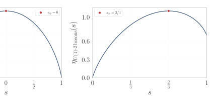 
Figure 1: The local entropy η(s) for the case of: (left) N qubits with fixed global U(1) charge, (center) N qutrits with fixed global U(1) charge, and (right) N two-species hardcore bosons with fixed global U(1) charge corresponding to fixed total number of particles.

📷 Fig 2

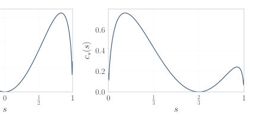 
Figure 2: The heat capacity c∗(s) for the case of: (left) N qubits with fixed global U(1) charge, (center) N qutrits with fixed global U(1) charge, and (right) N two-species hardcore bosons with fixed global U(1) charge corresponding to fixed total number of particles.

📷 Fig 3

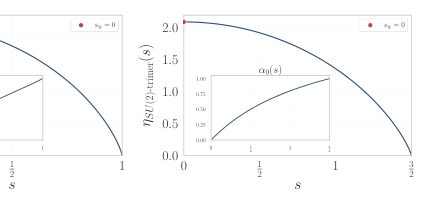 
Figure 3: The function η(s) for the case of N qubits with SU(2) charge (left), for the case of N spin-1 (qutrits) with SU(2) charge (center), and for the case of N spin- 1

**Main problem.** Determining the asymptotic behavior and typicality of entanglement entropy in many-body systems subject to fixed global abelian (U(1)) and non-abelian (SU(2)) charge conservation.

**Main result.** The authors derive a general formula for the average entanglement entropy that can be expressed via a single quantity representing local thermal entropy, and show that the variance is exponentially suppressed, making the entropy 'typical'.

**Method.** The study employs asymptotic analysis using Laplace's method and the saddle-point approximation, alongside group theory (character theory and Haar measures) and information theory (Kullback-Leibler divergence).

**Summary.** This paper provides a general framework for calculating the typical entanglement entropy in many-body systems with fixed global charges. By mapping the problem to a thermodynamic context, the authors show that the entanglement entropy scales according to a local thermal entropy function. The results cover both abelian U(1) and non-abelian SU(2) symmetries, demonstrating that the entropy is highly concentrated around its average. This work offers a powerful tool for studying the entanglement properties of quantum chaotic systems and the effects of symmetry on information scrambling.

Detailed structure

**Model / system.** The framework applies to any many-body system with a local single-charge symmetry group in the thermodynamic limit, including specific models like qubits, qutrits, and spin-trimers under U(1) and SU(2) symmetries.

**Key observables.** Average entanglement entropy, variance of entanglement entropy, and local entropy/heat capacity.

**Important parameters / regimes.** Thermodynamic limit (N approaching infinity), subsystem fraction (f), global charge density (s), and local Hilbert space dimension (k).

**Assumptions / limitations.** The analysis assumes a finite-dimensional local Hilbert space and focuses on the thermodynamic limit; it also assumes the smoothness of the integrand except in specific critical regimes.

**Figures summary.** Figure 1 plots local entropy versus charge density for various U(1) models; Figure 2 is mentioned but its specific content is not detailed in the notes.

**Paper structure.** The paper introduces the problem of charge-conserved entanglement, develops a thermodynamic mapping using relative entropy, provides asymptotic expansions for U(1) and SU(2) symmetries, analyzes specific model examples, and discusses the implications for quantum chaos and typicality.

**Why it may be interesting.** This is highly relevant for many-body dynamics as it provides a universal thermodynamic interpretation of entanglement scaling and establishes how global symmetries influence the entanglement properties of random states, which is crucial for understanding thermalization and quantum chaos.

Abstract

We consider a many-body Hilbert space with a fixed global charge and show that the typical entanglement entropy of a subsystem, at the leading and subleading order in the thermodynamic limit, can be expressed in terms of a single quantity which represents the local thermal entropy at fixed charge density. We find a general formula which applies both to abelian U(1) symmetry and non-abelian SU(2) symmetry, including the case of a local Hilbert space which transforms under a general reducible representation of the symmetry group. We illustrate the general formula with model systems and discuss the relevance of the results as a probe of quantum chaos for physical Hamiltonians.

[↑ back to top](#top)

### [All pure entangled states can lead to fully nonlocal correlations](http://arxiv.org/abs/2604.26605v1)

**Authors:** Martin J. Renner, Edwin Peter Lobo, Arturo Konderak, Remigiusz Augusiak, Antonio Acín  
**Type:** theory · **Category:** quantum information and computing · **PDF:** <https://arxiv.org/pdf/2604.26605v1>  
**Analysis basis:** full PDF text, analyzed in chunks
**Topic relevance:** 🔥 `entanglement & information structure` **4/5** · `quantum measurements` **2/5**

📷 Fig 1

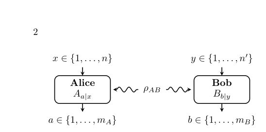 
FIG. 1. In a Bell scenario, two parties obtain the outputs a, b based on the inputs x, y, generating the joint probability distributions p(a, b|x, y). In a quantum realization, these prob- ability distributions are derived from the measurements on a shared entangled state via the Born rule (6).

📷 Fig 2

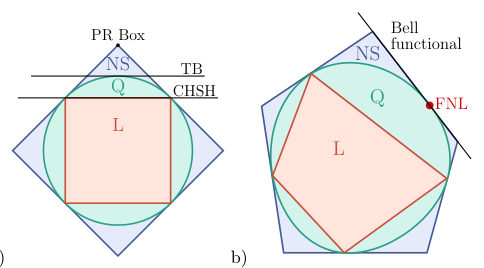 
FIG. 2. Graphical representations of the local (L), quantum (Q), and non-signaling (NS) set. a) A section of the set of quantum correlations in the two-input two-output scenario. The local polytope (L) is bounded by the CHSH inequality [45]. The Tsirelson’s bound (TB) identifies the maximal violation of the CHSH inequality allowed by quantum correlations. The Popescu-Rohrlich (PR) box provides the maximal violation of the CHSH inequality via non-signaling correlations. b) A schematic representation of a fully nonlocal (FNL) quantum distribution. It is a point on the boundary of the non-signaling set that does not contain a vertex of the local polytope.

**Main problem.** The paper investigates whether maximal entanglement is a necessary condition for 'full nonlocality' (correlations with zero local content) and seeks to identify the conditions under which pure entangled states exhibit such nonlocality.

**Main result.** The authors prove that in all bipartite dimensions d >= 3, non-maximally entangled states can be fully nonlocal, and that all pure entangled states can be 'activated' to show full nonlocality in the many-copy scenario.

**Method.** The study establishes a link between full nonlocality and the 'antidistinguishability' of quantum states, using geometric interpretations of Bell sets, Semidefinite Programming (SDP), and analysis of Schmidt coefficients.

**Summary.** This paper addresses the long-standing question of whether maximal entanglement is required for full nonlocality. The authors demonstrate that for dimensions 3 and higher, non-maximally entangled states can indeed exhibit full nonlocality. Furthermore, they show that any pure entangled state, no matter how weakly entangled, can be activated to produce fully nonlocal correlations if enough copies of the state are provided. This work provides new sufficient conditions for nonlocality based on Schmidt coefficients.

Detailed structure

**Model / system.** The study focuses on bipartite quantum systems in d x d Hilbert spaces, specifically considering pure entangled states in Schmidt form and their tensor products (many-copy scenario).

**Key observables.** Local content (LC), Bell functionals, and the overlap of post-measurement states.

**Important parameters / regimes.** Schmidt coefficients (lambda_max, lambda_min), dimension (d), and the number of copies (k).

**Assumptions / limitations.** The results primarily focus on pure states and assume the availability of certain measurement sets like Mutually Unbiased Bases (MUBs).

**Figures summary.** Figure 1 shows a standard Bell scenario; Figure 2 illustrates the geometry of Local, Quantum, and Non-signaling sets and the PR box; Table I compares local deterministic strategies with the PR box.

**Paper structure.** The paper introduces the concept of full nonlocality, establishes the link to antidistinguishability, proves the existence of non-maximally entangled fully nonlocal states for d >= 3, demonstrates the activation of nonlocality via multiple copies, and provides bounds on local content.

**Why it may be interesting.** This is highly relevant for quantum information theorists as it provides a fundamental limit on the utility of entanglement for tasks like quantum pseudo-telepathy and clarifies the relationship between entanglement and non-classical correlations.

Abstract

It is a well-established fact that some quantum correlations can be nonlocal, meaning that they cannot be described by a local hidden variable model. Certain quantum correlations have a form of nonlocality so strong that they cannot be reproduced even by models having an arbitrarily small local hidden variable component. These correlations are called fully nonlocal and lead to Bell inequalities in which the maximum quantum value saturates the non-signaling bound. A well-known example of this effect, which is also referred to as quantum pseudo-telepathy or all-versus-nothing proofs of nonlocality, is the quantum distribution fulfilling the Peres-Mermin square, in which the underlying state is a $4\times4$ dimensional maximally entangled state. Other examples of full nonlocality are known but, so far, all of them are for maximally entangled states and it is an open question whether maximal entanglement is necessary for full nonlocality. In this work, we first establish a link between full nonlocality and the concept of antidistinguishability of quantum states. We use this connection to show that in every bipartite $d\times d$ Hilbert space, with $d\geq3$, there are non-maximally entangled states that are fully nonlocal. In fact, we derive simple sufficient conditions for full nonlocality that are only based on the smallest and largest Schmidt coefficients. We also show that in every dimension there exist pure entangled states that do not exhibit full nonlocality. Finally, we show that all pure entangled states can be activated to show full nonlocality in the many-copy scenario.

[↑ back to top](#top)

### [Hardware-Efficient Hamiltonian Simulation via Trotter-Initialized Variational Optimization with Native Placement](http://arxiv.org/abs/2604.26663v1)

**Authors:** F. S. Luiz, P. N. Ferreira, M. C. de Oliveira  
**Type:** both · **Category:** quantum information and computing · **PDF:** <https://arxiv.org/pdf/2604.26663v1>  
**Analysis basis:** full PDF text, analyzed in chunks
**Topic relevance:** 🔥 `QC/QI experiment` **4/5** · `non-equilibrium dynamics` **2/5**

📷 Fig 1

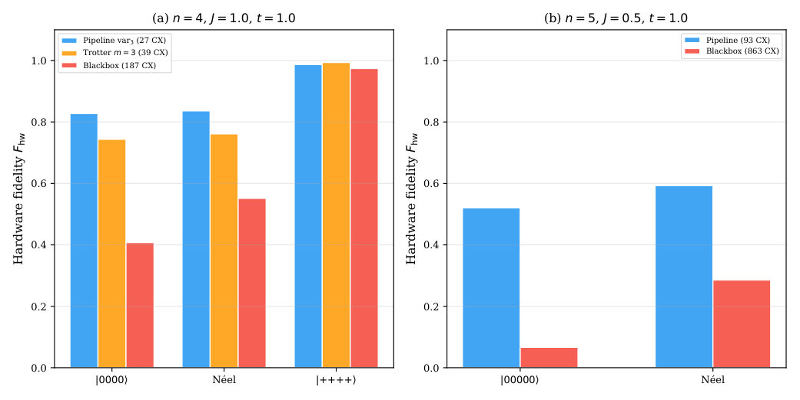 
Figure 1. Hardware fidelity on IBM Torino. (a) Scenario B (n = 4, J = 1.0): the variational pipeline (27 CX) achieves higher Fhw than the blackbox (187 CX) across all initial states, despite lower simulation fidelity. (b) Scenario C (n = 5): the blackbox circuit (863 CX) produces essentially random output (Fhw ≈0.07), while the pipeline circuit (93 CX) retains meaningful fidelity.

📷 Fig 2

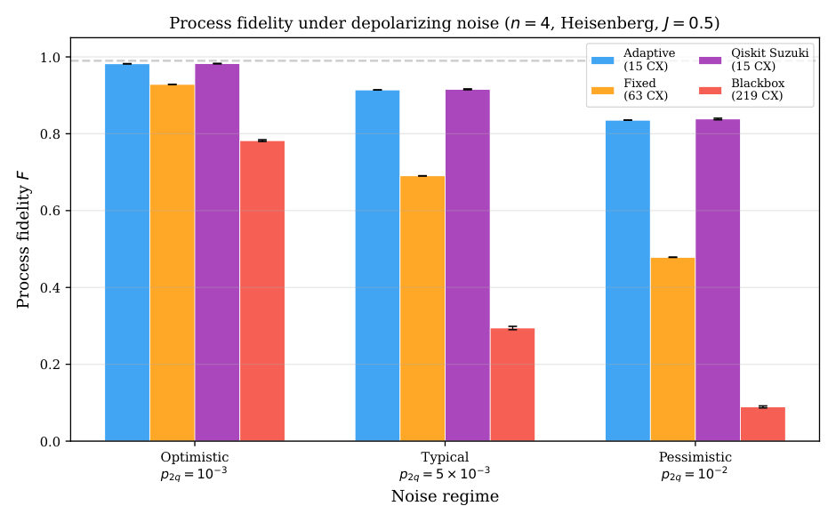 
Figure 2. Process fidelity under depolarizing noise for three error rate regimes. The adaptive native pipeline (15 CX, blue) maintains F &gt; 0.83 even at pessimistic noise rates, while the blackbox circuit (217 CX, red) drops below F = 0.10. The fixed native method (63 CX, orange) falls between the two. Error bars show standard deviation over 10 seeds.

📷 Fig 3

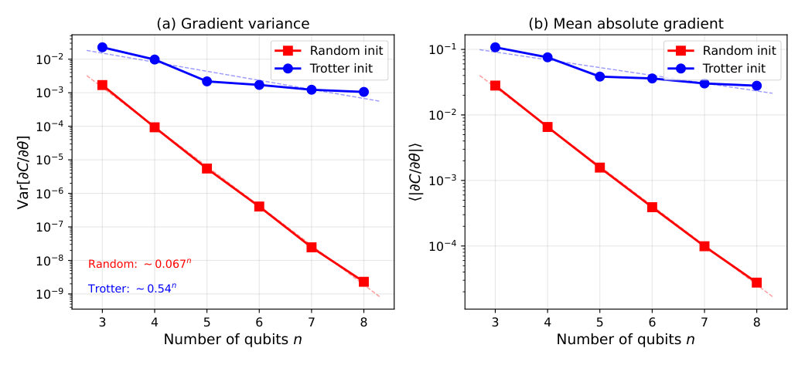 
Figure 3. Gradient landscape scaling for the Trotter-structured variational ansatz (L = 3 layers, Heisenberg J = 1.0). (a) Gradient variance versus qubit count: random initialization (red) exhibits exponential decay (∼0.067n, barren plateau), while Trotter initialization (blue) decays much more slowly (∼0.54n). (b) Mean absolute gradient: Trotter initialization maintains |∇C| ∼10−2 across n = 3–8, providing informative gradients for L-BFGS optimization.

📷 Fig 4

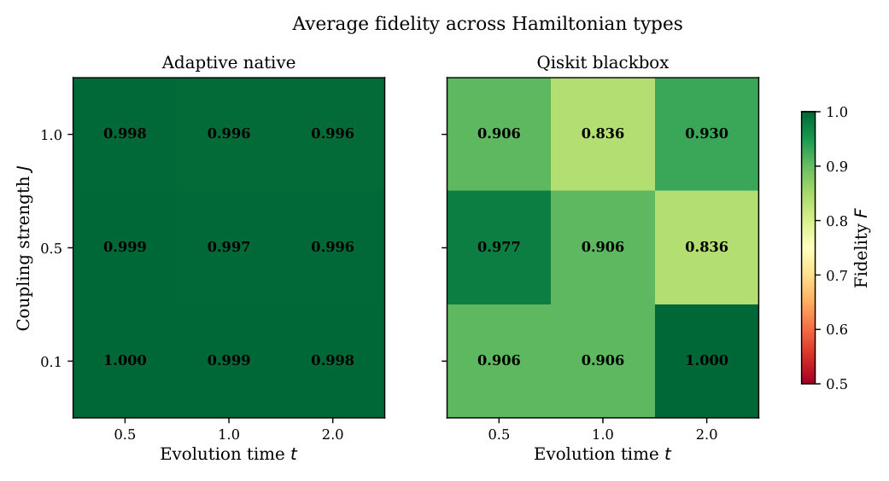 
Figure 4. Fidelity of the adaptive native pipeline across 36 parameter configurations (4 Hamiltonian types × 3 evolution times × 3 coupling strengths). Green cells indicate F ≥0.99 (weak/moderate coupling); yellow indicates F ≥0.99 achieved with variational refinement (strong coupling). The pipeline maintains high fidelity across all tested regimes.

📷 Fig 5

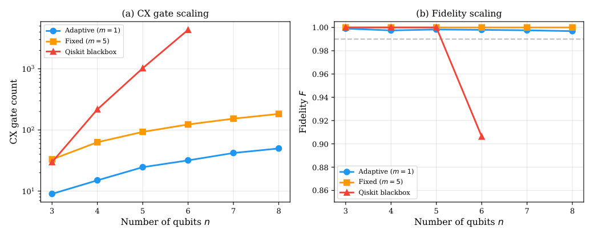 
Figure 5. CX gate count (left, log scale) and fidelity (right) versus number of qubits for the Heisenberg model (J = 0.5, t = 1.0). Native methods (adaptive and fixed) exhibit linear CX scaling, while Qiskit blackbox decomposition grows exponentially, becoming impractical above n = 6.

📷 Fig 6

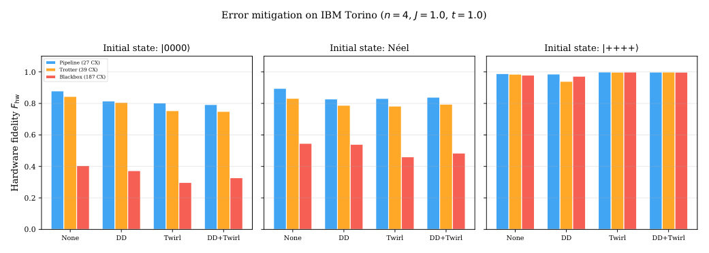 
Figure 6. Error mitigation comparison on IBM Torino (n = 4, J = 1.0). For computational basis states, mitigation provides no consistent improvement. For the | + + + +⟩state, twirling modestly improves all methods but does not change the relative ordering. The depth gap between pipeline (27 CX) and blackbox (187 CX) circuits cannot be closed by mitigation.

**Main problem.** The high circuit depth and gate count required by generic quantum compilers for Hamiltonian simulation lead to excessive noise and decoherence on NISQ devices.

**Main result.** A structure-aware compilation framework achieves significantly higher hardware fidelity and lower CX gate counts (up to 136x reduction) compared to generic blackbox transpilation, even outperforming exact synthesis in noisy regimes.

**Method.** A three-stage pipeline combining native hardware placement, a greedy oracle for adaptive Trotter block selection, and variational refinement using a Trotter-initialized ansatz.

**Summary.** This paper presents a new way to compile quantum circuits for simulating time-evolving Hamiltonians. Instead of treating the evolution as a generic operation, the method uses the known structure of the Hamiltonian to create much shorter circuits. By combining adaptive Trotter steps with a variational refinement step, the authors show that these shorter, approximate circuits actually perform better on real noisy hardware than deeper, exact circuits. This approach significantly reduces the number of error-prone two-qubit gates and helps avoid the vanishing gradient problem in quantum optimization.

Detailed structure

**Model / system.** 1D chains of 3-8 qubits using Heisenberg, Ising, and XY models, validated on IBM Torino and IBM Heron-based hardware architectures.

**Key observables.** Process fidelity (F), hardware fidelity (Fhw), Hellinger fidelity, CX gate count, and gradient variance.

**Important parameters / regimes.** Number of qubits (n=3-8), coupling strength (J=0.5, 1.0), evolution time (t), and error regimes (optimistic, typical, pessimistic).

**Assumptions / limitations.** The Hamiltonian has a known local structure (nearest-neighbor) and the framework is limited by classical computational costs for larger qubit counts.

**Figures summary.** Figures show hardware fidelity comparisons between the pipeline and blackbox methods, process fidelity under various depolarizing noise levels, and gradient landscape analysis demonstrating the avoidance of barren plateals.

**Paper structure.** The paper introduces the problem of compilation bottlenecks, details the three-stage adaptive native pipeline, compares it against standard Trotter and blackbox baselines, provides hardware validation on IBM Torino, and analyzes scaling and noise resilience.

**Why it may be interesting.** It provides a practical strategy for executing many-body dynamics on near-term hardware by prioritizing circuit shallowness and structural preservation over exactness, which is crucial for simulating many-body physics.

Abstract

Compiling time-evolution operators of the form $U(t)=e^{-iHt}$ into hardware-native gate sequences is a central bottleneck for digital quantum simulation on noisy intermediate-scale quantum (NISQ) devices. Generic transpilation treats $U(t)$ as an arbitrary unitary, discarding the structure of Hamiltonian dynamics and producing circuits whose depth exceeds hardware coherence limits. We introduce a structure-aware compilation framework that treats product-formula decompositions as synthesis primitives rather than simulation approximations. The method combines (i) native placement of Hamiltonian terms onto the hardware coupling map, (ii) adaptive selection of Trotter blocks via a greedy discretization procedure, and (iii) variational refinement using a Trotter-initialized ansatz. Across Heisenberg, Ising, and XY models with $n=3$--$8$ qubits, the compiled circuits achieve fidelities $F>0.996$ with approximately linear scaling in the number of entangling gates, while generic synthesis produces circuits that are orders of magnitude deeper. On IBM Torino hardware, we observe a regime in which shorter approximate circuits outperform deeper exact decompositions: a 27-CX circuit achieves higher hardware fidelity ($F_{\mathrm{hw}}=0.987$) than a 187-CX exact circuit. These results demonstrate that, in the NISQ regime, structure-aware approximate compilation can outperform exact structure-agnostic synthesis, providing a practical pathway for executing Hamiltonian dynamics without requiring pulse-level control.

[↑ back to top](#top)

### [Kondo transport in an anisotropic two-dimensional electron gas with quadratic momentum-dependent spin splitting](http://arxiv.org/abs/2604.26767v1)

**Authors:** M. R. Parymuda  
**Type:** theory · **Category:** strongly correlated electrons · **PDF:** <https://arxiv.org/pdf/2604.26767v1>  
**Analysis basis:** full PDF text, analyzed in chunks
**Topic relevance:** 🔥 `Kondo & dissipative impurity` **4/5** · `Keldysh / 2PI / non-Gaussian methods` **2/5**

📷 Fig 1

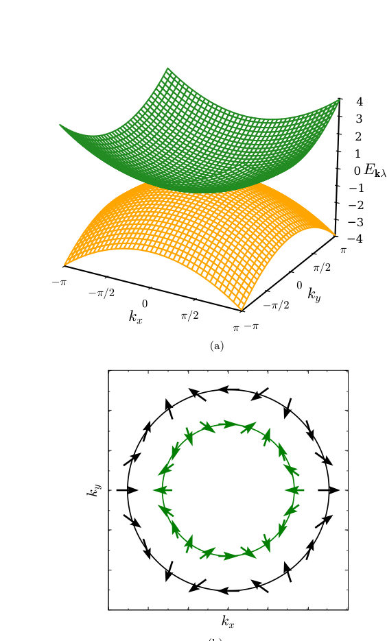 
FIG. 1. (a) Energy spectrum of the quadratic spin-splitting model. (b) Schematic illustration of the momentum-space spin texture generated by the spin-orbit field gα(k). The arrows indicate the spin polarization in the two helicity bands, aligned parallel or antiparallel to gα(k).

📷 Fig 2

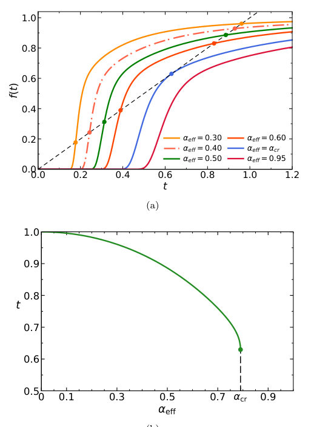 
FIG. 2. (a) Graphical solution of self-consistent equation f(t) = t for several values of αeff. (b) Renormalized Kondo temperature as a function of αeff.

📷 Fig 3

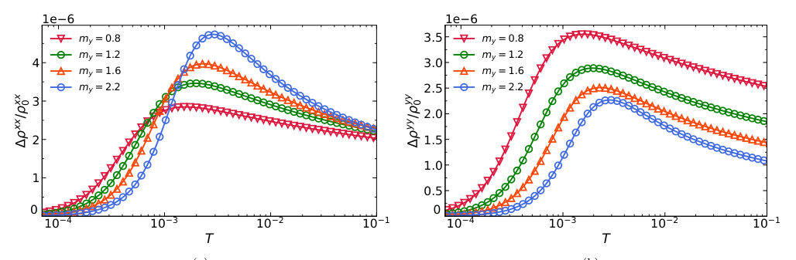 
FIG. 3. Temperature dependence of the longitudinal resistivity corrections on a semilogarithmic scale for several values of the effective mass my: (a) ∆ρxx/ρxx 0 and (b) ∆ρyy/ρyy 0 . The parameter values are specified in the main text.

**Main problem.** The study investigates how a quadratic, momentum-dependent spin texture in a two-dimensional electron gas (2DEG) modifies Kondo transport properties and the Kondo temperature (TK).

**Main result.** The Kondo temperature is strongly suppressed by the quadratic spin-splitting coupling, leading to a 'Kondo collapse' at a critical coupling value where TK drops by approximately 37%.

**Method.** A Green's function formalism and many-body approach are used to calculate electronic self-energy and resistivity corrections to the third order in the s-d exchange coupling.

**Summary.** This paper explores how momentum-dependent spin-orbit coupling affects the Kondo effect in a 2D electron gas. It demonstrates that a quadratic spin texture significantly suppresses the Kondo temperature and can even cause a complete 'Kondo collapse' at a critical coupling strength. The research also details how mass anisotropy influences longitudinal resistivity. These findings are important for understanding transport in materials with complex spin textures like BaSbPt.

Detailed structure

**Model / system.** An anisotropic two-dimensional electron gas (2DEG) with S=1/2 Kondo impurities, described by a low-energy effective k.p model featuring quadratic spin-splitting and anisotropic effective masses.

**Key observables.** Longitudinal resistivity corrections (delta rho_xx/rho_xx_0 and delta rho_yy/rho_yy_0) and the renormalized Kondo temperature (TK).

**Important parameters / regimes.** Quadratic spin-splitting coupling (alpha), s-d exchange coupling (J_sd), effective mass anisotropy (m_x, m_y), and impurity broadening (Gamma).

**Assumptions / limitations.** The study assumes a dilute concentration of magnetic impurities, a weak-coupling regime, and a high-temperature regime (TK < T << D).

**Figures summary.** Fig 1 shows the energy spectrum and momentum-space spin texture; Fig 2 illustrates the self-consistency equation solution and the decrease of TK with alpha; Fig 3 shows temperature dependence of resistivity corrections.

**Paper structure.** The paper introduces the physical model and spin texture, develops a Green's function framework for transport, derives analytical expressions for resistivity and conductivity, and analyzes the temperature-dependent scaling and the Kondo collapse phenomenon.

Abstract

We investigate the transport properties of an anisotropic two-dimensional electron gas with a quadratic spin texture, described by a low-energy effective $ k\cdot p$ model, in the presence of $S=1/2$ Kondo impurities. We develop a Green's function framework that captures the interplay between the spin texture and the Kondo scattering for calculating transport properties in such systems. Using this framework, we evaluate the longitudinal resistivity corrections $Δρ^{xx}/ρ^{xx}_0$ and $Δρ^{yy}/ρ^{yy}_0$ to third order in the $s$-$d$ exchange coupling and analyze their temperature dependence. We further determine the Kondo temperature $T_K$ and show that it is strongly suppressed with increasing quadratic spin-splitting coupling $α$. In particular, we identify a critical coupling $α_{cr}$ marking the onset of a Kondo collapse, at which $T_K$ is reduced by approximately 37\% relative to that of the conventional two-dimensional electron gas.

[↑ back to top](#top)

### [Nonclassical traits in multi-copy state discrimination](http://arxiv.org/abs/2604.26647v1)

**Authors:** Tim Achenbach, Leevi Leppäjärvi, Hanwool Lee, Teiko Heinosaari  
**Type:** theory · **Category:** quantum information and computing · **PDF:** <https://arxiv.org/pdf/2604.26647v1>  
**Analysis basis:** full PDF text, analyzed in chunks
**Topic relevance:** 🔥 `quantum measurements` **4/5** · `entanglement & information structure` **2/5**

📷 Fig 1

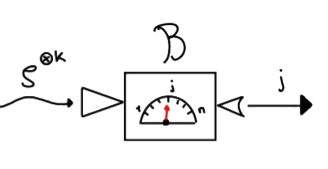 
Figure 1. Alice is randomly asked to prepare a state with label i. She sends k instances of that state to Bob, to whom the label is unknown. He tries to figure out the label, measuring the states and finally outputting his guess j. If j = i, they succeed. The measurement strategies can vary from Bob making a collective global measurement on all copies to making individual local measurements on the different copies.

📷 Fig 2

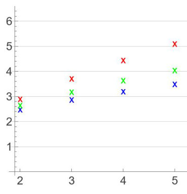 
Figure 3. The gap between f(k) and g(k) increases with the num- ber of copies. Since both functions are monotonically increasing, this suggests a quantum advantage.

📷 Fig 3

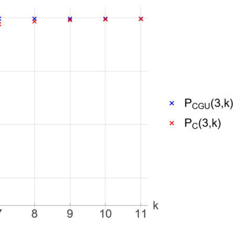 
Figure 4. The success probability for multi-copy discrimination of trine states scales exponentially in both, quantum as well as classical, theories. However, it takes about k = 11 copies for classical theory to be practically 1, whereas k = 5 copies are sufficient for quantum theory to achieve effectively success probability 1.

📷 Fig 4

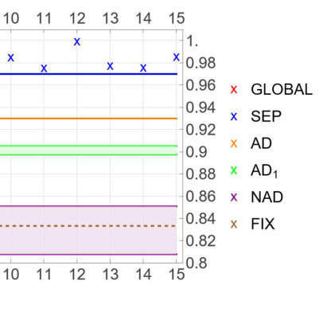 
Figure 5. This plot shows the success probability for 2 copies from 3-state ensembles, given a theory and measurement strategy. Solid lines correspond to the trine ensemble and the dashed line to classical theory. For the double trine ensemble, the optimal success probabil- ity by SEP and AD measurements are analytically derived in [20]. The bounds for the success probability by AD1 and NAD measure- ments (green and purple shaded regions respectively) are numerically calculated in [25]. Interestingly, we numerically find that entangled measurements can outperform separable measurements for the poly- gon theory with m = 8. In addition, we have a brown shaded area for hexagon, since the...

📷 Fig 5

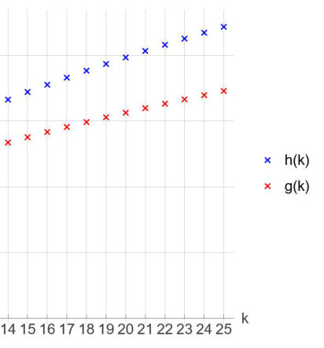 
Figure 8. The lower (C)GU-bound h(k) surpasses the classical upper bound g(k) for all k ∈[25], whereas the gap increases in alignment with the success probability shown in Figure 3.

**Main problem.** The paper investigates the minimum-error discrimination of multi-copy states, specifically comparing the success probabilities of quantum (qubit) strategies versus classical (bit-like) strategies under different measurement hierarchies.

**Main result.** The authors prove that for all n > k, a qubit strategy exists that outperforms all bit strategies, and they identify instances of nonlocality without entanglement (NLWE) where certain bit-like theories outperform the best qubit strategies using classical measurements.

**Method.** The study employs mathematical frameworks from Generalized Probabilistic Theories (GPTs), using Positive Operator-Valued Measures (POVMs), the Pretty Good Measurement (PGM), and Semidefinite Programming (SDP) to calculate success probabilities and bounds.

**Summary.** This paper explores how having multiple copies of a quantum state changes the advantage of quantum theory over classical theory during state discrimination. The authors demonstrate that while qubits can outperform bits in multi-copy settings, certain classical-like theories can actually surpass qubits under specific measurement constraints. By analyzing different measurement hierarchies like LOCC and global operations, the study identifies new instances of nonlocality without entanglement. The results provide general bounds for operational theories and show how the success probability scales with the number of copies.

Detailed structure

**Model / system.** The model considers an ensemble of n states, each provided in k identical copies. It compares two-level quantum systems (qubits) with classical bit-like systems (commuting states) and explores polygon state spaces P(m) for specific geometric analyses.

**Key observables.** Average success probability (P) of state discrimination.

**Important parameters / regimes.** Number of states (n), number of copies (k), dimension of Hilbert space (d), and the number of vertices in polygon models (m).

**Assumptions / limitations.** The states are prepared with equal prior probabilities; the focus is restricted to the minimum-error discrimination task.

**Figures summary.** Figure 1 shows a schematic of the discrimination task; Figure 2 illustrates trine states on the Bloch sphere; Figure 3 and 4 show the widening gap and scaling differences between quantum and classical success probabilities; Figure 8 shows the threshold where quantum bounds surpass classical bounds.

**Paper structure.** The paper begins by defining the multi-copy discrimination task, moves to deriving classical and quantum bounds for bit and qubit strategies, analyzes specific Geometrically-Uniform (GU) state ensembles, explores the hierarchy of measurement strategies (LOCC vs. Global), and concludes with an investigation of polygon state spaces.

**Why it may be interesting.** This work is highly relevant to quantum information theory and quantum optics as it explores the fundamental limits of information retrieval from multiple quantum copies and the emergence of nonclassicality in measurement-constrained environments.

Abstract

Quantum state discrimination is a fundamental information processing task that serves as a building block for numerous applications and provides implications at the foundational level. In this work, we consider minimum error discrimination of multi-copy states, where instead of preparing a single system we assume that multiple instances of the same state are prepared. Now the discrimination allows for measurements from multiple parties with different measurement strategies varying from global measurement strategy to ones restricted to different forms of local operations and classical communication strategies. By comparing the average success probabilities in quantum and classical cases, we find a qubit strategy that outperforms all the bit strategies. However, we find that there are other bit-like operational theories which can outperform the best qubit strategies even with a classical measurement strategy and we are able to identify instances of different theories where different measurement strategies are optimal. In this way, we are able to find instances of nonlocality without entanglement as well as provide general bounds for bit-like operational theories.

[↑ back to top](#top)

### [Rigged Liouville space formulation for quasi-Hermitian Liouville operators](http://arxiv.org/abs/2604.26322v1)

**Authors:** Shousuke Ohmori, Junichi Takahashi  
**Type:** theory · **Category:** other · **PDF:** <https://arxiv.org/pdf/2604.26322v1>  
**Analysis basis:** full PDF text, analyzed in chunks
**Topic relevance:** 🔥 `methods for driven-dissipative` **4/5** · `non-equilibrium dynamics` **2/5**

📷 Fig 1

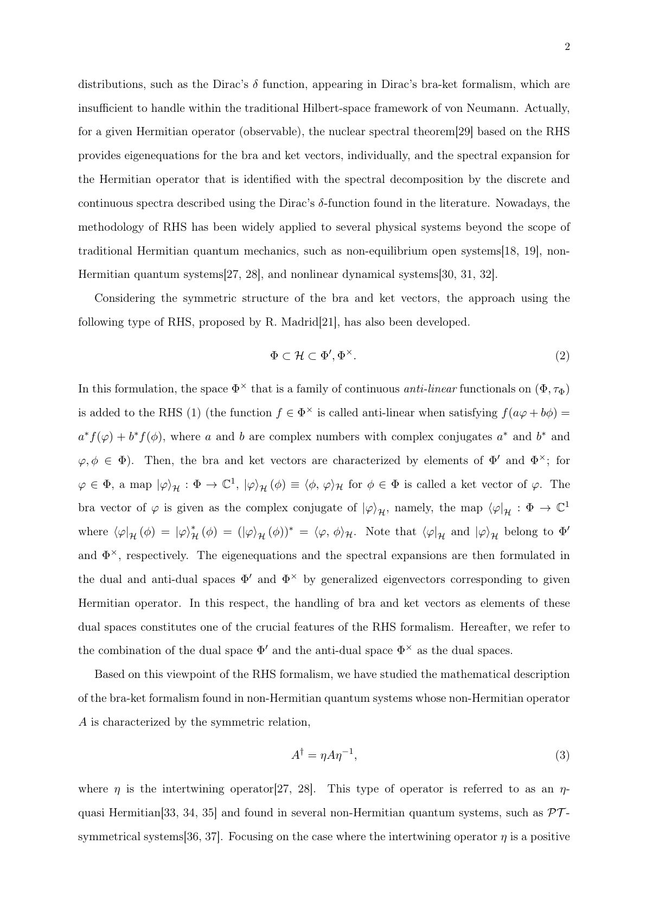 
Low-resolution page preview, page 2

📷 Fig 2

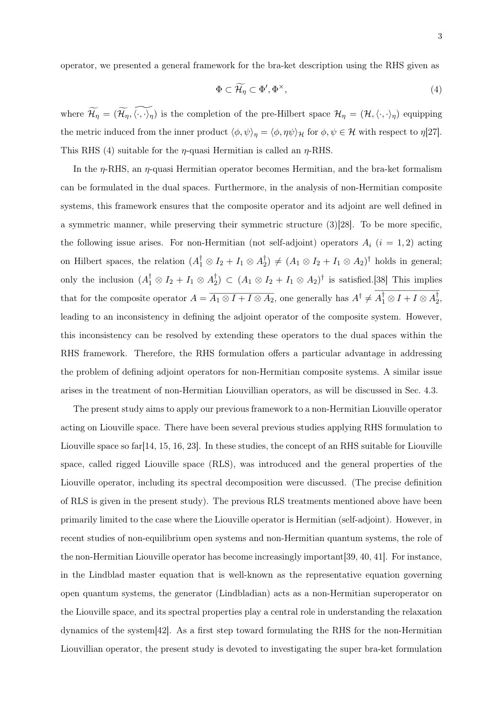 
Low-resolution page preview, page 3

📷 Fig 3

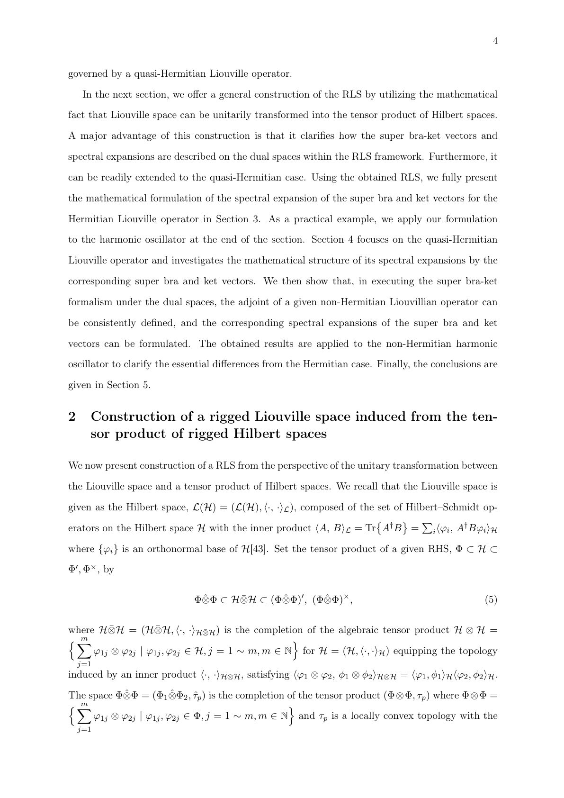 
Low-resolution page preview, page 4

📷 Fig 4

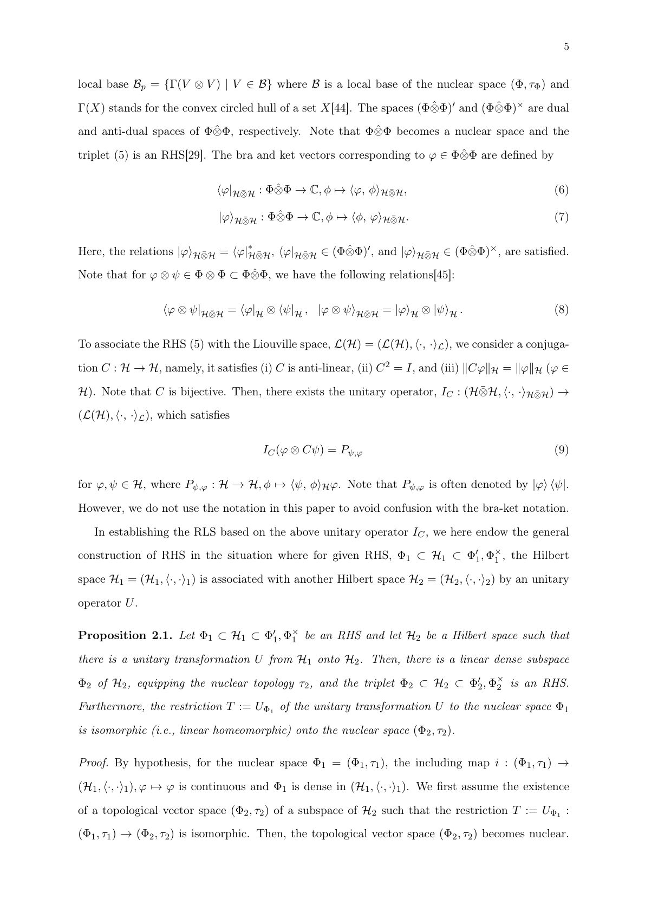 
Low-resolution page preview, page 5

📷 Fig 5

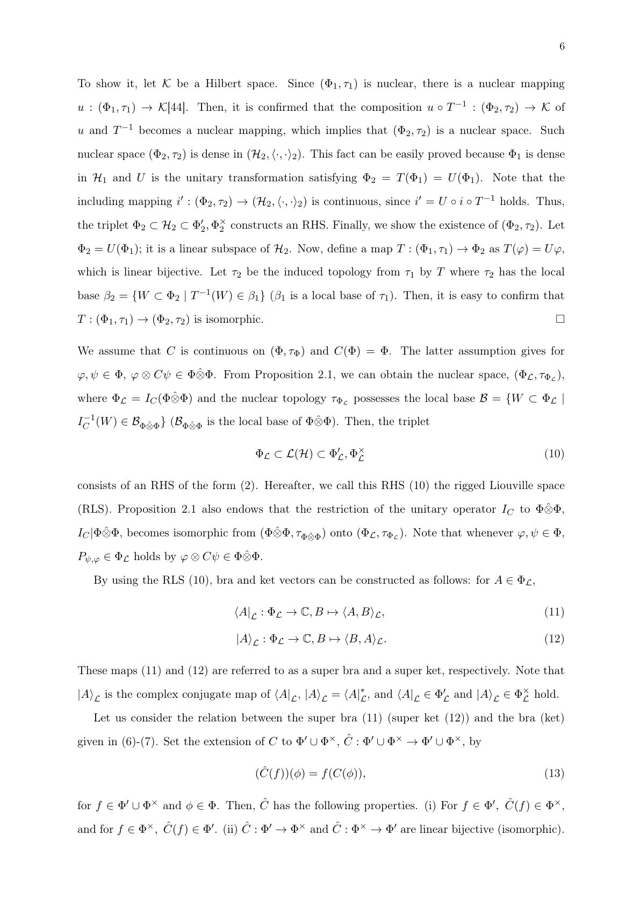 
Low-resolution page preview, page 6

📷 Fig 6

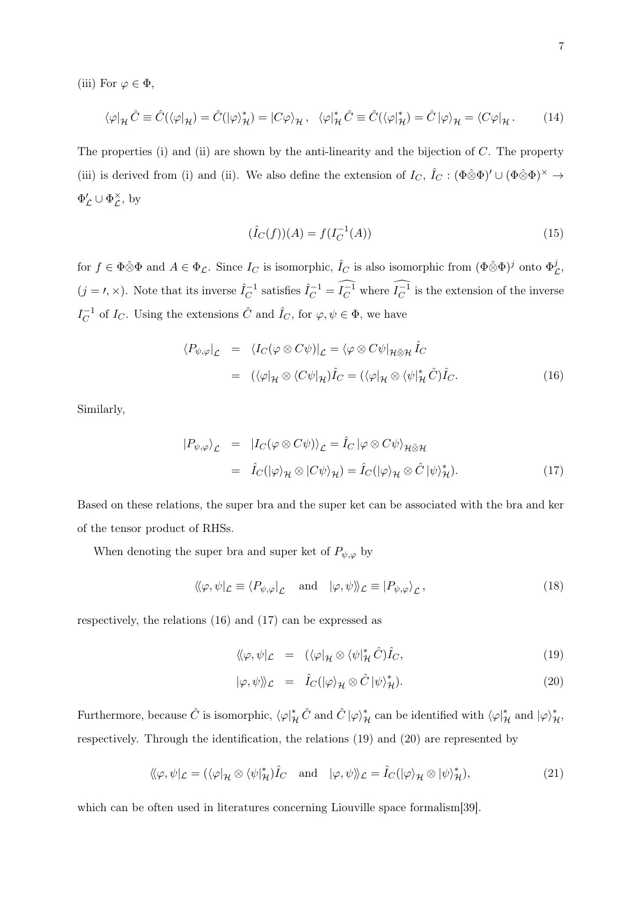 
Low-resolution page preview, page 7

📷 Fig 7

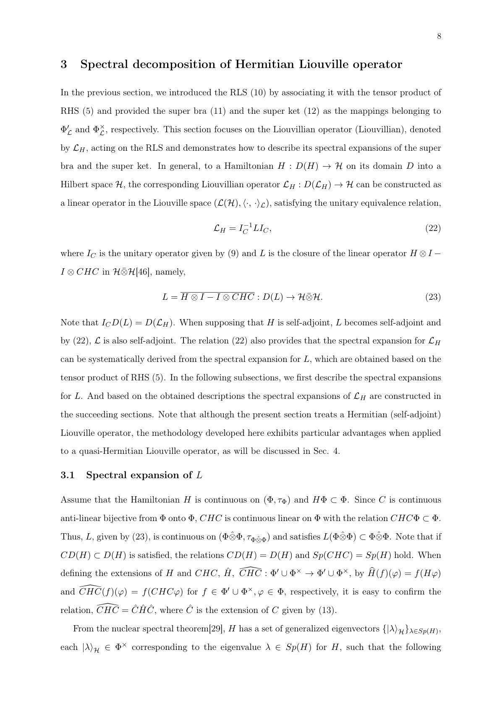 
Low-resolution page preview, page 8

📷 Fig 8

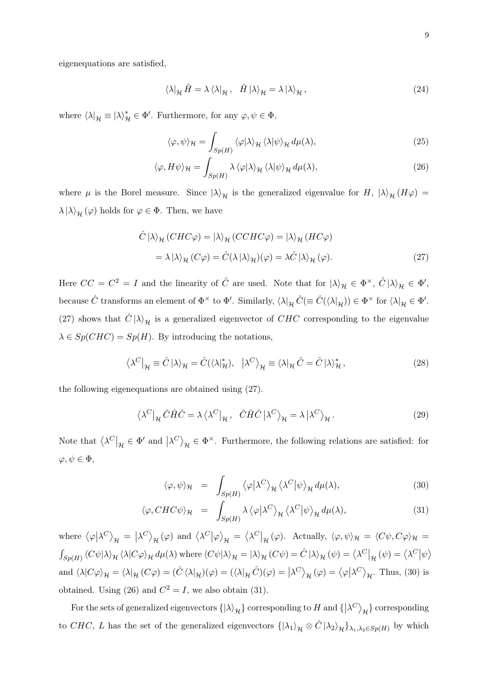 
Low-resolution page preview, page 9

📷 Fig 9

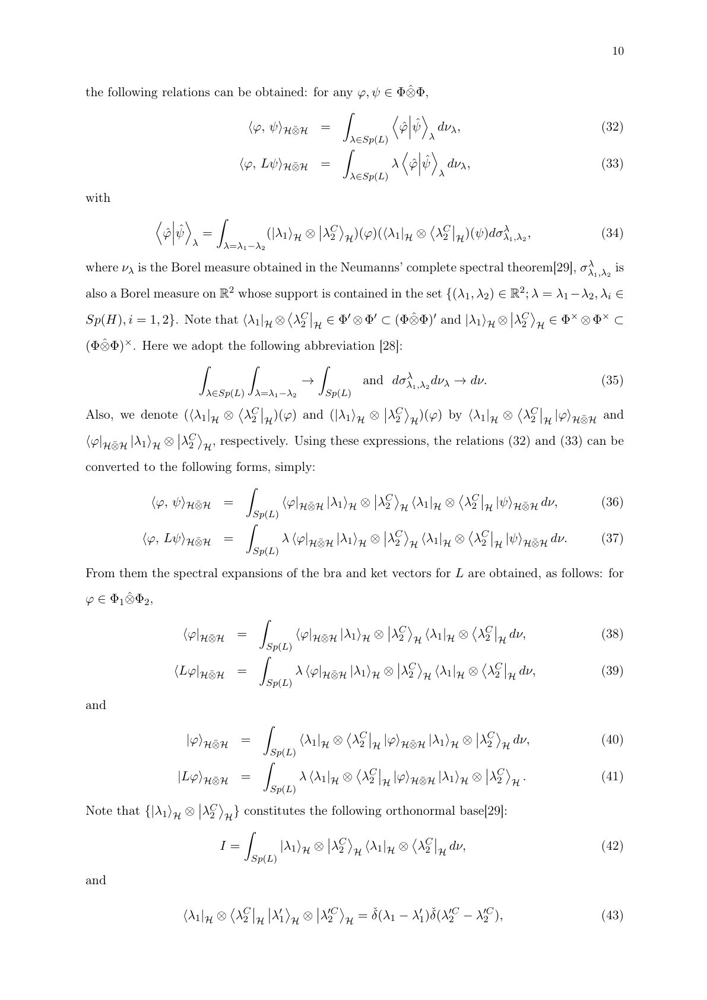 
Low-resolution page preview, page 10

📷 Fig 10

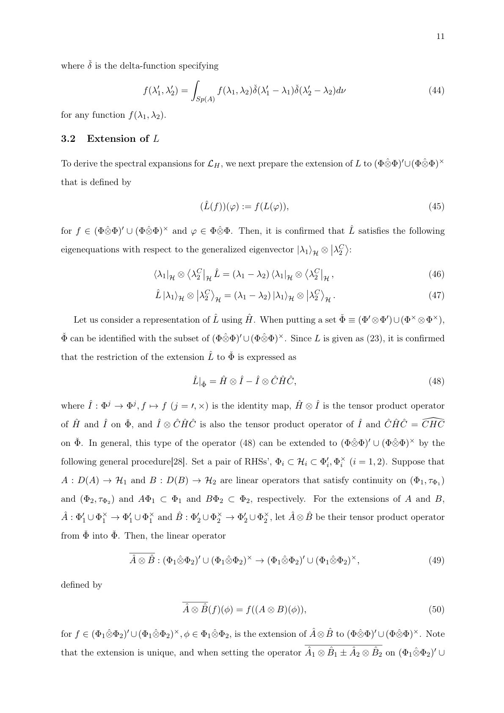 
Low-resolution page preview, page 11

**Main problem.** Establishing a rigorous mathematical foundation for the super bra-ket formalism and spectral decomposition of quasi-Hermitian Liouville operators within a Rigged Liouville Space (RLS) framework.

**Main result.** The authors successfully constructed a Rigged Liouville Space that allows for a symmetric construction of non-Hermitian Liouvillian operators and their adjoints, resolving previous mathematical inconsistencies in the adjoint relation of composite systems.

**Method.** The study utilizes the framework of Rigged Hilbert Spaces (RHS) and unitary transformations to reconstruct a Rigged Liouville Space (RLS) by exploiting the equivalence between Hilbert-Schmidt operators and tensor products of Hilbert spaces.

**Summary.** This paper develops a rigorous mathematical framework called Rigged Liouville Space (RLS) to handle the spectral decomposition of quasi-Hermitian Liouville operators. It addresses a fundamental mathematical inconsistency regarding the adjoint of composite non-Hermitian operators in standard Hilbert space. By using Rigged Hilbert Spaces, the authors show that the symmetry of the Liouvillian and its adjoint can be preserved. The framework is demonstrated using the Swanson Hamiltonian, showing how the expansion transitions from an orthonormal basis to a bi-orthogonal system. This work provides a solid foundation for the super bra-ket formalism used in open quantum systems.

Detailed structure

**Model / system.** The framework is applied to $\eta$-quasi-Hermitian systems, specifically focusing on the Lindblad master equation for open quantum systems and the Swanson Hamiltonian (a non-Hermitian PT-symmetric harmonic oscillator).

**Key observables.** Spectral expansion coefficients, super bra-ket vectors, and the bi-orthogonal basis for the Liouvillian operator.

**Important parameters / regimes.** The metric operator $\eta$ (or $\zeta$), the conjugation operator $C$, and the parameter regime $\omega^2 - 4\alpha\beta > 0$ for the Swanson oscillator.

**Assumptions / limitations.** Assumes the existence of a continuous conjugation operator $C$ that commutes with the intertwining operator $\eta$, and that $\eta$ is a positive invertible operator.

**Paper structure.** The paper progresses from the general construction of the RLS (Section 2), to the spectral expansion of Hermitian Liouville operators (Section 3), and concludes with the extension to quasi-Hermitian operators and applications to the harmonic oscillator (Section 4).

**Why it may be interesting.** This paper provides the necessary mathematical rigor for treating the dynamics of non-Hermitian and open quantum systems, specifically resolving how to properly define adjoints and spectral expansions in the super operator formalism.

Abstract

We discuss a super bra-ket formalism for quasi-Hermitian Liouvillian operators within the framework of rigged Hilbert spaces (RHS). An RHS in terms of the Liouville space, referred to as a rigged Liouville space (RLS), is reconstructed by exploiting the mathematical fact that the space of Hilbert-Schmidt operators is unitarily equivalent to the tensor product of Hilbert spaces. The obtained RLS endows a rigorous foundation of the construction for the super bra-ket and for the spectral decompositions of both Hermitian and quasi-Hermitian Liouville operators, which are characterized by the generalized eigenvectors in the dual spaces. Furthermore, within this framework, the non-Hermitian Liouvillian operator and its adjoint can be constructed symmetrically, with their symmetric structure preserved. As an application of our RLS methodology, we examine the Liouville operators corresponding to Hermitian and non-Hermitian harmonic oscillators and elucidate the differences between their spectral decomposition forms.

[↑ back to top](#top)

### [Quantum Feature Selection with Higher-Order Binary Optimization on Trapped-Ion Hardware](http://arxiv.org/abs/2604.26834v1)

**Authors:** Carlos Flores-Garrigós, Anton Simen, Qi Zhang, Enrique Solano, Narendra N. Hegade, Sayonee Ray, Claudio Girotto, Jason Iaconis, Martin Roetteler  
**Type:** both · **Category:** quantum information and computing · **PDF:** <https://arxiv.org/pdf/2604.26834v1>  
**Analysis basis:** full PDF text, analyzed in chunks
**Topic relevance:** 🔥 `QC/QI experiment` **4/5** · `entanglement & information structure` **1/5**

📷 Fig 1

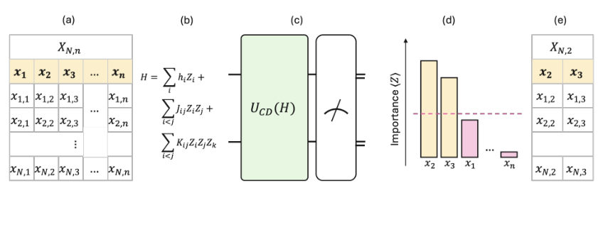 
Fig. 1. Schematics of the quantum feature selection procedure. (a) illustrates a training dataset with n variables and N samples used to compute (b) the coefficients of a higher-order spin Hamiltonian—based on classical statistics from the dataset—whose low-energy configurations encode solutions of the feature selection problem. A (c) digitized counterdiabatic (CD) protocol is implemented in order to obtain a distribution of low-energy states, and (d) local magnetizations that capture the importance of the features are calculated. Based on a importance threshold, (e) features are selected.

📷 Fig 2

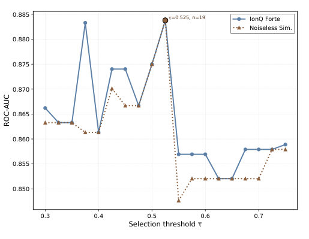 
Fig. 3. ROC-AUC performance on the Gallstone dataset (results in test) as a function of the selection threshold τ applied to the feature inclusion probabilities. Results are shown for IonQ Forte hardware and noiseless simulation. The optimal threshold balances predictive performance and subset size, with annotations indicating the number of selected features at the best- performing configurations.

📷 Fig 3

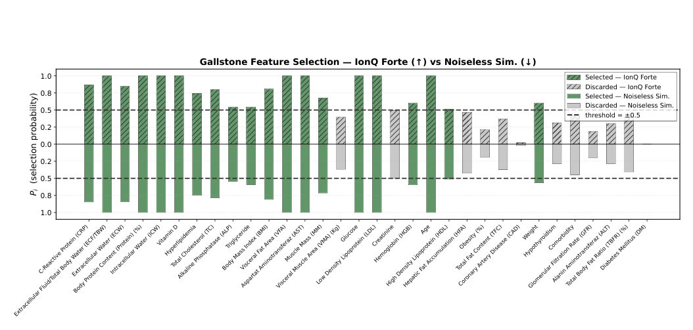 
Fig. 2. Feature inclusion probabilities Pi ∈[0, 1] for the Gallstone dataset obtained from IonQ Forte hardware (upper half) and noiseless simulation (lower half). Each bar represents the empirical selection frequency of a feature within the retained low-energy subset. Features are classified as selected or discarded according to a threshold (dashed lines), illustrating the consistency between hardware and simulation in identifying relevant variables.

📷 Fig 4

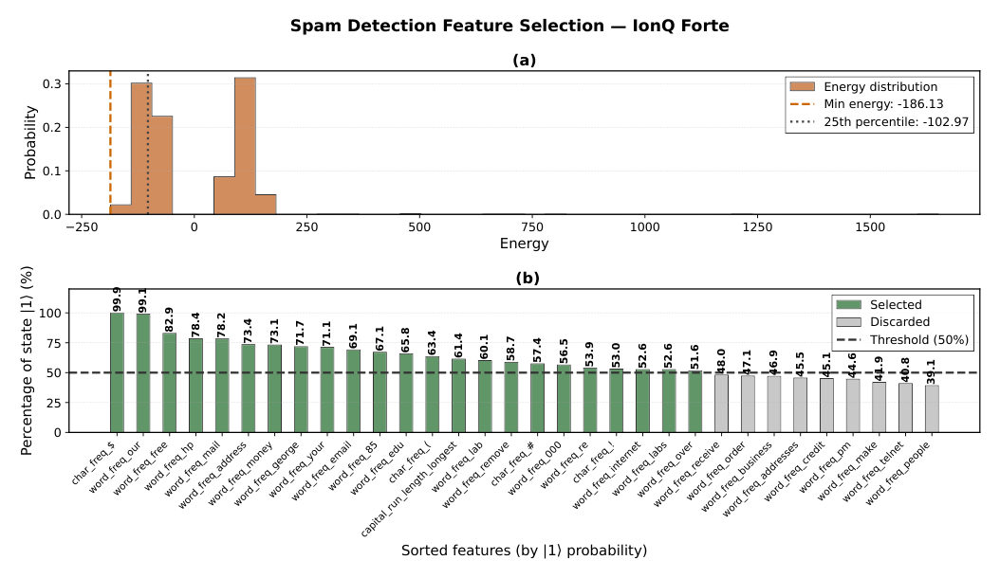 
Fig. 4. Feature selection pipeline for the Spambase dataset using IonQ Forte. (a) Distribution of sampled Hamiltonian values, where only the lowest ρ = 25% of states, i.e., those below the 25th percentile, are retained for post-processing. (b) Feature inclusion probabilities Pi computed as the empirical frequency of xi = 1 within the retained low-energy subset. Features are sorted by Pi and classified as selected or discarded using a threshold τ = 0.50.

**Main problem.** The paper addresses the challenge of efficient feature selection in high-dimensional datasets by overcoming the limitations of standard quadratic (QUBO) approaches that fail to capture higher-order multivariate dependencies.

**Main result.** The proposed HUBO framework on IonQ Forte hardware achieves competitive classification performance, outperforming classical baselines like PCA and SelectKBest on the Gallstone and Spambase datasets.

**Method.** The authors use Digitized Counterdiabatic Quantum Optimization (DCQO) to optimize a Higher-Order Unconstrained Binary Optimization (HUBO) Hamiltonian derived from mutual information measures.

**Summary.** This paper presents a quantum-enhanced method for feature selection in machine learning. By using a higher-order optimization (HUBO) instead of standard quadratic models, the approach captures complex three-body statistical dependencies. The researchers implemented this on IonQ Forte trapped-ion hardware using a counterdiabatic optimization protocol. The results demonstrate that the quantum approach can produce more informative and compact feature subsets than traditional classical methods like PCA.

Detailed structure

**Model / system.** The physical platform is the IonQ Forte trapped-ion quantum processor using 171Yb+ ions. The mathematical model is a HUBO Hamiltonian in the Ising convention, incorporating one-, two-, and three-body interaction terms and a structured sparsity penalty.

**Key observables.** Local magnetizations (used to estimate feature importance scores) and energy levels of the Hamiltonian.

**Important parameters / regimes.** Weights (w1, w2, w3) for relevance, redundancy, and higher-order terms; sparsity penalty parameters (lambda, tau, p); and the retention fraction (rho) of low-energy samples.

**Assumptions / limitations.** The effectiveness is currently limited by available qubit counts, and the method assumes that higher-order statistical dependencies can be effectively mapped to Ising-type interactions.

**Figures summary.** Figure 1 shows the workflow from dataset to feature selection; Figure 2 displays feature inclusion probabilities; Figure 3 shows ROC-AUC performance vs. selection threshold; Figure 4 illustrates energy distribution and the thresholding process.

**Paper structure.** The paper introduces the feature selection problem, formulates the HUBO Hamiltonian using mutual information, describes the DCQO algorithm and hardware implementation on IonQ Forte, presents experimental results on benchmark datasets, and concludes with a discussion on scaling and future work.

Abstract

We present a quantum feature-selection framework based on a higher-order unconstrained binary optimization (HUBO) formulation that explicitly incorporates multivariate dependencies beyond standard quadratic encodings. In contrast to QUBO-based approaches, the proposed model includes one-, two-, and three-body interaction terms derived from mutual-information measures, enabling the objective function to capture feature relevance, pairwise redundancy, and higher-order statistical structure within a unified energy model. To suppress trivial all-selected solutions, we further include structured linear penalties that promote sparsity while preserving informative variables. The resulting HUBO instances are optimized with digitized counterdiabatic quantum optimization on IonQ Forte and compared against noiseless quantum simulation as well as two classical dimensionality-reduction baselines: SelectKBest based on mutual information and principal component analysis (PCA). We evaluate the proposed workflow on two benchmark classification datasets, namely the Gallstone dataset and the Spambase dataset, and analyze both predictive performance and selected-subset structure. The results show good qualitative agreement between hardware executions and noiseless simulations, supporting the feasibility of implementing higher-order feature-selection Hamiltonians on current trapped-ion processors. In addition, the quantum approach yields competitive classification performance while producing compact and informative feature subsets, highlighting the potential of higher-order quantum optimization for machine-learning preprocessing tasks.

[↑ back to top](#top)

### [Genuine tripartite entanglement in Bhabha scattering with an entangled spectator particle](http://arxiv.org/abs/2604.26380v1)

**Authors:** Zan Cao, Meng-Long Song, Xue-Ke Song, Liu Ye, Dong Wang  
**Type:** theory · **Category:** quantum information and computing · **PDF:** <https://arxiv.org/pdf/2604.26380v1>  
**Analysis basis:** abstract only; PDF text extraction failed or PDF unavailable
**Topic relevance:** 🔥 `entanglement & information structure` **4/5**

**Main problem.** Investigating the generation and distribution of multipartite entanglement and quantum correlations during fundamental QED scattering processes.

**Main result.** The study finds that Bhabha scattering can drive a three-particle system into a genuine tripartite entangled state, with monogamy constraints being significantly relaxed in the non-relativistic regime.

**Method.** Theoretical analysis using tree-level quantum electrodynamics (QED) scattering amplitudes and four canonical tripartite entanglement metrics.

**Summary.** This paper explores how Bhabha scattering between an electron and a positron can generate genuine tripartite entanglement when one particle is initially entangled with a spectator electron. The authors use various entanglement metrics to show that scattering momentum and initial entanglement are key to this process. They also demonstrate that the constraints on sharing quantum correlations (monogamy) are relaxed in the non-relativistic limit. This work suggests that fundamental QED processes could potentially serve as a basis for quantum information processing protocols.

Detailed structure

**Model / system.** A three-particle system consisting of an incident electron (A), a positron (B) that is initially entangled with a non-participating spectator electron (C), undergoing Bhabha scattering.

**Key observables.** Genuine tripartite entanglement (GTE), entanglement of formation, quantum discord, and monogamy relations.

**Important parameters / regimes.** Scattering momentum of the A-B pair, initial B-C entanglement, and the non-relativistic vs. relativistic regimes.

**Assumptions / limitations.** The analysis is restricted to tree-level Bhabha scattering within the framework of QED.

**Paper structure.** The paper introduces the scattering setup, quantifies tripartite entanglement using various metrics, analyzes the role of momentum and initial entanglement, and investigates the monogamy of quantum correlations.

**Why it may be interesting.** It bridges fundamental particle physics (QED) with quantum information theory, showing how high-energy scattering processes can be viewed as resources for generating multipartite entanglement and studying the limits of correlation shareability.

Abstract

From the perspective of quantum information science, we investigate tree-level Bhabha scattering between an incident electron $A$ and a positron B, where $B$ is initially entangled with a spectator electron $C$, which does not participate in the scattering interaction.We find that the quantum electrodynamics (QED) scattering between $A$ and $B$ can drive the global $ABC$ system into a genuine tripartite entangled (GTE) state. Using four canonical tripartite entanglement metrics, we systematically characterize and quantify the GTE of the composite system, and demonstrate that the scattering momentum of the $A$-$B$ pair and the initial $B$-$C$ entanglement are the key resources governing GTE generation.We further analyze the monogamy of quantum correlations, which imposes fundamental constraints on the shareability of quantum resources in multipartite systems. Specifically, we systematically study the monogamy relations for the squared entanglement of formation and squared quantum discord in our scattering model, and find that monogamy constraints are markedly relaxed in the non-relativistic regime, enabling enhanced shareability of quantum correlations across the three particles. This work uncovers novel quantum correlation properties of fundamental QED scattering processes, and provides direct theoretical guidance for the development of QED-based quantum information processing protocols.

[↑ back to top](#top)

### [Hardware-Efficient Quantum Optimization for Transportation Networks via Compressed Adiabatic Evolution](http://arxiv.org/abs/2604.26175v1)

**Authors:** Talha Azfar, Ruimin Ke, Sean He, Cara Wang, José Holguín-Veras  
**Type:** both · **Category:** quantum information and computing · **PDF:** <https://arxiv.org/pdf/2604.26175v1>  
**Analysis basis:** full PDF text, analyzed in chunks
**Topic relevance:** 🔥 `QC/QI experiment` **4/5**

📷 Fig 1

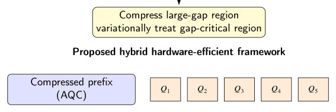 
Figure 1: Hybrid hardware-efficient quantum optimization architecture. A digitized quantum annealing circuit is decomposed into segments with different computational roles. The early portion of the evolution is compressed using approximate quantum compilation (AQC), while the remaining gap-critical portion is replaced by structured variational layers such as QAOA or LC- QAOA. This design reduces circuit depth while preserving optimization capability.

📷 Fig 2

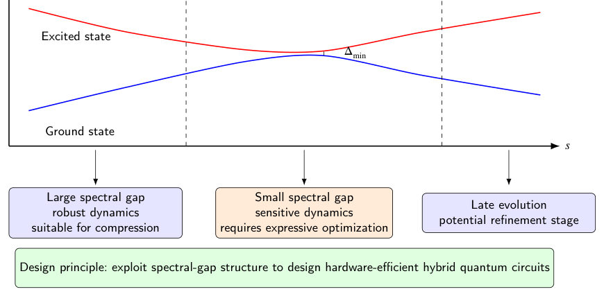 
Figure 2: Spectral-gap-aware intuition for hybrid circuit design. The adiabatic evolution path exhibits regions with different spectral-gap structures. Large-gap regimes are generally more robust and can tolerate circuit compression, whereas the gap-critical region near the minimum spectral gap Δmin is more sensitive and motivates retaining expressive variational circuit layers.

📷 Fig 3

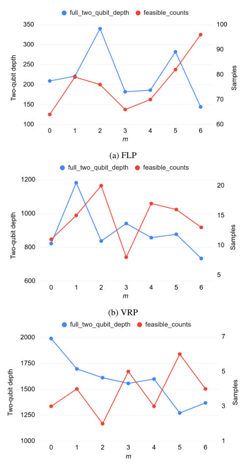 
Figure 3: Two-qubit circuit depth (left axis) and number of feasible solutions (right axis) as a function of compressed prefix length 𝑚for annealing circuits across transportation problem classes: (a) facility location, (b) vehicle routing, and (c) traveling salesman. The results illustrate the tradeoff between circuit depth and feasibility, showing that moderate prefix compression can reduce hardware cost while maintaining or improving feasible-solution discovery.

📷 Fig 4

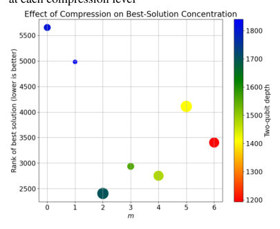 
Figure 4: Two-qubit depth is shown as color, and marker radius indicates the number of feasible solutions sampled from the circuit.

📷 Fig 5

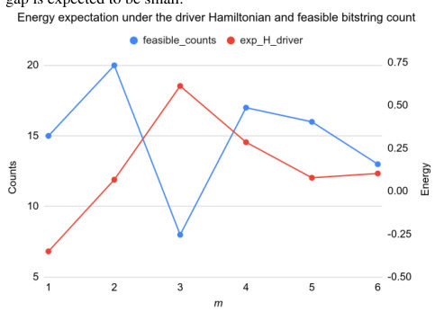 
Figure 5: Diagnostic analysis of compressed annealing prefixes for the VRP instance.

📷 Fig 6

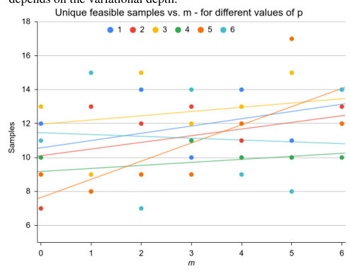 
Figure 6: Effect of AQC prefix compression on feasible solution generation from QAOA for the VRP instance. Moderate com- pression can improve feasibility and diversity, while aggressive compression shows mixed behavior across depths.

📷 Fig 7

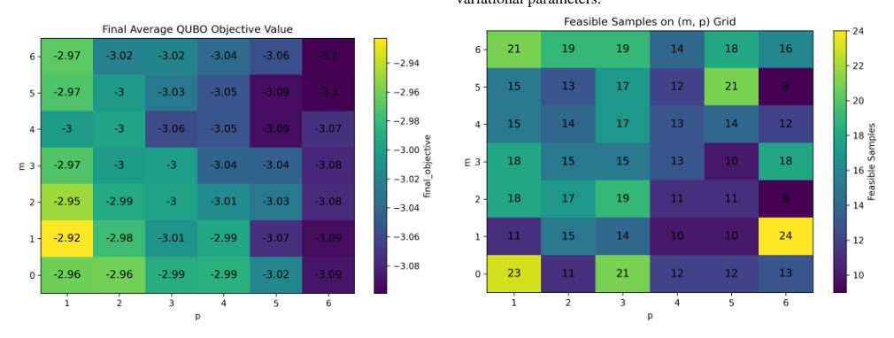 
Figure 7: Performance of the hybrid AQC+QAOA approach across the (𝑚, 𝑝) parameter grid. Results show tradeoffs between circuit depth, optimization effort, feasibility, and solution quality under varying prefix compression and QAOA depth.

📷 Fig 8

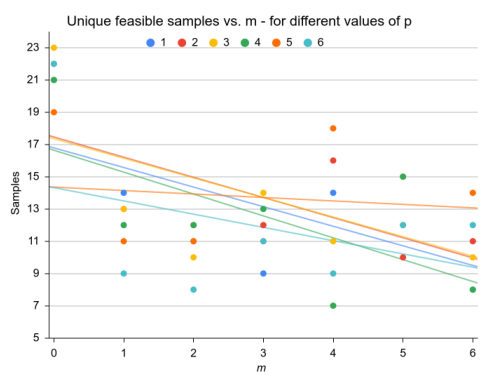 
Figure 8: AQC prefix compression on feasible solution gen- eration with LC-QAOA for the VRP instance. The mismatch of the ansätz from adiabatic evolution causes a sharp drop in performance with compression.

📷 Fig 9

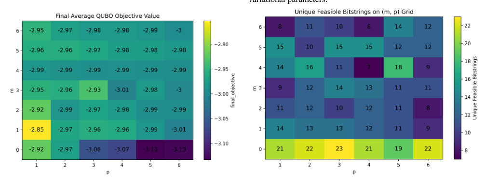 
Figure 9: Performance of AQC compressed layers as initial state circuits for LC-QAOA across the (𝑚, 𝑝) grid. Results show that LC-QAOA works best without any adiabatic initialization.

**Main problem.** Developing hardware-efficient quantum optimization algorithms for large-scale transportation problems (TSP, VRP, FLP) that can run on NISQ-era hardware despite high circuit depth and noise.

**Main result.** Moderate prefix compression using Approximate Quantum Compilation (AQC) reduces two-qubit gate depth while maintaining or improving feasible solution discovery, though effectiveness depends on the compatibility between the compressed prefix and the variational ansatz.

**Method.** A hybrid framework combining AQC-based prefix compression of early adiabatic evolution with variational layers (standard QAOA or LC-QAOA) optimized using the CVaR objective function.

**Summary.** This paper proposes a hardware-aware hybrid algorithm for solving transportation logistics problems on near-term quantum computers. By using Approximate Quantum Compilation to compress the early, robust stages of adiabatic evolution, the authors significantly reduce the required two-qubit gate depth. The framework demonstrates that this compression can maintain or even enhance the generation of feasible candidate solutions for problems like the Vehicle Routing Problem. However, the study also reveals that the success of this method depends heavily on the compatibility between the compressed prefix and the subsequent variational layers.

Detailed structure

**Model / system.** The study uses IBM gate-based quantum hardware to solve combinatorial optimization problems (TSP, VRP, FLP) mapped to QUBO/Ising Hamiltonians in the Pauli-Z basis.

**Key observables.** Circuit depth (two-qubit gate depth), solution feasibility probability, objective value, solution diversity, energy variance, and perturbative susceptibility.

**Important parameters / regimes.** Prefix compression length (m), QAOA depth (p), penalty weight (lambda), and the CVaR parameter (alpha).

**Assumptions / limitations.** The study focuses on small-scale, tractable problem instances (12-16 qubits) and assumes the utility of quantum computing as a candidate generator within a larger classical-quantum pipeline.

**Figures summary.** Figure 1 illustrates the hybrid AQC-QAOA architecture; Figure 2 shows the intuition for spectral-gap-aware design; Figure 5b relates driver energy to feasible solutions; Figure 8 demonstrates performance drops in LC-QAOA due to Hamiltonian mismatch; Figures 9a-d show trends in gate depth, optimization iterations, and objective values.

**Paper structure.** The paper introduces the transportation optimization problem, details the hybrid AQC-QAOA architecture and compression methodology, describes the mapping of TSP/VRP/FLP to Ising Hamiltonians, presents experimental results on IBM hardware comparing different ansatzes and compression levels, and concludes with a discussion on the trade-offs between depth and feasibility.

Abstract

Transportation systems such as urban logistics, vehicle routing, and infrastructure planning require solving large-scale combinatorial optimization problems under complex constraints. Problems such as the vehicle routing problem (VRP), traveling salesman problem (TSP), and facility location problem (FLP) involve large discrete search spaces and the need to generate multiple feasible solutions in real time. In this work, we develop a hardware-grounded hybrid quantum optimization framework that uses Approximate Quantum Compilation (AQC) to compress early segments of digitized adiabatic evolution into shallow circuits. The compressed prefix is combined with variational layers, enabling a systematic study of how initialization, circuit depth, and expressivity interact on near-term quantum hardware. All experiments are performed on an IBM gate-based quantum computer, and circuits are evaluated as stochastic generators of candidate transportation plans. Results show that moderate prefix compression reduces two-qubit gate depth while maintaining or improving feasible solution discovery, particularly for routing problems. These benefits depend on compatibility between the compressed prefix and the variational ansatz: while standard QAOA effectively leverages AQC initialization, linear-chain QAOA shows limited improvement. Overall, this work demonstrates that hybrid AQC-QAOA methods provide a practical pathway for hardware-efficient quantum optimization, positioning quantum algorithms as candidate generators within transportation decision-making workflows.

[↑ back to top](#top)

### [Large-Scale Quantum Circuit Simulation on an Exascale System for QPU Benchmarking](http://arxiv.org/abs/2604.26423v1)

**Authors:** J. A. Montanez-Barrera, Kristel Michielsen  
**Type:** both · **Category:** quantum information and computing · **PDF:** <https://arxiv.org/pdf/2604.26423v1>  
**Analysis basis:** full PDF text, analyzed in chunks
**Topic relevance:** 🔥 `QC/QI experiment` **4/5**

📷 Fig 1

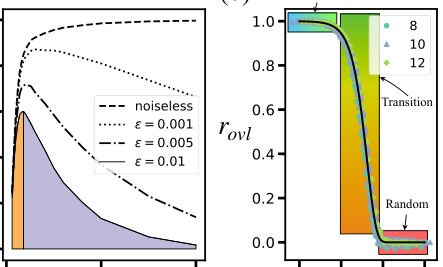 
Fig. 1. Noise in LR-QAOA. (a) Simulation of LR-QAOA under different levels of depolarizing noise as a function of circuit depth. (b) Overlap between the noisy and noiseless approximation ratios for 8-, 10-, and 12- qubit simulations. The solid lines correspond to the prediction from Eq. 8. Three algorithm performance regimes are highlighted with boxes.

📷 Fig 2

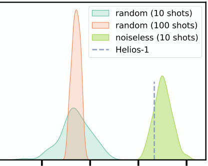 
Fig. 2. Sampling distribution for the 40-qubit LR-QAOA benchmark at p = 3. KEDs of the mean approximation ratio ¯r are shown for the random sampler at 10 and 100 shots, and for the noiseless simulation at 10 shots. The dashed line indicates the Helios-1 QPU result.

📷 Fig 3

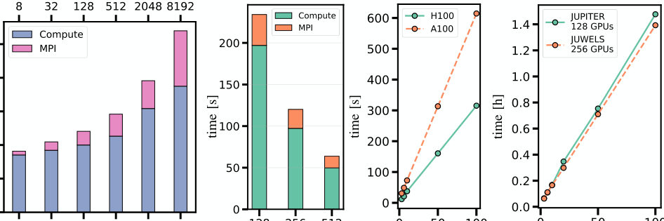 
Fig. 3. Time scaling of LR-QAOA circuits on JUPITER. (a) Runtime as a function of problem size. (b) Strong scaling for the 40-qubit problem. (c) Hardware performance comparison between H100 (JUPITER) and A100 (JUWELS Booster) GPUs. (d) Performance comparison between JUPITER and JUWELS Booster for a 40-qubit problem as a function of LR-QAOA depth.

📷 Fig 4

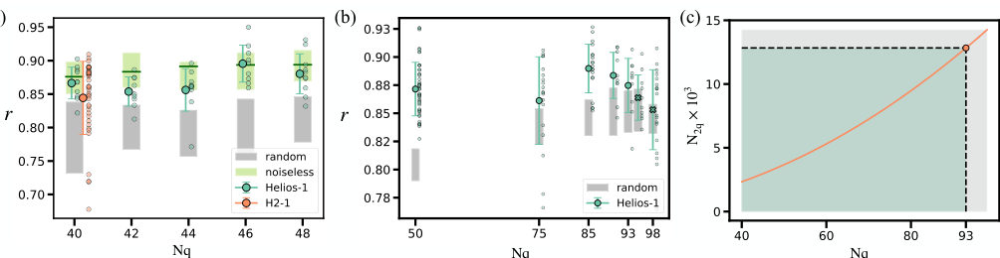 
Fig. 4. LR-QAOA (p = 3) benchmarking of Helios-1 approximation ratio vs. number of qubits. (a) Comparison with noiseless classical simulations on JUPITER and with the previous-generation Quantinuum QPUs (H2-1). (b) Helios-1 experiments for problem sizes beyond the reach of exact JUQCS simulations on JUPITER. The solid dark green line indicates the true approximation ratio r.(c) Number of two-qubit gates as a function of problem size. The green shaded region and dashed line indicate the largest system size for which Helios-1 samples remain statistically distinguishable from random sampling.

**Main problem.** Identifying the boundary between the noise-tolerant and random regimes in large-scale quantum processors and validating hardware performance at the edge of classical tractability.

**Main result.** The Quantinuum Helios-1 processor maintains coherent performance up to 93 qubits, with outputs becoming statistically indistinguishable from random sampling at 95 qubits.

**Method.** The study uses the Linear Ramp Quantum Approximate Optimization Algorithm (LR-QAOA) for benchmarking, combined with large-scale noiseless simulations on the JUPITER exascale supercomputer.

**Summary.** This paper presents a large-scale benchmarking of the 98-qubit Quantinuum Helios-1 trapped-ion processor. By utilizing Europe's first exascale supercomputer, JUPITER, the researchers performed massive noiseless simulations to provide a reference for quantum hardware performance. They successfully identified the transition point where quantum processor outputs become indistinguishable from random noise, finding that coherent performance persists up to 93 qubits. This work establishes a vital framework for validating large-scale quantum computers at the limits of classical simulation capability.

Detailed structure

**Model / system.** The experimental platform is the Quantinuum Helios-1, a 98-qubit trapped-ion QPU using a QCCD architecture with 137Ba+ hyperfine qubits. The problem model is the Weighted Max-Cut (WMC) on fully connected graphs.

**Key observables.** Approximation ratio (r), overlap (r_ovl), and statistical distinguishability from random sampling using a mean-of-means resampling procedure.

**Important parameters / regimes.** Qubit counts (up to 98), circuit depth (p), number of two-qubit gates (up to 12,834), and the 3-sigma threshold for noise classification.

**Assumptions / limitations.** The benchmarking assumes a non-variational, platform-agnostic protocol (LR-QAOA) to avoid classical optimization complexities and uses a uniform depolarizing error model for analysis.

**Figures summary.** Figure 1(a) shows the simulation of the LR-QAOA approximation ratio versus circuit depth under varying noise levels; Figure 3 illustrates the time scaling of the simulations.

**Paper structure.** The paper introduces the LR-QAOA benchmarking framework, describes the experimental and exascable simulation platforms, details the statistical methodology for regime classification, presents the performance results for Helios-1, and concludes with a hardware-specific cost and scaling analysis.

**Why it may be interesting.** It provides a quantitative boundary for the utility of NISQ devices and demonstrates how exascale classical computing can be used to validate the reliability of large-scale quantum hardware.

Abstract

Recent advances in quantum computing have enabled the development of quantum processors with hundreds of qubits. However, noise continues to limit the amount of useful information that can be extracted from these systems, making it essential to identify the regime in which experimental outputs remain reliable. In this work, we benchmark Quantinuum Helios-1, a 98-qubit trapped-ion quantum processing unit, using the linear ramp quantum approximate optimization algorithm (LR-QAOA). To this end, we perform large-scale noiseless simulations on JUPITER, Europe's first exascale supercomputer, for circuits of up to 48 qubits and 3,384 two-qubit gates. These simulations, executed on 4,096 nodes equipped with 16,384 GH200 superchips and high-bandwidth CPU-GPU interconnects, provide a reference for validating experimental results at the edge of classical tractability. We find that, up to 48 qubits, Helios-1 remains in a noise-tolerant region, i.e., its samples cannot be clearly distinguished from those coming from a noiseless simulation. We then extend the analysis to larger system sizes using experimental data only, and apply a mean-of-means resampling procedure with a 3$σ$ threshold to determine whether the QPU output is statistically distinguishable from random sampling. This analysis identifies a regime of coherent performance up to 93 qubits (12,834 two-qubit gates), beyond which, at 95 qubits, the outputs become statistically indistinguishable from random sampling. These results demonstrate how exascale classical simulation can be used to validate quantum processors, and provide a quantitative boundary between noise-tolerant and random regimes in quantum processors.

[↑ back to top](#top)

### [Quantum Gatekeeper: Multi-Factor Context-Bound Image Steganography with VQC Based Key Derivation on Quantum Hardware](http://arxiv.org/abs/2604.26413v1)

**Authors:** Sahil Tomar, Sandeep Kumar  
**Type:** both · **Category:** quantum information and computing · **PDF:** <https://arxiv.org/pdf/2604.26413v1>  
**Analysis basis:** full PDF text, analyzed in chunks
**Topic relevance:** 🔥 `QC/QI experiment` **4/5**

📷 Fig 1

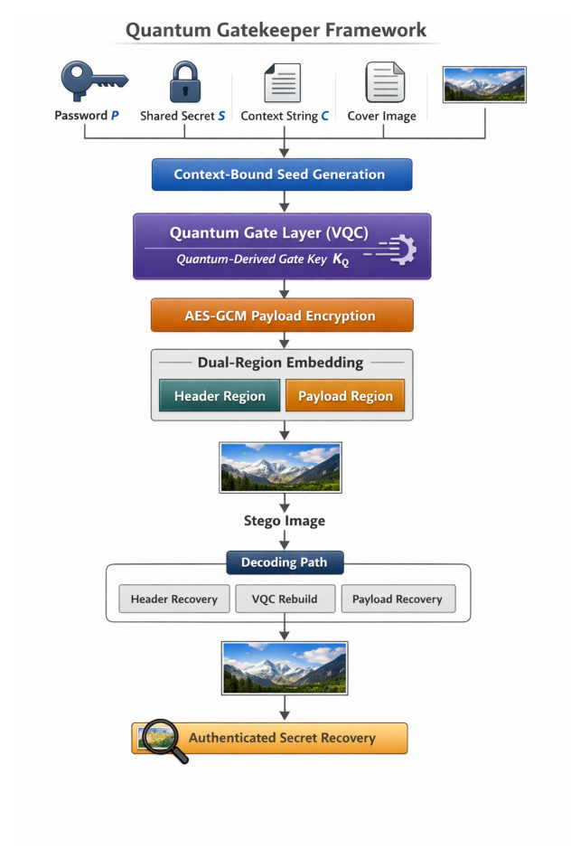 
Fig. 1. Overall architecture of the proposed Quantum Gatekeeper framework. User-defined inputs are transformed into context-bound seed material driving quantum gate derivation, authenticated payload encryption, and dual-region image embedding. The stego image is decodable only by reconstructing the same contextual state and completing authenticated recovery.

📷 Fig 2

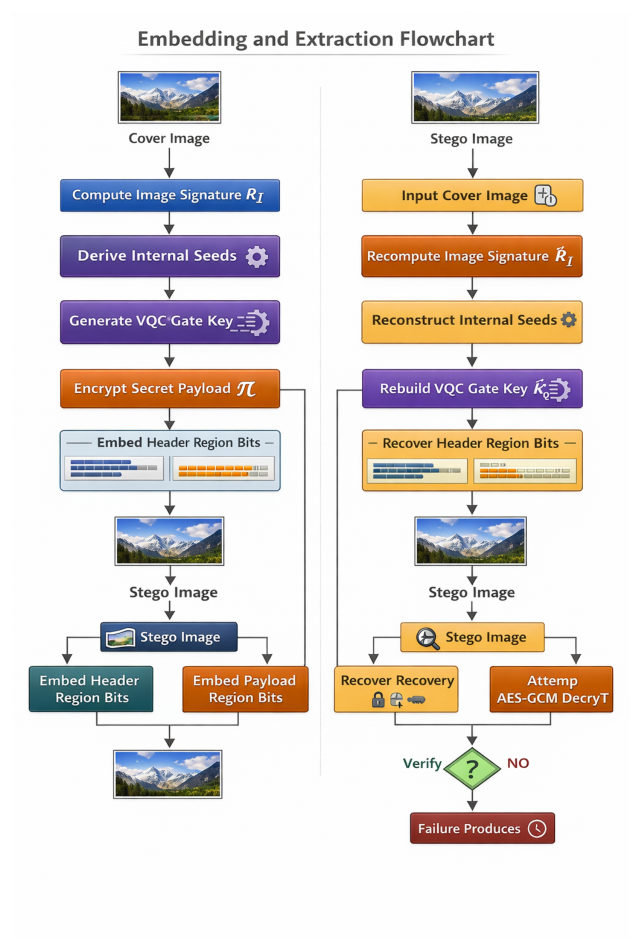 
Fig. 2. Embedding and extraction workflow of the proposed Quantum Gatekeeper framework. During embedding, an image-bound signature and internal seeds parameterize the VQC and authenticated encryption. During extraction, the same contextual inputs reconstruct the gate key, recover embedded regions, and perform AES-GCM verification.

**Main problem.** The paper addresses the lack of extraction-path control in traditional steganography and the challenge of implementing reliable quantum-based key derivation on noisy NISQ hardware.

**Main result.** The 'Quantum Gatekeeper' framework achieves successful, deterministic, all-or-nothing payload recovery and high image fidelity, demonstrating that the VQC-driven extraction path remains stable despite hardware noise.

**Method.** A hybrid quantum-classical approach using Variational Quantum Circuits (VQC) for gate-controlled key derivation, combined with AES-GCM encryption and a dual-region LSB embedding strategy.

**Summary.** This paper introduces a new steganography framework called Quantum Gatekeeper that uses quantum circuits to control how hidden data is extracted. By requiring a specific context (like a password and an image signature) to reconstruct the quantum gate key, it ensures that unauthorized users cannot even partially recover the hidden message. The authors demonstrate that while real quantum hardware is noisy, the most probable quantum state remains stable enough to allow for reliable, deterministic data recovery.

Detailed structure

**Model / system.** The system utilizes a Variational Quantum Circuit (VQC) implemented via exact statevector simulation and executed on IBM superconducting quantum hardware (ibm_pittsburgh) using the PennyLane framework.

**Key observables.** Shannon entropy, Total Variation Distance (TVD), Cross-Entropy Benchmarking (XEB), and peak bitstring consistency between simulator and hardware.

**Important parameters / regimes.** The recovery tuple (password, shared secret, context string, and image signature) and the VQC parameters derived from cryptographic hash expansion.

**Assumptions / limitations.** The system assumes the cover image remains unaltered (no recompression) and relies on statevector simulation for the primary extraction key to avoid the stochastic nature of hardware sampling.

**Figures summary.** Figure 1 illustrates the overall architecture and context-bound seed derivation; Figure 2 details the embedding and extraction workflow involving the image-bound signature.

**Paper structure.** The paper identifies security gaps in steganography, proposes the Quantum Gatekeeper framework, details the hybrid quantum-classical implementation, provides experimental validation on IBM hardware, and concludes with an ablation study and error analysis.

Abstract

This paper presents Quantum Gatekeeper, a context-bound image steganography framework where successful payload recovery depends on both cryptographic decryption and the reconstruction of a precise extraction path. The system integrates lossless least significant bit (LSB) embedding with a deterministic variational quantum circuit (VQC)-derived gate key, multi-factor contextual binding, and authenticated encryption. Payload extraction is contingent upon four requisite factors: a password, a shared secret, a user-supplied context string, and a reference image signature. Any deviation in these factors causes the system to read from an incorrect pixel sequence or fail authentication, resulting in silent rejection rather than partial disclosure. The proposed method derives a gatecontrolled extraction key from a seed-conditioned variational circuit, with parameters generated via cryptographic hash expansion and context-dependent image features. To ensure encode/decode consistency, the cryptographic key path is generated via exact statevector simulation; concurrently, IBM superconducting quantum hardware is utilized to evaluate the statistical behavior of the circuit family under physical noise. We introduce a dual-region image layout to resolve the nonce bootstrapping dependency, separating header recovery from payload recovery through independently derived keys. Experimental results confirm successful end-to-end message embedding and recovery on PNG images, demonstrating deterministic success under correct conditions and failure otherwise. The framework supports both text and image payloads; in the image-in-image configuration, a secret image is resized to a fixed resolution prior to embedding, enabling exact pixel-level recovery under correct contextual reconstruction.

[↑ back to top](#top)

### [Over forty years of research towards the understanding of Quantum Brownian Motion -- the contributions of A. O. Caldeira](http://arxiv.org/abs/2604.26524v1)

**Authors:** Marcus V. S. Bonança, Sebastian Deffner, Gert-Ludwig Ingold  
**Type:** theory · **Category:** statistical mechanics · **PDF:** <https://arxiv.org/pdf/2604.26524v1>  
**Analysis basis:** full PDF text, analyzed in chunks
**Topic relevance:** `Keldysh / 2PI / non-Gaussian methods` **3/5** · `correlated / nonlocal dissipation` **3/5** · `methods for driven-dissipative` **3/5** · `non-equilibrium dynamics` **3/5** · `Kondo & dissipative impurity` **2/5** · `driven-dissipative phase transition` **2/5** · `entanglement & information structure` **2/5** · `non-equilibrium universality` **2/5** · `quantum measurements` **2/5**

📷 Fig 1

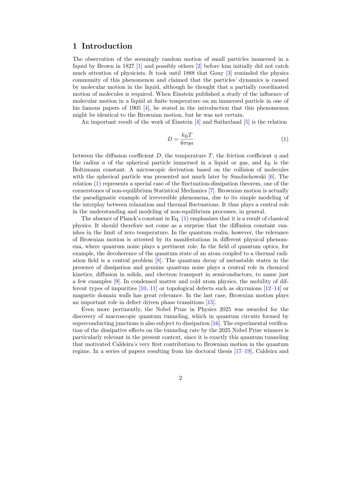 
Low-resolution page preview, page 2

📷 Fig 2

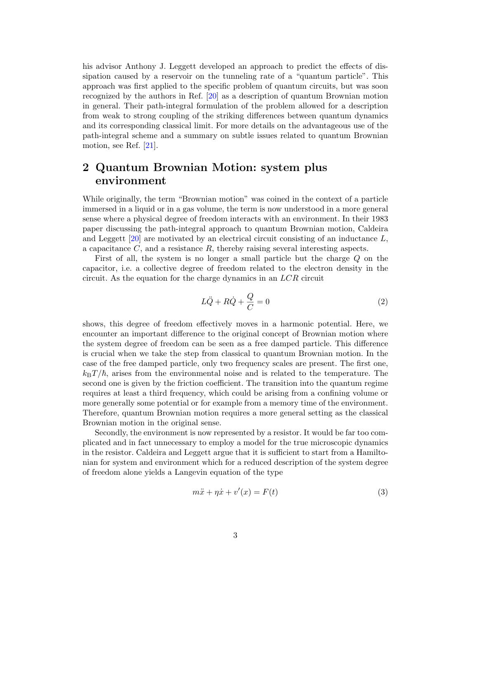 
Low-resolution page preview, page 3

📷 Fig 3

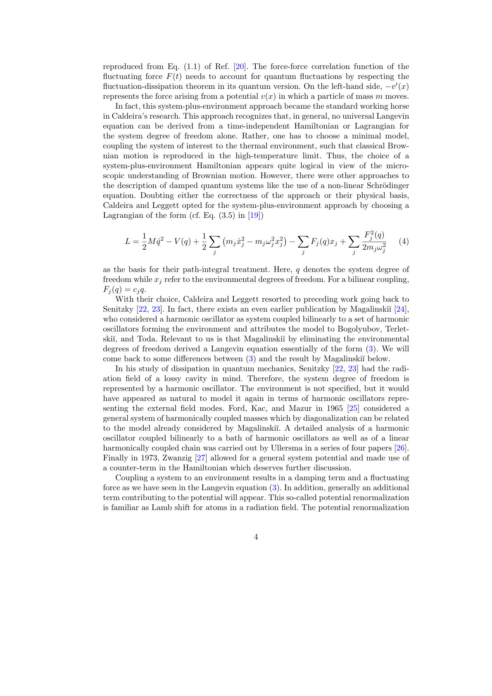 
Low-resolution page preview, page 4

📷 Fig 4

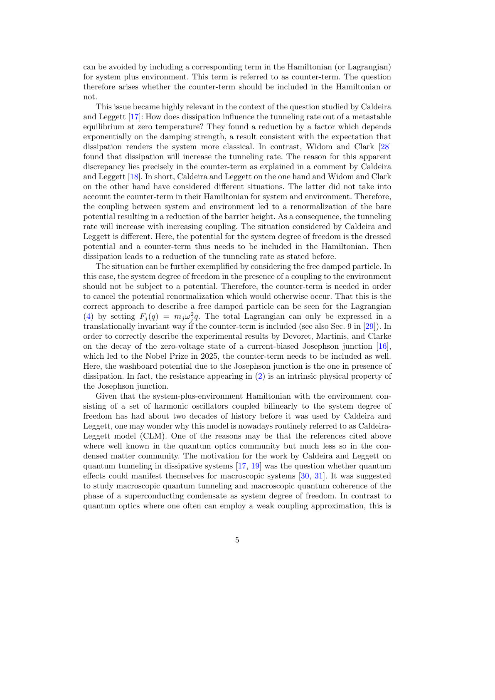 
Low-resolution page preview, page 5

📷 Fig 5

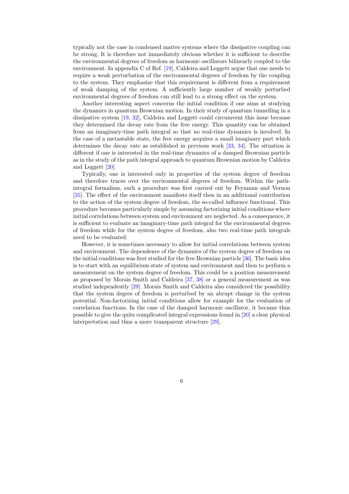 
Low-resolution page preview, page 6

📷 Fig 6

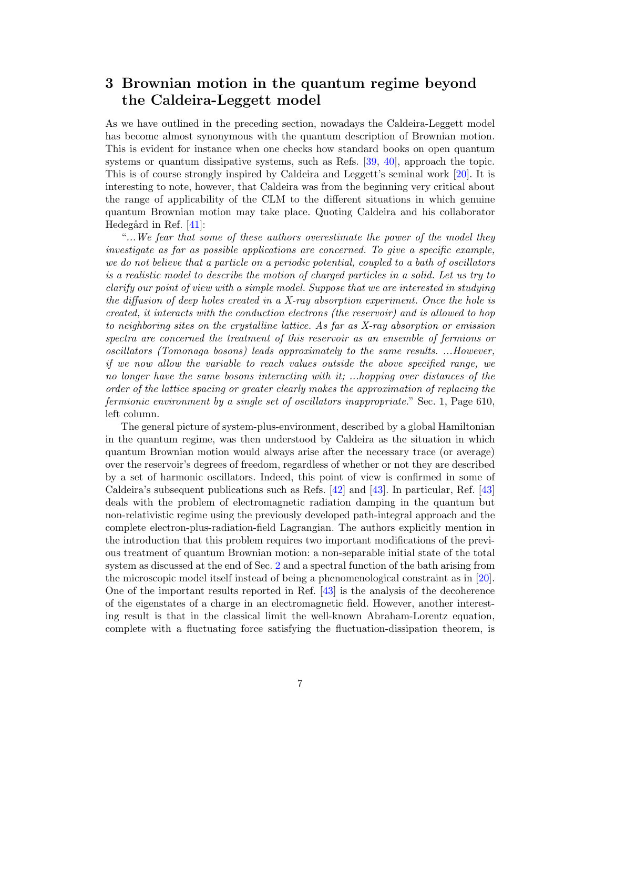 
Low-resolution page preview, page 7

📷 Fig 7

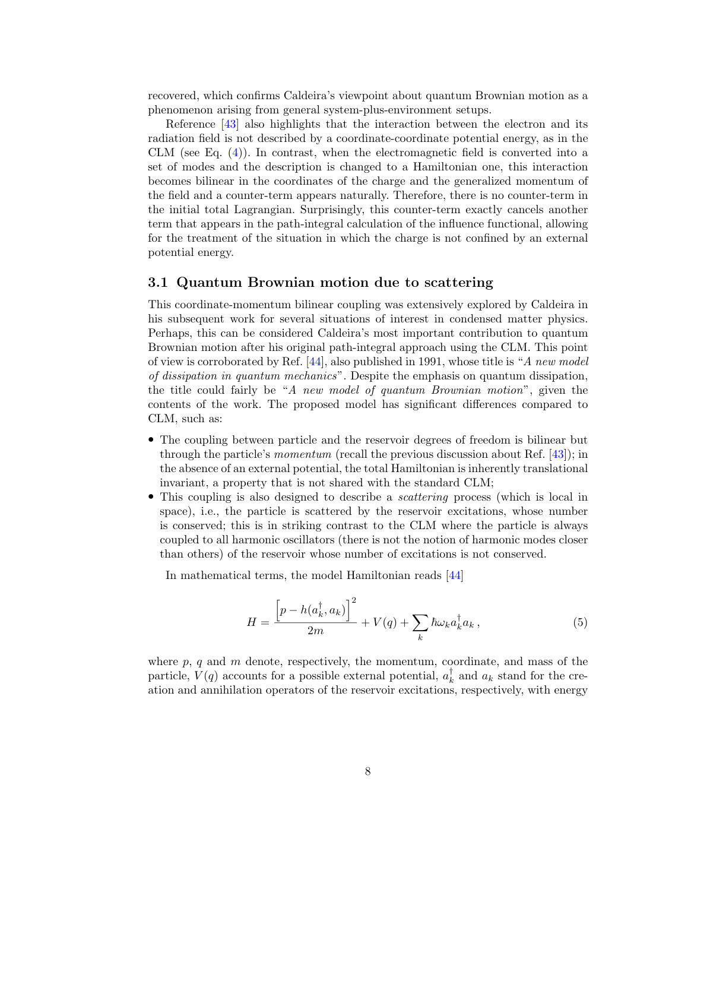 
Low-resolution page preview, page 8

📷 Fig 8

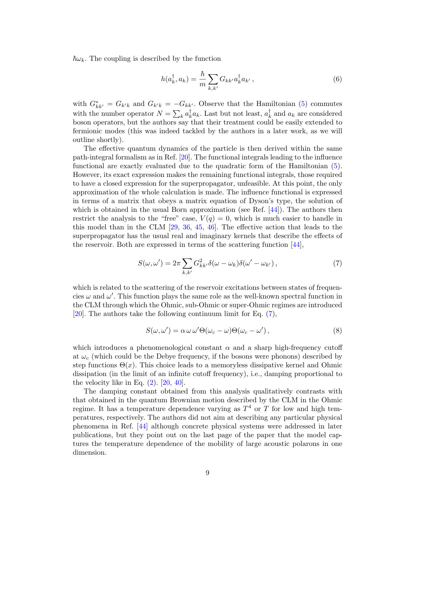 
Low-resolution page preview, page 9

📷 Fig 9

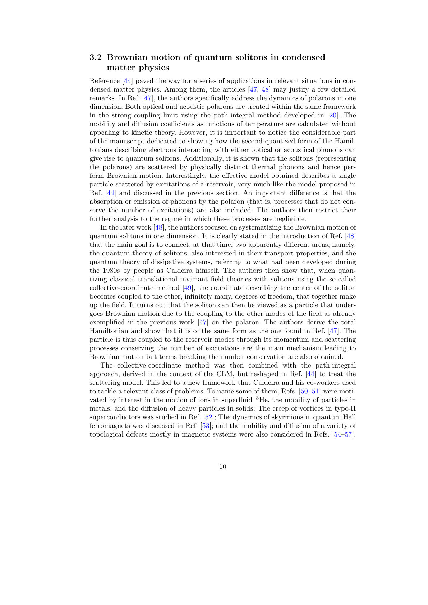 
Low-resolution page preview, page 10

📷 Fig 10

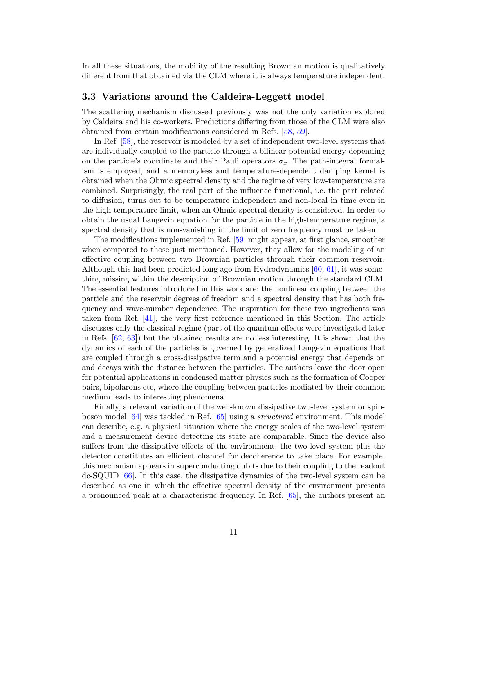 
Low-resolution page preview, page 11

**Main problem.** The paper reviews the forty-year evolution of the theory of Quantum Brownian Motion (QBM), focusing on how dissipation and noise influence quantum dynamics, tunneling, and decoherence.

**Main result.** It traces the development from the Caldeira-Leggett model to advanced scattering models and demonstrates how these theories underpin modern quantum decoherence and quantum thermodynamics.

**Method.** The review synthesizes various theoretical frameworks, including path-integral formulations (Feynman-Vernon influence functional), Langevin equations, and quantum master equations.

**Summary.** This review article chronicles the scientific contributions of A. O. Caldeira to the field of Quantum Brownian Motion. It details the transition from classical to quantum dissipative dynamics, highlighting the importance of the Caldeira-Leggett model in understanding tunneling and decoherence. The authors also explore advanced models involving scattering and the implications of these theories for modern quantum thermodynamics and the NISQ era. Ultimately, it connects foundational work in dissipation to contemporary problems in quantum information and many-body dynamics.

Detailed structure

**Model / system.** The primary models discussed are the Caldeira-Leggett model (system coupled to a harmonic oscillator reservoir) and scattering models (momentum-based bilinear coupling), applied to systems like Josephson junctions, LCR circuits, and solitons.

**Key observables.** Tunneling rates, diffusion coefficients, quantum coherences, entropy production, and heat current.

**Important parameters / regimes.** Temperature (T), friction/damping coefficient (eta), coupling strength, and frequency scales (thermal vs. friction scales).

**Assumptions / limitations.** Assumptions include the use of minimal system-plus-environment models and, in some cases, the neglect of initial system-environment correlations (factorizing initial conditions).

**Paper structure.** The paper follows a historical and thematic progression: starting with the foundational Caldeira-Leggett model and its impact on tunneling, moving to alternative scattering-based approaches, and concluding with applications in decoherence theory and quantum thermodynamics.

**Why it may be interesting.** It provides a comprehensive historical and theoretical roadmap for anyone studying open quantum systems, specifically regarding the transition from quantum to classical regimes and the challenges of defining thermodynamics in the strong-coupling regime.

Abstract

This article presents a brief account of Amir O. Caldeira's contributions to the theory of quantum Brownian motion. Motivated by its importance, we outline the description of Brownian motion in the quantum regime following Caldeira's first works. In this context, we particularly highlight the effect of dissipation on the tunneling rate out of a metastable state. We then journey along the alternative ways to approach quantum Brownian motion developed by Caldeira during his career, which go beyond the so-called Caldeira-Leggett model. We conclude by summarizing some of Caldeira's contributions to contemporary fields such as the theory of quantum decoherence and quantum thermodynamics, that were strongly inspired by his eponymous approach to quantum Brownian motion.

[↑ back to top](#top)

### [Quo vadis, stochastic thermodynamics?](http://arxiv.org/abs/2604.26601v1)

**Authors:** Jan Korbel, Artemy Kolchinsky, Sarah A. M. Loos, Gonzalo Manzano, Rosalba Garcia-Millan, Olga Movilla Miangolarra, Édgar Roldán  
**Type:** theory · **Category:** statistical mechanics · **PDF:** <https://arxiv.org/pdf/2604.26601v1>  
**Analysis basis:** full PDF text, analyzed in chunks
**Topic relevance:** `non-equilibrium dynamics` **3/5** · `Keldysh / 2PI / non-Gaussian methods` **2/5** · `correlated / nonlocal dissipation` **2/5** · `driven-dissipative phase transition` **2/5** · `entanglement & information structure` **2/5** · `methods for driven-dissipative` **2/5** · `non-equilibrium universality` **2/5**

📷 Fig 1

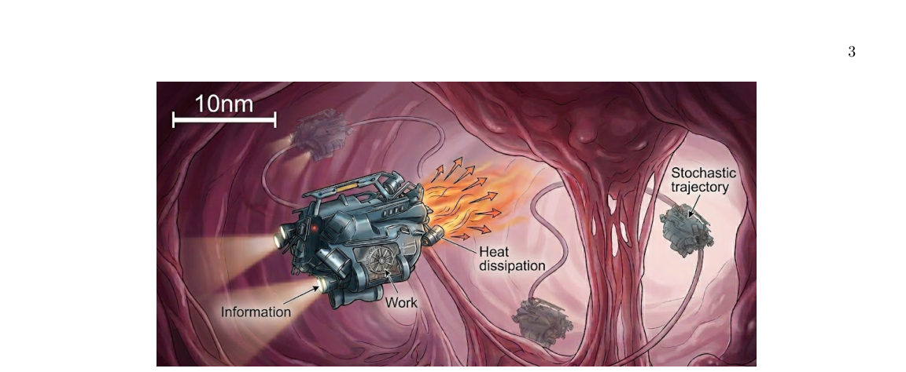 
FIG. 1. Illustration of the ‘dream’ of early developments of stochastic thermodynamics. A tiny nano-sized motor navigates through a biological tissue, tracing a stochastic trajectory. Such motion, powered by fuel and controlled through feedback upon information retrieval, is converted partially into useful work while the rest is dissipated to the surrounding media as heat. The first decades of stochastic thermodynamics research aimed to understand the statistical constraints for various dynamical and thermodynamical properties of such small-scale non-equilibrium processes. AI-generated image using Gemini, inspired by a presentation by Ignacio A. Martínez and on the movie Innerspace (1987).

**Main problem.** The paper explores the expansion of stochastic thermodynamics from its traditional focus on microscopic fluctuations to complex, large-scale, and non-physical systems, specifically addressing the decoupling of statistical irreversibility from physical energy dissipation at macroscopic scales.

**Main result.** The authors review how the framework has evolved to include memory effects, hidden degrees of freedom, and active matter, while highlighting the challenge that thermodynamic bounds become increasingly loose and disconnected from energy dissipation in macroscopic/social contexts.

**Method.** The review synthesizes various theoretical frameworks including Langevin/Fokker-Planck dynamics, Doi-Peliti field theory, optimal transport (Wasserstein distance), and information-theoretic approaches.

**Summary.** This Perspective reviews the evolution of stochastic thermodynamics from a theory of small-scale fluctuations to a broader framework for complex systems. It covers recent progress in handling memory effects, hidden variables, and interacting active matter. Crucially, it addresses the 'decoupling' problem where statistical irreversibility no longer directly quantifies energy dissipation in macroscopic systems. Finally, it explores the application of these thermodynamic principles to biological, computational, and social dynamics.

Detailed structure

**Model / system.** The scope covers a wide range of systems including molecular motors, active matter (run-and-tumble particles), biological networks (cytoskeleton, brain dynamics), and non-physical systems like computational and social dynamics.

**Key observables.** Entropy production (housekeeping and excess), work, heat, dissipation, particle currents, and time-reversal asymmetry.

**Important parameters / regimes.** Microscopic vs. macroscopic scales, Markovian vs. non-Markovian regimes, and the signal-to-noise ratio in currents.

**Assumptions / limitations.** The paper notes that the link between statistical irreversibility and thermodynamic dissipation is less direct in coarse-grained or macroscopic systems, and that embedding hidden variables can lead to non-unique interpretations.

**Figures summary.** Figure 1 provides an illustration of a nano-sized motor in biological tissue using fuel and feedback to perform work while dissipating heat.

**Paper structure.** The paper follows a historical and thematic progression: starting with the foundations of fluctuation theorems, moving to recent extensions (memory, hidden variables, active matter), discussing geometric formulations (optimal transport), addressing the challenges of scaling to macroscopic/complex systems, and concluding with applications in non-physical domains.

**Why it may be interesting.** It is highly relevant for researchers in open quantum systems and many-body dynamics as it discusses the fundamental limits of dissipation, the role of memory/non-Markovianity, and the geometric structure of non-equilibrium processes.

Abstract

Stochastic thermodynamics is a framework for describing non-equilibrium processes at the level of fluctuating trajectories, where the state of a system evolves as a stochastic time series, allowing thermodynamic quantities such as work, heat, and entropy production to be defined along individual realizations rather than at the ensemble level only. Over the past three decades, the field has yielded fundamental results, including fluctuation theorems and several universal bounds, such as thermodynamic uncertainty relations, speed limit theorems, and many others. Many of them have been tested on a range of experimental platforms. This Perspective reviews recent developments in stochastic thermodynamics that extend its scope beyond its traditional domains, including systems with memory and hidden degrees of freedom, microscopic approaches to interacting and active matter, and geometric formulations based on optimal transport. Next, the Perspective surveys the challenges that arise when applying these ideas to macroscopic and complex systems, where the link between statistical irreversibility and thermodynamic dissipation becomes less direct. Finally, emerging applications in non-physical contexts are highlighted, including computation, biological systems, and social dynamics. Transcending the traditional boundaries of physics, these developments catalyze an unorthodox framework to tackle the thermodynamics of complex systems.

[↑ back to top](#top)

### [Towards a microscopic model for an electronic quantum charge liquid](http://arxiv.org/abs/2604.25992v1)

**Authors:** Jacob R. Taylor, Sankar Das Sarma, Seth Musser  
**Type:** theory · **Category:** strongly correlated electrons · **PDF:** <https://arxiv.org/pdf/2604.25992v1>  
**Analysis basis:** full PDF text, analyzed in chunks
**Topic relevance:** `Rydberg arrays` **3/5** · `entanglement & information structure` **3/5** · `analog quantum simulation` **2/5** · `exotic spin models in light-matter` **2/5**

📷 Fig 1

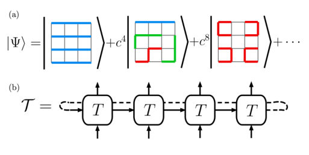 
FIG. 2. The wavefunction and transfer matrix. (a) The RVB wavefunction for the tetramer model on a 4 × 4 lat- tice. Straight tetramers are colored blue, partially bent tetramers are colored green, and fully bent tetramers are col- ored red. Each tetramer configuration is weighted by a factor of cn = cotn θ, where n is the total number of bends in the configuration (with blue tetramers having none, green having one, and red having two bends). (b) The transfer matrix, T , for a semi-infinite cylinder with a circumference of four sites. The transfer matrix is built out of the rank-4 tensor T applied on each site. The exact form of T is given in Fig. 3. The dot- ted line indicates the periodic...

📷 Fig 2

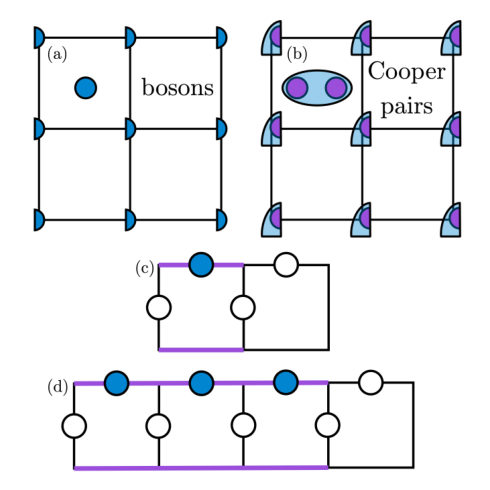 
FIG. 1. A visual explanation of minimal quantum charge liquids. (a) A system of charge-1 bosons at ν = 1/2 fill- ing per unit cell that does not break translation requires a half-charged background anyon per unit cell [1]. This is illus- trated with the half-circle background anyons, which square to the circular elementary boson. (b) For a system of charge-1 spinless fermions at ν = 1/2 a charge-2 boson can be made by Cooper pairing. To get a half-charged background anyon then requires taking a quarter of the Cooper pair. Four back- ground anyons are required to return to the bosonic vacuum, leading to the Z4 toric code in this case. (c) An illustration of why the dimer model can be viewed...

📷 Fig 3

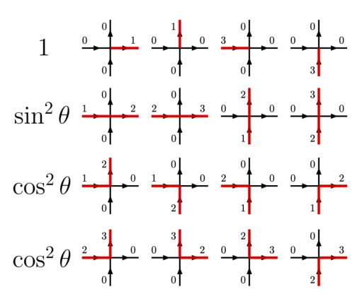 
FIG. 3. An explicit form of the tensor Tijαβ displayed in Fig. 2(b) and discussed in the main text. When i, j, α, β are one of the configurations displayed above then Tijαβ takes the value at left for that row. For all other i, j, α, β, Tijαβ = 0. To find the flux (mod 4) emanating from a vertex subtract the value on an incoming arrow from the value on an outgo- ing arrow and take the result (mod 4). All vertices have an outgoing flux of 1 (mod 4).

📷 Fig 4

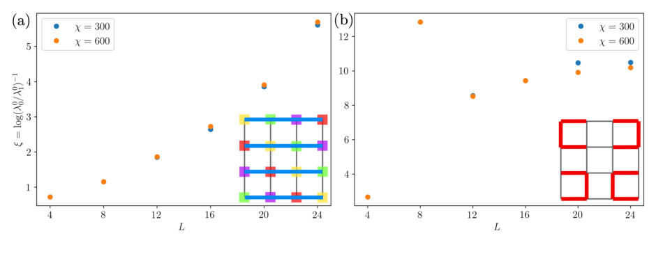 
FIG. 4. The upper bound on correlation length, ξ, vs. cylinder circumference, L, for fully straight and fully bent tetramer configurations, illustrated in the insets. (a) The upper bound on correlation length for fully straight configurations. As L →∞ we see that ξ is diverging. Increasing the bond dimension from χ = 300 to χ = 600 enhances the divergence. These are indicative of gaplessness, coming from a U(1)3 symmetry. The symmetry can be seen by partitioning the lattice into four sublattices, indicated by the different colors in the inset, and is discussed in the main text. (b) The upper bound on correlation length for fully bent configurations. Now as L →∞the correlation length ξ...

📷 Fig 5

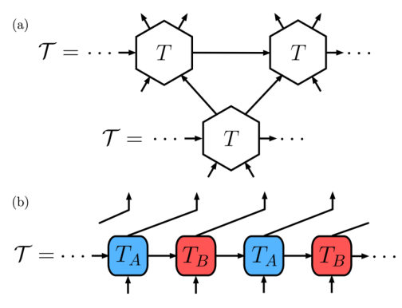 
FIG. 5. The transfer matrix and our numerical process for the triangular lattice. (a) The transfer matrix is built out of rank-6 tensors T. We show only a section of this. Because of the geometry of the triangular lattice different layers of the transfer matrix must be shifted by half a lattice site relative to one another. (b) For ease of computation the rank-6 tensor T can be decomposed into two rank-4 tensors contracted to- gether, TA and TB. Thus by doubling the number of tensors we can return our transfer matrix to the square lattice form. In addition to this decomposition we must then add a shift to ensure TA is coupled to TB in the next layer.

📷 Fig 6

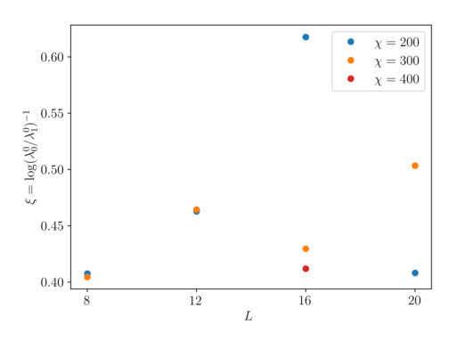 
FIG. 6. The correlation length, ξ, vs. cylinder circumference, L, for the equal weight tetramer superposition on the trian- gular lattice. For L = 8, 12 the bond dimensions χ = 200 and 300 are found to agree, while there is a large disagreement in correlation length for L = 16. Going to larger bond dimen- sion χ = 400 at L = 16 appears to be closer to the ξ value obtained at χ = 300, and appears consistent with a saturating correlation length. Unfortunately it was not feasible to run further analysis for L = 20, where attempting χ = 400 took several months before timing out.

**Main problem.** The paper aims to construct a microscopic model for an electronic quantum charge liquid (QCL), a translation-symmetric phase intermediate between a Wigner-Mott insulator and a metal.

**Main result.** The authors identify a gapped state in a tetramer model that realizes minimal Z4 topological order and demonstrate that certain configurations are gapless due to emergent U(1) symmetries.

**Method.** The study uses tensor network methods, specifically representing wavefunctions as Projected Entangled Pair States (PEPS) and analyzing them via a transfer matrix approach on cylinders.

**Summary.** This paper proposes a microscopic model for an electronic quantum charge liquid using a tetramer model on a lattice. By mapping fermions to bosons, the authors investigate a state that preserves translation symmetry but possesses topological order. Using tensor network simulations, they identify a gapped phase with Z4 topological order and a gapless phase driven by emergent symmetries. The work also extends these findings to triangular lattices and suggests potential realizations in Rydberg atom systems.

Detailed structure

**Model / system.** The model consists of spinless fermions at filling nu=3/2 on a square or triangular lattice, which is mapped to a bosonic tetramer model (a generalization of the dimer model) at filling nu=3/4.

**Key observables.** Correlation length, spectral gap, Z4 topological order, and local Z4 flux conservation.

**Important parameters / regimes.** The parameter theta (controlling tetramer configuration weights), cylinder circumference L, and bond dimension chi.

**Assumptions / limitations.** Numerical results are limited by finite system sizes (L) and finite bond dimensions (chi); the gap in the equal mixture state may be too small to resolve.

**Figures summary.** Fig 1 explains QCLs and tetramer models; Fig 2 shows the RVB wavefunction and transfer matrix; Fig 3 details the transfer matrix tensor; Fig 4 compares correlation length scaling for straight vs. bent configurations; Fig 5/6 illustrate the transfer matrix construction and scaling on a triangular lattice.

**Paper structure.** The paper introduces the QCL concept, defines the fermionic-to-bosonic mapping and the tetramer model, presents numerical results for square lattice configurations (gapless vs. gapped), extends the analysis to triangular lattices, and discusses implications for Rydberg atoms.

**Why it may be interesting.** The discovery of a microscopic model for a new type of topological order (Z4) and the connection to Rydberg atom constraints provides a potential platform for studying exotic many-body phases in programmable quantum simulators.

Abstract

We provide a route to constructing an electronic quantum charge liquid (QCL), a state made up of fermions at fractional filling of a lattice that does not break translation. Starting with spinless fermions at filling $ν=3/2$ we pair them to get bosons at filling $ν=3/4$ per unit cell. The tetramer model, a generalization of the dimer model, on the square lattice is evaluated as a candidate bosonic QCL at filling $ν= 3/4$. It is shown that these models exhibit a local $\mathbb{Z}_4$ symmetry. Upon numerical study of a family of tetramer wavefunctions it is found that while one is gapless due to $\mathrm{U}(1)^3$ symmetry at least one other can be definitively shown to be gapped. The gapped nature of this state, along with its $\mathbb{Z}_4$ symmetry, leads us to propose that it is an example of the elusive bosonic QCL displaying the minimal $\mathbb{Z}_4$ topological order. We conclude by discussing possible extensions to other lattice geometries, electronic QCLs, and to Rydberg atoms.

[↑ back to top](#top)

### [Classical simulation of free-fermionic dynamics and quantum chemistry with magic input](http://arxiv.org/abs/2604.26813v1)

**Authors:** Changhun Oh, Michał Oszmaniec, Oliver Reardon-Smith, Zoltán Zimborás  
**Type:** theory · **Category:** numerical methods · **PDF:** <https://arxiv.org/pdf/2604.26813v1>  
**Analysis basis:** full PDF text, analyzed in chunks
**Topic relevance:** `Keldysh / 2PI / non-Gaussian methods` **3/5** · `analog quantum simulation` **2/5** · `entanglement & information structure` **2/5** · `non-equilibrium dynamics` **2/5**

📷 Fig 1

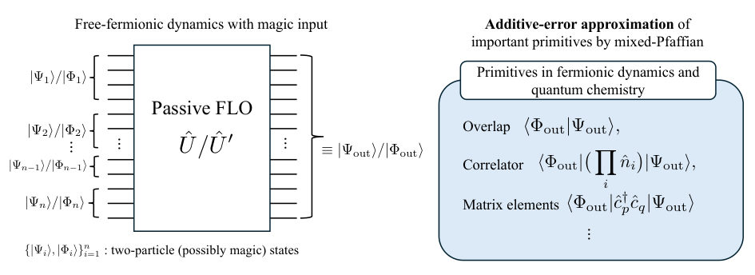 
FIG. 1. Efficient classical estimation of non-Gaussian fermionic dynamics. The schematic illustrates the evolution of a structured non-Gaussian input state—composed of n disjoint two-particle states (paired magic inputs)—under a passive fermionic linear optics (FLO) unitary ˆU, which is the main focus of this work. While such dynamics are widely expected to exhibit exponential computational complexity, our mixed-Pfaffian reduction structurally bypasses this combinatorial explosion. Supported by rigorous variance bounds and robust empirical scaling, the framework enables operationally scalable additive- error approximations. Key computational primitives for quantum chemistry and many-body...

📷 Fig 2

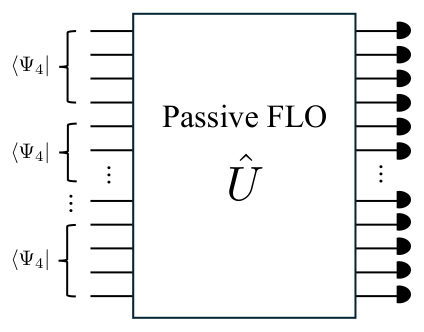 
FIG. 2. Fermionic sampling with |Ψ⟩= |Ψ4⟩⊗N input with a passive FLO circuit.

📷 Fig 3

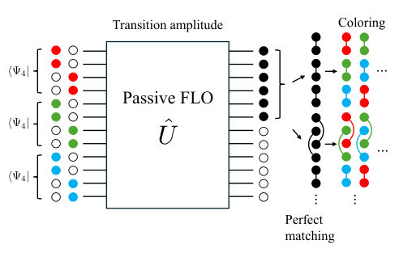 
FIG. 3. Mixed-Pfaffian coefficient as colored perfect matchings. A block-product paired input is evolved by a passive FLO unitary ˆU and projected onto a fixed 2N- fermion output pattern. After restricting to the occupied output modes, each input block contributes a skew-symmetric matrix Bt. The Pfaffian pf(P

📷 Fig 4

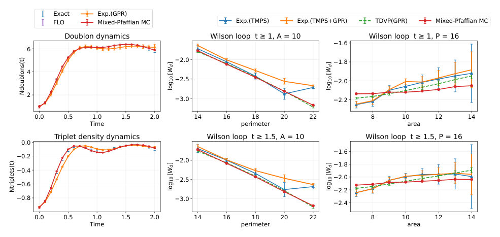 
FIG. 4. Noninteracting benchmark: doublon dynamics, triplet density, and Wilson loops. Left column: low- weight observables, namely the doublon number Nd(t) and the nearest-neighbor triplet diagnostic ntriplets(t), for which our Monte Carlo results are benchmarked against exact, FLO, and experimentally reported references. Right two columns: high- weight doublon Wilson-loop observables in the two standard cuts used in Ref. [3], shown as functions of perimeter at fixed area and as functions of area at fixed perimeter, with the two time windows indicated in each panel. The Wilson-loop data are obtained from the specialized charge-phase estimator described in Sec. V and App. E. Error bars on...

📷 Fig 5

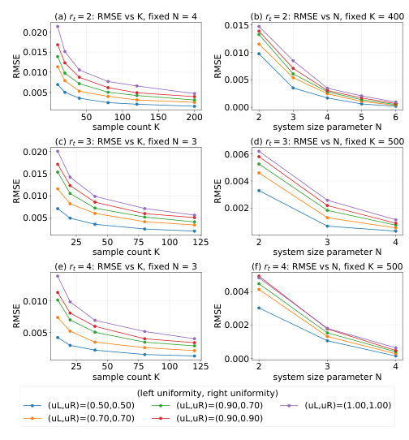 
FIG. 5. RMSE scaling of the mixed-Pfaffian estimator for two-sided APSG inputs. We benchmark Haar-random passive FLO instances for block-product APSG states with local pair-slot number rt = r. Each row corresponds to rt = 2, 3, 4. The left column shows the empirical RMSE versus the Monte Carlo sample count K at fixed N, and the right column shows the RMSE versus N at fixed K. Curves are labeled by the left and right local uniformities (uL, uR), with (1, 1) denoting the fully uniform case. Across the tested Haar- random instances, the fully uniform point gives the largest empirical RMSE, while non-uniform deformations reduce the sampling error; the K-dependence is consistent with the...

📷 Fig 6

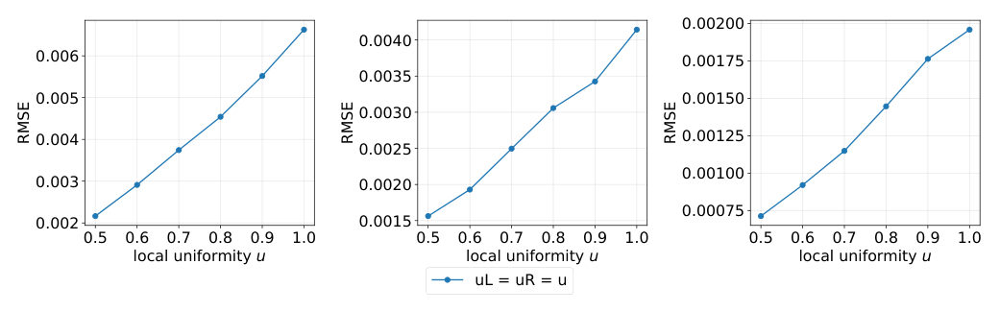 
FIG. 6. Uniformity sweep for two-sided APSG deformations. For Haar-random passive FLO instances, we fix N and K, set uL = uR = u, and plot the empirical RMSE as a function of the local uniformity u. From left to right, the panels correspond to rt = 2, 3, 4. The RMSE increases monotonically toward the fully uniform point u = 1, directly supporting the interpretation that the uniform APSG input is the empirical variance bottleneck in these benchmarks.

📷 Fig 7

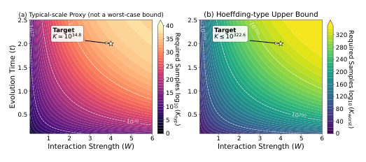 
FIG. 7. Sample-complexity contours for real-time Hirsch HS sampling under Phasecraft-matched Strang Trotterization (k = 4, ∆t = t/k). (a) Typical-scale proxy. (b) Conservative Hoeffding-type upper bound. Stars mark (W, t) = (4, 2); here ϵ = 0.01, δ = 0.01.

📷 Fig 8

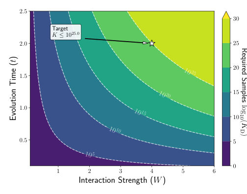 
FIG. 8. Sample-complexity contours for extent-based sampling under Phasecraft-matched Trotterization (k = 4, ∆t = t/k). The star marks (W, t) = (4, 2); here ϵ = 0.01, δ = 0.01.

**Main problem.** Determining the computational boundary between classically tractable and intractable fermionic systems when using non-Gaussian 'magic' inputs in free-fermion circuits.

**Main result.** The authors identify a tractable intermediate regime where essential simulation primitives for paired non-Gaussian states can be efficiently approximated to additive error using a mixed-Pfaffian reduction.

**Method.** An algebraic reduction technique that compresses multi-particle interference into a single coefficient of a multivariate Pfaffian polynomial, combined with a randomized Monte Carlo estimator using discrete Fourier filtering.

**Summary.** This paper addresses the challenge of simulating fermionic systems that use non-Gaussian 'magic' inputs, which are typically computationally hard. The authors demonstrate that for a specific class of paired-electron states, complex many-body dynamics can be efficiently simulated on classical computers using a new Pfaffian-based method. This approach allows for the efficient estimation of key observables like transition amplitudes and number correlators with additive error. The results establish a practical classical benchmark for recent trapped-ion quantum simulation experiments and help define the limits of quantum advantage in fermionic systems.

Detailed structure

**Model / system.** Fermionic systems involving number-preserving Gaussian evolution (passive FLO) acting on structured non-Gaussian inputs, specifically block-product paired states and Antisymmetric Pair-Slot Gaussian (APSG) states.

**Key observables.** Transition amplitudes, overlaps, arbitrary-weight number correlators, transition reduced density matrices (RDMs), and high-weight Wilson-loop observables.

**Important parameters / regimes.** Additive error epsilon, failure probability delta, number of measurement shots K, and the particle-number-preserving nature of the evolution.

**Assumptions / limitations.** The efficiency is proven for a specific class of paired non-Gaussian states; the results focus on additive-error estimation rather than exact calculation.

**Figures summary.** Figure 1 shows the workflow from magic inputs through FLO to Pfaffian reduction; Figure 2 illustrates the sampling process; Figure 3 visualizes the mixed-Pfaffian extraction as a colored perfect matching problem; Figure 5 shows RMSE scaling.

**Paper structure.** The paper introduces the problem of non-Gaussian complexity, presents the mixed-Pfaffian algebraic reduction, proves theorems for transition amplitudes and overlaps, extends the framework to quantum chemistry subroutines and non-unitary maps, and provides benchmarks for trapped-ion experiments.

**Why it may be interesting.** It provides a rigorous classical benchmark for near-term fermionic quantum simulators and clarifies the precise boundary where quantum advantage becomes necessary in many-body dynamics.

Abstract

Establishing the precise computational boundary between classically tractable fermionic systems and those capable of genuine quantum advantage is a central challenge in quantum simulation. While injecting non-Gaussian ``magic" inputs into free-fermion circuits is widely expected to generate intractable complexity, we identify a physically motivated intermediate regime. Supported by rigorous bounds and numerical evidence, we show that for a class of paired non-Gaussian fermionic states, essential quantum simulation primitives -- transition amplitudes, overlaps, and arbitrary-weight number correlators -- can be efficiently approximated to additive error under free-fermionic dynamics. This tractability stems from an algebraic reduction that compresses exponentially large multiparticle interference into a single coefficient of a multivariate Pfaffian polynomial. Because these classical estimators match the intrinsic $O(1/\sqrt{K})$ statistical uncertainty of quantum hardware utilizing $K$ measurement shots, they constitute a practical benchmark. Building on this foundation, we construct an additive-error estimator for high-weight Wilson observables in the noninteracting quench of recent trapped-ion experiments, providing a rigorous classical benchmark. Extending this to quantum chemistry, we demonstrate that core overlap-based subroutines for antisymmetrized products of strongly orthogonal geminals admit exact Pfaffian reductions. Ultimately, these results sharpen the boundary of quantum advantage, establishing that the paired-electron scaffold is effectively dequantized and clarifying exactly where quantum resources are indispensable.

[↑ back to top](#top)

### [Complex first-passage transport in ring networks with long-range jumps and stochastic resetting](http://arxiv.org/abs/2604.26215v1)

**Authors:** Oscar Ivan Torres Mena, Francisco J Sevilla  
**Type:** theory · **Category:** statistical mechanics · **PDF:** <https://arxiv.org/pdf/2604.26215v1>  
**Analysis basis:** full PDF text, analyzed in chunks
**Topic relevance:** `non-equilibrium dynamics` **3/5** · `correlated / nonlocal dissipation` **2/5** · `methods for driven-dissipative` **2/5** · `non-equilibrium universality` **2/5**

📷 Fig 1

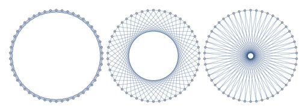 
FIG. 1. Three examples of the networks used in this paper, each node j is connected to its two nearest neighbors j ± 1 and to the two nodes located at a distance r, j ± r, with 1 &lt; r &lt; N/2 −1. The ring size is N = 50 and r (left to right) takes the values 5, 16 and 24.

📷 Fig 2

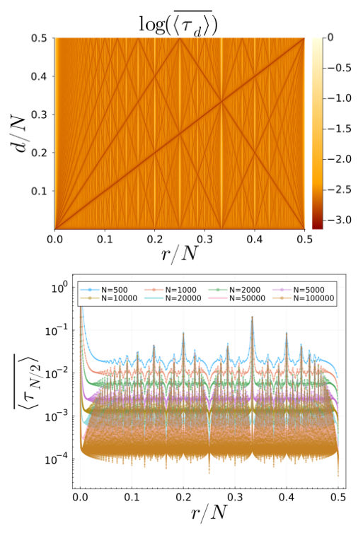 
FIG. 2. Top panel.- Logarithm of MFPT, log(⟨τd⟩), is shown as function of r/N ∈[1, 1/2 −1/N] and distance d = |s − j| ∈[1, N/2] for a ring size of N = 5000 nodes. Bottom panel.- The normalized MFPT ⟨τd⟩= ⟨τd⟩/(N/4) between nodes at distance d = N/2 (diametrically opposed in the ring) as function of the shortcut length r for a ring sizes N = 500, 1000, 2000, 5000, 10000, 50000 and 10000.

📷 Fig 3

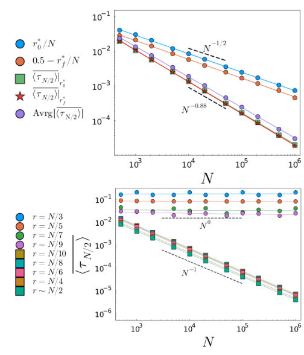 
FIG. 3. Top panel.- The scaling dependence of r∗ 0/N, r∗ f/N, ⟨τN/2⟩|r∗ 0 , ⟨τN/2⟩|r∗ f and Avrg[⟨τN/2⟩], on N. Bottom panel.-

📷 Fig 4

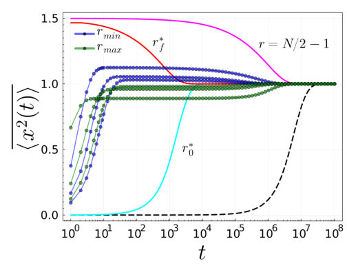 
FIG. 4. The MSD time dependence ⟨x2(t)⟩, for rings of size N = 104 and representative shortcut lengths r. The case without shortcuts is marked by the dashed-black curve. Curves labeled with rmin correspond to the values N/4, N/6, N/8 (values for which ⟨τN/2⟩attains minima) display a fast initial growth that overshoots the saturation level, followed by a slow relaxation back to it; the same overshoot relaxation pattern appears for r = r∗ f (red line) and for r = N/2 −1 (magenta line), because long short- cuts let the walker traverse the ring within a few steps. For rmax = {N/3, N/5, N/7} (values of r for which ⟨τN/2⟩attains maxima) the MSD shows a long quasi-stationary plateau be- low the...

📷 Fig 5

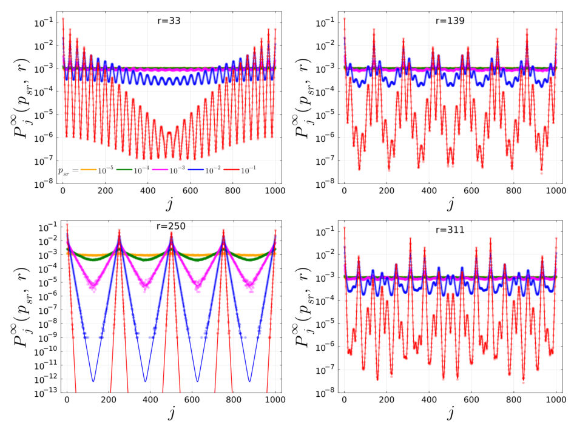 
FIG. 5. The stationary probability distribution P ∞ j (psr, r), given in (21), for sites j on a N = 1000 ring with shortcuts of length r = 33, 139, 250, 311, and resetting probabilities psr = 10−5 (yellow line), 10−4 (green line), 10−3 (magenta line), 10−2

📷 Fig 6

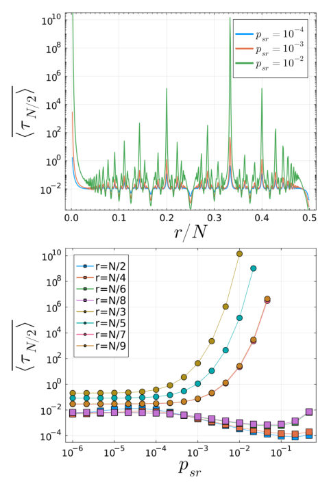 
FIG. 6. Top panel.- The MFPT ⟨τN/2⟩between diametri- cally opposed nodes is shown for a network with N = 1000 as function of r/N and resetting probabilities psr = 10−4 (blue line), 10−3 (orange line) and 10−2 (green line). The oscillatory landscape is magnified as the resetting probability increases: maxima rise while minima deepen. Bottom panel.- The de- pendence of the MFPT ⟨τN/2⟩on psr is shown for values of r that gives maxima (N/9, N/7, N/5 and N/3) and minima (N/8, N/6, N/4, N/2).

📷 Fig 7

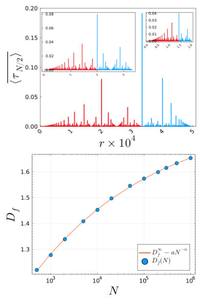 
FIG. 7. Top panel.- The self-similarity of the MFPT is shown for a ring size N = 105, where the main pattern is shown to approximately repeats at the smaller intervals shown in the insets. The red/blue partitioning highlights a nested struc- ture of subintervals associated with local extrema. Bottom panel.- Box-counting fractal dimension Df(N) (markers) to- gether with a finite-size scaling fit (orange line) of the form Df(N) = D∞ f −aN −α, yielding an asymptotic fractal dimen- sion D∞ f = 1.833 characterizing the fractal dimension of the pattern, with a = 1.697, and α = 0.163.

📷 Fig 8

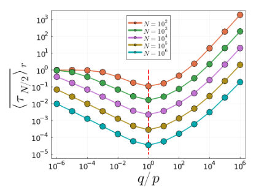 
FIG. 9. ⟨τN/2⟩r as a function on the bias ratio q/p when links and shortcuts have different transition probabilities. The min- imum occurs at p = q (red dashed line). For q/p &lt; 1/N 2 the walker effectively ignores shortcuts, and the benefit of the shortcut architecture vanishes.

📷 Fig 9

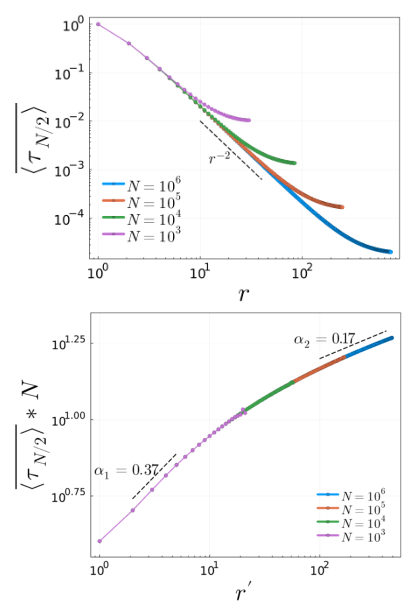 
FIG. 8. Monotonic branches of ⟨τN/2⟩. Top panel.- small- shortcut regime (r/N ≪1); the dashed guide shows the r−2

**Main problem.** Investigating how long-range shortcuts and stochastic resetting affect transport efficiency, specifically the non-monotonic behavior of Mean First-Passage Times (MFPT) in ring networks.

**Main result.** The study reveals that shortcuts do not monotonically enhance transport; instead, they create a complex, self-similar, and fractal-like MFPT landscape with local maxima and minima driven by commensurability. Stochastic resetting further amplifies these oscillations and induces non-uniform stationary distributions.

**Method.** Analytical derivation using spectral properties of the transition matrix and Fourier analysis, supplemented by numerical Monte Carlo simulations and box-counting analysis to determine fractal dimensions.

**Summary.** This paper explores transport in ring networks containing long-range shortcuts and stochastic resetting. It challenges the assumption that shortcuts always improve transport, demonstrating instead that certain shortcut lengths can significantly hinder it through a complex, self-similar pattern of maxima and minima. The researchers identify distinct scaling regimes and show that stochastic resetting amplifies these transport anomalies. The findings highlight how the spatial organization of connections is critical for determining transport efficiency.

Detailed structure

**Model / system.** A discrete-time random walk on a periodic ring network of N nodes with degree k=4, where nodes are connected to nearest neighbors and to nodes at a fixed shortcut distance r, subject to stochastic resetting to a specific node.

**Key observables.** Mean First-Passage Time (MFPT), Mean Squared Displacement (MSD), stationary occupation probability distribution, and spectral gap.

**Important parameters / regimes.** Ring size (N), shortcut length (r), transition probabilities (p, q), resetting probability (p_sr), and the bias ratio (q/p).

**Assumptions / limitations.** The network is homogeneous and undirected, and the shortcut length r is fixed for all nodes.

**Figures summary.** Figure 1 shows network topologies for different r; Figure 3 shows scaling boundaries for r/N; Figure 5 illustrates non-uniformity of stationary distributions; Figure 6 shows MFPT oscillations under resetting; Figure 7 shows the fractal structure of MFPT extrema; Figure 8 shows power-law scaling in different regimes; Figure 9 shows the effect of the bias ratio q/p.

**Paper structure.** The paper introduces the model and topology, provides analytical derivations for transport observables using spectral methods, analyzes scaling regimes and the fractal nature of the MFPT landscape, investigates the impact of stochastic resetting, and concludes with an analysis of the bias between local and long-range jumps.

**Why it may be interesting.** The discovery of a fractal-like transport landscape and the interplay between spatial periodicity and long-range jumps is highly relevant to understanding transport in open quantum systems and non-equilibrium dynamics in complex networks.

Abstract

The transport properties of discrete-time random walks on ring networks with deterministic shortcuts are investigated through analytical and numerical methods. The network consists of a periodic chain where each node is connected to its nearest neighbors and to nodes located at a fixed distance $r$. Using the spectral properties of the transition matrix, we derive explicit expressions for the occupation probabilities and mean first-passage times (MFPTs). Contrary to the common expectation that shortcuts monotonically enhance transport, we find that the MFPT between distant nodes develops a highly non-monotonic dependence on the shortcut length. Beyond a threshold value, the MFPT landscape exhibits a hierarchy of maxima and minima organized in a self-similar pattern associated with commensurability relations between the shortcut length and the system size. The scaling behavior of these extrema reveals regimes where transport efficiency is either strongly enhanced or suppressed. We further analyze the mean squared displacement and the influence of stochastic resetting, showing that resetting amplifies the oscillatory MFPT structure and induces strongly nonuniform stationary distributions. These results demonstrate that the spatial organization of long-range connections plays a crucial role in determining transport efficiency in networks.

[↑ back to top](#top)

### [Continuous Noise Model for Quantum Circuits](http://arxiv.org/abs/2604.26008v1)

**Authors:** Yunos El Kaderi, Andreas Honecker, Iryna Andriyanova  
**Type:** theory · **Category:** quantum information and computing · **PDF:** <https://arxiv.org/pdf/2604.26008v1>  
**Analysis basis:** full PDF text, analyzed in chunks
**Topic relevance:** `methods for driven-dissipative` **3/5** · `correlated / nonlocal dissipation` **2/5** · `entanglement & information structure` **2/5** · `quantum measurements` **2/5**

📷 Fig 1

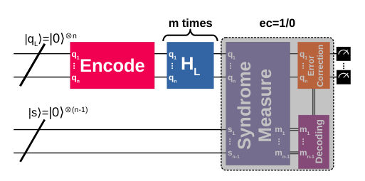 
FIG. 1. Encode one logical qubit of any code, apply series of logical Hadamards and a round of syndrome extraction, and measure the decoded state.

📷 Fig 2

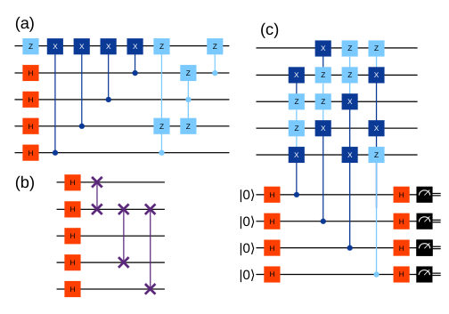 
FIG. 2. Circuits for the [[5, 1, 3]] code: (a) encoding circuit, (b) logical Hadamard circuit [39], (c) syndrome-measurement circuit.

📷 Fig 3

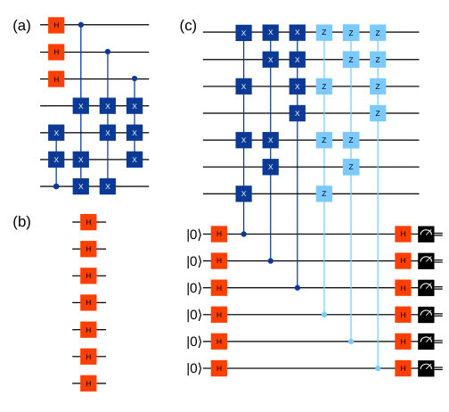 
FIG. 3. Circuits for the [[7, 1, 3]] code: (a) encoding circuit [40], (b) logical Hadamard circuit, (c) syndrome-measurement circuit.

📷 Fig 4

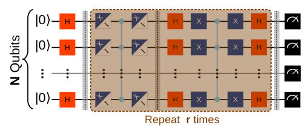 
FIG. 4. A general Grover’s search circuit [44].

📷 Fig 5

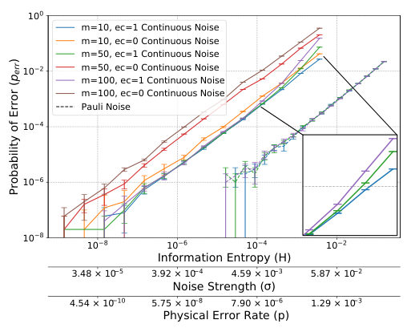 
FIG. 6. Same as Fig. 5 but for the [[7, 1, 3]] code.

📷 Fig 6

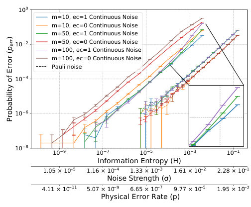 
FIG. 5. Logical error probability perr for the [[5, 1, 3]] code. Solid curves correspond to continuous noise. Dashed curves correspond to Pauli noise. The circuit of Fig. 1 is run with m = 10, 50, 100 logical Hadamards and with or without the error correction cycle (shaded box) at the end of the circuit in Fig. 1 (ec = 1, 0). The bottom, middle, and top axes show the Pauli error rate p, continuous noise strength σ, and matched binary entropy H.

📷 Fig 7

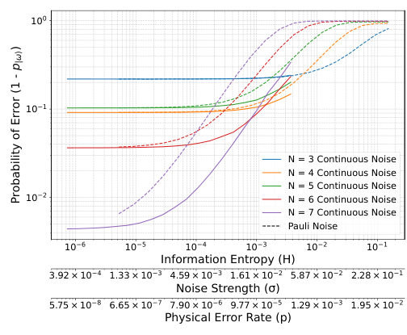 
FIG. 7. Error probability of Grover search circuits for N = 3, 4, 5, 6, 7 qubits. Solid curves show continuous noise. Dashed curves show Pauli noise.

📷 Fig 8

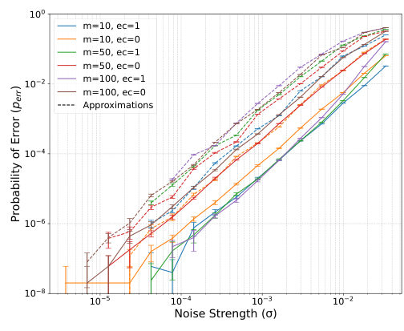 
FIG. 8. [[5, 1, 3]] logical error rate of the full simulation (solid curves) vs the error rate of the approximation simulation (dashed curves).

📷 Fig 9

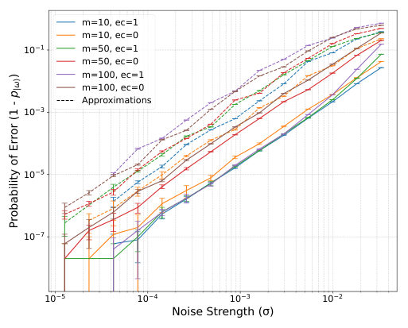 
FIG. 9. Same as Fig. 8 but for the [[7, 1, 3]] code.

📷 Fig 10

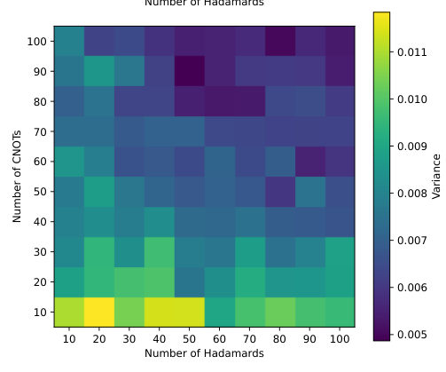 
FIG. 10. Mean (top) and variance (bottom) of the ratio in Eq. (22) over 100 random Clifford circuits. Each pixel cor- responds to a fixed number of Hadamards and CNOTs, and both panels share the same axes.

**Main problem.** The paper addresses the gap between standard discrete Pauli noise models and the continuous, structured coherent errors (like control drift) found in real hardware, specifically investigating how these errors accumulate and impact quantum error correction.

**Main result.** The authors find that continuous coherent noise can degrade logical performance more severely than Pauli noise in stabilizer codes, though the opposite is true for Grover's search. They also develop an efficient analytical method for tracking error distributions in Clifford circuits.

**Method.** The study uses Monte Carlo sampling of a von Mises-Fisher noise model and compares it to a Pauli model using an entropy-matched scheme. An approximate analytical method is also developed to propagate error distributions through Clifford gates without full sampling.

**Summary.** This paper introduces a continuous noise model using the von Mises-Fisher distribution to better represent coherent gate errors in quantum computing. By comparing this model to standard Pauli noise through an entropy-matching scheme, the authors demonstrate that coherent noise can be more damaging to error-correcting codes. They also present a computationally efficient analytical method to track error propagation through Clifford circuits. The work highlights the limitations of simplified noise models in predicting the performance of complex quantum error-correction protocols.

Detailed structure

**Model / system.** The system consists of quantum circuits including [[5,1,3]] and [[7,1,3]] stabilizer codes, Grover's search algorithm, and random Clifford circuits. The noise is modeled as continuous, small-angle random rotations on the Bloch sphere using a von Mises-Fisher distribution.

**Key observables.** Logical error rates, fidelity, error probability (1 - P_success), and binary entropy at readout.

**Important parameters / regimes.** Rotation angle (theta), rotation axis (mu), concentration parameter (k), noise strength (sigma), and circuit depth (m).

**Assumptions / limitations.** The model assumes small-angle, isotropic Gaussian errors in the limit; single-qubit gates are the primary source of noise; CNOT gates are noiseless but propagate errors; and the analytical approximation ignores multi-qubit error correlations.

**Figures summary.** Figures show QEC circuit workflows, logical error probabilities for [[5,1,3]] and [[7,1,3]] codes comparing Pauli vs. continuous noise, Grover search performance scaling, and heatmaps validating the analytical approximation's accuracy in Clifford circuits.

**Paper structure.** The paper identifies the inadequacy of Pauli models, introduces the von Mises-Fisher continuous noise model, establishes a matching scheme for fair comparison, presents an efficient analytical propagation method, and validates this method against brute-force simulations.

**Why it may be interesting.** This is highly relevant for researchers in open quantum systems and quantum optics as it provides a more realistic framework for modeling how continuous environmental coupling and control imperfections accumulate and degrade quantum information.

Abstract

Quantum noise is a central challenge in quantum computing across many applications. Extensive work has examined how qubits couple to their environment, leading to decoherence and relaxation, which is irreversible. Current studies focus on coherent gate errors caused by control misalignment, which accumulate with circuit depth but can, in principle, be corrected. This work studies a continuous coherent noise model for quantum circuits and compares it with a discrete Pauli model. The focus is on small coherent gate errors that build up across circuit depth. These errors are modeled as random rotations on the Bloch sphere using a von Mises-Fisher distribution. In the small-angle limit, the model reduces to an isotropic Gaussian distribution. We test the model on quantum error-correction circuits based on the [[5,1,3]] and [[7,1,3]] codes. A variant of Grover's search circuit with different qubit counts is also examined. To enable fair comparison, we introduce a model-independent matching scheme. Pauli and continuous noise channels are aligned using the binary entropy at readout. This isolates the effect of noise structure at fixed uncertainty. An approximate analytical method for coherent error propagation is also developed. The method tracks error distributions through Clifford circuits without full Monte Carlo sampling. It reduces simulation cost while preserving accuracy for circuit-level error estimates. The approximation is validated against brute-force simulations, identifying its regime of validity with Clifford circuits and limits under error correction. Our results show that continuous coherent noise can degrade logical performance more strongly than Pauli noise. They also clarify when simplified propagation models succeed and when they break down.

[↑ back to top](#top)

### [Ballistic Exciton Flow Driven by Intertwined Exciton-Electron Orders in a Moiré Superlattice](http://arxiv.org/abs/2604.26871v1)

**Authors:** Shibin Deng, Jonas M. Peterson, Jonas Reimann, Heonjoon Park, Ammon Fischer, Takashi Taniguchi, Kenji Watanabe, Xiaodong Xu, Dante M. Kennes, Libai Huang  
**Type:** both · **Category:** strongly correlated electrons · **PDF:** <https://arxiv.org/pdf/2604.26871v1>  
**Analysis basis:** abstract only; PDF text extraction failed or PDF unavailable
**Topic relevance:** `non-equilibrium dynamics` **3/5** · `analog quantum simulation` **2/5** · `quantum optics experiment` **2/5**

**Main problem.** Understanding how the interplay between bosonic excitons and correlated electron lattices in TMD moiré superlattices drives collective transport and phase transitions.

**Main result.** Strong exciton-electron and exciton-exciton repulsions enable energy-selective ballistic exciton transport, which is enhanced at fractional electron fillings associated with generalized Wigner-crystal orders.

**Method.** Ultrafast, time- and energy-resolved photoluminescence (PL) and reflectance microscopy combined with 1D Bose-Fermi Hubbard model simulations using DMRG.

**Summary.** This paper investigates the collective transport of excitons in TMD moiré superlattices. The researchers show that repulsive interactions between excitons and electrons drive a ballistic expansion of excitons, particularly when electrons form Wigner-crystal orders. Using both ultrafast microscopy and DMRG simulations, they demonstrate how the electron crystal can accelerate the melting of the exciton Mott background. This work establishes moiré materials as a versatile platform for studying strongly interacting Bose-Fermi mixtures.

Detailed structure

**Model / system.** A WSe2/WS2 heterobilayer moiré superlattice acting as a strongly interacting Bose-Fermi mixture where bosonic excitons coexist with correlated electron lattices.

**Key observables.** Exciton mean-squared displacement (MSD), time-dependent photoluminescence, and reflectance microscopy signals.

**Important parameters / regimes.** Fractional electron fillings, exciton-electron repulsion, exciton-exciton repulsion, and intersite hopping rates.

**Assumptions / limitations.** The 1D Bose-Fermi Hubbard model qualitatively captures the complex 2D moiré physics.

**Paper structure.** The paper presents experimental observations of ballistic exciton transport via microscopy, analyzes the time-dependent MSD, relates the transport to electron filling and Wigner-crystal formation, and validates these findings with DMRG simulations of a Bose-Fermi Hubbard model.

**Why it may be interesting.** It demonstrates real-time control of intertwined bosonic and electronic orders and provides a platform for studying the transition between exciton insulator and fluid phases in a highly tunable many-body system.

Abstract

Moiré superlattices of transition-metal dichalcogenides (TMDs) host strongly interacting Bose-Fermi mixtures in which bosonic excitons coexist with correlated electron lattices. Using ultrafast, time- and energy-resolved photoluminescence (PL) and reflectance microscopy, we show that strong exciton-electron and exciton-exciton repulsion can enable collective ballistic exciton transport in a WSe$_2$/WS$_2$ heterobilayer. The ballistic transport is energy-selective: repulsive interactions drive excitons into a higher moiré exciton band, where enhanced intersite hopping enables rapid spatial expansion. Correspondingly, the exciton mean-squared displacement (MSD) exhibits a quadratic time dependence ($\propto t^2$). This ballistic expansion is enhanced at fractional electron fillings where the electrons form generalized Wigner-crystal (GWC) orders. Afterwards, the system transitions into a mixed electron-exciton Mott state as Auger recombination and density depletion conclude the ballistic expansion. A one-dimensional Bose-Fermi Hubbard model solved using density-matrix renormalization group (DMRG) qualitatively reproduces the measured exciton transport and time-dependent response. It further confirms that strong cross-species interactions allow the electron crystal to perforate the exciton Mott background, accelerating its melting and enhancing exciton motion. Our results establish moiré TMDs as highly tunable platforms for realizing strongly interacting Bose-Fermi mixtures, which we employ here to demonstrate real-time control of intertwined bosonic and electronic order and to establish a route to the exciton insulator-fluid transition.

[↑ back to top](#top)

### [Convex combinations of bosonic pure-loss channels](http://arxiv.org/abs/2604.26874v1)

**Authors:** Giuseppe Catalano, Marco Fanizza, Francesco Anna Mele, Giacomo De Palma, Vittorio Giovannetti  
**Type:** theory · **Category:** quantum information and computing · **PDF:** <https://arxiv.org/pdf/2604.26874v1>  
**Analysis basis:** full PDF text, analyzed in chunks
**Topic relevance:** `entanglement & information structure` **3/5** · `Keldysh / 2PI / non-Gaussian methods` **2/5** · `methods for driven-dissipative` **2/5**

📷 Fig 1

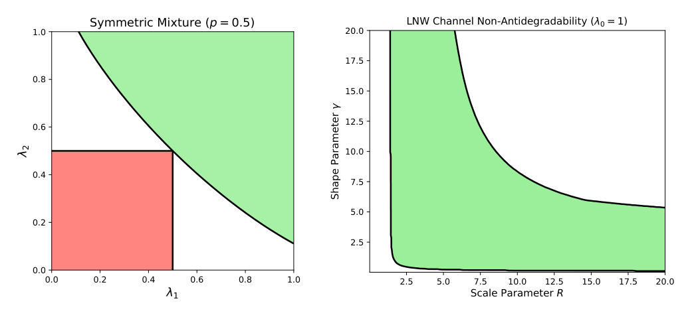 
FIG. 2. Regions of Antidegradability and Non-Antidegradability. Left: Parameter space (λ1, λ2) for the symmetric binary fading channel (p = 0.5). The green area indicates the region where the channel is non-antidegradable. The red square (λ1, λ2 ≤0.5) highlights the region of antidegradability consistent with the theoretical property that the set of all antidegradable channels is convex. Right: Non-antidegradable region (green area) for the atmospheric fading channel modeled by the Log-Negative Weibull distribution, as a function of the scale (R) and shape (γ) parameters (with cutoff λ0 = 1).

📷 Fig 2

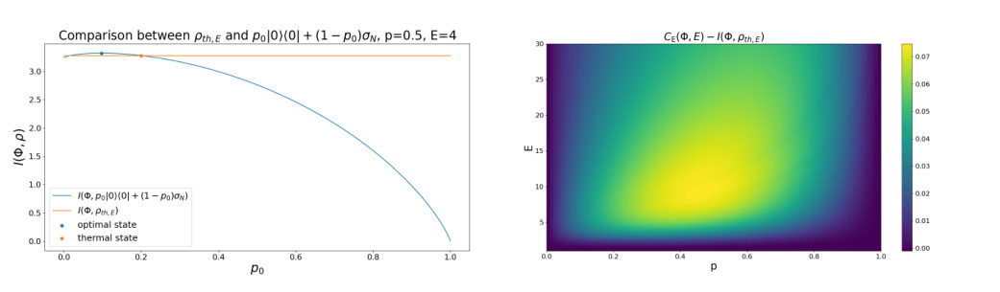 
FIG. 3. Left: Quantum mutual information of the Continuous-Variable Erasure Channel I(Φp, ρ(p0, E)) as a function of the vacuum population p0, for the erasure channel Φp = pI + (1 −p)E0 with fixed p = 0.5 and E = 4. The input state ρ(p0, E) = p0 |0⟩⟨0| + (1 −p0)σN is the optimal ansatz of Eq. (39), parametrized by the vacuum population p0. The orange dot marks the thermal state (pth 0 = 1/(E + 1) = 0.2), while the blue dot marks the true optimum (popt 0 ≈0.1), demonstrating that suppressing the vacuum component below the thermal value strictly increases the mutual information. Right: Absolute capacity gain CE(Φp, E) −I(Φp, ρth,E) in the (p, E) plane, quantifying the advantage of the optimal...

📷 Fig 3

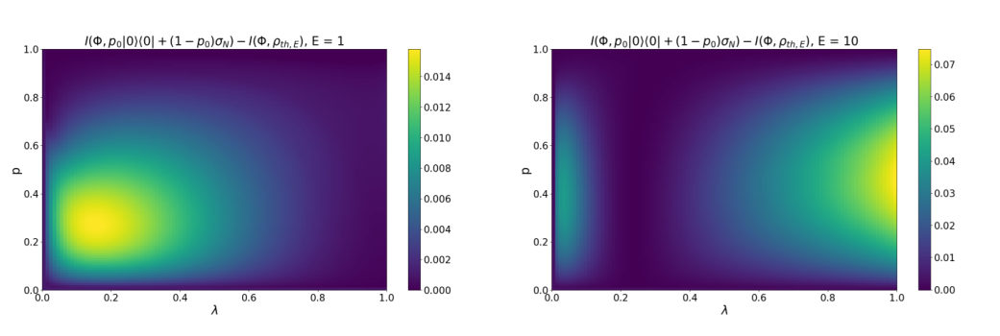 
FIG. 4. Absolute quantum mutual information gain I(Φ(0) p,λ, ρ(1)) −I(Φ(0) p,λ, ρth) for the erasure-lossy channel Φ(0) p,λ = pEλ + (1 − p)E0, where ρ(1) = p0 |0⟩⟨0| + (1 −p0)σN is the first-order variational state with vacuum population p0 optimized over [0, 1]. The gain is mapped across the (p, λ) parameter space for low energy (E = 1, left) and high energy (E = 10, right). In both regimes, the non-Gaussian advantage is most pronounced at low transmissivity λ and intermediate fading probability p, and increases with the available energy.

📷 Fig 4

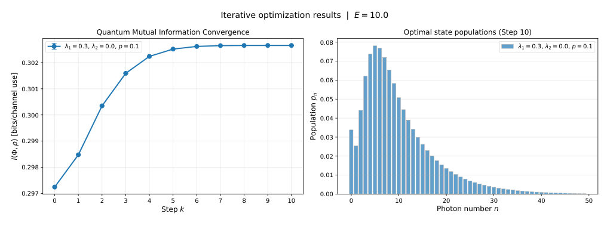 
FIG. 5. Convergence of the iterative optimization algorithm. As the order k increases, the algorithm expands the non-Gaussian discrete head of the input state, monotonically increasing the achievable information rate until saturation is reached.

📷 Fig 5

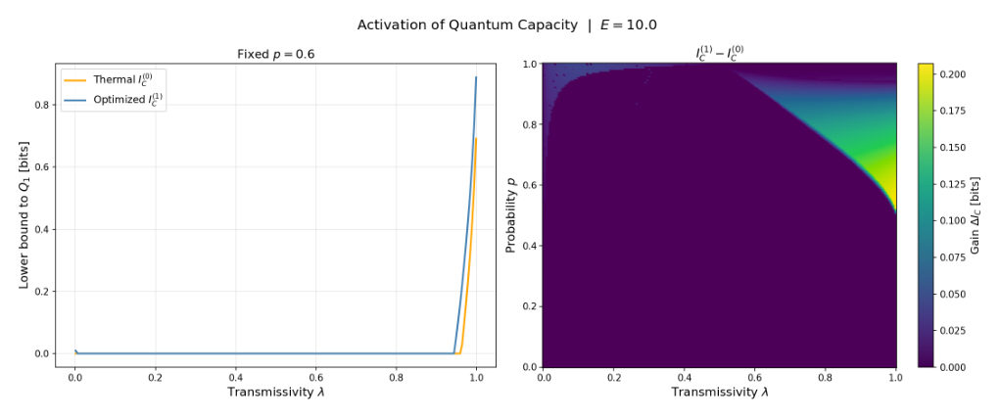 
FIG. 6. Activation of the quantum capacity for the binary fading family Φ(0) p,λ = pEλ + (1 −p)E0, at energy E = 10, where

📷 Fig 6

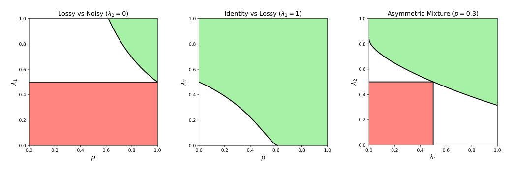 
FIG. 7. Regions of non-antidegradability (green) and degradability (red) for specific binary fading configurations defined in Eq. (A12). (a) Lossy vs. Noisy (λ2 = 0) in the (p, λ1) plane. (b) Identity vs. Lossy (λ1 = 1) in the (p, λ2) plane. (c) General binary mixture with fixed asymmetric weight p = 0.3 in the (λ1, λ2) plane. The boundary curves represent the analytic threshold where Eq. (A13) holds with equality.

📷 Fig 7

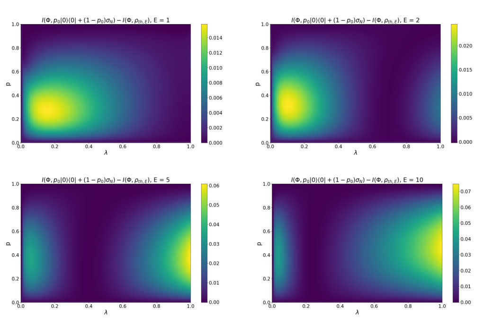 
FIG. 8. Absolute quantum mutual information gain I(Φ(0) p,λ, ρopt) −I(Φ(0) p,λ, ρth) for the erasure-lossy channel. The panels compare different energy constraints: E = 1 (top-left), E = 2 (top-right), E = 5 (bottom-left), and E = 10 (bottom-right). The region of non-Gaussian advantage persists and evolves with increasing energy.

📷 Fig 8

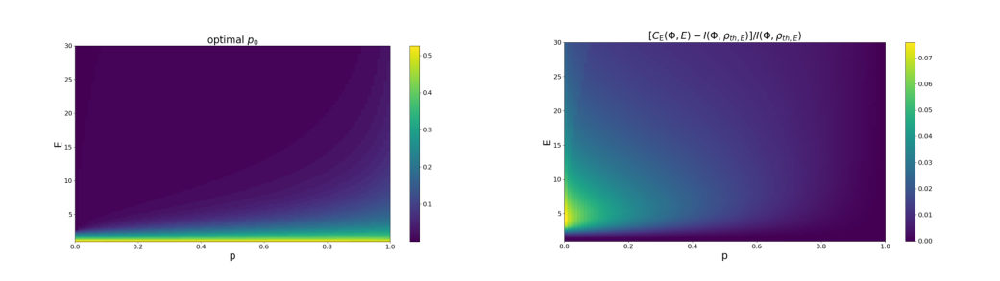 
FIG. 9. Left: Optimal vacuum population p0 for the erasure channel input as a function of fading probability p and energy E. Lower p0 is preferred at higher energies to distinguish from the vacuum noise. Right: Relative gain in capacity R(p, E) obtained by using the optimized non-Gaussian state compared to the thermal state. The gain is most significant for low transmission probabilities (noisy channels) and moderate energies.

📷 Fig 9

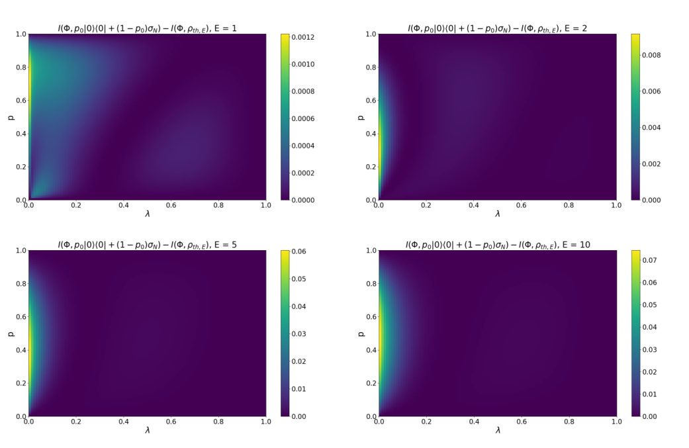 
FIG. 10. Absolute capacity gain I(Φ(1) p,λ, ρopt) −I(Φ(1) p,λ, ρth) for the identity-lossy channel Φ(1) p,λ. Panels correspond to different energy constraints (E = 1, 2, 5, 10). The emergence of distinct regions of advantage confirms that non-Gaussian states are optimal also against intermittent attenuation without total erasure.

📷 Fig 10

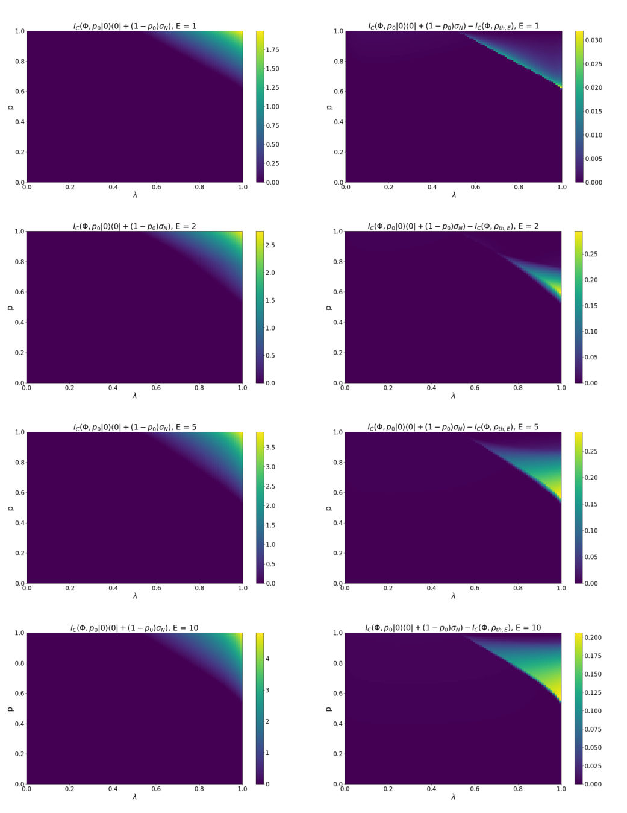 
FIG. 11. Single-shot quantum capacity analysis for the erasure-lossy channel Φ(0) p,λ across increasing energy regimes (E =

**Main problem.** Investigating the quantum Shannon theory of bosonic fading channels, specifically determining their communication capacities and structural properties when transmissivity fluctuates stochastically.

**Main result.** Proved that non-Gaussian Fock-diagonal states strictly outperform Gaussian thermal states for entanglement-assisted classical capacity and can 'activate' the channel for quantum communication in regimes where Gaussian states yield zero capacity.

**Method.** Analytical proofs using Stinespring dilation and Choi matrix rank, alongside a numerical iterative variational algorithm to optimize photon number distributions.

**Summary.** This paper explores the information-theoretic properties of bosonic channels subject to transmissivity fluctuations, known as fading channels. The authors show that these channels are fundamentally non-Gaussian and that standard Gaussian (thermal) states are sub-optimal for communication. Crucially, they prove that optimized non-Gaussian states can enable quantum communication in high-loss regimes where Gaussian encodings fail entirely. This 'channel activation' is particularly relevant for practical applications like satellite-to-ground quantum networks subject to atmospheric turbulence.

Detailed structure

**Model / system.** A bosonic fading channel modeled as a convex combination (mixture) of pure-loss channels, representing physical scenarios like atmospheric turbulence in free-space quantum communication.

**Key observables.** Coherent information, entanglement-assisted classical capacity, quantum mutual information, and secret key capacity.

**Important parameters / regimes.** Transmissivity (lambda), probability density of fluctuations (p(lambda)), mean energy constraint (E), and LNW distribution parameters (R and gamma).

**Assumptions / limitations.** The optimization is restricted to phase-insensitive (Fock-diagonal) input states, and the model assumes negligible thermal background noise.

**Figures summary.** Circuit representations of the fading channel, parameter space plots for non-antidegradability, and maps showing the capacity gain and channel activation of non-Gaussian states over thermal benchmarks.

**Paper structure.** The paper introduces the fading channel model, establishes its structural properties (non-degradability/distillability), analyzes specific fading distributions (binary and LNW), demonstrates the sub-optimality of Gaussian states, and presents a variational algorithm for capacity optimization.

**Why it may be interesting.** It provides fundamental insights into the limits of quantum communication in realistic, fluctuating environments and demonstrates how non-Gaussianity can be leveraged to overcome noise-induced capacity vanishing.

Abstract

The pure-loss channel is a fundamental model for describing noise in bosonic quantum platforms. It is characterised by a single parameter, the transmissivity, which quantifies the fraction of the input energy that reaches the output of the channel. In realistic scenarios, however, such as free-space quantum communication, the transmissivity is not fixed but fluctuates from one channel use to another. In this setting, the overall channel is effectively described as a convex combination of pure-loss channels, known as a fading channel. Despite its practical relevance, the quantum Shannon theory of the fading channel has remained largely unexplored. Here, we address this gap, specifically investigating degradability, anti-degradability, entanglement breakingness, and capacities of the fading channel. Of particular relevance to practical quantum-internet applications, we prove that entanglement distribution and quantum key distribution can always be achieved at a strictly positive rate over any fading channel, no matter how noisy it is or how strongly the transmissivity fluctuates, provided the channel is not completely noisy. Moreover, we prove that thermal states, which are optimal for a broad class of static bosonic Gaussian channels, fail to achieve the entanglement-assisted classical capacity of fading channels: non-Gaussian Fock-diagonal states strictly outperform all Gaussian encodings. Most strikingly, we identify regimes where the coherent information of thermal inputs vanishes, while optimized non-Gaussian states achieve strictly positive values, thereby activating the channel for quantum communication. For a paradigmatic binary fading model we establish this result analytically, deriving the exact capacity-achieving state in closed form. For general fading distributions, we design an iterative variational algorithm to optimize the coherent and mutual information.

[↑ back to top](#top)

### [Neural and Tensor Networks in the Study of Quantum Annealing Processors](http://arxiv.org/abs/2604.26534v1)

**Authors:** Tomasz Śmierzchalski  
**Type:** both · **Category:** disordered systems and neural networks · **PDF:** <https://arxiv.org/pdf/2604.26534v1>  
**Analysis basis:** full PDF text, analyzed in chunks
**Topic relevance:** `QC/QI experiment` **3/5** · `methods for driven-dissipative` **2/5** · `non-equilibrium dynamics` **1/5**

📷 Fig 1

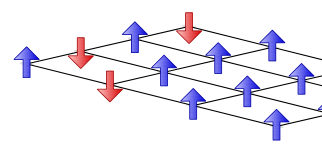 
Figure 1.1: Symbolic representation of an example Ising spin glass system. It’s defined on a 4×4 lattice graph with N = 16 vertices. Here, the configuration of each spin is represented by a blue arrow pointing upwards (+1) or a red arrow pointing downwards (−1). Additionally, hi ∈R is the external field acting on the i−th spin and Jij denotes coupling strength between spins i and j.

📷 Fig 2

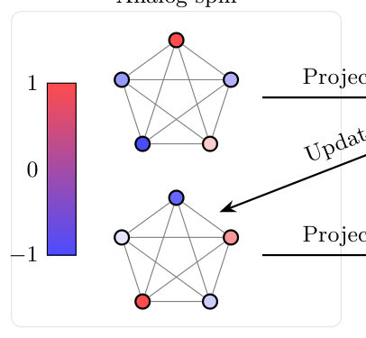 
Figure 1.2: Schematic representation of parallel annealing algorithm. The analog spin variables x are projected onto the binary domain using the sign function. Thus, the obtained real spin configuration s is used to calculate the gradient and update the analog variables. This process continues until a specified number of steps is reached.

📷 Fig 3

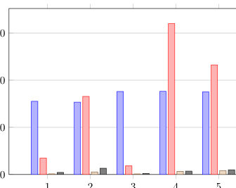 
Figure 1.3: Time to obtain ground state for each instance. Due to the small size of the instances, we were able to certify the ground state using exhaustive search. For brute-force, we used GPU acceleration [46], as CPU-only time was two orders of magnitude higher (around 2 hours). With the rest of the solver, we used CPU-only versions. We used the time-to-solution metric (Eq. 4.1), which accounts for the probability of obtaining the ground state in the given sample. Each heuristic solver was run with the same number of steps and sample size.

📷 Fig 4

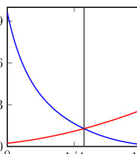 
Figure 2.2: Example of schedule functions A(s) and B(s) for a representative D-Wave QPU (values shown as frequencies in the manufacturer’s convention). The shaded mid-anneal window indicates the region where the driver and problem energy scales compete most strongly (A(s) ≈B(s)), often coinciding with an increased probability of diabatic excitations [16].

📷 Fig 5

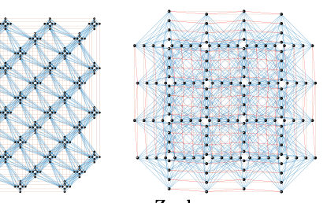 
Figure 2.3: Connectivity structures of D-Wave Quantum Processing Units (QPUs), also called Topology [80–83].

📷 Fig 6

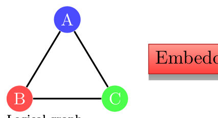 
Figure 2.4: Example minor embedding of the complete graph K3 onto a Chimera unit cell. Here, vertex A is mapped to the chain KA consisting of qubits 1 and 4, while B and C are mapped to single qubits (3 and 5). Logical couplings are implemented by physical couplers between the corresponding chains.

📷 Fig 7

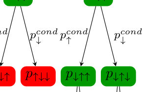 
Figure 3.1: Branch-and-bound search in probability space. The solution is built sequentially by assigning spins. For each partial assignment s1:k (green), the algorithm branches by appending sk+1 ∈{−1, +1} and evaluating the corresponding conditional probabilities p(sk+1 | s1:k) (equivalently, the marginals p(s1:k+1)). The bounding step retains at most M partial assignments with the largest probabilities (green) and discards the remainder (red). The figure shows M = 3 for clarity. In SpinGlassPEPS.jl, the required marginals are obtained from approximate tensor-network contractions.

📷 Fig 8

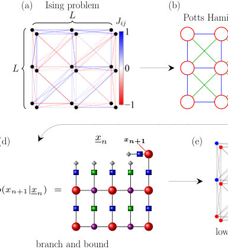 
Figure 3.2: Execution flow of SpinGlassPEPS.jl. (a) An Ising instance on the native interaction graph is transformed into (b) a local Potts Hamiltonian on a king’s graph via clustering. (c) The resulting (Potts) partition function is represented as a PEPS tensor network on a square lattice. (d) Conditional marginals required by the search are computed by approximately contracting the PEPS. (e) A branch-and-bound sweep yields a candidate configuration, which corresponds to a ground-state configuration of the original Ising model. (f) The same machinery can be used to find localized low-energy excitations around the returned configuration.

📷 Fig 9

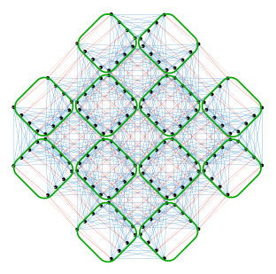 
Figure 3.3: Transforming hardware graphs into Potts clusters. Black dots denote physical spins, and colored edges denote couplers: orange for intra-row/column links and blue for diagonal and inter-cell links (schematic). Each circled block indicates a cluster, which is replaced by a single Potts variable xn whose state enumerates the cluster’s binary microstates.

📷 Fig 10

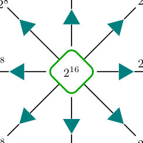 
Figure 3.4: Edge-specific projections for compressing Potts pair energies. A naive repre- sentation of Exmxn scales as dm × dn with dn = 2kn (up to 224 for Pegasus and 216 for Zephyr in the maximal case). Since only boundary spins couple across a given edge (m, n), we project each cluster microstate xm to a reduced index ¯xm = P mn(xm) that retains only the boundary-spin subconfiguration relevant to that edge. The pair term is then stored as a compressed matrix ¯E¯xm¯xn (Eq. (3.5)). Panel (a) shows the schematic construction of edge-specific projected indices and the resulting compressed pair matrix ¯E¯xm¯xn. Panels (b) and (c) illustrate typical reductions in local dimensions obtained in...

**Main problem.** The need for a reliable benchmarking framework for quantum annealers that evaluates algorithmic performance, sampling diversity, and thermodynamic efficiency beyond simple energy minimization.

**Main result.** Developed SpinGlassPEPS.jl, a topology-aware tensor network heuristic, and demonstrated that specific annealing pauses can improve solution quality while reducing thermodynamic cost.

**Method.** Combines tensor network heuristics (PEPS) for optimization, reinforcement learning for error-correcting post-processing, and a thermodynamic framework treating annealers as thermal machines.

**Summary.** This work presents a comprehensive framework for benchmarking D-Wave quantum annealers. It introduces a new tensor-network-based heuristic, SpinGlassPEPS.jl, to provide physically interpretable references for optimization. The research also treats quantum annealers as thermal machines to study the relationship between annealing schedules and thermodynamic cost. Additionally, it uses reinforcement learning to post-process samples and correct hardware errors, ultimately arguing for a multi-faceted approach to evaluating quantum hardware performance.

Detailed structure

**Model / system.** The study focuses on D-Wave quantum annealers (Pegasus and Zephyr topologies) using the Ising/QUBO model and the Transverse Field Ising Model (TFIM) Hamiltonian.

**Key observables.** Success probability, energy accuracy, low-energy diversity, energy dissipation, entropy production, and effective temperature.

**Important parameters / regimes.** Annealing schedules (including pauses), inverse temperature, bond dimension in tensor networks, and hardware-specific parameters like qubit temperature and coupling strengths.

**Assumptions / limitations.** Tensor network accuracy is limited by approximate contractions in large-scale instances; simulations primarily focus on closed-system unitary dynamics despite annealers being open systems.

**Figures summary.** Includes symbolic representations of Ising spin glasses, diagrammatic notation for tensor contractions, visual comparisons of contraction sequences, and schematics of the reinforcement learning loop.

**Paper structure.** The dissertation introduces a benchmarking framework, presents a tensor-network-based heuristic (SpinGlassPEPS.jl), analyzes the thermodynamics of annealing schedules, implements RL-based error mitigation, and provides mathematical foundations for tensor networks and RL.

**Why it may be interesting.** It bridges the gap between many-body physics (tensor networks, spin glasses) and quantum hardware performance, offering insights into how environmental coupling and thermal dynamics affect computation.

Abstract

Quantum annealing targets low-energy solutions of Ising/QUBO problems, but reliable assessment requires more than best-energy comparisons. This dissertation develops a benchmarking framework for D-Wave quantum annealers that combines strong classical baselines, sampling and diversity metrics, and thermodynamic cost.   Its first contribution, SpinGlassPEPS.jl, is a topology-aware tensor-network heuristic for optimization and sampling on Pegasus/Zephyr-like graphs. It maps Ising instances to local Potts clusters, represents the partition function with PEPS, and performs branch-and-bound search in probability space. Benchmarks show that it is a physically interpretable reference solver, though approximate contractions limit its competitiveness on the largest instances.   The second contribution treats quantum annealers as effective thermal machines, relating success probability and solution quality to dissipation, entropy production, and effective temperature. Carefully placed pauses can improve performance while reducing thermodynamic cost, although longitudinal fields may become harmful in paused schedules.   The thesis also introduces reinforcement-learning post-processing to improve returned samples and exact small-system simulations to probe annealing dynamics. Overall, it argues for quantum-annealing benchmarks that jointly measure algorithmic performance and physical expenditure.

[↑ back to top](#top)
