# Daily arXiv Report

[← Index](report.md)

[← Previous](papers_04.md)
[Next →](papers_06.md)

## Papers 81–100

---

### [Electronic structure, quasiparticle renormalizations, and magnetic correlations in the alternating single-layer bilayer nickelate La$_5$Ni$_3$O$_{11}$](http://arxiv.org/abs/2604.26627v1)

**Authors:** I. V. Leonov  
**Type:** theory · **Category:** strongly correlated electrons · **PDF:** <https://arxiv.org/pdf/2604.26627v1>  
**Analysis basis:** full PDF text, analyzed in chunks

📷 Fig 1

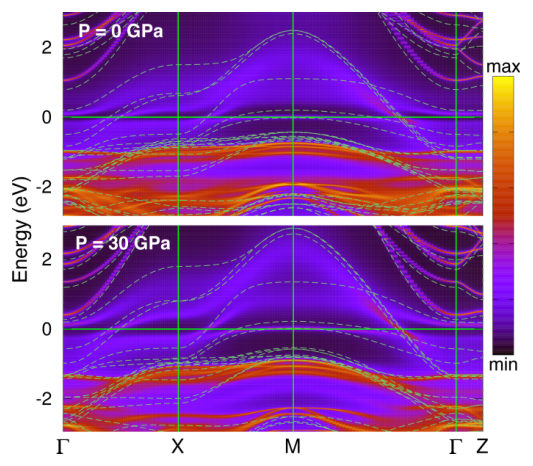 
FIG. 1: k-resolved spectral functions of PM 1212-LNO cal- culated by DFT + DMFT with U = 6 eV and J = 0.95 eV at T = 298 K. The calculations are performed for the low- pressure Cmmm and high-pressure P4/mmm crystal struc- tures using experimental lattice parameters and optimized atomic positions. Our results are compared with the non- magnetic DFT calculations (shown with dashed green lines).

📷 Fig 2

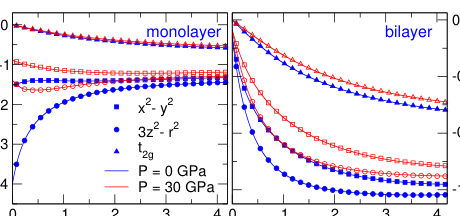 
FIG. 4: Orbital-dependent Ni 3d self-energies Im[Σ(iωn)] on the Matsubara axis for the crystallographically distinct Ni sites in the mono- (left) and bilayer NiO6 block (right) for different pressures (shown with symbols). Our results for the Pad´e interpolation of Im[Σ(iωn)] are depicted with lines.

📷 Fig 3

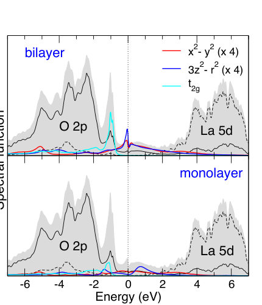 
FIG. 2: Our results for the layer-resolved orbital-dependent spectral functions of 1212-LNO at low pressure calculated by DFT + DMFT at T = 298 K. The partial Ni t2g, x2 −y2, and 3z2 −r2 orbital contributions are shown (per orbital). Ni x2 −y2, and 3z2 −r2 orbital states are magnified for better readability.

📷 Fig 4

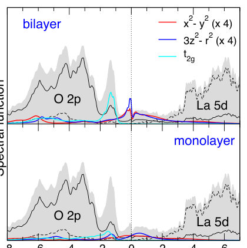 
FIG. 3: Orbital-dependent spectral functions of the high- pressure Fmmm phase of 1212-LNO calculated by DFT + DMFT under pressure ∼30 GPa at T = 298 K.

📷 Fig 5

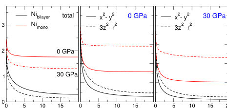 
FIG. 5: Total and orbitally resolved local spin correlation functions χ(τ) = ⟨ˆmz(τ) ˆmz(0)⟩as a function of the imaginary time τ for the Ni 3d orbitals calculated by DFT + DMFT for the low- and high-pressure (at 30 GPa) phase at T = 290 K.

📷 Fig 6

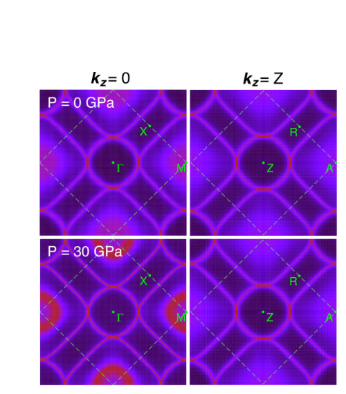 
FIG. 6: Correlated Fermi surfaces [spectral function A(k, ω) evaluated at ω = EF ] for kz = 0 (left) and kz = π/c (right) calculated within DFT + DMFT at T = 298 K for different pressures.

📷 Fig 7

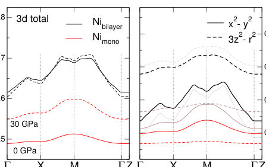 
FIG. 7: Orbital-dependent in-plane static spin susceptibility χ(q) of PM 1212-LNO for the crystallographically distinct Ni ions in the bilayer and monolayer NiO6 blocks for different pressures obtained by DFT + DMFT at T = 298 K using the particle-hole bubble approximation (neglecting the high-order vertex corrections).

📷 Fig 8

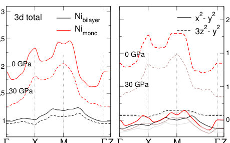 
FIG. 9: Orbital-dependent in-plane static spin susceptibility χ(q) of 1212-LNO obtained with the nonmagnetic DFT using the particle-hole bubble approximation (neglecting the high- order vertex corrections).

📷 Fig 9

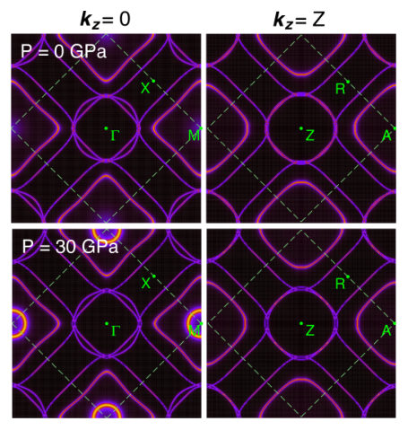 
FIG. 8: Fermi surface cuts of 1212-LNO for kz = 0 (left) and kz = π/c (right) calculated using nonmagnetic DFT for different pressures.

**Main problem.** Understanding the microscopic origins of the anomalous normal-state electronic structure, magnetism, and orbital-dependent correlations in the hybrid nickelate La5Ni3O11 (1212-LNO).

**Main result.** The study reveals an orbital-selective Mott insulating state in the single-layer Ni ions and strongly renormalized quasiparticle bands in the bilayer Ni ions, with magnetic correlations shifting from single-layer to bilayer-dominated due to correlation effects.

**Method.** Fully charge self-consistent DFT+DMFT using plane-wave pseudopotentials and the continuous-time hybridization expansion quantum Monte Carlo (CTQMC) method.

**Summary.** This paper uses advanced DFT+DMFT calculations to study the hybrid nickelate La5Ni3O11. It identifies a unique orbital-selective Mott insulating state in the single-layer Ni ions while the bilayer ions remain metallic but heavily renormalized. The research also shows how electronic correlations reconstruct the magnetic spectrum and how high pressure can drive a transition from an insulator to a metal. These findings are crucial for understanding the interplay between structural complexity and strong electron correlations in new superconducting materials.

Detailed structure

**Model / system.** The physical system is the alternating single-layer/bilayer Ruddlesden-Popper nickelate La5Ni3O11 (1212-LNO), consisting of structurally distinct NiO6 slabs.

**Key observables.** Quasiparticle renormalization (m*/m), spectral functions, magnetic susceptibility (spin/charge density waves), and local magnetic moments.

**Important parameters / regimes.** Hubbard interaction U = 6 eV, Hund's exchange J = 0.95 eV, and high-pressure regimes (>20 GPa).

**Assumptions / limitations.** Use of the particle-hole bubble approximation for momentum-resolved static magnetic susceptibility, neglecting higher-order vertex corrections.

**Paper structure.** The paper investigates the electronic and magnetic properties of 1212-LNO, detailing the orbital-dependent correlations in single-layer vs. bilayer Ni ions, the effects of pressure on the Mott transition, and the reconstruction of magnetic instabilities.

Abstract

Using DFT+DMFT we study the normal-state electronic structure and magnetic correlations of the recently discovered alternating single-layer bilayer Raddlesden-Popper nickelate La$_5$Ni$_3$O$_{11}$ (1212-LNO). Our results exhibit qualitative differences for the structurally distinct single-layer and bilayer Ni ions, implying the importance of confinement and orbital-dependent correlations. The Ni $e_g$ electronic states originating from the bilayer Ni ions form strongly renormalized quasiparticle bands with a large enhancement factor $m^*/m \sim 3.5$ and 4.2 for the Ni $x^2-y^2$ and $3z^2-r^2$ orbitals, respectively. Moreover, the $e_g$ states of the single-layer Ni ions exhibit an orbital-selective Mott insulating state, with a narrow energy gap for the Ni $3z^2-r^2$ states and metallic, strongly incoherent (non-Fermi-liquid) Ni $x^2-y^2$ ones. Our analysis of magnetic correlations suggests the formation of intertwined spin and charge density wave stripes in the bilayer NiO$_6$ slab, in close similarity to the double-layer material. We refine two major instabilities, a leading one is associated with a wave vector ${\bf Q}=(\frac{1}{3},\frac{1}{3})$ (``up-down-0" spin pattern), competing with the bicollinear $(\frac{1}{4},\frac{1}{4})$ (``up-up-down-down") stripe state. The single-layer Ni $3d$ electrons exhibit instability towards the Néel-type magnetic state. Under pressure, 1212-LNO undergoes an orbital-selective Mott insulator-to-metal phase transition, associated with metallization of the single-layer Ni $e_g$ states. As a result, the single-layer Ni $e_g$ bands exhibit non-Fermi-liquid (bad metal) behavior with strongly incoherent spectral weights near $E_F$. We note that correlation effects result in a reconstruction of magnetic correlations as compared to that obtained within DFT. In fact, we observe a crossover from single-layer to double-layer dominated magnetic correlations.

[↑ back to top](#top)

### [Emergence of $π$ from Equatorial Quantum Localization](http://arxiv.org/abs/2604.26638v1)

**Authors:** Bin Ye, Ruitao Chen, Lei Yin  
**Type:** theory · **Category:** other · **PDF:** <https://arxiv.org/pdf/2604.26638v1>  
**Analysis basis:** full PDF text, analyzed in chunks

📷 Fig 1

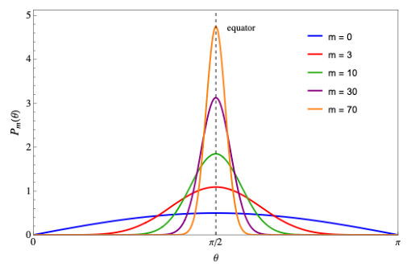 
FIG. 1. Exact polar density Pm(θ) = sin2m+1 θ/I2m+1 for several values of m. The distribution

**Main problem.** Investigating whether the mathematical constant pi emerges from non-radial, angular geometric mechanisms during the classicalization of quantum states.

**Main result.** The authors demonstrate that pi emerges from equatorial localization on a sphere, where the quantum rigidity index is exactly related to the Wallis partial product.

**Method.** The study uses analytical derivations of expectation values for spherical harmonics, asymptotic analysis of Gamma functions, and the application of the correspondence principle.

**Summary.** This paper shows that the mathematical constant pi can be derived from the way quantum probability clouds localize around the equator of a sphere. By studying the highest-weight spherical harmonics, the authors find that a specific geometric measure of localization, called the rigidity index, is exactly linked to the Wallis product. As the quantum number increases, the system approaches classical behavior, and the Wallis formula for pi is recovered. This reveals that certain mathematical structures in quantum mechanics are signatures of geometric localization rather than specific radial dynamics.

Detailed structure

**Model / system.** The paper analyzes the highest-weight branch of spherical harmonics within the frameworks of a rigid rotor and a thin spherical shell.

**Key observables.** Equatorial Rigidity Index (Rm), Wallis partial product (Wm), and angular width (delta theta).

**Important parameters / regimes.** Large-quantum-number limit (m to infinity), highest-weight branch (m = l), and the regime of radial freezing.

**Assumptions / limitations.** The derivation is specific to the highest-weight branch of spherical harmonics and assumes a fixed spherical radius (radial freezing).

**Paper structure.** The paper introduces the problem of pi emergence, defines the geometric rigidity index, applies the derivation to the rigid rotor and thin shell models, and concludes with the asymptotic recovery of the Wallis formula in the semiclassical limit.

Abstract

We present a genuinely non-radial quantum-mechanical route by which $π$ emerges from equatorial localization on the sphere. For the highest-weight branch of spherical harmonics, this localization is captured by a natural geometric rigidity index, whose exact finite-quantum-number value is a Wallis partial product. The mechanism is realized in two settings: the standard rigid rotor and the surface sector of a thin spherical shell, where radial freezing reduces the dynamics to the same angular problem. In the large-quantum-number limit, the probability cloud collapses toward the equator, the rigidity index approaches its classical value, and the Wallis formula is recovered through the correspondence principle. The result shows that Wallis-type structures in quantum mechanics can arise as exact signatures of semiclassical localization encoded by a simple geometric observable.

[↑ back to top](#top)

### [En Route to a Standard QMA1 vs. QCMA Oracle Separation](http://arxiv.org/abs/2604.26921v1)

**Authors:** David Miloschewsky, Supartha Podder, Dorian Rudolph  
**Type:** theory · **Category:** quantum information and computing · **PDF:** <https://arxiv.org/pdf/2604.26921v1>  
**Analysis basis:** full PDF text, analyzed in chunks

📷 Fig 1

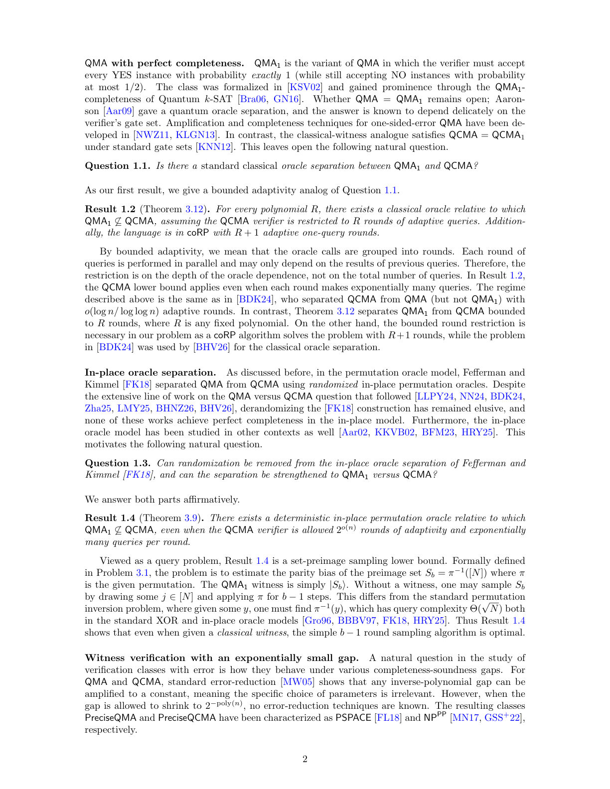 
Low-resolution page preview, page 2

📷 Fig 2

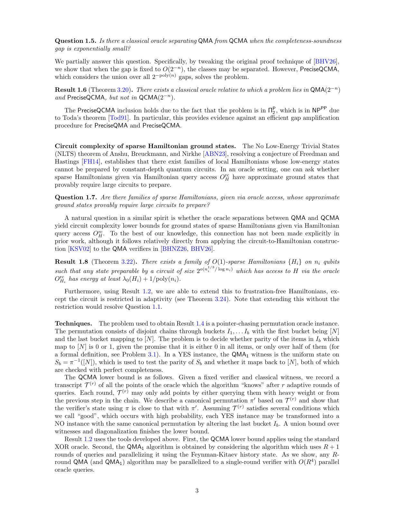 
Low-resolution page preview, page 3

📷 Fig 3

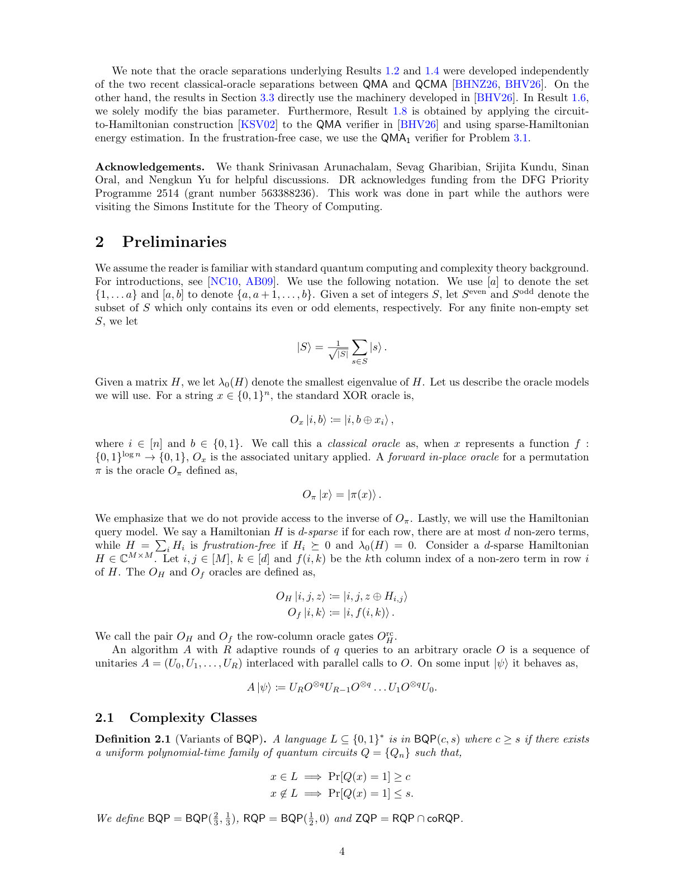 
Low-resolution page preview, page 4

📷 Fig 4

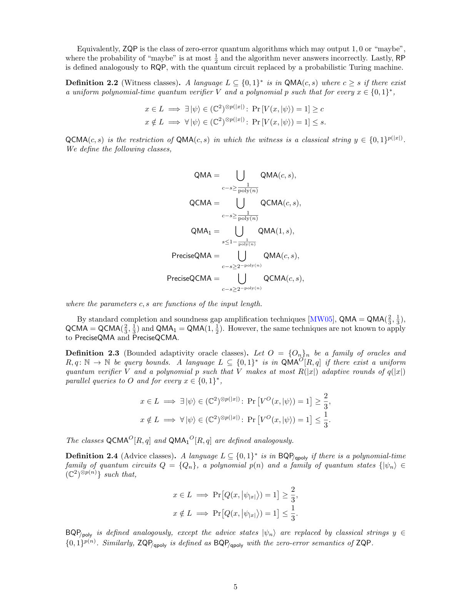 
Low-resolution page preview, page 5

📷 Fig 5

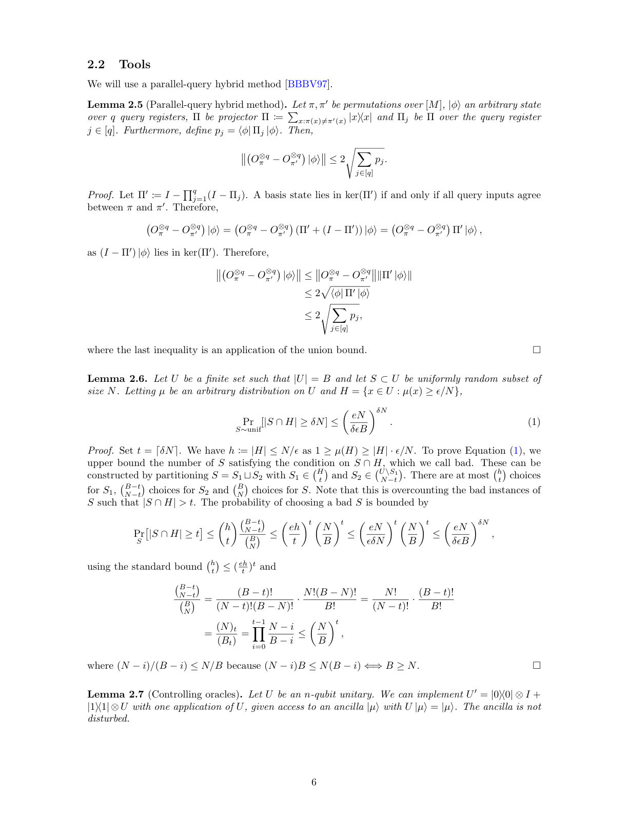 
Low-resolution page preview, page 6

📷 Fig 6

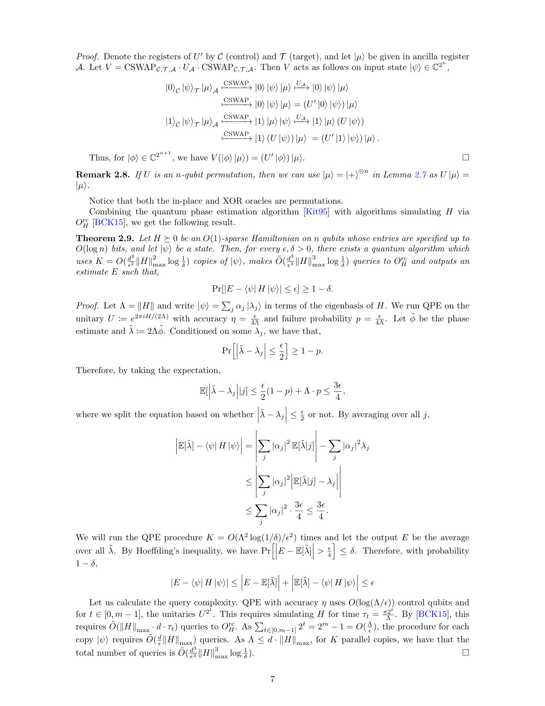 
Low-resolution page preview, page 7

📷 Fig 7

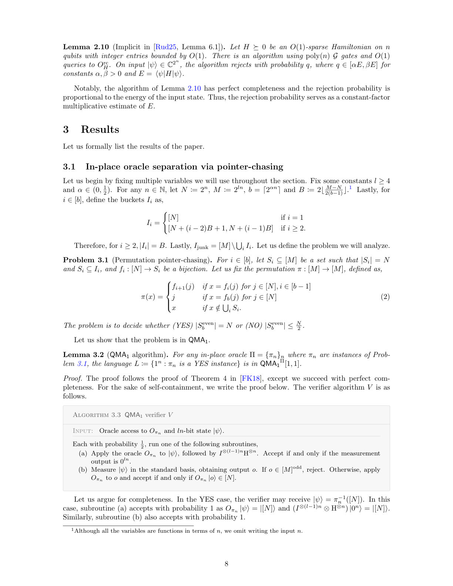 
Low-resolution page preview, page 8

📷 Fig 8

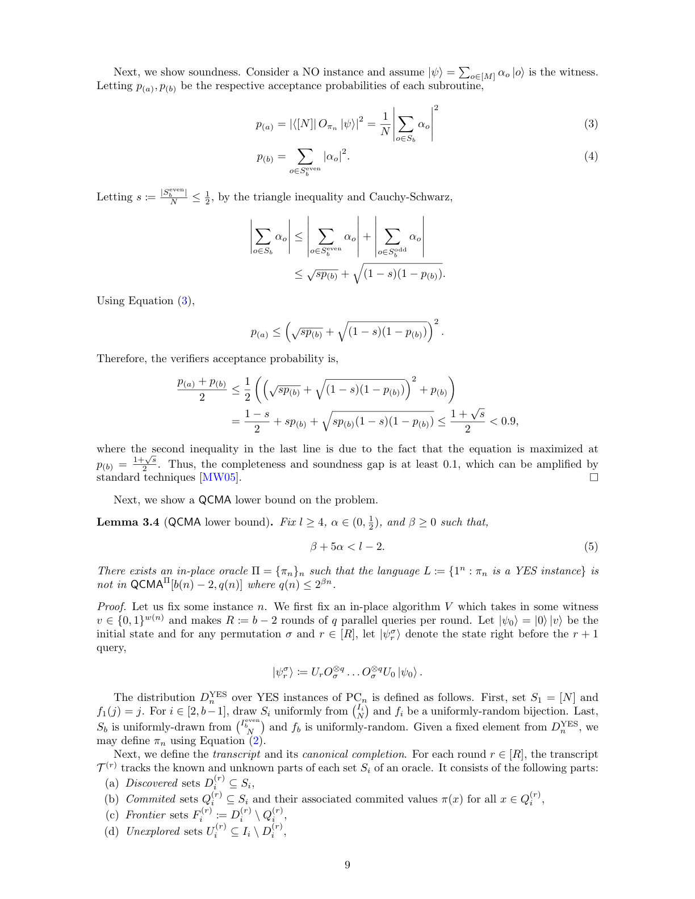 
Low-resolution page preview, page 9

📷 Fig 9

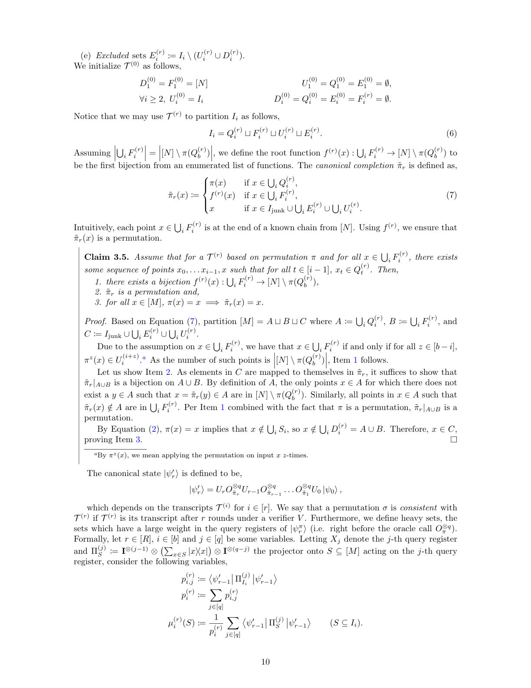 
Low-resolution page preview, page 10

📷 Fig 10

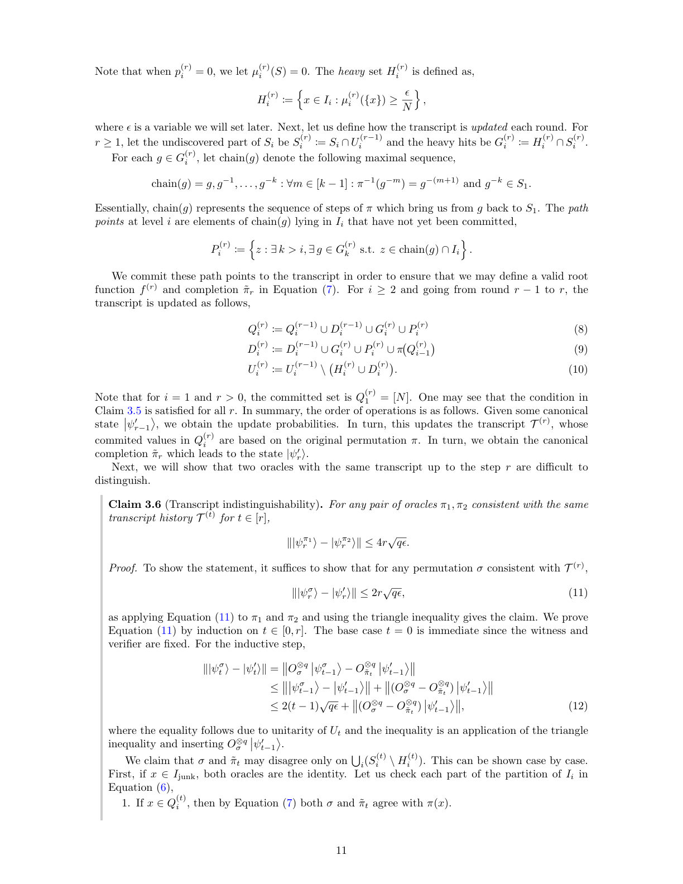 
Low-resolution page preview, page 11

**Main problem.** The paper investigates the computational power of quantum witnesses under perfect completeness, specifically seeking oracle separations between the complexity classes QMA1 and QCMA.

**Main result.** The authors construct classical oracles that separate QMA1 from QCMA under bounded adaptivity and derive an in-place permutation oracle separation. They also establish lower bounds on the circuit complexity required to prepare approximate ground states of certain sparse Hamiltonians.

**Method.** The study employs oracle constructions, derandomization of permutation-based models, and the Feynman-Kitaev history state construction. They use techniques like the parallel-query hybrid method, quantum phase estimation, and transcript analysis to prove lower bounds.

**Summary.** This paper addresses fundamental questions in quantum complexity theory regarding whether quantum witnesses provide more power than classical ones when perfect completeness is required. By constructing specific oracle models, the authors demonstrate a separation between QMA1 and QCMA. Furthermore, they bridge complexity theory and many-body physics by showing that these separations imply high circuit complexity for preparing the ground states of certain sparse, frustration-free Hamiltonians.

Detailed structure

**Model / system.** The work focuses on complexity-theoretic models including sparse Hamiltonians (O(1)-sparse), permutation oracles (in-place and forward), and the Hamiltonian query model (Orc_H).

**Key observables.** Completeness and soundness gaps, ground-state energy, and circuit gate complexity.

**Important parameters / regimes.** Number of adaptive rounds (R), number of parallel queries (q), Hamiltonian sparsity (d), and the precision of the energy gap (exponentially small vs. fixed).

**Assumptions / limitations.** The separation results are sensitive to the number of adaptive rounds and the specific oracle model used; some results assume a specific universal gate set.

**Paper structure.** The paper begins by introducing the QMA1 vs. QCMA problem, followed by the construction of classical oracles for bounded adaptivity. It then moves to the derandomization of permutation oracles to achieve in-place separation, analyzes the impact of small energy gaps, and concludes by applying these complexity results to derive lower bounds on Hamiltonian ground-state preparation.

Abstract

We study the power of quantum witnesses under perfect completeness. We construct a classical oracle relative to which a language lies in $\mathsf{QMA}_1$ but not in $\mathsf{QCMA}$ when the $\mathsf{QCMA}$ verifier is only allowed polynomially many adaptive rounds and exponentially many parallel queries per round. Additionally, we derandomize the permutation-oracle separation of Fefferman and Kimmel, obtaining an in-place oracle separation between $\mathsf{QMA}_1$ and $\mathsf{QCMA}$. Furthermore, we focus on $\mathsf{QCMA}$ and $\mathsf{QMA}$ with an exponentially small gap, where we show a separation assuming the gap is fixed, but not when it may be arbitrarily small. Finally, we derive consequences for approximate ground-state preparation from sparse Hamiltonian oracle access, including a bounded-adaptivity frustration-free variant.

[↑ back to top](#top)

### [Fault-Tolerant Resource Comparison of Qudit and Qubit Encodings for Diagonal Quadratic Operators](http://arxiv.org/abs/2604.26792v1)

**Authors:** Samuel Godwood, Doğa Murat Kürkçüoğlu, Gabriel N. Perdue, Marina Maneyro, Alessandro Roggero  
**Type:** theory · **Category:** quantum information and computing · **PDF:** <https://arxiv.org/pdf/2604.26792v1>  
**Analysis basis:** full PDF text, analyzed in chunks

📷 Fig 1

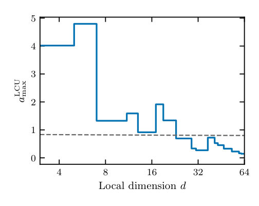 
FIG. 1. Break-even synthesis prefactor aLCU max (d, 3000, 10−6) for the fixed-encoding Regime 2 implementation un- der the coupled per-query error budget. The dashed curve marks the same-precision qubit-Rz effective prefactor aLCU Rz (d, 3000, 10−6) from Eq. 121. Values of aLCU max above this reference prefactor indicate that the fully qudit implementa- tion can match or outperform the qubit baseline in total non- Clifford cost without requiring an embedded two-level qudit synthesis prefactor smaller than the corresponding qubit-Rz effective prefactor. Only prime local dimensions d are in- cluded in the fixed-encoding analysis.

📷 Fig 2

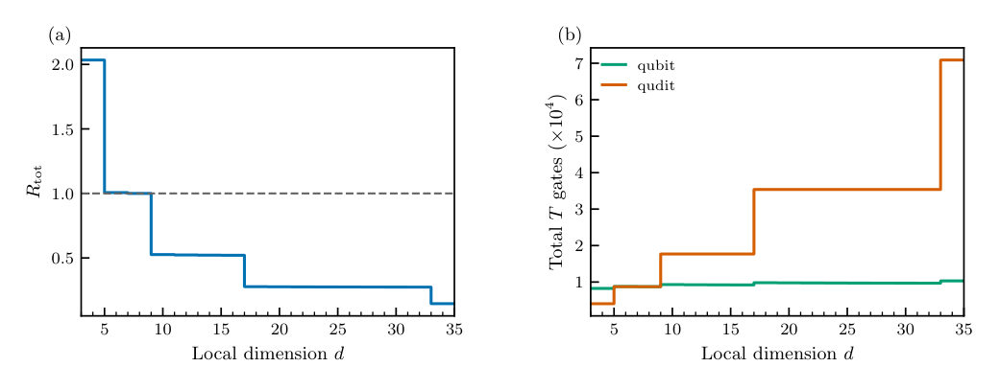 
FIG. 2. Non-Clifford resource comparison for the Regime 2 LCU/block-encoding implementation under the code-switching model, for εsim = 10−6 and t = 0.1. Panel (a) shows the ratio Rtot(d) = T qb tot(d)/T qd tot(d) as a function of the local dimension d. Panel (b) shows the corresponding total T-count estimates T qb tot(d) and T qd tot(d).

📷 Fig 3

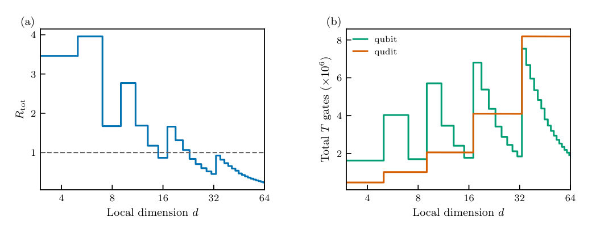 
FIG. 3. Non-Clifford resource comparison for the Regime 2 LCU/block-encoding implementation under the code-switching model, for εsim = 10−6 and t = 3000. Panel (a) shows the ratio Rtot(d) = T qb tot(d)/T qd tot(d) as a function of the local dimension d. Panel (b) shows the corresponding total T-count estimates T qb tot(d) and T qd tot(d). The piecewise-constant structure and repeated crossover windows arise from the binary embedding.

**Main problem.** Comparing the fault-tolerant resource costs, specifically non-Clifford gate counts, between qudit and qubit encodings for implementing diagonal quadratic operators.

**Main result.** While qubit encodings are asymptotically superior, qudits can provide meaningful constant-factor savings in specific finite-dimensional windows, particularly in the LCU framework and time-dominated regimes.

**Method.** The authors analyze two simulation paradigms (product-formula and LCU/block-encoding) using a resource metric of non-Clifford gate counts after synthesis into a discrete gate set.

**Summary.** This paper investigates whether using higher-dimensional qudits can reduce the computational overhead of simulating scalar field theories compared to standard qubit encodings. By analyzing non-Clifford gate costs in both Trotter-based and LCU-based simulation regimes, the authors find that while qubits win asymptotically, qudits offer significant resource savings for small, finite dimensions. The work provides explicit thresholds for quantum compilers to determine when qudit encodings are advantageous.

Detailed structure

**Model / system.** The study focuses on the implementation of diagonal quadratic operators, such as the mass term $e^{-it\phi_x^2}$ in a discretized real scalar field theory using a uniform grid.

**Key observables.** Non-Clifford gate counts (T-count), rotation counts, and the ratio of resource costs between qudit and qubit encodings.

**Important parameters / regimes.** Local dimension $d$, number of qubits $n_b$, synthesis prefactor $a$, target precision $\epsilon$, and simulation time $t$.

**Assumptions / limitations.** The analysis assumes an idealized, negligible-overhead code-switching model between qubits and qudits and focuses on the synthesis cost of embedded $SU(2)$ rotations.

**Figures summary.** Figure 1 shows the break-even synthesis prefactor versus dimension; Figure 2 compares non-Clifford resources in precision-dominated and time-dominated regimes.

**Paper structure.** The paper introduces the problem of qudit vs. qubit encoding, analyzes the product-formula regime, evaluates the LCU framework, performs a secondary analysis using a code-switching model, and concludes with synthesis targets for compilers.

**Why it may be interesting.** It provides critical guidance for designing hardware-efficient quantum algorithms for lattice field theories by identifying specific dimensions where qudit-based architectures outperform standard qubits.

Abstract

Finite local Hilbert-space truncations arise naturally in quantum simulations of lattice field theories and motivate qudit encodings, but their fault-tolerant advantage over qubit encodings remains unclear. We compare the non-Clifford cost of implementing quadratic diagonal evolutions, exemplified by $U=e^{-itφ_x^2}$ in a uniform field-amplitude discretization of a real scalar field, using either one logical $d$-level qudit or $n_b=\lceil \log_2 d\rceil$ logical qubits. We analyze two standard settings: product-formula simulation and LCU/block encoding, taking the resource metric to be the number of non-Clifford gates after synthesis into a discrete logical gate set. Because tight synthesis bounds for general single-qudit rotations are not known, we express the qudit constructions in terms of embedded two-level $SU(2)$ rotations and derive explicit finite-$d$ break-even conditions for their synthesis cost; these serve as compiler targets for when qudit encodings can outperform the qubit baseline. Within the constructive models studied here, product-formula implementations would require an exponentially stronger per-primitive synthesis advantage for qudits to win asymptotically, while in the LCU setting the qubit encoding is asymptotically cheaper in $d$. Nevertheless, the finite-$d$ threshold analysis identifies low dimensional regions in which qudits can yield meaningful constant-factor savings, particularly for LCU-based implementations. As a secondary analysis of the LCU construction, we use an idealized negligible-overhead qubit-qudit code-switching model to give an absolute $T$-count comparison, and reinterpret the savings as an allowable per-switch overhead budget.

[↑ back to top](#top)

### [Finite-Temperature Ferromagnetic Correlations of the Kagome Lattice Hubbard Model](http://arxiv.org/abs/2604.26827v1)

**Authors:** Francisco Correia, Kyle Corbett, Ehsan Khatami  
**Type:** theory · **Category:** strongly correlated electrons · **PDF:** <https://arxiv.org/pdf/2604.26827v1>  
**Analysis basis:** full PDF text, analyzed in chunks

📷 Fig 1

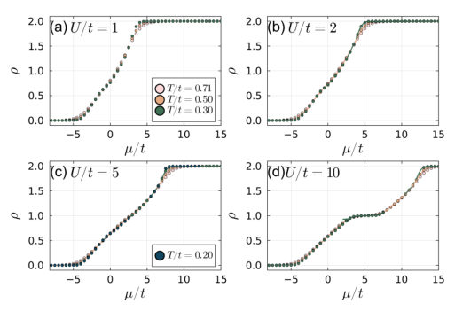 
FIG. 1. The equations of state for select U/t values (a) 1, (b) 2, (c) 5, and (d) 10. Solid lines are converged NLCE results in order 9 after Euler ressumation and circles are from the DQMC simulations. As U/t increases to 10, we see the development of the Mott plateau around half-filling.

📷 Fig 2

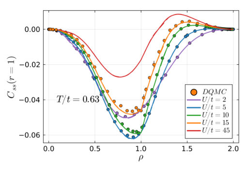 
FIG. 2. The nearest-neighbor spin correlation of the KLHM vs average particle density for different U/t values at a fixed temperature of T/t = 0.625. Solid and dashed lines are NLCE results from the 9th and 8th orders of the expansion, respec- tively, after the Euler resummation. Circles are DQMC re- sults.

📷 Fig 3

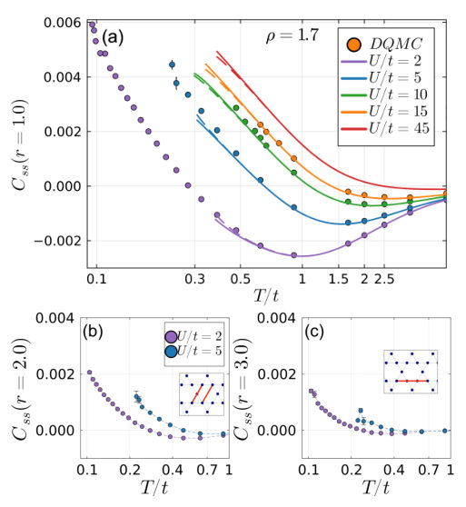 
FIG. 3. (a) The nearest-neighbor spin correlation of the KLHM vs temperature for select U/t values at a fixed av- erage particle density of ρ = 1.7. Lines and symbols are the same as in Fig. 2. (b) &amp; (c) The same as in (a), except for longer-range correlations from DQMC at r = 2.0 and r = 3.0, respectively. Thin dashed lines are guides to the eye. The insets highlight the relevant bonds.

📷 Fig 4

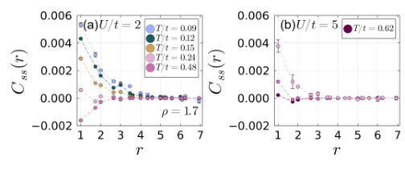 
FIG. 4. Spin correlations vs. distance from DQMC for (a) U/t = 2 and (b) U/t = 5 at different temperatures but all at a fixed average particle density of ρ = 1.7. Lines are guides to the eye.

📷 Fig 5

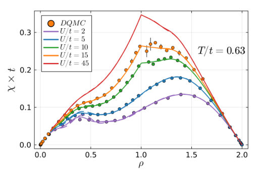 
FIG. 5. The magnetic susceptibility vs. average particle den- sity at a fixed temperature T/t = 0.625 and for different U/t values. Lines and symbols are the same as in Fig. 2.

📷 Fig 6

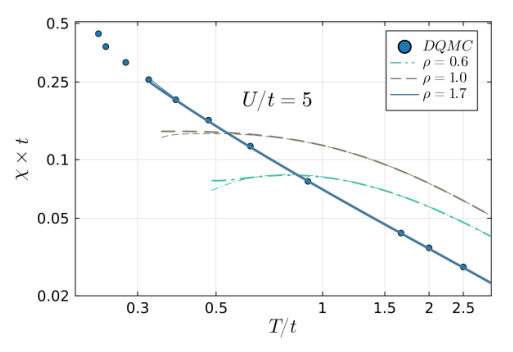 
FIG. 6. Log-log plot of magnetic susceptibility vs tempera- ture for U/t = 5 at particle densities 0.6, 1.0, and 1.7. Thick (thin) lines are NLCE results from the 9th (8th) order of the expansion after resummation and symbols are DQMC results for ρ = 1.7. The results suggest that this quantity peaks at intermediate temperatures when ρ = 0.6 or ρ = 1.0. For ρ = 1.7, however, we observe a strong monotonic growth upon decreasing the temperature to T/t ∼0.2.

📷 Fig 7

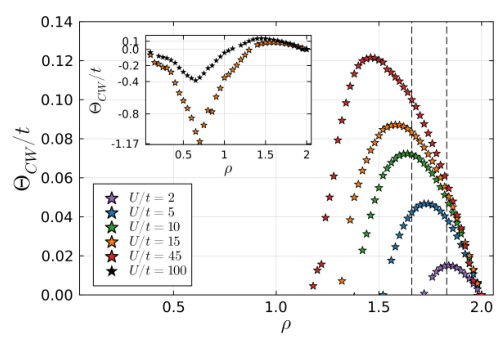 
FIG. 7. Curie-Weiss temperature, extracted from fits of NLCE data to χ = C T −ΘCW , vs particle density for multiple values of interaction strength U/t. Dotted black lines mark the region proven to be a ferromagnet in the ground state for any U &gt; 0 [2].

📷 Fig 8

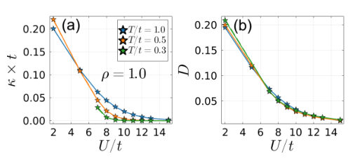 
FIG. 9. NLCE results for the (a) compressibility and (b) double occupancy vs U/t at half filling at temperatures T/t = 1.0, 0.5, and 0.3. We observe a sharp drop in κ around U ∼ 6. The double occupancy also shows a crossing of curves at different temperatures around the same interaction strength.

📷 Fig 9

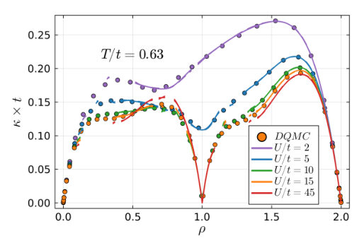 
FIG. 8. The compressibility vs density at a fixed temperature of T/t = 0.625 and for different U/t values. Lines and symbols are the same as in Fig. 2. The compressibility at half filling decreases rapidly at this temperature upon increasing U/t from 5 to 10, a finite-temperature signature of the Mott metal- insulator transition in the ground state.

📷 Fig 10

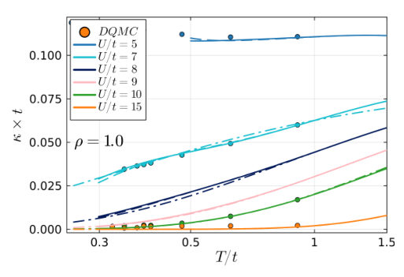 
FIG. 10. The compressibility of the KLHM vs temperature at half-filling for select U/t values. Dash dotted lines are fits of the form κ × t(T) = a exp(−∆c/T).

**Main problem.** The study investigates the development of ferromagnetic correlations and the metal-insulator transition in the Kagome lattice Hubbard model across varying densities and interaction strengths.

**Main result.** The authors find that repulsive interactions enhance ferromagnetic correlations at high densities and that increasing interaction strength extends these correlations toward half-filling, connecting flat-band ferromagnetism to Nagaoka ferromagnetism. They also provide an accurate estimate for the critical interaction strength of the Mott transition at $U_c/t = 6.41(5)$.

**Method.** The study utilizes two exact finite-temperature numerical methods: Numerical Linked-Cluster Expansion (NLCE) and Determinant Quantum Monte Carlo (DQMC).

**Summary.** This paper explores how magnetism evolves in the Kagome lattice Hubbard model. By using exact numerical methods, the authors show how ferromagnetic correlations transition from being driven by flat-band physics to being driven by Mott physics (Nagaoka ferromagnetism) as interaction strength increases. They also precisely locate the metal-insulator transition at half-filling. These findings are significant for understanding strongly correlated electrons in frustrated geometries and provide a roadmap for experiments using ultracold atoms in optical lattices.

Detailed structure

**Model / system.** The Kagome lattice Fermi-Hubbard model, characterized by geometric frustration, a non-interacting flat energy band, and van Hove singularities.

**Key observables.** Spin correlations, magnetic susceptibility, charge compressibility, density of states, charge gap, and Curie-Weiss temperature.

**Important parameters / regimes.** Interaction strength ($U/t$), temperature ($T/t$), and electron density ($
ho$).

**Assumptions / limitations.** The NLCE convergence is limited by the size of the largest clusters at low temperatures, and DQMC is subject to the fermion sign problem.

**Figures summary.** Figures show the equation of state, magnetic susceptibility across different densities and temperatures, Curie-Weiss temperature dependence, and compressibility/double occupancy as functions of interaction strength and temperature.

**Paper structure.** The paper introduces the Kagome Hubbard model, describes the NLCE and DQMC methodologies, presents results on magnetic correlations and susceptibility, analyzes the Mott metal-insulator transition via compressibility, and concludes with implications for future studies.

Abstract

The Kagome lattice Fermi-Hubbard model is one of the most physically rich, and at the same time most challenging, models to study in strongly-correlated physics. Among its special features are geometric frustration and a flat energy band that create conditions favorable to ferromagnetism near the band insulating limit. Here, we utilize two exact finite-temperature methods, the numerical linked-cluster expansion and the determinant quantum Monte Carlo, to study the extent as well as doping and interaction dependence of ferromagnetic correlations and other thermodynamic properties of the model. We find that repulsive interactions enhance ferromagnetic correlations at high electron densities and that increasing the interaction strength, extends the region with strong ferromagnetic correlations towards half filling, smoothly connecting it to Nagaoka ferromagnetism near the Mott insulating region. We also use the charge compressibility to obtain an accurate estimate for the critical interaction strength for the metal-insulator transition at half filling. These results improve our understanding of the magnetic tendencies of the model away from half filling and pave the way for further studies, including with ultracold atoms in optical lattices.

[↑ back to top](#top)

### [Formation of gaseous, doubly charged cerium monofluoride CeF$^{2+}$ and its sensitivity to new physics](http://arxiv.org/abs/2604.26109v1)

**Authors:** R. Simpson, C. Zülch, K. B. Ng, I. Belosevic, C. Charles, P. Justus, R. Berger, S. Malbrunot-Ettenauer, A. A. Kwiatkowski, M. P. Reiter, J. Ash, C. Babcock, J. Bergmann, E. Brisley, J. D. Cardona, C. Chambers, A. Czihaly, A. Gottberg, S. Kakkar, J. Lassen, F. Maldonado Milán, A. Mollaebrahimi, V. Radchenko, E. Taylor, A. Teigelhöfer, C. Walls, A. Weaver, P. Weligampola  
**Type:** both · **Category:** other · **PDF:** <https://arxiv.org/pdf/2604.26109v1>  
**Analysis basis:** full PDF text, analyzed in chunks

📷 Fig 1

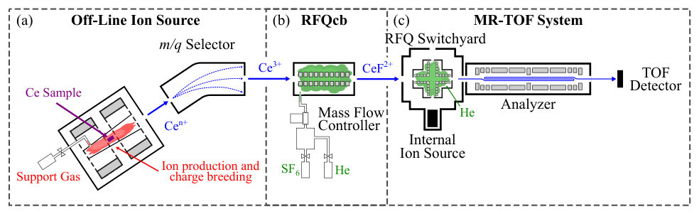 
FIG. 1: Schematic of the experimental apparatus. (a) Cerium ion production within the Multiple-Charge Ion Source at the Off-Line Ion Source, and separation of the desired ion species according to its mass-over-charge ratio m/q. (b) Formation of diatomic cerium fluoride ions and simultaneous cooling and bunching inside the RFQcb. (c) MR-TOF system for mass determination and subsequent ion species identification. See text for details.

📷 Fig 2

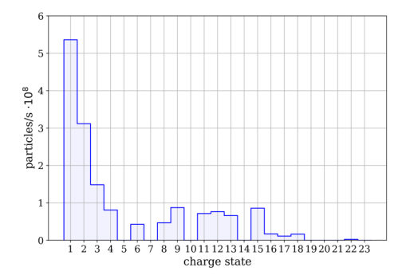 
FIG. 2: Typical cerium cation charge state distribution from the Multi-charge ion source with helium

📷 Fig 3

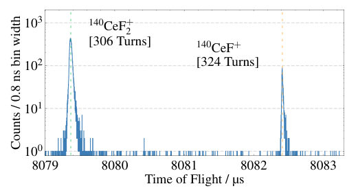 
FIG. 3: A high turn TOF spectrum of 140CeF+ and 140CeF+ 2 ions. Here, CeF+ 2 ions have traversed over 306 turns, providing a mass resolving power of 106,000. The TOF is recorded as the elapsed time since the ion bunch has been injected into the MR-TOF analyzer section [see Figure 1(c)]. The second peak in the spectrum, 140CeF+, although being the lighter of the pair, is seen at a later TOF. This is due to the higher number of turns com- pleted, as indicated in the peak label. The number of turns is carefully chosen such that the release point of the ions allows both species to be seen clearly in the same TOF spectrum. This measurement represents the first high resolution confirmation of the...

📷 Fig 4

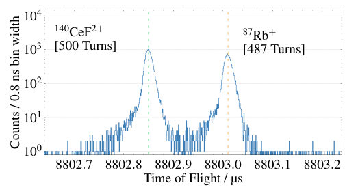 
FIG. 4: A high resolution TOF spectrum (R=296,000) identifying 140CeF2+ after molecular formation with in- coming 140Ce3+ ions. In this 2000 second long measure- ment, the mass range selector [63] is engaged which pro- vided a timed window allowing only the CeF2+ and the 87Rb+ calibrant to pass through while trapped within the MR-TOF analyzer, deflecting all other species.

📷 Fig 5

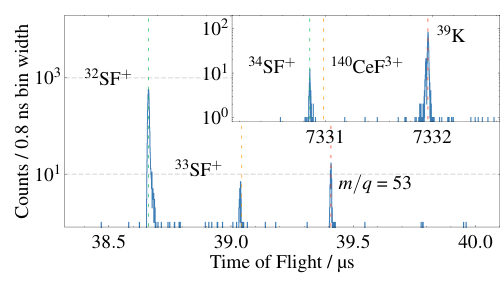 
FIG. 5: Identifying the m/q = 53 peak. A TOF spectrum recorded after a single turn in the MR-TOF analyzer shows a peak corresponding to the m/q of the 140CeF3+

📷 Fig 6

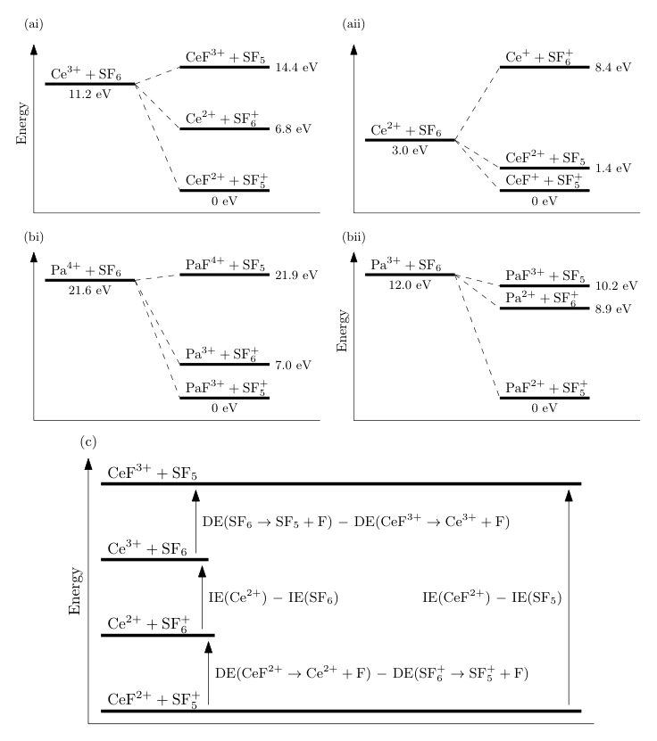 
FIG. 6: Energy level diagrams (not to scale) for reactions of various charges states of cerium [row (a)] and protactinium [row (b)] with neutral sulfur hexafluoride. We only include a selected set of products of interest in the diagrams. Activation barriers and transition states are not included in the diagrams. Energy assignments are performed via minimization of the least squares residuals (residuals correspond to 0.3 eV strain on the energy levels) of a collation of ionization (IE) and dissociation energies (DE) from literature and this work (see Table VII and references therein as well as Figure

📷 Fig 7

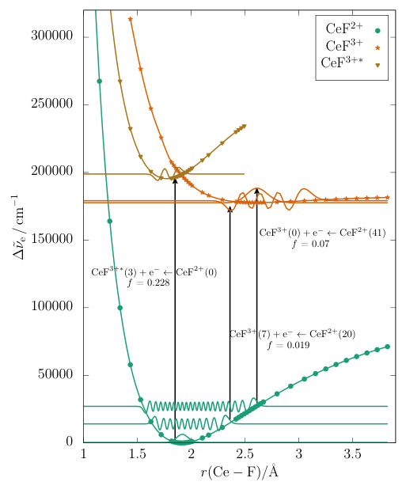 
FIG. 7: Potential energy surface of the electronic ground states of CeF2+ and CeF3+ together with an electron- ically excited state of the trication (CeF3+∗) computed on the level of 2c-ZORA-cGHF. Lines are shown to guide the eye. The wavefunctions of several vibrational states are shown with scaled intensity for visualization indicat- ing possible pathways for quantum control. Exemplary vibronic transitions are shown with vibrational levels in brackets and the Franck–Condon factor f.

📷 Fig 8

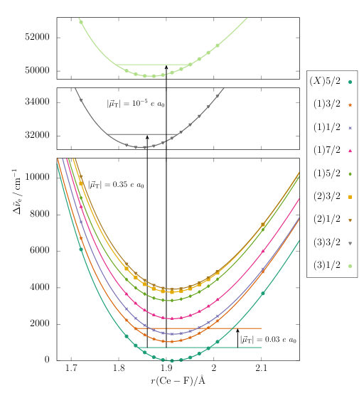 
FIG. 8: Born–Oppenheimer potential energy curves of the nine energetically lowest electronic states of CeF2+

📷 Fig 9

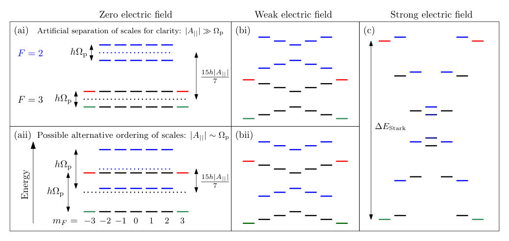 
FIG. 9: Energy landscape (not to scale) of the (X)5/2 (v = 0, J = 5/2) manifold of 140CeF2+. The parameters hΩp and 15h|A|||/7 correspond to the energy difference between the parity states and the hyperfine manifolds, respectively, where h is the Planck constant. ∆EStark corresponds to the Stark shift. The (a), (b), and (c) columns correspond to the cases with zero, weak (∆EStark ≪hΩp), and strong (∆EStark ≫hΩp, h|A|||) external electric fields. In all panes, the vertical direction corresponds to an increase in energy, while the horizontal coordinate reflects the Zeeman sub-levels mF . The dotted lines in the (a) column are to guide the eye to the hyperfine splitting. The (i) row shows the...

📷 Fig 10

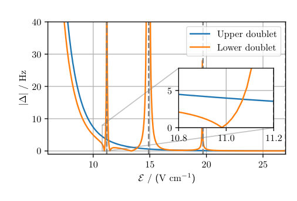 
FIG. 10: Absolute sizes of the effective coupling (|∆|) between oppositely stretched Zeeman states as a func- tion of applied electric field strength (E) with a rotating frequency of frot = 400 kHz. The upper and lower dou- blets are defined in the caption of Figure 9. The vertical dashed lines indicate hyperfine crossings, where the up- per doublet crosses a F = 2 state in energy; the energy degeneracy results in a much stronger effective coupling. For the molecular parameters calculated in this paper, we show the first three hyperfine crossings as the energy levels go from those depicted in (ai) to (bi) to (c) in Fig- ure 9. The first corresponds to when the upper doublet crosses the |F =...

**Main problem.** The paper investigates the feasibility of forming and controlling the doubly charged cerium monofluoride (CeF2+) ion as a stable, isoelectronic surrogate for the radioactive protactinium monofluoride (PaF3+) to search for physics beyond the Standard Model.

**Main result.** The researchers successfully demonstrated the experimental formation and high-resolution mass identification of CeF2+ using the TITAN facility and provided quantum chemical predictions for its electronic structure and sensitivity to P,T-odd properties.

**Method.** Experimental methods include ECR ionization, molecule synthesis via SF6 addition in a RFQ cooler-buncher, and MR-TOF mass spectrometry; theoretical methods involve UCCSD(T) and 2c-ZORA-cGHF ab initio calculations.

**Summary.** This paper presents the experimental production and identification of the doubly charged cerium monofluoride ion (CeF2+) as a surrogate for the radioactive protactinium monofluoride (PaF3+). By using the TITAN mass spectrometer at TRIUMF, the authors demonstrate that CeF2+ can be synthesized in the gas phase using SF6. Theoretical calculations are provided to show that CeF2+ shares an electronic structure with PaF3+, making it a valuable platform for studying parity and time-reversal symmetry violations. The study establishes a foundation for future searches for new physics using controlled molecular ions.

Detailed structure

**Model / system.** The physical system consists of gaseous, multiply charged molecular ions (CeF2+, CeF+, and potentially PaF3+) produced and manipulated within the TITAN ion-trap system at the TRIUMF laboratory.

**Key observables.** Mass-to-charge ratio (m/q), ionization energies, dissociation energies, transition dipole moments, and sensitivity to P,T-odd properties like the nuclear Schiff moment.

**Important parameters / regimes.** Mass resolving power (R > 10^5), ion flux (up to 5 x 10^8 pps), and gas pressures (He buffer gas at ~10^-1 mbar, SF6 at ~10^-3 mbar).

**Assumptions / limitations.** The use of CeF2+ as a valid surrogate assumes the electronic structure of the isoelectronic Ce2+ [Xe]4f2 and Pa3+ [Rn]5f2 configurations are sufficiently similar for sensitivity estimates.

**Figures summary.** Figure 1 shows the experimental workflow from ion production to mass determination; Figure 2 displays charge state distributions; Figure 4 and 5 show high and low resolution TOF mass spectra; Figure 13 illustrates reaction energy landscapes.

**Paper structure.** The paper introduces the motivation (new physics searches), describes the experimental setup at TRIUMF, details the molecular synthesis and mass identification, presents quantum chemical calculations of electronic structure, and concludes with prospects for quantum control.

**Why it may be interesting.** This work is highly relevant to AMO physics as it demonstrates advanced techniques in molecular ion synthesis, mass spectrometry, and the use of molecular spectroscopy to probe fundamental symmetries and precision physics.

Abstract

Tricationic protactinium monofluoride ($^{229}$PaF$^{3+}$) has been proposed as a candidate for probing physics beyond the Standard Model of particle physics. Since studies with $^{229}$PaF$^{3+}$ require significant experimental advances, we exploit the stable, valence-isoelectronic dicationic cerium monofluoride (CeF$^{2+}$) as a surrogate. Gas-phase fluorinated-cerium molecular ions are formed and identified using the Off-Line Ion Source and TITAN mass measurement facilities at TRIUMF. Quantum chemical calculations are performed on the electronic structure of CeF$^{2+}$, revealing a parallel to that of $^{229}$PaF$^{3+}$. Moreover, these calculations provide estimates on the sensitivity of CeF$^{2+}$ itself to various $\mathcal{P,T}$-odd properties. A brief discourse on the specifics of the quantum control of CeF$^{2+}$ is presented which anticipates future searches for symmetry violations.

[↑ back to top](#top)

### [Functional Dimensional Regularization for O(N) Models](http://arxiv.org/abs/2604.26207v1)

**Authors:** P. Beretta, A. Codello  
**Type:** theory · **Category:** statistical mechanics · **PDF:** <https://arxiv.org/pdf/2604.26207v1>  
**Analysis basis:** full PDF text, analyzed in chunks

📷 Fig 1

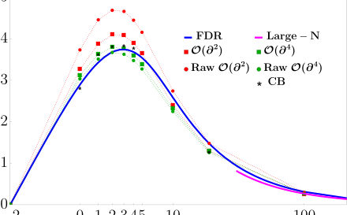 
FIG. 1. Estimate of the critical exponent η as a function of N in d = 3 at FDR-DE2 (blue) with nu = 11, NPRG-DE2 (red- square final result vs red-dot raw data), NPRG-DE4 (green- square final result vs green-dot raw data), large-N (magenta) and CB stars (black).

📷 Fig 2

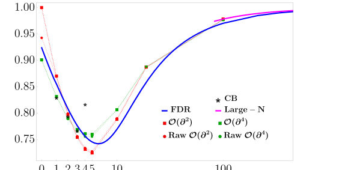 
FIG. 3. Estimate of the critical exponent ω as a function of N in d = 3 at FDR-DE2 (blue) nu = 11, NPRG-DE2 (red-square final result vs red-dot raw data), NPRG-DE4 (green-square final result vs green-dot raw data), large-N (magenta) and CB stars (black).

📷 Fig 3

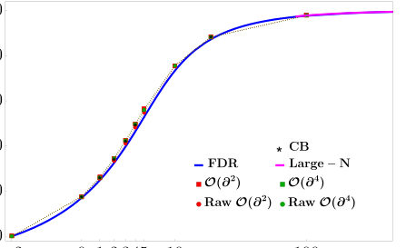 
FIG. 2. Estimate of the critical exponent ν as a function of N in d = 3 FDR-DE2 (blue) with nu = 11, NPRG-DE2 (red- square final result vs red-dot raw data), NPRG-DE4 (green- square final result vs green-dot raw data) and at large-N (ma- genta) and CB stars (black).

**Main problem.** The paper aims to extend the Functional Dimensional Regularization (FDR) scheme to the O(N) universality class and evaluate its efficiency and accuracy in calculating critical exponents.

**Main result.** The authors demonstrate that FDR provides highly efficient and accurate results for critical exponents in the O(N) model, with precision competitive with state-of-the-art methods like the Conformal Bootstrap and higher-order Non-Perturbative Renormalization Group.

**Method.** The study utilizes Functional Dimensional Regularization (FDR) at the second-order derivative expansion (DE2) level, involving a polynomial expansion of the potential and wave-function renormalizations.

**Summary.** This paper investigates the Functional Dimensional Regularization (FDR) scheme applied to the O(N) universality class. The authors show that FDR is a lightweight and efficient method that can produce critical exponents comparable to much more computationally intensive non-perturbative renormalization group and conformal bootstrap methods. By explicitly deriving the flow equations, they prove that the scheme's success is not coincidental. The results demonstrate rapid convergence and high accuracy across a wide range of N values.

Detailed structure

**Model / system.** The study focuses on O(N) symmetric models/universality classes in three dimensions, including specific cases such as the Ising model (N=1), XY model (N=2), Heisenberg model (N=3), and self-avoiding random walks (N=0).

**Key observables.** Critical exponents: anomalous dimension (eta), correlation length exponent (nu), and correction-to-scaling exponent (omega).

**Important parameters / regimes.** Dimension d=3, number of field components N (ranging from -2 to 1000), and mass scale mu.

**Assumptions / limitations.** The analysis is performed using a derivative expansion truncated at the second order (DE2) and a polynomial expansion of the potential and renormalization functions.

**Figures summary.** Figure 1 shows eta vs N; Figure 2 shows nu vs N; Figure 3 shows omega vs N, comparing FDR results against NPRG, Conformal Bootstrap, and large-N limits.

**Paper structure.** The paper introduces the FDR scheme, derives the flow equations for the O(N) model, presents numerical results for various N values, and compares these results against established benchmarks like NPRG and Conformal Bootstrap.

Abstract

The novel functional dimensional regularization (FDR) scheme has proven capable of yielding results that are competitive with the state-of-the-art in the computation of critical exponents in $d=3$, while also reproducing those from the $\varepsilon$-expansion for the Ising and other universality classes. In this work, we show that this is not a mere coincidence: by applying the scheme to the $O(N)$ universality class, we explicitly derive the flow equations and obtain critical exponents that are comparable to those obtained with higher-order non-perturbative approaches. In this case, FDR retains the features already highlighted in previous works -- namely, its efficiency and rapid convergence.

[↑ back to top](#top)

### [Galilean Reeh--Schlieder Obstruction](http://arxiv.org/abs/2604.26271v1)

**Authors:** Leonardo A. Pachon  
**Type:** theory · **Category:** other · **PDF:** <https://arxiv.org/pdf/2604.26271v1>  
**Analysis basis:** abstract only; PDF text extraction failed or PDF unavailable

**Main problem.** The paper investigates whether the Reeh-Schlieder property, a fundamental feature of relativistic algebraic quantum field theory (AQFT), can be maintained within a Galilean-invariant framework.

**Main result.** The author proves that the standard Galilean Haag-Kastler axioms, when combined with Bargmann mass superselection, are mathematically inconsistent with the Reeh-Schlieder property. This identifies the Reeh-Schlieder property as the defining structural difference between relativistic and Galilean AQFT.

**Method.** The proof utilizes algebraic quantum field theory (AQFT) frameworks, specifically examining the interaction between Galilean Schrödinger fields, Bargmann mass superselection rules, and the properties of the Fock vacuum.

**Summary.** This paper establishes a fundamental mathematical distinction between relativistic and Galilean quantum field theories. It proves that the Reeh-Schlieder property—which allows for the preparation of local states from the vacuum—cannot exist in a Galilean-invariant theory with mass superselection. The work shows that the absence of this property in Galilean systems leads to the unavailability of Tomita-Takesaki modular flow, marking a deep structural divergence from relativistic physics.

Detailed structure

**Model / system.** The study focuses on Galilean algebraic quantum field theory (AQFT) nets, specifically those characterized by Schrödinger fields and Bargmann mass superselection charges.

**Important parameters / regimes.** Bargmann mass charges, mass spectrum, and the presence/absence of the Tomita-Takesaki modular flow.

**Assumptions / limitations.** The proof assumes the standard Galilean Haag-Kastler axioms and the presence of Bargmann mass superselection; it also assumes canonical fields carry definite mass charges and admit time-zero restrictions on a stable common dense domain.

**Paper structure.** The paper presents a formal proof of inconsistency, demonstrates how the mass spectrum and vacuum properties are derived consequences of the algebraic structure, and concludes by establishing the Reeh-Schlieder property as the boundary between relativistic and Galilean field theories.

Abstract

We prove that the standard Galilean Haag--Kastler axioms, augmented by Bargmann mass superselection, are inconsistent with the Reeh--Schlieder property: no such net admits a vacuum that is cyclic and separating for every local field algebra. Two ingredients combine: Galilean Schrödinger fields annihilate the Fock vacuum, and Bargmann mass superselection forbids the Hermitian-combination evasion that keeps relativistic axioms consistent. The result extends beyond the Fock-representation hypothesis: any Galilean Haag--Kastler net whose canonical fields carry definite Bargmann mass charges and admit time-zero restrictions on a field-algebra-stable common dense domain is incompatible with Reeh--Schlieder. The bounded-below mass spectrum and the vacuum-at-spectral-minimum, usually imposed as separate axioms, are derived consequences -- of positive-energy boost positivity and a Bose-CCR algebraic descent, respectively. The Tomita--Takesaki modular flow is consequently unavailable on Galilean local field algebras. We identify the Reeh--Schlieder property as the precise structural ingredient distinguishing relativistic from Galilean algebraic quantum field theory: relativistic AQFT has it as a theorem, Galilean AQFT cannot.

[↑ back to top](#top)

### [HyPulse: A Pulse Synthesis Framework for Hybrid Qubit-Oscillator Gates on Trapped-Ion Platform](http://arxiv.org/abs/2604.26804v1)

**Authors:** Masoud Hakimi Heris, Yuan Liu, Frank Mueller  
**Type:** theory · **Category:** quantum information and computing · **PDF:** <https://arxiv.org/pdf/2604.26804v1>  
**Analysis basis:** full PDF text, analyzed in chunks

📷 Fig 1

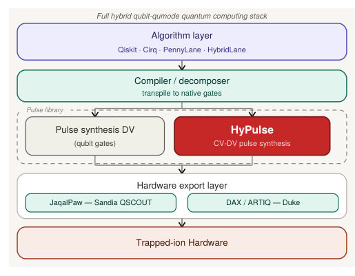 
Fig. 1. Full hybrid qubit-qumode quantum computing stack. HyPulse fills the hybrid qubit-qumode pulse synthesis slot between the compiler/decomposer and the hardware export layer, alongside existing DV-only synthesis tools. The content-addressed pulse library is shared between the offline synthesis phase and the online assembly phase.

📷 Fig 2

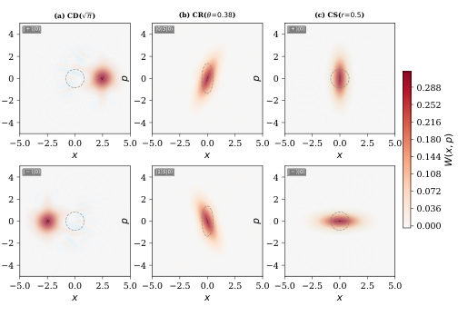 
Fig. 2. Phase-space illustration of the three HyPulse gate primitives. Each column shows one gate. Rows show the motional Wigner function conditioned on the two qubit branches, with dashed contours showing the initial state. (a) CD(√π): opposite displacements along x conditioned on |±⟩. (b) CR(θ = 0.38): opposite phase-space rotations of a squeezed vacuum conditioned on |0⟩, |1⟩. (c) CS(r = 0.5): opposite squeezings along orthogonal quadratures conditioned on |±⟩.

📷 Fig 3

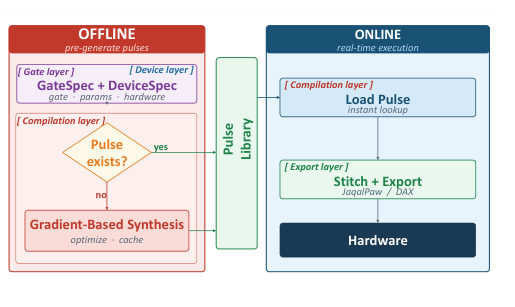 
Fig. 3. HyPulse two-phase architecture. The offline phase runs the optimizer once per (gate, device, model) combination and populates a content-addressed library. The online phase assembles circuits from cached pulses, triggering on- demand synthesis only for parameter combinations not yet in the library.

📷 Fig 4

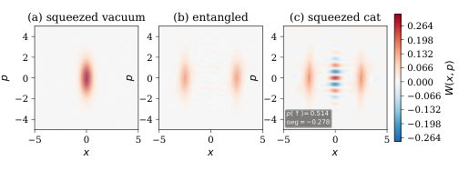 
Fig. 5. Wigner function evolution through the squeezed cat preparation circuit on Sydney hardware parameters. (a) After CS(r = 0.5): squeezed vacuum. (b) After CS + CD(√π): spin-motion entangled state with two separated lobes. (c) After post-selection on | ↑⟩: squeezed cat state with Wigner negativity neg = −0.278, confirming non-classical coherence consistent with Kienzler et al. [36].

📷 Fig 5

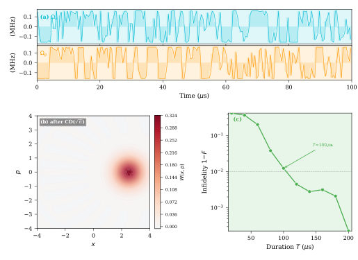 
Fig. 4. CD gate characterization on the hardware parameters from Table III. (a) Optimized pulse waveforms Ωx(t) (blue) and Ωp(t) (orange) for T = 100 µs, showing both channels bounded within the hardware amplitude limit. (b) Wigner function of the motional mode after CD(√π), confirming a coherent displacement. (c) Infidelity 1−F vs. gate duration T, demonstrating the pre-characterization sweep capability of the framework.

📷 Fig 6

 
Fig. 5 shows the Wigner function at each circuit stage. After CS (panel a), the vacuum Gaussian is elongated along P, con- firming squeezing. After CD (panel b), the state is entangled: Two separated squeezed lobes are visible, corresponding to the two spin-conditioned displacement branches. After post- selection on | ↑⟩(panel c), the motional mode is projected onto the squeezed cat state with peak Wigner negativity neg = −0.278 and post-selection probability p(↑) = 0.514 ≈0.5, consistent with the expected even-parity cat state. The clear Wigner negativity in panel (c) is the definitive signature of non-classical coherence, confirming that the two HyPulse-compiled primitives compose...

📷 Fig 7

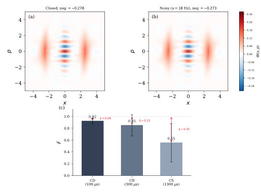 
Fig. 6. Noise characterization under the motional dephasing model reported in Matsos et al. [7] (γ = 18 Hz, 500 trajectories). (a) Closed-system squeezed cat Wigner function, neg = −0.278. (b) Noisy Wigner function averaged over 500 trajectories, neg = −0.273: negativity preserved. (c) Per-gate noisy fidelity Fnoisy for CD, CR, and CS. CD and CR are less affected by noise; CS is limited by its 1300 µs gate duration, a hardware constraint addressable by improved sideband Rabi rates.

**Main problem.** There is a missing compilation layer in the quantum software stack that connects high-level hybrid qubit-oscillator gate primitives to hardware-level pulse waveforms for trapped-ion platforms, specifically addressing the difficulty of optimizing continuous parametric gates.

**Main result.** The authors present HyPulse, a two-phase pulse synthesis framework that uses a content-addressed cache to efficiently reuse optimized pulses, achieving high gate fidelities (F > 0.99) and successful numerical preparation of a squeezed cat state.

**Method.** A two-phase architecture consisting of an offline optimization engine (using gradient-based GRAPE) to populate a hashed pulse library and an online assembler to stitch waveforms into hardware-executable programs for DAX/ARTIQ and JaqalPaw.

**Summary.** HyPulse is a new software framework designed to automate the synthesis and assembly of complex pulses for hybrid qubit-oscillator gates in trapped-ion systems. It solves the bottleneck of manually optimizing every unique parameter set by using a smart caching system that recognizes when a pulse can be reused. The framework is compatible with major hardware backends like ARTIQ and QSCOUT. By allowing researchers to pre-characterize gates numerically, it helps identify hardware constraints before physical experiments are even performed.

Detailed structure

**Model / system.** A hybrid qubit-oscillator system on a trapped-ion platform, utilizing laser-driven sideband interactions to couple a spin qubit to a bosonic motional mode.

**Key observables.** Gate fidelities (closed and noisy systems), Wigner function negativity, and phase-space displacements/rotations/squeezing.

**Important parameters / regimes.** Lamb-Dicke parameter (eta), motional frequency (omega_m), qubit transition frequency (omega_q), sideband detuning (Delta), and squeezing/displacement amplitudes (alpha, zeta, theta).

**Assumptions / limitations.** The validation is purely numerical/simulated; the noise model is restricted to motional dephasing; and effects like AC Stark shifts or cross-mode coupling are not considered.

**Figures summary.** Figure 1 shows the hybrid quantum computing stack; Figure 2 illustrates phase-space transformations for gate primitives; Figure 3 diagrams the HyPulse architecture; Figure 4 shows optimized waveforms and infidelity sweeps; Figure 5 shows the Wigner function evolution for a squeezed cat state.

**Paper structure.** The paper introduces the compilation gap, describes the HyPulse four-layer abstraction architecture (Device, Gate, Compilation, Export), details the two-phase synthesis/assembly process, validates the framework via numerical gate fidelity and state preparation simulations, and concludes with future directions.

**Why it may be interesting.** It provides a systematic way to bridge the gap between continuous-variable and discrete-variable quantum control, offering a scalable software approach to managing the complex, parametric pulse landscapes required for hybrid bosonic-qubit architectures.

Abstract

As hybrid qubit-oscillator algorithm development and trapped-ion hardware demonstrations advance in parallel, there is a lack of a compilation layer connecting the two at the pulse level in the vertical software stack. While qubit gate control and pulse synthesis are well-established, the translation of hybrid qubit-oscillator primitives to the pulse level has not been systematically addressed. This gap is further compounded by the inherently continuous parametric nature of such gates. Each distinct parameter value defines a physically unique operation requiring independent pulse optimization, making static pre-compilation strategies inapplicable. To fill this gap, we present HyPulse, a hardware-aware pulse synthesis and generation framework, which contributes a two-phase architecture decoupling pulse discovery from circuit assembly. An offline optimization engine populates a content-addressed cache of high-fidelity primitives: If a pulse for a given gate, parameter, and device specification already exists in the library, it is retrieved instantly; otherwise the optimizer synthesizes, hashes, and caches it automatically. An online assembler then constructs circuit-specific pulse programs ready to drive trapped-ion hardware control systems via DAX/ARTIQ (Duke) and JaqalPaw/QSCOUT (Sandia), trapped-ion pulse execution backends.

[↑ back to top](#top)

### [Iterative warm-start optimization with quantum imaginary time evolution](http://arxiv.org/abs/2604.26047v1)

**Authors:** Phillip C. Lotshaw, Titus Morris, Stuart Hadfield, Ryan Bennink  
**Type:** theory · **Category:** quantum information and computing · **PDF:** <https://arxiv.org/pdf/2604.26047v1>  
**Analysis basis:** full PDF text, analyzed in chunks

📷 Fig 1

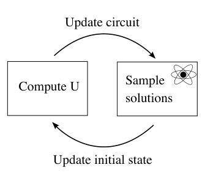 
Fig. 1. The iterative quantum optimization algorithm uses a conventional computer (left) to compute a circuit that attempts to decrease the energy of the best-known solution, then sends the circuit to a quantum computer (right) which executes the circuit to update the best-known solution.

📷 Fig 2

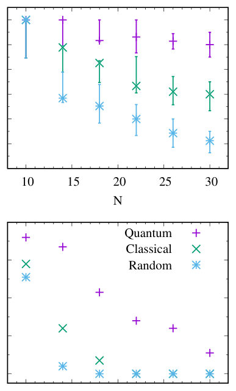 
Fig. 2. Performance of the protocol for MaxCut on collections random 3-regular graphs. (top) Using 100 total measurements the approach yields median normalized cost values that are close to optimal for N ≤30, outperforming random search and a ”classical” version of the protocol that omits the quantum imaginary time evolution. Error bars show quartiles of the distributions. (bottom) The algorithm obtains significant optimal solution probabilities out to N = 30, while the classical and random searches do not.

📷 Fig 3

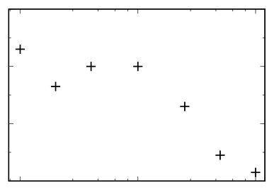 
Fig. 3. Performance at N = 22 as the number of iterations Nit and the number of shots per iteration Nshots/it are varied, with a fixed shot budget Nshots = 100.

📷 Fig 4

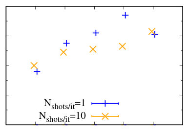 
Fig. 4. Performance at N = 22 as the number of shots Nshots is varied.

**Main problem.** Efficiently approximating NP-hard combinatorial optimization problems, specifically Max-Cut, using quantum algorithms with limited shot budgets and circuit depth.

**Main result.** The iterative warm-start QITE algorithm achieves median solutions within 95% of the global optimum and finds exact optimal solutions in 11% of cases for 3-regular graphs with up to 30 vertices, significantly outperforming random and classical search methods.

**Method.** A non-variational, iterative algorithm that uses Quantum Imaginary Time Evolution (QITE) to evolve a state initialized near the best-known solution. The circuit parameters are determined classically using analytic equations to avoid quantum device queries during the derivation phase.

**Summary.** This paper proposes a new non-variational quantum algorithm for solving combinatorial optimization problems like Max-Cut. Instead of using a fixed ansatz, the algorithm uses an iterative 'warm-start' approach where each step begins with a state centered around the best solution found so far. By applying Quantum Imaginary Time Evolution, the algorithm drives the state toward lower energy levels. Simulations show that this method is highly efficient, finding near-optimal or exact solutions even with a very small number of quantum measurements.

Detailed structure

**Model / system.** The study focuses on the unweighted Max-Cut problem on 3-regular graphs, modeled by a Hamiltonian consisting of Pauli Z-Z interaction terms.

**Key observables.** Normalized cost (relative to the global optimum) and the probability of finding the exact optimal solution.

**Important parameters / regimes.** Shot budget (tested at 100 total shots), number of iterations (N_it = 10), imaginary time step (delta_tau = 0.1), and the initial state superposition parameter (phi) which varies from pi/4 to 0.

**Assumptions / limitations.** The algorithm assumes that the circuit parameters can be computed analytically for product states and that the problem can be effectively represented by a pairwise ansatz.

**Figures summary.** Figure 1 provides a schematic of the classical-quantum hybrid loop; Figure 2 shows the median normalized cost and the fraction of optimal solutions found compared to other search methods.

**Paper structure.** The paper introduces the problem of combinatorial optimization, describes the proposed iterative warm-start QITE algorithm and its classical-quantum workflow, presents numerical simulation results on 3-regular graphs, and concludes with discussions on limitations and future research directions.

Abstract

Approximate combinatorial optimization is a promising use case for quantum computers. The quantum optimization algorithms often employ a fixed ansatz that evolves an unbiased initial state towards states with better values of the optimand, then samples the states to determine an approximately optimal solution. However, promising alternative approaches have considered ``warm-start" and sampling-based methods that instead begin from the best known solution, which can be directly optimized with the quantum computer and updated as new information becomes available, potentially outperforming the fixed ansätze. Here we use these ideas to design a nonvariational quantum algorithm for combinatorial optimization. At each step the algorithm begins with a state superposed around the best known solution, then drives it to lower energy using quantum imaginary time evolution. These nonvariational, initial-state-dependent circuits are determined using analytic equations that are evaluated using only a conventional computer. After implementing the circuits, the state is sampled, potentially obtaining a new best-known solution to use as the initial state at the next iteration. Using simulations of the algorithm solving MaxCut on 3-regular graphs with 30 or fewer vertices and a shot budget of 100 total shots, the approach obtains median solutions within 95\% of the global optimum and finds optimal solutions in 11\% or more of cases, significantly outperforming random and simplified classical search procedures. We discuss several future directions.

[↑ back to top](#top)

### [Magnetononlinear Hall effect from multigap topology in metal-organic frameworks](http://arxiv.org/abs/2604.26028v1)

**Authors:** Chun Wang Chau, Wojciech J. Jankowski, Bo Peng, Robert-Jan Slager  
**Type:** both · **Category:** strongly correlated electrons · **PDF:** <https://arxiv.org/pdf/2604.26028v1>  
**Analysis basis:** full PDF text, analyzed in chunks

📷 Fig 1

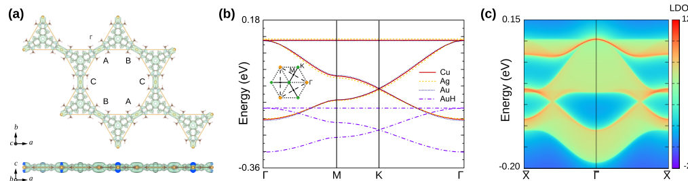 
FIG. 1. Multigap topology in metal-organic frameworks. (a) Crystal structure of two-dimensional metal-organic NHC- Au kagome lattice framework, top view (above) and front view (below). The partial charge density of the kagome bands near the Fermi level is shown by the light cyan isosurface, indicating delocalized features across the kagome lattice, against the localized orbitals around metallic atoms. The hybridized states of the gold atoms and NHC ligands constitute the kagome basis orbitals A, B, C. (b) Comparison of band structure sections of kagome NHC-X (X = Au, Ag, Cu, AuH) metal-organic frameworks across hexagonal BZ, with quadratic band touching at the Γ point (BZ center), and...

📷 Fig 2

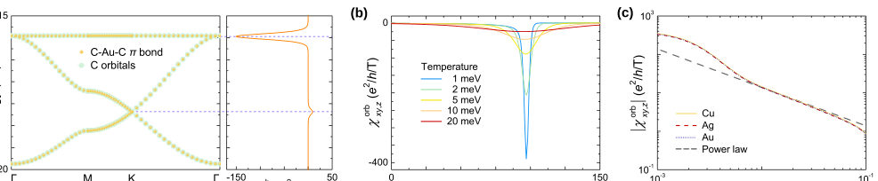 
FIG. 2. Magnetononlinear Hall effect from non-Abelian Euler band topology. (a) Orbital-projected kagome bands with e2 = 1 in NHC-Au metal-organic framework and nonlinear magnetoelectric Hall response at different dopings (µ). (b) Temperature dependence of the magnetononlinear Hall effect around the quadratic node in NHC-Au metal-organic frame- work. (c) Scaling of the magnetononlinear Hall response at temperature T = 1 meV in the NHC-X (X = Au, Ag, Cu) metal- organic frameworks, against the power-law dependence, χorb xy,z ∝|e2|/µ, arising from the multiband topology via non-Abelian Berry connection vorticity.

**Main problem.** The study aims to identify and detect non-Abelian multigap band topology, specifically characterized by non-trivial Euler class invariants, using measurable transport phenomena.

**Main result.** The authors demonstrate that non-Abelian multigap topology induces an observable magnetononlinear Hall effect in 2D kagome metal-organic frameworks, providing a 'smoking-gun' probe for these topological states.

**Method.** The researchers combined first-principles DFT calculations with Wannier-based transport simulations (WannierBerri, WannierTools) and analytical continuum k.p models.

**Summary.** This paper explores the discovery of non-Abelian multigap topology in 2D metal-organic frameworks. By studying kagome-structured NHC-X materials, the authors show that the Euler class topology leads to a measurable magnetononlinear Hall effect. They demonstrate that this effect is highly tunable via chemical substitution, temperature, and voltage. This work establishes a new way to experimentally detect complex, non-Abelian topological invariants in organic-based materials.

Detailed structure

**Model / system.** The physical platform is a class of 2D kagome N-heterocyclic carbene (NHC) metal-organic frameworks (NHC-X, where X = Au, Ag, or Cu) featuring a three-band subspace near the Fermi level.

**Key observables.** Magnetononlinear Hall response (specifically the $\chi_{xy,z}^{orb}$ component), multi-gap edge states, and the Euler class invariant ($e_2$).

**Important parameters / regimes.** Chemical potential ($\mu$), temperature ($T$), external voltage, and chemical substitution (Au, Ag, Cu); regimes include the flat band limit and zero-temperature limit.

**Assumptions / limitations.** The analytical derivation relies on a low-energy physics approximation via a $k \cdot p$ continuum model and focuses primarily on the zero-temperature limit.

**Figures summary.** Fig 1 shows the crystal structure, band structures, and edge states of the NHC-X kagome lattice. Fig 2 displays the nonlinear Hall response as a function of doping and temperature, including scaling behavior.

**Paper structure.** The paper introduces the material platform and topological features, presents DFT-based electronic structure and edge state analysis, derives the analytical magnetononlinear Hall response using a continuum model, and validates the results through numerical transport simulations.

Abstract

We unveil that non-Abelian multigap band topology characterized by nontrivial Euler class invariants induces observable magnetononlinear Hall transport phenomena. We demonstrate these effects in a highly-tunable class of recently synthesized two-dimensional kagome N-heterocyclic carbene (NHC) metal-organic frameworks. We showcase the controllability of the nonlinear effect upon applying external voltage, changing temperature, and chemical substitutions that preserve the bulk topology and associated edge states. Our findings therefore reveal an uncharted presence of Euler class topology in metal-organic materials that can be experimentally deduced through measurable magnetotransport.

[↑ back to top](#top)

### [Multi-Objective Optimization by Quantum-Annealing-Inspired Algorithms](http://arxiv.org/abs/2604.26477v1)

**Authors:** Xian-Zhe Tao, Pavel Mosharev, Man-Hong Yung  
**Type:** both · **Category:** quantum information and computing · **PDF:** <https://arxiv.org/pdf/2604.26477v1>  
**Analysis basis:** full PDF text, analyzed in chunks

📷 Fig 1

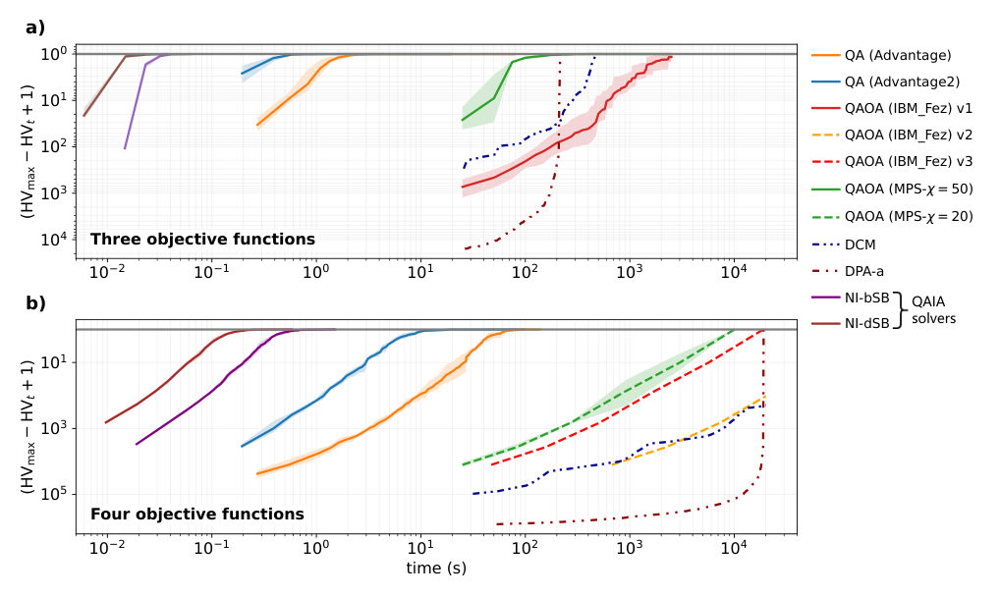 
Figure 1: Convergence of different algorithms towards the Pareto front. The y-axis shows the Hypervolume difference (HVmax −HVt + 1) in logarithmic scale, and the x-axis represents the sampling time in seconds. Data for all algorithms, except for SB, is taken from References [19, 22]. See details and hardware information in Table 1.

📷 Fig 2

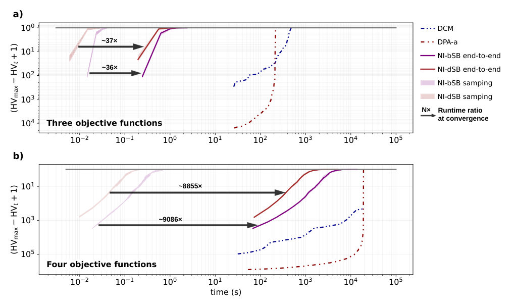 
Figure 2: Comparison of sampling time with full Pareto front reconstruction time. The y-axis shows the Hypervol- ume difference (HVmax −HVt + 1) in logarithmic scale, and the x-axis represents the end-to-end time in seconds. DCM and DPA-a are classical baseline algorithms. End-to-end time for NI-dSB and NI-bSB includes both model construction and filtering of Pareto optimal solutions from the sampled candidate set.

📷 Fig 3

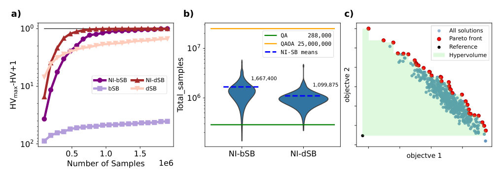 
Figure 3: a) Convergence to optimal hypervolume for original and noisy SB. b) Distribution of numbers of samples needed by NI-SB to discover whole Pareto set of the 3-objective problem. Values for Quantum Annealing and QAOA according to [22] and [19]. c) Illustration of the Pareto front for two-objective problem with correlation coefficient between the two objectives equal approximately to −0.92.

📷 Fig 4

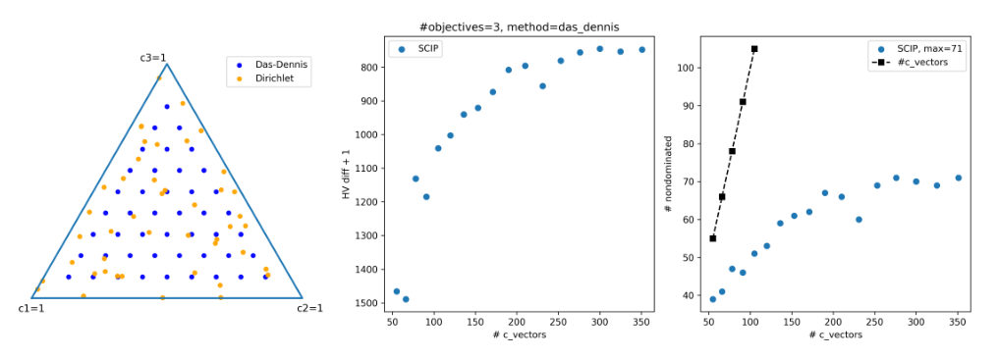 
Figure 4: Left: Das-Dennis simplex lattice points compared to random Dirichlet distribution for 3-objective problem. Middle: Hypervolume difference for solutions found by exact solver at each number of fixed weight vectors. Right: Number of Pareto-optimal solutions found by exact solver at each number of fixed weight vectors.

📷 Fig 5

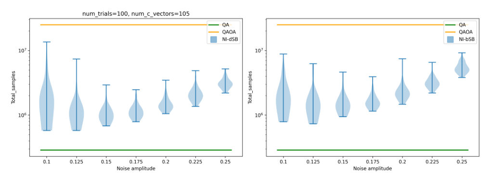 
Figure 5: Total sample size required to reach optimal hypervolume, depending on different amplitude of noise injected in the algorithm. Left: NI-dSB. Right: NI-bSB. Values for QA and QAOA from references [22, 19].

📷 Fig 6

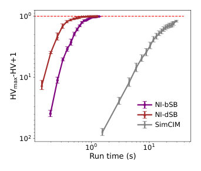 
Figure 6: Comparison of SimCIM and NI-SB. The y-axis shows the Hypervolume difference (HVmax −HVt + 1) in logarithmic scale, and the x-axis represents the end-to-end run time in seconds.

**Main problem.** The paper addresses the challenge of efficiently solving Multi-Objective Optimization (MOO) problems, specifically the Multi-Objective MaxCut (MO-MaxCut) problem, by comparing quantum-inspired algorithms against quantum hardware and classical heuristics.

**Main result.** GPU-accelerated Quantum-Annealing-Inspired Algorithms (QAIAs), specifically a noise-injected version of Simulated Bifurcation, outperform both quantum annealers and gate-based quantum circuits in end-to-end runtime and sampling speed, while also surpassing industry-leading classical heuristics.

**Method.** The authors utilize GPU-accelerated Simulated Bifurcation (SB) algorithms, specifically introducing a Gaussian-noise variant (NI-bSB and NI-dSB) to increase sample diversity and coverage of the Pareto front.

**Summary.** This paper re-evaluates the practical utility of quantum processors for multi-objective optimization by accounting for the full end-to-end computational overhead. It demonstrates that GPU-based quantum-inspired algorithms, such as noise-injected Simulated Bifurcation, are significantly faster and more efficient than current quantum annealers and gate-based circuits. By providing a superior classical baseline, the study highlights the high bar that near-term quantum hardware must overcome to demonstrate practical advantage in combinatorial optimization.

Detailed structure

**Model / system.** The problem is modeled using an Ising Hamiltonian framework on an undirected graph, where multiple conflicting objectives are addressed via a scalarized Hamiltonian using the weighted sum method and a Das-Dennis simplex-lattice design for weight generation.

**Key observables.** Hypervolume (HV) indicator, end-to-end runtime, sampling speed (velocity), sample diversity, and Pareto dominance.

**Important parameters / regimes.** Noise amplitude (alpha), node count (n), edge density (d), batch size, and the number of objectives (K).

**Assumptions / limitations.** The evaluation assumes the effectiveness of the weighted sum method for scalarization and relies on the selection of a reference point for the Hypervolume calculation.

**Figures summary.** Figures compare the runtime ratio of NI-SB against classical baselines, show the convergence of hypervolume for noisy vs. original SB, illustrate the distribution of samples needed to recover the Pareto set, and demonstrate the growth of the hypervolume difference relative to weight vector count.

**Paper structure.** The paper introduces the MO-MaxCut problem, defines the Ising Hamiltonian and scalarization method, describes the implementation of the noise-injected Simulated Bifurcation algorithm, presents a comparative benchmark against quantum and classical solvers, and concludes with performance analysis across different scales.

Abstract

Combinatorial optimization is widely regarded as a primary application for near-term quantum processors, although a definitive demonstration of the practical quantum advantage remains elusive. Recent studies have reported that both gate-based quantum circuits and quantum annealers can outperform state-of-the-art classical heuristics on multi-objective optimization (MO-MaxCut) problems. However, these studies did not fully account for the substantial pre- and post-processing overheads intrinsic to quantum solvers, leading to incomplete comparisons between quantum and classical approaches. In this work, we re-examine the same benchmark suite using GPU-based quantum-annealing-inspired algorithms (QAIAs), which, analogously to quantum processors, generate probabilistic samples and thus serve as formidable classical contenders. Our results show that QAIAs can sample candidate solutions approximately two orders of magnitude faster than previously studied quantum processors. In terms of end-to-end runtime, QAIAs also surpass industry-leading classical solvers, thereby establishing themselves as the superior performers among the quantum and classical solvers evaluated thus far for the MO-MaxCut instances.

[↑ back to top](#top)

### [Parameterized Quantum Circuits as Feature Maps: Representation Quality and Readout Effects in Multispectral Land-Cover Classification](http://arxiv.org/abs/2604.26675v1)

**Authors:** Ralntion Komini, Aikaterini Mandilara, Georgios Maragkopoulos, Dimitris Syvridis  
**Type:** theory · **Category:** quantum information and computing · **PDF:** <https://arxiv.org/pdf/2604.26675v1>  
**Analysis basis:** full PDF text, analyzed in chunks

📷 Fig 1

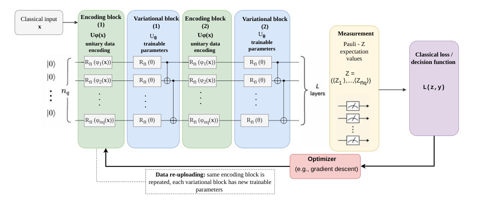 
FIG. 1. Generic VQC architecture with data re-uploading. A classical input sample x is encoded

📷 Fig 2

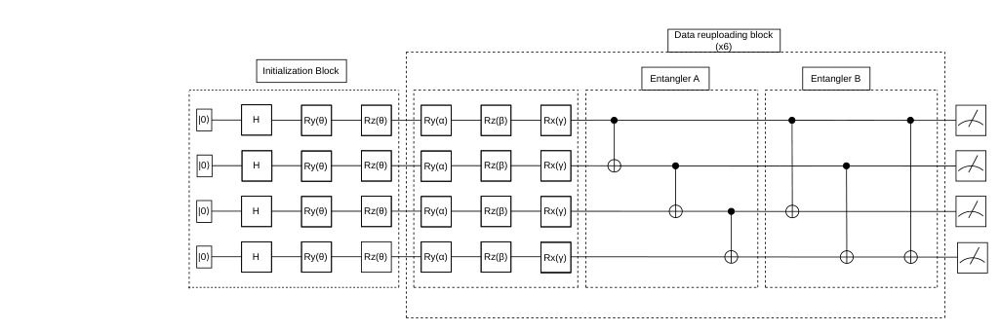 
FIG. 2. Four-qubit PQC used in this work. The initialization block contains parameter-only

📷 Fig 3

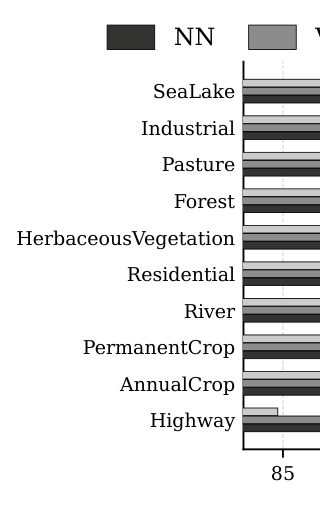 
FIG. 3. Mean per-class test accuracy averaged over five seeds.

📷 Fig 4

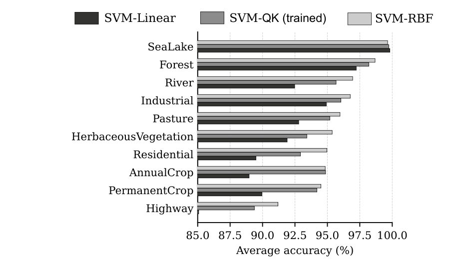 
FIG. 4. Mean per-class test accuracy averaged over five seeds comparing SVM-linear, SVM-QK

📷 Fig 5

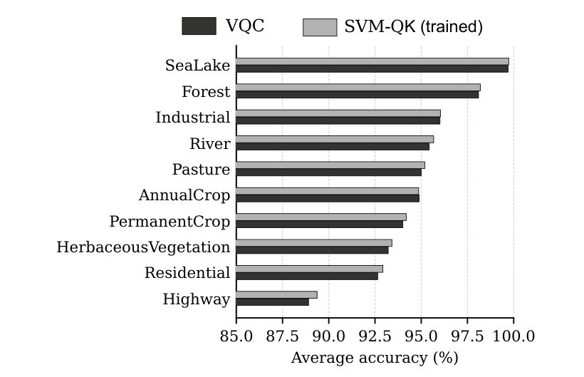 
FIG. 5. Mean per-class test accuracy averaged over five seeds comparing the VQC and an SVM-QK

📷 Fig 6

 
Figure 6 shows the average VQC test accuracy as the number of qubits is increased from

📷 Fig 7

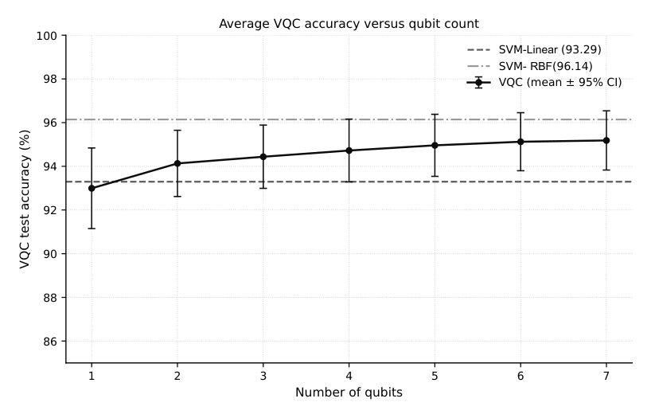 
FIG. 6. Average VQC test accuracy versus qubit count on PCA-32 inputs, averaged over all 45

**Main problem.** Investigating the effectiveness of Variational Quantum Classifiers (VQCs) as nonlinear feature maps for multispectral land-cover classification and determining how the choice of readout mechanism affects performance.

**Main result.** While VQCs with linear readout do not outperform classical RBF-SVMs, the trained quantum feature map significantly improves performance when used within a kernel-based decision framework (SVM-QK).

**Method.** The authors perform a systematic one-vs-one evaluation on the EuroSAT-MS dataset, comparing VQCs and Quantum Kernel SVMs against classical baselines like Logistic Regression, SVMs, and Neural Networks using noiseless state-vector simulations.

**Summary.** This paper explores using parameterized quantum circuits as learned nonlinear feature maps for satellite imagery classification. It demonstrates that while standard quantum classifiers struggle to beat classical models, the learned quantum representation is highly effective when integrated into a classical kernel-based SVM. The study also identifies a saturation effect in performance as the number of qubits increases. Ultimately, it suggests that the synergy between quantum representations and classical decision mechanisms is key to potential quantum utility.

Detailed structure

**Model / system.** A parameterized quantum circuit (PQC) utilizing a data re-uploading architecture with 1 to 7 qubits, featuring an initialization block, data-dependent rotations, and alternating entangling layers.

**Key observables.** Pauli-Z expectation values used to construct classical feature vectors.

**Important parameters / regimes.** Number of qubits (1-7), number of trainable parameters, and PCA-reduced input dimensions.

**Assumptions / limitations.** The study assumes noiseless state-vector simulation, omitting hardware noise, finite-shot effects, and full spatial image structures.

**Figures summary.** Figure 1 shows the VQC architecture; Figure 2 details the 4-qubit PQC structure; Figure 3 compares per-class accuracy of VQC, NN, and LogReg; Figure 4 compares different SVM kernels; Figure 5 compares VQC linear head vs. SVM-QK; Figure 6 shows accuracy scaling with qubit count.

**Paper structure.** The paper introduces the VQC architecture and problem, describes the PQC model and data preprocessing, presents a comparative analysis of different readout strategies and classical baselines, evaluates scalability via a qubit-count sweep, and concludes with limitations and future directions.

Abstract

We investigate variational quantum classifiers (VQCs) for land-cover classification from multispectral satellite imagery, adopting a feature-map perspective in which the quantum circuit defines a nonlinear data embedding while the readout determines how this representation is exploited. Using the EuroSAT-MS dataset, we perform a systematic one-vs-one evaluation across all class pairs under a controlled experimental protocol, comparing classical baselines (logistic regression, SVMs, neural networks) with VQCs employing both linear readout and quantum-kernel SVM strategies. Our results show that, while VQCs with linear readout do not outperform strong classical baselines such as RBF-SVM, the same trained quantum feature map can significantly improve performance when reused within a kernel-based decision framework. A qubit-count sweep further reveals saturation effects consistent with the mismatch between exponential Hilbert space dimension and linear parameter scaling. Overall, our findings highlight that the effectiveness of quantum models depends critically on the interplay between representation and readout, and that meaningful gains may arise from combining learned quantum feature maps with classical decision mechanisms rather than seeking direct replacement of classical models.

[↑ back to top](#top)

### [Probabilistic Condition, Decision and Path Coverage of Circuit-based Quantum Programs](http://arxiv.org/abs/2604.26609v1)

**Authors:** Daniel Fortunato, José Campos, Rui Abreu  
**Type:** both · **Category:** quantum information and computing · **PDF:** <https://arxiv.org/pdf/2604.26609v1>  
**Analysis basis:** full PDF text, analyzed in chunks

📷 Fig 1

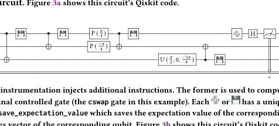 
Figure 2: Original, transpiled, and instrumented circuit of the Swap test written in Qiskit in Figure 1.

📷 Fig 2

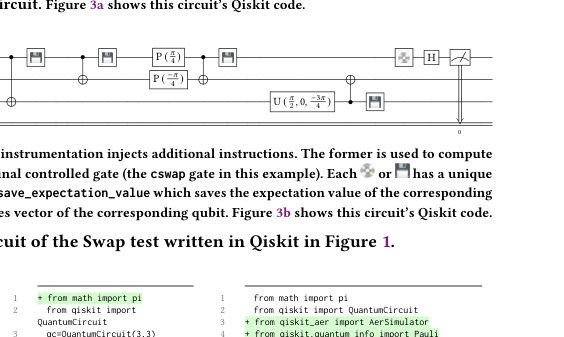 
Figure 3: Transpilation and instrumentation of the Qiskit code in Figure 1.

**Main problem.** Traditional classical software testing metrics like decision and path coverage are ineffective for quantum circuits due to the lack of classical control flow and the probabilistic nature of quantum states.

**Main result.** The authors proposed six quantum-tailored coverage criteria and a tool called QaCoCo, finding that while condition and decision coverage are often high, path coverage is significantly lower due to path explosion in multi-controlled gates.

**Method.** The researchers developed the QaCoCo tool to instrument OpenQASM circuits via Qiskit, using gate decomposition and non-destructive simulator instructions to track control qubit states and compute structural and probabilistic coverage.

**Summary.** This paper addresses the challenge of verifying quantum software by introducing new coverage metrics tailored for circuit-based quantum programs. By treating controlled gates as quantum branches, the authors propose ways to measure condition, decision, and path coverage, even accounting for the probabilistic nature of quantum states. They introduce the QaCoCo tool to automate this process and demonstrate through large-scale benchmarking that multi-controlled gates cause significant path explosion. Ultimately, the work provides a framework for improving the reliability and testing adequacy of quantum algorithms.

Detailed structure

**Model / system.** The study focuses on circuit-based quantum programs implemented via Qiskit and OpenQASM, specifically analyzing the behavior of controlled gates (e.g., CX, CCX, CSWAP) as quantum analogues to classical branches.

**Key observables.** Condition, decision, and path coverage; probabilistic variants using Jain's fairness index; expectation values of qubits; and mutation scores for fault detection.

**Important parameters / regimes.** Circuit depth, number of qubits, number of controlled gates, and the probability of specific measurement outcomes.

**Assumptions / limitations.** The current instrumentation method relies on Qiskit Aer simulator instructions (save_expectation_value), which requires access to the full statevector and is not yet directly applicable to real hardware without modification.

**Figures summary.** Figure 1 shows a Swap test implementation as a motivational example; Figure 2 illustrates the transformation pipeline from original to instrumented circuits; Figure 4 demonstrates the retrieval of expectation values and probabilities from the simulator.

**Paper structure.** The paper introduces the problem of quantum testing adequacy, proposes new structural and probabilistic coverage metrics, describes the QaCoCo tool implementation, presents an empirical evaluation using MQT Bench, and performs mutation testing to assess the correlation between coverage and fault detection.

Abstract

Coverage criteria play a central role in assessing test adequacy in classical software, yet their effectiveness for quantum programs remains poorly understood and largely unexplored. In this paper, we propose six quantum-tailored criteria - condition, decision, and path coverage, and their probabilistic variants - adapted from their classical counterparts. We present QaCoCo, a tool that computes these criteria for circuit-based quantum programs. We empirically evaluate these criteria on a large and diverse set of 540 circuits and analyze the coverage achieved. Our results show that while circuits frequently achieve high condition and decision coverage (97.56% and 97.63%, on average), path coverage remains limited (71.84%), particularly in the presence of multi-controlled gates, which induce extreme path explosion and coverage imbalance. Moreover, to account for the probabilistic nature of quantum circuits, we introduce probabilistic coverage, which augments structural coverage with a confidence measure (88.87%, 88.65%, and 37.18% for condition, decision, and path coverage, respectively, on average). Finally, through mutation testing, we find weak or no correlation between fault detection and structural coverage, consistent with observations in classical computing.

[↑ back to top](#top)

### [QAOA Parameter Transfer for Hypergraphs](http://arxiv.org/abs/2604.26040v1)

**Authors:** Lucas T. Braydwood, Phillip C. Lotshaw  
**Type:** theory · **Category:** quantum information and computing · **PDF:** <https://arxiv.org/pdf/2604.26040v1>  
**Analysis basis:** full PDF text, analyzed in chunks

📷 Fig 1

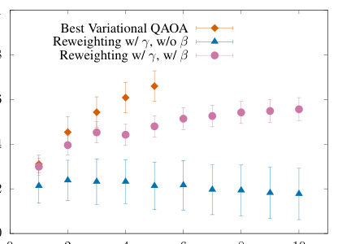 
Fig. 2: The average approximation ratio across all our hy- pergraph instances as a function of QAOA circuit depth, p. We plot the results for the best found QAOA angles, as well as reweighting of reference angles from the literature [10] using the γ reweighting from Eq. (20) with and without the β reweighting from Eq. (18)

📷 Fig 2

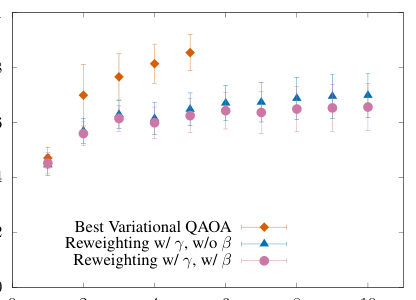 
Fig. 3: The average approximation ratio across just the graph instances, including only terms with locality 2 or less, as a function of QAOA circuit depth, p. We plot the results for the best found QAOA angles, as well as reweighting of reference angles from the literature [10] using the γ reweighting from Eq. (20) with and without the β reweighting from Eq. (18)

**Main problem.** The difficulty of the variational optimization loop in QAOA and the lack of parameter transfer/reweighting rules for higher-locality hypergraph structures.

**Main result.** The authors analytically derive new parameter reweighting rules for the mixer Hamiltonian (beta parameters) to transfer QAOA parameters between different hypergraph localities, significantly improving the approximation ratio.

**Method.** Analytical derivation using a small-gamma expansion and a Berge-acyclic hypergraph assumption, supplemented by numerical simulations using the L-BFGS algorithm and bootstrapping.

**Summary.** This paper addresses the computational bottleneck of the variational loop in QAOA by proposing a method to transfer optimized parameters from one problem instance to another. While previous work focused on reweighting cost Hamiltonian parameters, this work introduces a new analytical rule for reweighting the mixer Hamiltonian parameters when moving to hypergraphs. The proposed method significantly improves the approximation ratio for high-locality hypergraphs. The results remain robust even when the underlying assumption of acyclic structures is violated.

Detailed structure

**Model / system.** The Quantum Approximate Optimization Algorithm (QAOA) applied to Max-k-XORSAT problems on hypergraphs, using a cost Hamiltonian with hyperedge weights and a standard transverse field mixer Hamiltonian.

**Key observables.** Approximation ratio (achieved energy divided by true ground state energy) and the expectation value of the cost function.

**Important parameters / regimes.** Variational parameters gamma and beta, circuit depth p, hyperedge locality k, and hyperedge weights w.

**Assumptions / limitations.** The analytical derivation assumes Berge-acyclic hypergraphs (cycle-free), low circuit depth, and a small-gamma expansion.

**Figures summary.** Figure 1 illustrates Berge cycles in hypergraphs; Figure 2 compares the approximation ratio across different QAOA methods showing improvement with beta reweighting; Figure 3 shows the performance for low-locality (k <= 2) hypergraphs.

**Paper structure.** The paper introduces the QAOA parameter transfer problem, defines the hypergraph model and Hamiltonian, provides the analytical derivation for beta reweighting, presents numerical validation across various hypergraph localities, and discusses limitations and future directions.

Abstract

Variational Quantum Algorithms, including the Quantum Approximate Optimization Algorithm (QAOA), have shown promise in solving optimization problems but rely on costly variational loops that can themselves be hard optimization problems. Many methods have been proposed to mitigate this variational cost, with one of the most common being parameter transfer and concentration where variational parameters for one problem instance or for an average over problem instances can be used as a good set of parameters for another instance. Methods exist for reweighting these parameters based off graph degree and edge weights, but there has been little work on how to do this reweighting to handle higher locality problems where the graph structure turns into a hypergraph structure. In this paper, we analytically derive parameter reweighting rules to transfer parameters between different locality hypergraphs, resulting in a reweighting for the mixing terms in the Hamiltonian which have previously not been considered. These analytics rely on three cycle-free and low-circuit-depth assumptions, but numerics indicate that the results can be used even when these assumptions are not satisfied. The numerics obtain high quality results across a diverse set of hypergraphs with locality less than or equal to five, improving on previous relations that do not reweight the mixing terms.

[↑ back to top](#top)

### [QERNEL: a Scalable Large Electron Model](http://arxiv.org/abs/2604.26018v1)

**Authors:** Khachatur Nazaryan, Liang Fu  
**Type:** theory · **Category:** numerical methods · **PDF:** <https://arxiv.org/pdf/2604.26018v1>  
**Analysis basis:** full PDF text, analyzed in chunks

📷 Fig 1

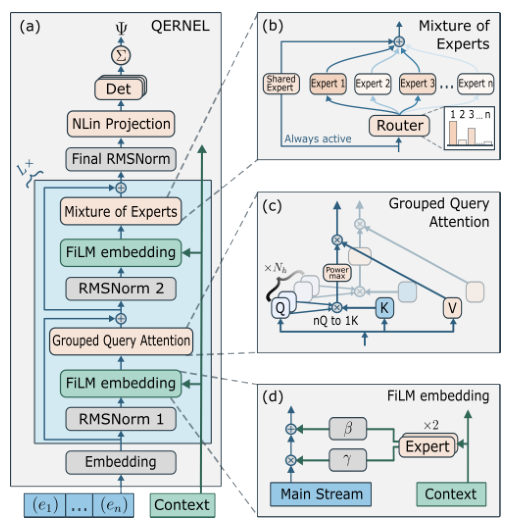 
FIG. 1. Architecture of QERNEL. (a) Overall conditional wavefunction pipeline: electron features are embedded into electronic streams, processed by stacked equivariant blocks, projected to generalized orbitals, and combined into deter- minants. The Hamiltonian context is threaded alongside the electron streams and repeatedly injected throughout the depth of the network. (b) Mixture-of-experts block with a router and an shared expert. (c) Grouped-query attention, where multiple query heads share key and value heads for improved efficiency. (d) FiLM conditioning, which injects the context into the electronic streams through channel-wise shifts and rescalings.

📷 Fig 2

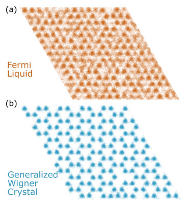 
FIG. 3. Inferred real space densities for a 150-electron system obtained with QERNEL in a fixed-context, non-foundational setting. (a) Fermi-liquid regime, λ = 0.7. (b) Generalized Wigner-crystal regime, λ = 1.5. The isolated minor defects in the density profile are a computational artifact and are not interpreted as a physical excitation.

📷 Fig 3

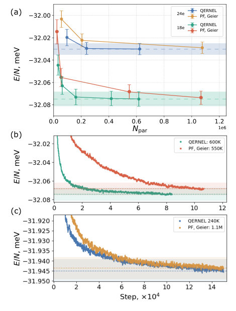 
FIG. 2. Benchmarking the efficiency of QERNEL. (a) final variational energy per electron versus parameter count for 18- and 24-electron systems. QERNEL reaches the same accu- racy regime as the PsiFormer baseline [13] with roughly 6–7× fewer parameters. For sake of presentation, the 24e data was shifted down by 0.08meV (b),(c) Training curves of QERNEL vs baseline. (b) at comparable parameter count, QERNEL converges about 6× faster and with improved stability than the baseline. (c) a 240K-parameter QERNEL converges to a slightly lower energy as a 1.1M-parameter baseline.

📷 Fig 4

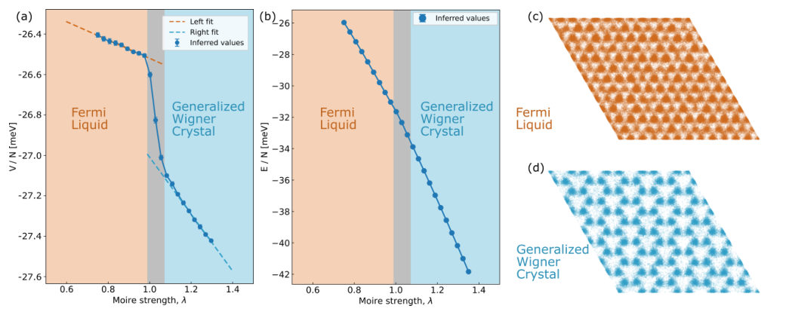 
FIG. 4. Inference of the foundational-model for capturing the phase transition. (a) Interaction energy per electron as a function of moir´e strength λ, inferred from a single trained conditional QERNEL ansatz for 54-electron system. The data separate into two approximately linear branches whose extrapolated mismatch near λ ≈1.05 indicates a sharp reorganization of the ground state. (b) Total energy per electron across the same parameter range. In contrast to the interaction energy, the total energy remains smooth and continuous through the transition region, as expected for a finite-size system. (c),(d) Inferred real-space densities on the two sides of the transition for 96-electron system....

**Main problem.** Transitioning from single-instance neural wavefunction solvers that require retraining for every new Hamiltonian to 'foundation models' that can generalize across entire families of Hamiltonians efficiently.

**Main result.** The QERNEL model achieves comparable accuracy to much larger baselines with 6-7x fewer parameters and 6x faster convergence, successfully capturing the phase transition between Fermi liquid and Wigner crystal states in a single model.

**Method.** A variational Monte Carlo approach using a neural wavefunction architecture inspired by LLMs, incorporating Grouped-Query Attention, Mixture-of-Experts, and FiLM-based parameter conditioning.

**Summary.** This paper introduces QERNEL, a 'Large Electron Model' designed to act as a foundation model for many-electron systems. By using modern transformer-inspired techniques like Mixture-of-Experts and Grouped-Query Attention, the model can solve entire families of Hamiltonians without retraining. It demonstrates the ability to predict phase transitions in moiré materials, such as the transition from a Fermi liquid to a Wigner crystal, with much higher computational efficiency than previous neural wavefunction methods.

Detailed structure

**Model / system.** The system consists of interacting electrons in semiconductor moiré heterobilayers, described by a Hamiltonian including kinetic energy, a moiré potential, and Coulomb interaction.

**Key observables.** Interaction energy per electron, total energy per electron, and real-space charge density profiles.

**Important parameters / regimes.** Moiré potential strength (lambda), effective mass (m* = 0.35me), moiré lattice constant (8.031 nm), and filling factor (nu = 2/3).

**Assumptions / limitations.** The model assumes the ability to represent continuous Fermi wavefunctions via a linear combination of Slater determinants.

**Figures summary.** Fig 1 shows the QERNEL architecture; Fig 2 compares energy accuracy, parameter count, and convergence speed against the PsiFormer baseline; Fig 3 displays real-space density profiles for the liquid and crystal phases.

**Paper structure.** The paper introduces the QERNEL architecture, details the implementation of MoE and GQA, describes the application to moiré systems, presents benchmarking results against existing neural wavefunctions, and demonstrates the capture of phase transitions.

Abstract

We introduce QERNEL, a foundational neural wavefunction that variationally solves families of parameterized many-electron Hamiltonians and captures their ground states throughout parameter space within a single model. QERNEL combines FiLM-based parameter conditioning with scale-efficient architectural elements -- mixture of experts and grouped-query attention, substantially improving expressivity at low computational cost. We apply QERNEL to interacting electrons in semiconductor moiré heterobilayers, training a single weight-shared model for systems of up to 150 electrons. By solving the many-electron Schrödinger equation conditioned on moiré potential depth, QERNEL captures both quantum liquid and crystal states and discovers the sharp phase transition between them, marked by abrupt changes in interaction energy and charge density. Our work establishes a foundation model for moiré quantum materials and a scalable architecture toward a Large Electron Model for solids.

[↑ back to top](#top)

### [Quantum Grover Adaptive Search for Discrete Simulation Optimization](http://arxiv.org/abs/2604.26277v1)

**Authors:** Mingjie Hu, Jian-qiang Hu, Enlu Zhou  
**Type:** both · **Category:** quantum information and computing · **PDF:** <https://arxiv.org/pdf/2604.26277v1>  
**Analysis basis:** full PDF text, analyzed in chunks

📷 Fig 1

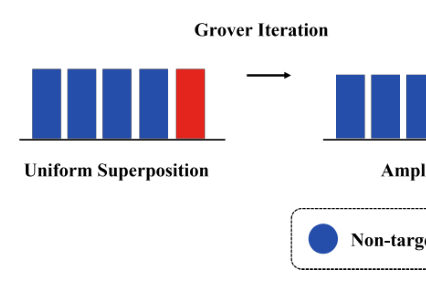 
Figure 1 Grover’s Algorithm

📷 Fig 2

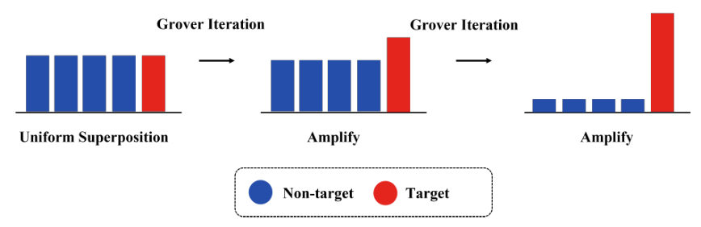 
Figure 1 illustrates the basic idea of Grover’s iteration. The algorithm begins with an

📷 Fig 3

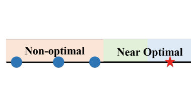 
Figure 2 Optimal Region in Algorithm 1

📷 Fig 4

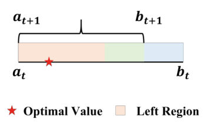 
Figure 3 Binary Search Process in Algorithm 2

📷 Fig 5

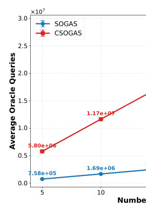 
Figure 4 Empirical Query Complexity for Different Problem Sizes

📷 Fig 6

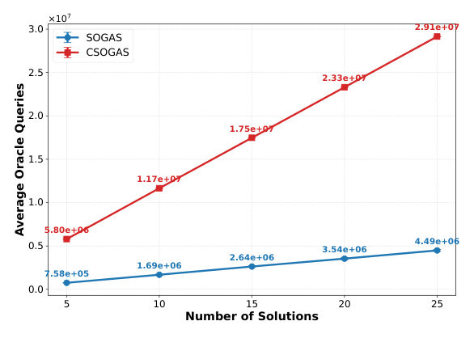 
Figure 5 shows that the empirical query complexity of both SOGAS and CSOGAS

📷 Fig 7

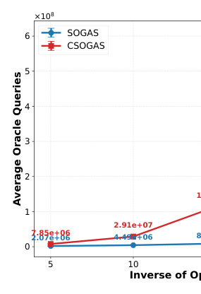 
Figure 5 Empirical Query Complexity for Different Optimality Gap

📷 Fig 8

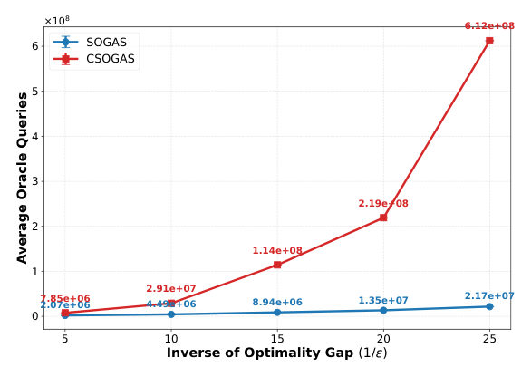 
Figure 6 compares the empirical query complexity of SOGAS and CSOGAS under three

📷 Fig 9

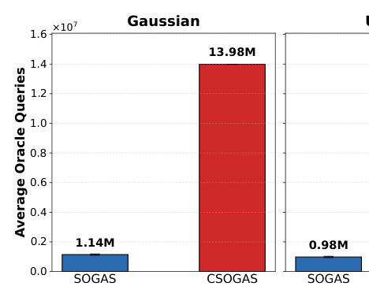 
Figure 6 Empirical Query Complexity for Different Distributions

**Main problem.** Achieving a quadratic speedup in the query complexity of discrete simulation optimization within a fixed-confidence (epsilon, delta-PAC) framework.

**Main result.** The developed SOGAS algorithm achieves a quadratic speedup in query complexity relative to the number of candidate solutions, reducing complexity from O(|X|) to O(sqrt(|X|/epsilon)).

**Method.** The algorithm uses a binary-search-based framework (OptimalRegion) to narrow the performance interval, a quantum flagging algorithm (FlagOracle) to label near-optimal solutions, and amplitude amplification to extract the solution.

**Summary.** This paper introduces SOGAS, a quantum algorithm designed to optimize stochastic, discrete simulations. By leveraging Grover-based techniques and quantum mean estimation, the authors demonstrate a quadratic speedup in finding near-optimal solutions compared to classical Monte Carlo methods. The work provides both theoretical guarantees for error control and numerical evidence of quantum advantage across various noise distributions.

Detailed structure

**Model / system.** A quantum simulation oracle that prepares a coherent superposition over candidate solutions and encodes random noise and simulation outputs into a three-register quantum state (solution, noise, and output registers).

**Key observables.** The optimal mean performance y(x*) and the proportion of solutions meeting a specific performance threshold.

**Important parameters / regimes.** Optimality gap (epsilon), failure probability (delta), and the size of the discrete solution set (|X|).

**Assumptions / limitations.** Assumes the existence of a quantum simulation oracle capable of coherent superposition and that performance values are bounded within [0, 1].

**Figures summary.** Figure 1 shows Grover iteration mechanics; Figure 2 illustrates performance interval partitioning; Figure 3 depicts the binary search process; Figures 4-6 show empirical query complexity scaling and performance across different probability distributions.

**Paper structure.** The paper introduces the problem of discrete simulation optimization, defines a new quantum simulation oracle, presents the SOGAS algorithm (comprising subroutines for region identification, flagging, and amplification), provides a rigorous theoretical proof of complexity and correctness, and concludes with numerical validation using Qiskit.

Abstract

Quantum computing has advanced rapidly in recent years and has shown advantages in a variety of domains. In this paper, we investigate its potential for discrete simulation optimization in the fixed-confidence setting, a fundamental problem in the simulation literature. We first introduce a quantum simulation oracle that prepares a coherent superposition over all candidate solutions and provides the foundation for quantum algorithm design. Based on this oracle, we develop the first Grover-search-based quantum algorithm for discrete simulation optimization, called SOGAS. In particular, SOGAS uses a binary-search framework to progressively eliminate suboptimal solutions while carefully controlling the error probability, and eventually identifies a set of near-optimal solutions. We prove that SOGAS returns a near-optimal solution with probability at least the prescribed confidence level and achieves a quadratic speedup in the dependence of query complexity on the number of candidate solutions. Numerical experiments further show that SOGAS substantially outperforms classical benchmarks and provide empirical evidence for quantum advantage in discrete simulation optimization.

[↑ back to top](#top)

### [Quantum Hall Liquids Coupled to Dynamical Electromagnetism](http://arxiv.org/abs/2604.26014v1)

**Authors:** T. H. Hansson, Qing-Dong Jiang, S. A. Kivelson, Thomas Klein Kvorning  
**Type:** theory · **Category:** strongly correlated electrons · **PDF:** <https://arxiv.org/pdf/2604.26014v1>  
**Analysis basis:** full PDF text, analyzed in chunks

📷 Fig 1

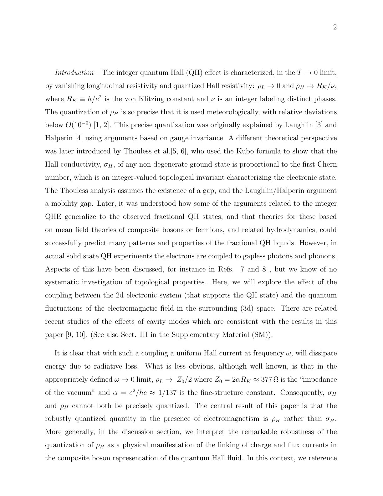 
Low-resolution page preview, page 2

📷 Fig 2

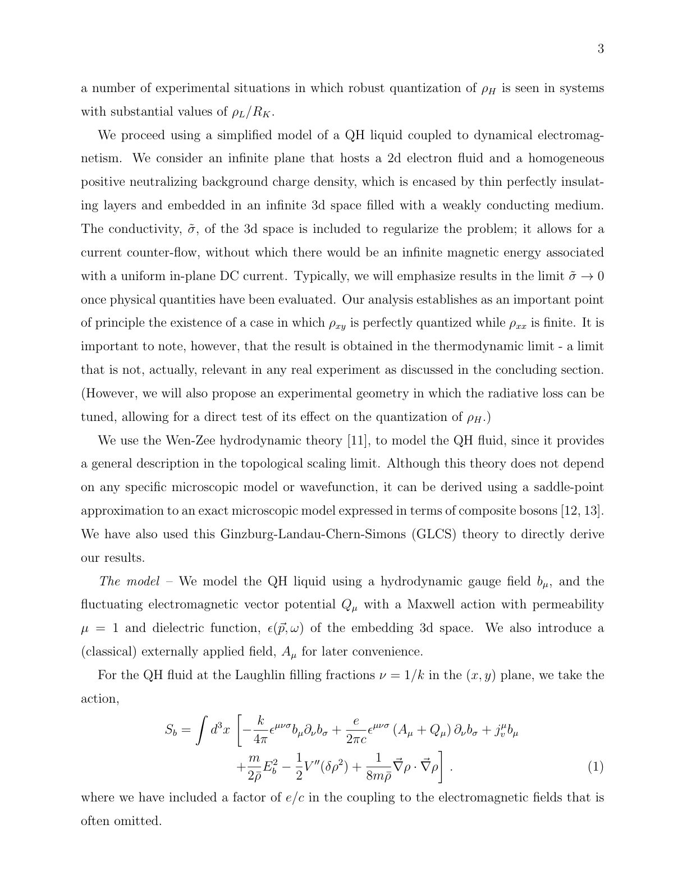 
Low-resolution page preview, page 3

📷 Fig 3

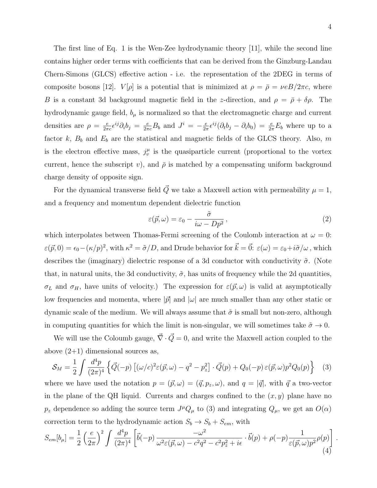 
Low-resolution page preview, page 4

📷 Fig 4

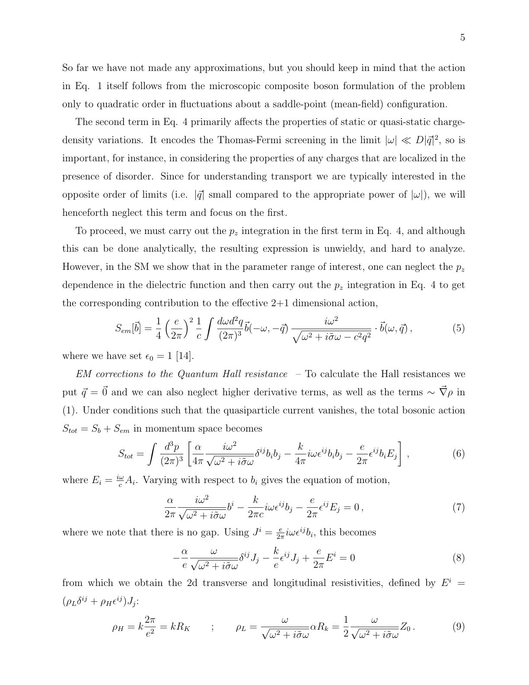 
Low-resolution page preview, page 5

📷 Fig 5

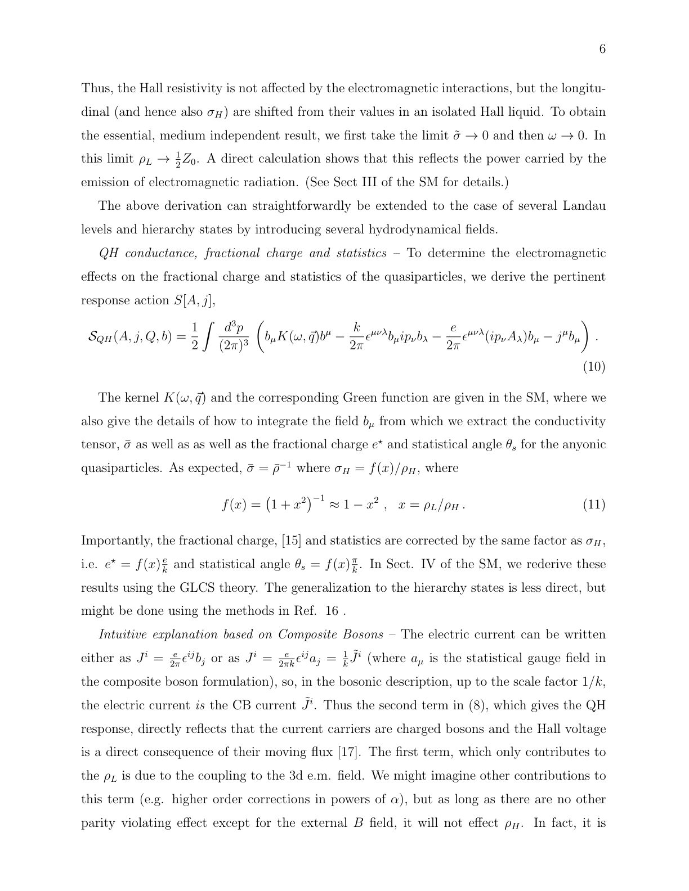 
Low-resolution page preview, page 6

📷 Fig 6

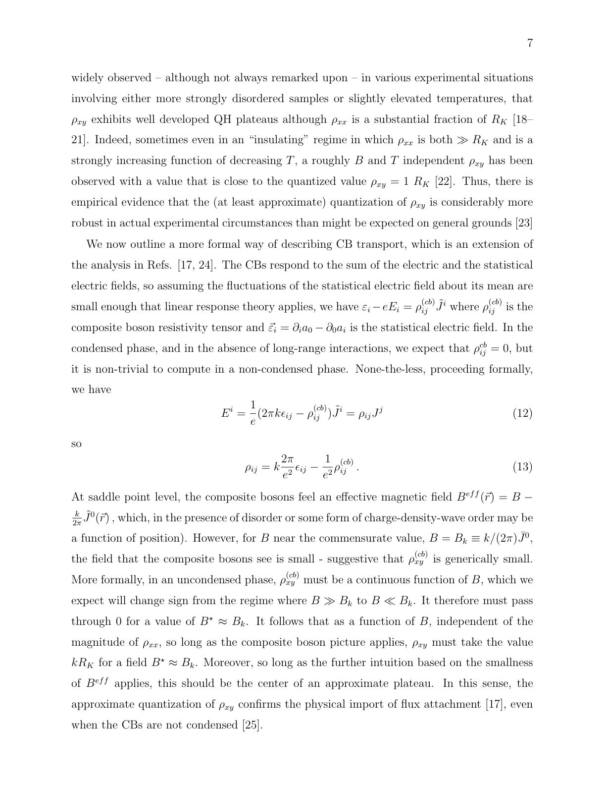 
Low-resolution page preview, page 7

📷 Fig 7

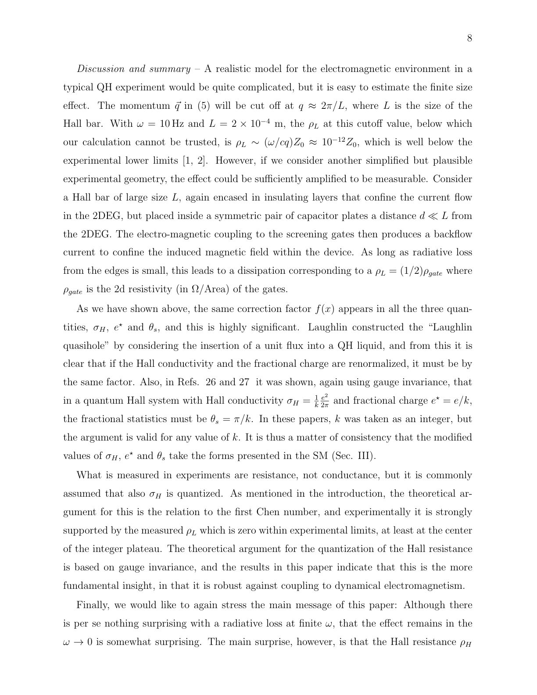 
Low-resolution page preview, page 8

📷 Fig 8

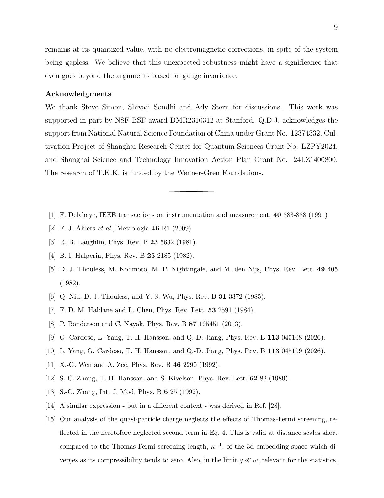 
Low-resolution page preview, page 9

📷 Fig 9

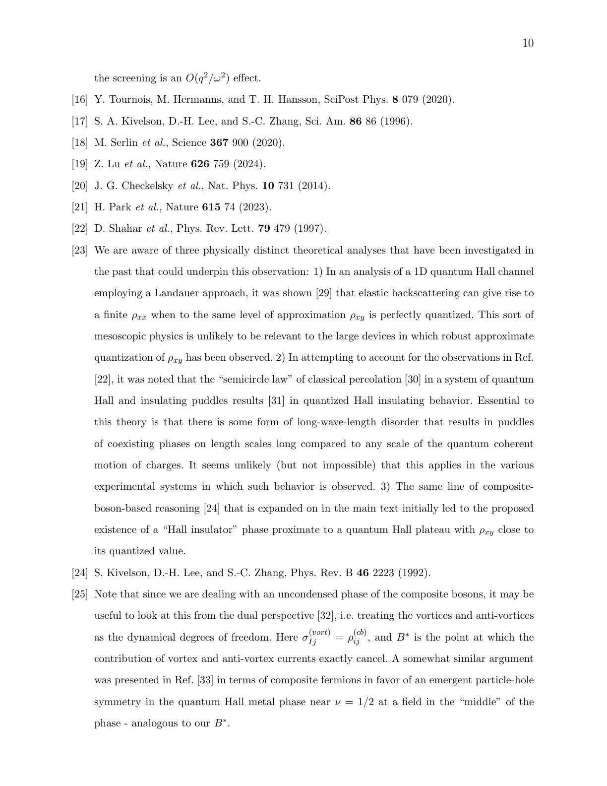 
Low-resolution page preview, page 10

📷 Fig 10

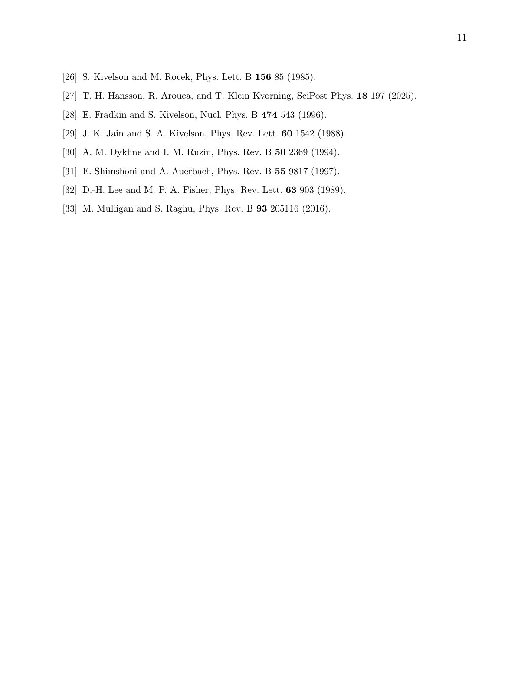 
Low-resolution page preview, page 11

**Main problem.** The paper investigates how coupling a 2D Quantum Hall liquid to 3+1 dimensional dynamical electromagnetism affects fundamental properties like Hall resistivity, Hall conductivity, and quasiparticle statistics.

**Main result.** The Hall resistivity remains robustly quantized, while the longitudinal resistivity becomes non-zero and the Hall conductivity, fractional charge, and statistical angle are all renormalized by a common factor related to the fine-structure constant.

**Method.** The authors use a Ginzburg-Landau-Chern-Simons (GLCS) hydrodynamic theory and a composite boson representation, integrating out the 3D electromagnetic vector potential to derive an effective 2+1D action.

**Summary.** This paper explores the impact of 3D electromagnetic fluctuations on 2D Quantum Hall liquids. It demonstrates that while the Hall resistance remains quantized, the coupling to 3D photons introduces longitudinal resistance and renormalizes the Hall conductivity and quasiparticle statistics. The study provides a theoretical basis for why Hall resistance quantization can persist even when the system is coupled to a dissipative environment.

Detailed structure

**Model / system.** A 2D electron fluid supporting a Quantum Hall state, embedded in an infinite 3D space filled with a weakly conducting medium governed by Maxwell action.

**Key observables.** Hall resistivity (rho_H), longitudinal resistivity (rho_L), Hall conductivity (sigma_H), fractional charge (e*), and anyonic statistical angle (theta_s).

**Important parameters / regimes.** Filling fraction (nu), fine-structure constant (alpha), Klitzing constant (R_K), 3D conductivity (sigma_tilde), and the vacuum impedance (Z_0).

**Assumptions / limitations.** The analysis assumes a low-frequency/DC limit, neglects density fluctuations and quasiparticle effects, and assumes a local, momentum-independent dielectric response.

**Paper structure.** The paper introduces the problem of electromagnetic coupling, defines the hydrodynamic and Maxwell actions, performs the integration of the 3D gauge field, derives the effective conductivity tensor, and discusses the renormalization of quasiparticle properties and experimental implications.

Abstract

We investigate the effect on a Quantum Hall (QH) liquid of its coupling to 3+1 dimensional dynamical electromagnetism, which renders the system gapless. We calculate both the Hall and longitudinal resistances, $ρ_H$ and $ρ_L$, in the context of a minimal model of the electromagnetic environment, with a small three dimensional conductivity ${\tildeσ}$, that allows for a counter-flow current. In the thermodynamic limit, we show that $ρ_H$ is quantized, while $ρ_L$ approaches a non-zero limit, $ρ_L \sim α\, R_K$, where $α$ and $R_K=2π/e^2$ are the fine structure and the Klitzing constant. In contrast, the QH conductance, $σ_H$, is smaller than the expected quantized value by a correction $\sim α^2/R_K$. The electromagnetic interaction also generates corrections of order $α^2$ to the quasiparticle charges and statistics, in a way that is consistent with general arguments based on gauge invariance. In addition, we present an intuitive argument that relates the flux attachment associated with the composite boson representation of the electron liquid to the empirically observed %persistence of approximate quantization of $ρ_H$, even in circumstances in which $ρ_L$, and the deviation of $σ_H$ from its quantized value, are substantial.

[↑ back to top](#top)

### [Qvine: Vine Structured Quantum Circuits for Loading High Dimensional Distributions](http://arxiv.org/abs/2604.26213v1)

**Authors:** David Quiroga, Hannes Leipold, Bibhas Adhikari  
**Type:** both · **Category:** quantum information and computing · **PDF:** <https://arxiv.org/pdf/2604.26213v1>  
**Analysis basis:** full PDF text, analyzed in chunks

📷 Fig 1

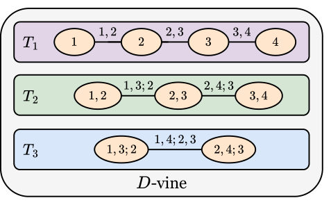 
Fig. 1: Example of a 4-dimensional D-vine.

📷 Fig 2

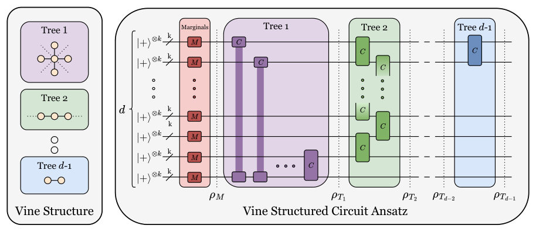 
Fig. 2: Qvines: Vine Structured Quantum Circuits. Given a vine copula decomposition (depicted on the left), we define a vine structured quantum circuit (depicted on the right) based on the edges of each tree in the vine. Tree 1 depicts a star graph while Tree 2 is a path.

📷 Fig 3

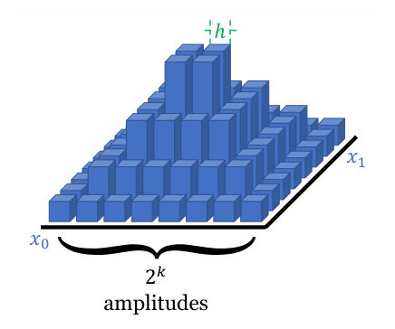 
Fig. 3: Discretization of a 2-dimensional density func- tion. As discussed in Sec. III-A, a continuous function f over a domain Rd is well approximated as precision k increases.

📷 Fig 4

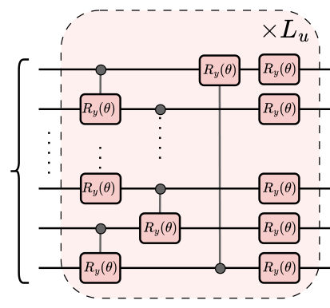 
Fig. 4: Special orthogonal group ring block. Over ℓ qubits, by repeating this block structure Lu times, the circuit can express unitaries in SO  2ℓ .

📷 Fig 5

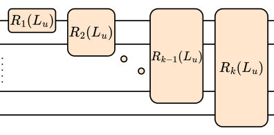 
Fig. 5: Hierarchical circuit for loading univariate distributions. Over the k qubits of each feature register, we employ this hierarchical circuit based on sequential blocks as shown in Fig. 4 with increasing number of qubits.

📷 Fig 6

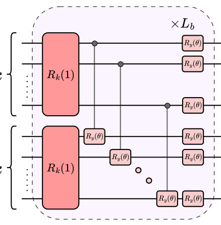 
Fig. 6: Bivariate entangling block. Over two feature registers, each with k qubits, this block structure repeated Lb times captures bivariate dependency between the two features.

📷 Fig 7

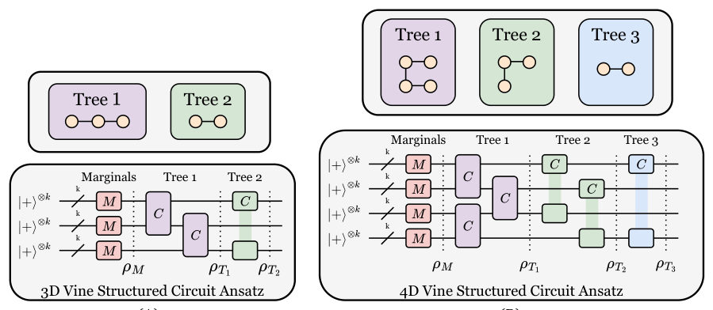 
Fig. 7: A Vine Structured Circuit for 3 &amp; 4 Dimensional Distributions. In the case that d = 3, we have a 3k qubit memory with precisely 2 trees in the vine. In the case that d = 4, we have a 4k qubit memory with precisely 3 trees in the vine. (B) shows the D-vine we used in experiments, the vine is also depicted in Fig. 1.

📷 Fig 8

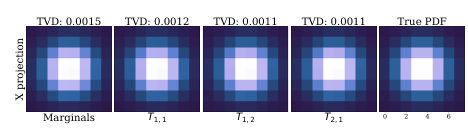 
Fig. 8: Progressive TVD of the trained QNN projected onto the X axis for the uncorrelated 3D Gaussian. Each of the 3 dimensions is discretized over 3 qubits, with marginal loading as step 0 and the next 3 steps for each BEB of the 3 edges in the vine. Ti,j corresponds to the j-th edge of the i-th tree.

📷 Fig 9

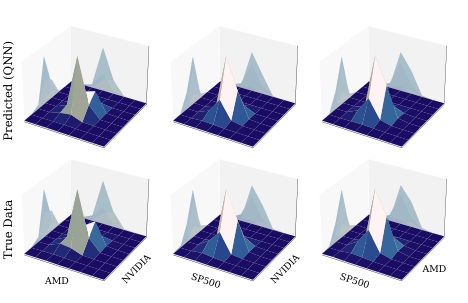 
Fig. 9: Projections of the best tested number of layers to achieve convergence on a 3D stock price return distribution. The top row shows the trained pdf and the bottom row shows the original pdf. Fig. 12B depicts throughout the progressive vine training.

📷 Fig 10

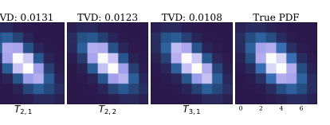 
Fig. 10: TVD of the progressive trained QNN projected onto the X, Y axis for the 4D Gaussian.

**Main problem.** The challenge of efficiently loading high-dimensional continuous probability distributions into quantum states without suffering from the curse of dimensionality or vanishing gradients.

**Main result.** The Qvine ansatz achieves high-quality distribution loading for Gaussian and empirical financial data, with circuit depth scaling linearly for D-vines and quadratically for R-vines.

**Method.** A hierarchical quantum circuit architecture based on vine copula decompositions, utilizing Bivariate Entangling Blocks (BEBs) and a progressive training methodology.

**Summary.** This paper introduces Qvine, a new quantum circuit architecture designed to load high-dimensional probability distributions into quantum computers. By mimicking the hierarchical structure of vine copula decompositions, the method avoids the exponential complexity typically associated with unstructured circuits. The authors demonstrate that the circuit depth scales efficiently (linearly or quadratically) with the number of dimensions. They successfully validate the approach using both synthetic Gaussian distributions and real-world financial stock return data.

Detailed structure

**Model / system.** A quantum circuit architecture (Qvine) that represents a d-dimensional random vector by discretizing each dimension into k-bit registers, totaling dk qubits, and uses the Special Orthogonal Group SO(2^n) to ensure real-valued wavefunctions.

**Key observables.** Total Variation Distance (TVD), Infidelity (1 - Fidelity), and axis projections of the learned probability density function.

**Important parameters / regimes.** Dimension (d), resolution (k), number of ansatz layers, and vine structure type (R-vine, C-vine, or D-vine).

**Assumptions / limitations.** Assumes the continuous density can be accurately represented via discretization into 2^k bins and that resolution k grows only logarithmically with dimension for a fixed error tolerance.

**Figures summary.** Figures illustrate the vine structure (D-vine), the mapping between copula decomposition and circuit architecture, the discretization process, the construction of SORB and BEB blocks, and performance metrics like TVD reduction during progressive training and PDF comparisons for stock data.

**Paper structure.** The paper introduces the problem of high-dimensional data loading, presents the Qvine ansatz based on vine copula theory, provides mathematical proofs for the circuit's expressibility and scalability using Lie algebra, describes the progressive training algorithm, and validates the method through numerical simulations on Gaussian and financial datasets.

Abstract

Loading high dimensional distributions is an important task for utilizing quantum computers on applications ranging from machine learning to finance. The high dimensionality leads to a curse of dimensionality, representing a d-dimensional distribution with k resolution requires dk qubits and an unstructured parameterized circuit would express a unitary in an exponential operator space in the number of qubits, leading to vanishing gradients and poor convergence guarantees even at high depth.   Vine copula decompositions are widely used to represent high dimensional distributions classically, showing high quality approximation in many important applications, such as financial modeling. We present Qvine, a vine structured ansatz for quantum circuits, that mirrors the vine decomposition to construct scalable quantum circuits with efficient trainability while achieving similarly high quality approximation for amplitude encoding distributions. For regular vines (R-vines), we show that the circuit depth scales at most quadratic in the dimension of the distribution, while for D-vines, as well as many practical R-vines, the circuit depth scales linear in the dimension. For 3-dimensional and 4-dimensional Gaussians and empirical joint stock price return distributions for selected stocks, our experiments show Qvines achieve high quality loading.

[↑ back to top](#top)

### [Rare but Resilient: Dispersal diversity buffers species vulnerability](http://arxiv.org/abs/2604.26589v1)

**Authors:** Davide Bernardi, Giorgio Nicoletti, Prajwal Padmanabha, Samir Suweis, Sandro Azaele, Simon A. Levin, Andrea Rinaldo, Amos Maritan  
**Type:** theory · **Category:** statistical mechanics · **PDF:** <https://arxiv.org/pdf/2604.26589v1>  
**Analysis basis:** abstract only; PDF text extraction failed or PDF unavailable

**Main problem.** Predicting species persistence and vulnerability within ecological communities without needing to estimate difficult-to-measure mechanistic parameters or species traits.

**Main result.** The development of a 'competitive balance' metric shows that greater heterogeneity in dispersal strategies reduces species vulnerability for a given abundance.

**Method.** A general framework grounded in the statistical physics of complex systems that integrates dispersal diversity and interspecific interaction structures into a single measurable quantity.

**Summary.** The paper introduces a new framework based on the statistical physics of complex systems to assess species vulnerability in ecosystems. By defining a 'competitive balance' metric, the authors show that the diversity of dispersal strategies acts as a buffer against extinction. This metric is particularly useful because it can be calculated directly from spatial abundance data, bypassing the need for complex parameter estimation. The findings were validated using real-world data from tropical and temperate forests.

Detailed structure

**Model / system.** An ecological community model incorporating spatial abundance data, dispersal strategies, and interspecific interaction structures.

**Key observables.** Competitive balance, species abundance, and dispersal strategy diversity.

**Important parameters / regimes.** Dispersal strategies, interspecific interaction structure, and spatial abundance.

**Assumptions / limitations.** The framework assumes that species vulnerability can be inferred from spatial abundance data and that the competitive balance captures the essential dynamics of survival.

**Paper structure.** Introduction to the challenge of species persistence, presentation of the statistical physics-based framework, introduction of the competitive balance metric, validation using tropical and temperate forest data, and discussion of broader ecosystem applications.

Abstract

Predicting species persistence within ecological communities is a fundamental challenge for both empirical and theoretical ecology. Existing methods span from mechanistic models, whose parameters are difficult to estimate from data, to statistical tools whose context-specific parameters are less interpretable. Here, we present a general framework, grounded in the statistical physics of complex systems, that integrates the key processes governing species survival into a single measurable quantity: the competitive balance. This metric quantifies a focal species' vulnerability beyond its abundance by incorporating the diversity of dispersal strategies and the structure of interspecific interactions within the community. Crucially, it can be inferred from spatial abundance data, thus circumventing the need to estimate species traits or dispersal parameters. Our results reveal that greater heterogeneity in dispersal strategies reduces vulnerability for a given abundance. Although we validate the framework using tropical and temperate forest data, it can be applied to a range of different ecosystems, providing a systemic and interpretable tool for assessing a context-dependent species vulnerability that accounts for its interactions with the entire community.

[↑ back to top](#top)
