
# arxiv digest (quant-ph + cond-mat) — 2026-05-01

*158 papers · 40 relevant · 2 highlighted*

## 🔥 Most relevant (40)

*Every paper with at least one nonzero topic score, sorted by best-matching score. 🔥 marks scores ≥4/5. Click the title to jump to the full entry below; click [arXiv] to open the paper page. `(secondary)` marks papers from de-prioritized cond-mat archives.*

Show 40 relevant papers

- [Quantum Magnetometry with Orientation beyond Steady-State Limits in Cavity-Magnon Systems](#paper-2604.27608) [[arXiv]](http://arxiv.org/abs/2604.27608v1) — 🔥 `spintronics-quantum-optics interface` **5/5** · 🔥 `quantum measurements` **4/5** · `non-equilibrium dynamics` **3/5** · `Keldysh / 2PI / non-Gaussian methods` **2/5** · `Tavis-Cummings & cavity-many-emitter` **2/5** · `methods for driven-dissipative` **2/5** · `entanglement & information structure` **1/5**
- [Strong coupling between quantized magnon modes in a YIG microstucture and microwaves in a superconducting resonator](#paper-2604.28145) [[arXiv]](http://arxiv.org/abs/2604.28145v1) `(secondary)` — 🔥 `spintronics-quantum-optics interface` **5/5** · 🔥 `QC/QI experiment` **4/5** · 🔥 `quantum optics experiment` **4/5** · `Tavis-Cummings & cavity-many-emitter` **3/5**
- [Parametrically Driven iSWAP Gate Using a Capacitively Shunted Double-Transmon Coupler at the Zero-Flux Sweet Spot](#paper-2604.27679) [[arXiv]](http://arxiv.org/abs/2604.27679v1) — 🔥 `QC/QI experiment` **5/5** · `non-equilibrium dynamics` **2/5**
- [Demonstration of Exponential Quantum Speedup with Constant-Depth Compiled Circuits for Simon's Problem](#paper-2604.27457) [[arXiv]](http://arxiv.org/abs/2604.27457v1) — 🔥 `QC/QI experiment` **5/5**
- [Domain-wall melting in all-to-all QSSEP from random-matrix theory](#paper-2604.28151) [[arXiv]](http://arxiv.org/abs/2604.28151v1) — 🔥 `entanglement & information structure` **4/5** · 🔥 `non-equilibrium dynamics` **4/5** · `correlated / nonlocal dissipation` **3/5** · `non-equilibrium universality` **3/5** · `Keldysh / 2PI / non-Gaussian methods` **2/5** · `driven-dissipative phase transition` **2/5** · `methods for driven-dissipative` **2/5**
- ⭐ [Long-lived local quantum coherences from hydrodynamic large deviations](#paper-2604.27074) [[arXiv]](http://arxiv.org/abs/2604.27074v1) — 🔥 `non-equilibrium dynamics` **4/5** · `entanglement & information structure` **3/5** · `methods for driven-dissipative` **3/5** · `non-equilibrium universality` **3/5** · `Keldysh / 2PI / non-Gaussian methods` **2/5** · `driven-dissipative phase transition` **2/5** · `scars & prethermalization` **2/5**
- [Deep Strong light-matter Coupling in 3D Kane Fermions](#paper-2604.28042) [[arXiv]](http://arxiv.org/abs/2604.28042v1) — 🔥 `correlated cavity matter` **4/5** · 🔥 `quantum optics experiment` **4/5** · `Dicke superradiance` **3/5** · `driven-dissipative phase transition` **3/5** · `Tavis-Cummings & cavity-many-emitter` **2/5**
- [Emergence of prethermal time quasicrystalline order in a quasiperiodically driven non-interacting spin chain](#paper-2604.27250) [[arXiv]](http://arxiv.org/abs/2604.27250v1) — 🔥 `non-equilibrium dynamics` **4/5** · 🔥 `scars & prethermalization` **4/5** · `driven-dissipative phase transition` **3/5** · `entanglement & information structure` **3/5** · `non-equilibrium universality` **2/5**
- [Observation of Universal Spectral Moments and the Dynamic Dispersive-to-Proliferative Transition](#paper-2604.27585) [[arXiv]](http://arxiv.org/abs/2604.27585v1) — 🔥 `driven-dissipative phase transition` **4/5** · 🔥 `non-equilibrium universality` **4/5** · `analog quantum simulation` **3/5** · `non-equilibrium dynamics` **3/5** · `correlated / nonlocal dissipation` **2/5**
- [Observation of attractor transitions in active magnon-polaritons under microwatt drives](#paper-2604.27668) [[arXiv]](http://arxiv.org/abs/2604.27668v1) — 🔥 `driven-dissipative phase transition` **4/5** · 🔥 `spintronics-quantum-optics interface` **4/5** · `non-equilibrium dynamics` **3/5** · `quantum optics experiment` **3/5**
- [Experimental detection of entanglement in multimode Gaussian states from high-order intensity correlation moments](#paper-2604.27567) [[arXiv]](http://arxiv.org/abs/2604.27567v1) — 🔥 `QC/QI experiment` **4/5** · 🔥 `quantum optics experiment` **4/5** · `entanglement & information structure` **3/5** · `quantum measurements` **2/5**
- [Dissipation Mechanisms and Dissipative Phase Transitions of two coupled Fully Connected Quantum Ising models](#paper-2604.27072) [[arXiv]](http://arxiv.org/abs/2604.27072v1) — 🔥 `driven-dissipative phase transition` **4/5** · `non-equilibrium dynamics` **3/5** · `non-equilibrium universality` **3/5** · `methods for driven-dissipative` **2/5**
- [Macroscopic photon counting beating the Poisson noise limit](#paper-2604.27761) [[arXiv]](http://arxiv.org/abs/2604.27761v1) — 🔥 `QC/QI experiment` **4/5** · 🔥 `quantum measurements` **4/5** · 🔥 `quantum optics experiment` **4/5**
- [Observation antibunching with classical light in a linear interferometer](#paper-2604.27494) [[arXiv]](http://arxiv.org/abs/2604.27494v1) — 🔥 `quantum optics experiment` **4/5** · `interference shaping light` **3/5** · `quantum measurements` **3/5** · `QC/QI experiment` **2/5**
- [Semiclassical Ehrenfest paths in open quantum systems](#paper-2604.27328) [[arXiv]](http://arxiv.org/abs/2604.27328v1) — 🔥 `Keldysh / 2PI / non-Gaussian methods` **4/5** · 🔥 `methods for driven-dissipative` **4/5** · `non-equilibrium dynamics` **2/5** · `quantum measurements` **2/5**
- [Adaptable Continuous Variable Quantum Network with Finite Size Security](#paper-2604.27943) [[arXiv]](http://arxiv.org/abs/2604.27943v1) — 🔥 `QC/QI experiment` **4/5** · 🔥 `quantum optics experiment` **4/5** · `quantum measurements` **2/5** · `entanglement & information structure` **1/5**
- [Optimal current-based sensing of phonon temperature using a finite reservoir](#paper-2604.28155) [[arXiv]](http://arxiv.org/abs/2604.28155v1) — 🔥 `quantum measurements` **4/5** · `non-equilibrium dynamics` **3/5** · `Kondo & dissipative impurity` **2/5** · `methods for driven-dissipative` **2/5**
- [Quantum Lattice Boltzmann Solutions for Transport under 3D Spatially Varying Advection on Trapped Ion Hardware](#paper-2604.28121) [[arXiv]](http://arxiv.org/abs/2604.28121v1) — 🔥 `QC/QI experiment` **4/5** · `quantum measurements` **3/5** · `entanglement & information structure` **2/5** · `non-equilibrium dynamics` **2/5**
- [Spin-coherence characterization of boron vacancy defects in hexagonal boron nitride with broadband microwave pulses](#paper-2604.27843) [[arXiv]](http://arxiv.org/abs/2604.27843v1) `(secondary)` — 🔥 `QC/QI experiment` **4/5** · `spintronics-quantum-optics interface` **3/5** · `quantum measurements` **2/5** · `quantum optics experiment` **2/5**
- [High-Rate Free-Space Continuous-Variable QKD with Self-Referenced Passive State Preparation](#paper-2604.27299) [[arXiv]](http://arxiv.org/abs/2604.27299v1) — 🔥 `QC/QI experiment` **4/5** · 🔥 `quantum optics experiment` **4/5** · `quantum measurements` **2/5**
- [Strong Mpemba Effect Through a Reentrant Phase Transition](#paper-2604.28117) [[arXiv]](http://arxiv.org/abs/2604.28117v1) — 🔥 `non-equilibrium dynamics` **4/5** · `driven-dissipative phase transition` **2/5** · `non-equilibrium universality` **2/5** · `scars & prethermalization` **2/5**
- [Timescales for Deep and Full Thermalization](#paper-2604.27749) [[arXiv]](http://arxiv.org/abs/2604.27749v1) — 🔥 `entanglement & information structure` **4/5** · 🔥 `non-equilibrium dynamics` **4/5** · `scars & prethermalization` **2/5**
- [Compressed Sensing for Efficient Fidelity Estimation of GHZ States](#paper-2604.27824) [[arXiv]](http://arxiv.org/abs/2604.27824v1) — 🔥 `QC/QI experiment` **4/5** · `entanglement & information structure` **3/5** · `quantum measurements` **2/5**
- [Non-Local Magic Resources for Fermionic Gaussian States](#paper-2604.27049) [[arXiv]](http://arxiv.org/abs/2604.27049v1) — 🔥 `entanglement & information structure` **4/5** · `non-equilibrium dynamics` **3/5** · `non-equilibrium universality` **2/5**
- [Nonlocal nonstabilizerness in free fermion models](#paper-2604.27055) [[arXiv]](http://arxiv.org/abs/2604.27055v1) — 🔥 `entanglement & information structure` **4/5** · `non-equilibrium dynamics` **3/5** · `non-equilibrium universality` **2/5**
- [An Analytical Approach to Design Space Exploration for Cavity-Mediated Quantum State Transfer in Multi-core Architectures](#paper-2604.27664) [[arXiv]](http://arxiv.org/abs/2604.27664v1) — 🔥 `methods for driven-dissipative` **4/5** · `correlated / nonlocal dissipation` **2/5** · `non-equilibrium dynamics` **2/5**
- [High-key-rate Fully-Passive Quantum Access Network with Thermal Source](#paper-2604.27327) [[arXiv]](http://arxiv.org/abs/2604.27327v1) — 🔥 `QC/QI experiment` **4/5** · 🔥 `quantum optics experiment` **4/5**
- [Enhancement of superconducting stiffness in hybrid superconducting-metallic bilayers](#paper-2604.28187) [[arXiv]](http://arxiv.org/abs/2604.28187v1) — 🔥 `Kondo & dissipative impurity` **4/5** · `analog quantum simulation` **2/5** · `entanglement & information structure` **1/5**
- [Light-Cone Structure of Propagation of Entanglement](#paper-2604.27170) [[arXiv]](http://arxiv.org/abs/2604.27170v1) — 🔥 `entanglement & information structure` **4/5** · `non-equilibrium dynamics` **3/5**
- ⭐ [Observation of Vinen turbulence during far-from-equilibrium Bose-Einstein condensation](#paper-2604.28191) [[arXiv]](http://arxiv.org/abs/2604.28191v1) — 🔥 `non-equilibrium dynamics` **4/5** · `non-equilibrium universality` **3/5**
- [Size-Limited Room Temperature Single-Photon Emission from Sidewall-Treated Fractional Dimension InGaN Quantum Dots: Determined by Density-of-States-Corrected Ultrafast Carrier Dynamics and Improved Signal-to-Noise Ratio](#paper-2604.27718) [[arXiv]](http://arxiv.org/abs/2604.27718v1) — 🔥 `quantum optics experiment` **4/5** · `QC/QI experiment` **3/5**
- [Branch-Resolved Characterization of Feed-Forward Error in Dynamic Teleportation via Classical Choi Shadows](#paper-2604.28037) [[arXiv]](http://arxiv.org/abs/2604.28037v1) — 🔥 `QC/QI experiment` **4/5** · `quantum measurements` **2/5**
- [CrossBench: Generalized Crosstalk Benchmark Generation for Quantum Computers](#paper-2604.27183) [[arXiv]](http://arxiv.org/abs/2604.27183v1) — 🔥 `QC/QI experiment` **4/5** · `correlated / nonlocal dissipation` **2/5**
- [Magnonic Gottesman-Kitaev-Preskill states](#paper-2604.27565) [[arXiv]](http://arxiv.org/abs/2604.27565v1) — 🔥 `spintronics-quantum-optics interface` **4/5** · `quantum measurements` **2/5**
- [Weak-to-Strong Measurement Transition with Thermal Instabilities](#paper-2604.28137) [[arXiv]](http://arxiv.org/abs/2604.28137v1) — 🔥 `quantum measurements` **4/5** · `methods for driven-dissipative` **2/5**
- [Fixed-PVM Born Rule Uniqueness from Fisher Non-Expansion and Operational Calibration](#paper-2604.27339) [[arXiv]](http://arxiv.org/abs/2604.27339v1) — 🔥 `quantum measurements` **4/5** · `entanglement & information structure` **1/5**
- [Formulating Subgroup Discovery as a Quantum Optimization Problem for Network Security](#paper-2604.27153) [[arXiv]](http://arxiv.org/abs/2604.27153v1) — 🔥 `QC/QI experiment` **4/5**
- [High-fidelity iSWAP gate with Double Transmon Coupler](#paper-2604.27080) [[arXiv]](http://arxiv.org/abs/2604.27080v1) — 🔥 `QC/QI experiment` **4/5**
- [OAM-mode sorting with a wavefront twister](#paper-2604.27739) [[arXiv]](http://arxiv.org/abs/2604.27739v1) — 🔥 `interference shaping light` **4/5**
- [Resolving spurious topological entanglement entropy in stabilizer codes](#paper-2604.27053) [[arXiv]](http://arxiv.org/abs/2604.27053v1) — 🔥 `entanglement & information structure` **4/5**

## ⭐ Highlighted (2)

*Papers by authors on your watch list. Click the title to jump to the full entry below; click [arXiv] to open the paper page.*

Show 2 highlighted papers

- ⭐ [Observation of Vinen turbulence during far-from-equilibrium Bose-Einstein condensation](#paper-2604.28191) [[arXiv]](http://arxiv.org/abs/2604.28191v1) — Nigel R. Cooper
- ⭐ [Long-lived local quantum coherences from hydrodynamic large deviations](#paper-2604.27074) [[arXiv]](http://arxiv.org/abs/2604.27074v1) — Sarang Gopalakrishnan

## All papers (73, sorted by relevance)

*Papers from quant-ph and your primary cond-mat archives (quant-gas, stat-mech, str-el, dis-nn). Highlighted papers (⭐) come first, then everything else sorted by topic-relevance score, highest first.*

### ⭐ [Long-lived local quantum coherences from hydrodynamic large deviations](http://arxiv.org/abs/2604.27074v1)

**Highlighted author(s):** Sarang Gopalakrishnan  
**Authors:** Ewan McCulloch, J. Alexander Jacoby, Sarang Gopalakrishnan  
**Type:** theory · **Category:** statistical mechanics · **PDF:** <https://arxiv.org/pdf/2604.27074v1>  
**Analysis basis:** full PDF text, analyzed in chunks
**Topic relevance:** 🔥 `non-equilibrium dynamics` **4/5** · `entanglement & information structure` **3/5** · `methods for driven-dissipative` **3/5** · `non-equilibrium universality` **3/5** · `Keldysh / 2PI / non-Gaussian methods` **2/5** · `driven-dissipative phase transition` **2/5** · `scars & prethermalization` **2/5**

↔ Scroll figures horizontally

<figure class="paper-figure-card">

<figcaption class="paper-figure-caption"><b>Fig 1.</b> FIG. 1. Schematic of low-entropy voids. Voids support coherent single-particle/magnon evolution of σ+. (a) In the weak-noise regime, conditional on the survival of a local co- herence (shown here as σ+), the surrounding charge profile is depleted over a finite scale ξ ∼γ−1/2. (b) In the noiseless case, the same diffusion-limited dephasing mechanism pro- duces an aging void whose width grows diffusively in time, ξ(t) ∼ √</figcaption>
</figure>
<figure class="paper-figure-card">

<figcaption class="paper-figure-caption"><b>Fig 2.</b> FIG. 2. Weak-noise stationary void. (a) Top: branch-resolved density profile in the down-polarized branch, ρ(↓)(x), compared with the profile ρC(x) reconstructed from the particle-hole-symmetric diagnostic C(x, t) ≈(1 −2ρ(x, t))2 (Eq. (39)), shown here for γ = 0.04. Their agreement confirms that C(x, t) faithfully captures the branch-resolved stationary void profile. Bottom: stationary density profiles for γ ∈{0.01, · · · , 0.05}. The close agreement between the full two-replica statistical me- chanics model (“full”) and the dilute-coherence approximation (“dilute”) shows that the latter reproduces the same conditioned hydrodynamic voids. (b) Collapse of the stationary void profiles under...</figcaption>
</figure>
<figure class="paper-figure-card">
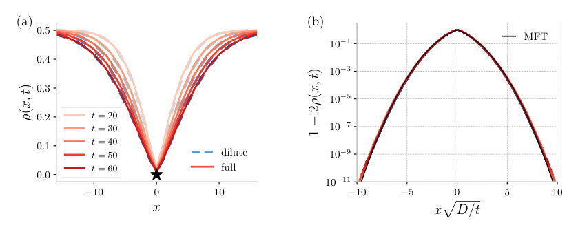
<figcaption class="paper-figure-caption"><b>Fig 3.</b> FIG. 3. Noiseless aging void. (a) Conditioned density profiles ρ(x, t) at times t = 20, 30, 40, 50, 60 (reconstructed from the overlap C(x, t) defined in Eq. (41)). The density is strongly depleted near the coherence and relaxes back toward half filling over a scale that broadens with time, consistent with an aging void. (b) The same profiles plotted against the similarity variable x/ √</figcaption>
</figure>
<figure class="paper-figure-card">

<figcaption class="paper-figure-caption"><b>Fig 4.</b> FIG. 4. Weak noise coherence–void polaron translation mode. (a) Mean-squared displacements of the coherence, ⟨X(t)2⟩, and of the void center of mass, ⟨xcom(t)2⟩, for several values of γ. At early times the coherence moves rapidly inside an already well-polarized quasi-stationary void, while the void center of mass diffuses much more slowly. At later times the coherence motion crosses over to match the void center of mass, indicating binding of the coherence to the slow polaron coordinate. (b) Corresponding time-dependent diffusion constants DX(γ, t) = 1</figcaption>
</figure>
<figure class="paper-figure-card">

<figcaption class="paper-figure-caption"><b>Fig 5.</b> FIG. 5. Internal motion of the weak noise coherence– void polaron. (a) Mean-squared displacement of the relative-coordinate of the coherence and the void center-of- mass, ⟨(X(t) −xcom(t))2⟩, for γ = 0.007, 0.01, . . . , 0.1. In each case the relative-coordinate MSD approaches a late-time plateau, showing that the coherence remains confined inside the void, with the confinement length increasing as γ is re- duced. (b) Plateau value ℓ2 X(γ), extracted from the late-time relative-coordinate MSD, plotted against γ−2/3. The near- linear dependence is consistent with the Feynman-polaron prediction ℓζ ∼γ−1/3. These data are obtained from the same dilute-coherence population-dynamics sampling as in...</figcaption>
</figure>
<figure class="paper-figure-card">
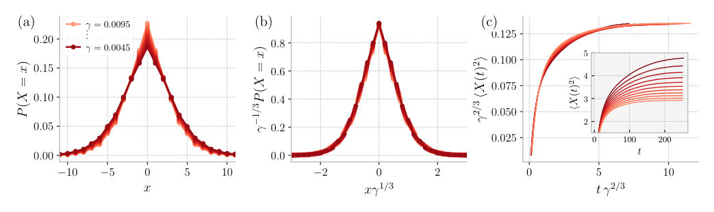
<figcaption class="paper-figure-caption"><b>Fig 6.</b> FIG. 6. Localization of the coherence–void polaron to a slow bond. (a) Late-time stationary coherence-position distribution P(X = x) in the presence of a single slow bond at x = 0. (b) Rescaled late-time position distributions plotted as γ−1/3P(X = x) against γ1/3x. The collapse is consistent with the scaling form P(X = x) ∼γ1/3f(γ1/3x), corresponding to a localization length ℓloc ∼γ−1/3. (c) Rescaled mean-squared displacement γ2/3⟨X(t)2⟩plotted against γ2/3t. The late-time saturation is consistent with the Airy scaling predicted by Eq. (97): each curve saturates at ⟨X(t)2⟩∼γ−2/3 on a timescale t ∼γ−2/3, corresponding to ℓloc ∼γ−1/3 and τloc ∼γ−2/3. Numerical data are obtained from TEBD...</figcaption>
</figure>
<figure class="paper-figure-card">
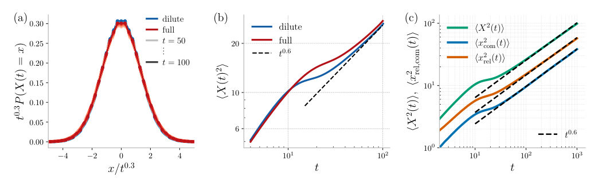
<figcaption class="paper-figure-caption"><b>Fig 7.</b> FIG. 7. Subdiffusion of the zero–noise aging coherence–void polaron. (a) Phase-averaged coherence envelope |G(x, t)|2, normalized at each time and plotted against x/tα. A good collapse is obtained for α ≃0.3, with close agreement between the full two-replica statistical mechanics model (“full”) and the dilute-coherence approximation (“dilute”). (b) Second moment of the normalized coherence envelope, ⟨X(t)2⟩, showing subdiffusive growth ⟨X(t)2⟩∼t0.60 over the accessible late- time window, again with close agreement between the full model and the dilute-coherence approximation. (c) Mean-squared displacements of the coherence, the void center of mass xcom(t), and the relative coordinate...</figcaption>
</figure>
<figure class="paper-figure-card">
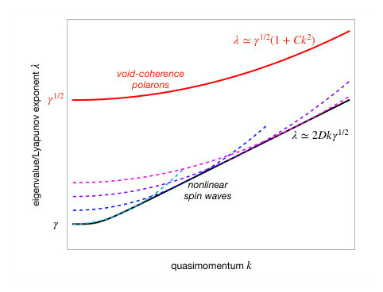
<figcaption class="paper-figure-caption"><b>Fig 8.</b> FIG. 8. Structure of leading eigenvalues. Eigenvalues of the transfer matrix for Q ̸= 0 and Q = 0, as a function of quasimomentum k. The gaps in the two types of sectors scale parametrically differently at k = 0; however, for any nonzero k and weak enough noise, both gaps scale as √γ.</figcaption>
</figure>
<figure class="paper-figure-card">
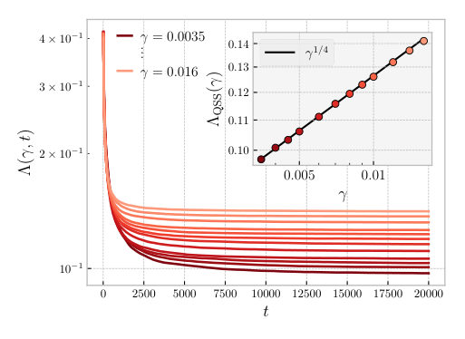
<figcaption class="paper-figure-caption"><b>Fig 9.</b> FIG. 9. Quasi-stationary decay rate estimate in translation-invariant systems. We simulate a one- dimensional gas of ballistic point particles with velocity ran- domizing collisions and a weak particle reservoir with strength γ (described in the main text) on a system of size L = 360. The tilted measure in Eq. (117) is sampled with λ = 1/2 and a = 1. Main panel: instantaneous decay rate Λ(γ, t) = −∂t log Zdet(γ, t), obtained from population-dynamics simu- lations with N = 104 clones up to time t = 2 × 104, for γ = 0.0035, . . . , 0.016. Inset: quasi-stationary plateau value ΛQSS(γ), obtained by averaging the late-time instantaneous decay rate, plotted against γ. The dashed guide shows γ1/4.</figcaption>
</figure>
<figure class="paper-figure-card">
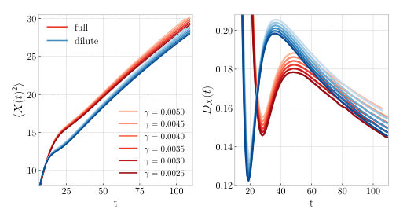
<figcaption class="paper-figure-caption"><b>Fig 10.</b> FIG. 10. Weak noise coherence–void polaron diffusion. A comparison of the time-dependent coherence diffusion in the full random-circuit dynamics (using the exact two-replica statistical mechanics model in Sec. V) and within the dilute- coherence approximation. Left: coherence-position variance ⟨X(t)2⟩for γ = 0.0025, . . . , 0.0050. Right: corresponding time-dependent diffusion constant DX(t) ≡1</figcaption>
</figure>

**Summary.** The paper describes how local quantum coherences in charge-conserving systems are protected from decay by binding to rare, low-entropy hydrodynamic fluctuations called 'voids.' This binding creates a 'polaron-like' object that significantly extends the lifetime of the coherence. The authors provide a complete hydrodynamic theory and verify it with numerical simulations of random circuits.

**Why it may be interesting.** This work is highly relevant for many-body dynamics and open quantum systems as it provides a non-perturbative description of how dissipation and hydrodynamic fluctuations cooperatively protect quantum information through the formation of stable, collective objects.

Detailed structure

**Main problem.** Understanding how local quantum coherences between distinct charge sectors evolve and decay under generic charge-conserving dynamics, specifically investigating their interaction with hydrodynamic large deviations.

**Main result.** The authors show that quantum coherences bind to hydrodynamic 'voids' of low charge entropy, forming a collective 'void-coherence polaron' that enhances coherence lifetime; in 1D, the spectral gap vanishes nonperturbatively as the square root of the noise strength.

**Method.** The study integrates local coherence dynamics into Macroscopic Fluctuation Theory (MFT) using a framework of hydrodynamic large deviations, a two-replica transfer matrix approach, and tensor-network simulations.

**Model / system.** Generic many-body quantum systems with a conserved U(1) charge, specifically modeled using 1D random charge-conserving circuits and diffusive models like the Symmetric Simple Exclusion Process (SSEP) and the Katz-Lebowitz-Spohn (KLS) model.

**Key observables.** Single-particle Green's function, charge density profiles, spectral gap of the quantum channel, and the many-body weight (MBW) distribution.

**Important parameters / regimes.** Noise strength (gamma), diffusion constant (D), mobility (sigma), and the weak-noise vs. noiseless (zero-noise) limits.

**Assumptions / limitations.** The framework assumes the diffusion constant remains finite at all densities and utilizes a 'dilute coherence approximation' to treat coherences as isolated objects.

**Figures summary.** Figure 1 shows charge profile evolution; Figure 10 displays coherence-position variance and time-dependent diffusion constants; Figure 12 and 13 show magnon number conservation breakdown and the relaxation of the MBW distribution.

**Paper structure.** The paper introduces the problem of coherence decay, develops a hydrodynamic framework via MFT, analyzes the polaron formation and spectral gap in the weak-noise limit, investigates the noiseless/aging regime, and validates results via microscopic derivations and tensor-network simulations.

Abstract

We develop a framework to describe how quantum coherences between distinct charge sectors evolve under generic charge-conserving dynamics. Our framework captures the nonperturbative interactions between quantum coherences and hydrodynamic large deviations -- i.e., rare ``voids'' of low charge entropy. Conditional on surviving, the quantum coherence and its surrounding void form a collective polaron-like object. In one dimension, even at infinite temperature, we show that the lifetime of coherences is parametrically enhanced because they bind to voids. We use our framework to address two fundamental questions about generic quantum dynamics with a conserved charge. First, we argue that gapped Ruelle-Pollicott resonances are absent in the weak-noise limit, even in sectors of operator space that contain no hydrodynamic slow modes: instead, the spectral gap in all sectors vanishes nonperturbatively in the noise strength. Second, we compute the spacetime asymptotics of the dynamical single-particle Green's function, both in the weak-noise regime and in the absence of noise. In the noiseless case, we find that the void-coherence polaron undergoes subdiffusion, with an exponent we calculate. We support our general arguments with a microscopic derivation for random charge-conserving circuits, as well as numerical evidence from tensor-network simulations.

[↑ back to top](#top)

### ⭐ [Observation of Vinen turbulence during far-from-equilibrium Bose-Einstein condensation](http://arxiv.org/abs/2604.28191v1)

**Highlighted author(s):** Nigel R. Cooper  
**Authors:** Sebastian J. Morris, Martin Gazo, Simon M. Fischer, Haoyu Zhang, Christopher J. Ho, Nigel R. Cooper, Christoph Eigen, Zoran Hadzibabic  
**Type:** experiment · **Category:** quantum gases · **PDF:** <https://arxiv.org/pdf/2604.28191v1>  
**Analysis basis:** abstract only; PDF text extraction failed or PDF unavailable
**Topic relevance:** 🔥 `non-equilibrium dynamics` **4/5** · `non-equilibrium universality` **3/5**

**Summary.** This paper reports the observation of decaying quantum turbulence in a 3D atomic Bose-Einstein condensate. By measuring the decay of vortex line density, the authors demonstrate that the system follows Vinen ultraquantum turbulence predictions. The results show that the large-scale dynamics of these compressible gases mimic incompressible hydrodynamic fluids.

**Why it may be interesting.** It provides experimental evidence for how far-from-equilibrium quantum fluids relax through the decay of vortex tangles, linking the dynamics of weakly interacting atomic gases to the universal behavior seen in strongly interacting superfluid helium.

Detailed structure

**Main problem.** Understanding the relaxation and decay of quantum turbulence in far-from-equilibrium, homogeneous 3D Bose-Einstein condensates.

**Main result.** The researchers observed the decay of vortex line-length density and found it follows the predictions for Vinen 'ultraquantum' turbulence, behaving like an incompressible hydrodynamic fluid despite the gas being highly compressible.

**Method.** Matter-wave techniques were used to magnify the gas density distribution, followed by imaging a thin slice of the magnified cloud to detect vortex line imprints.

**Model / system.** A homogeneous 3D atomic Bose gas in a far-from-equilibrium state, characterized by a turbulent tangle of randomly oriented vortex lines.

**Key observables.** Vortex line-length density (L)

**Important parameters / regimes.** Vortex line-length density, interatomic interaction strength, and the regime of Vinen ultraquantum turbulence.

**Assumptions / limitations.** The large-scale dynamics of the weakly interacting, highly compressible gas can be treated as an incompressible hydrodynamic fluid.

**Paper structure.** The paper describes the observation of decaying quantum turbulence, the experimental method of magnification and imaging, the measurement of vortex density, and a comparison of the decay dynamics to Vinen turbulence and superfluid helium.

Abstract

Relaxation of far-from-equilibrium quantum fluids, intimately related to the emergence of long-range order, is theoretically associated with the decay of a turbulent isotropic tangle of vortex lines. We observe and study such decaying quantum turbulence in a homogeneous 3D atomic Bose gas. Using matter-wave techniques to magnify the gas density distribution, and then imaging a thin slice of the magnified cloud, we observe imprints of randomly oriented vortex lines and measure the vortex line-length density $\mathcal{L}$. The observed decay of $\mathcal{L}$ agrees with the prediction for Vinen `ultraquantum' turbulence. Although our weakly interacting gases are highly compressible, their large-scale dynamics are consistent with the behavior of an incompressible hydrodynamic fluid, with the decay of $\mathcal{L}$ not depending on the strength of the interatomic interactions and being similar to that in the strongly interacting superfluid helium.

[↑ back to top](#top)

### [Quantum Magnetometry with Orientation beyond Steady-State Limits in Cavity-Magnon Systems](http://arxiv.org/abs/2604.27608v1)

**Authors:** Zheng Liu, Ding-hui Xu, Yi-jia Yang, Chang-shui Yu  
**Type:** theory · **Category:** other · **PDF:** <https://arxiv.org/pdf/2604.27608v1>  
**Analysis basis:** full PDF text, analyzed in chunks
**Topic relevance:** 🔥 `spintronics-quantum-optics interface` **5/5** · 🔥 `quantum measurements` **4/5** · `non-equilibrium dynamics` **3/5** · `Keldysh / 2PI / non-Gaussian methods` **2/5** · `Tavis-Cummings & cavity-many-emitter` **2/5** · `methods for driven-dissipative` **2/5** · `entanglement & information structure` **1/5**

↔ Scroll figures horizontally

<figure class="paper-figure-card">

<figcaption class="paper-figure-caption"><b>Fig 1.</b> FIG. 1. Schematic of the weak magnetic-field sensor. A YIG sphere in a microwave cavity couples magnons to cavity photons under an external magnetic field Bex(t). A bias field Bbˆz tunes the magnon res- onance. The cavity is driven by a microwave source and interfaced with a Josephson parametric amplifier to engineer a squeezed input field. The output is measured by homodyne detection, enabling vec- tor magnetic field reconstruction.</figcaption>
</figure>
<figure class="paper-figure-card">

<figcaption class="paper-figure-caption"><b>Fig 2.</b> FIG. 2. (a) Signal-to-noise ratio RNS NR versus normalized frequency ω/κm with the fixed pre-squeezing amplitude r0 = 2. (b) Resonant SNR at ω = 0 as a function of measurement time. (c) RNSNR versus normalized frequency ω/κm with r0 = 2 and κmtm = 3. (d) ⟨m2 p⟩s, (e) ⟨a2 x⟩s, and (f) ⟨axmp + mpax⟩s versus squeezing parameter r0, with fixed squeezing angle θ0 = π. Here r0 and θ0 are the pre-squeezing parameters in the preparation stage, no squeezing is applied during sensing, i.e., (r = θ = 0).</figcaption>
</figure>
<figure class="paper-figure-card">

<figcaption class="paper-figure-caption"><b>Fig 3.</b> FIG. 3. The detected azimuthal angle (φ) (a) and polar angle (θ) (b) of a weak magnetic field using the double-difference estimator. Solid lines denote true angles, and dashed lines denote estimated values.</figcaption>
</figure>
<figure class="paper-figure-card">

<figcaption class="paper-figure-caption"><b>Fig 4.</b> FIG. 4. S r(ω) as functions of the frequency ω/κm and the coupling strength gam/κm (a, c) ( of ω/κm and the cavity dissipation rate κa/κm (b, d)) without squeezing (a,b) and with squeezing (c,d).</figcaption>
</figure>
<figure class="paper-figure-card">
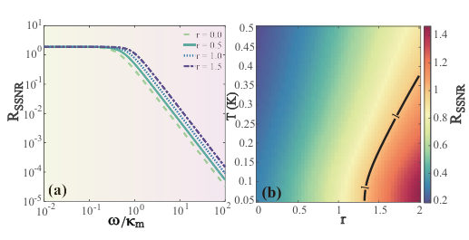
<figcaption class="paper-figure-caption"><b>Fig 5.</b> FIG. 5. (a) Stationary SNR versus normalized frequency ω/κm for different squeezing parameters. (b) Stationary SNR as functions of temperature and squeezing parameter, the black solid contour de- notes the threshold RSSNR = 1.</figcaption>
</figure>

**Summary.** This paper proposes a transient quantum sensing method for cavity-magnon systems that outperforms steady-state protocols. By utilizing initial quantum correlations and injected squeezing, the framework enables high-precision, 3D reconstruction of magnetic field vectors. The approach also demonstrates a resonance condition where cavity-induced noise can be effectively canceled.

**Why it may be interesting.** It provides a novel approach to quantum-limited sensing by exploiting non-equilibrium transient dynamics and engineered initial states to surpass steady-state precision limits.

Detailed structure

**Main problem.** Conventional steady-state cavity-magnon magnetometry is limited by the loss of initial-state quantum information, inability to detect arbitrary field orientations, and sensitivity to cavity-added noise.

**Main result.** A transient sensing framework is developed that uses residual initial quantum correlations to enhance SNR and enables 3D magnetic field reconstruction via crosstalk-free quadrature measurements.

**Method.** The authors use Heisenberg-Langevin equations and input-output relations to model transient dynamics, employing a double-difference scheme for vector reconstruction and injected squeezing for noise suppression.

**Model / system.** A cavity-magnon system consisting of a microwave cavity coupled to one or more Yttrium Iron Garnet (YIG) spheres, interacting with a 3D magnetic field pulse.

**Key observables.** Cavity field amplitude and phase quadratures, transient noise spectrum, and signal-to-noise ratio (SNR).

**Important parameters / regimes.** Cavity and magnon decay rates (kappa_a, kappa_m), coupling strength (g_am), squeezing amplitude (r), and the resonance condition g_am = sqrt(kappa_a * kappa_m)/2.

**Assumptions / limitations.** Assumes a delta-function magnetic field pulse and a specific noise power spectral density for weak magnetic fields.

**Figures summary.** Fig 2 shows SNR vs frequency and quadrature detection; Fig 5 shows stationary SNR vs frequency and temperature/squeezing thresholds.

**Paper structure.** The paper introduces the problem of steady-state limitations, describes the transient framework and 3D reconstruction method, analyzes noise suppression via squeezing and resonance, and discusses scalability with multiple YIG spheres.

Abstract

We present a transient quantum sensing framework for cavity-magnon systems that circumvents the inevitable loss of initial-state quantum properties plaguing conventional steady-state protocols. Explicitly incorporating finite-time dynamics and adopting an engineered steady state as the initial condition, we derive the exact transient noise spectrum. We show that residual initial quantum correlations alone can drastically enhance the short-time signal-to-noise ratio (SNR) beyond that achievable with unsqueezed steady-state schemes. Through analysis of the transient spectral density and joint measurements of orthogonal cavity quadratures, we realize crosstalk-free reconstruction of all three magnetic field components, enabling orientation of magnetic signals. In the long-time limit, our theory yields a closed-form stationary noise spectrum and uncovers a resonance condition $g_{am}=\sqrt{κ_aκ_m}/2$, where cavity field quantum noise is fully canceled without requiring strong coherent coupling. Away from this resonance, injected squeezing further suppresses cavity induced noise and broadens the detection bandwidth. Extending the framework to an array of $N$ yttrium iron garnet (YIG) spheres generates a collective bright mode, with magnon-probe noise scaling as $1/N$. Our results establish a unified route to scalable, high precision, multidimensional quantum magnetometry using cavity-magnon platforms.

[↑ back to top](#top)

### [Parametrically Driven iSWAP Gate Using a Capacitively Shunted Double-Transmon Coupler at the Zero-Flux Sweet Spot](http://arxiv.org/abs/2604.27679v1)

**Authors:** Shinichi Inoue, Rui Li, Kentaro Kubo, Yinghao Ho, Yasunobu Nakamura, Hayato Goto  
**Type:** experiment · **Category:** quantum information and computing · **PDF:** <https://arxiv.org/pdf/2604.27679v1>  
**Analysis basis:** full PDF text, analyzed in chunks
**Topic relevance:** 🔥 `QC/QI experiment` **5/5** · `non-equilibrium dynamics` **2/5**

↔ Scroll figures horizontally

<figure class="paper-figure-card">

<figcaption class="paper-figure-caption"><b>Fig 1.</b> FIG. 1. Device and operating principle of the parametrically driven iSWAP gate at the zero-flux sweet spot. (a) False-colored optical micrograph. In the present work, we use the same device as in Ref. 28. (b) Circuit diagram of the device. Black crosses represent Josephson junctions. The device has two fixed-frequency transmon qubits (Q1 and Q2) coupled via a CSDTC. The CSDTC consists of two transmons (C3 and C4), which hybridize into two internal modes (the P mode and the M mode) through the interaction mediated by a Josephson junction (JJ5) and a shunt capacitor. A local magnetic flux Φex generated by a dedicated bias line (green) threads the coupler loop. Microwave flux drive is applied...</figcaption>
</figure>
<figure class="paper-figure-card">

<figcaption class="paper-figure-caption"><b>Fig 2.</b> FIG. 2. Characterization of parametrically driven iSWAP interaction. (a) Chevron patterns of the excited-state popu- lations of Q1 and Q2, plotted as a function of the frequency ωd and pulse duration of the flux drive with the amplitude φd/2π = 0.28. The initial state is |01⟩. (b) Experimentally measured iSWAP interaction strength giSWAP and (c) reso- nant drive frequency ωres d as functions of the squared flux- drive amplitude φ2 d, together with numerical simulation re- sults (black solid curves) and analytic prediction, giSWAP (or- ange dashed line) given by Eq. (23).</figcaption>
</figure>
<figure class="paper-figure-card">
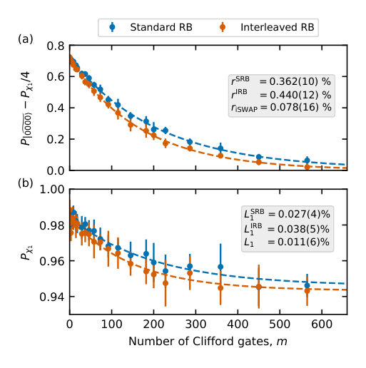
<figcaption class="paper-figure-caption"><b>Fig 3.</b> FIG. 3. Randomized benchmarking of the iSWAP gate with a total gate duration ttot of 112 ns. (a) Sequence fidelity P| g 0000⟩−Pχ1/4 as a function of the number of Clifford gates. The dashed lines are fits to Eq. (28). (b) Leakage randomized benchmarking. The dashed lines are fits to Eq. (30).</figcaption>
</figure>
<figure class="paper-figure-card">

<figcaption class="paper-figure-caption"><b>Fig 4.</b> FIG. 4. (a) Experimentally measured iSWAP depolarization- induced error rD iSWAP, coherent ZZ error rZZ, and leakage error L1 as a function of the total iSWAP gate duration ttot. The blue dashed line denotes gate infidelities estimated from the qubit coherence times measured at zero flux bias. (b) Effective coherence time T D (blue dots) inferred from the depolarization-induced error for each total gate duration ttot. The blue dashed line shows the effective coherence time es- timated from the same qubit coherence properties as in (a), and the shaded blue band indicates the ±1σ uncertainty. The red and purple markers show the effective coherence times re- ported for CZ gates using a DTC...</figcaption>
</figure>
<figure class="paper-figure-card">
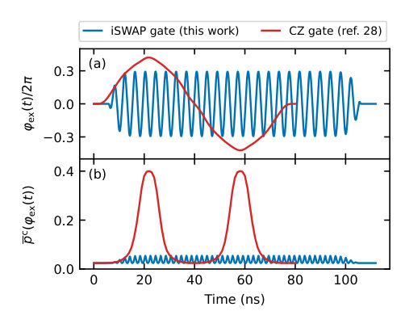
<figcaption class="paper-figure-caption"><b>Fig 5.</b> FIG. 5. (a) Optimized flux-drive waveform for the iSWAP gate (ttot = 112 ns), together with the symmetric part of the BNZ waveform used to implement a CZ gate (ttot = 80 ns) on the same device in Ref. 28. (b) Numerically simulated coupler hybridization fraction as a function of time. The solid blue and red lines represent the hybridization fractions for the iSWAP- and CZ-gate waveforms in (a), respectively.</figcaption>
</figure>
<figure class="paper-figure-card">
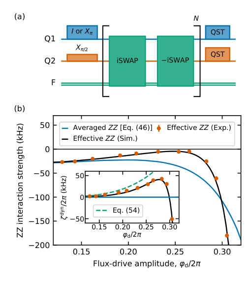
<figcaption class="paper-figure-caption"><b>Fig 6.</b> FIG. 6. (a) Pulse sequence used to evaluate the effective ZZ interaction strength. F stands for the flux drive inducing the iSWAP and −iSWAP gates. (b) Experimentally measured effective ZZ interaction ζeff (orange dots) and numerically calculated averaged static ZZ interaction ζavg [Eq. (46); blue curve] as a function of the flux-drive amplitude. The solid black curve is the full-Hamiltonian simulation of the effective ZZ interaction, which shows quantitative agreement with the experimental data. The inset shows the dynamical contribu- tions corresponding to the dots and curves in (b). The green dashed curve is the analytic estimate of the dynamical ZZ interaction from Eq. (54).</figcaption>
</figure>
<figure class="paper-figure-card">
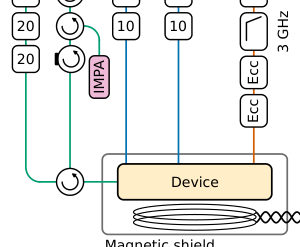
<figcaption class="paper-figure-caption"><b>Fig 7.</b> FIG. 7. Room-temperature control electronics and cryogenic wiring. The SHFQC+ provides qubit drive tones (XY1, XY2) and generates/detects a readout tone (RO/RI), while the HDAWG delivers the parametric flux-drive waveform (Z) to the coupler’s flux loop.</figcaption>
</figure>
<figure class="paper-figure-card">
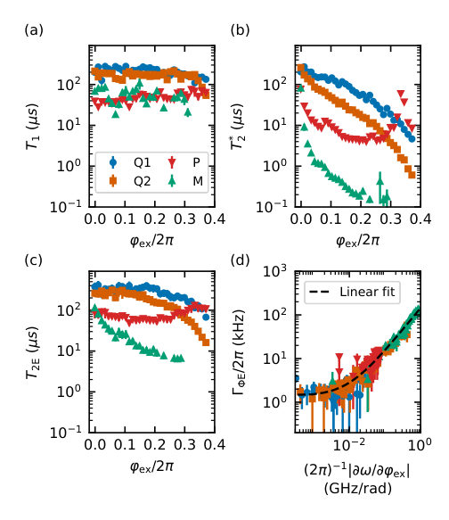
<figcaption class="paper-figure-caption"><b>Fig 8.</b> FIG. 8. Flux dependence of the coherence properties of the two data qubits and the two coupler modes. (a) Energy- relaxation time T1, (b) Ramsey dephasing time T ∗ 2 , and (c) Hahn-echo dephasing time T2E measured as functions of the external flux bias φex for Q1, Q2, the P mode, and the M mode. (d) 1/f-noise-induced pure-dephasing rate ΓΦE ex- tracted from the Hahn-echo decay curves as a function of the flux sensitivity of the corresponding energy level. The dashed line shows a linear fit with a positive intercept to the com- bined data.</figcaption>
</figure>
<figure class="paper-figure-card">
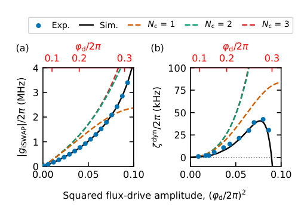
<figcaption class="paper-figure-caption"><b>Fig 9.</b> FIG. 9. Comparison with analytic results obtained from the toy-model Hamiltonian. The blue dots and black solid curves are experimental data and full-Hamiltonian numeri- cal simulation, respectively. Nc is the cutoff number, mean- ing that the analytic expressions include the summation over n = −Nc, . . . , Nc −1. The results for Nc = 2 and 3 nearly overlap within the flux-bias range shown here, indicating that Nc = 2 is already sufficient to capture the essential physics. (a) iSWAP interaction strength giSWAP [Eq. (C45)] as a func- tion of the squared flux-drive amplitude φ2 d. (b) Dynamical ZZ interaction strength ζdyn [Eq. (C54)] as a function of the flux-drive amplitude φd.</figcaption>
</figure>
<figure class="paper-figure-card">
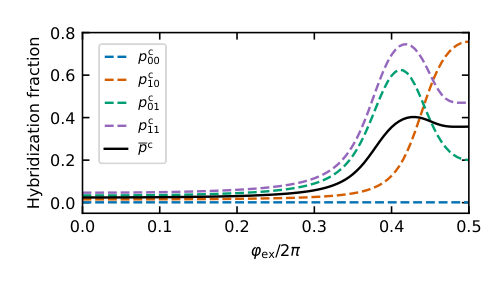
<figcaption class="paper-figure-caption"><b>Fig 10.</b> FIG. 10. Hybridization fractions pc ij of the coupler modes in the computational states |ij⟩(φex) [Eq. (D14)] as functions of the external flux φex. The solid black line shows the average ¯pc defined in Eq. (45).</figcaption>
</figure>

**Summary.** The researchers implemented a high-fidelity iSWAP gate between fixed-frequency transmons using a specialized capacitively shunted coupler. By operating at the zero-flux sweet spot and using parametric driving, they significantly reduced decoherence and unwanted ZZ interactions. This approach enables faster, more scalable two-qubit gates for superconducting quantum processors.

**Why it may be interesting.** The paper demonstrates a method for controlling many-body-like interactions (exchange and ZZ) via parametric driving and provides insights into managing qubit-coupler hybridization, which is relevant to open quantum systems and circuit QED.

Detailed structure

**Main problem.** Achieving high-fidelity two-qubit iSWAP gates in superconducting circuits while minimizing unwanted ZZ interaction, leakage, and qubit-coupler hybridization caused by large flux pulses.

**Main result.** Demonstrated a high-fidelity (99.92%) parametrically driven iSWAP gate at the zero-flux sweet spot with a gate time of 112 ns, achieving ZZ suppression through a combination of static and dynamical mechanisms.

**Method.** Experimental implementation using a capacitively shunted double-transmon coupler (CSDTC) with an AC flux drive, characterized via randomized benchmarking (SRB, IRB, LRB) and calibrated using software-based virtual-Z frame updates.

**Model / system.** A superconducting circuit consisting of two highly detuned, fixed-frequency transmon qubits coupled via a Capacitively Shunted Double-Transmon Coupler (CSDTC) that hybridizes into symmetric and antisymmetric modes.

**Key observables.** Average gate fidelity, leakage rate, iSWAP interaction strength, effective ZZ interaction, and hybridization fraction.

**Important parameters / regimes.** Gate fidelity of 99.92(2)%, gate time of 112 ns, zero-flux sweet spot operation, and hybridization fraction of approximately 0.05.

**Assumptions / limitations.** The analysis assumes the ability to compensate for phase errors via software frame updates and uses a three-level approximation to explain dynamical ZZ interaction.

**Figures summary.** Fig 1 shows the device micrograph, circuit diagram, and energy spectrum; Fig 2 shows chevron patterns for population exchange; Fig 3 displays gate and leakage error extraction; Fig 4 compares error scaling with gate duration; Fig 5 compares iSWAP and CZ waveforms; Fig 6 shows experimental vs simulated ZZ interaction; Fig 14/15 show PTM reconstruction and readout IQ clusters.

**Paper structure.** The paper introduces the hardware problem, describes the CSDTC architecture and parametric driving mechanism, presents experimental gate fidelity and error budget analysis, details the suppression of ZZ interaction, explains the calibration/phase-tracking protocol, and concludes with readout characterization.

Abstract

A double-transmon coupler (DTC) enables a fast, high-fidelity CZ gate between two highly detuned, fixed-frequency transmon qubits. Moreover, a recently proposed capacitively shunted DTC (CSDTC) realizes a small residual ZZ interaction over a wide flux-bias range around zero flux, eliminating the necessity of static flux biasing while maintaining high CZ-gate fidelity. However, CZ gates with the DTC and CSDTC require baseband flux pulses with large amplitudes, which are vulnerable to pulse distortion and decoherence due to large qubit-coupler hybridization. To address these issues, we experimentally demonstrate a parametrically driven iSWAP gate operated at zero flux bias between highly detuned, fixed-frequency transmon qubits coupled through a CSDTC. Using a simple flux-drive waveform without predistortion, we realize an average gate fidelity of 99.92(2)% at a total gate time of 112 ns. The observed high-fidelity performance is consistent with small qubit-coupler hybridization and small effective ZZ interaction during the gate. Our numerical simulations reproduce the experimentally observed iSWAP interaction rate and effective ZZ interaction, demonstrating the applicability of the theoretical model not only to spectral information but also to time-domain dynamics such as gate operations. These results boost further progress in the research of superconducting quantum computers.

[↑ back to top](#top)

### [Demonstration of Exponential Quantum Speedup with Constant-Depth Compiled Circuits for Simon's Problem](http://arxiv.org/abs/2604.27457v1)

**Authors:** Phattharaporn Singkanipa, Victor Kasatkin, Daniel A. Lidar  
**Type:** both · **Category:** quantum information and computing · **PDF:** <https://arxiv.org/pdf/2604.27457v1>  
**Analysis basis:** full PDF text, analyzed in chunks
**Topic relevance:** 🔥 `QC/QI experiment` **5/5**

↔ Scroll figures horizontally

<figure class="paper-figure-card">

<figcaption class="paper-figure-caption"><b>Fig 1.</b> FIG. 2. Comparison of two oracle constructions for Simon-5 (b = 01111) in the graph representation. CNOTs can be placed in the same entangling layer when they do not share any qubits. For the HW(b) = 4 instance shown here, the construction presented in this work can be scheduled in two entangling layers, whereas the con- struction in Ref. [47] requires three under the same non-overlapping- qubit scheduling rule.</figcaption>
</figure>
<figure class="paper-figure-card">

<figcaption class="paper-figure-caption"><b>Fig 2.</b> FIG. 3. Circuit construction underlying the compiled Simon-5 query circuits in the graph representation. Using the reduction procedure, we can trace out an appropriate subset of the leading dashed boxes to obtain Simon-m for any m satisfying HW(b) ≤m &lt; 5.</figcaption>
</figure>
<figure class="paper-figure-card">

<figcaption class="paper-figure-caption"><b>Fig 3.</b> FIG. 4. Circuit for w2Simon-3 compiled on Boston using the ALAP scheduling strategy. The native gates shown are Rz (circular arrows), √</figcaption>
</figure>
<figure class="paper-figure-card">
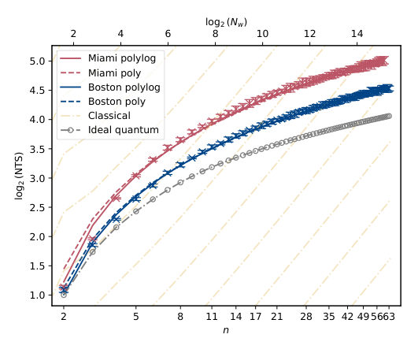
<figcaption class="paper-figure-caption"><b>Fig 4.</b> FIG. 5. log2(NTSQ) as a function of n (bottom axis) for the restricted-HW Simon problem with cutoff w = 3 on Boston (blue, up to n = 63) and Miami (red, up to n = 60); the top axis shows log2(Nw). The solid lines denote fits using the polylog model [Eq. (8)], and the dashed lines denote fits using the poly model [Eq. (9)]. The error bars show bootstrapped 1σ uncertainties. The yellow dash-dot lines represent the scaling of log2(NTSlb C ) and also serve as a visual guide for the large-n scaling of the poly model. The gray dashed line is log2 of the interpolated noiseless-quantum esti- mate given by Eq. (6).</figcaption>
</figure>
<figure class="paper-figure-card">
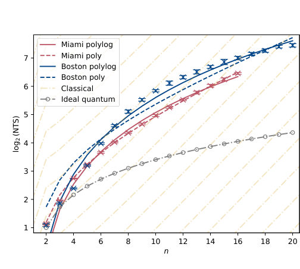
<figcaption class="paper-figure-caption"><b>Fig 5.</b> FIG. 6. log2(NTSQ) as a function of n on Boston (blue) and Miami (red) for the original wnSimon-n, up to n = 20 and n = 16, respec- tively. The line styles and reference curves are the same as in Fig. 5.</figcaption>
</figure>
<figure class="paper-figure-card">
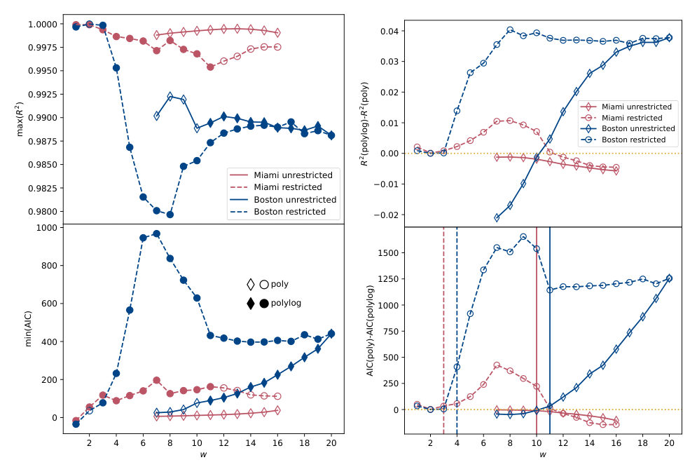
<figcaption class="paper-figure-caption"><b>Fig 6.</b> FIG. 7. Test of whether the polylog or poly model is the better fit for NTSQ as a function of HW w. For both Boston (blue) and Miami (red), solid lines with diamond markers denote the unrestricted Simon’s problem wnSimon-n with n ≤w, and dashed lines with circle markers denote the restricted-HW Simon’s problem wwSimon-n. The maximum HW is wmax = 16 and wmax = 20 on Miami and Boston, respectively. For the restricted-HW version, w ∈[1, wmax]; each point is fitted for n ∈[2, nmax], where nmax is the largest problem size for which the bar height in Fig. 9 is at least w. For the unrestricted version, w ∈[7, wmax]; the lower bound choice w = 7 is discussed in the main text, and each point is...</figcaption>
</figure>
<figure class="paper-figure-card">
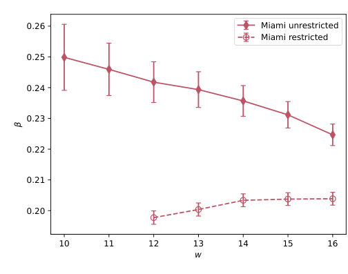
<figcaption class="paper-figure-caption"><b>Fig 7.</b> FIG. 8. The fitted scaling exponent β of the poly model as a func- tion of Hamming weight w on Miami for the unrestricted-HW case (solid diamonds, shown for w ∈[10, 16]) and the restricted-HW case (circles, shown for w ∈[12, 16]). In both cases, the fitted quantum exponent satisfies βQ &lt; βC = 1/2 throughout the displayed range, indicating polynomial quantum speedup wherever the poly model is the preferred fit. Error bars represent one standard deviation (1σ) of the fitted parameter obtained from bootstrapped data.</figcaption>
</figure>
<figure class="paper-figure-card">
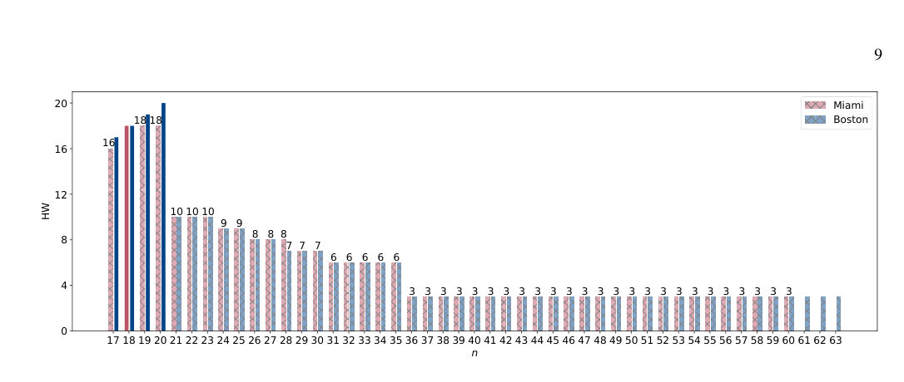
<figcaption class="paper-figure-caption"><b>Fig 8.</b> FIG. 9. Availability range of the NTS analysis as a function of problem size. For each problem size n shown, the bar height gives the largest Hamming-weight cutoff wavail max (n) for which NTSQ could be evaluated on Boston (blue) and Miami (red). A solid bar reaching wavail max (n) = n corresponds to the original Simon problem wnSimon-n; a cross-hatched bar with wavail max (n) &lt; n indicates that only restricted-HW instances wwSimon-n were available at that problem size. For example, on Miami the n = 17 unrestricted-Simon instance did not yield a usable NTSQ value, whereas the w18Simon-18 instance did. Consequently, the Miami unrestricted-Simon scaling analysis uses the largest contiguous...</figcaption>
</figure>
<figure class="paper-figure-card">
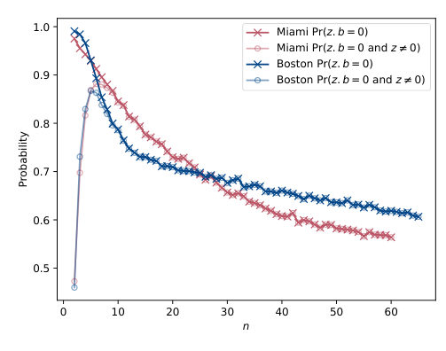
<figcaption class="paper-figure-caption"><b>Fig 9.</b> FIG. 12. Probabilities of obtaining a valid equation, Pr(z ⋅b = 0) (cross markers) and a valid nonzero equation, Pr(z ⋅b = 0 ∧z ≠0) (open-circle markers) on Miami (red) and Boston (blue), as functions of problem size n = 2, 3, . . . , nmax, where nmax = 60 (Miami) and nmax = 65 (Boston). Each data point is averaged over Hamming- weight classes i = 1, 2, . . . , n with weights proportional to (n i). The probability Pr(z ⋅b = 0) serves as a direct measure of circuit perfor- mance, since an ideal Simon circuit has Pr(z ⋅b = 0) = 1.</figcaption>
</figure>
<figure class="paper-figure-card">
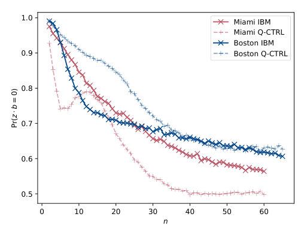
<figcaption class="paper-figure-caption"><b>Fig 10.</b> FIG. 13. Probability of obtaining z ⋅b = 0 as a function of problem size n, reproducing the results of Fig. 12 with the addition of data obtained via Q-CTRL.</figcaption>
</figure>

**Summary.** This paper demonstrates exponential quantum speedup for Simon's problem on real superconducting hardware using a new constant-depth compilation strategy. By making the circuits shallow enough for the NISQ era, the authors show that algorithmic advantage is experimentally accessible even without full error correction.

**Why it may be interesting.** not directly relevant

Detailed structure

**Main problem.** Demonstrating exponential quantum speedup for a version of Simon's problem on NISQ-era superconducting hardware by overcoming high circuit depth and SWAP overhead.

**Main result.** The authors achieved exponential quantum speedup on the IBM Boston processor across a wide Hamming-weight range and observed a transition from exponential to polynomial speedup on the IBM Miami processor at higher Hamming weights.

**Method.** A hardware-aware compilation strategy was developed to reduce the quantum part of the Simon query circuit to constant depth (O(1)) and linear connectivity, mapping directly to the device layout.

**Model / system.** The experiment was performed on IBM superconducting quantum processors, specifically the 156-qubit 'Boston' (heavy-hex connectivity) and 120-qubit 'Miami' (square-lattice connectivity) devices.

**Key observables.** Number of queries to solution (NTS), success probability (Pr(z . b = 0)), and scaling exponents (alpha for polylog and beta for poly models).

**Important parameters / regimes.** Problem size (n), Hamming weight of the hidden bitstring (w), and the scaling regimes (exponential vs. polynomial).

**Assumptions / limitations.** The study assumes a restricted-Hamming-weight version of Simon's problem and utilizes a factorized-CPTP-map assumption to neglect crosstalk between qubit groups.

**Figures summary.** Figures illustrate the quantum circuit construction, the reduction of oracle complexity, scaling plots of NTS vs. problem size, and statistical comparisons (AIC/R2) between polylog and poly models.

**Paper structure.** The paper introduces the problem and hardware-aware compilation method, details the oracle construction and circuit depth reduction, presents experimental results on Boston and Miami processors, performs statistical model selection (polylog vs. poly), and discusses the impact of optimization tools like Q-CTRL.

Abstract

We demonstrate exponential quantum speedup for a restricted-Hamming-weight version of Simon's problem on present-day superconducting quantum processors by introducing a hardware-aware compilation strategy that compiles the quantum part of each Simon query circuit to constant depth. The resulting compiled circuits have $O(1)$ depth and linear connectivity, map directly onto common device layouts, and avoid additional routing and SWAP overhead. Implemented on IBM's $156$-qubit Boston and $120$-qubit Miami processors, the resulting circuits achieve sufficiently high fidelity to exhibit algorithmic quantum speedup without error suppression. Using the number-of-queries-to-solution metric, we observe exponential speedup over the classical lower bound across the full Hamming-weight range studied on Boston and across low-to-intermediate Hamming weights on Miami; at higher Hamming weights on Miami, we still observe polynomial speedup. The same construction also reaches a regime where the original Simon problem is recovered for the problem sizes studied. These results show that careful hardware-aware compilation can make exponential quantum speedup experimentally accessible for a canonical hidden-subgroup problem in the NISQ regime.

[↑ back to top](#top)

### [Domain-wall melting in all-to-all QSSEP from random-matrix theory](http://arxiv.org/abs/2604.28151v1)

**Authors:** Denis Bernard, Lorenzo Piroli, Stefano Scopa  
**Type:** theory · **Category:** statistical mechanics · **PDF:** <https://arxiv.org/pdf/2604.28151v1>  
**Analysis basis:** full PDF text, analyzed in chunks
**Topic relevance:** 🔥 `entanglement & information structure` **4/5** · 🔥 `non-equilibrium dynamics` **4/5** · `correlated / nonlocal dissipation` **3/5** · `non-equilibrium universality` **3/5** · `Keldysh / 2PI / non-Gaussian methods` **2/5** · `driven-dissipative phase transition` **2/5** · `methods for driven-dissipative` **2/5**

↔ Scroll figures horizontally

<figure class="paper-figure-card">

<figcaption class="paper-figure-caption"><b>Fig 1.</b> Figure 1. Illustration of the setup. We consider a one-dimensional quantum system of size L, where spinless fermions can hop between any pair of sites j →k, with amplitudes given by different realization of the complex Brownian motion. The hopping amplitudes are reset at each time step. The system is initialized in a domain-wall configuration, with the leftmost M sites occupied and the rest of the chain empty. During the evolution, we probe fluctuations in a subregion Aℓof size ℓ.</figcaption>
</figure>
<figure class="paper-figure-card">
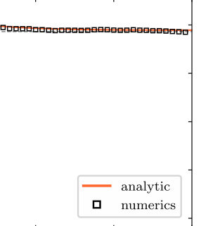
<figcaption class="paper-figure-caption"><b>Fig 2.</b> Figure 2. Entropy density dynamics from a domain-wall initial state with L = 32 and M = ℓ= L/2. The solid line corresponds to the analytic prediction in Eq. (46), while the symbols are obtained from numerical simulations of the quantum dynamics (see Appendix A), averaged over 200 realizations. The dashed horizontal line marks the steady-state value s(∞) = 2 log(2) −1.</figcaption>
</figure>
<figure class="paper-figure-card">
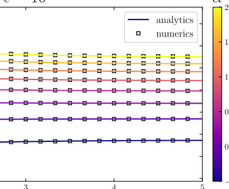
<figcaption class="paper-figure-caption"><b>Fig 3.</b> Figure 3. Charge full-counting statistics dynamics from a domain-wall initial state with L = 32 and M = ℓ= L/2. The solid lines correspond to the analytic predictions in Eq. (52), while the symbols are obtained from numerical simulations of the quantum dynamics (see Appendix A), averaged over 200 realizations. Several values of α are shown, as indicated by the color legend.</figcaption>
</figure>
<figure class="paper-figure-card">

<figcaption class="paper-figure-caption"><b>Fig 4.</b> Figure 4. Comparison between the classical and quantum dynamics of the charge full- counting statistics. Symbols: numerical data for the time evolution of Fclass ℓ (α, t) for ℓ= M = L/2 = 16 as a function of time for different values of α (see color legend), obtained from Eq. (81) by direct matrix exponentiation. Solid lines: analytic solution for the quantum dynamics F(α, t), given in Eq. (52). Dashed horizontal lines indicate the steady-state value in Eq. (69).</figcaption>
</figure>
<figure class="paper-figure-card">

<figcaption class="paper-figure-caption"><b>Fig 5.</b> Figure 5. Numerical analysis of the finite-size deviation |∆L(α, t)| between the classical and quantum charge full-counting statistics as a function of L, for different values of α and t. Quantum data are obtained from simulations of the all-to-all QSSEP as described in Appendix A, while classical results are computed from the corresponding Markov process in Eq. (81) via direct matrix exponentiation. For each system size, the number of samples is chosen as Nsamp ∼O(L4), ensuring that statistical errors remain smaller than the finite-size deviations. The expected scaling ∼L−1 is shown as a dotted black line for reference.</figcaption>
</figure>

**Summary.** This paper provides an analytical framework to study the melting of a domain wall in the all-to-all quantum symmetric simple exclusion process using random matrix theory. It demonstrates that the quantum and classical charge statistics are identical in the thermodynamic limit and provides exact expressions for the evolution of entanglement entropy. The work highlights the emergence of classical-like transport from underlying quantum dynamics in large-scale systems.

**Why it may be interesting.** This paper is highly relevant for researchers in many-body dynamics and open quantum systems as it provides exact analytical solutions for entanglement and transport in a non-equilibrium, all-to-all interacting quantum system, establishing a direct link between quantum and classical stochastic processes.

Detailed structure

**Main problem.** Characterizing the real-time dynamics of coherent quantum fluctuations and the melting of an initial domain wall in the all-to-all Quantum Symmetric Simple Exclusion Process (QSSEP).

**Main result.** The authors show that the eigenvalues of the correlation matrix evolve according to a Jacobi process, and that in the thermodynamic limit, the quantum and classical full-counting statistics of the charge coincide without finite-time corrections.

**Method.** The study employs Random Matrix Theory (RMT), mapping the evolution of the correlation matrix to a Jacobi process, and uses Itô calculus and Gaussian state formalism to derive analytic solutions.

**Model / system.** The system is an all-to-all Quantum Symmetric Simple Exclusion Process (QSSEP), also known as the charged SYK2 model, consisting of spinless fermions on a fully connected graph with stochastic unitary dynamics.

**Key observables.** von Neumann entanglement entropy, Rényi entanglement entropy, and full-counting statistics (FCS) of the charge.

**Important parameters / regimes.** Thermodynamic limit (L to infinity), subregion size ratio (theta), particle density ratio (zeta), and the domain-wall regime (M = l = L/2).

**Assumptions / limitations.** The analysis assumes the thermodynamic limit, the self-averaging of spectral observables, and specific smoothness/boundedness conditions for the functions of eigenvalues.

**Figures summary.** Figure 1 illustrates the all-to-all hopping setup; Figure 2 shows the analytic prediction for entropy density dynamics matching numerical simulations; Figure 5 demonstrates the L^-1 scaling of finite-size deviations between quantum and classical processes.

**Paper structure.** The paper introduces the all-to-all QSSEP model, maps the correlation matrix dynamics to a Jacobi process using RMT, derives analytic expressions for entanglement entropy and charge statistics, compares quantum and classical dynamics, and analyzes finite-size corrections and self-averaging properties.

Abstract

We study the melting of a domain wall in the quantum simple exclusion process with all-to-all hoppings (a.k.a. the charged SYK$_2$ model). We show that the real-time dynamics of physical quantities of interest can be obtained exploiting spectral results in random matrix theory. We first show that the eigenvalues of the correlation matrix corresponding to the initially charged subsystem evolve according to a Jacobi process, which is defined in terms of a closed system of stochastic differential equations. In turn, this observation allows us to obtain the real-time dynamics of all the eigenvalue moments. We present two physical applications. First, we study the dynamics of the averaged von Neumann entanglement entropy, arriving at a fully explicit expression in the thermodynamic limit. Second, we compute analytically the full-counting statistics of the charge. Our formula allows us to perform a thorough comparison with the full-counting statistics of the classical simple exclusion process. Notably, we show that, in the thermodynamic limit, the quantum and classical full-counting statistics coincide, with no finite-time corrections.

[↑ back to top](#top)

### [Deep Strong light-matter Coupling in 3D Kane Fermions](http://arxiv.org/abs/2604.28042v1)

**Authors:** Dmitriy Yavorskiy, David Hagenmuller, Noureddine Charrouj, Yurii Ivonyak, Alexander Kazakov, Yanko Todorov, Wojciech Knap, Marcin Bialek  
**Type:** both · **Category:** other · **PDF:** <https://arxiv.org/pdf/2604.28042v1>  
**Analysis basis:** full PDF text, analyzed in chunks
**Topic relevance:** 🔥 `correlated cavity matter` **4/5** · 🔥 `quantum optics experiment` **4/5** · `Dicke superradiance` **3/5** · `driven-dissipative phase transition` **3/5** · `Tavis-Cummings & cavity-many-emitter` **2/5**

↔ Scroll figures horizontally

<figure class="paper-figure-card">
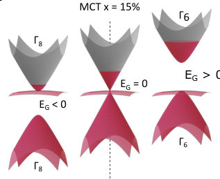
<figcaption class="paper-figure-caption"><b>Fig 1.</b> Fig. 1 Kane fermions in MCT. (a) Temperature evolution of the electronic band structure from an inverted semimetallic phase (EG &lt; 0) at low temperatures, to a normal semiconducting phase (EG &gt; 0) at high temperatures. At the critical temperature Tc ≈100 K (for x = 0.15), the band structure becomes gapless. At this point, the bands exhibit linear momentum dispersion and host massless Kane fermions. With increasing temperature, the Fermi level rises into the conduction band (red). (b) Top, temperature dependence of the electron density in MCT; coloured stars mark the tem- peratures corresponding to the reflection spectra shown in Fig. 2. Bottom, temperature dependence of the Fermi energy (EF...</figcaption>
</figure>
<figure class="paper-figure-card">
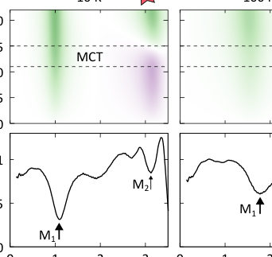
<figcaption class="paper-figure-caption"><b>Fig 2.</b> Fig. 2 Sample and cavity modes. (a) Heterostructure schematic indicates the active MCT layer as the red block, which is sandwiched by ∼1 µm-thick MCT layers with Cd composition continuously graded from 45% to 15% (grey blocks). We probe the sample using THz-TDS in reflection mode. (b) Temperature evolution of M1 and M2 modes in reflection spectra (solid lines). M0 1 and M0 2 denote the modes in the absence of carriers in the MCT layer (dashed lines). (c) Calculated real part of the electric field profile in the cavity at zero magnetic field and selected temperatures (d) Reflection spectra at the same selected temperatures. Arrows mark M1 and M2 modes.</figcaption>
</figure>
<figure class="paper-figure-card">
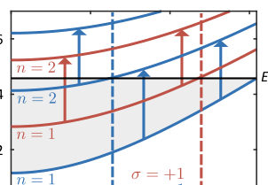
<figcaption class="paper-figure-caption"><b>Fig 3.</b> Fig. 3 LL dispersion and cyclotron transitions in MCT. (a) Energy dispersion of the conduction-band LL En,kz,σ at B = 0.45 T and T = 30 K (electron density ρ = 1.48 × 1015 cm−3). The Fermi energy EF is shown as a horizontal black line. Filled states lie within the shaded area. Blue (red) curves denote the σ = −1 (σ = +1) sector. Dipole-allowed, σ-conserving transitions between the highest occupied and lowest empty LLs are marked by arrows. As kz moves from left to right across the vertical blue (red) dotted line, the filling factors ν−(ν+) decrease from 2 (1) to 1 (0). (b) Cyclotron gap ∆kz,σ between the last filled and first empty LLs as a function of magnetic field B, forming...</figcaption>
</figure>
<figure class="paper-figure-card">
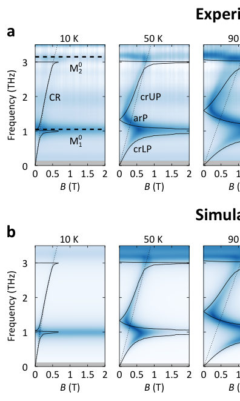
<figcaption class="paper-figure-caption"><b>Fig 4.</b> Fig. 4 Reflection spectra. (a) Reflection as a function of magnetic field at selected temperatures. Dotted lines indicate the CR. At 10 K, two horizontal dashed lines mark photonic modes M0 1 and M0 2. Continuous lines are eigenvalues of Eq. (2), which are labelled in the 50 K segment—the upper and lower co-rotating polaritons as crUP and crLP, respectively, and the anti-rotating polariton as aRP. (b) Simulated spectra based on the transfer-matrix model. The lines are identical to those in panel (a).</figcaption>
</figure>
<figure class="paper-figure-card">
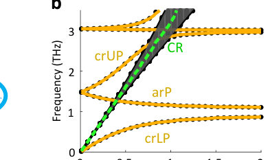
<figcaption class="paper-figure-caption"><b>Fig 5.</b> Fig. 5 Microscopic modelling of MCT polaritons. (a) Schematic representation of the Hamil- tonian (2). The CR collective “bright” mode arises as a coherent superposition of transitions from the highest occupied LL to the lowest unoccupied level, contributed by many transverse wavevectors kz. This mode couples resonantly to the co-rotating photon modes M0 j (j = 1, 2) with strength Ωj,</figcaption>
</figure>
<figure class="paper-figure-card">
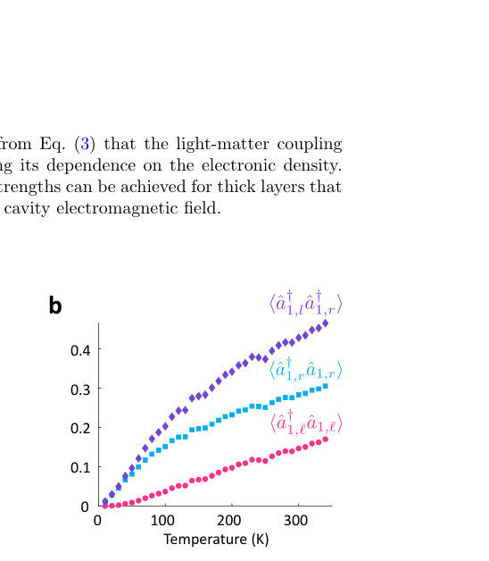
<figcaption class="paper-figure-caption"><b>Fig 6.</b> Fig. 6 Deep strong coupling figures of merit for MCT Landau polaritons. (a) Temperature dependence of the normalized coupling strength Ωj/ωj for the photon modes M0 j (j = 1, 2). (b) Ground-state photon populations in the first cavity mode M0 1, for left- (pink) and right- (blue) circular polarisations, ⟨a† 1,pa1,p⟩(p = l, r), together with the inter-polarization correlations ⟨a† 1,la† 1,r⟩. Here ⟨· · · ⟩denotes the expectation value evaluated in the ground state of the Hamiltonian Eq. (2).</figcaption>
</figure>

**Summary.** The study achieves record-breaking deep strong light-matter coupling in 3D Kane fermions at room temperature. It resolves a long-standing debate by showing that a diamagnetic term naturally emerges to prevent a superradiant phase transition. This work opens new avenues for developing polaritonic semiconductor devices in extreme coupling regimes.

**Why it may be interesting.** It addresses a fundamental debate in cavity QED regarding gauge invariance and the existence of phase transitions in light-matter systems with relativistic-like matter, while demonstrating extreme non-perturbative coupling regimes.

Detailed structure

**Main problem.** Resolving the controversy regarding whether a superradiant quantum phase transition can occur in relativistic-like electronic systems (Dirac/Kane fermions) due to the potential absence of the diamagnetic A^2 term.

**Main result.** Demonstrated the deep strong-coupling regime with a record coupling ratio exceeding 1.6 at room temperature and proved that a gauge-invariant A^2 term emerges, precluding the superradiant phase transition.

**Method.** THz time-domain spectroscopy in reflection mode combined with a gauge-invariant microscopic quantum model and transfer-matrix simulations.

**Model / system.** 3D Kane fermions in a bulk Mercury Cadmium Telluride (MCT) layer coupled to a Fabry-Perot resonator, modeled using a Hopfield-like Hamiltonian derived via a projected unitary gauge transformation.

**Key observables.** Reflectivity spectra, electric field spectra, cyclotron resonance transitions, and polariton dispersion.

**Important parameters / regimes.** Normalized coupling ratio (eta > 1.6), temperature-dependent carrier density, magnetic field, and the ultralow effective mass of Kane fermions.

**Assumptions / limitations.** Low-excitation regime where electronic transitions are mapped to bosonic operators, and neglect of spin-flip excitations.

**Figures summary.** Figure 1 shows the temperature evolution of the MCT band structure and carrier density; Figure 2 illustrates the cavity design, electric field distribution, and temperature-dependent cavity modes.

**Paper structure.** The paper introduces the deep strong-coupling problem, describes the MCT/cavity experimental platform, presents THz spectroscopy results, details the microscopic gauge-invariant theoretical model, and concludes by resolving the superradiant phase transition controversy.

Abstract

Deep strong light-matter coupling represents an extreme non-perturbative regime of quantum electrodynamics, in which the interaction strength exceeds the bare frequencies of the uncoupled systems. The ground state features strong quantum correlations between photons and matter excitations, and new cavity-driven phase transitions are expected to occur. Whether a superradiant quantum phase transition, marked by spontaneous dipole ordering and photon condensation, is possible has remained a long-standing and controversial question. Such phenomena have been proposed to arise in exotic electronic systems hosting Dirac and Kane fermions, owing to the formal absence of an $A^2$ term in their low-energy Hamiltonian. Here we exploit the ultralow effective mass of Kane fermions to realise Landau polaritons in a bulk mercury cadmium telluride layer coupled to a Fabry-Perot resonator. Using thermally tunable carrier density, we continuously tune the coupling from the weak to the deep-strong regime, achieving a record normalised coupling ratio exceeding 1.6 above room temperature. The measured polariton spectra are in excellent agreement with a rigorous, gauge-invariant microscopic theory. Despite the nonlinear Landau level structure of relativistic Kane fermions, we show that a diamagnetic $A^2$ term naturally emerges and precludes a superradiant phase transition. These results resolve the long-standing controversy surrounding cavity quantum electrodynamics of relativistic-like matter systems, extend deep-strong-coupling physics to Kane fermions, and open new opportunities for polaritonic semiconductor devices operating in extreme light-matter coupling regimes.

[↑ back to top](#top)

### [Emergence of prethermal time quasicrystalline order in a quasiperiodically driven non-interacting spin chain](http://arxiv.org/abs/2604.27250v1)

**Authors:** Davood Marripour, Jahanfar Abouie  
**Type:** theory · **Category:** disordered systems and neural networks · **PDF:** <https://arxiv.org/pdf/2604.27250v1>  
**Analysis basis:** abstract only; PDF text extraction failed or PDF unavailable
**Topic relevance:** 🔥 `non-equilibrium dynamics` **4/5** · 🔥 `scars & prethermalization` **4/5** · `driven-dissipative phase transition` **3/5** · `entanglement & information structure` **3/5** · `non-equilibrium universality` **2/5**

**Summary.** This paper demonstrates that a spin chain driven by two incommensurate frequencies can exhibit a stable, prethermal time quasicrystalline phase. The research shows that this temporal order is robust against perturbations and can be enhanced by specific disorder configurations. This provides a potential platform for creating long-lived nonequilibrium states in driven quantum systems.

**Why it may be interesting.** It explores a novel form of temporal order (TQC) that extends beyond standard Floquet theory, providing insights into how quasiperiodic driving and disorder can be used to engineer long-lived, non-equilibrium phases and suppress heating in many-body systems.

Detailed structure

**Main problem.** The study investigates the emergence and stability of prethermal time quasicrystalline (TQC) order in a spin chain subjected to quasiperiodic driving.

**Main result.** The authors demonstrate that quasiperiodic driving leads to quasiperiodic time-translation symmetry breaking (QTTSB) with robust spectral peaks and suppressed heating, a phase that is stable against perturbations and enhanced by asymmetric disorder distributions.

**Method.** The study utilizes exact diagonalization to analyze the dynamics of the spin chain.

**Model / system.** A non-interacting spin-1/2 chain with disordered Ising interactions (randomly chosen from a symmetric interval) and a random transverse field, driven by a two-part periodic drive consisting of a switching mechanism and a rotating transverse magnetic field with an incommensurate frequency.

**Key observables.** Time autocorrelation function, dynamical structure factor, and entanglement entropy (EE).

**Important parameters / regimes.** Driving frequencies (omega_d and Omega), the irrational ratio omega_d/Omega, the high-frequency regime, and the symmetry/asymmetry of the Ising exchange coupling distribution.

**Assumptions / limitations.** The system is treated as a non-interacting spin chain; the study focuses on the high-frequency regime to observe prethermal effects.

**Paper structure.** The paper introduces the quasiperiodically driven model, describes the numerical methodology (exact diagonalization), presents results for spectral features and entanglement entropy, analyzes the effects of disorder asymmetry and perturbations, and concludes with the implications for nonequilibrium temporal order.

Abstract

We study prethermal time quasicrystalline (TQC) order in a quasiperiodically driven chain of non-interacting spin-1/2 particles. The drive consists of two parts, switched on and off periodically with frequency $ω_d$: (i) disordered Ising interactions, with exchange couplings chosen from a symmetric interval $[-J/2, J/2]$, allowing random antiferromagnetic or ferromagnetic nearest-neighbor couplings, together with a random transverse field; and (ii) a rotating transverse magnetic field with frequency $Ω$.   The ratio $ω_d/Ω$ is chosen to be irrational, producing multiple incommensurate frequencies and yielding quasiperiodic dynamics beyond Floquet theory. Using exact diagonalization, we analyze the time autocorrelation function, dynamical structure factor, and entanglement entropy (EE). In the high-frequency regime, robust spectral peaks at incommensurate frequencies (not integer multiples of the fundamental drives) signal quasiperiodic time-translation symmetry breaking (QTTSB). The EE exhibits sublinear power-law growth followed by a prethermal plateau, indicating suppressed resonant heating due to an energy scale mismatch. The nonequilibrium lifetime increases rapidly with driving frequency. Unlike symmetric disorder sampling, an asymmetric distribution of the Ising exchange couplings induces collective spin rigidity, enhancing the system's resistance to heating. The TQC phase remains stable against next-nearest-neighbor (NNN) exchange perturbations and rotational imperfections, with robustness comparable to discrete time crystals (TCs) under periodic driving. Our results establish this quasiperiodically driven system as a platform for long-lived nonequilibrium temporal order, revealing the interplay of disorder, collective rigidity, and quasiperiodic driving.

[↑ back to top](#top)

### [Observation of Universal Spectral Moments and the Dynamic Dispersive-to-Proliferative Transition](http://arxiv.org/abs/2604.27585v1)

**Authors:** Jia-Xin Zhong, Chang Shu, Nan Cheng, Jee Woo Kim, Kai Zhang, Kai Sun, Yun Jing  
**Type:** both · **Category:** other · **PDF:** <https://arxiv.org/pdf/2604.27585v1>  
**Analysis basis:** full PDF text, analyzed in chunks
**Topic relevance:** 🔥 `driven-dissipative phase transition` **4/5** · 🔥 `non-equilibrium universality` **4/5** · `analog quantum simulation` **3/5** · `non-equilibrium dynamics` **3/5** · `correlated / nonlocal dissipation` **2/5**

↔ Scroll figures horizontally

<figure class="paper-figure-card">
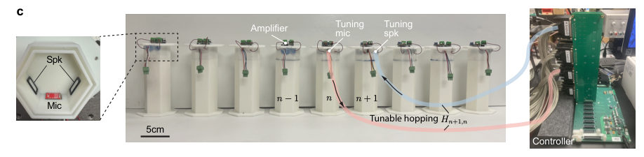
<figcaption class="paper-figure-caption"><b>Fig 1.</b> Figure 1: Boundary-sensitive spectra versus boundary-robust spectral moments, and the acoustic lattice platform. a, For the same bulk non-Hermitian lattice Hamiltonian at finite size L, the complex spectrum {En} reshapes drastically under different boundary geometries (PBC torus versus OBC P- and M-shaped domains), whereas the per-site spectral moments Mα,m(L) are nearly boundary inde- pendent. The residual geometry dependence scales as a universal finite-size correction O(m2/L), and Mα,m(L) →Mm(∞) as L →∞. b, Loop-counting picture for the finite-size deviation. The dashed curve partitions the domain into a bulk region Ωb and a boundary shell Ωe of thickness ∼m/2 (in hop distance). For a...</figcaption>
</figure>
<figure class="paper-figure-card">
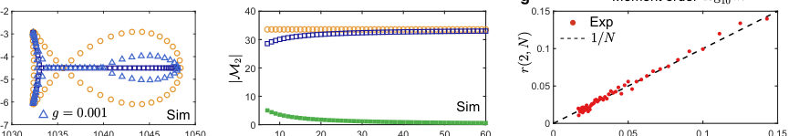
<figcaption class="paper-figure-caption"><b>Fig 2.</b> Figure 2: Observation of spectral moments and finite-size scaling in a 1D non-Hermitian lat- tice. a, Tight-binding schematic of the 1D non-Hermitian lattice. The Bloch Hamiltonian is H(k) = κ+e−2ik + κ−e2ik + 2κ cos k + ω0. A generalized boundary condition (GBC) continu- ously interpolates between open boundary condition (OBC) and periodic boundary condition (PBC) via HGBC = HOBC + g(HPBC −HOBC). Boundary sites (sites 1 and N) are highlighted in dark brown. b, Measured (top) and simulated (bottom) complex spectra under GBCs with different boundary coupling strengths g (color coded). The experiment uses g = 0, 0.1, 1, 2, while the simulation addi- tionally includes a near-OBC case g =...</figcaption>
</figure>
<figure class="paper-figure-card">
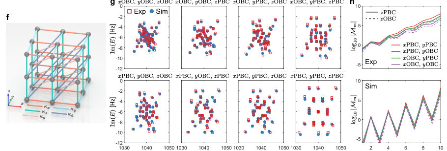
<figcaption class="paper-figure-caption"><b>Fig 3.</b> Figure 3: Observation of spectral moments in higher-dimensional lattices. a, Tight-binding schematic of the 2D reciprocal non-Hermitian lattice. The Bloch Hamiltonian is H(kx, ky) = 2κx cos kx+2κy cos(kx + ky)+ω0. Parameters are: κx = 2i Hz, κy = 4 Hz, and ω0 = 1040 Hz−6i Hz. b–d, The top panel shows three different real-space implementations of a under PBCs in both x and y directions: b a regular 8×8 square lattice, and c, d 9×9 square lattices with a few removed sites (to form an irregular boundary) to show the letter c ‘P’ and d ‘M’. The bottom panel in b–d shows the measured (red squares) and simulated (blue dots) energy spectra. e, Spectral moments up to the 10th order obtained from...</figcaption>
</figure>
<figure class="paper-figure-card">
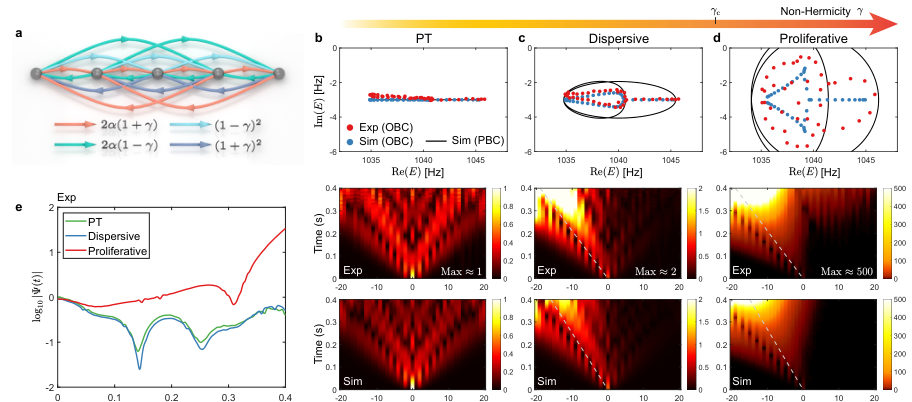
<figcaption class="paper-figure-caption"><b>Fig 4.</b> Figure 4: Observation of the dynamic dispersive-to-proliferative phase transition. a, Tight-binding schematic of the 1D non-Hermitian PT-symmetric lattice. The Bloch Hamiltonian is H(k) = 2α(1 − γ)e−3ik +(1−γ)2e−2ik +2α(1+γ)e−ik +2α(1−γ)eik +(1+γ)2e2ik +2α(1+γ)e3ik. b–d, Results for the three representative regimes: b PT -symmetric (γ = 0), c dispersive (γ = 0.13), and d proliferative (γ = 0.45). In each of b–d, the top panel shows the measured OBC spectra (red dots), the simulated OBC spectra (blue dots), and the theoretical PBC spectra (black curves). The middle and bottom panels show the measured and simulated spatiotemporal evolution of the wave-function amplitude for an initial...</figcaption>
</figure>

**Summary.** The paper shows that while the energy spectra of non-Hermitian systems change drastically with boundary conditions, their spectral moments remain nearly invariant and reflect the true bulk physics. By using an acoustic platform, the authors verify a universal scaling law for finite-size errors and discover a new dynamical phase transition driven by bulk properties.

**Why it may be interesting.** This work is highly relevant to open quantum systems and many-body dynamics as it provides a new way to extract intrinsic bulk properties from finite-size non-Hermitian systems, decoupling local stability from boundary-induced spectral fluctuations.

Detailed structure

**Main problem.** How to characterize intrinsic bulk physics in non-Hermitian systems when the Non-Hermitian Skin Effect (NHSE) causes the complex spectrum to be extremely sensitive to boundary conditions and geometry.

**Main result.** The authors demonstrate that spectral moments are boundary-robust descriptors of bulk physics and establish a universal scaling law for finite-size deviations. They also reveal a dynamical transition from dispersive to proliferative regimes governed by bulk moments rather than boundary-sensitive spectra.

**Method.** The study uses an active acoustic metamaterial platform for full spectral reconstruction and time-domain wave-packet tracking. They employ Green's-function-based spectroscopy and a loop-counting theory to analyze 1D, 2D, and 3D lattices.

**Model / system.** A unified acoustic metamaterial platform implementing non-Hermitian tight-binding models in 1D, 2D, and 3D. The system uses electro-acoustic feedback loops to control non-reciprocal hopping amplitudes and on-site potentials.

**Key observables.** Complex energy spectra, spectral moments (up to 10th order), relative deviation between boundary conditions, and wave-packet amplitude evolution.

**Important parameters / regimes.** Boundary coupling strength (g), system size (L or N), moment order (m), non-reciprocity/non-Hermiticity parameter (gamma), and hopping amplitudes.

**Assumptions / limitations.** The loop-counting theory assumes a regime where on-site potentials dominate over off-diagonal terms (|H_ii| >> |H_{i != j}|) for certain scaling predictions.

**Figures summary.** Fig 1: Concept of spectral moments, loop-counting logic, and acoustic lattice photo. Fig 2: 1D lattice spectra under varying boundary conditions, moment invariance, and finite-size scaling. Fig 3: 2D and 3D lattice implementations and higher-dimensional scaling.

**Paper structure.** Introduction of the boundary sensitivity paradox, presentation of the acoustic platform, demonstration of spectral moment invariance in 1D, derivation and verification of finite-size scaling laws, extension to 2D and 3D geometries, and investigation of the dynamical dispersive-to-proliferative transition.

Abstract

In non-Hermitian systems, spectra can be maximally boundary-sensitive, yet bulk physics need not be. Here we experimentally show that spectral moments provide boundary-robust bulk observables in finite non-Hermitian lattices, even when the spectra undergo dramatic geometry-dependent reshaping due to the skin effect. Using a unified acoustic platform with full spectral reconstruction and time-domain access, we probe one-, two- and three-dimensional lattices and demonstrate that spectral moments remain nearly invariant across distinct boundary geometries while the corresponding complex spectra differ strongly. To connect the thermodynamic theorem to realistic finite systems, we develop a loop-counting theory that identifies the physical origin of finite-size deviations in terms of missing boundary loops, quantitatively captures the corrections, and predicts a scaling law, which we verify experimentally. Beyond acoustic spectroscopy, we reveal a counterintuitive dynamical consequence of moment invariance: a dispersive-to-proliferative bulk transition governed by bulk moment structure rather than spectral boundary sensitivity. As a result, local bulk dynamics can remain stable (dispersive) even in a $\mathcal{PT}$-broken spectral regime, challenging the conventional expectation that $\mathcal{PT}$ breaking necessarily implies feedback-induced dynamical instability (proliferation) through exponentially amplifying spectral components. These results establish spectral moments as practical bulk descriptors for finite non-Hermitian matter and open a route to extracting and controlling intrinsic bulk behavior in realistic wave-based non-Hermitian devices.

[↑ back to top](#top)

### [Observation of attractor transitions in active magnon-polaritons under microwatt drives](http://arxiv.org/abs/2604.27668v1)

**Authors:** Hao Wu, Qichun Liu, Yuanbin Fan, Yulong Liu, Qing Zhao  
**Type:** both · **Category:** other · **PDF:** <https://arxiv.org/pdf/2604.27668v1>  
**Analysis basis:** full PDF text, analyzed in chunks
**Topic relevance:** 🔥 `driven-dissipative phase transition` **4/5** · 🔥 `spintronics-quantum-optics interface` **4/5** · `non-equilibrium dynamics` **3/5** · `quantum optics experiment` **3/5**

↔ Scroll figures horizontally

<figure class="paper-figure-card">
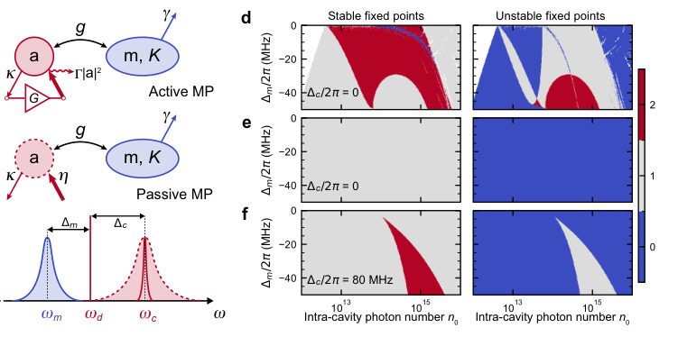
<figcaption class="paper-figure-caption"><b>Fig 1.</b> FIG. 1. Models and stability analysis of the active and passive magnon-polaritons (MP). a,b, Schematics of the active and passive MP models where a cavity photon mode a is coupled to a magnon mode m possessing the nonlinearity K. The coupling is characterized by the spin-photon coupling strength g and the damping of the a and m modes is denoted by κ and γ respectively. The difference between the active and passive MP arises from the driving mechanisms. For the active MP, a self-sustained a mode, acting like a van-der Pol (vdP) oscillator, is established via a feedback architecture consisting of the linear gain G and nonlinear gain saturation Γ|a|2 depending on the photon number, while for...</figcaption>
</figure>
<figure class="paper-figure-card">
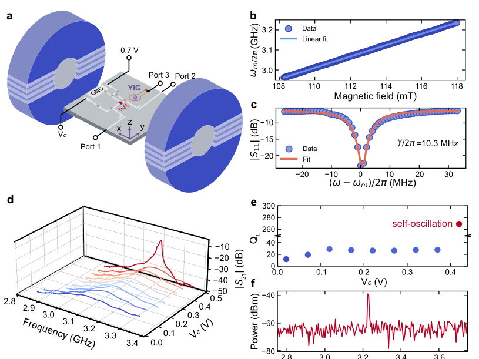
<figcaption class="paper-figure-caption"><b>Fig 2.</b> FIG. 2. Experimental setup and microwave characterizations of the magnon and bare cavity modes. a, The half-wavelength microstrip- line cavity is fabricated on a printed circuit board (PCB) and the gain is provided by a bipolar junction transistor (BJT) which is powered by two-port DC voltages (one is fixed at 0.7 V and the other Vc is adjustable). A yttrium iron garnet (YIG) sphere surrounded by a loop antenna is fixed in a sample holder (not shown) above the PCB and movable via a three-axis (x,y and z) translation stage. The whole setup is positioned between a pair of electromagnets supplying horizontal static magnetic fields. There are three RF ports used for the microwave...</figcaption>
</figure>
<figure class="paper-figure-card">

<figcaption class="paper-figure-caption"><b>Fig 3.</b> FIG. 3. Onset of attractor transitions under microwatt-level drive. a,b,c,d, Experimental and simulated results of the frequency offset of the vdP oscillator caused by its coupling to the YIG sphere subject to an up-sweeping magnetic field. ∆0m = ωm −ω0 d is the magnon-drive (cavity) detuning between the magnetic-field-dependent magnon mode frequency and the initial vdP oscillator frequency. The driving power Pd is varied by the gain in the circuit tuned by Vc and determined according to the vdP oscillator output power. The adjustment of Pd in the simulation is realized by tuning the gain factor G. e, Zoom-in of the sidebands observed in the dashed box of c.</figcaption>
</figure>
<figure class="paper-figure-card">
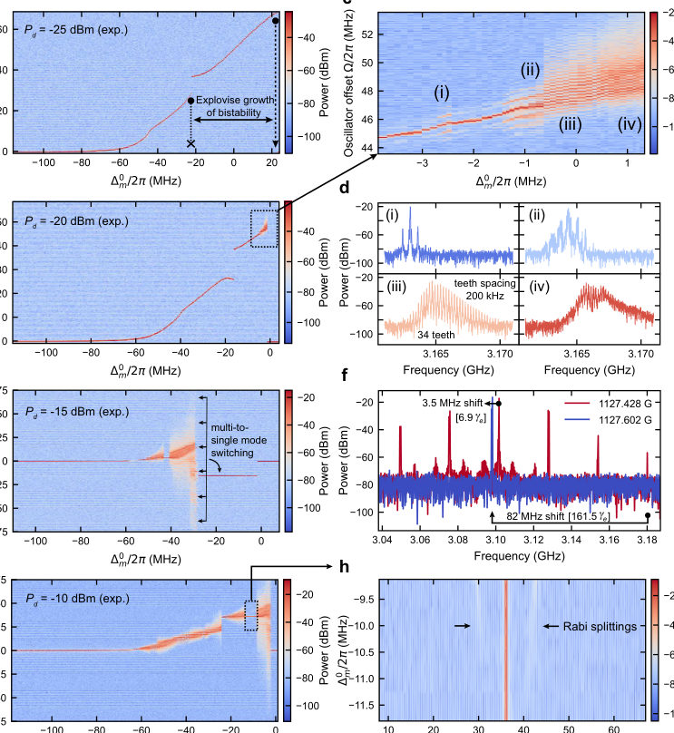
<figcaption class="paper-figure-caption"><b>Fig 4.</b> FIG. 4. Route to chaotic active MP. a,b,e,g, Experimental results of the frequency offset of the vdP oscillator coupled to the YIG sphere subject to a up-sweeping magnetic field under the driving powers beyond 1 µW (-30 dBm). c,d, Zoom-in of the rich nonlinear phenomena observed in the dashed box of b where the four nonlinear regimes show (i) multifrequency limit cycles, (ii) fractals, (iii) frequency-comb-like structure and (iv) chaos. f, Switching of the vdP output spectrum from the multimode to single-mode emission observed in e. The significant peak shifts occur within a change of the magnetic field less than 0.2 G. h, Zoom-in of the magnetic-field-dependent Rabi splittings of the vdP...</figcaption>
</figure>
<figure class="paper-figure-card">
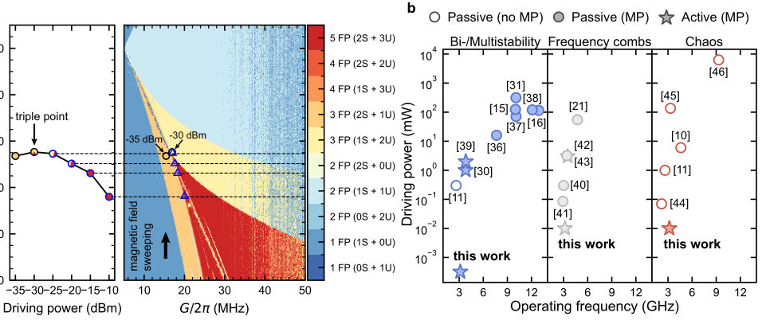
<figcaption class="paper-figure-caption"><b>Fig 5.</b> FIG. 5. Power-dependent stability phase diagram of the active MP revealing its power efficiency in achieving nonlinear attractor transitions. a, Dependence of the critical detuning in real time ∆m = ∆0m −Ωmeasured at different driving powers (left panel). Simulated phase diagrams of the stable and unstable FPs in ∆m −G space of the active MP (right panel). The parameters used for generating the phase diagrams are obtained from the simulation shown in Figs. 3b and 3d that reproduce the experimental results. The color bar consistent with the circle fillings in the left panel indicates the different FP situations where S and U stand for stable and unstable FPs respectively. The deterministic...</figcaption>
</figure>

**Summary.** This paper demonstrates that using an active, self-oscillating cavity allows for the observation of complex nonlinear phenomena like frequency combs and chaos in magnon-polaritons at microwatt power levels. This significantly reduces the power threshold compared to traditional passive systems. The findings open new avenues for low-power nonlinear microwave signal generation, high-precision sensing, and neuromorphic computing.

**Why it may be interesting.** This work is highly relevant to researchers in open quantum systems and quantum optics as it demonstrates a platform for studying non-equilibrium phase transitions, nonlinear cavity QED, and complex attractor dynamics in a highly efficient, low-power regime.

Detailed structure

**Main problem.** The difficulty of experimentally observing and controlling transitions between distinct nonlinear attractors (such as bistability, frequency combs, and chaos) in conventional passive magnon-polariton systems, which typically require high-power milliwatt-class external drives.

**Main result.** The observation of controlled attractor transitions, including the explosive growth of bistability and a full route to chaos, achieved at extremely low microwatt-level power levels using an active magnon-polariton platform.

**Method.** The researchers used a self-oscillating microwave cavity coupled to a YIG sphere, employing stability analysis of fixed points and numerical simulations (Runge-Kutta) to map the nonlinear dynamics and compare them with experimental transmission and emission spectra.

**Model / system.** An active magnon-polariton system consisting of a 1-mm YIG sphere coupled to a microstrip-line cavity with a BJT-based gain element acting as a van der Pol oscillator, incorporating Kerr nonlinearity and Suhl-mediated magnon-magnon scattering.

**Key observables.** Frequency offset of the oscillator, emission spectra (single-peak, multi-frequency, frequency combs, and chaos), transmission spectra (S21), and magnetic-field-triggered spectral shifts.

**Important parameters / regimes.** Microwatt-level drive power (-35 to -10 dBm), spin-photon coupling strength (g), photon and magnon damping rates (kappa, gamma), and DC-controlled gain (G).

**Assumptions / limitations.** The system is modeled using a semiclassical mean-field approach with complex mode amplitudes.

**Figures summary.** Fig 1 compares active vs. passive models and shows simulated phase diagrams; Fig 2 details the experimental setup and magnetic field dependence; Fig 4 shows the progression of nonlinear regimes and frequency offsets; Fig 5 presents the power-dependent stability phase diagram and a comparison of power efficiency with previous studies.

**Paper structure.** The paper introduces the problem of high-power requirements in passive systems, describes the active experimental architecture, presents the theoretical model and stability analysis, details the experimental observation of various nonlinear regimes (from limit cycles to chaos), and concludes with applications in sensing and computing.

Abstract

Magnon-polaritons provide a room-temperature platform for investigating nonlinear cavity quantum electrodynamics in the microwave domain, but experimentally observing controlled transitions among distinct nonlinear attractors remains challenging in conventional passive systems, where strong external driving is usually required. Here we report the observation of attractor transitions in an active magnon-polariton formed by a self-oscillating microwave cavity coupled to a yttrium iron garne (YIG) sphere. The feedback loop supplies an internal microwave drive, while Kerr frequency pulling and Suhl-mediated magnon-magnon scattering produce an enhanced effective nonlinearity. Stability analysis using experimentally calibrated parameters reveals a rich fixed-point (FP) landscape with multiple unstable-FP phases and a triple-point region. By tuning gain across these phases, we observe the first experimental evidence of explosive growth of bistability, followed by transitions to multifrequency limit cycles, comb-like/fractal spectra, and broadband chaotic dynamics at microwatt powers. Near a critical point, magnetic-field-triggered switching between nonlinear emission states produces spectral shifts up to 162 times the bare gyromagnetic response. By enabling low-power attractor transitions and attractor-switching-amplified spectral response, active magnon-polaritons open opportunities for nonlinear microwave signal generation, high-precision sensing, and neuromorphic computing.

[↑ back to top](#top)

### [Experimental detection of entanglement in multimode Gaussian states from high-order intensity correlation moments](http://arxiv.org/abs/2604.27567v1)

**Authors:** Ze-Shan He, Yukuan Zhao, Hao-Shu Tian, Kai Sun, Xiao-Ye Xu, Chuan-Feng Li, Guang-Can Guo  
**Type:** experiment · **Category:** quantum information and computing · **PDF:** <https://arxiv.org/pdf/2604.27567v1>  
**Analysis basis:** full PDF text, analyzed in chunks
**Topic relevance:** 🔥 `QC/QI experiment` **4/5** · 🔥 `quantum optics experiment` **4/5** · `entanglement & information structure` **3/5** · `quantum measurements` **2/5**

↔ Scroll figures horizontally

<figure class="paper-figure-card">

<figcaption class="paper-figure-caption"><b>Fig 1.</b> FIG. 1. Generation of two-mode and three-mode Gaussian states. The laser from a Coherent RegA 9000 is filtered by a 4-f spatial filtering system. We use a single cpKTP crystal to generate a two-mode Gaussian state and subsequently em- ploy two cpKTP crystals to produce a three-mode Gaussian state. The SPDC process in the first crystal generates a two- mode squeezed vacuum state: the idler photon is reflected by a dichroic PBS, while the signal photon is injected into the second crystal simultaneously with the pump laser. After the signal mode polarization is rotated by 90◦, a BBO crystal compensates the time difference between the pump laser and the signal mode after polarization rotation...</figcaption>
</figure>
<figure class="paper-figure-card">

<figcaption class="paper-figure-caption"><b>Fig 2.</b> FIG. 2. PPT criterion inequality for a TMSV. The experi- mental and simulated results for the inequality Eq. (2) as a function of r for g2(0) = 1.8 are shown. The light red solid line with square markers and the light blue solid line with diamond markers represent the simulated values of the two sides of the inequality, corresponding to det σ + 1 and ˜∆2 1, re- spectively. The blue and red dots represent the experimental results, which are in good agreement with the simulations. Specifically, the blue dots correspond to det σ + 1 and the red dots correspond to ˜∆2 1, with r ranging from 0.18 to 0.96.</figcaption>
</figure>
<figure class="paper-figure-card">
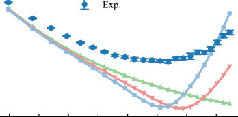
<figcaption class="paper-figure-caption"><b>Fig 3.</b> FIG. 3. Symplectic eigenvalues of the TMSV as a function of r. Experimental and simulated results for the smallest symplectic eigenvalue of the partially transposed covariance matrix ˜λ−are shown. The green solid line with up-triangle marker corresponds to g2(0) = 2, i.e., a pure TMSV. The red and blue solid lines correspond to g2(0) = 1.9 and g2(0) = 1.8, respectively; the latter was obtained using experimentally measured parameters with a PNR detector. The blue dots represent the experimental results. For r &gt; 0.75, the eigen- value increases due to the growing contribution of additional pump supermodes, which modifies the photon-number distri- bution. The black dashed line marks the...</figcaption>
</figure>
<figure class="paper-figure-card">

<figcaption class="paper-figure-caption"><b>Fig 4.</b> FIG. 4. PPT criterion inequality for a TMGS. (a) Experimen- tal and simulated results for inequality Eq. (16) as a function of r at g2(0) = 1.8 with a photon-number cutoff of 5. The light blue solid line with up-triangle markers represents the simulated value of the left-hand side (LHS) of the inequal- ity. The light green and light red solid lines with right- and down-triangle markers represent the upper bounds (UB) and lower bounds (LB) of the right-hand side (RHS), respectively. Experimental results are shown as corresponding dots (see leg- end) and agree well with the simulations. (b) Experimental results for the same inequality with a photon-number cutoff of 32. The observed trend is...</figcaption>
</figure>

**Summary.** The researchers developed a method to detect entanglement in multi-mode Gaussian states using only intensity correlation measurements. By using high-order moments, they bypassed the need for phase-sensitive reference beams, successfully verifying entanglement in both two-mode and three-mode squeezed states.

**Why it may be interesting.** This work is highly relevant to quantum optics and quantum information as it provides a scalable, robust method for certifying entanglement in continuous-variable systems without the experimental complexity of homodyne detection or local oscillators.

Detailed structure

**Main problem.** Experimental detection of entanglement in multi-mode Gaussian states without the need for a coherent local oscillator or phase-sensitive measurements.

**Main result.** Successfully demonstrated entanglement detection for two-mode and three-mode Gaussian states using high-order intensity correlation moments, even when phase information is unavailable.

**Method.** The authors use high-order (up to sixth-order) intensity correlation moments and the Peres-Horodecki (PPT) criterion, applying mathematical bounds to handle phase-sensitive terms in the three-mode case.

**Model / system.** The system consists of multi-mode Gaussian states (TMSV and TMGS) generated via spontaneous and cascable parametric down-conversion in cpKTP crystals, detected using a 32-channel pseudo-photon-number-resolving detector made of SNSPDs.

**Key observables.** High-order intensity correlation moments (up to 6th order), photon-number distributions, symplectic eigenvalues, and joint spectral intensity (JSI).

**Important parameters / regimes.** Squeezing parameters (r), mean photon numbers, symplectic quantum universal invariants (QUIs), and pump laser purity (g2(0)).

**Assumptions / limitations.** The states are assumed to be Gaussian; for TMSV, the reduced mode distribution is assumed to be thermal-like; for TMGS, phase-sensitive terms are estimated via upper and lower bounds.

**Figures summary.** Fig 1 shows the experimental setup; Fig 2 compares simulated and experimental PPT inequality for TMSV; Fig 3 shows symplectic eigenvalues vs squeezing for different pump purities; Fig 4 shows the PPT inequality and experimental results for TMGS.

**Paper structure.** The paper introduces the problem of phase-insensitive entanglement detection, describes the experimental generation of TMSV and TMGS, details the mathematical derivation of intensity-based entanglement criteria and bounds, presents experimental verification for two-mode and three-mode states, and discusses limitations regarding pump impurity and phase loss.

Abstract

Quantum universal invariants of a Gaussian state's covariance matrix, which can be derived from intensity correlation moments, have been adopted to characterize the entanglement properties of Gaussian states via the positive partial transpose criterion, also known as the Peres-Horodecki separability criterion. Such intensity correlation moments enable the extraction of information about the covariance matrix without the need for a coherent local oscillator. Here, we experimentally detect the entanglement properties of multimode Gaussian states using high-order\,(up to sixth-order) intensity correlation moments. These multimode Gaussian states are prepared via spontaneous and cascaded parametric down-conversion pumped by a high-peak-energy pulsed laser. Their intensity correlation moments are measured using a pseudo-photon-number-resolving detector constructed through spatial multiplexing of 32 threshold superconducting nanowire single photon detectors. This method is successfully demonstrated for two-mode and three-mode Gaussian states and can be extended to $N$-mode Gaussian states with $N>3$.

[↑ back to top](#top)

### [Dissipation Mechanisms and Dissipative Phase Transitions of two coupled Fully Connected Quantum Ising models](http://arxiv.org/abs/2604.27072v1)

**Authors:** Bidyut Dey, Andrea Nava, Domenico Giuliano  
**Type:** theory · **Category:** statistical mechanics · **PDF:** <https://arxiv.org/pdf/2604.27072v1>  
**Analysis basis:** abstract only; PDF text extraction failed or PDF unavailable
**Topic relevance:** 🔥 `driven-dissipative phase transition` **4/5** · `non-equilibrium dynamics` **3/5** · `non-equilibrium universality` **3/5** · `methods for driven-dissipative` **2/5**

**Summary.** This paper explores how different dissipation mechanisms affect phase transitions in coupled quantum Ising models. It demonstrates that while some dissipation leads to standard thermal-like steady states, others create complex non-equilibrium phases, such as reentrant symmetry breaking. This highlights the critical role of the environment's structure in determining many-body dynamics.

**Why it may be interesting.** It provides fundamental insights into how the microscopic structure of environmental coupling can switch a system between equilibrium-like and genuinely non-equilibrium critical behavior.

Detailed structure

**Main problem.** The study investigates how different types of dissipation mechanisms influence dissipative phase transitions and the nature of steady states in coupled quantum Ising models.

**Main result.** The authors find that dissipators satisfying detailed balance lead to equilibrium-like steady states and standard phase transitions, whereas local spin-flip dissipators drive the system into a genuinely non-equilibrium regime featuring a reentrant phase.

**Method.** The study employs a Lindblad master equation approach combined with a self-consistent mean-field framework to analyze the dynamics and steady states.

**Model / system.** A system of two coupled fully-connected quantum Ising models interacting with an environment, described by a Lindblad master equation.

**Key observables.** Relaxation dynamics, non-analytic behavior in time (dynamical phase transitions), and the phase diagram of the steady state.

**Important parameters / regimes.** System-bath coupling strength, Hamiltonian quench protocols (parametric and temperature quenches), and the specific structure of the jump operators.

**Assumptions / limitations.** The use of a self-consistent mean-field framework to describe the unitary part of the evolution.

**Paper structure.** The paper compares two classes of dissipators, analyzing the relaxation dynamics and steady-state phase diagrams for both detailed-balance and local-spin-operator-based dissipation.

Abstract

We study dissipative phase transitions in a system of two coupled fully-connected quantum Ising models interacting with an environment. The dynamics is governed by a Lindblad master equation combining coherent unitary evolution and incoherent dissipative processes, where the unitary part is described within a self-consistent mean-field framework effectively acting on the local Hilbert space of two coupled spins at each site.   We analyze two fundamentally different classes of dissipators. In the first case, the jump operators are defined in the instantaneous eigenbasis of the mean-field Hamiltonian and satisfy a detailed-balance condition. In this setting, the relaxation dynamics depends strongly on the quench protocol: a parametric quench of the Hamiltonian leads to conventional relaxation, whereas a temperature quench gives rise to a dynamical phase transition characterized by nonanalytic behavior in time. Yet, in both cases, the system relaxes toward a steady state determined solely by the post-quench parameters and the bath temperature, which closely resembles a thermal Gibbs state of the mean-field Hamiltonian. As a result, the dissipative phase transition occurs at a critical point consistent with the corresponding equilibrium transition. In contrast, when the dissipators are realized via local spin raising and lowering operators, the steady state is genuinely nonequilibrium, leading to a significantly richer phase diagram. In particular, for sufficiently strong system-bath coupling, we observe a reentrant phase featuring a symmetry-broken region bounded by two continuous dissipative phase transitions.   Our results evidence how the structure of dissipative processes controls the emergence of equilibrium-like versus genuinely nonequilibrium critical behavior in open quantum systems.

[↑ back to top](#top)

### [Macroscopic photon counting beating the Poisson noise limit](http://arxiv.org/abs/2604.27761v1)

**Authors:** Timon Schapeler, Fabian Schlue, Isabell Mischke, Michael Stefszky, Benjamin Brecht, Christine Silberhorn, Tim J. Bartley  
**Type:** experiment · **Category:** quantum information and computing · **PDF:** <https://arxiv.org/pdf/2604.27761v1>  
**Analysis basis:** full PDF text, analyzed in chunks
**Topic relevance:** 🔥 `QC/QI experiment` **4/5** · 🔥 `quantum measurements` **4/5** · 🔥 `quantum optics experiment` **4/5**

↔ Scroll figures horizontally

<figure class="paper-figure-card">
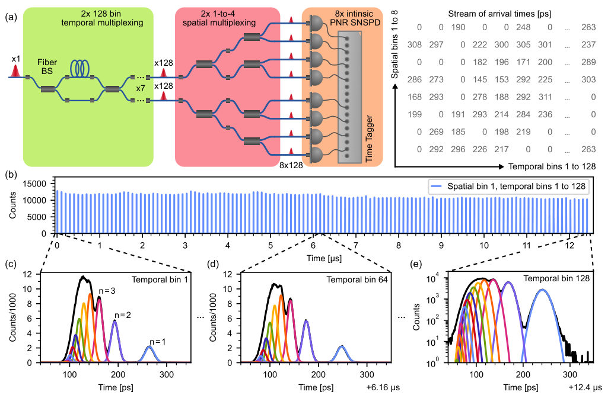
<figcaption class="paper-figure-caption"><b>Fig 1.</b> FIG. 1. (a) Combination of temporal multiplexing (green box), spatial multiplexing (red box) and intrinsic PNR SNSPDs (orange box). One input pulse is (temporally) split into two pulse trains with 128 sub pulses each, afterwards both pulse trains are (spatially) split onto four SNSPDs, which can resolve the photon number in each of the 8 · 128 = 1024 resulting sub pulses, i.e, bins. The output of each of the eight spatial bins is a stream of 128 arrival times measured by the time tagger, which is depicted in the upper right corner. (b) Arrival-time histogram of the entire pulse train, i.e., all 128 temporal bins for the first spatial bin. The 128 peaks correspond to the individual temporal...</figcaption>
</figure>
<figure class="paper-figure-card">
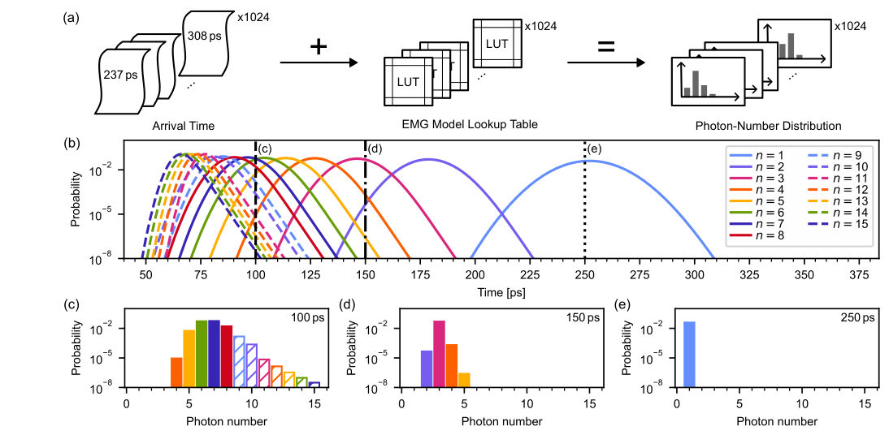
<figcaption class="paper-figure-caption"><b>Fig 2.</b> FIG. 2. (a) For every input state that impinges on the detection system, we record up to 1024 arrival times (corresponding to the 8 · 128 = 1024 spatial and temporal bins). For every bin, we have a lookup table (LUT), which is created through an EMG model describing the n = 15 underlying photon-number contributions (b). With this, every arrival time is then translated into a photon-number distribution (c)-(e). (b) The LUT is created by fitting EMG distributions to the arrival-time histograms (see Fig. 1(c)-(e)) for all 1024 bins and then assuming a flat prior distribution. As an example we show the LUT for spatial bin 1 and temporal bin 48. (c)-(e) The photon-number distributions are a...</figcaption>
</figure>
<figure class="paper-figure-card">
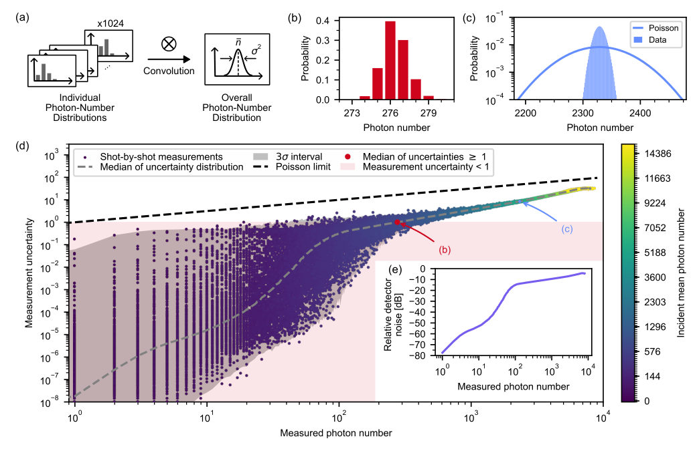
<figcaption class="paper-figure-caption"><b>Fig 3.</b> FIG. 3. (a) From the 1024 individual photon-number distributions generated with the LUT (as depicted in Fig. 2(c)-(e)) we can generate an overall photon-number distribution for every single input state that impinges on the detection system. This is done via a convolution. (b), (c) Photon-number distribution of a single shot for two different incident mean photon numbers (484 and 4904, respectively). These shots are marked in (d) with red and blue dots, respectively. (d) Scatter plot of the measurement uncertainty vs. the measured photon number on a shot-by-shot basis. For every incident mean photon number (corresponding to different colors of the scatter plot dots, see color bar) we plot...</figcaption>
</figure>
<figure class="paper-figure-card">
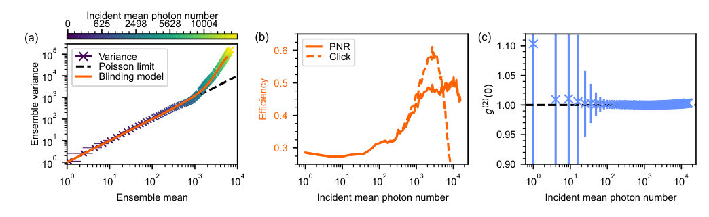
<figcaption class="paper-figure-caption"><b>Fig 4.</b> FIG. 4. (a) Ensemble variance vs. ensemble mean from 105 samples for every incident mean photon number, corresponding to the colored cross symbols. These lie on the Poisson noise limit (black dashed line) as we measure coherent light, which follows Poissonian statistics. Above a measured mean of approximately 1000 we see a deviation, which we can attribute to a probabilistic blinding of our detection bins. Our blinding model (orange line) accurately explains the deviation from the Poisson noise limit (see Sec III D in the supplemental document for more detail). (b) The efficiency of the device is the fraction of the measured mean photon number over the incident mean photon number (orange...</figcaption>
</figure>
<figure class="paper-figure-card">
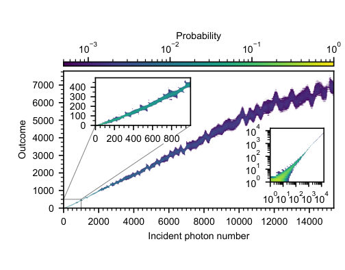
<figcaption class="paper-figure-caption"><b>Fig 5.</b> FIG. 5. Reconstructed POVM matrix of the entire detector shown as a heatmap of the conditional probabilities. The x axis corresponds to the incident mean photon number and the y axis to the detector outcome, i.e., the measured photon number. The color axis shows the probability of observing the conditional probability of a certain measured photon number given an incident photon number. The top left inset shows a zoom-in of the first 500 outcomes. The bottom right inset shows the content of the main plot on a logarithmic scale for both axes.</figcaption>
</figure>
<figure class="paper-figure-card">
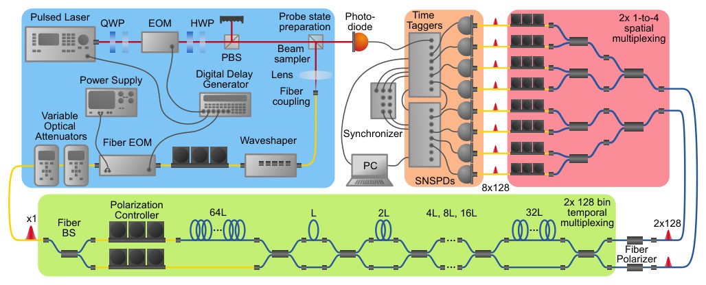
<figcaption class="paper-figure-caption"><b>Fig 6.</b> FIG. 1. The experimental setup can be divided into four main parts: probe state preparation (blue box), temporal multiplexing (green box), spatial multiplexing (red box) and PNR detection (orange box). A detailed explanation is given in Sec I.</figcaption>
</figure>
<figure class="paper-figure-card">
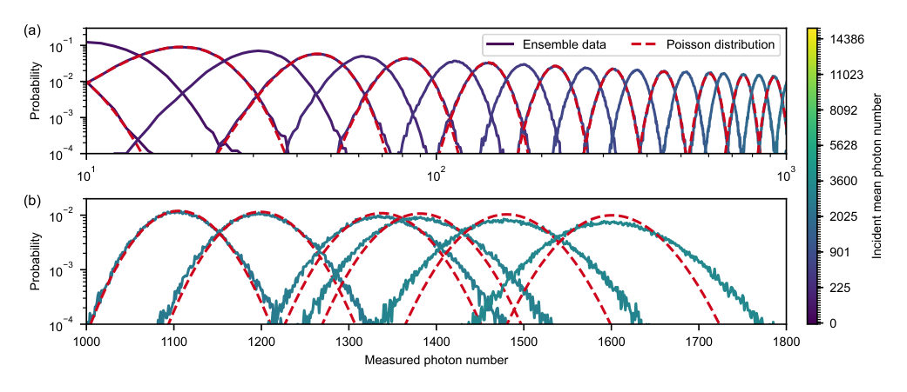
<figcaption class="paper-figure-caption"><b>Fig 7.</b> FIG. 2. (a) Outcome matrix PD×M for every second coherent input state in the measured photon number region from 10 to 1000. We include Poisson distributions for every forth coherent input state (for clarity), using the mean of the outcome distribution as the mean of the Poisson distribution, i.e., the distributions are not fitted. This shows, that the ensemble data of 105 samples follows Poissonian statistics from our coherent light source. (b) Outcome matrix for measured photon numbers from 1000 to 1800, to visualize the region where the ensemble mean and variance begin to deviate from the Poisson noise limit (compare Fig. 4(a) in the main document).</figcaption>
</figure>
<figure class="paper-figure-card">
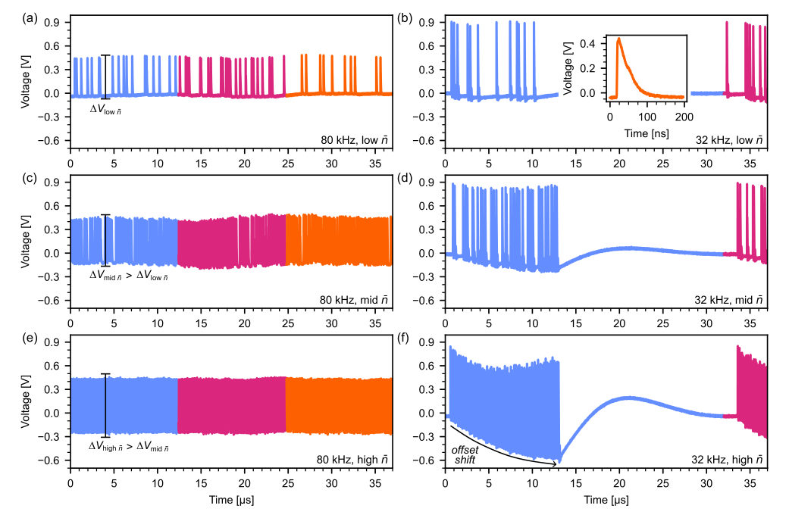
<figcaption class="paper-figure-caption"><b>Fig 8.</b> FIG. 3. (a), (c) and (e) Oscilloscope traces of the 128 bin pulse train for three different mean photon numbers (low, medium and high, respectively) for a repetition rate of the laser of 80 kHz. Subsequent pulse trains (here differentiated by different colors) are directly aligned after each other. (b), (d) and (f) Oscilloscope traces when the laser repetition rate is 32 kHz. Here, when subsequent pulse trains are separated in time, the ”charging” effect is clearly visible. To avoid this we operate at 80 kHz, to be at a constant DC-offset. The spacing between subsequent traces is approximately 100 ns, i.e., just enough time for the SNSPD to reset after a detection event. The inset in (b)...</figcaption>
</figure>
<figure class="paper-figure-card">
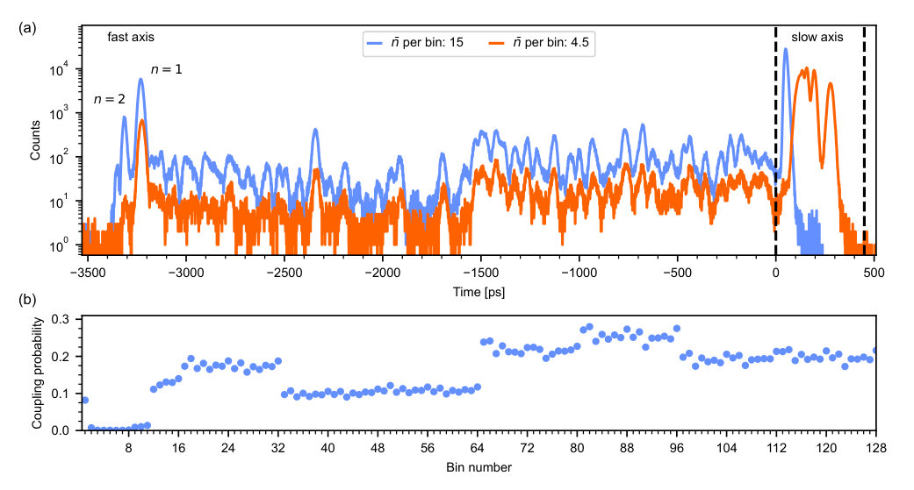
<figcaption class="paper-figure-caption"><b>Fig 9.</b> FIG. 4. (a) Arrival-time histogram of the last temporal bin (128) for spatial bin 1 for two different incident mean photon numbers per bin. The region of interest corresponds to the slow-axis photons from 0 ps to 450 ps (vertical dashed lines). The fast-axis photons arrive 3.5 ns earlier. The peaks between the two extremes correspond to photons that couple back and forth between the axes at the splice interfaces, due to slight angle mismatches of the polarization-maintaining fibers. (b) Coupling probability pc for all temporal bins for spatial bin 1.</figcaption>
</figure>

**Summary.** The researchers developed a large-scale multiplexed SNSPD detector capable of counting up to 9000 photons with precision exceeding the standard Poisson noise limit. By combining spatial and temporal multiplexing, they bridged the gap between single-photon detection and classical power metering. This advancement is crucial for characterizing large-scale quantum states and improving precision metrology.

**Why it may be interesting.** This work is highly relevant to quantum optics and precision metrology as it demonstrates a scalable way to characterize large quantum states and provides a new tool for high-sensitivity optical power standards.

Detailed structure

**Main problem.** The difficulty of building detectors that maintain photon-number resolution at high light intensities and bridging the gap between single-photon detectors and high-sensitivity optical power meters.

**Main result.** Demonstration of macroscopic photon counting from 0 to over 9000 photons, beating the Poisson noise limit by at least 4.1 dB and achieving sub-single-photon precision up to 276 photons per pulse.

**Method.** A large-scale multiplexed detector using 8 spatial SNSPD bins and 128 temporal modes, combined with model-informed characterization (EMG model) and quantum detector tomography to reconstruct POVMs.

**Model / system.** An experimental platform consisting of 8 intrinsically photon-number-resolving superconducting nanowire single-photon detectors (SNSPDs) integrated with a 128-bin temporal multiplexing network using fiber delay lines.

**Key observables.** Photon-number distributions, arrival times, reconstructed POVMs, detector efficiency, and the second-order correlation function g2(0).

**Important parameters / regimes.** Optical power of ~71 pW, 80 kHz repetition rate, 1024 total detection bins, and photon numbers scaling up to 15,393 per pulse.

**Assumptions / limitations.** The use of a zero-inflated model to account for detector blinding; the necessity of temporal pulse broadening to mitigate group-velocity dispersion in the fiber network.

**Figures summary.** Fig 1: Experimental setup schematic and arrival-time histograms; Fig 2: Workflow for photon-number distribution via LUT; Fig 3: Convolution process and uncertainty vs. photon number plots; Fig 4: Ensemble variance and efficiency vs. photon number; Fig 5: POVM matrix heatmap.

**Paper structure.** The paper introduces the experimental setup and multiplexing architecture, details the characterization and reconstruction methods (LUT and POVM), presents the performance results regarding noise limits and precision, and discusses systematic effects like detector blinding and efficiency-rate dependence.

Abstract

Photon counting is a cornerstone of quantum optics. Here, we demonstrate precisely counting from 0 to over 9000 photons, beating the Poisson noise limit by at least $4.1~\mathrm{dB}$ across this range. We achieve sub-single-photon precision up to 276 photons per pulse. To do so, we multiplex eight intrinsically photon-number-resolving superconducting nanowire single-photon detectors across 128 temporal modes. We use a model-informed characterization of each of the 1024 detection bins, for optimal precision. We perform quantum detector tomography to reconstruct the positive operator valued measures (POVMs) of the complete device, which consists of $1.38\cdot10^8$ matrix elements. At the repetition rate of our experiment of $80~\mathrm{kHz}$, we can precisely count photons corresponding to an optical power of approximately $71~\mathrm{pW}$, bridging the gap from single-photon measurements to high-sensitivity optical power meters. A photon-number-resolving detector of this size, and the tools used to analyze it, will become increasingly important to characterize large quantum states, as well as tasks in precision metrology and optical power standards.

[↑ back to top](#top)

### [Observation antibunching with classical light in a linear interferometer](http://arxiv.org/abs/2604.27494v1)

**Authors:** Yu Gu, Yuhan Ma, Yiqi Song, Meixue Chen, Hui Chen, Huaibin Zheng, Yuchen He, Yu Zhou, Fuli Li, Zhuo Xu, Jianbin Liu  
**Type:** experiment · **Category:** quantum information and computing · **PDF:** <https://arxiv.org/pdf/2604.27494v1>  
**Analysis basis:** abstract only; PDF text extraction failed or PDF unavailable
**Topic relevance:** 🔥 `quantum optics experiment` **4/5** · `interference shaping light` **3/5** · `quantum measurements` **3/5** · `QC/QI experiment` **2/5**

**Summary.** The paper demonstrates that antibunching, typically a nonclassical phenomenon, can be observed using classical thermal light in a Hanbury Brown-Twiss interferometer. This is achieved by using single-photon detectors to perform photon-number projection measurements. The findings help clarify the boundary between classical and quantum correlations in optical systems.

**Why it may be interesting.** This is highly relevant to quantum optics as it explores the fundamental connection between classical and nonclassical correlations and demonstrates how measurement techniques can reveal nonclassical-like signatures in classical light.

Detailed structure

**Main problem.** Exploring the boundary between classical and nonclassical phenomena by investigating whether antibunching effects can be observed using classical thermal light.

**Main result.** The researchers demonstrated that antibunching can be observed with thermal light in a Hanbury Brown-Twiss interferometer by utilizing single-photon detectors as photon-number-resolving detectors for photon-number projection measurements.

**Method.** The study uses a Hanbury Brown-Twiss interferometer setup and treats single-photon detectors as photon-number-resolving detectors to perform photon-number projection measurements on thermal and laser light.

**Model / system.** A linear interferometer setup (Hanbury Brown-Twiss type) using thermal light and laser light as the input optical states.

**Key observables.** Temporal and spatial antibunching via the correlation of two detectors detecting one and zero photons, respectively.

**Important parameters / regimes.** Photon statistics of thermal light and photon-number projection measurement settings.

**Assumptions / limitations.** The observation relies on the ability to treat single-photon detectors as photon-number-resolving detectors through projection measurements.

**Paper structure.** The paper introduces the research motivation regarding classical vs nonclassical boundaries, describes the experimental demonstration of antibunching with thermal light, compares thermal and laser light results, and analyzes the classical and nonclassical nature of the observed effects.

Abstract

Understanding the boundary between classical and nonclassical phenomena is important for both fundamental researches in quantum optics and applications in quantum information. One of the most interesting research directions in this field is exploring nonclassical effects with classical light. In this paper, we will show that it is possible to observe antibunching with thermal light in a Hanbury Brown-Twiss interferometer by treating single-photon detectors as photon-number-resolving detectors to perform photon-number projection measurements. Both temporal and spatial antibunching is observed via the correlation of two detectors detecting one and zero photon, respectively. By comparing the measured results of thermal and laser light, it is found that the observed antibunching arises from the combined effect of photon statistics of thermal light and photon-number projection measurement.The classical and nonclassical nature of the observed antibunching is analyzed. The results are helpful to understand the connection between classical and nonclassical correlation and may find applications in multiphoton interference and quantum imaging.

[↑ back to top](#top)

### [Semiclassical Ehrenfest paths in open quantum systems](http://arxiv.org/abs/2604.27328v1)

**Authors:** Xiao-Kan Guo  
**Type:** theory · **Category:** statistical mechanics · **PDF:** <https://arxiv.org/pdf/2604.27328v1>  
**Analysis basis:** full PDF text, analyzed in chunks
**Topic relevance:** 🔥 `Keldysh / 2PI / non-Gaussian methods` **4/5** · 🔥 `methods for driven-dissipative` **4/5** · `non-equilibrium dynamics` **2/5** · `quantum measurements` **2/5**

↔ Scroll figures horizontally

<figure class="paper-figure-card">
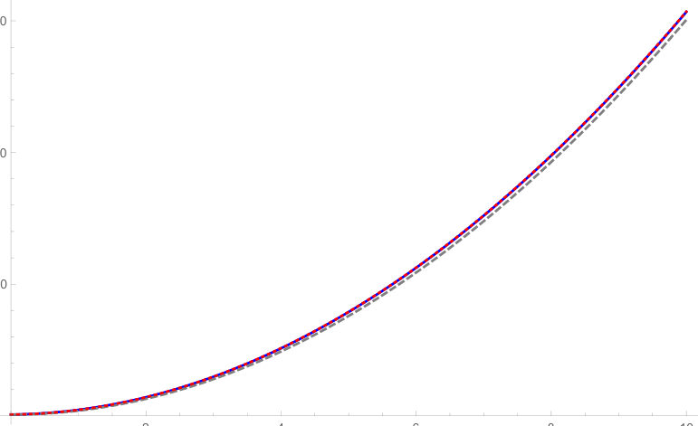
<figcaption class="paper-figure-caption"><b>Fig 1.</b> Figure 1: The position variance ⟨ˆx2⟩(t) = x(t)2 + σxx(t) for three cases: The quantum case with Dab = diag(2ℏλ, 0) (blue dotted line); the classical case with D = 0 (grey dotted line); the analytical quantum solution (red line). The choices of parameters are specified in the main text.</figcaption>
</figure>

**Summary.** This paper develops a phase-space framework to describe the semiclassical evolution of open quantum systems using Gaussian mixtures. It successfully decomposes the dynamics of expectation values into reversible, coherent parts and irreversible, diffusive parts. This provides a transparent way to see how classical trajectories emerge from quantum dynamics subject to environmental noise.

**Why it may be interesting.** It provides a rigorous microscopic link between quantum master equations and classical-like phase-space transport, offering a clear thermodynamic decomposition of work and heat in the context of decoherence.

Detailed structure

**Main problem.** Extending semiclassical Ehrenfest trajectories to open quantum systems to understand how classical trajectories emerge from dynamics involving dissipation and decoherence.

**Main result.** The derivation of a Fokker-Planck equation for a Gaussian mixture that provides a phase-space interpretation of the generalized Ehrenfest theorem, separating dynamics into coherent (unitary) and irreversible (diffusive) components.

**Method.** Uses a Gaussian mixture framework in an extended phase space, employing a Lagrangian description and a local harmonic approximation to derive a Fokker-Planck equation and its equivalent Itô stochastic differential equation.

**Model / system.** Open quantum systems described by a Lindblad master equation, specifically validated using a 1D free particle with a quadratic Hamiltonian and linear Lindblad operators.

**Key observables.** Expectation values of observables, position and momentum centroids, covariance matrices, and position variance.

**Important parameters / regimes.** Coupling strength (lambda), mass (m), Planck's constant (hbar), and the 'not-too-squeezed' condition parameter (xi).

**Assumptions / limitations.** Relies on the local harmonic approximation (truncating Weyl symbols to second order) and requires that Gaussian states do not become too squeezed.

**Figures summary.** Figure 1 shows the evolution of position variance over time, comparing the analytical quantum solution, a quantum case with diffusion, and a classical comparison without environmental noise.

**Paper structure.** The paper begins by deriving a Fokker-Planck equation for the mixing measure of a Gaussian mixture, then embeds the generalized Ehrenfest theorem into this phase-space picture, and concludes with a numerical validation using a free-particle model to demonstrate the split between coherent and diffusive dynamics.

Abstract

We study the semiclassical Ehrenfest trajectories in open quantum systems. We first derive in explicit form the Fokker-Planck equation that governs the time evolution of the mixing measure for a Gaussian mixture. Then, we embed the generalized Ehrenfest theorem recently obtained for open quantum systems into this phase-space picture to study the time evolution of the expectations of observable with respect to the Gaussian mixture. We show how the coherent and irreversible contributions are microscopically separated. Our work provides a transparent phase-space interpretation of the emergence of classical trajectories in open quantum dynamics.

[↑ back to top](#top)

### [Adaptable Continuous Variable Quantum Network with Finite Size Security](http://arxiv.org/abs/2604.27943v1)

**Authors:** Runjia Zhang, Akash nag Oruganti, Huy Q Nguyen, Adnan A. E. Hajomer, Vladyslav C. Usenko, Ulrik L. Andersen, Tobias Gehring  
**Type:** both · **Category:** quantum information and computing · **PDF:** <https://arxiv.org/pdf/2604.27943v1>  
**Analysis basis:** full PDF text, analyzed in chunks
**Topic relevance:** 🔥 `QC/QI experiment` **4/5** · 🔥 `quantum optics experiment` **4/5** · `quantum measurements` **2/5** · `entanglement & information structure` **1/5**

↔ Scroll figures horizontally

<figure class="paper-figure-card">

<figcaption class="paper-figure-caption"><b>Fig 1.</b> Fig. 1. (a) Trust assumptions of different broadcasting CV-QKD protocols in access CV-QKD network. Dashed areas indicate ele- ments that are not trusted under respective protocol. Under the trusted protocol quantum channels are not trusted, while users have a varying degree of trust between them. The collaborative protocol relies on measured results of other users to be kept private from Eve, while their detectors are not necessarily trusted. All non-reference Bobs are assumed to be fully a part of Eve in the untrusted protocol. (b) Per-user secret key rate as a function of channel loss for a multi-user CV-QKD network with uniform splitting among users. The solid curves correspond to the...</figcaption>
</figure>
<figure class="paper-figure-card">
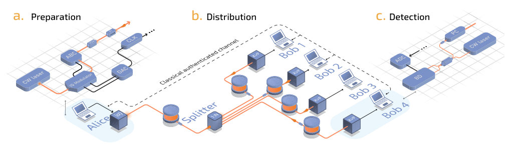
<figcaption class="paper-figure-caption"><b>Fig 2.</b> Fig. 2. A continuous variable quantum access network in action in the lab. (a) State preparation station comprises a signal laser, a digital-to-analog converter (DAC), an IQ modulator stabilized by an automatic bias controller (ABC), as well as a variable optical attenuator (VOA) and an isolator. (b) State distribution is assisted with a 1 : 4 splitter which splits the coherent states, forming a quantum broadcasting channel that connects N users while distributing quantum correlations evenly among them. The link consists of two segment, a 10 km fiber spool before the 1 : 4 splitter represent the communication backbone and at each output of the splitter represent last-mile connection to the...</figcaption>
</figure>
<figure class="paper-figure-card">

<figcaption class="paper-figure-caption"><b>Fig 3.</b> Fig. 3. Finite-size secret key rates as a function of the total number of exchanged quantum signals for the different trust scenarios considered in the multi-user CV-QKD network. The solid curves correspond to the finite-size secret key rates, while the dashed horizontal lines indicate the corresponding asymptotic secret key rates. (Left) Trusted-user scenario, where non-reference users are assumed trusted and excluded from Eve’s system. (Middle) Collaborative (conditionally trusted) scenario, where auxiliary users publicly disclose their measurements to improve the effective correlations used for key extraction. (Right) Fully untrusted-user scenario, where all non-reference users are...</figcaption>
</figure>

**Summary.** The researchers demonstrated a 1-to-4 continuous-variable quantum network that can adapt its security level based on whether users are trusted or untrusted. They successfully implemented finite-size security protocols, proving that high-rate quantum key distribution is practical for multi-user telecommunication infrastructures.

**Why it may be interesting.** The paper demonstrates advanced quantum optical control and signal processing for large-scale quantum communication, which is highly relevant to quantum optics and the development of scalable quantum networks.

Detailed structure

**Main problem.** Scaling point-to-point CV-QKD to multi-user networks while maintaining practical finite-size security and addressing the 'overcounting' of correlations in broadcasting architectures.

**Main result.** Experimental demonstration of an active 1:4 CV quantum network achieving a total secret key rate of 1.9e-1 bits/channel use with finite-size security over 11 km.

**Method.** A unified security framework using chain-rule decomposition to attribute joint key rates to individual users across trusted, collaborative, and untrusted protocols, combined with DSP-based phase recovery.

**Model / system.** An active 1:4 multi-user continuous-variable quantum network using a passive optical network (PON) topology with a 1:4 beam splitter, Gaussian-modulated coherent states, and fiber-optic links up to 11 km.

**Key observables.** Secret key generation rate (bits/channel use), mutual information, and joint key rate decomposition.

**Important parameters / regimes.** 1.25e9 exchanged coherent states (finite-size regime), 125 MBaud symbol rate, modulation variance V_M = 5 SNU, and reconciliation efficiency beta = 0.95.

**Assumptions / limitations.** Security is analyzed under collective attacks; users are categorized into trusted, collaborative, or untrusted scenarios based on their relationship with the adversary (Eve).

**Figures summary.** Figure 1 illustrates the 1:4 network topology and different trust modes; Figure 3 shows finite-size secret key rates versus the number of signals sent for the three security scenarios.

**Paper structure.** The paper introduces the multi-user CV-QKD problem, describes the experimental setup and hardware, presents the theoretical security framework for different trust scenarios, reports experimental performance and key rate decomposition, and concludes with a comparison to existing protocols.

Abstract

In recent years, continuous-variable quantum key distribution (CV-QKD) has become a promising paradigm for enabling secure communication among multiple end users sharing the same telecommunication backbone. CV-QKD with reverse reconciliation naturally enables scalability from conventional point-to-point links to quantum access networks based on passive quantum broadcasting channels. Here, we report an experimental demonstration on an active $1:4$ multi-user CV quantum network (QN) in the finite-size regime. With $1.25\cdot10^9$ coherent states exchanged on each $11\text{km}$ quantum channel, the highest performance for secret key generation totaling $1.9\cdot10^{-1}$ bits/channel use. Furthermore, we investigate adaptable CV-QN protocols that comprehensively allow network operation in various security and key rates requirements of individual users. The results establish the practical security of CV-QN compatible with existing telecommunication for broad deployment, and allowing additional degree of freedom for connected end users in existing infrastructures.

[↑ back to top](#top)

### [Optimal current-based sensing of phonon temperature using a finite reservoir](http://arxiv.org/abs/2604.28155v1)

**Authors:** Sindre Brattegard, Stephanie Matern, Mark T. Mitchison, Saulo V. Moreira  
**Type:** theory · **Category:** statistical mechanics · **PDF:** <https://arxiv.org/pdf/2604.28155v1>  
**Analysis basis:** full PDF text, analyzed in chunks
**Topic relevance:** 🔥 `quantum measurements` **4/5** · `non-equilibrium dynamics` **3/5** · `Kondo & dissipative impurity` **2/5** · `methods for driven-dissipative` **2/5**

↔ Scroll figures horizontally

<figure class="paper-figure-card">
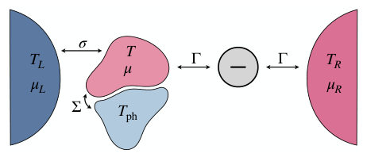
<figcaption class="paper-figure-caption"><b>Fig 1.</b> FIG. 1. Sketch of the finite-size reservoir at stationary tem- perature and chemical potential, T and µ, coupled to a phonon bath at temperature Tph and to the quantum dot sys- tem. The finite reservoir is also coupled to the left infinite-size reservoir at temperature TL and µL, while the quantum dot is coupled to another infinite-size reservoir to its right, at tem- perature TR and chemical potential µR.</figcaption>
</figure>
<figure class="paper-figure-card">

<figcaption class="paper-figure-caption"><b>Fig 2.</b> FIG. 2. Sensitivity rate of the three thermometry schemes as a function of: (left column) phonon temperature and (right column) bias voltage. The top row has electron-phonon cou- pling with an exponent n = 5, while the bottom row has n = 3. The parameters used are TL = TR = 10Γ, Vb = 40Γ, σ = 300Γ/TL, and Vg = −10Γ. When n = 5, we use Σ = 1000σ/T 3 L, and when n = 3, we use Σ = 100σ/TL. In the right column, we set the phonon temperature to Tph = 8Γ.</figcaption>
</figure>
<figure class="paper-figure-card">
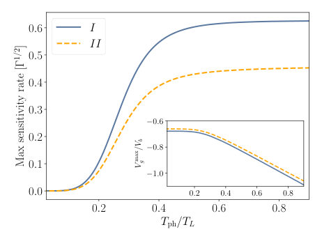
<figcaption class="paper-figure-caption"><b>Fig 3.</b> FIG. 3. Optimised sensitivity rate over gate voltage as the phonon temperature Tph is varied. The inset shows the cor- responding optimal bias voltage. The parameters used are n = 5, TL = TR = 10Γ, Vb = 40Γ, σ = 300Γ/TL, and Σ = 1000σ/T 3 L. For these parameters, we have that ζ = 300, and ξ ≫1, provided the phonon temperature is sufficiently large, i.e., Tph ≳TL/3.</figcaption>
</figure>

**Summary.** This paper investigates how the temperature changes in a finite electronic reservoir due to heat exchange with a phonon bath can be used for precise thermometry. It compares different current-based measurement strategies and proves that monitoring individual electron tunneling events is the most optimal method. The findings offer a way to enhance sensing precision in nanoscale transport devices by tuning experimental parameters like gate voltage.

**Why it may be interesting.** It provides new insights into parameter estimation in non-equilibrium steady states and demonstrates how the thermodynamic properties of finite environments can be leveraged for high-precision sensing in open quantum systems.

Detailed structure

**Main problem.** Developing high-precision thermometry for phonon temperatures in nanoscale transport setups by exploiting the finite heat capacity of electronic reservoirs.

**Main result.** The study identifies that monitoring individual electron jumps (Strategy I) achieves optimal precision for sensing phonon temperature, and provides an optimization analysis for tuning gate voltage to maximize sensitivity.

**Method.** The authors combine current metrology techniques with a thermodynamic framework for finite reservoirs, using Fisher information and the Cramér-Rao bound to evaluate different measurement strategies.

**Model / system.** A quantum dot coupled to a finite-size electronic reservoir, which is itself coupled to a phonon bath and an infinite electronic reservoir, described by a master equation in the weak coupling regime.

**Key observables.** Monitoring quanta exchanged between the QD and finite reservoir, net particle current through the QD, and QD occupation.

**Important parameters / regimes.** Electron-phonon coupling exponent (n=3, 5), coupling strengths (xi, zeta), bias voltage (Vb), and gate voltage (Vg).

**Assumptions / limitations.** Weak coupling regime (Gamma << T), large but finite reservoir, fast internal thermalization (quasiequilibrium), and energy-independent transmission.

**Figures summary.** Figure 1 shows the experimental setup schematic; Figure 2 displays sensitivity rates as a function of parameters, vanishing at the chemical potential/energy level equality; Figure 3 shows optimization of sensitivity rates via gate voltage tuning.

**Paper structure.** The paper introduces the problem of finite reservoir thermometry, defines the physical model and transport dynamics, evaluates three measurement strategies using Fisher information, performs an optimization analysis for gate voltage, and provides analytical derivations for the steady-state reservoir properties.

Abstract

In realistic nanoscale transport set-ups, electron-phonon coupling leads to the exchange of heat between phonon baths and electronic reservoirs with finite heat capacities. Such exchange affects the finite reservoir's temperature. However, this sensitivity of the finite reservoir temperature to the exchange of heat with the finite reservoir has remained unexplored for thermometry. Here, we fill this gap by combining current metrology techniques with a thermodynamic framework encompassing finite reservoirs. We focus on an experimentally realizable set-up with a quantum dot coupled to a finite reservoir and consider two distinct current-based strategies in the long time limit, namely monitoring quanta exchanged between the quantum dot and finite reservoir and the measurement of the total current flowing from the quantum dot into an infinite reservoir. A third strategy involves measurements of the quantum dot occupation. For a large but finite reservoir, we show that the Fisher information for all three strategies captures the finite reservoir's contribution to sensitivity through common factors. We also demonstrate that monitoring quanta exchanged between the system and finite reservoir in the long time limit achieves optimal precision. Finally, we provide an optimization analysis that explores how maximal precision can be achieved within each of the current-based strategies by tuning the gate voltage.

[↑ back to top](#top)

### [Quantum Lattice Boltzmann Solutions for Transport under 3D Spatially Varying Advection on Trapped Ion Hardware](http://arxiv.org/abs/2604.28121v1)

**Authors:** Sayonee Ray, Jezer Jojo, Jason Iaconis, Abeynaya Gnanasekaran, Apurva Tiwari, Martin Roetteler, Chris Hill, Jay Pathak  
**Type:** both · **Category:** quantum information and computing · **PDF:** <https://arxiv.org/pdf/2604.28121v1>  
**Analysis basis:** full PDF text, analyzed in chunks
**Topic relevance:** 🔥 `QC/QI experiment` **4/5** · `quantum measurements` **3/5** · `entanglement & information structure` **2/5** · `non-equilibrium dynamics` **2/5**

↔ Scroll figures horizontally

<figure class="paper-figure-card">
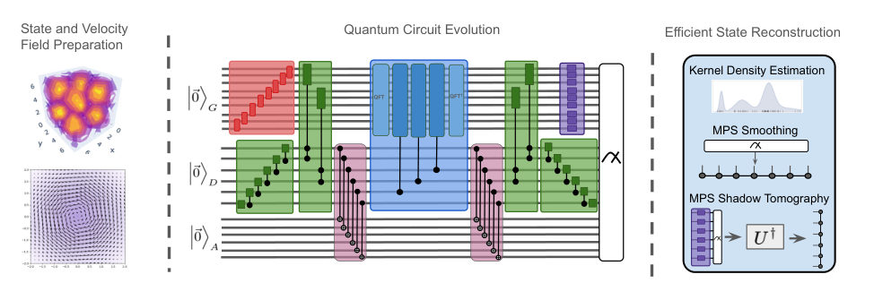
<figcaption class="paper-figure-caption"><b>Fig 1.</b> Fig. 1. QLBM pipeline used in this work. We efficiently encode the initial density distribution and velocity field into quantum operators. The MPS state preparation, streaming and collision operations are then performed within the quantum circuit. An error detection gadget using ancilla qubits is also applied. The output density is reconstructed using three potential methods described in the text: kernel density estimation, MPS smoothing, and MPS shadow tomography.</figcaption>
</figure>
<figure class="paper-figure-card">
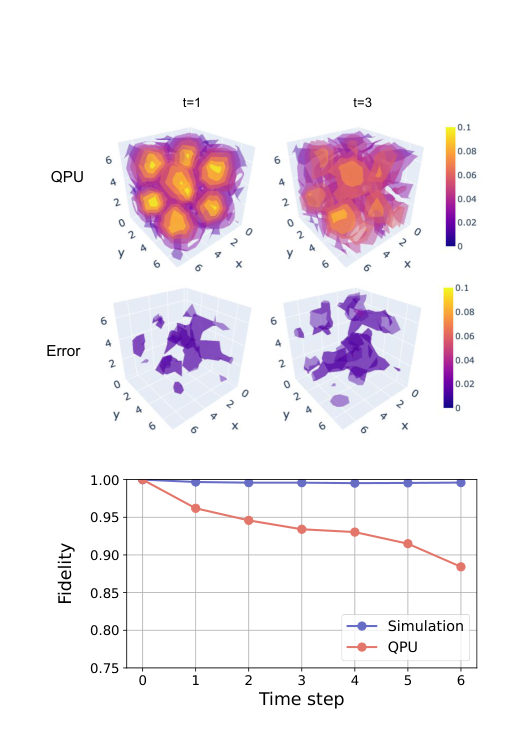
<figcaption class="paper-figure-caption"><b>Fig 2.</b> Fig. 2. Top: Reconstructed 3D density distribution from the QPU at t = 1 and t = 3, together with the absolute error relative to the exact solution. Bottom: Fidelity, |⟨ϕ|ψ⟩|2, for the ideal simulation and QPU runs. The simulation includes only finite-shot error, whereas the QPU data also include hardware noise.</figcaption>
</figure>
<figure class="paper-figure-card">
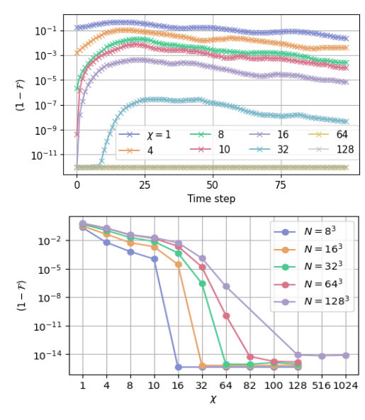
<figcaption class="paper-figure-caption"><b>Fig 3.</b> Fig. 3. (Top) Infidelity of MPS compression of ideal statevector during 3D swirl evolution for a 32×32×32 grid. (Bottom) Infidelity vs bond dimension at different grid sizes at times where the infidelity of the respective MPS approximation is highest during the evolution. Large grid density distributions were determined using exact classical simulations.</figcaption>
</figure>
<figure class="paper-figure-card">
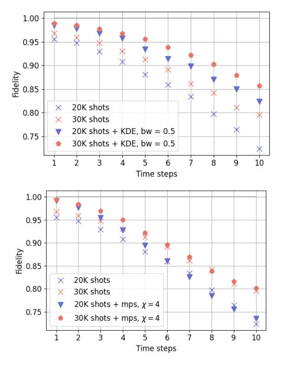
<figcaption class="paper-figure-caption"><b>Fig 4.</b> Fig. 4. Fidelity |⟨ψ|ϕ⟩|2 of ideal simulation with KDE (top) and MPS smoothing (bottom) techniques with statevector simulation on a 163 grid.</figcaption>
</figure>
<figure class="paper-figure-card">
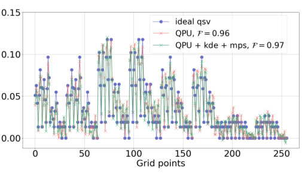
<figcaption class="paper-figure-caption"><b>Fig 5.</b> Fig. 5. Effect of KDE and MPS smoothing techniques on a 83 state after 1 time step on the Tempo class Barium system, visualized as a 1D function here. We plot only the first half for better visualization.</figcaption>
</figure>
<figure class="paper-figure-card">
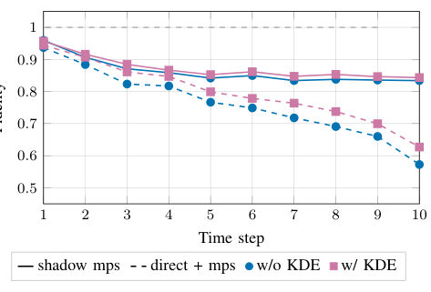
<figcaption class="paper-figure-caption"><b>Fig 6.</b> Fig. 7. Fidelity | ⟨ψ| ϕ⟩|2 on IonQ Forte-1 QPU with shadow MPS (solid lines) with M = 25 settings, 20K shots total vs. direct state tomography with MPS smoothing (dashed lines) on a 16×16×16 grid. Blue circle and purple squares show results without and with KDE smoothing respectively.</figcaption>
</figure>
<figure class="paper-figure-card">
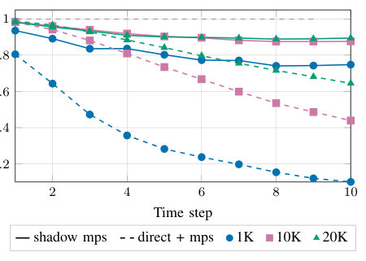
<figcaption class="paper-figure-caption"><b>Fig 7.</b> Fig. 6. Fidelity | ⟨ψ| ϕ⟩|2 of ideal simulation with different number of shots with shadow MPS (solid lines) with M = 25 settings and direct state tomography with MPS smoothing (dashed lines) on a 16 × 16 × 16 grid. Shadow MPS outperforms even with a limited budget of 1,000 shots.</figcaption>
</figure>
<figure class="paper-figure-card">
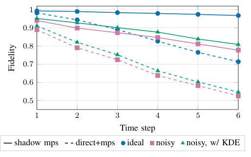
<figcaption class="paper-figure-caption"><b>Fig 8.</b> Fig. 8. Fidelity | ⟨ψ| ϕ⟩|2 on the IonQ Forte-1 noisy simulator with shadow MPS (solid line) with M = 50 settings, 50K shots total vs. direct state tomography with MPS smoothing (dashed line) on a 32×32×32 grid. Results with noisy simulator with (green triangles) and without (purple squares) KDE smoothing are shown. Ideal simulation results (blue circles) with the same number of shots are also shown for reference.</figcaption>
</figure>
<figure class="paper-figure-card">
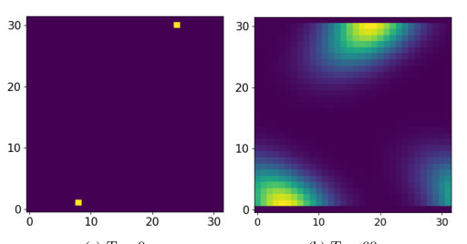
<figcaption class="paper-figure-caption"><b>Fig 9.</b> Fig. 10. Simulation of D2Q5 advection-diffusion on a 32 × 32 grid with velocity field ⃗u(x, y) = (sin(2πy/L)/3, 0), and walls at y = 0 and y = 31</figcaption>
</figure>
<figure class="paper-figure-card">
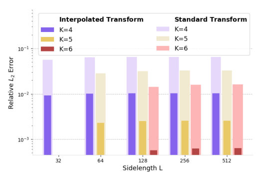
<figcaption class="paper-figure-caption"><b>Fig 10.</b> Fig. 9. Relative error of the computed Hadamard transform of the flattened L × L × L discretization of the field 1 + sin(2πx) sin(2πy) sin(2πz) for different values of K and L. We compare both the interpolated FWHT outlined in Algorithm 2 as well as a coarse version of the standard Hadamard transform that applies H⊗K since their asymptotic runtimes are comparable.</figcaption>
</figure>

**Summary.** This paper presents an advancement in using quantum computers to simulate fluid dynamics through the Quantum Lattice Boltzmann Method. It introduces efficient ways to handle complex 3D flows and boundary conditions while proposing a scalable readout method using classical shadows to overcome hardware noise and measurement bottlenecks.

**Why it may be interesting.** It demonstrates a practical application of quantum algorithms (QLBM) on real trapped-ion hardware and introduces advanced reconstruction techniques like Shadow-MPS tomography which are highly relevant to many-body state characterization.

Detailed structure

**Main problem.** Advancing the Quantum Lattice Boltzmann Method (QLBM) for realistic 3D fluid dynamics simulations by addressing spatially varying velocity fields, wall boundary conditions, and the readout bottleneck on NISQ hardware.

**Main result.** Demonstrated 3D spatially varying transport on IonQ trapped-ion hardware, showing that Shadow-MPS tomography significantly outperforms direct histogram reconstruction in scalability and noise robustness.

**Method.** Implementation of a QLBM pipeline using MPS-based state preparation, streaming and collision operators, and a novel Shadow-MPS tomography approach using randomized single-qubit measurements.

**Model / system.** The study uses the D3Q7 Lattice Boltzmann model for advection-diffusion on IonQ's trapped-ion systems, specifically the Forte generation and a 64-qubit Barium development system.

**Key observables.** Particle density distribution (scalar field) and reconstruction fidelity relative to the exact solution.

**Important parameters / regimes.** Grid sizes ranging from 8^3 to 32^3, relaxation time tau = 1, and measurement shot counts ranging from 1k to 50k.

**Assumptions / limitations.** Assumes a smooth velocity field to utilize an interpolated Fast Walsh-Hadamard Transform and uses the BGK approximation for collision dynamics.

**Figures summary.** Figure 1 shows the QLBM pipeline and reconstruction methods; Figure 2 displays 3D density reconstruction and fidelity; Figure 3 shows MPS compression infidelity; Figure 5 illustrates KDE and MPS smoothing; Figure 9 shows the accuracy of the interpolated FWHT; Figure 11 shows 3D species diffusion around a solid cube.

**Paper structure.** The paper introduces the QLBM framework, details the implementation of spatially varying velocity fields and boundary conditions, presents the new Shadow-MPS tomography method, evaluates performance on IonQ hardware, and discusses scaling and future integration into CFD workflows.

Abstract

The Quantum Lattice Boltzmann Method (QLBM) has emerged as one of the most promising quantum computing approaches for the numerical simulation of problems in computational fluid dynamics (CFD). The dynamics is formulated in terms of mesoscopic particle distribution functions governed by a discrete Boltzmann transport equation, comprising local streaming and collision operations. In this work, the resulting macroscopic behavior corresponds to the advection-diffusion equation, which we adopt as a canonical model problem for transport phenomena. Building upon recent progress in QLBM implementations, we advance towards more realistic problem settings that better reflect conventional CFD requirements. We address, for the first time, transport under the action of non uniform velocity fields on quantum hardware. We implement our demonstration using IonQ's trapped-ion systems including Forte generation systems and a 64-qubit Barium development system similar to the forthcoming IonQ Tempo line. We identify the density readout and subsequent reloading of the fluid density as a potential bottleneck of the current algorithm and discuss several approaches to mitigate this bottleneck. We identify the use of MPS shadow tomography as a promising method to efficiently scale the readout to large system with complex density distributions. Lastly, we introduce and simulate a novel method to implement wall boundaries for advection-diffusion in QLBM, and discuss the prospects of scaling to higher-complexity problems.

[↑ back to top](#top)

### [High-Rate Free-Space Continuous-Variable QKD with Self-Referenced Passive State Preparation](http://arxiv.org/abs/2604.27299v1)

**Authors:** H. W. Yin, X. J. Liao, Y. H. Xu, P. Huang, K. T. Zhu, T. Wang, G. H. Zeng  
**Type:** experiment · **Category:** quantum information and computing · **PDF:** <https://arxiv.org/pdf/2604.27299v1>  
**Analysis basis:** full PDF text, analyzed in chunks
**Topic relevance:** 🔥 `QC/QI experiment` **4/5** · 🔥 `quantum optics experiment` **4/5** · `quantum measurements` **2/5**

↔ Scroll figures horizontally

<figure class="paper-figure-card">
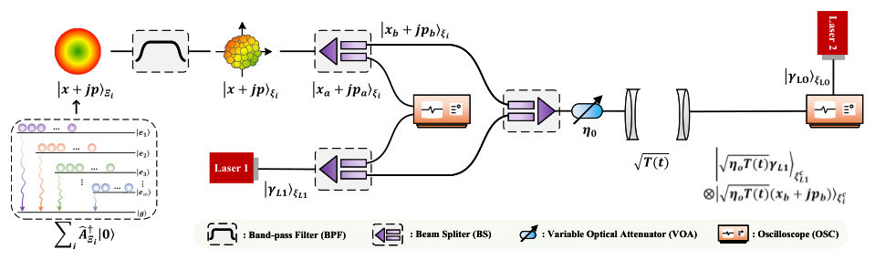
<figcaption class="paper-figure-caption"><b>Fig 1.</b> Figure 1: Schematic of LLO-PSP-CVQKD theory. In a thermal source, photons at different energy</figcaption>
</figure>
<figure class="paper-figure-card">
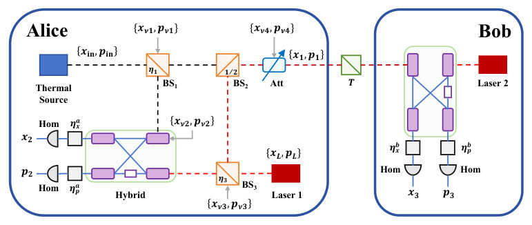
<figcaption class="paper-figure-caption"><b>Fig 2.</b> Figure 2: Experimental schematic of LLO-PSP-CVQKD. BS1 and BS3: 99:1 beam splitter. BS2:</figcaption>
</figure>
<figure class="paper-figure-card">
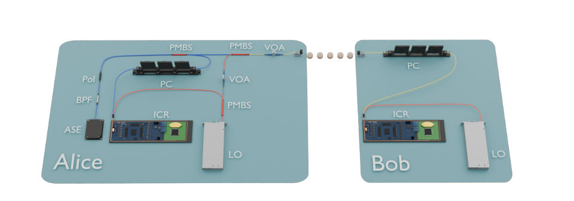
<figcaption class="paper-figure-caption"><b>Fig 3.</b> Figure 3: LLO-PSP-CVQKD optical layout. ASE, amplified spontaneous emission; BPF, bandpass</figcaption>
</figure>
<figure class="paper-figure-card">
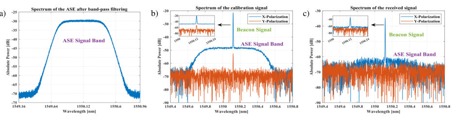
<figcaption class="paper-figure-caption"><b>Fig 4.</b> Figure 4: Spectra of the system at different nodes. (a) Spectra of the ASE source after bandpass</figcaption>
</figure>
<figure class="paper-figure-card">

<figcaption class="paper-figure-caption"><b>Fig 5.</b> Figure 5: Complex power spectra (CPS) of the system at different nodes. (a) CPS of the Alice</figcaption>
</figure>
<figure class="paper-figure-card">
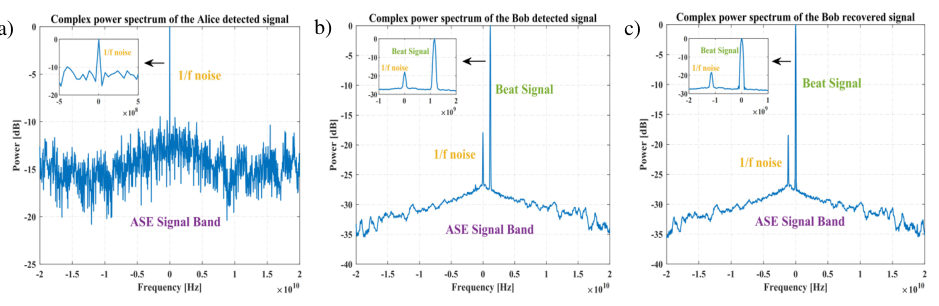
<figcaption class="paper-figure-caption"><b>Fig 6.</b> Figure 5(a). Limited by the detection bandwidth of the ICR detector, the bandwidth of the thermal</figcaption>
</figure>
<figure class="paper-figure-card">
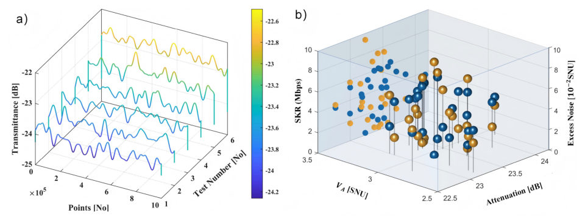
<figcaption class="paper-figure-caption"><b>Fig 7.</b> Figure 6: Experimental results in a turbulence-free channel. (a) Time-varying transmittance in a</figcaption>
</figure>
<figure class="paper-figure-card">
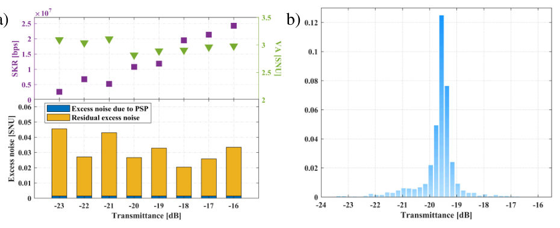
<figcaption class="paper-figure-caption"><b>Fig 8.</b> Figure 7: Experimental results under turbulent channels. (a) Mean excess noise and its composition,</figcaption>
</figure>

**Summary.** This paper demonstrates a high-rate CVQKD system that uses a local local oscillator and passive state preparation to overcome the noise and stability issues of transmitted local oscillators. By using a self-referenced pilot scheme, the authors achieved a high-speed secret key rate of over 10 Mbps even through significant atmospheric turbulence. This provides a practical pathway for robust, high-speed quantum communication in realistic free-space environments.

**Why it may be interesting.** This work is highly relevant to quantum optics and open quantum systems due to its use of thermal state fluctuations for state preparation, the application of temporal-mode theory to continuous-time modes, and the management of decoherence-like effects (phase/frequency drift) in a turbulent channel.

Detailed structure

**Main problem.** Existing Continuous-Variable Quantum Key Distribution (CVQKD) schemes using transmitted local oscillators suffer from high photon leakage noise and instability, making them unsuitable for high-loss free-space channels.

**Main result.** The authors implemented a Local Local Oscillator (LLO) CVQKD system with self-referenced passive state preparation, achieving a record-high asymptotic secret key rate of 10.34 Mbps over a 23.5 dB loss free-space channel.

**Method.** The researchers used a thermal light source (ASE) for passive state preparation and a self-referenced pilot scheme (beacon light) to implement high-precision frequency and phase compensation algorithms via digital signal processing.

**Model / system.** The experimental platform consists of a thermal source (ASE) at Alice's side, a turbulent free-space channel, and a receiver (Bob) using a separate local laser. The system utilizes an Integrated Coherent Receiver (ICR) with 20 GHz bandwidth for heterodyne detection.

**Key observables.** Secret key rate (SKR), excess noise (including PSP noise, frequency offset, and phase drift), channel transmittance, and signal-to-noise ratio (SNR).

**Important parameters / regimes.** Repetition rate of 20 GHz, channel loss up to 23.5 dB, detection bandwidth of 20 GHz, and a thermal source with a second-order correlation function near 2.

**Assumptions / limitations.** The demonstration is a proof-of-principle; the experiment used simplified coupling efficiency losses rather than full atmospheric complexity, and data processing was performed offline.

**Figures summary.** Figure 1 shows the system schematic; Figure 2 details the experimental setup for Alice and Bob; Figure 3 shows the optical layout; Figure 5 displays complex power spectra before and after frequency correction; Figure 6 and 7 show transmittance, noise components, and key rate performance under turbulence.

**Paper structure.** The paper introduces the challenge of CVQKD in free space, proposes a new LLO-PSP scheme, provides a theoretical proof of equivalence to GMCS protocols, describes the experimental setup and DSP algorithms, analyzes noise and key rates, and concludes with future outlooks.

Abstract

Continuous-variable quantum key distribution (CVQKD) using passive state preparation (PSP) offers low-cost, high-rate secure communication. However, the existing PSP-CVQKD scheme with a transmitted local oscillator has high photon leakage noise and poor stability, making it unsuitable for high-loss transmission. In this work, for the first time, we propose and implement a local local oscillator (LLO) CVQKD system using a self-referenced (SR) PSP scheme, and give a theoretical proof of the equivalence of the PSP and GMCS protocol using temporal-mode theory. By employing the novel self-referenced pilot scheme to achieve high-precision time-varying frequency and phase compensation algorithms, we significantly improve the system' s signal-to-noise ratio and stability. The system achieves a record-high asymptotic secret key rate of 10.34 Mbps over a free-space channel with up to 23.5 dB loss, while maintaining low excess noise and robust performance under turbulent conditions. This work establishes the feasibility of SR-LLO CVQKD, providing a practical pathway toward secure, high-rate quantum communication in realistic environments.

[↑ back to top](#top)

### [Strong Mpemba Effect Through a Reentrant Phase Transition](http://arxiv.org/abs/2604.28117v1)

**Authors:** Kristian Blom, Doron Benyamin, Uwe Thiele, Oren Raz, Aljaz Godec  
**Type:** theory · **Category:** statistical mechanics · **PDF:** <https://arxiv.org/pdf/2604.28117v1>  
**Analysis basis:** full PDF text, analyzed in chunks
**Topic relevance:** 🔥 `non-equilibrium dynamics` **4/5** · `driven-dissipative phase transition` **2/5** · `non-equilibrium universality` **2/5** · `scars & prethermalization` **2/5**

↔ Scroll figures horizontally

<figure class="paper-figure-card">
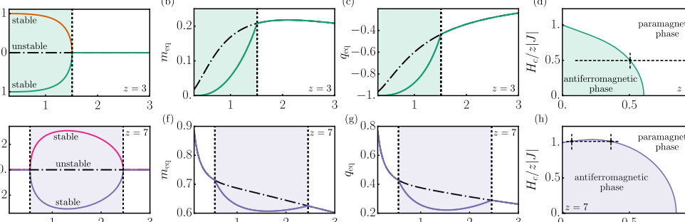
<figcaption class="paper-figure-caption"><b>Fig 1.</b> FIG. 1. Emergence of reentrant phase behavior with increasing coordination number. (a)–(c) Equilibrium values [Eq. (11)] of the staggered magnetization s, total magnetization m, and nearest-neighbor correlation q as functions of temperature T at fixed magnetic field H/z|J|=0.5 for z=3&lt;z∗≈5.14. Solid lines denote stable equilibria, dashed lines unstable ones. (d) Corresponding phase diagram in the (H, T) plane. The critical line (green) is monotonic and no reentrant phase transition is observed. (e)–(g) Equilibrium values of (s, m, q) for z=7&gt;z∗and H/z|J|=1.02. In contrast to z=3, the staggered magnetization is nonzero only within an intermediate temperature window. (h) Corresponding phase...</figcaption>
</figure>
<figure class="paper-figure-card">

<figcaption class="paper-figure-caption"><b>Fig 2.</b> FIG. 2. Mpemba and inverse Mpemba effects across the reentrant regime and their spectral origin. (a) Displace- ment from equilibrium D(t) [Eq. (13)] for a cooling quench from Ti1 = 3 (paramagnetic phase) and Ti2 = 2 (antiferromagnetic phase) to Tf = 0.12 (paramagnetic phase). Although the quench from Ti2 starts closer to equilibrium, the relaxation curves cross at finite time, showing the Mpemba effect. Insets show the corresponding relaxation trajectories in the (m, s) plane, zoomed in around the trajectories; blue and red dots denote the initial states, and the black dot the final equilibrium. (b) Same protocol but with Tf and Ti2 interchanged, corresponding to a heating quench. The...</figcaption>
</figure>

**Summary.** The paper demonstrates that the strong Mpemba effect in an antiferromagnetic Ising model is driven by whether a temperature quench excites the system's slowest relaxation mode. This effect is specifically tied to the presence of reentrant phase transitions, which occur when the lattice coordination number is sufficiently high.

**Why it may be interesting.** This paper is highly relevant to many-body dynamics as it establishes a fundamental link between equilibrium phase topology (reentrance) and non-equilibrium relaxation anomalies (Mpemba effect) using spectral analysis of relaxation modes.

Detailed structure

**Main problem.** Investigating the origin of the strong direct and inverse Mpemba effects in the context of reentrant phase transitions.

**Main result.** The strong Mpemba effect arises from the selective excitation of the slowest relaxation mode (staggered mode) during temperature quenches, a phenomenon linked to the non-monotonic phase boundaries found in systems with high coordination numbers.

**Method.** The study uses the Bethe-Guggenheim (pair) approximation to derive macroscopic dynamical equations and employs spectral decomposition of the Jacobian matrix to analyze relaxation modes.

**Model / system.** An antiferromagnetic Ising model on a Bethe lattice with a uniform magnetic field, governed by single-spin-flip Glauber dynamics.

**Key observables.** Sublattice magnetizations (ma, mb), total magnetization (m), staggered magnetization (s), nearest-neighbor correlation (q), and excess free energy (D(t)).

**Important parameters / regimes.** Temperature (T), magnetic field (H), coordination number (z), and exchange interaction (J).

**Assumptions / limitations.** The results are based on the Bethe-Guggenheim pair approximation, which assumes nearest-neighbor pairs are randomly distributed and may not capture higher-order correlations.

**Figures summary.** Figure 1 compares equilibrium order parameters and phase diagrams for low (z=3, monotonic) vs. high (z=7, reentrant) coordination numbers; Figure S1 shows the long-time decay of excess free energy for the inverse Mpemba protocol.

**Paper structure.** The paper introduces the problem of anomalous relaxation, defines the Ising model and BG approximation, analyzes the equilibrium phase behavior (reentrance), derives the linearized dynamics and spectral properties, and concludes by linking the Mpemba effect to the existence of reentrant phase boundaries.

Abstract

We investigate temperature quenches across the reentrant phase transition of the antiferromagnetic Ising model in a magnetic field and show that the strong direct and inverse Mpemba effects arise when quenches terminate in the paramagnetic phase. These anomalous relaxation phenomena originate from the selective excitation of the slowest relaxation mode, which in the paramagnetic phase is purely staggered. Consequently, quenches starting from the paramagnetic phase have zero overlap with the slow mode and exhibit a strong (inverse) Mpemba effect. Quenches from the antiferromagnetic phase excite the staggered mode and display a slow-relaxation tail. By varying the lattice coordination number we show that the strong Mpemba effect disappears in the absence of reentrance. Our results provide the first demonstration of the strong (inverse) Mpemba effect in the antiferromagnetic Ising model based on the pair-approximation, and establish a link between anomalous relaxation and the equilibrium phase behavior.

[↑ back to top](#top)

### [Timescales for Deep and Full Thermalization](http://arxiv.org/abs/2604.27749v1)

**Authors:** Tabea Herrmann, Felix Fritzsch, Arnd Bäcker  
**Type:** theory · **Category:** statistical mechanics · **PDF:** <https://arxiv.org/pdf/2604.27749v1>  
**Analysis basis:** full PDF text, analyzed in chunks
**Topic relevance:** 🔥 `entanglement & information structure` **4/5** · 🔥 `non-equilibrium dynamics` **4/5** · `scars & prethermalization` **2/5**

↔ Scroll figures horizontally

<figure class="paper-figure-card">
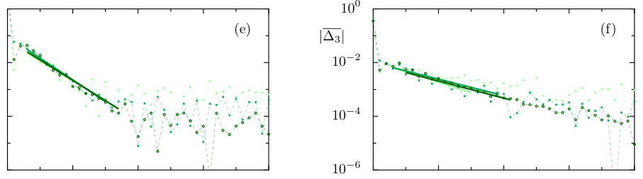
<figcaption class="paper-figure-caption"><b>Fig 1.</b> FIG. 1. Time dependence of full thermalization Fk, Eq. (10), and deep thermalization ∆k, Eq. (13), in the kicked field Ising model averaged over 150 spin chain realizations. The numerical data for one Gell-Mann matrix is shown for L = 12, 16, 20 (light to dark colors) and LA = 2. Bold lines show the exponential behavior found by a median regression in the corresponding time interval for all Gell-Mann matrices.</figcaption>
</figure>
<figure class="paper-figure-card">
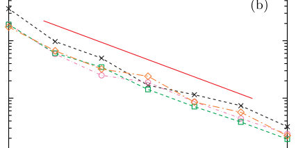
<figcaption class="paper-figure-caption"><b>Fig 2.</b> FIG. 2. Saturation values of (a) full thermalization F sat</figcaption>
</figure>
<figure class="paper-figure-card">

<figcaption class="paper-figure-caption"><b>Fig 3.</b> FIG. 3. Time dependence of (a) full thermalization Fk, Eq. (10), and (b) deep thermalization ∆k, Eq. (13), in the kicked field Ising model averaged over 150 spin chain realiza- tions. The numerical data for the 15 non-trivial Gell-Mann matrices corresponding to LA = 2 is shown for L = 20 and k = 1. Bold lines show the exponential behavior found by a median regression in the corresponding time interval for all non-trivial Gell-Mann matrices.</figcaption>
</figure>
<figure class="paper-figure-card">
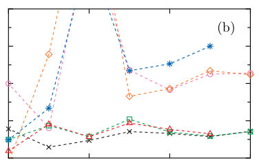
<figcaption class="paper-figure-caption"><b>Fig 4.</b> FIG. 5. Thermalization rates of (a) full thermalization γF and (b) deep thermalization γ∆. Similar to Fig. 4 but here for LA = 1, i.e. Pauli matrices, for L = 8, . . . , 18 (150 spin chain realizations) and L = 20 (100 realizations). Data is shown for k = 1, 2, 3, 4, 5, 6.</figcaption>
</figure>
<figure class="paper-figure-card">
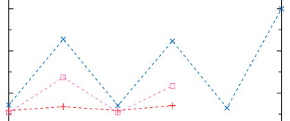
<figcaption class="paper-figure-caption"><b>Fig 5.</b> FIG. 6. Thermalization rates of (a) full thermalization γF and (b) deep thermalization γ∆for Gell-Mann matrices with LA = 2 (red plus) and Pauli matrices LA = 1 (blue cross). For the case of deep thermalization we also show for even k and LA = 2 results of mean regression in early time interval t ∈[2, 7] (pink square). For k = 1, 2, 3, 4 we show L = 20 for k = 5, 6 L = 18.</figcaption>
</figure>
<figure class="paper-figure-card">
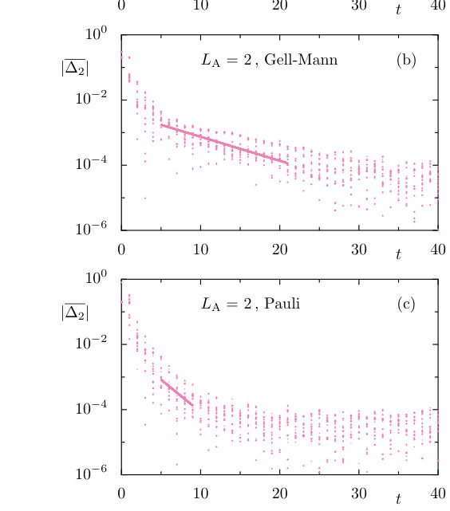
<figcaption class="paper-figure-caption"><b>Fig 6.</b> FIG. 7. Time dependence of deep thermalization ∆k, Eq. (13), in the kicked field Ising model. Numerical data for k = 2 and L = 20 and (a) for the three Pauli matrices for LA = 1 (averaged over 150 chain realizations), (b) for the 15 Gell-Mann matrices for LA = 2 (100 realizations), and (c) for 15 Pauli strings for LA = 2 (100 realizations). Bold lines show the exponential behavior found by a median regression in the corresponding time interval.</figcaption>
</figure>
<figure class="paper-figure-card">
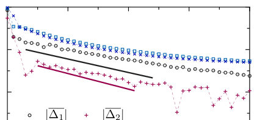
<figcaption class="paper-figure-caption"><b>Fig 7.</b> FIG. 8. Time dependence of deep thermalization in terms of ∆k and δk in the kicked field Ising model, averaged over 100 chain realizations. Data is shown for k = 1 (black circle and light blue square) and k = 2 (dark pink plus and dark blue cross) for L = 20 and LA = 2. Solid lines show exponential decay with thermalization rates γ∆1 and γ∆2. Note that for ∆k only ∆k for a single Gell-Mann matrix is visualized.</figcaption>
</figure>
<figure class="paper-figure-card">
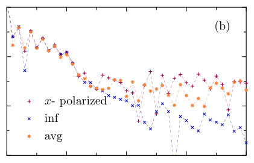
<figcaption class="paper-figure-caption"><b>Fig 8.</b> FIG. 9. Time dependence of full thermalization in terms of Fk in the x−polarized state |ψ⟩(black circle and dark pink plus), F inf k in the infinite temperature state (blue square and dark blue cross) and avenged Fk for three orthogonal states |ψj⟩(red triangle and orange star) in the kicked field Ising model, averaged over 150 chain realizations. Data of a single Gell-Mann matrix is shown for k = 1 and k = 2 for L = 12, LA = 2.</figcaption>
</figure>
<figure class="paper-figure-card">
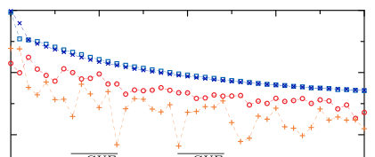
<figcaption class="paper-figure-caption"><b>Fig 9.</b> FIG. 10. Time dependence of deep thermalization in terms of ∆k and δk in the kicked field Ising model, averaged over 100 chain realizations. Data is shown for k = 1 (red circle and light blue square) and k = 2 (orange plus and dark blue cross) for L = 20 and LA = 2. For ∆k the average over 100 GUE matrices is shown.</figcaption>
</figure>

**Summary.** The paper investigates whether higher-order correlations or the approach to state designs happens faster in chaotic quantum systems. It finds that while both processes are exponential, full thermalization (decay of OTOCs) accelerates with higher orders, making it faster than deep thermalization.

**Why it may be interesting.** It provides a new quantitative comparison between two fundamental ways many-body systems reach equilibrium, offering insights into the hierarchy of timescales for information scrambling and state design formation.

Detailed structure

**Main problem.** Comparing the relaxation timescales of two extensions of the Eigenstate Thermalization Hypothesis (ETH): full thermalization (higher-order correlation functions) and deep thermalization (approach of projected ensembles to Haar-random states).

**Main result.** Both processes exhibit exponential relaxation, but full thermalization is faster than deep thermalization at higher orders, as higher-order OTOCs decay at increasing rates while deep thermalization rates remain roughly constant.

**Method.** Large-scale numerical simulations of a kicked Ising chain combined with theoretical frameworks including Free Probability Theory, Random Matrix Theory, and the replica picture.

**Model / system.** A 1D kicked mixed-field Ising spin chain subject to periodic (Floquet) dynamics with random longitudinal fields, serving as a paradigme for chaotic many-body quantum dynamics.

**Key observables.** Higher-order Out-of-Time-Order Correlators (OTOCs) for full thermalization and moments of the projected ensemble for deep thermalization.

**Important parameters / regimes.** Order of the correlation function (k), subsystem size (LA), system size (L), and the chaotic/ergodic regime.

**Assumptions / limitations.** The system is in a chaotic regime where it acts as its own bath; calculations often utilize the infinite temperature state or pure states.

**Figures summary.** Figures show the time dependence of OTOCs and ensemble moments exhibiting exponential decay and saturation at plateaus; they also illustrate the even-odd effect in deep thermalization and the scaling of fluctuations with Hilbert space dimension.

**Paper structure.** The paper defines the mathematical distinction between full and deep thermalization, proposes a unified comparison framework via k-replica observables, uses the kicked Ising chain as a case study to compare decay rates, and employs Random Matrix Theory to explain late-time scaling and fluctuations.

Abstract

Isolated quantum systems typically approach thermal equilibrium as described by the Eigenstate Thermalization Hypothesis (ETH). Going beyond this involves either higher order correlators (full thermalization) or the formation of state designs, i.e., the approach of moments of state ensembles after a projective measurement towards thermal equilibrium (deep thermalization). We compare these two extensions of ETH using extensive numerical studies within a paradigmatic model for chaotic many-body quantum dynamics. For this we find exponential relaxation for both extensions: For deep thermalization all moments relax with the same rate, which approximately equals the relaxation rate of the autocorrelation function captured by ETH. In contrast, higher order correlation functions in full thermalization approach equilibrium faster. This means that at higher orders full thermalization is faster than deep thermalization.

[↑ back to top](#top)

### [Compressed Sensing for Efficient Fidelity Estimation of GHZ States](http://arxiv.org/abs/2604.27824v1)

**Authors:** Farrokh Labib, David Nicholaeff, Vincent Russo, William J. Zeng  
**Type:** both · **Category:** quantum information and computing · **PDF:** <https://arxiv.org/pdf/2604.27824v1>  
**Analysis basis:** full PDF text, analyzed in chunks
**Topic relevance:** 🔥 `QC/QI experiment` **4/5** · `entanglement & information structure` **3/5** · `quantum measurements` **2/5**

↔ Scroll figures horizontally

<figure class="paper-figure-card">
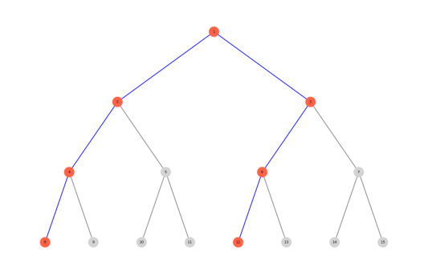
<figcaption class="paper-figure-caption"><b>Fig 1.</b> FIG. 1. Binary tree of depth four. The two red leaf nodes are the qubits we use for a parity check, and the paths to their least common ancestor (following the CNOTs) are highlighted in red too. In this case, using just one parity check covers 46.67% of the qubits.</figcaption>
</figure>
<figure class="paper-figure-card">

<figcaption class="paper-figure-caption"><b>Fig 2.</b> FIG. 2. Left: Verification of the compressed sensing estimation. The plot shows the median (red line) absolute error |Cest − Cexact| and 95th percentile (green dashed line) error, confirming high accuracy across all system sizes. The blue points represent individual trial errors. Right: Coherence estimation of a fixed-size GHZ state as a function of the number of chosen random angles. The plot shows the median absolute error |Cest −Cexact| (red line), the 95th percentile (green dashed line), and the range 5th-95th percentile error.</figcaption>
</figure>
<figure class="paper-figure-card">

<figcaption class="paper-figure-caption"><b>Fig 3.</b> FIG. 3. Success probability of recovering the correct frequency component n = N as a function of random samples M. The vertical line indicates the heuristic threshold 15, beyond which the recovery rate approaches 100%.</figcaption>
</figure>
<figure class="paper-figure-card">
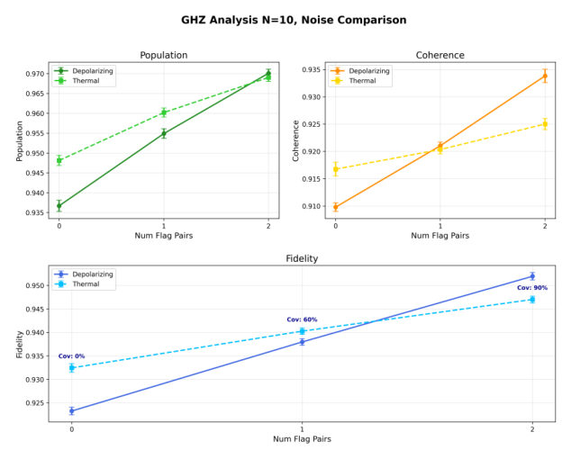
<figcaption class="paper-figure-caption"><b>Fig 4.</b> FIG. 4. Simulation results for N = 10 GHZ state preparation under depolarizing and thermal noise. The plot shows the estimated fidelity as a function of the number of flag qubits used. Annotation labels indicate the coverage ratio. We observe a clear monotonic increase in population, coherence, and fidelity estimates as more flag qubits are added, confirming that the protocol effectively detects and filters out errors propagating through the circuit.</figcaption>
</figure>
<figure class="paper-figure-card">

<figcaption class="paper-figure-caption"><b>Fig 5.</b> FIG. 5. Simulation results for N = 26 GHZ state preparation using Quantinuum H2-1 Emulator with noise. The plot shows the estimated fidelity as a function of the number of flag qubits used. We used 20 random angles at which we sample. The coverage ratio for several flags can be found at the top of the figure. We observe a clear monotonic increase in population and rotated fidelity estimates as more flag qubits are added. However, the standard fidelity is decreasing for which the reason is the increasing phase offset θ, due to unwanted rotations. We have also applied dynamic decoupling (DD).</figcaption>
</figure>
<figure class="paper-figure-card">
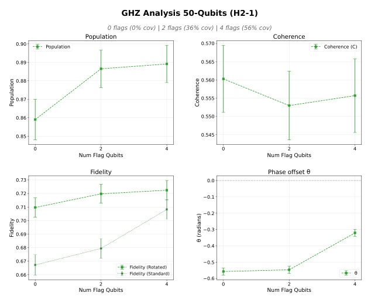
<figcaption class="paper-figure-caption"><b>Fig 6.</b> FIG. 6. Estimated fidelity of the 50 qubit standard and rotated GHZ state on the H2 Quantinuum device. We used 1000 shots on each parity oscillation circuit. We used 19 random angles at which we sample. The error bars are quite wide as a result of low number of shots to reduce cost. No error mitigation has been applied here.</figcaption>
</figure>
<figure class="paper-figure-card">
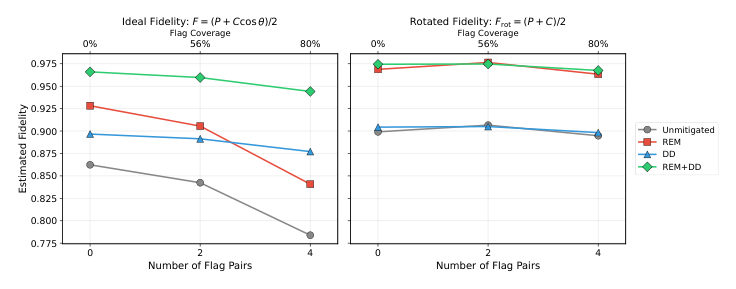
<figcaption class="paper-figure-caption"><b>Fig 7.</b> FIG. 7. Comparison of QEM techniques on the Quantinuum H2-2E emulator for 25-qubit GHZ state preparation with com- pressed sensing verification. The estimated fidelity is shown as a function of the number of flag qubit pairs (k ∈{0, 2, 4}) for four configurations: unmitigated, REM only (analytical correction with pro = 0.2%), DD only, and REM+DD. REM provides the largest improvement by correcting measurement bias in both population and coherence estimates. DD shows a modest effect on the emulator, consistent with the emulator’s noise model having limited idle-time dephasing. The combination REM+DD yields the highest fidelities across all configurations.</figcaption>
</figure>

**Summary.** This paper introduces a compressed sensing approach to drastically reduce the number of measurements needed to verify the fidelity of large GHZ states. By treating the parity signal as sparse, the method achieves logarithmic scaling with system size. The protocol is validated on both simulators and real trapped-ion hardware, demonstrating robustness through integrated error detection and mitigation.

**Why it may be interesting.** This work is highly relevant for researchers in open quantum systems and quantum optics as it addresses the practical challenges of verifying entanglement in the presence of noise and provides scalable protocols for characterizing many-body states.

Detailed structure

**Main problem.** Efficiently estimating the fidelity of large-scale multipartite GHZ states while overcoming the prohibitive measurement overhead of standard tomography and the high sampling requirements of traditional methods.

**Main result.** The proposed compressed sensing protocol achieves a logarithmic scaling of measurement overhead (M proportional to log N) and maintains high accuracy in reconstructing the parity oscillation signal, even in noisy hardware environments.

**Method.** Compressed sensing is applied to the parity oscillation signal in the Discrete Cosine Transform (DCT) basis, combined with a flag qubit strategy for error detection and readout error mitigation (REM) for bias correction.

**Model / system.** The study focuses on N-qubit GHZ states prepared via a logarithmic-depth binary tree circuit, evaluated using both quantum simulators and Quantinuum's trapped-ion hardware (H2-1).

**Key observables.** Fidelity (F), population (P), coherence (C), parity oscillation signal P(phi), and phase offset (theta).

**Important parameters / regimes.** Number of qubits (N), number of measurement samples (M), coverage ratio of flag qubits, and error rates (single-qubit p1q and two-qubit p2q).

**Assumptions / limitations.** Assumes all-to-all connectivity for effective flag qubit placement and assumes the parity signal is sparse in the DCT basis.

**Figures summary.** Figure 1 shows the binary tree structure and flag qubit coverage; Figure 2 shows the bounded error of coherence estimation; Figure 3 shows the success probability of frequency recovery vs. number of samples; Figure 4 and 5 demonstrate the impact of flag qubits on population and rotated fidelity.

**Paper structure.** The paper introduces the GHZ fidelity problem, describes the compressed sensing and flag qubit methodology, presents numerical simulations, details hardware implementation on trapped-ion systems, and discusses error mitigation strategies.

Abstract

Accurately characterizing multipartite entangled states is a critical challenge in quantum information processing. In this work, we focus on applying compressed sensing techniques to efficiently estimate the fidelity of Greenberger-Horne-Zeilinger (GHZ) states. By exploiting the inherent sparsity of these states, our compressed sensing protocol drastically reduces the measurement overhead traditionally required for state verification while maintaining high accuracy. To evaluate the practical performance of this approach, we test the protocol on GHZ states using both quantum simulators and Quantinuum's trapped-ion hardware. Furthermore, we implement error detection techniques during our hardware evaluations, demonstrating the robustness and viability of compressed sensing for fidelity estimation in noisy experimental environments.

[↑ back to top](#top)

### [Non-Local Magic Resources for Fermionic Gaussian States](http://arxiv.org/abs/2604.27049v1)

**Authors:** Daniele Iannotti, Beatrice Magni, Riccardo Cioli, Alioscia Hamma, Xhek Turkeshi  
**Type:** theory · **Category:** quantum information and computing · **PDF:** <https://arxiv.org/pdf/2604.27049v1>  
**Analysis basis:** abstract only; PDF text extraction failed or PDF unavailable
**Topic relevance:** 🔥 `entanglement & information structure` **4/5** · `non-equilibrium dynamics` **3/5** · `non-equilibrium universality` **2/5**

**Summary.** The paper introduces a computationally efficient method to calculate non-local magic in fermionic Gaussian states using only two-point correlation functions. This allows for the study of magic scaling in large systems, such as the XY model and during quantum quenches, and enables experimental estimation via shadow tomography.

**Why it may be interesting.** It provides a scalable, efficient way to quantify a complex resource (non-local magic) in many-body systems using only local measurements, which is highly relevant for characterizing large-scale quantum processors and non-equilibrium dynamics.

Detailed structure

**Main problem.** Evaluating non-local magic, which quantifies irreducible nonstabilizerness tied to entanglement, is computationally prohibitive due to the need for minimization over the full Hilbert space.

**Main result.** The authors derive a closed-form expression for non-local stabilizer entropies of fermionic Gaussian states that can be computed in polynomial time using Majorana covariance matrices.

**Method.** The study utilizes the properties of fermionic Gaussian states and Majorana covariance matrices to bypass Hilbert space minimization, applying the framework to random states, the XY model, and quantum quenches.

**Model / system.** The paper focuses on fermionic Gaussian states, specifically examining the XY model at its quantum critical point and out-of-equilibrium quantum quenches.

**Key observables.** Non-local stabilizer entropies, Majorana covariance matrix eigenvalues, and two-point correlation functions.

**Important parameters / regimes.** Quantum critical point of the XY model, random state regimes, and out-of-equilibrium quench dynamics.

**Assumptions / limitations.** The derivation is specifically applicable to fermionic Gaussian states and local Gaussian unitaries.

**Paper structure.** The paper introduces the problem of non-local magic, presents a new closed-form expression for Gaussian states, applies this to random states and the XY model, discusses quasiparticle-based magic generation in quenches, and concludes with experimental implementation via shadow tomography.

Abstract

Entanglement and magic are fundamental resources that capture the complexity of quantum many-body systems. Non-local magic isolates the irreducible nonstabilizerness intrinsically tied to entanglement. However, evaluating this quantity generally requires a prohibitive minimization over the full Hilbert space, making it computationally inaccessible beyond a few qubits. Here, we overcome this bottleneck by suggesting a closed-form expression for the non-local stabilizer entropies of fermionic Gaussian states over local Gaussian unitaries, which can be evaluated in polynomial time directly from the eigenvalues of the reduced Majorana covariance matrix. We apply this framework to characterize fermionic non-local magic across diverse physical regimes: we derive an exact Page-like curve for typical random states, reveal logarithmic scaling at the quantum critical point of the XY model, and establish a quasiparticle picture for magic generation during out-of-equilibrium quantum quenches. Crucially, because our result relies solely on two-point correlation functions, it provides a scalable route for the experimental estimation of fermionic non-local magic in large-scale quantum processors via fermionic shadow tomography.

[↑ back to top](#top)

### [Nonlocal nonstabilizerness in free fermion models](http://arxiv.org/abs/2604.27055v1)

**Authors:** Mario Collura, Benjamin Béri, Emanuele Tirrito  
**Type:** theory · **Category:** quantum information and computing · **PDF:** <https://arxiv.org/pdf/2604.27055v1>  
**Analysis basis:** full PDF text, analyzed in chunks
**Topic relevance:** 🔥 `entanglement & information structure` **4/5** · `non-equilibrium dynamics` **3/5** · `non-equilibrium universality` **2/5**

↔ Scroll figures horizontally

<figure class="paper-figure-card">
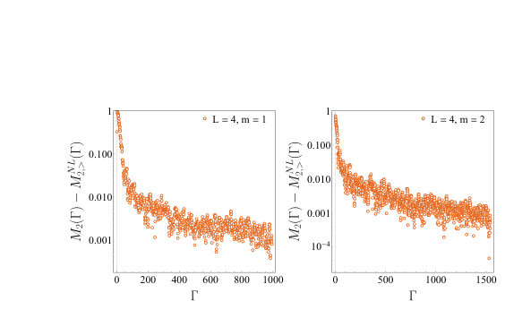
<figcaption class="paper-figure-caption"><b>Fig 1.</b> Figure 1. Simulated-annealing benchmark of the ana- lytical nonlocal-magic bound. For random pure Gaussian states with 2L = 8 Majorana modes, we minimize M2(Γ) over the local Gaussian orbit and plot M2(Γ)−M NL 2,&gt;(ψΓ) along the annealing trajectory. The two panels correspond to biparti- tions with |A| = 2m = 2 (left) and |A| = 2m = 4 (right). The trajectories approach the analytical value without cross- ing it, providing numerical evidence that M NL 2,&gt;(ψΓ) attains the Gaussian local minimum. The annealing schedule uses dβ = 0.5.</figcaption>
</figure>
<figure class="paper-figure-card">
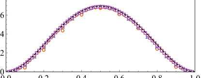
<figcaption class="paper-figure-caption"><b>Fig 2.</b> Figure 2. Random Gaussian ensemble average of the nonlocal magic density. The quantity EΓ[M NL 2,&gt;(ψΓ)]/L is shown as a function of the bipartition fraction ℓ= m/L. The dashed black line denotes the thermodynamic prediction J(ℓ) in Eq. (11), while symbols are numerical averages of Eq. (8) over 100 Haar-random Gaussian states for different L. The finite-size data converge to the Jacobi-ensemble result, with a maximum at the symmetric bipartition.</figcaption>
</figure>
<figure class="paper-figure-card">
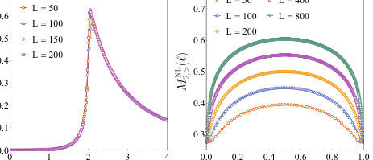
<figcaption class="paper-figure-caption"><b>Fig 3.</b> Figure 3. Ground-state nonlocal magic in the Kitaev chain. (Left panel) Nonlocal Gaussian magic M NL 2,&gt;(ψΓ) for the ground state of the Kitaev chain with t = ∆= 1, shown as a function of µ for different system sizes and a symmetric bipartition. The peak sharpens near the critical point µ = 2. (Right panel) M NL 2,&gt;(ψΓ) at criticality, µ = 2, as a function of the bipartition fraction ℓ= m/L. The growth with system size is consistent with logarithmic critical scaling.</figcaption>
</figure>
<figure class="paper-figure-card">
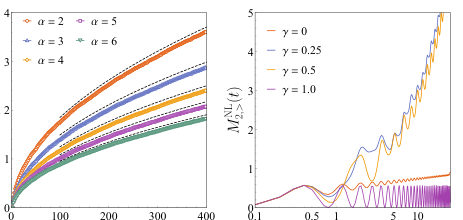
<figcaption class="paper-figure-caption"><b>Fig 4.</b> Figure 4. Gaussian dynamics of nonlocal magic. (Left panel) In random Gaussian brick-wall circuits, M NL α,&gt;(ψΓ(t)) shows a diffusive behavior for all Rényi indices, with the black- dashed lines highlighting the t1/2 scaling. (Right panel) After a Néel-state quench in the XY chain, M NL 2,&gt;(ψΓ(t)) grows log- arithmically at the U(1)-symmetric XX point γ = 0, while it grows linearly for γ ̸= 0, except in the limit γ = 1.</figcaption>
</figure>

**Summary.** This paper introduces a method to quantify the irreducible nonstabilizerness of bipartite Gaussian states. It provides an analytical bound linked to the entanglement spectrum and explores how this 'nonlocal magic' behaves during phase transitions and quantum evolution.

**Why it may be interesting.** It provides a new way to quantify non-classicality in many-body systems and reveals a striking separation between the growth of entanglement and nonstabilizerness in certain integrable models, which is highly relevant for many-body dynamics.

Detailed structure

**Main problem.** Quantifying 'nonlocal magic' (irreducible nonstabilizerness) in bipartite free fermion states and understanding its behavior in random ensembles, topological phases, and quantum dynamics.

**Main result.** The authors derive a closed-form upper bound for nonlocal magic based on the entanglement spectrum and show it is tight for Gaussian unitaries. They also demonstrate that nonlocal magic peaks at critical points in the Kitaev chain and grows diffusively in random circuits.

**Method.** Analytical derivation using the alpha-stabilizer Renyi entropy, random matrix theory (Jacobi ensemble), and numerical benchmarking via simulated annealing over local Gaussian unitary orbits.

**Model / system.** Pure fermionic Gaussian states, including the Kitaev chain, the XY chain, and Gaussian Haar ensembles, as well as random brick-wall matchgate circuits.

**Key observables.** Nonlocal magic (nonstabilizerness), alpha-stabilizer Renyi entropy (alpha-SRE), entanglement spectrum (singular values of the covariance matrix), and entanglement growth.

**Important parameters / regimes.** Bipartition fraction (l), chemical potential (mu), anisotropy parameter (gamma), and time evolution (t).

**Assumptions / limitations.** The primary analytical results and the derived tight bound are restricted to the manifold of Gaussian states.

**Figures summary.** Figure 1 shows a simulated-annealing benchmark where the minimized magic approaches the analytical bound without crossing it. Figure 2 shows the convergence of averaged nonlocal Gaussian magic to a thermodynamic prediction.

**Paper structure.** The paper introduces the concept of nonlocal magic, derives an analytical bound using the entanglement spectrum, verifies the bound's tightness via simulated annealing, extends the analysis to random ensembles using random matrix theory, and finally investigates the dynamics and phase transitions in specific models like the Kitaev and XY chains.

Abstract

Nonlocal magic quantifies the irreducible nonstabilizerness of a bipartite quantum state after optimizing over local basis changes. We study nonlocal magic for pure fermionic Gaussian states, and derive a simple closed-form entanglement spectrum bound in terms of the singular values of the subsystem-restricted covariance matrix. We benchmark our result against simulated annealing over local Gaussian unitary transformations, which supports optimality along the full local Gaussian orbit. For states drawn from the Gaussian Haar ensemble, we show that the average nonlocal magic is extensive and determine its thermodynamic limit using random matrix theory for the appropriate circular unitary ensemble. We also study Gaussian ground states, focusing on the Kitaev chain, and find that nonlocal magic is suppressed deep in both trivial and topological phases and peaks near the critical points. Finally, we investigate Gaussian evolution via random circuits and in quenches with the XY chain. For random circuits, we find that nonlocal magic grows diffusively, while in the XY chain the XX limit reveals a striking separation between nonlocal magic and entanglement.

[↑ back to top](#top)

### [An Analytical Approach to Design Space Exploration for Cavity-Mediated Quantum State Transfer in Multi-core Architectures](http://arxiv.org/abs/2604.27664v1)

**Authors:** Biel Pons Zaragoza, Junaid Khan, Rohit Sarma Sarkar, Sahar Ben Rached, Carmen G. Almudever, Eduard Alarcon, Sergi Abadal  
**Type:** theory · **Category:** quantum information and computing · **PDF:** <https://arxiv.org/pdf/2604.27664v1>  
**Analysis basis:** full PDF text, analyzed in chunks
**Topic relevance:** 🔥 `methods for driven-dissipative` **4/5** · `correlated / nonlocal dissipation` **2/5** · `non-equilibrium dynamics` **2/5**

↔ Scroll figures horizontally

<figure class="paper-figure-card">

<figcaption class="paper-figure-caption"><b>Fig 1.</b> Figure 1: Schematic of a waveguide-mediated interconnect between two qubit chips in a modular quantum computing system.</figcaption>
</figure>
<figure class="paper-figure-card">

<figcaption class="paper-figure-caption"><b>Fig 2.</b> Figure 2: Comparison between plots using the analytical equation and using QuTip for ∆ω = 500 MHz, g = 1.1 GHz, κ = 3 MHz and γ = 2 MHz.</figcaption>
</figure>
<figure class="paper-figure-card">

<figcaption class="paper-figure-caption"><b>Fig 3.</b> Figure 3: Transfer fidelity heatmap over coupling strength g and detuning ∆ω for a highly detuned system over different combinations of losses.</figcaption>
</figure>
<figure class="paper-figure-card">

<figcaption class="paper-figure-caption"><b>Fig 4.</b> Figure 4: Comparison between heatmaps using the analytical and simulation results for κ = γ = 0.1 MHz.</figcaption>
</figure>
<figure class="paper-figure-card">

<figcaption class="paper-figure-caption"><b>Fig 5.</b> Figure 5: Study of the types of N combinations. If a and b are both odd, fidelity will always be low. If N is even, fidelity will be high with low latency. a) Occupation probability for N = 3 for a lossless system. b) Occupation probability for N = 4 for a lossless system. c) Contour map of some relevant values of N for low fidelity regions due to the periodicity of the envelope and the internal waves, for κ = 0.1 MHz and γ = 0.1 MHz.</figcaption>
</figure>
<figure class="paper-figure-card">
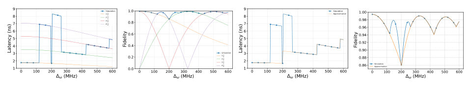
<figcaption class="paper-figure-caption"><b>Fig 6.</b> Figure 6: Comparison of latency and fidelity for g = 200 MHz, κ = 1 MHz, and γ = 1 MHz. a) Latency comparison between the simulation and the results at multiples of π/θ; b) corresponding fidelity comparison. c) latency comparison between our model and the simulation; d) corresponding fidelity comparison.</figcaption>
</figure>
<figure class="paper-figure-card">
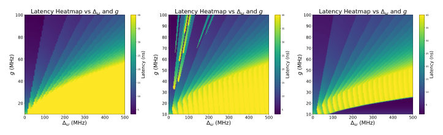
<figcaption class="paper-figure-caption"><b>Fig 7.</b> Figure 7: Comparison of the latency heatmaps obtained with the analytical model of latency and the full QuTiP simulation, prioritizing short latencies over high fidelities. The cavity and qubit loss rates are set to κ = γ = 0.1 MHz. a) Analytical Model. b) QuTip simulation (η = 1 × 106). c) QuTip simulation (η = 8 × 106).</figcaption>
</figure>

**Summary.** This paper presents an analytical method for rapidly simulating quantum state transfer in multi-core quantum architectures. By replacing expensive numerical simulations with closed-form expressions, the authors enable efficient large-scale parameter sweeps to optimize the trade-off between fidelity and latency. The approach accurately predicts complex phenomena like interference-induced low-fidelity regions.

**Why it may be interesting.** It provides a highly efficient analytical tool for studying open quantum system dynamics and interference-induced fidelity drops, which is directly applicable to designing scalable quantum networks and interconnects.

Detailed structure

**Main problem.** Optimizing quantum state transfer in multi-core architectures is hindered by the high computational cost of numerical simulations and the difficulty of balancing fidelity against latency.

**Main result.** The authors derive an analytical framework that is two orders of magnitude faster than standard numerical solvers, enabling rapid design space exploration and the identification of optimal operating points.

**Method.** The study uses the Monte Carlo wave-function method and a non-Hermitian effective Hamiltonian approach to derive closed-form analytical expressions for qubit occupation probabilities.

**Model / system.** A two-qubit system (chips A and B) connected via a waveguide-mediated interconnect, modeled using a Jaynes-Cummings-type Hamiltonian and the Lindblad master equation.

**Key observables.** Qubit occupation probabilities, transfer fidelity, and latency.

**Important parameters / regimes.** Coupling strength (g), waveguide-qubit detuning (delta omega), qubit decay rate (gamma), and waveguide decay rate (kappa).

**Assumptions / limitations.** The model assumes a single waveguide mode, the Rotating Wave Approximation (RWA), and a small-loss regime where quantum jumps can be neglected.

**Figures summary.** Figure 1 shows a schematic of the interconnect; Figure 2 compares analytical vs. numerical time-evolution; Figure 3 and 4 show fidelity and latency heatmaps; Figure 5 illustrates the impact of frequency ratios on occupation probability; Figure 7 compares analytical and simulation heatmaps for latency.

**Paper structure.** The paper introduces the scaling bottleneck of monolithic chips, proposes a modular architecture, derives an analytical solution for the dynamics, validates it against QuTiP simulations, and concludes with an efficiency-based optimization function for design exploration.

Abstract

In multi-core quantum computing architectures, waveguide-mediated interconnects are essential for facilitating fast, high-fidelity quantum state transfer between qubits located in different chips. However, optimizing these systems typically relies on computationally expensive numerical simulations that offer limited physical insight. In this work, we derive exact analytical expressions for the state transfer dynamics of a two-qubit system coupled via a waveguide, modeled through a Jaynes-Cummings Hamiltonian and the Lindblad master equation. We apply the Monte Carlo wave-function method and obtain a closed-form solution for qubit occupation probabilities that accounts for both detuning and dissipative losses. Our analytical framework provides a significant computational speedup compared to standard numerical solvers, enabling large-scale parameter sweeps while maintaining high precision in both fidelity and latency predictions. Furthermore, the model reveals and explains systematic low-fidelity regions arising from destructive interference between internal oscillations and detuning-induced envelopes, which are phenomena that are difficult to characterize through numerical means alone. Finally, we propose a simplified latency model and an efficiency-based function to enable rapid identification of optimal operating points. This analytical approach provides a robust foundation for the design and optimization of interconnects in multi-core quantum processors.

[↑ back to top](#top)

### [High-key-rate Fully-Passive Quantum Access Network with Thermal Source](http://arxiv.org/abs/2604.27327v1)

**Authors:** H. W. Yin, B. D. Zhu, H. Peng, T. Wang, X. Q. Jiang, Y. K. Xu, G. H. Zeng  
**Type:** experiment · **Category:** quantum information and computing · **PDF:** <https://arxiv.org/pdf/2604.27327v1>  
**Analysis basis:** abstract only; PDF text extraction failed or PDF unavailable
**Topic relevance:** 🔥 `QC/QI experiment` **4/5** · 🔥 `quantum optics experiment` **4/5**

**Summary.** The paper presents a new protocol for a fully passive quantum access network that achieves a record-breaking key rate of 19.48 Mbps. By using passive state preparation, the system can scale to multi-user networks and integrate seamlessly with existing classical fiber and free-space optical infrastructure.

**Why it may be interesting.** This work is highly relevant to quantum optics and quantum information as it demonstrates a scalable, high-rate architecture for quantum communication networks using passive components.

Detailed structure

**Main problem.** Achieving high-speed, stable, and low-resource quantum access networks (QAN) that can scale from point-to-point to point-to-multi-point while remaining compatible with existing classical optical infrastructure.

**Main result.** Demonstration of a downstream fully passive quantum access network protocol achieving a record-breaking key generation rate of 19.48 Mbps per quantum network unit.

**Method.** The researchers implemented a passive state preparation (PSP) scheme within a quantum passive optical network (QPON) architecture using hybrid free-space and single-mode fiber channels.

**Model / system.** A downstream quantum access network utilizing a passive state preparation (PSP) protocol for continuous-variable quantum key distribution (CVQKD) across a point-to-multi-point architecture.

**Key observables.** Final key generation rate (Mbps per quantum network unit).

**Important parameters / regimes.** Key generation rate of 19.48 Mbps; hybrid free-space and single-mode fiber channels.

**Assumptions / limitations.** The network is compatible with existing classical optical communication infrastructure.

**Paper structure.** The paper introduces the motivation for optimized QANs, proposes a new PSP-QPON protocol, demonstrates experimental implementation using hybrid channels, and discusses compatibility with classical networks.

Abstract

To accommodate classical communication systems with progressively increasing transmission rates, quantum access networks (QAN) have undergone systematic and protocol-level optimizations in recent years, where quantum passive optical network (QPON) architectures are gaining significant attention due to their simple structure. It is challenging for the previous QAN based on active protocols or Stokes operator coding protocols to achieve high-speed linear modulation with high extinction ratio and stability under practical conditions. In this work, we propose and experimentally demonstrate a downstream fully passive quantum access network protocol using passive state preparation (PSP) with free-space and single-mode fiber hybrid channels, and the final key generation rate is up to a record-breaking 19.48 Mbps per quantum network unit. The proposed PSP-QPON scheme extends the scope of PSP-CVQKD from point-to-point to point-to-multi-point networks, which enables high-key-rate, high-stability, and low-resource-consumption implementation. Moreover, the network channel in this experiment is fully compatible with access networks in classical optical communications, which allows integration with existing optical infrastructure without the need for additional modifications, providing a promising solution for local area network quantum access network at home or a mobile terminal.

[↑ back to top](#top)

### [Enhancement of superconducting stiffness in hybrid superconducting-metallic bilayers](http://arxiv.org/abs/2604.28187v1)

**Authors:** J. E. Ebot, Lorenzo Pizzino, Sam Mardazad, Johannes S. Hofmann, Thierry Giamarchi, Adrian Kantian  
**Type:** theory · **Category:** strongly correlated electrons · **PDF:** <https://arxiv.org/pdf/2604.28187v1>  
**Analysis basis:** full PDF text, analyzed in chunks
**Topic relevance:** 🔥 `Kondo & dissipative impurity` **4/5** · `analog quantum simulation` **2/5** · `entanglement & information structure` **1/5**

↔ Scroll figures horizontally

<figure class="paper-figure-card">

<figcaption class="paper-figure-caption"><b>Fig 1.</b> FIG. 1. (a) Schematic representation of the Hamiltonian in Eq. (1). It comprises of a pairing subsystem (“P-subsystem”) with on-site pairing U (and chemical potential µm, when performing AFQMC simulations, which are in the grand- canonical regime), and a metallic subsystem (M-subsystem; we will use ‘metal’ interchangeably) with nearest-neighbour tunneling tm and chemical potential term µm. Coupling be- tween the subsystems is provided by tunneling with amplitude t⊥.</figcaption>
</figure>
<figure class="paper-figure-card">

<figcaption class="paper-figure-caption"><b>Fig 2.</b> FIG. 2. Cλ(i, j) (open markers) and |Nλ(i, j)| (shaded mark- ers) of (a) P-subsystem and (b) M-subsystem in regime 3 with L = 100 and np = 0.38, nm = 0.78. Cλ(i, j) has infinite correlation length and |Np(i, j)| is suppressed. Cλ(i, j) (open markers: , , ) and |Nm(i, j)| (shaded markers: , , ). Dashed lines are the power-law fit of Cλ, with fitting param- eters K−1 p and AC,p.</figcaption>
</figure>
<figure class="paper-figure-card">

<figcaption class="paper-figure-caption"><b>Fig 3.</b> FIG. 3. Cλ(i, j) (open markers, , , ) and |Nλ(i, j)| (shaded markers, , , ) in regime 1 at U = 4 and with L = 100. (a) P-subsystem and (b) M-subsystem. np = 0.67, nm = 0.49 (circle), np = 0.51, nm = 0.65 (square) , np = 0.39, nm = 0.77 (diamond).</figcaption>
</figure>
<figure class="paper-figure-card">
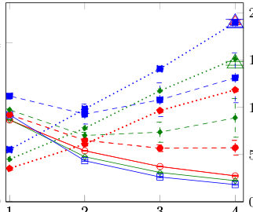
<figcaption class="paper-figure-caption"><b>Fig 4.</b> FIG. 4. The Luttinger liquid parameters (K−1 p and K−1 m ) and single particle length scale ξm in regime 1 versus U with L = 200, t⊥= 0.4 np = 0.38 ± 0.01, nm = 0.78 ± 0.01 ( , ), np = 0.51, nm = 0.65 ( , ), np = 0.67±0.01, nm = 0.49±0.01 ( , ). The markers △are K−1 p for the Hubbard ladder in Ref [9].</figcaption>
</figure>
<figure class="paper-figure-card">

<figcaption class="paper-figure-caption"><b>Fig 5.</b> FIG. 5. (Left y-axis) Luttinger liquid parameters in the P-subsystem (K−1 p , ) and M-subsystem (K−1 m ) versus kp F , and (right y-axis) the single-particle length scale ξS,m ( ) against km F in regime 2 with L = 200, t⊥= 3.0 (top row) and t⊥= 2.0 (bottom row). The corresponding P- and M-subsystem wave-vectors kλ F can be read off from the bottom x-axis and top x-axis respectively.</figcaption>
</figure>
<figure class="paper-figure-card">
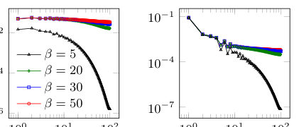
<figcaption class="paper-figure-caption"><b>Fig 6.</b> FIG. 6. Finite temperature data: Cλ(i, j) at two different values of tm in regime 2 with L = 200 and t⊥= 3.0. (a &amp; c) Cp(i, j) and (b &amp; d) Cm(i, j). β = 50 ( ), β = 30 ( ),β = 20 ( ) β = 5 ( ).</figcaption>
</figure>

**Summary.** This paper demonstrates that doping a hybrid superconducting-metallic bilayer away from half-filling enhances superconducting correlations by breaking the competition with density-density correlations. It identifies distinct regimes of superconductivity controlled by the metal's parameters and provides a mapping to heavy-fermion systems. This work offers a new way to study Kivelson's bilayer proposal using magnetic materials.

**Why it may be interesting.** The paper provides a theoretical bridge between superconductivity enhancement and magnetic ordering in Kondo/Anderson lattices, offering a way to use spin-polarized heavy-fermion materials as simulators for superconducting bilayer physics.

Detailed structure

**Main problem.** The study investigates how a metallic reservoir can enhance superconducting correlations in a hybrid bilayer system when doped away from half-filling, specifically addressing whether the charge gap present at half-filling suppresses superconductivity.

**Main result.** Doping the system away from half-filling breaks the degeneracy between superconducting and density-density correlations in favor of superconductivity, allowing for near-long-range order and revealing both stiffness-limited and amplitude-limited regimes.

**Method.** The authors utilize large-scale numerical simulations, including Density Matrix Renimormalization Group (DMRG) and Auxiliary Field Quantum Monte Carlo (AFQMC), alongside analytical frameworks like Conformal Field Theory.

**Model / system.** A 1D hybrid bilayer model consisting of a pairing subsystem (P-subsystem) with on-site pairing and a metallic subsystem (M-subsystem) coupled via inter-layer tunneling, which can be mapped to the periodic Anderson or Kondo lattice models.

**Key observables.** S-wave pair-pair correlations, density-density correlations, single-particle correlations, Luttinger liquid parameters (Kp and Km), and superconducting susceptibility.

**Important parameters / regimes.** Interaction strength (U), inter-layer tunneling (t_perp), metallic kinetic energy (t_m), filling fraction (n), and density imbalance between layers.

**Assumptions / limitations.** The study focuses on 1D chains; the extension of these findings to 2D and 3D systems remains a theoretical prediction.

**Figures summary.** Figure 1 illustrates the physical setup of the two weakly coupled chains (P-subsystem and M-subsystem) used in the model.

**Paper structure.** The paper introduces the Kivelson bilayer proposal, defines the 1D hybrid model and its mapping to magnetic lattices, presents numerical results for different doping and coupling regimes, discusses the transition between amplitude and stiffness-limited superconductivity, and concludes with implications for heavy-fermion materials.

Abstract

Boosting superconductivity by metallic reservoirs is the essence of Kivelson's bilayer proposal.   One layer provides pairing to the electrons, while the weakly coupled metal provides additional phase coherence to those pairs by mediating extended-range pair-pair coupling.   Demonstrating significant and unambiguous performance gains with strong-coupling methods for such set-ups had been difficult.   In the present work, we study these systems doped away from half-filling, corresponding to a partially spin-polarized 1D Anderson- or Kondo-lattice.   We show that this breaks the coexistence of dominant superconducting and density-density correlations decisively in favour or the former.   Consequently, we provide evidence that in this doped regime, superconducting near-long-range order is not precluded by a small charge-gap in the thermodynamic limit, as we have recently shown to be the case at half-filling [JE Ebot $et$ $al.$, arXiv:2602.11153 [cond-mat.supr-con]].   We study the complex manner in which the enhancement of superconductivity in the pairing layer depends on the parameters of the metal, and especially that both pairing-limited and stiffness-limited regimes may appear in these systems.   In addition to superconducting bilayers, our results are relevant, via a particle-hole transformation, for heavy-fermion Kondo-lattice materials in magnetic fields, as we provide previously lacking insight on the competition between antiferromagnetic and easy-plane magnetism, as well as a route for comprehensive indirect tests of Kivelson's bilayer proposal well beyond previous capabilities.

[↑ back to top](#top)

### [Light-Cone Structure of Propagation of Entanglement](http://arxiv.org/abs/2604.27170v1)

**Authors:** Israel Michael Sigal  
**Type:** theory · **Category:** quantum information and computing · **PDF:** <https://arxiv.org/pdf/2604.27170v1>  
**Analysis basis:** full PDF text, analyzed in chunks
**Topic relevance:** 🔥 `entanglement & information structure` **4/5** · `non-equilibrium dynamics` **3/5**

↔ Scroll figures horizontally

<figure class="paper-figure-card">
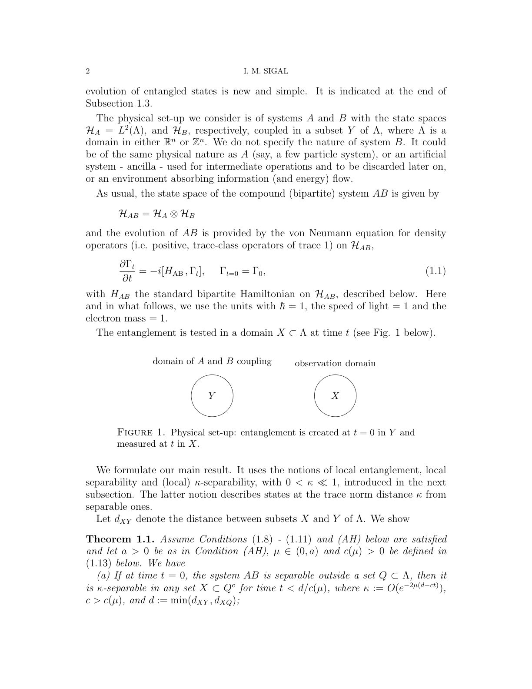
<figcaption class="paper-figure-caption"><b>Fig 1.</b> Low-resolution page preview, page 2</figcaption>
</figure>
<figure class="paper-figure-card">
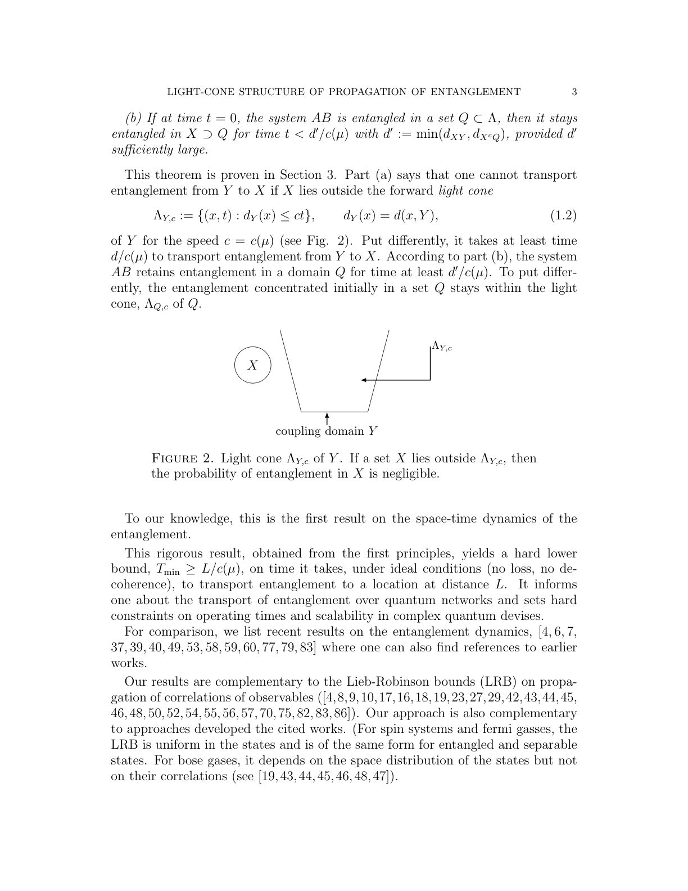
<figcaption class="paper-figure-caption"><b>Fig 2.</b> Low-resolution page preview, page 3</figcaption>
</figure>
<figure class="paper-figure-card">

<figcaption class="paper-figure-caption"><b>Fig 3.</b> Low-resolution page preview, page 4</figcaption>
</figure>
<figure class="paper-figure-card">
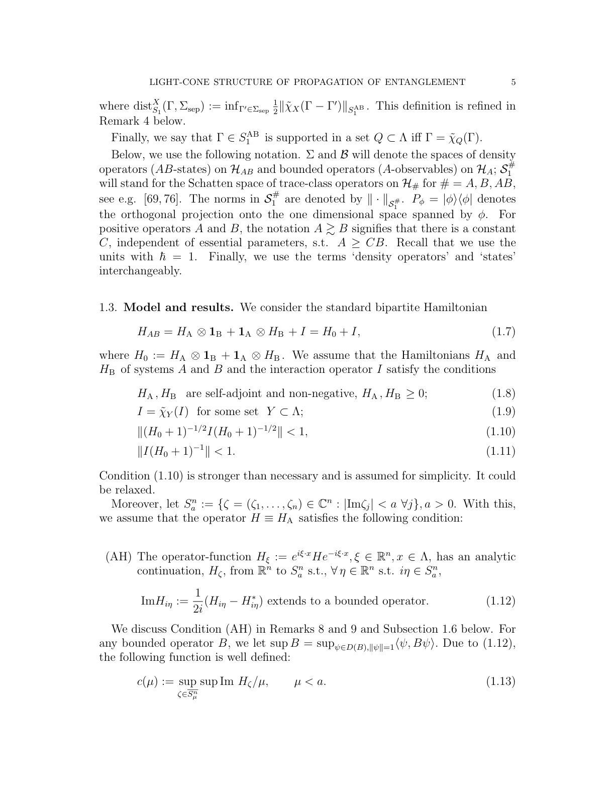
<figcaption class="paper-figure-caption"><b>Fig 4.</b> Low-resolution page preview, page 5</figcaption>
</figure>
<figure class="paper-figure-card">

<figcaption class="paper-figure-caption"><b>Fig 5.</b> Low-resolution page preview, page 6</figcaption>
</figure>
<figure class="paper-figure-card">
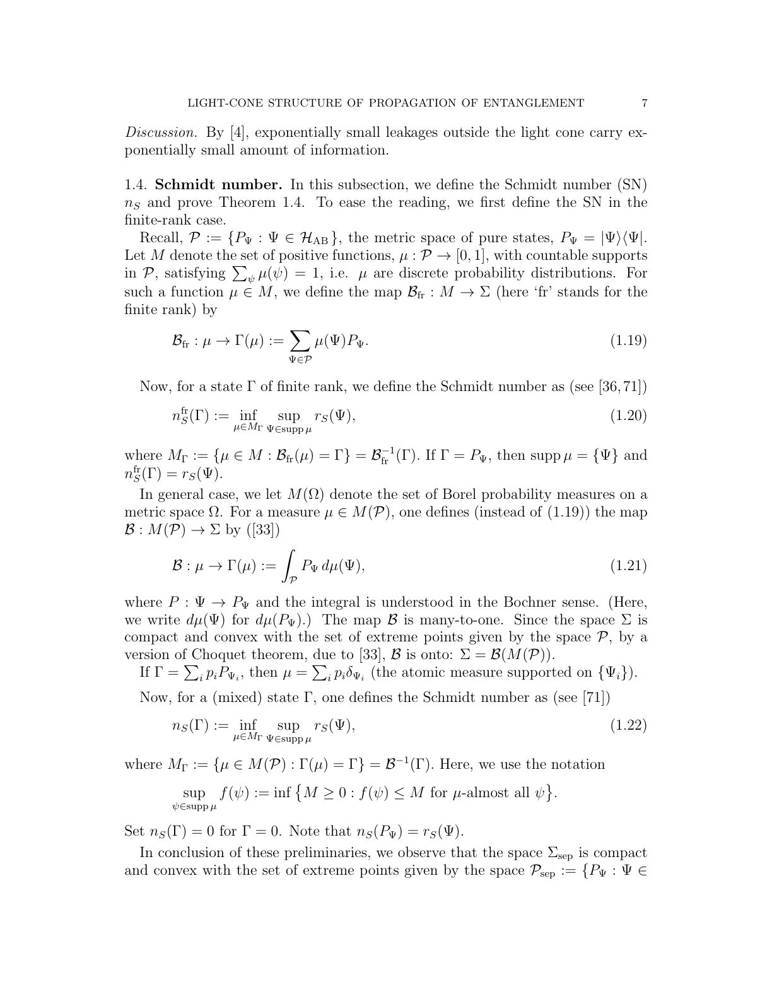
<figcaption class="paper-figure-caption"><b>Fig 6.</b> Low-resolution page preview, page 7</figcaption>
</figure>
<figure class="paper-figure-card">
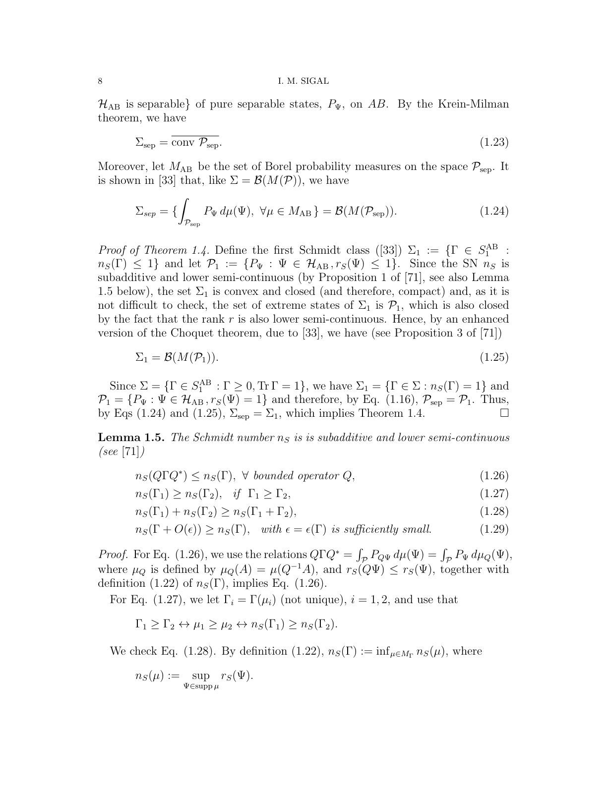
<figcaption class="paper-figure-caption"><b>Fig 7.</b> Low-resolution page preview, page 8</figcaption>
</figure>
<figure class="paper-figure-card">
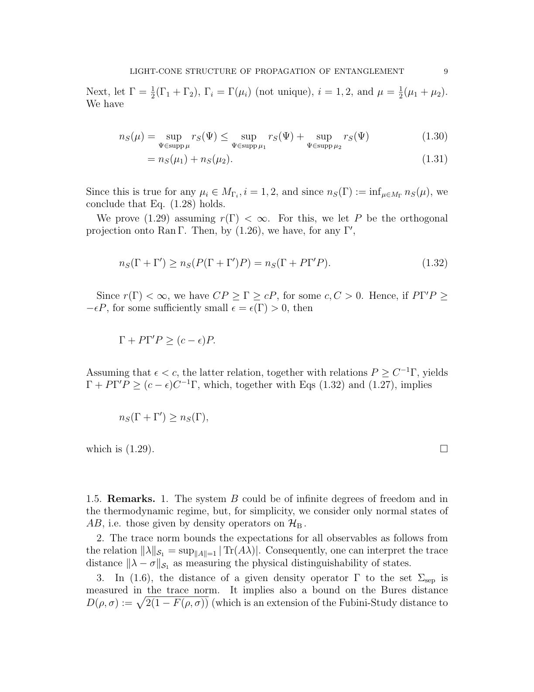
<figcaption class="paper-figure-caption"><b>Fig 8.</b> Low-resolution page preview, page 9</figcaption>
</figure>
<figure class="paper-figure-card">
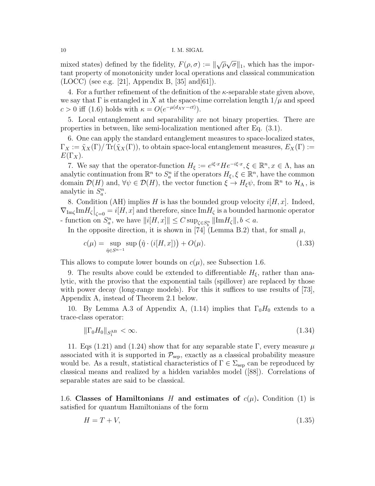
<figcaption class="paper-figure-caption"><b>Fig 9.</b> Low-resolution page preview, page 10</figcaption>
</figure>
<figure class="paper-figure-card">
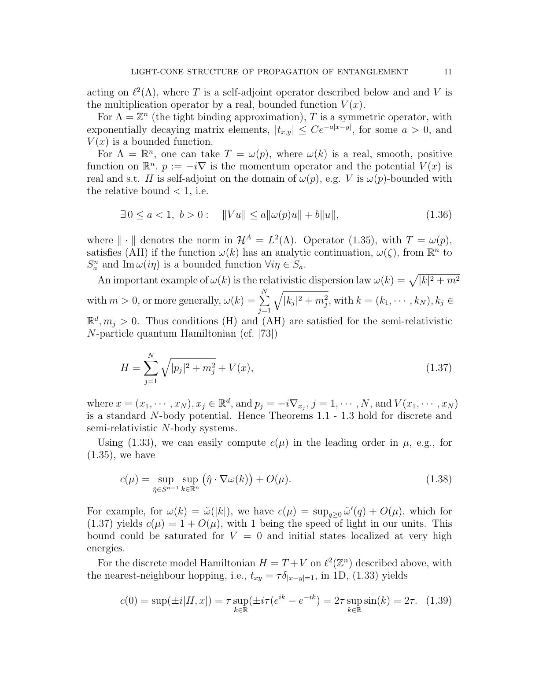
<figcaption class="paper-figure-caption"><b>Fig 10.</b> Low-resolution page preview, page 11</figcaption>
</figure>

**Summary.** This paper establishes a rigorous 'light-cone' for entanglement propagation in quantum many-body systems. It proves that entanglement cannot be transported between distant regions faster than a specific velocity, providing a fundamental lower bound on communication time in quantum networks.

**Why it may be interesting.** It provides rigorous, fundamental limits on the speed of entanglement distribution, which is critical for designing quantum networks and understanding the dynamics of information in many-body systems.

Detailed structure

**Main problem.** Establishing the existence of an effective light-cone for the propagation of entanglement in bipartite systems and determining the hard lower bounds on the time required to transport or maintain entanglement.

**Main result.** The paper proves that entanglement (quantified by the Schmidt number) propagates within a defined light-cone, providing an exponential bound on the leakage of entanglement outside this cone and a minimum time threshold for entanglement transport.

**Method.** The author uses a new analysis of space-time evolution involving Duhamel's principle, trace-norm estimates in Schatten spaces, and analytic continuation of the Hamiltonian's dispersion law.

**Model / system.** Bipartite systems (AB) with localized interactions, including discrete tight-binding models on lattices and continuous semi-relativistic N-body systems.

**Key observables.** Schmidt number (n_S), local entanglement, and trace norm distance to separability.

**Important parameters / regimes.** Propagation velocity (c), distance between domains (d_XY), and the error/distance from separability (kappa).

**Assumptions / limitations.** The Hamiltonian must satisfy specific analyticity conditions (AH) for the dispersion law, and interactions must be localized.

**Paper structure.** The paper introduces the problem of entanglement propagation, defines the mathematical framework for local entanglement and Schmidt numbers, presents theorems establishing the light-cone structure and error bounds, and concludes with technical lemmas on operator theory.

Abstract

For a wide class of bipartite systems with localized couplings, we establish existence of an effective light-cone for propagation of entanglement. This result yields a hard lower bound on the time it takes, under ideal conditions (no loss, no decoherence), to transport entanglement to a distant location (say, a node of a graph-structured quantum network), or to maintain it there.

[↑ back to top](#top)

### [Size-Limited Room Temperature Single-Photon Emission from Sidewall-Treated Fractional Dimension InGaN Quantum Dots: Determined by Density-of-States-Corrected Ultrafast Carrier Dynamics and Improved Signal-to-Noise Ratio](http://arxiv.org/abs/2604.27718v1)

**Authors:** Pratim K. Saha  
**Type:** both · **Category:** quantum information and computing · **PDF:** <https://arxiv.org/pdf/2604.27718v1>  
**Analysis basis:** full PDF text, analyzed in chunks
**Topic relevance:** 🔥 `quantum optics experiment` **4/5** · `QC/QI experiment` **3/5**

↔ Scroll figures horizontally

<figure class="paper-figure-card">
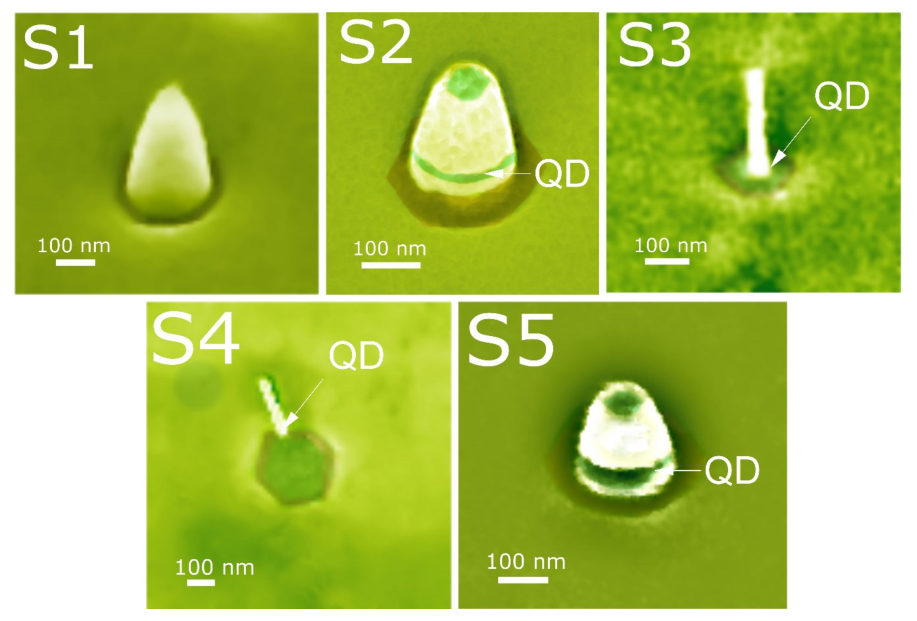
<figcaption class="paper-figure-caption"><b>Fig 1.</b> Figure 2. The cross-sectional SEM images of the samples. The location of QD in the</figcaption>
</figure>
<figure class="paper-figure-card">

<figcaption class="paper-figure-caption"><b>Fig 2.</b> Figure 3. (a) µPL emission spectra of the samples show X, XX and defect-related peaks for</figcaption>
</figure>
<figure class="paper-figure-card">
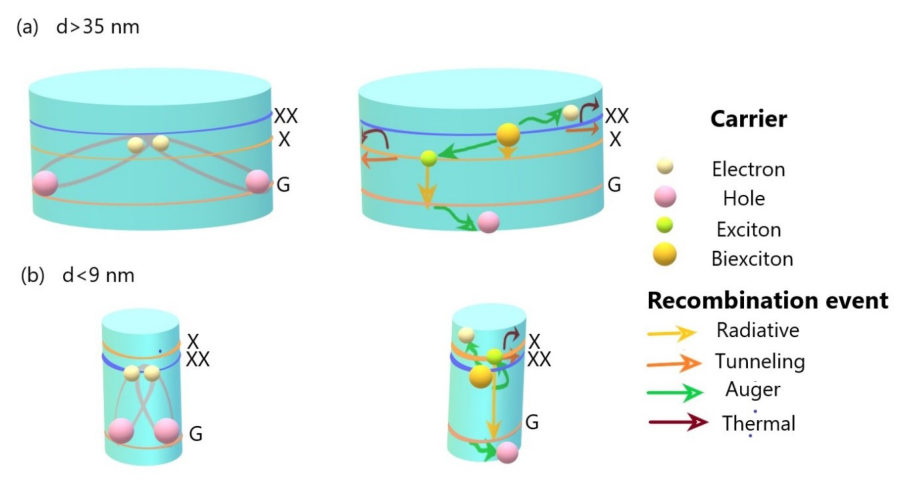
<figcaption class="paper-figure-caption"><b>Fig 3.</b> Figure 4. The schematic of radiative and principal non-radiative processes of exciton and</figcaption>
</figure>
<figure class="paper-figure-card">

<figcaption class="paper-figure-caption"><b>Fig 4.</b> Figure 5. (a) diameter-dependent radiative and</figcaption>
</figure>

**Summary.** This work demonstrates how to achieve high-purity single-photon emission from InGaN quantum dots at room temperature by controlling their diameter. By reducing the QD size, the researchers suppressed surface-related noise and leveraged Auger recombination to favor single-photon purity. This establishes a design pathway for robust semiconductor-based quantum light sources.

**Why it may be interesting.** The paper provides a generalized physical framework for controlling photon statistics (g2(0)) via geometric engineering and carrier dynamics, which is fundamental for developing scalable, high-purity single-photon sources for quantum networks.

Detailed structure

**Main problem.** Achieving high-purity, room-temperature single-photon emission (SPE) from semiconductor quantum dots by identifying the limiting effects of QD size and surface properties.

**Main result.** Demonstrated that reducing InGaN QD diameter below 31 nm suppresses surface recombination and utilizes Auger-driven decay to enable high-purity SPE at room temperature.

**Method.** The study combines experimental fabrication (dry and wet etching) and characterization (micro-PL, HBT autocorrelation) with theoretical modeling (COMSOL/Silvaco simulations and DOS-corrected Auger recombination models).

**Model / system.** Site-controlled In0.14Ga0.86N quantum dots embedded in vertical GaN nanowires, with diameters ranging from 8 nm to 36 nm, analyzed via a carrier decay model involving radiative, Auger, and surface recombination channels.

**Key observables.** Second-order autocorrelation g2(0), signal-to-noise ratio (r), background correction factor (rho), and spectral linewidths.

**Important parameters / regimes.** QD diameter (8-36 nm), exciton Bohr radius (~3 nm), and the single-photon limited diameter (31 nm).

**Assumptions / limitations.** The Auger recombination rate requires a density-of-states correction to remain physically realistic in the low-dimensional regime.

**Figures summary.** Schematics of the heterostructure, SEM images of etched samples, and micro-PL spectra showing exciton and biexciton peaks with varying linewidths.

**Paper structure.** The paper introduces the problem of room-temperature SPE, describes the fabrication and characterization of etched InGaN QDs, presents a theoretical framework for carrier dynamics and size-dependent decay, validates the model against experimental autocorrelation data, and concludes with implications for next-generation QD design.

Abstract

Room-temperature single-photon emission (SPE) resulting from a biexciton-exciton cascaded decay is demonstrated for the first time from chemically and photoelectrochemically etched site-controlled In0.14Ga0.86N quantum dots (QDs) embedded in vertical GaN nanowires. Diameter-dependent biexciton-exciton dynamics are analysed to determine the eligibility of QD as a single-photon emitter. The signal-to-noise ratio degrades with increasing QD diameter. Background noise photons pose a bottleneck to achieving SPE. This is also explained from a carrier dynamics perspective. Surface recombination contributes to inhomogeneous broadening at QD diameters larger than 35 nm. Below 35 nm, density-of-states-corrected Auger gradually becomes the principal biexciton-decay route with further reduction in QD diameter, thereby quenching the possibility of thermal broadening and setting a threshold for SPE. Below 9 nm, the Auger recombination rate becomes manyfold of other decay rates, causing multi-photon suppression via single Auger decay to form an exciton. Surface recombination probability of this exciton is minimized while biexciton state filling probability is maximized by reducing sidewall surface states through wet-treatment. These improve biexciton state preparation and enhance the single-photon purity of the exciton towards the exciton Bohr radius (3 nm) regime. Far away from this regime, higher-order autocorrelations to characterize quantum emission involving multi-photon events are discussed. This study establishes a generalized physical framework for predetermining SPE probability as a function of QD surface and geometry down to the exciton Bohr radius regime, with practical implementations. This work shows the pathway to design and develop next-generation semiconductor QDs for high-purity room-temperature SPE.

[↑ back to top](#top)

### [Branch-Resolved Characterization of Feed-Forward Error in Dynamic Teleportation via Classical Choi Shadows](http://arxiv.org/abs/2604.28037v1)

**Authors:** Mason Edwards, Prabhat Mishra  
**Type:** both · **Category:** quantum information and computing · **PDF:** <https://arxiv.org/pdf/2604.28037v1>  
**Analysis basis:** abstract only; PDF text extraction failed or PDF unavailable
**Topic relevance:** 🔥 `QC/QI experiment` **4/5** · `quantum measurements` **2/5**

**Summary.** This paper introduces a new method to characterize errors in quantum feed-forward operations by looking at individual measurement branches rather than just averages. It demonstrates that how we mitigate readout errors can fundamentally change the perceived quality of quantum operations depending on the hardware's error profile. This provides a more granular tool for debugging and optimizing dynamic quantum circuits.

**Why it may be interesting.** not directly relevant

Detailed structure

**Main problem.** The error associated with measurement-conditioned corrective operations (feed-forward) in dynamic-circuit teleportation is poorly understood when evaluated on a branch-by-branch basis.

**Main result.** The authors developed a framework using classical Choi shadows to characterize branch-specific feed-forward errors, revealing that the effectiveness of mitigation strategies (post-processing vs. PROM) depends heavily on the underlying readout error of the physical qubit layout.

**Method.** The study compares three correction approaches (physical, post-processing, and PROM-mitigated) and uses an entangled reference qubit to experimentally reconstruct branch Choi operators, validating them against full tomography.

**Model / system.** The experimental platform consists of superconducting quantum processors with different physical qubit layouts characterized by varying levels of mid-circuit measurement readout error.

**Key observables.** Branch Choi operators, branch qualities, and operational feed-forward penalty.

**Important parameters / regimes.** Measurement readout error levels and the feed-forward penalty (measured at approximately 0.02-0.03 and 0.07 in different layouts).

**Paper structure.** The paper introduces a framework for branch-resolved error characterization, analyzes three different correction methodologies, presents experimental reconstruction of Choi operators, and compares results across two distinct physical qubit layouts to demonstrate the reversal of mitigation effectiveness.

Abstract

Mid-circuit measurement and classical feed-forward are essential primitives for dynamic-circuit teleportation on superconducting quantum processors. However, the error associated with measurement-conditioned corrective operations remains poorly understood when evaluated with respect to individual measurement branches. In this paper, we present a framework for characterizing feed-forward error in dynamic circuit teleportation without losing valuable information related to its behavior across separate branches. We analyze three approaches to applying measurement-conditioned corrections: (i) physical application, (ii) post-processing adjustments, and (iii) a mitigated physical application which utilizes Bit-Flip Averaging (BFA)-based Probabilistic Readout Error Mitigation (PROM). We experimentally reconstruct branch Choi operators via an entangled reference qubit, and validate our physical-application and post-processing Choi-shadow estimators against full tomography of the branch Choi operators. We perform experiments on two physical qubit layouts which differ greatly in mid-circuit measurement readout error, and observe a reversal in the relative order in branch qualities obtained from the post-processing and PROM mitigation strategies. In one physical layout with higher measurement readout error, the operational feed-forward penalty is relatively modest (approximately 0.02-0.03) and PROM produces higher branch qualities than post-processing for every branch. In a separate layout with lower readout error, the operational feed-forward penalty increases to roughly 0.07, and post-processing exceeds PROM for all branch qualities. Our characterization framework can reveal branch-specific error structure and mitigation behavior that state-of-the-art outcome-averaged analyses fail to expose.

[↑ back to top](#top)

### [CrossBench: Generalized Crosstalk Benchmark Generation for Quantum Computers](http://arxiv.org/abs/2604.27183v1)

**Authors:** Jaden Hawley, Chi-Ren Shyu  
**Type:** both · **Category:** quantum information and computing · **PDF:** <https://arxiv.org/pdf/2604.27183v1>  
**Analysis basis:** full PDF text, analyzed in chunks
**Topic relevance:** 🔥 `QC/QI experiment` **4/5** · `correlated / nonlocal dissipation` **2/5**

↔ Scroll figures horizontally

<figure class="paper-figure-card">

<figcaption class="paper-figure-caption"><b>Fig 1.</b> Fig. 1. Example of spectator and driver qubits generated from spectator and driver pair (H,X). The driver generates crosstalk and the spectator attempts to observe it.</figcaption>
</figure>
<figure class="paper-figure-card">

<figcaption class="paper-figure-caption"><b>Fig 2.</b> Fig. 2. Results for each driver spectator gate pair on IBM Fez. The colors represent the Driver gate, while each cluster of box and whisker charts represents a spectator gate.</figcaption>
</figure>
<figure class="paper-figure-card">
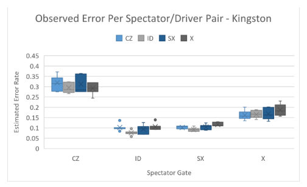
<figcaption class="paper-figure-caption"><b>Fig 3.</b> Fig. 3. Results for each driver spectator gate pair on IBM Kingston. The colors represent the Driver gate, while each cluster of box and whisker charts represents a spectator gate.</figcaption>
</figure>
<figure class="paper-figure-card">

<figcaption class="paper-figure-caption"><b>Fig 4.</b> Fig. 4. Results for each driver spectator gate pair on IBM Miami. The colors represent the Driver gate, while each cluster of box and whisker charts represents a spectator gate.</figcaption>
</figure>
<figure class="paper-figure-card">

<figcaption class="paper-figure-caption"><b>Fig 5.</b> Figure 2 shows box-and-whisker plots of the results from all seven runs for IBM Fez. We observe a noticeable difference in error on ID and CZ spectator gates. Using a t-test, we find ID spectators experience more error with SX drivers than ID drivers (p &lt; 0.01). We also find CZ spectators experience more error with CZ drivers than SX drivers (p = 0.021). Figure 3 shows the results for IBM Kingston. For this system, ID spectators experience higher error with X drivers than ID drivers (p &lt; 0.01) and experience more error with CZ drivers than ID drivers (p = 0.046). Additionally, SX spectators experience more error with X drivers than with ID drivers (p &lt; 0.01). For the Nighthawk system,...</figcaption>
</figure>
<figure class="paper-figure-card">
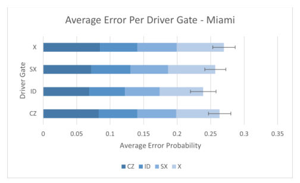
<figcaption class="paper-figure-caption"><b>Fig 6.</b> Fig. 5. The average error rate per driver gate observed on IBM Miami. Each bar is sectioned by color to show what portion of the error rate was observed with a given spectator qubit gate. Standard error margins are shown.</figcaption>
</figure>
<figure class="paper-figure-card">
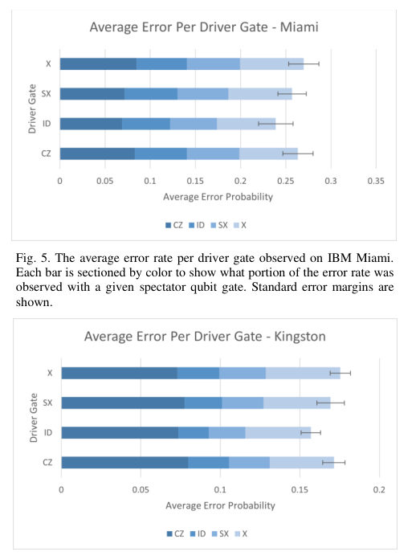
<figcaption class="paper-figure-caption"><b>Fig 7.</b> Fig. 6. The average error rate per driver gate observed on IBM Miami. Each bar is sectioned by color to show what portion of the error rate was observed with a given spectator qubit gate. Standard error margins are shown.</figcaption>
</figure>
<figure class="paper-figure-card">
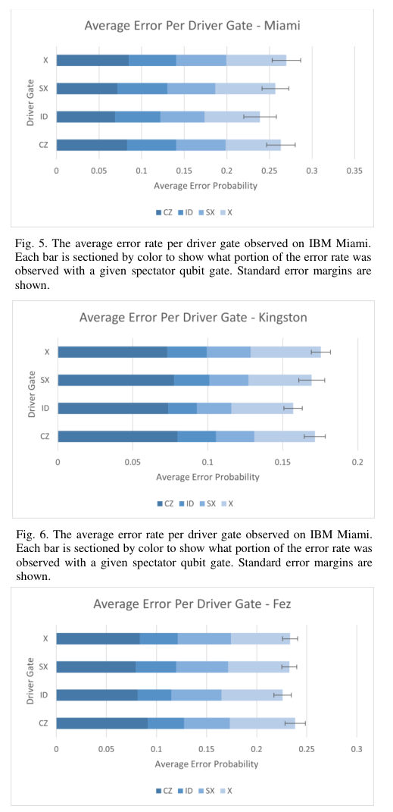
<figcaption class="paper-figure-caption"><b>Fig 8.</b> Fig. 7. The average error rate per driver gate observed on IBM Miami. Each bar is sectioned by color to show what portion of the error rate was observed with a given spectator qubit gate. Standard error margins are shown.</figcaption>
</figure>
<figure class="paper-figure-card">
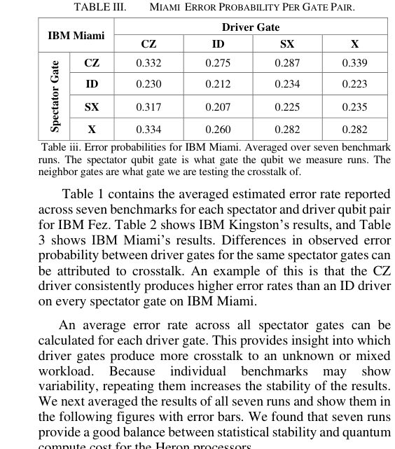
<figcaption class="paper-figure-caption"><b>Fig 9.</b> Figure 5 shows averaged CrossBench results across all spectator gates for IBM Miami. Figure 6 shows results for IBM Kingston and Figure 7 shows results for IBM Fez. The lowest</figcaption>
</figure>

**Summary.** The authors present CrossBench, a scalable tool for generating customized crosstalk benchmarks on large quantum computers. By using a graph-based approach to assign driver and spectator qubits, the system efficiently identifies which gates introduce significant errors to neighboring qubits. This provides an accessible way to obtain essential hardware metrics for error mitigation and circuit optimization.

**Why it may be interesting.** The paper addresses the characterization of open quantum system dynamics (crosstalk) in large-scale architectures, which is critical for understanding noise propagation and error mitigation in many-body quantum processors.

Detailed structure

**Main problem.** Characterizing and benchmarking crosstalk in large-scale NISQ devices is becoming prohibitively resource-intensive and expensive as device complexity and size increase.

**Main result.** The CrossBench system successfully and scalably identifies significant gate-dependent crosstalk across multiple IBM quantum processors (Heron and Nighthawk classes) with statistical significance.

**Method.** A customizable, graph-based benchmark generator uses a custom labeling algorithm to assign driver and spectator qubits to detect error rate changes induced by neighboring gates.

**Model / system.** The study focuses on NISQ-era superconducting quantum processors, specifically IBM's Heron-class (Fez, Kingston) and Nighthawk-class (Miami) architectures.

**Key observables.** Change in error rate of spectator qubits when subjected to driver gate operations; error probability per gate pair.

**Important parameters / regimes.** Driver depth (d_D), gate error threshold (delta), native gate sets (X, SX, CZ, ID), and device topology (graph edges/vertices).

**Assumptions / limitations.** Assumes that the primary variable causing error rate fluctuations is the driver gate's crosstalk and that ID gates introduce negligible additional error.

**Figures summary.** Circuit diagrams of the driver/spectator setup and box-and-whisker plots showing error rate distributions across different IBM processors.

**Paper structure.** Introduction to the crosstalk scalability problem, description of the CrossBench algorithm and graph-labeling method, experimental implementation on IBM hardware, results analysis with statistical significance, and discussion of limitations and future work.

Abstract

As quantum computers continue to increase in size and topological complexity, benchmarking crosstalk becomes more complex and resource-intensive. This limits the ability to obtain relevant crosstalk metrics for applications such as error mitigation, quantum computer security, and circuit transpilation. There applications benefit from accessible metrics on how each gate contributes to crosstalk. However, crosstalk metrics are rarely provided by quantum computer providers and can be expensive to obtain on modern large NISQ devices. In this work, we propose CrossBench, a customizable system that generates crosstalk benchmarks for finitely large NISQ devices with arbitrary topologies. CrossBench uses a custom graph labeling algorithm to generate crosstalk benchmarks for a given quantum topology and gate set. These benchmarks can be used to estimate the average contribution of each gate's crosstalk to qubit error rates. We evaluate the effectiveness of CrossBench by generating and running benchmarks on multiple IBM quantum computers with different topologies. Our results show that CrossBench can identify gates that introduce significant crosstalk across all tested devices, with strong statistical significance (p < 0.05). These promising results show that CrossBench can give simple and accessible crosstalk benchmarks for modern NISQ systems.

[↑ back to top](#top)

### [Magnonic Gottesman-Kitaev-Preskill states](http://arxiv.org/abs/2604.27565v1)

**Authors:** Zi-Xu Lu, Gang Liu, Matteo Fadel, Jie Li  
**Type:** theory · **Category:** quantum information and computing · **PDF:** <https://arxiv.org/pdf/2604.27565v1>  
**Analysis basis:** full PDF text, analyzed in chunks
**Topic relevance:** 🔥 `spintronics-quantum-optics interface` **4/5** · `quantum measurements` **2/5**

↔ Scroll figures horizontally

<figure class="paper-figure-card">
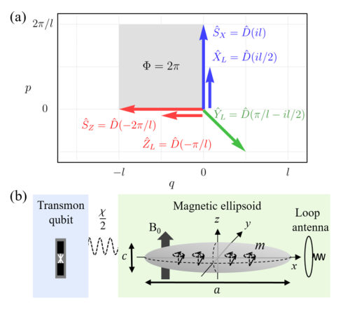
<figcaption class="paper-figure-caption"><b>Fig 1.</b> FIG. 1. (a) Phase-space representation of the stabilizers SX, SZ and the logical Pauli operators XL, YL, and ZL. The enclosed symplectic area sets the commutation relations of the corresponding displacement operators. (b) The squeezed magnon mode in an ellipsoidal magnetic crystal gets effec- tively coupled to a transmon superconducting qubit via a mi- crowave cavity (not shown). The magnetic crystal is placed inside a uniform bias magnetic field B0 along the z axis. A mi- crowave field is loaded via a loop antenna to drive the magnon mode to perform the displacement operation.</figcaption>
</figure>
<figure class="paper-figure-card">
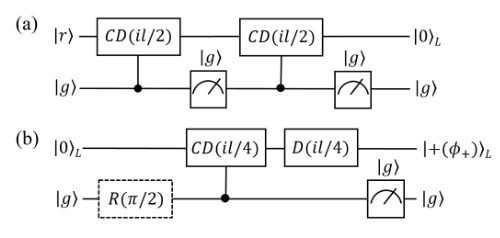
<figcaption class="paper-figure-caption"><b>Fig 2.</b> FIG. 2. (a) Operation sequence used to generate the GKP state |0⟩L. The transmon qubit is initially in the ground state |g⟩and the magnon mode is in the squeezed vacuum state |r⟩. (b) Operation sequence used to perform the log- ical Hadamard gate (phase gate) onto |0⟩L to generate the GKP state |+⟩L (|ϕ+⟩L). The “CD” operation represents the magnon-qubit coevolution under the CD interaction, the “|g⟩” operation denotes the qubit projective measurement, and the “D” operation stands for the magnon displacement. The qubit π/2-rotation “R” is only applied for |ϕ+⟩L.</figcaption>
</figure>
<figure class="paper-figure-card">
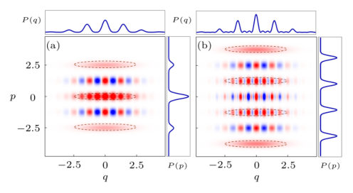
<figcaption class="paper-figure-caption"><b>Fig 3.</b> FIG. 3. Magnonic GKP-like states. Wigner function of (a) the three-component superposition state used as the encoded state |0⟩L, and of (b) the four-component superposition state. Dashed ellipses indicate the centers and characteristic widths of the displaced squeezed components. The side panels show the corresponding marginal Wigner distributions P(q) and P(p). See text for the parameters.</figcaption>
</figure>
<figure class="paper-figure-card">

<figcaption class="paper-figure-caption"><b>Fig 4.</b> FIG. 4. Wigner functions of logical Pauli eigenstates: (a) |0⟩L, (b) |+⟩L, and (c) |ϕ+⟩L. (d) Average fidelity ¯F versus magnon dissipation rate κm. We consider the three-component super- position state and the parameters are the same as in Fig. 3(a). We take γ/2π = γϕ/2π = 2 kHz [78] and T = 10 mK in (a)- (d), and κm = 5γ [79] in (a)-(c).</figcaption>
</figure>

**Summary.** This paper proposes a method to create GKP error-correcting states using magnons in a hybrid system with a superconducting qubit. By leveraging the natural squeezing from a magnetic crystal's shape, the authors show how to prepare multi-component bosonic states and perform logical gates. This establishes magnonics as a viable new platform for bosonic quantum information processing.

**Why it may be interesting.** It extends continuous-variable quantum error correction (GKP codes) from traditional optical and superconducting platforms to the field of magnonics, offering a new hybrid platform for fault-tolerant quantum computing and sensing.

Detailed structure

**Main problem.** Developing a protocol for the preparation and manipulation of Gottesman-Kitaev-Preskill (GKP) states within a magnonic platform for bosonic quantum error correction.

**Main result.** The authors demonstrate a protocol to generate three- and four-component magnonic GKP-like states and implement logical Pauli, Hadamard, and phase gates with an average fidelity of approximately 87.3%.

**Method.** The protocol uses a sequence of conditional-displacement interactions and qubit projective measurements, utilizing the geometric anisotropy of a magnetic crystal to provide intrinsic squeezing.

**Model / system.** A hybrid magnon-qubit system consisting of an ellipsoidal magnetic crystal coupled to a superconducting transmon qubit via a microwave cavity, modeled using a quantized Kittel mode and an effective conditional-displacement Hamiltonian.

**Key observables.** Wigner functions, stabilizer expectation values (SX, SZ), effective squeezing (dB), and logical qubit density matrix fidelity.

**Important parameters / regimes.** Large-detuning regime, effective coupling chi/2pi = 7.55 MHz, squeezing parameter r approx 1, and temperature T = 10 mK.

**Assumptions / limitations.** Large-detuning limit for adiabatic elimination of the cavity, Rotating Wave Approximation (RWA), and neglecting small additional squeezing from counter-rotating terms.

**Figures summary.** Figure 1 shows the phase-space structure of stabilizers and the experimental setup; Figure 2/3 illustrates the Wigner functions and characterization of the generated multi-component states.

**Paper structure.** The paper introduces the GKP encoding, defines the hybrid magnon-qubit physical model and Hamiltonian, derives the effective conditional-displacement interaction, presents the state preparation protocol and gate implementation, and concludes with numerical results including dissipation and fidelity analysis.

Abstract

Bosonic quantum error correction encodes a logical qubit in an oscillator, avoiding the hardware overhead of large qubit arrays. Among such encodings, Gottesman-Kitaev-Preskill (GKP) states are paticularly powerful because their phase-space grid structure protects against small displacement errors simultaneously in both conjugate quadratures. Here we provide the first protocol for preparing magnonic GKP states, which involves an ellipsoidal magnetic crystal effectively coupled to a superconducting qubit via a microwave cavity. The geometric anisotropy intrinsically squeezes the magnon mode, while the cavity-mediated qubit control realizes an effective conditional-displacement interaction. We show that two rounds of a conditional-displacement interaction and a qubit projective measurement yield three- and four-component magnonic GKP-like states. We also show how to realize single logical qubit gate operations, such as Pauli, Hadamard and phase gates, completing the logical Pauli basis of the approximate GKP code. Our results establish hybrid magnon-qubit systems as a promising platform for preparing bosonic code states, with applications in magnonic fault-tolerant quantum computation and quantum sensing.

[↑ back to top](#top)

### [Weak-to-Strong Measurement Transition with Thermal Instabilities](http://arxiv.org/abs/2604.28137v1)

**Authors:** Marcos V. S. Lima, Carlos H. S. Vieira, Irismar G. da Paz, Pedro R. Dieguez, Lucas S. Marinho  
**Type:** theory · **Category:** quantum information and computing · **PDF:** <https://arxiv.org/pdf/2604.28137v1>  
**Analysis basis:** abstract only; PDF text extraction failed or PDF unavailable
**Topic relevance:** 🔥 `quantum measurements` **4/5** · `methods for driven-dissipative` **2/5**

**Summary.** This paper presents a theoretical framework to study the transition from weak to strong quantum measurements in the presence of thermal noise and decoherence. It shows that temperature-dependent fluctuations and thermal instabilities significantly alter measurement statistics and the emergence of projective behavior. This is important for understanding how environmental effects impact quantum measurement protocols.

**Why it may be interesting.** It provides a critical analysis of how realistic thermal environments and decoherence impact the fundamental transition between weak and strong measurement regimes, which is essential for understanding measurement-based protocols in noisy quantum systems.

Detailed structure

**Main problem.** The paper investigates how environmental decoherence, thermal noise, and thermal instabilities affect the continuous transition from weak to strong quantum measurements.

**Main result.** The authors demonstrate that measurement statistics are non-trivially modified by the temperature of thermal instabilities, the probe's thermal properties, and the specific pre- and post-selection settings, which reshapes the weak-value condition.

**Method.** The authors develop a general framework using a thermal Gaussian state model for the probe and incorporate open-system evolution for the measured system.

**Model / system.** The model consists of a system undergoing open-system evolution prior to post-selection, interacting with a probe modeled as a thermal Gaussian state.

**Key observables.** Measurement statistics and the weak-value condition.

**Important parameters / regimes.** Temperature regime of thermal instabilities, probe thermal properties, and pre- and post-selection choices.

**Assumptions / limitations.** The probe is assumed to be a thermal Gaussian state.

**Paper structure.** The paper introduces the problem of measurement transitions under noise, develops a general framework for thermal Gaussian probes and open-system dynamics, and analyzes the resulting modifications to measurement statistics and weak values.

Abstract

Quantum measurement is physically realized through a finite dynamical interaction between a system and a measuring apparatus, giving rise to a continuous transition from weak to strong regimes. While this crossover is well understood under ideal conditions, the combined role of thermal instabilities and pre- and post-selection open dynamics has not been systematically addressed. Here, we develop a general framework to analyze the weak-to-strong measurement transition in the simultaneous presence of environmental decoherence and thermal noise. We model the probe as a thermal Gaussian state, explicitly incorporating temperature-dependent fluctuations in the measuring device, and include open-system evolution of the measured system prior to post-selection. By deriving the apparatus's final state, we show that the measurement statistics are modified in a nontrivial, highly sensitive manner by the temperature regime of the system's thermal instabilities, the probe's thermal properties, and the particular choice of pre- and post-selection. This approach allows us to characterize how thermal effects reshape the weak-value condition and influence the emergence of projective behavior across the full measurement crossover.

[↑ back to top](#top)

### [Fixed-PVM Born Rule Uniqueness from Fisher Non-Expansion and Operational Calibration](http://arxiv.org/abs/2604.27339v1)

**Authors:** Aaron Lax  
**Type:** theory · **Category:** quantum information and computing · **PDF:** <https://arxiv.org/pdf/2604.27339v1>  
**Analysis basis:** full PDF text, analyzed in chunks
**Topic relevance:** 🔥 `quantum measurements` **4/5** · `entanglement & information structure` **1/5**

↔ Scroll figures horizontally

<figure class="paper-figure-card">
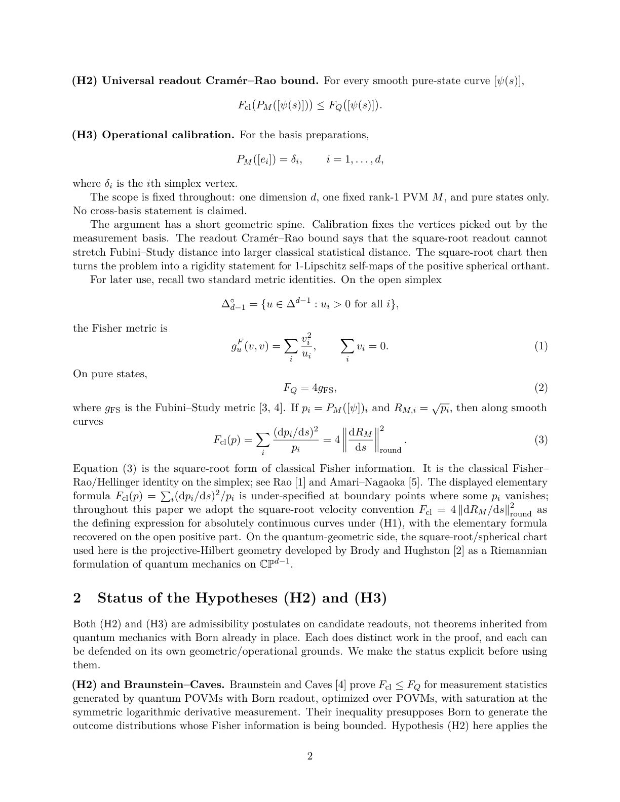
<figcaption class="paper-figure-caption"><b>Fig 1.</b> Low-resolution page preview, page 2</figcaption>
</figure>
<figure class="paper-figure-card">

<figcaption class="paper-figure-caption"><b>Fig 2.</b> Low-resolution page preview, page 3</figcaption>
</figure>
<figure class="paper-figure-card">
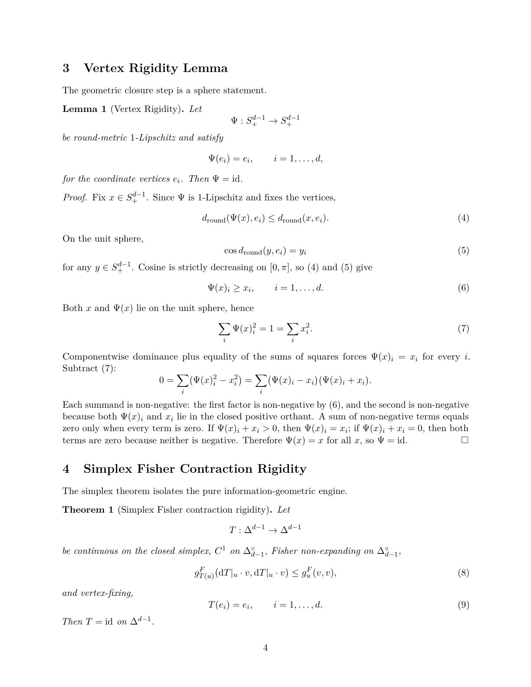
<figcaption class="paper-figure-caption"><b>Fig 3.</b> Low-resolution page preview, page 4</figcaption>
</figure>
<figure class="paper-figure-card">
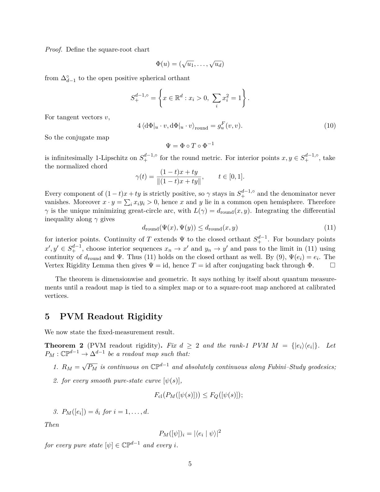
<figcaption class="paper-figure-caption"><b>Fig 4.</b> Low-resolution page preview, page 5</figcaption>
</figure>
<figure class="paper-figure-card">
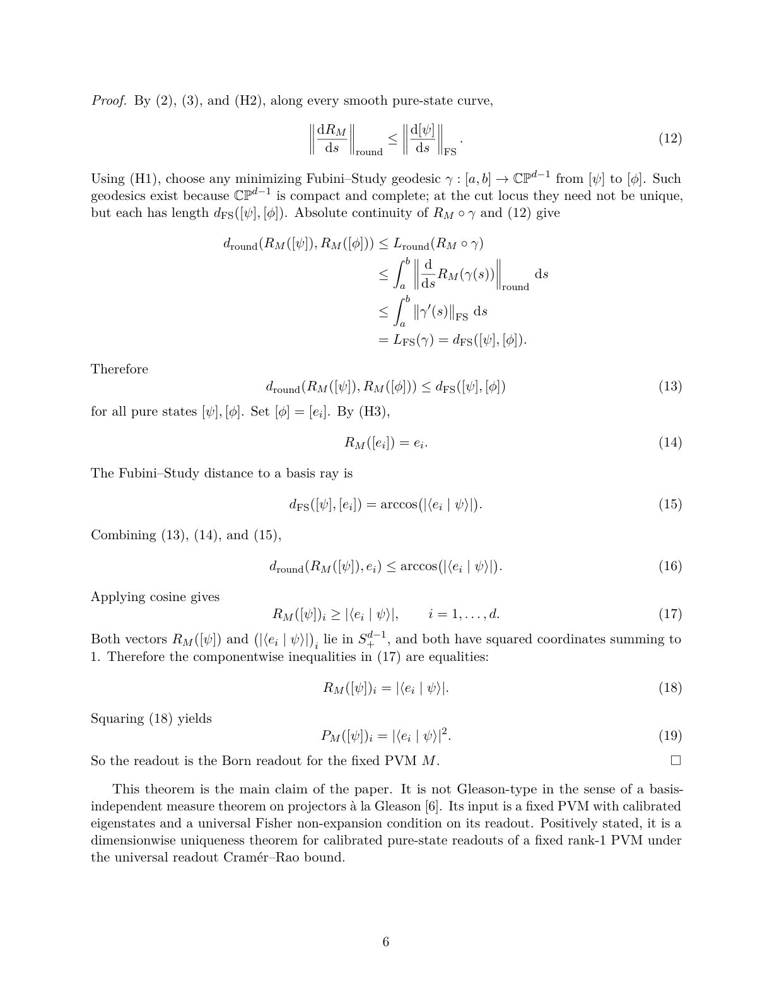
<figcaption class="paper-figure-caption"><b>Fig 5.</b> Low-resolution page preview, page 6</figcaption>
</figure>
<figure class="paper-figure-card">
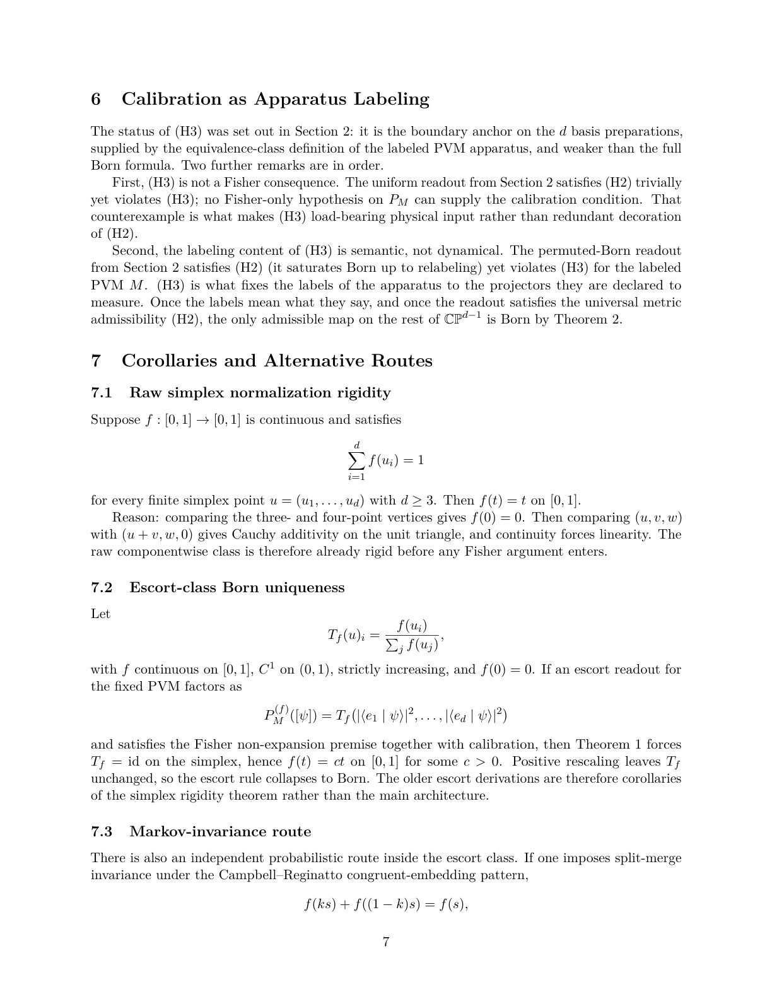
<figcaption class="paper-figure-caption"><b>Fig 6.</b> Low-resolution page preview, page 7</figcaption>
</figure>
<figure class="paper-figure-card">
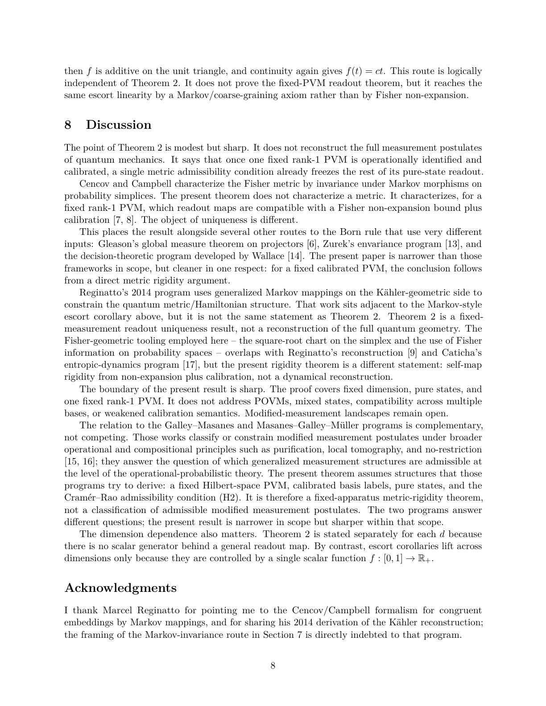
<figcaption class="paper-figure-caption"><b>Fig 7.</b> Low-resolution page preview, page 8</figcaption>
</figure>
<figure class="paper-figure-card">
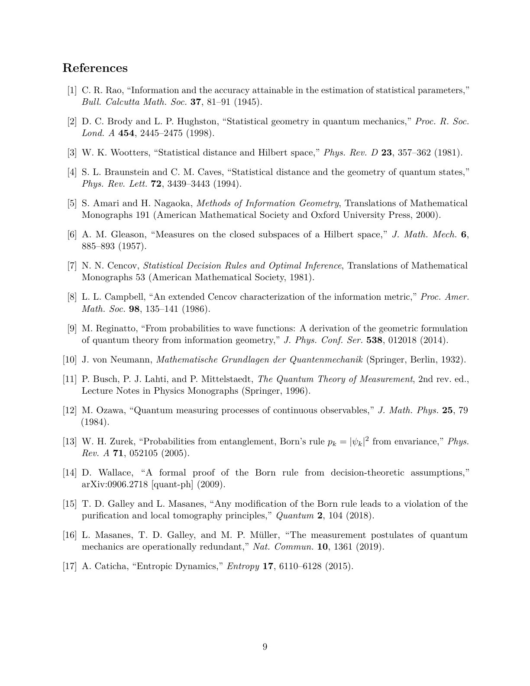
<figcaption class="paper-figure-caption"><b>Fig 8.</b> Low-resolution page preview, page 9</figcaption>
</figure>

**Summary.** This paper proves that the Born rule is the unique way to map pure states to measurement probabilities for a fixed basis, provided the map respects certain geometric bounds and correctly identifies basis states. It uses a rigidity theorem for 1-Lipschitz maps to show that the requirement of not expanding Fisher information effectively 'freezes' the map to the standard Born rule.

**Why it may be interesting.** This work provides a fundamental, metric-based justification for the Born rule, which is central to the interpretation of quantum mechanics and the operational understanding of quantum measurements in quantum information.

Detailed structure

**Main problem.** Determining whether the Born rule is the unique readout map for a fixed rank-1 projective measurement (PVM) under specific geometric and operational constraints.

**Main result.** The paper proves that the conjunction of square-root regularity, the universal readout Cramér-Rao bound, and operational calibration on basis preparations uniquely forces the readout map to be the Born rule.

**Method.** A geometric rigidity approach using the Fisher-Rao metric on the probability simplex and the Fubini-Study metric on pure states, specifically employing a square-root chart to transform the problem into a 1-Lipschitz self-map problem on a spherical orthant.

**Model / system.** A finite-dimensional Hilbert space (dimension d >= 2) and the associated projective pure-state space (CP^{d-1}) with a fixed rank-1 PVM.

**Key observables.** Classical Fisher information, Quantum Fisher information, and the readout probabilities of the PVM.

**Important parameters / regimes.** The dimension d of the Hilbert space (result is dimension-wise).

**Assumptions / limitations.** The result is restricted to fixed dimensions, pure states, and a single fixed rank-1 PVM; it assumes square-root regularity, the Cramér-Rao bound (Fisher non-expansion), and vertex calibration.

**Paper structure.** The paper develops a vertex rigidity lemma, establishes a theorem for Fisher-non-expanding maps on the probability simplex, and concludes with the primary theorem for PVM readout rigidity, followed by corollaries regarding escort-class Born uniqueness.

Abstract

Fix a finite dimension $d \geq 2$ and a fixed rank-1 PVM $M=\{|e_1\rangle\langle e_1|,\ldots,|e_d\rangle\langle e_d|\}$ on ${\bf C}^d$. Let $P_M:\mathbb{CP}^{d-1}\toΔ^{d-1}$ be a readout map on pure states. We prove that three primitives force the Born rule for this fixed measurement: (i) square-root regularity of $R_M=\sqrt{P_M}$ along Fubini-Study geodesics, (ii) the universal readout Cramer-Rao bound $F_{\rm cl}\leq F_Q$ on smooth pure-state curves, and (iii) operational calibration on basis preparations $P_M([e_i])=δ_i$. The geometric core is a rigidity theorem for Fisher-non-expanding self-maps of the probability simplex: after conjugation by the square-root chart, such maps become round-metric 1-Lipschitz self-maps of the positive spherical orthant, and vertex fixing forces the identity. The main readout theorem is dimensionwise, fixed-PVM, and pure-state only. Escort-class Born uniqueness and the Markov/coarse-graining routes appear as corollaries or alternative routes.

[↑ back to top](#top)

### [Formulating Subgroup Discovery as a Quantum Optimization Problem for Network Security](http://arxiv.org/abs/2604.27153v1)

**Authors:** Samuel Spell, Chi-Ren Shyu  
**Type:** both · **Category:** quantum information and computing · **PDF:** <https://arxiv.org/pdf/2604.27153v1>  
**Analysis basis:** full PDF text, analyzed in chunks
**Topic relevance:** 🔥 `QC/QI experiment` **4/5**

↔ Scroll figures horizontally

<figure class="paper-figure-card">
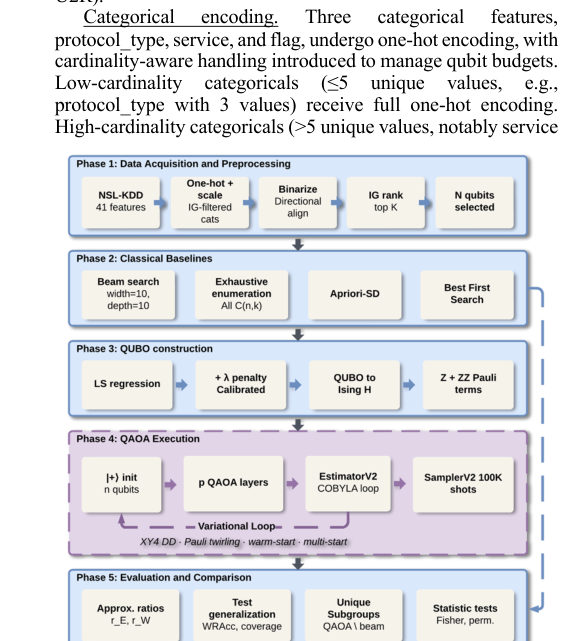
<figcaption class="paper-figure-caption"><b>Fig 1.</b> Figure 1: End-to-end QAOA subgroup-discovery pipeline. Phases 1-2 binarize NSL-KDD features and run classical baselines. Phase 3 fits the LS-regression QUBO. Phase 4 executes QAOA on ibm_pittsburgh with COBYLA optimization and error mitigation. Phase 5 computes the dual approximation ratios and identifies QAOA-unique subgroups.</figcaption>
</figure>
<figure class="paper-figure-card">
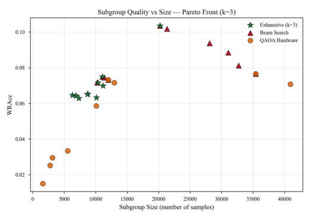
<figcaption class="paper-figure-caption"><b>Fig 2.</b> Figure 2: Subgroup quality vs. subgroup size at k = 3 for the 20-qubit Probe configuration on ibm_pittsburgh. Green stars mark the exhaustive optimum (best WRAcc at any k), red triangles the beam- search results, and orange diamonds the QAOA-sampled subgroups. QAOA recovers subgroups in the same Pareto region as the classical baselines, confirming hardware competitiveness at this scale (𝑟, =</figcaption>
</figure>
<figure class="paper-figure-card">
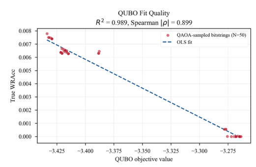
<figcaption class="paper-figure-caption"><b>Fig 3.</b> Figure 3: QUBO fit quality for the R2L-filtered 10-qubit configuration. Each point is one QAOA-sampled bitstring plotted against its quadratic QUBO objective value; the OLS fit (R² = 0.989, Spearman |ρ| = 0.899) confirms the QUBO accurately ranks the WRAcc landscape.</figcaption>
</figure>
<figure class="paper-figure-card">
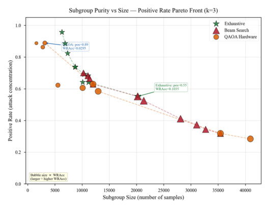
<figcaption class="paper-figure-caption"><b>Fig 4.</b> Figure 4: Bubble Pareto front (k = 3) for the 20-qubit Probe configuration on ibm_pittsburgh. Bubble size encodes WRAcc. QAOA hardware subgroups are competitive with classical methods, with several returning subgroups exhibiting higher positive rates than beam search.</figcaption>
</figure>
<figure class="paper-figure-card">

<figcaption class="paper-figure-caption"><b>Fig 5.</b> Figure 5: Depth-matched comparison at k = 5 for the R2L-filtered configuration. The QAOA simulator returns smaller subgroups with higher attack-positive rate than beam search at the same cardinality, evidence that the QUBO objective rewards contrast-rich rules even when coverage is reduced.</figcaption>
</figure>
<figure class="paper-figure-card">
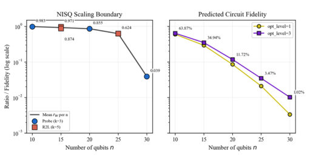
<figcaption class="paper-figure-caption"><b>Fig 6.</b> Figure 6: Comparative scaling of hardware 𝑟, and circuit fidelity on ibm_pittsburgh. Left: Measured WRAcc approximation ratio 𝑟, for Probe (k = 3) and R2L (k = 5) attacks. Right: Predicted circuit fidelity F derived from a layered 2-qubit error rate (EPLG = 2.42 × 10⁻³). The shared log scale highlights that 𝑟, tracks above the fidelity floor until n = 30, where both metrics collapse, marking the operational limit of the NISQ device.</figcaption>
</figure>

**Summary.** This paper introduces the first quantum-enhanced pipeline for Subgroup Discovery in network security, using QAOA to find interpretable attack patterns. It demonstrates that quantum optimization can recover complex feature interactions missed by classical greedy algorithms, while characterizing the performance degradation limits of current NISQ hardware.

**Why it may be interesting.** not directly relevant

Detailed structure

**Main problem.** The challenge of identifying interpretable, multi-feature interaction patterns (subgroups) in network security datasets, which is an NP-hard combinatorial optimization problem that classical greedy heuristics often fail to solve.

**Main result.** The QAOA pipeline successfully identifies high-precision attack subgroups that classical Beam Search prunes, while also establishing a quantitative NISQ scaling boundary where hardware noise causes performance to collapse between 20 and 30 qubits.

**Method.** A hybrid quantum-classical pipeline using QAOA on IBM Quantum hardware, where the Subgroup Discovery problem is formulated as a QUBO and solved via a least-squares regression fit to the WRAcc landscape.

**Model / system.** The problem is modeled as a Quadratic Unconstrained Binary Optimization (QUBO) problem mapped to an Ising Hamiltonian with ZZ couplings, implemented on the ibm_pancakes superconducting processor.

**Key observables.** WRAcc (Weighted Relative Accuracy), Hamiltonian quality (r5), and solution quality ratio (r6).

**Important parameters / regimes.** QAOA circuit depth (p), qubit count (10-30), target cardinality (K), and penalty weight (lambda).

**Assumptions / limitations.** The WRAcc landscape can be accurately approximated by a quadratic surrogate; high-cardinality features can be reduced via information-gain filtering to fit within NISQ qubit budgets.

**Figures summary.** Figure 1 shows the end-to-end QAOA pipeline; Figure 3 shows the high R-squared value of the QUBO landscape fit; Figure 4 presents a Bubble Pareto front comparing QAOA to classical methods; Figure 5 compares subgroup richness between QAOA and Beam Search.

**Paper structure.** The paper follows a logic of problem formulation (SD as QUBO), data preprocessing (binarization and feature selection), algorithmic implementation (QAOA on IBM hardware), benchmarking against classical heuristics, and a scaling analysis of hardware noise limits.

Abstract

While current network intrusion detection systems achieve satisfactory accuracy, they often lack explainability. Subgroup Discovery (SD) addresses this by building interpretable rules that characterize feature interactions associated with attack traffic. With large datasets, classical heuristic beam search methods struggle with exponentially scaling search spaces and can prune critical multi-feature interactions. This paper introduces a quantum-enhanced pipeline for SD applied to network intrusion detection using NSL-KDD, formulating SD as quantum optimization for the first time. By encoding feature selection as a Quadratic Unconstrained Binary Optimization (QUBO) and solving it via the Quantum Approximate Optimization Algorithm (QAOA) on IBM Quantum hardware (ibm_pittsburgh), the pipeline identifies subgroups of network features that discriminate normal from attack traffic. A least-squares regression QUBO formulation fits the Weighted Relative Accuracy (WRAcc) landscape over feature subsets, with surrogate sampling for larger QUBOs. Results are benchmarked against exhaustive enumeration and Beam Search using ratios for Hamiltonian quality and WRAcc. Hardware scaling experiments on ibm_pittsburgh (10-30 qubits) reveal that QAOA at depth p = 1 shows WRAcc ratios of 0.983 at 10 qubits, 0.971 at 15 qubits, 0.855 at 20 qubits, and 0.624 at 25 qubits, degrading to 0.039 at 30 qubits as circuit noise dominates, establishing an empirical NISQ scaling boundary. Results demonstrate that QAOA discovers subgroups competitive with classical heuristics and finds multi-feature interaction patterns that greedy Beam Search prunes, with QAOA-unique subgroups achieving up to 99.6% test precision. This work establishes a framework for quantum combinatorial optimization in cybersecurity and characterizes hardware scaling for NISQ devices.

[↑ back to top](#top)

### [High-fidelity iSWAP gate with Double Transmon Coupler](http://arxiv.org/abs/2604.27080v1)

**Authors:** Tarush Tiwari, Sudhir K. Sahu, Guilhem Ribeill, Michael Senatore, Matthew D. LaHaye, Raymond W. Simmonds, Daniel L. Campbell, Archana Kamal, Leonardo Ranzani  
**Type:** experiment · **Category:** quantum information and computing · **PDF:** <https://arxiv.org/pdf/2604.27080v1>  
**Analysis basis:** abstract only; PDF text extraction failed or PDF unavailable
**Topic relevance:** 🔥 `QC/QI experiment` **4/5**

**Summary.** This paper demonstrates a high-fidelity 99.827% iSWAP gate between two transmon qubits using a double transmon coupler. By using parametric driving, the researchers achieved a fast 40ns gate while effectively suppressing unwanted static interactions and crosstalk. This approach provides a scalable and resource-efficient method for implementing two-qubit operations in superconducting processors.

**Why it may be interesting.** The use of parametric gates to achieve frequency-selective activation and the suppression of crosstalk is highly relevant to the control of open quantum systems and the development of scalable quantum architectures.

Detailed structure

**Main problem.** Achieving high-fidelity entangling gates between superconducting qubits while suppressing parasitic crosstalk and static interactions.

**Main result.** Demonstration of a parametric iSWAP gate with 99.827% fidelity in 40ns using a double transmon coupler.

**Method.** The researchers used a parametric driving scheme on a double transmon coupler (DTC) and employed robust phase estimation to calibrate non-commuting error terms.

**Model / system.** A superconducting circuit architecture consisting of two transmon qubits coupled via a recently developed double transmon coupler (DTC).

**Key observables.** Gate fidelity and gate duration.

**Important parameters / regimes.** 99.827% gate fidelity, 40ns gate duration.

**Paper structure.** The paper introduces the problem of parasitic crosstalk, describes the DTC architecture, details the parametric iSWAP implementation and calibration via robust phase estimation, and presents the achieved fidelity results.

Abstract

Entangling operations are at the heart of all approaches to quantum information processing. Parametric gates, in particular, offer a versatile solution to strongly couple off-resonant superconducting qubits with suppressed parasitic crosstalk to spectator qubits due to frequency-selective activation. In this work, we demonstrate a parametric iSWAP gate between two transmon qubits using the recently developed double transmon coupler (DTC). The DTC supports robust internally-defined cancellation point (``off'' state) for static interactions, while simultaneously mediating a fast parametric coupling between data qubits that can be deployed for high-fidelity two-qubit operations. We use robust phase estimation to calibrate non-commuting error terms in the parametric iSWAP gate, and achieve a 99.827% gate fidelity in 40ns without any numerical optimization. The circuit architecture and calibration techniques developed here are extensible to other gate implementations and qubit modalities, paving the way towards resource-efficient quantum information processing.

[↑ back to top](#top)

### [OAM-mode sorting with a wavefront twister](http://arxiv.org/abs/2604.27739v1)

**Authors:** Suman Karan, Swati Chaudhary, Harshwardhan Wanare, Anand Kumar Jha  
**Type:** theory · **Category:** quantum information and computing · **PDF:** <https://arxiv.org/pdf/2604.27739v1>  
**Analysis basis:** full PDF text, analyzed in chunks
**Topic relevance:** 🔥 `interference shaping light` **4/5**

↔ Scroll figures horizontally

<figure class="paper-figure-card">
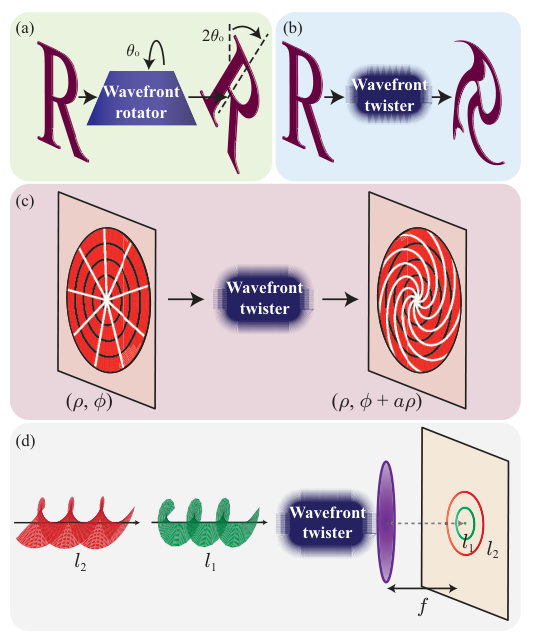
<figcaption class="paper-figure-caption"><b>Fig 1.</b> FIG. 1. Conceptual illustration of the proposed wavefront twister and the OAM sorting scheme. (a) A conventional wavefront rotator such as a Dove prism, oriented at angle θ0 rotates an input wavefront by angle 2θ0. (b) The proposed wavefront twister rotates an incoming wavefront by an angle θ(ρ) = aρ that varies linearly with radial location ρ. Con- sequently, the wavefront is not simply rotated but twisted. (c) The wavefront twister maps the point (ρ, ϕ) in the inci- dent wavefront to (ρ, ϕ + aρ). (d) The proposed OAM sorter scheme consisting of the wavefront twister followed by a lens of focal length f maps the OAM modes l1 and l2 to annuli of distinct radii in the focal plane, leading to...</figcaption>
</figure>
<figure class="paper-figure-card">

<figcaption class="paper-figure-caption"><b>Fig 2.</b> FIG. 2. (a) Numerically computed two-dimensional intensity |E(r, θ, f = 200 mm)|2 for OAM mode index l ranging from 1 to 20 at a/w0 = 1π and w0 = 0.1 cm. (b) Numerically computer one-dimensional intensity profiles |E(r, θ = 0, f = 200 mm)|2 as a function of r for OAM mode index l ranging from 1 to 20 at a/w0 = 1π and w0 = 0.1 cm.</figcaption>
</figure>
<figure class="paper-figure-card">
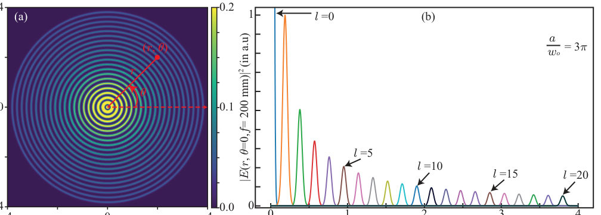
<figcaption class="paper-figure-caption"><b>Fig 3.</b> FIG. 3. (a) Numerically computed two-dimensional intensity |E(r, θ, f = 200 mm)|2 for OAM mode index l ranging from 1 to 20 at a/w0 = 3π and w0 = 0.1 cm. (b) Numerically computer one-dimensional intensity profiles |E(r, θ = 0, f = 200 mm)|2 as a function of r for OAM mode index l ranging from 1 to 20 at a/w0 = 3π and w0 = 0.1 cm.</figcaption>
</figure>
<figure class="paper-figure-card">
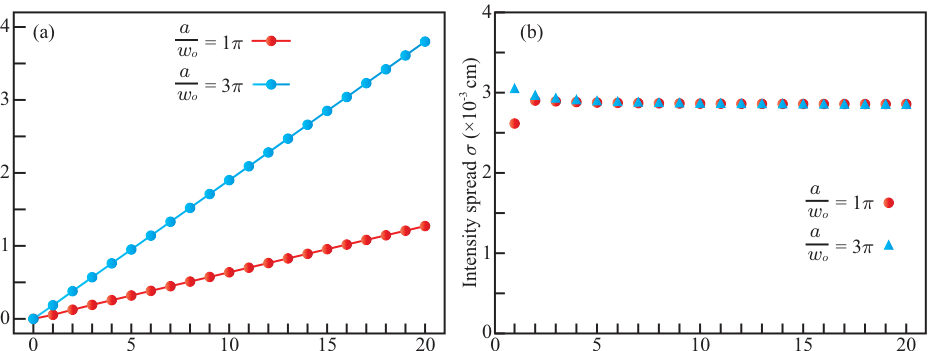
<figcaption class="paper-figure-caption"><b>Fig 4.</b> FIG. 4. (a) Plot of the mean radial position µ of the ring formed by each sorted OAM mode as a function of the OAM index l (b) Radial spread σ of each ring as a function of l.</figcaption>
</figure>
<figure class="paper-figure-card">
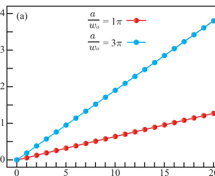
<figcaption class="paper-figure-caption"><b>Fig 5.</b> Fig. 2 (a) shows the numerically computed two- dimensional intensity profiles |E(r, θ, f = 200 mm)|2</figcaption>
</figure>
<figure class="paper-figure-card">
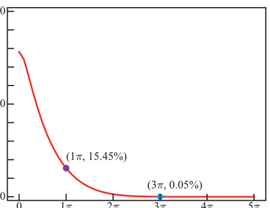
<figcaption class="paper-figure-caption"><b>Fig 6.</b> FIG. 5. Plot of consecutive mode crosstalk as a function of a/w0. The overlap percentage decreases monotonically with increasing a/w0. The highlighted points correspond to crosstalk percentages for a/w0 = 1π and 3π.</figcaption>
</figure>

**Summary.** The paper introduces a 'wavefront twister' optical element that sorts OAM modes into concentric rings of different radii. By increasing the twisting strength, the researchers demonstrate that inter-mode crosstalk can be almost entirely eliminated, offering a scalable path for high-dimensional OAM-based applications.

**Why it may be interesting.** This is highly relevant to quantum optics and photonic quantum information, as it proposes a scalable method for managing high-dimensional OAM states, which are essential for high-capacity quantum communication and encoding.

Detailed structure

**Main problem.** The challenge of efficiently and unambiguously sorting high-dimensional Orbital Angular Momentum (OAM) modes while minimizing inter-modal crosstalk and diffraction loss.

**Main result.** The proposed 'wavefront twister' maps OAM modes to distinct annular rings at the focal plane, where increasing the twisting strength can reduce crosstalk from 15.45% to 0.05%.

**Method.** The authors use the Fresnel-Kirchhoff diffraction integral and paraxial approximation to calculate electric field intensity, employing power series expansions and hypergeometric functions for analytical evaluation.

**Model / system.** An optical system consisting of a novel 'wavefront twister' element—which applies a radially dependent rotation theta(rho) = a*rho—followed by a convex lens, acting on Laguerre-Gaussian (LG) beams.

**Key observables.** OAM index (l), mean radial position (mu), radial spread (sigma), and inter-modal crosstalk percentage.

**Important parameters / regimes.** Twisting strength (a/w0), OAM topological charge (l), and beam waist (w0).

**Assumptions / limitations.** The study assumes the paraxial approximation for LG beams and focuses on the p=0 radial mode.

**Figures summary.** Fig 1 shows the conceptual design of the twister vs. a standard rotator; Fig 2 and 3 show 2D/1D intensity profiles at different twisting strengths; Fig 4 plots radial position and spread vs. l; Fig 5 shows crosstalk vs. twisting strength.

**Paper structure.** The paper introduces the wavefront twister concept, provides the mathematical framework for the coordinate transformation and diffraction, presents numerical simulations of mode separation and crosstalk, and discusses scalability and limitations.

Abstract

We propose an OAM sorter based on a novel optical element that we refer to as a wavefront twister. It is a generalization of the conventional wavefront rotators such as the Dove prism. However, unlike a Dove prism, which simply rotates a wavefront, the rotation generated by a wavefront twister varies linearly with radial position, resulting in the twisting of the wavefront. We demonstrate that the wavefront twister, followed by a lens, maps each OAM mode to an annulus of distinct radius at the back focal plane of the lens with negligible inter-modal overlap and preserves the circular symmetry. Thus, the proposed wavefront twister offers a scalable scheme for high-dimensional OAM mode sorting, with important consequences for the practical realization of OAM-based applications.

[↑ back to top](#top)

### [Resolving spurious topological entanglement entropy in stabilizer codes](http://arxiv.org/abs/2604.27053v1)

**Authors:** Peilun Han, Zijian Liang, Yifei Wang, Bowen Yang, Yingfei Gu, Yu-An Chen  
**Type:** theory · **Category:** quantum information and computing · **PDF:** <https://arxiv.org/pdf/2604.27053v1>  
**Analysis basis:** abstract only; PDF text extraction failed or PDF unavailable
**Topic relevance:** 🔥 `entanglement & information structure` **4/5**

**Summary.** This paper addresses the issue of inaccurate topological entanglement entropy measurements in stabilizer codes. By identifying the source of spurious errors, the authors propose a new calculation method that provides a clean measurement of the total quantum dimension. They further demonstrate the utility of this method by revealing topological frustration in specific code geometries.

**Why it may be interesting.** not directly relevant

Detailed structure

**Main problem.** Topological entanglement entropy (TEE) can suffer from spurious contributions that lead to an overestimation of the total quantum dimension in 2D gapped phases.

**Main result.** The authors identify the microscopic origin of spurious TEE and introduce a new concave partition method that is rigorously proven to be free of these spurious contributions.

**Method.** The study utilizes the framework of translation-invariant stabilizer codes of prime-dimensional qudits and analyzes bivariate bicycle codes on a bipartite cylinder.

**Model / system.** The work focuses on translation-invariant stabilizer codes of prime-dimensional qudits and bivariate bicycle codes on a bipartite cylinder.

**Key observables.** Topological entanglement entropy (TEE) and entanglement entropy dependence on cylinder circumference.

**Important parameters / regimes.** Prime-dimensional qudits and cylinder circumference.

**Assumptions / limitations.** The proposed prescription is specifically proven for translation-invariant stabilizer codes of prime-dimensional qudits.

**Paper structure.** The paper identifies the origin of spurious TEE, introduces a new concave partition prescription, provides a rigorous proof of its accuracy, and applies the method to study bivariate bicycle codes on a cylinder.

Abstract

Topological entanglement entropy (TEE) is a key diagnostic of long-range entanglement in two-dimensional gapped phases of matter, but it can suffer from spurious contributions that overestimate the total quantum dimension of the underlying topological order. In this work, we identify the microscopic origin of spurious TEE and introduce a concave partition for computing the Levin-Wen TEE of translation-invariant stabilizer codes of prime-dimensional qudits. We rigorously prove that this prescription is free of spurious contributions. As a complementary probe, we study bivariate bicycle codes on a bipartite cylinder and show that the entanglement entropy depends sensitively on the cylinder circumference, revealing topological frustration of the underlying anyons.

[↑ back to top](#top)

### [Geometric complexity in thermodynamics](http://arxiv.org/abs/2604.27858v1)

**Authors:** Tan Van Vu, Keiji Saito  
**Type:** theory · **Category:** statistical mechanics · **PDF:** <https://arxiv.org/pdf/2604.27858v1>  
**Analysis basis:** full PDF text, analyzed in chunks
**Topic relevance:** `entanglement & information structure` **3/5** · `correlated / nonlocal dissipation` **2/5** · `methods for driven-dissipative` **2/5** · `non-equilibrium dynamics` **2/5** · `quantum measurements` **2/5**

↔ Scroll figures horizontally

<figure class="paper-figure-card">

<figcaption class="paper-figure-caption"><b>Fig 1.</b> FIG. 1. Geometric framework for reset maps. (a) A state-agnostic reset map T clearing probability from a target subspace. This unified description encompasses diverse ther- modynamic operations, including cooling, information era- sure, and state copying. (b) The geometric complexity of T is defined as the minimal geodesic length between the iden- tity map 1 and T on the space of physical maps, as induced by a suitable Riemannian metric.</figcaption>
</figure>

**Summary.** This paper introduces a new way to measure the difficulty of performing physical operations like cooling or state erasure using geometric complexity. It proves that as you try to make these operations more precise, the required physical resources (like time, energy, or control) must become infinite. This result provides a universal, dynamics-independent version of the third law of thermodynamics for both classical and quantum systems.

**Why it may be interesting.** It provides a unified, geometric version of the third law of thermodynamics that applies to both classical stochastic processes and quantum open systems, linking thermodynamic costs to information-theoretic complexity.

Detailed structure

**Main problem.** The authors seek a universal, dynamics-independent principle to quantify the difficulty of implementing state-reset maps, such as cooling or erasure, which currently lack a unified measure beyond specific protocols.

**Main result.** The paper establishes a fundamental complexity-error trade-off relation, e^{C} * epsilon >= 1, proving that achieving zero error in a reset operation requires diverging geometric complexity.

**Method.** The authors employ a Riemannian geometric framework, defining complexity as the minimal geodesic length on a manifold of physical maps using a tailored log-barrier Hessian metric.

**Model / system.** The framework applies to both classical stochastic maps (Markovian and non-Markovian processes) and quantum channels (CPTP maps, Lindbladian dynamics, and unitary-based protocols).

**Key observables.** Geometric complexity (C), execution error (epsilon), Shannon/von Neumann entropy, and the number of sequential protocols (N).

**Important parameters / regimes.** Dimension of the state space (d), transition rates (w), operation time (tau), and the metric parameter (alpha).

**Assumptions / limitations.** The derivation assumes smooth paths in the space of probability distributions and focuses on maps where the output distribution is strictly positive.

**Figures summary.** Figure 1(a) illustrates a state-agnostic reset map for cooling and erasure, while Figure 1(b) defines geometric complexity as the geodesic length between the identity and a target map.

**Paper structure.** The paper introduces the problem of state-resetting, develops a Riemannian geometric framework for complexity, proves the complexity-error trade-off, demonstrates universality across classical and quantum regimes, and provides analytical bounds and scaling relations.

Abstract

The third law of thermodynamics forbids cooling a physical system to absolute zero in a finite number of operational steps. Although this unattainability principle has been quantified for specific state-to-state transitions, a universal, dynamics-independent bound for implementing a state-agnostic reset map remains elusive. In this work, we unveil the fundamental limits of physical map implementation by deriving a trade-off relation based on geometric complexity. By analyzing continuous paths of maps on a geometric manifold, we prove that the geometric complexity of any classical stochastic map or quantum channel is bounded from below by its execution error. As a consequence, we show that achieving zero error in a state-reset operation requires a divergent geometric complexity -- a unified measure that naturally incorporates disparate physical resources, including infinite time, energetic cost, or control bandwidth. This unattainability principle holds universally across both classical and quantum regimes, establishing a strict geometric limit on the physical realization of reset operations in thermodynamic control and quantum computation.

[↑ back to top](#top)

### [The Synergistic Route to Stretched Criticality](http://arxiv.org/abs/2604.28003v1)

**Authors:** Lorenzo Lucarini, Sandro Meloni, Pablo Villegas  
**Type:** theory · **Category:** statistical mechanics · **PDF:** <https://arxiv.org/pdf/2604.28003v1>  
**Analysis basis:** abstract only; PDF text extraction failed or PDF unavailable
**Topic relevance:** `non-equilibrium dynamics` **3/5** · `non-equilibrium universality` **3/5** · `driven-dissipative phase transition` **2/5** · `scars & prethermalization` **2/5**

**Summary.** The paper shows that synergistic interactions can create a new pathway to extended criticality and Griffiths-like slow dynamics. This mechanism works by using complementary pathways to reinforce activity, and it is robust across both higher-order and nonlinear pairwise networks.

**Why it may be interesting.** This is interesting for many-body dynamics as it identifies a novel mechanism for achieving slow, non-exponential relaxation and extended criticality without relying on traditional quenched disorder.

Detailed structure

**Main problem.** Investigating whether extended criticality and Griffiths-like slow dynamics can arise from mechanisms other than quenched disorder or frustration.

**Main result.** The authors demonstrate that synergistic interactions, which reinforce activity through complementary pathways, provide a new route to non-conventional critical phenomena and a broad distribution of relaxation rates.

**Method.** Theoretical analysis of spreading mechanisms and nonlinear dynamics within network-based models.

**Model / system.** The study considers networks featuring synergistic interactions, including systems with explicit higher-order interactions and purely pairwise systems with nonlinear dynamics.

**Key observables.** Relaxation rates and distribution of activity/spreading dynamics.

**Important parameters / regimes.** Synergistic interaction strength and network topology.

**Paper structure.** The paper introduces the concept of synergistic interactions, demonstrates the emergence of Griffiths-like dynamics, and shows the robustness of this mechanism across different network types and interaction orders.

Abstract

Griffiths phases are typically associated with quenched disorder, while frustration gives rise to multistability and spin-glass behavior. Whether extended criticality can arise in other contexts remains an open question. Here, we show that synergistic interactions provide a distinct route to non-conventional critical phenomena. By combining spreading mechanisms that reinforce activity through complementary pathways, we uncover a broad distribution of relaxation rates, leading to Griffiths-like slow dynamics and extended criticality. We demonstrate that this mechanism is robust across networks and emerges both in systems with explicit higher-order interactions and in purely pairwise systems with nonlinear dynamics.

[↑ back to top](#top)

### [Derivation of the Born Rule and Operational Quantum Formalism in the Accessibility Framework through Boundary Reduction](http://arxiv.org/abs/2604.27125v1)

**Authors:** Everett Fall, Hironori Kondo  
**Type:** theory · **Category:** other · **PDF:** <https://arxiv.org/pdf/2604.27125v1>  
**Analysis basis:** full PDF text, analyzed in chunks
**Topic relevance:** `quantum measurements` **3/5** · `entanglement & information structure` **2/5** · `methods for driven-dissipative` **2/5** · `non-equilibrium dynamics` **2/5**

↔ Scroll figures horizontally

<figure class="paper-figure-card">

<figcaption class="paper-figure-caption"><b>Fig 1.</b> Low-resolution page preview, page 2</figcaption>
</figure>
<figure class="paper-figure-card">

<figcaption class="paper-figure-caption"><b>Fig 2.</b> Low-resolution page preview, page 3</figcaption>
</figure>
<figure class="paper-figure-card">
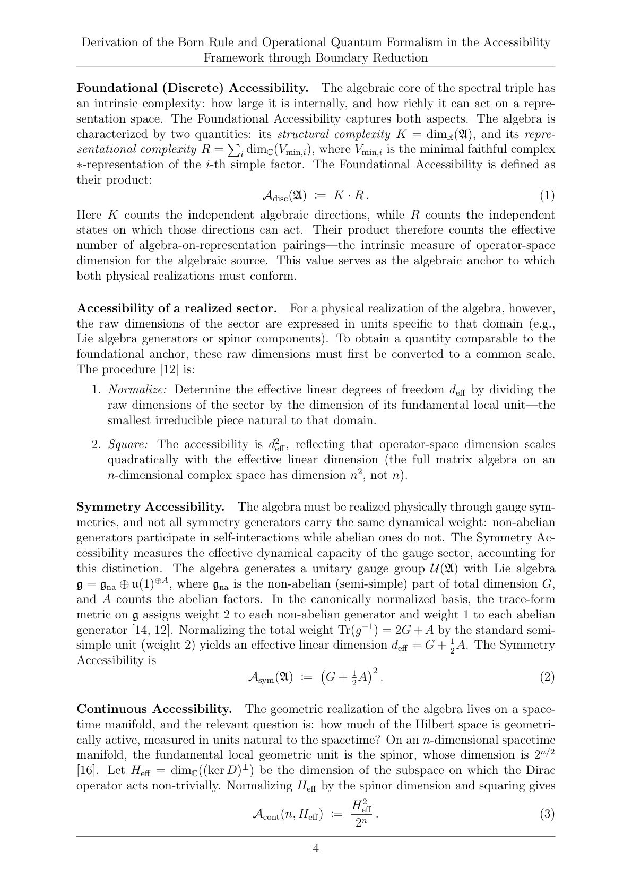
<figcaption class="paper-figure-caption"><b>Fig 3.</b> Low-resolution page preview, page 4</figcaption>
</figure>
<figure class="paper-figure-card">
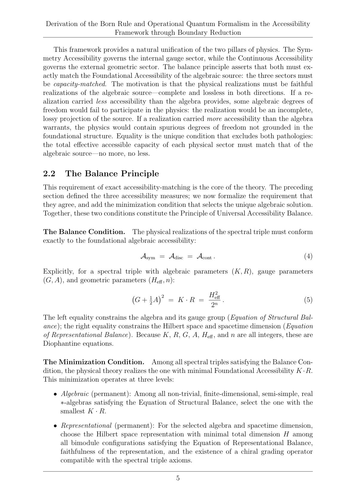
<figcaption class="paper-figure-caption"><b>Fig 4.</b> Low-resolution page preview, page 5</figcaption>
</figure>
<figure class="paper-figure-card">

<figcaption class="paper-figure-caption"><b>Fig 5.</b> Low-resolution page preview, page 6</figcaption>
</figure>
<figure class="paper-figure-card">
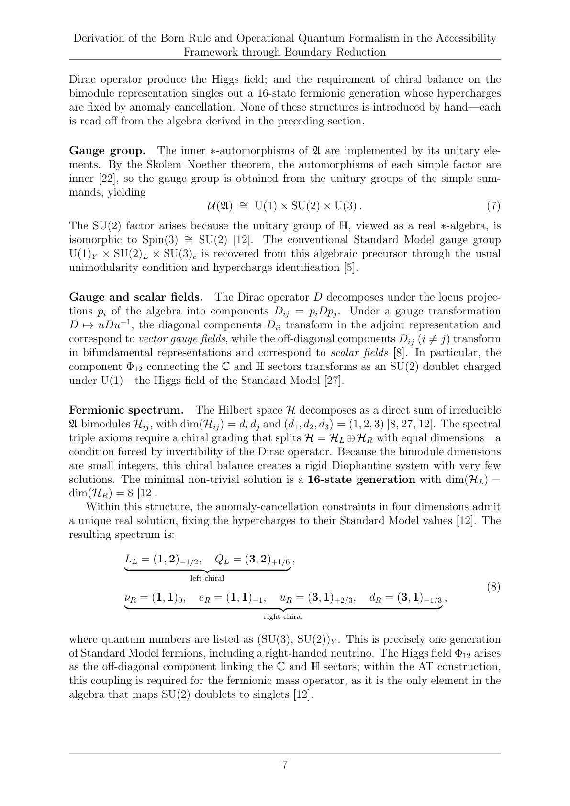
<figcaption class="paper-figure-caption"><b>Fig 6.</b> Low-resolution page preview, page 7</figcaption>
</figure>
<figure class="paper-figure-card">
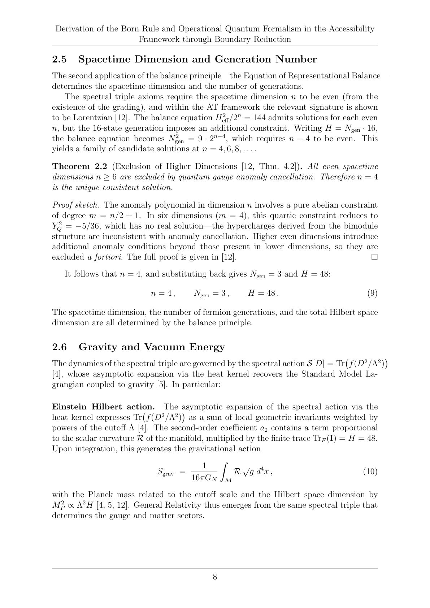
<figcaption class="paper-figure-caption"><b>Fig 7.</b> Low-resolution page preview, page 8</figcaption>
</figure>
<figure class="paper-figure-card">
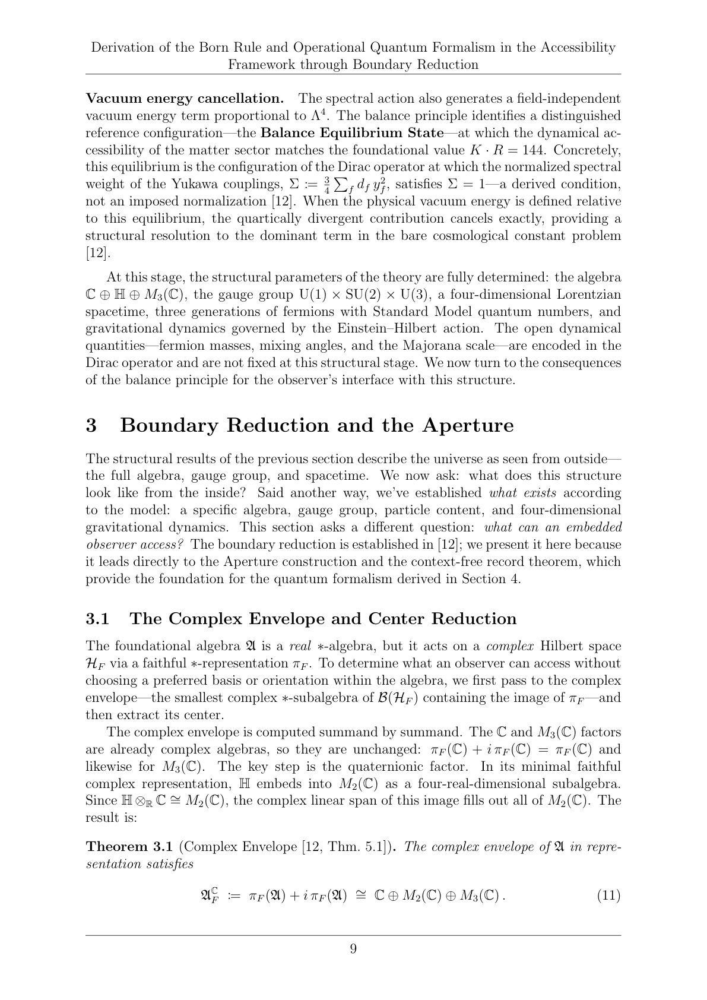
<figcaption class="paper-figure-caption"><b>Fig 8.</b> Low-resolution page preview, page 9</figcaption>
</figure>
<figure class="paper-figure-card">
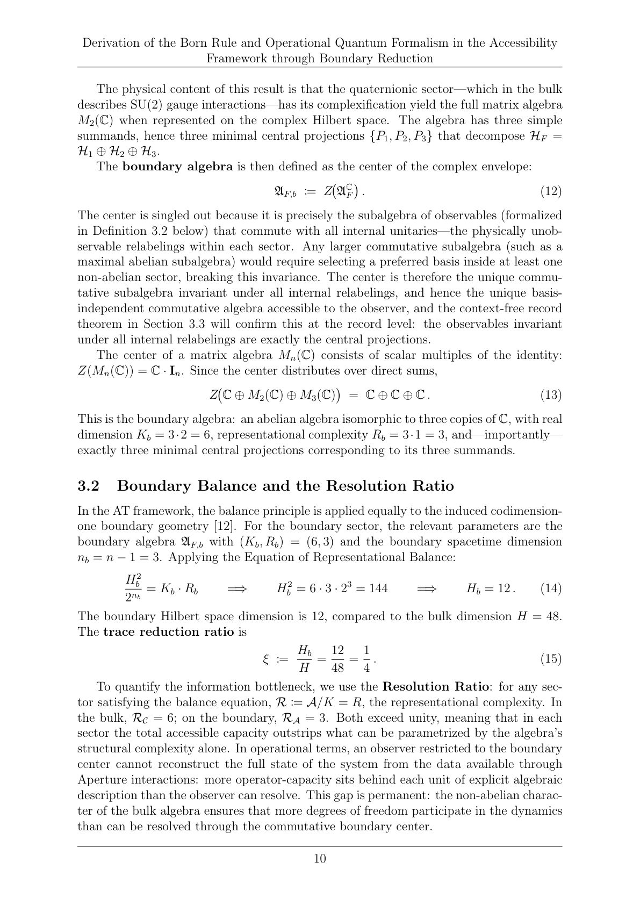
<figcaption class="paper-figure-caption"><b>Fig 9.</b> Low-resolution page preview, page 10</figcaption>
</figure>
<figure class="paper-figure-card">
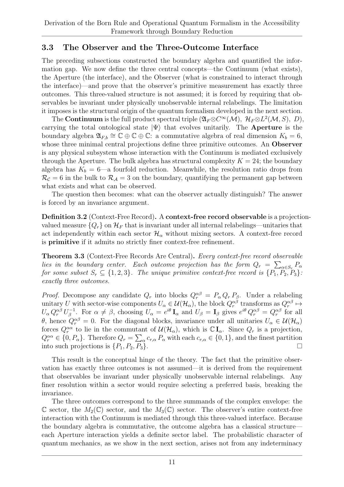
<figcaption class="paper-figure-caption"><b>Fig 10.</b> Low-resolution page preview, page 11</figcaption>
</figure>

**Summary.** This paper proposes that quantum mechanics is an epistemic consequence of an observer's limited access to a more complex, deterministic algebraic reality. By applying a 'Balance Principle' to spectral triples, the authors derive the Standard Model's gauge group and spacetime dimension, while simultaneously deriving the Born rule as a result of an information bottleneck at the observer's interface.

**Why it may be interesting.** This is highly relevant for researchers in open quantum systems as it provides a structural, algebraic derivation of non-Markovian dynamics and the emergence of probabilistic, non-unitary evolution from an underlying deterministic, unitary ontology.

Detailed structure

**Main problem.** The paper seeks to derive the fundamental operational features of quantum mechanics (the Born rule, state updating, and interference) and the parameters of the Standard Model from a single, deeper algebraic principle.

**Main result.** The authors show that the Born rule and quantum formalism emerge from an 'Aperture'—a structural information bottleneck created by boundary reduction in Accessibility Theory—while the Standard Model parameters are uniquely selected by a 'Balance Principle'.

**Method.** The study employs Noncommutative Geometry (NCG) techniques, specifically using spectral triples, boundary reduction of algebras, Gleason's theorem, and Diophantine analysis to solve for complexity constraints.

**Model / system.** The framework is 'Accessibility Theory' (AT), which models an observer interacting with a deterministic, unitary 'Continuum' through a commutative, three-outcome 'Aperture' interface derived from a real graded spectral triple.

**Key observables.** Aperture record process (sequence of sector labels), transition effect operators, and context-free records.

**Important parameters / regimes.** Spacetime dimension (n=4), number of fermion generations (Ngen=3), algebraic complexity (A_disc=144), and the trace reduction ratio (xi=1/4).

**Assumptions / limitations.** Assumes the validity of spectral triple axioms, the Principle of Universal Accessibility Balance, and specific observer-level coherence commitments such as noncontextuality and linearity.

**Paper structure.** The paper begins by establishing the Accessibility Theory framework and the Balance Principle to select the Standard Model algebra; it then uses boundary reduction to define the Aperture; subsequently, it applies Gleason's theorem and algebraic constraints to derive the Born rule and quantum dynamics; finally, it discusses the emergence of non-Markovianity and the resolution of the measurement problem.

Abstract

We show that the operational quantum formalism -- the Born rule, Lüders state updating, quantum interference, non-Markovian effective dynamics, and Bell inequality violation at the Tsirelson bound \(2\sqrt{2}\) -- arises within Accessibility Theory (AT) from the Aperture construction together with explicit coherence and locality assumptions stated in the paper. AT is a framework built on real graded spectral triples and a single algebraic selection principle. The Principle of Universal Accessibility Balance requires three independent measures of the complexity of a spectral triple -- its algebraic, gauge-theoretic, and geometric content -- to be exactly equal and minimized, uniquely selecting the algebra \(\C \oplus \Hbb \oplus M_3(\C)\) and with it the Standard Model gauge group, particle content, four-dimensional Lorentzian spacetime, three generations, and gravitational dynamics. Restriction to a codimension-one geometric boundary reduces this algebra to its commutative center \(\C \oplus \C \oplus \C\) -- the Aperture -- which defines a permanent information bottleneck for any embedded observer. Coherence conditions on inference through this bottleneck, together with Gleason's theorem on the 48-dimensional internal Hilbert space, uniquely determine the Born rule; the remaining operational features follow from the same observer-level framework under the stated assumptions. At the ontological level the theory is deterministic and state-realist, while the operational quantum formalism appears at the observer level as a consequence of structurally limited access to the underlying algebraic reality.

[↑ back to top](#top)

### [Galilean boost invariance does not survive the trace: symmetry breaking in open quantum systems](http://arxiv.org/abs/2604.27459v1)

**Authors:** Leonardo F. Calderón, Esteban Marulanda, Santiago Morales, Leonardo A. Pachón  
**Type:** theory · **Category:** other · **PDF:** <https://arxiv.org/pdf/2604.27459v1>  
**Analysis basis:** full PDF text, analyzed in chunks
**Topic relevance:** `Keldysh / 2PI / non-Gaussian methods` **3/5** · `methods for driven-dissipative` **3/5** · `non-equilibrium dynamics` **2/5** · `analog quantum simulation` **1/5**

↔ Scroll figures horizontally

<figure class="paper-figure-card">

<figcaption class="paper-figure-caption"><b>Fig 1.</b> FIG. 1. Dimensionless boost-violation parameter ℏγ/kBT across representative open-quantum-system platforms in the high-temperature Ohmic regime. Markers indicate representa- tive values quoted in the text; horizontal bars span the experi- mental ranges of γ and T [17, 31–35]. The shaded band delin- eates the crossover between the decoherence-dominated regime (left, covariant maps serve as an excellent approximation) and the dissipation-dominated regime (right, where Eq. (8) attains quantitative significance). Cold atoms in dissipative optical lat- tices span the crossover and enter the violated regime; ultra- cold molecules reach its lower edge. Bars cap at ℏγ/kBT = 1, beyond which the...</figcaption>
</figure>

**Summary.** This paper proves that tracing out a Galilean-invariant environment breaks the boost covariance of the resulting reduced dynamics due to the dissipative term in the master equation. It establishes that this symmetry breaking is unavoidable in any system obeying the fluctuation-dissipation theorem, though it can be suppressed through parametric driving. The work provides a scale, defined by the ratio of damping to temperature, to predict where this violation becomes experimentally significant.

**Why it may be interesting.** It identifies a fundamental kinematic obstruction in open quantum systems, showing that dissipation and boost invariance are mutually exclusive in standard models, which has direct implications for the validity of covariant approximations in cold atom and optomechanical experiments.

Detailed structure

**Main problem.** The paper investigates whether Galilean boost invariance is preserved in the reduced dynamics of an open quantum system after tracing out the environment.

**Main result.** The authors demonstrate a 'no-go' result: for bilinearly coupled systems, Galilean boost covariance is broken by the dissipative term of the master equation, and this violation cannot be avoided if the fluctuation-dissipation theorem holds.

**Method.** The study uses an operator-level analysis of the exact Hu-Paz-Zhang master equation, algebraic testing of symmetry transformations, and stochastic decomposition of the influence functional.

**Model / system.** The analysis focuses on the Caldeira-Leggett model, featuring a system particle coupled to a bath of harmonic oscillators via bilinear-coordinate interaction.

**Key observables.** The dissipative anticommutator term, damping coefficient Gamma(t)f(t), and the boost-breaking phase.

**Important parameters / regimes.** The dimensionless ratio hbar*gamma/k_B*T, which defines the crossover between negligible and substantial symmetry violation, and the squeezing rate mu.

**Assumptions / limitations.** The analysis assumes a factorized initial condition and focuses on the quadratic regime, though extensions to non-quadratic potentials are conjectured via stochastic decomposition.

**Figures summary.** Figure 1 provides a survey of the dimensionless boost-violation parameter across various quantum platforms, showing a crossover from covariant regimes (e.g., trapped ions, nanoparticles) to violated regimes (e.g., cold atoms in optical lattices).

**Paper structure.** The paper begins by defining the global Galilean-invariant model, proceeds to an algebraic analysis of the master equation to locate the symmetry breaking, explores the fundamental conflict with the fluctuation-dissipation theorem, and concludes by discussing experimental platforms and potential restoration via parametric driving.

Abstract

Tracing out a Galilean-invariant Caldeira-Leggett environment breaks Galilean boost covariance of the reduced dynamics, while spatial translations and rotations survive intact. An operator-level analysis of the exact Hu-Paz-Zhang master equation localizes the violation entirely in the dissipative anticommutator term, scaling with the damping coefficient $Γ(t)f(t)$. The fluctuation-dissipation theorem ties this coefficient to the absorptive bath response that drives equilibrium momentum diffusion, so for any non-trivial bath spectral density bilinear-coupled Galilean invariance, the fluctuation-dissipation theorem, and reduced boost covariance cannot hold simultaneously. The stochastic decomposition of the influence functional extends the mechanism beyond the quadratic regime. The dimensionless ratio $\hbarγ/k_\mathrm{B} T$ delineates the crossover: cold atoms in dissipative optical lattices and ultracold molecules sit at its edge. Parametric driving offers a one-directional escape: the squeezing rate that protects nonequilibrium entanglement above the standard quantum limit also suppresses boost-breaking over a driving cycle.

[↑ back to top](#top)

### [Heisenberg-limited Hamiltonian learning without short-time control](http://arxiv.org/abs/2604.27838v1)

**Authors:** Myeongjin Shin, Junseo Lee, Changhun Oh  
**Type:** theory · **Category:** quantum information and computing · **PDF:** <https://arxiv.org/pdf/2604.27838v1>  
**Analysis basis:** full PDF text, analyzed in chunks
**Topic relevance:** `analog quantum simulation` **3/5** · `entanglement & information structure` **2/5** · `non-equilibrium dynamics` **2/5** · `quantum measurements` **2/5**

↔ Scroll figures horizontally

<figure class="paper-figure-card">

<figcaption class="paper-figure-caption"><b>Fig 1.</b> Figure 1. Comparison between previous short-time control approaches and our framework. Previous Heisenberg- limited algorithms rely on stroboscopic control and Trotterization, requiring many ultra-short evolution segments with small 𝑡min. Our framework replaces these short-time queries by long-time evolutions interleaved with learned auxiliary operations, ensuring that every query to the unknown Hamiltonian has duration at least 𝑇. Thus, the short-time bottleneck is removed while Heisenberg-limited scaling in total evolution time is retained.</figcaption>
</figure>
<figure class="paper-figure-card">

<figcaption class="paper-figure-caption"><b>Fig 2.</b> Figure 2. Schematic overview of our iterative learning protocol. At iteration 𝑗, the current estimate 𝐻𝑗 defines a residual Hamiltonian Δ𝐻𝑗= 𝐻−𝐻𝑗. We first learn an auxiliary Hamiltonian 𝑊𝑗using only long-time evolutions under 𝐻, and then use 𝑊𝑗to emulate the residual-control primitive 𝑒−𝑖Δ𝐻𝑗𝑡. This emulated evolution reduces coefficient extraction to sparse pure-state tomography. After estimating Δ𝐻𝑗, we update and truncate the estimate to obtain 𝐻𝑗+1, preserving 𝑚-sparsity and bounded norm while halving the error.</figcaption>
</figure>

**Summary.** This paper demonstrates that optimal, Heisenberg-limited Hamiltonian learning can be performed even when experimental constraints prevent the use of very short-time pulses. By using a method to emulate continuous control through longer evolution periods and learned corrections, the authors show that high-bandwidth control is not a fundamental requirement for efficient quantum system characterization.

**Why it may be interesting.** This is highly relevant for many-body dynamics and quantum control because it proves that the experimental difficulty of generating ultra-short, high-bandwidth pulses does not fundamentally prevent achieving the most efficient possible learning of a system's underlying physics.

Detailed structure

**Main problem.** Determining whether Heisenberg-limited Hamiltonian learning (achieving 1/epsilon scaling in total evolution time) is possible when access to arbitrarily short-time dynamics is restricted by a minimum evolution time T.

**Main result.** The authors prove that Heisenberg-limited scaling can be achieved without short-time control, resolving an open problem. They establish that for logarithmically sparse Hamiltonians, any constant T is sufficient, while for polynomially sparse systems, a quantitative tradeoff exists between minimum evolution time and total evolution time.

**Method.** The framework emulates continuous quantum control by replacing short-time Trotter steps with long-time queries to the unknown Hamiltonian interleaved with learned correction unitaries. The task is then reduced to sparse pure-state tomography.

**Model / system.** An n-qubit, m-sparse, traceless Hamiltonian H expressed as a sum of Pauli operators with unknown real coefficients.

**Key observables.** Pauli coefficients of the Hamiltonian, total evolution time, and error in the Hamiltonian estimate (l-infinity norm).

**Important parameters / regimes.** m (sparsity), T (minimum evolution time), epsilon (target accuracy), and n (number of qubits).

**Assumptions / limitations.** The Hamiltonian is assumed to be m-sparse in the Pauli basis and traceless; the algorithm assumes the ability to simulate the known part of the Hamiltonian and perform sparse pure-state tomography.

**Figures summary.** Figure 1 compares previous approaches relying on stroboscopic control/Trotterization with small minimum evolution times against the new framework using long-time evolutions and learned auxiliary operations.

**Paper structure.** The paper introduces the short-time bottleneck problem, defines the Hamiltonian model and sparsity regimes, presents the long-time emulation framework and correction generator learning, provides mathematical proofs for logarithmic and polynomial sparsity regimes, and concludes with the implications for quantum learning.

Abstract

Characterizing quantum systems by learning their underlying Hamiltonians is a central task in quantum information science. While recent algorithmic advances have achieved near-optimal efficiency in this task, they critically rely on accessing arbitrarily short-time dynamics. This reliance poses severe experimental challenges due to finite control bandwidth and transient pulse errors. In this work, we demonstrate that Heisenberg-limited Hamiltonian learning can be achieved without short-time control. We introduce a framework in which every query to the unknown dynamics has duration at least a prescribed minimum time $T$, and show that this restriction does not preclude Heisenberg-limited scaling. The key ingredient is a method for emulating the continuous quantum control required by iterative learning algorithms using only such lower-bounded evolution times. This reduces the learning task to sparse pure-state tomography. Notably, for logarithmically sparse Hamiltonians, our algorithm achieves the information-theoretically optimal $1/\varepsilon$ scaling in total evolution time for any arbitrary constant minimum evolution time $T$. For many-body (polynomially sparse) systems, we uncover a rigorous quantitative tradeoff, showing that the minimum required evolution time can be significantly relaxed from the standard limit at a polynomial cost in total evolution time. Our results affirmatively resolve a prominent open problem in the field and reveal that high-bandwidth, ultra-short pulses are not fundamentally necessary for optimal quantum learning.

[↑ back to top](#top)

### [Multirate characterization of relaxation mechanisms for two nonequivalent nuclear spins 1/2 in a liquid using maximally entangled pseudo-pure quantum states](http://arxiv.org/abs/2604.27220v1)

**Authors:** Georgiy Baroncha, Alexander Perepukhov, Boris V. Fine  
**Type:** both · **Category:** quantum information and computing · **PDF:** <https://arxiv.org/pdf/2604.27220v1>  
**Analysis basis:** abstract only; PDF text extraction failed or PDF unavailable
**Topic relevance:** `QC/QI experiment` **3/5** · `correlated / nonlocal dissipation` **2/5** · `entanglement & information structure` **2/5** · `non-equilibrium dynamics` **1/5** · `quantum measurements` **1/5**

**Summary.** The paper presents a method to simultaneously measure eight different relaxation rates in a two-spin NMR system using entangled Bell states. It identifies a universal ratio for diagonal relaxation rates and reveals an unconventional relaxation mechanism caused by weak couplings to distant spins. This approach provides a powerful tool for fingerprinting complex molecular dynamics.

**Why it may be interesting.** This work is highly relevant to open quantum systems as it demonstrates the ability to selectively initialize and characterize the eigenmodes of off-diagonal relaxation using entangled states, providing insight into complex decoherence mechanisms.

Detailed structure

**Main problem.** The study aims to characterize multiple relaxation mechanisms in a two-spin system by accessing both diagonal and off-diagonal elements of the density matrix.

**Main result.** The authors successfully accessed 8 relaxation rates using Bell pseudo-pure states and identified a universal dimensionless ratio of diagonal relaxation rates determined by intra-pair magnetic dipolar interaction.

**Method.** The researchers used a multirate NMR approach, employing a new method based on a detuned Hartmann-Hahn double resonance condition to create maximally entangled Bell pseudo-pure states (Bell PPSs).

**Model / system.** A system of two non-equivalent nuclear spins 1/2 (1H and 13C) belonging to a molecule in a liquid, stable against chemical exchange.

**Key observables.** 8 relaxation rates, including inversion recovery, nuclear Overhauser effect, and off-diagonal relaxation rates.

**Important parameters / regimes.** dimensionless ratio of diagonal relaxation rates, J-couplings with distant nuclear spins, and intra-pair magnetic dipolar interaction.

**Assumptions / limitations.** The nuclear spin pair is stable with respect to chemical exchange.

**Paper structure.** The paper presents an experimental and theoretical investigation of spin relaxation, introducing a method for Bell PPS creation, demonstrating the selective initialization of relaxation eigenmodes, and providing a microscopic theory validated by parameter-free tests.

Abstract

Multirate characterization of spin responses in nuclear magnetic resonance (NMR) is a promising approach to fingerprinting complex molecules in the presence of multiple relaxation mechanisms. Here we present experimental and theoretical investigations simultaneously accessing 8 relaxation rates describing the density matrix of two adjacent non-equivalent nuclear spins 1/2 ($^1$H and $^{\ 13}$C) belonging to a molecule in a liquid. The selected nuclear pair is stable with respect to chemical exchange. Some of the rates are obtained from conventional measurements of inversion recovery and nuclear Overhauser effect, while other, less conventional ones, are extracted from the relaxation initialized by the maximally entangled pseudo-pure Bell states (Bell PPSs) of the spin pair. The Bell PPSs are created using a hereby introduced method based on a detuned Hartmann-Hahn double resonance condition. Microscopic theory behind the measured relaxation rates is presented, and its consistency is demonstrated by several parameter-free tests. In particular, it is shown both theoretically and experimentally, that the eigenmodes of the off-diagonal relaxation of the two-spin density matrix can be selectively initialized using Bell PPSs. Our multirate analysis suggests that the measured off-diagonal relaxation is partly due to an unconventional mechanism arising from very weak $J$-couplings of the spin pair with fluctuating distant nuclear spins. Furthermore, we identify a dimensionless ratio of diagonal relaxation rates, which is determined exclusively by intra-pair magnetic dipolar interaction and hence possesses a universal value for a broad class of nuclear spin pairs. This value is consistent with both our experiments and other experiments reported in the literature.

[↑ back to top](#top)

### [Effective Noise Mitigation via Quantum Circuit Learning in Quantum Simulation of Integrable Spin Chains](http://arxiv.org/abs/2604.27648v1)

**Authors:** Wenlong Zhao, Yimeng Zhang, Yan Guo, Yufan Cui, Zhuohang Wang, Rui-Dong Zhu  
**Type:** theory · **Category:** quantum information and computing · **PDF:** <https://arxiv.org/pdf/2604.27648v1>  
**Analysis basis:** full PDF text, analyzed in chunks
**Topic relevance:** `non-equilibrium dynamics` **3/5** · `entanglement & information structure` **2/5** · `methods for driven-dissipative` **2/5**

↔ Scroll figures horizontally

<figure class="paper-figure-card">
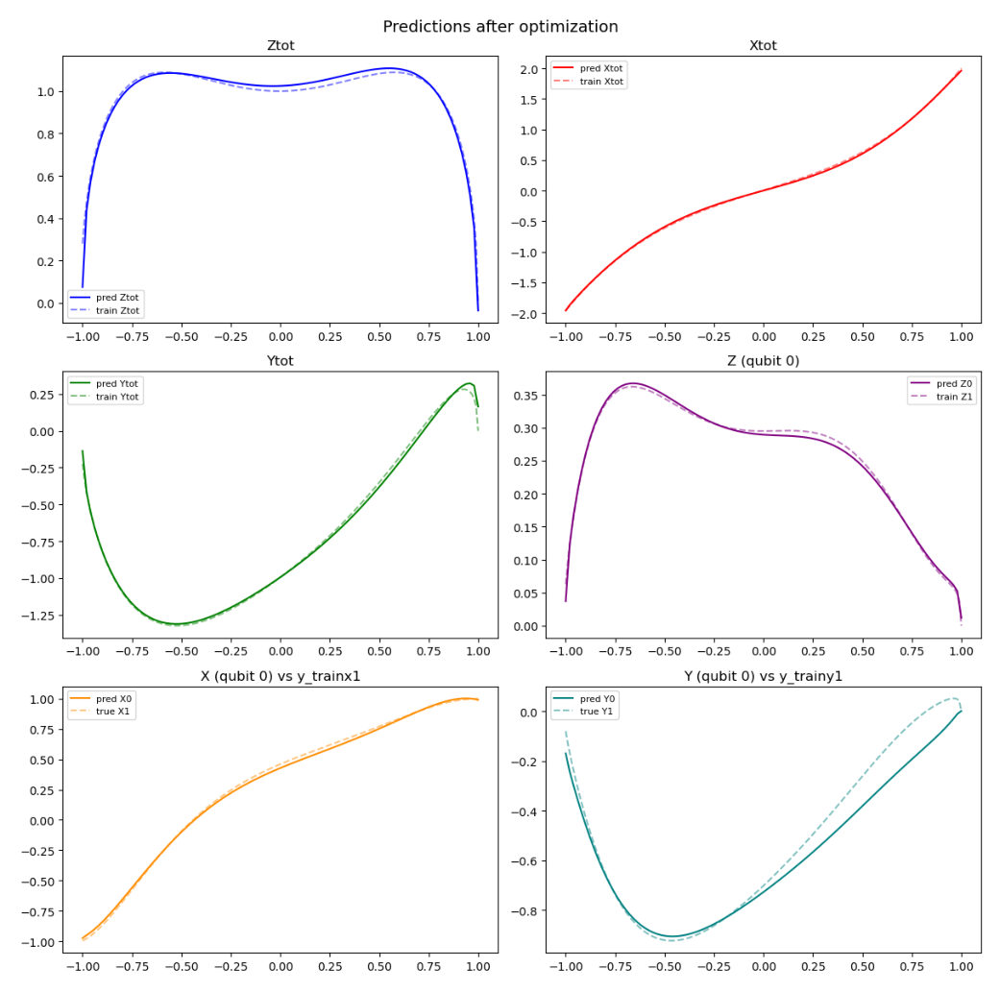
<figcaption class="paper-figure-caption"><b>Fig 1.</b> FIG. 1. Predictions from learned circuit (solid lines) compared with the original data for L = 2 and d = 15 (dashed lines). In particular, the data for ⟨X1⟩and ⟨Y1⟩were not taught to the circuit (n.b. in the quantum simulation, the first qubit is usually called qubit 0). The scaling factor a is optimized to aopt = 1.014819.</figcaption>
</figure>
<figure class="paper-figure-card">
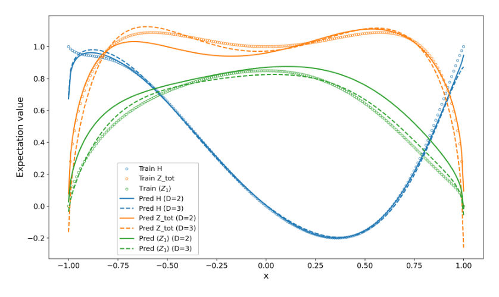
<figcaption class="paper-figure-caption"><b>Fig 2.</b> FIG. 2. Comparison of predictions for the training data, H, Ztot, and the dynamical observable ⟨Z1⟩at d = 4 using QCL with circuit depths D = 2 (solid lines) and D = 3 (dashed lines). Both setups achieve relatively good agreement with the training data, and give similar predictions.</figcaption>
</figure>
<figure class="paper-figure-card">

<figcaption class="paper-figure-caption"><b>Fig 3.</b> FIG. 3. Comparison of predictions for the training data, H, Ztot, and the dynamical observable ⟨Z1⟩at d = 6 using QCL with circuit depths D = 2 and D = 3. The predictions of the D = 3 QCL circuit (dashed lines) are clearly better than those of D = 2 circuit, especially for ⟨Ztot⟩.</figcaption>
</figure>
<figure class="paper-figure-card">
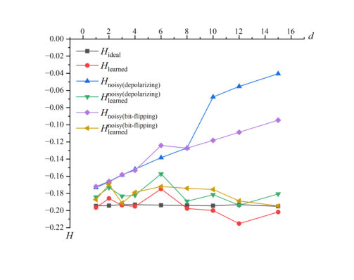
<figcaption class="paper-figure-caption"><b>Fig 4.</b> FIG. 4. Conserved Hamiltonian H at x = 0.3 under bit-flipping (p = 0.5%) and depolarizing (p = 1%) noise. The learned circuit closely follows the ideal curve, while the un- mitigated simulation quickly deviates as the time-evolution depth d increases.</figcaption>
</figure>
<figure class="paper-figure-card">

<figcaption class="paper-figure-caption"><b>Fig 5.</b> FIG. 5. Hamiltonian H at x = 0.3 subjected to amplitude damping (p = 1%) and phase damping (p = 1%). The QCL-based noise mitigation effectively suppresses the degra- dation, keeping the predicted values close to the exact con- served quantity.</figcaption>
</figure>
<figure class="paper-figure-card">
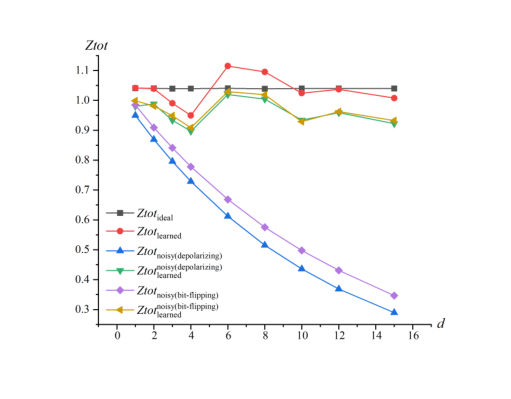
<figcaption class="paper-figure-caption"><b>Fig 6.</b> FIG. 6. Ztot at x = −0.3 under bit-flipping (p = 0.5%) and depolarizing (p = 1%) noise. Again, the learned circuit suc- cessfully limits the noise-induced errors, maintaining the con- served charge much closer to its ideal value than the original time-evolution circuit.</figcaption>
</figure>
<figure class="paper-figure-card">
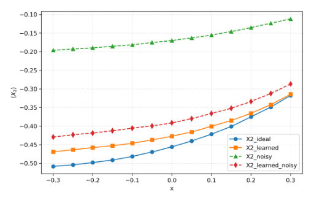
<figcaption class="paper-figure-caption"><b>Fig 7.</b> FIG. 8. Comparison of ⟨X2⟩as a function of x after d = 10 steps of time evolution between the ideal simulation (blue line for the original circuit, orange line for the prediction of QCL circuit) and the noisy simulation (green line for the original circuit, red line for the prediction of QCL circuit) with depo- larizing noise (p = 0.01).</figcaption>
</figure>
<figure class="paper-figure-card">
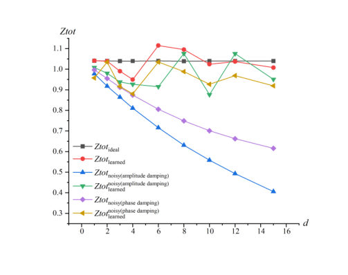
<figcaption class="paper-figure-caption"><b>Fig 8.</b> FIG. 7. Total Z magnetization Ztot at x = −0.3 under ampli- tude and phase damping noise. The learned circuit preserves the constant theoretical value with high accuracy, whereas the unmitigated circuit exhibits a large systematic drift caused by noise.</figcaption>
</figure>
<figure class="paper-figure-card">
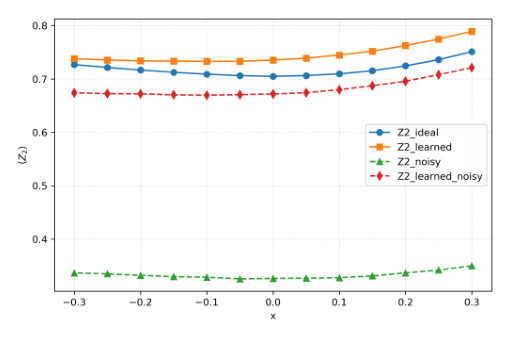
<figcaption class="paper-figure-caption"><b>Fig 9.</b> FIG. 9. Comparison of ⟨Z2⟩as a function of x after d = 10 steps of time evolution between the ideal simulation (blue line for the original circuit, orange line for the prediction of QCL circuit) and the noisy simulation (green line for the original circuit, red line for the prediction of QCL circuit) with bit- flipping noise (p = 0.005).</figcaption>
</figure>
<figure class="paper-figure-card">
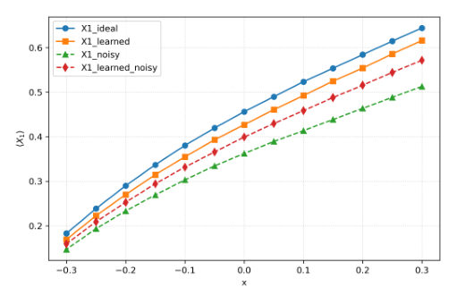
<figcaption class="paper-figure-caption"><b>Fig 10.</b> FIG. 11. Comparison of ⟨X1⟩as a function of x after d = 10 steps of time evolution between the ideal simulation (blue line for the original circuit, orange line for the prediction of QCL circuit) and the noisy simulation (green line for the original circuit, red line for the prediction of QCL circuit) with phase damping noise (p = 0.01).</figcaption>
</figure>

**Summary.** The paper proposes using Quantum Circuit Learning to replace deep, noisy quantum simulation circuits with shallower, learned versions. By training the circuit to respect the conserved charges of integrable spin chains, the method significantly reduces the impact of hardware noise. This approach allows for more robust and accurate simulation of long-time dynamics on near-term quantum hardware.

**Why it may be interesting.** This is highly relevant for many-body dynamics as it provides a physics-informed way to extend the reach of NISQ devices by using the inherent symmetries of integrable systems to combat decoherence.

Detailed structure

**Main problem.** Mitigating hardware noise (decoherence and gate infidelity) in the quantum simulation of integrable spin chains on NISQ devices.

**Main result.** Quantum Circuit Learning (QCL) can produce shallower, noise-resilient circuits that effectively preserve conserved charges and dynamical observables compared to the original deep, noisy circuits.

**Method.** A machine learning framework where a shallow variational circuit is trained to approximate a deeper time-evolution operator by leveraging conserved charges and a small amount of dynamical information as training signals.

**Model / system.** Integrable quantum spin chains, specifically the XXX Heisenberg model, studied for two-qubit and three-qubit systems.

**Key observables.** Conserved charges (total magnetization Z_tot, SU(2) generators, Hamiltonian H) and dynamical observables (expectation values like <Z1>, <X1>, <Y1>).

**Important parameters / regimes.** Circuit depth (D and d), noise probability (p), coupling constant (J), and number of qubits (L).

**Assumptions / limitations.** The method relies on the existence of conserved charges (integrability) and assumes a sufficiently small time step for the Trotterized approximation.

**Figures summary.** Figures compare predictions of learned circuits vs. true data, demonstrate accuracy improvements across different circuit depths, and show the suppression of noise-induced decay in conserved quantities under various noise models (bit-flip, depolarizing, amplitude, and phase damping).

**Paper structure.** The paper introduces the noise mitigation problem, proposes the QCL strategy using integrability, details the circuit architecture and training process, presents numerical results for L=2 and L=3 systems under various noise channels, and discusses scalability and future directions.

Abstract

We propose a noise-mitigation quantum simulation strategy for near-term quantum devices based on Quantum Circuit Learning (QCL), which is in particular effective for integrable quantum spin chains. The method trains a shallow variational circuit to approximate a deeper time-evolution circuit by learning the conserved charges and only a small amount of dynamical information in the system. Under realistic noise models, the learned circuit maintains both conserved quantities and dynamical observables significantly closer to their true values than the noisy simulation of the original circuit. This demonstrates QCL as an effective, physics-informed error mitigation strategy, producing shorter, more robust circuits without exponential sampling overhead.

[↑ back to top](#top)

### [Learning quantum disentanglement scheduling from reduced states via modular hybrid policies](http://arxiv.org/abs/2604.28009v1)

**Authors:** Y. -X. Xiao, J. -Z. Han, Z. Zheng, Z. -H. Zhang, M. Xue, J. Li, X. Lv  
**Type:** theory · **Category:** quantum information and computing · **PDF:** <https://arxiv.org/pdf/2604.28009v1>  
**Analysis basis:** abstract only; PDF text extraction failed or PDF unavailable
**Topic relevance:** `entanglement & information structure` **3/5** · `methods for driven-dissipative` **2/5** · `quantum measurements` **2/5**

**Summary.** The paper proposes a hybrid quantum-classical machine learning approach to control the disentanglement of multiple qubits using only partial information from reduced density matrices. It reveals that classical preprocessing is crucial for success and provides design principles for scaling the quantum component of the controller.

**Why it may be interesting.** This is relevant for researchers in open quantum systems and quantum control as it addresses the practical challenge of managing many-body entanglement using only local, noisy, or incomplete information, which is a hallmark of near-term quantum device operations.

Detailed structure

**Main problem.** Developing an effective control strategy for multiqubit disentanglement when only partial information (two-qubit reduced density matrices) is available.

**Main result.** The study identifies that classical preprocessing is the primary driver of performance, while the quantum module acts as a compact latent representation; it also finds that increasing circuit width is more effective than increasing depth for policy efficiency.

**Method.** A modular hybrid quantum-classical policy framework involving classical preprocessing, a parameterized quantum circuit (PQC) as a nonlinear latent block, and classical postprocessing for pair-selection probabilities.

**Model / system.** A multi-qubit system (benchmarked on 4, 5, and 6-qubit tasks) undergoing a disentanglement scheduling process controlled by a hybrid agent.

**Key observables.** Two-qubit reduced density matrices and pair-selection probabilities.

**Important parameters / regimes.** Circuit width and circuit depth of the quantum module, and the availability of model budget.

**Assumptions / limitations.** The controller has restricted access to the full wave-function and can only observe reduced density matrices.

**Paper structure.** The paper introduces the problem of partial-observation control, describes the modular hybrid policy architecture, presents benchmarking results across different qubit numbers, and analyzes the performance-efficiency trade-offs and circuit scaling.

Abstract

Quantum control with restricted state access is central to near-term quantum devices, where full wave-function information is unavailable. We study this problem through multiqubit disentanglement scheduling from partial observations, where a controller receives only two-qubit reduced density matrices and selects which qubit pair to disentangle at each step. We introduce a modular hybrid quantum--classical policy framework consisting of classical preprocessing, a parameterized quantum circuit as a compact nonlinear latent block, and classical postprocessing for pair-selection probabilities. Benchmarking 4-, 5-, and 6-qubit tasks, we find that preprocessing is the dominant factor governing performance under reduced-state observations, while the quantum module provides a conditional compact representation whose utility depends on the input features and model budget. We further identify a performance--efficiency trade-off across policy families and find that increasing circuit width is generally more useful than increasing depth. These results provide practical design principles for hybrid policies in reduced-information quantum control.

[↑ back to top](#top)

### [Quantum Coordination without Conditioning under Restricted Information](http://arxiv.org/abs/2604.27173v1)

**Authors:** Faisal Shah Khan  
**Type:** theory · **Category:** quantum information and computing · **PDF:** <https://arxiv.org/pdf/2604.27173v1>  
**Analysis basis:** full PDF text, analyzed in chunks
**Topic relevance:** `entanglement & information structure` **3/5** · `quantum measurements` **3/5**

↔ Scroll figures horizontally

<figure class="paper-figure-card">

<figcaption class="paper-figure-caption"><b>Fig 1.</b> Fig. 1. Tree representation of the binary illustrative example. The dashed line indicates that the two second-step nodes are indistinguishable under the available information, so the local rule generating X2 cannot depend on the realized value of X1.</figcaption>
</figure>

**Summary.** This paper demonstrates that quantum correlations can enable coordination in sequential tasks where classical agents fail due to an inability to condition on past history. It identifies two distinct quantum mechanisms—shared latent variables and quantum discord—that allow for the implementation of otherwise unattainable joint distributions. Ultimately, it positions quantum correlations as a partial substitute for the classical property of perfect recall.

**Why it may be interesting.** It provides fundamental insights into how quantum resources like discord can compensate for missing information in sequential processes, which is relevant to understanding the limits of quantum control and communication in networked systems.

Detailed structure

**Main problem.** Investigating whether quantum correlations can implement joint distributions that are classically unattainable when agents are subject to information constraints like imperfect recall.

**Main result.** Quantum systems can act as a partial substitute for perfect recall, using both classical latent-variable encoding in separable states and non-commuting local structures (quantum discord) to achieve coordination impossible for classical local rules.

**Method.** The study uses a probabilistic framework comparing classical local conditional rules against quantum measurements (POVMs) on shared states, applying extensions of Kuhn's theorem to imperfect recall settings.

**Model / system.** A multi-stage sequential decision process involving agents (Alice, Bob, etc.) sharing multipartite quantum states, including both separable/diagonal states and discordant states.

**Key observables.** Target joint distributions (specifically anti-correlated distributions), quantum discord, and local measurement outcomes.

**Important parameters / regimes.** Information constraints (restricted access to past history $Y_k$), presence of quantum discord, and the degree of non-commutativity in local measurement bases.

**Assumptions / limitations.** The model assumes no signaling between agents and that quantum correlations are fixed in advance and cannot reproduce fully adaptive dependence on indistinguishable past outcomes.

**Figures summary.** A tree representation of a binary sequential process where dashed lines indicate nodes that are indistinguishable due to information constraints.

**Paper structure.** The paper introduces the problem of coordination under restricted information, defines the classical and quantum models, proves two theorems regarding diagonal and discordant mechanisms for coordination, and discusses the fundamental limitations of quantum models compared to perfect recall.

Abstract

We study coordination under restricted information, where classical local models fail to implement certain correlated distributions because agents cannot condition on past history. We show that quantum systems overcome this limitation even when using only separable states. Both classically diagonal encodings (shared latent variables) and separable states with noncommuting local structure (quantum discord) enable the implementation of joint distributions that are unattainable by any classical local rules under the same information constraints. The quantum advantage arises from enabling latent-variable coordination without requiring agents to condition on the latent variable itself -- a construction that succeeds where no classical local model can. Separable states with nonzero quantum discord provide an alternative mechanism for realizing such coordination. At the same time, quantum models remain strictly limited by the information structure: unlike perfect recall, they cannot reproduce fully adaptive dependence on realized past outcomes that are observationally indistinguishable. Thus, quantum correlations serve as a partial substitute for perfect recall.

[↑ back to top](#top)

### [Structure-Aware Transformers for Learning Near-Optimal Trotter Orderings with System-Size Generalization in 1D Heisenberg Hamiltonians](http://arxiv.org/abs/2604.27171v1)

**Authors:** Shamminuj Aktar, Reuben Tate, Stephan Eidenbenz  
**Type:** theory · **Category:** quantum information and computing · **PDF:** <https://arxiv.org/pdf/2604.27171v1>  
**Analysis basis:** full PDF text, analyzed in chunks
**Topic relevance:** `non-equilibrium dynamics` **3/5** · `analog quantum simulation` **2/5** · `entanglement & information structure` **1/5**

↔ Scroll figures horizontally

<figure class="paper-figure-card">
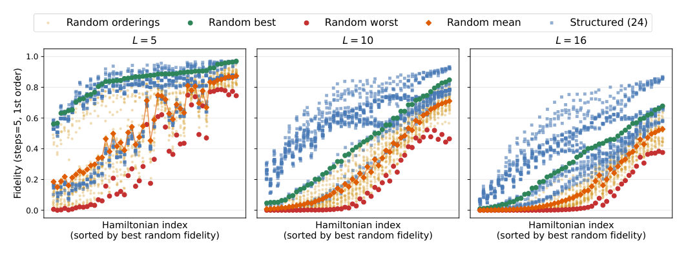
<figcaption class="paper-figure-caption"><b>Fig 1.</b> Figure 1: Fidelity of random and structured Trotter orderings across system sizes L = 5, 10, 16 for the N´eel initial state, first-order product formula, and r = 5 Trotter steps. For each Hamiltonian instance, sorted by best random-ordering fidelity, we show 30 random orderings (amber dots), their best, worst, and mean fidelities (green, red, and orange), and all 24 structured candidates (blue squares). At L = 5, random and structured orderings are often comparable. By L = 10, a clear gap emerges, and at L = 16 the structured candidates consistently occupy the high-fidelity region while random orderings are concentrated lower. This trend shows that structured orderings become increasingly...</figcaption>
</figure>
<figure class="paper-figure-card">

<figcaption class="paper-figure-caption"><b>Fig 2.</b> Figure 2: Overview of the coloring-aware Trotter ordering pipeline, divided into two stages. Dataset generation (left): For a given 1D XXZ Hamiltonian (L, ∆, g), we construct the commutation graph C(H) from Pauli terms and apply four coloring methods (xyz groups, greedy, gurobi, handcrafted), producing C = 24 candidate orderings (4×3! = 24). For each candidate ordering, we compute the fidelity F(σ) = |⟨ψexact|ψTrotter(σ)⟩|2 between the exact and Trotter-evolved states. These fidelities are used during training only: the oracle fidelity, defined as the best fidelity among the 24 structured candidates, provides the supervision label. Model learning (right): Per-term local features and global...</figcaption>
</figure>
<figure class="paper-figure-card">

<figcaption class="paper-figure-caption"><b>Fig 3.</b> Figure 3: Selected-ordering fidelity versus oracle fidelity for the learned model and the strongest non-learned baseline, MajRegime, across held-out test instances (L ∈{16, 17, 18, 19, 20}). Points are colored by method and shaped by Trotter regime (p, r), and the dashed line marks oracle-level performance y = x. The learned selector remains more tightly concentrated near the oracle line overall, while MajRegime shows substantially larger deviations, especially in the lower-fidelity regime.</figcaption>
</figure>
<figure class="paper-figure-card">
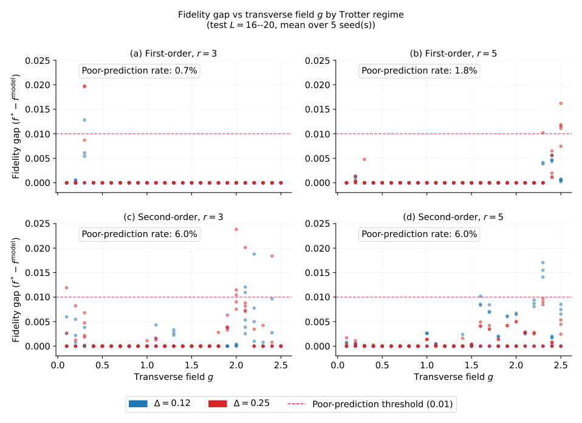
<figcaption class="paper-figure-caption"><b>Fig 4.</b> Figure 4: Error landscape: fidelity gap f∗−f model versus transverse field g for each Trotter regime, averaged over five seeds on test sizes L ∈{16, 17, 18, 19, 20}. Color indicates anisotropy ∆, and the dashed line marks the poor-prediction threshold (gap = 0.01). Under first-order Trotter (top row), the poor-prediction rate remains low at 0.7% for r = 3 and 1.8% for r = 5. Under second-order Trotter (bottom row), failures are more frequent, with poor-prediction rates of 6.0% for r = 3 and 6.0% for r = 5. The largest gaps concentrate at g ≳2.0, where oracle fidelity is already low and differences between candidate orderings become more pronounced.</figcaption>
</figure>
<figure class="paper-figure-card">

<figcaption class="paper-figure-caption"><b>Fig 5.</b> Figure 5: Generalization sweep. Mean fidelity gap versus system size L for each validation size Lmax ∈{5, . . . , 15}, where training uses L ∈{3, . . . , Lmax −1} and evaluation is performed on larger sizes up to L = 20 (one line per Lmax, mean over three seeds). The shaded region marks the final held-out test range L ∈{16, . . . , 20}, and the dashed horizontal line marks the MajRegime reference. Lines for Lmax ≤8 remain near 10−2 on larger systems, indicating limited generalization. Generalization emerges at Lmax = 9, and lines for Lmax ≥13 compress toward 10−3 with little growth across system size, confirming clean extrapolation to larger systems.</figcaption>
</figure>
<figure class="paper-figure-card">
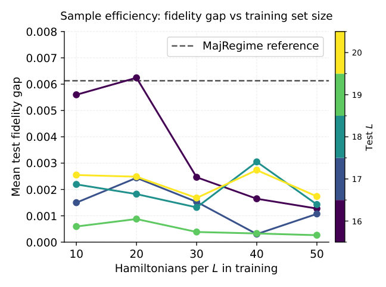
<figcaption class="paper-figure-caption"><b>Fig 6.</b> Figure 6: Sample efficiency: mean test fidelity gap versus the number of Hamiltonians per system size used in training. Colored lines show held-out test sizes L ∈{16, 17, 18, 19, 20}, and the dashed line marks the average MajRegime reference. By nham = 30, all plotted test sizes fall below the MajRegime reference and stabilize thereafter, indicating that 30 Hamiltonians per system size are sufficient for near-oracle generalization in this setting.</figcaption>
</figure>

**Summary.** The paper presents a Transformer-based machine learning model designed to select the most accurate sequence of Hamiltonian terms for Trotterized quantum simulations. By using a size-invariant input representation, the model successfully generalizes from small training systems to much larger, unseen 1D Heisenberg chains. This approach significantly outperforms standard baseline policies and reduces the computational overhead of finding optimal simulation parameters.

**Why it may be interesting.** This work is highly relevant for many-body dynamics as it provides an AI-driven method to reduce approximation errors in quantum simulations, potentially enabling more accurate long-time evolution of complex spin systems on near-term quantum hardware.

Detailed structure

**Main problem.** Optimizing the ordering of non-commuting Hamiltonian terms in Trotterization to maximize simulation fidelity, specifically addressing the exponential complexity of the search space and the need for system-size generalization.

**Main result.** A structure-aware Transformer encoder can predict near-optimal Trotter orderings for unseen, larger systems (up to 20 qubits) with a mean fidelity gap of only 0.00115 relative to the best of 24 structured candidates.

**Method.** The authors use a supervised learning approach with a Transformer encoder that takes size-invariant Hamiltonian features and global context as input to classify the best ordering from a predefined set of 24 candidates derived from commutation graph colorings.

**Model / system.** The study focuses on 1D XXZ Heisenberg Hamiltonians with an external transverse field, decomposed into local Pauli terms, using the Néel state as the initial state for time evolution.

**Key observables.** State fidelity (squared overlap between exact and Trotter-evolved states), mean fidelity gap, normalized gain, and poor-prediction rate.

**Important parameters / regimes.** System size (L), Trotter orders (p=1, 2), step counts (r=3, 5), anisotropy (Delta), and transverse field strength (g).

**Assumptions / limitations.** The search is restricted to a predefined set of 24 structured candidate orderings rather than the full permutation space; the study is limited to 1D XXZ Hamiltonians and a fixed target time.

**Figures summary.** Figure 1 compares random vs. structured orderings; Figure 2 shows the dataset generation and model learning pipeline; Figure 3 shows the model tracking the oracle fidelity; Figure 4 shows the error landscape across field strengths; Figure 5 shows the generalization sweep across system sizes; Figure 6 shows sample efficiency.

**Paper structure.** The paper introduces the Trotter ordering problem, describes the construction of the candidate set via commutation graph coloring, details the Transformer architecture and size-invariant feature encoding, presents results on system-size generalization and sample efficiency, and concludes with limitations and future directions.

Abstract

Trotterization is a standard approach for simulating quantum time evolution on quantum computers, where the Hamiltonian is split into local terms and each term is applied in sequence. The order of these terms affects the fidelity of the simulation when they do not commute, so the choice of ordering directly impacts the accuracy of the simulation. We study this problem for one-dimensional XXZ Heisenberg Hamiltonians using a structured set of 24 candidate orderings derived from colorings of the Hamiltonian's commutation graph and their group permutations. Finding the best candidate for large systems becomes prohibitive because fidelity evaluation is computationally expensive. In this work, we train a transformer encoder on smaller systems to predict the best candidate ordering for larger systems directly from Hamiltonian and Trotter-configuration features, without computing candidate fidelities at inference time. The model is trained on in-range systems of 3 to 14 qubits with 15-qubit systems held out for validation. Experimental results show that the model reaches a mean test fidelity gap of 0.00115 relative to the best of the 24 candidates on out-of-range systems of 16 to 20 qubits. A training-size sweep further shows that generalization emerges once training includes systems up to L=8 qubits, with validation at L=9, and the gap continues to decrease as the training range grows. To our knowledge, this is the first application of a learned model to Trotter ordering, and it motivates future work on AI-guided Trotter ordering with generalization across Hamiltonian families and system types.

[↑ back to top](#top)

### [Bosonic Josephson junction dynamics: interplay between quantum and thermal fluctuations](http://arxiv.org/abs/2604.27809v1)

**Authors:** Andrea Bardin, Francesco Lorenzi, Luca Salasnich  
**Type:** theory · **Category:** quantum gases · **PDF:** <https://arxiv.org/pdf/2604.27809v1>  
**Analysis basis:** abstract only; PDF text extraction failed or PDF unavailable
**Topic relevance:** `non-equilibrium dynamics` **3/5** · `Keldysh / 2PI / non-Gaussian methods` **2/5**

**Summary.** This paper extends the mean-field description of Bosonic Josephson junctions by incorporating both quantum and thermal fluctuations. It demonstrates that these two types of fluctuations act in opposition to influence the system's dynamics. The authors conclude that in current experimental setups, quantum fluctuations are the dominant correction.

**Why it may be interesting.** It provides a precise understanding of how fluctuations modify fundamental nonlinear phenomena like self-trapping and symmetry breaking, which is crucial for controlling many-body dynamics in ultracold gases.

Detailed structure

**Main problem.** Investigating how thermal and quantum fluctuations affect the superfluid dynamics of a Bosonic Josephson junction beyond the mean-field approximation.

**Main result.** The study finds that quantum and thermal fluctuations play opposite roles: thermal fluctuations decrease the Josephson frequency, while both increase the thresholds for macroscopic quantum self-trapping and spontaneous symmetry breaking.

**Method.** A semianalytical approach using a formalism that accounts for fluctuations in a homogeneous gas to derive a corrected equation of motion within a two-site approximation.

**Model / system.** A Bosonic Josephson junction modeled within a two-site approximation, considering the dynamics of a superfluid gas.

**Key observables.** Josephson frequency, strength of macroscopic quantum self-trapping, and the threshold for spontaneous symmetry breaking.

**Important parameters / regimes.** Regimes where quantum fluctuations dominate over thermal fluctuations, assessed via parameters from recent experimental realizations.

**Assumptions / limitations.** The transport of the non-condensed component is assumed to be negligible.

**Paper structure.** The paper introduces the problem of fluctuations in Josephson junctions, presents a corrected equation of motion, analyzes the effects on dynamical quantities, and compares theoretical predictions with experimental regimes.

Abstract

We investigate the superfluid dynamics of a Josephson junction beyond the mean-field description, incorporating the role of thermal fluctuations as well as quantum fluctuations. Using a formalism that accounts for the fluctuations in a homogeneous gas, and under the assumption that the transport of the non-condensed component is negligible, we derive a corrected equation of motion within the two-site approximation. The resulting corrections for the typical dynamical quantities, like the Josephson frequency, the strength of macroscopic quantum self-trapping, and the threshold for spontaneous symmetry breaking, allow us to predict the effects of both types of fluctuations and assess their relative importance in different regimes in a semianalytical fashion. For all the dynamical quantities, the quantum fluctuations are shown to play an opposite role with respect to the thermal fluctuations. Josephson frequency is decreased by thermal fluctuations and both the critical strenghts of macroscopic quantum self trapping and spontaneous symmetry breaking are increased. We assess the experimentally accessible regimes by calculating the relevant parameters of recent experimental realizations of Bosonic Josephson junction and show that the expected regime is dominated by quantum fluctuations.

[↑ back to top](#top)

### [Cylindrical Matter: A beyond-quantum many-body system for efficient classical simulation of quantum pure-Ising like systems](http://arxiv.org/abs/2604.27248v1)

**Authors:** Sahar Atallah, Peter Carrekmor, Michael Garn, Yukuan Tao, Shashank Virmani  
**Type:** theory · **Category:** numerical methods · **PDF:** <https://arxiv.org/pdf/2604.27248v1>  
**Analysis basis:** full PDF text, analyzed in chunks
**Topic relevance:** `entanglement & information structure` **3/5** · `non-equilibrium dynamics` **2/5**

↔ Scroll figures horizontally

<figure class="paper-figure-card">

<figcaption class="paper-figure-caption"><b>Fig 1.</b> FIG. 1. A sketch of Cyl(1) in the space of Bloch vectors. For any value of r the cylinder Cyl(r) protrudes from the Bloch sphere and hence always contain pure states.</figcaption>
</figure>
<figure class="paper-figure-card">

<figcaption class="paper-figure-caption"><b>Fig 2.</b> FIG. 2. The plot shows λ(φ). We do not plot φ ∈(π, 2π) as φ and 2π −φ give the same values - the graph would be symmetric about the axis φ = π. At φ = 0 no growth is needed, as the gate is trivially the identity gate, and for φ = π we recover the value derived for the CZ gate in [6]).</figcaption>
</figure>
<figure class="paper-figure-card">

<figcaption class="paper-figure-caption"><b>Fig 3.</b> FIG. 3. The horizontal axis is α, the power law decay rate for a one dimensional system. The vertical axis is the largest an- gle θ in degrees, such that initial states cos(θ/2)|0⟩+sin θ/2|1⟩ are within the initial radius accepted by the classical simula- tion algorithm. In other words, if states with these values of θ or lower are interacted with the long range gates, the algorithm can efficiently sample the outcomes of cylindrical measurements in the limit of large numbers of particles. For this graph the gate between a qubit and its immediate neigh- bour is the CZ gate. For any finite system in practice one will be able to simulate more inputs, possibly also by exploiting asymmetric growth...</figcaption>
</figure>
<figure class="paper-figure-card">

<figcaption class="paper-figure-caption"><b>Fig 4.</b> FIG. 4. The θ (vertical axis), φ (horizontal axis) phase space. A particular point (φ, θ) hence represents the pure states one gets by placing states (I+sin(θ)X+cos(θ)Z)/2 on the nodes of a graph and interacting them with arbitrary two-qubit diago- nal gates eiφ1|00⟩⟨00|+eiφ2|01⟩⟨01|+eiφ3|10⟩⟨10|+eiφ4|11⟩⟨11| such that φ = φ4 +φ1−φ2−φ3. The upper curve corresponds to graphs with degree ∆= 3 and the lower curve corresponds to graphs with degree ∆= 4. In each case for a given value of φ the system is classically efficiently simulatable for pure states with polar angles θ that are below the curve (mixed states that are convex mixtures of those pure states are also classically efficient, but can...</figcaption>
</figure>
<figure class="paper-figure-card">
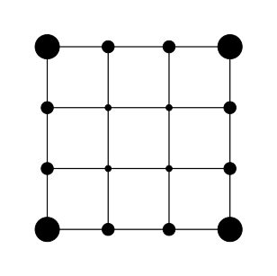
<figcaption class="paper-figure-caption"><b>Fig 5.</b> FIG. 5. An illustration of the coarse graining procedure. Imagine that this is a 4 × 4 block of cylinders within a larger square lattice. We create a separable decomposition between it and the rest of the lattice by growing the radii of the bound- ary cylinders in accordance with how many interactions they have with the rest of the system. The corner cylinders hence have larger radius than the other cylinders on the boundary.</figcaption>
</figure>
<figure class="paper-figure-card">
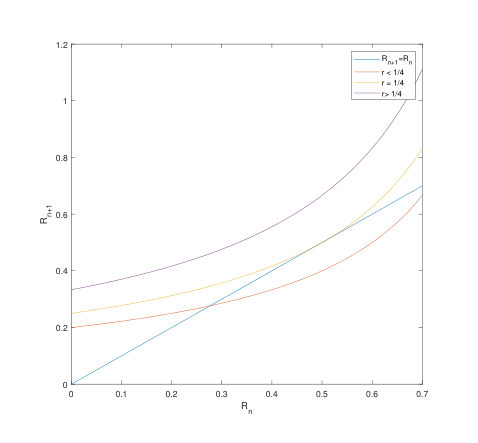
<figcaption class="paper-figure-caption"><b>Fig 6.</b> FIG. 6. A sketch of the recursion relation for different values of r.</figcaption>
</figure>
<figure class="paper-figure-card">
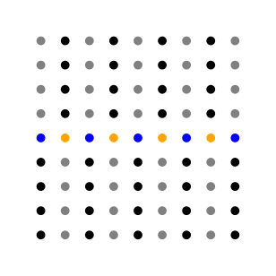
<figcaption class="paper-figure-caption"><b>Fig 7.</b> FIG. 7. Illustration for D = 2. Consider an arbitrarily large two dimensional grid. Assume that the grey cylinders have been measured in the z basis, giving the 0 outcome, removing them from the lattice. Now measure each remaining black one dimensional line coming from above or below, apart from the coloured cylinders in the middle of the grid. This creates a horizontal line of cylinders in the middle of the grid, each of which has a radius arbitrarily close to the fixed point of the one-dimensional recursions coming from above or below. In this D = 2 grid we hence require fixed points of those recursions to be less than 1/4, to satisfy the bound in Theorem 6 for the surviving central D = 1...</figcaption>
</figure>
<figure class="paper-figure-card">
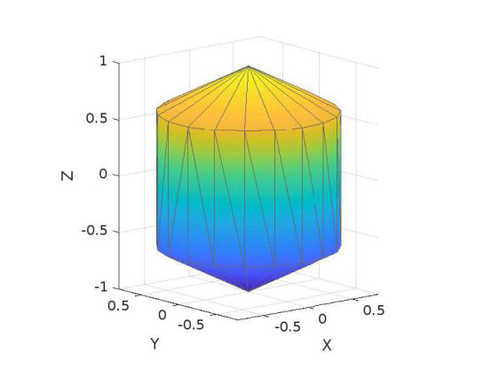
<figcaption class="paper-figure-caption"><b>Fig 8.</b> FIG. 8. A sketch of B(4/5, 3/5).</figcaption>
</figure>

**Summary.** This paper introduces 'cylindrical matter,' a beyond-quantum many-body system used to efficiently classically simulate certain quantum Ising-like systems. By using a state space that allows for non-positive semi-definite operators, the authors find a way to sample measurement outcomes of entangled quantum states using a classical model. This approach identifies new regimes of classical simulability for long-range interacting quantum systems.

**Why it may be interesting.** It provides a novel theoretical framework for classical simulation using non-quantum models, which could offer new insights into the computational complexity of many-body dynamics and the limits of quantum advantage.

Detailed structure

**Main problem.** Determining the boundaries of classical simulability for quantum many-body systems by exploring whether 'beyond-quantum' descriptions can provide efficient classical simulation of certain entangled states.

**Main result.** The authors demonstrate that a hypothetical 'cylindrical matter' model can efficiently classically simulate various quantum pure-Ising-like systems, including those with power-law decaying interactions with exponents alpha > 3D/2.

**Method.** The study uses a continuous-time dynamical model of 'cylindrical bits' and analyzes the 'radial growth' of state space required to maintain a separable decomposition under diagonal unitary interactions.

**Model / system.** A many-body system of 'cylindrical bits' where each particle's state space is a cylinder in R3, interacting via diagonal Hamiltonians (Ising-like) on a graph with power-law decaying strengths.

**Key observables.** Measurement outcomes in the Z eigenbasis or the XY plane (aX + bY), and the growth factor of the cylinder radius.

**Important parameters / regimes.** Cylindrical radius (r), interaction decay exponent (alpha), spatial dimension (D), and the phase parameter (phi) of the diagonal gates.

**Assumptions / limitations.** The model is 'non-free' due to required spatial constraints to ensure valid probabilities; measurements are assumed to be destructive or quasi-destructive; and the simulation assumes diagonal quantum circuit evolution can be computed efficiently.

**Figures summary.** Figure 1 shows the cylindrical state space protruding from the Bloch sphere; Figure 2 plots the growth factor as a function of gate phase, peaking at the CZ gate; Figure 3 presents a phase diagram of interaction decay versus allowable initial angle.

**Paper structure.** The paper introduces the cylindrical bit model, defines the mathematical framework for cylindrical separability, analyzes the growth factor of the radius under diagonal unitaries, establishes simulation conditions for power-law interactions, and compares the optimality of the cylindrical state space against alternatives.

Abstract

Even simplified models of quantum many-body systems can be difficult to analyse. However, taking inspiration from the foundations of physics, one may wonder whether there are practical advantages to constructing alternative beyond-quantum descriptions of many-body systems. We explore this question in the context of quantum interactions that are diagonal in the computational basis. We construct a hypothetical model of a continuous time dynamical many-body system that is based upon lattices of interacting particles called "cylindrical bits", a concept first introduced in [6]. In the language of [5] our toy model is {\it non-free}, as we need spatial constraints on how the particles interact to ensure valid probabilities. We investigate these constraints and explore the resulting `entangled' states that can exist. Certain pure {\it quantum} entangled systems can be faithfully mimicked by our cylindrical worlds. This allows us to simulate efficiently classically, in the sense of sampling measurement outcomes, a variety of previously unknown quantum systems. Examples include some states created by pure Ising interactions algebraically decaying faster than $\sim 1/r^{3D/2}$, with spatial dimension $D$, under measurements in the $Z$ eigenbasis or eigenbases of $aX+bY$ for $a,b \in \mathbb{R}$. We also explore whether another choice of non-quantum `particle' could expand the applicability of the classical simulation by defining and partially optimising a figure-of-merit that attempts to capture how useful various possibilities may be.

[↑ back to top](#top)

### [Discrete Lattice Models for Interface Growth on a Complete Graph](http://arxiv.org/abs/2604.27896v1)

**Authors:** J. M. Marcos, J. J. Meléndez, R. Cuerno, J. J. Ruiz-Lorenzo  
**Type:** theory · **Category:** statistical mechanics · **PDF:** <https://arxiv.org/pdf/2604.27896v1>  
**Analysis basis:** full PDF text, analyzed in chunks
**Topic relevance:** `non-equilibrium universality` **3/5** · `non-equilibrium dynamics` **2/5**

↔ Scroll figures horizontally

<figure class="paper-figure-card">
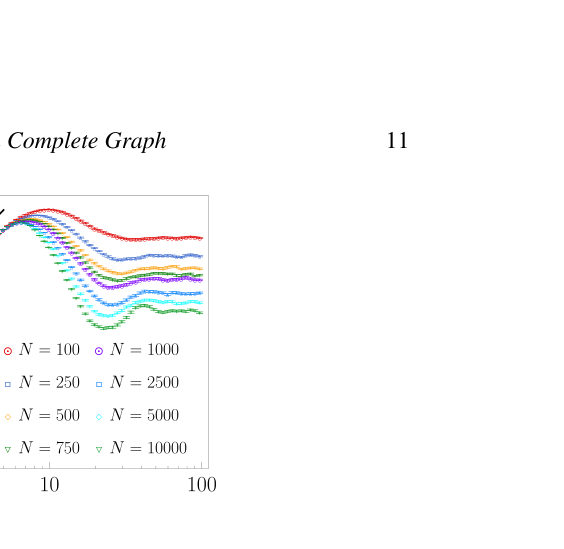
<figcaption class="paper-figure-caption"><b>Fig 1.</b> Figure 1. Log–log plot of the squared roughness, w2(t), as a function of t for the RSOS model. Data are shown for different system sizes N (see legend) and m = 10. The solid black line corresponds to the RD scaling w2(t) ∼t.</figcaption>
</figure>
<figure class="paper-figure-card">
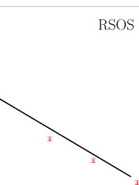
<figcaption class="paper-figure-caption"><b>Fig 2.</b> Figure 2. Log–log plot of the saturation value of the square of the roughness, w2 sat, as a function of the system size N for the RSOS model. In this plot, m = 10. The solid black line corresponds to w2 sat ∼N −1/4 scaling.</figcaption>
</figure>
<figure class="paper-figure-card">

<figcaption class="paper-figure-caption"><b>Fig 3.</b> Figure 3. Histogram of the rescaled height fluctuations χ [see Eq. (11)], for the RSOS model. In this figure, N = 1000 and m = 10.</figcaption>
</figure>
<figure class="paper-figure-card">
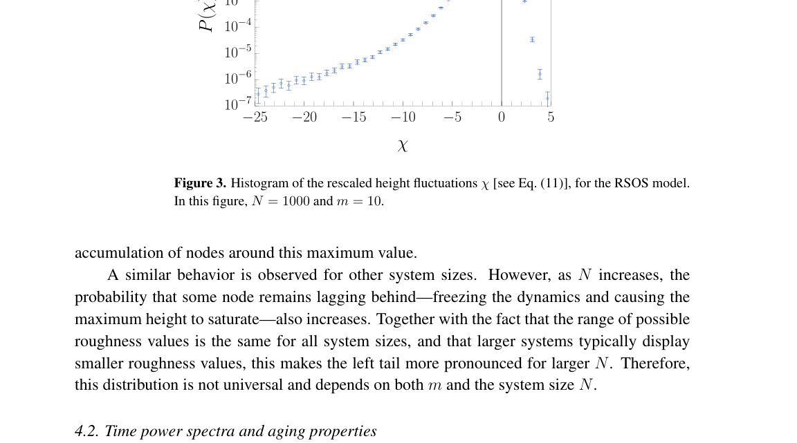
<figcaption class="paper-figure-caption"><b>Fig 4.</b> Figure 4 shows the time power spectrum, S(ω), for several system sizes of the RSOS model. The slope observed in the figure follows S(ω) ∼ω−2 quite closely, which coincides with the behavior observed for the EW and KPZ equations on a complete graph, as explained in Sec. 3.3. This result is consistent with the hyperscaling relation 2α + z = d, which is characteristic of linear equations, and contrasts with the Galilean invariance relation α+z = 2 associated with the KPZ fixed point. Figure 5 shows the spatially averaged two-time height autocorrelation function rescaled by the squared roughness, Ct(t, t0)/w2(t0), as a function of the time difference t −t0, for a fixed system size of the RSOS...</figcaption>
</figure>
<figure class="paper-figure-card">

<figcaption class="paper-figure-caption"><b>Fig 5.</b> Figure 5. Spatially averaged two-time height autocorrelation function, rescaled by the squared roughness, Ct(t, t0)/w2(t0), as a function of the time difference t −t0 for the RSOS model, shown for different waiting times t0 = {1, 2, 3, 4, 5, 6, 7}, which appear bottom to top in the inset. The system size is N = 1000 and m = 10. The solid black line corresponds to the theoretical prediction given by Eq. (17) with τRSOS = m = 10. Inset: Same data shown without rescaling by the squared roughness w2(t0).</figcaption>
</figure>
<figure class="paper-figure-card">
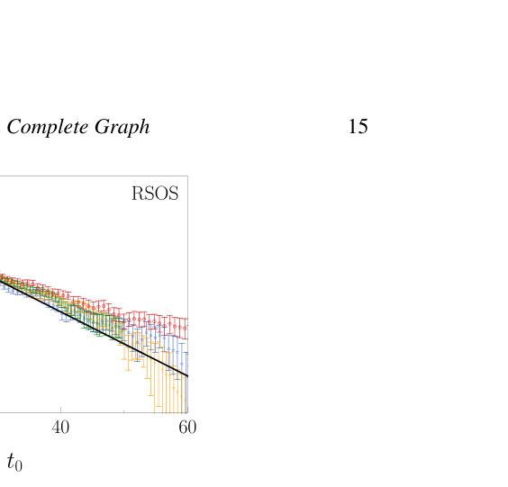
<figcaption class="paper-figure-caption"><b>Fig 6.</b> Figure 6. Spatially averaged two-time height autocorrelation function, rescaled by the squared roughness, Ct(t, t0)/w2(t0), as a function of the time difference t −t0 for the RSOS model, shown for different waiting times t0 = {20, 30, 40, 50}. The system size is N = 1000 and m = 10. The solid black line corresponds to the theoretical prediction given by Eq. (17) with τRSOS = m = 10.</figcaption>
</figure>
<figure class="paper-figure-card">
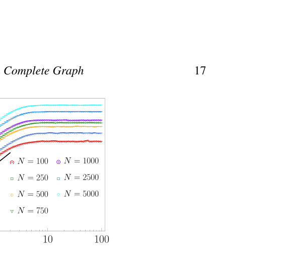
<figcaption class="paper-figure-caption"><b>Fig 7.</b> Figure 7. Log–log plot of the square of the roughness, w2(t), as a function of t for the BD model. Data are shown for different system sizes N (see legend). The solid black line corresponds to w2(t) ∼t2 scaling, while the dashed black line corresponds to w2(t) ∼t behavior.</figcaption>
</figure>
<figure class="paper-figure-card">
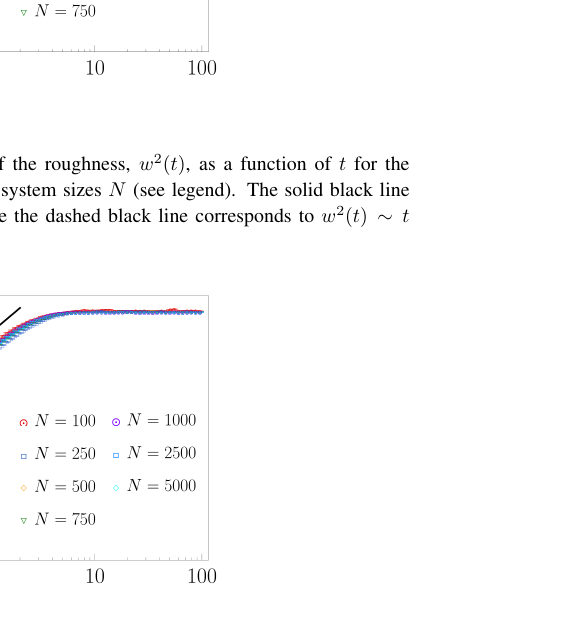
<figcaption class="paper-figure-caption"><b>Fig 8.</b> Figure 8. Log–log plot of the square of the roughness rescaled by the system size, w2(t)/N, as a function of t for the BD model. Data are shown for different system sizes N (see legend). The solid black line corresponds to w2(t) ∼t2 scaling, while the dashed black line corresponds to w2(t) ∼t behavior.</figcaption>
</figure>
<figure class="paper-figure-card">
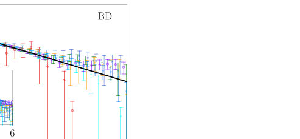
<figcaption class="paper-figure-caption"><b>Fig 9.</b> Figure 11. Spatially averaged two-time height autocorrelation function, rescaled by the squared roughness, Ct(t, t0)/w2(t0), as a function of the time difference t −t0 for the BD model, shown for different waiting times t0 = {0.5, 1, 1.5, 2, 3, 5, 10}, which appear bottom to top in the inset. The system size is N = 1000. The solid black line corresponds to the theoretical prediction given by Eq. (18). Inset: Same data shown without rescaling by the squared roughness w2(t0).</figcaption>
</figure>

**Summary.** This paper examines how the topology of a complete graph affects the universality classes of interface growth models. It finds that while some models retain continuum-like features, others like Ballistic Deposition deviate significantly, exhibiting new growth regimes due to the infinite-dimensional connectivity.

**Why it may be interesting.** not directly relevant

Detailed structure

**Main problem.** The study investigates whether discrete lattice growth models (RSOS and BD) faithfully reproduce the behavior of their corresponding continuum equations (EW and KPZ) when defined on a complete graph, representing the infinite-dimensional limit.

**Main result.** While the RSOS model shows similarities to continuum equations, the BD model exhibits an 'ultrafast' growth regime and saturation roughness that increases with system size, placing it outside the KPZ universality class on a complete graph.

**Method.** Numerical Monte Carlo-style simulations and analytical derivations using probabilistic modeling and scaling analysis.

**Model / system.** Discrete interface growth models, specifically the Restricted Solid-on-Solid (RSOS) and Ballistic Deposition (BD) models, implemented on a complete graph (all-to-all connectivity).

**Key observables.** Global interfacial roughness (w), height fluctuations, power spectra (S(omega)), and two-time height autocorrelation functions.

**Important parameters / regimes.** System size (N), height constraint (m), and growth regimes (Random Deposition, ultrafast growth, and saturation).

**Assumptions / limitations.** The complete graph is assumed to be a valid proxy for the infinite-dimensional limit of statistical mechanical systems.

**Figures summary.** Plots showing squared roughness evolution over time, scaling of saturation roughness with system size, histograms of rescaled height fluctuations showing left tails, and the frequency-dependent power spectrum.

**Paper structure.** The paper introduces the problem of growth on complete graphs, analyzes specific models (RSOS, BD, etc.), compares discrete results to continuum benchmarks, and concludes with discussions on universality and dimensionality.

Abstract

We investigate the behavior of discrete interface growth models belonging to the Edwards--Wilkinson (EW) and Kardar--Parisi--Zhang (KPZ) universality classes, when defined on a complete graph, a topology commonly used to probe the infinite-dimensional limit of statistical mechanical systems. Our aim is to assess to what extent discrete lattice models reproduce the behavior of their corresponding continuum equations in this highly connected setting. After assessing the trivial behavior shown by some well known cases (like random deposition with surface relaxation or the etching model), we focus on two paradigmatic models associated with the KPZ universality class, the Restricted Solid-on-Solid (RSOS) and Ballistic Deposition (BD) models, and assess non-trivial behavior through several observables including the roughness, height fluctuations, power spectra, and two-time autocorrelation functions. Still, despite similarities with continuum equations, important differences arise in the fluctuations and long-time dynamics. In both discrete models the rescaled height fluctuations display a pronounced left tail, indicating the presence of lagging nodes. While the RSOS model exhibits a saturation roughness that decreases with system size, similarly to the EW and KPZ equations, the BD model exhibits a saturation roughness that increases with system size and an additional ultrafast growth regime, placing it outside the KPZ universality class on a complete graph.

[↑ back to top](#top)

### [Entanglement of multi-qubit quantum graph states and studies structural properties of tripartite graphs with quantum programming](http://arxiv.org/abs/2604.27829v1)

**Authors:** Kh. P. Gnatenko  
**Type:** both · **Category:** quantum information and computing · **PDF:** <https://arxiv.org/pdf/2604.27829v1>  
**Analysis basis:** full PDF text, analyzed in chunks
**Topic relevance:** `entanglement & information structure` **3/5** · `QC/QI experiment` **2/5**

↔ Scroll figures horizontally

<figure class="paper-figure-card">
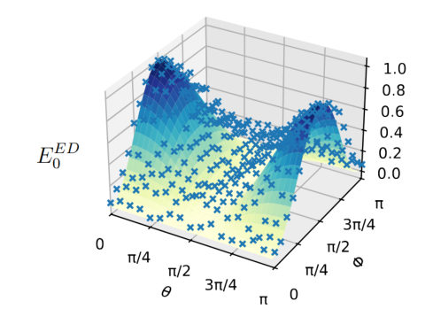
<figcaption class="paper-figure-caption"><b>Fig 1.</b> Figure 2: Entanglement distance of qubit q[0] with other qubits in state (51) for α = 0 and different values of θ, ϕ. The results obtained using the AerSimulator which includes a readout error of the order 10−2, a Pauli-X error of 10−4, and a CNOT error of 10−2 are indicated by cross markers, while the continuous surface represents the corresponding analytical calculations.</figcaption>
</figure>
<figure class="paper-figure-card">

<figcaption class="paper-figure-caption"><b>Fig 2.</b> Figure 3: Absolute differences d0 between the analytical results for the entanglement distance of qubit q[0] with other qubits in state (51) for α = 0 and different values of θ, ϕ. and results obtained using the AerSimulator which includes a readout error of the order 10−2, a Pauli-X error of 10−4, and a CNOT error of 10−2.</figcaption>
</figure>
<figure class="paper-figure-card">

<figcaption class="paper-figure-caption"><b>Fig 3.</b> Figure 4: Entanglement distance of qubit q[1] with other qubits in state (51) for α = 0 and different values of θ, ϕ. The results obtained using the AerSimulator which includes a readout error of the order 10−2, a Pauli-X error of 10−4, and a CNOT error of 10−2 are indicated by cross markers, while the continuous surface represents the corresponding analytical calculations.</figcaption>
</figure>
<figure class="paper-figure-card">

<figcaption class="paper-figure-caption"><b>Fig 4.</b> Figure 5: Absolute differences d1 between the analytical results for the entanglement distance of qubit q[1] with other qubits in state (51) for α = 0 and different values of θ, ϕ. and results obtained using the AerSimulator which includes a readout error of the order 10−2, a Pauli-X error of 10−4, and a CNOT error of 10−2.</figcaption>
</figure>
<figure class="paper-figure-card">

<figcaption class="paper-figure-caption"><b>Fig 5.</b> Figure 6: Entanglement distance of qubit q[2] with other qubits in state (51) for α = 0 and different values of θ, ϕ. The results obtained using the AerSimulator which includes a readout error of the order 10−2, a Pauli-X error of 10−4, and a CNOT error of 10−2 are indicated by cross markers, while the continuous surface represents the corresponding analytical calculations.</figcaption>
</figure>
<figure class="paper-figure-card">
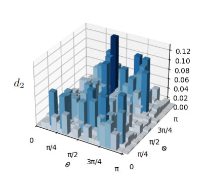
<figcaption class="paper-figure-caption"><b>Fig 6.</b> Figure 7: Absolute differences d2 between the analytical results for the entanglement distance of qubit q[2] with other qubits in state (51) for α = 0 and different values of θ, ϕ. and results obtained using the AerSimulator which includes a readout error of the order 10−2, a Pauli-X error of 10−4, and a CNOT error of 10−2.</figcaption>
</figure>

**Summary.** This paper proposes a framework where multi-qubit entangled states are used to represent and study the structural properties of tripartite graphs. By linking quantum observables like entanglement distance to graph metrics like 4-cycles, it demonstrates that quantum programming can be an effective tool for investigating complex classical graph topologies.

**Why it may be interesting.** not directly relevant

Detailed structure

**Main problem.** The paper aims to develop a method for constructing multi-qubit entangled states that represent weighted tripartite graphs and to establish a quantitative link between quantum properties (entanglement and correlators) and graph structural properties.

**Main result.** The study establishes that quantum correlators and entanglement distance are explicitly determined by graph features like vertex degrees, common neighbors, and 4-cycles, and validates these analytical predictions using noisy quantum simulations.

**Method.** The authors use analytical derivations for spin expectation values and entanglement distance, complemented by quantum simulations on the IBM AerSimulator with realistic noise models (readout, Pauli-X, and CNOT errors).

**Model / system.** The system consists of multi-qubit quantum graph states constructed from weighted and directed tripartite graphs G(U, V, W, E) using specific two-qubit rotation gates (R_XY, R_XZ, R_YZ) applied to an initial separable state.

**Key observables.** Entanglement distance (E_ED), quantum correlators (Pauli expectation values such as <sigma_x sigma_x>, <sigma_y sigma_y>, and <sigma_z sigma_z>), and mean spin values.

**Important parameters / regimes.** Edge weights (phi_kl), initial state parameters (theta_k, alpha_k), vertex degrees, and graph topological features like 4-cycles and common neighbors.

**Assumptions / limitations.** The derivation assumes a tripartite structure where no edges exist within the same vertex set, and that the rotation gates commute due to this structure; simplified formulas assume unweighted graphs and uniform parameters.

**Figures summary.** Figure 1 shows a quantum circuit for a triangle-based state; Figures 2, 4, and 6 compare analytical entanglement distance surfaces with noisy simulation data; Figures 3, 5, and 7 plot the absolute error between analytical and simulated results.

**Paper structure.** The paper introduces the construction method for tripartite quantum graph states, provides analytical derivations for entanglement and correlators, establishes the mapping between quantum and graph structural properties, and concludes with a numerical validation using noisy quantum simulations.

Abstract

We propose a method for constructing multi-qubit entangled quantum states representing weighted tripartite graphs. An expression for the entanglement distance for multi-qubit states corresponding to arbitrary tripartite graph structures is obtained. The entanglement of a qubit with the rest of the system in a quantum graph state is determined by the weights of the edges in the closed neighborhood of the corresponding vertex and by its degree with respect to other sets. We also calculate quantum correlators in the general case of tripartite quantum graph states. We establish a relationship between these quantum properties and the structural properties of the corresponding tripartite graphs, including the number of non-overlapping neighbors, the number of common neighbors of the corresponding vertices, and the number of 4-cycles. As an illustrative example, we consider a tripartite graph forming a triangle and compute the entanglement distance using quantum simulations on the AerSimulator with noise models. The numerical results are consistent with the theoretical predictions. The obtained results demonstrate that quantum graph states provide an effective framework for studying structural properties of tripartite graphs. They open up the possibility of investigating such properties using quantum programming. It is worth highlighting that tripartite graphs have applications in solving practical problems such as resource allocation, scheduling, and database and hypergraph modeling.

[↑ back to top](#top)

### [Nodal algebraic curves and entropy diagnostics in degenerate two-dimensional harmonic-oscillator shells](http://arxiv.org/abs/2604.28127v1)

**Authors:** C A Escobar Ruiz, H Olivares-Pilon, A M Escobar-Ruiz  
**Type:** theory · **Category:** other · **PDF:** <https://arxiv.org/pdf/2604.28127v1>  
**Analysis basis:** full PDF text, analyzed in chunks
**Topic relevance:** `entanglement & information structure` **3/5** · `interference shaping light` **2/5**

↔ Scroll figures horizontally

<figure class="paper-figure-card">

<figcaption class="paper-figure-caption"><b>Fig 1.</b> FIG. 1. Mutual information I(x; y) versus the mixing param- eter t in the N = 1 shell (a = √</figcaption>
</figure>
<figure class="paper-figure-card">

<figcaption class="paper-figure-caption"><b>Fig 2.</b> FIG. 2. Nodal geometry in the N = 2 shell at α = 1 along a = c = p</figcaption>
</figure>
<figure class="paper-figure-card">

<figcaption class="paper-figure-caption"><b>Fig 3.</b> FIG. 3. Shifted entropic uncertainty sum ∆(Sr + Sp) =  Sr(t) + Sp(t)  −  Sr(0) + Sp(0)  along the symmetric path in the N = 2 shell. The curve remains smooth near the rank-degenerate conic transition t = 1/ √</figcaption>
</figure>
<figure class="paper-figure-card">

<figcaption class="paper-figure-caption"><b>Fig 4.</b> FIG. 4. Nodal-domain entropy Sdom at α = 1 as a function of the mixing parameter t.</figcaption>
</figure>
<figure class="paper-figure-card">
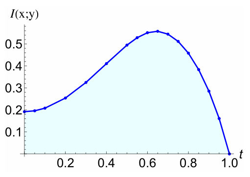
<figcaption class="paper-figure-caption"><b>Fig 5.</b> FIG. 5. Mutual information I(x; y) versus t at α = 1 along the symmetric path a = c = p</figcaption>
</figure>
<figure class="paper-figure-card">
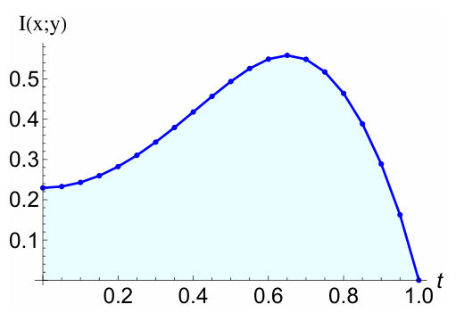
<figcaption class="paper-figure-caption"><b>Fig 6.</b> FIG. 8. Mutual information I(x; y) versus t at α = 1 along the three-state path (95) in the N = 3 shell. The curve rises as the cubic nodal geometry becomes more strongly correlated, reaches a maximum near the projective close-branch regime, and decreases to zero at t = 1, where the state reduces to the separable basis state Φ21.</figcaption>
</figure>
<figure class="paper-figure-card">
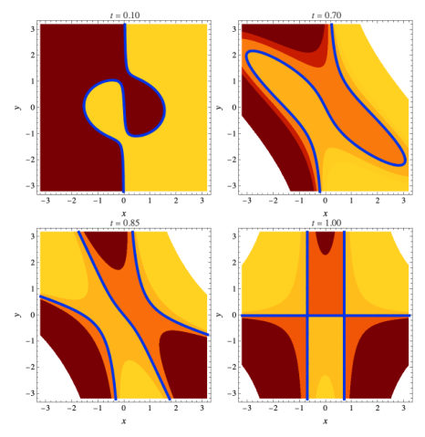
<figcaption class="paper-figure-caption"><b>Fig 7.</b> FIG. 6. Representative nodal geometries in the N = 3 shell at α = 1 along the path (95). Top left: t = 0.10, illustrating the cubic-loop regime. Top right: t = 0.70, near the close- branch regime where smooth nodal branches approach each other without forming an exact finite-affine singularity. Bot- tom left: t = 0.85, beyond the close-branch regime, showing a different nodal arrangement. Bottom right: t = 1, corre- sponding to the pure Φ21 state with nodal set y(2αx2−1) = 0, i.e. the line y = 0 together with the two vertical lines x = ±(2α)−1/2, which partition the plane into six nodal do- mains.</figcaption>
</figure>
<figure class="paper-figure-card">
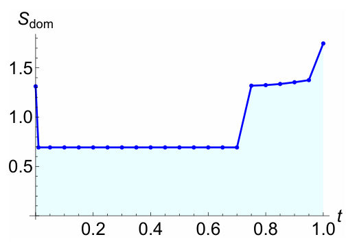
<figcaption class="paper-figure-caption"><b>Fig 8.</b> FIG. 7. Nodal-domain entropy Sdom at α = 1 as a function of the mixing parameter t.</figcaption>
</figure>

**Summary.** This paper demonstrates that the topological changes in the nodal patterns of 2D harmonic oscillator states are governed by algebraic singularities. It shows that while global entropies remain smooth, nodal-domain entropy can sharply detect these topology-changing events. This framework is relevant for characterizing structured light and trapped particle systems.

**Why it may be interesting.** It provides a rigorous mathematical framework for understanding the fine-scale structure of wavefunctions in degenerate systems, which is directly applicable to the control of structured light and the manipulation of motional states in trapped ion/atom experiments.

Detailed structure

**Main problem.** Investigating how the topological restructuring of nodal geometry (the zero-set of wavefunctions) within degenerate quantum eigenspaces is organized and how it can be quantified using entropy diagnostics.

**Main result.** The study finds that nodal geometry is organized by algebraic stratification (singularities and degeneracies) rather than spectral ordering, and that nodal-domain entropy is a sensitive diagnostic for topology changes that global entropies like Shannon entropy fail to detect.

**Method.** The authors use the theory of real algebraic curves to identify topological transitions via finite singularities and projective degeneracies, combined with information-theoretic diagnostics like nodal-domain entropy and mutual information.

**Model / system.** A two-dimensional isotropic quantum harmonic oscillator with a fixed energy shell N, where wavefunctions are real-phase Hermite-Gaussian superpositions.

**Key observables.** Nodal-domain entropy (S_dom), Cartesian mutual information (I(x;y)), configuration-space Shannon entropy (S_r), momentum-space Shannon entropy (S_p), and the entropic uncertainty sum (S_r + S_p).

**Important parameters / regimes.** Principal quantum number N, mixing parameter t, and the oscillator scaling parameter alpha.

**Assumptions / limitations.** The analysis is restricted to real-phase wavefunctions (no phase singularities/vortices) and focuses on fixed energy shells.

**Figures summary.** Figure 1 shows mutual information vs. mixing parameter for N=1; Figure 2 illustrates nodal geometry evolution for N=2; Figure 6 shows nodal plots for N=3 at various mixing stages; Figure 7 shows nodal-domain entropy curves.

**Paper structure.** The paper introduces the problem of nodal restructuring, establishes a mathematical framework using algebraic geometry, provides a theorem for regularity, analyzes specific low-N shells (N=1, 2, 3, 4) to demonstrate topological transitions, and concludes with experimental implications for optics and trapped ions.

Abstract

Degenerate quantum eigenspaces can support substantial changes in nodal geometry at fixed energy. We show that, for the two-dimensional isotropic harmonic oscillator, this restructuring is organized by the Hermite-constrained algebraic curve $P_N(x,y)=0$ appearing in every real shell state, $ψ_N=e^{-αr^2/2}P_N(x,y)$. Finite singularities, $P_N=\nabla P_N=0$, and projective degeneracies of the leading homogeneous part identify the strata where topology-changing events can occur. We combine these criteria with entropy diagnostics: the nodal-domain entropy $S_{\mathrm{dom}}$, Cartesian mutual information $I(x;y)$, and the entropic uncertainty sum $S_r+S_p$. The first three shells reveal a hierarchy: $N=1$ only rotates a nodal line; $N=2$ has a conic transition at $b^2=2ac$, sharply detected by $S_{\mathrm{dom}}$ but not by global entropies; and $N=3$ supports cubic close-branch regimes organized by the projective discriminant, with enhanced responses in $S_{\mathrm{dom}}$ and $I(x;y)$. Thus algebraic stratification, rather than spectral ordering, organizes nodal geometry inside a degenerate eigenspace, while entropy diagnostics quantify probability redistribution and correlation. The framework suggests experimentally reconstructible signatures for real-phase Hermite--Gaussian structured light and approximately isotropic trapped motional systems.

[↑ back to top](#top)

### [Optimised Inference of Quantum Phenomena in High-Energy Collider Experiments](http://arxiv.org/abs/2604.27130v1)

**Authors:** Hai-Chau Nguyen, Gilberto Tetlalmatzi-Xolocotzi, Carmen Diez Pardos, Otfried Gühne, Matthias Kleinmann  
**Type:** theory · **Category:** quantum information and computing · **PDF:** <https://arxiv.org/pdf/2604.27130v1>  
**Analysis basis:** abstract only; PDF text extraction failed or PDF unavailable
**Topic relevance:** `entanglement & information structure` **3/5** · `quantum measurements` **2/5**

**Summary.** This paper introduces a new method for detecting quantum entanglement in particle collider experiments using shadow tomography. By addressing the challenges of spin-momentum coupling in relativistic regimes, the framework allows for more efficient characterization of spin correlations. The method is demonstrated on top quark production at the LHC.

**Why it may be interesting.** It demonstrates the application of quantum information protocols (shadow tomography) to extract entanglement signatures from complex, high-energy relativistic systems.

Detailed structure

**Main problem.** Characterizing spin-spin entanglement in high-energy collider experiments is difficult because relativistic motion couples spin and momentum, and particle momenta are not experimentally controlled.

**Main result.** The development of a general framework using shadow tomography to efficiently infer spin-spin correlations and entanglement in collider environments.

**Method.** The authors utilize shadow tomography techniques to reconstruct quantum properties from experimental data.

**Model / system.** The framework is applied to top quark pair production at the Large Hadron Collider (LHC) as a proof of concept, though it is designed for general high-energy particle systems.

**Key observables.** spin-spin correlations and spin-spin entanglement

**Assumptions / limitations.** The framework assumes the applicability of shadow tomography to relativistic regimes where spin and momentum are coupled.

**Paper structure.** The paper introduces the challenge of entanglement in high-energy physics, presents a new framework based on shadow tomography, and demonstrates its utility using top quark pair production at the LHC.

Abstract

Entanglement, a fundamental phenomenon of quantum theory, has recently been observed in processes in high-energy physics. This opens new avenues for probing quantum effects in relativistic regimes, but also poses conceptual and technical challenges. We develop a general framework based on shadow tomography techniques for characterising spin-spin correlations in collider experiments. This improves the analysis of spin-spin entanglement, where relativistic motion couples spin and momentum and the momenta of the investigated particles are not under experimental control. As a proof of concept we illustrate the application of our formalism to top quark pair production at the Large Hadron Collider at CERN. The framework, however, is general and flexible and can be readily applied to more complex final states and systems with more particles.

[↑ back to top](#top)

### [Parametrized Variational Quantum Tomography](http://arxiv.org/abs/2604.27135v1)

**Authors:** V. A. Penas, M. Losada, D. Tielas, F. Holik  
**Type:** theory · **Category:** quantum information and computing · **PDF:** <https://arxiv.org/pdf/2604.27135v1>  
**Analysis basis:** full PDF text, analyzed in chunks
**Topic relevance:** `quantum measurements` **3/5** · `entanglement & information structure` **2/5**

↔ Scroll figures horizontally

<figure class="paper-figure-card">
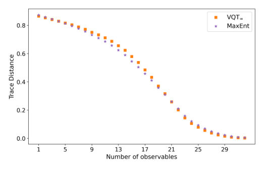
<figcaption class="paper-figure-caption"><b>Fig 1.</b> FIG. 1: Average trace distance between target and reconstructed states for 500 random three-qubit pure states as a function of the number of measured observables, for MaxEnt and VQT∞. The cutoff is set to 32 observables while quorum is 64.</figcaption>
</figure>
<figure class="paper-figure-card">
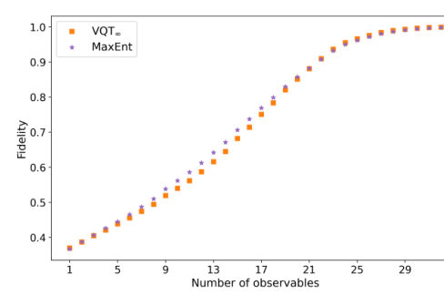
<figcaption class="paper-figure-caption"><b>Fig 2.</b> FIG. 2: Average fidelity between target and reconstructed states for 500 random three-qubit pure states as a function of the number of measured observables, for MaxEnt and VQT∞. The cutoff is set to 32 as in Fig. 1.</figcaption>
</figure>
<figure class="paper-figure-card">
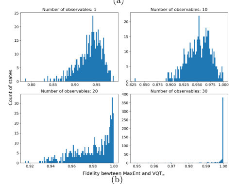
<figcaption class="paper-figure-caption"><b>Fig 3.</b> FIG. 3: (a) Histograms of fidelities between VQT∞and MaxEnt reconstructed states, over 500 random three-qubit pure states. (b) Average fidelity between VQT∞and MaxEnt reconstructed states. Error bars represent quartiles. Note that mean (average) and median are close to each other but they are not equal.</figcaption>
</figure>
<figure class="paper-figure-card">
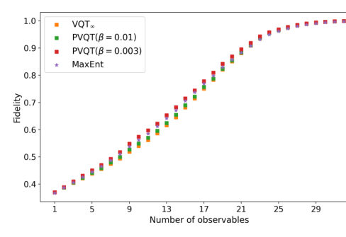
<figcaption class="paper-figure-caption"><b>Fig 4.</b> FIG. 4: Average fidelity between target and reconstructed states for 500 random three-qubit pure states as a function of the number of measured observables, for MaxEnt, VQT∞, and PVQT with β = 0.01 and β = 0.003.</figcaption>
</figure>
<figure class="paper-figure-card">
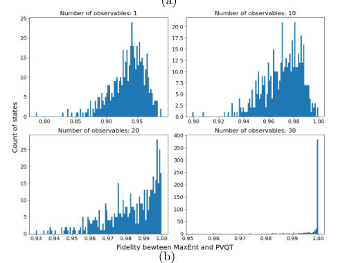
<figcaption class="paper-figure-caption"><b>Fig 5.</b> FIG. 5: (a) Histograms of fidelities between PVQT with β = 0.01 and MaxEnt reconstructed states, over 500 random three-qubit pure states. (b) Average fidelity between PVQT with β = 0.01 and MaxEnt reconstructed states. Error bars represent quartiles. Note that mean (average) and median are close to each other but they are not equal.</figcaption>
</figure>
<figure class="paper-figure-card">
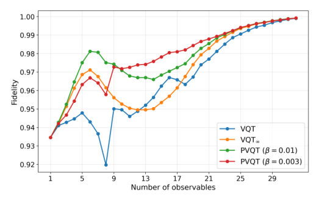
<figcaption class="paper-figure-caption"><b>Fig 6.</b> FIG. 6: Average fidelity between different VQTs and MaxEnt reconstructed states for 500 random three-qubit pure states as a function of the number of measured observables.</figcaption>
</figure>
<figure class="paper-figure-card">
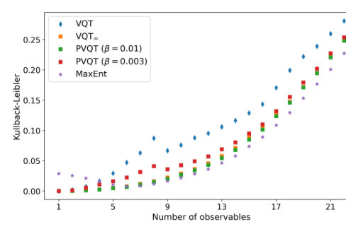
<figcaption class="paper-figure-caption"><b>Fig 7.</b> FIG. 7: Average Kullback-Leibler divergence between the uniform distribution and the unmeasured probability vector ⃗u of different VQTs and MaxEnt reconstructed states, for 500 random three-qubit pure states, as a function of the number of measured observables.</figcaption>
</figure>
<figure class="paper-figure-card">
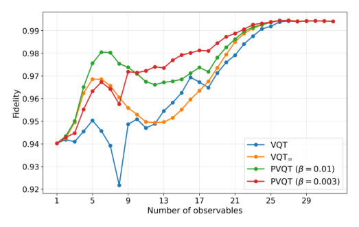
<figcaption class="paper-figure-caption"><b>Fig 8.</b> FIG. 9: Average fidelity between different VQTs and MaxEnt reconstructed states for 500 random three-qubit pure states as a function of the number of measured ob- servables, with 5% uniform noise added to the measure- ment outcomes.</figcaption>
</figure>
<figure class="paper-figure-card">
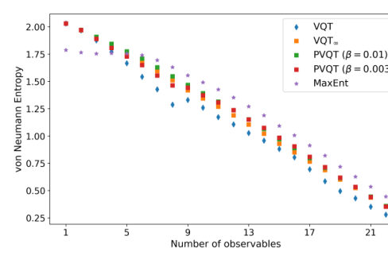
<figcaption class="paper-figure-caption"><b>Fig 9.</b> FIG. 8: Average Von Neumann entropy for different VQTs and MaxEnt reconstructed states for 500 random three-qubit pure states as a function of the number of measured observables.</figcaption>
</figure>
<figure class="paper-figure-card">
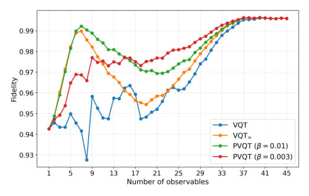
<figcaption class="paper-figure-caption"><b>Fig 10.</b> FIG. 10: Average fidelity between different VQTs and MaxEnt reconstructed states for 500 random three-qubit rank-2 states as a function of the number of measured observables, with 5% uniform noise added to the mea- surement outcomes. Cutoff around 45 observables.</figcaption>
</figure>

**Summary.** The paper introduces Parametrized Variational Quantum Tomography (PVQT), a method that uses a tunable cost function to bridge the gap between efficient but biased VQT and computationally expensive Maximum Entropy methods. By interpolating between 1-norm and infinity-norm penalties, the authors demonstrate that one can achieve higher-fidelity state reconstruction in underdetermined measurement scenarios.

**Why it may be interesting.** This is highly relevant for quantum information researchers as it provides a more efficient, scalable alternative to Maximum Entropy tomography, offering a way to control the bias in state reconstruction for noisy, incomplete experimental data.

Detailed structure

**Main problem.** Addressing the ambiguity and intrinsic bias in quantum state reconstruction when measurement data are incomplete (underdetermined).

**Main result.** The proposed Parametrized Variational Quantum Tomography (PVQT) achieves higher fidelity to the Maximum Entropy solution and higher von Neumann entropy than standard VQT or VQT_infinity by tuning hyperparameters.

**Method.** A new cost function that interpolates between the 1-norm and the infinity norm of unmeasured probabilities, formulated as a linear semidefinite program (SDP).

**Model / system.** The study focuses on n-qubit quantum systems (tested up to 5 qubits) using subsets of a Symmetric Informationally Complete POVM (SIC-POVM).

**Key observables.** Fidelity, trace distance, von Neumann entropy, and Kullback-Leibler (KL) divergence of unmeasured probabilities.

**Important parameters / regimes.** Hyperparameters alpha and beta that control the interpolation between VQT and VQT_infinity; number of measured observables K.

**Assumptions / limitations.** The method assumes the reconstruction problem is underdetermined due to incomplete POVM measurements; testing is performed on Haar-random pure and mixed states.

**Figures summary.** Figures show trace distance and fidelity comparisons between MaxEnt, VQT, and VQT_infinity; histograms of fidelity distributions; and performance scaling for 3, 4, and 5-qubit systems under noise.

**Paper structure.** The paper introduces the problem of incomplete tomography, defines the mathematical framework for VQT and VQT_infinity, proposes the PVQT interpolation method, presents numerical results comparing fidelity and entropy across different qubit counts, and discusses limitations regarding hyperparameter selection.

Abstract

Quantum state tomography provides a fundamental framework for reconstructing quantum states. When the measurement data are not informationally complete, the observed statistics admit multiple compatible density matrices, making the reconstruction problem inherently underdetermined and calling for the selection of a meaningful estimator. Two well-established approaches to address this ambiguity are Maximum Entropy (MaxEnt) and Variational Quantum Tomography (VQT). A variant of VQT, named VQT$_\infty$, has been introduced to reproduce MaxEnt-like solutions. In this work, we generalize this approach by introducing a parametrized cost function that interpolates between the 1-norm and the infinity norm, thereby unifying VQT and VQT$_\infty$ within a single framework. By tuning the associated hyperparameters, the proposed method enables controlled exploration of the set of compatible density matrices. We show that this interplay yields reconstructed states with higher fidelity to the MaxEnt solution than those obtained via VQT$_\infty$ while preserving computational tractability.

[↑ back to top](#top)

### [Tuning of quantum nanoscaled friction within the Prandtl-Tomlinson model](http://arxiv.org/abs/2604.27216v1)

**Authors:** Dai-Nam Le, Lilia M. Woods  
**Type:** theory · **Category:** other · **PDF:** <https://arxiv.org/pdf/2604.27216v1>  
**Analysis basis:** abstract only; PDF text extraction failed or PDF unavailable
**Topic relevance:** `Frenkel-Kontorova` **3/5** · `non-equilibrium dynamics` **1/5**

**Summary.** This paper explores how to control nanoscale friction by adjusting system parameters like corrugation and length ratios. It identifies new motion regimes and highlights how quantum effects like Landau-Zener tunneling influence frictional dynamics. These insights are crucial for controlling friction in future nanotechnological applications.

**Why it may be interesting.** not directly relevant

Detailed structure

**Main problem.** Investigating the mechanisms for controlling frictional force at both quantum and classical levels in nanoscale systems.

**Main result.** The study identifies that frictional dynamics can be tuned via corrugation and characteristic length ratio parameters, and uncovers motion types beyond the standard stick-slip regime, including the role of Landau-Zener tunneling.

**Method.** Theoretical investigation using the Prandtl-Tomlinson framework to analyze dynamical force behavior.

**Model / system.** A nanoparticle-chain system modeled within the Prandtl-Tomlinson framework to study nanoscale friction.

**Key observables.** Frictional force, dynamical force behavior, and types of motion (e.g., stick-slip).

**Important parameters / regimes.** Corrugation, characteristic length ratio, and Landau-Zener tunneling probability.

**Paper structure.** The paper utilizes the Prandtl-Tomlinson framework to systematically investigate control means of friction, explores different motion regimes, and analyzes the impact of quantum tunneling.

Abstract

Nanoscaled friction is a fundamental tribological phenomenon with complex behavior of its dynamical force. Here, we utilize the Prandtl-Tomlinson framework to investigate systematically the different means of control of the frictional force at the quantum and classical levels. It is found that the frictional dynamics can be controlled by the corrugation and characteristic length ratio parameters dependent upon properties of the nanoparticle-chain system. In addition to the stick-slip regime, other types of motion are uncovered, highlighting the richness of the frictional dynamics. The importance of Landau-Zener tunneling for the quantum motion is also analyzed. These findings provide valuable insights for interpreting experimental observations and controlling quantum frictional behavior in nanoscale systems.

[↑ back to top](#top)

### [Evidence for interior-gap pair-density-wave state in Kondo-Heisenberg chains](http://arxiv.org/abs/2604.27440v1)

**Authors:** Yuto Hirose, Shunsuke C. Furuya, Yasuhiro Tada  
**Type:** theory · **Category:** strongly correlated electrons · **PDF:** <https://arxiv.org/pdf/2604.27440v1>  
**Analysis basis:** abstract only; PDF text extraction failed or PDF unavailable
**Topic relevance:** `Kondo & dissipative impurity` **3/5**

**Summary.** This paper demonstrates that an interior-gap pair-density-wave state can emerge dynamically in 1D Kondo-Heisenberg chains due to strong correlations, rather than requiring pre-existing Fermi-surface mismatch. By comparing S=1/2 and S=3/2 chains using DMRG, the authors show how the momentum distribution function develops characteristic features of interior-gap physics. This provides a new mechanism for realizing exotic superconducting states in strongly correlated systems.

**Why it may be interesting.** not directly relevant

Detailed structure

**Main problem.** The realization of interior-gap superconductivity in canonical strongly correlated models has been elusive, as it is traditionally associated with pre-existing Fermi-surface mismatch.

**Main result.** The authors find that the superconducting phase of 1D Kondo-Heisenberg models realizes an interior-gap pair-density-wave (PDW) state where the low-energy single-particle structure emerges dynamically from strong correlations.

**Method.** The study utilizes infinite density-matrix-renormalization-group (iDMRG) and finite DMRG calculations.

**Model / system.** One-dimensional Kondo-Heisenberg chains with spin S=1/2 and S=3/2.

**Key observables.** Pair-density-wave (PDW) correlation, momentum distribution function n(k), and real-space correlations.

**Important parameters / regimes.** Spin magnitude (S=1/2 and S=3/2), Kondo coupling, and the spin-gapped regime.

**Assumptions / limitations.** The study assumes the validity of the 1D Kondo-Heisenberg model as a representative for studying the emergence of interior-gap physics through strong correlations.

**Paper structure.** The paper presents evidence for an interior-gap PDW state, compares S=1/2 and S=3/2 chains, discusses the emergence of single-particle structure via Kondo coupling, and addresses the necessity of thermodynamic-limit calculations due to boundary effects.

Abstract

Interior-gap superconductivity has long been discussed as an exotic paired state in the presence of Fermi-surface mismatch, but its realization in canonical strongly correlated models has remained elusive. Here we present evidence that the superconducting phase of one-dimensional Kondo-Heisenberg models realizes an interior-gap pair-density-wave (PDW) state generated by strong correlations. Combining infinite density-matrix-renormalization-group (iDMRG) and finite DMRG calculations for $S=1/2$ and $S=3/2$ chains, we show that the PDW correlation is the dominant bulk superconducting correlation in the spin-gapped regime and that the momentum distribution function $n(k)$ exhibits a reconstructed structure characteristic of interior-gap physics. In particular, while the feature in $n(k)$ for the $S=1/2$ chain is only hump-like, the corresponding structure in the $S=3/2$ chain develops into a clear dip, strongly supporting the interpretation in terms of an interior-gap-like dip structure. Unlike conventional interior-gap scenarios based on a mismatch between preexisting Fermi surfaces, the present system starts from a single bare conduction-electron Fermi surface, and the additional low-energy single-particle structure emerges dynamically together with the dominant PDW correlation through the Kondo coupling. Finite DMRG data further demonstrate that boundary effects can substantially modify real-space correlations in this gapless one-dimensional system, making a direct thermodynamic-limit calculation essential for identifying the intrinsic bulk momentum structure and the dominant correlation channel.

[↑ back to top](#top)

### [Momentum-Space Entanglement Signatures and Spinon Breakdown in the $J_1$-$J_2$ Zig-Zag Heisenberg Chain](http://arxiv.org/abs/2604.27048v1)

**Authors:** Tom Oeffner, Ludwig Bordfeldt, Andreas Feuerpfeil, Lukas Elter, Tobias Helbig, Tobias Hofmann, Martin Greiter, Ronny Thomale  
**Type:** theory · **Category:** strongly correlated electrons · **PDF:** <https://arxiv.org/pdf/2604.27048v1>  
**Analysis basis:** full PDF text, analyzed in chunks
**Topic relevance:** `entanglement & information structure` **3/5**

↔ Scroll figures horizontally

<figure class="paper-figure-card">

<figcaption class="paper-figure-caption"><b>Fig 1.</b> Figure 1: Quantum phase diagram of the J1–J2 spin-1/2 chain parameterized by the inverse frustration ratio α = J1/J2. The model hosts a variety of ground states: a gapless Heisenberg spin liquid (SL), a gapped dimer phase breaking translation symmetry [8], a quasi-long-range order phase [QLRO(π/2)] [6,7], a short-range in- commensurate (SRI) spiral phase [6, 7], and a ferromagnetic (FM) phase [4, 5]. In this work, we argue that fractionalized spinon descriptions (indicated by the outer red arcs) extend significantly beyond their non-interacting limits. The single-chain SU(2)1 description survives past the SL–dimer transition (α ≈4.15) and persists up to the Majumdar-Ghosh (MG) point at α =...</figcaption>
</figure>
<figure class="paper-figure-card">

<figcaption class="paper-figure-caption"><b>Fig 2.</b> Figure 2: (a) Momentum entanglement spectrum for L = 22 sites, with a cut region containing NA = 6 particles. The SU(2)1 low-lying levels are well separated from a non-universal part by an entanglement gap ∆which persists in the thermodynamic limit [20]. (b) Maximum spinon weight W in the K = πL/2 sector and gap ∆versus frustration coupling J2/J1 &gt; 0. The spinons proliferate deep inside the dimer phase until the gap ∆finally collapses at the Majumdar-Ghosh point. Both W and ∆are highest for finite J2 (dashed line), marking the parameter region of the system being closest to the Haldane–Shastry model, as indicated by their ground-state overlap in Appendix B.</figcaption>
</figure>
<figure class="paper-figure-card">
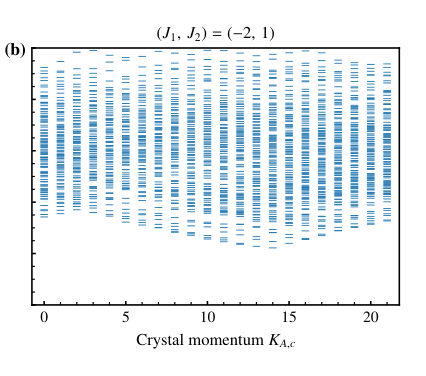
<figcaption class="paper-figure-caption"><b>Fig 3.</b> Figure 3: Entanglement spectrum for L = 22 sites, with a cut region containing NA = 6 particles. Inside the QLRO(π/2) (a) and the spiral phase (b), the entangle- ment levels form a continuum of states without any finite entanglement gap, indicat- ing that a description in terms of single-chain spinons is not appropriate.</figcaption>
</figure>
<figure class="paper-figure-card">
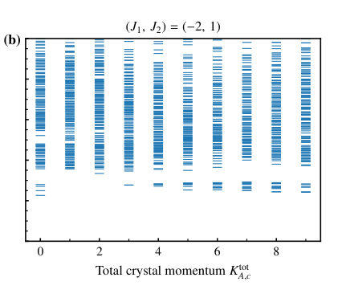
<figcaption class="paper-figure-caption"><b>Fig 4.</b> Figure 4: (a) Entanglement spectrum in the decoupled limit for Lc = 10 unit cells, with a cut containing NA = 5 particles. The spectrum is given by the convolution of two independent L = 10 Heisenberg spin-chains with nearest-neighbor coupling only. The low-lying entanglement levels are described by two SU(2)1 WZW models. (b) Entanglement spectrum within the spiral phase. Both the CFT levels as well as the intra-chain Heisenberg levels do not renormalize significantly, whilst a continuum of inter-chain excitations moves down without closing the entanglement gap.</figcaption>
</figure>
<figure class="paper-figure-card">

<figcaption class="paper-figure-caption"><b>Fig 5.</b> Figure 5: Highest spinon weight W and entanglement gap ∆as a function of J1/J2 for the low-energy Kc = 0 and π state of a system with Lc = 8 unit cells and NA = 4 particles. The ground state is marked in black. We observe that W and ∆change continuously and break down only deep inside the frustrated regime J1 &lt; 0 (a) and J1 &gt; 0 (b). The points α± c of spinon confinement within the ground-state, which we identify as the gap closing for both signs of J1, is given by the change of momentum character from 0 to π. This entanglement transition does not coincide with the phase transition boundaries of the spiral (SRI) and dimer phase, as shown by the linear extrapolation of this level crossing to...</figcaption>
</figure>
<figure class="paper-figure-card">
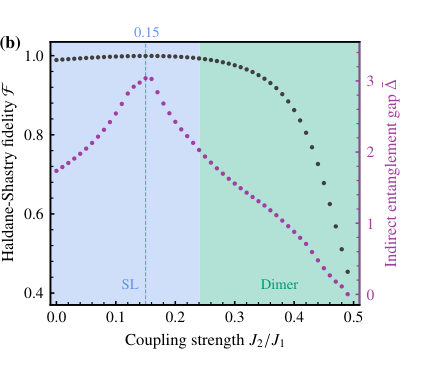
<figcaption class="paper-figure-caption"><b>Fig 6.</b> Figure 6: Measures of spinon deconfinement for L = 22, with a momentum cut containing NA = 6 particles. (a) Highest spinon weight W and direct entanglement gap ∆as a function of J2/J1. The vertical blue dashed line marks the maximum of ∆and W at 0.16. (b) Haldane–Shastry fidelity F and indirect entanglement gap ¯∆, with the maximum of ¯∆and F being shifted slightly to 0.15. Across both definitions, the observables are maximized at finite J2, marking the regime where the Heisenberg antiferromagnet most closely resembles the Haldane–Shastry chain.</figcaption>
</figure>
<figure class="paper-figure-card">
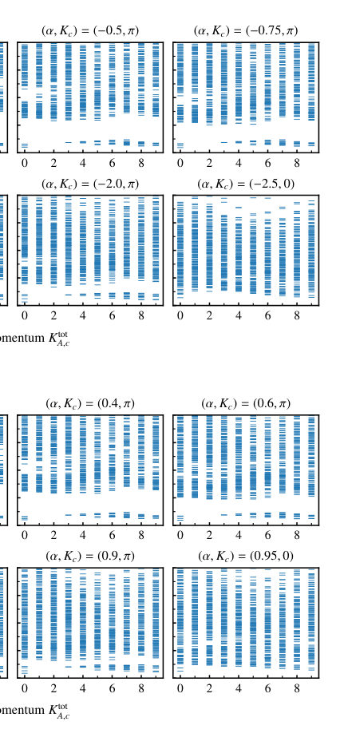
<figcaption class="paper-figure-caption"><b>Fig 7.</b> Figure 7: Entanglement spectra for Lc = 10 unit cells, with a momentum cut contain- ing NA = 5 particles. For representative values of the frustration coupling α = J1/J2, the evolution from the decoupled limit to the spiral (a) and dimer (b) phase is shown. The double-spinon framework is protected by a finite entanglement gap, which collapses as the ground state momentum character shifts from Kc = π to 0. For the considered system size, this sharp transition occurs at α− c = −2.1403(4) and α+ c = 0.9261(1), respectively.</figcaption>
</figure>

**Summary.** This paper explores how fractionalized excitations (spinons) persist in a frustrated zig-zag spin chain. It demonstrates that the spinon description is much more robust than field theories suggest and identifies a clear asymmetry in how ferromagnetic versus antiferromagnetic coupling leads to spinon confinement.

**Why it may be interesting.** not directly relevant

Detailed structure

**Main problem.** The study investigates the stability and breakdown of spinon quasiparticles in the J1-J2 zig-zag Heisenberg chain, specifically addressing the tension between field theory predictions of immediate instability and numerical evidence of a robust quasi-long-range order phase.

**Main result.** The authors find that a 'double-spinon' description remains robust over an extensive parameter regime and that spinon stability is asymmetric: ferromagnetic coupling (J1 < 0) sustains fractionalization deep into the spiral phase, while antiferromagnetic coupling (J1 > 0) drives confinement much earlier.

**Method.** The study uses Exact Diagonalization (ED) with the Lanczos algorithm, momentum-space entanglement spectroscopy, and Conformal Field Theory (CFT) analysis, treating the system as two coupled SU(2)1 Wess-Zumino-Witten models.

**Model / system.** A spin-1/2 J1-J2 zig-zag Heisenberg chain with nearest-neighbor (J1) and next-nearest-neighbor (J2) interactions, analyzed in regimes ranging from the decoupled limit (J1=0) to highly frustrated regimes.

**Key observables.** Entanglement Gap (EG), spinon weight (W), entanglement spectrum (ES) levels, and ground-state momentum character.

**Important parameters / regimes.** Frustration ratio (alpha = J1/J2), ferromagnetic vs. antiferromagnetic coupling (sign of J1), and the Majumdar-Ghosh point.

**Assumptions / limitations.** The analysis assumes the validity of the double-spinon description in the highly frustrated regime and utilizes a bosonic mapping with infinite on-site repulsion to model the spins.

**Figures summary.** Figure 6 shows the peak of spinon weight and entanglement gap at J2/J1 approx 0.16, alongside Haldane-Shastry fidelity; Figure 7 displays the evolution of momentum-space entanglement spectra across different alpha values.

**Paper structure.** The paper introduces the problem of spinon stability, defines the J1-J2 model and the double-spinon framework, presents numerical results using entanglement spectroscopy to identify the breakdown of fractionalization, and concludes with a Renormalization Group explanation for the observed asymmetry in stability.

Abstract

We investigate the resilience of spinon quasiparticles in the $J_1$-$J_2$ zig-zag spin chain ($J_2>0$) from the viewpoint of momentum-space entanglement. For small $J_2$, we show that deconfined spinons survive well past the liquid-dimer transition before eventually collapsing towards the Majumdar-Ghosh point. In the highly frustrated zig-zag regime ($J_2 \gg |J_1|$), we model the system as two coupled Heisenberg chains and by Fourier transforming each subchain individually, a framework we dub the double-spinon description. While continuum field theories predict that this decoupled phase is strictly unstable to any finite inter-chain coupling, our analysis reveals that the double-spinon description remains robust over an extensive parameter regime. Notably, we find a stark asymmetry in spinon stability reflecting the underlying renormalization group flow: ferromagnetic coupling ($J_{1} < 0$) is marginally irrelevant and sustains fractionalization deep into the spiral phase, whereas antiferromagnetic coupling ($J_{1} > 0$) is marginally relevant and drives confinement much earlier. The ultimate breakdown of this fractionalized description is driven by a continuum of inter-chain excitations which manifests itself as a sharp ground-state momentum shift distinct from macroscopic thermodynamic phase boundaries. Our results establish momentum cut entanglement analysis as a tool to trace the quasiparticle resilience of spinons, as we show that treating the zig-zag Heisenberg chain as two coupled SU(2)$_1$ Wess-Zumino-Witten models provides a theoretical framework for strongly frustrated quantum magnets applicable beyond the decoupled limit.

[↑ back to top](#top)

### [Nonadiabatic Renormalization Group for Strongly Coupled Multiscale Quantum Systems](http://arxiv.org/abs/2604.27381v1)

**Authors:** Bing Gu  
**Type:** theory · **Category:** numerical methods · **PDF:** <https://arxiv.org/pdf/2604.27381v1>  
**Analysis basis:** full PDF text, analyzed in chunks
**Topic relevance:** `entanglement & information structure` **3/5**

↔ Scroll figures horizontally

<figure class="paper-figure-card">

<figcaption class="paper-figure-caption"><b>Fig 1.</b> FIG. 2. Schematic of NARG as a nested fiber bundle whereby the fiber of each layer is itself a fiber bundle.</figcaption>
</figure>
<figure class="paper-figure-card">
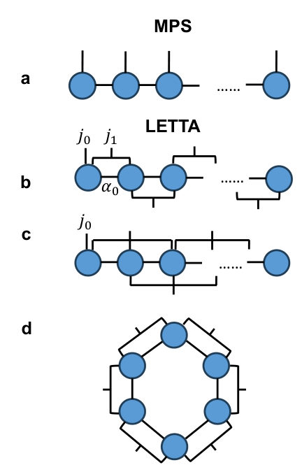
<figcaption class="paper-figure-caption"><b>Fig 2.</b> FIG. 1. Schematic of the leg-tied tensor ansatz (LETTA) in comparison with the conventional matrix product states (MPS). Physical legs can be shared between (a) nearest neigh- bours and (b) next-nearest-neighbours. (d) A LETTA with peridic boundary condition.</figcaption>
</figure>
<figure class="paper-figure-card">

<figcaption class="paper-figure-caption"><b>Fig 3.</b> FIG. 3. Low-lying eigenstates of an strongly interacting bo- son model with 20 modes. The lowerst 16 eigenvalues are shown, with a rapid convergence with respect to the number of retained adiabatic states D.</figcaption>
</figure>
<figure class="paper-figure-card">
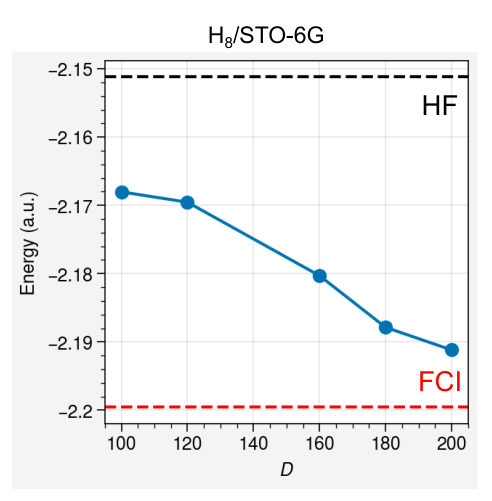
<figcaption class="paper-figure-caption"><b>Fig 4.</b> FIG. 4. NARG for ab initio quantum chemistry. Electronic correlation is gradually incorporated into the NARG by in- creasing the retained adiabatic states. More than 80% of the correlation energy in the hydrogen chain H8 is captured by D = 200.</figcaption>
</figure>

**Summary.** The paper proposes a new renormalization group method called NARG to treat quantum systems with hierarchical energy scales. It introduces a new tensor network, LETTA, which shares physical legs between sites to better encode nonadiabatic entanglement. The method proves highly effective for both interacting boson models and molecular electronic correlation problems.

**Why it may be interesting.** It provides a novel tensor network architecture (LETTA) specifically designed for multiscale dynamics, offering a way to handle nonadiabaticity and strong coupling that standard MPS-based methods struggle to capture.

Detailed structure

**Main problem.** Efficiently modeling complex, multiscale quantum systems where different energy or time scales are strongly coupled, particularly when standard 'tracing out' or product basis approaches fail in the strong-coupling regime.

**Main result.** The introduction of the Nonadiabatic Renormalization Group (NARG) and the Leg-Tied Tensor Ansatz (LETTA), a new tensor network state that captures entanglement beyond conventional MPS by sharing physical legs among sites.

**Method.** An iterative approach that suppresses high-energy degrees of freedom to construct a nested fiber bundle structure, resulting in a tensor network (LETTA) where physical legs are shared across scales.

**Model / system.** The method is demonstrated on an interacting boson model with strong anharmonicity and ab initio quantum chemistry problems, specifically the hydrogen chain (H8) for electronic correlation.

**Key observables.** Low-lying many-body eigenstates, correlation energy, global overlap matrix, and the quantum geometric tensor (Riemann metric and Berry curvature).

**Important parameters / regimes.** Energy scales (Lambda vs. mu), bond dimension (number of retained adiabatic states D), and coupling strengths (anharmonicity and mode-coupling).

**Assumptions / limitations.** The method assumes a hierarchy of energy scales and relies on the truncation of adiabatic eigenstates (coarse-graining) to manage the Hilbert space.

**Figures summary.** Figure 1 compares MPS to the new LETTA architecture; Figure 2 illustrates the NARG as a nested fiber bundle; Figure 3 shows eigenvalue convergence in a boson model; Figure 4 compares ground state energy accuracy against HF and FCI methods.

**Paper structure.** The paper begins by identifying the failure of standard methods in strong coupling, introduces the NARG framework and its geometric fiber bundle structure, derives the LETTA tensor network, and concludes with numerical demonstrations on boson and electronic systems.

Abstract

Complex quantum systems are often multiscale in nature with strong interactions between different scales. We present a novel idea: iteratively suppressing, rather than tracing out, the fast, high-energy degrees of freedom in strongly correlated quantum systems with multiple energy scales in a non-perturbative way, termed nonadiabatic renormalization group. This leads to a quantum geometric structure of a nested fiber bundle, in which each fiber of a layer is itself a fiber bundle of the next layer. The nonadiabatic renormalization group brings a new type of tensor network states that shares physical legs among ''sites'' and encodes quantum entanglement beyond conventional matrix product states. We demonstrate how to apply the nonadiabatic renormalization group to different types of problems, including an interacting boson model and ab initio quantum chemistry with interacting electrons.

[↑ back to top](#top)

### [Towards High Performance Quantum Computing (HPQ): Parallelisation of the Hamiltonian Auto Decomposition Optimisation Framework (HADOF)](http://arxiv.org/abs/2604.27836v1)

**Authors:** Namasi G Sankar, Georgios Miliotis, Simon Caton  
**Type:** both · **Category:** quantum information and computing · **PDF:** <https://arxiv.org/pdf/2604.27836v1>  
**Analysis basis:** full PDF text, analyzed in chunks
**Topic relevance:** `QC/QI experiment` **3/5**

↔ Scroll figures horizontally

<figure class="paper-figure-card">
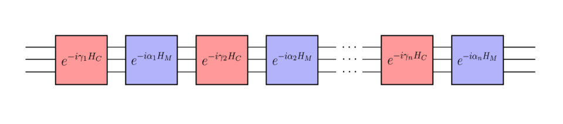
<figcaption class="paper-figure-caption"><b>Fig 1.</b> Figure 1: Standard QAOA circuit with alternating cost and mixer Hamiltonians[34]. The output produces a probability distribution over the solution space which can be samples with the shots parameter of the quantum simulation or backend. Higher sampled solutions are more likely to be solutions with better objective value.</figcaption>
</figure>
<figure class="paper-figure-card">
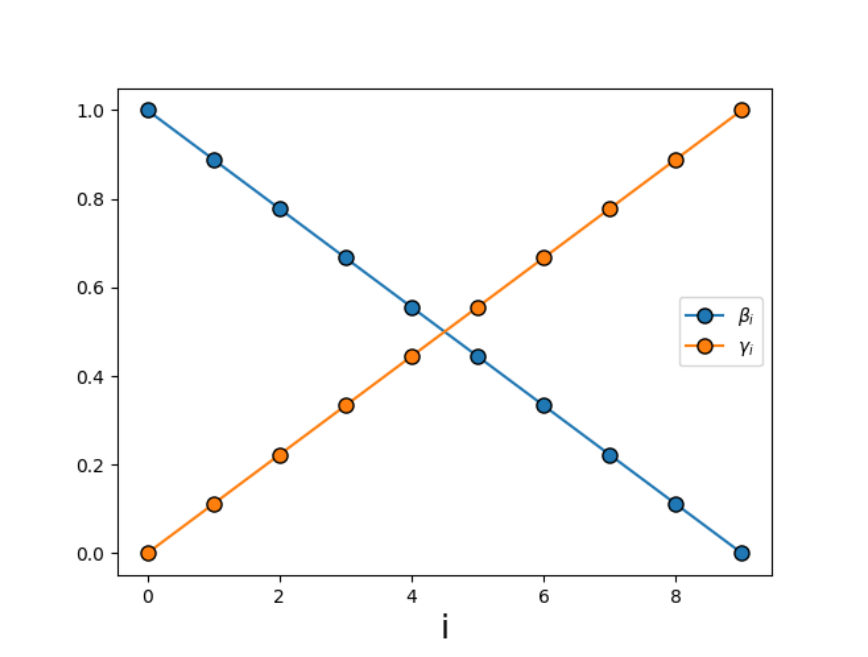
<figcaption class="paper-figure-caption"><b>Fig 2.</b> Figure 2: Trotterised QAOA parameters based on Ref [34], [35]. We move βm from 1 to 0 and γm from 0 to 1 allowing the system to stay close to the ground state of the mixer Hamiltonian to the Cost Hamiltonian.</figcaption>
</figure>
<figure class="paper-figure-card">

<figcaption class="paper-figure-caption"><b>Fig 3.</b> Figure 3: General overview of the HADOF framework. Here, we use QAOA as the optimiser, which is called iteratively. (1) We choose subsets of sizes 5 from the binary variables of the global problem. (2) These are used to form the sub-Hamiltonians using P(xi), approximated as the expected value of each qubit. (3) The QAOA circuit set up with t = 1 layers and in every iteration we add a layer. In this study, we use 5 layers. (4) Once the n/k sub-Hamiltonians are optimised, we sample them and use an aggregation policy to form the global solution probability distribution. This can be done sequentially or in parallel.</figcaption>
</figure>
<figure class="paper-figure-card">

<figcaption class="paper-figure-caption"><b>Fig 4.</b> Figure 4: Simulating quantum circuit dynamics is hard classically, however with HADOF, problems up to size 500 variables are simulated in a comparable time to classical Simulated Annealing. Time advantage can be observed in HADOF simulation when running in parallel.</figcaption>
</figure>
<figure class="paper-figure-card">

<figcaption class="paper-figure-caption"><b>Fig 5.</b> Fig. 4 and Fig. 5 show the wall clock time to solution for the different algorithms. In the ideal simulation setting (Fig. 4), both sequential and parallel HADOF exhibit approximately linear scaling with respect to the number of binary variables. However, the parallel implementation consistently achieves lower wall clock times, with the performance gap widening as the problem size increases. For instance, at 500 variables, parallel HADOF achieves roughly a 3× speedup over the sequential variant. This indicates that parallelisation not only reduces constant overheads but also improves the effective scaling coefficient, suggesting strong suitability for large-scale QUBO instances. In...</figcaption>
</figure>
<figure class="paper-figure-card">

<figcaption class="paper-figure-caption"><b>Fig 6.</b> Figure 5: Note up to 5 times faster simulation speed when run with noise. On a real device, additional to run time, queueing time is significant. Submitting and running jobs in parallel saves both QPU usage and wall clock time.</figcaption>
</figure>
<figure class="paper-figure-card">
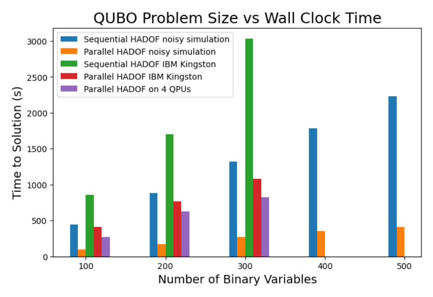
<figcaption class="paper-figure-caption"><b>Fig 7.</b> Fig. 7 reveals a more distinct separation between methods when considering the average accuracy across all sampled solutions. While ideal simulations still maintain high performance, the average accuracy is consistently lower than the most probable solution accuracy, indicating that suboptimal solutions contribute non-negligibly to the sampled distribution. Under noisy simulation, the degradation in average accuracy is more significant than in the most probable case, highlighting the sensitivity of the overall solution distribution to noise. Sequential implementations tend to retain</figcaption>
</figure>
<figure class="paper-figure-card">
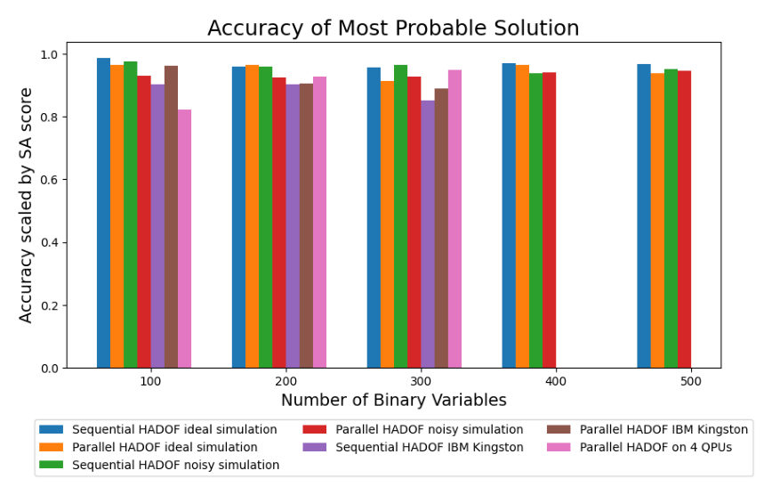
<figcaption class="paper-figure-caption"><b>Fig 8.</b> Figure 6: Most probable solution from all the algorithms is always above 82% compared to classical Simulated Annealing.</figcaption>
</figure>
<figure class="paper-figure-card">
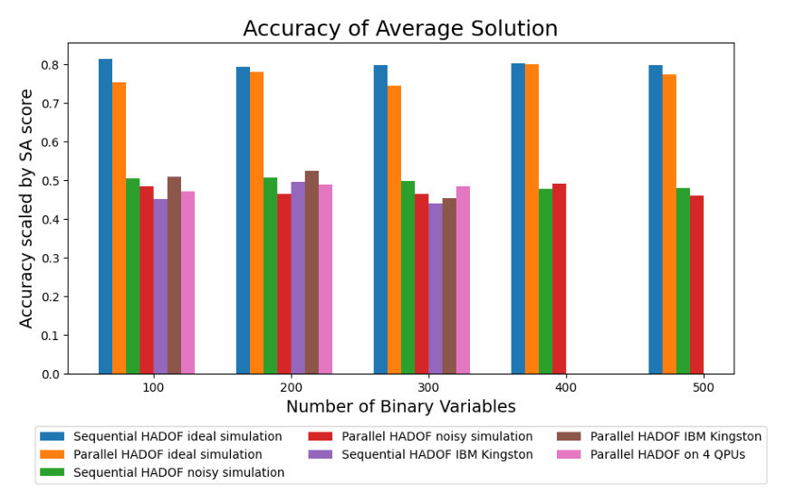
<figcaption class="paper-figure-caption"><b>Fig 9.</b> Figure 7: Average accuracy of the solutions from the distribution produced is between 70% and 80% of Simulated Annealing. However, on a real device this accuracy lowers to around 50%.</figcaption>
</figure>
<figure class="paper-figure-card">
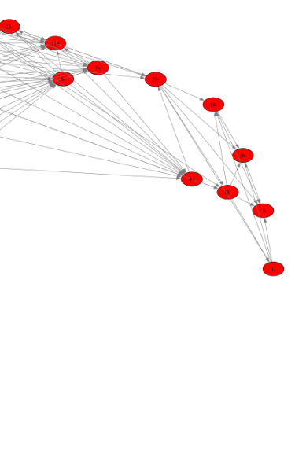
<figcaption class="paper-figure-caption"><b>Fig 10.</b> Figure 8: Overlap Graph of ϕX 174 from Boev et al [14]</figcaption>
</figure>

**Summary.** This paper introduces a parallelized version of the HADOF framework to enable High Performance Quantum (HPQ) computing. By decomposing large optimization problems into smaller sub-problems that can be executed concurrently across multiple quantum processors, the method significantly reduces computation time without sacrificing solution quality.

**Why it may be interesting.** not directly relevant

Detailed structure

**Main problem.** The scalability of quantum optimization algorithms like QAOA is limited by the low qubit counts, hardware noise, and connectivity constraints of NISQ-era devices when tackling large-scale combinatorial problems.

**Main result.** The parallelized HADOF framework achieves up to a 3-4x reduction in wall-clock time using multiple IBM QPUs and a 3x speedup on a single QPU, while maintaining competitive solution accuracy for genome assembly tasks.

**Method.** The researchers extend the Hamiltonian Auto Decomposition Optimisation Framework (HADOF) by implementing inter-QPU and intra-QPU parallelization using joblib to solve decomposed sub-Hamiltonians independently.

**Model / system.** The study uses Quadratic Unconstrained Binary Optimization (QUBO) models applied to genome assembly (TSP-like problems) and benchmarks them on IBM Quantum processors (e.g., IBM_Kingston, IBM_Fez) and classical PennyLane simulations.

**Key observables.** Wall clock time (makespan), QPU usage time, solution accuracy (approximation ratio), and probability distribution of sampled solutions.

**Important parameters / regimes.** Sub-Hamiltonian size (k=5), circuit depth (5 layers), and problem size (n up to 500 for simulation, up to 50 for real hardware).

**Assumptions / limitations.** The framework assumes that large global Hamiltonians can be effectively approximated by replacing inactive variables with their expected values from previous iterations.

**Figures summary.** Figure 1 shows a standard QAOA circuit; Figure 2 illustrates Trotterized decomposition; Figure 3 provides an overview of the HADOF framework; Figure 8 and 9 show the DAG overlap graph and the assembled genome sequence.

**Paper structure.** The paper introduces the scalability bottleneck, presents the HADOF decomposition and its parallelized extension, details the experimental setup on IBM hardware, reports performance benchmarks across different execution modes, and validates the approach with a genome assembly case study.

Abstract

Practical applicability of quantum optimisation on near term devices is constrained by limited qubit counts and hardware noise, which restricts the scalability of quantum optimisation algorithms for combinatorial problems. The simulation of large quantum circuits is also difficult and constrained by memory requirement. The Hamiltonian Auto Decomposition Optimisation Framework (HADOF) addresses this by decomposing large QUBOs into smaller subproblems that can be solved iteratively on quantum or classical backends. This allows the scalability of quantum QUBO algorithms beyond device limits, as well as their simulation on classical devices. In this research, we extend the evaluation of HADOF by benchmarking on real IBM QPUs across sequential, single-QPU parallel, and multi-QPU parallel execution modes, advancing toward High Performance Quantum (HPQ) computing for combinatorial optimisation problems.   Experimental results on IBM quantum hardware demonstrate up to 3-4x reduction in wall clock time when utilising four QPUs compared to sequential execution baseline, while maintaining comparable solution quality. Notably, even single QPU execution benefits from parallelised job orchestration and execution, yielding up to 3x speedup. Simulated results predict over 5x speed-up in parallel execution mode. We further validate the practical applicability of the approach on real world genome assembly instances, showing that both sequential and parallel HADOF variants achieve competitive accuracy while significantly improving time to solution. These results highlight the importance of parallelism at both the algorithmic and system levels, positioning HADOF as a viable pathway toward scalable quantum optimisation.

[↑ back to top](#top)

### [Anomalous tunneling as a low-energy theorem for Nambu-Goldstone modes](http://arxiv.org/abs/2604.27489v1)

**Authors:** Keisuke Fujii, Daichi Kagamihara, Masaru Hongo  
**Type:** theory · **Category:** quantum gases · **PDF:** <https://arxiv.org/pdf/2604.27489v1>  
**Analysis basis:** full PDF text, analyzed in chunks
**Topic relevance:** `Keldysh / 2PI / non-Gaussian methods` **2/5** · `non-equilibrium dynamics` **2/5** · `non-equilibrium universality` **2/5** · `spintronics-quantum-optics interface` **2/5**

↔ Scroll figures horizontally

<figure class="paper-figure-card">
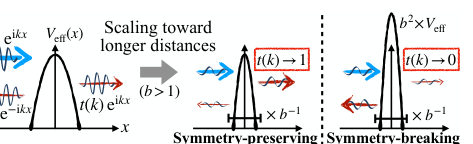
<figcaption class="paper-figure-caption"><b>Fig 1.</b> FIG. 1. Schematic illustration of our result. At low en- ergies, the problem reduces to scattering of the NG mode in an effective potential Veff(x). Under scaling, symmetry- preserving potentials shrink, leading to perfect transmission, whereas symmetry-breaking ones grow, leading to perfect re- flection.</figcaption>
</figure>
<figure class="paper-figure-card">
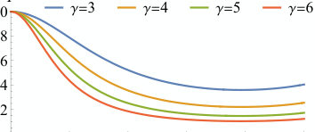
<figcaption class="paper-figure-caption"><b>Fig 2.</b> FIG. 2. Transmission coefficient T in Eq. (24) as a function of kia for several values of γ. The momentum inside the barrier is related to the incident momentum by ki = (co/ci)ko.</figcaption>
</figure>

**Summary.** This paper establishes that the phenomenon of anomalous tunneling in broken-symmetry systems is a universal consequence of symmetry and scaling. It demonstrates that while symmetry-preserving defects become invisible at low energies, symmetry-breaking defects effectively block transmission. This result provides a unified theoretical rule for the behavior of Nambu-Goldstone modes like phonons and magnons.

**Why it may be interesting.** It provides a universal, symmetry-based principle for transport phenomena in many-body systems, which is highly relevant for understanding how excitations move through defects in BECs and other quantum fluids.

Detailed structure

**Main problem.** The paper seeks to establish the general conditions under which 'anomalous tunneling'—where the transmission coefficient approaches unity as energy tends to zero—occurs in systems with spontaneous symmetry breaking.

**Main result.** The authors prove that anomalous tunneling is a universal low-energy theorem where symmetry-preserving potentials are irrelevant and lead to perfect transmission, whereas symmetry-breaking perturbations are relevant and suppress transmission.

**Method.** The study uses a low-energy effective field theory (EFT) framework combined with scaling analysis and dimensional power counting to evaluate the impact of localized potentials.

**Model / system.** The framework applies to Nambu-Goldstone modes (Type-A and Type-B) in systems with spontaneous symmetry breaking, specifically illustrating the effect with superfluid phonons and magnons in ferromagnets.

**Key observables.** Transmission coefficient (T), reflection coefficient (R), and energy flux (Q).

**Important parameters / regimes.** Low-energy/low-momentum limit (k -> 0), symmetry-preserving vs. symmetry-breaking perturbations, and the scaling dimension of localized potentials.

**Assumptions / limitations.** The analysis for Type-B modes neglects subleading omega^2 g_t(x) terms to focus on the low-energy limit.

**Figures summary.** Figure 1 provides a schematic of the scaling analysis showing how potentials shrink or grow under scaling; Figure 2 shows the transmission coefficient approaching 1 as the momentum-width product (kia) approaches 0.

**Paper structure.** The paper introduces the concept of anomalous tunneling, establishes a general EFT framework for Nambu-Goldstone modes, performs scaling and power-counting analysis to distinguish perturbation types, and provides explicit examples using phonons and magnons.

Abstract

Anomalous tunneling refers to the phenomenon in which the transmission coefficient through a potential barrier approaches unity as the energy of an incident particle or quasiparticle tends to zero. This counterintuitive effect has been reported in systems exhibiting spontaneous symmetry breaking (SSB), such as superfluids, yet the general conditions for its occurrence remain unclear. In this Letter, we establish that anomalous tunneling of Nambu-Goldstone (NG) modes is a universal low-energy theorem dictated solely by symmetry and scaling, using a low-energy effective field theory (EFT) framework. We formulate the scattering of NG modes by external potentials in terms of spatially dependent EFT coefficients and demonstrate that symmetry-preserving localized potentials are irrelevant in the long-wavelength limit, leading to perfect transmission. In contrast, symmetry-breaking perturbations are relevant and suppress transmission, resulting in the absence of anomalous tunneling. We illustrate this universal behavior with explicit examples of superfluid phonons and magnons.

[↑ back to top](#top)

### [Hyperfine-resolved laser excitation and detection of nuclear isomer in trapped $^{229}$Th$^{3+}$ ions](http://arxiv.org/abs/2604.27614v1)

**Authors:** Wu Wang, Ke Zhang, Ke-Mi Xu, Shan-Gui Zhou  
**Type:** theory · **Category:** other · **PDF:** <https://arxiv.org/pdf/2604.27614v1>  
**Analysis basis:** full PDF text, analyzed in chunks
**Topic relevance:** `methods for driven-dissipative` **2/5** · `quantum measurements` **2/5**

↔ Scroll figures horizontally

<figure class="paper-figure-card">
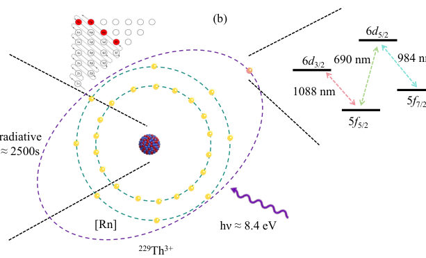
<figcaption class="paper-figure-caption"><b>Fig 1.</b> FIG. 1: (a) Nuclear ground and isomeric levels of 229Th, connected by an M1 transition with energy hν ≈8.4 eV. The vacuum radiative lifetime of the isomer is about 2500 s. (b) Partial low-lying electronic levels of 229Th3+, with 5f5/2 as the electronic ground level. The 690-nm, 984-nm, and 1088-nm transitions are used in the proposed electronic-fluorescence detection schemes.</figcaption>
</figure>
<figure class="paper-figure-card">
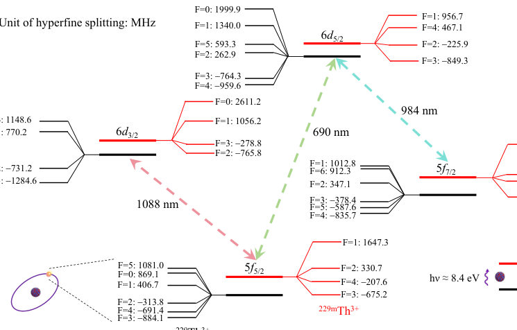
<figcaption class="paper-figure-caption"><b>Fig 2.</b> FIG. 2: Hyperfine structures of the selected electronic 5f5/2, 5f7/2, 6d3/2, and 6d5/2 levels in 229Th3+ and 229mTh3+. The hyperfine splittings are given in units of MHz. Hyperfine-resolved laser excitation is essential for improving the precision of the isomeric energy, while the distinct hyperfine structures of the nuclear ground and isomeric states enable nuclear-state detection via hyperfine-resolved electronic fluorescence.</figcaption>
</figure>
<figure class="paper-figure-card">
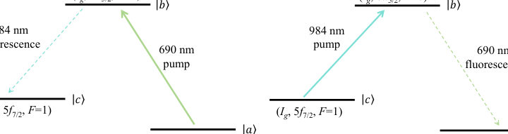
<figcaption class="paper-figure-caption"><b>Fig 3.</b> FIG. 4: Three-level detection scheme based on the 690-nm and 984-nm electronic transitions in the nuclear-ground-state configuration. (a) With only the 690-nm laser applied, the electronic population is driven from states |a⟩to |c⟩via the intermediate state |b⟩, accompanied by the emission of 984-nm fluorescence. The states |a⟩, |b⟩, and |c⟩belong to the hyperfine levels (Ig, 5f5/2, F = 1), (Ig, 6d5/2, F = 0), and (Ig, 5f7/2, F = 1), respectively. (b) With only the 984-nm laser applied, conversely, the electronic population is driven from |c⟩back to |a⟩via |b⟩, resulting in the emission of 690-nm fluorescence. The 690-nm or 984-nm fluorescence is suppressed when the nuclear isomer is excited.</figcaption>
</figure>
<figure class="paper-figure-card">
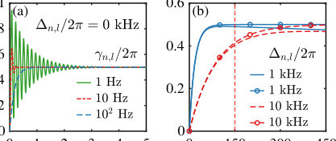
<figcaption class="paper-figure-caption"><b>Fig 4.</b> FIG. 6: Isomeric population of the state |2⟩as a function of irradiation time (a) at zero detuning ∆n,l/2π = 0 kHz for different laser linewidths γn,l, and (b) for different detunings ∆n,l with the laser linewidth fixed at γn,l/2π = 10 kHz. In panel (b), the circled curves represent the analytic solutions in Eq. (13), while the uncircled curves correspond to the nu- merical solutions of Eq. (4). The intensity of the 148-nm laser is fixed at 0.5 W/cm2 and the system is initially prepared in the state |1⟩for all cases.</figcaption>
</figure>
<figure class="paper-figure-card">
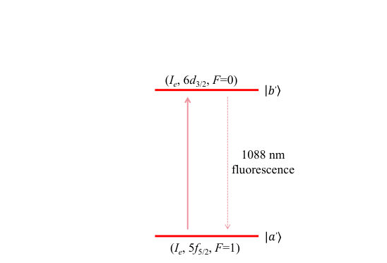
<figcaption class="paper-figure-caption"><b>Fig 5.</b> FIG. 5: Two-level detection scheme based on the 1088-nm electronic transition in the nuclear-isomeric-state configura- tion. The laser couples the states |a′⟩and |b′⟩, which belong to the hyperfine levels (Ie, 5f5/2, F = 1) and (Ie, 6d3/2, F = 0), respectively. The 1088-nm fluorescence is enhanced when the nuclear isomer is excited.</figcaption>
</figure>
<figure class="paper-figure-card">
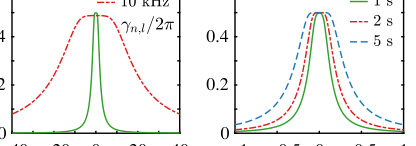
<figcaption class="paper-figure-caption"><b>Fig 6.</b> FIG. 7: Quasi-steady-state population of the isomeric state |2⟩as a function of the laser detuning ∆n,l (a) for different laser linewidths, and (b) for different irradiation times, as labeled. In panel (a), the irradiation time is set to 20 and 200 s for γn,l/2π = 1 and 10 kHz, respectively. In panel (b), the laser linewidth is fixed at γn,l/2π = 100 Hz. The intensity of the 148-nm laser is set to 0.5 W/cm2 and the system is initially prepared in the state |1⟩for all cases.</figcaption>
</figure>
<figure class="paper-figure-card">
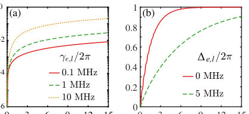
<figcaption class="paper-figure-caption"><b>Fig 7.</b> FIG. 8: Electronic population of the state |c⟩as a function of irradiation time (a) at a fixed detuning ∆e,l/2π = 100 MHz for different laser linewidths γe,l, and (b) for different detun- ings ∆e,l with the laser linewidth fixed at γe,l/2π = 0.1 MHz. In all cases, the electronic population transfer is driven by a 690-nm laser with an intensity of 1 W/cm2. The system is initially prepared in the state |a⟩.</figcaption>
</figure>
<figure class="paper-figure-card">
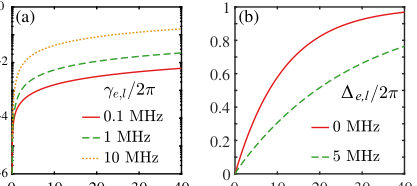
<figcaption class="paper-figure-caption"><b>Fig 8.</b> FIG. 9: Electronic population of the state |a⟩as a function of irradiation time (a) at a fixed detuning ∆e,l/2π = 100 MHz for different laser linewidths γe,l, and (b) for different detun- ings ∆e,l with the laser linewidth fixed at γe,l/2π = 0.1 MHz. In all cases, the electronic population transfer is driven by a 984-nm laser with an intensity of 0.1 W/cm2. The system is initially prepared in the state |c⟩.</figcaption>
</figure>
<figure class="paper-figure-card">
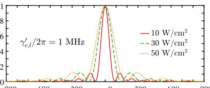
<figcaption class="paper-figure-caption"><b>Fig 9.</b> FIG. 10: Electronic population of the state |b′⟩as a function of the 1088-nm laser detuning ∆′ e,l for different laser intensi- ties, as labeled. The irradiation time is set to 10, 5.9, and 4.6 ns for laser intensities of 10, 30, and 50 W/cm2, respectively. The system is initially prepared in the state |a′⟩and the laser linewidth is fixed at γ′ e,l/2π = 1 MHz for all cases.</figcaption>
</figure>

**Summary.** This paper presents a theoretical framework for the laser excitation and detection of the 229Th nuclear isomer in trapped ions. It proposes specific electronic fluorescence channels to improve detection efficiency and demonstrates that the nuclear transition can be found relatively quickly using current VUV technology. This work is a significant step toward the realization of practical nuclear clocks.

**Why it may be interesting.** It provides critical theoretical guidance for the development of nuclear clocks and explores the control of hyperfine-resolved dynamics in a system coupling nuclear and electronic degrees of freedom.

Detailed structure

**Main problem.** Achieving efficient laser excitation and detection of the low-energy nuclear isomeric state of 229Th in trapped-ion systems, specifically overcoming low fluorescence signals and large frequency uncertainties.

**Main result.** The study identifies that matching laser linewidth, detuning, and irradiation time is essential for excitation and proposes that a 1088-nm detection scheme provides the highest photon rate, enabling the nuclear transition to be located within one month.

**Method.** A quantum master equation approach in the Lindblad form is used to analyze hyperfine-resolved excitation dynamics and population transfer efficiency.

**Model / system.** The system consists of 229Th3+ ions in a trap, modeling the nuclear transition between ground and isomeric states via an M1 transition and electronic transitions via E1 transitions using a hyperfine-coupled basis.

**Key observables.** Isomeric population, electronic fluorescence photon rates (690, 984, and 1088 nm), and total search time for the nuclear transition frequency.

**Important parameters / regimes.** Nuclear Rabi frequency (~3.4 Hz), laser linewidths (100 Hz to 10 MHz), nuclear isomeric lifetime (~2500 s), and transition energy (~8.4 eV).

**Assumptions / limitations.** The nuclear isomer decay is neglected for short time scales (up to 500 s) to treat the system as a two-level model, and the rotating-wave approximation is applied.

**Figures summary.** Figure 1 shows nuclear and electronic energy levels and proposed fluorescence wavelengths; Figure 2 displays hyperfine structures; Figure 10 shows electronic population as a function of laser detuning.

**Paper structure.** The paper introduces the scientific problem, describes the physical system and hyperfine model, details the quantum master equation methodology, presents results for excitation and detection schemes, and concludes with an optimization of the nuclear transition search time.

Abstract

We present a comprehensive theoretical investigation of hyperfine-resolved excitation and detection of the low-energy isomeric state of $^{229}$Th in trapped $^{229}\mathrm{Th}^{3+}$ ions. Using a quantum master equation approach, we analyze the dependence of the isomeric population on laser linewidth, detuning, and irradiation time, showing that their proper matching is essential for efficient excitation. We further propose two nuclear-state detection schemes based on three hyperfine-resolved electronic fluorescence channels at 690, 984, and 1088 nm. Our analysis shows that the 690-nm and 984-nm scheme yields detectable photon rates on the order of $10^4~\mathrm{s}^{-1}$ per ion for each wavelength, whereas the 1088-nm scheme achieves a higher rate on the order of $10^5~\mathrm{s}^{-1}$ per ion. By quantifying the trade-off between irradiation time and scan-step size, we show that the nuclear transition can be located within one month for a 100-MHz uncertainty using currently available vacuum-ultraviolet laser technology. These results provide practical guidance for trapped-ion $^{229}\mathrm{Th}$ spectroscopy and the development of nuclear clocks.

[↑ back to top](#top)

### [Hypergeometric Functions of Nilpotent Operators: Functional Collapse and Structural Depth at Exceptional Points](http://arxiv.org/abs/2604.27834v1)

**Authors:** Ramon Moya  
**Type:** theory · **Category:** other · **PDF:** <https://arxiv.org/pdf/2604.27834v1>  
**Analysis basis:** full PDF text, analyzed in chunks
**Topic relevance:** `driven-dissipative phase transition` **2/5** · `methods for driven-dissipative` **2/5**

↔ Scroll figures horizontally

<figure class="paper-figure-card">

<figcaption class="paper-figure-caption"><b>Fig 1.</b> Low-resolution page preview, page 2</figcaption>
</figure>
<figure class="paper-figure-card">
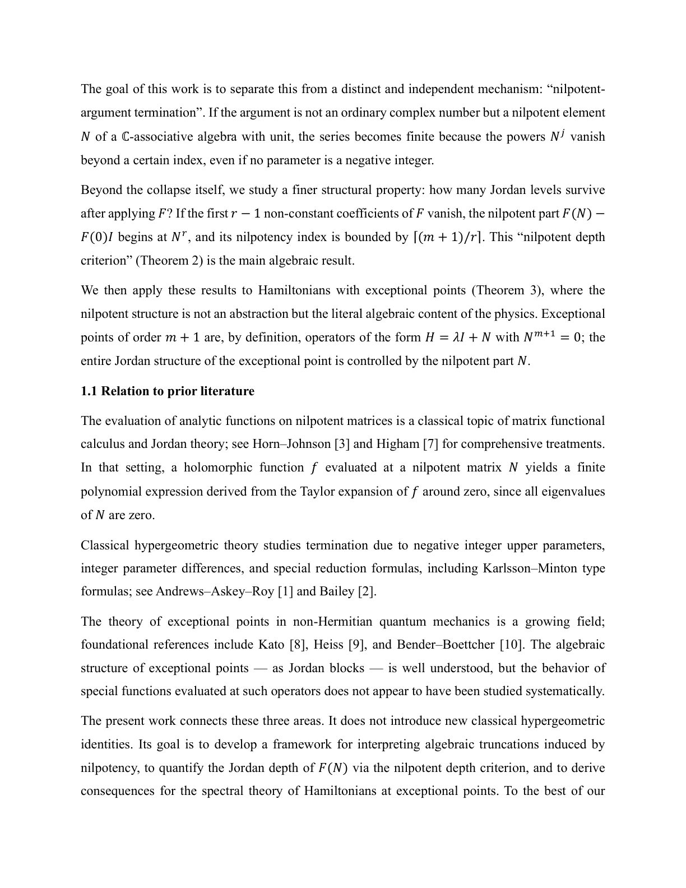
<figcaption class="paper-figure-caption"><b>Fig 2.</b> Low-resolution page preview, page 3</figcaption>
</figure>
<figure class="paper-figure-card">

<figcaption class="paper-figure-caption"><b>Fig 3.</b> Low-resolution page preview, page 4</figcaption>
</figure>
<figure class="paper-figure-card">
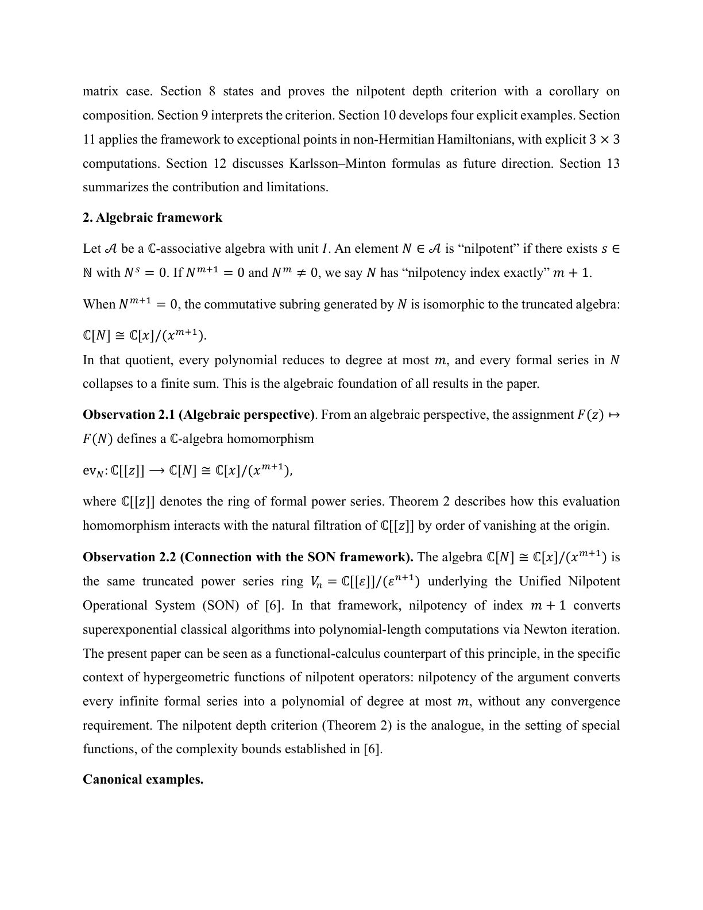
<figcaption class="paper-figure-caption"><b>Fig 4.</b> Low-resolution page preview, page 5</figcaption>
</figure>
<figure class="paper-figure-card">
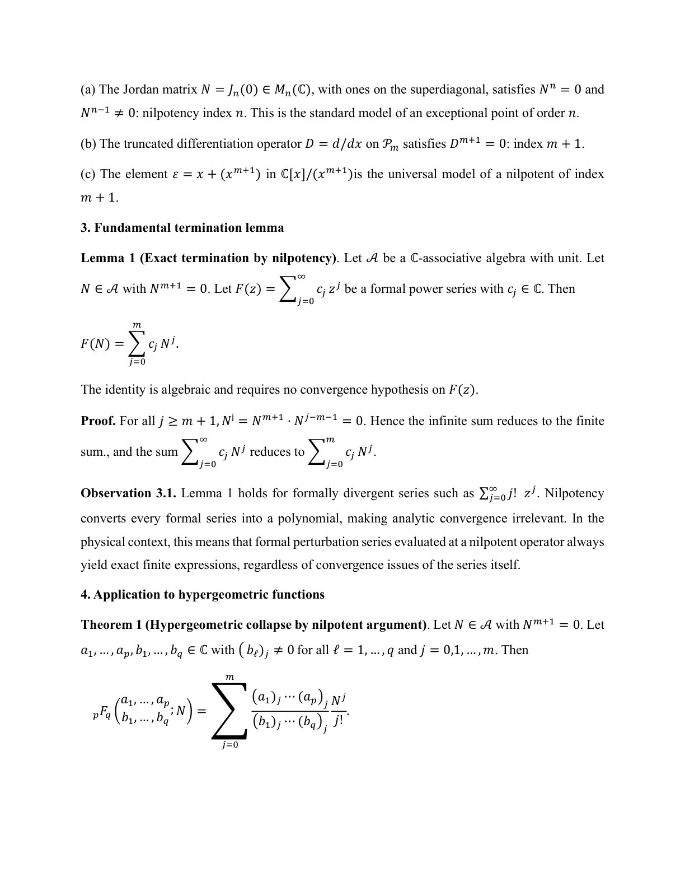
<figcaption class="paper-figure-caption"><b>Fig 5.</b> Low-resolution page preview, page 6</figcaption>
</figure>
<figure class="paper-figure-card">

<figcaption class="paper-figure-caption"><b>Fig 6.</b> Low-resolution page preview, page 7</figcaption>
</figure>
<figure class="paper-figure-card">
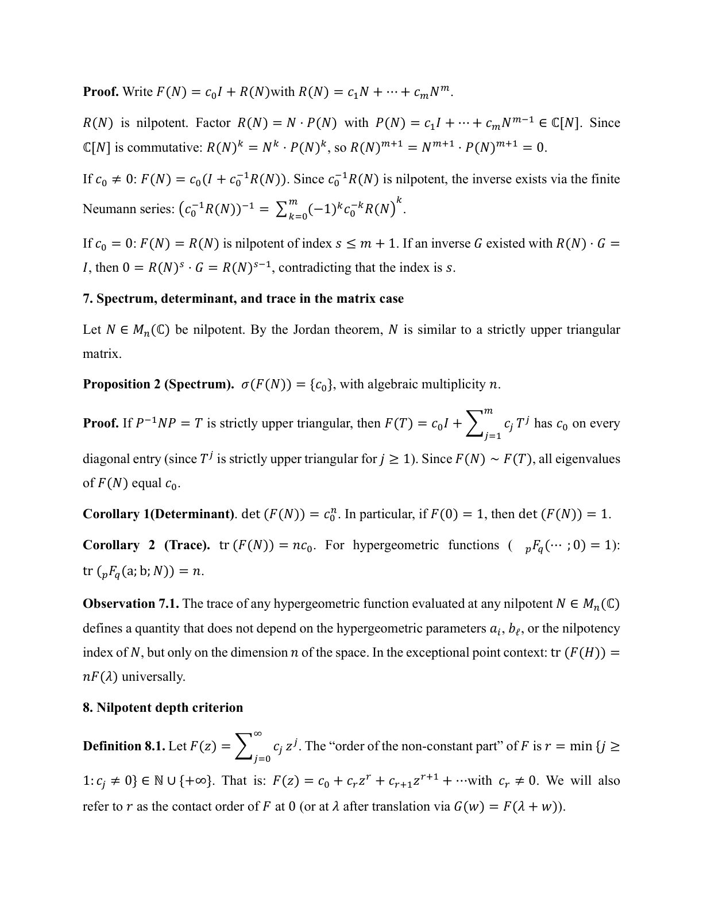
<figcaption class="paper-figure-caption"><b>Fig 7.</b> Low-resolution page preview, page 8</figcaption>
</figure>
<figure class="paper-figure-card">
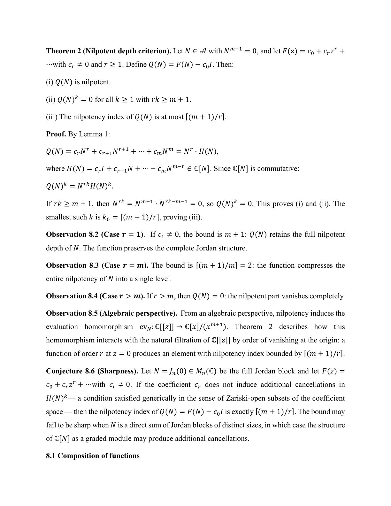
<figcaption class="paper-figure-caption"><b>Fig 8.</b> Low-resolution page preview, page 9</figcaption>
</figure>
<figure class="paper-figure-card">
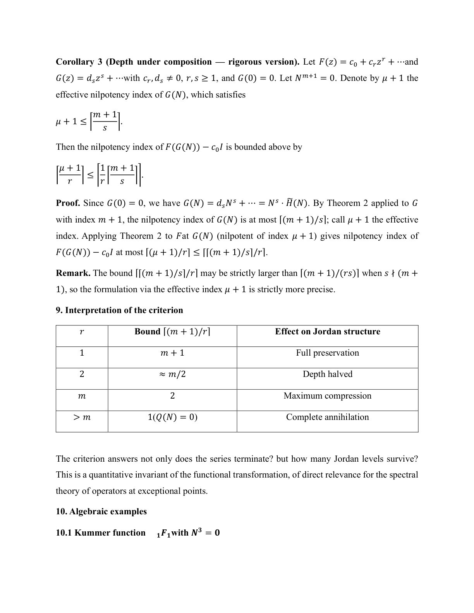
<figcaption class="paper-figure-caption"><b>Fig 9.</b> Low-resolution page preview, page 10</figcaption>
</figure>
<figure class="paper-figure-card">
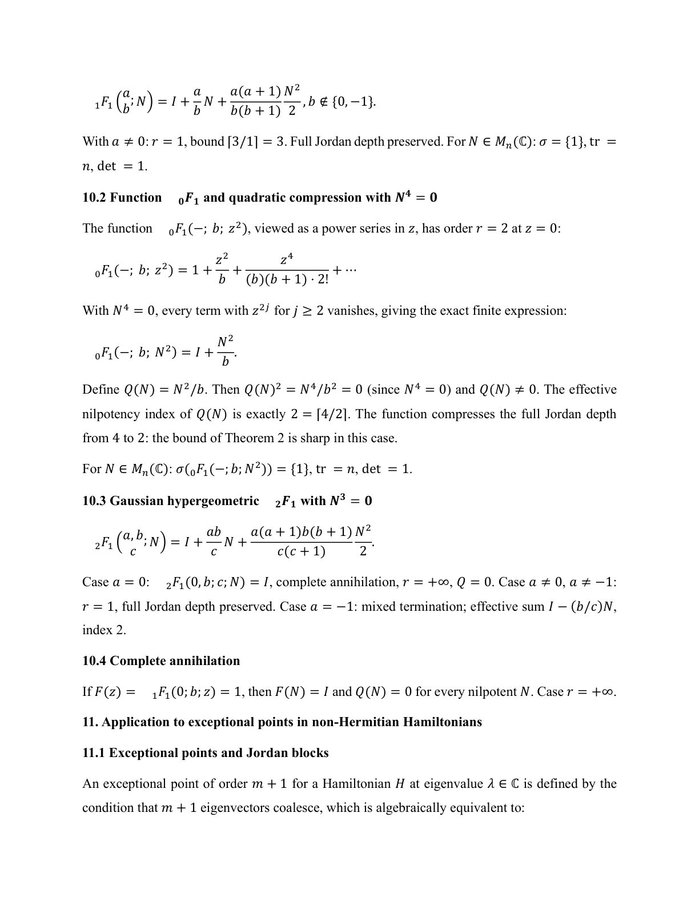
<figcaption class="paper-figure-caption"><b>Fig 10.</b> Low-resolution page preview, page 11</figcaption>
</figure>

**Summary.** This paper proves that applying analytic functions to nilpotent operators causes a 'functional collapse' that reduces the complexity of their Jordan structure. It provides a specific criterion to calculate how much the Jordan depth of an exceptional point decreases based on the function's contact order. This has direct implications for understanding the stability and spectral properties of non-Hermitian systems.

**Why it may be interesting.** This is highly relevant for researchers in non-Hermitian quantum mechanics and open quantum systems, as it provides a precise mathematical tool to predict how physical transformations (like time evolution or spectral filtering) can simplify or destroy the complex algebraic structure of exceptional points.

Detailed structure

**Main problem.** The paper investigates how analytic functional transformations (like hypergeometric functions) affect the Jordan structure and nilpotency index of operators at exceptional points.

**Main result.** The author establishes a 'nilpotent depth criterion' showing that a function with contact order r reduces the Jordan depth of an exceptional point from m+1 to at most ceil((m+1)/r).

**Method.** The study uses functional calculus of nilpotent operators, Taylor expansions, and algebraic analysis within C-associative algebras.

**Model / system.** The mathematical model focuses on non-Hermitian Hamiltonians at exceptional points, represented by H = lambda I + N, where N is a nilpotent operator.

**Key observables.** Jordan depth (nilpotency index), trace of hypergeometric functions, and the order of the pole in the modified resolvent.

**Important parameters / regimes.** Nilpotency index (m+1), contact order (r) of the function at the eigenvalue, and the parameter-termination vs. nilpotent-argument termination mechanisms.

**Assumptions / limitations.** The operators are assumed to be finite-dimensional and nilpotent; functions are assumed to be analytic at the eigenvalue.

**Figures summary.** The paper includes explicit 3x3 Jordan block computations for various functions (exponential, Kummer, Gauss hypergeometric) to validate the theoretical bounds.

**Paper structure.** The paper begins by defining the functional collapse of hypergeometric functions, introduces the nilpotent depth criterion (Theorem 2), applies this to Hamiltonians at exceptional points (Theorem 3), and concludes with explicit 3x3 matrix examples and consequences for the resolvent.

Abstract

We study hypergeometric functions of nilpotent operators in finite-dimensional settings, motivated by the algebraic structure of exceptional points in non-Hermitian quantum mechanics. Our starting point is the following exact result: if N is a nilpotent operator of index m+1 in an associative algebra over C, then every generalized hypergeometric function pFq evaluated at N reduces to a finite polynomial in N of degree at most m, without any analytic convergence requirement. This "functional collapse" is distinct from the classical parameter-termination mechanism and arises purely from the nilpotent structure of the argument. The main result is a "nilpotent depth criterion" (Theorem 2): if the first non-constant coefficient of a formal series F appears in degree r >= 1, then the nilpotent part F(N) - F(0)I has nilpotency index bounded above by ceil((m+1)/r). We apply this criterion to Hamiltonians at exceptional points, where H = lambda I + N with N^{m+1} = 0. Theorem 3 establishes that a function F analytic at lambda reduces the Jordan depth of the exceptional point from m+1 to at most ceil((m+1)/r), where r is the contact order of F at lambda. As consequences: the time evolution operator e^{tH} preserves the full Jordan depth for all t != 0; a function with a zero of order m+1 at lambda annihilates the entire Jordan structure; and the order of the pole of the modified resolvent is reduced from m+1 to at most m+1-r. Results are illustrated with explicit 3x3 Jordan block computations for 1F1, 2F1, and the time evolution operator, confirming sharpness of the bounds.

[↑ back to top](#top)

### [Quantum integrable matrix models of spinor Bose gases in one spatial dimension](http://arxiv.org/abs/2604.27885v1)

**Authors:** Hannes Köper, Thomas Gasenzer  
**Type:** theory · **Category:** quantum gases · **PDF:** <https://arxiv.org/pdf/2604.27885v1>  
**Analysis basis:** abstract only; PDF text extraction failed or PDF unavailable
**Topic relevance:** `analog quantum simulation` **2/5** · `exotic spin models in light-matter` **2/5**

**Summary.** This paper develops a mathematical framework using matrix-valued bosonic fields to describe 1D spinor Bose gases with arbitrary spin. It successfully maps the spin-1 case to a set of solvable integral equations, allowing for the precise calculation of the ground state phase diagram. The work highlights how interactions can lead to bound states that change the effective exclusion principle for the particles.

**Why it may be interesting.** It provides a powerful integrable framework for studying complex spin multiplets in 1D, offering new insights into how bound states can alter the fundamental statistics (Pauli exclusion principle) of interacting bosons in cold atom systems.

Detailed structure

**Main problem.** The paper aims to generalize the description of one-dimensional spinor Bose gases to arbitrary spin multiplets using a matrix-based integrable model.

**Main result.** The authors derive a quantum integrable matrix extension of the nonlinear Schrödinger model and compute the ground state phase diagram for a spin-1 Bose gas, revealing that paired bound states modify the effective Pauli exclusion principle for bosons.

**Method.** The study employs algebraic Bethe-ansatz techniques to construct eigenstates and derive Bethe equations, alongside the derivation of integral equations for thermodynamic properties.

**Model / system.** A quantum integrable matrix extension of the nonlinear Schrödinger model where fundamental fields are represented by an m x n matrix of bosonic field operators, specifically applied to spin-1 Bose gases with repulsive density-density and anti-ferromagnetic spin-spin interactions.

**Key observables.** Ground state phase diagram, spectra of conserved quantities, and equilibrium thermodynamic properties.

**Important parameters / regimes.** Chemical potential, external magnetic field, and the Lieb parameter (gamma).

**Assumptions / limitations.** The system is restricted to one spatial dimension with repulsive density-density interaction and anti-ferromagnetic spin-spin coupling.

**Paper structure.** The paper introduces a matrix extension of the nonlinear Schrödinger model, applies the algebraic Bethe-ansatz to find eigenstates and Bethe equations, focuses on the spin-1 case to derive thermodynamic integral equations, and concludes with a phase diagram analysis and discussion of bound state effects.

Abstract

Degenerate spinor Bose gases with repulsive density-density interaction and anti-ferromagnetic spin-spin coupling in one spatial dimension are shown to be described by a quantum integrable matrix extension of the nonlinear Schrödinger model, whose fundamental fields are described by an $m\,\times\,n$ matrix of bosonic field operators. The eigenstates of this model are constructed for arbitrarily sized matrix field operators by means of algebraic Bethe-ansatz techniques, and the corresponding Bethe equations governing the spectra of conserved quantities are derived. The approach thus generalizes previously chosen techniques to account for arbitrary spin multiplets and their spin-spin interaction. Focusing on the specific case of the $2\times2$ model, which is shown to correspond to a spin-$1$ Bose gas, a set of integral equations is derived, which describe its equilibrium thermodynamic properties. From these, the ground state phase diagram is computed both, numerically and analytically in the parameter plane spanned by the chemical potential and an external magnetic field. Furthermore, the existence of paired bound states is shown to modify the Pauli exclusion principle for interacting bosons in one dimension. In particular, it is found that no two quasiparticle rapidities can coincide, provided that the Lieb parameter satisfies $γ>4/3$.

[↑ back to top](#top)

### [Reorganizing Quantum Measurement Records Improves Time-Series Prediction](http://arxiv.org/abs/2604.28160v1)

**Authors:** Markus Baumann, Maximilian Zorn, Thomas Gabor, Claudia Linnhoff-Popien, Jonas Stein  
**Type:** both · **Category:** quantum information and computing · **PDF:** <https://arxiv.org/pdf/2604.28160v1>  
**Analysis basis:** full PDF text, analyzed in chunks
**Topic relevance:** `QC/QI experiment` **2/5** · `quantum measurements` **2/5**

↔ Scroll figures horizontally

<figure class="paper-figure-card">

<figcaption class="paper-figure-caption"><b>Fig 1.</b> Fig. 1. Three ways of organizing shot-based training data under a fixed measurement budget: EV averaging, split-ensemble training, and raw stacking.</figcaption>
</figure>
<figure class="paper-figure-card">

<figcaption class="paper-figure-caption"><b>Fig 2.</b> Fig. 2. Shared operating point (Q = 4, Nshots = 18, λ = 10, ρEV = 2.65125). Top: illustrative test trajectories, where the displayed seed is the one whose split-ensemble test NRMSE is closest to the 20-seed median. Bottom: test outcomes over all 20 seeds.</figcaption>
</figure>
<figure class="paper-figure-card">
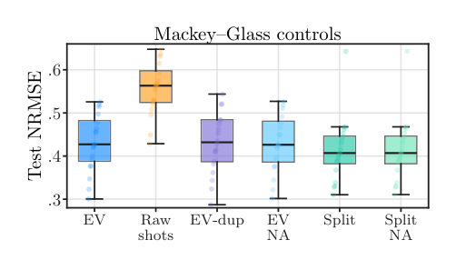
<figcaption class="paper-figure-caption"><b>Fig 3.</b> Fig. 4. Baseline and estimator controls at the shared operating point. The compared methods are EV, Raw, EV-dup, EV-NA, split-ensemble, and Split- NA.</figcaption>
</figure>
<figure class="paper-figure-card">

<figcaption class="paper-figure-caption"><b>Fig 4.</b> Fig. 3. EV-minus-split-ensemble test gap ∆as a function of ρEV across the common Nshots sweep. Points show individual seeds; curves and bands summarize the 20-seed mean and spread. Positive values favor split-ensemble.</figcaption>
</figure>
<figure class="paper-figure-card">
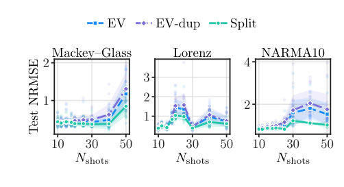
<figcaption class="paper-figure-caption"><b>Fig 5.</b> Fig. 6. Duplication control over the broader Nshots sweep. Duplication matches the split-ensemble example count by repeating the fully averaged feature vector, without creating distinct grouped views.</figcaption>
</figure>
<figure class="paper-figure-card">
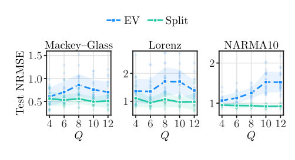
<figcaption class="paper-figure-caption"><b>Fig 6.</b> Fig. 5. Reservoir-size sweep with Q ∈{4, 6, 8, 10, 12} and 20 seeds per point. The absolute EV and split-ensemble curves are shown; their vertical separation corresponds to the EV-minus-split-ensemble gap. Positive values favor split-ensemble.</figcaption>
</figure>
<figure class="paper-figure-card">
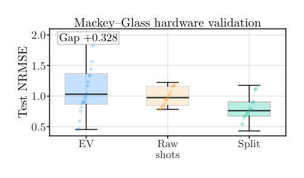
<figcaption class="paper-figure-caption"><b>Fig 7.</b> Fig. 7. Mackey–Glass hardware validation on ibm_marrakesh at total budget 20,000 and Nshots = 40. The plot compares EV, Raw, and split- ensemble for this case; lower values indicate better forecasting performance.</figcaption>
</figure>
<figure class="paper-figure-card">
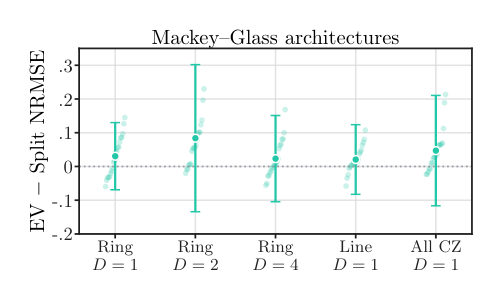
<figcaption class="paper-figure-caption"><b>Fig 8.</b> Fig. 8. Mackey–Glass slice of the architecture ablation at the shared operating point (Q = 4, Nshots = 18, 20 seeds; no added synthetic noise). The plot shows the EV-minus-split-ensemble gap across five architectures; D denotes circuit depth. Positive values favor split-ensemble.</figcaption>
</figure>
<figure class="paper-figure-card">
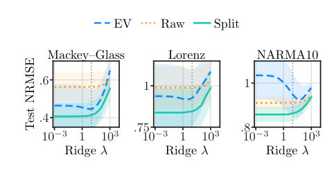
<figcaption class="paper-figure-caption"><b>Fig 9.</b> Fig. 9. Ridge-regularization ablation at Q = 4, Nshots = 18 (20 seeds). Curves show mean test NRMSE over λ with ±1 SD bands.</figcaption>
</figure>

**Summary.** The paper introduces a simple algorithmic technique called split-ensemble training to reorganize quantum measurement shots. By grouping shots into intermediate averages, it balances the trade-off between measurement noise and training sample size, significantly improving the accuracy of quantum-classical hybrid time-series prediction on both simulators and real hardware.

**Why it may be interesting.** not directly relevant

Detailed structure

**Main problem.** How to optimize the use of finite measurement records in Quantum Reservoir Computing (QRC) to improve time-series prediction without increasing the quantum hardware execution budget.

**Main result.** The proposed 'split-ensemble' training method, which reorganizes shots into partially denoised groups, consistently outperforms standard expectation-value and raw-stacking approaches, especially on noisy real hardware.

**Method.** A split-ensemble training protocol that partitions $N$ shots into $G$ disjoint groups, each averaged to create a distinct, partially denoised feature vector for a classical linear readout.

**Model / system.** A Quantum Reservoir Computing framework using a fixed $Q$-qubit circuit (e.g., ring-CNOT entangler) with repeated executions, combined with a classical leaky integrator and a linear ridge regression readout.

**Key observables.** Single-qubit $Z_i$ and $X_i$ observables derived from measurement bitstrings.

**Important parameters / regimes.** Total execution budget ($S_{total}$), group size ($k$), training-support ratio ($
ho_{EV}$), reservoir size ($Q$), and leakage rate ($\eta$).

**Assumptions / limitations.** The total number of quantum circuit executions is a fixed resource; the classical readout is a linear model.

**Figures summary.** Figure 1 illustrates the three data organization strategies; Figure 2 shows NRMSE results for various time-series tasks; Figure 3-5 show performance across reservoir sizes and architectures; Figure 6 compares split-ensemble to EV-dup; Figure 7-8 show hardware validation on IBM hardware.

**Paper structure.** The paper introduces the problem of shot-noise vs. data scarcity, defines the three data organization protocols, provides a theoretical framework for the split-ensemble advantage, presents numerical benchmarks on various time-series tasks, performs ablation studies to rule out simple data augmentation, and validates the method on real superconducting quantum hardware.

Abstract

Near-term quantum computers are accessed through repeated circuit executions, which produce finite measurement records rather than exact deterministic outputs. In quantum reservoir computing, these records are converted to feature vectors for a classical readout. The standard expectation-value approach averages all shots from one labeled time step into a single feature vector. This reduces finite-shot noise, but it also gives the readout only one training example from many circuit executions. We introduce split-ensemble training: the same shots are split into groups, and each group average is used as a separate, partially denoised feature vector for the same target. The quantum circuit, task, and measurement budget remain unchanged. Across simulated forecasting benchmarks and real hardware experiments, this simple reorganization improves prediction when full averaging leaves the readout with too few training examples, with the strongest gains observed on hardware. Our results establish shot-record organization as a simple, broadly applicable algorithmic lever for improving near-term quantum learning without additional quantum hardware cost.

[↑ back to top](#top)

### [Quantum Anonymous Secret Sharing with Permutation Invariant Codes](http://arxiv.org/abs/2604.27284v1)

**Authors:** Varin Sikand, Andrew Nemec  
**Type:** theory · **Category:** quantum information and computing · **PDF:** <https://arxiv.org/pdf/2604.27284v1>  
**Analysis basis:** full PDF text, analyzed in chunks
**Topic relevance:** `entanglement & information structure` **2/5** · `quantum measurements` **1/5**

↔ Scroll figures horizontally

<figure class="paper-figure-card">
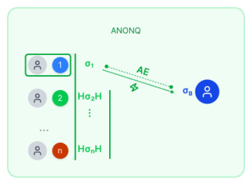
<figcaption class="paper-figure-caption"><b>Fig 1.</b> Fig. 1: Overview of ANONQ(|ϕ⟩) (Protocol II.4) with Alice encircled in green and Bob in blue. Each participant holds one qubit of the n-qubit GHZ state, denoted as σi, and all participants besides Alice and Bob apply an H gate to their qubit, leaving only Alice and Bob with an entangled pair. The green arrow represents the teleportation step after the AE protocol.</figcaption>
</figure>
<figure class="paper-figure-card">

<figcaption class="paper-figure-caption"><b>Fig 2.</b> Fig. 2: Overview of the QASS protocol. We initially assume the secret has been encoded into n shares. In Step 1, each green arrow denotes a share sent from each k participating shareholders via the ANONQ protocol. Once received by Bob, the identities of each share is entirely lost due to ANONQ. Finally, Bob decodes the anonymous set of retrieved shares using the PI code’s decoding circuit to obtain the secret.</figcaption>
</figure>
<figure class="paper-figure-card">
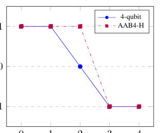
<figcaption class="paper-figure-caption"><b>Fig 3.</b> Fig. 3: Hmin for QASS schemes using the ((4, 2, 2)) Aydin et al. PI code [46] and the ((4, 2, 2)) Hagiwara and Nakayama PI code [13], the ramp QSS scheme using the [[4, 1, 2]] Leung et al. stabilizer code [44], and the HQASS scheme using Aydin et al. PI code [46] for both quantum and classical secrets. All three 4-qubit QSS schemes have identical Hmin values, whereas the HQASS scheme has a threshold of k = 3 with no intermediate share sets.</figcaption>
</figure>
<figure class="paper-figure-card">

<figcaption class="paper-figure-caption"><b>Fig 4.</b> Fig. 4: Comparison of Hmin across various PI codes of distance 3. (a) The ((7, 2, 3)) codes of Pollatsek and Ruskai [47], [49] and Aydin et al. [46], which have the same Hmin values. (b) The ((9, 2, 3)) code of Ruskai [48] (the gnu (3, 3, 1)-PI code [50]). (c) Three ((11, 2, 3)) codes including the one given by Kubischta and Teixeira [49], the shifted gnu (3, 3, 1)-PI code of Ouyang [45], and the Q4,1,2,−1 code of Aydin et al. [46]. (d) Two ((13, 2, 3)) codes including one given by Kubischta and Teixeira [49] and the shifted gnu (3, 3, 1)-PI code of Ouyang [45].</figcaption>
</figure>

**Summary.** This paper introduces a new quantum secret sharing protocol that ensures the identities of the senders remain anonymous during the decoding process. By using permutation-invariant codes, the authors also provide a new mathematical way to precisely measure how much information an adversary can steal from partial shares.

**Why it may be interesting.** not directly relevant

Detailed structure

**Main problem.** Existing Quantum Secret Sharing (QSS) schemes fail to protect the identities of senders during decoding and lack a robust single-shot metric to quantify information leakage in ramp-type schemes.

**Main result.** The authors construct a Quantum Anonymous Secret Sharing (QASS) protocol using permutation-invariant codes that achieves sender-anonymity and can tolerate missing shareholders. They also establish quantum conditional min-entropy as a valid single-shot measure for quantifying information leakage.

**Method.** The study utilizes permutation-invariant (PI) quantum error-correcting codes combined with anonymous quantum transmission algorithms (ANONQ). They use semidefinite programming (SDP) and the Knill-Laflamme conditions to evaluate information leakage and fidelity.

**Model / system.** The protocol operates on n-qubit systems using permutation-invariant codes and GHZ states, modeled under quantum erasure and depolarizing channels.

**Key observables.** Sender-anonymity, quantum conditional min-entropy (Hmin), maximum fidelity (F), and quantum correlation (q_corr).

**Important parameters / regimes.** Code distance (d), threshold (k), number of physical qubits (n), and number of participating shareholders (np).

**Assumptions / limitations.** The protocol assumes all shareholders and the receiver are honest; it also assumes the use of permutation-invariant codes and relies on GHZ-based anonymous transmission.

**Figures summary.** Figure 1 illustrates the ANONQ protocol steps; Figure 2 shows the QASS protocol flow; Figure 3 compares Hmin decay across different PI codes.

**Paper structure.** The paper introduces the problem of anonymity and leakage, describes the construction of the QASS protocol using PI codes, provides a theoretical justification for the min-entropy metric via Knill-Laflamme conditions, and concludes with numerical evaluations of various stabilizer codes.

Abstract

Quantum secret sharing schemes are a family of quantum cryptographic protocols which provide secure quantum encodings, mapping one secret to multiple shares of information such that the original secret cannot be accessed without an authorized set of shares present for decoding. In this work, we describe a protocol that enables sender-anonymity during the secret decoding process. By using permutation-invariant QEC codes along with a set of anonymous quantum transmission algorithms, we construct a quantum anonymous secret sharing scheme that achieves sender-anonymity. We quantify information leakage in ramp quantum secret sharing schemes via the quantum conditional min-entropy, justifying it as a valid measure of leaked information by relating it to the Knill-Laflamme quantum error correction conditions. Finally, we evaluate several permutation-invariant codes using this measure to make observations on the information leakage of intermediate shares for each quantum anonymous secret sharing scheme.

[↑ back to top](#top)

### [Wavelet-based multiresolution analysis of quantum fractals in confined dynamics](http://arxiv.org/abs/2604.27851v1)

**Authors:** David Navia, Ángel S. Sanz  
**Type:** theory · **Category:** numerical methods · **PDF:** <https://arxiv.org/pdf/2604.27851v1>  
**Analysis basis:** full PDF text, analyzed in chunks
**Topic relevance:** `non-equilibrium dynamics` **2/5** · `quantum measurements` **1/5**

↔ Scroll figures horizontally

<figure class="paper-figure-card">
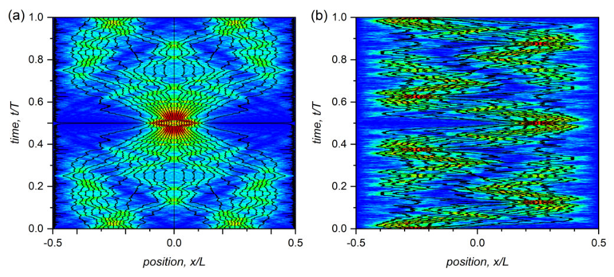
<figcaption class="paper-figure-caption"><b>Fig 1.</b> FIG. 1. Fractal space–time quantum carpets generated by the evolution in time of the probability density associated with (a) a coherent superposition of two symmetrically distributed square functions, and (b) only the left-hand side square function. In both cases, the width of the square functions is such that w/L = 0.25 and are centered at x± = ±0.25L. In the density plots, blue denotes lower values of the probability density, while the transition to red indicates increasing values (for a better visualization of the details both probability densities ) For a better visualization of the carpets’ details, the probability densities have been truncated to about 60% their maxima. To make...</figcaption>
</figure>
<figure class="paper-figure-card">
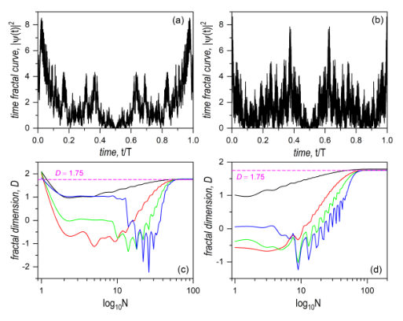
<figcaption class="paper-figure-caption"><b>Fig 2.</b> FIG. 3. Time quantum fractal profile exhibited by the prob- ability density of the symmetric (a) and asymmetric (b) wave functions shown in Fig. 1. Both time fractals are computed at x = −0.25L, where L denotes the total length of the cavity. The numerical estimates of the corresponding fractal dimen- sions obtained from the multiresolution analysis are shown, respectively, in panels (c) and (d): Haar (black), db4 (red), db8 (green), and db16 (blue). These estimates are determined from convergence with the number of basis functions consid- ered in the spectral reconstruction without adding any extra hypothesis. As it is shown, beyond N ≳100, all results show fast convergence to the value D...</figcaption>
</figure>
<figure class="paper-figure-card">

<figcaption class="paper-figure-caption"><b>Fig 3.</b> FIG. 2. Space quantum fractal profile exhibited by the prob- ability density of the symmetric (a) and asymmetric (b) wave functions shown in Fig. 1. Both space fractals are computed at t = T/ √</figcaption>
</figure>
<figure class="paper-figure-card">

<figcaption class="paper-figure-caption"><b>Fig 4.</b> FIG. 4. Numerical estimates of the fractal dimension ob- tained from the multiresolution analysis for three flux-based fractal (Bohmian) trajectories for different instances: Haar (black), db4 (red), db8 (green), and db16 (blue). The re- sults in panels (a) and (b) correspond to trajectories with initial conditions taken at x0 = −0.25L associated with the symmetric and asymmetric wave functions whose carpets are shown in Figs. 1(a) and (b), respectively, with w/L = 0.25. Note that, beyond N ≳100, all results show fast convergence to the value D = 1.25 (magenta dashed line) conjectured by Berry for space–time fractals [3].</figcaption>
</figure>

**Summary.** The paper introduces a wavelet-based multiresolution framework to quantify the fractal dimensions of quantum carpets in confined dynamics. This method avoids the biases of traditional geometric or Fourier methods and provides a robust way to characterize space, time, and space-time fractality. It successfully recovers predicted universal fractal dimensions even in numerically limited, pre-fractal regimes.

**Why it may be interesting.** This provides a new, computationally efficient diagnostic tool for analyzing multiscale features and interference-driven dynamics in any system exhibiting complex, self-similar patterns, such as wave propagation in confined geometries or anomalous transport.

Detailed structure

**Main problem.** The difficulty in quantitatively and robustly characterizing quantum fractals (self-similar structures in quantum states) due to the limitations of traditional Fourier-based or geometric scaling methods which are sensitive to finite-size effects and numerical truncation.

**Main result.** The development of a wavelet-based multiresolultion analysis (MRA) framework that provides a robust, scale-adaptive, and hypothesis-free method to extract fractal dimensions for space, time, and space-time quantum fractals.

**Method.** Wavelet-based Multiresolution Analysis (MRA) using discrete wavelet transforms (Haar and Daubechies families) to analyze the scale-dependent distribution of wavelet energies and Bohmian trajectories to probe space-time correlations.

**Model / system.** A quantum particle confined within a one-dimensional infinite potential well, starting from initial states with spatial discontinuities (e.g., square wave functions).

**Key observables.** Probability density, probability flux, Bohmian trajectories, and fractal dimensions (spatial, temporal, and space-time).

**Important parameters / regimes.** Dyadic scales (j), spectral truncation (N), recurrence time (T), and wavelet family type.

**Assumptions / limitations.** The system is subject to a 'pre-fractal' regime due to finite spectral resolution/truncation, and the scaling exponent is extracted via linear regression within an intermediate scaling window.

**Figures summary.** Figure 1 shows space-time quantum carpets with superimposed Bohmian trajectories; Figure 2 shows spatial profiles and fractal dimension estimates; Figure 3 shows temporal profiles and fractal dimension estimates; Figure 4 shows the convergence of fractal dimensions as a function of spectral truncation.

**Paper structure.** The paper identifies limitations in existing fractal characterization methods, introduces the wavelet MRA framework, applies it to confined 1D dynamics, validates the results against Berry's predicted universal dimensions, and demonstrates the method's robustness and efficiency.

Abstract

Fractal structures naturally emerge in quantum systems whose initial states exhibit spatial discontinuities, a phenomenon first identified by Berry in the paradigmatic case of a particle confined in an infinite potential well. While previous analyses of quantum fractals have mainly relied on spectral decompositions and geometric scaling arguments, their quantitative characterization often depends on scale choices and truncation effects. Here we present a wavelet-based multiresolution framework that enables a direct and assumption-free quantification of quantum fractality. Fractal dimensions are extracted from the scale-dependent distribution of wavelet energies, without invoking prior power-law hypotheses. The method is applied to space and time quantum fractals arising in confined dynamics, as well as to dynamical curves generated by the associated quantum probability flux. These flux-driven trajectories provide a natural space--time parametrization of the underlying fractal structure and yield scaling properties fully consistent with Berry's predictions for space--time fractals. The resulting fractal dimensions are shown to be robust with respect to the choice of wavelet family, numerical cutoffs, and system parameters. Beyond validating earlier conjectures, the present framework offers a unified and computationally efficient tool for the multiscale analysis of quantum fractality in confined and interference-driven quantum dynamics. That is, it provides an operational, scale-adaptive criterion that unifies the characterization of space, time, and space--time quantum fractals within a single, hypothesis-free approach.

[↑ back to top](#top)

### [A No-Cloning Trade-off Between Black Hole No-Hair and Horizon Smoothness](http://arxiv.org/abs/2604.28050v1)

**Authors:** Sudhanva Joshi, Sunil Kumar Mishra  
**Type:** theory · **Category:** quantum information and computing · **PDF:** <https://arxiv.org/pdf/2604.28050v1>  
**Analysis basis:** full PDF text, analyzed in chunks
**Topic relevance:** `entanglement & information structure` **2/5**

↔ Scroll figures horizontally

<figure class="paper-figure-card">
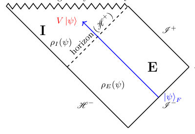
<figcaption class="paper-figure-caption"><b>Fig 1.</b> FIG. 1: Penrose diagram of a black hole formed by gravitational collapse. The spacetime is divided into an interior region I (above the dashed horizon line H +) and an exterior region E (below). An infalling quantum system F in state |ψ⟩crosses the horizon, with its state embedded in I via the isometric embedding V . The reduced states ρI(ψ) and ρE(ψ) encode the information accessible to interior and exterior observers, respectively. The trade-off inequality Eq. (16) constrains the relationship between horizon smoothness (ε) and exterior distinguishability (Dmax).</figcaption>
</figure>

**Summary.** This paper establishes a fundamental mathematical trade-off between the ability to distinguish black hole microstates from the outside and the smoothness of the event horizon. It proves that observable quantum hair is quantitatively incompatible with a smooth horizon, meaning any 'hair' requires a violation of the equivalence principle. This provides a rigorous information-theoretic constraint on various black hole microstate models like fuzzballs and soft hair.

**Why it may be interesting.** not directly relevant

Detailed structure

**Main problem.** Investigating the fundamental compatibility between the existence of observable quantum hair (exterior distinguishability) and the smoothness of the black hole event horizon (equivalence principle validity) under unitary evolution.

**Main result.** The authors derive a quantitative trade-off inequality, epsilon >= D_max^2/8, proving that any model predicting non-zero exterior quantum hair must necessarily involve a violation of horizon smoothness.

**Method.** The study employs quantum information-theoretic tools, specifically the Stinespring dilation of quantum channels, the diamond norm, and the Kretschmann-Schlingemann-Werner (KSW) continuity theorem.

**Model / system.** A semiclassical black hole model where the spacetime is partitioned into interior and exterior sectors, treating the horizon crossing as a quantum channel acting on an infalling system.

**Key observables.** epsilon (horizon smoothness violation/deviation from isometry), D_max (maximum exterior distinguishability/trace distance), and F_I (interior fidelity).

**Important parameters / regimes.** The Bekenstein-Hawking entropy (S_BH) scale, the regime of perfect isometry (epsilon = 0), and the firewall/fuzzball regimes (epsilon ~ O(1)).

**Assumptions / limitations.** Global unitarity, horizon causality (no signaling from interior to exterior), and diamond-norm interior accessibility.

**Figures summary.** A Penrose diagram illustrating the black hole interior and exterior regions, showing an infalling system crossing the horizon and the encoding of states.

**Paper structure.** The paper begins by establishing an exact no-hair lemma for perfect isometries, then uses the KSW theorem to extend this to an approximate theorem, ultimately deriving the quadratic trade-off inequality and discussing implications for fuzzballs and soft hair.

Abstract

The black hole no-hair theorem is traditionally derived from the uniqueness theorems of general relativity. We show that a quantitative form follows from unitarity together with the standard semiclassical assumptions of horizon causality and interior accessibility. For a semiclassical black hole, we prove that the trace distance between exterior states corresponding to two same-charge infalling states is bounded by $2\sqrt{2\varepsilon}$, where $\varepsilon$ quantifies the diamond norm departure of the interior channel from a perfect isometry which is a quantitative measure of horizon-smoothness violation that upper-bounds $1 - F_I$, where $F_I$ is the interior fidelity capturing how faithfully the infalling state is retained. Inverting this relation yields a trade-off inequality, $\varepsilon \geq D_{\max}^2/8$, between the maximum exterior distinguishability $D_{\max}$ and the degree of horizon smoothness. This establishes that observable exterior quantum hair is quantitatively incompatible with exact horizon smoothness under unitary evolution: any model predicting nonzero exterior hair must violate the equivalence principle at the horizon by a quantifiable amount. Pre-existing entanglement with the infalling system is the only channel for quantum hair compatible with both unitarity and horizon smoothness.

[↑ back to top](#top)

### [Constructing Bulk Topological Orders via Layered Gauging](http://arxiv.org/abs/2604.27363v1)

**Authors:** Shang Liu  
**Type:** theory · **Category:** strongly correlated electrons · **PDF:** <https://arxiv.org/pdf/2604.27363v1>  
**Analysis basis:** full PDF text, analyzed in chunks
**Topic relevance:** `entanglement & information structure` **2/5**

↔ Scroll figures horizontally

<figure class="paper-figure-card">
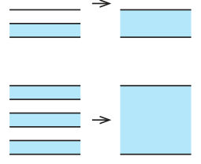
<figcaption class="paper-figure-caption"><b>Fig 1.</b> FIG. 1. The layered gauging procedure. (a) Sequentially gauge a bilayer symmetry acting on every neighboring pair of layers (n, n+1). From n = 1 to n = 2, n = 3, and so on. This is the main approach taken in this paper. (b) Alternatively, we may take an even-odd gauging pattern: First gauge the bilayer symmetries acting on layer pairs (2l −1, 2l), and then gauge those acting on layer pairs (2l, 2l + 1).</figcaption>
</figure>
<figure class="paper-figure-card">
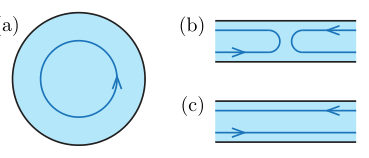
<figcaption class="paper-figure-caption"><b>Fig 2.</b> FIG. 2. Bulk topological order and boundary symmetry. (a) A 2d topological order on a disk region and a circular anyon loop. (b) A cylinder region and a contractible anyon loop. (c) Antiparallel noncontractible anyon loops on a cylinder region. Panels (b) and (c) are equivalent if the anyon line N satisfies N × ¯ N = 1.</figcaption>
</figure>
<figure class="paper-figure-card">
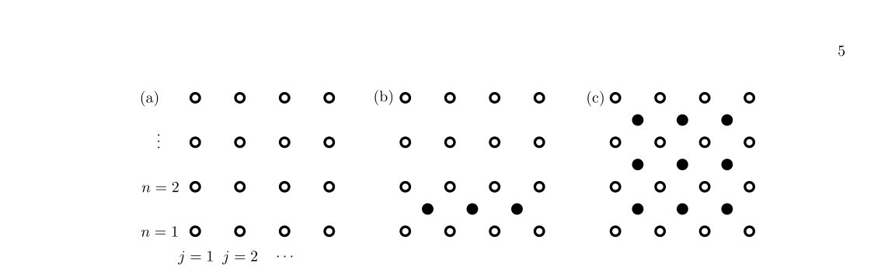
<figcaption class="paper-figure-caption"><b>Fig 3.</b> FIG. 3. Lattice geometry evolution in the layered gauging construction of a 2d topological order. (a) Stacking multiple 1d chains into a 2d lattice. (b) Coupling the first two layers to gauge field degrees of freedom. (c) Final form of the bulk lattice.</figcaption>
</figure>
<figure class="paper-figure-card">
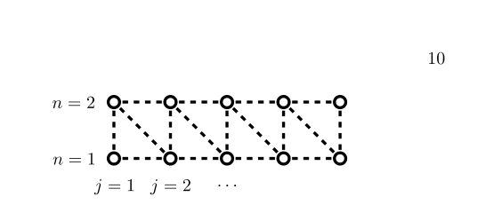
<figcaption class="paper-figure-caption"><b>Fig 4.</b> FIG. 4. Triangular plaquettes for the purpose of layered gaug- ing 1d anomalous Z2 symmetry.</figcaption>
</figure>
<figure class="paper-figure-card">
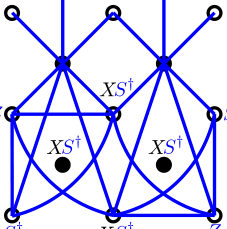
<figcaption class="paper-figure-caption"><b>Fig 5.</b> FIG. 5. 2d bulk stabilizers constructed from the 1d anomalous Z2 symmetry. Each blue bond represents a controlled-Z operator. Stabilizers in (a) are denoted by SE n+1/2,j where (n+1/2, j) locates the center of the four Pauli-X. Stabilizers in (b) are denoted by SM n,j+1/2 where (n, j + 1/2) locates the center of the four Pauli-Z. When stabilizers in (b) are satisfied, (a) can be reduced to the form of (c) which we denote by SER n+1/2,j. Either (a) and (b), or (c) and (b), lead to the double semion topological order.</figcaption>
</figure>
<figure class="paper-figure-card">
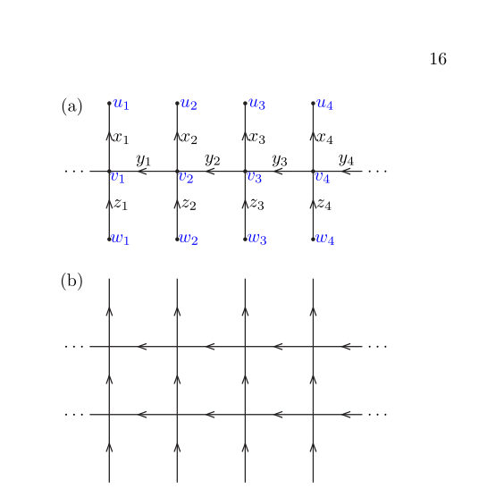
<figcaption class="paper-figure-caption"><b>Fig 6.</b> FIG. 7. Layered gauging for the 1d onsite G-symmetry. (a) The first two layers and the corresponding gauge field degrees of freedom. (b) The first three layers.</figcaption>
</figure>
<figure class="paper-figure-card">
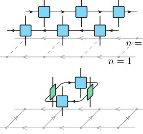
<figcaption class="paper-figure-caption"><b>Fig 7.</b> FIG. 8. Layered gauging for the 1d Rep(G) symmetry. (a) Lattice geometry of a single layer. (b) Tensor network picture of the bilayer symmetry operators. Dashed lines on the lattice are to guide the eyes and have no physical meaning at the mo- ment. (c) Local gauge symmetry generators from the gauging- like procedure. (d) Lattice geometry after the“gauging” for the first two layers.</figcaption>
</figure>
<figure class="paper-figure-card">
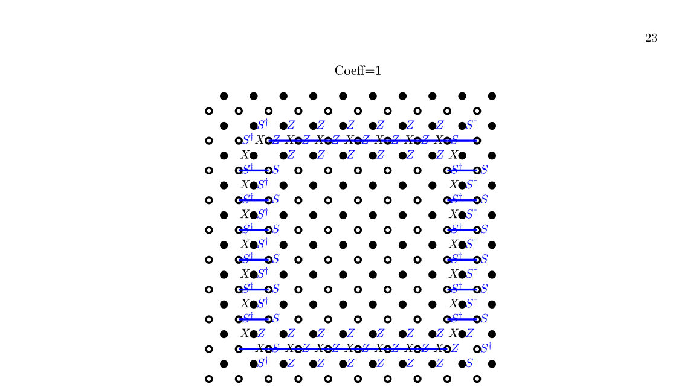
<figcaption class="paper-figure-caption"><b>Fig 8.</b> FIG. 10. A ER-loop operator from the product of SER stabilizers in a rectangular region. The overall coefficient, which is not important for our purpose, depends on the rectangular size and equals to +1 for the example shown.</figcaption>
</figure>

**Summary.** The paper introduces 'layered gauging,' a new method to construct higher-dimensional topological orders by stacking and gauging lower-dimensional layers. It successfully derives well-known models like the X-cube and Toric Code and extends the construction to complex non-invertible symmetries. This provides a powerful tool for exploring the landscape of fracton and liquid topological phases.

**Why it may be interesting.** This work provides a systematic way to build complex many-body phases and explores the deep connection between bulk topological order and boundary symmetry, which is fundamental to understanding many-body dynamics and topological phases.

Detailed structure

**Main problem.** Developing a versatile and physically intuitive method to construct (k+1)-dimensional bulk topological orders, including both liquid and fracton types, from k-dimensional generalized symmetries.

**Main result.** The proposed 'layered gauging' construction successfully generates various higher-dimensional topological orders, such as the X-cube model, anisotropic fracton orders, and the 2D double semion model, from lower-dimensional symmetries.

**Method.** The method involves stacking k-dimensional quantum systems into a (k+1)-dimensional pile and sequentially gauging a diagonal or bilayer symmetry acting on adjacent layers.

**Model / system.** The construction uses various building blocks including 1D Z2 Ising chains, 2D Z2 ferromagnets, and the 2D plaquette Ising model, which are stacked and gauged to create 2D and 3D models like the Toric Code and X-cube model.

**Key observables.** Ground state degeneracy, anyon mobility, and boundary symmetry enforcement.

**Important parameters / regimes.** Coupling constants J, h, and lambda; regimes where symmetries are spontaneously broken (e.g., h=0).

**Assumptions / limitations.** The method's universality is conjectured but lacks a rigorous mathematical proof; the construction is most effective when the k-dimensional layers spontaneously break their symmetries completely.

**Figures summary.** Figure 1 illustrates the sequential and even-odd layered gauging procedures; Figure 2 shows anyon loops on disk and cylinder geometries; Figure 4 illustrates the construction of the X-cube model; Figure 7/8 show the implementation of non-invertible gauging.

**Paper structure.** The paper introduces the layered gauging concept, demonstrates its application to conventional and higher-form symmetries (Toric Code), extends it to subsystem symmetries (fracton models), and finally generalizes the procedure to non-abelian and non-invertible symmetries.

Abstract

Understanding quantum phases and phase transitions in the presence of symmetries is a central objective of quantum many-body physics. A powerful modern paradigm for investigating this problem is topological holography, which relates symmetries in $k$ dimensions to "bulk" topological orders in $(k+1)$ dimensions. While conceptually profound, most existing bulk construction methods rely on sophisticated mathematical formalisms and can be difficult to apply to certain symmetry types. In this work, we propose a physically intuitive and versatile method, termed the layered gauging construction, to systematically generate $(k+1)$-dimensional (liquid or fracton) topological orders from $k$-dimensional generalized symmetries. Roughly speaking, the prescription is to stack many layers of $k$-dimensional quantum systems with certain symmetries into a $(k+1)$-dimensional pile, and then sequentially gauge a diagonal symmetry acting on each nearest-neighbor pair of layers. The detailed procedure depends on the specific symmetry types. We have successfully implemented the method in a number of examples in different spatial dimensions, with symmetries that are conventional, higher-form, subsystem, anomalous, nonabelian, or noninvertible. We hence conjecture the method to be very general. For example, from the subsystem symmetry of the $2d$ plaquette Ising model, we derive the X-cube model and also an anisotropic fracton topological order. Additionally, starting from an anomalous $\mathbb Z_2$ symmetry in $1d$, we construct a new square lattice model realizing the double semion topological order.

[↑ back to top](#top)

### [Magnetic excitation spectrum and hierarchy of magnetic interactions in ErFeO3](http://arxiv.org/abs/2604.27857v1)

**Authors:** Dnyaneshwar R. Bhosale, Piotr Fabrykiewicz, Devashibhai Adroja, Martin Meven, Astrid Schneidewind, Michal Stekiel  
**Type:** experiment · **Category:** strongly correlated electrons · **PDF:** <https://arxiv.org/pdf/2604.27857v1>  
**Analysis basis:** abstract only; PDF text extraction failed or PDF unavailable
**Topic relevance:** `spintronics-quantum-optics interface` **2/5**

**Summary.** This paper provides a detailed map of the magnetic excitations in ErFeO3 using neutron spectroscopy. It reveals how different magnetic sublattices interact to create a complex hierarchy of energy scales. The findings clarify the roles of exchange coupling and crystal field effects in orthoferrites.

**Why it may be interesting.** not directly relevant

Detailed structure

**Main problem.** The study aims to characterize the magnetic excitation spectrum and the hierarchy of magnetic interactions in the orthoferrite ErFeO3.

**Main result.** The researchers identified two distinct excitation components: dispersive spin waves from the Fe3+ sublattice and crystal electric field (CEF) excitations from Er3+ ions, revealing how exchange coupling and sublattice interactions drive dispersion and level splitting.

**Method.** Time-of-flight neutron spectroscopy was used to measure the excitation spectrum, with data analyzed using linear spin wave theory.

**Model / system.** The system is the ErFeO3 orthoferrite, consisting of interacting Fe3+ and Er3+ sublattices characterized by Fe-Fe exchange, Er-Er exchange, and Er-Fe interactions.

**Key observables.** Spin wave dispersions, spectral weight, and crystal electric field (CEF) excitation energies.

**Important parameters / regimes.** Fe-Fe exchange parameters, energy scales ranging from below 36 meV to 65 meV, and the influence of dipolar and antisymmetric exchange interactions.

**Assumptions / limitations.** The spin wave dispersions and spectral weight are assumed to be well-captured within the framework of linear spin wave theory.

**Paper structure.** The paper presents an investigation of the excitation spectrum, details the identification of spin wave and CEF components, discusses the extraction of exchange parameters via linear spin wave theory, and explores the role of dipolar and antisymmetric exchange in the magnetic ground state.

Abstract

We report a comprehensive investigation of the excitation spectrum of ErFeO$_3$ orthoferrite by means of time-of-flight neutron spectroscopy. The spectrum consists of two distinct components: strongly dispersive spin wave excitations of the Fe$^{3+}$ sublattice spanning $\approx$~9 - 65 meV, and crystal electric field (CEF) excitations of Er$^{3+}$ ions below 36 meV. The observed spin wave dispersions and spectral weight are well captured within linear spin wave theory, enabling extraction of the key Fe-Fe exchange parameters. Low-energy incident neutrons with their enhanced energy resolution, further revealed the dispersive character and splitting of Kramers-degenerate CEF levels. We show that the dispersion is caused by the exchange coupling between Er$^{3+}$ ions, while the degeneracy is lifted by interactions between the Er$^{3+}$ and Fe$^{3+}$ sublattices. We further explore the influence of dipolar and antisymmetric exchange interactions with the focus on the magnetic ground state of ErFeO$_3$, with particular attention to the low-temperature spin arrangement. Taken together, our results provide a detailed account of the spin dynamics in ErFeO$_3$ and reveal a hierarchy of interactions scales characteristic for orthoferrites.

[↑ back to top](#top)

### [Propelling catalytic structures using active phase separation](http://arxiv.org/abs/2604.27965v1)

**Authors:** Benjamin Sorkin, Ned S. Wingreen  
**Type:** theory · **Category:** statistical mechanics · **PDF:** <https://arxiv.org/pdf/2604.27965v1>  
**Analysis basis:** abstract only; PDF text extraction failed or PDF unavailable
**Topic relevance:** `non-equilibrium dynamics` **2/5**

**Summary.** The paper proposes a mechanism where active phase separation, driven by enzymatic cycles, can propel particles through a medium. This provides a way for biological transport to occur via biomolecular condensates without relying on traditional molecular motors.

**Why it may be interesting.** not directly relevant

Detailed structure

**Main problem.** Investigating how active phase separation can be used to achieve self-propulsion of a colloid without the need for complex molecular motors.

**Main result.** Demonstrated that a passivation-activation cycle of phase-separating proteins can induce symmetry breaking and create a repulsive force that propels colloids at speeds up to 100 microns per second.

**Method.** Numerical simulations of an active droplet system involving phase-separating proteins and enzymatic reactions.

**Model / system.** A spherical colloid in a homogeneous environment containing phase-separating proteins, enzymes that passivate the proteins, and complementary enzymes anchored to the colloid surface that reactivate them.

**Key observables.** Colloid propulsion speed, stability of the condensate, and resistance to Brownian fluctuations.

**Important parameters / regimes.** Micron-sized scale, reaction rates of the passivation-activation cycle, and presence of external forces/Brownian noise.

**Assumptions / limitations.** The system is autonomous, homogeneous, and isotropic prior to the symmetry-breaking event.

**Paper structure.** The paper introduces the biological motivation, proposes a minimal mechanism based on enzymatic cycles, presents numerical evidence for propulsion and speed, and discusses the robustness of this motor-free transport mode.

Abstract

Living systems routinely consume energy to achieve motility, often using intricate biomolecular machinery. In this work, we show that active droplets can sustain indefinite self-propulsion of a spherical colloid in an otherwise homogeneous, isotropic, and autonomous environment. Our proposed minimal mechanism consists of phase-separating proteins, enzymes passivating them, and complementary enzymes anchored to the colloid surface that reactivate the proteins. This passivation-activation cycle gives rise to a symmetry breaking - nucleation and stabilization of a condensate near the colloid surface, which in turn exerts a repulsive force on the colloid. We numerically demonstrate that this mechanism can propel micron-sized colloids at speeds of up to a hundred microns per second. This propulsion mode is strongly resistant to Brownian fluctuations and external forces, suggesting that propulsion mechanisms based on biomolecular condensates may offer a complementary, motor-free route to biological transport.

[↑ back to top](#top)

### [Theory for the mixed alkali effect in glasses](http://arxiv.org/abs/2604.27873v1)

**Authors:** Justus Leiber, Quinn Emilia Fischer, Sven Lohmann, Philipp Maass  
**Type:** theory · **Category:** disordered systems and neural networks · **PDF:** <https://arxiv.org/pdf/2604.27873v1>  
**Analysis basis:** abstract only; PDF text extraction failed or PDF unavailable
**Topic relevance:** `non-equilibrium dynamics` **2/5**

**Summary.** This paper proposes a theoretical framework to explain why mixing different types of mobile ions in glasses causes strong nonlinear changes in conductivity. The theory demonstrates that the effect is driven by the energy differences between ion types occupying specific sites and is supported by both simulations and experimental data from phosphate glasses.

**Why it may be interesting.** not directly relevant

Detailed structure

**Main problem.** Explaining the mixed alkali effect in glasses, where the transport properties of mobile ions change nonlinearly upon mixing different ion types.

**Main result.** A theory is developed showing that the mixed alkali effect arises from distinct site energies for different ion types and is enhanced by mismatch energies, even with identical energy distributions.

**Method.** Development of a theory based on thermally activated hopping transport in disordered site energy landscapes, incorporating joint probability density, generalized Fermi distributions, and non-diagonal Onsager coefficients, validated by kinetic Monte Carlo simulations.

**Model / system.** A system of mixed mobile ions undergoing thermally activated hopping transport within disordered site energy landscapes, specifically applied to mixed alkali phosphate glasses.

**Key observables.** Ionic transport properties, conductivity activation energies, and mobility of majority/minority ions.

**Important parameters / regimes.** Site energy distributions, mismatch energy, and spatial correlations between site energies.

**Assumptions / limitations.** The theory assumes thermally activated hopping transport and considers the statistical-mechanical and kinetic aspects of the ion mixture.

**Paper structure.** The paper presents a theoretical framework for the mixed alkali effect, details the statistical-mechanical and kinetic components (probability densities, Fermi distributions, Onsager coefficients), compares the theory to kinetic Monte Carlo simulations, and validates the model against experimental data from phosphate glasses.

Abstract

The mixed alkali or mixed mobile ion effect in glasses manifests itself by strong nonlinear variations of ionic transport properties upon mixing of different types of mobile ions. We develop a theory for this effect based on thermally activated hopping transport in disordered site energy landscapes that consistently incorporates the statistical-mechanical and kinetic aspects of a mobile ion mixture. This includes a consideration of the joint probability density of site energy states, generalized Fermi distributions for mean site occupations, and cross-terms in the current response described by nondiagonal Onsager coefficients. The theory shows that a mixed alkali effect can arise even when the two ion species share identical site energy distributions. It suffices that sites have distinct energies when occupied by ions of different type. Taking into account that a mismatch energy is needed for ions of one type to occupy sites adapted to the other type, the mixed alkali effect becomes stronger. Spatial correlations between site energies are needed for the mobility of the majority ion to decrease stronger than exponential upon replacement by the minority ion. The theory agrees well with kinetic Monte Carlo simulations. Application to mixed alkali phosphate glasses yields good agreement with measured conductivity activation energies.

[↑ back to top](#top)

### [Unentangled stoquastic Merlin-Arthur proof systems: the power of unentanglement without destructive interference](http://arxiv.org/abs/2604.27886v1)

**Authors:** Yupan Liu, Pei Wu  
**Type:** theory · **Category:** quantum information and computing · **PDF:** <https://arxiv.org/pdf/2604.27886v1>  
**Analysis basis:** full PDF text, analyzed in chunks
**Topic relevance:** `entanglement & information structure` **2/5**

↔ Scroll figures horizontally

<figure class="paper-figure-card">

<figcaption class="paper-figure-caption"><b>Fig 1.</b> Figure 1: Relationships among StoqMA(2), its variants, and other complexity classes.</figcaption>
</figure>
<figure class="paper-figure-card">

<figcaption class="paper-figure-caption"><b>Fig 2.</b> Figure 3: Conjunction of stoquastic verifiers V (1) x1 , V (2) x2 , and V (3) x3 .</figcaption>
</figure>

**Summary.** This paper explores the complexity of quantum proof systems that are both unentangled and stoquastic. It demonstrates that even without the power of destructive interference, unentangled stoquastic systems can capture significant complexity classes like NP and PSPACE.

**Why it may be interesting.** not directly relevant

Detailed structure

**Main problem.** The paper investigates the computational power and structural properties of the complexity class StoqMA(2), which involves unentangled (separable) quantum proofs within sign-problem-free (stoquastic) systems.

**Main result.** The authors establish that StoqMA(2) is surprisingly powerful, containing NP and having upper bounds in EXP and PSPACE, while showing that unentanglement provides significant power even without destructive interference.

**Method.** The study employs techniques such as stoquastization of QMA(2) protocols, distribution testing, the Sum-of-Squares (SoS) algorithm, and a new rectangular closure testing framework.

**Model / system.** The model consists of stoquastic Merlin-Arthur proof systems where the witness is a separable state across two registers and the underlying Hamiltonian is sign-problem-free (non-negative off-diagonal elements).

**Key observables.** Completeness and soundness errors, promise gaps, and acceptance probabilities.

**Important parameters / regimes.** Number of provers (k), proof length (qubit count), and the presence of perfect completeness or exponentially small promise gaps.

**Assumptions / limitations.** The optimality results are stated under the Exponential-Time Hypothesis (ETH).

**Figures summary.** Figure 1 provides a summary diagram of the relationships between various complexity classes like StoqMA(2), QMA(2), NP, and PSPACE; Figure 3 illustrates the architecture of a verifier for the intersection of promise problems.

**Paper structure.** The paper introduces the StoqMA(2) class, establishes lower bounds via distribution testing, derives upper bounds using the SoS algorithm and rectangular closure testing, and concludes with an analysis of precise and symmetric variants.

Abstract

Stoquasticity, originating in sign-problem-free physical systems, gives rise to $\sf StoqMA$, introduced by Bravyi, Bessen, and Terhal (2006), a quantum-inspired intermediate class between $\sf MA$ and $\sf AM$. Unentanglement similarly gives rise to ${\sf QMA}(2)$, introduced by Kobayashi, Matsumoto, and Yamakami (CJTCS 2009), which generalizes $\sf QMA$ to two unentangled proofs and still has only the trivial $\sf NEXP$ upper bound. In this work, we initiate a systematic study of the power of unentanglement without destructive interference via ${\sf StoqMA}(2)$, the class of unentangled stoquastic Merlin-Arthur proof systems. Although $\sf StoqMA$ is semi-quantum and may collapse to $\sf MA$, ${\sf StoqMA}(2)$ turns out to be surprisingly powerful. We establish the following results:   - ${\sf NP} \subseteq {\sf StoqMA}(2)$ with $\widetilde{O}(\sqrt{n})$-qubit proofs and completeness error $2^{-{\rm polylog}(n)}$. Conversely, ${\sf StoqMA}(2) \subseteq {\sf EXP}$ via the Sum-of-Squares algorithm of Barak, Kelner, and Steurer (STOC 2014); with our lower bound, our refined analysis yields the optimality of this algorithm under ETH.   - ${\sf StoqMA}(2)_1 \subseteq {\sf PSPACE}$, and the containment holds with completeness error $2^{-2^{{\rm poly}(n)}}$.   - ${\sf PreciseStoqMA}(2)$, a variant of ${\sf StoqMA}(2)$ with exponentially small promise gap, cannot achieve perfect completeness unless ${\sf EXP}={\sf NEXP}$. In contrast, ${\sf PreciseStoqMA}$ achieves perfect completeness, since ${\sf PSPACE} \subseteq {\sf PreciseStoqMA}_1$.   - When the completeness error is negligible, ${\sf StoqMA}(k) = {\sf StoqMA}(2)$ for $k\geq 2$.   Our lower bounds are obtained by stoquastizing the short-proof ${\sf QMA}(2)$ protocols via distribution testing techniques. Our upper bounds for the nearly perfect completeness case are proved via our new rectangular closure testing framework.

[↑ back to top](#top)

## Other papers (28)

*Papers from primary archives without highlighted authors or any topic match. Click to expand.*

Show other papers

### [Beyond Project-Based Learning: Conference-Style Writing as Authentic Assessment in Interdisciplinary Quantum Engineering Education](http://arxiv.org/abs/2604.27110v1)

**Authors:** Nischal Binod Gautam, Enrique P. Blair  
**Type:** theory · **Category:** other · **PDF:** <https://arxiv.org/pdf/2604.27110v1>  
**Analysis basis:** abstract only; PDF text extraction failed or PDF unavailable

**Summary.** This paper explores an advanced pedagogical approach for quantum engineering education that uses conference-style paper writing as a form of authentic assessment. The results suggest that while more challenging than standard projects, this method effectively prepares students for professional scientific communication and research.

**Why it may be interesting.** not directly relevant

Detailed structure

**Main problem.** The paper investigates how to move beyond simple project-based learning in quantum engineering education to provide more authentic disciplinary preparation through conference-style writing.

**Main result.** Students found the conference-style paper requirement demanding but meaningful, noting benefits to engagement, confidence, and technical skill development.

**Method.** The study uses post-course survey responses from a pilot run of an introductory quantum mechanics course for engineers.

**Model / system.** The study focuses on an educational curriculum involving project-based learning and a conference-style paper requirement in a quantum engineering course.

**Key observables.** Perceived effects on conceptual understanding, scientific communication, research readiness, and attitudes toward writing.

**Assumptions / limitations.** The study assumes that student survey responses accurately reflect the educational impact of the pedagogical intervention.

**Paper structure.** The paper introduces the context of project-based learning, describes the implementation of the conference-style writing requirement, presents results from student surveys, and concludes with recommendations for scaffolding.

Abstract

Project-based learning is recognized as an effective approach for improving engagement and applied understanding in STEM education. In quantum engineering courses, however, the question is no longer only whether students benefit from projects but how those projects should culminate if the goal is authentic disciplinary preparation. This paper examines the educational role of a conference-style paper requirement embedded within a project-based learning implementation for an introductory quantum mechanics course for engineers. We use post-course survey responses from students in a pilot run of the course. We evaluate perceived effects on conceptual understanding, scientific communication, research readiness, and attitudes toward the writing requirement itself. The results suggest that students viewed the project as beneficial for engagement, confidence, and technical skill development, while the conference-style paper emerged as a demanding but meaningful component of the experience. We argue that once PBL has been established in quantum mechanics education, conference-style writing can serve as an extension of that model, especially for graduate students. The findings support retaining the conference-paper requirement with improved scaffolding.

[↑ back to top](#top)

### [Chern number reversal and emergent superconductivity in rhombohedral graphene induced by in-plane magnetic fields](http://arxiv.org/abs/2604.27788v1)

**Authors:** Xiaozhou Zan, Hangzhe Li, Jiawei Guo, Gengdong Zhou, Kangyao Chen, Cihan Gao, Zijun Xu, Kenji Watanabe, Takashi Taniguchi, Anqi Wang, Jie Shen, Jinsong Zhang, Zhida Song, Yayu Wang  
**Type:** experiment · **Category:** strongly correlated electrons · **PDF:** <https://arxiv.org/pdf/2604.27788v1>  
**Analysis basis:** abstract only; PDF text extraction failed or PDF unavailable

**Summary.** This paper demonstrates how in-plane magnetic fields can control the Chern number in rhombohedral graphene and induce new superconducting phases. The discovery of a field-induced superconducting phase provides strong evidence for spin-triplet pairing in these moire systems.

**Why it may be interesting.** not directly relevant

Detailed structure

**Main problem.** Investigating the interplay between topological states and unconventional superconductivity in eight-layer rhombohedral graphene under in-plane magnetic fields.

**Main result.** The study observes Chern number reversal in the QAH state and identifies three distinct superconducting phases with varying responses to in-plane magnetic fields, including a field-induced phase suggesting spin-triplet pairing.

**Method.** Transport measurements on hBN-aligned eight-layer rhombohedral graphene moire superlattices using displacement fields and in-plane magnetic fields as control parameters.

**Model / system.** hBN aligned eight-layer rhombohedral graphene moire superlattices hosting topological flat bands.

**Key observables.** Chern number, superconducting phase transitions, and response to in-plane magnetic fields.

**Important parameters / regimes.** Electron-doped vs. hole-doped carriers, displacement fields, and in-plane magnetic field strength.

**Paper structure.** The paper investigates the electronic properties of 8-layer rhombohedral graphene, specifically focusing on the QAH state and three superconducting phases under magnetic and electric field tuning.

Abstract

Rhombohedral graphene with topological flat bands offers an ideal platform for realizing correlated and topological quantum phases. Here we investigate hBN aligned eight-layer rhombohedral graphene moire superlattices, which host a robust quantum anomalous Hall (QAH) state alongside three unconventional superconducting phases. For electron-doped carriers away from the moire potential, we observe QAH Chern number reversal driven by the displacement fields and in plane magnetic fields. For hole-doped carriers near the moire superlattice, the three superconducting phases exhibit distinctively different in plane magnetic field responses: one is weakly enhanced, the second is strongly suppressed, and the third exclusively induced by in plane magnetic field. The isotropic in plane magnetic field response in the QAH regime points to interplay between orbital magnetism and spin-orbit coupling, and the field-emergent superconductivity provides compelling evidence for spin-triplet pairing. Our work demonstrates a highly versatile platform for coexisting topological and superconducting states, and highlights in plane magnetic field as a powerful in-situ control knob for engineering novel quantum devices.

[↑ back to top](#top)

### [Clifft: Fast Exact Simulation of Near-Clifford Quantum Circuits](http://arxiv.org/abs/2604.27058v1)

**Authors:** Bradley A. Chase, Farrokh Labib  
**Type:** theory · **Category:** quantum information and computing · **PDF:** <https://arxiv.org/pdf/2604.27058v1>  
**Analysis basis:** abstract only; PDF text extraction failed or PDF unavailable

**Summary.** The authors present Clifft, an open-source simulator that optimizes the classical simulation of near-Clifford circuits by focusing computational effort on a dynamic active subspace. This approach allows for the first exact, large-scale simulation of complex fault-tolerant processes like magic state cultivation. It provides a significant speedup over existing tools, making it possible to study error-correction protocols over hundreds of billions of shots.

**Why it may be interesting.** not directly relevant

Detailed structure

**Main problem.** Classical simulation of fault-tolerant quantum circuits is limited by exponential scaling in qubit count, T-count, or per-shot tracking overhead.

**Main result.** The introduction of Clifft, a simulator that achieves orders-of-magnitude throughput gains by shifting exponential costs to a dynamic active subspace, enabling the first exact end-to-end simulation of magic state cultivation at scale.

**Method.** Clifft uses an architecture that factors the quantum state into an offline Clifford frame, an online Pauli frame, and a dynamically sized active state vector, resolving deterministic transformations ahead of time.

**Model / system.** Near-Clifford quantum circuits, specifically focusing on fault-tolerant protocols including magic state cultivation and the escape stage.

**Key observables.** Discrepancy between true T-gate circuits and S-proxy circuits; error rates/failures in the escape stage.

**Important parameters / regimes.** T-count, qubit count, peak active virtual dimension, decoder-gap thresholds, and magic state cultivation stages.

**Assumptions / limitations.** The simulation assumes the circuit can be decomposed into Clifford and non-Clifford components where the non-Clifford dimension remains manageable.

**Paper structure.** The paper introduces the Clifft architecture, compares its performance against existing GPU-accelerated and stabilizer-rank simulators, and demonstrates its utility through large-scale simulations of magic state cultivation and error analysis.

Abstract

Exact classical simulation of fault-tolerant quantum circuits remains limited by a tradeoff between exponential state vector scaling, exponential $T$-count scaling in stabilizer-rank approaches, and per-shot tracking overhead in sparse generalized stabilizer simulators. In this work, we introduce Clifft, an open-source simulator that shifts the dominant exponential cost from the total qubit count to a dynamic active subspace by factoring the quantum state into an offline Clifford frame, an online Pauli frame, and a dynamically sized active state vector. This architecture resolves deterministic Clifford coordinate transformations ahead of time, generalizing Stim's compile-once, sample-many execution model to circuits with non-Clifford operations. Consequently, exponential simulation costs are determined by the peak active virtual dimension, which expands during non-Clifford operations and contracts during measurements. Clifft remains within a constant factor of standard tools in the pure-Clifford and non-Clifford limits, while delivering up to orders-of-magnitude throughput gains over GPU-accelerated near-Clifford simulators on low-magic fault-tolerant benchmarks. Executing on commodity CPUs and exposing a Stim-like API, Clifft enables, to our knowledge, the first exact end-to-end simulation of magic state cultivation including the escape stage, over hundreds of billions of shots. These simulations show that escape-stage failures suppress the discrepancy between the true $T$-gate circuit and its $S$-proxy at low decoder-gap thresholds, while at high thresholds the full-protocol behavior approaches the larger discrepancy observed in the cultivation stages alone.

[↑ back to top](#top)

### [Defending Quantum Classifiers against Adversarial Perturbations through Quantum Autoencoders](http://arxiv.org/abs/2604.28176v1)

**Authors:** Emma Andrews, Sahan Sanjaya, Prabhat Mishra  
**Type:** theory · **Category:** quantum information and computing · **PDF:** <https://arxiv.org/pdf/2604.28176v1>  
**Analysis basis:** full PDF text, analyzed in chunks

↔ Scroll figures horizontally

<figure class="paper-figure-card">
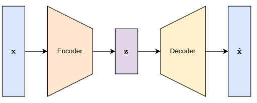
<figcaption class="paper-figure-caption"><b>Fig 1.</b> Fig. 3: Classical autoencoder structure.</figcaption>
</figure>
<figure class="paper-figure-card">
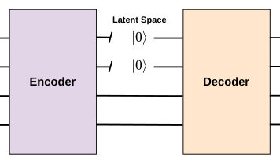
<figcaption class="paper-figure-caption"><b>Fig 2.</b> Fig. 4: Quantum autoencoder structure.</figcaption>
</figure>
<figure class="paper-figure-card">
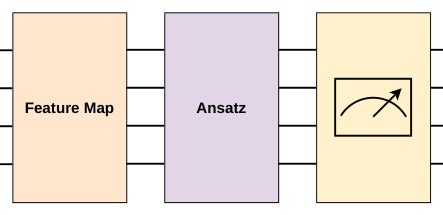
<figcaption class="paper-figure-caption"><b>Fig 3.</b> Fig. 2: General structure of QML models.</figcaption>
</figure>
<figure class="paper-figure-card">

<figcaption class="paper-figure-caption"><b>Fig 4.</b> Fig. 5: Example of FGSM ϵ = 0.30 attack on MNIST images. The original MNIST images are shown in the top row, while the adversarial images are in the bottom row.</figcaption>
</figure>
<figure class="paper-figure-card">

<figcaption class="paper-figure-caption"><b>Fig 5.</b> Fig. 6: An overview of our defense framework. A sample, either clean or adversarial, is given as input x to the QAE. The QAE produces a reconstruction ˆx which is given to the VQC for classification. The QAE also produces the encoding fidelity ⟨σZ⟩x, which is used in calculation of the confidence metric. Once the VQC has predicted the reconstruction ˆx, it produces the logit difference lˆx which is used in addition to the encoding fidelity ⟨σZ⟩x to calculate the confidence metric C. This is compared against the confidence threshold T. If the calculated confidence metric C meets the confidence threshold T, the predicted class label from the VQC is used. Otherwise, the sample is rejected as a...</figcaption>
</figure>
<figure class="paper-figure-card">
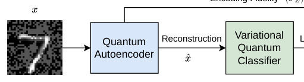
<figcaption class="paper-figure-caption"><b>Fig 6.</b> Fig. 7: Two layers of the circuit-centric classifier design for a four-qubit circuit. A layer consists of a group of 4 rotation gates followed by 4 entangling gates.</figcaption>
</figure>
<figure class="paper-figure-card">
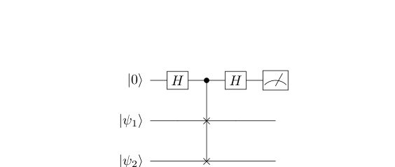
<figcaption class="paper-figure-caption"><b>Fig 7.</b> Fig. 8: A SWAP test used to measure the fidelity between quantum states |ψ1⟩and |ψ2⟩.</figcaption>
</figure>
<figure class="paper-figure-card">
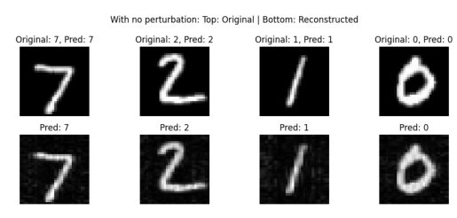
<figcaption class="paper-figure-caption"><b>Fig 8.</b> Fig. 9: The MNIST VQC-100 model can still predict with about the same accuracy when the test images have been reconstructed via a QAE first. The resulting accuracy of original samples is 81.23%, while the accuracy on QAE reconstructions of the original samples is 81.26%.</figcaption>
</figure>
<figure class="paper-figure-card">
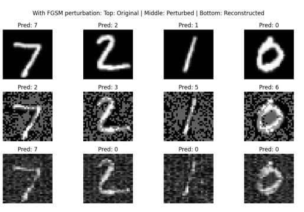
<figcaption class="paper-figure-caption"><b>Fig 9.</b> Fig. 10: The MNIST images are perturbed with the FGSM ϵ = 0.30, as shown in the top row. The VQC prediction on these images are labeled above the images. Each image cannot be predicted correctly. The bottom row showcases the QAE reconstructions of the associated FGSM adversarial image. These reconstructions were able to make two of the images now predict correctly.</figcaption>
</figure>
<figure class="paper-figure-card">
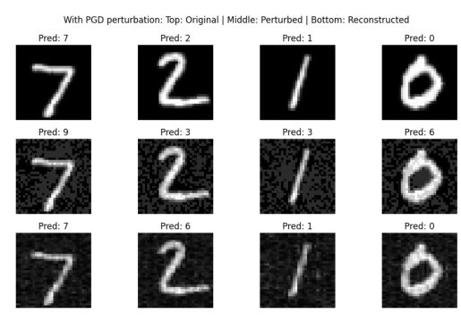
<figcaption class="paper-figure-caption"><b>Fig 10.</b> Fig. 11: With the PGD adversarial perturbations, the QAE can reconstruct the images and remove some of the adversarial noise, allowing the model to correctly predict two images now than none prior without any defense.</figcaption>
</figure>

**Summary.** This paper introduces QAE++, a defense framework designed to protect quantum machine learning models from adversarial noise. By using a quantum autoencoder to reconstruct input data and a diagnostic metric to reject suspicious samples, the method achieves much higher classification accuracy under attack than previous methods.

**Why it may be interesting.** not directly relevant

Detailed structure

**Main problem.** Variational Quantum Classifiers (VQCs) are highly vulnerable to adversarial attacks like FGSM and PGD, where small input perturbations cause incorrect predictions, and existing defenses like adversarial training are often impractical or prone to overfitting.

**Main result.** The proposed QAE++ framework, which uses a quantum autoencoder for purification and a confidence metric for sample rejection, significantly outperforms classical autoencoder defenses, achieving up to a 68% improvement in prediction accuracy under attack.

**Method.** The authors propose an adversarial-training-free defense that uses a Quantum Autoencoder (QAE) to reconstruct and 'purify' input states, combined with a confidence metric based on encoding fidelity and logit difference to identify and reject adversarial samples.

**Model / system.** The study utilizes Variational Quantum Classifiers (VQCs) with strongly entangling layers and Quantum Autoencoders (QAE) for data compression and reconstruction, using amplitude embedding to map MNIST and FashionMNIST data onto qubits.

**Key observables.** Prediction accuracy, encoding fidelity (measured via SWAP test), and logit difference between the highest and second-highest class predictions.

**Important parameters / regimes.** Perturbation magnitude (epsilon), latent space dimension (k), and confidence thresholds (T) derived from clean validation sets.

**Assumptions / limitations.** The decoder is assumed to be the Hermitian conjugate of the encoder (reversibility), and the defense threshold is determined using a clean validation set.

**Figures summary.** Figures illustrate adversarial attacks on MNIST, the architectures of VQCs, CAEs, and QAEs, the SWAP test for fidelity, and various performance plots showing accuracy improvements and reconstruction quality.

**Paper structure.** The paper identifies the vulnerability of VQCs, introduces the QAE-based purification method, details the QAE++ confidence metric, presents comparative evaluations against classical and undefended models, and discusses limitations.

Abstract

Machine learning models can learn from data samples to carry out various tasks efficiently. When data samples are adversarially manipulated, such as by insertion of carefully crafted noise, it can cause the model to make mistakes. Quantum machine learning models are also vulnerable to such adversarial attacks, especially in image classification using variational quantum classifiers. While there are promising defenses against these adversarial perturbations, such as training with adversarial samples, they face practical limitations. For example, they are not applicable in scenarios where training with adversarial samples is either not possible or can overfit the models on one type of attack. In this paper, we propose an adversarial training-free defense framework that utilizes a quantum autoencoder to purify the adversarial samples through reconstruction. Moreover, our defense framework provides a confidence metric to identify potentially adversarial samples that cannot be purified the quantum autoencoder. Extensive evaluation demonstrates that our defense framework can significantly outperform state-of-the-art in prediction accuracy (up to 68%) under adversarial attacks.

[↑ back to top](#top)

### [Dimensionality-Driven Electronic and Orbital Transitions Mediating Interfacial Magnetism in LaNiO3/CaMnO3 Observed In Situ](http://arxiv.org/abs/2604.28054v1)

**Authors:** B-A. Courchene, A. Hampel, S. Beck, J. R. Paudel, J. D. Grassi, L. A. Lapinski, A. M. Derrico, M. Terilli, M. Kareev, C. Klewe, A. Gloskovskii, C. Schlueter, S. K. Chaluvadi, F. Mazzola, I. Vobornik, P. Orgiani, J. Chakhalian, A. J. Millis, A. X. Gray  
**Type:** both · **Category:** strongly correlated electrons · **PDF:** <https://arxiv.org/pdf/2604.28054v1>  
**Analysis basis:** full PDF text, analyzed in chunks

↔ Scroll figures horizontally

<figure class="paper-figure-card">
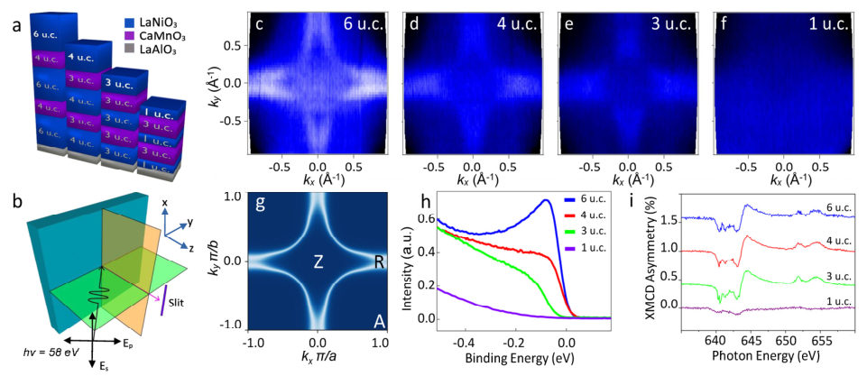
<figcaption class="paper-figure-caption"><b>Fig 1.</b> Fig. 1 | Dimensionality-driven evolution of electronic structure and interfacial magnetism in</figcaption>
</figure>
<figure class="paper-figure-card">
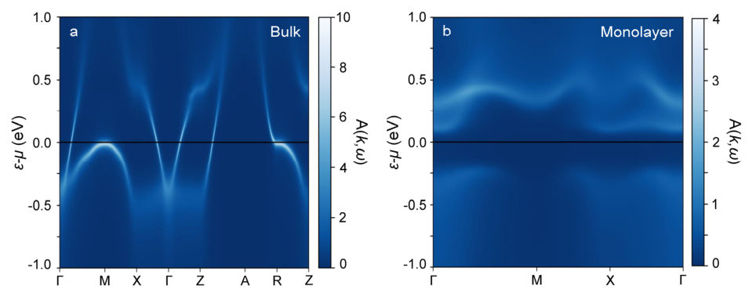
<figcaption class="paper-figure-caption"><b>Fig 2.</b> Fig. 2 | Dimensionality-driven evolution of the LNO spectral function from DFT+DMFT. a, Unfolded</figcaption>
</figure>
<figure class="paper-figure-card">
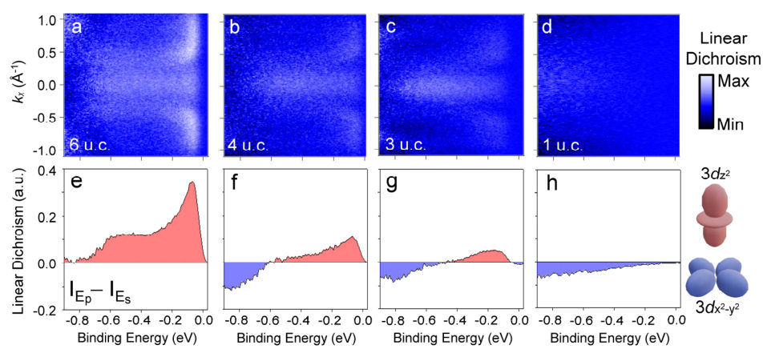
<figcaption class="paper-figure-caption"><b>Fig 3.</b> Fig. 3 | Polarization-dependent ARPES linear dichroism in LNO/CMO superlattices. a-d, Momentum-</figcaption>
</figure>
<figure class="paper-figure-card">
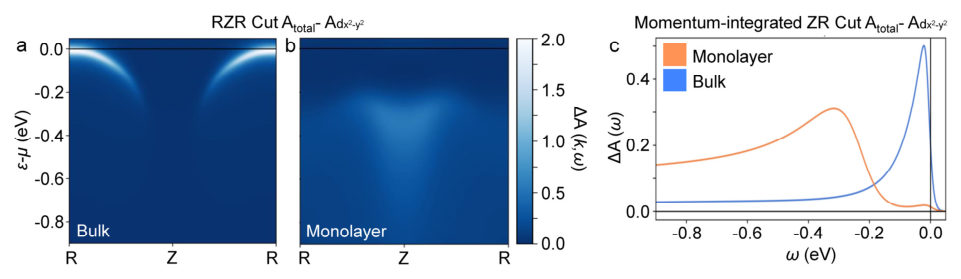
<figcaption class="paper-figure-caption"><b>Fig 4.</b> Figure 4 | Theoretical orbital dichroism from DFT+DMFT for bulk-like and monolayer LNO. a, b,</figcaption>
</figure>

**Summary.** This paper demonstrates that the emergent ferromagnetism at the LaNiO3/CaMnO3 interface is controlled by the electronic state of the LaNiO3 layer. As the layer is thinned, a metal-insulator transition and orbital reconstruction occur, which shuts down the charge transfer necessary for interfacial magnetism.

**Why it may be interesting.** not directly relevant

Detailed structure

**Main problem.** Investigating how dimensionality-driven electronic and orbital transitions in ultrathin LaNiO3 layers mediate emergent interfacial magnetism in LaNiO3/CaMnO3 superlattices.

**Main result.** Reducing LaNiO3 thickness drives a metal-insulator transition and an orbital-polarization crossover, which suppresses charge transfer across the interface and subsequently suppresses the interfacial Mn magnetic moment.

**Method.** The study combines in situ pulsed-laser deposition, polarization-dependent ARPES, XMCD, and HAXPES with first-principles DFT+DMFT calculations.

**Model / system.** Epitaxial LaNiO3/CaMnO3 superlattices with varying LaNiO3 thicknesses (1, 3, 4, and 6 unit cells) grown on LaAlO3 (001) substrates.

**Key observables.** Fermi-surface intensity maps, quasiparticle coherence, orbital polarization (dz2 vs dx2-y2), interfacial Mn magnetic moment, and near-Ef spectral weight.

**Important parameters / regimes.** LaNiO3 thickness (1 to 6 unit cells), ultrathin limit, metal-insulator transition (MIT) onset at 3 u.c., and biaxial compressive strain (-1.1%).

**Assumptions / limitations.** Calculations were performed in the paramagnetic state and used Padé approximants for analytical continuation of self-energy.

**Figures summary.** Figure 1 shows the superlattice schematic and experimental geometry; Supplemental figures show structural characterization (XRD, XRR, LEED, STM), chemical composition (HAXPES), and theoretical spectral functions (DFT+DMFT).

**Paper structure.** The paper introduces the problem of interfacial magnetism, describes the experimental growth and characterization of superlattices, presents ARPES and XMCD results showing the thickness-dependent electronic and magnetic transitions, and concludes with DFT+DMFT validation of the orbital-driven mechanism.

Abstract

Emergent magnetic states at oxide interfaces arise from the interplay of charge transfer, orbital reconstruction, and dimensional confinement, offering a route to engineered correlated-electron behavior in nanoscale spintronic materials. Here, we combine in situ synthesis, polarization-dependent angle-resolved photoelectron spectroscopy, X-ray magnetic circular dichroism, and first-principles electronic-structure calculations to investigate LaNiO3/CaMnO3 superlattices. We show that reducing the LaNiO3 thickness drives a metal-insulator transition accompanied by loss of electronic coherence and an orbital-polarization crossover in the ultrathin limit. These changes weaken charge transfer across the interface and suppress the interfacial Mn magnetic moment in CaMnO3, revealing that the emergent ferromagnetic state is directly governed by electronic confinement in LaNiO3. The insulating state and orbital reconstruction are reproduced by density functional theory combined with dynamical mean-field theory. Together, these results establish a direct and tunable coupling among electronic, orbital, and magnetic degrees of freedom in oxide heterostructures.

[↑ back to top](#top)

### [Discontinuous BBP transitions](http://arxiv.org/abs/2604.27992v1)

**Authors:** Dario Bocchi, Giulio Biroli, Chiara Cammarota, Federico Ricci-Tersenghi  
**Type:** theory · **Category:** disordered systems and neural networks · **PDF:** <https://arxiv.org/pdf/2604.27992v1>  
**Analysis basis:** full PDF text, analyzed in chunks

↔ Scroll figures horizontally

<figure class="paper-figure-card">
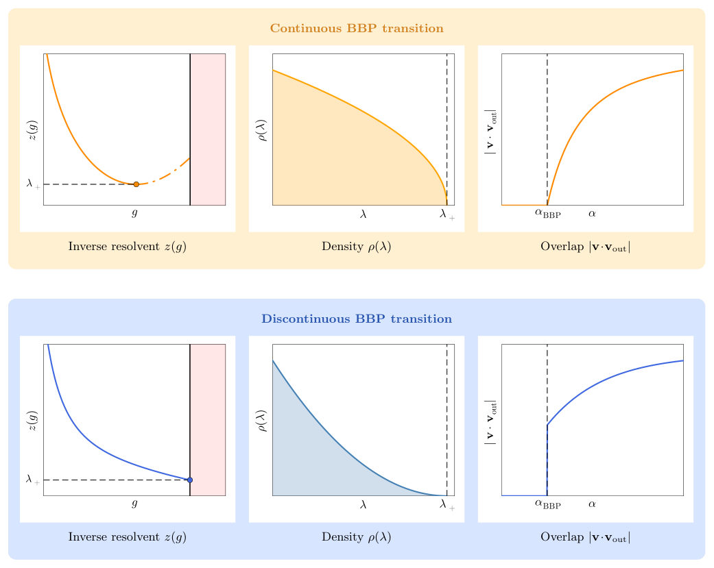
<figcaption class="paper-figure-caption"><b>Fig 1.</b> FIG. 1: Continuous vs. Discontinuous BBP transitions. Each row shows (left to right) the inverse resolvent map z(g), the spectral density near the right edge, and the eigenvector overlap as a function of the spike strength. In the continuous case, z(g) develops a turning point (dz/dg = 0) at the edge, beyond which lies the incorrect branch, the density vanishes sub-linearly, and the overlap turns on smoothly. In the discontinuous case, z(g) reaches the edge without a turning point (dz/dg ̸= 0), the density vanishes super-linearly at the edge, and the overlap exhibits a finite jump at onset.</figcaption>
</figure>
<figure class="paper-figure-card">
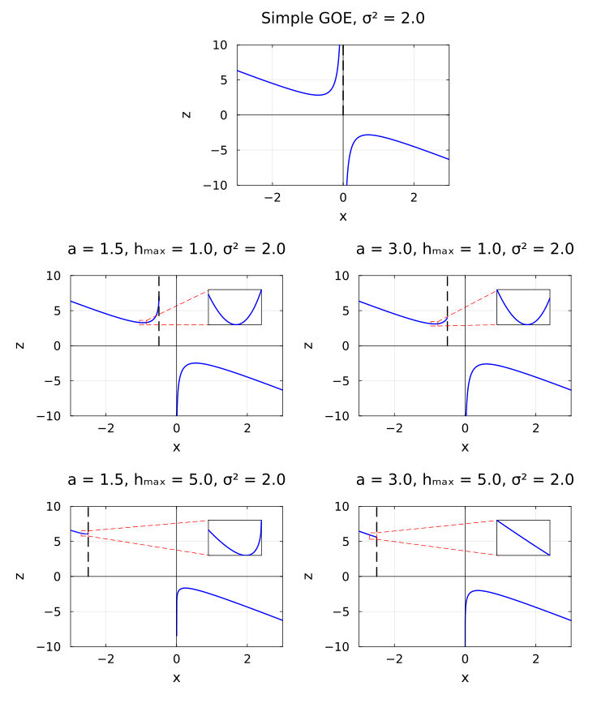
<figcaption class="paper-figure-caption"><b>Fig 2.</b> FIG. 2: The origin of different tails of spectral densities in the Deformed GOE ensemble. The function z(x) is plotted against the auxiliary variable x = g −z/σ2 for different values of a and hmax. In the first line, the plot for a standard GOE (hmax = 0) is shown. Left column (a &lt; 2): The function z(x) always exhibits a turning point (z′(x) = 0) and the incorrect branch diverges at the domain boundary xc = −hmax/σ2, implying a standard square-root edge in all three cases. Right column (a &gt; 2): The derivative z′(x) is finite at the domain boundary, and depending on the values of hmax and σ can be positive (mid panel), leading again to a square-root edge, or negative (bottom panel), leading...</figcaption>
</figure>
<figure class="paper-figure-card">
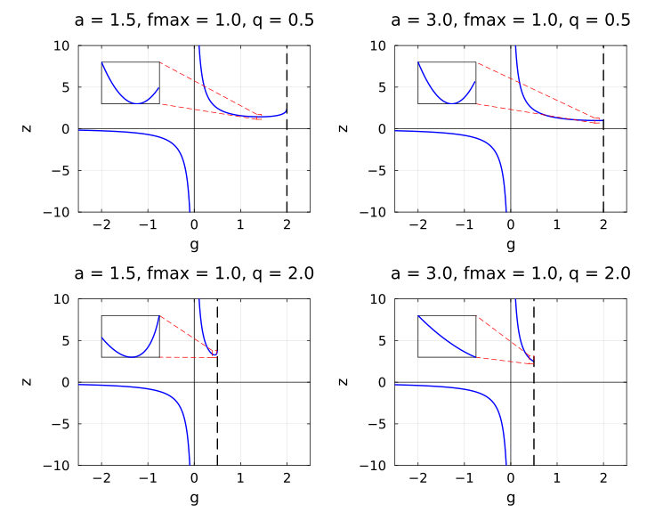
<figcaption class="paper-figure-caption"><b>Fig 3.</b> FIG. 3: The origin of different tails of spectral densities in the Reweighted Wishart ensemble. The function z(g) is plotted for different values of a and the aspect ratio q = N/T. Left column (a &lt; 2): The branch with incorrect positive derivative z′(g), diverging at the domain boundary gmax = (qfmax)−1, ensures the existence of a turning point with z′(g) = 0 and consequently a standard square-root edge. Right column (a &gt; 2): The derivative z′(g) is finite at the domain boundary, and depending on the value of q can be positive (top panel), allowing for a turning point and a square-root edge, or negative (bottom panel), leading to a super-linear edge.</figcaption>
</figure>
<figure class="paper-figure-card">
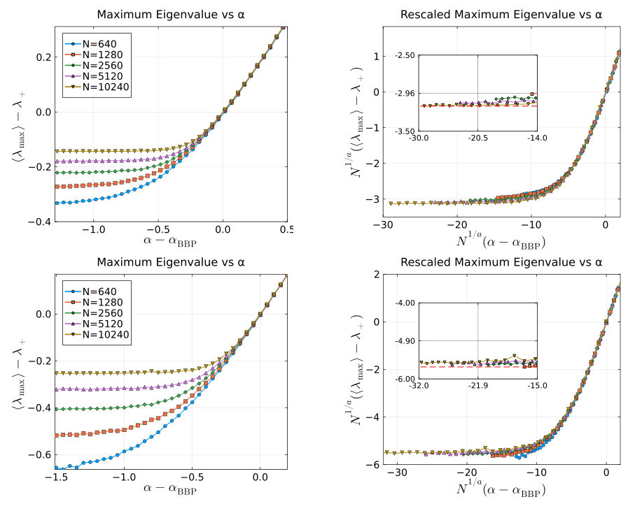
<figcaption class="paper-figure-caption"><b>Fig 4.</b> FIG. 4: Finite-size scaling of the maximum eigenvalue. Upper panels are for the deformed GOE with parameters a = 3, hmax = 5, and σ2 = 2. Lower panels are for the reweighted Wishart ensemble with parameter a = 3, fmax = 1, and q = 5. In the left panels, we plot the difference between the mean value of largest eigenvalue λmax (averaged over 104 samples) and the theoretical edge λ+ computed in the large N limit, as a function of the distance from the critical point, α −αBBP. In the right panels, the same data is collapsed using the predicted scaling for both axes. The data collapse confirms that the fluctuations of the largest eigenvalue and the width of the critical region scale as N −1/a,...</figcaption>
</figure>
<figure class="paper-figure-card">
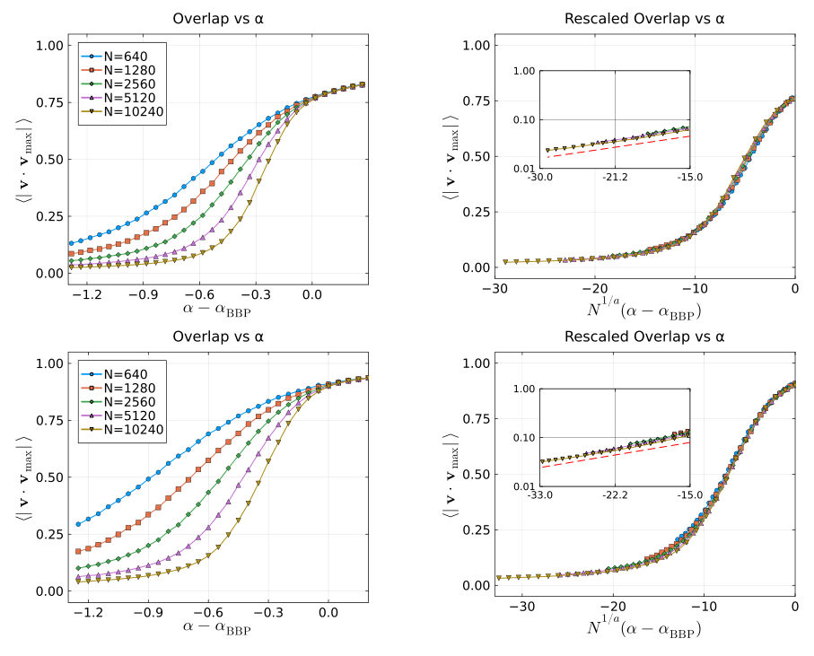
<figcaption class="paper-figure-caption"><b>Fig 5.</b> FIG. 5: Finite-size scaling of the overlap. Upper panels are for the deformed GOE with parameters a = 3, hmax = 5, and σ2 = 2. Lower panels are for the reweighted Wishart ensemble with parameter a = 3, fmax = 1, and q = 5. In the left panels, we plot the mean overlap between the principal eigenvector and the rank-one perturbation (i.e., the signal to be detected), as a function of the distance from the critical point, α −αBBP. In the right panels, the same data is collapsed using the predicted scaling. The universal curve distinguishes the signal-dominated regime (linear behavior on the right) from the noise-dominated regime (left tail proportional to |y|−a/2, see red dashed line in the...</figcaption>
</figure>
<figure class="paper-figure-card">

<figcaption class="paper-figure-caption"><b>Fig 6.</b> FIG. 6: Qualitative behavior of vT G0(z)v near the upper edge. The horizontal lines show the equation vT G0(z)v = 1/α for three regimes: α &gt; αBBP, where the outlier lies above the asymptotic edge λ+; α = αBBP, where it coincides with λ+; and α &lt; αBBP, where at finite N it can lie below λ+ but still above the largest eigenvalue λ1.</figcaption>
</figure>
<figure class="paper-figure-card">
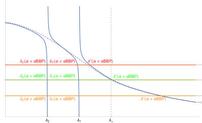
<figcaption class="paper-figure-caption"><b>Fig 7.</b> Figure 6 shows that, depending on α, the distinguished solution obtained from the smooth principal-value part may in fact continue also below λ0 1, in which case it is no longer the largest eigenvalue of the sample and becomes embedded among the top bulk eigenvalues of the spiked matrix. A full characterization of this regime, and a pre- cise criterion to identify it at finite N, is left for future work. Here we restrict ourselves to the controlled region</figcaption>
</figure>

**Summary.** This paper identifies a new class of discontinuous BBP transitions in random matrices where signal detection occurs abruptly. It reveals that in finite systems, an extended pre-critical region allows for signal recovery even below the theoretical threshold, which has significant implications for signal processing and neural network training.

**Why it may be interesting.** not directly relevant

Detailed structure

**Main problem.** Investigating the conditions under which the Baik-Ben Arous-Péché (BBP) transition, which governs the emergence of outlier eigenvalues in spiked random matrices, is discontinuous rather than continuous.

**Main result.** The authors show that BBP transitions are discontinuous when the spectral density vanishes super-linearly (exponent a > 2) at the spectral edge, leading to a finite jump in eigenvector overlap and a pre-critical region where signal recovery occurs below the asymptotic threshold.

**Method.** The study employs Random Matrix Theory, specifically using the resolvent formalism, Stieltjes transform, and Free Probability Theory (R-transform) to analyze the spectral properties and finite-size scaling.

**Model / system.** The paper analyzes spiked models consisting of rank-one perturbations of large random matrices, specifically deformed Gaussian Orthogonal Ensembles (GOE) and reweighted Wishart ensembles.

**Key observables.** Outlier eigenvalue, eigenvector overlap (correlation between the signal and the leading eigenvector), and spectral edge density.

**Important parameters / regimes.** Signal-to-noise ratio (alpha), power-law exponent of the spectral density (a), matrix size (N), and the aspect ratio (q) for Wishart ensembles.

**Assumptions / limitations.** Assumes the large-N limit for the fundamental transition and asymptotic freeness between the unperturbed matrix and the Wigner component.

**Figures summary.** Figure 1 compares continuous vs. discontinuous BBP transitions via the inverse resolvent and overlap; Figure 2 illustrates the transition type in specific ensembles; Figure 4 demonstrates finite-size scaling and data collapse for the maximum eigenvalue.

**Paper structure.** The paper introduces the BBP transition, establishes the mathematical condition for discontinuity based on spectral edge decay, analyzes specific models (deformed GOE and Wishart), develops a finite-size scaling theory, and discusses implications for machine learning and biological systems.

Abstract

The Baik-Ben Arous-Peche (BBP) transition sets fundamental limits for detecting low-rank structure in noisy high-dimensional data and underlies a wide range of spectral methods in many fields from physics to statistics and data sciences. In standard settings, this transition is continuous, implying that signal recovery emerges gradually above a sharp threshold. We show that BBP transitions can instead be discontinuous in very general settings and provide a full theory of this phenomenon. When the eigenvalue density vanishes faster than linearly at the spectral edge, the overlap between the leading eigenvector and the signal jumps discontinuously at the critical point. We study this mechanism in deformed Gaussian and reweighted Wishart ensembles. We analyze in detail the finite-size effects, which play a central and qualitatively new role in the discontinuous BBP transition. Unlike the continuous BBP transition, we establish the existence of an extended pre-critical region where informative eigenvectors emerge well before the asymptotic threshold. The main consequence-and difference from the continuous BBP transition-is that signal recovery can occur at significantly lower signal-to-noise ratio and it is accompanied by strong sample-to-sample variability. Our results show the relevance and the novelty of the discontinuous BBP transition, and highlight the practical implications for signal detection.

[↑ back to top](#top)

### [Exotic Spin Excitation Continuum in a Weakly Coupled Quantum Chainsaw Antiferromagnet](http://arxiv.org/abs/2604.27310v1)

**Authors:** Asiri Thennakoon, Prena Chaudhary, Sankha Subhra Bakshi, Tommy Park, Tristen Lowrey, Daniel Pajerowski, Christina Hoffmann, Junghong H. He, Hiroaki Ueda, Collin Broholm, Gia-Wei Chern, Seung-Hun Lee  
**Type:** both · **Category:** strongly correlated electrons · **PDF:** <https://arxiv.org/pdf/2604.27310v1>  
**Analysis basis:** full PDF text, analyzed in chunks

↔ Scroll figures horizontally

<figure class="paper-figure-card">
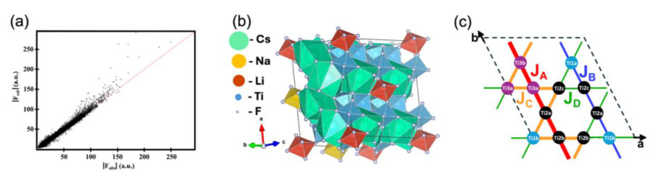
<figcaption class="paper-figure-caption"><b>Fig 1.</b> Figure 1 | Neutron diffraction study of Cs8LiNa3Ti12F48. (a) Comparison of the observed (𝐹𝑜𝑏𝑠) and calculated (𝐹𝑐𝑎𝑙𝑐) structure factors, derived from time-of-flight neutron data and crystal structure refinement using the Jana2020 package, respectively, demonstrating good agreement between experiment and the refined model. (b) Polyhedral representation of the complete three- dimensional monoclinic structure (space group Cm). The nonmagnetic alkali-metal cations (Cs, Na, Li) occupy the structural voids, acting as physical spacers between the magnetic Ti–F networks. (c) An isolated top-down view of the Ti sublattice highlighting a single distorted kagome layer. The fundamental repeating...</figcaption>
</figure>
<figure class="paper-figure-card">

<figcaption class="paper-figure-caption"><b>Fig 2.</b> Figure 2 | Temperature dependence of the bulk magnetic susceptibility of Cs8LiNa3Ti12F48, Magnetic susceptibility, 𝜒= 𝑀/𝐻, measured on a single crystal in an applied field of 𝜇0𝐻= 1 T with the field perpendicular to the kagome plane (blue circles) and parallel to the kagome plane (red circles). The two curves nearly overlap over the full measured temperature range, indicating weak bulk magnetic anisotropy. The inset on the top right shows the inverse susceptibility 1/𝜒 together with a Curie-Weiss fit to the high-temperature region (dashed blue line), yielding a Curie- Weiss temperature Θ𝐶𝑊= −36.9 K and 𝑝𝑒𝑓𝑓= 1.693 𝜇𝐵.</figcaption>
</figure>
<figure class="paper-figure-card">
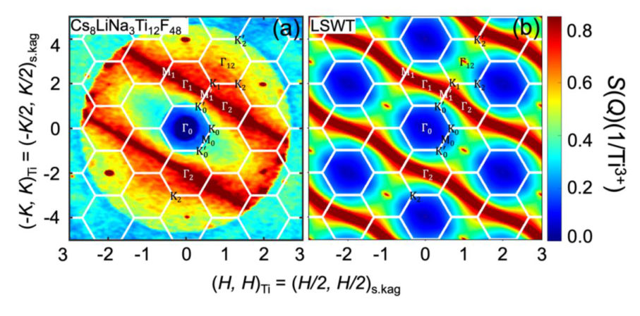
<figcaption class="paper-figure-caption"><b>Fig 3.</b> Figure 3 | Q-dependence of the equal-time spin correlation function in Cs8LiNa3Ti12F48. a,</figcaption>
</figure>
<figure class="paper-figure-card">

<figcaption class="paper-figure-caption"><b>Fig 4.</b> Figure 4 | Dynamic spin correlations in Cs8LiNa3Ti12F48. Color contour maps of the normalized dynamic spin correlation function, 𝑆(𝐐, ℏ𝜔), as a function of momentum (𝐐) and energy transfer (ℏ𝜔), measured along two representative momentum cuts through the two-dimensional Brillouin zone, indicated by the green arrows in the insets. For each cut, the top panel shows the data at 1.7 K, the middle panel shows the data at 30 K, and the bottom panel shows the corresponding linear spin-wave theory (LSWT) intensity, 𝑆𝐿𝑆𝑊𝑇(𝐐,ℏ𝜔), calculated for the anisotropic J-D model. In the first panels, the black lines represent the calculated LSWT dispersion relation. Panel a follows the M1 →Γ1 →M1</figcaption>
</figure>

**Summary.** This paper identifies a unique state of 'anisotropic fractionalization' in a Ti-based kagome-related antiferromagnet. By using neutron scattering, the authors show that a 2D lattice can behave as a network of weakly coupled 1D chains, demonstrating that 1D-like quantum criticality can survive within a 2D framework.

**Why it may be interesting.** The paper explores how many-body dynamics and fractionalization can persist across a dimensional crossover, which is highly relevant to understanding the stability of exotic excitations in many-body systems.

Detailed structure

**Main problem.** The study investigates the dimensional crossover of quantum disorder, specifically how fractionalized excitations evolve when transitioning from 1D criticality to 2D topological order in a frustrated lattice.

**Main result.** The researchers discovered a regime of 'anisotropic fractionalization' in a Ti-based kagome-related magnet, where 2D lattice dynamics reorganize into a network of weakly coupled spin-1/2 chains, maintaining 1D-like signatures.

**Method.** The study combines single-crystal neutron diffraction for structural refinement with inelastic neutron scattering (INS) using the CNCS and TOPAZ spectrometers at the Spallation Neutron Source.

**Model / system.** The physical system is the Ti-based quantum antiferromagnet Cs8LiNa3Ti12F48, which features a distorted kagome lattice of Ti3+ (S=1/2) ions and an anisotropic exchange Hamiltonian with four distinct nearest-neighbor couplings and Dzyaloshinskii-Moriya interactions.

**Key observables.** Dynamic spin correlation function S(Q, h-omega), equal-time response function S(Q), magnetic susceptibility, and crystal structure refinement statistics.

**Important parameters / regimes.** Exchange couplings (JA=11.26, JB=3.20, JC=8.15, JD=1.22 meV), Curie-Weiss temperature (theta_CW = -36.9 K), and measurement temperatures (1.7 K and 30 K).

**Assumptions / limitations.** The structural refinement assumed a fixed position for the Lithium atom due to high correlation with the local background; the magnetic model assumes a 2D nearest-neighbor kagome framework.

**Figures summary.** The figures likely include crystal structure refinements, magnetic susceptibility plots, and momentum-resolved inelastic neutron scattering maps showing the excitation continuum and rod-like scattering.

**Paper structure.** The paper introduces the problem of dimensional crossover, describes the crystal structure and synthesis of the Ti-based magnet, presents neutron diffraction and susceptibility data, details the inelastic neutron scattering results showing the excitation continuum, and concludes with a discussion on anisotropic fractionalization.

Abstract

Collective motions in strongly interacting magnets involve many spins and are often described in terms of integer-spin excitations. However, in certain cases, the collective motion can behave as if these integer excitations break apart into smaller, particle-like entities with unusual properties. Such fractionalized excitations in quantum magnets are commonly associated either with topological order in two dimensions or with criticality in one dimension. It remains unclear how these distinct mechanisms are connected across a dimensional crossover. Here we investigate the Ti-based quantum antiferromagnet, $Cs_{8}LiNa_{3}Ti_{12}F_{48}$, in which $Ti^{3+}$ ($3d^{1}$, $S=1/2$) ions interact antiferromagnetically within distorted kagome planes. Our inelastic neutron scattering study on a single crystal reveals a frustrated network of weakly coupled spin-$1/2$ chainsaws, realizing a regime of dimensional frustration in which interchain couplings fail to establish coherent two-dimensional order. The magnetic excitation spectrum exhibits a strong continuum spanning the full measured momentum and energy phase space. In addition, the dynamic spin correlation function displays rod-like scattering in momentum space, indicating a quasi-one-dimensional nature of the magnetic correlations. These results point to fractionalized excitations with intrinsically directional character, demonstrating that signatures of one-dimensional criticality can persist within a two-dimensional lattice. Our findings establish anisotropic fractionalization as a distinct organizing principle for quantum-disordered states.

[↑ back to top](#top)

### [Explicit Quantum Search Algorithm for the Densest k-Subgraph Problem](http://arxiv.org/abs/2604.27782v1)

**Authors:** Yu. A. Biriukov, R. D. Morozov, I. V. Dyakonov, S. S. Straupe  
**Type:** theory · **Category:** quantum information and computing · **PDF:** <https://arxiv.org/pdf/2604.27782v1>  
**Analysis basis:** full PDF text, analyzed in chunks

↔ Scroll figures horizontally

<figure class="paper-figure-card">
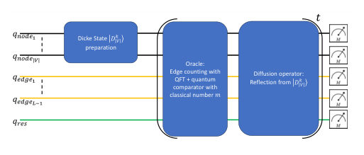
<figcaption class="paper-figure-caption"><b>Fig 1.</b> FIG. 1: General scheme of a single Grover-based search call at threshold mi.</figcaption>
</figure>
<figure class="paper-figure-card">
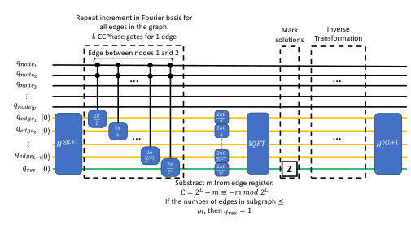
<figcaption class="paper-figure-caption"><b>Fig 2.</b> FIG. 2: Gate scheme for oracle.</figcaption>
</figure>
<figure class="paper-figure-card">
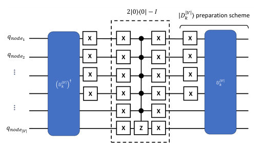
<figcaption class="paper-figure-caption"><b>Fig 3.</b> FIG. 3: Diffusion operator</figcaption>
</figure>
<figure class="paper-figure-card">

<figcaption class="paper-figure-caption"><b>Fig 4.</b> FIG. 4: Benchmark graph with n = 10 vertices used in the convergence experiments.</figcaption>
</figure>
<figure class="paper-figure-card">
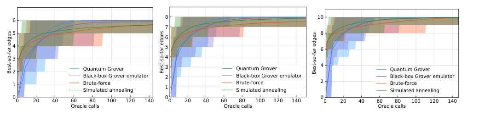
<figcaption class="paper-figure-caption"><b>Fig 5.</b> FIG. 5: Convergence of the best-so-far edge count for the four algorithms on the benchmark graph from Fig. 4. From left to right: k = 4, 5, 6. Solid lines show the mean over 1000 independent runs, and shaded regions indicate empirical 90% confidence intervals.</figcaption>
</figure>
<figure class="paper-figure-card">
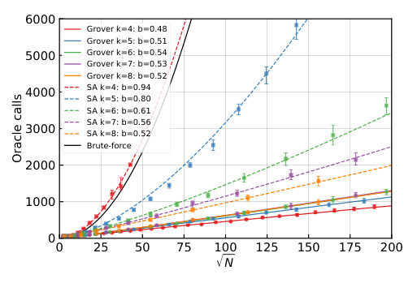
<figcaption class="paper-figure-caption"><b>Fig 6.</b> FIG. 7: Comparison of oracle cost scaling for the Grover-based search and classical baselines as a function of the search-space size N = n k  . Circles show the Grover-based oracle cost needed to reach a 95% success probability, while square markers correspond to Simulated annealing tuned to the same target success probability. The black curve represents classical Brute-force search with 95% success probability. The colored lines show power-law fits of the form y = aN b, with the fitted exponent b given in the legend.</figcaption>
</figure>
<figure class="paper-figure-card">
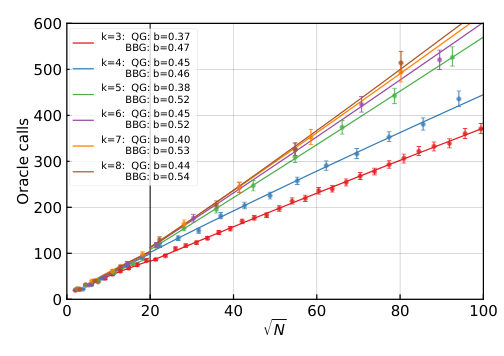
<figcaption class="paper-figure-caption"><b>Fig 7.</b> FIG. 6: Scaling of the oracle cost of the Grover-based search as a function of the search-space size N = n k  for several values of k. Each point shows the average number of oracle calls needed to certify the optimal densest k-subgraph with probability at least 95%; error bars indicate 99% hierarchical bootstrap confidence intervals. Here QG denotes the full Quantum Grover simulation and BBG the Black-box Grover emulator. The lines show power-law fits of the form y = aN b, with the fitted exponent b given in the legend.</figcaption>
</figure>

**Summary.** This paper presents a new quantum algorithm for the NP-hard densest k-subgraph problem using Grover's search and Dicke states. It demonstrates a quadratic speedup over classical brute-force search and provides an explicit gate-level implementation for the edge-counting oracle. The method avoids the complexities of QUBO mapping and is applicable to other graph optimization tasks.

**Why it may be interesting.** not directly relevant

Detailed structure

**Main problem.** Finding the densest k-vertex subgraph in an undirected graph, which is an NP-hard combinatorial optimization problem.

**Main result.** The authors propose a quantum search algorithm that provides a provable quadratic speedup over classical brute-force search, with an oracle cost scaling as O(k^2 sqrt(N)).

**Method.** The approach uses a Grover-based search framework with Dicke state preparation, a QFT-based edge-counting oracle, and an iterative thresholding strategy.

**Model / system.** The computational model is a circuit-based quantum computer utilizing a vertex register of n qubits and an edge counter register of L+1 qubits, operating on an undirected graph G=(V, E) represented by an adjacency matrix.

**Key observables.** Edge count within the subgraph and the oracle call cost (number of queries required for a 95% success probability).

**Important parameters / regimes.** Number of vertices (n), subgraph size (k), search space size (N = n choose k), and the penalty coefficient (lambda) for the QUBO formulation.

**Assumptions / limitations.** The algorithm assumes the availability of efficient Dicke state preparation and that the high T-count/gate depth of the QFT-based oracle can be managed.

**Figures summary.** Figure 1 shows the Grover iteration sequence; Figure 2 details the gate-level oracle scheme; Figures 3-5 illustrate the diffusion operator, convergence of edge counts, and numerical simulations; Figure 6-7 show the scaling of oracle costs relative to the search space size.

**Paper structure.** The paper introduces the DkS problem and its applications, reviews existing QUBO and variational methods, proposes a new Grover-based algorithm with explicit oracle construction, presents numerical simulations comparing the algorithm to classical baselines, and concludes with scaling analysis and limitations.

Abstract

This paper addresses the problem of finding the densest $k$-vertex subgraph in an arbitrary graph. This problem is NP-hard and has important applications in social network analysis, fraud detection, recommendation systems, and bioinformatics. We propose two quantum approaches to solve this problem: reduction to Quadratic Unconstrained Binary Optimization (QUBO) and using Grover's quantum search algorithm. For the latter approach, we present an explicit gate-based oracle circuit utilizing Dicke states and Quantum Fourier Transform for edge counting. Numerical simulations demonstrate a quadratic speedup over classical Brute-force search.

[↑ back to top](#top)

### [Finite Imaginary-Time Evolution for Polynomial Unconstrained Binary Optimization](http://arxiv.org/abs/2604.27482v1)

**Authors:** Jaehee Kim, Juhyeon Kim, Gwonhak Lee, Kyunghyun Baek, Daniel K. Park, Jeongho Bang, Joonsuk Huh  
**Type:** theory · **Category:** quantum information and computing · **PDF:** <https://arxiv.org/pdf/2604.27482v1>  
**Analysis basis:** full PDF text, analyzed in chunks

↔ Scroll figures horizontally

<figure class="paper-figure-card">

<figcaption class="paper-figure-caption"><b>Fig 1.</b> Figure 1: Five-vertex MAX-CUT test graph with |E| = 5 edges. The curve indicates one of the three optimal cuts (six ground-state labelings counting partition complements); the graph is non-bipartite, so no cut separates every edge. The five edges {(0, 1), (0, 2), (1, 2), (2, 3), (3, 4)} combine a triangle on {0, 1, 2} with a path 2–3–4.</figcaption>
</figure>
<figure class="paper-figure-card">

<figcaption class="paper-figure-caption"><b>Fig 2.</b> Figure 2: Identity validation on the 5-vertex MAX-CUT instance with |ψ0⟩= |+⟩⊗5. Green circles: simulated PLCU(β) Fg(β); solid line: closed-form prediction (3/16) e−4β. Blue squares: PLCU(β); red triangles: Fg(β). Maximum relative error is 1.3 × 10−14, near the double-precision roundoff level.</figcaption>
</figure>
<figure class="paper-figure-card">

<figcaption class="paper-figure-caption"><b>Fig 3.</b> Figure 3: Simulation results of MAX-CUT without amplitude amplification. (a) LCU success probability PLCU(β). (b) Conditional ground-subspace fidelity Fg(β), the probability of finding the system in the ground subspace given that the LCU succeeded.</figcaption>
</figure>
<figure class="paper-figure-card">

<figcaption class="paper-figure-caption"><b>Fig 4.</b> Figure 4: Simulation results with varying query complexities L. (a) FPAA-amplified LCU success prob- ability P (L) amp(β). (b) Ground-subspace preparation probability P (L) g (β) = P (L) amp(β) Fg(β) for different L, i.e., the joint probability of amplified LCU success and being in the ground subspace.</figcaption>
</figure>
<figure class="paper-figure-card">

<figcaption class="paper-figure-caption"><b>Fig 5.</b> Fig. 4 turns on FPAA at varying β across multiple query complexities L and tracks, as β is swept from 0 to 2, both (a) the amplified LCU success probability P (L) amp(β) and (b) the ground-subspace preparation probability P (L) g (β) = P (L) amp(β) Fg(β), defined as the</figcaption>
</figure>
<figure class="paper-figure-card">

<figcaption class="paper-figure-caption"><b>Fig 6.</b> Figure 5: Identity check on the weighted HUBO instance Eq. (26) with uniform initial state |+⟩⊗8. Green circles: simulated PLCU(β)Fg(β); solid line: closed-form prediction (1/32) e−9.6β. Blue squares: PLCU(β); red triangles: Fg(β). Maximum relative error across the swept β is 1.2 × 10−12, at the double-precision floating-point limit.</figcaption>
</figure>
<figure class="paper-figure-card">
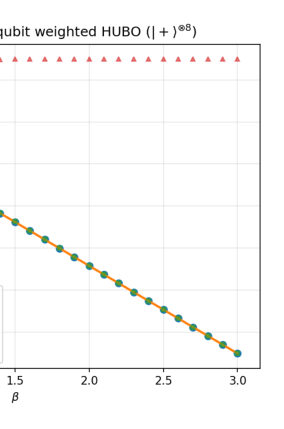
<figcaption class="paper-figure-caption"><b>Fig 7.</b> Fig. 5 displays the identity check for the uniform regime: the simulated product matches the closed-form prediction across β ∈[0, 3] with maximum relative error 1.2 × 10−12. Because the statevector simulator uses exact expectation values rather than finite- shot sampling, no shot noise enters; the agreement validates Eq. (16) as an equality rather than an approximation. Fig. 6 sweeps the initial state. All three regimes follow the theory envelope γ0 e−9.6β: the exponent W + E0 = 4.8 is common across regimes, while γ0 scales the prefactor by roughly an order of magnitude between uniform and strong warm-start. This separation is the one implied by Proposition 1 and illustrates the role of γ0...</figcaption>
</figure>
<figure class="paper-figure-card">
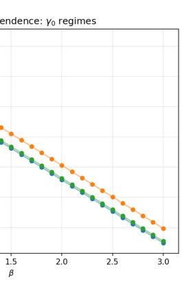
<figcaption class="paper-figure-caption"><b>Fig 8.</b> Figure 6: Initial-state dependence on the HUBO Hamiltonian Eq. (26). The three regimes—uniform (γ0 ≈0.031), warm start at p = 0.60 (γ0 ≈0.041), and warm start at p = 0.85 (γ0 ≈0.29)—produce parallel envelopes γ0 e−9.6β with common slope −2(W +E0) = −9.6; the prefactor is the initial overlap γ0.</figcaption>
</figure>
<figure class="paper-figure-card">
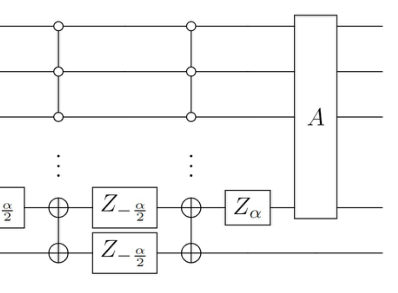
<figcaption class="paper-figure-caption"><b>Fig 9.</b> Figure 8: Quantum circuit for fixed-point amplitude amplification. A prepares the initial state |s⟩= A|0⟩⊗n; U is the good-subspace phase oracle (realized via phase kickback from a bit-flip ancilla oracle, with the ancilla prepared in |−⟩); Zθ is a z-axis rotation. Adapted from Ref. [17].</figcaption>
</figure>
<figure class="paper-figure-card">
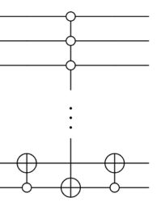
<figcaption class="paper-figure-caption"><b>Fig 10.</b> Figure 9: Quantum circuit for a multi-controlled double NOT gate. The gate decomposes into two CNOT gates and one multi-controlled NOT gate.</figcaption>
</figure>

**Summary.** This paper presents a new method called FinITE for performing finite imaginary-time evolution on quantum computers to solve optimization problems. It provides an analytical way to choose the optimal evolution time to guarantee a specific ground-state fidelity while controlling the computational cost of amplitude amplification. The method is particularly efficient for higher-order optimization problems as it avoids the need for complex quadratization.

**Why it may be interesting.** not directly relevant

Detailed structure

**Main problem.** Implementing non-unitary imaginary-time evolution (ITE) on quantum hardware for solving optimization problems, specifically managing the trade-off between ground-state fidelity and the success probability of the LCU implementation.

**Main result.** The authors derive an exact identity relating LCU success probability and ground-subspace fidelity, providing a closed-form rule for choosing an optimal finite imaginary time beta-star to achieve target fidelity.

**Method.** The FinITE algorithm uses the Linear Combination of Unitaries (LCU) framework for termwise block-encoding of commuting Pauli-Z strings, combined with Fixed-Point Amplitude Amplification (FPAA) to boost success probability.

**Model / system.** Polynomial Unconstrained Binary Optimization (PUBO) problems, including QUBO and HUBO, represented by diagonal Pauli-Z cost Hamiltonians consisting of pairwise-commuting terms.

**Key observables.** Ground-subspace fidelity (Fg), LCU success probability (PLCU), and the spectral gap (Delta).

**Important parameters / regimes.** Imaginary time (beta), initial ground-subspace overlap (gamma_0), L1-norm of Pauli coefficients (W), and the spectral gap (Delta).

**Assumptions / limitations.** The Hamiltonian must consist of pairwise-commuting Pauli terms (diagonal PUBO case), and the initial state must have a non-zero overlap with the ground subspace.

**Figures summary.** Simulations verifying the exponential decay identity of the success-fidelity product, comparisons of different initial state warm-starts, and the performance of FPAA in amplifying success probability.

**Paper structure.** The paper introduces the FinITE algorithm, establishes the mathematical framework for LCU-based ITE, proves the exact spectral identity and the beta-selection rule, provides a complexity analysis for gate counts and queries, and validates the theory via statevector and shot-based simulations on QUBO and HUBO instances.

Abstract

Imaginary-time evolution is a standard primitive for ground-state preparation but is nonunitary, precluding direct quantum implementation. We develop Finite Imaginary-Time Evolution (FinITE), a finite-beta construction for diagonal Pauli-Z cost Hamiltonians arising from polynomial unconstrained binary optimization (PUBO) instances, including QUBO and HUBO cases. FinITE uses the linear-combination-of-unitaries (LCU) framework to implement a scaled imaginary-time propagator. The commuting Pauli-Z structure makes termwise block-encodings compose without product-formula error, and higher-order Pauli-Z terms are handled directly without quadratization. The structure yields an exact finite-beta identity between the LCU success probability and the ground-subspace fidelity. Combined with a gap-based fidelity lower bound, the identity yields a closed-form sufficient imaginary-time threshold beta-star for a chosen target fidelity. The threshold depends on estimates of the spectral gap and the initial ground-subspace overlap. Because the LCU success event is flagged by a known ancilla outcome, we integrate fixed-point amplitude amplification with an explicit query-complexity bound. Statevector simulations verify the identity on a five-vertex MaxCut (QUBO) and an eight-qubit cubic HUBO instance, and shot-based simulations on the MaxCut instance illustrate the predicted finite-beta threshold and amplification procedure.

[↑ back to top](#top)

### [g-tensor Optimization in Ge/SiGe Quantum Dots](http://arxiv.org/abs/2604.28081v1)

**Authors:** Aram Shojaei, Edmondo Valvo, Maximilian Rimbach-Russ, Eliska Greplova, Ana Silva  
**Type:** theory · **Category:** quantum information and computing · **PDF:** <https://arxiv.org/pdf/2604.28081v1>  
**Analysis basis:** abstract only; PDF text extraction failed or PDF unavailable

**Summary.** This paper presents a numerical framework for optimizing the g-tensor in germanium-based quantum dots to mitigate the effects of device variability. By engineering the heterostructure potential, the authors show it is possible to suppress specific g-tensor components, which is a key step toward reliable, large-scale semiconductor quantum computing.

**Why it may be interesting.** not directly relevant

Detailed structure

**Main problem.** Device performance in planar germanium heterostructures is limited by quantum dot variability, which causes uncertainty in qubit energy levels and random spin quantization axis orientations.

**Main result.** The authors developed a flexible optimization framework to engineer g-tensor properties, demonstrating that reshaping the out-of-plane potential in SiGe-Ge-SiGe quantum wells can suppress in-plane g-tensor components to enable gapless single-spin qubit encoding.

**Method.** A numerical optimization framework is used to design heterostructure engineering parameters, specifically adjusting silicon concentration within the quantum well to reshape the potential.

**Model / system.** The system consists of planar germanium heterostructures (SiGe-Ge-SiGe quantum wells) hosting hole-spin qubits.

**Key observables.** g-tensor components (in-plane and out-of-plane), spin quantization axis orientation, and qubit energy levels.

**Important parameters / regimes.** Silicon concentration within the quantum well, out-of-plane potential profile, and g-tensor anisotropy.

**Assumptions / limitations.** The framework assumes that heterostructure engineering via silicon concentration adjustment is a viable way to reshape the potential.

**Paper structure.** The paper introduces the problem of variability in Ge-based qubits, presents a new optimization framework for g-tensor engineering, uses the reshaping of SiGe-Ge-SiGe quantum wells as a benchmark case, and concludes with implications for scalable quantum computing.

Abstract

Planar germanium heterostructures hosting hole-spin qubits are among the leading platforms for scalable semiconductor-based quantum computing. Yet, device performance is hindered by significant quantum dot variability, which leads to uncertainty in qubit energy levels and random orientations of the spin quantization axis. Tailored control of the g-tensor offers a strategy to overcome these limitations and achieve more reliable qubit operations. Here, we introduce a flexible optimization framework for engineering g-tensor properties. As a benchmark, we numerically obtain the optimal reshaping of the out-of-plane potential in a SiGe-Ge-SiGe quantum well to suppress the in-plane g-tensor components and realize the recently proposed gapless single-spin qubit encoding. This reshaping is achieved through heterostructure engineering, specifically by adjusting the silicon concentration within the quantum well, though the framework remains readily adaptable to alternative design objectives. Our results provide practical design principles for improving the tunability of the spin response, paving the way towards large-scale germanium-based quantum computers.

[↑ back to top](#top)

### [Geometric memory in incomplete phase transitions across dimensions](http://arxiv.org/abs/2604.27779v1)

**Authors:** F. Tolea, M. Tolea  
**Type:** theory · **Category:** statistical mechanics · **PDF:** <https://arxiv.org/pdf/2604.27779v1>  
**Analysis basis:** abstract only; PDF text extraction failed or PDF unavailable

**Summary.** This paper demonstrates that the memory of phase distributions during incomplete solid-state transitions is driven by a purely geometric mechanism. It shows that the strength of this memory is highly dependent on the dimensionality of the growing phases, being most pronounced in 2D.

**Why it may be interesting.** not directly relevant

Detailed structure

**Main problem.** The study investigates how dimensionality and geometric blocking affect the persistence of memory in the size distribution of phases during incomplete solid-state phase transitions.

**Main result.** The researchers find that while geometric memory is robust across different geometries, it is significantly stronger in 2D than in 3D or 3D lamellar configurations.

**Method.** The authors use a nucleation-and-growth model involving self-similar expansion and impingement, supplemented by differential scanning calorimetry simulations and Shannon size-entropy calculations.

**Model / system.** A model of first-order solid-solid phase transitions where plates (squares, cubes, or lamellae) grow homothetically until they reach a maximum size or are stopped by impingement.

**Key observables.** Size mass ratio, plate-size distribution, Shannon size-entropy, and differential scanning calorimetry (DSC) signals.

**Important parameters / regimes.** Dimensionality (2D, 3D, and 3DL), plate geometry, and the degree of incomplete reversion.

**Assumptions / limitations.** The phase transition is modeled as a purely geometric process of nucleation and growth with regular plate shapes and self-similar expansion.

**Figures summary.** The paper includes growth snapshots, arrest-regrowth cycles, size distributions, and simulated DSC curves.

**Paper structure.** The paper extends a 2D model to 3D and 3DL geometries, introduces a quantitative memory descriptor, analyzes the impact of dimensionality, and provides simulation-based validation.

Abstract

We model a direct solid-state phase transition through a nucleation-and-growth process in which plates have simple, regular shapes - squares, cubes, or square-faced lamellae - and grow homothetically (self-similarly) until they either reach a randomly assigned maximum size or are stopped by impingement with previously formed plates. The reverse transformation is represented by the preferential disappearance of smaller plates, while larger plates are retained during an incomplete reversion. A subsequent direct transformation therefore produces a modified plate-size distribution, a memory effect that forms the main focus of this study. Building upon an earlier two-dimensional (2D) formulation, we extend the model to cubes (3D) and to lamellar plates (3DL) in order to examine how dimensionality affects transformation memory. We introduce a quantitative descriptor of memory, the size mass ratio, and find that memory is robust in all geometries but overall stronger in 2D than in 3D or 3DL. We provide growth snapshots, arrest-regrowth cycles, size distributions, and differential scanning calorimetry simulations, and we compute the Shannon size-entropy to quantify configurational diversity. Although motivated by the thermal memory effect in shape-memory alloys, the model more generally identifies a purely geometric mechanism for memory in first-order solid-solid transformations, highlighting the role of dimensionality and geometric blocking in controlling the strength of transformation memory.

[↑ back to top](#top)

### [High-Girth Regular Quantum LDPC Codes from Square-Base Hypergraph Products via CPM Lifts](http://arxiv.org/abs/2604.27817v1)

**Authors:** Koki Okada, Kenta Kasai  
**Type:** theory · **Category:** quantum information and computing · **PDF:** <https://arxiv.org/pdf/2604.27817v1>  
**Analysis basis:** full PDF text, analyzed in chunks

↔ Scroll figures horizontally

<figure class="paper-figure-card">
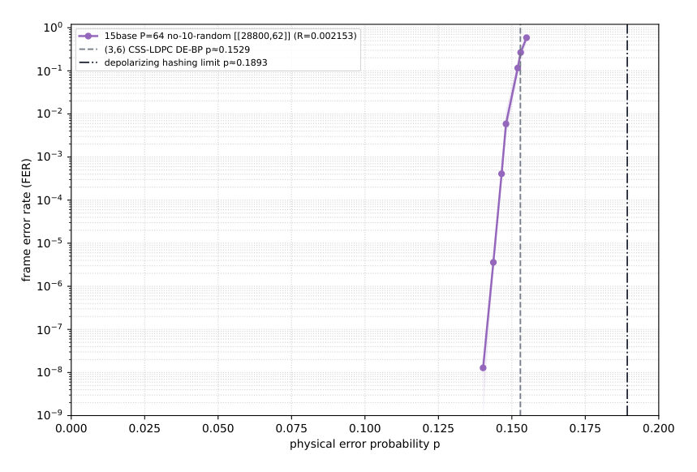
<figcaption class="paper-figure-caption"><b>Fig 1.</b> Figure 1: p–FER plot for the randomized P = 64 lift derived from the generalized-quadrangle base B15. Each point aggregates independent decoding trials at the same p, using the degeneracy- aware BP decoder followed by OSD-lite post-processing; shaded bands indicate Wilson 95% confidence intervals. Zero-failure points are plotted at the upper endpoint of the Wilson interval. The dashed vertical line is the population-dynamics estimate pDE ≈0.1529 of the BP density- evolution threshold for the (3, 6)-regular CSS-LDPC ensemble on the depolarizing channel, and the dash-dotted vertical line is the depolarizing-channel hashing limit phash ≈0.18929.</figcaption>
</figure>
<figure class="paper-figure-card">

<figcaption class="paper-figure-caption"><b>Fig 2.</b> Figure 2: Matrix plots of the smaller square base matrices.</figcaption>
</figure>
<figure class="paper-figure-card">

<figcaption class="paper-figure-caption"><b>Fig 3.</b> Figure 3: Matrix plots of the larger square base matrices.</figcaption>
</figure>
<figure class="paper-figure-card">
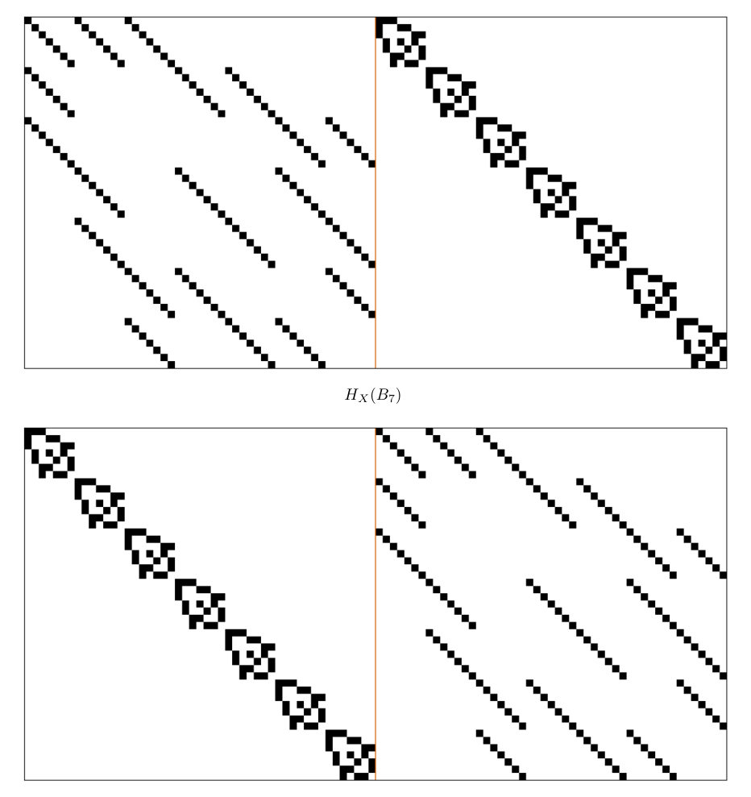
<figcaption class="paper-figure-caption"><b>Fig 4.</b> Figure 4: Matrix plots of the HGP check matrices obtained from the Fano-plane base matrix B7.</figcaption>
</figure>

**Summary.** This paper presents a new method for constructing high-girth, regular quantum LDPC codes by lifting square-base hypergraph product matrices. It demonstrates that these codes can achieve high-performance decoding near theoretical limits, providing a scalable approach to designing robust quantum error-correcting codes.

**Why it may be interesting.** not directly relevant

Detailed structure

**Main problem.** Designing regular, high-girth quantum low-density parity-check (QLDPC) codes using square-base hypergraph product constructions while managing short cycles and logical qubit counts.

**Main result.** The authors developed a construction using Circulant Permutation Matrix (CPM) lifts that produces a [[28800, 62]] girth-8 (3,6)-regular CSS-LDPC code with exceptional decoding performance at $p=0.1402$.

**Method.** The method uses square binary base matrices derived from finite geometries (like Fano planes and generalized quadrangles) combined with CPM lifting and a randomized local search to satisfy CSS orthogonality and cycle-suppression constraints.

**Model / system.** The study focuses on CSS-type quantum LDPC codes under the depolarizing noise channel, utilizing the Hypergraph Product (HGP) framework.

**Key observables.** Tanner girth, code rate, logical qubit count (k), decoding failure rate (Frame Error Rate), and the depolarizing error probability (p).

**Important parameters / regimes.** Depolarizing probability $p=0.1402$, code parameters $[[28800, 62]]$, and the theoretical hashing limit $p_{hash} \approx 0.18929$.

**Assumptions / limitations.** The construction is fundamentally limited to a Tanner girth of 8 due to orthogonality-forced cycles; the design rate of the square-base construction is zero.

**Figures summary.** Figure 1 shows a performance plot of FER vs. p; Figures 2 and 3 display visual matrix representations of various base matrices; Figure 4 illustrates the HGP check matrices for the Fano plane construction.

**Paper structure.** The paper introduces the square-base HGP construction, establishes conditions for regularity and girth control, analyzes the constraints of CPM lifting, presents specific high-girth base matrix examples, and concludes with numerical decoding performance simulations.

Abstract

We study square-base Calderbank--Shor--Steane (CSS) hypergraph-product codes as a finite-length class for regular high-girth quantum low-density parity-check (LDPC) design. For base matrices of small column weight, we give checkable conditions for regularity, rank deficiency, and short-cycle exclusion, and we present explicit column-weight-three and column-weight-four examples with Tanner girth 6 and 8. We also analyze circulant permutation matrix (CPM) lifts of this class. Using the standard voltage-sum criterion, we identify orthogonality-forced Tanner 8-cycles and show that CPM lifting cannot raise the Tanner girth beyond 8 when these cycles are present. As a representative finite-length instance, a randomized CPM lift of the girth-8 base construction gives a $[[28800,62]]$ girth-8 $(3,6)$-regular CSS-LDPC code. Under degeneracy-aware belief-propagation decoding with optional ordered-statistics-decoding-lite post-processing, this code produced zero decoding failures in $2.993\times 10^8$ independent trials at depolarizing probability $p=0.1402$; the Wilson 95% upper confidence bound is $1.28\times 10^{-8}$.

[↑ back to top](#top)

### [Local Current Algebra for the HK Universality Class](http://arxiv.org/abs/2604.27051v1)

**Authors:** Yuting Bai, Philip W. Phillips  
**Type:** theory · **Category:** strongly correlated electrons · **PDF:** <https://arxiv.org/pdf/2604.27051v1>  
**Analysis basis:** full PDF text, analyzed in chunks

↔ Scroll figures horizontally

<figure class="paper-figure-card">

<figcaption class="paper-figure-caption"><b>Fig 1.</b> Low-resolution page preview, page 2</figcaption>
</figure>
<figure class="paper-figure-card">

<figcaption class="paper-figure-caption"><b>Fig 2.</b> Low-resolution page preview, page 3</figcaption>
</figure>
<figure class="paper-figure-card">

<figcaption class="paper-figure-caption"><b>Fig 3.</b> Low-resolution page preview, page 4</figcaption>
</figure>
<figure class="paper-figure-card">
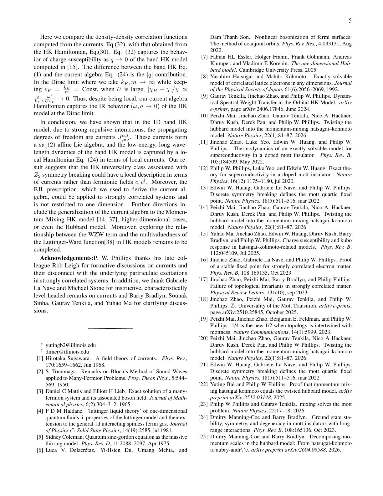
<figcaption class="paper-figure-caption"><b>Fig 4.</b> Low-resolution page preview, page 5</figcaption>
</figure>
<figure class="paper-figure-card">
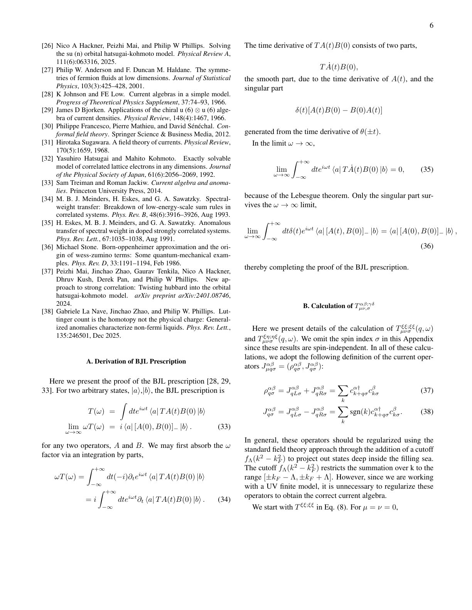
<figcaption class="paper-figure-caption"><b>Fig 5.</b> Low-resolution page preview, page 6</figcaption>
</figure>
<figure class="paper-figure-card">
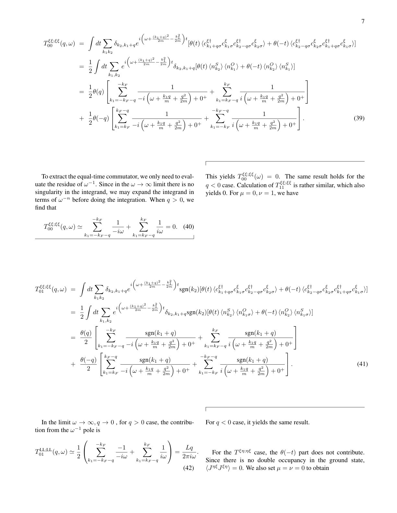
<figcaption class="paper-figure-caption"><b>Fig 6.</b> Low-resolution page preview, page 7</figcaption>
</figure>
<figure class="paper-figure-card">
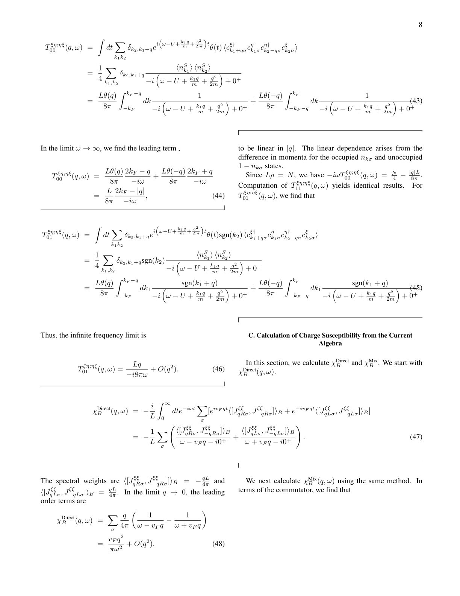
<figcaption class="paper-figure-caption"><b>Fig 7.</b> Low-resolution page preview, page 8</figcaption>
</figure>
<figure class="paper-figure-card">
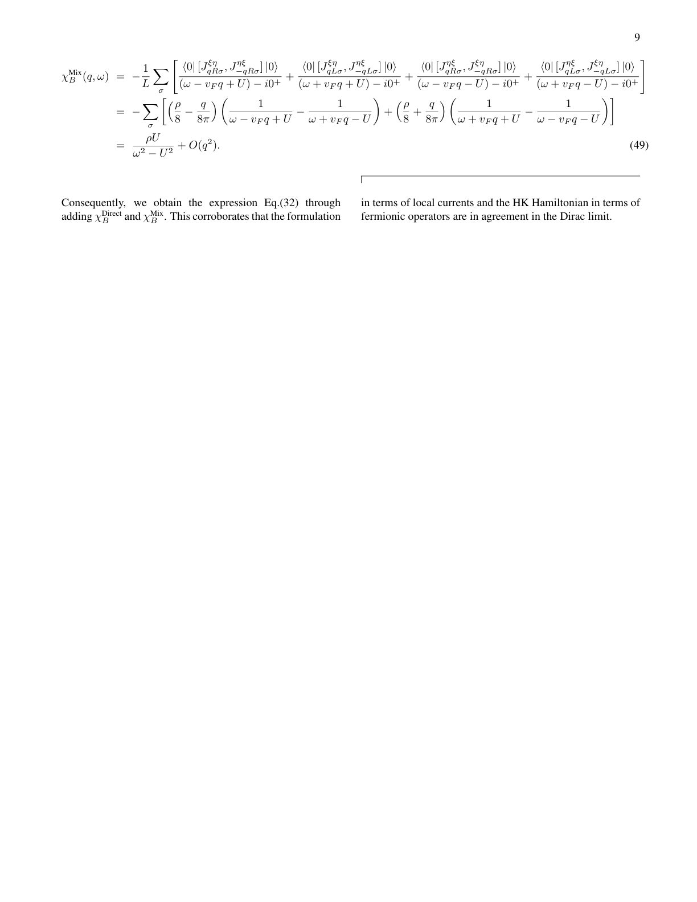
<figcaption class="paper-figure-caption"><b>Fig 8.</b> Low-resolution page preview, page 9</figcaption>
</figure>

**Summary.** This paper resolves the non-locality criticism of the Hatsugai-Kohmoto model by showing it can be reformulated as a local theory using real-space currents. By establishing an su(2) affine Lie algebra structure, the authors prove that the physical response of the model remains unchanged, reinforcing the utility of current algebras for studying strong interactions.

**Why it may be interesting.** not directly relevant

Detailed structure

**Main problem.** The paper addresses the criticism that the Hatsugai-Kohmoto (HK) model is non-local in real space by seeking a local, effective Hamiltonian in terms of real-space currents.

**Main result.** The authors demonstrate that a Hamiltonian based on an su(2) affine Lie algebra eliminates the non-locality of the HK model and yields a charge susceptibility identical to the original fermionic field model.

**Method.** The study employs the Bjorken-Johnson-Low (BJL) prescription to evaluate anomalous commutators and uses a current algebra construction (Sugawara-like) to derive the effective theory.

**Model / system.** The system is a 1D doped Mott insulator described by the Hatsugai-Kohmoto (HK) model, which captures Mott physics via the breaking of Z2 symmetry and is considered a solvable alternative to the Hubbard model.

**Key observables.** Charge susceptibility (direct and mixed components), charge density, and current-current correlators.

**Important parameters / regimes.** Interaction strength U, Fermi velocity vF, Fermi momentum kF, and the Dirac limit (large kF and mass m).

**Assumptions / limitations.** The analysis assumes the Dirac limit, a quadratic dispersion, and focuses on the low-energy, long-wavelength (IR) dynamics of the hole-doped ground state.

**Paper structure.** The paper begins by defining the HK model and its non-locality problem, introduces the current algebra construction using the BJL prescription, derives the commutation relations and effective Hamiltonian, and concludes by verifying the consistency of the charge susceptibility.

Abstract

We show that a Hamiltonian in terms of the local real-space currents obeying an $\mathfrak{su}_1(2)$ affine Lie algebra eliminates the non-locality in the Hatsugai-Kohmoto model for a doped Mott insulator. We establish this local correspondence through the Bjorken-Johnson-Low prescription for anomalous commutators. With this result, we show that the charge susceptibility computed from the current Hamiltonian is identical to that with the elemental Fermionic fields. Consequently, the HK model is local in real space, though not in terms of the Fermionic fields, thereby eliminating the key criticism of this model and reinforcing the utility of current algebras for strong interactions.

[↑ back to top](#top)

### [Magnetic Quantum Criticality inside the Superconducting State Revealed by Penetration Depth Scaling with Local $T_{\mathrm c}$](http://arxiv.org/abs/2604.27507v1)

**Authors:** Yusuke Iguchi, Kaede Inoh, Ryosuke Koizumi, Makoto Yokoyama  
**Type:** experiment · **Category:** strongly correlated electrons · **PDF:** <https://arxiv.org/pdf/2604.27507v1>  
**Analysis basis:** abstract only; PDF text extraction failed or PDF unavailable

**Summary.** Researchers used scanning SQUID microscopy to reveal a magnetic quantum critical point hidden inside the superconducting state of Zn-doped CeCoIn5. By using local transition temperatures to account for doping disorder, they identified a disorder-modified quantum critical regime. This method provides a new way to study intrinsic quantum criticality in inhomogeneous unconventional superconductors.

**Why it may be interesting.** not directly relevant

Detailed structure

**Main problem.** Identifying a magnetic quantum critical point hidden within the superconducting state of Zn-doped CeCoIn5, which is typically obscured by doping-induced inhomogeneity.

**Main result.** The discovery of a magnetic quantum critical point embedded in the superconducting state, characterized by a disorder-modified critical exponent that exceeds the clean spin-density-wave value.

**Method.** Scanning SQUID microscopy was used to measure local superconducting transition temperature (Tc) and magnetic penetration depth (lambda(0)), allowing for scaling analysis based on local Tc to bypass doping inhomogeneity.

**Model / system.** Zn-doped CeCoIn5, a heavy-fermion superconductor.

**Key observables.** Local superconducting transition temperature (Tc) and magnetic penetration depth at zero temperature (lambda(0)).

**Important parameters / regimes.** Zn substitution level, local Tc, and the critical exponent of the magnetic penetration depth.

**Assumptions / limitations.** The scaling of lambda(0) can be accurately parameterized by local Tc rather than nominal Zn concentration to account for disorder.

**Paper structure.** The paper presents the experimental observation of a peak in lambda(0), describes the scanning SQUID methodology for local measurements, performs scaling analysis using local Tc, and compares the extracted critical exponent to the clean spin-density-wave limit.

Abstract

We demonstrate a magnetic quantum critical point embedded within the superconducting state of Zn-doped CeCoIn$_5$, revealed by a pronounced peak in the magnetic penetration depth at zero temperature $λ(0)$. Using scanning SQUID microscopy, we determine the local superconducting transition temperature $T_{\mathrm c}$ and $λ(0)$. By parameterizing $λ(0)$ in terms of the local $T_{\mathrm c}$ rather than nominal Zn substitution, we circumvent the ambiguity caused by doping inhomogeneity and enable a more precise extraction of the critical exponent. The extracted exponent exceeds the clean spin-density-wave value, indicating a disorder-modified quantum critical regime. The enhancement of $λ(0)$ reflects the suppression of the superfluid stiffness and is consistent with critical scaling. Our approach provides a route to uncover intrinsic quantum critical behavior hidden by inhomogeneity in unconventional superconductors.

[↑ back to top](#top)

### [Order by disorder up to arbitrarily high temperature](http://arxiv.org/abs/2604.28026v1)

**Authors:** Ravish Mehta  
**Type:** theory · **Category:** statistical mechanics · **PDF:** <https://arxiv.org/pdf/2604.28026v1>  
**Analysis basis:** full PDF text, analyzed in chunks

↔ Scroll figures horizontally

<figure class="paper-figure-card">
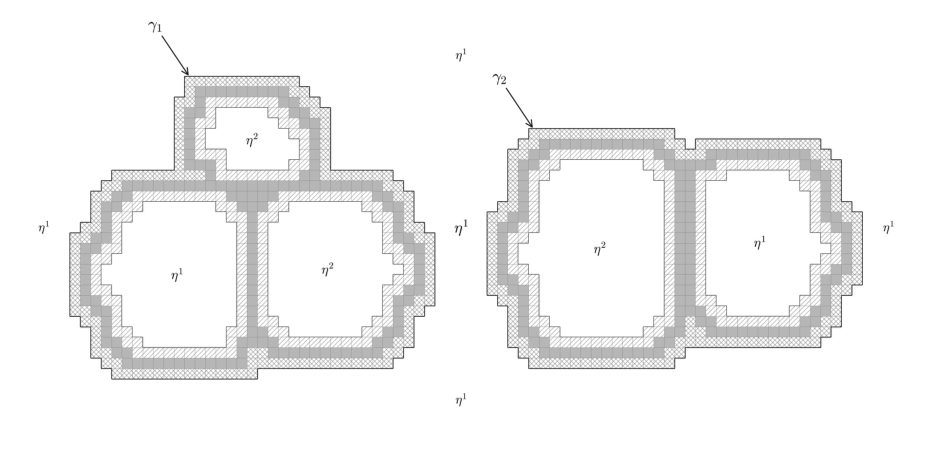
<figcaption class="paper-figure-caption"><b>Fig 1.</b> Figure 1: A configuration with two contours γ1 and γ2 with the boundary Bpωq denoted by the dark grey region and the patterned regions representing boundaries of the contours. The outer boundary has the phase η1 and the interior boundary has the same phase as that of the interior components along which they are drawn.</figcaption>
</figure>

**Summary.** This paper provides a rigorous mathematical proof that certain classical lattice models can exhibit long-range order at arbitrarily high temperatures. This 'order by disorder' phenomenon occurs because entropy, rather than energy minimization, selects specific checkerboard configurations in the high-temperature limit.

**Why it may be interesting.** not directly relevant

Detailed structure

**Main problem.** Proving the existence of long-range checkerboard order in a class of classical lattice models at arbitrarily high temperatures via an entropic mechanism.

**Main result.** The author proves that a class of classical lattice models exhibits long-range checkerboard order in the high-temperature limit (beta -> 0), where the order is driven by entropy rather than energy minimization.

**Method.** The proof utilizes Pirogov-Sinai theory, cluster expansion, and a Peierls-type bound on contour surface energy to demonstrate phase coexistence.

**Model / system.** A classical lattice model on a hypercubic lattice Z^d (d >= 2) with unbounded occupation numbers (bosons) and a nearest-neighbor interaction function f(n_x, n_y) satisfying specific symmetry and growth conditions.

**Key observables.** Difference between the Gibbs measure of occupation labels and the reference checkerboard configurations; bulk free energy density.

**Important parameters / regimes.** Inverse temperature (beta -> 0 limit), dimension (d >= 2), and the growth exponent (alpha) of the level-set counting function.

**Assumptions / limitations.** The interaction function must satisfy four structural conditions (symmetry, vanishing on empty sites, strict penalty on occupied pairs, and specific growth); the analysis assumes a large-volume limit.

**Figures summary.** Figure 1 illustrates a configuration with two contours, showing the boundary and the patterned regions representing the boundaries of the contours.

**Paper structure.** The paper establishes the model and its interaction properties, develops a polymer representation via cluster decomposition, applies Pirogov-Sinai theory to bound contour weights, and concludes with a proof of phase coexistence and uniform convergence to the checkerboard state.

Abstract

We prove that a class of classical lattice models on $\mathbb{Z}^d$ ($d \geq 2$) with on-site space $\mathbb{N}_0$ exhibits long-range checkerboard order at sufficiently high temperature. The model has a nearest-neighbour interaction $f : \mathbb{N}_0 \times \mathbb{N}_0 \to [0,\infty)$ satisfying four structural conditions, subsuming the recently introduced power-law model of Han--Huang--Komargodski--Lucas--Popov (arXiv:2503.22789) as a special case. The ordering mechanism is purely entropic: the checkerboard configurations are not energy minimisers, but are selected by the partial trace over occupation numbers in the $β\to 0$ limit. The proof uses Pirogov--Sinai theory and the key input is a Peierls bound.

[↑ back to top](#top)

### [Oscillators from non-semisimple walled Brauer algebras](http://arxiv.org/abs/2604.27087v1)

**Authors:** Sanjaye Ramgoolam, Michał Studziński  
**Type:** theory · **Category:** quantum information and computing · **PDF:** <https://arxiv.org/pdf/2604.27087v1>  
**Analysis basis:** abstract only; PDF text extraction failed or PDF unavailable

**Summary.** The paper provides a new method to calculate representation dimensions for walled Brauer algebras in non-semisimple regimes using modified Bratteli diagrams. It reveals a surprising connection between these algebraic dimension corrections and the partition functions of simple harmonic oscillators. This has implications for constructing matrix invariants in gauge theory and quantum information theory.

**Why it may be interesting.** not directly relevant

Detailed structure

**Main problem.** The paper addresses the representation theory of non-semisimple walled Brauer algebras B_N(m,n) in the regime where N < m + n, specifically how to compute dimension modifications in this regime.

**Main result.** The authors introduce restricted Bratteli diagrams to systematically compute dimension corrections and show that the resulting generating functions are governed by the partition function of an infinite tower of simple harmonic oscillators.

**Method.** The authors utilize a modification of standard Bratteli diagrams (restricted Bratteli diagrams) to track representation-theoretic data from the stable regime to the non-semisimple regime.

**Model / system.** The study focuses on walled Brauer algebras B_N(m,n) acting on mixed tensor spaces V_N^{tensor m} \otimes \overline{V}_N^{tensor n}, which are relevant to Schur-Weyl duality for unitary groups U(N).

**Key observables.** Representation dimensions and the partition function of the resulting oscillator system.

**Important parameters / regimes.** The regime N < m + n, specifically the case N = m + n - l where l is small compared to m and n.

**Assumptions / limitations.** The analysis focuses on the stability property of restricted diagrams in the regime where the deviation from the stable regime (l) is small.

**Paper structure.** The paper introduces the problem of non-semisimple walled Brauer algebras, presents the construction of restricted Bratteli diagrams, demonstrates a stability property for small l, identifies the connection to harmonic oscillator partition functions, and discusses applications to gauge theory and quantum information.

Abstract

The walled Brauer algebras $B_N(m,n)$ govern Schur--Weyl duality for unitary groups $U(N)$ acting on mixed tensor spaces $V_N^{\otimes m}\otimes \overline{V}_N^{\otimes n}$ and play an important role in applications ranging from AdS/CFT to quantum information theory. In the stable regime $N\ge m+n$ the algebra is semisimple and its representation theory is well understood. For $N<m+n$, however, $B_N(m,n)$ becomes non-semisimple. The representation of the algebra on tensor space has a non-trivial kernel and the corresponding quotient algebra is semisimple, with representation dimensions differing from those in the stable regime.   We introduce \emph{restricted Bratteli diagrams}, obtained by modifying the standard Bratteli diagrams for $B_N(m,n)$. This construction provides a systematic way to use representation-theoretic data from the stable regime to compute the dimension modifications arising in the non-semisimple regime. In the regime $N=m+n-l$, with $l$ small compared to $m,n$, we show that the restricted diagrams exhibit a stability property and enable an efficient counting of the paths responsible for these dimension corrections.   Remarkably, the resulting generating functions are governed by the partition function of an infinite tower of simple harmonic oscillators. We briefly discuss implications for the construction of orthogonal bases of matrix invariants in gauge theory and related applications in quantum information theory.

[↑ back to top](#top)

### [Pauli equation in spaces of constant curvature and extended Nikiforov-Uvarov method](http://arxiv.org/abs/2604.27522v1)

**Authors:** Abdaljalel E. Alizzi, Zurab K. Silagadze  
**Type:** theory · **Category:** other · **PDF:** <https://arxiv.org/pdf/2604.27522v1>  
**Analysis basis:** abstract only; PDF text extraction failed or PDF unavailable

**Summary.** The paper examines the application of the extended Nikiforov-Uvarov method to the Pauli equation in curved spaces. It concludes that the method is likely unreliable for this purpose because the required conditions for polynomial solutions cannot be satisfied. This highlights a fundamental difficulty in solving the Heun equation in this context.

**Why it may be interesting.** not directly relevant

Detailed structure

**Main problem.** The paper investigates the validity of applying the extended Nikiforov-Uvarov method to solve the radial Heun equation arising from the non-relativistic limit of the Dirac equation in curved spaces.

**Main result.** The authors find that the necessary conditions for the existence of polynomial solutions in the Heun equation cannot be met, suggesting that the extended Nikiforov-Uvarov method has limited utility for these specific quantum mechanical problems.

**Method.** The study utilizes the extended Nikiforov-Uvarov method applied to the radial equation derived from the non-relativistic limit of the Dirac equation.

**Model / system.** The system consists of a non-relativistic particle (the Pauli equation limit) in spaces of constant curvature subject to a Coulomb potential.

**Key observables.** Energy spectrum and quantization conditions.

**Important parameters / regimes.** Curvature of the space and the Coulomb potential strength.

**Assumptions / limitations.** The analysis assumes the non-relativistic limit of the Dirac equation can be treated via the Heun equation framework.

**Paper structure.** The paper presents an application of a mathematical method to a physical problem, analyzes the resulting energy spectrum and quantization conditions, and concludes with a critique of the method's reliability based on the impossibility of meeting polynomial solution conditions.

Abstract

We apply the extended Nikiforov-Uvarov method to the non-relativistic limit of the Dirac equation with a Coulomb potential in spaces of constant curvature. In this case, the radial equation reduces to the Heun equation, and the extended Nikiforov-Uvarov method easily yields a quantization condition which leads to necessary condition under which the resulting Heun equation can have polynomial solutions. The energy spectrum implied by the quantization condition is virtually identical to the spectrum of a spinless particle obtained using the Schrödinger equation, except for the absence of the ``geometric potential", confirming the non-commutativity of the naive non-relativistic limit with the ``squaring" of the Dirac equation, first discovered on curved surfaces. However, the necessary conditions for the existence of polynomial solutions cannot be met, and this fact undermines the reliability of the results obtained. This circumstance forces us to conclude that the extended Nikiforov-Uvarov method has limited, if any, value when considering similar problems in quantum mechanics.

[↑ back to top](#top)

### [Q3SAT-GPT: A Generative Model for Discovering Quantum Circuits for the 3-SAT Problem](http://arxiv.org/abs/2604.27324v1)

**Authors:** Pratim Ugale, Ilya Tyagin, Karunya Shirali, Kien X. Nguyen, Ilya Safro  
**Type:** theory · **Category:** quantum information and computing · **PDF:** <https://arxiv.org/pdf/2604.27324v1>  
**Analysis basis:** full PDF text, analyzed in chunks

↔ Scroll figures horizontally

<figure class="paper-figure-card">
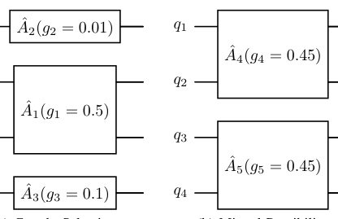
<figcaption class="paper-figure-caption"><b>Fig 1.</b> Fig. 1: A Representative Conflict Illustration. Operator gener- ators ˆAi are labeled with their corresponding gradient mag- nitudes in parentheses. In (a), selecting the highest individual gradient ( ˆA1) blocks the selection possibility of ˆA4 and ˆA5, leading to a lower total sum of gradients as compared to (b).</figcaption>
</figure>
<figure class="paper-figure-card">

<figcaption class="paper-figure-caption"><b>Fig 2.</b> Fig. 2: Incompatibility graph representation for a 3-qubit problem instance, used for operator selection. Each node in the graph represents a candidate unitary operator from the pool P, An edge connects two nodes if and only if their corresponding operators have overlapping qubit support. Sets of overlapping two-qubit operators form fully connected cliques and are omitted to maintain legibility.</figcaption>
</figure>
<figure class="paper-figure-card">

<figcaption class="paper-figure-caption"><b>Fig 3.</b> Fig. 3: Detailed pipeline demonstrating formatting, tokenization, and embeddings. The | delimiter is used to segment clauses, with explicit OR (∨) tokens omitted.</figcaption>
</figure>
<figure class="paper-figure-card">
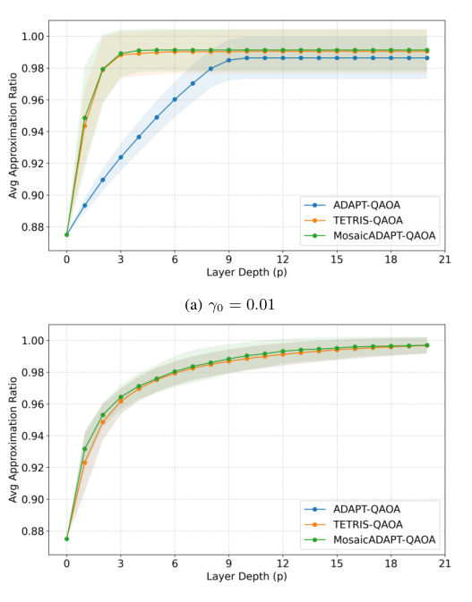
<figcaption class="paper-figure-caption"><b>Fig 4.</b> Fig. 4: Comparison of the energy convergence across adap- tations. Note that in Figure (b), plots of TETRIS-QAOA and ADAPT-QAOA overlap due to the same operators being chosen by both the methods (see Figure 6).</figcaption>
</figure>
<figure class="paper-figure-card">
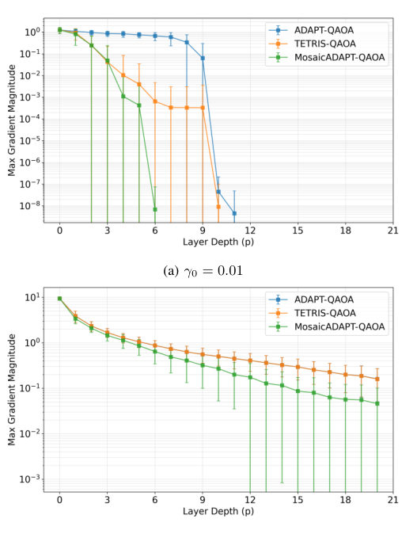
<figcaption class="paper-figure-caption"><b>Fig 5.</b> Fig. 5: Comparison of the maximum gradient norm across all operators in the mixer pool. Note that in Figure (b), plots of TETRIS-QAOA and ADAPT-QAOA overlap due to the same operators having the maximum gradient for the most part (see Figure 6).</figcaption>
</figure>
<figure class="paper-figure-card">
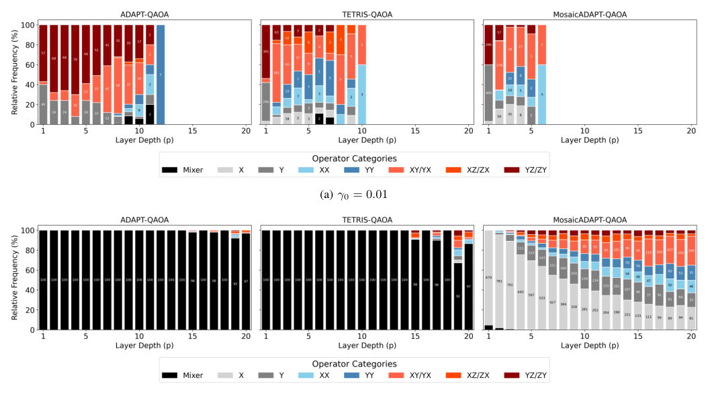
<figcaption class="paper-figure-caption"><b>Fig 6.</b> Fig. 6: Evolution of the operator selection across adaptations. Note that the count inside a bar is that of the total number of operators selected in that layer across all instances.</figcaption>
</figure>
<figure class="paper-figure-card">
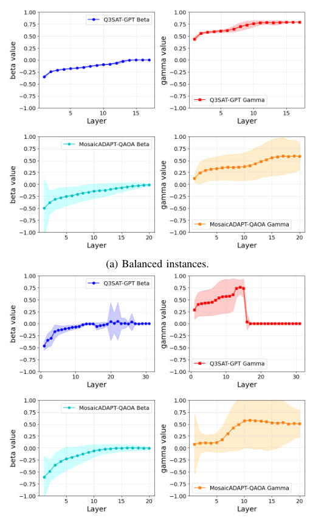
<figcaption class="paper-figure-caption"><b>Fig 7.</b> Fig. 7: Comparison of Q3SAT-GPT predicted parameters against MosaicADAPT-QAOA optimized parameters on the test set. Solid lines denote the mean parameter value across samples, and shaded regions denote ±1 standard deviation. This plot is for the configuration containing 12 qubits, with γ0 = 0.5, and utilizes FEATHER embeddings. Since there are multiple beta values at a particular layer for MosaicADAPT- QAOA, all beta values are averaged at that layer.</figcaption>
</figure>

**Summary.** This paper introduces Q3SAT-GPT, a generative AI model that learns to design quantum circuits for solving 3-SAT problems. By training on circuits produced by a new adaptive algorithm (MosaicADAPT-QAOA), the model can bypass expensive optimization steps and propose high-quality solutions in a single step. This approach offers a scalable route toward discovering efficient quantum algorithms for combinatorial optimization.

**Why it may be interesting.** not directly relevant

Detailed structure

**Main problem.** The challenge of efficiently discovering high-quality, low-depth quantum circuits for the Max-E3-SAT combinatorial optimization problem without the heavy computational cost of iterative variational optimization.

**Main result.** The Q3SAT-GPT generative model can predict optimized quantum circuits in a single forward pass with high approximation ratios and significantly faster amortized inference time compared to classical optimization-based adaptive methods.

**Method.** A generative transformer-based architecture (Q3SAT-GPT) is trained using data generated by a new adaptive strategy called MosaicADAPT-QAOA, which uses a Maximum Weight Independent Set approach to select multiple disjoint operators per layer.

**Model / system.** The problem involves Max-E3-SAT instances (Uniform Random and Balanced) mapped to a cost Hamiltonian using a Higher-Order Unconstrained Binary Optimization (HUBO) formulation with Pauli-Z operators.

**Key observables.** Approximation Ratio (AR), Circuit Error Rate (ER), and circuit depth.

**Important parameters / regimes.** Phase transition ratio (alpha), number of variables (n), and the initial gamma parameter (gamma_0).

**Assumptions / limitations.** The performance of the generative model is bounded by the quality of the training data produced by the MosaicADTP-QAOA algorithm; the focus is limited to the Max-E3-SAT problem class.

**Figures summary.** Figure 1 shows the conflict in greedy operator selection; Figure 2 illustrates an incompatibility graph; Figure 3 details the model pipeline; Figure 4 compares energy convergence; Figure 5 shows gradient norms; Figure 6 shows operator evolution; Figure 7 compares predicted vs. optimized parameters.

**Paper structure.** The paper introduces the problem of circuit discovery, presents the MosaicADAPT-QAOA adaptive strategy, describes the Q3SAT-GPT generative architecture and training pipeline, evaluates performance against classical and quantum baselines, and discusses limitations.

Abstract

This work introduces Q3SAT-GPT, a generative model for discovering quantum circuits for the Max-E3-SAT problem. Our method learns from high-performing QAOA-style ansätze to directly generate candidate circuits. To create high-quality supervision, we also introduce Mosaic Adaptive QAOA (MosaicADAPT-QAOA), an adaptive strategy for constructing low-depth QAOA circuits by selecting subsets of mixer operators in each step, rather than inserting operators sequentially. The resulting circuits serve as training data for the generative model, allowing it to learn effective circuit design patterns while eliminating the need for costly variational optimization at inference time. Experiments show that our framework attains strong solution quality with shallow circuits and scales significantly better than both our adaptive construction procedure and conventional variational baselines. Our results establish generative modeling as a high-performance route toward the scalable discovery of quantum optimization circuits, demonstrating that these models can effectively internalize circuit logic while providing a foundation for future, instance-aware inductive biases. Reproducibility: The source code is available at https://github.com/pratimugale/Q3SAT-GPT.

[↑ back to top](#top)

### [Quantum Scalar Spin Chirality in Coplanar Kagome Antiferromagnets](http://arxiv.org/abs/2604.27632v1)

**Authors:** Nanse Esaki, Gyungchoon Go, Se Kwon Kim  
**Type:** theory · **Category:** strongly correlated electrons · **PDF:** <https://arxiv.org/pdf/2604.27632v1>  
**Analysis basis:** abstract only; PDF text extraction failed or PDF unavailable

**Summary.** This paper shows that even in magnets where spins are arranged in a plane, quantum fluctuations can create a sense of 'handedness' or scalar spin chirality. This effect is significant because the magnitude of these fluctuations can be as large as the static chirality found in non-coplanar magnets.

**Why it may be interesting.** not directly relevant

Detailed structure

**Main problem.** Investigating whether quantum fluctuations can generate scalar spin chirality in antiferromagnets that possess a coplanar classical ground state.

**Main result.** The authors demonstrate that quantum fluctuations can induce scalar spin chirality at zero temperature in coplanar kagome antiferromagnets, provided certain symmetry-breaking conditions are met, with fluctuations increasing at finite temperatures.

**Method.** Theoretical analysis of quantum fluctuations and the effective Hamiltonian describing fluctuations in a kagome antiferromagnet.

**Model / system.** A kagome antiferromagnet with coplanar ordered spin configurations.

**Key observables.** Scalar spin chirality and its fluctuations.

**Important parameters / regimes.** Zero temperature and finite temperature (thermally excited magnons); magnetic point group of the classical ground state.

**Assumptions / limitations.** The presence of scalar spin chirality depends on the breaking of an effective time-reversal-like antiunitary symmetry in the fluctuation Hamiltonian.

**Paper structure.** The paper presents a theoretical demonstration of quantum-induced scalar spin chirality, discusses the symmetry requirements for its emergence in coplanar kagome systems, and analyzes the temperature dependence of these fluctuations.

Abstract

We theoretically demonstrate that quantum fluctuations inherent to antiferromagnets can generate scalar spin chirality at zero temperature even in coplanar ordered magnets. In a kagome antiferromagnet with coplanar ground-state spin configurations, the quantum-fluctuation-induced scalar spin chirality is shown to arise at zero temperature when an effective time-reversal-like antiunitary symmetry is broken in the Hamiltonian describing fluctuations, and a magnetic point group of the classical ground state allows for its presence. The scalar spin chirality fluctuations are shown to grow further with increasing temperature by thermally excited magnons. These scalar spin chirality fluctuations can reach a magnitude comparable to the static one predicted for noncoplanar spin structures, highlighting their physical implications in coplanar spin systems.

[↑ back to top](#top)

### [Ratio-Dependent Contrarian Activation in Opinion Dynamics](http://arxiv.org/abs/2604.27226v1)

**Authors:** Serge Galam  
**Type:** theory · **Category:** statistical mechanics · **PDF:** <https://arxiv.org/pdf/2604.27226v1>  
**Analysis basis:** full PDF text, analyzed in chunks

↔ Scroll figures horizontally

<figure class="paper-figure-card">

<figcaption class="paper-figure-caption"><b>Fig 1.</b> Figure 1: The two domains of the landscape of the dynamics induced by the variation of c3,0 and c2,1. The domains are separated by the line c3,0 = 1 3(1 −3c2,1). Inside the colored area, pA,B exist and are attractors with pc being a tipping point. Outside the colored area in the white area only the fixed point pc = 1</figcaption>
</figure>
<figure class="paper-figure-card">
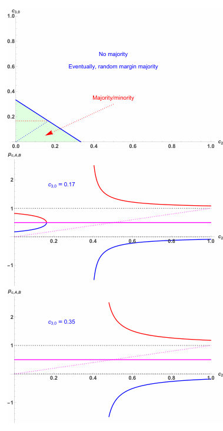
<figcaption class="paper-figure-caption"><b>Fig 2.</b> Figure 2: Various main stages of the variation pA in red and pB in blue as a function of c2,1 for the series of given values c3,0 = 0, 0.01, 0.17, 0.3, 0.35, 0.99. The fixed point pc = 1</figcaption>
</figure>
<figure class="paper-figure-card">

<figcaption class="paper-figure-caption"><b>Fig 3.</b> Figure 3: The complete landscape of the dynamics including alternating regimes. Four domains are shown as a function of c3,0 and c2,1. The domains are separated by the lines c3,0 = 1</figcaption>
</figure>
<figure class="paper-figure-card">

<figcaption class="paper-figure-caption"><b>Fig 4.</b> Figure 4: Four different regimes produced by the update Equation (11) with a tipping point coupled to two attractors, a single attractor, an alternating single attractor and an alternating tipping point coupled to two alternating attractors, for respectively (c3,0 = 0.05, c2,1 = 0.15), (c3,0 = 0.12, c2,1 = 0.22), (c3,0 = 0.88, c2,1 = 0.78), (c3,0 = 0.95, c2,1 = 0.85).</figcaption>
</figure>
<figure class="paper-figure-card">

<figcaption class="paper-figure-caption"><b>Fig 5.</b> Figure 5: Various main stages of the variation p ¯ A in red and p ¯B in blue as a function of c2,1 for the series of given values c3,0 = 0, 0.01, 0.17, 0.3, 0.35, 0.99. The fixed point pc = 1</figcaption>
</figure>

**Summary.** This paper extends the Galam Majority Model by making contrarian behavior dependent on the local ratio of opinions in a group. It reveals a complex landscape of dynamics, showing how specific contrarian strategies can either reinforce a majority or drive a system toward a 50/50 polarized state.

**Why it may be interesting.** not directly relevant

Detailed structure

**Main problem.** Investigating how opinion dynamics change when the activation of contrarians depends on the local majority/minority ratio rather than being a uniform probability.

**Main result.** The study identifies a two-dimensional landscape of four distinct dynamical domains, including regimes of majority/minority consensus, polarization (50/50 attractor), and alternating dynamics.

**Method.** Analytical derivation of update equations for the Galam Majority Model, followed by fixed point and stability analysis using derivatives and Taylor expansion.

**Model / system.** An extension of the Galam Majority Model (GMM) involving discussion groups of size 3 with agents acting as conformists or ratio-dependent contrarians.

**Key observables.** Proportion of agents with opinion A (p_n), fixed points (p_c), and stability of attractors.

**Important parameters / regimes.** c_3,0 (contrarian probability in unanimous groups), c_2,1 (contrarian probability in 2:1 groups), and the uniform limit c.

**Assumptions / limitations.** The model is restricted to group sizes of 3 and assumes the validity of the dynamics for contrarian probabilities between 0 and 1.

**Figures summary.** Figure 1 shows a phase diagram of the dynamical domains; Figure 5 illustrates the variation of opinion levels as a function of c_2,1 for various fixed c_3,0.

**Paper structure.** The paper introduces the problem of mixed contrarians, defines the extended Galam Majority Model, provides the analytical derivation of update equations, performs fixed point and stability analysis to map the dynamical landscape, and discusses strategic implications.

Abstract

I study the impact of mixed contrarians on the opinion dynamics of an heterogenous population with conformists using Galam Majority Model. Activation of contrarians is a function of the ratio majority/minority in the local groups of discussion. Restricting the group size to 3, two types of contrarians are included in respective proportions $c_{3,0}$ for configurations with ratio 3 to 0 and $c_{2,1}$ for ratio 2 to 1. I then derive the explicit update Equation and obtained analytically the fixed points, their stability, and the resulting full two-dimensional landscape of the dynamics of opinion. Setting $c_{3,0} =c_{2,1} = c$ recovers the original results obtained with uniform contrarians. The findings allow for considering a wide spectrum of new disruptive strategies to secure either a majority/minority ending ensuring the opinion having the larger initial support to win, or a single attractor dynamics at fifty/fifty, which implies a random winner regardless of initial supports.

[↑ back to top](#top)

### [Sampling two-dimensional spin systems with transformers](http://arxiv.org/abs/2604.27738v1)

**Authors:** Piotr Białas, Piotr Korcyl, Tomasz Stebel, Adam Stefański, Dawid Zapolski  
**Type:** theory · **Category:** disordered systems and neural networks · **PDF:** <https://arxiv.org/pdf/2604.27738v1>  
**Analysis basis:** abstract only; PDF text extraction failed or PDF unavailable

**Summary.** The authors present an efficient transformer-based neural sampler for 2D classical spin systems by generating groups of spins rather than single spins. This method significantly outperforms previous neural samplers in terms of Effective Sample Size, even when applied to larger system sizes and disordered models like the Edwards-Anderson model.

**Why it may be interesting.** not directly relevant

Detailed structure

**Main problem.** The computational inefficiency of using transformer architectures for sampling classical spin systems compared to dense or convolutional neural networks.

**Main result.** A novel transformer-based sampler that generates groups of spins simultaneously and uses approximated probabilities, achieving an Effective Sample Size 20 times larger than previous state-of-the-art samplers for the 128x128 Ising model at critical temperature.

**Method.** An autoregressive transformer-based approach that employs group-based spin generation and a model of approximated probabilities to improve sampling efficiency.

**Model / system.** The study focuses on two-dimensional classical spin systems, specifically the Ising model and the 2D Edwards-Anderson spin glass model.

**Key observables.** Effective Sample Size (ESS)

**Important parameters / regimes.** System sizes up to 180x180 for the Ising model and 64x64 for the Edwards-Anderson model; critical temperature for the Ising model.

**Paper structure.** The paper introduces a new transformer-based sampling architecture, describes the group-generation and probability approximation techniques, and evaluates performance on the Ising and Edwards-Anderson models.

Abstract

Autoregressive Neural Networks based on dense or convolutional layers have recently been shown to be a viable strategy for generating classical spin systems. Unlike these methods, sampling with transformers is commonly considered to be computationally inefficient. In this work, we propose a novel approach to transformer-based neural samplers in which we generate not a single spin per step but groups of spins. As an additional improvement, we construct a model of approximated probabilities, further improving the efficiency of the algorithm. Despite our approach being computationally heavier than dense networks or CNN-based approaches, we were able to sample larger systems of up to $180 \times 180$ spins in case of the Ising model. The Effective Sample Size of our sampler is $\sim 20$ times larger than that of the previous state-of-the-art neural sampler when trained for the $128 \times 128$ Ising model at critical temperature. Finally, we also test our algorithm on the 2D Edwards-Anderson model, where we train $64\times 64$ spin systems.

[↑ back to top](#top)

### [Source-independent quantum key distribution without pre-sending entanglement](http://arxiv.org/abs/2604.28089v1)

**Authors:** Rong-Zheng Liu, Hua-Lei Yin  
**Type:** theory · **Category:** quantum information and computing · **PDF:** <https://arxiv.org/pdf/2604.28089v1>  
**Analysis basis:** abstract only; PDF text extraction failed or PDF unavailable

**Summary.** The paper introduces a source-independent QKD protocol that protects against all source-side side-channel attacks without requiring pre-distributed entanglement. It demonstrates that this approach can double the transmission distance and benefits significantly from using non-classical light sources.

**Why it may be interesting.** This is highly relevant to quantum optics and quantum information as it addresses fundamental security vulnerabilities in photonic quantum communication and explores the advantages of non-classical light.

Detailed structure

**Main problem.** The vulnerability of prepare-and-measure QKD protocols to side-channel attacks targeting the light source, even when using perfect single-photon sources or passive schemes.

**Main result.** A new source-independent (SI) QKD protocol that eliminates all known and unknown source-side attacks without the need for pre-sending entanglement, while doubling transmission distance.

**Method.** The authors propose a source-independent protocol and provide a theoretical analysis comparing the performance of conventional lasers versus non-classical light sources.

**Model / system.** The protocol involves quantum light sources, specifically comparing conventional laser-based decoy-state methods with non-classical light sources in a QKD network setup.

**Important parameters / regimes.** transmission distance, source imperfection, non-classicality of the light source

**Assumptions / limitations.** The protocol assumes the ability to utilize non-classical light sources and aims to be robust against any source-side side-channel attacks.

**Paper structure.** The paper introduces the problem of source-side attacks in BB84, proposes a new SI-QKD protocol, and provides theoretical analysis regarding distance and source types.

Abstract

Quantum key distribution (QKD) theoretically offers information-theoretic security. The prevailing approach is the prepare-and-measure BB84 protocol, which implements QKD using conventional laser rather than single-photon source via the decoy-state method. However, side-channel attacks targeting sources severely threaten system security. Despite extensive efforts, including fully passive scheme, this vulnerability persists even with perfect single-photon source. Here, we propose a source-independent (SI) QKD protocol that resolves all known and unknown source-side attacks without pre-sending entanglement source. Aligning with advances in quantum light sources, our protocol simultaneously doubles the transmission distance while remaining robustness against imperfection of source. Theoretical analysis shows that non-classical light source provides practical security advantages unattainable with conventional laser.

[↑ back to top](#top)

### [Stepping up enhanced rate calculations with EATR-flooding](http://arxiv.org/abs/2604.27136v1)

**Authors:** Nicodemo Mazzaferro, Willmor J Pena Ccoa, Pilar Cossio, Glen M. Hocky  
**Type:** theory · **Category:** statistical mechanics · **PDF:** <https://arxiv.org/pdf/2604.27136v1>  
**Analysis basis:** abstract only; PDF text extraction failed or PDF unavailable

**Summary.** The paper presents EATR-flooding, a new method for calculating rate constants in molecular simulations using stepped-up biasing potentials. This approach extends the EATR method to quasi-static sampling schemes like OPES, making it more versatile and easier to implement. It also introduces an internal check for over-biasing and simplifies the dependence of the CV-quality factor.

**Why it may be interesting.** not directly relevant

Detailed structure

**Main problem.** The original EATR method for computing rate constants requires a time-dependent bias, which limits its use in quasi-static biasing schemes like OPES or flooding.

**Main result.** The authors introduce EATR-flooding, a generalization that uses stepped-up biasing strengths across multiple simulations to estimate rates, providing an internal check for over-biasing and a more stable CV-quality factor.

**Method.** The method replaces time-dependent biasing with a series of simulations with increasing biasing potential strengths (stepping up) and utilizes a learned CV-quality factor gamma.

**Model / system.** The method is demonstrated on a coarse-grained protein system and a fully atomistic cavity-ligand model.

**Key observables.** Rate constants of slow biomolecular processes and the CV-quality factor gamma.

**Important parameters / regimes.** The biasing potential strength and the CV-quality factor gamma.

**Assumptions / limitations.** The method assumes the applicability of the EATR framework to quasi-static biasing schemes and relies on the accuracy of the learned quality factor.

**Paper structure.** The paper introduces the limitation of the original EATR, presents the new EATR-flooding approach, describes the implementation as an open-source Python library, and validates the method using protein and cavity-ligand models.

Abstract

Several recent methods have shown that it is possible to compute rate constants of very slow biomolecular processes using simulations where a time-dependent bias is added along one or several collective variables (CVs). We previously reported the exponential average time-dependent rate (EATR) method, which can improve upon these approaches by accounting for how efficiently the external biasing potential modifies the observed rate using a learned CV-quality factor $γ$. This results in more accurate rate estimates using the same data when biasing a suboptimal coordinate. However, as formulated EATR depended on the biasing potential varying over time to properly determine the biasing efficiency, which limits the method's applicability to quasi-static biasing schemes such as ``flooding'' or on-the-fly probability enhanced sampling (OPES). Here, we present the EATR-flooding approach, which generalizes our method by replacing the need for a time dependent bias by instead varying (stepping up) the strength of the biasing potential across multiple sets of simulations. We implement this approach as an open-source Python library, and demonstrate that this approach is accurate without substantial loss of efficiency compared to standard EATR for a coarse-grained protein system, and also show good performance on a fully atomistic cavity-ligand model. Two additional appealing features of EATR-flooding are an internal check for over-biasing and the fact that only a single $γ$ parameter is predicted for a given choice of CVs, as compared to our earlier results where $γ$ empirically depended on biasing rate. Finally, we believe EATR-flooding applies not only to OPES simulations but more generally to CV biasing enhanced sampling approaches, making it broadly useful.

[↑ back to top](#top)

### [The Great Chicken-and-Egg of Chemistry: Bonding vs. Stability Revisited](http://arxiv.org/abs/2604.27222v1)

**Authors:** Cherif F. Matta  
**Type:** theory · **Category:** other · **PDF:** <https://arxiv.org/pdf/2604.27222v1>  
**Analysis basis:** full PDF text, analyzed in chunks

↔ Scroll figures horizontally

<figure class="paper-figure-card">

<figcaption class="paper-figure-caption"><b>Fig 1.</b> Fig. 1. Logical flow to chemical bonding descriptors starting from the of the Born–</figcaption>
</figure>

**Summary.** This paper challenges the common chemical practice of treating bonds as physical causes of stability, arguing instead that they are emergent descriptors of the underlying quantum state. By analyzing the molecular Hamiltonian, the author shows that bonding accompanies stability without being its fundamental driver. This reclassification helps resolve circular reasoning in chemical theory.

**Why it may be interesting.** not directly relevant

Detailed structure

**Main problem.** The paper addresses the logical fallacy in chemistry where chemical bonding and steric repulsion are incorrectly treated as fundamental causal agents of structural stability rather than derived descriptors of the quantum state.

**Main result.** The author demonstrates that bonding is a pattern within the quantum state that correlates with stability but does not constitute its cause, providing evidence through the H-H bonding paradox where local stabilization occurs in globally unstable structures.

**Method.** The paper employs a logical and philosophical analysis of the molecular Hamiltonian, utilizing topological frameworks like QTAIM, NCI, and the virial theorem to evaluate electron density properties.

**Model / system.** The study focuses on molecular systems (including proteins and hydrocarbons) described by the nonrelativistic molecular Hamiltonian under the Born-Oppenheimer approximation.

**Key observables.** Electron density, Laplacian of the electron density, bond paths, virial paths, and energy densities.

**Important parameters / regimes.** Stationary points on the potential energy hypersurface (minima and saddle points), and the local virial theorem.

**Assumptions / limitations.** The argument assumes the validity of the Born-Oppenheimer approximation and uses an interventionist definition of causality.

**Figures summary.** Figure 1 illustrates the logical flow from the Born-Oppenheimer approximation to chemical descriptors, highlighting the fallacy of using derived descriptors as causes for structural stability.

**Paper structure.** The paper moves from the mathematical reality of the Hamiltonian to the identification of logical inversions in chemical language, uses case studies like H-H bonding to prove non-causality, and concludes with a philosophical defense of chemical autonomy.

Abstract

The chemical bond is a central organizing concept in chemistry, yet it is absent from the molecular Hamiltonian and no "bond operator" exists. Bonding is therefore not a primitive physical entity but a derived descriptor emerging from the quantum state. The logical consequences of this observation are revisited. Statements such as "bonding stabilizes structure" when taken literally risk circular reasoning (petitio principii), whereby bonding is inferred from a stationary structure and then invoked as its cause. The same caution applies to concepts such as steric repulsion, which is also a derived descriptor. Bonding accompanies stable or metastable states and correlates with their properties without constituting their cause. Illustrative examples are drawn from QTAIM, non-covalent interaction (NCI) approach, protein structure, and hydrogen-hydrogen bonding. Causation, language, and the autonomy of chemistry are also briefly discussed. The aim is not at all to diminish the role of bonding, but to place it at the correct logical level, that is, as a powerful, state-dependent descriptor that organizes, classifies, and predicts chemical behavior without serving as its fundamental cause.

[↑ back to top](#top)

### [The quantum group structure of long-range integrable deformations](http://arxiv.org/abs/2604.27189v1)

**Authors:** Koen Schouten, Marius de Leeuw  
**Type:** theory · **Category:** statistical mechanics · **PDF:** <https://arxiv.org/pdf/2604.27189v1>  
**Analysis basis:** full PDF text, analyzed in chunks

↔ Scroll figures horizontally

<figure class="paper-figure-card">

<figcaption class="paper-figure-caption"><b>Fig 1.</b> Low-resolution page preview, page 2</figcaption>
</figure>
<figure class="paper-figure-card">
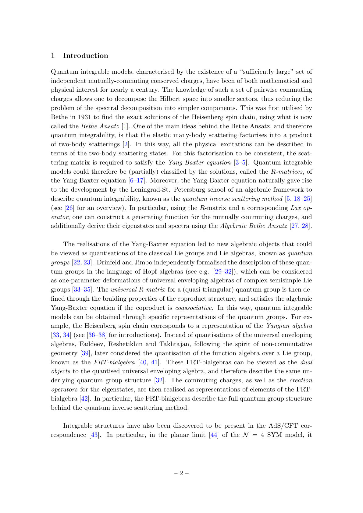
<figcaption class="paper-figure-caption"><b>Fig 2.</b> Low-resolution page preview, page 3</figcaption>
</figure>
<figure class="paper-figure-card">
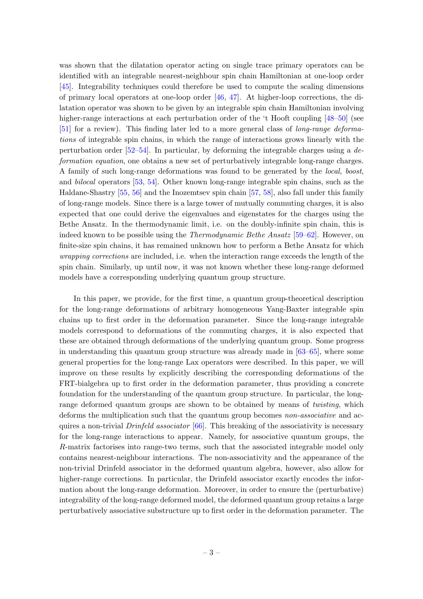
<figcaption class="paper-figure-caption"><b>Fig 3.</b> Low-resolution page preview, page 4</figcaption>
</figure>
<figure class="paper-figure-card">
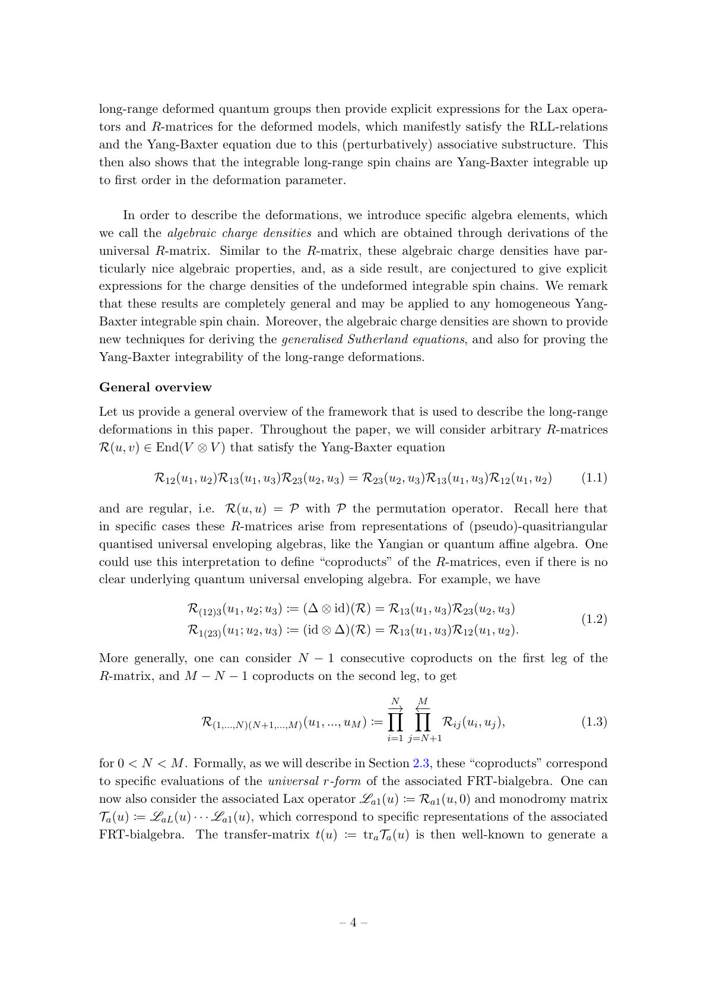
<figcaption class="paper-figure-caption"><b>Fig 4.</b> Low-resolution page preview, page 5</figcaption>
</figure>
<figure class="paper-figure-card">
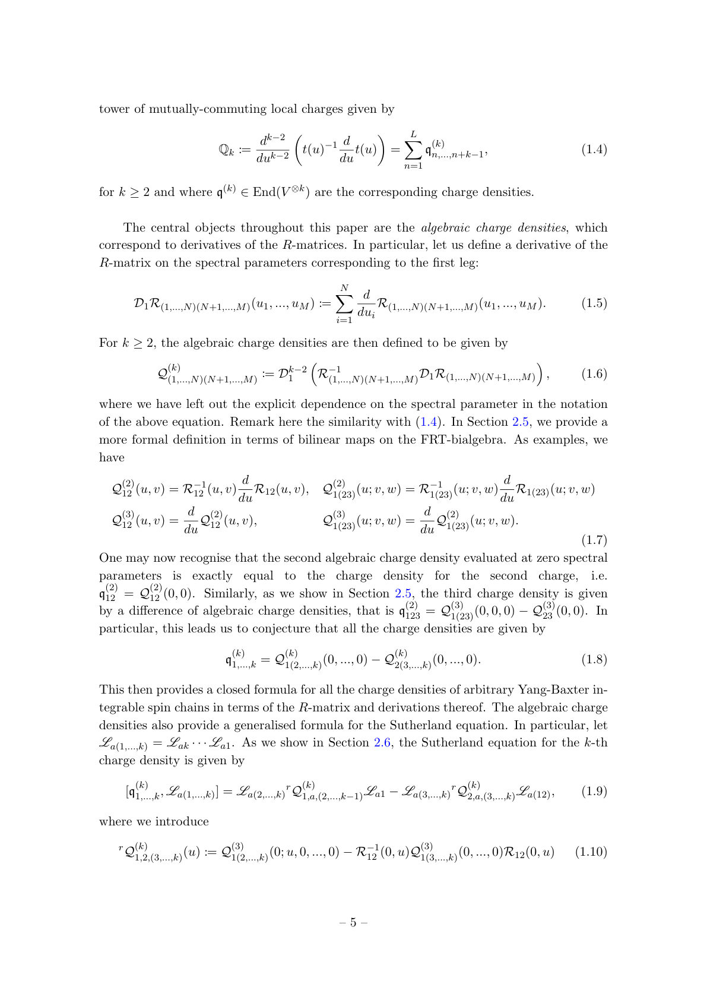
<figcaption class="paper-figure-caption"><b>Fig 5.</b> Low-resolution page preview, page 6</figcaption>
</figure>
<figure class="paper-figure-card">
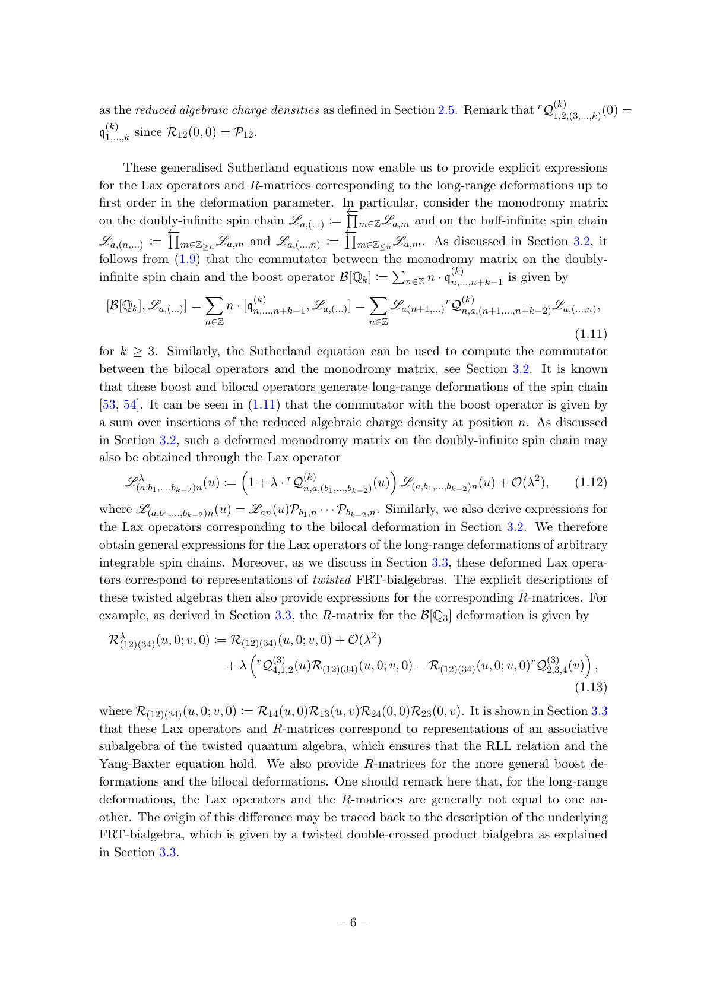
<figcaption class="paper-figure-caption"><b>Fig 6.</b> Low-resolution page preview, page 7</figcaption>
</figure>
<figure class="paper-figure-card">
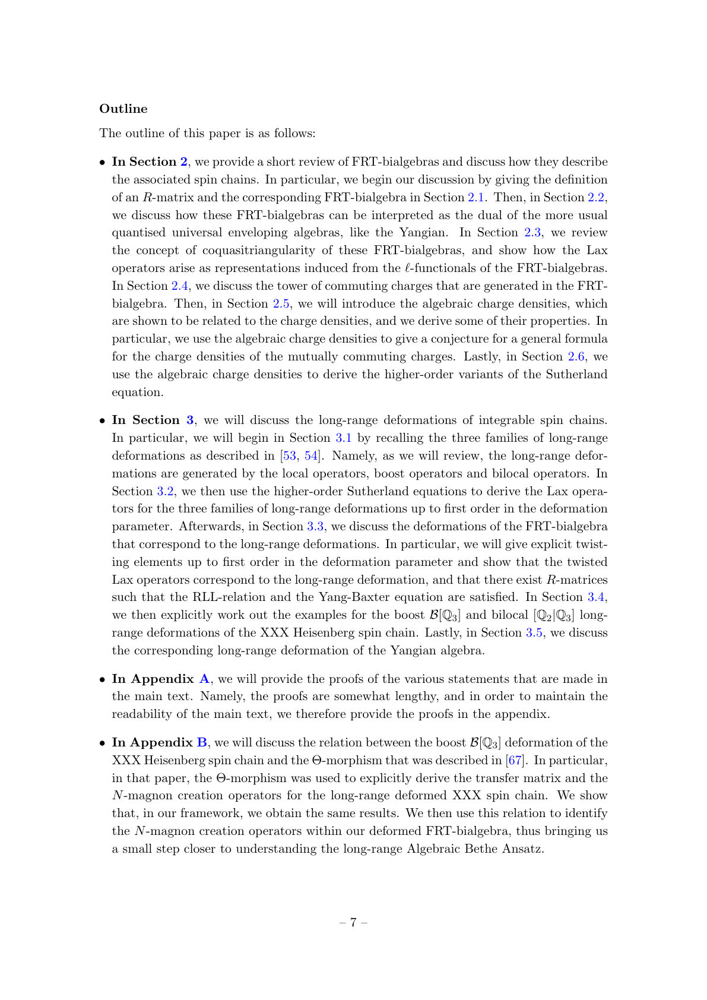
<figcaption class="paper-figure-caption"><b>Fig 7.</b> Low-resolution page preview, page 8</figcaption>
</figure>
<figure class="paper-figure-card">
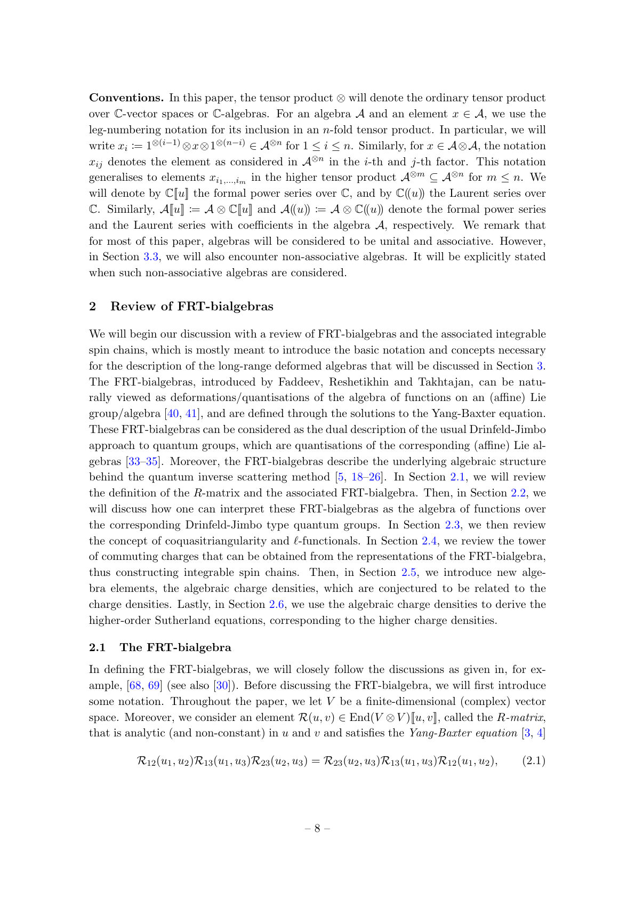
<figcaption class="paper-figure-caption"><b>Fig 8.</b> Low-resolution page preview, page 9</figcaption>
</figure>
<figure class="paper-figure-card">
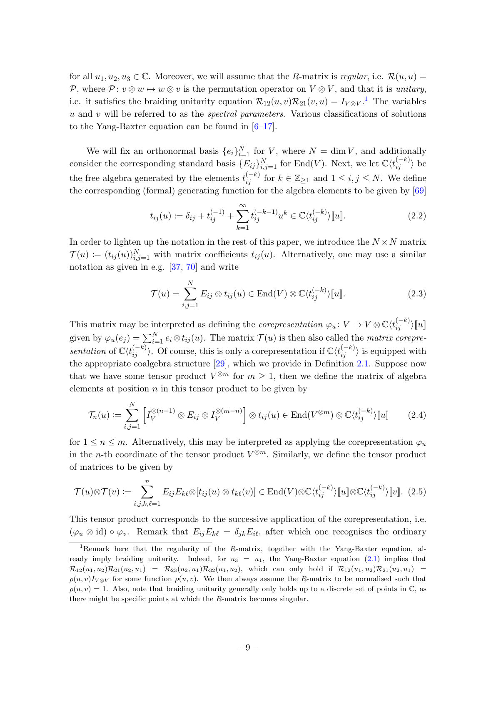
<figcaption class="paper-figure-caption"><b>Fig 9.</b> Low-resolution page preview, page 10</figcaption>
</figure>
<figure class="paper-figure-card">
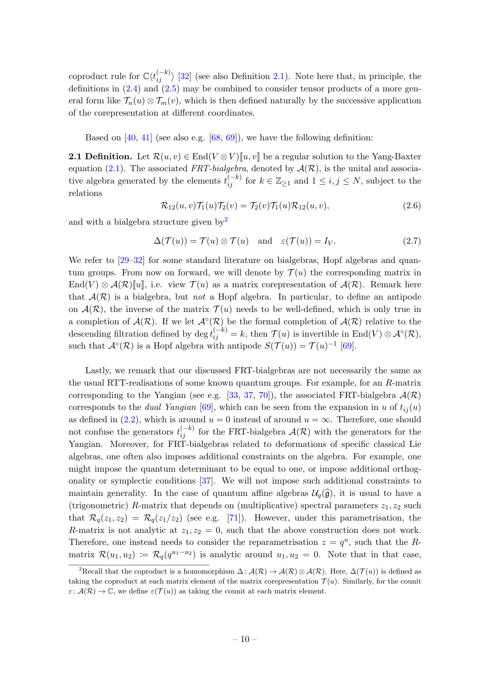
<figcaption class="paper-figure-caption"><b>Fig 10.</b> Low-resolution page preview, page 11</figcaption>
</figure>

**Summary.** This paper provides a new algebraic description of long-range integrable spin chains by showing they arise from a twist of the underlying quantum group. It demonstrates that this twisting leads to a non-associative structure where the Drinfeld associator encodes the long-range interactions. The work provides explicit tools, such as new algebraic charge densities, to study these deformed integrable models.

**Why it may be interesting.** not directly relevant

Detailed structure

**Main problem.** The paper aims to identify the underlying quantum group structure for long-range integrable deformations of homogeneous Yang-Baxter integrable spin chains.

**Main result.** The authors provide a quantum group-theoretical description showing that these deformations are obtained via a twist of the underlying algebraic structure, resulting in a non-associative algebra characterized by a Drinfeld associator.

**Method.** The study utilizes FRT-bialgebras, the quantum inverse scattering method, and deformation theory, specifically analyzing the twist mechanism and introducing 'algebraic charge densities' via derivatives of the R-matrix.

**Model / system.** The research focuses on quantum integrable spin chains, including the Heisenberg (XXX) model, Haldane-Shastry, and Inozemtsev chains, specifically looking at long-range deformations generated by local, boost, and bilocal operators.

**Key observables.** Conserved charges (local and algebraic), transfer matrix, Lax operators, R-matrices, and the Drinfeld associator.

**Important parameters / regimes.** The deformation parameter (analyzed to first order) and the spectral parameter.

**Assumptions / limitations.** The results are perturbative and limited to the first order in the deformation parameter; the R-matrix is assumed to be regular and unitary.

**Paper structure.** The paper introduces the problem of long-range deformations, establishes the FRT-bialgebra framework, applies a twisting mechanism to describe the deformation, proves the existence of the Drinfeld associator, and provides explicit expressions for Lax operators and R-matrices.

Abstract

Quantum integrable spin chains are known to possess a large family of long-range deformations generated by the local, boost and bilocal operators. Although these deformations are well-understood on the level of the pairwise commuting charges, the underlying quantum group structures had not yet been recognised. In this paper, we provide a quantum group-theoretical description for the family of long-range deformations of arbitrary homogeneous Yang-Baxter integrable spin chains up to first order in the deformation parameter. In particular, we show that the deformations are obtained via a twist of the algebraic structure of the underlying quantum group. This twisting results in a generally non-associative algebra that has a non-trivial Drinfeld associator. The Drinfeld associator is then shown to encode the information about the long-range interaction terms for the integrable spin chain. Moreover, the deformed quantum group is shown to contain a large perturbatively associative substructure, thus ensuring the perturbative integrability of the long-range model. The deformed quantum group provides explicit expressions for the Lax operators and R-matrices of the long-range deformed models, which manifestly satisfy the RLL relation and the Yang-Baxter equation up to first order in the deformation parameter. In order to derive the results, we introduce algebra elements that we call the algebraic charge densities. As a side result, we provide a conjecture for the explicit expressions of the undeformed charge densities in terms of these algebra elements.

[↑ back to top](#top)

### [The second altermagnet candidate in organic conductors: $κ$-(BEDT-TTF)$_2$$m$-HOOCC$_6$H$_4$SO$_3$](http://arxiv.org/abs/2604.27746v1)

**Authors:** Kohei Tokura, Takato Masuta, Kazushi Aoyama, Hiroki Akutsu, Yasuhiro Nakazawa, Scott S. Turner  
**Type:** both · **Category:** strongly correlated electrons · **PDF:** <https://arxiv.org/pdf/2604.27746v1>  
**Analysis basis:** full PDF text, analyzed in chunks

↔ Scroll figures horizontally

<figure class="paper-figure-card">

<figcaption class="paper-figure-caption"><b>Fig 1.</b> FIG. 1. Frustration of spins on a triangular lattice.</figcaption>
</figure>
<figure class="paper-figure-card">

<figcaption class="paper-figure-caption"><b>Fig 2.</b> FIG. 2. (a) Crystal structure of κ-m-SBA, where disorders are omitted for clarity. (b) Structure of the κ-type donor arrangement.</figcaption>
</figure>
<figure class="paper-figure-card">

<figcaption class="paper-figure-caption"><b>Fig 3.</b> FIG. 3. χ-T plots of κ-m-SBA. The inset shows the expansion from 16-300 K.</figcaption>
</figure>
<figure class="paper-figure-card">
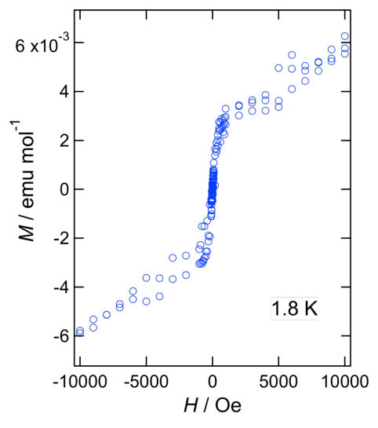
<figcaption class="paper-figure-caption"><b>Fig 4.</b> FIG. 4. M-H plots of κ-m-SBA.</figcaption>
</figure>
<figure class="paper-figure-card">

<figcaption class="paper-figure-caption"><b>Fig 5.</b> FIG. 5. The energy bands of κ-m-SBA.</figcaption>
</figure>

**Summary.** The researchers synthesized a new organic conductor, kappa-m-SBA, and identified it as a rare candidate for altermagnetism. By combining experimental measurements with numerical simulations, they demonstrated that the material exhibits spin-split energy bands driven by its specific magnetic ordering. This provides a new platform for studying altermagnetic phenomena in organic molecular crystals.

**Why it may be interesting.** not directly relevant

Detailed structure

**Main problem.** The identification of a new candidate for altermagnetism in organic conductors and explaining why the material kappa-m-SBA exhibits a canted antiferromagnetic transition instead of a spin liquid state.

**Main result.** The discovery of kappa-m-SBA as the second organic altermagnet candidate, demonstrating characteristic spin-splitting of energy bands due to the interplay of AFM order and anisotropic hopping.

**Method.** The study combines electrocrystallization synthesis, SQUID magnetometry, and four-probe resistivity measurements with first-principles (OpenMX) and tight-binding band calculations using a Hubbard model.

**Model / system.** The system is a kappa-type organic conductor, kappa-(BEDT-TTF)2m-HOOCC6H4SO3, characterized by a nearly equilateral triangular lattice and a Hubbard model Hamiltonian including intra-dimer and inter-dimer transfer integrals.

**Key observables.** Néel temperature (TN = 14 K), magnetic susceptibility, magnetization, electrical resistivity, spin-dependent band splitting, and the frustration parameter (t'/t).

**Important parameters / regimes.** Transfer integrals (t, t', tp, tq), Coulomb interaction (U = 0.54 eV), Mott gap (0.22 eV), and the frustration parameter (t'/t approx 1.01 or 0.80).

**Assumptions / limitations.** The canted antiferromagnetic structure is approximated as a collinear antiferromagnetic structure to evaluate lattice symmetry-driven altermagnetism.

**Figures summary.** Figure 5 shows the energy band dispersion in the AFM insulating phase demonstrating spin splitting; Figure S8 illustrates the crystal structure of the anionic layer.

**Paper structure.** The paper introduces a new organic conductor, describes its synthesis and structural properties, presents magnetic and transport measurements, uses first-principles and tight-binding calculations to analyze the electronic and magnetic ground state, and concludes with the identification of altermagnetic signatures.

Abstract

We have developed a novel BEDT-TTF-based organic conductor, $κ$-(BEDT-TTF)$_2 m$-HOOCC$_6$H$_4$SO$_3$ ($κ$-$m$-SBA), and propose it as a candidate for altermagnet. Tight-binding band calculations of $κ$-$m$-SBA provide a $t'/t$ of 1.01 at 100 K, indicating that the spin structure is closely aligned to an equilateral triangle ($t'/t= 1$). While most $κ$-type BEDT-TTF-based salts become spin liquids due to the spin frustration caused by the triangular lattice, $κ$-$m$-SBA surprisingly shows a weak ferromagnetic transition at $T_\mathrm{N} = 14$ K due to a canted antiferromagnetic (AFM) spin structure. Until recently, $κ$-(BEDT-TTF)$_2$Cu[N(CN)$_2$]Cl ($κ$-Cl) was the only $κ$-type organic conductor known to exhibit this order, and it is also recognized as the first candidate for altermagnetism in organic conductors. This was theoretically predicted by Naka et al. in 2019, who demonstrated that $κ$-type organic conductors can be candidates for altermagnetism if they display such order. Consequently, $κ$-$m$-SBA can be considered the second candidate for altermagnetism in organic conductors. Furthermore, numerical calculations demonstrate a characteristic of altermagnets in $κ$-$m$-SBA, namely spin splitting of energy bands.

[↑ back to top](#top)

### [Topological phase transitions in twisted bilayer graphene/hBN from interlayer coupling and substrate potentials](http://arxiv.org/abs/2604.27304v1)

**Authors:** Huiwen Wang, Wei Jiang  
**Type:** theory · **Category:** strongly correlated electrons · **PDF:** <https://arxiv.org/pdf/2604.27304v1>  
**Analysis basis:** abstract only; PDF text extraction failed or PDF unavailable

**Summary.** This paper investigates how varying interlayer coupling and substrate potentials affects the topological properties of twisted bilayer graphene/hBN. It identifies new high-Chern number states and explains the mechanisms behind the resulting topological phase transitions. These findings help interpret experimental observations in moire materials.

**Why it may be interesting.** not directly relevant

Detailed structure

**Main problem.** The study aims to provide a systematic understanding of how the combined influence of interlayer coupling and substrate potentials drives topological phase transitions in twisted bilayer graphene/hBN.

**Main result.** The authors map out Chern number phase diagrams revealing a rich topological landscape, including high-Chern number states (C = 3, 4, and 5), and identify the specific band-inversion mechanisms driving these transitions.

**Method.** A comprehensive theoretical study using a continuum model to vary material parameters and analyze the evolution of Berry curvature.

**Model / system.** Twisted bilayer graphene aligned with hexagonal boron nitride (TBG/hBN) described by a continuum model including interlayer hopping and hBN-induced potentials.

**Key observables.** Chern number, Berry curvature, and band-inversion mechanisms.

**Important parameters / regimes.** Interlayer hopping strengths (w0, w1), hBN-induced staggered potential, and the presence or absence of the hBN moire potential.

**Assumptions / limitations.** The study relies on the validity of the continuum model for describing the moire physics in TBG/hBN.

**Paper structure.** The paper presents a systematic study of topological phase transitions by mapping phase diagrams across a parameter space and analyzing the underlying band-inversion mechanisms.

Abstract

Twisted bilayer graphene aligned with hexagonal boron nitride (TBG/hBN) hosts rich topological and correlated quantum phases, such as (fractional) Chern insulators, whose character is dictated by the topology of the moiré flat band. This topology is highly sensitive to several material parameters in the continuum model, yet a systematic understanding of their combined influence has been lacking. Here, we present a comprehensive study of topological phase transitions in TBG/hBN by varying the interlayer hopping strengths ($w_0, w_1$) and hBN-induced staggered potential, both with and without the hBN moiré potential. We map out Chern number phase diagrams across a broad, experimentally relevant parameter space, revealing a progressive enrichment of the topological landscape including multiple high-Chern number ($C$ = 3, 4, and 5) states. Each transition is linked to distinct band-inversion mechanisms at generic $C_3$-symmetric k points, high-symmetry momenta, or parabolic touchings, clearly reflecting in the evolution of the Berry curvature. Our results offer theoretical insights that help interpret existing experimental observations, elucidate the mechanisms driving these topological phase transitions and facilitate the exploration of topological states in TBG/hBN and related moiré systems.

[↑ back to top](#top)

### [Towards Accelerated SCF Workflows with Equivariant Density-Matrix Learning and Analytic Refinement](http://arxiv.org/abs/2604.27256v1)

**Authors:** Zuriel Y. Yescas-Ramos, Andrés Álvarez-García, Huziel E. Sauceda  
**Type:** theory · **Category:** numerical methods · **PDF:** <https://arxiv.org/pdf/2604.27256v1>  
**Analysis basis:** full PDF text, analyzed in chunks

↔ Scroll figures horizontally

<figure class="paper-figure-card">

<figcaption class="paper-figure-caption"><b>Fig 1.</b> FIG. 1. dm-PhiSNet model. (A) The PhiSNet-based backbone (gray box) builds blockwise AO 1-RDMs from molecular geometries R and atomic numbers Z, which are then refined by the analytic block (green box) to give the 1-RDM predictor. (B) Representation of the PhiSNet architecture. [25] (C) The AnalyticBlock is constructed by three sub-blocks to enforce physical consistency using the overlap matrix S: (i) trace rescaling, (ii) McWeeny purification cycle, and (iii) a final trace rescaling.</figcaption>
</figure>
<figure class="paper-figure-card">
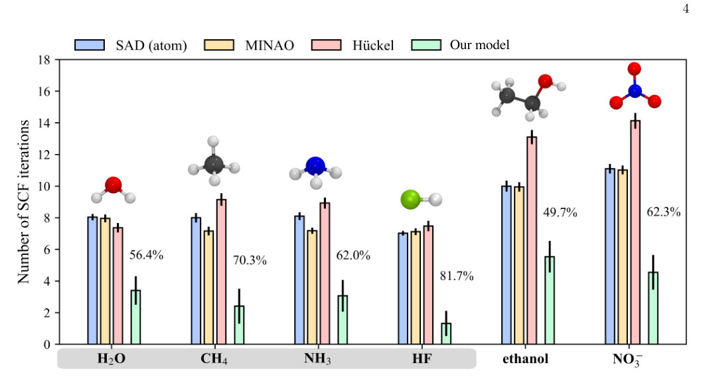
<figcaption class="paper-figure-caption"><b>Fig 2.</b> FIG. 2. Mean numbers of SCF iterations over 500 test configurations for all benchmarked systems. Results compare the performance of the 1-RDMs predicted by our model against the conventional SAD (atom), MINAO, and H¨uckel initial guesses. Magnitudes of the standard deviations (STD) are represented by vertical black lines on the frequency bars. Reductions with respect to the three averaged standard initial guesses are also shown.</figcaption>
</figure>
<figure class="paper-figure-card">
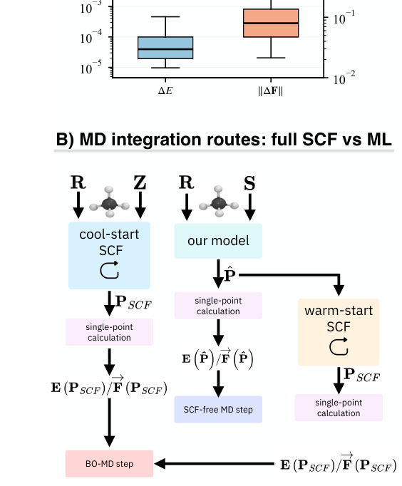
<figcaption class="paper-figure-caption"><b>Fig 3.</b> FIG. 3. (A) Distributions of single-point errors in total en- ergy ∆E (left axis) and force norms ∥∆F∥(right axis) com- puted directly from the predicted 1-RDM ˆP0, for ethanol (top panel) and NO− 3 (bottom panel). (B) Conceptual integration into MD: conventional SCF versus using ˆP0 either (i) directly for an SCF-free MD step (as a CP-style electronic initializer) or (ii) as a warm start for accelerated SCF refinement for BO- MD.</figcaption>
</figure>

**Summary.** This paper introduces dm-PhiSNet, a machine learning model designed to accelerate quantum chemistry calculations by predicting high-quality initial density matrices. By enforcing physical constraints like idempotency and charge conservation, the model significantly reduces the number of iterations needed for SCF convergence and can even predict accurate forces in a single step.

**Why it may be interesting.** not directly relevant

Detailed structure

**Main problem.** Accelerating Self-Consistent Field (SCF) workflows in electronic-structure theory by generating physically admissible initial density matrix guesses.

**Main result.** The dm-PhiSNet model reduces SCF iteration steps by 49-81% and provides accurate one-shot total energies and Hellmann-Feynman forces without explicit force supervision.

**Method.** A two-stage training protocol using an equivariant PhiSNet backbone combined with a lightweight analytic refinement block that enforces physical constraints like electron-number conservation and generalized idempotency.

**Model / system.** The model predicts one-electron reduced density matrices (1-RDMs) in an atomic-orbital basis for closed-shell molecular systems including H2O, CH4, NH3, HF, ethanol, and NO3-.

**Key observables.** One-electron reduced density matrices (1-RDMs), total energies, Hellmann-Feynman atomic forces, and SCF iteration counts.

**Assumptions / limitations.** The work focuses on closed-shell systems and assumes the effectiveness of projecting learned 1-RDMs onto the admissible manifold at negligible computational cost.

**Figures summary.** Figure 1 details the dm-PhiSNet architecture, including the equivariant backbone and the analytic refinement sub-blocks. Figure 2 shows the reduction in SCF iterations compared to standard initializations, and Figure 3 presents error distributions for energy and force norms.

**Paper structure.** The paper introduces the dm-PhiSNet architecture, describes the equivariant backbone and the analytic constraint enforcement, details the two-stage training protocol, presents benchmarks on molecular systems regarding SCF acceleration and one-shot accuracy, and discusses scalability and limitations.

Abstract

We present \textsc{dm-PhiSNet}, a physically constrained \textsc{PhiSNet}-based equivariant model that predicts one-electron reduced density matrices (1-RDMs) directly from molecular geometries in an atomic-orbital (AO) basis for accelerated self-consistent field (SCF) workflows. Training follows a two-stage schedule with progressively introduced physically motivated objectives, and the resulting predictions are refined by a lightweight analytic block. This block enforces electron-number conservation, drives the 1-RDM toward generalized idempotency in the AO metric, and regularizes the occupation spectrum of the Löwdin-orthogonalized density. Across six closed-shell systems -- H$_2$O, CH$_4$, NH$_3$, HF, ethanol, and NO$_3^-$ -- the refined 1-RDMs provide SCF initial guesses that substantially reduce iteration steps by 49--81\% relative to standard initializations. Beyond SCF acceleration, the learned 1-RDMs yield accurate one-shot total energies and Hellmann--Feynman atomic forces without force supervision, indicating that the model captures chemically meaningful electronic structure. These results demonstrate that combining equivariant learning with analytic constraint enforcement provides a simple, general route to solver-ready density-matrix initializations and accelerated SCF workflows.

[↑ back to top](#top)

## Secondary cond-mat archives

*Papers from cond-mat.mtrl-sci, mes-hall, other, soft, supr-con. These archives are de-prioritized — they appear at the end regardless of relevance score.*

### Relevant in secondary archives (17)

### [Strong coupling between quantized magnon modes in a YIG microstucture and microwaves in a superconducting resonator](http://arxiv.org/abs/2604.28145v1)

**Authors:** Seth W. Kurfman, Philipp Geyer, Anoop Kamalasanan, Karl Heimrich, Kwangyul Hu, Paul Tharnier, Frank Heyroth, Michael Flatté, Georg Schmidt  
**Type:** experiment · **Category:** quantum information and computing · **PDF:** <https://arxiv.org/pdf/2604.28145v1>  
**Analysis basis:** abstract only; PDF text extraction failed or PDF unavailable
**Topic relevance:** 🔥 `spintronics-quantum-optics interface` **5/5** · 🔥 `QC/QI experiment` **4/5** · 🔥 `quantum optics experiment` **4/5** · `Tavis-Cummings & cavity-many-emitter` **3/5**

**Summary.** The study achieves strong coupling between magnon modes and superconducting resonator photons in micron-scale YIG structures. By using FIB-milled microplatelets, the researchers overcame previous thickness limitations, enabling efficient, low-power magnonic-based quantum devices. This provides a foundation for on-chip studies of numerous long-lived excitations.

**Why it may be interesting.** This work is highly relevant to quantum optics and open quantum systems as it demonstrates a platform for scalable, on-chip strong coupling between bosonic excitations (magnons and photons) at extremely low power levels, which is a key requirement for hybrid quantum architectures.

Detailed structure

**Main problem.** Achieving strong coupling between magnons and microwave photons in sub-10 micron Yttrium Iron Garnet (YIG) structures has been difficult due to insufficient mode volume caused by YIG thickness limitations.

**Main result.** The researchers demonstrated strong coupling between numerous magnon modes in a YIG microplatelet and a superconducting LC resonator, even at extremely low input powers (<= 10 fW).

**Method.** The team used focused ion beam (FIB) techniques to create a YIG microplatelet from a single crystal and placed it on a constricted inductive line of an optimized superconducting lumped element LC resonator.

**Model / system.** The system consists of a micron-scale YIG microplatelet coupled to a superconducting lumped element LC resonator, involving the interaction between magnonic modes and resonator photons.

**Key observables.** Microwave transmission signal and anti-crossings in the transmission spectrum.

**Important parameters / regimes.** Sub-10 micron YIG structures, device input powers <= 10 fW.

**Paper structure.** The paper introduces the challenge of small-scale magnonics, describes the FIB fabrication of YIG microplatelets, presents experimental evidence of strong coupling via anti-crossings, validates results with micromagnetic simulations and analytical calculations, and demonstrates low-power operation.

Abstract

Strong-coupling experiments based on magnons enable the exploration into on-chip demonstrations involving numerous long-lived excitations. Yttrium iron garnet (YIG) has been considered for decades as a gold standard material for magnonics due to its low-loss magnonic properties. While YIG has successfully demonstrated strong-coupling in macroscopic device geometries, the strong coupling of magnons in truly sub-10 micron YIG structures to date has not yet been realized. This obstacle is due to the difficulty producing large enough effective magnonic mode volume necessary primarily due to thickness limitations of YIG deposition and device fabrication techniques. Here, we demonstrate the use of a microplatelet of YIG, manufactured from a single crystal of YIG via focused ion beam (FIB) techniques, placed on a constricted inductive line of an optimized superconducting lumped element LC resonator to achieve strong coupling between numerous magnon modes and the LC resonator photons. These experimental findings are qualitatively backed by micromagnetic simulations and quantitatively supported by analytical calculations to identify the magnon modes corresponding to the experimentally observed anti-crossings in the microwave transmission signal. Further, we show that these anti-crossings remain even at incredibly low device input powers ($\leq 10$ fW). The fabrication techniques and device geometry enable the deterministic use of numerous confined magnon modes in micron-scale YIG structures for various magnetic field strengths and orientations at substantially reduced device powers. The results here establish a foundational path forward to achieving efficient magnon-based strong-coupling experiments in micron-scale YIG magnetic elements for effective on-chip studies.

[↑ back to top](#top)

### [Spin-coherence characterization of boron vacancy defects in hexagonal boron nitride with broadband microwave pulses](http://arxiv.org/abs/2604.27843v1)

**Authors:** Yuki Nakamura, Takuya Iwasaki, Shu Nakaharai, Shinichi Ogawa, Yukinori Morita, Kenji Watanabe, Takashi Taniguchi, Kento Sasaki, Kensuke Kobayashi  
**Type:** experiment · **Category:** quantum information and computing · **PDF:** <https://arxiv.org/pdf/2604.27843v1>  
**Analysis basis:** abstract only; PDF text extraction failed or PDF unavailable
**Topic relevance:** 🔥 `QC/QI experiment` **4/5** · `spintronics-quantum-optics interface` **3/5** · `quantum measurements` **2/5** · `quantum optics experiment` **2/5**

**Summary.** This paper demonstrates a method to characterize the spin coherence of boron vacancy defects in hBN using broadband microwave pulses. By measuring T2* and T2 times, the study provides essential data for evaluating these defects as platforms for nanoscale quantum sensing. The approach is particularly useful for van der Waals thin films with broad resonance linewidths.

**Why it may be interesting.** This work is relevant to researchers in open quantum systems and quantum optics as it provides experimental methods for characterizing decoherence and spin dynamics in solid-state defects used for quantum sensing.

Detailed structure

**Main problem.** Characterizing the spin coherence times (T2* and T2) of negatively charged boron vacancy (VB-) defects in hBN for use in nanoscale quantum sensing.

**Main result.** The study achieved sub-GHz Rabi oscillations and measured spin coherence times of T2* = 13.8 ns and T2 = 108.7 ns using broadband microwave pulses.

**Method.** The researchers used broadband microwave pulses on an isotopically enriched hBN thin film stamped onto a gold wire to perform Ramsey interference and Hahn echo measurements.

**Model / system.** The physical system consists of negatively charged boron vacancy (VB-) defects in an isotopically enriched hexagonal boron nitride (hBN) thin film placed on a narrow gold wire.

**Key observables.** Rabi oscillations, Ramsey interference signal decay, Hahn echo signal decay, and the stretch factor alpha.

**Important parameters / regimes.** T2* = 13.8 ns, T2 = 108.7 ns, and a stretch factor alpha = 1.25.

**Paper structure.** The paper introduces the potential of VB- defects for sensing, describes the experimental setup using gold wires and broadband pulses, presents the results of Ramsey and Hahn echo measurements, and concludes with the implications for evaluating spin defects in van der Waals materials.

Abstract

Negatively charged boron vacancy (VB-) defects in hexagonal boron nitride (hBN) are promising for nanoscale-proximity quantum sensing. To evaluate their performance, it is important to characterize the spin coherence times T2* and T2. In this study, we realized sub-GHz Rabi oscillations of VB- using an isotopically enriched hBN thin film directly stamped onto a narrow gold wire. Using these strong microwave pulses, we performed Ramsey interference and Hahn echo measurements. The Ramsey interference signal showed Gaussian-like decay, yielding T2* = 13.8 ns. The Hahn echo measurement gave T2 = 108.7 ns and a stretch factor of α= 1.25. These results experimentally clarify the spin coherence properties of VB- and provide an effective method for evaluating the coherence of spin defects in van der Waals thin films with broad resonance linewidths.

[↑ back to top](#top)

### [Mobile Exceptional Points Generate Momentum-Space Switching Domains](http://arxiv.org/abs/2604.27417v1)

**Authors:** Jung-Wan Ryu, Chang-Hwan Yi  
**Type:** both · **Category:** other · **PDF:** <https://arxiv.org/pdf/2604.27417v1>  
**Analysis basis:** abstract only; PDF text extraction failed or PDF unavailable
**Topic relevance:** `driven-dissipative phase transition` **3/5** · `non-equilibrium dynamics` **3/5** · `analog quantum simulation` **2/5** · `correlated / nonlocal dissipation` **2/5**

**Summary.** The paper shows that when exceptional points move during cyclic modulation, they create distinct regions in the Brillouin zone where bands switch or do not switch. This discovery provides a new method for controlling band topology in non-Hermitian systems, such as lossy photonic crystals.

**Why it may be interesting.** This is highly relevant for researchers in quantum optics and open quantum systems as it demonstrates a new way to engineer non-Hermitian topological phenomena by controlling the motion of exceptional points.

Detailed structure

**Main problem.** The study investigates how the mobility of exceptional points (EPs) under cyclic modulation affects the band topology and creates new momentum-space structures.

**Main result.** Mobile EPs generate momentum-space switching domains that partition the Brillouin zone into regions with different band-switching behaviors, leading to global band switching at high modulation strengths.

**Method.** The authors use a minimal two-band lattice model to introduce a band-permutation invariant and demonstrate the effect in a photonic crystal with lossy materials.

**Model / system.** A minimal two-band lattice model under cyclic modulation and a photonic crystal platform incorporating lossy materials.

**Key observables.** Band-switching behavior, band-permutation invariant, and EP trajectories in extended parameter space.

**Important parameters / regimes.** Modulation strength, crystal momentum, and the modulation parameter.

**Paper structure.** The paper introduces the concept of mobile EPs, presents a theoretical framework using a two-band lattice model and a new band-permutation invariant, describes the formation of switching domains, and validates the predictions using a photonic crystal system.

Abstract

Exceptional points (EPs), non-Hermitian degeneracies where both eigenvalues and eigenvectors coalesce, play a central role in the topology of non-Hermitian spectra. Recent advances have enabled the controlled creation and manipulation of EPs in a wide range of physical systems, raising the question of what new band topology emerges when EPs become mobile under cyclic modulation. Here we show that mobile EPs generate momentum-space switching domains that partition the Brillouin zone into regions with distinct band-switching behavior. Using a minimal two-band lattice model, we introduce a band-permutation invariant that determines whether eigenmodes exchange after one modulation cycle. The boundaries between switching regions arise from the projection of EP trajectories in an extended parameter space combining crystal momentum and the modulation parameter. As the modulation strength increases, the switching domains expand and eventually cover the entire Brillouin zone, resulting in global band switching. The predicted switching-domain structure is further demonstrated in a photonic crystal with lossy materials. These results open a new avenue within non-Hermitian topology by enabling the engineering of EP-driven phenomena through their controlled motion.

[↑ back to top](#top)

### [Directional Cluster Migration Driven by Escape-Rate Asymmetry in Multi-Compartment Granular Systems](http://arxiv.org/abs/2604.27611v1)

**Authors:** Kai Kono, Hiroyuki Ebata, Shio Inagaki  
**Type:** both · **Category:** statistical mechanics · **PDF:** <https://arxiv.org/pdf/2604.27611v1>  
**Analysis basis:** abstract only; PDF text extraction failed or PDF unavailable
**Topic relevance:** `non-equilibrium dynamics` **3/5** · `driven-dissipative phase transition` **2/5** · `non-equilibrium universality` **2/5**

**Summary.** The paper investigates how particle clusters move directionally between compartments in a vibrated granular system. By measuring species-specific fluxes, the authors show that an asymmetry in how small and large particles interact drives this migration. This work provides an experimental basis for modeling collective transport in driven, dissipative systems.

**Why it may be interesting.** The discovery of asymmetric, population-dependent flux and directional transport in a non-equilibrium system provides insights into collective transport and driven-dissipative dynamics relevant to open quantum systems.

Detailed structure

**Main problem.** Understanding the mechanism behind the directional stepwise migration of particle clusters in a multi-compartment vibrated granular system.

**Main result.** The study identifies an asymmetric interaction between particle species where large particles enhance small particle flux, while small particles suppress large particle flux, driving directional transport.

**Method.** Direct measurement of particle species flux as a function of instantaneous populations, followed by the implementation of a minimal flux model.

**Model / system.** A vertically vibrated granular system composed of small and large particles distributed across multiple compartments.

**Key observables.** Flux of small and large particle species, particle populations per compartment, and directional migration dynamics.

**Important parameters / regimes.** Mechanical agitation (vibration), particle size distribution, and instantaneous particle populations.

**Assumptions / limitations.** The system is treated as an out-of-equilibrium system driven by energy dissipation through inelastic collisions and friction.

**Paper structure.** Introduction to granular out-of-equilibrium dynamics, experimental report on directional cluster migration, flux measurement analysis, and validation via a minimal flux model.

Abstract

Granular materials are inherently out-of-equilibrium systems due to energy dissipation through inelastic collisions and friction. When driven by mechanical agitation such as vibration, they exhibit rich collective behaviors including segregation, clustering, and spontaneous oscillations. Here, we report directional stepwise migration of particle clusters from one compartment to the next in a vertically vibrated granular system composed of small and large particles. To clarify the underlying mechanism, we directly measured how the flux of both particle species depends on the instantaneous particle populations. The measurements reveal an asymmetric interaction between particle species: the flux of small particles is enhanced by the presence of large particles, whereas that of large particles is suppressed by small particles. A minimal flux model incorporating these measured fluxes reproduces the observed directional dynamics and provides an experimentally grounded framework for collective transport in vibrated granular systems.

[↑ back to top](#top)

### [Mapping the Phase Diagram of the Vicsek Model with Machine Learning](http://arxiv.org/abs/2604.28167v1)

**Authors:** Grace T. Bai, Brandon B. Le  
**Type:** theory · **Category:** disordered systems and neural networks · **PDF:** <https://arxiv.org/pdf/2604.28167v1>  
**Analysis basis:** full PDF text, analyzed in chunks
**Topic relevance:** `driven-dissipative phase transition` **2/5** · `non-equilibrium dynamics` **2/5** · `non-equilibrium universality` **2/5**

↔ Scroll figures horizontally

<figure class="paper-figure-card">
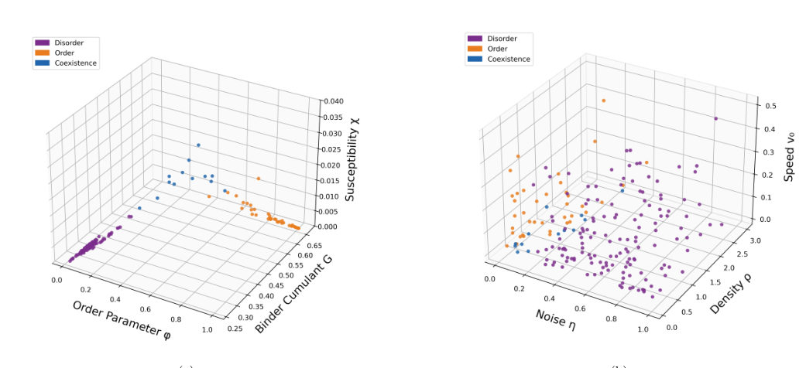
<figcaption class="paper-figure-caption"><b>Fig 1.</b> FIG. 1. K-Means classification of Vicsek-model simulation data. (a) Clustering in the observable space spanned by the order parameter ⟨ϕ⟩, Binder cumulant G, and susceptibility χ. (b) The same cluster labels projected onto the parameter space (η, ρ, v0), showing the corresponding disorder, order, and coexistence regions.</figcaption>
</figure>
<figure class="paper-figure-card">
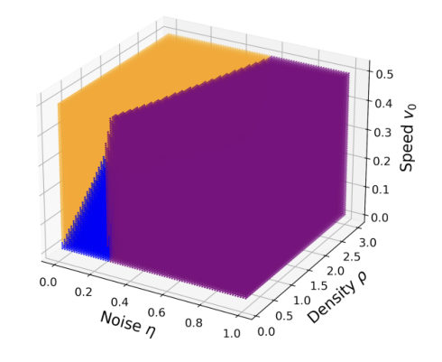
<figcaption class="paper-figure-caption"><b>Fig 2.</b> FIG. 2. Three-dimensional learned phase diagram of the Vic- sek model in the parameter space (η, ρ, v0). Each point rep- resents a classified parameter-grid point, with purple, orange, and blue denoting disorder, order, and coexistence, respec- tively. The classifier predicts a broad ordered region at low noise, a disordered region at higher noise, and a narrower co- existence region separating the two phases.</figcaption>
</figure>
<figure class="paper-figure-card">
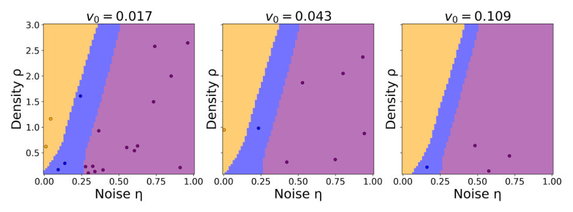
<figcaption class="paper-figure-caption"><b>Fig 3.</b> FIG. 3. Two-dimensional slices of the learned Vicsek-model phase diagram in the (η, ρ) plane at fixed particle speeds v0 = 0.017, 0.043, and 0.109. The shaded regions show the neural-network classification on an evenly spaced parameter grid, while the overlaid points show the original labeled simulation data near each slice. Purple, orange, and blue denote disorder, order, and coexistence, respectively.</figcaption>
</figure>

**Summary.** This paper presents a machine learning framework to automatically map the complex phase diagram of the Vicsek model. By combining K-Means clustering with neural networks, the authors can identify coexistence regions and interpolate phase boundaries in a 3D parameter space. This provides a systematic way to extract global phase behavior from sparse simulation data in active matter models.

**Why it may be interesting.** not directly relevant

Detailed structure

**Main problem.** Mapping and classifying the 3D phase structure (order, disorder, and coexistence) of the Vicsek model across a parameter space of noise, density, and velocity.

**Main result.** The authors developed an ML pipeline that achieves 0.92 classification accuracy, successfully resolving a narrow coexistence region and interpolating phase boundaries beyond the original simulation points.

**Method.** A two-step machine learning approach using K-Means clustering on dynamical observables for unsupervised phase labeling, followed by a supervised neural network classifier for parameter-to-phase mapping.

**Model / system.** The Vicsek model, an agent-based model of self-propelled particles in 2D that exhibits collective motion/flocking behavior.

**Key observables.** Order parameter (phi), Binder cumulant (G), and susceptibility (chi).

**Important parameters / regimes.** Noise level (eta), particle density (rho), and self-propulsion velocity (v0).

**Assumptions / limitations.** The study assumes that the K-Means clustering of steady-state observables accurately represents the underlying physical phases and that weighted cross-entropy is sufficient to handle class imbalance.

**Figures summary.** Figure 1 shows K-Means clustering in observable space and the resulting phase labels projected onto parameter space; Figure 2 provides a 3D visualization of the learned phase diagram; Figure 3 shows 2D slices of the phase diagram in the (eta, rho) plane at different v0 values.

**Paper structure.** The paper introduces the Vicsek model and the problem of phase mapping, describes the simulation and ML pipeline (unsupervised clustering followed by supervised classification), presents the resulting 3D phase diagrams and 2D slices, and concludes with discussion on limitations and future work.

Abstract

In this study, we use machine learning to classify and interpolate the phase structure of the Vicsek flocking model across the three-dimensional parameter space $(η,ρ,v_0)$. We construct a dataset of simulated parameter points and characterize each point using long-time dynamical observables. These observables are then used as inputs to a K-Means clustering procedure, which assigns each point to a disorder, order, or coexistence phase. Using these clustered labels, we train a neural-network classifier to learn the mapping from model parameters to phase behavior, achieving a classification accuracy of 0.92. The resulting phase map resolves a narrow coexistence region separating the ordered and disordered phases and extends the inferred phase boundaries beyond the originally sampled simulation points. More broadly, this approach provides a systematic way to convert sparse simulation data into a global phase diagram for collective-motion models.

[↑ back to top](#top)

### [Electrically Tunable Terahertz Chirality from Quantum Geometry](http://arxiv.org/abs/2604.27294v1)

**Authors:** Sobhan Subhra Mishra, Thomas CaiWei Tan, Faxian Xiu, Ranjan Singh  
**Type:** experiment · **Category:** other · **PDF:** <https://arxiv.org/pdf/2604.27294v1>  
**Analysis basis:** full PDF text, analyzed in chunks
**Topic relevance:** `non-equilibrium dynamics` **2/5** · `quantum optics experiment` **2/5**

↔ Scroll figures horizontally

<figure class="paper-figure-card">

<figcaption class="paper-figure-caption"><b>Fig 1.</b> Figure 1: All-electrical tuning of chiral THz emission from Cd3As2; (a) Floquet band engineering in a 3D Dirac semimetal. Circularly polarized (CP) photoexcitation breaks time-reversal symmetry, splitting the doubly degenerate Dirac node into a pair of Weyl nodes separated by ∆𝑘 in momentum space; (b) Device schematic for electrically tunable chiral THz emission. A 40 nm Cd3As2 thin film grown on a c- cut sapphire substrate is gated via an out-of-plane capacitive structure comprising Al electrodes, a 1 𝜇𝑚 SiO2 dielectric spacer, and a THz-transparent ITO-coated PET top electrode. CP femtosecond pulses (800 nm, 35 fs) illuminate the sample at 10° oblique incidence, simultaneously generating...</figcaption>
</figure>
<figure class="paper-figure-card">

<figcaption class="paper-figure-caption"><b>Fig 2.</b> Figure 2: Selective electrical tuning of the Floquet THz component. (a) Y polarized THz pulse (EY) under left circularly polarized pump at 10° incidence for positive gate voltages (0–90 V). EY decreases with increasing voltage due to suppression of the Floquet anomalous Hall photocurrent. (b) X polarized THz pulses (EXZ) for the same positive gate voltages. EXZ remains unchanged, confirming the voltage independence of the circular photon drag effect. (c) EY for negative gate voltages (0 to −90 V). EY increases with increasing negative bias as the Fermi level shifts toward the Dirac point, enhancing the Berry curvature flux through due to decrease in Fermi pocket size. (d) EXZ for the same...</figcaption>
</figure>
<figure class="paper-figure-card">

<figcaption class="paper-figure-caption"><b>Fig 3.</b> Figure 3: Voltage-dependent polarization ellipses of the emitted THz field. (a) Parametric plot of EY(t) versus EXZ(t) at 0 V under left circularly polarized pump, showing a slightly vertically elongated ellipse (EY &gt; EXZ). (b) Polarization ellipse at +10 V, where EY≈EXZ and the THz field is closest to circular. (c) Polarization ellipse at +50 V, with reduced EY and a clearly horizontally elongated ellipse. (d) Polarization ellipse at +70 V, where further suppression of EY drives the polarization toward linear along EXZ. (e) Polarization ellipse at +90 V, showing a strongly EXZ dominated, highly horizontally elongated elliptical polarization. (f) Polarization ellipse at −10 V, where...</figcaption>
</figure>
<figure class="paper-figure-card">

<figcaption class="paper-figure-caption"><b>Fig 4.</b> Figure 4: Quantitative polarization analysis of electrically tuned chiral THz. (a) Ellipticity angle 𝜒 as a function of gate voltage, with maximum circularity (𝜒≈−42°, dashed circle) near +10 V where EY ≈ EXZ. Both positive and negative voltage deviations reduce the circularity as the amplitude balance shifts. (b) Normalized Stokes parameter S1 as a function of gate voltage, transitioning from vertically dominated polarization (Normalised S1&lt;0, green region) through balanced (Normalised S1=0) to horizontally dominated polarization (Normalised S1&gt;0, pink region). The zero crossing at ~+10 V is consistent with the ellipticity minimum in (a). (c) Measured polarization states mapped onto the...</figcaption>
</figure>
<figure class="paper-figure-card">
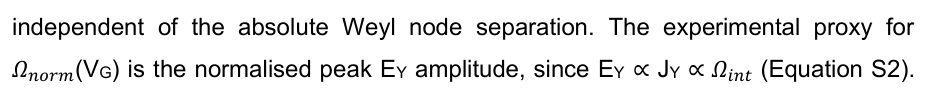
<figcaption class="paper-figure-caption"><b>Fig 5.</b> Figure 1(d) shows the theoretical curve 𝛺𝑛𝑜𝑟𝑚(VG) alongside the normalised</figcaption>
</figure>

**Summary.** The researchers demonstrated how to electrically tune the polarization of terahertz light by using a gate voltage to reshape the Fermi surface in a Dirac semimetal. By selectively modulating the Berry curvature-driven component of the emission, they achieved programmable control of THz chirality. This provides a new route for creating on-chip, electrically controllable chiral light sources.

**Why it may be interesting.** not directly relevant

Detailed structure

**Main problem.** Achieving all-electrical, deterministic control over the chirality (polarization state) of Terahertz (THz) emission by manipulating quantum geometry.

**Main result.** Demonstrated that electrostatic gating of Cd3As2 can reshape Fermi pockets to selectively modulate the Berry curvature-driven THz component, enabling programmable tuning of THz polarization across the Poincaré sphere.

**Method.** THz emission spectroscopy using circularly polarized femtosecond laser pulses on a gated Cd3As2 thin-film device, combined with Stokes parameter analysis.

**Model / system.** A 40 nm thin film of the 3D Dirac semimetal Cd3As2 in a field-effect transistor geometry, subject to Floquet Weyl physics via optical excitation.

**Key observables.** THz electric field components (Ex and Ey), ellipticity angle (chi), azimuth angle (psi), and Stokes parameters (S1, S2, S3).

**Important parameters / regimes.** Gate voltage (Vg) from -90 V to +90 V, Fermi energy (Ef) shifts, and Berry curvature integral.

**Assumptions / limitations.** Assumes a monopole-like divergence for Berry curvature near Weyl nodes and uses an asymmetric screening model for carrier accumulation/depletion.

**Figures summary.** Fig 1: Schematic of Floquet band engineering and device architecture; Fig 2: Evidence of selective gate-dependent tuning of THz components; Fig 3: Evolution of polarization ellipses across voltages; Fig 4: Quantitative mapping of Stokes parameters and ellipticity vs. voltage.

**Paper structure.** The paper introduces the problem of controlling optical observables via quantum geometry, describes the Floquet-Weyl mechanism in Cd3As2, presents experimental evidence of gate-tunable THz chirality, provides quantitative verification via Berry curvature integration, and concludes with potential applications for programmable THz sources.

Abstract

Quantum geometry encoded in the momentum space structure of electronic wavefunctions, governs charge dynamics through Berry curvature, enabling unconventional transport and optical responses. In topological semimetals, this geometry is sampled over Fermi pockets, suggesting electrical control by Fermi surface tuning, yet such control has remained largely limited to DC transport. Here we show that electrostatic gating of the 3D Dirac semimetal Cd3As2 reshapes Fermi pockets surrounding photoinduced Floquet Weyl nodes, enabling electrical control of terahertz (THz) emission chirality. Gate tuning selectively modulates the Berry curvature driven linearly polarized THz component by up to 60% and 49% at positive and negative bias, respectively, while the orthogonal linearly polarized photon-drag component remains unchanged. With the two orthogonal fields intrinsically phase-locked at \sfracπ{2} by the excitation geometry, the selective gate-tuned amplitude control enables the polarization tuning across the Poincaré sphere, achieving near-circular polarization (χ\approx-42°) at +10 V. These results establish Fermi surface tuning as a general route to programmable quantum geometric control of chiral terahertz emission.

[↑ back to top](#top)

### [Emergent electric fields driven by phonon-coupled skyrmion resonances](http://arxiv.org/abs/2604.27719v1)

**Authors:** Seno Aji  
**Type:** theory · **Category:** other · **PDF:** <https://arxiv.org/pdf/2604.27719v1>  
**Analysis basis:** abstract only; PDF text extraction failed or PDF unavailable
**Topic relevance:** `non-equilibrium dynamics` **2/5** · `spintronics-quantum-optics interface` **2/5**

**Summary.** This paper provides a theoretical framework to understand how lattice vibrations (phonons) can drive electric fields in skyrmion lattices. It shows that internal skyrmion dynamics like breathing and rotation can generate measurable electrical signals even without moving the entire lattice. This is significant for developing new ways to control and detect topological magnetic textures using light or microwaves.

**Why it may be interesting.** not directly relevant

Detailed structure

**Main problem.** The paper aims to describe the generation of macroscopic emergent electric fields resulting from the coupling between phonons and the breathing/rotational dynamics of a skyrmion lattice under microwave excitation.

**Main result.** The study identifies the specific symmetry and dynamical conditions required to produce both rectified (dc) and oscillating (ac) electric fields, even without net translational motion of the lattice.

**Method.** The authors develop a coarse-grained theoretical description and a unified framework for analyzing spin-charge-lattice coupling in the long-wavelength phonon limit.

**Model / system.** The system consists of a skyrmion lattice in topological magnets subject to phonon-coupled lattice deformations and microwave excitation.

**Key observables.** Macroscopic emergent electric fields (dc and ac components), skyrmion profile parameters, and harmonic components of the electrodynamic response.

**Important parameters / regimes.** Equilibrium radius, domain-wall width, dynamical resonance frequency, long-wavelength phonon limit (q -> 0), and finite phonon frequency.

**Assumptions / limitations.** The analysis focuses on the dilute-lattice limit and the long-wavelength phonon limit.

**Paper structure.** The paper presents a theoretical development of a coarse-grained model, followed by an analysis of symmetry and dynamical conditions for electric field generation, and concludes with the identification of harmonic components in the electrodynamic response.

Abstract

We develop a coarse-grained theoretical description of the macroscopic emergent electric field generated by phonon-coupled lattice deformations in the breathing and rotational dynamics of a skyrmion lattice under microwave excitation. The analysis identifies the symmetry and dynamical conditions that yield rectified (dc) and oscillating (ac) electric fields, even in the absence of net translational motion of the skyrmion lattice, particularly in the dilute-lattice limit. Using experimentally measurable skyrmion profile parameters such as the equilibrium radius, domain-wall width, and dynamical resonance frequency of skyrmion lattice, the model further enables identification of harmonic components contributing to the observed macroscopic electrodynamic response in the long-wavelength phonon limit ($q \to 0$) and at finite phonon frequency, providing a unified framework for phonon-driven spin-charge-lattice coupling in topological magnets.

[↑ back to top](#top)

### [Superconductivity-Enabled Conversion of Ferromagnetic Resonance into Standing Spin Waves](http://arxiv.org/abs/2604.27076v1)

**Authors:** Ya. V. Turkin, N. G. Pugach, F. M. Maksimov, A. S. Pakhomov, A. I. Chernov, V. I. Belotelov, S. N. Polulyakh, V. S. Stolyarov  
**Type:** both · **Category:** other · **PDF:** <https://arxiv.org/pdf/2604.27076v1>  
**Analysis basis:** abstract only; PDF text extraction failed or PDF unavailable
**Topic relevance:** `Keldysh / 2PI / non-Gaussian methods` **2/5** · `spintronics-quantum-optics interface` **2/5**

**Summary.** The researchers show that a superconductor can act as a control knob to convert uniform magnetic resonance into standing spin waves in an adjacent insulator. This process is driven by spin-transfer torque from triplet Cooper pairs and electromagnetic effects from superconducting vortices. This discovery opens new ways to manipulate magnonic modes using superconducting states.

**Why it may be interesting.** not directly relevant

Detailed structure

**Main problem.** Exploring the coherent coupling between a diffusive superconductor and short-wavelength magnons in an adjacent insulating magnet to enable mode conversion.

**Main result.** Demonstrated that superconductivity can convert uniform ferromagnetic resonance (FMR) into perpendicular standing spin waves (PSSWs) via spin-polarized triplet Cooper pairs and electromagnetic proximity from Abrikceptov vortices.

**Method.** Experimental microwave transmission measurements on bilayers combined with a microscopic theory coupling the Keldysh-Usadel description of superconductivity to Landau-Lifshitz-Gilbert dynamics.

**Model / system.** Bi-substituted iron-garnet/Nb bilayers consisting of a ferrimagnetic insulator adjacent to a conventional diffusive superconductor.

**Key observables.** Microwave transmission resonance features and magnetic susceptibility lineshapes.

**Important parameters / regimes.** Nb transition temperature, spin-polarized triplet Cooper pair-mediated torque, and Abrikosov vortex-induced effective field.

**Assumptions / limitations.** The superconductor is treated as a conventional diffusive system described by the Keldysh-Usadel formalism.

**Paper structure.** The paper presents an experimental demonstration of FMR to PSSW conversion in bilayers, followed by a microscopic theoretical derivation using Keldysh-Usadel and LLG dynamics to explain the mechanism.

Abstract

Superconductors can transport spin without Joule dissipation, yet their coherent coupling to short-wavelength magnons in insulating magnets remains largely unexplored. Here we demonstrate experimentally and theoretically that a conventional diffusive superconductor can enable the conversion of the uniform ferromagnetic-resonance (FMR) mode into perpendicular standing spin waves (PSSWs) in an adjacent ferrimagnetic insulator. In Bi-substituted iron-garnet/Nb bilayers, the microwave transmission develops an additional resonance feature that appears only below the Nb transition temperature and lies close to the uniform FMR peak. A microscopic theory that self-consistently couples the quasiclassical Keldysh--Usadel description of the superconducting condensate to the Landau--Lifshitz--Gilbert dynamics shows that the conversion requires two ingredients: (i) an interfacial spin-transfer torque mediated by spin-polarized triplet Cooper pairs and (ii) a depth-dependent effective field produced by Abrikosov vortices (electromagnetic proximity). The resulting susceptibility reproduces the measured lineshapes and establishes superconductivity as an active control knob for exchange standing-wave modes in magnetic insulators.

[↑ back to top](#top)

### [Theory of quantum decoherence in macroscopic topological insulators](http://arxiv.org/abs/2604.27946v1)

**Authors:** Xian-Peng Zhang, Yan-Qing Feng, Wanxiang Feng, Yugui Yao  
**Type:** theory · **Category:** disordered systems and neural networks · **PDF:** <https://arxiv.org/pdf/2604.27946v1>  
**Analysis basis:** abstract only; PDF text extraction failed or PDF unavailable
**Topic relevance:** `Kondo & dissipative impurity` **2/5** · `non-equilibrium dynamics` **2/5**

**Summary.** This paper develops a theory to explain how quantum decoherence affects the spin Hall effect in large-scale topological insulators. It reveals a new, stronger mechanism for the extrinsic spin Hall effect and predicts a specific scaling law that can be used to experimentally detect decoherence effects. This work highlights the importance of decoherence in the development of future spintronic technologies.

**Why it may be interesting.** It provides a new perspective on how environmental coupling (decoherence) fundamentally alters transport properties and introduces a new mechanism for the spin Hall effect through second-order scattering.

Detailed structure

**Main problem.** Understanding the microscopic mechanisms of quantum decoherence and its impact on the quantum spin Hall effect in macroscopic, infinite-size topological insulators.

**Main result.** The authors identify a new second-order skew-scattering mechanism for the extrinsic spin Hall effect tied to decoherence and predict a new scaling law where spin Hall conductivity scales quadratically with longitudinal conductivity.

**Method.** Development of a comprehensive theoretical framework to quantitatively investigate decoherence-induced corrections in topological transport.

**Model / system.** Macroscopic topological insulators subject to interactions with an environment and impurity-induced scattering.

**Key observables.** Quantum spin Hall conductivity, longitudinal conductivity, and impurity density scaling.

**Important parameters / regimes.** Impurity density and the relationship between spin Hall and longitudinal conductivity.

**Assumptions / limitations.** The theory focuses on the regime of macroscopic, infinite-size topological insulators.

**Paper structure.** The paper introduces the problem of decoherence in topological insulators, develops a theory for decoherence-induced corrections, identifies a new skew-scattering mechanism, and concludes with a predicted experimental scaling law.

Abstract

Quantum decoherence-the loss of quantum coherence due to interactions with an environment-plays a central role in quantum transport, and controlling this ubiquitous yet inevitable phenomenon is essential for practical quantum technologies. Despite its importance, the microscopic mechanisms of decoherence in infinite-size topological insulators remain poorly understood. Here, we develop a comprehensive theory that quantitatively investigates how quantum decoherence shapes the quantum spin Hall effect in macroscopic topological insulators, and reveal that decoherence-induced corrections scale quadratically with impurity density. Besides, we uncover a previously unidentified mechanism of the extrinsic spin Hall effect: a second-order skew-scattering process intrinsically tied to quantum decoherence-fundamentally distinct from, yet substantially stronger than, the conventional third-order skew-scattering mechanism. Furthermore, we predict a new scaling law in which the decoherence-induced spin Hall conductivity scales quadratically with the longitudinal conductivity, providing a clear experimental signature of decoherence effects. Our results establish the essential role of decoherence in quantum transport of topological insulators and reveal that macroscopic topological insulators offer a promising platform for next-generation spintronic applications.

[↑ back to top](#top)

### [Transport Detection of Whirlpools in GaAs Electron Liquid](http://arxiv.org/abs/2604.27860v1)

**Authors:** Dmitry A. Egorov, Dmitriy A. Pokhabov, Evgeny Yu. Zhdanov, Andrey A. Shevyrin, Askhat K. Bakarov, Arthur G. Pogosov  
**Type:** both · **Category:** other · **PDF:** <https://arxiv.org/pdf/2604.27860v1>  
**Analysis basis:** full PDF text, analyzed in chunks
**Topic relevance:** `non-equilibrium dynamics` **2/5** · `non-equilibrium universality` **2/5**

↔ Scroll figures horizontally

<figure class="paper-figure-card">
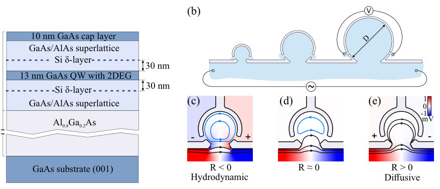
<figcaption class="paper-figure-caption"><b>Fig 1.</b> FIG. 1. (a) Schematic of the heterostructure with a 2DEG in a GaAs quantum well. (b) Schematic of</figcaption>
</figure>
<figure class="paper-figure-card">

<figcaption class="paper-figure-caption"><b>Fig 2.</b> FIG. 2. (a) Potential difference V in a circular cavity of diameter D = 16 µm as a function of the</figcaption>
</figure>
<figure class="paper-figure-card">

<figcaption class="paper-figure-caption"><b>Fig 3.</b> FIG. 3. Gurzhi length Dν at the transition temperature Tc as a function of the circular cavity</figcaption>
</figure>
<figure class="paper-figure-card">
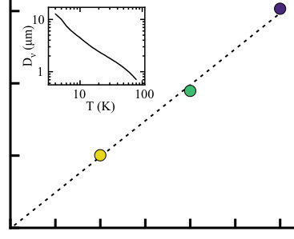
<figcaption class="paper-figure-caption"><b>Fig 4.</b> Fig. 4, the resistance is positive in all studied samples across the entire temperature range,</figcaption>
</figure>

**Summary.** This paper reports the experimental detection of steady-state electron whirlpools in a GaAs-based 2D electron liquid using transport measurements. By showing that the appearance of negative resistance scales with the Gurzhi length, the authors provide strong evidence for hydrodynamic flow and probe the limits of the hydrodynamic analogy.

**Why it may be interesting.** not directly relevant

Detailed structure

**Main problem.** The difficulty of directly observing and characterizing hydrodynamic vortices (electron whirlpools) in electron liquids and distinguishing them from ballistic transport.

**Main result.** The authors demonstrate the formation of large-scale steady-state whirlpools in a GaAs electron liquid, showing that the transition to negative resistance scales universally with the Gurzhi length (D/D_nu approx 8.0).

**Method.** The study combines four-terminal transport measurements in GaAs/AlGaAs heterostructures with numerical hydrodynamic simulations and scaling analysis.

**Model / system.** A high-mobility two-dimensional electron gas (2DEG) in a GaAs/AlGaAs heterostructure, featuring a device geometry with circular cavities adjoining a wide conducting channel.

**Key observables.** Four-terminal resistance (R), potential difference (V), and current streamlines.

**Important parameters / regimes.** Gurzhi length (D_nu), cavity diameter (D), temperature (T), electron density (n), and mobility (mu).

**Assumptions / limitations.** The hydrodynamic model assumes a slip boundary condition consistent with previously reported perfect slip flow in GaAs.

**Figures summary.** Fig 1 shows device schematics and simulated current/potential maps; Fig 2 shows potential difference; Fig 3 shows the scaling of Gurzhi length with cavity diameter; Fig 4 shows resistance in a reference geometry without vortices.

**Paper structure.** The paper introduces the problem of vortex detection, describes the GaAs experimental platform and device geometry, presents transport measurements and scaling analysis, compares results to numerical simulations, and concludes with a discussion on the breakdown of standard viscosity relations.

Abstract

We report the formation of large-scale steady-state whirlpools in a GaAs-based two-dimensional electron liquid and demonstrate them by straightforward transport measurements. A whirlpool forming inside a circular cavity adjoining a wide conducting channel appears as a negative four-terminal resistance over a broad range of temperatures and cavity sizes. The effect scales with the Gurzhi length, in quantitative accord with the hydrodynamic analogy. Obtained results firmly establish this analogy and probe the limits of its applicability.

[↑ back to top](#top)

### [Topological antiqued mechanical toy](http://arxiv.org/abs/2604.27554v1)

**Authors:** Hirofumi Wada, Hayato Mizobata, Shuto Ueno, Taiju Yoneda  
**Type:** both · **Category:** other · **PDF:** <https://arxiv.org/pdf/2604.27554v1>  
**Analysis basis:** abstract only; PDF text extraction failed or PDF unavailable
**Topic relevance:** `Frenkel-Kontorova` **2/5** · `non-equilibrium dynamics` **1/5**

**Summary.** This paper investigates the mechanics of the 'Jacob's ladder' toy, identifying its flipping waves as topological solitons. It reveals that unlike standard topological chains, the toy's flexibility allows for the coexistence of kink and antikink waves. The study uses a combination of experiment and theory to show how symmetry and gravity drive these unique motions.

**Why it may be interesting.** not directly relevant

Detailed structure

**Main problem.** The study aims to uncover the physical origin and design principles behind the unidirectional flipping waves in the 'Jacob's ladder' mechanical toy.

**Main result.** The researchers demonstrate that the toy's waves are a class of topological solitons arising from bistability under gravity, and that its symmetric connection creates a topologically singular state allowing for kink-antikink coexistence.

**Method.** The study combines water-tank experiments, numerical simulations, and analytical theory including the use of the index theorem.

**Model / system.** A mechanical frame known as 'Jacob's ladder' consisting of rigid blocks connected by strings, analyzed under the influence of gravity and pretension.

**Key observables.** Unidirectional flipping waves, kink and antikink waves, and the pair annihilation of kink-antikink waves.

**Important parameters / regimes.** Gravity, pretension, and the symmetry/asymmetry of the connections.

**Assumptions / limitations.** The study assumes the toy's behavior can be modeled by comparing it to the Kane-Lubensky topological chain and analyzing its bistability.

**Paper structure.** The paper begins with experimental verification in a water tank to rule out domino effects, followed by analytical demonstration of bistability and topological soliton properties, a comparison with the Kane-Lubensky chain, an application of the index theorem to identify differences, and finally an analysis of asymmetric toy configurations and wave annihilation.

Abstract

{\it Jacob's ladder} -- a classic children's toy -- is a simple mechanical frame comprising rigid blocks connected by strings that shows curious unidirectional flipping waves. Nonetheless, its physical origin remains elusive. By combining experiment, numeral simulation, and theory, we show that understanding the underlying design principle of this toy requires diverse physical ideas. First, we conduct a water-tank experiment that excludes the domino-like mechanism, thus defying widespread expectations. Subsequently, we analytically demonstrate that the toy is bistable under gravity, thus implying its kink wave as a class of topological solitons. The waves are surprisingly reminiscent -- both experimentally and theoretically -- to those in the Kane--Lubensky topological chain, owing to the stiffening of zero modes by the pretension under gravity. However, a close examination based on the index theorem reveals that the similarity remains superficial and that the floppiness of the toy underlies the kink and antikink coexistence -- a forbidden mode in the topological chain. By analyzing a generalized asymmetric toy, we reveal that its symmetric connection renders it topologically singular, thus resulting in amusing motions. We demonstrate these ideas by experimentally observing a dramatic pair annihilation of kink and antikink waves.

[↑ back to top](#top)

### [Compressibility of micromagnetic solutions in tensor train format](http://arxiv.org/abs/2604.28008v1)

**Authors:** Thierry Valet, Nicolas Vukadinovic  
**Type:** theory · **Category:** numerical methods · **PDF:** <https://arxiv.org/pdf/2604.28008v1>  
**Analysis basis:** full PDF text, analyzed in chunks
**Topic relevance:** `methods for driven-dissipative` **2/5**

↔ Scroll figures horizontally

<figure class="paper-figure-card">
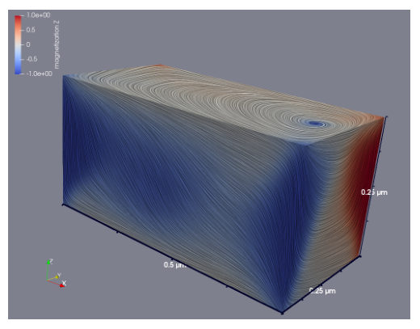
<figcaption class="paper-figure-caption"><b>Fig 1.</b> FIG. 1. Representative equilibrium flux-closure state for the considered magnetic rectangular prisms. We use a surface line- integral convolution rendering to reveal the in-plane magnetization flow at the surface of the prism, and a color scale to indicate the amplitude of the z component. Closure domains and a sur- face vortex are clearly visible, highlighting the non-trivial and fully three-dimensional micromagnetic configuration.</figcaption>
</figure>
<figure class="paper-figure-card">
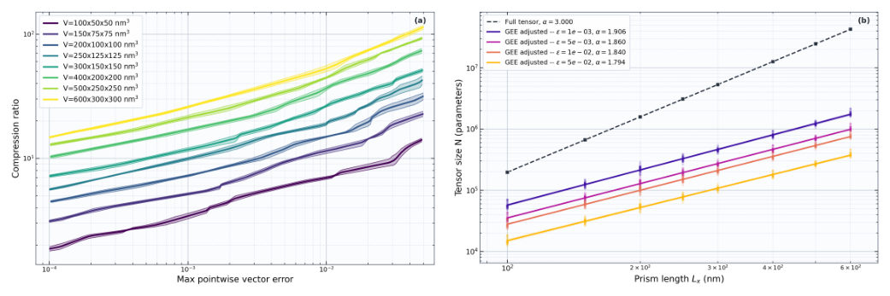
<figcaption class="paper-figure-caption"><b>Fig 2.</b> FIG. 2. Scaling as a function of the linear size (VS series). (a) CR as a function of MPVE for the TT-TCI compression of flux-closure states in prisms of increasing length Lx, with fixed cell size a = 1.5625nm. We plot the mean variation and 90% CI envelope, estimated over five different initial pivots for the TCI. Over the plotted error range, the CR monotonously grows with the prism size, showing that volumetric complexity does not control the TT scaling. (b) Regression-adjusted CPC versus Lx, obtained from all data in the VS series, over 10−3 ≤MPVE ≤5 × 10−2, with power law fitted exponents α. The original densely sampled field scales evidently as L3x, whereas the TT- compressed data...</figcaption>
</figure>
<figure class="paper-figure-card">
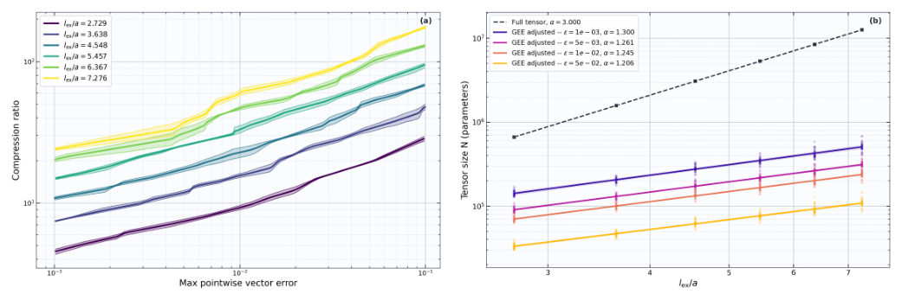
<figcaption class="paper-figure-caption"><b>Fig 3.</b> FIG. 3. Scaling as a function of grid refinement (VR series). (a) CR as a function the MPVE for the TT-TCI compressed magnetization data of the 200 × 100 × 100nm3 prism as the discretization is refined. The monotonous upward shift of the curves with increasing lex/a shows that finer resolution does not hurt compressibility; to the contrary, the TT representation captures the same physical configuration increasingly efficiently relative to the dense discretization. (b) Regression-adjusted CPC versus lex/a, obtained from all in the VR series, over 10−3 ≤MPVE ≤5×10−2. The fitted power law exponents remain in the range 1.21–1.30, far slower than the (lex/a)3 scaling of the densely discretized...</figcaption>
</figure>

**Summary.** This paper demonstrates that using Tensor Train compression for micromagnetic simulations can bypass the cubic scaling bottleneck of traditional 3D methods. By exploiting the spatial sparsity of domain walls and edges, the computational complexity scales much more favorably with both system size and grid resolution. This provides a foundation for developing highly efficient, tensor-network-based micromagnetic solvers.

**Why it may be interesting.** not directly relevant

Detailed structure

**Main problem.** Standard 3D micromagnetic simulations suffer from severe computational bottlenecks due to cubic scaling with object size and grid refinement, failing to exploit the inherent spatial sparsity of magnetic structures.

**Main result.** Tensor Train (TT) representations successfully exploit informational sparsity, achieving sub-cubic scaling of approximately L^1.8 and (1/a)^1.2, which significantly outperforms traditional dense discretization.

**Method.** The authors use Tensor Cross-Interpolation (TCI) via the tntorch package to compress magnetization data obtained from GPU-accelerated MuMax3 simulations.

**Model / system.** The study focuses on 3D equilibrium flux-closure states in soft-magnetic rectangular prisms with a 2:1:1 aspect ratio, characterized by localized domain walls and vortices.

**Key observables.** Compressed Parameter Count (CPC), Compression Ratio (CR), and Maximal Pointwise Vector Error (MPVE).

**Important parameters / regimes.** Exchange length (approx. 5.69 nm), saturation magnetization (8.0 x 10^5 A/m), and exchange stiffness (1.3 x 10^-11 J/m).

**Assumptions / limitations.** The analysis assumes the magnetic state can be effectively captured by the Tensor Train format due to the presence of low-dimensional high-gradient regions.

**Figures summary.** Figure 1 shows a 3D flux-closure state; Figure 2 plots compression ratio and parameter count scaling against prism size; Figure 3 shows compression ratio and parameter count scaling against grid refinement.

**Paper structure.** The paper introduces the scaling bottleneck of micromagnetics, presents the Tensor Train compression approach, demonstrates scaling advantages through variable-size and variable-refinement simulation series, and concludes with implications for future TT-based solvers.

Abstract

For three-dimensional (3D) magnetic objects with linear size $L$ exceeding a few exchange lengths, the micromagnetic state exhibits pronounced informational sparsity: low-dimensional, high-gradient regions (e.g., domain walls) coexist with near-uniformly magnetized volumetric domains. Because standard micromagnetic simulation methods discretize the magnetization on near-uniform 3D grids with linear cell size $a$, they cannot take advantage of this sparsity. The computational problem scales as $\sim L^3$ and $\sim (1/a)^3$. In this Letter, we establish that direct tensor-train (TT) representations overcome these poor scalings by exploiting the spatial sparsity optimally, while preserving accuracy in a controlled way. Focusing on representative flux-closure configurations in soft-magnetic rectangular prisms, in the near-micrometer regime, we demonstrate that the parameter count of TT-compressed micromagnetic data scales approximately as $L^{1.8}$ and $(1/a)^{1.2}$. Hence the relative advantage over dense discretizations rapidly grows with the problem size and refinement level. These first results provide a strong motivation for future developments of micromagnetic solvers in TT format which could transcend the limitations of traditional simulators, with far reaching potential impacts on fundamental research and technology development.

[↑ back to top](#top)

### [Dual role of core electrons in electronic friction](http://arxiv.org/abs/2604.27236v1)

**Authors:** Runfeng Zhou, Emilio Artacho  
**Type:** theory · **Category:** other · **PDF:** <https://arxiv.org/pdf/2604.27236v1>  
**Analysis basis:** abstract only; PDF text extraction failed or PDF unavailable
**Topic relevance:** `non-equilibrium dynamics` **2/5**

**Summary.** This paper investigates how core electrons influence the energy loss of ions passing through matter. It discovers that core electrons both add a new way for energy to dissipate and reduce the excitation of valence electrons through electron capture. This finding challenges standard semi-empirical models and provides a new perspective on ion-matter interactions.

**Why it may be interesting.** not directly relevant

Detailed structure

**Main problem.** Understanding the role of core electrons in non-equilibrium energy dissipation and electronic stopping power during swift-ion irradiation.

**Main result.** The study identifies a dual role for core electrons: they provide an additional dissipation channel through excitation while simultaneously suppressing valence electron excitations via an electron capture process.

**Method.** First-principles calculations using real-time time-dependent density functional theory (rt-TDDFT) with explicit treatment of all electrons.

**Model / system.** Beryllium self-irradiation, treated as a multi-shell swift-ion/matter system.

**Key observables.** Electronic stopping power (Se) and the structure of the Bragg peak.

**Assumptions / limitations.** The study assumes the validity of real-time TDDFT for describing the electron dynamics during the ion-matter interaction.

**Paper structure.** The paper presents a problem statement regarding energy dissipation, describes the TDDFT methodology, presents results regarding the Bragg peak structure, discusses the dual mechanism of core electrons, and compares findings to existing models like the shake-up effect in water.

Abstract

Non-equilibrium energy dissipation in multi-shell swift-ion/matter systems remains a fundamental yet incompletely understood problem, with electronic stopping power $\mathcal{S}_\text{e}$ as a relevant observable for electronic friction. Using real-time time-dependent density functional theory, we perform first-principles calculations of $\mathcal{S}_\text{e}$ for beryllium self-irradiation with explicit treatment of all electrons. Our results reveal a Bragg peak exhibiting a distinct structure which lies beyond the reach of standard semi-empirical models. We attribute its appearance to a dual effect of the presence of core electrons, by which their excitation provides an additional dissipation channel while simultaneously suppressing valence electron excitations. An electron capture process by the projectile's core from the host cores is behind such suppression, rather than Pauli blocking. This dual mechanism contrasts with the shake-up effect reported for water, whereby the inclusion of core electrons enhances valence excitation. Our work provides a new perspective on the effect and importance of core electrons in projectile energy dissipation in matter.

[↑ back to top](#top)

### [Low-Energy Purification of Crystal Defects by Rydberg Excitons](http://arxiv.org/abs/2604.27331v1)

**Authors:** Shiva Kant Tiwari, Tijs Karman, Valentin Walther  
**Type:** theory · **Category:** other · **PDF:** <https://arxiv.org/pdf/2604.27331v1>  
**Analysis basis:** abstract only; PDF text extraction failed or PDF unavailable
**Topic relevance:** `Kondo & dissipative impurity` **2/5**

**Summary.** This paper develops a multichannel theory to explain how Rydberg excitons can be used to purify crystals by neutralizing charged impurities. It identifies that while high-energy collisions can hinder purification through elastic and inelastic scattering, an ultralow-energy quantum regime exists that optimizes the purification process. This regime can be experimentally accessed using degenerate two-photon excitation.

**Why it may be interesting.** It provides a theoretical framework for controlling impurity-exciton interactions using tunable recoil, offering a platform to study exciton-impurity scattering physics that extends beyond the capabilities of traditional atomic gas experiments.

Detailed structure

**Main problem.** The study aims to understand the efficiency of crystal purification via Rydberg excitons by resolving the competing roles of capture, elastic scattering, and inelastic transitions during exciton-impurity collisions.

**Main result.** The authors identify a quantum regime at ultralow collision energies where s-wave scattering enhances capture while suppressing inelastic and elastic channels, thereby maximizing purification efficiency.

**Method.** The authors develop a multichannel theory of Rydberg exciton-impurity scattering to analyze different collision energy regimes.

**Model / system.** The physical system consists of Rydberg excitons in cuprous oxide (Cu2O) interacting with charged impurities in a crystal lattice.

**Key observables.** Capture rate, elastic scattering cross-section, inelastic transition rates, and purification efficiency.

**Important parameters / regimes.** Collision energy, s-wave contribution, and the distinction between single-photon and two-photon excitation regimes.

**Paper structure.** The paper presents a multichannel theory, compares high-energy vs. low-energy collision regimes, and proposes a method for accessing the optimal purification regime via two-photon excitation.

Abstract

Recent experiments show that optically generated Rydberg excitons in cuprous oxide can neutralize charged impurities, strongly reducing stray electric fields and effectively purifying the crystal. Here, we develop a multichannel theory of Rydberg exciton-impurity scattering that resolves the competing roles of capture, elastic scattering, and inelastic transitions between excitonic states. We find that at high collision energies, as effective under conventional single-photon excitation, purification is reduced relative to Langevin capture. These collisions are accompanied by inelastic redistribution and dominant elastic scattering, including pronounced glory scattering, which suppress purification efficiency. We identify a quantum regime at ultralow collision energies favorable for purification, where only the s-wave contributes: capture is enhanced while elastic and inelastic channels are strongly suppressed. This regime can be accessed via degenerate two-photon excitation of even-parity Rydberg excitons with tunable recoil, additionally enabling the systematic exploration of exciton-impurity scattering over a wide range of collision energies beyond what is readily achievable in atomic counterparts in atomic gas experiments.

[↑ back to top](#top)

### [On the proposed concept of mechanical phasons in Ni-Mn-Ga modulated martensite](http://arxiv.org/abs/2604.27729v1)

**Authors:** Petr Sedlák, Tomáš Grabec, Hanuš Seiner  
**Type:** theory · **Category:** other · **PDF:** <https://arxiv.org/pdf/2604.27729v1>  
**Analysis basis:** full PDF text, analyzed in chunks
**Topic relevance:** `Frenkel-Kontorova` **2/5**

↔ Scroll figures horizontally

<figure class="paper-figure-card">
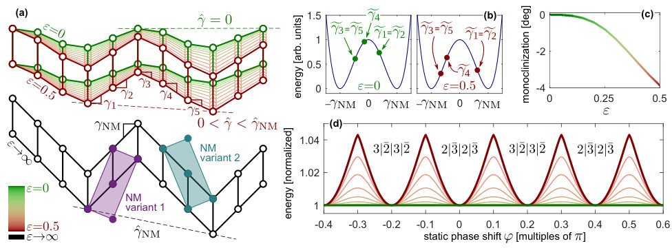
<figcaption class="paper-figure-caption"><b>Fig 1.</b> Figure 2: (a) the energy-minimizing modulated lattice for various levels of the weighting factor ε (for ε →∞ the model collapses to a zig-zag modulation function of the adaptive concept); (b) the energy perturbation landscape, and the optimized values of energy En(f γn) for ε = 0 and ε = 0.5; (c) the macroscopic monocliniza- tion (the monoclinization angle is arctan(ˆγ) ≈ˆγ) as a funciton of ε; (d) energy ˆE as a function of the phase shift φ for various levels of ε, the energy is normalized with respect to its value for φ = 0. In (a), the shapes of the NM martensite unit cells used as building block of the modulated martensite in the ε →∞limit are drawn. For better visibility of the...</figcaption>
</figure>
<figure class="paper-figure-card">

<figcaption class="paper-figure-caption"><b>Fig 2.</b> Figure 3: (a) the lattice monoclinization changes under a small-amplitude phason (the magnified plot in the upper right corner helps resolving the details for ε = 0.2, the right vertical axis recalculates the monoclinization to the relative shear strain); (b) the effect of incommensurateness on the macroscopic shape of the lattice, from perfectly commensurate (q = 0.400) to the incommensurate state discussed in [12] (q=0.416); (c) change of the macroscopic shape of the lattice under a small-amplitude phason (individual lines represent phasons with amplitudes between zero and the maximum with a π/200 step); (d) temperature evolution of the softest shear elastic coefficient c55 in Ni-Mn-Ga-Fe...</figcaption>
</figure>

**Summary.** This paper proposes that the extreme elastic softness observed in Ni-Mn-Ga shape memory alloys is caused by mechanical phasons—dynamic shifts in the modulation phase. The model explains how these phasons relax macroscopic shear loads in commensurate structures but fail to do so in incommensurate ones, reconciling theory with experiment.

**Why it may be interesting.** not directly relevant

Detailed structure

**Main problem.** Resolving the discrepancy between experimental observations of extreme elastic softening in 10M Ni-Mn-Ga martensite and the much stiffer lattice predicted by first-principles calculations.

**Main result.** The authors propose that 'mechanical phasons' (collective phase shifts in the modulation wave) can relax external shear loads in commensurate and weakly incommensurate regimes, explaining the observed macroscopic compliance.

**Method.** A mechanical model that merges adaptive martensite theory with electronic-structure considerations, using energy minimization of a perturbed modulation function.

**Model / system.** The system is the 10M modulated martensite in Ni-Mn-Ga ferromagnetic shape memory alloys. The model treats the modulation as a periodic atomic displacement that can undergo phase shifts (phasons) within a Landau-type energy landscape.

**Key observables.** Shear modulus (c55), macroscopic monoclinic distortion (gamma), modulation vector (q), and twinning stress.

**Important parameters / regimes.** Modulation wave vector (q), weighting factor (epsilon) controlling the transition from sine-wave to zig-zag modulation, and phason amplitude (delta phi).

**Assumptions / limitations.** The lattice consists of rigid planes that can shift along the modulation amplitude; the modulation is initially assumed to be a simple sine wave.

**Figures summary.** Figure 1 shows phonon branches and the modulation notation; Figure 2 illustrates the energy-minimizing lattice and energy landscape for different epsilon values; Figure 3 shows the cumulative sum of monoclinic distortion and the effect of phase shifts.

**Paper structure.** The paper introduces the experimental discrepancy, presents a mechanical model of phasons, develops the energy minimization framework for the modulated lattice, analyzes the transition from commensurate to incommensurate regimes, and concludes by linking the model to observed elastic properties.

Abstract

We discuss modulation phasons as a possible source of unusual elastic behavior of five-layer modulated (10\,M) martensite of the Ni-Mn-Ga shape memory alloy. This material exhibits anomalous macroscopic shear compliance along specific planes perpendicular to the modulation vector, and this compliance disappears when the modulations become incommensurate. Using a simple mechanical model, we show that modulation phasons in Ni-Mn-Ga can have macroscopic mechanical manifestations, and that the resulting 'mechanical phasons' can relax external shear loadings for commensurate and weakly incommensurate modulations, but not for strongly incommensurate modulations. The model merges ideas from the adaptive martensite theory and electronic-structure considerations, and enables straightforward explanations of several properties of the 10\,M lattice, such as spontaneous monoclinic distortion or easy formation and propagation of $a/b$ twins.

[↑ back to top](#top)

### [Quantum Metric and Nonlinear Hall Effect of Photons](http://arxiv.org/abs/2604.27751v1)

**Authors:** Keidai Akiba, Naoki Yamamoto  
**Type:** theory · **Category:** other · **PDF:** <https://arxiv.org/pdf/2604.27751v1>  
**Analysis basis:** full PDF text, analyzed in chunks
**Topic relevance:** `Keldysh / 2PI / non-Gaussian methods` **2/5**

↔ Scroll figures horizontally

<figure class="paper-figure-card">

<figcaption class="paper-figure-caption"><b>Fig 1.</b> Low-resolution page preview, page 2</figcaption>
</figure>
<figure class="paper-figure-card">
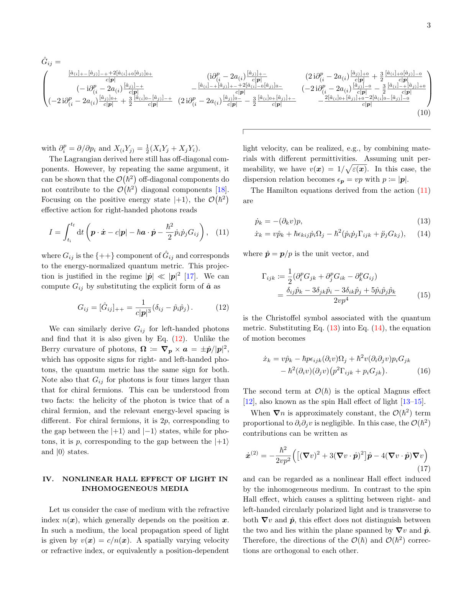
<figcaption class="paper-figure-caption"><b>Fig 2.</b> Low-resolution page preview, page 3</figcaption>
</figure>
<figure class="paper-figure-card">
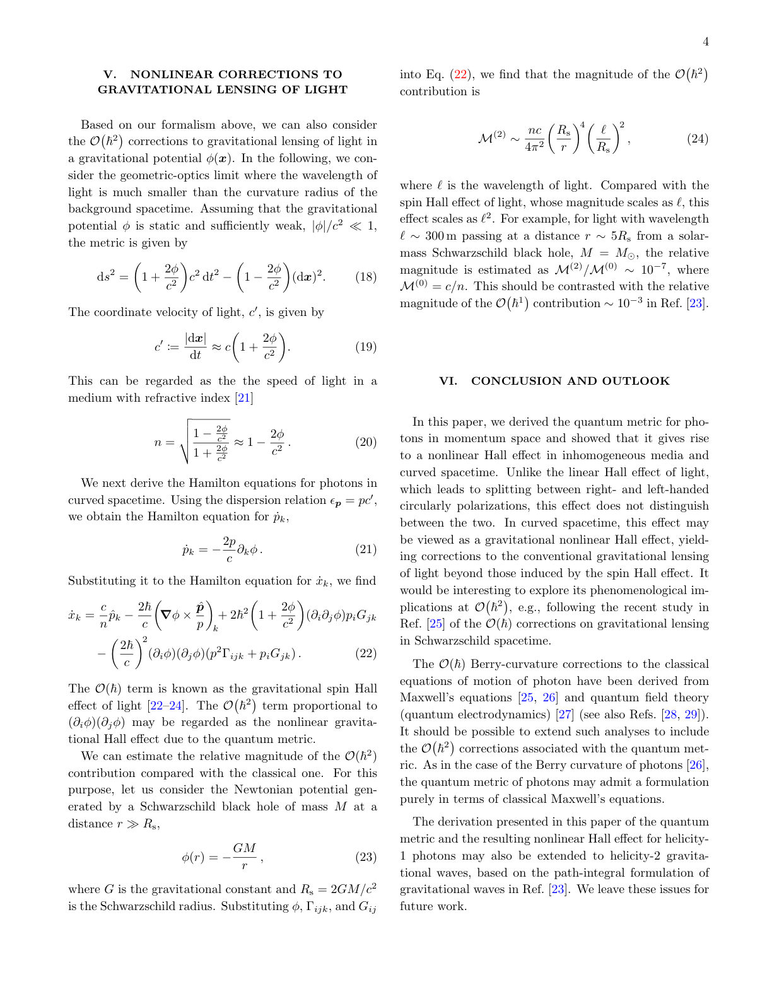
<figcaption class="paper-figure-caption"><b>Fig 3.</b> Low-resolution page preview, page 4</figcaption>
</figure>
<figure class="paper-figure-card">

<figcaption class="paper-figure-caption"><b>Fig 4.</b> Low-resolution page preview, page 5</figcaption>
</figure>

**Summary.** The paper shows that photons possess a nontrivial quantum metric in momentum space. This metric leads to a nonlinear Hall effect in media with varying refractive indices and introduces $O(\hbar^2)$ corrections to gravitational lensing in curved spacetime. These effects represent a higher-order geometric correction to light propagation that does not depend on photon helicity.

**Why it may be interesting.** This paper is interesting for quantum optics researchers as it identifies a new class of nonlinear geometric effects (the nonlinear Hall effect of light) that arises from the momentum-space geometry of photons, extending beyond the well-known spin Hall effect.

Detailed structure

**Main problem.** The paper investigates whether photons possess a nontrivial quantum metric in momentum space and explores the resulting nonlinear transport phenomena, such as a nonlinear Hall effect in inhomogeneous media and gravitational lensing corrections in curved spacetime.

**Main result.** The authors demonstrate that photons have a nontrivial quantum metric that induces a trajectory shift at second order in the derivatives of the refractive index (nonlinear Hall effect of light) and provides $O(\hbar^2)$ corrections to gravitational lensing.

**Method.** The study employs the path-integral formalism and perturbative diagonalization methods (Luttinger-Kohn and Schrieffer-Wolff) to derive the semiclassical action and equations of motion.

**Model / system.** The system consists of photons in either inhomogeneous media with a varying refractive index $n(x)$ or in a static, weak background gravitational field, modeled using a spin-1 Hamiltonian $H = \pm c \mathbf{S} \cdot \mathbf{p}$.

**Key observables.** Quantum metric ($G_{ij}$), Berry curvature ($\Omega$), photon trajectory shifts, and gravitational lensing corrections.

**Important parameters / regimes.** Semiclassical limit, geometric-optics limit, weak gravitational field limit ($|\phi|/c^2 \ll 1$), and the scaling of effects by powers of $\hbar$ (specifically $O(\hbar)$ spin Hall effect vs $O(\hbar^2)$ nonlinear Hall effect).

**Assumptions / limitations.** Static and weak gravitational fields, linear wave equation requirements, and the geometric-optics limit where the wavelength is much smaller than the spacetime curvature radius.

**Paper structure.** The paper begins with a path-integral derivation of the photon's semiclassical action, moves to the derivation of the quantum metric and Berry curvature, then applies these to light in inhomogeneous media, and concludes with the application to gravitational lensing in curved spacetime.

Abstract

Using the path-integral formalism, we show that photons possess a nontrivial quantum metric in momentum space. We derive the semiclassical action and equations of motion by taking into account the quantum metric. In media with a spatially varying refractive index $n(\mathbf{x})$, the quantum metric induces a shift in the trajectory of light at second order in derivatives of $n$, which may be regarded as a nonlinear Hall effect of light. The quantum metric also gives rise to corrections to gravitational lensing in curved spacetime at the nonlinear order in wavelength. This gravitational nonlinear Hall effect results from the interplay between the geometry of position space and that of momentum space.

[↑ back to top](#top)

### [Ultrafast Sliding Ferroelectric Switching in Bilayer Hexagonal Boron Nitride Revealed by Deep Learning Molecular Dynamics](http://arxiv.org/abs/2604.27342v1)

**Authors:** Yinan Wang, Poyen Chen, Teruyasu Mizoguchi  
**Type:** theory · **Category:** disordered systems and neural networks · **PDF:** <https://arxiv.org/pdf/2604.27342v1>  
**Analysis basis:** abstract only; PDF text extraction failed or PDF unavailable
**Topic relevance:** `non-equilibrium dynamics` **2/5**

**Summary.** This paper uses machine learning-enhanced molecular dynamics to simulate the switching of ferroelectricity in bilayer h-BN. It demonstrates that polarization switching occurs via an extremely fast, 5-picosecond rigid sliding process. This work provides a computational bridge between atomistic dynamics and experimental observations of ferroelectric hysteresis.

**Why it may be interesting.** not directly relevant

Detailed structure

**Main problem.** Understanding the atomistic dynamics of electric-field-driven polarization switching in sliding ferroelectric bilayer h-BN.

**Main result.** The study reveals an ultrafast switching mechanism consisting of coherent single-domain rigid sliding that completes within 5 ps, reproducing experimental ferroelectric hysteresis loops.

**Method.** A data-driven framework integrating a MACE machine learning potential with an equivariant graph convolutional neural network (EGCNN) for real-time Born effective charge prediction, combined with real-space path-integral polarization formalism.

**Model / system.** AB-stacked bilayer hexagonal boron nitride (h-BN) under applied electric fields.

**Key observables.** Spontaneous polarization, Born effective charge (BEC), and ferroelectric hysteresis loops.

**Important parameters / regimes.** Switching timescale (5 ps), electric field strength, and AB-stacking configuration.

**Assumptions / limitations.** The use of a fine-tuned MACE machine learning potential and a specific Gaussian convolution background extraction procedure to isolate intrinsic polarization.

**Paper structure.** The paper introduces the problem of sliding ferroelectricity, presents a coupled atomistic framework using ML potentials and EGCNN, describes the polarization extraction methodology, and concludes with the simulation of ultrafast switching and hysteresis loops.

Abstract

Sliding ferroelectricity in bilayer hexagonal boron nitride (h-BN) offers compelling prospects for next-generation non-volatile memory, yet the atomistic dynamics of electric-field-driven polarization switching remain poorly understood. Here, we present a fully data-driven, coupled atomistic framework that integrates a fine-tuned MACE machine learning potential (MLP) with an equivariant graph convolutional neural network (EGCNN) for real-time Born effective charge (BEC) prediction, enabling large-scale non-equilibrium molecular dynamics simulations of AB-stacked bilayer h-BN under applied electric fields. By implementing a rigorous real-space path-integral polarization formalism combined with a state-constrained Gaussian convolution background extraction procedure, we successfully isolate the intrinsic spontaneous polarization from the dominant dielectric background. Our simulations reveal that coherent single-domain rigid sliding, completing within 5 ps, constitutes a physically viable ultrafast switching mechanism, and reproduces clean ferroelectric hysteresis loops whose shape is qualitatively consistent with experimental observations.

[↑ back to top](#top)

### Other secondary papers (40)

Show other secondary papers

### [A nanoionic diode: Equilibrium rectifying junction enabling large and stable resistance variations](http://arxiv.org/abs/2604.28029v1)

**Authors:** Chuanlian Xiao, Joachim Maier  
**Type:** experiment · **Category:** other · **PDF:** <https://arxiv.org/pdf/2604.28029v1>  
**Analysis basis:** full PDF text, analyzed in chunks

↔ Scroll figures horizontally

<figure class="paper-figure-card">
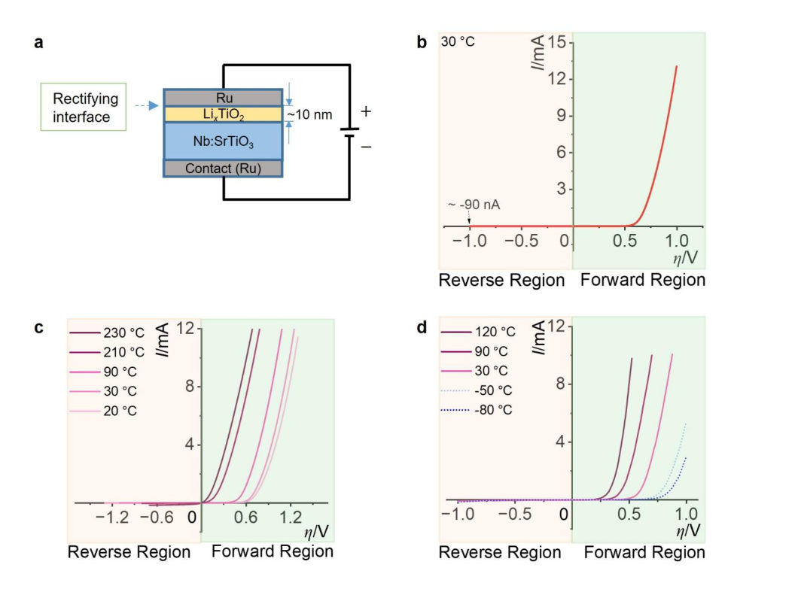
<figcaption class="paper-figure-caption"><b>Fig 1.</b> Fig.1. a shows the device discussed in the text. b displays the rectifying effects for the sample LixTiO2 with a Li-content of 0.3. Larger Li-contents depress the reverse current even down to ~1 nA but at the expense of relaxation time. c shows the current-voltage curves for the [Li] = 0.35 sample in a temperature window ranging from 20 °C to 230 °C and d shows the current-voltage curves for the [Li] = 0.25 sample over a temperature range from -80 °C to 120 °C. While the device works as a Gouy-Chapman diode for room or elevated temperatures, the characteristic changes towards a Schottky-diode at lower temperatures. The device area is 0.8 cm2.</figcaption>
</figure>
<figure class="paper-figure-card">
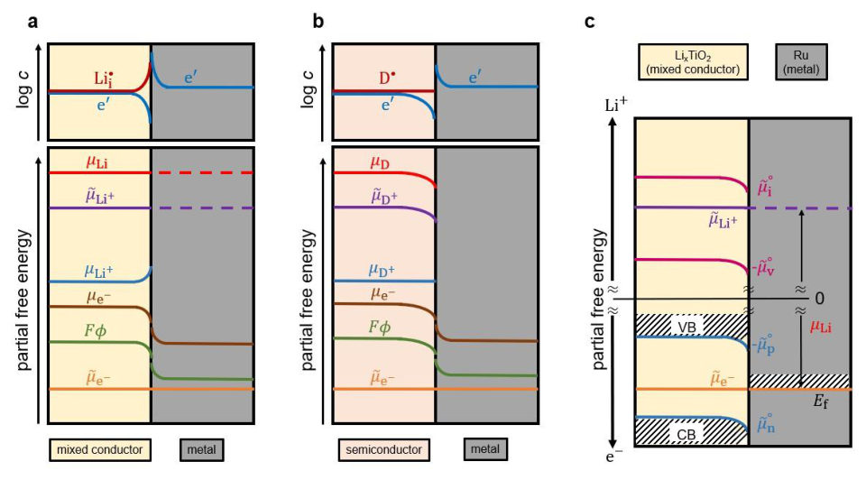
<figcaption class="paper-figure-caption"><b>Fig 2.</b> Fig. 2. Thermodynamic equilibrium situation of Gouy-Chapman a and Mott-Schottky type b junctions (sketch of the chemical (𝜇), electric (𝜙), and electrochemical potentials (𝜇̃) for both cases, see also Supplementary Note 2). c in (a) and (b) stands for concentration. c, The same situation as (a) but plotted in generalized free energy picture30 (Note the opposite directions of the partial free energy scales for e− and Li+). The non-equilibrium situation of conventional semiconductor diodes (b) is indicated by the non-zero gradients of the electrochemical potential of D+ (and of the chemical potential of neutral D as component) referring to the current-less situation. The situation under bias...</figcaption>
</figure>
<figure class="paper-figure-card">
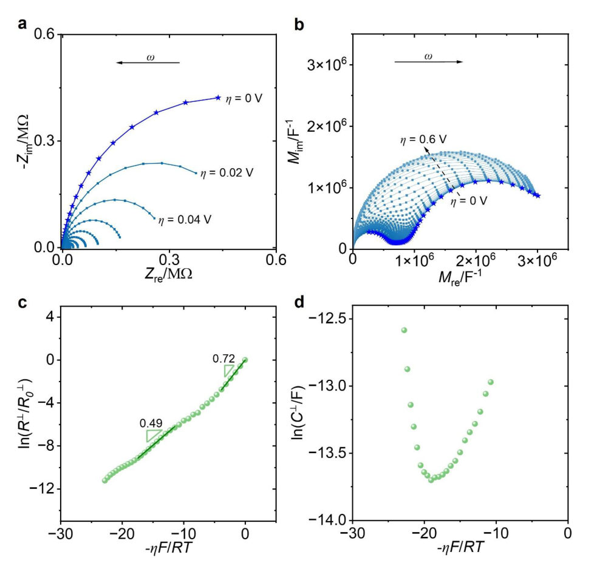
<figcaption class="paper-figure-caption"><b>Fig 3.</b> Fig. 3. Impedance measurement perpendicular to the interface. a, b, Impedance and dielectric modulus plots at 30 °C for the cell shown in Fig. 1a. In the modulus plots the two contributions (bulk and interface) become clearer. c, Interfacial resistance as a function of bias (𝜂). The middle region shows the ideal slope of 0.5, while at lower bias (𝜂) saturation effects come into play. d, The capacitance curve exhibits a clear minimum displaying the point of zero charge (pzc) of – 0.5 V for this special Li content (~0.2). The behavior left from pzc is almost ideal, while the right-hand side part appears to be influenced by electronic saturation on the Ru-side. (Extended Data Fig. 2 shows...</figcaption>
</figure>
<figure class="paper-figure-card">
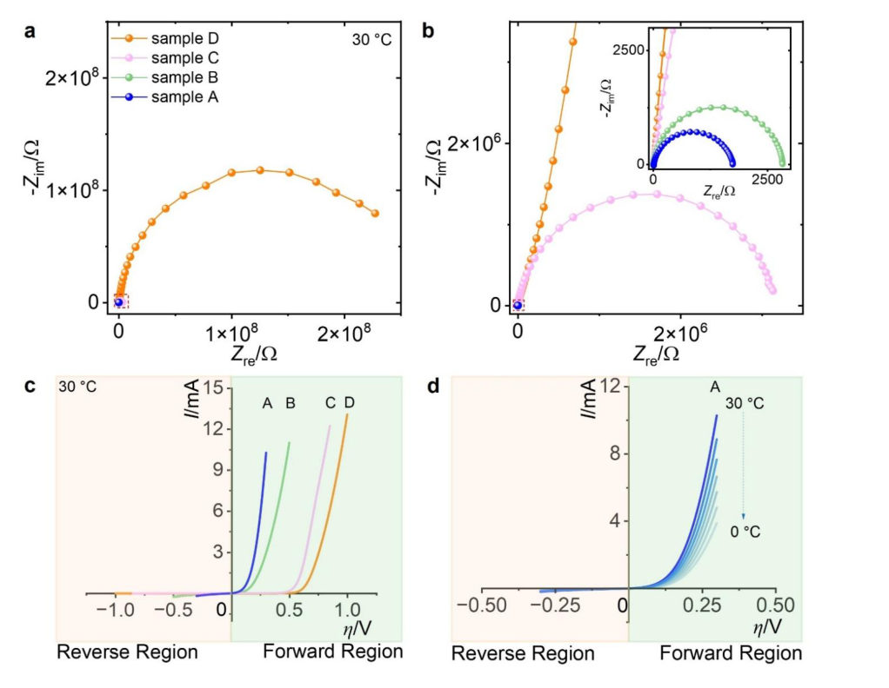
<figcaption class="paper-figure-caption"><b>Fig 4.</b> Fig. 4. Characteristics tuning. a, b, Impedance plots at different resolutions ((b) magnifies the region around zero point in (a) – red dashed box and the inset in (b) magnifies the region around zero point in (b)) and c current-voltage curves for 4 different Li-contents (A: 0.02, B: 0.03, C: 0.2, and D: 0.3). The impedance plots display the significant interfacial resistance variations if the Li content is varied. Whilst the temperature for (a - c) was 30 °C, d shows the effect of lowering the temperature on the current-voltage curve for the [Li] = 0.02 (sample A).</figcaption>
</figure>
<figure class="paper-figure-card">
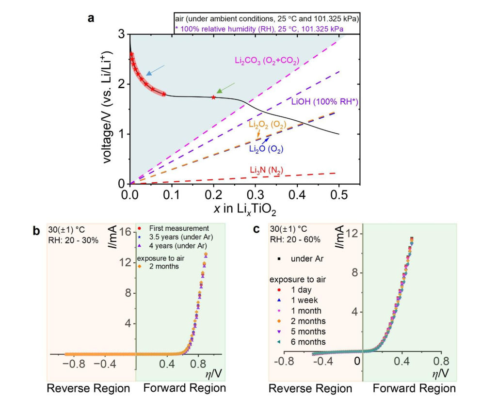
<figcaption class="paper-figure-caption"><b>Fig 5.</b> Fig. 5. Thermochemical stability of LixTiO2. a, The thermochemical stability under ambient conditions is guaranteed for Li-concentrations the OCV of which exceeds the reaction equilibrium lines (light blue region), as outlined in the Supplementary Note 4. We show that our master example is not only inherently stable, but also environmentally stable. Collecting the Gibbs free enthalpy values of the virtually involved compounds and compare them with the OCV data vs. Li/Li+ we can derive that for air conditions at 25 °C, x &lt; 0.25 is sufficient to guarantee that no reaction to Li2O (or Li2O2) or LiOH or Li2CO3 or Li3N is possible. For higher x values one may seal the device in the same way as...</figcaption>
</figure>
<figure class="paper-figure-card">
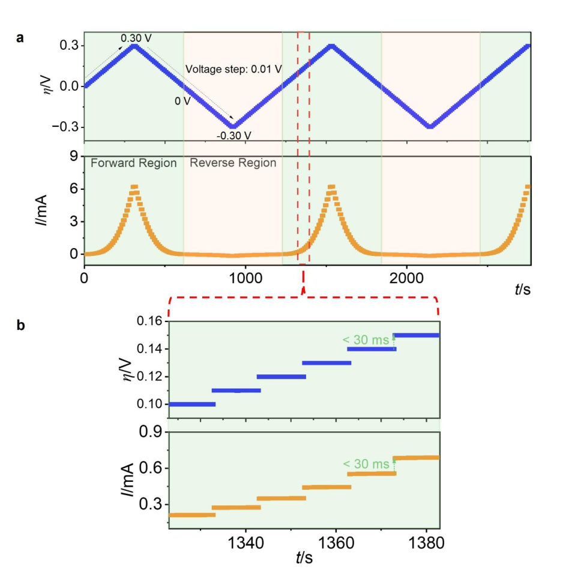
<figcaption class="paper-figure-caption"><b>Fig 6.</b> Fig. 6. a, Current response under voltage step. Voltage steps (0.01 V/step) in forward and reverse directions are applied. The sample (LixTiO2, x~0.025) thickness is 12 nm. b magnifies the region indicated in (a) (red dashed box). The relaxation time is shorter than 30 ms.</figcaption>
</figure>

**Summary.** The paper introduces a new class of nanoionic diodes that operate in thermodynamic equilibrium, avoiding the drift issues of traditional semiconductors. By using mixed conductors like Li-intercalated TiO2, the device achieves stable, highly tunable rectification even at the nanoscale and high temperatures.

**Why it may be interesting.** not directly relevant

Detailed structure

**Main problem.** Conventional semiconductor diodes (p-n and Schottky) rely on non-equilibrium frozen dopant profiles that are unstable and prone to drift when scaled to the nanoscale or exposed to high temperatures.

**Main result.** The development of a nanoionic diode based on an equilibrium Gouy-Chapman space charge layer that is stable against drift, highly tunable, and capable of high current-on/off ratios exceeding 6-7 orders of magnitude.

**Method.** The researchers used electrochemical tuning to control lithium content in TiO2 films on Ru and performed temperature-dependent I-V measurements, impedance spectroscopy, and dielectric modulus analysis.

**Model / system.** A nanoionic rectifier consisting of a mixed ionic/electronic conductor interface, specifically Li-intercalated TiO2 (anatase) films on a Ruthenium (Ru) substrate, operating under a Gouy-Chapman model.

**Key observables.** Current-on/off ratio, rectification function, resistance (R_perpendicular), capacitance (C_perpendicular), point of zero charge (PZC), and chemical diffusion coefficient.

**Important parameters / regimes.** Mobility hierarchy (u_electron >> u_ion >> 0), temperature range (-196 C to 230 C), lithium content (x), and nanometer-scale screening lengths.

**Assumptions / limitations.** Assumed activation energy of 0.5 eV for diffusion calculations and that the Debye length is smaller than the lattice parameter for space charge control.

**Figures summary.** Schematic of the device; I-V curves showing rectification and lithium-content dependence; impedance and dielectric modulus plots for identifying interfacial vs. bulk contributions and the point of zero charge; energy level diagrams under different bias conditions.

**Paper structure.** Introduction of the instability problem in conventional diodes, description of the nanoionic equilibrium mechanism, experimental setup and material characterization, demonstration of rectification and stability, and discussion of scalability and diffusion dynamics.

Abstract

We report on a new type of rectifier which is in full contact equilibrium and thus, if down-sized to the nanoscale, shows no drift even if exposed to elevated temperatures and/or extreme waiting times. This is in contrast to existing diodes which rely on frozen doping profiles and are hence non-equilibrium devices. Our rectifiers are related to Schottky diodes but employ "dopants" whose mobilities are high enough to follow the electrical field quickly but low enough to not compete with the electrons in terms of conductivities. In order to realize such a device based on mixed conductors, we use nanosized TiO2 films on Ru as a substrate which can store Li at the interface according to a job-sharing mechanism (Li-ions on the TiO2 side, electrons on the Ru side). The excellent functionality of this nanoionic device is demonstrated (e.g., current on-off ratio can exceed 6-7 orders of magnitude) and the additional advantages stressed (such as ease of preparation and tuning the characteristics electrochemically).

[↑ back to top](#top)

### [Acoustic modulation of shear thickening transition in dense adhesive suspensions](http://arxiv.org/abs/2604.27876v1)

**Authors:** Aoxuan Wang, Fabrice Toussaint, Thomas Gibaud  
**Type:** experiment · **Category:** disordered systems and neural networks · **PDF:** <https://arxiv.org/pdf/2604.27876v1>  
**Analysis basis:** abstract only; PDF text extraction failed or PDF unavailable

**Summary.** This study demonstrates that ultrasound can control the flow of dense suspensions by shifting the onset of shear thickening to higher shear rates. It reveals that acoustic waves destabilize the internal force networks through localized hydrodynamic fluctuations. This provides a mechanism for using sound to prevent flow instabilities in industrial processing.

**Why it may be interesting.** not directly relevant

Detailed structure

**Main problem.** Understanding the physical origin of how high-power ultrasound reduces the apparent viscosity and modifies the discontinuous shear thickening (DST) transition in dense adhesive suspensions.

**Main result.** Ultrasound does not directly reduce viscosity but shifts the DST transition toward higher shear rates by destabilizing force networks through fluctuating hydrodynamic forces.

**Method.** The researchers used a rheo-ultrasound setup to study dense adhesive cornstarch suspensions under acoustic modulation and analyzed stress probability distributions.

**Model / system.** Dense adhesive cornstarch suspensions characterized by fragile, load-bearing force networks embedded in heterogeneous density-wave structures.

**Key observables.** Apparent viscosity, shear rate, stress probability distributions, and the shear-thickening transition threshold.

**Important parameters / regimes.** Shear rate, ultrasound power/frequency, and the separation of time scales between acoustic oscillations and suspension dynamics.

**Assumptions / limitations.** The suspension can be modeled as an effectively immobile porous medium subjected to high-frequency interstitial flows during the acoustic period.

**Paper structure.** The paper introduces the problem of DST-induced instabilities, describes the rheo-ultrasound experimental setup, presents the observation of the shifted transition via stress distribution collapse, proposes a mechanism involving hydrodynamic fluctuations and time-scale separation, and concludes with the implications for controlling flows.

Abstract

Discontinuous shear thickening (DST) in dense suspensions leads to flow instabilities that limit processing in many systems. While high-power ultrasound has been reported to reduce the apparent viscosity of such materials, the origin of this effect remains unclear. Here, we investigate dense adhesive cornstarch suspensions, where shear thickening arises from fragile, load-bearing force networks embedded in heterogeneous density-wave structures. Using a rheo-ultrasound setup, we show that ultrasound does not directly reduce viscosity but instead shifts the shear-thickening transition toward higher shear rates. This is evidenced by the collapse of stress probability distributions onto master curves, revealing a continuous evolution toward more fluid-like states without a sharp threshold. We interpret these results through a separation of time scales, in which the suspension behaves as an effectively immobile porous medium subjected to high-frequency interstitial flows. Fluidization then arises from a combination of boundary slip, bulk destabilization of force networks by drag-force fluctuations, and localized acoustic streaming. Beyond these mechanisms, we propose that ultrasound modifies the stability of force networks by introducing fluctuating hydrodynamic forces at the pore scale. As a result, larger stresses or shear rates are required to sustain jammed states, leading to a continuous renormalization of the DST transition. These findings provide a consistent physical picture of acoustic fluidization in adhesive suspensions and establish ultrasound as a powerful tool to control discontinuous shear thickening in confined flows.

[↑ back to top](#top)

### [Anharmonic phonon coupling enabled by local inversion symmetry breaking at domain walls in ferroelastic](http://arxiv.org/abs/2604.28066v1)

**Authors:** Seyyed Jabbar Mousavi, Vivek Unikandanunni, Niccolo Sellati, Paolo Barone, Martina Basini, Steven L. Johnson, Andrey Shalit, Peter Hamm, Mattia Udina, Thomas Feurer  
**Type:** experiment · **Category:** other · **PDF:** <https://arxiv.org/pdf/2604.28066v1>  
**Analysis basis:** abstract only; PDF text extraction failed or PDF unavailable

**Summary.** The researchers used 2D Raman-terahertz spectroscopy to demonstrate that ferroelastic domain walls in LaAlO3 break inversion symmetry, enabling previously hidden anharmonic phonon coupling. This discovery provides a way to probe subtle symmetry-breaking effects in complex materials using nonlinear spectroscopy.

**Why it may be interesting.** not directly relevant

Detailed structure

**Main problem.** Investigating whether local inversion symmetry breaking at ferroelastic domain walls enables anharmonic phonon coupling that is otherwise absent in the centrosymmetric bulk.

**Main result.** Direct evidence of mechanical and electrical anharmonic coupling between A1g and Eg phonons was observed in LaAlO3, driven by local symmetry breaking at domain walls.

**Method.** Two-dimensional Raman-terahertz spectroscopy was used to detect cross-peaks in the spectra.

**Model / system.** The physical system is ferroelastic LaAlO3, specifically focusing on the lattice dynamics at twin domain walls where inversion symmetry is locally broken.

**Key observables.** Cross-peaks in two-dimensional Raman-terahertz spectra, A1g Raman-active phonon, and Eg infrared-active phonon.

**Important parameters / regimes.** Local inversion symmetry breaking at domain walls; mechanical and electrical anharmonicity.

**Assumptions / limitations.** The bulk crystal is assumed to be centrosymmetric, with symmetry breaking restricted to the domain walls.

**Paper structure.** The paper introduces the concept of local symmetry breaking in ferroelastic domain walls, presents experimental evidence using 2D Raman-THz spectroscopy, and attributes the observed signals to specific phonon coupling mechanisms.

Abstract

In ferroelastic materials, spontaneous symmetry breaking leads to the formation of twin domains. Although the bulk crystal typically remains centrosymmetric, inversion symmetry can be locally broken at the domain walls, potentially changing phonon selection rules and enabling local anharmonic phonon coupling. Here we report direct evidence of such anharmonic coupling in ferroelastic LaAlO$_3$ using two-dimensional Raman-terahertz spectroscopy. We attribute the cross-peaks observed in the two-dimensional spectra to both mechanical and electrical anharmonicity between the $A_{1g}$ Raman-active phonon and the $E_g$ phonon, which acquires finite infrared activity through local inversion symmetry breaking at ferroelastic domain walls. These findings provide new insight into the complex lattice dynamics of ferroelastic materials and highlight the potential of two-dimensional Raman-terahertz spectroscopy to uncover subtle symmetry breaking through the detection of intrinsically weak anharmonic signals.

[↑ back to top](#top)

### [AutoREC: A software platform for developing reinforcement learning agents for equivalent circuit model generation from electrochemical impedance spectroscopy data](http://arxiv.org/abs/2604.27266v1)

**Authors:** Ali Jaberi, Yonatan Kurniawan, Robert Black, Shayan Mousavi M., Kabir Verma, Zoya Sadighi, Santiago Miret, Jason Hattrick-Simpers  
**Type:** both · **Category:** disordered systems and neural networks · **PDF:** <https://arxiv.org/pdf/2604.27266v1>  
**Analysis basis:** abstract only; PDF text extraction failed or PDF unavailable

**Summary.** This paper introduces AutoREC, a Python package that uses reinforcement learning to automatically create circuit models for interpreting electrochemical data. By treating model generation as a decision-making task, it eliminates the need for manual expert intervention. This automation is a key step toward enabling self-driving laboratories for materials science.

**Why it may be interesting.** not directly relevant

Detailed structure

**Main problem.** Automating the generation of equivalent circuit models (ECMs) from electrochemical impedance spectroscopy (EIS) data to replace manual, trial-and-error identification processes.

**Main result.** The development of AutoREC, an open-source platform that uses reinforcement learning to achieve a 99.6% success rate on synthetic data and demonstrates strong generalization to experimental battery and corrosion data.

**Method.** The authors formulate ECM construction as a sequential decision-making problem using a Markov Decision Process and implement a Double Deep Q-Network with prioritized experience replay and a dead-loop mitigation strategy.

**Model / system.** The system involves electrochemical impedance spectroscopy (EIS) data from various electrochemical systems, including batteries, corrosion, oxygen evolution reaction, and CO2 reduction.

**Key observables.** Equivalent circuit models (ECMs) and impedance spectra.

**Assumptions / limitations.** The paper discusses the existence of limitations in current agent designs and potential strategies for future mitigation.

**Paper structure.** Introduction of the AutoREC package, formulation of the ECM construction as a Markov Decision Process, implementation details of the RL agent (Double DQN), evaluation on synthetic and experimental datasets, and discussion of limitations and future work.

Abstract

This paper introduces AutoREC, an open-source Python package for developing reinforcement learning (RL) agents to automatically generate equivalent circuit models (ECMs) from electrochemical impedance spectroscopy (EIS) data. While ECMs are a standard framework for interpreting EIS data, traditional identification is typically based on manual trial-and-error, which requires domain experts and limits scalability, particularly in autonomous experimental pipelines such as self-driving laboratories. AutoREC addresses this challenge by formulating ECM construction as a sequential decision-making problem within a Markov Decision Process framework. It implements a Double Deep Q-Network with prioritized experience replay, along with a dedicated dead-loop mitigation strategy, to efficiently explore a complex action space for circuit generation. To demonstrate the capabilities of the platform, we trained an RL agent using AutoREC and evaluated its strengths and limitations across diverse datasets, while also discussing possible strategies to mitigate these limitations in future agent designs. The trained agent achieved a success rate exceeding $99.6\%$ on synthetic datasets and demonstrated strong generalization to unseen experimental EIS data from batteries, corrosion, oxygen evolution reaction, and CO$_2$ reduction systems. These results position AutoREC as a promising platform for adaptive and data-driven ECM generation, with potential for integration into automated electrochemical workflows.

[↑ back to top](#top)

### [Complex Effects of Salt on Small-Angle X-ray Scattering of BSA Originate From the Interplay of Ions and Hydration Water](http://arxiv.org/abs/2604.27913v1)

**Authors:** Anshika Dhiman, Sanbo Qin, Huan-Xiang Zhou  
**Type:** both · **Category:** other · **PDF:** <https://arxiv.org/pdf/2604.27913v1>  
**Analysis basis:** abstract only; PDF text extraction failed or PDF unavailable

**Summary.** This paper investigates how salt concentrations affect the structural properties of the protein BSA as measured by SAXS. By combining advanced computational modeling with molecular dynamics, the authors show that these effects are driven by the complex interaction between ions and the surrounding hydration water. This provides a clearer understanding of how salt environments influence biomolecules.

**Why it may be interesting.** not directly relevant

Detailed structure

**Main problem.** The challenge of accurately extracting information regarding the effects of salt concentrations on protein structures from Small-angle X-ray scattering (SAXS) data.

**Main result.** The study demonstrates that the complex effects of salt on the SAXS of BSA arise from the interplay between ions and hydration water, providing a unified picture of protein-ion-water interactions.

**Method.** The researchers combined the newly developed FMAPIq approach with explicit-solvent all-atom molecular dynamics simulations.

**Model / system.** The physical system studied is bovine serum albumin (BSA) in protein solutions at various salt concentrations, involving the interaction between the protein, ions, and hydration water.

**Key observables.** Small-angle X-ray scattering (SAXS) profiles and protein-ion-water interaction dynamics.

**Important parameters / regimes.** Salt concentrations and the role of hydration water.

**Assumptions / limitations.** The study utilizes explicit-solvent all-atom molecular dynamics simulations to model the environment.

**Paper structure.** The paper introduces the problem of salt effects on proteins, describes the application of the FMAPIq approach and molecular dynamics simulations, and concludes with a general picture of protein-ion-water interactions.

Abstract

Salts are an integral part of the environment for living systems and, therefore, understanding their effects on proteins and other biomolecules is of fundamental interest. Small-angle X-ray scattering (SAXS) of protein solutions can provide valuable information on salt effects, but extracting this information has been a significant challenge. For example, SAXS data of bovine serum albumin (BSA) at various salt concentrations were fit to three different spherical models. Here we combined the newly developed FMAPIq approach with explicit-solvent all-atom molecular dynamics simulations to show that the complex effects of salt on the SAXS of BSA originate from the interplay of ions and hydration water, leading to a general picture of protein-ion-water interactions.

[↑ back to top](#top)

### [Conditional Generative Models Enable Targeted Exploration of MAX Phase Design Space](http://arxiv.org/abs/2604.27709v1)

**Authors:** Jamie Swain, Cyprien Bone, Matthew T. Darby, Ewan Galloway, Keith T. Butler  
**Type:** theory · **Category:** disordered systems and neural networks · **PDF:** <https://arxiv.org/pdf/2604.27709v1>  
**Analysis basis:** abstract only; PDF text extraction failed or PDF unavailable

**Summary.** The researchers developed a fine-tuned large language model called CrystaLLM-pi to navigate the complex chemical space of MAX phases. By using specific conditioning vectors, they successfully targeted regions likely to produce stable MXenes, significantly increasing the discovery rate of new materials.

**Why it may be interesting.** not directly relevant

Detailed structure

**Main problem.** Efficiently exploring the vast compositional space of MAX phases to identify new, stable candidates for MXene production.

**Main result.** The CrystaLLM-pi model, using a two-dimensional conditioning vector, doubled the generation rate of novel stable structures and produced candidates with DFT-validated stability.

**Method.** Fine-tuning a large language model (CrystaLLM-pi) on 6,179 MAX phases and employing a conditioning vector based on MXene derivative count and A-site binding energy.

**Model / system.** The system involves MAX phases (M_{n+1}AX_n), which are layered ternary carbides/nitrides that serve as precursors to MXenes.

**Key observables.** Energy above hull (E_hull), MXene derivative count, and A-site binding energy.

**Important parameters / regimes.** E_hull < 0.050 eV/atom for stability; two-dimensional conditioning vector.

**Assumptions / limitations.** The model assumes that the learned patterns from the training set of 6,179 phases are sufficient to generalize to out-of-sample structures.

**Paper structure.** The paper introduces the problem of MAX phase discovery, describes the CrystaLLM-pi architecture and training data, details the conditioning method for targeted generation, and validates the results using DFT stability calculations.

Abstract

MAX phases (M$_{n+1}$AX$_n$), precursors to MXenes, span a vast compositional space, motivating efficient computational screening for synthesisable candidates. We employ CrystaLLM$-π$, a large language model fine-tuned on 6,179 double transition-metal MAX phases, and demonstrate its ability to generate out-of-sample structures consistent with known experimental trends. Using a conditioning vector with two dimensions (a statistically derived MXene derivative count and a surrogate for A-site binding energy), the model was able to target MXene-favourable regions of phase space for generation. Specific condition vectors double novel stable structure generation rates versus unconditioned baselines. Of ten compositionally novel candidates, five exhibit DFT-validated stability ($E_{hull} < 0.050$ eV/atom). This work showcases the potential for autoregressive generative models to explore targeted materials' spaces, offering a scalable framework for accelerated discovery in compositionally complex systems.

[↑ back to top](#top)

### [Confinement-Connectivity Coupling Enables High-Efficiency Piezoionic Transduction](http://arxiv.org/abs/2604.27240v1)

**Authors:** Tofayel Ahammad Ovee, Daniel Kroeger, Jean-François Louf  
**Type:** experiment · **Category:** other · **PDF:** <https://arxiv.org/pdf/2604.27240v1>  
**Analysis basis:** abstract only; PDF text extraction failed or PDF unavailable

**Summary.** The paper presents a new way to design hydrogels for bioelectronics by using a specific pore structure to prevent ion dissipation. By controlling both connectivity and confinement, the researchers created a material that generates significant electrical power from mechanical movement, even enough to trigger nerve responses.

**Why it may be interesting.** not directly relevant

Detailed structure

**Main problem.** Piezoionic hydrogels suffer from low output efficiency because rapid, symmetric ion redistribution dissipates the charge gradients needed for signal generation.

**Main result.** A confinement-connectivity design strategy using a mesoporous PVA-glycerol-CB[5] network enables high-efficiency piezoionic transduction, producing up to 180 mV and 9 mA and driving electromyographic responses in nerves.

**Method.** The researchers implemented a layered Negative-Neutral-Positive architecture in a supramolecular mesoporous network to simultaneously increase pore fraction and reduce pore size.

**Model / system.** A supramolecular poly(vinyl alcohol)-glycerol-cucurbit[5]uril (PVA-glycerol-CB[5]) mesoporous hydrogel with a layered architecture designed to regulate ionic transport.

**Key observables.** Peak voltage (~180 mV), peak current (~9 mA), and electromyographic responses in the mouse sciatic nerve.

**Important parameters / regimes.** Pore fraction, characteristic pore size, and the coupling of pore connectivity and confinement.

**Paper structure.** The paper introduces a design strategy for hydrogels, describes the implementation of the mesoporous network, demonstrates the resulting electrical output under compression, and validates the device via biological interface testing.

Abstract

Piezoionic hydrogels offer a route to mechanically driven bioelectronic interfaces, but their output is limited by rapid, symmetric ion redistribution that dissipates charge gradients. In biological electrocytes, efficient signal generation arises from the coupling of ion selectivity with spatial confinement that regulates transport. Here, we introduce a confinement-connectivity design strategy for piezoionic hydrogels, implemented through a supramolecular poly(vinyl alcohol)-glycerol-cucurbit[5]uril (PVA-glycerol-CB[5]) mesoporous network with a layered Negative-Neutral-Positive architecture that simultaneously increases pore fraction while reducing characteristic pore size. This architecture constrains ionic redistribution while maintaining a large mobile-ion reservoir, enabling deformation-driven charge separation. Compression generates peak outputs of ~180 mV and ~9 mA and elicits synchronized electromyographic responses in the mouse sciatic nerve without external power. These results establish confinement-connectivity coupling, rather than bulk conductivity, as a materials design framework in which coupling pore connectivity and confinement governs piezoionic transduction.

[↑ back to top](#top)

### [Contrasting Effects of Functionalization in Binary and Medium-Entropy MXene Coatings for Corrosion Protection](http://arxiv.org/abs/2604.27114v1)

**Authors:** Aqsa Fayyaz, Ulises Martin Diaz, Jianyu Dai, Homero Castaneda, Chenglin Wu  
**Type:** both · **Category:** other · **PDF:** <https://arxiv.org/pdf/2604.27114v1>  
**Analysis basis:** full PDF text, analyzed in chunks

↔ Scroll figures horizontally

<figure class="paper-figure-card">
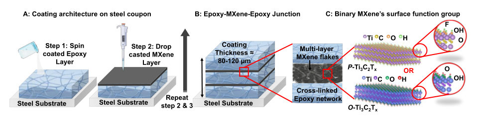
<figcaption class="paper-figure-caption"><b>Fig 1.</b> Figure 1: Schematic illustration of the fabrication process of multilayer coating, illustrating hierarchical organization from macroscopic layer assembly to microscopic interfacial interactions and atomic-scale surface functionalization.</figcaption>
</figure>
<figure class="paper-figure-card">

<figcaption class="paper-figure-caption"><b>Fig 2.</b> Figure 2: SEM micrographs and corresponding EDS analyses of fabricated multilayer coatings: (a) cross-sectional view showing the five-layer architecture of P-Ti3C2Tx; (b–e) corresponding EDS elemental maps; (f) top-view morphology of the P-Ti3C2Tx layer with (g–j) elemental distribution; (k) cross-sectional SEM image of the P-(TiVCrMo)C3 coating and (l–q) corresponding EDS maps; (r) top-view morphology of the P-(TiVCrMo)C3 layer with (s–x) EDS mapping.</figcaption>
</figure>
<figure class="paper-figure-card">
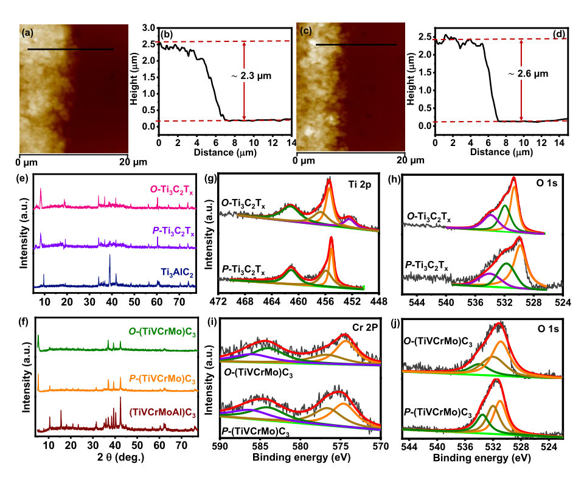
<figcaption class="paper-figure-caption"><b>Fig 3.</b> Figure 3: AFM characterization of the MXene–epoxy interface: (a,c) surface topography image showing the step between the epoxy substrate and the deposited P-Ti3C2Tx and P-(TiVCrMo)C3 layer respectively, and (b,d) corresponding height profile. XRD plots (e) for binary MXene and (f) for medium-entropy MXene. XPS Analysis (g) high resolution spectra of Ti 2p (h) O 1s of binary MXene and (i) high resolution spectra of Cr 2p (j) high resolution spectra of O 1s of medium-entropy MXene.</figcaption>
</figure>
<figure class="paper-figure-card">

<figcaption class="paper-figure-caption"><b>Fig 4.</b> Figure 4: Nyquist and Bode plots of various MXene–epoxy coatings P-Ti3C2Tx, and O-Ti3C2TX, P-(TiVCrMo)C3, and O-(TiVCrMo)C3 recorded in 3.5 wt.% NaCl solution under different conditions: (a–c) 1 h immersion, five-layer coatings; (d–f) 1 h immersion, three-layer coatings; (g–i) 24 h immersion, five-layer coatings; (j–l) 24 h immersion, three-layer coatings.</figcaption>
</figure>
<figure class="paper-figure-card">
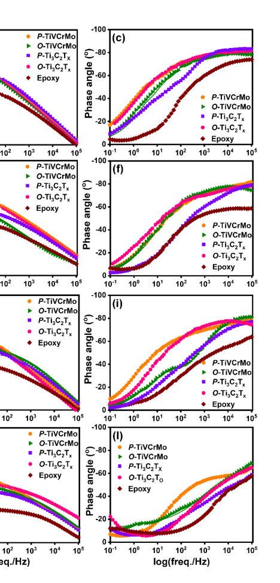
<figcaption class="paper-figure-caption"><b>Fig 5.</b> Figure 4(d-f) shows the Nyquist and bode plots of the 3 layers 1 h immersion, the P-</figcaption>
</figure>
<figure class="paper-figure-card">
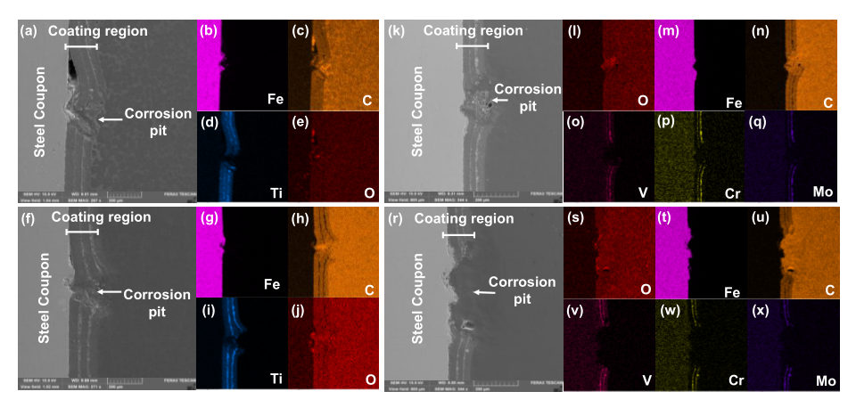
<figcaption class="paper-figure-caption"><b>Fig 6.</b> Figure 5: SEM micrographs and corresponding EDS analyses of scratched multilayer coatings after EIS testing: (a) cross-sectional view showing the five-layer architecture of P-Ti3C2Tx with (b–e) corresponding EDS elemental maps; (f) cross-sectional view of the O-Ti3C2Tx layer with (g–j) elemental distributions; (k) cross-sectional SEM image of the P-(TiVCrMo)C₃ coating with (l–q) corresponding EDS maps; and (r) cross-sectional view of the O-(TiVCrMo)C₃ layer with (s–x) EDS elemental mapping.</figcaption>
</figure>
<figure class="paper-figure-card">
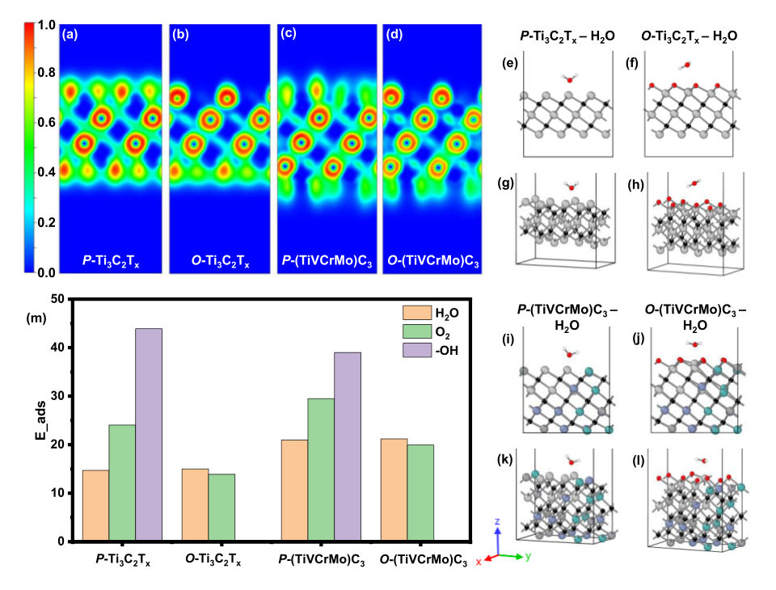
<figcaption class="paper-figure-caption"><b>Fig 7.</b> Figure 6: (a-d) Electron localization function (ELF), (e-l) optimized adsorption configurations, (m) adsorption energies of oxygen-containing species (H2O, O2, and OH).</figcaption>
</figure>

**Summary.** This study demonstrates that the effectiveness of MXene-based anti-corrosion coatings depends heavily on whether the MXene is a simple binary structure or a complex medium-entropy alloy. While oxygenation helps protect against corrosion in standard Ti3C2Tx, it actually degrades the performance of more complex multi-metal MXenes by interfering with their ability to form protective oxide layers.

**Why it may be interesting.** not directly relevant

Detailed structure

**Main problem.** Investigating how surface functionalization (oxygenation) and compositional complexity (binary vs. medium-entropy) affect the corrosion protection of MXene-reinforced epoxy coatings.

**Main result.** Oxygenation improves corrosion resistance in binary Ti3C2Tx MXenes but impairs it in medium-entropy (TiVCrMo)C3 MXenes; the latter performs best in its pristine state due to its ability to form protective Cr/Mo-rich oxides.

**Method.** Experimental techniques include EIS, SEM-EDS, AFM, XPS, and XRD, complemented by DFT calculations and Electron Localization Function (ELF) analysis.

**Model / system.** A nacre-inspired multilayer epoxy coating reinforced with either binary (Ti3C2Tx) or medium-entropy (TiVCrMo)C3 MXene layers, applied to C1010 carbon steel substrates.

**Key observables.** Impedance modulus (|Z|), coating resistance (R_coat), charge transfer resistance (R_ct), interlayer spacing, and adsorption energies of O2 and H2O.

**Important parameters / regimes.** Surface terminations (P- vs O-), number of coating layers (3L vs 5L), and elemental composition (binary vs medium-entropy).

**Figures summary.** Figures likely show SEM cross-sections of stratified layers, EDS elemental maps, XRD peak shifts for interlayer spacing, XPS spectra for chemical states, and EIS Bode/Nyquist plots showing impedance changes.

**Paper structure.** The paper introduces the problem of steel corrosion, describes the fabrication of multilayer MXene-epoxy coatings, presents characterization of morphology and chemistry, compares electrochemical performance of different MXene variants, uses DFT to explain the mechanistic differences in oxygen adsorption, and concludes with design principles.

Abstract

Developing scalable and environmentally benign anticorrosion coatings is critical for protecting steel infrastructure in chloride-rich environments. Here, a nacre-inspired multilayer epoxy coating reinforced with four MXene systems is investigated. This architecture forms a dense lamellar network that increases diffusion tortuosity and introduces electroactive surfaces for ion interactions. Electrochemical impedance spectroscopy (EIS) confirms that the multilayer design increases coating resistance from ~103 to ~108 Ohm/cm2. A clear performance hierarchy was observed: P-(TiVCrMo)C3 > O-Ti3C2Tx > O-(TiVCrMo)C3 > P-Ti3C2Tx. Density functional theory (DFT) calculations reveal that P-Ti3C2 strongly adsorbs O2, indicating higher surface reactivity, while oxygen termination stabilizes the surface by partially passivating Ti sites. In contrast, P-(TiVCrMo)C3 exhibits strong adsorption of oxygen-containing species due to its multi-metal electronic structure, promoting the formation of protective oxides. These results highlight the delicate balance of surface chemistry, electronic structure, and compositional entropy in designing next-generation MXene-based anticorrosion coatings for marine and industrial environments.

[↑ back to top](#top)

### [Critical temperatures and critical currents of wide and narrow quasi-one-dimensional superconducting aluminum structures in zero magnetic field](http://arxiv.org/abs/2604.27822v1)

**Authors:** V. I. Kuznetsov, O. V. Trofimov  
**Type:** experiment · **Category:** other · **PDF:** <https://arxiv.org/pdf/2604.27822v1>  
**Analysis basis:** full PDF text, analyzed in chunks

↔ Scroll figures horizontally

<figure class="paper-figure-card">
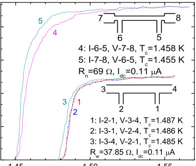
<figcaption class="paper-figure-caption"><b>Fig 1.</b> Figure 1: (Color online) Lines 1, 2 (dash-dotted), and 3 - resistive Rw(T) tran- sitions of the wide structure (bottom inset) at Idc = 0.11 µA. Lines 1, 2, and 3 correspond to the measurement circuits: (I-2-1, V-3-4), (I-3-1, V-2-4), and (I-3-4, V-2-1), respectively. Lines 4 and 5 are Rn(T) transitions of the narrow structure (inset at the top) at Idc = 0.11 µA. Lines 4 and 5 correspond to the measurement circuits: (I-6-5, V-7-8) and (I-7-8, V-6-5), respectively.</figcaption>
</figure>
<figure class="paper-figure-card">

<figcaption class="paper-figure-caption"><b>Fig 2.</b> Figure 2: (Color online) Squares and triangles are critical switching and retrap- ping currents as functions of the temperature, respectively, recorded in the wide structure according to the measurement circuit: I-3-4, V-2-1. Lines 1 and 2 are adjustable theoretical functions for the switching current Ic1(T) and the retrap- ping current Iret2(T), respectively. Inset is the sketch of the structure.</figcaption>
</figure>
<figure class="paper-figure-card">

<figcaption class="paper-figure-caption"><b>Fig 3.</b> Figure 3: (Color online) Squares and triangles - switching and retrapping cur- rents as functions of the temperature, respectively, recorded in a wide structure according to the measurement circuit: I-2-1, V-3-4. Line 1 is the adjustable curve Ic1(T) for the experimental switching current in the range T = 1.25 −1.4 K. Line 2 is the adjustable curve Iret2(T) for the switching current in the in- terval T = 1.404 −1.475 K and for the retrapping current in the interval T = 1.25 −1.475 K. Inset is a sketch of the structure.</figcaption>
</figure>
<figure class="paper-figure-card">

<figcaption class="paper-figure-caption"><b>Fig 4.</b> Figure 4: (Color online) Squares and triangles are the switching and retrap- ping currents as functions of the temperature, respectively, recorded in a nar- row structure according to the measurement circuit: I-7-8, V-6-5. Line 1 is the adjustable curve Ic1(T) for the experimental switching current in the range T = 1.25 −1.41 K. Line 2 is the adjustable curve Iret2(T) for the switching current at T = 1.415−1.444 K and for the retrapping current at T = 1.25−1.45 K. Line 3 is the expected switching current of a narrow structure if critical tem- peratures of narrow and wide wires making up a narrow and wide structure, are the same. Inset: a sketch of the structure.</figcaption>
</figure>

**Summary.** This study reveals that narrower superconducting aluminum wires have lower critical temperatures and current densities than wider wires of the same thickness. The authors suggest this is caused by depairing centers on the wire boundaries and observe that the structures can behave as hybrid SNS junctions at certain temperatures.

**Why it may be interesting.** not directly relevant

Detailed structure

**Main problem.** Investigating why narrower quasi-one-dimensional aluminum structures exhibit lower critical temperatures and critical current densities compared to wider structures of the same thickness.

**Main result.** The researchers discovered that decreasing wire width leads to a decrease in Tc and jc, likely due to the increased influence of depairing centers on dirty longitudinal boundaries. They also identified two distinct temperature regimes for the switching current, including the formation of hybrid SNS junctions.

**Method.** Electrical measurements of voltage-current characteristics and resistance-temperature transitions were performed in zero magnetic field using various measurement circuits and low-noise analog equipment.

**Model / system.** Quasi-one-dimensional superconducting aluminum thin-film structures (thickness 19 nm) with varying widths (0.27 um and 0.48 um) fabricated on a silicon chip.

**Key observables.** Critical temperatures (Tc), critical switching currents (Isw), critical retrapping currents (Iret), and normal-state resistance (Rn).

**Important parameters / regimes.** Dirty limit regime (electron mean free path ~9-9.6 nm), Ginzburg-Landau coherence length (~0.11 um), and London penetration depth (16 nm).

**Assumptions / limitations.** The reduction in Tc is attributed to the depairing effect of magnetic atoms or vacancies on the longitudinal boundaries of the narrow wires.

**Figures summary.** Figure 1 shows resistance vs. temperature plots for different measurement circuits; Figure 2 displays V(I) curves and switching current temperature dependence for wide structures; Figures 3 and 4 show temperature dependence of switching current for narrow structures compared to theoretical predictions.

**Paper structure.** The paper introduces the problem of Tc discrepancy in asymmetric structures, describes the experimental setup and fabrication of Al wires, presents measurement results for Tc and critical currents, discusses the theoretical modeling using Kupriyanov-Lukichev and GL theories, and concludes with a proposed mechanism involving boundary depairing.

Abstract

We measured the critical temperatures and critical switching and retrapping currents of wide and narrow thin-film quasi-one-dimensional superconducting aluminum structures of the same thickness in zero magnetic field. For the first time, we found that the narrower the structure, the lower the critical temperature and critical current density in the structure. Probably, the influence of depairing centers that are on dirty longitudinal boundaries of the structure, is the stronger than the narrower the structure. It is found for the first time that, in most cases, the temperature-dependent switching critical current in both structures is approximated by two functions. At temperatures below the temperature corresponding to the bottom of the resistive N-S transition of structures, the switching critical current is described by the Kupriyanov-Lukichev theory. At temperatures close to the top of the N-S transition, the switching current is linear with temperature and coincides with the critical Josephson current. At these temperatures, Josephson SNS junctions are formed in structures.

[↑ back to top](#top)

### [Curvature-induced nonlinear anomalous Hall effect in thin magnetic shells](http://arxiv.org/abs/2604.27544v1)

**Authors:** Maria Teresa Mercaldo, Mario Cuoco, Carmine Ortix  
**Type:** theory · **Category:** other · **PDF:** <https://arxiv.org/pdf/2604.27544v1>  
**Analysis basis:** abstract only; PDF text extraction failed or PDF unavailable

**Summary.** The paper demonstrates that the curvature of thin magnetic shells can be used to engineer nonlinear transport effects. By manipulating geometric bending, one can selectively probe both the quantum metric and the Berry curvature dipole, providing a platform for controlling the quantum geometry of Bloch states.

**Why it may be interesting.** not directly relevant

Detailed structure

**Main problem.** How can geometric curvature and strain gradients in thin magnetic shells be used to engineer and probe the components of the quantum geometric tensor?

**Main result.** Geometric bending breaks inversion symmetry and activates orbital Rashba coupling, generating a nonlinear anomalous Hall effect (NAHE) governed by the quantum metric and the Berry curvature dipole.

**Method.** Theoretical analysis of transport properties in curved ferromagnetic structures, focusing on the interplay between strain-induced symmetry breaking and spin-orbit coupling.

**Model / system.** Thin ferromagnetic shells subject to geometric bending, which induces strain gradients and breaks inversion and rotational symmetries.

**Key observables.** Nonlinear anomalous Hall effect (NAHE), quantum metric, Berry curvature dipole, and spin textures.

**Important parameters / regimes.** In-plane magnetization direction, applied electric field orientation, and degree of geometric deformation/curvature.

**Assumptions / limitations.** The system is treated within the framework of Bloch states and the quantum geometric tensor, assuming the presence of spin-orbit coupling and in-plane magnetization.

**Paper structure.** The paper introduces the problem of probing the quantum geometric tensor, describes the mechanism of curvature-induced symmetry breaking and orbital Rashba coupling, analyzes the resulting NAHE components, and concludes with the implications for engineering anisotropic transport.

Abstract

Optoelectronic and nonlinear transport experiments probe the quantum geometric tensor of Bloch states, whose real and imaginary components -- the quantum metric and the Berry curvature -- are typically constrained by symmetry. Here, we show that geometric bending provides a route to engineer such responses in centrosymmetric ferromagnets. Curvature-induced strain gradients across the shell thickness break inversion symmetry and activate an orbital Rashba coupling. In the presence of in-plane magnetization and spin-orbit coupling, this generates spin textures with a nontrivial quantum geometry, leading to an intrinsic nonlinear anomalous Hall effect (NAHE) governed by the quantum metric and maximized when the magnetization aligns with the applied electric field. When geometric deformations further break twofold rotational symmetry around the out-of-plane axis, an additional NAHE emerges, maximal for magnetization perpendicular to the driving electric field and governed by the Berry curvature dipole, thus giving access to the imaginary component of the quantum geometric tensor. These results establish curved ferromagnetic shells as a platform for engineering anisotropic nonlinear transport and for selectively probing both components of the quantum geometric tensor.

[↑ back to top](#top)

### [Data-Efficient Indentation Size Effect Correction in Steels Using Machine Learning and Physics-Guided Augmentation](http://arxiv.org/abs/2604.27775v1)

**Authors:** Radmir Karamov, Tagir Karamov  
**Type:** both · **Category:** disordered systems and neural networks · **PDF:** <https://arxiv.org/pdf/2604.27775v1>  
**Analysis basis:** abstract only; PDF text extraction failed or PDF unavailable

**Summary.** This paper presents a machine learning approach to correct for measurement errors in shallow nanoindentation of steel. By using physics-guided features and data augmentation, a neural network can accurately predict reference hardness even when classical mechanical models fail. This workflow offers a way to perform efficient mechanical characterization of volume-constrained materials using small datasets.

**Why it may be interesting.** not directly relevant

Detailed structure

**Main problem.** Correcting the indentation size effect (ISE) in shallow nanoindentation of steels, where classical models like Nix-Gao fail due to the lack of a deep linear regime.

**Main result.** A constrained neural network achieved high predictive accuracy (RMSE = 0.470 GPa, MAPE = 5.4%) for reference hardness, outperforming linear models and providing stable estimates in the shallow regime.

**Method.** Physics-guided feature engineering and data augmentation (simulating noise and drift) applied to a small experimental dataset, using models including Ridge Regression, Random Forest, XGBoost, and Neural Networks.

**Model / system.** The study uses experimental nanoindentation data from three steel reference specimens with hardness ranging from 2-6.5 GPa, supplemented by augmented data representing instrumental noise and multiphase boundary blending.

**Key observables.** Hardness (H), contact-area errors, indentation work partitioning, H/Er ratio, and the area-invariant compliance proxy (Pmax/S^2).

**Important parameters / regimes.** Indentation depth (shallow regime), hardness range (2-6.5 GPa), and features related to energy-based and area-invariant descriptors.

**Assumptions / limitations.** The effectiveness of the machine learning model relies on the quality of the physics-guided augmentation and the representativeness of the engineered mechanical descriptors.

**Paper structure.** The paper introduces the problem of ISE in shallow indentation, describes the experimental dataset and augmentation strategy, details the feature engineering and ML model architectures, evaluates performance on a quarantined specimen, and uses SHAP/latent-space analysis to interpret model reliance on physical descriptors.

Abstract

Shallow nanoindentation enables mechanical characterization of thin films, individual phases and other volume-constrained materials, but measured hardness is often inflated by the indentation size effect (ISE), contact-area errors and tip-geometry artifacts. Classical ISE corrections such as the Nix-Gao require a deep linear regime and are unreliable when only shallow measurements are used. This study investigates how a small experimental dataset can be used to predict a reference hardness with physics-guided feature engineering and augmentation. Approximately 700 experimental indentations were collected from three steel reference specimens covering a hardness range of 2-6.5 GPa and augmented using physically motivated variations representing instrumental noise, session-level drift, and local multiphase boundary blending. The input space combined Oliver-Pharr values with mechanics descriptors, including indentation work partitioning, ($H\text{/}E_{r}$), and the area-invariant compliance proxy ($P_{\max}\text{/}S^{2}$). Ridge Regression (RR), Random Forest, XGBoost, and Neural Networks (NN) were evaluated using a quarantined fourth steel specimen tested at staggered loads. The hardness mapping was nonlinear: RR failed, whereas nonlinear models achieved ($R^2 > 0.98$) internally. A constrained (64-8-64) NN gave the best results, reaching RMSE = 0.470 GPa, MAPE = 5.4% on the quarantined steel. Unlike Nix-Gao analysis, the NN produced stable estimates in the shallow regime. SHAP and latent-space analysis showed reliance on area-invariant and energy-based descriptors. The results demonstrate the feasibility of a this workflow for ISE correction in steels using small datasets and suggest a pathway toward data-efficient characterization of any volume constrained materials.

[↑ back to top](#top)

### [First-Principles Thermodynamic Analysis of Ternary Chalcogenide Phase Change Materials](http://arxiv.org/abs/2604.27120v1)

**Authors:** Felix Adams, Ichiro Takeuchi, Carlos Ríos Ocampo, Yifei Mo  
**Type:** theory · **Category:** statistical mechanics · **PDF:** <https://arxiv.org/pdf/2604.27120v1>  
**Analysis basis:** abstract only; PDF text extraction failed or PDF unavailable

**Summary.** The paper proposes a new thermodynamic screening method to discover new phase-change materials for memory and photonics. By using first-principles calculations to study the stability of polymorphs, the authors identify new ternary chalcogenide mixtures that could replicate the fast-switching properties of the industry-standard GST system.

**Why it may be interesting.** not directly relevant

Detailed structure

**Main problem.** The challenge of identifying new chalcogenide phase-change materials (PCMs) with a broad property space while maintaining fast switching speeds.

**Main result.** The development of a thermodynamic framework based on Ostwald's rule that identifies promising ternary chalcogenide mixtures by screening for GST-like polymorph-mediated crystallization pathways.

**Method.** First-principles calculations used to systematically evaluate the energetics of ternary chalcogenide mixtures along binary-binary tie lines and their polymorphs.

**Model / system.** Ternary chalcogenide mixtures, specifically focusing on the GeTe-Sb2Te3 (GST) system and related compositions.

**Key observables.** Phase stability, miscibility, and energetics of ground-state and metastable structures.

**Important parameters / regimes.** Phase-transition dynamics, crystallization pathways, and thermodynamic stability of polymorphs.

**Assumptions / limitations.** The framework is motivated by Ostwald's rule and assumes that thermodynamic polymorph screening can serve as a proxy for complex phase-transition dynamics.

**Paper structure.** The paper introduces the need for new PCMs, proposes a thermodynamic framework based on Ostwald's rule, describes the first-principles methodology for evaluating ternary mixtures, validates the approach against known GST behavior, and presents new candidate materials.

Abstract

Chalcogenide phase-change materials (PCMs) are important for nonvolatile memory and reconfigurable photonic technologies. The GeTe-Sb2Te3 mixture system, commonly referred to as GST, is the most well-known PCM family, but new PCMs are needed to broaden the accessible property space while retaining fast switching. Here, we propose a thermodynamic framework, motivated by Ostwald's rule, for understanding and identifying PCM materials. Since direct modeling of phase-transition dynamics is computationally expensive, Using first-principles calculations, we systematically evaluate the energetics of ternary chalcogenide mixtures along binary-binary tie lines and their polymorphs. By comparing ground-state and metastable structures, we assess phase stability, miscibility, and the likelihood of GST-like polymorph-mediated crystallization pathways across a broad composition space. The calculations reproduce known behavior in GST and related systems and identify several promising candidate mixtures with similar features. These results provide insight into why some PCM systems are more favorable than others and establish thermodynamic polymorph screening as a practical route for future PCM discovery.

[↑ back to top](#top)

### [Fragment-Constrained Charge Equilibration for Charge-Aware Machine Learning Potentials at Electrochemical Interfaces](http://arxiv.org/abs/2604.27910v1)

**Authors:** Akhil Reddy Peeketi, Blas P Uberuaga, Travis E Jones  
**Type:** theory · **Category:** disordered systems and neural networks · **PDF:** <https://arxiv.org/pdf/2604.27910v1>  
**Analysis basis:** full PDF text, analyzed in chunks

↔ Scroll figures horizontally

<figure class="paper-figure-card">
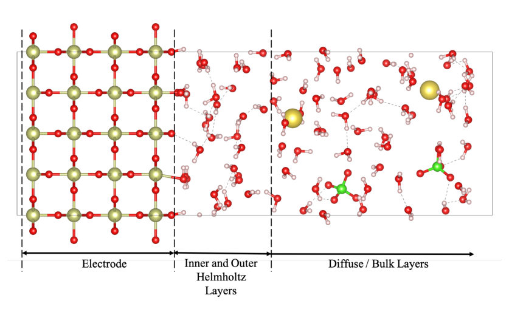
<figcaption class="paper-figure-caption"><b>Fig 1.</b> Figure 1: Snapshot of an IrO2(110)/aqueous NaClO4 interface, our prototype training system for Soft-FQEq. The interface partitions into three structurally distinct regions (electrode, inner and outer Helmholtz layers, and diffuse/bulk electrolyte) and, at molecular resolution, into fragments for per-fragment charge equilibration: the connected electrode slab (one fragment), each intact water molecule, and each individual Na+ or ClO4 – ion. The electrode (Ir, olive; O, red) is a conductor whose electronic states set the surface’s electrochemical potential. The inner and outer Helmholtz layers comprise the first few Å of solvent: oriented water molecules and, further out, the plane of closest...</figcaption>
</figure>
<figure class="paper-figure-card">

<figcaption class="paper-figure-caption"><b>Fig 2.</b> Figure 2: Architecture of fragment-constrained charge equilibration on a HIP-NN feature net- work. Atomic positions R feed a shared feature network whose four MLP readout heads produce Eshort i , χi, qc,i, and ∆log κij. The bond-connectivity head feeds a differentiable resolvent (Sec- tion 2.2) producing the soft fragment-membership matrix eC; the augmented-Lagrangian Uzawa solver (Section 2.1) then consumes χ, qc, and eC and returns equilibrated charges q and frag- ment chemical potentials µfrag. Forces are obtained by autograd through the unrolled solver; the per-atom observable µphys,i = χi + [Aq]i (Section 2.5) is evaluated directly from the converged χ and q.</figcaption>
</figure>
<figure class="paper-figure-card">
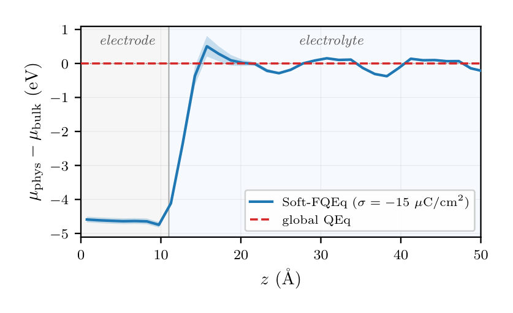
<figcaption class="paper-figure-caption"><b>Fig 3.</b> Figure 3: Per-atom µphys,i = χi + [Aq]i along the interface normal z for a charge-neutral IrO2/H2O/NaClO4 slab, referenced to the bulk-water mean (z ∈[30, 60] Å). The two shaded regions separate the electrode (gray, z ≲11.5 Å) from the electrolyte (light blue, z ≳11.5 Å). Soft-FQEq (blue) shows a flat electrode plateau, a sharp interfacial drop, and a bulk-water plateau near zero; shaded band is the 5-seed ensemble standard deviation. Replacing the Uzawa solver by a global-QEq bordered solve at inference with the same trained weights collapses µphys to a single system-wide value (red dashed line). Species shown: Ir and electrode-O in the electrode region; clean water-O (not bonded to Cl) in...</figcaption>
</figure>
<figure class="paper-figure-card">

<figcaption class="paper-figure-caption"><b>Fig 4.</b> Figure 4: Response of µphys(z) to electrode charging. Nine ion compositions from 4 Na+ to 4 ClO4 – per electrode face (placed in the Stern layer) span a range of model-predicted surface charge densities σ, with each composition averaged over 5 random seeds. Shaded regions and species inclusion match Figure 3: electrode (gray, z ≲11.5 Å) and electrolyte (light blue, z ≳ 11.5 Å). The electrode plateau shifts monotonically with σ: more positive σ raises µphys on the electrode, consistent with the capacitive response expected at an interface. The bulk-water region remains near zero on each configuration’s own bulk-water reference. Single-snapshot evaluation per seed, not MD-averaged; curves are...</figcaption>
</figure>

**Summary.** This paper introduces a new machine learning solver layer that allows interatomic potentials to model electrochemical interfaces by allowing different chemical potentials for different molecular fragments. This overcomes the structural limitation of previous models that forced a single, uniform potential across the entire system, enabling the simulation of electric double layers.

**Why it may be interesting.** not directly relevant

Detailed structure

**Main problem.** Standard charge-aware machine learning interatomic potentials (MLIPs) using global charge equilibration cannot capture the electrochemical potential gradient required for an electric double layer at interfaces.

**Main result.** The authors developed Soft-FQEq, a differentiable, fragment-constrained charge equilibration layer that successfully recovers the interfacial potential gradient and reproduces DDEC6 charges.

**Method.** A differentiable solver layer using an augmented-Lagrangian Uzawa iteration and a graph Laplacian resolvent to enforce per-fragment charge conservation within a HIP-NN architecture.

**Model / system.** An electrochemical interface consisting of an IrO2 electrode and an aqueous electrolyte (H2O/Na+/ClO4-). The model uses a machine learning interatomic potential (MLIP) with a Hamiltonian decomposed into short-range and fragment-constrained electrostatic energy.

**Key observables.** Local electrochemical potential (mu_phys), per-atom charges, per-fragment chemical potentials, and the Galvani potential difference.

**Important parameters / regimes.** Penalty strength beta, Ewald splitting parameter, and the soft bond connectivity matrix.

**Assumptions / limitations.** The method assumes Gaussian charge widths for stability and is currently limited to systems of a few hundred atoms due to the O(N^3) complexity of the resolvent.

**Figures summary.** Figure 1 shows a snapshot of the IrO2/aqueous interface with partitioned fragments; Figure 2 illustrates the Soft-FQEq architecture; Figure 3 displays the reconstructed electrochemical potential profile along the z-axis.

**Paper structure.** The paper introduces the problem of global QEq failure, presents the Soft-FQEq mathematical formulation and differentiable fragment identification, details the implementation within the hippynn framework, and validates the model via ablation studies and comparison to DFT-derived charges and potentials.

Abstract

Predictive simulation of electrochemical interfaces requires atomistic models that capture reactive bond rearrangements, long-range electrostatics, and charge distributions reflecting the electronic distinctness of electrode and electrolyte. Existing charge-aware machine-learned interatomic potentials (MLIPs) built on global charge equilibration (QEq) settle electrode and electrolyte at a common electrochemical potential, leaving no room for the interfacial gradient that the double layer requires and admitting spurious charge transfer between electronically disconnected regions. Per-fragment charge equilibration is the established remedy in classical molecular dynamics, but reliance on predefined molecular topology has confined it to non-reactive systems. We lift this restriction by making fragment identification itself a differentiable function of atomic geometry, yielding soft fragment-constrained charge equilibration (Soft-FQEq) -- a solver layer that restores fragment-resolved charge conservation in reactive MLIPs. The layer consumes four scalar MLP readouts from a shared atomic-feature network -- per-atom electronegativity, source charge, short-range energy, and a soft bond connectivity -- and returns equilibrated charges together with per-fragment chemical potentials. We implement Soft-FQEq as an extension of the hippynn framework on a HIP-NN feature network and train it on DFT energies, forces, and DDEC6 charges for IrO2/H2O/Na+/ClO4- interfaces. The trained model recovers a clear electrode-to-electrolyte gradient in the per-atom electrochemical potential. With the same trained weights but the fragment-constrained solver replaced by global QEq at inference, this gradient collapses to an essentially uniform profile, directly showing that the gradient cannot be sustained within global QEq while the fragment formulation recovers it.

[↑ back to top](#top)

### [From Narrow-gap Semiconductor to Metallic Altermagnet: Optical Fingerprints of Co-Doped FeSb$_2$](http://arxiv.org/abs/2604.28105v1)

**Authors:** R. Mathew Roy, M. Povolotskiy, J. Kirschke, C. Prange, Y. Xia, V. Sundaramurthy, P. Puphal, M. Pinteric, M. van de Loo, A. Kreyssig, T. Zhang, A. E. Böhmer, M. Dressel, M. Wenzel  
**Type:** both · **Category:** strongly correlated electrons · **PDF:** <https://arxiv.org/pdf/2604.28105v1>  
**Analysis basis:** abstract only; PDF text extraction failed or PDF unavailable

**Summary.** This paper demonstrates that doping the semiconductor FeSb2 with cobalt induces a metallic altermagnetic state stable at room temperature. By using optical spectroscopy and DFT, the authors identify unique electronic transitions and enhanced electron-phonon coupling characteristic of this new state. This establishes Co-doped FeSb2 as a key platform for studying $d$-wave altermagnetism.

**Why it may be interesting.** not directly relevant

Detailed structure

**Main problem.** The search for bulk metallic altermagnetism and the characterization of the electronic and lattice properties in Co-doped FeSb2.

**Main result.** Cobalt substitution (~15%) transforms the narrow-gap semiconductor FeSb2 into a metallic altermagnetic state that persists up to room temperature, characterized by specific low-energy interband transitions and enhanced electron-phonon coupling.

**Method.** The study combines infrared optical conductivity measurements with density functional theory (DFT) calculations to analyze electronic transitions and phonon dynamics.

**Model / system.** The physical system is Co-doped FeSb2, a correlated narrow-gap semiconductor that transitions into a metallic altermagnetic state via carrier tuning.

**Key observables.** Infrared optical conductivity, low-energy interband transitions (near 0.1 eV), spin-split bands, Fano lineshapes in phonons, and mode mixing.

**Important parameters / regimes.** Cobalt substitution level (~15%), spin-split band energy (~0.2 meV), spin-orbit coupling induced splitting (~5 meV), and temperature (up to room temperature).

**Paper structure.** The paper presents experimental evidence of the metallic altermagnetic state via optical spectroscopy, followed by DFT calculations to attribute observed transitions to altermagnetic spin ordering and spin-orbit coupling, and concludes with an analysis of phonon-driven effects.

Abstract

The realization of bulk metallic altermagnetism has remained elusive despite the growing number of candidate materials. Here, we present evidence that moderate cobalt substitution ($\sim$15%) drives the correlated narrow-gap semiconductor FeSb$_2$ into a metallic altermagnetic state persisting up to room temperature. The infrared optical conductivity reveals low-energy interband transitions near 0.1 eV that emerge upon doping and grow with Co concentration. Density functional theory calculations show that these transitions originate exclusively from altermagnetic spin ordering, with spin split bands ($\sim$0.2 meV) of non-relativistic origin, together with spin-orbit coupling induced band splitting of the order of $\sim$5 meV near the Fermi level. Co substitution further leads to Fano lineshapes and mode mixing in the infrared-active phonons, reflecting enhanced electron-phonon coupling and local inversion symmetry breaking, while leaving the altermagnetic spin symmetry intact. Our results establish carrier-tuned FeSb$_2$ as a platform for exploring metallic $d$-wave altermagnetism and its coupling to lattice degrees of freedom.

[↑ back to top](#top)

### [Generation of magnetic metal-organic frameworks](http://arxiv.org/abs/2604.27879v1)

**Authors:** Alexander C. Tyner, Avinash Pathapati, Alexander V. Balatsky  
**Type:** theory · **Category:** disordered systems and neural networks · **PDF:** <https://arxiv.org/pdf/2604.27879v1>  
**Analysis basis:** abstract only; PDF text extraction failed or PDF unavailable

**Summary.** This paper addresses the difficulty of simulating large-scale organic materials like MOFs by fine-tuning a machine-learning interatomic potential (CHGNet) with a new dataset of 15,000+ computations. The authors use this improved model to implement a workflow that discovers new, highly magnetic metal-organic frameworks. This work is significant for accelerating the discovery of functional materials that could replace rare-earth elements.

**Why it may be interesting.** not directly relevant

Detailed structure

**Main problem.** Simulating metal-organic frameworks (MOFs) is computationally challenging due to large unit cells and the underrepresentation of organic materials in existing machine-learning training sets.

**Main result.** The authors successfully fine-tuned the CHGNet interatomic potential using a new dataset of 15,000+ first-principles computations from the OMDB and implemented a workflow to identify novel magnetic MOFs.

**Method.** Fine-tuning the CHGNet machine-learned interatomic potential using a dataset derived from the Organic Materials Database (OMDB) and applying a site substitution workflow on QMOF structural prototypes.

**Model / system.** Metal-organic frameworks (MOFs) characterized by large unit cells containing both organic and inorganic components, specifically targeting the generation of highly magnetic structures.

**Key observables.** Magnetic properties of the identified MOFs

**Assumptions / limitations.** The effectiveness of fine-tuning CHGNet relies on the representativeness of the 15,000 single-point first-principles computations from the OMDB.

**Paper structure.** The paper introduces the computational challenge of MOF simulation, describes the creation of a new training dataset from OMDB, details the fine-tuning of the CHGNet model, and presents a workflow for identifying new magnetic MOFs.

Abstract

The potential to utilize metal-organic frameworks as a replacement for rare earth materials as well as in technological applications has prompted increased interested in this material class. The simulation of organic materials, including metal-organic frameworks (MOFs), represents a computational challenge due to an increased average number of atoms in the unit cell. Compounding this challenge, modern materials databases are generally limited to inorganic structures due to their utility in modern technologies such as batteries and integrated circuits. Machine-learning tools appear ideally suited to study these systems. However, organic materials are generally underrepresented in the training sets of foundational models. In this work we leverage the the Organic Materials Database (OMDB) to create a training dataset comprised of more than 15,000 single-point first-principles computations for finetuning machine learned interatomic potentials. Specifically, we fine tune CHGNet and implement a site substitution workflow to identify novel, highly magnetic, MOFs from structural prototypes within the QMOF database.

[↑ back to top](#top)

### [Giant Spin Magnetization from Quantum Geometry in Altermagnets](http://arxiv.org/abs/2604.28088v1)

**Authors:** Neelanjan Chakraborti, Sudeep Kumar Ghosh, Snehasish Nandy  
**Type:** theory · **Category:** other · **PDF:** <https://arxiv.org/pdf/2604.28088v1>  
**Analysis basis:** full PDF text, analyzed in chunks

↔ Scroll figures horizontally

<figure class="paper-figure-card">
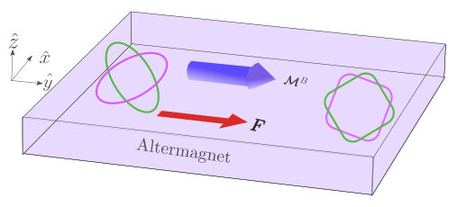
<figcaption class="paper-figure-caption"><b>Fig 1.</b> FIG. 1. Magnetic-field-induced spin magnetization in an altermagnet: In the absence of external perturbations (F), an altermagnet exhibits vanishing net spin magnetization despite a spin-split band structure. A finite linear spin mag- netization (MB) is induced under an applied magnetic field (B), whereas the linear response to an electric field (E) is forbidden in a centrosymmetric altermagnet. The magnetic- field-driven response originates from the spin-rotation quan- tum metric.</figcaption>
</figure>
<figure class="paper-figure-card">
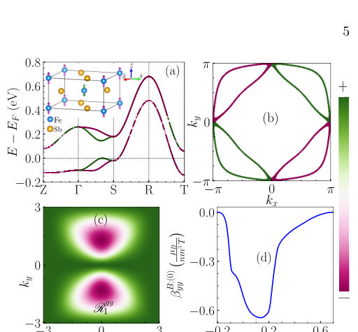
<figcaption class="paper-figure-caption"><b>Fig 2.</b> FIG. 2. Spin magnetization in the d-wave altermagnet FeSb2: (a) Spin-projected band structure along the high- symmetry path Z–Γ–S–R–T, showing pronounced nonrela- tivistic spin splitting along the Γ–S and Z–R directions. The crystal structure is shown in the inset. (b) Spin-projected Fermi surface in the kx–ky plane at µ = 0.16 eV, highlighting the characteristic d-wave anisotropy of the spin-split bands. (c) yy-component of the spin-rotation quantum metric in the Brillouin zone, revealing the underlying geometric structure. (d) yy-component of the magnetic-field-induced linear spin magnetization response tensor as a function of chemical po- tential.</figcaption>
</figure>
<figure class="paper-figure-card">

<figcaption class="paper-figure-caption"><b>Fig 3.</b> FIG. 3. Spin magnetization in the g-wave altermagnet CrSb: (A) Spin-projected band structure along the high- symmetry path −M ′–Γ–M ′, showing pronounced nonrela- tivistic spin splitting along the given directions. The crystal structure is shown in the inset. (B) Spin-projected Fermi sur- face in the kx–ky plane at µ = 0.16 eV, highlighting the char- acteristic d-wave anisotropy of the spin-split bands. (c) Distri- bution of yy component of the spin-rotation quantum metric across the Brillouin zone, revealing the underlying quantum- geometric mechanism responsible for the response in panel (d). (d) Chemical-potential dependence of the yy component of the linear spin magnetization response...</figcaption>
</figure>

**Summary.** This paper identifies a new, universal quantum-geometric mechanism for generating massive spin magnetization in centrosymmetric altermagnets. It shows that the spin-rotation quantum metric drives a magnetic-field-induced response that is orders of magnitude larger than conventional magnetic signals, offering a promising platform for spintronics.

**Why it may be interesting.** not directly relevant

Detailed structure

**Main problem.** Identifying the quantum-geometric mechanism responsible for linear spin magnetization in centrosymmetric altermagnets, where inversion and $C_n T$ symmetries suppress conventional responses.

**Main result.** The authors discover that magnetic-field-induced spin magnetization in centrosymmetric altermagnets originates entirely from the spin-rotation quantum metric and can reach a giant magnitude of $10^{-2} \mu_B 	ext{ nm}^{-3}$ at very low fields.

**Method.** A unified theoretical framework using a generalized quantum geometric tensor that incorporates both momentum translations and spin rotations of Bloch states, combined with symmetry analysis and linear response theory.

**Model / system.** Centrosymmetric altermagnets, specifically $d$-wave $	ext{FeSb}_2$ and $g$-wave $	ext{CrSb}$, modeled using a tight-binding Hamiltonian featuring spin-split band structures and Néel exchange fields.

**Key observables.** Linear spin magnetization induced by an external magnetic field, spin-rotation quantum metric, and spin-rotation Berry curvature.

**Important parameters / regimes.** Magnetic field strength ($\sim 10 	ext{ mT}$), spin-rotation quantum metric ($R_{ab}$), and the predicted magnetization scale of $10^{-2} \mu_B 	ext{ nm}^{-3}$.

**Assumptions / limitations.** Weak-disorder limit using the relaxation-time approximation; focus on the linear response regime.

**Figures summary.** Figure 1 illustrates the concept of magnetic-field-induced magnetization in altermagnets, showing the vanishing net magnetization at zero field and the prohibition of electric-field-driven response in centrosymmetric systems.

**Paper structure.** The paper introduces the problem of spin magnetization in altermagnets, develops a generalized quantum geometric tensor framework, applies symmetry constraints to decompose magnetization contributions, and demonstrates the effect using specific material models ($	ext{FeSb}_2$ and $	ext{CrSb}$).

Abstract

Altermagnets host spin-split band structures while exhibiting vanishing equilibrium spin magnetization, making field-induced responses a direct probe of their quantum geometry. A central question, in this regard, is which quantum-geometric mechanism can generate a linear spin magnetization in centrosymmetric systems. Here we develop a unified framework based on a generalized quantum geometric tensor that incorporates both momentum translations and spin rotations of Bloch states, and decompose spin magnetization into equilibrium, electric-field-driven, and magnetic-field-driven contributions. We show that inversion symmetry forbids the linear electric-field response in centrosymmetric systems, while $C_n T$ symmetry further suppresses the equilibrium contribution in altermagnets. Consequently, centrosymmetric altermagnets provide a particularly clean realization in which the magnetic-field-induced spin magnetization emerges as the only symmetry-allowed linear quantum-geometric response. We demonstrate that this contribution originates entirely from the spin-rotation quantum metric, establishing it as the sole linear quantum-geometric mechanism in such systems. Using representative centrosymmetric altermagnets, including the $d$-wave compound $\mathrm{FeSb}_2$ and the $g$-wave compound $\mathrm{CrSb}$, we show that the spin-rotation quantum metric directly controls this response. Crucially, we predict a giant linear spin magnetization of order $10^{-2}μ_B\,\mathrm{nm}^{-3}$ at magnetic fields of $\sim 10\,\mathrm{mT}$, exceeding typical experimental values for conventional magnets by several orders of magnitude. Our results identify a universal quantum geometric mechanism of spin magnetization operative in centrosymmetric systems in general, and establish centrosymmetric altermagnets as an ideal platform for its experimental detection with potential applications in spintronics.

[↑ back to top](#top)

### [Guided elastic waves for soft elastomer characterization: an alternative to conventional rheometry](http://arxiv.org/abs/2604.27722v1)

**Authors:** Samuel Croquette, Pierre Chantelot, Daniel A. Kiefer, Claire Prada, Fabrice Lemoult  
**Type:** both · **Category:** other · **PDF:** <https://arxiv.org/pdf/2604.27722v1>  
**Analysis basis:** abstract only; PDF text extraction failed or PDF unavailable

**Summary.** This paper presents a new method for characterizing soft elastomers using guided elastic waves instead of traditional rheometry. By analyzing wave dispersion under tension, the researchers can extract viscoelastic and hyperelastic properties across a wide frequency range. This approach offers a simpler, broadband alternative for studying the mechanics of soft materials.

**Why it may be interesting.** not directly relevant

Detailed structure

**Main problem.** Developing an alternative to conventional rheometry for characterizing the mechanical, viscoelastic, and acoustoelastic properties of soft elastomers.

**Main result.** A wave-based characterization method using guided elastic waves was successfully implemented, providing mechanical parameters consistent with plate-plate rheometry but over a much broader frequency range.

**Method.** The method uses stroboscopic measurements of monochromatic wave fields in a thin elastomer strip acting as a waveguide, combined with a numerical implementation to match experimental dispersion curves to a theoretical framework.

**Model / system.** The system consists of thin strips of commercial silicone elastomers acting as waveguides for in-plane guided elastic modes under controlled static elongation.

**Key observables.** Complex-valued dispersion relations for guided modes.

**Important parameters / regimes.** Frequency-dependent viscoelasticity and elongation-dependent acoustoelasticity (hyperelastic parameters).

**Assumptions / limitations.** The method assumes that the dispersion curves can be quantitatively matched to a theoretical framework coupling viscoelasticity and acoustoelasticity.

**Paper structure.** The paper introduces a wave-based characterization method, describes the theoretical framework coupling viscoelasticity and acoustoelasticity, details the numerical implementation for matching dispersion curves, and validates the approach using commercial silicone elastomers compared to conventional rheometry.

Abstract

Elastic wave propagation is intrinsically sensitive to the mechanical properties of the medium through which it travels. In soft elastomers, this makes guided elastic waves natural probes of viscoelastic and acoustoelastic behavior over a broad frequency range. In this work, we introduce a wave-based mechanical characterization method in which a thin elastomer strip acts as a waveguide supporting multiple in-plane guided modes. By combining stroboscopic measurements of monochromatic wave fields with a theoretical framework that couples frequency-dependent viscoelasticity and elongation-dependent acoustoelasticity, we extract complex-valued dispersion relations for guided modes under controlled static elongation. A dedicated numerical implementation allows these experimental dispersion curves to be quantitatively matched to theory, enabling identification of the material's rheological and hyperelastic parameters. Applied to several commercial silicone elastomers, the method yields mechanical parameters that are consistent with conventional plate-plate rheometry, while extending the accessible frequency range beyond that of conventional techniques. By exploiting the richness of guided-wave dispersion and the sensitivity of waves to both frequency and pre-stress, this approach provides a unified, broadband, and experimentally simple route to the mechanical characterization of soft elastomers.

[↑ back to top](#top)

### [Intrinsic anomalous thermal hall effect as a signature of quantum metric in d-wave altermagnets](http://arxiv.org/abs/2604.28184v1)

**Authors:** Rishi G. Gopalakrishnan, Srimayi Korrapati, Sumanta Tewari  
**Type:** theory · **Category:** strongly correlated electrons · **PDF:** <https://arxiv.org/pdf/2604.28184v1>  
**Analysis basis:** full PDF text, analyzed in chunks

↔ Scroll figures horizontally

<figure class="paper-figure-card">

<figcaption class="paper-figure-caption"><b>Fig 1.</b> Figure 1. Variation of the factors F xx + Ωz + (top panel), F xy + Ωz + (bottom panel) in Eq. (16) over the kx −ky plane. We note that F xx T,=Ωz is even in kx and ky which makes the BZ in- tegral of this quantity finite, resulting in ηabcc ̸= 0. On the other hand, F xy T,+Ωz + is odd in both kx and ky and accord- ingly integrates to zero, resulting in vanishing ηabxy and ηabyx. These factors are concentrated around the the band crossings at Γ ≡(0, 0) and M ≡(π, π) points where they diverge as expected from the energy difference in the denominators (see Eqs. (19-21). The parameters used here are t = 1eV , λ = 0.3t, and ∆d = 0.5t.</figcaption>
</figure>
<figure class="paper-figure-card">

<figcaption class="paper-figure-caption"><b>Fig 2.</b> Figure 2. Variation of the third order thermal Hall conduc- tivity η(3) ⊥ in Eq.(28) over different values of the polar angle θ of the applied thermal gradient in the crystal frame. The conductivity η(3) ⊥ shows a cos 2θ dependence and vanishes at angle values equal to odd multiples of π/4. We use the model parameter values t = 1eV , λ = 0.3t, ∆d = 0.5t, chemical po- tential µ = −3.998eV , and T = 10K.</figcaption>
</figure>
<figure class="paper-figure-card">
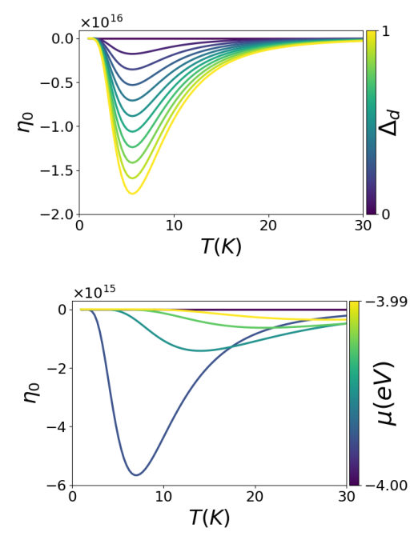
<figcaption class="paper-figure-caption"><b>Fig 3.</b> Figure 3. Variation of the third order thermal Hall conductiv- ity η0 as a function of the temperature T. Top: Displays the variation of the thermal Hall conductivity for various values of the d-wave order parameter ∆d with µ = −3.998eV . As we increase the order parameter, the thermal response becomes stronger. Bottom: Displays the variation of the thermal Hall conductivity for various values of the chemical potential µ with ∆d = 0.5t. As the chemical potential moves further from the band crossing point, the magnitude of the peak value of η0 decreases and the peak also moves to higher temperatures, while keeping the ratio (µ −2t)/(kBT) constant. The param- eters used here are t = 1eV , and...</figcaption>
</figure>
<figure class="paper-figure-card">
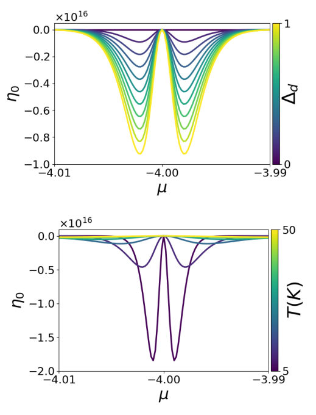
<figcaption class="paper-figure-caption"><b>Fig 4.</b> Figure 4. Variation of the third order thermal Hall conduc- tivity η0 as a function of the chemical potential µ. Top: Variation of the thermal Hall conductivity with respect to µ for various values of the d-wave order parameter ∆d with T = 10K. As we increase the order parameter, the thermal response becomes stronger. Bottom: Variation of the thermal Hall conductivity for various values of the chemical potential µ with ∆d = 0.5t. As the temperature increases, the posi- tion of the peak of η0 shifts further from the band crossing point (µ = −4.0eV ) and the magnitude of the value of the peak decreases. In both cases, the thermal Hall conductiv- ity vanishes at the band crossing chemical...</figcaption>
</figure>

**Summary.** This paper identifies that in d-wave altermagnets, the first nonvanishing intrinsic anomalous thermal Hall effect appears at the third order of the temperature gradient. This effect is driven by quantum geometric properties, specifically the nonlinear thermal Berry connection polarizability. The study provides clear experimental signatures through specific angular and temperature-dependent patterns.

**Why it may be interesting.** not directly relevant

Detailed structure

**Main problem.** The study investigates the intrinsic nonlinear anomalous thermal Hall effect (NATHE) in d-wave altermagnets, specifically identifying the leading-order nonvanishing contribution to the transverse heat current.

**Main result.** The researchers show that the leading intrinsic response occurs at the third order of the temperature gradient and is driven by a new quantity called the nonlinear thermal Berry connection polarizability (NTBCP).

**Method.** The authors use Schrieffer-Wolff perturbation theory to calculate corrections to energy and Berry curvature and develop a new formalism for the NTBCP tensor.

**Model / system.** The system is a two-dimensional d-wave altermagnet described by a two-band Hamiltonian featuring specific spin-group symmetries (C4zT and C2z) and a d-wave order parameter.

**Key observables.** Third-order intrinsic anomalous thermal Hall conductivity, transverse thermal current, and the nonlinear thermal Berry connection polarizability (NTBCP) tensor.

**Important parameters / regimes.** Temperature (T), chemical potential (mu), altermagnet parameter (delta_d), and the temperature gradient (nabla T).

**Assumptions / limitations.** The analysis is primarily based on a two-band model approximation and a perturbation expansion of the driving fields.

**Figures summary.** Figure 1 shows the momentum-space distribution of the NTBCP kernel; Figure 2 illustrates the cos(2theta) angular dependence of the thermal conductivity; Figure 3 shows the temperature dependence of the conductivity for various delta_d and mu; Figure 4 shows the chemical potential dependence.

**Paper structure.** The paper introduces the problem of nonlinear thermal transport in altermagnets, develops a perturbative framework using Schriefer-Wolff transformation, introduces the NTBCP tensor, and then analyzes the resulting angular, temperature, and chemical potential dependencies.

Abstract

We investigate the intrinsic anomalous thermal Hall effect in d-wave altermagnets, where a transverse heat current is generated by a longitudinal temperature gradient in the absence of a magnetic field, with the leading response proportional to $(\nabla T)^3$. In these systems, the intrinsic Berry curvature-driven linear and thermal quantum-metric-driven second-order anomalous thermal Hall currents vanish as a consequence of crystalline symmetry. We show that the first nonvanishing contribution arises at third order in the temperature gradient and is governed by a nonlinear thermal Berry-connection polarizability, a quantity introduced in this work. Our analysis reveals a distinctive angular dependence of the anomalous thermal Hall conductance as the applied thermal gradient is rotated with respect to the crystal axes. We also find characteristic temperature and chemical-potential dependences that can be tested experimentally. These results identify unique quantum geometry-induced thermal responses and establish altermagnets as a promising platform for exploring intrinsic (i.e., scattering-time-independent) geometric transport phenomena.

[↑ back to top](#top)

### [Local probing of superconductivity at oxide interfaces with atomic force microscopy](http://arxiv.org/abs/2604.28077v1)

**Authors:** Dilek Yildiz, Sungmin Kim, Dengyu Yang, Muqing Yu, Kyoungjun Lee, Ruiqi Sun, En-Min Shih, Steven R. Blankenship, Patrick Irvin, Franz J. Giessibl, Chang-Beom Eom, Jeremy Levy, Joseph A. Stroscio  
**Type:** experiment · **Category:** strongly correlated electrons · **PDF:** <https://arxiv.org/pdf/2604.28077v1>  
**Analysis basis:** full PDF text, analyzed in chunks

↔ Scroll figures horizontally

<figure class="paper-figure-card">

<figcaption class="paper-figure-caption"><b>Fig 1.</b> Fig. 1. Patterning the LAO/STO interface with superconducting channels. (a) Schematic diagram of ULV-EBL patterning. (b) Conductance measurement evolution during patterning. A sharp conductance increase is observed when the pattern connects two contacts. (c) Optical microscope image of the device. The top LAO layer has been etched away outside the dark blue region. The lithographically-defined area patterned by ULV-EBL is indicated in green. (d) The region enclosed by the dashed red box in (c) is magnified to show the various patterns. The dimensions of the patterned areas are: 1D channel (l × w): 3.5 µm × 10-20 nm (single line), 2D channel (l × w): 3.5 µm × 1 µm, and the waveguide: 1.35 µm...</figcaption>
</figure>
<figure class="paper-figure-card">

<figcaption class="paper-figure-caption"><b>Fig 2.</b> Fig. 2. Visualizing the patterned channel. Schematic diagrams illustrating the concept of contact potential difference (CPD). (a) When the tip and the sample are electrically in contact, a potential difference across the vacuum gap arises due to the difference in their work functions. (b) A bias voltage 𝑉Bias is applied to the sample to nullify this difference, making the tip and the sample electrostatically neutral and 𝑉Bias is equivalent to the contact potential difference. (c) AFM topography along the patterned region of the four uc LAO/STO interface, acquired in frequency modulation (FM) mode with an oscillation amplitude of 3.2 nm –5.0 nm. (d) AFM topography and (e) contact potential...</figcaption>
</figure>
<figure class="paper-figure-card">
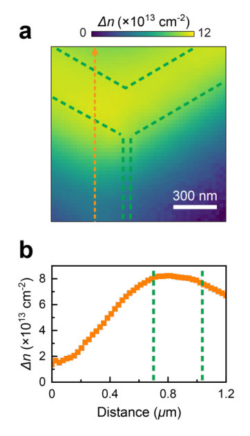
<figcaption class="paper-figure-caption"><b>Fig 3.</b> Fig. 3. Estimation of spatial carrier density profile in a superconducting channel. (a) Carrier density map of the patterned LAO/STO region calculated from the CPD map in Fig. 2e using equation (1). A CPD of 1.024 V was used for the non-patterned area obtained at the bottom left corner of the image in Fig. 2e. (b) Charge density profile across the pattern boundary extracted along the orange dotted line in (a). The statistical uncertainty is less than the symbol size. The estimated pattern boundaries are indicated by green dashed lines.</figcaption>
</figure>
<figure class="paper-figure-card">

<figcaption class="paper-figure-caption"><b>Fig 4.</b> Fig. 4. AFM energy dissipation measurement at LAO/STO interface. (a) AFM Topography image at the end of the 2D channel region of the 4 uc LAO/STO device (see orange box in Fig. 2c). The green dashed lines indicate the estimated patterned boundary. (b) Damping coefficient vs. sample bias curves obtained at the two points marked in (a). The two curves are fit to the form 𝛼∆𝑉2 + 𝛽∆𝑉4 . The ratios of the 4th to 2nd order coefficients, 𝛽/𝛼= (3.85 ± 0.03) 𝑉−2 and (1.84 ± 0.01) 𝑉−2 for curves A and B, respectively. The uncertainty estimates represent one standard deviation derived from the non-linear least squares fits. The measurements in the patterned area have the larger 4th-order components....</figcaption>
</figure>
<figure class="paper-figure-card">
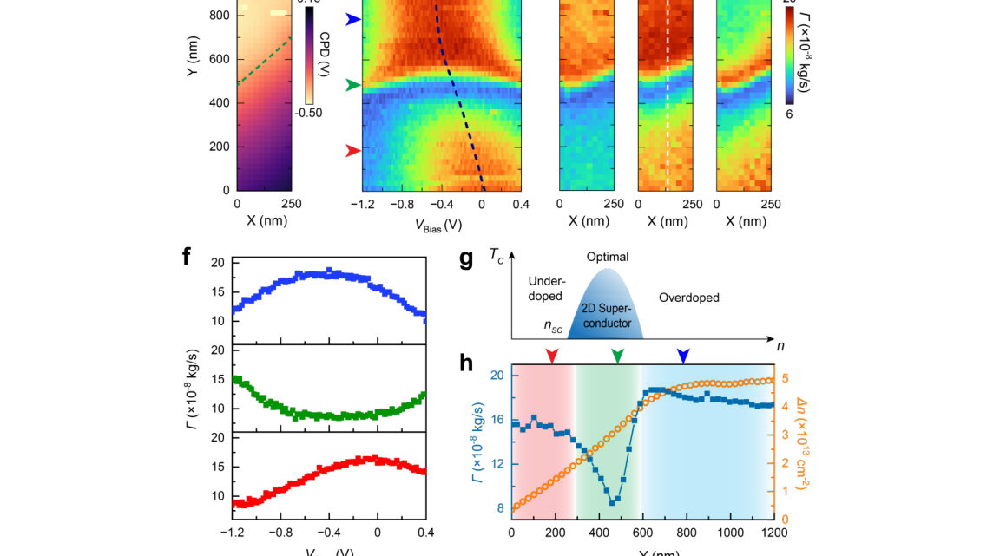
<figcaption class="paper-figure-caption"><b>Fig 5.</b> Fig. 5. Spatial mapping of energy dissipation across a patterned channel boundary. (a) CPD map extracted from ∆𝑓 vs. 𝑉Bias parabolic curves at each grid point in the rectangular region outlined by the dashed yellow line in Fig. 4a. The green dashed lines indicate the estimated patterned boundary. (b) The damping coefficient in the Y vs. VBias plane obtained at 𝑋= 125 nm, obtained from the AFM excitation vs. sample bias data. The dark blue dashed line shows the evolution of the CPD as the spatial map crosses the patterned boundary. (c-e) Spatial maps in the XY plane of the damping coefficient at selected sample biases of -900 mV, -300 mV, and 300 mV, respectively. Note the narrow strip where...</figcaption>
</figure>

**Summary.** This paper demonstrates a way to use atomic force microscopy to locally map superconductivity in oxide interfaces. By measuring energy dissipation at millikelvin temperatures, the authors show that superconductivity in patterned LAO/STO is concentrated in narrow edge channels, providing insight into the nature of quantum confinement in these materials.

**Why it may be interesting.** not directly relevant

Detailed structure

**Main problem.** The study aims to resolve whether superconductivity in patterned LaAlO3/SrTiO3 (LAO/STO) interfaces is two-dimensional or one-dimensional and to provide a local probe for the superconducting state.

**Main result.** The researchers successfully used AFM-based dissipation spectroscopy to locally identify superconducting channels, finding that superconductivity is preferentially localized in ~200 nm wide edge channels.

**Method.** Ultra-low temperature (10 mK) non-contact atomic force microscopy (nc-AFM), dissipation spectroscopy, and Kelvin probe force microscopy (KPFM) were used on patterned nanostructures.

**Model / system.** The system consists of LaAlO3/SrTiO3 (LAO/STO) heterostructures with patterned 2D sheets, 1D nanowires, and waveguides, featuring a tunable 2D electron gas.

**Key observables.** Contact Potential Difference (CPD), frequency shift, energy dissipation (damping coefficient), critical current, and critical magnetic field.

**Important parameters / regimes.** Temperature of 10 mK, magnetic fields up to 15 T, and carrier density variations.

**Figures summary.** Figure 1 shows device fabrication and transport properties; Figure 2 displays AFM topography and CPD maps; Figure 3 shows spatial carrier density profiles; Figure 4 and 5 present dissipation mapping, damping coefficients, and their correlation with the superconducting phase diagram.

**Paper structure.** The paper introduces the patterning technique, demonstrates successful device fabrication and topography, maps the electrostatic potential and carrier density, uses dissipation spectroscopy to identify superconducting signatures, and concludes with a discussion on the spatial distribution of superconductivity and the proximity effect.

Abstract

Superconductivity in strontium titanate has remained enigmatic for more than 50 years. The LaAlO$_3$/SrTiO$_3$ (LAO/STO) heterointerface enables systematic dimensional confinement, from a two-dimensional electron gas to quasi-one-dimensional nanostructures, providing access to this quantum state. Transport measurements in patterned devices reveal puzzling phenomena, including width-independent critical currents and anomalous pairing suggestive of one-dimensional behavior, but direct local probes of the patterned interface and its superconducting response have been lacking. Here we use ultralow-temperature non-contact atomic force microscopy, dissipation spectroscopy, and Kelvin probe force microscopy to locally probe signatures of superconductivity in patterned LAO/STO devices. Spatially resolved energy-dissipation measurements reveal superconducting signatures, with features confined in some devices to edge channels approximately 200 nm wide. Dissipation spectra exhibit a characteristic nonlinear bias dependence that provides a local diagnostic of superconductivity, consistent with the intermediate carrier-density regime near the superconducting dome, and persisting up to the critical field. These results establish atomic force microscopy as a local probe of superconductivity in patterned LAO/STO structures and provide a route to addressing longstanding questions about quantum confinement and transport anomalies in correlated oxide nanostructures.

[↑ back to top](#top)

### [Machine Learning and Molecular Simulations Reveal Mechanisms of ZIFs Polymorph Selection](http://arxiv.org/abs/2604.28106v1)

**Authors:** Emilio Méndez, Rocio Semino  
**Type:** theory · **Category:** disordered systems and neural networks · **PDF:** <https://arxiv.org/pdf/2604.28106v1>  
**Analysis basis:** abstract only; PDF text extraction failed or PDF unavailable

**Summary.** The researchers used machine learning and metadynamics simulations to investigate how different polymorphs of Zn(imidazolate)2 MOFs are selected during synthesis. They discovered that the structural differences leading to specific polymorphs are present as early as the pre-nucleation cluster stage. This provides a new understanding of the mechanistic origins of polymorphism in metal-organic frameworks.

**Why it may be interesting.** not directly relevant

Detailed structure

**Main problem.** Identifying which stage of the solvothermal synthesis process (pre-nucleation clusters vs. amorphous intermediates) determines the final polymorph selection in Zn(imidazolate)2 MOFs.

**Main result.** The study finds that both pre-nucleation clusters and amorphous intermediate structures are polymorph-dependent, suggesting that polymorph selection occurs as early as the pre-nucleation cluster stage.

**Method.** Path collective variable metadynamics simulations using a partially reactive force field, combined with the development and application of neural network classifiers on simulated structural databases.

**Model / system.** Zn(imidazolate)2 metal-organic frameworks (MOFs) undergoing non-classical nucleation via pre-nucleation clusters and amorphous intermediates.

**Key observables.** Structural characteristics of transient and intermediate synthesis structures.

**Assumptions / limitations.** The use of a partially reactive force field to approximate the chemical reactivity during self-assembly.

**Paper structure.** The paper introduces the problem of MOF polymorphism, describes the metadynamics simulation setup and force field, details the construction of structural databases, presents the neural network classification results, and concludes with the implications for polymorph selection timing.

Abstract

Zn(imidazolate)$_2$ metal-organic frameworks (MOFs) exhibit a remarkable degree of polymorphism. Because of their promising industrial applications, many research groups have investigated phase transitions, phase diagram and relative stability of these polymorphs. There is now wide consensus in the research community that these MOFs are solvothermally formed via non-classical nucleation mechanisms, in which pre-nucleation clusters are first formed, followed by an intermediate amorphous structure that subsequently reorganizes to yield the final crystalline MOF. However, no study up to date has uncovered which part of the synthesis process determines the final polymorph obtained. In this work, path collective variable metadynamics simulations performed with a partially reactive force field give insights into mechanistic and thermodynamic aspects of the self-assembly of these MOFs. Databases of transient and intermediate synthesis structures are built from the simulations. By developing and applying neural network classifiers over these databases, it is found that both pre-nucleation clusters and the amorphous intermediate structures are polymorph-dependent. These results suggest that polymorph selection happens as early as the pre-nucleation cluster stage.

[↑ back to top](#top)

### [Multi-scale calculation of light-induced structural changes in low-angle twisted bilayer WSe$_2$](http://arxiv.org/abs/2604.28143v1)

**Authors:** Rafael R. Del Grande, David A. Strubbe  
**Type:** theory · **Category:** other · **PDF:** <https://arxiv.org/pdf/2604.28143v1>  
**Analysis basis:** full PDF text, analyzed in chunks

↔ Scroll figures horizontally

<figure class="paper-figure-card">

<figcaption class="paper-figure-caption"><b>Fig 1.</b> Figure 1: (a) and (b) are the eigenvalues ϵ+ and ϵ−of the strain tensor over the moir´e supercell. (c) atoms displacement field due to relaxation. (d) Strain over the moir´e supercell diagonal. In the AB regions the strain is zero, although it is anisotropic in the AA and SP regions.</figcaption>
</figure>
<figure class="paper-figure-card">
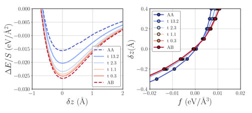
<figcaption class="paper-figure-caption"><b>Fig 2.</b> Figure 2: Left: Total cohesive energy density for AA, AB, and twisted bilayer WSe2 for some angles. Small angles are close to AB stacked case while larger angle cases are close to AA stacking. Right: Interlayer distance change as function of the repulsive force density applied on the bilayer. Forces density are calculated by finite differences using the data from left panel.</figcaption>
</figure>
<figure class="paper-figure-card">

<figcaption class="paper-figure-caption"><b>Fig 3.</b> Figure 3: Bandstructure for bilayer WSe2 under isotropic (left) and anisotropic (right) strain</figcaption>
</figure>
<figure class="paper-figure-card">

<figcaption class="paper-figure-caption"><b>Fig 4.</b> Figure 4: Upper panel: Solid black line: optical absorption, while circles are the exciton transition dipole moment. Color grading goes from blue (interlayer) to red (intralayer) using the intralayer character defined by equation 5. Lower panel: averaged excited state force on layers of bilayer WSe2, (see equation 3). Positive (negative) forces are repulsive (attractive).</figcaption>
</figure>

**Summary.** The researchers developed a multi-scale simulation to explain why light causes larger interlayer expansion in twisted WSe2 compared to untwisted layers. They discovered that twisting weakens the interlayer bond strength and that induced strain enhances repulsive forces from excitons. This work identifies twisted TMDs as highly tunable platforms for studying light-matter interactions.

**Why it may be interesting.** not directly relevant

Detailed structure

**Main problem.** Explaining the microscopic mechanism behind the observed increase in interlayer distance in low-angle twisted bilayer WSe2 when illuminated by light.

**Main result.** The study finds that the combination of a weakened interlayer force constant due to twisting and increased out-of-plane excited state forces (ESF) from in-plane strain explains the enhanced light-induced expansion.

**Method.** A multi-scale approach combining classical force field relaxations (LAMMPS) with ab initio GW/Bethe-Salpeter excited state forces (ESF) calculations.

**Model / system.** Low-angle twisted bilayer WSe2 (specifically 1.1 and 0.3 degree samples) featuring moire supercells with AB, AA, and saddle point regions.

**Key observables.** Interlayer distance change, in-plane strain tensor eigenvalues, exciton transition dipole moments, and excited state force density.

**Important parameters / regimes.** Laser energy of 2.4 eV, fluence of 330 uJ/cm2, exciton concentration of ~8.6 x 10^13 excitons/cm2, and interlayer distance change of 0.1-0.2 A.

**Assumptions / limitations.** The large AB regions in low-angle twisted bilayers can be approximated as periodic AB-stacked 2L WSe2; anisotropic strain in AA/SP regions has negligible effect on electronic properties due to zero trace.

**Figures summary.** Figure 1 shows strain tensors and atomic displacement fields; Figure 2 shows cohesive energy density and interlayer distance change vs force density; Figure 3 shows bandstructures under strain; Figure 4 shows optical absorption and exciton dipole moments with intralayer/interlayer character.

**Paper structure.** The paper introduces the problem of light-induced structural changes, describes the multi-scale computational methodology, presents results on atomic reconstruction and strain, analyzes the nature of excited state forces, and concludes by synthesizing the mechanism.

Abstract

Exciton-phonon interactions in transition metal dichalcogenides (TMD) are strong and lead to phenomena such as coherent phonon generation. When stacked and twisted, their properties can be tuned by the twisting angle. In experiments with 1.1$^\circ$ twisted 2L WSe$_2$, a change of 0.1 Å in the interlayer distance was observed when light was shone on this material, and here we explain the microscopic mechanism behind this. Theoretical works to study such systems are limited because the Moiré unit cell is too large. To overcome this, we combined classical force field relaxations with our implementation of ab initio GW/Bethe-Salpeter excited state forces (ESF). From the relaxations we found that the low-angle twisting induced an in-plane strain field, the AB regions are large enough to be simulated as periodic AB stacked 2L WSe2, and the interlayer force constant becomes softer in relation to the perfect AB stacking. From the ab initio ESF we obtained that the in-plane strain increases the out of plane ESFs. Those two effects combined, the weakening of the interlayer force constant and strain dependence of the ESF, make light-induced changes in the interlayer distance of twisted 2L WSe2 stronger than in the perfectly stacked case, in agreement with experimental observations. Therefore, our results show that the exciton-phonon interactions can be tuned in twisted 2L TMDs and can be observed experimentally, which makes those materials excellent platforms to study light-induced changes in materials.

[↑ back to top](#top)

### [Observation of the Magnus Nonlinear Hall effect from Chiral Weyl Monopoles](http://arxiv.org/abs/2604.28091v1)

**Authors:** Heda Zhang, Nikolai Peshcherenko, Ning Mao, Nianlong Zou, Jiaqiang Yan, Claudia Felser, Yang Zhang  
**Type:** both · **Category:** other · **PDF:** <https://arxiv.org/pdf/2604.28091v1>  
**Analysis basis:** abstract only; PDF text extraction failed or PDF unavailable

**Summary.** The researchers observed a nonlinear Hall effect in the chiral Weyl semimetal CoSi, even though the standard Berry curvature dipole is forbidden by symmetry. They found that the effect arises from the skew scattering of electron wave packets due to Berry monopoles, a process analogous to the classical Magnus effect. This discovery provides a new way to probe topological features in high-symmetry materials.

**Why it may be interesting.** not directly relevant

Detailed structure

**Main problem.** Exploring mechanisms for the nonlinear Hall effect (NLHE) in high-symmetry chiral lattices where the Berry curvature dipole is symmetry-forbidden.

**Main result.** Observation of a robust NLHE in the chiral Weyl semimetal CoSi, attributed to the skew scattering of self-rotating electron wave packets driven by Berry monopoles.

**Method.** Experimental detection using focused ion beam-fabricated crossbar devices combined with theoretical analysis of skew scattering and topological transport.

**Model / system.** The chiral Weyl semimetal CoSi, characterized by its topological Weyl nodes and a crystal symmetry that forbids the Berry curvature dipole.

**Key observables.** Second-harmonic Hall voltage, temperature-dependent sign reversal, and linearly field-dependent modulation of the NLHE signal.

**Important parameters / regimes.** Carrier mobility, temperature, and magnetic field strength.

**Assumptions / limitations.** The nonlinear Hall conductivity is driven by the skew scattering of self-rotating electron wave packets.

**Paper structure.** Introduction to NLHE and symmetry constraints, experimental setup using FIB-fabricated devices, observation of second-harmonic Hall voltage, theoretical derivation of the Magnus-like skew scattering mechanism, and analysis of temperature and field dependence.

Abstract

The nonlinear Hall effect (NLHE) connects crystalline symmetry to quantum geometry, offering a probe of band topology beyond linear transport. While most studies have focused on the Berry curvature dipole in low-symmetry crystals, mechanisms that directly probe Berry monopoles in higher-symmetry chiral lattices remain unexplored. Here, we report the observations of the NLHE in the chiral Weyl semimetal CoSi, a platform where the Berry curvature dipole is symmetry-forbidden. By employing focused ion beam-fabricated crossbar devices, we detect a robust second-harmonic Hall voltage under zero magnetic field, hosting all key signatures of the NLHE. Theoretical analysis attributes the nonlinear Hall conductivity to skew scattering of self-rotating electron wave packets, whose chirality is dictated by the underlying band topology, a process reminiscent of the classical Magnus effect. Furthermore, the NLHE signal exhibits a temperature-dependent sign reversal, and a strong, linearly field-dependent modulation that grows with carrier mobility, directly reflecting the topological Weyl nodes distribution near the Fermi level. These findings establish CoSi as a platform for Berry monopole-driven nonlinear transport, demonstrating a skew-scattering route to topological nonlinear Hall responses that bypasses conventional symmetry constraints.

[↑ back to top](#top)

### [On Linear and Non-Linear Mechanics of Cyanobacterial Colonies](http://arxiv.org/abs/2604.27760v1)

**Authors:** Yuri Z. Sinzato, Annemieke M. Drost, Dedmer B. Van de Waal, Robert Uittenbogaard, Petra M. Visser, Jef Huisman, Maziyar Jalaal  
**Type:** experiment · **Category:** other · **PDF:** <https://arxiv.org/pdf/2604.27760v1>  
**Analysis basis:** abstract only; PDF text extraction failed or PDF unavailable

**Summary.** This paper investigates the mechanical strength of toxic cyanobacterial colonies using micropipette force sensors and rheology. It finds that these colonies are highly resistant to natural water mixing and that low phosphorus levels actually increase their structural strength. This work provides a physical basis for understanding how blooms persist in various environmental conditions.

**Why it may be interesting.** not directly relevant

Detailed structure

**Main problem.** The study aims to quantify the linear and non-linear biomechanical properties of Microcystis cyanobacterial colonies and understand how nutrient availability affects their structural integrity.

**Main result.** The colonies exhibit high tensile strength and yield stress, making them resistant to fragmentation by natural hydrodynamic stresses, and low phosphorus availability leads to stronger colonies.

**Method.** The researchers used micropipette force sensors for single-cell resolution mechanical quantification and bulk shear rheology to probe macroscopic properties.

**Model / system.** The system consists of Microcystis cyanobacterial colonies held together by a matrix of extracellular polymeric substances (EPS).

**Key observables.** Tensile strength, yield stress, and linear/non-linear mechanical properties.

**Important parameters / regimes.** Nutrient availability (specifically phosphorus levels) and hydrodynamic stresses from wind-mixed lakes.

**Paper structure.** The paper introduces the environmental importance of cyanobacterial blooms, describes the experimental setup using micropipette sensors and rheology, presents the mechanical findings, discusses the impact of nutrient levels, and concludes with the utility of mechanical testing in studying colony formation.

Abstract

Toxic cyanobacterial blooms are a growing environmental concern that affects freshwater ecosystems, drinking water supplies, and public health. The cyanobacterium Microcystis is among the most important bloom forming species. It often grows in large colonies, which enhances its flotation, reduces grazing, and improves nutrient regulation. Microcystis cells are held together by a matrix of extracellular polymeric substances (EPS), making colony mechanics crucial for bloom formation. However, an analysis of the biomechanical properties of cyanobacterial colonies, and how these properties relate to environmental conditions like nutrient availability, remains largely missing. Here, we use micropipette force sensors to quantify the linear and non-linear mechanical properties of individual colonies at single-cell resolution. Bulk shear rheology complements these measurements by probing macroscopic properties. The measured tensile strength and yield stress are broadly comparable to those of bacterial biofilms and are far greater than the hydrodynamic stresses typically found in wind-mixed lakes. This implies that cyanobacterial colonies are highly resistant to fragmentation by natural mixing processes. We also show that low nutrient availability, particularly low phosphorus, produced stronger colonies, suggesting structural changes in the EPS. Overall, our results establish mechanical testing as a tool for a more complete and physically grounded understanding of cyanobacterial colony formation.

[↑ back to top](#top)

### [Phase Stability of Superfluid $^{3}\mathrm{He}$ in Anisotropic Aerogel](http://arxiv.org/abs/2604.27098v1)

**Authors:** J. W. Scott, D. Park, X. Yuan, W. P. Halperin  
**Type:** both · **Category:** disordered systems and neural networks · **PDF:** <https://arxiv.org/pdf/2604.27098v1>  
**Analysis basis:** full PDF text, analyzed in chunks

↔ Scroll figures horizontally

<figure class="paper-figure-card">
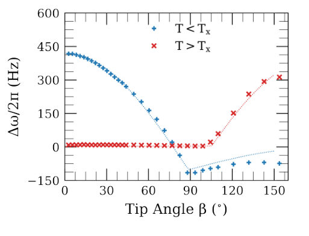
<figcaption class="paper-figure-caption"><b>Fig 1.</b> FIG. 1. Tip angle dependence of NMR precession frequency shift. The two possible modes are ˆn ∥H0 (red) and ˆn ∦H0 (blue) above and below Tx at T/Tc = 0.71 and T/Tc = 0.84 temperatures respectively, in 16% positive strain aerogel[12]. Crosses are experimental data at P = 26.5 bar, H0 = 74.4 mT. Dashed lines represent theoretical calculations incorpo- rating order parameter distortion[13, 14].</figcaption>
</figure>
<figure class="paper-figure-card">
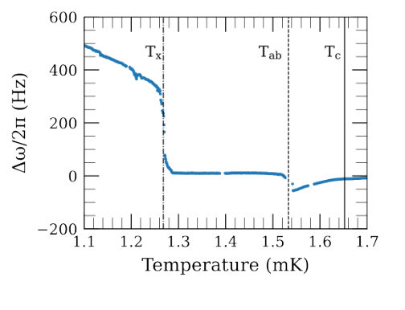
<figcaption class="paper-figure-caption"><b>Fig 2.</b> FIG. 2. Temperature dependence of the NMR resonance fre- quency shift in 16% positive strain aerogel in the B phase at P = 26.5 bar, H0 = 74.5 mT at tip angle β ≈0. The transi- tion Tx from ˆn ∦H0 to ˆn ∥H0 occurs near 1.26 mK.</figcaption>
</figure>
<figure class="paper-figure-card">
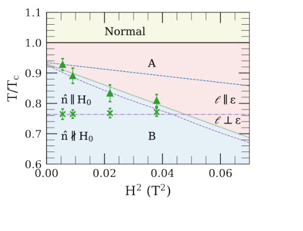
<figcaption class="paper-figure-caption"><b>Fig 3.</b> FIG. 3. Phase Diagrams for TAB and flop temperature Tx dependence on magnetic field in 16% positive strain aerogel at 26.5 bar, experiment and theory, with the A-phase shaded red and B-phase blue. A fit to the H2 dependence of experimen- tally measured TAB is given by the green dotted line. TAB with weak coupling βi and Tc,∥/Tc,⊥= 0.96 is shown with the blue line[22]. Strong-coupling βi with Tc,∥/Tc,⊥= 0.99 is given by the purple dashed line[22–24]. The flop transition temperature Tx is shown with a purple dash-dot line. Exper- imental TAB is shown with the green triangles, Tx with green crosses.</figcaption>
</figure>
<figure class="paper-figure-card">
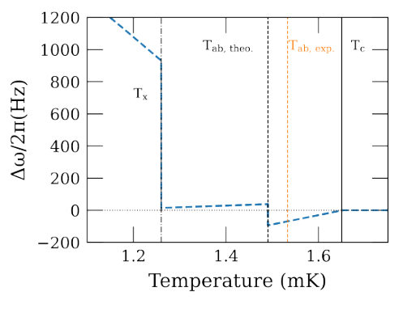
<figcaption class="paper-figure-caption"><b>Fig 4.</b> FIG. 4. Calculated small tip angle (β = 0) NMR frequency shifts ∆ω/2π as a function of temperature for the phase di- agram at H0 = 0.0745 T, P = 26.6 bar, strong coupling βi. The experimentally measured Tab is shown in orange, while the calculated Tab is shown in black. The linear extrapola- tion of the GL coefficent α to α(Tx) based on the pressure dependence of Tc over estimates the frequency shift at low temperatures.</figcaption>
</figure>
<figure class="paper-figure-card">

<figcaption class="paper-figure-caption"><b>Fig 5.</b> FIG. 5. Pressure P dependence of Tx in preplated and non-preplated positive strain (green preplated 16% positive strained, blue non-preplated 14% positive strain) and nega- tive strain (red non-preplated, orange preplated) aerogels[5, 38, 39]. The pure coherence length, appearing in Eq.3 is a well-established function of pressure[40]. The positive slopes d(Tx/Tc0)/dP are not compatible with the pair breaking pa- rameter x for either the homogeneous or inhomogeneous scat- tering models[22, 33]. The black dotted line corresponds to the prediction for the anisotropic IISM model given by equa- tion Eq. 3 for the data point taken in preplated 16% positively strained aerogel at P ≈26.5, bar.</figcaption>
</figure>

**Summary.** This paper investigates how anisotropic disorder in silica aerogel affects the phase stability and orientation of the superfluid 3He order parameter. By using NMR spectroscopy and Ginzburg-Landau theory, the authors demonstrate a temperature-dependent reorientation transition (Tx) of the spin-orbit axis. The results provide a framework for understanding how structural anisotropy influences the symmetry-breaking properties of p-wave superfluids.

**Why it may be interesting.** The study explores how quenched disorder and anisotropy can manipulate the broken symmetry states and topological degrees of freedom in a superfluid, which is relevant to understanding symmetry-breaking in many-body systems.

Detailed structure

**Main problem.** Understanding the phase stability and the mechanism behind the spontaneous reorientation transition (Tx) of the vector degrees of freedom in superfluid 3He within anisotropic silica aerogel.

**Main result.** The study identifies a sharp, field-independent transition at Tx where the spin-orbit rotation axis (n) reorients, driven by the temperature-dependent anisotropy of the pairing amplitudes.

**Method.** Nuclear Magnetic Resonance (NMR) spectroscopy was used to measure frequency shifts and tip angle dependence, which were then compared to an anisotropic Ginzburg-Landau model.

**Model / system.** The system consists of superfluid 3He (a spin-triplet p-wave superfluid) impregnated in uniformly strained silica aerogel. The theoretical framework is an anisotropic Ginzburg-Landau model including quadratic and fourth-order invariants and Zeeman energy.

**Key observables.** NMR frequency shifts (delta omega), tip angle (beta), transition temperature (Tx), and the orientation of the n and l vectors.

**Important parameters / regimes.** Strain axis (epsilon), spin-orbit rotation axis (n), orbital chiral axis (l), pair-breaking parameter (x), and dipole field (HD).

**Assumptions / limitations.** Assumes a linear temperature dependence for the pairing amplitudes (alpha_perpendicular and alpha_parallel) and applies strong-coupling corrections to the GL coefficients.

**Figures summary.** Figure 4 shows calculated NMR frequency shifts versus temperature compared to experimental data; Figure 5 shows the pressure dependence of the transition temperature ratio Tx/Tc0.

**Paper structure.** The paper introduces the problem of vector reorientation in aerogel, describes the experimental NMR setup and aerogel strain, presents the Ginzburg-Landau modeling of the phase stability, and concludes with a discussion on the pressure dependence and limitations of the model in non-preplated aerogels.

Abstract

The A and B phases of superfluid 3 He have vector degrees of freedom that reflect their characteristic broken symmetries, respectively chiral and spin-orbit rotation axes. Anisotropic disorder in the superfluid, imbibed in uniformly strained silica aerogel, orients these degrees of freedom, thereby affecting phase stability. These degrees of freedom have been found to spontaneously reorient at a field-independent transition temperature Tx , that can be accounted for with a temperature dependent anisotropic Ginzburg-Landau model.

[↑ back to top](#top)

### [Phase-Transition Induced Domain Evolution and Magnetization Dynamics in FePt/FeRh Bilayers for Efficient Heat-Assisted Magnetic Recording](http://arxiv.org/abs/2604.27370v1)

**Authors:** Saroj K. Mishra, Y. Sasaki, S. Isogami, I. Suzuki, Keerthana P, J. Mohanty, Y. K. Takahashi  
**Type:** experiment · **Category:** statistical mechanics · **PDF:** <https://arxiv.org/pdf/2604.27370v1>  
**Analysis basis:** abstract only; PDF text extraction failed or PDF unavailable

**Summary.** The study demonstrates that using FePt/FeRh bilayers can significantly reduce the coercivity of magnetic media during heating. This is achieved through the phase transition of FeRh, which enhances domain wall mobility via interfacial coupling. This mechanism offers a path toward more energy-efficient magnetic recording technologies.

**Why it may be interesting.** not directly relevant

Detailed structure

**Main problem.** Reducing the power consumption and thermal load required for Heat-Assisted Magnetic Recording (HAMR) by lowering the coercivity of L10 FePt media.

**Main result.** FePt/FeRh bilayers exhibit a 40% reduction in coercivity between 300 K and 400 K due to phase-transition-induced domain wall mobility and interfacial exchange coupling, rather than intrinsic anisotropy softening.

**Method.** Magnetometry, temperature-dependent Magnetic Force Microscopy (MFM), and Time-Resolved Magneto-Optical Kerr Effect (TR-MOKE) measurements.

**Model / system.** FePt/FeRh bilayers, specifically focusing on the interaction between the ferromagnetic FePt layer and the antiferromagnetic-to-ferromagnetic phase transition of the FeRh layer near 350 K.

**Key observables.** Coercivity (Hc), domain size, phase contrast, and effective anisotropy field.

**Important parameters / regimes.** Temperature range (300 K to 400 K), FeRh phase transition temperature (~350 K), and anisotropy field modification (0.4 T).

**Figures summary.** The figures likely show magnetometry data comparing coercivity in bilayers vs single layers, MFM images capturing domain evolution, and TR-MOKE data showing the stability of the anisotropy field.

**Paper structure.** Introduction to HAMR challenges, description of the FePt/FeRh bilayer system, presentation of magnetometry results, analysis of domain evolution via MFM, investigation of anisotropy via TR-MOKE, and conclusion on the switching mechanism.

Abstract

Achieving ultrahigh recording densities with low power consumption is a central challenge for next generation heat assisted magnetic recording (HAMR), as conventional L10 FePt media require intense laser heating due to their high coercivity (Hc) and high Curie temperature (700 K). Here, we address this issue using FePt/FeRh bilayers, where the antiferromagnetic to ferromagnetic transition of FeRh near 350 K generates strong interfacial exchange coupling that assists magnetization switching in the FePt layer. Magnetometry measurements reveal a 40% reduction in Hc from 300 K to 400 K in the bilayer, compared to only 8% in single layer FePt. Temperature dependent MFM directly captures phase transition induced domain evolution, showing a 30% reduction in domain size and enhanced phase contrast. TR-MOKE measurements reveal only a minor (0.4 T) modification of the effective anisotropy field during phase transition, confirming that the intrinsic anisotropy of FePt remains largely preserved. These results demonstrate that the reduction in Hc in FePt/FeRh bilayers is primarily governed by phase transition induced domain wall mobility coupled with interfacial magnetic interactions, rather than by intrinsic anisotropy softening. This mechanism provides a pathway toward efficient magnetization switching under reduced thermal load, making FePt/FeRh heterostructures promising candidates for advanced HAMR media.

[↑ back to top](#top)

### [Polar Topologies in a Ferroelastic Metal Membrane](http://arxiv.org/abs/2604.28120v1)

**Authors:** Rahil Haria, Noah Schnitzer, T. Ben Britton, Yaqi Li, Tom J. P. Irons, Sophia Linssen Pitsaros, Ella Banyas, Geri Topore, Annabel Hoyes, Mariana Palos, Sinead M. Griffin, Katherine Inzani, Michele Shelly Conroy  
**Type:** both · **Category:** other · **PDF:** <https://arxiv.org/pdf/2604.28120v1>  
**Analysis basis:** abstract only; PDF text extraction failed or PDF unavailable

**Summary.** The researchers demonstrate that releasing SrRuO3 films from their substrates creates a hierarchy of ferroelastic domains that spontaneously generate polar textures. By using advanced microscopy, they show that electric polarization emerges at specific structural boundaries, providing a robust platform for engineering polar textures in metals.

**Why it may be interesting.** not directly relevant

Detailed structure

**Main problem.** The rarity of polar metals due to electron screening and the challenge of engineering stable polar textures in conducting materials.

**Main result.** Releasing epitaxial SrRuO3 films from substrates drives ferroelastic domain refinement and generates two distinct classes of emergent polar textures at antiphase boundaries and 90-degree walls.

**Method.** Correlative microscopy combining mesoscale electron channelling contrast imaging (ECCI) and atomic-resolution scanning transmission electron microscopy (STEM), supported by ab initio calculations.

**Model / system.** Freestanding/membrane-form epitaxial SrRuO3 (strontium ruthenate) films, specifically focusing on ferroelastic domain structures and antiphase boundaries.

**Key observables.** Electric polarisation, tilt field interpolation (Neel-like and Ising-like), and domain length scales.

**Important parameters / regimes.** Domain scales ranging from micrometre to nanometre; 4 nm polar nanoclusters.

**Paper structure.** The paper introduces the concept of polar metals, describes the experimental process of releasing SrRuO3 films, details the microscopy results showing polar textures at boundaries, provides theoretical corroboration via ab initio calculations, and concludes with the implications for metal oxide membranes.

Abstract

Polar metals, materials in which electric polarisation and metallicity coexist, are exceptionally rare because itinerant electrons screen long-range dipoles and favour centrosymmetric structures. Engineering polar textures in a conducting magnet holds promise for reconfigurable spin orbit coupling and magnetoelectric functionality. Here we show that releasing epitaxial SrRuO3 films from their substrates drives a hierarchy of ferroelastic domain refinement from micrometre to nanometre length scales, and that this structural reorganisation spontaneously generates two distinct classes of emergent polar texture that are ubiquitous across the freestanding membrane. Using correlative microscopy from mesoscale electron channelling contrast imaging (ECCI) to atomic resolution scanning transmission electron microscopy (STEM), we demonstrate that electric polarisation emerges selectively at translation-inequivalent antiphase boundaries (APBs). At these boundaries multicomponent aac tilt field undergoes Neel-like interpolation that preserves the in-phase tilt component and amplifies roto flexoelectric coupling, while translation-equivalent boundaries remain nonpolar. The Neel like interpolation at hard APBs and Ising like collapse of all tilt components at easy APBs is corroborated with ab initio calculations. While embedded 90 ferroelastic walls provide an additional mechanistically distinct source of electric polarisation resulting in polar nanoclusters (4 nm). These distinct nanotextures at 90 walls from via elastic accommodation of strain mismatch between variants and rotostriction as the tilt field interpolates across the boundaries. These findings show that, in a membrane form, metal oxides provide a robust platform for hosting nanoscale ferroelastic domains that generate polar textures.

[↑ back to top](#top)

### [Practical Insights to Thin Film Dewetting](http://arxiv.org/abs/2604.27192v1)

**Authors:** Karim Gadelrab, Stefan Reimann-Zitz  
**Type:** theory · **Category:** other · **PDF:** <https://arxiv.org/pdf/2604.27192v1>  
**Analysis basis:** abstract only; PDF text extraction failed or PDF unavailable

**Summary.** This paper uses lattice Boltzmann simulations to study how various physical parameters control the rupture and coarsening of thin liquid films. It provides predictive scaling laws and identifies a stable coverage plateau, offering practical guidance for engineering robust coatings.

**Why it may be interesting.** not directly relevant

Detailed structure

**Main problem.** Quantifying how film thickness, surface energy, wettability, and intermolecular forces govern the kinetics and long-time morphology of thin film dewetting.

**Main result.** Identification of master-curve scalings for dewetting time, showing power-law sensitivity to thickness, and discovery of a coverage plateau that provides a window for morphological stabilization.

**Method.** Lattice Boltzmann method (LBM) simulations implemented within a lubrication-theory framework.

**Model / system.** Thin liquid films undergoing instability and rupture dynamics, governed by surface energy, wettability, and intermolecular forces.

**Key observables.** Time to dewet, film coverage plateau, domain density, and coarsening scaling laws.

**Important parameters / regimes.** Film thickness, surface energy, wettability (contact angle), and intermolecular forces.

**Assumptions / limitations.** The dynamics are modeled using lubrication theory and the lattice Boltzmann method.

**Paper structure.** The paper presents a systematic quantification of dewetting kinetics and morphology using LBM simulations, identifying scaling laws and a stabilization window.

Abstract

Thin liquid films exhibit rich instability and rupture dynamics that critically impact coating performance across many applications. In this work, we use the lattice Boltzmann method (LBM) simulations within a lubrication-theory framework to systematically quantify how film thickness, surface energy, wettability, and intermolecular forces govern dewetting kinetics and long-time morphology. Master-curve scalings are identified for the time to dewet, revealing a strong power-law sensitivity to film thickness and a comparatively weak dependence on moderate variations in the contact angle. Following rupture, the film reaches a physically meaningful coverage plateau, whose magnitude correlates with material parameters and provides a practical window for morphological stabilization prior to coarsening. Long-time evolution obeys classical coarsening scaling laws, with surface energy controlling domain density. These results demonstrate that lubrication-based models can deliver predictive design guidance for evaluating coating robustness and forming materials and surface engineering strategies. Source code is available at https://github.com/Zitzeronion/Swalbe.jl.

[↑ back to top](#top)

### [Propulsion and far-field hydrodynamics of linked-sphere microswimmers with viscoelastic deformability](http://arxiv.org/abs/2604.27348v1)

**Authors:** Vimal Singh, Akash Choudhary  
**Type:** theory · **Category:** other · **PDF:** <https://arxiv.org/pdf/2604.27348v1>  
**Analysis basis:** abstract only; PDF text extraction failed or PDF unavailable

**Summary.** This paper studies how the viscoelasticity of a microswimmer's body influences its ability to move under reciprocal motion. It compares two different sphere-link configurations and shows that the frequency of motion can control both the speed and the direction of swimming. The study also details how these swimmers influence the surrounding fluid through dipolar and quadrupolar flow patterns.

**Why it may be interesting.** not directly relevant

Detailed structure

**Main problem.** Investigating how viscoelastic deformability affects the propulsion and far-field hydrodynamics of microswimmers driven by reciprocal actuation.

**Main result.** The 3-sphere design shows an optimal actuation frequency, while the 4-sphere design features a critical frequency where locomotion direction reverses; far-field flows are characterized by dipolar and quadrupolar contributions.

**Method.** Theoretical modeling of microswimmer dynamics using Kelvin-Voigt viscoelasticity and hydrodynamic analysis of far-field flow signatures.

**Model / system.** Two linked-sphere microswimmer designs: a 3-sphere design with actuation at one end and a 4-sphere design with actuation at the midpoint, both featuring a passive viscoelastic body.

**Key observables.** Kinematic performance (propulsion velocity), locomotion direction, and far-field hydrodynamic signatures (dipolar and quadrupolar flow contributions).

**Important parameters / regimes.** Actuation frequency, relative length of the actuator segment, and viscoelastic properties (Kelvin-Voigt model).

**Assumptions / limitations.** The passive body follows Kelvin-Voigt viscoelastic deformability; actuation is reciprocal.

**Paper structure.** Introduction to viscoelastic microswimmers, description of the 3-sphere and 4-sphere models, analysis of kinematic performance under frequency variation, and characterization of far-field hydrodynamic flow fields.

Abstract

Viscoelasticity governs the locomotion strategies of deformable microorganisms, rendering it a fundamental mechanical property of microbial motility and an integral component in the design of envisioned microbots. Recent studies have shown that it can enable effective propulsion through non-reciprocal body deformations, even under time-reversible actuation. In this work, we investigate the dynamics of model microswimmers driven by reciprocal actuation, wherein the passive body exhibits viscoelastic deformability. We consider two linked-sphere designs, distinguished by the location of actuation: applied at one end (3-sphere design) or at the midpoint of the swimmer body (4-sphere design). Adopting Kelvin-Voigt deformability, we characterize the kinematic performance of both designs: the three-sphere swimmer possesses an optimal actuation frequency, while the four-sphere swimmer exhibits a critical frequency at which the locomotion direction reverses. We examine the swimmer's far-field hydrodynamic signature and find that resulting flow field is characterized by dominant dipolar and quadrupolar contributions, whose magnitudes are sensitive to the relative length of the actuator segment.

[↑ back to top](#top)

### [Quantifying Thermal, Photovoltage, and Defect Contributions to Transient Absorption of Ta$_{3}$N$_{5}$ Photoanodes](http://arxiv.org/abs/2604.28094v1)

**Authors:** Johannes Dittloff, Lukas M. Wolz, Matthias U. Quintern, Laura I. Wagner, Matthias Kuhl, Johanna Eichhorn, Ian D. Sharp  
**Type:** experiment · **Category:** other · **PDF:** <https://arxiv.org/pdf/2604.28094v1>  
**Analysis basis:** full PDF text, analyzed in chunks

↔ Scroll figures horizontally

<figure class="paper-figure-card">
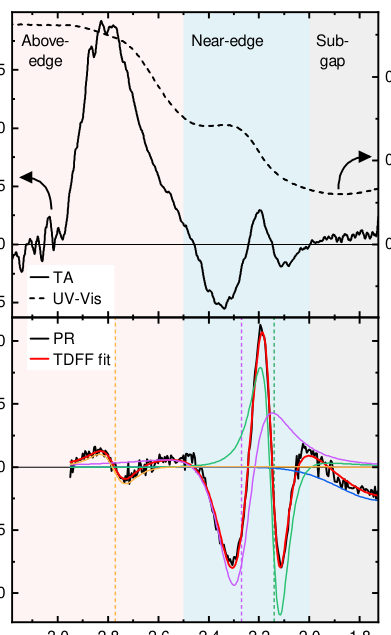
<figcaption class="paper-figure-caption"><b>Fig 1.</b> FIG. 1. (a) Ground-state absorption spectrum of the Ta3N5/TiN thin film (right axis) and transient absorption (TA) spectrum recorded at a pump-probe delay of 1 µs following 355 nm pulsed excitation with a 1 mJ cm−2</figcaption>
</figure>
<figure class="paper-figure-card">
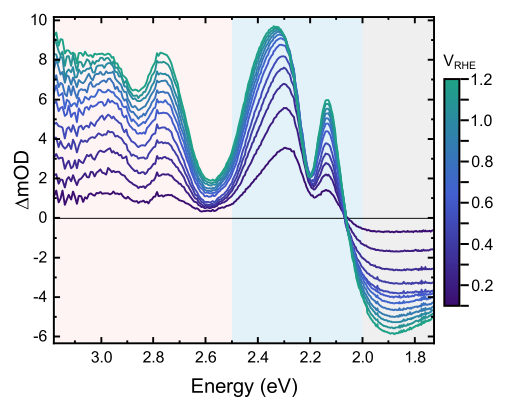
<figcaption class="paper-figure-caption"><b>Fig 2.</b> FIG. 2. Potential-dependent UV-Vis (P-UV-Vis) spectra of a Ta3N5 working electrode, recorded in trans- mission geometry in a three-electrode electrochemical cell as a function of the applied electrochemical potential, which was swept from 0.0 to 1.2 VRHE with a 0.1 V step size in 1 M pH 12.3 KPi buffer. Data are referenced to the spectrum recorded at 0.0 VRHE. The near-edge region exhibits two field-induced absorption features near 2.10 eV and 2.35 eV that grow with increasing anodic bias, consistent with an electroabsorp- tion response arising from widening of the near-surface depletion region. A broad sub-gap bleach below 2.0 eV is assigned to bias-induced change of defect charge states...</figcaption>
</figure>
<figure class="paper-figure-card">
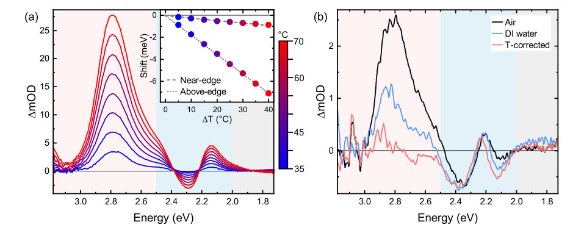
<figcaption class="paper-figure-caption"><b>Fig 3.</b> FIG. 3. (a) Temperature-dependent UV-Vis (T-UV-Vis) spectra of a Ta3N5 thin film recorded in transmission geometry as a function of temperature, stepped from 30 ◦C to 70 ◦C. Data are referenced to the spectrum recorded at 30 ◦C. A pronounced positive feature near 2.80 eV grows with increasing temperature, closely resembling the dominant above-edge photo-induced absorption observed in TA. The inset shows the re- constructed thermally induced critical point shift for the above-edge and near-edge region. (b) Influence of pump-induced lattice heating on the TA spectrum of Ta3N5. A TA spectrum recorded in air (black) is compared to one recorded with Ta3N5 in DI water (blue), where the higher...</figcaption>
</figure>
<figure class="paper-figure-card">
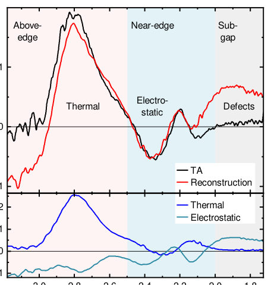
<figcaption class="paper-figure-caption"><b>Fig 4.</b> FIG. 4. TA spectrum of Ta3N5 recorded at a pump-probe delay of 1 µs (black, upper panel) together with the reconstructed spectrum obtained by co-fitting independently measured T-UV-Vis and P-UV-Vis com- ponents (red, upper panel). The individual thermal (blue) and electrostatic (teal) components are shown in the lower panel. Good agreement between the measured and reconstructed spectra is observed across the near- and above-edge spectral range, indicating that pump-induced lattice heating and transient band flattening dominate the visible TA response of Ta3N5. Deviations between the measured and reconstructed spectra below 2.15 eV are ascribed to contributions from non-equilibrium charge...</figcaption>
</figure>
<figure class="paper-figure-card">
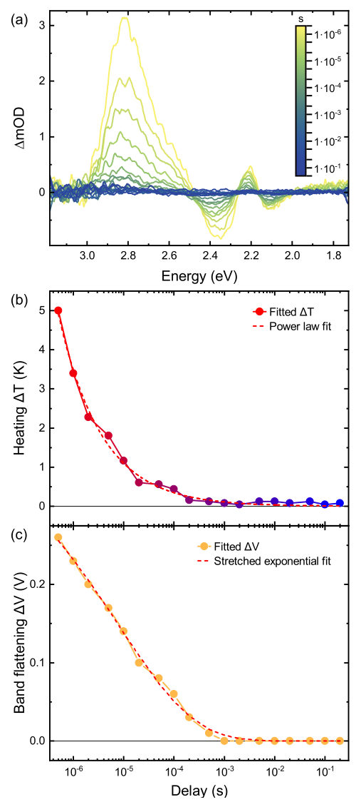
<figcaption class="paper-figure-caption"><b>Fig 5.</b> FIG. 5. (a) Full TA time delay series of a Ta3N5 thin film recorded with a pump fluence of 0.83 mJ cm−2</figcaption>
</figure>

**Summary.** This paper provides a method to disentangle overlapping physical processes in the transient optical response of semiconductor photoanodes. By quantifying thermal, electrostatic, and defect contributions, the researchers resolved long-standing ambiguities in the carrier dynamics of Ta3N5. This approach offers a template for interpreting complex transient signals in functional semiconductor materials.

**Why it may be interesting.** not directly relevant

Detailed structure

**Main problem.** The ambiguity in assigning spectral features in the transient absorption (TA) spectra of Ta3N5 photoanodes due to overlapping contributions from lattice heating, electrostatics, and defect states.

**Main result.** The authors successfully decomposed the TA spectra into quantifiable thermal, electrostatic, and defect-mediated components, identifying a previously unreported photo-induced absorption at 2.80 eV as a thermal effect.

**Method.** A combination of microsecond-to-second transient absorption spectroscopy, photoreflectance, temperature-dependent UV-Vis, and potential-dependent UV-Vis spectroscopy, using an iterative fitting algorithm to decouple the signals.

**Model / system.** Polycrystalline Ta3N5 thin-film photoanodes prepared via reactive magnetron sputtering and ammonolysis, featuring anisotropic band structure and defect states (nitrogen vacancies and oxygen impurities).

**Key observables.** Transient absorption (TA) spectra, photoreflectance (PR) critical points, surface photovoltage (SPV) relaxation, and temperature-dependent/potential-dependent absorption changes.

**Important parameters / regimes.** Microsecond to second (us-s) timescale; 2.14 eV, 2.27 eV, and 2.80 eV transition energies; 355 nm pump wavelength; 30-70 C temperature range.

**Assumptions / limitations.** Assumed complete absorption of the pump pulse and assumed specific heat capacity for Ta3N5 to estimate thermal-induced temperature rise.

**Figures summary.** Figure 1 shows ground-state absorption and TA spectra with identified spectral regimes; Figure 2 displays potential-dependent UV-Vis spectra; Figure 3 illustrates temperature-dependent UV-Vis and the thermal origin of the 2.80 eV feature; Figure 5 shows the TA time delay series.

**Paper structure.** The paper begins by identifying the ambiguity in TA spectra, then details the experimental setup and characterization of Ta3N5 films, proceeds to present the spectroscopic measurements (PR, T-UV-Vis, P-UV-Vis), describes the iterative decomposition algorithm, and concludes by validating the reconstructed components against physical models of heat diffusion and band bending.

Abstract

Ta$_{3}$N$_{5}$ is among the most intensively studied photoanode materials for solar-driven water oxidation, yet its performance often remains limited by short carrier lifetimes and defect mediated recombination. Although transient absorption spectroscopy is widely used to probe carrier dynamics in photoelectrodes, spectral assignments are frequently ambiguous due to overlapping contributions. Here, microsecond-to-second transient absorption of Ta$_{3}$N$_{5}$ thin films is combined with complementary optical spectroscopies to disentangle contributions from lattice heating, electrostatics, and defect states. Photoreflectance reveals three critical points in the Ta$_{3}$N$_{5}$ band structure, including two anisotropic near-edge transitions at 2.14 eV and 2.27 eV and a higher-lying transition near 2.80 eV, all closely aligned with dominant transient absorption features. A previously unreported photo-induced absorption at 2.80 eV is attributed to pump-induced lattice heating, while potential-dependent measurements reveal that near-edge bleach features arise from pump-induced band flattening and subsequent surface photovoltage relaxation. Fitting transient absorption spectra with independently measured thermal and electrostatic components enables quantification of both thermal and photovoltage dynamics, while the sub-bandgap response provides insight into the redistribution of defect charge states. Thus, this approach to quantifying thermal, electrostatic, and defect-mediated contributions to microsecond-to-second transient absorption provides broadly applicable insights into photoexcitation and relaxation mechanisms in functional semiconductor photoelectrodes.

[↑ back to top](#top)

### [Radio Frequency Field-Induced Enhancement of Detection Sensitivity in Silicon Nanowire Sensors](http://arxiv.org/abs/2604.28100v1)

**Authors:** Ang Liu, Jingsong Shang, Jiangang J. Du, Shyamsunder Erramilli, Pritiraj Mohanty  
**Type:** experiment · **Category:** other · **PDF:** <https://arxiv.org/pdf/2604.28100v1>  
**Analysis basis:** abstract only; PDF text extraction failed or PDF unavailable

**Summary.** This paper presents a method to improve biosensor sensitivity using radiofrequency-induced flexoelectric resonance in silicon nanowires. This technique overcomes the Debye screening limit in high-salt environments, allowing for direct detection of biomarkers without sample dilution. The approach provides a significant boost in conductance response compared to conventional sensing methods.

**Why it may be interesting.** not directly relevant

Detailed structure

**Main problem.** The detection of biomarkers in physiological fluids is hindered by Debye screening, which masks electrostatic signals from surface-bound molecules.

**Main result.** Applying a radiofrequency field induces flexoelectric resonance in silicon nanowires, enhancing detection sensitivity by an order of magnitude and reducing Debye screening effects.

**Method.** The researchers used radiofrequency modulation to induce strain gradients in silicon nanowire field-effect transistors, leveraging flexoelectric polarization to amplify conductance changes.

**Model / system.** The experimental platform consists of silicon nanowire field-effect transistors (FETs) used for detecting C-reactive protein in high-ionic-strength physiological fluids.

**Key observables.** Conductance changes in the nanowire and the sensitivity of these changes to biomolecular binding.

**Important parameters / regimes.** Radiofrequency field strength, resonant frequencies, and ionic strength of the environment.

**Paper structure.** The paper introduces the problem of Debye screening, describes the implementation of radiofrequency-induced flexoelectric resonance, demonstrates the enhancement using C-reactive protein, and concludes with the implications for nanoscale biosensing.

Abstract

Sensitive biomarker detection in physiological fluids is often limited by Debye screening, which suppresses electrostatic signals at sensor surfaces. Here we report a sensing approach based on flexoelectric resonance in silicon nanowire field-effect transistors. An applied radiofrequency field induces strain gradients in the nanowires, generating flexoelectric polarization that is amplified at resonant frequencies. This effect enhances the sensitivity of conductance measurements to small surface charge variations associated with biomolecular binding. Using C-reactive protein as a model biomarker, we observe an order-of-magnitude improvement in detection sensitivity compared to conventional operation, with a 62% conductance increase versus 30% without radiofrequency modulation. The high-frequency field also perturbs the electrical double layer, reducing Debye screening in high-ionic-strength environments. These combined effects enable direct biomarker detection without sample dilution. This work establishes flexoelectric resonance as a general strategy for improving nanoscale biosensing performance in physiologically relevant conditions.

[↑ back to top](#top)

### [Second harmonic generation and third harmonic generation in topological insulator-based van der Waals metamaterials](http://arxiv.org/abs/2604.27864v1)

**Authors:** Alessandra Di Gaspare, Sara Ghayeb, Craig Knox, Edmund H. Linfield, Joshua Freeman, Miriam S. Vitiello  
**Type:** both · **Category:** other · **PDF:** <https://arxiv.org/pdf/2604.27864v1>  
**Analysis basis:** full PDF text, analyzed in chunks

↔ Scroll figures horizontally

<figure class="paper-figure-card">
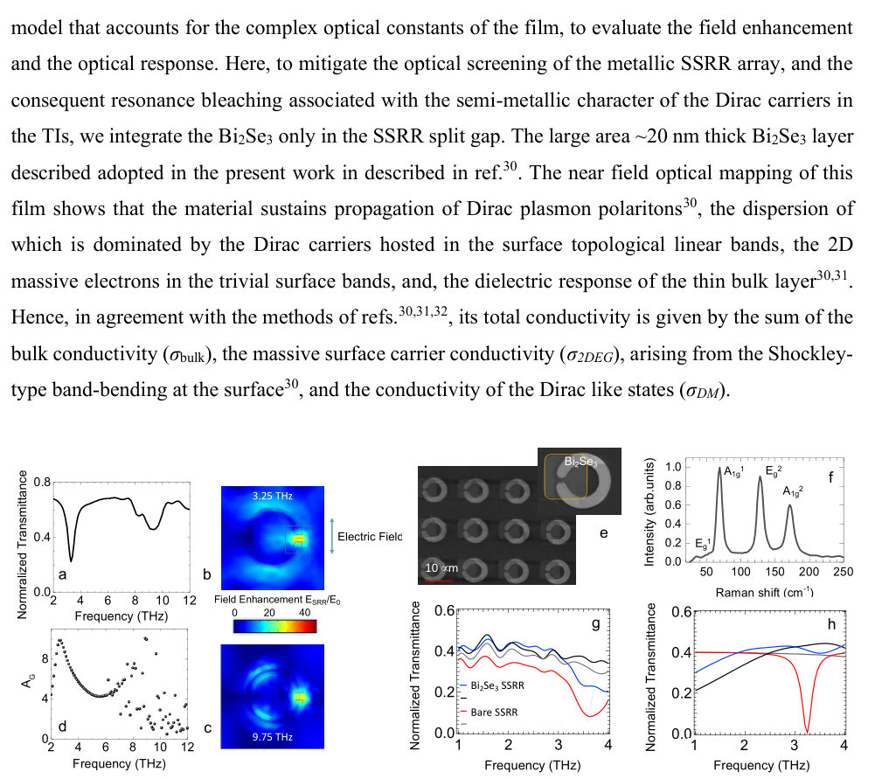
<figcaption class="paper-figure-caption"><b>Fig 1.</b> Figure 1 (a) Simulated transmittance, calculated using a finite element method (FEM), of the Bi2Se3-SSRR, for an electric field polarization parallel to the dipolar split gap; (b-c) two-dimensional (2D) profiles of the electric field (ESRR) calculated using FEM simulations of the Bi2Se3-SSRR for the (b) fundamental and (c) third harmonic frequency modes, normalized by the field on the surface outside the resonator, E0 (zero enhancement region). (d) Amplification (AG) factor as a function of frequency calculated for the Bi2Se3-SSRR, defined as the ratio of the average electric field on the split ring resonator plane to the average electric field impinging on a SiO2/Si substrate under the...</figcaption>
</figure>
<figure class="paper-figure-card">
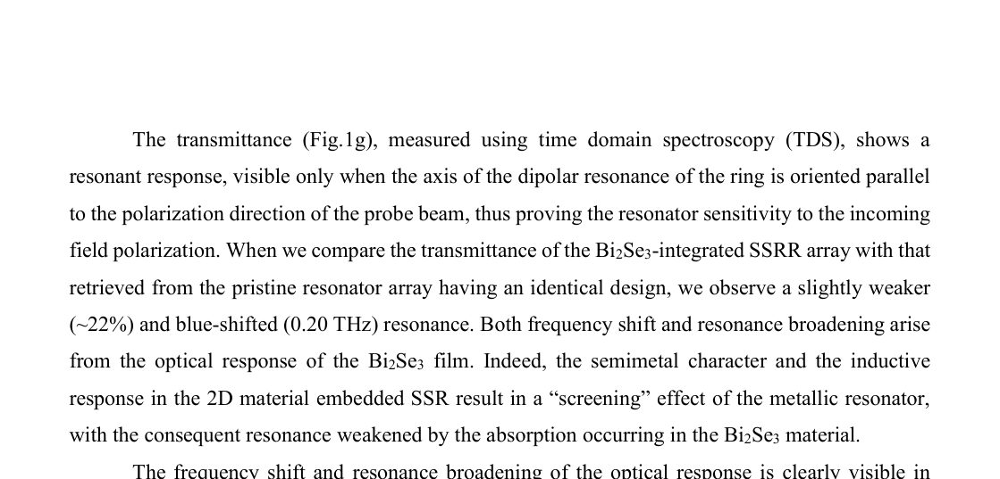
<figcaption class="paper-figure-caption"><b>Fig 2.</b> Fig.1h, which shows the simulated transmittances, in broad agreement with the experimental data</figcaption>
</figure>
<figure class="paper-figure-card">
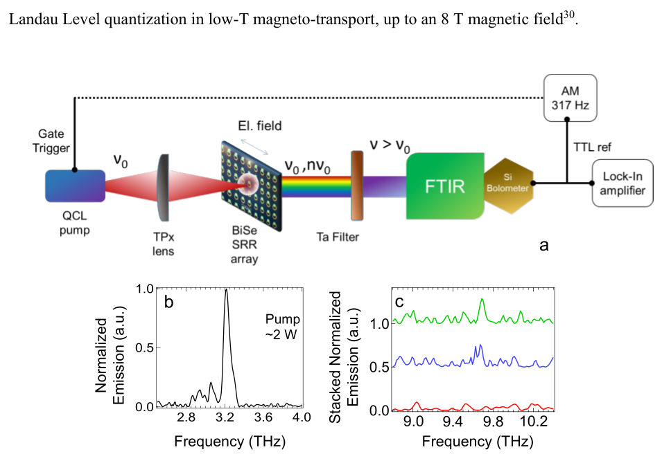
<figcaption class="paper-figure-caption"><b>Fig 3.</b> Figure 2: (a) Schematic diagram of the experiment apparatus for investigating SHG and THG. Light from a single-plasmon QCL, emitting 2.5 W into free space, is focused on the resonator array. The SHG and THG signal is isolated after filtering the THz QCL with a 6 THz high-bandpass Ta-filter. (b) Fourier transform infrared (FTIR) emission spectrum of the QCL pump source, acquired under vacuum with a 1 cm-1 spectral resolution. (c) Emission spectrum at the third harmonic measured on the optically pumped Bi2Se3-SSRR from two different fabrication runs (green and blue), after filtering the QCL with the Ta-filter. Spectra were measured in step-scan mode with a spectral resolution ~1cm-1 and...</figcaption>
</figure>
<figure class="paper-figure-card">
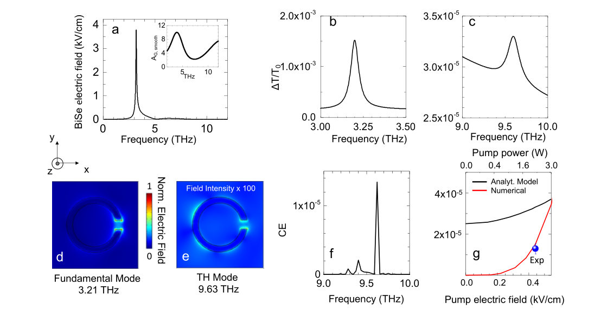
<figcaption class="paper-figure-caption"><b>Fig 4.</b> Figure 3: (a) Electric field incident on the Bi2Se3 SSRR as a function of frequency, calculated through the convolution of the field enhancement shown in the inset, and the optical beam intensity modeled assuming a 2 W Gaussian-peak emission power focused on a 700 m diameter circular spot. (b-c) T/To as a function of frequency in the pumped Bi2Se3 SSRR, assuming the incident effective electric field from (a), and following the analytical model illustrated in the text, plotted (b) at the fundamental QCL frequency 0, and (c) at 30(c). (d-e) Two-dimensional (2D) profiles of the emitted electric field from the Bi2Se3 SSRR, calculated according to the refined numerical model illustrated in...</figcaption>
</figure>
<figure class="paper-figure-card">
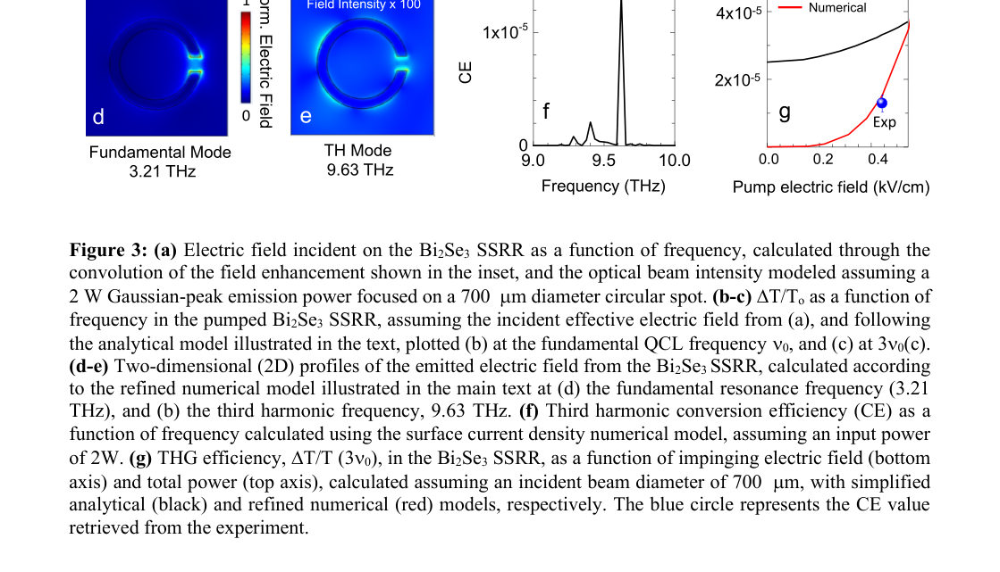
<figcaption class="paper-figure-caption"><b>Fig 5.</b> Figure 3a shows |𝐸0(𝜈)|2, the effective electric field driving the nonlinear response. It is given</figcaption>
</figure>
<figure class="paper-figure-card">
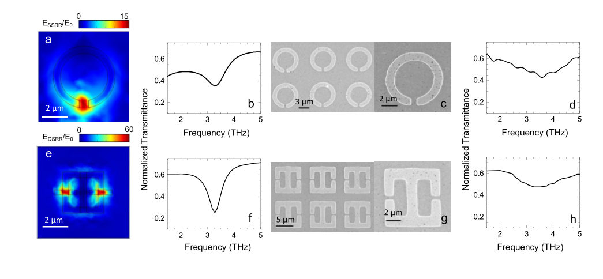
<figcaption class="paper-figure-caption"><b>Fig 6.</b> Figure 4. (a) 2D map of the normalized electric field (ESSRR/E0) on the Bi2Se3 SSRR at the resonance frequency νSIM~3.245 THz, calculated using FEM simulations on an SSRR fabricated on as-grown Bi2Se3 heterostructures. E0 is the field on the bare sapphire surface. (b) Simulated optical transmittance of the design shown in (a), extracted when the input beam polarization is oriented parallel to the split gap dipole. (c) SEM images acquired on the SSRR fabricated on the (InxBi(1-x))2Se3/Bi2Se3/(InxBi(1-x))2Se3 sample, H2. (d) Experimental transmittance acquired on the sample shown in (c), using FTIR, under vacuum, with a spectral resolution of 1 cm-1, the internal MIR (Globar) source and a...</figcaption>
</figure>
<figure class="paper-figure-card">
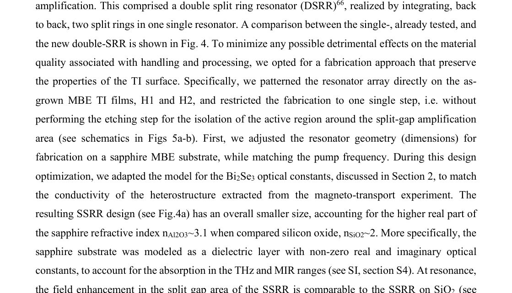
<figcaption class="paper-figure-caption"><b>Fig 7.</b> Fig.4a), as expected in a simply scaled geometry, and the calculated transmittance shows a resonant</figcaption>
</figure>
<figure class="paper-figure-card">
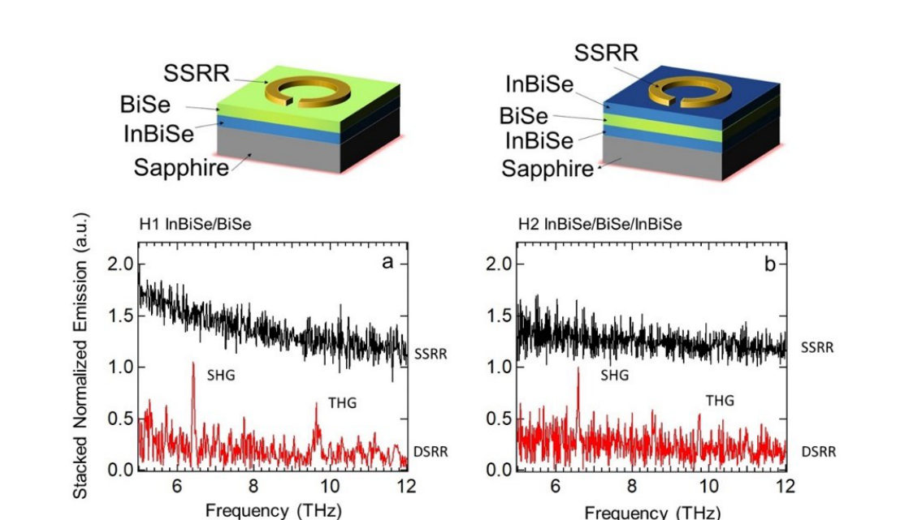
<figcaption class="paper-figure-caption"><b>Fig 8.</b> Figure 5. (a-b) Schematic illustration of the single-SRR array embedding on sample H1 (a) and H2 (b) (c-d) Emission spectra measured from the optically pumped samples (c) H1 and (d) H2, incorporating SSRR (black) and DSRR (red) design geometries, respectively. The spectra are measured in step-scan mode with a spectral resolution ~1cm-1 and aperture size ~5mm. The total light reflected by the samples was collected through the external input window of the FTIR spectrometer, with a silicon-bolometer connected to a lock-in amplifier for detection.</figcaption>
</figure>

**Summary.** This paper demonstrates the use of metamaterial resonators to amplify nonlinear optical signals in topological insulators at terahertz frequencies. By engineering van der Waals heterostructures, the authors successfully induced even-order harmonic generation through symmetry breaking. This work provides a potential pathway for developing efficient, on-chip THz frequency up-conversion devices.

**Why it may be interesting.** not directly relevant

Detailed structure

**Main problem.** Achieving and distinguishing second (SHG) and third (THG) harmonic generation in topological insulators at THz frequencies, specifically overcoming the difficulty of separating bulk and surface state contributions.

**Main result.** The researchers demonstrated efficient THG and SHG in the 6.4-9.7 THz range by using metamaterial-induced field amplification and symmetry-breaking heterostructures.

**Method.** The study combines experimental THz time-domain spectroscopy and FTIR emission spectroscopy with Finite Element Method (FEM) simulations and analytical modeling of hot-electron dynamics.

**Model / system.** The system consists of Bi2Se3 and (InxBiy)2Se3/Bi2Se3 van der Waals heterostructures integrated into metallic split-ring resonator (SSRR) and double split-ring resonator (DSRR) arrays on sapphire or SiO2/Si substrates.

**Key observables.** Second and third harmonic generation frequencies, conversion efficiency (CE), electric field amplification factor (AG), transmittance, and Hall coefficient nonlinearity.

**Important parameters / regimes.** THz frequency range (3.25 THz pump), pump power density (~1 kW/cm2), hot-electron cooling time (~3.5 ps), and carrier density (~2.2 x 10^12 cm^-2).

**Assumptions / limitations.** The nonlinear response is assumed to stem from hot-electron dynamics in massless Dirac carriers; the system is treated in a steady-state illumination regime.

**Figures summary.** Figure 1 shows simulated transmittance and 2D electric field profiles; Figure 3 illustrates the effective electric field driving nonlinear response.

**Paper structure.** The paper introduces the challenge of THz harmonic generation, describes the fabrication of TI-based metamaterials, presents experimental detection of SHG/THG, provides numerical validation via FEM, and concludes with a discussion on symmetry breaking and device integration.

Abstract

High-order harmonic generation (HHG) in solids - the frequency up-conversion of an optical signal - is governed by symmetries. At terahertz (THz) frequencies, HHG is a key technology to access high frequency spectral windows that are usually difficult to cover using conventional solid state laser technologies. This effect has been recently exploited in graphene where HHG has been demonstrated, albeit only at odd multiples of the driving frequency owing to its inherent centro-symmetry. In topological insulators (TIs), the combination of spin-orbit interaction and time-reversal symmetry create an insulating bulk state with an inverted band order, inseparably connected with conducting surface states. TIs have been predicted to support unconventional high harmonic generation from the bulk and topological surface, which are usually difficult to be distinguished. However, no experimental results have been provided, so far. Here, we exploit the strong optical field amplification provided by an array of single or double split ring resonators, with embedded Bi2Se3 or (InxBi(1-x))2Se3/ Bi2Se3 van der Waals heterostructures, to achieve up-conversion in the 6.4 (even) - 9.7 (odd) THz frequency range. This results from bulk centro-symmetry (odd states) and symmetry breaking in the topological surface states (odd and even).

[↑ back to top](#top)

### [Shift of the maxima of the critical currents of different polarity relative to the zero magnetic flux along the flux axis in a superconducting asymmetric aluminum ring](http://arxiv.org/abs/2604.27848v1)

**Authors:** V. I. Kuznetsov, O. V. Trofimov  
**Type:** both · **Category:** other · **PDF:** <https://arxiv.org/pdf/2604.27848v1>  
**Analysis basis:** full PDF text, analyzed in chunks

↔ Scroll figures horizontally

<figure class="paper-figure-card">
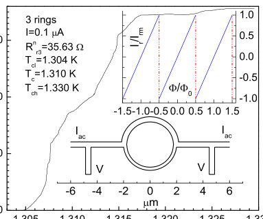
<figcaption class="paper-figure-caption"><b>Fig 1.</b> Figure 1: (Color online) Resistive N-S transition Rr3(T) measured on a struc- ture of three circularly-asymmetric rings in series at Idc = 0.1 µA. Inset upper: expected normalized circulating current Ir/Irm as a function of Φ/Φ0 in a su- perconducting circularly-symmetric ring of small radius at T close to Tc. Inset below: a sketch of one of the rings included in the structure of three rings in series.</figcaption>
</figure>
<figure class="paper-figure-card">
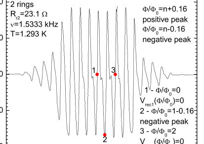
<figcaption class="paper-figure-caption"><b>Fig 2.</b> Figure 2: (Color online) Rectified direct voltage Vrec1(Φ/Φ0) as a function of Φ/Φ0 measured in two rings in series biased with an alternating cosine current (without a dc component) Iac1(t) with the frequency ν = 1.5333 kHz and the ac amplitude Iacm1 = 3.88 µA greater than the critical current Ic(T, B = 0) at T = 1.293 K. The numbers 1, 2, and 3 are placed near the marked points of the Vrec1(Φ/Φ0) curve corresponding to three values Φ/Φ0 = 0, 1-0.16, and 2, respectively. At these points, the oscillograms of the ac voltage Vac1(Φ/Φ0, t) were taken at the same ac Iac1(t).</figcaption>
</figure>
<figure class="paper-figure-card">
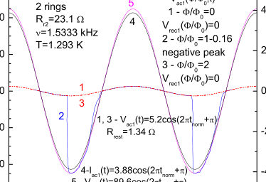
<figcaption class="paper-figure-caption"><b>Fig 3.</b> Figure 4: (Color online) Lines 1, 2, and 3 are oscillograms of the ac voltage Vac1(Φ/Φ0, t), taken on two rings in series at Φ/Φ0 = 0, 1-0.16, and 2, corre- sponding to the marked points 1, 2 and 3 (curve Vrec1(Φ/Φ0), Fig. 2), respec- tively. Lines 1 and 3 are the same. Line 4 is the oscillogram of the applied ac Iac1(t) (the coordinate axis of the current is located on the right). Line 5 is the ac voltage Vac1(t) = Iac1(t)Rr2.</figcaption>
</figure>
<figure class="paper-figure-card">

<figcaption class="paper-figure-caption"><b>Fig 4.</b> Figure 3: (Color online) Rectified voltage Vrec2(Φ/Φ0) as a function of Φ/Φ0, recorded on a structure of three rings in series biased with an alternating cosine current (without a dc component) Iac2(t) with the frequency ν = 1.5333 kHz and the ac amplitude Iacm2 = 5.5 µA less than Ic(T, B = 0) at T = 1.288 K. The numbers 1, 2, and 3 are placed near the marked points of the Vrec2 curve corresponding to three values Φ/Φ0 = 5−0.16, 7+0.5, and 15+0.5, respectively. At these points, the voltage oscillograms Vac2(Φ/Φ0, t) are measured at the same ac Iac2(t).</figcaption>
</figure>
<figure class="paper-figure-card">
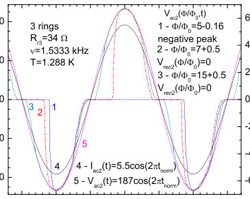
<figcaption class="paper-figure-caption"><b>Fig 5.</b> Figure 5: (Color online) Lines 1 (solid), 2 (dash-dotted), and 3 (dotted) are oscillograms of the ac voltage Vac2(Φ/Φ0, t) recorded on a structure of three rings in series at Φ/Φ0 = 5 −0.16, 7+0.5, and 15+0.5, corresponding to the marked points 1, 2 and 3 (curve Vrec2(Φ/Φ0), Fig. 3), respectively. Line 4 is the oscillogram of the applied ac Iac2(t) (the coordinate axis of the current is on the right). Line 5 is the ac voltage Vac2(t) = Iac2(t)Rr3.</figcaption>
</figure>

**Summary.** This paper resolves a long-standing discrepancy in superconducting physics by explaining why critical current maxima in asymmetric rings shift relative to zero magnetic flux. The authors attribute this shift to differences in kinetic inductance between the ring's arms caused by varying critical temperatures. This model successfully reconciles previously contradictory experimental results.

**Why it may be interesting.** not directly relevant

Detailed structure

**Main problem.** Explaining the mysterious temperature-dependent phase shift of the maxima of critical currents of different polarity relative to zero magnetic flux in asymmetric superconducting aluminum rings.

**Main result.** The authors propose a model where the phase shift is equal to the difference between the dimensionless kinetic inductances of the wide and narrow semirings, driven by different critical temperatures in the two arms.

**Method.** The study combines experimental measurements of rectified AC voltage and critical currents in series of asymmetric rings with a theoretical model based on Ginzburg-Landau theory and asymmetric dc SQUID physics.

**Model / system.** The physical system consists of circularly-asymmetric aluminum rings (thin-film interferometers) fabricated via electron beam lithography. The model treats the rings as asymmetric dc micro-SQUIDs where kinetic inductance dominates magnetic inductance.

**Key observables.** Rectified DC voltage (V_rec), critical currents of positive and negative polarity (Ic+ and Ic-), resistance oscillations (delta R), and AC voltage oscillograms.

**Important parameters / regimes.** Magnetic flux (Phi/Phi0), temperature (T), critical temperatures (Tcw, Tcn), ring widths (ww, wn), and dimensionless kinetic inductance (l).

**Assumptions / limitations.** The current-phase relationship is assumed to be nearly sinusoidal, and the applied magnetic field is low enough that its effect on critical current density can be neglected.

**Figures summary.** Figures show the geometry of asymmetric rings, plots of resistance transitions, voltage waveforms (oscillograms) at different flux levels, and experimental temperature-dependent phase shifts compared to theoretical fits.

**Paper structure.** The paper introduces the problem of the phase shift, describes the experimental setup and fabrication, presents measurements of rectified voltage and critical currents, proposes a kinetic inductance-based model, and validates the model against experimental data and previous studies.

Abstract

We measured the rectification of an ac voltage in a structure of superconducting circularly-asymmetric aluminum rings in series, permeated with a magnetic flux and biased with a low-frequency alternating current (without a dc component). This rectification is due to the shift of the maxima of the critical currents of different polarity relative to the zero flux in opposite directions along the flux axis in the asymmetric ring. For the first time, we propose a model for a temperature-dependent phase shift equal to difference between dimensionless kinetic inductances of wide and narrow semirings having the same length and thickness. The shift is not zero in the case of different critical currents densities in both semirings. This is possible only in a situation of different critical temperatures of both semirings. The model describes well the temperature-dependent shift of the maxima of the critical currents, answers the long-standing mysterious challenge of the shift and removes extremely strange contradiction between the results of different measurements, previously found in circularly-asymmetric aluminum structures.

[↑ back to top](#top)

### [Spin-orbit interaction in core-shell semiconductor-metal nanowires](http://arxiv.org/abs/2604.27769v1)

**Authors:** Tudor-Gabriel Dumitru, Anna Sitek, Gunnar Thorgilsson, Sigurdur I. Erlingsson, Andrei Manolescu  
**Type:** theory · **Category:** other · **PDF:** <https://arxiv.org/pdf/2604.27769v1>  
**Analysis basis:** abstract only; PDF text extraction failed or PDF unavailable

**Summary.** This paper theoretically examines the spin-orbit interaction in a hexagonal core-shell semiconductor-metal nanowire. It explores how different interface potentials influence the strength of spin-orbit coupling and how electrons are localized within the semiconductor shell. This is important for understanding spin manipulation in semiconductor nanostructures.

**Why it may be interesting.** not directly relevant

Detailed structure

**Main problem.** The study investigates how interface potentials and the geometry of a core-shell nanowire affect spin-orbit interaction and electron wave function localization.

**Main result.** The research discusses the effects of band off-offset potentials and complex potential barriers on the strength of spin-orbit coupling and the spatial distribution of wave functions within the semiconductor shell.

**Method.** The authors employ a theoretical model derived from the k-dot-p method to simulate the electronic properties of the nanowire.

**Model / system.** A tubular semiconductor nanowire with a hexagonal cross-section, consisting of an inner semiconductor core and an outer metallic shell, featuring specific potential barriers at the interfaces.

**Key observables.** Spin-orbit coupling strength and wave function localization.

**Important parameters / regimes.** Band off-offset potential at the inner interface and the potential barrier at the metal-semiconductor contact.

**Assumptions / limitations.** The model assumes a hexagonal geometry for the nanowire cross-section and uses a k-dot-p approximation.

**Paper structure.** The paper presents a theoretical study of a specific nanowire geometry, applying the k-dot-p method to analyze the impact of interface potentials on spin-orbit interaction and wave function localization.

Abstract

We study theoretically the spin-orbit interaction of electrons confined in a tubular semiconductor nanowire, between an inner semiconductor core and an outer metallic extra shell. A band off-offset potential is present at the inner semiconductor-semiconductor interface and a more complex potential barrier at the outer metal-semiconductor contact. The cross section of the nanowire has a hexagonal geometry. We use a model derived from the k-dot-p method, and discuss the effects of the interface potentials on the strength of the spin-orbit coupling and on the localization of the wave functions within the semiconductor shell

[↑ back to top](#top)

### [The optical phonoelectric effect](http://arxiv.org/abs/2604.27524v1)

**Authors:** D. Choi, M. Först, M. Fechner, M. Buzzi, X. Deng, Z. Zeng, K. H. Martens, D. Prabhakaran, C. Putzke, P. Moll, P. G. Radaelli, A. Cavalleri  
**Type:** experiment · **Category:** other · **PDF:** <https://arxiv.org/pdf/2604.27524v1>  
**Analysis basis:** abstract only; PDF text extraction failed or PDF unavailable

**Summary.** This paper reports the discovery of an optical phonoelectric effect where light-induced optical phonons create electrical polarization much faster than mechanical strain. This effect bypasses the speed limits of sound and the physical limits of material fracture, offering a new way to control polarization in quantum materials.

**Why it may be interesting.** not directly relevant

Detailed structure

**Main problem.** Traditional piezoelectricity is limited by the speed of sound, the difficulty of tuning intrinsic coupling, and the risk of material fracture under high strain.

**Main result.** The authors demonstrate 'optical phonoelectricity,' a strain-free, piezoelectric-like response driven by photo-excited optical phonon distortions that is four orders of magnitude faster than traditional piezoelectricity.

**Method.** The researchers use ultrafast optical excitation to induce phonon rectification in a material, creating electrical polarization without mechanical strain.

**Model / system.** The experimental platform is the weak piezoelectric material BPO4.

**Key observables.** Electrical polarization and phonon rectification.

**Important parameters / regimes.** The speed of the effect is limited by the speed of light rather than the speed of sound; the induced polarization is significantly higher than the fracture limit of strain-induced piezoelectricity.

**Paper structure.** The paper introduces the limitations of piezoelectricity, presents the realization of the optical phonoelectric effect in BPO4, compares its speed and magnitude to traditional piezoelectricity, and discusses potential applications in quantum materials and devices.

Abstract

Piezoelectricity is a technologically important property of certain insulators in which mechanical strain induces an electrical polarization. However, the rate at which a piezoelectric response can be established over a macroscopic volume is limited by the sound velocity, constraining applications in high-bit-rate transduction and sensing. Furthermore, the strength of the piezoelectric effect is not readily tunable, as it depends on intrinsic anharmonic coupling between strain and intra-unit-cell distortions in a given material. Lastly, the maximum amplitude of the effect is bounded by material fracture, which sets in already at percent level strain values. Here we overcome these limitations by realizing a strain-free, piezoelectric-like response driven solely by photo-excited optical phonon distortions. We demonstrate such optical phonoelectricity in the weak piezoelectric BPO$_4$, in which we induce electrical polarization through phonon rectification. This effect is established over macroscopic volumes with four orders of magnitude higher speed than piezoelectric responses, ultimately limited by the speed of light. The maximum induced polarization is estimated to be far in excess of that attainable through strain at the fracture limit. Ultrafast phonoelectricity opens up new opportunities for optical control in quantum materials, but also for device applications.

[↑ back to top](#top)

### [Uniaxial strain-driven ferroelastic domain control in LaAlO3](http://arxiv.org/abs/2604.28183v1)

**Authors:** Matthias Roeper, Robin Buschbeck, Jakob Wetzel, Tobias Ritschel, Anna-Lena Hofmann, Vladyslav Kovtunovych, Mike N. Pionteck, Javier Taboada-Gutiérrez, Alexey B. Kuzmenko, Martina Basini, Vivek Unikandanunni, Iuliia Kiseleva, Jochen Geck, Susanne C. Kehr, Maximilian Lederer, Simone Sanna, Lukas M. Eng, Samuel D. Seddon  
**Type:** both · **Category:** other · **PDF:** <https://arxiv.org/pdf/2604.28183v1>  
**Analysis basis:** abstract only; PDF text extraction failed or PDF unavailable

**Summary.** The researchers show that applying small amounts of uniaxial strain can reversibly control the ferroelastic domain structure in LaAlO3. This method allows for large-scale domain engineering and surface flattening, which could be used to program domain architectures in oxide-based electronic and photonic devices.

**Why it may be interesting.** not directly relevant

Detailed structure

**Main problem.** The difficulty in achieving deterministic, large-scale, and reversible control over ferroelastic domain populations in functional oxides without relying on local probes or temperature changes.

**Main result.** Demonstration of continuous and reversible manipulation of ferroelastic domain structures in single-crystal LaAlO3 using in-situ uniaxial strain, leading to surface flattening and domain reorganization.

**Method.** A combination of in-situ uniaxial strain application, atomic force microscopy (AFM), X-ray diffraction (XRD), Raman spectroscopy, and first-principles calculations.

**Model / system.** Single-crystal LaAlO3 (lanthanum aluminate) undergoing a strain-driven structural transition from a rhombohedral R3c ground state toward a predicted orthorhombic Fmmm phase.

**Key observables.** Twin domain population, surface topography/flattening, and structural phase evolution.

**Important parameters / regimes.** Applied uniaxial strain levels below 0.5%.

**Paper structure.** The paper introduces the problem of domain control, presents the experimental demonstration of strain-driven manipulation, details the multi-modal characterization (AFM, XRD, Raman), supports findings with first-principles calculations, and discusses implications for heterostructures.

Abstract

Multiferroic domain walls in functional oxides exhibit properties distinct from the bulk and are increasingly exploited as active elements in nanoelectronic and photonic devices. Deterministic control of domain populations has typically remained limited to local control, or removal with temperature. Here we demonstrate continuous, reversible manipulation of the ferroelastic domain structure in single-crystal LaAlO$_3$ using in-situ uniaxial strain. Combining atomic force microscopy, X-ray diffraction, and Raman spectroscopy with first-principles calculations we map the complete microscopic evolution of the twin domain population through the strain-driven transition from the rhombohedral $R\bar{3}c$ ground state toward the predicted orthorhombic $Fmmm$ phase. Applied strains below $0.5\%$ produce pronounced surface flattening and large-scale domain reorganisation, establishing uniaxial strain as a technically accessible control parameter for ferroelastic domain engineering. These results open a route to active, real-time programming of domain architectures in LaAlO$_3$-based heterostructures, with implications for strain-tunable superconducting interfaces, nanoscale phonon-polariton optics, and ultrafast lattice control.

[↑ back to top](#top)

### [Unusual critical currents in quasi-one-dimensional superconducting aluminum two-width structures in a magnetic field](http://arxiv.org/abs/2604.27881v1)

**Authors:** V. I. Kuznetsov, O. V. Trofimov  
**Type:** experiment · **Category:** other · **PDF:** <https://arxiv.org/pdf/2604.27881v1>  
**Analysis basis:** full PDF text, analyzed in chunks

↔ Scroll figures horizontally

<figure class="paper-figure-card">

<figcaption class="paper-figure-caption"><b>Fig 1.</b> Figure 2: (Color online) Experimental data for the &quot;n1&quot; structure: 1 (squares) and r1 (circles) are the switching and retrapping currents as functions of T at B = 0 G, respectively. Solid lines 1a and 1b are the fits of the measured switching current (squares) to the functions IGL(T) (2) at low T and Ir(T) (4) at high T , respectively. The dotted line is the fit of the measured retrapping current (circles) to the function Ir(T) (4). The inset: a sketch of the structure (not to scale) with the measurement circuit.</figcaption>
</figure>
<figure class="paper-figure-card">
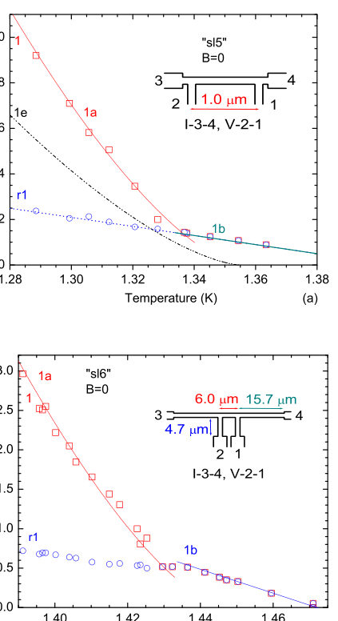
<figcaption class="paper-figure-caption"><b>Fig 2.</b> Figure 3: (Color online) (a)-(b). Experimental data for the &quot;sl5&quot; (I-3-4, V-2-1) in (a) and &quot;sl6&quot; (I-3-4, V-2-1) in (b) structures: 1 (squares) and r1 (circles) are the switching and retrapping currents as functions of T at B = 0 G, re- spectively. (a)-(b) Solid lines 1a and 1b are the fits of the measured switching current (squares) to the functions IGL(T) (2) at low T and Ir(T) (4) at high T , respectively. (a) Dash-dotted line 1e is the expected switching current as a function of T calculated using the function IGL(T) (1). (a) The dotted line is the fit of the measured retrapping current (circles) to the Ir(T) function (4). (a) - (b) The insets: sketches of the structures (not to scale)...</figcaption>
</figure>
<figure class="paper-figure-card">

<figcaption class="paper-figure-caption"><b>Fig 3.</b> Figure 4: (Color online) Experimental data for the &quot;n4b&quot; structure (I-3-4, V- 2-1): 1 (squares), 2 (triangles), 3 (diamonds) are the switching currents vs. B at temperatures Tg; r2 (asterisks), r3 (crosses) are the retrapping currents vs. B at temperatures corresponding to data 2, 3. For data 2, r2,3,r3, the scale along the vertical coordinate axis is doubled. The sets of solid lines: 1a-1b-1c, 2a- 2b-2c, 3a-3b, including branches corresponding to different field ranges, are the fits of the measured switching currents vs. B (squares, triangles, diamonds, respectively) to the functions Ick(Tg, B) (14). The dash-dotted line 1e is the expected switching current vs. B at Tg = 1.260 K, calculated...</figcaption>
</figure>
<figure class="paper-figure-card">
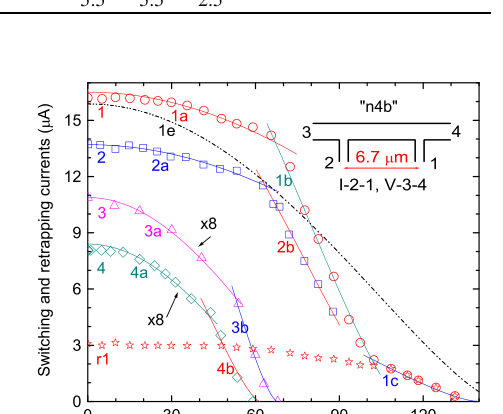
<figcaption class="paper-figure-caption"><b>Fig 4.</b> Figure 5: (Color online) Experimental data for the &quot;n4b&quot; structure (I-2-1, V-3- 4): 1 (circles), 2 (squares), 3 (triangles), 4 (diamonds) are switching currents vs. B at temperatures Tg; r1 (asterisks) is the retrapping current vs. B at Tg = 1.243 K. For data 3 and 4, the switching and retrapping currents are the same. For data 3, 4, the vertical coordinate axis scale is increased eightfold. The sets of solid lines: 1a-1b-1c, 2a-2b, 3a-3b, 4a-4b are the fits of the measured switching cur- rents vs. B (circles, squares, triangles, diamonds, respectively) to the functions Ick(Tg, B) (14). The dash-dotted line 1e shows the expected switching current vs. B at Tg = 1.243 K, calculated using the...</figcaption>
</figure>
<figure class="paper-figure-card">
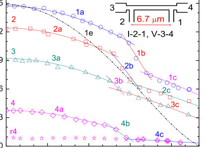
<figcaption class="paper-figure-caption"><b>Fig 5.</b> Figure 6: (Color online) Experimental data for the &quot;n4a&quot; structure (I-2-1, V-3- 4): 1 (circles), 2 (squares), 3 (triangles), 4 (diamonds) are switching currents vs. B at temperatures Tg; r4 (asterisks) is the retrapping current vs. B at 1.361 K. The four pairs of solid lines: 1a and 1c, 2a and 2c, 3a and 3c, 4a and 4c are the fits of switching currents vs. B (circles, squares, triangles, diamonds, respec- tively), measured in low and high fields, respectively, to the functions Ic1(Tg, B) and Ic3(Tg, B) (14). The four solid lines: 1b, 2b, 3b, 4b are the fits of the switching currents vs. B (circles, squares, triangles, diamonds, respectively), measured in the intermediate field range, to the...</figcaption>
</figure>
<figure class="paper-figure-card">
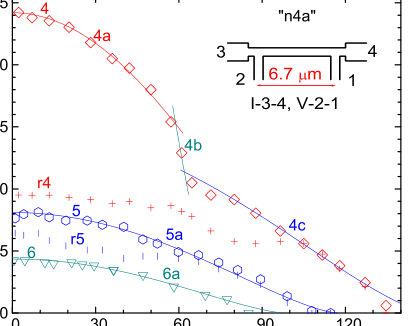
<figcaption class="paper-figure-caption"><b>Fig 6.</b> Figure 7: (Color online) (a)-(b) Experimental data for the &quot;n4a&quot; structure (I- 3-4, V-2-1): (a) 1 (circles), 2 (squares), 3 (up triangles) and (b) 4 (diamonds), 5 (hexagons), 6 (down triangles) are the switching currents vs. B at temper- atures Tg; (a) r3 (asterisks), and (b) r4 (crosses), r5 (vertical bars) are the re- trapping currents vs. B at temperatures corresponding to data 3,4,5. The sets of solid lines: (a) 1a-1b-1c, 2a-2b-2c, 3a-3b-3c, and (b) 4a-4b-4c, 5a, 6a are the fits of the measured switching currents vs. B ((a) circles, squares, trian- gles, and (b) diamonds, hexagons, down triangles, respectively) to the functions Ick(Tg, B) (14). (a) Dash-dotted line 1e shows the expected...</figcaption>
</figure>
<figure class="paper-figure-card">
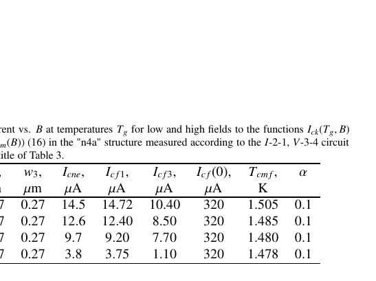
<figcaption class="paper-figure-caption"><b>Fig 7.</b> Fig. 7(a) -(b) and data a1-a3, not shown in the figures). For different field ranges, the switching current vs. B at tem- peratures Tg (data 1-6, Fig. 7(a)-(b) and a1-a3 (not shown in the figure)), we fitted to the functions (solid lines) Ick(Tg, B) (14). From Table 6 it is seen that ξ(Tg)e/ξ f1 = 1.24 −1.56. For data 1-3 and a1-a3, the fitted coherence lengths ξf1, ξ f2 and ξ f3 are very close to each other. For data 4, ξ f3 &lt; ξ f2 &lt; ξ f1. In Table 6, we calculated the expected values of the switching current Icwe of the individual wide wire of the &quot;n4a&quot; structure at temperatures Tg in the zero field using the K-L fitting function IKL(T) (3) for the individual wide wire of the &quot;n4b&quot; structure (I-...</figcaption>
</figure>
<figure class="paper-figure-card">
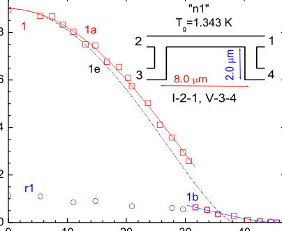
<figcaption class="paper-figure-caption"><b>Fig 8.</b> Figure 8: (Color online) Experimental data for the &quot;n1&quot; structure (I-2-1, V-3- 4): 1 (squares) and r1 (circles) are the switching and retrapping currents vs. B at Tg = 1.343 K, respectively. Solid lines 1a and 1b are the fits of the switching current vs. B (squares), measured in low and high fields, respectively, to the functions Ick(Tg, B) (14), where k = 1, 2. Dash-dotted line 1e is the expected switching current vs. B at Tg = 1.343 K, calculated using the function IGL(T, B) (6). The inset: sketch of the structure (not to scale).</figcaption>
</figure>
<figure class="paper-figure-card">
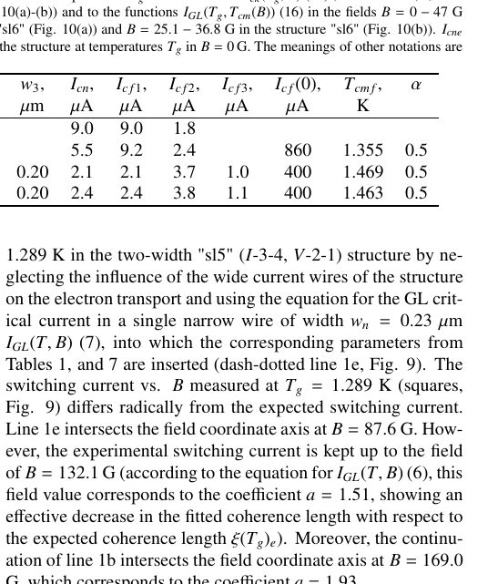
<figcaption class="paper-figure-caption"><b>Fig 9.</b> Fig. 9 shows that the steepness of the solid line 1b is less than the steepness of the solid line 1a. The field B = 47.3 G, corresponding to the intersection of lines 1a and 1b, is slightly less than the critical field B = 63.9 G, at which the individ- ual (without taking into account the influence of the proxim- ity effect) wide wire of the &quot;sl5&quot; structure should transition to the normal state. This field is defined by the requirement Tc(B) = Tg = 1.289 K, where Tc(B) is given by equation (10), into which the corresponding values of w1 = wb = ww = 0.40 µm, ξ(0) = 0.128 µm, Tc = T c f r = 1.405 K are substituted (Ta- bles 1, and 2). The fitted widths w1 = 0.40 and w2 = 0.23 µm used in the fitting...</figcaption>
</figure>
<figure class="paper-figure-card">
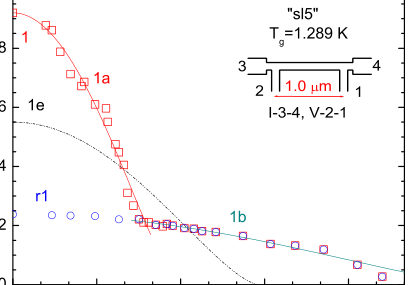
<figcaption class="paper-figure-caption"><b>Fig 10.</b> Figure 9: (Color online) Experimental data for the &quot;sl5&quot; structure (I-3-4, V-2- 1): 1 (squares) and r1 (circles) are the switching and retrapping currents vs. B at Tg = 1.289 K, respectively. Solid lines 1a and 1b are the fits of the switching current vs. B (squares), measured in low and high fields, respectively, to the functions Ick(Tg, B) (14), where k = 1, 2. Dash-dotted line 1e is the expected switching current vs. B at Tg = 1.289 K, calculated using the function IGL(T, B) (7). The inset: sketch of the structure (not to scale).</figcaption>
</figure>

**Summary.** This paper reports on anomalous critical current behavior in superconducting aluminum wires of varying widths. The researchers found that the switching current is nonlocal and remains non-zero in magnetic fields higher than theoretically predicted, challenging existing Ginzburg-Landau descriptions of quasi-1D superconductors.

**Why it may be interesting.** not directly relevant

Detailed structure

**Main problem.** Investigating the unusual, nonlocal behavior of critical switching currents in quasi-one-dimensional superconducting aluminum structures with varying wire widths under magnetic fields.

**Main result.** The experimental switching current is found to be nonlocal, depending on the junction area and persisting in magnetic fields that exceed the maximum critical field of the individual wires, a phenomenon that contradicts standard Ginzburg-Landau predictions.

**Method.** Measurement of current-voltage (I-V) characteristics, specifically tracking switching and retrapping currents, using various circuit configurations and comparing results to Ginzburg-Landau and Kupriyanov-Lukichev theories.

**Model / system.** Thin-film aluminum (Al) quasi-one-dimensional structures on silicon substrates, featuring 'two-width' (narrow and wide wires) and 'three-width' geometries in the dirty limit.

**Key observables.** Switching current (Is), retrapping current (Ir), and DC voltage appearance/disappearance.

**Important parameters / regimes.** Magnetic field (B), temperature (T), wire widths (wn, ww), Ginzburg-Landau coherence length (xi), and critical temperature (Tc).

**Assumptions / limitations.** The system operates in the dirty limit (electron mean free path much smaller than coherence length); calculations sometimes neglect the influence of one wire type on the other to establish a baseline.

**Figures summary.** Figure 1 shows sketches of the wire structures; Figure 4 displays switching and retrapping currents vs. magnetic field for the n4b structure; Figure 10(a) shows the sl6 three-width structure.

**Paper structure.** The paper introduces the experimental setup and geometry, details the measurement methods and temperature/field regimes, presents the experimental results for various structures (n4a, n4b, sl5, sl6), compares these results to Ginzburg-Landau theory, and concludes by discussing the discrepancy between experiment and theory.

Abstract

We measured unusual critical currents as functions of temperature in the zero field and as functions of a magnetic field perpendicular to the substrate surface at a given temperature close to the critical temperature in thin-film long quasi-one-dimensional superconducting aluminum two-width structures consisting of narrow and wide wires with different critical temperatures. It is found that the experimental critical switching current as a function of the field at a given temperature, determined by the appearance of a dc voltage on a short section of the structure, is nonlocal (dependent on electron transport in the area containing the junction line between the narrow and wide wires). When current flows through the narrow and wide wires of the structure, the switching currents, experimental and calculated within the framework of the Ginzburg-Landau theory, differ radically from each other. A nonzero switching current exists in high fields greater than the maximum critical magnetic field in a quasi-one-dimensional superconducting wire. In the aluminum two-width structures studied here, the unusual measured switching current challenges description by known theories.

[↑ back to top](#top)

### [Unveiling the potential of NdPO4 magnetocaloric phases in cryogenic refrigeration](http://arxiv.org/abs/2604.28128v1)

**Authors:** M. Balli, L. Attou, S-E. Bouzarmine, S. Oubad, K. El Maalam, P. Fournier, S. Mangin  
**Type:** both · **Category:** strongly correlated electrons · **PDF:** <https://arxiv.org/pdf/2604.28128v1>  
**Analysis basis:** full PDF text, analyzed in chunks

↔ Scroll figures horizontally

<figure class="paper-figure-card">

<figcaption class="paper-figure-caption"><b>Fig 1.</b> Fig.1. (a) XRD patterns of anhydrous monoclinic NdPO4. (b) TEM images showing nanorods of NdPO4. (c) Magnetic entropy changes as a function of magnetic field at 3 K for anhydrous (square) and hydrated (solid cercle) NdPO4 phases. Inset: exchange interactions in monoclinic NdPO4.</figcaption>
</figure>

**Summary.** This paper demonstrates that anhydrous NdPO4 is a highly promising material for cryogenic refrigeration due to its large magnetocaloric effect near 3 K. It shows that this material can outperform much more expensive rare-earth alternatives, making it an economically viable candidate for low-temperature cooling.

**Why it may be interesting.** not directly relevant

Detailed structure

**Main problem.** The need to find affordable, chemically stable, and mechanically robust alternatives to expensive rare-earth-based materials (like Dy, Ho, or Tb) for use in cryogenic refrigeration.

**Main result.** The anhydrous monoclinic phase of NdPO4 exhibits a large magnetocaloric effect of approximately 19 J/kg K under 5 T near 3 K, outperforming several more expensive reference materials.

**Method.** The study uses a facile precipitation growth route and thermal annealing for synthesis, combined with XRD, TEM, and SQUID magnetometry, supplemented by DFT calculations.

**Model / system.** Neodymium orthophosphates (NdPO4) in two structural phases: a hydrated hexagonal rhabdophane-type and an anhydrous monoclinic monazite-type, characterized by nanorod morphology.

**Key observables.** Magnetic entropy change (-delta S), magnetization, effective magnetic moments, Curie-Weiss temperature, and exchange coupling.

**Important parameters / regimes.** Temperature range of 2-300 K, magnetic fields up to 7 T, and the specific cryogenic regime near 3 K.

**Assumptions / limitations.** The study focuses on the potential for cryogenic applications and assumes the stability of the synthesized phases for industrial use.

**Figures summary.** Fig 1a shows XRD patterns and exchange interactions; Fig 1b displays TEM images of nanorod morphology; Fig 1c shows magnetic entropy changes as a function of magnetic field at 3 K.

**Paper structure.** The paper introduces the problem of rare-earth costs, describes the synthesis and structural characterization of NdPO4 phases, presents magnetic measurement results and DFT calculations, and concludes with a performance comparison for refrigeration applications.

Abstract

The RPO4 orthophosphates (R = rare earth element) have recently attracted a wide interest due to the strong coupling between their electronic, orbital and structural ordering parameters resulting in a variety of functional properties. Herein, we demonstrate that NdPO4 phases synthesized via a facile precipitation growth process unveil promise in low-temperature magnetic cooling. The analysis of their structural properties reveals nanorod forms with diameters of 10 to 20 nm and lengths ranging from 200 to 500 nm while the heat treatment transforms their hexagonal rhabdophane-type structure to a monoclinic anhydrous monazite-type symmetry. Magnetization measurements and DFT calculations show strong antiferromagnetic couplings and the absence of any magnetic ordering in the 2-300 K range. On the other hand, the monoclinic phase of NdPO4 exhibits a large magnetocaloric effect of about 19 J/kg K under 5 T near 3 K, outperforming some reference materials containing more expensive rare-earth elements with high magnetic moments.

[↑ back to top](#top)

### [VBr >10 kV E-Beam/Sputtered Vertical NiOx/(011) β-Ga2O3 HJDs with PFOM >2.3 GW/cm2](http://arxiv.org/abs/2604.27262v1)

**Authors:** Yizheng Liu, Carl Peterson, Chinmoy Nath Saha, Marko J. Tadjer, Sriram Krishnamoorthy  
**Type:** experiment · **Category:** other · **PDF:** <https://arxiv.org/pdf/2604.27262v1>  
**Analysis basis:** full PDF text, analyzed in chunks

↔ Scroll figures horizontally

<figure class="paper-figure-card">
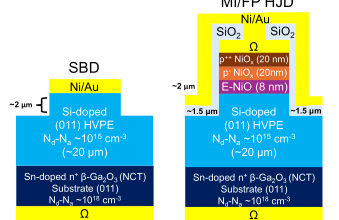
<figcaption class="paper-figure-caption"><b>Fig 1.</b> Fig.1. Schematics cross-section of (a) reference Schottky barrier diodes (SBDs) and (b) mesa-isolated/field-plated heterojunction diodes (MI/FP HJDs).</figcaption>
</figure>
<figure class="paper-figure-card">

<figcaption class="paper-figure-caption"><b>Fig 2.</b> Fig.3. (a) C-V characteristics of MI/FP HJD on 1-mm dia. dimeison at 1 MHz with 1/C2 vs. voltage inset. (b) Doping vs. depth profile MI/FP HJD on 1-mm dia. dimeison at 1 MHz.</figcaption>
</figure>
<figure class="paper-figure-card">
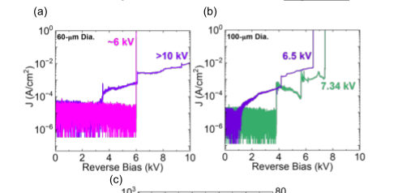
<figcaption class="paper-figure-caption"><b>Fig 3.</b> Fig.4. (a) Reverse breakdown characteristics of MI/FP HJDs for 60-μm dia. devices. (b) Reverse breakdown characteristics of MI/FP HJDs for 100-μm dia. devices. (c) J-V characteristics of 60-μm dia. device before and after 10 kV reverse bias in both linear and semi-log scale.</figcaption>
</figure>
<figure class="paper-figure-card">

<figcaption class="paper-figure-caption"><b>Fig 4.</b> Fig.2. (a) Linear forward J-V characteristics of SBDs and MI/FP HJDs. (b) Semi-log scale J-V characteristics of SBDs and MI/FP HJDs. (c) Ron,sp vs. diode dimension for SBDs and MI/FP HJDs. (d) Pulsed I-V characteristics for SBD and MI/FP 1-mm dia. devices.</figcaption>
</figure>
<figure class="paper-figure-card">

<figcaption class="paper-figure-caption"><b>Fig 5.</b> Fig. 5. benchmarks the Ron,sp vs. breakdown voltage (VBr) of heterojunction diodes fabricated in this work in comparison to various HJDs reported in the literatures. It is shown that the PFOM of the MI/FP HJDs begins exceeding the material limit of 4H-SiC at 10 kV reverse bias.</figcaption>
</figure>
<figure class="paper-figure-card">
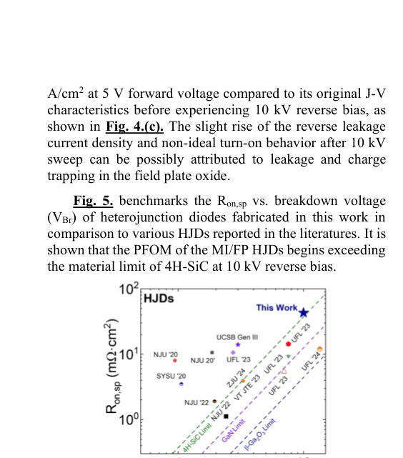
<figcaption class="paper-figure-caption"><b>Fig 6.</b> Fig.5. Benchmarking of Ron,sp vs. breakdown voltage for various heterojunction diodes reported in the literature. [12], [16], [17], [19], [20], [21], [22], [23], [24], [25]</figcaption>
</figure>

**Summary.** This paper reports the development of high-voltage beta-gallium oxide diodes that achieve a breakdown voltage of over 10 kV. By using a nickel oxide heterojunction, the researchers bypassed the difficulty of p-type doping in gallium oxide, achieving a high power figure of merit for next-generation power electronics.

**Why it may be interesting.** not directly relevant

Detailed structure

**Main problem.** The lack of reliable p-type doping in beta-gallium oxide (beta-Ga2O3) prevents the creation of high-voltage power electronic devices for applications like EV charging and AI data centers.

**Main result.** Demonstration of vertical heterojunction diodes (HJDs) with a breakdown voltage exceeding 10 kV and a power figure of merit (PFOM) greater than 2.3 GW/cm2.

**Method.** Fabrication of edge-terminated vertical HJDs using an e-beam/sputtered nickel oxide (NiOx) stack on (011) beta-Ga2O3, utilizing BCl3 ICP dry-etching for mesa isolation and field-plate structures.

**Model / system.** The experimental platform consists of vertical heterojunction diodes featuring an e-beam/sputtered NiOx stack on epitaxial (011) beta-Ga2O3 with a 20-micrometer thick drift layer.

**Key observables.** Breakdown voltage (VBr), specific on-resistance (Ron,sp), power figure of merit (PFOM), parallel-plane breakdown field, turn-on voltage (Von), and rectifying ratio.

**Important parameters / regimes.** Breakdown voltage > 10 kV, specific on-resistance = 43 mOhm*cm2, breakdown field > 5.3 MV/cm, and carrier density ~ 2 x 10^15 cm^-3.

**Assumptions / limitations.** The use of a non-current spreading model for J-V normalization was noted as necessary to avoid significant discrepancies.

**Paper structure.** The paper introduces the motivation for high-voltage power electronics, describes the device architecture and fabrication process (metallization, NiOx deposition, and etching), presents the electrical characterization results (breakdown and resistance), and discusses the extracted breakdown field and performance metrics.

Abstract

Beta-gallium oxide (β-Ga2O3) holds enormous potential for medium voltage range power electronic applications. This work reports VBr > 10 kV/Ron,sp = 43 mΩ*cm2 class edge terminated vertical heterojunction diodes (HJDs) with e-beam/sputtered nickel oxide (NiOx) stack on epitaxial (011) β-Ga2O3. The power figure of merit (PFOM) of the HJD exceeds 2.3 GW/cm2. The extracted parallel plane breakdown field is > 5.3 MV/cm, which is the highest reported electric field for thick (011) β-Ga2O3 epitaxial drift layer.

[↑ back to top](#top)

### [VibroML: an automated toolkit for high-throughput vibrational analysis and dynamic instability remediation of crystalline materials using machine-learned potentials](http://arxiv.org/abs/2604.27685v1)

**Authors:** Rogério Almeida Gouvêa, Gian-Marco Rignanese  
**Type:** theory · **Category:** disordered systems and neural networks · **PDF:** <https://arxiv.org/pdf/2604.27685v1>  
**Analysis basis:** abstract only; PDF text extraction failed or PDF unavailable

**Summary.** VibroML is an automated Python toolkit designed to fix structural instabilities in predicted crystals using machine-learned potentials and genetic algorithms. It moves beyond simple stability checking to actively find stable polymorphs and new compositions through targeted alloying. This enables a much more efficient high-throughput screening of complex materials.

**Why it may be interesting.** not directly relevant

Detailed structure

**Main problem.** Identifying dynamical instabilities in predicted crystalline materials is insufficient; there is a need for automated pathways to remediate these instabilities and find stable polymorphs.

**Main result.** The introduction of VibroML, a toolkit that uses an energy-guided genetic algorithm and machine-learned potentials to automate structural remediation and discover stable crystal structures.

**Method.** The toolkit employs an energy-guided genetic algorithm for navigating potential energy surfaces, coupled with automated molecular dynamics for finite-temperature validation and targeted alloying via the ProtoCSP engine.

**Model / system.** The system involves crystalline materials, specifically focusing on perovskite networks (e.g., Cs2KInI6 and KTaSe3) and high-symmetry stoichiometries from the Alexandria database.

**Key observables.** Phonon dispersion, vibrational stability, and finite-temperature structural retention.

**Important parameters / regimes.** 0 K harmonic stability, finite-temperature stability, and elemental combinations (quaternary and quinary).

**Assumptions / limitations.** The method relies on the accuracy of foundational machine-learned interatomic potentials (MLIPs).

**Paper structure.** The paper introduces the VibroML toolkit, describes the genetic algorithm for structural remediation, details the integration with ProtoCSP for alloying, demonstrates application to perovskites, and showcases large-scale mining of the Alexandria database.

Abstract

While machine-learned interatomic potentials (MLIPs) accelerate phonon dispersion calculations, merely identifying dynamical instabilities in computationally predicted materials is insufficient; automated pathways to resolve them are required. We introduce VibroML, an open-source Python toolkit driven by foundational MLIPs that shifts the paradigm from stability verification to automated structural remediation. VibroML employs an energy-guided genetic algorithm that vastly outperforms traditional soft-mode following, efficiently navigating the potential energy surface to uncover diverse, dynamically stable polymorphs. As 0 K harmonic stability does not guarantee macroscopic viability, an automated molecular dynamics workflow evaluates finite-temperature structural retention. VibroML also couples with ProtoCSP, our combinatorial structure prediction engine, to stabilize frustrated crystal topologies via targeted alloying, successfully rescuing functional perovskite networks like Cs$_2$KInI$_6$ and KTaSe$_3$. Demonstrating broader applicability, we mined the Alexandria database -- where ~50% of quaternary and 99.5% of quinary elemental combinations lack any structural entries -- to identify thousands of abandoned, high-symmetry stoichiometries. Deploying ProtoCSP's "cold start" retrieval and VibroML's evolutionary search on a sample, we successfully identified dynamically stable low-symmetry candidates. Through integrated structural remediation, thermal validation, and systematic compositional exploration, VibroML enables a comprehensive deep-screening approach, yielding physically sound structural propositions that far surpass standard high-throughput workflows.

[↑ back to top](#top)

### [Yukawa screening derivation of the bond-valence rule](http://arxiv.org/abs/2604.28099v1)

**Authors:** Michael L. Whittaker, Pan Wang, Chunhui Li, Naman Katyal, Piotr Zarzycki  
**Type:** theory · **Category:** other · **PDF:** <https://arxiv.org/pdf/2604.28099v1>  
**Analysis basis:** full PDF text, analyzed in chunks

↔ Scroll figures horizontally

<figure class="paper-figure-card">
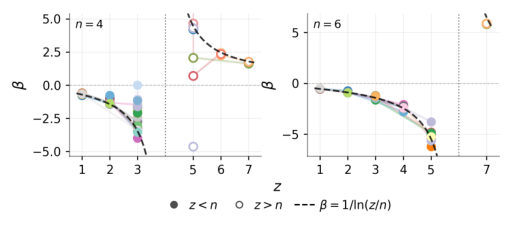
<figcaption class="paper-figure-caption"><b>Fig 1.</b> FIG. 1. Fitted slope β vs. formal charge z for 94 cation– oxygen species at n = 4 (68 cations, left) and n = 6 (82 cations, right); 56 cations contribute at both coordi- nations, giving 150 fitted slopes in total. Dashed curves: β = 1/ ln(z/n). The pole at z = n separates the screen- ing (z &lt; n) and anti-screening (z &gt; n) branches; species at z = n are omitted because the B–R0 fit is degenerate at the pole (see Supplemental Material [11]).</figcaption>
</figure>
<figure class="paper-figure-card">
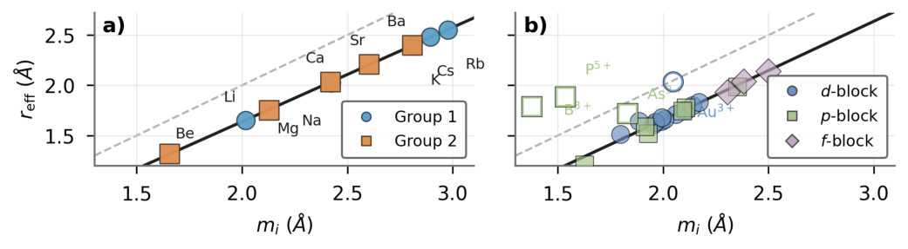
<figcaption class="paper-figure-caption"><b>Fig 2.</b> FIG. 2. First-principles screening centroid reff vs. Boltzmann shell centroid mi. (a) Ten s-block ground-state binary oxides. Solid line: shared fit; dashed line: reff = mi. (b) Twenty-five non-s-block ground-state binary oxides, color-coded by block. Open symbols mark the four directional-bonding outliers excluded from the regression (B2O3, P2O5, As2O3, Au2O3).</figcaption>
</figure>

**Summary.** This paper provides a physical derivation for the long-standing empirical bond-valence rule by showing it emerges from screened Coulomb electrostatics. It identifies the bond-valence softness parameter as a measurable electronic screening length, transforming an empirical rule into a predictive physical descriptor. The theory is highly validated against first-principles electron density data across various chemical blocks.

**Why it may be interesting.** not directly relevant

Detailed structure

**Main problem.** The bond-valence model (BVM) is a widely used empirical method for estimating bond strengths in crystals, but it lacks a derivation from a specific physical interaction and its exponential dependence on bond length is not physically grounded.

**Main result.** The paper proves that the bond-valence exponential form is the leading-order limit of Yukawa-screened Coulomb electrostatics, providing a physical basis for the model's parameters.

**Method.** The authors use a Taylor expansion of the Yukawa weight about a Boltzmann-weighted mean bond length and validate the theory by comparing predicted parameters against first-principles electron density data from the Materials Project.

**Model / system.** The study focuses on ionic solids and coordination environments, specifically cation-oxygen species, modeled using a Yukawa-screened electrostatic potential.

**Key observables.** Bond-valence softness (B), bond-valence intercept (R0), electronic screening length (lambda), and the bond-valence Boltzmann shell centroid (mi) compared to the first-principles screening centroid (reff).

**Important parameters / regimes.** The screening length (lambda), formal charge (z), coordination number (n), and the bond-valence parameter B (bond-valence softness).

**Assumptions / limitations.** The derivation relies on a first-order Taylor expansion, which may fail for highly distorted coordination shells, and assumes an isotropic Yukawa regime.

**Figures summary.** Figure 1 shows the predicted slope beta versus formal charge for various species; Figure 2 demonstrates the linear correlation between the bond-valence shell centroid and the first-principles screening centroid for s-block and other oxides.

**Paper structure.** The paper introduces the empirical BVM, provides a theoretical derivation using Yukawa-screened electrostatics, validates the model using large-scale first-principles data from the Materials Project, and discusses the limits of the theory in anisotropic bonding regimes.

Abstract

The bond-valence model is a standard way to estimate bond strengths in crystals, but its exponential dependence on bond length has lacked a derivation from a specific physical interaction. We show that this form emerges as the leading-order limit of screened Coulomb electrostatics and that the fitted bond-valence softness can be interpreted in terms of an electronic screening length. This turns bond valence from an empirical fitting rule into a transferable descriptor of local screened charge response across coordination environments. The resulting theory predicts how the bond-valence parameters should vary with ionic charge and coordination number, and that prediction agrees with 150 fitted valences from 94 cation-oxygen species, including 68 in fourfold coordination and 82 in sixfold coordination, at an abundance-weighted coefficient of determination of 0.986. A comparison with first-principles charge densities shows that the bond-valence shell radius tracks the electronic screening cloud with coefficients of determination of 0.9998 for ten alkali and alkaline-earth oxides and 0.967 for 21 other binary oxides whose nearest-neighbor environments match the theory's assumptions. The widely used bond-valence model is thus the leading-order expression of screened electrostatics in ionic solids.

[↑ back to top](#top)

