
# arxiv digest (quant-ph + cond-mat) — 2026-05-03

*159 papers · 38 relevant · 2 highlighted*

## 🔥 Most relevant (38)

*Every paper with at least one nonzero topic score, sorted by best-matching score. 🔥 marks scores ≥4/5. Click the title to jump to the full entry below; click [arXiv] to open the paper page. `(secondary)` marks papers from de-prioritized cond-mat archives.*

Show 38 relevant papers

- [Dissipation Mechanisms and Dissipative Phase Transitions of two coupled Fully Connected Quantum Ising models](#paper-2604.27072) [[arXiv]](http://arxiv.org/abs/2604.27072v1) — 🔥 `driven-dissipative phase transition` **5/5** · 🔥 `correlated / nonlocal dissipation` **4/5** · 🔥 `non-equilibrium dynamics` **4/5** · 🔥 `non-equilibrium universality` **4/5** · `entanglement & information structure` **3/5** · `methods for driven-dissipative` **3/5**
- [Quantum Magnetometry with Orientation beyond Steady-State Limits in Cavity-Magnon Systems](#paper-2604.27608) [[arXiv]](http://arxiv.org/abs/2604.27608v1) — 🔥 `spintronics-quantum-optics interface` **5/5** · 🔥 `quantum measurements` **4/5** · `non-equilibrium dynamics` **3/5** · `correlated / nonlocal dissipation` **2/5** · `methods for driven-dissipative` **2/5**
- [Strong coupling between quantized magnon modes in a YIG microstucture and microwaves in a superconducting resonator](#paper-2604.28145) [[arXiv]](http://arxiv.org/abs/2604.28145v1) `(secondary)` — 🔥 `spintronics-quantum-optics interface` **5/5** · `QC/QI experiment` **3/5** · `Tavis-Cummings & cavity-many-emitter` **3/5** · `quantum optics experiment` **3/5**
- [Branch-Resolved Characterization of Feed-Forward Error in Dynamic Teleportation via Classical Choi Shadows](#paper-2604.28037) [[arXiv]](http://arxiv.org/abs/2604.28037v1) — 🔥 `QC/QI experiment` **5/5** · 🔥 `quantum measurements` **4/5** · `entanglement & information structure` **2/5** · `methods for driven-dissipative` **2/5**
- [Demonstration of Exponential Quantum Speedup with Constant-Depth Compiled Circuits for Simon's Problem](#paper-2604.27457) [[arXiv]](http://arxiv.org/abs/2604.27457v1) — 🔥 `QC/QI experiment` **5/5**
- ⭐ [Long-lived local quantum coherences from hydrodynamic large deviations](#paper-2604.27074) [[arXiv]](http://arxiv.org/abs/2604.27074v1) — 🔥 `non-equilibrium dynamics` **4/5** · `entanglement & information structure` **3/5** · `methods for driven-dissipative` **3/5** · `non-equilibrium universality` **3/5** · `scars & prethermalization` **3/5** · `driven-dissipative phase transition` **2/5**
- [Domain-wall melting in all-to-all QSSEP from random-matrix theory](#paper-2604.28151) [[arXiv]](http://arxiv.org/abs/2604.28151v1) — 🔥 `entanglement & information structure` **4/5** · 🔥 `non-equilibrium dynamics` **4/5** · `methods for driven-dissipative` **3/5** · `non-equilibrium universality` **3/5** · `driven-dissipative phase transition` **2/5**
- [Emergence of prethermal time quasicrystalline order in a quasiperiodically driven non-interacting spin chain](#paper-2604.27250) [[arXiv]](http://arxiv.org/abs/2604.27250v1) — 🔥 `non-equilibrium dynamics` **4/5** · 🔥 `scars & prethermalization` **4/5** · `driven-dissipative phase transition` **3/5** · `entanglement & information structure` **3/5**
- [Experimental detection of entanglement in multimode Gaussian states from high-order intensity correlation moments](#paper-2604.27567) [[arXiv]](http://arxiv.org/abs/2604.27567v1) — 🔥 `QC/QI experiment` **4/5** · 🔥 `quantum optics experiment` **4/5** · `entanglement & information structure` **3/5** · `quantum measurements` **2/5**
- [Observation of Universal Spectral Moments and the Dynamic Dispersive-to-Proliferative Transition](#paper-2604.27585) [[arXiv]](http://arxiv.org/abs/2604.27585v1) — 🔥 `driven-dissipative phase transition` **4/5** · 🔥 `non-equilibrium dynamics` **4/5** · `non-equilibrium universality` **3/5** · `analog quantum simulation` **2/5**
- [Adaptable Continuous Variable Quantum Network with Finite Size Security](#paper-2604.27943) [[arXiv]](http://arxiv.org/abs/2604.27943v1) — 🔥 `QC/QI experiment` **4/5** · 🔥 `quantum optics experiment` **4/5** · `entanglement & information structure` **2/5** · `quantum measurements` **2/5**
- [Macroscopic photon counting beating the Poisson noise limit](#paper-2604.27761) [[arXiv]](http://arxiv.org/abs/2604.27761v1) — 🔥 `QC/QI experiment` **4/5** · 🔥 `quantum measurements` **4/5** · 🔥 `quantum optics experiment` **4/5**
- [Observation of attractor transitions in active magnon-polaritons under microwatt drives](#paper-2604.27668) [[arXiv]](http://arxiv.org/abs/2604.27668v1) — 🔥 `spintronics-quantum-optics interface` **4/5** · `driven-dissipative phase transition` **3/5** · `non-equilibrium dynamics` **3/5** · `quantum optics experiment` **2/5**
- [Semiclassical Ehrenfest paths in open quantum systems](#paper-2604.27328) [[arXiv]](http://arxiv.org/abs/2604.27328v1) — 🔥 `Keldysh / 2PI / non-Gaussian methods` **4/5** · 🔥 `methods for driven-dissipative` **4/5** · `non-equilibrium dynamics` **2/5** · `quantum measurements` **2/5**
- [Optimal current-based sensing of phonon temperature using a finite reservoir](#paper-2604.28155) [[arXiv]](http://arxiv.org/abs/2604.28155v1) — 🔥 `quantum measurements` **4/5** · `non-equilibrium dynamics` **3/5** · `Kondo & dissipative impurity` **2/5** · `methods for driven-dissipative` **2/5**
- [Spin-coherence characterization of boron vacancy defects in hexagonal boron nitride with broadband microwave pulses](#paper-2604.27843) [[arXiv]](http://arxiv.org/abs/2604.27843v1) `(secondary)` — 🔥 `QC/QI experiment` **4/5** · `spintronics-quantum-optics interface` **3/5** · `quantum measurements` **2/5** · `quantum optics experiment` **2/5**
- [High-Rate Free-Space Continuous-Variable QKD with Self-Referenced Passive State Preparation](#paper-2604.27299) [[arXiv]](http://arxiv.org/abs/2604.27299v1) — 🔥 `QC/QI experiment` **4/5** · 🔥 `quantum optics experiment` **4/5** · `quantum measurements` **2/5**
- [Observation antibunching with classical light in a linear interferometer](#paper-2604.27494) [[arXiv]](http://arxiv.org/abs/2604.27494v1) — 🔥 `quantum optics experiment` **4/5** · `interference shaping light` **3/5** · `quantum measurements` **3/5**
- [Strong Mpemba Effect Through a Reentrant Phase Transition](#paper-2604.28117) [[arXiv]](http://arxiv.org/abs/2604.28117v1) — 🔥 `non-equilibrium dynamics` **4/5** · `driven-dissipative phase transition` **2/5** · `non-equilibrium universality` **2/5** · `scars & prethermalization` **2/5**
- [Timescales for Deep and Full Thermalization](#paper-2604.27749) [[arXiv]](http://arxiv.org/abs/2604.27749v1) — 🔥 `entanglement & information structure` **4/5** · 🔥 `non-equilibrium dynamics` **4/5** · `scars & prethermalization` **2/5**
- [Compressed Sensing for Efficient Fidelity Estimation of GHZ States](#paper-2604.27824) [[arXiv]](http://arxiv.org/abs/2604.27824v1) — 🔥 `QC/QI experiment` **4/5** · `entanglement & information structure` **3/5** · `quantum measurements` **2/5**
- [Nonlocal nonstabilizerness in free fermion models](#paper-2604.27055) [[arXiv]](http://arxiv.org/abs/2604.27055v1) — 🔥 `entanglement & information structure` **4/5** · `non-equilibrium dynamics` **3/5** · `non-equilibrium universality` **2/5**
- [Quantum Lattice Boltzmann Solutions for Transport under 3D Spatially Varying Advection on Trapped Ion Hardware](#paper-2604.28121) [[arXiv]](http://arxiv.org/abs/2604.28121v1) — 🔥 `QC/QI experiment` **4/5** · `non-equilibrium dynamics` **3/5** · `quantum measurements` **2/5**
- [An Analytical Approach to Design Space Exploration for Cavity-Mediated Quantum State Transfer in Multi-core Architectures](#paper-2604.27664) [[arXiv]](http://arxiv.org/abs/2604.27664v1) — 🔥 `methods for driven-dissipative` **4/5** · `Tavis-Cummings & cavity-many-emitter` **2/5** · `non-equilibrium dynamics` **2/5**
- [High-key-rate Fully-Passive Quantum Access Network with Thermal Source](#paper-2604.27327) [[arXiv]](http://arxiv.org/abs/2604.27327v1) — 🔥 `QC/QI experiment` **4/5** · 🔥 `quantum optics experiment` **4/5**
- ⭐ [Observation of Vinen turbulence during far-from-equilibrium Bose-Einstein condensation](#paper-2604.28191) [[arXiv]](http://arxiv.org/abs/2604.28191v1) — 🔥 `non-equilibrium dynamics` **4/5** · 🔥 `non-equilibrium universality` **4/5**
- [Parametrically Driven iSWAP Gate Using a Capacitively Shunted Double-Transmon Coupler at the Zero-Flux Sweet Spot](#paper-2604.27679) [[arXiv]](http://arxiv.org/abs/2604.27679v1) — 🔥 `QC/QI experiment` **4/5** · `non-equilibrium dynamics` **2/5** · `quantum optics experiment` **2/5**
- [Weak-to-Strong Measurement Transition with Thermal Instabilities](#paper-2604.28137) [[arXiv]](http://arxiv.org/abs/2604.28137v1) — 🔥 `quantum measurements` **4/5** · `methods for driven-dissipative` **2/5** · `non-equilibrium dynamics` **2/5**
- [Light-Cone Structure of Propagation of Entanglement](#paper-2604.27170) [[arXiv]](http://arxiv.org/abs/2604.27170v1) — 🔥 `entanglement & information structure` **4/5** · `non-equilibrium dynamics` **3/5**
- [Size-Limited Room Temperature Single-Photon Emission from Sidewall-Treated Fractional Dimension InGaN Quantum Dots: Determined by Density-of-States-Corrected Ultrafast Carrier Dynamics and Improved Signal-to-Noise Ratio](#paper-2604.27718) [[arXiv]](http://arxiv.org/abs/2604.27718v1) — 🔥 `quantum optics experiment` **4/5** · `QC/QI experiment` **3/5**
- [Fixed-PVM Born Rule Uniqueness from Fisher Non-Expansion and Operational Calibration](#paper-2604.27339) [[arXiv]](http://arxiv.org/abs/2604.27339v1) — 🔥 `quantum measurements` **4/5** · `entanglement & information structure` **2/5**
- [Magnonic Gottesman-Kitaev-Preskill states](#paper-2604.27565) [[arXiv]](http://arxiv.org/abs/2604.27565v1) — 🔥 `spintronics-quantum-optics interface` **4/5** · `quantum measurements` **2/5**
- [Non-Local Magic Resources for Fermionic Gaussian States](#paper-2604.27049) [[arXiv]](http://arxiv.org/abs/2604.27049v1) — 🔥 `entanglement & information structure` **4/5** · `non-equilibrium dynamics` **2/5**
- [CrossBench: Generalized Crosstalk Benchmark Generation for Quantum Computers](#paper-2604.27183) [[arXiv]](http://arxiv.org/abs/2604.27183v1) — 🔥 `QC/QI experiment` **4/5**
- [Formulating Subgroup Discovery as a Quantum Optimization Problem for Network Security](#paper-2604.27153) [[arXiv]](http://arxiv.org/abs/2604.27153v1) — 🔥 `QC/QI experiment` **4/5**
- [High-fidelity iSWAP gate with Double Transmon Coupler](#paper-2604.27080) [[arXiv]](http://arxiv.org/abs/2604.27080v1) — 🔥 `QC/QI experiment` **4/5**
- [OAM-mode sorting with a wavefront twister](#paper-2604.27739) [[arXiv]](http://arxiv.org/abs/2604.27739v1) — 🔥 `interference shaping light` **4/5**
- [Resolving spurious topological entanglement entropy in stabilizer codes](#paper-2604.27053) [[arXiv]](http://arxiv.org/abs/2604.27053v1) — 🔥 `entanglement & information structure` **4/5**

## ⭐ Highlighted (2)

*Papers by authors on your watch list. Click the title to jump to the full entry below; click [arXiv] to open the paper page.*

Show 2 highlighted papers

- ⭐ [Observation of Vinen turbulence during far-from-equilibrium Bose-Einstein condensation](#paper-2604.28191) [[arXiv]](http://arxiv.org/abs/2604.28191v1) — Nigel R. Cooper
- ⭐ [Long-lived local quantum coherences from hydrodynamic large deviations](#paper-2604.27074) [[arXiv]](http://arxiv.org/abs/2604.27074v1) — Sarang Gopalakrishnan

## All papers (77, sorted by relevance)

*Papers from quant-ph and your primary cond-mat archives (quant-gas, stat-mech, str-el, dis-nn). Highlighted papers (⭐) come first, then everything else sorted by topic-relevance score, highest first.*

### ⭐ [Long-lived local quantum coherences from hydrodynamic large deviations](http://arxiv.org/abs/2604.27074v1)

**Highlighted author(s):** Sarang Gopalakrishnan  
**Authors:** Ewan McCulloch, J. Alexander Jacoby, Sarang Gopalakrishnan  
**Type:** theory · **Category:** statistical mechanics · **PDF:** <https://arxiv.org/pdf/2604.27074v1>  
**Analysis basis:** full PDF text, analyzed in chunks
**Topic relevance:** 🔥 `non-equilibrium dynamics` **4/5** · `entanglement & information structure` **3/5** · `methods for driven-dissipative` **3/5** · `non-equilibrium universality` **3/5** · `scars & prethermalization` **3/5** · `driven-dissipative phase transition` **2/5**

📷 Fig 1

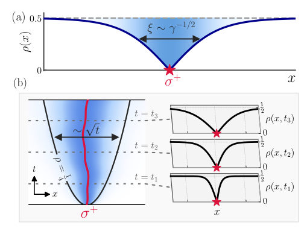 
FIG. 1. Schematic of low-entropy voids. Voids support coherent single-particle/magnon evolution of σ+. (a) In the weak-noise regime, conditional on the survival of a local co- herence (shown here as σ+), the surrounding charge profile is depleted over a finite scale ξ ∼γ−1/2. (b) In the noiseless case, the same diffusion-limited dephasing mechanism pro- duces an aging void whose width grows diffusively in time, ξ(t) ∼ √

📷 Fig 2

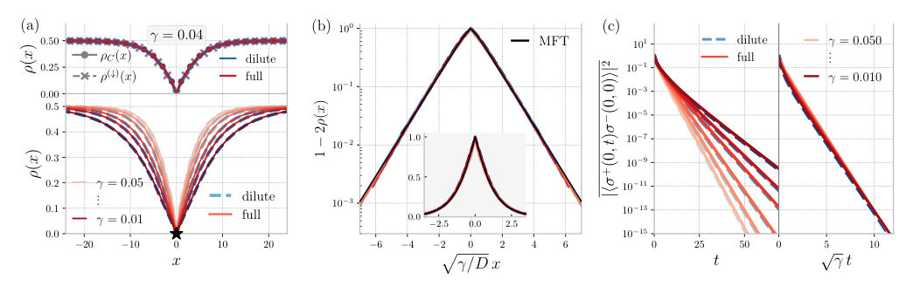 
FIG. 2. Weak-noise stationary void. (a) Top: branch-resolved density profile in the down-polarized branch, ρ(↓)(x), compared with the profile ρC(x) reconstructed from the particle-hole-symmetric diagnostic C(x, t) ≈(1 −2ρ(x, t))2 (Eq. (39)), shown here for γ = 0.04. Their agreement confirms that C(x, t) faithfully captures the branch-resolved stationary void profile. Bottom: stationary density profiles for γ ∈{0.01, · · · , 0.05}. The close agreement between the full two-replica statistical me- chanics model (“full”) and the dilute-coherence approximation (“dilute”) shows that the latter reproduces the same conditioned hydrodynamic voids. (b) Collapse of the stationary void profiles under...

📷 Fig 3

 
FIG. 3. Noiseless aging void. (a) Conditioned density profiles ρ(x, t) at times t = 20, 30, 40, 50, 60 (reconstructed from the overlap C(x, t) defined in Eq. (41)). The density is strongly depleted near the coherence and relaxes back toward half filling over a scale that broadens with time, consistent with an aging void. (b) The same profiles plotted against the similarity variable x/ √

📷 Fig 4

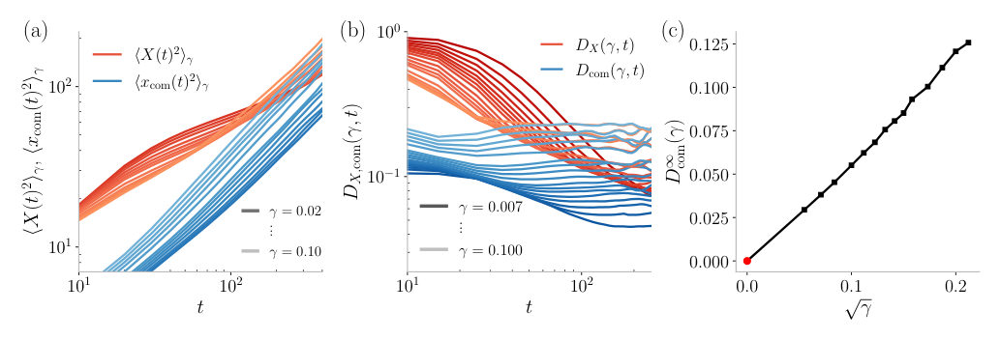 
FIG. 4. Weak noise coherence–void polaron translation mode. (a) Mean-squared displacements of the coherence, ⟨X(t)2⟩, and of the void center of mass, ⟨xcom(t)2⟩, for several values of γ. At early times the coherence moves rapidly inside an already well-polarized quasi-stationary void, while the void center of mass diffuses much more slowly. At later times the coherence motion crosses over to match the void center of mass, indicating binding of the coherence to the slow polaron coordinate. (b) Corresponding time-dependent diffusion constants DX(γ, t) = 1

📷 Fig 5

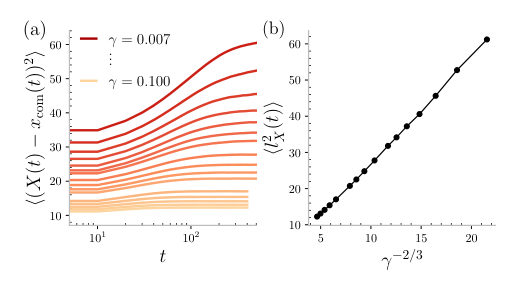 
FIG. 5. Internal motion of the weak noise coherence– void polaron. (a) Mean-squared displacement of the relative-coordinate of the coherence and the void center-of- mass, ⟨(X(t) −xcom(t))2⟩, for γ = 0.007, 0.01, . . . , 0.1. In each case the relative-coordinate MSD approaches a late-time plateau, showing that the coherence remains confined inside the void, with the confinement length increasing as γ is re- duced. (b) Plateau value ℓ2 X(γ), extracted from the late-time relative-coordinate MSD, plotted against γ−2/3. The near- linear dependence is consistent with the Feynman-polaron prediction ℓζ ∼γ−1/3. These data are obtained from the same dilute-coherence population-dynamics sampling as in...

**Summary.** The paper describes how local quantum coherences in charge-conserving systems are protected by rare, low-entropy fluctuations known as 'voids.' This interaction creates a polaron-like object that significantly extends the lifetime of coherences and leads to non-trivial subdiffusive dynamics.

**Why it may be interesting.** This paper is highly relevant to many-body dynamics and open quantum systems as it provides a new mechanism for the protection of quantum information (coherence) via the formation of hydrodynamic 'voids' in the presence of noise.

Detailed structure

**Main problem.** Understanding how local quantum coherences between different charge sectors evolve and decay under generic charge-conserving dynamics, specifically investigating how they interact with hydrodynamic large deviations.

**Main result.** The authors show that quantum coherences form a collective 'void-coherence polaron' with surrounding charge-depleted regions, leading to parametrically enhanced lifetimes and subdiffusive dynamics in the noiseless limit.

**Method.** The study integrates local coherence dynamics into Macroscopic Flutuation Theory (MFT), using a path-integral approach over operator histories, a Feynman-style variational ansatz, and tensor-network simulations.

**Model / system.** Generic many-body quantum systems with a conserved U(1) charge, including 1D random charge-conserving circuits, the Symmetric Simple Exclusion Process (SSEP), and the Katz-Lebowitz-Spohn (KLS) model.

**Key observables.** Single-particle Green's function, autocorrelation functions of off-diagonal operators (e.g., sigma plus), spectral gap of the quantum channel, and many-body weight (MBW) distributions.

**Important parameters / regimes.** Noise strength (gamma), diffusion constant (D), charge density, and the integrability-breaking parameter (delta).

**Assumptions / limitations.** Assumes the ability to expand Heisenberg evolution into a suitable operator basis and assumes the diffusion constant remains finite at all densities.

**Figures summary.** Figure 1 illustrates the low-entropy void structure in noisy and noiseless regimes; Figure 10 shows the variance of coherence position and time-dependent diffusion constants; Figure 12/13 show magnon number conservation breakdown and MBW evolution.

**Paper structure.** The paper introduces the problem of coherence decay, develops a framework linking it to hydrodynamic large deviations, presents the 'polaron' model, provides analytical derivations for the weak-noise and noiseless limits, and validates results via numerical tensor-network simulations.

Abstract

We develop a framework to describe how quantum coherences between distinct charge sectors evolve under generic charge-conserving dynamics. Our framework captures the nonperturbative interactions between quantum coherences and hydrodynamic large deviations -- i.e., rare ``voids'' of low charge entropy. Conditional on surviving, the quantum coherence and its surrounding void form a collective polaron-like object. In one dimension, even at infinite temperature, we show that the lifetime of coherences is parametrically enhanced because they bind to voids. We use our framework to address two fundamental questions about generic quantum dynamics with a conserved charge. First, we argue that gapped Ruelle-Pollicott resonances are absent in the weak-noise limit, even in sectors of operator space that contain no hydrodynamic slow modes: instead, the spectral gap in all sectors vanishes nonperturbatively in the noise strength. Second, we compute the spacetime asymptotics of the dynamical single-particle Green's function, both in the weak-noise regime and in the absence of noise. In the noiseless case, we find that the void-coherence polaron undergoes subdiffusion, with an exponent we calculate. We support our general arguments with a microscopic derivation for random charge-conserving circuits, as well as numerical evidence from tensor-network simulations.

[↑ back to top](#top)

### ⭐ [Observation of Vinen turbulence during far-from-equilibrium Bose-Einstein condensation](http://arxiv.org/abs/2604.28191v1)

**Highlighted author(s):** Nigel R. Cooper  
**Authors:** Sebastian J. Morris, Martin Gazo, Simon M. Fischer, Haoyu Zhang, Christopher J. Ho, Nigel R. Cooper, Christoph Eigen, Zoran Hadzibabic  
**Type:** experiment · **Category:** quantum gases · **PDF:** <https://arxiv.org/pdf/2604.28191v1>  
**Analysis basis:** full PDF text, analyzed in chunks
**Topic relevance:** 🔥 `non-equilibrium dynamics` **4/5** · 🔥 `non-equilibrium universality` **4/5**

📷 Fig 1

 
FIG. 1. Detecting decaying quantum turbulence during far-from- equilibrium condensation in an isolated gas. (a) Cartoon of the ex- pected vortex-tangle decay; the cylindrical container shows the ge- ometry of our optical box trap [58, 59]. (b) Experimental concept. We magnify the cloud [60–62] (by a factor of ≈3.5 in the x-y plane) and then image just a slice of it (orange shading) [63], so the im- prints of the random vortex lines (dark lines) start and stop as they enter and leave the imaged slice. We show an experimental image and a numerical simulation with similar parameters. Here ns is the imaged 2D density, Ns is the total number of imaged atoms, and the scale bar shows 50µm. Our box...

📷 Fig 2

 
FIG. 2. Stages of relaxation, starting in an incoherent state. Here the scattering length is a = 430a0, so ξ = 0.9µm. (a) Examples of cloud slices at different relaxation times, imaged in separate ex- perimental runs; the scale bar and the color scale are the same as in Fig. 1(b). The early-time images show only small-scale den- sity fluctuations, whereas for t ≳80ms we observe well-defined and well-separated vortex lines. (b) The corresponding evolution of the coherence length ℓ, obtained separately from measurements of momentum distributions, as in Ref. [43]. We find that the onset of universal coarsening seen in ℓ2(t), given by dℓ2/dt ≈3.4ℏ/m (dashed line) [43], and the emergence of...

📷 Fig 3

 
FIG. 3. Visualizing the decay of vortex lines. (a) For t ≥80ms, when vortices are well defined (see Fig. 2), we tile cropped slice images corresponding to 12×12 consecutive experimental realizations, which show randomly varying vortex configurations. The red bars in the top- left corner indicate the size of a single-image tile, which corresponds to ≈30µm×30µm in situ, and 〈ns〉is the average over the experimental repetitions. (b) Here, for t = 80ms, we tile images taken without slicing (i.e., with line-of-sight integration over the whole magnified cloud). In this case, with the same color scale as in (a), no vortex imprints are observed.

📷 Fig 4

 
FIG. 4. Quantifying the decay of vortex lines. (a) The vortex line-length density L , extracted according to Eq. (2), is simply proportional to A, the average fractional area of images covered by the vortex imprints [see Fig. 3(a)]. (b) The evolution of L . The dashed line shows an exponential fit, corresponding to one-body vortex decay, to data with t ≥500ms. The faster initial decay hints at vortex-vortex interactions. The solid line shows a fit based on Eq. (4), with B = 1.0(2)ℏ/m and τ = 300(40)ms. (c) By extracting ˙ L ≡dL /dt at different times during the relaxation, we explicitly recover the differential Eq. (3), with consistent B = 0.9(2)ℏ/m and τ = 300(50)ms, respectively the slope...

📷 Fig 5

 
FIG. 5. Universality of Vinen turbulence, for varying a (set at t = 0). (a) The evolution of L for different a is always fit well (solid lines) by Eq. (4), with only the non-universal t∗depending on a. Here, all three data sets are fit with the same B = 1.0(1)ℏ/m; fitting them independently gives consistent B values. Accounting for the difference in the particle mass, this value of B is essentially the same as obtained for superfluid helium [65]. (b) Plotting the same data according to Eq. (4), with a-dependent t∗, collapses them onto the same universal curve; the solid line corresponds to B = 1.0ℏ/m. The dashed line shows the exponential with timescale 300ms that coincides with the solid...

**Summary.** This paper reports the direct observation of decaying quantum turbulence in a 3D Bose-Einstein condensate. By measuring the decay of vortex line density, the authors show that the system follows universal Vinen turbulence dynamics, where the decay rate is independent of the interatomic interaction strength.

**Why it may be interesting.** This work demonstrates universal hydrodynamic behavior and scaling laws in a highly compressible quantum gas, providing a bridge between ultracold atom experiments and the physics of strongly interacting superfluid Helium.

Detailed structure

**Main problem.** Understanding the relaxation dynamics and the emergence of long-range order in far-from-equilibrium quantum fluids, specifically the decay of a turbulent tangle of vortex lines.

**Main result.** The researchers observed the decay of vortex line-length density in a 3D Bose gas and found it follows the prediction for Vinen 'ultraquantum' turbulence, with a decay prefactor B that is universal and independent of interaction strength.

**Method.** The team used matter-wave magnification via a pulsed harmonic potential to enlarge the gas density distribution and imaged a thin slice of the cloud to identify vortex imprints as density dips.

**Model / system.** A homogeneous 3D atomic Bose gas of 39K atoms trapped in a cylindrical optical box trap, prepared in a far-from-equilibrium state by initiating interactions via Feshbach resonance.

**Key observables.** Vortex line-length density (L), coherence length (l), and the decay constant (B).

**Important parameters / regimes.** S-wave scattering length (a), vortex core size (healing length xi), and the decay timescale (tau).

**Assumptions / limitations.** The large-scale dynamics of the highly compressible gas can be treated as an incompressible hydrodynamic fluid.

**Figures summary.** Fig 1 shows the experimental concept of vortex tangle decay and magnification; Fig 2 displays the temporal evolution of density fluctuations into vortices and the evolution of coherence length; Fig 3 visualizes the decay of vortex lines; Fig 4 and 5 demonstrate the quantification of vortex imprints and the fit to the Vinen decay model.

**Paper structure.** The paper introduces the experimental concept of vortex decay in a box trap, describes the imaging and magnification techniques, presents the temporal evolution of the gas and coherence length, quantifies the vortex line density, and compares the decay dynamics to the Vinen turbulence model and superfluid Helium.

Abstract

Relaxation of far-from-equilibrium quantum fluids, intimately related to the emergence of long-range order, is theoretically associated with the decay of a turbulent isotropic tangle of vortex lines. We observe and study such decaying quantum turbulence in a homogeneous 3D atomic Bose gas. Using matter-wave techniques to magnify the gas density distribution, and then imaging a thin slice of the magnified cloud, we observe imprints of randomly oriented vortex lines and measure the vortex line-length density $\mathcal{L}$. The observed decay of $\mathcal{L}$ agrees with the prediction for Vinen `ultraquantum' turbulence. Although our weakly interacting gases are highly compressible, their large-scale dynamics are consistent with the behavior of an incompressible hydrodynamic fluid, with the decay of $\mathcal{L}$ not depending on the strength of the interatomic interactions and being similar to that in the strongly interacting superfluid helium.

[↑ back to top](#top)

### [Dissipation Mechanisms and Dissipative Phase Transitions of two coupled Fully Connected Quantum Ising models](http://arxiv.org/abs/2604.27072v1)

**Authors:** Bidyut Dey, Andrea Nava, Domenico Giuliano  
**Type:** theory · **Category:** statistical mechanics · **PDF:** <https://arxiv.org/pdf/2604.27072v1>  
**Analysis basis:** full PDF text, analyzed in chunks
**Topic relevance:** 🔥 `driven-dissipative phase transition` **5/5** · 🔥 `correlated / nonlocal dissipation` **4/5** · 🔥 `non-equilibrium dynamics` **4/5** · 🔥 `non-equilibrium universality` **4/5** · `entanglement & information structure` **3/5** · `methods for driven-dissipative` **3/5**

📷 Fig 1

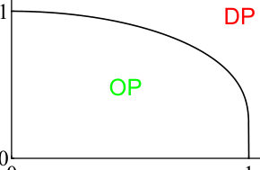 
FIG. 1. Phase diagram of the fully connected quantum Ising model in Eq. (5). The black curve denotes the critical tem- perature given by Eq. (9). Below this line the system is in the ordered phase (OP) with spontaneous Z2 symmetry breaking, while above it the system is in the disordered phase (DP).

📷 Fig 2

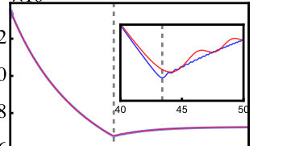 
FIG. 5. Top: mx,1(t) vs tγ. Bottom: O(t) vs tγ. In both panels, we consider a temperature quench Ti = 0.4 →Tf = 1.05 at fixed h1 = 0.6. The blue and red curves correspond to γ = 0.02 and γ = 0.2, respectively. Other parameters are h2 = 10, λ = 0.01, and r = 20. The black vertical dashed line indicates the location of the dynamical phase transition. Inset (Bottom panel): O(t) vs tγ in the vicinity of the dynamical phase transition.

📷 Fig 3

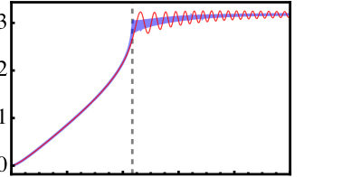 
FIG. 6. Rate function r(t) as a function of the rescaled time tγ for a temperature quench Ti = 0.4 →Tf = 1.05 at fixed h1 = 0.6. The blue and red curves correspond to γ = 0.02 and γ = 0.2, respectively. Other parameters are h2 = 10, λ = 0.01, and r = 20. The black vertical dashed line marks the location of the dynamical phase transition.

📷 Fig 4

 
Figure 6 displays the corresponding dynamics of r(t) for the same quench protocol as in Fig. 5. For weak dissipa- tion (γ = 0.02, blue curve), the rate function exhibits a distinct nonanalyticity at a critical time t∗(scaled by γ), signaling a dynamical phase transition. In contrast, for stronger dissipation, the nonanalytic feature is smoothed out, and the dynamics display a continuous crossover. Unlike the transverse-field quench, here, nonanalytic be- havior in the time evolution of observables persists in the presence of dissipation. However, increasing the dis- sipation strength progressively smears out the dynamical phase transition [67]. In conclusion, our results demonstrate that,...

📷 Fig 5

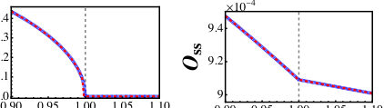 
FIG. 7. Steady state magnetization m1,ss (left) and inter- model correlator Oss (right) for forward (dashed blue) and backward sweep (dashed red) of h1. The black vertical line indicates the transition line at h1,c = 1. We keep bath tem- perature fixed at T = 0.05.

**Summary.** This paper explores how the nature of dissipation determines whether an open quantum system relaxes to a thermal-like state or a complex nonequilibrium state. By studying coupled quantum Ising models, the authors demonstrate that local dissipation can induce a unique reentrant phase transition. This work highlights the critical role of dissipative mechanisms in shaping the phase diagrams of many-body systems.

**Why it may be interesting.** It provides fundamental insights into how the specific structure of system-environment coupling can qualitatively change the phase structure and critical behavior of many-body open quantum systems.

Detailed structure

**Main problem.** Investigating how different dissipative mechanisms (detailed balance vs. local pump-loss) control the emergence of equilibrium-like versus genuinely nonequilibrium critical behavior and phase transitions in open quantum systems.

**Main result.** The study finds that while detailed-balance dissipation leads to steady states resembling thermal Gibbs states, local spin-operator dissipation creates a richer nonequilibrium phase diagram featuring a reentrant symmetry-broken phase.

**Method.** The authors use a self-consistent mean-field approach to solve a nonlinear Lindblad master equation, employing linear stability analysis and numerical integration to characterize phase transitions and relaxation dynamics.

**Model / system.** Two coupled, fully connected (all-to-all) quantum Ising models governed by a nonlinear Lindblad master equation that includes both coherent unitary evolution and incoherent dissipative processes.

**Key observables.** Magnetization (order parameter), inter-model correlation functions, mixed-state fidelity, fidelity rate function, and quantum Fisher information.

**Important parameters / regimes.** Transverse field strengths (h1, h2), inter-model coupling (lambda), bath temperature (T), and system-bath coupling strength (gamma).

**Assumptions / limitations.** The system is treated in the thermodynamic limit using a mean-field approximation, and the environment is assumed to be Markovian (memoryless).

**Figures summary.** Figures show post-quench fidelity and magnetization dynamics, the phase diagram in the h1-gamma plane, the stability gap, and bifurcation diagrams illustrating the emergence of symmetry-broken phases.

**Paper structure.** The paper introduces the model and dissipative classes, analyzes relaxation dynamics following parameter quenches, explores steady-state phase diagrams for different dissipators, and concludes with a comparison of equilibrium-like vs. nonequilibrium criticality.

Abstract

We study dissipative phase transitions in a system of two coupled fully-connected quantum Ising models interacting with an environment. The dynamics is governed by a Lindblad master equation combining coherent unitary evolution and incoherent dissipative processes, where the unitary part is described within a self-consistent mean-field framework effectively acting on the local Hilbert space of two coupled spins at each site.   We analyze two fundamentally different classes of dissipators. In the first case, the jump operators are defined in the instantaneous eigenbasis of the mean-field Hamiltonian and satisfy a detailed-balance condition. In this setting, the relaxation dynamics depends strongly on the quench protocol: a parametric quench of the Hamiltonian leads to conventional relaxation, whereas a temperature quench gives rise to a dynamical phase transition characterized by nonanalytic behavior in time. Yet, in both cases, the system relaxes toward a steady state determined solely by the post-quench parameters and the bath temperature, which closely resembles a thermal Gibbs state of the mean-field Hamiltonian. As a result, the dissipative phase transition occurs at a critical point consistent with the corresponding equilibrium transition. In contrast, when the dissipators are realized via local spin raising and lowering operators, the steady state is genuinely nonequilibrium, leading to a significantly richer phase diagram. In particular, for sufficiently strong system-bath coupling, we observe a reentrant phase featuring a symmetry-broken region bounded by two continuous dissipative phase transitions.   Our results evidence how the structure of dissipative processes controls the emergence of equilibrium-like versus genuinely nonequilibrium critical behavior in open quantum systems.

[↑ back to top](#top)

### [Quantum Magnetometry with Orientation beyond Steady-State Limits in Cavity-Magnon Systems](http://arxiv.org/abs/2604.27608v1)

**Authors:** Zheng Liu, Ding-hui Xu, Yi-jia Yang, Chang-shui Yu  
**Type:** theory · **Category:** other · **PDF:** <https://arxiv.org/pdf/2604.27608v1>  
**Analysis basis:** full PDF text, analyzed in chunks
**Topic relevance:** 🔥 `spintronics-quantum-optics interface` **5/5** · 🔥 `quantum measurements` **4/5** · `non-equilibrium dynamics` **3/5** · `correlated / nonlocal dissipation` **2/5** · `methods for driven-dissipative` **2/5**

📷 Fig 1

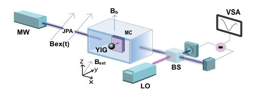 
FIG. 1. Schematic of the weak magnetic-field sensor. A YIG sphere in a microwave cavity couples magnons to cavity photons under an external magnetic field Bex(t). A bias field Bbˆz tunes the magnon res- onance. The cavity is driven by a microwave source and interfaced with a Josephson parametric amplifier to engineer a squeezed input field. The output is measured by homodyne detection, enabling vec- tor magnetic field reconstruction.

📷 Fig 2

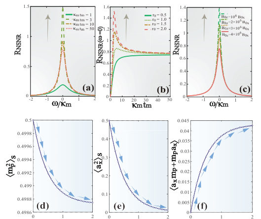 
FIG. 2. (a) Signal-to-noise ratio RNS NR versus normalized frequency ω/κm with the fixed pre-squeezing amplitude r0 = 2. (b) Resonant SNR at ω = 0 as a function of measurement time. (c) RNSNR versus normalized frequency ω/κm with r0 = 2 and κmtm = 3. (d) ⟨m2 p⟩s, (e) ⟨a2 x⟩s, and (f) ⟨axmp + mpax⟩s versus squeezing parameter r0, with fixed squeezing angle θ0 = π. Here r0 and θ0 are the pre-squeezing parameters in the preparation stage, no squeezing is applied during sensing, i.e., (r = θ = 0).

📷 Fig 3

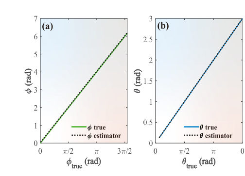 
FIG. 3. The detected azimuthal angle (φ) (a) and polar angle (θ) (b) of a weak magnetic field using the double-difference estimator. Solid lines denote true angles, and dashed lines denote estimated values.

📷 Fig 4

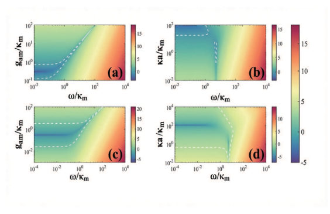 
FIG. 4. S r(ω) as functions of the frequency ω/κm and the coupling strength gam/κm (a, c) ( of ω/κm and the cavity dissipation rate κa/κm (b, d)) without squeezing (a,b) and with squeezing (c,d).

📷 Fig 5

 
FIG. 5. (a) Stationary SNR versus normalized frequency ω/κm for different squeezing parameters. (b) Stationary SNR as functions of temperature and squeezing parameter, the black solid contour de- notes the threshold RSSNR = 1.

**Summary.** This paper proposes a new way to use the short-term 'transient' behavior of cavity-magnon systems to detect magnetic fields with much higher precision than steady-state methods. By carefully preparing the system's initial state and using squeezed light, the researchers show it is possible to reconstruct the full 3D direction of a magnetic field while canceling out unwanted quantum noise.

**Why it may be interesting.** It provides a sophisticated application of open quantum systems theory, specifically regarding how non-equilibrium transient dynamics and engineered initial states can be leveraged to bypass fundamental quantum noise limits in sensing.

Detailed structure

**Main problem.** Conventional steady-state cavity-magnon magnetometry is limited by the loss of initial-state quantum information, an inability to detect 3D magnetic field orientations, and sensitivity limits imposed by cavity-added quantum noise.

**Main result.** The authors demonstrate a transient sensing framework that uses pre-engineered initial states and squeezing to enhance SNR, enables crosstalk-free 3D magnetic field reconstruction, and identifies a resonance condition for full cavity-noise cancellation.

**Method.** The study employs Heisenberg-Langevin equations and input-output relations to analyze finite-time dynamics, utilizing a double-difference scheme for vectorial reconstruction and injected squeezed reservoirs for noise suppression.

**Model / system.** A cavity-magnon system consisting of a microwave cavity coupled to one or more Yttrium Iron Garnet (YIG) spheres, modeled via a Hamiltonian including cavity-magnon coupling, Zeeman interaction, and transverse magnetic drives.

**Key observables.** Cavity field amplitude and phase quadratures, Signal-to-Noise Ratio (SNR), and the 3D magnetic field vector components (azimuthal and polar angles).

**Important parameters / regimes.** Coupling strength (g_am), cavity and magnon decay rates (kappa_a, kappa_m), squeezing amplitude (r), measurement time (t_m), and number of YIG spheres (N).

**Assumptions / limitations.** The magnetic field signal is assumed to be a weak delta-function pulse, and the system operates in the weak-coupling regime.

**Figures summary.** Figure 2 shows SNR vs. frequency and resonant SNR; Figure 5 illustrates stationary SNR versus frequency for various squeezing levels and SNR as a function of temperature and squeezing.

**Paper structure.** The paper introduces the limitations of steady-state sensing, presents a transient framework for 3D reconstruction, analyzes noise suppression via squeezing and resonance, and discusses scalability using YIG arrays.

Abstract

We present a transient quantum sensing framework for cavity-magnon systems that circumvents the inevitable loss of initial-state quantum properties plaguing conventional steady-state protocols. Explicitly incorporating finite-time dynamics and adopting an engineered steady state as the initial condition, we derive the exact transient noise spectrum. We show that residual initial quantum correlations alone can drastically enhance the short-time signal-to-noise ratio (SNR) beyond that achievable with unsqueezed steady-state schemes. Through analysis of the transient spectral density and joint measurements of orthogonal cavity quadratures, we realize crosstalk-free reconstruction of all three magnetic field components, enabling orientation of magnetic signals. In the long-time limit, our theory yields a closed-form stationary noise spectrum and uncovers a resonance condition $g_{am}=\sqrt{κ_aκ_m}/2$, where cavity field quantum noise is fully canceled without requiring strong coherent coupling. Away from this resonance, injected squeezing further suppresses cavity induced noise and broadens the detection bandwidth. Extending the framework to an array of $N$ yttrium iron garnet (YIG) spheres generates a collective bright mode, with magnon-probe noise scaling as $1/N$. Our results establish a unified route to scalable, high precision, multidimensional quantum magnetometry using cavity-magnon platforms.

[↑ back to top](#top)

### [Branch-Resolved Characterization of Feed-Forward Error in Dynamic Teleportation via Classical Choi Shadows](http://arxiv.org/abs/2604.28037v1)

**Authors:** Mason Edwards, Prabhat Mishra  
**Type:** both · **Category:** quantum information and computing · **PDF:** <https://arxiv.org/pdf/2604.28037v1>  
**Analysis basis:** full PDF text, analyzed in chunks
**Topic relevance:** 🔥 `QC/QI experiment` **5/5** · 🔥 `quantum measurements` **4/5** · `entanglement & information structure` **2/5** · `methods for driven-dissipative` **2/5**

📷 Fig 1

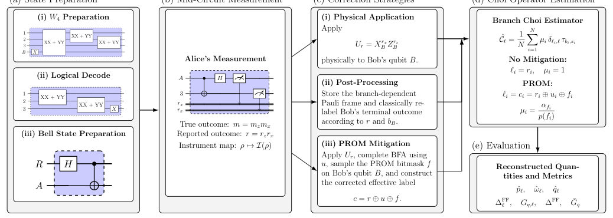 
Fig. 1. Branch-Resolved Characterization Framework. (a) Sequence of initial state preparations performed preceding the mid-circuit measurement. First, either entangled 4-qubit W4 resource is prepared on qubits 1, 2, 3, B via the quantum circuit shown in Fig. 2, followed by a decoding of Alice’s resource qubits into their logical basis (Eq. 19) via the quantum circuit shown in Fig. 3. Then, a Bell state is prepared on reference qubit R and input qubit A (Eq. 27). (b) Alice’s branch-inducing mid-circuit measurement on qubits A and 3. A preceding bell-basis change is performed, and the measurement outcome readout from qubit A is stored in classical register rz, while the readout from qubit 3...

📷 Fig 2

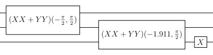 
Fig. 3. Decoding quantum circuit. Decodes Alice’s resource qubits into a single logical qubit on qubit 3.

📷 Fig 3

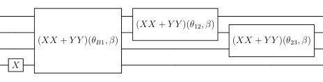 
Fig. 2. State preparation quantum circuit. Prepares either entangled W4 resource state with matched circuit depth and gate count. β = π/2, and θB1 = π/2 prepares the perfect W4 resource, while θB1 = 2π/3 prepares the symmetric W4 resource. θ12 and θ23 are the same for both resources, as shown in Table III.

📷 Fig 4

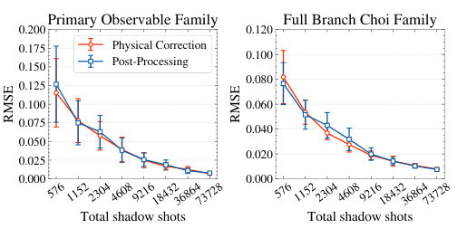 
Fig. 4. Shadow estimator validation against full tomography of branch Choi operators on layout 1 using the Perfect W4 resource. Curves show the RMSE between Choi-shadow estimates and the tomography baseline for the physical correction and post-processing strategies as a function of total shadow shots. Left panel: primary observable family OPrimary ℓ . Right panel: full branch Choi operator family OFull. Error bars indicate the standard deviation over 16 random subsets of executed shadow circuits at fixed shot budgets.

📷 Fig 5

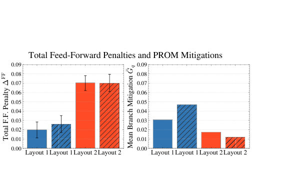 
Fig. 7. Total feedforward (F.F.) penalties ∆FF and mean PROM mitigation of branch qualities ¯Gq for each resource state and physical qubit layout. Hatched bars refer to results from symmetric W4 state experiments, while unhatched bars refer to perfect W4 results. Error bars in the left panel show the 95% bootstrap confidence intervals. Layout 1 shows lower total feed- forward penalty and noticeably improved PROM mitigation, while layout 2 shows higher total feed-forward penalty and reduced PROM mitigation.

**Summary.** This paper introduces a framework to characterize errors in measurement-conditioned operations in dynamic quantum circuits by analyzing individual measurement branches. Using the IBM Fez processor, the authors show that the best error mitigation strategy depends on the underlying readout noise of the hardware. This branch-resolved approach reveals critical error structures that are otherwise obscured by traditional outcome-averaged analysis.

**Why it may be interesting.** It provides a sophisticated framework for analyzing non-trace-preserving dynamics in open quantum systems and demonstrates how branch-specific noise analysis can outperform standard aggregate-state fidelity metrics.

Detailed structure

**Main problem.** Characterizing the 'feed-forward error' in dynamic quantum circuits, specifically how measurement-conditioned corrective operations behave across individual measurement branches rather than just in aggregate.

**Main result.** The study demonstrates that the effectiveness of error mitigation strategies (PROM vs. post-processing) depends on the hardware's readout error profile, and that branch-resolved analysis reveals error structures hidden by outcome-averaged metrics.

**Method.** The authors use 'Classical Choi Shadows' to reconstruct branch-resolved Choi operators and validate them against full tomography, evaluating three correction strategies: physical application, post-processing, and PROM-based mitigation.

**Model / system.** The experiment is performed on the IBM 'Fez' (Heron r2) superconducting quantum processor using a 6-qubit logical setup for single-qubit teleportation with W4 resource states.

**Key observables.** Branch Choi operators, branch quality (overlap with ideal state), feed-forward penalty, and readout assignment error (RAE).

**Important parameters / regimes.** Readout error levels (high vs. low), branch-specific probabilities, and the use of bit-flip averaging (B5A) for mitigation.

**Assumptions / limitations.** The analysis assumes the mid-circuit measurement can be modeled as a quantum instrument with discrete branches, and uses a fixed transpilation seed for reproducibility.

**Figures summary.** Fig 1 shows the teleportation workflow and estimation framework; Fig 2 and 3 detail the circuit for state preparation and decoding; Fig 4 validates shadow estimator accuracy; Fig 5 and 6 compare branch quality across different correction strategies and layouts; Fig 7 shows aggregated error metrics.

**Paper structure.** The paper introduces the problem of feed-forward error, defines the mathematical framework for branch-resolved characterization, describes the experimental setup and correction strategies, presents validation of the shadow estimator, and concludes with a comparative analysis of mitigation performance across different hardware layouts.

Abstract

Mid-circuit measurement and classical feed-forward are essential primitives for dynamic-circuit teleportation on superconducting quantum processors. However, the error associated with measurement-conditioned corrective operations remains poorly understood when evaluated with respect to individual measurement branches. In this paper, we present a framework for characterizing feed-forward error in dynamic circuit teleportation without losing valuable information related to its behavior across separate branches. We analyze three approaches to applying measurement-conditioned corrections: (i) physical application, (ii) post-processing adjustments, and (iii) a mitigated physical application which utilizes Bit-Flip Averaging (BFA)-based Probabilistic Readout Error Mitigation (PROM). We experimentally reconstruct branch Choi operators via an entangled reference qubit, and validate our physical-application and post-processing Choi-shadow estimators against full tomography of the branch Choi operators. We perform experiments on two physical qubit layouts which differ greatly in mid-circuit measurement readout error, and observe a reversal in the relative order in branch qualities obtained from the post-processing and PROM mitigation strategies. In one physical layout with higher measurement readout error, the operational feed-forward penalty is relatively modest (approximately 0.02-0.03) and PROM produces higher branch qualities than post-processing for every branch. In a separate layout with lower readout error, the operational feed-forward penalty increases to roughly 0.07, and post-processing exceeds PROM for all branch qualities. Our characterization framework can reveal branch-specific error structure and mitigation behavior that state-of-the-art outcome-averaged analyses fail to expose.

[↑ back to top](#top)

### [Demonstration of Exponential Quantum Speedup with Constant-Depth Compiled Circuits for Simon's Problem](http://arxiv.org/abs/2604.27457v1)

**Authors:** Phattharaporn Singkanipa, Victor Kasatkin, Daniel A. Lidar  
**Type:** both · **Category:** quantum information and computing · **PDF:** <https://arxiv.org/pdf/2604.27457v1>  
**Analysis basis:** full PDF text, analyzed in chunks
**Topic relevance:** 🔥 `QC/QI experiment` **5/5**

📷 Fig 1

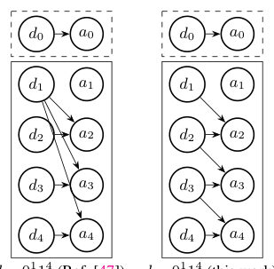 
FIG. 2. Comparison of two oracle constructions for Simon-5 (b = 01111) in the graph representation. CNOTs can be placed in the same entangling layer when they do not share any qubits. For the HW(b) = 4 instance shown here, the construction presented in this work can be scheduled in two entangling layers, whereas the con- struction in Ref. [47] requires three under the same non-overlapping- qubit scheduling rule.

📷 Fig 2

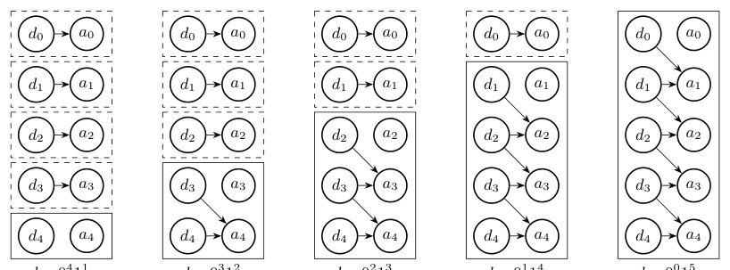 
FIG. 3. Circuit construction underlying the compiled Simon-5 query circuits in the graph representation. Using the reduction procedure, we can trace out an appropriate subset of the leading dashed boxes to obtain Simon-m for any m satisfying HW(b) ≤m &lt; 5.

📷 Fig 3

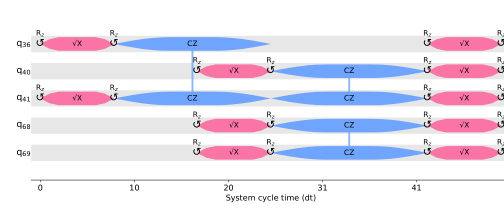 
FIG. 4. Circuit for w2Simon-3 compiled on Boston using the ALAP scheduling strategy. The native gates shown are Rz (circular arrows), √

📷 Fig 4

 
FIG. 5. log2(NTSQ) as a function of n (bottom axis) for the restricted-HW Simon problem with cutoff w = 3 on Boston (blue, up to n = 63) and Miami (red, up to n = 60); the top axis shows log2(Nw). The solid lines denote fits using the polylog model [Eq. (8)], and the dashed lines denote fits using the poly model [Eq. (9)]. The error bars show bootstrapped 1σ uncertainties. The yellow dash-dot lines represent the scaling of log2(NTSlb C ) and also serve as a visual guide for the large-n scaling of the poly model. The gray dashed line is log2 of the interpolated noiseless-quantum esti- mate given by Eq. (6).

📷 Fig 5

 
FIG. 6. log2(NTSQ) as a function of n on Boston (blue) and Miami (red) for the original wnSimon-n, up to n = 20 and n = 16, respec- tively. The line styles and reference curves are the same as in Fig. 5.

**Summary.** This paper presents a method to implement Simon's algorithm with constant-depth circuits on NISQ hardware by using a hardware-aware compilation strategy. By reducing circuit depth, the authors successfully demonstrated exponential quantum speedup on large-scale superconducting processors.

**Why it may be interesting.** not directly relevant

Detailed structure

**Main problem.** Demonstrating exponential quantum speedup for a version of Simon's problem on NISQ-era superconducting hardware while overcoming high circuit depth and SWAP overhead.

**Main result.** The authors achieved exponential speedup on the 156-qubit 'Boston' processor and both exponential and polynomial speedup on the 120-qubit 'Miami' processor using a constant-depth compilation strategy.

**Method.** A hardware-aware compilation strategy that reduces the quantum part of Simon queries to $O(1)$ depth and a Bayesian post-processing algorithm to identify the hidden bitstring.

**Model / system.** Superconducting quantum processors from IBM, specifically the 15FR-qubit 'Boston' (heavy-hex connectivity) and 120-qubit 'Miami' (square-lattice connectivity) devices.

**Key observables.** Number-of-queries-to-solution (NTS), NTS for ideal quantum (NTS_IQ), and scaling exponents (alpha for polylog, beta for poly).

**Important parameters / regimes.** Hamming weight (w) of the hidden bitstring, problem size (n), and the use of the Akaike Information Criterion (AIC) for model selection.

**Assumptions / limitations.** The speedup is demonstrated for a restricted-Hamming-weight version of Simon's problem; comparison is made against a theoretical classical lower bound rather than an optimal classical player.

**Figures summary.** Figures illustrate the quantum circuit construction, the comparison of oracle methods, scaling plots of NTS vs. problem size/Hamming weight, and statistical diagnostics (AIC/R2) for model comparison.

**Paper structure.** The paper introduces the problem and circuit construction, details the hardware-aware compilation method, presents experimental results on two IBM processors, performs statistical scaling analysis to distinguish between exponential and polynomial speedup, and discusses the impact of error mitigation tools.

Abstract

We demonstrate exponential quantum speedup for a restricted-Hamming-weight version of Simon's problem on present-day superconducting quantum processors by introducing a hardware-aware compilation strategy that compiles the quantum part of each Simon query circuit to constant depth. The resulting compiled circuits have $O(1)$ depth and linear connectivity, map directly onto common device layouts, and avoid additional routing and SWAP overhead. Implemented on IBM's $156$-qubit Boston and $120$-qubit Miami processors, the resulting circuits achieve sufficiently high fidelity to exhibit algorithmic quantum speedup without error suppression. Using the number-of-queries-to-solution metric, we observe exponential speedup over the classical lower bound across the full Hamming-weight range studied on Boston and across low-to-intermediate Hamming weights on Miami; at higher Hamming weights on Miami, we still observe polynomial speedup. The same construction also reaches a regime where the original Simon problem is recovered for the problem sizes studied. These results show that careful hardware-aware compilation can make exponential quantum speedup experimentally accessible for a canonical hidden-subgroup problem in the NISQ regime.

[↑ back to top](#top)

### [Domain-wall melting in all-to-all QSSEP from random-matrix theory](http://arxiv.org/abs/2604.28151v1)

**Authors:** Denis Bernard, Lorenzo Piroli, Stefano Scopa  
**Type:** theory · **Category:** statistical mechanics · **PDF:** <https://arxiv.org/pdf/2604.28151v1>  
**Analysis basis:** full PDF text, analyzed in chunks
**Topic relevance:** 🔥 `entanglement & information structure` **4/5** · 🔥 `non-equilibrium dynamics` **4/5** · `methods for driven-dissipative` **3/5** · `non-equilibrium universality` **3/5** · `driven-dissipative phase transition` **2/5**

📷 Fig 1

 
Figure 1. Illustration of the setup. We consider a one-dimensional quantum system of size L, where spinless fermions can hop between any pair of sites j →k, with amplitudes given by different realization of the complex Brownian motion. The hopping amplitudes are reset at each time step. The system is initialized in a domain-wall configuration, with the leftmost M sites occupied and the rest of the chain empty. During the evolution, we probe fluctuations in a subregion Aℓof size ℓ.

📷 Fig 2

 
Figure 2. Entropy density dynamics from a domain-wall initial state with L = 32 and M = ℓ= L/2. The solid line corresponds to the analytic prediction in Eq. (46), while the symbols are obtained from numerical simulations of the quantum dynamics (see Appendix A), averaged over 200 realizations. The dashed horizontal line marks the steady-state value s(∞) = 2 log(2) −1.

📷 Fig 3

 
Figure 3. Charge full-counting statistics dynamics from a domain-wall initial state with L = 32 and M = ℓ= L/2. The solid lines correspond to the analytic predictions in Eq. (52), while the symbols are obtained from numerical simulations of the quantum dynamics (see Appendix A), averaged over 200 realizations. Several values of α are shown, as indicated by the color legend.

📷 Fig 4

 
Figure 4. Comparison between the classical and quantum dynamics of the charge full- counting statistics. Symbols: numerical data for the time evolution of Fclass ℓ (α, t) for ℓ= M = L/2 = 16 as a function of time for different values of α (see color legend), obtained from Eq. (81) by direct matrix exponentiation. Solid lines: analytic solution for the quantum dynamics F(α, t), given in Eq. (52). Dashed horizontal lines indicate the steady-state value in Eq. (69).

📷 Fig 5

 
Figure 5. Numerical analysis of the finite-size deviation |∆L(α, t)| between the classical and quantum charge full-counting statistics as a function of L, for different values of α and t. Quantum data are obtained from simulations of the all-to-all QSSEP as described in Appendix A, while classical results are computed from the corresponding Markov process in Eq. (81) via direct matrix exponentiation. For each system size, the number of samples is chosen as Nsamp ∼O(L4), ensuring that statistical errors remain smaller than the finite-size deviations. The expected scaling ∼L−1 is shown as a dotted black line for reference.

**Summary.** This paper provides an exact analytical description of how a domain wall melts in the all-to-all quantum symmetric simple exclusion process. By using random matrix theory, the authors show that entanglement entropy and particle fluctuations can be calculated explicitly and that quantum and classical transport statistics become identical in the thermodynamic limit.

**Why it may be interesting.** It provides an exact analytical framework for studying non-equilibrium dynamics and entanglement growth in many-body systems with long-range interactions, bridging the gap between quantum and classical stochastic transport.

Detailed structure

**Main problem.** Characterizing the real-time dynamics of coherent quantum fluctuations and particle transport during the melting of an initial domain wall in an all-to-all quantum system.

**Main result.** The authors show that the eigenvalues of the correlation matrix follow a Jacobi process, leading to an explicit analytical expression for entanglement entropy and demonstrating that quantum and classical full-counting statistics coincide in the thermodynamic limit.

**Method.** The study utilizes Random Matrix Theory (RMT), Ito calculus, and stochastic differential equations (SDEs) to map the dynamics to a Jacobi process and derive exact evolution equations.

**Model / system.** The model is the all-to-all Quantum Symmetric Simple Exclusion Process (QSSEP), also known as the charged SYK2 model, consisting of L fermionic modes with hopping driven by complex Brownian motion.

**Key observables.** von Neumann entanglement entropy, Rényi entropy, and full-counting statistics (FCS) of the charge.

**Important parameters / regimes.** Thermodynamic limit (L approaching infinity), subsystem size (l), particle number (M), and the ratio of subsystem to system size (theta).

**Assumptions / limitations.** The analytical solution for entropy is derived for the specific case where the domain wall splits the system into two equal halves; the self-averaging property assumes certain boundedness of the derivatives of the observable functions.

**Figures summary.** Figure 1 shows the 1D all-to-all hopping setup; Figure 2 compares numerical entropy dynamics with analytical predictions; Figure 3 shows charge full-counting statistics; Figure 5 illustrates the L^-1 scaling of finite-size deviations.

**Paper structure.** The paper introduces the all-to-all QSSEP model, applies RMT to identify the Jacobi process for eigenvalue evolution, derives analytical expressions for entanglement and charge statistics, performs finite-size scaling analysis, and concludes with a proof of self-averaging.

Abstract

We study the melting of a domain wall in the quantum simple exclusion process with all-to-all hoppings (a.k.a. the charged SYK$_2$ model). We show that the real-time dynamics of physical quantities of interest can be obtained exploiting spectral results in random matrix theory. We first show that the eigenvalues of the correlation matrix corresponding to the initially charged subsystem evolve according to a Jacobi process, which is defined in terms of a closed system of stochastic differential equations. In turn, this observation allows us to obtain the real-time dynamics of all the eigenvalue moments. We present two physical applications. First, we study the dynamics of the averaged von Neumann entanglement entropy, arriving at a fully explicit expression in the thermodynamic limit. Second, we compute analytically the full-counting statistics of the charge. Our formula allows us to perform a thorough comparison with the full-counting statistics of the classical simple exclusion process. Notably, we show that, in the thermodynamic limit, the quantum and classical full-counting statistics coincide, with no finite-time corrections.

[↑ back to top](#top)

### [Emergence of prethermal time quasicrystalline order in a quasiperiodically driven non-interacting spin chain](http://arxiv.org/abs/2604.27250v1)

**Authors:** Davood Marripour, Jahanfar Abouie  
**Type:** theory · **Category:** disordered systems and neural networks · **PDF:** <https://arxiv.org/pdf/2604.27250v1>  
**Analysis basis:** abstract only; PDF text extraction failed or PDF unavailable
**Topic relevance:** 🔥 `non-equilibrium dynamics` **4/5** · 🔥 `scars & prethermalization` **4/5** · `driven-dissipative phase transition` **3/5** · `entanglement & information structure` **3/5**

**Summary.** This paper demonstrates that a spin chain driven by two incommensurate frequencies can exhibit a stable, prethermal time quasicrystalline phase. The researchers show that this phase features quasiperiodic time-translation symmetry breaking and is resistant to heating. The findings highlight how the interplay of disorder and quasiperiodic driving can create long-lived nonequilibrium states.

**Why it may be interesting.** It explores the intersection of quasiperiodic driving and disorder to create a new type of temporal order (TQC) that extends beyond standard Floquet-based discrete time crystals, offering insights into many-body dynamics and heating suppression.

Detailed structure

**Main problem.** The study investigates the emergence and stability of prethermal time quasicrystalline (TQC) order in a spin chain subjected to quasiperiodic driving.

**Main result.** The authors demonstrate that quasiperiodic driving leads to quasiperiodic time-translation symmetry breaking (QTTSB) with robust spectral peaks at incommensurate frequencies and a suppressed heating regime characterized by a prethermal entanglement entropy plateau.

**Method.** The study employs exact diagonalization to analyze the dynamics of the spin chain.

**Model / system.** A non-interacting spin-1/2 chain with disordered Ising interactions (randomly chosen from a symmetric interval) and a random transverse field, driven by a two-part periodic process involving a rotating transverse magnetic field at an incommensurate frequency ratio.

**Key observables.** Time autocorrelation function, dynamical structure factor, and entanglement entropy (EE).

**Important parameters / regimes.** Driving frequencies (omega_d and Omega), the irrational ratio omega_d/Omega, the high-frequency regime, and the asymmetry of the Ising exchange coupling distribution.

**Assumptions / limitations.** The system is treated as a non-interacting spin chain; the study focuses on the high-frequency regime to observe prethermal effects.

**Paper structure.** The paper introduces the quasiperiodically driven model, describes the numerical methodology using exact diagonalization, presents results for spectral features and entanglement entropy, analyzes the effects of disorder asymmetry and perturbations, and concludes with the implications for nonequilibrium temporal order.

Abstract

We study prethermal time quasicrystalline (TQC) order in a quasiperiodically driven chain of non-interacting spin-1/2 particles. The drive consists of two parts, switched on and off periodically with frequency $ω_d$: (i) disordered Ising interactions, with exchange couplings chosen from a symmetric interval $[-J/2, J/2]$, allowing random antiferromagnetic or ferromagnetic nearest-neighbor couplings, together with a random transverse field; and (ii) a rotating transverse magnetic field with frequency $Ω$.   The ratio $ω_d/Ω$ is chosen to be irrational, producing multiple incommensurate frequencies and yielding quasiperiodic dynamics beyond Floquet theory. Using exact diagonalization, we analyze the time autocorrelation function, dynamical structure factor, and entanglement entropy (EE). In the high-frequency regime, robust spectral peaks at incommensurate frequencies (not integer multiples of the fundamental drives) signal quasiperiodic time-translation symmetry breaking (QTTSB). The EE exhibits sublinear power-law growth followed by a prethermal plateau, indicating suppressed resonant heating due to an energy scale mismatch. The nonequilibrium lifetime increases rapidly with driving frequency. Unlike symmetric disorder sampling, an asymmetric distribution of the Ising exchange couplings induces collective spin rigidity, enhancing the system's resistance to heating. The TQC phase remains stable against next-nearest-neighbor (NNN) exchange perturbations and rotational imperfections, with robustness comparable to discrete time crystals (TCs) under periodic driving. Our results establish this quasiperiodically driven system as a platform for long-lived nonequilibrium temporal order, revealing the interplay of disorder, collective rigidity, and quasiperiodic driving.

[↑ back to top](#top)

### [Experimental detection of entanglement in multimode Gaussian states from high-order intensity correlation moments](http://arxiv.org/abs/2604.27567v1)

**Authors:** Ze-Shan He, Yukuan Zhao, Hao-Shu Tian, Kai Sun, Xiao-Ye Xu, Chuan-Feng Li, Guang-Can Guo  
**Type:** both · **Category:** quantum information and computing · **PDF:** <https://arxiv.org/pdf/2604.27567v1>  
**Analysis basis:** full PDF text, analyzed in chunks
**Topic relevance:** 🔥 `QC/QI experiment` **4/5** · 🔥 `quantum optics experiment` **4/5** · `entanglement & information structure` **3/5** · `quantum measurements` **2/5**

📷 Fig 1

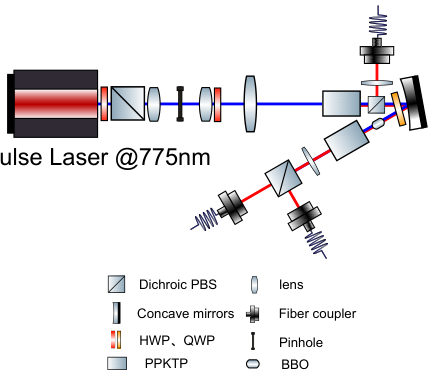 
FIG. 1. Generation of two-mode and three-mode Gaussian states. The laser from a Coherent RegA 9000 is filtered by a 4-f spatial filtering system. We use a single cpKTP crystal to generate a two-mode Gaussian state and subsequently em- ploy two cpKTP crystals to produce a three-mode Gaussian state. The SPDC process in the first crystal generates a two- mode squeezed vacuum state: the idler photon is reflected by a dichroic PBS, while the signal photon is injected into the second crystal simultaneously with the pump laser. After the signal mode polarization is rotated by 90◦, a BBO crystal compensates the time difference between the pump laser and the signal mode after polarization rotation...

📷 Fig 2

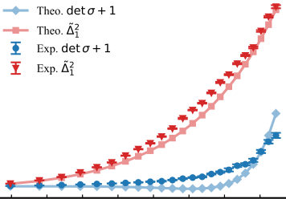 
FIG. 2. PPT criterion inequality for a TMSV. The experi- mental and simulated results for the inequality Eq. (2) as a function of r for g2(0) = 1.8 are shown. The light red solid line with square markers and the light blue solid line with diamond markers represent the simulated values of the two sides of the inequality, corresponding to det σ + 1 and ˜∆2 1, re- spectively. The blue and red dots represent the experimental results, which are in good agreement with the simulations. Specifically, the blue dots correspond to det σ + 1 and the red dots correspond to ˜∆2 1, with r ranging from 0.18 to 0.96.

📷 Fig 3

 
FIG. 3. Symplectic eigenvalues of the TMSV as a function of r. Experimental and simulated results for the smallest symplectic eigenvalue of the partially transposed covariance matrix ˜λ−are shown. The green solid line with up-triangle marker corresponds to g2(0) = 2, i.e., a pure TMSV. The red and blue solid lines correspond to g2(0) = 1.9 and g2(0) = 1.8, respectively; the latter was obtained using experimentally measured parameters with a PNR detector. The blue dots represent the experimental results. For r &gt; 0.75, the eigen- value increases due to the growing contribution of additional pump supermodes, which modifies the photon-number distri- bution. The black dashed line marks the...

📷 Fig 4

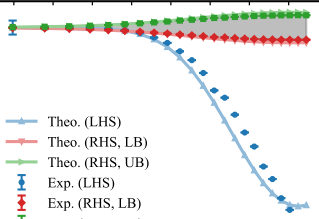 
FIG. 4. PPT criterion inequality for a TMGS. (a) Experimen- tal and simulated results for inequality Eq. (16) as a function of r at g2(0) = 1.8 with a photon-number cutoff of 5. The light blue solid line with up-triangle markers represents the simulated value of the left-hand side (LHS) of the inequal- ity. The light green and light red solid lines with right- and down-triangle markers represent the upper bounds (UB) and lower bounds (LB) of the right-hand side (RHS), respectively. Experimental results are shown as corresponding dots (see leg- end) and agree well with the simulations. (b) Experimental results for the same inequality with a photon-number cutoff of 32. The observed trend is...

**Summary.** This paper presents a method to experimentally detect entanglement in multi-mode Gaussian states using only high-order intensity correlations. By using mathematical bounds to overcome the lack of phase information, the authors successfully certify entanglement in both two-mode and three-mode squeezed states using a multiplexed SNSPD detector.

**Why it may be interesting.** This is highly relevant to quantum optics and quantum information as it provides a robust, phase-insensitive protocol for certifying entanglement in complex multi-mode Gaussian states, which is critical for scalable photonic quantum networks.

Detailed structure

**Main problem.** The challenge of detecting entanglement in multi-mode Gaussian states without the need for a coherent local oscillator or phase reference, which are typically required for homodyne-based detection.

**Main result.** The authors experimentally demonstrated the detection of entanglement in two-mode and three-mode Gaussian states using high-order intensity correlation moments, establishing a method that works even when phase information is unavailable.

**Method.** The researchers used symplectic quantum universal invariants (QUIs) derived from intensity correlation moments and applied the Peres-Horodecki (PPT) criterion, using mathematical bounding techniques to account for missing phase information in the three-mode case.

**Model / system.** The experimental platform uses spontaneous and cascaded parametric down-conversion (SPDC) in customized KTiOPO4 crystals, driven by a high-peak-energy pulsed laser, and employs a 32-channel pseudo-photon-number-resolving detector made of multiplexed SNSPDs.

**Key observables.** High-order intensity correlation moments (up to sixth-order), including $g^{(2)}_{12}$, $g^{(4)}_{12}$, and mean photon numbers.

**Important parameters / regimes.** Squeezing parameters (r), pump laser purity ($g^{(2)}(0)$), and the smallest symplectic eigenvalue ($	ilde{\lambda}_-$).

**Assumptions / limitations.** The states are assumed to be Gaussian; the derivation for TMSV assumes the state satisfies $\langle a_i 
angle = 0$ and $\langle a_i^2 
angle = 0$; and the three-mode analysis requires using bounds due to the lack of phase-sensitive information.

**Figures summary.** Figure 1 shows the experimental setup for TMSV and TMGS generation; Figure 2 compares simulated and experimental PPT inequalities for TMSV; Figure 3 shows the effect of pump purity on symplectic eigenvalues; Figure 4 illustrates the PPT inequality bounds for TMGS.

**Paper structure.** The paper introduces the problem of phase-insensitive entanglement detection, presents the theoretical derivation of intensity-based invariants and PPT bounds, describes the experimental setup for SPDC and PNR detection, and concludes with experimental verification of entanglement in two-mode and three-mode states.

Abstract

Quantum universal invariants of a Gaussian state's covariance matrix, which can be derived from intensity correlation moments, have been adopted to characterize the entanglement properties of Gaussian states via the positive partial transpose criterion, also known as the Peres-Horodecki separability criterion. Such intensity correlation moments enable the extraction of information about the covariance matrix without the need for a coherent local oscillator. Here, we experimentally detect the entanglement properties of multimode Gaussian states using high-order\,(up to sixth-order) intensity correlation moments. These multimode Gaussian states are prepared via spontaneous and cascaded parametric down-conversion pumped by a high-peak-energy pulsed laser. Their intensity correlation moments are measured using a pseudo-photon-number-resolving detector constructed through spatial multiplexing of 32 threshold superconducting nanowire single photon detectors. This method is successfully demonstrated for two-mode and three-mode Gaussian states and can be extended to $N$-mode Gaussian states with $N>3$.

[↑ back to top](#top)

### [Observation of Universal Spectral Moments and the Dynamic Dispersive-to-Proliferative Transition](http://arxiv.org/abs/2604.27585v1)

**Authors:** Jia-Xin Zhong, Chang Shu, Nan Cheng, Jee Woo Kim, Kai Zhang, Kai Sun, Yun Jing  
**Type:** both · **Category:** other · **PDF:** <https://arxiv.org/pdf/2604.27585v1>  
**Analysis basis:** abstract only; PDF text extraction failed or PDF unavailable
**Topic relevance:** 🔥 `driven-dissipative phase transition` **4/5** · 🔥 `non-equilibrium dynamics` **4/5** · `non-equilibrium universality` **3/5** · `analog quantum simulation` **2/5**

**Summary.** This paper shows that while the energy spectra of non-Hermitian systems change drastically with boundary conditions, their spectral moments remain stable and reflect true bulk properties. By using acoustic lattices, the authors demonstrate that these moments can predict a transition between stable dispersive dynamics and unstable proliferative dynamics. This provides a new way to characterize and control the behavior of non-Hermitian matter in finite-sized devices.

**Why it may be interesting.** It challenges the conventional view that PT-symmetry breaking necessarily leads to dynamical instability by showing that bulk dynamics can remain stable if governed by moment structure, which is highly relevant for controlling open quantum systems.

Detailed structure

**Main problem.** The sensitivity of spectra to boundary conditions in non-Hermitian systems (the skin effect) makes it difficult to identify boundary-robust bulk properties in finite-sized lattices.

**Main result.** The authors demonstrate that spectral moments serve as boundary-robust bulk observables and identify a dispersive-to-proliferative dynamical transition governed by these moments rather than spectral boundary sensitivity.

**Method.** The study uses a unified acoustic platform for full spectral reconstruction and time-domain access, combined with a newly developed loop-counting theory to quantify finite-size deviations.

**Model / system.** The experimental platform consists of 1D, 2D, and 3D acoustic lattices exhibiting non-Hermitian physics and the non-Hermitian skin effect.

**Key observables.** Spectral moments (one-, two-, and three-dimensional), complex spectra, and local bulk dynamics (dispersive vs. proliferative regimes).

**Important parameters / regimes.** Boundary geometries, lattice dimensionality, and the PT-broken regime.

**Assumptions / limitations.** The study relies on the connection between the thermodynamic theorem and finite systems via a loop-counting theory.

**Paper structure.** The paper introduces the problem of boundary sensitivity in non-Hermitian spectra, presents experimental evidence of spectral moment invariance across geometries, introduces a loop-counting theory for finite-size corrections, and concludes with the discovery of a new dynamical transition.

Abstract

In non-Hermitian systems, spectra can be maximally boundary-sensitive, yet bulk physics need not be. Here we experimentally show that spectral moments provide boundary-robust bulk observables in finite non-Hermitian lattices, even when the spectra undergo dramatic geometry-dependent reshaping due to the skin effect. Using a unified acoustic platform with full spectral reconstruction and time-domain access, we probe one-, two- and three-dimensional lattices and demonstrate that spectral moments remain nearly invariant across distinct boundary geometries while the corresponding complex spectra differ strongly. To connect the thermodynamic theorem to realistic finite systems, we develop a loop-counting theory that identifies the physical origin of finite-size deviations in terms of missing boundary loops, quantitatively captures the corrections, and predicts a scaling law, which we verify experimentally. Beyond acoustic spectroscopy, we reveal a counterintuitive dynamical consequence of moment invariance: a dispersive-to-proliferative bulk transition governed by bulk moment structure rather than spectral boundary sensitivity. As a result, local bulk dynamics can remain stable (dispersive) even in a $\mathcal{PT}$-broken spectral regime, challenging the conventional expectation that $\mathcal{PT}$ breaking necessarily implies feedback-induced dynamical instability (proliferation) through exponentially amplifying spectral components. These results establish spectral moments as practical bulk descriptors for finite non-Hermitian matter and open a route to extracting and controlling intrinsic bulk behavior in realistic wave-based non-Hermitian devices.

[↑ back to top](#top)

### [Adaptable Continuous Variable Quantum Network with Finite Size Security](http://arxiv.org/abs/2604.27943v1)

**Authors:** Runjia Zhang, Akash nag Oruganti, Huy Q Nguyen, Adnan A. E. Hajomer, Vladyslav C. Usenko, Ulrik L. Andersen, Tobias Gehring  
**Type:** both · **Category:** quantum information and computing · **PDF:** <https://arxiv.org/pdf/2604.27943v1>  
**Analysis basis:** full PDF text, analyzed in chunks
**Topic relevance:** 🔥 `QC/QI experiment` **4/5** · 🔥 `quantum optics experiment` **4/5** · `entanglement & information structure` **2/5** · `quantum measurements` **2/5**

📷 Fig 1

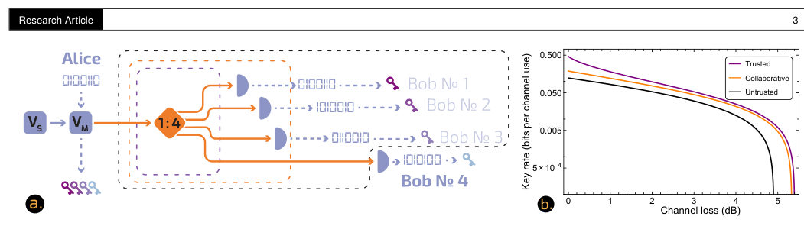 
Fig. 1. (a) Trust assumptions of different broadcasting CV-QKD protocols in access CV-QKD network. Dashed areas indicate ele- ments that are not trusted under respective protocol. Under the trusted protocol quantum channels are not trusted, while users have a varying degree of trust between them. The collaborative protocol relies on measured results of other users to be kept private from Eve, while their detectors are not necessarily trusted. All non-reference Bobs are assumed to be fully a part of Eve in the untrusted protocol. (b) Per-user secret key rate as a function of channel loss for a multi-user CV-QKD network with uniform splitting among users. The solid curves correspond to the...

📷 Fig 2

 
Fig. 2. A continuous variable quantum access network in action in the lab. (a) State preparation station comprises a signal laser, a digital-to-analog converter (DAC), an IQ modulator stabilized by an automatic bias controller (ABC), as well as a variable optical attenuator (VOA) and an isolator. (b) State distribution is assisted with a 1 : 4 splitter which splits the coherent states, forming a quantum broadcasting channel that connects N users while distributing quantum correlations evenly among them. The link consists of two segment, a 10 km fiber spool before the 1 : 4 splitter represent the communication backbone and at each output of the splitter represent last-mile connection to the...

📷 Fig 3

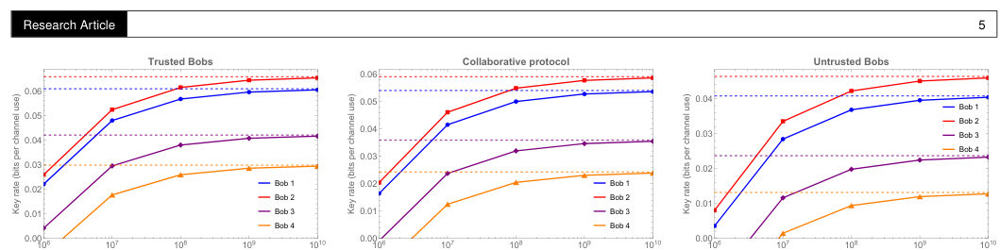 
Fig. 3. Finite-size secret key rates as a function of the total number of exchanged quantum signals for the different trust scenarios considered in the multi-user CV-QKD network. The solid curves correspond to the finite-size secret key rates, while the dashed horizontal lines indicate the corresponding asymptotic secret key rates. (Left) Trusted-user scenario, where non-reference users are assumed trusted and excluded from Eve’s system. (Middle) Collaborative (conditionally trusted) scenario, where auxiliary users publicly disclose their measurements to improve the effective correlations used for key extraction. (Right) Fully untrusted-user scenario, where all non-reference users are...

**Summary.** The researchers demonstrated a 1-to-4 continuous-variable quantum network that can adapt its security level based on user trust. By accounting for finite-size effects, they achieved high-performance secret key generation compatible with existing telecommunications infrastructure.

**Why it may be interesting.** This work is highly relevant to quantum optics and quantum information due to its implementation of multi-user entanglement-based communication and the development of scalable, hardware-compatible quantum network protocols.

Detailed structure

**Main problem.** Scaling continuous-variable quantum key distribution (CV-QKD) from point-to-point links to multi-user access networks while addressing finite-size security and protocol adaptability.

**Main result.** Experimental demonstration of an active 1:4 CV quantum network achieving a total secret key rate of 1.9e-1 bits/channel use, with a framework that allows for different security/trust levels.

**Method.** A unified Gaussian security framework using a chain-rule decomposition to assign joint key contributions to individual users, combined with DSP-based phase recovery and error correction.

**Model / system.** An active 1:4 multi-user continuous-variable quantum network using a passive optical network (PON) topology with a 1:4 beam splitter, 11 km fiber channels, and coherent state modulation.

**Key observables.** Secret key rate (per-user and total), mutual information, Holevo information, and channel excess noise.

**Important parameters / regimes.** 1.25e9 coherent states exchanged, 125 MBaud symbol rate, modulation variance V_M = 5 SNU, reconciliation efficiency beta = 0.95, and 11 km channel length.

**Assumptions / limitations.** Gaussian attacks (collective attacks), finite-size data block limitations, and varying trust assumptions (trusted, collaborative, or untrusted users).

**Figures summary.** Figure 1a illustrates the 1:4 network topology and the different protocol modes; Figure 3 shows finite-size secret key rates versus the number of signals for the three trust scenarios.

**Paper structure.** The paper introduces the multi-user CV-QKD problem, describes the experimental setup and hardware, presents the security framework and key rate decomposition, details the experimental results across different trust modes, and concludes with a performance comparison against existing networks.

Abstract

In recent years, continuous-variable quantum key distribution (CV-QKD) has become a promising paradigm for enabling secure communication among multiple end users sharing the same telecommunication backbone. CV-QKD with reverse reconciliation naturally enables scalability from conventional point-to-point links to quantum access networks based on passive quantum broadcasting channels. Here, we report an experimental demonstration on an active $1:4$ multi-user CV quantum network (QN) in the finite-size regime. With $1.25\cdot10^9$ coherent states exchanged on each $11\text{km}$ quantum channel, the highest performance for secret key generation totaling $1.9\cdot10^{-1}$ bits/channel use. Furthermore, we investigate adaptable CV-QN protocols that comprehensively allow network operation in various security and key rates requirements of individual users. The results establish the practical security of CV-QN compatible with existing telecommunication for broad deployment, and allowing additional degree of freedom for connected end users in existing infrastructures.

[↑ back to top](#top)

### [Macroscopic photon counting beating the Poisson noise limit](http://arxiv.org/abs/2604.27761v1)

**Authors:** Timon Schapeler, Fabian Schlue, Isabell Mischke, Michael Stefszky, Benjamin Brecht, Christine Silberhorn, Tim J. Bartley  
**Type:** experiment · **Category:** quantum information and computing · **PDF:** <https://arxiv.org/pdf/2604.27761v1>  
**Analysis basis:** abstract only; PDF text extraction failed or PDF unavailable
**Topic relevance:** 🔥 `QC/QI experiment` **4/5** · 🔥 `quantum measurements` **4/5** · 🔥 `quantum optics experiment` **4/5**

**Summary.** The researchers developed a method to count large numbers of photons (up to 9000) with precision that exceeds the standard Poisson noise limit. By multiplexing superconducting nanowire detectors, they created a device that functions as a high-sensitivity optical power meter, useful for both quantum state characterization and precision metrology.

**Why it may be interesting.** This is highly relevant for quantum optics and precision metrology as it bridges the gap between single-photon detection and high-sensitivity optical power meters, providing a tool for characterizing large quantum states.

Detailed structure

**Main problem.** The challenge of achieving precise photon-number resolution for high photon fluxes, specifically overcoming the Poisson noise limit in macroscopic photon counting.

**Main result.** Demonstration of precise photon counting from 0 to over 9000 photons, beating the Poisson noise limit by at least 4.1 dB and achieving sub-single-photon precision up to 276 photons per pulse.

**Method.** Multiplexing eight superconducting nanowire single-photon detectors across 128 temporal modes and using model-informed characterization of 1024 detection bins alongside quantum detector tomography.

**Model / system.** An experimental setup consisting of eight intrinsically photon-number-resolving superconducting nanowire single-photon detectors (SNSPDs) multiplexed into 1024 temporal detection bins.

**Key observables.** Photon number counts, Poisson noise limit, and Positive Operator Valued Measures (POVMs).

**Important parameters / regimes.** Photon range (0 to 9000+), noise reduction (4.1 dB), repetition rate (80 kHz), and optical power (71 pW).

**Assumptions / limitations.** The accuracy relies on the model-informed characterization of the 1024 detection bins.

**Paper structure.** The paper presents an experimental demonstration of a high-capacity photon-counting device, detailing the multiplexing architecture, the characterization of detection bins, the reconstruction of POVMs via tomography, and the performance metrics regarding noise reduction and power sensitivity.

Abstract

Photon counting is a cornerstone of quantum optics. Here, we demonstrate precisely counting from 0 to over 9000 photons, beating the Poisson noise limit by at least $4.1~\mathrm{dB}$ across this range. We achieve sub-single-photon precision up to 276 photons per pulse. To do so, we multiplex eight intrinsically photon-number-resolving superconducting nanowire single-photon detectors across 128 temporal modes. We use a model-informed characterization of each of the 1024 detection bins, for optimal precision. We perform quantum detector tomography to reconstruct the positive operator valued measures (POVMs) of the complete device, which consists of $1.38\cdot10^8$ matrix elements. At the repetition rate of our experiment of $80~\mathrm{kHz}$, we can precisely count photons corresponding to an optical power of approximately $71~\mathrm{pW}$, bridging the gap from single-photon measurements to high-sensitivity optical power meters. A photon-number-resolving detector of this size, and the tools used to analyze it, will become increasingly important to characterize large quantum states, as well as tasks in precision metrology and optical power standards.

[↑ back to top](#top)

### [Observation of attractor transitions in active magnon-polaritons under microwatt drives](http://arxiv.org/abs/2604.27668v1)

**Authors:** Hao Wu, Qichun Liu, Yuanbin Fan, Yulong Liu, Qing Zhao  
**Type:** both · **Category:** other · **PDF:** <https://arxiv.org/pdf/2604.27668v1>  
**Analysis basis:** full PDF text, analyzed in chunks
**Topic relevance:** 🔥 `spintronics-quantum-optics interface` **4/5** · `driven-dissipative phase transition` **3/5** · `non-equilibrium dynamics` **3/5** · `quantum optics experiment` **2/5**

📷 Fig 1

 
FIG. 1. Models and stability analysis of the active and passive magnon-polaritons (MP). a,b, Schematics of the active and passive MP models where a cavity photon mode a is coupled to a magnon mode m possessing the nonlinearity K. The coupling is characterized by the spin-photon coupling strength g and the damping of the a and m modes is denoted by κ and γ respectively. The difference between the active and passive MP arises from the driving mechanisms. For the active MP, a self-sustained a mode, acting like a van-der Pol (vdP) oscillator, is established via a feedback architecture consisting of the linear gain G and nonlinear gain saturation Γ|a|2 depending on the photon number, while for...

📷 Fig 2

 
FIG. 2. Experimental setup and microwave characterizations of the magnon and bare cavity modes. a, The half-wavelength microstrip- line cavity is fabricated on a printed circuit board (PCB) and the gain is provided by a bipolar junction transistor (BJT) which is powered by two-port DC voltages (one is fixed at 0.7 V and the other Vc is adjustable). A yttrium iron garnet (YIG) sphere surrounded by a loop antenna is fixed in a sample holder (not shown) above the PCB and movable via a three-axis (x,y and z) translation stage. The whole setup is positioned between a pair of electromagnets supplying horizontal static magnetic fields. There are three RF ports used for the microwave...

📷 Fig 3

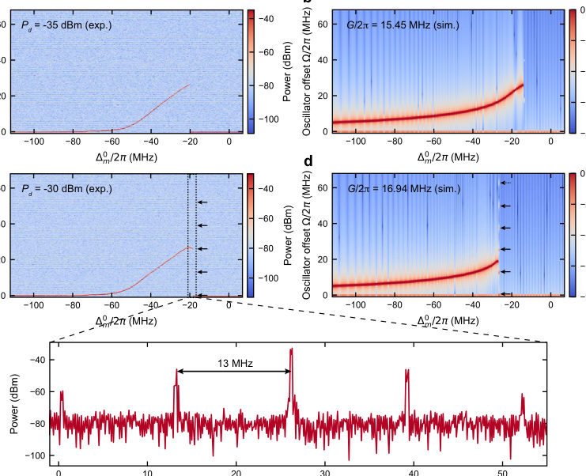 
FIG. 3. Onset of attractor transitions under microwatt-level drive. a,b,c,d, Experimental and simulated results of the frequency offset of the vdP oscillator caused by its coupling to the YIG sphere subject to an up-sweeping magnetic field. ∆0m = ωm −ω0 d is the magnon-drive (cavity) detuning between the magnetic-field-dependent magnon mode frequency and the initial vdP oscillator frequency. The driving power Pd is varied by the gain in the circuit tuned by Vc and determined according to the vdP oscillator output power. The adjustment of Pd in the simulation is realized by tuning the gain factor G. e, Zoom-in of the sidebands observed in the dashed box of c.

📷 Fig 4

 
FIG. 4. Route to chaotic active MP. a,b,e,g, Experimental results of the frequency offset of the vdP oscillator coupled to the YIG sphere subject to a up-sweeping magnetic field under the driving powers beyond 1 µW (-30 dBm). c,d, Zoom-in of the rich nonlinear phenomena observed in the dashed box of b where the four nonlinear regimes show (i) multifrequency limit cycles, (ii) fractals, (iii) frequency-comb-like structure and (iv) chaos. f, Switching of the vdP output spectrum from the multimode to single-mode emission observed in e. The significant peak shifts occur within a change of the magnetic field less than 0.2 G. h, Zoom-in of the magnetic-field-dependent Rabi splittings of the vdP...

📷 Fig 5

 
FIG. 5. Power-dependent stability phase diagram of the active MP revealing its power efficiency in achieving nonlinear attractor transitions. a, Dependence of the critical detuning in real time ∆m = ∆0m −Ωmeasured at different driving powers (left panel). Simulated phase diagrams of the stable and unstable FPs in ∆m −G space of the active MP (right panel). The parameters used for generating the phase diagrams are obtained from the simulation shown in Figs. 3b and 3d that reproduce the experimental results. The color bar consistent with the circle fillings in the left panel indicates the different FP situations where S and U stand for stable and unstable FPs respectively. The deterministic...

**Summary.** This paper reports the first experimental observation of complex attractor transitions, including chaos and frequency combs, in an active magnon-polariton system driven by microwatt powers. By using a self-oscillating cavity, the researchers achieved nonlinear control at power levels four orders of magnitude lower than previous passive systems. This work opens new avenues for low-power nonlinear microwave signal generation and neuromorphic computing.

**Why it may be interesting.** It demonstrates a highly controllable, low-power platform for studying driven-dissipative nonlinear dynamics, period-doubling, and chaos, which are central themes in open quantum systems and nonlinear cavity QED.

Detailed structure

**Main problem.** The difficulty of experimentally observing and controlling transitions between distinct nonlinear attractors (such as chaos and frequency combs) in conventional passive magnon-polariton systems, which typically require high-power milliwatt-class drives.

**Main result.** The observation of a full route to chaos and the 'explosive growth of bistability' in an active magnon-polariton system using extremely low microwatt-level microwave drives.

**Method.** The researchers used a self-oscillating microwave cavity coupled to a YIG sphere, employing stability analysis of fixed points and numerical simulations of a van der Pol oscillator model to characterize nonlinear dynamics.

**Model / system.** An active magnon-polariton platform consisting of a 1-mm YIG sphere coupled to a microstrip-line cavity with a BJT-based gain element, modeled as a van der Pol oscillator with Kerr nonlinearity and Suhl-mediated scattering.

**Key observables.** Intra-cavity photon number, frequency spectra (limit cycles, fractals, frequency combs, and broadband chaos), and spectral shifts.

**Important parameters / regimes.** Microwatt-level driving power (-35 to -10 dBm), spin-photon coupling strength (g/2pi = 25 MHz), and effective nonlinearity (K/2pi = 3.2 uHz).

**Assumptions / limitations.** The system is modeled using a semiclassical mean-field level approach.

**Figures summary.** Fig 1 compares active vs. passive models and shows simulated phase diagrams; Fig 2 shows the experimental setup and linear dependence; Fig 4 displays experimental frequency offsets, spectral zooms (fractals/chaos), and magnetic-field-dependent Rabi splittings; Fig 5 shows power-dependent stability phase diagrams.

**Paper structure.** The paper introduces the active vs. passive MP models, describes the experimental setup and BJT-driven architecture, presents stability analysis and phase diagrams, details the experimental observation of power-dependent attractor transitions (from bistability to chaos), and concludes with potential applications in sensing and computing.

Abstract

Magnon-polaritons provide a room-temperature platform for investigating nonlinear cavity quantum electrodynamics in the microwave domain, but experimentally observing controlled transitions among distinct nonlinear attractors remains challenging in conventional passive systems, where strong external driving is usually required. Here we report the observation of attractor transitions in an active magnon-polariton formed by a self-oscillating microwave cavity coupled to a yttrium iron garne (YIG) sphere. The feedback loop supplies an internal microwave drive, while Kerr frequency pulling and Suhl-mediated magnon-magnon scattering produce an enhanced effective nonlinearity. Stability analysis using experimentally calibrated parameters reveals a rich fixed-point (FP) landscape with multiple unstable-FP phases and a triple-point region. By tuning gain across these phases, we observe the first experimental evidence of explosive growth of bistability, followed by transitions to multifrequency limit cycles, comb-like/fractal spectra, and broadband chaotic dynamics at microwatt powers. Near a critical point, magnetic-field-triggered switching between nonlinear emission states produces spectral shifts up to 162 times the bare gyromagnetic response. By enabling low-power attractor transitions and attractor-switching-amplified spectral response, active magnon-polaritons open opportunities for nonlinear microwave signal generation, high-precision sensing, and neuromorphic computing.

[↑ back to top](#top)

### [Semiclassical Ehrenfest paths in open quantum systems](http://arxiv.org/abs/2604.27328v1)

**Authors:** Xiao-Kan Guo  
**Type:** theory · **Category:** statistical mechanics · **PDF:** <https://arxiv.org/pdf/2604.27328v1>  
**Analysis basis:** full PDF text, analyzed in chunks
**Topic relevance:** 🔥 `Keldysh / 2PI / non-Gaussian methods` **4/5** · 🔥 `methods for driven-dissipative` **4/5** · `non-equilibrium dynamics` **2/5** · `quantum measurements` **2/5**

📷 Fig 1

 
Figure 1: The position variance ⟨ˆx2⟩(t) = x(t)2 + σxx(t) for three cases: The quantum case with Dab = diag(2ℏλ, 0) (blue dotted line); the classical case with D = 0 (grey dotted line); the analytical quantum solution (red line). The choices of parameters are specified in the main text.

**Summary.** This paper develops a phase-space framework to describe semiclassical Ehrenfest trajectories in open quantum systems using a Gaussian mixture representation. It successfully demonstrates how the evolution of quantum expectation values can be split into coherent motion and irreversible diffusion. This provides a clear physical picture of how environmental effects like dissipation and decoherence lead to the emergence of classical-like trajectories.

**Why it may be interesting.** It provides a transparent microscopic mechanism for the emergence of classicality from open quantum dynamics, specifically by decomposing the evolution of observables into unitary and dissipative components, which is central to understanding decoherence.

Detailed structure

**Main problem.** Extending semiclassical Ehrenfest trajectories from closed to open quantum systems and providing a phase-space interpretation of how classical trajectories emerge from open quantum dynamics.

**Main result.** The derivation of a Fokker-Planck equation for a Gaussian mixture representation that allows for the microscopic separation of coherent and irreversible (diffusive) contributions to the evolution of expectation values.

**Method.** The study uses a Gaussian mixture representation of the density matrix, a Local Harmonic Approximation, and a Lagrangian description via a Fokker-Planck equation, validated by Monte-Carlo simulations using Ito stochastic differential equations.

**Model / system.** Open quantum systems governed by the Lindblad master equation, with a specific validation model consisting of a 1D free particle subject to momentum diffusion via a Lindblad operator.

**Key observables.** Expectation values of observables (via Weyl symbols), canonical operators (position and momentum), position variance, and thermodynamic quantities like reversible work and heat.

**Important parameters / regimes.** Centroid (position and momentum), covariance matrix, diffusion matrix, friction vector, coupling strength (lambda), and the 'not-too-squeezed' (NTS) condition.

**Assumptions / limitations.** The Local Harmonic Approximation is used, which assumes the dynamics can be truncated to second order in Weyl symbols and that Gaussian states do not become excessively squeezed.

**Figures summary.** Figure 1 compares the evolution of position variance over time for the quantum case (showing growth from dispersion and diffusion), a classical comparison, and the exact analytical solution.

**Paper structure.** The paper first derives the Fokker-Planck equation for the mixing measure of a Gaussian mixture, then embeds a generalized Ehrenfest theorem into this phase-space picture to separate coherent and irreversible dynamics, and finally validates the framework using a 1D free particle model with momentum diffusion.

Abstract

We study the semiclassical Ehrenfest trajectories in open quantum systems. We first derive in explicit form the Fokker-Planck equation that governs the time evolution of the mixing measure for a Gaussian mixture. Then, we embed the generalized Ehrenfest theorem recently obtained for open quantum systems into this phase-space picture to study the time evolution of the expectations of observable with respect to the Gaussian mixture. We show how the coherent and irreversible contributions are microscopically separated. Our work provides a transparent phase-space interpretation of the emergence of classical trajectories in open quantum dynamics.

[↑ back to top](#top)

### [Optimal current-based sensing of phonon temperature using a finite reservoir](http://arxiv.org/abs/2604.28155v1)

**Authors:** Sindre Brattegard, Stephanie Matern, Mark T. Mitchison, Saulo V. Moreira  
**Type:** theory · **Category:** statistical mechanics · **PDF:** <https://arxiv.org/pdf/2604.28155v1>  
**Analysis basis:** full PDF text, analyzed in chunks
**Topic relevance:** 🔥 `quantum measurements` **4/5** · `non-equilibrium dynamics` **3/5** · `Kondo & dissipative impurity` **2/5** · `methods for driven-dissipative` **2/5**

📷 Fig 1

 
FIG. 1. Sketch of the finite-size reservoir at stationary tem- perature and chemical potential, T and µ, coupled to a phonon bath at temperature Tph and to the quantum dot sys- tem. The finite reservoir is also coupled to the left infinite-size reservoir at temperature TL and µL, while the quantum dot is coupled to another infinite-size reservoir to its right, at tem- perature TR and chemical potential µR.

📷 Fig 2

 
FIG. 2. Sensitivity rate of the three thermometry schemes as a function of: (left column) phonon temperature and (right column) bias voltage. The top row has electron-phonon cou- pling with an exponent n = 5, while the bottom row has n = 3. The parameters used are TL = TR = 10Γ, Vb = 40Γ, σ = 300Γ/TL, and Vg = −10Γ. When n = 5, we use Σ = 1000σ/T 3 L, and when n = 3, we use Σ = 100σ/TL. In the right column, we set the phonon temperature to Tph = 8Γ.

📷 Fig 3

 
FIG. 3. Optimised sensitivity rate over gate voltage as the phonon temperature Tph is varied. The inset shows the cor- responding optimal bias voltage. The parameters used are n = 5, TL = TR = 10Γ, Vb = 40Γ, σ = 300Γ/TL, and Σ = 1000σ/T 3 L. For these parameters, we have that ζ = 300, and ξ ≫1, provided the phonon temperature is sufficiently large, i.e., Tph ≳TL/3.

**Summary.** This paper investigates how the finite heat capacity of electronic reservoirs can be used to optimize the sensing of phonon temperatures. It compares different current-based measurement strategies and demonstrates that monitoring individual electron jumps provides the highest precision. The results offer a guide for maximizing thermometric sensitivity via gate voltage tuning in nanoscale devices.

**Why it may be interesting.** It provides a rigorous framework for parameter estimation in non-equilibrium open quantum systems, specifically showing how the thermodynamic properties of a finite environment can be leveraged for high-precision sensing.

Detailed structure

**Main problem.** Developing high-precision thermometry for phonon temperatures in nanoscale transport setups by exploiting the heat exchange between phonon baths and finite-capacity electronic reservoirs.

**Main result.** The study identifies that monitoring individual electron jumps (Strategy I) achieves optimal precision for phonon temperature sensing and provides an optimization analysis for tuning gate voltage to maximize sensitivity.

**Method.** The authors combine current metrology techniques with a thermodynamic framework for finite reservoirs, using Fisher information and the Cramér-Rao bound to evaluate different measurement strategies.

**Model / system.** A quantum dot coupled to a finite-size electronic reservoir, which is in turn coupled to a phonon bath and an infinite electronic reservoir, described by a master equation in the weak coupling regime.

**Key observables.** Electron tunneling jumps, net particle current (DC current), and quantum dot occupation.

**Important parameters / regimes.** Phonon temperature (Tph), electron-phonon coupling strength (xi), reservoir-to-infinite-reservoir coupling (zeta), and gate voltage (Vg).

**Assumptions / limitations.** Weak coupling regime (Gamma << T), large but finite reservoir, fast internal thermalization (quasiequilibrium), and energy-independent transmission.

**Figures summary.** Figure 1 shows the experimental setup schematic; Figure 2 compares sensitivity rates for different strategies as a function of temperature and bias voltage; Figure 3 shows the maximized sensitivity rate optimized over gate voltage.

**Paper structure.** The paper establishes transport and steady-state properties in finite reservoirs, derives the analytical foundations for temperature and chemical potential shifts, applies estimation theory to evaluate measurement strategies, and concludes with an optimization analysis of gate voltage.

Abstract

In realistic nanoscale transport set-ups, electron-phonon coupling leads to the exchange of heat between phonon baths and electronic reservoirs with finite heat capacities. Such exchange affects the finite reservoir's temperature. However, this sensitivity of the finite reservoir temperature to the exchange of heat with the finite reservoir has remained unexplored for thermometry. Here, we fill this gap by combining current metrology techniques with a thermodynamic framework encompassing finite reservoirs. We focus on an experimentally realizable set-up with a quantum dot coupled to a finite reservoir and consider two distinct current-based strategies in the long time limit, namely monitoring quanta exchanged between the quantum dot and finite reservoir and the measurement of the total current flowing from the quantum dot into an infinite reservoir. A third strategy involves measurements of the quantum dot occupation. For a large but finite reservoir, we show that the Fisher information for all three strategies captures the finite reservoir's contribution to sensitivity through common factors. We also demonstrate that monitoring quanta exchanged between the system and finite reservoir in the long time limit achieves optimal precision. Finally, we provide an optimization analysis that explores how maximal precision can be achieved within each of the current-based strategies by tuning the gate voltage.

[↑ back to top](#top)

### [High-Rate Free-Space Continuous-Variable QKD with Self-Referenced Passive State Preparation](http://arxiv.org/abs/2604.27299v1)

**Authors:** H. W. Yin, X. J. Liao, Y. H. Xu, P. Huang, K. T. Zhu, T. Wang, G. H. Zeng  
**Type:** both · **Category:** quantum information and computing · **PDF:** <https://arxiv.org/pdf/2604.27299v1>  
**Analysis basis:** abstract only; PDF text extraction failed or PDF unavailable
**Topic relevance:** 🔥 `QC/QI experiment` **4/5** · 🔥 `quantum optics experiment` **4/5** · `quantum measurements` **2/5**

**Summary.** The researchers developed a new CVQKD method using a self-referenced local local oscillator to overcome noise and instability in free-space communication. They achieved a record-breaking 10.34 Mbps key rate even under significant channel loss. This provides a scalable and practical pathway for high-speed quantum secure communication in real-world environments.

**Why it may be interesting.** This work is highly relevant to quantum optics and quantum networks as it addresses fundamental challenges in maintaining coherence and stability in high-rate, long-distance quantum communication links.

Detailed structure

**Main problem.** Existing continuous-variable quantum key distribution (CVQKD) schemes using transmitted local oscillators suffer from high photon leakage noise and instability, limiting performance in high-loss free-space channels.

**Main result.** The authors implemented a self-referenced local local oscillator (SR-LLO) CVQKD system that achieves a record-high asymptotic secret key rate of 10.34 Mbps over a free-space channel with up to 23.5 dB loss.

**Method.** The work uses a self-referenced passive state preparation (PSP) scheme combined with a novel pilot scheme for high-precision time-varying frequency and phase compensation, supported by a theoretical proof using temporal-mode theory.

**Model / system.** A continuous-variable quantum key distribution system operating over a free-space channel subject to atmospheric turbulence and high loss.

**Key observables.** Asymptotic secret key rate, excess noise, and signal-to-noise ratio (SNR).

**Important parameters / regimes.** 23.5 dB channel loss, 10.34 Mbps secret key rate.

**Paper structure.** The paper introduces the problem of noise in transmitted LO schemes, proposes a self-referenced LLO-CVQKD architecture, provides a theoretical equivalence proof using temporal-mode theory, and demonstrates experimental performance in free-space turbulence.

Abstract

Continuous-variable quantum key distribution (CVQKD) using passive state preparation (PSP) offers low-cost, high-rate secure communication. However, the existing PSP-CVQKD scheme with a transmitted local oscillator has high photon leakage noise and poor stability, making it unsuitable for high-loss transmission. In this work, for the first time, we propose and implement a local local oscillator (LLO) CVQKD system using a self-referenced (SR) PSP scheme, and give a theoretical proof of the equivalence of the PSP and GMCS protocol using temporal-mode theory. By employing the novel self-referenced pilot scheme to achieve high-precision time-varying frequency and phase compensation algorithms, we significantly improve the system' s signal-to-noise ratio and stability. The system achieves a record-high asymptotic secret key rate of 10.34 Mbps over a free-space channel with up to 23.5 dB loss, while maintaining low excess noise and robust performance under turbulent conditions. This work establishes the feasibility of SR-LLO CVQKD, providing a practical pathway toward secure, high-rate quantum communication in realistic environments.

[↑ back to top](#top)

### [Observation antibunching with classical light in a linear interferometer](http://arxiv.org/abs/2604.27494v1)

**Authors:** Yu Gu, Yuhan Ma, Yiqi Song, Meixue Chen, Hui Chen, Huaibin Zheng, Yuchen He, Yu Zhou, Fuli Li, Zhuo Xu, Jianbin Liu  
**Type:** both · **Category:** quantum information and computing · **PDF:** <https://arxiv.org/pdf/2604.27494v1>  
**Analysis basis:** full PDF text, analyzed in chunks
**Topic relevance:** 🔥 `quantum optics experiment` **4/5** · `interference shaping light` **3/5** · `quantum measurements` **3/5**

📷 Fig 1

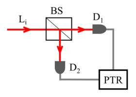 
FIG. 1. Scheme for the modified HBT interferometer. Li: Thermal (i=T) or laser (i=L) light. BS: Non-polarizing 1 : 1 beam splitter. D1 and D2: Single-photon detectors. PTR: Photon detection time series recording system.

📷 Fig 2

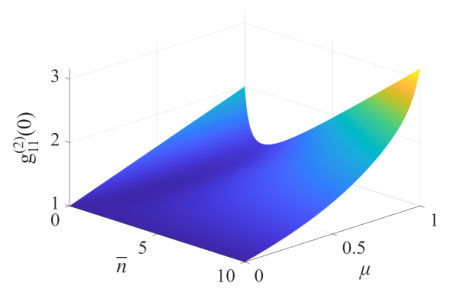 
FIG. 2. The dependence of g(2) 11 (0) on ¯n and µ. g(2) 11 (0) is the normalized second-order correlation function when the two single-photon detection events at D1 and D2 are at the same space-time coordinate. ¯n is the average number of detected photons and µ is the squared modulus of the first-order co- herence function of thermal light.

📷 Fig 3

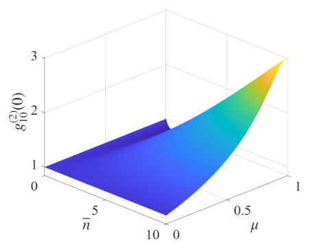 
FIG. 3. The dependence of g(2) 10 (0) on ¯n and µ. The meanings of the symbols are similar as the ones in Fig. 2.

📷 Fig 4

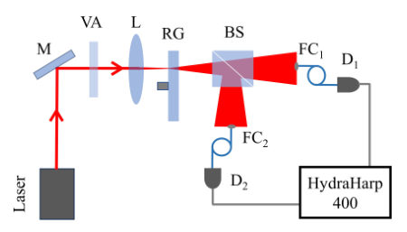 
FIG. 5. Experimental setup to observe antibunching with classical light. Laser: Single-mode continuous-wave laser. VA: Variable light intensity attenuator. L: Lens. RG: Rotat- ing groundglass. FC1 and FC2: Fiber couplers. HydraHarp 400: Photon detection time series recording system, Hydra- Harp 400, which can be replaced by other module with similar functions.

📷 Fig 5

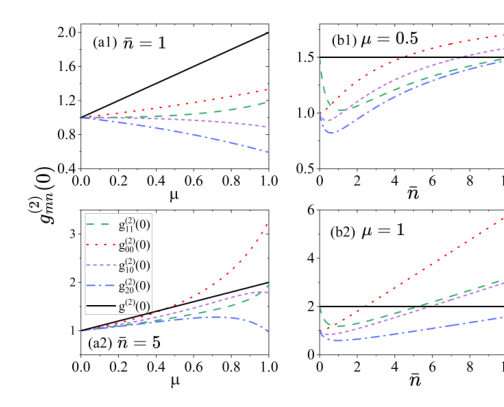 
FIG. 4. The dependence of g(2) mn(0) on ¯n and µ. (a1) and (a2) show the relation between g(2) mn(0) and µ for ¯n equaling 1 and 5, respectively. (b1) and (b2) show the relation be- tween g(2) mn(0) and ¯n for µ equaling 0.5 and 1, respectively. g(2)(0) = 1+µ is the degree of second-order coherence of par- tially coherent thermal light and is drawn in these figures for comparison.

**Summary.** This paper demonstrates that photon antibunching can be observed using classical thermal light by utilizing detectors as photon-number-resolving tools. The effect arises from the interplay between thermal photon statistics and photon-number projection measurements. This finding helps clarify the connection between classical and nonclassical correlations in optical systems.

**Why it may be interesting.** It challenges the traditional association of antibunching with nonclassical light and provides insight into how measurement projection can induce nonclassical-like signatures in classical statistical distributions, which is relevant for quantum imaging and multiphoton interference.

Detailed structure

**Main problem.** Investigating the boundary between classical and nonclassical phenomena by exploring whether photon antibunching, typically a nonclassical effect, can be observed using classical thermal light.

**Main result.** The researchers demonstrated that antibunching can be observed with thermal light in a modified HBT interferometer through photon-number projection measurements, specifically via the $g^{(2)}_{10}$ correlation function.

**Method.** The study combines a theoretical framework using a joint probability generating function with an experimental setup using a modified Hanbury Brown-Twiss interferometer and single-photon detectors acting as photon-number-resolving detectors.

**Model / system.** A modified Hanbury Brown-Twiss (HBT) interferometer using a thermal light source (generated via a laser and rotating ground glass) and a 1:1 non-polarizing beam splitter, with single-photon detectors used for photon-number projection.

**Key observables.** Normalized second-order correlation functions $g^{(2)}_{mn}$, specifically $g^{(2)}_{11}$ and $g^{(2)}_{10}$, and the degree of first-order coherence $\mu$.

**Important parameters / regimes.** Average photon number $\bar{n}$, degree of coherence $\mu$, and the transition regime from antibunching to bunching as $\bar{n}$ increases.

**Assumptions / limitations.** The detectors are treated as photon-number-resolving detectors via photon-number projection measurements.

**Figures summary.** Figure 1 shows the schematic of the modified HBT interferometer; Figures 8(a) and 8(b) illustrate the transition of the $g^{(2)}_{10}$ correlation from antibunching to bunching as the average photon number increases.

**Paper structure.** The paper introduces the problem of classical vs nonclassical boundaries, describes the experimental setup and theoretical model, presents results for various correlation functions and photon numbers, and concludes with an analysis of the nature of the observed effect.

Abstract

Understanding the boundary between classical and nonclassical phenomena is important for both fundamental researches in quantum optics and applications in quantum information. One of the most interesting research directions in this field is exploring nonclassical effects with classical light. In this paper, we will show that it is possible to observe antibunching with thermal light in a Hanbury Brown-Twiss interferometer by treating single-photon detectors as photon-number-resolving detectors to perform photon-number projection measurements. Both temporal and spatial antibunching is observed via the correlation of two detectors detecting one and zero photon, respectively. By comparing the measured results of thermal and laser light, it is found that the observed antibunching arises from the combined effect of photon statistics of thermal light and photon-number projection measurement.The classical and nonclassical nature of the observed antibunching is analyzed. The results are helpful to understand the connection between classical and nonclassical correlation and may find applications in multiphoton interference and quantum imaging.

[↑ back to top](#top)

### [Strong Mpemba Effect Through a Reentrant Phase Transition](http://arxiv.org/abs/2604.28117v1)

**Authors:** Kristian Blom, Doron Benyamin, Uwe Thiele, Oren Raz, Aljaz Godec  
**Type:** theory · **Category:** statistical mechanics · **PDF:** <https://arxiv.org/pdf/2604.28117v1>  
**Analysis basis:** full PDF text, analyzed in chunks
**Topic relevance:** 🔥 `non-equilibrium dynamics` **4/5** · `driven-dissipative phase transition` **2/5** · `non-equilibrium universality` **2/5** · `scars & prethermalization` **2/5**

📷 Fig 1

 
FIG. 1. Emergence of reentrant phase behavior with increasing coordination number. (a)–(c) Equilibrium values [Eq. (11)] of the staggered magnetization s, total magnetization m, and nearest-neighbor correlation q as functions of temperature T at fixed magnetic field H/z|J|=0.5 for z=3&lt;z∗≈5.14. Solid lines denote stable equilibria, dashed lines unstable ones. (d) Corresponding phase diagram in the (H, T) plane. The critical line (green) is monotonic and no reentrant phase transition is observed. (e)–(g) Equilibrium values of (s, m, q) for z=7&gt;z∗and H/z|J|=1.02. In contrast to z=3, the staggered magnetization is nonzero only within an intermediate temperature window. (h) Corresponding phase...

📷 Fig 2

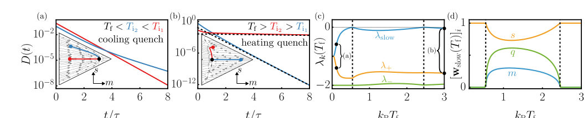 
FIG. 2. Mpemba and inverse Mpemba effects across the reentrant regime and their spectral origin. (a) Displace- ment from equilibrium D(t) [Eq. (13)] for a cooling quench from Ti1 = 3 (paramagnetic phase) and Ti2 = 2 (antiferromagnetic phase) to Tf = 0.12 (paramagnetic phase). Although the quench from Ti2 starts closer to equilibrium, the relaxation curves cross at finite time, showing the Mpemba effect. Insets show the corresponding relaxation trajectories in the (m, s) plane, zoomed in around the trajectories; blue and red dots denote the initial states, and the black dot the final equilibrium. (b) Same protocol but with Tf and Ti2 interchanged, corresponding to a heating quench. The...

**Summary.** This paper demonstrates that the strong Mpemba effect in an antiferromagnetic Ising model is driven by reentrant phase transitions. It shows that the effect occurs because quenches into the paramagnetic phase avoid exciting the slowest staggered relaxation mode. The work establishes a direct connection between equilibrium phase behavior and anomalous non-equilibrium relaxation.

**Why it may be interesting.** The study provides deep insights into how equilibrium phase topology (reentrance) can fundamentally alter non-equilibrium relaxation dynamics and the selection of slow modes in many-body systems.

Detailed structure

**Main problem.** Investigating the origin of the strong direct and inverse Mpemba effects during temperature quenches and establishing a link between these anomalous relaxation phenomena and reentrant phase transitions.

**Main result.** The strong Mpemba effect arises when temperature quenches terminate in the paramagnetic phase due to the selective excitation of the slowest relaxation mode, a phenomenon that disappears in the absence of reentrance.

**Method.** The authors use the Bethe-Guggenheim (pair) approximation to derive macroscopic dynamical equations and analyze the spectral decomposition of the Jacobian matrix to study relaxation modes.

**Model / system.** An antiferromagnetic Ising model in a uniform magnetic field on a Bethe lattice with varying coordination number z, governed by single spin-flip Glauber dynamics.

**Key observables.** Sublattice magnetizations (ma, mb), total magnetization (m), staggered magnetization (s), nearest-neighbor correlation (q), and excess free energy (D(t)).

**Important parameters / regimes.** Temperature (T), magnetic field (H), coordination number (z), and exchange interaction (J).

**Assumptions / limitations.** The results are based on the Bethe-Guggenheim pair approximation and assume the thermodynamic limit (N to infinity).

**Figures summary.** Figure 1 shows equilibrium order parameters and phase diagrams for different coordination numbers, demonstrating monotonic vs. reentrant phase boundaries. Figure 2 illustrates the decay of excess free energy and the crossing of relaxation curves during quenches.

**Paper structure.** The paper introduces the problem of anomalous relaxation, defines the Ising model and BG approximation, derives the dynamical equations and free energy, analyzes the reentrant phase transition mechanism, and concludes with the spectral analysis of relaxation modes and the emergence of the Mpemba effect.

Abstract

We investigate temperature quenches across the reentrant phase transition of the antiferromagnetic Ising model in a magnetic field and show that the strong direct and inverse Mpemba effects arise when quenches terminate in the paramagnetic phase. These anomalous relaxation phenomena originate from the selective excitation of the slowest relaxation mode, which in the paramagnetic phase is purely staggered. Consequently, quenches starting from the paramagnetic phase have zero overlap with the slow mode and exhibit a strong (inverse) Mpemba effect. Quenches from the antiferromagnetic phase excite the staggered mode and display a slow-relaxation tail. By varying the lattice coordination number we show that the strong Mpemba effect disappears in the absence of reentrance. Our results provide the first demonstration of the strong (inverse) Mpemba effect in the antiferromagnetic Ising model based on the pair-approximation, and establish a link between anomalous relaxation and the equilibrium phase behavior.

[↑ back to top](#top)

### [Timescales for Deep and Full Thermalization](http://arxiv.org/abs/2604.27749v1)

**Authors:** Tabea Herrmann, Felix Fritzsch, Arnd Bäcker  
**Type:** theory · **Category:** statistical mechanics · **PDF:** <https://arxiv.org/pdf/2604.27749v1>  
**Analysis basis:** full PDF text, analyzed in chunks
**Topic relevance:** 🔥 `entanglement & information structure` **4/5** · 🔥 `non-equilibrium dynamics` **4/5** · `scars & prethermalization` **2/5**

📷 Fig 1

 
FIG. 1. Time dependence of full thermalization Fk, Eq. (10), and deep thermalization ∆k, Eq. (13), in the kicked field Ising model averaged over 150 spin chain realizations. The numerical data for one Gell-Mann matrix is shown for L = 12, 16, 20 (light to dark colors) and LA = 2. Bold lines show the exponential behavior found by a median regression in the corresponding time interval for all Gell-Mann matrices.

📷 Fig 2

 
FIG. 2. Saturation values of (a) full thermalization F sat

📷 Fig 3

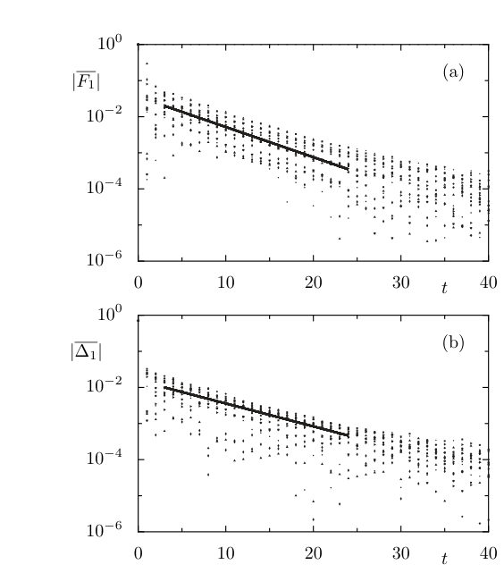 
FIG. 3. Time dependence of (a) full thermalization Fk, Eq. (10), and (b) deep thermalization ∆k, Eq. (13), in the kicked field Ising model averaged over 150 spin chain realiza- tions. The numerical data for the 15 non-trivial Gell-Mann matrices corresponding to LA = 2 is shown for L = 20 and k = 1. Bold lines show the exponential behavior found by a median regression in the corresponding time interval for all non-trivial Gell-Mann matrices.

📷 Fig 4

 
FIG. 5. Thermalization rates of (a) full thermalization γF and (b) deep thermalization γ∆. Similar to Fig. 4 but here for LA = 1, i.e. Pauli matrices, for L = 8, . . . , 18 (150 spin chain realizations) and L = 20 (100 realizations). Data is shown for k = 1, 2, 3, 4, 5, 6.

📷 Fig 5

 
FIG. 6. Thermalization rates of (a) full thermalization γF and (b) deep thermalization γ∆for Gell-Mann matrices with LA = 2 (red plus) and Pauli matrices LA = 1 (blue cross). For the case of deep thermalization we also show for even k and LA = 2 results of mean regression in early time interval t ∈[2, 7] (pink square). For k = 1, 2, 3, 4 we show L = 20 for k = 5, 6 L = 18.

**Summary.** This paper investigates whether the decay of higher-order correlations (full thermalization) and the approach of projected ensembles to Haar-random states (deep thermalization) occur at the same rate. The authors find that while both are exponential, full thermalization is faster at higher orders. The study also identifies a sub-exponential decay for the observable-independent distance between ensembles.

**Why it may be interesting.** It provides new insights into the hierarchy of thermalization timescales in many-body systems, which is crucial for understanding how information scrambles and how local subsystems reach equilibrium in quantum chaotic dynamics.

Detailed structure

**Main problem.** Comparing the relaxation timescales of two extensions of the Eigenstate Thermalization Hypothesis (ETH): Full Thermalization (higher-order correlation functions) and Deep Thermalization (approach of projected ensembles to state designs).

**Main result.** Both processes exhibit exponential relaxation, but full thermalization at higher orders is faster than deep thermalization. Additionally, the decay of the observable-independent norm distance is found to be sub-exponential.

**Method.** Large-scale numerical simulations of a kicked Ising chain combined with theoretical frameworks including Free Probability Theory, Random Matrix Theory, and the replica picture.

**Model / system.** A 1D kicked mixed-field Ising spin chain subject to periodic Floquet dynamics with random longitudinal fields, serving as a paradigmatic model for chaotic many-body quantum dynamics.

**Key observables.** Higher-order Out-of-Time-Order Correlators (OTOCs) $F_k(t)$, moments of the projected ensemble $\Delta_k(t)$, and the Frobenius norm distance $\delta_k(t)$.

**Important parameters / regimes.** Order of the correlation function/moment ($k$), subsystem size ($L_A$), total system size ($L$), and the chaotic/ergodic regime.

**Assumptions / limitations.** The system is in a chaotic/ergodic regime where the system acts as its own bath; the study focuses on the infinite temperature limit or pure states.

**Figures summary.** Figures show the time dependence of $F_k(t)$ and $\Delta_k(t)$ for different orders, the scaling of thermalization rates with system size, and the comparison between exponential decay of moments versus sub-exponential decay of the norm distance.

**Paper structure.** The paper defines the mathematical distinction between full and deep thermalization, presents a case study using the kicked Ising chain to extract relaxation rates, analyzes the scaling of these rates with system size and order $k$, and uses Random Matrix Theory to explain late-time fluctuations and symmetry effects.

Abstract

Isolated quantum systems typically approach thermal equilibrium as described by the Eigenstate Thermalization Hypothesis (ETH). Going beyond this involves either higher order correlators (full thermalization) or the formation of state designs, i.e., the approach of moments of state ensembles after a projective measurement towards thermal equilibrium (deep thermalization). We compare these two extensions of ETH using extensive numerical studies within a paradigmatic model for chaotic many-body quantum dynamics. For this we find exponential relaxation for both extensions: For deep thermalization all moments relax with the same rate, which approximately equals the relaxation rate of the autocorrelation function captured by ETH. In contrast, higher order correlation functions in full thermalization approach equilibrium faster. This means that at higher orders full thermalization is faster than deep thermalization.

[↑ back to top](#top)

### [Compressed Sensing for Efficient Fidelity Estimation of GHZ States](http://arxiv.org/abs/2604.27824v1)

**Authors:** Farrokh Labib, David Nicholaeff, Vincent Russo, William J. Zeng  
**Type:** both · **Category:** quantum information and computing · **PDF:** <https://arxiv.org/pdf/2604.27824v1>  
**Analysis basis:** full PDF text, analyzed in chunks
**Topic relevance:** 🔥 `QC/QI experiment` **4/5** · `entanglement & information structure` **3/5** · `quantum measurements` **2/5**

📷 Fig 1

 
FIG. 1. Binary tree of depth four. The two red leaf nodes are the qubits we use for a parity check, and the paths to their least common ancestor (following the CNOTs) are highlighted in red too. In this case, using just one parity check covers 46.67% of the qubits.

📷 Fig 2

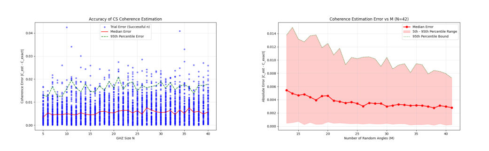 
FIG. 2. Left: Verification of the compressed sensing estimation. The plot shows the median (red line) absolute error |Cest − Cexact| and 95th percentile (green dashed line) error, confirming high accuracy across all system sizes. The blue points represent individual trial errors. Right: Coherence estimation of a fixed-size GHZ state as a function of the number of chosen random angles. The plot shows the median absolute error |Cest −Cexact| (red line), the 95th percentile (green dashed line), and the range 5th-95th percentile error.

📷 Fig 3

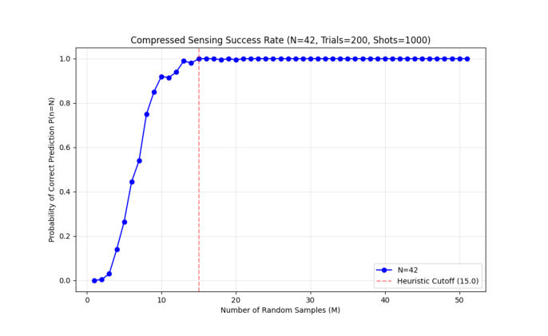 
FIG. 3. Success probability of recovering the correct frequency component n = N as a function of random samples M. The vertical line indicates the heuristic threshold 15, beyond which the recovery rate approaches 100%.

📷 Fig 4

 
FIG. 4. Simulation results for N = 10 GHZ state preparation under depolarizing and thermal noise. The plot shows the estimated fidelity as a function of the number of flag qubits used. Annotation labels indicate the coverage ratio. We observe a clear monotonic increase in population, coherence, and fidelity estimates as more flag qubits are added, confirming that the protocol effectively detects and filters out errors propagating through the circuit.

📷 Fig 5

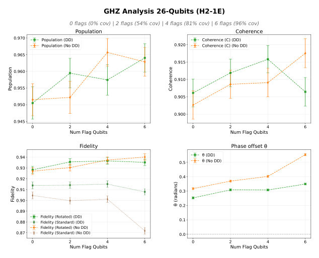 
FIG. 5. Simulation results for N = 26 GHZ state preparation using Quantinuum H2-1 Emulator with noise. The plot shows the estimated fidelity as a function of the number of flag qubits used. We used 20 random angles at which we sample. The coverage ratio for several flags can be found at the top of the figure. We observe a clear monotonic increase in population and rotated fidelity estimates as more flag qubits are added. However, the standard fidelity is decreasing for which the reason is the increasing phase offset θ, due to unwanted rotations. We have also applied dynamic decoupling (DD).

**Summary.** This paper introduces a compressed sensing protocol to efficiently estimate the fidelity of large GHZ states with significantly fewer measurements than traditional methods. By leveraging the sparsity of parity oscillations and implementing error detection via flag qubits, the authors demonstrate robust performance on both simulators and real trapped-ion hardware. This approach provides a scalable pathway for verifying multipartite entanglement in the presence of experimental noise.

**Why it may be interesting.** This work is highly relevant for researchers in quantum information and open quantum systems as it provides a scalable method for verifying large-scale entanglement and addresses the practical challenges of noise and measurement bias in many-body quantum states.

Detailed structure

**Main problem.** Efficiently estimating the fidelity of large-scale multipartite GHZ states while overcoming the prohibitive measurement overhead of standard tomography and the high sampling requirements of traditional parity oscillation methods.

**Main result.** The proposed compressed sensing protocol achieves a double exponential reduction in measurement overhead, scaling logarithmically with system size, and maintains high accuracy even in noisy experimental environments on trapped-ion hardware.

**Method.** The authors use compressed sensing (Lasso and OLS) to reconstruct sparse parity oscillation signals in the DCT basis, combined with a flag-qubit strategy for error detection and readout error mitigation (REM) for error correction.

**Key observables.** Fidelity (decomposed into population and coherence), parity oscillation signal, phase offset, and coverage ratio of flag qubits.

**Important parameters / regimes.** Number of random measurement angles (M approx 5 ln N), number of experimental shots (S), and gate error rates (single-qubit p1q and two-qubit p2q).

**Assumptions / limitations.** The parity oscillation signal is assumed to be sparse in the Discrete Cosine Transform (DCT) basis.

**Figures summary.** Figure 1 shows the binary tree structure for flag placement; Figure 2 shows the bounded error of the CS estimator; Figure 3 shows the success probability of frequency recovery; Figure 4 and 5 demonstrate the trade-off between flag-induced noise and heralded fidelity; Figure 6 shows hardware results for N=50.

**Paper structure.** The paper introduces the problem of GHZ verification, defines the compressed sensing framework for sparse signal reconstruction, details the error detection/mitigation strategy using flag qubits and REM, presents simulation results for scalability, and concludes with experimental validation on trapped-ion hardware.

Abstract

Accurately characterizing multipartite entangled states is a critical challenge in quantum information processing. In this work, we focus on applying compressed sensing techniques to efficiently estimate the fidelity of Greenberger-Horne-Zeilinger (GHZ) states. By exploiting the inherent sparsity of these states, our compressed sensing protocol drastically reduces the measurement overhead traditionally required for state verification while maintaining high accuracy. To evaluate the practical performance of this approach, we test the protocol on GHZ states using both quantum simulators and Quantinuum's trapped-ion hardware. Furthermore, we implement error detection techniques during our hardware evaluations, demonstrating the robustness and viability of compressed sensing for fidelity estimation in noisy experimental environments.

[↑ back to top](#top)

### [Nonlocal nonstabilizerness in free fermion models](http://arxiv.org/abs/2604.27055v1)

**Authors:** Mario Collura, Benjamin Béri, Emanuele Tirrito  
**Type:** theory · **Category:** quantum information and computing · **PDF:** <https://arxiv.org/pdf/2604.27055v1>  
**Analysis basis:** abstract only; PDF text extraction failed or PDF unavailable
**Topic relevance:** 🔥 `entanglement & information structure` **4/5** · `non-equilibrium dynamics` **3/5** · `non-equilibrium universality` **2/5**

**Summary.** The paper explores a measure of nonstabilizerness called nonlocal magic in the context of free fermion models. It provides an analytical bound for Gaussian states and shows how this quantity behaves during phase transitions and quantum quenches. The findings reveal that nonlocal magic can capture physics, such as the separation from entanglement, that standard entanglement measures might miss.

**Why it may be interesting.** This is interesting for many-body dynamics and quantum information because it identifies a new resource-like quantity (nonlocal magic) that behaves differently from standard entanglement during quantum evolution and phase transitions.

Detailed structure

**Main problem.** The paper investigates 'nonlocal magic,' which quantifies the irreducible nonstabilizerness of a bipartite quantum state after optimizing over local basis changes, specifically within the context of fermionic Gaussian states.

**Main result.** The authors derive a closed-form entanglement spectrum bound for nonlocal magic in pure fermionic Gaussian states and demonstrate that it peaks near critical points in the Kitaev chain. They also show that nonlocal magic grows diffusively in random circuits and exhibits a separation from entanglement in the XY chain quench.

**Method.** The study employs random matrix theory (circular unitary ensemble), simulated annealing over local Gaussian unitary transformations, and analytical derivations involving the singular values of the subsystem-restricted covariance matrix.

**Model / system.** The study focuses on free fermion models, including pure fermionic Gaussian states, the Gaussian Haar ensemble, the Kitaev chain, and the XY chain.

**Key observables.** Nonlocal magic, entanglement spectrum, covariance matrix singular values, and entanglement entropy.

**Important parameters / regimes.** Trivial and topological phases of the Kitaev chain, critical points, and the XX limit of the XY chain.

**Assumptions / limitations.** The analysis is primarily restricted to fermionic Gaussian states and Gaussian evolution.

**Paper structure.** The paper introduces the concept of nonlocal magic, provides a closed-form bound for Gaussian states, benchmarks the result via simulated annealing, analyzes the thermodynamic limit using random matrix theory, and then applies the framework to study ground states (Kitaev chain) and dynamical evolution (random circuits and XY chain quenches).

Abstract

Nonlocal magic quantifies the irreducible nonstabilizerness of a bipartite quantum state after optimizing over local basis changes. We study nonlocal magic for pure fermionic Gaussian states, and derive a simple closed-form entanglement spectrum bound in terms of the singular values of the subsystem-restricted covariance matrix. We benchmark our result against simulated annealing over local Gaussian unitary transformations, which supports optimality along the full local Gaussian orbit. For states drawn from the Gaussian Haar ensemble, we show that the average nonlocal magic is extensive and determine its thermodynamic limit using random matrix theory for the appropriate circular unitary ensemble. We also study Gaussian ground states, focusing on the Kitaev chain, and find that nonlocal magic is suppressed deep in both trivial and topological phases and peaks near the critical points. Finally, we investigate Gaussian evolution via random circuits and in quenches with the XY chain. For random circuits, we find that nonlocal magic grows diffusively, while in the XY chain the XX limit reveals a striking separation between nonlocal magic and entanglement.

[↑ back to top](#top)

### [Quantum Lattice Boltzmann Solutions for Transport under 3D Spatially Varying Advection on Trapped Ion Hardware](http://arxiv.org/abs/2604.28121v1)

**Authors:** Sayonee Ray, Jezer Jojo, Jason Iaconis, Abeynaya Gnanasekaran, Apurva Tiwari, Martin Roetteler, Chris Hill, Jay Pathak  
**Type:** both · **Category:** quantum information and computing · **PDF:** <https://arxiv.org/pdf/2604.28121v1>  
**Analysis basis:** abstract only; PDF text extraction failed or PDF unavailable
**Topic relevance:** 🔥 `QC/QI experiment` **4/5** · `non-equilibrium dynamics` **3/5** · `quantum measurements` **2/5**

**Summary.** This paper advances the Quantum Lattice Boltzmann Method by implementing 3D spatially varying advection on IonQ trapped-ion hardware. It identifies significant bottlenecks in density readout and proposes using MPS shadow tomography to overcome them. The work also introduces a new method for simulating wall boundaries in quantum fluid simulations.

**Why it may be interesting.** This is highly relevant for researchers in open quantum systems and many-body dynamics as it demonstrates the practical application of quantum algorithms to simulate complex fluid-like transport and introduces new methods for efficient state readout.

Detailed structure

**Main problem.** Implementing the Quantum Lattice Boltzmann Method (QLBM) for transport under 3D spatially varying advection on real quantum hardware.

**Main result.** Demonstrated transport under non-uniform velocity fields on IonQ trapped-ion systems and identified density readout/reloading as a primary algorithmic bottleneck.

**Method.** Utilization of the Quantum Lattice Boltzmann Method (QLBM) implemented on IonQ Forte and Barium-based trapped-ion hardware, including the proposal of MPS shadow tomography for scalable readout.

**Model / system.** The study uses the advection-diffusion equation as a canonical model for transport phenomena, implemented via the mesoscopic particle distribution functions of the QLBM on IonQ trapped-ion systems.

**Key observables.** Fluid density distributions and transport behavior under non-uniform velocity fields.

**Important parameters / regimes.** 3D spatially varying advection fields and wall boundary conditions.

**Assumptions / limitations.** The study assumes the validity of the discrete Boltzmann transport equation for approximating macroscopic advection-diffusion behavior.

**Paper structure.** The paper introduces the QLBM framework, presents the implementation of non-uniform velocity fields on trapped-ion hardware, analyzes readout bottlenecks, proposes MPS shadow tomography for scaling, and introduces a new method for wall boundaries.

Abstract

The Quantum Lattice Boltzmann Method (QLBM) has emerged as one of the most promising quantum computing approaches for the numerical simulation of problems in computational fluid dynamics (CFD). The dynamics is formulated in terms of mesoscopic particle distribution functions governed by a discrete Boltzmann transport equation, comprising local streaming and collision operations. In this work, the resulting macroscopic behavior corresponds to the advection-diffusion equation, which we adopt as a canonical model problem for transport phenomena. Building upon recent progress in QLBM implementations, we advance towards more realistic problem settings that better reflect conventional CFD requirements. We address, for the first time, transport under the action of non uniform velocity fields on quantum hardware. We implement our demonstration using IonQ's trapped-ion systems including Forte generation systems and a 64-qubit Barium development system similar to the forthcoming IonQ Tempo line. We identify the density readout and subsequent reloading of the fluid density as a potential bottleneck of the current algorithm and discuss several approaches to mitigate this bottleneck. We identify the use of MPS shadow tomography as a promising method to efficiently scale the readout to large system with complex density distributions. Lastly, we introduce and simulate a novel method to implement wall boundaries for advection-diffusion in QLBM, and discuss the prospects of scaling to higher-complexity problems.

[↑ back to top](#top)

### [An Analytical Approach to Design Space Exploration for Cavity-Mediated Quantum State Transfer in Multi-core Architectures](http://arxiv.org/abs/2604.27664v1)

**Authors:** Biel Pons Zaragoza, Junaid Khan, Rohit Sarma Sarkar, Sahar Ben Rached, Carmen G. Almudever, Eduard Alarcon, Sergi Abadal  
**Type:** theory · **Category:** quantum information and computing · **PDF:** <https://arxiv.org/pdf/2604.27664v1>  
**Analysis basis:** full PDF text, analyzed in chunks
**Topic relevance:** 🔥 `methods for driven-dissipative` **4/5** · `Tavis-Cummings & cavity-many-emitter` **2/5** · `non-equilibrium dynamics` **2/5**

📷 Fig 1

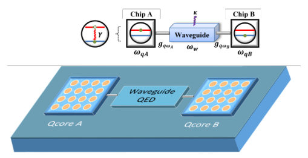 
Figure 1: Schematic of a waveguide-mediated interconnect between two qubit chips in a modular quantum computing system.

📷 Fig 2

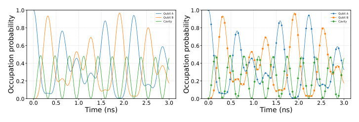 
Figure 2: Comparison between plots using the analytical equation and using QuTip for ∆ω = 500 MHz, g = 1.1 GHz, κ = 3 MHz and γ = 2 MHz.

📷 Fig 3

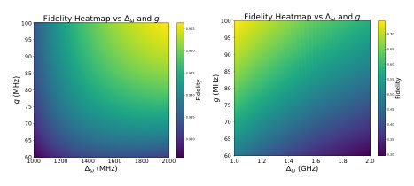 
Figure 3: Transfer fidelity heatmap over coupling strength g and detuning ∆ω for a highly detuned system over different combinations of losses.

📷 Fig 4

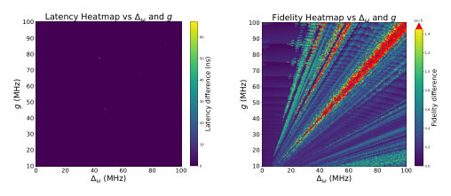 
Figure 4: Comparison between heatmaps using the analytical and simulation results for κ = γ = 0.1 MHz.

📷 Fig 5

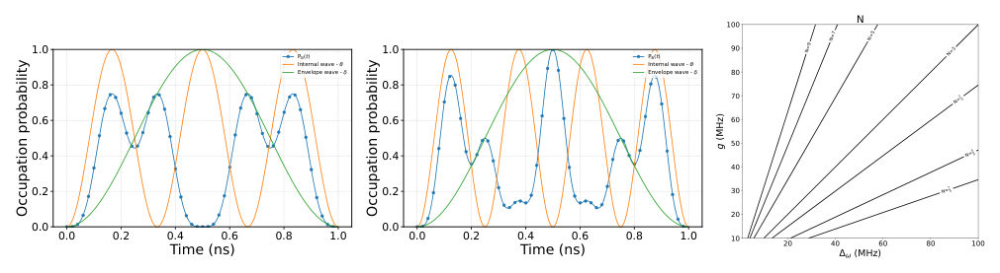 
Figure 5: Study of the types of N combinations. If a and b are both odd, fidelity will always be low. If N is even, fidelity will be high with low latency. a) Occupation probability for N = 3 for a lossless system. b) Occupation probability for N = 4 for a lossless system. c) Contour map of some relevant values of N for low fidelity regions due to the periodicity of the envelope and the internal waves, for κ = 0.1 MHz and γ = 0.1 MHz.

**Summary.** This paper presents a new analytical method for rapidly simulating quantum state transfer in multi-core quantum processors. By replacing expensive numerical simulations with exact closed-form expressions, the authors enable efficient design space exploration and identify specific parameter regimes that optimize the trade-off between fidelity and latency.

**Why it may be interesting.** It provides a highly efficient tool for analyzing open quantum system dynamics and offers physical insight into how dissipation and detuning affect state transfer, which is crucial for designing scalable quantum networks.

Detailed structure

**Main problem.** Optimizing quantum state transfer in multi-core quantum architectures is hindered by the high computational cost of numerical simulations and the difficulty of exploring the design space to balance fidelity and latency.

**Main result.** The authors derived an analytical framework that is two orders of magnitude faster than standard numerical solvers, enabling large-scale parameter sweeps and revealing physical phenomena like destructive interference-induced low-fidelity regions.

**Method.** The study uses an analytical approach based on the Monte Carlo wave-function method and a non-Hermitian effective Hamiltonian to derive closed-form solutions for qubit occupation probabilities.

**Model / system.** A two-qubit system (chips A and B) coupled via a single-mode waveguide, modeled using a Jaynes-Cummings-type Hamiltonian and the Lindblad master equation to account for qubit decay and waveguide loss.

**Key observables.** Qubit occupation probabilities, state transfer fidelity, transfer latency, and an efficiency-based function for optimization.

**Important parameters / regimes.** Coupling strength (g), qubit-waveguide detuning (delta omega), qubit decay rate (gamma), waveguide decay rate (kappa), and a trade-off parameter (eta).

**Assumptions / limitations.** The model assumes the Rotating Wave Approximation (RWA), a single waveguide mode, a single-excitation subspace, and neglects quantum jumps due to the initial empty state of the waveguide.

**Figures summary.** Figure 1 shows a system schematic; Figure 2 compares analytical and numerical time evolution; Figure 3 shows fidelity heatmaps; Figure 4 compares analytical and numerical heatmaps; Figure 5 explores the impact of the ratio between oscillation and envelope frequencies; Figure 6 demonstrates latency and fidelity trade-offs.

**Paper structure.** The paper begins with the derivation of the Hamiltonian and Master equation, followed by the derivation of closed-form analytical solutions, validation against QuTiP numerical simulations, and finally, the application of the model to design space exploration and optimization.

Abstract

In multi-core quantum computing architectures, waveguide-mediated interconnects are essential for facilitating fast, high-fidelity quantum state transfer between qubits located in different chips. However, optimizing these systems typically relies on computationally expensive numerical simulations that offer limited physical insight. In this work, we derive exact analytical expressions for the state transfer dynamics of a two-qubit system coupled via a waveguide, modeled through a Jaynes-Cummings Hamiltonian and the Lindblad master equation. We apply the Monte Carlo wave-function method and obtain a closed-form solution for qubit occupation probabilities that accounts for both detuning and dissipative losses. Our analytical framework provides a significant computational speedup compared to standard numerical solvers, enabling large-scale parameter sweeps while maintaining high precision in both fidelity and latency predictions. Furthermore, the model reveals and explains systematic low-fidelity regions arising from destructive interference between internal oscillations and detuning-induced envelopes, which are phenomena that are difficult to characterize through numerical means alone. Finally, we propose a simplified latency model and an efficiency-based function to enable rapid identification of optimal operating points. This analytical approach provides a robust foundation for the design and optimization of interconnects in multi-core quantum processors.

[↑ back to top](#top)

### [High-key-rate Fully-Passive Quantum Access Network with Thermal Source](http://arxiv.org/abs/2604.27327v1)

**Authors:** H. W. Yin, B. D. Zhu, H. Peng, T. Wang, X. Q. Jiang, Y. K. Xu, G. H. Zeng  
**Type:** experiment · **Category:** quantum information and computing · **PDF:** <https://arxiv.org/pdf/2604.27327v1>  
**Analysis basis:** abstract only; PDF text extraction failed or PDF unavailable
**Topic relevance:** 🔥 `QC/QI experiment` **4/5** · 🔥 `quantum optics experiment` **4/5**

**Summary.** The paper presents an experimental demonstration of a fully passive quantum access network that achieves a record-breaking key rate of 19.48 Mbps. By using a passive state preparation scheme, the researchers show a scalable point-to-multi-point architecture that is compatible with existing classical optical fiber infrastructure.

**Why it may be interesting.** This work is highly relevant to quantum optics and quantum information as it demonstrates a scalable, high-rate architecture for quantum communication networks using passive components.

Detailed structure

**Main problem.** Achieving high-speed, stable, and low-resource quantum access networks (QAN) that can scale from point-to-point to point-to-multi-point without the instability of active protocols.

**Main result.** Demonstration of a downstream fully passive quantum access network protocol achieving a record-breaking key generation rate of 19.48 Mbps per quantum network unit.

**Method.** The researchers implemented a passive state preparation (PSP) scheme within a quantum passive optical network (QPON) architecture using hybrid free-space and single-mode fiber channels.

**Model / system.** A downstream quantum access network utilizing a passive state preparation (PSP) protocol for continuous-variable quantum key distribution (CVQKD) across a point-to-multi-point architecture.

**Key observables.** Final key generation rate (Mbps per quantum network unit).

**Important parameters / regimes.** Key generation rate of 19.48 Mbps; hybrid free-space and single-mode fiber channels.

**Assumptions / limitations.** The network is compatible with existing classical optical communication infrastructure.

**Paper structure.** The paper introduces the motivation for optimized QANs, proposes a passive state preparation (PSP) protocol, demonstrates experimental implementation using hybrid channels, and discusses compatibility with classical infrastructure.

Abstract

To accommodate classical communication systems with progressively increasing transmission rates, quantum access networks (QAN) have undergone systematic and protocol-level optimizations in recent years, where quantum passive optical network (QPON) architectures are gaining significant attention due to their simple structure. It is challenging for the previous QAN based on active protocols or Stokes operator coding protocols to achieve high-speed linear modulation with high extinction ratio and stability under practical conditions. In this work, we propose and experimentally demonstrate a downstream fully passive quantum access network protocol using passive state preparation (PSP) with free-space and single-mode fiber hybrid channels, and the final key generation rate is up to a record-breaking 19.48 Mbps per quantum network unit. The proposed PSP-QPON scheme extends the scope of PSP-CVQKD from point-to-point to point-to-multi-point networks, which enables high-key-rate, high-stability, and low-resource-consumption implementation. Moreover, the network channel in this experiment is fully compatible with access networks in classical optical communications, which allows integration with existing optical infrastructure without the need for additional modifications, providing a promising solution for local area network quantum access network at home or a mobile terminal.

[↑ back to top](#top)

### [Parametrically Driven iSWAP Gate Using a Capacitively Shunted Double-Transmon Coupler at the Zero-Flux Sweet Spot](http://arxiv.org/abs/2604.27679v1)

**Authors:** Shinichi Inoue, Rui Li, Kentaro Kubo, Yinghao Ho, Yasunobu Nakamura, Hayato Goto  
**Type:** experiment · **Category:** quantum information and computing · **PDF:** <https://arxiv.org/pdf/2604.27679v1>  
**Analysis basis:** full PDF text, analyzed in chunks
**Topic relevance:** 🔥 `QC/QI experiment` **4/5** · `non-equilibrium dynamics` **2/5** · `quantum optics experiment` **2/5**

📷 Fig 1

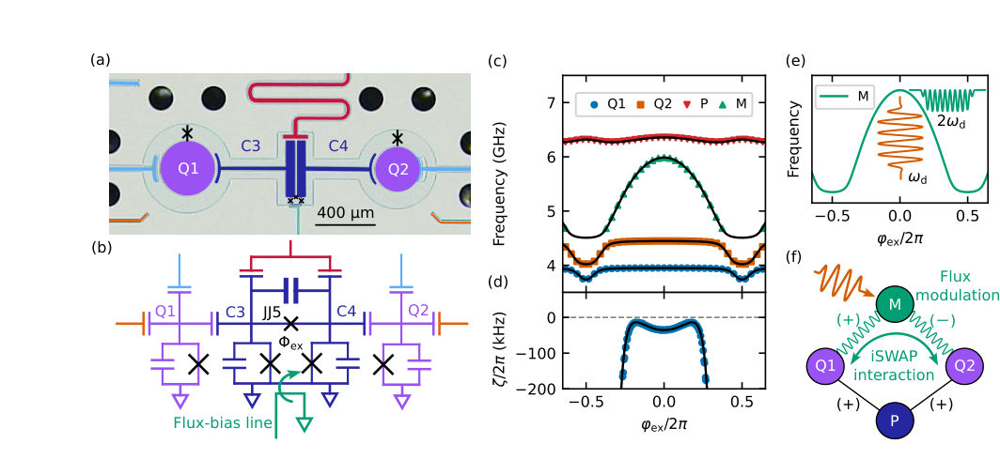 
FIG. 1. Device and operating principle of the parametrically driven iSWAP gate at the zero-flux sweet spot. (a) False-colored optical micrograph. In the present work, we use the same device as in Ref. 28. (b) Circuit diagram of the device. Black crosses represent Josephson junctions. The device has two fixed-frequency transmon qubits (Q1 and Q2) coupled via a CSDTC. The CSDTC consists of two transmons (C3 and C4), which hybridize into two internal modes (the P mode and the M mode) through the interaction mediated by a Josephson junction (JJ5) and a shunt capacitor. A local magnetic flux Φex generated by a dedicated bias line (green) threads the coupler loop. Microwave flux drive is applied...

📷 Fig 2

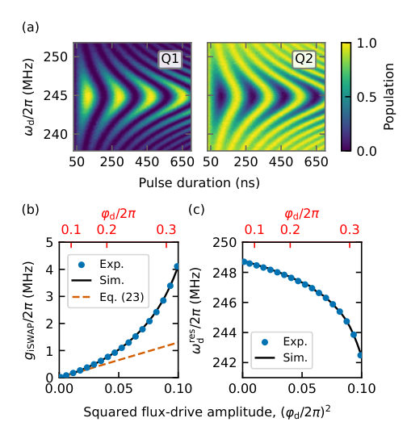 
FIG. 2. Characterization of parametrically driven iSWAP interaction. (a) Chevron patterns of the excited-state popu- lations of Q1 and Q2, plotted as a function of the frequency ωd and pulse duration of the flux drive with the amplitude φd/2π = 0.28. The initial state is |01⟩. (b) Experimentally measured iSWAP interaction strength giSWAP and (c) reso- nant drive frequency ωres d as functions of the squared flux- drive amplitude φ2 d, together with numerical simulation re- sults (black solid curves) and analytic prediction, giSWAP (or- ange dashed line) given by Eq. (23).

📷 Fig 3

 
FIG. 3. Randomized benchmarking of the iSWAP gate with a total gate duration ttot of 112 ns. (a) Sequence fidelity P| g 0000⟩−Pχ1/4 as a function of the number of Clifford gates. The dashed lines are fits to Eq. (28). (b) Leakage randomized benchmarking. The dashed lines are fits to Eq. (30).

📷 Fig 4

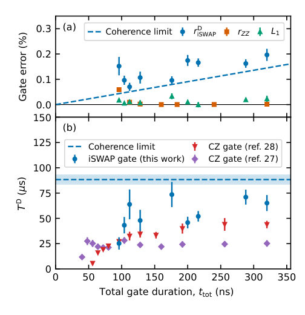 
FIG. 4. (a) Experimentally measured iSWAP depolarization- induced error rD iSWAP, coherent ZZ error rZZ, and leakage error L1 as a function of the total iSWAP gate duration ttot. The blue dashed line denotes gate infidelities estimated from the qubit coherence times measured at zero flux bias. (b) Effective coherence time T D (blue dots) inferred from the depolarization-induced error for each total gate duration ttot. The blue dashed line shows the effective coherence time es- timated from the same qubit coherence properties as in (a), and the shaded blue band indicates the ±1σ uncertainty. The red and purple markers show the effective coherence times re- ported for CZ gates using a DTC...

📷 Fig 5

 
FIG. 5. (a) Optimized flux-drive waveform for the iSWAP gate (ttot = 112 ns), together with the symmetric part of the BNZ waveform used to implement a CZ gate (ttot = 80 ns) on the same device in Ref. 28. (b) Numerically simulated coupler hybridization fraction as a function of time. The solid blue and red lines represent the hybridization fractions for the iSWAP- and CZ-gate waveforms in (a), respectively.

**Summary.** This paper demonstrates a high-fidelity iSWAP gate between fixed-frequency transmons using a parametric flux drive on a specialized coupler. By operating at the zero-flux sweet spot, the researchers significantly reduced decoherence and parasitic ZZ interactions. This approach provides a scalable path toward high-fidelity entangling gates in superconducting quantum processors.

**Why it may be interesting.** This work is relevant to open quantum systems and quantum optics due to its focus on controlling light-matter-like interactions (qubit-coupler hybridization) and managing decoherence through parametric modulation and frequency-domain engineering.

Detailed structure

**Main problem.** High-fidelity two-qubit gates in superconducting circuits are often limited by pulse distortion, decoherence from qubit-coupler hybridization, and residual ZZ interactions caused by large flux-pulse amplitudes.

**Main result.** The authors demonstrated a high-fidelity (99.92%) parametrically driven iSWAP gate at the zero-flux sweet spot, achieving reduced error by minimizing qubit-coupler hybridization and canceling ZZ interactions.

**Method.** The researchers used a capacitively shunted double-transmon coupler (CSDTC) with a parametric flux drive, employing randomized benchmarking and quantum process tomography for characterization and virtual-Z gates for phase error compensation.

**Model / system.** The system consists of two highly detuned, fixed-frequency transmon qubits coupled via a Capacitively Shunted Double-Transmon Coupler (CSDTC) that hybridizes into symmetric and antisymmetric modes.

**Key observables.** Average gate fidelity, iSWAP interaction rate, effective ZZ interaction strength, leakage error, and qubit-coupler hybridization fraction.

**Important parameters / regimes.** Gate fidelity of 99.92(2)%, gate time of 112 ns, qubit detuning of 498 MHz, and a hybridization fraction of approximately 0.05.

**Assumptions / limitations.** The calibration of the $|11
angle$ state was omitted because it does not affect populations in the single-excitation subspace; the model assumes the validity of the three-level approximation for dynamical ZZ interaction.

**Figures summary.** Figure 1 shows the device micrograph, circuit diagram, and energy spectrum; Figure 2 displays chevron patterns and interaction rates; Figure 3 presents error components; Figure 6 shows the pulse sequence; Figure 14 shows Pauli Transfer Matrices; Figure 15 shows IQ readout clusters.

**Paper structure.** The paper introduces the hardware architecture and the problem of flux-induced errors, describes the parametric driving mechanism, presents experimental verification of the iSWAP gate and its fidelity, analyzes the error budget and ZZ suppression, and concludes with a detailed calibration and characterization framework.

Abstract

A double-transmon coupler (DTC) enables a fast, high-fidelity CZ gate between two highly detuned, fixed-frequency transmon qubits. Moreover, a recently proposed capacitively shunted DTC (CSDTC) realizes a small residual ZZ interaction over a wide flux-bias range around zero flux, eliminating the necessity of static flux biasing while maintaining high CZ-gate fidelity. However, CZ gates with the DTC and CSDTC require baseband flux pulses with large amplitudes, which are vulnerable to pulse distortion and decoherence due to large qubit-coupler hybridization. To address these issues, we experimentally demonstrate a parametrically driven iSWAP gate operated at zero flux bias between highly detuned, fixed-frequency transmon qubits coupled through a CSDTC. Using a simple flux-drive waveform without predistortion, we realize an average gate fidelity of 99.92(2)% at a total gate time of 112 ns. The observed high-fidelity performance is consistent with small qubit-coupler hybridization and small effective ZZ interaction during the gate. Our numerical simulations reproduce the experimentally observed iSWAP interaction rate and effective ZZ interaction, demonstrating the applicability of the theoretical model not only to spectral information but also to time-domain dynamics such as gate operations. These results boost further progress in the research of superconducting quantum computers.

[↑ back to top](#top)

### [Weak-to-Strong Measurement Transition with Thermal Instabilities](http://arxiv.org/abs/2604.28137v1)

**Authors:** Marcos V. S. Lima, Carlos H. S. Vieira, Irismar G. da Paz, Pedro R. Dieguez, Lucas S. Marinho  
**Type:** theory · **Category:** quantum information and computing · **PDF:** <https://arxiv.org/pdf/2604.28137v1>  
**Analysis basis:** full PDF text, analyzed in chunks
**Topic relevance:** 🔥 `quantum measurements` **4/5** · `methods for driven-dissipative` **2/5** · `non-equilibrium dynamics` **2/5**

📷 Fig 1

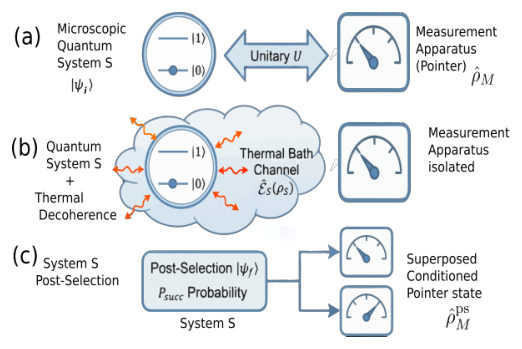 
Fig. 1. Weak measurement scheme under thermal instabilities. (a) The microscopic two-level system S interacts unitarily with the measurement apparatus (meter) M. (b) After the measurement interaction, only the system S is subjected to a thermal quantum channel ES, while the meter remains isolated from the environment. (c) The system S is post-selected in the state |ψf⟩with success probability Psucc, resulting in a superposed conditioned pointer state ˆρps M that carries the signature of the weak interaction and thermal signatures.

📷 Fig 2

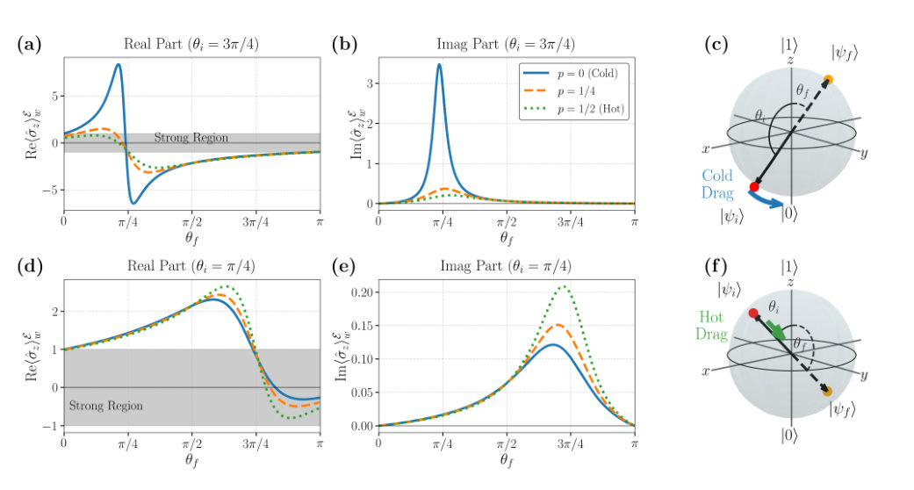 
Fig. 2. Weak value of ˆσz under the GAD channel as a function of the post-selection angle θf, evaluated for a fixed damping rate γ = 0.1, ϕi = 0, and ϕf = 0.99π. The left and middle columns display the real and imaginary parts, respectively. The gray bands in the real plots indicate the standard eigenvalue range [−1, 1], beyond which anomalous amplification is achieved. Anomalies require near-orthogonal pre- and post-selected states (θf ≈π −θi). In the upper panels, for an initial state in the Southern hemisphere (θi = 3π/4), the anomaly is maximized by a zero-temperature cold bath (p = 0, solid blue line) and suppressed by a high-temperature hot bath (p = 1/2, dotted green line). As shown...

📷 Fig 3

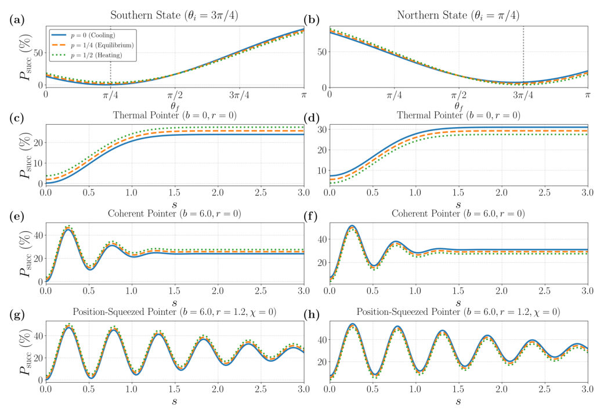 
Fig. 3. Success probability Psucc across distinct thermodynamic regimes for Southern (θi = 3π/4, left column) and Northern (θi = π/4, right column) initial states. Curves compare the cooling limit (p = 0, solid blue lines), thermal equilibrium (p = 1/4, dashed orange lines), and heating limit (p = 1/2, dotted green lines). (a)-(b) Angular dependence in the weak measurement regime (s = 0.01). Vertical dotted lines mark the near-orthogonal anomalous angles (θf = π/4 and 3π/4). The cold bath drives Psucc →0 in (a), while the hot bath achieves this in (b), geometrically establishing the required conditions for anomalous weak-value amplification. (c)-(d) Measurement strength (s) dependence at...

📷 Fig 4

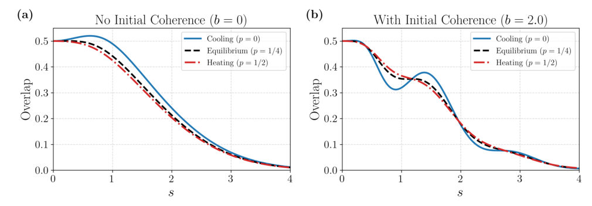 
Fig. 4. Thermal effects in the weak-to-strong measurement transition. The quantum overlap O is plotted as a function of the measurement strength s for three distinct thermodynamic regimes: the cooling limit (p = 0, solid blue line), thermal equilibrium (p = 1/4, dashed black line), and the infinite-temperature heating limit (p = 1/2, dash-dotted red line). (a) For a purely thermal pointer with no initial momentum (b = 0), the overlap exhibits a monotonic decay, where the heating regime strictly accelerates thermodynamic decoherence compared to the cooling limit. (b) By injecting initial coherence into the pointer (b = 2.0), quantum interference fringes emerge during the transition. The...

📷 Fig 5

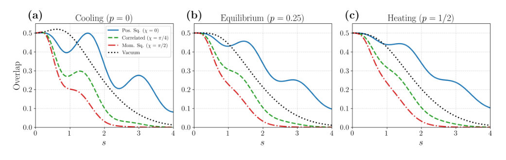 
Fig. 5. Squeezing-phase effect in the weak-to-strong measurement transition. The quantum overlap O is evaluated across the three thermodynamic limits: (a) Cooling (p = 0), (b) Thermal equilibrium (p = 1/4), and (c) Heating (p = 1/2). Rather than universally protecting the pointer, the interaction dictates that the squeezing phase χ determines whether environmental decoherence is mitigated or amplified. For a fixed squeezing magnitude (r = 0.5) and initial momentum (b = 2.0), aligning the squeezing along the canonical position quadrature (χ = 0, solid blue lines) effectively shields the pointer, sustaining revivals in the quantum overlap deeper into the strong measurement regime. These...

**Summary.** This paper analyzes the transition between weak and strong quantum measurements in the presence of thermal noise and environmental decoherence. It demonstrates that thermal effects can counterintuitively enhance or suppress anomalous weak values depending on the temperature regime and pointer squeezing. The findings offer a framework for understanding how dissipation reshapes quantum measurement statistics.

**Why it may be interesting.** It provides deep insights into how environmental noise and thermal fluctuations can be leveraged or mitigated in quantum metrology and the control of quantum measurement-induced dynamics.

Detailed structure

**Main problem.** Investigating how thermal instabilities, environmental decoherence, and open quantum dynamics affect the continuous transition from weak to strong quantum measurements and the emergence of anomalous weak values.

**Main result.** The study reveals that thermal noise and dissipation can non-monotonically reshape measurement statistics, where specific temperature regimes and pointer squeezing can either suppress or enhance anomalous amplification and protect pointer coherence.

**Method.** The authors develop a general framework using the Generalized Amplitude Damping (GAD) channel, Kraus operator decomposition, and thermal Gaussian state formalism to derive the conditioned apparatus state and measurement statistics.

**Model / system.** A microscopic two-level system (qubit) interacting via an impulsive von Neumann coupling with a bosonic single-mode Gaussian pointer (modeled as a displaced, squeezed, thermal state) under the influence of a thermal reservoir.

**Key observables.** Measurement strength (s), post-selection success probability (P_succ), quantum overlap (O), spatial amplification factor (A_X), and momentum amplification factor (A_P).

**Important parameters / regimes.** Measurement strength (s), dissipation strength (gamma), thermal population (p), pointer thermal occupation (n_bar), squeezing magnitude (r), and squeezing phase (chi).

**Assumptions / limitations.** The measurement interaction is assumed to be instantaneous (impulsive), and the apparatus is modeled as a Gaussian thermal squeezed state.

**Figures summary.** Fig 1 shows the measurement scheme including interaction and post-selection; Fig 4 illustrates the impact of pointer coherence and thermal effects on the transition; Fig 5 illustrates the effects of squeezing.

**Paper structure.** The paper introduces the measurement scheme, develops the mathematical framework for the GAD channel and conditioned state, analyzes the transition from weak to strong regimes, and explores the specific roles of thermal noise, squeezing, and pointer momentum.

Abstract

Quantum measurement is physically realized through a finite dynamical interaction between a system and a measuring apparatus, giving rise to a continuous transition from weak to strong regimes. While this crossover is well understood under ideal conditions, the combined role of thermal instabilities and pre- and post-selection open dynamics has not been systematically addressed. Here, we develop a general framework to analyze the weak-to-strong measurement transition in the simultaneous presence of environmental decoherence and thermal noise. We model the probe as a thermal Gaussian state, explicitly incorporating temperature-dependent fluctuations in the measuring device, and include open-system evolution of the measured system prior to post-selection. By deriving the apparatus's final state, we show that the measurement statistics are modified in a nontrivial, highly sensitive manner by the temperature regime of the system's thermal instabilities, the probe's thermal properties, and the particular choice of pre- and post-selection. This approach allows us to characterize how thermal effects reshape the weak-value condition and influence the emergence of projective behavior across the full measurement crossover.

[↑ back to top](#top)

### [Light-Cone Structure of Propagation of Entanglement](http://arxiv.org/abs/2604.27170v1)

**Authors:** Israel Michael Sigal  
**Type:** theory · **Category:** quantum information and computing · **PDF:** <https://arxiv.org/pdf/2604.27170v1>  
**Analysis basis:** full PDF text, analyzed in chunks
**Topic relevance:** 🔥 `entanglement & information structure` **4/5** · `non-equilibrium dynamics` **3/5**

📷 Fig 1

 
Low-resolution page preview, page 2

📷 Fig 2

 
Low-resolution page preview, page 3

📷 Fig 3

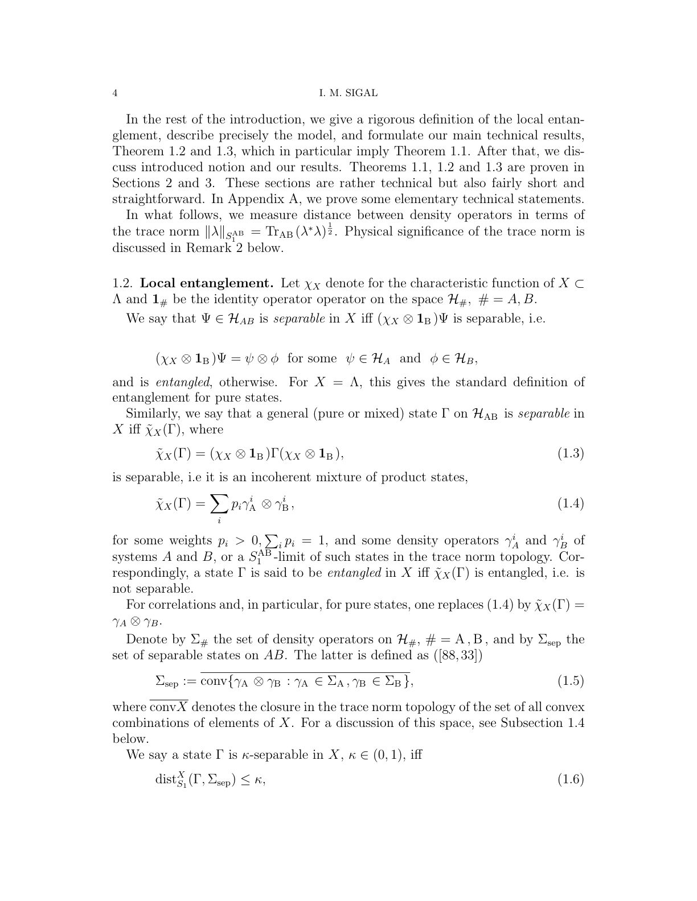 
Low-resolution page preview, page 4

📷 Fig 4

 
Low-resolution page preview, page 5

📷 Fig 5

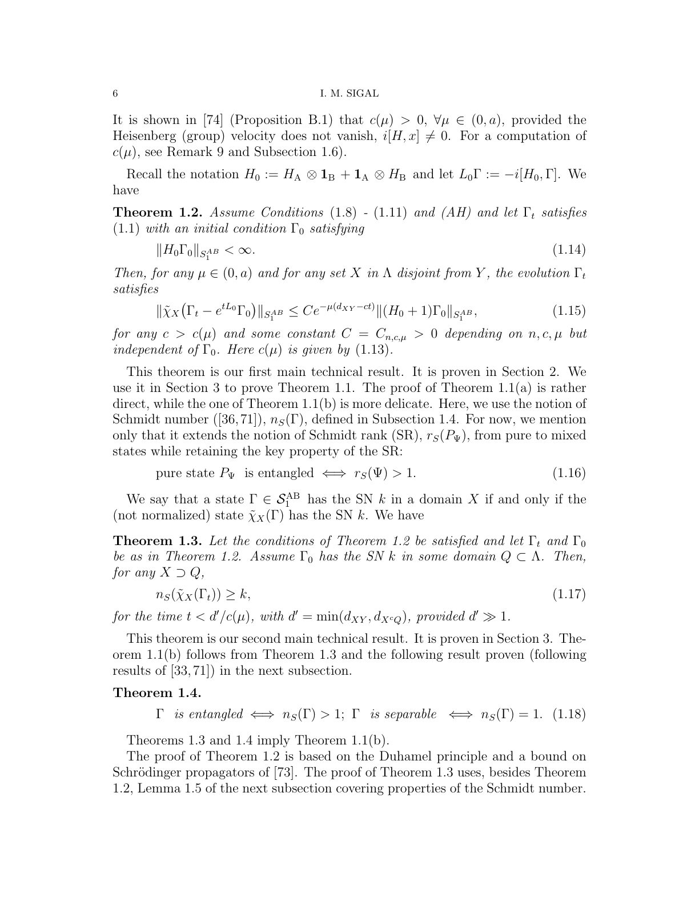 
Low-resolution page preview, page 6

**Summary.** This paper establishes a rigorous 'light-cone' for entanglement, proving that entanglement cannot be transported or maintained across a distance faster than a specific velocity. It provides a fundamental speed limit for quantum information transfer in both lattice and continuous systems.

**Why it may be interesting.** It provides a rigorous mathematical foundation for the speed limits of entanglement, which is critical for designing reliable quantum networks and understanding information spread in many-body dynamics.

Detailed structure

**Main problem.** Establishing a rigorous, effective light-cone structure for the propagation of entanglement in bipartite quantum systems, providing a hard lower bound on the time required to transport or maintain entanglement.

**Main result.** The paper proves that entanglement (quantified by the Schmidt number) propagates within a defined light cone, establishing a fundamental speed limit for entanglement transport in quantum networks.

**Method.** The author uses operator theory, trace norm estimates, and the Duhamel principle to compare full quantum evolution with free evolution, utilizing the Schmidt number to quantify entanglement.

**Model / system.** Bipartite systems (A and B) with localized couplings, including discrete lattice models (tight-binding) and continuous semi-relativistic N-particle Hamiltonians.

**Key observables.** Schmidt number (n_S), local entanglement, and trace norm distance to separable states.

**Important parameters / regimes.** Propagation speed (c), distance between coupling and observation domains (d), and the degree of separability (kappa).

**Assumptions / limitations.** The dispersion law must satisfy an analytic continuation condition (Condition AH), and the interaction must be localized with specific norm constraints.

**Figures summary.** Figure 1 illustrates the physical setup of entanglement creation and measurement; Figure 2 depicts the spatial-temporal light cone boundary.

**Paper structure.** The paper introduces the problem of entanglement propagation, defines the mathematical framework and Hamiltonian, presents theorems establishing the light-cone structure and Schmidt number bounds, and concludes with technical proofs and references.

Abstract

For a wide class of bipartite systems with localized couplings, we establish existence of an effective light-cone for propagation of entanglement. This result yields a hard lower bound on the time it takes, under ideal conditions (no loss, no decoherence), to transport entanglement to a distant location (say, a node of a graph-structured quantum network), or to maintain it there.

[↑ back to top](#top)

### [Size-Limited Room Temperature Single-Photon Emission from Sidewall-Treated Fractional Dimension InGaN Quantum Dots: Determined by Density-of-States-Corrected Ultrafast Carrier Dynamics and Improved Signal-to-Noise Ratio](http://arxiv.org/abs/2604.27718v1)

**Authors:** Pratim K. Saha  
**Type:** both · **Category:** quantum information and computing · **PDF:** <https://arxiv.org/pdf/2604.27718v1>  
**Analysis basis:** full PDF text, analyzed in chunks
**Topic relevance:** 🔥 `quantum optics experiment` **4/5** · `QC/QI experiment` **3/5**

📷 Fig 1

 
Figure 2. The cross-sectional SEM images of the samples. The location of QD in the

📷 Fig 2

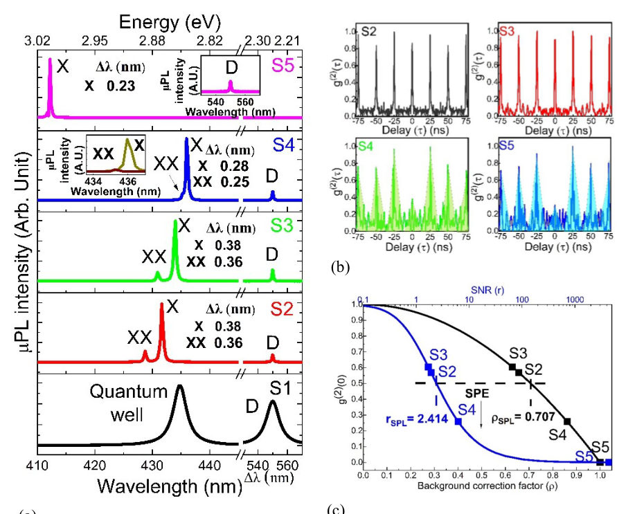 
Figure 3. (a) µPL emission spectra of the samples show X, XX and defect-related peaks for

📷 Fig 3

 
Figure 4. The schematic of radiative and principal non-radiative processes of exciton and

📷 Fig 4

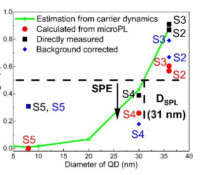 
Figure 5. (a) diameter-dependent radiative and

**Summary.** This work demonstrates high-purity single-photon emission from InGaN quantum dots at room temperature by controlling their size and surface properties. By reducing the QD diameter below 31 nm, the researchers used Auger recombination to suppress multi-photon events. This provides a scalable pathway for developing semiconductor-based quantum light sources for quantum information applications.

**Why it may be interesting.** The paper provides a detailed study of how many-body effects (Auger recombination) and environmental coupling (surface states) can be engineered to control the purity of a quantum light source at room temperature.

Detailed structure

**Main problem.** Identifying the physical limits and optimal geometric parameters for achieving high-purity, room-temperature single-photon emission (SPE) from InGaN quantum dots.

**Main result.** Demonstrated that SPE is achievable at room temperature for QD diameters below 31 nm, where Auger recombination suppresses multi-photon events and surface treatments minimize non-radiative recombination.

**Method.** The study combines experimental micro-photoluminescence and Hanbury-Brown-Twiss autocorrelation measurements with a theoretical model using COMSOL and Silvaco to simulate carrier dynamics and strain-induced potential profiles.

**Model / system.** Site-controlled, fractional-dimension In0.14Ga0.86N quantum dots embedded in vertical GaN nanowires, fabricated via dry and wet-chemical/photoelectrochemical etching.

**Key observables.** Second-order autocorrelation g2(0), higher-order correlations g3(0) and g4(0), signal-to-noise ratio (r), and spectral linewidths of exciton and biexciton peaks.

**Important parameters / regimes.** QD diameters (ranging from 3 nm to 36 nm), exciton Bohr radius (3 nm), and the single-photon limit (g2(0) < 0.5).

**Assumptions / limitations.** Neglected Shockley-Read-Hall recombination due to low probability in small volumes; assumed g2(0) can be expressed via the ratio of radiative to total recombination rates.

**Figures summary.** Schematics of the InGaN/GaN heterostructure, SEM images of the etched samples, and micro-photoluminescence spectra showing exciton and biexciton peaks.

**Paper structure.** The paper introduces the problem of room-temperature SPE, describes the fabrication and characterization of InGaN nanowire QDs, presents a carrier dynamics model involving Auger and surface recombination, and concludes with a generalized framework for predicting SPE probability based on QD geometry.

Abstract

Room-temperature single-photon emission (SPE) resulting from a biexciton-exciton cascaded decay is demonstrated for the first time from chemically and photoelectrochemically etched site-controlled In0.14Ga0.86N quantum dots (QDs) embedded in vertical GaN nanowires. Diameter-dependent biexciton-exciton dynamics are analysed to determine the eligibility of QD as a single-photon emitter. The signal-to-noise ratio degrades with increasing QD diameter. Background noise photons pose a bottleneck to achieving SPE. This is also explained from a carrier dynamics perspective. Surface recombination contributes to inhomogeneous broadening at QD diameters larger than 35 nm. Below 35 nm, density-of-states-corrected Auger gradually becomes the principal biexciton-decay route with further reduction in QD diameter, thereby quenching the possibility of thermal broadening and setting a threshold for SPE. Below 9 nm, the Auger recombination rate becomes manyfold of other decay rates, causing multi-photon suppression via single Auger decay to form an exciton. Surface recombination probability of this exciton is minimized while biexciton state filling probability is maximized by reducing sidewall surface states through wet-treatment. These improve biexciton state preparation and enhance the single-photon purity of the exciton towards the exciton Bohr radius (3 nm) regime. Far away from this regime, higher-order autocorrelations to characterize quantum emission involving multi-photon events are discussed. This study establishes a generalized physical framework for predetermining SPE probability as a function of QD surface and geometry down to the exciton Bohr radius regime, with practical implementations. This work shows the pathway to design and develop next-generation semiconductor QDs for high-purity room-temperature SPE.

[↑ back to top](#top)

### [Fixed-PVM Born Rule Uniqueness from Fisher Non-Expansion and Operational Calibration](http://arxiv.org/abs/2604.27339v1)

**Authors:** Aaron Lax  
**Type:** theory · **Category:** quantum information and computing · **PDF:** <https://arxiv.org/pdf/2604.27339v1>  
**Analysis basis:** full PDF text, analyzed in chunks
**Topic relevance:** 🔥 `quantum measurements` **4/5** · `entanglement & information structure` **2/5**

📷 Fig 1

 
Low-resolution page preview, page 2

📷 Fig 2

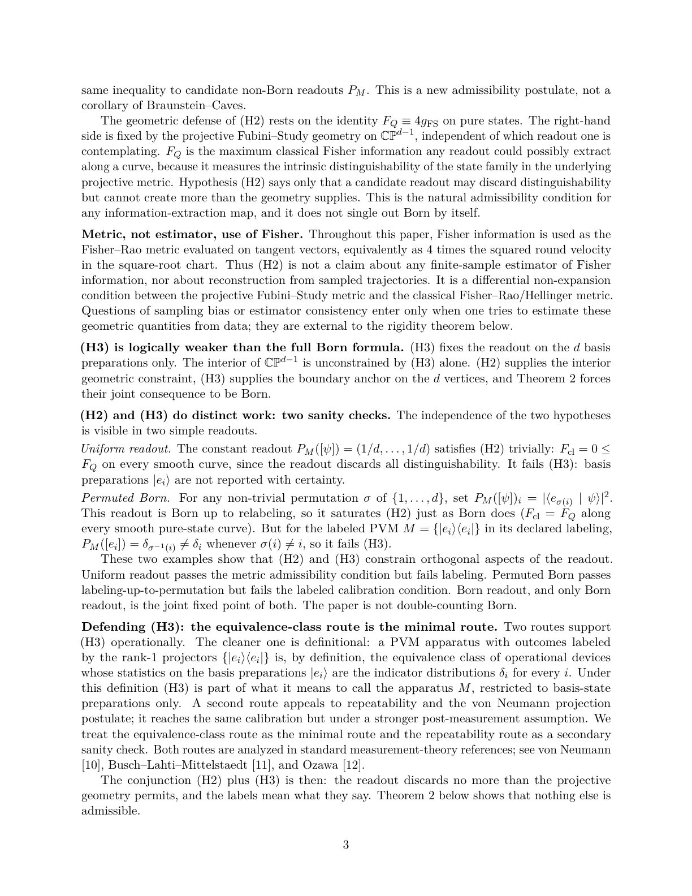 
Low-resolution page preview, page 3

📷 Fig 3

 
Low-resolution page preview, page 4

📷 Fig 4

 
Low-resolution page preview, page 5

📷 Fig 5

 
Low-resolution page preview, page 6

**Summary.** This paper proves that the Born rule is the unique readout map for a fixed measurement if one assumes the map is regular, obeys a quantum Cramer-Rao bound, and is correctly calibrated. It achieves this by showing that such constraints force the readout map to be a rigid, identity-preserving map in a geometric space.

**Why it may be interesting.** This provides a new, purely geometric perspective on the foundations of quantum mechanics, showing how information-theoretic constraints (Cramer-Rao bounds) can recover the standard Born rule without needing Gleason-type basis-independence.

Detailed structure

**Main problem.** Determining whether a specific set of geometric and operational primitives is sufficient to uniquely force the Born rule for a fixed rank-1 projective measurement.

**Main result.** The paper proves that if a readout map satisfies square-root regularity, a universal readout Cramer-Rao bound (Fisher non-expansion), and operational calibration, then the map must be the Born rule.

**Method.** The authors use an information-geometric approach, employing a square-root chart to transform the readout map into a 1-Lipschitz self-map of a spherical orthant, then apply geometric rigidity theorems.

**Model / system.** A finite-dimensional complex Hilbert space (dimension d >= 2) and a fixed rank-1 projective valued measurement (PVM) on pure states.

**Key observables.** Classical Fisher Information (Fcl), Quantum Fisher Information (FQ), and the readout probabilities of the PVM.

**Important parameters / regimes.** Dimension d, Fubini-Study metric, and Fisher-Rao/Hellinger metric.

**Assumptions / limitations.** The result is restricted to pure states and a fixed measurement; it assumes the universal readout Cramer-Rao bound as an admissibility postulate.

**Paper structure.** The paper introduces the problem of Born rule uniqueness, defines the geometric framework using square-root charts, presents the Vertex Rigidity Lemma, proves the main readout theorem via Fisher non-expansion, and discusses corollaries like escort-class uniqueness.

Abstract

Fix a finite dimension $d \geq 2$ and a fixed rank-1 PVM $M=\{|e_1\rangle\langle e_1|,\ldots,|e_d\rangle\langle e_d|\}$ on ${\bf C}^d$. Let $P_M:\mathbb{CP}^{d-1}\toΔ^{d-1}$ be a readout map on pure states. We prove that three primitives force the Born rule for this fixed measurement: (i) square-root regularity of $R_M=\sqrt{P_M}$ along Fubini-Study geodesics, (ii) the universal readout Cramer-Rao bound $F_{\rm cl}\leq F_Q$ on smooth pure-state curves, and (iii) operational calibration on basis preparations $P_M([e_i])=δ_i$. The geometric core is a rigidity theorem for Fisher-non-expanding self-maps of the probability simplex: after conjugation by the square-root chart, such maps become round-metric 1-Lipschitz self-maps of the positive spherical orthant, and vertex fixing forces the identity. The main readout theorem is dimensionwise, fixed-PVM, and pure-state only. Escort-class Born uniqueness and the Markov/coarse-graining routes appear as corollaries or alternative routes.

[↑ back to top](#top)

### [Magnonic Gottesman-Kitaev-Preskill states](http://arxiv.org/abs/2604.27565v1)

**Authors:** Zi-Xu Lu, Gang Liu, Matteo Fadel, Jie Li  
**Type:** theory · **Category:** quantum information and computing · **PDF:** <https://arxiv.org/pdf/2604.27565v1>  
**Analysis basis:** full PDF text, analyzed in chunks
**Topic relevance:** 🔥 `spintronics-quantum-optics interface` **4/5** · `quantum measurements` **2/5**

📷 Fig 1

 
FIG. 1. (a) Phase-space representation of the stabilizers SX, SZ and the logical Pauli operators XL, YL, and ZL. The enclosed symplectic area sets the commutation relations of the corresponding displacement operators. (b) The squeezed magnon mode in an ellipsoidal magnetic crystal gets effec- tively coupled to a transmon superconducting qubit via a mi- crowave cavity (not shown). The magnetic crystal is placed inside a uniform bias magnetic field B0 along the z axis. A mi- crowave field is loaded via a loop antenna to drive the magnon mode to perform the displacement operation.

📷 Fig 2

 
FIG. 2. (a) Operation sequence used to generate the GKP state |0⟩L. The transmon qubit is initially in the ground state |g⟩and the magnon mode is in the squeezed vacuum state |r⟩. (b) Operation sequence used to perform the log- ical Hadamard gate (phase gate) onto |0⟩L to generate the GKP state |+⟩L (|ϕ+⟩L). The “CD” operation represents the magnon-qubit coevolution under the CD interaction, the “|g⟩” operation denotes the qubit projective measurement, and the “D” operation stands for the magnon displacement. The qubit π/2-rotation “R” is only applied for |ϕ+⟩L.

📷 Fig 3

 
FIG. 3. Magnonic GKP-like states. Wigner function of (a) the three-component superposition state used as the encoded state |0⟩L, and of (b) the four-component superposition state. Dashed ellipses indicate the centers and characteristic widths of the displaced squeezed components. The side panels show the corresponding marginal Wigner distributions P(q) and P(p). See text for the parameters.

📷 Fig 4

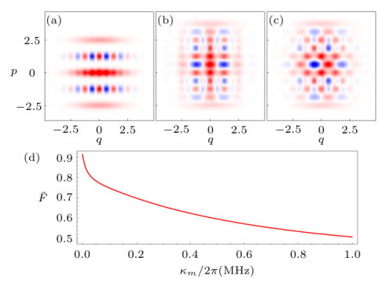 
FIG. 4. Wigner functions of logical Pauli eigenstates: (a) |0⟩L, (b) |+⟩L, and (c) |ϕ+⟩L. (d) Average fidelity ¯F versus magnon dissipation rate κm. We consider the three-component super- position state and the parameters are the same as in Fig. 3(a). We take γ/2π = γϕ/2π = 2 kHz [78] and T = 10 mK in (a)- (d), and κm = 5γ [79] in (a)-(c).

**Summary.** This paper proposes a new method to create GKP error-correcting states using magnons in a hybrid superconducting circuit. By leveraging the natural squeezing of an ellipsoidal magnetic crystal, the authors show how to prepare and manipulate logical qubits for fault-tolerant quantum computing.

**Why it may be interesting.** It introduces a novel hybrid platform (magnonics) for implementing continuous-variable quantum error correction, bridging magnonics with bosonic quantum computing and quantum sensing.

Detailed structure

**Main problem.** The difficulty of preparing non-Gaussian Gottesman-Kitaev-Preskill (GKP) states for bosonic quantum error correction and the lack of a demonstrated protocol within magnonic systems.

**Main result.** The authors provide the first protocol for preparing magnonic GKP-like states using a hybrid magnon-qubit system, demonstrating the ability to generate multi-component superposition states and implement logical Pauli gates.

**Method.** The protocol uses sequential rounds of conditional-displacement (CD) interactions and qubit projective measurements, utilizing the intrinsic squeezing from geometric anisotropy and cavity-mediated qubit control.

**Model / system.** A hybrid system consisting of an ellipsoidal magnetic crystal (magnon mode) coupled to a transmon superconducting qubit via a microwave cavity, modeled using a quantized Hamiltonian with a conditional-displacement interaction.

**Key observables.** Wigner functions, stabilizer expectation values, effective squeezing, logical fidelity, and marginal distributions P(q) and P(p).

**Important parameters / regimes.** Effective coupling chi/2pi = 7.55 MHz, squeezing parameter r approx 1, temperature T = 10 mK, and interaction time t approx 143.8 ns.

**Assumptions / limitations.** Large-detuning limit for cavity elimination, Rotating Wave Approximation (RWA), and neglecting small squeezing from counter-rotating terms.

**Figures summary.** Figure 1 shows the phase-space representation of stabilizers and logical operators alongside a schematic of the experimental setup; Figure 3 (not fully described) relates to the results of the protocol.

**Paper structure.** The paper begins by defining the physical platform and Hamiltonian, derives the effective conditional-displacement interaction via unitary transformations, details the state preparation protocol and logical gate implementation, and concludes with a discussion on dissipation and fidelity.

Abstract

Bosonic quantum error correction encodes a logical qubit in an oscillator, avoiding the hardware overhead of large qubit arrays. Among such encodings, Gottesman-Kitaev-Preskill (GKP) states are paticularly powerful because their phase-space grid structure protects against small displacement errors simultaneously in both conjugate quadratures. Here we provide the first protocol for preparing magnonic GKP states, which involves an ellipsoidal magnetic crystal effectively coupled to a superconducting qubit via a microwave cavity. The geometric anisotropy intrinsically squeezes the magnon mode, while the cavity-mediated qubit control realizes an effective conditional-displacement interaction. We show that two rounds of a conditional-displacement interaction and a qubit projective measurement yield three- and four-component magnonic GKP-like states. We also show how to realize single logical qubit gate operations, such as Pauli, Hadamard and phase gates, completing the logical Pauli basis of the approximate GKP code. Our results establish hybrid magnon-qubit systems as a promising platform for preparing bosonic code states, with applications in magnonic fault-tolerant quantum computation and quantum sensing.

[↑ back to top](#top)

### [Non-Local Magic Resources for Fermionic Gaussian States](http://arxiv.org/abs/2604.27049v1)

**Authors:** Daniele Iannotti, Beatrice Magni, Riccardo Cioli, Alioscia Hamma, Xhek Turkeshi  
**Type:** theory · **Category:** quantum information and computing · **PDF:** <https://arxiv.org/pdf/2604.27049v1>  
**Analysis basis:** full PDF text, analyzed in chunks
**Topic relevance:** 🔥 `entanglement & information structure` **4/5** · `non-equilibrium dynamics` **2/5**

📷 Fig 1

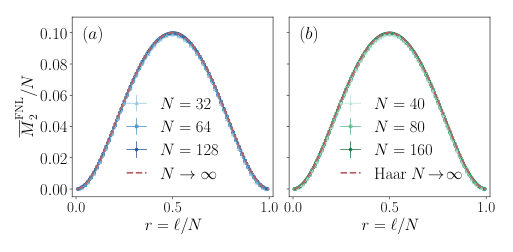 
FIG. 1. Fermionic non-local magic of typical fermionic Gaussian states. (a) Page curve for Haar- random FGS: M2 FNL/N is plotted against the ratio r = ℓ/N. The results are compared with the closed form expression for N →∞in Eq. (16). (b) The fermionic non-local magic Page curve is tested against the numerically computed average non- local magic for SYK2 mid-spectrum eigenstates. The results are in quantitative agreement with Eq. (16).

📷 Fig 2

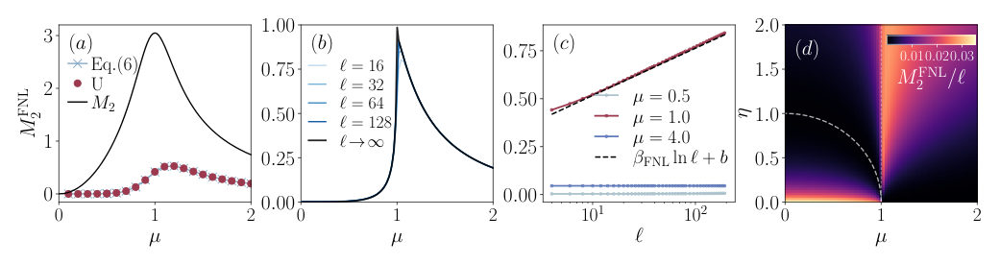 
FIG. 2. Equilibrium fermionic non-local magic in the Ising and XY models. (a) Validation of Eq. (6) for the Ising ground state with N = 8, ℓ= 4: the fermionic non-local magic M FNL 2 from Eq. (6) (crosses) agrees with the brute-force minimization over all local unitaries UA ⊗UB (red marker) to numerical precision. The black line shows the total stabilizer entropy M2 for reference. (b) M FNL 2 vs. transverse field µ in the thermodynamic limit for subsystem sizes ℓ= 16, 32, 64, 128; the black curve is the exact ℓ→∞result from the Peschel entanglement spectrum, Eq. (25). The fermionic non-local magic peaks at the critical point µc = 1 and is suppressed in both gapped phases. (c) Scaling of M...

📷 Fig 3

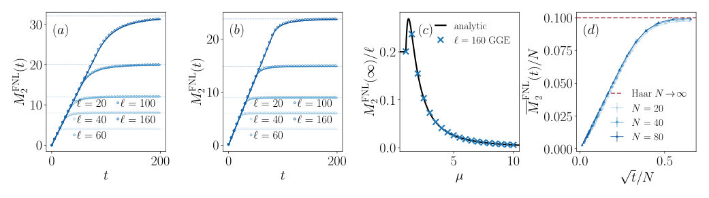 
FIG. 3. Dynamics of fermionic non-local magic. (a) Quench at η = 1 from the fully polarized state (µ0 →∞) to the critical point (µ = 1): the exact numerics (circles) agrees quantitatively with the analytical prediction in Eq. (36) (solid lines) for subsystem sizes ℓ= 40, 60, 100, 160. Dashed lines mark the GGE stationary value. (b) Same for a finite quench µ0 = 2 →µ = 1, showing weaker fermionic non-local magic production due to the smaller Bogoliubov overlap sin2 ∆θk. (c) Stationary-state density M FNL 2 (∞)/ℓas a function of the post-quench field µ (µ0 →∞): analytical prediction from Eq. (33) (solid) and GGE numerics at ℓ= 160 (crosses). (d) Random Gaussian circuit dynamics: M2 FNL/N is...

📷 Fig 4

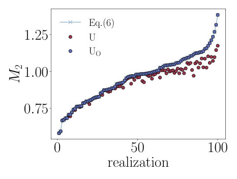 
FIG. 4. Results of the comparison between non-local magic computed with the formula in Eq. (6) (crosses) and the one obtained by minimizing the cost function in Eq. (A16) with both generic unitaries U (red marker) and fermionic Gaussian unitaries UO (blue marker), for 100 different realizations of random fermionic Gaussian states on N = 10 sites, ℓ= 5. The realizations are ordered by increasing M FNL 2 . The formula agrees with minimization over Gaussian unitaries to machine precision in all cases.

**Summary.** This paper overcomes the computational bottleneck of evaluating non-local magic in fermionic systems by introducing a polynomial-time formula based on Majorana covariance matrix eigenvalues. It demonstrates that this magic follows specific scaling laws, such as a quadratic onset in random states and logarithmic growth at critical points. The result enables the experimental estimation of non-local magic in large-scale quantum processors using shadow tomography.

**Why it may be interesting.** It provides a scalable, analytical framework for quantifying a complex resource (non-local magic) in many-body systems, bridging quantum information theory with the dynamics of integrable and random quantum circuits.

Detailed structure

**Main problem.** Evaluating non-local magic (nonstabilizerness tied to entanglement) is generally computationally intractable due to the need for minimization over the full Hilbert space.

**Main result.** The authors derive a closed-form, polynomial-time computable expression for fermionic non-local magic based on the eigenvalues of the reduced Majorana covariance matrix, providing a scalable way to characterize magic in large systems.

**Method.** The derivation utilizes the BCS canonical form of fermionic Gaussian states and applies random matrix theory, block-Toeplitz matrix theory, and the quasiparticle picture to study various physical regimes.

**Model / system.** The study focuses on pure fermionic Gaussian states (free fermions) on a lattice, including specific models like the 1D XY chain, the Ising model, and the SYK2 model.

**Key observables.** Fermionic non-local magic (FNL), stabilizer entropy (M_alpha), stabilizer purity (zeta_alpha), and entanglement entropy.

**Important parameters / regimes.** Bipartition ratio (r), subsystem size (l), transverse field (mu), anisotropy (eta), and the Renyi index (alpha).

**Assumptions / limitations.** The minimization of non-local magic is restricted to the subgroup of local Gaussian unitaries rather than the full unitary group.

**Figures summary.** Figure 1 shows the Page-like curve for magic in Haar-random and SYK2 states; Figure 2 validates the analytical formula and shows scaling in the XY model; Figure 3 illustrates the ballistic and diffusive spreading of magic during quantum quenches and in random circuits; Figure 4 compares the proposed formula against numerical optimization.

**Paper structure.** The paper introduces the problem of non-local magic, derives a closed-form expression for fermionic Gaussian states, applies this to random states and the SYK2 model, extends the analysis to equilibrium properties of the XY model, investigates non-equilibrium dynamics via quantum quenches and random circuits, and concludes with stability and error analysis.

Abstract

Entanglement and magic are fundamental resources that capture the complexity of quantum many-body systems. Non-local magic isolates the irreducible nonstabilizerness intrinsically tied to entanglement. However, evaluating this quantity generally requires a prohibitive minimization over the full Hilbert space, making it computationally inaccessible beyond a few qubits. Here, we overcome this bottleneck by suggesting a closed-form expression for the non-local stabilizer entropies of fermionic Gaussian states over local Gaussian unitaries, which can be evaluated in polynomial time directly from the eigenvalues of the reduced Majorana covariance matrix. We apply this framework to characterize fermionic non-local magic across diverse physical regimes: we derive an exact Page-like curve for typical random states, reveal logarithmic scaling at the quantum critical point of the XY model, and establish a quasiparticle picture for magic generation during out-of-equilibrium quantum quenches. Crucially, because our result relies solely on two-point correlation functions, it provides a scalable route for the experimental estimation of fermionic non-local magic in large-scale quantum processors via fermionic shadow tomography.

[↑ back to top](#top)

### [CrossBench: Generalized Crosstalk Benchmark Generation for Quantum Computers](http://arxiv.org/abs/2604.27183v1)

**Authors:** Jaden Hawley, Chi-Ren Shyu  
**Type:** both · **Category:** quantum information and computing · **PDF:** <https://arxiv.org/pdf/2604.27183v1>  
**Analysis basis:** full PDF text, analyzed in chunks
**Topic relevance:** 🔥 `QC/QI experiment` **4/5**

📷 Fig 1

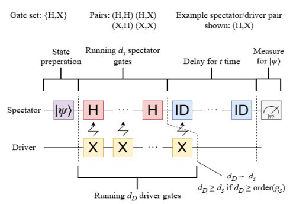 
Fig. 1. Example of spectator and driver qubits generated from spectator and driver pair (H,X). The driver generates crosstalk and the spectator attempts to observe it.

📷 Fig 2

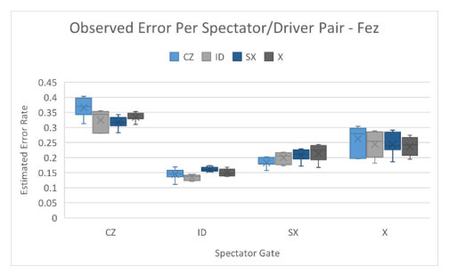 
Fig. 2. Results for each driver spectator gate pair on IBM Fez. The colors represent the Driver gate, while each cluster of box and whisker charts represents a spectator gate.

📷 Fig 3

 
Fig. 3. Results for each driver spectator gate pair on IBM Kingston. The colors represent the Driver gate, while each cluster of box and whisker charts represents a spectator gate.

📷 Fig 4

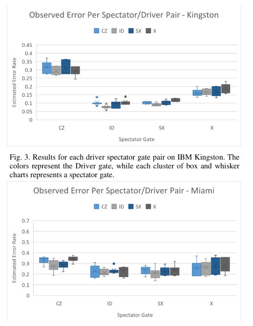 
Fig. 4. Results for each driver spectator gate pair on IBM Miami. The colors represent the Driver gate, while each cluster of box and whisker charts represents a spectator gate.

📷 Fig 5

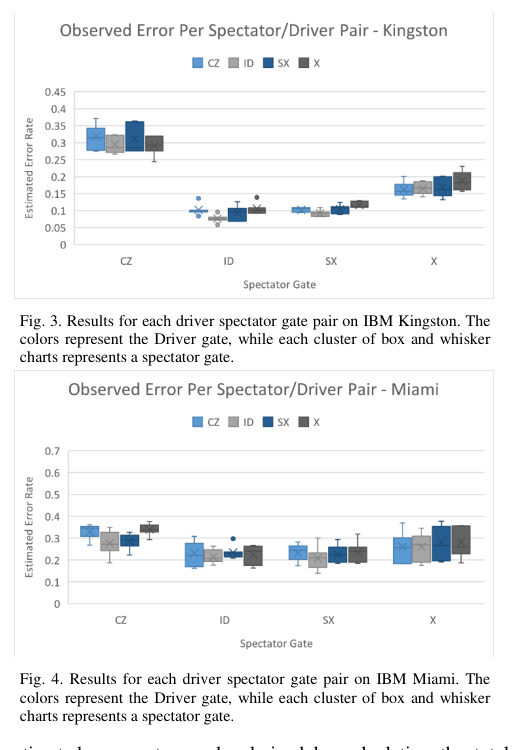 
Figure 2 shows box-and-whisker plots of the results from all seven runs for IBM Fez. We observe a noticeable difference in error on ID and CZ spectator gates. Using a t-test, we find ID spectators experience more error with SX drivers than ID drivers (p &lt; 0.01). We also find CZ spectators experience more error with CZ drivers than SX drivers (p = 0.021). Figure 3 shows the results for IBM Kingston. For this system, ID spectators experience higher error with X drivers than ID drivers (p &lt; 0.01) and experience more error with CZ drivers than ID drivers (p = 0.046). Additionally, SX spectators experience more error with X drivers than with ID drivers (p &lt; 0.01). For the Nighthawk system,...

**Summary.** The paper introduces CrossBench, a scalable system for generating crosstalk benchmarks on large-scale NISQ devices. By using a graph-based approach to assign driver and spectator qubits, it provides an efficient way to identify which gates contribute most to error rates. This is crucial for improving error mitigation, circuit transpilation, and quantum hardware security.

**Why it may be interesting.** not directly relevant

Detailed structure

**Main problem.** Traditional crosstalk benchmarking methods like Randomized Benchmarking become too resource-intensive and costly to scale as quantum computers increase in size and topological complexity.

**Main result.** The CrossBench system successfully identifies gates that introduce significant crosstalk across multiple IBM quantum processors with strong statistical significance (p < 0.05).

**Method.** A customizable, scalable benchmark generator using a graph-labeling algorithm to assign 'driver' and 'spectator' qubits to detect gate-dependent error variations.

**Model / system.** NISQ-era superconducting quantum processors, specifically IBM Heron-class (Fez, Kingston) and Nighthawk-class (Miami) architectures.

**Key observables.** The change in error rate experienced by a spectator qubit when neighboring driver qubits execute specific gates.

**Important parameters / regimes.** Native gate sets (X, SX, CZ, ID), driver depth (d_D), error threshold (delta), and device topology.

**Assumptions / limitations.** Assumes that variations in error rates between different driver gates are primarily due to crosstalk and that identity (ID) gates introduce negligible additional error.

**Figures summary.** Figure 1 shows the circuit construction of driver and spectator qubits; Figures 2-4 are box-and-whisker plots of error rate distributions; Figures 5-7 are bar charts showing averaged CrossBench results across different IBM processors.

**Paper structure.** The paper introduces the scalability problem of crosstalk, proposes the CrossBench algorithm and graph-labeling method, details the experimental implementation on IBM hardware, presents statistical results across multiple devices, and discusses limitations and future security applications.

Abstract

As quantum computers continue to increase in size and topological complexity, benchmarking crosstalk becomes more complex and resource-intensive. This limits the ability to obtain relevant crosstalk metrics for applications such as error mitigation, quantum computer security, and circuit transpilation. There applications benefit from accessible metrics on how each gate contributes to crosstalk. However, crosstalk metrics are rarely provided by quantum computer providers and can be expensive to obtain on modern large NISQ devices. In this work, we propose CrossBench, a customizable system that generates crosstalk benchmarks for finitely large NISQ devices with arbitrary topologies. CrossBench uses a custom graph labeling algorithm to generate crosstalk benchmarks for a given quantum topology and gate set. These benchmarks can be used to estimate the average contribution of each gate's crosstalk to qubit error rates. We evaluate the effectiveness of CrossBench by generating and running benchmarks on multiple IBM quantum computers with different topologies. Our results show that CrossBench can identify gates that introduce significant crosstalk across all tested devices, with strong statistical significance (p < 0.05). These promising results show that CrossBench can give simple and accessible crosstalk benchmarks for modern NISQ systems.

[↑ back to top](#top)

### [Formulating Subgroup Discovery as a Quantum Optimization Problem for Network Security](http://arxiv.org/abs/2604.27153v1)

**Authors:** Samuel Spell, Chi-Ren Shyu  
**Type:** both · **Category:** quantum information and computing · **PDF:** <https://arxiv.org/pdf/2604.27153v1>  
**Analysis basis:** full PDF text, analyzed in chunks
**Topic relevance:** 🔥 `QC/QI experiment` **4/5**

📷 Fig 1

 
Figure 1: End-to-end QAOA subgroup-discovery pipeline. Phases 1-2 binarize NSL-KDD features and run classical baselines. Phase 3 fits the LS-regression QUBO. Phase 4 executes QAOA on ibm_pittsburgh with COBYLA optimization and error mitigation. Phase 5 computes the dual approximation ratios and identifies QAOA-unique subgroups.

📷 Fig 2

 
Figure 2: Subgroup quality vs. subgroup size at k = 3 for the 20-qubit Probe configuration on ibm_pittsburgh. Green stars mark the exhaustive optimum (best WRAcc at any k), red triangles the beam- search results, and orange diamonds the QAOA-sampled subgroups. QAOA recovers subgroups in the same Pareto region as the classical baselines, confirming hardware competitiveness at this scale (𝑟, =

📷 Fig 3

 
Figure 3: QUBO fit quality for the R2L-filtered 10-qubit configuration. Each point is one QAOA-sampled bitstring plotted against its quadratic QUBO objective value; the OLS fit (R² = 0.989, Spearman |ρ| = 0.899) confirms the QUBO accurately ranks the WRAcc landscape.

📷 Fig 4

 
Figure 4: Bubble Pareto front (k = 3) for the 20-qubit Probe configuration on ibm_pittsburgh. Bubble size encodes WRAcc. QAOA hardware subgroups are competitive with classical methods, with several returning subgroups exhibiting higher positive rates than beam search.

📷 Fig 5

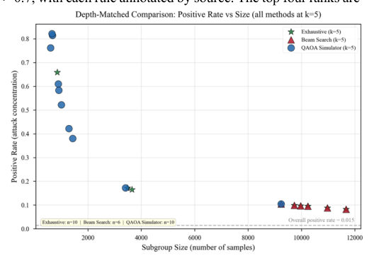 
Figure 5: Depth-matched comparison at k = 5 for the R2L-filtered configuration. The QAOA simulator returns smaller subgroups with higher attack-positive rate than beam search at the same cardinality, evidence that the QUBO objective rewards contrast-rich rules even when coverage is reduced.

**Summary.** This paper introduces a quantum-enhanced pipeline for discovering interpretable rules in network intrusion detection by formulating feature selection as a quantum optimization problem. It shows that QAOA can find complex multi-feature attack patterns that classical greedy algorithms miss, though it also identifies a clear performance degradation limit due to hardware noise.

**Why it may be interesting.** not directly relevant

Detailed structure

**Main problem.** The paper addresses the challenge of finding interpretable, multi-feature interaction patterns (subgroups) in network security datasets, which is an NP-hard combinatorial optimization problem that classical greedy heuristics often fail to solve optimally.

**Main result.** The authors demonstrate that QAOA can identify high-precision attack patterns missed by classical beam search, while also establishing an empirical NISQ scaling boundary where hardware noise causes performance to collapse around 30 qubits.

**Method.** The researchers formulate Subgroup Discovery as a Quadratic Unconstrained Binary Optimization (QUBO) problem using a least-squares regression of the WRAcc landscape and solve it using the Quantum Approximate Optimization Algorithm (QAOA) on IBM hardware.

**Model / system.** The problem is mapped to an Ising Hamiltonian with ZZ couplings on the IBM 'ibm_pittsburgh' superconducting processor, using a transverse-field mixer Hamiltonian for the QAOA circuit.

**Key observables.** WRAcc (Weighted Relative Accuracy), approximation ratios r5 (Hamiltonian quality) and r6 (WRAcc recovery), and test precision.

**Important parameters / regimes.** Qubit count (10-30), circuit depth (p=1, 2), target cardinality (K), and the penalty weight (lambda).

**Assumptions / limitations.** The WRAcc landscape can be accurately approximated by a quadratic surrogate model; the study is limited by the noise levels of current NISQ-era hardware.

**Figures summary.** Figure 1 shows the end-to-end QAOA pipeline; Figure 2 compares subgroup quality between exhaustive, beam search, and QAOA methods; Figure 3 validates the QUBO surrogate fit (R2=0.989); Figure 4 shows a Pareto front of subgroup quality.

**Paper structure.** The paper progresses from defining the security problem and data preprocessing to formulating the QUBO/Ising Hamiltonian, executing the QAOA on hardware, benchmarking against classical heuristics, and characterizing hardware scaling limits.

Abstract

While current network intrusion detection systems achieve satisfactory accuracy, they often lack explainability. Subgroup Discovery (SD) addresses this by building interpretable rules that characterize feature interactions associated with attack traffic. With large datasets, classical heuristic beam search methods struggle with exponentially scaling search spaces and can prune critical multi-feature interactions. This paper introduces a quantum-enhanced pipeline for SD applied to network intrusion detection using NSL-KDD, formulating SD as quantum optimization for the first time. By encoding feature selection as a Quadratic Unconstrained Binary Optimization (QUBO) and solving it via the Quantum Approximate Optimization Algorithm (QAOA) on IBM Quantum hardware (ibm_pittsburgh), the pipeline identifies subgroups of network features that discriminate normal from attack traffic. A least-squares regression QUBO formulation fits the Weighted Relative Accuracy (WRAcc) landscape over feature subsets, with surrogate sampling for larger QUBOs. Results are benchmarked against exhaustive enumeration and Beam Search using ratios for Hamiltonian quality and WRAcc. Hardware scaling experiments on ibm_pittsburgh (10-30 qubits) reveal that QAOA at depth p = 1 shows WRAcc ratios of 0.983 at 10 qubits, 0.971 at 15 qubits, 0.855 at 20 qubits, and 0.624 at 25 qubits, degrading to 0.039 at 30 qubits as circuit noise dominates, establishing an empirical NISQ scaling boundary. Results demonstrate that QAOA discovers subgroups competitive with classical heuristics and finds multi-feature interaction patterns that greedy Beam Search prunes, with QAOA-unique subgroups achieving up to 99.6% test precision. This work establishes a framework for quantum combinatorial optimization in cybersecurity and characterizes hardware scaling for NISQ devices.

[↑ back to top](#top)

### [High-fidelity iSWAP gate with Double Transmon Coupler](http://arxiv.org/abs/2604.27080v1)

**Authors:** Tarush Tiwari, Sudhir K. Sahu, Guilhem Ribeill, Michael Senatore, Matthew D. LaHaye, Raymond W. Simmonds, Daniel L. Campbell, Archana Kamal, Leonardo Ranzani  
**Type:** experiment · **Category:** quantum information and computing · **PDF:** <https://arxiv.org/pdf/2604.27080v1>  
**Analysis basis:** abstract only; PDF text extraction failed or PDF unavailable
**Topic relevance:** 🔥 `QC/QI experiment` **4/5**

**Summary.** The researchers demonstrated a high-fidelity 99.827% iSWAP gate between two transmon qubits using a double transmon coupler. This method allows for fast, 40ns entangling operations while effectively suppressing unwanted static interactions and crosstalk. The approach provides a scalable pathway for high-fidelity quantum computing using superconducting circuits.

**Why it may be interesting.** The use of parametric gates to achieve frequency-selective activation and the suppression of crosstalk is highly relevant to the control of open quantum systems and the development of scalable quantum architectures.

Detailed structure

**Main problem.** Achieving high-fidelity entangling gates between superconducting qubits while suppressing parasitic crosstalk and static interactions.

**Main result.** Demonstration of a parametric iSWAP gate with 99.827% fidelity in 40ns using a double transmon coupler (DTC).

**Method.** Implementation of a parametric gate using a DTC architecture and the use of robust phase estimation to calibrate non-commuting error terms.

**Model / system.** A superconducting circuit architecture consisting of two transmon qubits coupled via a recently developed double transmon coupler (DTC).

**Key observables.** Gate fidelity and gate duration.

**Important parameters / regimes.** Gate fidelity of 99.827% and a gate time of 40ns.

**Paper structure.** The paper introduces the DTC architecture, describes the implementation of the parametric iSWAP gate, details the calibration via robust phase estimation, and presents the achieved fidelity results.

Abstract

Entangling operations are at the heart of all approaches to quantum information processing. Parametric gates, in particular, offer a versatile solution to strongly couple off-resonant superconducting qubits with suppressed parasitic crosstalk to spectator qubits due to frequency-selective activation. In this work, we demonstrate a parametric iSWAP gate between two transmon qubits using the recently developed double transmon coupler (DTC). The DTC supports robust internally-defined cancellation point (``off'' state) for static interactions, while simultaneously mediating a fast parametric coupling between data qubits that can be deployed for high-fidelity two-qubit operations. We use robust phase estimation to calibrate non-commuting error terms in the parametric iSWAP gate, and achieve a 99.827% gate fidelity in 40ns without any numerical optimization. The circuit architecture and calibration techniques developed here are extensible to other gate implementations and qubit modalities, paving the way towards resource-efficient quantum information processing.

[↑ back to top](#top)

### [OAM-mode sorting with a wavefront twister](http://arxiv.org/abs/2604.27739v1)

**Authors:** Suman Karan, Swati Chaudhary, Harshwardhan Wanare, Anand Kumar Jha  
**Type:** theory · **Category:** quantum information and computing · **PDF:** <https://arxiv.org/pdf/2604.27739v1>  
**Analysis basis:** full PDF text, analyzed in chunks
**Topic relevance:** 🔥 `interference shaping light` **4/5**

📷 Fig 1

 
FIG. 1. Conceptual illustration of the proposed wavefront twister and the OAM sorting scheme. (a) A conventional wavefront rotator such as a Dove prism, oriented at angle θ0 rotates an input wavefront by angle 2θ0. (b) The proposed wavefront twister rotates an incoming wavefront by an angle θ(ρ) = aρ that varies linearly with radial location ρ. Con- sequently, the wavefront is not simply rotated but twisted. (c) The wavefront twister maps the point (ρ, ϕ) in the inci- dent wavefront to (ρ, ϕ + aρ). (d) The proposed OAM sorter scheme consisting of the wavefront twister followed by a lens of focal length f maps the OAM modes l1 and l2 to annuli of distinct radii in the focal plane, leading to...

📷 Fig 2

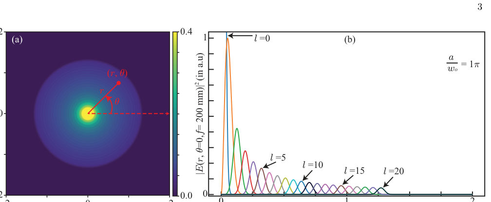 
FIG. 2. (a) Numerically computed two-dimensional intensity |E(r, θ, f = 200 mm)|2 for OAM mode index l ranging from 1 to 20 at a/w0 = 1π and w0 = 0.1 cm. (b) Numerically computer one-dimensional intensity profiles |E(r, θ = 0, f = 200 mm)|2 as a function of r for OAM mode index l ranging from 1 to 20 at a/w0 = 1π and w0 = 0.1 cm.

📷 Fig 3

 
FIG. 3. (a) Numerically computed two-dimensional intensity |E(r, θ, f = 200 mm)|2 for OAM mode index l ranging from 1 to 20 at a/w0 = 3π and w0 = 0.1 cm. (b) Numerically computer one-dimensional intensity profiles |E(r, θ = 0, f = 200 mm)|2 as a function of r for OAM mode index l ranging from 1 to 20 at a/w0 = 3π and w0 = 0.1 cm.

📷 Fig 4

 
FIG. 4. (a) Plot of the mean radial position µ of the ring formed by each sorted OAM mode as a function of the OAM index l (b) Radial spread σ of each ring as a function of l.

📷 Fig 5

 
Fig. 2 (a) shows the numerically computed two- dimensional intensity profiles |E(r, θ, f = 200 mm)|2

**Summary.** The paper proposes a new optical element, a 'wavefront twister,' that rotates a wavefront by an amount varying with radial position. This device allows for the efficient sorting of OAM modes into distinct rings, providing a scalable way to reduce crosstalk in high-dimensional optical systems.

**Why it may be interesting.** This is highly relevant to quantum optics and photonic quantum information, as it proposes a scalable method for managing high-dimensional OAM states, which are essential for high-capacity quantum communication and multiplexing.

Detailed structure

**Main problem.** The challenge of efficiently and unambiguously mapping different Orbital Angular Momentum (OAM) modes to distinct spatial locations for parallel detection and multiplexing while minimizing inter-modal crosstalk.

**Main result.** The proposed wavefront twister maps OAM modes to distinct annuli at the focal plane, where increasing the twisting strength significantly reduces inter-modal crosstalk and enables scalable mode sorting.

**Method.** The study uses mathematical modeling of the wavefront transformation and the Fresnel-Kirchhoff diffraction integral, employing numerical evaluation via Bessel function identities and confluent hypergeometric functions.

**Model / system.** The system consists of Laguerre-Gaussian (LG) beams passing through a novel optical element called a wavefront twister, which applies a radial-dependent rotation to the wavefront, followed by a convex lens.

**Key observables.** OAM mode index (l), mean radial position (mu), radial intensity spread (sigma), and inter-modal crosstalk percentage.

**Important parameters / regimes.** Twisting strength (a/w0), radial position (rho), and beam waist (w0).

**Assumptions / limitations.** The scheme cannot distinguish between positive and negative OAM modes (+l and -l) as they produce identical intensity distributions.

**Figures summary.** Figure 1 illustrates the concept of the wavefront twister and the sorting scheme; Figure 2 shows 2D and 1D intensity profiles; Figure 3 demonstrates reduced overlap at higher twisting strength; Figure 4 plots mean radial position and radial spread against the OAM index; Figure 5 shows crosstalk as a function of twisting strength.

**Paper structure.** The paper introduces the wavefront twister concept, compares it to existing sorters, provides the mathematical framework for the transformation and diffraction, presents numerical results regarding mode separation and crosstalk, and discusses scalability and limitations.

Abstract

We propose an OAM sorter based on a novel optical element that we refer to as a wavefront twister. It is a generalization of the conventional wavefront rotators such as the Dove prism. However, unlike a Dove prism, which simply rotates a wavefront, the rotation generated by a wavefront twister varies linearly with radial position, resulting in the twisting of the wavefront. We demonstrate that the wavefront twister, followed by a lens, maps each OAM mode to an annulus of distinct radius at the back focal plane of the lens with negligible inter-modal overlap and preserves the circular symmetry. Thus, the proposed wavefront twister offers a scalable scheme for high-dimensional OAM mode sorting, with important consequences for the practical realization of OAM-based applications.

[↑ back to top](#top)

### [Resolving spurious topological entanglement entropy in stabilizer codes](http://arxiv.org/abs/2604.27053v1)

**Authors:** Peilun Han, Zijian Liang, Yifei Wang, Bowen Yang, Yingfei Gu, Yu-An Chen  
**Type:** theory · **Category:** quantum information and computing · **PDF:** <https://arxiv.org/pdf/2604.27053v1>  
**Analysis basis:** full PDF text, analyzed in chunks
**Topic relevance:** 🔥 `entanglement & information structure` **4/5**

📷 Fig 1

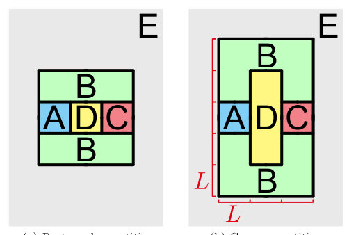 
FIG. 1. Two tripartitions for computing the Levin-Wen topo- logical entanglement entropy. (a) The standard rectangular partition. (b) The concave partition introduced in this work. Our main result shows that the concave partition is immu- nized against spurious contributions to the topological entan- glement entropy.

📷 Fig 2

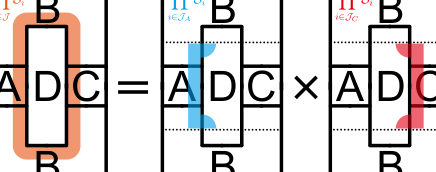 
FIG. 2. (a) Decomposition of a stabilizer S = Q

📷 Fig 3

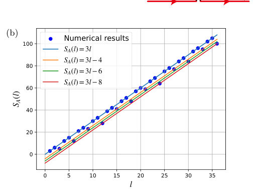 
FIG. 4. Bipartite entanglement entropy on an infinite cylin- der. (a) An infinite cylinder is bipartitioned into regions A and B by a cut perpendicular to the cylinder axis. After un- folding, the cut induces a rough boundary on the right edge of region A and a smooth boundary on the left edge of region B. The top and bottom edges are identified, and the cylin- der circumference is l. (b) The entanglement entropy SA(l) of region A for the (3, 3)-BB code [23]. The numerical data separate into four linear branches, SA(l) = 3l, 3l −4, 3l −6, and 3l −8, depending on gcd(l, 12). The constant offset is in one-to-one correspondence with k(l)/2, where k(l) is the dimension of logical operators...

📷 Fig 4

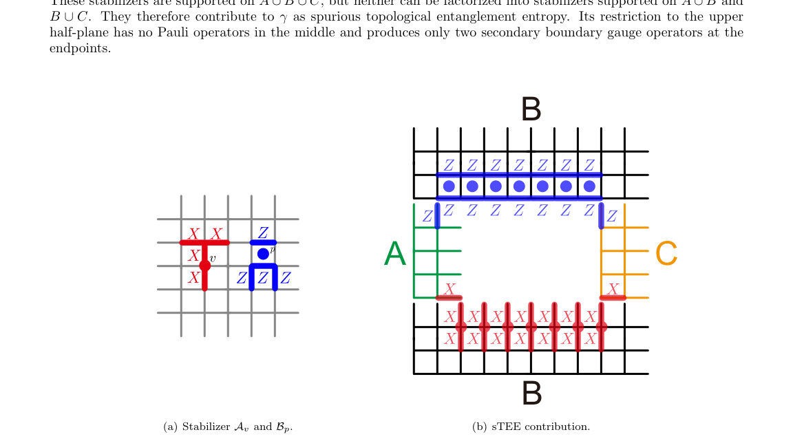 
FIG. 5. sTEE of the shifted toric code. (a) The stabilizers of the shifted toric code obtained from the standard toric code by a circuit of CNOT gates. The red and blue Pauli operators denote the Av and Bp terms, respectively, and the corresponding dots mark their lattice positions. (b) In the rectangular partition, the green, orange, and black regions represent regions A, C, and B, respectively. The X-type and Z-type stabilizers, formed by taking products of the Av operators and Bp operators marked by the corresponding dots, contribute to the spurious TEE.

📷 Fig 5

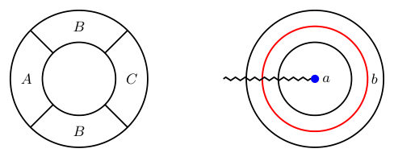 
FIG. 6. Left: The geometry of the Levin-Wen prescription. Right: An anyon a is imported inside the annulus by a Pauli string, flipping the expectation value of the Wilson loop b that detects this anyon. See Lemma 6 for more details.

**Summary.** This paper resolves the problem of artificial entropy contributions in the calculation of topological entanglement entropy for stabilizer codes. By replacing standard rectangular partitions with a specifically designed concave geometry, the authors prove that the genuine topological order can be accurately recovered. The work also demonstrates how entanglement entropy can reveal topological frustration in quantum LDPC codes.

**Why it may be interesting.** not directly relevant

Detailed structure

**Main problem.** The paper addresses the issue of spurious topological entanglement entropy (sTEE) in stabilizer codes, where standard rectangular partitions produce artificial constant contributions that overestimate the total quantum dimension.

**Main result.** The authors introduce a concave partition geometry that eliminates spurious contributions and provide a rigorous proof that this prescription recovers the genuine topological entanglement entropy for translation-invariant stabilizer codes of prime-dimensional qudits.

**Method.** The study uses algebraic techniques including Gröbner basis reduction, Dubé's theorem for degree bounds, and the Smith Normal Form to analyze stabilizer group sizes and the decomposition of boundary gauge operators.

**Model / system.** The work focuses on 2D translation-invariant stabilizer codes of prime-dimensional qudits (Zp), specifically examining models like the toric code, shifted toric code, and bivariate bicycle codes on a cylinder.

**Key observables.** Topological entanglement entropy (TEE), bipartite entanglement entropy, and total quantum dimension.

**Important parameters / regimes.** Stabilizer range (r), qudit dimension (q), system size (L), and cylinder circumference (l).

**Assumptions / limitations.** The results are specifically derived for translation-invariant stabilizer codes of prime-dimensional qudits; the derived analytic lower bound for the partition size is noted to be conservative.

**Figures summary.** Figure 1 compares rectangular and concave partitions; Figure 2 and 3 illustrate stabilizer decomposition and the removal of residual support; Figure 4 shows bipartite entanglement entropy on a cylinder; Figure 5 shows the shifted toric code stabilizers; Figure 15 shows a schematic of stabilizer decomposition.

**Paper structure.** The paper identifies the origin of sTEE, introduces the concave partition, provides a rigorous mathematical proof for the absence of spurious terms using algebraic geometry, and applies the method to study topological frustration in bivariate bicycle codes.

Abstract

Topological entanglement entropy (TEE) is a key diagnostic of long-range entanglement in two-dimensional gapped phases of matter, but it can suffer from spurious contributions that overestimate the total quantum dimension of the underlying topological order. In this work, we identify the microscopic origin of spurious TEE and introduce a concave partition for computing the Levin-Wen TEE of translation-invariant stabilizer codes of prime-dimensional qudits. We rigorously prove that this prescription is free of spurious contributions. As a complementary probe, we study bivariate bicycle codes on a bipartite cylinder and show that the entanglement entropy depends sensitively on the cylinder circumference, revealing topological frustration of the underlying anyons.

[↑ back to top](#top)

### [Deep Strong light-matter Coupling in 3D Kane Fermions](http://arxiv.org/abs/2604.28042v1)

**Authors:** Dmitriy Yavorskiy, David Hagenmuller, Noureddine Charrouj, Yurii Ivonyak, Alexander Kazakov, Yanko Todorov, Wojciech Knap, Marcin Bialek  
**Type:** both · **Category:** other · **PDF:** <https://arxiv.org/pdf/2604.28042v1>  
**Analysis basis:** abstract only; PDF text extraction failed or PDF unavailable
**Topic relevance:** `Dicke superradiance` **3/5** · `Tavis-Cummings & cavity-many-emitter` **3/5** · `correlated cavity matter` **3/5** · `driven-dissipative phase transition` **3/5** · `quantum optics experiment` **3/5**

**Summary.** The paper reports the achievement of deep-strong light-matter coupling in 3D Kane fermions using a mercury cadmium telluride layer in a Fabry-Perot cavity. It proves that a diamagnetic A^2 term emerges to prevent the predicted superradiant phase transition. This work settles a major controversy in cavity QED and provides a platform for extreme light-matter interaction devices.

**Why it may be interesting.** It resolves a fundamental debate in cavity QED regarding the possibility of superradiant phase transitions in systems with relativistic-like dispersion and demonstrates record-high light-matter coupling in a semiconductor platform.

Detailed structure

**Main problem.** The paper addresses whether a superradiant quantum phase transition is possible in relativistic-like electronic systems (Dirac and Kane fermions) where the absence of an A^2 term was previously hypothesized.

**Main result.** The researchers demonstrate that a diamagnetic A^2 term naturally emerges in Kane fermions, which precludes the superradiant phase transition, thereby resolving a long-standing controversy.

**Method.** The study combines experimental realization of Landau polaritons in a bulk semiconductor with a rigorous, gauge-invariant microscopic theory to analyze the coupling regimes.

**Model / system.** A bulk mercury cadmium telluride (HgCdTe) layer containing 3D Kane fermions coupled to a Fabry-Perot resonator.

**Key observables.** Polariton spectra and the normalized coupling ratio.

**Important parameters / regimes.** Deep-strong coupling regime (normalized coupling ratio exceeding 1.6) and thermally tunable carrier density.

**Paper structure.** The paper introduces the deep-strong coupling regime, describes the experimental setup using HgCdTe and a Fabry-Perot resonator, presents the measured polariton spectra, compares them to gauge-invariant theory, and concludes by discussing the emergence of the A^2 term and its implications for phase transitions.

Abstract

Deep strong light-matter coupling represents an extreme non-perturbative regime of quantum electrodynamics, in which the interaction strength exceeds the bare frequencies of the uncoupled systems. The ground state features strong quantum correlations between photons and matter excitations, and new cavity-driven phase transitions are expected to occur. Whether a superradiant quantum phase transition, marked by spontaneous dipole ordering and photon condensation, is possible has remained a long-standing and controversial question. Such phenomena have been proposed to arise in exotic electronic systems hosting Dirac and Kane fermions, owing to the formal absence of an $A^2$ term in their low-energy Hamiltonian. Here we exploit the ultralow effective mass of Kane fermions to realise Landau polaritons in a bulk mercury cadmium telluride layer coupled to a Fabry-Perot resonator. Using thermally tunable carrier density, we continuously tune the coupling from the weak to the deep-strong regime, achieving a record normalised coupling ratio exceeding 1.6 above room temperature. The measured polariton spectra are in excellent agreement with a rigorous, gauge-invariant microscopic theory. Despite the nonlinear Landau level structure of relativistic Kane fermions, we show that a diamagnetic $A^2$ term naturally emerges and precludes a superradiant phase transition. These results resolve the long-standing controversy surrounding cavity quantum electrodynamics of relativistic-like matter systems, extend deep-strong-coupling physics to Kane fermions, and open new opportunities for polaritonic semiconductor devices operating in extreme light-matter coupling regimes.

[↑ back to top](#top)

### [The Synergistic Route to Stretched Criticality](http://arxiv.org/abs/2604.28003v1)

**Authors:** Lorenzo Lucarini, Sandro Meloni, Pablo Villegas  
**Type:** theory · **Category:** statistical mechanics · **PDF:** <https://arxiv.org/pdf/2604.28003v1>  
**Analysis basis:** full PDF text, analyzed in chunks
**Topic relevance:** `driven-dissipative phase transition` **3/5** · `non-equilibrium dynamics` **3/5** · `non-equilibrium universality` **3/5** · `entanglement & information structure` **2/5** · `scars & prethermalization` **2/5**

📷 Fig 1

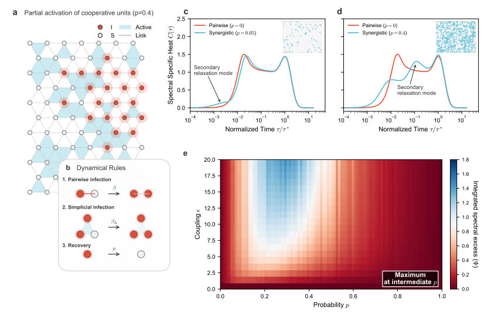 
Figure 1. Partial activation of cooperative units generates additional slow relaxation modes. (a) Triangular lattice with an active fraction p of 2-simplices (triangles, teal) superimposed on the pairwise backbone. Node colors represent SIS states: susceptible (white) and infected (red). (b) Spreading dynamics combining pairwise infection (β), cooperative simplicial infection (β∆), and recovery (µ). (c),(d) Spectral specific heat C as a function of normalized diffusion time τ/τ ∗for two values of the active simplicial fraction, p = 0.05 and p = 0.4, for N = 1023. Relative to the pairwise baseline (p = 0, red), partial activation of simplices generates an additional peak at short times,...

📷 Fig 2

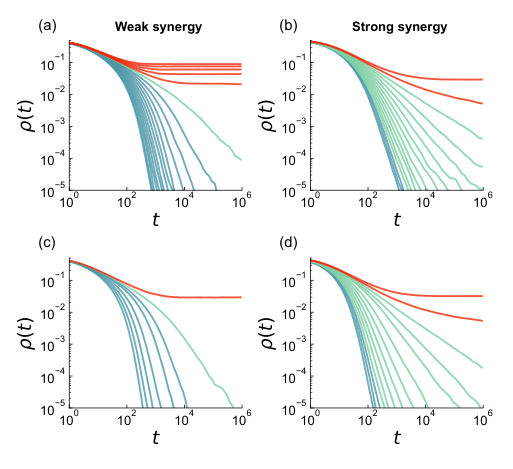 
Figure 2. Extended region of slow relaxation induced by synergistic interactions. Temporal evolution of the in- fection density ρ(t) for two values of the cooperative fraction, p = 0.05 and p = 0.25. (a,b) Simplicial SIS dynamics: (a) β ∈(0.220, 0.238) with βc = 0.233; (b) β ∈(0.150, 0.165) with βlow c ≡βl c = 0.152 and βhigh c ≡βh c = 0.163. (c,d) Pairwise quadratic contact process: (c) β ∈(0.220, 0.242) with βc = 0.240; (d) β ∈(0.140, 0.184) with βl c = 0.152 and βh c = 0.180. In both models, the system develops a broad region of algebraic-like decay over several decades (green curves), signaling the emergence of an extended crit- ical regime associated with a broad spectrum of relaxation...

📷 Fig 3

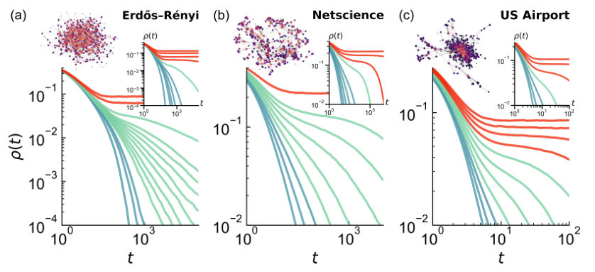 
Figure 3. Robustness across network structures. Temporal evolution of the infection density ρ(t) for the pairwise cooperative model on different network topologies for strong synergy and absent synergy (insets, p = 0). Blue curves correspond to the absorbing phase and red curves to the active one, while the greenish ones highlight algebraic decay. (a) Erdős–Rényi network (N = 104, ⟨κ⟩= 3, p = 0.10), with β ∈(0.31, 0.35), βl c = 0.32, and βh c = 0.33. Inset: β ∈(0.30, 0.40), with βc = 0.340. (b) Scientific collaboration network (Netsci, N = 379, p = 0.30), with β ∈(0.10, 0.20), βl c = 0.13, and βh c = 0.17. Inset: β ∈(0.10, 0.28), with βc = 0.22. (c) US airport network (N = 500, p = 0.20),...

**Summary.** The paper identifies 'synergistic interactions' as a new way to generate extended critical regimes and slow, Griffiths-like dynamics. By coupling different spreading mechanisms, the system develops a broad spectrum of relaxation rates. This effect is shown to be a general dynamical principle that works across various network structures and interaction types.

**Why it may be interesting.** This is relevant for many-body dynamics and open quantum systems as it identifies a dynamical mechanism for generating broad relaxation spectra and extended critical regimes, which could be applied to understanding non-equilibrium phase transitions in driven-dissipative systems.

Detailed structure

**Main problem.** Investigating whether synergistic interactions (cooperative mechanisms) can serve as a distinct route to non-conventional critical phenomena, specifically 'stretched criticality' characterized by extended regimes of slow, algebraic-like decay.

**Main result.** The authors demonstrate that synergistic interactions create a broad distribution of relaxation rates, leading to Griffiths-like slow dynamics and an extended critical region that is robust across different network topologies and interaction types.

**Method.** The study uses spectral analysis of the diffusion density operator (including von Neumann entropy and spectral specific heat) and numerical simulations of SIS-type processes on various networks.

**Model / system.** The primary models are a simplicial Susceptible-Infected-Susceptible (SIS) process on a 2D triangular lattice and a pairwise quadratic contact process with threshold activation, applied to Erdős–Rényi, scientific collaboration, and US airport networks.

**Key observables.** Infection density rho(t), relaxation rates, von Neumann entropy S(tau), spectral specific heat C(tau), and integrated spectral excess Phi.

**Important parameters / regimes.** Cooperative fraction p (density of active 2-simplices), synergistic strength (ratio of beta_delta to beta), and infection/recovery rates.

**Assumptions / limitations.** The mechanism is assumed to be independent of specific geometry, though finite-size effects in heterogeneous networks like the US airport network may limit perfectly clean power-law behavior.

**Figures summary.** Figure 2 shows the temporal evolution of infection density highlighting the extended slow relaxation regime; Figure 3 demonstrates the robustness of this effect across different network topologies; Supplemental figures show how varying p and beta_delta/beta affects the presence of stretched criticality.

**Paper structure.** The paper introduces the concept of stretched criticality, presents the simplicial and pairwise models, details the spectral analysis method, demonstrates the emergence of slow dynamics through synergy, tests robustness across networks, and concludes with the conditions (balance of strength and density) required for the phenomenon.

Abstract

Griffiths phases are typically associated with quenched disorder, while frustration gives rise to multistability and spin-glass behavior. Whether extended criticality can arise in other contexts remains an open question. Here, we show that synergistic interactions provide a distinct route to non-conventional critical phenomena. By combining spreading mechanisms that reinforce activity through complementary pathways, we uncover a broad distribution of relaxation rates, leading to Griffiths-like slow dynamics and extended criticality. We demonstrate that this mechanism is robust across networks and emerges both in systems with explicit higher-order interactions and in purely pairwise systems with nonlinear dynamics.

[↑ back to top](#top)

### [Geometric complexity in thermodynamics](http://arxiv.org/abs/2604.27858v1)

**Authors:** Tan Van Vu, Keiji Saito  
**Type:** theory · **Category:** statistical mechanics · **PDF:** <https://arxiv.org/pdf/2604.27858v1>  
**Analysis basis:** full PDF text, analyzed in chunks
**Topic relevance:** `entanglement & information structure` **3/5** · `methods for driven-dissipative` **2/5** · `non-equilibrium dynamics` **2/5** · `quantum measurements` **2/5**

📷 Fig 1

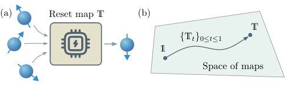 
FIG. 1. Geometric framework for reset maps. (a) A state-agnostic reset map T clearing probability from a target subspace. This unified description encompasses diverse ther- modynamic operations, including cooling, information era- sure, and state copying. (b) The geometric complexity of T is defined as the minimal geodesic length between the iden- tity map 1 and T on the space of physical maps, as induced by a suitable Riemannian metric.

**Summary.** The paper introduces a geometric measure of complexity to establish a universal principle for the unattainability of perfect state resets. It proves that as the error in operations like cooling or erasure approaches zero, the required physical complexity diverges. This result provides a unified thermodynamic limit that applies equally to classical stochastic processes and quantum channels.

**Why it may be interesting.** This paper provides a deep geometric unification of the third law of thermodynamics and quantum information theory, offering a new way to quantify the physical resources (time, energy, bandwidth) required for quantum control and state preparation.

Detailed structure

**Main problem.** The authors seek a universal, dynamics-independent measure to quantify the fundamental difficulty of implementing state-reset operations, such as cooling or erasure, which currently lack a unified description across classical and quantum regimes.

**Main result.** They derive a fundamental complexity-error trade-off relation, e^C * epsilon >= 1, proving that achieving zero error in a reset operation requires infinite geometric complexity, effectively reframing the third law of thermodynamics as a geometric limit.

**Method.** The study employs a Riemannian manifold approach, defining complexity as the minimal geodesic length between the identity map and a target map using a specifically constructed log-barrier Hessian metric.

**Model / system.** The framework encompasses both classical stochastic maps (transition matrices) and quantum channels (CPTP maps), including models like Markov jump processes, Lindbladian dynamics, and unitary swaps with an environment.

**Key observables.** Geometric complexity (C), execution error (epsilon), geodesic distance (l), and Shannon/von Neumann entropy.

**Important parameters / regimes.** Dimension (d), transition rate bounds (gamma), and the metric parameter (alpha=2).

**Assumptions / limitations.** Assumes smooth paths of maps exist, transition rates are bounded, and focuses on the regime where probability distributions remain strictly positive.

**Figures summary.** Figure 1(a) illustrates a state-agnostic reset map clearing probability from a target subspace, while Figure 1(b) defines geometric complexity as the minimal geodesic length on a manifold of maps.

**Paper structure.** The paper begins by identifying the need for a universal complexity measure, moves to defining the Riemannian geometric framework, proves the complexity-error trade-off for both classical and quantum systems, provides analytical bounds and entropic relations, and concludes with specific applications to reset channels and protocol scaling.

Abstract

The third law of thermodynamics forbids cooling a physical system to absolute zero in a finite number of operational steps. Although this unattainability principle has been quantified for specific state-to-state transitions, a universal, dynamics-independent bound for implementing a state-agnostic reset map remains elusive. In this work, we unveil the fundamental limits of physical map implementation by deriving a trade-off relation based on geometric complexity. By analyzing continuous paths of maps on a geometric manifold, we prove that the geometric complexity of any classical stochastic map or quantum channel is bounded from below by its execution error. As a consequence, we show that achieving zero error in a state-reset operation requires a divergent geometric complexity -- a unified measure that naturally incorporates disparate physical resources, including infinite time, energetic cost, or control bandwidth. This unattainability principle holds universally across both classical and quantum regimes, establishing a strict geometric limit on the physical realization of reset operations in thermodynamic control and quantum computation.

[↑ back to top](#top)

### [Heisenberg-limited Hamiltonian learning without short-time control](http://arxiv.org/abs/2604.27838v1)

**Authors:** Myeongjin Shin, Junseo Lee, Changhun Oh  
**Type:** theory · **Category:** quantum information and computing · **PDF:** <https://arxiv.org/pdf/2604.27838v1>  
**Analysis basis:** full PDF text, analyzed in chunks
**Topic relevance:** `analog quantum simulation` **3/5** · `entanglement & information structure` **2/5** · `non-equilibrium dynamics` **2/5** · `quantum measurements` **2/5**

📷 Fig 1

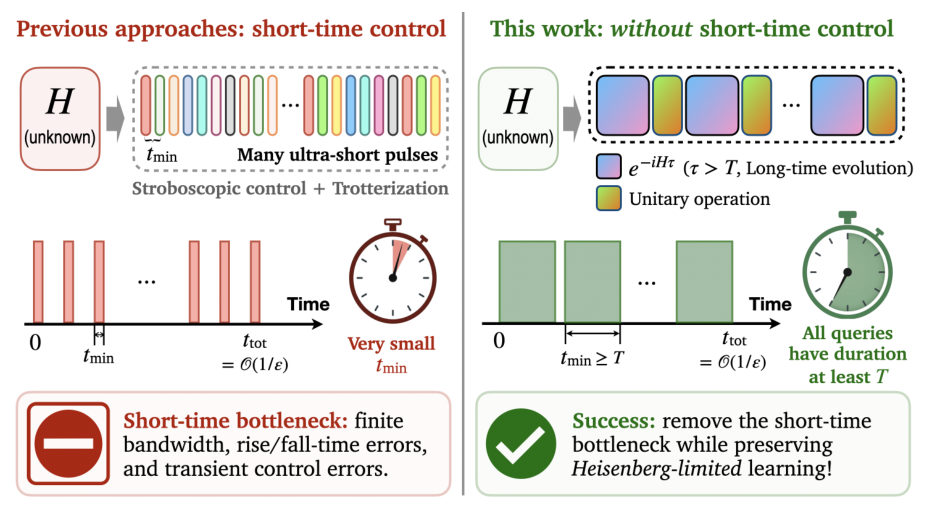 
Figure 1. Comparison between previous short-time control approaches and our framework. Previous Heisenberg- limited algorithms rely on stroboscopic control and Trotterization, requiring many ultra-short evolution segments with small 𝑡min. Our framework replaces these short-time queries by long-time evolutions interleaved with learned auxiliary operations, ensuring that every query to the unknown Hamiltonian has duration at least 𝑇. Thus, the short-time bottleneck is removed while Heisenberg-limited scaling in total evolution time is retained.

📷 Fig 2

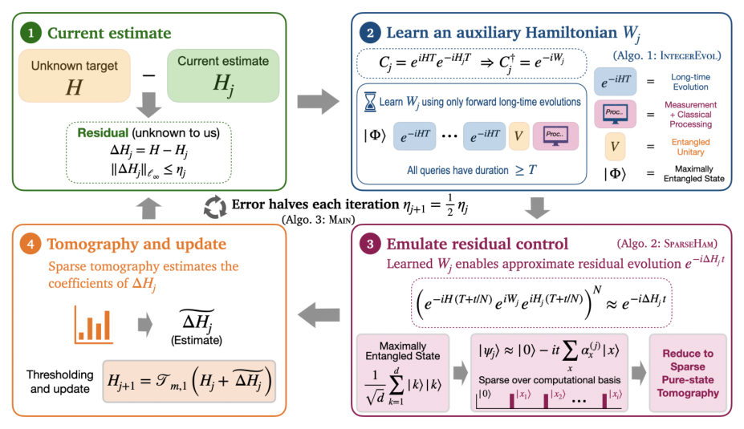 
Figure 2. Schematic overview of our iterative learning protocol. At iteration 𝑗, the current estimate 𝐻𝑗 defines a residual Hamiltonian Δ𝐻𝑗= 𝐻−𝐻𝑗. We first learn an auxiliary Hamiltonian 𝑊𝑗using only long-time evolutions under 𝐻, and then use 𝑊𝑗to emulate the residual-control primitive 𝑒−𝑖Δ𝐻𝑗𝑡. This emulated evolution reduces coefficient extraction to sparse pure-state tomography. After estimating Δ𝐻𝑗, we update and truncate the estimate to obtain 𝐻𝑗+1, preserving 𝑚-sparsity and bounded norm while halving the error.

**Summary.** This paper demonstrates that optimal, Heisenberg-limited Hamiltonian learning is possible without needing ultra-short control pulses. By using a method to emulate short-time dynamics through longer evolution periods, the authors overcome experimental limitations related to finite control bandwidth.

**Why it may be interesting.** This is highly relevant for experimentalists in quantum computing and many-body dynamics because it proves that high-bandwidth, ultra-short pulses are not a fundamental requirement for optimal Hamiltonian characterization.

Detailed structure

**Main problem.** How to achieve Heisenberg-limited Hamiltonian learning when experimental constraints prevent the use of arbitrarily short-time evolution pulses.

**Main result.** The authors prove that Heisenberg-limited scaling (1/epsilon) can be achieved even with a minimum evolution time T > 0, resolving a major open problem. They establish a quantitative tradeoff between the minimum evolution time and total evolution time for many-body systems.

**Method.** The framework emulates continuous quantum control by replacing short-time Trotter steps with long-time evolutions interleaved with learned correction unitaries, reducing the task to sparse pure-state tomography.

**Model / system.** An n-qubit, m-sparse, traceless Hamiltonian composed of a sum of Pauli operators with unknown coefficients.

**Key observables.** Pauli coefficients of the Hamiltonian, total evolution time, and error in the operator norm.

**Important parameters / regimes.** Sparsity (logarithmic vs. polynomial), minimum evolution time (T), target accuracy (epsilon), and total evolution time (t_tot).

**Assumptions / limitations.** The learner has oracle access to the time-evolution operator for durations at least T and can simulate the current Hamiltonian estimate.

**Figures summary.** Figure 1 contrasts previous short-time control approaches (relying on vanishingly small time steps) with the new framework using long-time evolutions and auxiliary operations.

**Paper structure.** The paper introduces the short-time bottleneck problem, defines the long-time evolution framework, presents the emulation method for continuous control, analyzes the logarithmic sparsity regime, extends the results to polynomial sparsity via quasi-sparsity and BCH expansion, and concludes with complexity bounds.

Abstract

Characterizing quantum systems by learning their underlying Hamiltonians is a central task in quantum information science. While recent algorithmic advances have achieved near-optimal efficiency in this task, they critically rely on accessing arbitrarily short-time dynamics. This reliance poses severe experimental challenges due to finite control bandwidth and transient pulse errors. In this work, we demonstrate that Heisenberg-limited Hamiltonian learning can be achieved without short-time control. We introduce a framework in which every query to the unknown dynamics has duration at least a prescribed minimum time $T$, and show that this restriction does not preclude Heisenberg-limited scaling. The key ingredient is a method for emulating the continuous quantum control required by iterative learning algorithms using only such lower-bounded evolution times. This reduces the learning task to sparse pure-state tomography. Notably, for logarithmically sparse Hamiltonians, our algorithm achieves the information-theoretically optimal $1/\varepsilon$ scaling in total evolution time for any arbitrary constant minimum evolution time $T$. For many-body (polynomially sparse) systems, we uncover a rigorous quantitative tradeoff, showing that the minimum required evolution time can be significantly relaxed from the standard limit at a polynomial cost in total evolution time. Our results affirmatively resolve a prominent open problem in the field and reveal that high-bandwidth, ultra-short pulses are not fundamentally necessary for optimal quantum learning.

[↑ back to top](#top)

### [Learning quantum disentanglement scheduling from reduced states via modular hybrid policies](http://arxiv.org/abs/2604.28009v1)

**Authors:** Y. -X. Xiao, J. -Z. Han, Z. Zheng, Z. -H. Zhang, M. Xue, J. Li, X. Lv  
**Type:** theory · **Category:** quantum information and computing · **PDF:** <https://arxiv.org/pdf/2604.28009v1>  
**Analysis basis:** abstract only; PDF text extraction failed or PDF unavailable
**Topic relevance:** `entanglement & information structure` **3/5** · `quantum measurements` **3/5** · `methods for driven-dissipative` **2/5**

**Summary.** The paper proposes a hybrid quantum-classical machine learning approach to control the disentanglement of multiple qubits using only partial information from reduced density matrices. It demonstrates that while quantum circuits provide useful compact representations, the success of the control policy depends heavily on classical preprocessing. The findings offer design principles for optimizing hybrid controllers in resource-constrained quantum environments.

**Why it may be interesting.** This is relevant for researchers in open quantum systems and many-body dynamics as it addresses the practical challenge of controlling complex quantum states using only local, partial measurements, which is a realistic scenario for near-term hardware.

Detailed structure

**Main problem.** Developing an efficient quantum control strategy for multiqubit disentanglement when only partial information (two-qubit reduced density matrices) is available.

**Main result.** The study identifies that classical preprocessing is the primary driver of performance, while the quantum module acts as a compact latent representation; it also finds that increasing circuit width is more effective than increasing depth for policy efficiency.

**Method.** A modular hybrid quantum-classical policy framework comprising classical preprocessing, a parameterized quantum circuit (PQC) acting as a nonlinear latent block, and classical postprocessing for pair-selection probabilities.

**Model / system.** A multiqubit system (benchmarked on 4, 5, and 6-qubit tasks) undergoing a disentanglement scheduling process based on observations of two-qubit reduced density matrices.

**Key observables.** Two-qubit reduced density matrices and pair-selection probabilities.

**Important parameters / regimes.** Circuit width, circuit depth, and model budget.

**Assumptions / limitations.** The controller has restricted access to the state, receiving only partial information via reduced density matrices rather than the full wave-function.

**Paper structure.** The paper introduces the problem of partial-observation control, describes the modular hybrid policy architecture, presents benchmarking results across different qubit numbers, and analyzes the performance-efficiency trade-offs and architectural design principles.

Abstract

Quantum control with restricted state access is central to near-term quantum devices, where full wave-function information is unavailable. We study this problem through multiqubit disentanglement scheduling from partial observations, where a controller receives only two-qubit reduced density matrices and selects which qubit pair to disentangle at each step. We introduce a modular hybrid quantum--classical policy framework consisting of classical preprocessing, a parameterized quantum circuit as a compact nonlinear latent block, and classical postprocessing for pair-selection probabilities. Benchmarking 4-, 5-, and 6-qubit tasks, we find that preprocessing is the dominant factor governing performance under reduced-state observations, while the quantum module provides a conditional compact representation whose utility depends on the input features and model budget. We further identify a performance--efficiency trade-off across policy families and find that increasing circuit width is generally more useful than increasing depth. These results provide practical design principles for hybrid policies in reduced-information quantum control.

[↑ back to top](#top)

### [Multirate characterization of relaxation mechanisms for two nonequivalent nuclear spins 1/2 in a liquid using maximally entangled pseudo-pure quantum states](http://arxiv.org/abs/2604.27220v1)

**Authors:** Georgiy Baroncha, Alexander Perepukhov, Boris V. Fine  
**Type:** both · **Category:** quantum information and computing · **PDF:** <https://arxiv.org/pdf/2604.27220v1>  
**Analysis basis:** abstract only; PDF text extraction failed or PDF unavailable
**Topic relevance:** `QC/QI experiment` **3/5** · `entanglement & information structure` **3/5** · `non-equilibrium dynamics` **2/5**

**Summary.** The paper introduces a method to characterize eight different relaxation rates in a two-spin NMR system using entangled Bell pseudo-pure states. It identifies an unconventional relaxation mechanism from distant spins and discovers a universal ratio for diagonal relaxation rates. This approach provides a powerful tool for fingerprinting complex molecular dynamics.

**Why it may be interesting.** This work is highly relevant to open quantum systems as it demonstrates the ability to selectively initialize and characterize specific eigenmodes of relaxation in a multi-spin density matrix using entanglement.

Detailed structure

**Main problem.** The study aims to characterize multiple relaxation mechanisms in a two-spin system by accessing various relaxation rates of the density matrix.

**Main result.** The authors successfully accessed 8 relaxation rates, demonstrated that off-diagonal relaxation eigenmodes can be selectively initialized using Bell pseudo-pure states, and identified a universal dimensionless ratio of diagonal relaxation rates.

**Method.** The researchers used a multirate NMR approach, employing both conventional inversion recovery/NOE measurements and a new method based on a detuned Hartmann-Hahn double resonance condition to create maximally entangled Bell pseudo-pure states (Bell PPSs).

**Model / system.** A system of two non-equivalent nuclear spins 1/2 ($^1$H and $^{13}$C) belonging to a molecule in a liquid, which is stable with respect to chemical exchange.

**Key observables.** 8 relaxation rates describing the density matrix, including diagonal and off-diagonal relaxation rates.

**Important parameters / regimes.** The dimensionless ratio of diagonal relaxation rates determined by intra-pair magnetic dipolar interaction.

**Assumptions / limitations.** The nuclear spin pair is assumed to be stable with respect to chemical exchange.

**Paper structure.** The paper presents an experimental and theoretical investigation involving the creation of Bell PPSs, the measurement of various relaxation rates, the presentation of a microscopic theory, and the validation of the theory through parameter-free tests.

Abstract

Multirate characterization of spin responses in nuclear magnetic resonance (NMR) is a promising approach to fingerprinting complex molecules in the presence of multiple relaxation mechanisms. Here we present experimental and theoretical investigations simultaneously accessing 8 relaxation rates describing the density matrix of two adjacent non-equivalent nuclear spins 1/2 ($^1$H and $^{\ 13}$C) belonging to a molecule in a liquid. The selected nuclear pair is stable with respect to chemical exchange. Some of the rates are obtained from conventional measurements of inversion recovery and nuclear Overhauser effect, while other, less conventional ones, are extracted from the relaxation initialized by the maximally entangled pseudo-pure Bell states (Bell PPSs) of the spin pair. The Bell PPSs are created using a hereby introduced method based on a detuned Hartmann-Hahn double resonance condition. Microscopic theory behind the measured relaxation rates is presented, and its consistency is demonstrated by several parameter-free tests. In particular, it is shown both theoretically and experimentally, that the eigenmodes of the off-diagonal relaxation of the two-spin density matrix can be selectively initialized using Bell PPSs. Our multirate analysis suggests that the measured off-diagonal relaxation is partly due to an unconventional mechanism arising from very weak $J$-couplings of the spin pair with fluctuating distant nuclear spins. Furthermore, we identify a dimensionless ratio of diagonal relaxation rates, which is determined exclusively by intra-pair magnetic dipolar interaction and hence possesses a universal value for a broad class of nuclear spin pairs. This value is consistent with both our experiments and other experiments reported in the literature.

[↑ back to top](#top)

### [Bosonic Josephson junction dynamics: interplay between quantum and thermal fluctuations](http://arxiv.org/abs/2604.27809v1)

**Authors:** Andrea Bardin, Francesco Lorenzi, Luca Salasnich  
**Type:** theory · **Category:** quantum gases · **PDF:** <https://arxiv.org/pdf/2604.27809v1>  
**Analysis basis:** abstract only; PDF text extraction failed or PDF unavailable
**Topic relevance:** `non-equilibrium dynamics` **3/5** · `Keldysh / 2PI / non-Gaussian methods` **2/5** · `driven-dissipative phase transition` **2/5**

**Summary.** This paper extends the mean-field description of Bosonic Josephson junctions by incorporating both quantum and thermal fluctuations. It demonstrates that these two types of fluctuations act in opposition on key dynamical properties. The authors show that in current experimental setups, quantum fluctuations are the dominant correction to the mean-field dynamics.

**Why it may be interesting.** It provides a precise way to predict how temperature and quantum noise compete in many-body dynamics, which is crucial for controlling coherence in ultracold atom experiments.

Detailed structure

**Main problem.** Investigating how thermal and quantum fluctuations affect the superfluid dynamics of a Bosonic Josephson junction beyond the mean-field approximation.

**Main result.** The study finds that quantum and thermal fluctuations play opposite roles: thermal fluctuations decrease the Josephson frequency, while both increase the thresholds for macroscopic quantum self-trapping and spontaneous symmetry breaking.

**Method.** A semianalytical approach using a formalism that accounts for fluctuations in a homogeneous gas to derive a corrected equation of motion within a two-site approximation.

**Model / system.** A Bosonic Josephson junction modeled within a two-site approximation, considering the dynamics of a superfluid gas.

**Key observables.** Josephson frequency, strength of macroscopic quantum self-trapping, and the threshold for spontaneous symmetry breaking.

**Important parameters / regimes.** Regimes where quantum fluctuations dominate over thermal fluctuations, assessed via parameters from recent experimental realizations.

**Assumptions / limitations.** The transport of the non-condensed component is assumed to be negligible.

**Paper structure.** The paper introduces the problem of fluctuations in Josephson junctions, presents a corrected equation of motion, analyzes the effects of quantum vs. thermal fluctuations on dynamical quantities, and concludes by comparing results to experimental regimes.

Abstract

We investigate the superfluid dynamics of a Josephson junction beyond the mean-field description, incorporating the role of thermal fluctuations as well as quantum fluctuations. Using a formalism that accounts for the fluctuations in a homogeneous gas, and under the assumption that the transport of the non-condensed component is negligible, we derive a corrected equation of motion within the two-site approximation. The resulting corrections for the typical dynamical quantities, like the Josephson frequency, the strength of macroscopic quantum self-trapping, and the threshold for spontaneous symmetry breaking, allow us to predict the effects of both types of fluctuations and assess their relative importance in different regimes in a semianalytical fashion. For all the dynamical quantities, the quantum fluctuations are shown to play an opposite role with respect to the thermal fluctuations. Josephson frequency is decreased by thermal fluctuations and both the critical strenghts of macroscopic quantum self trapping and spontaneous symmetry breaking are increased. We assess the experimentally accessible regimes by calculating the relevant parameters of recent experimental realizations of Bosonic Josephson junction and show that the expected regime is dominated by quantum fluctuations.

[↑ back to top](#top)

### [Cylindrical Matter: A beyond-quantum many-body system for efficient classical simulation of quantum pure-Ising like systems](http://arxiv.org/abs/2604.27248v1)

**Authors:** Sahar Atallah, Peter Carrekmor, Michael Garn, Yukuan Tao, Shashank Virmani  
**Type:** theory · **Category:** numerical methods · **PDF:** <https://arxiv.org/pdf/2604.27248v1>  
**Analysis basis:** full PDF text, analyzed in chunks
**Topic relevance:** `entanglement & information structure` **3/5** · `measurement-induced transitions` **2/5** · `quantum measurements` **2/5**

📷 Fig 1

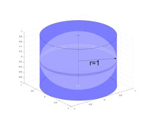 
FIG. 1. A sketch of Cyl(1) in the space of Bloch vectors. For any value of r the cylinder Cyl(r) protrudes from the Bloch sphere and hence always contain pure states.

📷 Fig 2

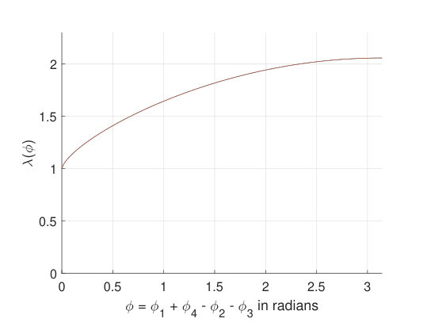 
FIG. 2. The plot shows λ(φ). We do not plot φ ∈(π, 2π) as φ and 2π −φ give the same values - the graph would be symmetric about the axis φ = π. At φ = 0 no growth is needed, as the gate is trivially the identity gate, and for φ = π we recover the value derived for the CZ gate in [6]).

📷 Fig 3

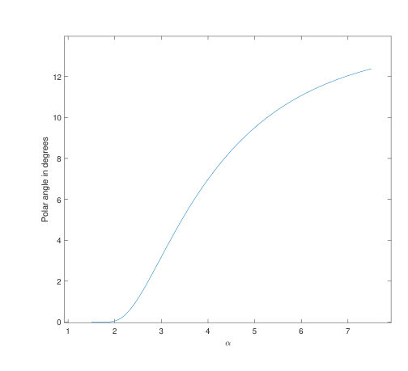 
FIG. 3. The horizontal axis is α, the power law decay rate for a one dimensional system. The vertical axis is the largest an- gle θ in degrees, such that initial states cos(θ/2)|0⟩+sin θ/2|1⟩ are within the initial radius accepted by the classical simula- tion algorithm. In other words, if states with these values of θ or lower are interacted with the long range gates, the algorithm can efficiently sample the outcomes of cylindrical measurements in the limit of large numbers of particles. For this graph the gate between a qubit and its immediate neigh- bour is the CZ gate. For any finite system in practice one will be able to simulate more inputs, possibly also by exploiting asymmetric growth...

📷 Fig 4

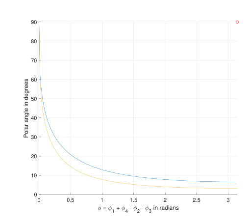 
FIG. 4. The θ (vertical axis), φ (horizontal axis) phase space. A particular point (φ, θ) hence represents the pure states one gets by placing states (I+sin(θ)X+cos(θ)Z)/2 on the nodes of a graph and interacting them with arbitrary two-qubit diago- nal gates eiφ1|00⟩⟨00|+eiφ2|01⟩⟨01|+eiφ3|10⟩⟨10|+eiφ4|11⟩⟨11| such that φ = φ4 +φ1−φ2−φ3. The upper curve corresponds to graphs with degree ∆= 3 and the lower curve corresponds to graphs with degree ∆= 4. In each case for a given value of φ the system is classically efficiently simulatable for pure states with polar angles θ that are below the curve (mixed states that are convex mixtures of those pure states are also classically efficient, but can...

📷 Fig 5

 
FIG. 5. An illustration of the coarse graining procedure. Imagine that this is a 4 × 4 block of cylinders within a larger square lattice. We create a separable decomposition between it and the rest of the lattice by growing the radii of the bound- ary cylinders in accordance with how many interactions they have with the rest of the system. The corner cylinders hence have larger radius than the other cylinders on the boundary.

**Summary.** This paper introduces 'cylindrical matter,' a beyond-quantum many-body model that allows for the efficient classical simulation of specific quantum Ising-like systems. By using a state space that extends beyond the Bloch sphere, the authors find a way to sample measurement outcomes of previously hard-to-simulate quantum states. The work establishes precise conditions on interaction decay and dimensionality for this classical simulation to remain efficient.

**Why it may be interesting.** It provides a novel way to understand the limits of classical simulation by using non-quantum models to mimic complex quantum entanglement, which is highly relevant to many-body dynamics and the study of computational complexity in quantum systems.

Detailed structure

**Main problem.** Determining the boundaries of classical simulability for quantum many-body systems by exploring whether 'beyond-quantum' descriptions can provide efficient simulation advantages.

**Main result.** The authors demonstrate that a hypothetical 'cylindrical matter' model can efficiently classically simulate certain previously unknown quantum pure-Ising-like systems with power-law decaying interactions.

**Method.** The study uses a framework of 'cylindrical bits' and 'generalized separability' to analyze the growth of state space radii under diagonal unitaries, employing analytical proofs and numerical linear programming.

**Model / system.** A continuous-time many-body system of 'cylindrical bits' on a lattice, where each particle's state space is a cylinder in the Bloch vector space, subject to diagonal two-body interactions and adaptive measurements.

**Key observables.** Measurement outcomes in the Z eigenbasis and the XY plane (aX + bY).

**Important parameters / regimes.** Cylindrical radius (r), interaction decay exponent (alpha), spatial dimension (D), and the growth factor (lambda) required to maintain separability.

**Assumptions / limitations.** The model is 'non-free' due to required spatial constraints; measurements are primarily destructive or quasi-destructive; and the simulation assumes a finite gate set to ensure bounded fan-in.

**Figures summary.** Figure 1 sketches the cylindrical state space protruding from the Bloch sphere; Figure 2 plots the growth factor as a function of gate phase; Figure 3 shows the tradeoff between the initial state angle and the power-law decay rate.

**Paper structure.** The paper introduces the cylindrical bit model, defines the mathematical framework for generalized separability, analyzes the radial growth required for diagonal gates, establishes simulation thresholds for power-law interactions, and compares the optimality of cylindrical state spaces against alternatives.

Abstract

Even simplified models of quantum many-body systems can be difficult to analyse. However, taking inspiration from the foundations of physics, one may wonder whether there are practical advantages to constructing alternative beyond-quantum descriptions of many-body systems. We explore this question in the context of quantum interactions that are diagonal in the computational basis. We construct a hypothetical model of a continuous time dynamical many-body system that is based upon lattices of interacting particles called "cylindrical bits", a concept first introduced in [6]. In the language of [5] our toy model is {\it non-free}, as we need spatial constraints on how the particles interact to ensure valid probabilities. We investigate these constraints and explore the resulting `entangled' states that can exist. Certain pure {\it quantum} entangled systems can be faithfully mimicked by our cylindrical worlds. This allows us to simulate efficiently classically, in the sense of sampling measurement outcomes, a variety of previously unknown quantum systems. Examples include some states created by pure Ising interactions algebraically decaying faster than $\sim 1/r^{3D/2}$, with spatial dimension $D$, under measurements in the $Z$ eigenbasis or eigenbases of $aX+bY$ for $a,b \in \mathbb{R}$. We also explore whether another choice of non-quantum `particle' could expand the applicability of the classical simulation by defining and partially optimising a figure-of-merit that attempts to capture how useful various possibilities may be.

[↑ back to top](#top)

### [Enhancement of superconducting stiffness in hybrid superconducting-metallic bilayers](http://arxiv.org/abs/2604.28187v1)

**Authors:** J. E. Ebot, Lorenzo Pizzino, Sam Mardazad, Johannes S. Hofmann, Thierry Giamarchi, Adrian Kantian  
**Type:** theory · **Category:** strongly correlated electrons · **PDF:** <https://arxiv.org/pdf/2604.28187v1>  
**Analysis basis:** full PDF text, analyzed in chunks
**Topic relevance:** `Kondo & dissipative impurity` **3/5** · `analog quantum simulation` **3/5** · `entanglement & information structure` **1/5**

📷 Fig 1

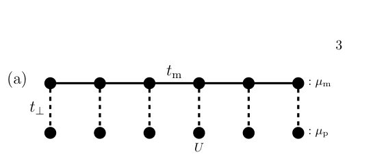 
FIG. 1. (a) Schematic representation of the Hamiltonian in Eq. (1). It comprises of a pairing subsystem (“P-subsystem”) with on-site pairing U (and chemical potential µm, when performing AFQMC simulations, which are in the grand- canonical regime), and a metallic subsystem (M-subsystem; we will use ‘metal’ interchangeably) with nearest-neighbour tunneling tm and chemical potential term µm. Coupling be- tween the subsystems is provided by tunneling with amplitude t⊥.

📷 Fig 2

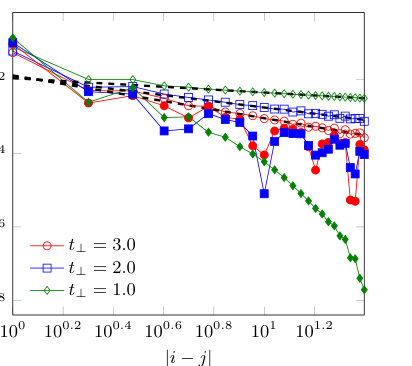 
FIG. 2. Cλ(i, j) (open markers) and |Nλ(i, j)| (shaded mark- ers) of (a) P-subsystem and (b) M-subsystem in regime 3 with L = 100 and np = 0.38, nm = 0.78. Cλ(i, j) has infinite correlation length and |Np(i, j)| is suppressed. Cλ(i, j) (open markers: , , ) and |Nm(i, j)| (shaded markers: , , ). Dashed lines are the power-law fit of Cλ, with fitting param- eters K−1 p and AC,p.

📷 Fig 3

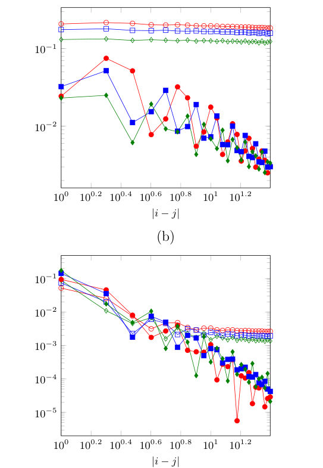 
FIG. 3. Cλ(i, j) (open markers, , , ) and |Nλ(i, j)| (shaded markers, , , ) in regime 1 at U = 4 and with L = 100. (a) P-subsystem and (b) M-subsystem. np = 0.67, nm = 0.49 (circle), np = 0.51, nm = 0.65 (square) , np = 0.39, nm = 0.77 (diamond).

📷 Fig 4

 
FIG. 4. The Luttinger liquid parameters (K−1 p and K−1 m ) and single particle length scale ξm in regime 1 versus U with L = 200, t⊥= 0.4 np = 0.38 ± 0.01, nm = 0.78 ± 0.01 ( , ), np = 0.51, nm = 0.65 ( , ), np = 0.67±0.01, nm = 0.49±0.01 ( , ). The markers △are K−1 p for the Hubbard ladder in Ref [9].

📷 Fig 5

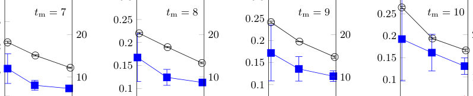 
FIG. 5. (Left y-axis) Luttinger liquid parameters in the P-subsystem (K−1 p , ) and M-subsystem (K−1 m ) versus kp F , and (right y-axis) the single-particle length scale ξS,m ( ) against km F in regime 2 with L = 200, t⊥= 3.0 (top row) and t⊥= 2.0 (bottom row). The corresponding P- and M-subsystem wave-vectors kλ F can be read off from the bottom x-axis and top x-axis respectively.

**Summary.** This paper demonstrates that doping a superconducting-metallic bilayer away from half-filling enhances superconducting correlations by breaking the competition with density-density correlations. It identifies distinct regimes of superconductivity controlled by pairing amplitude and phase stiffness. The findings also provide a theoretical link to understanding magnetic ordering in heavy-fermion Kondo lattices.

**Why it may be interesting.** The paper provides deep insights into how engineered coupling between different quantum subsystems can manipulate many-body correlations and phase stiffness, which is highly relevant to the control of correlations in ultracold atomic gases.

Detailed structure

**Main problem.** The study investigates how a metallic reservoir can enhance superconducting correlations in a paired subsystem, specifically addressing whether doping the system away from half-filling can overcome the suppression of long-range order caused by a charge gap.

**Main result.** Doping away from half-filling breaks the degeneracy between superconducting and density-density correlations in favor of superconductivity, allowing for near-long-range order and revealing a transition between pairing-limited and stiffness-limited regimes.

**Method.** The authors employ modern many-body numerical techniques, specifically Density Matrix Renormalization Group (DMRG) and Auxiliary-Field Quantum Monte Carlo (AFQMC), alongside analytical Conformal Field Theory (CFT) approaches.

**Model / system.** A 1D hybrid bilayer model consisting of a pairing subsystem (P) with negative-U sites coupled via tunneling to a metallic subsystem (M). The system can be mapped to a 1D Anderson or Kondo lattice via particle-hole transformation.

**Key observables.** S-wave pair-pair correlations, density-density correlations, single-particle correlations, Luttinger liquid parameters (Kp-1 and Km-1), and superconducting susceptibility.

**Important parameters / regimes.** Interaction strength (U), inter-subsystem tunneling (t-perp), metallic kinetic energy (tm), and electron densities (np, nm).

**Assumptions / limitations.** The study focuses on 1D systems; extensions to 2D and 3D rely on theoretical scaling arguments and known physics of heavy-fermion materials.

**Figures summary.** Figure 1 illustrates the two-chain setup of the P-subsystem and M-subsystem and the mapping to the Anderson/Kondo lattice.

**Paper structure.** The paper introduces the Kivelson bilayer proposal, defines the 1D Hamiltonian and its mapping to magnetic models, presents numerical results for various doping and coupling regimes, and discusses the implications for heavy-fermion materials.

Abstract

Boosting superconductivity by metallic reservoirs is the essence of Kivelson's bilayer proposal.   One layer provides pairing to the electrons, while the weakly coupled metal provides additional phase coherence to those pairs by mediating extended-range pair-pair coupling.   Demonstrating significant and unambiguous performance gains with strong-coupling methods for such set-ups had been difficult.   In the present work, we study these systems doped away from half-filling, corresponding to a partially spin-polarized 1D Anderson- or Kondo-lattice.   We show that this breaks the coexistence of dominant superconducting and density-density correlations decisively in favour or the former.   Consequently, we provide evidence that in this doped regime, superconducting near-long-range order is not precluded by a small charge-gap in the thermodynamic limit, as we have recently shown to be the case at half-filling [JE Ebot $et$ $al.$, arXiv:2602.11153 [cond-mat.supr-con]].   We study the complex manner in which the enhancement of superconductivity in the pairing layer depends on the parameters of the metal, and especially that both pairing-limited and stiffness-limited regimes may appear in these systems.   In addition to superconducting bilayers, our results are relevant, via a particle-hole transformation, for heavy-fermion Kondo-lattice materials in magnetic fields, as we provide previously lacking insight on the competition between antiferromagnetic and easy-plane magnetism, as well as a route for comprehensive indirect tests of Kivelson's bilayer proposal well beyond previous capabilities.

[↑ back to top](#top)

### [Optimised Inference of Quantum Phenomena in High-Energy Collider Experiments](http://arxiv.org/abs/2604.27130v1)

**Authors:** Hai-Chau Nguyen, Gilberto Tetlalmatzi-Xolocotzi, Carmen Diez Pardos, Otfried Gühne, Matthias Kleinmann  
**Type:** theory · **Category:** quantum information and computing · **PDF:** <https://arxiv.org/pdf/2604.27130v1>  
**Analysis basis:** full PDF text, analyzed in chunks
**Topic relevance:** `entanglement & information structure` **3/5** · `quantum measurements` **3/5**

📷 Fig 1

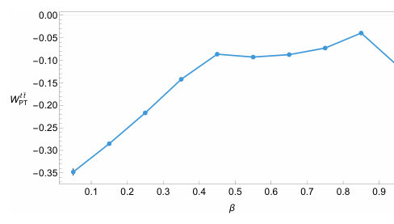 
Figure 1. Average values of partial-transpose based witness W t¯t Λ (P) for the t¯t spin state estimated from Monte Carlo simu- lated events. The witness is constructed according to Eq. (9) using the spin density operator ϱ(P) provided in Ref. [30], see Appendix C. The simulated data are shown in the bins k ≤β &lt; k + 0.1 for k = 0.0, 0.1, . . . , 0.9 with β = |pt|/Et the velocity of the top quark in the centre of mass frame of t¯t. Only events are selected where the top quark momentum pt is such that the predicted state ϱ(P) is entangled. This enables the detection of entanglement for all β. For each bin we show the mean value of W t¯t P T together with the statistical uncertainty.

📷 Fig 2

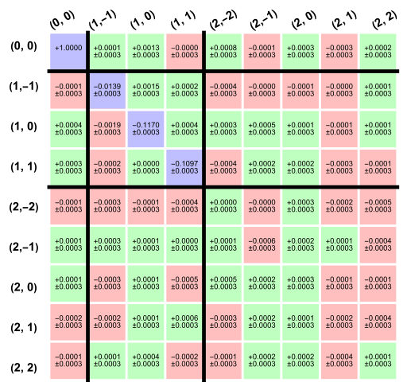 
Figure 2. Correlation matrix of the t¯t spin obtained using 107 Monte Carlo simulated events. The uncertainties quoted correspond to the statistical uncertainty, which is known to underestimate the uncertainty in experiments. Every en- try, except for the upper left 4×4 matrix, is predicted to be zero. The correlations are computed as the mean value of 4πY Re l,m(ˆut)Y Re l′,m′(ˆu¯t), where Y Re denotes the real spher- ical harmonics, see Appendix C. In the matrix, (l, m) = (0, 0), (1, −1), (1, 0), (1, +1), . . . (2, +2) indexes the rows and (l′, m′) the columns; the singlet state |ψ−⟩would yield a di- agonal matrix with entries 1, −1

📷 Fig 3

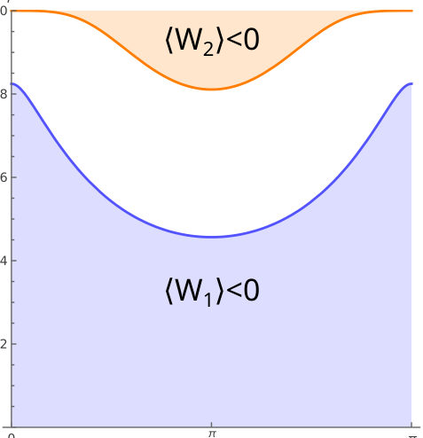 
Figure 3. Regions where the entanglement witnesses W1 and W2, see Eq. (C10), have negative expectation value and hence detect entanglement. The expectation value is computed with respect to the spin state ϱLO(pt) in Eq. (C9). Here, β = |pt|/pt,0 is the velocity of the top quark in the centre of mass system and θ = arccos(pt ·b/|p|) the corresponding angle of the momentum with the beam pipe.

📷 Fig 4

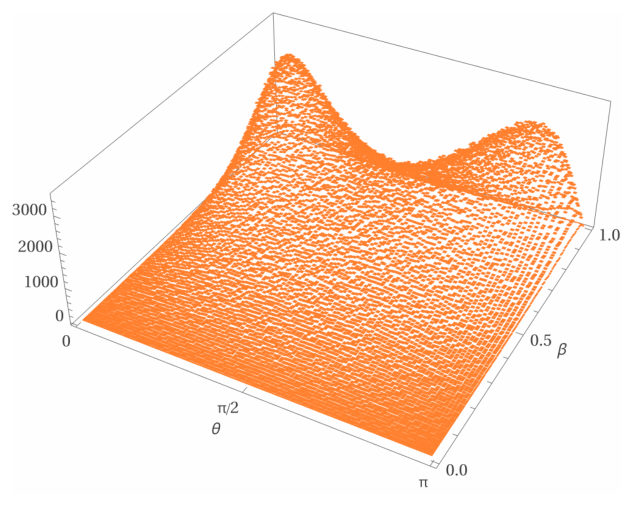 
Figure 4. Histogram of the top quark momentum in the t¯t rest frame, obtained using 107 Monte Carlo simulated events. β is the velocity of the top quark, β = |pt|/pt,0, and ϑ is the angle of the top quark momentum with the beam pipe, θ = arccos(pt·b/|p|).

**Summary.** This paper introduces a new framework using classical shadow tomography to detect spin entanglement in high-energy particle collisions. By bypassing the need for full state reconstruction, the method enables the efficient analysis of spin correlations in relativistic regimes like the LHC. It also provides a way to verify the accuracy of the experimental measurement models used in particle physics.

**Why it may be interesting.** The paper applies advanced quantum information techniques, such as shadow tomography and entanglement witnesses, to a completely different physical regime (high-energy physics), demonstrating the universality of these information-theoretic tools.

Detailed structure

**Main problem.** Characterizing spin-spin entanglement and correlations in high-energy collider experiments, where relativistic effects and uncontrolled particle momenta make direct spin state reconstruction difficult.

**Main result.** The development of a generalized shadow tomography framework that allows for the direct estimation of momentum-averaged spin observables and entanglement witnesses without full state reconstruction.

**Method.** The authors adapt classical shadow tomography to high-energy physics, converting observed decay product directions into single-event spin operators to estimate expectation values and detect entanglement.

**Model / system.** The system consists of relativistic particle pairs, specifically top-antitop (t-tbar) production at the LHC, modeled using a momentum-dependent spin density operator and a POVM based on decay product directions.

**Key observables.** Spin-spin correlations, entanglement witnesses (W1, W2), spin-correlation matrices, and momentum-averaged expectation values.

**Important parameters / regimes.** Relativistic velocity (beta), scattering angle (theta), top quark mass, and the production ratio of gluon fusion to quark-antiquark channels.

**Assumptions / limitations.** The measurement model is initially assumed to be known, and the analysis relies on the rotational invariance of the underlying physical evolution operator.

**Figures summary.** Figure 1 shows entanglement detection across different velocity bins; Figure 2 displays a spin correlation matrix; Figure 3 maps kinematic regions where entanglement witnesses are negative; Figure 4 shows a histogram of top quark momentum.

**Paper structure.** The paper introduces the challenge of relativistic spin analysis, develops a generalized shadow tomography framework for POVMs, demonstrates its application to top quark pairs at the LHC, and provides a method for testing the validity of the measurement model.

Abstract

Entanglement, a fundamental phenomenon of quantum theory, has recently been observed in processes in high-energy physics. This opens new avenues for probing quantum effects in relativistic regimes, but also poses conceptual and technical challenges. We develop a general framework based on shadow tomography techniques for characterising spin-spin correlations in collider experiments. This improves the analysis of spin-spin entanglement, where relativistic motion couples spin and momentum and the momenta of the investigated particles are not under experimental control. As a proof of concept we illustrate the application of our formalism to top quark pair production at the Large Hadron Collider at CERN. The framework, however, is general and flexible and can be readily applied to more complex final states and systems with more particles.

[↑ back to top](#top)

### [Quantum Coordination without Conditioning under Restricted Information](http://arxiv.org/abs/2604.27173v1)

**Authors:** Faisal Shah Khan  
**Type:** theory · **Category:** quantum information and computing · **PDF:** <https://arxiv.org/pdf/2604.27173v1>  
**Analysis basis:** full PDF text, analyzed in chunks
**Topic relevance:** `entanglement & information structure` **3/5** · `quantum measurements` **3/5**

📷 Fig 1

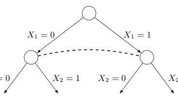 
Fig. 1. Tree representation of the binary illustrative example. The dashed line indicates that the two second-step nodes are indistinguishable under the available information, so the local rule generating X2 cannot depend on the realized value of X1.

**Summary.** The paper demonstrates that quantum correlations can enable coordination in multi-agent systems even when agents cannot access past information. It shows that both classical-like shared variables and quantum discord allow for the implementation of distributions that are impossible for classical agents under the same information constraints.

**Why it may be interesting.** This is interesting for researchers in quantum information and open systems as it explores how quantum resources like discord can compensate for the lack of classical memory or information in distributed protocols.

Detailed structure

**Main problem.** The paper investigates whether quantum correlations can implement joint distributions that are impossible for classical local models when agents are subject to restricted information (imperfect recall) and cannot condition actions on past history.

**Main result.** Quantum systems can achieve coordination where classical models fail, using either shared latent variables (diagonal states) or quantum discord (noncommuting local structures), effectively acting as a partial substitute for perfect recall.

**Method.** The study uses a probabilistic framework comparing classical local conditional rules against quantum measurement outcomes via the Born rule, utilizing Kuhn's Theorem to analyze the breakdown of classical equivalence.

**Model / system.** A multi-stage decision process involving multiple agents sharing multipartite quantum states, specifically including two-qubit separable states and states with non-zero quantum discord.

**Key observables.** Joint probability distributions of measurement outcomes and quantum discord.

**Important parameters / regimes.** Information variables (Y_k) representing available history, and the presence or absence of noncommuting local structures.

**Assumptions / limitations.** The quantum model assumes no signaling or adaptive quantum memory across stages, and the information constraint is strictly maintained.

**Figures summary.** Figure 1 shows a tree representation of a binary decision process, using dashed lines to indicate nodes that are indistinguishable due to information constraints.

**Paper structure.** The paper identifies the problem of restricted information, formalizes the classical limitation, proves Theorem 1 regarding diagonal/latent-variable implementations, proves Theorem 2 regarding discord-based implementations, demonstrates scalability to multi-stage processes, and discusses fundamental limitations.

Abstract

We study coordination under restricted information, where classical local models fail to implement certain correlated distributions because agents cannot condition on past history. We show that quantum systems overcome this limitation even when using only separable states. Both classically diagonal encodings (shared latent variables) and separable states with noncommuting local structure (quantum discord) enable the implementation of joint distributions that are unattainable by any classical local rules under the same information constraints. The quantum advantage arises from enabling latent-variable coordination without requiring agents to condition on the latent variable itself -- a construction that succeeds where no classical local model can. Separable states with nonzero quantum discord provide an alternative mechanism for realizing such coordination. At the same time, quantum models remain strictly limited by the information structure: unlike perfect recall, they cannot reproduce fully adaptive dependence on realized past outcomes that are observationally indistinguishable. Thus, quantum correlations serve as a partial substitute for perfect recall.

[↑ back to top](#top)

### [Derivation of the Born Rule and Operational Quantum Formalism in the Accessibility Framework through Boundary Reduction](http://arxiv.org/abs/2604.27125v1)

**Authors:** Everett Fall, Hironori Kondo  
**Type:** theory · **Category:** other · **PDF:** <https://arxiv.org/pdf/2604.27125v1>  
**Analysis basis:** full PDF text, analyzed in chunks
**Topic relevance:** `quantum measurements` **3/5** · `entanglement & information structure` **2/5**

📷 Fig 1

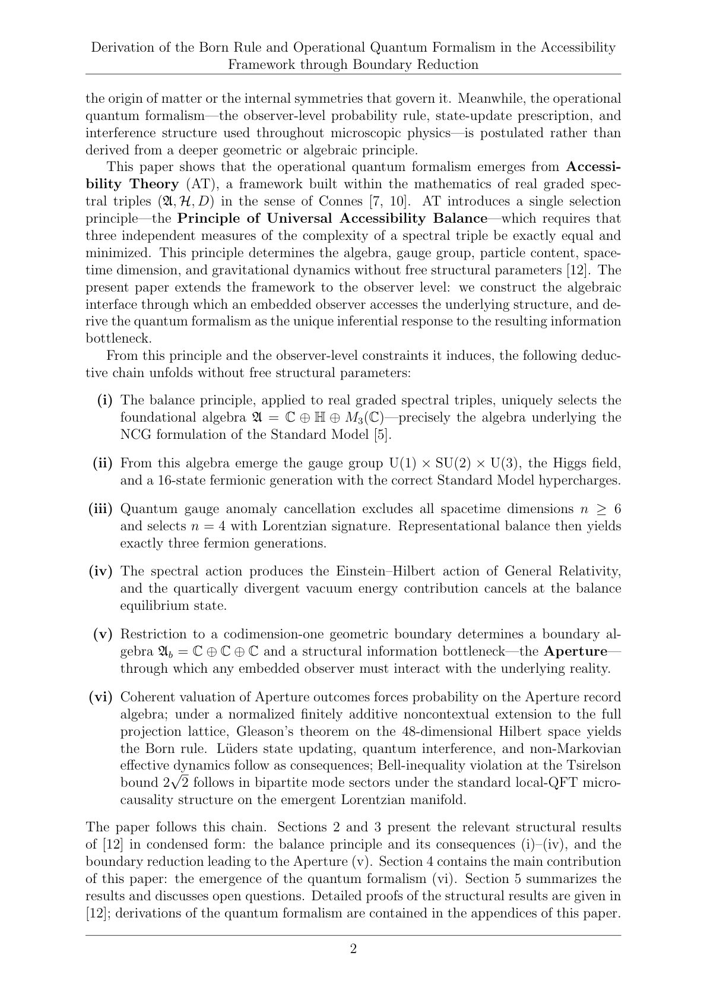 
Low-resolution page preview, page 2

📷 Fig 2

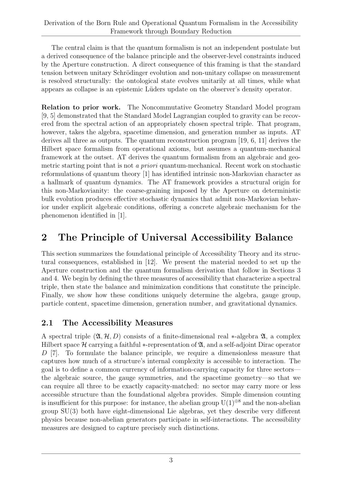 
Low-resolution page preview, page 3

📷 Fig 3

 
Low-resolution page preview, page 4

📷 Fig 4

 
Low-resolution page preview, page 5

📷 Fig 5

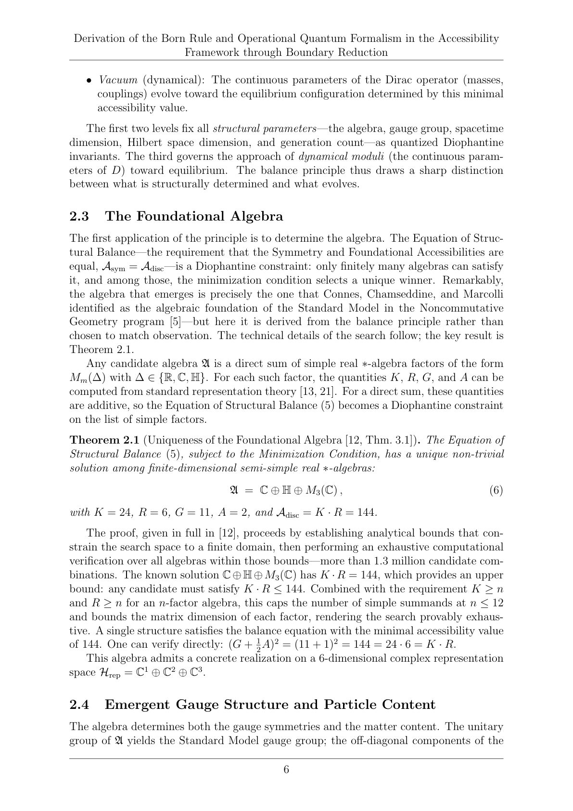 
Low-resolution page preview, page 6

**Summary.** The paper proposes a new framework called Accessibility Theory to derive the fundamental laws of quantum mechanics and the Standard Model from a single principle of complexity balance. It shows that quantum features like the Born rule and Bell violations are the inevitable result of an observer's limited access to a deeper, deterministic algebraic reality. This provides a unified explanation for both particle physics and the operational structure of quantum mechanics.

**Why it may be interesting.** This paper is highly relevant to researchers of open quantum systems as it provides a structural, algebraic derivation of non-Markovian dynamics and the emergence of non-classicality from a fundamentally deterministic, unitary process via coarse-graining.

Detailed structure

**Main problem.** The paper seeks to derive the operational quantum formalism (Born rule, state updating, interference, and non-Markovianity) and the Standard Model parameters from a fundamental algebraic selection principle rather than postulating them as empirical inputs.

**Main result.** The authors demonstrate that the Born rule, Lüders rule, and Bell inequality violation at the Tsirelson bound emerge from an 'Aperture'—a codimension-one information bottleneck created by boundary reduction in a framework called Accessibility Theory. Furthermore, a 'Balance Principle' uniquely selects the Standard Model gauge group, 4D spacetime, and three fermion generations.

**Method.** The study employs Noncommutative Geometry (NCG), specifically real graded spectral triples, combined with Diophantine analysis and Gleason's theorem to derive quantum probabilities and algebraic structures.

**Model / system.** The model is based on Accessibility Theory (AT), which utilizes a 'Continuum' represented by a product spectral triple and an 'Aperture' interface that acts as a commutative bottleneck for an embedded observer.

**Key observables.** Aperture record process (sector labels), transition probabilities, and Bell inequality violation (CHSH expectation value).

**Important parameters / regimes.** Foundational accessibility (A_disc = 144), spacetime dimension (n=4), number of generations (N_gen=3), and the trace reduction ratio (xi = 1/4).

**Assumptions / limitations.** Assumes the Principle of Universal Accessibility Balance (minimization of complexity), noncontextuality of measurements, and the existence of a deterministic, unitary underlying ontology.

**Paper structure.** The paper first establishes the Accessibility Theory framework and the Balance Principle to select the Standard Model algebra; it then applies boundary reduction to define the Aperture; subsequently, it derives the Born rule and quantum dynamics (interference, non-Markovianity) via the Aperture's information bottleneck; finally, it addresses the resolution of the measurement problem and the emergence of classicality.

Abstract

We show that the operational quantum formalism -- the Born rule, Lüders state updating, quantum interference, non-Markovian effective dynamics, and Bell inequality violation at the Tsirelson bound \(2\sqrt{2}\) -- arises within Accessibility Theory (AT) from the Aperture construction together with explicit coherence and locality assumptions stated in the paper. AT is a framework built on real graded spectral triples and a single algebraic selection principle. The Principle of Universal Accessibility Balance requires three independent measures of the complexity of a spectral triple -- its algebraic, gauge-theoretic, and geometric content -- to be exactly equal and minimized, uniquely selecting the algebra \(\C \oplus \Hbb \oplus M_3(\C)\) and with it the Standard Model gauge group, particle content, four-dimensional Lorentzian spacetime, three generations, and gravitational dynamics. Restriction to a codimension-one geometric boundary reduces this algebra to its commutative center \(\C \oplus \C \oplus \C\) -- the Aperture -- which defines a permanent information bottleneck for any embedded observer. Coherence conditions on inference through this bottleneck, together with Gleason's theorem on the 48-dimensional internal Hilbert space, uniquely determine the Born rule; the remaining operational features follow from the same observer-level framework under the stated assumptions. At the ontological level the theory is deterministic and state-realist, while the operational quantum formalism appears at the observer level as a consequence of structurally limited access to the underlying algebraic reality.

[↑ back to top](#top)

### [Effective Noise Mitigation via Quantum Circuit Learning in Quantum Simulation of Integrable Spin Chains](http://arxiv.org/abs/2604.27648v1)

**Authors:** Wenlong Zhao, Yimeng Zhang, Yan Guo, Yufan Cui, Zhuohang Wang, Rui-Dong Zhu  
**Type:** theory · **Category:** quantum information and computing · **PDF:** <https://arxiv.org/pdf/2604.27648v1>  
**Analysis basis:** full PDF text, analyzed in chunks
**Topic relevance:** `non-equilibrium dynamics` **3/5** · `entanglement & information structure` **2/5**

📷 Fig 1

 
FIG. 1. Predictions from learned circuit (solid lines) compared with the original data for L = 2 and d = 15 (dashed lines). In particular, the data for ⟨X1⟩and ⟨Y1⟩were not taught to the circuit (n.b. in the quantum simulation, the first qubit is usually called qubit 0). The scaling factor a is optimized to aopt = 1.014819.

📷 Fig 2

 
FIG. 2. Comparison of predictions for the training data, H, Ztot, and the dynamical observable ⟨Z1⟩at d = 4 using QCL with circuit depths D = 2 (solid lines) and D = 3 (dashed lines). Both setups achieve relatively good agreement with the training data, and give similar predictions.

📷 Fig 3

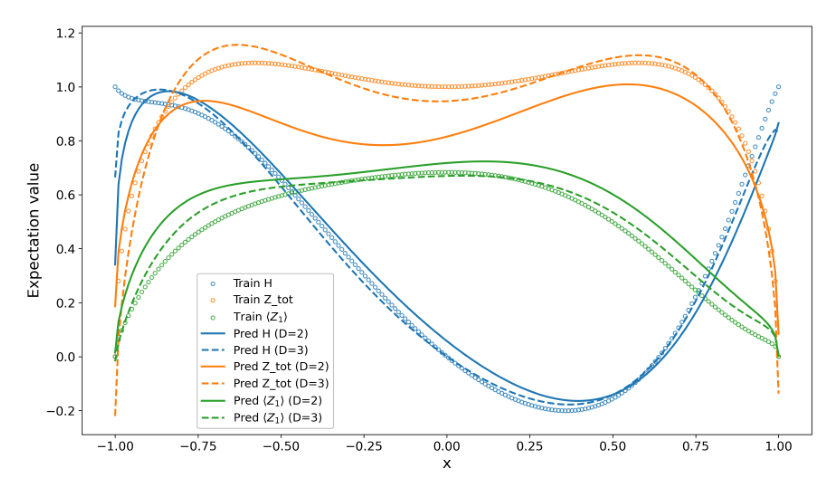 
FIG. 3. Comparison of predictions for the training data, H, Ztot, and the dynamical observable ⟨Z1⟩at d = 6 using QCL with circuit depths D = 2 and D = 3. The predictions of the D = 3 QCL circuit (dashed lines) are clearly better than those of D = 2 circuit, especially for ⟨Ztot⟩.

📷 Fig 4

 
FIG. 4. Conserved Hamiltonian H at x = 0.3 under bit-flipping (p = 0.5%) and depolarizing (p = 1%) noise. The learned circuit closely follows the ideal curve, while the un- mitigated simulation quickly deviates as the time-evolution depth d increases.

📷 Fig 5

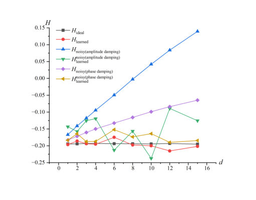 
FIG. 5. Hamiltonian H at x = 0.3 subjected to amplitude damping (p = 1%) and phase damping (p = 1%). The QCL-based noise mitigation effectively suppresses the degra- dation, keeping the predicted values close to the exact con- served quantity.

**Summary.** The authors propose using Quantum Circuit Learning to compress deep, noisy time-evolution circuits into shallower, more noise-resilient ones. By training the circuit to respect the conserved charges of integrable spin chains, the method effectively mitigates the impact of common hardware noise. This approach provides a way to perform more accurate quantum simulations without the high sampling overhead of traditional error mitigation techniques.

**Why it may be interesting.** This work presents a physics-informed error mitigation strategy that uses the intrinsic symmetries of many-body systems to improve the fidelity of quantum simulations, which is highly relevant for studying many-body dynamics on near-term hardware.

Detailed structure

**Main problem.** Mitigating hardware noise (decoherence and gate infidelities) in the quantum simulation of integrable spin chains on NISQ devices.

**Main result.** Quantum Circuit Learning (QCL) can produce shallower, more robust circuits that effectively suppress noise-induced decay of conserved quantities and dynamical observables.

**Method.** A machine learning framework that trains a shallow variational circuit to approximate a deeper, noisy time-evolution operator by leveraging conserved charges as a training signal.

**Model / system.** Integrable quantum spin chains, specifically the XXX Heisenberg model, studied for small system sizes (L=2 and L=3).

**Key observables.** Conserved charges (total magnetization Z_tot, X_tot, Y_tot, and Hamiltonian H) and dynamical local observables (e.g., <Z1>, <X1>, <Y1>).

**Important parameters / regimes.** Circuit depths (evolution depth d and learning depth D), noise probabilities (p), and the initial state parameter (x).

**Assumptions / limitations.** The strategy is optimized for integrable systems where conserved charges are available; the learning circuit depth D must be balanced to avoid accumulating too much noise.

**Figures summary.** Figures compare predictions of the learned circuit against true data, demonstrate the preservation of conserved charges under various noise models (bit-flip, depolarizing, amplitude, and phase damping), and show the scalability and reusability of the learned circuits.

**Paper structure.** The paper introduces the noise mitigation problem, describes the QCL method and the use of conserved charges for training, presents numerical results for L=2 and L=3 systems under various noise channels, and discusses scalability and future directions.

Abstract

We propose a noise-mitigation quantum simulation strategy for near-term quantum devices based on Quantum Circuit Learning (QCL), which is in particular effective for integrable quantum spin chains. The method trains a shallow variational circuit to approximate a deeper time-evolution circuit by learning the conserved charges and only a small amount of dynamical information in the system. Under realistic noise models, the learned circuit maintains both conserved quantities and dynamical observables significantly closer to their true values than the noisy simulation of the original circuit. This demonstrates QCL as an effective, physics-informed error mitigation strategy, producing shorter, more robust circuits without exponential sampling overhead.

[↑ back to top](#top)

### [Nodal algebraic curves and entropy diagnostics in degenerate two-dimensional harmonic-oscillator shells](http://arxiv.org/abs/2604.28127v1)

**Authors:** C A Escobar Ruiz, H Olivares-Pilon, A M Escobar-Ruiz  
**Type:** theory · **Category:** other · **PDF:** <https://arxiv.org/pdf/2604.28127v1>  
**Analysis basis:** full PDF text, analyzed in chunks
**Topic relevance:** `entanglement & information structure` **3/5** · `interference shaping light` **2/5**

📷 Fig 1

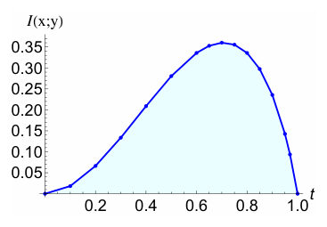 
FIG. 1. Mutual information I(x; y) versus the mixing param- eter t in the N = 1 shell (a = √

📷 Fig 2

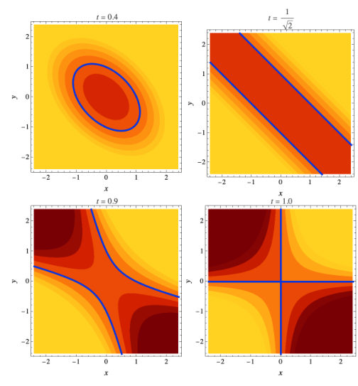 
FIG. 2. Nodal geometry in the N = 2 shell at α = 1 along a = c = p

📷 Fig 3

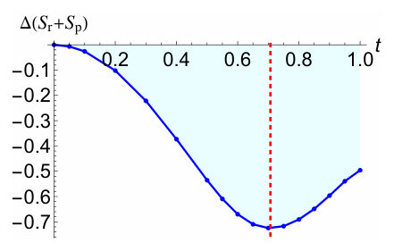 
FIG. 3. Shifted entropic uncertainty sum ∆(Sr + Sp) =  Sr(t) + Sp(t)  −  Sr(0) + Sp(0)  along the symmetric path in the N = 2 shell. The curve remains smooth near the rank-degenerate conic transition t = 1/ √

📷 Fig 4

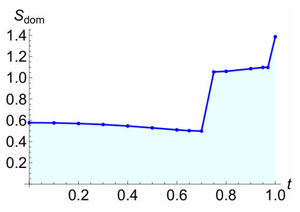 
FIG. 4. Nodal-domain entropy Sdom at α = 1 as a function of the mixing parameter t.

📷 Fig 5

 
FIG. 5. Mutual information I(x; y) versus t at α = 1 along the symmetric path a = c = p

**Summary.** The paper demonstrates that the topological restructuring of nodal patterns in 2D harmonic oscillator shells is governed by algebraic properties of the wavefunction's polynomial component. It shows that while global entropies remain smooth, nodal-domain entropy can precisely detect topology-changing transitions. This provides a way to characterize complex quantum states in platforms like trapped ions and paraxial optics.

**Why it may be interesting.** This is highly relevant for quantum optics and AMO physics as it provides a framework for identifying topological transitions in structured light (Hermite-Gaussian modes) and the motional states of trapped ions using entropic signatures.

Detailed structure

**Main problem.** Investigating how the nodal geometry (zero-sets) of wavefunctions undergoes topological restructuring within degenerate 2D harmonic oscillator energy shells and how this is reflected in information-theoretic diagnostics.

**Main result.** The study finds that nodal geometry is organized by algebraic stratification (singularities and projective degeneracies) rather than spectral ordering, and that nodal-domain entropy is a highly sensitive diagnostic for these topology-changing events.

**Method.** The authors use algebraic geometry (singularity theory and discriminant analysis) combined with information theory (Shannon entropy and mutual information) to analyze the properties of real Hermite-constrained algebraic curves.

**Model / system.** The system is a two-dimensional isotropic quantum harmonic oscillator, specifically focusing on real-phase eigenstates within fixed energy shells N.

**Key observables.** Nodal-domain entropy (S_dom), Cartesian mutual information I(x;y), configuration-space Shannon entropy (S_r), momentum-space Shannon entropy (S_p), and the entropic uncertainty sum (S_r + S_p).

**Important parameters / regimes.** Shell index N, mixing parameter t (interpolating between states), and the oscillator scale alpha.

**Assumptions / limitations.** The analysis is restricted to real-phase wavefunctions (no phase singularities/vortices) and fixed energy shells.

**Figures summary.** Figures illustrate the evolution of nodal geometries (lines, conics, and cubics) and the corresponding peaks or changes in mutual information and nodal-domain entropy as the mixing parameter varies.

**Paper structure.** The paper introduces the problem of nodal restructuring, establishes a mathematical framework using algebraic geometry, analyzes specific low-order shells (N=1, 2, 3) to demonstrate hierarchy and sensitivity, and concludes with experimental implications for structured light and trapped ions.

Abstract

Degenerate quantum eigenspaces can support substantial changes in nodal geometry at fixed energy. We show that, for the two-dimensional isotropic harmonic oscillator, this restructuring is organized by the Hermite-constrained algebraic curve $P_N(x,y)=0$ appearing in every real shell state, $ψ_N=e^{-αr^2/2}P_N(x,y)$. Finite singularities, $P_N=\nabla P_N=0$, and projective degeneracies of the leading homogeneous part identify the strata where topology-changing events can occur. We combine these criteria with entropy diagnostics: the nodal-domain entropy $S_{\mathrm{dom}}$, Cartesian mutual information $I(x;y)$, and the entropic uncertainty sum $S_r+S_p$. The first three shells reveal a hierarchy: $N=1$ only rotates a nodal line; $N=2$ has a conic transition at $b^2=2ac$, sharply detected by $S_{\mathrm{dom}}$ but not by global entropies; and $N=3$ supports cubic close-branch regimes organized by the projective discriminant, with enhanced responses in $S_{\mathrm{dom}}$ and $I(x;y)$. Thus algebraic stratification, rather than spectral ordering, organizes nodal geometry inside a degenerate eigenspace, while entropy diagnostics quantify probability redistribution and correlation. The framework suggests experimentally reconstructible signatures for real-phase Hermite--Gaussian structured light and approximately isotropic trapped motional systems.

[↑ back to top](#top)

### [Tuning of quantum nanoscaled friction within the Prandtl-Tomlinson model](http://arxiv.org/abs/2604.27216v1)

**Authors:** Dai-Nam Le, Lilia M. Woods  
**Type:** theory · **Category:** other · **PDF:** <https://arxiv.org/pdf/2604.27216v1>  
**Analysis basis:** abstract only; PDF text extraction failed or PDF unavailable
**Topic relevance:** `Frenkel-Kontorova` **3/5** · `non-equilibrium dynamics` **1/5**

**Summary.** This paper explores how to control nanoscale friction by adjusting system parameters like corrugation and length ratios. It extends the understanding of friction beyond the stick-slip regime by incorporating quantum effects like Landau-Zener tunneling. These insights are crucial for controlling friction in future nanotechnological applications.

**Why it may be interesting.** not directly relevant

Detailed structure

**Main problem.** Investigating the mechanisms for controlling frictional force at both quantum and classical levels in nanoscale systems.

**Main result.** The study identifies that frictional dynamics can be tuned via corrugation and characteristic length ratio parameters, and uncovers motion types beyond the standard stick-slip regime, including the role of Landau-Zener tunneling.

**Method.** Theoretical investigation using the Prandtl-Tomlinson framework to simulate and analyze frictional dynamics.

**Model / system.** A nanoparticle-chain system modeled within the Prandtl-Tomlinson framework, incorporating both classical and quantum mechanical effects.

**Key observables.** Frictional force, dynamical force behavior, and types of motion (e.g., stick-slip).

**Important parameters / regimes.** Corrugation, characteristic length ratio, and Landau-Zener tunneling probability.

**Paper structure.** The paper utilizes the Prandtl-Tomlinson framework to systematically investigate control means of friction, explores various motion regimes, and analyzes the impact of Landau-Zener tunneling.

Abstract

Nanoscaled friction is a fundamental tribological phenomenon with complex behavior of its dynamical force. Here, we utilize the Prandtl-Tomlinson framework to investigate systematically the different means of control of the frictional force at the quantum and classical levels. It is found that the frictional dynamics can be controlled by the corrugation and characteristic length ratio parameters dependent upon properties of the nanoparticle-chain system. In addition to the stick-slip regime, other types of motion are uncovered, highlighting the richness of the frictional dynamics. The importance of Landau-Zener tunneling for the quantum motion is also analyzed. These findings provide valuable insights for interpreting experimental observations and controlling quantum frictional behavior in nanoscale systems.

[↑ back to top](#top)

### [Entanglement of multi-qubit quantum graph states and studies structural properties of tripartite graphs with quantum programming](http://arxiv.org/abs/2604.27829v1)

**Authors:** Kh. P. Gnatenko  
**Type:** both · **Category:** quantum information and computing · **PDF:** <https://arxiv.org/pdf/2604.27829v1>  
**Analysis basis:** full PDF text, analyzed in chunks
**Topic relevance:** `entanglement & information structure` **3/5**

📷 Fig 1

 
Figure 2: Entanglement distance of qubit q[0] with other qubits in state (51) for α = 0 and different values of θ, ϕ. The results obtained using the AerSimulator which includes a readout error of the order 10−2, a Pauli-X error of 10−4, and a CNOT error of 10−2 are indicated by cross markers, while the continuous surface represents the corresponding analytical calculations.

📷 Fig 2

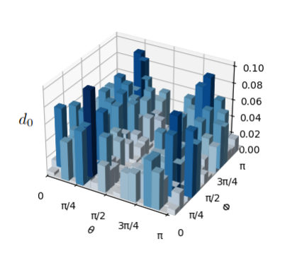 
Figure 3: Absolute differences d0 between the analytical results for the entanglement distance of qubit q[0] with other qubits in state (51) for α = 0 and different values of θ, ϕ. and results obtained using the AerSimulator which includes a readout error of the order 10−2, a Pauli-X error of 10−4, and a CNOT error of 10−2.

📷 Fig 3

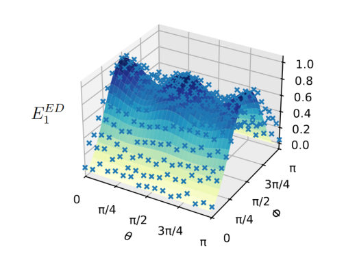 
Figure 4: Entanglement distance of qubit q[1] with other qubits in state (51) for α = 0 and different values of θ, ϕ. The results obtained using the AerSimulator which includes a readout error of the order 10−2, a Pauli-X error of 10−4, and a CNOT error of 10−2 are indicated by cross markers, while the continuous surface represents the corresponding analytical calculations.

📷 Fig 4

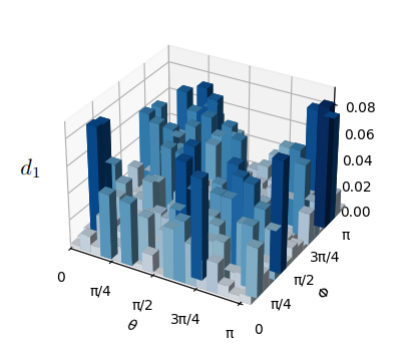 
Figure 5: Absolute differences d1 between the analytical results for the entanglement distance of qubit q[1] with other qubits in state (51) for α = 0 and different values of θ, ϕ. and results obtained using the AerSimulator which includes a readout error of the order 10−2, a Pauli-X error of 10−4, and a CNOT error of 10−2.

📷 Fig 5

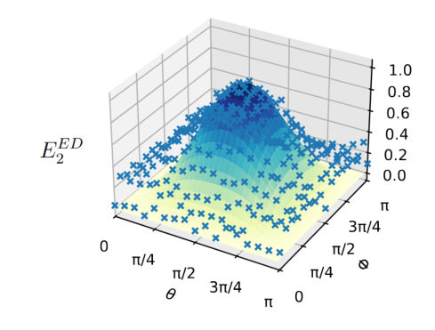 
Figure 6: Entanglement distance of qubit q[2] with other qubits in state (51) for α = 0 and different values of θ, ϕ. The results obtained using the AerSimulator which includes a readout error of the order 10−2, a Pauli-X error of 10−4, and a CNOT error of 10−2 are indicated by cross markers, while the continuous surface represents the corresponding analytical calculations.

**Summary.** This paper develops a framework to map the structural properties of tripartite graphs onto the entanglement and correlation properties of multi-qubit states. It demonstrates that quantum programming can be used to study classical graph theory features like cycles and neighbor overlaps. The theoretical predictions are successfully validated using noisy quantum simulations.

**Why it may be interesting.** not directly relevant

Detailed structure

**Main problem.** The paper aims to establish a quantitative relationship between the structural properties of weighted tripartite graphs and the quantum properties (entanglement and correlators) of multi-qubit quantum graph states.

**Main result.** The authors derive analytical expressions linking quantum correlators to graph features like 4-cycles and common neighbors, and demonstrate that qubit entanglement depends on vertex degrees and edge weights.

**Method.** The study uses analytical derivations for entanglement distance and Pauli expectation values, complemented by quantum simulations on IBM AerSimulator with noise models to validate the theory.

**Model / system.** The system consists of multi-qubit quantum graph states representing weighted and directed tripartite graphs, constructed by applying rotation gates (Rxy, Rxz, Ryz) to an initial separable state.

**Key observables.** Entanglement distance (EED), quantum correlators (Pauli expectation values), vertex degrees, and graph metrics like 4-cycles and common neighbors.

**Important parameters / regimes.** Gate rotation angles (phi, theta, alpha), edge weights, and vertex set partitions (U, V, W).

**Assumptions / limitations.** The graph is assumed to be tripartite (no edges within the same set), and specific cases assume unweighted graphs with uniform initial parameters.

**Figures summary.** Figure 1 shows the quantum circuit protocol; Figures 2, 4, and 6 compare analytical entanglement distance surfaces with noisy simulation data; Figures 3, 5, and 7 show the absolute error between analytical and simulated results.

**Paper structure.** The paper introduces the construction of tripartite quantum graph states, provides analytical derivations for entanglement and correlators, establishes the link to graph topology, and concludes with numerical validation via noisy quantum simulation.

Abstract

We propose a method for constructing multi-qubit entangled quantum states representing weighted tripartite graphs. An expression for the entanglement distance for multi-qubit states corresponding to arbitrary tripartite graph structures is obtained. The entanglement of a qubit with the rest of the system in a quantum graph state is determined by the weights of the edges in the closed neighborhood of the corresponding vertex and by its degree with respect to other sets. We also calculate quantum correlators in the general case of tripartite quantum graph states. We establish a relationship between these quantum properties and the structural properties of the corresponding tripartite graphs, including the number of non-overlapping neighbors, the number of common neighbors of the corresponding vertices, and the number of 4-cycles. As an illustrative example, we consider a tripartite graph forming a triangle and compute the entanglement distance using quantum simulations on the AerSimulator with noise models. The numerical results are consistent with the theoretical predictions. The obtained results demonstrate that quantum graph states provide an effective framework for studying structural properties of tripartite graphs. They open up the possibility of investigating such properties using quantum programming. It is worth highlighting that tripartite graphs have applications in solving practical problems such as resource allocation, scheduling, and database and hypergraph modeling.

[↑ back to top](#top)

### [Evidence for interior-gap pair-density-wave state in Kondo-Heisenberg chains](http://arxiv.org/abs/2604.27440v1)

**Authors:** Yuto Hirose, Shunsuke C. Furuya, Yasuhiro Tada  
**Type:** theory · **Category:** strongly correlated electrons · **PDF:** <https://arxiv.org/pdf/2604.27440v1>  
**Analysis basis:** abstract only; PDF text extraction failed or PDF unavailable
**Topic relevance:** `Kondo & dissipative impurity` **3/5**

**Summary.** This paper demonstrates that an interior-gap pair-density-wave state can emerge dynamically in 1D Kondo-Heisenberg chains through strong Kondo coupling. Unlike traditional models requiring Fermi-surface mismatch, here the low-energy single-particle structure develops alongside the superconducting correlations. This provides a new mechanism for realizing exotic interior-gap superconductivity in strongly correlated systems.

**Why it may be interesting.** not directly relevant

Detailed structure

**Main problem.** The realization of interior-gap superconductivity in canonical strongly correlated models has been elusive, as it is traditionally associated with pre-existing Fermi-surface mismatch.

**Main result.** The authors find that the superconducting phase of 1D Kondo-Heisenberg chains realizes an interior-gap pair-density-wave (PDW) state where the gap structure emerges dynamically from strong correlations.

**Method.** The study utilizes infinite density-matrix-renormalization-group (iDMRG) and finite DMRG calculations.

**Model / system.** One-dimensional Kondo-Heisenberg models with spin $S=1/2$ and $S=3/2$ chains.

**Key observables.** Pair-density-wave (PDW) correlation, momentum distribution function $n(k)$, and real-space correlations.

**Important parameters / regimes.** Spin magnitude ($S=1/2, 3/2$), Kondo coupling, and the spin-gapped regime.

**Assumptions / limitations.** The study assumes the validity of the 1D Kondo-Heisenberg model as a representative for studying the emergence of interior-gap physics.

**Paper structure.** The paper presents the motivation regarding interior-gap superconductivity, describes the DMRG methodology, details the results for $S=1/2$ and $S=3/2$ chains regarding PDW correlations and $n(k)$ reconstruction, and discusses the impact of boundary effects in finite systems.

Abstract

Interior-gap superconductivity has long been discussed as an exotic paired state in the presence of Fermi-surface mismatch, but its realization in canonical strongly correlated models has remained elusive. Here we present evidence that the superconducting phase of one-dimensional Kondo-Heisenberg models realizes an interior-gap pair-density-wave (PDW) state generated by strong correlations. Combining infinite density-matrix-renormalization-group (iDMRG) and finite DMRG calculations for $S=1/2$ and $S=3/2$ chains, we show that the PDW correlation is the dominant bulk superconducting correlation in the spin-gapped regime and that the momentum distribution function $n(k)$ exhibits a reconstructed structure characteristic of interior-gap physics. In particular, while the feature in $n(k)$ for the $S=1/2$ chain is only hump-like, the corresponding structure in the $S=3/2$ chain develops into a clear dip, strongly supporting the interpretation in terms of an interior-gap-like dip structure. Unlike conventional interior-gap scenarios based on a mismatch between preexisting Fermi surfaces, the present system starts from a single bare conduction-electron Fermi surface, and the additional low-energy single-particle structure emerges dynamically together with the dominant PDW correlation through the Kondo coupling. Finite DMRG data further demonstrate that boundary effects can substantially modify real-space correlations in this gapless one-dimensional system, making a direct thermodynamic-limit calculation essential for identifying the intrinsic bulk momentum structure and the dominant correlation channel.

[↑ back to top](#top)

### [Momentum-Space Entanglement Signatures and Spinon Breakdown in the $J_1$-$J_2$ Zig-Zag Heisenberg Chain](http://arxiv.org/abs/2604.27048v1)

**Authors:** Tom Oeffner, Ludwig Bordfeldt, Andreas Feuerpfeil, Lukas Elter, Tobias Helbig, Tobias Hofmann, Martin Greiter, Ronny Thomale  
**Type:** theory · **Category:** strongly correlated electrons · **PDF:** <https://arxiv.org/pdf/2604.27048v1>  
**Analysis basis:** full PDF text, analyzed in chunks
**Topic relevance:** `entanglement & information structure` **3/5**

📷 Fig 1

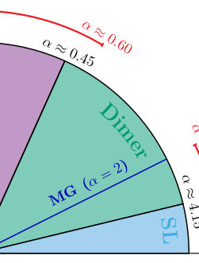 
Figure 1: Quantum phase diagram of the J1–J2 spin-1/2 chain parameterized by the inverse frustration ratio α = J1/J2. The model hosts a variety of ground states: a gapless Heisenberg spin liquid (SL), a gapped dimer phase breaking translation symmetry [8], a quasi-long-range order phase [QLRO(π/2)] [6,7], a short-range in- commensurate (SRI) spiral phase [6, 7], and a ferromagnetic (FM) phase [4, 5]. In this work, we argue that fractionalized spinon descriptions (indicated by the outer red arcs) extend significantly beyond their non-interacting limits. The single-chain SU(2)1 description survives past the SL–dimer transition (α ≈4.15) and persists up to the Majumdar-Ghosh (MG) point at α =...

📷 Fig 2

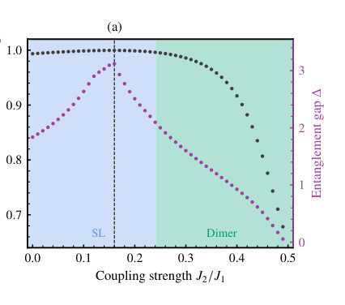 
Figure 2: (a) Momentum entanglement spectrum for L = 22 sites, with a cut region containing NA = 6 particles. The SU(2)1 low-lying levels are well separated from a non-universal part by an entanglement gap ∆which persists in the thermodynamic limit [20]. (b) Maximum spinon weight W in the K = πL/2 sector and gap ∆versus frustration coupling J2/J1 &gt; 0. The spinons proliferate deep inside the dimer phase until the gap ∆finally collapses at the Majumdar-Ghosh point. Both W and ∆are highest for finite J2 (dashed line), marking the parameter region of the system being closest to the Haldane–Shastry model, as indicated by their ground-state overlap in Appendix B.

📷 Fig 3

 
Figure 3: Entanglement spectrum for L = 22 sites, with a cut region containing NA = 6 particles. Inside the QLRO(π/2) (a) and the spiral phase (b), the entangle- ment levels form a continuum of states without any finite entanglement gap, indicat- ing that a description in terms of single-chain spinons is not appropriate.

📷 Fig 4

 
Figure 4: (a) Entanglement spectrum in the decoupled limit for Lc = 10 unit cells, with a cut containing NA = 5 particles. The spectrum is given by the convolution of two independent L = 10 Heisenberg spin-chains with nearest-neighbor coupling only. The low-lying entanglement levels are described by two SU(2)1 WZW models. (b) Entanglement spectrum within the spiral phase. Both the CFT levels as well as the intra-chain Heisenberg levels do not renormalize significantly, whilst a continuum of inter-chain excitations moves down without closing the entanglement gap.

📷 Fig 5

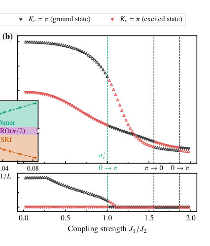 
Figure 5: Highest spinon weight W and entanglement gap ∆as a function of J1/J2 for the low-energy Kc = 0 and π state of a system with Lc = 8 unit cells and NA = 4 particles. The ground state is marked in black. We observe that W and ∆change continuously and break down only deep inside the frustrated regime J1 &lt; 0 (a) and J1 &gt; 0 (b). The points α± c of spinon confinement within the ground-state, which we identify as the gap closing for both signs of J1, is given by the change of momentum character from 0 to π. This entanglement transition does not coincide with the phase transition boundaries of the spiral (SRI) and dimer phase, as shown by the linear extrapolation of this level crossing to...

**Summary.** This paper uses momentum-space entanglement analysis to show that spinon quasiparticles in the zig-zag Heisenberg chain are much more resilient to inter-chain coupling than predicted by standard field theories. It identifies a specific mechanism for spinon breakdown driven by a shift in ground-state momentum. The findings provide a new tool for tracing quasiparticle stability in frustrated quantum magnets.

**Why it may be interesting.** not directly relevant

Detailed structure

**Main problem.** Investigating the stability and breakdown of spinon quasiparticles in the J1-J2 zig-zag Heisenberg chain, specifically addressing the discrepancy between field theory predictions and numerical evidence regarding the robustness of the decoupled-chain phase.

**Main result.** The study finds that a 'double-spinon' description remains robust over an extensive parameter regime, with an asymmetry in stability where ferromagnetic coupling sustains fractionalization into the spiral phase while antiferromagnetic coupling drives earlier confinement.

**Method.** The authors use Exact Diagonalization (ED) with the Lanczos algorithm and momentum-space entanglement spectroscopy (ES) to analyze the entanglement gap and spinon weight.

**Model / system.** A spin-1/2 J1-J2 zig-zag Heisenberg chain with nearest-neighbor (J1) and next-nearest-neighbor (J2) interactions, modeled as two coupled Heisenberg subchains in the highly frustrated regime.

**Key observables.** Entanglement Gap (EG), Spinon Weight (W), Total Crystal Momentum (Kc), and Haldane-Shastry ground-state fidelity (F).

**Important parameters / regimes.** Frustration ratio (alpha = J1/J2), ferromagnetic vs. antiferromagnetic coupling (J1 < 0 vs. J1 > 0), and the Majumdar-Ghosh point.

**Assumptions / limitations.** The analysis is limited by the numerical resolution of Exact Diagonalization and system sizes up to L=22.

**Figures summary.** Figure 6 shows the simultaneous maximization of various spinon deconfinement measures (W, Delta, F) in the spin-liquid regime; Figure 7 illustrates the spectral flow and collapse of the entanglement gap during the transition between different momentum characters.

**Paper structure.** The paper introduces the problem of spinon stability, describes the J1-J2 model and the double-spinon framework, presents numerical results using entanglement spectroscopy to identify the breakdown of fractionalization, and concludes with a comparison to CFT/RG predictions.

Abstract

We investigate the resilience of spinon quasiparticles in the $J_1$-$J_2$ zig-zag spin chain ($J_2>0$) from the viewpoint of momentum-space entanglement. For small $J_2$, we show that deconfined spinons survive well past the liquid-dimer transition before eventually collapsing towards the Majumdar-Ghosh point. In the highly frustrated zig-zag regime ($J_2 \gg |J_1|$), we model the system as two coupled Heisenberg chains and by Fourier transforming each subchain individually, a framework we dub the double-spinon description. While continuum field theories predict that this decoupled phase is strictly unstable to any finite inter-chain coupling, our analysis reveals that the double-spinon description remains robust over an extensive parameter regime. Notably, we find a stark asymmetry in spinon stability reflecting the underlying renormalization group flow: ferromagnetic coupling ($J_{1} < 0$) is marginally irrelevant and sustains fractionalization deep into the spiral phase, whereas antiferromagnetic coupling ($J_{1} > 0$) is marginally relevant and drives confinement much earlier. The ultimate breakdown of this fractionalized description is driven by a continuum of inter-chain excitations which manifests itself as a sharp ground-state momentum shift distinct from macroscopic thermodynamic phase boundaries. Our results establish momentum cut entanglement analysis as a tool to trace the quasiparticle resilience of spinons, as we show that treating the zig-zag Heisenberg chain as two coupled SU(2)$_1$ Wess-Zumino-Witten models provides a theoretical framework for strongly frustrated quantum magnets applicable beyond the decoupled limit.

[↑ back to top](#top)

### [Nonadiabatic Renormalization Group for Strongly Coupled Multiscale Quantum Systems](http://arxiv.org/abs/2604.27381v1)

**Authors:** Bing Gu  
**Type:** theory · **Category:** numerical methods · **PDF:** <https://arxiv.org/pdf/2604.27381v1>  
**Analysis basis:** full PDF text, analyzed in chunks
**Topic relevance:** `entanglement & information structure` **3/5**

📷 Fig 1

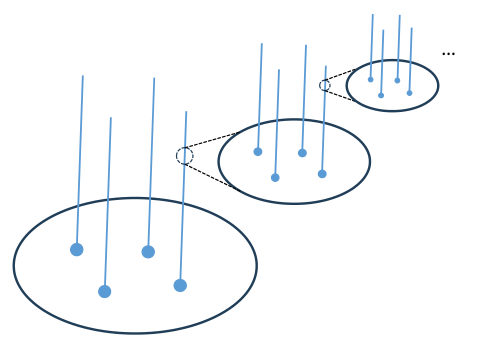 
FIG. 2. Schematic of NARG as a nested fiber bundle whereby the fiber of each layer is itself a fiber bundle.

📷 Fig 2

 
FIG. 1. Schematic of the leg-tied tensor ansatz (LETTA) in comparison with the conventional matrix product states (MPS). Physical legs can be shared between (a) nearest neigh- bours and (b) next-nearest-neighbours. (d) A LETTA with peridic boundary condition.

📷 Fig 3

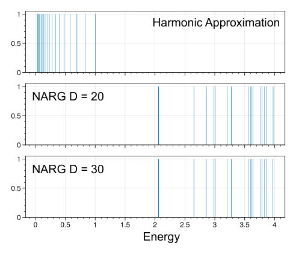 
FIG. 3. Low-lying eigenstates of an strongly interacting bo- son model with 20 modes. The lowerst 16 eigenvalues are shown, with a rapid convergence with respect to the number of retained adiabatic states D.

📷 Fig 4

 
FIG. 4. NARG for ab initio quantum chemistry. Electronic correlation is gradually incorporated into the NARG by in- creasing the retained adiabatic states. More than 80% of the correlation energy in the hydrogen chain H8 is captured by D = 200.

**Summary.** This paper proposes a new renormalization group method (NARG) for quantum systems with hierarchical energy scales. By iteratively suppressing high-energy degrees of freedom instead of tracing them out, it creates a new type of tensor network (LETTA) that captures entanglement through shared physical legs. The method proves highly efficient for both interacting boson models and electronic correlation in quantum chemistry.

**Why it may be interesting.** It introduces a novel tensor network architecture (LETTA) specifically designed for multiscale entanglement, offering a potential alternative to MPS for systems where energy scales are strongly coupled, such as molecular dynamics or open quantum systems.

Detailed structure

**Main problem.** Efficiently modeling complex, multiscale quantum systems where multiple energy or time scales are strongly coupled, specifically overcoming the exponential scaling of computational resources and the failure of standard tracing-out or product-basis approaches.

**Main result.** The development of the Nonadiabatic Renormalization Group (NARG) and the Leg-Tied Tensor Ansatz (LETTA), which successfully capture significant electron correlation in hydrogen chains and achieve rapid convergence in interacting boson models.

**Method.** An iterative approach called Nonadiabatic Renormalization Group (NARG) that suppresses rather than traces out high-energy degrees of freedom, resulting in a Leg-Tied Tensor Ansatz (LETTA) where physical legs are shared among sites to encode entanglement.

**Model / system.** The method is applied to an interacting boson model with multiple modes and anharmonicity, as well as ab initio quantum chemistry models such as the hydrogen chain (H8) involving interacting electrons.

**Key observables.** Low-lying many-body eigenstates, correlation energy, and quantum geometric properties like Berry curvature and the quantum geometric tensor.

**Important parameters / regimes.** Energy/time scales (fast vs. slow), coupling regimes (strong vs. weak), and the number of retained adiabatic states (D).

**Assumptions / limitations.** Assumes exponential convergence of truncated states for practical utility and requires managing expansion coefficients and global overlap matrices across different configurations.

**Figures summary.** Figure 1 compares MPS to the new LETTA architecture; Figure 2 illustrates NARG as a nested fiber bundle; Figure 3 shows eigenvalue convergence in a boson model; Figure 4 shows ground state energy capture in the H8 chain.

**Paper structure.** The paper introduces the failure of standard methods in strong coupling, proposes the NARG framework and the resulting LETTA tensor network, demonstrates the mathematical structure of nested fiber bundles, and validates the method using boson and quantum chemistry models.

Abstract

Complex quantum systems are often multiscale in nature with strong interactions between different scales. We present a novel idea: iteratively suppressing, rather than tracing out, the fast, high-energy degrees of freedom in strongly correlated quantum systems with multiple energy scales in a non-perturbative way, termed nonadiabatic renormalization group. This leads to a quantum geometric structure of a nested fiber bundle, in which each fiber of a layer is itself a fiber bundle of the next layer. The nonadiabatic renormalization group brings a new type of tensor network states that shares physical legs among ''sites'' and encodes quantum entanglement beyond conventional matrix product states. We demonstrate how to apply the nonadiabatic renormalization group to different types of problems, including an interacting boson model and ab initio quantum chemistry with interacting electrons.

[↑ back to top](#top)

### [Galilean boost invariance does not survive the trace: symmetry breaking in open quantum systems](http://arxiv.org/abs/2604.27459v1)

**Authors:** Leonardo F. Calderón, Esteban Marulanda, Santiago Morales, Leonardo A. Pachón  
**Type:** theory · **Category:** other · **PDF:** <https://arxiv.org/pdf/2604.27459v1>  
**Analysis basis:** full PDF text, analyzed in chunks
**Topic relevance:** `Keldysh / 2PI / non-Gaussian methods` **2/5** · `analog quantum simulation` **2/5** · `correlated / nonlocal dissipation` **2/5** · `methods for driven-dissipative` **2/5** · `non-equilibrium dynamics` **2/5**

📷 Fig 1

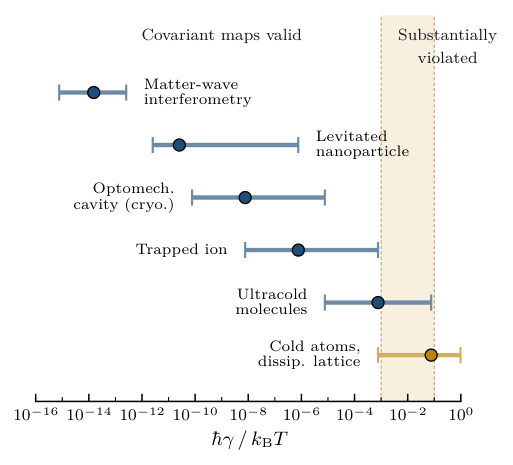 
FIG. 1. Dimensionless boost-violation parameter ℏγ/kBT across representative open-quantum-system platforms in the high-temperature Ohmic regime. Markers indicate representa- tive values quoted in the text; horizontal bars span the experi- mental ranges of γ and T [17, 31–35]. The shaded band delin- eates the crossover between the decoherence-dominated regime (left, covariant maps serve as an excellent approximation) and the dissipation-dominated regime (right, where Eq. (8) attains quantitative significance). Cold atoms in dissipative optical lat- tices span the crossover and enter the violated regime; ultra- cold molecules reach its lower edge. Bars cap at ℏγ/kBT = 1, beyond which the...

**Summary.** This paper proves that tracing out an environment breaks Galilean boost invariance in the reduced dynamics of a quantum system. This violation is tied to the dissipative term and the fluctuation-dissipation theorem, creating a fundamental conflict between these physical principles. The effect is most prominent in regimes where dissipation dominates, such as in certain cold atom experiments.

**Why it may be interesting.** It identifies a fundamental kinematic obstruction in open quantum systems that affects the interpretation of dynamics in platforms like cold atoms and trapped ions, and provides a method for calibrating dissipation.

Detailed structure

**Main problem.** The paper investigates whether Galilean boost invariance is preserved in the reduced dynamics of an open quantum system after tracing out environmental degrees of freedom.

**Main result.** The authors demonstrate a 'no-go' result: for any non-trivial bath spectral density, the dissipative term in the master equation breaks boost covariance, meaning one cannot simultaneously satisfy Galilean invariance, the fluctuation-dissipation theorem, and reduced boost covariance.

**Method.** The study employs an operator-level analysis of the exact Hu-Paz-Zhang master equation, algebraic testing of transformations under infinitesimal boosts, and stochastic decomposition of the influence functional.

**Model / system.** The analysis focuses on the Caldeira-Leggett model, featuring a system particle coupled bilinearly to a bath of harmonic oscillators via relative coordinates.

**Key observables.** The dissipative anticommutator term, momentum diffusion, and the boost-violation parameter.

**Important parameters / regimes.** The dimensionless ratio h-bar*gamma/k_B*T, the damping coefficient Gamma(t), and the squeezing rate mu.

**Assumptions / limitations.** The analysis assumes a factorized initial condition and focuses on quadratic/bilinear coupling; the extension to arbitrary anharmonic potentials is presented as a conjecture.

**Figures summary.** Figure 1 plots the dimensionless boost-violation parameter across various experimental platforms, delineating the crossover between the covariant regime and the regime of substantial violation.

**Paper structure.** The paper establishes global Galilean invariance, applies the partial trace to identify the symmetry-breaking term in the master equation, links this breaking to the fluctuation-dissipation theorem, and discusses experimental implications and potential restoration via parametric driving.

Abstract

Tracing out a Galilean-invariant Caldeira-Leggett environment breaks Galilean boost covariance of the reduced dynamics, while spatial translations and rotations survive intact. An operator-level analysis of the exact Hu-Paz-Zhang master equation localizes the violation entirely in the dissipative anticommutator term, scaling with the damping coefficient $Γ(t)f(t)$. The fluctuation-dissipation theorem ties this coefficient to the absorptive bath response that drives equilibrium momentum diffusion, so for any non-trivial bath spectral density bilinear-coupled Galilean invariance, the fluctuation-dissipation theorem, and reduced boost covariance cannot hold simultaneously. The stochastic decomposition of the influence functional extends the mechanism beyond the quadratic regime. The dimensionless ratio $\hbarγ/k_\mathrm{B} T$ delineates the crossover: cold atoms in dissipative optical lattices and ultracold molecules sit at its edge. Parametric driving offers a one-directional escape: the squeezing rate that protects nonequilibrium entanglement above the standard quantum limit also suppresses boost-breaking over a driving cycle.

[↑ back to top](#top)

### [Anomalous tunneling as a low-energy theorem for Nambu-Goldstone modes](http://arxiv.org/abs/2604.27489v1)

**Authors:** Keisuke Fujii, Daichi Kagamihara, Masaru Hongo  
**Type:** theory · **Category:** quantum gases · **PDF:** <https://arxiv.org/pdf/2604.27489v1>  
**Analysis basis:** abstract only; PDF text extraction failed or PDF unavailable
**Topic relevance:** `Keldysh / 2PI / non-Gaussian methods` **2/5** · `analog quantum simulation` **2/5** · `non-equilibrium dynamics` **2/5** · `spintronics-quantum-optics interface` **2/5**

**Summary.** This paper establishes that the perfect transmission of Nambu-Goldstone modes through potential barriers at zero energy is a universal consequence of symmetry and scaling. It demonstrates that while symmetry-preserving potentials do not impede transmission in the long-wavelength limit, symmetry-breaking perturbations suppress it. This provides a general theoretical foundation for anomalous tunneling in various broken-symmetry phases.

**Why it may be interesting.** It provides a fundamental, symmetry-based principle for understanding transport properties of collective excitations in many-body systems, which is highly relevant to the dynamics of ultracold gases and superfluids.

Detailed structure

**Main problem.** The paper seeks to establish the general conditions under which anomalous tunneling (perfect transmission at zero energy) occurs in systems with spontaneous symmetry breaking.

**Main result.** The authors prove that anomalous tunneling of Nambu-Goldstone modes is a universal low-energy theorem determined by symmetry and scaling, where symmetry-preserving potentials are irrelevant in the long-wavelength limit.

**Method.** The study utilizes a low-energy effective field theory (EFT) framework to formulate the scattering of Nambu-Goldstone modes by external potentials.

**Model / system.** The framework applies to Nambu-Goldstone modes in systems with spontaneous symmetry breaking, with specific illustrative examples provided for superfluid phonons and magnons.

**Key observables.** Transmission coefficient as a function of incident particle/quasiparticle energy.

**Important parameters / regimes.** Low-energy/long-wavelength limit, symmetry-preserving vs. symmetry-breaking perturbations, and spatially dependent EFT coefficients.

**Assumptions / limitations.** The derivation assumes the validity of the low-energy effective field theory and focuses on the long-wavelength limit.

**Paper structure.** The paper introduces the concept of anomalous tunneling, establishes a universal theorem using EFT, distinguishes between relevant and irrelevant perturbations based on symmetry, and provides specific examples (phonons and magnons).

Abstract

Anomalous tunneling refers to the phenomenon in which the transmission coefficient through a potential barrier approaches unity as the energy of an incident particle or quasiparticle tends to zero. This counterintuitive effect has been reported in systems exhibiting spontaneous symmetry breaking (SSB), such as superfluids, yet the general conditions for its occurrence remain unclear. In this Letter, we establish that anomalous tunneling of Nambu-Goldstone (NG) modes is a universal low-energy theorem dictated solely by symmetry and scaling, using a low-energy effective field theory (EFT) framework. We formulate the scattering of NG modes by external potentials in terms of spatially dependent EFT coefficients and demonstrate that symmetry-preserving localized potentials are irrelevant in the long-wavelength limit, leading to perfect transmission. In contrast, symmetry-breaking perturbations are relevant and suppress transmission, resulting in the absence of anomalous tunneling. We illustrate this universal behavior with explicit examples of superfluid phonons and magnons.

[↑ back to top](#top)

### [Propelling catalytic structures using active phase separation](http://arxiv.org/abs/2604.27965v1)

**Authors:** Benjamin Sorkin, Ned S. Wingreen  
**Type:** theory · **Category:** statistical mechanics · **PDF:** <https://arxiv.org/pdf/2604.27965v1>  
**Analysis basis:** abstract only; PDF text extraction failed or PDF unavailable
**Topic relevance:** `driven-dissipative phase transition` **2/5** · `non-equilibrium dynamics` **2/5** · `non-equilibrium universality` **2/5**

**Summary.** This paper proposes a motor-free mechanism for biological transport where active droplets propel colloids through a chemical cycle of protein passivation and activation. This process creates a localized condensate that exerts a repulsive force, enabling efficient movement even in the presence of noise.

**Why it may be interesting.** not directly relevant

Detailed structure

**Main problem.** How can active droplets sustain the indefinite self-propulsion of a colloid in a homogeneous environment without traditional molecular motors?

**Main result.** The authors demonstrate that a passivation-activation cycle of phase-separating proteins can induce symmetry breaking and create a repulsive force that propels colloids at speeds up to 100 microns per second.

**Method.** Numerical simulations of an active phase-separating system involving enzymatic reactions.

**Model / system.** A system consisting of phase-separating proteins, enzymes that passivate them, and complementary enzymes anchored to the surface of a spherical colloid.

**Key observables.** Colloid propulsion speed, stability of the condensate, and resistance to Brownian fluctuations.

**Important parameters / regimes.** Micron-sized scale, speeds up to 100 microns per second, and the presence of Brownian fluctuations and external forces.

**Assumptions / limitations.** The environment is homogeneous, isotropic, and autonomous.

**Paper structure.** The paper introduces the problem of biological motility, proposes a minimal mechanism based on enzymatic phase separation, and provides numerical evidence for the resulting propulsion and its robustness.

Abstract

Living systems routinely consume energy to achieve motility, often using intricate biomolecular machinery. In this work, we show that active droplets can sustain indefinite self-propulsion of a spherical colloid in an otherwise homogeneous, isotropic, and autonomous environment. Our proposed minimal mechanism consists of phase-separating proteins, enzymes passivating them, and complementary enzymes anchored to the colloid surface that reactivate the proteins. This passivation-activation cycle gives rise to a symmetry breaking - nucleation and stabilization of a condensate near the colloid surface, which in turn exerts a repulsive force on the colloid. We numerically demonstrate that this mechanism can propel micron-sized colloids at speeds of up to a hundred microns per second. This propulsion mode is strongly resistant to Brownian fluctuations and external forces, suggesting that propulsion mechanisms based on biomolecular condensates may offer a complementary, motor-free route to biological transport.

[↑ back to top](#top)

### [Discrete Lattice Models for Interface Growth on a Complete Graph](http://arxiv.org/abs/2604.27896v1)

**Authors:** J. M. Marcos, J. J. Meléndez, R. Cuerno, J. J. Ruiz-Lorenzo  
**Type:** theory · **Category:** statistical mechanics · **PDF:** <https://arxiv.org/pdf/2604.27896v1>  
**Analysis basis:** full PDF text, analyzed in chunks
**Topic relevance:** `non-equilibrium dynamics` **2/5** · `non-equilibrium universality` **2/5**

📷 Fig 1

 
Figure 1. Log–log plot of the squared roughness, w2(t), as a function of t for the RSOS model. Data are shown for different system sizes N (see legend) and m = 10. The solid black line corresponds to the RD scaling w2(t) ∼t.

📷 Fig 2

 
Figure 2. Log–log plot of the saturation value of the square of the roughness, w2 sat, as a function of the system size N for the RSOS model. In this plot, m = 10. The solid black line corresponds to w2 sat ∼N −1/4 scaling.

📷 Fig 3

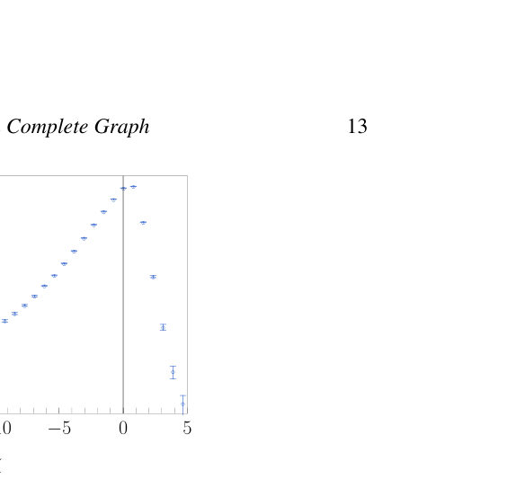 
Figure 3. Histogram of the rescaled height fluctuations χ [see Eq. (11)], for the RSOS model. In this figure, N = 1000 and m = 10.

📷 Fig 4

 
Figure 4 shows the time power spectrum, S(ω), for several system sizes of the RSOS model. The slope observed in the figure follows S(ω) ∼ω−2 quite closely, which coincides with the behavior observed for the EW and KPZ equations on a complete graph, as explained in Sec. 3.3. This result is consistent with the hyperscaling relation 2α + z = d, which is characteristic of linear equations, and contrasts with the Galilean invariance relation α+z = 2 associated with the KPZ fixed point. Figure 5 shows the spatially averaged two-time height autocorrelation function rescaled by the squared roughness, Ct(t, t0)/w2(t0), as a function of the time difference t −t0, for a fixed system size of the RSOS...

📷 Fig 5

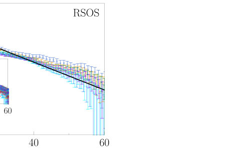 
Figure 5. Spatially averaged two-time height autocorrelation function, rescaled by the squared roughness, Ct(t, t0)/w2(t0), as a function of the time difference t −t0 for the RSOS model, shown for different waiting times t0 = {1, 2, 3, 4, 5, 6, 7}, which appear bottom to top in the inset. The system size is N = 1000 and m = 10. The solid black line corresponds to the theoretical prediction given by Eq. (17) with τRSOS = m = 10. Inset: Same data shown without rescaling by the squared roughness w2(t0).

**Summary.** This paper examines how the absence of spatial structure in a complete graph affects the universality of interface growth models. It finds that while some models like RSOS retain features of their continuum counterparts, others like Ballistic Deposition deviate significantly, exhibiting entirely new growth regimes.

**Why it may be interesting.** not directly relevant

Detailed structure

**Main problem.** Investigating whether discrete lattice growth models (RSOS and BD) belonging to the EW and KPZ universality classes reproduce the behavior of their corresponding continuum equations when defined on a complete graph (infinite-dimensional limit).

**Main result.** The RSOS model shows similarities to continuum equations with decreasing saturation roughness, while the BD model exhibits non-standard behavior, including an ultrafast growth regime and saturation roughness that increases with system size. Both models show height fluctuations with a pronounced left tail due to lagging nodes.

**Method.** Extensive numerical simulations of discrete models on a complete graph, supplemented by analytical derivations using master equations and approximations of growth events.

**Model / system.** Discrete interface growth models, specifically the Restricted Solid-on-Solid (RSOS) and Ballistic Deposition (BD) models, implemented on a complete graph (all-to-all connectivity).

**Key observables.** Global interfacial roughness (w), height fluctuations, power spectra (S(omega)), and two-time height autocorrelation functions.

**Important parameters / regimes.** System size (N), height constraint (m), and time (t).

**Assumptions / limitations.** The study assumes a complete graph topology where spatial separation is undefined, and uses simplified approximations for the BD model's growth dynamics.

**Figures summary.** Plots of squared roughness evolution (showing RD-like growth and rebound), histograms of height fluctuations showing exponential tails, power spectra showing omega^-2 scaling, and autocorrelation functions showing exponential decay.

**Paper structure.** Introduction to interface growth and complete graph topology; analysis of trivial models (RDSR, Etching, PNG); detailed study of the RSOS model (dynamics, scaling, and height distributions); detailed study of the BD model (ultrafast regime and saturation); comparison with continuum EW/KPZ equations; conclusion.

Abstract

We investigate the behavior of discrete interface growth models belonging to the Edwards--Wilkinson (EW) and Kardar--Parisi--Zhang (KPZ) universality classes, when defined on a complete graph, a topology commonly used to probe the infinite-dimensional limit of statistical mechanical systems. Our aim is to assess to what extent discrete lattice models reproduce the behavior of their corresponding continuum equations in this highly connected setting. After assessing the trivial behavior shown by some well known cases (like random deposition with surface relaxation or the etching model), we focus on two paradigmatic models associated with the KPZ universality class, the Restricted Solid-on-Solid (RSOS) and Ballistic Deposition (BD) models, and assess non-trivial behavior through several observables including the roughness, height fluctuations, power spectra, and two-time autocorrelation functions. Still, despite similarities with continuum equations, important differences arise in the fluctuations and long-time dynamics. In both discrete models the rescaled height fluctuations display a pronounced left tail, indicating the presence of lagging nodes. While the RSOS model exhibits a saturation roughness that decreases with system size, similarly to the EW and KPZ equations, the BD model exhibits a saturation roughness that increases with system size and an additional ultrafast growth regime, placing it outside the KPZ universality class on a complete graph.

[↑ back to top](#top)

### [Hypergeometric Functions of Nilpotent Operators: Functional Collapse and Structural Depth at Exceptional Points](http://arxiv.org/abs/2604.27834v1)

**Authors:** Ramon Moya  
**Type:** theory · **Category:** other · **PDF:** <https://arxiv.org/pdf/2604.27834v1>  
**Analysis basis:** full PDF text, analyzed in chunks
**Topic relevance:** `driven-dissipative phase transition` **2/5** · `methods for driven-dissipative` **2/5**

📷 Fig 1

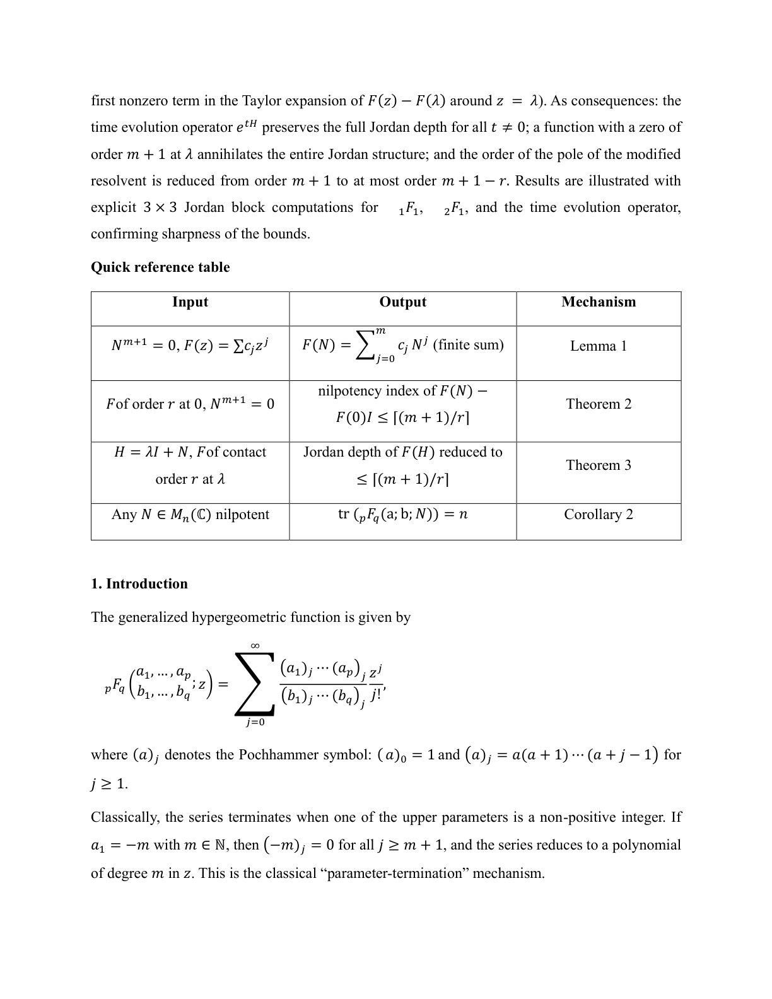 
Low-resolution page preview, page 2

📷 Fig 2

 
Low-resolution page preview, page 3

📷 Fig 3

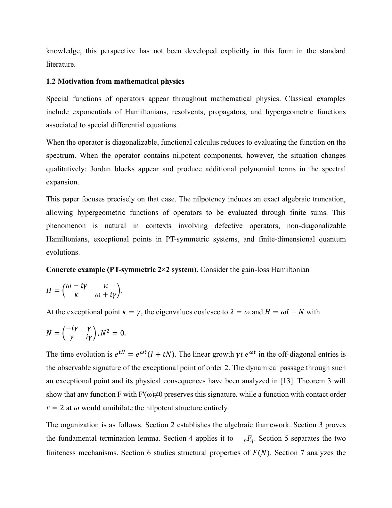 
Low-resolution page preview, page 4

📷 Fig 4

 
Low-resolution page preview, page 5

📷 Fig 5

 
Low-resolution page preview, page 6

**Summary.** The paper proves that applying analytic functions to nilpotent operators causes hypergeometric series to collapse into finite polynomials. It provides a quantitative rule for how much the Jordan structure of an exceptional point is reduced based on the function's contact order at the eigenvalue.

**Why it may be interesting.** This is highly relevant for researchers in non-Hermitian physics and open quantum systems, as it provides a rigorous mathematical tool to predict how functional transformations (like time evolution or filtering) can simplify or destroy the complex algebraic structures of exceptional points.

Detailed structure

**Main problem.** The paper investigates the 'functional collapse' of hypergeometric functions and other analytic functions when applied to nilpotent operators, specifically how these transformations affect the Jordan structure at exceptional points.

**Main result.** The author establishes a 'nilpotent depth criterion' showing that if a function has a contact order r at an eigenvalue, the nilpotency index of the transformed operator is reduced to at most ceil((m+1)/r).

**Method.** The study uses algebraic functional calculus, Taylor expansions, and matrix theory within the framework of complex associative algebras to analyze the properties of hypergeometric series and Jordan blocks.

**Model / system.** The primary model is a non-Hermitian Hamiltonian H = lambda I + N at an exceptional point, where N is a nilpotent operator of index m+1, representing systems like PT-symmetric gain-loss models.

**Key observables.** Jordan depth (nilpotency index), contact order of the function, and the order of the pole of the modified resolvent.

**Important parameters / regimes.** Nilpotency index (m+1), contact order (r), and the eigenvalue (lambda).

**Assumptions / limitations.** The operators are assumed to be finite-dimensional and nilpotent, and the functions are assumed to be analytic at the eigenvalue.

**Figures summary.** The paper includes explicit 3x3 Jordan block computations for various functions (Kummer, Gauss hypergeometric, and time evolution) to demonstrate the sharpness of the theoretical bounds.

**Paper structure.** The paper begins by defining the functional collapse of hypergeometric functions, introduces the nilpotent depth criterion (Theorem 2), applies this to Hamiltonians at exceptional points (Theorem 3), and concludes with explicit 3x3 matrix examples and consequences for the resolvent and time evolution.

Abstract

We study hypergeometric functions of nilpotent operators in finite-dimensional settings, motivated by the algebraic structure of exceptional points in non-Hermitian quantum mechanics. Our starting point is the following exact result: if N is a nilpotent operator of index m+1 in an associative algebra over C, then every generalized hypergeometric function pFq evaluated at N reduces to a finite polynomial in N of degree at most m, without any analytic convergence requirement. This "functional collapse" is distinct from the classical parameter-termination mechanism and arises purely from the nilpotent structure of the argument. The main result is a "nilpotent depth criterion" (Theorem 2): if the first non-constant coefficient of a formal series F appears in degree r >= 1, then the nilpotent part F(N) - F(0)I has nilpotency index bounded above by ceil((m+1)/r). We apply this criterion to Hamiltonians at exceptional points, where H = lambda I + N with N^{m+1} = 0. Theorem 3 establishes that a function F analytic at lambda reduces the Jordan depth of the exceptional point from m+1 to at most ceil((m+1)/r), where r is the contact order of F at lambda. As consequences: the time evolution operator e^{tH} preserves the full Jordan depth for all t != 0; a function with a zero of order m+1 at lambda annihilates the entire Jordan structure; and the order of the pole of the modified resolvent is reduced from m+1 to at most m+1-r. Results are illustrated with explicit 3x3 Jordan block computations for 1F1, 2F1, and the time evolution operator, confirming sharpness of the bounds.

[↑ back to top](#top)

### [Source-independent quantum key distribution without pre-sending entanglement](http://arxiv.org/abs/2604.28089v1)

**Authors:** Rong-Zheng Liu, Hua-Lei Yin  
**Type:** both · **Category:** quantum information and computing · **PDF:** <https://arxiv.org/pdf/2604.28089v1>  
**Analysis basis:** full PDF text, analyzed in chunks
**Topic relevance:** `interference shaping light` **2/5** · `entanglement & information structure` **1/5** · `quantum measurements` **1/5**

📷 Fig 1

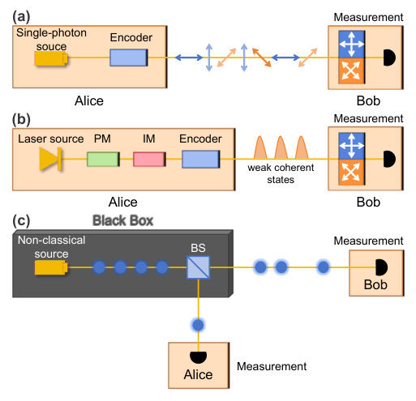 
FIG. 1. Protocols comparison. (a) Single-photon based and (b) WCS-based BB84 protocols: both the source and measurement devices must be trusted. (c) SI-QKD protocol: The non-classical source generation and distribution are mod- eled as an untrusted black box, while the local measurements at Alice and Bob are trusted. PM: phase modulator, IM: in- tensity modulator, BS: beam splitter.

📷 Fig 2

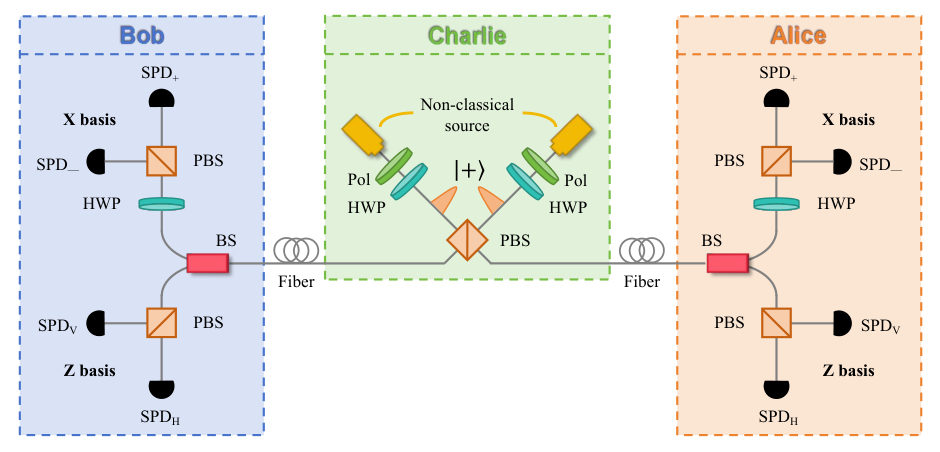 
FIG. 2. The polarization scheme of SI-QKD protocol. Charlie uses two independent non-classical sources that each emits a sequence of optical pulses. Each photon is prepared in the |+⟩state by a polarizer (Pol) and half-wave plate (HWP). Pulses from two sources interfere at a polarizing beam splitter (PBS) and distributed to receivers. Alice and Bob use a local beam splitter (BS) to randomly select the measurement basis, followed by polarization analysis in either the rectilinear (Z) basis or the diagonal (X ) basis. Measurement outcomes are recorded by four single-photon detectors (SPDs) corresponding to polarization bases.

📷 Fig 3

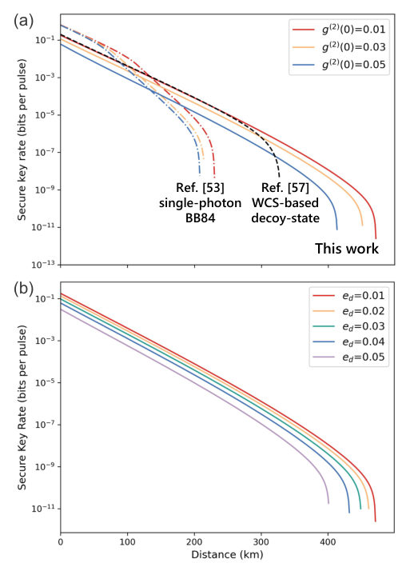 
FIG. 3. Comparison of finite secure key rate. (a) Fi- nite SKR comparison between our polarization SI-QKD pro- tocol (solid lines), the single-photon BB84 protocol [53] (dash- dotted lines), and the WCS-based decoy-state BB84 proto- col [57] (dashed lines). The parameters are set as ed = 0.01, pd = 10−7 and N = 1012. (b) Finite SKR for various mis- alignment error ed with fixed parameters g(2)(0) = 0.01. The transmission distance denotes the fiber length between Alice and Bob.

📷 Fig 4

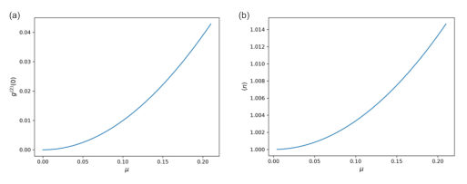 
FIG. 4. Characterization of odd cat state. (a) Second- order function g(2)(0) as a function of the intensity µ = |α|2

📷 Fig 5

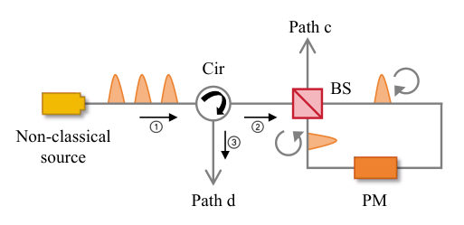 
FIG. 5. The experimental setup of optical switch. Sin- gle photons enter the Sagnac interferometer via the circulator (Cir) and beam splitter (BS). An electro-optic phase modu- lator (PM) applies periodic phase shifts at specific time slots. Depending on the relative phase (π or 0), photons from odd and even time slots are routed to separate output ports (c and d).

**Summary.** This paper introduces a new source-independent QKD protocol that is immune to all known and unknown source-side attacks without needing to pre-send entanglement. By using non-classical light sources, the protocol can double the transmission distance compared to standard single-photon BB84. The study demonstrates that this approach is robust against source imperfections and provides a practical path for long-distance quantum networks.

**Why it may be interesting.** It presents a significant advancement in quantum optics and quantum communication by leveraging non-classical states (like cat states) to achieve higher security and longer transmission distances without the overhead of entanglement distribution.

Detailed structure

**Main problem.** The vulnerability of QKD protocols to source-side attacks (e.g., photon-number splitting, light-injection) and the high experimental complexity of existing source-independent protocols that require pre-sending entanglement.

**Main result.** The proposed SI-QKD protocol eliminates all known and unknown source-side attacks without pre-sending entanglement, while simultaneously doubling the transmission distance and outperforming conventional WCS-based decoy-state protocols.

**Method.** The authors propose a protocol using non-classical light sources (single-photon or odd cat states) where an untrusted third party interferes pulses at a PBS, followed by a security analysis using the entropy uncertainty relation and finite-size key rate calculations.

**Model / system.** A source-independent QKD setup where an untrusted third party (Charlie) uses independent non-classical sources or a single source with an active optical switch to inject pulses into a polarizing beam splitter (PBS) for distribution to Alice and Bob.

**Key observables.** Secure key rate (SKR), quantum bit error rate (QBER), phase error rate (phi_z), and the second-order correlation function g(2)(0).

**Important parameters / regimes.** Average photon number (n), second-order correlation function g(2)(0), channel attenuation (0.16 dB/km), detector efficiency (0.8), and dark count rate (10^-7 to 10^-5).

**Assumptions / limitations.** The quantum source is treated as an untrusted black box; local measurements at Alice and Bob are assumed to be trusted and well-characterized; the channel is assumed to be symmetric.

**Figures summary.** Fig 3(a) compares finite SKR of the proposed protocol against BB84 variants; Fig 3(b) investigates performance; Fig 4 shows g(2)(0) and photon number as functions of intensity; Fig 5 shows the optical switch schematic; Fig 6 shows SKR vs. distance for different dark count rates and data sizes.

**Paper structure.** The paper introduces the problem of source-side vulnerabilities, proposes a new SI-QKD protocol using non-classical light, provides a theoretical security framework based on uncertainty relations, presents numerical simulations comparing performance and distance limits, and discusses experimental implementation via active optical switching.

Abstract

Quantum key distribution (QKD) theoretically offers information-theoretic security. The prevailing approach is the prepare-and-measure BB84 protocol, which implements QKD using conventional laser rather than single-photon source via the decoy-state method. However, side-channel attacks targeting sources severely threaten system security. Despite extensive efforts, including fully passive scheme, this vulnerability persists even with perfect single-photon source. Here, we propose a source-independent (SI) QKD protocol that resolves all known and unknown source-side attacks without pre-sending entanglement source. Aligning with advances in quantum light sources, our protocol simultaneously doubles the transmission distance while remaining robustness against imperfection of source. Theoretical analysis shows that non-classical light source provides practical security advantages unattainable with conventional laser.

[↑ back to top](#top)

### [Structure-Aware Transformers for Learning Near-Optimal Trotter Orderings with System-Size Generalization in 1D Heisenberg Hamiltonians](http://arxiv.org/abs/2604.27171v1)

**Authors:** Shamminuj Aktar, Reuben Tate, Stephan Eidenbenz  
**Type:** theory · **Category:** quantum information and computing · **PDF:** <https://arxiv.org/pdf/2604.27171v1>  
**Analysis basis:** full PDF text, analyzed in chunks
**Topic relevance:** `analog quantum simulation` **2/5** · `non-equilibrium dynamics` **2/5**

📷 Fig 1

 
Figure 1: Fidelity of random and structured Trotter orderings across system sizes L = 5, 10, 16 for the N´eel initial state, first-order product formula, and r = 5 Trotter steps. For each Hamiltonian instance, sorted by best random-ordering fidelity, we show 30 random orderings (amber dots), their best, worst, and mean fidelities (green, red, and orange), and all 24 structured candidates (blue squares). At L = 5, random and structured orderings are often comparable. By L = 10, a clear gap emerges, and at L = 16 the structured candidates consistently occupy the high-fidelity region while random orderings are concentrated lower. This trend shows that structured orderings become increasingly...

📷 Fig 2

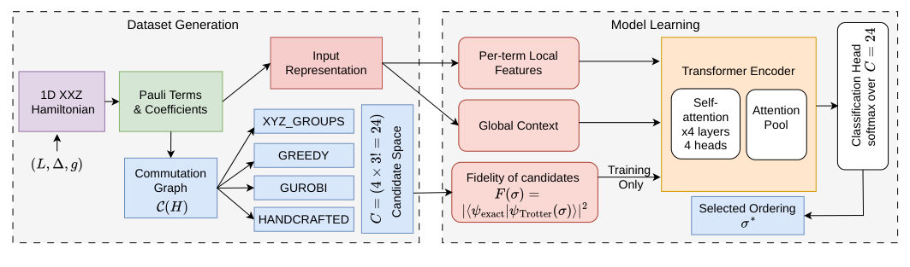 
Figure 2: Overview of the coloring-aware Trotter ordering pipeline, divided into two stages. Dataset generation (left): For a given 1D XXZ Hamiltonian (L, ∆, g), we construct the commutation graph C(H) from Pauli terms and apply four coloring methods (xyz groups, greedy, gurobi, handcrafted), producing C = 24 candidate orderings (4×3! = 24). For each candidate ordering, we compute the fidelity F(σ) = |⟨ψexact|ψTrotter(σ)⟩|2 between the exact and Trotter-evolved states. These fidelities are used during training only: the oracle fidelity, defined as the best fidelity among the 24 structured candidates, provides the supervision label. Model learning (right): Per-term local features and global...

📷 Fig 3

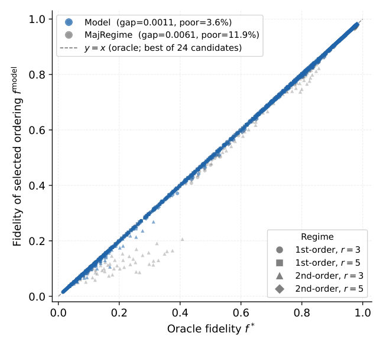 
Figure 3: Selected-ordering fidelity versus oracle fidelity for the learned model and the strongest non-learned baseline, MajRegime, across held-out test instances (L ∈{16, 17, 18, 19, 20}). Points are colored by method and shaped by Trotter regime (p, r), and the dashed line marks oracle-level performance y = x. The learned selector remains more tightly concentrated near the oracle line overall, while MajRegime shows substantially larger deviations, especially in the lower-fidelity regime.

📷 Fig 4

 
Figure 4: Error landscape: fidelity gap f∗−f model versus transverse field g for each Trotter regime, averaged over five seeds on test sizes L ∈{16, 17, 18, 19, 20}. Color indicates anisotropy ∆, and the dashed line marks the poor-prediction threshold (gap = 0.01). Under first-order Trotter (top row), the poor-prediction rate remains low at 0.7% for r = 3 and 1.8% for r = 5. Under second-order Trotter (bottom row), failures are more frequent, with poor-prediction rates of 6.0% for r = 3 and 6.0% for r = 5. The largest gaps concentrate at g ≳2.0, where oracle fidelity is already low and differences between candidate orderings become more pronounced.

📷 Fig 5

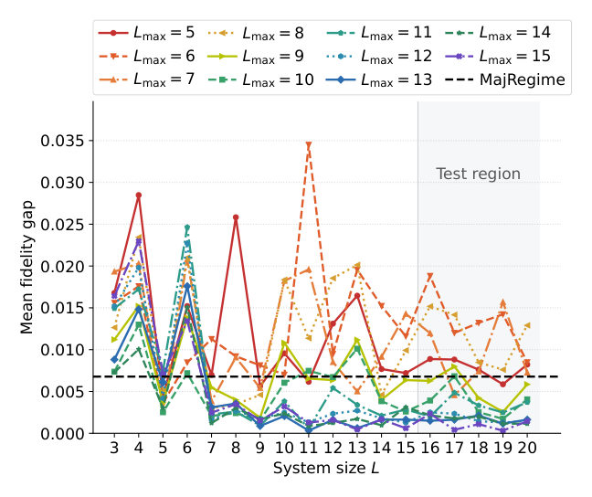 
Figure 5: Generalization sweep. Mean fidelity gap versus system size L for each validation size Lmax ∈{5, . . . , 15}, where training uses L ∈{3, . . . , Lmax −1} and evaluation is performed on larger sizes up to L = 20 (one line per Lmax, mean over three seeds). The shaded region marks the final held-out test range L ∈{16, . . . , 20}, and the dashed horizontal line marks the MajRegime reference. Lines for Lmax ≤8 remain near 10−2 on larger systems, indicating limited generalization. Generalization emerges at Lmax = 9, and lines for Lmax ≥13 compress toward 10−3 with little growth across system size, confirming clean extrapolation to larger systems.

**Summary.** The paper presents a machine learning approach using Transformers to solve the Trotter ordering problem in quantum simulations. By training on small-scale 1D Heisenberg models, the model learns to predict high-fidelity term sequences that generalize to much larger system sizes. This allows for efficient, high-accuracy quantum time-evolution without the need for expensive classical fidelity evaluations during inference.

**Why it may be interesting.** This work is highly relevant for many-body dynamics as it provides an AI-driven method to reduce approximation errors in quantum simulations, potentially enabling more accurate time-evolution studies of complex spin systems on near-term quantum hardware.

Detailed structure

**Main problem.** Optimizing the ordering of non-commuting Hamiltonian terms in Trotterization to maximize simulation fidelity without the exponential computational cost of evaluating all possible permutations.

**Main result.** A structure-aware Transformer encoder can predict near-optimal Trotter orderings for large systems by training on small systems, achieving a mean fidelity gap of only 0.00115 on unseen larger systems.

**Method.** The authors use a Transformer encoder trained on size-invariant features of 1D XXZ Hamiltonians to select the best ordering from a structured set of 24 candidates derived from commutation-graph colorings.

**Model / system.** The study focuses on 1D XXZ Heisenberg Hamiltonians with a transverse field and open boundaries, decomposed into local Pauli terms.

**Key observables.** Simulation fidelity (squared overlap between exact and Trotter-evolved states), fidelity gap, and normalized gain.

**Important parameters / regimes.** System size (L from 3 to 20 qubits), Trotter order (1st and 2nd order), step count (r = 3, 5), anisotropy (Delta), and transverse field strength (g).

**Assumptions / limitations.** The search space is restricted to a structured set of 24 candidates rather than the full k! permutations, and the study is limited to 1D XXZ Hamiltonians.

**Figures summary.** Figure 1 compares random vs. structured orderings; Figure 2 shows the two-stage pipeline of candidate generation and model learning; Figure 3 shows the model tracking the oracle fidelity; Figure 5 shows the emergence of generalization with increasing training size; Figure 6 shows the model's sample efficiency.

**Paper structure.** The paper introduces the Trotter ordering problem, describes the Hamiltonian and candidate generation via graph coloring, details the Transformer architecture and size-invariant feature encoding, presents results on fidelity gaps and system-size generalization, and concludes with error analysis and future directions.

Abstract

Trotterization is a standard approach for simulating quantum time evolution on quantum computers, where the Hamiltonian is split into local terms and each term is applied in sequence. The order of these terms affects the fidelity of the simulation when they do not commute, so the choice of ordering directly impacts the accuracy of the simulation. We study this problem for one-dimensional XXZ Heisenberg Hamiltonians using a structured set of 24 candidate orderings derived from colorings of the Hamiltonian's commutation graph and their group permutations. Finding the best candidate for large systems becomes prohibitive because fidelity evaluation is computationally expensive. In this work, we train a transformer encoder on smaller systems to predict the best candidate ordering for larger systems directly from Hamiltonian and Trotter-configuration features, without computing candidate fidelities at inference time. The model is trained on in-range systems of 3 to 14 qubits with 15-qubit systems held out for validation. Experimental results show that the model reaches a mean test fidelity gap of 0.00115 relative to the best of the 24 candidates on out-of-range systems of 16 to 20 qubits. A training-size sweep further shows that generalization emerges once training includes systems up to L=8 qubits, with validation at L=9, and the gap continues to decrease as the training range grows. To our knowledge, this is the first application of a learned model to Trotter ordering, and it motivates future work on AI-guided Trotter ordering with generalization across Hamiltonian families and system types.

[↑ back to top](#top)

### [Theory for the mixed alkali effect in glasses](http://arxiv.org/abs/2604.27873v1)

**Authors:** Justus Leiber, Quinn Emilia Fischer, Sven Lohmann, Philipp Maass  
**Type:** theory · **Category:** disordered systems and neural networks · **PDF:** <https://arxiv.org/pdf/2604.27873v1>  
**Analysis basis:** full PDF text, analyzed in chunks
**Topic relevance:** `methods for driven-dissipative` **2/5** · `non-equilibrium dynamics` **2/5**

📷 Fig 1

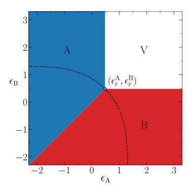 
FIG. 2. Occupation of sites with energies ϵA and ϵB in the zero-temperature limit. The blue, red and white areas mark the pair of site energies (ϵA, ϵB) occupied by A ions, B ions, and vacancies V, respectively. The bullet marks the point (ϵA F , ϵB F) of Fermi energies. When the mixing ratio is changed between zero and one, it moves along a curve. The dashed line gives an example of such a curve for the joint PDF of site energies discussed in Sec. IV (parameters are the same as those in the uppermost, left panel of Fig. 3).

📷 Fig 2

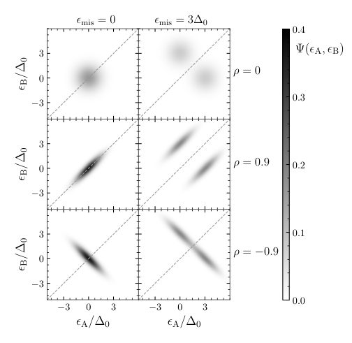 
FIG. 3. Grey-scale plots of joint PDFs ψ(ϵA, ϵB) at a fixed mixing ratio x = 0.5 for symmetric parameters with respect to A and B ions. The left column shows PDFs for vanishing mismatch energy ϵmis = 0 and three onsite energy correlations ρ = 0 (no correlations), ρ = 0.9 (strong positive correlations) and ρ = −0.9 (strong negative correlations). The right col- umn shows PDFs for the same ρ-values but mismatch energy ϵmis = 3. The dashed lines in the ϵA, ϵB-planes separate the areas energetically favorable for A ions (left of diagonal) and B ions (right of diagonal).

📷 Fig 3

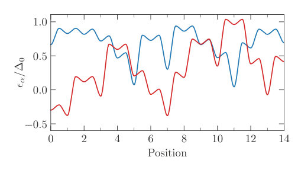 
FIG. 4. One-dimensional sketch of energy landscapes for A (blue line) and B (red line) ions in the constant lower barrier model for a mixing ratio x = 0.2. The parameters are the ones used for fitting the activation energies of mixed rubidium- lithium phosphate glasses Rbx-Li(1−x)-PO3 in Sec. VII C, see Table I.

📷 Fig 4

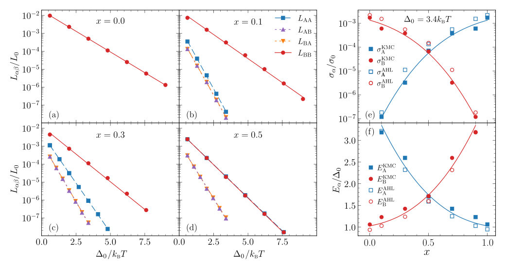 
FIG. 5. Comparison of results from KMC simulations with the generalized AHL theory for the site energy PDF with symmetric parameter setting and parameter values ϵmis/∆0 = 3 and ρ = 0. (a)-(d) Arrhenius plots of Onsager coefficients Lαβ determined from KMC simulations for four mixing ratios x. (e) Isotherms of KMC simulated partial conductivities σKMC A (x), σKMC B (x), and σAHL A (x), σAHL B (x) calculated from the generalized AHL theory for kBT = ∆0/3.4. (f) Simulated activation energies EKMC A (x), EKMC B (x) and calculated EAHL A (x), EAHL B (x).

📷 Fig 5

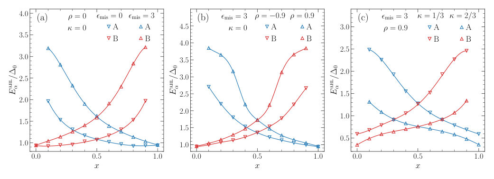 
FIG. 6. Impact of energy landscape features on the variation of activation energies EAHL A (x) and EAHL B (x) of partial conductiv- ities: data for (a) two mismatch energies ϵmis [Eq. (30)], ρ = 0 [no onsite energy correlations, Eq. (31)] and κ = 0 [no spatial correlations between site energies, Eq. (32)], (b) ϵmis = 3, κ = 0, and two onsite energy correlations ρ = −0.9 and ρ = 0.9, and (c) ϵmis = 3, ρ = 0.9, and two strengths κ = 1/3 and κ = 2/3 of spatial correlations between site energies. Lines are guides to the eye.

**Summary.** This paper provides a comprehensive theory for the mixed alkali effect in glasses by linking microscopic energy landscapes to macroscopic transport properties. It explains how energy mismatches and spatial correlations drive nonlinear changes in conductivity. The theoretical predictions show excellent agreement with experimental measurements in alkali phosphate glasses.

**Why it may be interesting.** not directly relevant

Detailed structure

**Main problem.** Developing a theoretical framework to explain the mixed alkali effect (MAE) in glasses, specifically the nonlinear variations in ionic transport properties when different types of mobile ions are mixed.

**Main result.** The theory demonstrates that the MAE arises from mismatch energy and site energy correlations, and can occur even with identical site energy distributions. It successfully predicts the 'vulnerability effect' and matches experimental activation energies in phosphate glasses.

**Method.** A generalized Ambegaokar-Halperin-Langer (AHL) theory combined with kinetic Monte Carlo simulations and the use of the grand canonical ensemble to derive transport coefficients.

**Model / system.** A fermionic hopping model on a disordered lattice representing ion-conducting glasses, featuring site-exclusion interactions and a joint probability density function for site energies of different ion species.

**Key observables.** Ionic conductivity, mobility, activation energies, partial conductivities, and Onsager coefficients.

**Important parameters / regimes.** Mixing ratio (x), mismatch energy (epsilon_mis), spatial correlation strength (kappa), and site energy fluctuations (Delta).

**Assumptions / limitations.** Neglect of long-range Coulomb interactions, use of a simple cubic lattice, and the assumption of a constant lower barrier for saddle point energies.

**Figures summary.** Figure 1 shows jump rates and energy barriers; Figure 2 shows site occupation in the zero-temperature limit; Figure 3 displays joint PDFs of site energies; Figure 4 illustrates the energy landscape; Figure 5 compares KMC and AHL theory; Figure 6 shows the impact of correlations on activation energies; Figure 7 shows fits to experimental data.

**Paper structure.** The paper introduces the MAE problem, defines the Hamiltonian and statistical mechanics of the site-exclusion model, develops the generalized AHL transport theory, introduces spatial and energy correlations, validates the theory via KMC simulations, and concludes with an application to experimental phosphate glass data.

Abstract

The mixed alkali or mixed mobile ion effect in glasses manifests itself by strong nonlinear variations of ionic transport properties upon mixing of different types of mobile ions. We develop a theory for this effect based on thermally activated hopping transport in disordered site energy landscapes that consistently incorporates the statistical-mechanical and kinetic aspects of a mobile ion mixture. This includes a consideration of the joint probability density of site energy states, generalized Fermi distributions for mean site occupations, and cross-terms in the current response described by nondiagonal Onsager coefficients. The theory shows that a mixed alkali effect can arise even when the two ion species share identical site energy distributions. It suffices that sites have distinct energies when occupied by ions of different type. Taking into account that a mismatch energy is needed for ions of one type to occupy sites adapted to the other type, the mixed alkali effect becomes stronger. Spatial correlations between site energies are needed for the mobility of the majority ion to decrease stronger than exponential upon replacement by the minority ion. The theory agrees well with kinetic Monte Carlo simulations. Application to mixed alkali phosphate glasses yields good agreement with measured conductivity activation energies.

[↑ back to top](#top)

### [Wavelet-based multiresolution analysis of quantum fractals in confined dynamics](http://arxiv.org/abs/2604.27851v1)

**Authors:** David Navia, Ángel S. Sanz  
**Type:** theory · **Category:** numerical methods · **PDF:** <https://arxiv.org/pdf/2604.27851v1>  
**Analysis basis:** full PDF text, analyzed in chunks
**Topic relevance:** `non-equilibrium dynamics` **2/5** · `quantum measurements` **2/5**

📷 Fig 1

 
FIG. 1. Fractal space–time quantum carpets generated by the evolution in time of the probability density associated with (a) a coherent superposition of two symmetrically distributed square functions, and (b) only the left-hand side square function. In both cases, the width of the square functions is such that w/L = 0.25 and are centered at x± = ±0.25L. In the density plots, blue denotes lower values of the probability density, while the transition to red indicates increasing values (for a better visualization of the details both probability densities ) For a better visualization of the carpets’ details, the probability densities have been truncated to about 60% their maxima. To make...

📷 Fig 2

 
FIG. 3. Time quantum fractal profile exhibited by the prob- ability density of the symmetric (a) and asymmetric (b) wave functions shown in Fig. 1. Both time fractals are computed at x = −0.25L, where L denotes the total length of the cavity. The numerical estimates of the corresponding fractal dimen- sions obtained from the multiresolution analysis are shown, respectively, in panels (c) and (d): Haar (black), db4 (red), db8 (green), and db16 (blue). These estimates are determined from convergence with the number of basis functions consid- ered in the spectral reconstruction without adding any extra hypothesis. As it is shown, beyond N ≳100, all results show fast convergence to the value D...

📷 Fig 3

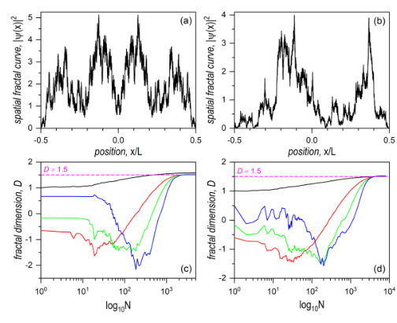 
FIG. 2. Space quantum fractal profile exhibited by the prob- ability density of the symmetric (a) and asymmetric (b) wave functions shown in Fig. 1. Both space fractals are computed at t = T/ √

📷 Fig 4

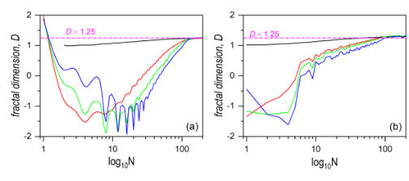 
FIG. 4. Numerical estimates of the fractal dimension ob- tained from the multiresolution analysis for three flux-based fractal (Bohmian) trajectories for different instances: Haar (black), db4 (red), db8 (green), and db16 (blue). The re- sults in panels (a) and (b) correspond to trajectories with initial conditions taken at x0 = −0.25L associated with the symmetric and asymmetric wave functions whose carpets are shown in Figs. 1(a) and (b), respectively, with w/L = 0.25. Note that, beyond N ≳100, all results show fast convergence to the value D = 1.25 (magenta dashed line) conjectured by Berry for space–time fractals [3].

**Summary.** This paper introduces a new wavelet-based method to accurately measure the fractal dimensions of quantum interference patterns (quantum carpets) without needing prior assumptions about scaling laws. The method is shown to be highly robust and recovers established theoretical predictions for space, time, and space-time fractals. It offers a unified, computationally efficient tool for analyzing multiscale dynamics in confined quantum systems.

**Why it may be interesting.** This provides a new, robust diagnostic tool for analyzing complex interference patterns and self-similar structures in any system exhibiting wave-like interference and confinement, such as ultracold atoms in optical lattices or wave-packet dynamics in cavities.

Detailed structure

**Main problem.** The quantitative characterization of quantum fractals (quantum carpets) is difficult because traditional methods like box-counting or Fourier analysis are sensitive to numerical cutoffs and require prior assumptions about scaling ranges.

**Main result.** The authors developed a wavelet-based multiresolution analysis (MRA) framework that provides a robust, hypothesis-free, and scale-adaptive way to extract fractal dimensions, successfully recovering Berry's predicted values.

**Method.** A wavelet-based multiresolution framework using discrete wavelet transforms (Haar and Daubechies families) to analyze the scale-dependent distribution of wavelet energies and Bohmian trajectories as adaptive probes.

**Model / system.** A quantum particle confined in a one-dimensional infinite potential well, starting from initial states with spatial discontinuities (e.g., square wave functions).

**Key observables.** Fractal dimensions (space, time, and space-time), wavelet energies, probability density, and quantum probability flux trajectories.

**Important parameters / regimes.** Dyadic scales (j), spectral truncation (N), recurrence time (T), and Hurst exponent (H).

**Assumptions / limitations.** The system is inherently 'pre-fractal' due to finite spectral truncation; the use of Bohmian trajectories is for methodological probing rather than ontological interpretation.

**Figures summary.** Figure 1 shows quantum carpets with superimposed Bohmian trajectories; Figure 2 shows spatial density profiles and convergence of fractal dimensions vs. truncation; Figure 3 shows temporal profiles and convergence; Figure 4 shows convergence for flux-based trajectories.

**Paper structure.** The paper introduces the problem of fractal characterization, presents the wavelet-based MRA framework, applies it to spatial and temporal profiles of quantum carpets, validates the method using Bohmian trajectories, and demonstrates robustness across different wavelet families and parameters.

Abstract

Fractal structures naturally emerge in quantum systems whose initial states exhibit spatial discontinuities, a phenomenon first identified by Berry in the paradigmatic case of a particle confined in an infinite potential well. While previous analyses of quantum fractals have mainly relied on spectral decompositions and geometric scaling arguments, their quantitative characterization often depends on scale choices and truncation effects. Here we present a wavelet-based multiresolution framework that enables a direct and assumption-free quantification of quantum fractality. Fractal dimensions are extracted from the scale-dependent distribution of wavelet energies, without invoking prior power-law hypotheses. The method is applied to space and time quantum fractals arising in confined dynamics, as well as to dynamical curves generated by the associated quantum probability flux. These flux-driven trajectories provide a natural space--time parametrization of the underlying fractal structure and yield scaling properties fully consistent with Berry's predictions for space--time fractals. The resulting fractal dimensions are shown to be robust with respect to the choice of wavelet family, numerical cutoffs, and system parameters. Beyond validating earlier conjectures, the present framework offers a unified and computationally efficient tool for the multiscale analysis of quantum fractality in confined and interference-driven quantum dynamics. That is, it provides an operational, scale-adaptive criterion that unifies the characterization of space, time, and space--time quantum fractals within a single, hypothesis-free approach.

[↑ back to top](#top)

### [A No-Cloning Trade-off Between Black Hole No-Hair and Horizon Smoothness](http://arxiv.org/abs/2604.28050v1)

**Authors:** Sudhanva Joshi, Sunil Kumar Mishra  
**Type:** theory · **Category:** other · **PDF:** <https://arxiv.org/pdf/2604.28050v1>  
**Analysis basis:** full PDF text, analyzed in chunks
**Topic relevance:** `entanglement & information structure` **2/5**

📷 Fig 1

 
FIG. 1: Penrose diagram of a black hole formed by gravitational collapse. The spacetime is divided into an interior region I (above the dashed horizon line H +) and an exterior region E (below). An infalling quantum system F in state |ψ⟩crosses the horizon, with its state embedded in I via the isometric embedding V . The reduced states ρI(ψ) and ρE(ψ) encode the information accessible to interior and exterior observers, respectively. The trade-off inequality Eq. (16) constrains the relationship between horizon smoothness (ε) and exterior distinguishability (Dmax).

**Summary.** This paper establishes a mathematical trade-off showing that an observer cannot simultaneously detect information about infalling matter from the exterior and maintain a smooth event horizon. It proves that any 'quantum hair' or microstate distinguishability requires a quantifiable violation of the equivalence principle. This provides a universal constraint on various quantum gravity models like fuzzballs and firewalls.

**Why it may be interesting.** not directly relevant

Detailed structure

**Main problem.** Investigating the fundamental compatibility between the existence of observable quantum hair (exterior distinguishability of microstates) and the smoothness of the black hole event horizon.

**Main result.** The authors derive a quantitative trade-off inequality, epsilon >= D_max^2/8, proving that any model predicting non-zero exterior quantum hair must necessarily violate the equivalence principle at the horizon.

**Method.** The study uses a quantum information-theoretic framework involving the Stinespring dilation of quantum channels, the diamond norm, and the Kretschmann-Schlingemann-Werner (KSW) continuity theorem.

**Model / system.** A semi-classical black hole model where an infalling quantum system enters the horizon, with the total Hilbert space decomposed into interior and exterior sectors.

**Key observables.** epsilon (horizon smoothness violation), D_max (maximum exterior distinguishability), and F_I (interior fidelity).

**Important parameters / regimes.** The Bekenstein-Hawking entropy (S_BH), the regime of perfect isometry (epsilon = 0), and the firewall/fuzzball regimes (epsilon ~ O(1)).

**Assumptions / limitations.** Global unitarity, horizon causality (no signaling between interior and exterior), and diamond-norm interior accessibility.

**Figures summary.** A Penrose diagram of a black hole illustrating the interior and exterior regions and the encoding of infalling states.

**Paper structure.** The paper begins by establishing an 'Exact no-hair lemma' for perfect isometries, then uses the KSW theorem to derive a quantitative bound on distinguishability, and concludes by discussing implications for fuzzballs, soft hair, and entanglement.

Abstract

The black hole no-hair theorem is traditionally derived from the uniqueness theorems of general relativity. We show that a quantitative form follows from unitarity together with the standard semiclassical assumptions of horizon causality and interior accessibility. For a semiclassical black hole, we prove that the trace distance between exterior states corresponding to two same-charge infalling states is bounded by $2\sqrt{2\varepsilon}$, where $\varepsilon$ quantifies the diamond norm departure of the interior channel from a perfect isometry which is a quantitative measure of horizon-smoothness violation that upper-bounds $1 - F_I$, where $F_I$ is the interior fidelity capturing how faithfully the infalling state is retained. Inverting this relation yields a trade-off inequality, $\varepsilon \geq D_{\max}^2/8$, between the maximum exterior distinguishability $D_{\max}$ and the degree of horizon smoothness. This establishes that observable exterior quantum hair is quantitatively incompatible with exact horizon smoothness under unitary evolution: any model predicting nonzero exterior hair must violate the equivalence principle at the horizon by a quantifiable amount. Pre-existing entanglement with the infalling system is the only channel for quantum hair compatible with both unitarity and horizon smoothness.

[↑ back to top](#top)

### [Constructing Bulk Topological Orders via Layered Gauging](http://arxiv.org/abs/2604.27363v1)

**Authors:** Shang Liu  
**Type:** theory · **Category:** strongly correlated electrons · **PDF:** <https://arxiv.org/pdf/2604.27363v1>  
**Analysis basis:** abstract only; PDF text extraction failed or PDF unavailable
**Topic relevance:** `entanglement & information structure` **2/5**

**Summary.** The paper introduces a new, intuitive method called 'layered gauging' to construct complex higher-dimensional topological phases, including fracton orders, from simpler lower-dimensional systems. This provides a versatile toolkit for generating new models with various symmetry types, such as non-abelian or non-invertible symmetries.

**Why it may be interesting.** not directly relevant

Detailed structure

**Main problem.** The difficulty of applying sophisticated mathematical formalisms to construct higher-dimensional bulk topological orders from lower-dimensional symmetries.

**Main result.** The proposal of a 'layered gauging construction' that systematically generates (k+1)-dimensional liquid or fracton topological orders from k-dimensional generalized symmetries.

**Method.** Stacking layers of k-dimensional quantum systems and sequentially gauging a diagonal symmetry acting on nearest-neighbor pairs of layers.

**Model / system.** The method is applied to various systems including the 2d plaquette Ising model and 1d systems with anomalous Z2 symmetry, resulting in models like the X-cube model and double semion topological order.

**Assumptions / limitations.** The method assumes the existence of well-defined symmetries (conventional, higher-form, subsystem, etc.) in the constituent k-dimensional layers.

**Paper structure.** The paper introduces the concept of topological holography, proposes the layered gauging construction, demonstrates its versatility across different symmetry types, and provides specific examples including fracton orders and anomalous symmetry constructions.

Abstract

Understanding quantum phases and phase transitions in the presence of symmetries is a central objective of quantum many-body physics. A powerful modern paradigm for investigating this problem is topological holography, which relates symmetries in $k$ dimensions to "bulk" topological orders in $(k+1)$ dimensions. While conceptually profound, most existing bulk construction methods rely on sophisticated mathematical formalisms and can be difficult to apply to certain symmetry types. In this work, we propose a physically intuitive and versatile method, termed the layered gauging construction, to systematically generate $(k+1)$-dimensional (liquid or fracton) topological orders from $k$-dimensional generalized symmetries. Roughly speaking, the prescription is to stack many layers of $k$-dimensional quantum systems with certain symmetries into a $(k+1)$-dimensional pile, and then sequentially gauge a diagonal symmetry acting on each nearest-neighbor pair of layers. The detailed procedure depends on the specific symmetry types. We have successfully implemented the method in a number of examples in different spatial dimensions, with symmetries that are conventional, higher-form, subsystem, anomalous, nonabelian, or noninvertible. We hence conjecture the method to be very general. For example, from the subsystem symmetry of the $2d$ plaquette Ising model, we derive the X-cube model and also an anisotropic fracton topological order. Additionally, starting from an anomalous $\mathbb Z_2$ symmetry in $1d$, we construct a new square lattice model realizing the double semion topological order.

[↑ back to top](#top)

### [Hyperfine-resolved laser excitation and detection of nuclear isomer in trapped $^{229}$Th$^{3+}$ ions](http://arxiv.org/abs/2604.27614v1)

**Authors:** Wu Wang, Ke Zhang, Ke-Mi Xu, Shan-Gui Zhou  
**Type:** theory · **Category:** other · **PDF:** <https://arxiv.org/pdf/2604.27614v1>  
**Analysis basis:** abstract only; PDF text extraction failed or PDF unavailable
**Topic relevance:** `quantum measurements` **2/5**

**Summary.** This paper provides a theoretical framework for the excitation and detection of the Th-229 nuclear isomer in trapped ions. It proposes specific fluorescence-based detection schemes and demonstrates that the nuclear transition can be identified within a month using existing laser technology. These findings are crucial for the practical implementation of next-generation nuclear clocks.

**Why it may be interesting.** This work is highly relevant for researchers in quantum optics and AMO physics as it provides a roadmap for the development of nuclear clocks and the control of nuclear states using atomic-scale laser techniques.

Detailed structure

**Main problem.** Optimizing the hyperfine-resolved laser excitation and detection of the low-energy nuclear isomeric state of Thorium-229 in trapped ions.

**Main result.** The study identifies two effective detection schemes using fluorescence channels at 690, 984, and 1088 nm and demonstrates that the nuclear transition can be located within one month using current VUV technology.

**Method.** A quantum master equation approach is used to analyze the dependence of isomeric population on laser parameters and to quantify photon detection rates.

**Model / system.** The physical system consists of Th-229+ ions trapped in an ion trap, focusing on the hyperfine-resolved electronic and nuclear transitions.

**Key observables.** Isomeric population, photon detection rates (per ion), and laser linewidth/detuning/irradiation time dependencies.

**Important parameters / regimes.** Laser linewidth, detuning, irradiation time, and specific fluorescence wavelengths (690, 984, and 1088 nm).

**Assumptions / limitations.** The analysis assumes the use of currently available vacuum-ultraviolet (VUV) laser technology and specific fluorescence channels.

**Paper structure.** The paper presents a theoretical investigation of excitation dynamics, proposes two detection schemes based on fluorescence, and evaluates the practical feasibility of locating the nuclear transition.

Abstract

We present a comprehensive theoretical investigation of hyperfine-resolved excitation and detection of the low-energy isomeric state of $^{229}$Th in trapped $^{229}\mathrm{Th}^{3+}$ ions. Using a quantum master equation approach, we analyze the dependence of the isomeric population on laser linewidth, detuning, and irradiation time, showing that their proper matching is essential for efficient excitation. We further propose two nuclear-state detection schemes based on three hyperfine-resolved electronic fluorescence channels at 690, 984, and 1088 nm. Our analysis shows that the 690-nm and 984-nm scheme yields detectable photon rates on the order of $10^4~\mathrm{s}^{-1}$ per ion for each wavelength, whereas the 1088-nm scheme achieves a higher rate on the order of $10^5~\mathrm{s}^{-1}$ per ion. By quantifying the trade-off between irradiation time and scan-step size, we show that the nuclear transition can be located within one month for a 100-MHz uncertainty using currently available vacuum-ultraviolet laser technology. These results provide practical guidance for trapped-ion $^{229}\mathrm{Th}$ spectroscopy and the development of nuclear clocks.

[↑ back to top](#top)

### [Magnetic excitation spectrum and hierarchy of magnetic interactions in ErFeO3](http://arxiv.org/abs/2604.27857v1)

**Authors:** Dnyaneshwar R. Bhosale, Piotr Fabrykiewicz, Devashibhai Adroja, Martin Meven, Astrid Schneidewind, Michal Stekiel  
**Type:** experiment · **Category:** strongly correlated electrons · **PDF:** <https://arxiv.org/pdf/2604.27857v1>  
**Analysis basis:** abstract only; PDF text extraction failed or PDF unavailable
**Topic relevance:** `spintronics-quantum-optics interface` **2/5**

**Summary.** This paper provides a detailed map of the magnetic excitations in ErFeO3 using neutron spectroscopy. It distinguishes between iron-based spin waves and erbium-based crystal field excitations, establishing a clear hierarchy of magnetic interactions in this orthoferrite.

**Why it may be interesting.** not directly relevant

Detailed structure

**Main problem.** The study aims to map the complete magnetic excitation spectrum and identify the hierarchy of magnetic exchange interactions in the orthoferrite ErFeO3.

**Main result.** The researchers identified two distinct excitation components: dispersive spin waves from the Fe3+ sublattice and crystal electric field (CEF) excitations from Er3+ ions, revealing how exchange coupling and sublattice interactions drive dispersion and level splitting.

**Method.** Time-of-flight neutron spectroscopy was used to measure the excitation spectrum, with data analyzed using linear spin wave theory.

**Model / system.** The system is the ErFeO3 orthoferrite, consisting of interacting Fe3+ and Er3+ sublattices characterized by Fe-Fe exchange, Er-Er exchange, and Er-Fe interactions.

**Key observables.** Spin wave dispersions, spectral weight, and crystal electric field (CEF) excitation energies.

**Important parameters / regimes.** Fe-Fe exchange parameters, energy scales ranging from below 36 meV to 65 meV, and the influence of dipolar and antisymmetric exchange interactions.

**Assumptions / limitations.** The spin wave dispersions and spectral weight are assumed to be well-captured within the framework of linear spin wave theory.

**Paper structure.** The paper presents an investigation of the excitation spectrum, details the identification of spin wave and CEF components, applies linear spin wave theory to extract exchange parameters, and discusses the role of various exchange interactions on the magnetic ground state.

Abstract

We report a comprehensive investigation of the excitation spectrum of ErFeO$_3$ orthoferrite by means of time-of-flight neutron spectroscopy. The spectrum consists of two distinct components: strongly dispersive spin wave excitations of the Fe$^{3+}$ sublattice spanning $\approx$~9 - 65 meV, and crystal electric field (CEF) excitations of Er$^{3+}$ ions below 36 meV. The observed spin wave dispersions and spectral weight are well captured within linear spin wave theory, enabling extraction of the key Fe-Fe exchange parameters. Low-energy incident neutrons with their enhanced energy resolution, further revealed the dispersive character and splitting of Kramers-degenerate CEF levels. We show that the dispersion is caused by the exchange coupling between Er$^{3+}$ ions, while the degeneracy is lifted by interactions between the Er$^{3+}$ and Fe$^{3+}$ sublattices. We further explore the influence of dipolar and antisymmetric exchange interactions with the focus on the magnetic ground state of ErFeO$_3$, with particular attention to the low-temperature spin arrangement. Taken together, our results provide a detailed account of the spin dynamics in ErFeO$_3$ and reveal a hierarchy of interactions scales characteristic for orthoferrites.

[↑ back to top](#top)

### [Oscillators from non-semisimple walled Brauer algebras](http://arxiv.org/abs/2604.27087v1)

**Authors:** Sanjaye Ramgoolam, Michał Studziński  
**Type:** theory · **Category:** quantum information and computing · **PDF:** <https://arxiv.org/pdf/2604.27087v1>  
**Analysis basis:** full PDF text, analyzed in chunks
**Topic relevance:** `entanglement & information structure` **2/5**

📷 Fig 1

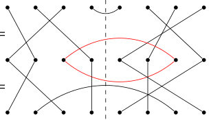 
Figure 2: Example of graphical composition of two diagrams 𝑏1, 𝑏2 ∈𝐵𝑁(4, 4). The closed loop highlighted in red contributes a factor of 𝑁∈C, and the resulting composition again defines an element of 𝐵𝑁(4, 4).

📷 Fig 2

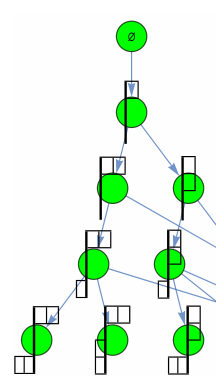 
Figure 3: Bratteli diagram for 𝐵𝑁(2, 2) in the stable regime 𝑁≥4.

📷 Fig 3

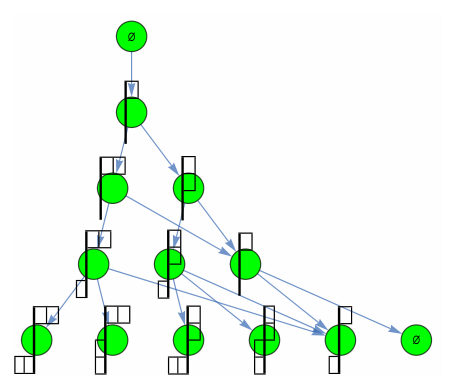 
Figure 3 shows the Bratteli diagram for 𝐵𝑁(2, 2) in the stable regime 𝑁≥4. The sequence of layers corresponds to

📷 Fig 4

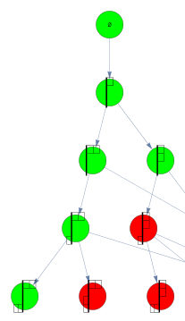 
Figure 4: Coloured Bratteli diagram for 𝐵𝑁(2, 2) with 𝑁= 2. Red nodes violate the finite-𝑁constraint, while green nodes correspond to admissible Brauer triples.

📷 Fig 5

 
Figure 5: Restricted Bratteli diagram for 𝐵𝑁=2(2, 2).

**Summary.** This paper provides a new combinatorial method to calculate representation dimensions for walled Brauer algebras in the non-semisimple regime. It reveals that the complexity of these dimension corrections is governed by the same mathematics as an infinite tower of harmonic oscillators, linking algebraic combinatorics to fundamental quantum field theory structures.

**Why it may be interesting.** not directly relevant

Detailed structure

**Main problem.** Calculating dimension modifications and multiplicities for irreducible representations of the walled Brauer algebra in the non-semisimple regime where N < m + n.

**Main result.** The authors introduce Restricted Bratteli Diagrams and show that the counting of dimension corrections is governed by a universal generating function corresponding to the partition function of an infinite tower of simple harmonic oscillators.

**Method.** The study uses combinatorial path-counting on modified Bratteli diagrams, generating function analysis, and the identification of a stability property in the large-m, n regime.

**Model / system.** The mathematical model is the walled Brauer algebra B_N(m, n) acting on mixed tensor spaces, with physical applications in AdS/CFT gauge theory and quantum information protocols like port-based teleportation.

**Key observables.** Dimension modifications (delta), number of red and green nodes in the restricted Bratteli diagrams, and the universal generating function Z_univ(x).

**Important parameters / regimes.** The regime N < m + n, the parameter l = m + n - N, and the stability condition m, n >= 2l - 3.

**Assumptions / limitations.** The analysis focuses on the regime where l is small compared to m and n.

**Figures summary.** Figure 1 shows a mixed Young diagram; Figure 5 illustrates a specific Restricted Bratteli Diagram; Figure 6 demonstrates the stability of the diagram as m and n increase.

**Paper structure.** The paper begins by defining the non-semisimple problem, introduces the Restricted Bratteli Diagram construction, proves a stability property for large m and n, derives the universal oscillator generating function, and discusses implications for gauge theory and quantum information.

Abstract

The walled Brauer algebras $B_N(m,n)$ govern Schur--Weyl duality for unitary groups $U(N)$ acting on mixed tensor spaces $V_N^{\otimes m}\otimes \overline{V}_N^{\otimes n}$ and play an important role in applications ranging from AdS/CFT to quantum information theory. In the stable regime $N\ge m+n$ the algebra is semisimple and its representation theory is well understood. For $N<m+n$, however, $B_N(m,n)$ becomes non-semisimple. The representation of the algebra on tensor space has a non-trivial kernel and the corresponding quotient algebra is semisimple, with representation dimensions differing from those in the stable regime.   We introduce \emph{restricted Bratteli diagrams}, obtained by modifying the standard Bratteli diagrams for $B_N(m,n)$. This construction provides a systematic way to use representation-theoretic data from the stable regime to compute the dimension modifications arising in the non-semisimple regime. In the regime $N=m+n-l$, with $l$ small compared to $m,n$, we show that the restricted diagrams exhibit a stability property and enable an efficient counting of the paths responsible for these dimension corrections.   Remarkably, the resulting generating functions are governed by the partition function of an infinite tower of simple harmonic oscillators. We briefly discuss implications for the construction of orthogonal bases of matrix invariants in gauge theory and related applications in quantum information theory.

[↑ back to top](#top)

### [Parametrized Variational Quantum Tomography](http://arxiv.org/abs/2604.27135v1)

**Authors:** V. A. Penas, M. Losada, D. Tielas, F. Holik  
**Type:** theory · **Category:** quantum information and computing · **PDF:** <https://arxiv.org/pdf/2604.27135v1>  
**Analysis basis:** abstract only; PDF text extraction failed or PDF unavailable
**Topic relevance:** `quantum measurements` **2/5**

**Summary.** The authors propose a new method for quantum state tomography that unifies different variational approaches using a parametrized cost function. By tuning hyperparameters, the method can achieve results closer to Maximum Entropy solutions while remaining computationally efficient. This allows for better reconstruction of quantum states when measurement data is incomplete.

**Why it may be interesting.** It provides a new tool for more accurate quantum state reconstruction in scenarios with limited measurement capabilities, which is critical for characterizing noisy quantum devices.

Detailed structure

**Main problem.** Addressing the underdetermined nature of quantum state tomography when measurement data is not informationally complete.

**Main result.** The introduction of a unified framework that interpolates between the 1-norm and infinity norm, allowing for a controlled exploration of compatible density matrices with higher fidelity to MaxEnt solutions.

**Method.** A parametrized cost function that generalizes Variational Quantum Tomography (VQT) and VQT-infinity by interpolating between different norms.

**Model / system.** The paper focuses on the general problem of quantum state reconstruction from incomplete measurement statistics.

**Key observables.** Quantum state fidelity and measurement statistics.

**Important parameters / regimes.** Hyperparameters associated with the interpolated cost function that control the transition between 1-norm and infinity norm.

**Assumptions / limitations.** The measurement data is not informationally complete, leading to multiple compatible density matrices.

**Paper structure.** The paper introduces the problem of underdetermined tomography, discusses existing MaxEnt and VQT approaches, proposes a new interpolated cost function, and demonstrates its performance relative to VQT-infinity.

Abstract

Quantum state tomography provides a fundamental framework for reconstructing quantum states. When the measurement data are not informationally complete, the observed statistics admit multiple compatible density matrices, making the reconstruction problem inherently underdetermined and calling for the selection of a meaningful estimator. Two well-established approaches to address this ambiguity are Maximum Entropy (MaxEnt) and Variational Quantum Tomography (VQT). A variant of VQT, named VQT$_\infty$, has been introduced to reproduce MaxEnt-like solutions. In this work, we generalize this approach by introducing a parametrized cost function that interpolates between the 1-norm and the infinity norm, thereby unifying VQT and VQT$_\infty$ within a single framework. By tuning the associated hyperparameters, the proposed method enables controlled exploration of the set of compatible density matrices. We show that this interplay yields reconstructed states with higher fidelity to the MaxEnt solution than those obtained via VQT$_\infty$ while preserving computational tractability.

[↑ back to top](#top)

### [Quantum Anonymous Secret Sharing with Permutation Invariant Codes](http://arxiv.org/abs/2604.27284v1)

**Authors:** Varin Sikand, Andrew Nemec  
**Type:** theory · **Category:** quantum information and computing · **PDF:** <https://arxiv.org/pdf/2604.27284v1>  
**Analysis basis:** full PDF text, analyzed in chunks
**Topic relevance:** `entanglement & information structure` **2/5**

📷 Fig 1

 
Fig. 1: Overview of ANONQ(|ϕ⟩) (Protocol II.4) with Alice encircled in green and Bob in blue. Each participant holds one qubit of the n-qubit GHZ state, denoted as σi, and all participants besides Alice and Bob apply an H gate to their qubit, leaving only Alice and Bob with an entangled pair. The green arrow represents the teleportation step after the AE protocol.

📷 Fig 2

 
Fig. 2: Overview of the QASS protocol. We initially assume the secret has been encoded into n shares. In Step 1, each green arrow denotes a share sent from each k participating shareholders via the ANONQ protocol. Once received by Bob, the identities of each share is entirely lost due to ANONQ. Finally, Bob decodes the anonymous set of retrieved shares using the PI code’s decoding circuit to obtain the secret.

📷 Fig 3

 
Fig. 3: Hmin for QASS schemes using the ((4, 2, 2)) Aydin et al. PI code [46] and the ((4, 2, 2)) Hagiwara and Nakayama PI code [13], the ramp QSS scheme using the [[4, 1, 2]] Leung et al. stabilizer code [44], and the HQASS scheme using Aydin et al. PI code [46] for both quantum and classical secrets. All three 4-qubit QSS schemes have identical Hmin values, whereas the HQASS scheme has a threshold of k = 3 with no intermediate share sets.

📷 Fig 4

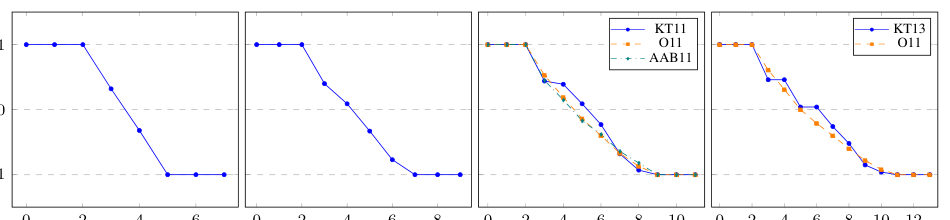 
Fig. 4: Comparison of Hmin across various PI codes of distance 3. (a) The ((7, 2, 3)) codes of Pollatsek and Ruskai [47], [49] and Aydin et al. [46], which have the same Hmin values. (b) The ((9, 2, 3)) code of Ruskai [48] (the gnu (3, 3, 1)-PI code [50]). (c) Three ((11, 2, 3)) codes including the one given by Kubischta and Teixeira [49], the shifted gnu (3, 3, 1)-PI code of Ouyang [45], and the Q4,1,2,−1 code of Aydin et al. [46]. (d) Two ((13, 2, 3)) codes including one given by Kubischta and Teixeira [49] and the shifted gnu (3, 3, 1)-PI code of Ouyang [45].

**Summary.** This paper develops a new protocol for quantum secret sharing that protects the identity of the sender using permutation-invariant codes. It also introduces a mathematically rigorous way to measure how much information an adversary can steal from partial shares using quantum min-entropy.

**Why it may be interesting.** not directly relevant

Detailed structure

**Main problem.** Existing Quantum Secret Sharing (QSS) schemes lack sender-anonymity and lack a robust single-shot metric to quantify information leakage in 'ramp' schemes where intermediate shares provide partial information.

**Main result.** The authors propose a Quantum Anonymous Secret Sharing (QASS) protocol using permutation-invariant (PI) codes that achieves sender-anonymity and can tolerate missing shareholders. They also establish quantum conditional min-entropy as a valid single-shot metric for quantifying information leakage.

**Method.** The protocol combines PI quantum error-correcting codes with anonymous quantum transmission algorithms (based on GHZ states) and utilizes the cleaning lemma and maximum likelihood decoders to evaluate security metrics.

**Model / system.** The study uses quantum error-correcting codes (specifically stabilizer and permutation-invariant codes) operating under erasure and depolarizing channels, utilizing n-qubit GHZ states for the transmission protocol.

**Key observables.** Quantum conditional min-entropy (Hmin), maximum fidelity (F), and quantum correlation (q_corr).

**Important parameters / regimes.** Code parameters (n, K, d), threshold (k), number of erasures, and the number of participating shareholders (np).

**Assumptions / limitations.** The protocol assumes the use of permutation-invariant codes and an unbounded adversary who can corrupt up to n-2 players; it also assumes players are either honest, malicious, or corrupted.

**Figures summary.** Figure 1 shows the ANONQ protocol steps; Figure 2 illustrates the QASS protocol flow; Figure 3 shows fidelity and min-entropy for 4-qubit codes; Figure 4 compares min-entropy across various larger PI codes.

**Paper structure.** The paper introduces the problem of anonymity and leakage, describes the construction of the QASS protocol using PI codes, provides a theoretical justification for the min-entropy metric via Knill-Laflamme conditions, and concludes with numerical evaluations of various code sizes and erasure models.

Abstract

Quantum secret sharing schemes are a family of quantum cryptographic protocols which provide secure quantum encodings, mapping one secret to multiple shares of information such that the original secret cannot be accessed without an authorized set of shares present for decoding. In this work, we describe a protocol that enables sender-anonymity during the secret decoding process. By using permutation-invariant QEC codes along with a set of anonymous quantum transmission algorithms, we construct a quantum anonymous secret sharing scheme that achieves sender-anonymity. We quantify information leakage in ramp quantum secret sharing schemes via the quantum conditional min-entropy, justifying it as a valid measure of leaked information by relating it to the Knill-Laflamme quantum error correction conditions. Finally, we evaluate several permutation-invariant codes using this measure to make observations on the information leakage of intermediate shares for each quantum anonymous secret sharing scheme.

[↑ back to top](#top)

### [Quantum integrable matrix models of spinor Bose gases in one spatial dimension](http://arxiv.org/abs/2604.27885v1)

**Authors:** Hannes Köper, Thomas Gasenzer  
**Type:** theory · **Category:** quantum gases · **PDF:** <https://arxiv.org/pdf/2604.27885v1>  
**Analysis basis:** abstract only; PDF text extraction failed or PDF unavailable
**Topic relevance:** `analog quantum simulation` **2/5**

**Summary.** This paper develops a generalized integrable matrix model to describe 1D spinor Bose gases with arbitrary spin. By applying the Bethe-ansatz, the authors map out the phase diagram of a spin-1 gas and demonstrate how bound states alter the statistical behavior of interacting bosons.

**Why it may be interesting.** It provides a powerful integrable framework for studying the many-body dynamics and phase transitions of complex spin multiplets in 1D, which is highly relevant for understanding the physics of ultracold atomic gases.

Detailed structure

**Main problem.** The paper aims to generalize the description of one-dimensional spinor Bose gases to arbitrary spin multiplets using a matrix-based integrable model.

**Main result.** The authors derive a quantum integrable matrix extension of the nonlinear Schrödinger model and compute the ground state phase diagram for a spin-1 Bose gas, revealing that paired bound states modify the effective Pauli exclusion principle for bosons.

**Method.** The study employs algebraic Bethe-ansatz techniques to construct eigenstates and derive Bethe equations, alongside the derivation of integral equations for thermodynamic properties.

**Model / system.** A quantum integrable matrix extension of the nonlinear Schrödinger model where fundamental fields are represented by an m x n matrix of bosonic field operators, specifically applied to spin-1 Bose gases with repulsive density-density and anti-ferromagnetic spin-spin interactions.

**Key observables.** Ground state phase diagram, spectra of conserved quantities, and equilibrium thermodynamic properties.

**Important parameters / regimes.** Chemical potential, external magnetic field, and the Lieb parameter (gamma).

**Assumptions / limitations.** The system is restricted to one spatial dimension and assumes repulsive density-density interaction and anti-ferromagnetic spin-spin coupling.

**Paper structure.** The paper introduces a matrix extension of the nonlinear Schrödinger model, applies the algebraic Bethe-ansatz for arbitrary spin multiplets, focuses on the spin-1 case to derive thermodynamic integral equations, and concludes with a phase diagram analysis and discussion of bound state effects.

Abstract

Degenerate spinor Bose gases with repulsive density-density interaction and anti-ferromagnetic spin-spin coupling in one spatial dimension are shown to be described by a quantum integrable matrix extension of the nonlinear Schrödinger model, whose fundamental fields are described by an $m\,\times\,n$ matrix of bosonic field operators. The eigenstates of this model are constructed for arbitrarily sized matrix field operators by means of algebraic Bethe-ansatz techniques, and the corresponding Bethe equations governing the spectra of conserved quantities are derived. The approach thus generalizes previously chosen techniques to account for arbitrary spin multiplets and their spin-spin interaction. Focusing on the specific case of the $2\times2$ model, which is shown to correspond to a spin-$1$ Bose gas, a set of integral equations is derived, which describe its equilibrium thermodynamic properties. From these, the ground state phase diagram is computed both, numerically and analytically in the parameter plane spanned by the chemical potential and an external magnetic field. Furthermore, the existence of paired bound states is shown to modify the Pauli exclusion principle for interacting bosons in one dimension. In particular, it is found that no two quasiparticle rapidities can coincide, provided that the Lieb parameter satisfies $γ>4/3$.

[↑ back to top](#top)

### [Reorganizing Quantum Measurement Records Improves Time-Series Prediction](http://arxiv.org/abs/2604.28160v1)

**Authors:** Markus Baumann, Maximilian Zorn, Thomas Gabor, Claudia Linnhoff-Popien, Jonas Stein  
**Type:** both · **Category:** quantum information and computing · **PDF:** <https://arxiv.org/pdf/2604.28160v1>  
**Analysis basis:** full PDF text, analyzed in chunks
**Topic relevance:** `quantum measurements` **2/5**

📷 Fig 1

 
Fig. 1. Three ways of organizing shot-based training data under a fixed measurement budget: EV averaging, split-ensemble training, and raw stacking.

📷 Fig 2

 
Fig. 2. Shared operating point (Q = 4, Nshots = 18, λ = 10, ρEV = 2.65125). Top: illustrative test trajectories, where the displayed seed is the one whose split-ensemble test NRMSE is closest to the 20-seed median. Bottom: test outcomes over all 20 seeds.

📷 Fig 3

 
Fig. 4. Baseline and estimator controls at the shared operating point. The compared methods are EV, Raw, EV-dup, EV-NA, split-ensemble, and Split- NA.

📷 Fig 4

 
Fig. 3. EV-minus-split-ensemble test gap ∆as a function of ρEV across the common Nshots sweep. Points show individual seeds; curves and bands summarize the 20-seed mean and spread. Positive values favor split-ensemble.

📷 Fig 5

 
Fig. 6. Duplication control over the broader Nshots sweep. Duplication matches the split-ensemble example count by repeating the fully averaged feature vector, without creating distinct grouped views.

**Summary.** The paper introduces a simple classical algorithmic lever called 'split-ensemble training' to improve the performance of near-term quantum machine learning. By reorganizing existing measurement shots into intermediate groups, it achieves better time-series prediction accuracy without requiring any additional quantum hardware executions. This method effectively balances the trade-off between reducing shot noise and maintaining a sufficient number of training examples.

**Why it may be interesting.** not directly relevant

Detailed structure

**Main problem.** How to optimize the organization of finite-shot measurement records in Quantum Reservoir Computing to improve time-series prediction without increasing the quantum execution budget.

**Main result.** The proposed 'split-ensemble training' method, which partitions shots into intermediate groups, outperforms both standard expectation-value averaging and raw shot stacking, especially when the readout dimension is large relative to the number of training examples.

**Method.** A split-ensemble training approach that partitions N shots into disjoint groups of size k, creating partially denoised feature vectors to balance the trade-off between sampling noise and training data scarcity.

**Model / system.** A Quantum Reservoir Computing (QRC) framework using a fixed Q-qubit circuit (e.g., ring-CNOT entanglers) as a dynamical system, with classical post-processing via leaky integration and a linear ridge regression readout.

**Key observables.** Single-qubit observables in the Z and X bases, processed into integrated feature vectors.

**Important parameters / regimes.** Number of shots (N_shots), group size (k), feature-to-dimension ratio (rho_EV), leakage parameter (eta), and regularization strength (lambda).

**Assumptions / limitations.** The total quantum execution budget (total number of shots) remains constant; the study assumes a fixed quantum circuit architecture and focuses on the classical reorganization of data.

**Figures summary.** Figure 1 illustrates the three data organization strategies; Figure 2 shows NRMSE results for various time-series benchmarks; Figure 3 shows the test gap between methods; Figure 5 visualizes NRMSE curves across different reservoir sizes; Figure 6 compares split-ensemble to a duplication control; Figure 9 shows sensitivity to ridge regularization.

**Paper structure.** The paper introduces the problem of shot-noise vs. data scarcity, proposes the split-ensemble method, provides theoretical propositions for the benefit of grouping, presents numerical benchmarks on various time-series tasks, validates the method via controls (EV-dup, EV-NA), demonstrates scalability with reservoir size, and concludes with hardware validation on IBM hardware.

Abstract

Near-term quantum computers are accessed through repeated circuit executions, which produce finite measurement records rather than exact deterministic outputs. In quantum reservoir computing, these records are converted to feature vectors for a classical readout. The standard expectation-value approach averages all shots from one labeled time step into a single feature vector. This reduces finite-shot noise, but it also gives the readout only one training example from many circuit executions. We introduce split-ensemble training: the same shots are split into groups, and each group average is used as a separate, partially denoised feature vector for the same target. The quantum circuit, task, and measurement budget remain unchanged. Across simulated forecasting benchmarks and real hardware experiments, this simple reorganization improves prediction when full averaging leaves the readout with too few training examples, with the strongest gains observed on hardware. Our results establish shot-record organization as a simple, broadly applicable algorithmic lever for improving near-term quantum learning without additional quantum hardware cost.

[↑ back to top](#top)

### [Towards High Performance Quantum Computing (HPQ): Parallelisation of the Hamiltonian Auto Decomposition Optimisation Framework (HADOF)](http://arxiv.org/abs/2604.27836v1)

**Authors:** Namasi G Sankar, Georgios Miliotis, Simon Caton  
**Type:** both · **Category:** quantum information and computing · **PDF:** <https://arxiv.org/pdf/2604.27836v1>  
**Analysis basis:** full PDF text, analyzed in chunks
**Topic relevance:** `QC/QI experiment` **2/5**

📷 Fig 1

 
Figure 1: Standard QAOA circuit with alternating cost and mixer Hamiltonians[34]. The output produces a probability distribution over the solution space which can be samples with the shots parameter of the quantum simulation or backend. Higher sampled solutions are more likely to be solutions with better objective value.

📷 Fig 2

 
Figure 2: Trotterised QAOA parameters based on Ref [34], [35]. We move βm from 1 to 0 and γm from 0 to 1 allowing the system to stay close to the ground state of the mixer Hamiltonian to the Cost Hamiltonian.

📷 Fig 3

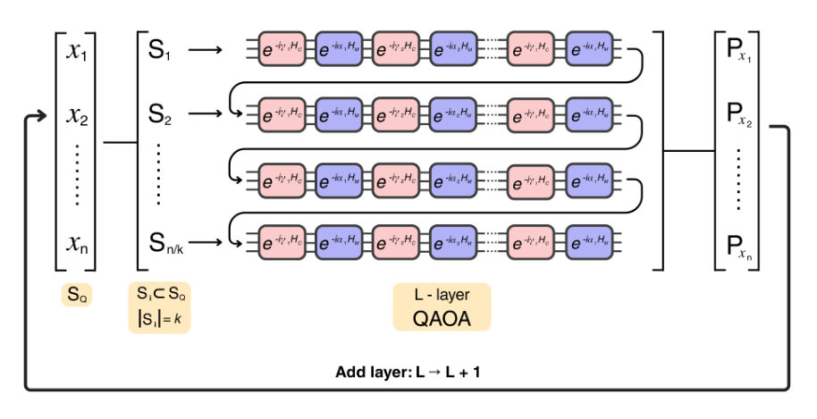 
Figure 3: General overview of the HADOF framework. Here, we use QAOA as the optimiser, which is called iteratively. (1) We choose subsets of sizes 5 from the binary variables of the global problem. (2) These are used to form the sub-Hamiltonians using P(xi), approximated as the expected value of each qubit. (3) The QAOA circuit set up with t = 1 layers and in every iteration we add a layer. In this study, we use 5 layers. (4) Once the n/k sub-Hamiltonians are optimised, we sample them and use an aggregation policy to form the global solution probability distribution. This can be done sequentially or in parallel.

📷 Fig 4

 
Figure 4: Simulating quantum circuit dynamics is hard classically, however with HADOF, problems up to size 500 variables are simulated in a comparable time to classical Simulated Annealing. Time advantage can be observed in HADOF simulation when running in parallel.

📷 Fig 5

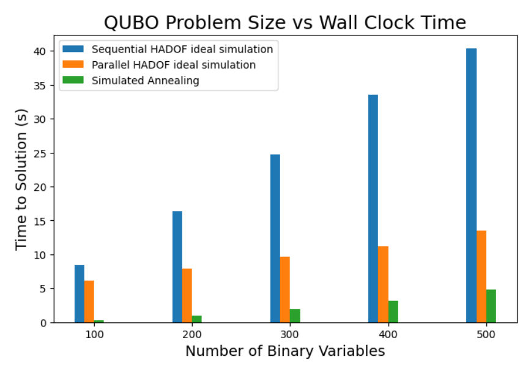 
Fig. 4 and Fig. 5 show the wall clock time to solution for the different algorithms. In the ideal simulation setting (Fig. 4), both sequential and parallel HADOF exhibit approximately linear scaling with respect to the number of binary variables. However, the parallel implementation consistently achieves lower wall clock times, with the performance gap widening as the problem size increases. For instance, at 500 variables, parallel HADOF achieves roughly a 3× speedup over the sequential variant. This indicates that parallelisation not only reduces constant overheads but also improves the effective scaling coefficient, suggesting strong suitability for large-scale QUBO instances. In...

**Summary.** This paper introduces a parallelized version of the HADOF framework to solve large-scale combinatorial optimization problems by decomposing them into smaller sub-problems. By utilizing multiple quantum processors simultaneously, the authors demonstrate significant reductions in computation time without sacrificing solution quality. This work provides a practical pathway toward High Performance Quantum (HPQ) computing for real-world applications like genomics.

**Why it may be interesting.** not directly relevant

Detailed structure

**Main problem.** The scalability of quantum optimization algorithms like QAOA is limited by the low qubit counts, noise, and connectivity of NISQ-era hardware, making large-scale combinatorial problems like genome assembly difficult to solve.

**Main result.** The parallelized HADOF framework achieves up to a 3-4x reduction in wall-clock time on real IBM QPUs and up to a 5x speedup in simulations, while maintaining competitive solution accuracy for genome assembly.

**Method.** The researchers extended the HADOF framework to enable parallel execution across single and multiple QPUs using asynchronous job orchestration and sub-Hamiltonian decomposition.

**Model / system.** The study uses Quadratic Unconstrained Binary Optimization (QUBO) models, specifically applied to genome assembly via overlap graphs, and benchmarks on IBM Quantum processors (e.g., IBM_Kingston) and classical PennyLane simulations.

**Key observables.** Wall-clock time (makespan), solution accuracy (relative to Simulated Annealing), and probability distribution of the sampled solutions.

**Important parameters / regimes.** Sub-Hamiltonian size (k=5), QAOA circuit depth (L=5), number of qubits (up to 500 in simulation, 10-50 on hardware), and number of QPUs used for parallelization.

**Assumptions / limitations.** The framework assumes that large problems can be effectively decomposed into smaller, independent sub-problems that can be recombined via expected values from previous iterations.

**Figures summary.** Figure 1 shows a standard QAOA circuit; Figure 2 illustrates the Trotterized QAOA parameter schedule; Figure 3 provides an overview of the HADOF framework; Figures 4-5 compare wall-clock time for sequential vs. parallel execution in ideal and noisy settings; Figure 6 shows solution accuracy; Figure 8-9 illustrate the genome assembly overlap graph and reconstructed sequence.

**Paper structure.** The paper introduces the scalability bottleneck, describes the HADOF decomposition framework, presents the new parallelization strategy, details the experimental setup on IBM hardware and simulations, validates the approach with a genome assembly case study, and discusses future directions for High Performance Quantum computing.

Abstract

Practical applicability of quantum optimisation on near term devices is constrained by limited qubit counts and hardware noise, which restricts the scalability of quantum optimisation algorithms for combinatorial problems. The simulation of large quantum circuits is also difficult and constrained by memory requirement. The Hamiltonian Auto Decomposition Optimisation Framework (HADOF) addresses this by decomposing large QUBOs into smaller subproblems that can be solved iteratively on quantum or classical backends. This allows the scalability of quantum QUBO algorithms beyond device limits, as well as their simulation on classical devices. In this research, we extend the evaluation of HADOF by benchmarking on real IBM QPUs across sequential, single-QPU parallel, and multi-QPU parallel execution modes, advancing toward High Performance Quantum (HPQ) computing for combinatorial optimisation problems.   Experimental results on IBM quantum hardware demonstrate up to 3-4x reduction in wall clock time when utilising four QPUs compared to sequential execution baseline, while maintaining comparable solution quality. Notably, even single QPU execution benefits from parallelised job orchestration and execution, yielding up to 3x speedup. Simulated results predict over 5x speed-up in parallel execution mode. We further validate the practical applicability of the approach on real world genome assembly instances, showing that both sequential and parallel HADOF variants achieve competitive accuracy while significantly improving time to solution. These results highlight the importance of parallelism at both the algorithmic and system levels, positioning HADOF as a viable pathway toward scalable quantum optimisation.

[↑ back to top](#top)

### [Unentangled stoquastic Merlin-Arthur proof systems: the power of unentanglement without destructive interference](http://arxiv.org/abs/2604.27886v1)

**Authors:** Yupan Liu, Pei Wu  
**Type:** theory · **Category:** quantum information and computing · **PDF:** <https://arxiv.org/pdf/2604.27886v1>  
**Analysis basis:** full PDF text, analyzed in chunks
**Topic relevance:** `entanglement & information structure` **2/5**

📷 Fig 1

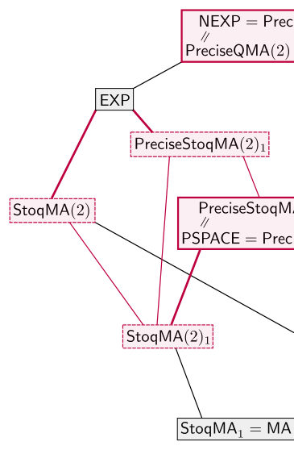 
Figure 1: Relationships among StoqMA(2), its variants, and other complexity classes.

📷 Fig 2

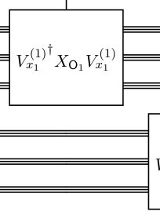 
Figure 3: Conjunction of stoquastic verifiers V (1) x1 , V (2) x2 , and V (3) x3 .

**Summary.** This paper explores the complexity of quantum proof systems where the witnesses are unentangled but the system is stoquastic (sign-problem-free). It reveals that unentanglement can provide significant computational power even without the destructive interference typically found in general quantum systems.

**Why it may be interesting.** not directly relevant

Detailed structure

**Main problem.** The paper investigates the computational complexity and structural properties of StoqMA(2), a complexity class defined by unentangled (separable) quantum proofs in sign-problem-free (stoquastic) systems.

**Main result.** The authors establish that StoqMA(2) is surprisingly powerful, containing NP and being contained in EXP, and show that for negligible completeness error, StoqMA(k) collapses to StoqMA(2).

**Method.** The study employs distribution testing techniques to derive lower bounds, a new rectangular closure testing framework for upper bounds, and the Sum-of-Squares (SoS) algorithm for complexity limits.

**Model / system.** The model focuses on stoquastic Hamiltonians, which are characterized by real, non-positive off-diagonal matrix elements, and unentangled witness states across multiple registers.

**Key observables.** Acceptance probabilities of the verifier, completeness and soundness errors, and the presence of destructive interference (or lack thereof).

**Important parameters / regimes.** Completeness and soundness error regimes, number of provers (k), witness length (qubit scale), and the promise gap.

**Assumptions / limitations.** The analysis assumes the absence of destructive interference (stoquasticity) and relies on the Exponential Time Hypothesis (ETH) for establishing the optimality of certain algorithms.

**Figures summary.** A summary diagram illustrating the relationships and new inclusions between various complexity classes like NP, MA, QMA(2), and StoqMA(2).

**Paper structure.** The paper introduces the StoqMA(2) class, establishes lower bounds via distribution testing, provides upper bounds using SoS and rectangular closure testing, and concludes with structural results regarding error reduction and prover collapse.

Abstract

Stoquasticity, originating in sign-problem-free physical systems, gives rise to $\sf StoqMA$, introduced by Bravyi, Bessen, and Terhal (2006), a quantum-inspired intermediate class between $\sf MA$ and $\sf AM$. Unentanglement similarly gives rise to ${\sf QMA}(2)$, introduced by Kobayashi, Matsumoto, and Yamakami (CJTCS 2009), which generalizes $\sf QMA$ to two unentangled proofs and still has only the trivial $\sf NEXP$ upper bound. In this work, we initiate a systematic study of the power of unentanglement without destructive interference via ${\sf StoqMA}(2)$, the class of unentangled stoquastic Merlin-Arthur proof systems. Although $\sf StoqMA$ is semi-quantum and may collapse to $\sf MA$, ${\sf StoqMA}(2)$ turns out to be surprisingly powerful. We establish the following results:   - ${\sf NP} \subseteq {\sf StoqMA}(2)$ with $\widetilde{O}(\sqrt{n})$-qubit proofs and completeness error $2^{-{\rm polylog}(n)}$. Conversely, ${\sf StoqMA}(2) \subseteq {\sf EXP}$ via the Sum-of-Squares algorithm of Barak, Kelner, and Steurer (STOC 2014); with our lower bound, our refined analysis yields the optimality of this algorithm under ETH.   - ${\sf StoqMA}(2)_1 \subseteq {\sf PSPACE}$, and the containment holds with completeness error $2^{-2^{{\rm poly}(n)}}$.   - ${\sf PreciseStoqMA}(2)$, a variant of ${\sf StoqMA}(2)$ with exponentially small promise gap, cannot achieve perfect completeness unless ${\sf EXP}={\sf NEXP}$. In contrast, ${\sf PreciseStoqMA}$ achieves perfect completeness, since ${\sf PSPACE} \subseteq {\sf PreciseStoqMA}_1$.   - When the completeness error is negligible, ${\sf StoqMA}(k) = {\sf StoqMA}(2)$ for $k\geq 2$.   Our lower bounds are obtained by stoquastizing the short-proof ${\sf QMA}(2)$ protocols via distribution testing techniques. Our upper bounds for the nearly perfect completeness case are proved via our new rectangular closure testing framework.

[↑ back to top](#top)

### [Explicit Quantum Search Algorithm for the Densest k-Subgraph Problem](http://arxiv.org/abs/2604.27782v1)

**Authors:** Yu. A. Biriukov, R. D. Morozov, I. V. Dyakonov, S. S. Straupe  
**Type:** theory · **Category:** quantum information and computing · **PDF:** <https://arxiv.org/pdf/2604.27782v1>  
**Analysis basis:** full PDF text, analyzed in chunks
**Topic relevance:** `Dicke superradiance` **1/5**

📷 Fig 1

 
FIG. 1: General scheme of a single Grover-based search call at threshold mi.

📷 Fig 2

 
FIG. 2: Gate scheme for oracle.

📷 Fig 3

 
FIG. 3: Diffusion operator

📷 Fig 4

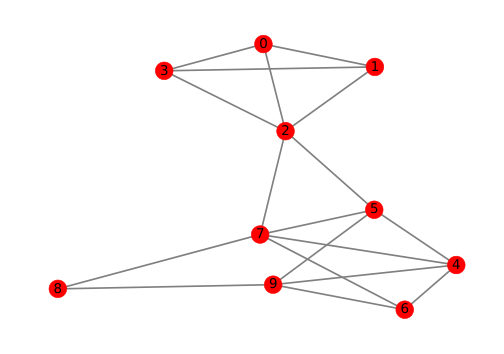 
FIG. 4: Benchmark graph with n = 10 vertices used in the convergence experiments.

📷 Fig 5

 
FIG. 5: Convergence of the best-so-far edge count for the four algorithms on the benchmark graph from Fig. 4. From left to right: k = 4, 5, 6. Solid lines show the mean over 1000 independent runs, and shaded regions indicate empirical 90% confidence intervals.

**Summary.** This paper presents a new quantum algorithm for the NP-hard densest k-subgraph problem using Grover's search. By utilizing Dicke states and a QFT-based oracle, the method avoids the complexities of QUBO penalty terms and provides a provable quadratic speedup over classical brute-force methods.

**Why it may be interesting.** not directly relevant

Detailed structure

**Main problem.** Finding the densest k-vertex subgraph in an undirected graph, which is an NP-hard combinatorial optimization problem.

**Main result.** The authors propose an explicit gate-based Grover-based quantum search algorithm that achieves a provable quadratic speedup over classical brute-force search.

**Method.** The approach uses Dicke state preparation to represent the search space, a QFT-based oracle for edge counting, and an iterative thresholding strategy using the Durr-Hoyer modification.

**Model / system.** The computational model is a circuit-model quantum computer utilizing Dicke states |D^n_k> and Quantum Fourier Transform (QFT) based arithmetic for edge counting.

**Key observables.** Oracle calls required to find the densest subgraph and the scaling exponent of the oracle cost relative to the search space size.

**Important parameters / regimes.** Number of vertices (n), subgraph size (k), edge density (0.5 for Erdős-Rényi graphs), and the initial threshold (m0).

**Assumptions / limitations.** The algorithm assumes the availability of efficient Dicke state preparation and a gate-based architecture capable of performing QFT-based arithmetic.

**Figures summary.** Figure 1 shows the Grover search iteration scheme; Figure 2 details the QFT-based oracle gate scheme; Figure 5 shows convergence of edge counts; Figure 6 and 7 demonstrate the power-law scaling and quadratic speedup compared to classical baselines.

**Paper structure.** The paper defines the DkS problem, reviews existing QUBO/annealing methods, introduces the new Grover-based architecture (Dicke states, QFT oracle, and diffusion operator), details the iterative thresholding process, and concludes with numerical scaling analysis and comparisons to classical heuristics.

Abstract

This paper addresses the problem of finding the densest $k$-vertex subgraph in an arbitrary graph. This problem is NP-hard and has important applications in social network analysis, fraud detection, recommendation systems, and bioinformatics. We propose two quantum approaches to solve this problem: reduction to Quadratic Unconstrained Binary Optimization (QUBO) and using Grover's quantum search algorithm. For the latter approach, we present an explicit gate-based oracle circuit utilizing Dicke states and Quantum Fourier Transform for edge counting. Numerical simulations demonstrate a quadratic speedup over classical Brute-force search.

[↑ back to top](#top)

### [Magnetic Quantum Criticality inside the Superconducting State Revealed by Penetration Depth Scaling with Local $T_{\mathrm c}$](http://arxiv.org/abs/2604.27507v1)

**Authors:** Yusuke Iguchi, Kaede Inoh, Ryosuke Koizumi, Makoto Yokoyama  
**Type:** experiment · **Category:** strongly correlated electrons · **PDF:** <https://arxiv.org/pdf/2604.27507v1>  
**Analysis basis:** full PDF text, analyzed in chunks
**Topic relevance:** `Kondo & dissipative impurity` **1/5**

📷 Fig 1

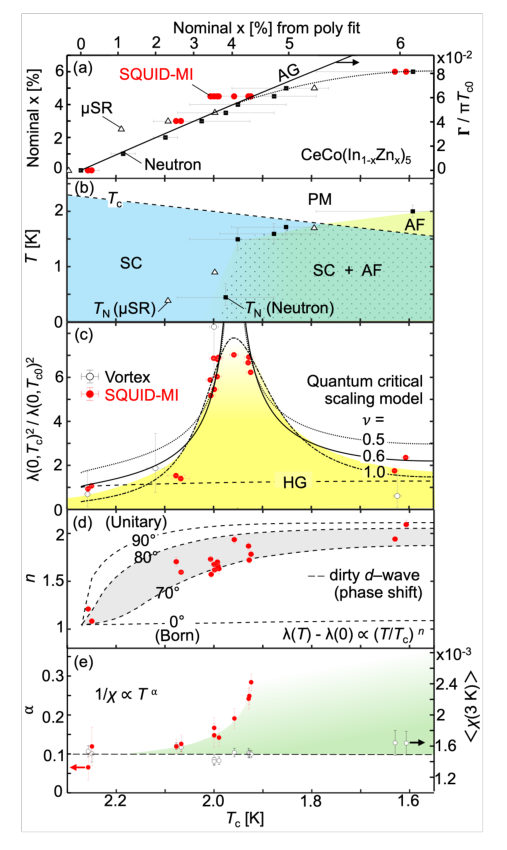 
FIG. 1. Antiferromagnetic quantum criticality in the dirty d-wave superconductor CeCo(In1−xZnx)5 . (a) Nominal x is rescaled to Γ/πTc0, where Γ is the effective impurity scat- tering strength and Tc0=2.27 K for pristine CeCoIn5. Tc fol- lows Abrikosov–Gor’kov (AG) theory [22] in the supercon- ducting (SC) region and deviates in the coexisting SC and AF region. Tc data are taken from Refs. [8, 15]. The top axis indicates the nominal x inferred from the polynomial fit (dashed line), and is shown as a visual guide for panels (b)–(e). (b) Phase diagram as a function of Tc, showing Tc and N´eel temperature TN from Refs. [8, 15]. (c) λ(0) com- pared with a quantum critical scaling model [6] and a...

📷 Fig 2

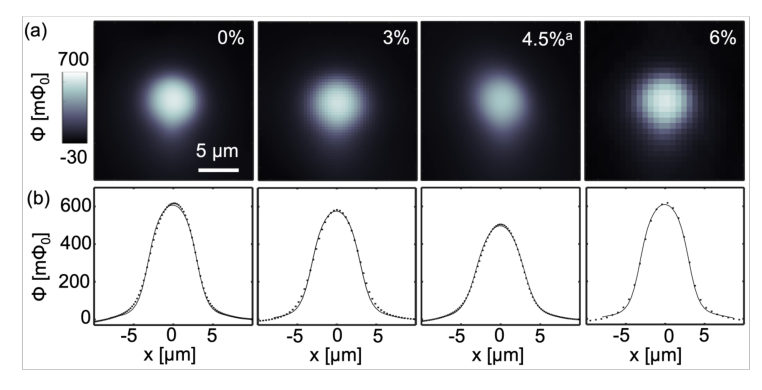 
FIG. 2. Scanning SQUID magnetometry over an isolated vortex visualizes the enhancement of the penetration depth λ near AF-QCP of CeCo(In1−xZnx)5 . (a) Magnetic flux scan over an isolated vortex around 60 mK. (b) The horizontal cross-section of (a) fits the monopole model with the fitting parameter λ. The smallest peak height at x = 0.045a indicates the enhancement of λ near AF-QCP.

📷 Fig 3

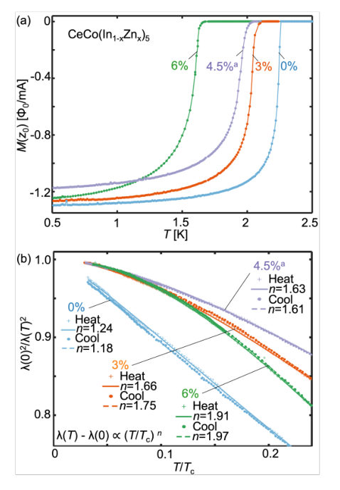 
FIG. 3. Scanning SQUID Susceptometry at low tem- peratures in CeCo(In1−xZnx)5 reveals an enhancement of λ(0) toward AF-QCP and an increase in the low-temperature exponent n with Zn doping. (a) The temperature de- pendence of M(z = z0) at several locations of x = 0B, 0.03B, 0.045aD, 0.06B (see Fig. S6 for additional loca- tions; local Tc values for each location are listed in supple- mental Table I). The SQUID sensor just touches the sample surface at z0. (b) Superfluid density λ(0)2/λ(T)2 at low tem- peratures. The data are analyzed using the power-law form λ(T) −λ(0) = (T/Tc)n. The solid and dashed lines are fits to the heating and cooling data, respectively. The uncertainty in n is...

**Summary.** This study uses scanning SQUID microscopy to reveal a magnetic quantum critical point hidden within the superconducting state of Zn-doped CeCoIn5. By using local transition temperature as a tuning parameter, the authors demonstrate that the quantum critical behavior is modified by disorder, evidenced by a peak in the magnetic penetration depth and an increased critical exponent.

**Why it may be interesting.** not directly relevant

Detailed structure

**Main problem.** Determining the microscopic origin of the antiferromagnetic quantum critical point (AF-QCP) embedded within the superconducting state of Zn-doped CeCoIn5 and distinguishing intrinsic critical behavior from disorder-induced broadening.

**Main result.** The researchers identified a pronounced peak in the magnetic penetration depth at zero temperature near the AF-QCP and found that the extracted critical exponent exceeds the clean spin-density-wave value, suggesting a disorder-modified quantum critical regime.

**Method.** Scanning SQUID microscopy was used to perform local magnetometry and susceptometry, allowing for the extraction of local Tc and penetration depth by parameterizing data with local Tc rather than nominal doping.

**Model / system.** The physical system is the heavy-fermion superconductor CeCo(In1-xZnx)5 in the low-doping regime, where Zn substitution induces antiferromagnetic order and competes with superconductivity.

**Key observables.** Magnetic penetration depth lambda(0), local superconducting transition temperature Tc, Néel temperature TN, and magnetic susceptibility chi.

**Important parameters / regimes.** Critical exponent nu, impurity scattering strength Gamma, and the temperature dependence of paramagnetic susceptibility alpha.

**Assumptions / limitations.** The analysis assumes that using local Tc as a tuning parameter can circumvent the ambiguity of doping inhomogeneity, and certain data points were excluded due to extreme microscopic inhomogeneity.

**Figures summary.** Figure 1 shows phase diagrams of Tc versus effective impurity scattering, the relationship between Tc and TN, and a comparison of penetration depth data against quantum critical scaling models.

**Paper structure.** The paper introduces the problem of magnetism in doped CeCoIn5, describes the scanning SQUID experimental setup, presents the local Tc and penetration depth measurements, performs scaling analysis to extract critical exponents, and concludes with the implications for disorder-modified quantum criticality.

Abstract

We demonstrate a magnetic quantum critical point embedded within the superconducting state of Zn-doped CeCoIn$_5$, revealed by a pronounced peak in the magnetic penetration depth at zero temperature $λ(0)$. Using scanning SQUID microscopy, we determine the local superconducting transition temperature $T_{\mathrm c}$ and $λ(0)$. By parameterizing $λ(0)$ in terms of the local $T_{\mathrm c}$ rather than nominal Zn substitution, we circumvent the ambiguity caused by doping inhomogeneity and enable a more precise extraction of the critical exponent. The extracted exponent exceeds the clean spin-density-wave value, indicating a disorder-modified quantum critical regime. The enhancement of $λ(0)$ reflects the suppression of the superfluid stiffness and is consistent with critical scaling. Our approach provides a route to uncover intrinsic quantum critical behavior hidden by inhomogeneity in unconventional superconductors.

[↑ back to top](#top)

## Other papers (24)

*Papers from primary archives without highlighted authors or any topic match. Click to expand.*

Show other papers

### [Beyond Project-Based Learning: Conference-Style Writing as Authentic Assessment in Interdisciplinary Quantum Engineering Education](http://arxiv.org/abs/2604.27110v1)

**Authors:** Nischal Binod Gautam, Enrique P. Blair  
**Type:** theory · **Category:** other · **PDF:** <https://arxiv.org/pdf/2604.27110v1>  
**Analysis basis:** full PDF text, analyzed in chunks

📷 Fig 1

 
Fig. 1: The semester-long project timeline shows how topic selection, literature review, midpoint feedback, implementation or simulation, and presentation progressively culminate in a conference-style paper as an integrated final synthesis rather than an isolated end-of-course assignment.

📷 Fig 2

 
Fig. 2: The venn diagram illustrates the complementary roles of project work, conference-style writing, and oral presentation in the course, where their overlap represents the integrated development of technical understanding, scholarly communi- cation, and authentic research practice resulting in a rehearsed scholar.

**Summary.** This paper investigates replacing traditional project reports with conference-style manuscripts in quantum engineering courses. It finds that while this increases student workload, it significantly enhances their ability to communicate complex quantum concepts and prepares them for professional research environments.

**Why it may be interesting.** not directly relevant

Detailed structure

**Main problem.** Evaluating whether a conference-style writing requirement serves as an effective 'authentic assessment' tool to develop professional research and communication skills in interdisciplinary quantum engineering education.

**Main result.** Students found the conference-style paper demanding but highly beneficial for developing scientific communication, research readiness, and technical confidence, suggesting the model should be retained with improved scaffolding.

**Method.** An exploratory, classroom-based study using post-course surveys (Likert-scale and open-ended) from a pilot run of a graduate-level quantum mechanics for engineers course.

**Model / system.** The study focuses on a pedagogical framework within an introductory quantum mechanics course for engineers, integrating physics, mathematics, computing, and electronics.

**Key observables.** Student perceptions of conceptual understanding, scientific communication skills, research readiness, engagement, and workload.

**Assumptions / limitations.** The study assumes the primary goal of the course is to prepare students for authentic disciplinary research practice and relies on student self-reporting.

**Figures summary.** Figure 1 shows a semester-long timeline of project progression; Figure 2 is a Venn diagram illustrating the overlap between project work, writing, and oral presentation.

**Paper structure.** The paper introduces the problem of authentic assessment in PBL, reviews existing literature on PBL artifacts, describes the instructional design and survey methodology, presents results regarding student skill gains and workload, and concludes with recommendations for pedagogical scaffolding.

Abstract

Project-based learning is recognized as an effective approach for improving engagement and applied understanding in STEM education. In quantum engineering courses, however, the question is no longer only whether students benefit from projects but how those projects should culminate if the goal is authentic disciplinary preparation. This paper examines the educational role of a conference-style paper requirement embedded within a project-based learning implementation for an introductory quantum mechanics course for engineers. We use post-course survey responses from students in a pilot run of the course. We evaluate perceived effects on conceptual understanding, scientific communication, research readiness, and attitudes toward the writing requirement itself. The results suggest that students viewed the project as beneficial for engagement, confidence, and technical skill development, while the conference-style paper emerged as a demanding but meaningful component of the experience. We argue that once PBL has been established in quantum mechanics education, conference-style writing can serve as an extension of that model, especially for graduate students. The findings support retaining the conference-paper requirement with improved scaffolding.

[↑ back to top](#top)

### [Chern number reversal and emergent superconductivity in rhombohedral graphene induced by in-plane magnetic fields](http://arxiv.org/abs/2604.27788v1)

**Authors:** Xiaozhou Zan, Hangzhe Li, Jiawei Guo, Gengdong Zhou, Kangyao Chen, Cihan Gao, Zijun Xu, Kenji Watanabe, Takashi Taniguchi, Anqi Wang, Jie Shen, Jinsong Zhang, Zhida Song, Yayu Wang  
**Type:** experiment · **Category:** strongly correlated electrons · **PDF:** <https://arxiv.org/pdf/2604.27788v1>  
**Analysis basis:** abstract only; PDF text extraction failed or PDF unavailable

**Summary.** This paper explores the emergence of topological and superconducting phases in eight-layer rhombohedral graphene. It demonstrates that in-plane magnetic fields can reverse the Chern number and induce new superconducting phases, providing evidence for spin-triplet pairing. The findings highlight the system's potential as a tunable platform for novel quantum electronic devices.

**Why it may be interesting.** not directly relevant

Detailed structure

**Main problem.** Investigating the interplay between topological states and unconventional superconductivity in eight-layer rhombohedral graphene under in-plane magnetic fields.

**Main result.** The study observes Chern number reversal in the QAH state and identifies three distinct superconducting phases with varying responses to in-plane magnetic fields, including a field-induced phase suggesting spin-triplet pairing.

**Method.** Transport measurements on hBN-aligned eight-layer rhombohedral graphene moire superlattices using displacement fields and in-plane magnetic fields as control parameters.

**Model / system.** Eight-layer rhombohedral graphene moire superlattices aligned with hexagonal boron nitride (hBN), characterized by topological flat bands.

**Key observables.** Chern number, superconducting phase transitions, and response to in-plane magnetic fields and displacement fields.

**Important parameters / regimes.** Electron-doped and hole-doped carrier densities, displacement fields, and in-plane magnetic field strength.

**Paper structure.** The paper introduces the rhombohedral graphene platform, details the observation of Chern number reversal in the QAH regime, analyzes the three distinct superconducting phases under in-plane magnetic fields, and concludes with the implications for spin-triplet pairing and device engineering.

Abstract

Rhombohedral graphene with topological flat bands offers an ideal platform for realizing correlated and topological quantum phases. Here we investigate hBN aligned eight-layer rhombohedral graphene moire superlattices, which host a robust quantum anomalous Hall (QAH) state alongside three unconventional superconducting phases. For electron-doped carriers away from the moire potential, we observe QAH Chern number reversal driven by the displacement fields and in plane magnetic fields. For hole-doped carriers near the moire superlattice, the three superconducting phases exhibit distinctively different in plane magnetic field responses: one is weakly enhanced, the second is strongly suppressed, and the third exclusively induced by in plane magnetic field. The isotropic in plane magnetic field response in the QAH regime points to interplay between orbital magnetism and spin-orbit coupling, and the field-emergent superconductivity provides compelling evidence for spin-triplet pairing. Our work demonstrates a highly versatile platform for coexisting topological and superconducting states, and highlights in plane magnetic field as a powerful in-situ control knob for engineering novel quantum devices.

[↑ back to top](#top)

### [Clifft: Fast Exact Simulation of Near-Clifford Quantum Circuits](http://arxiv.org/abs/2604.27058v1)

**Authors:** Bradley A. Chase, Farrokh Labib  
**Type:** theory · **Category:** numerical methods · **PDF:** <https://arxiv.org/pdf/2604.27058v1>  
**Analysis basis:** full PDF text, analyzed in chunks

📷 Fig 1

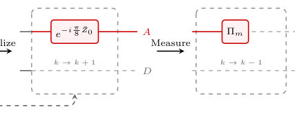 
Figure 1: Lifecycle of an active operation in the frame-factored representation. Physical Clifford gates are absorbed into the offline Clifford frame UC, while a non-Clifford operation is Heisenberg mapped into a virtual Pauli rotation. Pauli localization uses virtual Clifford transformations to reduce the mapped multi-qubit Pauli string to a single virtual axis. The resulting localized operation either updates the active state vector or promotes a dormant virtual qubit into the active set, increasing k. Later projective measurements can collapse an active axis and return it to the dormant set, decreasing k. Stochastic Pauli noise and feed-forward corrections update only the virtual Pauli...

📷 Fig 2

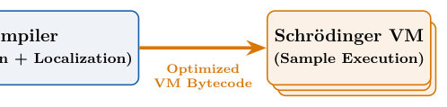 
Figure 2: The high-level Clifft execution pipeline. The compiler resolves Clifford-coordinate evolution, HIR optimization, Pauli localization, and active-space planning once. The SVM then samples the compiled bytecode many times over the frame-factored runtime state.

📷 Fig 3

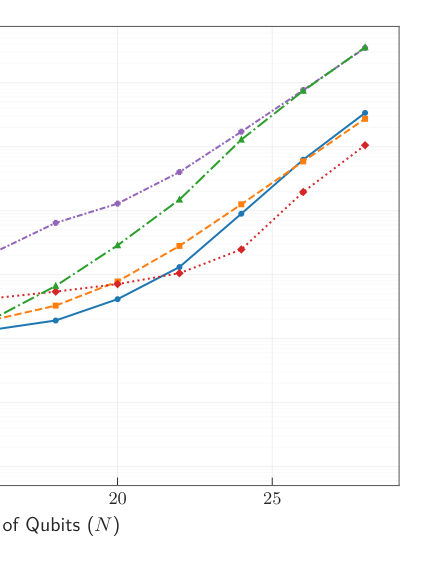 
Figure 5: Single-shot execution time vs. qubit count N for random Quantum Volume circuits at depth D = N, run on a 16-core CPU. This dense-limit benchmark corresponds to the worst case kmax = N, where Clifft no longer benefits from near-Clifford structure. Even in this regime, Clifft tracks the leading dense state vector simulators within a small constant factor up to N = 28; its near-Clifford speedups are shown separately in Table 1.

📷 Fig 4

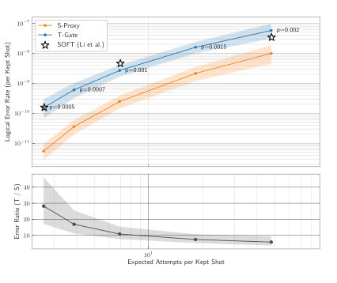 
Figure 6: Inject + cultivate stage: T-gate vs S-proxy logical error rate per kept shot, estimated using stratified importance sampling across uniform circuit-level depolarizing noise. Shaded regions in the top panels show absolute error-rate values within a factor of 1000 in likelihood relative to the maximum-likelihood estimate, following the convention used by Sinter for rare-event visualization. Shaded regions in the bottom panels show 95% Bayesian credible intervals for the T/S ratio, computed as described in Appendix D. For d = 5, we also show the SOFT results from Table III in Li et al. [33] for comparison.

📷 Fig 5

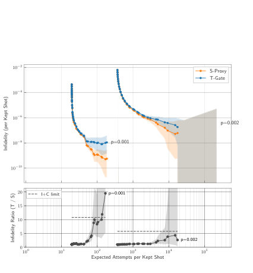 
Figure 7: End-to-end magic state cultivation including the escape stage to a d = 15 surface code. Top panels: conservative infidelity estimate per kept shot after decoder correction for the true T-gate circuit (Clifft) and the S-proxy baseline (Gidney et al. [9]). Bottom panels: T/S infidelity ratio with 95% Bayesian credible intervals; the dashed line marks the inject and cultivation stage ratio from Section 4.2.1 as a reference. Note that the credible intervals for d = 5 cultivation extend beyond the plotted range due to low rare-event statistics.

**Summary.** The authors present Clifft, an open-source simulator that accelerates the exact simulation of near-Clifford circuits by focusing computational effort on a small, dynamic active subspace. This allows for the first large-scale, end-to-end simulation of complex error correction protocols like magic state cultivation. The work provides new insights into the error discrepancies between true T-gates and their S-gate approximations.

**Why it may be interesting.** not directly relevant

Detailed structure

**Main problem.** Exact classical simulation of fault-tolerant quantum circuits is bottlenecked by exponential scaling with total qubit count, T-count, or per-shot tracking overhead.

**Main result.** The Clifft simulator achieves orders-of-magnitude throughput gains in the near-Clifford regime by scaling complexity with a dynamic active dimension rather than total qubit count, enabling the first end-to-end simulation of large-scale magic state cultivation.

**Method.** A frame-factored representation that decouples the quantum state into an offline Clifford frame, an online Pauli frame, and a dynamically sized active state vector using Pauli localization.

**Model / system.** Near-Clifford quantum circuits, specifically focusing on fault-tolerant protocols like Magic State Cultivation (MSC) and surface/color codes subject to circuit-level depolarizing or coherent noise.

**Key observables.** Logical error rates, T/S ratio (discrepancy between T-gate and S-proxy), and logical Pauli expectation values (e.g., <YL>).

**Important parameters / regimes.** Total qubit count (N), peak active virtual dimension (k_max), error probability (p), and decoder-gap threshold.

**Assumptions / limitations.** The efficiency is highly dependent on the active subspace size remaining small; the method is optimized for the low-magic/near-Clifford regime.

**Figures summary.** Figure 1 shows the lifecycle of an active operation; Figure 2 details the Clifft pipeline; Figure 4 illustrates bytecode optimization; Figure 6 and 7 show T/S ratio discrepancies and end-to-end error rates as a function of decoder thresholds.

**Paper structure.** The paper introduces the simulation bottleneck, presents the Clifft architecture (compiler, HIR, and SVM), provides mathematical proofs for Pauli localization and frame-factored stability, benchmarks performance against existing tools (Stim, Tsim, SOFT), and applies the simulator to analyze magic state cultivation protocols.

Abstract

Exact classical simulation of fault-tolerant quantum circuits remains limited by a tradeoff between exponential state vector scaling, exponential $T$-count scaling in stabilizer-rank approaches, and per-shot tracking overhead in sparse generalized stabilizer simulators. In this work, we introduce Clifft, an open-source simulator that shifts the dominant exponential cost from the total qubit count to a dynamic active subspace by factoring the quantum state into an offline Clifford frame, an online Pauli frame, and a dynamically sized active state vector. This architecture resolves deterministic Clifford coordinate transformations ahead of time, generalizing Stim's compile-once, sample-many execution model to circuits with non-Clifford operations. Consequently, exponential simulation costs are determined by the peak active virtual dimension, which expands during non-Clifford operations and contracts during measurements. Clifft remains within a constant factor of standard tools in the pure-Clifford and non-Clifford limits, while delivering up to orders-of-magnitude throughput gains over GPU-accelerated near-Clifford simulators on low-magic fault-tolerant benchmarks. Executing on commodity CPUs and exposing a Stim-like API, Clifft enables, to our knowledge, the first exact end-to-end simulation of magic state cultivation including the escape stage, over hundreds of billions of shots. These simulations show that escape-stage failures suppress the discrepancy between the true $T$-gate circuit and its $S$-proxy at low decoder-gap thresholds, while at high thresholds the full-protocol behavior approaches the larger discrepancy observed in the cultivation stages alone.

[↑ back to top](#top)

### [Defending Quantum Classifiers against Adversarial Perturbations through Quantum Autoencoders](http://arxiv.org/abs/2604.28176v1)

**Authors:** Emma Andrews, Sahan Sanjaya, Prabhat Mishra  
**Type:** theory · **Category:** quantum information and computing · **PDF:** <https://arxiv.org/pdf/2604.28176v1>  
**Analysis basis:** full PDF text, analyzed in chunks

📷 Fig 1

 
Fig. 3: Classical autoencoder structure.

📷 Fig 2

 
Fig. 4: Quantum autoencoder structure.

📷 Fig 3

 
Fig. 2: General structure of QML models.

📷 Fig 4

 
Fig. 5: Example of FGSM ϵ = 0.30 attack on MNIST images. The original MNIST images are shown in the top row, while the adversarial images are in the bottom row.

📷 Fig 5

 
Fig. 6: An overview of our defense framework. A sample, either clean or adversarial, is given as input x to the QAE. The QAE produces a reconstruction ˆx which is given to the VQC for classification. The QAE also produces the encoding fidelity ⟨σZ⟩x, which is used in calculation of the confidence metric. Once the VQC has predicted the reconstruction ˆx, it produces the logit difference lˆx which is used in addition to the encoding fidelity ⟨σZ⟩x to calculate the confidence metric C. This is compared against the confidence threshold T. If the calculated confidence metric C meets the confidence threshold T, the predicted class label from the VQC is used. Otherwise, the sample is rejected as a...

**Summary.** This paper proposes a new way to protect quantum machine learning models from adversarial noise without needing to retrain them on attack samples. By using a quantum autoencoder to clean the data and a diagnostic metric to reject suspicious inputs, the authors demonstrate much higher robustness in quantum classifiers.

**Why it may be interesting.** not directly relevant

Detailed structure

**Main problem.** Variational Quantum Classifiers (VQCs) are highly vulnerable to adversarial attacks like FGSM and PGD, where small perturbations cause incorrect predictions, and existing defenses like adversarial training are often impractical or prone to overfitting.

**Main result.** The proposed QAE++ framework, which uses a quantum autoencoder for purification and a confidence metric for sample rejection, significantly outperforms classical autoencoder defenses and achieves up to a 68% improvement in prediction accuracy under attack.

**Method.** An adversarial training-free defense framework that utilizes a Quantum Autoencoder (QAE) to reconstruct and purify input samples, combined with a confidence metric based on encoding fidelity and logit difference to identify and reject adversarial inputs.

**Model / system.** The study uses Variational Quantum Classifiers (VQCs) with amplitude embedding and strongly entangling layers, alongside Quantum Autoencoders (QAEs) designed to compress input states into a latent space.

**Key observables.** Encoding fidelity (measured via SWAP test), logit difference (difference between the two highest logits), and expectation values of the Pauli-Z operator.

**Important parameters / regimes.** Epsilon (perturbation magnitude), alpha (PGD step size), threshold T (for sample acceptance/rejection), and the number of qubits/parameters in the VQC.

**Assumptions / limitations.** The decoder is assumed to be the Hermitian conjugate of the encoder, and the trash qubits are assumed to converge to a specific reference state.

**Figures summary.** Figures illustrate adversarial attacks on MNIST, the architectures of VQCs and Autoencoders (both classical and quantum), the QAE++ algorithm flow, and comparative performance plots showing accuracy gains and reconstruction stability.

**Paper structure.** The paper introduces the problem of adversarial vulnerability, describes the QAE++ architecture and confidence metric, details the experimental setup using MNIST/FMNIST, presents comparative results against classical and undefended models, and discusses limitations.

Abstract

Machine learning models can learn from data samples to carry out various tasks efficiently. When data samples are adversarially manipulated, such as by insertion of carefully crafted noise, it can cause the model to make mistakes. Quantum machine learning models are also vulnerable to such adversarial attacks, especially in image classification using variational quantum classifiers. While there are promising defenses against these adversarial perturbations, such as training with adversarial samples, they face practical limitations. For example, they are not applicable in scenarios where training with adversarial samples is either not possible or can overfit the models on one type of attack. In this paper, we propose an adversarial training-free defense framework that utilizes a quantum autoencoder to purify the adversarial samples through reconstruction. Moreover, our defense framework provides a confidence metric to identify potentially adversarial samples that cannot be purified the quantum autoencoder. Extensive evaluation demonstrates that our defense framework can significantly outperform state-of-the-art in prediction accuracy (up to 68%) under adversarial attacks.

[↑ back to top](#top)

### [Dimensionality-Driven Electronic and Orbital Transitions Mediating Interfacial Magnetism in LaNiO3/CaMnO3 Observed In Situ](http://arxiv.org/abs/2604.28054v1)

**Authors:** B-A. Courchene, A. Hampel, S. Beck, J. R. Paudel, J. D. Grassi, L. A. Lapinski, A. M. Derrico, M. Terilli, M. Kareev, C. Klewe, A. Gloskovskii, C. Schlueter, S. K. Chaluvadi, F. Mazzola, I. Vobornik, P. Orgiani, J. Chakhalian, A. J. Millis, A. X. Gray  
**Type:** both · **Category:** strongly correlated electrons · **PDF:** <https://arxiv.org/pdf/2604.28054v1>  
**Analysis basis:** abstract only; PDF text extraction failed or PDF unavailable

**Summary.** This paper demonstrates that the magnetic properties of LaNiO3/CaMnO3 interfaces are controlled by the thickness of the LaNiO3 layer. As the layer becomes thinner, a metal-insulator transition and orbital reconstruction occur, which suppresses the interfacial magnetism. This reveals a tunable coupling between electronic, orbital, and magnetic degrees of freedom in oxide heterostructures.

**Why it may be interesting.** not directly relevant

Detailed structure

**Main problem.** Investigating how dimensional confinement and thickness reduction in LaNiO3/CaMnO3 superlattices drive electronic, orbital, and magnetic transitions at the interface.

**Main result.** Reducing LaNiO3 thickness triggers a metal-insulator transition and orbital-polarization crossover, which in turn weakens charge transfer and suppresses the interfacial Mn magnetic moment.

**Method.** The study combines in situ synthesis, polarization-dependent ARPES, X-ray magnetic circular dichroism (XMCD), and first-principles calculations using DFT combined with DMFT.

**Model / system.** LaNiO3/CaMnO3 oxide superlattices, specifically focusing on the thickness-dependent behavior of the LaNiO3 layers.

**Key observables.** Electronic coherence, orbital polarization, charge transfer across the interface, and the interfacial Mn magnetic moment.

**Important parameters / regimes.** LaNiO3 layer thickness (dimensional confinement), electronic-structure parameters, and orbital-polarization crossover.

**Assumptions / limitations.** The study assumes that the observed insulating state and orbital reconstruction can be accurately captured by DFT+DMFT calculations.

**Paper structure.** The paper presents an investigation of oxide heterostructures through in situ synthesis, followed by spectroscopic analysis (ARPES, XMCD) and theoretical validation via DFT+DMFT to establish the coupling between electronic, orbital, and magnetic degrees of freedom.

Abstract

Emergent magnetic states at oxide interfaces arise from the interplay of charge transfer, orbital reconstruction, and dimensional confinement, offering a route to engineered correlated-electron behavior in nanoscale spintronic materials. Here, we combine in situ synthesis, polarization-dependent angle-resolved photoelectron spectroscopy, X-ray magnetic circular dichroism, and first-principles electronic-structure calculations to investigate LaNiO3/CaMnO3 superlattices. We show that reducing the LaNiO3 thickness drives a metal-insulator transition accompanied by loss of electronic coherence and an orbital-polarization crossover in the ultrathin limit. These changes weaken charge transfer across the interface and suppress the interfacial Mn magnetic moment in CaMnO3, revealing that the emergent ferromagnetic state is directly governed by electronic confinement in LaNiO3. The insulating state and orbital reconstruction are reproduced by density functional theory combined with dynamical mean-field theory. Together, these results establish a direct and tunable coupling among electronic, orbital, and magnetic degrees of freedom in oxide heterostructures.

[↑ back to top](#top)

### [Discontinuous BBP transitions](http://arxiv.org/abs/2604.27992v1)

**Authors:** Dario Bocchi, Giulio Biroli, Chiara Cammarota, Federico Ricci-Tersenghi  
**Type:** theory · **Category:** disordered systems and neural networks · **PDF:** <https://arxiv.org/pdf/2604.27992v1>  
**Analysis basis:** full PDF text, analyzed in chunks

📷 Fig 1

 
FIG. 1: Continuous vs. Discontinuous BBP transitions. Each row shows (left to right) the inverse resolvent map z(g), the spectral density near the right edge, and the eigenvector overlap as a function of the spike strength. In the continuous case, z(g) develops a turning point (dz/dg = 0) at the edge, beyond which lies the incorrect branch, the density vanishes sub-linearly, and the overlap turns on smoothly. In the discontinuous case, z(g) reaches the edge without a turning point (dz/dg ̸= 0), the density vanishes super-linearly at the edge, and the overlap exhibits a finite jump at onset.

📷 Fig 2

 
FIG. 2: The origin of different tails of spectral densities in the Deformed GOE ensemble. The function z(x) is plotted against the auxiliary variable x = g −z/σ2 for different values of a and hmax. In the first line, the plot for a standard GOE (hmax = 0) is shown. Left column (a &lt; 2): The function z(x) always exhibits a turning point (z′(x) = 0) and the incorrect branch diverges at the domain boundary xc = −hmax/σ2, implying a standard square-root edge in all three cases. Right column (a &gt; 2): The derivative z′(x) is finite at the domain boundary, and depending on the values of hmax and σ can be positive (mid panel), leading again to a square-root edge, or negative (bottom panel), leading...

📷 Fig 3

 
FIG. 3: The origin of different tails of spectral densities in the Reweighted Wishart ensemble. The function z(g) is plotted for different values of a and the aspect ratio q = N/T. Left column (a &lt; 2): The branch with incorrect positive derivative z′(g), diverging at the domain boundary gmax = (qfmax)−1, ensures the existence of a turning point with z′(g) = 0 and consequently a standard square-root edge. Right column (a &gt; 2): The derivative z′(g) is finite at the domain boundary, and depending on the value of q can be positive (top panel), allowing for a turning point and a square-root edge, or negative (bottom panel), leading to a super-linear edge.

📷 Fig 4

 
FIG. 4: Finite-size scaling of the maximum eigenvalue. Upper panels are for the deformed GOE with parameters a = 3, hmax = 5, and σ2 = 2. Lower panels are for the reweighted Wishart ensemble with parameter a = 3, fmax = 1, and q = 5. In the left panels, we plot the difference between the mean value of largest eigenvalue λmax (averaged over 104 samples) and the theoretical edge λ+ computed in the large N limit, as a function of the distance from the critical point, α −αBBP. In the right panels, the same data is collapsed using the predicted scaling for both axes. The data collapse confirms that the fluctuations of the largest eigenvalue and the width of the critical region scale as N −1/a,...

📷 Fig 5

 
FIG. 5: Finite-size scaling of the overlap. Upper panels are for the deformed GOE with parameters a = 3, hmax = 5, and σ2 = 2. Lower panels are for the reweighted Wishart ensemble with parameter a = 3, fmax = 1, and q = 5. In the left panels, we plot the mean overlap between the principal eigenvector and the rank-one perturbation (i.e., the signal to be detected), as a function of the distance from the critical point, α −αBBP. In the right panels, the same data is collapsed using the predicted scaling. The universal curve distinguishes the signal-dominated regime (linear behavior on the right) from the noise-dominated regime (left tail proportional to |y|−a/2, see red dashed line in the...

**Summary.** This paper identifies a new class of discontinuous BBP transitions in random matrices where signal detection occurs via an abrupt jump in overlap. It reveals that finite-size effects can actually lower the detection threshold, allowing signals to be recovered even below the theoretical asymptotic limit.

**Why it may be interesting.** not directly relevant

Detailed structure

**Main problem.** The paper investigates the conditions under which the Baik-Ben Arous-Péché (BBP) transition, which governs the detection of low-rank structures in noisy data, becomes discontinuous rather than continuous.

**Main result.** The authors establish that a discontinuous BBP transition occurs when the eigenvalue density vanishes faster than linearly at the spectral edge (exponent a > 2), leading to an abrupt jump in eigenvector overlap and a finite-size 'pre-critical' region for signal recovery.

**Method.** The study employs the resolvent formalism, Stieltjes transform analysis, and free probability theory to analyze the spectral properties of large random matrices.

**Model / system.** The research focuses on spiked random matrix models, specifically deformed Gaussian Orthogonal Ensembles (GOE) with diagonal disorder and reweighted Wishart ensembles.

**Key observables.** Eigenvalue density, eigenvector overlap (correlation between the leading eigenvector and the signal), and the outlier eigenvalue position.

**Important parameters / regimes.** Spike strength (alpha), spectral edge power-law exponent (a), matrix size (N), and the ratio of dimensions (q).

**Assumptions / limitations.** The analysis assumes the continuous spectrum occupies a single interval and focuses on the behavior at the spectral edge in the large-N limit.

**Figures summary.** Figure 1 compares continuous vs. discontinuous BBP transitions via the inverse resolvent and overlap; Figure 2 shows the z(x) curve for deformed GOE; Figure 4 demonstrates finite-size scaling of the maximum eigenvalue.

**Paper structure.** The paper introduces the BBP transition, defines the condition for discontinuity via spectral density decay, analyzes specific ensembles (deformed GOE and Wishart), develops a finite-size scaling theory, and discusses implications for machine learning and biological systems.

Abstract

The Baik-Ben Arous-Peche (BBP) transition sets fundamental limits for detecting low-rank structure in noisy high-dimensional data and underlies a wide range of spectral methods in many fields from physics to statistics and data sciences. In standard settings, this transition is continuous, implying that signal recovery emerges gradually above a sharp threshold. We show that BBP transitions can instead be discontinuous in very general settings and provide a full theory of this phenomenon. When the eigenvalue density vanishes faster than linearly at the spectral edge, the overlap between the leading eigenvector and the signal jumps discontinuously at the critical point. We study this mechanism in deformed Gaussian and reweighted Wishart ensembles. We analyze in detail the finite-size effects, which play a central and qualitatively new role in the discontinuous BBP transition. Unlike the continuous BBP transition, we establish the existence of an extended pre-critical region where informative eigenvectors emerge well before the asymptotic threshold. The main consequence-and difference from the continuous BBP transition-is that signal recovery can occur at significantly lower signal-to-noise ratio and it is accompanied by strong sample-to-sample variability. Our results show the relevance and the novelty of the discontinuous BBP transition, and highlight the practical implications for signal detection.

[↑ back to top](#top)

### [Exotic Spin Excitation Continuum in a Weakly Coupled Quantum Chainsaw Antiferromagnet](http://arxiv.org/abs/2604.27310v1)

**Authors:** Asiri Thennakoon, Prena Chaudhary, Sankha Subhra Bakshi, Tommy Park, Tristen Lowrey, Daniel Pajerowski, Christina Hoffmann, Junghong H. He, Hiroaki Ueda, Collin Broholm, Gia-Wei Chern, Seung-Hun Lee  
**Type:** experiment · **Category:** strongly correlated electrons · **PDF:** <https://arxiv.org/pdf/2604.27310v1>  
**Analysis basis:** full PDF text, analyzed in chunks

📷 Fig 1

 
Figure 1 | Neutron diffraction study of Cs8LiNa3Ti12F48. (a) Comparison of the observed (𝐹𝑜𝑏𝑠) and calculated (𝐹𝑐𝑎𝑙𝑐) structure factors, derived from time-of-flight neutron data and crystal structure refinement using the Jana2020 package, respectively, demonstrating good agreement between experiment and the refined model. (b) Polyhedral representation of the complete three- dimensional monoclinic structure (space group Cm). The nonmagnetic alkali-metal cations (Cs, Na, Li) occupy the structural voids, acting as physical spacers between the magnetic Ti–F networks. (c) An isolated top-down view of the Ti sublattice highlighting a single distorted kagome layer. The fundamental repeating...

📷 Fig 2

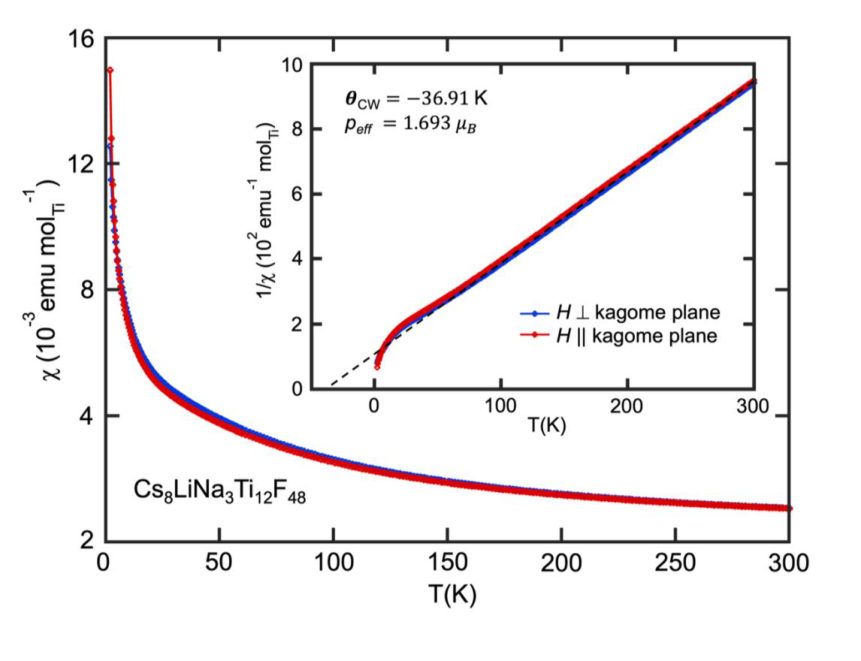 
Figure 2 | Temperature dependence of the bulk magnetic susceptibility of Cs8LiNa3Ti12F48, Magnetic susceptibility, 𝜒= 𝑀/𝐻, measured on a single crystal in an applied field of 𝜇0𝐻= 1 T with the field perpendicular to the kagome plane (blue circles) and parallel to the kagome plane (red circles). The two curves nearly overlap over the full measured temperature range, indicating weak bulk magnetic anisotropy. The inset on the top right shows the inverse susceptibility 1/𝜒 together with a Curie-Weiss fit to the high-temperature region (dashed blue line), yielding a Curie- Weiss temperature Θ𝐶𝑊= −36.9 K and 𝑝𝑒𝑓𝑓= 1.693 𝜇𝐵.

📷 Fig 3

 
Figure 3 | Q-dependence of the equal-time spin correlation function in Cs8LiNa3Ti12F48. a,

📷 Fig 4

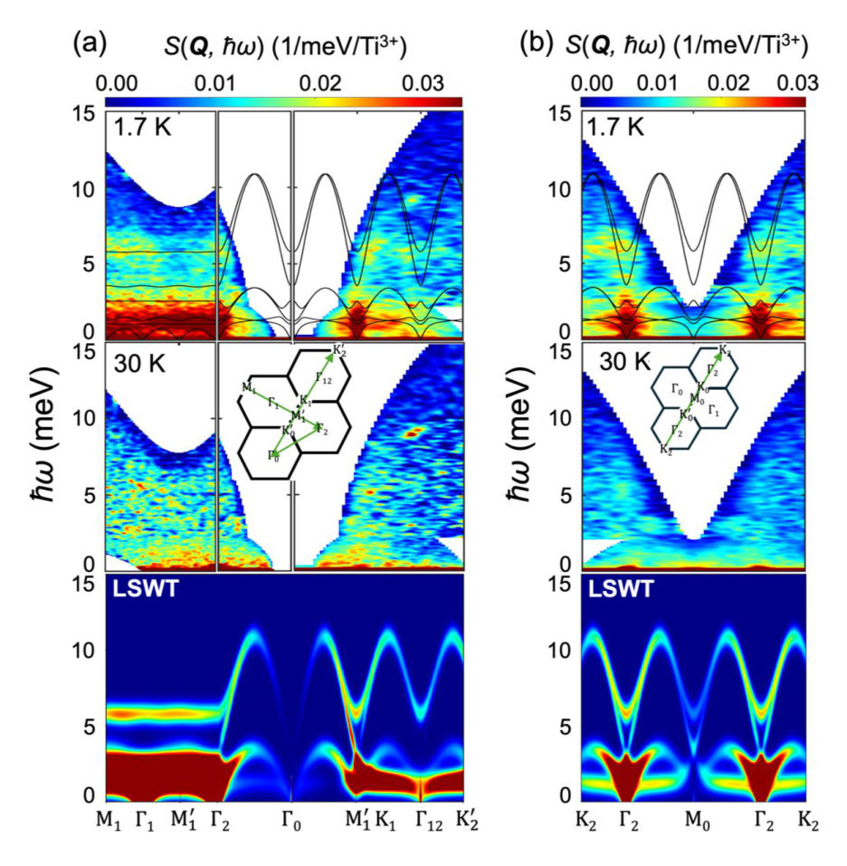 
Figure 4 | Dynamic spin correlations in Cs8LiNa3Ti12F48. Color contour maps of the normalized dynamic spin correlation function, 𝑆(𝐐, ℏ𝜔), as a function of momentum (𝐐) and energy transfer (ℏ𝜔), measured along two representative momentum cuts through the two-dimensional Brillouin zone, indicated by the green arrows in the insets. For each cut, the top panel shows the data at 1.7 K, the middle panel shows the data at 30 K, and the bottom panel shows the corresponding linear spin-wave theory (LSWT) intensity, 𝑆𝐿𝑆𝑊𝑇(𝐐,ℏ𝜔), calculated for the anisotropic J-D model. In the first panels, the black lines represent the calculated LSWT dispersion relation. Panel a follows the M1 →Γ1 →M1

**Summary.** The researchers investigated a Ti-based kagome-related antiferromagnet and discovered that structural distortions create a network of weakly coupled spin chains. This leads to an exotic excitation continuum and rod-like scattering, demonstrating that 1D-like fractionalization can exist within a 2D lattice structure.

**Why it may be interesting.** The discovery of a mechanism where 1D-like fractionalized excitations persist within a 2D lattice provides new insights into many-body dynamics and the stability of quantum-disordered states across dimensional crossovers.

Detailed structure

**Main problem.** Understanding the dimensional crossover of quantum disorder and how fractionalized excitations evolve when transitioning from 1D criticality to 2D topological order.

**Main result.** The study identifies a regime of 'anisotropic fractionalization' in a Ti-based kagome-related antiferromagnet, where 1D-like signatures persist in a 2D lattice due to structural distortions.

**Method.** Inelastic neutron scattering (INS) and neutron diffraction were performed on a single crystal at the Spallation Neutron Source, complemented by crystal structure refinement and Linear Spin Wave theory.

**Model / system.** The system is Cs8LiNa3Ti12F48, a Ti-based quantum antiferromagnet featuring a frustrated network of weakly coupled spin-1/2 'chainsaws' within distorted kagome planes.

**Key observables.** Dynamic spin correlation function S(Q, h-omega), equal-time response function S(Q), magnetic susceptibility, and crystal structure parameters.

**Important parameters / regimes.** Curie-Weiss temperature Theta_CW = -36.9 K, exchange couplings ranging from J_D = 1.22 meV to J_A = 11.26 meV, and an excitation continuum extending up to ~11 meV.

**Assumptions / limitations.** The use of Linear Spin Wave theory as a minimal effective Hamiltonian to describe the dispersion, despite its failure to capture the continuum.

**Paper structure.** The paper introduces the problem of dimensional crossover, describes the crystal structure and magnetic properties of the Ti-based material, presents neutron scattering data showing the excitation continuum and rod-like scattering, and concludes by discussing the principle of anisotropic fractionalization.

Abstract

Collective motions in strongly interacting magnets involve many spins and are often described in terms of integer-spin excitations. However, in certain cases, the collective motion can behave as if these integer excitations break apart into smaller, particle-like entities with unusual properties. Such fractionalized excitations in quantum magnets are commonly associated either with topological order in two dimensions or with criticality in one dimension. It remains unclear how these distinct mechanisms are connected across a dimensional crossover. Here we investigate the Ti-based quantum antiferromagnet, $Cs_{8}LiNa_{3}Ti_{12}F_{48}$, in which $Ti^{3+}$ ($3d^{1}$, $S=1/2$) ions interact antiferromagnetically within distorted kagome planes. Our inelastic neutron scattering study on a single crystal reveals a frustrated network of weakly coupled spin-$1/2$ chainsaws, realizing a regime of dimensional frustration in which interchain couplings fail to establish coherent two-dimensional order. The magnetic excitation spectrum exhibits a strong continuum spanning the full measured momentum and energy phase space. In addition, the dynamic spin correlation function displays rod-like scattering in momentum space, indicating a quasi-one-dimensional nature of the magnetic correlations. These results point to fractionalized excitations with intrinsically directional character, demonstrating that signatures of one-dimensional criticality can persist within a two-dimensional lattice. Our findings establish anisotropic fractionalization as a distinct organizing principle for quantum-disordered states.

[↑ back to top](#top)

### [Finite Imaginary-Time Evolution for Polynomial Unconstrained Binary Optimization](http://arxiv.org/abs/2604.27482v1)

**Authors:** Jaehee Kim, Juhyeon Kim, Gwonhak Lee, Kyunghyun Baek, Daniel K. Park, Jeongho Bang, Joonsuk Huh  
**Type:** theory · **Category:** quantum information and computing · **PDF:** <https://arxiv.org/pdf/2604.27482v1>  
**Analysis basis:** full PDF text, analyzed in chunks

📷 Fig 1

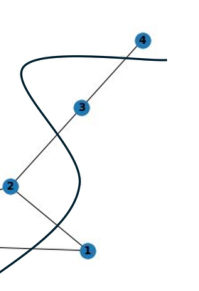 
Figure 1: Five-vertex MAX-CUT test graph with |E| = 5 edges. The curve indicates one of the three optimal cuts (six ground-state labelings counting partition complements); the graph is non-bipartite, so no cut separates every edge. The five edges {(0, 1), (0, 2), (1, 2), (2, 3), (3, 4)} combine a triangle on {0, 1, 2} with a path 2–3–4.

📷 Fig 2

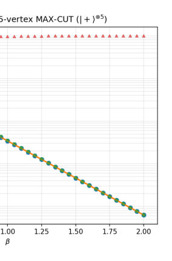 
Figure 2: Identity validation on the 5-vertex MAX-CUT instance with |ψ0⟩= |+⟩⊗5. Green circles: simulated PLCU(β) Fg(β); solid line: closed-form prediction (3/16) e−4β. Blue squares: PLCU(β); red triangles: Fg(β). Maximum relative error is 1.3 × 10−14, near the double-precision roundoff level.

📷 Fig 3

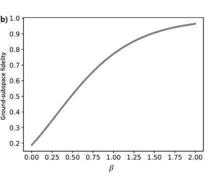 
Figure 3: Simulation results of MAX-CUT without amplitude amplification. (a) LCU success probability PLCU(β). (b) Conditional ground-subspace fidelity Fg(β), the probability of finding the system in the ground subspace given that the LCU succeeded.

📷 Fig 4

 
Figure 4: Simulation results with varying query complexities L. (a) FPAA-amplified LCU success prob- ability P (L) amp(β). (b) Ground-subspace preparation probability P (L) g (β) = P (L) amp(β) Fg(β) for different L, i.e., the joint probability of amplified LCU success and being in the ground subspace.

📷 Fig 5

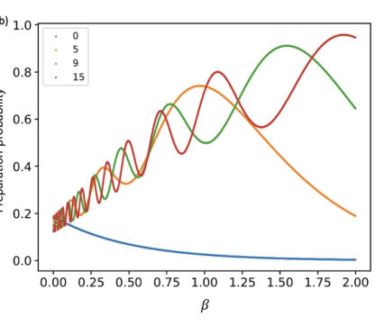 
Fig. 4 turns on FPAA at varying β across multiple query complexities L and tracks, as β is swept from 0 to 2, both (a) the amplified LCU success probability P (L) amp(β) and (b) the ground-subspace preparation probability P (L) g (β) = P (L) amp(β) Fg(β), defined as the

**Summary.** This paper introduces FinITE, a method to implement finite imaginary-time evolution for optimization problems on quantum computers using LCU and amplitude amplification. It provides a rigorous mathematical framework to optimize the evolution time and success probability, specifically for higher-order optimization problems without needing complex quadratization.

**Why it may be interesting.** not directly relevant

Detailed structure

**Main problem.** Implementing non-unitary imaginary-time evolution (ITE) on quantum hardware for solving optimization problems, specifically managing the trade-off between ground-state fidelity and the success probability of the LCU implementation.

**Main result.** The authors derive an exact identity relating LCU success probability and ground-subspace fidelity, and provide a closed-form threshold for the imaginary-time parameter beta to guarantee a target fidelity.

**Method.** The FinITE algorithm uses the Linear-Combination-of-Unitaries (LCU) framework for termwise block-encoding of commuting Pauli-Z strings, combined with Fixed-Point Amplitude Amplification (FPAA) to boost success probability.

**Model / system.** The method targets Polynomial Unconstrained Binary Optimization (PUBO) problems, including QUBO and Higher-order UnCO (HUBO) instances, represented by diagonal Pauli-Z cost Hamiltonians.

**Key observables.** LCU success probability (P_LCU), ground-subspace fidelity (F_g), and the product of success probability and fidelity.

**Important parameters / regimes.** Imaginary time (beta), spectral gap (Delta), initial ground-subspace overlap (gamma_0), and the l1-norm of Pauli coefficients (W).

**Assumptions / limitations.** The Hamiltonian terms must be pairwise-commuting (to avoid Trotter error), and the initial state must have a non-zero overlap with the ground subspace.

**Figures summary.** Simulations verifying the exponential decay identity of the success-fidelity product, a comparison of different initial state overlaps, and a quantum circuit diagram for gate decomposition.

**Paper structure.** Introduction to ITE and PUBO; development of the FinITE LCU construction; mathematical derivation of the success-fidelity identity and beta-threshold rule; complexity analysis of the FPAA-integrated procedure; and numerical validation using statevector and shot-based simulations.

Abstract

Imaginary-time evolution is a standard primitive for ground-state preparation but is nonunitary, precluding direct quantum implementation. We develop Finite Imaginary-Time Evolution (FinITE), a finite-beta construction for diagonal Pauli-Z cost Hamiltonians arising from polynomial unconstrained binary optimization (PUBO) instances, including QUBO and HUBO cases. FinITE uses the linear-combination-of-unitaries (LCU) framework to implement a scaled imaginary-time propagator. The commuting Pauli-Z structure makes termwise block-encodings compose without product-formula error, and higher-order Pauli-Z terms are handled directly without quadratization. The structure yields an exact finite-beta identity between the LCU success probability and the ground-subspace fidelity. Combined with a gap-based fidelity lower bound, the identity yields a closed-form sufficient imaginary-time threshold beta-star for a chosen target fidelity. The threshold depends on estimates of the spectral gap and the initial ground-subspace overlap. Because the LCU success event is flagged by a known ancilla outcome, we integrate fixed-point amplitude amplification with an explicit query-complexity bound. Statevector simulations verify the identity on a five-vertex MaxCut (QUBO) and an eight-qubit cubic HUBO instance, and shot-based simulations on the MaxCut instance illustrate the predicted finite-beta threshold and amplification procedure.

[↑ back to top](#top)

### [g-tensor Optimization in Ge/SiGe Quantum Dots](http://arxiv.org/abs/2604.28081v1)

**Authors:** Aram Shojaei, Edmondo Valvo, Maximilian Rimbach-Russ, Eliska Greplova, Ana Silva  
**Type:** theory · **Category:** quantum information and computing · **PDF:** <https://arxiv.org/pdf/2604.28081v1>  
**Analysis basis:** abstract only; PDF text extraction failed or PDF unavailable

**Summary.** This paper presents a numerical framework to optimize the g-tensor in germanium-based quantum dots by engineering the heterostructure potential. By adjusting silicon concentration, the researchers show it is possible to suppress unwanted g-tensor components, which helps mitigate device variability and enables more reliable qubit operations for scalable quantum computing.

**Why it may be interesting.** not directly relevant

Detailed structure

**Main problem.** Device performance in planar germanium hole-spin qubit platforms is limited by quantum dot variability, which causes uncertain energy levels and random spin quantization axis orientations.

**Main result.** The authors developed a flexible optimization framework that demonstrates how reshaping the out-of-plane potential via silicon concentration adjustment can suppress in-plane g-tensor components to enable gapless single-spin qubit encoding.

**Method.** A numerical optimization framework designed for engineering g-tensor properties through heterostructure engineering.

**Model / system.** A SiGe-Ge-SiGe quantum well heterostructure hosting hole-spin qubits.

**Key observables.** g-tensor components (specifically in-plane vs. out-of-plane) and the spin quantization axis orientation.

**Important parameters / regimes.** Silicon concentration within the quantum well and the resulting out-of-plane potential profile.

**Paper structure.** The paper introduces the problem of variability in Ge/SiGe quantum dots, presents a new optimization framework for g-tensor engineering, uses the suppression of in-plane g-tensor components as a benchmark case, and concludes with the implications for scalable quantum computing.

Abstract

Planar germanium heterostructures hosting hole-spin qubits are among the leading platforms for scalable semiconductor-based quantum computing. Yet, device performance is hindered by significant quantum dot variability, which leads to uncertainty in qubit energy levels and random orientations of the spin quantization axis. Tailored control of the g-tensor offers a strategy to overcome these limitations and achieve more reliable qubit operations. Here, we introduce a flexible optimization framework for engineering g-tensor properties. As a benchmark, we numerically obtain the optimal reshaping of the out-of-plane potential in a SiGe-Ge-SiGe quantum well to suppress the in-plane g-tensor components and realize the recently proposed gapless single-spin qubit encoding. This reshaping is achieved through heterostructure engineering, specifically by adjusting the silicon concentration within the quantum well, though the framework remains readily adaptable to alternative design objectives. Our results provide practical design principles for improving the tunability of the spin response, paving the way towards large-scale germanium-based quantum computers.

[↑ back to top](#top)

### [Geometric memory in incomplete phase transitions across dimensions](http://arxiv.org/abs/2604.27779v1)

**Authors:** F. Tolea, M. Tolea  
**Type:** theory · **Category:** statistical mechanics · **PDF:** <https://arxiv.org/pdf/2604.27779v1>  
**Analysis basis:** full PDF text, analyzed in chunks

📷 Fig 1

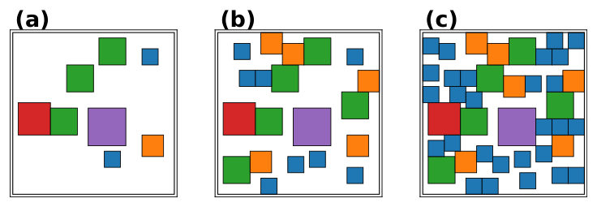 
FIG. 1. 2D squares. Snapshots at (a) low coverage, (b) moderate coverage, and (c) the jamming limit. Visualization run for A = 30. Each new square is randomly placed among available L2 min positions. Lmin = 3 while Lmax = 7 and the maximum intrinsic size L for each new square is randomly chosen in this interval. The progressive crowding reduces available perimeter for growth and only small squares can grow towards jamming.

📷 Fig 2

 
Fig. 1 illustrates the gradual filling of a large square domain (side A = 30) with smaller squares whose sizes range from Lmin = 3 to Lmax = 7. In our model, each newly placed square nucleates at the minimum size and then “grows” to a target size drawn randomly from the interval (Lmin, Lmax), while preserving its square shape. Owing to this randomness in size selection, the early stages of the transformation contain comparable numbers of squares of all sizes. Fig. 1a displays a single random placement of the first few squares, but when averaged over many realizations the number of squares per size tends to equalize. Panels (b) and (c) make visually clear how, as space fills, new squares are...

📷 Fig 3

 
FIG. 2. 3D cubes. Snapshots at (a) low coverage, (b) moderate coverage, and (c) the jamming limit. Visualization run for A = 30. Brute-force seeding uniformly among available L3 min places, then growth up to a random maximum intrinsic size, not bigger than Lmax = 7. In three dimensions, accessible free surface collapses faster than in 2D, favoring earlier lack of space for larger cubes.

📷 Fig 4

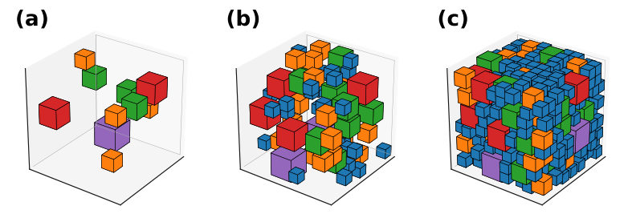 
FIG. 3. 3DL lamellar plates. (a) Three plates nucleate randomly and expand homothetically to their intrinsic sizes in the YZ, XZ, and XY planes. (b) As space becomes crowded, geometric constraints may prevent full growth, so plates 4 and 5 remain smaller due to impingement.

📷 Fig 5

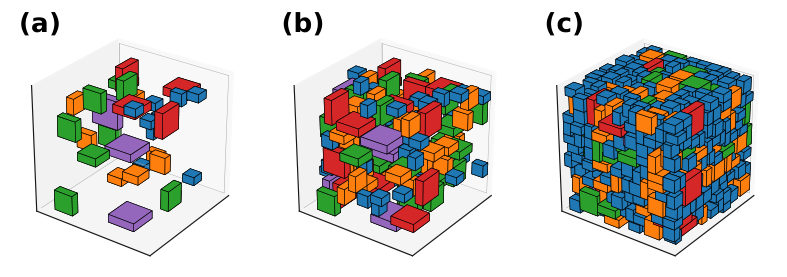 
FIG. 4. 3DL lamellar plates. Snapshots at (a) low coverage, (b) moderate coverage, and (c) the jamming limit. Visualization run for A = 30. Perfect-square plates in XY/XZ/YZ planes with fixed thickness TW = 2 along the normal. Brute-force seeding among available L3 min seeds; Lmin = 3, Lmax = 7. Lateral impingement dominates and freezes many nuclei early, yielding a “bottom-heavy” size distribution.

**Summary.** This paper demonstrates that memory effects in phase transitions can emerge purely from geometric constraints like nucleation, growth, and impingement without needing explicit thermodynamics. It shows that the strength of this 'geometric memory' is highly dependent on the dimensionality of the system, being most pronounced in 2D.

**Why it may be interesting.** not directly relevant

Detailed structure

**Main problem.** Investigating the mechanism of geometric memory in incomplete first-order solid-state phase transitions and how dimensionality (2D, 3D, and 3D lamellar) affects the strength of this memory effect.

**Main result.** The study finds that memory is robust across all geometries but is strongest in 2D and weakest in 3D lamellar structures, driven purely by geometric constraints like growth and impingement.

**Method.** A discrete lattice-based stochastic nucleation-and-growth model using brute-force seeding and shape-preserving dilation algorithms.

**Model / system.** A minimal geometric model of phase transformations involving the nucleation and self-similar growth of plates (2D squares), cubes (3D), and lamellae (3D with fixed thickness) that are arrested by impingement or intrinsic size limits.

**Key observables.** Size Mass Ratio (SMR), Shannon size-entropy, plate-size distributions, and simulated Differential Scanning Calorimetry (DSC) signals.

**Important parameters / regimes.** Minimum and maximum plate sizes (Lmin, Lmax), domain size (A), lamellar thickness (Tw), and the arrest size (s).

**Assumptions / limitations.** The model excludes explicit energetic, elastic, or thermodynamic terms, relying solely on geometric blocking; it also assumes the reverse transformation proceeds via the preferential disappearance of smaller plates.

**Figures summary.** Snapshots of growth progression and arrest-regrowth cycles; mass-per-size histograms showing depletion at arrested sizes; and simulated DSC signals showing characteristic dips or shoulders.

**Paper structure.** The paper introduces the geometric memory concept, describes the nucleation-and-growth model, presents results for 2D, 3D, and 3DL geometries, quantifies memory via SMR and entropy, and discusses the implications of dimensionality and the 'hammering' effect.

Abstract

We model a direct solid-state phase transition through a nucleation-and-growth process in which plates have simple, regular shapes - squares, cubes, or square-faced lamellae - and grow homothetically (self-similarly) until they either reach a randomly assigned maximum size or are stopped by impingement with previously formed plates. The reverse transformation is represented by the preferential disappearance of smaller plates, while larger plates are retained during an incomplete reversion. A subsequent direct transformation therefore produces a modified plate-size distribution, a memory effect that forms the main focus of this study. Building upon an earlier two-dimensional (2D) formulation, we extend the model to cubes (3D) and to lamellar plates (3DL) in order to examine how dimensionality affects transformation memory. We introduce a quantitative descriptor of memory, the size mass ratio, and find that memory is robust in all geometries but overall stronger in 2D than in 3D or 3DL. We provide growth snapshots, arrest-regrowth cycles, size distributions, and differential scanning calorimetry simulations, and we compute the Shannon size-entropy to quantify configurational diversity. Although motivated by the thermal memory effect in shape-memory alloys, the model more generally identifies a purely geometric mechanism for memory in first-order solid-solid transformations, highlighting the role of dimensionality and geometric blocking in controlling the strength of transformation memory.

[↑ back to top](#top)

### [High-Girth Regular Quantum LDPC Codes from Square-Base Hypergraph Products via CPM Lifts](http://arxiv.org/abs/2604.27817v1)

**Authors:** Koki Okada, Kenta Kasai  
**Type:** theory · **Category:** quantum information and computing · **PDF:** <https://arxiv.org/pdf/2604.27817v1>  
**Analysis basis:** full PDF text, analyzed in chunks

📷 Fig 1

 
Figure 1: p–FER plot for the randomized P = 64 lift derived from the generalized-quadrangle base B15. Each point aggregates independent decoding trials at the same p, using the degeneracy- aware BP decoder followed by OSD-lite post-processing; shaded bands indicate Wilson 95% confidence intervals. Zero-failure points are plotted at the upper endpoint of the Wilson interval. The dashed vertical line is the population-dynamics estimate pDE ≈0.1529 of the BP density- evolution threshold for the (3, 6)-regular CSS-LDPC ensemble on the depolarizing channel, and the dash-dotted vertical line is the depolarizing-channel hashing limit phash ≈0.18929.

📷 Fig 2

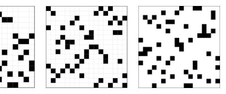 
Figure 2: Matrix plots of the smaller square base matrices.

📷 Fig 3

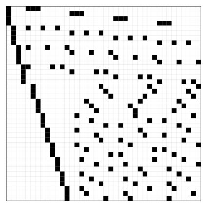 
Figure 3: Matrix plots of the larger square base matrices.

📷 Fig 4

 
Figure 4: Matrix plots of the HGP check matrices obtained from the Fano-plane base matrix B7.

**Summary.** This paper presents a method for constructing large-scale, regular quantum LDPC codes with high girth by lifting small square-base matrices. It demonstrates that these codes can achieve extremely low decoding failure rates under significant depolarizing noise, highlighting the importance of degeneracy in quantum error correction.

**Why it may be interesting.** not directly relevant

Detailed structure

**Main problem.** Designing regular, high-girth quantum low-density parity-check (QLDPC) codes by controlling short cycles and logical qubit counts during the lifting of square-base hypergraph product constructions.

**Main result.** The authors constructed a (3,6)-regular CSS-LDPC code with parameters [[28800, 62, 8]] that demonstrates zero decoding failures in nearly 300 million trials at a depolarizing probability of 0.1402.

**Method.** The study uses square-base CSS hypergraph product (HGP) constructions combined with Circulant Permutation Matrix (CPM) lifts, utilizing finite-geometric incidence structures and randomized local searches to satisfy CSS orthogonality and girth constraints.

**Model / system.** The study focuses on quantum error-correcting codes, specifically the Calderbank-Shor-Steane (CSS) construction under a depolarizing noise model.

**Key observables.** Tanner girth, decoding failure rate (Frame Error Rate), logical qubit count (k), and the distinction between exact and degenerate decoding success.

**Important parameters / regimes.** Depolarizing probability p = 0.1402, code parameters [[28800, 62, 8]], and the theoretical hashing limit and BP density-evolution threshold.

**Assumptions / limitations.** The construction is limited to a girth of 8 due to orthogonality-forced cycles, and the design quantum rate is zero for the square-base case.

**Figures summary.** Figure 1 shows a performance plot of the Frame Error Rate versus p; Figures 2 and 3 display matrix plots of various square base matrices (B7, B13, B15, etc.); Figure 4 visualizes the resulting HGP check matrices.

**Paper structure.** The paper introduces the square-base HGP construction, provides algebraic conditions for regularity and girth, analyzes the effect of CPM lifting on cycles and logical qubits, presents specific code constructions using finite geometries, and concludes with numerical decoding performance simulations.

Abstract

We study square-base Calderbank--Shor--Steane (CSS) hypergraph-product codes as a finite-length class for regular high-girth quantum low-density parity-check (LDPC) design. For base matrices of small column weight, we give checkable conditions for regularity, rank deficiency, and short-cycle exclusion, and we present explicit column-weight-three and column-weight-four examples with Tanner girth 6 and 8. We also analyze circulant permutation matrix (CPM) lifts of this class. Using the standard voltage-sum criterion, we identify orthogonality-forced Tanner 8-cycles and show that CPM lifting cannot raise the Tanner girth beyond 8 when these cycles are present. As a representative finite-length instance, a randomized CPM lift of the girth-8 base construction gives a $[[28800,62]]$ girth-8 $(3,6)$-regular CSS-LDPC code. Under degeneracy-aware belief-propagation decoding with optional ordered-statistics-decoding-lite post-processing, this code produced zero decoding failures in $2.993\times 10^8$ independent trials at depolarizing probability $p=0.1402$; the Wilson 95% upper confidence bound is $1.28\times 10^{-8}$.

[↑ back to top](#top)

### [Local Current Algebra for the HK Universality Class](http://arxiv.org/abs/2604.27051v1)

**Authors:** Yuting Bai, Philip W. Phillips  
**Type:** theory · **Category:** strongly correlated electrons · **PDF:** <https://arxiv.org/pdf/2604.27051v1>  
**Analysis basis:** full PDF text, analyzed in chunks

📷 Fig 1

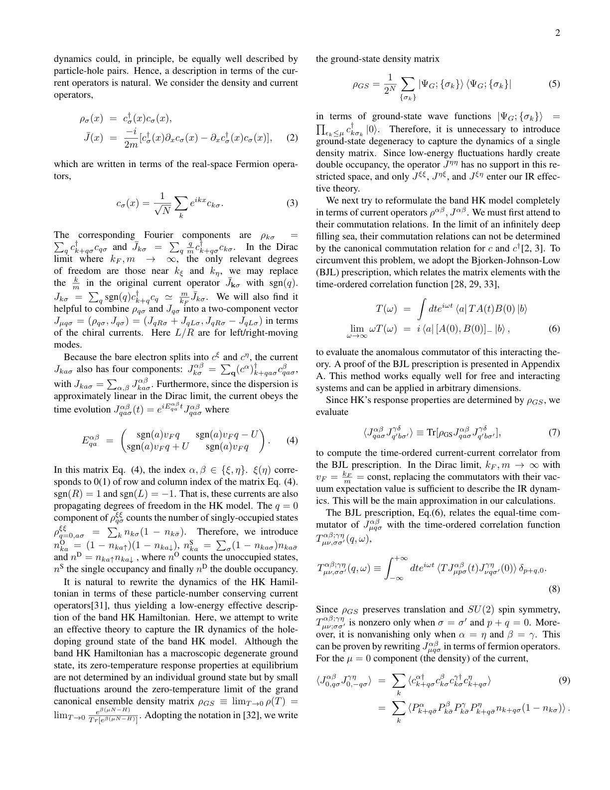 
Low-resolution page preview, page 2

📷 Fig 2

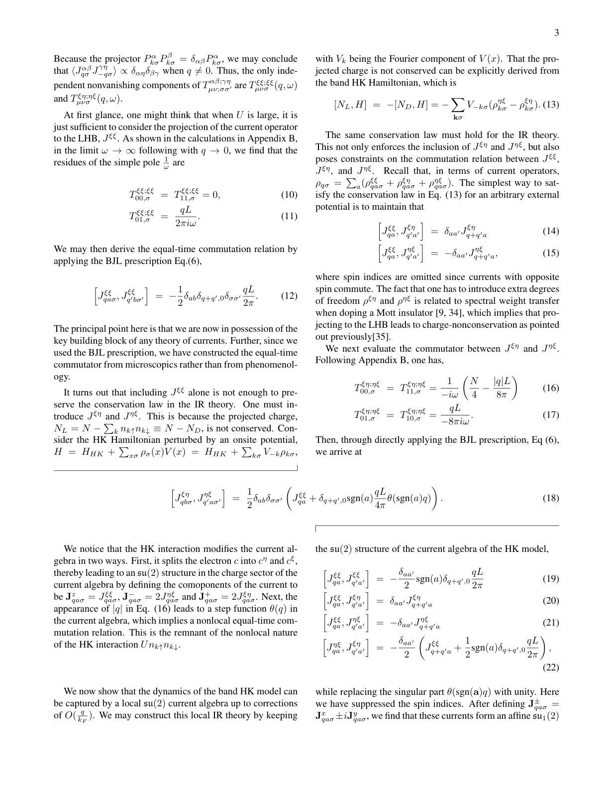 
Low-resolution page preview, page 3

📷 Fig 3

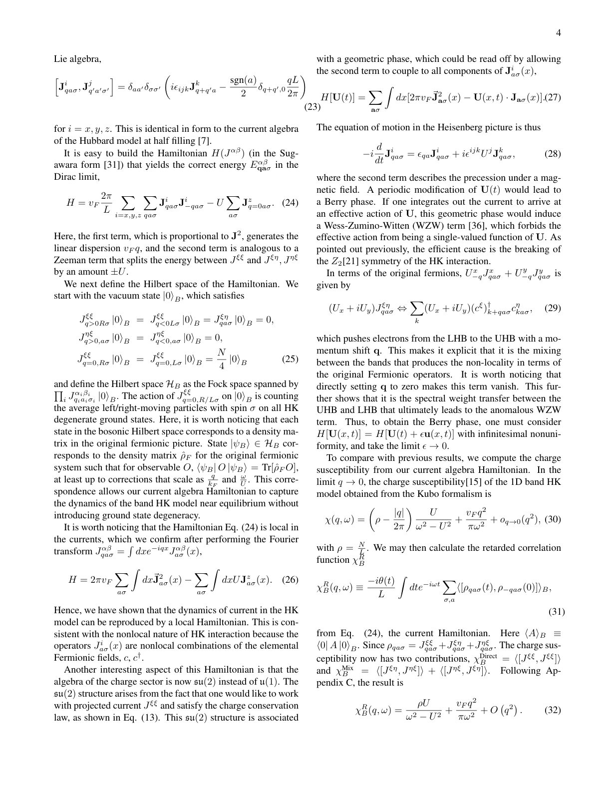 
Low-resolution page preview, page 4

📷 Fig 4

 
Low-resolution page preview, page 5

📷 Fig 5

 
Low-resolution page preview, page 6

**Summary.** This paper resolves a major criticism of the Hatsugai-Kohmoto model by showing that its apparent non-locality in real space can be eliminated using a local current algebra. By establishing a local correspondence, the authors reinforce the utility of current algebras for describing strong interactions in Mott insulators.

**Why it may be interesting.** not directly relevant

Detailed structure

**Main problem.** The paper addresses the non-locality in real space of the Hatsugai-Kohmoto (HK) model, a known criticism of this model for doped Mott insulators.

**Main result.** The authors demonstrate that a Hamiltonian expressed via local real-space currents obeying an su(2) affine Lie algebra eliminates the non-locality, and that the charge susceptibility computed from this current Hamiltonian is identical to the original fermionic formulation.

**Method.** The study uses the Bjorken-Johnson-Low (BJL) prescription to derive equal-time commutation relations from microscopic correlation functions and employs a current algebra formulation (Sugawara-like construction) in the Dirac limit.

**Model / system.** The system is a 1D doped Mott insulator described by the Hatsugai-Kohmoto (HK) model, which is a solvable alternative to the Hubbard model that captures Mott physics via the breaking of Z2 symmetry.

**Key observables.** Charge susceptibility (direct and mixing components), density operators, and current operators.

**Important parameters / regimes.** Interaction strength U, Fermi momentum kF, Fermi velocity vF, and the Dirac limit (kF, m -> infinity).

**Assumptions / limitations.** The dispersion is assumed to be quadratic, and the results are presented in the low-energy, long-wavelength (q -> 0) limit.

**Paper structure.** The paper begins by identifying the non-locality problem in the HK model, then introduces the current algebra formulation. It uses the BJL prescription to derive commutators, proves the necessity of multi-component currents, and concludes by verifying that the resulting susceptibility matches the original model.

Abstract

We show that a Hamiltonian in terms of the local real-space currents obeying an $\mathfrak{su}_1(2)$ affine Lie algebra eliminates the non-locality in the Hatsugai-Kohmoto model for a doped Mott insulator. We establish this local correspondence through the Bjorken-Johnson-Low prescription for anomalous commutators. With this result, we show that the charge susceptibility computed from the current Hamiltonian is identical to that with the elemental Fermionic fields. Consequently, the HK model is local in real space, though not in terms of the Fermionic fields, thereby eliminating the key criticism of this model and reinforcing the utility of current algebras for strong interactions.

[↑ back to top](#top)

### [Order by disorder up to arbitrarily high temperature](http://arxiv.org/abs/2604.28026v1)

**Authors:** Ravish Mehta  
**Type:** theory · **Category:** statistical mechanics · **PDF:** <https://arxiv.org/pdf/2604.28026v1>  
**Analysis basis:** full PDF text, analyzed in chunks

📷 Fig 1

 
Figure 1: A configuration with two contours γ1 and γ2 with the boundary Bpωq denoted by the dark grey region and the patterned regions representing boundaries of the contours. The outer boundary has the phase η1 and the interior boundary has the same phase as that of the interior components along which they are drawn.

**Summary.** This paper proves that certain classical lattice models exhibit long-range checkerboard order at arbitrarily high temperatures. This phenomenon, known as 'order by disorder,' occurs because thermal fluctuations (entropy) select specific ordered patterns even though they are not the energy-minimizing ground states. The result is established using rigorous mathematical tools like Pirogov-Sinai theory.

**Why it may be interesting.** not directly relevant

Detailed structure

**Main problem.** Proving the existence of long-range checkerboard order in a class of classical lattice models at arbitrarily high temperatures, where the ordering is driven by entropy rather than energy minimization.

**Main result.** The author proves that for sufficiently small inverse temperature (high temperature), the Gibbs measure is concentrated near checkerboard configurations, establishing the existence of distinct infinite-volume Gibbs states.

**Method.** The proof utilizes Pirogov-Sinai theory, cluster expansion, and a polymer representation of the partition function, supported by a Peierls-type bound on contour surface energy.

**Model / system.** A classical lattice model on a d-dimensional hypercubic lattice (d >= 2) with an unbounded on-site state space (bosonic occupation numbers) and a nearest-neighbor interaction function satisfying specific symmetry and growth conditions.

**Key observables.** The difference between the Gibbs measure of occupation labels and the reference checkerboard configurations; the existence of distinct infinite-volume Gibbs states.

**Important parameters / regimes.** Inverse temperature (beta) in the limit beta -> 0; on-site energy scale (U); growth exponent (alpha).

**Assumptions / limitations.** The proof relies on the validity of the contour weight bound and the existence of a polymer representation within the high-temperature regime.

**Figures summary.** Figure 1 illustrates a configuration with two contours, showing the boundary of a macro-site.

**Paper structure.** The paper identifies the model and its interaction conditions, constructs a macro-lattice to define reference configurations, derives a polymer representation of the partition function, establishes Peierls-type bounds on contour energy, and concludes with the proof of phase coexistence and uniform convergence to the checkerboard states.

Abstract

We prove that a class of classical lattice models on $\mathbb{Z}^d$ ($d \geq 2$) with on-site space $\mathbb{N}_0$ exhibits long-range checkerboard order at sufficiently high temperature. The model has a nearest-neighbour interaction $f : \mathbb{N}_0 \times \mathbb{N}_0 \to [0,\infty)$ satisfying four structural conditions, subsuming the recently introduced power-law model of Han--Huang--Komargodski--Lucas--Popov (arXiv:2503.22789) as a special case. The ordering mechanism is purely entropic: the checkerboard configurations are not energy minimisers, but are selected by the partial trace over occupation numbers in the $β\to 0$ limit. The proof uses Pirogov--Sinai theory and the key input is a Peierls bound.

[↑ back to top](#top)

### [Pauli equation in spaces of constant curvature and extended Nikiforov-Uvarov method](http://arxiv.org/abs/2604.27522v1)

**Authors:** Abdaljalel E. Alizzi, Zurab K. Silagadze  
**Type:** theory · **Category:** other · **PDF:** <https://arxiv.org/pdf/2604.27522v1>  
**Analysis basis:** full PDF text, analyzed in chunks

📷 Fig 1

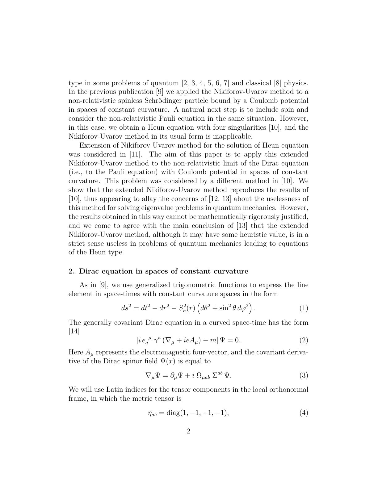 
Low-resolution page preview, page 2

📷 Fig 2

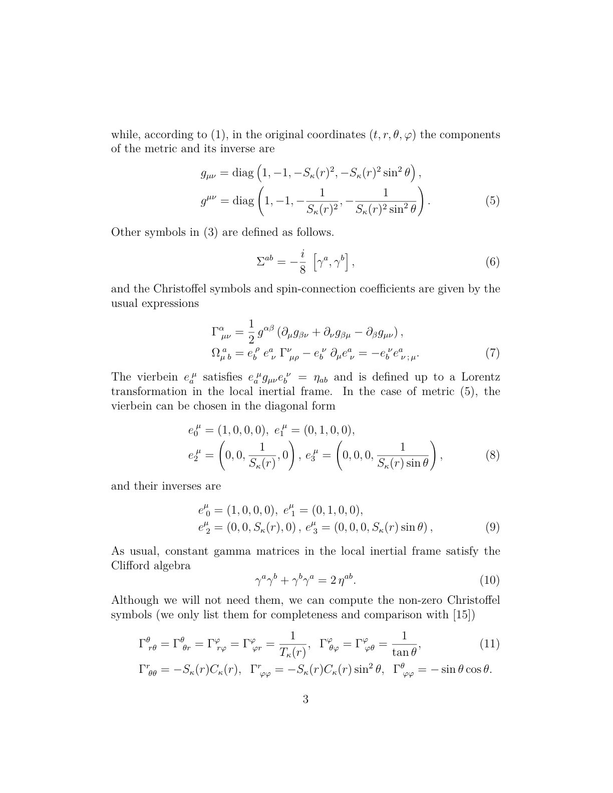 
Low-resolution page preview, page 3

📷 Fig 3

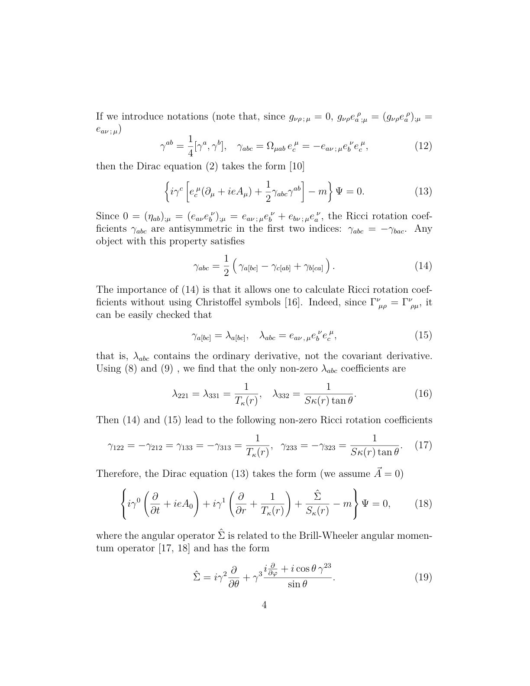 
Low-resolution page preview, page 4

📷 Fig 4

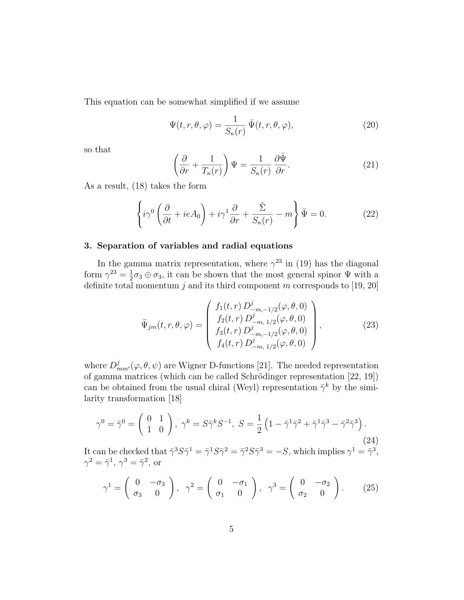 
Low-resolution page preview, page 5

📷 Fig 5

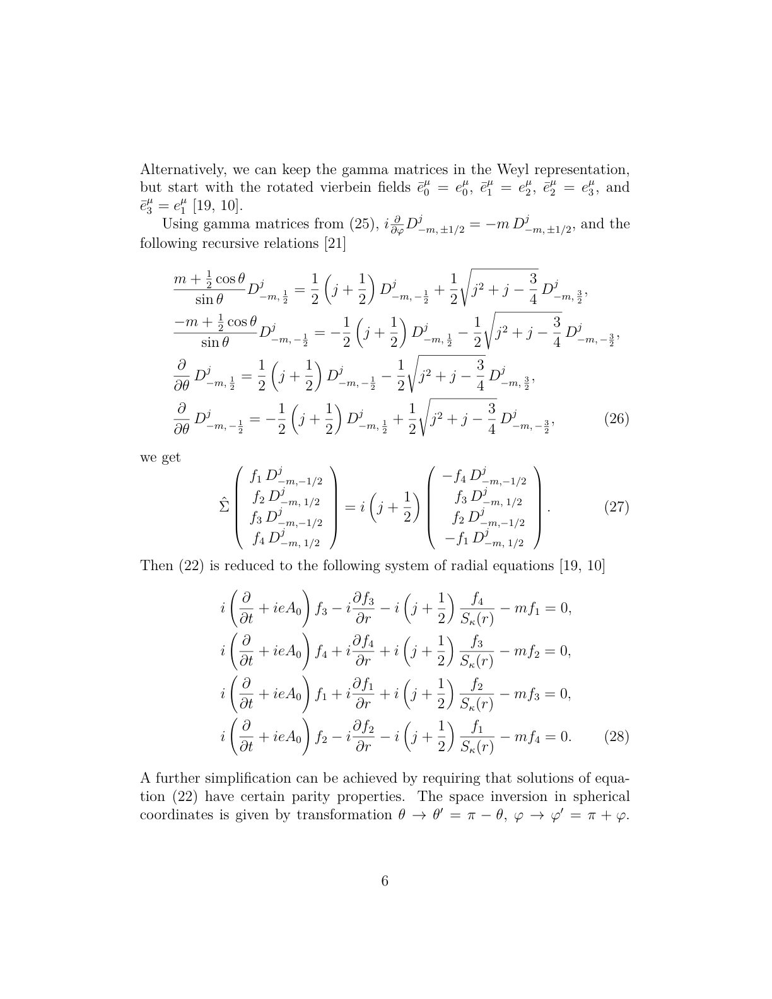 
Low-resolution page preview, page 6

**Summary.** The paper critiques the use of the extended Nikiforov-Uvarov method for solving Heun-type differential equations in quantum mechanics. It shows that while the method can suggest an energy spectrum for a particle in curved space, the mathematical conditions for the existence of those solutions are actually impossible to satisfy. This highlights a significant pitfall when applying algebraic methods to complex potentials in non-Euclidean geometries.

**Why it may be interesting.** not directly relevant

Detailed structure

**Main problem.** The paper investigates the validity of using the extended Nikiforov-Uvarov (ENU) method to find analytical solutions for the Pauli equation in spaces of constant curvature.

**Main result.** The authors demonstrate that the ENU method provides only a necessary but not sufficient condition for polynomial solutions in Heun-type equations, leading to a mathematical inconsistency where the required energy spectrum cannot actually exist.

**Method.** The study employs the vierbein formalism, separation of variables using Wigner D-functions, and a matrix determinant analysis to check for the existence of polynomial solutions in the radial Heun equation.

**Model / system.** A spin-1/2 particle (such as an electron) in a Coulomb potential within a space of constant curvature, described by the non-relativistic limit of the Dirac equation (the Pauli equation).

**Key observables.** Energy spectrum (eigenvalues) and the existence of polynomial solutions for the radial wave function.

**Important parameters / regimes.** Curvature (kappa), total angular momentum (j), magnetic quantum number (m), and the non-relativistic regime (epsilon + e^2/T_kappa(r) << m).

**Assumptions / limitations.** The study assumes the use of the extended Nikiforov-Uvarov method and examines the non-relativistic limit of the Dirac equation in curved spacetime.

**Paper structure.** The paper begins by deriving the radial Pauli equation from the Dirac equation in curved space, applies the extended NU method to find a potential energy spectrum, and then uses a tridiagonal matrix analysis to prove the mathematical invalidity of the derived solutions.

Abstract

We apply the extended Nikiforov-Uvarov method to the non-relativistic limit of the Dirac equation with a Coulomb potential in spaces of constant curvature. In this case, the radial equation reduces to the Heun equation, and the extended Nikiforov-Uvarov method easily yields a quantization condition which leads to necessary condition under which the resulting Heun equation can have polynomial solutions. The energy spectrum implied by the quantization condition is virtually identical to the spectrum of a spinless particle obtained using the Schrödinger equation, except for the absence of the ``geometric potential", confirming the non-commutativity of the naive non-relativistic limit with the ``squaring" of the Dirac equation, first discovered on curved surfaces. However, the necessary conditions for the existence of polynomial solutions cannot be met, and this fact undermines the reliability of the results obtained. This circumstance forces us to conclude that the extended Nikiforov-Uvarov method has limited, if any, value when considering similar problems in quantum mechanics.

[↑ back to top](#top)

### [Q3SAT-GPT: A Generative Model for Discovering Quantum Circuits for the 3-SAT Problem](http://arxiv.org/abs/2604.27324v1)

**Authors:** Pratim Ugale, Ilya Tyagin, Karunya Shirali, Kien X. Nguyen, Ilya Safro  
**Type:** theory · **Category:** quantum information and computing · **PDF:** <https://arxiv.org/pdf/2604.27324v1>  
**Analysis basis:** full PDF text, analyzed in chunks

📷 Fig 1

 
Fig. 1: A Representative Conflict Illustration. Operator gener- ators ˆAi are labeled with their corresponding gradient mag- nitudes in parentheses. In (a), selecting the highest individual gradient ( ˆA1) blocks the selection possibility of ˆA4 and ˆA5, leading to a lower total sum of gradients as compared to (b).

📷 Fig 2

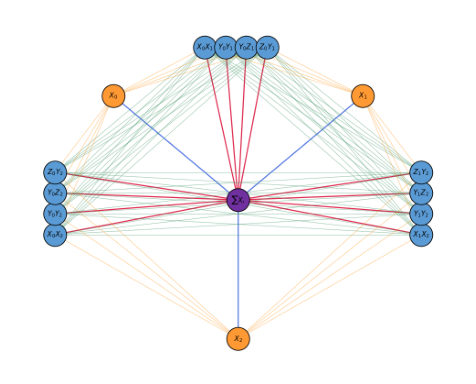 
Fig. 2: Incompatibility graph representation for a 3-qubit problem instance, used for operator selection. Each node in the graph represents a candidate unitary operator from the pool P, An edge connects two nodes if and only if their corresponding operators have overlapping qubit support. Sets of overlapping two-qubit operators form fully connected cliques and are omitted to maintain legibility.

📷 Fig 3

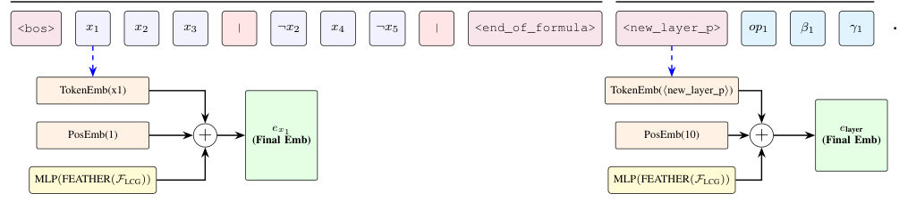 
Fig. 3: Detailed pipeline demonstrating formatting, tokenization, and embeddings. The | delimiter is used to segment clauses, with explicit OR (∨) tokens omitted.

📷 Fig 4

 
Fig. 4: Comparison of the energy convergence across adap- tations. Note that in Figure (b), plots of TETRIS-QAOA and ADAPT-QAOA overlap due to the same operators being chosen by both the methods (see Figure 6).

📷 Fig 5

 
Fig. 5: Comparison of the maximum gradient norm across all operators in the mixer pool. Note that in Figure (b), plots of TETRIS-QAOA and ADAPT-QAOA overlap due to the same operators having the maximum gradient for the most part (see Figure 6).

**Summary.** This paper introduces Q3SAT-GPT, a generative AI model that learns to design quantum circuits for solving 3-SAT problems. By training on circuits generated by a novel adaptive method (MosaicADAPT-QAOA), the model can bypass expensive classical optimization during inference, providing a scalable route for quantum algorithm discovery.

**Why it may be interesting.** not directly relevant

Detailed structure

**Main problem.** The high computational cost and complexity of discovering optimized quantum circuits for the Max-E3-SAT combinatorial optimization problem using traditional adaptive QAOA methods.

**Main result.** The Q3SAT-GPT generative model can predict high-quality quantum circuits in a single forward pass, achieving significant speedups in amortized inference time while maintaining strong solution quality.

**Method.** A transformer-based generative architecture (Q3SAT-GPT) is trained on high-quality circuit trajectories produced by a new adaptive strategy called MosaicADAPT-QAOA, which uses a Maximum Weight Independent Set approach to select disjoint operators.

**Model / system.** The study focuses on the Max-E3-SAT problem, mapping classical 3-CNF formulas to a cost Hamiltonian using a Higher-Order Unconstrained Binary Optimization (HUBO) formulation with Pauli-Z operators.

**Key observables.** Approximation Ratio (AR), Error Rate (ER) of circuit validity, and amortized inference time.

**Important parameters / regimes.** Phase transition ratio (alpha = m/n), circuit depth, and initial variational angles (gamma_0, beta_0).

**Assumptions / limitations.** The model's performance is limited by the quality of the training data from MosaicADAPT-QAOA, and it assumes the 3-SAT instances can be effectively represented via Literal-Clause Graph (LCG) embeddings.

**Figures summary.** Figure 1 shows the failure of greedy operator selection; Figure 2 depicts an incompatibility graph; Figure 3 illustrates the transformer pipeline and embeddings; Figure 4 shows energy convergence; Figure 7 compares predicted vs. optimized variational parameters.

**Paper structure.** The paper introduces the problem of circuit discovery, presents the MosaicADAPT-QAOA adaptive strategy, details the Q3SAT-GPT generative architecture and training pipeline, evaluates performance on random and balanced 3-SAT instances, and discusses scalability and limitations.

Abstract

This work introduces Q3SAT-GPT, a generative model for discovering quantum circuits for the Max-E3-SAT problem. Our method learns from high-performing QAOA-style ansätze to directly generate candidate circuits. To create high-quality supervision, we also introduce Mosaic Adaptive QAOA (MosaicADAPT-QAOA), an adaptive strategy for constructing low-depth QAOA circuits by selecting subsets of mixer operators in each step, rather than inserting operators sequentially. The resulting circuits serve as training data for the generative model, allowing it to learn effective circuit design patterns while eliminating the need for costly variational optimization at inference time. Experiments show that our framework attains strong solution quality with shallow circuits and scales significantly better than both our adaptive construction procedure and conventional variational baselines. Our results establish generative modeling as a high-performance route toward the scalable discovery of quantum optimization circuits, demonstrating that these models can effectively internalize circuit logic while providing a foundation for future, instance-aware inductive biases. Reproducibility: The source code is available at https://github.com/pratimugale/Q3SAT-GPT.

[↑ back to top](#top)

### [Quantum Scalar Spin Chirality in Coplanar Kagome Antiferromagnets](http://arxiv.org/abs/2604.27632v1)

**Authors:** Nanse Esaki, Gyungchoon Go, Se Kwon Kim  
**Type:** theory · **Category:** strongly correlated electrons · **PDF:** <https://arxiv.org/pdf/2604.27632v1>  
**Analysis basis:** abstract only; PDF text extraction failed or PDF unavailable

**Summary.** This paper shows that even in magnets where spins are arranged in a plane, quantum fluctuations can create a sense of 'handedness' or scalar spin chirality. This effect is significant because it can be as strong as the chirality found in more complex noncoplanar magnetic structures.

**Why it may be interesting.** not directly relevant

Detailed structure

**Main problem.** Investigating whether quantum fluctuations can generate scalar spin chirality in antiferromagnets that possess coplanar ground-state spin configurations.

**Main result.** The authors demonstrate that quantum fluctuations can induce scalar spin chirality at zero temperature in coplanar kagome antiferromagnets, provided certain symmetry-breaking conditions are met. These fluctuations can grow with temperature and reach magnitudes comparable to the static chirality found in noncoplanar systems.

**Method.** Theoretical analysis of quantum fluctuations and the effective Hamiltonian describing fluctuations in a kagome antiferromagnet.

**Model / system.** A kagome antiferromagnet with coplanar ordered ground-state spin configurations.

**Key observables.** Scalar spin chirality and its fluctuations.

**Important parameters / regimes.** Zero temperature, temperature-dependent magnon excitations, and the magnetic point group of the classical ground state.

**Assumptions / limitations.** The presence of scalar spin chirality depends on the breaking of an effective time-reversal-like antiunitary symmetry in the fluctuation Hamiltonian.

**Paper structure.** The paper presents a theoretical demonstration of quantum-induced scalar spin chirality, discusses the symmetry requirements for its emergence in coplanar kagome systems, and analyzes the temperature dependence of these fluctuations.

Abstract

We theoretically demonstrate that quantum fluctuations inherent to antiferromagnets can generate scalar spin chirality at zero temperature even in coplanar ordered magnets. In a kagome antiferromagnet with coplanar ground-state spin configurations, the quantum-fluctuation-induced scalar spin chirality is shown to arise at zero temperature when an effective time-reversal-like antiunitary symmetry is broken in the Hamiltonian describing fluctuations, and a magnetic point group of the classical ground state allows for its presence. The scalar spin chirality fluctuations are shown to grow further with increasing temperature by thermally excited magnons. These scalar spin chirality fluctuations can reach a magnitude comparable to the static one predicted for noncoplanar spin structures, highlighting their physical implications in coplanar spin systems.

[↑ back to top](#top)

### [Ratio-Dependent Contrarian Activation in Opinion Dynamics](http://arxiv.org/abs/2604.27226v1)

**Authors:** Serge Galam  
**Type:** theory · **Category:** statistical mechanics · **PDF:** <https://arxiv.org/pdf/2604.27226v1>  
**Analysis basis:** full PDF text, analyzed in chunks

📷 Fig 1

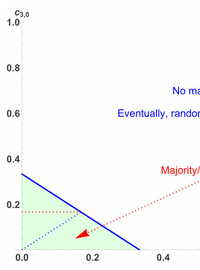 
Figure 1: The two domains of the landscape of the dynamics induced by the variation of c3,0 and c2,1. The domains are separated by the line c3,0 = 1 3(1 −3c2,1). Inside the colored area, pA,B exist and are attractors with pc being a tipping point. Outside the colored area in the white area only the fixed point pc = 1

📷 Fig 2

 
Figure 2: Various main stages of the variation pA in red and pB in blue as a function of c2,1 for the series of given values c3,0 = 0, 0.01, 0.17, 0.3, 0.35, 0.99. The fixed point pc = 1

📷 Fig 3

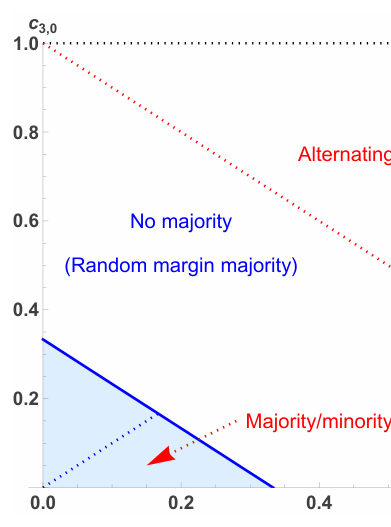 
Figure 3: The complete landscape of the dynamics including alternating regimes. Four domains are shown as a function of c3,0 and c2,1. The domains are separated by the lines c3,0 = 1

📷 Fig 4

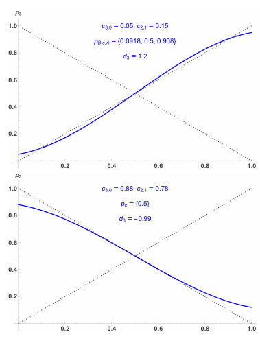 
Figure 4: Four different regimes produced by the update Equation (11) with a tipping point coupled to two attractors, a single attractor, an alternating single attractor and an alternating tipping point coupled to two alternating attractors, for respectively (c3,0 = 0.05, c2,1 = 0.15), (c3,0 = 0.12, c2,1 = 0.22), (c3,0 = 0.88, c2,1 = 0.78), (c3,0 = 0.95, c2,1 = 0.85).

📷 Fig 5

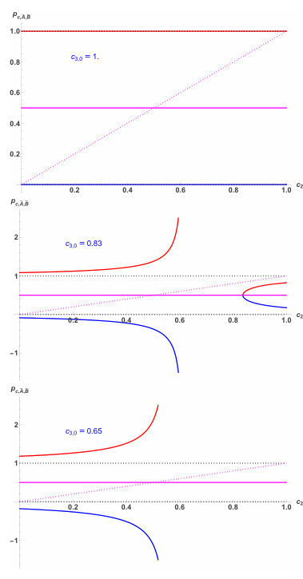 
Figure 5: Various main stages of the variation p ¯ A in red and p ¯B in blue as a function of c2,1 for the series of given values c3,0 = 0, 0.01, 0.17, 0.3, 0.35, 0.99. The fixed point pc = 1

**Summary.** This paper extends the Galam Majority Model by introducing contrarians whose behavior depends on the local ratio of majority to minority. It maps out a complex two-dimensional landscape of opinion dynamics, revealing how different types of non-conformity can either stabilize a majority or drive a system toward a 50/50 random winner.

**Why it may be interesting.** not directly relevant

Detailed structure

**Main problem.** Investigating how 'mixed contrarians'—whose activation depends on the local majority/minority ratio—impact the evolution and stability of opinions in a heterogeneous population.

**Main result.** The study identifies a two-dimensional landscape of four distinct dynamical domains, including regimes of majority/minority winners, a 50/50 polarized attractor, and alternating regimes.

**Method.** Analytical derivation of an explicit update equation for opinion proportions, followed by fixed-point and stability analysis using Taylor expansion.

**Model / system.** An extension of the Galam Majority Model (GMM) involving discussion groups of size N=3 with two competing opinions and two types of contrarians (c3,0 and c2,1) whose activation depends on the local group configuration.

**Key observables.** Proportion of agents with opinion A (p_n), fixed points (attractors), tipping points, and stability derivative (d3).

**Important parameters / regimes.** c3,0 (contrarian probability in unanimous groups), c2,1 (contrarian probability in 2:1 groups), and group size N=3.

**Assumptions / limitations.** The model assumes a discrete-time update process and a fixed group size of 3 with symmetric behavior between opinions A and B.

**Figures summary.** Figure 5 shows the variation of final opinion proportions as a function of c2,1 for different c3,0 values, highlighting the transition between different dynamical attractors.

**Paper structure.** The paper introduces the problem of ratio-dependent contrarians, defines the extended Galam Majority Model, derives the analytical update equation and fixed points, performs stability analysis to map the dynamical landscape, and discusses strategic implications for opinion manipulation.

Abstract

I study the impact of mixed contrarians on the opinion dynamics of an heterogenous population with conformists using Galam Majority Model. Activation of contrarians is a function of the ratio majority/minority in the local groups of discussion. Restricting the group size to 3, two types of contrarians are included in respective proportions $c_{3,0}$ for configurations with ratio 3 to 0 and $c_{2,1}$ for ratio 2 to 1. I then derive the explicit update Equation and obtained analytically the fixed points, their stability, and the resulting full two-dimensional landscape of the dynamics of opinion. Setting $c_{3,0} =c_{2,1} = c$ recovers the original results obtained with uniform contrarians. The findings allow for considering a wide spectrum of new disruptive strategies to secure either a majority/minority ending ensuring the opinion having the larger initial support to win, or a single attractor dynamics at fifty/fifty, which implies a random winner regardless of initial supports.

[↑ back to top](#top)

### [Sampling two-dimensional spin systems with transformers](http://arxiv.org/abs/2604.27738v1)

**Authors:** Piotr Białas, Piotr Korcyl, Tomasz Stebel, Adam Stefański, Dawid Zapolski  
**Type:** theory · **Category:** disordered systems and neural networks · **PDF:** <https://arxiv.org/pdf/2604.27738v1>  
**Analysis basis:** full PDF text, analyzed in chunks

📷 Fig 1

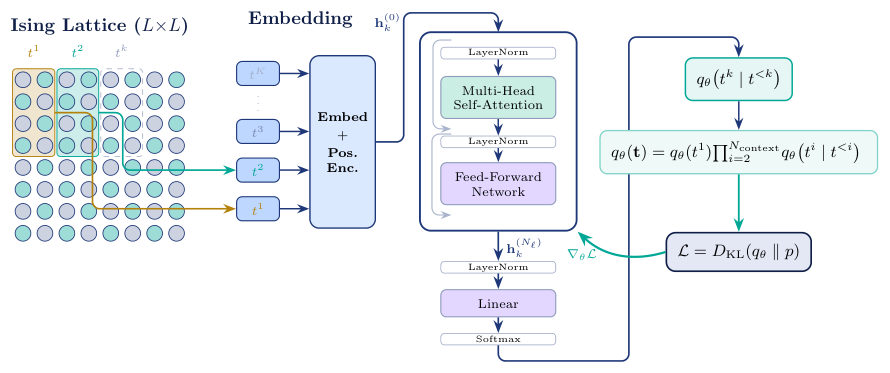 
Figure 1: Schematic view of tVAN algorithm. Configuration of spins is divided into patches that are generated sequentially. Output of the transformer is a conditional probability of the next patch.

📷 Fig 2

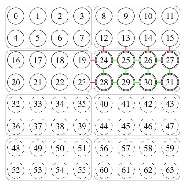 
Figure 2: The sample is generated sequentially, starting from the upper-left corner. Grey rectangles denote the patches produced by the transformer in a single step. Assuming that three initial patches have already been generated, probability of fourth patch is calculated. Green connections indicate interactions between spins inside a patch, while red represents interactions with neighboring patches; sum of those is E4, Eq. 14, and enters approximate probabilities formula, Eq. 15.

📷 Fig 3

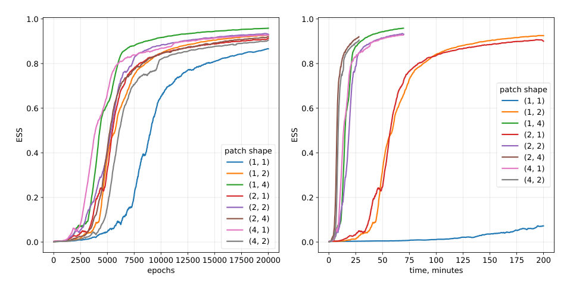 
Figure 3: The history of Ising model training for L = 32 with different patch shapes. No approximate probabilities were used. The lines show moving average of ESS (with window of 30 points, points were saved every 10 epochs) that are averaged over 3 or 4 independent runs. Left: ESS as function of epoch. Right: the same, but as function of runtime.

📷 Fig 4

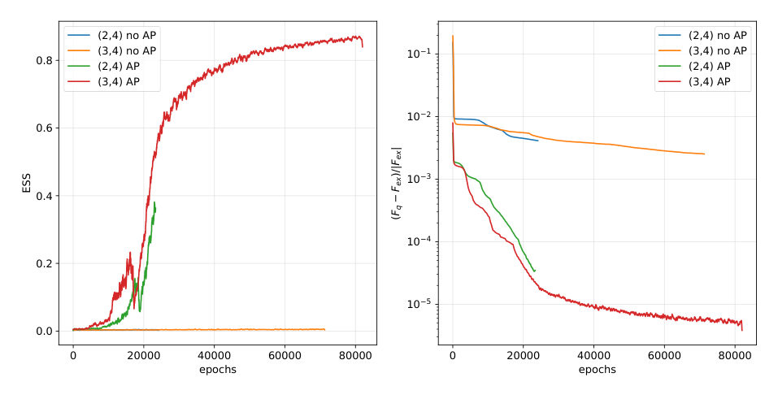 
Figure 4: The history of Ising model training for system size L = 120, for two patch shapes, 2 × 4 and 3 × 4, with and without approximate probabilities. Moving average is performed over 30 consecutive points and points were saved every 10 epochs. All runs took 48 hours. Left: ESS as function of epoch. Right: Relative values of Fq/L2 compared to Fex/L2 = −2.10975198.

📷 Fig 5

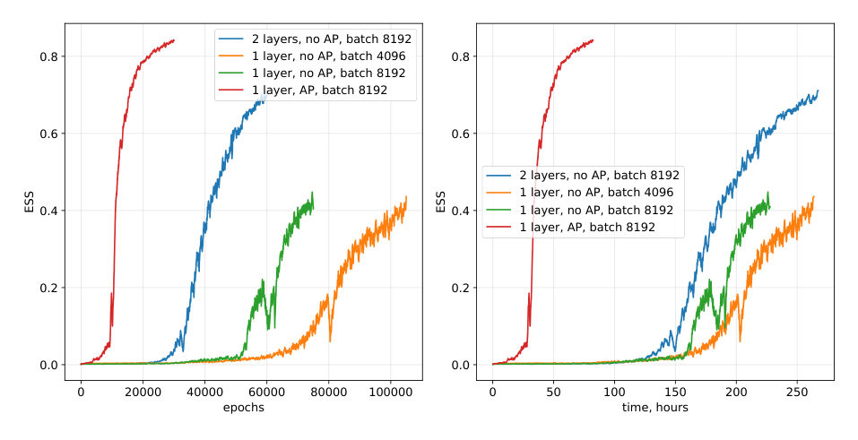 
Figure 5: Comparison of ESS during training using different setups. Results are for Ising model with L = 128. Moving average is performed over 30 consecutive points and points were saved every 10 epochs.

**Summary.** This paper introduces a novel Transformer-based neural sampler called tVAN that uses patch-based generation and approximate probabilities to efficiently sample large 2D spin systems. It demonstrates significant improvements in sampling quality and scalability compared to previous neural network approaches, particularly for the Ising model at the critical point.

**Why it may be interesting.** not directly relevant

Detailed structure

**Main problem.** Developing an efficient Transformer-based neural sampler for large-scale classical spin systems, overcoming the computational inefficiency and scaling limitations of previous autoregressive models.

**Main result.** The proposed tVAN architecture can sample 2D Ising models up to 180x180 and 2D Edwards-Anderson spin glasses up to 64x64, achieving an Effective Sample Size 20 times larger than previous state-of-the-art neural samplers at the critical temperature.

**Method.** A Transformer Variational Autoregressive Network (tVAN) that generates groups of spins (patches) per step and utilizes an 'Approximate Probabilities' method to accelerate training and improve efficiency.

**Model / system.** The study focuses on 2D classical spin systems, specifically the 2D Ising model and the 2D Edwards-Anderson spin glass model, using a Hamiltonian based on nearest-neighbor interactions.

**Key observables.** Effective Sample Size (ESS), Variational Free Energy (Fq), and Relative Error in Free Energy Density.

**Important parameters / regimes.** Critical temperature for the Ising model, spin glass transition temperature, patch sizes (e.g., 2x4, 3x4), and system size L.

**Assumptions / limitations.** The Approximate Probabilities method is currently restricted to nearest-neighbor interactions, and the complexity analysis ignores element-wise operations and activation functions.

**Figures summary.** Figure 1 shows the tVAN architecture; Figure 2 illustrates patch-based generation; Figure 3 and 4 show training history (ESS vs. epochs/time) for various patch sizes and the impact of Approximate Probabilities; Figure 5 and 6 show ESS training history for the EA model; Appendix figures show scaling of training time and memory usage.

**Paper structure.** The paper introduces the tVAN architecture and patch-based generation, details the training process and the Approximate Probabilities method, presents performance results on Ising and Edwards-Anderson models, provides a complexity analysis of scaling with system size, and concludes with limitations and future directions.

Abstract

Autoregressive Neural Networks based on dense or convolutional layers have recently been shown to be a viable strategy for generating classical spin systems. Unlike these methods, sampling with transformers is commonly considered to be computationally inefficient. In this work, we propose a novel approach to transformer-based neural samplers in which we generate not a single spin per step but groups of spins. As an additional improvement, we construct a model of approximated probabilities, further improving the efficiency of the algorithm. Despite our approach being computationally heavier than dense networks or CNN-based approaches, we were able to sample larger systems of up to $180 \times 180$ spins in case of the Ising model. The Effective Sample Size of our sampler is $\sim 20$ times larger than that of the previous state-of-the-art neural sampler when trained for the $128 \times 128$ Ising model at critical temperature. Finally, we also test our algorithm on the 2D Edwards-Anderson model, where we train $64\times 64$ spin systems.

[↑ back to top](#top)

### [Stepping up enhanced rate calculations with EATR-flooding](http://arxiv.org/abs/2604.27136v1)

**Authors:** Nicodemo Mazzaferro, Willmor J Pena Ccoa, Pilar Cossio, Glen M. Hocky  
**Type:** theory · **Category:** statistical mechanics · **PDF:** <https://arxiv.org/pdf/2604.27136v1>  
**Analysis basis:** abstract only; PDF text extraction failed or PDF unavailable

**Summary.** This paper presents EATR-flooding, a new method for calculating rate constants in molecular simulations. It allows for more efficient and accurate rate estimation using quasi-static biasing schemes, making it broadly applicable to various enhanced sampling techniques.

**Why it may be interesting.** not directly relevant

Detailed structure

**Main problem.** The original EATR method for computing rate constants requires a time-dependent biasing potential, which limits its use in quasi-static biasing schemes like OPES or flooding.

**Main result.** The authors introduce EATR-flooding, a generalization that uses stepped-up biasing strengths across multiple simulations to estimate rates, providing an internal check for over-biasing and a more stable CV-quality factor.

**Method.** The method replaces time-dependent bias with a series of simulations with increasing biasing potential strengths (stepping up) and utilizes a learned CV-quality factor gamma.

**Model / system.** The method is demonstrated on a coarse-grained protein system and a fully atomistic cavity-ligand model.

**Key observables.** Rate constants of slow biomolecular processes and the CV-quality factor gamma.

**Important parameters / regimes.** The biasing potential strength and the CV-quality factor gamma.

**Assumptions / limitations.** The method assumes the applicability of the EATR framework to quasi-static biasing schemes and relies on the accuracy of the learned quality factor.

**Paper structure.** The paper introduces the limitation of the original EATR method, presents the new EATR-flooding approach, describes the implementation as an open-source Python library, and validates the method using protein and cavity-ligand models.

Abstract

Several recent methods have shown that it is possible to compute rate constants of very slow biomolecular processes using simulations where a time-dependent bias is added along one or several collective variables (CVs). We previously reported the exponential average time-dependent rate (EATR) method, which can improve upon these approaches by accounting for how efficiently the external biasing potential modifies the observed rate using a learned CV-quality factor $γ$. This results in more accurate rate estimates using the same data when biasing a suboptimal coordinate. However, as formulated EATR depended on the biasing potential varying over time to properly determine the biasing efficiency, which limits the method's applicability to quasi-static biasing schemes such as ``flooding'' or on-the-fly probability enhanced sampling (OPES). Here, we present the EATR-flooding approach, which generalizes our method by replacing the need for a time dependent bias by instead varying (stepping up) the strength of the biasing potential across multiple sets of simulations. We implement this approach as an open-source Python library, and demonstrate that this approach is accurate without substantial loss of efficiency compared to standard EATR for a coarse-grained protein system, and also show good performance on a fully atomistic cavity-ligand model. Two additional appealing features of EATR-flooding are an internal check for over-biasing and the fact that only a single $γ$ parameter is predicted for a given choice of CVs, as compared to our earlier results where $γ$ empirically depended on biasing rate. Finally, we believe EATR-flooding applies not only to OPES simulations but more generally to CV biasing enhanced sampling approaches, making it broadly useful.

[↑ back to top](#top)

### [The Great Chicken-and-Egg of Chemistry: Bonding vs. Stability Revisited](http://arxiv.org/abs/2604.27222v1)

**Authors:** Cherif F. Matta  
**Type:** theory · **Category:** other · **PDF:** <https://arxiv.org/pdf/2604.27222v1>  
**Analysis basis:** full PDF text, analyzed in chunks

📷 Fig 1

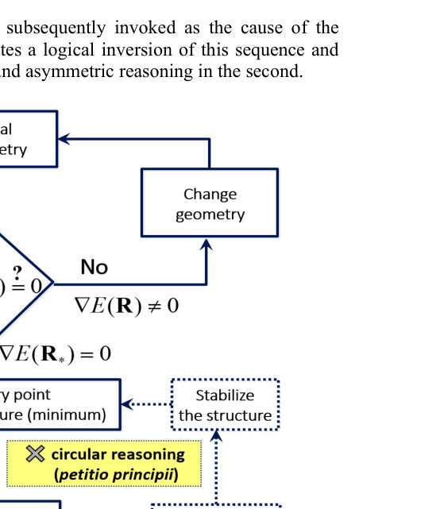 
Fig. 1. Logical flow to chemical bonding descriptors starting from the of the Born–

**Summary.** This paper provides a logical critique of how chemical bonding is conceptualized, arguing that 'bonds' are emergent patterns in the electron density rather than fundamental causes of stability. It aims to correct the 'category error' of treating derived descriptors as primitive physical entities in the molecular Hamiltonian. The work highlights the distinction between successful predictive models and true physical causation.

**Why it may be interesting.** not directly relevant

Detailed structure

**Main problem.** The paper addresses the logical fallacy in chemistry where chemical bonding and steric repulsion are treated as primitive causal agents of structural stability rather than derived descriptors of the quantum state.

**Main result.** The author demonstrates that bonding is an emergent, state-dependent descriptor that correlates with stability but does not constitute its fundamental cause, as the molecular Hamiltonian contains no bond operators.

**Method.** The paper employs a conceptual and logical analysis using frameworks such as QTAIM, the Born-Oppenheimer approximation, and Catastrophe Theory to evaluate the ontological status of chemical descriptors.

**Model / system.** The study focuses on molecular systems (including proteins and crystals) described by the non-relativistic molecular Hamiltonian involving electrons and nuclei.

**Key observables.** Electron density, bond paths, bond orders, Laplacian of the density, and energy density.

**Important parameters / regimes.** Stationary points of the potential energy surface, kinetic and potential energy densities, and the Born-Oppenheimer approximation.

**Assumptions / limitations.** The argument assumes the validity of the molecular Hamiltonian as the fundamental physical description of the system.

**Figures summary.** A graphical abstract illustrating the 'chicken-and-egg' problem of bonding and steric repulsion, and a figure depicting the logical flow from the Hamiltonian to derived descriptors.

**Paper structure.** The paper begins by identifying the circular reasoning in chemical bonding, moves to an analysis of the molecular Hamiltonian and the derivation of descriptors, provides case studies like H-H bonding and protein stability, and concludes with a discussion on the hierarchy of chemical language and causation.

Abstract

The chemical bond is a central organizing concept in chemistry, yet it is absent from the molecular Hamiltonian and no "bond operator" exists. Bonding is therefore not a primitive physical entity but a derived descriptor emerging from the quantum state. The logical consequences of this observation are revisited. Statements such as "bonding stabilizes structure" when taken literally risk circular reasoning (petitio principii), whereby bonding is inferred from a stationary structure and then invoked as its cause. The same caution applies to concepts such as steric repulsion, which is also a derived descriptor. Bonding accompanies stable or metastable states and correlates with their properties without constituting their cause. Illustrative examples are drawn from QTAIM, non-covalent interaction (NCI) approach, protein structure, and hydrogen-hydrogen bonding. Causation, language, and the autonomy of chemistry are also briefly discussed. The aim is not at all to diminish the role of bonding, but to place it at the correct logical level, that is, as a powerful, state-dependent descriptor that organizes, classifies, and predicts chemical behavior without serving as its fundamental cause.

[↑ back to top](#top)

### [The quantum group structure of long-range integrable deformations](http://arxiv.org/abs/2604.27189v1)

**Authors:** Koen Schouten, Marius de Leeuw  
**Type:** theory · **Category:** statistical mechanics · **PDF:** <https://arxiv.org/pdf/2604.27189v1>  
**Analysis basis:** full PDF text, analyzed in chunks

📷 Fig 1

 
Low-resolution page preview, page 2

📷 Fig 2

 
Low-resolution page preview, page 3

📷 Fig 3

 
Low-resolution page preview, page 4

📷 Fig 4

 
Low-resolution page preview, page 5

📷 Fig 5

 
Low-resolution page preview, page 6

**Summary.** This paper provides a quantum group-theoretical description of long-range integrable deformations in spin chains. It reveals that these deformations arise from a twisting process that introduces non-associativity, with the Drinfeld associator acting as the key mechanism for encoding long-range interactions.

**Why it may be interesting.** not directly relevant

Detailed structure

**Main problem.** The paper aims to identify the underlying quantum group structure for long-range integrable deformations of spin chains, which had previously been unrecognized despite the known properties of their commuting charges.

**Main result.** The authors demonstrate that long-range deformations are obtained via a twist of the underlying quantum group, resulting in a non-associative algebra characterized by a non-trivial Drinfeld associator that encodes the long-range interaction terms.

**Method.** The study employs an algebraic framework using FRT-bialgebras, the quantum inverse scattering method, and a perturbative approach up to the first order in the deformation parameter, utilizing tools like the Sutherland equation and Drinfeld associators.

**Model / system.** The research focuses on arbitrary homogeneous Yang-Baxter integrable spin chains, including specific examples like the Heisenberg (XXX) and Haldane-Shastry spin chains, subject to long-range deformations generated by local, boost, and bilocal operators.

**Key observables.** Conserved charges (pairwise commuting charges), R-matrices, Lax operators, transfer matrices, and algebraic charge densities.

**Important parameters / regimes.** The deformation parameter (lambda) and the spectral parameters (u, v).

**Assumptions / limitations.** The results are provided only up to the first order in the deformation parameter, and the R-matrix is assumed to be analytic around the origin.

**Paper structure.** The paper begins by establishing the FRT-bialgebra framework and its duality with the Drinfeld-Jimbo approach, then introduces the twisting procedure to describe long-range deformations, proves the vanishing of the Drinfeld associator to establish the quantum group structure, and concludes with explicit constructions of Lax operators and connections to the Theta-morphism.

Abstract

Quantum integrable spin chains are known to possess a large family of long-range deformations generated by the local, boost and bilocal operators. Although these deformations are well-understood on the level of the pairwise commuting charges, the underlying quantum group structures had not yet been recognised. In this paper, we provide a quantum group-theoretical description for the family of long-range deformations of arbitrary homogeneous Yang-Baxter integrable spin chains up to first order in the deformation parameter. In particular, we show that the deformations are obtained via a twist of the algebraic structure of the underlying quantum group. This twisting results in a generally non-associative algebra that has a non-trivial Drinfeld associator. The Drinfeld associator is then shown to encode the information about the long-range interaction terms for the integrable spin chain. Moreover, the deformed quantum group is shown to contain a large perturbatively associative substructure, thus ensuring the perturbative integrability of the long-range model. The deformed quantum group provides explicit expressions for the Lax operators and R-matrices of the long-range deformed models, which manifestly satisfy the RLL relation and the Yang-Baxter equation up to first order in the deformation parameter. In order to derive the results, we introduce algebra elements that we call the algebraic charge densities. As a side result, we provide a conjecture for the explicit expressions of the undeformed charge densities in terms of these algebra elements.

[↑ back to top](#top)

### [The second altermagnet candidate in organic conductors: $κ$-(BEDT-TTF)$_2$$m$-HOOCC$_6$H$_4$SO$_3$](http://arxiv.org/abs/2604.27746v1)

**Authors:** Kohei Tokura, Takato Masuta, Kazushi Aoyama, Hiroki Akutsu, Yasuhiro Nakazawa, Scott S. Turner  
**Type:** both · **Category:** strongly correlated electrons · **PDF:** <https://arxiv.org/pdf/2604.27746v1>  
**Analysis basis:** full PDF text, analyzed in chunks

📷 Fig 1

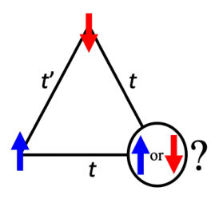 
FIG. 1. Frustration of spins on a triangular lattice.

📷 Fig 2

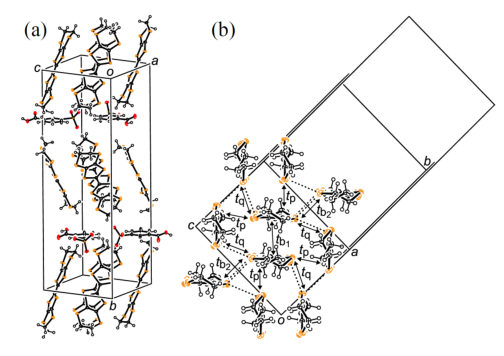 
FIG. 2. (a) Crystal structure of κ-m-SBA, where disorders are omitted for clarity. (b) Structure of the κ-type donor arrangement.

📷 Fig 3

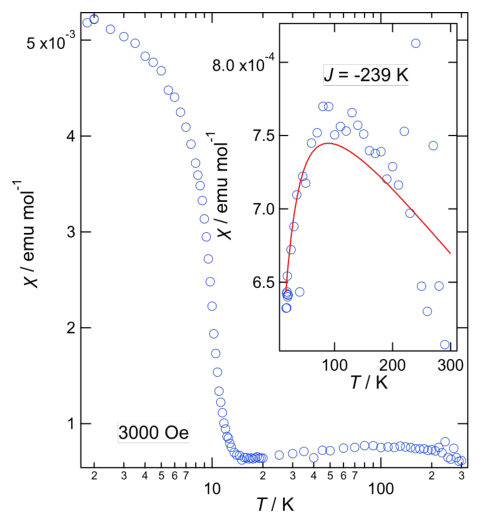 
FIG. 3. χ-T plots of κ-m-SBA. The inset shows the expansion from 16-300 K.

📷 Fig 4

 
FIG. 4. M-H plots of κ-m-SBA.

📷 Fig 5

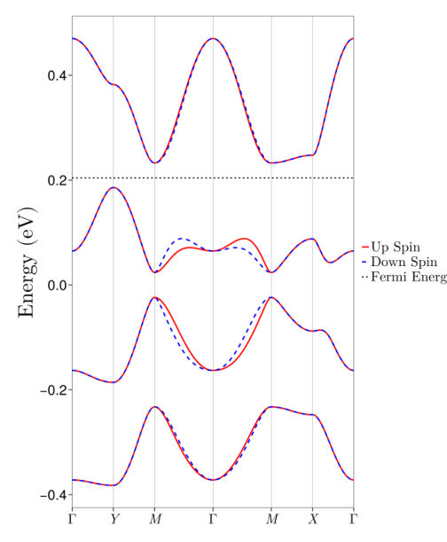 
FIG. 5. The energy bands of κ-m-SBA.

**Summary.** The researchers synthesized a new organic conductor, kappa-m-SBA, which serves as the second known candidate for altermagnetism in organic salts. By combining experimental measurements with numerical simulations, they demonstrated that the material exhibits the spin-dependent band splitting characteristic of altermagnets. This finding expands the known library of organic materials with unique spin-orbit-like electronic structures without requiring heavy elements.

**Why it may be interesting.** not directly relevant

Detailed structure

**Main problem.** The identification of a new candidate for altermagnetism in organic conductors and explaining why the material kappa-m-SBA exhibits a canted antiferromagnetic transition instead of a spin liquid state.

**Main result.** The discovery of kappa-m-SBA as the second organic altermagnet candidate, demonstrating characteristic spin-dependent band splitting due to the interplay of AFM order and anisotropic electron hopping.

**Method.** The study combines electrocrystallization synthesis, SQUID magnetometry, and electrical resistivity measurements with first-principles (OpenMX) and tight-binding band calculations.

**Model / system.** A novel organic conductor, kappa-(BEDT-TTF)2m-HOOCC6H4SO3 (kappa-m-SBA), modeled using a Hubbard model on a dimerized, nearly equilateral triangular lattice.

**Key observables.** Magnetic susceptibility (chi-T), magnetization (M-H), electrical resistivity, spin-dependent band splitting, and the frustration parameter (t'/t).

**Important parameters / regimes.** Neel temperature (TN) = 14 K, transfer integrals (t, t', tb, tp, tq), Coulomb interaction (U = 0.54 eV), and Mott gap (0.22 eV).

**Assumptions / limitations.** The slightly canted magnetic structure is approximated as a collinear antiferromagnetic order to evaluate symmetry-driven altermagnetism.

**Figures summary.** Figure 5 shows energy band dispersion with spin splitting; Figure S8 shows the anionic layer crystal structure and dipole orientation; Figure S9 shows the classification of polar organic conductors.

**Paper structure.** The paper introduces the new material, details its synthesis and structural properties, analyzes its magnetic and electronic transport properties, and concludes with numerical calculations demonstrating altermagnetic signatures.

Abstract

We have developed a novel BEDT-TTF-based organic conductor, $κ$-(BEDT-TTF)$_2 m$-HOOCC$_6$H$_4$SO$_3$ ($κ$-$m$-SBA), and propose it as a candidate for altermagnet. Tight-binding band calculations of $κ$-$m$-SBA provide a $t'/t$ of 1.01 at 100 K, indicating that the spin structure is closely aligned to an equilateral triangle ($t'/t= 1$). While most $κ$-type BEDT-TTF-based salts become spin liquids due to the spin frustration caused by the triangular lattice, $κ$-$m$-SBA surprisingly shows a weak ferromagnetic transition at $T_\mathrm{N} = 14$ K due to a canted antiferromagnetic (AFM) spin structure. Until recently, $κ$-(BEDT-TTF)$_2$Cu[N(CN)$_2$]Cl ($κ$-Cl) was the only $κ$-type organic conductor known to exhibit this order, and it is also recognized as the first candidate for altermagnetism in organic conductors. This was theoretically predicted by Naka et al. in 2019, who demonstrated that $κ$-type organic conductors can be candidates for altermagnetism if they display such order. Consequently, $κ$-$m$-SBA can be considered the second candidate for altermagnetism in organic conductors. Furthermore, numerical calculations demonstrate a characteristic of altermagnets in $κ$-$m$-SBA, namely spin splitting of energy bands.

[↑ back to top](#top)

### [Topological phase transitions in twisted bilayer graphene/hBN from interlayer coupling and substrate potentials](http://arxiv.org/abs/2604.27304v1)

**Authors:** Huiwen Wang, Wei Jiang  
**Type:** theory · **Category:** strongly correlated electrons · **PDF:** <https://arxiv.org/pdf/2604.27304v1>  
**Analysis basis:** abstract only; PDF text extraction failed or PDF unavailable

**Summary.** This paper investigates how varying interlayer coupling and substrate potentials affects the topological phases in TBG/hBN. It identifies new high-Chern number states and explains the underlying band-inversion mechanisms. These findings help interpret experimental observations in moire materials.

**Why it may be interesting.** not directly relevant

Detailed structure

**Main problem.** The study aims to provide a systematic understanding of how the combined influence of interlayer coupling and substrate potentials drives topological phase transitions in twisted bilayer graphene/hBN.

**Main result.** The authors map out Chern number phase diagrams, revealing a rich topological landscape that includes high-Chern number states (C = 3, 4, and 5) and identifying specific band-inversion mechanisms.

**Method.** A comprehensive study using a continuum model to vary material parameters and analyze the evolution of Berry curvature.

**Model / system.** Twisted bilayer graphene aligned with hexagonal boron nitride (TBG/hBN) described by a continuum model including interlayer hopping strengths and hBN-induced potentials.

**Key observables.** Chern number, Berry curvature, and band-inversion mechanisms.

**Important parameters / regimes.** Interlayer hopping strengths (w0, w1), hBN-induced staggered potential, and the presence or absence of the hBN moire potential.

**Assumptions / limitations.** The study relies on the validity of the continuum model for describing the moire flat bands.

**Paper structure.** The paper presents a systematic study of phase diagrams, identifies specific topological transitions, and links these transitions to band-inversion mechanisms at various k-points.

Abstract

Twisted bilayer graphene aligned with hexagonal boron nitride (TBG/hBN) hosts rich topological and correlated quantum phases, such as (fractional) Chern insulators, whose character is dictated by the topology of the moiré flat band. This topology is highly sensitive to several material parameters in the continuum model, yet a systematic understanding of their combined influence has been lacking. Here, we present a comprehensive study of topological phase transitions in TBG/hBN by varying the interlayer hopping strengths ($w_0, w_1$) and hBN-induced staggered potential, both with and without the hBN moiré potential. We map out Chern number phase diagrams across a broad, experimentally relevant parameter space, revealing a progressive enrichment of the topological landscape including multiple high-Chern number ($C$ = 3, 4, and 5) states. Each transition is linked to distinct band-inversion mechanisms at generic $C_3$-symmetric k points, high-symmetry momenta, or parabolic touchings, clearly reflecting in the evolution of the Berry curvature. Our results offer theoretical insights that help interpret existing experimental observations, elucidate the mechanisms driving these topological phase transitions and facilitate the exploration of topological states in TBG/hBN and related moiré systems.

[↑ back to top](#top)

### [Towards Accelerated SCF Workflows with Equivariant Density-Matrix Learning and Analytic Refinement](http://arxiv.org/abs/2604.27256v1)

**Authors:** Zuriel Y. Yescas-Ramos, Andrés Álvarez-García, Huziel E. Sauceda  
**Type:** theory · **Category:** numerical methods · **PDF:** <https://arxiv.org/pdf/2604.27256v1>  
**Analysis basis:** full PDF text, analyzed in chunks

📷 Fig 1

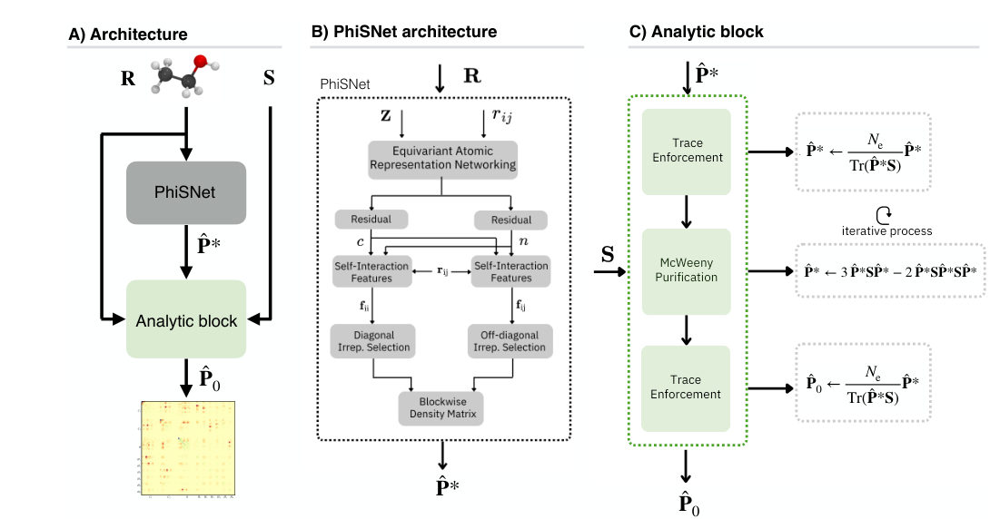 
FIG. 1. dm-PhiSNet model. (A) The PhiSNet-based backbone (gray box) builds blockwise AO 1-RDMs from molecular geometries R and atomic numbers Z, which are then refined by the analytic block (green box) to give the 1-RDM predictor. (B) Representation of the PhiSNet architecture. [25] (C) The AnalyticBlock is constructed by three sub-blocks to enforce physical consistency using the overlap matrix S: (i) trace rescaling, (ii) McWeeny purification cycle, and (iii) a final trace rescaling.

📷 Fig 2

 
FIG. 2. Mean numbers of SCF iterations over 500 test configurations for all benchmarked systems. Results compare the performance of the 1-RDMs predicted by our model against the conventional SAD (atom), MINAO, and H¨uckel initial guesses. Magnitudes of the standard deviations (STD) are represented by vertical black lines on the frequency bars. Reductions with respect to the three averaged standard initial guesses are also shown.

📷 Fig 3

 
FIG. 3. (A) Distributions of single-point errors in total en- ergy ∆E (left axis) and force norms ∥∆F∥(right axis) com- puted directly from the predicted 1-RDM ˆP0, for ethanol (top panel) and NO− 3 (bottom panel). (B) Conceptual integration into MD: conventional SCF versus using ˆP0 either (i) directly for an SCF-free MD step (as a CP-style electronic initializer) or (ii) as a warm start for accelerated SCF refinement for BO- MD.

**Summary.** The paper introduces dm-PhiSNet, a machine learning model designed to accelerate quantum chemistry calculations by predicting physically consistent density matrices. By enforcing physical constraints like electron conservation, the model provides high-quality initial guesses that significantly reduce the computational time required for SCF convergence. It also demonstrates the ability to predict accurate molecular forces without direct training on force data.

**Why it may be interesting.** not directly relevant

Detailed structure

**Main problem.** Accelerating Self-Consistent Field (SCF) workflows in electronic-structure theory by generating physically admissible initial density matrix guesses.

**Main result.** The dm-PhiSNet model reduces SCF iteration counts by 49-81% compared to standard initializations and provides accurate one-shot total energies and forces without explicit force supervision.

**Method.** A hybrid architecture combining an SE(3)-equivariant PhiSNet backbone with a lightweight analytic refinement block that enforces electron-number conservation and generalized idempotency.

**Model / system.** The model predicts one-electron reduced density matrices (1-RDMs) in an atomic-orbital basis for closed-shell molecular systems including H2O, CH4, NH3, HF, ethanol, and NO3-.

**Key observables.** One-electron reduced density matrices (1-RDMs), total energies, and Hellmann-Feynman atomic forces.

**Important parameters / regimes.** Tight convergence thresholds (Energy: 10^-9 Ha, Density: 10^-8, Gradient: 10^-6 Ha/Bohr) using the DIIS solver.

**Assumptions / limitations.** The study focuses on closed-shell systems within the Restricted Kohn-Sham (RKS) theory framework using a non-orthogonal AO basis.

**Figures summary.** Figure 1 details the dm-PhiSNet and AnalyticBlock architectures; Figure 2 shows a bar chart of SCF iteration reductions; Figure 3 displays error distributions for energy and force norms and illustrates integration routes for molecular dynamics.

**Paper structure.** The paper introduces the dm-PhiSNet architecture, details the analytic refinement and two-stage training protocol, presents benchmarks on molecular systems showing SCF acceleration and force accuracy, and concludes with the scalability of the approach.

Abstract

We present \textsc{dm-PhiSNet}, a physically constrained \textsc{PhiSNet}-based equivariant model that predicts one-electron reduced density matrices (1-RDMs) directly from molecular geometries in an atomic-orbital (AO) basis for accelerated self-consistent field (SCF) workflows. Training follows a two-stage schedule with progressively introduced physically motivated objectives, and the resulting predictions are refined by a lightweight analytic block. This block enforces electron-number conservation, drives the 1-RDM toward generalized idempotency in the AO metric, and regularizes the occupation spectrum of the Löwdin-orthogonalized density. Across six closed-shell systems -- H$_2$O, CH$_4$, NH$_3$, HF, ethanol, and NO$_3^-$ -- the refined 1-RDMs provide SCF initial guesses that substantially reduce iteration steps by 49--81\% relative to standard initializations. Beyond SCF acceleration, the learned 1-RDMs yield accurate one-shot total energies and Hellmann--Feynman atomic forces without force supervision, indicating that the model captures chemically meaningful electronic structure. These results demonstrate that combining equivariant learning with analytic constraint enforcement provides a simple, general route to solver-ready density-matrix initializations and accelerated SCF workflows.

[↑ back to top](#top)

## Secondary cond-mat archives

*Papers from cond-mat.mtrl-sci, mes-hall, other, soft, supr-con. These archives are de-prioritized — they appear at the end regardless of relevance score.*

### Relevant in secondary archives (16)

### [Strong coupling between quantized magnon modes in a YIG microstucture and microwaves in a superconducting resonator](http://arxiv.org/abs/2604.28145v1)

**Authors:** Seth W. Kurfman, Philipp Geyer, Anoop Kamalasanan, Karl Heimrich, Kwangyul Hu, Paul Tharnier, Frank Heyroth, Michael Flatté, Georg Schmidt  
**Type:** experiment · **Category:** quantum information and computing · **PDF:** <https://arxiv.org/pdf/2604.28145v1>  
**Analysis basis:** abstract only; PDF text extraction failed or PDF unavailable
**Topic relevance:** 🔥 `spintronics-quantum-optics interface` **5/5** · `QC/QI experiment` **3/5** · `Tavis-Cummings & cavity-many-emitter` **3/5** · `quantum optics experiment` **3/5**

**Summary.** The study achieves strong coupling between multiple magnon modes and superconducting resonator photons in micron-scale YIG structures. By using FIB-milled microplatelets, the researchers overcame previous fabrication limits on mode volume. This provides a foundational method for efficient, low-power, on-chip magnonic quantum technologies.

**Why it may be interesting.** This work is highly relevant to quantum optics and open quantum systems as it demonstrates a platform for scalable, on-chip strong coupling between many long-lived excitations (magnons) and microwave photons, essential for hybrid quantum architectures.

Detailed structure

**Main problem.** Achieving strong coupling between magnons and microwave photons in sub-10 micron Yttrium Iron Garnet (YIG) structures has been difficult due to limited mode volume caused by YIG thickness and fabrication constraints.

**Main result.** The researchers demonstrated strong coupling between numerous magnon modes in a FIB-manufactured YIG microplatelet and a superconducting LC resonator, even at extremely low input powers (<= 10 fW).

**Method.** The team used Focused Ion Beam (FIB) techniques to create a YIG microplatelet from a single crystal and placed it on a constricted inductive line of an optimized superconducting lumped element LC resonator.

**Model / system.** The system consists of quantized magnon modes within a micron-scale YIG microplatelet coupled to photons in a superconducting lumped element LC resonator.

**Key observables.** Microwave transmission signal and anti-crossings in the transmission spectrum.

**Important parameters / regimes.** Sub-10 micron YIG structures, device input powers <= 10 fW.

**Paper structure.** The paper introduces the challenge of small-scale magnonics, describes the FIB fabrication and resonator design, presents experimental evidence of anti-crossings, validates results with micromagnetic simulations and analytical calculations, and demonstrates low-power operation.

Abstract

Strong-coupling experiments based on magnons enable the exploration into on-chip demonstrations involving numerous long-lived excitations. Yttrium iron garnet (YIG) has been considered for decades as a gold standard material for magnonics due to its low-loss magnonic properties. While YIG has successfully demonstrated strong-coupling in macroscopic device geometries, the strong coupling of magnons in truly sub-10 micron YIG structures to date has not yet been realized. This obstacle is due to the difficulty producing large enough effective magnonic mode volume necessary primarily due to thickness limitations of YIG deposition and device fabrication techniques. Here, we demonstrate the use of a microplatelet of YIG, manufactured from a single crystal of YIG via focused ion beam (FIB) techniques, placed on a constricted inductive line of an optimized superconducting lumped element LC resonator to achieve strong coupling between numerous magnon modes and the LC resonator photons. These experimental findings are qualitatively backed by micromagnetic simulations and quantitatively supported by analytical calculations to identify the magnon modes corresponding to the experimentally observed anti-crossings in the microwave transmission signal. Further, we show that these anti-crossings remain even at incredibly low device input powers ($\leq 10$ fW). The fabrication techniques and device geometry enable the deterministic use of numerous confined magnon modes in micron-scale YIG structures for various magnetic field strengths and orientations at substantially reduced device powers. The results here establish a foundational path forward to achieving efficient magnon-based strong-coupling experiments in micron-scale YIG magnetic elements for effective on-chip studies.

[↑ back to top](#top)

### [Spin-coherence characterization of boron vacancy defects in hexagonal boron nitride with broadband microwave pulses](http://arxiv.org/abs/2604.27843v1)

**Authors:** Yuki Nakamura, Takuya Iwasaki, Shu Nakaharai, Shinichi Ogawa, Yukinori Morita, Kenji Watanabe, Takashi Taniguchi, Kento Sasaki, Kensuke Kobayashi  
**Type:** experiment · **Category:** quantum information and computing · **PDF:** <https://arxiv.org/pdf/2604.27843v1>  
**Analysis basis:** abstract only; PDF text extraction failed or PDF unavailable
**Topic relevance:** 🔥 `QC/QI experiment` **4/5** · `spintronics-quantum-optics interface` **3/5** · `quantum measurements` **2/5** · `quantum optics experiment` **2/5**

**Summary.** This study characterizes the spin coherence of boron vacancy defects in hBN using broadband microwave pulses. By measuring T2* and T2 times, the researchers established an effective method for evaluating spin defects in van der Waals thin films. These findings are crucial for developing hBN-based nanoscale quantum sensors.

**Why it may be interesting.** This paper is relevant for researchers in open quantum systems and quantum optics as it provides experimental characterization of decoherence mechanisms and spin-coherence dynamics in a solid-state platform suitable for quantum sensing.

Detailed structure

**Main problem.** Characterizing the spin coherence times (T2* and T2) of negatively charged boron vacancy (VB-) defects in hBN for use in nanoscale quantum sensing.

**Main result.** The study achieved sub-GHz Rabi oscillations and measured spin coherence times of T2* = 13.8 ns and T2 = 108.7 ns using broadband microwave pulses.

**Method.** The researchers used broadband microwave pulses on an isotopically enriched hBN thin film stamped onto a gold wire to perform Ramsey interference and Hahn echo measurements.

**Model / system.** The physical system consists of negatively charged boron vacancy (VB-) defects in an isotopically enriched hexagonal boron nitride (hBN) thin film integrated with a narrow gold wire.

**Key observables.** Rabi oscillations, Ramsey interference signal (Gaussian-like decay), Hahn echo signal, and the stretch factor (alpha).

**Important parameters / regimes.** T2* = 13.8 ns, T2 = 108.7 ns, stretch factor alpha = 1.25, and sub-GHz Rabi frequency.

**Paper structure.** The paper introduces the potential of VB- in hBN for sensing, describes the experimental setup using gold wires and isotopically enriched films, presents the results of Rabi, Ramsey, and Hahn echo measurements, and concludes with the implications for evaluating spin defects in van der Waals materials.

Abstract

Negatively charged boron vacancy (VB-) defects in hexagonal boron nitride (hBN) are promising for nanoscale-proximity quantum sensing. To evaluate their performance, it is important to characterize the spin coherence times T2* and T2. In this study, we realized sub-GHz Rabi oscillations of VB- using an isotopically enriched hBN thin film directly stamped onto a narrow gold wire. Using these strong microwave pulses, we performed Ramsey interference and Hahn echo measurements. The Ramsey interference signal showed Gaussian-like decay, yielding T2* = 13.8 ns. The Hahn echo measurement gave T2 = 108.7 ns and a stretch factor of α= 1.25. These results experimentally clarify the spin coherence properties of VB- and provide an effective method for evaluating the coherence of spin defects in van der Waals thin films with broad resonance linewidths.

[↑ back to top](#top)

### [Mobile Exceptional Points Generate Momentum-Space Switching Domains](http://arxiv.org/abs/2604.27417v1)

**Authors:** Jung-Wan Ryu, Chang-Hwan Yi  
**Type:** both · **Category:** other · **PDF:** <https://arxiv.org/pdf/2604.27417v1>  
**Analysis basis:** abstract only; PDF text extraction failed or PDF unavailable
**Topic relevance:** `driven-dissipative phase transition` **3/5** · `non-equilibrium dynamics` **3/5** · `analog quantum simulation` **2/5** · `quantum optics experiment` **2/5**

**Summary.** The paper shows that moving exceptional points under periodic modulation create distinct regions in momentum space that exhibit different band-switching behaviors. This mechanism allows for the engineering of non-Hermitian topology by controlling the trajectories of EPs. The findings are validated through both theoretical modeling and a photonic crystal implementation.

**Why it may be interesting.** This is highly relevant for researchers in quantum optics and open quantum systems as it demonstrates how controlled motion of non-Hermitian degeneracies can be used to engineer specific topological band structures and switching phenomena.

Detailed structure

**Main problem.** The study investigates what new band topology emerges when exceptional points (EPs) become mobile under cyclic modulation in non-Hermitian systems.

**Main result.** Mobile EPs generate momentum-space switching domains that partition the Brillouin zone into regions with distinct band-switching behavior, which can eventually lead to global band switching.

**Method.** The authors use a minimal two-band lattice model to introduce a band-permutation invariant and demonstrate the effect in a photonic crystal with lossy materials.

**Model / system.** A minimal two-band lattice model under cyclic modulation and a photonic crystal platform incorporating lossy materials.

**Key observables.** Band-switching behavior, band-permutation invariant, and EP trajectories in an extended parameter space.

**Important parameters / regimes.** Crystal momentum, modulation parameter, and modulation strength.

**Paper structure.** The paper introduces the concept of mobile EPs, presents a theoretical framework using a two-band lattice model and a band-permutation invariant, describes the formation of switching domains, and concludes with a demonstration in a photonic crystal system.

Abstract

Exceptional points (EPs), non-Hermitian degeneracies where both eigenvalues and eigenvectors coalesce, play a central role in the topology of non-Hermitian spectra. Recent advances have enabled the controlled creation and manipulation of EPs in a wide range of physical systems, raising the question of what new band topology emerges when EPs become mobile under cyclic modulation. Here we show that mobile EPs generate momentum-space switching domains that partition the Brillouin zone into regions with distinct band-switching behavior. Using a minimal two-band lattice model, we introduce a band-permutation invariant that determines whether eigenmodes exchange after one modulation cycle. The boundaries between switching regions arise from the projection of EP trajectories in an extended parameter space combining crystal momentum and the modulation parameter. As the modulation strength increases, the switching domains expand and eventually cover the entire Brillouin zone, resulting in global band switching. The predicted switching-domain structure is further demonstrated in a photonic crystal with lossy materials. These results open a new avenue within non-Hermitian topology by enabling the engineering of EP-driven phenomena through their controlled motion.

[↑ back to top](#top)

### [Directional Cluster Migration Driven by Escape-Rate Asymmetry in Multi-Compartment Granular Systems](http://arxiv.org/abs/2604.27611v1)

**Authors:** Kai Kono, Hiroyuki Ebata, Shio Inagaki  
**Type:** both · **Category:** statistical mechanics · **PDF:** <https://arxiv.org/pdf/2604.27611v1>  
**Analysis basis:** full PDF text, analyzed in chunks
**Topic relevance:** `non-equilibrium dynamics` **3/5** · `driven-dissipative phase transition` **2/5** · `non-equilibrium universality` **2/5**

📷 Fig 1

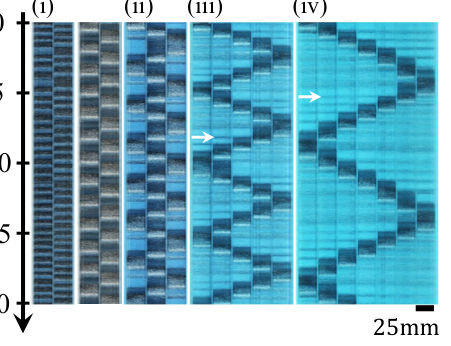 
FIG. 2. Spatiotemporal diagrams for systems with K = 2, 3, 5, and 7. Time t = 0 corresponds to the onset of vibra- tion. (i) K = 2. Two parameter sets are shown: N S = 347 and N L = 25 (left), and N S = 1000 and N L = 100 (right). (ii-iv) K = 3, 5, and 7. In all cases, N S = 1350 and N L = 124. In the spatiotemporal diagrams, black and white represent small and large particles, respectively. Arrows indicate faint horizontal streaks corresponding to gas-like small particles. N S and N L denote the numbers of small and large particles, respectively.

📷 Fig 2

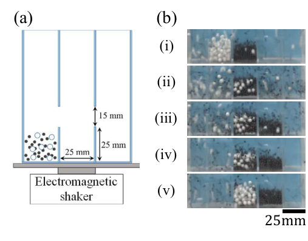 
FIG. 1. (a) Schematic illustration of the experimental setup (front view). The cell depth, perpendicular to the plane of the figure, was fixed at 30 mm. (b) Representative sequential snapshots taken at 10 s intervals, showing the cluster advanc- ing by one compartment in a five-compartment cell (K = 5) with N S = 1350 and N L = 124.

📷 Fig 3

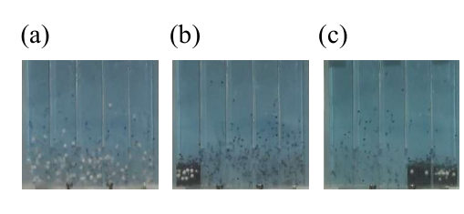 
FIG. 3. Representative snapshots (K = 5) illustrating three selected states used for phase-diagram classification. (a) Gas- like state. (b) Single-cluster state. (c) Two-cluster state. The directional migration state is shown separately in Fig. 1(b).

📷 Fig 4

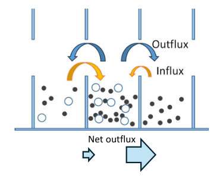 
FIG. 5. Schematic illustration of the local particle balance that determines the direction of cluster migration.

📷 Fig 5

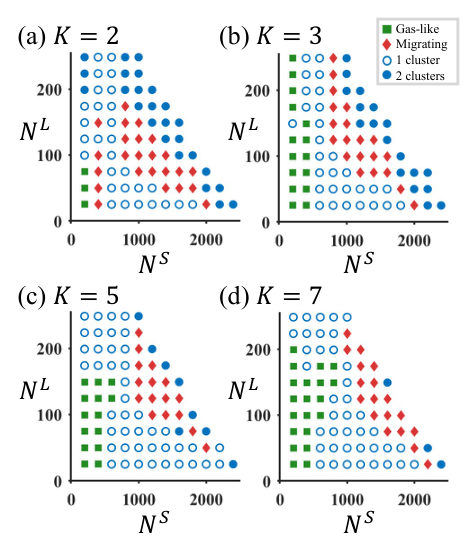 
FIG. 4. Phase diagrams classifying the dynamical states of the clusters in the N S −N L plane. The number of compartments is (a) K = 2, (b) K = 3, (c) K = 5, and (d) K = 7. Green squares: gas-like state; red diamonds: migrating state; blue open circles: stationary single-cluster state; blue filled circles: stationary two-cluster state.

**Summary.** This paper explains how clusters of different-sized particles move directionally through a multi-compartment system under vibration. By measuring how one particle species affects the escape rate of another, the authors created a predictive model that reproduces complex, stepwise migration patterns. This provides a framework for understanding collective transport in driven, out-of-equilibrium systems.

**Why it may be interesting.** The asymmetric, population-dependent escape rates and the resulting directional transport are analogous to activating-inhibitory interactions in reaction-diffusion systems and non-equilibrium steady states in open systems.

Detailed structure

**Main problem.** The study aims to characterize the quantitative mechanism behind directional, stepwise cluster migration in multi-compartment, vertically vibrated granular systems.

**Main result.** The researchers identified that directional migration is driven by an asymmetric interaction where large particles enhance the escape rate of small particles, while small particles suppress the escape rate of large particles.

**Method.** The authors used high-speed video to directly measure particle escape rates as a function of population and developed a minimal flux model based on these experimental measurements.

**Model / system.** A vertically vibrated, bidisperse granular system (small silicon nitride and large zirconia particles) in an acrylic cell with 2 to 7 compartments and slits for particle exchange.

**Key observables.** Particle flux, particle populations (Ns, NL), and spatiotemporal migration patterns.

**Important parameters / regimes.** Number of compartments (K), particle counts (Ns, NL), vibration acceleration (Gamma), and cell depth.

**Assumptions / limitations.** The model assumes particle exchange occurs only between adjacent compartments and that material properties are implicitly encoded in the measured escape rates.

**Figures summary.** Figure 1 shows the experimental setup and snapshots of migration; Figure 2 presents spatiotemporal diagrams; Figure 3 shows different stationary states; Figure 4 and 12 show phase diagrams in the Ns-NL plane; Figure 7-10 show escape rate heat maps and fitting parameters; Figure 11 shows numerical simulations of cluster motion.

**Paper structure.** The paper introduces the phenomenon of cluster migration, describes the experimental setup and measurement of escape rates, presents the development of a minimal flux model using empirical fits, validates the model against experimental observations, and discusses the resulting phase diagrams and physical mechanisms.

Abstract

Granular materials are inherently out-of-equilibrium systems due to energy dissipation through inelastic collisions and friction. When driven by mechanical agitation such as vibration, they exhibit rich collective behaviors including segregation, clustering, and spontaneous oscillations. Here, we report directional stepwise migration of particle clusters from one compartment to the next in a vertically vibrated granular system composed of small and large particles. To clarify the underlying mechanism, we directly measured how the flux of both particle species depends on the instantaneous particle populations. The measurements reveal an asymmetric interaction between particle species: the flux of small particles is enhanced by the presence of large particles, whereas that of large particles is suppressed by small particles. A minimal flux model incorporating these measured fluxes reproduces the observed directional dynamics and provides an experimentally grounded framework for collective transport in vibrated granular systems.

[↑ back to top](#top)

### [Mapping the Phase Diagram of the Vicsek Model with Machine Learning](http://arxiv.org/abs/2604.28167v1)

**Authors:** Grace T. Bai, Brandon B. Le  
**Type:** theory · **Category:** statistical mechanics · **PDF:** <https://arxiv.org/pdf/2604.28167v1>  
**Analysis basis:** full PDF text, analyzed in chunks
**Topic relevance:** `driven-dissipative phase transition` **2/5** · `methods for driven-dissipative` **2/5** · `non-equilibrium dynamics` **2/5** · `non-equilibrium universality` **2/5**

📷 Fig 1

 
FIG. 1. K-Means classification of Vicsek-model simulation data. (a) Clustering in the observable space spanned by the order parameter ⟨ϕ⟩, Binder cumulant G, and susceptibility χ. (b) The same cluster labels projected onto the parameter space (η, ρ, v0), showing the corresponding disorder, order, and coexistence regions.

📷 Fig 2

 
FIG. 2. Three-dimensional learned phase diagram of the Vic- sek model in the parameter space (η, ρ, v0). Each point rep- resents a classified parameter-grid point, with purple, orange, and blue denoting disorder, order, and coexistence, respec- tively. The classifier predicts a broad ordered region at low noise, a disordered region at higher noise, and a narrower co- existence region separating the two phases.

📷 Fig 3

 
FIG. 3. Two-dimensional slices of the learned Vicsek-model phase diagram in the (η, ρ) plane at fixed particle speeds v0 = 0.017, 0.043, and 0.109. The shaded regions show the neural-network classification on an evenly spaced parameter grid, while the overlaid points show the original labeled simulation data near each slice. Purple, orange, and blue denote disorder, order, and coexistence, respectively.

**Summary.** This paper uses machine learning to automate the discovery of phase transitions in the Vicsek model of active matter. By combining K-Means clustering with neural networks, the authors can efficiently map out complex phase boundaries and identify coexistence regions in a 3D parameter space.

**Why it may be interesting.** not directly relevant

Detailed structure

**Main problem.** Mapping and classifying the global phase structure of the Vicsek model across a three-dimensional parameter space to resolve phase boundaries and identify coexistence regions.

**Main result.** The study successfully used a machine learning pipeline to achieve 92% classification accuracy, resolving a narrow coexistence phase and extending phase boundaries beyond the original simulation points.

**Method.** An unsupervised K-Means clustering approach was used to label phases based on dynamical observables, followed by training a supervised neural network to interpolate the phase diagram.

**Model / system.** The Vicsek model, a minimalist agent-based model for active matter consisting of N self-propelled particles in 2D that update orientation based on neighbors subject to additive noise.

**Key observables.** Order parameter (phi), Binder cumulant (G), and susceptibility (chi).

**Important parameters / regimes.** Noise (eta), density (rho), and self-propulsion velocity (v0).

**Assumptions / limitations.** The phase map is considered 'coarse' and focuses on steady-state dynamics by discarding the initial 20% of simulation time.

**Figures summary.** Figure 1 shows K-Means clustering in observable space and the resulting phase labels in parameter space; Figure 2 presents a 3D learned phase diagram; Figure 3 shows 2D slices of the phase diagram in the (eta, rho) plane.

**Paper structure.** The paper introduces the Vicsek model and the problem of phase mapping, describes the simulation and ML pipeline (clustering then neural network), presents the resulting 3D and 2D phase diagrams, and concludes with validation and future directions.

Abstract

In this study, we use machine learning to classify and interpolate the phase structure of the Vicsek flocking model across the three-dimensional parameter space $(η,ρ,v_0)$. We construct a dataset of simulated parameter points and characterize each point using long-time dynamical observables. These observables are then used as inputs to a K-Means clustering procedure, which assigns each point to a disorder, order, or coexistence phase. Using these clustered labels, we train a neural-network classifier to learn the mapping from model parameters to phase behavior, achieving a classification accuracy of 0.92. The resulting phase map resolves a narrow coexistence region separating the ordered and disordered phases and extends the inferred phase boundaries beyond the originally sampled simulation points. More broadly, this approach provides a systematic way to convert sparse simulation data into a global phase diagram for collective-motion models.

[↑ back to top](#top)

### [Theory of quantum decoherence in macroscopic topological insulators](http://arxiv.org/abs/2604.27946v1)

**Authors:** Xian-Peng Zhang, Yan-Qing Feng, Wanxiang Feng, Yugui Yao  
**Type:** theory · **Category:** disordered systems and neural networks · **PDF:** <https://arxiv.org/pdf/2604.27946v1>  
**Analysis basis:** abstract only; PDF text extraction failed or PDF unavailable
**Topic relevance:** `Kondo & dissipative impurity` **2/5** · `correlated / nonlocal dissipation` **2/5** · `non-equilibrium dynamics` **2/5**

**Summary.** This paper develops a theory to explain how quantum decoherence affects the spin Hall effect in large-scale topological insulators. It discovers a new, stronger type of spin Hall effect caused by decoherence and provides a specific scaling law that can be tested experimentally. This work highlights the importance of decoherence in the development of future spintronic technologies.

**Why it may be interesting.** It provides a deep look into how environmental coupling (decoherence) fundamentally alters transport properties and introduces new scattering mechanisms in topological matter.

Detailed structure

**Main problem.** Understanding the microscopic mechanisms of quantum decoherence and its impact on the quantum spin Hall effect in macroscopic, infinite-size topological insulators.

**Main result.** The authors identify a new second-order skew-scattering mechanism for the extrinsic spin Hall effect tied to decoherence and predict a new scaling law where spin Hall conductivity scales quadratically with longitudinal conductivity.

**Method.** Development of a comprehensive theoretical framework to quantitatively investigate decoherence-induced corrections in topological transport.

**Model / system.** Macroscopic topological insulators subject to interactions with an environment and impurity-induced scattering.

**Key observables.** Quantum spin Hall conductivity, longitudinal conductivity, and impurity density scaling.

**Important parameters / regimes.** Impurity density and the relationship between spin Hall and longitudinal conductivity.

**Assumptions / limitations.** The theory focuses on the regime of macroscopic, infinite-size topological insulators.

**Paper structure.** The paper introduces the problem of decoherence in topological insulators, develops a theory for decoherence-induced corrections, uncovers a new skew-scattering mechanism, and concludes with a predicted experimental scaling law.

Abstract

Quantum decoherence-the loss of quantum coherence due to interactions with an environment-plays a central role in quantum transport, and controlling this ubiquitous yet inevitable phenomenon is essential for practical quantum technologies. Despite its importance, the microscopic mechanisms of decoherence in infinite-size topological insulators remain poorly understood. Here, we develop a comprehensive theory that quantitatively investigates how quantum decoherence shapes the quantum spin Hall effect in macroscopic topological insulators, and reveal that decoherence-induced corrections scale quadratically with impurity density. Besides, we uncover a previously unidentified mechanism of the extrinsic spin Hall effect: a second-order skew-scattering process intrinsically tied to quantum decoherence-fundamentally distinct from, yet substantially stronger than, the conventional third-order skew-scattering mechanism. Furthermore, we predict a new scaling law in which the decoherence-induced spin Hall conductivity scales quadratically with the longitudinal conductivity, providing a clear experimental signature of decoherence effects. Our results establish the essential role of decoherence in quantum transport of topological insulators and reveal that macroscopic topological insulators offer a promising platform for next-generation spintronic applications.

[↑ back to top](#top)

### [Superconductivity-Enabled Conversion of Ferromagnetic Resonance into Standing Spin Waves](http://arxiv.org/abs/2604.27076v1)

**Authors:** Ya. V. Turkin, N. G. Pugach, F. M. Maksimov, A. S. Pakhomov, A. I. Chernov, V. I. Belotelov, S. N. Polulyakh, V. S. Stolyarov  
**Type:** both · **Category:** other · **PDF:** <https://arxiv.org/pdf/2604.27076v1>  
**Analysis basis:** full PDF text, analyzed in chunks
**Topic relevance:** `Keldysh / 2PI / non-Gaussian methods` **2/5** · `spintronics-quantum-optics interface` **2/5** · `non-equilibrium dynamics` **1/5**

📷 Fig 1

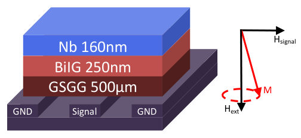 
FIG. 1. Sample and measurement geometry. A Bi- substituted iron-garnet film is capped by a Nb layer and placed on a coplanar waveguide. The microwave magnetic field hAC drives magnetization precession about the out-of- plane static field Hext.

📷 Fig 2

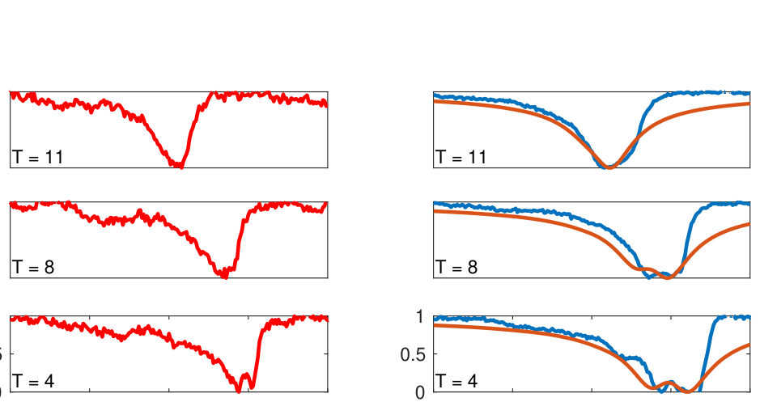 
FIG. 2. Normalized microwave transmission |S21| versus out-of-plane field at f = 4 GHz for representative temperatures T = 11 K (normal state), T = 8 K (near Tc), and T = 4 K (deep in the superconducting state). Left column: uncapped Bi-GdIG film (experiment). Right column: Bi-GdIG/Nb bilayer (experiment, blue) together with the calculated lineshape (theory, orange). Below Tc, the bilayer develops an additional resonance feature (the “right” peak) near the uniform FMR position, while the uncapped film shows only the conventional response.For more details see Supplemental Material [30]

📷 Fig 3

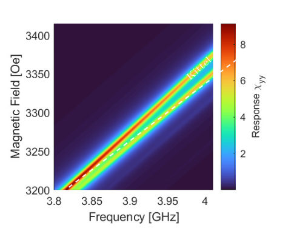 
FIG. 3. Calculated transverse susceptibility χxy of the Bi-GdIG/Nb structure versus frequency and field. The dashed line indicates the uniform-mode (Kittel) dispersion. Proximity-enabled hybridization with the lowest PSSW pro- duces two nearby resonant branches, consistent with the two- peak structure observed in Fig. 2.

**Summary.** This paper demonstrates that a superconductor can act as a control knob to excite high-frequency spin waves in an adjacent insulator. By utilizing both triplet-mediated spin torque and vortex-induced field gradients, the researchers show how to convert uniform magnetic resonance into complex standing wave modes.

**Why it may be interesting.** not directly relevant

Detailed structure

**Main problem.** The study explores how a conventional superconductor can be used to actively control and convert uniform ferromagnetic resonance (FMR) into short-wavelength perpendicular standing spin waves (PSSWs) in an adjacent magnetic insulator.

**Main result.** The researchers demonstrate that superconductivity enables mode conversion through a dual mechanism: interfacial spin-transfer torque from triplet Cooper pairs and symmetry breaking via vortex-induced electromagnetic proximity.

**Method.** The work combines broadband microwave spectroscopy on Bi-GdIG/Nb bilayers with a microscopic theory coupling the Keldysh-Usadel formalism for the superconductor to the Landau-Lifshitz-Gilbert dynamics for the magnet.

**Model / system.** The physical system is a bilayer of Bi-substituted iron-garnet (Bi-GdIG) and Niobium (Nb) in the Abrikosov vortex state. The theoretical model uses a linearized 1D LLG equation with a Robin-type boundary condition at the interface and a depth-dependent effective field from vortices.

**Key observables.** Complex microwave transmission (S21 amplitude) and transverse magnetic susceptibility.

**Important parameters / regimes.** Temperature (4K to 11K), external magnetic field, frequency (4 GHz), exchange stiffness, and spin-mixing conductance.

**Assumptions / limitations.** The model assumes a diffusive Nb film, a linearized response regime, and attributes peak asymmetry to an unmodeled magnetostatic field from the Gadolinium substrate.

**Figures summary.** Figure 1 shows the sample geometry and setup; Figure 2 compares microwave transmission in uncapped vs. bilayer films, highlighting the new resonance peak below Tc; Figure 3 shows the calculated susceptibility and mode hybridization; Supplementary figures show temperature-dependent transmission and FMR peak shifts.

**Paper structure.** The paper introduces the problem of magnon control, describes the experimental bilayer setup, presents the observed resonance emergence below Tc, develops a microscopic theory (Keldysh-Usadel + LLG) to explain the dual mechanism of torque and vortex-induced asymmetry, and concludes with a discussion on tunability.

Abstract

Superconductors can transport spin without Joule dissipation, yet their coherent coupling to short-wavelength magnons in insulating magnets remains largely unexplored. Here we demonstrate experimentally and theoretically that a conventional diffusive superconductor can enable the conversion of the uniform ferromagnetic-resonance (FMR) mode into perpendicular standing spin waves (PSSWs) in an adjacent ferrimagnetic insulator. In Bi-substituted iron-garnet/Nb bilayers, the microwave transmission develops an additional resonance feature that appears only below the Nb transition temperature and lies close to the uniform FMR peak. A microscopic theory that self-consistently couples the quasiclassical Keldysh--Usadel description of the superconducting condensate to the Landau--Lifshitz--Gilbert dynamics shows that the conversion requires two ingredients: (i) an interfacial spin-transfer torque mediated by spin-polarized triplet Cooper pairs and (ii) a depth-dependent effective field produced by Abrikosov vortices (electromagnetic proximity). The resulting susceptibility reproduces the measured lineshapes and establishes superconductivity as an active control knob for exchange standing-wave modes in magnetic insulators.

[↑ back to top](#top)

### [Emergent electric fields driven by phonon-coupled skyrmion resonances](http://arxiv.org/abs/2604.27719v1)

**Authors:** Seno Aji  
**Type:** theory · **Category:** other · **PDF:** <https://arxiv.org/pdf/2604.27719v1>  
**Analysis basis:** abstract only; PDF text extraction failed or PDF unavailable
**Topic relevance:** `non-equilibrium dynamics` **2/5** · `spintronics-quantum-optics interface` **2/5**

**Summary.** This paper provides a unified theoretical framework for understanding how phonon-driven deformations in a skyrmion lattice generate macroscopic electric fields. It shows that breathing and rotational dynamics can produce measurable ac and dc electric signals even without moving the lattice. This is significant for developing new ways to control and detect topological magnetic textures via spin-charge-lattice coupling.

**Why it may be interesting.** not directly relevant

Detailed structure

**Main problem.** The paper aims to describe the generation of macroscopic emergent electric fields resulting from the coupling between phonons and the breathing/rotational dynamics of a skyrmion lattice under microwave excitation.

**Main result.** The study identifies the specific symmetry and dynamical conditions required to produce both rectified (dc) and oscillating (ac) electric fields, even without net lattice translation.

**Method.** The authors develop a coarse-grained theoretical framework to analyze the electrodynamic response in the long-wavelength phonon limit.

**Model / system.** A skyrmion lattice subject to phonon-coupled lattice deformations and microwave excitation, specifically focusing on breathing and rotational modes.

**Key observables.** Macroscopic emergent electric fields (dc and ac components), skyrmion radius, domain-wall width, and dynamical resonance frequency.

**Important parameters / regimes.** Long-wavelength phonon limit (q -> 0), finite phonon frequency, and the dilute-lattice limit.

**Assumptions / limitations.** The analysis utilizes a coarse-grained description and focuses on the long-wavelength limit of phonons.

**Paper structure.** The paper presents a theoretical development of a coarse-grained model, followed by an analysis of symmetry and dynamical conditions for electric field generation, and concludes with an identification of harmonic components in the electrodynamic response.

Abstract

We develop a coarse-grained theoretical description of the macroscopic emergent electric field generated by phonon-coupled lattice deformations in the breathing and rotational dynamics of a skyrmion lattice under microwave excitation. The analysis identifies the symmetry and dynamical conditions that yield rectified (dc) and oscillating (ac) electric fields, even in the absence of net translational motion of the skyrmion lattice, particularly in the dilute-lattice limit. Using experimentally measurable skyrmion profile parameters such as the equilibrium radius, domain-wall width, and dynamical resonance frequency of skyrmion lattice, the model further enables identification of harmonic components contributing to the observed macroscopic electrodynamic response in the long-wavelength phonon limit ($q \to 0$) and at finite phonon frequency, providing a unified framework for phonon-driven spin-charge-lattice coupling in topological magnets.

[↑ back to top](#top)

### [Low-Energy Purification of Crystal Defects by Rydberg Excitons](http://arxiv.org/abs/2604.27331v1)

**Authors:** Shiva Kant Tiwari, Tijs Karman, Valentin Walther  
**Type:** theory · **Category:** other · **PDF:** <https://arxiv.org/pdf/2604.27331v1>  
**Analysis basis:** abstract only; PDF text extraction failed or PDF unavailable
**Topic relevance:** `Kondo & dissipative impurity` **2/5** · `analog quantum simulation` **2/5**

**Summary.** The paper presents a multichannel theory to explain how Rydberg excitons can be used to purify crystals by neutralizing charged impurities. It demonstrates that while high-energy collisions can hinder purification through inelastic scattering, an ultralow-energy quantum regime exists that maximizes purification efficiency. This regime can be experimentally accessed using tunable two-photon excitation in cuprous oxide.

**Why it may be interesting.** It provides a theoretical framework for controlling impurity-driven decoherence and purification in solid-state systems using Rydberg-like physics, bridging the gap between atomic physics techniques and condensed matter applications.

Detailed structure

**Main problem.** Understanding the competing mechanisms of capture, elastic scattering, and inelastic transitions during Rydberg exciton-impurity collisions and how they affect crystal purification efficiency.

**Main result.** The authors identify a quantum regime at ultralow collision energies where s-wave scattering enhances capture while suppressing loss channels, making purification more efficient than at high collision energies.

**Method.** Development of a multichannel theory of Rydberg exciton-impurity scattering.

**Model / system.** Rydberg excitons in cuprous oxide (Cu2O) interacting with charged impurities.

**Key observables.** Purification efficiency, capture rate, elastic scattering cross-section, and inelastic transition rates.

**Important parameters / regimes.** Collision energy, s-wave scattering regime, and even-parity Rydberg exciton states via two-photon excitation.

**Paper structure.** The paper introduces the problem of impurity neutralization, presents a multichannel scattering theory, compares high-energy vs. low-energy collision regimes, and proposes a method for accessing the optimal purification regime via two-photon excitation.

Abstract

Recent experiments show that optically generated Rydberg excitons in cuprous oxide can neutralize charged impurities, strongly reducing stray electric fields and effectively purifying the crystal. Here, we develop a multichannel theory of Rydberg exciton-impurity scattering that resolves the competing roles of capture, elastic scattering, and inelastic transitions between excitonic states. We find that at high collision energies, as effective under conventional single-photon excitation, purification is reduced relative to Langevin capture. These collisions are accompanied by inelastic redistribution and dominant elastic scattering, including pronounced glory scattering, which suppress purification efficiency. We identify a quantum regime at ultralow collision energies favorable for purification, where only the s-wave contributes: capture is enhanced while elastic and inelastic channels are strongly suppressed. This regime can be accessed via degenerate two-photon excitation of even-parity Rydberg excitons with tunable recoil, additionally enabling the systematic exploration of exciton-impurity scattering over a wide range of collision energies beyond what is readily achievable in atomic counterparts in atomic gas experiments.

[↑ back to top](#top)

### [Dual role of core electrons in electronic friction](http://arxiv.org/abs/2604.27236v1)

**Authors:** Runfeng Zhou, Emilio Artacho  
**Type:** theory · **Category:** other · **PDF:** <https://arxiv.org/pdf/2604.27236v1>  
**Analysis basis:** full PDF text, analyzed in chunks
**Topic relevance:** `Frenkel-Kontorova` **2/5** · `non-equilibrium dynamics` **1/5**

📷 Fig 1

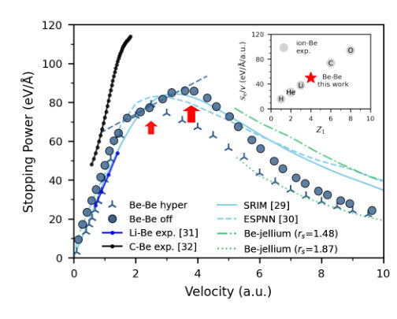 
FIG. 1. Electronic stopping power Se for a Be projectile in bulk Be host as a function of velocity. Filled circles and inverted Y-shape represent Se along the off-channeling and hyper-channeling trajectories, respectively. Skyblue solid and dashed lines show predictions of Se from the SRIM [29] and ESPNN [30] models. Green dotted and dash-dotted lines show Se for a Be projectile in dilute and dense jellium. Blue-green dashed line serves as a guide to the eye indicating the slope change near the Bragg peak in off-channelling. Blue and black dots represent experimental stopping power data for Li in Be [31] and C in Be [32], respectively. The red arrows indicate the positions of Bragg peaks in...

📷 Fig 2

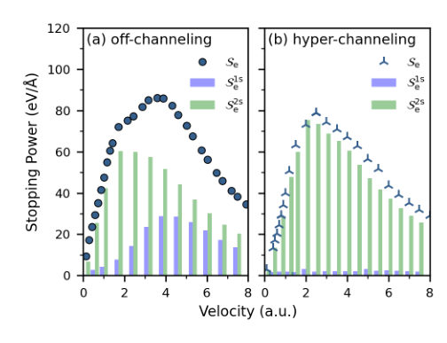 
FIG. 2. Electronic stopping power Se (circles and inverted Y- shape) and its decomposed components, 1s (S1s e , green bars) and 2s (S2s e , blue bars), versus projectile velocity along (a) off-channeling and (b) hyper-channeling trajectories.

📷 Fig 3

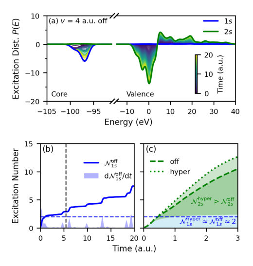 
FIG. 3. Time evolution of the excitation distribution. (a) Excitation distribution P(E) at v = 4 a.u. in off-channeling. Color gradation: lighter colors correspond to larger time; Gaussian broadening σ = 0.8 eV. Blue and green solid lines show P1s(E) and P2s(E) at t = 20 a.u., respectively. (b) Exci- tation number of the 1s bands, N1s. Skyblue peaks (dN1s/dt) indicate core-electron excitation events. Blue dashed line de- notes projectile core ionization. Black dashed line marks the completion of the first pronounced host core excitation. (c) Early-stage excitation number of the 1s (blue) and 2s (green) bands in hyper- and off-channeling (dashed and dotted lines, respectively).

📷 Fig 4

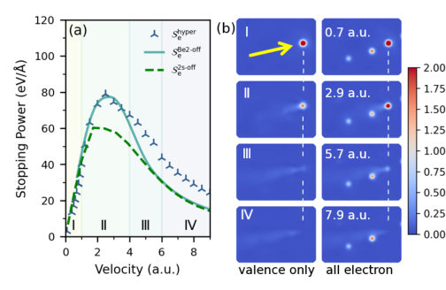 
FIG. 4. Four velocity regimes and the screening effect in quasi-valence-electron systems. (a) Stopping power of three quasi-valence-electron systems: the all-electron hyper- channeling case Shyper e , 2s component of the all-electron off- channeling case S2s-off e , and the pseudized off-channeling case SBe2-off e (pseudized host Be atoms and all-electron Be pro- jectile). (b) Electron capture from host cores, indicated by the difference in electron density in off-channeling with all- electron and valence-only (pseudized) host system. The yel- low arrow points the trajectory, and the white dashed lines mark the ion position after a displacement of 21.89 Bohr, cor- responding to the same...

**Summary.** This paper uses real-time TDDFT to show that core electrons in beryllium both enhance and suppress electronic stopping power. It identifies an electron capture mechanism as the cause for valence excitation suppression, providing a new perspective on energy dissipation in ion-matter interactions that standard semi-empirical models fail to capture.

**Why it may be interesting.** not directly relevant

Detailed structure

**Main problem.** Understanding the mechanism behind the complex, multi-stage Bragg peak structure in electronic stopping power and the dual role of core electrons in energy dissipation.

**Main result.** Core electrons play a dual role by providing an additional dissipation channel through excitation while simultaneously suppressing valence electron excitations via an electron capture process.

**Method.** Real-time time-dependent density functional theory (rt-TDDFT) using the INQ/QB@LL program with explicit treatment of all electrons.

**Model / system.** A beryllium (Be) projectile moving through a bulk beryllium (Be) host, modeled using a 5 x 6 x 3 hexagonal close-packed (hcp) supercell.

**Key observables.** Electronic stopping power (Se), friction coefficient, Bragg peak structure, and excitation numbers for 1s and 2s electrons.

**Important parameters / regimes.** Velocity regimes (low-velocity, Bragg peak, and high-velocity), atomic number (Z1), and trajectory types (hyper-channeling vs. off-channeling).

**Assumptions / limitations.** Host atoms are kept frozen to isolate the pure electronic stopping process; use of the PBE exchange-correlation functional; adiabatic approximation in TDDFT.

**Figures summary.** Figure 1 compares stopping power and Bragg peak structure across different trajectories and models; Figure 2 shows the decomposition of stopping power into 1s and 2s components; Figure 3 illustrates excitation distributions and time evolution of excitation events; Supplemental figures demonstrate numerical robustness and energy expectation values.

**Paper structure.** The paper introduces the problem of energy dissipation, describes the rt-TDDFT methodology and Be system, presents results comparing trajectories and models, analyzes the dual role of core electrons through energy decomposition, and concludes with a discussion on model limitations and future directions.

Abstract

Non-equilibrium energy dissipation in multi-shell swift-ion/matter systems remains a fundamental yet incompletely understood problem, with electronic stopping power $\mathcal{S}_\text{e}$ as a relevant observable for electronic friction. Using real-time time-dependent density functional theory, we perform first-principles calculations of $\mathcal{S}_\text{e}$ for beryllium self-irradiation with explicit treatment of all electrons. Our results reveal a Bragg peak exhibiting a distinct structure which lies beyond the reach of standard semi-empirical models. We attribute its appearance to a dual effect of the presence of core electrons, by which their excitation provides an additional dissipation channel while simultaneously suppressing valence electron excitations. An electron capture process by the projectile's core from the host cores is behind such suppression, rather than Pauli blocking. This dual mechanism contrasts with the shake-up effect reported for water, whereby the inclusion of core electrons enhances valence excitation. Our work provides a new perspective on the effect and importance of core electrons in projectile energy dissipation in matter.

[↑ back to top](#top)

### [Compressibility of micromagnetic solutions in tensor train format](http://arxiv.org/abs/2604.28008v1)

**Authors:** Thierry Valet, Nicolas Vukadinovic  
**Type:** theory · **Category:** numerical methods · **PDF:** <https://arxiv.org/pdf/2604.28008v1>  
**Analysis basis:** abstract only; PDF text extraction failed or PDF unavailable
**Topic relevance:** `methods for driven-dissipative` **2/5**

**Summary.** This paper shows that using Tensor Train formats can drastically reduce the computational cost of 3D micromagnetic simulations by exploiting the sparsity of magnetic structures. By reducing the scaling of parameters relative to system size and grid refinement, this method paves the way for much larger and more detailed magnetic simulations than currently possible.

**Why it may be interesting.** not directly relevant

Detailed structure

**Main problem.** Standard micromagnetic simulations suffer from poor computational scaling (~L^3 and (1/a)^3) because they use uniform 3D grids that fail to exploit the inherent spatial sparsity of magnetic structures.

**Main result.** The authors demonstrate that Tensor Train (TT) representations can exploit spatial sparsity to reduce parameter scaling to approximately L^1.8 and (1/a)^1.2, providing a significant advantage for large-scale simulations.

**Method.** The study utilizes Tensor Train (TT) compression techniques to represent micromagnetic magnetization states, specifically analyzing the compressibility of flux-closure configurations.

**Model / system.** The system consists of 3D soft-magnetic rectangular prisms in the near-micrometer regime, focusing on configurations containing both high-gradient regions (domain walls) and uniform volumetric domains.

**Key observables.** Parameter count scaling (compression ratio) and accuracy preservation.

**Important parameters / regimes.** Linear size L, cell size a, and exchange length.

**Assumptions / limitations.** The analysis focuses on representative flux-closure configurations in soft-magnetic materials.

**Paper structure.** The paper introduces the problem of scaling in micromagnetics, proposes the Tensor Train format as a solution, demonstrates the scaling advantages through numerical analysis of magnetic prisms, and discusses future implications for solvers.

Abstract

For three-dimensional (3D) magnetic objects with linear size $L$ exceeding a few exchange lengths, the micromagnetic state exhibits pronounced informational sparsity: low-dimensional, high-gradient regions (e.g., domain walls) coexist with near-uniformly magnetized volumetric domains. Because standard micromagnetic simulation methods discretize the magnetization on near-uniform 3D grids with linear cell size $a$, they cannot take advantage of this sparsity. The computational problem scales as $\sim L^3$ and $\sim (1/a)^3$. In this Letter, we establish that direct tensor-train (TT) representations overcome these poor scalings by exploiting the spatial sparsity optimally, while preserving accuracy in a controlled way. Focusing on representative flux-closure configurations in soft-magnetic rectangular prisms, in the near-micrometer regime, we demonstrate that the parameter count of TT-compressed micromagnetic data scales approximately as $L^{1.8}$ and $(1/a)^{1.2}$. Hence the relative advantage over dense discretizations rapidly grows with the problem size and refinement level. These first results provide a strong motivation for future developments of micromagnetic solvers in TT format which could transcend the limitations of traditional simulators, with far reaching potential impacts on fundamental research and technology development.

[↑ back to top](#top)

### [Electrically Tunable Terahertz Chirality from Quantum Geometry](http://arxiv.org/abs/2604.27294v1)

**Authors:** Sobhan Subhra Mishra, Thomas CaiWei Tan, Faxian Xiu, Ranjan Singh  
**Type:** experiment · **Category:** other · **PDF:** <https://arxiv.org/pdf/2604.27294v1>  
**Analysis basis:** full PDF text, analyzed in chunks
**Topic relevance:** `non-equilibrium dynamics` **2/5**

📷 Fig 1

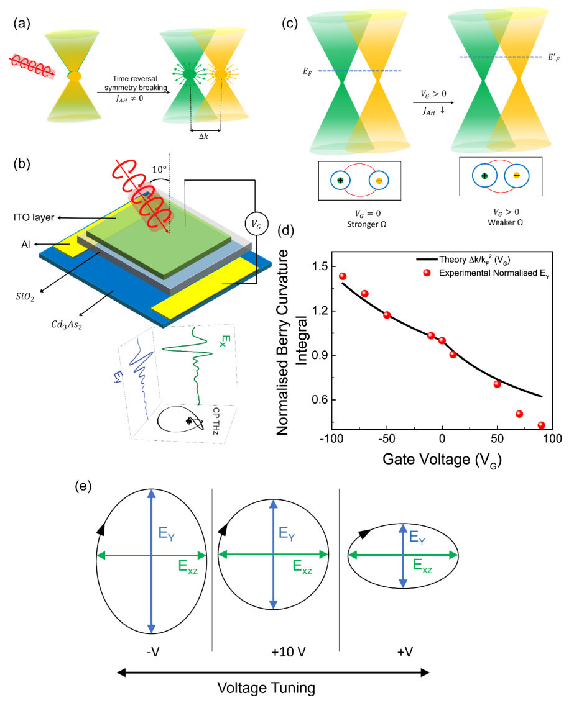 
Figure 1: All-electrical tuning of chiral THz emission from Cd3As2; (a) Floquet band engineering in a 3D Dirac semimetal. Circularly polarized (CP) photoexcitation breaks time-reversal symmetry, splitting the doubly degenerate Dirac node into a pair of Weyl nodes separated by ∆𝑘 in momentum space; (b) Device schematic for electrically tunable chiral THz emission. A 40 nm Cd3As2 thin film grown on a c- cut sapphire substrate is gated via an out-of-plane capacitive structure comprising Al electrodes, a 1 𝜇𝑚 SiO2 dielectric spacer, and a THz-transparent ITO-coated PET top electrode. CP femtosecond pulses (800 nm, 35 fs) illuminate the sample at 10° oblique incidence, simultaneously generating...

📷 Fig 2

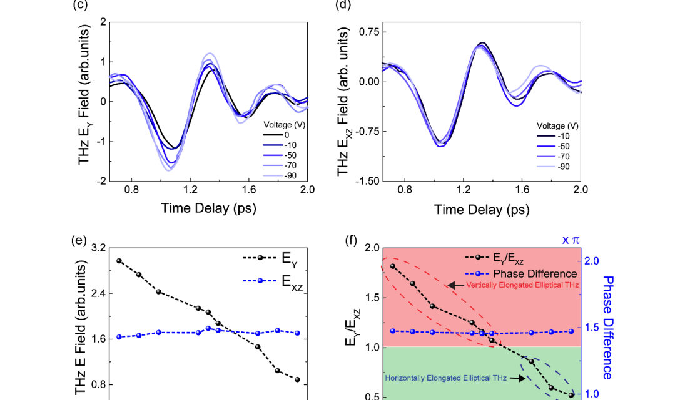 
Figure 2: Selective electrical tuning of the Floquet THz component. (a) Y polarized THz pulse (EY) under left circularly polarized pump at 10° incidence for positive gate voltages (0–90 V). EY decreases with increasing voltage due to suppression of the Floquet anomalous Hall photocurrent. (b) X polarized THz pulses (EXZ) for the same positive gate voltages. EXZ remains unchanged, confirming the voltage independence of the circular photon drag effect. (c) EY for negative gate voltages (0 to −90 V). EY increases with increasing negative bias as the Fermi level shifts toward the Dirac point, enhancing the Berry curvature flux through due to decrease in Fermi pocket size. (d) EXZ for the same...

📷 Fig 3

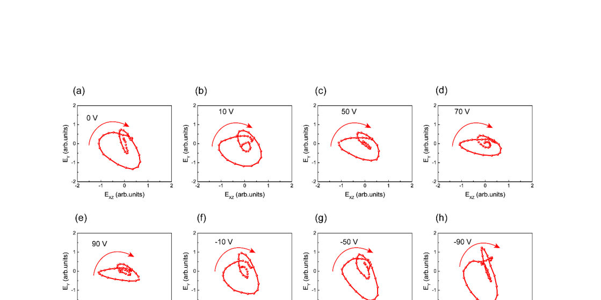 
Figure 3: Voltage-dependent polarization ellipses of the emitted THz field. (a) Parametric plot of EY(t) versus EXZ(t) at 0 V under left circularly polarized pump, showing a slightly vertically elongated ellipse (EY &gt; EXZ). (b) Polarization ellipse at +10 V, where EY≈EXZ and the THz field is closest to circular. (c) Polarization ellipse at +50 V, with reduced EY and a clearly horizontally elongated ellipse. (d) Polarization ellipse at +70 V, where further suppression of EY drives the polarization toward linear along EXZ. (e) Polarization ellipse at +90 V, showing a strongly EXZ dominated, highly horizontally elongated elliptical polarization. (f) Polarization ellipse at −10 V, where...

📷 Fig 4

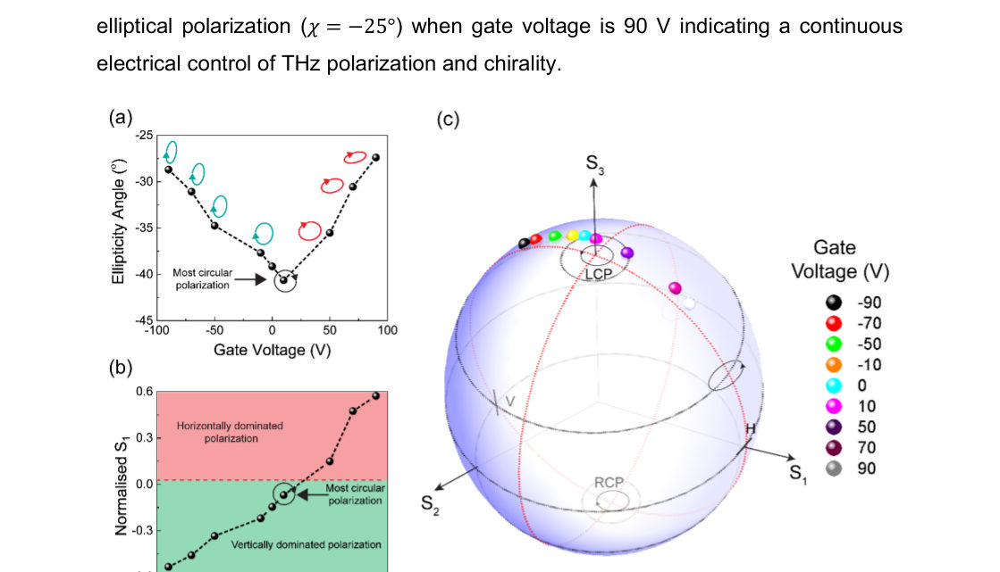 
Figure 4: Quantitative polarization analysis of electrically tuned chiral THz. (a) Ellipticity angle 𝜒 as a function of gate voltage, with maximum circularity (𝜒≈−42°, dashed circle) near +10 V where EY ≈ EXZ. Both positive and negative voltage deviations reduce the circularity as the amplitude balance shifts. (b) Normalized Stokes parameter S1 as a function of gate voltage, transitioning from vertically dominated polarization (Normalised S1&lt;0, green region) through balanced (Normalised S1=0) to horizontally dominated polarization (Normalised S1&gt;0, pink region). The zero crossing at ~+10 V is consistent with the ellipticity minimum in (a). (c) Measured polarization states mapped onto the...

📷 Fig 5

 
Figure 1(d) shows the theoretical curve 𝛺𝑛𝑜𝑟𝑚(VG) alongside the normalised

**Summary.** This paper demonstrates how to electrically tune the polarization (chirality) of terahertz light by using a gate voltage to change the size of Fermi pockets in a Dirac semimetal. This process modulates the Berry curvature-driven component of the THz emission, allowing for programmable control of light's polarization state on the Poincaré sphere.

**Why it may be interesting.** not directly relevant

Detailed structure

**Main problem.** Achieving all-electrical, deterministic control over the chirality (polarization state) of Terahertz (THz) emission by manipulating the quantum geometry (Berry curvature) of electronic wavefunctions.

**Main result.** By using electrostatic gating to reshape Fermi pockets in a Cd3As2 thin film, the researchers achieved near-circular THz polarization and demonstrated that the Berry curvature integral can be tuned electrically.

**Method.** The researchers used electrostatic gating of a 3D Dirac semimetal thin film under oblique incidence of circularly polarized femtosecond light, employing THz emission spectroscopy and Stokes parameter analysis to track polarization evolution.

**Model / system.** A 40 nm thin film of the 3D Dirac semimetal Cd3As2 grown on sapphire, subject to Floquet engineering via circularly polarized 800 nm laser pulses to create Floquet Weyl nodes.

**Key observables.** THz electric field components (Ey and EXZ), Stokes parameters (S1, S2, S3), ellipticity angle (chi), and Berry curvature integral.

**Important parameters / regimes.** Gate voltage (ranging from -90 V to +90 V), pump wavelength (800 nm), pump fluence (1.02 mJ/cm2), and Fermi energy (E_F approx 210 meV).

**Assumptions / limitations.** Assumes a linear isotropic dispersion for the Dirac semimetal and uses an asymmetric screening model to relate gate voltage to Fermi level shifts.

**Figures summary.** Figure 1 shows Floquet band engineering and device architecture; Figure 3 illustrates the evolution of polarization ellipses from vertical to circular to horizontal; Figure 4 provides quantitative analysis of the gate-dependent Berry curvature.

**Paper structure.** The paper introduces the problem of controlling optical observables via quantum geometry, describes the Floquet-engineered Cd3As2 device, details the experimental THz spectroscopy and gating methods, presents the results of polarization tuning and Berry curvature quantification, and concludes with the implications for programmable quantum geometric control.

Abstract

Quantum geometry encoded in the momentum space structure of electronic wavefunctions, governs charge dynamics through Berry curvature, enabling unconventional transport and optical responses. In topological semimetals, this geometry is sampled over Fermi pockets, suggesting electrical control by Fermi surface tuning, yet such control has remained largely limited to DC transport. Here we show that electrostatic gating of the 3D Dirac semimetal Cd3As2 reshapes Fermi pockets surrounding photoinduced Floquet Weyl nodes, enabling electrical control of terahertz (THz) emission chirality. Gate tuning selectively modulates the Berry curvature driven linearly polarized THz component by up to 60% and 49% at positive and negative bias, respectively, while the orthogonal linearly polarized photon-drag component remains unchanged. With the two orthogonal fields intrinsically phase-locked at \sfracπ{2} by the excitation geometry, the selective gate-tuned amplitude control enables the polarization tuning across the Poincaré sphere, achieving near-circular polarization (χ\approx-42°) at +10 V. These results establish Fermi surface tuning as a general route to programmable quantum geometric control of chiral terahertz emission.

[↑ back to top](#top)

### [On the proposed concept of mechanical phasons in Ni-Mn-Ga modulated martensite](http://arxiv.org/abs/2604.27729v1)

**Authors:** Petr Sedlák, Tomáš Grabec, Hanuš Seiner  
**Type:** theory · **Category:** other · **PDF:** <https://arxiv.org/pdf/2604.27729v1>  
**Analysis basis:** full PDF text, analyzed in chunks
**Topic relevance:** `Frenkel-Kontorova` **2/5**

📷 Fig 1

 
Figure 2: (a) the energy-minimizing modulated lattice for various levels of the weighting factor ε (for ε →∞ the model collapses to a zig-zag modulation function of the adaptive concept); (b) the energy perturbation landscape, and the optimized values of energy En(f γn) for ε = 0 and ε = 0.5; (c) the macroscopic monocliniza- tion (the monoclinization angle is arctan(ˆγ) ≈ˆγ) as a funciton of ε; (d) energy ˆE as a function of the phase shift φ for various levels of ε, the energy is normalized with respect to its value for φ = 0. In (a), the shapes of the NM martensite unit cells used as building block of the modulated martensite in the ε →∞limit are drawn. For better visibility of the...

📷 Fig 2

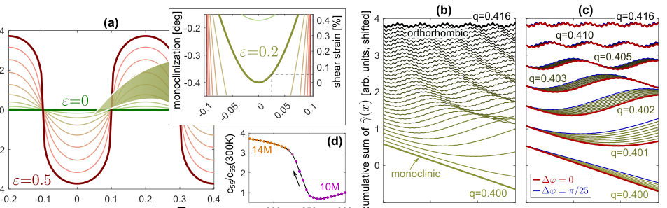 
Figure 3: (a) the lattice monoclinization changes under a small-amplitude phason (the magnified plot in the upper right corner helps resolving the details for ε = 0.2, the right vertical axis recalculates the monoclinization to the relative shear strain); (b) the effect of incommensurateness on the macroscopic shape of the lattice, from perfectly commensurate (q = 0.400) to the incommensurate state discussed in [12] (q=0.416); (c) change of the macroscopic shape of the lattice under a small-amplitude phason (individual lines represent phasons with amplitudes between zero and the maximum with a π/200 step); (d) temperature evolution of the softest shear elastic coefficient c55 in Ni-Mn-Ga-Fe...

**Summary.** This paper proposes that 'mechanical phasons' in Ni-Mn-Ga alloys act as a mechanism to relax macroscopic shear strains, explaining why the material appears much softer to ultrasonic probes than to neutron scattering. The model reconciles the observed extreme elastic compliance with the known stiff lattice structure by focusing on the collective dynamics of the modulation phase.

**Why it may be interesting.** not directly relevant

Detailed structure

**Main problem.** Resolving the discrepancy between experimental observations of extreme elastic softening and theoretical/neutron scattering predictions of a stiff lattice in 10M modulated Ni-Mn-Ga martensite.

**Main result.** The authors propose that 'mechanical phasons' (phase shifts in the modulation wave) can relax external shear loads in commensurate and weakly incommensurate phases, explaining the macroscopic softness without requiring intrinsic lattice-scale softness.

**Method.** A mechanical model that merges adaptive martensite theory with electronic-structure considerations, using energy minimization of a modulated lattice.

**Model / system.** The system is the 10M modulated martensite in Ni-Mn-Ga ferromagnetic shape memory alloys, modeled as a periodic modulation wave interacting with a Landau-type energy landscape of non-modulated martensite variants.

**Key observables.** Shear modulus (c55), monoclinic distortion angle (gamma), modulation wave vector (q), and twinning stress.

**Important parameters / regimes.** Weighting factor (epsilon) controlling the transition from sine-wave to zig-zag modulation, modulation vector (q), and phason amplitude (delta phi).

**Assumptions / limitations.** The lattice consists of rigid planes that can shift along the modulation amplitude; the modulation is treated as a perturbation of a sine wave.

**Figures summary.** Figure 1 shows INS phonon branches and the notation for the modulation function; Figure 2 illustrates the evolution of the energy-minimizing lattice and energy landscape for different epsilon values; Figure 3 shows the cumulative sum of monoclinic distortion and the effect of phase shifts.

**Paper structure.** The paper introduces the experimental discrepancy, presents a mechanical model of phason-driven relaxation, explores the transition from commensurate to incommensurate regimes, and concludes by explaining the origin of monoclinic distortion and twinning mobility.

Abstract

We discuss modulation phasons as a possible source of unusual elastic behavior of five-layer modulated (10\,M) martensite of the Ni-Mn-Ga shape memory alloy. This material exhibits anomalous macroscopic shear compliance along specific planes perpendicular to the modulation vector, and this compliance disappears when the modulations become incommensurate. Using a simple mechanical model, we show that modulation phasons in Ni-Mn-Ga can have macroscopic mechanical manifestations, and that the resulting 'mechanical phasons' can relax external shear loadings for commensurate and weakly incommensurate modulations, but not for strongly incommensurate modulations. The model merges ideas from the adaptive martensite theory and electronic-structure considerations, and enables straightforward explanations of several properties of the 10\,M lattice, such as spontaneous monoclinic distortion or easy formation and propagation of $a/b$ twins.

[↑ back to top](#top)

### [Quantum Metric and Nonlinear Hall Effect of Photons](http://arxiv.org/abs/2604.27751v1)

**Authors:** Keidai Akiba, Naoki Yamamoto  
**Type:** theory · **Category:** other · **PDF:** <https://arxiv.org/pdf/2604.27751v1>  
**Analysis basis:** full PDF text, analyzed in chunks
**Topic relevance:** `Keldysh / 2PI / non-Gaussian methods` **2/5**

📷 Fig 1

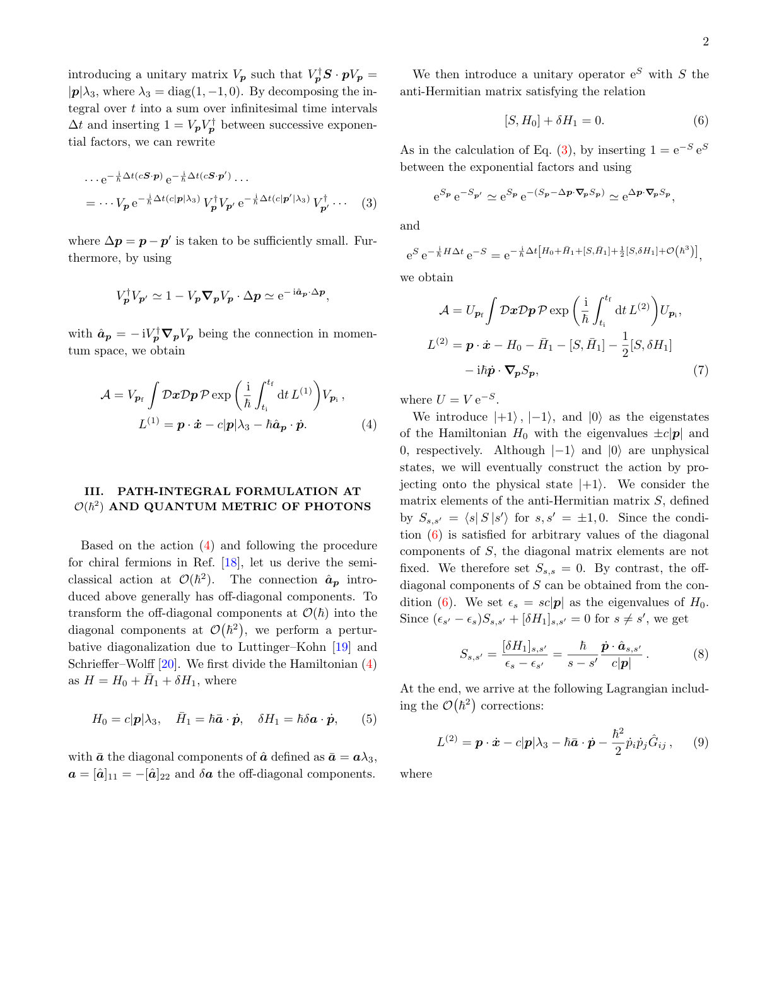 
Low-resolution page preview, page 2

📷 Fig 2

 
Low-resolution page preview, page 3

📷 Fig 3

 
Low-resolution page preview, page 4

📷 Fig 4

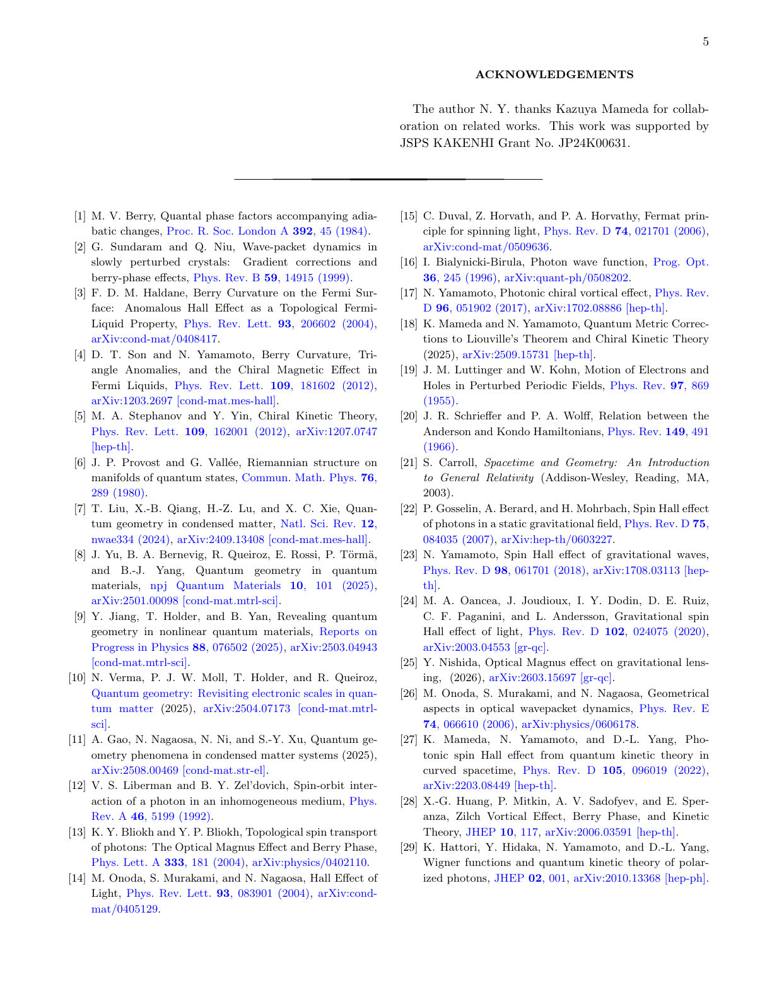 
Low-resolution page preview, page 5

**Summary.** The paper shows that the quantum metric of photons induces a nonlinear Hall effect in both varying refractive index media and curved spacetime. This effect represents a higher-order correction to light trajectories, such as gravitational lensing, that does not depend on photon helicity. It highlights a deep interplay between the geometry of position space and momentum space.

**Why it may be interesting.** This paper is interesting for quantum optics researchers as it connects the fundamental quantum geometry of the photon (quantum metric) to observable nonlinear transport phenomena and higher-order corrections to light propagation in complex environments.

Detailed structure

**Main problem.** The paper investigates whether photons possess a nontrivial quantum metric in momentum space and whether this geometry induces nonlinear transport phenomena, such as a nonlinear Hall effect, in inhomogeneous media or curved spacetime.

**Main result.** The authors demonstrate that the quantum metric of photons leads to a nonlinear Hall effect of light in media with varying refractive indices and a nonlinear gravitational Hall effect in curved spacetime, providing $O(\hbar^2)$ corrections to gravitational lensing.

**Method.** The study employs the path-integral formalism to derive a semiclassical action and equations of motion, utilizing perturbative diagonalization methods (Luttinger-Kohn and Schrieffer-Wolff) to account for the quantum metric.

**Model / system.** The system consists of photons described by a spin-1 Hamiltonian $H = \pm c \mathbf{S} \cdot \mathbf{p}$ traveling through media with a spatially varying refractive index $n(\mathbf{x})$ or through a static, weak background gravitational field.

**Key observables.** Quantum metric ($G_{ij}$), Berry curvature ($\Omega$), and trajectory shifts in light propagation.

**Important parameters / regimes.** Geometric-optics limit (wavelength much smaller than curvature radius), weak gravitational potential ($|\phi|/c^2 \ll 1$), and the scaling of corrections ($O(\hbar)$ spin Hall effect vs. $O(\hbar^2)$ nonlinear Hall effect).

**Assumptions / limitations.** Assumes a static and weak gravitational field, a medium with unit permeability, the geometric-optics approximation, and the regime where the momentum derivative is small ($|\dot{p}| \ll |p|^2$).

**Paper structure.** The paper begins by establishing the path-integral formalism for photons, derives the effective action and equations of motion including the quantum metric, applies these results to inhomogeneous refractive media to identify the nonlinear Hall effect, and finally extends the analysis to curved spacetime to describe corrections to gravitational lensing.

Abstract

Using the path-integral formalism, we show that photons possess a nontrivial quantum metric in momentum space. We derive the semiclassical action and equations of motion by taking into account the quantum metric. In media with a spatially varying refractive index $n(\mathbf{x})$, the quantum metric induces a shift in the trajectory of light at second order in derivatives of $n$, which may be regarded as a nonlinear Hall effect of light. The quantum metric also gives rise to corrections to gravitational lensing in curved spacetime at the nonlinear order in wavelength. This gravitational nonlinear Hall effect results from the interplay between the geometry of position space and that of momentum space.

[↑ back to top](#top)

### [Topological antiqued mechanical toy](http://arxiv.org/abs/2604.27554v1)

**Authors:** Hirofumi Wada, Hayato Mizobata, Shuto Ueno, Taiju Yoneda  
**Type:** both · **Category:** other · **PDF:** <https://arxiv.org/pdf/2604.27554v1>  
**Analysis basis:** abstract only; PDF text extraction failed or PDF unavailable
**Topic relevance:** `Frenkel-Kontorova` **2/5**

**Summary.** This paper explores the physics of the 'Jacob's ladder' toy, identifying its flipping waves as a class of topological solitons. It demonstrates that while the waves resemble those in topological chains, the system's unique 'floppiness' allows for forbidden modes like kink-antikink coexistence. The study uses a combination of experiments and theory to show how topological singularities drive the toy's motion.

**Why it may be interesting.** not directly relevant

Detailed structure

**Main problem.** The physical origin and design principles behind the unidirectional flipping waves in the 'Jacob's ladder' mechanical toy are investigated.

**Main result.** The study reveals that the toy's waves are topological solitons arising from bistability under gravity, and that its symmetric connection creates a topologically singular state allowing for kink-antikink coexistence.

**Method.** The researchers combine water-tank experiments, numerical simulations, and analytical theory including the use of the index theorem.

**Model / system.** A mechanical frame known as 'Jacob's ladder' consisting of rigid blocks connected by strings, analyzed under the influence of gravity and pretension.

**Key observables.** Unidirectional flipping waves, kink and antikink waves, and pair annihilation of waves.

**Important parameters / regimes.** Gravity, pretension, and the symmetry/asymmetry of the connections.

**Assumptions / limitations.** The study assumes the toy can be modeled as a bistable system where gravity provides the necessary pretension to stiffen zero modes.

**Paper structure.** The paper begins with an experimental exclusion of the domino mechanism, followed by an analytical demonstration of bistability and topological soliton behavior, a comparison to the Kane-Lubensky chain, an application of the index theorem to explain kink-antikink coexistence, and finally an analysis of asymmetric toy configurations and wave annihilation.

Abstract

{\it Jacob's ladder} -- a classic children's toy -- is a simple mechanical frame comprising rigid blocks connected by strings that shows curious unidirectional flipping waves. Nonetheless, its physical origin remains elusive. By combining experiment, numeral simulation, and theory, we show that understanding the underlying design principle of this toy requires diverse physical ideas. First, we conduct a water-tank experiment that excludes the domino-like mechanism, thus defying widespread expectations. Subsequently, we analytically demonstrate that the toy is bistable under gravity, thus implying its kink wave as a class of topological solitons. The waves are surprisingly reminiscent -- both experimentally and theoretically -- to those in the Kane--Lubensky topological chain, owing to the stiffening of zero modes by the pretension under gravity. However, a close examination based on the index theorem reveals that the similarity remains superficial and that the floppiness of the toy underlies the kink and antikink coexistence -- a forbidden mode in the topological chain. By analyzing a generalized asymmetric toy, we reveal that its symmetric connection renders it topologically singular, thus resulting in amusing motions. We demonstrate these ideas by experimentally observing a dramatic pair annihilation of kink and antikink waves.

[↑ back to top](#top)

### [Ultrafast Sliding Ferroelectric Switching in Bilayer Hexagonal Boron Nitride Revealed by Deep Learning Molecular Dynamics](http://arxiv.org/abs/2604.27342v1)

**Authors:** Yinan Wang, Poyen Chen, Teruyasu Mizoguchi  
**Type:** theory · **Category:** disordered systems and neural networks · **PDF:** <https://arxiv.org/pdf/2604.27342v1>  
**Analysis basis:** full PDF text, analyzed in chunks
**Topic relevance:** `non-equilibrium dynamics` **2/5**

📷 Fig 1

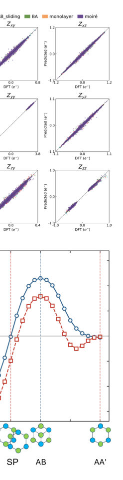 
Fig.2 Performance of the EGCNN Born effective charge model and validation of the path-integral

📷 Fig 2

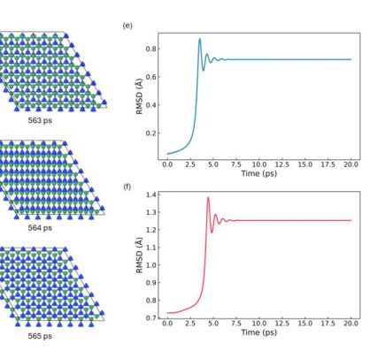 
Fig.3 Electric-field-driven structural switching dynamics, atomic trajectory snapshots, and root-

📷 Fig 3

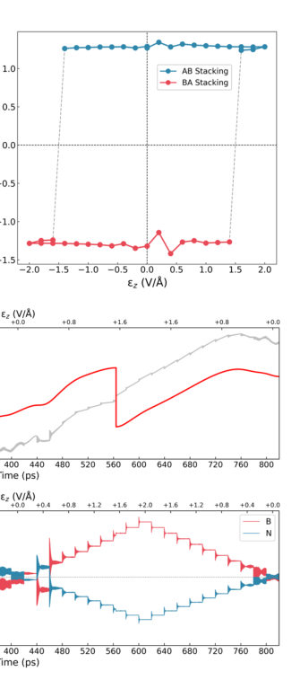 
Fig.4 Physical origin of the dielectric background and extraction of the intrinsic ferroelectric

**Summary.** This paper presents a deep learning-based molecular dynamics approach to simulate the ultrafast switching of ferroelectricity in bilayer h-BN. It successfully isolates intrinsic polarization from field-induced dielectric noise, revealing a picosecond-scale sliding mechanism. This work provides a powerful tool for studying the non-equilibrium dynamics of 2D sliding ferroelectrics.

**Why it may be interesting.** not directly relevant

Detailed structure

**Main problem.** Understanding the atomistic, real-time dynamics of electric-field-driven polarization switching in sliding ferroelectrics and decoupling intrinsic polarization from dielectric background.

**Main result.** The study reveals an ultrafast (5 ps) coherent single-domain rigid sliding mechanism in bilayer h-BN and develops a method to extract clean ferroelectric hysteresis loops from massive dielectric backgrounds.

**Method.** A coupled deep learning molecular dynamics framework integrating a fine-tuned MACE machine learning potential with an Equivariant Graph Convolutional Neural Network (EGCNN) for real-time Born effective charge prediction.

**Model / system.** Bilayer hexagonal boron nitride (h-BN) in AB and BA stacking configurations, modeled using large-scale non-equilibrium molecular dynamics under applied out-of-plane electric fields.

**Key observables.** Out-of-plane polarization (Pz), Born effective charge (BEC) tensors, potential energy surfaces, and ferroelectric hysteresis loops.

**Important parameters / regimes.** Electric field strength (up to +/- 2.0 V/A), temperature (50 K to 300 K), and switching timescale (~5 ps).

**Assumptions / limitations.** The bilayer is treated as a free-standing system (no substrate interference) and the lattice is assumed to be defect-free.

**Figures summary.** Figure 1 shows phonon dispersions, potential energy surfaces, and the minimum energy pathway; Figure 3 illustrates atomic trajectories and RMSD during switching; Figure 4 demonstrates the extraction of intrinsic polarization from the dielectric background.

**Paper structure.** The paper introduces the problem of switching dynamics, presents the MACE-EGCNN machine learning framework, validates the model accuracy against DFT, details the polarization extraction protocol, describes the observed switching mechanism and its electromechanical nature, and concludes with stability analysis of the AB state.

Abstract

Sliding ferroelectricity in bilayer hexagonal boron nitride (h-BN) offers compelling prospects for next-generation non-volatile memory, yet the atomistic dynamics of electric-field-driven polarization switching remain poorly understood. Here, we present a fully data-driven, coupled atomistic framework that integrates a fine-tuned MACE machine learning potential (MLP) with an equivariant graph convolutional neural network (EGCNN) for real-time Born effective charge (BEC) prediction, enabling large-scale non-equilibrium molecular dynamics simulations of AB-stacked bilayer h-BN under applied electric fields. By implementing a rigorous real-space path-integral polarization formalism combined with a state-constrained Gaussian convolution background extraction procedure, we successfully isolate the intrinsic spontaneous polarization from the dominant dielectric background. Our simulations reveal that coherent single-domain rigid sliding, completing within 5 ps, constitutes a physically viable ultrafast switching mechanism, and reproduces clean ferroelectric hysteresis loops whose shape is qualitatively consistent with experimental observations.

[↑ back to top](#top)

### Other secondary papers (42)

Show other secondary papers

### [A nanoionic diode: Equilibrium rectifying junction enabling large and stable resistance variations](http://arxiv.org/abs/2604.28029v1)

**Authors:** Chuanlian Xiao, Joachim Maier  
**Type:** experiment · **Category:** other · **PDF:** <https://arxiv.org/pdf/2604.28029v1>  
**Analysis basis:** abstract only; PDF text extraction failed or PDF unavailable

**Summary.** The paper presents a new type of nanoionic diode that operates in full contact equilibrium, preventing the drift common in traditional diodes. By using Li-ions in TiO2 films, the device achieves an extremely high current on-off ratio of over 6 orders of magnitude. This approach offers a stable and easily tunable alternative for nanoscale electronic components.

**Why it may be interesting.** not directly relevant

Detailed structure

**Main problem.** Developing a nanoscale rectifier that maintains stability and avoids drift under high temperatures or long waiting times, unlike traditional non-equilibrium diodes.

**Main result.** Demonstration of a nanoionic diode based on TiO2/Ru that achieves a current on-off ratio exceeding 6-7 orders of magnitude through an equilibrium rectifying junction.

**Method.** The researchers used nanosized TiO2 films on a Ru substrate to create a mixed conductor system where Li-ions and electrons are partitioned at the interface.

**Model / system.** A nanoionic device consisting of nanosized TiO2 films on a Ruthenium (Ru) substrate, utilizing a job-sharing mechanism for Li-ions and electrons.

**Key observables.** Current on-off ratio, resistance variations, and ionic/electronic mobility.

**Important parameters / regimes.** Li-ion mobility, electron conductivity, and temperature/waiting time stability.

**Assumptions / limitations.** The device operates via a 'job-sharing' mechanism where dopant mobility is high enough to respond to electric fields but low enough to not interfere with electronic conductivity.

**Paper structure.** The paper introduces the concept of an equilibrium nanoionic rectifier, describes the experimental setup using TiO2 and Ru, demonstrates the high on-off ratio, and discusses the advantages of electrochemical tuning.

Abstract

We report on a new type of rectifier which is in full contact equilibrium and thus, if down-sized to the nanoscale, shows no drift even if exposed to elevated temperatures and/or extreme waiting times. This is in contrast to existing diodes which rely on frozen doping profiles and are hence non-equilibrium devices. Our rectifiers are related to Schottky diodes but employ "dopants" whose mobilities are high enough to follow the electrical field quickly but low enough to not compete with the electrons in terms of conductivities. In order to realize such a device based on mixed conductors, we use nanosized TiO2 films on Ru as a substrate which can store Li at the interface according to a job-sharing mechanism (Li-ions on the TiO2 side, electrons on the Ru side). The excellent functionality of this nanoionic device is demonstrated (e.g., current on-off ratio can exceed 6-7 orders of magnitude) and the additional advantages stressed (such as ease of preparation and tuning the characteristics electrochemically).

[↑ back to top](#top)

### [Acoustic modulation of shear thickening transition in dense adhesive suspensions](http://arxiv.org/abs/2604.27876v1)

**Authors:** Aoxuan Wang, Fabrice Toussaint, Thomas Gibaud  
**Type:** experiment · **Category:** disordered systems and neural networks · **PDF:** <https://arxiv.org/pdf/2604.27876v1>  
**Analysis basis:** abstract only; PDF text extraction failed or PDF unavailable

**Summary.** This study demonstrates that ultrasound can control the flow of dense suspensions by shifting the onset of shear thickening to higher shear rates. It reveals that acoustic energy destabilizes the internal force networks through hydrodynamic fluctuations rather than simply lowering viscosity. This provides a mechanism for using sound to prevent flow instabilities in industrial processing.

**Why it may be interesting.** not directly relevant

Detailed structure

**Main problem.** Understanding the physical origin of how high-power ultrasound reduces the apparent viscosity and modifies the discontinuous shear thickening (DST) transition in dense adhesive suspensions.

**Main result.** Ultrasound does not directly reduce viscosity but shifts the DST transition toward higher shear rates by destabilizing load-bearing force networks through fluctuating hydrodynamic forces.

**Method.** The researchers used a rheo-ultrasound setup to study dense adhesive cornstarch suspensions under acoustic modulation and analyzed stress probability distributions.

**Model / system.** Dense adhesive cornstarch suspensions characterized by fragile, load-bearing force networks embedded in heterogeneous density-wave structures.

**Key observables.** Apparent viscosity, shear rate, stress probability distributions, and the shear-thickening transition threshold.

**Important parameters / regimes.** Shear rate, ultrasound power/frequency, and the separation of time scales between acoustic frequency and suspension dynamics.

**Assumptions / limitations.** The suspension can be modeled as an effectively immobile porous medium subjected to high-frequency interstitial flows during the acoustic period.

**Paper structure.** The paper introduces the problem of DST-induced instabilities, describes the experimental rheo-ultrasound setup, presents the observation of the shifted transition via stress distribution collapse, proposes a mechanism involving pore-scale hydrodynamic fluctuations, and concludes with the implications for controlling flows.

Abstract

Discontinuous shear thickening (DST) in dense suspensions leads to flow instabilities that limit processing in many systems. While high-power ultrasound has been reported to reduce the apparent viscosity of such materials, the origin of this effect remains unclear. Here, we investigate dense adhesive cornstarch suspensions, where shear thickening arises from fragile, load-bearing force networks embedded in heterogeneous density-wave structures. Using a rheo-ultrasound setup, we show that ultrasound does not directly reduce viscosity but instead shifts the shear-thickening transition toward higher shear rates. This is evidenced by the collapse of stress probability distributions onto master curves, revealing a continuous evolution toward more fluid-like states without a sharp threshold. We interpret these results through a separation of time scales, in which the suspension behaves as an effectively immobile porous medium subjected to high-frequency interstitial flows. Fluidization then arises from a combination of boundary slip, bulk destabilization of force networks by drag-force fluctuations, and localized acoustic streaming. Beyond these mechanisms, we propose that ultrasound modifies the stability of force networks by introducing fluctuating hydrodynamic forces at the pore scale. As a result, larger stresses or shear rates are required to sustain jammed states, leading to a continuous renormalization of the DST transition. These findings provide a consistent physical picture of acoustic fluidization in adhesive suspensions and establish ultrasound as a powerful tool to control discontinuous shear thickening in confined flows.

[↑ back to top](#top)

### [Anharmonic phonon coupling enabled by local inversion symmetry breaking at domain walls in ferroelastic](http://arxiv.org/abs/2604.28066v1)

**Authors:** Seyyed Jabbar Mousavi, Vivek Unikandanunni, Niccolo Sellati, Paolo Barone, Martina Basini, Steven L. Johnson, Andrey Shalit, Peter Hamm, Mattia Udina, Thomas Feurer  
**Type:** experiment · **Category:** other · **PDF:** <https://arxiv.org/pdf/2604.28066v1>  
**Analysis basis:** abstract only; PDF text extraction failed or PDF unavailable

**Summary.** The researchers used 2D Raman-terahertz spectroscopy to demonstrate that ferroelastic domain walls in LaAlO3 break inversion symmetry, enabling new types of anharmonic phonon coupling. This discovery shows how local structural defects can fundamentally alter phonon selection rules and lattice dynamics.

**Why it may be interesting.** not directly relevant

Detailed structure

**Main problem.** Investigating whether local inversion symmetry breaking at ferroelastic domain walls enables anharmonic phonon coupling that is otherwise absent in the centrosymmetric bulk.

**Main result.** Direct evidence of both mechanical and electrical anharmonicity between A1g and Eg phonons was found in LaAlO3, driven by local symmetry breaking at domain walls.

**Method.** Two-dimensional Raman-terahertz spectroscopy was used to detect cross-peaks in the spectra.

**Model / system.** The physical system is ferroelastic LaAlO3, specifically focusing on the lattice dynamics at twin domain walls where inversion symmetry is locally broken.

**Key observables.** Cross-peaks in two-dimensional Raman-terahertz spectra, Raman-active A1g phonon, and infrared-active Eg phonon.

**Important parameters / regimes.** Local inversion symmetry breaking at domain walls; mechanical and electrical anharmonicity.

**Assumptions / limitations.** The bulk crystal is assumed to be centrosymmetric, with symmetry breaking localized at the domain walls.

**Paper structure.** The paper introduces the concept of symmetry breaking at domain walls, presents experimental evidence using 2D Raman-THz spectroscopy, attributes observed cross-peaks to specific anharmonicities, and concludes with the implications for understanding lattice dynamics.

Abstract

In ferroelastic materials, spontaneous symmetry breaking leads to the formation of twin domains. Although the bulk crystal typically remains centrosymmetric, inversion symmetry can be locally broken at the domain walls, potentially changing phonon selection rules and enabling local anharmonic phonon coupling. Here we report direct evidence of such anharmonic coupling in ferroelastic LaAlO$_3$ using two-dimensional Raman-terahertz spectroscopy. We attribute the cross-peaks observed in the two-dimensional spectra to both mechanical and electrical anharmonicity between the $A_{1g}$ Raman-active phonon and the $E_g$ phonon, which acquires finite infrared activity through local inversion symmetry breaking at ferroelastic domain walls. These findings provide new insight into the complex lattice dynamics of ferroelastic materials and highlight the potential of two-dimensional Raman-terahertz spectroscopy to uncover subtle symmetry breaking through the detection of intrinsically weak anharmonic signals.

[↑ back to top](#top)

### [AutoREC: A software platform for developing reinforcement learning agents for equivalent circuit model generation from electrochemical impedance spectroscopy data](http://arxiv.org/abs/2604.27266v1)

**Authors:** Ali Jaberi, Yonatan Kurniawan, Robert Black, Shayan Mousavi M., Kabir Verma, Zoya Sadighi, Santiago Miret, Jason Hattrick-Simpers  
**Type:** both · **Category:** disordered systems and neural networks · **PDF:** <https://arxiv.org/pdf/2604.27266v1>  
**Analysis basis:** abstract only; PDF text extraction failed or PDF unavailable

**Summary.** This paper introduces AutoREC, an open-source Python package that uses reinforcement learning to automatically create equivalent circuit models from electrochemical data. By treating circuit generation as a decision-making task, it eliminates the need for manual expert intervention. This automation is a key step toward enabling self-driving laboratories for electrochemical research.

**Why it may be interesting.** not directly relevant

Detailed structure

**Main problem.** Automating the generation of equivalent circuit models (ECMs) from electrochemical impedance spectroscopy (EIS) data to replace manual, trial-and-error identification processes.

**Main result.** The development of AutoREC, an RL-based platform that achieves over 99.6% success on synthetic data and generalizes well to experimental data from batteries, corrosion, and electrochemical reduction systems.

**Method.** Formulating ECM construction as a sequential decision-making problem using a Markov Decision Process (MDP) and implementing a Double Deep Q-Network with prioritized experience replay.

**Model / system.** The system involves electrochemical impedance spectroscopy (EIS) data from various electrochemical interfaces, including batteries, corrosion, oxygen evolution reaction, and CO2 reduction systems, modeled via equivalent circuit models.

**Key observables.** Electrochemical impedance spectroscopy (EIS) data and the accuracy of the generated equivalent circuit models.

**Assumptions / limitations.** The paper discusses limitations in agent design and the need for future strategies to mitigate them, but does not explicitly list fundamental physical assumptions.

**Paper structure.** Introduction of the AutoREC package, description of the MDP framework and RL architecture (Double DQN), demonstration of performance on synthetic and experimental datasets, and discussion of limitations and future work.

Abstract

This paper introduces AutoREC, an open-source Python package for developing reinforcement learning (RL) agents to automatically generate equivalent circuit models (ECMs) from electrochemical impedance spectroscopy (EIS) data. While ECMs are a standard framework for interpreting EIS data, traditional identification is typically based on manual trial-and-error, which requires domain experts and limits scalability, particularly in autonomous experimental pipelines such as self-driving laboratories. AutoREC addresses this challenge by formulating ECM construction as a sequential decision-making problem within a Markov Decision Process framework. It implements a Double Deep Q-Network with prioritized experience replay, along with a dedicated dead-loop mitigation strategy, to efficiently explore a complex action space for circuit generation. To demonstrate the capabilities of the platform, we trained an RL agent using AutoREC and evaluated its strengths and limitations across diverse datasets, while also discussing possible strategies to mitigate these limitations in future agent designs. The trained agent achieved a success rate exceeding $99.6\%$ on synthetic datasets and demonstrated strong generalization to unseen experimental EIS data from batteries, corrosion, oxygen evolution reaction, and CO$_2$ reduction systems. These results position AutoREC as a promising platform for adaptive and data-driven ECM generation, with potential for integration into automated electrochemical workflows.

[↑ back to top](#top)

### [Bound states of solitons in fiber lasers](http://arxiv.org/abs/2604.28090v1)

**Authors:** Yudong Cui, Tianchang Lu, Yusheng Zhang, Dong Mao, Boris A. Malomed  
**Type:** both · **Category:** other · **PDF:** <https://arxiv.org/pdf/2604.28090v1>  
**Analysis basis:** abstract only; PDF text extraction failed or PDF unavailable

**Summary.** This review provides a comprehensive overview of how dissipative solitons form bound states in fiber lasers. It covers the mathematical foundation using Ginzburg-Landau equations and summarizes recent experimental progress in multi-soliton and vector soliton dynamics.

**Why it may be interesting.** not directly relevant

Detailed structure

**Main problem.** The paper reviews the formation, stabilization, and various configurations of bound states of dissipative solitons (soliton molecules) in fiber lasers.

**Main result.** A systematic review of theoretical frameworks and experimental evidence for multi-soliton bound states across temporal, frequency, scalar, and vector domains.

**Method.** The review synthesizes theoretical analysis using the complex Ginzburg-Landau equations with recent experimental findings in fiber laser systems.

**Model / system.** The physical systems studied include dissipative solitons in fiber lasers, specifically focusing on single-component (scalar) and two-component (vector) modes, as well as spatiotemporal solitons in multimode fibers.

**Key observables.** Temporal and frequency domain characteristics of soliton bound states, and multi-soliton mode configurations.

**Paper structure.** The paper begins with the theoretical basis of soliton molecules via complex Ginzburg-Landau equations, followed by a detailed presentation of experimental results including temporal/frequency domains, scalar/vector components, and multimode fiber dynamics.

Abstract

This article presents a systematic review of theoretical and experimental findings for bound states of two and several dissipative solitons in fiber lasers. The theoretical basis underlying the formation and stabilization of soliton molecules in the fibers, which is provided by the complex Ginzburg-Landau equations and bound states of such equations, is presented in necessary detail, which is followed by a detailed presentation of experimental findings, including very recent ones. In particular, included are the results for the multi-soliton bound states in the fibers, as well as for the bound states in the temporal and frequency domains, single-component (scalar) and two-component (vector), two- and multi-soliton modes, as well as for bound states of spatiotemporal dissipative solitons in the lasers based on multimode fibers.

[↑ back to top](#top)

### [Complex Effects of Salt on Small-Angle X-ray Scattering of BSA Originate From the Interplay of Ions and Hydration Water](http://arxiv.org/abs/2604.27913v1)

**Authors:** Anshika Dhiman, Sanbo Qin, Huan-Xiang Zhou  
**Type:** both · **Category:** other · **PDF:** <https://arxiv.org/pdf/2604.27913v1>  
**Analysis basis:** abstract only; PDF text extraction failed or PDF unavailable

**Summary.** This paper investigates how salt affects the structural measurements of the protein BSA via SAXS. By combining advanced computational modeling with molecular dynamics, the authors show that these effects are driven by the complex interaction between ions and the surrounding hydration water. This provides a clearer understanding of how salt environments influence biomolecular structures.

**Why it may be interesting.** not directly relevant

Detailed structure

**Main problem.** The challenge of accurately extracting information regarding the effects of salt concentrations on protein structures from Small-angle X-ray scattering (SAXS) data.

**Main result.** The study demonstrates that the complex effects of salt on the SAXS of BSA arise from the interplay between ions and hydration water, providing a unified picture of protein-ion-water interactions.

**Method.** The researchers combined the newly developed FMAPIq approach with explicit-solvent all-atom molecular dynamics (MD) simulations.

**Model / system.** The physical system consists of bovine serum albumin (BSA) in protein solutions at various salt concentrations, including explicit solvent and ions.

**Key observables.** Small-angle X-ray scattering (SAXS) profiles and protein-ion-water interaction dynamics.

**Important parameters / regimes.** Salt concentrations and the role of hydration water.

**Paper structure.** The paper introduces the problem of salt effects on SAXS, describes the combination of the FMAPIq approach with MD simulations, and presents findings on the interplay of ions and hydration water.

Abstract

Salts are an integral part of the environment for living systems and, therefore, understanding their effects on proteins and other biomolecules is of fundamental interest. Small-angle X-ray scattering (SAXS) of protein solutions can provide valuable information on salt effects, but extracting this information has been a significant challenge. For example, SAXS data of bovine serum albumin (BSA) at various salt concentrations were fit to three different spherical models. Here we combined the newly developed FMAPIq approach with explicit-solvent all-atom molecular dynamics simulations to show that the complex effects of salt on the SAXS of BSA originate from the interplay of ions and hydration water, leading to a general picture of protein-ion-water interactions.

[↑ back to top](#top)

### [Conditional Generative Models Enable Targeted Exploration of MAX Phase Design Space](http://arxiv.org/abs/2604.27709v1)

**Authors:** Jamie Swain, Cyprien Bone, Matthew T. Darby, Ewan Galloway, Keith T. Butler  
**Type:** both · **Category:** disordered systems and neural networks · **PDF:** <https://arxiv.org/pdf/2604.27709v1>  
**Analysis basis:** full PDF text, analyzed in chunks

📷 Fig 1

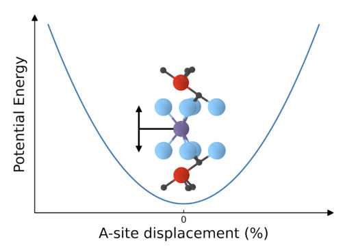 
FIG. 1. Schematic of an A-site sublattice perturbation in a representative double transition metal MAX phase unit cell and the corresponding potential energy change. The A-site atom is shown in purple, transition metal M-site atoms in light blue and red, and X-site atoms in black.

📷 Fig 2

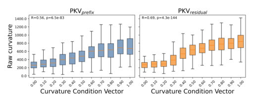 
FIG. 3. Plots showing the calculated curvature (arbitrary units) across a sweeping A-site well condition vector, with constant MXene derivative count dimension.

📷 Fig 3

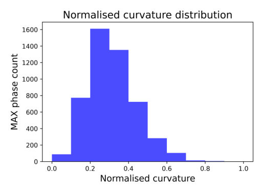 
FIG. 2. Histogram displaying the min-max normalised A-site well curvature values against MAX phase count within the training dataset.

📷 Fig 4

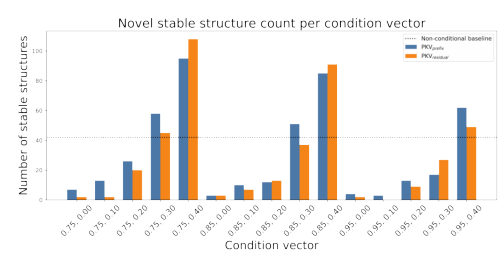 
FIG. 4. Bar chart detailing novel stable structure gener- ation counts with respect to condition vector under non- compositional prompting. The dashed line indicates the non- conditional model baseline. Prompting performed within a condition vector space biased toward high potential MXene derivative counts and low A-site well curvature.

📷 Fig 5

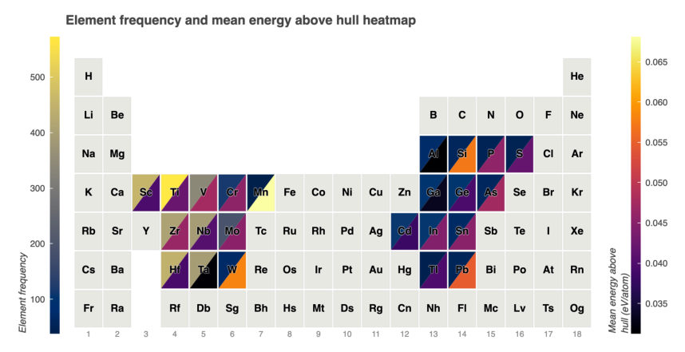 
FIG. 5. Element frequency heatmap for the set of novel stable structures showing element usage weighted by stoichiometry (upper left corner) and the mean energy above hull (lower right corner).

**Summary.** This paper presents a conditional generative large language model designed to accelerate the discovery of MAX phases and their MXene derivatives. By conditioning the model on physical and statistical properties, the researchers can target specific regions of the material design space to find novel, thermodynamically stable structures. This approach significantly reduces the need for expensive first-principles calculations during the initial screening process.

**Why it may be interesting.** not directly relevant

Detailed structure

**Main problem.** Efficiently exploring the vast compositional and structural design space of MAX phases to identify stable, synthesizable candidates and precursors for MXenes without the computational bottleneck of traditional DFT screening.

**Main result.** The CrystaLLM-pi model can target specific regions of phase space using conditioning vectors, doubling the generation rate of novel stable structures, with 50% of novel candidates passing stringent DFT stability validation.

**Method.** A multi-stage pipeline involving fine-tuning a transformer-based LLM on MAX phase CIFs, using property-based conditioning vectors, and validating results via MACE/ALIGNN machine-learned potentials and DFT.

**Model / system.** The system consists of MAX phases (M_{n+1}AX_n) and MAB phases. The model is CrystaLLM-pi, an autoregressive generative large language model fine-tuned on 6,179 double transition-metal MAX phases.

**Key observables.** MXene derivative count, A-site well curvature (surrogate for vacancy formation energy), energy above hull (E_hull), and mechanical properties (bulk and shear moduli).

**Important parameters / regimes.** Stability threshold of E_hull < 0.050 eV/atom; conditioning vectors for MXene count (0.75-0.95) and A-site curvature (0.0-0.4).

**Assumptions / limitations.** The model assumes that structural features encoded in CIFs can be effectively learned and that A-site well curvature serves as a valid proxy for exfoliation potential.

**Figures summary.** Fig 1: A-site sublattice perturbation schematic; Fig 2: Distribution of A-site well curvature; Fig 3: Correlation between condition vectors and calculated curvature; Fig 4: Comparison of generation rates; Fig 5: Element frequency and stability heatmap; Fig 6: Generative workflow.

**Paper structure.** The paper introduces the MAX phase design problem, details the CrystaLLM-pi architecture and conditioning mechanism, describes the multi-stage validation workflow, presents results for targeted generation and stability, and concludes with a low-shot analysis of MAB phases.

Abstract

MAX phases (M$_{n+1}$AX$_n$), precursors to MXenes, span a vast compositional space, motivating efficient computational screening for synthesisable candidates. We employ CrystaLLM$-π$, a large language model fine-tuned on 6,179 double transition-metal MAX phases, and demonstrate its ability to generate out-of-sample structures consistent with known experimental trends. Using a conditioning vector with two dimensions (a statistically derived MXene derivative count and a surrogate for A-site binding energy), the model was able to target MXene-favourable regions of phase space for generation. Specific condition vectors double novel stable structure generation rates versus unconditioned baselines. Of ten compositionally novel candidates, five exhibit DFT-validated stability ($E_{hull} < 0.050$ eV/atom). This work showcases the potential for autoregressive generative models to explore targeted materials' spaces, offering a scalable framework for accelerated discovery in compositionally complex systems.

[↑ back to top](#top)

### [Confinement-Connectivity Coupling Enables High-Efficiency Piezoionic Transduction](http://arxiv.org/abs/2604.27240v1)

**Authors:** Tofayel Ahammad Ovee, Daniel Kroeger, Jean-François Louf  
**Type:** experiment · **Category:** other · **PDF:** <https://arxiv.org/pdf/2604.27240v1>  
**Analysis basis:** abstract only; PDF text extraction failed or PDF unavailable

**Summary.** The paper presents a new way to design hydrogels for bioelectronics by controlling how ions move through small pores. By using a specific mesoporous structure, they achieved high electrical outputs that can even trigger nerve responses without external power. This approach shifts the focus from bulk conductivity to the interplay between pore connectivity and confinement.

**Why it may be interesting.** not directly relevant

Detailed structure

**Main problem.** Piezoionic hydrogels suffer from low output efficiency due to rapid, symmetric ion redistribution that dissipates charge gradients during mechanical deformation.

**Main result.** A confinement-connectivity design strategy using a mesoporous PVA-glycerol-CB[5] network enables high-efficiency piezoionic transduction, producing up to 180 mV and 9 mA and driving electromyographic responses in nerves.

**Method.** The researchers implemented a layered Negative-Neutral-Positive architecture in a supramolecular mesoporous network to simultaneously increase pore fraction and reduce pore size.

**Model / system.** A supramolecular poly(vinyl alcohol)-glycerol-cucurbit[5]uril (PVA-glycerol-CB[5]) mesoporous hydrogel network with a layered architecture designed to regulate ionic transport.

**Key observables.** Peak voltage (~180 mV), peak current (~9 mA), and electromyographic responses in the mouse sciatic nerve.

**Important parameters / regimes.** Pore fraction, characteristic pore size, and the coupling of pore connectivity and confinement.

**Paper structure.** The paper introduces a design strategy for hydrogels, describes the implementation of the mesoporous architecture, demonstrates the resulting electrical output under compression, and validates the device via biological interface testing.

Abstract

Piezoionic hydrogels offer a route to mechanically driven bioelectronic interfaces, but their output is limited by rapid, symmetric ion redistribution that dissipates charge gradients. In biological electrocytes, efficient signal generation arises from the coupling of ion selectivity with spatial confinement that regulates transport. Here, we introduce a confinement-connectivity design strategy for piezoionic hydrogels, implemented through a supramolecular poly(vinyl alcohol)-glycerol-cucurbit[5]uril (PVA-glycerol-CB[5]) mesoporous network with a layered Negative-Neutral-Positive architecture that simultaneously increases pore fraction while reducing characteristic pore size. This architecture constrains ionic redistribution while maintaining a large mobile-ion reservoir, enabling deformation-driven charge separation. Compression generates peak outputs of ~180 mV and ~9 mA and elicits synchronized electromyographic responses in the mouse sciatic nerve without external power. These results establish confinement-connectivity coupling, rather than bulk conductivity, as a materials design framework in which coupling pore connectivity and confinement governs piezoionic transduction.

[↑ back to top](#top)

### [Contrasting Effects of Functionalization in Binary and Medium-Entropy MXene Coatings for Corrosion Protection](http://arxiv.org/abs/2604.27114v1)

**Authors:** Aqsa Fayyaz, Ulises Martin Diaz, Jianyu Dai, Homero Castaneda, Chenglin Wu  
**Type:** both · **Category:** other · **PDF:** <https://arxiv.org/pdf/2604.27114v1>  
**Analysis basis:** full PDF text, analyzed in chunks

📷 Fig 1

 
Figure 1: Schematic illustration of the fabrication process of multilayer coating, illustrating hierarchical organization from macroscopic layer assembly to microscopic interfacial interactions and atomic-scale surface functionalization.

📷 Fig 2

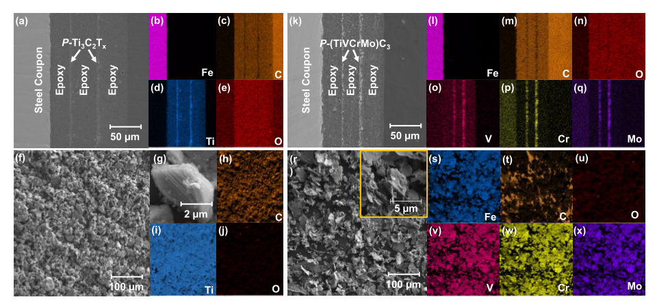 
Figure 2: SEM micrographs and corresponding EDS analyses of fabricated multilayer coatings: (a) cross-sectional view showing the five-layer architecture of P-Ti3C2Tx; (b–e) corresponding EDS elemental maps; (f) top-view morphology of the P-Ti3C2Tx layer with (g–j) elemental distribution; (k) cross-sectional SEM image of the P-(TiVCrMo)C3 coating and (l–q) corresponding EDS maps; (r) top-view morphology of the P-(TiVCrMo)C3 layer with (s–x) EDS mapping.

📷 Fig 3

 
Figure 3: AFM characterization of the MXene–epoxy interface: (a,c) surface topography image showing the step between the epoxy substrate and the deposited P-Ti3C2Tx and P-(TiVCrMo)C3 layer respectively, and (b,d) corresponding height profile. XRD plots (e) for binary MXene and (f) for medium-entropy MXene. XPS Analysis (g) high resolution spectra of Ti 2p (h) O 1s of binary MXene and (i) high resolution spectra of Cr 2p (j) high resolution spectra of O 1s of medium-entropy MXene.

📷 Fig 4

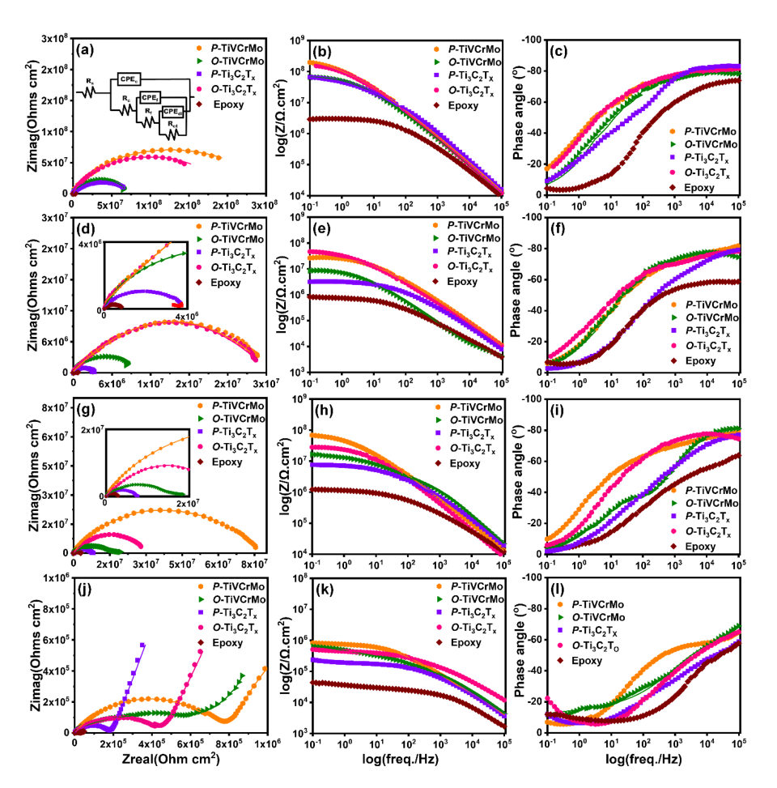 
Figure 4: Nyquist and Bode plots of various MXene–epoxy coatings P-Ti3C2Tx, and O-Ti3C2TX, P-(TiVCrMo)C3, and O-(TiVCrMo)C3 recorded in 3.5 wt.% NaCl solution under different conditions: (a–c) 1 h immersion, five-layer coatings; (d–f) 1 h immersion, three-layer coatings; (g–i) 24 h immersion, five-layer coatings; (j–l) 24 h immersion, three-layer coatings.

📷 Fig 5

 
Figure 4(d-f) shows the Nyquist and bode plots of the 3 layers 1 h immersion, the P-

**Summary.** This study demonstrates that the impact of surface chemistry on corrosion protection depends heavily on whether the MXene is a simple binary system or a complex medium-entropy alloy. While oxygenation helps stabilize binary MXene coatings, it hinders the self-healing properties of medium-entropy MXenes by passivating the active metal sites needed for protective oxide formation.

**Why it may be interesting.** not directly relevant

Detailed structure

**Main problem.** Investigating how surface functionalization (oxygenation) and compositional complexity (binary vs. medium-entropy) affect the corrosion protection performance of MXene-reinforced epoxy coatings.

**Main result.** Oxygenation improves corrosion resistance in binary Ti3C2Tx MXenes by enhancing interfacial bonding, but impairs it in medium-entropy (TiVCrMo)C3 MXenes by disrupting the formation of protective, redox-active oxide layers.

**Method.** Experimental techniques include EIS, SEM, AFM, XPS, and XRD, complemented by DFT calculations and Electron Localization Function (ELF) analysis to study adsorption energies and electronic structure.

**Model / system.** A nacre-inspired multilayer epoxy coating architecture reinforced with either binary Ti3C2Tx or medium-entropy (TiVCrMo)C3 MXene flakes, applied to C1010 carbon steel substrates.

**Key observables.** Impedance modulus (|Z|), coating resistance (R_coat), charge transfer resistance (R_ct), interlayer spacing, surface topography, and adsorption energies of O2 and H2O.

**Important parameters / regimes.** Surface terminations (-F, -O, -OH), compositional entropy, and the presence of multi-metal electronic structures.

**Figures summary.** The figures likely show SEM/EDS for morphology and elemental mapping, XRD for interlayer spacing, XPS for chemical states, EIS Bode/Nyquist plots for resistance, and DFT-based energy landscapes or electron density plots.

**Paper structure.** The paper introduces the problem of steel corrosion, describes the fabrication of multilayer MXene-epoxy coatings, presents characterization of structural and chemical properties, details electrochemical performance comparisons, uses DFT to explain the underlying electronic mechanisms, and concludes with design principles.

Abstract

Developing scalable and environmentally benign anticorrosion coatings is critical for protecting steel infrastructure in chloride-rich environments. Here, a nacre-inspired multilayer epoxy coating reinforced with four MXene systems is investigated. This architecture forms a dense lamellar network that increases diffusion tortuosity and introduces electroactive surfaces for ion interactions. Electrochemical impedance spectroscopy (EIS) confirms that the multilayer design increases coating resistance from ~103 to ~108 Ohm/cm2. A clear performance hierarchy was observed: P-(TiVCrMo)C3 > O-Ti3C2Tx > O-(TiVCrMo)C3 > P-Ti3C2Tx. Density functional theory (DFT) calculations reveal that P-Ti3C2 strongly adsorbs O2, indicating higher surface reactivity, while oxygen termination stabilizes the surface by partially passivating Ti sites. In contrast, P-(TiVCrMo)C3 exhibits strong adsorption of oxygen-containing species due to its multi-metal electronic structure, promoting the formation of protective oxides. These results highlight the delicate balance of surface chemistry, electronic structure, and compositional entropy in designing next-generation MXene-based anticorrosion coatings for marine and industrial environments.

[↑ back to top](#top)

### [Critical temperatures and critical currents of wide and narrow quasi-one-dimensional superconducting aluminum structures in zero magnetic field](http://arxiv.org/abs/2604.27822v1)

**Authors:** V. I. Kuznetsov, O. V. Trofimov  
**Type:** experiment · **Category:** other · **PDF:** <https://arxiv.org/pdf/2604.27822v1>  
**Analysis basis:** full PDF text, analyzed in chunks

📷 Fig 1

 
Figure 1: (Color online) Lines 1, 2 (dash-dotted), and 3 - resistive Rw(T) tran- sitions of the wide structure (bottom inset) at Idc = 0.11 µA. Lines 1, 2, and 3 correspond to the measurement circuits: (I-2-1, V-3-4), (I-3-1, V-2-4), and (I-3-4, V-2-1), respectively. Lines 4 and 5 are Rn(T) transitions of the narrow structure (inset at the top) at Idc = 0.11 µA. Lines 4 and 5 correspond to the measurement circuits: (I-6-5, V-7-8) and (I-7-8, V-6-5), respectively.

📷 Fig 2

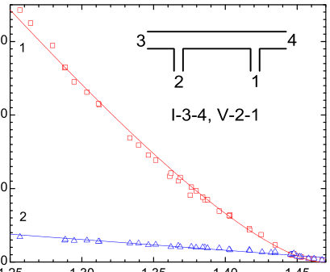 
Figure 2: (Color online) Squares and triangles are critical switching and retrap- ping currents as functions of the temperature, respectively, recorded in the wide structure according to the measurement circuit: I-3-4, V-2-1. Lines 1 and 2 are adjustable theoretical functions for the switching current Ic1(T) and the retrap- ping current Iret2(T), respectively. Inset is the sketch of the structure.

📷 Fig 3

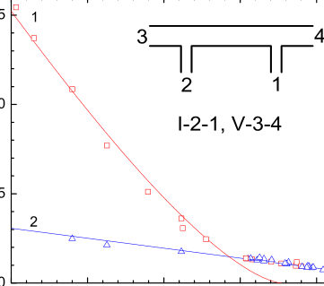 
Figure 3: (Color online) Squares and triangles - switching and retrapping cur- rents as functions of the temperature, respectively, recorded in a wide structure according to the measurement circuit: I-2-1, V-3-4. Line 1 is the adjustable curve Ic1(T) for the experimental switching current in the range T = 1.25 −1.4 K. Line 2 is the adjustable curve Iret2(T) for the switching current in the in- terval T = 1.404 −1.475 K and for the retrapping current in the interval T = 1.25 −1.475 K. Inset is a sketch of the structure.

📷 Fig 4

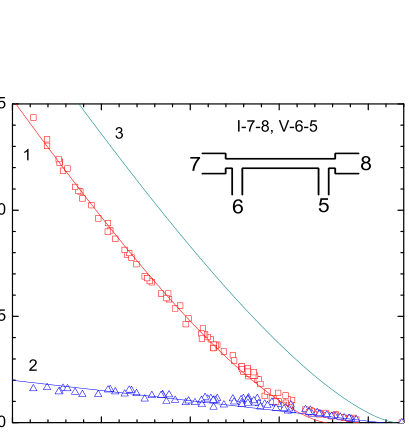 
Figure 4: (Color online) Squares and triangles are the switching and retrap- ping currents as functions of the temperature, respectively, recorded in a nar- row structure according to the measurement circuit: I-7-8, V-6-5. Line 1 is the adjustable curve Ic1(T) for the experimental switching current in the range T = 1.25 −1.41 K. Line 2 is the adjustable curve Iret2(T) for the switching current at T = 1.415−1.444 K and for the retrapping current at T = 1.25−1.45 K. Line 3 is the expected switching current of a narrow structure if critical tem- peratures of narrow and wide wires making up a narrow and wide structure, are the same. Inset: a sketch of the structure.

**Summary.** The researchers found that narrowing superconducting aluminum wires unexpectedly decreases their critical temperature and current density. They propose that this is caused by increased depairing from defects on the wire boundaries and observed that the structures behave as SNS junctions near the transition temperature.

**Why it may be interesting.** not directly relevant

Detailed structure

**Main problem.** Investigating why narrower quasi-one-dimensional aluminum structures exhibit lower critical temperatures and critical current densities compared to wider structures of the same thickness.

**Main result.** The study discovered that narrower structures have lower Tc and jc, likely due to stronger depairing effects from dirty longitudinal boundaries, and identified a transition to a Josephson SNS junction regime at higher temperatures.

**Method.** Electrical measurements of voltage-current (V-I) characteristics and resistance-temperature (R-T) transitions were performed in zero magnetic field using various measurement circuits on fabricated silicon chips.

**Model / system.** Quasi-one-dimensional superconducting aluminum thin-film structures (thickness 19 nm) with widths of approximately 0.27 um and 0.48 um, operating in the dirty limit.

**Key observables.** Critical temperature (Tc), switching critical current (Isw), retrapping current (Iret), and critical current density (jc).

**Important parameters / regimes.** Aluminum film thickness (19 nm), wire widths (0.27 um and 0.48 um), and the dirty limit regime (electron mean free path < coherence length).

**Assumptions / limitations.** The reduction in Tc is attributed to the influence of depairing centers (magnetic atoms or vacancies) located on the dirty longitudinal boundaries of the structures.

**Figures summary.** Figure 1 shows resistance vs. temperature for wide and narrow structures; Figure 2 displays V-I curves and switching current temperature dependence for wide structures; Figures 3 and 4 show switching and retrapping current temperature dependence for narrow structures.

**Paper structure.** The paper introduces the problem of Tc discrepancy, describes the experimental setup and fabrication, presents measurement results for resistance and critical currents, compares data to Ginzburg-Landau and Kupriyanov-Lukichev theories, and concludes with a discussion on the physical mechanism of depairing.

Abstract

We measured the critical temperatures and critical switching and retrapping currents of wide and narrow thin-film quasi-one-dimensional superconducting aluminum structures of the same thickness in zero magnetic field. For the first time, we found that the narrower the structure, the lower the critical temperature and critical current density in the structure. Probably, the influence of depairing centers that are on dirty longitudinal boundaries of the structure, is the stronger than the narrower the structure. It is found for the first time that, in most cases, the temperature-dependent switching critical current in both structures is approximated by two functions. At temperatures below the temperature corresponding to the bottom of the resistive N-S transition of structures, the switching critical current is described by the Kupriyanov-Lukichev theory. At temperatures close to the top of the N-S transition, the switching current is linear with temperature and coincides with the critical Josephson current. At these temperatures, Josephson SNS junctions are formed in structures.

[↑ back to top](#top)

### [Curvature-induced nonlinear anomalous Hall effect in thin magnetic shells](http://arxiv.org/abs/2604.27544v1)

**Authors:** Maria Teresa Mercaldo, Mario Cuoco, Carmine Ortix  
**Type:** theory · **Category:** other · **PDF:** <https://arxiv.org/pdf/2604.27544v1>  
**Analysis basis:** abstract only; PDF text extraction failed or PDF unavailable

**Summary.** This paper shows that the physical curvature of magnetic shells can be used to engineer nonlinear transport properties. By manipulating the geometry, one can selectively access the real and imaginary components of the quantum geometric tensor. This provides a new platform for studying the interplay between geometry and topology in condensed matter systems.

**Why it may be interesting.** not directly relevant

Detailed structure

**Main problem.** The paper investigates how geometric curvature and strain gradients in thin magnetic shells can be used to engineer and probe the quantum geometric tensor (quantum metric and Berry curvature) in centrosymmetric ferromagnets.

**Main result.** The authors demonstrate that curvature-induced orbital Rashba coupling and broken symmetries in magnetic shells generate an intrinsic nonlinear anomalous Hall effect (NAHE) that allows for the selective probing of both the quantum metric and the Berry curvature dipole.

**Method.** The study uses a theoretical framework to analyze how geometric bending and strain gradients across shell thickness break inversion and rotational symmetries, leading to specific spin textures and transport responses.

**Model / system.** The system consists of thin, curved ferromagnetic shells characterized by in-plane magnetization, spin-orbit coupling, and curvature-induced strain gradients.

**Key observables.** Nonlinear anomalous Hall effect (NAHE), quantum metric, Berry curvature dipole, and spin textures.

**Important parameters / regimes.** In-plane magnetization direction, applied electric field direction, and geometric deformations (curvature and strain gradients).

**Assumptions / limitations.** The analysis assumes the presence of spin-orbit coupling and that geometric bending induces sufficient strain gradients to break inversion symmetry.

**Paper structure.** The paper introduces the problem of probing the quantum geometric tensor, describes the mechanism of curvature-induced symmetry breaking and orbital Rashba coupling, analyzes the resulting NAHE components, and concludes with the implications for engineering anisotropic nonlinear transport.

Abstract

Optoelectronic and nonlinear transport experiments probe the quantum geometric tensor of Bloch states, whose real and imaginary components -- the quantum metric and the Berry curvature -- are typically constrained by symmetry. Here, we show that geometric bending provides a route to engineer such responses in centrosymmetric ferromagnets. Curvature-induced strain gradients across the shell thickness break inversion symmetry and activate an orbital Rashba coupling. In the presence of in-plane magnetization and spin-orbit coupling, this generates spin textures with a nontrivial quantum geometry, leading to an intrinsic nonlinear anomalous Hall effect (NAHE) governed by the quantum metric and maximized when the magnetization aligns with the applied electric field. When geometric deformations further break twofold rotational symmetry around the out-of-plane axis, an additional NAHE emerges, maximal for magnetization perpendicular to the driving electric field and governed by the Berry curvature dipole, thus giving access to the imaginary component of the quantum geometric tensor. These results establish curved ferromagnetic shells as a platform for engineering anisotropic nonlinear transport and for selectively probing both components of the quantum geometric tensor.

[↑ back to top](#top)

### [Data-Efficient Indentation Size Effect Correction in Steels Using Machine Learning and Physics-Guided Augmentation](http://arxiv.org/abs/2604.27775v1)

**Authors:** Radmir Karamov, Tagir Karamov  
**Type:** both · **Category:** disordered systems and neural networks · **PDF:** <https://arxiv.org/pdf/2604.27775v1>  
**Analysis basis:** full PDF text, analyzed in chunks

📷 Fig 1

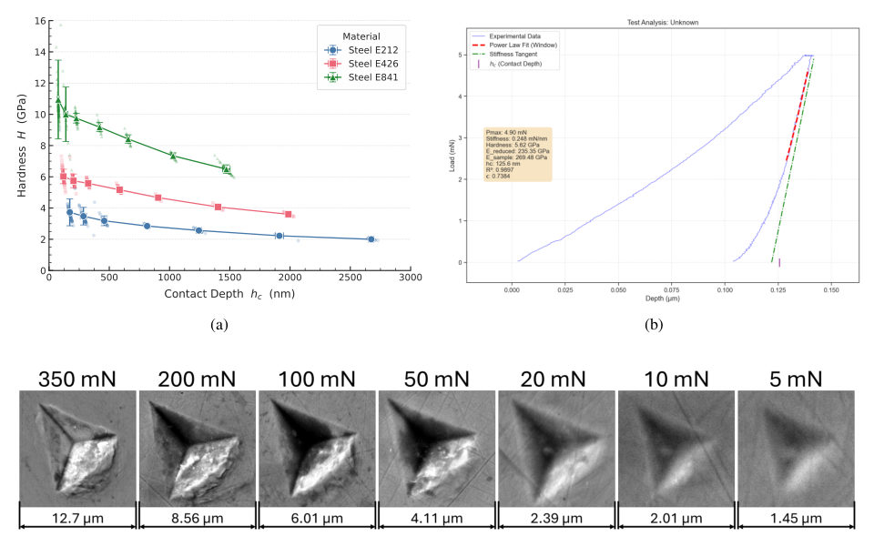 
Figure 1: Depth-dependent apparent hardness and representative shallow indentation curve. (a) Apparent Oliver–Pharr hardness as a function of contact depth for the three training steels. (b) Representative low-load (P)–(h) curve showing unloading fit, stiffness tangent, and contact-depth estimate. (c) SEM images of indents of E841 specimen; image blur at 10 and 5 mN reflects instrument resolution limits.

📷 Fig 2

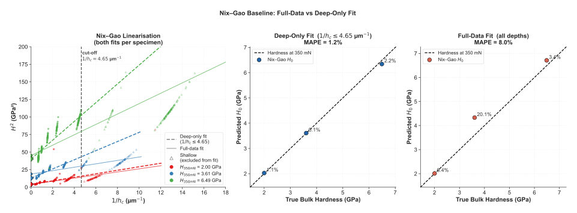 
Figure 2: Baseline evaluation of the classical Nix-Gao model, demonstrating that forcing a linear extrapolation through the full dataset causes non-physical overestimations of hardness (MAPE = 8.0%). Predictive accuracy is only restored (MAPE = 1.2%) when highly size-affected shallow measurements are manually truncated.

📷 Fig 3

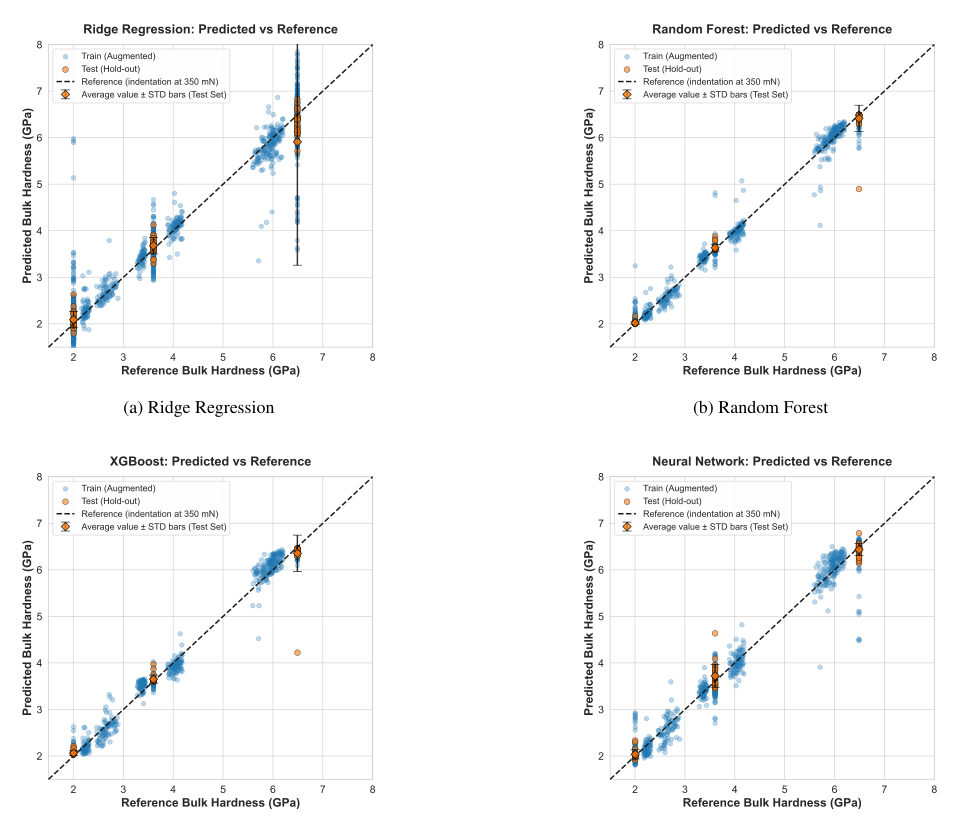 
Figure 3: Parity plots comparing the predicted macroscopic bulk hardness against the experimental ground truth for the a Ridge Regression, b Random Forest, c XGBoost, and d constrained Neural Network architectures.

📷 Fig 4

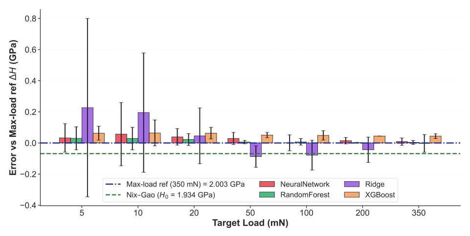 
Figure 4: Per-load prediction error (∆H) relative to the 350 mN macroscopic reference for the E212 training steel, illustrating the baseline correction stability of the evaluated architectures across the complete indentation load range.

📷 Fig 5

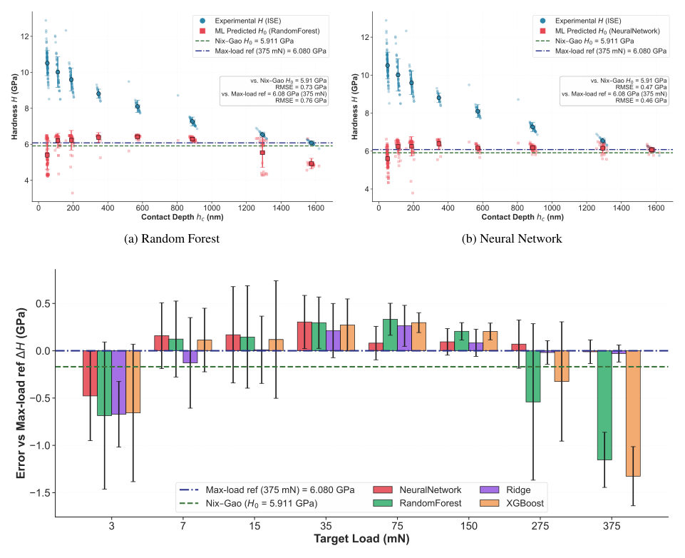 
Figure 5: Application of the ML framework to the unseen validation specimen. Depth-dependent scatter plot comparing the highly size-affected experimental hardness (blue circles) against the size-corrected ML predictions (red squares), alongside the truncated Nix-Gao and macroscopic baselines for (a) Random Forest, (b) Neural Network. (c) Per-load prediction error (∆H) relative to the 375 mN macroscopic reference, comparing the boundary stability of the four evaluated architectures.

**Summary.** This paper presents a machine learning approach to correct hardness measurements in steels that are otherwise distorted by small-scale effects. By using physics-informed features and data augmentation, the authors developed a neural network that can accurately predict bulk material properties from very shallow indentation tests.

**Why it may be interesting.** not directly relevant

Detailed structure

**Main problem.** Correcting the Indentation Size Effect (ISE) in nanoindentation, where measured hardness is artificially inflated at shallow depths due to strain-gradient plasticity and geometric artifacts like pile-up.

**Main result.** A constrained bottleneck neural network (64-8-64) successfully predicts bulk hardness from shallow-depth data with high accuracy (MAPE = 5.4%), outperforming classical Nix-Gao models and tree-based regressors.

**Method.** A physics-guided machine learning framework using data augmentation (Gaussian noise, drift, and MixUp) and feature engineering with area-invariant mechanical descriptors.

**Model / system.** The physical system consists of multiphase steels with varying microstructures (ferritic/pearlitic to martensitic). The ML models evaluated include Ridge Regression, Random Forest, XGBoost, and constrained Neural Networks.

**Key observables.** Hardness (H), reduced elastic modulus (Er), contact depth (hc), maximum load (Pmax), contact stiffness (S), and plastic work fraction (Wp/Wtot).

**Important parameters / regimes.** Shallow contact regime (hc < 215 nm), hardness range 2-6.5 GPa, and the use of area-invariant proxies like Pmax/S^2.

**Assumptions / limitations.** The training steels share a constrained chemical composition; the model is not universal and fails on amorphous materials like fused silica.

**Figures summary.** Figure 1 shows depth-dependent hardness and SEM images of pile-up; Figure 2 compares Nix-Gao errors; Figure 3 shows model parity plots; Figure 5 compares RF and NN performance on unseen specimens; Figure 6 shows model failure on fused silica.

**Paper structure.** The paper introduces the ISE problem, describes the experimental nanoindentation setup and steel specimens, details the physics-guided data augmentation and feature engineering, evaluates various ML architectures, performs interpretability analysis via SHAP and PCA, and concludes with limitations and future directions.

Abstract

Shallow nanoindentation enables mechanical characterization of thin films, individual phases and other volume-constrained materials, but measured hardness is often inflated by the indentation size effect (ISE), contact-area errors and tip-geometry artifacts. Classical ISE corrections such as the Nix-Gao require a deep linear regime and are unreliable when only shallow measurements are used. This study investigates how a small experimental dataset can be used to predict a reference hardness with physics-guided feature engineering and augmentation. Approximately 700 experimental indentations were collected from three steel reference specimens covering a hardness range of 2-6.5 GPa and augmented using physically motivated variations representing instrumental noise, session-level drift, and local multiphase boundary blending. The input space combined Oliver-Pharr values with mechanics descriptors, including indentation work partitioning, ($H\text{/}E_{r}$), and the area-invariant compliance proxy ($P_{\max}\text{/}S^{2}$). Ridge Regression (RR), Random Forest, XGBoost, and Neural Networks (NN) were evaluated using a quarantined fourth steel specimen tested at staggered loads. The hardness mapping was nonlinear: RR failed, whereas nonlinear models achieved ($R^2 > 0.98$) internally. A constrained (64-8-64) NN gave the best results, reaching RMSE = 0.470 GPa, MAPE = 5.4% on the quarantined steel. Unlike Nix-Gao analysis, the NN produced stable estimates in the shallow regime. SHAP and latent-space analysis showed reliance on area-invariant and energy-based descriptors. The results demonstrate the feasibility of a this workflow for ISE correction in steels using small datasets and suggest a pathway toward data-efficient characterization of any volume constrained materials.

[↑ back to top](#top)

### [First-Principles Thermodynamic Analysis of Ternary Chalcogenide Phase Change Materials](http://arxiv.org/abs/2604.27120v1)

**Authors:** Felix Adams, Ichiro Takeuchi, Carlos Ríos Ocampo, Yifei Mo  
**Type:** theory · **Category:** statistical mechanics · **PDF:** <https://arxiv.org/pdf/2604.27120v1>  
**Analysis basis:** abstract only; PDF text extraction failed or PDF unavailable

**Summary.** This paper proposes a new thermodynamic screening method to discover new phase-change materials for memory and photonics. By analyzing the energetics of ternary chalcogenide mixtures, the authors identify new candidate materials that follow the crystallization pathways of the well-known GST system. This approach provides a practical, computationally efficient alternative to simulating full transition dynamics.

**Why it may be interesting.** not directly relevant

Detailed structure

**Main problem.** The need for a computationally efficient way to identify new chalcogenide phase-change materials (PCMs) with properties similar to the GST family without simulating full phase-transition dynamics.

**Main result.** The development of a thermodynamic framework based on Ostwald's rule that uses polymorph screening to identify promising ternary chalcogenide mixtures.

**Method.** First-principles calculations are used to evaluate the energetics of ternary chalcogenide mixtures along binary-binary tie lines and their various polymorphs.

**Model / system.** Ternary chalcogenide mixtures, specifically focusing on the GeTe-Sb2Te3 (GST) system and related compositions.

**Key observables.** Phase stability, miscibility, and the likelihood of polymorph-mediated crystallization pathways.

**Important parameters / regimes.** Ground-state and metastable structure energies, composition space along binary-binary tie lines.

**Assumptions / limitations.** The framework assumes that thermodynamic polymorph screening can serve as a proxy for complex phase-transition dynamics, motivated by Ostwald's rule.

**Paper structure.** The paper introduces the problem of PCM discovery, proposes a thermodynamic framework based on Ostwald's rule, describes the first-principles methodology, presents results evaluating ternary mixtures and polymorph stability, and concludes with implications for future material discovery.

Abstract

Chalcogenide phase-change materials (PCMs) are important for nonvolatile memory and reconfigurable photonic technologies. The GeTe-Sb2Te3 mixture system, commonly referred to as GST, is the most well-known PCM family, but new PCMs are needed to broaden the accessible property space while retaining fast switching. Here, we propose a thermodynamic framework, motivated by Ostwald's rule, for understanding and identifying PCM materials. Since direct modeling of phase-transition dynamics is computationally expensive, Using first-principles calculations, we systematically evaluate the energetics of ternary chalcogenide mixtures along binary-binary tie lines and their polymorphs. By comparing ground-state and metastable structures, we assess phase stability, miscibility, and the likelihood of GST-like polymorph-mediated crystallization pathways across a broad composition space. The calculations reproduce known behavior in GST and related systems and identify several promising candidate mixtures with similar features. These results provide insight into why some PCM systems are more favorable than others and establish thermodynamic polymorph screening as a practical route for future PCM discovery.

[↑ back to top](#top)

### [Fragment-Constrained Charge Equilibration for Charge-Aware Machine Learning Potentials at Electrochemical Interfaces](http://arxiv.org/abs/2604.27910v1)

**Authors:** Akhil Reddy Peeketi, Blas P Uberuaga, Travis E Jones  
**Type:** theory · **Category:** disordered systems and neural networks · **PDF:** <https://arxiv.org/pdf/2604.27910v1>  
**Analysis basis:** full PDF text, analyzed in chunks

📷 Fig 1

 
Figure 1: Snapshot of an IrO2(110)/aqueous NaClO4 interface, our prototype training system for Soft-FQEq. The interface partitions into three structurally distinct regions (electrode, inner and outer Helmholtz layers, and diffuse/bulk electrolyte) and, at molecular resolution, into fragments for per-fragment charge equilibration: the connected electrode slab (one fragment), each intact water molecule, and each individual Na+ or ClO4 – ion. The electrode (Ir, olive; O, red) is a conductor whose electronic states set the surface’s electrochemical potential. The inner and outer Helmholtz layers comprise the first few Å of solvent: oriented water molecules and, further out, the plane of closest...

📷 Fig 2

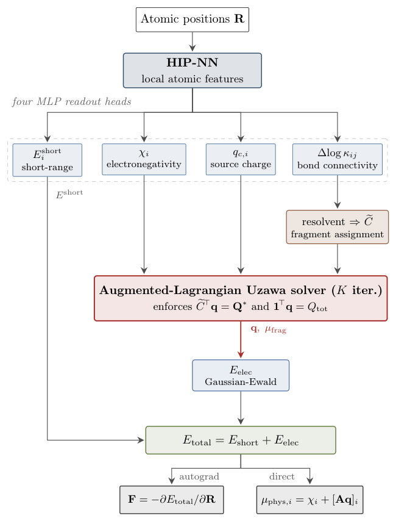 
Figure 2: Architecture of fragment-constrained charge equilibration on a HIP-NN feature net- work. Atomic positions R feed a shared feature network whose four MLP readout heads produce Eshort i , χi, qc,i, and ∆log κij. The bond-connectivity head feeds a differentiable resolvent (Sec- tion 2.2) producing the soft fragment-membership matrix eC; the augmented-Lagrangian Uzawa solver (Section 2.1) then consumes χ, qc, and eC and returns equilibrated charges q and frag- ment chemical potentials µfrag. Forces are obtained by autograd through the unrolled solver; the per-atom observable µphys,i = χi + [Aq]i (Section 2.5) is evaluated directly from the converged χ and q.

📷 Fig 3

 
Figure 3: Per-atom µphys,i = χi + [Aq]i along the interface normal z for a charge-neutral IrO2/H2O/NaClO4 slab, referenced to the bulk-water mean (z ∈[30, 60] Å). The two shaded regions separate the electrode (gray, z ≲11.5 Å) from the electrolyte (light blue, z ≳11.5 Å). Soft-FQEq (blue) shows a flat electrode plateau, a sharp interfacial drop, and a bulk-water plateau near zero; shaded band is the 5-seed ensemble standard deviation. Replacing the Uzawa solver by a global-QEq bordered solve at inference with the same trained weights collapses µphys to a single system-wide value (red dashed line). Species shown: Ir and electrode-O in the electrode region; clean water-O (not bonded to Cl) in...

📷 Fig 4

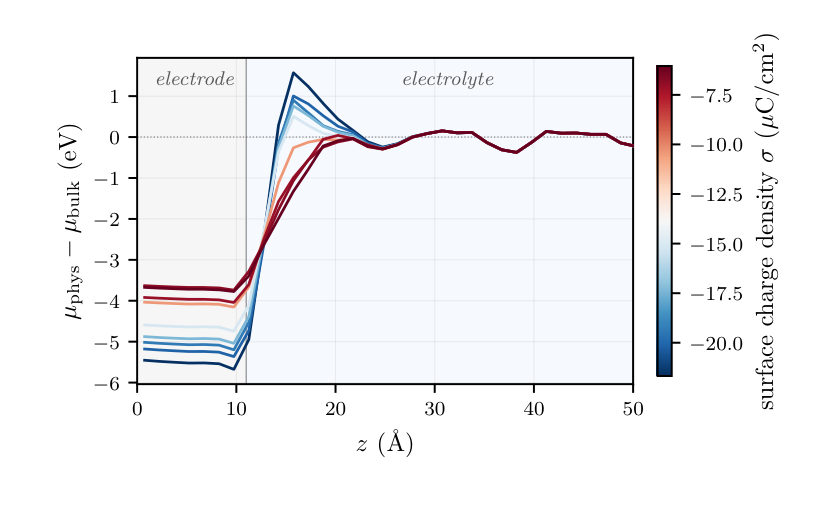 
Figure 4: Response of µphys(z) to electrode charging. Nine ion compositions from 4 Na+ to 4 ClO4 – per electrode face (placed in the Stern layer) span a range of model-predicted surface charge densities σ, with each composition averaged over 5 random seeds. Shaded regions and species inclusion match Figure 3: electrode (gray, z ≲11.5 Å) and electrolyte (light blue, z ≳ 11.5 Å). The electrode plateau shifts monotonically with σ: more positive σ raises µphys on the electrode, consistent with the capacitive response expected at an interface. The bulk-water region remains near zero on each configuration’s own bulk-water reference. Single-snapshot evaluation per seed, not MD-averaged; curves are...

**Summary.** This paper introduces a new machine learning solver layer that allows for different chemical potentials in different parts of a system. This enables reactive machine learning potentials to accurately simulate the electric double layer at electrochemical interfaces, which was previously impossible with standard global charge equilibration methods.

**Why it may be interesting.** not directly relevant

Detailed structure

**Main problem.** Existing charge-aware machine learning interatomic potentials (MLIPs) using global charge equilibration (QEq) cannot model the electrochemical potential gradient at interfaces because they force a single system-wide chemical potential.

**Main result.** The authors developed a 'Soft-FQEq' solver layer that uses differentiable fragment identification to allow distinct chemical potentials for different fragments, successfully recovering the interfacial potential gradient.

**Method.** An augmented-Lagrangian Uzawa iterative solver integrated into the hippynn framework, using a graph Laplacian resolvent for differentiable fragment assignment and Gaussian-screened Ewald electrostatics.

**Model / system.** An electrochemical interface consisting of an IrO2 electrode, aqueous electrolyte (H2O, Na+, ClO4-), and a bulk water region, modeled via a machine learning potential (HIP-NN) with a fragment-constrained charge solver.

**Key observables.** Local electrochemical potential (mu_phys), fragment-resolved chemical potentials (mu_frag), per-atom electronegativity, and DDEC6 atomic charges.

**Important parameters / regimes.** Penalty strength beta = 50, Ewald screening parameter alpha_E = 0.5 A^-1, and soft bond connectivity weights.

**Assumptions / limitations.** Assumes fragment identification can be treated as a differentiable function of geometry via soft connectivity; assumes the solver's coupling is restricted to scalar MLP readouts.

**Figures summary.** Figure 1 shows a snapshot of the IrO2/aqueous NaClO4 interface with partitioned regions; Figure 3 illustrates the electrochemical potential profile showing the electrode plateau, interfacial gradient, and bulk water plateau.

**Paper structure.** The paper identifies the failure of global QEq, introduces the Soft-FQEq mathematical framework and differentiable fragment identification, details the implementation within the HIP-NN/hippynn architecture, validates the model against DFT/DDEC6 data, and performs an ablation study to prove the necessity of the fragment-constrained approach.

Abstract

Predictive simulation of electrochemical interfaces requires atomistic models that capture reactive bond rearrangements, long-range electrostatics, and charge distributions reflecting the electronic distinctness of electrode and electrolyte. Existing charge-aware machine-learned interatomic potentials (MLIPs) built on global charge equilibration (QEq) settle electrode and electrolyte at a common electrochemical potential, leaving no room for the interfacial gradient that the double layer requires and admitting spurious charge transfer between electronically disconnected regions. Per-fragment charge equilibration is the established remedy in classical molecular dynamics, but reliance on predefined molecular topology has confined it to non-reactive systems. We lift this restriction by making fragment identification itself a differentiable function of atomic geometry, yielding soft fragment-constrained charge equilibration (Soft-FQEq) -- a solver layer that restores fragment-resolved charge conservation in reactive MLIPs. The layer consumes four scalar MLP readouts from a shared atomic-feature network -- per-atom electronegativity, source charge, short-range energy, and a soft bond connectivity -- and returns equilibrated charges together with per-fragment chemical potentials. We implement Soft-FQEq as an extension of the hippynn framework on a HIP-NN feature network and train it on DFT energies, forces, and DDEC6 charges for IrO2/H2O/Na+/ClO4- interfaces. The trained model recovers a clear electrode-to-electrolyte gradient in the per-atom electrochemical potential. With the same trained weights but the fragment-constrained solver replaced by global QEq at inference, this gradient collapses to an essentially uniform profile, directly showing that the gradient cannot be sustained within global QEq while the fragment formulation recovers it.

[↑ back to top](#top)

### [From Narrow-gap Semiconductor to Metallic Altermagnet: Optical Fingerprints of Co-Doped FeSb$_2$](http://arxiv.org/abs/2604.28105v1)

**Authors:** R. Mathew Roy, M. Povolotskiy, J. Kirschke, C. Prange, Y. Xia, V. Sundaramurthy, P. Puphal, M. Pinteric, M. van de Loo, A. Kreyssig, T. Zhang, A. E. Böhmer, M. Dressel, M. Wenzel  
**Type:** both · **Category:** strongly correlated electrons · **PDF:** <https://arxiv.org/pdf/2604.28105v1>  
**Analysis basis:** abstract only; PDF text extraction failed or PDF unavailable

**Summary.** This paper demonstrates that doping the semiconductor FeSb2 with cobalt induces a metallic altermagnetic state stable at room temperature. By using optical spectroscopy, the authors identify unique electronic transitions and phonon behaviors that serve as fingerprints for this new magnetic phase. This work establishes Co-doped FeSb2 as a key platform for studying the interplay between altermagnetism and lattice degrees of freedom.

**Why it may be interesting.** not directly relevant

Detailed structure

**Main problem.** The search for bulk metallic altermagnetism and the characterization of the electronic and lattice properties in Co-doped FeSb2.

**Main result.** Cobalt substitution (~15%) transforms the narrow-gap semiconductor FeSb2 into a metallic altermagnetic state that persists up to room temperature, characterized by specific low-energy interband transitions and enhanced electron-phonon coupling.

**Method.** The study combines infrared optical conductivity measurements with density functional theory (DFT) calculations to analyze electronic transitions and phonon modes.

**Model / system.** The physical system is Co-doped FeSb2, a correlated narrow-gap semiconductor that transitions into a metallic altermagnetic state with d-wave spin symmetry.

**Key observables.** Infrared optical conductivity, low-energy interband transitions (near 0.1 eV), spin-split bands, Fano lineshapes in infrared-active phonons, and mode mixing.

**Important parameters / regimes.** Cobalt substitution level (~15%), temperature (up to room temperature), spin-split band energy (~0.2 meV), and spin-orbit coupling induced splitting (~5 meV).

**Paper structure.** The paper presents experimental evidence of a phase transition via doping, followed by spectroscopic analysis of electronic transitions and phonon dynamics, supported by DFT calculations of the spin-split band structure.

Abstract

The realization of bulk metallic altermagnetism has remained elusive despite the growing number of candidate materials. Here, we present evidence that moderate cobalt substitution ($\sim$15%) drives the correlated narrow-gap semiconductor FeSb$_2$ into a metallic altermagnetic state persisting up to room temperature. The infrared optical conductivity reveals low-energy interband transitions near 0.1 eV that emerge upon doping and grow with Co concentration. Density functional theory calculations show that these transitions originate exclusively from altermagnetic spin ordering, with spin split bands ($\sim$0.2 meV) of non-relativistic origin, together with spin-orbit coupling induced band splitting of the order of $\sim$5 meV near the Fermi level. Co substitution further leads to Fano lineshapes and mode mixing in the infrared-active phonons, reflecting enhanced electron-phonon coupling and local inversion symmetry breaking, while leaving the altermagnetic spin symmetry intact. Our results establish carrier-tuned FeSb$_2$ as a platform for exploring metallic $d$-wave altermagnetism and its coupling to lattice degrees of freedom.

[↑ back to top](#top)

### [Generation of magnetic metal-organic frameworks](http://arxiv.org/abs/2604.27879v1)

**Authors:** Alexander C. Tyner, Avinash Pathapati, Alexander V. Balatsky  
**Type:** theory · **Category:** disordered systems and neural networks · **PDF:** <https://arxiv.org/pdf/2604.27879v1>  
**Analysis basis:** abstract only; PDF text extraction failed or PDF unavailable

**Summary.** This paper addresses the difficulty of simulating large-scale organic materials like MOFs by fine-tuning a machine-learning interatomic potential (CHGNet) with a new dataset of 15,000+ computations. The researchers developed a workflow to discover new, highly magnetic metal-organic frameworks by substituting sites in known structural prototypes. This approach provides a scalable way to explore the vast chemical space of magnetic organic materials.

**Why it may be interesting.** not directly relevant

Detailed structure

**Main problem.** Simulating metal-organic frameworks (MOFs) is computationally challenging due to large unit cells and the underrepresentation of organic materials in existing machine-learning training sets.

**Main result.** The authors successfully fine-tuned the CHGNet interatomic potential using a new dataset of 15,000+ first-principles computations from the OMDB and implemented a workflow to identify novel magnetic MOFs.

**Method.** Fine-tuning the CHGNet machine-learned interatomic potential using a dataset derived from the Organic Materials Database (OMDB) and applying a site substitution workflow on QMOF structural prototypes.

**Model / system.** Metal-organic frameworks (MOFs) characterized by large unit cells containing both organic and inorganic components, specifically targeting the generation of highly magnetic structures.

**Key observables.** Magnetic properties of the identified MOFs

**Assumptions / limitations.** The effectiveness of fine-tuning CHGNet relies on the representativeness of the 15,000 single-point first-principles computations from the OMDB.

**Paper structure.** The paper introduces the computational challenge of MOFs, describes the creation of a new training dataset from OMDB, details the fine-tuning of the CHGNet model, and presents a workflow for identifying new magnetic MOFs.

Abstract

The potential to utilize metal-organic frameworks as a replacement for rare earth materials as well as in technological applications has prompted increased interested in this material class. The simulation of organic materials, including metal-organic frameworks (MOFs), represents a computational challenge due to an increased average number of atoms in the unit cell. Compounding this challenge, modern materials databases are generally limited to inorganic structures due to their utility in modern technologies such as batteries and integrated circuits. Machine-learning tools appear ideally suited to study these systems. However, organic materials are generally underrepresented in the training sets of foundational models. In this work we leverage the the Organic Materials Database (OMDB) to create a training dataset comprised of more than 15,000 single-point first-principles computations for finetuning machine learned interatomic potentials. Specifically, we fine tune CHGNet and implement a site substitution workflow to identify novel, highly magnetic, MOFs from structural prototypes within the QMOF database.

[↑ back to top](#top)

### [Giant Spin Magnetization from Quantum Geometry in Altermagnets](http://arxiv.org/abs/2604.28088v1)

**Authors:** Neelanjan Chakraborti, Sudeep Kumar Ghosh, Snehasish Nandy  
**Type:** theory · **Category:** strongly correlated electrons · **PDF:** <https://arxiv.org/pdf/2604.28088v1>  
**Analysis basis:** full PDF text, analyzed in chunks

📷 Fig 1

 
FIG. 1. Magnetic-field-induced spin magnetization in an altermagnet: In the absence of external perturbations (F), an altermagnet exhibits vanishing net spin magnetization despite a spin-split band structure. A finite linear spin mag- netization (MB) is induced under an applied magnetic field (B), whereas the linear response to an electric field (E) is forbidden in a centrosymmetric altermagnet. The magnetic- field-driven response originates from the spin-rotation quan- tum metric.

📷 Fig 2

 
FIG. 2. Spin magnetization in the d-wave altermagnet FeSb2: (a) Spin-projected band structure along the high- symmetry path Z–Γ–S–R–T, showing pronounced nonrela- tivistic spin splitting along the Γ–S and Z–R directions. The crystal structure is shown in the inset. (b) Spin-projected Fermi surface in the kx–ky plane at µ = 0.16 eV, highlighting the characteristic d-wave anisotropy of the spin-split bands. (c) yy-component of the spin-rotation quantum metric in the Brillouin zone, revealing the underlying geometric structure. (d) yy-component of the magnetic-field-induced linear spin magnetization response tensor as a function of chemical po- tential.

📷 Fig 3

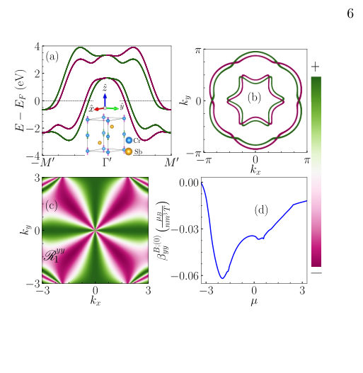 
FIG. 3. Spin magnetization in the g-wave altermagnet CrSb: (A) Spin-projected band structure along the high- symmetry path −M ′–Γ–M ′, showing pronounced nonrela- tivistic spin splitting along the given directions. The crystal structure is shown in the inset. (B) Spin-projected Fermi sur- face in the kx–ky plane at µ = 0.16 eV, highlighting the char- acteristic d-wave anisotropy of the spin-split bands. (c) Distri- bution of yy component of the spin-rotation quantum metric across the Brillouin zone, revealing the underlying quantum- geometric mechanism responsible for the response in panel (d). (d) Chemical-potential dependence of the yy component of the linear spin magnetization response...

**Summary.** This paper identifies a new, universal mechanism for generating giant spin magnetization in centrosymmetric altermagnets driven by the spin-rotation quantum metric. The predicted magnetization is several orders of magnitude larger than in conventional magnets, making these materials ideal platforms for spintronic applications and probes of quantum geometry.

**Why it may be interesting.** not directly relevant

Detailed structure

**Main problem.** Identifying the quantum-geometric mechanism responsible for linear spin magnetization in centrosymmetric altermagnets, where symmetry constraints suppress equilibrium and electric-field-driven responses.

**Main result.** The authors demonstrate that magnetic-field-induced spin magnetization in centrosymmetric altermagnets originates entirely from the spin-rotation quantum metric, predicting a giant response magnitude of 10^-2 mu_B/nm^3.

**Method.** The study employs a generalized quantum geometric tensor framework incorporating momentum translations and spin rotations, combined with a symmetry analysis and a perturbative expansion of the density matrix using the quantum Liouville equation.

**Model / system.** The study focuses on centrosymmetric altermagnets, specifically the d-wave compound FeSb2 and the g-wave compound CrSb, using a tight-binding Hamiltonian with spin-orbit coupling and a Neel exchange field.

**Key observables.** Linear spin magnetization induced by a magnetic field, spin-rotation quantum metric (SRQM), and the spin-rotation Berry curvature.

**Important parameters / regimes.** Magnetic field strength of ~10 mT, spin-split band structures, and the weak-disorder limit (relaxation-time approximation).

**Assumptions / limitations.** The analysis assumes a weak-disorder limit (relaxation-time approximation) and focuses on the intrinsic, $	au$-independent regime of the response.

**Figures summary.** Figure 1 illustrates the mechanism of magnetization in an altermagnet, showing the vanishing magnetization at equilibrium and the finite response induced by a magnetic field due to the spin-rotation quantum metric.

**Paper structure.** The paper introduces the problem of spin magnetization in altermagnets, develops a generalized quantum geometric tensor framework, performs a symmetry-based decomposition of magnetization components, applies this to specific altermagnetic models (FeSb2 and CrSb), and discusses experimental implications.

Abstract

Altermagnets host spin-split band structures while exhibiting vanishing equilibrium spin magnetization, making field-induced responses a direct probe of their quantum geometry. A central question, in this regard, is which quantum-geometric mechanism can generate a linear spin magnetization in centrosymmetric systems. Here we develop a unified framework based on a generalized quantum geometric tensor that incorporates both momentum translations and spin rotations of Bloch states, and decompose spin magnetization into equilibrium, electric-field-driven, and magnetic-field-driven contributions. We show that inversion symmetry forbids the linear electric-field response in centrosymmetric systems, while $C_n T$ symmetry further suppresses the equilibrium contribution in altermagnets. Consequently, centrosymmetric altermagnets provide a particularly clean realization in which the magnetic-field-induced spin magnetization emerges as the only symmetry-allowed linear quantum-geometric response. We demonstrate that this contribution originates entirely from the spin-rotation quantum metric, establishing it as the sole linear quantum-geometric mechanism in such systems. Using representative centrosymmetric altermagnets, including the $d$-wave compound $\mathrm{FeSb}_2$ and the $g$-wave compound $\mathrm{CrSb}$, we show that the spin-rotation quantum metric directly controls this response. Crucially, we predict a giant linear spin magnetization of order $10^{-2}μ_B\,\mathrm{nm}^{-3}$ at magnetic fields of $\sim 10\,\mathrm{mT}$, exceeding typical experimental values for conventional magnets by several orders of magnitude. Our results identify a universal quantum geometric mechanism of spin magnetization operative in centrosymmetric systems in general, and establish centrosymmetric altermagnets as an ideal platform for its experimental detection with potential applications in spintronics.

[↑ back to top](#top)

### [Guided elastic waves for soft elastomer characterization: an alternative to conventional rheometry](http://arxiv.org/abs/2604.27722v1)

**Authors:** Samuel Croquette, Pierre Chantelot, Daniel A. Kiefer, Claire Prada, Fabrice Lemoult  
**Type:** both · **Category:** other · **PDF:** <https://arxiv.org/pdf/2604.27722v1>  
**Analysis basis:** abstract only; PDF text extraction failed or PDF unavailable

**Summary.** This paper introduces a new method to characterize the mechanical properties of soft elastomers using guided elastic waves. By analyzing wave dispersion under tension, the researchers can extract rheological and hyperelastic parameters across a wider frequency range than traditional rheometry. This approach offers a simpler, broadband alternative for studying the mechanics of soft materials.

**Why it may be interesting.** not directly relevant

Detailed structure

**Main problem.** Developing an alternative to conventional rheometry for characterizing the viscoelastic and acoustoelastic properties of soft elastomers.

**Main result.** A wave-based characterization method using guided elastic waves was successfully implemented, providing mechanical parameters consistent with plate-plate rheometry but over a broader frequency range.

**Method.** The method uses stroboscopic measurements of monochromatic wave fields in a thin elastomer strip acting as a waveguide, combined with a numerical implementation to match experimental dispersion curves to a theoretical framework.

**Model / system.** The system consists of thin strips of commercial silicone elastomers acting as waveguides for in-plane guided elastic modes under controlled static elongation.

**Key observables.** Complex-valued dispersion relations for guided modes.

**Important parameters / regimes.** Frequency-dependent viscoelasticity and elongation-dependent acoustoelasticity (hyperelastic parameters).

**Assumptions / limitations.** The method assumes the elastomer strip acts as a waveguide supporting multiple in-plane modes and relies on the coupling of viscoelasticity and acoustoelasticity.

**Paper structure.** Introduction of the wave-based method, description of the experimental setup using elastomer strips, presentation of the theoretical framework coupling viscoelasticity and acoustoelasticity, numerical implementation for data matching, and validation using commercial silicone elastomers.

Abstract

Elastic wave propagation is intrinsically sensitive to the mechanical properties of the medium through which it travels. In soft elastomers, this makes guided elastic waves natural probes of viscoelastic and acoustoelastic behavior over a broad frequency range. In this work, we introduce a wave-based mechanical characterization method in which a thin elastomer strip acts as a waveguide supporting multiple in-plane guided modes. By combining stroboscopic measurements of monochromatic wave fields with a theoretical framework that couples frequency-dependent viscoelasticity and elongation-dependent acoustoelasticity, we extract complex-valued dispersion relations for guided modes under controlled static elongation. A dedicated numerical implementation allows these experimental dispersion curves to be quantitatively matched to theory, enabling identification of the material's rheological and hyperelastic parameters. Applied to several commercial silicone elastomers, the method yields mechanical parameters that are consistent with conventional plate-plate rheometry, while extending the accessible frequency range beyond that of conventional techniques. By exploiting the richness of guided-wave dispersion and the sensitivity of waves to both frequency and pre-stress, this approach provides a unified, broadband, and experimentally simple route to the mechanical characterization of soft elastomers.

[↑ back to top](#top)

### [Intrinsic anomalous thermal hall effect as a signature of quantum metric in d-wave altermagnets](http://arxiv.org/abs/2604.28184v1)

**Authors:** Rishi G. Gopalakrishnan, Srimayi Korrapati, Sumanta Tewari  
**Type:** theory · **Category:** strongly correlated electrons · **PDF:** <https://arxiv.org/pdf/2604.28184v1>  
**Analysis basis:** full PDF text, analyzed in chunks

📷 Fig 1

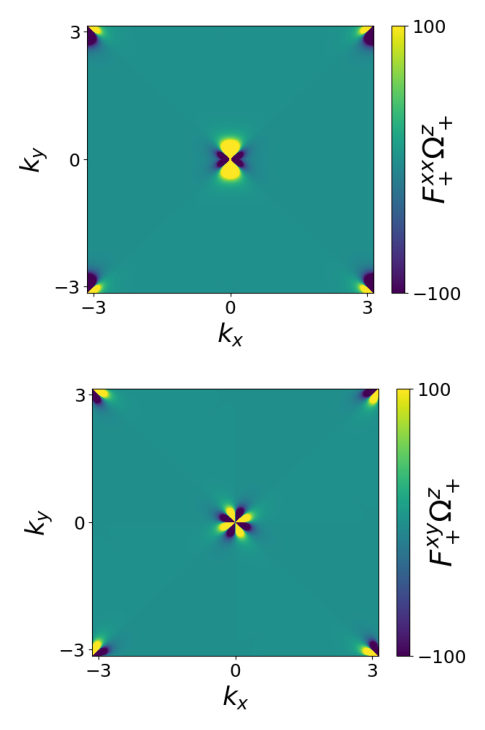 
Figure 1. Variation of the factors F xx + Ωz + (top panel), F xy + Ωz + (bottom panel) in Eq. (16) over the kx −ky plane. We note that F xx T,=Ωz is even in kx and ky which makes the BZ in- tegral of this quantity finite, resulting in ηabcc ̸= 0. On the other hand, F xy T,+Ωz + is odd in both kx and ky and accord- ingly integrates to zero, resulting in vanishing ηabxy and ηabyx. These factors are concentrated around the the band crossings at Γ ≡(0, 0) and M ≡(π, π) points where they diverge as expected from the energy difference in the denominators (see Eqs. (19-21). The parameters used here are t = 1eV , λ = 0.3t, and ∆d = 0.5t.

📷 Fig 2

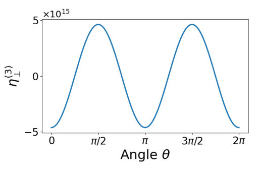 
Figure 2. Variation of the third order thermal Hall conduc- tivity η(3) ⊥ in Eq.(28) over different values of the polar angle θ of the applied thermal gradient in the crystal frame. The conductivity η(3) ⊥ shows a cos 2θ dependence and vanishes at angle values equal to odd multiples of π/4. We use the model parameter values t = 1eV , λ = 0.3t, ∆d = 0.5t, chemical po- tential µ = −3.998eV , and T = 10K.

📷 Fig 3

 
Figure 3. Variation of the third order thermal Hall conductiv- ity η0 as a function of the temperature T. Top: Displays the variation of the thermal Hall conductivity for various values of the d-wave order parameter ∆d with µ = −3.998eV . As we increase the order parameter, the thermal response becomes stronger. Bottom: Displays the variation of the thermal Hall conductivity for various values of the chemical potential µ with ∆d = 0.5t. As the chemical potential moves further from the band crossing point, the magnitude of the peak value of η0 decreases and the peak also moves to higher temperatures, while keeping the ratio (µ −2t)/(kBT) constant. The param- eters used here are t = 1eV , and...

📷 Fig 4

 
Figure 4. Variation of the third order thermal Hall conduc- tivity η0 as a function of the chemical potential µ. Top: Variation of the thermal Hall conductivity with respect to µ for various values of the d-wave order parameter ∆d with T = 10K. As we increase the order parameter, the thermal response becomes stronger. Bottom: Variation of the thermal Hall conductivity for various values of the chemical potential µ with ∆d = 0.5t. As the temperature increases, the posi- tion of the peak of η0 shifts further from the band crossing point (µ = −4.0eV ) and the magnitude of the value of the peak decreases. In both cases, the thermal Hall conductiv- ity vanishes at the band crossing chemical...

**Summary.** This paper identifies that in d-wave altermagnets, the first non-vanishing intrinsic thermal Hall effect occurs at the third order of the temperature gradient. It introduces a new geometric quantity, the nonlinear thermal Berry connection polarizability, which links quantum metric effects to measurable nonlinear thermal transport.

**Why it may be interesting.** not directly relevant

Detailed structure

**Main problem.** The study investigates the intrinsic nonlinear anomalous thermal Hall effect (NATHE) in d-wave altermagnets, specifically seeking the leading-order nonvanishing contribution to the transverse heat current in the absence of a magnetic field.

**Main result.** The authors find that due to crystalline symmetries, the linear and second-order thermal Hall effects vanish, leaving a third-order response proportional to (grad T)^3 driven by a new quantity called the nonlinear thermal Berry connection polarizability.

**Method.** The researchers use Schrieffer-Wolff perturbation theory to calculate corrections to energy and Berry curvature and introduce a new tensor, the Nonlinear Thermal Berry Connection Polarizability (NTBClamP), to describe the third-order response.

**Model / system.** The system is a two-dimensional d-wave altermagnet described by a two-band Hamiltonian featuring d-wave order parameter, Rashba spin-orbit coupling, and specific C4zT and C2z symmetries.

**Key observables.** Third-order intrinsic anomalous thermal Hall conductivity, transverse thermal current, and the Nonlinear Thermal Berry Connection Polarizability (NTBClamP) tensor.

**Important parameters / regimes.** Temperature gradient (grad T), temperature (T), chemical potential (mu), d-wave order parameter (delta_d), and crystal axes orientation (theta).

**Assumptions / limitations.** The analysis is restricted to the intrinsic (scattering-time-independent) contribution and assumes a two-band model approximation.

**Figures summary.** Figure 1 shows the singular kernel of the NTBClamP tensor; Figures 2-4 demonstrate the cancellation of band contributions to ensure finite current and show the unimodal temperature dependence and non-monotonic chemical potential dependence of the conductivity.

**Paper structure.** The paper begins by establishing symmetry constraints that forbid lower-order effects, introduces a new theoretical framework for the third-order response via a new polarizability tensor, provides an analytical evaluation of the conductivity, and concludes with the identification of experimental signatures like angular and temperature dependence.

Abstract

We investigate the intrinsic anomalous thermal Hall effect in d-wave altermagnets, where a transverse heat current is generated by a longitudinal temperature gradient in the absence of a magnetic field, with the leading response proportional to $(\nabla T)^3$. In these systems, the intrinsic Berry curvature-driven linear and thermal quantum-metric-driven second-order anomalous thermal Hall currents vanish as a consequence of crystalline symmetry. We show that the first nonvanishing contribution arises at third order in the temperature gradient and is governed by a nonlinear thermal Berry-connection polarizability, a quantity introduced in this work. Our analysis reveals a distinctive angular dependence of the anomalous thermal Hall conductance as the applied thermal gradient is rotated with respect to the crystal axes. We also find characteristic temperature and chemical-potential dependences that can be tested experimentally. These results identify unique quantum geometry-induced thermal responses and establish altermagnets as a promising platform for exploring intrinsic (i.e., scattering-time-independent) geometric transport phenomena.

[↑ back to top](#top)

### [Local probing of superconductivity at oxide interfaces with atomic force microscopy](http://arxiv.org/abs/2604.28077v1)

**Authors:** Dilek Yildiz, Sungmin Kim, Dengyu Yang, Muqing Yu, Kyoungjun Lee, Ruiqi Sun, En-Min Shih, Steven R. Blankenship, Patrick Irvin, Franz J. Giessibl, Chang-Beom Eom, Jeremy Levy, Joseph A. Stroscio  
**Type:** experiment · **Category:** strongly correlated electrons · **PDF:** <https://arxiv.org/pdf/2604.28077v1>  
**Analysis basis:** full PDF text, analyzed in chunks

📷 Fig 1

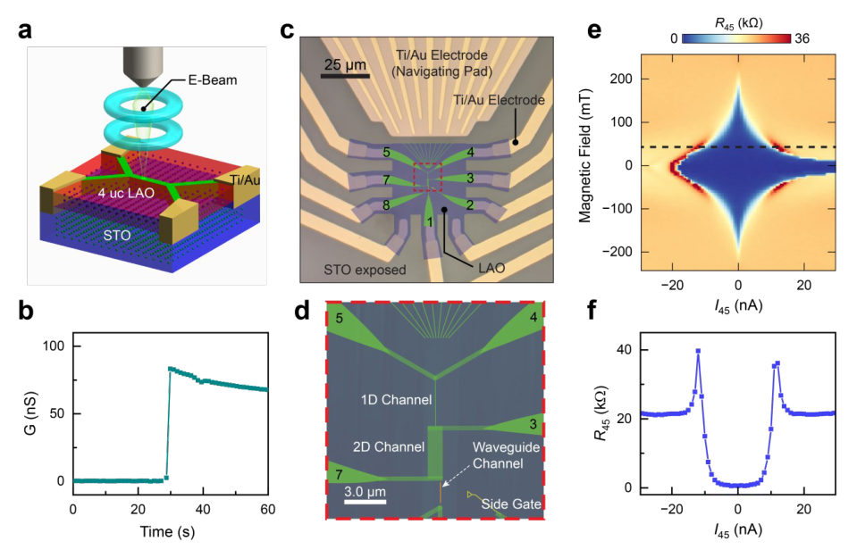 
Fig. 1. Patterning the LAO/STO interface with superconducting channels. (a) Schematic diagram of ULV-EBL patterning. (b) Conductance measurement evolution during patterning. A sharp conductance increase is observed when the pattern connects two contacts. (c) Optical microscope image of the device. The top LAO layer has been etched away outside the dark blue region. The lithographically-defined area patterned by ULV-EBL is indicated in green. (d) The region enclosed by the dashed red box in (c) is magnified to show the various patterns. The dimensions of the patterned areas are: 1D channel (l × w): 3.5 µm × 10-20 nm (single line), 2D channel (l × w): 3.5 µm × 1 µm, and the waveguide: 1.35 µm...

📷 Fig 2

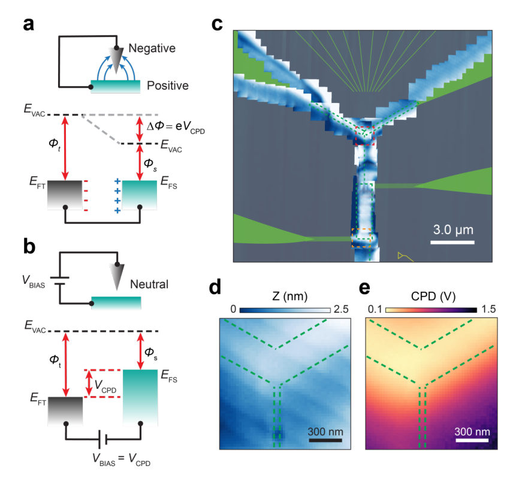 
Fig. 2. Visualizing the patterned channel. Schematic diagrams illustrating the concept of contact potential difference (CPD). (a) When the tip and the sample are electrically in contact, a potential difference across the vacuum gap arises due to the difference in their work functions. (b) A bias voltage 𝑉Bias is applied to the sample to nullify this difference, making the tip and the sample electrostatically neutral and 𝑉Bias is equivalent to the contact potential difference. (c) AFM topography along the patterned region of the four uc LAO/STO interface, acquired in frequency modulation (FM) mode with an oscillation amplitude of 3.2 nm –5.0 nm. (d) AFM topography and (e) contact potential...

📷 Fig 3

 
Fig. 3. Estimation of spatial carrier density profile in a superconducting channel. (a) Carrier density map of the patterned LAO/STO region calculated from the CPD map in Fig. 2e using equation (1). A CPD of 1.024 V was used for the non-patterned area obtained at the bottom left corner of the image in Fig. 2e. (b) Charge density profile across the pattern boundary extracted along the orange dotted line in (a). The statistical uncertainty is less than the symbol size. The estimated pattern boundaries are indicated by green dashed lines.

📷 Fig 4

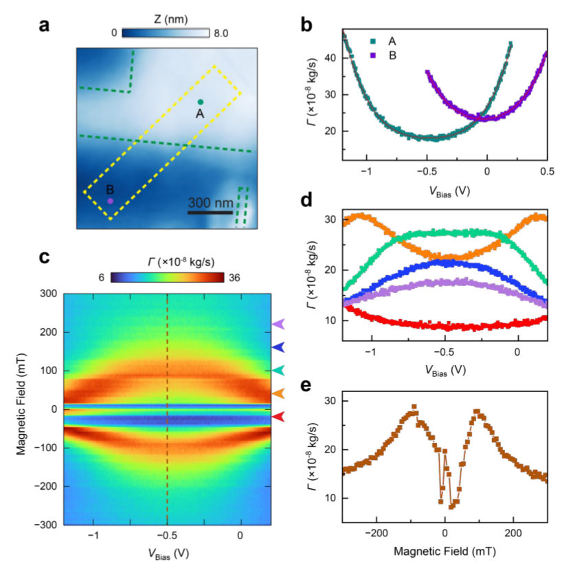 
Fig. 4. AFM energy dissipation measurement at LAO/STO interface. (a) AFM Topography image at the end of the 2D channel region of the 4 uc LAO/STO device (see orange box in Fig. 2c). The green dashed lines indicate the estimated patterned boundary. (b) Damping coefficient vs. sample bias curves obtained at the two points marked in (a). The two curves are fit to the form 𝛼∆𝑉2 + 𝛽∆𝑉4 . The ratios of the 4th to 2nd order coefficients, 𝛽/𝛼= (3.85 ± 0.03) 𝑉−2 and (1.84 ± 0.01) 𝑉−2 for curves A and B, respectively. The uncertainty estimates represent one standard deviation derived from the non-linear least squares fits. The measurements in the patterned area have the larger 4th-order components....

📷 Fig 5

 
Fig. 5. Spatial mapping of energy dissipation across a patterned channel boundary. (a) CPD map extracted from ∆𝑓 vs. 𝑉Bias parabolic curves at each grid point in the rectangular region outlined by the dashed yellow line in Fig. 4a. The green dashed lines indicate the estimated patterned boundary. (b) The damping coefficient in the Y vs. VBias plane obtained at 𝑋= 125 nm, obtained from the AFM excitation vs. sample bias data. The dark blue dashed line shows the evolution of the CPD as the spatial map crosses the patterned boundary. (c-e) Spatial maps in the XY plane of the damping coefficient at selected sample biases of -900 mV, -300 mV, and 300 mV, respectively. Note the narrow strip where...

**Summary.** This paper demonstrates a way to use atomic force microscopy to locally probe superconductivity in patterned oxide interfaces. It reveals that superconductivity in LAO/STO is localized at the edges of patterned structures, with the interior being superconducting only due to the proximity effect. This provides a powerful tool for studying quantum confinement in correlated electron systems.

**Why it may be interesting.** not directly relevant

Detailed structure

**Main problem.** Determining the spatial distribution and nature of superconductivity (2D vs 1D) in patterned LaAlO3/SrTiO3 (LAO/STO) oxide interfaces.

**Main result.** The study identifies that superconductivity is preferentially localized in narrow (~200 nm) edge channels, with the interior of overdoped regions exhibiting superconductivity via a proximity effect.

**Method.** Ultra-low temperature (10 mK) scanning probe microscopy, including non-contact AFM, Kelvin probe force microscopy (KPFM), and dissipation spectroscopy.

**Model / system.** LaAlO3/SrTiO3 (LAO/STO) heterostructures featuring a tunable two-dimensional electron gas (2DEG), specifically patterned into nanowires, waveguides, and 2D sheets using ULV-EBL and c-AFM lithography.

**Key observables.** Contact Potential Difference (CPD), energy dissipation (damping coefficient components alpha and beta), frequency shift, and critical current/magnetic field.

**Important parameters / regimes.** Temperature of 10 mK, magnetic fields up to 300 mT, carrier density (n), and channel widths ranging from 200 nm to 1 um.

**Assumptions / limitations.** The use of a capacitor model to relate CPD variations to local carrier density changes.

**Figures summary.** Figure 1 shows device fabrication and transport properties; Figure 2 displays AFM topography and CPD maps; Figure 3 shows spatial carrier density profiles; Figure 4 presents dissipation measurements and magnetic field dependence; Figure 5 provides 2D maps of dissipation and CPD correlated with the superconducting phase diagram.

**Paper structure.** The paper introduces the fabrication of patterned LAO/STO devices, demonstrates the local mapping of electrostatic potential and carrier density via KPFM, presents dissipation spectroscopy as a local diagnostic for superconductivity, and concludes by analyzing the spatial hierarchy of the superconducting state and its relationship to the doping phase diagram.

Abstract

Superconductivity in strontium titanate has remained enigmatic for more than 50 years. The LaAlO$_3$/SrTiO$_3$ (LAO/STO) heterointerface enables systematic dimensional confinement, from a two-dimensional electron gas to quasi-one-dimensional nanostructures, providing access to this quantum state. Transport measurements in patterned devices reveal puzzling phenomena, including width-independent critical currents and anomalous pairing suggestive of one-dimensional behavior, but direct local probes of the patterned interface and its superconducting response have been lacking. Here we use ultralow-temperature non-contact atomic force microscopy, dissipation spectroscopy, and Kelvin probe force microscopy to locally probe signatures of superconductivity in patterned LAO/STO devices. Spatially resolved energy-dissipation measurements reveal superconducting signatures, with features confined in some devices to edge channels approximately 200 nm wide. Dissipation spectra exhibit a characteristic nonlinear bias dependence that provides a local diagnostic of superconductivity, consistent with the intermediate carrier-density regime near the superconducting dome, and persisting up to the critical field. These results establish atomic force microscopy as a local probe of superconductivity in patterned LAO/STO structures and provide a route to addressing longstanding questions about quantum confinement and transport anomalies in correlated oxide nanostructures.

[↑ back to top](#top)

### [Machine Learning and Molecular Simulations Reveal Mechanisms of ZIFs Polymorph Selection](http://arxiv.org/abs/2604.28106v1)

**Authors:** Emilio Méndez, Rocio Semino  
**Type:** theory · **Category:** disordered systems and neural networks · **PDF:** <https://arxiv.org/pdf/2604.28106v1>  
**Analysis basis:** abstract only; PDF text extraction failed or PDF unavailable

**Summary.** This work uses machine learning and metadynamics simulations to investigate the formation of Zn(imidazolate)2 MOFs. It demonstrates that the selection of specific polymorphs is determined very early in the synthesis process, specifically during the pre-nucleation cluster stage.

**Why it may be interesting.** not directly relevant

Detailed structure

**Main problem.** Identifying which stage of the solvothermal synthesis process (pre-nucleation clusters vs. amorphous intermediates) determines the final polymorph selection in Zn(imidazolate)2 MOFs.

**Main result.** The study finds that both pre-nucleation clusters and amorphous intermediate structures are polymorph-dependent, suggesting that polymorph selection occurs as early as the pre-nucleation cluster stage.

**Method.** Path collective variable metadynamics simulations using a partially reactive force field, combined with the development and application of neural network classifiers on simulated structural databases.

**Model / system.** Zn(imidazolate)2 metal-organic frameworks (MOFs) undergoing non-classical nucleation via pre-nucleation clusters and amorphous intermediates.

**Key observables.** Structural characteristics of transient and intermediate synthesis structures, and polymorph-dependent features in clusters.

**Assumptions / limitations.** The use of a partially reactive force field to approximate the chemical reactivity during self-assembly.

**Paper structure.** The paper introduces the problem of MOF polymorphism, describes the metadynamics simulation setup, details the construction of structural databases, presents the neural network classification results, and concludes with the implications for early-stage polymorph selection.

Abstract

Zn(imidazolate)$_2$ metal-organic frameworks (MOFs) exhibit a remarkable degree of polymorphism. Because of their promising industrial applications, many research groups have investigated phase transitions, phase diagram and relative stability of these polymorphs. There is now wide consensus in the research community that these MOFs are solvothermally formed via non-classical nucleation mechanisms, in which pre-nucleation clusters are first formed, followed by an intermediate amorphous structure that subsequently reorganizes to yield the final crystalline MOF. However, no study up to date has uncovered which part of the synthesis process determines the final polymorph obtained. In this work, path collective variable metadynamics simulations performed with a partially reactive force field give insights into mechanistic and thermodynamic aspects of the self-assembly of these MOFs. Databases of transient and intermediate synthesis structures are built from the simulations. By developing and applying neural network classifiers over these databases, it is found that both pre-nucleation clusters and the amorphous intermediate structures are polymorph-dependent. These results suggest that polymorph selection happens as early as the pre-nucleation cluster stage.

[↑ back to top](#top)

### [Multi-scale calculation of light-induced structural changes in low-angle twisted bilayer WSe$_2$](http://arxiv.org/abs/2604.28143v1)

**Authors:** Rafael R. Del Grande, David A. Strubbe  
**Type:** theory · **Category:** other · **PDF:** <https://arxiv.org/pdf/2604.28143v1>  
**Analysis basis:** full PDF text, analyzed in chunks

📷 Fig 1

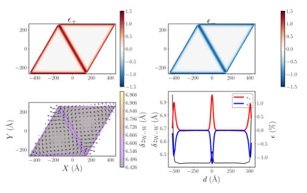 
Figure 1: (a) and (b) are the eigenvalues ϵ+ and ϵ−of the strain tensor over the moir´e supercell. (c) atoms displacement field due to relaxation. (d) Strain over the moir´e supercell diagonal. In the AB regions the strain is zero, although it is anisotropic in the AA and SP regions.

📷 Fig 2

 
Figure 2: Left: Total cohesive energy density for AA, AB, and twisted bilayer WSe2 for some angles. Small angles are close to AB stacked case while larger angle cases are close to AA stacking. Right: Interlayer distance change as function of the repulsive force density applied on the bilayer. Forces density are calculated by finite differences using the data from left panel.

📷 Fig 3

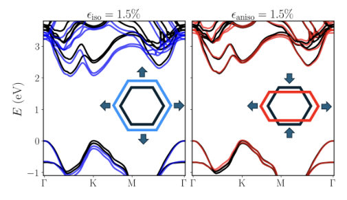 
Figure 3: Bandstructure for bilayer WSe2 under isotropic (left) and anisotropic (right) strain

📷 Fig 4

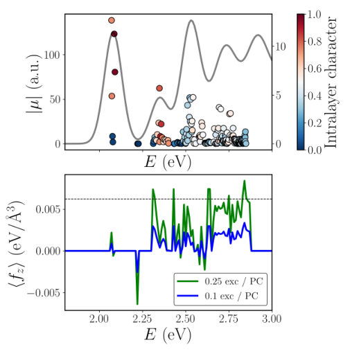 
Figure 4: Upper panel: Solid black line: optical absorption, while circles are the exciton transition dipole moment. Color grading goes from blue (interlayer) to red (intralayer) using the intralayer character defined by equation 5. Lower panel: averaged excited state force on layers of bilayer WSe2, (see equation 3). Positive (negative) forces are repulsive (attractive).

**Summary.** This paper provides a theoretical explanation for why light causes larger structural changes in twisted WSe2 compared to its non-twisted counterpart. By combining classical molecular dynamics with ab initio excited state calculations, the authors show that twisting both weakens interlayer bonds and enhances strain-dependent forces. This discovery highlights how moire engineering can be used to tune light-matter interactions in 2D materials.

**Why it may be interesting.** not directly relevant

Detailed structure

**Main problem.** Explaining the microscopic mechanism behind the observed increase in interlayer distance in low-angle twisted bilayer WSe2 when illuminated by light.

**Main result.** The study identifies a synergistic mechanism where the weakening of the interlayer force constant due to twisting, combined with increased out-of-plane excited state forces from in-plane strain, enhances light-induced interlayer expansion.

**Method.** A multi-scale approach combining classical force field relaxations (LAMMPS) with ab initio excited state forces (ESF) calculated via GW/Bethe-Salpeter Equation and DFPT.

**Model / system.** Low-angle twisted bilayer WSe2 (specifically 1.1 and 0.3 degree samples) featuring a moire superlattice with reconstructed AB, AA, and saddle-point regions.

**Key observables.** Interlayer distance change, in-plane strain tensors, exciton energies (A, B, C, D excitons), and excited state force density.

**Important parameters / regimes.** Twist angles (1.1 and 0.3 degrees), laser fluence (330 uJ/cm2), laser energy (2.4 eV), and interlayer distance change (~0.1-0.2 A).

**Assumptions / limitations.** The large AB regions in low-angle twists can be approximated as periodic AB-stacked bilayer WSe2; exciton energies vary minimally (~0.1 eV) despite flat band formation.

**Figures summary.** Figure 1 shows strain tensor eigenvalues and atomic displacement fields; Figure 2 shows cohesive energy density and interlayer distance change vs. force density; Figure 3 shows bandstructure under isotropic and anisotropic strain.

**Paper structure.** The paper introduces the problem of light-induced expansion, describes the multi-scale computational methodology, presents results on atomic reconstruction and strain fields, details the calculation of excited state forces, and concludes with the synergistic mechanism explaining experimental observations.

Abstract

Exciton-phonon interactions in transition metal dichalcogenides (TMD) are strong and lead to phenomena such as coherent phonon generation. When stacked and twisted, their properties can be tuned by the twisting angle. In experiments with 1.1$^\circ$ twisted 2L WSe$_2$, a change of 0.1 Å in the interlayer distance was observed when light was shone on this material, and here we explain the microscopic mechanism behind this. Theoretical works to study such systems are limited because the Moiré unit cell is too large. To overcome this, we combined classical force field relaxations with our implementation of ab initio GW/Bethe-Salpeter excited state forces (ESF). From the relaxations we found that the low-angle twisting induced an in-plane strain field, the AB regions are large enough to be simulated as periodic AB stacked 2L WSe2, and the interlayer force constant becomes softer in relation to the perfect AB stacking. From the ab initio ESF we obtained that the in-plane strain increases the out of plane ESFs. Those two effects combined, the weakening of the interlayer force constant and strain dependence of the ESF, make light-induced changes in the interlayer distance of twisted 2L WSe2 stronger than in the perfectly stacked case, in agreement with experimental observations. Therefore, our results show that the exciton-phonon interactions can be tuned in twisted 2L TMDs and can be observed experimentally, which makes those materials excellent platforms to study light-induced changes in materials.

[↑ back to top](#top)

### [Observation of the Magnus Nonlinear Hall effect from Chiral Weyl Monopoles](http://arxiv.org/abs/2604.28091v1)

**Authors:** Heda Zhang, Nikolai Peshcherenko, Ning Mao, Nianlong Zou, Jiaqiang Yan, Claudia Felser, Yang Zhang  
**Type:** both · **Category:** other · **PDF:** <https://arxiv.org/pdf/2604.28091v1>  
**Analysis basis:** abstract only; PDF text extraction failed or PDF unavailable

**Summary.** The researchers observed a nonlinear Hall effect in the chiral Weyl semimetal CoSi, even though the standard Berry curvature dipole is forbidden by symmetry. They found that the effect arises from the skew scattering of electron wave packets due to Berry monopoles, providing a new way to probe band topology through nonlinear transport.

**Why it may be interesting.** not directly relevant

Detailed structure

**Main problem.** Exploring mechanisms for the nonlinear Hall effect (NLHE) in high-symmetry chiral lattices where the Berry curvature dipole is symmetry-forbidden.

**Main result.** Observation of a robust NLHE in the chiral Weyl semimetal CoSi, attributed to the skew scattering of self-rotating electron wave packets driven by Berry monopoles.

**Method.** Experimental detection using focused ion beam-fabricated crossbar devices combined with theoretical analysis of skew scattering and topological wave packet dynamics.

**Model / system.** The chiral Weyl semimetal CoSi, characterized by its high-symmetry chiral lattice and the presence of topological Weyl nodes.

**Key observables.** Second-harmonic Hall voltage, temperature-dependent sign reversal, and linearly field-dependent modulation of the NLHE signal.

**Important parameters / regimes.** Carrier mobility, temperature, and magnetic field strength.

**Assumptions / limitations.** The nonlinear Hall conductivity is driven by the skew scattering of self-rotating electron wave packets.

**Paper structure.** The paper introduces the NLHE and the gap in current research regarding high-symmetry lattices, presents experimental observations in CoSi using crossbar devices, provides a theoretical framework involving the Magnus-like effect of wave packets, and analyzes the temperature and field dependence of the signal.

Abstract

The nonlinear Hall effect (NLHE) connects crystalline symmetry to quantum geometry, offering a probe of band topology beyond linear transport. While most studies have focused on the Berry curvature dipole in low-symmetry crystals, mechanisms that directly probe Berry monopoles in higher-symmetry chiral lattices remain unexplored. Here, we report the observations of the NLHE in the chiral Weyl semimetal CoSi, a platform where the Berry curvature dipole is symmetry-forbidden. By employing focused ion beam-fabricated crossbar devices, we detect a robust second-harmonic Hall voltage under zero magnetic field, hosting all key signatures of the NLHE. Theoretical analysis attributes the nonlinear Hall conductivity to skew scattering of self-rotating electron wave packets, whose chirality is dictated by the underlying band topology, a process reminiscent of the classical Magnus effect. Furthermore, the NLHE signal exhibits a temperature-dependent sign reversal, and a strong, linearly field-dependent modulation that grows with carrier mobility, directly reflecting the topological Weyl nodes distribution near the Fermi level. These findings establish CoSi as a platform for Berry monopole-driven nonlinear transport, demonstrating a skew-scattering route to topological nonlinear Hall responses that bypasses conventional symmetry constraints.

[↑ back to top](#top)

### [On Linear and Non-Linear Mechanics of Cyanobacterial Colonies](http://arxiv.org/abs/2604.27760v1)

**Authors:** Yuri Z. Sinzato, Annemieke M. Drost, Dedmer B. Van de Waal, Robert Uittenbogaard, Petra M. Visser, Jef Huisman, Maziyar Jalaal  
**Type:** experiment · **Category:** other · **PDF:** <https://arxiv.org/pdf/2604.27760v1>  
**Analysis basis:** abstract only; PDF text extraction failed or PDF unavailable

**Summary.** This paper quantifies the mechanical strength of cyanobacterial colonies using micropipette sensors and rheology. It finds that these colonies are highly resistant to natural water mixing and that low phosphorus levels actually strengthen the colony structure. This provides a physical basis for understanding how blooms persist in various environments.

**Why it may be interesting.** not directly relevant

Detailed structure

**Main problem.** The study aims to quantify the linear and non-linear biomechanical properties of Microcystis cyanobacterial colonies and understand how nutrient availability affects their structural integrity.

**Main result.** The colonies exhibit high tensile strength and yield stress, making them resistant to fragmentation by natural hydrodynamic stresses, and low phosphorus availability leads to stronger colonies.

**Method.** The researchers used micropipette force sensors for single-cell resolution mechanical quantification and bulk shear rheology to probe macroscopic properties.

**Model / system.** The system consists of Microcystis cyanobacterial colonies held together by a matrix of extracellular polymeric substances (EPS).

**Key observables.** Tensile strength, yield stress, and linear/non-linear mechanical properties.

**Important parameters / regimes.** Nutrient availability (specifically phosphorus levels) and hydrodynamic stresses from wind-mixed lakes.

**Paper structure.** The paper introduces the environmental importance of cyanobacterial blooms, describes the experimental setup using micropipette aspiration and rheology, presents the mechanical findings, discusses the impact of nutrient levels, and concludes with the utility of mechanical testing in studying colony formation.

Abstract

Toxic cyanobacterial blooms are a growing environmental concern that affects freshwater ecosystems, drinking water supplies, and public health. The cyanobacterium Microcystis is among the most important bloom forming species. It often grows in large colonies, which enhances its flotation, reduces grazing, and improves nutrient regulation. Microcystis cells are held together by a matrix of extracellular polymeric substances (EPS), making colony mechanics crucial for bloom formation. However, an analysis of the biomechanical properties of cyanobacterial colonies, and how these properties relate to environmental conditions like nutrient availability, remains largely missing. Here, we use micropipette force sensors to quantify the linear and non-linear mechanical properties of individual colonies at single-cell resolution. Bulk shear rheology complements these measurements by probing macroscopic properties. The measured tensile strength and yield stress are broadly comparable to those of bacterial biofilms and are far greater than the hydrodynamic stresses typically found in wind-mixed lakes. This implies that cyanobacterial colonies are highly resistant to fragmentation by natural mixing processes. We also show that low nutrient availability, particularly low phosphorus, produced stronger colonies, suggesting structural changes in the EPS. Overall, our results establish mechanical testing as a tool for a more complete and physically grounded understanding of cyanobacterial colony formation.

[↑ back to top](#top)

### [Phase Stability of Superfluid $^{3}\mathrm{He}$ in Anisotropic Aerogel](http://arxiv.org/abs/2604.27098v1)

**Authors:** J. W. Scott, D. Park, X. Yuan, W. P. Halperin  
**Type:** both · **Category:** disordered systems and neural networks · **PDF:** <https://arxiv.org/pdf/2604.27098v1>  
**Analysis basis:** full PDF text, analyzed in chunks

📷 Fig 1

 
FIG. 1. Tip angle dependence of NMR precession frequency shift. The two possible modes are ˆn ∥H0 (red) and ˆn ∦H0 (blue) above and below Tx at T/Tc = 0.71 and T/Tc = 0.84 temperatures respectively, in 16% positive strain aerogel[12]. Crosses are experimental data at P = 26.5 bar, H0 = 74.4 mT. Dashed lines represent theoretical calculations incorpo- rating order parameter distortion[13, 14].

📷 Fig 2

 
FIG. 2. Temperature dependence of the NMR resonance fre- quency shift in 16% positive strain aerogel in the B phase at P = 26.5 bar, H0 = 74.5 mT at tip angle β ≈0. The transi- tion Tx from ˆn ∦H0 to ˆn ∥H0 occurs near 1.26 mK.

📷 Fig 3

 
FIG. 3. Phase Diagrams for TAB and flop temperature Tx dependence on magnetic field in 16% positive strain aerogel at 26.5 bar, experiment and theory, with the A-phase shaded red and B-phase blue. A fit to the H2 dependence of experimen- tally measured TAB is given by the green dotted line. TAB with weak coupling βi and Tc,∥/Tc,⊥= 0.96 is shown with the blue line[22]. Strong-coupling βi with Tc,∥/Tc,⊥= 0.99 is given by the purple dashed line[22–24]. The flop transition temperature Tx is shown with a purple dash-dot line. Exper- imental TAB is shown with the green triangles, Tx with green crosses.

📷 Fig 4

 
FIG. 4. Calculated small tip angle (β = 0) NMR frequency shifts ∆ω/2π as a function of temperature for the phase di- agram at H0 = 0.0745 T, P = 26.6 bar, strong coupling βi. The experimentally measured Tab is shown in orange, while the calculated Tab is shown in black. The linear extrapola- tion of the GL coefficent α to α(Tx) based on the pressure dependence of Tc over estimates the frequency shift at low temperatures.

📷 Fig 5

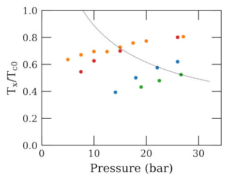 
FIG. 5. Pressure P dependence of Tx in preplated and non-preplated positive strain (green preplated 16% positive strained, blue non-preplated 14% positive strain) and nega- tive strain (red non-preplated, orange preplated) aerogels[5, 38, 39]. The pure coherence length, appearing in Eq.3 is a well-established function of pressure[40]. The positive slopes d(Tx/Tc0)/dP are not compatible with the pair breaking pa- rameter x for either the homogeneous or inhomogeneous scat- tering models[22, 33]. The black dotted line corresponds to the prediction for the anisotropic IISM model given by equa- tion Eq. 3 for the data point taken in preplated 16% positively strained aerogel at P ≈26.5, bar.

**Summary.** This paper investigates how the superfluid phases of 3He reorient their internal axes when placed in strained silica aerogel. By using NMR spectroscopy and Ginzburg-Landau theory, the authors show that a specific temperature-dependent transition occurs due to the anisotropy of the disorder. This work provides a framework for understanding how external strain can control the symmetry-breaking axes in a topological superfluid.

**Why it may be interesting.** The study explores how broken symmetries and topological degrees of freedom (chiral and spin-orbit axes) respond to engineered anisotropic disorder, which is relevant to understanding many-body dynamics in disordered environments.

Detailed structure

**Main problem.** Understanding the phase stability and the temperature-dependent reorientation (n-flop transition) of the vector degrees of freedom in superfluid 3He when subjected to anisotropic disorder from strained silica aerogel.

**Main result.** The researchers identified a field-independent transition at temperature Tx where the spin-orbit axis (n-vector) flips, driven by the equality of quadratic-order Ginzburg-Landau invariants, and developed a model to interpret the distortion of the order parameter.

**Method.** The study uses NMR spectroscopy to measure frequency shifts and tip angles, combined with an anisotropic Ginzburg-Landau model and the IISM model for pair-breaking effects.

**Model / system.** The system is superfluid 3He (a spin-triplet p-wave superfluid) infused in uniformly strained silica aerogel. The theoretical framework is an anisotropic Ginzburg-Landau free energy functional including quadratic and fourth-order invariants and Zeeman energy.

**Key observables.** NMR frequency shifts (delta omega), tip angle (beta), transition temperature (Tx), and the A-B phase transition temperature (TAB).

**Important parameters / regimes.** Spin-orbit axis (n), chiral axis (l), strain axis (epsilon), order parameter amplitudes (parallel and perpendicular to strain), pair-breaking parameter (x), and dipole field (HD).

**Assumptions / limitations.** Assumes a homogeneous average order parameter over the dipole length, neglects spatial variations from the Larkin-Imry-Ma effect, and assumes a homogeneous/isotropic distribution of impurities.

**Figures summary.** Figure 4 shows calculated NMR frequency shifts vs temperature compared to experimental data; Figure 5 shows the pressure dependence of the transition temperature Tx for various aerogel types.

**Paper structure.** The paper introduces the problem of vector reorientation in anisotropic disorder, presents the experimental NMR measurements, develops an anisotropic Ginzburg-Landau model to fit the data, and discusses the pressure dependence and implications for phase stability.

Abstract

The A and B phases of superfluid 3 He have vector degrees of freedom that reflect their characteristic broken symmetries, respectively chiral and spin-orbit rotation axes. Anisotropic disorder in the superfluid, imbibed in uniformly strained silica aerogel, orients these degrees of freedom, thereby affecting phase stability. These degrees of freedom have been found to spontaneously reorient at a field-independent transition temperature Tx , that can be accounted for with a temperature dependent anisotropic Ginzburg-Landau model.

[↑ back to top](#top)

### [Phase-Transition Induced Domain Evolution and Magnetization Dynamics in FePt/FeRh Bilayers for Efficient Heat-Assisted Magnetic Recording](http://arxiv.org/abs/2604.27370v1)

**Authors:** Saroj K. Mishra, Y. Sasaki, S. Isogami, I. Suzuki, Keerthana P, J. Mohanty, Y. K. Takahashi  
**Type:** experiment · **Category:** statistical mechanics · **PDF:** <https://arxiv.org/pdf/2604.27370v1>  
**Analysis basis:** abstract only; PDF text extraction failed or PDF unavailable

**Summary.** The study demonstrates that FePt/FeRh bilayers can significantly reduce the coercivity required for magnetic switching during heat-assisted recording. This is achieved through the phase transition of FeRh, which enhances domain wall mobility via interfacial coupling. This mechanism allows for efficient magnetization switching with reduced thermal load.

**Why it may be interesting.** not directly relevant

Detailed structure

**Main problem.** Reducing the power consumption and laser heating requirements for Heat-Assisted Magnetic Recording (HAMR) by lowering the coercivity of L10 FePt media.

**Main result.** FePt/FeRh bilayers exhibit a 40% reduction in coercivity between 300 K and 400 K due to phase-transition-induced domain wall mobility and interfacial exchange coupling, rather than intrinsic anisotropy softening.

**Method.** Magnetometry, temperature-dependent Magnetic Force Microscopy (MFM), and Time-Resolved Magneto-Optical Kerr Effect (TR-MOKE) measurements.

**Model / system.** FePt/FeRh bilayers, utilizing the antiferromagnetic to ferromagnetic phase transition of FeRh near 350 K to influence the magnetic properties of the FePt layer.

**Key observables.** Coercivity (Hc), domain size, phase contrast, and effective anisotropy field.

**Important parameters / regimes.** Temperature (300 K to 400 K), FeRh phase transition temperature (~350 K), and anisotropy field modification (0.4 T).

**Figures summary.** The figures likely show magnetometry data comparing Hc reduction, MFM images capturing domain evolution/size reduction, and TR-MOKE data regarding anisotropy field stability.

**Paper structure.** Introduction to HAMR challenges, description of the FePt/FeRh bilayer system, presentation of magnetometry results, analysis of domain evolution via MFM, investigation of anisotropy via TR-MOKE, and conclusion on the switching mechanism.

Abstract

Achieving ultrahigh recording densities with low power consumption is a central challenge for next generation heat assisted magnetic recording (HAMR), as conventional L10 FePt media require intense laser heating due to their high coercivity (Hc) and high Curie temperature (700 K). Here, we address this issue using FePt/FeRh bilayers, where the antiferromagnetic to ferromagnetic transition of FeRh near 350 K generates strong interfacial exchange coupling that assists magnetization switching in the FePt layer. Magnetometry measurements reveal a 40% reduction in Hc from 300 K to 400 K in the bilayer, compared to only 8% in single layer FePt. Temperature dependent MFM directly captures phase transition induced domain evolution, showing a 30% reduction in domain size and enhanced phase contrast. TR-MOKE measurements reveal only a minor (0.4 T) modification of the effective anisotropy field during phase transition, confirming that the intrinsic anisotropy of FePt remains largely preserved. These results demonstrate that the reduction in Hc in FePt/FeRh bilayers is primarily governed by phase transition induced domain wall mobility coupled with interfacial magnetic interactions, rather than by intrinsic anisotropy softening. This mechanism provides a pathway toward efficient magnetization switching under reduced thermal load, making FePt/FeRh heterostructures promising candidates for advanced HAMR media.

[↑ back to top](#top)

### [Polar Topologies in a Ferroelastic Metal Membrane](http://arxiv.org/abs/2604.28120v1)

**Authors:** Rahil Haria, Noah Schnitzer, T. Ben Britton, Yaqi Li, Tom J. P. Irons, Sophia Linssen Pitsaros, Ella Banyas, Geri Topore, Annabel Hoyes, Mariana Palos, Sinead M. Griffin, Katherine Inzani, Michele Shelly Conroy  
**Type:** both · **Category:** other · **PDF:** <https://arxiv.org/pdf/2604.28120v1>  
**Analysis basis:** abstract only; PDF text extraction failed or PDF unavailable

**Summary.** The researchers demonstrate that releasing SrRuO3 films from their substrates creates nanoscale ferroelastic domains that spontaneously generate electric polarization. This process reveals new ways to engineer polar textures in conducting materials via structural reorganization. The findings suggest that metal oxide membranes are a robust platform for hosting functional polar textures.

**Why it may be interesting.** not directly relevant

Detailed structure

**Main problem.** The rarity of polar metals due to electron screening of dipoles and the challenge of engineering stable polar textures in conducting materials.

**Main result.** Releasing epitaxial SrRuO3 films from substrates drives ferroelastic domain refinement and generates two distinct classes of emergent polar textures at antiphase boundaries and 90-degree walls.

**Method.** Correlative microscopy combining mesoscale electron channelling contrast imaging (ECCI) and atomic-resolution scanning transmission electron microscopy (STEM), supported by ab initio calculations.

**Model / system.** Freestanding/membrane-form epitaxial SrRuO3 (strontium ruthenate) films, specifically focusing on ferroelastic domain structures and antiphase boundaries.

**Key observables.** Electric polarisation, tilt field interpolation (Neel-like and Ising-like), and domain length scales.

**Important parameters / regimes.** Domain scales ranging from micrometre to nanometre; 4 nm polar nanoclusters.

**Assumptions / limitations.** The study assumes the structural reorganization is driven by the release of epitaxial strain from the substrate.

**Paper structure.** The paper introduces the concept of polar metals, describes the experimental process of releasing SrRuO3 films, presents microscopy results (ECCI and STEM) showing polar textures at boundaries, provides ab initio corroboration, and concludes with the implications for metal oxide membranes.

Abstract

Polar metals, materials in which electric polarisation and metallicity coexist, are exceptionally rare because itinerant electrons screen long-range dipoles and favour centrosymmetric structures. Engineering polar textures in a conducting magnet holds promise for reconfigurable spin orbit coupling and magnetoelectric functionality. Here we show that releasing epitaxial SrRuO3 films from their substrates drives a hierarchy of ferroelastic domain refinement from micrometre to nanometre length scales, and that this structural reorganisation spontaneously generates two distinct classes of emergent polar texture that are ubiquitous across the freestanding membrane. Using correlative microscopy from mesoscale electron channelling contrast imaging (ECCI) to atomic resolution scanning transmission electron microscopy (STEM), we demonstrate that electric polarisation emerges selectively at translation-inequivalent antiphase boundaries (APBs). At these boundaries multicomponent aac tilt field undergoes Neel-like interpolation that preserves the in-phase tilt component and amplifies roto flexoelectric coupling, while translation-equivalent boundaries remain nonpolar. The Neel like interpolation at hard APBs and Ising like collapse of all tilt components at easy APBs is corroborated with ab initio calculations. While embedded 90 ferroelastic walls provide an additional mechanistically distinct source of electric polarisation resulting in polar nanoclusters (4 nm). These distinct nanotextures at 90 walls from via elastic accommodation of strain mismatch between variants and rotostriction as the tilt field interpolates across the boundaries. These findings show that, in a membrane form, metal oxides provide a robust platform for hosting nanoscale ferroelastic domains that generate polar textures.

[↑ back to top](#top)

### [Practical Insights to Thin Film Dewetting](http://arxiv.org/abs/2604.27192v1)

**Authors:** Karim Gadelrab, Stefan Reimann-Zitz  
**Type:** theory · **Category:** other · **PDF:** <https://arxiv.org/pdf/2604.27192v1>  
**Analysis basis:** abstract only; PDF text extraction failed or PDF unavailable

**Summary.** This paper uses lattice Boltzmann simulations to study how various physical parameters control the rupture and coarsening of thin liquid films. It provides predictive scaling laws and identifies a stable coverage plateau, offering practical guidance for stabilizing coatings in materials science.

**Why it may be interesting.** not directly relevant

Detailed structure

**Main problem.** Quantifying how film thickness, surface energy, wettability, and intermolecular forces govern the dewetting kinetics and long-time morphology of thin liquid films.

**Main result.** Identification of master-curve scalings for dewetting time, showing power-law sensitivity to thickness, and the discovery of a coverage plateau that provides a window for morphological stabilization.

**Method.** Lattice Boltzmann method (LBM) simulations implemented within a lubrication-theory framework.

**Model / system.** Thin liquid films undergoing instability and rupture dynamics, governed by surface energy, wettability, and intermolecular forces.

**Key observables.** Time to dewet, film coverage plateau magnitude, domain density, and coarsening scaling laws.

**Important parameters / regimes.** Film thickness, surface energy, wettability (contact angle), and intermolecular forces.

**Assumptions / limitations.** The study utilizes a lubrication-theory framework for the LBM simulations.

**Paper structure.** The paper presents a systematic quantification of dewetting kinetics, identifies scaling laws for dewetting time and long-time evolution, and discusses the implications for coating robustness and surface engineering.

Abstract

Thin liquid films exhibit rich instability and rupture dynamics that critically impact coating performance across many applications. In this work, we use the lattice Boltzmann method (LBM) simulations within a lubrication-theory framework to systematically quantify how film thickness, surface energy, wettability, and intermolecular forces govern dewetting kinetics and long-time morphology. Master-curve scalings are identified for the time to dewet, revealing a strong power-law sensitivity to film thickness and a comparatively weak dependence on moderate variations in the contact angle. Following rupture, the film reaches a physically meaningful coverage plateau, whose magnitude correlates with material parameters and provides a practical window for morphological stabilization prior to coarsening. Long-time evolution obeys classical coarsening scaling laws, with surface energy controlling domain density. These results demonstrate that lubrication-based models can deliver predictive design guidance for evaluating coating robustness and forming materials and surface engineering strategies. Source code is available at https://github.com/Zitzeronion/Swalbe.jl.

[↑ back to top](#top)

### [Propulsion and far-field hydrodynamics of linked-sphere microswimmers with viscoelastic deformability](http://arxiv.org/abs/2604.27348v1)

**Authors:** Vimal Singh, Akash Choudhary  
**Type:** theory · **Category:** other · **PDF:** <https://arxiv.org/pdf/2604.27348v1>  
**Analysis basis:** abstract only; PDF text extraction failed or PDF unavailable

**Summary.** This paper studies how the viscoelasticity of a microswimmer's body influences its ability to move under reciprocal motion. It compares two different sphere-link configurations and shows that the location of the actuator can fundamentally change the swimming direction and flow patterns.

**Why it may be interesting.** not directly relevant

Detailed structure

**Main problem.** Investigating how viscoelastic deformability affects the propulsion and far-field hydrodynamics of microswimmers driven by reciprocal actuation.

**Main result.** The 3-sphere design shows an optimal actuation frequency, while the 4-sphere design features a critical frequency where locomotion direction reverses; far-field flows are characterized by dipolar and quadrupolar contributions.

**Method.** Theoretical modeling of microswimmer dynamics using Kelvin-Voigt viscoelasticity and hydrodynamic characterization of flow fields.

**Model / system.** Two linked-sphere microswimmer designs: a 3-sphere design with actuation at one end and a 4-sphere design with actuation at the midpoint, both featuring a passive viscoelastic body.

**Key observables.** Kinematic performance (propulsion velocity), locomotion direction, and far-field hydrodynamic signatures (dipolar and quadrupolar flow contributions).

**Important parameters / regimes.** Actuation frequency, relative length of the actuator segment, and viscoelastic properties (Kelvin-Voigt model).

**Assumptions / limitations.** The passive body follows Kelvin-Voigt viscoelasticity; actuation is reciprocal.

**Paper structure.** Introduction to viscoelastic microswimmers, description of the 3-sphere and 4-sphere models, analysis of kinematic performance under frequency variation, and characterization of far-field hydrodynamic signatures.

Abstract

Viscoelasticity governs the locomotion strategies of deformable microorganisms, rendering it a fundamental mechanical property of microbial motility and an integral component in the design of envisioned microbots. Recent studies have shown that it can enable effective propulsion through non-reciprocal body deformations, even under time-reversible actuation. In this work, we investigate the dynamics of model microswimmers driven by reciprocal actuation, wherein the passive body exhibits viscoelastic deformability. We consider two linked-sphere designs, distinguished by the location of actuation: applied at one end (3-sphere design) or at the midpoint of the swimmer body (4-sphere design). Adopting Kelvin-Voigt deformability, we characterize the kinematic performance of both designs: the three-sphere swimmer possesses an optimal actuation frequency, while the four-sphere swimmer exhibits a critical frequency at which the locomotion direction reverses. We examine the swimmer's far-field hydrodynamic signature and find that resulting flow field is characterized by dominant dipolar and quadrupolar contributions, whose magnitudes are sensitive to the relative length of the actuator segment.

[↑ back to top](#top)

### [Quantifying Thermal, Photovoltage, and Defect Contributions to Transient Absorption of Ta$_{3}$N$_{5}$ Photoanodes](http://arxiv.org/abs/2604.28094v1)

**Authors:** Johannes Dittloff, Lukas M. Wolz, Matthias U. Quintern, Laura I. Wagner, Matthias Kuhl, Johanna Eichhorn, Ian D. Sharp  
**Type:** experiment · **Category:** other · **PDF:** <https://arxiv.org/pdf/2604.28094v1>  
**Analysis basis:** abstract only; PDF text extraction failed or PDF unavailable

**Summary.** This paper presents a method to separate overlapping signals in the transient absorption spectra of Ta3N5 photoanodes. By combining different optical spectroscopies, the authors can distinguish between lattice heating, band flattening from photovoltage, and defect charge redistribution. This provides a clearer understanding of carrier dynamics in semiconductor photoelectrodes.

**Why it may be interesting.** not directly relevant

Detailed structure

**Main problem.** Transient absorption spectroscopy of Ta3N5 photoanodes is often difficult to interpret because signals from lattice heating, surface photovoltage, and defect states overlap.

**Main result.** The researchers successfully disentangled thermal, electrostatic, and defect-mediated contributions to the transient absorption signal using a combination of microsecond-to-second transient absorption and photoreflectance.

**Method.** The study combines microsecond-to-second transient absorption spectroscopy with potential-dependent measurements and photoreflectance to isolate specific physical mechanisms.

**Model / system.** The physical system is Ta3N5 thin films used as photoanodes for solar-driven water oxidation.

**Key observables.** Transient absorption features, photoreflectance critical points (2.14 eV, 2.27 eV, and 2.80 eV), and surface photovoltage relaxation.

**Important parameters / regimes.** Time scales ranging from microseconds to seconds; energy transitions at 2.14 eV, 2.27 eV, and 2.80 eV.

**Paper structure.** The paper introduces the problem of signal ambiguity in Ta3N5, presents the experimental combination of transient absorption and photoreflectance, details the identification of thermal and electrostatic components, and concludes with the broader applicability of this quantification method.

Abstract

Ta$_{3}$N$_{5}$ is among the most intensively studied photoanode materials for solar-driven water oxidation, yet its performance often remains limited by short carrier lifetimes and defect mediated recombination. Although transient absorption spectroscopy is widely used to probe carrier dynamics in photoelectrodes, spectral assignments are frequently ambiguous due to overlapping contributions. Here, microsecond-to-second transient absorption of Ta$_{3}$N$_{5}$ thin films is combined with complementary optical spectroscopies to disentangle contributions from lattice heating, electrostatics, and defect states. Photoreflectance reveals three critical points in the Ta$_{3}$N$_{5}$ band structure, including two anisotropic near-edge transitions at 2.14 eV and 2.27 eV and a higher-lying transition near 2.80 eV, all closely aligned with dominant transient absorption features. A previously unreported photo-induced absorption at 2.80 eV is attributed to pump-induced lattice heating, while potential-dependent measurements reveal that near-edge bleach features arise from pump-induced band flattening and subsequent surface photovoltage relaxation. Fitting transient absorption spectra with independently measured thermal and electrostatic components enables quantification of both thermal and photovoltage dynamics, while the sub-bandgap response provides insight into the redistribution of defect charge states. Thus, this approach to quantifying thermal, electrostatic, and defect-mediated contributions to microsecond-to-second transient absorption provides broadly applicable insights into photoexcitation and relaxation mechanisms in functional semiconductor photoelectrodes.

[↑ back to top](#top)

### [Radio Frequency Field-Induced Enhancement of Detection Sensitivity in Silicon Nanowire Sensors](http://arxiv.org/abs/2604.28100v1)

**Authors:** Ang Liu, Jingsong Shang, Jiangang J. Du, Shyamsunder Erramilli, Pritiraj Mohanty  
**Type:** both · **Category:** other · **PDF:** <https://arxiv.org/pdf/2604.28100v1>  
**Analysis basis:** full PDF text, analyzed in chunks

📷 Fig 1

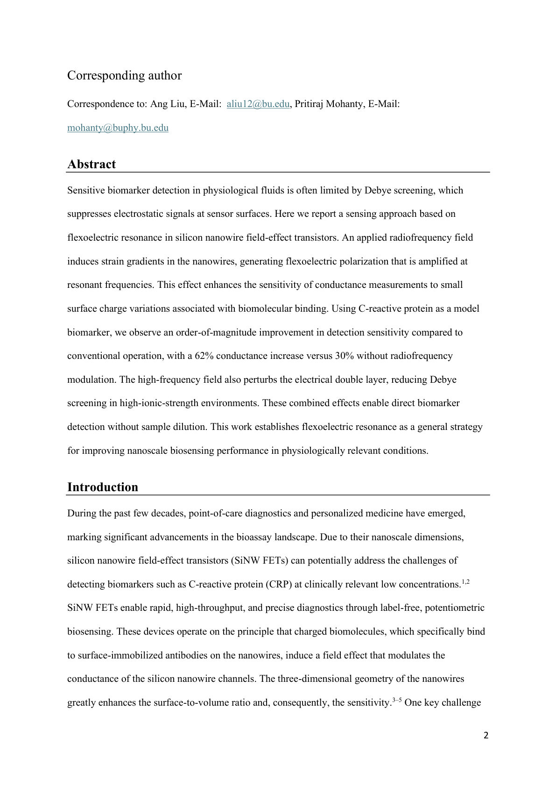 
Low-resolution page preview, page 2

📷 Fig 2

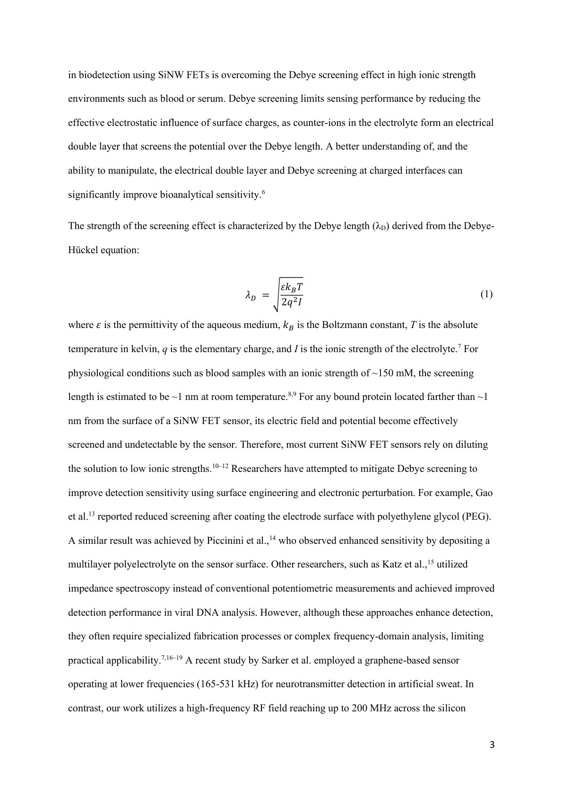 
Low-resolution page preview, page 3

📷 Fig 3

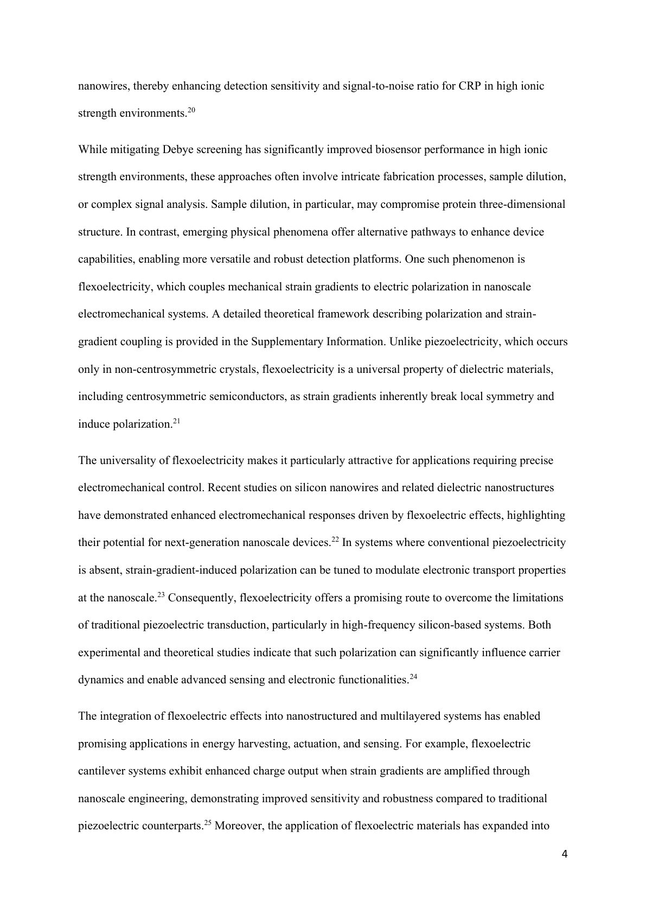 
Low-resolution page preview, page 4

📷 Fig 4

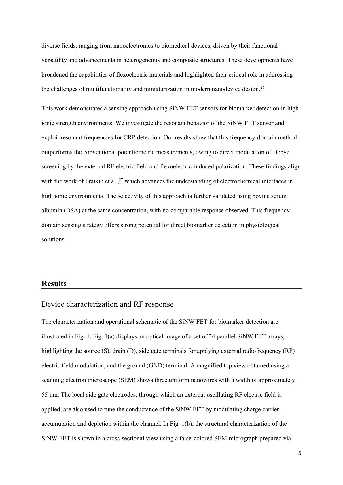 
Low-resolution page preview, page 5

📷 Fig 5

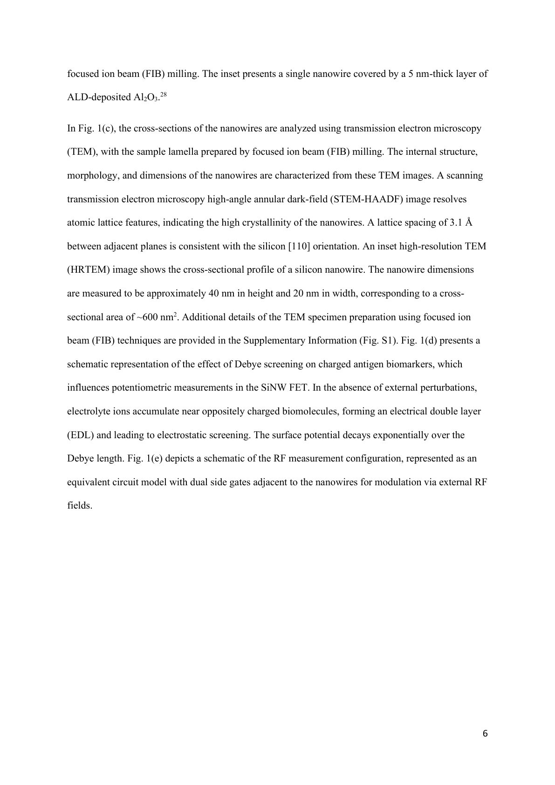 
Low-resolution page preview, page 6

**Summary.** This paper demonstrates a method to enhance biosensor sensitivity by using radiofrequency fields to induce flexoelectric resonance in silicon nanowires. This technique overcomes the Debye screening limit in high-salinity fluids, allowing for the direct detection of proteins without sample dilution.

**Why it may be interesting.** not directly relevant

Detailed structure

**Main problem.** The detection sensitivity of silicon nanowire field-effect transistors (SiNW FETs) is limited in physiological fluids by Debye screening, where ions in high-ionic-strength environments mask the electrostatic signals of target biomolecules.

**Main result.** Applying a radiofrequency (RF) field induces flexoelectric resonance and disrupts the electrical double layer, leading to an order-of-magnitude improvement in detection sensitivity for C-reactive protein.

**Method.** The researchers used RF frequency sweeps (up to 200 MHz) to modulate conductance, combined with COMSOL Finite Element Analysis to model strain gradients and flexoelectric polarization.

**Model / system.** The system consists of silicon nanowire field-effect transistors (SiNW FETs) with a 5 nm Al2O3 dielectric layer, operating in high-ionic-strength physiological environments.

**Key observables.** Device conductance (G), resonance peak frequency, peak area, and surface potential evolution.

**Important parameters / regimes.** RF frequency range (0-200 MHz), Debye length (~1 nm), nanowire dimensions (40 nm x 20 nm), and ionic strength (~150 mM).

**Assumptions / limitations.** Negligible macroscopic heating of the fluid due to low electron density; use of the Stokes-Einstein relation for ionic mobility.

**Figures summary.** Fig 1 shows the SiNW FET array and RF setup; Fig 2 shows conductance vs. RF frequency and power; Fig 4 illustrates flexoelectric effects and harmonic conductance peaks; Fig 5 displays simulated flexural mode shapes and strain distributions.

**Paper structure.** The paper introduces the Debye screening problem, describes the SiNW FET fabrication and functionalization, presents the experimental RF-modulation results, provides theoretical validation via flexoelectricity and COMSOL simulations, and concludes with the implications for biosensing.

Abstract

Sensitive biomarker detection in physiological fluids is often limited by Debye screening, which suppresses electrostatic signals at sensor surfaces. Here we report a sensing approach based on flexoelectric resonance in silicon nanowire field-effect transistors. An applied radiofrequency field induces strain gradients in the nanowires, generating flexoelectric polarization that is amplified at resonant frequencies. This effect enhances the sensitivity of conductance measurements to small surface charge variations associated with biomolecular binding. Using C-reactive protein as a model biomarker, we observe an order-of-magnitude improvement in detection sensitivity compared to conventional operation, with a 62% conductance increase versus 30% without radiofrequency modulation. The high-frequency field also perturbs the electrical double layer, reducing Debye screening in high-ionic-strength environments. These combined effects enable direct biomarker detection without sample dilution. This work establishes flexoelectric resonance as a general strategy for improving nanoscale biosensing performance in physiologically relevant conditions.

[↑ back to top](#top)

### [Second harmonic generation and third harmonic generation in topological insulator-based van der Waals metamaterials](http://arxiv.org/abs/2604.27864v1)

**Authors:** Alessandra Di Gaspare, Sara Ghayeb, Craig Knox, Edmund H. Linfield, Joshua Freeman, Miriam S. Vitiello  
**Type:** experiment · **Category:** other · **PDF:** <https://arxiv.org/pdf/2604.27864v1>  
**Analysis basis:** abstract only; PDF text extraction failed or PDF unavailable

**Summary.** The researchers experimentally demonstrated second and third harmonic generation in topological insulator-based metamaterials at THz frequencies. By using split ring resonators to amplify the optical field, they were able to observe even and odd harmonics arising from the distinct symmetries of the bulk and surface states. This provides a way to experimentally distinguish between different electronic contributions in topological materials.

**Why it may be interesting.** not directly relevant

Detailed structure

**Main problem.** The difficulty in experimentally distinguishing between bulk and topological surface state contributions to high-order harmonic generation (HHG) in topological insulators.

**Main result.** Demonstration of both second (even) and third (odd) harmonic generation in the 6.4 - 9.7 THz range, enabled by symmetry breaking in surface states and bulk centrosymmetry.

**Method.** Using an array of single or double split ring resonators to provide strong optical field amplification for THz-frequency up-conversion.

**Model / system.** Van der Waals heterostructures consisting of Bi2Se3 or (InxBi(1-x))2Se3/Bi2Se3 embedded within split ring resonator metamaterials.

**Key observables.** Second harmonic generation (even THz frequencies) and third harmonic generation (odd THz frequencies).

**Important parameters / regimes.** THz frequency range of 6.4 to 9.7 THz; presence of spin-orbit interaction and time-reversal symmetry.

**Paper structure.** The paper introduces the concept of HHG in solids, discusses the symmetry properties of graphene and topological insulators, and presents experimental results using metamaterial-enhanced THz up-conversion.

Abstract

High-order harmonic generation (HHG) in solids - the frequency up-conversion of an optical signal - is governed by symmetries. At terahertz (THz) frequencies, HHG is a key technology to access high frequency spectral windows that are usually difficult to cover using conventional solid state laser technologies. This effect has been recently exploited in graphene where HHG has been demonstrated, albeit only at odd multiples of the driving frequency owing to its inherent centro-symmetry. In topological insulators (TIs), the combination of spin-orbit interaction and time-reversal symmetry create an insulating bulk state with an inverted band order, inseparably connected with conducting surface states. TIs have been predicted to support unconventional high harmonic generation from the bulk and topological surface, which are usually difficult to be distinguished. However, no experimental results have been provided, so far. Here, we exploit the strong optical field amplification provided by an array of single or double split ring resonators, with embedded Bi2Se3 or (InxBi(1-x))2Se3/ Bi2Se3 van der Waals heterostructures, to achieve up-conversion in the 6.4 (even) - 9.7 (odd) THz frequency range. This results from bulk centro-symmetry (odd states) and symmetry breaking in the topological surface states (odd and even).

[↑ back to top](#top)

### [Shift of the maxima of the critical currents of different polarity relative to the zero magnetic flux along the flux axis in a superconducting asymmetric aluminum ring](http://arxiv.org/abs/2604.27848v1)

**Authors:** V. I. Kuznetsov, O. V. Trofimov  
**Type:** both · **Category:** other · **PDF:** <https://arxiv.org/pdf/2604.27848v1>  
**Analysis basis:** full PDF text, analyzed in chunks

📷 Fig 1

 
Figure 1: (Color online) Resistive N-S transition Rr3(T) measured on a struc- ture of three circularly-asymmetric rings in series at Idc = 0.1 µA. Inset upper: expected normalized circulating current Ir/Irm as a function of Φ/Φ0 in a su- perconducting circularly-symmetric ring of small radius at T close to Tc. Inset below: a sketch of one of the rings included in the structure of three rings in series.

📷 Fig 2

 
Figure 2: (Color online) Rectified direct voltage Vrec1(Φ/Φ0) as a function of Φ/Φ0 measured in two rings in series biased with an alternating cosine current (without a dc component) Iac1(t) with the frequency ν = 1.5333 kHz and the ac amplitude Iacm1 = 3.88 µA greater than the critical current Ic(T, B = 0) at T = 1.293 K. The numbers 1, 2, and 3 are placed near the marked points of the Vrec1(Φ/Φ0) curve corresponding to three values Φ/Φ0 = 0, 1-0.16, and 2, respectively. At these points, the oscillograms of the ac voltage Vac1(Φ/Φ0, t) were taken at the same ac Iac1(t).

📷 Fig 3

 
Figure 4: (Color online) Lines 1, 2, and 3 are oscillograms of the ac voltage Vac1(Φ/Φ0, t), taken on two rings in series at Φ/Φ0 = 0, 1-0.16, and 2, corre- sponding to the marked points 1, 2 and 3 (curve Vrec1(Φ/Φ0), Fig. 2), respec- tively. Lines 1 and 3 are the same. Line 4 is the oscillogram of the applied ac Iac1(t) (the coordinate axis of the current is located on the right). Line 5 is the ac voltage Vac1(t) = Iac1(t)Rr2.

📷 Fig 4

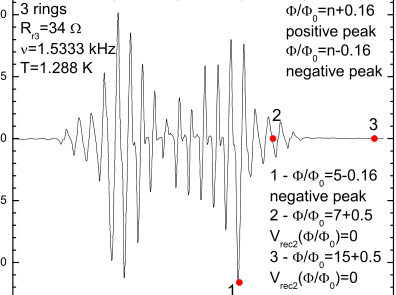 
Figure 3: (Color online) Rectified voltage Vrec2(Φ/Φ0) as a function of Φ/Φ0, recorded on a structure of three rings in series biased with an alternating cosine current (without a dc component) Iac2(t) with the frequency ν = 1.5333 kHz and the ac amplitude Iacm2 = 5.5 µA less than Ic(T, B = 0) at T = 1.288 K. The numbers 1, 2, and 3 are placed near the marked points of the Vrec2 curve corresponding to three values Φ/Φ0 = 5−0.16, 7+0.5, and 15+0.5, respectively. At these points, the voltage oscillograms Vac2(Φ/Φ0, t) are measured at the same ac Iac2(t).

📷 Fig 5

 
Figure 5: (Color online) Lines 1 (solid), 2 (dash-dotted), and 3 (dotted) are oscillograms of the ac voltage Vac2(Φ/Φ0, t) recorded on a structure of three rings in series at Φ/Φ0 = 5 −0.16, 7+0.5, and 15+0.5, corresponding to the marked points 1, 2 and 3 (curve Vrec2(Φ/Φ0), Fig. 3), respectively. Line 4 is the oscillogram of the applied ac Iac2(t) (the coordinate axis of the current is on the right). Line 5 is the ac voltage Vac2(t) = Iac2(t)Rr3.

**Summary.** This paper resolves a long-standing mystery regarding the phase shift in asymmetric superconducting rings by attributing it to differences in kinetic inductance between the ring's arms. The proposed model successfully explains the temperature dependence of this shift and reconciles previous experimental contradictions. This provides a clearer understanding of how geometric asymmetry and local critical temperature variations affect superconducting transport.

**Why it may be interesting.** not directly relevant

Detailed structure

**Main problem.** Explaining the mysterious temperature-dependent phase shift of critical current maxima of different polarities relative to zero magnetic flux in asymmetric superconducting aluminum rings.

**Main result.** The authors propose a model where the phase shift is caused by the difference in dimensionless kinetic inductances between the wide and narrow semirings, driven by different critical temperatures in each arm.

**Method.** The study combines experimental measurements of rectified AC voltage and resistance oscillations in series-connected aluminum rings with a theoretical model based on Ginzburg-Landau theory.

**Model / system.** The system consists of circularly-asymmetric aluminum rings (wide and narrow semirings) fabricated via electron beam lithography. The model treats the asymmetric ring as an asymmetric dc micro-SQUID where the phase shift is linked to kinetic inductance differences.

**Key observables.** Rectified voltage (V_rec), critical currents of different polarities (Ic+ and Ic-), resistance oscillations (dR/dPhi), and AC voltage oscillograms (Vac).

**Important parameters / regimes.** Temperature near Tc (approx 1.31 K), normalized magnetic flux (Phi/Phi0), kinetic inductance (Lk), and critical temperatures of the semirings (Tcw and Tcn).

**Assumptions / limitations.** The magnetic inductance is negligible compared to kinetic inductance; the current-phase relationship is nearly sinusoidal; and the critical current densities are independent of the magnetic field within the experimental range.

**Figures summary.** Figure 1 shows circulating current and current jumps; Figure 5 displays AC voltage waveforms at specific flux points; Figure 6 and 7 present experimental phase shifts and theoretical fits for various single and multi-ring structures.

**Paper structure.** The paper introduces the problem of the phase shift, describes the experimental setup and fabrication of asymmetric rings, presents the proposed kinetic inductance model, details the temperature-dependent measurements, and concludes by validating the model against experimental data across multiple ring configurations.

Abstract

We measured the rectification of an ac voltage in a structure of superconducting circularly-asymmetric aluminum rings in series, permeated with a magnetic flux and biased with a low-frequency alternating current (without a dc component). This rectification is due to the shift of the maxima of the critical currents of different polarity relative to the zero flux in opposite directions along the flux axis in the asymmetric ring. For the first time, we propose a model for a temperature-dependent phase shift equal to difference between dimensionless kinetic inductances of wide and narrow semirings having the same length and thickness. The shift is not zero in the case of different critical currents densities in both semirings. This is possible only in a situation of different critical temperatures of both semirings. The model describes well the temperature-dependent shift of the maxima of the critical currents, answers the long-standing mysterious challenge of the shift and removes extremely strange contradiction between the results of different measurements, previously found in circularly-asymmetric aluminum structures.

[↑ back to top](#top)

### [Spin-orbit interaction in core-shell semiconductor-metal nanowires](http://arxiv.org/abs/2604.27769v1)

**Authors:** Tudor-Gabriel Dumitru, Anna Sitek, Gunnar Thorgilsson, Sigurdur I. Erlingsson, Andrei Manolescu  
**Type:** theory · **Category:** other · **PDF:** <https://arxiv.org/pdf/2604.27769v1>  
**Analysis basis:** full PDF text, analyzed in chunks

📷 Fig 1

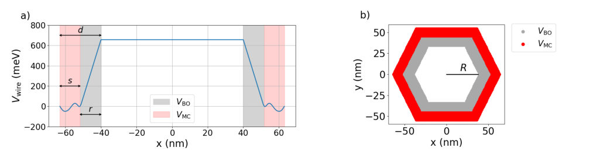 
Figure 1: Spatial profile of the confining potential across the nanowire. (a) 1D profile along the x-axis (corner to corner) detailing the potential magnitude. (b) The cross-sectional coverage of the potentials. This configuration assumes a shell thickness d = 20 nm. The band-offset decay length r (gray region) and the external penetration depth s (red region) are both set to 10 nm.

📷 Fig 2

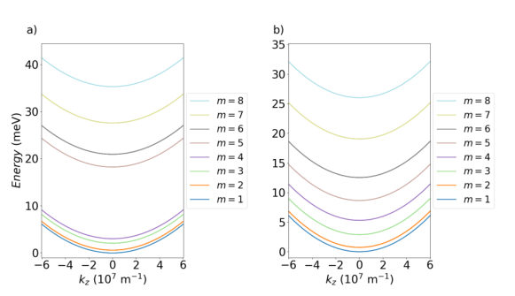 
Figure 2: Energies of the first 24 states for a shell thickness of d = 10 nm (a) and d = 20 nm (b), using Vwire = 0.

📷 Fig 3

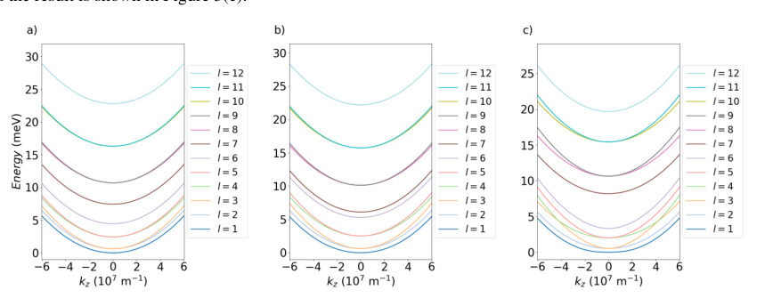 
Figure 3: Spin-orbit effect on the energy dispersion of the first 24 states for a shell thickness d = 20 nm and penetration length r = 10 nm. Panel (a) shows the case of zero external penetration (s = 0) with the effects being attributed entirely to the extended band-offset potential, while (b) and (c) show the effects for a penetration length of s = 10 nm. Panel (b) uses a well depth of −50 meV and a barrier height of 30 meV, whereas (c) uses −150 meV for the depth of the well and a 90 meV barrier.

📷 Fig 4

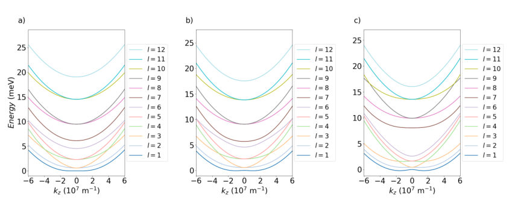 
Figure 4: Spin-orbit effect on the energy dispersion of the first 24 states for a shell thickness d = 20 nm and penetration length d = r = 20 nm. Panel (a) shows the case of zero external penetration (s = 0) with the effects being attributed entirely to the extended band-offset potential, while (b) and (c) show the effects for a penetration length of s = 10 nm. Panel (b) uses a well depth of −50 meV and a barrier height of 30 meV, whereas (c) uses −150 meV for the depth of the well and a 90 meV barrier.

**Summary.** This paper theoretically examines how a metallic shell influences the spin-orbit interaction and electron distribution in hexagonal semiconductor nanowires. It finds that while the metallic contact does not significantly boost spin-orbit coupling, it plays a crucial role in narrowing the electron distribution and affecting state localization.

**Why it may be interesting.** not directly relevant

Detailed structure

**Main problem.** Investigating how the spin-orbit interaction (SOI) and electron wave function localization in a core-shell semiconductor nanowire are affected by the presence of an external metallic shell and its associated potential profile.

**Main result.** The metallic contact's contribution to increasing SOI strength is minimal; instead, the primary effect of the metallic potential is to enhance the spatial localization of electrons and increase the energy separation between corner-localized and side-localized states.

**Method.** The study uses a k.p method-derived Hamiltonian and a folding-down procedure, with the metallic contact potential derived from Density Functional Theory (DFT) using the SIESTA package.

**Model / system.** A tubular, hexagonal-geometry nanowire consisting of an InP core, an InAs semiconductor shell, and an outer metallic (Al) shell, featuring a band-offset potential and a Z-shaped potential barrier at the metal-semiconductor interface.

**Key observables.** Spin-orbit interaction strength, energy dispersion (energy levels vs. kz), and spatial localization of wave functions.

**Important parameters / regimes.** Shell thickness (d), core radius (R), potential penetration lengths (r and s), and potential magnitudes (well depth and barrier height).

**Assumptions / limitations.** The model assumes an infinite wire Hamiltonian and uses a simplified Z-shaped potential profile for the metallic contact.

**Figures summary.** Figure 1 shows the spatial profile of the confining potential; Figure 2 displays energy levels for different shell thicknesses without SOI; Figure 3 and 4 illustrate the energy dispersion and the Rashba SOI effect under various metallic potential regimes.

**Paper structure.** The paper introduces the physical system and potential landscape, describes the k.p Hamiltonian and DFT-derived potential, presents numerical results regarding energy dispersion and degeneracy lifting, and concludes with an analysis of wave function localization.

Abstract

We study theoretically the spin-orbit interaction of electrons confined in a tubular semiconductor nanowire, between an inner semiconductor core and an outer metallic extra shell. A band off-offset potential is present at the inner semiconductor-semiconductor interface and a more complex potential barrier at the outer metal-semiconductor contact. The cross section of the nanowire has a hexagonal geometry. We use a model derived from the k-dot-p method, and discuss the effects of the interface potentials on the strength of the spin-orbit coupling and on the localization of the wave functions within the semiconductor shell

[↑ back to top](#top)

### [The optical phonoelectric effect](http://arxiv.org/abs/2604.27524v1)

**Authors:** D. Choi, M. Först, M. Fechner, M. Buzzi, X. Deng, Z. Zeng, K. H. Martens, D. Prabhakaran, C. Putzke, P. Moll, P. G. Radaelli, A. Cavalleri  
**Type:** experiment · **Category:** other · **PDF:** <https://arxiv.org/pdf/2604.27524v1>  
**Analysis basis:** abstract only; PDF text extraction failed or PDF unavailable

**Summary.** This paper reports the discovery of an optical phonoelectric effect where light-induced optical phonons create electrical polarization much faster than mechanical strain. This method overcomes the speed and fracture limits of conventional piezoelectricity, offering a new way to control polarization in quantum materials using light.

**Why it may be interesting.** not directly relevant

Detailed structure

**Main problem.** Traditional piezoelectricity is limited by the speed of sound, the difficulty of tuning intrinsic coupling, and the risk of material fracture under high strain.

**Main result.** The authors demonstrate 'optical phonoelectricity,' a strain-free piezoelectric-like response driven by photo-excited optical phonons that is four orders of magnitude faster than traditional piezoelectricity.

**Method.** The researchers use ultrafast optical excitation to induce phonon rectification in a crystal, creating electrical polarization without mechanical strain.

**Model / system.** The experimental system is BPO4, a material with weak intrinsic piezoelectricity, used to demonstrate phonon-driven polarization.

**Key observables.** Electrical polarization and the speed of the induced response.

**Important parameters / regimes.** The speed of the effect is limited by the speed of light rather than the speed of sound; the polarization magnitude is compared to the fracture limit of the material.

**Paper structure.** The paper introduces the limitations of piezoelectricity, presents the realization of the optical phonoelectric effect in BPO4, compares its speed and magnitude to traditional strain-induced effects, and discusses potential applications.

Abstract

Piezoelectricity is a technologically important property of certain insulators in which mechanical strain induces an electrical polarization. However, the rate at which a piezoelectric response can be established over a macroscopic volume is limited by the sound velocity, constraining applications in high-bit-rate transduction and sensing. Furthermore, the strength of the piezoelectric effect is not readily tunable, as it depends on intrinsic anharmonic coupling between strain and intra-unit-cell distortions in a given material. Lastly, the maximum amplitude of the effect is bounded by material fracture, which sets in already at percent level strain values. Here we overcome these limitations by realizing a strain-free, piezoelectric-like response driven solely by photo-excited optical phonon distortions. We demonstrate such optical phonoelectricity in the weak piezoelectric BPO$_4$, in which we induce electrical polarization through phonon rectification. This effect is established over macroscopic volumes with four orders of magnitude higher speed than piezoelectric responses, ultimately limited by the speed of light. The maximum induced polarization is estimated to be far in excess of that attainable through strain at the fracture limit. Ultrafast phonoelectricity opens up new opportunities for optical control in quantum materials, but also for device applications.

[↑ back to top](#top)

### [Transport Detection of Whirlpools in GaAs Electron Liquid](http://arxiv.org/abs/2604.27860v1)

**Authors:** Dmitry A. Egorov, Dmitriy A. Pokhabov, Evgeny Yu. Zhdanov, Andrey A. Shevyrin, Askhat K. Bakarov, Arthur G. Pogosov  
**Type:** both · **Category:** other · **PDF:** <https://arxiv.org/pdf/2604.27860v1>  
**Analysis basis:** full PDF text, analyzed in chunks

📷 Fig 1

 
FIG. 1. (a) Schematic of the heterostructure with a 2DEG in a GaAs quantum well. (b) Schematic of

📷 Fig 2

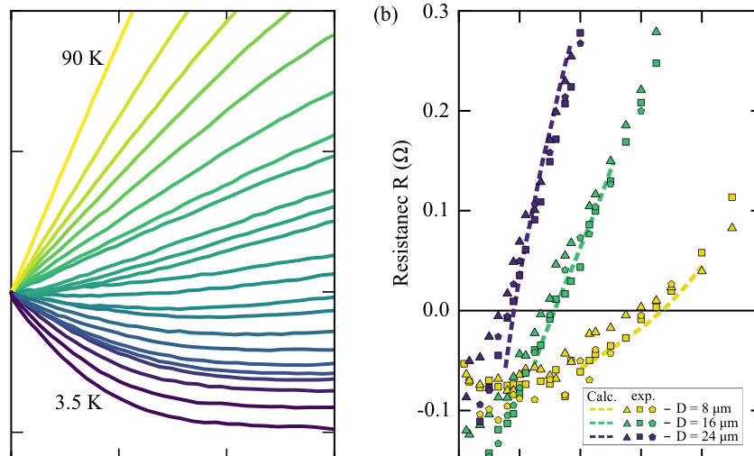 
FIG. 2. (a) Potential difference V in a circular cavity of diameter D = 16 µm as a function of the

📷 Fig 3

 
FIG. 3. Gurzhi length Dν at the transition temperature Tc as a function of the circular cavity

📷 Fig 4

 
Fig. 4, the resistance is positive in all studied samples across the entire temperature range,

**Summary.** This paper reports the experimental detection of hydrodynamic whirlpools in a GaAs electron liquid using simple transport measurements. By observing negative resistance that scales with the Gurzhi length, the authors provide strong evidence for electronic vorticity and challenge existing theoretical relations for electron viscosity.

**Why it may be interesting.** not directly relevant

Detailed structure

**Main problem.** The direct experimental observation and characterization of large-scale steady-state hydrodynamic electron vortices (whirlpools) in a 2D electron liquid have been difficult due to instrumentation and material constraints.

**Main result.** The authors demonstrate the formation of whirlpools in a GaAs-based 2D electron liquid via negative four-terminal resistance and confirm that the transition scales universally with the Gurzhi length, suggesting a breakdown of the standard viscosity-scattering relation.

**Method.** The study uses purely transport-based measurements of four-terminal resistance and potential difference, complemented by numerical hydrodynamic simulations and scaling analysis.

**Model / system.** A high-mobility two-dimensional electron gas (2DEG) in a GaAs/AlGaAs heterostructure, featuring circular cavities adjoining a wide conducting channel.

**Key observables.** Negative four-terminal resistance, potential difference, and current streamlines.

**Important parameters / regimes.** Gurzhi length (D_nu), electron viscosity (nu), momentum relaxation length (l_mr), electron-electron scattering length (l_ee), and cavity diameter (D).

**Assumptions / limitations.** The simulations assume a 'slip boundary condition' limit, consistent with perfect slip electron flow in GaAs.

**Figures summary.** Fig 1 shows the device geometry and simulated current/potential maps; Fig 2 shows V vs I curves and temperature-dependent resistance; Fig 3 shows the scaling of the Gurzhi length at the transition temperature; Fig 4 shows resistance in a reference geometry with an etched strip to confirm the absence of vortices.

**Paper structure.** The paper introduces the problem of vortex detection, describes the GaAs/AlGaAs experimental platform and geometry, presents transport measurements and scaling analysis, compares results to numerical simulations, and discusses the implications for electron viscosity theory.

Abstract

We report the formation of large-scale steady-state whirlpools in a GaAs-based two-dimensional electron liquid and demonstrate them by straightforward transport measurements. A whirlpool forming inside a circular cavity adjoining a wide conducting channel appears as a negative four-terminal resistance over a broad range of temperatures and cavity sizes. The effect scales with the Gurzhi length, in quantitative accord with the hydrodynamic analogy. Obtained results firmly establish this analogy and probe the limits of its applicability.

[↑ back to top](#top)

### [Uniaxial strain-driven ferroelastic domain control in LaAlO3](http://arxiv.org/abs/2604.28183v1)

**Authors:** Matthias Roeper, Robin Buschbeck, Jakob Wetzel, Tobias Ritschel, Anna-Lena Hofmann, Vladyslav Kovtunovych, Mike N. Pionteck, Javier Taboada-Gutiérrez, Alexey B. Kuzmenko, Martina Basini, Vivek Unikandanunni, Iuliia Kiseleva, Jochen Geck, Susanne C. Kehr, Maximilian Lederer, Simone Sanna, Lukas M. Eng, Samuel D. Seddon  
**Type:** both · **Category:** other · **PDF:** <https://arxiv.org/pdf/2604.28183v1>  
**Analysis basis:** abstract only; PDF text extraction failed or PDF unavailable

**Summary.** The researchers show that applying small amounts of uniaxial strain can reversibly control the ferroelastic domain structure in LaAlO3. This provides a new method for engineering domain architectures, which is crucial for developing advanced nanoelectronic and photonic devices.

**Why it may be interesting.** not directly relevant

Detailed structure

**Main problem.** The difficulty in achieving deterministic, continuous, and reversible control over ferroelastic domain populations in functional oxides like LaAlO3.

**Main result.** Demonstration of continuous and reversible manipulation of ferroelastic domain structures in single-crystal LaAlO3 using in-situ uniaxial strain, leading to surface flattening and domain reorganization.

**Method.** Integration of atomic force microscopy (AFM), X-ray diffraction (XRD), and Raman spectroscopy combined with first-principles calculations.

**Model / system.** Single-crystal LaAlO3 transitioning from a rhombohedral R3c ground state toward a predicted orthorhombic Fmmm phase under applied strain.

**Key observables.** Twin domain population, surface topography/flattening, and structural phase transition indicators via Raman and XRD.

**Important parameters / regimes.** Applied uniaxial strain levels below 0.5%.

**Paper structure.** The paper introduces the problem of domain control, presents experimental evidence of strain-driven domain manipulation using multi-modal microscopy and spectroscopy, supports findings with first-principles calculations, and discusses implications for heterostructures.

Abstract

Multiferroic domain walls in functional oxides exhibit properties distinct from the bulk and are increasingly exploited as active elements in nanoelectronic and photonic devices. Deterministic control of domain populations has typically remained limited to local control, or removal with temperature. Here we demonstrate continuous, reversible manipulation of the ferroelastic domain structure in single-crystal LaAlO$_3$ using in-situ uniaxial strain. Combining atomic force microscopy, X-ray diffraction, and Raman spectroscopy with first-principles calculations we map the complete microscopic evolution of the twin domain population through the strain-driven transition from the rhombohedral $R\bar{3}c$ ground state toward the predicted orthorhombic $Fmmm$ phase. Applied strains below $0.5\%$ produce pronounced surface flattening and large-scale domain reorganisation, establishing uniaxial strain as a technically accessible control parameter for ferroelastic domain engineering. These results open a route to active, real-time programming of domain architectures in LaAlO$_3$-based heterostructures, with implications for strain-tunable superconducting interfaces, nanoscale phonon-polariton optics, and ultrafast lattice control.

[↑ back to top](#top)

### [Unusual critical currents in quasi-one-dimensional superconducting aluminum two-width structures in a magnetic field](http://arxiv.org/abs/2604.27881v1)

**Authors:** V. I. Kuznetsov, O. V. Trofimov  
**Type:** both · **Category:** other · **PDF:** <https://arxiv.org/pdf/2604.27881v1>  
**Analysis basis:** full PDF text, analyzed in chunks

📷 Fig 1

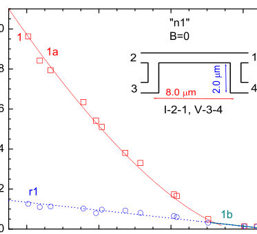 
Figure 2: (Color online) Experimental data for the "n1" structure: 1 (squares) and r1 (circles) are the switching and retrapping currents as functions of T at B = 0 G, respectively. Solid lines 1a and 1b are the fits of the measured switching current (squares) to the functions IGL(T) (2) at low T and Ir(T) (4) at high T , respectively. The dotted line is the fit of the measured retrapping current (circles) to the function Ir(T) (4). The inset: a sketch of the structure (not to scale) with the measurement circuit.

📷 Fig 2

 
Figure 3: (Color online) (a)-(b). Experimental data for the "sl5" (I-3-4, V-2-1) in (a) and "sl6" (I-3-4, V-2-1) in (b) structures: 1 (squares) and r1 (circles) are the switching and retrapping currents as functions of T at B = 0 G, re- spectively. (a)-(b) Solid lines 1a and 1b are the fits of the measured switching current (squares) to the functions IGL(T) (2) at low T and Ir(T) (4) at high T , respectively. (a) Dash-dotted line 1e is the expected switching current as a function of T calculated using the function IGL(T) (1). (a) The dotted line is the fit of the measured retrapping current (circles) to the Ir(T) function (4). (a) - (b) The insets: sketches of the structures (not to scale)...

📷 Fig 3

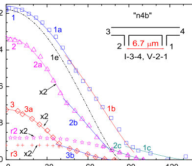 
Figure 4: (Color online) Experimental data for the "n4b" structure (I-3-4, V- 2-1): 1 (squares), 2 (triangles), 3 (diamonds) are the switching currents vs. B at temperatures Tg; r2 (asterisks), r3 (crosses) are the retrapping currents vs. B at temperatures corresponding to data 2, 3. For data 2, r2,3,r3, the scale along the vertical coordinate axis is doubled. The sets of solid lines: 1a-1b-1c, 2a- 2b-2c, 3a-3b, including branches corresponding to different field ranges, are the fits of the measured switching currents vs. B (squares, triangles, diamonds, respectively) to the functions Ick(Tg, B) (14). The dash-dotted line 1e is the expected switching current vs. B at Tg = 1.260 K, calculated...

📷 Fig 4

 
Figure 5: (Color online) Experimental data for the "n4b" structure (I-2-1, V-3- 4): 1 (circles), 2 (squares), 3 (triangles), 4 (diamonds) are switching currents vs. B at temperatures Tg; r1 (asterisks) is the retrapping current vs. B at Tg = 1.243 K. For data 3 and 4, the switching and retrapping currents are the same. For data 3, 4, the vertical coordinate axis scale is increased eightfold. The sets of solid lines: 1a-1b-1c, 2a-2b, 3a-3b, 4a-4b are the fits of the measured switching cur- rents vs. B (circles, squares, triangles, diamonds, respectively) to the functions Ick(Tg, B) (14). The dash-dotted line 1e shows the expected switching current vs. B at Tg = 1.243 K, calculated using the...

📷 Fig 5

 
Figure 6: (Color online) Experimental data for the "n4a" structure (I-2-1, V-3- 4): 1 (circles), 2 (squares), 3 (triangles), 4 (diamonds) are switching currents vs. B at temperatures Tg; r4 (asterisks) is the retrapping current vs. B at 1.361 K. The four pairs of solid lines: 1a and 1c, 2a and 2c, 3a and 3c, 4a and 4c are the fits of switching currents vs. B (circles, squares, triangles, diamonds, respec- tively), measured in low and high fields, respectively, to the functions Ic1(Tg, B) and Ic3(Tg, B) (14). The four solid lines: 1b, 2b, 3b, 4b are the fits of the switching currents vs. B (circles, squares, triangles, diamonds, respectively), measured in the intermediate field range, to the...

**Summary.** The paper demonstrates that in superconducting aluminum wires of varying widths, the switching current is determined by nonlocal transport at the junction between narrow and wide sections. This behavior contradicts standard Ginzburg-Landau predictions, especially as the current persists in magnetic fields higher than the expected critical field of the narrow wire. The findings suggest that the wide wires significantly influence the superconducting properties via the proximity effect.

**Why it may be interesting.** not directly relevant

Detailed structure

**Main problem.** Investigating the discrepancy between experimental switching currents and Ginzburg-Landau theory predictions in quasi-one-dimensional superconducting aluminum structures with varying wire widths.

**Main result.** The study finds that the switching current is nonlocal, depending on electron transport in the junction area, and persists in magnetic fields exceeding the maximum critical field of the narrow wire.

**Method.** Measurement of current-voltage (I-V) curves, switching, and retrapping currents under varying temperature and perpendicular magnetic fields, followed by fitting data to Ginzburg-Landau and proximity effect models.

**Model / system.** Thin-film aluminum quasi-1D structures consisting of narrow and wide wires (two-width and three-width geometries) in the dirty limit, acting as hybrid SNS or NS junctions.

**Key observables.** Switching current (Is), retrapping current (Ir), and current-voltage (I-V) characteristics.

**Important parameters / regimes.** Temperature (near Tc), magnetic field (B), wire widths (wn, ww), coherence length (xi), and the proximity effect exponent (alpha).

**Assumptions / limitations.** The system operates in the dirty limit; calculations of expected currents often neglect the influence of wide wires to highlight discrepancies.

**Figures summary.** Sketches of the multi-width structures; I-V curves and switching/retrapping current data vs. magnetic field for various configurations (n1, n4a, n4b, sl5, sl6); and comparison of experimental data with Ginzburg-Landau theoretical predictions.

**Paper structure.** Introduction of the problem and structure geometry; experimental setup and materials; results for single-width control structures; detailed analysis of two-width and three-width structures under varying magnetic fields and temperatures; discussion of nonlocal effects and proximity effect modeling; conclusion regarding the lack of a complete theoretical framework.

Abstract

We measured unusual critical currents as functions of temperature in the zero field and as functions of a magnetic field perpendicular to the substrate surface at a given temperature close to the critical temperature in thin-film long quasi-one-dimensional superconducting aluminum two-width structures consisting of narrow and wide wires with different critical temperatures. It is found that the experimental critical switching current as a function of the field at a given temperature, determined by the appearance of a dc voltage on a short section of the structure, is nonlocal (dependent on electron transport in the area containing the junction line between the narrow and wide wires). When current flows through the narrow and wide wires of the structure, the switching currents, experimental and calculated within the framework of the Ginzburg-Landau theory, differ radically from each other. A nonzero switching current exists in high fields greater than the maximum critical magnetic field in a quasi-one-dimensional superconducting wire. In the aluminum two-width structures studied here, the unusual measured switching current challenges description by known theories.

[↑ back to top](#top)

### [Unveiling the potential of NdPO4 magnetocaloric phases in cryogenic refrigeration](http://arxiv.org/abs/2604.28128v1)

**Authors:** M. Balli, L. Attou, S-E. Bouzarmine, S. Oubad, K. El Maalam, P. Fournier, S. Mangin  
**Type:** both · **Category:** other · **PDF:** <https://arxiv.org/pdf/2604.28128v1>  
**Analysis basis:** full PDF text, analyzed in chunks

📷 Fig 1

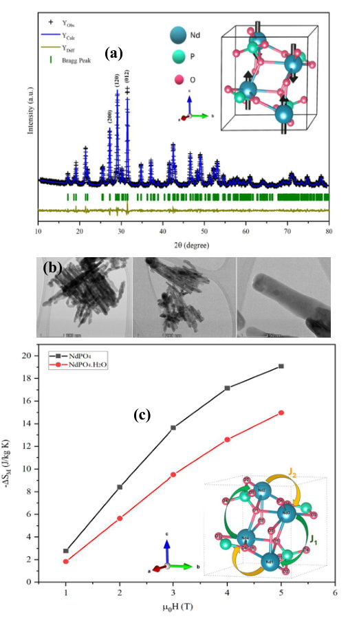 
Fig.1. (a) XRD patterns of anhydrous monoclinic NdPO4. (b) TEM images showing nanorods of NdPO4. (c) Magnetic entropy changes as a function of magnetic field at 3 K for anhydrous (square) and hydrated (solid cercle) NdPO4 phases. Inset: exchange interactions in monoclinic NdPO4.

**Summary.** This paper demonstrates that NdPO4, synthesized through a simple precipitation process, is a highly promising candidate for low-temperature magnetic cooling. The anhydrous phase shows a significant magnetocaloric effect near 3 K, offering a cost-effective alternative to materials containing expensive rare-earth elements like Dysprosium or Holmium.

**Why it may be interesting.** not directly relevant

Detailed structure

**Main problem.** The need for affordable, chemically stable, and mechanically robust alternatives to expensive rare-earth-based materials for cryogenic refrigeration applications.

**Main result.** The anhydrous monoclinic NdPO4 phase exhibits a large magnetocaloric effect of approximately 19 J/kg K under 5 T near 3 K, outperforming more expensive rare-earth materials.

**Method.** Synthesis via a facile precipitation growth route followed by thermal annealing, characterized by XRD, TEM, and SQUID magnetometry, and supported by DFT calculations.

**Model / system.** Neodymium orthophosphates (NdPO4) in two structural phases: a hydrated hexagonal rhabdophane-type structure and an anhydrous monoclinic monazite-type structure, featuring nanorod morphology.

**Key observables.** Magnetic entropy change (-delta S), magnetization, effective magnetic moments, and Curie-Weiss temperature.

**Important parameters / regimes.** Temperature range of 2-300 K, magnetic fields up to 7 T, and the cryogenic regime near 3 K.

**Figures summary.** Fig 1a shows XRD patterns and exchange interactions; Fig 1b displays TEM images of nanorod morphology; Fig 1c shows magnetic entropy changes as a function of magnetic field at 3 K.

**Paper structure.** The paper introduces the material motivation, describes the synthesis and structural characterization of the two NdPO4 phases, presents magnetic measurement results and DFT calculations, and concludes with a performance comparison for refrigeration applications.

Abstract

The RPO4 orthophosphates (R = rare earth element) have recently attracted a wide interest due to the strong coupling between their electronic, orbital and structural ordering parameters resulting in a variety of functional properties. Herein, we demonstrate that NdPO4 phases synthesized via a facile precipitation growth process unveil promise in low-temperature magnetic cooling. The analysis of their structural properties reveals nanorod forms with diameters of 10 to 20 nm and lengths ranging from 200 to 500 nm while the heat treatment transforms their hexagonal rhabdophane-type structure to a monoclinic anhydrous monazite-type symmetry. Magnetization measurements and DFT calculations show strong antiferromagnetic couplings and the absence of any magnetic ordering in the 2-300 K range. On the other hand, the monoclinic phase of NdPO4 exhibits a large magnetocaloric effect of about 19 J/kg K under 5 T near 3 K, outperforming some reference materials containing more expensive rare-earth elements with high magnetic moments.

[↑ back to top](#top)

### [VBr >10 kV E-Beam/Sputtered Vertical NiOx/(011) β-Ga2O3 HJDs with PFOM >2.3 GW/cm2](http://arxiv.org/abs/2604.27262v1)

**Authors:** Yizheng Liu, Carl Peterson, Chinmoy Nath Saha, Marko J. Tadjer, Sriram Krishnamoorthy  
**Type:** experiment · **Category:** other · **PDF:** <https://arxiv.org/pdf/2604.27262v1>  
**Analysis basis:** full PDF text, analyzed in chunks

📷 Fig 1

 
Fig.1. Schematics cross-section of (a) reference Schottky barrier diodes (SBDs) and (b) mesa-isolated/field-plated heterojunction diodes (MI/FP HJDs).

📷 Fig 2

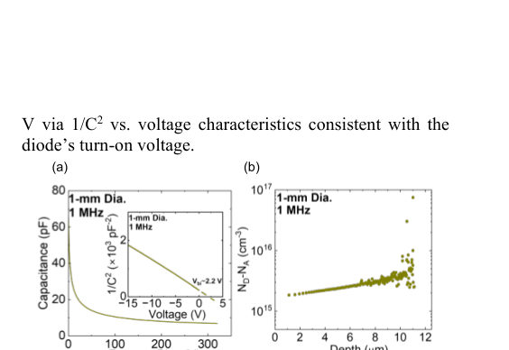 
Fig.3. (a) C-V characteristics of MI/FP HJD on 1-mm dia. dimeison at 1 MHz with 1/C2 vs. voltage inset. (b) Doping vs. depth profile MI/FP HJD on 1-mm dia. dimeison at 1 MHz.

📷 Fig 3

 
Fig.4. (a) Reverse breakdown characteristics of MI/FP HJDs for 60-μm dia. devices. (b) Reverse breakdown characteristics of MI/FP HJDs for 100-μm dia. devices. (c) J-V characteristics of 60-μm dia. device before and after 10 kV reverse bias in both linear and semi-log scale.

📷 Fig 4

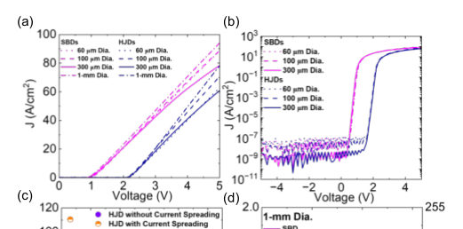 
Fig.2. (a) Linear forward J-V characteristics of SBDs and MI/FP HJDs. (b) Semi-log scale J-V characteristics of SBDs and MI/FP HJDs. (c) Ron,sp vs. diode dimension for SBDs and MI/FP HJDs. (d) Pulsed I-V characteristics for SBD and MI/FP 1-mm dia. devices.

📷 Fig 5

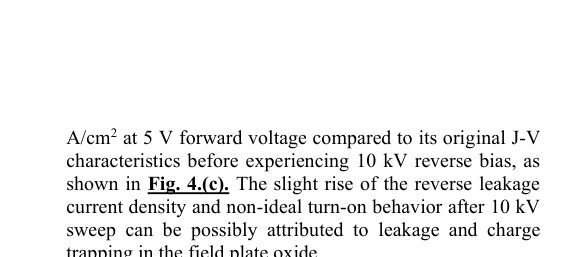 
Fig. 5. benchmarks the Ron,sp vs. breakdown voltage (VBr) of heterojunction diodes fabricated in this work in comparison to various HJDs reported in the literatures. It is shown that the PFOM of the MI/FP HJDs begins exceeding the material limit of 4H-SiC at 10 kV reverse bias.

**Summary.** This paper reports the development of high-performance beta-gallium oxide power diodes capable of withstanding voltages over 10 kV. By using a nickel oxide heterojunction to bypass the need for p-type doping, the researchers achieved a high power figure of merit, making this material a strong candidate for next-generation power grids and electric vehicle technology.

**Why it may be interesting.** not directly relevant

Detailed structure

**Main problem.** The lack of reliable p-type doping in beta-gallium oxide (beta-Ga2O3) prevents the creation of high-voltage power electronic devices for applications like EV charging and AI data centers.

**Main result.** Demonstration of vertical heterojunction diodes (HJDs) with a breakdown voltage exceeding 10 kV and a power figure of merit (PFOM) greater than 2.3 GW/cm2.

**Method.** Fabrication of NiOx/beta-Ga2O3 heterostructures using e-beam evaporation and reactive sputtering, combined with BCl3 ICP dry-etching and SiO2 field-plate formation.

**Model / system.** Vertical heterojunction diodes (HJDs) featuring an e-beam/sputtered NiOx stack on an epitaxial (011) beta-Ga2O3 drift layer.

**Key observables.** Breakdown voltage (VBr), specific on-resistance (Ron,sp), Power Figure of Merit (PFOM), parallel-plane breakdown field, and turn-on voltage (Von).

**Important parameters / regimes.** Breakdown voltage > 10 kV, specific on-resistance = 43 mOhm*cm2, breakdown field > 5.3 MV/cm, and carrier density ~ 2 x 10^15 cm^-3.

**Paper structure.** The paper introduces the motivation for high-voltage power electronics, describes the fabrication process of the NiOx/beta-Ga2O3 heterostructure, presents the electrical characterization of the resulting HJDs, and concludes with the performance metrics.

Abstract

Beta-gallium oxide (β-Ga2O3) holds enormous potential for medium voltage range power electronic applications. This work reports VBr > 10 kV/Ron,sp = 43 mΩ*cm2 class edge terminated vertical heterojunction diodes (HJDs) with e-beam/sputtered nickel oxide (NiOx) stack on epitaxial (011) β-Ga2O3. The power figure of merit (PFOM) of the HJD exceeds 2.3 GW/cm2. The extracted parallel plane breakdown field is > 5.3 MV/cm, which is the highest reported electric field for thick (011) β-Ga2O3 epitaxial drift layer.

[↑ back to top](#top)

### [VibroML: an automated toolkit for high-throughput vibrational analysis and dynamic instability remediation of crystalline materials using machine-learned potentials](http://arxiv.org/abs/2604.27685v1)

**Authors:** Rogério Almeida Gouvêa, Gian-Marco Rignanese  
**Type:** theory · **Category:** disordered systems and neural networks · **PDF:** <https://arxiv.org/pdf/2604.27685v1>  
**Analysis basis:** full PDF text, analyzed in chunks

📷 Fig 1

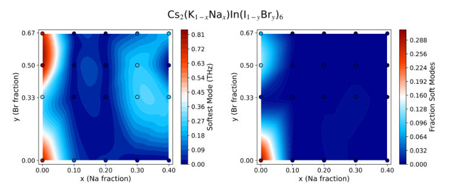 
Figure 1: Evolution of dynamical stability across the Cs2(K1–xNax)In(I1–yBry)6 solid solution space. The heatmaps display the lowest identified optical phonon frequency (left) and the percentage of soft phonon modes across the sampled Brillouin zone (right) as functions of the B-site Na fraction (x) and the halide Br fraction (y). The maps highlight the critical role of B-site substitution (x ≥0.1) in suppressing imaginary modes and dynamically stabilizing the 3D double-perovskite framework.

📷 Fig 2

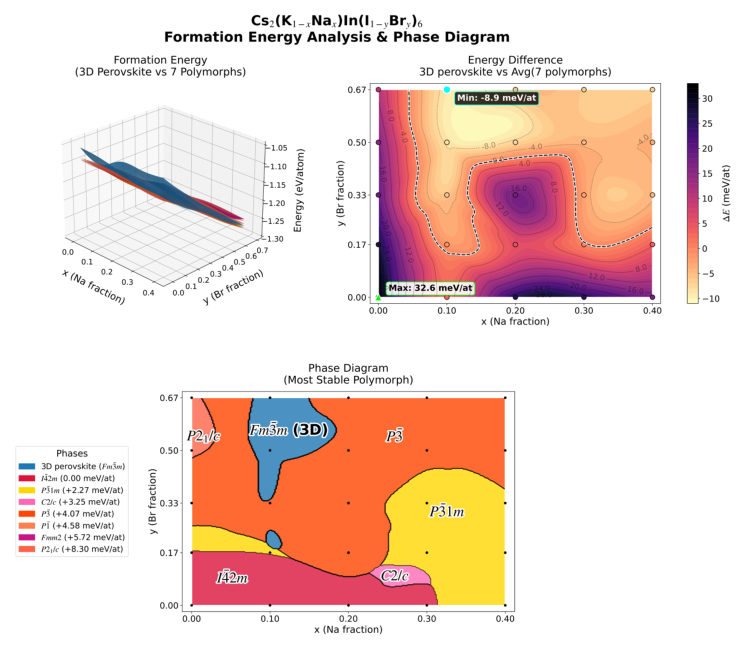 
Figure 2: Thermodynamic stability analysis and phase evolution of the Cs2(K1–xNax)In(I1–yBry)6 solid solution. (Top left) 3D surface plot of the formation energies, illustrating the energetic descent of the target 3D Fm3m perovskite (blue surface) relative to competing lower-symmetry polymorphs as a function of B-site Na (x) and halide Br (y) substitutions. (Top right) Contour map showing the energy difference (∆E) between the Fm3m phase and the average formation energy of the competing polymorphs. The dashed contour line denotes the thermodynamic crossover point (∆E = 0). (Bottom) Predicted compositional phase diagram displaying the absolute lowest-energy structural phase at each...

📷 Fig 3

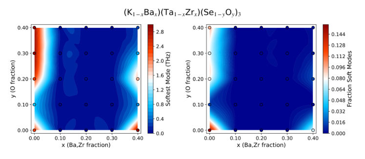 
Figure 3: Dynamical stability map for the targeted cubic (K1–xBax)(Ta1–xZrx)(Se1–yOy)3 solid solution. The heatmaps illustrate the lowest phonon frequency (left) and the fraction of soft modes (right) across varying levels of aliovalent Ba/Zr cation co-substitution (x) and O anion substitution (y). A distinct dynamical stability window emerges at intermediate cation doping levels (0.1 ≤x ≤0.3), outside of which the structure undergoes severe geometric collapse.

📷 Fig 4

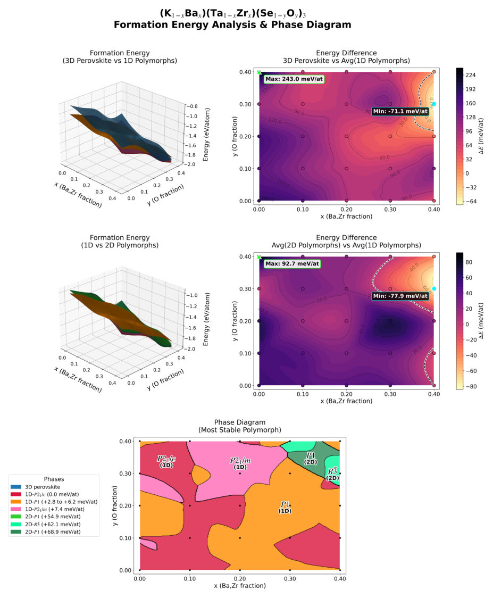 
Figure 4: Thermodynamic stability analysis and structural evolution of the (K1–xBax)(Ta1–xZrx)(Se1–yOy)3 solid solution. (Top row) Energy difference mapping between the targeted 3D perovskite framework and the average formation energy of competing 1D chain polymorphs. (Middle row) Thermodynamic comparison between the targeted 2D layered polymorphs and the 1D chain reference, revealing a deep stabilization gradient driven by O and Ba/Zr co-doping. Dashed contour lines indicate the ∆E = 0 thermodynamic crossover points. (Bottom) The absolute compositional phase diagram, demonstrating the successful arrest of total dimensional collapse: while 1D non-perovskite configurations dominate the...

**Summary.** The paper presents VibroML, an automated Python toolkit designed to fix structural instabilities in predicted crystals. By using machine-learned potentials and a genetic algorithm, it can transform unstable high-symmetry structures into stable, physically realistic polymorphs. This enables much more efficient and reliable high-throughput discovery of new materials.

**Why it may be interesting.** not directly relevant

Detailed structure

**Main problem.** The lack of automated pathways to resolve dynamical instabilities (imaginary phonon modes) in computationally predicted crystalline materials during high-throughput screening.

**Main result.** The introduction of VibroML, a toolkit that uses a genetic algorithm and machine-learned interatomic potentials to successfully automate the remediation of unstable structures into stable polymorphs.

**Method.** An energy-guided genetic algorithm (GA) coupled with machine-learned interatomic potentials (MLIPs) and molecular dynamics (MD) for thermal validation.

**Model / system.** Crystalline materials including complex perovskites, oxides (HfO2), and fluorides (LiF), modeled using E(3)-equivariant foundation models like MACE-OMAT-0.

**Key observables.** Phonon dispersion (imaginary frequencies), relative energy, RMSD, radial distribution function (RDF), and volume fluctuations.

**Important parameters / regimes.** Temperature (300 K), phonon frequency threshold (-1.5 THz), and RMSD threshold (1.0 A).

**Assumptions / limitations.** The accuracy of the results is dependent on the fidelity of the MLIPs, which may occasionally inherit errors from DFT training data.

**Figures summary.** Phonon band structures comparing unstable to stable phases, phase transition profiles (energy and force) for LiF, and MD stability analysis plots.

**Paper structure.** Introduction to the instability problem, description of the VibroML toolkit and algorithms, benchmarking of MLIP engines, demonstration of structural remediation, and application to large-scale chemical space exploration.

Abstract

While machine-learned interatomic potentials (MLIPs) accelerate phonon dispersion calculations, merely identifying dynamical instabilities in computationally predicted materials is insufficient; automated pathways to resolve them are required. We introduce VibroML, an open-source Python toolkit driven by foundational MLIPs that shifts the paradigm from stability verification to automated structural remediation. VibroML employs an energy-guided genetic algorithm that vastly outperforms traditional soft-mode following, efficiently navigating the potential energy surface to uncover diverse, dynamically stable polymorphs. As 0 K harmonic stability does not guarantee macroscopic viability, an automated molecular dynamics workflow evaluates finite-temperature structural retention. VibroML also couples with ProtoCSP, our combinatorial structure prediction engine, to stabilize frustrated crystal topologies via targeted alloying, successfully rescuing functional perovskite networks like Cs$_2$KInI$_6$ and KTaSe$_3$. Demonstrating broader applicability, we mined the Alexandria database -- where ~50% of quaternary and 99.5% of quinary elemental combinations lack any structural entries -- to identify thousands of abandoned, high-symmetry stoichiometries. Deploying ProtoCSP's "cold start" retrieval and VibroML's evolutionary search on a sample, we successfully identified dynamically stable low-symmetry candidates. Through integrated structural remediation, thermal validation, and systematic compositional exploration, VibroML enables a comprehensive deep-screening approach, yielding physically sound structural propositions that far surpass standard high-throughput workflows.

[↑ back to top](#top)

### [Yukawa screening derivation of the bond-valence rule](http://arxiv.org/abs/2604.28099v1)

**Authors:** Michael L. Whittaker, Pan Wang, Chunhui Li, Naman Katyal, Piotr Zarzycki  
**Type:** theory · **Category:** other · **PDF:** <https://arxiv.org/pdf/2604.28099v1>  
**Analysis basis:** full PDF text, analyzed in chunks

📷 Fig 1

 
FIG. 1. Fitted slope β vs. formal charge z for 94 cation– oxygen species at n = 4 (68 cations, left) and n = 6 (82 cations, right); 56 cations contribute at both coordi- nations, giving 150 fitted slopes in total. Dashed curves: β = 1/ ln(z/n). The pole at z = n separates the screen- ing (z &lt; n) and anti-screening (z &gt; n) branches; species at z = n are omitted because the B–R0 fit is degenerate at the pole (see Supplemental Material [11]).

📷 Fig 2

 
FIG. 2. First-principles screening centroid reff vs. Boltzmann shell centroid mi. (a) Ten s-block ground-state binary oxides. Solid line: shared fit; dashed line: reff = mi. (b) Twenty-five non-s-block ground-state binary oxides, color-coded by block. Open symbols mark the four directional-bonding outliers excluded from the regression (B2O3, P2O5, As2O3, Au2O3).

**Summary.** This paper provides a physical foundation for the long-standing empirical bond-valence rule by showing it emerges from screened Coulomb electrostatics. It reinterprets bond-valence parameters as measurable electronic screening properties, allowing for more predictive modeling of crystal structures.

**Why it may be interesting.** not directly relevant

Detailed structure

**Main problem.** The bond-valence model (BVM) is a widely used empirical method for estimating bond strengths in crystals, but it lacks a derivation from a specific physical interaction and its exponential dependence on bond length is not physically grounded.

**Main result.** The paper derives the BVM exponential form as the leading-order limit of Yukawa-screened Coulomb electrostatics, transforming it from an empirical rule into a transferable descriptor of local screened charge response.

**Method.** The authors use a Yukawa expansion of the signed flux amplitude and validate the theory by comparing bond-valence shell centroids to first-principles electronic screening centroids extracted from electron density in the Materials Project.

**Model / system.** The study focuses on ionic solids and coordination environments, specifically cation-oxygen species, modeled using a Yukawa-screened electrostatic potential.

**Key observables.** Bond-valence shell radius (R0), bond-valence softness (B), electronic screening length (lambda), and the Boltzmann shell centroid (mi).

**Important parameters / regimes.** The charge-to-coordination ratio (z/n), the screening length (lambda), and the parameter-free slope beta = 1/ln(z/n).

**Assumptions / limitations.** The derivation assumes an isotropic Yukawa regime and a first-order Taylor expansion, which may break down in highly distorted coordination shells or highly directional bonding environments.

**Figures summary.** Figure 1 shows the predicted correlation between the BVM slope beta and the charge-to-coordination ratio; Figure 2 demonstrates the high-precision collapse of first-principles screening centroids onto bond-valence shell centroids for various oxides.

**Paper structure.** The paper introduces the empirical BVM, provides a theoretical derivation using Yukawa screening, validates the model against first-principles data from the Materials Project, and discusses the physical interpretation of parameters and limitations.

Abstract

The bond-valence model is a standard way to estimate bond strengths in crystals, but its exponential dependence on bond length has lacked a derivation from a specific physical interaction. We show that this form emerges as the leading-order limit of screened Coulomb electrostatics and that the fitted bond-valence softness can be interpreted in terms of an electronic screening length. This turns bond valence from an empirical fitting rule into a transferable descriptor of local screened charge response across coordination environments. The resulting theory predicts how the bond-valence parameters should vary with ionic charge and coordination number, and that prediction agrees with 150 fitted valences from 94 cation-oxygen species, including 68 in fourfold coordination and 82 in sixfold coordination, at an abundance-weighted coefficient of determination of 0.986. A comparison with first-principles charge densities shows that the bond-valence shell radius tracks the electronic screening cloud with coefficients of determination of 0.9998 for ten alkali and alkaline-earth oxides and 0.967 for 21 other binary oxides whose nearest-neighbor environments match the theory's assumptions. The widely used bond-valence model is thus the leading-order expression of screened electrostatics in ionic solids.

[↑ back to top](#top)

