
# arxiv digest (quant-ph + cond-mat) — 2026-05-03

*5 papers · 3 relevant · 1 highlighted*  
_⏳ in progress: 5/159 papers processed (file updates after each one)_

## 🔥 Most relevant (3)

*Every paper with at least one nonzero topic score, sorted by best-matching score. 🔥 marks scores ≥4/5. Click the title to jump to the full entry below; click [arXiv] to open the paper page. `(secondary)` marks papers from de-prioritized cond-mat archives.*

Show 3 relevant papers

- [Domain-wall melting in all-to-all QSSEP from random-matrix theory](#paper-2604.28151) [[arXiv]](http://arxiv.org/abs/2604.28151v1) — 🔥 `entanglement & information structure` **4/5** · 🔥 `non-equilibrium dynamics` **4/5** · `methods for driven-dissipative` **3/5** · `non-equilibrium universality` **3/5** · `driven-dissipative phase transition` **2/5**
- [Optimal current-based sensing of phonon temperature using a finite reservoir](#paper-2604.28155) [[arXiv]](http://arxiv.org/abs/2604.28155v1) — 🔥 `quantum measurements` **4/5** · `non-equilibrium dynamics` **3/5** · `Kondo & dissipative impurity` **2/5** · `methods for driven-dissipative` **2/5**
- ⭐ [Observation of Vinen turbulence during far-from-equilibrium Bose-Einstein condensation](#paper-2604.28191) [[arXiv]](http://arxiv.org/abs/2604.28191v1) — 🔥 `non-equilibrium dynamics` **4/5** · 🔥 `non-equilibrium universality` **4/5**

## ⭐ Highlighted (1)

*Papers by authors on your watch list. Click the title to jump to the full entry below; click [arXiv] to open the paper page.*

Show 1 highlighted papers

- ⭐ [Observation of Vinen turbulence during far-from-equilibrium Bose-Einstein condensation](#paper-2604.28191) [[arXiv]](http://arxiv.org/abs/2604.28191v1) — Nigel R. Cooper

## All papers (4, sorted by relevance)

*Papers from quant-ph and your primary cond-mat archives (quant-gas, stat-mech, str-el, dis-nn). Highlighted papers (⭐) come first, then everything else sorted by topic-relevance score, highest first.*

### ⭐ [Observation of Vinen turbulence during far-from-equilibrium Bose-Einstein condensation](http://arxiv.org/abs/2604.28191v1)

**Highlighted author(s):** Nigel R. Cooper  
**Authors:** Sebastian J. Morris, Martin Gazo, Simon M. Fischer, Haoyu Zhang, Christopher J. Ho, Nigel R. Cooper, Christoph Eigen, Zoran Hadzibabic  
**Type:** experiment · **Category:** quantum gases · **PDF:** <https://arxiv.org/pdf/2604.28191v1>  
**Analysis basis:** full PDF text, analyzed in chunks
**Topic relevance:** 🔥 `non-equilibrium dynamics` **4/5** · 🔥 `non-equilibrium universality` **4/5**

📷 Fig 1

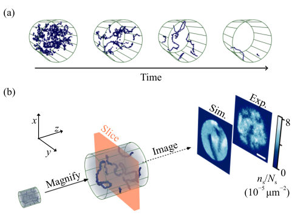 
FIG. 1. Detecting decaying quantum turbulence during far-from- equilibrium condensation in an isolated gas. (a) Cartoon of the ex- pected vortex-tangle decay; the cylindrical container shows the ge- ometry of our optical box trap [58, 59]. (b) Experimental concept. We magnify the cloud [60–62] (by a factor of ≈3.5 in the x-y plane) and then image just a slice of it (orange shading) [63], so the im- prints of the random vortex lines (dark lines) start and stop as they enter and leave the imaged slice. We show an experimental image and a numerical simulation with similar parameters. Here ns is the imaged 2D density, Ns is the total number of imaged atoms, and the scale bar shows 50µm. Our box...

📷 Fig 2

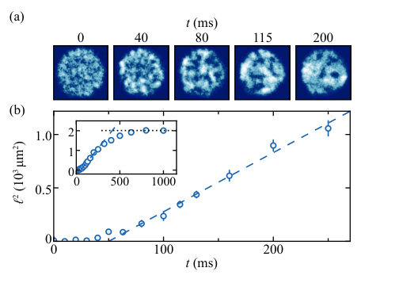 
FIG. 2. Stages of relaxation, starting in an incoherent state. Here the scattering length is a = 430a0, so ξ = 0.9µm. (a) Examples of cloud slices at different relaxation times, imaged in separate ex- perimental runs; the scale bar and the color scale are the same as in Fig. 1(b). The early-time images show only small-scale den- sity fluctuations, whereas for t ≳80ms we observe well-defined and well-separated vortex lines. (b) The corresponding evolution of the coherence length ℓ, obtained separately from measurements of momentum distributions, as in Ref. [43]. We find that the onset of universal coarsening seen in ℓ2(t), given by dℓ2/dt ≈3.4ℏ/m (dashed line) [43], and the emergence of...

📷 Fig 3

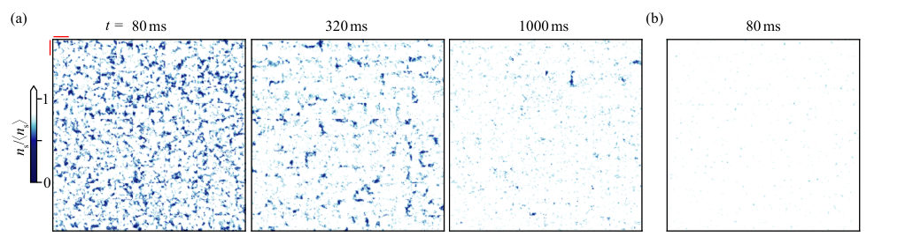 
FIG. 3. Visualizing the decay of vortex lines. (a) For t ≥80ms, when vortices are well defined (see Fig. 2), we tile cropped slice images corresponding to 12×12 consecutive experimental realizations, which show randomly varying vortex configurations. The red bars in the top- left corner indicate the size of a single-image tile, which corresponds to ≈30µm×30µm in situ, and 〈ns〉is the average over the experimental repetitions. (b) Here, for t = 80ms, we tile images taken without slicing (i.e., with line-of-sight integration over the whole magnified cloud). In this case, with the same color scale as in (a), no vortex imprints are observed.

📷 Fig 4

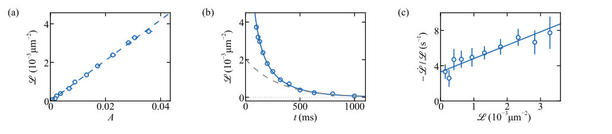 
FIG. 4. Quantifying the decay of vortex lines. (a) The vortex line-length density L , extracted according to Eq. (2), is simply proportional to A, the average fractional area of images covered by the vortex imprints [see Fig. 3(a)]. (b) The evolution of L . The dashed line shows an exponential fit, corresponding to one-body vortex decay, to data with t ≥500ms. The faster initial decay hints at vortex-vortex interactions. The solid line shows a fit based on Eq. (4), with B = 1.0(2)ℏ/m and τ = 300(40)ms. (c) By extracting ˙ L ≡dL /dt at different times during the relaxation, we explicitly recover the differential Eq. (3), with consistent B = 0.9(2)ℏ/m and τ = 300(50)ms, respectively the slope...

📷 Fig 5

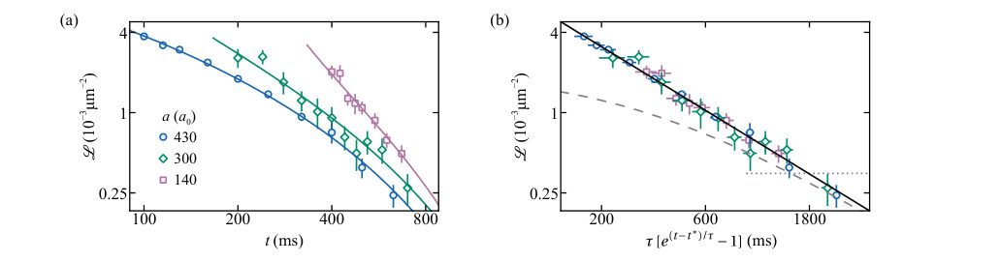 
FIG. 5. Universality of Vinen turbulence, for varying a (set at t = 0). (a) The evolution of L for different a is always fit well (solid lines) by Eq. (4), with only the non-universal t∗depending on a. Here, all three data sets are fit with the same B = 1.0(1)ℏ/m; fitting them independently gives consistent B values. Accounting for the difference in the particle mass, this value of B is essentially the same as obtained for superfluid helium [65]. (b) Plotting the same data according to Eq. (4), with a-dependent t∗, collapses them onto the same universal curve; the solid line corresponds to B = 1.0ℏ/m. The dashed line shows the exponential with timescale 300ms that coincides with the solid...

**Summary.** This paper reports the direct observation of decaying quantum turbulence in a 3D Bose-Einstein condensate. By measuring the decay of vortex line density, the authors show that the system follows universal Vinen turbulence dynamics, where the decay rate is independent of the interatomic interaction strength.

**Why it may be interesting.** This work demonstrates universal hydrodynamic behavior and scaling laws in a highly compressible quantum gas, providing a bridge between ultracold atom experiments and the physics of strongly interacting superfluid Helium.

Detailed structure

**Main problem.** Understanding the relaxation dynamics and the emergence of long-range order in far-from-equilibrium quantum fluids, specifically the decay of a turbulent tangle of vortex lines.

**Main result.** The researchers observed the decay of vortex line-length density in a 3D Bose gas and found it follows the prediction for Vinen 'ultraquantum' turbulence, with a decay prefactor B that is universal and independent of interaction strength.

**Method.** The team used matter-wave magnification via a pulsed harmonic potential to enlarge the gas density distribution and imaged a thin slice of the cloud to identify vortex imprints as density dips.

**Model / system.** A homogeneous 3D atomic Bose gas of 39K atoms trapped in a cylindrical optical box trap, prepared in a far-from-equilibrium state by initiating interactions via Feshbach resonance.

**Key observables.** Vortex line-length density (L), coherence length (l), and the decay constant (B).

**Important parameters / regimes.** S-wave scattering length (a), vortex core size (healing length xi), and the decay timescale (tau).

**Assumptions / limitations.** The large-scale dynamics of the highly compressible gas can be treated as an incompressible hydrodynamic fluid.

**Figures summary.** Fig 1 shows the experimental concept of vortex tangle decay and magnification; Fig 2 displays the temporal evolution of density fluctuations into vortices and the evolution of coherence length; Fig 3 visualizes the decay of vortex lines; Fig 4 and 5 demonstrate the quantification of vortex imprints and the fit to the Vinen decay model.

**Paper structure.** The paper introduces the experimental concept of vortex decay in a box trap, describes the imaging and magnification techniques, presents the temporal evolution of the gas and coherence length, quantifies the vortex line density, and compares the decay dynamics to the Vinen turbulence model and superfluid Helium.

Abstract

Relaxation of far-from-equilibrium quantum fluids, intimately related to the emergence of long-range order, is theoretically associated with the decay of a turbulent isotropic tangle of vortex lines. We observe and study such decaying quantum turbulence in a homogeneous 3D atomic Bose gas. Using matter-wave techniques to magnify the gas density distribution, and then imaging a thin slice of the magnified cloud, we observe imprints of randomly oriented vortex lines and measure the vortex line-length density $\mathcal{L}$. The observed decay of $\mathcal{L}$ agrees with the prediction for Vinen `ultraquantum' turbulence. Although our weakly interacting gases are highly compressible, their large-scale dynamics are consistent with the behavior of an incompressible hydrodynamic fluid, with the decay of $\mathcal{L}$ not depending on the strength of the interatomic interactions and being similar to that in the strongly interacting superfluid helium.

[↑ back to top](#top)

### [Domain-wall melting in all-to-all QSSEP from random-matrix theory](http://arxiv.org/abs/2604.28151v1)

**Authors:** Denis Bernard, Lorenzo Piroli, Stefano Scopa  
**Type:** theory · **Category:** statistical mechanics · **PDF:** <https://arxiv.org/pdf/2604.28151v1>  
**Analysis basis:** full PDF text, analyzed in chunks
**Topic relevance:** 🔥 `entanglement & information structure` **4/5** · 🔥 `non-equilibrium dynamics` **4/5** · `methods for driven-dissipative` **3/5** · `non-equilibrium universality` **3/5** · `driven-dissipative phase transition` **2/5**

📷 Fig 1

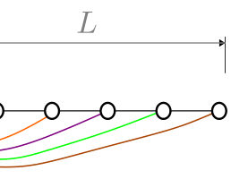 
Figure 1. Illustration of the setup. We consider a one-dimensional quantum system of size L, where spinless fermions can hop between any pair of sites j →k, with amplitudes given by different realization of the complex Brownian motion. The hopping amplitudes are reset at each time step. The system is initialized in a domain-wall configuration, with the leftmost M sites occupied and the rest of the chain empty. During the evolution, we probe fluctuations in a subregion Aℓof size ℓ.

📷 Fig 2

 
Figure 2. Entropy density dynamics from a domain-wall initial state with L = 32 and M = ℓ= L/2. The solid line corresponds to the analytic prediction in Eq. (46), while the symbols are obtained from numerical simulations of the quantum dynamics (see Appendix A), averaged over 200 realizations. The dashed horizontal line marks the steady-state value s(∞) = 2 log(2) −1.

📷 Fig 3

 
Figure 3. Charge full-counting statistics dynamics from a domain-wall initial state with L = 32 and M = ℓ= L/2. The solid lines correspond to the analytic predictions in Eq. (52), while the symbols are obtained from numerical simulations of the quantum dynamics (see Appendix A), averaged over 200 realizations. Several values of α are shown, as indicated by the color legend.

📷 Fig 4

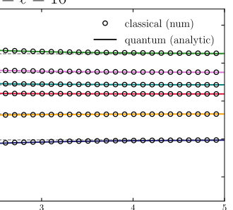 
Figure 4. Comparison between the classical and quantum dynamics of the charge full- counting statistics. Symbols: numerical data for the time evolution of Fclass ℓ (α, t) for ℓ= M = L/2 = 16 as a function of time for different values of α (see color legend), obtained from Eq. (81) by direct matrix exponentiation. Solid lines: analytic solution for the quantum dynamics F(α, t), given in Eq. (52). Dashed horizontal lines indicate the steady-state value in Eq. (69).

📷 Fig 5

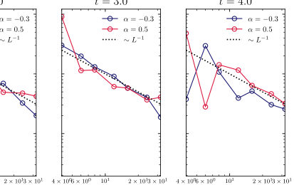 
Figure 5. Numerical analysis of the finite-size deviation |∆L(α, t)| between the classical and quantum charge full-counting statistics as a function of L, for different values of α and t. Quantum data are obtained from simulations of the all-to-all QSSEP as described in Appendix A, while classical results are computed from the corresponding Markov process in Eq. (81) via direct matrix exponentiation. For each system size, the number of samples is chosen as Nsamp ∼O(L4), ensuring that statistical errors remain smaller than the finite-size deviations. The expected scaling ∼L−1 is shown as a dotted black line for reference.

**Summary.** This paper provides an exact analytical description of how a domain wall melts in the all-to-all quantum symmetric simple exclusion process. By using random matrix theory, the authors show that entanglement entropy and particle fluctuations can be calculated explicitly and that quantum and classical transport statistics become identical in the thermodynamic limit.

**Why it may be interesting.** It provides an exact analytical framework for studying non-equilibrium dynamics and entanglement growth in many-body systems with long-range interactions, bridging the gap between quantum and classical stochastic transport.

Detailed structure

**Main problem.** Characterizing the real-time dynamics of coherent quantum fluctuations and particle transport during the melting of an initial domain wall in an all-to-all quantum system.

**Main result.** The authors show that the eigenvalues of the correlation matrix follow a Jacobi process, leading to an explicit analytical expression for entanglement entropy and demonstrating that quantum and classical full-counting statistics coincide in the thermodynamic limit.

**Method.** The study utilizes Random Matrix Theory (RMT), Ito calculus, and stochastic differential equations (SDEs) to map the dynamics to a Jacobi process and derive exact evolution equations.

**Model / system.** The model is the all-to-all Quantum Symmetric Simple Exclusion Process (QSSEP), also known as the charged SYK2 model, consisting of L fermionic modes with hopping driven by complex Brownian motion.

**Key observables.** von Neumann entanglement entropy, Rényi entropy, and full-counting statistics (FCS) of the charge.

**Important parameters / regimes.** Thermodynamic limit (L approaching infinity), subsystem size (l), particle number (M), and the ratio of subsystem to system size (theta).

**Assumptions / limitations.** The analytical solution for entropy is derived for the specific case where the domain wall splits the system into two equal halves; the self-averaging property assumes certain boundedness of the derivatives of the observable functions.

**Figures summary.** Figure 1 shows the 1D all-to-all hopping setup; Figure 2 compares numerical entropy dynamics with analytical predictions; Figure 3 shows charge full-counting statistics; Figure 5 illustrates the L^-1 scaling of finite-size deviations.

**Paper structure.** The paper introduces the all-to-all QSSEP model, applies RMT to identify the Jacobi process for eigenvalue evolution, derives analytical expressions for entanglement and charge statistics, performs finite-size scaling analysis, and concludes with a proof of self-averaging.

Abstract

We study the melting of a domain wall in the quantum simple exclusion process with all-to-all hoppings (a.k.a. the charged SYK$_2$ model). We show that the real-time dynamics of physical quantities of interest can be obtained exploiting spectral results in random matrix theory. We first show that the eigenvalues of the correlation matrix corresponding to the initially charged subsystem evolve according to a Jacobi process, which is defined in terms of a closed system of stochastic differential equations. In turn, this observation allows us to obtain the real-time dynamics of all the eigenvalue moments. We present two physical applications. First, we study the dynamics of the averaged von Neumann entanglement entropy, arriving at a fully explicit expression in the thermodynamic limit. Second, we compute analytically the full-counting statistics of the charge. Our formula allows us to perform a thorough comparison with the full-counting statistics of the classical simple exclusion process. Notably, we show that, in the thermodynamic limit, the quantum and classical full-counting statistics coincide, with no finite-time corrections.

[↑ back to top](#top)

### [Optimal current-based sensing of phonon temperature using a finite reservoir](http://arxiv.org/abs/2604.28155v1)

**Authors:** Sindre Brattegard, Stephanie Matern, Mark T. Mitchison, Saulo V. Moreira  
**Type:** theory · **Category:** statistical mechanics · **PDF:** <https://arxiv.org/pdf/2604.28155v1>  
**Analysis basis:** full PDF text, analyzed in chunks
**Topic relevance:** 🔥 `quantum measurements` **4/5** · `non-equilibrium dynamics` **3/5** · `Kondo & dissipative impurity` **2/5** · `methods for driven-dissipative` **2/5**

📷 Fig 1

 
FIG. 1. Sketch of the finite-size reservoir at stationary tem- perature and chemical potential, T and µ, coupled to a phonon bath at temperature Tph and to the quantum dot sys- tem. The finite reservoir is also coupled to the left infinite-size reservoir at temperature TL and µL, while the quantum dot is coupled to another infinite-size reservoir to its right, at tem- perature TR and chemical potential µR.

📷 Fig 2

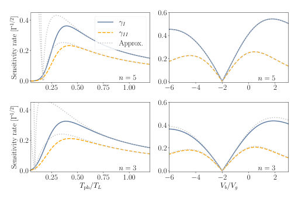 
FIG. 2. Sensitivity rate of the three thermometry schemes as a function of: (left column) phonon temperature and (right column) bias voltage. The top row has electron-phonon cou- pling with an exponent n = 5, while the bottom row has n = 3. The parameters used are TL = TR = 10Γ, Vb = 40Γ, σ = 300Γ/TL, and Vg = −10Γ. When n = 5, we use Σ = 1000σ/T 3 L, and when n = 3, we use Σ = 100σ/TL. In the right column, we set the phonon temperature to Tph = 8Γ.

📷 Fig 3

 
FIG. 3. Optimised sensitivity rate over gate voltage as the phonon temperature Tph is varied. The inset shows the cor- responding optimal bias voltage. The parameters used are n = 5, TL = TR = 10Γ, Vb = 40Γ, σ = 300Γ/TL, and Σ = 1000σ/T 3 L. For these parameters, we have that ζ = 300, and ξ ≫1, provided the phonon temperature is sufficiently large, i.e., Tph ≳TL/3.

**Summary.** This paper investigates how the finite heat capacity of electronic reservoirs can be used to optimize the sensing of phonon temperatures. It compares different current-based measurement strategies and demonstrates that monitoring individual electron jumps provides the highest precision. The results offer a guide for maximizing thermometric sensitivity via gate voltage tuning in nanoscale devices.

**Why it may be interesting.** It provides a rigorous framework for parameter estimation in non-equilibrium open quantum systems, specifically showing how the thermodynamic properties of a finite environment can be leveraged for high-precision sensing.

Detailed structure

**Main problem.** Developing high-precision thermometry for phonon temperatures in nanoscale transport setups by exploiting the heat exchange between phonon baths and finite-capacity electronic reservoirs.

**Main result.** The study identifies that monitoring individual electron jumps (Strategy I) achieves optimal precision for phonon temperature sensing and provides an optimization analysis for tuning gate voltage to maximize sensitivity.

**Method.** The authors combine current metrology techniques with a thermodynamic framework for finite reservoirs, using Fisher information and the Cramér-Rao bound to evaluate different measurement strategies.

**Model / system.** A quantum dot coupled to a finite-size electronic reservoir, which is in turn coupled to a phonon bath and an infinite electronic reservoir, described by a master equation in the weak coupling regime.

**Key observables.** Electron tunneling jumps, net particle current (DC current), and quantum dot occupation.

**Important parameters / regimes.** Phonon temperature (Tph), electron-phonon coupling strength (xi), reservoir-to-infinite-reservoir coupling (zeta), and gate voltage (Vg).

**Assumptions / limitations.** Weak coupling regime (Gamma << T), large but finite reservoir, fast internal thermalization (quasiequilibrium), and energy-independent transmission.

**Figures summary.** Figure 1 shows the experimental setup schematic; Figure 2 compares sensitivity rates for different strategies as a function of temperature and bias voltage; Figure 3 shows the maximized sensitivity rate optimized over gate voltage.

**Paper structure.** The paper establishes transport and steady-state properties in finite reservoirs, derives the analytical foundations for temperature and chemical potential shifts, applies estimation theory to evaluate measurement strategies, and concludes with an optimization analysis of gate voltage.

Abstract

In realistic nanoscale transport set-ups, electron-phonon coupling leads to the exchange of heat between phonon baths and electronic reservoirs with finite heat capacities. Such exchange affects the finite reservoir's temperature. However, this sensitivity of the finite reservoir temperature to the exchange of heat with the finite reservoir has remained unexplored for thermometry. Here, we fill this gap by combining current metrology techniques with a thermodynamic framework encompassing finite reservoirs. We focus on an experimentally realizable set-up with a quantum dot coupled to a finite reservoir and consider two distinct current-based strategies in the long time limit, namely monitoring quanta exchanged between the quantum dot and finite reservoir and the measurement of the total current flowing from the quantum dot into an infinite reservoir. A third strategy involves measurements of the quantum dot occupation. For a large but finite reservoir, we show that the Fisher information for all three strategies captures the finite reservoir's contribution to sensitivity through common factors. We also demonstrate that monitoring quanta exchanged between the system and finite reservoir in the long time limit achieves optimal precision. Finally, we provide an optimization analysis that explores how maximal precision can be achieved within each of the current-based strategies by tuning the gate voltage.

[↑ back to top](#top)

### [Reorganizing Quantum Measurement Records Improves Time-Series Prediction](http://arxiv.org/abs/2604.28160v1)

**Authors:** Markus Baumann, Maximilian Zorn, Thomas Gabor, Claudia Linnhoff-Popien, Jonas Stein  
**Type:** both · **Category:** quantum information and computing · **PDF:** <https://arxiv.org/pdf/2604.28160v1>  
**Analysis basis:** full PDF text, analyzed in chunks
**Topic relevance:** `quantum measurements` **2/5**

📷 Fig 1

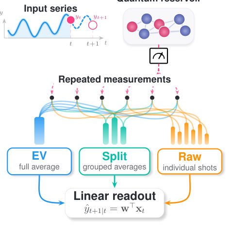 
Fig. 1. Three ways of organizing shot-based training data under a fixed measurement budget: EV averaging, split-ensemble training, and raw stacking.

📷 Fig 2

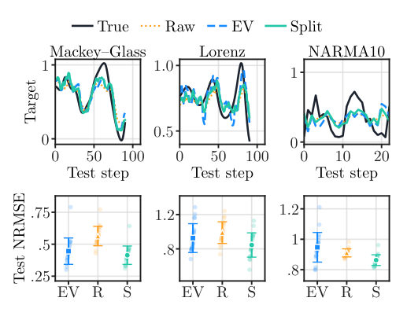 
Fig. 2. Shared operating point (Q = 4, Nshots = 18, λ = 10, ρEV = 2.65125). Top: illustrative test trajectories, where the displayed seed is the one whose split-ensemble test NRMSE is closest to the 20-seed median. Bottom: test outcomes over all 20 seeds.

📷 Fig 3

 
Fig. 4. Baseline and estimator controls at the shared operating point. The compared methods are EV, Raw, EV-dup, EV-NA, split-ensemble, and Split- NA.

📷 Fig 4

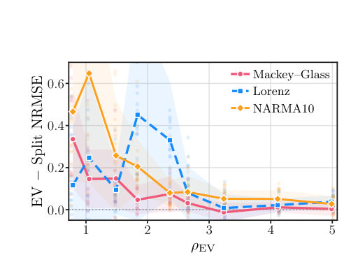 
Fig. 3. EV-minus-split-ensemble test gap ∆as a function of ρEV across the common Nshots sweep. Points show individual seeds; curves and bands summarize the 20-seed mean and spread. Positive values favor split-ensemble.

📷 Fig 5

 
Fig. 6. Duplication control over the broader Nshots sweep. Duplication matches the split-ensemble example count by repeating the fully averaged feature vector, without creating distinct grouped views.

**Summary.** The paper introduces a simple classical algorithmic lever called 'split-ensemble training' to improve the performance of near-term quantum machine learning. By reorganizing existing measurement shots into intermediate groups, it achieves better time-series prediction accuracy without requiring any additional quantum hardware executions. This method effectively balances the trade-off between reducing shot noise and maintaining a sufficient number of training examples.

**Why it may be interesting.** not directly relevant

Detailed structure

**Main problem.** How to optimize the organization of finite-shot measurement records in Quantum Reservoir Computing to improve time-series prediction without increasing the quantum execution budget.

**Main result.** The proposed 'split-ensemble training' method, which partitions shots into intermediate groups, outperforms both standard expectation-value averaging and raw shot stacking, especially when the readout dimension is large relative to the number of training examples.

**Method.** A split-ensemble training approach that partitions N shots into disjoint groups of size k, creating partially denoised feature vectors to balance the trade-off between sampling noise and training data scarcity.

**Model / system.** A Quantum Reservoir Computing (QRC) framework using a fixed Q-qubit circuit (e.g., ring-CNOT entanglers) as a dynamical system, with classical post-processing via leaky integration and a linear ridge regression readout.

**Key observables.** Single-qubit observables in the Z and X bases, processed into integrated feature vectors.

**Important parameters / regimes.** Number of shots (N_shots), group size (k), feature-to-dimension ratio (rho_EV), leakage parameter (eta), and regularization strength (lambda).

**Assumptions / limitations.** The total quantum execution budget (total number of shots) remains constant; the study assumes a fixed quantum circuit architecture and focuses on the classical reorganization of data.

**Figures summary.** Figure 1 illustrates the three data organization strategies; Figure 2 shows NRMSE results for various time-series benchmarks; Figure 3 shows the test gap between methods; Figure 5 visualizes NRMSE curves across different reservoir sizes; Figure 6 compares split-ensemble to a duplication control; Figure 9 shows sensitivity to ridge regularization.

**Paper structure.** The paper introduces the problem of shot-noise vs. data scarcity, proposes the split-ensemble method, provides theoretical propositions for the benefit of grouping, presents numerical benchmarks on various time-series tasks, validates the method via controls (EV-dup, EV-NA), demonstrates scalability with reservoir size, and concludes with hardware validation on IBM hardware.

Abstract

Near-term quantum computers are accessed through repeated circuit executions, which produce finite measurement records rather than exact deterministic outputs. In quantum reservoir computing, these records are converted to feature vectors for a classical readout. The standard expectation-value approach averages all shots from one labeled time step into a single feature vector. This reduces finite-shot noise, but it also gives the readout only one training example from many circuit executions. We introduce split-ensemble training: the same shots are split into groups, and each group average is used as a separate, partially denoised feature vector for the same target. The quantum circuit, task, and measurement budget remain unchanged. Across simulated forecasting benchmarks and real hardware experiments, this simple reorganization improves prediction when full averaging leaves the readout with too few training examples, with the strongest gains observed on hardware. Our results establish shot-record organization as a simple, broadly applicable algorithmic lever for improving near-term quantum learning without additional quantum hardware cost.

[↑ back to top](#top)

## Other papers (1)

*Papers from primary archives without highlighted authors or any topic match. Click to expand.*

Show other papers

### [Defending Quantum Classifiers against Adversarial Perturbations through Quantum Autoencoders](http://arxiv.org/abs/2604.28176v1)

**Authors:** Emma Andrews, Sahan Sanjaya, Prabhat Mishra  
**Type:** theory · **Category:** quantum information and computing · **PDF:** <https://arxiv.org/pdf/2604.28176v1>  
**Analysis basis:** full PDF text, analyzed in chunks

📷 Fig 1

 
Fig. 3: Classical autoencoder structure.

📷 Fig 2

 
Fig. 4: Quantum autoencoder structure.

📷 Fig 3

 
Fig. 2: General structure of QML models.

📷 Fig 4

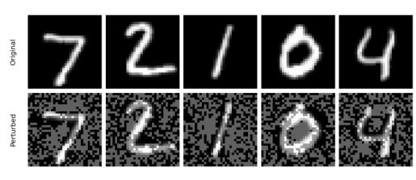 
Fig. 5: Example of FGSM ϵ = 0.30 attack on MNIST images. The original MNIST images are shown in the top row, while the adversarial images are in the bottom row.

📷 Fig 5

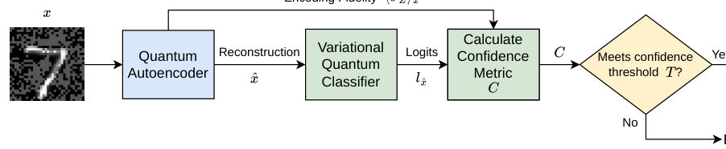 
Fig. 6: An overview of our defense framework. A sample, either clean or adversarial, is given as input x to the QAE. The QAE produces a reconstruction ˆx which is given to the VQC for classification. The QAE also produces the encoding fidelity ⟨σZ⟩x, which is used in calculation of the confidence metric. Once the VQC has predicted the reconstruction ˆx, it produces the logit difference lˆx which is used in addition to the encoding fidelity ⟨σZ⟩x to calculate the confidence metric C. This is compared against the confidence threshold T. If the calculated confidence metric C meets the confidence threshold T, the predicted class label from the VQC is used. Otherwise, the sample is rejected as a...

**Summary.** This paper proposes a new way to protect quantum machine learning models from adversarial noise without needing to retrain them on attack samples. By using a quantum autoencoder to clean the data and a diagnostic metric to reject suspicious inputs, the authors demonstrate much higher robustness in quantum classifiers.

**Why it may be interesting.** not directly relevant

Detailed structure

**Main problem.** Variational Quantum Classifiers (VQCs) are highly vulnerable to adversarial attacks like FGSM and PGD, where small perturbations cause incorrect predictions, and existing defenses like adversarial training are often impractical or prone to overfitting.

**Main result.** The proposed QAE++ framework, which uses a quantum autoencoder for purification and a confidence metric for sample rejection, significantly outperforms classical autoencoder defenses and achieves up to a 68% improvement in prediction accuracy under attack.

**Method.** An adversarial training-free defense framework that utilizes a Quantum Autoencoder (QAE) to reconstruct and purify input samples, combined with a confidence metric based on encoding fidelity and logit difference to identify and reject adversarial inputs.

**Model / system.** The study uses Variational Quantum Classifiers (VQCs) with amplitude embedding and strongly entangling layers, alongside Quantum Autoencoders (QAEs) designed to compress input states into a latent space.

**Key observables.** Encoding fidelity (measured via SWAP test), logit difference (difference between the two highest logits), and expectation values of the Pauli-Z operator.

**Important parameters / regimes.** Epsilon (perturbation magnitude), alpha (PGD step size), threshold T (for sample acceptance/rejection), and the number of qubits/parameters in the VQC.

**Assumptions / limitations.** The decoder is assumed to be the Hermitian conjugate of the encoder, and the trash qubits are assumed to converge to a specific reference state.

**Figures summary.** Figures illustrate adversarial attacks on MNIST, the architectures of VQCs and Autoencoders (both classical and quantum), the QAE++ algorithm flow, and comparative performance plots showing accuracy gains and reconstruction stability.

**Paper structure.** The paper introduces the problem of adversarial vulnerability, describes the QAE++ architecture and confidence metric, details the experimental setup using MNIST/FMNIST, presents comparative results against classical and undefended models, and discusses limitations.

Abstract

Machine learning models can learn from data samples to carry out various tasks efficiently. When data samples are adversarially manipulated, such as by insertion of carefully crafted noise, it can cause the model to make mistakes. Quantum machine learning models are also vulnerable to such adversarial attacks, especially in image classification using variational quantum classifiers. While there are promising defenses against these adversarial perturbations, such as training with adversarial samples, they face practical limitations. For example, they are not applicable in scenarios where training with adversarial samples is either not possible or can overfit the models on one type of attack. In this paper, we propose an adversarial training-free defense framework that utilizes a quantum autoencoder to purify the adversarial samples through reconstruction. Moreover, our defense framework provides a confidence metric to identify potentially adversarial samples that cannot be purified the quantum autoencoder. Extensive evaluation demonstrates that our defense framework can significantly outperform state-of-the-art in prediction accuracy (up to 68%) under adversarial attacks.

[↑ back to top](#top)

