
# arxiv digest (quant-ph + cond-mat) — 2026-05-04

*103 papers · 26 relevant · 0 highlighted*

## 🔥 Most relevant (26)

*Every paper with at least one nonzero topic score, sorted by best-matching score. 🔥 marks scores ≥4/5. Click the title to jump to the full entry below; click [arXiv] to open the paper page. `(secondary)` marks papers from de-prioritized cond-mat archives.*

Show 26 relevant papers

- [Experimental Evidence of Fractional Entropy in Critical Kondo Systems](#paper-2605.00669) [[arXiv]](http://arxiv.org/abs/2605.00669v1) — 🔥 `Kondo & dissipative impurity` **5/5** · `entanglement & information structure` **2/5**
- [Nonreciprocity-enriched steady phases in open quantum systems](#paper-2605.00101) [[arXiv]](http://arxiv.org/abs/2605.00101v1) — 🔥 `driven-dissipative phase transition` **4/5** · 🔥 `non-equilibrium dynamics` **4/5** · `Keldysh / 2PI / non-Gaussian methods` **3/5** · `methods for driven-dissipative` **3/5** · `non-equilibrium universality` **3/5**
- [Scalable spin-nematic squeezing in multi-level dipole-interacting Rydberg atom arrays](#paper-2605.00096) [[arXiv]](http://arxiv.org/abs/2605.00096v1) — 🔥 `Rydberg arrays` **4/5** · 🔥 `entanglement & information structure` **4/5** · `analog quantum simulation` **3/5** · `exotic spin models in light-matter` **3/5** · `non-equilibrium dynamics` **2/5**
- [A Unified Framework for Locally Stable Phases](#paper-2605.00088) [[arXiv]](http://arxiv.org/abs/2605.00088v1) — 🔥 `entanglement & information structure` **4/5** · `driven-dissipative phase transition` **3/5** · `methods for driven-dissipative` **3/5** · `non-equilibrium dynamics` **3/5** · `non-equilibrium universality` **2/5**
- [Asymptotic Replacement for Quantum Channel Products with Applications to Inhomogeneous Matrix Product States](#paper-2605.00157) [[arXiv]](http://arxiv.org/abs/2605.00157v1) — 🔥 `methods for driven-dissipative` **4/5** · `entanglement & information structure` **3/5** · `non-equilibrium dynamics` **3/5** · `correlated / nonlocal dissipation` **2/5** · `driven-dissipative phase transition` **2/5**
- [Optically detected nuclear magnetic resonance of carbon-13 in bulk diamond](#paper-2605.00152) [[arXiv]](http://arxiv.org/abs/2605.00152v1) — 🔥 `QC/QI experiment` **4/5** · 🔥 `spintronics-quantum-optics interface` **4/5** · `non-equilibrium dynamics` **2/5** · `quantum measurements` **2/5** · `quantum optics experiment` **2/5**
- [Locality versus Fock-space structure in East-type models](#paper-2605.00091) [[arXiv]](http://arxiv.org/abs/2605.00091v1) — 🔥 `entanglement & information structure` **4/5** · 🔥 `scars & prethermalization` **4/5** · `non-equilibrium dynamics` **3/5** · `non-equilibrium universality` **2/5**
- [Generation of Tunable Entanglement from Thin-Film Lithium Niobate](#paper-2605.00214) [[arXiv]](http://arxiv.org/abs/2605.00214v1) — 🔥 `QC/QI experiment` **4/5** · 🔥 `quantum optics experiment` **4/5** · `entanglement & information structure` **2/5** · `interference shaping light` **2/5**
- [Entropy from Entanglement in Quantum State Reduction](#paper-2605.00485) [[arXiv]](http://arxiv.org/abs/2605.00485v1) — 🔥 `quantum measurements` **4/5** · `entanglement & information structure` **3/5** · `methods for driven-dissipative` **2/5** · `non-equilibrium dynamics` **2/5**
- [Fixed points and crossovers for the hysteresis scaling of dynamic mean-field models](#paper-2605.00567) [[arXiv]](http://arxiv.org/abs/2605.00567v1) — 🔥 `non-equilibrium universality` **4/5** · `non-equilibrium dynamics` **3/5** · `driven-dissipative phase transition` **2/5** · `methods for driven-dissipative` **2/5**
- [Learning Lindblad Dynamics of a Superconducting Quantum Processor](#paper-2605.00626) [[arXiv]](http://arxiv.org/abs/2605.00626v1) — 🔥 `QC/QI experiment` **4/5** · 🔥 `methods for driven-dissipative` **4/5** · `correlated / nonlocal dissipation` **3/5**
- [An Error-aware and Adaptive Method for the Estimation of Quantum Observables on Qudit-Based Quantum Computers](#paper-2605.00682) [[arXiv]](http://arxiv.org/abs/2605.00682v1) — 🔥 `QC/QI experiment` **4/5** · 🔥 `quantum measurements` **4/5** · `analog quantum simulation` **2/5**
- [Graph-theory measures capture weak ergodicity breaking on large quantum systems](#paper-2605.00094) [[arXiv]](http://arxiv.org/abs/2605.00094v1) — 🔥 `scars & prethermalization` **4/5** · `entanglement & information structure` **3/5** · `non-equilibrium dynamics` **3/5**
- [On-chip levitation of ferromagnetic microparticles](#paper-2605.00090) [[arXiv]](http://arxiv.org/abs/2605.00090v1) — 🔥 `spintronics-quantum-optics interface` **4/5** · `QC/QI experiment` **2/5** · `quantum measurements` **2/5** · `quantum optics experiment` **2/5**
- [Activated random walk exhibits self-organized criticality](#paper-2605.00207) [[arXiv]](http://arxiv.org/abs/2605.00207v1) — 🔥 `non-equilibrium universality` **4/5** · `non-equilibrium dynamics` **3/5** · `driven-dissipative phase transition` **2/5**
- [Topological protection of local quantum Fisher information](#paper-2605.00770) [[arXiv]](http://arxiv.org/abs/2605.00770v1) — 🔥 `entanglement & information structure` **4/5** · `non-equilibrium dynamics` **3/5** · `scars & prethermalization` **2/5**
- [Quantum corrections to the Josephson dynamics: a population-imbalance approach](#paper-2605.00571) [[arXiv]](http://arxiv.org/abs/2605.00571v1) — 🔥 `Keldysh / 2PI / non-Gaussian methods` **4/5** · `analog quantum simulation` **2/5** · `non-equilibrium dynamics` **2/5**
- [Entropy transport through a superfluid quantum point contact: A Keldysh field-theory approach](#paper-2605.00679) [[arXiv]](http://arxiv.org/abs/2605.00679v1) — 🔥 `Keldysh / 2PI / non-Gaussian methods` **4/5** · `non-equilibrium dynamics` **3/5**
- [Entanglement capacity of complex networks from quantum walks](#paper-2605.00772) [[arXiv]](http://arxiv.org/abs/2605.00772v1) — 🔥 `entanglement & information structure` **4/5** · `non-equilibrium dynamics` **2/5**
- [Entanglement Distance of Two- and Multi-Qubit Variational States and Its Quantification with Quantum Computing](#paper-2605.00259) [[arXiv]](http://arxiv.org/abs/2605.00259v1) — 🔥 `entanglement & information structure` **4/5** · `non-equilibrium dynamics` **2/5**
- [Exploring the Geometric and Dynamical Properties of Spin Systems and Their Interplay with Quantum Entanglement](#paper-2605.00241) [[arXiv]](http://arxiv.org/abs/2605.00241v1) — 🔥 `entanglement & information structure` **4/5** · `non-equilibrium dynamics` **2/5**
- [Sequential Measurements as a Resource for Quantum Metrology](#paper-2605.00287) [[arXiv]](http://arxiv.org/abs/2605.00287v1) — 🔥 `quantum measurements` **4/5** · `methods for driven-dissipative` **2/5**
- [Criticality on Rényi defects at (2+1)$d$ O(3) quantum critical points](#paper-2605.00104) [[arXiv]](http://arxiv.org/abs/2605.00104v1) — 🔥 `entanglement & information structure` **4/5**
- [Induced discommensurations in the lock-in transition of charge-density waves](#paper-2605.00521) [[arXiv]](http://arxiv.org/abs/2605.00521v1) — 🔥 `Frenkel-Kontorova` **4/5**
- [Probability Distribution Analysis of the Cascaded Variational Quantum Eigensolver](#paper-2605.00807) [[arXiv]](http://arxiv.org/abs/2605.00807v1) — 🔥 `QC/QI experiment` **4/5**
- [Toward Secure Multitenant Quantum Computing: Circuit Affinity, Crosstalk Patterns, and Grouping Strategies](#paper-2605.00118) [[arXiv]](http://arxiv.org/abs/2605.00118v1) — 🔥 `QC/QI experiment` **4/5**

## All papers (55, sorted by relevance)

*Papers from quant-ph and your primary cond-mat archives (quant-gas, stat-mech, str-el, dis-nn). Highlighted papers (⭐) come first, then everything else sorted by topic-relevance score, highest first.*

### [Experimental Evidence of Fractional Entropy in Critical Kondo Systems](http://arxiv.org/abs/2605.00669v1)

**Authors:** C. Piquard, A. Veillon, Y. Sato, F. Zanichelli, A. Aassime, A. Cavanna, U. Gennser, A. K. Mitchell, A. Anthore, F. Pierre  
**Type:** experiment · **Category:** strongly correlated electrons · **PDF:** <https://arxiv.org/pdf/2605.00669v1>  
**Analysis basis:** full PDF text, analyzed in chunks
**Topic relevance:** 🔥 `Kondo & dissipative impurity` **5/5** · `entanglement & information structure` **2/5**

↔ Scroll figures horizontally

<figure class="paper-figure-card">
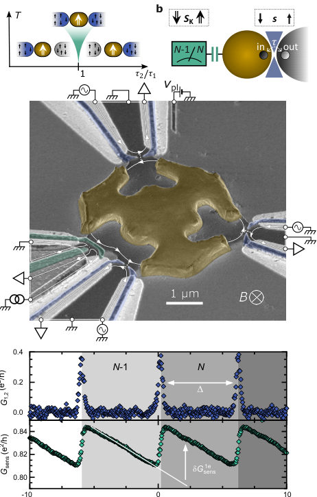
<figcaption class="paper-figure-caption"><b>Fig 1.</b> Figure 1. Charge-Kondo circuit. (a) Illustration of the quantum phase transition arising in two-channel Kondo systems as a function of coupling asymmetry. As the temperature T increases, quantum criticality (green) starts at symmetric couplings (τ1 = τ2), extends in τ2/τ1, and then vanishes. Baths colored grey progress- ively decouple from the Kondo impurity as T →0. (b) Schematic of the charge-Kondo mapping and charge sensing. The impurity pseudospin SK (double arrows) encoding two charge states N −1 and N of a metallic island (gold disk) flips as each electron tun- nels across a QPC of transmission τ, together with the pseudospin s encoding the electron position (single arrows)....</figcaption>
</figure>
<figure class="paper-figure-card">
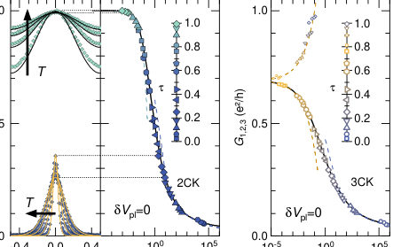
<figcaption class="paper-figure-caption"><b>Fig 2.</b> Figure 2. Conductance benchmarks and Kondo critical- ity. (a) Conductance vs plunger gate voltage at different temper- atures for a 2CK circuit tuned either in the regime of weak coupling (τ ≃0.25, blue symbols) or strong coupling (τ ≃0.993, green sym- bols). Lines represents analytical predictions in the corresponding limits. (b,c) Universal Kondo conductance scaling at δVpl = 0 vs T/TK in two-channel (b) and three-channel (c) Kondo circuit con- figurations, for a broad range of couplings τ. Measurements shown as symbols (full for 2CK, open for 3CK) are confronted with NRG results (black solid lines) and asymptotic (colored dash) predic- tions. The value of TK for a given τ (data points...</figcaption>
</figure>
<figure class="paper-figure-card">
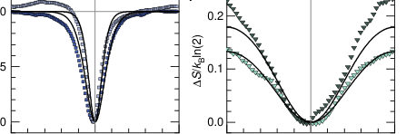
<figcaption class="paper-figure-caption"><b>Fig 3.</b> Figure 3. Entropy measurement. Determination of the en- tropy for a device tuned to 2CK by measurement of the charge N along sweeps in Vpl at different temperatures, for either weak (a,c,e) or strong (b,d,f) coupling τ. Symbols with different shades correspond to different temperatures. Predictions (Methods) are displayed as continuous black lines. (a,b) Charge measurements vs gate voltage (∆E = 2ECδVpl/∆). (c,d) Finite-difference approx- imation to the temperature derivative. (e,f) Extracted impurity entropy difference.</figcaption>
</figure>
<figure class="paper-figure-card">
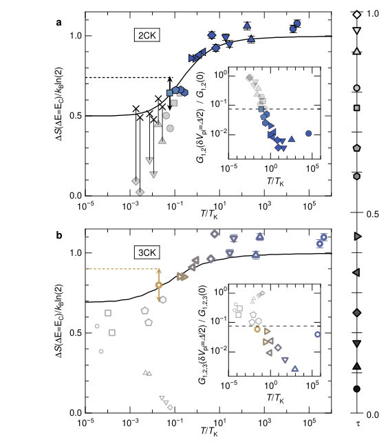
<figcaption class="paper-figure-caption"><b>Fig 4.</b> Figure 4. Entropy renormalization flow ∆S vs T/TK for 2CK (a) and 3CK (b). Universal NRG predictions for Simp(0) at the critical point are shown as solid lines. Colored symbols represent experimental data points where we expect the measured ∆S to closely approximate the Kondo impurity entropy Simp(0). These data are selected using the small conductance criterion Gi(∆E = EC)/Gi(0) &lt; 0.075 which indicates a near-frozen im- purity at maximum detuning, and hence a negligible contribution from Simp(EC), see insets. The horizontal dashed line in each main panel represents the associated upper bound for the Kondo critical entropy, taking into account the ∆S uncertainty estimated as ±0.1 kB ln 2...</figcaption>
</figure>
<figure class="paper-figure-card">
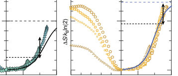
<figcaption class="paper-figure-caption"><b>Fig 5.</b> Figure 5. Crossover flow from quantum criticality at 2CK (a,c) and 3CK (b,d). a,b Conductance measurements at T = 9.3 mK are plotted as symbols versus δVpl/∆(left panel) or versus Tco/T (right panel) for different τ, chosen such that T/TK &lt; 0.02 to ensure well-developed criticality at charge degeneracy. The pre- factor λco in Eq. (4) is adjusted for each τ to match universal crossover predictions for the conductance (black solid lines). c,d Impurity entropy change ∆S along the Fermi-liquid crossover for the same settings vs the same δVpl/∆(left) or Tco/T (right). The ∆S universality here is observed without any adjustable parameter, since λco is separately extracted from the conductance...</figcaption>
</figure>

**Summary.** The researchers successfully measured fractional impurity entropy in two-channel and three-channel Kondo systems using a charge-sensing technique. These findings provide a direct thermodynamic fingerprint of non-Abelian anyons, specifically Majorana zero modes and Fibonacci anyons. This approach establishes entropy measurements as a powerful, model-independent tool for identifying exotic quantum states.

**Why it may be interesting.** The paper demonstrates a direct thermodynamic method to identify non-Abelian statistics through fractional entropy, which is highly relevant to the study of topological phases and many-body dynamics in correlated systems.

Detailed structure

**Main problem.** The difficulty of unambiguously characterizing non-Abelian anyons, such as Majorana zero modes and Fibonacci anyons, using traditional transport measurements.

**Main result.** Experimental evidence of fractional entropy in two-channel and three-channel Kondo critical states, with scaling dimensions consistent with Majorana zero modes and Fibonacci anyons.

**Method.** Using a thermodynamic Maxwell relation to extract impurity entropy by measuring the temperature derivative of the island charge in a metal-semiconductor quantum circuit.

**Model / system.** A charge-Kondo circuit consisting of a micrometer-scale metallic island coupled to two or three electronic leads via quantum point contacts, implementing the multi-channel Kondo model.

**Key observables.** Island charge, differential conductance, impurity entropy change (Delta S), and Kondo temperature (TK).

**Important parameters / regimes.** Temperature (T), Kondo temperature (TK), transmission probability (tau), charging energy (EC), and gate-voltage detuning (delta Vpl).

**Assumptions / limitations.** The use of a 'frozen' impurity regime in the Coulomb valley to ensure residual entropy is negligible; the validity of the thermodynamic Maxwell relation for entropy extraction.

**Figures summary.** Figure 1 shows the quantum phase transition, charge-Kondo mapping, and circuit schematic. Figure 2 displays conductance vs. gate voltage. Figure 3 illustrates the entropy measurement process. Figure 5 shows the universal crossover flow of conductance and entropy.

**Paper structure.** The paper introduces the problem of anyon characterization, describes the experimental platform and charge-Kondo mapping, details the entropy extraction methodology, validates the device via conductance and scaling, and presents the final entropy measurements and comparison with NRG theory.

Abstract

Unconventional quantum states defying the ubiquitous Fermi-liquid paradigm can emerge in the presence of strong electronic correlations. Among these, non-Abelian anyons - such as Majorana zero modes and Fibonacci anyons - are of particular interest for topological quantum computing due to their non-integer quantum dimensions d>1, which allows for protected non-local encoding and processing of quantum information. However, despite considerable efforts, the unambiguous characterisation of such anyons via transport measurements has proved challenging. Instead, here we provide experimental evidence for the low-temperature fractional entropy Delta S associated with a single anyon, which directly implies its non-Abelian character through the relation Delta S = kB ln(d). This thermodynamic signature is measured in metal-semiconductor quantum circuits engineered to realize quantum-critical states from frustrated interactions. Using a micrometre-scale metallic island coupled to two or three electronic leads, we tune the system to two-channel and three-channel Kondo critical points. By measuring the island charge and exploiting a thermodynamic Maxwell relation, we estimate the entropy associated with the anyons that emerge in these critical states. Our observations reveal fractional values, exposing non-Abelian anyons. The corresponding scaling dimensions are consistent with theoretical predictions for a Majorana zero mode Delta S = kB ln(sqrt(2)) and a Fibonacci anyon Delta S = kB ln(1 +sqrt(5))/2 for two and three channels. These findings establish entropy measurements as a powerful tool for characterizing exotic quantum states.

[↑ back to top](#top)

### [Nonreciprocity-enriched steady phases in open quantum systems](http://arxiv.org/abs/2605.00101v1)

**Authors:** Ding Gu, Zhanpeng Fu, Zhong Wang  
**Type:** theory · **Category:** statistical mechanics · **PDF:** <https://arxiv.org/pdf/2605.00101v1>  
**Analysis basis:** full PDF text, analyzed in chunks
**Topic relevance:** 🔥 `driven-dissipative phase transition` **4/5** · 🔥 `non-equilibrium dynamics` **4/5** · `Keldysh / 2PI / non-Gaussian methods` **3/5** · `methods for driven-dissipative` **3/5** · `non-equilibrium universality` **3/5**

↔ Scroll figures horizontally

<figure class="paper-figure-card">
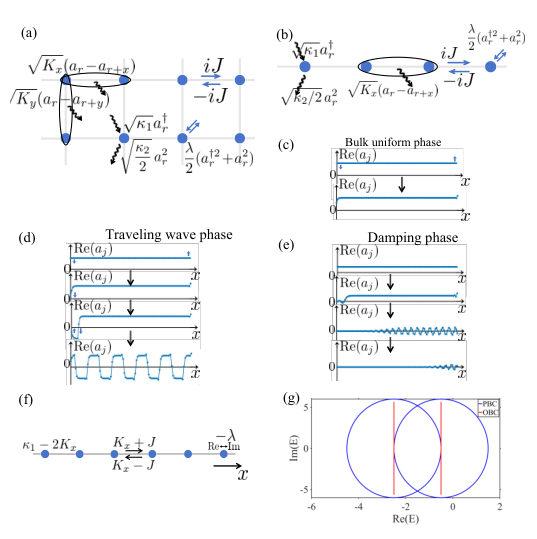
<figcaption class="paper-figure-caption"><b>Fig 1.</b> FIG. 1. (a)(b) Sketch of the model on 2D and 1D lattice. (c)-(e)The three different OBC phases. In the time evolution, the order parameter ar is uniform in the y, z direction; only the x axis is shown. (f) sketch of Heff in 1D. (g) PBC and OBC spectrum of Heff in 1D, with parameter in the damping phase.</figcaption>
</figure>
<figure class="paper-figure-card">
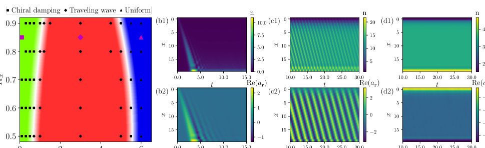
<figcaption class="paper-figure-caption"><b>Fig 2.</b> FIG. 2. Phase diagram of the model with OBC along x, PBC along y, z. (a) Phase diagram. As the one-body gain κ1 increases, the system passes from the chiral damping phase to the traveling wave phase, and then to the uniform phase. Data are averaged over the y and z directions, since the observables are uniform along these directions. (b1),(b2) Time evolution of density nr = ⟨ˆa† rˆar⟩and order parameter Re⟨ˆar⟩in chiral damping phase (purple square in (a)). The system relaxes chirally to the steady state. (c1),(c2) Traveling-wave phase [purple diamond in (a)], where the density and order parameter exhibit time-crystalline behavior in a traveling wave pattern. (d1),(d2) Uniform phase [purple...</figcaption>
</figure>
<figure class="paper-figure-card">
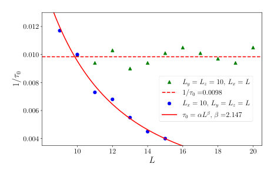
<figcaption class="paper-figure-caption"><b>Fig 3.</b> FIG. 3. System-size scaling of the traveling wave coherence time. For the system sizes accessible with our present numer- ical resources, τ0 increases strongly with Ly and Lz, following τ0 ∼L2.147, while remaining nearly independent of Lx. Pa- rameters are Kx = 0.8, κ1 = 1.5, Ky = Kz = 4.0, J = 3.0, λ = 1.0, and κ2 = 0.2.</figcaption>
</figure>
<figure class="paper-figure-card">
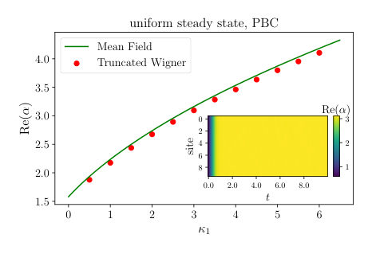
<figcaption class="paper-figure-caption"><b>Fig 4.</b> FIG. 4. Order parameter under PBC along the x direction. The steady state remains uniform as κ1 is varied. Red dots denote numerical results, while the green line shows the mean- field prediction. Inset: time evolution of the order parameter, illustrating rapid relaxation to the steady state. The initial condition is αr,0 = 0.6−0.6i. Parameters are J = 3.0, λ = 1.0, Kx = 0.8, Ky = Kz = 4.0, and κ2 = 0.2, with Lx = Ly = Lz = 10.</figcaption>
</figure>

**Summary.** This paper demonstrates that nonreciprocity can create entirely new steady-state phases in open quantum systems, such as a traveling-wave phase of symmetry defects. It shows that while periodic systems exhibit standard symmetry breaking, open boundaries allow for chiral dynamics driven by the non-Hermitian skin effect. This work expands the understanding of how non-Hermitian physics can fundamentally alter the phase diagram of driven-dissipative matter.

**Why it may be interesting.** It provides a new mechanism for phase formation where spatial boundaries and nonreciprocity interact to create phases that are topologically or dynamically distinct from their periodic counterparts, directly impacting the study of non-equilibrium many-body dynamics.

Detailed structure

**Main problem.** Investigating how nonreciprocity and the non-Hermitian skin effect (NHSE) can stabilize new non-equilibrium steady-state phases of matter beyond the standard spontaneous-symmetry-breaking paradigm.

**Main result.** The discovery of a boundary-induced 'traveling-wave phase' where nonreciprocity drives domain walls to form a persistent chiral wave, as well as a 'chiral damping phase' where local fluctuations are amplified by the NHSE.

**Method.** The study employs mean-field theory, linear stability analysis, and truncated Wigner simulations to characterize phase boundaries and fluctuation dynamics.

**Model / system.** A driven-dissipative bosonic model with Z2 symmetry, featuring a Lindblad master equation with nonreciprocal hopping (iJ), single-particle gain, and two-particle loss.

**Key observables.** Order parameter (expectation value of the bosonic field), density, and the autocorrelation function for coherence time.

**Important parameters / regimes.** Nonreciprocity strength (J), gain/loss parameters (kappa1, kappa2), and spatial boundary conditions (PBC vs OBC).

**Assumptions / limitations.** The continuum limit approximation neglects spatial variations of the time-derivative of the mean-field solution near domain walls; the Wigner method relies on truncating third-order derivative terms.

**Figures summary.** Figure 1 shows the model lattice and representative examples of the three OBC phases (uniform, traveling-wave, and damping) alongside the effective Hamiltonian spectrum. Figure S1 shows the time evolution and exponential decay of the autocorrelation function amplitude.

**Paper structure.** The paper introduces the model and the problem of nonreciprocity in steady states, presents the discovery of the traveling-wave and chiral damping phases under OBC, analyzes the role of the non-Hermitian skin effect, and concludes with a stability analysis of Goldstone-mode fluctuations using numerical simulations.

Abstract

Nonreciprocity can profoundly alter the spectra and dynamics of open quantum systems, yet its impact on the long-time steady-state phases of matter has remained largely unexplored. Here we show that the interplay of nonreciprocity, symmetry defects, and spatial boundaries can generate phases beyond the standard spontaneous-symmetry-breaking paradigm. We demonstrate this mechanism by showing that sufficiently strong nonreciprocity turns boundaries into sources and drains of symmetry defects, while simultaneously endowing these defects with chiral dynamics in the bulk. As a result, the conventional uniform symmetry-broken state gives way to a domain-wall traveling-wave phase, in which symmetry defects form a persistent chiral wave. We showcase this mechanism in a bosonic model with \(Z_{2}\) symmetry, where periodic boundary conditions support only the conventional symmetric and symmetry-broken phases, whereas open boundary conditions allow the traveling-wave phase. We further show that even in the absence of symmetry breaking, the steady state can exhibit anomalous chiral relaxation: owing to the non-Hermitian skin effect in the stability matrix, local fluctuations are chirally amplified as they approach a boundary, where they eventually decay. Combining mean-field theory with truncated Wigner simulations, we characterize these phases, analyze the order parameter and Goldstone-mode fluctuations of the traveling-wave phase, and confirm its existence in three spatial dimensions.

[↑ back to top](#top)

### [Scalable spin-nematic squeezing in multi-level dipole-interacting Rydberg atom arrays](http://arxiv.org/abs/2605.00096v1)

**Authors:** Sakshi Bahamnia, Thomas Bilitewski  
**Type:** theory · **Category:** other · **PDF:** <https://arxiv.org/pdf/2605.00096v1>  
**Analysis basis:** full PDF text, analyzed in chunks
**Topic relevance:** 🔥 `Rydberg arrays` **4/5** · 🔥 `entanglement & information structure` **4/5** · `analog quantum simulation` **3/5** · `exotic spin models in light-matter` **3/5** · `non-equilibrium dynamics` **2/5**

↔ Scroll figures horizontally

<figure class="paper-figure-card">
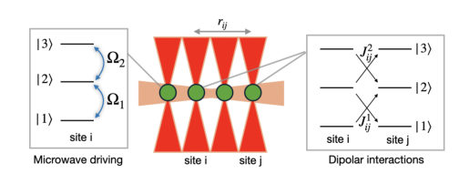
<figcaption class="paper-figure-caption"><b>Fig 1.</b> FIG. 1. Model overview. Rydberg states with alternat- ing parity define a three-level system labeled {|1⟩, |2⟩, |3⟩}. Microwaves Ωi drive transitions between adjacent levels, and dipolar interactions J1(2) ij induce pairwise spin exchange within the 1–2 and 2–3 sublevels between atoms at sites i and j with strength ∼r−3 ij .</figcaption>
</figure>
<figure class="paper-figure-card">
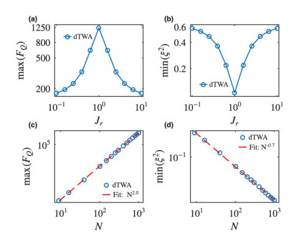
<figcaption class="paper-figure-caption"><b>Fig 2.</b> FIG. 3. Entanglement dynamics for all-to-all interactions. Quantum Fisher information (left) and squeezing parame- ter (right) as a function of the interaction ratio Jr = J2/J1 for N = 49 (top) and system size N (bottom).</figcaption>
</figure>
<figure class="paper-figure-card">
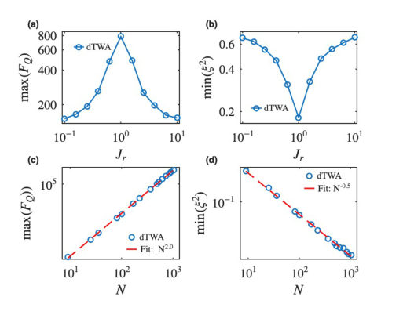
<figcaption class="paper-figure-caption"><b>Fig 3.</b> FIG. 4. Entanglement dynamics for dipolar interactions in 2D. Quantum Fisher information (left) and squeezing param- eter (right) as a function of Jr = J2/J1 for N = 49 (top) and system size N (bottom).</figcaption>
</figure>
<figure class="paper-figure-card">
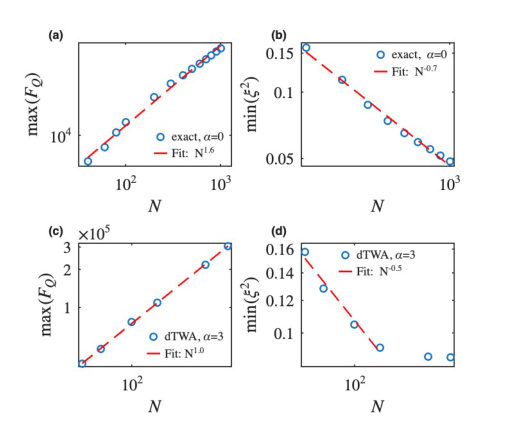
<figcaption class="paper-figure-caption"><b>Fig 4.</b> FIG. 5. Entanglement dynamics for the antisymmetric case. All-to-all interactions: (a) squeezing parameter and (b) quan- tum Fisher information versus system size N. Dipolar interac- tions in 2D: (c) quantum Fisher information and (d) squeezing parameter versus N.</figcaption>
</figure>

**Summary.** This paper explores how to generate scalable entanglement in three-level Rydberg atom arrays using dipole-dipole interactions. It shows that symmetric interactions lead to one-axis twisting-like squeezing, while antisymmetric interactions can produce more efficient two-axis countertwisting. These findings provide a theoretical foundation for using multi-level atoms in advanced quantum sensing applications.

**Why it may be interesting.** It extends well-known qubit-based squeezing protocols to qutrit systems and demonstrates how spatial interaction geometry (all-to-all vs. 2D dipolar) impacts the scalability of entanglement for quantum metrology.

Detailed structure

**Main problem.** Investigating the generation of scalable spin-nematic (quadrupolar) squeezing and entanglement in multi-level (qutrit) Rydberg atom arrays.

**Main result.** The study identifies that symmetric interactions enable scalable squeezing via One-Axis Twisting (OAT) dynamics, while antisymmetric interactions with a microwave drive enable Two-Axis Countertwisting (TAT) mechanisms.

**Method.** The authors use Exact Diagonalization for all-to-all interaction models and the Discrete Truncated Wigner Approximation (dTWA) for 2D dipolar interaction simulations.

**Model / system.** A three-level (spin-1) system realized in arrays of Rydberg atoms in optical tweezers, featuring dipole-dipole interactions and microwave driving.

**Key observables.** Squeezing parameter (xi^2) and Quantum Fisher Information (FQ).

**Important parameters / regimes.** Interaction ratio (Jr), interaction range/decay (alpha), and system size (N).

**Assumptions / limitations.** The dTWA is used as a semiclassical approximation for large-scale 2D dynamics and is benchmarked against exact results.

**Figures summary.** Figure 1 provides a model overview of the Rydberg system; Figure 3 and 4 show squeezing and QFI scaling for the bright manifold under all-to-all interactions.

**Paper structure.** The paper introduces the three-level Rydberg model, analyzes the Hamiltonian decomposition into SU(2) subspaces for symmetric and antisymmetric regimes, presents scaling results for different interaction ranges, and validates the semiclassical approximation.

Abstract

We study the generation of metrologically useful entanglement in a three-level (spin-1) system naturally realized in arrays of dipole-interacting Rydberg atoms confined in optical tweezers. In the spin-quadrupolar operator basis, the interaction Hamiltonian decomposes into effective SU(2) subspaces, within which quench dynamics from product initial states generate scalable spin-nematic squeezing. For symmetric interactions, we identify a mapping to effective one-axis twisting within bright and dark manifolds and demonstrate that the squeezing parameter scales as $ξ^{2}\propto N^{-2/3}$ ($ξ^{2}\propto N^{-0.5}$) with system size for all-to-all (two-dimensional dipolar) couplings. In both cases the quantum Fisher information reaches $F_Q\propto N^{2}$. For antisymmetric interactions supplemented by a microwave drive we find a distinct two-axis countertwisting mechanism. This results in squeezing $ξ^{2}\propto N^{-0.7}$ for all-to-all interactions and moderate squeezing for dipolar interactions in 2D. Our results constitute a first theoretical step beyond the well-studied qubit setting toward scalable entanglement generation in qudit systems with dipolar interactions, directly relevant to current Rydberg tweezer experiments.

[↑ back to top](#top)

### [A Unified Framework for Locally Stable Phases](http://arxiv.org/abs/2605.00088v1)

**Authors:** Zhi Li, Raz Firanko, Timothy H. Hsieh  
**Type:** theory · **Category:** statistical mechanics · **PDF:** <https://arxiv.org/pdf/2605.00088v1>  
**Analysis basis:** full PDF text, analyzed in chunks
**Topic relevance:** 🔥 `entanglement & information structure` **4/5** · `driven-dissipative phase transition` **3/5** · `methods for driven-dissipative` **3/5** · `non-equilibrium dynamics` **3/5** · `non-equilibrium universality` **2/5**

↔ Scroll figures horizontally

<figure class="paper-figure-card">
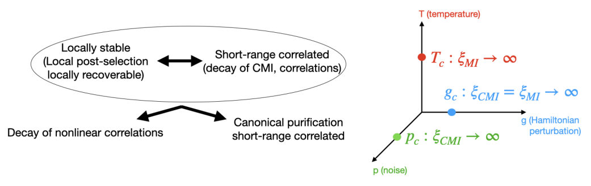
<figcaption class="paper-figure-caption"><b>Fig 1.</b> FIG. 1. (left) Summary of main results, which provides a unified framework for the (right) generalized landscape of phases including equilibrium thermal (red) and quantum (blue), and non-equilibrium (green) phase transitions driven by noise, for example. The former can be diagnosed by conventional correlation lengths, for example given by mutual information (MI), and the latter can be diagnosed by conditional mutual information (CMI) and its associated length scale, the Markov length.</figcaption>
</figure>
<figure class="paper-figure-card">
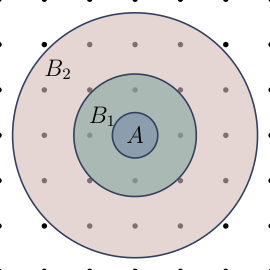
<figcaption class="paper-figure-caption"><b>Fig 2.</b> FIG. 2. The partition of the lattice used in Theorem 2.</figcaption>
</figure>
<figure class="paper-figure-card">
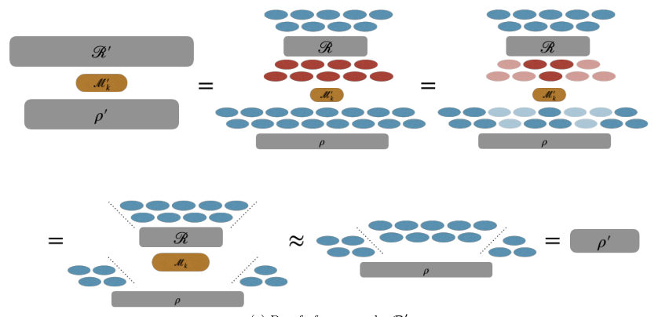
<figcaption class="paper-figure-caption"><b>Fig 3.</b> FIG. 3. Schematic proof of Theorem 5: 3a - Locally reversible circuit F : ρ 7→ρ′ and the reverse circuit D . 3b - Recovery channel R′ for ρ′ based on “dressing” the recovery channel R for ρ. 3c - R′ recovers ρ′ from the effect of local operations.</figcaption>
</figure>
<figure class="paper-figure-card">
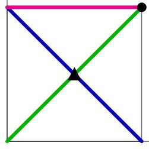
<figcaption class="paper-figure-caption"><b>Fig 4.</b> FIG. 4. Cp,q for p, q ∈(0, 1]2.</figcaption>
</figure>
<figure class="paper-figure-card">
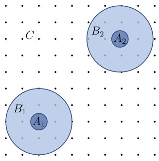
<figcaption class="paper-figure-caption"><b>Fig 5.</b> FIG. 5. Lattice partition in Theorem 10.</figcaption>
</figure>

**Summary.** This paper proposes a new unified framework for characterizing phases of matter by defining 'locally stable states' through the lens of local recoverability. It proves that this operational definition is equivalent to the decay of correlations, effectively bridging the gap between pure and mixed state phase descriptions. The work also introduces a new family of nonlinear observables to diagnose non-equilibrium phases.

**Why it may be interesting.** It provides a rigorous, unified language for researchers studying open quantum systems and many-body dynamics by linking operational stability (recoverability) to structural properties (correlation decay) across different physical regimes.

Detailed structure

**Main problem.** The lack of a unified framework to characterize phases of matter across equilibrium, non-equilibrium, and metastable regimes, specifically bridging the gap between pure and mixed state descriptions.

**Main result.** The authors establish that 'local stability' (the ability to reverse local operations via a local channel) is equivalent to 'short-range correlations' (decay of operator correlations and conditional mutual information), providing a unified definition for locally stable phases.

**Method.** The framework utilizes quantum information-theoretic tools including Petz recovery maps, Rényi divergences, and the analysis of quantum Markov chains and Lindbladian dynamics.

**Model / system.** Quantum many-body systems on D-dimensional lattices with local Hilbert spaces, including equilibrium Gibbs states, non-equilibrium steady states of local Lindbladians, and systems subject to local decoherence.

**Key observables.** Operator correlations, conditional mutual information (CMI), fidelity correlators, and a two-parameter family of nonlinear correlators (C_{p,q}).

**Important parameters / regimes.** Correlation length, Markov length, spectral gap of the Lindbladian, and the parameters (p, q) of the nonlinear observables.

**Assumptions / limitations.** The equivalence between local stability and short-range correlations is subject to technical constraints on the buffer region size and the dimensionality of the lattice.

**Figures summary.** Figure 1 maps different phase types to diagnostic measures; Figure 2 illustrates lattice partitioning for proofs; Figure 3 shows the schematic for phase invariance; Figure 5 illustrates lattice partitioning for nonlinear observables; Figure 6 shows the light-cone structure of recovery.

**Paper structure.** The paper introduces the concept of local stability, proves its equivalence to short-range correlations, demonstrates phase invariance under reversible circuits, develops a theory for nonlinear correlators, and concludes with applications to Lindbladian dynamics and counterexamples.

Abstract

We propose a unifying framework for characterizing pure and mixed state phases of matter across equilibrium, non equilibrium, and metastable regimes. We introduce the concept of locally stable states, defined by the operational property that any local operation (including post selection) can be reversed by a local channel. We prove that local stability is equivalent to a state being short range correlated, defined by the decay of both correlations and conditional mutual information. We demonstrate that these properties are invariant under locally reversible channels, thus defining locally stable phases. Furthermore, we prove that local stability implies both the decay of a family of nonlinear correlators, including the fidelity correlator, and the decay of correlations in the canonical purification, thus bridging the gap between mixed and pure states. Along the way, we establish two results which may be of independent interest: we show that post-selection on locally stable (short range correlated) states can be implemented via local channels and that quantum Markov chains can be characterized by the local computability of nonlinear observables.

[↑ back to top](#top)

### [Asymptotic Replacement for Quantum Channel Products with Applications to Inhomogeneous Matrix Product States](http://arxiv.org/abs/2605.00157v1)

**Authors:** Lubashan Pathirana  
**Type:** theory · **Category:** quantum information and computing · **PDF:** <https://arxiv.org/pdf/2605.00157v1>  
**Analysis basis:** full PDF text, analyzed in chunks
**Topic relevance:** 🔥 `methods for driven-dissipative` **4/5** · `entanglement & information structure` **3/5** · `non-equilibrium dynamics` **3/5** · `correlated / nonlocal dissipation` **2/5** · `driven-dissipative phase transition` **2/5**

↔ Scroll figures horizontally

<figure class="paper-figure-card">
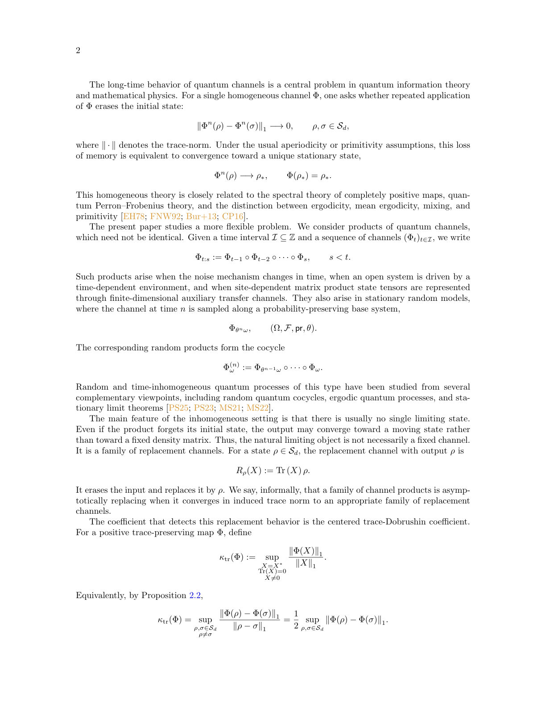
<figcaption class="paper-figure-caption"><b>Fig 1.</b> Low-resolution page preview, page 2</figcaption>
</figure>
<figure class="paper-figure-card">
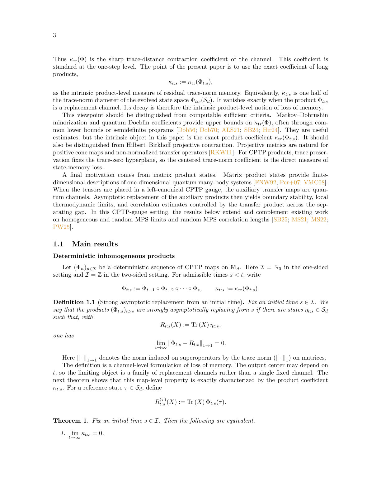
<figcaption class="paper-figure-caption"><b>Fig 2.</b> Low-resolution page preview, page 3</figcaption>
</figure>
<figure class="paper-figure-card">
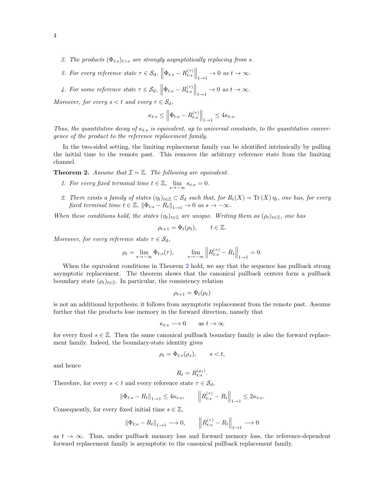
<figcaption class="paper-figure-caption"><b>Fig 3.</b> Low-resolution page preview, page 4</figcaption>
</figure>
<figure class="paper-figure-card">
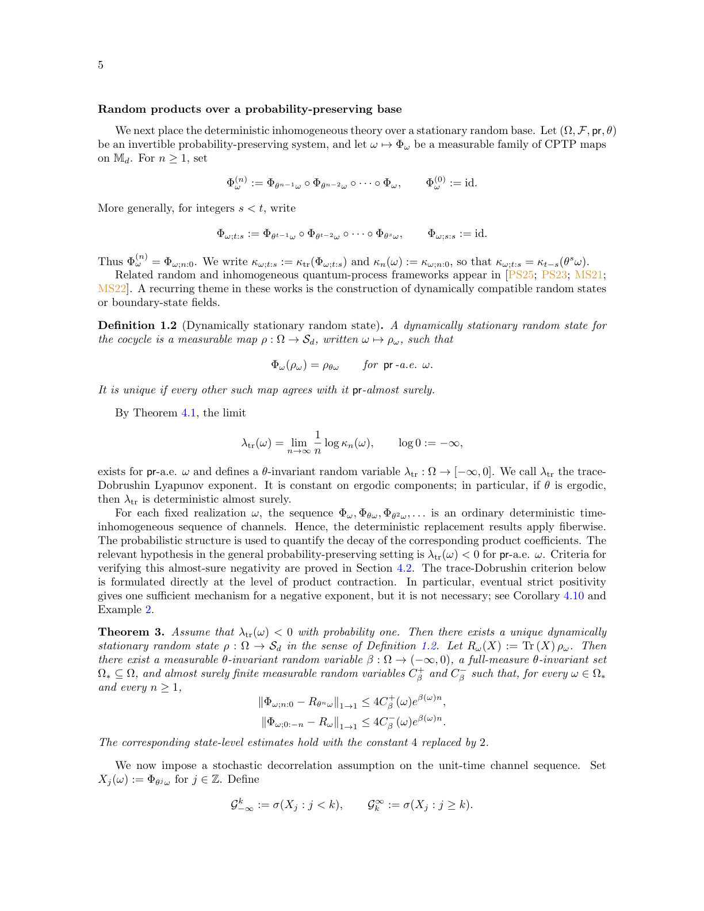
<figcaption class="paper-figure-caption"><b>Fig 4.</b> Low-resolution page preview, page 5</figcaption>
</figure>
<figure class="paper-figure-card">
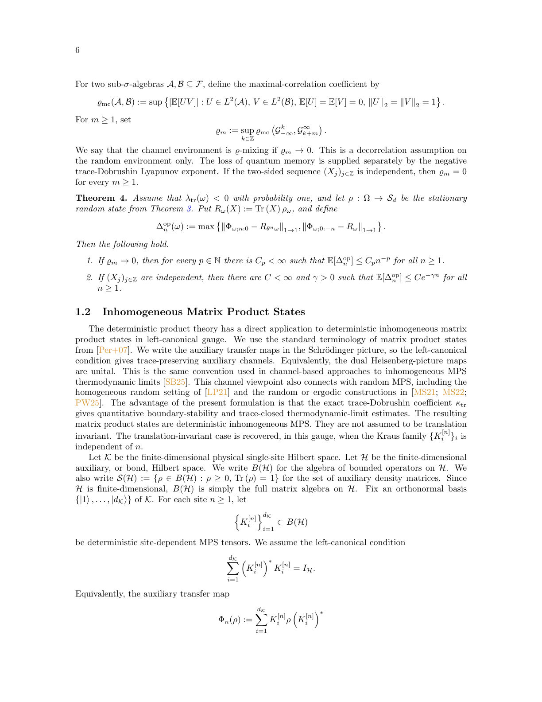
<figcaption class="paper-figure-caption"><b>Fig 5.</b> Low-resolution page preview, page 6</figcaption>
</figure>

**Summary.** This paper provides a rigorous mathematical framework for understanding how sequences of different quantum channels forget their initial states. It proves that the decay of a specific contraction coefficient determines whether channels converge to a replacement family, and shows how these dynamics translate to the stability and correlation decay in random Matrix Product States.

**Why it may be interesting.** This work is highly relevant for researchers in open quantum systems and many-body dynamics as it provides rigorous quantitative bounds on how environmental noise and time-dependent dynamics lead to the loss of initial state memory and the emergence of unique steady-state behaviors in many-body systems.

Detailed structure

**Main problem.** Investigating the asymptotic behavior and memory loss of products of non-identical (inhomogeneous) and random quantum channels, and applying these results to the stability and correlation decay of Matrix Product States (MPS).

**Main result.** The paper establishes that the decay of the trace-Dobrushin coefficient is equivalent to the asymptotic replacement of channels by a moving replacement family, and proves that a negative Lyapunov exponent leads to exponential convergence and spatial clustering in random MPS.

**Method.** The authors develop a product-level trace-Dobrushin theory using contraction coefficients, ergodic theory (Lyapunov exponents), and transfer map formalism to analyze both deterministic and random CPTP cocycles.

**Model / system.** The study focuses on finite-dimensional Completely Positive Trace-Preserving (CPTP) quantum channels, specifically sequences of inhomogeneous channels and stationary random quantum cocycles, with applications to inhomogeneous Matrix Product States (MPS) in the left-canonical gauge.

**Key observables.** Trace-norm distance, trace-Dobrushin coefficient, trace-Dobrushin Lyapunov exponent, and connected correlation functions of local observables.

**Important parameters / regimes.** Trace-Dobrushin coefficient (kappa_tr), Trace-Dobrushin Lyapunov exponent (lambda_tr), and the rho-mixing profile of the channel environment.

**Assumptions / limitations.** The theory assumes finite-dimensional Hilbert spaces, CPTP maps, and specifically for the MPS application, the left-canonical gauge; random results require a negative Lyapunov exponent almost surely.

**Paper structure.** The paper begins by developing a product-level trace-Dobrushin theory for deterministic channels, extends these results to two-sided products and pullback convergence, then moves to random quantum cocycles using ergodic theory, and concludes by transferring these estimates to the study of inhomogeneous and random Matrix Product States.

Abstract

We develop a product-level trace-Dobrushin theory for finite-dimensional quantum channel products and apply it to deterministic and stationary random inhomogeneous matrix product states in left-canonical CPTP gauge. For a product of channels, the centered trace-Dobrushin coefficient quantifies the residual dependence on the input state, and its decay is the criterion for trace-norm forgetting. In the deterministic setting, this decay is equivalent to asymptotic replacement by a moving replacement channel. For two-sided products, pullback forgetting produces a unique boundary state, which determines the canonical replacement family. For stationary random CPTP cocycles, submultiplicativity of the product coefficient yields a trace-Dobrushin Lyapunov exponent. We prove that the almost sure negativity of this exponent is equivalent to quenched trace-norm memory loss and gives exponential forward and pullback convergence to a unique dynamically stationary random replacement channel. When the \(\varrho\)-mixing profile of the channel environment tends to zero, we obtain annealed super-polynomial estimates, while independence gives annealed exponential estimates. Finally, we transfer these estimates to inhomogeneous matrix product states whose auxiliary transfer maps are CPTP. These channel estimates transfer to deterministic and stationary random inhomogeneous MPS, giving infinite-volume limits of trace-closed finite-volume states, quantitative boundary stability, and correlation bounds governed by the same auxiliary product coefficients.

[↑ back to top](#top)

### [Optically detected nuclear magnetic resonance of carbon-13 in bulk diamond](http://arxiv.org/abs/2605.00152v1)

**Authors:** Maxwell D. Aiello, Janis Smits, Yaser Silani, Andris Berzins, David Lidsky, Bryan A. Richards, Amilcar Jeronimo Perez, Chandrasekhar Ramanathan, Sebastián C. Carrasco, Jabir Chathanathil, Michael Goerz, Vladimir Malinovsky, Dmitry Budker, Sean Lourette, Andrey Jarmola, Victor M. Acosta  
**Type:** experiment · **Category:** other · **PDF:** <https://arxiv.org/pdf/2605.00152v1>  
**Analysis basis:** full PDF text, analyzed in chunks
**Topic relevance:** 🔥 `QC/QI experiment` **4/5** · 🔥 `spintronics-quantum-optics interface` **4/5** · `non-equilibrium dynamics` **2/5** · `quantum measurements` **2/5** · `quantum optics experiment` **2/5**

↔ Scroll figures horizontally

<figure class="paper-figure-card">
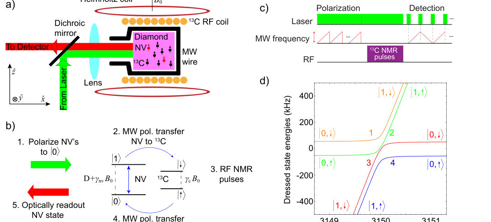
<figcaption class="paper-figure-caption"><b>Fig 1.</b> FIG. 1. 13C ODNMR apparatus and detection principle. (a) Experimental apparatus. Magnetic fields of B0 = 2–12 mT are applied along the NV axis (ˆz) using Helmholtz coils. A loop of wire wrapped around the diamond delivers microwaves (MW) that address the NV f+ transition. A 20-turn copper-wire radio frequency (RF) coil is wrapped around the diamond to drive the 13C NMR transition. (b) Schematic of the ODNMR principle, as described in the main text. (c) ODNMR pulse sequence, consisting of three phases: polarization, RF NMR encoding, and detection. The MW frequency is swept about the NV f+ transition in a unidirectional manner (low to high) for the polarization phase, and bidirectionally for...</figcaption>
</figure>
<figure class="paper-figure-card">
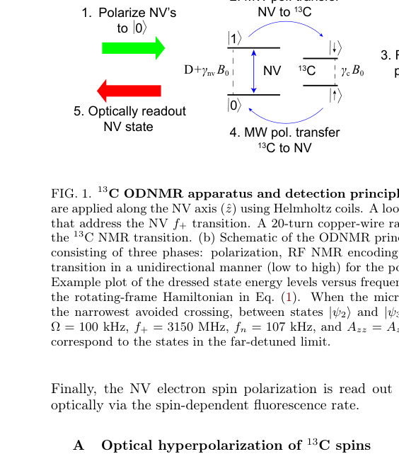
<figcaption class="paper-figure-caption"><b>Fig 2.</b> Figure 1(c) shows a typical ODNMR pulse sequence. During the polarization phase of the sequence, laser light is on continuously to repolarize NV centers to ms = 0, while the microwave frequency is repeatedly swept across the f+ transition unidirectionally, from low to high frequency, to transfer polarization to 13C nuclear spins. The polarization process can be understood by first considering a single NV center coupled to a single 13C nuclear spin under continuous microwave driving of frequency f and Rabi frequency Ω. The B0 field is taken to be large enough that we may consider a reduced two-level basis of the NV center, {|1⟩, |0⟩}. In the NV frame rotating with frequency f+, the...</figcaption>
</figure>
<figure class="paper-figure-card">
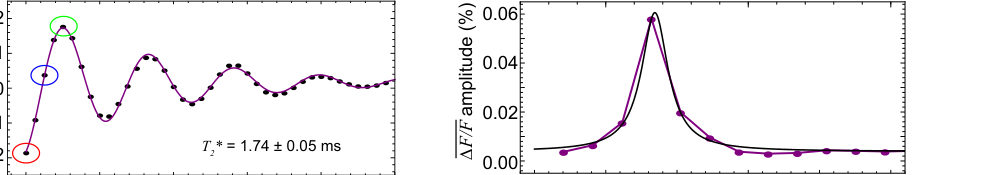
<figcaption class="paper-figure-caption"><b>Fig 3.</b> FIG. 2. Validation of 13C ODNMR readout. (a) Pulse sequence for optically-detected 13C Ramsey spectroscopy (see also Appendix III 1). (b) Fluorescence time traces during the detection phase for three values of τ, corresponding to |↑⟩(red, top), ⟨Iz⟩≈0 (blue, middle), and |↓⟩(green, bottom) after the RF encoding phase. Overlaid on the data (top and bottom only) is the fitted envelope decay function along with the 1/e2 decay time, Te2. (c) Te2 decay time as a function of readout amplitude (∆F/F). The colored lines denote the typical Te2 times for positive (black, Te2 ≈90 ms) and negative (pink, Te2 ≈30 ms) readout amplitudes. Error bars represent fit uncertainty. (d) Ramsey interferogram,...</figcaption>
</figure>
<figure class="paper-figure-card">
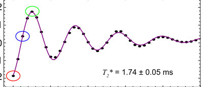
<figcaption class="paper-figure-caption"><b>Fig 4.</b> Figure 2(b) shows the averaged NV fluorescence sig- nal time trace for three different values of τ. Each point on these plots, ∆F/F, corresponds to the average fluo- rescence signal collected during a given laser pulse, nor- malized to the mean fluorescence signal over the entire time trace. For τ = 0 (top, red), the nuclear spin ensem- ble has not precessed at all between the RF pulses and experiences an overall π pulse, flipping the spins from |↓⟩to |↑⟩. Oscillations in ∆F/F are observed, with an initial contrast of ∼0.4% peak-to-peak, that persist for detection times exceeding 0.2 s after the RF encoding phase. For τ = 250 µs (middle, blue), the nuclear spin ensemble precesses by ∼90°...</figcaption>
</figure>
<figure class="paper-figure-card">
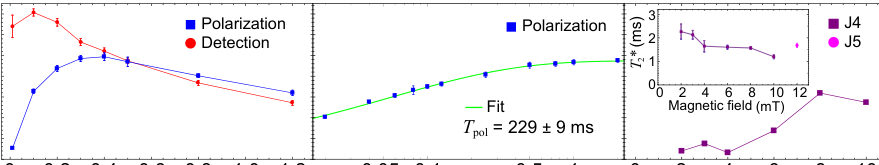
<figcaption class="paper-figure-caption"><b>Fig 5.</b> FIG. 3. Parameter Sweeps. (a) ODNMR readout visibility, |A|, as a function of the central frequency of the microwave sweep. (b) Visibility as a function of the microwave power input to the wire loop (effectively varying Ω2). (c) Visibility as a function of microwave sweep full-span frequency (effectively varying ˙f). (d) Dependence of visibility on the incident peak laser power. (e) Visibility as a function of the polarization time. (f) Visibility as a function of magnetic field, B0. Measurements for B0 = 2–10 mT were taken with diamond J4, and the measurement at B0 = 12 mT was taken with diamond J5. Inset: T ∗ 2 versus B0, extracted from mono-exponential decay fits. Additional details are...</figcaption>
</figure>

**Summary.** The researchers developed a technique to optically detect the NMR signal of massive 13C nuclear spin ensembles in bulk diamond using NV centers. By using microwave frequency sweeps to transfer polarization, they achieved high-contrast readout at low magnetic fields. This work provides a scalable platform for high-sensitivity quantum sensing and precision measurements.

**Why it may be interesting.** The paper explores the dynamics of a large-scale spin bath coupled to a quantum sensor, involving non-equilibrium polarization transfer, diabatic transitions, and the interplay between electron and nuclear spin relaxation in a disordered solid-state environment.

Detailed structure

**Main problem.** Achieving high-sensitivity, low-field, and room-temperature Optically Detected Nuclear Magnetic Resonance (ODNMR) of large ensembles of 13C nuclear spins in bulk diamond for applications in fundamental physics and inertial sensing.

**Main result.** Demonstrated successful 13C Ramsey spectroscopy in bulk diamond with a nuclear-spin-dependent fluorescence contrast exceeding 0.5% and identified the dominant dephasing source as the longitudinal relaxation of nearby NV centers.

**Method.** Uses microwave frequency sweeps to induce state-selective Landau-Zener transitions that bidirectionally transfer polarization between NV electron spins and 13C nuclear spins, followed by RF pulses for NMR encoding and optical readout of the NV state.

**Model / system.** Bulk diamond with natural abundance (1.1%) 13C and low nitrogen density (0.5-10 ppm), utilizing Nitrogen-Vacancy (NV) centers as sensors interacting with 13C nuclear spin ensembles.

**Key observables.** 13C NMR frequency, fluorescence contrast (delta F/F), nuclear spin dephasing time (T2*), and polarization buildup rate.

**Important parameters / regimes.** Magnetic fields of 8-20 mT, 13C gyromagnetic ratio of 10.7 MHz/T, NV zero-field splitting of 2.87 GHz, and nuclear spin dephasing times of ~1.74 ms.

**Assumptions / limitations.** The method assumes that the 13C nuclear spin diffusion and the longitudinal relaxation of NV centers are the primary drivers of the observed signal dynamics.

**Figures summary.** Figure 1 shows the ODNMR apparatus schematic; Figure 4 displays Ramsey interferograms, Hahn-echo, and WAHUHA decay curves; supplementary figures show polarization buildup and laser-induced depolarization effects.

**Paper structure.** The paper introduces the need for low-field NMR, describes the experimental setup and the polarization transfer mechanism via Landau-Zener transitions, presents results for Ramsey spectroscopy and dephasing, analyzes the impact of laser power and magnetic field, and concludes with sensitivity estimates.

Abstract

Precision measurements based on optically detected nuclear magnetic resonance offer exquisite sensitivity to absolute shifts in spin transition frequencies, with potential applications in fundamental physics experiments and inertial sensing. We investigate 13C nuclear spins in diamond as a candidate system for solid-state implementations, which hold the promise for high-fidelity readout of large numbers of coherent nuclear spins in millitesla or lower magnetic fields. We demonstrate a technique that allows for both optical polarization and readout of large ensembles of ~10^{16} polarized nuclear spins. Our method takes advantage of state-selective Landau-Zener transitions under microwave frequency sweeping, which bidirectionally transfer spin polarization between Nitrogen-Vacancy (NV) electron spins and remote 13C nuclear spins. Using natural isotopic abundance diamonds with nitrogen densities of ~0.5-10 ppm, we perform optically-detected 13C Ramsey spectroscopy and realize a nuclear-spin-dependent fluorescence contrast exceeding 0.5% peak-to-peak. We observe nuclear spin dephasing times T2*~2 ms that only modestly improve with homonuclear dipolar decoupling, indicating that they are limited by the longitudinal spin relaxation of nearby NV electron spins. We study the magnetic field dependence of the optical readout and find comparable contrast and dephasing times for magnetic fields in the range 8-20 mT. Our method can be interpreted as a type of repetitive readout, where each NV center optically reads out the spin state of ~100 nuclei before nuclear spins depolarize.

[↑ back to top](#top)

### [Locality versus Fock-space structure in East-type models](http://arxiv.org/abs/2605.00091v1)

**Authors:** Achilleas Lazarides  
**Type:** theory · **Category:** disordered systems and neural networks · **PDF:** <https://arxiv.org/pdf/2605.00091v1>  
**Analysis basis:** full PDF text, analyzed in chunks
**Topic relevance:** 🔥 `entanglement & information structure` **4/5** · 🔥 `scars & prethermalization` **4/5** · `non-equilibrium dynamics` **3/5** · `non-equilibrium universality` **2/5**

↔ Scroll figures horizontally

<figure class="paper-figure-card">
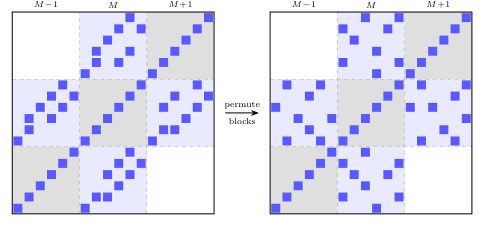
<figcaption class="paper-figure-caption"><b>Fig 1.</b> Figure 1. Schematic of the permuted East construction. Each matrix represents the Hamiltonian in the Fock-state basis, with rows and columns ordered so that states with the same number of up spins M form contiguous blocks (shaded grey on the diagonal). The diagonal entries (blue dots on the main diagonal) represent the on-site disorder, which is identical in both models. Only nearest-neighbour blocks (M ↔M ± 1, light blue) carry off-diagonal entries, reflecting the single- spin-flip structure. In the East model (left) the nonzero off-diagonal entries within each block follow the structured, constraint-driven pattern imposed by real-space locality. In the permuted East model (right) the...</figcaption>
</figure>
<figure class="paper-figure-card">
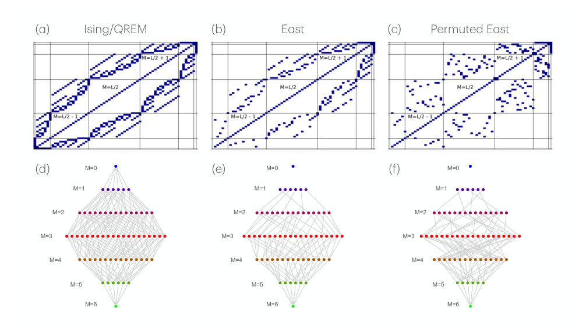
<figcaption class="paper-figure-caption"><b>Fig 2.</b> Figure 2. Panels (a-c) show the locations of the nonzero matrix elements in the Hamiltonians of the standard Ising, quantum East and permuted East models. Panels (d-f) show the graphs described by the corresponding adjacency matrices, obtained from the Hamiltonians in panels (a-c) via Eq. (2). The horizontal and vertical axes in panels (a-c) correspond to Fock state labels, ordered so that Fock states with the same number of up spins M = P</figcaption>
</figure>
<figure class="paper-figure-card">
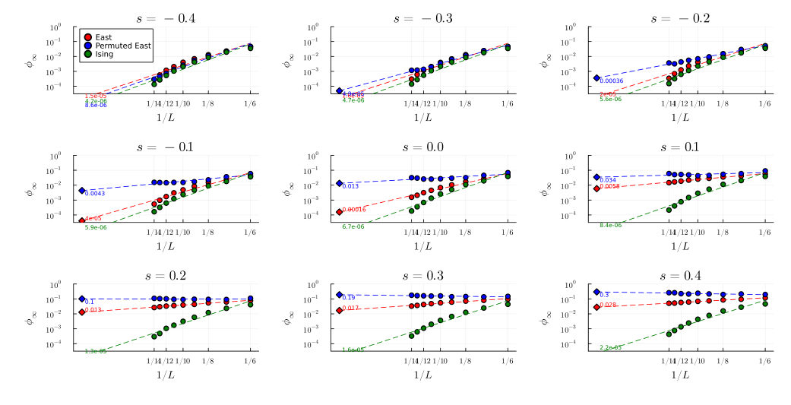
<figcaption class="paper-figure-caption"><b>Fig 3.</b> Figure 3. Infinite-time average of the dynamical participation ratio ϕ∞= limt→∞ϕ(t), defined in Eq. (5), for all three models with w = 0 (no Fock-space disorder) and s ranging from −0.4 to 0.4 in steps of 0.1. Initial states are the L single-spin-up product states; ϕ∞is averaged over these initial states and, for the permuted East model, also over realisations of the random permutation. Because these are low-entanglement states in the M = 1 magnetisation sector, they probe the low-energy part of the spectrum rather than the bulk, so the results are not representative of the full spectral average. In the fully delocalised limit ϕ∞= O(D−1), while in the fully localised limit ϕ∞= O(1). Each...</figcaption>
</figure>
<figure class="paper-figure-card">
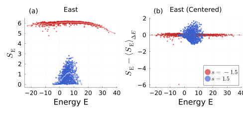
<figcaption class="paper-figure-caption"><b>Fig 4.</b> Figure 4. Representative examples of the Shannon entropy for each eigenstate of the East model for system size L = 10 and w = 1. Plots for the permuted model are similar, and data for both models is analysed in Fig. 6. (a) Entropy of each eigenstate versus its energy, for two values of s each represented by a different colour. The lines in a lighter shade of each colour show the local averages over a small window in energy. Note how the fluctuations of the larger s data around the mean are larger, as expected for a system violating ETH (see text). (b) Same data but with the local mean over the window ∆E subtracted to demonstrate fluctuations around the microcanonical average. A systematic...</figcaption>
</figure>
<figure class="paper-figure-card">
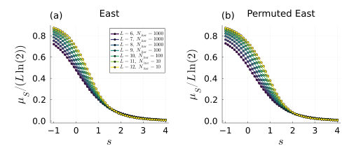
<figcaption class="paper-figure-caption"><b>Fig 5.</b> Figure 5. Mean scaled Shannon entropy µS/ ln D for the East (panel (a)) and permuted East (b) models, averaged over all eigenstates and disorder realisations (number of realisations indicated in the legend) for each size L. Here w = 1. As s increases the mean decreases, consistent with increasing loc- alisation. For a quantitative determination of the transition point see Fig. 6.</figcaption>
</figure>

**Summary.** The paper demonstrates that the localization transition in East-type models is determined by the connectivity structure in Fock space rather than real-space locality. By scrambling the real-space connections while keeping the magnetization-sector structure intact, the authors show that the phase transition remains qualitatively unchanged. This implies that the hierarchical organization of the Fock-space graph is the primary driver of localization in these constrained systems.

**Why it may be interesting.** This is highly relevant for many-body dynamics as it identifies that the topology of the Hilbert space graph, rather than physical distance, can be the fundamental driver of many-body localization and slow dynamics.

Detailed structure

**Main problem.** The paper investigates whether the localization transition in East-type models is driven by real-space geometric locality or by the underlying connectivity structure in Fock space.

**Main result.** The study finds that the localization-delocalization transition persists even when real-space locality is removed via random permutations, suggesting that the hierarchical structure of the Fock-space graph is the essential ingredient for localization.

**Method.** The authors use a graph-theoretic framework to analyze the Hamiltonian and perform numerical simulations including finite-size scaling analysis of Shannon entropy and dynamical participation ratios.

**Model / system.** The study focuses on the Quantum East Model and a newly introduced 'Permuted East Model', which preserves magnetization-sector organization but randomizes connectivity in Fock space to remove real-space locality.

**Key observables.** Dynamical participation ratio, Eigenstate Shannon entropy, Shannon-entropy fluctuations, and Local spectral variance.

**Important parameters / regimes.** The hopping rate parameter (s) which controls the transition, system size (L), and the disorder parameter (w).

**Assumptions / limitations.** The analysis assumes that the connectivity in Fock space can be effectively modeled by random permutations while preserving the magnetization sector structure.

**Figures summary.** Figure 1 shows the construction of the permuted model; Figure 2 illustrates the Hamiltonian matrix patterns and adjacency graphs; Figure 3 shows the dynamical participation ratio scaling; Figure 4 shows Shannon entropy fluctuations; Figure 5 shows mean scaled Shannon entropy; Figure 6 shows local spectral variance and extrapolated transition points.

**Paper structure.** The paper introduces the problem of localization in constrained models, defines the permuted East model, presents numerical results comparing the standard and permuted models using various diagnostics, and concludes with an extrapolation to the thermodynamic limit.

Abstract

Local kinetic constraints in quantum many-body systems can generate slow dynamics or complete many-body localisation. Here we focus on a modification of the quantum East model: Inspired by random matrix theory, we randomise the connectivity in Fock space (rendering it nonlocal in real space) while preserving its organisation into neighbouring magnetisation sectors. We find that there is still a transition between two distinct phases, one delocalised and the other localised. We conclude that, for East-type constrained models, the essential ingredient is the structure of the graph in Fock space rather than geometric locality of spin flips.

[↑ back to top](#top)

### [Generation of Tunable Entanglement from Thin-Film Lithium Niobate](http://arxiv.org/abs/2605.00214v1)

**Authors:** Saniya Shinde, Maximilian A. Weissflog, Shaun Lung, Elkin A. Santos, Jinyong Ma, Tongmiao Fan, Anna Fedotova, Sina Saravi, Andrey A. Sukhorukov, Frank Setzpfandt  
**Type:** experiment · **Category:** quantum information and computing · **PDF:** <https://arxiv.org/pdf/2605.00214v1>  
**Analysis basis:** full PDF text, analyzed in chunks
**Topic relevance:** 🔥 `QC/QI experiment` **4/5** · 🔥 `quantum optics experiment` **4/5** · `entanglement & information structure` **2/5** · `interference shaping light` **2/5**

↔ Scroll figures horizontally

<figure class="paper-figure-card">
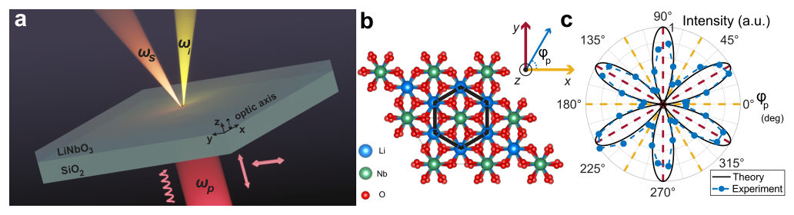
<figcaption class="paper-figure-caption"><b>Fig 1.</b> Figure 1. (a) Schematic of entanglement generation in z-cut LN. Sample is pumped from the substrate side with various pump polarizations. (b) Top-view of the crystal structure of z-cut lithium niobate (chemical formula LiNbO3, rendered using VESTA322). The black hexagon is marked to highlight the the six-fold rotational symmetry of the crystal structure. The pump polarization angle ϕp is shown with respect to crystalline x- and y-axes. (c) Polarization resolved. normalized second-harmonic generation intensity pattern with co-rotating half-wave plate and analyzer. Yellow and red dashed lines indicate x- and y- directions in the crystal. The theoretical dependence of ISHG ∝sin2(3ϕp) is shown...</figcaption>
</figure>
<figure class="paper-figure-card">
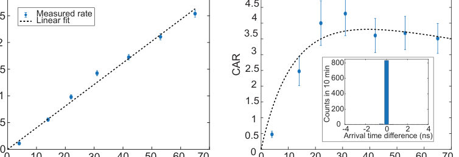
<figcaption class="paper-figure-caption"><b>Fig 2.</b> Figure 2. (a) Experimental setup for quantum state tomography. Photon pairs are separated by a dichroic mirror into two beam paths. Each path contains a quarter-wave plate (QWP), a half-wave plate (HWP), and a fixed polarizer aligned along the vertical direction (Pol) and detected using single-mode fibers connected to superconducting nanowire single photon detectors (SNSPDs). (b) SPDC rate as a function of pump power. Error bars are calculated using Poissonian statistics. Dashed black line shows the theoretical fit. (c) Coincidence-to-accidental ratio (CAR) as a function of power. Error bars are calculated using Poissonian statistics. Dashed black line shows theoretical fit of CAR using...</figcaption>
</figure>
<figure class="paper-figure-card">
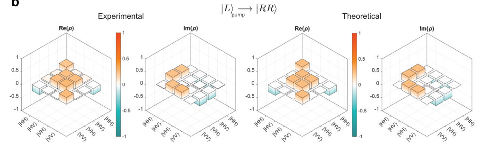
<figcaption class="paper-figure-caption"><b>Fig 3.</b> Figure 3. (a) Experimental and theoretical density matrices for V-polarized pump. For the experimental results, concurrence is C = 0.97±0.013 with state fidelity F(Φ−) = 0.98. (b) Experimental and theoretical density matrices for LCP pump. For the experimental results, concurrence is C = 0.16 ± 0.037 with state fidelity F(RR) = 0.97. Experimental density matrices were obtained using quantum state tomography and maximum likelihood estimation.</figcaption>
</figure>
<figure class="paper-figure-card">
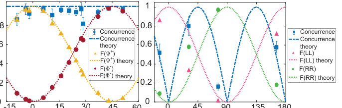
<figcaption class="paper-figure-caption"><b>Fig 4.</b> Figure 4. (a) Concurrence and Bell state fidelities as a function of pump half-wave plate angle. Dashed blue line shows the theoretically predicted concurrence and dashed red and yellow lines indicate the theoretical Bell state fidelities. (b) Concurrence and non-entangled state fidelities as a function of pump quarter-wave angle, for a fixed pump half-wave plate angle corresponding to the pump polarization angle ϕp = 45◦.Dashed blue line shows the theoretically predicted concurrence and dashed pink and green lines indicate the theoretical non-entangled state fidelities.</figcaption>
</figure>

**Summary.** The paper presents a new method for generating tunable polarization-entangled photon pairs using thin-film lithium niobate. By exploiting the crystal's rotational symmetry, the researchers can switch between different Bell states and separable states just by changing the pump polarization. This approach offers a scalable and compatible alternative to traditional bulk crystals and 2D materials.

**Why it may be interesting.** This work is highly relevant to quantum optics and quantum information as it provides a new, scalable platform for generating tunable entanglement, which is a fundamental requirement for quantum communication and photonic quantum computing.

Detailed structure

**Main problem.** The need for efficient, scalable, and tunable sources of polarization-entangled photon pairs for quantum technologies without the complexity of additional optical elements or the scalability issues of 2D materials.

**Main result.** Demonstrated a thin-film lithium niobate (TFLN) source that generates tunable polarization entanglement, ranging from maximally entangled Bell states to completely separable states, by simply varying the pump beam polarization.

**Method.** The researchers used spontaneous parametric down-conversion (SPDC) in z-cut lithium niobate thin films, employing quantum state tomography and second-harmonic generation to characterize the generated photon pairs.

**Model / system.** The experimental platform consists of an unstructured 8-micrometer thick z-cut lithium niobate (LN) film on a SiO2 substrate, utilizing the C3v crystal symmetry and d22 nonlinear tensor components.

**Key observables.** Photon-pair rate, Coincidence-to-Accidental Ratio (CAR), Concurrence (C), State Fidelity (F), and polarization density matrices.

**Important parameters / regimes.** Pump wavelength at 788 nm, signal/idler wavelengths at 1576 nm, and the use of the d22 nonlinear tensor component.

**Assumptions / limitations.** The method assumes the availability of high-quality thin-film lithium niobate fabrication and relies on the intrinsic C3v symmetry of the crystal.

**Figures summary.** Figure 1 shows the schematic of entanglement generation and the SHG intensity pattern; Figure 2 displays the experimental setup, SPDC rate vs. pump power, and CAR vs. pump power.

**Paper structure.** The paper introduces the motivation for scalable photon sources, describes the TFLN experimental platform and the physics of C3v-mediated entanglement, presents characterization via SHG and quantum state tomography, and concludes with future directions like hyperentanglement.

Abstract

Entangled photon pairs play a major role in various modern technologies such as quantum imaging, communication, and computing. Conventional photon-pair sources are often based on spontaneous parametric down-conversion in bulk nonlinear crystals. Recent advances have also shown entangled photon-pairs from transition metal dichalcogenide thin-films, however, these materials are not widely available and are not compatible with existing fabrication capabilities. We present a new thin-film lithium niobate source of polarization-entangled photon pairs at the telecom wavelength that requires no additional optical elements for entanglement generation and allows for easy application using the existing lithium niobate fabrication technologies. We demonstrate tunable entanglement generation using the three-fold rotational crystal symmetry of lithium niobate, allowing the generation of different maximally entangled Bell states or completely separable states depending on the polarization of the pump beam.

[↑ back to top](#top)

### [Entropy from Entanglement in Quantum State Reduction](http://arxiv.org/abs/2605.00485v1)

**Authors:** Lisa Lenstra, Jasper van Wezel  
**Type:** theory · **Category:** statistical mechanics · **PDF:** <https://arxiv.org/pdf/2605.00485v1>  
**Analysis basis:** full PDF text, analyzed in chunks
**Topic relevance:** 🔥 `quantum measurements` **4/5** · `entanglement & information structure` **3/5** · `methods for driven-dissipative` **2/5** · `non-equilibrium dynamics` **2/5**

↔ Scroll figures horizontally

<figure class="paper-figure-card">
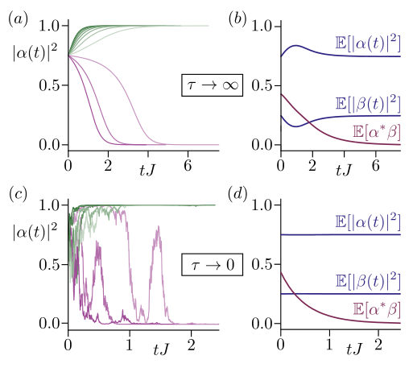
<figcaption class="paper-figure-caption"><b>Fig 1.</b> FIG. 1. State evolution during quantum state reduc- tion. (a) The evolution of the state |ψ(t)⟩= α(t) |0⟩+β(t) |1⟩ under Eq. (2) with J = G and ˆH = 0 is shown for dif- ferent values of the stochastic parameter ξ, sampled from a uniform distribution on [−1, 1]. (b) The average weight of the wave function components and their overlap, indicating that the proportion of states ending in |0⟩at late times is equal to the value of |α|2 at t = 0, in accordance with Born’s rule [8, 18, 20]. (c) and (d) show the same as panels (a) and (b), but in the white noise limit of vanishing correlation time τ for the stochastic parameter, in which the average dynamics coincides with that of a CSL (continuous...</figcaption>
</figure>
<figure class="paper-figure-card">
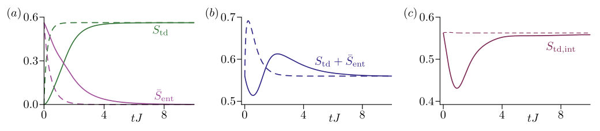
<figcaption class="paper-figure-caption"><b>Fig 2.</b> FIG. 2. Evolution of entropy and entanglement during quantum state reduction. (a) The evolution of the instantaneous thermodynamic entropy Std(t) and the average bipartite entanglement ¯Sent(t) during quantum state reduction. (b) Sum of the thermodynamic entropy and average bipartite entanglement during quantum state reduction. The sum is not constant, indicating that entanglement is not converted into thermodynamic entropy in a one-to-one fashion. (c) The evolution of the locally obtainable entropy Std,int(t) during quantum state reduction. Although the locally obtainable entropy is not a monotonic function of time, this cannot be used to obtain a decreasing value of the actually obtained...</figcaption>
</figure>

**Summary.** This paper explores how entanglement is transformed into thermodynamic entropy during objective quantum state reduction. It demonstrates that this conversion is not one-to-one and proposes that the non-monotonic evolution of local entropy can serve as a signature to distinguish state reduction from environmental dephasing.

**Why it may be interesting.** It provides a way to experimentally distinguish fundamental wave-function collapse models from standard decoherence by looking at thermodynamic signatures in the presence of correlated noise.

Detailed structure

**Main problem.** Investigating the relationship between quantum entanglement and thermodynamic entropy during the process of objective quantum state reduction, specifically whether entanglement can be converted into thermodynamic entropy in a one-to-one fashion.

**Main result.** The authors show that entanglement entropy is not converted into thermodynamic entropy one-to-one, and that models with correlated noise provide a unique thermodynamic fingerprint (non-monotonic locally obtainable entropy) that distinguishes state reduction from environment-induced dephasing.

**Method.** The study uses ensemble averaging over stochastic trajectories of a non-linear, stochastic master equation to calculate the evolution of von Neumann and thermodynamic entropies.

**Model / system.** A bipartite entangled pure state (two degrees of freedom) evolving under an objective quantum state reduction model described by a stochastic, non-linear equation with a temporally correlated noise parameter.

**Key observables.** Thermodynamic entropy (S_td), average bipartite entanglement (S_ent), and locally obtainable entropy (S_td,int).

**Important parameters / regimes.** Noise correlation time (tau), strength of non-linear term (J), amplitude of stochastic term (G), and the white-noise limit (tau -> 0).

**Assumptions / limitations.** The analysis assumes the measurement apparatus is not infinitely large and that the noise is physically correlated to allow for distinguishability from dephasing.

**Figures summary.** Figure 1 shows the evolution of a quantum state under specific stochastic parameters; Figure 2 illustrates the monotonic increase of thermodynamic entropy alongside the decrease of entanglement, the non-conservation of their sum, and the non-monotonic evolution of locally obtainable entropy in correlated noise models.

**Paper structure.** The paper introduces the problem of entropy conversion, defines the stochastic reduction model, analyzes the evolution of various entropy measures, compares reduction to dephasing, and concludes with the identification of experimental signatures.

Abstract

The Von Neumann entropy of reduced states is a measure of bipartite entanglement. Despite its name, the entanglement entropy cannot by itself be used as a resource for creating thermodynamic heat flows. In order to extract heat from an entangled pure state, it first needs to be converted into a stochastically mixed state by a process of quantum state reduction. Here we show that even in a system with only two degrees of freedom, for which bipartite entanglement is the sole form of entanglement available, the entanglement entropy cannot be converted into thermodynamic entropy in a one-to-one fashion. Moreover, we show that the stochastic dynamics which is necessarily present in any realistic model of quantum state reduction, allows for multiple definitions of entropy. We indicate why quantum state reduction does not allow construction of a perpetuum mobile, despite some measures of entropy evolving non-monotonically during its dynamics. Finally, we relate the different measures of entropy to the information they contain about quantum entanglement and extractable heat, and show that models of quantum state reduction based on physical, correlated stochastic driving forces give rise to observable thermodynamic signatures of quantum state reduction that can be unambiguously distinguished from environment-induced dephasing.

[↑ back to top](#top)

### [Fixed points and crossovers for the hysteresis scaling of dynamic mean-field models](http://arxiv.org/abs/2605.00567v1)

**Authors:** Jiapeng Yang, Fan Zhong  
**Type:** theory · **Category:** statistical mechanics · **PDF:** <https://arxiv.org/pdf/2605.00567v1>  
**Analysis basis:** full PDF text, analyzed in chunks
**Topic relevance:** 🔥 `non-equilibrium universality` **4/5** · `non-equilibrium dynamics` **3/5** · `driven-dissipative phase transition` **2/5** · `methods for driven-dissipative` **2/5**

↔ Scroll figures horizontally

<figure class="paper-figure-card">
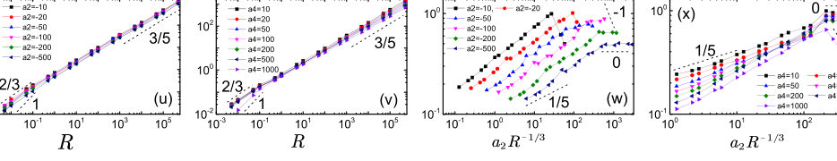
<figcaption class="paper-figure-caption"><b>Fig 1.</b> FIG. 1. (a) Coercivity Hc versus R at fixed a4 = 100 with varying a2. (b) Hc versus R at fixed a2 = −100 with varying a4. Both (a) and (b) correspond to σ = 0. Dashed lines with numerical labels in all panels indicate the theoretical (crossover) slopes from Eqs. (19)–(24) and (26). (c) and (d) Quadratic rescaling of (a) and (b) by Eq. (11). (e) and (f) Cubic rescaling (a) and (b) by Eqs. (12) and (24). (g) and (h) Quartic rescaling of (a) and (b) by Eq. (13). (i) Infinite-order rescaling of (b) by Eq. (14). (j) and (k) H0 −Hs at Ms versus R for identical parameter sets as (a) and (b). (l) and (m) Cubic scaling of (j) and (k) by Eq. (15). (n) and (o) Hc versus R for the same parameters as (a)...</figcaption>
</figure>
<figure class="paper-figure-card">
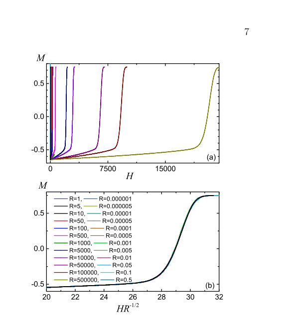
<figcaption class="paper-figure-caption"><b>Fig 2.</b> FIG. 2. (a) Magnetization curves for a series of R values, as listed in the legend of (b). The curves shift to the right with increasing R. a2 = a20(R/R0)−1/2, a4 = a40(R/R0)−1/2, and σ = σ0(R/R0)−1/2, a20 = −400, a40 = 948, σ0 = 0.4, R0 = 10. (b) Rescaled curves from (a) based on the infinite- order behavior, Eq. (14) .</figcaption>
</figure>

**Summary.** This paper identifies new universal scaling exponents for hysteresis in first-order phase transitions within a mean-field framework. It shows that different physical regimes, controlled by driving rates and noise, correspond to distinct universality classes. The study provides a unified scaling theory that explains previously observed non-universal behaviors as crossovers between fixed points.

**Why it may be interesting.** not directly relevant

Detailed structure

**Main problem.** The study investigates the existence of universal scaling behavior and crossovers between different fixed points in the hysteresis of first-order phase transitions.

**Main result.** The authors discover a new scaling exponent of 3/5 for large driving rates in a quartic model and demonstrate that a single model can exhibit multiple universality classes (quadratic, cubic, and quartic) depending on driving rate and noise.

**Method.** The researchers use Renormalization Group (RG) theory for scaling analysis, Finite-Time Scaling (FTS) to treat the driving rate as a finite timescale, and numerical simulations to verify curve collapse.

**Model / system.** A dynamic mean-field quartic (phi^4) model governed by a Langevin equation with Gaussian white noise, driven by a linearly varying external field.

**Key observables.** Magnetization (M), coercivity (Hc), and the external field (H).

**Important parameters / regimes.** Driving rate (R), noise amplitude (sigma), reduced temperature (a2), and coupling constants (a4).

**Assumptions / limitations.** The analysis is restricted to mean-field models and assumes the absence of anomalous dimensions, which allows for full curve collapse.

**Figures summary.** Figures show the dependence of coercivity on driving rate, various rescaling plots (quadratic, cubic, quartic) demonstrating data collapse, and infinite-order rescaling showing a unified magnetization curve.

**Paper structure.** The paper introduces the problem of hysteresis scaling, defines the dynamic mean-field model, applies RG theory to identify fixed points and exponents, presents numerical verification of crossovers and curve collapse, and discusses the impact of noise and spatial extensions.

Abstract

Phase transitions are divided into first-order phase transitions and continuous ones in current classification. While the latter shows striking phenomena of scaling and universality, the former is generically characterized by discontinuous jumps in extensive variables and pronounced hysteresis. Recent studies have demonstrated universal scaling behavior controlled by a cubic fixed point in first-order phase transitions. However, more recent investigations into the hysteresis in a dynamic mean-field quartic model driven through its first-order phase transitions have revealed new scaling exponents for different driving rates. Here, we discover a new exponent for large driving rates arising surprisingly from critical phenomena and show that, depending on the magnitude of the driving rates and on the absence or presence of noise, the same mean-field model remarkably exhibits several universality classes with definite universal scaling exponents governed by their corresponding fixed points through a systematic scaling analysis based on renormalization group theory. The theories and their various crossovers between different fixed points along with complete universal scaling of full curve collapse are verified by numerical results. This further confirms universal scaling in first-order phase transitions.

[↑ back to top](#top)

### [Learning Lindblad Dynamics of a Superconducting Quantum Processor](http://arxiv.org/abs/2605.00626v1)

**Authors:** Johann Bock Severin, Malthe A. Marciniak, Rune Thinggaard Birke, Emil Hogedal, Andreas Nylander, Irshad Ahmad, Amr Osman, Janka Biznárová, Marcus Rommel, Anita Fadavi Roudsari, Jonas Bylander, Giovanna Tancredi, Christopher W. Warren, Svend Krøjer, Jacob Hastrup, Morten Kjaergaard  
**Type:** both · **Category:** quantum information and computing · **PDF:** <https://arxiv.org/pdf/2605.00626v1>  
**Analysis basis:** full PDF text, analyzed in chunks
**Topic relevance:** 🔥 `QC/QI experiment` **4/5** · 🔥 `methods for driven-dissipative` **4/5** · `correlated / nonlocal dissipation` **3/5**

↔ Scroll figures horizontally

<figure class="paper-figure-card">
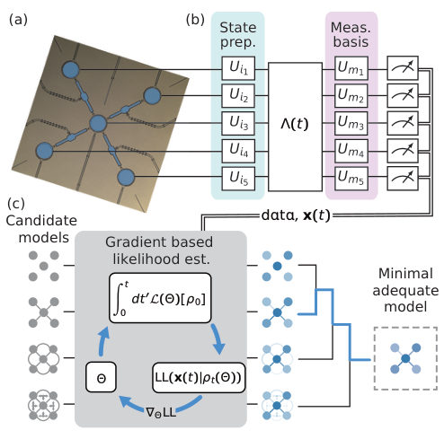
<figcaption class="paper-figure-caption"><b>Fig 1.</b> FIG. 1. Conceptual overview of the framework for learning the minimal Lindblad model. (a) Optical micrograph of the superconducting 5-qubit device with fixed-frequency trans- mons and tunable couplers used in this work. Further experi- mental details can be found in Supplemental Material B. (b) Tomographic measurement sequence: Qubits are prepared us- ing local preparation gates Ui, and the system is allowed to evolve under the time-dependent channel of interest, Λ(t). Fi- nally, local basis-change gates Um are applied to each qubit before projective readout is performed. (c) Classical post- processing of the data. A hierarchy of nested candidate Lind- blad models (gray pictograms) are...</figcaption>
</figure>
<figure class="paper-figure-card">
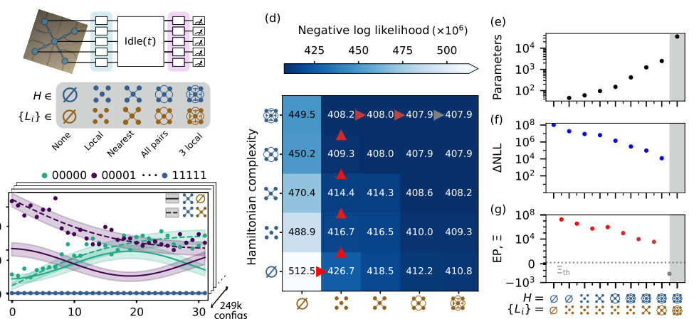
<figcaption class="paper-figure-caption"><b>Fig 2.</b> FIG. 2. Application of the LIMINAL framework to determine the minimal adequate model for the idling dynamics of a 5-qubit processor. (a) Tomographic experiment for idling dynamics on the 5-qubit device. (b) Candidate models arranged along two axes: unitary and dissipative locality. Complexity increases from local terms to nearest-neighbor (two-local), all-to-all two-local, and three-local interactions. (c) Observed bit-strings from one example configuration and fitted predictions from two different models. (d) Log-likelihood values for all model combinations, where complexity increases from lower left to upper right. Arrows indicate the path of greatest explanatory power. See main text for...</figcaption>
</figure>
<figure class="paper-figure-card">
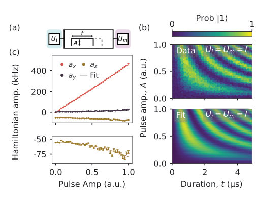
<figcaption class="paper-figure-caption"><b>Fig 3.</b> FIG. 3. Single-qubit validation under a constant, slightly de- tuned pulse. (a) Tomographic sequence: local preparation Ui, square pulse of amplitude A and duration t, basis-change Um, and projective readout. (b) Probability of measuring the excited state as a function of time for different pulse am- plitudes. Experimental data (top) are compared with sim- ulated fits (bottom). (c) Fitted Hamiltonian parameters for each amplitude, decomposed into Pauli components. A zoom- in highlights the z-component (gold), while the x- and y- components (red and blue) are fitted with a linear model and the z-component with an offset quadratic form.</figcaption>
</figure>
<figure class="paper-figure-card">
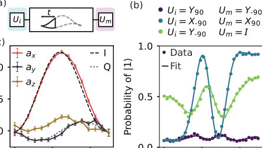
<figcaption class="paper-figure-caption"><b>Fig 4.</b> FIG. 4. Reconstruction of a time-dependent Hamiltonian from an enveloped resonant drive. (a) Tomographic sequence: local preparation Ui, resonant pulse with a shaped I(t) en- velope; the Q(t) quadrature follows a DRAG-like derivative scaling. The pulse is truncated at time t in fixed increments to map the evolving dynamics, followed by basis-change Um and projective readout. (b) Representative configurations show- ing data (points) and model predictions (solid lines) obtained by maximum likelihood estimation. (c) Reconstructed single- qubit Hamiltonian components ax(t), ay(t), az(t), obtained via piecewise-linear interpolation between anchor points. The I/Q envelopes are overlaid (scaled)...</figcaption>
</figure>
<figure class="paper-figure-card">
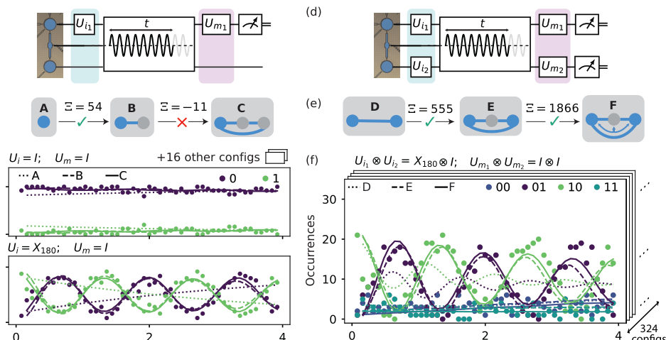
<figcaption class="paper-figure-caption"><b>Fig 5.</b> FIG. 5. Capturing coupler-mediated entangling dynamics and non-Markovian memory with minimal hidden qubit models. (a) Two-qubit experiment where only the properties of qubit 1 is tomographically reconstructed. Two fixed-frequency transmons are connected by a tunable coupler. A flux modulation at the qubit-frequency difference induces an iSWAP-like interaction. Tomography is performed on the first qubit only. (b) Nested models for one observed qubit. Model A: single-qubit Lindblad model. Model B: the observed qubit coupled to one hidden two-level system (TLS). Model C: the observed qubit coupled to two hidden TLSs. (c) Observed data for two configurations alongside model-predicted...</figcaption>
</figure>

**Summary.** The authors present LIMINAL, a framework for learning the simplest Lindblad models that accurately describe a superconducting quantum processor. By using differentiable simulation and likelihood-ratio tests, the method can automatically determine the necessary level of interaction locality and dissipation. This allows for the automated characterization of both idling dynamics and complex, time-dependent control pulses.

**Why it may be interesting.** It provides a rigorous statistical method for model selection in open quantum systems, specifically addressing how to identify relevant noise and interaction terms in many-body Lindbladian dynamics.

Detailed structure

**Main problem.** The challenge of identifying the minimal adequate Lindblad model for a multi-qubit processor, balancing model complexity against experimental and computational tractability.

**Main result.** The LIMINAL framework successfully identifies the simplest adequate model for a 5-qubit processor, recovering 3-local Hamiltonian terms and 2-local dissipation, while also reconstructing time-dependent pulse envelopes and detecting hidden coupler dynamics.

**Method.** A data-driven, likelihood-based inference framework (LIMINAL) using gradient-based Maximum Likelihood Estimation (MLE) with a differentiable ODE-based simulator and Likelihood-Ratio tests.

**Model / system.** A five-qubit superconducting quantum processor featuring fixed-frequency transmons and tunable couplers, modeled using the Lindblad master equation for both Hamiltonian and dissipative dynamics.

**Key observables.** Time-resolved tomographic data, bit-string outcomes, Pauli basis coefficients, and excited-state probabilities.

**Important parameters / regimes.** Hamiltonian coefficients, dissipation rates, qubit frequencies, relaxation times (T1), and dephasing times (T2).

**Assumptions / limitations.** The dynamics are assumed to be Markovian and describable by a Lindblad generator.

**Figures summary.** Figure 1 shows the device micrograph and LIMINAL workflow; Figure 2 illustrates the model selection path and likelihood landscapes; Figure 3 demonstrates single-qubit constant pulse reconstruction; Figure 4 shows time-dependent pulse reconstruction; Figure 5 and 6 detail hidden-qubit detection and the cryogenic setup.

**Paper structure.** The paper introduces the LIMINAL framework, describes the experimental superconducting platform, details the mathematical implementation of the differentiable simulator, presents results for idling dynamics, demonstrates reconstruction of driven single-qubit pulses, and concludes with tests for hidden degrees of freedom in couplers.

Abstract

Accurate models of quantum processors are essential for understanding, calibrating, and improving their performance. In practice, model construction must balance physical detail against the experimental and computational effort required to reliably learn parameters. Compact descriptions therefore often rely on assumptions about which interactions, noise processes, or hidden degrees of freedom are relevant. Here we introduce LIMINAL, a data-driven framework for testing such assumptions and selecting minimal adequate Lindblad models. LIMINAL fits nested candidate models to time-resolved tomographic data and uses likelihood-ratio tests to decide when added physical mechanisms are warranted. We apply LIMINAL to a five-qubit superconducting processor, identifying an idling model with three-local Hamiltonian terms and two-local dissipation, while finding no support for three-local dissipation. We further apply it to recover driven single-qubit Hamiltonians, reconstruct a shaped-pulse Hamiltonian without assuming an analytic pulse model, and test hidden-qubit extensions in coupler-mediated dynamics, demonstrating the applicability of the framework for a wide range of tasks.

[↑ back to top](#top)

### [An Error-aware and Adaptive Method for the Estimation of Quantum Observables on Qudit-Based Quantum Computers](http://arxiv.org/abs/2605.00682v1)

**Authors:** Rick P. A. Simon, Michael Meth, Francesco Martini, Peter Tirler, Andrew Jena, Martin Ringbauer, Luca Dellantonio  
**Type:** both · **Category:** quantum information and computing · **PDF:** <https://arxiv.org/pdf/2605.00682v1>  
**Analysis basis:** full PDF text, analyzed in chunks
**Topic relevance:** 🔥 `QC/QI experiment` **4/5** · 🔥 `quantum measurements` **4/5** · `analog quantum simulation` **2/5**

↔ Scroll figures horizontally

<figure class="paper-figure-card">
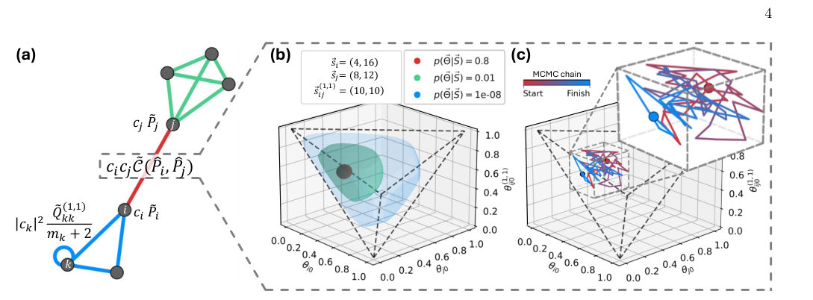
<figcaption class="paper-figure-caption"><b>Fig 1.</b> Figure 1. Bayesian estimation process for dP = 2. (a) displays the commutation graph of an observable ˆO with p = 7 PS in its decomposition Eq. (1a). Vertices represent PS, and are weighted with their estimated averages. Edges connect commuting PS, and are weighted by their error contribution cicj eC( ˆPi, ˆPj) in Eqs. (3). Self-edges (for clarity omitted except for the k-th vertex) are labelled with the estimated variances |ck|2 eC( ˆPk, ˆPk) = |ck|2Q(1,1) kk /(mk +2). Therefore, eO [(g ∆O)2] is the sum over all vertices [edges, including self-edges]. As explained in Sec. III, the estimations rely on a MCMC procedure. For the covariance contribution of PS i and j, (b) depicts the posterior...</figcaption>
</figure>
<figure class="paper-figure-card">
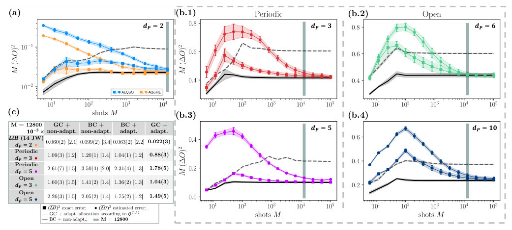
<figcaption class="paper-figure-caption"><b>Fig 2.</b> Figure 2. (a-b) Rescaled relative estimation variance M(∆O)2 as a function of M for ground state energies of various Hamilto- nians. In the y-axes, (∆O)2 is either (∆O)2 (squares) or (g ∆O)2 (circles) (see the legend and main text), divided by the exact, average ⟨ˆO⟩2. Points are the averages over 20 classically simulated experiments and the error bars their standard deviations. Full coloured lines are obtained with GC+adaptive and without prior information on the input quantum state. AEQuO’s [56] results are in light blue; all other colours are obtained with AQUIRE. The black (dashed gray) line is the variance (∆O)2 ob- tained for GC+adaptive (BC+non-adaptive) allocation according to the...</figcaption>
</figure>
<figure class="paper-figure-card">
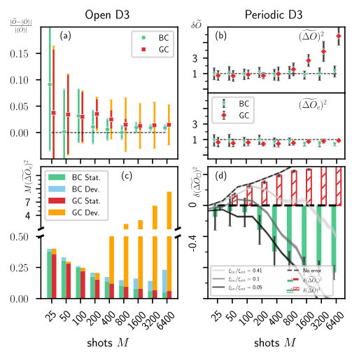
<figcaption class="paper-figure-caption"><b>Fig 3.</b> Figure 3. Experiment on the trapped-ion qudit QC [32]. The models for the left [right] column are the same as in Fig. 2 except for the parameters g2 = 20 [g2 = 0.01] and in- put states |ψ⟩= |1010⟩p (|0⟩g + |1⟩g)/ √</figcaption>
</figure>
<figure class="paper-figure-card">
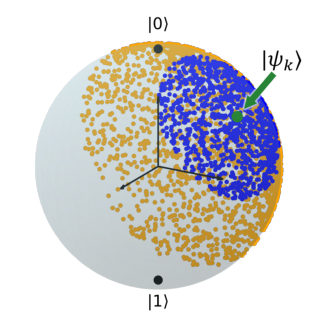
<figcaption class="paper-figure-caption"><b>Fig 4.</b> Figure 4. Visualization of the sampling process on a Bloch sphere. The green point is the initial state |ψk⟩and the blue (orange) points are possibilities for proposal states |ψ′⟩for γ = 0.95 (γ = 0.85).</figcaption>
</figure>

**Summary.** The paper presents AQUIRE, a new protocol for the efficient and error-aware estimation of observables on qudit-based quantum computers. By using adaptive Bayesian techniques, it can simultaneously estimate the mean and the impact of hardware noise, outperforming current state-of-the-art methods. The protocol's effectiveness is demonstrated through both numerical simulations and experiments on a trapped-ion quantum processor.

**Why it may be interesting.** It provides a practical framework for scaling quantum measurements from qubits to higher-dimensional qudits, which is essential for implementing complex many-body models like Lattice Gauge Theories on near-term hardware.

Detailed structure

**Main problem.** The challenge of accurately estimating quantum observables and their associated errors on qudit-based quantum computers while accounting for both statistical and hardware-induced noise.

**Main result.** The authors introduce AQUIRE, a protocol that outperforms existing qubit-based methods (like AEQuO) by using adaptive shot allocation and general commutation strategies, and demonstrate its ability to quantify hardware noise on a trapped-ion processor.

**Method.** A Bayesian approach using a Dirichlet-like posterior distribution and MCMC sampling in the Hilbert space to estimate means and covariances, combined with an adaptive shot allocation algorithm.

**Model / system.** The protocol is applied to qudit-based quantum computers, specifically validated on a trapped-ion processor using $^{40}$Ca+ ions, and tested on models like U(1) Lattice Gauge Theory Hamiltonians.

**Key observables.** Expectation values of generalized Pauli operators, spin operators, and Hamiltonians (e.g., LGT and chemistry), along with their associated estimation errors.

**Important parameters / regimes.** Qudit dimension (d), measurement budget (M), local and entangling gate error rates (xi_loc, xi_ent), and the ratio of local to entangling error.

**Assumptions / limitations.** Assumes observables can be decomposed into a polynomial number of Pauli Strings and that hardware noise can be modeled as an independent depolarizing channel.

**Figures summary.** Figures show benchmarking against AEQuO, convergence of estimated error to true error, the commutation graph of observables, MCMC sampling trajectories, and experimental performance on trapped-ion hardware showing the trade-off between entangling gates and noise.

**Paper structure.** The paper introduces the problem of qudit measurement, presents the AQUIRE protocol and its Bayesian/MCMC mathematical framework, demonstrates numerical advantages via simulations, validates the error-awareness on trapped-ion hardware, and discusses future optimizations.

Abstract

The accurate estimation of observables is a crucial task in quantum computing. Recent advances have highlighted the need for (a) specialized protocols for qudit-based devices, that include (b) error-aware strategies. Here, we present AQUIRE, the first protocol that can (a) accurately estimate both the mean and the error of an observable on qudit-based quantum computers. AQUIRE achieves this by constructing a Bayesian model to accommodate generalized Pauli operators. It is designed to continuously monitor the estimated average and the associated error of the observable, adjusting the subsequent measurements in real-time. Additionally, AQUIRE is (b) device- and experiment-specific error-aware, and accounts for hardware imperfections and experimental noise during the estimation process. We demonstrate AQUIRE's advantage via numerical simulations and showcase its ability to quantify the noise affecting the estimation by implementing it on a trapped-ion qudit quantum processor. By exploiting general commutation relations and overlap grouping measurements, our protocol is state-of-the-art when restricted to qubit-based quantum computers and extends this advantage to the qudit case.

[↑ back to top](#top)

### [Graph-theory measures capture weak ergodicity breaking on large quantum systems](http://arxiv.org/abs/2605.00094v1)

**Authors:** Heiko Georg Menzler, Rafał Świętek, Mari Carmen Bañuls, Fabian Heidrich-Meisner  
**Type:** theory · **Category:** disordered systems and neural networks · **PDF:** <https://arxiv.org/pdf/2605.00094v1>  
**Analysis basis:** full PDF text, analyzed in chunks
**Topic relevance:** 🔥 `scars & prethermalization` **4/5** · `entanglement & information structure` **3/5** · `non-equilibrium dynamics` **3/5**

↔ Scroll figures horizontally

<figure class="paper-figure-card">
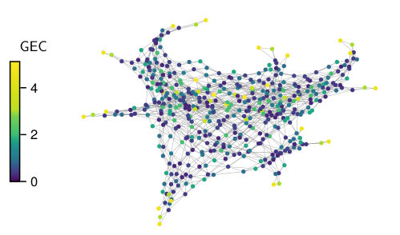
<figcaption class="paper-figure-caption"><b>Fig 1.</b> Figure 1: Fock-space graph of the TLG model (L = 11, N = 5, V = 3 t0) with the GEC values computed for each node corresponding to basis states (see the color bar).</figcaption>
</figure>
<figure class="paper-figure-card">
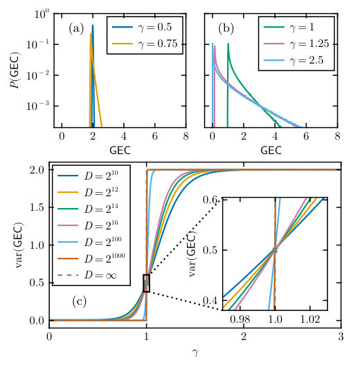
<figcaption class="paper-figure-caption"><b>Fig 2.</b> Figure 2: Rosenzweig-Porter model. (a),(b) Distribution of the GEC in the RPM (D = 215) for different values of γ. (c) Analytically obtained var(GEC) for the RPM as a function of γ for different Hilbert-space dimensions D. System sizes range from small ones accessible with ED to huge system sizes and we include results for the thermodynamic limit as well (D →∞). The inset shows a zoomed-in capture of the crossing point region.</figcaption>
</figure>
<figure class="paper-figure-card">
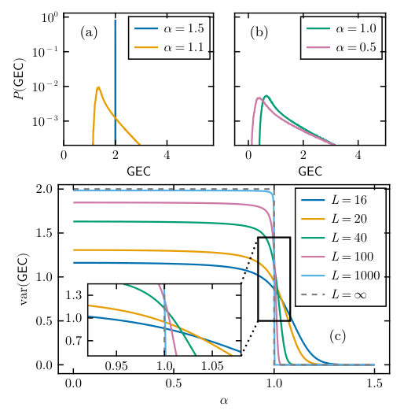
<figcaption class="paper-figure-caption"><b>Fig 3.</b> Figure 3: Quantum Sun model. (a),(b) Distributions of the GEC in the QSM with N = 4, L = 16 for different values of α obtained from 100 realizations. (c) Variance of the GEC in the QSM across system sizes as a function of α. The variance of the GEC is obtained analytically. The inset zooms in on the crossing point around α = 1.</figcaption>
</figure>
<figure class="paper-figure-card">
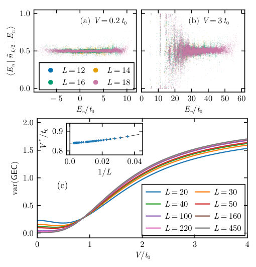
<figcaption class="paper-figure-caption"><b>Fig 4.</b> Figure 4: Triangular lattice gas model. Diagonal ma- trix elements of ˆnL/2 for (a) V = 0.2 t0 and (b) V = 3 t0. (c) Variance of the GEC in the TLG model at half filling (N = L/2) for different system sizes as a function of V calculated using a semianalytical approach (see [84]). The inset shows the system-size dependence of the crossing point V ∗.</figcaption>
</figure>
<figure class="paper-figure-card">
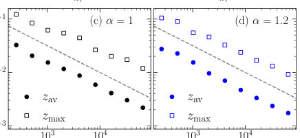
<figcaption class="paper-figure-caption"><b>Fig 5.</b> Figure 5: Eigenstate expectation values for the observable ˆSz nL ˆSz L in the QSM for (a) α = 1 and (b) α = 1.2. (c),(d) Average and maximal eigenstate-to-eigenstate fluctuations in Eq. (6) as a function of Hilbert-space dimension for (c) α = 1 and (d) α = 1.2. The dashed line denotes the ETH expectation with D−1/2.</figcaption>
</figure>

**Summary.** This paper introduces a graph-theory-based measure called Graph-Energy Centrality to detect weak ergodicity breaking in large quantum systems. By analyzing the distribution of this measure, the authors can identify transitions into fractal or glassy regimes in models like the Rosenzweig-Porter and Triangular Lattice Gas. This method bypasses the size limitations of exact diagonalization, allowing for the study of much larger system sizes and the thermodynamic limit.

**Why it may be interesting.** It provides a powerful new diagnostic tool for identifying complex phase transitions like fading ergodicity and glassy dynamics in many-body systems where standard numerical methods fail due to exponential Hilbert space growth.

Detailed structure

**Main problem.** Detecting and characterizing the onset of weak ergodicity-breaking transitions (wEBTs) and the breakdown of the Eigenstate Thermalization Hypothesis (ETH) in large quantum many-body systems.

**Main result.** The Graph-Energy Centrality (GEC) measure effectively captures wEBTs through characteristic changes in its distribution, providing a tool that works for much larger system sizes than traditional exact diagonalization.

**Method.** The authors use a graph-theoretical approach representing quantum systems in Fock space, employing analytical and semi-analytical methods to calculate GEC moments for large-scale models.

**Model / system.** The study utilizes the Rosenzweig-Porter Model (RPM), the Quantum Sun Model (QSM), and a kinetically constrained Triangular Lattice Gas (TLG) model.

**Key observables.** Graph-Energy Centrality (GEC) distribution, variance of GEC, gap ratio (r_n), and eigenstate entanglement entropy (SEE).

**Important parameters / regimes.** The parameter gamma in RPM, the coupling strength alpha in QSM, and the interaction strength V/t0 in the TLG model.

**Assumptions / limitations.** The analytical approach for GEC moments assumes the Hamiltonian is scaled to be traceless and of unit variance; some calculations assume small fluctuations in spin positions.

**Figures summary.** Figure 1 shows a Fock-space graph of the TLG; Figures 2 and 3 display GEC distributions and variance for RPM and QSM; Figure 5 shows ETH stability via diagonal matrix elements; Figure 6 illustrates the TLG model and its gap ratio/entanglement entropy.

**Paper structure.** The paper introduces the GEC measure, applies it to the RPM to show transition capture, extends the analysis to the QSM to verify ETH validity, and finally demonstrates its utility in identifying glassy dynamics in the TLG model.

Abstract

We study the onset of weak ergodicity violations in closed quantum many-body systems and focus on cases in which they occur through a transition that is controlled by a model parameter. Our analysis is based on representing quantum systems in Fock space and utilizes graph-theoretical measures. As a main result, we show that the recently introduced graph-energy centrality captures known weak ergodicity-breaking transitions via characteristic changes in its distribution. While most numerical tools are limited to small system sizes, our measure can be calculated analytically for large systems of many hundreds of sites and in some cases, even in the thermodynamic limit. We conclude by demonstrating the applicability of our Fock-space based measure to a kinetically constrained quantum model, where we find evidence for a weak ergodicity-breaking transition accompanied by glassy dynamics.

[↑ back to top](#top)

### [On-chip levitation of ferromagnetic microparticles](http://arxiv.org/abs/2605.00090v1)

**Authors:** Martijn Janse, M. Luisa Mattana, Julian van Doorn, Eli van der Bent, Richard Wagner, Robert Smit, Bas Hensen  
**Type:** experiment · **Category:** other · **PDF:** <https://arxiv.org/pdf/2605.00090v1>  
**Analysis basis:** full PDF text, analyzed in chunks
**Topic relevance:** 🔥 `spintronics-quantum-optics interface` **4/5** · `QC/QI experiment` **2/5** · `quantum measurements` **2/5** · `quantum optics experiment` **2/5**

↔ Scroll figures horizontally

<figure class="paper-figure-card">
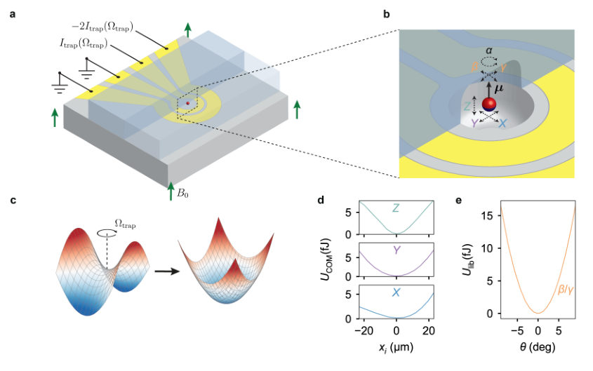
<figcaption class="paper-figure-caption"><b>Fig 1.</b> FIG. 1. Design and simulation of an on-chip magnetic Paul trap for ferromagnetic micro-particles. a, A magnetic trapping field is generated by sinusoidal currents Itrap at trapping frequency Ωtrap, sent through two concentric conductive tracks (gold) on a chip (gray). A static magnetic field B0 is applied in the z-direction, as defined by the coordinate frame shown, also defining various modes of rotation. b, A ferromagnetic particle with magnetic moment µ is levitated in a pocket of the chip, with a (transparent) cover preventing escape during initial trapping. c, The rotating saddle potential caused by the alternating magnetic field results in a effective pseudo-potential UCOM for the...</figcaption>
</figure>
<figure class="paper-figure-card">
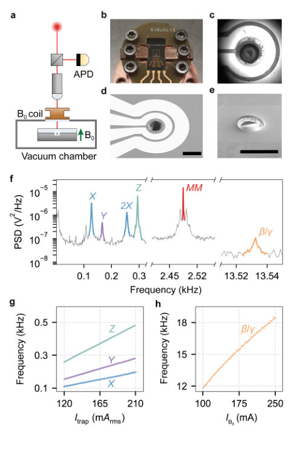
<figcaption class="paper-figure-caption"><b>Fig 2.</b> FIG. 2. Experimental implementation and tunable particle dynamics. a, The particle motion is measured in a vacuum chamber by collecting back-scattered laser light on an avalanche photodiode (APD) via an objective and 90/10 beam splitter. A coil on top of the chamber provides the static magnetic field B0. b, The chip is mounted on a printed circuit board for electrical interfacing and enclosed with a cover glass. c Video still of the particle levitating in the trap. Note that the particle levitates in the center of the current loops, which is slightly off-center in the pocket. d, Scanning micrograph of the chip with current tracks. The blind hole is produced by laser ablation. The scale bar...</figcaption>
</figure>
<figure class="paper-figure-card">
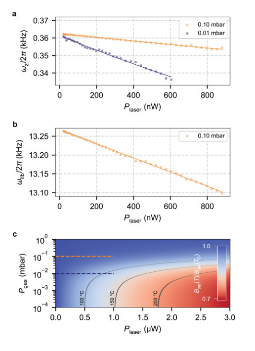
<figcaption class="paper-figure-caption"><b>Fig 3.</b> FIG. 3. Laser-induced particle thermodynamics. a- b, Translational eigenmode ωz (a) and librational eigenmode ωlib (b) as a function of laser power Plaser irradiated on the particle for different values of Pgas. The eigenfrequencies are extracted by fitting a Lorentzian to the PSDs. The fit of the eigenfrequencies is based on the thermodynamical model described in VI with the absorptivity α and remanent field Bsat(T0) as fitting parameters. c, Simulation of the change in remanent field Bsat with respect to its initial value at room temperature T0, as a function of gas pressure Pgas and laser power Plaser. For the simulation the model in VI is used with the fit value of absorptivity α from...</figcaption>
</figure>
<figure class="paper-figure-card">
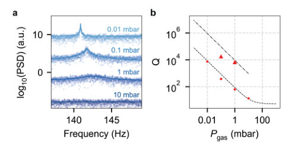
<figcaption class="paper-figure-caption"><b>Fig 4.</b> FIG. 4. Mechanical quality factor as function of gas pressure. a, Power spectral density of the ωx mode for dif- ferent values of gas pressure Pgas, vertically offset for clar- ity. Lines are a Lorentzian lineshape fit to the data from which we extract the linewidth. For decreasing gas pressure, the linewidth and eigenfrequency both decrease. b, Q-factor as a function of gas pressure Pgas for the translational ωx mode (circle) and librational ωlib mode (triangle). All qual- ity factors are determined from the Lorentzian linewidth. The dashed (dot-dashed) line is the expected Q-factor of the trans- lational (librational) mode for a spherical particle limited only by gas damping (see VII...</figcaption>
</figure>
<figure class="paper-figure-card">
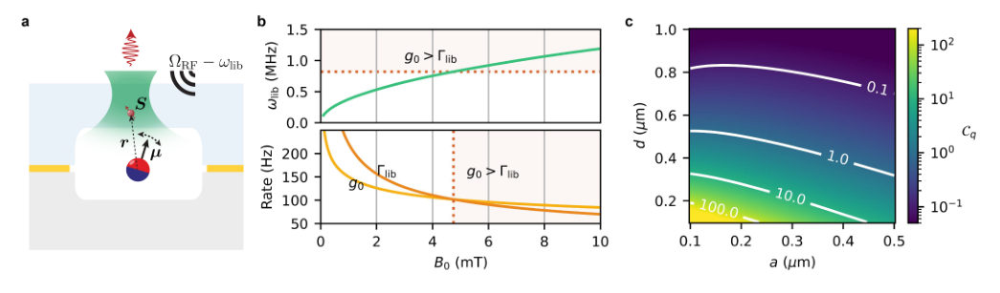
<figcaption class="paper-figure-caption"><b>Fig 5.</b> FIG. 5. Prospects for coupling the libration mechanical mode to a solid-state spin qubit. (a) The top glass of the sample is replaced by diamond containing nitrogen-vacancy defect spins. The dipole-dipole interaction parametrically couples the particle libration and spin state. The spin is placed at a distance |r| = a + d from the center of the ferromagnet. (b) Influence of the external magnetic field B0 on the librational eigenfrequency ωlib (top panel), and the single spin coupling rate g0 and mechanical heating rate Γlib (bottom panel). Here we assume a = 0.25 µm, d = 0.7 µm, and operation of the setup at cryogenic temperature T = 4 K. Note how for large ωlib the single spin coupling...</figcaption>
</figure>

**Summary.** The paper demonstrates a room-temperature, on-chip magnetic trap capable of levitating ferromagnetic microparticles. This platform overcomes the limitations of previous levitation methods and offers a scalable architecture for high-frequency mechanical sensing and potential coupling to quantum spin systems.

**Why it may be interesting.** It presents a scalable platform for macroscopic quantum mechanics and provides a clear pathway for coupling mechanical motion to solid-state spin qubits for ground-state cooling and quantum sensing.

Detailed structure

**Main problem.** The need for a scalable, integrable, and room-temperature platform for levitating micro-to-nanoscale objects in vacuum while avoiding the decoherence and mass limits of optical and electrical traps.

**Main result.** Demonstration of an on-chip magnetic Paul trap that stably levitates a nanogram-scale ferromagnetic microsphere at room temperature with high-frequency librational modes.

**Method.** The researchers used an on-chip platform with gold current loops to create a rotating magnetic field, detecting particle motion via back-scattered laser light and analyzing the power spectral density.

**Model / system.** An on-chip magnetic Paul trap featuring gold concentric current loops on a silicon/glass chip, levitating a NdFeB ferromagnetic microsphere in a vacuum environment.

**Key observables.** Translational and librational eigenfrequencies, damping rates, micromotion sidebands, and the temperature dependence of magnetization.

**Important parameters / regimes.** Nanogram mass scale, 6.5 micrometer particle radius, librational frequencies exceeding 10 kHz, and the sideband-resolved regime.

**Assumptions / limitations.** Assumes the free-molecular regime for gas damping and uses a steady-state energy balance model for thermal dynamics.

**Figures summary.** Figure 1 shows the trap design and simulated potential; Figure 2 displays the experimental setup and power spectral density; Figure 5 illustrates the prospects for spin-mechanical coupling with NV centers; Figure 9 shows finite-element simulations of eddy current damping.

**Paper structure.** The paper introduces the motivation for magnetic levitation, describes the on-chip trap design and experimental setup, presents the characterization of mechanical modes and thermal dynamics, analyzes dissipation mechanisms, and concludes with prospects for quantum spin-mechanical coupling.

Abstract

Levitation of microscopic objects in vacuum combines exceptional environmental isolation with precise control of their dynamics, pushing the limits of sensing and macroscopic quantum physics. In particular, magnetic levitation allows a large range of particle sizes, while avoiding detrimental effects from high-intensity optical trapping beams and electric field noise. However, existing diamagnetic and Meissner levitation approaches are typically constrained by low mechanical eigenfrequencies, limited integrability with other systems due to bulky coils or magnets, and, for Meissner levitation, the need for cryogenic operation. Here, we demonstrate a room-temperature on-chip magnetic levitation platform capable of stably levitating a nanogram (6.5 micrometer radius) ferromagnetic microsphere. The platform is scalable and tunable, and supports librational modes with eigenfrequencies exceeding 10 kHz. Further miniaturization and coupling to solid-state spin qubits could enable cooling to the quantum ground state. Beyond quantum experiments, this architecture enables integrated precision sensing and studies of isolated ferromagnet thermodynamics.

[↑ back to top](#top)

### [Activated random walk exhibits self-organized criticality](http://arxiv.org/abs/2605.00207v1)

**Authors:** Christopher Hoffman, Tobias Johnson, Matthew Junge, Josh Meisel  
**Type:** theory · **Category:** statistical mechanics · **PDF:** <https://arxiv.org/pdf/2605.00207v1>  
**Analysis basis:** full PDF text, analyzed in chunks
**Topic relevance:** 🔥 `non-equilibrium universality` **4/5** · `non-equilibrium dynamics` **3/5** · `driven-dissipative phase transition` **2/5**

↔ Scroll figures horizontally

<figure class="paper-figure-card">
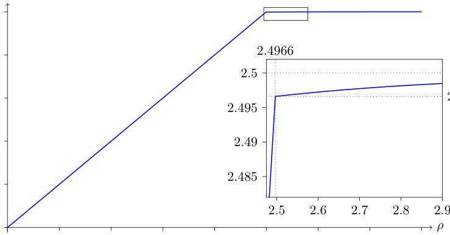
<figcaption class="paper-figure-caption"><b>Fig 1.</b> FIG. 1. The limiting empirical profile of the density Dρ of the abelian sandpile on the bracelet</figcaption>
</figure>

**Summary.** This paper provides the first rigorous mathematical proof that the 1D activated random walk model exhibits self-organized criticality, confirming that its driven-dissipative state matches its fixed-energy critical state. It resolves a long-standing issue of non-universality found in previous models like the Abelian Sandpile by showing that ARW mixes quickly enough to reach the true critical density.

**Why it may be interesting.** not directly relevant

Detailed structure

**Main problem.** The paper addresses the lack of mathematical proof for the universality conjecture in self-organized criticality (SOC), specifically whether driven-dissipative systems self-organize into a critical state identical to fixed-energy models.

**Main result.** The authors prove that for the 1D activated random walk (ARW) model, the stationary density converges to the critical density of the fixed-energy version, and that the system exhibits heavy-tailed avalanches and fast mixing.

**Method.** The proof utilizes odometer analysis, stochastic embedding into a process resembling (2+1)-dimensional directed percolation, and a probabilistic union bound argument.

**Model / system.** The 1D Activated Random Walk (ARW) model, a stochastic sandpile where particles can be 'active' or 'sleeping' and move via random walks with a sleep/wake mechanism.

**Key observables.** Critical density (rho_c), avalanche size/area, mixing time, and stationary density (rho_s).

**Important parameters / regimes.** Sleep rate (lambda), dimension (d=1), and particle density (rho).

**Assumptions / limitations.** The primary results are restricted to the one-dimensional (1D) case.

**Figures summary.** Figure 1 shows the non-linear density profile of the Abelian Sandpile model demonstrating its failure to reach the critical density; Figure 2 shows the 'hockey-stick' density profile of the ARW model reaching and staying at the critical density.

**Paper structure.** The paper introduces the problem of SOC universality, contrasts the ARW model with the Abelian Sandpile, presents mathematical proofs for density and mixing time conjectures, and discusses the existence of heavy-tailed avalanches.

Abstract

To explain the ubiquity of power laws and fractals in nature, Bak, Tang, and Wiesenfeld formulated simple conditions for a system to self-organize into a critical state. Dickman, Muñoz, Vespignani, and Zapperi postulated that the self-organized critical state matches the critical state in corresponding fixed-energy models undergoing traditional phase transitions. Although the theory has been applied broadly over the past five decades, no mathematical model has been proven to exhibit the conjectured behavior. Indeed, the originally proposed abelian sandpile model displays nonuniversal behavior stemming from its slow mixing. Marking the first result of its kind, we prove that the 1-d activated random walk model mixes quickly into a stationary state with power-law avalanches and limiting critical density that equals the critical value for the fixed-energy version.

[↑ back to top](#top)

### [Topological protection of local quantum Fisher information](http://arxiv.org/abs/2605.00770v1)

**Authors:** Marcin Płodzień, Jan Chwedeńczuk  
**Type:** theory · **Category:** quantum information and computing · **PDF:** <https://arxiv.org/pdf/2605.00770v1>  
**Analysis basis:** full PDF text, analyzed in chunks
**Topic relevance:** 🔥 `entanglement & information structure` **4/5** · `non-equilibrium dynamics` **3/5** · `scars & prethermalization` **2/5**

↔ Scroll figures horizontally

<figure class="paper-figure-card">
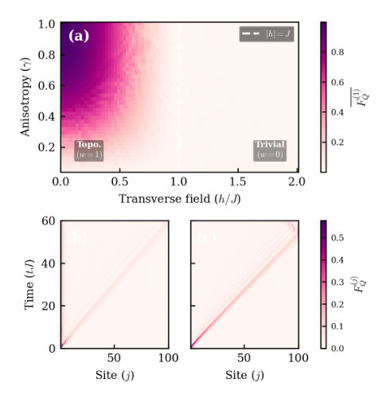
<figcaption class="paper-figure-caption"><b>Fig 1.</b> FIG. 1. (a) Time-averaged boundary QFI F (1) Q across the (h/J, γ ≥0) phase diagram (boundary encoding and readout, k=j=1, averaging window tJ ∈[150, 200]); dashed line: |h|=J. (b) Topological phase (γ=0.3, h=0.5J): ballistic spreading coexists with a persistent boundary streak from the Majorana zero mode. (c) Trivial phase (γ=0.8, h=1.8J): complete dephasing with no persistent boundary signal. Here: L=100, k=1, θ0=0.</figcaption>
</figure>
<figure class="paper-figure-card">
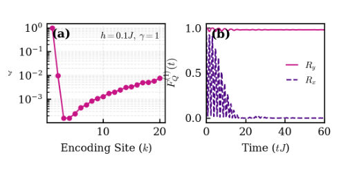
<figcaption class="paper-figure-caption"><b>Fig 2.</b> FIG. 2. Mechanism of the boundary metrological plateau (L=100, γ=1, h=0.1J, j=1, averaging window tJ ∈[150, 200]). (a) Encoding-site scan: the time-averaged boundary QFI de- cays as ∝e−2(k−1)/ξ, directly resolving the Majorana local- ization length. (b) Boundary encoding-axis asymmetry: for left-boundary readout and γ &gt; 0, the ˆRy channel sustains the plateau, while the orthogonal ˆRx channel is strongly sup- pressed and vanishes in the thermodynamic limit.</figcaption>
</figure>
<figure class="paper-figure-card">
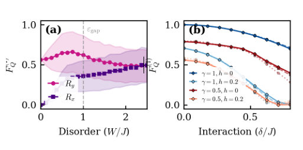
<figcaption class="paper-figure-caption"><b>Fig 3.</b> FIG. 4. Robustness of the boundary metrological plateau. (a) Disorder: disorder-averaged boundary QFI versus disorder strength W/J (h=0.5J, γ=1, L=200, Ndis=1000). The ˆRy channel (pink) preserves the plateau for W ≲εgap while ˆRx (purple) remains suppressed; shaded bands show one standard deviation. For disorder strengths above the clean bulk-gap scale, both channels converge. (b) Interactions: time-averaged boundary QFI versus interaction strength δ/J for γ=1 (blue), γ=0.5 (red), at h=0 (dark) and h=0.2J (light). System sizes L=12 (dotted), 16 (dashed), 20 (solid) show weak size de- pendence. Parameters: tJ ∈[25, 50] averaging window, ˆRy encoding, k=j=1.</figcaption>
</figure>
<figure class="paper-figure-card">
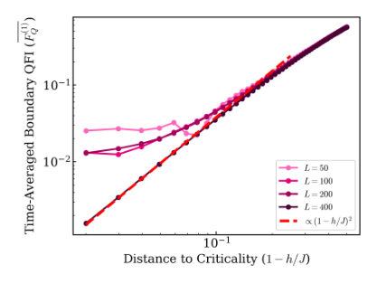
<figcaption class="paper-figure-caption"><b>Fig 4.</b> FIG. 3. Critical scaling of the boundary QFI near the topologi- cal transition. For fixed γ=1 and boundary encoding/readout, the data for L ∈{50, 100, 200, 400} approach the asymptotic</figcaption>
</figure>

**Summary.** The paper demonstrates that topological phases can protect local quantum information from the scrambling effects of many-body dynamics. By utilizing Majorana zero modes, the authors show that a nonzero boundary Quantum Fisher Information can be maintained for exponentially long times. This effect is characterized by a distinct asymmetry in encoding channels that is robust to both disorder and interactions.

**Why it may be interesting.** This work is highly relevant for many-body dynamics and quantum information as it proposes a way to use topological protection to preserve metrological sensitivity, offering a robust protocol for local information encoding and readout in noisy environments.

Detailed structure

**Main problem.** In many-body systems, unitary dynamics typically cause locally encoded information to delocalize and vanish. The authors seek to demonstrate how topological phases can prevent this dispersal to provide a form of topological metrological memory.

**Main result.** The authors show that in the topological phase of a Kitaev chain, a Majorana zero mode pins the boundary Quantum Fisher Information (QFI) to a nonzero plateau that persists for exponentially long times. They identify a unique boundary encoding-axis asymmetry as a robust diagnostic for this topological protection.

**Method.** The study uses an analytical approach via Bogoliubov-de Gennes formalism and Jordan-Wigner transformation, complemented by real-time numerical simulations of finite-size chains to test robustness against disorder and interactions.

**Model / system.** An anisotropic XY spin-1/2 chain with open boundaries, which maps to a 1D Kitaev chain (topological superconductor) under the Jordan-Wigner transformation.

**Key observables.** Local Quantum Fisher Information (QFI), boundary-axis asymmetry (comparing R_y and R_x encoding channels), and the Majorana localization length.

**Important parameters / regimes.** Transverse field (h), anisotropy (gamma), system size (L), Majorana localization length (xi), and the energy scales of the bulk gap and Majorana splitting.

**Assumptions / limitations.** The protocol assumes a specific time-averaging window to isolate stationary signals from dephasing; the readout is assumed to be local at the boundary to avoid the non-locality of the Jordan-Wigner string.

**Figures summary.** The notes do not provide specific figure descriptions, though they mention the presence of figures illustrating the boundary QFI plateau and the asymmetry between encoding channels.

**Paper structure.** The paper introduces the problem of information delocalization, defines the XY/Kitaev model, provides analytical derivations for the QFI and its topological plateau, presents numerical evidence for robustness against disorder and interactions, and concludes with scaling analysis near the phase transition.

Abstract

In many-body quantum systems, unitary dynamics generically delocalize locally encoded information, causing single-site metrological sensitivity to vanish. We analytically demonstrate that a topological phase can prevent this dispersal. In the open Kitaev chain, a Majorana zero mode fixes the boundary quantum Fisher information (QFI) at a nonzero plateau that persists for times exponentially long in system size. We derive exact analytical expressions for the local QFI and identify the mechanism as the spatial separation of the two Majorana quadratures to opposite ends of the chain. This separation produces a boundary encoding-axis asymmetry that distinguishes topological boundary memory from a generic localized subgap signal. We show numerically that the asymmetry is robust to moderate quenched on-site disorder, while the boundary plateau remains visible under parity-preserving interactions in finite-size real-time simulations. The protocol requires only product-state initialization, Hamiltonian evolution, and single-site readout.

[↑ back to top](#top)

### [Quantum corrections to the Josephson dynamics: a population-imbalance approach](http://arxiv.org/abs/2605.00571v1)

**Authors:** Oliver Hideg, Sofia Salvatore, Luca Salasnich  
**Type:** theory · **Category:** quantum gases · **PDF:** <https://arxiv.org/pdf/2605.00571v1>  
**Analysis basis:** full PDF text, analyzed in chunks
**Topic relevance:** 🔥 `Keldysh / 2PI / non-Gaussian methods` **4/5** · `analog quantum simulation` **2/5** · `non-equilibrium dynamics` **2/5**

↔ Scroll figures horizontally

<figure class="paper-figure-card">
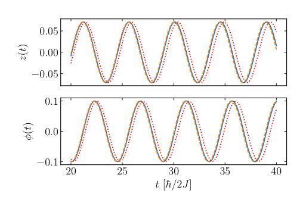
<figcaption class="paper-figure-caption"><b>Fig 1.</b> FIG. 1. The exact evolution (solid, blue) of ⟨ˆz(t)⟩and ⟨ˆϕ(t)⟩, the mean-field solution (dotted, red) and the quantum effec- tive mean-field (dashed, orange) for Λ = 1 and N = 40. Initial conditions where set to z0 = 0 and ϕ0 = 0.1. The quantum effective dynamics is more accurate than the mean-field.</figcaption>
</figure>
<figure class="paper-figure-card">
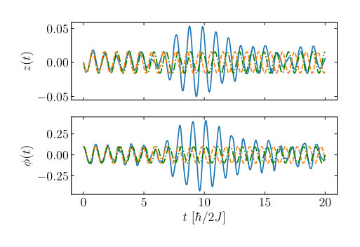
<figcaption class="paper-figure-caption"><b>Fig 2.</b> FIG. 2. The exact evolution (solid, blue) of ⟨ˆz(t)⟩and ⟨ˆϕ(t)⟩ and the quantum effective mean-field (dashed, orange) for Λ = 40 and N = 40. The initial conditions where set to z0 = 0 and ϕ0 = 0. The mean-field is not shown as it almost com- pletey overlaps with the quantum effective mean-field. Instad, we show a combination: the mean-field elliptic cosine with the only-z corrected frequency (32) (dash-dot, green). The hybrid approach benefits from both the quantum correction and the elliptic correction to the time period (44). However, neither can account for the amplitude modulation caused by higher energy levels influencing the dynamics in the fully quantum case.</figcaption>
</figure>
<figure class="paper-figure-card">
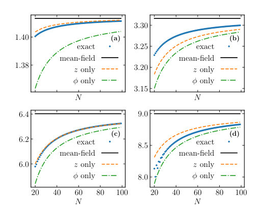
<figcaption class="paper-figure-caption"><b>Fig 3.</b> FIG. 3. The four plots show the predicted Josephson oscilla- tion frequency for Λ = 1, 10, 40, 80 together with the energy gap between the ground state and first excited state of the Hamiltonian obtained numerically as a function of the num- ber of bosons N. To be able to compare them, the vertical axis shows energy in units of 2J and frequency in units of 2J/ℏ. The imbalance only prediction (dashed) is closer to the numerical (dots) than the phase only prediction (dash-dot) for Λ ≲80. The mean-field (solid), that is independent of N, is accurate only as N →∞.</figcaption>
</figure>

**Summary.** This paper develops a theoretical method to calculate quantum corrections to the dynamics of two coupled Bose-Einstein condensates by focusing solely on population imbalance. It demonstrates that this approach is superior to the standard phase-only method when interactions are strong. The results include explicit expressions for corrected potentials and frequencies that match exact numerical results.

**Why it may be interesting.** It provides a new theoretical framework for describing many-body dynamics in the strong interaction regime, offering a more robust alternative to standard phase-only approximations in bosonic Josephson junctions.

Detailed structure

**Main problem.** Investigating quantum corrections to the Josephson dynamics of two weakly coupled Bose-Einstein condensates using a population-imbalance-only approach.

**Main result.** The population-imbalance approach provides a more accurate description of quantum-corrected Josephson frequency in the strong interaction regime compared to the traditional phase-only approach.

**Method.** The authors use a one-loop quantum effective action and a covariant background-field method to derive an effective potential and mass, validated via exact diagonalization of the Bose-Hubbard model.

**Model / system.** A two-site Bose-Hubbard model representing a bosonic Josephson junction consisting of two weakly coupled Bose-Einstein condensates.

**Key observables.** Effective potential V_eff(z), effective mass m_eff(z), quantum-corrected Josephson frequency Omega_J, fractional imbalance, and phase difference.

**Important parameters / regimes.** Dimensionless interaction parameter Lambda = UN/2J, total number of bosons N, tunneling energy J, and interaction strength U.

**Assumptions / limitations.** Assumes weakly coupled condensates and small-amplitude oscillations around the Josephson fixed point.

**Figures summary.** Figure 1 compares the exact, mean-field, and quantum effective mean-field evolution of the fractional imbalance and phase difference.

**Paper structure.** The paper begins with the derivation of a population-imbalance-only Lagrangian from a two-variable action, proceeds to compute one-loop quantum corrections using the background-field method, and concludes with numerical validation against exact diagonalization.

Abstract

We investigate quantum corrections to the Josephson dynamics of two weakly coupled Bose-Einstein condensates using the population imbalance as the sole dynamical variable. Starting from the two-variable action, we derive the imbalance-only Lagrangian with a position-dependent mass and quantize it via symmetric operator ordering. The leading quantum corrections to the classical potential and mass are computed via the one-loop quantum effective action, using a covariant background-field method that fully accounts for the coordinate dependence of the mass. This yields explicit expressions for the effective potential and the effective mass, from which we derive the quantum-corrected Josephson frequency. Numerical comparison with exact diagonalization of the two-site Bose-Hubbard model shows that the imbalance-only formulation outperforms the complementary phase-only approach in the regime of strong interactions, which is the natural domain of validity of the population-imbalance description.

[↑ back to top](#top)

### [Entropy transport through a superfluid quantum point contact: A Keldysh field-theory approach](http://arxiv.org/abs/2605.00679v1)

**Authors:** Davide Bertolusso, C. J. Bolech, Thierry Giamarchi  
**Type:** theory · **Category:** quantum gases · **PDF:** <https://arxiv.org/pdf/2605.00679v1>  
**Analysis basis:** full PDF text, analyzed in chunks
**Topic relevance:** 🔥 `Keldysh / 2PI / non-Gaussian methods` **4/5** · `non-equilibrium dynamics` **3/5**

↔ Scroll figures horizontally

<figure class="paper-figure-card">
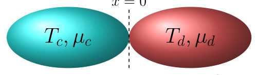
<figcaption class="paper-figure-caption"><b>Fig 1.</b> FIG. 1. Illustration of a two-reservoir system coupled at a single point x = 0, filled with an s-wave superfluid, where the reservoirs may have distinct temperatures and chemical potentials. This graphical representation shows the particle, JN, and entropy, JS, currents flowing along the x-direction.</figcaption>
</figure>
<figure class="paper-figure-card">
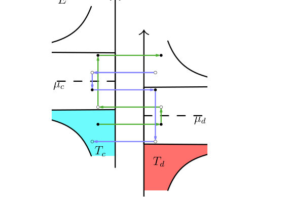
<figcaption class="paper-figure-caption"><b>Fig 2.</b> FIG. 2. Depiction of a Andreev composite tunneling process at zero temperature (Tc = Td = 0) by involving two virtual Cooper pairs. Here, the chemical potential drop enters as a shift rather than as an explicit time dependence in the tunnel- ing as in Eq.(1), and it is numerically set at ∆µ = 1.2∆. The light -green process represents a particle from the left reservoir that tunnels elastically to the right while entangled with two virtual Cooper pairs, one on each lead (or via two successive Andreev reflections). The light-blue is the dual hole process starting from the right reservoir. Black (white) circles repre- sent spin-up particles (spin-down holes) and on the vertical axis we give the...</figcaption>
</figure>
<figure class="paper-figure-card">
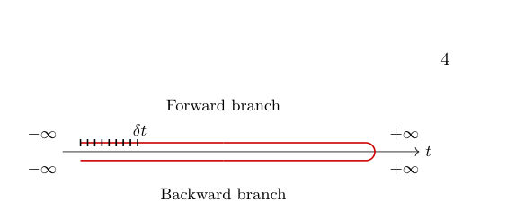
<figcaption class="paper-figure-caption"><b>Fig 3.</b> FIG. 4. Graphical representation of the non-equilibrium closed-path Keldysh integral. On the upper branch is where the forward field lives; instead, the backward field lives on the lower branch of the path.</figcaption>
</figure>
<figure class="paper-figure-card">
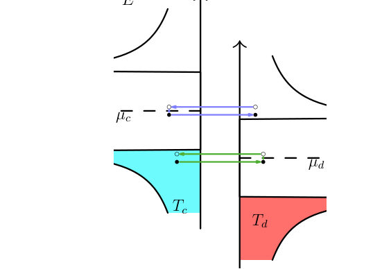
<figcaption class="paper-figure-caption"><b>Fig 4.</b> FIG. 3. Depiction of a single Andreev reflection process at zero temperature (Tc = Td = 0). In this representation, the chemical potential enters as a shift rather than an explicit time dependence in the tunneling term as in Eq.(1), and it is numerically set at ∆µ = 1.2∆, as in Fig. 2. The light-green process represents a particle from the left reservoir that is being reflected as a hole to the same reservoir via one virtual Cooper pair on the right reservoir. The light-blue instead is the dual hole representation starting from the right reservoir. Black (white) circles represent spin-up particles (spin-down holes). The above process occurs with a transmission weight of T 4, given that the...</figcaption>
</figure>
<figure class="paper-figure-card">
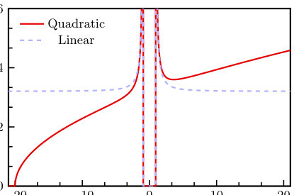
<figcaption class="paper-figure-caption"><b>Fig 5.</b> FIG. 5. The local density of states (LDoS) as a function of frequency, with EF = 20∆for the linear (dashed line) and quadratic dispersion (solid line).</figcaption>
</figure>

**Summary.** This paper uses Keldysh field theory to study how particles and entropy flow through a superfluid quantum point contact. It demonstrates that the non-monotonic, oscillatory behavior of the entropy current is a direct consequence of Multiple Andreev Reflection processes. The work highlights the necessity of including particle-hole asymmetry to accurately model heat and entropy transport.

**Why it may be interesting.** It provides deep insight into non-equilibrium thermodynamics and transport in many-body systems, specifically how microscopic pairing mechanisms (MAR) manifest as macroscopic oscillatory transport properties in superfluid/superconducting junctions.

Detailed structure

**Main problem.** The study investigates the mechanisms of particle and entropy transport through a superfluid quantum point contact, specifically focusing on the origin of oscillatory behavior in the entropy current.

**Main result.** The authors find that entropy current oscillations are driven by the activation of successive Multiple Andreev Reflection (MAR) processes rather than the divergence of the local density of states, and that quadratic dispersion is essential to capture heat transport.

**Method.** A Keldysh field-theory approach is used to compute out-of-equilibrium steady-state currents, utilizing a Nambu-spinor representation and frequency-space analysis.

**Model / system.** The system consists of two ultra-cold neutral Fermi-gas reservoirs in a superfluid state connected by a quantum point contact, modeled using BCS mean-field theory and a tunneling Hamiltonian with quadratic dispersion.

**Key observables.** Particle current (JN), heat current (JH), and entropy current (JS).

**Important parameters / regimes.** Chemical potential difference (delta-mu), temperature difference (delta-T), superconducting gap (delta), and junction transparency (T).

**Assumptions / limitations.** The reservoirs are assumed to be in separate local equilibria, and the study focuses on the DC component of the currents, averaging out AC components.

**Figures summary.** Schematics of the junction and Andreev processes (Fig 1, 2, 3, 10); comparison of LDoS for linear vs. quadratic dispersion (Fig 5); current behavior in different junction types (Fig 6); and the persistence of oscillations in a truncated model (Fig 12).

**Paper structure.** The paper introduces the transport problem, describes the Keldysh formalism and Hamiltonian, analyzes the role of dispersion and Andreev reflections, presents results for SS and SN junctions, and compares findings with experimental cold-atom data.

Abstract

We study the matter and entropy transport between two ultra-cold neutral Fermi-gas reservoirs linked by a quantum point contact under a chemical-potential gradient. We describe the two leads with a BCS mean-field model and derive the current-bias characteristics for both particle and entropy transport. We compute the out of equilibrium steady-state currents by using the Keldysh formalism. In accordance with previous works in the literature, we confirm the well-known behavior for the particle current and extend the computation to the entropy current in the BCS regime. The entropy current shows an oscillatory behavior at low voltage in the ballistic junction limit. We analyze the results for a wide range of values of the junction's transparency. We also compare our findings with experimental results in cold atomic gases in the unitary regime.

[↑ back to top](#top)

### [Entanglement capacity of complex networks from quantum walks](http://arxiv.org/abs/2605.00772v1)

**Authors:** Pravy Prerana, Sascha Wald  
**Type:** theory · **Category:** quantum information and computing · **PDF:** <https://arxiv.org/pdf/2605.00772v1>  
**Analysis basis:** full PDF text, analyzed in chunks
**Topic relevance:** 🔥 `entanglement & information structure` **4/5** · `non-equilibrium dynamics` **2/5**

↔ Scroll figures horizontally

<figure class="paper-figure-card">
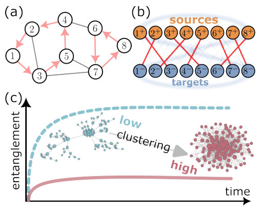
<figcaption class="paper-figure-caption"><b>Fig 1.</b> FIG. 1. Illustration DTQW states and their source- target entanglement: (a) A generic graph G, composed of eight nodes and twelve edges. Arrows highlight edges that contribute to a DTQW state defined on the symmetric di- graph G, cf. Eq. (1). (b) Bipartite double cover of the graph G from panel (a). Each node n is split into a source and target (n±) and states |n →m⟩are mapped to |n+⟩⊗|m−⟩. The bold red edges form a maximum matching of B(G) and correspond to the DTQW state illustrated in panel (a). (c) Source-target entanglement generated during the time evolu- tion of a DTQW on networks with different structural prop- erties. Low clustering, hub dominated structures yield higher...</figcaption>
</figure>
<figure class="paper-figure-card">
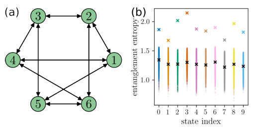
<figcaption class="paper-figure-caption"><b>Fig 2.</b> FIG. 2. Entanglement of Haar random states on regu- lar graph. We consider the three-regular symmetric digraph in panel (a) and generate Haar random states in the arc ba- sis. In panel (b) we evaluate the source-target entanglement of ten states (colored cross) and compare it to the coin-walker entanglement for all (3!)6 = 46656 distinct coin assignments (scatter lines, black crosses indicating averages).</figcaption>
</figure>
<figure class="paper-figure-card">
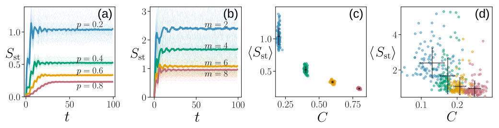
<figcaption class="paper-figure-caption"><b>Fig 3.</b> FIG. 3. Source–target entanglement in random graphs. Panels (a) and (b) show the time evolution of the source-target entanglement entropy Sst for ER and BA graphs respectively. Faint lines depict the entanglement entropy for 100 different graph realizations and the solid line is the average of these realizations. We observe that DTQWs on both network models exhibit higher entanglement at low connectivity, whereas increasing connectivity reduces the entanglement. Panels (c) and (d) present scatter plots of the time-averaged plateau values from panels (a) and (b) against the average clustering coefficient C of each realization, for the ER and BA models, respectively. We again observe that...</figcaption>
</figure>

**Summary.** The paper proposes a new entanglement measure, 'source-target entanglement,' that works for quantum walks on irregular networks where standard methods fail. It reveals that the maximum entanglement a network can support is limited by its graph-theoretic matching size and that higher connectivity or clustering can actually hinder entanglement generation.

**Why it may be interesting.** This work provides a new way to characterize quantum correlations in complex topologies, which is highly relevant for understanding how quantum information spreads in non-regular quantum networks and many-body systems with complex connectivity.

Detailed structure

**Main problem.** Quantifying entanglement in discrete-time quantum walks on irregular or complex networks where traditional coin-walker entanglement is not well-defined due to varying node degrees.

**Main result.** The authors introduce 'source-target entanglement' and prove that the entanglement capacity of a graph is upper-bounded by the logarithm of the size of the largest matching in its bipartite double cover, finding that increased connectivity and clustering actually suppress entanglement.

**Method.** The study uses a bipartite double cover construction to define a new entanglement measure and employs graph theory (matching theory) alongside numerical simulations on Erdős–Rényi and Barabási–Albert random graphs.

**Model / system.** Discrete-time quantum walks (DTQWs) on complex networks, specifically using symmetric digraphs, Erdős–Rény_en (ER) graphs, and Barabási–Albert (BA) graphs with Grover coin dynamics.

**Key observables.** Source-target entanglement (S_st), coin-walker entanglement, and graph matching size.

**Important parameters / regimes.** Network connectivity (p for ER, m for BA), clustering coefficient, and time evolution steps.

**Assumptions / limitations.** The study relies on the bipartite double cover as a theoretical proxy for the coin-walker division and focuses on symmetric digraphs.

**Figures summary.** Figure 1 illustrates the bipartite double cover construction and the impact of clustering; Figure 2 compares different coin assignments; Figure 3 shows the time evolution of entanglement and its anti-correlation with the clustering coefficient in random graphs.

**Paper structure.** The paper introduces a new entanglement measure for irregular graphs, establishes a theoretical upper bound based on graph matchings, demonstrates the tightness of this bound, and then explores how network topology (connectivity and clustering) affects entanglement dynamics in random graph models.

Abstract

Discrete-time quantum walks provide a natural framework for quantum transport on complex networks. On regular structures, coin-walker entanglement has been widely used to characterize quantum transport and to support quantum algorithmic protocols. However, this notion relies on a fixed Hilbert space factorization separating coin and position and is therefore not directly applicable to more complex, irregular structures. Here we introduce an entanglement measure for general networks based on a bipartition that assigns each node two roles, acting as both a source and a target. The resulting bipartition defines the source-target entanglement, a measure for general networks, motivated by coin-walker entanglement. We show that the connectivity of the network imposes an upper bound on this entanglement and identify graph matchings as the underlying structure governing entanglement generation. We further illustrate that in random graphs improving graph connectivity reduces the attainable entanglement, establishing a structure-dependent constraint on quantum correlations.

[↑ back to top](#top)

### [Entanglement Distance of Two- and Multi-Qubit Variational States and Its Quantification with Quantum Computing](http://arxiv.org/abs/2605.00259v1)

**Authors:** Kh. P. Gnatenko, R. O. Hredil, V. Y. Pinchuk, M. Z. Seniak, Yu. T. Shevchuk  
**Type:** theory · **Category:** quantum information and computing · **PDF:** <https://arxiv.org/pdf/2605.00259v1>  
**Analysis basis:** full PDF text, analyzed in chunks
**Topic relevance:** 🔥 `entanglement & information structure` **4/5** · `non-equilibrium dynamics` **2/5**

↔ Scroll figures horizontally

<figure class="paper-figure-card">
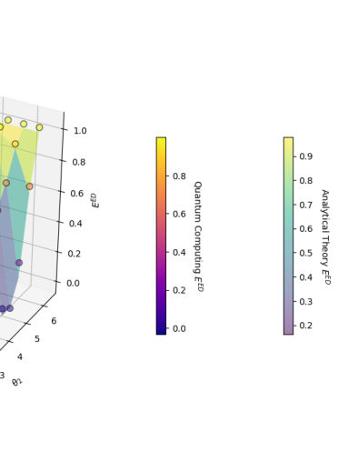
<figcaption class="paper-figure-caption"><b>Fig 1.</b> Figure 2: Surface plot of the entanglement distance EED for θ(1) = π/2 as a function of θ(2) and θ(3). The semi-transparent surface represents the analytical result, while the points correspond to numerical simulations.</figcaption>
</figure>
<figure class="paper-figure-card">
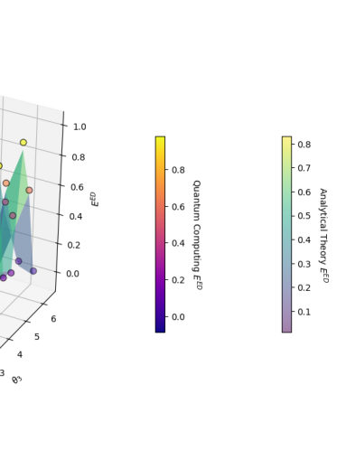
<figcaption class="paper-figure-caption"><b>Fig 2.</b> Figure 3: Surface plot of the entanglement distance EED for θ(2) = π/2 as a function of θ(1) and θ(3).</figcaption>
</figure>
<figure class="paper-figure-card">
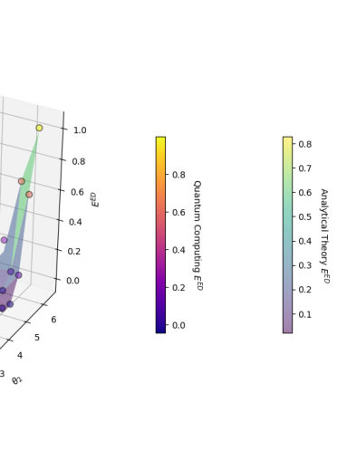
<figcaption class="paper-figure-caption"><b>Fig 3.</b> Figure 4: Surface plot of the entanglement distance EED for θ(3) = π/2 as a function of θ(1) and θ(2).</figcaption>
</figure>
<figure class="paper-figure-card">
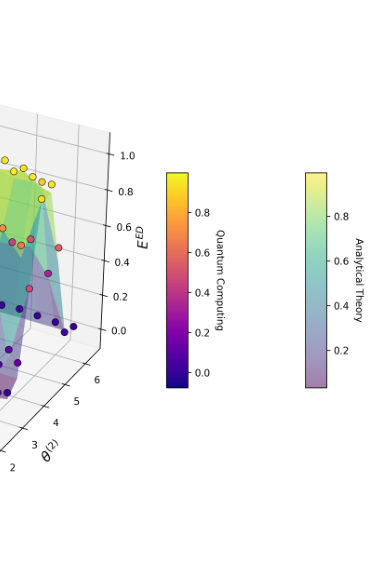
<figcaption class="paper-figure-caption"><b>Fig 4.</b> Figure 6: Surface plot of the entanglement distance EED a as a function of independent layer angles θ(1) and θ(2). The semi-transparent surface represents the analytical derivation, while the distinct points are obtained via simulated quantum measurements. The landscape demonstrates a rich periodic structure dependent on the interplay between consecutive layers.</figcaption>
</figure>
<figure class="paper-figure-card">
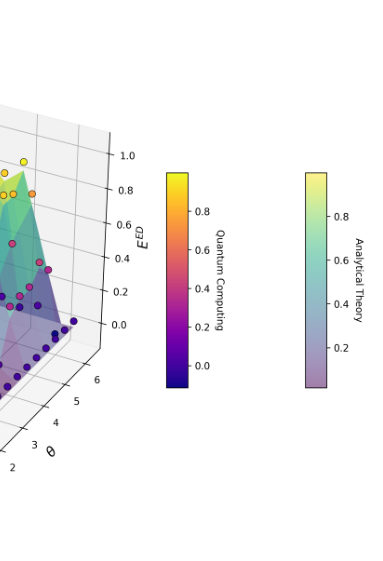
<figcaption class="paper-figure-caption"><b>Fig 5.</b> Figure 7: Entanglement distance surface showing the interplay between the target qubit’s local rotation angle θa and the surrounding environment’s rotation angle θ. The perfect alignment of the simulated data points (Quantum Computing) with the underlying analytical surface confirms the validity of the derived topological correlation spreading equations.</figcaption>
</figure>

**Summary.** This paper provides an analytical framework to calculate the entanglement distance in variational quantum circuits. It proves that as the circuit depth increases, the influence of neighboring qubits spreads, effectively increasing the entanglement-dependent neighborhood. The theoretical results are highly consistent with numerical simulations of quantum circuits.

**Why it may be interesting.** This work is relevant for understanding the dynamics of information spreading and entanglement growth in parameterized circuits, which is fundamental to the study of many-body dynamics and the performance of variational quantum algorithms.

Detailed structure

**Main problem.** The study aims to quantify the 'entanglement distance' and characterize the spreading of quantum correlations in variational quantum circuits as circuit depth increases.

**Main result.** The authors derived analytical recurrence relations for Pauli expectation values and demonstrated that increasing circuit depth expands the neighborhood of qubits that influence a target qubit's local observables.

**Method.** The researchers used the Heisenberg picture to evolve Pauli operators backward through the circuit and applied the Clifford property of CZ gates to derive exact analytical expressions, which were then verified via Qiskit numerical simulations.

**Model / system.** The model consists of two-qubit and multi-qubit systems arranged in a closed one-dimensional chain with periodic boundary conditions, utilizing a layered variational ansatz of RY rotations and CZ entangling gates.

**Key observables.** Entanglement Distance (EED), Pauli expectation values (X, Y, Z), and two-qubit correlations.

**Important parameters / regimes.** Circuit depth (number of layers), rotation angles (theta), and the distinction between local and global rotation parameters.

**Assumptions / limitations.** The system starts in the |00...0> state, and the circuit transformations are strictly real, implying the Y-component of the Bloch vector is zero.

**Figures summary.** Figure 1 shows the circuit architecture; Figures 2-4 present surface plots of EED for two qubits; Figure 5 shows a 5-qubit chain circuit; Figures 6-7 show entanglement distance and correlation landscapes as functions of rotation angles.

**Paper structure.** The paper introduces the entanglement distance concept, details the two-qubit analytical derivation using the Heisenberg picture, extends the analysis to a 1D chain to show correlation spreading, and concludes with numerical validation and comparison of local vs. global rotation effects.

Abstract

We study the entanglement distance of variational quantum states for two-qubit and multi-qubit systems. These states are constructed using variational quantum circuits with $R_Y$ rotations and entangling $CZ$ gates.For the two-qubit case, we analytically derive recurrence relations for expectation values of Pauli observables using. This approach allows us to analytically calculate quantum correlators and evaluate the entanglement distance depending on the circuit parameters and depth. The analysis were extended to a closed one-dimensional chain of $N$ qubits. It is shown that with increasing circuit depth, more qubits influence a given qubit, which reflects the spreading of quantum correlations in the system. For a closed one-dimensional chain of $N$ qubits, explicit analytical expressions are derived for the case of two layers. The results are compared with numerical simulations performed using quantum programming tools. The results agree with the theoretical predictions.

[↑ back to top](#top)

### [Exploring the Geometric and Dynamical Properties of Spin Systems and Their Interplay with Quantum Entanglement](http://arxiv.org/abs/2605.00241v1)

**Authors:** Jamal Elfakir  
**Type:** theory · **Category:** quantum information and computing · **PDF:** <https://arxiv.org/pdf/2605.00241v1>  
**Analysis basis:** full PDF text, analyzed in chunks
**Topic relevance:** 🔥 `entanglement & information structure` **4/5** · `non-equilibrium dynamics` **2/5**

↔ Scroll figures horizontally

<figure class="paper-figure-card">
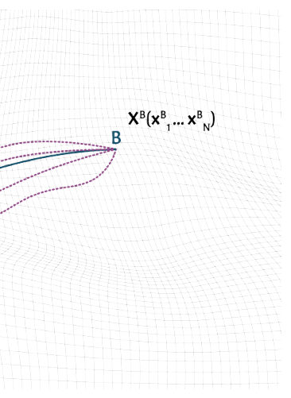
<figcaption class="paper-figure-caption"><b>Fig 1.</b> Figure 1.1: The system follows the minimum-action trajectory.</figcaption>
</figure>
<figure class="paper-figure-card">
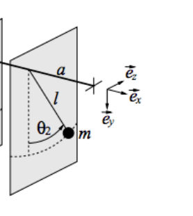
<figcaption class="paper-figure-caption"><b>Fig 2.</b> Figure 1.2: 2 pendulums coupled by a torsion wire</figcaption>
</figure>
<figure class="paper-figure-card">
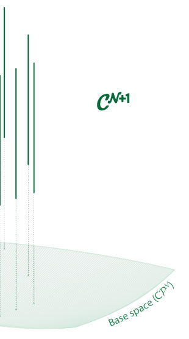
<figcaption class="paper-figure-caption"><b>Fig 3.</b> Figure 2.1: The Projective Space CPn as a Base of a Fiber Bundle over Cn+1</figcaption>
</figure>
<figure class="paper-figure-card">
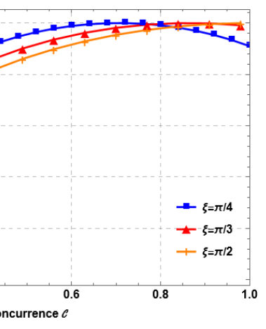
<figcaption class="paper-figure-caption"><b>Fig 4.</b> Figure 3.2: Evolution speed Eq. (3.72) versus the entanglement degree</figcaption>
</figure>
<figure class="paper-figure-card">
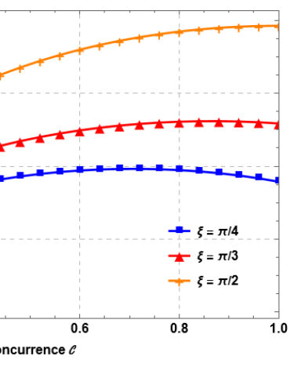
<figcaption class="paper-figure-caption"><b>Fig 5.</b> Figure 3.3: FubiniStudy Distance (3.73) vs. Concurrence (3.71) for various κ values</figcaption>
</figure>

**Summary.** This thesis investigates how the geometry of quantum state space, characterized by metrics and curvature, relates to the dynamical evolution and entanglement of spin systems. It demonstrates that quantum correlations effectively 'compress' the state space by reducing its curvature and geometric phase. The work bridges classical symplectic mechanics with quantum information geometry.

**Why it may be interesting.** It provides a unified geometric framework for understanding how entanglement modifies the topology and curvature of state space, which is fundamental for developing robust geometric quantum gates and understanding many-body dynamics.

Detailed structure

**Main problem.** The research explores the interplay between the geometric/topological properties of quantum state space and the dynamical evolution of spin systems, specifically regarding entanglement and evolution speed.

**Main result.** The study establishes that increasing entanglement decreases the curvature of the state space and reduces the accumulated geometric phase, with higher spin values enhancing these variations.

**Method.** The author utilizes the mathematical framework of projective Hilbert space, applying the Fubini-Study metric, symplectic geometry, and the Gauss-Bonnet theorem to analyze quantum states.

**Model / system.** The study focuses on spin systems, including two-body anisotropic Heisenberg (XXZ) models and many-body all-range Ising models for both spin-1/2 and general spin-s particles.

**Key observables.** Quantum entanglement (concurrence, I-concurrence), geometric phase (Berry, Aharonov-Anandan), evolution speed, and G-curvature.

**Important parameters / regimes.** Interaction anisotropy, coupling intensity, spin value (s), number of particles (N), and the thermodynamic/large-spin limits.

**Assumptions / limitations.** The analysis is primarily restricted to unitary evolution in closed quantum systems.

**Figures summary.** Plots illustrating the relationship between evolution speed, entanglement, and Fubini-Study distance, as well as curvature and geometric phase as functions of I-concurrence.

**Paper structure.** The thesis progresses from classical Hamiltonian mechanics and symplectic structures to the geometric description of quantum states, concluding with the application of these tools to analyze the dynamics and topology of Heisenberg and Ising spin models.

Abstract

This thesis, explores the quantum entanglement and evolution through both a geometric and dynamical perspective. The first part focuses on classical phase space and its central role in Hamiltonian mechanics, emphasizing the importance of symplectic structures in describing mechanical states. The study highlights the formal analogy between classical phase space and the Hilbert space used in quantum mechanics. The second part is devoted to the geometric description of quantum states through the projective structure of Hilbert space. Emphasis is placed on the geometric interpretation of quantum evolution, particularly via the Fubini-Study metric, associated symplectic structures, and the geometric phase acquired during unitary evolutions. The final two parts are dedicated to the study of spin systems (both two-body and many-body) under different interaction models (XXZ Heisenberg and all-range Ising). Both the dynamical aspects (evolution speed, entanglement, and the quantum brachistochrone problem) and the geometric and topological structures of the corresponding quantum states are analyzed.

[↑ back to top](#top)

### [Sequential Measurements as a Resource for Quantum Metrology](http://arxiv.org/abs/2605.00287v1)

**Authors:** Koray Mentesoglu, Rahul Trivedi, Sara Mouradian  
**Type:** theory · **Category:** quantum information and computing · **PDF:** <https://arxiv.org/pdf/2605.00287v1>  
**Analysis basis:** full PDF text, analyzed in chunks
**Topic relevance:** 🔥 `quantum measurements` **4/5** · `methods for driven-dissipative` **2/5**

↔ Scroll figures horizontally

<figure class="paper-figure-card">
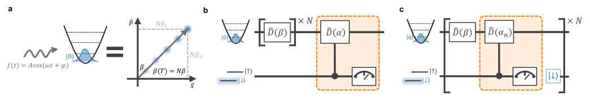
<figcaption class="paper-figure-caption"><b>Fig 1.</b> FIG. 1. a A QHO feels a force f(t), which manifests as a displacement in phase space. A single interrogation time consists of N signal interactions. b Single Measurement Protocol: Phase is accumulated in the QHO to gain a factor of N advantage in precision. The signal displacement ˆD(β) is followed by an ancilla-assisted measurement (orange box) which includes a state-dependent coupling displacement and projective measurement on the qubit. c Sequential Measurement Protocol: The sequential-measurement protocol repeats the coupling and measurement operations at every round. The qubit is reset into the ground state, |↓⟩, before the next round, but QHO evolution continues.</figcaption>
</figure>
<figure class="paper-figure-card">
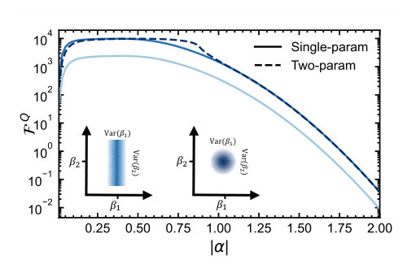
<figcaption class="paper-figure-caption"><b>Fig 2.</b> FIG. 3. QFI comparison at N = 100 and |α| = 0.2. In light blue, single-parameter estimation using N measurements. In blue, single-parameter estimation using 2N measurements. In dashed dark blue, two-parameter estimation using 2N mea- surements plotting only FQ 11. The single-parameter curves share a similar shape, while the two-parameter curve in- cludes an increased range of optimal |α|. Inset: Though 2N measurements for both protocols yield comparable informa- tion gain for FQ 11, the plotted two-parameter protocol also has information about the other parameter FQ 22, whereas the single-parameter protocol only gives information about a sin- gle quadrature.</figcaption>
</figure>
<figure class="paper-figure-card">
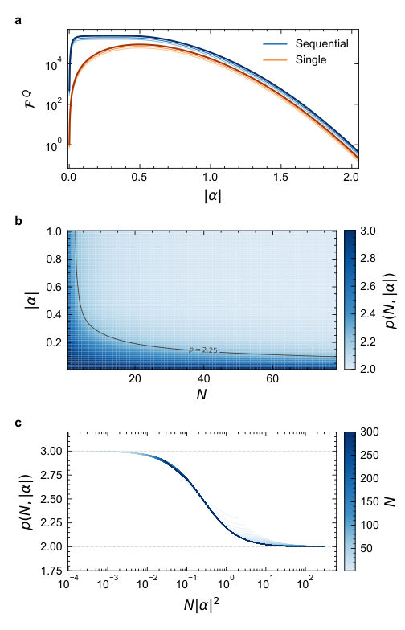
<figcaption class="paper-figure-caption"><b>Fig 3.</b> FIG. 2. a QFI vs. |α| for N ∈{410, 450, 500} for the single- (orange) and sequential- (blue) measurement protocols. The sequential-measurement protocol exhibits larger information gain and a wider range of optimal |α|. Increasing N will in- crease the overall FQ gain. b Heat map of scaling exponent, p = d log FQ/d log N, for different measurement strengths and N. An example contour, p = 2.25, is plotted. c Scal- ing exponent p plotted as a function of N|α|2 for increasing N. The weak and strong measurement regimes are defined by N|α|2 ≪1 and N|α|2 ≫1.</figcaption>
</figure>
<figure class="paper-figure-card">
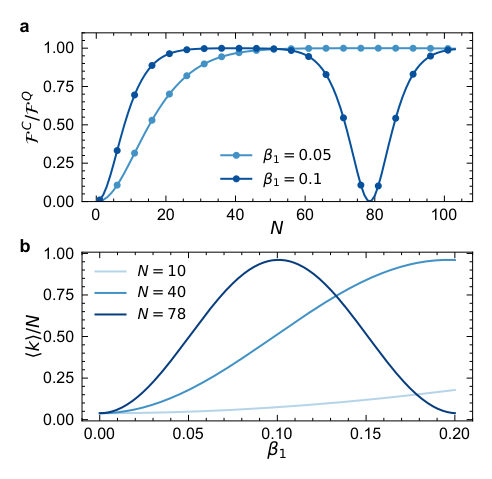
<figcaption class="paper-figure-caption"><b>Fig 4.</b> FIG. 4. Using |α| = 0.2 a FC/FQ is plotted as a function of signal interactions, N, for performing single-parameter es- timation of two different signals: β1 = 0.05 and β1 = 0.1. The CFI saturates the QFI. Larger β1 exhibits dips in infor- mation gain. b Average excitation number ⟨k⟩= P</figcaption>
</figure>
<figure class="paper-figure-card">
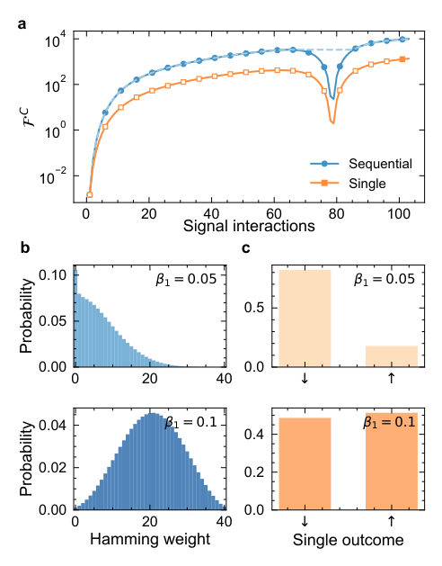
<figcaption class="paper-figure-caption"><b>Fig 5.</b> FIG. 5. Using |α| = 0.2 a The CFI for β1 = 0.1 for the sequential- (blue) and single- (orange) measurement proto- cols. The sequential measurements present a fundamentally different method for information gain, allowing signal infor- mation to be recovered, while avoiding interference dips (dot- ted line). b Sequential- and c single-measurement protocol outcome probability distributions for N = 40 at two signal strengths. At β1 = 0.05 (top row), both protocols produce distributions skewed towards the ground states. At β1 = 0.1 (bottom row), the distributions become symmetric, corre- sponding to the maximum-slope point in Fig.4(b), where sen- sitivity to β1 is greatest.</figcaption>
</figure>

**Summary.** This paper proposes a protocol using sequential weak measurements to simultaneously estimate both quadratures of a quantum displacement. It demonstrates that this approach can achieve enhanced scaling of information, increase dynamic range, and remain robust against environmental decoherence.

**Why it may be interesting.** It provides a novel way to use measurement backaction as a resource and demonstrates how sequentiality can fundamentally change the scaling of precision and robustness to noise in open quantum systems.

Detailed structure

**Main problem.** Developing a quantum metrology protocol for the simultaneous estimation of both quadratures of a displacement channel while overcoming limitations like decoherence and phase wrapping.

**Main result.** Sequential weak measurements act as a resource that can increase information gain via measurement backaction, achieve N^3 scaling of Quantum Fisher Information in certain regimes, and provide robustness to decoherence.

**Method.** The authors use a sequential measurement protocol on an ancilla qubit coupled to a harmonic oscillator, employing a Dicke basis to reduce computational complexity and analyzing information via Quantum and Classical Fisher Information.

**Model / system.** A Quantum Harmonic Oscillator (QHO) coupled to an ancilla qubit, subject to a displacement channel and subject to environmental decoherence (loss and dephasing) modeled by a Lindblad master equation.

**Key observables.** Measurement outcomes of the ancilla qubit (N-bit string), Hamming weights, and Quantum/Classical Fisher Information.

**Important parameters / regimes.** Displacement parameters (beta_1, beta_2), measurement strength (alpha), number of measurement rounds (N), and effective decay rate (Gamma).

**Assumptions / limitations.** The thermal occupancy of the oscillator is assumed to be negligible (n_th approx 0), and the protocol assumes the QHO cannot be measured directly.

**Figures summary.** Fig 1 illustrates the single vs. sequential measurement protocols; Fig 2 shows QFI superiority and scaling exponents; Fig 3 compares single vs. two-parameter performance; Fig 4 shows CFI dips; Fig 7 shows the monotonic decrease of CRB in the presence of decoherence; Fig 8 compares joint-system QFI.

**Paper structure.** The paper introduces the sequential protocol, establishes the mathematical framework using the Dicke basis, compares scaling regimes (weak vs. strong measurement), extends the protocol to two-parameter estimation, analyzes robustness against decoherence, and discusses connections to grid states.

Abstract

We present a protocol in which sequential weak measurements of a quantum harmonic oscillator enable simultaneous estimation of both quadratures of a displacement channel. Calculations of the quantum Fisher information show that the measurement backaction can increase the information gained for a range of measurement strengths. The protocol distributes information over a $N$-bit string after $N$ weak measurements. Thus we find that post-processing can be used to avoid information loss due to phase wrapping, increasing the effective dynamic range. Finally, the periodic information extraction makes the protocol robust to decoherence. Our results establish mid-sensing measurement as a resource for single- and multi-parameter quantum metrology.

[↑ back to top](#top)

### [Criticality on Rényi defects at (2+1)$d$ O(3) quantum critical points](http://arxiv.org/abs/2605.00104v1)

**Authors:** Yanzhang Zhu, Zhe Wang, Meng Cheng, Zheng Yan  
**Type:** theory · **Category:** statistical mechanics · **PDF:** <https://arxiv.org/pdf/2605.00104v1>  
**Analysis basis:** full PDF text, analyzed in chunks
**Topic relevance:** 🔥 `entanglement & information structure` **4/5**

↔ Scroll figures horizontally

<figure class="paper-figure-card">
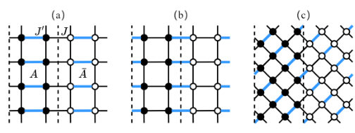
<figcaption class="paper-figure-caption"><b>Fig 1.</b> FIG. 1. Schematic illustration of the columnar dimerized Heisenberg model and entanglement bipartitions. Thick blue bonds represent the strong couplings J′, and thin black bonds denote the weak couplings J. The dashed line indicates the entanglement bipartition, which separates the system into subsystem A (in black) and its environment ¯A (in white). Panels (a) and (b) correspond to ordinary and special cuts, while panel (c) corresponds to the extraordinary cut realized by a tilted cut in the same model. These three cuts are used throughout the paper to realize the three classes of Rényi de- fects compared below.</figcaption>
</figure>
<figure class="paper-figure-card">
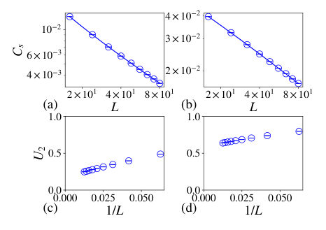
<figcaption class="paper-figure-caption"><b>Fig 2.</b> FIG. 2. Finite-size scaling of observables for ordinary and spe- cial Rényi defects at n = 2 in the columnar dimerized Heisen- berg model. Left panels: ordinary; right panels: special. Top row shows the spin correlation Cs(L) on the Rényi line defects, and bottom row shows the Binder cumulant U2(L). System sizes range from L = 16 to 80. Solid lines are fits described in the text.</figcaption>
</figure>
<figure class="paper-figure-card">
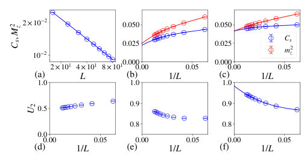
<figcaption class="paper-figure-caption"><b>Fig 3.</b> FIG. 3. Finite-size scaling of observables for the extraordinary Rényi defect at different Rényi indices. Columns (left to right) correspond to n = 2, n = 4, and n = 10. Top row shows the spin correlation Cs(L) on the Rényi defect line, and bottom row shows the Binder cumulant U2(L). For n = 4 and n = 10, we additionally show the squared magnetization M 2 z . System sizes range from L = 16 to 80. Solid lines are fits described in the text.</figcaption>
</figure>
<figure class="paper-figure-card">
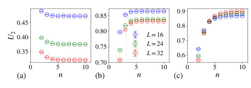
<figcaption class="paper-figure-caption"><b>Fig 4.</b> FIG. 4. Binder cumulant U2 as a function of Rényi index n for (a) ordinary, (b) special, and (c) extraordinary Rényi defects in the columnar dimerized Heisenberg model. Differ- ent symbols correspond to system sizes L = 16, 24, 32. For the ordinary and special cuts, U2 evolves smoothly with n and no crossing is observed, consistent with the absence of a finite-n phase transition. In contrast, for the extraordinary cut the Binder cumulant curves cross near nc ≈3–4, indicat- ing a transition between a disordered regime at small n and an ordered regime at larger n.</figcaption>
</figure>

**Summary.** This paper demonstrates that the universality of Renyi entanglement entropy is determined by the specific geometry of the entanglement cut, which can lead to different defect universality classes. It identifies a phase transition on the 'extraordinary' defect line driven by the Renyi index. This provides a framework to understand why entanglement scaling can appear sensitive to microscopic lattice details.

**Why it may be interesting.** not directly relevant

Detailed structure

**Main problem.** The study investigates why the universal scaling of Renyi entanglement entropy depends on the microscopic details of the entanglement cut and explores the universality classes of codimension-two Renyi defects at (2+1)d O(3) quantum critical points.

**Main result.** The authors find that different entanglement cuts realize distinct Renyi defect universality classes (ordinary, special, and extraordinary) and provide evidence for a phase transition on the extraordinary defect as a function of the Renyi index n.

**Method.** Large-scale quantum Monte Carlo simulations on n-sheeted replica manifolds are used to measure local observables and extract scaling dimensions via finite-size scaling analysis.

**Model / system.** The study uses (2+1)d quantum spin models at the O(3) Wilson-Fisher quantum critical point, specifically the 1/2 columnar dimerized Heisenberg model and the spin-1/2 bilayer Heisenberg model.

**Key observables.** Renyi-n expectation values, defect spin-spin correlation functions, and the defect Binder cumulant.

**Important parameters / regimes.** Renyi index n, system size L, and the coupling ratio J'/J used to reach the critical point.

**Assumptions / limitations.** Numerical access is restricted to positive integer n > 1 via the replica approach; the behavior of the special defect remains somewhat inconclusive due to subtle numerical signals.

**Figures summary.** Figure 1 shows schematic entanglement cuts (ordinary, special, extraordinary); Figure 2 shows finite-size scaling for ordinary/special cuts; Figure 3 shows scaling for the extraordinary defect; Figure 4 shows the Binder cumulant crossing for the extraordinary cut.

**Paper structure.** The paper introduces the problem of entanglement cut sensitivity, describes the quantum spin models and replica QMC method, presents results for different defect types (ordinary, special, extraordinary), discusses the phase transition in the extraordinary case, and concludes with implications for entanglement entropy scaling.

Abstract

At a quantum critical point, the universal scaling behavior of Rényi entanglement entropy is controlled by the universality class of the codimension-two Rényi (or conical) defects in the infrared theory. In this work we perform a systematic study of critical correlations along Rényi defect lines in (2+1)d quantum spin models realizing quantum phase transitions described by the O(3) Wilson-Fisher universality class, using large-scale quantum Monte Carlo simulations. We present numerical evidence that, for a fixed Rényi index $n$, there exist multiple Rényi defect universality classes, with distinct critical exponents for the O(3) order parameter on the defect. These universality classes are realized by choosing microscopically different entanglement cuts in lattice models, which we classify as ordinary, special and extraordinary according to their relation to surface criticality. For the extraordinary entanglement cut, we further find evidence for a phase transition on the defect as a function of the Rényi index. Our results highlight the key role of defect universality classes in determining the universal scaling of Rényi entropy, and provide a framework for understanding the previously observed dependence of Rényi entropy scaling on microscopic lattice details.

[↑ back to top](#top)

### [Induced discommensurations in the lock-in transition of charge-density waves](http://arxiv.org/abs/2605.00521v1)

**Authors:** Katsuhiko Inagaki, Satoshi Tanda  
**Type:** theory · **Category:** strongly correlated electrons · **PDF:** <https://arxiv.org/pdf/2605.00521v1>  
**Analysis basis:** full PDF text, analyzed in chunks
**Topic relevance:** 🔥 `Frenkel-Kontorova` **4/5**

↔ Scroll figures horizontally

<figure class="paper-figure-card">
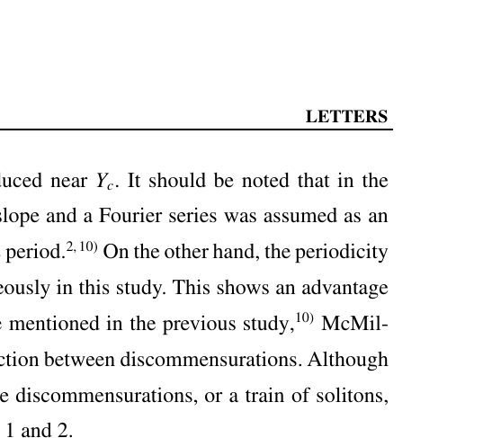
<figcaption class="paper-figure-caption"><b>Fig 1.</b> Figure 3 shows the wave profiles at Y = 1.234, slightly higher than Yc. To include dis-</figcaption>
</figure>
<figure class="paper-figure-card">
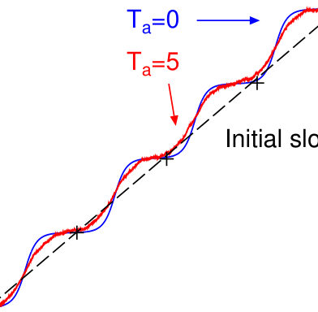
<figcaption class="paper-figure-caption"><b>Fig 2.</b> Fig. 1. Optimization of the wave form from a pure incommensurate CDW. The black solid line represents the</figcaption>
</figure>
<figure class="paper-figure-card">
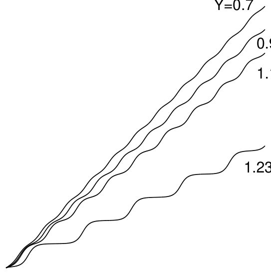
<figcaption class="paper-figure-caption"><b>Fig 3.</b> Fig. 2. Evolution of wave profiles. The parameter Y = 0.6, 0.9, 1.1, and 1.233 from top to bottom. Discom-</figcaption>
</figure>
<figure class="paper-figure-card">
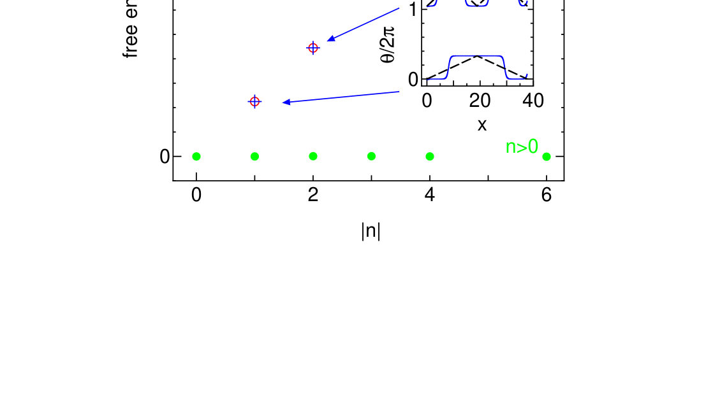
<figcaption class="paper-figure-caption"><b>Fig 4.</b> Fig. 4. Free energies for discommensurations for n &gt; 0 (open circles) and n &lt; 0. By increasing the number</figcaption>
</figure>

**Summary.** This paper uses simulated annealing to study the lock-in transition in charge-density waves. It finds that discommensurations are topologically protected and can drive a commensurate system into an incommensurate state, providing a theoretical basis for observed current-induced incommensuration in materials like o-TaS3.

**Why it may be interesting.** not directly relevant

Detailed structure

**Main problem.** Understanding the mechanism behind the emergence of discommensurations during the lock-in transition of charge-density waves (CDWs) and explaining current-induced incommensuration.

**Main result.** The study demonstrates that discommensurations are topologically protected and can be excited in the commensurate state, driving the system toward an incommensurate state, which is consistent with experimental observations in o-TaS3.

**Method.** Numerical optimization using simulated annealing based on the Metropolis algorithm to minimize the McMillan free energy functional.

**Model / system.** The model uses McMillan's free energy functional for charge-density waves in quasi-one-dimensional conductors like o-TaS3 and K0.3MoO3.

**Key observables.** CDW intensity, wave profiles, phase jumps, and free energy relative to the commensurate state.

**Important parameters / regimes.** The parameter Y (representing the third-order Umklapp process), the critical value Yc, and the phase theta.

**Assumptions / limitations.** The model assumes a second-order transition via the McMillan free energy, though the authors note that the Umklapp term might induce a first-order transition.

**Figures summary.** Figure 1 shows the evolution of wave profiles during annealing; Figure 2 shows wave profiles for various Y values; Figure 3 shows profiles for different initial slopes; Figure 4 compares free energies of discommensurations and soliton-antisoliton pairs.

**Paper structure.** The paper begins with a validation of the numerical method, followed by an analysis of wave profiles near the critical value, an investigation of discommensurations in the commensurate state, a discussion of topological protection and energy asymmetry, and finally a comparison with experimental results.

Abstract

We studied McMillan's free energy of the lock-in transition in charge-density waves. The wave profiles near the critical value were obtained by numerical annealing. First, we demonstrated that our method reproduces the previous studies. The obtained wave profiles include discommensurations near the critical value. Then, we calculated possible wave profiles in the commensurate state. We found that discommensurations are able to be excited in the commensurate state, leading the system to turn out to an incommensurate state. We proposed that these wave profiles result from topological invariants. Moreover, excitation of the discommensurations is favorable for the direction to the original wavelength of the incommensurate state. This is attributed to the nature of McMillan's free energy. The current-induced incommensurations, which we discovered with the diffraction study of $o$-TaS$_3$ [Inagaki \textit{et al.}, J. Phys. Soc. Jpn. 77, 093708 (2008)], is consistent with this study.

[↑ back to top](#top)

### [Probability Distribution Analysis of the Cascaded Variational Quantum Eigensolver](http://arxiv.org/abs/2605.00807v1)

**Authors:** Yi-Hua Lai, John P. T. Stenger, Gloria Bazargan, Igor V. Schweigert, Daniel Gunlycke  
**Type:** both · **Category:** quantum information and computing · **PDF:** <https://arxiv.org/pdf/2605.00807v1>  
**Analysis basis:** full PDF text, analyzed in chunks
**Topic relevance:** 🔥 `QC/QI experiment` **4/5**

↔ Scroll figures horizontally

<figure class="paper-figure-card">
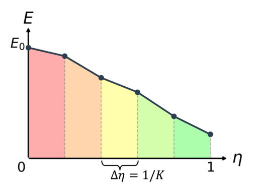
<figcaption class="paper-figure-caption"><b>Fig 1.</b> FIG. 1. A schematic diagram of the energy E(t) of the state evolving from the model ground state |Φ0⟩to the trapezoidal state ˆUK,Ω|Φ0⟩as a function of the discretized parameter ηk with K = 5 steps of size ∆η = 1/K.</figcaption>
</figure>
<figure class="paper-figure-card">

<figcaption class="paper-figure-caption"><b>Fig 2.</b> FIG. 2. Electronic energies along the minimal-energy path for reaction (1) computed by the NEB method using CCSD/def2- QZVP. Energies corresponding to the reactant, collision, and product complexes are highlighted in red at coordinate 0, 31, and 62, respectively.</figcaption>
</figure>
<figure class="paper-figure-card">
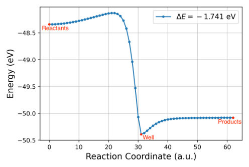
<figcaption class="paper-figure-caption"><b>Fig 3.</b> Figure 4 presents the ground-state energies obtained by the CVQE method using Qiskit [38]’s noiseless simu- lator as the blue solid curve, which is close to the orange dashed curve obtained by classical FCI. Both sets of CVQE and FCI calculations use the STO-6G basis set and the correction Ebsc in Eq. (12). For comparison, HF energies with the larger basis set def2-QZVP are shown as the green dashed curve. Both the CVQE and FCI calculations yield the same reaction energy, ∆E = −1.804 eV.</figcaption>
</figure>
<figure class="paper-figure-card">
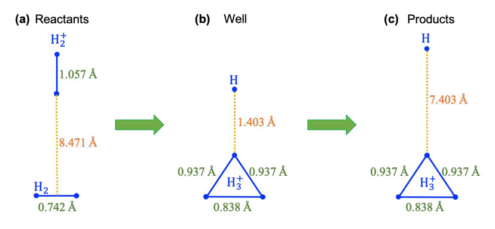
<figcaption class="paper-figure-caption"><b>Fig 4.</b> FIG. 3. Representative molecular structures along the minimal-energy path for reaction (1). Hydrogen atoms are shown in blue and interatomic distances are shown in green and orange. Shown are the geometries of the (a) reactants — H2 + and H2 are separated, (b) well — the system is at the lowest energy during the reaction, and (c) products — H3 + and H are separated.</figcaption>
</figure>
<figure class="paper-figure-card">
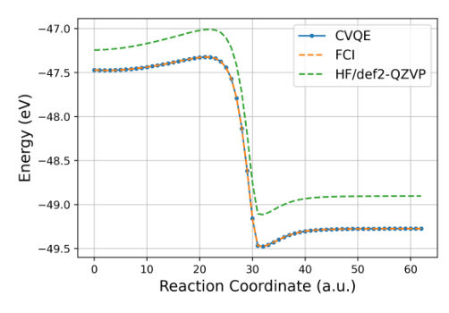
<figcaption class="paper-figure-caption"><b>Fig 5.</b> FIG. 4. Electronic energies along the minimum-energy path for reaction (1) with the reactant, well, and product states at coordinate 0, 31, and 62, respectively. The reactant-product energy differences are ∆E = −1.804 eV for CVQE and FCI, and ∆E = −1.659 eV for HF/def2-QZVP.</figcaption>
</figure>

**Summary.** This paper investigates the Cascaded Variational Quantum Eigensolver (CVQE), an algorithm designed to reduce communication between quantum and classical units. By analyzing probability distributions, the authors show how to optimize guiding-state parameters to maintain chemical accuracy and maximize signal-to-noise ratios on noisy quantum hardware.

**Why it may be interesting.** It provides practical insights into error mitigation and parameter tuning for VQE-like algorithms on NISQ devices, specifically showing how to balance adiabaticity and noise susceptibility.

Detailed structure

**Main problem.** Optimizing the selection of guiding states in the Cascaded Variational Quantum Eigensolver (CVQE) to achieve accurate many-electron ground-state solutions with minimal resource consumption and robustness against hardware noise.

**Main result.** The study demonstrates that CVQE can achieve chemical accuracy even with single-step adiabatic preparation and that tuning the adiabatic energy scale (h-Omega) can maximize the signal-to-noise ratio on real NISQ hardware.

**Method.** The authors use a trapezoidal-state preparation method for the CVQE algorithm, comparing noiseless simulations with IBM quantum hardware (ibm_aachen) and utilizing classical benchmarks like CCSD and FCI.

**Model / system.** A prototypical bimolecular reaction (H2 + H2+ -> H3+ + H) modeled using a many-electron Hamiltonian and a 256-dimensional Fock space, mapped to 8 qubits via the Jordan-Wigner transformation.

**Key observables.** Ground-state energies (Eg), reaction energies (Delta E), and probability distributions of the quantum state at various algorithm stages.

**Important parameters / regimes.** Discretization steps (K), adiabatic energy scale (h-Omega), sampling scale (shot counts), and the adiabaticity condition (h-Omega K^-1 << h-omega_0 << h-Omega).

**Assumptions / limitations.** The use of a minimal STO-6G basis set and the assumption that the classical optimization can compensate for distortions in the guiding state if the sampled Fock state set is representative.

**Figures summary.** Figure 1 shows energy evolution via discretization; Figure 2 plots the minimal-energy path; Figure 3 shows molecular structures; Figure 8 shows noiseless probability distributions; Figure 9 and 10 illustrate how the guiding-state distribution and sampling counts change with the adiabatic energy scale on real hardware.

**Paper structure.** The paper introduces the CVQE algorithm, defines the trapezoidal-state preparation method, analyzes different parameter regimes (adiabaticity and sampling) on simulators, evaluates performance on real IBM hardware, and provides a symmetry-based justification for the Fock state distributions in the appendix.

Abstract

The cascaded variational quantum eigensolver (CVQE) circumvents the need for iterative communication between the quantum and classical processing units that is necessary in the conventional VQE algorithm. While CVQE offers complete freedom to choose the guiding state as input, not all guiding states suffice for solution accuracy, as well as resource efficiency. Our work presents a process based on trapezoidal-state preparation for selecting guiding states that yield accurate many-electron ground-state solutions with minimal resource consumption. By analyzing the state probability distributions at different stages of the CVQE calculations, we determine the optimal guiding-state parameters for given resource constraints. We demonstrate the process by comparing electronic energies along the minimal-energy path for a prototypical bimolecular reaction, $\mathrm{H}_2 + \mathrm{H}_2^+ \rightarrow \mathrm{H}_3^+ + \mathrm{H}$, using Noisy Intermediate-Scale Quantum (NISQ) computing.

[↑ back to top](#top)

### [Toward Secure Multitenant Quantum Computing: Circuit Affinity, Crosstalk Patterns, and Grouping Strategies](http://arxiv.org/abs/2605.00118v1)

**Authors:** Andrew Woods, Chi-Ren Shyu  
**Type:** both · **Category:** quantum information and computing · **PDF:** <https://arxiv.org/pdf/2605.00118v1>  
**Analysis basis:** full PDF text, analyzed in chunks
**Topic relevance:** 🔥 `QC/QI experiment` **4/5**

↔ Scroll figures horizontally

<figure class="paper-figure-card">
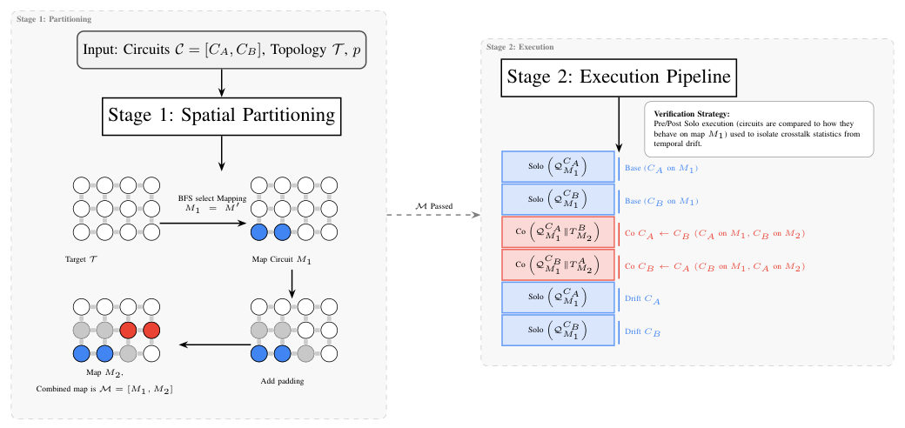
<figcaption class="paper-figure-caption"><b>Fig 1.</b> Fig. 1: Visual overview of the experimental methodology. Stage 1 executes spatial partitioning and padding to generate the mapping set M. Stage 2 utilizes a verification pipeline (Solo vs Cotenant) to isolate crosstalk from temporal drift.</figcaption>
</figure>
<figure class="paper-figure-card">
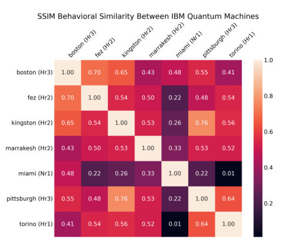
<figcaption class="paper-figure-caption"><b>Fig 2.</b> Fig. 4: This chart illustrates how similarly each of the ma- chines behave. A higher score means that a scheduler cali- brated for one machine can be deployed for another machine. The sequence of lower scores for ibm_miami (Nighthawk r1) indicates a recalibration for complete revisions of new circuits will be needed.</figcaption>
</figure>
<figure class="paper-figure-card">
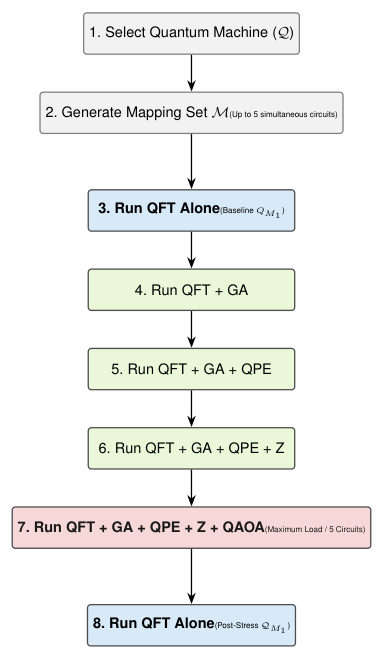
<figcaption class="paper-figure-caption"><b>Fig 3.</b> Fig. 2: Flow of adding more and more stress on QFT circuit multitenancy with the strong to weak interference circuits. The weak to strong interference add the circuits in reverse order starting with adding QAOA and ending with adding GA.</figcaption>
</figure>
<figure class="paper-figure-card">
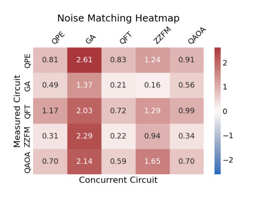
<figcaption class="paper-figure-caption"><b>Fig 4.</b> Fig. 3: Overall interaction scores between circuits across all machines. All noise levels have been shifted so that the stan- dalone baseline is 0. The columns show an uneven structure indicating that circuits are not simply ”noisy” but convey a complex relationship.</figcaption>
</figure>
<figure class="paper-figure-card">
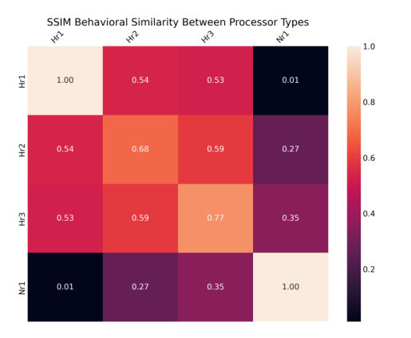
<figcaption class="paper-figure-caption"><b>Fig 5.</b> Fig. 5: A higher level overview of circuit types. These values are averaged amount the SSIM scores between each processor type. We see that there is a noticeable drop in the score between the Nighthawk r1 and Heron r1 processors where the score is approximately 0, indicating a need for a complete scheduler recalibration across generations. However, only a slight recalibration would be needed for processors of the same type.</figcaption>
</figure>

**Summary.** This paper investigates how running multiple quantum circuits simultaneously on the same hardware causes crosstalk that can degrade performance and compromise security. By characterizing which circuits are 'aggressive' or 'sensitive,' the authors propose a framework for a scheduler to pair compatible jobs to maximize system utility and stability.

**Why it may be interesting.** not directly relevant

Detailed structure

**Main problem.** The study addresses the security and performance risks introduced by inter-circuit crosstalk during multitenant execution in cloud-based quantum computing, specifically focusing on how concurrent jobs can lead to fault-injection or information leakage.

**Main result.** The authors identify three classes of circuits (universally aggressive, universally sensitive, and cotenant-dependent) and demonstrate that while crosstalk patterns are transferable within hardware revisions, they are fundamentally different across different topologies like Heavy-Hex and Square lattices.

**Method.** The researchers used a 'Sandwiched Baseline-Cotenant Calibration' strategy to isolate crosstalk from temporal drift and applied the Structural Similarity Index (SSIM) to quantify the consistency of interference patterns across seven IBM superconducting processors.

**Model / system.** The experimental platform consists of seven IBM superconducting quantum processors, including various generations of the Heron (Heavy-Hex lattice) and Nighthawk (Square lattice) architectures.

**Key observables.** Crosstalk Aggression (N), Crosstalk Sensitivity (S), Structural Similarity Index (SSIM), t-statistic of interference, and Bhattacharyya Coefficient for fidelity.

**Important parameters / regimes.** Padding depth (p) for spatial isolation, circuit depth, 2-qubit gate ratio, and architectural topology (Heavy-Hex vs. Square).

**Assumptions / limitations.** The study uses a pairwise approximation for circuit interactions, which may not fully capture the complexity of much higher-load multitenant scenarios.

**Figures summary.** Figure 1 shows the experimental methodology and mapping flow; Figure 2 illustrates cumulative stress-tests with increasing circuit load; Figure 3 displays interaction scores across different machines; Figure 4 and 5 show SSIM scores indicating hardware transferability and architectural differences.

**Paper structure.** The paper introduces the problem of multitenancy security, describes the hardware and circuit selection, details the experimental protocols for isolation and mapping, presents the classification of circuits and architectural similarity results, and concludes with implications for hardware-aware scheduling.

Abstract

Multitenancy increases throughput and reduces costs in cloud-based quantum computing, but concurrent job execution introduces security risks through inter-circuit crosstalk. We characterize the structural predictability of these interference patterns across seven IBM superconducting processors, spanning Heron (r1-r3) and Nighthawk (r1) architectures and five different circuit types. We evaluate pairwise interactions, by applying the Structural Similarity Index (SSIM) and a structural $t$-statistic to the concurrent execution of five foundational quantum circuits (QAOA, Grover's, QPE, QFT, and ZZFeatureMap), we quantify behavioral consistency across disparate hardware. Our results identify three types of circuits: universally aggressive, universally sensitive, and cotenant-dependent circuits. Aggressive circuits, such as Grover's Algorithm, exhibit a statistically significant interference pattern, yielding a $t$-statistic range of $[1.37,2.61]$ relative to the standalone baselines across all tested pairings. Conversely, sensitive circuits, such as the Quantum Fourier Transform, demonstrate a disproportionate susceptibility to multitenant execution, showing high deviations from single-tenant computational behavior. We demonstrate that crosstalk signatures are highly consistent within architectural revisions--with intra-revision similarity reaching $0.77$ (Hr3) and $0.68$ (Hr2)--while inter-revision similarity drops to $0.43$. Furthermore, we identify a ``topological decoupling" between Heavy-Hex and square lattice systems, where structural similarity falls to $0.01$ between Heron r1 and Nighthawk r1. These findings provide an empirical foundation for hardware-aware schedulers to strategically pair jobs, maximizing system utilization while preserving computational integrity.

[↑ back to top](#top)

### [Atomic Interferometry with Spin-Orbit-Coupled Spin-1 Condensates](http://arxiv.org/abs/2605.00596v1)

**Authors:** Renfei Zheng, Junying Wu, Josep Cabedo, Alessio Celi, Zhihao Lan, Weiping Zhang, Lu Zhou  
**Type:** theory · **Category:** quantum gases · **PDF:** <https://arxiv.org/pdf/2605.00596v1>  
**Analysis basis:** full PDF text, analyzed in chunks
**Topic relevance:** `Keldysh / 2PI / non-Gaussian methods` **3/5** · `driven-dissipative phase transition` **3/5** · `non-equilibrium dynamics` **3/5** · `quantum measurements` **3/5** · `analog quantum simulation` **2/5** · `entanglement & information structure` **2/5** · `exotic spin models in light-matter` **2/5**

↔ Scroll figures horizontally

<figure class="paper-figure-card">
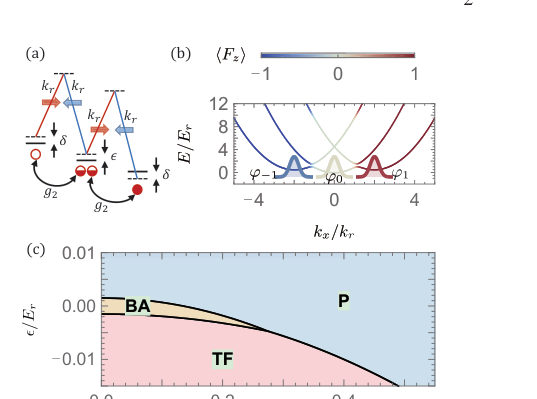
<figcaption class="paper-figure-caption"><b>Fig 1.</b> FIG. 1. Effective spinor description of a Raman-dressed spin-1 BEC. (a) Raman coupling scheme within the F = 1 manifold. The Raman lasers couple adjacent Zeeman states while transferring mo- mentum 2ℏkr. The diagram also indicates the spin-changing colli- sion process, proportional to g2, in which two atoms in the m = 0 state are converted into a correlated pair in the m = ±1 states, and vice versa. The linear and quadratic detunings from Raman reso- nance are denoted by δ and ϵ, respectively. (b) Dispersion bands of Hamiltonian (1) for Ω= 0.5Er, δ = 0, and ϵ = 0.5Er. The color scale indicates the expectation value of Fz for the correspond- ing band states. In the weak Raman coupling...</figcaption>
</figure>
<figure class="paper-figure-card">
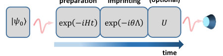
<figcaption class="paper-figure-caption"><b>Fig 2.</b> FIG. 2. Schematic illustration of the sequential interferometric pro- tocol.</figcaption>
</figure>
<figure class="paper-figure-card">
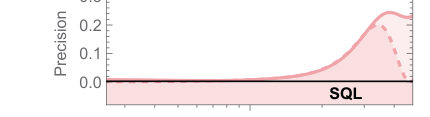
<figcaption class="paper-figure-caption"><b>Fig 3.</b> FIG. 3. Criticality-enhanced quantum sensing in the interferomet- ric protocol. (a) Excited-state phase diagram of the effective spinor Hamiltonian (2) for N = 100 atoms at zero magnetization, shown as a function of the scaled energy E and the effective quadratic Zee- man parameter ˜ϵ. The color scale represents the normalized number variance ∆N0/N of the dressed mode φ0 for the eigenstates. The green dashed lines indicate the ESQPT lines. (b),(c) Estimation pre- cision and quantum Fisher information for initial states prepared near the ground-state quantum phase transition (blue square in (a), panel (b)) and near an ESQPT (red square in (a), panel (c)), for N = 100 atoms. The dashed lines...</figcaption>
</figure>
<figure class="paper-figure-card">
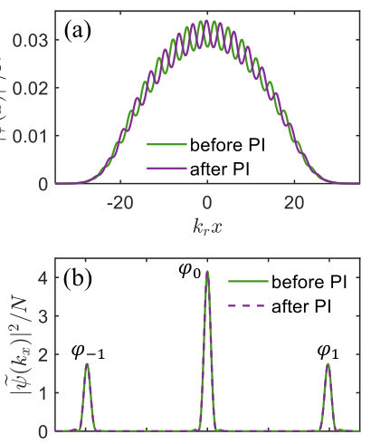
<figcaption class="paper-figure-caption"><b>Fig 4.</b> FIG. 4. Extraction of the imprinted phase from SOC-induced den- sity modulations. (a) Condensate density profiles and (b) correspond- ing quasimomentum distributions before and after phase imprinting (PI). Phase imprinting generated by Lz induces a relative phase be- tween the dressed modes, resulting in a shift of the density modu- lation pattern. Parameters for the Gross–Pitaevskii simulations are specified in Appendix B.</figcaption>
</figure>

**Summary.** This paper proposes a new type of atomic interferometry using spin-orbit-coupled spin-1 Bose gases. By tuning the Raman coupling, researchers can independently control spin interactions to create entanglement and use spatial density patterns as a new way to read out phase information. This approach allows for precision measurements that can surpass the standard quantum limit.

**Why it may be interesting.** It presents a highly controllable platform for nonlinear atom interferometry, offering a unique way to implement time-reversal (echo) protocols and exploit spin-momentum locking for new types of quantum-enhanced sensing.

Detailed structure

**Main problem.** Developing a flexible quantum interferometry scheme that overcomes the limitations of conventional spinor BECs, specifically the difficulty in independently controlling spin-mixing interactions and measurement strategies.

**Main result.** The authors demonstrate that Raman-dressed spin-1 gases allow for enhanced metrological sensitivity beyond the standard quantum limit using both ground-state and excited-state quantum phase transitions, and provide a novel readout via spatial density modulations.

**Method.** The study uses a three-mode truncation of the effective Hamiltonian, exact diagonalization, the Truncated Wigner Approximation (TWA) for quantum dynamics, and Gross-Pitaevskii Equation (GPE) simulations.

**Model / system.** A Raman-dressed spin-1 Bose-Einstein condensate with synthetic spin-orbit coupling, described by an effective spinor Hamiltonian where the spin-mixing interaction strength can be tuned via Raman coupling.

**Key observables.** Quantum Fisher Information (QFI), estimation precision, magnetization, quadrupolar operator, and spatial density modulations (density stripes).

**Important parameters / regimes.** Raman coupling (Omega), linear and quadratic detuning (delta, epsilon), spin-mixing interaction strength (lambda), and the P, TF, and BA ground-state phases.

**Assumptions / limitations.** The low-energy dynamics are assumed to be localized around the three minima of the dispersion branches (three-mode truncation), and TWA accuracy is noted to be limited to short time scales.

**Figures summary.** Fig 1 shows the Raman coupling scheme, dispersion bands, and ground-state phase diagram; Fig 2 illustrates the sequential protocol; Fig 3 displays energy spectra, ESQPT lines, and QFI dynamics; Fig 4 demonstrates phase extraction via density stripe shifts.

**Paper structure.** The paper begins by introducing the Raman-dressed platform and its effective Hamiltonian, moves to describing specific interferometric protocols (sequential and echo-type), analyzes metrological enhancement via ground-state and excited-state criticality, and concludes with a novel spatial readout strategy.

Abstract

We propose and analyze a quantum interferometry scheme based on a Raman-dressed Bose gas with spin-orbit coupling. In this system, the atom-light coupling mixes spin and momentum degrees of freedom, giving rise, in the low-energy regime, to an effective spinor condensate whose spin-mixing interaction can be tuned independently of the atomic density. This controllability enables a separation between state preparation and phase imprinting, and provides a natural route to echo-type protocols based on effective time reversal. Within this framework, critical regimes of the effective spinor Hamiltonian can be used to generate entanglement and enhance interferometric sensitivity beyond the standard quantum limit. In addition, the spin-momentum locking of the dressed modes gives access to spatial density modulations that provide an alternative readout of the interferometric phase. In particular, phase information can be extracted from the displacement of spin-orbit-induced density stripes even when conventional spin observables are insensitive within the effective spinor description. Our results identify Raman-dressed spinor gases as a flexible platform for nonlinear atomic interferometry, combining controllable spin-mixing dynamics with spatially resolved phase readout.

[↑ back to top](#top)

### [All-optical saddle trap as a platform for mesoscopic quantum experiments](http://arxiv.org/abs/2605.00724v1)

**Authors:** Pedro V. Paraguassú, Luca Abrahão, Daniel Tandeitnik, D. Martínez-Tibaduiza, Antonio Zelaquett Khoury, Thiago Guerreiro  
**Type:** both · **Category:** other · **PDF:** <https://arxiv.org/pdf/2605.00724v1>  
**Analysis basis:** full PDF text, analyzed in chunks
**Topic relevance:** `interference shaping light` **3/5** · `quantum measurements` **3/5** · `correlated / nonlocal dissipation` **2/5** · `entanglement & information structure` **2/5** · `methods for driven-dissipative` **2/5** · `non-equilibrium dynamics` **2/5**

↔ Scroll figures horizontally

<figure class="paper-figure-card">
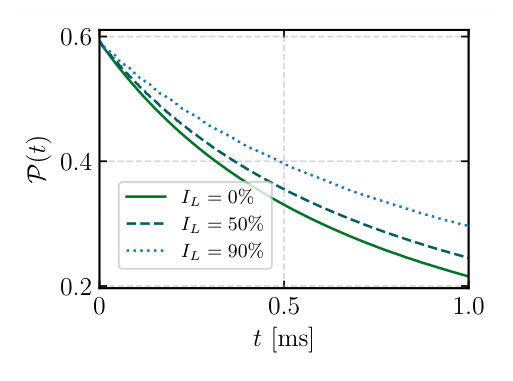
<figcaption class="paper-figure-caption"><b>Fig 1.</b> FIG. 1: Time evolution of the state purity, P for dif- ferent fractional powers IL of the l = ±2 modes in the saddle trap, for an initial thermal state of a Gaussian trap with occupation numbers ¯nx = ¯ny = 0.8 and initial purity P(0) ≈0.6.</figcaption>
</figure>
<figure class="paper-figure-card">
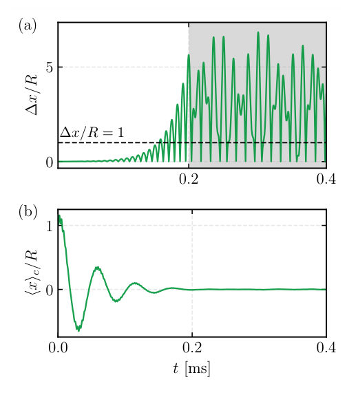
<figcaption class="paper-figure-caption"><b>Fig 2.</b> FIG. 2: Time evolution of (a) the position uncertainty normalized by the particle radius, ∆x/R. At t = 0, the particle is transferred into a slowly rotating saddle beam (Ω/Ω0 &lt; 1), leading to state expansion. At t = 0.2 ms, the rotation frequency is abruptly increased to Ω/Ω0 = 4.5, truncating state expansion. (b) Time evolution of the conditional mean position ⟨x⟩/R under continuous monitoring and feedback cooling, starting from an initial displacement ⟨x⟩0 = R.</figcaption>
</figure>
<figure class="paper-figure-card">
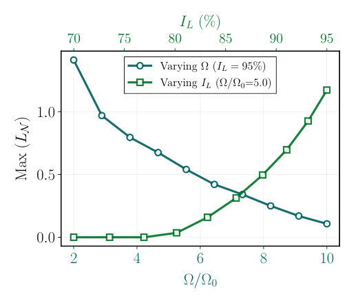
<figcaption class="paper-figure-caption"><b>Fig 3.</b> FIG. 3: Maximum entanglement at 1 ms, quantified by the logarithmic negativity LN , as a function of the Laguerre-Gaussian fractional power IL and the dimen- sionless rotation frequency Ω/Ω0. The lower and upper horizontal axes display the degree of rotation and the La- guerre mode fraction IL, respectively.</figcaption>
</figure>
<figure class="paper-figure-card">
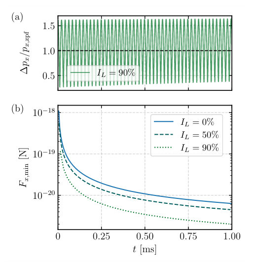
<figcaption class="paper-figure-caption"><b>Fig 4.</b> FIG. 4: Time evolution of (a) the momentum uncer- tainty normalized by zero-point fluctuations of the initial Gaussian trap as discussed in the main text, ∆px/pzpf, specifically for IL = 90%. The dashed line marks the zero-point fluctuation limit, where values below it in- dicate momentum squeezing. (b) Minimum detectable force Fx,min as a function of time for different Laguerre mode fractions IL. The sensitivity is derived from the quantum Cramér-Rao Bound with a stable rotation fre- quency Ω= 20 Ω0. Increasing IL enhances momentum squeezing, directly improving sensitivity and pushing the detection limit into the zepto-Newton (10−21 N) regime.</figcaption>
</figure>

**Summary.** The paper proposes a new all-optical saddle trap for levitated nanoparticles using structured light to reduce decoherence. This platform allows for advanced quantum tasks such as controlled wavefunction expansion and highly sensitive force detection in the zepto-Newton range.

**Why it may be interesting.** It provides a novel platform for studying open quantum systems by demonstrating how structured light can be engineered to suppress specific decoherence channels like photon recoil.

Detailed structure

**Main problem.** The need for levitated optomechanical platforms that minimize decoherence from photon recoil and thermal radiation while enabling controlled quantum experiments like delocalization and force sensing.

**Main result.** An all-optical rotating saddle trap using structured light (Gaussian and Laguerre-Gauss modes) suppresses photon recoil decoherence and enables force detection sensitivity in the zepto-Newton regime.

**Method.** The study uses a master equation approach to model decoherence and a Quantum Fisher Information Matrix analysis to derive fundamental limits for force metrology.

**Model / system.** A mesoscopic, levitated nanoparticle (radius 50 nm) in a rotating, time-dependent quadratic potential created by a superposition of Gaussian and Laguerre-Gauss optical modes.

**Key observables.** State purity, logarithmic negativity (entanglement), momentum squeezing, and minimum detectable force.

**Important parameters / regimes.** LG mode intensity fraction (IL), rotation frequency (Omega), gas-limited coherence time (Tgas), and numerical aperture (NA).

**Assumptions / limitations.** The system is treated within the dipole limit and quadratic approximation, assuming the particle motion remains within a characteristic length scale L.

**Figures summary.** Figure 1 shows purity evolution; Figure 2 illustrates particle delocalization and recovery protocols; Figure 3 plots entanglement vs. rotation frequency; Supplemental Figure S1 details trap stability and depth.

**Paper structure.** The paper introduces the saddle trap architecture, analyzes the stability and validity of the quadratic approximation, quantifies decoherence suppression and entanglement generation, and concludes with a metrological application for force detection.

Abstract

We investigate the quantum dynamics of a levitated nanoparticle in a structured light rotating saddle-like optical potential consisting of a superposition of Gaussian and Laguerre-Gauss modes with detuned frequencies. This rotating saddle trap offers unique opportunities for quantum experiments, such as reduced decoherence due to photon recoil and absorption, the possibility of large delocalization of the particle's center-of-mass motion, particle recovery protocols, the generation of motional entanglement and momentum squeezing. As an application, we show that this saddle-trap architecture enables force detection with sensitivity in the zepto-Newton regime.

[↑ back to top](#top)

### [Topological Charge of Causality at a PT-Symmetric Exceptional Point](http://arxiv.org/abs/2605.00117v1)

**Authors:** Kejun Liu  
**Type:** theory · **Category:** other · **PDF:** <https://arxiv.org/pdf/2605.00117v1>  
**Analysis basis:** full PDF text, analyzed in chunks
**Topic relevance:** `driven-dissipative phase transition` **3/5** · `correlated / nonlocal dissipation` **2/5** · `methods for driven-dissipative` **2/5** · `non-equilibrium dynamics` **2/5** · `non-equilibrium universality` **2/5**

↔ Scroll figures horizontally

<figure class="paper-figure-card">
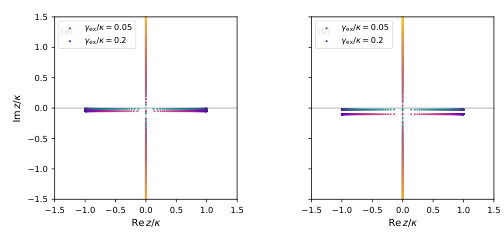
<figcaption class="paper-figure-caption"><b>Fig 1.</b> FIG. 1. Pole trajectory of the PT-dimer reflection coefficient in the complex z-plane as γ/κ sweeps across [0, 2], for two values of γex/κ. (a) Single-port coupling. (b) Symmetric coupling. A single pole crosses from the LHP into H+ at the EP.</figcaption>
</figure>
<figure class="paper-figure-card">
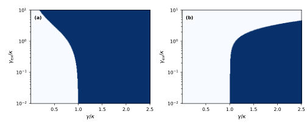
<figcaption class="paper-figure-caption"><b>Fig 2.</b> FIG. 2. Phase diagram in the (γ/κ, γex/κ) plane. (a) Single- port: causal (NB = 0, white) vs acausal (NB = 1, blue). (b) Symmetric: three regions including an overdamped re- entrant causal phase.</figcaption>
</figure>
<figure class="paper-figure-card">
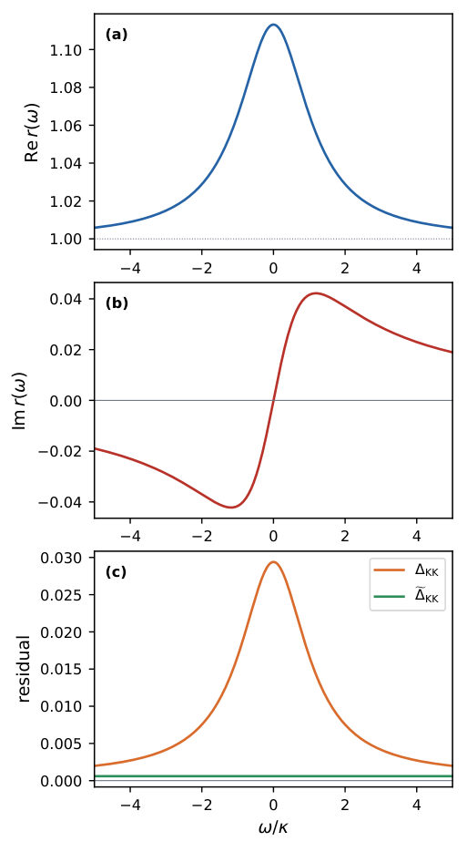
<figcaption class="paper-figure-caption"><b>Fig 3.</b> FIG. 3. KK residual at (γ, γex) = (1.5, 0.1)κ. (a) Re r(ω). (b) Im r(ω). (c) Standard (orange) vs residue-corrected (green) residual; the correction reduces the L2 norm by ∼21×.</figcaption>
</figure>
<figure class="paper-figure-card">
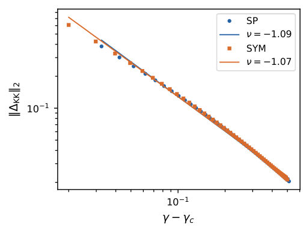
<figcaption class="paper-figure-caption"><b>Fig 4.</b> FIG. 4. Log-log scaling of ∥∆KK∥2 vs γ −γc. Circles: SP; squares: SYM. The extracted slope gives νSP = −1.08.</figcaption>
</figure>

**Summary.** This paper demonstrates that causality in PT-symmetric systems is not just a binary property but carries a topological charge that changes at an exceptional point. It shows that while standard Kramers-Kronig relations fail in the broken phase, a corrected version can be derived. The study also reveals that the violation of standard KK relations is most intense at the phase transition threshold.

**Why it may be interesting.** It provides a novel topological interpretation of causality in non-Hermitian systems and introduces a model-independent diagnostic for identifying non-Hermitian gain through the breakdown of standard dispersion relations.

Detailed structure

**Main problem.** Investigating whether the failure of standard Kramers-Kronig relations in non-Hermitian systems can be described as a topological transition where causality carries a topological charge.

**Main result.** The authors show that causality in a PT-symmetric dimer carries a topological charge (Blaschke winding number) that jumps from 0 to 1 at the exceptional point, and that the violation of standard KK relations scales with a negative exponent of approximately -1.08.

**Method.** Analytical derivation using Heisenberg-Langevin equations, input-output relations, and the Blaschke winding number framework, supplemented by numerical verification of the residue-corrected dispersion relation.

**Model / system.** A PT-symmetric open dimer coupled to a one-port waveguide, modeled by an effective non-Hermitian Hamiltonian with gain-loss parameter gamma and coupling kappa.

**Key observables.** Blaschke winding number (Nb), KK residual (Delta_KK), and the scaling exponent (nu).

**Important parameters / regimes.** Gain-loss strength (gamma), coupling strength (kappa), and external coupling/decay (gamma_ex).

**Assumptions / limitations.** The system is treated within the Markov approximation using the Gardiner-Collett interaction; the scaling results are derived for a single-port geometry.

**Figures summary.** Figure 1 shows the trajectory of the reflection coefficient pole in the complex plane and a phase diagram of the exceptional point; Figure 2 compares phase diagrams for different coupling geometries.

**Paper structure.** The paper introduces the problem of KK violation, defines the PT-symmetric dimer model, derives the topological charge via the Blaschke winding number, presents the residue-corrected KK relation, analyzes the scaling of the KK residual, and proposes an experimental protocol.

Abstract

Causality in linear response is conventionally treated as a binary property: a response function is either analytic in the upper half-plane or it is not. We show that in a PT-symmetric open dimer it instead carries a topological charge. As the gain-loss parameter crosses the exceptional point, a single pole of the reflection coefficient migrates into the upper half-plane, the Blaschke winding number jumps from 0 to 1, and standard Kramers-Kronig (KK) reconstruction acquires a Lorentzian residual fixed by the pole residue. The transition is sharp, protected by the codimension-one structure of the exceptional point, and directly measurable in a one-port reflection experiment. Most strikingly, the violation magnitude scales as Delta_KK ~ |gamma - gamma_c|^nu with nu ~ -1.08 in the single-port geometry: the breakdown of standard KK is strongest at threshold and weakens deeper in the broken phase. We derive the exact reflection coefficient, verify the residue-corrected dispersion relation, and propose a THz time-domain spectroscopy protocol that detects the topological charge through the residual itself.

[↑ back to top](#top)

### [Renormalized entropy production for optimal transport in jump processes: Make conservative forces optimal again](http://arxiv.org/abs/2605.00656v1)

**Authors:** Andreas Dechant, Jann van der Meer  
**Type:** theory · **Category:** statistical mechanics · **PDF:** <https://arxiv.org/pdf/2605.00656v1>  
**Analysis basis:** full PDF text, analyzed in chunks
**Topic relevance:** `methods for driven-dissipative` **3/5** · `non-equilibrium dynamics` **3/5** · `entanglement & information structure` **2/5** · `quantum measurements` **2/5**

↔ Scroll figures horizontally

<figure class="paper-figure-card">
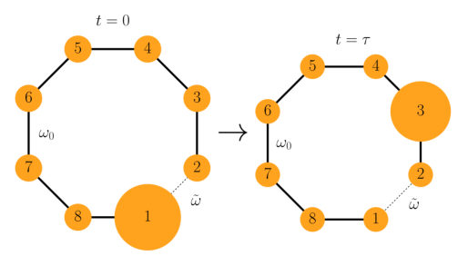
<figcaption class="paper-figure-caption"><b>Fig 1.</b> FIG. 1. Illustration of the example for a finite-time transport process. The system consists of N = 8 sites in a ring con- figuration, with transitions between neighboring sites. The symmetric part of the transition rates is ω(i, i + 1) = ω0, ex- cept for the transition between sites 1 and 2, which occurs at the lower rate ω(1, 2) = ˜ω. The size of the orange circles indi- cates the probability in the initial and final state: Initially, at t = 0, the most likely site is site 1, with all other sites being equiprobable, while finally at t = τ, we want the system to be at site 3 with the largest probability. This requires us to transport probability from site 1 to site 3, which can be done...</figcaption>
</figure>
<figure class="paper-figure-card">
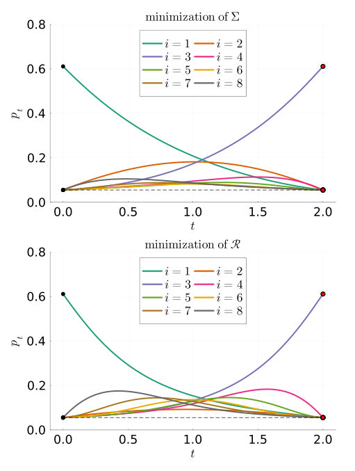
<figcaption class="paper-figure-caption"><b>Fig 2.</b> FIG. 2. Results for the optimal protocol realizing the trans- port process illustrated in Fig. 1 with N = 8, ω0 = 1, ˜ω = 0.003, p0(1) = 10p0(i) for all i ̸= 1, pτ(3) = 10pτ(i) for all i ̸= 3 and τ = 2. The top panel shows the optimal time-evolution of the probability distribution minimizing the entropy production, while the bottom panel shows the one minimizing the renormalized entropy production.</figcaption>
</figure>
<figure class="paper-figure-card">
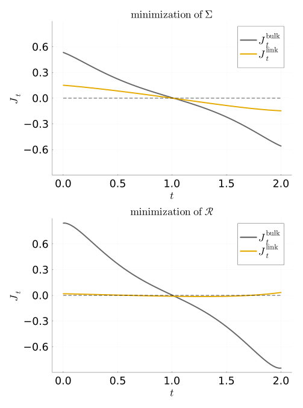
<figcaption class="paper-figure-caption"><b>Fig 3.</b> FIG. 3. Probability currents corresponding to Fig. 2. The cur- rent through the bulk sites is defined as the difference of the probability current entering site 8 and the probability current exiting site 4, Jbulk t = Jt(8, 1)−Jt(3, 4), while the correspond- ing current through the link is Jlink t = Jt(2, 1) −Jt(3, 2). The top panel shows the probability flows for the protocol mini- mizing the entropy production, while the bottom panel shows the one minimizing the renormalized entropy production.</figcaption>
</figure>
<figure class="paper-figure-card">
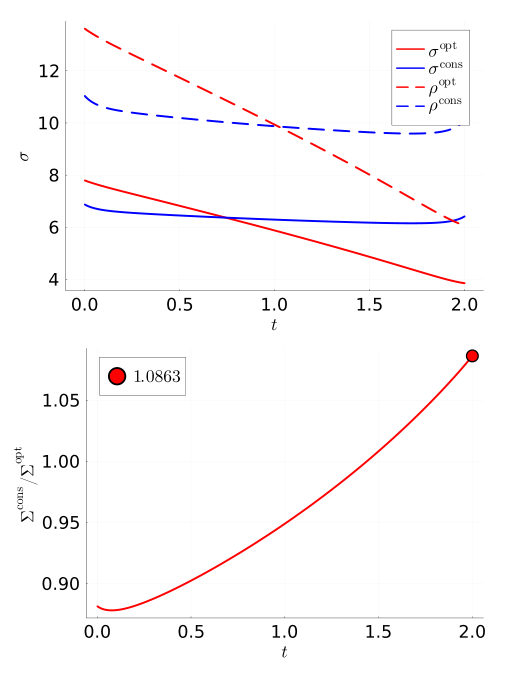
<figcaption class="paper-figure-caption"><b>Fig 4.</b> FIG. 4. Entropy production and renormalized entropy pro- duction for different optimal protocols. The top panel depicts the (renormalized) entropy production rate along the non- conservative optimal protocol that minimizes the entropy pro- duction (opt) or the conservative protocol that minimzies the renormalized entropy production (cons). The bottom panel shows the ratio of the entropy production for the conserva- tive forces minimizing the renormalized one and the minimal entropy production.</figcaption>
</figure>
<figure class="paper-figure-card">
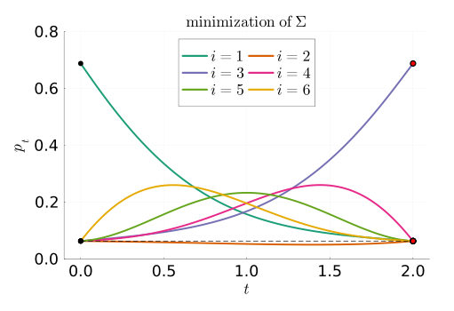
<figcaption class="paper-figure-caption"><b>Fig 5.</b> FIG. 5. Results for the optimal protocol minimizing entropy production for N = 6 sites. Other parameters are as specified in Fig. 2.</figcaption>
</figure>

**Summary.** The paper identifies that standard entropy production is not minimized by conservative forces in jump processes. By proposing a 'renormalized' version of entropy production, the authors restore the principle that conservative forces are the optimal drivers for a given time evolution. This provides a more consistent thermodynamic framework for studying transport in discrete systems.

**Why it may be interesting.** This work is highly relevant to open quantum systems and many-body dynamics as it provides a new framework for understanding optimal driving and dissipation in discrete-state stochastic dynamics, which is essential for controlling quantum master equations.

Detailed structure

**Main problem.** In discrete-state Markov jump processes, the conservative forces that drive a system do not minimize the standard entropy production, breaking the fundamental connection found in continuous diffusion processes.

**Main result.** The authors introduce 'renormalized entropy production,' a new quantity that is uniquely minimized by conservative forces, thereby restoring the link between conservative driving and optimal transport.

**Method.** The study uses optimal transport theory, variational calculus with Lagrange multipliers, and Kullback-Leibler divergence analysis of trajectory probabilities.

**Model / system.** The model consists of Markov jump processes on a discrete state space governed by a Master Equation, where transition rates are parameterized by symmetric (activity) and skew-symmetric (thermodynamic force) components.

**Key observables.** Entropy production rate, renormalized entropy production, thermodynamic forces, probability currents, and dynamical activity.

**Important parameters / regimes.** Near-equilibrium vs. far-from-equilibrium regimes, inverse temperature (beta), and mobility (mu).

**Assumptions / limitations.** The state space is connected, the process is Markovian, and microscopic reversibility (detailed balance) holds for the underlying transition structure.

**Figures summary.** Figure 1 illustrates a transport problem on an 8-site ring with a weak link; Figure 2 shows the time-evolution of occupation probabilities for optimal and near-optimal protocols; Figure 3 compares probability currents in bulk vs. link paths.

**Paper structure.** The paper establishes the discrepancy in jump processes, constructs the renormalized entropy production, provides numerical illustrations, explores trajectory-dependent counterparts, and discusses speed limits and path-probability interpretations.

Abstract

For continuous-space diffusion processes, there is a strong connection between conservative forces and entropy production. For a given time evolution of the system's state, the entropy production is minimized when the system is driven by a unique conservative force. However, this relation does not extend to jump processes on a discrete state space. In this case, the forces that minimize the entropy production are generally nonconservative, this effect is more pronounced far from equilibrium in the presence of high energy barriers. Here we show that, while conservative forces do not minimize the entropy production for a given time evolution, they are nevertheless uniquely characterized as the minimizer of a quantity we dub the renormalized entropy production. This work explores the properties this quantity shares with entropy production as well as crucial differences between them. We also discuss the conceptual and physical differences between the corresponding optimization problems in finite time. Our theoretical calculations are illustrated with explicit numerical examples.

[↑ back to top](#top)

### [From quantum storage to amplification: the effect of unwanted couplings and an additional level in cavity-based ensemble quantum memories](http://arxiv.org/abs/2605.00446v1)

**Authors:** Jia-Wei Ji, Christoph Simon  
**Type:** theory · **Category:** other · **PDF:** <https://arxiv.org/pdf/2605.00446v1>  
**Analysis basis:** full PDF text, analyzed in chunks
**Topic relevance:** `Tavis-Cummings & cavity-many-emitter` **3/5** · `correlated / nonlocal dissipation` **2/5** · `methods for driven-dissipative` **2/5** · `non-equilibrium dynamics` **2/5**

↔ Scroll figures horizontally

<figure class="paper-figure-card">
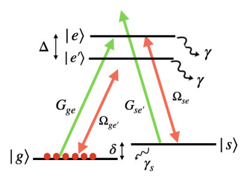
<figcaption class="paper-figure-caption"><b>Fig 1.</b> FIG. 1. The memory level diagram. The input signal drives the desired |g⟩−|e⟩transition with coupling strength Gge, while the control field drives the desired |s⟩−|e⟩tran- sition with time-dependent Rabi frequency Ωse(t). The un- wanted couplings are modeled explicitly through a distinct auxiliary excited state |e′⟩: the control field off-resonantly couples |g⟩−|e′⟩with strength Ωge′(t), and the signal off- resonantly couples |s⟩−|e′⟩with strength Gse′. This four-level scheme should be viewed as an extension of the idealized Λ- type memory, capturing the leading nearby-level correction while remaining analytically tractable. Both excited states |e⟩and |e′⟩are assumed to have the same...</figcaption>
</figure>
<figure class="paper-figure-card">
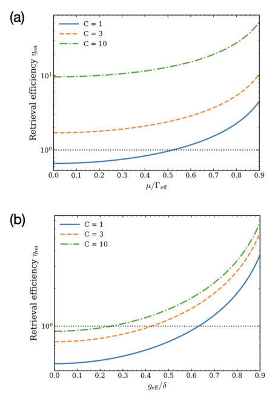
<figcaption class="paper-figure-caption"><b>Fig 2.</b> FIG. 2. Retrieval efficiency ηret in (a), plotted for the stable regime with geff &gt; δ as a function of µ/Γeff, where µ = p</figcaption>
</figure>
<figure class="paper-figure-card">
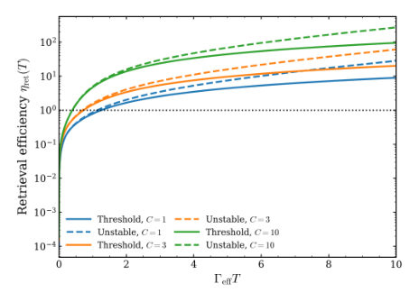
<figcaption class="paper-figure-caption"><b>Fig 3.</b> FIG. 3. Retrieval efficiency for the threshold and unstable regimes, plotted as a function of the dimensionless total pro- tocol time ΓeffT. The threshold regime satisfies Γeff = µ, and the unstable regime satisfies Γeff &lt; µ. The curves correspond to cooperativities C = |Gge|2N/(γκ) = 1, 3, 10 in each regime. The fixed parameters are the same as those in Fig. 2 with δ = 1 MHz. The horizontal dotted line marks ηtot = 1, above which the total output exceeds the ideal single-photon limit and indicates amplification. In these two cases, the memory effectively operates as a photon source, emitting photons con- tinuously over time.</figcaption>
</figure>
<figure class="paper-figure-card">
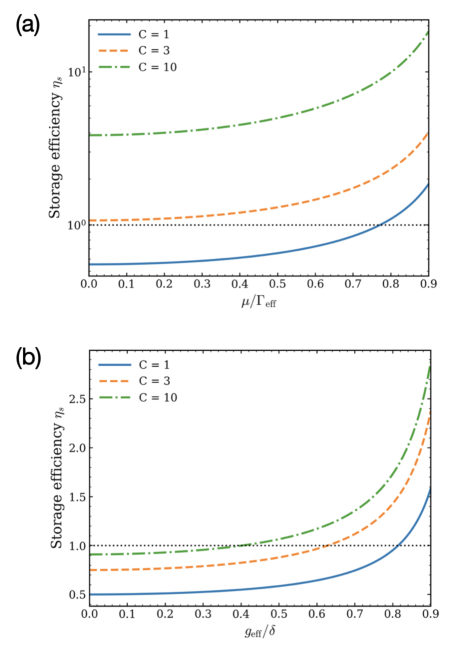
<figcaption class="paper-figure-caption"><b>Fig 4.</b> FIG. 4. Storage efficiency ηs in (a) and (b), plotted for the stable regime with geff &gt; δ and geff &lt; δ, respectively. For (a) and (b), the horizontal axis is the dimensionless ratios µ/Γeff and geff/δ, respectively. For the panel (b), since in this case δ ≫Γeff, the performance is dictated by the ratio of geff to δ. The curves correspond to cooperativities C = |Gge|2N/(γκ) = 1, 3, 10. The fixed parameters are the same as those in Fig. 2. The horizontal dotted line in both panels marks ηret = 1, above which the total output exceeds the ideal single-photon limit and indicates amplification.</figcaption>
</figure>
<figure class="paper-figure-card">
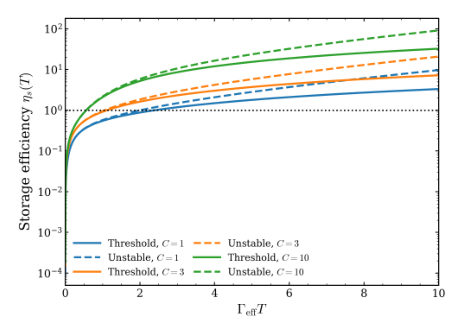
<figcaption class="paper-figure-caption"><b>Fig 5.</b> FIG. 5. Storage efficiency for the threshold and unstable regimes, plotted as a function of the dimensionless total pro- tocol time ΓeffT. The threshold regime satisfies Γeff = µ, and the unstable regime satisfies Γeff &lt; µ. The curves correspond to cooperativities C = |Gge|2N/(γκ) = 1, 3, 10 in each regime. The fixed parameters are the same as those in Fig. 3 with δ = 1 MHz. The horizontal dotted line marks ηtot = 1, above which the total output exceeds the ideal single-photon limit and indicates amplification. In these two cases, the memory effectively operates as a photon source, emitting photons con- tinuously over time.</figcaption>
</figure>

**Summary.** This paper studies how extra energy levels and unwanted field couplings impact the performance of cavity-based quantum memories. It reveals that while these couplings can boost efficiency through amplification, they simultaneously degrade the fidelity of the stored quantum state. The study establishes a clear distinction between functional memory operation and unwanted photon amplification.

**Why it may be interesting.** It provides a practical framework for optimizing realistic quantum memories by moving beyond idealized Lambda models, specifically addressing how noise and gain channels break time-reversal symmetry and affect fidelity.

Detailed structure

**Main problem.** Investigating how unwanted couplings and additional energy levels in a four-level system affect the performance of cavity-based ensemble quantum memories, specifically distinguishing between faithful storage and unwanted amplification.

**Main result.** The authors identify three dynamical regimes (stable, threshold, and unstable) and demonstrate an efficiency-fidelity trade-off where unwanted couplings can increase total efficiency (even leading to amplification) at the cost of reduced fidelity.

**Method.** A fully quantum treatment using Heisenberg-Langevin equations, involving adiabatic elimination of excited states and the cavity mode, and a Bogoliubov transform to solve the dynamics.

**Model / system.** A four-level extension of a cavity-based Lambda-type ensemble memory involving a ground state, a metastable spin state, and two excited states, subject to both desired and off-resonant unwanted couplings.

**Key observables.** Single-photon storage efficiency, retrieval efficiency, operational fidelity (signal-to-noise ratio), and photon flux.

**Important parameters / regimes.** Cooperativity (C), effective decay rate (Gamma_eff), effective coupling (g_eff), ground-state splitting (delta), and the ratio mu/Gamma_eff.

**Assumptions / limitations.** Low-excitation/weak-excitation regime, adiabatic elimination of excited states and cavity mode, bad-cavity approximation, and neglecting spin decoherence.

**Figures summary.** Figure 1 shows the four-level energy scheme; Figure 2 shows retrieval efficiency vs. mu/Gamma_eff; Figures 4 and 7 plot storage efficiency and fidelity across different regimes and cooperativity values; Figure 8 compares efficiency in threshold and unstable regimes over time.

**Paper structure.** The paper introduces the four-level model, derives the effective dynamics and analytical expressions for efficiency and fidelity, identifies the three dynamical regimes, analyzes the efficiency-fidelity trade-off, and concludes with implications for realistic warm-vapor memories.

Abstract

Quantum-memory models often reduce complex level structures to an idealized $Λ$ system, potentially missing nearby levels and unwanted couplings that can qualitatively alter the predicted performance. Here, we study an extension of a cavity-based $Λ$-type ensemble memory, a four-level model with unwanted couplings from both the control field and signal, using a fully quantum treatment. We derive explicit expressions for the single-photon storage efficiency, retrieval efficiency, and fidelity, and on this basis identify three distinct dynamical regimes: stable, threshold, and unstable. Within the stable regime, we additionally discriminate between two qualitatively different sub-regimes. Applying the theory to warm-vapor-inspired parameters, we determine the conditions under which the system can still operate as a high-quality quantum memory. More generally, our results provide a practical framework for distinguishing genuine memory operation from amplification and for optimizing realistic quantum memories beyond idealized models.

[↑ back to top](#top)

### [Unified approach to time-resolved x-ray and electron diffraction imaging](http://arxiv.org/abs/2605.00286v1)

**Authors:** Mingrui Yuan, Nikolay V. Golubev  
**Type:** theory · **Category:** other · **PDF:** <https://arxiv.org/pdf/2605.00286v1>  
**Analysis basis:** full PDF text, analyzed in chunks
**Topic relevance:** `Keldysh / 2PI / non-Gaussian methods` **3/5** · `non-equilibrium dynamics` **2/5** · `quantum measurements` **2/5**

↔ Scroll figures horizontally

<figure class="paper-figure-card">
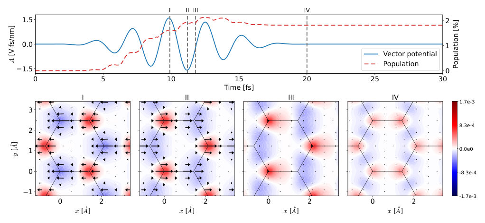
<figcaption class="paper-figure-caption"><b>Fig 1.</b> FIG. 1. Laser-driven electron dynamics in graphene. Top panel: The blue curve represents the vector potential of the pump laser field polarized along x direction, while the red line depicts the evolution of the population of the conduction band of graphene. Bottom panel: The snapshots of the integrated real space electron difference density (contour plots) and the electron current density (arrows). The four columns depict the time instances tI = 9.8 fs, tII = 11.2 fs, tIII = 11.8 fs, and tIV = 20.0 fs, indicated by the vertical grey dashed lines in top panel. More detailed discussion of the utilized computational procedure can be found in Ref. [99].</figcaption>
</figure>
<figure class="paper-figure-card">
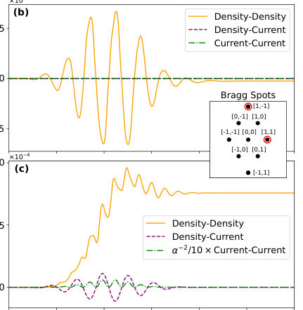
<figcaption class="paper-figure-caption"><b>Fig 2.</b> FIG. 2. Simulated electron diffraction measurements prob- ing the laser-driven dynamics of electron density and elec- tron current density in graphene. (a) Vector potential of the pump field. (b) and (c) Comparison of density-density (orange solid line), density-current (purple dashed line), and current-current (green dash-dotted line) contributions to the time-resolved diffraction signal at the [1, 1] and [1, −1] Bragg spots of graphene, respectively. The inset schematically shows the positions of the graphene Bragg spots and highlights those analyzed in panels (b) and (c).</figcaption>
</figure>

**Summary.** This paper presents a unified theoretical framework for both time-resolved x-ray and electron diffraction imaging using quantum field theory. By establishing a common formalism, it allows for a consistent comparison of how different probes capture ultrafast quantum dynamics. The authors demonstrate the utility of this approach by simulating laser-driven electron motion in graphene.

**Why it may be interesting.** It provides a rigorous field-theoretic bridge between different types of ultrafast probes, which is highly relevant for researchers studying the coherent interaction of light and matter and the development of new quantum imaging techniques.

Detailed structure

**Main problem.** The lack of a unified theoretical framework to describe and compare time-resolved x-ray diffraction (TR-XRD) and ultrafast electron diffraction (TR-UED) within a consistent formalism.

**Main result.** The authors develop a unified quantum-field-based description that encompasses both TR-XRD and TR-UED, allowing for the systematic disentanglement of their similarities and differences.

**Method.** The approach uses quantum field theory and time-dependent perturbation theory to derive scattering probabilities, extending the time-dependent formulation of x-ray scattering to arbitrary particles.

**Model / system.** The model describes the interaction between a probe beam (photons for x-rays or electrons for TR-UED) and a target system, specifically applied to laser-driven electron dynamics in monolayer graphene.

**Key observables.** Scattering probability, differential scattering cross-section, electron density dynamics, and electron current dynamics.

**Important parameters / regimes.** Ultrafast/non-equilibrium regimes, femtosecond and sub-femtosecond temporal resolution, and the relativistic Breit interaction for electron scattering.

**Assumptions / limitations.** Assumes the unperturbed Hamiltonian is separable, neglects electron exchange between beam and target, and uses the non-retardation approximation for the electromagnetic interaction.

**Paper structure.** The paper begins by identifying the need for a unified framework, establishes a general quantum-field-based scattering theory, derives specific matrix elements for both x-ray and electron beams, and concludes with a numerical simulation of electron dynamics in graphene.

Abstract

Time-resolved x-ray diffraction (TR-XRD) and ultrafast electron diffraction (TR-UED) are emerging tools for probing ultrafast quantum dynamics. From a theoretical perspective, they are commonly described within different frameworks and modeled using distinct approximations. Here, we present a unified quantum-field-based description of ultrafast diffraction imaging that permits consistent consideration of TR-XRD and TR-UED within a common theoretical formalism. Our approach elucidates the correspondence between TR-XRD and TR-UED and allows their similarities and differences to be systematically disentangled. The developed formalism is sufficiently general to consistently and straightforwardly incorporate additional physical effects of interest, such as relativistic charge-current and current-current couplings. We apply our approach to simulate diffraction measurements of laser-driven electron dynamics in graphene, demonstrating the unique capabilities of diffraction imaging to unravel intricate quantum processes in matter.

[↑ back to top](#top)

### [Entanglement Enabled Data Transmission over an Arbitrarily Varying Channel](http://arxiv.org/abs/2605.00132v1)

**Authors:** Janis Nötzel, Florian Seitz  
**Type:** theory · **Category:** quantum information and computing · **PDF:** <https://arxiv.org/pdf/2605.00132v1>  
**Analysis basis:** full PDF text, analyzed in chunks
**Topic relevance:** `entanglement & information structure` **3/5** · `quantum measurements` **2/5**

↔ Scroll figures horizontally

<figure class="paper-figure-card">
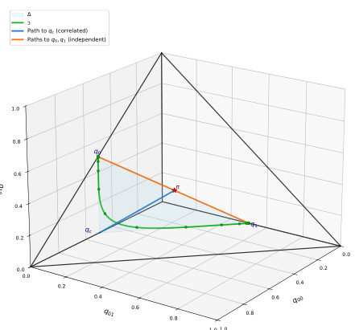
<figcaption class="paper-figure-caption"><b>Fig 1.</b> Fig. 1. Depicted are O and ∆as part of the convex polytope P({0, 1}2), using r = A = 2. We observe that O approaches q0 and q1 in its limits.</figcaption>
</figure>

**Summary.** The paper shows that entanglement can be used to establish shared correlations between a sender and receiver to overcome jamming attacks in optical channels. By using Two-Mode Squeezed Vacuum states, the parties can transform a zero-capacity, symmetrizable channel into a functional communication channel. This provides a way to 'bootstrap' communication in environments where an adversary is actively trying to disrupt signal synchronization.

**Why it may be interesting.** This work is highly relevant to quantum optics and open quantum systems as it explores how entanglement-assisted protocols can provide resilience against adversarial noise (jamming) and demonstrates a super-activation-like phenomenon in bosonic channels.

Detailed structure

**Main problem.** The paper addresses the 'bootstrap' problem in communication: how a sender and receiver can establish shared randomness to stabilize an Arbitrarily Varying Channel (AVC) against a jammer when no pre-shared resources exist.

**Main result.** The authors demonstrate that using entangled Two-Mode Squeezed Vacuum (TMSV) states allows the sender and receiver to break channel symmetrizability and achieve positive communication capacity, even when a jammer can otherwise reduce the capacity to zero.

**Method.** The study uses Gaussian covariance matrices, Wigner functions, and information-theoretic bounds (like Pinsker's inequality) to analyze a correlation distribution procedure involving homodyne detection and sign binarization.

**Model / system.** A quantum-optical communication model using a beam splitter with transmissivity eta, involving coherent states for BPSK signaling and Two-Mode Squeezed Vacuum (TMSV) states as a quantum resource, subject to an energy-limited Gaussian jammer.

**Key observables.** Binarized correlation coefficient (rho_bin), quadrature measurements (x, p), and channel capacities (C, C_bar, C_tilde).

**Important parameters / regimes.** Squeezing magnitude (r), beam splitter transmissivity (eta), jamming energy (alpha^2), and BPSK amplitude (alpha).

**Assumptions / limitations.** The jammer is assumed to be energy-limited and restricted to using Gaussian states; the communication model is based on a standard optical setup.

**Figures summary.** Figure 1 provides a visualization of the probability space of correlations, depicting the set of possible correlations within a convex polytope.

**Paper structure.** The paper introduces the jamming problem and the bootstrap challenge, describes the quantum-optical communication model and TMSV protocol, presents the mathematical proof for capacity enhancement and correlation persistence, and concludes with an appendix proving the monotonicity of binarized Gaussian correlations.

Abstract

Shared randomness is the central ingredient for stabilizing symmetrizable communication systems against arbitrarily varying jammers. Given the presence of the jammer, however, the question arises how this precious resource could have been distributed. Several works discuss the use of external sources for this task. In this work, we show, based on the most standard optical communication model, how the sender and receiver can employ entangled two-mode squeezed states to counter the jamming attack of an energy-limited jammer during the distribution phase when both the sender and jammer are allowed to use binary phase shift keying and two-mode squeezed vacuum states.

[↑ back to top](#top)

### [Measuring the largest coefficients of a quantum state](http://arxiv.org/abs/2605.00341v1)

**Authors:** Nicolás Ciancaglini, Santiago Cifuentes, Guido Bellomo, Santiago Figueira, Ariel Bendersky  
**Type:** theory · **Category:** quantum information and computing · **PDF:** <https://arxiv.org/pdf/2605.00341v1>  
**Analysis basis:** full PDF text, analyzed in chunks
**Topic relevance:** `entanglement & information structure` **3/5** · `quantum measurements` **2/5**

↔ Scroll figures horizontally

<figure class="paper-figure-card">
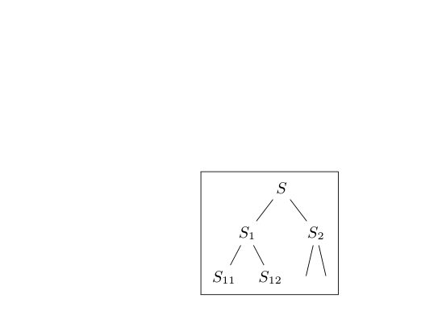
<figcaption class="paper-figure-caption"><b>Fig 1.</b> Figure 1. Parent-child relationship in the tree. The set S is partitioned into the disjoint subsets S1 and S2. Likewise, the set S1 is partitioned into S11 and S12.</figcaption>
</figure>
<figure class="paper-figure-card">
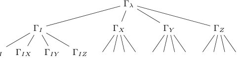
<figcaption class="paper-figure-caption"><b>Fig 2.</b> Figure 2. We show some branches of the tree starting from the root, which corresponds to the set of all indices. We partition the set Γλ by considering the subsets of strings that start with I, X, Y or Z.</figcaption>
</figure>
<figure class="paper-figure-card">
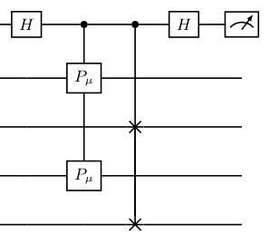
<figcaption class="paper-figure-caption"><b>Fig 3.</b> Figure 3. Circuit used to estimate Kµ using a mod- ification of the SWAP test.</figcaption>
</figure>
<figure class="paper-figure-card">
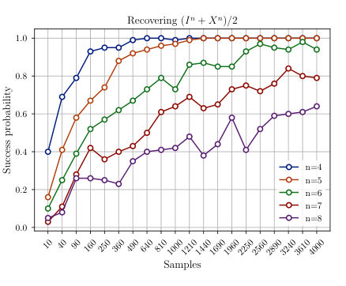
<figcaption class="paper-figure-caption"><b>Fig 4.</b> Figure 4. Success probability of recovering (I⊗n + X⊗n)/2n for different values of n and different sam- ple sizes. Each data point is obtained by running 100 simulations and averaging.</figcaption>
</figure>
<figure class="paper-figure-card">
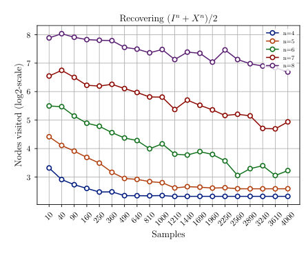
<figcaption class="paper-figure-caption"><b>Fig 5.</b> Figure 5. Number of nodes visited when trying to recover (In + Xn)/2n for different values of n and different sample sizes. Each data point is obtained by running 100 simulations and averaging.</figcaption>
</figure>

**Summary.** The paper introduces a new algorithm to find the most significant components of a quantum state in the Pauli basis using a tree-based search. By avoiding full tomography, it offers an efficient way to reconstruct structured states like stabilizer states. The method's efficiency depends on the state's purity and sparsity.

**Why it may be interesting.** This work provides a practical tool for the targeted characterization of large-scale quantum states, which is highly relevant for verifying many-body states and error-corrected systems in quantum computing.

Detailed structure

**Main problem.** Efficiently identifying and measuring the largest Pauli coefficients of an unknown n-qubit quantum state without the exponential cost of full state tomography.

**Main result.** The authors develop a hierarchical tree-based algorithm that can identify significant Pauli coefficients with a complexity bounded by the state's purity and the desired threshold, achieving near-optimal scaling for structured states like stabilizer states.

**Method.** A hierarchical algorithm using a prefix-based tree traversal where node weights are estimated via Bell sampling on two copies of the state or via modified SWAP tests.

**Model / system.** n-qubit quantum states, specifically focusing on sparse representations such as stabilizer states and Pauli-singleton states.

**Key observables.** Pauli coefficients (c_nu) and node weights (K_mu), which represent the sum of squared coefficients within a specific Pauli prefix subset.

**Important parameters / regimes.** Purity (Tr[rho^2]), coefficient threshold (epsilon), number of qubits (n), and the number of samples (M).

**Assumptions / limitations.** The algorithm assumes the state has a sparse or structured representation in the Pauli basis to avoid exponential node expansion; it also assumes access to two copies of the state for Bell sampling.

**Figures summary.** Figure 1 shows tree partitioning; Figure 2 visualizes the prefix tree structure; Figure 3 shows the SWAP test circuit; Figures 4-7 present numerical results on success probabilities and node expansion scaling for Pauli-singleton and stabilizer states.

**Paper structure.** Introduction of the search problem, description of the hierarchical tree algorithm, derivation of node weight estimation methods (Bell sampling/SWAP tests), complexity analysis for finding coefficients above a threshold or the top t coefficients, and numerical validation using stabilizer and Pauli-singleton states.

Abstract

We introduce a hierarchical algorithm for identifying the largest Pauli coefficients of an unknown $n$-qubit quantum state. The algorithm traverses a prefix-based tree whose nodes represent partial sums of squared Pauli coefficients, always expanding branches with the largest estimated weight and discarding the rest. Node weights are estimated using Bell sampling on two copies of the state, or alternatively via SWAP tests on subsystems. We analyze the sample complexity of each node estimation and derive bounds on the total number of nodes expanded as a function of the desired number of coefficients and the state's purity. For states admitting a sparse representation in the Pauli basis, the algorithm achieves a good reconstruction of the dominant components without requiring full state tomography. We validate the method with numerical simulations on Pauli-singleton states and random stabilizer states, showing that the algorithm's performance is competitive with other methods for structured states. Our work addresses an open problem in Pauli sampling and provides a practical tool for the targeted characterization of structured quantum states.

[↑ back to top](#top)

### [Staircase mechanical energy growth in optomechanical systems of median mechanical frequencies](http://arxiv.org/abs/2605.00338v1)

**Authors:** Yi Xiao, Yi Wu, Qi-Kai Zhan, Jin Lian Zhang, Bing He, Qing Lin  
**Type:** theory · **Category:** other · **PDF:** <https://arxiv.org/pdf/2605.00338v1>  
**Analysis basis:** full PDF text, analyzed in chunks
**Topic relevance:** `non-equilibrium dynamics` **3/5** · `driven-dissipative phase transition` **2/5**

↔ Scroll figures horizontally

<figure class="paper-figure-card">
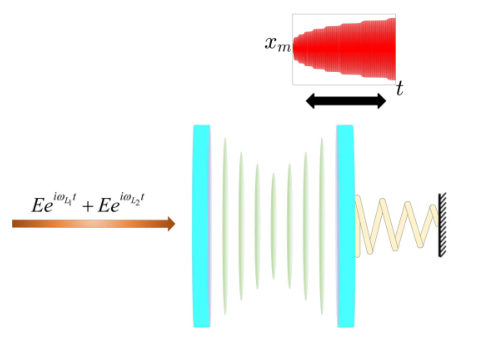
<figcaption class="paper-figure-caption"><b>Fig 1.</b> FIG. 1. An OMS driven by a two-tone field with the example of Fabry-P`erot (FP) cavity with movable mirror. If the two tones of driving laser field satisfy Eq. (5), the displacement of mechanical res- onator (the movable mirror) can evolve through a number of quasi- stable states of step like as in the inset. To have the variable step sizes, the ratio ωm/κ should be within a certain regime. We demon- strate the step wise evolution by means of the associated mechanical energy in the other figures, so that the feature is even clearer.</figcaption>
</figure>
<figure class="paper-figure-card">
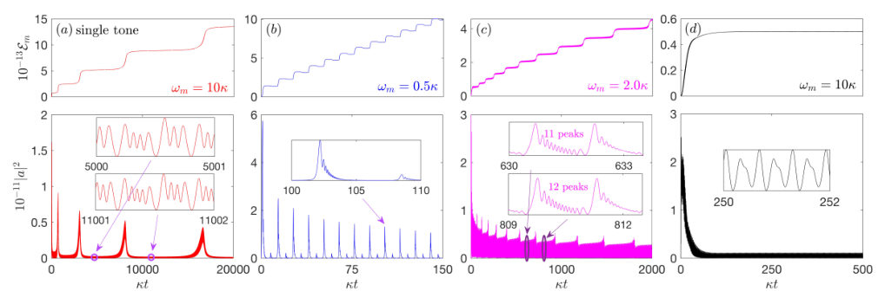
<figcaption class="paper-figure-caption"><b>Fig 2.</b> FIG. 2. Four different scenarios of evolving mechanical energy and intracavity field intensity. (a) A COMS in the resolved sideband regime (ωm/κ = 10) is driven by a single-tone field blue-detuned at ∆= −ωm. The inset shows that the patterns of the continuous intracavity field in those quasi-stable states are similar but have the increased peak numbers from one step to another. (b) A COMS in the unresolved sideband regime (ωm/κ = 0.5) is driven by a two-tone field satisfying Eq. (5). Here, only pulsed intracavity field exists around each termination of half mechanical oscillation period and one mechanical oscillation period. The prominent pulses after each mechanical oscillation push the...</figcaption>
</figure>
<figure class="paper-figure-card">
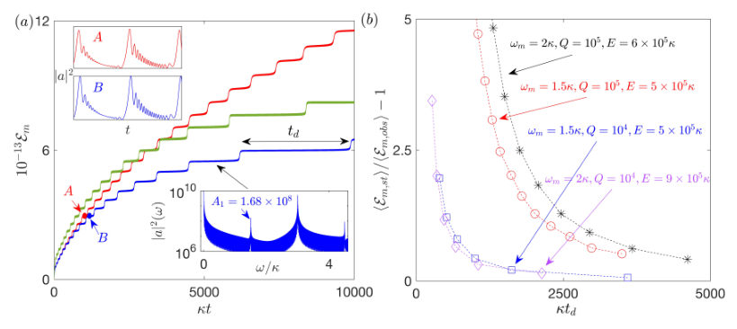
<figcaption class="paper-figure-caption"><b>Fig 3.</b> FIG. 3. (a) Comparison of the evolution trajectories for the mechanical resonators of the same built-in frequency ωm = 1.5κ, but with the different quality factors: Q = 105 for the red curve and Q = 104 for the blue curve. The other parameters for the curves are indicated by those of the corresponding colors in (b). The other one with Q = 104, the green curve, is due to a drive amplitude E = 6 × 105κ higher than those of the blue and green curve under E = 5 × 105κ. Here two drives tones are fixed at ∆1 = 0, ∆2 = −ωm. On the same level of steps A and B counted from the starting point, the intracavity field patterns are identical. The first-order sideband for the continuous intracavity fields...</figcaption>
</figure>
<figure class="paper-figure-card">
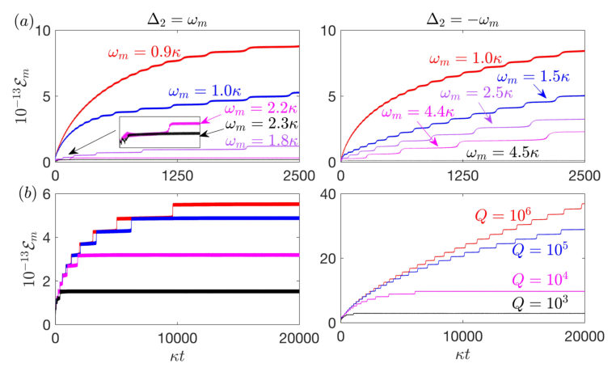
<figcaption class="paper-figure-caption"><b>Fig 4.</b> FIG. 4. (a) The oscillatory staircase evolution due to different built-in mechanical frequency. Here, the fixed system parameters are E = 5 × 105κ and Q = 105. (b) The oscillatory staircase phenomenon for different mechanical quality factors Q = ωm/γm. Here we fix the parameters at ωm = 2κ and E = 9 × 105κ.</figcaption>
</figure>
<figure class="paper-figure-card">
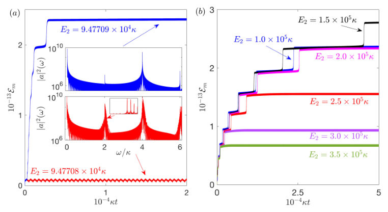
<figcaption class="paper-figure-caption"><b>Fig 5.</b> FIG. 5. (a) A bifurcation due to the difference in the powers of the drive tones. Here one of the tone is fixed at E1 = 5 × 105κ, and the other one is increased gradually. There is a sudden change of the associated intracavity field spectrum and the evolution pattern of mechanical energy, after the tone amplitude E2 is adjusted across the indicated values. (b) Corresponding relation between the evolved mechanical energy and the pump amplitude E2, given the fixed E1 = 5 × 105κ. The other fixed parameters are ∆1 = 0, ∆2 = ωm, Q = 105, and ωm = 2κ.</figcaption>
</figure>

**Summary.** This paper discovers a new 'staircase' pattern of mechanical energy growth in optomechanical systems operating at intermediate mechanical frequencies. It demonstrates how this pattern is sensitive to driving parameters and proposes its use for advanced sensing and phonon laser applications.

**Why it may be interesting.** It provides new insights into the non-equilibrium dynamics of driven-dissipative systems and identifies a new dynamical regime that could be utilized for high-precision sensing and phonon laser generation.

Detailed structure

**Main problem.** The study investigates a previously unknown 'staircase' evolution pattern of mechanical energy in cavity optomechanical systems (COMS) when driven by a two-tone field in the intermediate frequency regime.

**Main result.** The authors identify a staircase-like energy growth pattern occurring when the mechanical frequency is comparable to the cavity damping rate, noting that this regime exhibits unique bifurcations and sensitive responses to frequency mismatches.

**Method.** The researchers used numerical simulations of coupled differential equations for the intracavity field and mechanical resonator, alongside analytical approximations using Bessel function expansions for sideband amplitudes.

**Model / system.** A cavity optomechanical system (COMS), such as a Fabry-Perot cavity with a movable mirror, driven by a two-tone laser field where the frequency difference matches the mechanical frequency.

**Key observables.** Mechanical energy (phonon number), mechanical amplitude, mechanical frequency, intracavity field intensity, and sideband amplitudes.

**Important parameters / regimes.** Mechanical frequency to cavity damping ratio (omega_m/kappa), mechanical quality factor (Q), drive tone powers, and frequency mismatch (delta).

**Assumptions / limitations.** The analysis focuses on the intermediate regime where omega_m is neither much larger nor much smaller than kappa; the model assumes a specific two-tone driving condition.

**Figures summary.** Figure 1 shows the COMS setup and step-like displacement; Figure 2 compares energy evolution across resolved, unresolved, and intermediate regimes; Figure 3 examines the influence of the quality factor; Figure 6 illustrates the effects of positive and negative frequency mismatch.

**Paper structure.** The paper introduces the optomechanical system and the problem, compares different sideband regimes, details the discovery of the staircase pattern in the intermediate regime, analyzes the impact of system parameters like Q and power, explores frequency mismatch effects, and concludes with potential applications.

Abstract

Owing to the radiation-force-induced nonlinearity, cavity optomechanical systems (COMS) exhibit dynamical phenomena such as back-action induced oscillation, chaos, mechanical amplitude locking, and anomalous stabilization, which occur under different driving conditions and different system parameters. We here identify a previously unknown dynamical pattern of staircase evolution for the energy of mechanical resonator, when a COMS with neither very large nor very small built-in mechanical frequency is driven by a two-tone field, which satisfies a condition that the frequency difference of the two tones matches the built-in mechanical frequency. The properties of this phenomenon are analyzed for the different system parameters due to fabrication such as mechanical frequencies and quality factors, as well as under the varied driving conditions such as unequal drive tone powers and mismatched drive tone difference from the mechanical frequency. Some special features, such as an emergent bifurcation due to the tone power difference, together with the totally different responses of the system to the drive tone mismatches of opposite signs, are discovered to exist only in this type of COMS with median mechanical frequencies. This work fills a gap in the study of the dynamics of COMS under two-tone drives. In the aspect of applications, the rapid increase of mechanical energy exhibited in the phenomenon promises phonon laser generation, and the sensitive dynamical response to the drive tone mismatches offers a potential approach to high-precision sensing.

[↑ back to top](#top)

### [Toward Heisenberg-Limited Interferometry with Dual Squeezers](http://arxiv.org/abs/2605.00331v1)

**Authors:** Yi Gu, Song-Ping Wang, Wei Zhong  
**Type:** theory · **Category:** quantum information and computing · **PDF:** <https://arxiv.org/pdf/2605.00331v1>  
**Analysis basis:** full PDF text, analyzed in chunks
**Topic relevance:** `interference shaping light` **3/5** · `quantum measurements` **2/5**

↔ Scroll figures horizontally

<figure class="paper-figure-card">
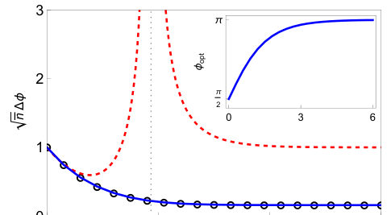
<figcaption class="paper-figure-caption"><b>Fig 1.</b> Figure 2. (Color online) Scaled phase sensitivity √¯n∆φ as a function of the squeezing parameter r for α = √</figcaption>
</figure>
<figure class="paper-figure-card">
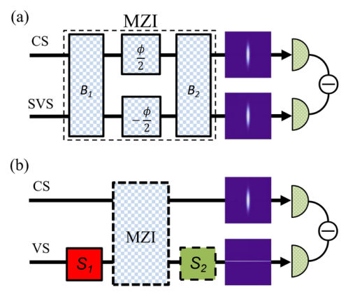
<figcaption class="paper-figure-caption"><b>Fig 2.</b> Figure 1. (Color online) Schematic of (a) the conventional Caves scheme using a standard Mach-Zehnder interferometer (MZI) fed by a coherent state (CS) and a squeezed-vacuum state (SVS), and (b) the DS-MZI scheme, where a vacuum state (VS) is squeezed by S1 before entering the MZI, and an additional squeezer S2 is applied to one output mode prior to detection. The Wigner quasi-probability distributions for the output ports are plotted for equal input intensities.</figcaption>
</figure>
<figure class="paper-figure-card">
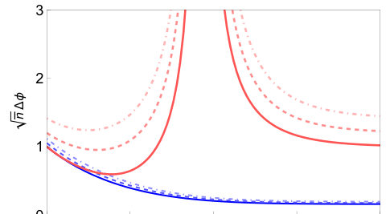
<figcaption class="paper-figure-caption"><b>Fig 3.</b> Figure 3. (Color online) Scaled phase sensitivity √¯n∆φ as a function of the squeezing parameter r under imperfect detec- tion for α = √</figcaption>
</figure>
<figure class="paper-figure-card">
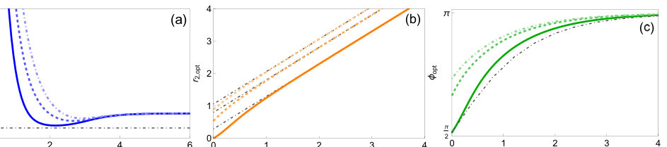
<figcaption class="paper-figure-caption"><b>Fig 4.</b> Figure 4. (Color online) Performance comparison of the unbalanced DS-MZI under imperfect detection for α= √</figcaption>
</figure>

**Summary.** The paper proposes a new dual-squeezing interferometer design that overcomes the fundamental limitation where phase sensitivity diverges in standard setups. By adding a second squeezer at the output, the scheme achieves Heisenberg-limited sensitivity that remains robust even with imperfect detectors. This provides a feasible path toward high-precision quantum-limited measurements.

**Why it may be interesting.** This work is highly relevant to quantum optics and quantum information as it proposes a practical, robust method to reach the fundamental Heisenberg limit in interferometry, overcoming the practical limitations of signal vanishing and detection loss.

Detailed structure

**Main problem.** Standard Mach-Zehnder interferometers (MZI) fail to achieve Heisenberg-limited phase sensitivity using direct photon-number-difference detection in the optimal equal-intensity regime due to a vanishing signal and divergence in sensitivity.

**Main result.** The introduction of a dual-squeezing approach (DS-MZI) eliminates the signal divergence and enables Heisenberg-limited phase sensitivity that is robust against detection noise and photon loss.

**Method.** The authors use an analytical framework involving SU(2) and SU(1,1) algebraic operators, error propagation formulas, and Wigner function analysis to evaluate phase sensitivity and robustness.

**Model / system.** A Dual-Squeezing Mach-Zehnder Interferometer (DS-MZI) consisting of two single-mode squeezers (one at the input and one at the output), beam splitters, and a phase shifter, fed with a coherent state and a squeezed-vacuum state.

**Key observables.** Photon-number-difference (N-), total photon-number (N+), and phase sensitivity (delta phi).

**Important parameters / regimes.** Squeezing parameters (r1, r2), detection efficiency (eta), input amplitude (alpha), and the equal-intensity regime (alpha^2 approx sinh^2 r).

**Assumptions / limitations.** The interferometer is assumed to be lossless for the derivation of the Quantum Fisher Information, and the optical elements are assumed to preserve Gaussian statistics.

**Figures summary.** Figure 1 illustrates the Wigner function distributions showing the elliptical distribution of the DS-MZI; Figure 3 compares the scaled phase sensitivity of the conventional MZI versus the DS-MZI under imperfect detection efficiency.

**Paper structure.** The paper identifies the divergence problem in standard MZI, introduces the DS-MZI architecture, provides an analytical derivation of phase sensitivity using operator algebra, evaluates performance under imperfect detection, and compares the results to the Heisenberg limit.

Abstract

The canonical Mach-Zehnder interferometer fed with a coherent state and a squeezed-vacuum state of equal intensities is theoretically predicted to achieve Heisenberg scaling in phase sensitivity. However, this ultimate performance is unattainable using direct photon-number-difference detection due to a divergence arising precisely at the optimal equal-intensity regime. In this work, we introduce a dual-squeezing approach that overcomes this fundamental limitation. Our scheme employs an additional single-mode squeezer before detection, forming a paired configuration with the input squeezer used to generate the squeezed-vacuum state. We analytically demonstrate that the resulting dual-squeezing Mach-Zehnder interferometer enables Heisenberg-limited phase sensitivity with di rect photon-number-difference detection, while remaining robust against detection noise. Our work provides a feasible and robust route toward quantum-limited interferometric phase measurements

[↑ back to top](#top)

### [A Resource-Efficient Variational Quantum Framework for the Traveling Salesman Problem](http://arxiv.org/abs/2605.00739v1)

**Authors:** Yuefeng Lin, Chao Zheng, Cong Guo  
**Type:** both · **Category:** quantum information and computing · **PDF:** <https://arxiv.org/pdf/2605.00739v1>  
**Analysis basis:** full PDF text, analyzed in chunks
**Topic relevance:** `QC/QI experiment` **3/5**

↔ Scroll figures horizontally

<figure class="paper-figure-card">
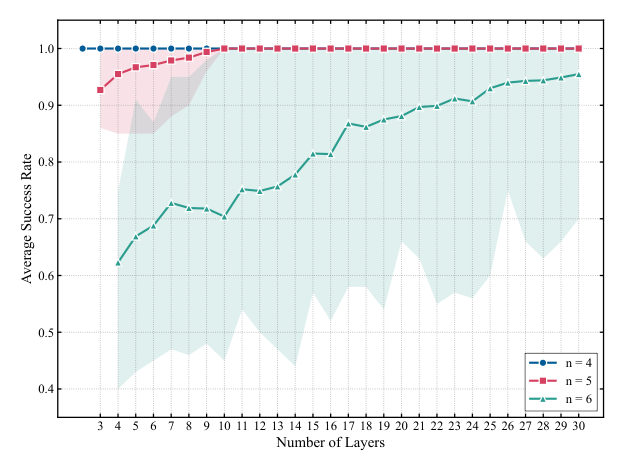
<figcaption class="paper-figure-caption"><b>Fig 1.</b> Figure 2. Success rate as a function of circuit depth for the proposed problem-inspired ansatz. Results are shown for TSP instances with n = 4,5,6 cities. Solid curves denote the average success rate over 10 randomly generated graph instances. Shaded regions indicate the absolute performance range across the 10 instances, bounded by the minimum and maximum success rates.</figcaption>
</figure>
<figure class="paper-figure-card">
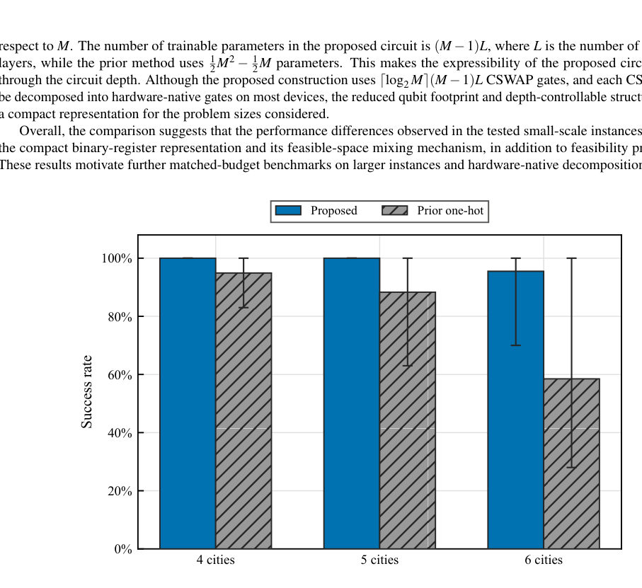
<figcaption class="paper-figure-caption"><b>Fig 2.</b> Figure 3. Performance comparison between the proposed problem-inspired ansatz and the prior one-hot feasible-subspace ansatz reported in Ref.19. Bars denote the average success rate over 10 randomly generated TSP instances for each problem size. Error bars indicate the absolute performance range across instances, bounded by the minimum and maximum success rates.</figcaption>
</figure>
<figure class="paper-figure-card">
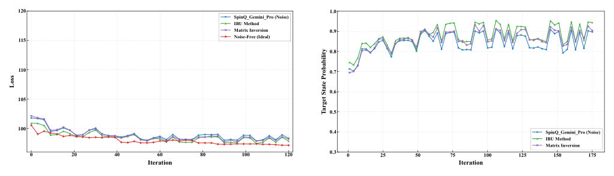
<figcaption class="paper-figure-caption"><b>Fig 3.</b> Figure 4. Optimization trajectories on SpinQ Gemini Pro for the 5-city TSP instance. Panel (a) shows the loss values obtained from raw noisy measurements, iterative Bayesian unfolding (IBU), matrix-inversion-based mitigation, and the noise-free simulator. Panel (b) shows the corresponding target-state probabilities during optimization.</figcaption>
</figure>
<figure class="paper-figure-card">
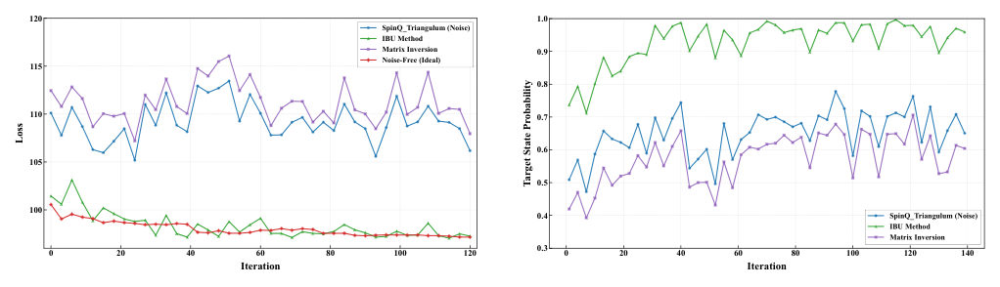
<figcaption class="paper-figure-caption"><b>Fig 4.</b> Figure 5. Optimization trajectories on Triangulum II for the 5-city TSP instance. Panel (a) shows the loss values obtained from raw noisy measurements, iterative Bayesian unfolding (IBU), matrix-inversion-based mitigation, and the noise-free simulator. Panel (b) shows the corresponding target-state probabilities during optimization.</figcaption>
</figure>

**Summary.** This paper introduces a resource-efficient quantum framework for solving the Traveling Salesman Problem by reducing qubit requirements from quadratic to near-linear scaling. By using a divide-and-conquer strategy and compact binary encoding, the authors demonstrate that even very small, noisy quantum hardware can successfully solve small-scale combinatorial optimization problems.

**Why it may be interesting.** not directly relevant

Detailed structure

**Main problem.** The quadratic qubit overhead of standard one-hot encoding makes implementing the Traveling Salesman Problem (TSP) impractical on NISQ hardware. The paper seeks to reduce qubit requirements and enable execution on extremely resource-constrained devices.

**Main result.** The proposed framework reduces qubit scaling from O(n^2) to O(n log n) and achieves success rates up to 100% in simulations. Hardware experiments on NMR quantum computers successfully identified optimal tours for a 5-city instance using a divide-and-conquer strategy.

**Method.** The authors use a compact binary-register encoding, a permutation-preserving ansatz with parameterized SWAP operations, and a divide-and-conquer strategy that factorizes the global state into smaller subsystems. Error mitigation techniques like Iterative Bayesian Unfolding (IBU) are also employed.

**Model / system.** The problem is modeled as a Traveling Salesman Problem (TSP) using a QUBO-derived Ising Hamiltonian. Experimental validation was performed on SpinQ Gemini Pro and SpinQ Triangulum II NMR quantum computers.

**Key observables.** Average success rate (finding the optimal tour), loss function value, and target-state probability.

**Important parameters / regimes.** Number of cities (n=4, 5, 6), circuit depth (L), penalty coefficients (lambda, mu), and number of optimization iterations.

**Assumptions / limitations.** The divide-and-conquer approach assumes a product-state approximation that neglects inter-subsystem entanglement. The benchmark is also limited to small-scale TSP instances.

**Figures summary.** Figure 1 shows the two-qubit variational circuit; Figure 2 plots success rate vs. circuit depth; Figure 3 compares the proposed ansatz to the one-hot method; Figures 4 and 5 show optimization trajectories on NMR hardware comparing different error mitigation methods.

**Paper structure.** The paper introduces the qubit overhead problem, proposes a compact encoding and permutation-preserving ansatz, details a divide-and-conquer execution strategy, presents numerical simulation results, and concludes with hardware validation on NMR quantum computers.

Abstract

The Traveling Salesman Problem (TSP) is a prototypical combinatorial optimization problem, but its quantum implementation is limited by the O(n^2)-qubit overhead of standard one-hot encodings. Here, we propose a resource-efficient variational quantum framework based on compact binary-register encoding, a permutation-preserving problem-inspired ansatz, and a complementary divide-and-conquer execution strategy. The compact encoding reduces the data-qubit requirement to O(n log n), while the divide-and-conquer formulation lowers the number of qubits required in each local hardware execution to the size of the largest subsystem. Numerical simulations on TSP instances with 4, 5, and 6 cities achieve best average success rates of 100%, 100%, and 95.5%, respectively. A local two-qubit implementation of the divide-and-conquer approximation is further evaluated for a 5-city TSP instance on SpinQ Gemini Pro and SpinQ Triangulum II NMR quantum computers. Taken together, the results indicate how compact encoding and divide-and-conquer execution with classical post-processing can be used to study small combinatorial optimization instances on resource-constrained quantum hardware.

[↑ back to top](#top)

### [Demonstration of a fermion Quadrupling Condensate via Quantum Monte Carlo Simulation](http://arxiv.org/abs/2605.00137v1)

**Authors:** Alexandru Golic, Egor Babaev, Johan Carlström  
**Type:** theory · **Category:** quantum gases · **PDF:** <https://arxiv.org/pdf/2605.00137v1>  
**Analysis basis:** full PDF text, analyzed in chunks
**Topic relevance:** `analog quantum simulation` **3/5**

↔ Scroll figures horizontally

<figure class="paper-figure-card">
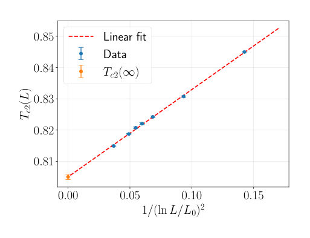
<figcaption class="paper-figure-caption"><b>Fig 1.</b> FIG. 2. Critical temperature of the quadrupling-normal transition for the sign-free simulations as a function of 1/(ln L/L0)2, where L is the linear system size and L0 is a fit parameter from the finite-size scaling. Points show simulation data with error bars and the solid lines represent the linear fit to the universal scaling form. This fit corresponds to the parameters Tc2 ≈0.805±0.001 (equivalent to βBKT ≈1.242), A ≈0.275 ± 0.032 and L0 ≈1.52 ± 0.20.</figcaption>
</figure>
<figure class="paper-figure-card">
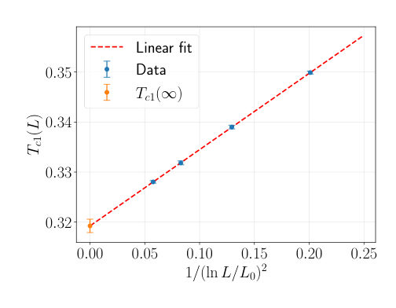
<figcaption class="paper-figure-caption"><b>Fig 2.</b> FIG. 1. Critical temperature of the superfluid-quadrupling transition for the sign-free simulations as a function of 1/(ln L/L0)2 where L is the linear system size and L0 is a fit parameter from the finite-size scaling. Points show simulation data with error bars and the solid lines represent the linear fit to the universal scaling form. This fit corresponds to the pa- rameters Tc1 ≈0.3192±0.0013 (equivalent to βBKT ≈3.133), A ≈0.1525 ± 0.0376 and L0 ≈4.25 ± 0.98.</figcaption>
</figure>
<figure class="paper-figure-card">
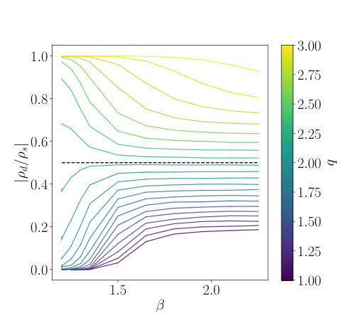
<figcaption class="paper-figure-caption"><b>Fig 3.</b> FIG. 3. Relative intercomponent drag |ρd/ρs| as a function of inverse temperature β and microscopic counter-hopping strength q at the system size L ≈68 for the sign-free model. The dashed line denotes ρd/ρs = 0.5. The high temperature behavior of the drag for each q signals the critical nature of the transition away from superfluidity. For q ≲2.25 the transi- tion is driven by the disordering of single phases ϕ1, ϕ2, while for q ≳2.25 it is driven by disordering of one of the two linear combinations ϕ1 ± ϕ2. The line |ρd/ρs| = 0.5 is the marginal point where the single component superfluid stiffness is equal to one of the composite superfluid stiffnesses.</figcaption>
</figure>
<figure class="paper-figure-card">
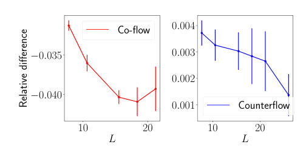
<figcaption class="paper-figure-caption"><b>Fig 4.</b> FIG. 4. Relative difference in phase stiffness ρFermi/ρBose −1 between bosons and fermions in a system with negative drag. The left picture shows the relative difference in the co-flow stiffness at T = 0.25, significantly below the superfluid- supercounterfluid transition for the bosonic system. The right picture shows the relative difference in the counter-flow stiff- ness at T ≈0.77, slightly below the supercounterfluid-normal transition for the bosonic system.</figcaption>
</figure>
<figure class="paper-figure-card">
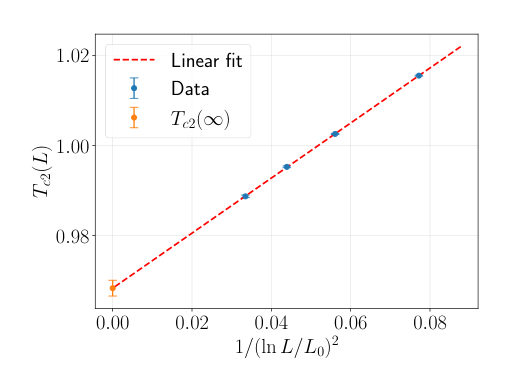
<figcaption class="paper-figure-caption"><b>Fig 5.</b> FIG. 5. Critical temperature of the quadrupling-normal tran- sition as a function of 1/(ln L/L0)2 where L is the linear system size and L0 is a fit parameter from the finite-size scaling for a system of infinitely bound pairs (U = −∞). Points show simulation data with error bars and the solid lines represent the linear fit to the universal scaling form. This fit corresponds to the parameters TBKT ≈0.9684 ± 0.0017 (equivalent to βBKT ≈1.033), A ≈0.6103 ± 0.0896 and L0 ≈0.5792 ± 0.1160.</figcaption>
</figure>

**Summary.** This paper uses Quantum Monte Carlo simulations to prove that fermions can form a 'quadrupling condensate' through correlated hopping. It overcomes the fermionic sign problem to show that these exotic four-fermion states are theoretically robust and likely observable in ultracold atomic gases.

**Why it may be interesting.** It demonstrates a way to numerically access exotic, non-BCS phases like charge-4e superconductivity and provides a roadmap for observing these states in ultracold atomic platforms.

Detailed structure

**Main problem.** Investigating whether fermionic condensation can occur via higher-order 'quadruplets' (four-fermion order) rather than standard BCS pairing, and overcoming the numerical difficulty of the fermionic sign problem.

**Main result.** The study provides direct numerical evidence for a fermion-quadrupling condensate in a microscopic model, demonstrating that these exotic states are experimentally accessible in ultracold atomic gases.

**Method.** Large-scale Quantum Monte Carlo (QMC) simulations using the Worm algorithm, combined with a sign-free approximation and Renormalization Group (RG) analysis of vortex proliferation.

**Model / system.** A two-component fermionic lattice model (a generalization of the Penson-Kolb-Hubbard model) on hexagonal and square lattices, featuring correlated hopping and Andreev-Bashkin drag.

**Key observables.** Phase-stiffness matrix (including co-flow and counter-flow stiffness), four-fermion correlators, and vortex densities.

**Important parameters / regimes.** Strong-coupling regime (mu = -3.1, U = -6, t = 1, d = 1, q = 3); relative drag parameter |rho_d/rho_s|; and the transition driver parameter q.

**Assumptions / limitations.** The use of a sign-free approximation (treating fermions as hard-core bosons) is validated for certain observables, though it may not precisely locate the superfluid-quadrupling transition.

**Figures summary.** Figure 4 shows the relative difference in stiffnesses between the full fermionic model and the sign-free approximation, indicating negligible error for larger stiffnesses.

**Paper structure.** The paper introduces the problem of higher-order fermionic order, presents a microscopic model with correlated hopping, describes the QMC and sign-mitigation methods, analyzes phase transitions via RG and vortex dynamics, and concludes with experimental implications for ultracold gases.

Abstract

Fermionic condensation typically occurs via pairing. In recent decades, however, a fundamental question has emerged: whether alternative forms of order exist, such as condensates of fermion quadruplets. These states--including ``charge-4e" superconductors and ``charge-0" counterflow condensates--lie beyond the standard Bardeen-Cooper-Schrieffer framework, and require strong fluctuations and correlation effects that invalidate the BCS mean-field description. This makes the problem notoriously difficult to study numerically at a microscopic level, as it involves both strong interactions and the fermionic sign problem. Here, we present a microscopic fermionic model featuring correlated hopping that significantly mitigates the sign problem, enabling rigorous Monte-Carlo-based analysis. Using large-scale simulations, we demonstrate the existence of a fermion-quadrupling condensate with a transition temperature comparable to the hopping energy scale. These results provide direct numerical evidence for quartic fermionic order in a microscopic system and suggest that these exotic states are also experimentally accessible in ultracold atomic gases.

[↑ back to top](#top)

### [Provable and scalable quantum Gaussian processes for quantum learning](http://arxiv.org/abs/2605.00099v1)

**Authors:** Jonas Jäger, Paolo Braccia, Pablo Bermejo, Manuel G. Algaba, Diego García-Martín, M. Cerezo  
**Type:** theory · **Category:** quantum information and computing · **PDF:** <https://arxiv.org/pdf/2605.00099v1>  
**Analysis basis:** full PDF text, analyzed in chunks
**Topic relevance:** `analog quantum simulation` **2/5** · `entanglement & information structure` **2/5** · `non-equilibrium dynamics` **2/5** · `quantum measurements` **2/5**

↔ Scroll figures horizontally

<figure class="paper-figure-card">
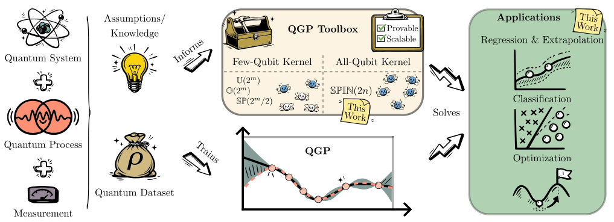
<figcaption class="paper-figure-caption"><b>Fig 1.</b> FIG. 1. Schematic representation of our quantum Gaussian process (QGP) framework. Information about an unknown quantum process and measurement operator, together with access to a quantum dataset, is used to select a kernel from a QGP toolbox. Previously known examples correspond to few-qubit unitary, orthogonal, and symplectic kernels, while this work adds an all-qubit matchgate, or free-fermionic, kernel. The resulting quantum Gaussian process then serves as a Bayesian surrogate that can be used for regression and extrapolation, classification, and optimization.</figcaption>
</figure>
<figure class="paper-figure-card">
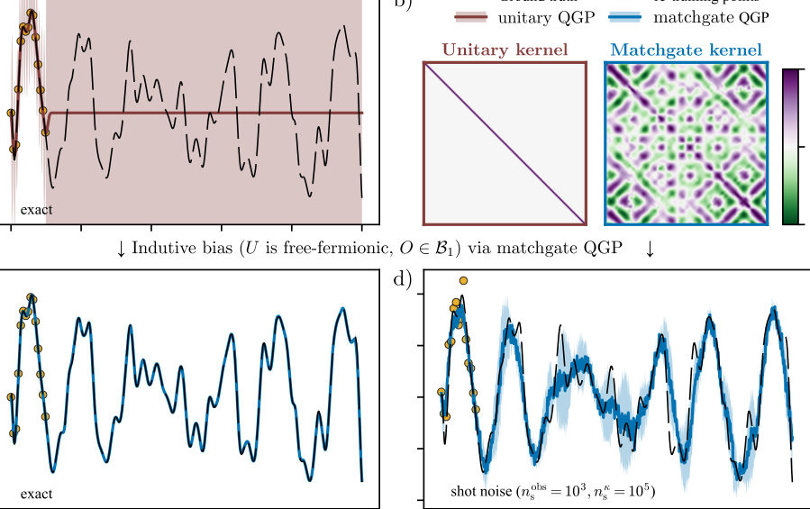
<figcaption class="paper-figure-caption"><b>Fig 2.</b> FIG. 2. Quantum Gaussian process extrapolation and the role of inductive bias. We consider a 50-qubit regression task where the model is trained on 15 points in the interval t ∈[0, 1] and then asked to extrapolate the signal out to t ≤10. The unknown transformation is a random matchgate circuit from SPIN(2n), and the observable is a Pauli string in B1. (a) If we ignore this structure and instead use the unitary kernel associated with U ∈U(2n), the QGP fails to extrapolate. (b) The corresponding kernel matrix is nearly band-diagonal, with rapidly vanishing off-diagonal entries, so long-range correlations are lost. When the correct inductive bias is used, namely U ∈SPIN(2n) and O ∈B1, the...</figcaption>
</figure>
<figure class="paper-figure-card">
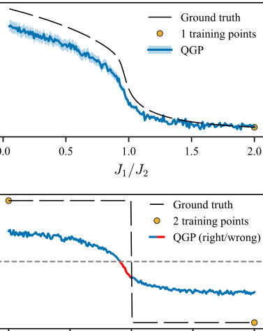
<figcaption class="paper-figure-caption"><b>Fig 3.</b> FIG. 3. QGPs for phase diagram prediction and classification in a bond-alternating XXX model. This model exhibits a phase transition at J1 = J2. (a) We show- case the regression of the phase diagram using just one train- ing point. (b) A QGP classifier achieves accurate phase clas- sification, trained on a minimal set of a single training point per phase. The training labels are no longer quantitative order parameter values but qualitative binary phase labels.</figcaption>
</figure>
<figure class="paper-figure-card">
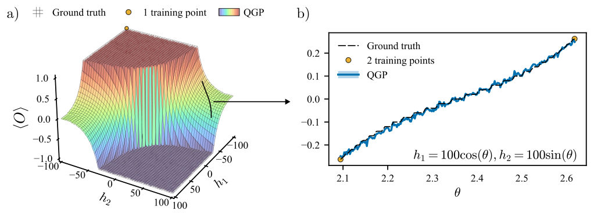
<figcaption class="paper-figure-caption"><b>Fig 4.</b> FIG. 4. QGP learning the magnetization phases of an XXZ Hamiltonian. (a) Regressed magnetization landscape for an n = 100 XXZ chain, obtained from a single training point placed in the maximal magnetization plateau. The wireframe shows the true magnetization profile, while the colored surface is the QGP prediction. The training point is marked by a yellow circle. (b) Regression along the black cut shown in the left panel. Using only the two extrema of the cut as training points, and shot budgets nobs s = nκ s = 105, the QGP reproduces the staircase structure of the magnetization plateaus.</figcaption>
</figure>
<figure class="paper-figure-card">
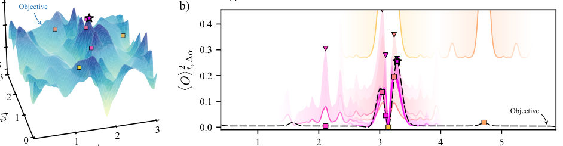
<figcaption class="paper-figure-caption"><b>Fig 5.</b> FIG. 5. Bayesian optimization using QGP surrogates (QGP-BO). (a) Synthetic two-parameter optimization land- scape built from a 30-qubit matchgate dataset, with an objective function derived from the expectation values of an B1 observable on states ρt. The QGP surrogate uses the corresponding B1 kernel. Arrows trace the BO trajectory from a random initial point to the global optimum (star). (b) QGP-BO applied to a 55-qubit quantum sensing task. The black line denotes the true objective, while the colored curves show the surrogate mean together with the upper 95% confidence bound at successive BO iterations. Squares denote queried observations, and triangles mark the maxima of the acquisition...</figcaption>
</figure>

**Summary.** This paper introduces Quantum Gaussian Processes, a scalable Bayesian learning framework for quantum systems. By utilizing the structure of matchgate circuits, the authors demonstrate that one can perform efficient regression, classification, and optimization on large-scale quantum data even with very sparse training samples.

**Why it may be interesting.** It provides a rigorous bridge between Bayesian inference and quantum dynamics, offering a way to perform scalable learning on many-body systems using physics-informed priors.

Detailed structure

**Main problem.** Existing quantum machine learning approaches lack scalable, interpretable, and provable frameworks that leverage physics-informed inductive bias, especially when unknown unitaries act non-trivially on all qubits.

**Main result.** The authors introduce Quantum Gaussian Processes (QGP) and prove that matchgate (free-fermionic) circuits provide a provable and scalable family of QGPs. They also propose a robust 'lambda_Wigner-shift' method to handle kernel noise from finite-shot measurements.

**Method.** A non-parametric Bayesian framework using quantum kernels derived from the symmetries of the underlying quantum process. The authors use moment-based proofs, the Weingarten expansion, and marginal likelihood maximization for kernel optimization.

**Model / system.** The framework is applied to matchgate/free-fermionic evolutions (represented by the SPIN(2n) group) and tested on 1D many-body systems like the XXX and XXZ spin chains.

**Key observables.** Expectation values of Hermitian operators (e.g., Pauli strings, magnetization, and order-parameter proxies).

**Important parameters / regimes.** System size (n up to 100 qubits), shot budgets for observations (n_obs) and kernels (n_kappa), and Majorana sector indices (m).

**Assumptions / limitations.** The unknown unitary transformation is assumed to belong to a known group (e.g., SPIN(2n)), and observation noise is assumed to be Gaussian.

**Figures summary.** Figure 1 shows the QGP framework schematic; Figure 4 illustrates magnetization regression in XXZ chains; Figure 5 demonstrates Bayesian optimization trajectories and magnetometry tasks; Supplemental figures show MSE comparisons, Pareto fronts, and the effectiveness of the Wigner-shift method.

**Paper structure.** The paper introduces the QGP framework, proves the scalability and provability of matchgate-based QGPs, demonstrates applications in regression, classification, and optimization, and concludes with a discussion on noise robustness and kernel optimization.

Abstract

Despite rapid recent advances in quantum machine learning, the field is in many ways stuck. Existing approaches can exhibit serious limitations, and we still lack learning frameworks that are simple, interpretable, scalable, and naturally suited to quantum data. To address this, here we introduce quantum Gaussian processes, a Bayesian framework for learning from quantum systems through priors over unknown quantum transformations. We show that, under suitable conditions, unitary quantum stochastic processes define Gaussian processes, thereby enabling regression, classification, and Bayesian optimization directly on quantum data. The key ingredient in this framework is sufficient knowledge of a quantum process's structure and symmetries to define an informative prior through its corresponding quantum kernel, effectively injecting a strong, physics-informed inductive bias into the learning model. We then prove that matchgate, or free-fermionic, evolutions give rise to provable and scalable quantum Gaussian processes, providing the first family in our framework where the unknown unitary acts non-trivially on all qubits. Finally, we demonstrate accurate long-range extrapolation, phase-diagram learning in many-body systems, and sample-efficient Bayesian optimization in a quantum sensing task. Our results identify quantum Gaussian processes as a promising route toward simpler and more structured forms of quantum learning.

[↑ back to top](#top)

### [The structure of gauge invariant Gaussian quantum operations on finite Fermion systems](http://arxiv.org/abs/2605.00784v1)

**Authors:** Eric A. Carlen  
**Type:** theory · **Category:** quantum information and computing · **PDF:** <https://arxiv.org/pdf/2605.00784v1>  
**Analysis basis:** full PDF text, analyzed in chunks
**Topic relevance:** `correlated / nonlocal dissipation` **2/5** · `entanglement & information structure` **2/5** · `methods for driven-dissipative` **2/5** · `non-equilibrium dynamics` **2/5**

↔ Scroll figures horizontally

<figure class="paper-figure-card">
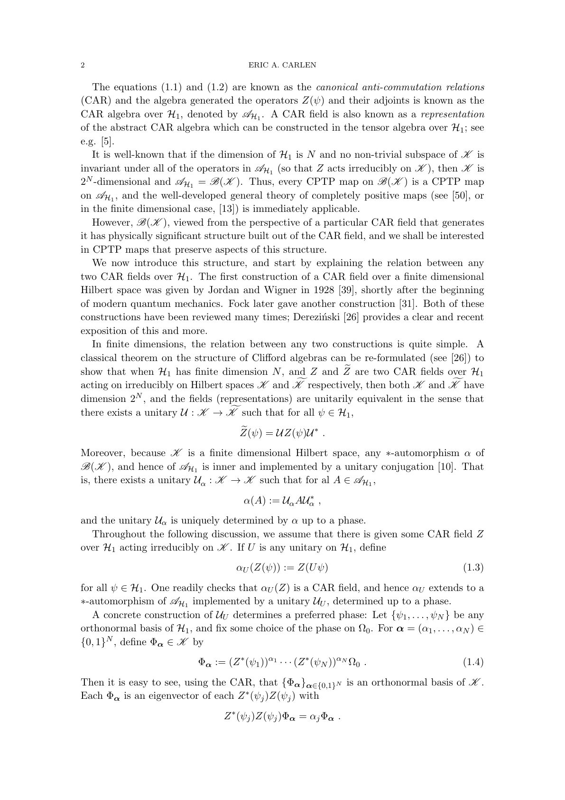
<figcaption class="paper-figure-caption"><b>Fig 1.</b> Low-resolution page preview, page 2</figcaption>
</figure>
<figure class="paper-figure-card">
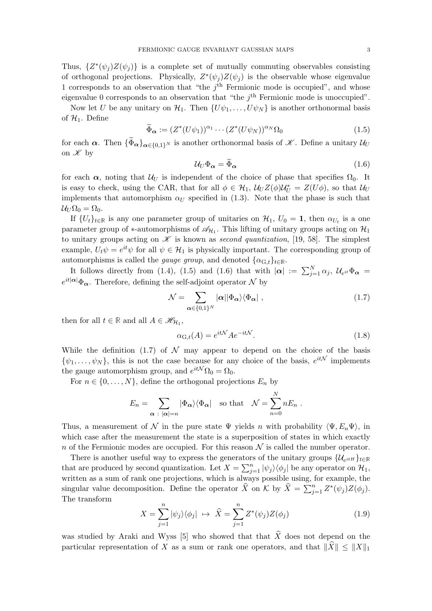
<figcaption class="paper-figure-caption"><b>Fig 2.</b> Low-resolution page preview, page 3</figcaption>
</figure>
<figure class="paper-figure-card">
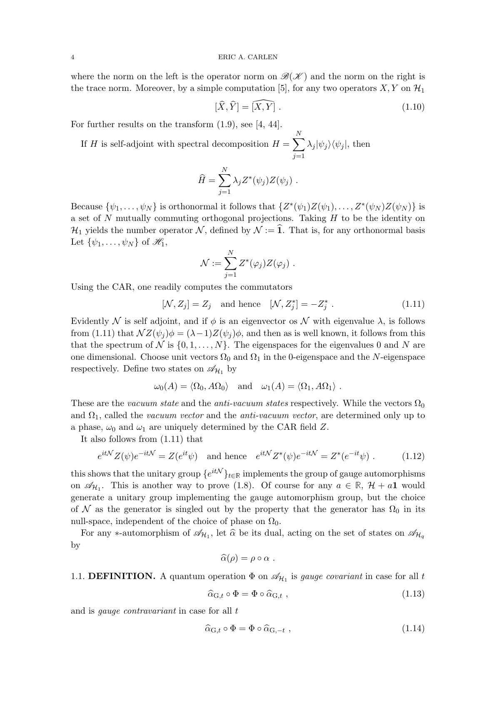
<figcaption class="paper-figure-caption"><b>Fig 3.</b> Low-resolution page preview, page 4</figcaption>
</figure>
<figure class="paper-figure-card">
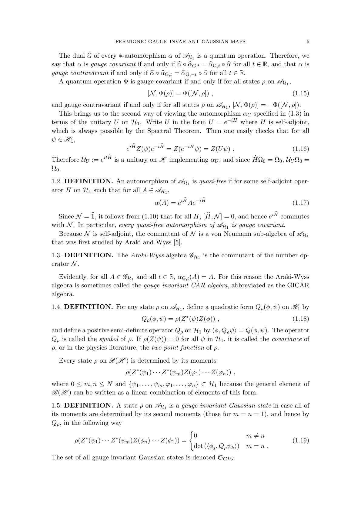
<figcaption class="paper-figure-caption"><b>Fig 4.</b> Low-resolution page preview, page 5</figcaption>
</figure>
<figure class="paper-figure-card">
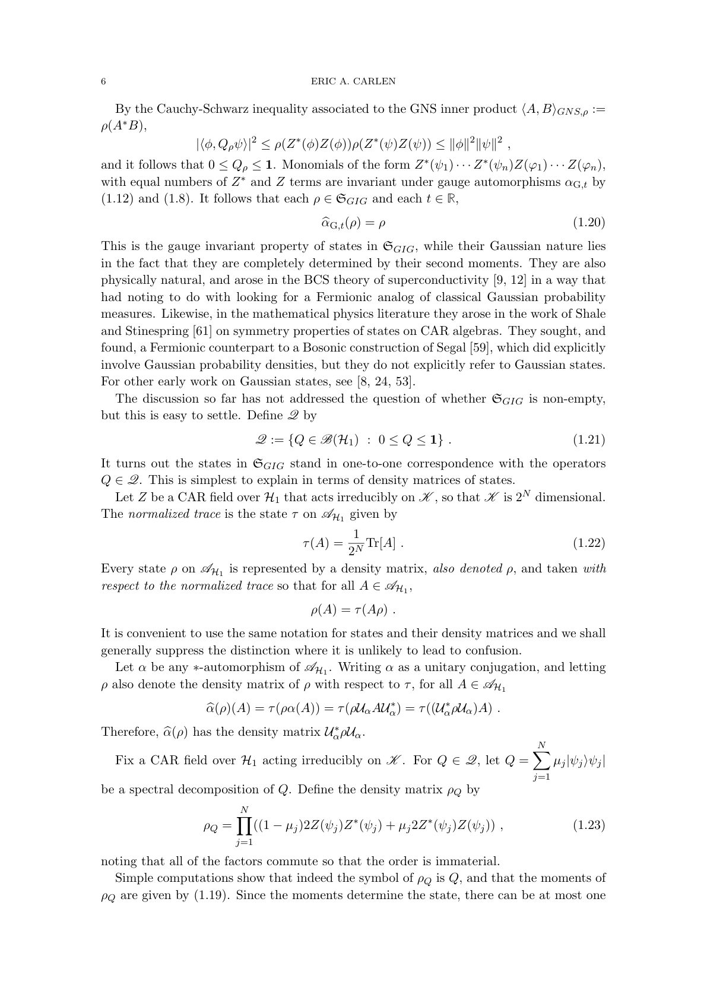
<figcaption class="paper-figure-caption"><b>Fig 5.</b> Low-resolution page preview, page 6</figcaption>
</figure>

**Summary.** This paper provides a complete structural characterization of quantum operations and semigroups that preserve gauge-invariant Gaussian states in finite Fermion systems. It proves that one-to-one operations are determined by specific symbol maps and shows that such operations can be naturally extended to the full CAR algebra. The results establish a precise correspondence between GIG semigroups and pairs of operators acting on the single-particle space.

**Why it may be interesting.** This work is highly relevant to open quantum systems and many-body dynamics as it provides a rigorous classification of noise processes (quantum operations) that preserve the Gaussian structure of Fermionic systems, which is a cornerstone of many-body physics and quantum information processing.

Detailed structure

**Main problem.** The paper aims to characterize the structure of quantum operations (CPTP maps) and semigroups on finite-dimensional Fermion systems that preserve the set of gauge-invariant Gaussian (GIG) states.

**Main result.** The author provides a structure theorem for one-to-one quantum operations and semigroups, showing they are parameterized by pairs (G, A) where G is a contraction semigroup generator and 0 <= A <= -G - G*, and demonstrates how these operations extend to the full CAR algebra.

**Method.** The study utilizes the algebraic framework of the Canonical Anti-commutation Relations (CAR), second quantization, symbol maps for Gaussian states, and tools from operator theory such as the Evans-Hugenholtz-Kadison construction and modular theory.

**Model / system.** The system consists of finite-dimensional Fermion systems defined by a single-particle Hilbert space H1 and a corresponding Fock space K, governed by the CAR algebra and a gauge automorphism group.

**Key observables.** The number operator (N), the symbol (Q) representing the covariance/two-point function, and the particle-hole automorphism.

**Important parameters / regimes.** The dimension of the single-particle space, the contraction semigroup generator G, and the operator A satisfying the stability condition.

**Assumptions / limitations.** The primary structure theorem assumes the quantum operations are one-to-one; the study is restricted to finite-dimensional Fermion systems.

**Paper structure.** The paper begins by defining the algebraic framework of the CAR field and gauge structure, proceeds to classify GIG states via symbols, establishes structure theorems for one-to-one quantum operations and semigroups, and concludes with results on the extension of these maps to the full CAR algebra and the properties of conditional expectations.

Abstract

Let ${\mathcal H}_1$ be a finite dimensional complex Hilbert space. Let $ψ\mapsto Z(ψ)$ be a canonical anti-commutation relations (CAR) field over ${\mathcal H}_1$ acting irreducibly on a Hilbert space ${\mathord{\mathscr K}}$. The $*$-algebra ${\mathscr A}_{{\mathcal H}_1}$ generated by the $Z(ψ)$, $ψ\in {\mathcal H}_1$, is simply all operators on ${\mathscr K}$.   However, the CAR field endows ${\mathscr A}_{{\mathcal H}_1}$ with additional structure, and we are concerned with quantum operations whose acting in harmony with this structure. In particular, there is a gauge automorphism group   generated by ``second quantizing'' $ψ\mapsto e^{it}ψ$. The fixed point algebra of the gauge group, ${\mathscr G}_{{\mathcal H}_1}$, is a sub-algebra of ${\mathscr A}_{{\mathcal H}_1}$ studied by Araki and Wyss. It contains the density matrices of an important class of states, the gauge invariant Gaussian states, ${\mathfrak S}_{GIG}$.   Our focus is on semigroups $\{e^{t{\mathscr L}}\}_{t\geq 0}$ of quantum operations on ${\mathscr A}_{{\mathcal H}_1}$ that map ${\mathfrak S}_{GIG}$ into itself. Each $e^{t{\mathscr L}}$ is one-to-one, and our first main result is a structure theorem forsuch quantum operations on ${\mathscr G}_{{\mathcal H}_1}$ that map ${\mathfrak S}_{GIG}$ into itself.   We apply this to study semigroups of quantum operations on ${\mathscr G}_{{\mathcal H}_1}$ that map ${\mathfrak S}_{GIG}$ into itself. Our second main result is a structure theorem showing that they are parameterized by pairs $(G,A)$ where $G$ is a contraction semigroup generator on ${\mathcal H}_1$, and $0 \leq A \leq -G -G^*$. We then show that each of these semigroups has a natural extension to the full CAR algebra ${\mathscr A}_{{\mathcal H}_1}$. Further results are obtained under further assumptions on the pair $(G,A)$.

[↑ back to top](#top)

### [Comment on "Controlling the dynamical evolution of quantum coherence and quantum correlations in $e^{+} e^{-} \rightarrow Λ\barΛ$ processes at BESIII''](http://arxiv.org/abs/2605.00127v1)

**Authors:** Saeed Haddadi  
**Type:** theory · **Category:** quantum information and computing · **PDF:** <https://arxiv.org/pdf/2605.00127v1>  
**Analysis basis:** full PDF text, analyzed in chunks
**Topic relevance:** `correlated / nonlocal dissipation` **2/5** · `entanglement & information structure` **2/5** · `quantum measurements` **2/5**

↔ Scroll figures horizontally

<figure class="paper-figure-card">
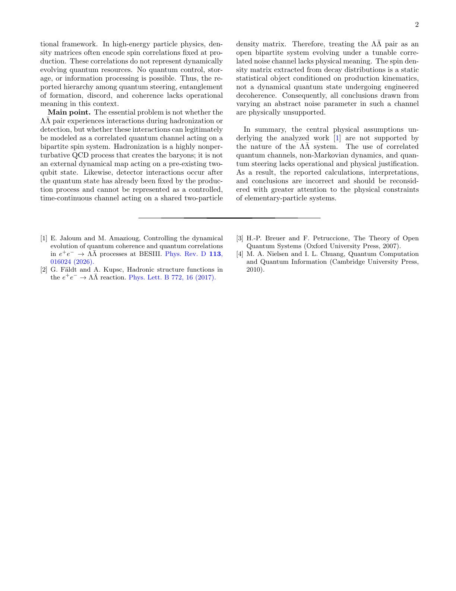
<figcaption class="paper-figure-caption"><b>Fig 1.</b> Low-resolution page preview, page 2</figcaption>
</figure>

**Summary.** This paper critiques a recent study on quantum correlations in hyperon-antihyperon production, arguing that the use of open quantum system theory is physically unjustified. The author shows that because the particles do not share an environment and cannot be subjected to controlled measurements, the reported dynamical evolution and steering are conceptually flawed. The work emphasizes the need to distinguish between mathematical quantifiers and physically realizable quantum information protocols.

**Why it may be interesting.** This paper provides a critical cautionary tale for researchers applying open quantum system formalisms (like non-Markovianity and steering) to high-energy physics systems where the necessary environmental coupling and measurement control are absent.

Detailed structure

**Main problem.** The author critiques the physical validity of applying open quantum system frameworks, such as correlated quantum channels and non-Markovian dynamics, to the hyperon-antihyperon (Lambda-antiLambda) system.

**Main result.** The author demonstrates that the analyzed work is physically inconsistent because the produced particles are free, unstable, and do not interact with a shared environment, making the reported quantum correlations and steering operationally meaningless.

**Method.** The author uses a theoretical critique of the underlying physical assumptions, specifically addressing the lack of a shared bath, the absence of information backflow, and the impossibility of real-time measurement-induced state updates in relativistic particle decays.

**Model / system.** The system consists of a Lambda-antiLambda (Lambda-antiLambda) pair produced via the electron-positron annihilation process e+e- -> Lambda-antiLambda, treated as a bipartite spin system.

**Key observables.** spin correlations, quantum coherence, entanglement, and quantum steering

**Assumptions / limitations.** The author assumes that the particles are free, unstable, relativistic particles that do not interact with a common environment after production.

**Paper structure.** The paper is structured as a series of four remarks and a main point, each addressing a specific physical inconsistency regarding correlated channels, Markovianity, quantum steering, and the hierarchy of correlations.

Abstract

We critically examine recent claims [Phys. Rev. D 113, 016024 (2026)] regarding quantum coherence, steering, and non-Markovian dynamics in the hyperon-antihyperon system produced in the process $e^{+} e^{-} \rightarrow Λ\barΛ$. We argue that the theoretical framework employed in the analyzed work suffers from fundamental physical inconsistencies. In particular, the treatment of the $Λ\barΛ$ pair as a bipartite system evolving under correlated quantum channels is not physically justified, since the produced hyperons are free, unstable particles that do not interact with a common environment after production. Consequently, the application of open quantum system techniques, including Markovian and non-Markovian quantum channels, lacks a clear physical basis. Moreover, we show that the computation and interpretation of quantum steering for this system is operationally and conceptually meaningless, as no well-defined measurement-induced state update or controllable local measurement scenario exists for unstable relativistic particles. These issues call into question the physical relevance of the reported quantum correlations, their hierarchy, and their dynamical behavior. Our analysis highlights the necessity of carefully distinguishing between formal mathematical quantifiers of quantumness and physically realizable quantum information protocols in high-energy particle systems.

[↑ back to top](#top)

### [Graph theoretic derivation of mutual linearity for transient probabilities and hitting time distributions in Markov networks](http://arxiv.org/abs/2605.00135v1)

**Authors:** Julian B. Voits, Ulrich S. Schwarz  
**Type:** theory · **Category:** statistical mechanics · **PDF:** <https://arxiv.org/pdf/2605.00135v1>  
**Analysis basis:** full PDF text, analyzed in chunks
**Topic relevance:** `correlated / nonlocal dissipation` **2/5** · `methods for driven-dissipative` **2/5** · `non-equilibrium dynamics` **2/5**

↔ Scroll figures horizontally

<figure class="paper-figure-card">
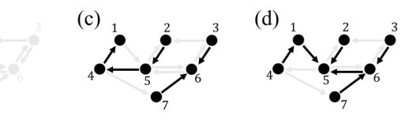
<figcaption class="paper-figure-caption"><b>Fig 1.</b> Figure 1. Illustration of relevant graph theoretic concepts. (a) An example of a directed graph G with N = 7 vertices. (b) A path in G from vertex 1 to vertex 7. (c) A spanning forest of G with roots 1 and 6. (d) A spanning tree of G with root 5.</figcaption>
</figure>
<figure class="paper-figure-card">
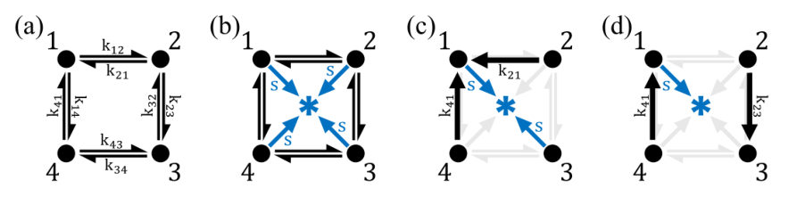
<figcaption class="paper-figure-caption"><b>Fig 2.</b> Figure 2. Illustration of the construction that allows to express the Laplace transform of the occupation probabilities in graph theoretic terms. (a) An example for a Markov network on four states represented as a weighted and directed graph G with the states as vertices, the transitions as directed edges with the transition rates as edge weights. (b) The augmented graph G∗is constructed by including an additional vertex ∗and edges with rate s leading from every other vertex to ∗. (c) A spanning tree of the augmented graph with root in ∗. (d) A spanning forest containing two trees with roots in 3 and ∗.</figcaption>
</figure>
<figure class="paper-figure-card">
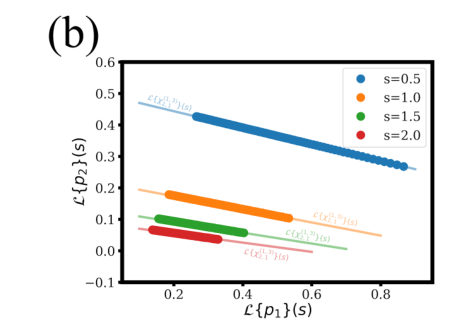
<figcaption class="paper-figure-caption"><b>Fig 3.</b> Figure 3. Illustration of the mutual linearity for an example network. (a) Network with four vertices, where the rate k13 is varied. (b) Affine relation (mutual linearity) between the Laplace transforms of the occupation probabilities L{p}(s)1 and L{p}(s)2 for different values of s. The parameters are k12 = 1, k21 = 0.4, k23 = 1.2, k32 = 0.5, k34 = 0.9, k43 = 0.6, k41 = 1.1, k14 = 0.3, k31 = 0.2 and k13 ∈[0, 5]. The solution is obtained from a numerical inversion of Eq. (16). The transparent lines show the analytical solution for the slope, L{χ(1,3) 2,1 }(s) = k32−k12 s+k21+k23 , obtained from the graph theoretic expression, Eq. (31).</figcaption>
</figure>
<figure class="paper-figure-card">
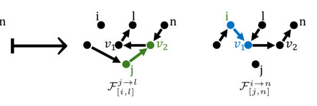
<figcaption class="paper-figure-caption"><b>Fig 4.</b> Figure 4. Illustration of the auxiliary map Hij nl which exchanges the outgoing edges of the vertices on the i →l-path in Fi→l [j,l] until it reaches the n-tree Fj→n [i,n] (blue path) with the corresponding edges in Fj→n [i,n] , and also</figcaption>
</figure>
<figure class="paper-figure-card">
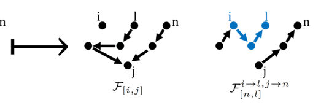
<figcaption class="paper-figure-caption"><b>Fig 5.</b> Figure 5. Illustration of the auxiliary map Aij nl which exchanges the edges on the i →l-path in Fi→l [j,l] with the</figcaption>
</figure>

**Summary.** This paper provides a new graph-theoretic proof for the mutual linearity of transient probabilities and hitting time distributions in Markov networks. By using the all-minorable matrix-tree theorem, the authors derive explicit combinatorial formulas for how these distributions respond to changes in transition rates. The results bridge the gap between stationary and non-stationary dynamics and show that short-time responses are determined by graph geometry.

**Why it may be interesting.** This work provides fundamental mathematical constraints on the dynamics of stochastic networks, which is highly relevant for understanding the relaxation and response of open quantum systems and biochemical networks.

Detailed structure

**Main problem.** The paper seeks to establish a graph-theoretic derivation for the 'mutual linearity' property in Markov networks, extending it from the stationary regime to the non-stationary (transient) regime in Laplace space.

**Main result.** The authors prove that mutual linearity applies to both transient occupation probabilities and hitting time distributions, providing explicit combinatorial expressions for non-stationary response ratios and susceptibilities.

**Method.** The study employs the all-minors matrix-tree theorem, Laplace transforms, and combinatorial tools like spanning forests and trees on augmented graphs to derive the results.

**Model / system.** The system consists of irreducible, time-homogeneous Markov networks defined by a continuous-time stochastic process on a directed, edge-weighted graph where dynamics are governed by the Kolmogorov forward equation.

**Key observables.** Occupation probabilities, network currents, response ratios, susceptibility, and hitting time distributions.

**Important parameters / regimes.** Transition rates (k_ij), Laplace variable (s), stationary regime (long-time limit), and short-time asymptotics (governed by minimal path distances).

**Assumptions / limitations.** The Markov networks are assumed to be irreducible and time-homogeneous.

**Figures summary.** Figure 1 visualizes graph theoretic concepts like directed graphs and spanning forests; Figure 5 illustrates an auxiliary map for edge exchange; Figure 6 shows short-time scaling of response ratios in an example network.

**Paper structure.** The paper introduces the problem of mutual linearity, develops a graph-theoretic framework using the all-minors matrix-tree theorem, extends the derivation to the non-stationary regime in Laplace space, proves the extension to hitting time densities, and analyzes short-time and long-time limits.

Abstract

For irreducible, time-homogeneous Markov networks, mutual linearity has recently been established for both occupation probabilities and network currents in the stationary regime as well as in the non-stationary regime in Laplace space. The derivation of this property for the stationary distribution utilized the Markov-chain tree theorem, which also allows for an explicit combinatorial expression of the response ratios under variation of a single transition rate. The extension of this result was proven at the trajectory level by employing the Doob-Meyer decomposition. By employing the all-minors matrix-tree theorem, we show that this property also follows from a graph theoretic formulation and derive explicit combinatorial expressions for the non-stationary response ratios. The stationary result follows as the long-time limit and we also show that the small-time asymptotics are entirely determined by minimal path distances in the underlying graph. Finally we use the graph theoretic approach to prove that mutual linearity also extends to hitting time densities.

[↑ back to top](#top)

### [Quantum in Biology, Quantum for Biology, and Biology for Quantum: Mapping the Evidence and the Road Ahead](http://arxiv.org/abs/2605.00205v1)

**Authors:** Lea Gassab, Betony Adams, Yashine H. Goolam Hossen, Onur Pusuluk, Iannis K. Kominis, Özgür E. Müstecaplıoğlu, Francesco Petruccione, Travis J. A. Craddock  
**Type:** theory · **Category:** other · **PDF:** <https://arxiv.org/pdf/2605.00205v1>  
**Analysis basis:** full PDF text, analyzed in chunks
**Topic relevance:** `correlated / nonlocal dissipation` **2/5** · `non-equilibrium dynamics` **2/5** · `spintronics-quantum-optics interface` **2/5**

↔ Scroll figures horizontally

<figure class="paper-figure-card">

<figcaption class="paper-figure-caption"><b>Fig 1.</b> FIG. 1. Conceptual framework used throughout the review. Each topic is mapped across three directions: quantum in biology, quantum for biology, and biology for quantum. The framework evaluates the central claim, the quantum resource invoked, the supporting evidence, the main classical or engineering confounds, and the tests or benchmarks most likely to change confidence. These judgments are summarized through an evidence ladder ranging from established contributions to plausible but unresolved cases and more speculative proposals.</figcaption>
</figure>
<figure class="paper-figure-card">
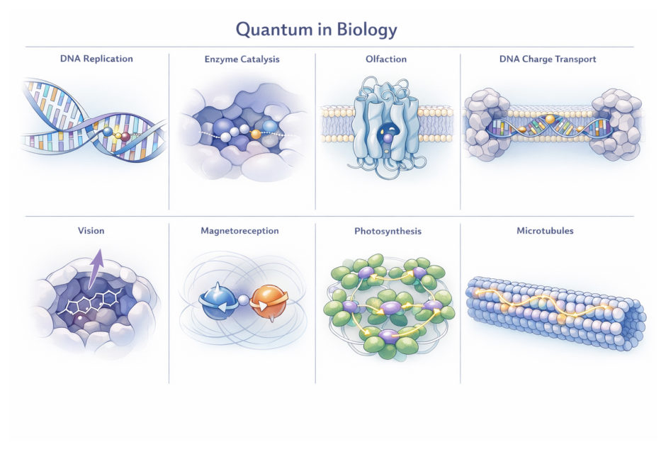
<figcaption class="paper-figure-caption"><b>Fig 2.</b> FIG. 2. Overview of selected key topic areas in quantum in biology. The panels schematically represent DNA replication and proton transfer, enzyme catalysis and hydrogen tunneling, olfaction and receptor-level vibrational or electron-transfer hypotheses, DNA charge transport through base-stacked pathways, vision through retinal photoisomerization in rhodopsin, radical-pair magnetoreception, excitonic dynamics in photosynthesis, and proposed photophysical or collective effects in microtubules. The figure is illustrative and does not imply that all topics have the same evidential status. Figure generated using ChatGPT, with scientific content reviewed by the authors.</figcaption>
</figure>
<figure class="paper-figure-card">

<figcaption class="paper-figure-caption"><b>Fig 3.</b> FIG. 3. Overview of representative directions in quantum for biology. The panels illustrate quantum simulation of molecular and spin-dynamical systems, quantum-assisted molecular design and drug discovery, quantum machine learning for bioinformatics, nitrogen-vacancy sensing, quantum-enhanced NMR and magnetic-resonance methods, and quantum imaging or spectroscopy. The figure summarizes tool classes discussed in the section; it does not imply established quantum advantage for each application. Figure generated using ChatGPT, with scientific content reviewed by the authors.</figcaption>
</figure>
<figure class="paper-figure-card">

<figcaption class="paper-figure-caption"><b>Fig 4.</b> FIG. 4. Overview of representative directions in biology for quantum. The panels schematically show DNA origami scaffolds, virus- templated materials, DNA-templated wiring, biohybrid excitonic or polaritonic platforms, fluorescent protein qubits, biomolecular or cellular quantum-biosensing concepts, bioinspired transport, and quantum or quantum-inspired neural-network architectures. These examples illustrate ways biological structures or principles may support quantum technologies, with evidential strength depending on device-level benchmarks, reproducibility, and comparison to non-biological alternatives. Figure generated using ChatGPT, with scientific content reviewed by the authors.</figcaption>
</figure>

**Summary.** This review provides a structured framework to evaluate the evidence for quantum effects in biological processes and the potential for biological structures to advance quantum technology. It categorizes research into three directions: quantum in biology, quantum for biology, and biology for quantum. The paper highlights the need for decisive experiments to distinguish true quantum functionality from classical or semiclassical alternatives.

**Why it may be interesting.** It provides a high-level synthesis of open quantum system dynamics, specifically how environmental noise, dissipation, and vibronic coupling interact with biological structures, which is highly relevant to researchers in open quantum systems and quantum biology.

Detailed structure

**Main problem.** The paper seeks to map the intersection of quantum science and biology across three dimensions: quantum in biology, quantum for biology, and biology for quantum, specifically evaluating whether quantum resources are functionally necessary for biological processes.

**Main result.** The authors establish a structured evidence map and a qualitative 'evidence ladder' that categorizes biological phenomena from established quantum-chemical contributions (e.g., enzyme tunneling, radical-pair magnetoreception) to speculative proposals (e.g., microtubule quantum computing).

**Method.** The review employs a structured narrative evidence map using a five-criteria analytical framework: central claim, invoked quantum resource, strength of evidence, competing classical alternatives, and required decisive benchmarks.

**Model / system.** The paper covers a diverse range of biological and bio-inspired systems, including enzymatic hydrogen transfer, radical-pair spin chemistry in cryptochromes, photosynthetic excitonic dynamics, DNA replication, and biohybrid quantum platforms like DNA origami.

**Key observables.** Kinetic isotope effects (KIE), temperature dependence, hyperfine/Zeeman interactions, vibrational wavepackets, spin-dependent dynamics, and quantum yield.

**Important parameters / regimes.** Dephasing rates, vibronic coupling, tunneling probabilities, redox landscapes, and physiological conditions (temperature, pH, and noise).

**Assumptions / limitations.** The review assumes that distinguishing true quantum coherence from vibrational or ensemble effects is a primary challenge and that the utility of quantum tools must be measured against strong classical baselines.

**Figures summary.** Figure 1 presents a conceptual framework for evaluating the three review directions; Figure 2 provides an overview of key topic areas in quantum biology; Tables III and IV summarize the evidence, challenges, and benchmarks for quantum-for-biology and biology-for-quantum, respectively.

**Paper structure.** The paper is organized into a three-way mapping (Quantum in/for/from Biology), using an evidence ladder to categorize topics, followed by detailed analysis of specific biological mechanisms, technological utilities, and bio-inspired engineering, concluding with a navigation table of evidence and benchmarks.

Abstract

Quantum science and biology now intersect in three complementary directions: quantum in biology, quantum for biology, and biology for quantum. This review provides a structured narrative evidence map of that interface rather than an exhaustive catalogue or formal systematic review. For each topic, we ask what the mechanistic or technological claim is, which quantum resource is invoked, what the strongest experiments and models establish, which classical alternatives or engineering confounds remain competitive, and what decisive tests or benchmarks would most strongly change confidence. The most mature quantum-in-biology cases remain mechanistically constrained tunneling in some enzymatic hydrogen-transfer reactions and radical-pair spin chemistry as a viable framework for magnetoreception, whereas several higher-visibility topics remain suggestive but unresolved under physiological conditions. In quantum for biology, the central issue is whether quantum-enabled tools improve biological inference relative to strong classical baselines under realistic calibration, dose, throughput, and uncertainty constraints. In biology for quantum, the strongest claims arise when biomolecular structure or self-assembly measurably improves fabrication, integration, or robustness in quantum devices. Summary tables in the Appendix provide a compact cross-map view of the current evidence, major confounds, and the experiments or benchmarks most likely to discriminate between competing explanations.

[↑ back to top](#top)

### [Suppressing spin qubit decoherence during shuttling via confinement modulation](http://arxiv.org/abs/2605.00611v1)

**Authors:** Daniel Q. L. Nguyen, Maximilian Rimbach-Russ, Stefano Bosco  
**Type:** theory · **Category:** quantum information and computing · **PDF:** <https://arxiv.org/pdf/2605.00611v1>  
**Analysis basis:** full PDF text, analyzed in chunks
**Topic relevance:** `correlated / nonlocal dissipation` **2/5** · `methods for driven-dissipative` **2/5** · `non-equilibrium dynamics` **2/5**

↔ Scroll figures horizontally

<figure class="paper-figure-card">
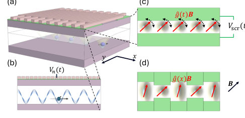
<figcaption class="paper-figure-caption"><b>Fig 1.</b> Figure 1. Breathing shuttling protocols. (a) Sketch of a conveyor-mode shuttling architecture. (b)-(c) Temporal breathing. Modulating the amplitude of the potential ap- plied to the top gates (b), or the screening gates (c), enables to modulate the confinement potential of the spin qubit dur- ing shuttling. (d) Spatial breathing. A periodic change in the design of the screening gates modulates of the confinement in space, leading to a time-dependent driving of the spin even at constant shuttling velocities.</figcaption>
</figure>
<figure class="paper-figure-card">
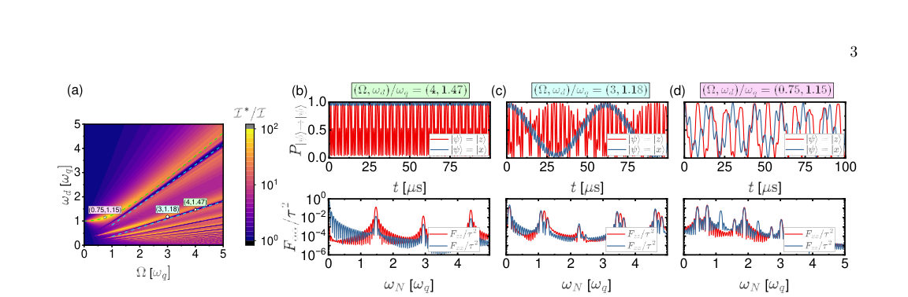
<figcaption class="paper-figure-caption"><b>Fig 2.</b> Figure 2. Noise decoupling of driven two-level system. (a) Ratio I∗/I of the infidelity without driving (I∗) (Ω= 0) to that under driving (I) as a function of ωd and Ω. Larger values in yellow indicate improved coherence. The green dashed line denotes the resonance condition including the Bloch-Siegert shift [Eq. (6)], while the cyan dashed lines indicate the first two solutions of Eq. (9). (b)-(d) Transition probabilities P|↑⟩→|↑⟩(t) and P|+⟩→|+⟩(t) together with the relevant filter functions Fxx and Fzz for (ωd, Ω) = (0.75, 1.15), (4, 1.47), and (3, 1.18), respectively. Panel (b) corresponds to the dark-branch condition, where the σx eigenstate is approximately eigenstate of the driven...</figcaption>
</figure>
<figure class="paper-figure-card">
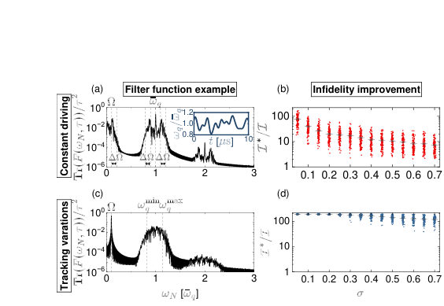
<figcaption class="paper-figure-caption"><b>Fig 3.</b> Figure 3. Driven two-level system with varying Lar- mor frequency. Filter functions of an exemplary Larmor frequency landscape using (a) constant driving with the mean Larmor frequency and (c) the tracking protocol defined in Eq. (11). The corresponding frequency landscape is shown in the inset of (a). Panels (b) and (d) show the correspond- ing average infidelity enhancement taking the ratio of infi- delity without driving (I∗) to that under driving (I) for dif- ferent variances σ in the Larmor frequency. For each chosen variance σ we plot the results from 100 sampled Larmor fre- quency landscapes for the constant-driving and tracking pro- tocols, respectively. The total evolution time is...</figcaption>
</figure>
<figure class="paper-figure-card">
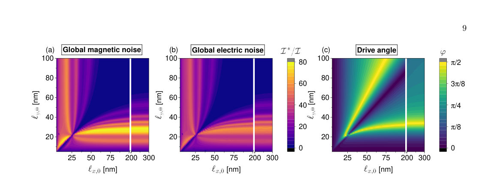
<figcaption class="paper-figure-caption"><b>Fig 4.</b> Figure 4. Temporal breathing shuttle with uniform driving. (a)-(b) Ratio I∗/I of the infidelity without time-dependent confinement modulation (I∗) to that under driving ωα(t) = ωα,0(1+γ sin ωdt) (I) at a fixed relative driving amplitude γ = 0.05. We consider a total evolution time 1 µs while sweeping different confinement lengths ℓα,0 = p</figcaption>
</figure>
<figure class="paper-figure-card">
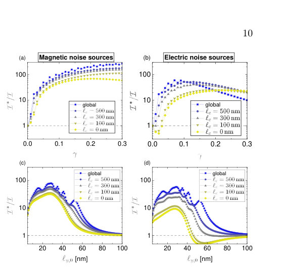
<figcaption class="paper-figure-caption"><b>Fig 5.</b> Figure 5. Temporal breathing shuttle with lateral driv- ing. Ratio I∗/I of the infidelity without time-dependent confinement modulation (I∗) to that under lateral driv- ing ωy(t) = ωy,0(1 + γ sin ωdt) (I). Panel (a) [(b)] shows the dependence on the relative driving amplitude γ, while panel (c) [(d)] shows the dependence on the confine- ment length ℓy,0 = p</figcaption>
</figure>

**Summary.** This paper proposes using confinement modulation to implement continuous dynamical decoupling for spin qubits during transport. By periodically changing the qubit's potential, the researchers show they can suppress low-frequency noise in germanium hole-spin systems. This provides a practical method for creating noise-resilient quantum links in large-scale quantum computers.

**Why it may be interesting.** This paper is highly relevant to open quantum systems researchers as it explores the control of decoherence in a driven-dissipative system using continuous dynamical decoupling and examines the interplay between control protocols and the spatial/temporal scales of environmental noise.

Detailed structure

**Main problem.** The goal is to suppress spin qubit decoherence caused by low-frequency magnetic and electric noise during the long-range shuttling of qubits in scalable quantum architectures.

**Main result.** The study demonstrates that continuous dynamical decoupling (CDD) via confinement modulation (temporal or spatial breathing) can significantly enhance coherence by rotating the spin to mitigate noise, with the effectiveness depending on the noise correlation length.

**Method.** The authors use the filter function formalism, Schrieffer-Wolff transformations, and the Magnus expansion to analyze the susceptibility of the driven two-level system to various noise sources.

**Model / system.** The system consists of germanium (Ge) hole-spin qubits in a conveyor-mode shuttling architecture, modeled as a driven two-level system with strong spin-orbit interaction and a position-dependent g-tensor.

**Key observables.** Average gate infidelity (I), transition probabilities, filter functions (F), and the ratio of infidelity without driving to infidelity with driving (I*/I).

**Important parameters / regimes.** Rabi frequency (Omega), Larmor frequency (omega_q), driving frequency (omega_d), driving amplitude (gamma), shuttling velocity (v), and noise correlation length (l_c).

**Assumptions / limitations.** The analysis assumes the orbital adiabatic limit, the weak spin-orbit interaction limit, and that the driving frequency is much smaller than the orbital splitting; it also assumes 1/f noise power spectral density.

**Figures summary.** Figure 1 sketches the shuttling architecture and breathing protocols; Figure 2 shows heatmaps of infidelity ratios and examples of filter functions; Figure 6 illustrates the infidelity ratio as a function of shuttling velocity and driving amplitude.

**Paper structure.** The paper introduces the shuttling problem, defines the physical model of Ge hole-spin qubits, develops the effective Hamiltonian via unitary transformations, analyzes noise suppression using filter functions for both global and local noise, and concludes with numerical simulations of the protocols.

Abstract

Reliable long-range qubit shuttling is a powerful tool for scalable quantum computing architectures. We investigate strategies to improve the coherence of moving spin qubits by performing continuous dynamical decoupling by modulating their confinement potential. Specifically, we introduce temporal and spatial breathing shuttling protocols that leverage spin-orbit interactions in hole-spin systems to electrically drive the qubit while moving. This enables efficient dressed-state shuttling, where the spin is continuously rotated during transport, suppressing the effect of low-frequency noise. Using the filter function formalism, we identify driving regimes that efficiently mitigate both global and local magnetic and electric noise sources. We find that confinement-modulated shuttling can significantly enhance coherence during transport, while revealing distinct limitations depending on the correlation length of the noise. Applying our framework to germanium hole-spin qubits, we show that these protocols provide a practical route toward noise-resilient long-range coherent quantum links.

[↑ back to top](#top)

### [Bell Correlations and Selection Bias](http://arxiv.org/abs/2605.00406v1)

**Authors:** Huw Price  
**Type:** theory · **Category:** other · **PDF:** <https://arxiv.org/pdf/2605.00406v1>  
**Analysis basis:** full PDF text, analyzed in chunks
**Topic relevance:** `entanglement & information structure` **2/5** · `quantum measurements` **2/5**

↔ Scroll figures horizontally

<figure class="paper-figure-card">
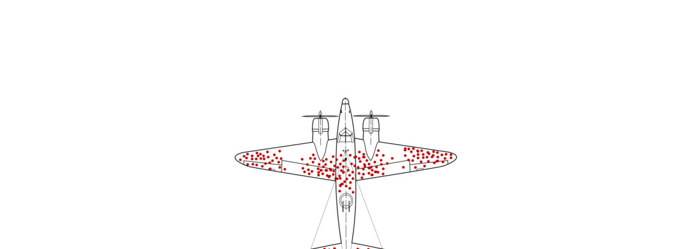
<figcaption class="paper-figure-caption"><b>Fig 1.</b> Figure 1: Survivorship bias.3 As we will explain, there are two ways to describe this conclusion. One is to say that the proposal avoids nonlocality, preserving locality without sacrificing realism. The other is to say that Bell nonlocality itself turns out to be a selection artefact. This is a terminological issue, depending on what we choose to mean by ‘nonlocality’ when the new option is in view. We will return to this question below (§4.1), referring to Bell’s own discussion of the term. Either way, the upshot is that Bell correlations are much less puzzling than they have seemed, in tension neither with relativity nor realism. We stress that ‘less puzzling’ does not imply ‘not puzzling...</figcaption>
</figure>
<figure class="paper-figure-card">
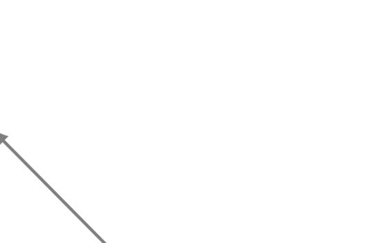
<figcaption class="paper-figure-caption"><b>Fig 2.</b> Figure 2: A collider</figcaption>
</figure>
<figure class="paper-figure-card">
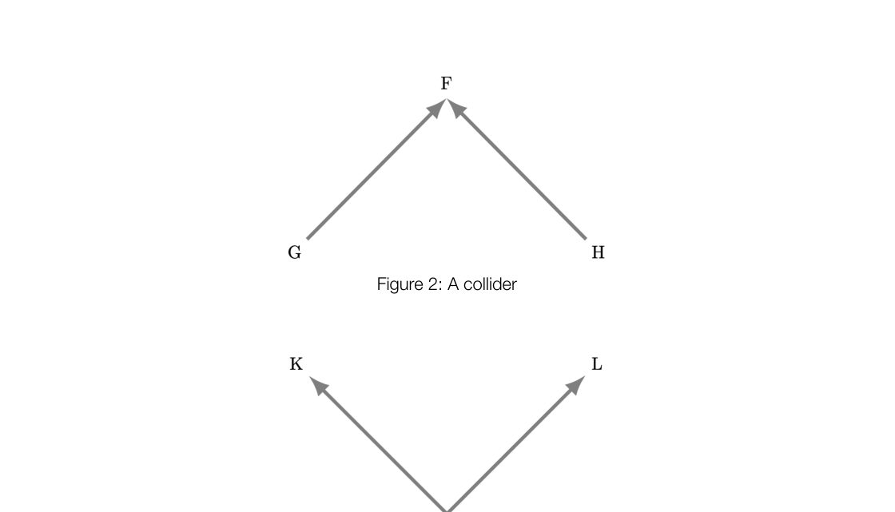
<figcaption class="paper-figure-caption"><b>Fig 3.</b> Figure 3: A common cause The second reason does apply in the familiar, causal world. A well-known property of common causes (see Figure 3) is that their effect on correlations is the opposite of a collider. The correlations they produce disappear if we condition on the common cause – if we select cases in which the common cause variable takes one particular value. The explanation is simple. If K co-varies with L because they both co-vary with a common cause J, then if we remove the variation of J, holding it fixed, we remove the co-variation between K and L. Here’s an example. Suppose that K and L are rare diseases of mice. Both diseases are genetic disorders, caused by different...</figcaption>
</figure>
<figure class="paper-figure-card">
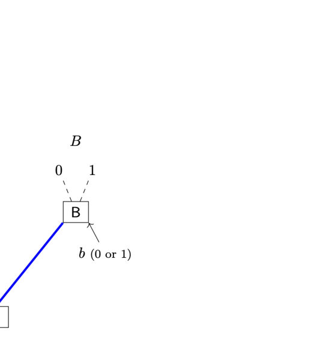
<figcaption class="paper-figure-caption"><b>Fig 4.</b> Figure 4: A two-particle Bell experiment</figcaption>
</figure>
<figure class="paper-figure-card">
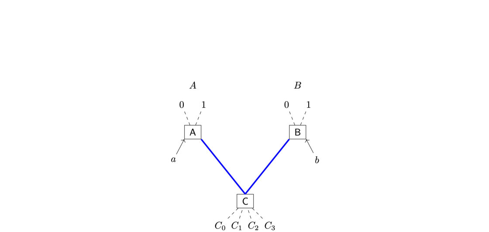
<figcaption class="paper-figure-caption"><b>Fig 5.</b> Figure 5: Bell experiment with four possible initial Bell states. Let’s make this classical toy model a little more sophisticated. The real Bell experiment we had in mind can be performed with any of the four so-called Bell states as the initial preparation. Let’s write these four states as C0, C1, C2, C3, where C0 is the singlet state. (See Figure 5.) For each of these states, there is a probability distribution P(A,B|a,b,Ci) giving the predicted joint probability of outcomes (A,B) given settings (a,b) and initial state Ci. Charlie can use these probabilities to sort results from Alice and Bob into four hoppers H0, H1, H2, H3, such that (i) no results are discarded and (ii) the frequencies...</figcaption>
</figure>

**Summary.** This paper proposes that the apparent nonlocality in quantum mechanics is actually a statistical artifact caused by selection bias. By treating Bell correlations as 'correlator bias,' the author suggests that local realism and special relativity can be preserved without needing to invoke spooky action at a distance.

**Why it may be interesting.** not directly relevant

Detailed structure

**Main problem.** The paper addresses the tension between Bell correlations and the principles of local realism and special relativity, questioning if these correlations necessitate nonlocality.

**Main result.** The author proposes that Bell correlations are not evidence of fundamental nonlocality but are instead 'selection artefacts' or 'correlator bias' arising from conditioning on a specific variable.

**Method.** The author uses a statistical framework of selection bias (specifically collider bias) and directed acyclic graphs (DAGs) to re-interpret Bell's theorem.

**Model / system.** The paper analyzes standard Bell-type experiments, including V-shaped (entangled pair preparation) and W-shaped (entanglement swapping) geometries, using classical and quantum toy models of selection bias.

**Key observables.** Bell correlations (violations of Bell inequalities) and the factorizability of joint probabilities.

**Important parameters / regimes.** The distinction between a 'super-ensemble' (full population) and a 'sub-ensemble' (selected subset) defined by a Correlator.

**Assumptions / limitations.** The proposal does not provide a physical mechanism for the underlying correlations and relies on the assumption that a randomizer can model the unconstrained super-ensemble.

**Figures summary.** Figure 1 shows WWII bomber survivorship bias; Figures 2 and 3 show DAGs for colliders and common causes; Figure 4 shows a Bell experiment setup; Figure 5 shows Bell states; Figure 6 illustrates entanglement swapping (W-shaped) geometry.

**Paper structure.** The paper introduces selection bias, applies it to Bell's theorem via 'correlator bias,' develops classical and quantum toy models, extends the argument to entanglement swapping (W-shaped experiments), and discusses implications for time-symmetric causality.

Abstract

Selection artefacts are common in science. A method of selecting samples from a larger population may produce bias, in either direction. It may induce correlations between variables independent in the full population, or mask correlations between variables dependent in the full population. Here we propose a surprising application of these familiar ideas. We argue that they are relevant to puzzling correlations uncovered in quantum theory by John Stewart Bell (Bell 1964). In the light of Bell's work and subsequent experiments it is widely believed that the quantum world is 'nonlocal', in apparent tension with relativity. Many hold that the only alternative is to abandon 'realism', the view that there is an objective world independent of measurement. We propose instead that Bell correlations are selection artefacts, in tension neither with relativity nor realism.

[↑ back to top](#top)

### [Escaping Mode Collapse in LLM Generation via Geometric Regulation](http://arxiv.org/abs/2605.00435v1)

**Authors:** Xin Du, Kumiko Tanaka-Ishii  
**Type:** both · **Category:** disordered systems and neural networks · **PDF:** <https://arxiv.org/pdf/2605.00435v1>  
**Analysis basis:** full PDF text, analyzed in chunks
**Topic relevance:** `non-equilibrium dynamics` **2/5** · `scars & prethermalization` **2/5**

↔ Scroll figures horizontally

<figure class="paper-figure-card">
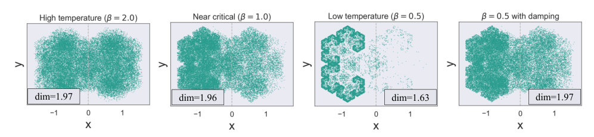
<figcaption class="paper-figure-caption"><b>Fig 1.</b> Figure 1. Trajectories of the state-dependent IFS in Eq. (13). We use ri = 0.6 (∀i), bi = [2gi, 0]⊤, and a rotation Oi with angle θi = −giπ/3. (a–c) Different inverse temperatures β: (a) β = 2.0, (b) β = 1.0, (c) β = 0.5. (d) Regulation implemented as weak damping (Eq. (3)) applied to the history-dependent variable mt.</figcaption>
</figure>
<figure class="paper-figure-card">
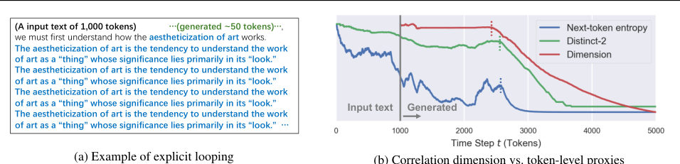
<figcaption class="paper-figure-caption"><b>Fig 2.</b> Figure 2. From explicit looping to geometric collapse. (a) An example of explicit mode collapse (looping) with Qwen3-4B-Base at temperature 0.5. (b) Along a single generation trajectory (starting at t = 1000), next-token entropy (blue) and Distinct-2 (green) provide token-level proxies of diversity, whereas correlation dimension (red) directly measures state-space accessibility; it drops sharply as the trajectory concentrates into a low-dimensional regime.</figcaption>
</figure>
<figure class="paper-figure-card">
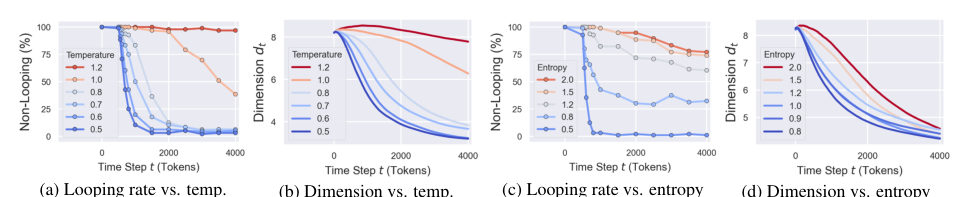
<figcaption class="paper-figure-caption"><b>Fig 3.</b> Figure 3. Correlation dimension tracks mode collapse across decoding conditions. As randomness is reduced (lower temperature or lower entropy target), explicit looping becomes more frequent, and correlation dimension decreases in tandem, indicating progressive concentration into low-dimensional regimes.</figcaption>
</figure>
<figure class="paper-figure-card">
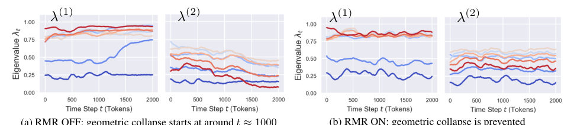
<figcaption class="paper-figure-caption"><b>Fig 4.</b> Figure 4. Evolution of the top-2 generalized eigenvalues in the value cache across Transformer layers (color-coded from blue to red), reporting the mean over attention heads. (a) Without RMR, geometric collapse begins around t ≈1000: the leading eigenvalue rises toward 1 while the second eigenvalue quickly drops toward 0, indicating a widening spectral gap and dominance by a single persistent mode. (b) With RMR, the leading eigenvalue in each layer is regulated below the threshold (λmin = 0.8), maintaining a stable spectrum and preventing collapse.</figcaption>
</figure>
<figure class="paper-figure-card">
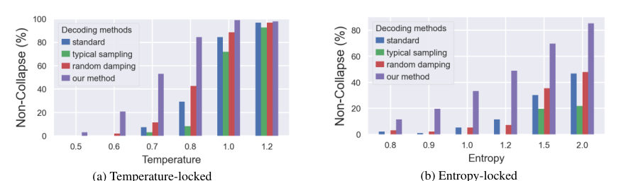
<figcaption class="paper-figure-caption"><b>Fig 5.</b> Figure 5. Non-collapse rates under controlled randomness. (a) Temperature-locked decoding and (b) entropy-locked decoding, comparing standard decoding, typical sampling, random regulation, and RMR. A completion is counted as non-collapse if its correlation dimension remains above 8 over 1,000 generated tokens of HEIDEGGER.</figcaption>
</figure>

**Summary.** This paper reinterprets LLM mode collapse as a geometric collapse of internal representation trajectories into low-dimensional attractors. It introduces RMR, a method to suppress persistent directions in the Transformer cache, effectively preventing repetitive generation. The approach maintains high text quality while enabling stable generation at much lower entropy rates.

**Why it may be interesting.** The paper uses tools from dynamical systems and statistical mechanics, such as Iterated Function Systems, phase transitions, and fractal dimensions, to analyze the stability and ergodicity of a high-dimensional stochastic process.

Detailed structure

**Main problem.** Addressing mode collapse in Large Language Models (LLMs), where autoregressive generation enters repetitive, low-entropy loops or loses semantic diversity.

**Main result.** The proposed Reinforced Mode Regulation (RMR) significantly increases non-collapse rates in LLMs (e.g., from 8% to 56% at temperature 0.7) without degrading text quality, by preventing the geometric collapse of internal trajectories.

**Method.** A lightweight, online intervention called Reinforced Mode Regulation (RMR) that uses low-rank damping to attenuate dominant, self-reinforcing directions in the Transformer value cache identified via a generalized eigenvalue problem.

**Model / system.** The system is modeled as an autoregressive Transformer-based LLM (e.g., Qwen, Llama) where the generation process is viewed as a stochastic trajectory in a high-dimensional state space (the KV cache), specifically using an Iterated Function System (IFS) framework to represent the dynamics.

**Key observables.** Correlation dimension (fractal dimension of the trajectory), next-token entropy, Distinct-n, and generalized eigenvalues of the value-cache subspace.

**Important parameters / regimes.** Temperature (T), damping strength (eta), eigenvalue threshold (lambda_min = 0.8), and entropy-locked/temperature-locked decoding regimes.

**Assumptions / limitations.** The method assumes access to the internal Transformer KV cache and relies on the approximation that the high-dimensional vocabulary can be binned for efficient computation.

**Figures summary.** Figure 1 visualizes trajectory transitions in an IFS; Figure 2 shows explicit looping examples; Figure 4 shows the widening spectral gap signaling collapse; Figure 6 illustrates non-looping degeneration (template/conceptual looping); Figure 8 and 9 show the stability of correlation dimension under RMR.

**Paper structure.** The paper introduces the problem of mode collapse, proposes a dynamical-systems reinterpretation as geometric collapse, presents the RMR method and its efficient implementation, validates the method using correlation dimension as a diagnostic, and demonstrates performance gains across various LLMs and temperatures.

Abstract

Mode collapse is a persistent challenge in generative modeling and appears in autoregressive text generation as behaviors ranging from explicit looping to gradual loss of diversity and premature trajectory convergence. We take a dynamical-systems view and reinterpret mode collapse as reduced state-space accessibility caused by *geometric collapse*: during generation, the model's internal trajectory becomes confined to a low-dimensional region of its representation space. This implies mode collapse is not purely a token-level phenomenon and cannot be reliably solved by symbolic constraints or probability-only decoding heuristics. Guided by this perspective, we propose *Reinforced Mode Regulation* (RMR), a lightweight, online state-space intervention that regulates dominant self-reinforcing directions in the Transformer value cache (implemented as low-rank damping). Across multiple large language models, RMR substantially reduces mode collapse and enables stable, high-quality generation at extremely low entropy rates (down to 0.8 nats/step), whereas standard decoding typically collapses near 2.0 nats/step.

[↑ back to top](#top)

### [From Tensor Networks to Tractable Circuits, and back](http://arxiv.org/abs/2605.00106v1)

**Authors:** Arend-Jan Quist, Marc Farreras Bartra, Alexis de Colnet, John van de Wetering, Alfons Laarman  
**Type:** theory · **Category:** numerical methods · **PDF:** <https://arxiv.org/pdf/2605.00106v1>  
**Analysis basis:** full PDF text, analyzed in chunks
**Topic relevance:** `entanglement & information structure` **2/5** · `methods for driven-dissipative` **2/5**

↔ Scroll figures horizontally

<figure class="paper-figure-card">
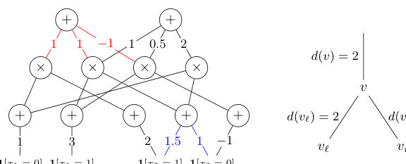
<figcaption class="paper-figure-caption"><b>Fig 1.</b> Figure 1: Example of a structured-decomposable circuit (left) and its corresponding tree tensor network (right). The matrices of the tensors correspond to adjacency matrices between the layers of the circuit.</figcaption>
</figure>
<figure class="paper-figure-card">
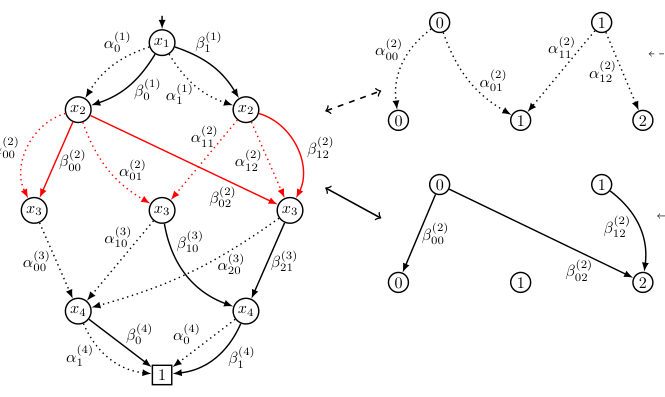
<figcaption class="paper-figure-caption"><b>Fig 2.</b> Figure 2: A non-deterministic edge-valued decision diagram (nd-EVDD) and its equivalence to a tensor train (TT). A pseudo-Boolean function f(x1, . . . , x4) is encoded as an nd-EVDD, which is structurally equivalent to a TT representation. The red edges highlight the bipartite subgraph between levels 2 and 3 of the diagram, whose adjacency matrix directly corresponds to one of the tensors in the TT. Dashed and black double arrows indicate how this bipartite graph decomposes into two subgraphs: one for low edges and one for high edges, encoding the matrices A(2) 0 and A(2) 1 , respectively, each of dimension 2 × 3. In this construction, nodes at the upper level represent matrix rows, nodes...</figcaption>
</figure>

**Summary.** This paper bridges the gap between tensor networks and knowledge compilation by proving they are mathematically equivalent representations of the same class of functions. This allows physicists to use advanced algorithmic tools from formal verification, such as variable reordering and canonical forms, to optimize tensor network computations.

**Why it may be interesting.** not directly relevant

Detailed structure

**Main problem.** Establishing formal mathematical equivalences between the Tensor Network community (used in physics/ML) and the Tractable Circuits community (used in formal verification) to enable the transfer of algorithms and structural properties.

**Main result.** The paper proves that Matrix Product States (Tensor Trains) are equivalent to non-deterministic edge-valued decision diagrams, and Tree Tensor Networks correspond to structured-decomposable circuits, allowing for bidirectional transfer of complexity results and heuristics.

**Method.** The authors use the language of semi-rings to unify weights and develop constructive, polynomial-time transformation procedures between the two frameworks.

**Model / system.** The paper focuses on mathematical data structures for representing pseudo-Boolean functions, specifically Matrix Product States (MPS), Tree Tensor Networks (TTN), and Edge-Valued Decision Diagrams (EVDD).

**Assumptions / limitations.** The transformation from EVDD to TT assumes EVDDs are complete (all variables are read on every path), though this can be enforced efficiently.

**Figures summary.** Figure 1 illustrates the structural mapping between a structured-decomposable circuit and a tree tensor network; Figure 2 demonstrates the functional equivalence between an nd-EVDD and a Tensor Train.

**Paper structure.** The paper introduces the problem of isolated frameworks, defines the mathematical models for both sides using semi-rings, proves specific structural equivalences (TT to EVDD and TTN to circuits), provides complexity analysis for transformations, and discusses the implications for cross-domain utility like variable ordering and lower bounds.

Abstract

Tensor networks and circuits are widely used data structures to represent pseudo-Boolean functions. These two formalisms have been studied primarily in separate communities, and this paper aims to establish equivalences between them. We show that some classes of tensor networks that are appealing in practice correspond to classes of circuits with specific properties that have been studied in knowledge compilation as \emph{tractable circuits}. In particular, we prove that matrix product states (tensor trains) coincide with nondeterministic edge-valued decision diagrams and that tree tensor networks exactly correspond to structured-decomposable circuits. These correspondences enable direct transfer of structural and algorithmic results; for example, canonicity and tractability guarantees known for circuits yield analogous guarantees for the associated tensor networks, and vice versa.

[↑ back to top](#top)

### [Comment on "Quantum teleportation, entanglement, LQU and LQFI in $e^{+} e^{-} \rightarrow \mathrm{Y} \overline{\mathrm{Y}}$ processes at BESIII through noisy channels''](http://arxiv.org/abs/2605.00129v1)

**Authors:** Saeed Haddadi  
**Type:** theory · **Category:** quantum information and computing · **PDF:** <https://arxiv.org/pdf/2605.00129v1>  
**Analysis basis:** full PDF text, analyzed in chunks
**Topic relevance:** `entanglement & information structure` **2/5**

↔ Scroll figures horizontally

<figure class="paper-figure-card">
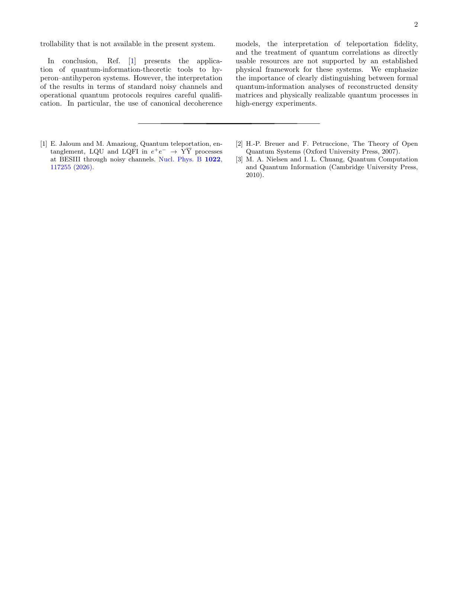
<figcaption class="paper-figure-caption"><b>Fig 1.</b> Low-resolution page preview, page 2</figcaption>
</figure>

**Summary.** This paper provides a critique of applying quantum information theory to high-energy physics, arguing that metrics like teleportation fidelity and decoherence models lack physical meaning when applied to hyperon pairs. The author contends that these quantities should be viewed as descriptions of static production correlations rather than dynamical quantum resources or environmental effects.

**Why it may be interesting.** not directly relevant

Detailed structure

**Main problem.** The paper critiques the physical validity of applying standard quantum information metrics and decoherence models to high-energy particle production processes.

**Main result.** The author argues that using noise channels and teleportation fidelity to describe hyperon-antihyperon pairs is physically unjustified because there is no identifiable environment-system interaction and the particles cannot be used for operational quantum protocols.

**Method.** A critical theoretical analysis of the physical correspondence between standard CPTP noise models (like amplitude damping) and the dynamics of relativistic, unstable particles produced in scattering events.

**Model / system.** Hyperon-antihyperon (Y anti-Y) pairs produced via e+ e- annihilation at the BESIII experiment, characterized by a reconstructed spin density matrix.

**Key observables.** Logarithmic negativity, Local Quantum Uncertainty (LQU), Local Quantum Fisher Information (LQFI), and teleportation fidelity.

**Important parameters / regimes.** Abstract noise parameters used in the criticized study to model decoherence.

**Assumptions / limitations.** The author assumes that the validity of quantum information measures depends on the existence of a physical environment and the ability to perform operational control, which is absent in this high-energy system.

**Paper structure.** The paper presents a critique of a recent study by first identifying the mismatch between standard decoherence models and the physics of free-propagating unstable particles, then arguing against the operational interpretation of teleportation fidelity, and finally proposing a re-interpretation of information metrics as static production correlations.

Abstract

We provide a critical assessment of a recent study applying quantum information concepts, including noisy channels and teleportation fidelity, to hyperon-antihyperon pairs produced in $e^{+}e^{-} \to Y\bar Y$ reactions at BESIII. While the spin density matrix reconstructed from experimental data provides a physically meaningful description of production correlations, we argue that its subsequent interpretation in terms of standard decoherence models-such as amplitude damping, phase damping, and phase flip-lacks a clear physical correspondence for these systems. The produced particles emerge from a single scattering event and propagate as free, unstable relativistic states, without a well-defined system-environment interaction acting on their spin degrees of freedom. As a result, the variation of quantum correlations with an abstract noise parameter does not describe a genuine physical evolution. We further contend that the reported teleportation fidelity should not be interpreted as evidence for operational quantum communication, since hyperon states cannot be prepared, controlled, or measured in a way that would enable a realizable teleportation protocol. More generally, quantities such as logarithmic negativity, local quantum uncertainty, and local quantum Fisher information primarily characterize static production correlations rather than directly usable quantum resources. Our analysis highlights the importance of distinguishing between formal quantum-information measures and their physical interpretation in high-energy particle systems.

[↑ back to top](#top)

### [Dynamical magnetotropic susceptibility as a new probe of Kitaev materials and beyond](http://arxiv.org/abs/2605.00568v1)

**Authors:** João C. Inácio, J. Schwab, G. Rakhmanova, S. Safari, V. Zambra, H. Nasir, S. Paschen, K. A. Modic, Fakher F. Assaad, Toshihiro Sato  
**Type:** both · **Category:** strongly correlated electrons · **PDF:** <https://arxiv.org/pdf/2605.00568v1>  
**Analysis basis:** full PDF text, analyzed in chunks
**Topic relevance:** `spintronics-quantum-optics interface` **2/5**

↔ Scroll figures horizontally

<figure class="paper-figure-card">
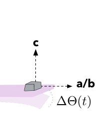
<figcaption class="paper-figure-caption"><b>Fig 1.</b> Fig. 1 Sketch of the cantilever setup for magnetotropic measurements. The cantilever oscillates around the axis e, and the magnetic field B is applied perpendicular to this axis.</figcaption>
</figure>
<figure class="paper-figure-card">
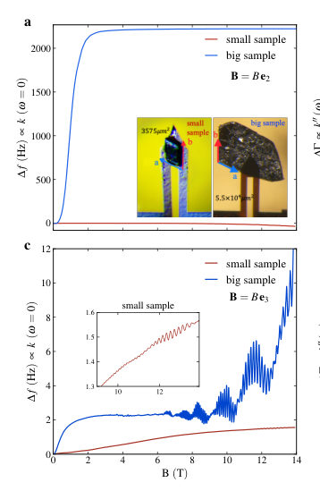
<figcaption class="paper-figure-caption"><b>Fig 2.</b> Fig. 2 Magnetic-field dependence of the magnetotropic susceptibility of the clean metal for in-plane and out-of-plane field orientations. Panels (a) and (b) show the shift in the cantilever resonance frequency, ∆f ∝k′(ω = 0), and the damping of the cantilever oscillations, ∆Γ = k′′(ω), for the in-plane configuration, B = B e2. Panels (c) and (d) show the corresponding response for the out- of-plane configuration, B = B e3. The inset in panel (c) highlights quantum oscillations in the small-sample signal. The panels (b) and (d) include schematic illustrations of the corresponding field orientation. Data for the big and small samples are compared in each panel. All data are shown at T = 1.5...</figcaption>
</figure>
<figure class="paper-figure-card">
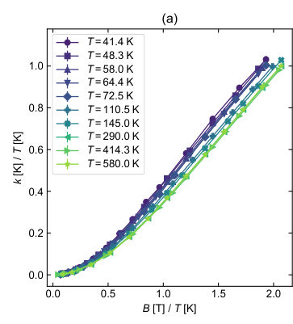
<figcaption class="paper-figure-caption"><b>Fig 3.</b> Fig. 3 Static magnetotropic susceptibility of the α-RuCl3 model for two parameter sets. Panel (a) shows the data from Ref. [4] for (J1, J3, K1, Γ1, Γ′ 1) = (−5.8, 5.8, −58, 29, 0) K, and panel (b) shows the results for the parameter set proposed in Ref. [28], (J1, J3, K1, Γ1, Γ′ 1) = (−0.35, 0.34, −2.8, 2.4, 0) meV ≈(−4.1, 3.9, −32.5, 27.9, 0) K. Here (ga, gb, gc) = (2.3, 2.3, 1.3).</figcaption>
</figure>
<figure class="paper-figure-card">
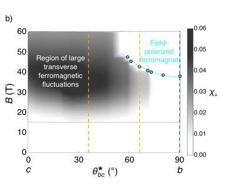
<figcaption class="paper-figure-caption"><b>Fig 4.</b> Fig. 6 Transverse ferromagnetic fluctuations in UTe2. (a) Amplitude of the pickup voltage of the cantilever during magnetotropic susceptibility measurements of UTe2 at 4 K, with the magnetic field applied at different angles in the bc plane, taking 0◦for B ∥c. (b) Phase diagram of the transverse susceptibility of UTe2 in the bc plane, obtained using the same technique, data are taken from Ref. [5]. The gray region indicates where transverse ferromagnetic fluctuations dominate, while the cyan line and dots correspond to the metamagnetic transition. Colored dashed lines indicate the sample angles shown in panel (a), with their corresponding colors. As the field is oriented toward the c axis,...</figcaption>
</figure>

**Summary.** This paper introduces the dynamical magnetotropic susceptibility as a novel experimental probe for ultra-low-frequency fluctuations in quantum materials. It demonstrates how this probe can uniquely identify Kitaev physics and study charge fluctuations in metals. The work combines analytical derivation with advanced machine-learning-enhanced Monte Carlo simulations.

**Why it may be interesting.** not directly relevant

Detailed structure

**Main problem.** Developing a theoretical and numerical framework to use dynamical magnetotropic susceptibility as a new probe for the low-energy, uniform (q=0) spin and charge fluctuations in Kitaev materials and other correlated systems.

**Main result.** The study demonstrates that the magnetotropic susceptibility can identify Kitaev exchange dominance via a specific scaling law (k(0)/T = f(B/T)) and can distinguish between different metallic states and spin-orbit coupling effects.

**Method.** The authors use linear response theory to derive the susceptibility and employ auxiliary-field quantum Monte Carlo (AFQMC) with machine-learning-based optimization to mitigate the sign problem.

**Model / system.** The study focuses on Kitaev materials like alpha-RuCl3, insulating spin systems, and 2D metallic systems (e.g., PdCoO2), using a generic correlated-electron Hamiltonian that includes spin and charge degrees of freedom.

**Key observables.** Dynamical magnetotropic susceptibility k(omega), specifically its real part (frequency shift) and imaginary part (damping/energy absorption).

**Important parameters / regimes.** Magnetic field (B), temperature (T), magnetic anisotropy, and exchange couplings (Kitaev, Heisenberg, and Gamma terms).

**Assumptions / limitations.** The numerical approach is limited by the fermion sign problem at very low temperatures; the study assumes the weak-field limit for certain metallic models.

**Figures summary.** Figure 1 shows the experimental cantilever setup; Figure 3 compares static susceptibility scaling for different parameter sets; Figure 4 shows the dynamical spectrum k''(omega); Figure 6 illustrates cantilever voltage suppression and a phase diagram in UTe2; Figure 7 and 8 show correlation ratios and spin susceptibility for the XXZ model.

**Paper structure.** The paper introduces the magnetotropic susceptibility, derives its properties via linear response theory, applies it to insulating spin systems and metallic systems, performs numerical simulations on Kitaev models using ML-optimized AFQMC, and discusses broader applications to quantum criticality.

Abstract

The magnetotropic susceptibility $k(ω)$ probes ultra-low-frequency uniform fluctuations. For a crystal mounted on an oscillating cantilever in a magnetic field, it is defined as the ratio of torque to angular-displacement amplitude. Its real and imaginary parts determine the oscillation-frequency shift and crystal-induced damping. It is a low-energy probe of uniform $q=0$ spin and charge degrees of freedom. We demonstrate this by deriving $k(ω)$ within linear response theory for a generic correlated-electron Hamiltonian with charge and spin degrees of freedom. Although it covers metallic and insulating magnets, correlated paramagnets, and exotic quantum critical points, we focus on limiting cases. For insulating spin systems $k(0)$ is sensitive to magnetic anisotropy whereas its finite-frequency imaginary part probes uniform dynamical spin susceptibility even in spin-symmetric models. For metallic systems we identify when eddy currents cause low-frequency damping. Our numerical results focus on Kitaev-material magnetotropic response. Using auxiliary-field quantum Monte Carlo with machine-learning-based sign-problem optimization we compute $k(ω)$ for several models proposed for $α$-RuCl$_3$. The observed low-temperature scaling of $k(0)/T$ with $B/T$ results from dominant Kitaev couplings: parameter sets without dominant Kitaev coupling do not exhibit this scaling. It remains robust upon inclusion of optical phonons. Beyond the static response, $k''(ω)$ for the $α$-RuCl$_3$ parameter set reproducing the experimental $k(0)$ data shows local-moment features at high and low $T$, with a single peak at the Larmor frequency. Beyond Kitaev systems we highlight broader applications. Probing ultra-low-energy uniform charge fluctuations is pertinent to Kondo destruction quantum criticality, of broad interest in strange metallicity and unconventional superconductivity.

[↑ back to top](#top)

### [Exact Analytical Vortex Solution for a Two-Dimensional Quantum Gas with LHY Correction](http://arxiv.org/abs/2605.00546v1)

**Authors:** Ibrar, Mahammad Ahmed Hussain, Ayan Khan  
**Type:** theory · **Category:** quantum gases · **PDF:** <https://arxiv.org/pdf/2605.00546v1>  
**Analysis basis:** full PDF text, analyzed in chunks
**Topic relevance:** `analog quantum simulation` **2/5**

↔ Scroll figures horizontally

<figure class="paper-figure-card">
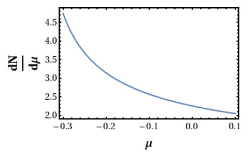
<figcaption class="paper-figure-caption"><b>Fig 1.</b> FIG. 1. (Color Online) Variation of dN/dµ with chemical po- tential which clearly shows that dN/dµ &gt; 0 suggesting stable solution.</figcaption>
</figure>
<figure class="paper-figure-card">
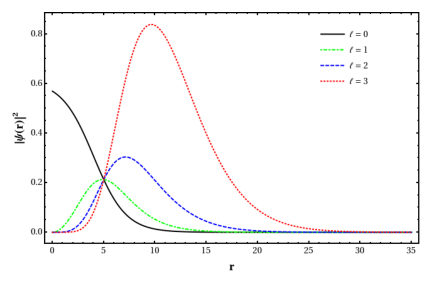
<figcaption class="paper-figure-caption"><b>Fig 2.</b> FIG. 2. (Color Online) The variation of the axial density for different topological charge is depicted. Here we have used N = 50, l = 0, 1, 2, 3, µ = −0.3, r0 = 5.</figcaption>
</figure>
<figure class="paper-figure-card">
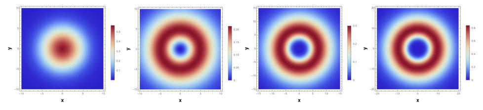
<figcaption class="paper-figure-caption"><b>Fig 3.</b> FIG. 3. (Color Online) Vortex generation for different topological charges. The left top corresponds to l = 0, vortex described in the right top is for l = 1 while the vortices in the lower panel is descibed for l = 2 and l = 3 (from left to right). Here, N = 50, µ = −0.3, r0 = 5</figcaption>
</figure>
<figure class="paper-figure-card">
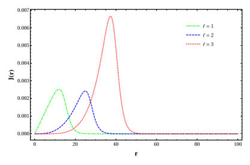
<figcaption class="paper-figure-caption"><b>Fig 4.</b> FIG. 4. Variation of current density for different topological charges. Here, N = 50, l = 1, 2, 3, µ = −0.3, r0 = 5.</figcaption>
</figure>

**Summary.** This paper presents a new exact analytical solution for vortices in a 2D Bose gas including Lee-Huang-Yang corrections. It demonstrates that these vortex solutions are stable and describes how their structure and current density scale with topological charge. This result serves as a reliable theoretical benchmark for studying low-dimensional quantum fluids.

**Why it may be interesting.** It provides a rare exact analytical benchmark for 2D quantum fluids with beyond-mean-field effects, which is crucial for interpreting experimental observations of BKT transitions and stabilized quantum droplets.

Detailed structure

**Main problem.** The lack of exact analytical solutions for vortex structures in two-dimensional quantum gases when including Lee-Huang-Yang (LHY) beyond-mean-field corrections.

**Main result.** The derivation of an exact analytical vortex solution that provides a clear framework for understanding vortex structures, stability, and energy in 2D quantum fluids.

**Method.** The authors use an ansatz for a low-energy angular momentum eigenstate and apply the Lambert W function to solve the resulting transcendental equations, alongside the Newton-Mercator series expansion.

**Model / system.** A two-dimensional Bose liquid or ultra-cold atomic gas (specifically binary BECs) described by a nonlinear Schrödinger equation featuring a logarithmic nonlinearity arising from LHY corrections.

**Key observables.** Vortex core size, vortex energy, circulating current density, and particle number stability (dN/dmu).

**Important parameters / regimes.** Topological charge (l), chemical potential (mu), scale factor (alpha), and the LHY correction term.

**Assumptions / limitations.** The solution assumes a weak beyond-mean-field interaction to ensure series convergence and restricts the radial dependence of the beta/gamma ratio to a characteristic scale to maintain analytical consistency.

**Figures summary.** Figure 1 shows the stability of the solution via dN/dmu; Figure 2 shows radial density profiles for different topological charges; Figure 3 shows the evolution of the vortex core in the x-y plane; Figure 4 illustrates current density growth with increasing topological charge.

**Paper structure.** The paper introduces the problem of LHY corrections in 2D, presents a mathematical ansatz and derivation using the Lambert W function, performs stability analysis via the Vakhitov-Kolokolov criterion, and concludes with a discussion of physical implications and limitations.

Abstract

In this investigation, we provide an exact analytical vortex solution for a Bose liquid in two dimensions with beyond mean-field correction (BMF). Analytical solutions in two-dimensional systems with BMF corrections are rarely found in the literature. The present result provides a clear framework for understanding vortex structures in low-dimensional quantum fluids and serves as a reliable benchmark for future theoretical and experimental studies.

[↑ back to top](#top)

### [Fidelity-Guaranteed Entanglement Routing with Distributed Purification Planning](http://arxiv.org/abs/2605.00246v1)

**Authors:** Anthony Gatti, Anoosha Fayyaz, Prashant Krishnamurthy, Kaushik P. Seshadreesan, Amy Babay  
**Type:** theory · **Category:** quantum information and computing · **PDF:** <https://arxiv.org/pdf/2605.00246v1>  
**Analysis basis:** full PDF text, analyzed in chunks
**Topic relevance:** `entanglement & information structure` **2/5**

↔ Scroll figures horizontally

<figure class="paper-figure-card">
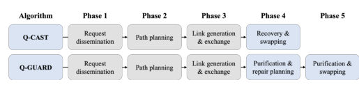
<figcaption class="paper-figure-caption"><b>Fig 1.</b> Fig. 1: Q-CAST vs. Q-GUARD routing pipelines. Phases 1–3 are shared. Q-GUARD diverges in Phase 4, adding fidelity- aware recovery planning with per-hop purification targets and an EXG-based segment selection metric. Phase 5 executes purification, swapping, and fidelity qualification.</figcaption>
</figure>
<figure class="paper-figure-card">
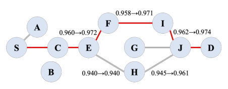
<figcaption class="paper-figure-caption"><b>Fig 2.</b> Fig. 2: Illustrative example of Q-GUARD recovery (Fth = 0.8, L = 5 hops).</figcaption>
</figure>
<figure class="paper-figure-card">
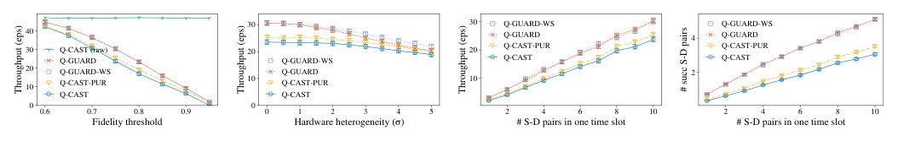
<figcaption class="paper-figure-caption"><b>Fig 3.</b> Fig. 3: Performance across operating conditions (a) Qualified throughput vs. fidelity threshold. Q-CAST’s raw throughput (green) is independent of Fth. (b) Qualified throughput vs. hardware heterogeneity ση. (c) Qualified throughput vs. number of offered S–D pairs. (d) Qualified S–D pairs served vs. number of offered S–D pairs.</figcaption>
</figure>
<figure class="paper-figure-card">
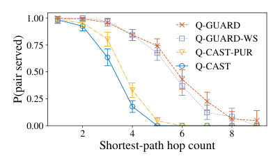
<figcaption class="paper-figure-caption"><b>Fig 4.</b> Fig. 4: Probability that an S–D pair receives at least one qualified ebit vs. shortest-path hop count (|V |=100, m=1, Fth=0.75).</figcaption>
</figure>
<figure class="paper-figure-card">
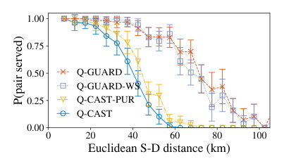
<figcaption class="paper-figure-caption"><b>Fig 5.</b> Fig. 5: Probability that an S–D pair receives at least one qualified ebit vs. Euclidean S–D distance (|V |=100, m=1, Fth=0.75).</figcaption>
</figure>

**Summary.** The paper introduces Q-GUARD, a distributed routing algorithm for quantum networks that ensures end-to-end entanglement meets specific fidelity requirements. By using local link-state information and adaptive purification planning, it significantly improves the success rate and service range of quantum communication compared to traditional throughput-only methods.

**Why it may be interesting.** not directly relevant

Detailed structure

**Main problem.** Existing quantum network routing algorithms either ignore fidelity or require centralized global knowledge, leading to high latency and decoherence. There is a need for a distributed, fidelity-aware routing protocol that ensures end-to-end entanglement meets specific thresholds.

**Main result.** The Q-GUARD algorithm increases the qualified success rate from under 20% to over 85% on 4-hop paths and nearly doubles the effective service radius in Euclidean distance compared to throughput-only baselines.

**Method.** The authors propose Q-GUARD, an online distributed algorithm using a k-hop local link-state model, a Werner-state equal-split rule for fidelity target allocation, and an Expected Goodput (EXG) metric for path segment selection.

**Model / system.** A quantum network model consisting of nodes and links capable of entanglement generation, BBPSSW purification, and entanglement swapping, modeled using Werner states and a time-slotted, decentralized k-hop topology.

**Key observables.** Qualified throughput (eps), qualified success rate, service radius (Euclidean distance), and expected goodput (EXG).

**Important parameters / regimes.** Fidelity threshold (Fth), k-hop communication radius, path width (W), hardware heterogeneity (sigma_eta), and purification rounds (Rmax).

**Assumptions / limitations.** Assumes the BBPSSW purification protocol, Werner-state noise model, and a time-slotted operation with limited k-hop local information exchange.

**Figures summary.** Figure 1 compares the routing pipeline of Q-CAST vs Q-GUARD; Figure 2 shows a path detour example; Figure 3 shows performance metrics including qualified throughput vs fidelity threshold, throughput vs hardware heterogeneity, and throughput vs offered load.

**Paper structure.** The paper introduces the problem of fidelity-aware routing, presents the Q-GUARD and Q-GUARD-WS algorithms, details the physical model and metrics (EXG), evaluates performance via large-scale simulations on synthetic topologies, and analyzes computational complexity.

Abstract

Many quantum-network applications require end-to-end Bell pairs whose fidelity exceeds a request-specific threshold, but existing entanglement routing algorithms either optimize only throughput without regard for fidelity or enforce fidelity guarantees using centralized controllers with global link-state knowledge. We present Q-GUARD, an online entanglement routing algorithm that enforces per-request fidelity thresholds within a distributed protocol model in which nodes exchange link-state information only with their $k$-hop neighbors. After link outcomes are realized in each slot, Q-GUARD builds per-link purification cost tables from realized Bell pairs, allocates per-hop fidelity targets using a Werner-state equal-split rule, and selects between candidate path segments using a segment-local expected-goodput (EXG) metric that jointly accounts for swap success, purification overhead, and resource availability. We also introduce Q-GUARD-WS, an extension that exploits per-link hardware quality estimates to allocate purification effort non-uniformly across hops. On synthetic 100-node topologies with heterogeneous link fidelity and stochastic BBPSSW purification, Q-GUARD raises the qualified success rate from under 20\% to over 85\% on 4-hop paths and nearly doubles the qualified service radius in Euclidean distance relative to throughput-only and naive-purification baselines, while Q-GUARD-WS provides additional throughput gains under high hardware heterogeneity.

[↑ back to top](#top)

### [Incommensurate Magnetic Ordered Phase with Enhanced Low-Temperature Magnetic Specific Heat in SmAu$_3$Al$_7$](http://arxiv.org/abs/2605.00540v1)

**Authors:** Ryuji Higashinaka, Takuma Iwami, Kohsuke Saitou, Takashi U. Ito, Chihiro Tabata, Koji Kaneko, Takashi Ohhara, Ryoji Kiyanagi, Akiko Nakao, Jumpei G. Nakamura, Wataru Higemoto, Akihiro Koda, Shinsaku Kambe, Yuji Aoki, Tatsuma D. Matsuda  
**Type:** experiment · **Category:** strongly correlated electrons · **PDF:** <https://arxiv.org/pdf/2605.00540v1>  
**Analysis basis:** full PDF text, analyzed in chunks
**Topic relevance:** `Frenkel-Kontorova` **2/5**

↔ Scroll figures horizontally

<figure class="paper-figure-card">
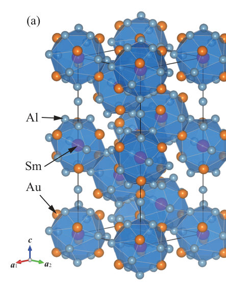
<figcaption class="paper-figure-caption"><b>Fig 1.</b> Fig. 1.</figcaption>
</figure>
<figure class="paper-figure-card">
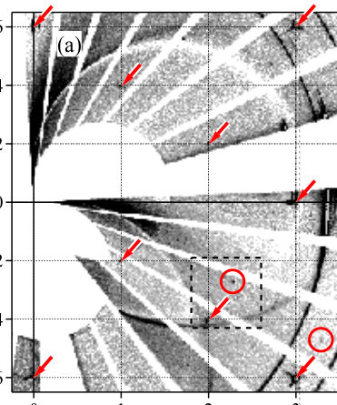
<figcaption class="paper-figure-caption"><b>Fig 2.</b> Fig. 2.</figcaption>
</figure>
<figure class="paper-figure-card">
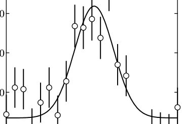
<figcaption class="paper-figure-caption"><b>Fig 3.</b> Fig. 3.</figcaption>
</figure>
<figure class="paper-figure-card">
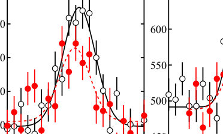
<figcaption class="paper-figure-caption"><b>Fig 4.</b> Fig. 4.</figcaption>
</figure>
<figure class="paper-figure-card">
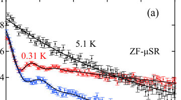
<figcaption class="paper-figure-caption"><b>Fig 5.</b> Fig. 5.</figcaption>
</figure>

**Summary.** This paper demonstrates that the magnetic order in SmAu3Al7 is a spatially homogeneous incommensurate state rather than a partially disordered one. It shows that the magnetic structure remains stable through the secondary transition at 0.9 K. The study also links the incommensurate order to an enhanced low-temperature electronic specific heat, potentially due to Kondo screening.

**Why it may be interesting.** not directly relevant

Detailed structure

**Main problem.** The study aims to elucidate the nature of the incommensurate magnetic ordered state in SmAu3Al7 and determine if the transition at T* = 0.9 K involves a change in magnetic structure or a partially disordered state.

**Main result.** The researchers confirmed a spatially homogeneous incommensurate magnetic order that remains structurally unchanged across the T* transition, ruling out previous proposals of a partially disordered state.

**Method.** The study employs neutron scattering (TOF and triple-axis spectrometry) and muon spin rotation (muSR) to probe magnetic structures and local fields, alongside magnetometry and specific heat measurements.

**Model / system.** The physical system is SmAu3Al7, a single-crystal Sm-based strongly correlated electron system with an ScRh3Si7-type structure where Sm ions are in cages.

**Key observables.** Incommensurate propagation vector q, magnetic Bragg peak intensity, spontaneous internal magnetic fields (Bmax), magnetic susceptibility, and electronic specific heat coefficient (gamma).

**Important parameters / regimes.** Transition temperatures TN = 2.8 K and T* = 0.9 K; propagation vector q = (0.30, 0, 1.33); electronic specific heat coefficient gamma > 1 J/(mol K^2).

**Figures summary.** Fig 1 shows crystal structure, phase diagram, and thermodynamic properties; Fig 2-4 present neutron diffraction patterns and 1D/2D scans of magnetic Bragg peaks; Fig 5 shows muon spin rotation spectra and the scaling of the local field with neutron intensity.

**Paper structure.** The paper introduces the material and its phase transitions, presents neutron diffraction data to identify the incommensurate structure, uses muSR to investigate local field homogeneity and the T* transition, and concludes by discussing the connection between magnetic order and specific heat enhancement.

Abstract

Neutron scattering and muon spin rotation ($μ$SR) measurements on single-crystal SmAu$_3$Al$_7$ reveal magnetically ordered states associated with successive transitions at $T_{\rm N}$ = 2.8 K and $T^*$ = 0.9 K. Magnetic Bragg peaks appear below $T_{\rm N}$ with an incommensurate (IC) propagation vector ${\bf q}$ = (0.30, 0, 1.33). $μ$SR detects spontaneous internal fields below $T_{\rm N}$, and the spectral shape is consistent with the IC magnetic ordering. No anomalies are observed at $T^*$, indicating that the magnetic structure remains essentially unchanged below and above $T^*$. The magnetic order is revealed to be a spatially homogeneous long-range ordered state, rather than a partially disordered state proposed in earlier studies. The possible connection between the IC magnetic order and the enhanced low-temperature magnetic specific heat is discussed.

[↑ back to top](#top)

### [Low-temperature Depletion of Superfluid Density in the Absence of Galilean Symmetry](http://arxiv.org/abs/2605.00274v1)

**Authors:** Viktor Berger, Nikolay Prokof'ev, Boris Svistunov  
**Type:** theory · **Category:** quantum gases · **PDF:** <https://arxiv.org/pdf/2605.00274v1>  
**Analysis basis:** full PDF text, analyzed in chunks
**Topic relevance:** `analog quantum simulation` **2/5**

↔ Scroll figures horizontally

<figure class="paper-figure-card">
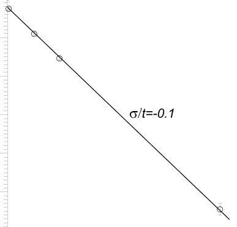
<figcaption class="paper-figure-caption"><b>Fig 1.</b> FIG. 1. Superfluid stiffness depletion as a function of x = (cT)3 for soft-core bosons in 2D with U/t = 4 (for system size L × L = 64 × 64). Solid (black) curve is the f(x) = A + Bx theoretical prediction with A = ns(T = t/6) and B fixed by the measured system parameters according to Eq. (3).</figcaption>
</figure>
<figure class="paper-figure-card">
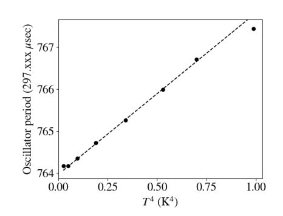
<figcaption class="paper-figure-caption"><b>Fig 2.</b> FIG. 2. Period of torsional oscillator as a function of T 4</figcaption>
</figure>

**Summary.** This paper develops a new theory for how superfluid density decreases at low temperatures in systems where Galilean invariance is broken. It moves beyond the standard Landau theory by accounting for anharmonic terms in the hydrodynamic action. The results show a universal scaling law that links temperature-dependent properties to finite-size effects.

**Why it may be interesting.** It provides a universal framework for understanding how broken symmetries affect the thermodynamics of many-body systems, specifically relating temperature-driven depletion to finite-size effects in quantum fluids.

Detailed structure

**Main problem.** Generalizing the theory of low-temperature superfluid density depletion to systems where Galilean invariance is broken by factors like disorder, lattice potentials, or porous media.

**Main result.** The authors derive a general formula for the temperature dependence of superfluid stiffness that includes anharmonic terms, revealing a universal scaling of T^{d+1} and a connection between finite-temperature and finite-size effects.

**Method.** The study uses Popov's hydrodynamic action with anharmonic terms for theoretical derivation and validates the results using Worm algorithm Path-Integral Monte Carlo simulations of interacting lattice bosons.

**Model / system.** The theory applies to superfluids lacking Galilean symmetry, such as ultracold atoms in optical lattices, supersolids, and Helium-4 in porous media, modeled via an anharmonic hydrodynamic Hamiltonian.

**Key observables.** Superfluid stiffness/density depletion (delta n_s), sound velocity, compressibility, and density fluctuations.

**Important parameters / regimes.** Low-temperature regime, dimensionality (d), sound velocity (c), compressibility (kappa), and parameters nu, gamma, and sigma representing anharmonicity.

**Assumptions / limitations.** The theory assumes the low-temperature asymptotic regime where only the acoustic part of the phonon branch is excited.

**Paper structure.** The paper introduces the failure of Landau theory in non-Galilean systems, presents a new hydrodynamic theory based on Popov's action, provides numerical validation using PIMC simulations, and discusses universal scaling and experimental implications.

Abstract

Landau theory of superfluidity associates low-temperature flow of the normal component with the phonon wind. This picture does not apply to superfluids in which Galilean invariance is broken either by disorder, porous media, or lattice potential, and the phonon wind is no longer solely responsible for depletion of the superfluid component. Based on Popov's hydrodynamic action with anharmonic terms, we present a general theory for low-temperature ($T$) dependence of the superfluid stiffness, which reproduces Landau result as a special case when several parameters of the hydrodynamic action are fixed by Galilean invariance, and validate it with numerical simulations of interacting lattice bosons. In a broader context, our approach reveals universal low-temperature thermodynamics of superfluids with an intrinsic connection between finite-$T$ and finite-size ($L$) effects implying universal scaling, $T^{d+1}$ and $1/L^{d+1}$, respectively, for a large class of thermodynamic quantities. We discuss the experimental detection of this law, and compare our prediction to the existing literature.

[↑ back to top](#top)

### [Parity-dependent reentrant topology in a Su--Schrieffer--Heeger chain with power-law quasiperiodic modulation](http://arxiv.org/abs/2605.00543v1)

**Authors:** Yusheng Niu, Hui Liu, Zhihao Xu  
**Type:** both · **Category:** disordered systems and neural networks · **PDF:** <https://arxiv.org/pdf/2605.00543v1>  
**Analysis basis:** full PDF text, analyzed in chunks
**Topic relevance:** `analog quantum simulation` **2/5**

↔ Scroll figures horizontally

<figure class="paper-figure-card">
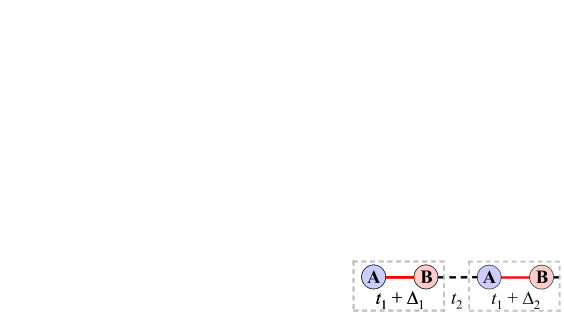
<figcaption class="paper-figure-caption"><b>Fig 1.</b> Figure 1: Schematic illustration of the SSH chain with quasiperiodically modulated intra- cell hopping ωj = t1 + ∆j and uniform intercell hopping t2.</figcaption>
</figure>
<figure class="paper-figure-card">
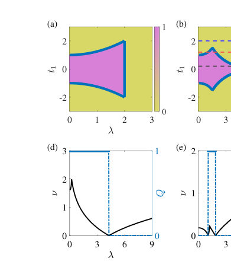
<figcaption class="paper-figure-caption"><b>Fig 2.</b> Figure 2: Topological phase diagrams and zero-mode inverse-localization-length analysis in the β →0 limit for odd n. The colored regions in (a)–(c) are obtained from the numerical topological indicator Q, while the solid lines denote the phase boundaries determined from the criterion ν = 0. The blue solid lines represent analytical phase boundaries, and the red solid lines denote the boundaries obtained from numerical integration of Eq. (7). (a) n = 1. (b) n = 3, where the horizontal dashed lines indicate t1 = 0.2, 1.2, and 2. (c) n = 5. (d) n = 3, t1 = 0.2. (e) n = 3, t1 = 1.2. (f) n = 3, t1 = 2. Here L = 1000.</figcaption>
</figure>
<figure class="paper-figure-card">
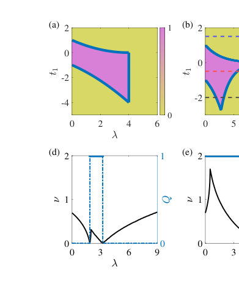
<figcaption class="paper-figure-caption"><b>Fig 3.</b> Figure 3: Topological phase diagrams and zero-mode inverse-localization-length analysis in the β →0 limit for even n. The colored regions in (a)–(c) are obtained from the numerical topological indicator Q, while the solid lines denote the phase boundaries determined from the criterion ν = 0. The blue solid lines represent analytical phase boundaries, and the red solid lines denote the boundaries obtained from numerical integration of Eq. (7). (a) n = 2. (b) n = 4, where the horizontal dashed lines indicate t1 = −2, −0.5, and 1.5. (c) n = 6. (d) n = 4, t1 = −2. (e) n = 4, t1 = −0.5. (f) n = 4, t1 = 1.5. Here L = 1000.</figcaption>
</figure>
<figure class="paper-figure-card">

<figcaption class="paper-figure-caption"><b>Fig 4.</b> Figure 4: Topological phase diagrams in the β →∞limit. The colored regions are obtained from the numerical topological indicator Q, and the blue solid lines denote the analytical phase boundaries determined by ν = 0. (a) Odd n. (b) Even n. Here L = 1000.</figcaption>
</figure>
<figure class="paper-figure-card">
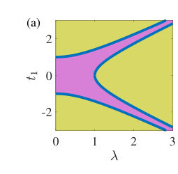
<figcaption class="paper-figure-caption"><b>Fig 5.</b> Figure 4(a) shows the phase diagram in the (t1, λ) plane for the odd-n case. The analytical boundaries from Eq. (15) are plotted as blue solid curves and agree well with the numerical results. In the interval |t1| &gt; 1, the system exhibits a reentrant transition sequence: it is trivial at weak modulation, enters a TAI-like reentrant topological phase at intermediate λ, and returns to the trivial phase when λ is further increased. Compared with the β →0 limit, the topological region in the present case extends to progressively larger λ as |t1| increases, indicating that stronger modulation can still support a topological phase provided that the uniform hopping is tuned simultaneously. For...</figcaption>
</figure>

**Summary.** This paper explores how the parity of a power-law exponent in quasiperiodic modulation controls the emergence of reentrant topological phases in an SSH chain. It reveals that odd and even exponents lead to fundamentally different topological phase diagrams. The findings are supported by both analytical theory and a proposed implementation using topoelectrical circuits.

**Why it may be interesting.** The discovery of a parity-dependent mechanism for inducing topological Anderson-like phases in quasiperiodic systems provides new insights into how controlled disorder can be used to engineer topological states.

Detailed structure

**Main problem.** The study investigates how power-law quasiperiodic modulation in a 1D SSH chain induces reentrant topological transitions and how the parity of the modulation exponent affects the phase diagram.

**Main result.** The authors demonstrate that the topological phase structure is parity-dependent: odd-power modulations can induce reentrant topology from the clean trivial regime, whereas even-power modulations only allow reentrance from the negative trivial regime. This effect is robust across the interpolation between smooth and square-wave-like modulation profiles.

**Method.** The study combines analytical calculations of the zero-mode inverse localization length with numerical evaluations of a real-space topological indicator and proposes an electrical-circuit implementation for experimental verification.

**Model / system.** A one-dimensional Su-Schrieffer-Heeger (SSH) chain with power-law quasiperiodically modulated intracell hopping, which can be realized via an AC electrical-circuit chain.

**Key observables.** Zero-mode inverse localization length (nu), real-space topological indicator (Q), node-voltage distribution, and two-point impedance.

**Important parameters / regimes.** Modulation strength (lambda), modulation exponent (n), modulation profile parameter (beta), and clean-limit intracell hopping (t1).

**Assumptions / limitations.** The study assumes the thermodynamic limit for analytical calculations and focuses on the chiral-symmetric regime.

**Figures summary.** Figure 5 shows phase diagrams in the (beta, lambda) plane for odd and even n; Figure 6 provides a schematic of the electrical-circuit implementation.

**Paper structure.** The paper introduces the modulated SSH model, presents analytical derivations for phase boundaries in specific limits, provides numerical phase diagrams and parity-dependent analysis, and concludes with a proposed experimental circuit implementation.

Abstract

We investigate reentrant topological transitions in a one-dimensional Su--Schrieffer--Heeger chain with power-law quasiperiodically modulated intracell hopping. The modulation is characterized by a positive integer exponent $n$ and a tunable parameter $β$, which continuously interpolates between the smooth power-law quasiperiodic limit and a sign-function limit that becomes square-wave-like for odd $n$ and uniform for even $n$. By combining analytical calculations of the zero-mode inverse localization length with numerical evaluations of a real-space topological indicator, we determine the topological phase diagrams in the $β\to 0$, $β\to\infty$, and finite-$β$ regimes. We show that deterministic quasiperiodic modulation can induce TAI-like reentrant topological phases within finite parameter windows. The formation of these phases depends crucially on the parity of $n$: for positive modulation strength, odd-power modulations can induce reentrant topology from the clean trivial regime $|t_1|>1$, whereas even-power modulations allow such reentrance only from the negative clean trivial regime $t_1<-1$. Exact analytical expressions for the zero-mode inverse localization length are obtained for $n=1,2,3,4$, yielding explicit or implicit transition conditions. The finite-$β$ results demonstrate that the parity-dependent structure remains robust throughout the interpolation between the two limiting cases. This parity effect originates from whether the modulation preserves or removes the sign structure of $\cos x$. We further propose an electrical-circuit implementation and discuss experimentally accessible signatures of the reentrant trivial--topological--trivial transition.

[↑ back to top](#top)

### [Suppression of Universal Errors in DFS-Encoded Superconducting Geometric Logical \emph{T} Gate](http://arxiv.org/abs/2605.00552v1)

**Authors:** Cheng-Yun Ding, Li-Hua Zhang, Jian Zhou  
**Type:** theory · **Category:** quantum information and computing · **PDF:** <https://arxiv.org/pdf/2605.00552v1>  
**Analysis basis:** full PDF text, analyzed in chunks
**Topic relevance:** `correlated / nonlocal dissipation` **2/5**

↔ Scroll figures horizontally

<figure class="paper-figure-card">
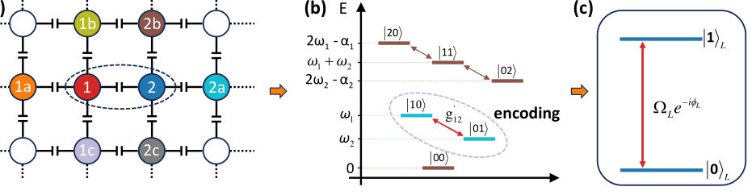
<figcaption class="paper-figure-caption"><b>Fig 1.</b> FIG. 1. Illustration of our superconducting implementation with DFS encoding. (a) Schematic of the 2D square transmon lattice via capacitive coupling. Transmons 1 and 2 are designated as target qubits, and surrounding devices (1a, 1b, 1c, 2a, 2b, 2c) act as spectator qubits, with different colors representing disparate resonant frequencies. (b) Energy-level spectrum of target qubits 1 and 2. The single-excitation transition subspace naturally forms a feasible DFS for single-logical-qubit encoding. (c) Encoded two-level logical basis structure corresponding to |10⟩= |0⟩L and |01⟩= |1⟩L, where resonant transitions can be flexibly tuned via the effective coupling strength ΩL.</figcaption>
</figure>
<figure class="paper-figure-card">
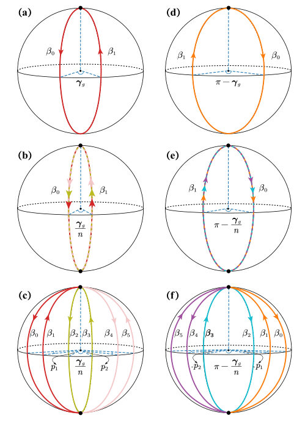
<figcaption class="paper-figure-caption"><b>Fig 2.</b> FIG. 2. Evolution trajectories for different geometric T gate schemes. (a)-(c) depict the trajectory strategies of the conventional two- segment orange-sliced shaped single-loop, standard composite n- loop, and our optimized composite n-loop schemes, corresponding to Path 1. (d)-(f) show the corresponding strategies for Path 2. For clarity, only up to three loops are illustrated, where p1 and p2 repre- sent the tunable degrees of freedom for parameter optimization.</figcaption>
</figure>
<figure class="paper-figure-card">
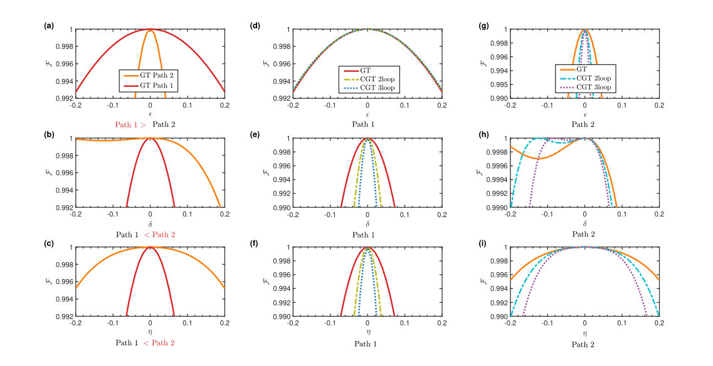
<figcaption class="paper-figure-caption"><b>Fig 3.</b> FIG. 3. Gate fidelities of the single-loop geometric T (GT) gate as a function of (a) Rabi, (b) detuning, and (c) crosstalk errors for Path 1 and Path 2, without decoherence. Panels (d)-(f) compare the noise robustness between the GT gate and the n-loop composite geometric T (CGT) gate (n = 2, 3) based on Path 1, covering Rabi, detuning, and crosstalk errors in sequence. Panels (g)-(i) present the corresponding comparisons for Path 2 under the same three noise channels.</figcaption>
</figure>
<figure class="paper-figure-card">
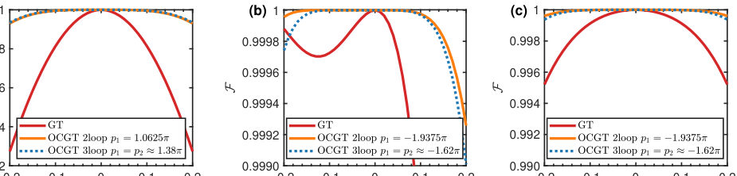
<figcaption class="paper-figure-caption"><b>Fig 4.</b> FIG. 4. Comparison of gate robustness between our optimized composite geometric T (OCGT) gate scheme with n = 2, 3 loops and the conventional GT gate scheme, under (a) Rabi, (b) detuning, and (c) crosstalk errors, respectively. Here, the selected path configurations (Path 1, Path 2) are the ones that is less sensitive to the corresponding errors.</figcaption>
</figure>
<figure class="paper-figure-card">
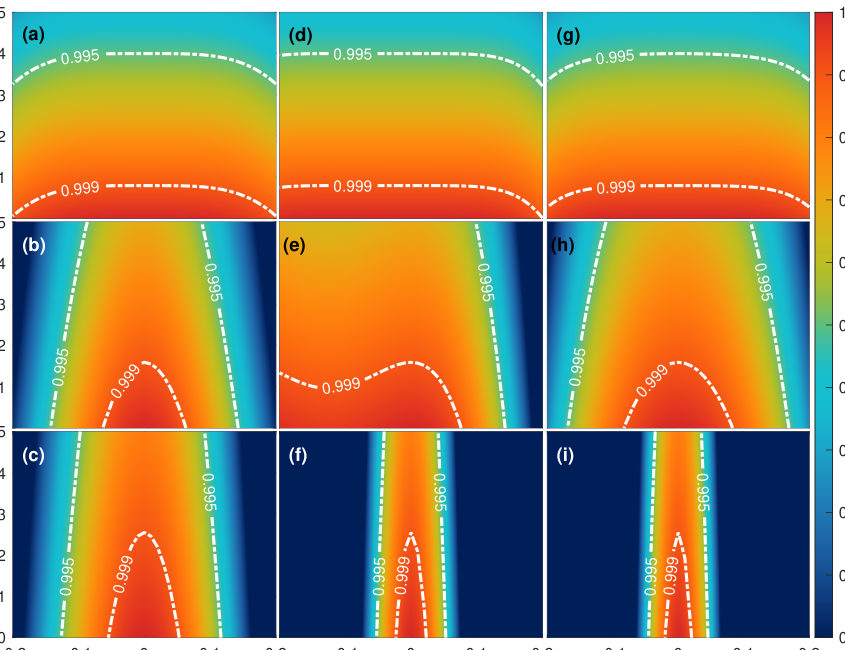
<figcaption class="paper-figure-caption"><b>Fig 5.</b> FIG. 5. Gate fidelities evaluated under decoherence and three dominant noise channels. For Rabi error, panels (a)-(c) correspond to the two- loop OCGT, single-loop GT, and DT schemes, respectively. Panels (d)-(f) and (g)-(i) present the analogous results for detuning and crosstalk errors, respectively.</figcaption>
</figure>

**Summary.** The paper proposes a new method for creating robust logical T-gates in superconducting processors using a combination of geometric pulses and decoherence-free encoding. By optimizing the trajectory of the quantum gate, the researchers achieved high-order suppression of the most common errors in transmon systems. This approach offers a more resource-efficient alternative to traditional magic state distillation for fault-tolerant quantum computing.

**Why it may be interesting.** This work is highly relevant to open quantum systems and quantum optics researchers because it demonstrates advanced control techniques (composite pulses and geometric phases) to protect a logical qubit from specific environmental noise channels (collective dephasing and frequency drifts).

Detailed structure

**Main problem.** The difficulty of implementing high-fidelity, non-Clifford T-gates in superconducting circuits due to universal errors like Rabi frequency fluctuations, detuning, and residual ZZ crosstalk, as well as the high resource overhead of magic state distillation.

**Main result.** The proposed optimized multi-loop composite geometric T-gate (OCGT) achieves fourth-order suppression of Rabi, detuning, and crosstalk errors while providing inherent immunity to collective dephasing.

**Method.** The authors use nonadiabatic geometric quantum computing (NGQC) combined with a multi-loop optimized composite pulse engineering strategy and Decoherence-Free Subspace (DFS) encoding.

**Model / system.** A system of two capacitively coupled transmon qubits in a 2D square lattice, utilizing a parametrically tunable coupling model via ac microwave driving and DFS encoding in the single-excitation subspace.

**Key observables.** Gate fidelity, logical-state populations, and leakage error rates.

**Important parameters / regimes.** Rabi frequency error (epsilon), detuning error (delta), residual ZZ crosstalk (eta), and microwave modulation parameters (beta and Delta).

**Assumptions / limitations.** The model assumes a two-excitation subspace and focuses on specific noise channels, with potential leakage errors from high-frequency terms addressed via parameter optimization.

**Figures summary.** Fig 1 shows the physical transmon setup; Fig 2 illustrates the evolution trajectories for single-loop, conventional, and optimized multi-loop strategies; Fig 3 compares gate robustness against Rabi errors; Fig 6 shows fidelity landscapes and time-resolved dynamics; Fig 11 plots fidelity as a function of path parameters.

**Paper structure.** The paper identifies the T-gate bottleneck, proposes a hardware-efficient geometric approach using DFS, details the tunable transmon Hamiltonian, introduces a unified framework for gate construction, compares three trajectory strategies, and demonstrates numerical superiority in error suppression and leakage mitigation.

Abstract

High-fidelity logical \emph{T}-gate realization constitutes a core prerequisite for large-scale fault-tolerant quantum computing. However, conventional magic state distillation requires massive physical qubit overhead across successive distillation rounds, alongside sophisticated measurement and feedback control, thereby inducing considerable spatial and temporal resource consumption. Herein, we propose a controlled superconducting geometric logical \emph{T} gate scheme that achieves high-order suppression of universal errors, by integrating decoherence-free subspace encoding with multi-loop optimized composite geometric pulse engineering. Guided by tailored trajectory design, we systematically establish unified gate construction frameworks for conventional geometric, composite geometric, and optimized composite geometric protocols. By flexibly controling additional parametric degrees of freedom, the proposed scheme achieves substantially enhanced robustness against diverse noise sources. Numerical simulations reveal that, within tunable superconducting quantum circuits, our geometric logical \emph{T} gate outperforms both conventional composite geometric and dynamical gates in suppressing Rabi frequency, detuning, and residual inter-qubit crosstalk errors that can all be suppressed to the fourth order, while additionally providing inherent suppression of collective dephasing errors. The present strategy alleviates intrinsic limitations of mainstream approaches and opens a promising avenue toward robust high-fidelity logical \emph{T} gate construction.

[↑ back to top](#top)

## Other papers (17)

*Papers from primary archives without highlighted authors or any topic match. Click to expand.*

Show other papers

### [Cryogenic Graphene-Based Phase Modulators for Quantum Information Processing](http://arxiv.org/abs/2605.00112v1)

**Authors:** Leonard Barboza Navarro, Maria Carolina Volpato, Alisson Ronieri Cadore, Pierre-Louis de Assis  
**Type:** theory · **Category:** quantum information and computing · **PDF:** <https://arxiv.org/pdf/2605.00112v1>  
**Analysis basis:** full PDF text, analyzed in chunks

↔ Scroll figures horizontally

<figure class="paper-figure-card">
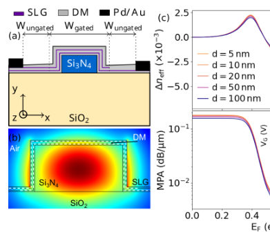
<figcaption class="paper-figure-caption"><b>Fig 1.</b> Figure 1: (a) Cross-sectional schematic of the DSLG integration on the RWG. The SiO2 buried oxide (BOX) layer is 2 µm thick, and the upper cladding is air. The core width and height were set to 800 nm and 400 nm, respectively. The gated region was set to approximately 2 µm, while the ungated regions were approximately 1 µm long. (b) Simulated —E— of the fundamental TE mode confined at 1.55 µm. (c) Simulation ∆neff and MPA for different hBN spacer thicknesses. The simulations were performed at λ = 1.55 µm and T = 300 K. A carrier mobility of µ = 10 000 cm2/Vs was assumed, corresponding to a relaxation time τ calculated at EF = 0.11 eV according to µ = eτv2 F/EF. The refractive index of hBN...</figcaption>
</figure>
<figure class="paper-figure-card">
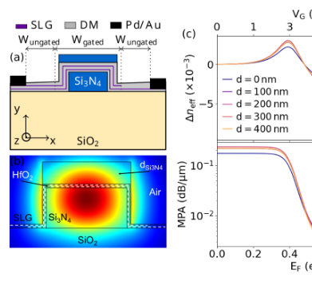
<figcaption class="paper-figure-caption"><b>Fig 2.</b> Figure 2: (a) Cross-sectional schematic of the Si3N4 layer covering the DSLG integrated on the RWG. (b) Simulated —E— of the fundamental TE mode confined at 1.55 µm. (c) ∆neff and MPA for different values of the Si3N4 layer thickness. The simulations were performed under the same conditions as in Fig. 1(b-c), with 20 nm of HfO2. (d) Modal overlap per unit length for the gated and ungated regions. Both were evaluated at EF = 0.55 eV; however, the same behavior is observed throughout the entire range (0 eV to 1 eV). The overlap with the upper and lower graphene layers becomes nearly identical, as the region of highest optical field intensity also overlaps with the upper SLG. Inset: As the...</figcaption>
</figure>
<figure class="paper-figure-card">
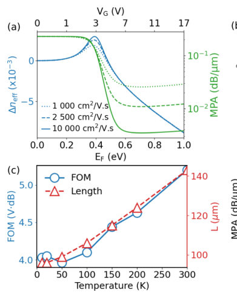
<figcaption class="paper-figure-caption"><b>Fig 3.</b> Figure 3: (a) ∆neff and MPA for different graphene carrier mobility values: low mobility (∼1000 cm2/Vs), intermediate mobility (∼2500 cm2/Vs), and high mobility (∼10 000 cm2/Vs). The simulations are performed using the same design parameters and conditions as in Fig. 2. (b) Simulations at dif- ferent temperatures at 10 000 cm2/Vs. As the temperature decreases, the transition regime becomes sharper due to the reduced thermal broadening of the carrier distribution. Moreover, the onset of the transparency regime shifts toward lower EF. This enables access to operating regions where ∆neff spans both positive and negative values, which can be exploited to significantly reduce the device...</figcaption>
</figure>
<figure class="paper-figure-card">
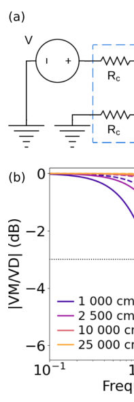
<figcaption class="paper-figure-caption"><b>Fig 4.</b> Figure 4: (a) Equivalent electrical circuit of the DSLG-based waveguide phase modulator. (b) Frequency response of the DSLG-based waveguide phase modulator for different carrier mobility values (µ), assuming a contact re- sistance of Rc =150 Ωµm [25]. The graphene in the gated region (∼2 µm) is set to EF = 0.55 eV, while in the ungated region (∼1 µm) it is set to EF = 0.11 eV. Solid lines corresponds to 20 nm HfO2 spacer (ϵr = 20) with modulation length of 96 µm. Dashed lines correspond to 20 nm Al2O3 spacer (ϵr = 8) with a modulation length of 164 µm.</figcaption>
</figure>
<figure class="paper-figure-card">
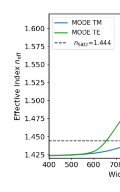
<figcaption class="paper-figure-caption"><b>Fig 5.</b> Figure 6: Effective index of the fundamental TE and TM modes as a function of the waveguide core width for a fixed core height of 400 nm at λ = 1.55 µm.</figcaption>
</figure>

**Summary.** The paper presents a theoretical optimization of graphene-based phase modulators for use in cryogenic quantum photonic circuits. It demonstrates that operating at 10 K significantly reduces device footprint and loss by leveraging the Pauli-blocking effect. The study identifies HfO2-based designs as a superior candidate for high-efficiency, low-loss modulation.

**Why it may be interesting.** This work is highly relevant to quantum optics and photonic quantum computing as it provides design guidelines for the hardware components (modulators) necessary for controlling photonic qubits in scalable, cryogenic-compatible integrated circuits.

Detailed structure

**Main problem.** Optimizing the performance of graphene-based electro-optic phase modulators for integrated photonic quantum information processing, specifically focusing on achieving low loss, high bandwidth, and compactness in cryogenic environments.

**Main result.** Cryogenic operation (10 K) enhances performance by sharpening the Fermi-Dirac distribution, enabling near-pure phase modulation with insertion losses below 0.3 dB and modulation lengths below 50 um.

**Method.** A combination of electromagnetic simulations using COMSOL Multiphysics and a physically consistent description of graphene conductivity based on the Kubo formalism.

**Model / system.** A dual-layer graphene (DSLG) capacitor integrated on silicon nitride (Si3N4) ridge waveguides, utilizing electrostatic tuning of the Fermi level to achieve the Pauli-blocking transparency regime.

**Key observables.** Effective refractive index (real and imaginary parts), phase shift, modal power attenuation (MPA), insertion loss, modulation efficiency (Vpi L), and 3-dB bandwidth.

**Important parameters / regimes.** Temperature (10 K to 300 K), graphene mobility, Fermi level (eV), dielectric spacer thickness and permittivity (HfO2 vs Al2O3), and waveguide dimensions.

**Assumptions / limitations.** Graphene is modeled as an infinitesimally thin conductive sheet with a fixed Fermi velocity; materials are assumed to be linear, isotropic, and non-magnetic.

**Figures summary.** Schematics of the DSLG architecture, cross-sectional views of the waveguide, effective index plots for TE/TM modes, frequency response comparisons, and equivalent electrical circuit diagrams.

**Paper structure.** The paper introduces the need for cryogenic modulators, describes the DSLG-Si3N4 platform and Kubo-based conductivity model, presents parametric studies on geometry and materials, analyzes temperature and mobility impacts, and concludes with performance comparisons to state-of-the-art technologies.

Abstract

Electro-optic modulators are key components for photonic quantum computing, particularly in fully cryovenic integrated platforms where low loss and compactness are critical. We present a systematic theoretical investigation of compact dual-layer graphene (DSLG) electro-optic phase modulators integrated on silicon nitride waveguides, with emphasis on cryogenic operation. By combining electromagnetic simulations with a physically consistent description of graphene conductivity based on the Kybo formalism, we analyze the interplay between electrostatic tuning, optical mode confinement, and material-dependent losses. We show that cryogenic operation enhances device performance by sharpening the Fermi-Dirac distribution, enabling access to the Pauli-blocking regime at lower Fermi levels and reducing the required modulation length. Through optimization of the waveguide geometry, dielectric spacer thickness and permittivity, and graphene quality, we identify regimes that simultaneously minimize insertion loss and device footprint under realistic voltage constraints. The optimized designs achieve near-pure phase modulation with insertion losses below 0.3 dB and modulation lengths below 50 um at 10 K, while maintaining GHz-scale bandwidths. These results provide quantitative design guidelines for low-loss, compact, cryogenic graphene phase modulators for scalable integrated quantum photonics.

[↑ back to top](#top)

### [Data-Driven Modelling to predict forest fire spread in the Patagonian region in Argentina](http://arxiv.org/abs/2605.00167v1)

**Authors:** Lucas Becerra, Monica Malen Denham, Alejandro B. Kolton, Karina Laneri  
**Type:** both · **Category:** disordered systems and neural networks · **PDF:** <https://arxiv.org/pdf/2605.00167v1>  
**Analysis basis:** full PDF text, analyzed in chunks

↔ Scroll figures horizontally

<figure class="paper-figure-card">
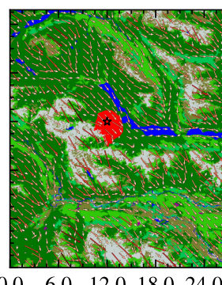
<figcaption class="paper-figure-caption"><b>Fig 1.</b> Figure 1: Reference wildfire for the first experiment, simulated with D = 10 m2 h−1, A = 1 × 10−4, B = 15 m h−1, and ignition point at (x, y) = (400, 600). Each green area corresponds to a different fuel type (Forest A, Forest B, exotic forest, pasture, and shrubland), with spatially heterogeneous β and γ values listed in Table 1. Red indicates the final burned area (final state after 500 steps, dt = 0.5 h), yielding a burnt area of approximately 1015 ha; the star marks the ignition point; arrows indicate wind direction.</figcaption>
</figure>
<figure class="paper-figure-card">
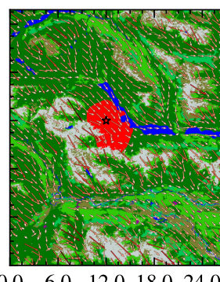
<figcaption class="paper-figure-caption"><b>Fig 2.</b> Figure 2: Reference wildfire for the second experiment (Steffen-Martin landscape). The same reference values as the first experiment were used for (D = 10 m2 h−1, A = 1×10−4, B = 15 m h−1, and ignition point at (x, y) = (400, 600)), while homogeneous β and γ were introduced as additional tunable parameters with reference values (β = 1.5 h−1</figcaption>
</figure>
<figure class="paper-figure-card">
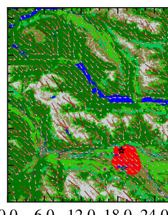
<figcaption class="paper-figure-caption"><b>Fig 3.</b> Figure 3: Reference wildfire used in Experiment 3 (Steffen-Martin landscape). The simula- tion uses D = 10 m2 h−1, A = 1×10−4, and B = 15 m h−1, with three fixed ignition points at (1130, 290), (1300, 150), and (620, 280). Each green area corresponds to a different fuel type (Forest A, Forest B, exotic forest, pasture, and shrubland), with heterogeneous and tunable βi and γi values (Table 1). Red indicates the final burned area (final state after 500 steps, dt = 0.5 h), yielding a burnt area of approximately 4241 ha; this reference fire was designed to burn a representative fraction of all fuel types.</figcaption>
</figure>
<figure class="paper-figure-card">
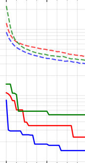
<figcaption class="paper-figure-caption"><b>Fig 4.</b> Figure 4: Evolution of the fitness in the three experiments. The dashed line shows the mean fitness per generation, while the solid line indicates the minimum fitness (best individual). Elitism ensures that the best individual is preserved across generations.</figcaption>
</figure>
<figure class="paper-figure-card">
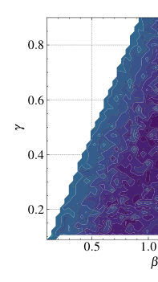
<figcaption class="paper-figure-caption"><b>Fig 5.</b> Figure 5: Fitness landscape in relation to β and γ for the second case. It is shown that there is a valley of similar fitness values, which creates a strong correlation between both parameters and hinders their accurate estimation. The red point indicates the reference values (β, γ) = (1.5, 0.5).</figcaption>
</figure>

**Summary.** This paper presents a hybrid computational method that uses machine learning to optimize a physics-based reaction-diffusion-convection model for predicting forest fires. By combining Genetic Algorithms with XGBoost, the researchers can efficiently estimate difficult-to-measure environmental parameters in complex, heterogeneous landscapes.

**Why it may be interesting.** not directly relevant

Detailed structure

**Main problem.** The difficulty of accurately predicting wildfire spread in Patagonia due to the lack of local parameters and the inadequacy of global models for heterogeneous landscapes.

**Main result.** A hybrid framework combining a Genetic Algorithm with XGBoost successfully recovers model parameters, with XGBoost significantly improving accuracy in low-dimensional scenarios.

**Method.** A hybrid approach using a Genetic Algorithm (GA) for global parameter search and an XGBoost surrogate model for fine-tuning and accelerating the optimization process.

**Model / system.** A Reaction-Diffusion-Convection (RDC) model, phenomenologically inspired by the SIR epidemic framework, applied to wildfire propagation across a heterogeneous landscape of different vegetation types.

**Key observables.** Spatial overlap between simulated and reference burned areas, fire front velocity, and fire front width.

**Important parameters / regimes.** Ignition rate (beta), extinction rate (gamma), diffusion constant (D), advection weights (A and B for wind and slope), and ignition coordinates (x, y).

**Assumptions / limitations.** The diffusion constant is assumed to be homogeneous; the wind field is assumed to be stationary; the model does not capture microscopic combustion physics.

**Figures summary.** Figure 1-3 show reference wildfire patterns for different experimental complexities; Figure 4 shows fitness evolution; Figure 5 shows a fitness valley in the beta-gamma landscape; Figure 6 shows parameter correlation; Figure 7 shows convergence of ignition coordinates; Figure 8 shows spatial difference maps.

**Paper structure.** Introduction to the wildfire problem, description of the RDC model and numerical implementation, presentation of the GA and XGBoost optimization framework, results from three experiments of increasing complexity, and discussion of limitations and future work.

Abstract

Wildfires are among the most severe disturbances affecting forest ecosystems, with over 50,000 hectares burned in Patagonia, Argentina, during 2025 alone. This study implements a Reaction-Diffusion-Convection (RDC) model to simulate wildfire spread in the Steffen and Martin Lakes area, a region severely impacted by fires. By integrating high-resolution maps of slope, wind velocity, and vegetation, we conducted three computational experiments of increasing complexity to simulate fire propagation across heterogeneous landscapes.   We employed a Genetic Algorithm (GA) to recover reference model parameters by maximizing the spatial overlap between simulated and reference burned areas. Subsequently, parameter estimates were refined using XGBoost to improve accuracy. Results demonstrate that the GA accurately recovers reference parameters across all scenarios, while the XGBoost fine-tuning significantly enhances accuracy in simpler cases. This integrated framework offers a systematic approach for estimating difficult-to-measure wildfire parameters, demonstrating the potential of hybrid computational methods for wildfire modeling and forest management.

[↑ back to top](#top)

### [Efficient Mutation Testing of Quantum Machine Learning Models](http://arxiv.org/abs/2605.00107v1)

**Authors:** Emma Andrews, Prabhat Mishra  
**Type:** theory · **Category:** quantum information and computing · **PDF:** <https://arxiv.org/pdf/2605.00107v1>  
**Analysis basis:** full PDF text, analyzed in chunks

↔ Scroll figures horizontally

<figure class="paper-figure-card">
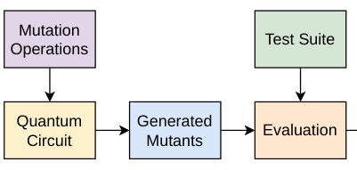
<figcaption class="paper-figure-caption"><b>Fig 1.</b> Fig. 1: An overview of mutation testing.</figcaption>
</figure>
<figure class="paper-figure-card">
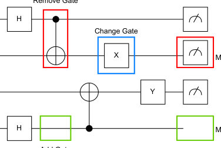
<figcaption class="paper-figure-caption"><b>Fig 2.</b> Fig. 2: Example of mutation operations. The CNOT gate between qubits q1 and q2 is removed with a remove gate operation. A new one-qubit gate is added with the add gate operation after the first Hadamard gate on qubit q4. The Pauli-X gate acting on qubit q2 is changed to a semantically equivalent one-qubit gate on the same qubit and in the same location with the change gate operation. The measurement of q2 is removed with the remove measurement operation. A new measurement is added at the end of the circuit on qubit q4 with the add measurement operation. Note that typically one mutation is performed to generate the mutant.</figcaption>
</figure>
<figure class="paper-figure-card">
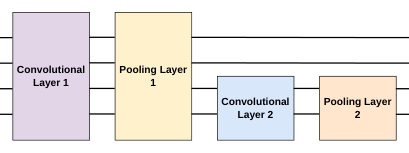
<figcaption class="paper-figure-caption"><b>Fig 3.</b> Fig. 5: Typical structure of a quantum convolutional neural network (QCNN). It consists of a convolutional layer followed by a pooling layer. The next round of these pairs of layers reduces the number of qubits it operates over.</figcaption>
</figure>
<figure class="paper-figure-card">
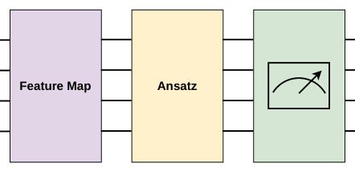
<figcaption class="paper-figure-caption"><b>Fig 4.</b> Fig. 3: Components of a quantum neural network. The data is first embedded into the quantum circuit using a feature mapping. With the embedded data, the ansatz can process it, learning features and other relationships depending on the model objective. Finally, measurement of the quantum circuit produces the result of the model, such as a class label in classification tasks.</figcaption>
</figure>
<figure class="paper-figure-card">
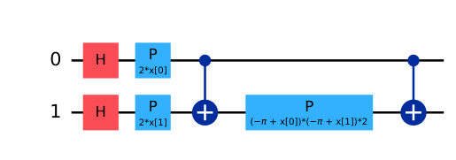
<figcaption class="paper-figure-caption"><b>Fig 5.</b> Fig. 4: Example of two-qubit ZZ feature map. x[0] and x[1] are the values taken from the input data sample.</figcaption>
</figure>

**Summary.** This paper introduces an efficient mutation testing framework specifically designed for Quantum Machine Learning models. By targeting the unique structural components of QNNs and QCNNs, the method reduces computational overhead and improves the detection of faults in quantum circuits.

**Why it may be interesting.** not directly relevant

Detailed structure

**Main problem.** Existing mutation testing for quantum circuits is too generalized and inefficient for Quantum Machine Learning (QML) models, leading to excessive redundant mutants and failure to detect application-specific faults.

**Main result.** The authors developed a directed mutation framework that significantly reduces mutant redundancy (up to 9.5x) while achieving higher mutation scores, particularly through targeted gate and layer modifications.

**Method.** The paper proposes seven new mutation operations (e.g., Ansatz Parameter Change, Layer Shuffling, and Gate Substitution) and a directed generation technique to target the structural components of QNNs and QCNNs.

**Model / system.** The study focuses on Quantum Neural Networks (QNNs) and Quantum Convolutional Neural Networks (QCNNs) using various feature maps (ZFM, ZZFM, Amplitude Embedding) and ansätze (RealAmplitudes, EfficientSU2).

**Key observables.** Mutation Score (ratio of killed to total mutants), Survival Rate, and Generation/Evaluation time.

**Important parameters / regimes.** Rotation gate parameters, input data features, and circuit depth (number of layers).

**Assumptions / limitations.** Assumes that breaking entanglement and symmetry in feature maps is a primary way to induce detectable faults; assumes the use of classical simulators (Qiskit-Aer) for evaluation.

**Figures summary.** Figure 1 shows the mutation workflow; Figure 2 illustrates standard mutation operations; Figure 3 and 4 detail QNN/feature map structures; Figure 5 shows QCNN architecture; Figure 7 presents the seven new mutation operations; Figure 8 uses t-SNE to visualize decision boundary changes.

**Paper structure.** The paper introduces the problem of QML verification, defines the structural components of QNNs, proposes seven new mutation operations, describes the experimental setup using various datasets and ansätze, and evaluates the efficiency and effectiveness of the new approach against existing methods.

Abstract

Quantum machine learning integrates the strengths of quantum computing and machine learning, enabling models to learn complex features using fewer parameters than their classical counterparts. Due to the increasing complexity of quantum machine learning models, it is necessary to verify that the implementation of these models satisfy the design specification and be free of bugs and faults. Mutation testing is a promising avenue to identify faulty quantum circuits that do not meet design specifications or contain defects by intentionally inserting faults into the quantum circuit. It is necessary to define mutation operations to inject faults into quantum circuits to ensure that a test suite is robust enough to evaluate an implementation against its design specification. In this paper, we extend mutation testing to quantum machine learning applications, primarily quantum neural network models. Specifically, this paper makes two important contributions. We define new mutation operations for efficient fault insertion compared to state-of-the-art approaches. We also present a directed mutation generation technique to reduce redundant mutant circuits. Extensive experimental evaluation demonstrates that our approach generates a more diverse and representative set of mutants, effectively addressing faults that traditional techniques fail to expose.

[↑ back to top](#top)

### [Electrical detection of spin-flip transition in metal/Na5Co15.5Te6O36 heterostructure](http://arxiv.org/abs/2605.00491v1)

**Authors:** Hirotsugu Tagami, Takuya Kawada, Yuki Shiomi  
**Type:** experiment · **Category:** strongly correlated electrons · **PDF:** <https://arxiv.org/pdf/2605.00491v1>  
**Analysis basis:** full PDF text, analyzed in chunks

↔ Scroll figures horizontally

<figure class="paper-figure-card">
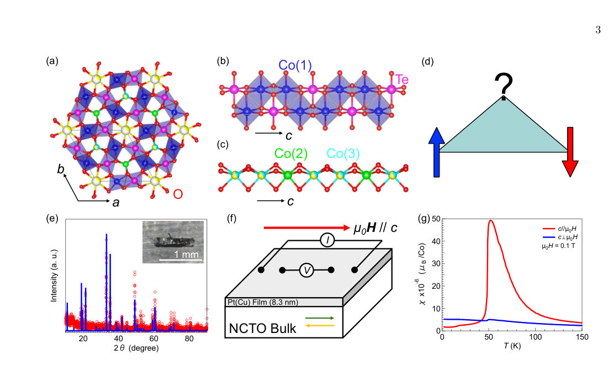
<figcaption class="paper-figure-caption"><b>Fig 1.</b> FIG. 1. (a) Crystal structure of NCTO projected in the ab plane. Three Co ion sublattices: Co(1) (blue), Co(2) (green), and Co(3) (cyan). Co(2) and Co(3) are located at the center of the triangle formed by Co(1) (b) Zigzag chain of Co(1) (blue) along the c-axis. (c) Alternate arrangement of Co(2) (green) and Co(3) (cyan) along the c-axis. Co(3) site is partially replaced by Na ions (yellow). (d) Magnetic structure of the Co(1) triangle at low temperatures at zero field [10]. (e) Powder X-ray diffraction pattern of NCTO at room temperature. The red open circles represent the experimental data, and the blue lines represent the simulation results. The inset is a photograph of an NCTO single...</figcaption>
</figure>
<figure class="paper-figure-card">
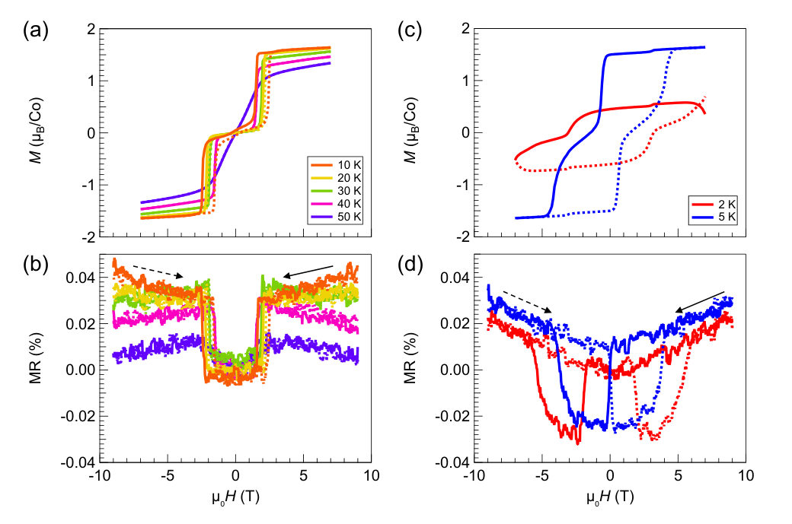
<figcaption class="paper-figure-caption"><b>Fig 2.</b> FIG. 2. Magnetic field (H) dependence of (a),(c) magnetization (M) for an NCTO single crystal and (b),(d) longitudinal MR spectra of a Pt/NCTO bilayer at (a),(b) high temperatures (≥10 K) and (c),(d) low temperatures (≤5 K), respectively. The MR ratio is defined as MR = {ρ(H) −ρ(0)}/ρ(0), where ρ(H) is the resistivity at H. In all panels, H was applied parallel to the c-axis. Solid and dotted curves represent data obtained during field-decreasing (from 9 T to −9 T) and field-increasing (from −9 T to 9 T) scans, respectively.</figcaption>
</figure>
<figure class="paper-figure-card">
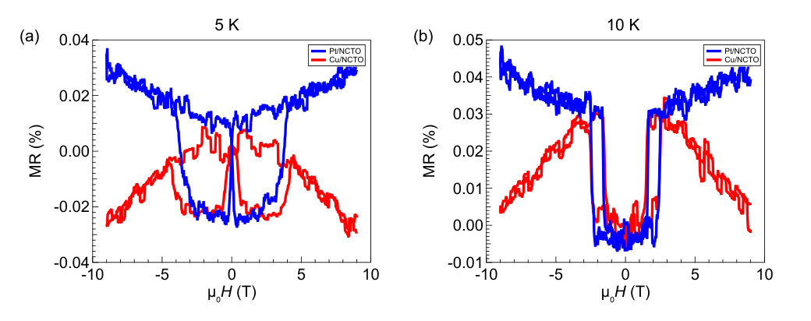
<figcaption class="paper-figure-caption"><b>Fig 3.</b> FIG. 3. Magnetic field (H) dependence of the MR ratio of Pt/NCTO (blue) and Cu/NCTO (red) at (a) 5 K and (b) 10 K. The MR ratio is determined by MR= {ρ(H) −ρ(0)}/ρ(0), where ρ(H) is the resistivity at H. The data for Pt/NCTO repeat the ones from Fig. 2 (b) and (d).</figcaption>
</figure>
<figure class="paper-figure-card">
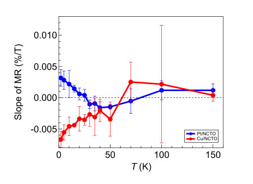
<figcaption class="paper-figure-caption"><b>Fig 4.</b> FIG. 4. Temperature (T) dependence of the slope of MR spectra at high fields (µ0|H| ≥7 T) for Pt/NCTO (blue) and Cu/NCTO (red). The plotted data are the averaged results obtained from four field sweeps (9 →7 T, −7 →−9 T, −9 → −7 T, and 7 →9 T), where the sign of the negative field data is inverted. Error bars indicate the standard deviation in the linear fit.</figcaption>
</figure>

**Summary.** The researchers investigated the origin of magnetoresistance anomalies in Pt/NCTO and Cu/NCTO heterostructures during magnetic spin-flip transitions. They found that the primary cause of the resistance jumps is strain induced by magnetostriction, though interface spin accumulation contributes to the high-field behavior. This work provides a method for the electrical detection of magnetic transitions in Ising-type antiferromagnets.

**Why it may be interesting.** not directly relevant

Detailed structure

**Main problem.** Determining whether magnetoresistance (MR) anomalies at spin-flip transitions in metal/magnetic insulator heterostructures are driven by interface spin accumulation or by magnetostriction-induced strain.

**Main result.** The MR anomalies at the spin-flip transition are attributed to magnetostriction-induced strain, while the high-field MR behavior is driven by the interaction between interface spin accumulation and induced magnetization.

**Method.** Longitudinal MR measurements and SQUID magnetometry were performed on Pt and Cu thin films deposited on Na5Co15.5Te6O36 (NCTO) single crystals.

**Model / system.** The system consists of Pt and Cu thin films (8.3 nm) on a single-crystal Ising-type antiferromagnetic insulator, Na5Co15.5Te6O36 (NCTO), which features Co ion sublattices and undergoes transitions to partially disordered antiferromagnetic states.

**Key observables.** Longitudinal magnetoresistance (MR), magnetization (M), magnetic susceptibility (chi), and magnetostriction coefficient (lambda).

**Important parameters / regimes.** Neel temperature (TN approx 50 K), transition to frozen PDA state (approx 20 K), and magnetic field strength (up to 9 T).

**Assumptions / limitations.** The study assumes that the similarity in MR jumps between Pt and Cu (which have different spin-orbit interactions) implies a strain-based mechanism for the spin-flip transition anomalies.

**Figures summary.** Figure 1 shows the crystal structure of NCTO, including the Co(1) triangular networks and zigzag patterns.

**Paper structure.** The paper introduces the heterostructure and the scientific problem, describes the experimental setup and material properties, presents MR and magnetization results, analyzes the physical mechanisms (strain vs. spin-current), and concludes with implications for antiferromagnetic spintronics.

Abstract

We report on the longitudinal magnetoresistance (MR) in thin metal films on an Ising-type antiferromagnetic insulator, Na5Co15.5Te6O36 (NCTO). Steep changes in the MR spectra with hysteresis were observed at spin-flip transitions driven by magnetic fields applied along the easy axis of the NCTO crystal. The MR jumps almost follow step-like changes in magnetization at the spin-flip transition. At very low temperatures where Co moments are partially frozen, the MR anomalies exhibit a tunnel-magnetoresistance-like shape. The observed MR anomalies at the spin-flip transition are attributed to strain effects via magnetostriction upon the magnetic-structure change of the Co nets in NCTO, because similar MR jumps are observed in both Pt/NCTO and Cu/NCTO. Interestingly, we found that the high-field slopes of the MR spectra show opposite signs between Pt/NCTO and Cu/NCTO at low temperatures. Because the opposite signs of the high-field MR are prominent below the antiferromagnetic transition temperature of NCTO, the interaction between the interface spin accumulation and magnetization is likely to contribute to the MR effect in the induced ferromagnetic state.

[↑ back to top](#top)

### [Monte Carlo study of the superfluid phase of $^4$He](http://arxiv.org/abs/2605.00629v1)

**Authors:** Massimo Boninsegni  
**Type:** theory · **Category:** statistical mechanics · **PDF:** <https://arxiv.org/pdf/2605.00629v1>  
**Analysis basis:** full PDF text, analyzed in chunks

↔ Scroll figures horizontally

<figure class="paper-figure-card">
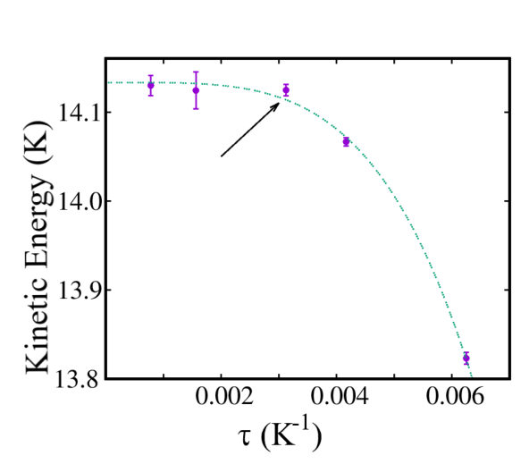
<figcaption class="paper-figure-caption"><b>Fig 1.</b> Figure 1: Time step extrapolation of the kinetic energy per particle in bulk superfluid 4He, at temperature T = 1 K, for a system comprising N = 2048 atoms. The density is 0.021834 ˚A−3. The results are obtained with the Aziz I pair potential. The dashed line is a quartic fit to the data. Arrow points to the value of τ for which convergence is reached, within statistical uncertainty. The value of the kinetic energy extrapolated to the τ = 0 limit is 14.133(5) K.</figcaption>
</figure>
<figure class="paper-figure-card">
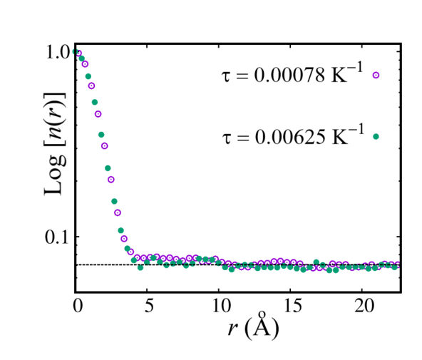
<figcaption class="paper-figure-caption"><b>Fig 2.</b> Figure 2: One-body density matrix in superfluid 4He at the same thermodynamic conditions of Fig. 1, with the two different values of the time step of Table 1. Statistical errors are of the order of the size of the symbols. The dashed line corresponds to the value 0.0705, which is consistent with the averages of the two sets of data.</figcaption>
</figure>
<figure class="paper-figure-card">
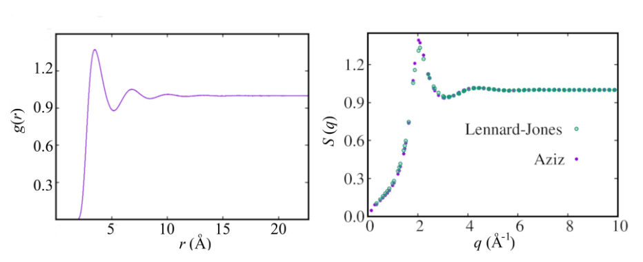
<figcaption class="paper-figure-caption"><b>Fig 3.</b> Figure 3: Theoretically computed pair correlation function (left) and static structure factor (right) for superfluid 4He at temperature T = 1 K, at saturated vapor pressure. The pair correlation function was computed using the Aziz I pair potential, whereas static structure factor was computed using both the Aziz I and Lennard-Jones potentials.</figcaption>
</figure>
<figure class="paper-figure-card">
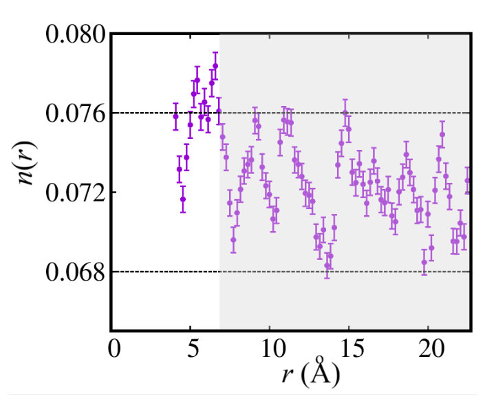
<figcaption class="paper-figure-caption"><b>Fig 4.</b> Figure 4: One-body density matrix n(r) computed by QMC at temperature T = 0.5 K, at saturated vapor pressure, on a system comprising N = 2048 atoms. The value of the condensate fraction is obtained by averaging over the values in the shaded area.</figcaption>
</figure>
<figure class="paper-figure-card">
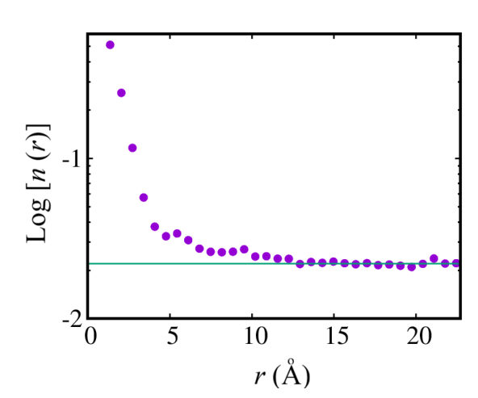
<figcaption class="paper-figure-caption"><b>Fig 5.</b> Figure 5: One-body density matrix n(r) computed by QMC at temperature T = 2.12 K, at saturated vapor pressure, on a system comprising N = 2048 atoms. Solid line corresponds to the value 0.022. Error bars are smaller than the size of the symbols.</figcaption>
</figure>

**Summary.** This paper presents a large-scale Quantum Monte Carlo study of superfluid 4He using 2,048 atoms to achieve much higher precision than previous studies. It provides updated values for the ground-state condensate fraction and energy, effectively benchmarking modern simulation techniques against experimental data.

**Why it may be interesting.** not directly relevant

Detailed structure

**Main problem.** The study aims to provide updated, high-precision numerical estimates for the superfluid phase of 4He, addressing inaccuracies and small system sizes in legacy simulations.

**Main result.** The paper provides a revised ground-state condensate fraction of 0.0715 +/- 0.0006, which is lower than previous QMC estimates but consistent with experiment, and establishes a new benchmark for energetic and structural properties.

**Method.** State-of-the-art Quantum Monte Carlo (QMC) simulations using the canonical version of the continuous-space Worm Algorithm (WA).

**Model / system.** A system of 2,048 identical, spin-zero, point-like helium-4 atoms at saturated vapor pressure, modeled using the Aziz I and Aziz II interatomic potentials.

**Key observables.** Kinetic and potential energy, superfluid fraction, condensate fraction, pair correlation function, static structure factor, and one-particle density matrix.

**Important parameters / regimes.** Temperature range (0.25 K to 2 K), fixed equilibrium density, and imaginary time step (tau) for extrapolation.

**Assumptions / limitations.** Uses the Born-Oppenheimer approximation and treats the atoms as non-relativistic particles with pairwise-decomposed potential energy.

**Figures summary.** Figure 1 shows time-step extrapolation for kinetic energy; Figure 2 compares the one-particle density matrix at different time steps; Figure 3 compares structural properties across different potentials; Figure 4 and 5 illustrate the behavior of the one-body density matrix near the transition temperature.

**Paper structure.** The paper identifies limitations in previous studies, describes the Worm Algorithm methodology and time-step convergence, presents updated energetic and structural results, analyzes the temperature dependence of the condensate fraction, and concludes with a comparison of different interatomic potentials.

Abstract

Detailed numerical results obtained with state-of-the-art Quantum Monte Carlo (QMC) simulations are presented for the superfluid phase of $^4$He at saturated vapor pressure. The aim of this contribution is that of providing reliable, up-to-date estimates for this archetypal superfluid, reflecting the methodological progress that has taken place over the past two decades. We simulate a system comprising 2,048 helium atoms, i.e., an order of magnitude greater in size than those for which results currently regarded as standard references were originally obtained. We offer revised estimates for energetic and structural properties, as well as for the ground state condensate fraction.

[↑ back to top](#top)

### [Quantized Collective Fluctuations in Correlated Fermion Systems](http://arxiv.org/abs/2605.00211v1)

**Authors:** S. S. Onuchin, Ya. S. Lyakhova, L. D. Silakov, A. N. Rubtsov  
**Type:** theory · **Category:** strongly correlated electrons · **PDF:** <https://arxiv.org/pdf/2605.00211v1>  
**Analysis basis:** full PDF text, analyzed in chunks

↔ Scroll figures horizontally

<figure class="paper-figure-card">
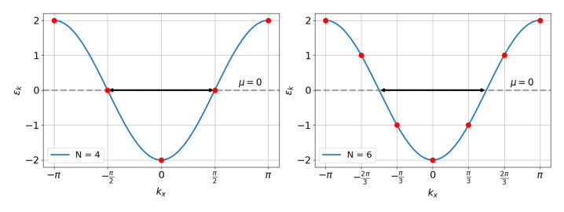
<figcaption class="paper-figure-caption"><b>Fig 1.</b> Figure 1. Dispersion law (solid line) and Fermi level (dashed line) of half-filled 1D Hubbard model with N = 4 (left panel) and N = 6 (right panel) sites. Occurrence of nesting between Fermi-points in N = 4 case is observed.</figcaption>
</figure>
<figure class="paper-figure-card">
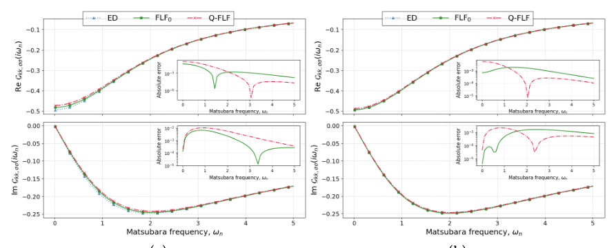
<figcaption class="paper-figure-caption"><b>Fig 2.</b> Figure 2. Matsubara Green’s function for Hubbard chain of N = 4 (a) and N = 6 (b) sites at β = 8 for momentum k = π in regime of moderate correlations U/t = 1.</figcaption>
</figure>
<figure class="paper-figure-card">
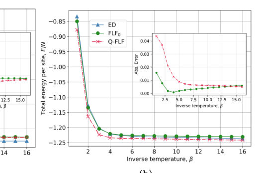
<figcaption class="paper-figure-caption"><b>Fig 3.</b> Figure 3. Total energy per site E/N as a function of inverse temperature β for 1D half-filled Hubbard chain with N = 6 (a) and N = 8 (b) sites at U/t = 1. The comparison is between the results obtained with Q-FLF, FLF with classical mode only, and exact diagonalization.</figcaption>
</figure>
<figure class="paper-figure-card">
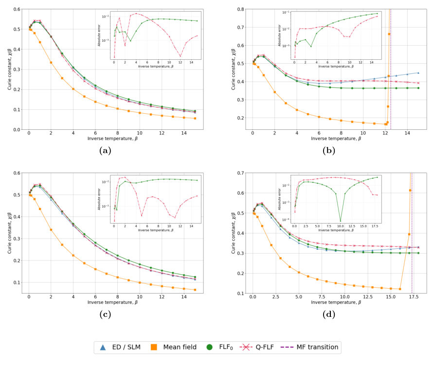
<figcaption class="paper-figure-caption"><b>Fig 4.</b> Figure 4. Temperature dependence of Curie constant χ/β for the Hubbard chain of (a) N = 6, (b) N = 8, (c) N = 10 and (d) N = 12 in regime of moderate correlations U/t = 1 in different approximations.</figcaption>
</figure>

**Summary.** The paper introduces the Q-FLF method, an extension of the Fluctuating Local Field approach that incorporates quantum Matsubara modes to better describe collective excitations. It demonstrates that while low-frequency modes are sufficient for global thermodynamic quantities, higher-frequency modes are necessary for accurate single-particle spectra. This provides a selective tool for studying the impact of specific fluctuation channels in correlated systems.

**Why it may be interesting.** not directly relevant

Detailed structure

**Main problem.** Developing an efficient theoretical approach to quantify the specific contributions of individual bosonic Matsubara modes (quantum fluctuations) to the observable properties of correlated fermion systems.

**Main result.** The proposed Q-FLF method shows that low-frequency bosonic modes quantitatively impact global observables like total energy and susceptibility, whereas an accurate description of single-particle Green's functions requires higher-frequency modes.

**Method.** The Quantum Fluctuating Local Field (Q-FLF) method, which extends the classical FLF approach by incorporating selected bosonic Matsubara modes into a Gaussian ensemble of fluctuating external fields.

**Model / system.** A one-dimensional (1D) Hubbard chain at half-filling with hopping constant t and on-site Coulomb interaction U, studied in finite sizes (N = 4, 6, 8, 10, 12).

**Key observables.** Matsubara Green's function, total energy per site, and antiferromagnetic susceptibility (specifically the Curie constant).

**Important parameters / regimes.** Interaction strength (U/t = 1), inverse temperature (beta), and system size (N).

**Assumptions / limitations.** The bosonic spectrum is truncated to include only the zeroth and +/- 1 Matsubara modes; the system is modeled using a minimal approximation of small-size chains to neglect spatial inhomogeneities.

**Figures summary.** Figure 1 shows the dispersion law and Fermi level for N=4 and N=6; Figure 2 compares the Green's function for Q-FLF, FLF0, and ED; Figure 3 compares total energy per site; Figure 4 shows the temperature dependence of the Curie constant.

**Paper structure.** The paper introduces the Q-FLF method, applies it to the 1D Hubbard model, evaluates its performance on global and single-particle observables, provides a diagrammatic interpretation of the expansion, and compares results against exact numerical benchmarks.

Abstract

Collective excitations in fermionic systems play a crucial role in determining their physical properties. An important challenge is to develop efficient theoretical approaches for describing these excitations and their coupling to fermionic degrees of freedom. In this work, we revisit the problem of quantifying the contributions of individual bosonic modes of collective fluctuations to observable properties of correlated fermion systems within the framework of the Fluctuating Local Field (FLF) method. Whereas the auxiliary field in this method was previously considered only classically, we formulate its systematic extension termed Quantum FLF (Q-FLF) that incorporates selected bosonic Matsubara modes, thus tailoring it to description of quantum collective fluctuations. As a testbed, we apply the approach to a half-filled one-dimensional Hubbard chain and compute the Green's function, the total energy, and the antiferromagnetic susceptibility. Our results demonstrate that the proposed scheme enables an efficient and selective characterization of the contributions of individual bosonic modes. In particular, low Matsubara frequencies are found to have a quantitative impact on integrated observables such as total energy and antiferromagnetic susceptibility. At the same time, an accurate description of single-particle properties requires inclusion of higher-frequency bosonic modes.

[↑ back to top](#top)

### [Quantum Data Loading for Carleman Linearized Systems: Application to the Lattice-Boltzmann Equation](http://arxiv.org/abs/2605.00302v1)

**Authors:** Reuben Demirdjian, Thomas Hogancamp, Abeynaya Gnanasekaran, Amit Surana, Daniel Gunlycke  
**Type:** theory · **Category:** quantum information and computing · **PDF:** <https://arxiv.org/pdf/2605.00302v1>  
**Analysis basis:** full PDF text, analyzed in chunks

↔ Scroll figures horizontally

<figure class="paper-figure-card">
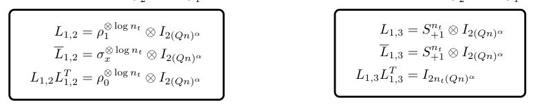
<figcaption class="paper-figure-caption"><b>Fig 1.</b> Figure 4.1: Embeddings for the two nontrivial L(e) 1 terms of (62): the emebedded L1,2 term (left) and the embedded L1,3 term (right). The |a⟩wire is a single ancillary qubit required to embed each term into a unitary operation. A control operation or a single qubit gate on a multi-qubit register should be interpreted as the respective operation being applied to every wire within that register. The vertical dashed line separates the U1 component from the U2 component corresponding to the embedding procedure from (5). The equations below the circuits are: the desired term to load (L), its completion (L) which constructs U2 using Algorithm 2, and LLT which constructs U1 using Algorithm 1....</figcaption>
</figure>
<figure class="paper-figure-card">
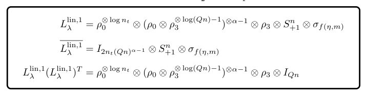
<figcaption class="paper-figure-caption"><b>Fig 2.</b> Figure 4.2: Embedding for Llin,1 λ as defined in (65b) using λ = (2, 1, 0, x, +1, m) for any m ∈{1, . . . , NEη}, which is the most expensive circuit among any λ ∈Λ1. The σf(η,m) block is the mth term in the Pauli decomposition of x-component of (52), and is therefore a tensor product of log Q Pauli gates. The Sn +1 block is the incrementer circuit from (24).</figcaption>
</figure>
<figure class="paper-figure-card">
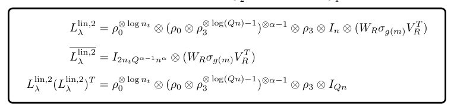
<figcaption class="paper-figure-caption"><b>Fig 3.</b> Figure 4.3: Embedding for Llin,2 λ as defined in (68b) using λ = (2, 1, 0, m) for any m ∈{1, . . . , NR}, which is the most expensive circuit among any λ ∈Λ2. The σg(m) gate is the mth term in the Pauli decomposition used in (55), and is therefore a tensor product of log Q Pauli gates. The VR and WR circuits come from the SVD in (55) and depend on the specific lattice structure used.</figcaption>
</figure>
<figure class="paper-figure-card">
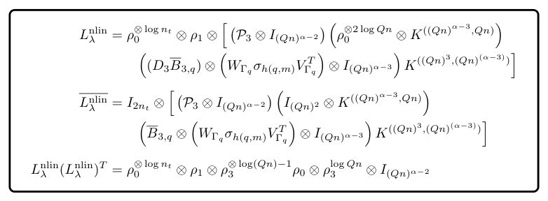
<figcaption class="paper-figure-caption"><b>Fig 4.</b> Figure 4.4: Embedding for Lnlin λ as defined in (71b) using λ = (3, 2, α−2, α−3, q, m) for any m ∈{1, . . . , NΓq} and q ∈{1, . . . , Q}, which is the most expensive circuit among any λ ∈Λ3. The circuits for P3, B3,q and the commutation matrix K(a,b) for integers a and b are provided in Appendices E.1, E.4 and E.5, respectively. The σh(q,m) gate is the mth term in the Pauli decomposition used in (59) and is therefore a tensor product of log Q Pauli gates. The VΓq and WΓq circuits come from the SVD in (59) and are determined for a specific lattice structure.</figcaption>
</figure>
<figure class="paper-figure-card">
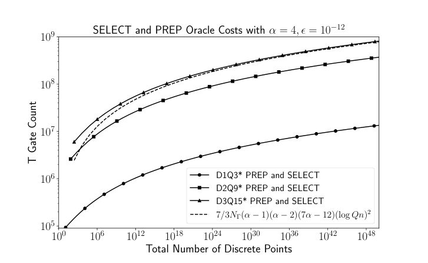
<figcaption class="paper-figure-caption"><b>Fig 5.</b> Figure 5.1: T gate count to encode the Carleman linearized LBE matrix using the PREP and SELECT oracles for the D1Q3*, D2Q9* and D3Q15* lattices. T count is plotted as a function of the total number of discrete points defined as nntQ. Each case uses (90) with nt = nx and the following: for D1Q3* n = nx and Q = 4, for D2Q9* n = nxny and Q = 16, and for D3Q15* n = nxnynz and Q = 16. We also use α = 4, ϵ = 10−12 and NEx, NEy, NEz, NR, and NΓ come from Table 1. The leading term of (90) is plotted in the dashed curve for the D3Q15* lattice.</figcaption>
</figure>

**Summary.** This paper presents a new method for loading nonlinear fluid dynamics data onto a quantum computer by using Carleman linearization and a novel unitary embedding technique. It achieves polylogarithmic scaling with respect to the simulation grid size, making it a significant step toward efficient quantum simulation of complex classical fluids.

**Why it may be interesting.** not directly relevant

Detailed structure

**Main problem.** Developing an efficient quantum data loading strategy for simulating nonlinear dynamical systems, specifically addressing the high cost of decomposing Carleman-linearized matrices into a Linear Combination of Unitaries (LCU).

**Main result.** The authors introduce an LCNU-to-LCU strategy that embeds non-unitary terms into unitaries without increasing the number of terms, providing a framework that scales polylogarithmically with spatial and temporal discretization points for the 3D Lattice-Boltzmann Equation.

**Method.** The method uses Carleman linearization to transform nonlinear PDEs into linear systems, a 'judicious zero padding' technique to handle non-uniform submatrix sizes, and a unitary completion strategy to implement the resulting operators via quantum circuits.

**Model / system.** The primary application is the 3-dimensional Lattice-Boltzmann Equation (LBE), a discretized model for fluid dynamics involving streaming and collision operators (linear, quadratic, and cubic) on a periodic domain.

**Key observables.** T gate cost, number of LCU terms (Ns), condition number scaling, and Reynolds/Mach numbers.

**Important parameters / regimes.** Carleman truncation order (alpha), number of discrete velocities (Q), spatial grid points (n), and the Reynolds and Mach numbers.

**Assumptions / limitations.** The number of discrete velocities is a power of two; the density is approximately one; and the accuracy of the simulation depends on the truncation order alpha.

**Figures summary.** Figure 4.1 and 4.2 show quantum circuit embeddings for linearized terms; Figure 4.3 shows the most expensive circuit for the linear collision term; Table 1 summarizes resource costs for different lattice types (D1Q3, D2Q9, D3Q15).

**Paper structure.** The paper introduces the LCNU-to-LCU strategy, develops a generalized framework for Carleman linearized systems, applies this to the 3D LBE, provides explicit circuit constructions and resource estimations, and concludes with a condition number stability analysis.

Abstract

Herein, we introduce a strategy to decompose an arbitrary square matrix into a linear combination of non-unitaries (LCNU) where each non-unitary term is embedded into a unitary matrix. The result is a linear combination of unitaries (LCU) with an equal number of terms as the LCNU. Using this approach, we construct a generalized LCU framework for any Carleman linearized autonomous dynamical system with a polynomial nonlinearity. This framework is then used to construct an LCU for the 3-dimensional Carleman linearized lattice Boltzmann equation (LBE) in which the number of terms scales like $N_s \sim \mathcal{O}(α^2 Q^2)$, where $α$ is the Carleman truncation order and $Q$ is the number of discrete velocities from the LBE. Importantly, $N_s$ is completely independent of both the number of temporal and spatial discretization points. Lastly, we provide an estimate of our LCNU strategy's T gate cost in conjunction with (1) PREP and SELECT block encoding oracles, and (2) the variational quantum linear solver. In the former, the T cost scales like $\mathcal{O}(α^3 Q^2 (\log_2 n)^2)$, where $n$ is the total number of spatial grid points across all dimensions. Next, the latter requires $N_s^2(\log_2 (2n_tn^α)+1)$ circuits per iteration, with a worst case T gate cost of $\mathcal{O}(α(\log_2 Qn)^2)$ among them. We, therefore, provide an efficient decomposition strategy useful for both fault-tolerant and variational approaches.

[↑ back to top](#top)

### [Quantum Decoding Algorithms: Quantum Speedups in Optimization](http://arxiv.org/abs/2605.00312v1)

**Authors:** Jan Ljubas, Tim Byrnes  
**Type:** theory · **Category:** quantum information and computing · **PDF:** <https://arxiv.org/pdf/2605.00312v1>  
**Analysis basis:** full PDF text, analyzed in chunks

↔ Scroll figures horizontally

<figure class="paper-figure-card">
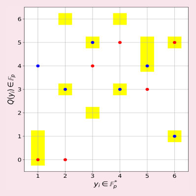
<figcaption class="paper-figure-caption"><b>Fig 1.</b> Figure 1. Visualization of the OPI problem. We show the polynomial Q(y) = 4 + y+ 2y2 (red) and the optimal polynomial Q∗(y) = 1 + 5y+ 5y2 (blue). Yellow boxes indicate the target sets Ti.</figcaption>
</figure>
<figure class="paper-figure-card">
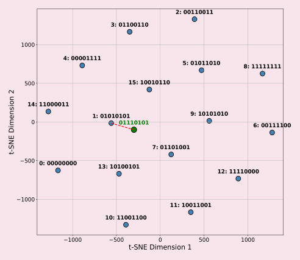
<figcaption class="paper-figure-caption"><b>Fig 2.</b> Figure 2. Approximate Nearest Codeword Decoding of a RM(1,3) code. The message ⃗m = 01110101 (shown in green) is decoded to the closest of the available 16 codewords (blue points) from the RM(1,3) code in Example 4. The 2D visualization of the codewords was done with the help of t-SNE embedding.</figcaption>
</figure>
<figure class="paper-figure-card">
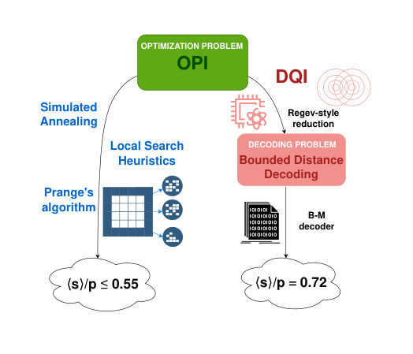
<figcaption class="paper-figure-caption"><b>Fig 3.</b> Figure 3. Approaches for tackling the OPI optimization problem. Shown are the best-known classical methods (left) and the quantum DQI approach (right). Using DQI, a higher constraint satisfaction rate can be attained using quantum interference and classical decoding methods.</figcaption>
</figure>
<figure class="paper-figure-card">
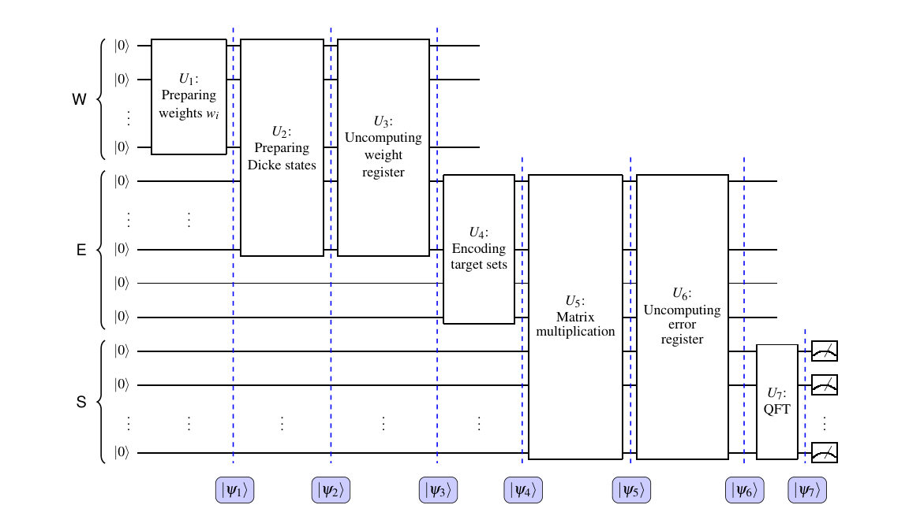
<figcaption class="paper-figure-caption"><b>Fig 4.</b> Figure 4. DQI circuit for max-LINSAT. The circuit is marked with seven state snapshots, which correspond to the seven steps of the DQI algorithm given in Sec. 5.3. The circuit uses three registers referred to as the “weight” (W), “error” (E), and “syndrome” (S) registers. After the uncomputation in the W and E registers, qubits are returned back to the |0⟩state. The DQI state (42) prepared on the S register after step 7.</figcaption>
</figure>
<figure class="paper-figure-card">
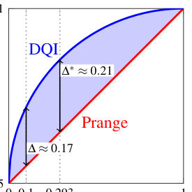
<figcaption class="paper-figure-caption"><b>Fig 5.</b> Figure 5. Performance comparison of DQI and Prange’s algorithm. The plot shows the expected constrain satisfaction rate ⟨s⟩versus the polynomial degree n, each normalized to the characteristic of the field p. For n/p ≈0.1, we obtain the results highlighted in Fig. 3. The largest performance gap ∆is achieved for n/p ≈0.293, where ⟨sDQI⟩/p ≈0.854 and ⟨sPrange⟩/p ≈0.646. This plot is adapted from Ref.22.</figcaption>
</figure>

**Summary.** This paper introduces and reviews the Decoded Quantum Interferometry (DQI) algorithm, which leverages classical coding theory to solve optimization problems. It demonstrates a potential superpolynomial quantum speedup for specific polynomial intersection problems, offering a new paradigm for quantum advantage beyond standard Grover-like approaches.

**Why it may be interesting.** not directly relevant

Detailed structure

**Main problem.** Achieving a scalable quantum advantage in solving combinatorial optimization problems, specifically the max-LINSAT and Optimal Polynomial Intersection (OPI) classes.

**Main result.** The paper demonstrates that the Decoded Quantum Interferometry (DQI) algorithm provides a superpolynomial quantum speedup for the OPI problem and achieves a higher expected constraint satisfaction rate compared to classical benchmarks like Prange's algorithm.

**Method.** The DQI algorithm uses a 7-step quantum circuit involving polynomial amplification, Dicke state preparation, and quantum Fourier transforms to transform optimization into a quantum decoding problem using coding theory.

**Model / system.** The framework utilizes finite fields (Galois fields) and linear codes (such as Reed-Solable and Reed-Muller) to model optimization constraints, specifically focusing on the max-LINSAT and OPI problem structures.

**Key observables.** Expected constraint satisfaction rate (s-bar), Hamming weight, and the performance gap between quantum and classical algorithms.

**Important parameters / regimes.** Field size (p), number of constraints (m), number of variables (n), polynomial degree (u), and the minimum distance (d) of the underlying codes.

**Assumptions / limitations.** The efficiency and orthonormality of the algorithm depend on the existence of efficient classical decoders and a sufficiently large minimum distance (d_perp) in the dual code.

**Figures summary.** Figure 1 visualizes the algorithm's foundation; Figure 2 shows a t-SNE visualization of decoding; Figure 3 compares classical vs. quantum optimization approaches; Figure 4 details the 7-step DQI circuit; Figure 5 plots satisfaction rate vs. problem scale; Figure 6 illustrates a bivariate mOPI instance.

**Paper structure.** The paper provides a self-contained review covering the mathematical foundations of Galois fields and coding theory, defines the max-LINSAT and OPI optimization problems, details the step-by-step DQI algorithm architecture, and concludes with performance comparisons and extensions to multivariate and non-diagonal Hamiltonians.

Abstract

Attaining a quantum speedup in solving practically useful optimization problems has been one of the holy grails in the field of quantum computing. While prior approaches have demonstrated speedups for certain structured problem classes, establishing a clear and scalable advantage on broadly useful practical optimization problems remains challenging. Recently, a new approach to solving the max-LINSAT class of optimization problems has emerged, called Decoded Quantum Interferometry (DQI). In DQI, a combination of techniques rooted in (classical) coding theory and interferometry are used to obtain the solution of max-LINSAT. In the special problem instance of the optimal polynomial intersection (OPI) problem, strong evidence exists to show that an superpolynomial speedup exists over the best classical methods in obtaining an approximate solution. In this review, we give a self-contained description of DQI and the necessary background to understand the algorithm. Specifically, we give the essentials of Galois fields, optimization problems such as max-LINSAT and OPI, and coding theory, followed by a step-by-step walkthrough of the quantum algorithm and its operating principle.

[↑ back to top](#top)

### [Quantum Interval Bound Propagation for Certified Training of Quantum Neural Networks](http://arxiv.org/abs/2605.00747v1)

**Authors:** Emma Andrews, Nahyeon Kim, Prabhat Mishra  
**Type:** theory · **Category:** quantum information and computing · **PDF:** <https://arxiv.org/pdf/2605.00747v1>  
**Analysis basis:** full PDF text, analyzed in chunks

↔ Scroll figures horizontally

<figure class="paper-figure-card">
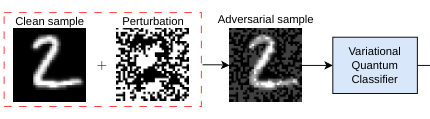
<figcaption class="paper-figure-caption"><b>Fig 1.</b> Fig. 1: Example of an MNIST [3] image of digit 2 being adversarially perturbed. While a human can still identify the digit 2, a quantum classifier will incorrectly predict it as 3.</figcaption>
</figure>
<figure class="paper-figure-card">
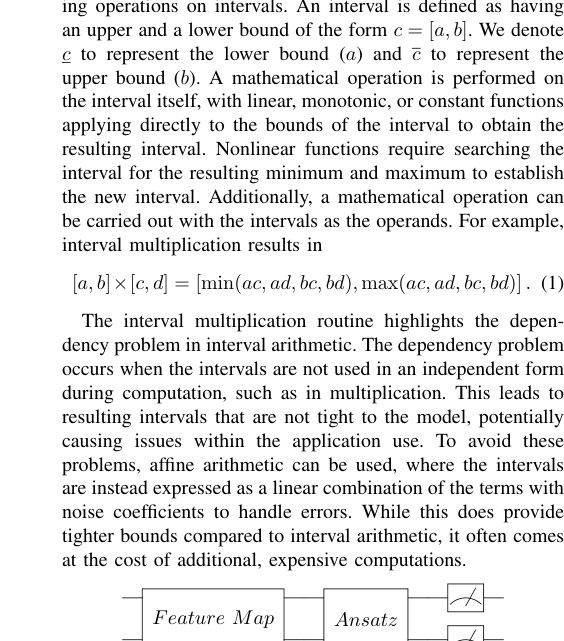
<figcaption class="paper-figure-caption"><b>Fig 2.</b> Fig. 2: Common structure of QML models.</figcaption>
</figure>
<figure class="paper-figure-card">
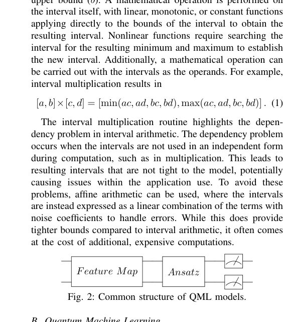
<figcaption class="paper-figure-caption"><b>Fig 3.</b> Figure 2 provides an overview of the basic structures typically found in QML models. These are the feature map, the ansatz, and measurement. The feature map is responsible for embedding the data into the quantum circuit of the QML model. The ansatz carries out the QML model computations, consisting of parameterized and entangling gates. The param- eters of the parameterized gates are updated over the course</figcaption>
</figure>
<figure class="paper-figure-card">
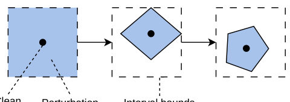
<figcaption class="paper-figure-caption"><b>Fig 4.</b> Fig. 4: An example of interval bound through model layers.</figcaption>
</figure>
<figure class="paper-figure-card">
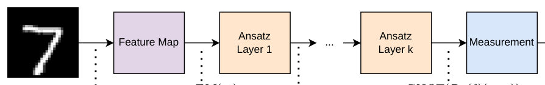
<figcaption class="paper-figure-caption"><b>Fig 5.</b> Fig. 5: Overview of QIBP. In each layer, the interval shifts due to the layer operations, adjusting the worst case bounds. Once the interval is propagated through all layers, it results in the logits zK, which are used to predict the class label. QIBP optimizes the interval logits so that the lower bound of the correct class logit is greater than the upper bounds of all incorrect class logits.</figcaption>
</figure>

**Summary.** This paper introduces a new certified training routine called Quantum Interval Bound Propagation (QIBP) to make quantum neural networks robust against adversarial attacks. By propagating mathematical bounds through the quantum circuit, the method provides a formal guarantee that predictions will remain correct within a specified noise range. The study highlights that affine arithmetic is more effective than standard interval arithmetic for maintaining tight bounds in complex quantum models.

**Why it may be interesting.** not directly relevant

Detailed structure

**Main problem.** Variational Quantum Classifiers (VQCs) are vulnerable to adversarial attacks where small input perturbations cause incorrect predictions, and there is a lack of certified training methods to guarantee robustness in the quantum domain.

**Main result.** The authors propose Quantum Interval Bound Propagation (QIBP), demonstrating that using affine arithmetic provides tighter bounds and higher certified accuracy than interval arithmetic, and that margin loss improves decision boundary robustness.

**Method.** The method propagates upper and lower bounds of input intervals through the quantum circuit layers (feature map, ansatz, and measurement) using interval and affine arithmetic to establish worst-case logits.

**Model / system.** The study uses Variational Quantum Circuits (VQCs) consisting of $n$ qubits, featuring an amplitude or angle embedding feature map, parameterized rotation gates ($R_Y, R_X$), and entangling gates (CNOT).

**Key observables.** Logits (expectation values of the Pauli-Z operator), test accuracy, certified accuracy, and PGD (Projected Gradient Descent) accuracy.

**Important parameters / regimes.** Perturbation magnitude (epsilon), weighting hyperparameter (kappa), number of qubits, number of layers, and number of classes.

**Assumptions / limitations.** Assumes model layers can be treated via interval or affine arithmetic (linearity/monotonicity of gates) and uses Chebyshev approximation for nonlinear transformations.

**Figures summary.** Figure 1 shows an adversarial attack on MNIST; Figure 2 shows the QML architecture; Figure 3 shows a specific two-layer ansatz; Figure 4 illustrates interval propagation; Figure 5 shows the QIBP framework; Figure 6 plots accuracy trends vs. qubit count.

**Paper structure.** The paper introduces the problem of adversarial vulnerability in QML, presents the QIBP framework using interval and affine arithmetic, evaluates the method using various loss functions and architectures on MNIST-like datasets, and analyzes the impact of model complexity and hyperparameters.

Abstract

Quantum machine learning is a promising field for efficiently learning features of a dataset to perform a specified task, such as classification. Interval bound propagation (IBP) is a popular certified training method in classical machine learning, where the lower and upper bounds are tracked throughout the model. These bounds are used during training to ensure that the model is certified to predict the correct label even under adversarial perturbations. While IBP is successful in classical domain, there are limited certified training efforts in quantum domain. In this paper, we present quantum interval bound propagation (QIBP) to establish a certified training routine for quantum machine learning, certifying the accuracy of models under adversarial perturbations. We implement QIBP using both interval and affine arithmetic to explore the tradeoffs between the two implementations in terms of accuracy and other design considerations. Extensive evaluation demonstrates that the resulting certified trained models have robust decision boundaries, guaranteed to predict the correct class for the samples within the trained adversarial robustness bounds.

[↑ back to top](#top)

### [Quantum Simulation of Differential-Algebraic Equations with Applications to Unsteady Stokes Flow](http://arxiv.org/abs/2605.00794v1)

**Authors:** Hsuan-Cheng Wu, Xiantao Li  
**Type:** theory · **Category:** quantum information and computing · **PDF:** <https://arxiv.org/pdf/2605.00794v1>  
**Analysis basis:** full PDF text, analyzed in chunks

↔ Scroll figures horizontally

<figure class="paper-figure-card">

<figcaption class="paper-figure-caption"><b>Fig 1.</b> Figure 2: Error from the dilation technique described in Section 3. Here we pick the ancilla Hilbert space to be C20 and the projection p∗= 5 × 10−6.</figcaption>
</figure>
<figure class="paper-figure-card">
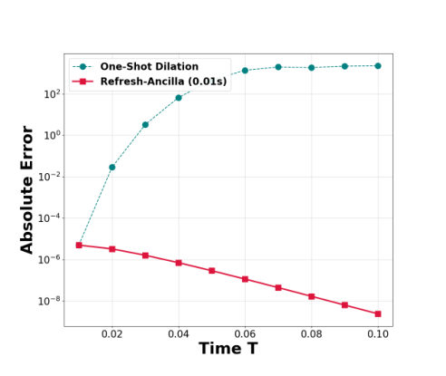
<figcaption class="paper-figure-caption"><b>Fig 2.</b> Fig. 2 plots ∥x(T) −y(T)∥ℓ2, where x contains all the discretized values from Eq. (98) and y is the vector containing the values from dilation method. One plots the error between the benchmark and the dilation, and another plots the dilation but perform ancilla refresh for every time step. Fig. 3 plots the velocity and pressure original system Eq. (98) after the MAC discretization. Fig. 4 verifies Theorem 3.2 under short time period, meanwhile for long time we can do ancilla refreshment as in Fig. 2.</figcaption>
</figure>
<figure class="paper-figure-card">
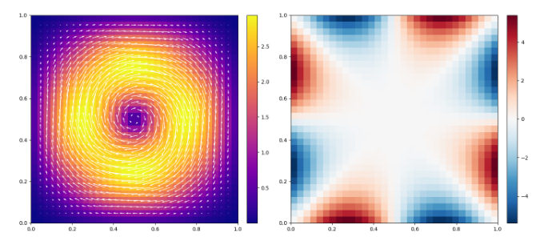
<figcaption class="paper-figure-caption"><b>Fig 3.</b> Figure 3: Velocity and pressure from the original discretized Stokes equation. Here we make the grid number be 32 × 32, final time t = 0.001 and the initial velocity is u0 =  u1(0) u2(0) T =  −π sin2(πx) sin(2πy) π sin2(πy) sin(2πx) T .</figcaption>
</figure>
<figure class="paper-figure-card">
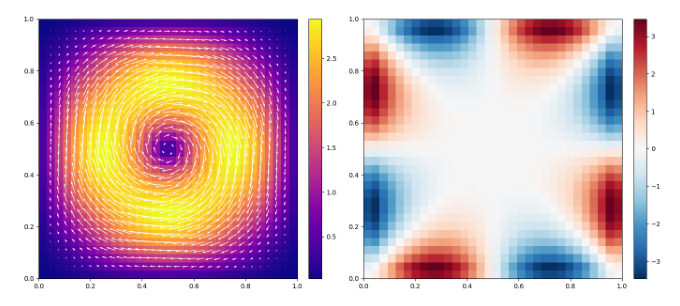
<figcaption class="paper-figure-caption"><b>Fig 4.</b> Figure 4: Recovered velocity and pressure from the dilated DAE. Fig. 4 shows the recovery of the velocity and pressure from the original discretized DAE. We pick the ancilla qubit number M = 65.</figcaption>
</figure>

**Summary.** This paper proposes a new quantum algorithm for simulating constrained dynamical systems like the Stokes equations by embedding them into a larger, unitary-compatible Hilbert space. It shows that by using quantum Zeno dynamics and low-energy subspace techniques, one can potentially achieve better scaling with respect to mesh refinement than classical projection methods.

**Why it may be interesting.** not directly relevant

Detailed structure

**Main problem.** Developing an efficient quantum algorithmic framework for simulating constrained linear Differential-Algebraic Equations (DAEs), specifically addressing the non-Hermitian nature and the mesh-dependent scaling of incompressibility constraints in fluid dynamics.

**Main result.** The authors establish a dilation framework that maps DAEs to a projected Schrödinger-type dynamics, demonstrating a potential asymptotic advantage in the time-evolution scaling (h^{-5/2} vs h^{-3} in 2D) for the unsteady Stokes equations.

**Method.** The framework utilizes unitary dilation, Quantum Singular Value Transformation (QSVT) for projector construction, and block-encoding, while leveraging the Quantum Zeno effect and low-energy subspace simulation.

**Model / system.** The primary application is the unsteady incompressible Stokes flow, modeled as a constrained DAE where the velocity field evolves via a differential equation and pressure acts as a Lagrange multiplier to enforce the divergence-free constraint.

**Key observables.** Velocity and pressure fields of the fluid flow.

**Important parameters / regimes.** Spatial mesh size (h), simulation time (t), precision (epsilon), and the spectral gap of the constraint operator.

**Assumptions / limitations.** Assumes the constraint operator has full row rank, the existence of a spectral gap in the constraint matrix, and the availability of sparse block-encodings for the differential operators.

**Figures summary.** Figure 1 shows a commutative diagram for dilation/reduction equivalence; Figure 2 compares error between dilation and ancilla refreshment; Figure 3 and 4 display the reconstructed velocity and pressure fields on a 32x32 grid.

**Paper structure.** The paper introduces the DAE problem, develops a mathematical dilation framework using Quantum Zeno dynamics, applies this to the discretized Stokes equations, provides a complexity analysis for the simulation, and concludes with a comparison to classical methods.

Abstract

Differential-algebraic equations (DAEs) arise naturally in constrained dynamical systems, but their algebraic constraints and hidden compatibility conditions make them more subtle than standard ordinary differential equations. This paper initiates a quantum-algorithmic study of constrained linear DAEs. We introduce a dilation framework that embeds the generally non-Hermitian constrained evolution into a projected Schrödinger-type dynamics on an enlarged Hilbert space, \[ i\frac{d}{dt}Ψ(t)=P\tH PΨ(t), \] where $\tH$ is Hermitian and $P$ is the orthogonal projector onto the lifted constraint subspace. This identifies the DAE evolution with a quantum Zeno-type dynamics and enables the use of block encodings, QSVT-based projector construction, and Hamiltonian simulation.   We apply the framework to structure-preserving discretizations of the unsteady Stokes equations, where the pressure enforces the discrete incompressibility constraint. We derive the corresponding projected Hamiltonian formulation, identify low-energy spectral cutoffs motivated by solution smoothness, and discuss the resulting quantum simulation cost in comparison with classical projection-type methods. The results provide a first step toward understanding the potential intersection of quantum algorithms, DAEs, and constrained PDE dynamics.

[↑ back to top](#top)

### [Quantum simulation of nanographenes and Trotter error cancellation](http://arxiv.org/abs/2605.00745v1)

**Authors:** Andreas Juul Bay-Smidt, Nina Glaser, Marcel D. Fabian, Earl T. Campbell, Nick S. Blunt, Gemma C. Solomon  
**Type:** theory · **Category:** quantum information and computing · **PDF:** <https://arxiv.org/pdf/2605.00745v1>  
**Analysis basis:** full PDF text, analyzed in chunks

↔ Scroll figures horizontally

<figure class="paper-figure-card">
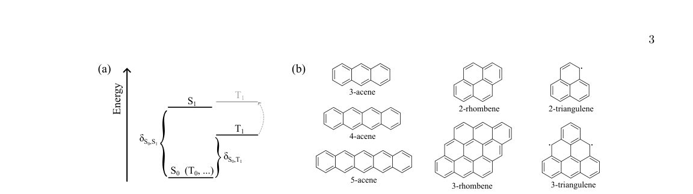
<figcaption class="paper-figure-caption"><b>Fig 1.</b> FIG. 1. (a) Illustration of quantities of interest of nanographenes that we consider in this paper. This includes energy gaps between a ground state singlet (S0) and a first-excited triplet (T1) or a first excited singlet (S1), the energy of T1 compared to S1 (where the gray arrow and additional T1 energy line indicate that in certain instances ET1 ≳ES1), and the character of the ground state, e.g. whether the ground state is S0, T0 or another high-spin state. (b) Three different classes of nanographenes: (left) n-acenes, where n denotes the number of hexagons, (center) n-rhombenes, where n denotes the number of hexagons along the edges, and (right) n-triangulenes, where n denotes the...</figcaption>
</figure>
<figure class="paper-figure-card">
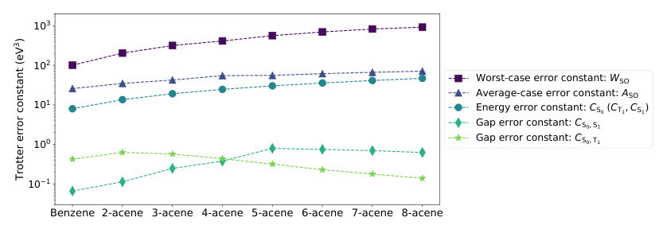
<figcaption class="paper-figure-caption"><b>Fig 2.</b> FIG. 2. Comparison of 1) worst-case, 2) average-case, 3) energy and 4) gap error constants, for USO of n-acene PPP models. The Trotter error constants vary by orders of magnitude, and the gap errors are especially low in these instances. The error constants are properties of a given unitary, in this case USO. The energy and gap errors are also eigenstate dependent, denoted by the subscripts on C, indicating that these errors are evaluated for the singlet ground state (S0) and for the gap between S0 and either the first-excited singlet (S1) or the first-excited triplet (T1). We write CT1 and CS1 in parenthesis next to energy error constants to indicate that those norms are almost equal to...</figcaption>
</figure>
<figure class="paper-figure-card">
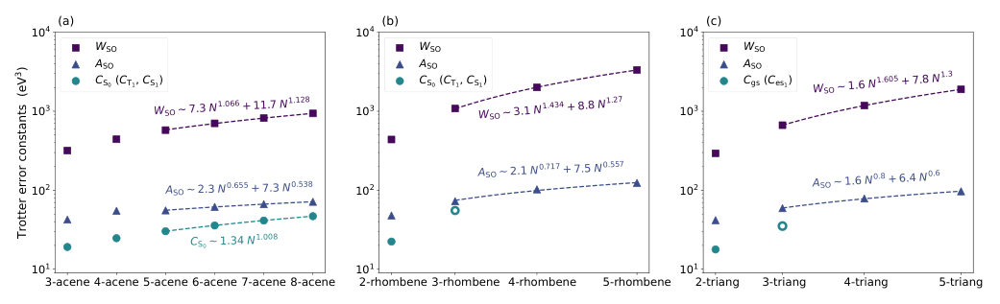
<figcaption class="paper-figure-caption"><b>Fig 3.</b> FIG. 3. Comparison of worst-case (WSO), average-case (ASO) and energy (Cm) Trotter error constants of USO of (a) n-acene, (b) n-rhombene and (c) n-triangulene. The worst- and average-case fits (WSO and ASO respectively) are obtained from power- law fits of the nested commutator norms in Fig. 9 in Appendix B, whereas energy error constant fits are obtained from the data presented here. We indicate by putting CT1, CS1 and Ces1 in parenthesis that energy error constants of excited states are similar to those of the ground states (see Figs. 11–13). The empty circle markers of 3-rhombene and 3-triangulene indicate that these results are not fully converged with respect to the TD-DMRG bond...</figcaption>
</figure>
<figure class="paper-figure-card">
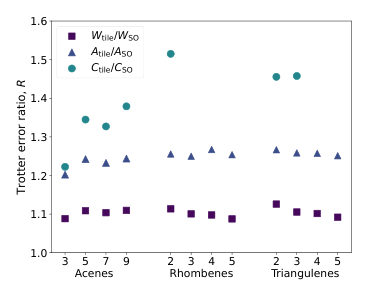
<figcaption class="paper-figure-caption"><b>Fig 4.</b> FIG. 4. Worst-case, average-case and (ground-state) en- ergy error constant ratios of Utile over USO of n-acenes, n- rhombenes and n-triangulenes. The Utile errors are only marginally larger, especially considering that the number of Trotter steps required for QPE and quantum dynamics us- ing Utile over USO only increases by a factor √</figcaption>
</figure>
<figure class="paper-figure-card">
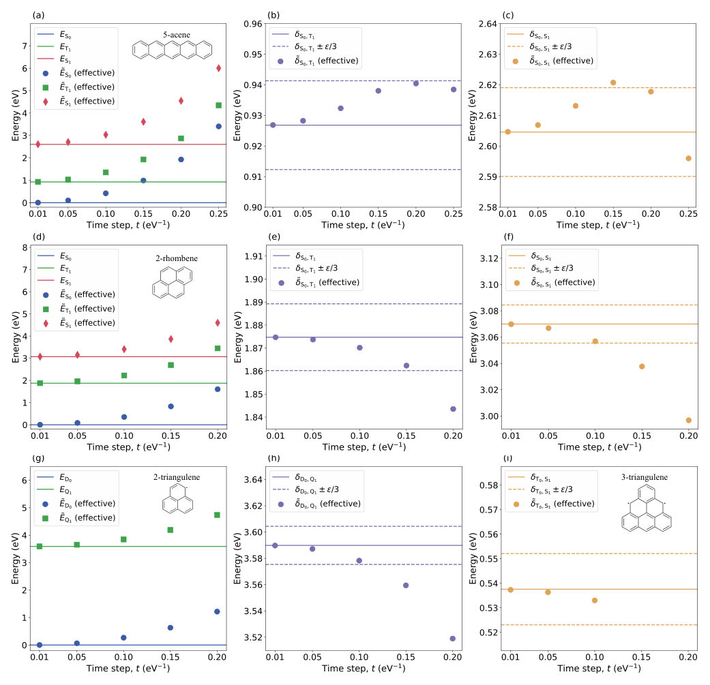
<figcaption class="paper-figure-caption"><b>Fig 5.</b> FIG. 5. Exact and effective energies and energy gaps of (a), (b), (c) 5-acene and (d), (e), (f) 2-rhombene, (g), (h) 2-triangulene and (i) 3-triangulene, using the product formula Utile as our Hamiltonian simulation approximation. Exact energies are naturally independent of the Trotter time step t and remain constant (lines), while the effective energies depend on t (points). All energy scales are shifted by the ground-state energy as the zero-point. (a) The solid lines show the exact energies E of S0, S1 and T1 of the 5-acene PPP model. The points show energies, ˜E, of the effective Hamiltonian at different values of t of the same three eigenstates. At t = 0.01 eV−1, the effective energies...</figcaption>
</figure>

**Summary.** This paper demonstrates that for quantum simulations of nanographenes, the Trotter error in energy gaps is much smaller than the error in absolute energies. This error cancellation allows for significantly shallower quantum circuits when calculating chemically relevant excitation energies. The work provides a roadmap for using scalable, intermediate-scale problems to bridge the gap toward large-scale fault-tolerant quantum computing.

**Why it may be interesting.** It provides a critical insight into how application-specific error analysis (focusing on energy gaps rather than absolute energies) can drastically lower the hardware threshold for practical quantum chemistry simulations.

Detailed structure

**Main problem.** The massive resource requirements for fault-tolerant quantum simulation of molecules and materials, specifically the overestimation of Trotter errors when using worst-case analysis for chemical applications.

**Main result.** Discovery of a Trotter error cancellation phenomenon where errors in energy gaps are significantly smaller than absolute energy errors, allowing for an order-of-magnitude reduction in circuit depth for Quantum Phase Estimation.

**Method.** A combination of Trotterized quantum simulation analysis, tensor-network-based spectral analysis, and Time-Dependent Density Matrix Renormalization Group (TD-DMRG) to evaluate various error types.

**Model / system.** The Pariser-Parr-Pople (PPP) model applied to the pi-systems of nanographenes, including acenes (1D), rhombenes (2D), and triangulenes (2D).

**Key observables.** Energy gaps (vertical excitation energies), absolute energy eigenvalues, and Trotter error types (worst-case, average-case, energy, and gap errors).

**Important parameters / regimes.** Chemical accuracy (approx. 0.04354 eV), Trotter time step (t), and system size up to 140 spin orbitals.

**Assumptions / limitations.** The analysis focuses on the second-order split-operator Trotter scheme and the semi-empirical PPP model; it assumes high overlap between true and effective eigenstates.

**Figures summary.** Figures illustrate energy diagrams and nanographene structures, plots of various Trotter error types and their scaling with system size, and comparisons between exact and effective energies/gaps.

**Paper structure.** The paper introduces the scalability problem, proposes nanographenes as a bridge to large-scale FTQC, performs a rigorous multi-type error analysis, demonstrates error cancellation in energy gaps, and concludes with resource estimation for QPE.

Abstract

Fault-tolerant quantum computing is a promising tool for simulating molecules and materials, but frequently-considered applications require substantial resources, and the gap between hardware capabilities and requirements remains significant. We propose quantum simulation of nanographene $π$-systems as relevant and scalable problems to span the gap between early and large-scale fault-tolerant quantum computing. We examine the efficiency of Trotterized quantum simulation, present a detailed analysis of worst-case, average-case and energy eigenvalue Trotter errors, and show that these Trotter error estimates vary by orders of magnitude. Trotter eigenvalue errors are obtained from a novel tensor-network-based approach which allows spectral analysis of product formulas for systems beyond brute-force calculation. Notably, we observe a Trotter error cancellation phenomenon whereby the Trotter error for energy differences between low-lying eigenstates is significantly smaller than the Trotter error for absolute energies, resulting in approximately an order of magnitude circuit depth reduction for quantum phase estimation calculation of energy gaps. This is a significant result because for most chemical applications, only energy differences are of practical relevance. We estimate that calculation of energy gaps to chemical accuracy between the ground- and excited-states within the Pariser--Parr--Pople model for large 2D nanographenes (up to 140 spin orbitals) requires circuits with $< 3.2 \times 10^7$ Toffoli gates. This work shows that considering details of chemically-relevant applications and exploiting error cancellation can lead to substantial reductions in resource requirements.

[↑ back to top](#top)

### [Reconstruction of spin structures from topological charge distributions via generative neural network systems](http://arxiv.org/abs/2605.00732v1)

**Authors:** Kyra H. M. Klos, Jan Disselhoff, Michael Wand, Karin Everschor-Sitte, Friederike Schmid  
**Type:** theory · **Category:** disordered systems and neural networks · **PDF:** <https://arxiv.org/pdf/2605.00732v1>  
**Analysis basis:** full PDF text, analyzed in chunks

↔ Scroll figures horizontally

<figure class="paper-figure-card">
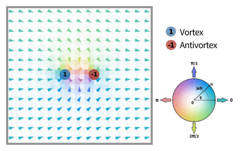
<figcaption class="paper-figure-caption"><b>Fig 1.</b> FIG. 1. Example of a vortex-antivortex pair (blue and red marker) with distance dν = 3 in a two dimensional XY-model on a square lattice at zero temperature. The arrows point in the direction of the spins and are colored according to their orientation as indicated in the color wheel legend (right). The background encodes the local gradient field ϑ. It is colored according to the direction of the gradient, and the saturation level indicates its strength.</figcaption>
</figure>
<figure class="paper-figure-card">
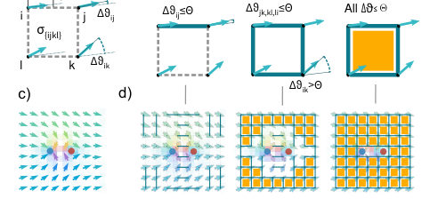
<figcaption class="paper-figure-caption"><b>Fig 2.</b> FIG. 2. Construction of cubical complexes SΘ for config- urations of the XY model on a square lattice (Eq. 10). a) Single square made of lattice sites i, j, k, l showing basic units σ{i} (vertices), σ{ij} (edges), σ{ijkl} (plaquettes), and a local spin configuration (cyan arrows). ∆ϑnm denotes the angle between spins on lattice sites n and m. b) Filtration pro- cess for the configuration in a) for three filtration threshold values Θ = π/36, π/6, π/2 (left to right). Edges are part of SΘ (marked as thick teal lines) if the angle ∆ϑ between their adjacent spins does not exceed the threshold Θ. A pla- quette is part of SΘ (marked as orange square) if none of the angles between any two...</figcaption>
</figure>
<figure class="paper-figure-card">
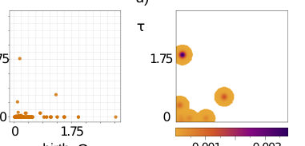
<figcaption class="paper-figure-caption"><b>Fig 3.</b> FIG. 3. Construction of persistance diagrams and persistent images. a) Example of a spin configuration with two vortex pairs at zero temperature (same color coding as in 1). b) Cor- responding persistence diagram showing “death” vs. ”birth” of features for the zero-dimensional homology group H0 (teal dots) and the one-dimensional homology group H1 (orange dots). Every point in the graph represents the (birth-death) pair (Θ, Θ′) of a feature with Θ marking the filtration thresh- old value where the feature is first created, and Θ′ marking the filtration threshold where it disappears again. c) Resulting persistence mapping of H1, showing (birth-lifetime) pairs of features (Θ, τ = Θ′ −Θ). d)...</figcaption>
</figure>
<figure class="paper-figure-card">
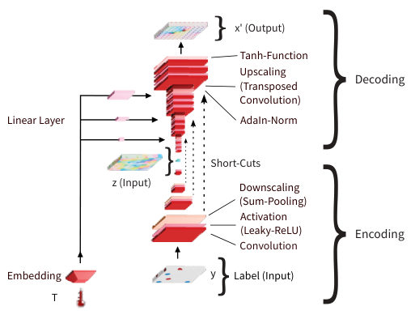
<figcaption class="paper-figure-caption"><b>Fig 4.</b> FIG. 5. Architecture of the generator network G(z|y, T) = x′ based on a U-net architecture. The encoder maps the winding-number distribution y and the embedded tempera- ture labels T to to a high-dimensional latent representation at the bottleneck. Gaussian noise z is injected at this stage, and the combined latent features are subsequently decoded to generate the output spin configuration x′. Short cut con- nections transfer information from the encoder to the corre- sponding decoder layers at each resolution.</figcaption>
</figure>
<figure class="paper-figure-card">
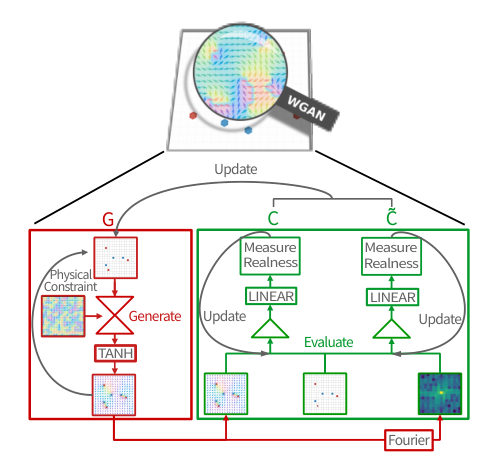
<figcaption class="paper-figure-caption"><b>Fig 5.</b> FIG. 4. Illustration of the back-mapping concept based on a physics-informed conditional Wasserstein Generative Ad- versarial Neural Network (WGAN). A prescribed defect con- figuration (shown here for the two dimensional XY model) is provided as input to the generator (see Fig. 5), which pro- duces a corresponding microscopic spin configuration. During training, the generated configuration is evaluated by the crit- ics (Fig. 6), which output a realism score (details see text). These scores are used in a feedback loop to update the gen- erator parameters.</figcaption>
</figure>

**Summary.** This paper presents a generative neural network approach to 'back-map' macroscopic topological defect patterns to their underlying microscopic spin configurations. By incorporating physical constraints and Fourier-space information, the model accurately captures essential thermodynamic properties and long-range correlations in the 2D XY model. It demonstrates how machine learning can bridge the gap between multiscale topological features and microscopic physics.

**Why it may be interesting.** not directly relevant

Detailed structure

**Main problem.** The challenge of reconstructing microscopic spin configurations from macroscopic topological charge distributions (vortices) using generative models.

**Main result.** A physics-informed conditional Wasserstein GAN (cWGAN) successfully reconstructs spin configurations that accurately reproduce magnetization, susceptibility, and spin-spin correlations, though it struggles with higher-order energy fluctuations like specific heat.

**Method.** An extended WGAN architecture using a U-Net generator with AdaIN for temperature embedding and a dual-critic system (real-space and Fourier-space) to enforce physical and spectral constraints.

**Model / system.** The two-dimensional (2D) XY model on a square lattice, characterized by the Berezinskii-Kosterlitz-Thouless (BKT) phase transition and topological defects (vortex-antivortex pairs).

**Key observables.** Magnetization, magnetic susceptibility, helicity modulus (spin stiffness), specific heat, spin-spin correlation functions, and topological descriptors (Minkowski functionals, Betti numbers, and persistence diagrams).

**Important parameters / regimes.** Temperature (T), defect-pair distance (d_nu), winding number distribution (y), and lattice size (L).

**Assumptions / limitations.** The continuum approximation for energy is valid only outside defect cores; the model is tested primarily in the regime below the BKT transition.

**Figures summary.** Figures illustrate the vortex-antivortex structure, the construction of cubical complexes and persistence images, the U-Net and critic architectures, training progress of thermodynamic observables, and comparisons of generated vs. simulated physical and topological metrics.

**Paper structure.** The paper introduces the multiscale reconstruction problem, describes the 2D XY model and the cWGAN architecture (including Fourier-space critics), details the topological data analysis (TDA) pipeline, presents validation results via thermodynamic and geometric observables, and discusses limitations regarding energy fluctuations and critical behavior.

Abstract

Localized topological defects inherently possess a multiscale character. While their microstructure configuration depends on the specific physical system, their topological features and mutual interactions can be described on the macroscale in terms of a particle representation. However, determining the physical properties associated with a given defect pattern often requires knowledge of the underlying microscopic structure. In this work, we extend a Wasserstein generative adversarial neural network by incorporating physical constraints and Fourier-space information to generate microscopic spin configurations consistent with prescribed macroscopic patterns and thermodynamic parameters. Using the two-dimensional XY model as a test case, where vortex-antivortex pairs act as long-range interacting defects, we show that the model generates spin configurations that accurately reproduce magnetization, susceptibility, helicity modulus, and spin-spin correlations over a wide range of temperatures below the Kosterlitz-Thouless transition. At the same time, deviations in the specific heat reveal limitations in reproducing higher order energy fluctuations. A complementary analysis based on topological data analysis uncovers subtle differences in global spin-correlation structures at near critical temperatures that are not apparent from conventional correlation functions alone. These results demonstrate both the promise and current limitations of generative approaches for multiscale studies of defect-dominated spin systems and at the same time highlight topological methods as valuable tools for characterizing critical behavior.

[↑ back to top](#top)

### [Signatures of time-reversal-symmetry breaking in multiband 2H-TaS2 revealed by zero-field Josephson nonreciprocity](http://arxiv.org/abs/2605.00477v1)

**Authors:** Daniel Margineda, David Caldevilla-Asenjo, Yuriy Yerin, Covadonga Álvarez-García, Andrei Mazanik, Maxim Ilyn, Celia Rogero, Luis E. Hueso, F. Sebastian Bergeret, Marco Gobbi  
**Type:** both · **Category:** strongly correlated electrons · **PDF:** <https://arxiv.org/pdf/2605.00477v1>  
**Analysis basis:** full PDF text, analyzed in chunks

↔ Scroll figures horizontally

<figure class="paper-figure-card">
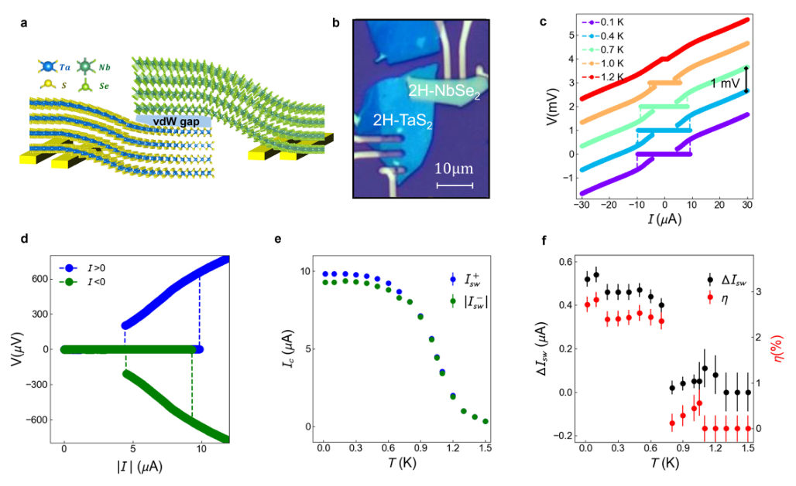
<figcaption class="paper-figure-caption"><b>Fig 1.</b> Figure 1. Zero-field Josephson diode effect in van der Waals heterojunction. a, Schematic of the Josephson junction under study, consisting of 2H-TaS2 and 2H-NbSe2 superconducting electrodes with the van der Waals gap operating as a weak link. b, Optical micrograph of the Josephson junction. Bottom Au contacts allow the characterization of the interface. c, Current-voltage characteristics for representative temperatures showing hysteretic behavior of underdamped Josephson junctions. d, Zero-field Josephson diode effect. Current–voltage characteristics taken at T = 100 mK show different switching currents depending on the positive (blue dots) and negative (green dots) bias current. e,...</figcaption>
</figure>
<figure class="paper-figure-card">
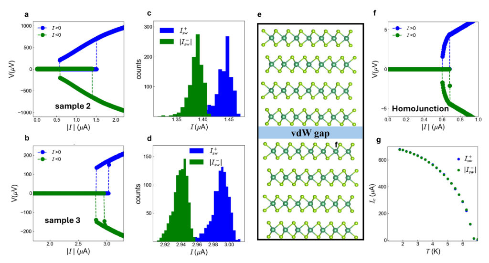
<figcaption class="paper-figure-caption"><b>Fig 2.</b> Figure 2. Zero-field Josephson diode reproducibility. Nonreciprocal transport for sample 2 (a,) and sample 3 b, measured at T = 100 mK. c,d Switching current statistics for sample 2 and sample 3 respectively. e, Control experiment in inversion-symmetric NbSe2-NbSe2 junctions. f, IV characteristics of the control sample showing no finite η within experimental resolution. g, Temperature dependence of the positive and negative switching current of the control sample. The absence of nonreciprocity in symmetric junctions establishes the requirement of broken inversion symmetry at the heterostructure level and excludes trivial geometric or measurement artefacts.</figcaption>
</figure>
<figure class="paper-figure-card">
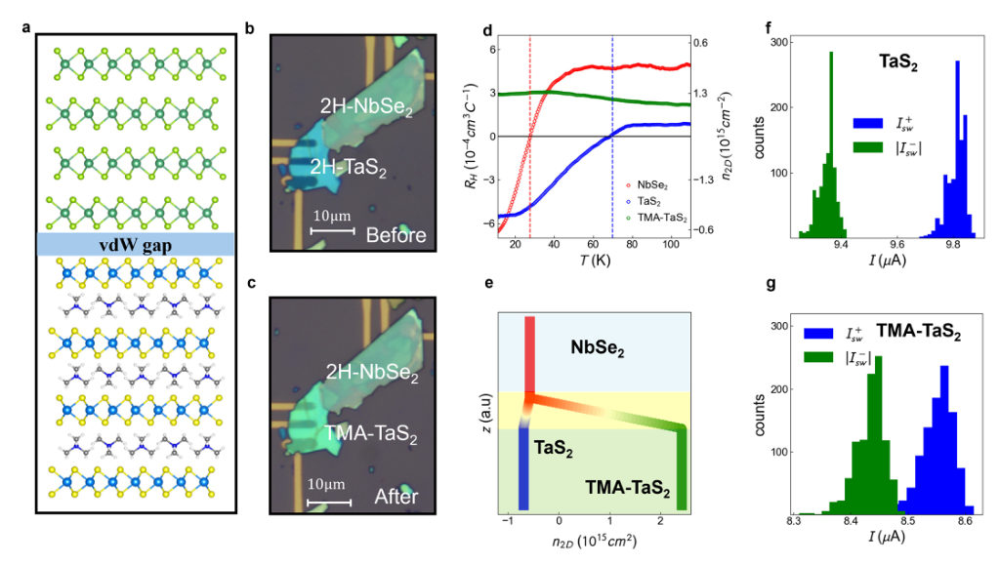
<figcaption class="paper-figure-caption"><b>Fig 3.</b> Figure 3. Zero-field superconducting diode in molecule-TaS2 Josephson junction. a, Schematic of the hybrid Josephson junction consisting in TMA-intercalated TaS2 and NbSe2 top electrode. Optical micrograph of the vdW Josephson junction before b, and after c, molecular intercalation. Color contrast is highly sensitive to thickness change upon intercalation from dp=0.6 nm to dint ≃1.0 nm. d, Temperature dependence of the Hall coefficient for NbSe2 (red dots), TaS2 (blue dots) and TMA-TaS2. Sign change in RH corresponds to carrier-type transition from hole-to-electron dominated transport below TCDW (dashed lines). For TMA-TaS2, monolayer-like suppression of CDW order leads to electronic band...</figcaption>
</figure>
<figure class="paper-figure-card">
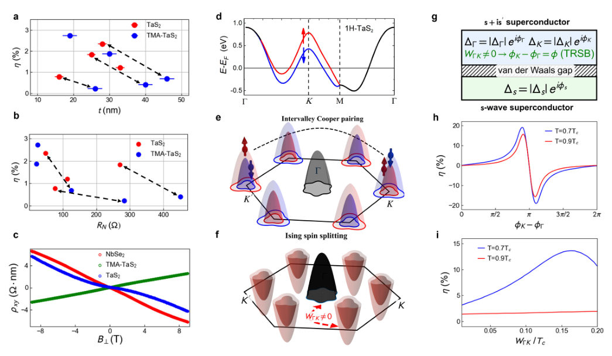
<figcaption class="paper-figure-caption"><b>Fig 4.</b> Figure 4. Origin of the field-free Josephson diode. a, Josephson diode efficiency as a function of TaS2 thickness t. b, η versus normal-state resistance RN for pristine (red) and TMA-intercalated (blue) heterojunctions. The absence of any correlation with t and RN for pristine TaS2 and the systematic suppression of η upon intercalation (dashed lines link connect the same devices), rules out interfacial, strain-driven, and transparency-controlled mechanisms, pointing to an intrinsic origin of the nonreciprocal response. c, Transverse magnetotransport at 10 K for 2H-TaS2, 2H-NbSe2 and TMA-TaS2. Pristine TaS2 exhibits a nonlinear Hall response, revealing coexisting electron and hole carriers,...</figcaption>
</figure>

**Summary.** The researchers demonstrate a zero-field Josephson diode effect in TaS2/NbSe2 van der Waals junctions, providing evidence for intrinsic time-reversal-symmetry breaking. By ruling out extrinsic factors through intercalation and homojunction controls, they attribute the nonreciprocity to a multiband superconducting state with an anomalous phase difference. This work highlights how interband scattering can drive complex, non-sinusoidal current-phase relations.

**Why it may be interesting.** not directly relevant

Detailed structure

**Main problem.** Determining whether the observed zero-field Josephson diode effect in 2H-TaS2/2H-NbSe2 heterostructures arises from intrinsic time-reversal-symmetry breaking (TRSB) or extrinsic mechanisms like strain or interface effects.

**Main result.** The study identifies the zero-field Josephson nonreciprocity as an intrinsic signature of a multiband superconducting state in TaS2, where interband scattering stabilizes a TRSB s+is' state.

**Method.** Experimental measurements of switching-current statistics and Hall transport in van der Waals junctions are combined with a theoretical framework using the quasiclassical Usadel equations.

**Model / system.** The system consists of 2H-TaS2/2H-NbSe2 van der Waals Josephson junctions. The theoretical model describes a multiband superconductor with an anomalous interband phase difference driven by interband scattering.

**Key observables.** Diode efficiency (eta), switching-current probability distributions (SCPD), critical currents (Ic+ and Ic-), and nonlinear Hall transport.

**Important parameters / regimes.** Interband scattering amplitude (W_GammaK), anomalous phase difference (phi), and the Stewart-McCumber parameter (beta_c).

**Assumptions / limitations.** The theoretical model assumes a minimal framework in the dirty limit (Usadel equations) and the short-junction limit, treating the junction as quasi-one-dimensional.

**Figures summary.** Figures show the temperature evolution of diode efficiency, switching-current statistics, evidence of reciprocal transport in homojunctions, tests ruling out extrinsic magnetic/vortex effects, and theoretical calculations of efficiency vs. interband scattering and phase.

**Paper structure.** The paper introduces the problem of TRSB in spin-singlet superconductors, presents experimental evidence of the Josephson diode effect in TaS2/NbSe2 junctions, uses control experiments (homojunctions and intercalation) to rule out extrinsic causes, provides a theoretical model based on interband scattering, and concludes with the identification of an intrinsic multiband TRSB state.

Abstract

Superconductors that spontaneously break time-reversal symmetry host complex order parameters and are widely regarded as a hallmark of unconventional superconductivity. Whether such symmetry breaking can also arise in superconductors with nominally isotropic spin-singlet pairing remains an open question. Here we report a zero-field Josephson diode effect in noncentrosymmetric 2H-TaS2/2H-NbSe2 van der Waals junctions. The diode efficiency shows no systematic correlation with supercurrent amplitude, TaS2 thickness, or normal-state resistance, arguing against simple extrinsic, purely interfacial, or transparency-driven mechanisms. Time-reversal-symmetric scenarios are further tested using symmetry-controlled and molecule-intercalated control devices, in which the nonreciprocal response is absent or strongly reduced. Normal-state Hall transport in TaS2 exhibits a nonlinear response consistent with multiband correlated electronic states. Within a Josephson framework, our modelling shows that interband scattering acts as a phase-locking mechanism generating an intrinsic anomalous phase difference and a nonsinusoidal asymmetric current-phase relation, leading to finite zero-field rectification. Together, zero-field Josephson nonreciprocity and nonlinear Hall transport provide complementary evidence for a multiband superconducting phase structure in 2H-TaS2, consistent with intrinsic time-reversal-symmetry breaking.

[↑ back to top](#top)

### [Statistical mechanics for Scrabble predicts strategy, entropy and language](http://arxiv.org/abs/2605.00813v1)

**Authors:** Olivier Witteveen, Marianne Bauer  
**Type:** theory · **Category:** statistical mechanics · **PDF:** <https://arxiv.org/pdf/2605.00813v1>  
**Analysis basis:** full PDF text, analyzed in chunks

↔ Scroll figures horizontally

<figure class="paper-figure-card">
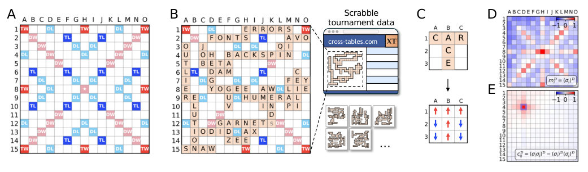
<figcaption class="paper-figure-caption"><b>Fig 1.</b> FIG. 1. We model the crossword-like pattern of tiles on a Scrabble board. (A) An empty 15×15 Scrabble board with blank and colored, ‘premium’ squares. DW and TW indicate double and triple word scores, respectively; DL and TL are double and triple letter scores. (B) An example of a final Scrabble board configuration: We collect ca. 50,000 Scrabble games from user-uploaded and tournament data [20]. All words read in top-down or left-right fashion are legal according to a standard English Scrabble lexicon [22]. Lowercase, gray letters are those assigned to blank tiles by the players. (C) We assign a spin σi ∈{−1, 1} to each square on the Scrabble board to indicate whether or not a tile is...</figcaption>
</figure>
<figure class="paper-figure-card">
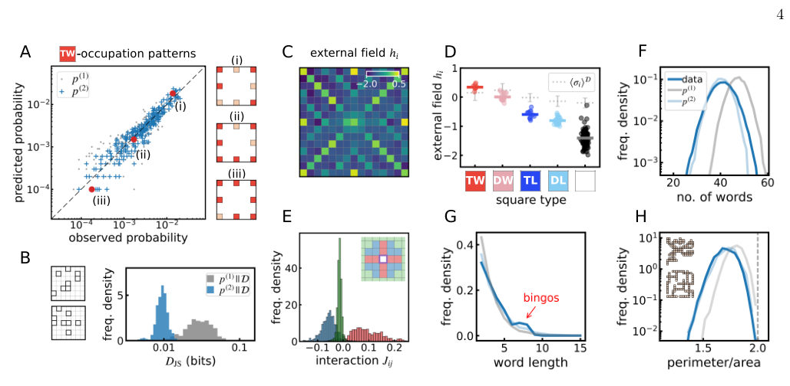
<figcaption class="paper-figure-caption"><b>Fig 2.</b> FIG. 2. The pairwise maximum entropy model has interpretable parameters, and correctly predicts marginal distributions and macroscopic observables. (A) Simultaneous occupation of the eight triple word (TW) squares on the board: for each of the 28 = 256 patterns of TW-occupation, we plot the frequency of occurrence predicted by the pairwise model p(2) against the observed frequency (blue crosses). Red dots labeled (i-iii) are three example patterns. For comparison, the first-order model p(1) is shown (gray dots). (B) Jensen–Shannon divergence between observed and predicted marginal distributions for 500 random subsets of eight squares (sketch). (C) The local fields hi plotted on the Scrabble...</figcaption>
</figure>
<figure class="paper-figure-card">
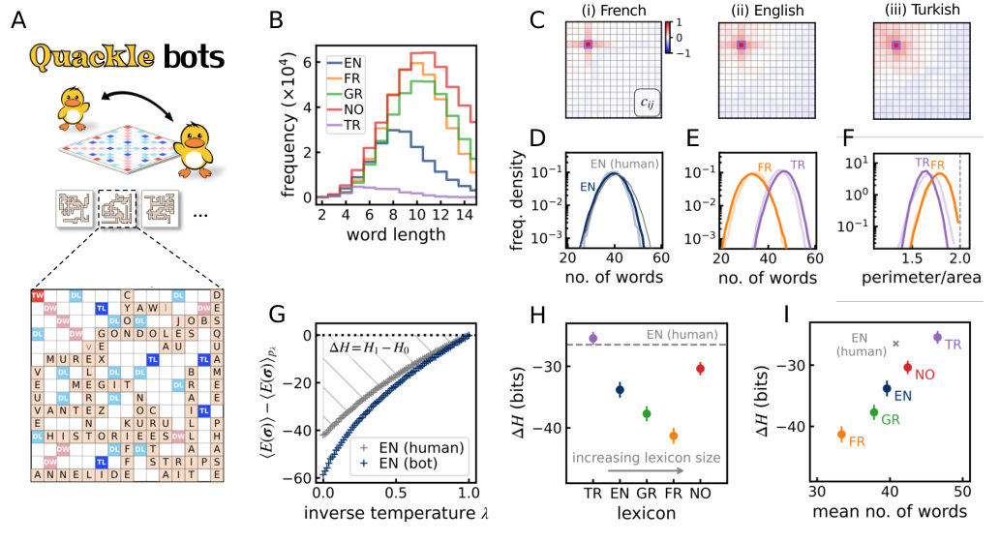
<figcaption class="paper-figure-caption"><b>Fig 3.</b> FIG. 3. The size and composition of the available lexicon impacts Scrabble graphs. (A) We adapt a Scrabble AI tool, Quackle [21], to self-play. We generate 50,000 Scrabble games for each of five lexica ℓ∈{English, French, Greek, Norwegian, Turkish} included in the Quackle software distribution; an example game in French is shown. We fit a maximum entropy model p(σ|ℓ) for each language. (B) The lexica differ in size and composition: Histograms showing word length frequencies in each Scrabble dictionary. (C) Languages show differences in their covariance structure. We show three examples: (i) French, (ii) English, and (iii) Turkish. (D, E) Total number of words on the board for (D) English...</figcaption>
</figure>
<figure class="paper-figure-card">
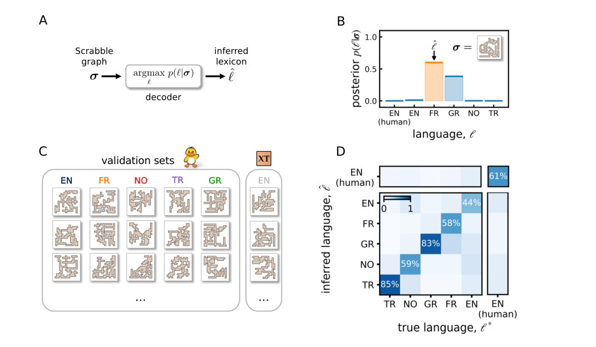
<figcaption class="paper-figure-caption"><b>Fig 4.</b> FIG. 4. The pairwise maximum entropy model is successful at assigning Scrabble graphs to their corresponding lexica, despite having no access to letters. (A) For a Scrabble graph σ, the posterior distribution p(ℓ|σ) indicates the probability that it originated from a particular lexicon. By picking the lexicon ˆℓthat maximizes the posterior distribution, we ‘decode’ σ to obtain an estimate for the original lexicon. (B) The posterior distribution for an example Scrabble graph (inset and Fig. 3A). In this case, we infer correctly that the original language is French. (C) To systematically evaluate how well we can assign Scrabble graphs to their lexica using the pairwise model, we use sets of...</figcaption>
</figure>
<figure class="paper-figure-card">
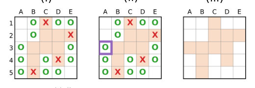
<figcaption class="paper-figure-caption"><b>Fig 5.</b> FIG. 1. Monte Carlo scheme for sampling Scrabble graphs from p(σ), consisting of three steps; we show a 5×5 example. (i) For the current configuration σ, we find all n(σ) places where a tile can be added (green circles) or removed (red crosses). (ii) Out of the permissible tile additions or removals, one is proposed with probability g(σ →σ′) = 1/n(σ) (purple box). (iii) The proposed transition is accepted with probability A(σ →σ′) (Eq. 1) or rejected. In this case, a tile addition was proposed on square A3 and accepted. By iterating (i-iii), detailed balance ensures that the Scrabble graphs are drawn from the Boltzmann distribution p(σ).</figcaption>
</figure>

**Summary.** This paper applies the maximum entropy principle and Ising-like models to analyze the structural patterns of Scrabble boards. It demonstrates that a simple pairwise model can capture complex geometric features and even identify the underlying language of a game based solely on tile placement patterns.

**Why it may be interesting.** not directly relevant

Detailed structure

**Main problem.** Determining if a statistical mechanics framework can describe the patterns, strategies, and linguistic features of Scrabble board configurations and distinguish between different languages.

**Main result.** A pairwise maximum entropy model effectively captures Scrabble board statistics, including higher-order correlations and geometric features, and can correctly identify the source language of a board configuration without knowing the specific letters.

**Method.** The authors use a maximum entropy approach with a pseudolikelihood method for parameter estimation and thermodynamic integration to calculate entropy differences.

**Model / system.** The system is a Scrabble graph represented as a 15x15 square lattice of spins (sigma_i in {-1, +1}). The model is an Ising-like Hamiltonian: E(sigma) = -sum J_ij * sigma_i * sigma_j - sum h_i * sigma_i.

**Key observables.** Mean square occupation, pairwise correlations, word-length statistics, geometric features (radius of gyration, perimeter-to-area ratio, number of holes), and Jensen-Shannon divergence.

**Important parameters / regimes.** External fields (h_i) representing spatial bias and pairwise interactions (J_ij) representing word placement constraints.

**Assumptions / limitations.** The configuration space is restricted to connected graphs with a permissible number of tiles; the posterior calculation assumes all languages are initially equiprobable.

**Figures summary.** Figure 1 shows the Scrabble board and spin representation; Figure 2 compares predicted vs. observed occupation and correlations; Figure 3 displays geometric observables and covariance matrices across languages; Figure 4 illustrates the language decoding framework and confusion matrix.

**Paper structure.** The paper introduces the Scrabble graph system, defines the pairwise maximum entropy model, demonstrates model accuracy using occupation and correlation data, extends the analysis to geometric and linguistic features, and concludes with a Bayesian framework for language identification.

Abstract

The crossword-like patterns of tiles in Scrabble form connected graphs of occupied sites on a square lattice. We find the most structureless description that reproduces means and covariances observed in real Scrabble games by adapting a maximum entropy approach to connected graphs. This pairwise model captures the data well, and predicts word-length statistics and geometric features of the Scrabble graphs correctly; in addition, the parameters of this model are interpretable and allow us to understand Scrabble playing strategies. Using this pairwise model, we calculate entropy differences and distinguishability of Scrabble graphs across languages, without having access to the letters on the tiles. Notably, we find that the entropy is predicted better by strategic gameplay -- such as word length on the board -- than lexicon size. Finally, we find that we can use the pairwise model to correctly assign Scrabble graphs to languages, avoiding explicit feature selection and at relatively low computational cost.

[↑ back to top](#top)

### [Superconducting diode effect in correlated electron systems by nonreciprocal magnetism](http://arxiv.org/abs/2605.00601v1)

**Authors:** Kyohei Nakamura, Youichi Yanase  
**Type:** theory · **Category:** strongly correlated electrons · **PDF:** <https://arxiv.org/pdf/2605.00601v1>  
**Analysis basis:** full PDF text, analyzed in chunks

↔ Scroll figures horizontally

<figure class="paper-figure-card">
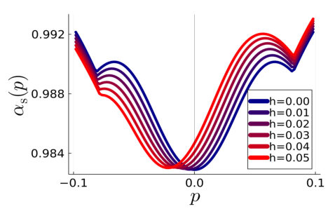
<figcaption class="paper-figure-caption"><b>Fig 1.</b> FIG. 2. Cooper pair’s momentum dependence of the Stoner factor 𝛼S(𝑝) for 𝑈= 5.5 and various magnetic fields.</figcaption>
</figure>
<figure class="paper-figure-card">
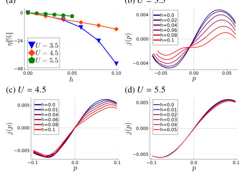
<figcaption class="paper-figure-caption"><b>Fig 2.</b> FIG. 1. (a) Magnetic field dependence of the superconducting diode efficiency 𝜂for 𝑈= 3.5, 4.5, and 5.5 with triangles, diamonds, and pentagons, respectively. (b)-(d) Cooper pair’s momentum de- pendence of the supercurrent 𝑗(𝑝) for various magnetic fields. The onsite Coulomb interaction is varied as (b) 𝑈= 3.5, (c) 𝑈= 4.5, and (d) 𝑈= 5.5.</figcaption>
</figure>
<figure class="paper-figure-card">
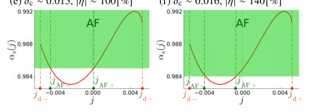
<figcaption class="paper-figure-caption"><b>Fig 3.</b> FIG. 3. Supercurrent dependence of the Stoner factor 𝛼S( 𝑗) for 𝑈= 5.5 and ℎ= 0.05, where the parameter 𝛿c is under (a) 0.008 and about (b) 0.01, (c) 0.012, (d) 0.014, (e) 0.015, and (f) 0.016. The domain of 𝛼S( 𝑗) is the depairing current 𝑗d±, which is colored in orange. The region 𝛼S( 𝑗) &gt; 𝛼c = 1 −𝛿c and the supercurrent that induces the AF order 𝑗AF± are colored in light and dark green, respectively. The diode efficiency is shown at the top of the figures.</figcaption>
</figure>

**Summary.** This paper investigates how strong electron correlations change the mechanism of the superconducting diode effect. It discovers that while correlations suppress the standard mechanism, they introduce a new effect where supercurrent induces antiferromagnetic order, allowing for highly efficient or even perfect diode behavior.

**Why it may be interesting.** not directly relevant

Detailed structure

**Main problem.** Understanding the microscopic mechanism of the Superconducting Diode Effect (SDE) in strongly correlated electron systems and how electron correlations and quantum criticality alter it compared to weak-coupling theories.

**Main result.** Electron correlations suppress the conventional intrinsic SDE, but a new correlation-driven mechanism emerges where supercurrent nonrecipally induces antiferromagnetic order, potentially enabling perfect diode efficiency.

**Method.** The authors use the Dyson-Gor'kov equations within the Fluctuation Exchange (FLEX) approximation to self-consistently calculate superconducting and magnetic properties.

**Model / system.** A 2D Rashba-Zeeman-Hubbard model on a square lattice, representing d-wave superconductors near an antiferromagnetic quantum critical regime.

**Key observables.** Supercurrent j(p), superconducting diode efficiency (eta), critical currents (jc+ and jc-), and the Stoner factor.

**Important parameters / regimes.** Onsite Coulomb interaction (U), magnetic field (h), electron density (n=0.85), and temperature (T=0.005).

**Assumptions / limitations.** The study uses the FLEX approximation and assumes the system is well-described by the Rashba-Zeeman-Hubbard model; it also focuses on the low-field regime (h < 0.1).

**Figures summary.** Figure 1(a) shows diode efficiency dependence on magnetic field for various U values; Figures 1(b)-(d) show supercurrent dependence on Cooper pair momentum.

**Paper structure.** The paper introduces the SDE problem, describes the Rashba-Zeeman-Hubbard model and FLEX method, presents results on the suppression of intrinsic SDE, details the emergent nonreciprocal magnetism mechanism, and concludes with the implications for correlated superconductors.

Abstract

The superconducting diode effect (SDE), characterized by a nonreciprocal critical current in superconductors, has recently been observed in strongly correlated electron systems and near quantum criticality, pointing to unconventional mechanisms beyond weak-coupling theories. Here we investigate the SDE in the Rashba-Zeeman-Hubbard model, which captures $d$-wave superconductivity in an antiferromagnetic quantum critical regime, using the Dyson-Gor'kov equation with the fluctuation exchange approximation. We show that electron correlations suppress the conventional intrinsic SDE arising from depairing currents. More importantly, a supercurrent nonreciprocally induces antiferromagnetic order, which fundamentally governs the critical current and enables perfect diode efficiency. Our results reveal a previously unrecognized correlation-driven mechanism of the SDE and establish strongly correlated superconductors as a platform for superconducting diode physics.

[↑ back to top](#top)

### [Trees to Flows and Back: Unifying Decision Trees and Diffusion Models](http://arxiv.org/abs/2605.00414v1)

**Authors:** Sai Niranjan Ramachandran, Suvrit Sra  
**Type:** both · **Category:** disordered systems and neural networks · **PDF:** <https://arxiv.org/pdf/2605.00414v1>  
**Analysis basis:** full PDF text, analyzed in chunks

↔ Scroll figures horizontally

<figure class="paper-figure-card">
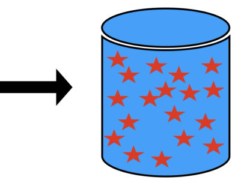
<figcaption class="paper-figure-caption"><b>Fig 1.</b> Figure 1: A Visual Metaphor for Trees to Flows and back. We connect the discrete structure of a decision tree (left) with the continuous dynamics of a flow process (right). We establish a a formal correspondence, enabling an analysis of boosting via flows, and imbuing generative models with tree-based inductive biases.</figcaption>
</figure>
<figure class="paper-figure-card">
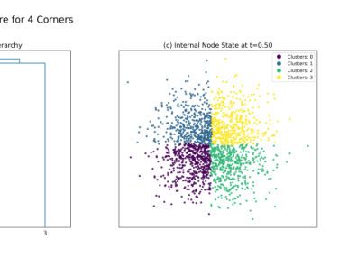
<figcaption class="paper-figure-caption"><b>Fig 2.</b> Figure 2: Implicit tree structure discovered from a trained diffusion model on the 4-Corners dataset using the corrected time-domain clustering method. (a) The original labeled data clus- ters, representing the leaves of the hierarchy at t = 0. (b) The discovered hierarchical structure (dendrogram) obtained by tracking the forward SDE trajectories of each cluster and performing agglomerative clustering. The vertical axis is not rescaled; it directly represents the discovered merger time t. (c) A visualization of the system’s state at the internal node time t = 0.50. The plot shows the particle positions at this intermediate time, generated by solving the learned reverse PF-ODE. The...</figcaption>
</figure>
<figure class="paper-figure-card">
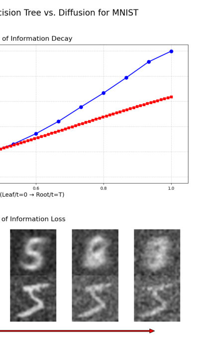
<figcaption class="paper-figure-caption"><b>Fig 3.</b> Figure 3: Comparison of information decay on MNIST. (Top) The normalized entropy of a decision tree (by depth) and a diffusion process (by time) follow near identical trajectories. (Bottom) Visual prototypes show analogous information loss, with tree prototypes averaging over data subsets and diffusion prototypes showing a single instance being noised. (Small Gaussian noise is added to tree prototypes to ease visual distinguishability; zoom for clarity.</figcaption>
</figure>
<figure class="paper-figure-card">
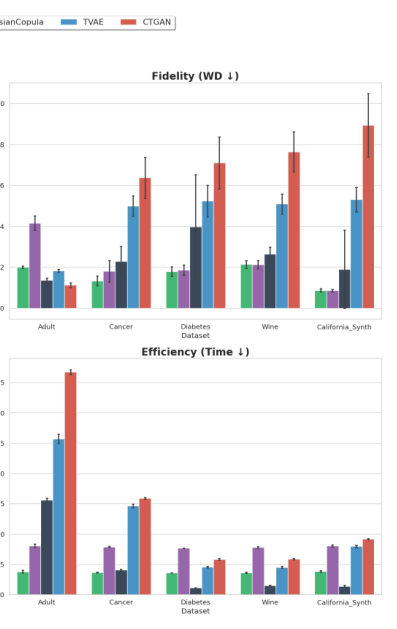
<figcaption class="paper-figure-caption"><b>Fig 4.</b> Figure 4: TREEFLOW compared against baseline generative models across a suite of tabular bench- marks. We evaluate on four axes: Utility (TSTR Accuracy ↑), Fidelity (Wasserstein Distance ↓), Structure (Correlation Error ↓), and Efficiency (Runtime ↓). TREEFLOW achieves highest TSTR accuracy on 3/5 benchmarks, lowest Wasserstein distance on 4/5 benchmarks, and lowest correlation error on 3/5 benchmarks, while being 2X faster than TabDDPM. Zoom for clarity (or see Figure 15).</figcaption>
</figure>
<figure class="paper-figure-card">
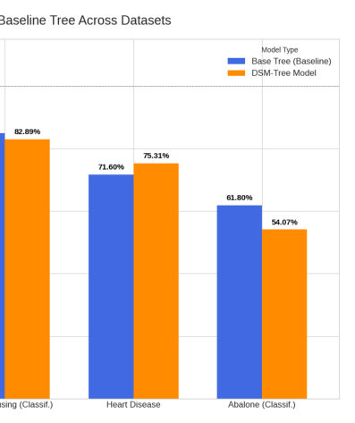
<figcaption class="paper-figure-caption"><b>Fig 5.</b> Figure 5: Classification accuracy of the DSM-TREE model compared to its teacher (Base Tree). DSM-TREE matches or exceeds teacher performance on 4/5 datasets, with +3.7% improvement on Heart Disease, demonstrating successful knowledge transfer of complete hierarchical structure. Zoom for clarity. A larger version is available in Figure 14 with full results in Table 2.</figcaption>
</figure>

**Summary.** This paper provides a mathematical unification of decision trees and diffusion models, showing they are different limits of the same underlying optimization principle. It introduces new methods, TREEFLOW and DSM-TREE, which leverage this connection to achieve faster and more accurate generative modeling for tabular data.

**Why it may be interesting.** not directly relevant

Detailed structure

**Main problem.** The paper seeks to bridge the mathematical and conceptual gap between discrete, hierarchical decision trees and continuous, dynamic diffusion models.

**Main result.** The authors establish a formal bidirectional mapping between trees and flows, proving that gradient boosting is an asymptotically optimal solver for a unified objective called Global Trajectory Score Matching (GTSM).

**Method.** The work uses dyadic refinement to transform discrete partitions into continuous-time SDEs and introduces two new algorithms: TREEFLOW for generative tabular data and DSM-TREE for tree-to-neural network distillation.

**Model / system.** The framework unifies discrete-time Markov processes (decision trees) and continuous-time stochastic differential equations (diffusion models) through a shared optimization principle.

**Key observables.** TSTR (Train Set Test Re-use) accuracy, Wasserstein distance, Correlation Error, Shannon entropy decay, and runtime efficiency.

**Important parameters / regimes.** Tree depth (D), number of leaves (L), feature dimensionality (d), and the continuous-time limit of dyadic refinement.

**Assumptions / limitations.** Assumes entropically homogeneous SDEs, well-separated modes in initial distributions, and that intermediate tree splits do not change conditional densities at original levels.

**Figures summary.** Visual metaphors of tree-to-flow correspondence; dendrograms showing discovered hierarchies in diffusion models; entropy decay curves comparing trees and diffusion; and performance benchmarks for TREEFLOW and DSM-TREE.

**Paper structure.** The paper begins with a theoretical unification of trees and flows via GTSM, followed by proofs of convergence and complexity for the proposed algorithms, and concludes with experimental validation on synthetic and tabular datasets.

Abstract

Decision trees and diffusion models are ostensibly disparate model classes, one discrete and hierarchical, the other continuous and dynamic. This work unifies the two by establishing a crisp mathematical correspondence between hierarchical decision trees and diffusion processes in appropriate limiting regimes. Our unification reveals a shared optimization principle: \emph{Global Trajectory Score Matching (GTSM)}, for which gradient boosting (in an idealized version) is asymptotically optimal. We underscore the conceptual value of our work through two key practical instantiations: \treeflow, which achieves competitive generation quality on tabular data with higher fidelity and a 2\times computational speedup, and \dsmtree, a novel distillation method that transfers hierarchical decision logic into neural networks, matching teacher performance within 2\% on many benchmarks.

[↑ back to top](#top)

### [Unraveling the Bott spiral](http://arxiv.org/abs/2605.00316v1)

**Authors:** Arun Debray, Cameron Krulewski, Luuk Stehouwer  
**Type:** theory · **Category:** strongly correlated electrons · **PDF:** <https://arxiv.org/pdf/2605.00316v1>  
**Analysis basis:** full PDF text, analyzed in chunks

↔ Scroll figures horizontally

<figure class="paper-figure-card">
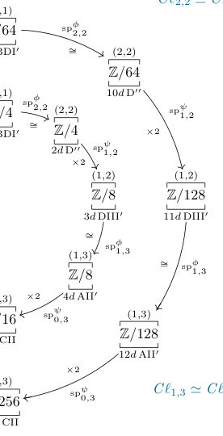
<figcaption class="paper-figure-caption"><b>Fig 1.</b> Figure 1. The Bott spiral starting with 1d class BDI′: our mathematical model for [QKS16, Figure 1(a)], which displays the groups of interacting SPTs admitting free fermion realizations in a specified symmetry class and indicates dimensional reduction maps between them. Our model for an interacting SPT class is a defor- mation class of invertible field theory (IFT; see Ansatz 2.11), and our models for dimensional reduction are the spiral maps spϕ ℓ,k and spψ ℓ,k defined in Definition 4.51 and calculated in Theorems 6.16 and 6.24. In each entry of the spiral, Z/2N is the group of IFTs in the image of a map from KO-theory, calculated in Proposition 5.55 and Theorem 6.15. The bracket below the...</figcaption>
</figure>
<figure class="paper-figure-card">
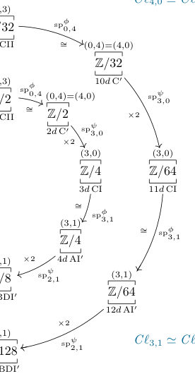
<figcaption class="paper-figure-caption"><b>Fig 2.</b> Figure 2. The Bott spiral starting with 1d class CII: our mathematical model for [QKS16, Figure 1(b)]. All notation is as in Figure 1.</figcaption>
</figure>
<figure class="paper-figure-card">
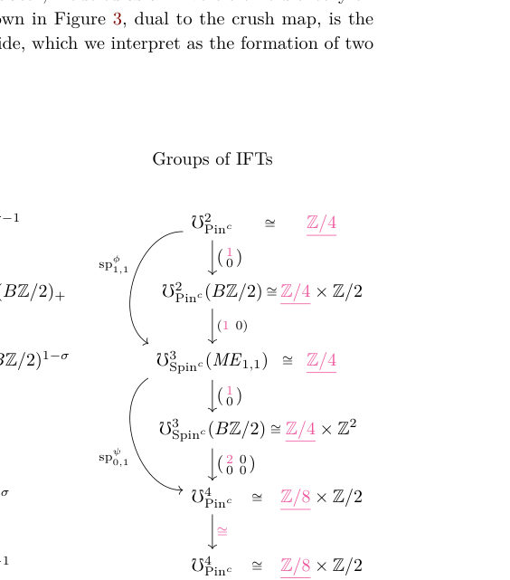
<figcaption class="paper-figure-caption"><b>Fig 3.</b> Figure 3. This figure shows the sequence of interacting SPT phases in the complex version of the Bott spiral, starting with the d = 1 class AIII insulator, which is predicted to generate the group ℧2 Pinc ∼= Z/4 in the top right. The leftmost column indicates the Altland–Zirnbauer class of the SPT at each step. The middle column encodes spectra of the form MTSpinc ∧MEℓ,k and the maps between them. The last column indicates the IZ-cohomology of the middle column; i.e. the groups of (deformation classes of) invertible field theories that provide our model for the groups of interacting SPTs. The spatial dimension of the SPT increases as the rightmost column is read downward; see Remark 4.56....</figcaption>
</figure>
<figure class="paper-figure-card">
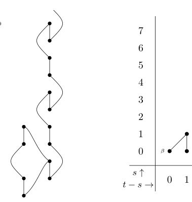
<figcaption class="paper-figure-caption"><b>Fig 4.</b> Figure 10. Left: the A(1)-module N2, the unique non-free summand of Σ−2 eH∗(BA4; Z/2). Right: Ext(N2), the E2-page of the Adams spectral sequence for a summand of ko ∧Σ−2BA4. All differentials and extension questions are trivial. We discuss N2 and its Adams spectral sequence in Example 5.34.</figcaption>
</figure>
<figure class="paper-figure-card">
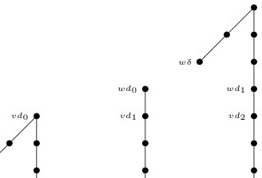
<figcaption class="paper-figure-caption"><b>Fig 5.</b> Figure 12. Left: the A(1)-module N0 := Σ−1H∗((BZ/2)1−σ; Z/2). Right: Ext(N0), the E2-page of the Adams spectral sequence for Σ−1ko ∧(BZ/2)1−σ. All differentials and extension questions are trivial. See Example 5.40 for more information.</figcaption>
</figure>

**Summary.** This paper provides a rigorous mathematical framework to understand how the periodic classification of topological phases (the Bott clock) transforms into an expanding spiral when particle interactions are introduced. It successfully links free fermion K-theory to interacting field theories, explaining the exponential growth of topological phases in higher dimensions.

**Why it may be interesting.** not directly relevant

Detailed structure

**Main problem.** The paper aims to construct a homotopy-theoretic model to compare the classification of free fermion symmetry-protected topological (SPT) phases with their interacting counterparts, specifically addressing the 'Bott spiral' where interacting classifications grow exponentially with dimension.

**Main result.** The authors define a 'free-to-interacting' map using a twisted generalization of the Atiyah-Bott-Shapiro orientation and show that the interacting classification 'unravels' into a spiral where the group order increases by a factor of 16 every eight dimensions.

**Method.** The study employs advanced algebraic topology, including K-theory, Anderson duality, cobordism theory, and the construction of twisted spin structures and spectra maps.

**Model / system.** The system consists of fermionic SPT phases within the Altland-Zirnbauer symmetry classes, modeled using K-theory for free fermions and reflection-positive invertible field theories (IFTs) for interacting systems.

**Key observables.** Topological invariants, the order of the long summand in the IFT groups, and the kernel/cokernel of the free-to-interacting map.

**Important parameters / regimes.** Symmetry indices (l, k), dimension (d), and the Altland-Zirnbauer symmetry classes.

**Assumptions / limitations.** The paper assumes the Freed-Hopkins ansatz, where the low-energy limit of an SPT is modeled by an invertible field theory.

**Figures summary.** Figure 1 provides a mathematical model of the Bott spiral, illustrating the growth of the group Z/2^N and the relationship between Clifford algebras and dimensional reduction maps.

**Paper structure.** The paper identifies the symmetry ambiguity problem, proposes a unified framework using fermionic groups, constructs the free-to-interacting map via twisted ABS orientation, defines spiral maps for dimensional reduction, and validates the results against known interacting group orders.

Abstract

We construct and compute a homotopy-theoretic model for the Bott spiral of symmetry-protected topological phases (SPTs) studied by Queiroz--Khalaf--Stern. We model free and interacting fermionic SPTs using K-theory and reflection-positive invertible field theories (IFTs), resp., and define a twisted generalization of the Atiyah--Bott--Shapiro orientation to produce a free-to-interacting map. We also define and compute spiral maps of IFTs to model dimensional reduction in this context, answering a question of Hason--Komargodski--Thorngren. Our analysis highlights two general aspects of homotopical free-to-interacting maps. First, IFTs are more sensitive than K-theory is to the input symmetry data; in particular, the specification of an Altland--Zirnbauer class is insufficient information to define symmetry type for an IFT. Second, the remnant of Bott periodicity on the interacting side relies on an isomorphism of two extraspecial groups of order 32. Our computations use a novel 4-periodic description of a sector of the twisted ko-homology of elementary abelian 2-groups.

[↑ back to top](#top)

## Secondary cond-mat archives

*Papers from cond-mat.mtrl-sci, mes-hall, other, soft, supr-con. These archives are de-prioritized — they appear at the end regardless of relevance score.*

### Relevant in secondary archives (6)

### [High-pressure magnetic transition in iron observed via diamond quantum sensing](http://arxiv.org/abs/2605.00576v1)

**Authors:** Kouki Yamamoto, Kenshin Uriu, Ryotaro Suda, Misaki Sasaki, Mari Einaga, Katsuya Shimizu, Kento Sasaki, Kensuke Kobayashi  
**Type:** experiment · **Category:** other · **PDF:** <https://arxiv.org/pdf/2605.00576v1>  
**Analysis basis:** full PDF text, analyzed in chunks
**Topic relevance:** `spintronics-quantum-optics interface` **3/5** · `QC/QI experiment` **2/5** · `quantum optics experiment` **2/5** · `quantum measurements` **1/5**

↔ Scroll figures horizontally

<figure class="paper-figure-card">
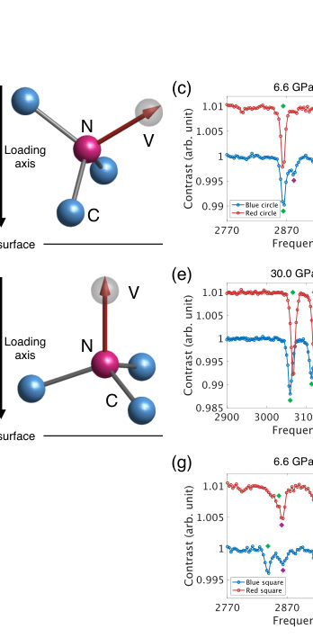
<figcaption class="paper-figure-caption"><b>Fig 1.</b> Figure 1. (a) Schematic illustration of an NV center in a (100)-oriented diamond. Pink, blue, and semi- transparent gray spheres represent nitrogen, carbon, and a vacancy, respectively. The red arrow indicates the NV axis. In the (100) orientation, none of the NV axes are perpendicular to the culet surface, making them highly susceptible to strain under pressure. (b) Schematic illustration of an NV center in a (111)-oriented diamond. The NV axis shown is perpendicular to the culet surface, resulting in enhanced robustness against strain. (c) Representative ODMR spectra at 6.6 GPa with a bias magnetic field of 2.5 mT. The blue and red spectra correspond to the positions marked by blue and...</figcaption>
</figure>
<figure class="paper-figure-card">
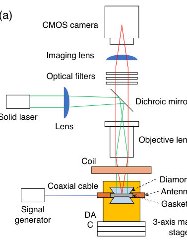
<figcaption class="paper-figure-caption"><b>Fig 2.</b> Figure 2. (a) Schematic illustration of the experimental setup. (b) Cross-sectional view of the sample cham- ber. NV centers are fabricated on the culet surface of the upper anvil diamond. The chamber is filled with NaCl, and both the iron sample and the ruby used for pressure calibration are embedded within the NaCl medium. (c) Optical microscope image of the sample chamber. The square-shaped iron sample is located at the center, and the ruby is enclosed by a red circle. (d) Microwave antenna. Microwaves are applied through the central opening, into which the DAC sample chamber is accommodated.</figcaption>
</figure>
<figure class="paper-figure-card">
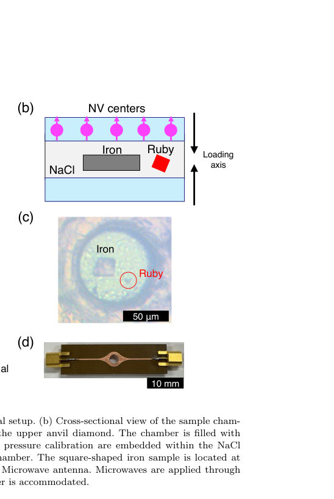
<figcaption class="paper-figure-caption"><b>Fig 3.</b> Figure 2(a) shows a schematic of the experimental setup. A 520-nm laser beam was reflected by a dichroic mirror and then focused onto the NV centers on the upper diamond anvil through an objective lens (Mitsutoyo, M-PLAN APO 50×, numerical</figcaption>
</figure>
<figure class="paper-figure-card">
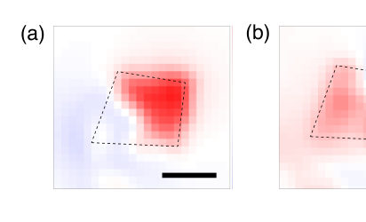
<figcaption class="paper-figure-caption"><b>Fig 4.</b> Figure 3. Magnetization reversal of the iron sample. The bias magnetic field has been subtracted. The dashed outline indicates the approximate position of the iron sample. The scale bar corresponds to 20 µm. (a) Stray magnetic field distribution in the initial state. The sample is magnetized to the right by applying an external magnetic field. (b) Stray magnetic field distribution after magnetizing the sample to the left with an external field. The distribution is reversed compared with (a). (c) Stray magnetic field distribution after magnetizing the sample to the right again. The distribution is similar to that in (a).</figcaption>
</figure>
<figure class="paper-figure-card">
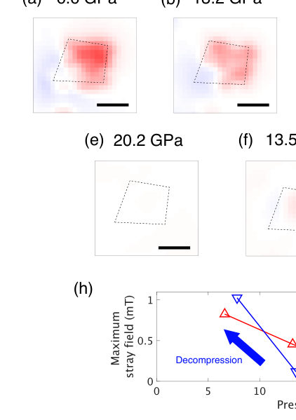
<figcaption class="paper-figure-caption"><b>Fig 5.</b> Figure 4. (a–g) Stray magnetic field distributions measured at different pressures. The bias magnetic field has been subtracted. The dashed outline indicates the approximate position of the iron sample. The scale bar corresponds to 20 µm. The disappearance of the stray magnetic field upon compression and its recovery upon decompression are clearly observed. (h) Hysteresis of the stray magnetic field from iron. The horizontal axis represents pressure, and the vertical axis shows the maximum value of the stray magnetic field. The compression and decompression processes are indicated by the red and blue curves, respectively.</figcaption>
</figure>

**Summary.** This paper demonstrates a method for high-precision magnetic imaging under extreme pressure using NV centers on (111)-oriented diamond anvils. The technique successfully captured the ferromagnetic-to-paramagnetic transition in iron up to 30 GPa. This advancement provides a robust platform for studying magnetic properties of materials in high-pressure regimes.

**Why it may be interesting.** not directly relevant

Detailed structure

**Main problem.** Performing precise magnetic imaging of small samples under ultrahigh pressure is difficult due to large background signals from the diamond anvil and signal degradation caused by lattice strain in standard (100)-oriented diamonds.

**Main result.** By using (111)-oriented diamond anvils with surface-fabricated NV centers, the researchers successfully imaged the magnetic transition (alpha-to-epsilon) in iron up to 30 GPa and observed pressure-induced hysteresis.

**Method.** The team used Optically Detected Magnetic Resonance (ODMR) on an ensemble of NV centers fabricated via helium-ion implantation on the culet surface of a (110)-oriented diamond anvil cell.

**Model / system.** The experimental platform is a Diamond Anvil Cell (DAC) containing an iron sample and NaCl pressure-transmitting medium, utilizing NV centers as quantum sensors to detect stray magnetic fields.

**Key observables.** Photoluminescence (PL) contrast, Zeeman splitting, Zero-Field Splitting (ZFS) shifts, and the spatial distribution of the stray magnetic field.

**Important parameters / regimes.** Pressure range up to 30 GPa, magnetic transition of iron (alpha-epsilon), and the gyromagnetic ratio of NV centers.

**Assumptions / limitations.** The study assumes the use of (111)-oriented diamonds minimizes strain-induced signal degradation and that the pressure-transmitting medium (NaCl) remains sufficiently hydrostatic.

**Figures summary.** Figure 1 compares NV orientations in (100) vs (111) diamonds and shows ODMR spectra; Figure 3 demonstrates magnetization reversal via external field reversal; Figure 4 shows spatial magnetic field maps during compression/decompression and a plot of magnetic field hysteresis.

**Paper structure.** The paper introduces the sensing platform and fabrication method, compares diamond orientations for strain resistance, details the experimental setup for high-pressure iron measurements, presents the observation of the magnetic phase transition and hysteresis, and concludes with future directions for ultrahigh pressure sensing.

Abstract

Diamond quantum sensors offer high precision and spatial resolution as magnetic probes, making them promising for a wide range of applications. While diamond anvil cells (DACs) can generate extremely high pressures, techniques for magnetometry under such conditions remain limited. By fabricating an ensemble of NV centers directly on the anvil diamond surface, we enable precise magnetic measurements under high pressure. In this work, we employ this NV ensemble to image the stray magnetic field of iron up to 30 GPa, enabling the observation of the magnetic transition ($α$-$\varepsilon$ transition) in iron.

[↑ back to top](#top)

### [Polarization-controlled effective Rabi dynamics in driven Graphene: A Floquet-Magnus approach](http://arxiv.org/abs/2605.00325v1)

**Authors:** V. G. Ibarra-Sierra, J. L. Cardoso, C. Flores-Valente, A. Kunold, J. C. Sandoval-Santana  
**Type:** theory · **Category:** other · **PDF:** <https://arxiv.org/pdf/2605.00325v1>  
**Analysis basis:** full PDF text, analyzed in chunks
**Topic relevance:** `non-equilibrium dynamics` **3/5**

↔ Scroll figures horizontally

<figure class="paper-figure-card">
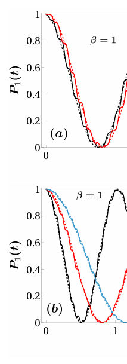
<figcaption class="paper-figure-caption"><b>Fig 1.</b> Figure 1: Time evolution of the population of the valence band P1(t) in the resonant regime ω = Ω/2. (a) Comparison between the full numerical solution (solid lines) and the analytical solution describing the macromotion (dashed lines) for opposite polariza- tion chiralities, β = ±1, with ∆= π/4. The slight horizontal displacement reflects the phase-induced initial Floquet kick. (b) Numerical and analytical evolution of P1(t) for β = 1, 0.5, 0 with ∆= π/7, demonstrating the progressive modification of the effective Rabi frequency as β is reduced. The envelope dynamics is governed by the effective Hamiltonian and the initial Floquet kick, while small deviations originate from micro- motion.</figcaption>
</figure>
<figure class="paper-figure-card">
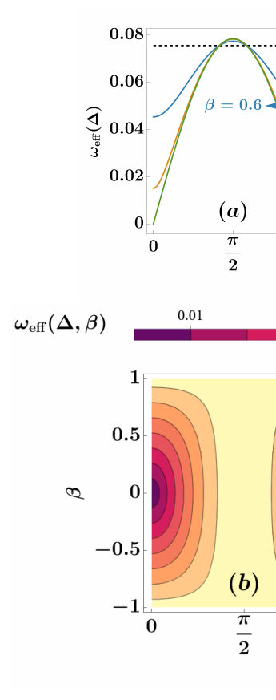
<figcaption class="paper-figure-caption"><b>Fig 2.</b> Figure 2: Effective Rabi frequency ωeff as a function of the polarization parameter β and the relative angle ∆between the polarization direction and the electron momentum. (a) Dependence of ωeff(∆) for β = 1, 0.6, 0.2, 0. Note that circular polarization (β = 1) restores rotational symmetry, yielding an angle-independent effective Rabi frequency, whereas decreasing β enhances the anisotropic modulation. For ∆= nπ, where n is an integer, and β = 0, one has ωeff = 0, and the dynamics is therefore completely gov- erned by micromotion. (b) Contour plot of ωeff(∆,β), exhibiting a π-periodic angular structure and a progressive increase in anisotropy as the polarization approaches the linear limit...</figcaption>
</figure>
<figure class="paper-figure-card">
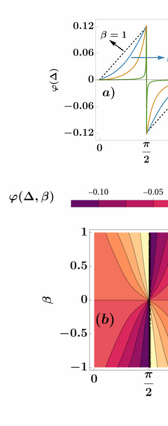
<figcaption class="paper-figure-caption"><b>Fig 3.</b> Figure 3: Phase induced by the initial Floquet kick ϕ as a function of β and ∆. (a) Angular dependence of ϕ(∆) for β = 1, 0.6, 0.2, 0.01. For all values of β, the phase undergoes an abrupt sign reversal at ∆= π/2 and 3π/2. In the circular limit (β = 1, dashed line), ϕ varies linearly with ∆within each half-period. As β decreases, the linear behavior is lost and the phase develops an increasingly asymmetric profile, reflecting the enhanced angular sensitivity of the effective coupling. The anisotropy is most pronounced for small β and gradually vanishes as the polarization approaches the circular limit (β →1). (b) Contour plot of ϕ(∆,β) showing a π-periodic angular structure with alternating...</figcaption>
</figure>

**Summary.** This paper shows how the polarization of light can precisely control the quantum dynamics of electrons in graphene. By tuning the ellipticity and angle of the light, researchers can manipulate the frequency and timing of electron oscillations, offering a path for high-precision quantum control in 2D materials.

**Why it may be interesting.** not directly relevant

Detailed structure

**Main problem.** The study investigates how the polarization ellipticity and the relative angle between electron momentum and an electromagnetic field can be used to control the coherent Rabi dynamics of electrons in graphene.

**Main result.** The authors demonstrate that polarization ellipticity and orientation act as tunable knobs that induce anisotropic modulation of the effective Rabi frequency and a polarization-induced phase shift (Floquet kick) in the electron population dynamics.

**Method.** The study employs the Floquet-Magnus expansion and a rotating-wave-type transformation within the interaction picture to derive an effective two-level Hamiltonian, validated by numerical simulations.

**Model / system.** The system consists of 2D Dirac electrons in graphene under the influence of periodically driven, elliptically polarized electromagnetic radiation, modeled using a low-energy Hamiltonian with Peierls substitution.

**Key observables.** Effective Rabi frequency, band occupation probability (macromotion vs. micromotion), and the polarization-induced phase shift.

**Important parameters / regimes.** Polarization ellipticity (beta), relative angle (Delta), driving frequency (omega), and the resonant regime (omega = Omega/2).

**Assumptions / limitations.** The analysis assumes normal incidence of radiation, a weak-field regime, and focuses on the zeroth-order Magnus approximation.

**Figures summary.** Figure 1 compares analytical and numerical occupation probabilities showing the Floquet kick; Figure 2 shows the angular dependence of the effective Rabi frequency; Figure 3 illustrates the angular dependence and sign reversals of the induced phase.

**Paper structure.** The paper progresses from the graphene Hamiltonian to the interaction picture, derives an effective two-level Hamiltonian via Floquet-Magnus expansion, separates macromotion from micromotion, and concludes with numerical validation and discussion of experimental signatures.

Abstract

Polarization ellipticity $β$ and the relative angle $Δ$ between electron momentum and driving field act as independent control parameters for coherent dynamics in periodically driven Dirac systems. In this work, we analyze the dynamics of resonantly driven Dirac electrons in graphene under elliptically polarized electromagnetic radiation using the Floquet-Magnus expansion. Working in the interaction picture and applying a rotating-wave-type transformation, we derive an effective two-level Hamiltonian that governs the macromotion at resonance ($ω= Ω/2$). The resulting quasienergy splitting depends nontrivially on $β$ and $Δ$ through interference between the Bessel harmonics $J_0(ζ)$ and $J_2(ζ)$. Circular polarization ($β= \pm 1$) restores rotational symmetry and yields a $Δ$-independent effective Rabi frequency, whereas elliptical and linear polarizations produce anisotropic responses with a $π$-periodic angular modulation. Beyond spectral properties, we identify a polarization-induced phase that acts as an effective initial Floquet kick, shifting the effective initial conditions and producing measurable shifts in the timing of occupation oscillations, whose sign depends on both helicity and relative orientation. Through an explicit Fourier decomposition of the time-evolution operator, we separate macromotion from micromotion contributions and validate the zeroth-order Magnus approximation via numerical simulations, achieving root-mean-square errors of $\sim 1\%$ over 100 driving periods in the weak-field regime. These results establish polarization ellipticity and relative orientation as tunable and experimentally accessible knobs for quantum control in two-dimensional Dirac materials, with direct implications for time-resolved spectroscopy.

[↑ back to top](#top)

### [Kinetically Arrested Twin-Domain State in Formamidinium Lead Iodide](http://arxiv.org/abs/2605.00427v1)

**Authors:** Xia Liang, Milos Dubajic, Zezhu Zeng, Yang Lu, Johan Klarbring, Samuel D. Stranks, Aron Walsh  
**Type:** both · **Category:** disordered systems and neural networks · **PDF:** <https://arxiv.org/pdf/2605.00427v1>  
**Analysis basis:** full PDF text, analyzed in chunks
**Topic relevance:** `non-equilibrium dynamics` **2/5** · `scars & prethermalization` **2/5**

↔ Scroll figures horizontally

<figure class="paper-figure-card">
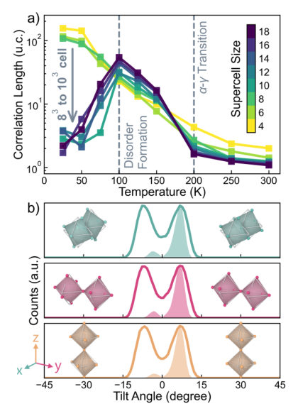
<figcaption class="paper-figure-caption"><b>Fig 1.</b> Figure 1: Large-cell simulations reveal a heterogeneous low-temperature state in FAPbI3. (a) Temperature dependence of the maximum octahedral-tilt correlation length, showing a pronounced maximum near 100 K and strong supercell-size dependence in the lower- temperature γ′ regime. (b) Direction-resolved distributions of apparent tilt angles and nearest-neighbour tilting correlations. Solid lines show tilt angle distributions; shaded areas indicate the first-neighbour correlation product, where positive and negative values correspond to in-phase and out-of-phase correlations, respectively.</figcaption>
</figure>
<figure class="paper-figure-card">
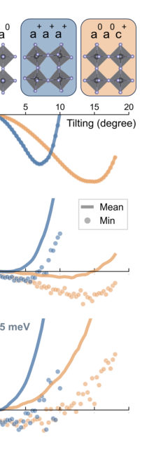
<figcaption class="paper-figure-caption"><b>Fig 2.</b> Figure 2: Tilt-dependent potential energy surfaces of iodide perovskites. Relative energies of CsPbI3, MAPbI3, and FAPbI3 are shown as a function of tilt angle for the idealised modes a0a0c−, a−a−c+, a+a+a+, and a0a0c+. The zero-tilt limit corresponds to the cubic a0a0a0 structure. Solid lines show the mean over 50 independent runs, and points indicate the minimum-energy structures. The molecular perovskites display a shallow, frustrated tilt landscape in which the number of active tilt axes matters more than the in-phase versus out-of-phase registry alone.</figcaption>
</figure>
<figure class="paper-figure-card">
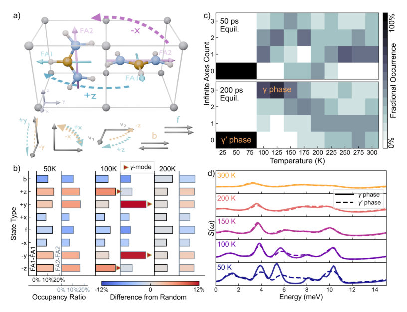
<figcaption class="paper-figure-caption"><b>Fig 3.</b> Figure 3: FA orientational correlations select the low-temperature structural outcome in FAPbI3. (a) Definition of the FA1 and FA2 molecular vectors and the discrete pair-correlation states used to classify nearest-neighbour molecular configurations. (b) Relative populations of FA1–FA1 and FA2–FA2 correlation states at selected temper- atures along the x direction; colours indicate deviation from the random benchmark. (c) Fractional occurrence of low-temperature structural outcomes under controlled equilibration protocols, classified by the number of crystallographic directions with effectively infinite tilt correlation length. (d) Neutron q-integrated vibrational spectra S(ω) for...</figcaption>
</figure>
<figure class="paper-figure-card">
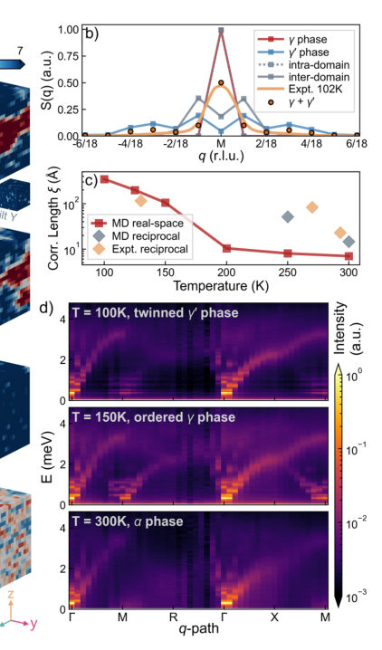
<figcaption class="paper-figure-caption"><b>Fig 4.</b> Figure 4: Reciprocal-space signatures of the γ′ twin-domain state in FAPbI3. (a) X-ray diffuse scattering on L = 1.5 r.l.u. half-integer reciprocal-space planes for experiment and simulation, together with one-to-one corresponding MD real-space maps of the local octahedral tilts. For the planar-domain structure, additional maps of the x- and y-tilt components are shown to highlight its anisotropic domain topology. The top panels compare the quenched low-temperature experimental pattern with two simulated low-temperature limits, namely a planar twin-domain structure and the twinned γ′</figcaption>
</figure>
<figure class="paper-figure-card">
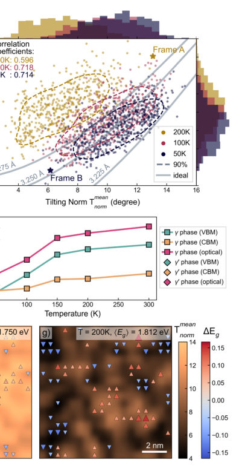
<figcaption class="paper-figure-caption"><b>Fig 5.</b> Figure 5: Electronic fingerprints of mesoscale tilt heterogeneity in FAPbI3. (a,b) Unfolded band structures for representative subcells with large and small local tilt magnitudes. (c) Local band gap as a function of the subcell tilt metric for snapshots sampled at 50, 100, and 200 K; contours enclose 90% of the data and stars denote the two representative subcells in (a,b). The distributions of local band gaps and tilt metrics are shown at the right and top edges of the map, respectively. Grey lines indicate idealised reference relations with varying Pb–I bond lengths. (d) Urbach energies extracted from the distributions of local valence and conduction band edge energies, together with the...</figcaption>
</figure>

**Summary.** This paper demonstrates that the low-temperature state of FAPbI3 is not a new stable phase but a kinetically arrested network of twin domains. This arrest occurs because the organic cations cannot reorient fast enough to keep up with the inorganic framework during cooling. This structural landscape creates significant electronic disorder, directly impacting the material's optoelectronic performance.

**Why it may be interesting.** The study explores kinetic arrest and glassy-like dynamics in a structural system, which provides insights into how slow degrees of freedom can freeze a system into a metastable, disordered state, relevant to many-body dynamics and non-equilibrium statistical mechanics.

Detailed structure

**Main problem.** Resolving the origin of the low-temperature structural heterogeneity and electronic disorder in FAPbI3 perovskite, specifically determining if the low-temperature state is a unique polymorph or a kinetically arrested state.

**Main result.** The low-temperature gamma' state is identified as a kinetically arrested, metastable twin-domain network caused by the mismatch between inorganic framework reorganization and the slower reorientation kinetics of FA cations.

**Method.** Large-scale molecular dynamics simulations using a machine learning force field (MACE) combined with DFT-based electronic structure analysis and X-ray diffuse scattering comparisons.

**Model / system.** The physical system is the hybrid lead halide perovskite formamidinium lead iodide (FAPbI3), focusing on the interplay between the inorganic Pb-I octahedral tilting and the orientational dynamics of the FA organic cations.

**Key observables.** Octahedral tilt norm, tilt correlation length, Urbach energy, local band gap, and dynamical structure factor S(q, omega).

**Important parameters / regimes.** Temperature regimes (alpha, gamma, and gamma' phases), reorientation activation energy (20-100 meV), and mesoscale domain sizes (1.2-12 nm).

**Assumptions / limitations.** The removal of A-site cations in reference models does not qualitatively alter the band gap trends, and the electronic properties are primarily governed by the Pb-I framework.

**Figures summary.** Figure 1 shows temperature-dependent tilt correlations; Figure 2 compares tilt energy landscapes across different perovskites; Figure 3 details FA orientational correlations and vibrational spectra; Figure 4 shows reciprocal-space signatures; Figure 5 relates local band gaps to structural distortions.

**Paper structure.** The paper introduces the structural problem, describes the ML-driven MD and DFT workflow, presents the identification of the kinetically arrested gamma' phase, analyzes the structural-electronic coupling, and concludes with the implications of thermal history on material properties.

Abstract

Hybrid lead halide perovskites exhibit a delicate interplay between average crystallographic symmetry, local structural disorder and A-site orientational dynamics, giving rise to unusual vibrational and electronic behaviour. Here, we combine large-scale molecular dynamics with a density-functional-theory-accurate machine learning force field to resolve the structural dynamics of perovskites across mesoscopic length scales. In formamidinium lead iodide FAPbI$_{3}$, we identify a high-temperature $α$ phase with dynamic local order and correlated tilt nanodomains, an ordered $γ$ phase with long-range $a^{+}a^{+}a^{+}$ tilt coherence, and, below $\sim$100~K, a history-dependent $γ'$ state consisting of locally $γ$-like nanoscale regions separated by sharp twin-like boundaries. This low-temperature disordered state is not a distinct bulk polymorph, but a kinetically arrested metastable twin-domain network selected by the interplay between shallow tilt energetics and slowing FA reorientation. This picture provides a consistent explanation for the low-temperature diffuse scattering features observed experimentally, and accounts for the broadened low-energy vibrational response found in the simulations. Furthermore, this unique structural landscape imprints a spatially varying electronic disorder that directly impacts macroscopic optoelectronic properties, evidenced by an anomalous increase in the Urbach energy at low temperatures. Our results reconcile the debated low-temperature behaviour of FAPbI$_{3}$ in terms of competition between ordered and arrested structural states, and show more broadly that in hybrid perovskites the organic cation can actively select the macroscopic structural and electronic response through its reorientation kinetics, placing thermal history on equal footing with composition as a determinant of structural and optoelectronic properties.

[↑ back to top](#top)

### [Observation of single antiferromagnetic magnon modes in the tunnelling transistors of spin-1/2 Kitaev system a-RuCl3](http://arxiv.org/abs/2605.00202v1)

**Authors:** Servet Ozdemir, Mikhail Kashchenko, Kostya S. Novoselov  
**Type:** experiment · **Category:** strongly correlated electrons · **PDF:** <https://arxiv.org/pdf/2605.00202v1>  
**Analysis basis:** full PDF text, analyzed in chunks
**Topic relevance:** `spintronics-quantum-optics interface` **2/5**

↔ Scroll figures horizontally

<figure class="paper-figure-card">
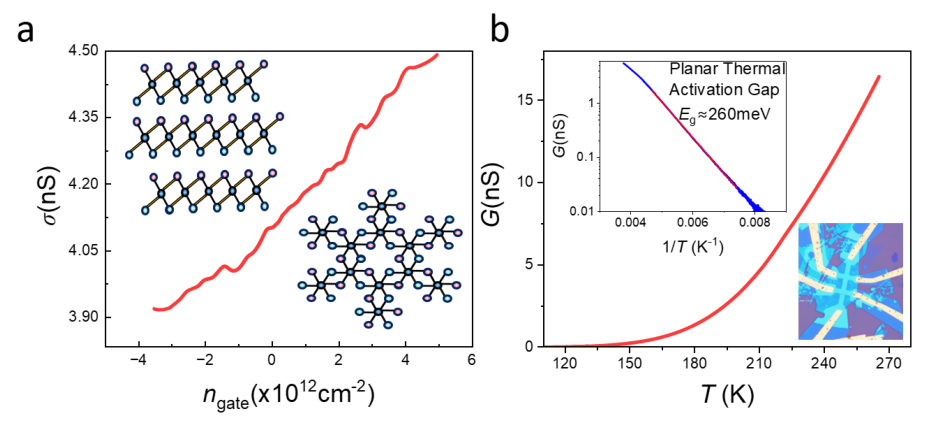
<figcaption class="paper-figure-caption"><b>Fig 1.</b> Figure 1 a) Electric field effect on a tri-layer planar contacted α -RuCl3 film suggesting n-type conduction yielding a field effect mobility of ≅𝟏× 𝟏𝟎−𝟑 cm2/Vs with layered crystal structure of α -RuCl3 depicted in upper inset and honeycomb structure on lower inset. b) Planar cooling curve obtained with conduction totally absent at 120 K, suggesting a strong insulating nature below this temperature with an Arrhenius plot shown in the inset yielding a thermal activation gap of ≅𝟐𝟔𝟎 meV.</figcaption>
</figure>
<figure class="paper-figure-card">
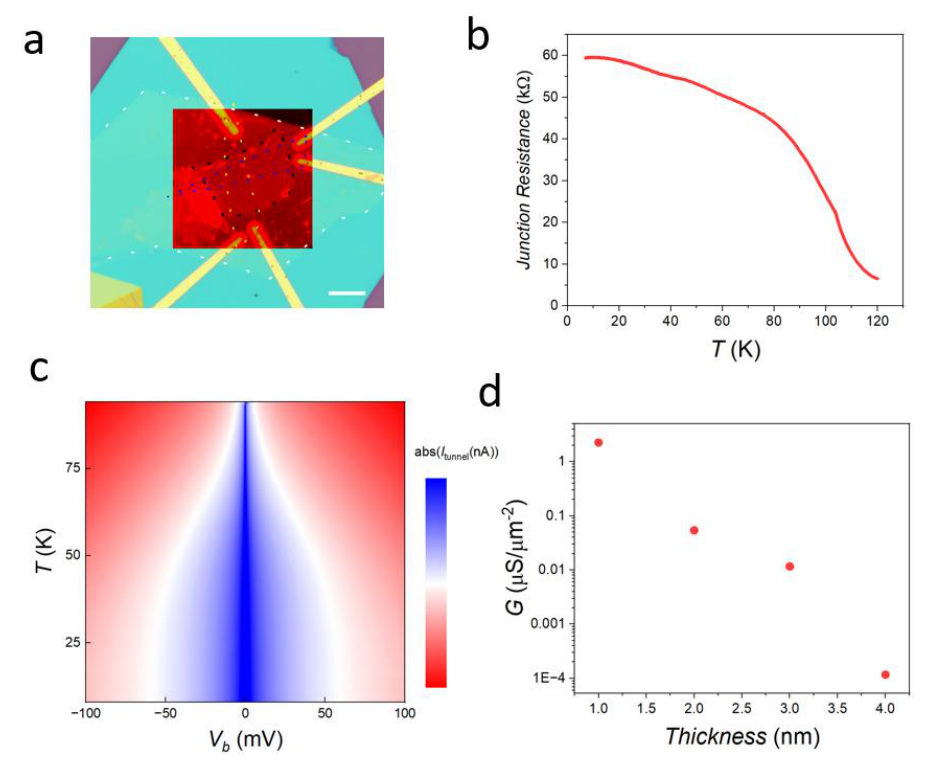
<figcaption class="paper-figure-caption"><b>Fig 2.</b> Figure 2 a) Optical micrograph of a bilayer tunnel junction device with top and bottom graphene electrodes. b) Temperature dependence of tunnel junction resistance suggesting onset of the tunnelling behaviour at 120 K. c) A map of temperature dependence of tunnelling I-V curves suggesting an increasingly resistive Mott insulator. d) Layer number dependence of low temperature zero bias α -RuCl3 tunnel junction resistance.</figcaption>
</figure>
<figure class="paper-figure-card">
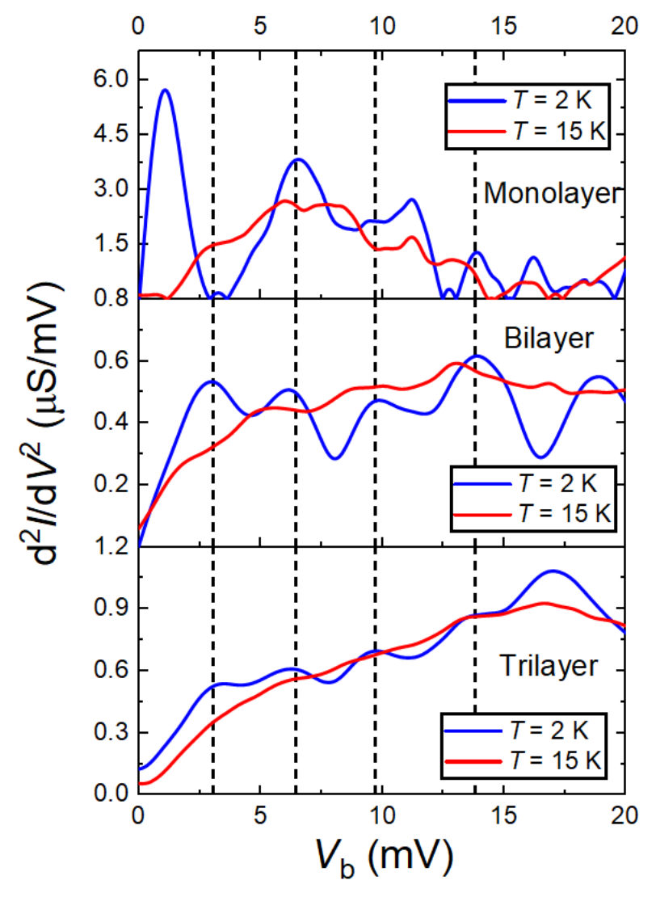
<figcaption class="paper-figure-caption"><b>Fig 3.</b> Figure 3 Mono- (top) bi- (middle) and tri- (bottom) layer tunnel junction second derivative I-V curves below (blue) and above Néel temperature (red), suggesting presence of magnon related features below the Néel temperature, with 4 features common to all samples highlighted with dashed lines.</figcaption>
</figure>
<figure class="paper-figure-card">
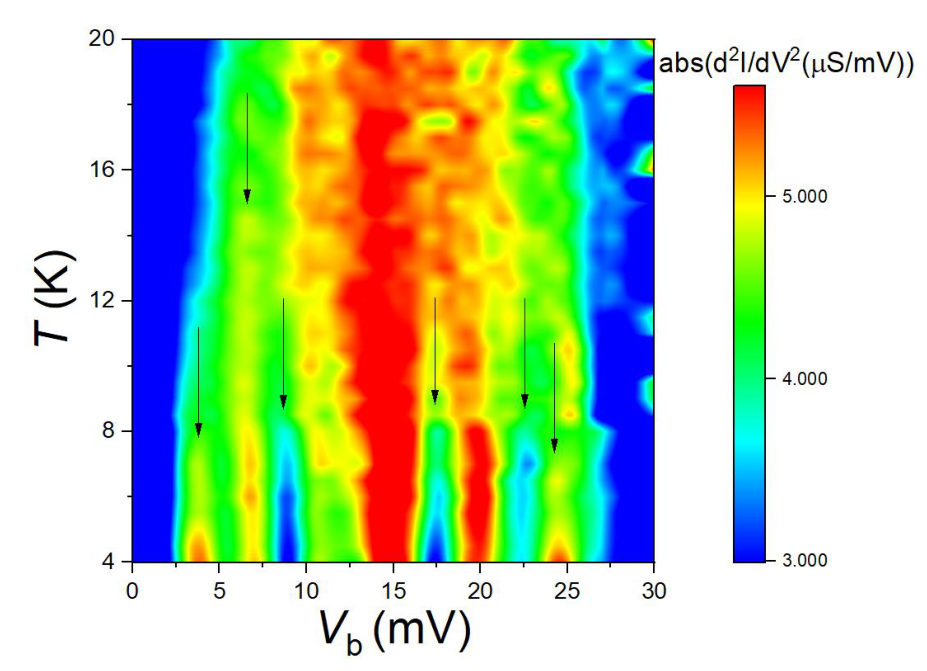
<figcaption class="paper-figure-caption"><b>Fig 4.</b> Figure 4 Temperature dependence map second derivative of tunnel current on a bi-layer tunnel junction showing disappearance of magnon-related features with temperature (pointed by the arrows) and prominence of phonon related features present until maximum measured temperature, 20K.</figcaption>
</figure>

**Summary.** This paper demonstrates that single magnon modes can be electrically detected in atomically thin layers of the Kitaev candidate material alpha-RuCl3. By using tunneling transistors, the authors confirm that the zigzag antiferromagnetic order persists in the 1-3 layer limit. This provides a crucial experimental foundation for studying Majorana excitations in electronic devices.

**Why it may be interesting.** not directly relevant

Detailed structure

**Main problem.** The study aims to investigate the electronic and magneto-electronic properties of atomically thin alpha-RuCl3 (1-3 layers) and to provide electrical confirmation of zigzag antiferromagnetic order and single magnon modes.

**Main result.** The researchers identified single magnon-assisted tunneling features in 1-3 layer alpha-RuCl3 that disappear above the Neel temperature, confirming the persistence of zigzag antiferromagnetic order in the thin-film limit.

**Method.** The study uses van der Waals heterostructure tunneling transistors with graphene electrodes and hBN encapsulation, employing tunneling spectroscopy (d2I/dV2), planar transport measurements, and Raman spectroscopy.

**Model / system.** The system is alpha-RuCl3, a spin-1/2 Kitaev candidate material that acts as a narrow-gap semiconductor at room temperature and undergoes a Mott-Hubbard transition at low temperatures.

**Key observables.** n-type conduction, field-effect mobility, thermal activation gap, second derivative of tunnel current (d2I/dV2), and Neel temperature (TN).

**Important parameters / regimes.** Layer thickness (1-3 layers), temperature regimes (room temperature, 120K Mott transition, 7-14.5K Neel temperature), and energy scales (1-3 mV for magnon modes).

**Figures summary.** Figure 1 shows n-type conduction and the 120K insulating transition; Figure 2 shows device micrographs; Figure 4 presents a temperature dependence map of the second derivative of tunnel current highlighting the disappearance of magnon features.

**Paper structure.** The paper introduces the Kitaev candidate alpha-RuCl3, describes the fabrication of vdW heterostructure transistors, presents transport and spectroscopy results showing the Mott transition and magnon detection, and concludes with the implications for quantum spin liquid research.

Abstract

The small gap room temperature semiconductor a-RuCl3 which is known to undergo a Mott-Hubbard transition at low temperatures, is one of the most promising candidates for realisation of an exotic matter form, the quantum spin liquid state, which may have applications in quantum computing. Although being extensively investigated by neutron scattering techniques, electronic study of this system in form of van der Waals heterostructures has been limited to mainly graphene proximity. Here we report a systematic study of planar and tunnelling electronic properties of a -RuCl3 films, where we observe an n-type semiconducting property of a -RuCl3 films at room temperature, with a Mott insulator nature onset below 120K. In constant some of the previous studies, we focus on films of three-layer thickness and below and we find inelastic scattering features, below the Neel temperature of 7-14.5 K, some of which we attribute to single magnon modes. We believe our study electrically confirms preserved low temperature signatures of the bulk zigzag antiferromagnetic order and its single magnon modes within the previously observed continuum in atomically thin film limit. The experimental progress could be a step for future electronic characterisation of quantum spin liquid state in the vicinity of the zigzag antiferromagnetic order as well as the Majorona excitations in a-RuCl3 in tunnelling transistors.

[↑ back to top](#top)

### [Plasmon Induced Delocalized Second-Harmonic Generation Towards Buried-Interface Spectroscopy](http://arxiv.org/abs/2605.00575v1)

**Authors:** Alan R. Bowman, Sergejs Boroviks, Omer Can Karaman, Laura M. Herz, Olivier J. F. Martin, Giulia Tagliabue  
**Type:** both · **Category:** other · **PDF:** <https://arxiv.org/pdf/2605.00575v1>  
**Analysis basis:** full PDF text, analyzed in chunks
**Topic relevance:** `interference shaping light` **2/5**

↔ Scroll figures horizontally

<figure class="paper-figure-card">
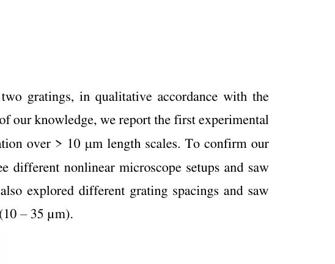
<figcaption class="paper-figure-caption"><b>Fig 1.</b> Figure 1. a) Schematic illustration of the</figcaption>
</figure>
<figure class="paper-figure-card">
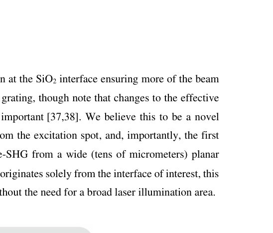
<figcaption class="paper-figure-caption"><b>Fig 2.</b> Figure 2. a) Schematic of</figcaption>
</figure>
<figure class="paper-figure-card">
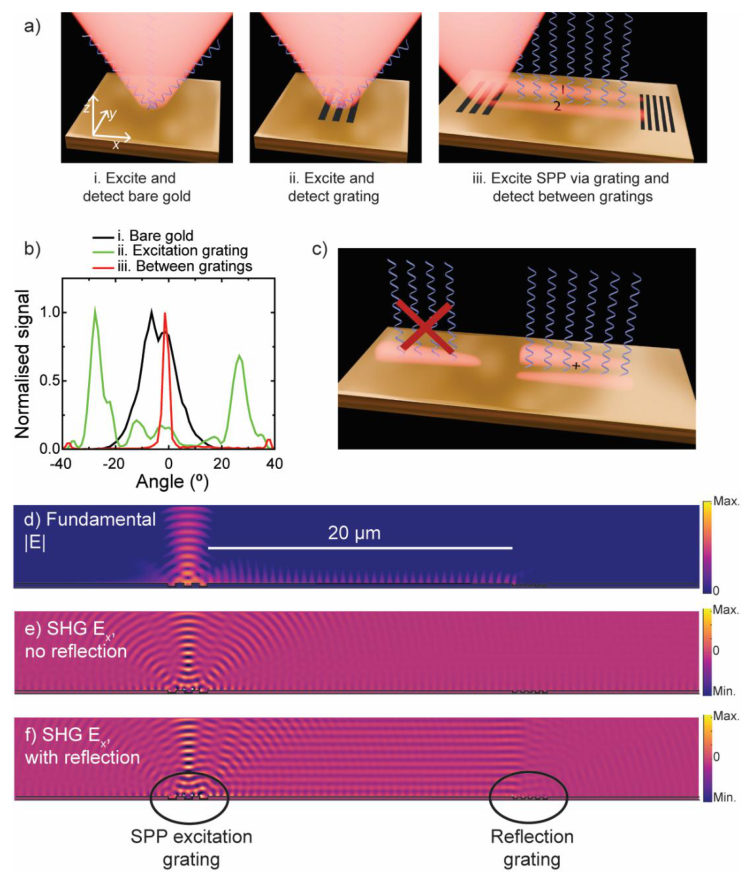
<figcaption class="paper-figure-caption"><b>Fig 3.</b> Figure 3. a) Schematic demonstrating three measurement configurations: i. excitation and detection on</figcaption>
</figure>
<figure class="paper-figure-card">
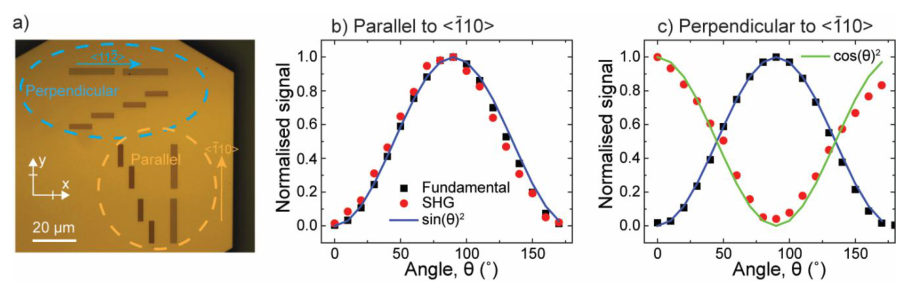
<figcaption class="paper-figure-caption"><b>Fig 4.</b> Figure 4. a) White light reflection image of the fabricated sample with in-coupling and reflection</figcaption>
</figure>

**Summary.** This paper demonstrates a method to generate delocalized second-harmonic light using the interference of counter-propagating surface plasmon polaritons on gold. This technique enables the spectroscopic probing of buried interfaces and wide-area surfaces using a single, localized excitation beam.

**Why it may be interesting.** not directly relevant

Detailed structure

**Main problem.** Second-harmonic generation (SHG) microscopy is limited by weak signal strength and the difficulty of distinguishing competing signals in multilayered or buried-interface systems.

**Main result.** The authors demonstrate delocalized SHG mediated by counter-propagating surface plasmon polaritons (SPPs), which allows for the detection of SHG signals up to 35 um away from the excitation spot and from buried interfaces.

**Method.** The study combines experimental nonlinear microscopy on gold gratings with Finite Element Method (FEM) simulations using COMSOL to model SPP propagation and nonlinear polarization.

**Model / system.** The physical system consists of monocrystalline gold flakes (specifically {111} orientation) patterned with FIB-milled in-coupling and reflection gratings, sometimes including a buried SiO2 layer.

**Key observables.** SHG intensity (515 nm), fundamental beam intensity (1030 nm), polarization dependence, and back-focal-plane (k-space) angular distribution.

**Important parameters / regimes.** Grating spacing (10-35 um), wavelength (1030 nm fundamental, 515 nm SHG), and grating depth (~70 nm).

**Assumptions / limitations.** The simulation assumes a 20 nm thick nonlinear polarization layer and uses the paraxial approximation for the incident Gaussian beam.

**Figures summary.** Figure 1 shows the system schematic, fabricated gratings, and SHG/fundamental images; Figure 2 illustrates the counter-propagating SPP configuration and white-light imaging; Figure 3 focuses on symmetry and polarization-resolved SHG; Supplemental figures cover spectral scaling, COMSOL simulations, and SEM structural characterization.

**Paper structure.** The paper introduces the limitations of standard SHG, describes the experimental setup and grating fabrication, presents the discovery of delocalized SHG via counter-propagating SPPs, extends the application to buried interfaces, provides theoretical modeling of the mechanism, and concludes with applications in sensing and catalysis.

Abstract

Second-harmonic generation microscopy is a powerful technique capable of probing local crystal symmetries and electric fields at interfaces. However, it often suffers from weak signal strength and is difficult to understand in multilayer systems where many materials can give competing signal contributions. In this work we present direct observation of delocalized, surface plasmon polariton-mediated second-harmonic generation on gold monocrystalline surfaces and structures. We generate second-harmonic light up to 35 um from the excitation spot and, excitingly, we obtain signal from atomically flat surfaces without a fundamental excitation beam present in the same region. We reveal that this process arises from the interaction of two counter-propagating surface plasmon polaritons, which we believe to be the first observation of this process at the microscale. This signal has the same polarisation dependence as localised second-harmonic generation and is emitted in a collimated beam travelling perpendicular to the sample surface. In part due to local electric field enhancements, we were able to observe these signals on a CMOS camera with 1 s exposure and no gain using an industrial-grade pulsed laser. Our results enable wide area multilayer samples to be probed using a single excitation beam, with applications including in energy, catalysis and single particle surface sensing.

[↑ back to top](#top)

### [Programmable Integrated Magnonic Meshes](http://arxiv.org/abs/2605.00290v1)

**Authors:** Piero Florio, Matteo Vitali, Valerio Levati, Rasheed M. Ishola, Luca Ciaccarini Mavilla, Nora Lecis, Carsten Dubs, Riccardo Bertacco, Marco Madami, Silvia Tacchi, Daniela Petti, Edoardo Albisetti  
**Type:** both · **Category:** other · **PDF:** <https://arxiv.org/pdf/2605.00290v1>  
**Analysis basis:** full PDF text, analyzed in chunks
**Topic relevance:** `spintronics-quantum-optics interface` **2/5**

↔ Scroll figures horizontally

<figure class="paper-figure-card">
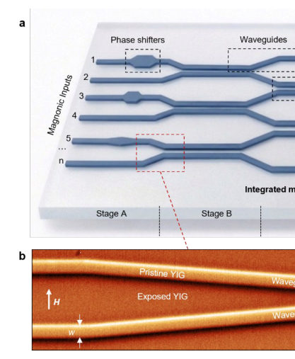
<figcaption class="paper-figure-caption"><b>Fig 1.</b> Figure 1. Large-scale magnonic mesh networks fabricated via direct laser writing.</figcaption>
</figure>
<figure class="paper-figure-card">
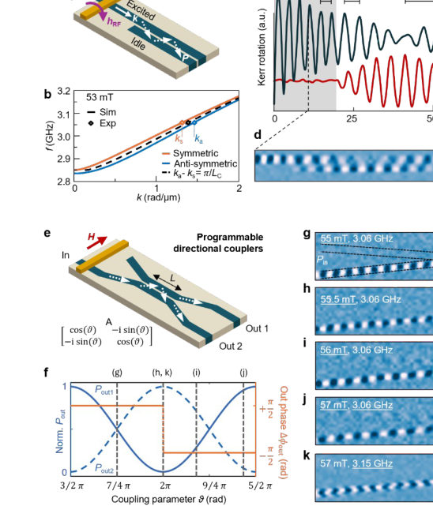
<figcaption class="paper-figure-caption"><b>Fig 2.</b> Figure 2. Low-loss spin-wave coupling and programmable directional couplers.</figcaption>
</figure>
<figure class="paper-figure-card">
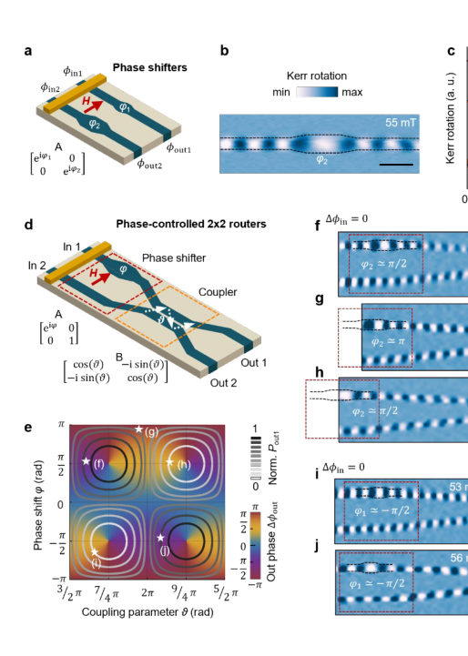
<figcaption class="paper-figure-caption"><b>Fig 3.</b> Figure 3. Spin-wave phase shifters and programmable 2x2 phase-controlled routers.</figcaption>
</figure>
<figure class="paper-figure-card">
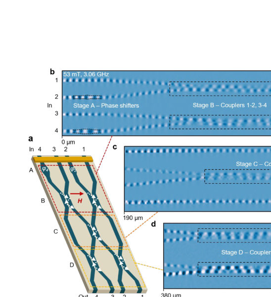
<figcaption class="paper-figure-caption"><b>Fig 4.</b> Figure 4. Programmable magnonic mesh networks.</figcaption>
</figure>
<figure class="paper-figure-card">
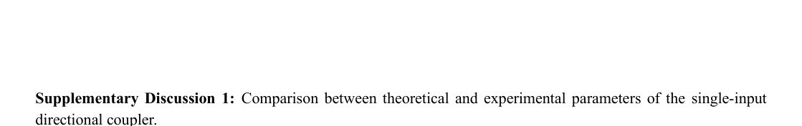
<figcaption class="paper-figure-caption"><b>Fig 5.</b> Fig. 2f presents the theoretical plot of the output power and output phase delay as a function of the theoretical coupling parameter 𝜗theo (see Supplementary Note 2 for analytical modelling). Superimposed on this plot are the experimental vertical dashed lines obtained from the measured output powers that are also reported in Fig. 2g-k (see Supplementary Method 2 for data extraction). From these experimental data, the expected theoretical input parameter 𝜗theo is retrieved. For each routing configuration, Table S1 compares the theoretical values of 𝜗theo with the corresponding experimental values 𝜗exp.</figcaption>
</figure>

**Summary.** This paper demonstrates a way to build complex, programmable circuits using spin waves in magnetic materials. By using a laser to pattern YIG films, the authors created large-scale networks that can route radio-frequency signals like a programmable chip, providing a path toward scalable magnonic computing.

**Why it may be interesting.** not directly relevant

Detailed structure

**Main problem.** The scalability of magnonic devices is limited by the difficulty of fabricating complex, large-scale integrated circuits from isolated elements. There is a need for a high-throughput, low-loss fabrication strategy to create programmable, cascaded magnonic networks.

**Main result.** The researchers realized programmable, integrated magnonic meshes using a single-step direct laser writing process in YIG, demonstrating complex signal routing, frequency demultiplexing, and phase-controlled 2x2 routers with high phase coherence.

**Method.** Direct laser writing (DLW) is used to amorphize YIG thin films to create waveguides, while Time-Resolved Magneto-Optical Kerr Effect (TR-MOKE) microscopy is used to map spin-wave propagation, phase, and amplitude.

**Model / system.** The platform consists of 100 nm-thick single-crystal Yttrium Iron Garnet (YIG) thin films on GGG substrates, featuring programmable networks of waveguides, phase shifters, and directional couplers in a Damon-Eshbach configuration.

**Key observables.** Spin-wave amplitude, phase ($\phi$), wavevector ($k$), output power ($P_{out}$), and frequency-dependent routing capabilities.

**Important parameters / regimes.** Frequency range of 0.9–11.7 GHz, feature sizes down to <300 nm, propagation distances exceeding 700 $\mu$m, and attenuation of 0.07 dB/$\mu$m.

**Assumptions / limitations.** The analytical model assumes an effective coupling region extension (e.g., 65 $\mu$m) to match experimental data and assumes a Gaussian laser profile for patterning.

**Figures summary.** Figure 1 shows the large-scale mesh schematic and MFM images of waveguides; Figure 2 and 3 demonstrate directional couplers, 2x2 routers, and power/phase routing configurations; Extended Data figures show structural transitions, dispersion relations, and higher-order modes.

**Paper structure.** The paper introduces the scalability problem, describes the laser-writing fabrication method, demonstrates individual building blocks (waveguides, couplers, phase shifters), scales these into complex programmable meshes, and validates the results with analytical transfer matrix models and micromagnetic simulations.

Abstract

Integrated circuits are a cornerstone of modern information technology, and analog wave-based architectures could enable fast and efficient processing beyond conventional charge electronics. In magnonics, spin waves provide a highly tunable, compact and energy-efficient medium for on-chip microwave signal transport and processing. However, progress has been limited to isolated elements or short devices, severely limiting the overall functional complexity and scalability. Here we realize the key elements of universal magnonic circuitry, using a single-step direct laser writing process in yttrium iron garnet, and monolithically cascade them in multi-stage programmable devices and networks. Using magneto-optical Kerr effect microscopy, we show efficient spin-wave propagation and preserved phase coherence in waveguide structures for hundreds of wavelengths. In coupled waveguides, we observe complete and periodic power transfer over several coupling lengths, and in phase shifters we achieve arbitrary, tunable phase delays. By cascading these elements, we realize programmable splitters, frequency demultiplexers, and phase-controlled 2x2 routers, where output power and relative phase can be programmed on demand via external fields. Finally, we realize programmable magnonic interferometric meshes for on-chip radio-frequency signal routing, with up to six magnonic inputs and outputs and seven cascaded stages, without the need for intermediate amplification. These direct-write cascaded networks bridge a long-standing gap in magnonic scalability, offering a viable pathway toward integrated, large-scale architectures for both classical and quantum processing.

[↑ back to top](#top)

### Other secondary papers (25)

Show other secondary papers

### [An Advanced Epitaxial Strategy Enabling Vertical GaN Devices on Silicon Wafers](http://arxiv.org/abs/2605.00464v1)

**Authors:** Fumio Kawamura, Takeyoshi Onuma, Kazutaka Mitsuishi  
**Type:** experiment · **Category:** other · **PDF:** <https://arxiv.org/pdf/2605.00464v1>  
**Analysis basis:** full PDF text, analyzed in chunks

↔ Scroll figures horizontally

<figure class="paper-figure-card">
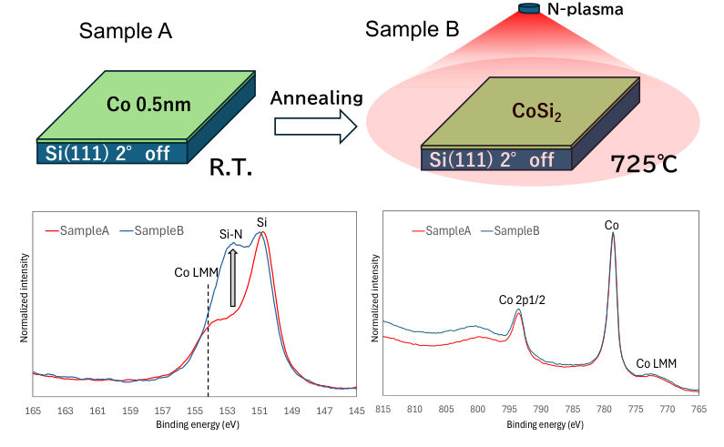
<figcaption class="paper-figure-caption"><b>Fig 1.</b> Figure 4. XPS spectra obtained after annealing and nitrogen plasma irradiation of an ultrathin Co film deposited on Si(111). A 0.5 nm-thick Co layer was deposited on a 3° off- axis Si(111) wafer, followed by nitrogen plasma irradiation during annealing at 725 °C under vacuum. The method of nitrogen plasma irradiation is described in Ref. [58].</figcaption>
</figure>
<figure class="paper-figure-card">
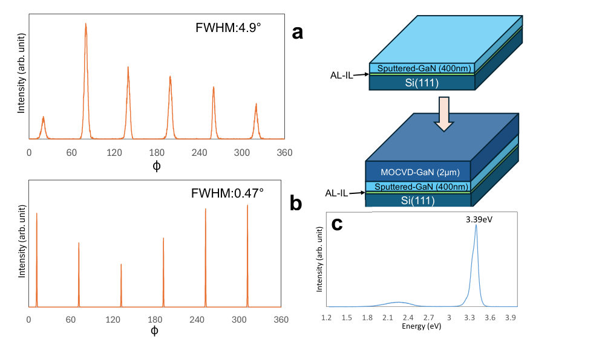
<figcaption class="paper-figure-caption"><b>Fig 2.</b> Figure 5. MOCVD overgrowth of GaN on a sputtered GaN-on-Si(111) template. XRD φ-scans and corresponding schematic architectures for (a) a sputtered GaN-on-Si(111) template and (b) an MOCVD-overgrown GaN film. The template was formed via a 0.5-nm Co layer, which creates an amorphous-like interlayer (AL-IL). (c) Room-temperature photoluminescence (PL) spectrum for the sample shown in (b).</figcaption>
</figure>
<figure class="paper-figure-card">

<figcaption class="paper-figure-caption"><b>Fig 3.</b> Figure 6. Vertical current–voltage characteristics of GaN on Si(111) grown with an amorphous-like interlayer. The plot shows vertical I–V curves as a function of post-growth annealing temperature. The GaN film was grown at 675 °C on a Si(111) substrate, which was pre- deposited with and without a Co layer.</figcaption>
</figure>
<figure class="paper-figure-card">
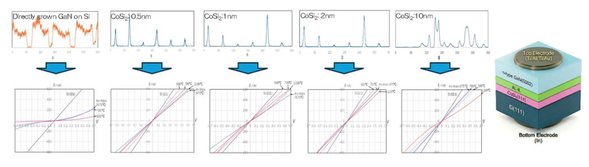
<figcaption class="paper-figure-caption"><b>Fig 4.</b> Fig. 6 presents the vertical current-voltage (I-V) characteristics of epitaxially grown GaN films on</figcaption>
</figure>

**Summary.** This paper presents a new method for growing high-quality GaN on silicon by using an ultrathin metallic layer to create a silicide-based template. This technique reduces vertical resistance and lattice mismatch, providing a scalable path for low-cost, high-performance power electronics.

**Why it may be interesting.** not directly relevant

Detailed structure

**Main problem.** High electrical resistance in conventional epitaxial buffer layers prevents the development of cost-effective, vertical GaN-on-silicon power electronics and micro-LEDs.

**Main result.** A universal sputtering-based strategy was discovered using a 0.5 nm metallic/silicide template to enable high-quality GaN growth on Si(111) with low vertical resistance and an amorphous-like interlayer that relaxes strain.

**Method.** The researchers used RF magnetron sputtering to deposit ultrathin metal layers, followed by rapid thermal annealing and MOCVD overgrowth, while characterizing the interface via STEM, XRD, and XPS.

**Model / system.** The experimental platform consists of GaN epitaxial films grown on Si(111) substrates using a sub-nanometer silicide-based template formed from various metallic species.

**Key observables.** XRD phi-scans (FWHM), STEM/EDS elemental mapping, XPS chemical bonding, photoluminescence (PL) spectra, and vertical I-V characteristics.

**Important parameters / regimes.** Metal melting point (threshold near 1900C), annealing temperature (575C to 750C), and buffer thickness (~0.5 nm).

**Assumptions / limitations.** The effectiveness of the template depends on the formation of a silicide layer and the avoidance of highly oxophilic elements.

**Figures summary.** Fig 1 shows XRD phi-scans and a classification of 43 elements by epitaxial quality; Fig 2 shows the effect of annealing temperature; Fig 3 presents STEM/EDS interface analysis; Fig 4 shows XPS spectra for Si-N bonding; Fig 5 compares XRD and PL for different growth methods; Fig 6 shows vertical I-V characteristics.

**Paper structure.** The paper introduces the bottleneck of GaN-on-Si, presents a systematic screening of metallic elements, details the formation of the silicide-based template and the amorphous-like interlayer, validates the structural and electrical quality of the resulting films, and concludes with the scalability of the approach.

Abstract

While vertical GaN-on-silicon architectures promise a transformative leap in cost-effective power electronics and high-resolution micro-LEDs, their deployment remains bottlenecked by the high electrical resistance of conventional epitaxial buffer layers. Here, a universal and straightforward sputtering-based strategy is presented to realize high quality GaN epitaxial films on Si(111) substrates characterized by exceptionally low vertical resistance, ohmic behavior, and robust thermal stability. This technique centers on the in-situ formation of a sub nanometer (0.5 nm) silicide-based template via rapid thermal annealing method demonstrating unprecedented versatility across 25 different metallic species. Scanning transmission electron microscopy (STEM) reveals that a unique amorphous like interlayer (AL-IL) effectively accommodates lattice mismatch and relaxes epitaxial strain. These AL-IL templates further serve as high performance platforms for metalorganic chemical vapor deposition (MOCVD) overgrowth, successfully bridging the gap between scalable, low-cost fabrication and device-grade vertical performance.

[↑ back to top](#top)

### [An Unsupervised Machine Learning-based Framework for Wafer Scale Variability Analysis and Performance Prediction of Ferroelectric Hf0.5Zr0.5O2 Thin Film Capacitors](http://arxiv.org/abs/2605.00544v1)

**Authors:** Anika Anu, Sayani Majumdar  
**Type:** both · **Category:** disordered systems and neural networks · **PDF:** <https://arxiv.org/pdf/2605.00544v1>  
**Analysis basis:** full PDF text, analyzed in chunks

↔ Scroll figures horizontally

<figure class="paper-figure-card">
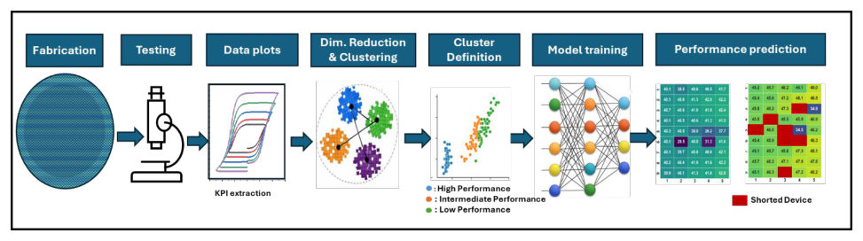
<figcaption class="paper-figure-caption"><b>Fig 1.</b> Figure 1: Schematic diagram of the workflow starting from ferroelectric HZO-based capacitor</figcaption>
</figure>
<figure class="paper-figure-card">
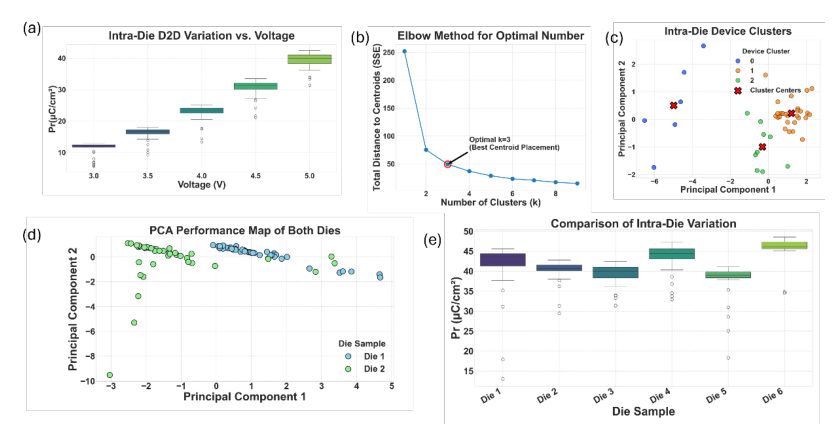
<figcaption class="paper-figure-caption"><b>Fig 2.</b> Figure 3: Analysis of optimal clustering and variation visualization (a) Intra-Die D2D Variation</figcaption>
</figure>
<figure class="paper-figure-card">
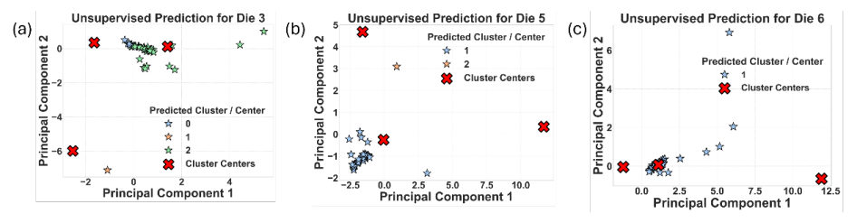
<figcaption class="paper-figure-caption"><b>Fig 3.</b> Figure 4: Verification of the predictive model showing how close the cluster center lies to different</figcaption>
</figure>
<figure class="paper-figure-card">
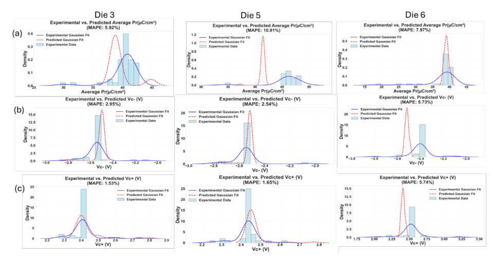
<figcaption class="paper-figure-caption"><b>Fig 4.</b> Figure 5: Comparison of Experimental and Predicted distribution plots for (a) Remanent</figcaption>
</figure>
<figure class="paper-figure-card">
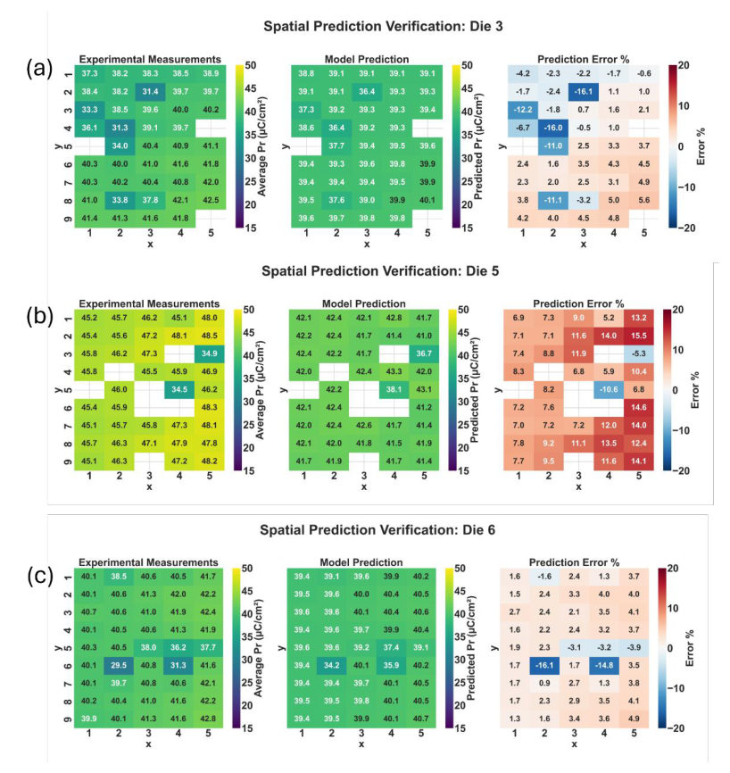
<figcaption class="paper-figure-caption"><b>Fig 5.</b> Figure 6: Spatial Prediction Verification of Remanent Polarization (Pr) values for devices on (a)</figcaption>
</figure>

**Summary.** This paper presents an unsupervised machine learning framework to solve the problem of performance unpredictability in ferroelectric HZO capacitors. By using PCA and K-Means clustering, the authors can predict the electrical properties of unmeasured areas of a semiconductor wafer. This approach offers a way to accelerate manufacturing yields and reduce the need for expensive, exhaustive physical testing.

**Why it may be interesting.** not directly relevant

Detailed structure

**Main problem.** High device-to-device and wafer-scale variability in ferroelectric HZO thin film capacitors hinders high-volume semiconductor manufacturing and requires resource-intensive metrology.

**Main result.** An unsupervised machine learning framework using PCA and K-Means can accurately predict the performance of untested dies with a Mean Absolute Percentage Error (MAPE) of 5-10% for remanent polarization.

**Method.** The researchers implemented a 'Virtual Metrology' approach using Principal Component Analysis for dimensionality reduction and K-Means clustering to group device performance, validated against experimental data.

**Model / system.** The physical system consists of ferroelectric Hafnium Zirconium Oxide (HZO) thin film capacitors integrated into a CMOS back-end-of-line compatible structure, specifically 10 nm HZO with TiN and Au electrodes on 200 mm wafers.

**Key observables.** Remanent polarization (Pr), coercive voltage (Vc), and spatial distribution of performance across the wafer.

**Important parameters / regimes.** Annealing temperature (450 C and 600 C), device-to-device (D2D) variation, and Mean Absolute Percentage Error (MAPE).

**Assumptions / limitations.** The model assumes that a small, representative subset of measured dies can capture the underlying variability structure of the entire wafer; it also assumes the existence of a learnable spatial pattern.

**Figures summary.** Figure 1 shows the workflow schematic; Figure 2 illustrates the device structure, wafer map, and P-V loops; Figure 3 displays clustering and statistical validation; Figure 6 presents heatmaps comparing predicted vs. actual Pr distribution; Figure 7 shows PCA performance maps and experimental vs. predicted plots.

**Paper structure.** The paper identifies the manufacturing variability problem, describes the HZO fabrication and characterization platform, introduces the unsupervised ML framework, presents results on predictive accuracy and spatial mapping, and concludes with a comparison of different annealing regimes.

Abstract

Fabrication process-induced performance variability remains a formidable barrier in the high-volume manufacturing of semiconductor chips. With skyrocketing Artificial Intelligence (AI) workload, demand for non-volatile and computational memories is growing exponentially. As embedded non-volatile memory, ferroelectric Hf0.5Zr0.5O2 emerged as a strong candidate due to their CMOS back-end-of-line (BEOL) compatibility, scalability and high performance. However, their sensitive crystallization kinetics leads to significant device-to-device (D2D) non-uniformity leading to unpredictability of performance over wafer scale. In this work, we demonstrate unsupervised machine learning can analyze intra-die D2D variations and predict performance of "unseen" dies efficiently. We present a framework utilizing Principal Component Analysis (PCA) and K-Means clustering to analyze D2D performance variations in HZO capacitors and building on data from multiple dies, we move beyond traditional descriptive statistics to a predictive "Virtual Metrology" approach that separates performance categories, defined by key parameters like remanent polarization (Pr) and coercive voltage (Vc). The analysis further extends to comparing uniformity across different dies across the wafer showing the proposed methodology can accurately predict device performance on untested dies with a low Mean Absolute Percentage Error (MAPE) in the range of 5-10%, suggesting a robust path for accelerated yield improvement and reduced metrology overhead.

[↑ back to top](#top)

### [Architecting mechanosensitive nanofluidic transport in graphite nanoslits](http://arxiv.org/abs/2605.00661v1)

**Authors:** Mathieu Lizée, Zhijia Zhang, Baptiste Coquinot, Qian Yang, Lydéric Bocquet  
**Type:** both · **Category:** other · **PDF:** <https://arxiv.org/pdf/2605.00661v1>  
**Analysis basis:** full PDF text, analyzed in chunks

↔ Scroll figures horizontally

<figure class="paper-figure-card">
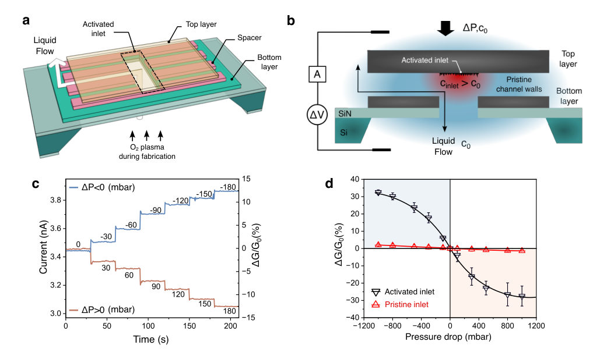
<figcaption class="paper-figure-caption"><b>Fig 1.</b> Figure 1. Mechano-sensitive nanochannels experimental setup. (a-b) A two-dimensional graphite nanochannel fabricated by van der Waals assembly is placed between two reservoirs filled with aqueous KCl solution. A voltage drop is applied between two Ag/AgCl electrodes places in two reservoirs on either side of the channel. A pressure drop is also applied between the two reservoirs. By convention, the pressure drop is positive when the pressure is applied on the top side of the nanochannel, as indicated by the arrow on top. (c) The measured current from a 1 nm activated channel in 1 M KCl solution under both positive and negative pressure drop steps and a voltage drop ∆V = 100 mV. (d) The...</figcaption>
</figure>
<figure class="paper-figure-card">
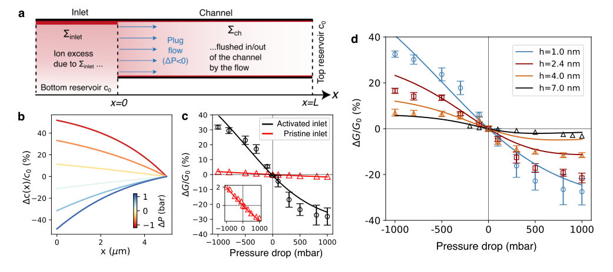
<figcaption class="paper-figure-caption"><b>Fig 2.</b> Figure 2. An electrohydrodynamic model for mechano-sensitivity(a) Sketch of the model: counter charges near the activated inlet are advected by the water flow with applied pressure, resulting in a pressure-dependent concentration profile in the channel. Darker color represents higher concentration (b) Theoretical predictions for the pressure-dependent relative concentration drop profiles in a 1-nm-height channel plotted for h = 1 nm, L = 5 µm, b = 20 nm, Σch = −25 mC/m2 and Σinlet = −150 mC/m2 at c0 = 1 M, closely matching experimental conditions. (c) Experimental results for the mechano- conductance of 1-nm-height channels with respectively a pristine (red) and an activated inlet (black),...</figcaption>
</figure>
<figure class="paper-figure-card">
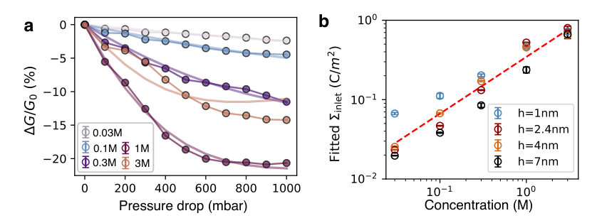
<figcaption class="paper-figure-caption"><b>Fig 3.</b> Figure 3. Concentration dependency of the mechano-sensitive effect and fits with the theoretical model (a) Mechano-conductance versus pressure curves for a channel with height h = 2.4 nm for ∆P ranging between 0 and 1 bar. Solid lines are a 1-parameter fit with the theoretical model, assuming a slip length of 20 nm, a pristine graphite surface charge of -25 mC/m2 at c0=1 M and a regulation of Σch ∼c1/3 0 consistent with existing measurements on carbon nanotubes (23). (b) Surface charge Σinlet for each ion concentration extracted from the fits of the theoretical predictions for various channel height (see Supplementary Figure 9). We find that the data for all confinements collapse on a...</figcaption>
</figure>
<figure class="paper-figure-card">
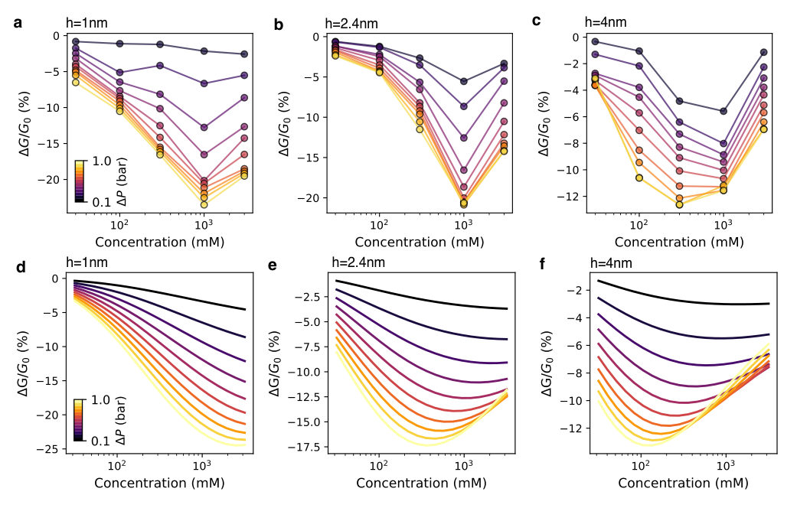
<figcaption class="paper-figure-caption"><b>Fig 4.</b> Figure 4. Relative mechanosensitive response as a function of salt concentration for a range of pressure drops in channels of different heights. (a-c) Concentration-dependent mechanosensitivity curves for channels of different height h ∈{1, 2.4, 4} nm for a set of pressures ranging between 0 and 1 bar. The same dataset is replotted in Supplementary Figure 9 as a function of pressure instead of concentration. (d-f) Relative mechanosensitivity ∆G/G0(c0, h, ∆P) plotted according to the constrained one-dimensional EDL advection model without any free parameter. We take b = 20 nm, L = 5 µm, Σinlet = −200 mC/m2 × (c0/1M)0.7 and Σch = −25 mC/m2 × (c0/1M)0.3.</figcaption>
</figure>

**Summary.** The researchers engineered a graphite-based nanofluidic device that changes its electrical conductance in response to pressure without any physical deformation of the channel. This is achieved by creating an asymmetric surface charge at the channel inlet, which allows pressure-driven flow to move ions into or out of the slit. This work provides a blueprint for designing bioinspired, solid-state pressure sensors.

**Why it may be interesting.** not directly relevant

Detailed structure

**Main problem.** Developing artificial, strain-free mechanosensitive nanofluidic systems that mimic biological ion channels by achieving pressure-dependent conductance without structural deformation.

**Main result.** Demonstrated that asymmetric surface charging at a graphite nanoslit inlet enables a bipolar, pressure-sensitive ionic conductance response driven by the advection of excess ions.

**Method.** The study combines van der Waals assembly and plasma treatment for device fabrication with electrochemical measurements and a 1D electrohydrodynamic EDL-advection model.

**Model / system.** The physical system consists of 2D graphite nanoslits (height 1-7 nm) with an activated (highly charged) inlet, placed between reservoirs of aqueous KCl solution.

**Key observables.** Relative conductance change (delta G/G0), ionic current (I), streaming current (Istr), and ion concentration profiles.

**Important parameters / regimes.** Pressure drop (delta P), salt concentration (c0), channel height (h), surface charge density (Sigma), and slip length (b).

**Assumptions / limitations.** Assumes a 1D EDL-advection model, negligible channel wall deformation, large slip length (b >> h), and specific power-law scaling for surface charge regulation.

**Figures summary.** Fig 1 shows the experimental setup, pressure convention, and the bipolar conductance response in activated vs. pristine channels. Fig 2 illustrates the electrohydrodynamic model. Fig 3 and 4 present the concentration-dependent mechanosensitivity and the scaling of the response with channel height.

**Paper structure.** The paper introduces the concept of strain-free mechanosensitivity, describes the fabrication and experimental setup, presents the observed bipolar conductance response, provides a theoretical 1D model to explain the mechanism via ion advection, and analyzes the scaling of the effect with salt concentration and channel height.

Abstract

Mechanosensitive ion transport plays a central role in enabling living systems to perceive and adapt to their environment through the deformation of soft, embedded ion channels. In this work, we demonstrate that ion transport within a two-dimensional graphite nanoslit can be rationally engineered to achieve a bipolar, pressure-sensitive response without any structural deformation. The mechanosensitivity arises from the selective charging of one channel inlet, which acts as a reversible source of mobile charge carriers. These excess-ions can then be advected in or out of the channel by the pressure-driven water flow, thereby modulating the ionic conductance. This mechanism is captured through a comprehensive electrohydrodynamic model that analytically accounts for coupled diffusion, convection, surface transport, diffusio-osmosis, and interfacial slippage, both inside and outside the nanoslit. The theoretical framework quantitatively reproduces the experimental data, showing that a simple surface charge pattern can give rise to complex, pressure-dependent conductance. These findings reveal how rich nonlinear couplings at the nanoscale can be harnessed to design adaptive, bioinspired nanofluidic systems, exemplified here by ionic pressure sensors.

[↑ back to top](#top)

### [Beyond Structure: Revolutionising Materials Discovery via AI-Driven Synthesis Protocol-Property Relationships](http://arxiv.org/abs/2605.00313v1)

**Authors:** Guillaume Lambard  
**Type:** theory · **Category:** disordered systems and neural networks · **PDF:** <https://arxiv.org/pdf/2605.00313v1>  
**Analysis basis:** full PDF text, analyzed in chunks

↔ Scroll figures horizontally

<figure class="paper-figure-card">
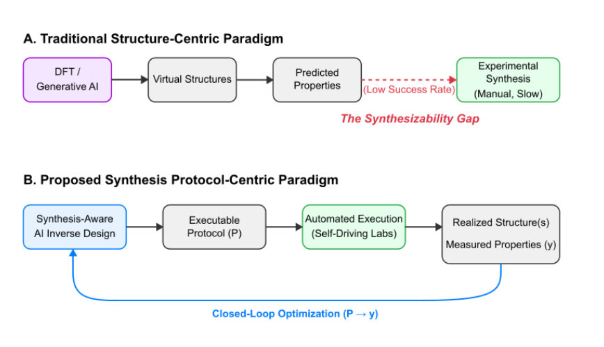
<figcaption class="paper-figure-caption"><b>Fig 1.</b> Figure 1: Paradigm shift from structure-centric to synthesis protocol-centric discovery. (A) Conventional workflow emphasises virtual structure generation and property prediction, leaving a dashed synthesizability gap to experimental realisation. (B) The proposed workflow elevates executable synthesis protocols to first- class design objects and closes the loop via autonomous experimentation.</figcaption>
</figure>
<figure class="paper-figure-card">
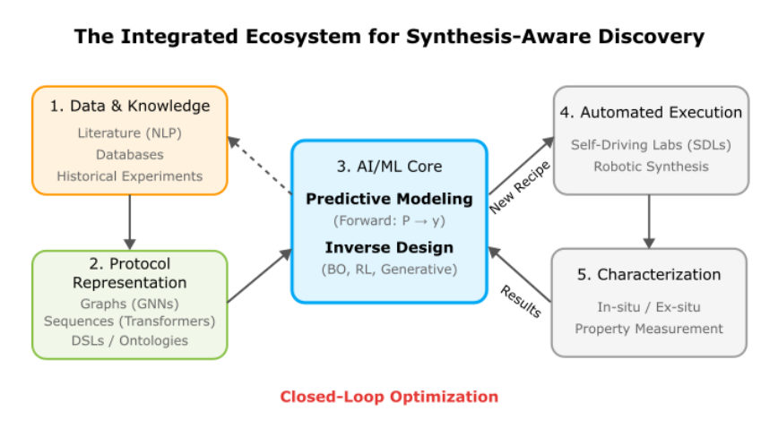
<figcaption class="paper-figure-caption"><b>Fig 2.</b> Figure 2: Integrated ecosystem linking heterogeneous data sources, protocol representations, AI/ML core and automated execution/characterisation in a closed-loop discovery cycle. Characterisation streams feed both P →X and X →y models, enabling time-resolved updating during closed-loop operation.</figcaption>
</figure>

**Summary.** The paper argues that AI-driven materials discovery must move beyond predicting stable structures to predicting the actual synthesis recipes required to make them. By treating synthesis protocols as primary design variables, the author proposes a way to close the gap between computational predictions and experimental reality using autonomous laboratories.

**Why it may be interesting.** not directly relevant

Detailed structure

**Main problem.** The 'synthesizability gap' in materials discovery, where AI models predict stable atomic structures but fail to provide actionable, experimentally feasible synthesis protocols.

**Main result.** The paper proposes a paradigm shift from a structure-centric (Structure -> Property) to a synthesis-first (Protocol -> Structure -> Property) framework to bridge the gap between virtual candidates and laboratory realization.

**Method.** A roadmap for integrating machine-readable synthesis protocols, generative/inverse-design models (VAEs, GANs, Diffusion), and closed-loop optimization via Self-Driving Laboratories (SDLs).

**Model / system.** The framework focuses on inorganic and solid-state materials (e.g., semiconductors, batteries, MOFs) and models the causal chain P -> X -> y, where P is the synthesis protocol, X is the resulting structure/phase, and y is the final property.

**Key observables.** Intermediate structural phases, morphology, defects, and final material properties like ionic conductivity or catalytic activity.

**Important parameters / regimes.** Synthesis parameters (temperature, pressure, pH, time, precursors) and sustainability metrics (E-factor, energy footprint).

**Assumptions / limitations.** The effectiveness of the paradigm shift relies on the availability of standardized, machine-readable protocols and the ability to scale high-quality, multi-modal datasets.

**Figures summary.** Figure 1 compares the conventional structure-centric workflow with the proposed protocol-centric workflow that closes the synthesizability gap. Figure 2 illustrates an integrated ecosystem linking data sources, AI cores, and automated execution.

**Paper structure.** The paper identifies the synthesizability gap, proposes a new P->X->y framework, outlines methodological pillars (representation, generative modeling, and closed-loop integration), provides case studies across material domains, and concludes with future challenges and a vision for 2035.

Abstract

The current structure-centric paradigm in artificial intelligence (AI)-driven materials discovery, despite delivering thousands of candidate structures, is stalling at a critical barrier: the synthesizability gap. We argue that closing this gap demands a pivot to a synthesis-first paradigm in which executable synthesis protocols, not just atomic configurations, are treated as primary design variables. We outline a roadmap built on three pillars: (i) representing synthesis procedures as machine-readable protocols, (ii) deploying generative and inverse-design models to propose actionable reaction pathways and recipes, and (iii) integrating closed-loop optimisation to refine protocols against experimental realities and sustainability constraints. Framed in terms of the causal backbone P->X->y from protocol P to structure X and properties y, this perspective sets out methodological building blocks, standards needs and self-driving laboratory (SDL) integration strategies to accelerate reproducible, data-first materials discovery.

[↑ back to top](#top)

### [Born-Qualified: An Autonomous Framework for Deploying Advanced Energy and Electronic Materials](http://arxiv.org/abs/2605.00639v1)

**Authors:** Steven R. Spurgeon, Milad Abolhasani, Frederick Baddour, Ryan B. Comes, Vinayak P. Dravid, Hilary Egan, Patrick Emami, Robert W. Epps, Davi M. Fébba, Renae Gannon, E. Ashley Gaulding, Ayana Ghosh, Kenny Gruchalla, Grace Guinan, Taro Hitosugi, Michael Holden, Sergei V. Kalinin, Yangang Liang, John S. Mangum, Matthew J. Olszta, Nathaniel H. Park, Axel Palmstrom, Michelle A. Smeaton, Brooks Tellekamp, Nicholas E. Thornburg, Raymond R. Unocic, Daniela Ushizima, Rama K. Vasudevan, Robert White, Andrew Young, Andriy Zakutayev  
**Type:** both · **Category:** other · **PDF:** <https://arxiv.org/pdf/2605.00639v1>  
**Analysis basis:** full PDF text, analyzed in chunks

↔ Scroll figures horizontally

<figure class="paper-figure-card">
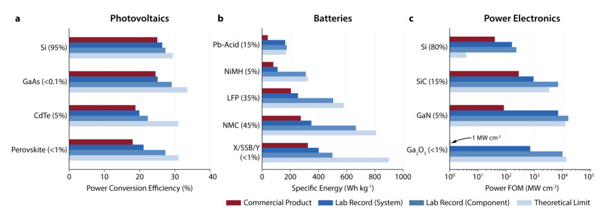
<figcaption class="paper-figure-caption"><b>Fig 1.</b> Figure 1: The Discovery–Deployment Gap in Energy and Electronic Technologies. (a–c) Bars compare commercial product performance, laboratory system and component records, and theoretical limits for key photovoltaic, battery, and power electronic technologies. Percentages indicate estimated market share. X/SSB/Y denotes solid-state battery; electrode chemistry varies by formulation and is detailed in the accompanying data file. NiMH = nickel-metal hydride.</figcaption>
</figure>
<figure class="paper-figure-card">
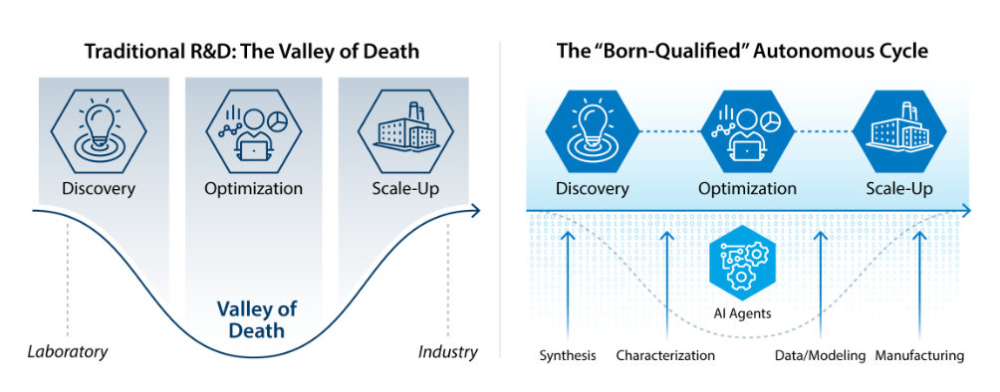
<figcaption class="paper-figure-caption"><b>Fig 2.</b> Figure 2: Traditional Vs. Born-Qualified Discovery. Comparison of sequential and born-qualified approaches, showing how a linear decision-making process fails to anticipate challenges in scale-up, while a multi-objective approach can more effectively produce feasible designs.</figcaption>
</figure>

**Summary.** This paper proposes a new strategy for autonomous materials discovery called 'Born-Qualified,' which aims to bridge the gap between lab breakthroughs and industrial use. By embedding manufacturing, cost, and durability constraints into the AI-driven discovery loop from the start, the framework seeks to prevent the development of high-performance materials that are impossible to scale. This approach could significantly accelerate the deployment of next-generation energy and electronic technologies.

**Why it may be interesting.** not directly relevant

Detailed structure

**Main problem.** A significant 'valley of death' exists between the laboratory discovery of advanced materials and their industrial deployment due to a mismatch where optimization prioritizes lab-scale performance over manufacturability, cost, and durability.

**Main result.** The authors propose the 'Born-Qualified' framework, a new paradigm for autonomous science that integrates manufacturing, cost, and stability constraints directly into the initial discovery loop.

**Method.** The framework utilizes four pillars: multi-objective metrics, causal models, modular infrastructure, and the integration of manufacturing into the discovery loop, employing AI/ML, LLMs, and closed-loop automation.

**Model / system.** The framework is applied to various energy and electronic material systems, including lithium-sulfur and lithium-ion batteries, photovoltaics (GaAs, Perovskite, CdTe), and power electronics (Si, SiC, GaN, Diamond).

**Key observables.** Laboratory metrics (catalytic activity, ionic conductivity, band gap, specific capacity, ZT) and industrial metrics (scalability, cost-effectiveness, durability, and process compatibility).

**Important parameters / regimes.** Performance vs. deployability trade-offs, scale-up from milligrams to industrial quantities, and the transition from laboratory-scale to pilot-scale manufacturing.

**Assumptions / limitations.** The framework assumes that integrating manufacturing constraints early can overcome the limitations of current sequential discovery models and that AI-driven automation can handle multi-objective optimization.

**Figures summary.** Figure 1 correlates the performance gap between lab records and commercial products with market penetration; Figure 2 contrasts the traditional sequential discovery approach with the proposed continuous 'Born-Qualified' approach.

**Paper structure.** The paper identifies the discovery-deployment gap, proposes the 'Born-Qualified' strategy via four enabling pillars, details the necessary experimental and computational infrastructure, and provides case studies in power electronics and energy storage.

Abstract

Autonomous science is transforming how we discover materials and chemical systems for advanced energy technologies. However, many initially promising systems never reach deployment. This "valley of death" stems from optimization that prioritizes laboratory metrics over industrial viability. We propose a new strategy: "born-qualified" autonomous development, which embeds manufacturability, cost, and durability constraints from the outset. This approach is enabled by four pillars, including the development of multi-objective metrics, causal models, a modular infrastructure, and embedding manufacturing in the discovery loop. Realizing this vision will require sustained, community-wide commitment, but the potential return on that investment is commensurate with the scale of the challenge.

[↑ back to top](#top)

### [Coordination Engineering of Dual-Atom Catalysts for Overall Water Splitting: Mechanistic Insights from Constant-Potential First-Principles and Machine Learning](http://arxiv.org/abs/2605.00609v1)

**Authors:** Jiahang Li, Suhang Li, Chong Yan, Jiajun Yu, Qinzhuang Liu, Ruo-Ya Wang, Dongwei Ma  
**Type:** theory · **Category:** disordered systems and neural networks · **PDF:** <https://arxiv.org/pdf/2605.00609v1>  
**Analysis basis:** full PDF text, analyzed in chunks

↔ Scroll figures horizontally

<figure class="paper-figure-card">
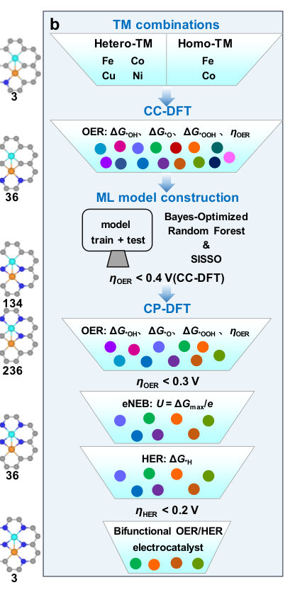
<figcaption class="paper-figure-caption"><b>Fig 1.</b> Fig. 1. (a) Structural models of TM1TM2-C6-xNx DACs (TM1TM2 = Co2, Fe2, CoCu,</figcaption>
</figure>
<figure class="paper-figure-card">
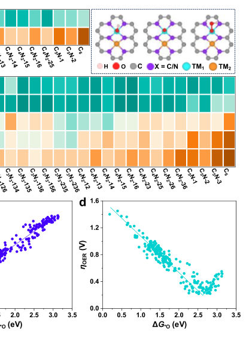
<figcaption class="paper-figure-caption"><b>Fig 2.</b> Fig. 2. (a) OER overpotentials (ηOER) of TM1TM2-C6-xNx DACs, (TM1TM2 = Co2, Fe2,</figcaption>
</figure>
<figure class="paper-figure-card">
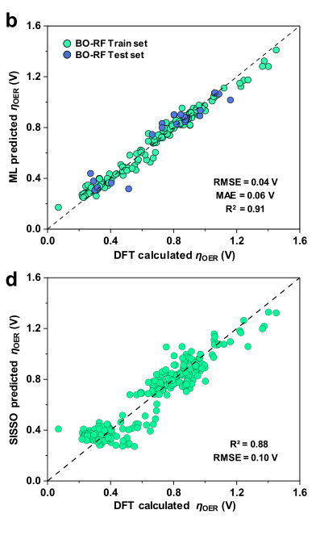
<figcaption class="paper-figure-caption"><b>Fig 3.</b> Fig. 3. (a) Pearson correlation heatmap of 18 features. (b) Comparison of DFT</figcaption>
</figure>
<figure class="paper-figure-card">
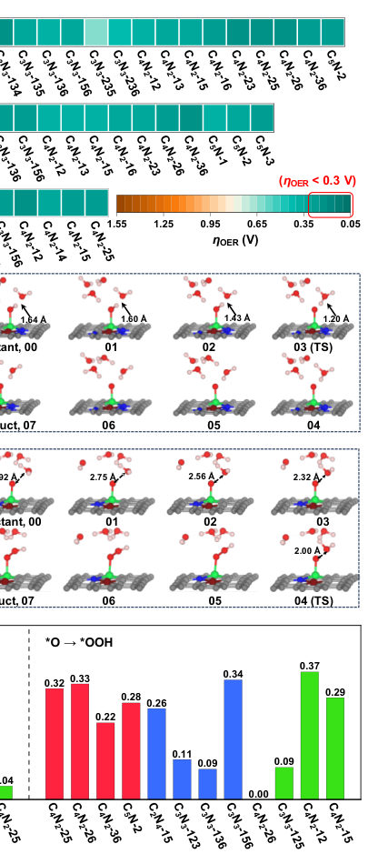
<figcaption class="paper-figure-caption"><b>Fig 4.</b> Fig. 4. (a) Calculated OER overpotentials (ηOER) of TM1TM2-C6-xNx DACs (TM1TM2</figcaption>
</figure>
<figure class="paper-figure-card">
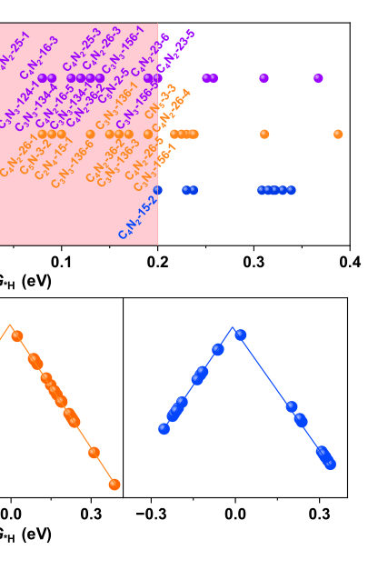
<figcaption class="paper-figure-caption"><b>Fig 5.</b> Fig. 5. (a) Hydrogen adsorption free energy (ΔG*H) of TM1TM2-C6-xNx DACs with high</figcaption>
</figure>

**Summary.** This paper uses a combination of first-principles calculations and machine learning to engineer the coordination environment of dual-atom catalysts on graphene. By tuning the carbon and nitrogen coordination, the researchers successfully optimized both the oxygen and hydrogen evolution reactions, providing a strategy for designing high-performance, non-noble metal catalysts.

**Why it may be interesting.** not directly relevant

Detailed structure

**Main problem.** The challenge of designing efficient, low-cost, bifunctional electrocatalysts for overall water splitting in acidic media by replacing noble metals with transition-metal dual-atom catalysts (DACs).

**Main result.** The study identified 22 highly active bifunctional DACs (e.g., CoNi, CoCu, Co2) with mixed C/N coordination that exhibit OER overpotentials comparable to IrO2 and low PCET activation barriers.

**Method.** A three-step screening strategy combining constant-charge and constant-potential DFT with kinetic analysis of PCET, integrated with machine learning (Bayesian optimization and SISSO) to identify structure-performance descriptors.

**Model / system.** Graphene-supported dual-atom catalysts (TM1TM2-C6-xNx) where TM represents 3d transition metals (Fe, Co, Ni, Cu) and the coordination environment is tuned by varying C/N ratios.

**Key observables.** OER overpotential (eta_OER), PCET activation barriers (Ea), hydrogen adsorption free energy (deltaG*H), and d-band center (epsilon_d).

**Important parameters / regimes.** Acidic conditions (pH = 1), transition metal species (Fe, Co, Ni, Cu), and C/N coordination ratios.

**Assumptions / limitations.** The study focuses specifically on the regime of acidic overall water splitting and uses implicit solvation models to represent the electrochemical environment.

**Figures summary.** The figures likely present the library of 228 structures, the screening results for OER activity, the identification of 24 active candidates, and machine learning-derived descriptors and structure-performance relationships.

**Paper structure.** Introduction to water splitting challenges; construction of a DAC library; DFT-based screening for OER; kinetic analysis of PCET; machine learning for descriptor identification; evaluation of HER activity; and discussion of the electronic mechanism of bifunctionality.

Abstract

The rational design of bifunctional electrocatalysts for the hydrogen evolution reaction (HER) and oxygen evolution reaction (OER) is essential for achieving efficient and cost-effective overall water splitting. Atomically dispersed transition-metal catalysts, including single-atom catalysts and dual-atom catalysts (DACs), have emerged as a prominent class of heterogeneous catalysts, in which coordination engineering plays a decisive role in tuning catalytic performance. Herein, we explore coordination-engineered bifunctional overall water splitting electrocatalysts using graphene-supported DACs (TM1TM2-C6-xNx) as model systems. By tuning C/N coordination and dual-metal combinations (Fe, Co, Ni, and Cu), a library of 228 structures was constructed. A three-step screening strategy, combining constant-charge and constant-potential density functional theory with kinetic analysis of proton-coupled electron transfer (PCET), identifies 24 highly active candidates (TM1TM2 = CoNi, CoCu and Co2) with mixed C/N coordination for OER. These catalysts exhibit overpotentials comparable to that of IrO2 and low PCET barriers (lower than 0.40 eV), among which 22 also show high HER activity. Machine learning reveals clear coordination-dependent structure-performance relationships. Such bifunctionality arises from coordination engineering that enables the simultaneous optimization of OER intermediate adsorption and the hydrogen binding strength for HER. This work establishes coordination engineering as an effective strategy for designing high-performance bifunctional dual-atom electrocatalysts for overall water splitting.

[↑ back to top](#top)

### [Coordination-Induced Tuning of Ligand-Centered Red Emission in a cis-[Cd(Tz)2(py)2] Complex for Light-Emitting Diodes](http://arxiv.org/abs/2605.00599v1)

**Authors:** Samara M. da Silva, R. F. Silva, A. Nonato, Paulo Villis, Rodrigo S. Corrêa, L. C. Gómez-Aguirre, C. W. A. Paschoal, Pedro I. S. Maia, Benedicto A. V. Lima  
**Type:** experiment · **Category:** other · **PDF:** <https://arxiv.org/pdf/2605.00599v1>  
**Analysis basis:** full PDF text, analyzed in chunks

↔ Scroll figures horizontally

<figure class="paper-figure-card">
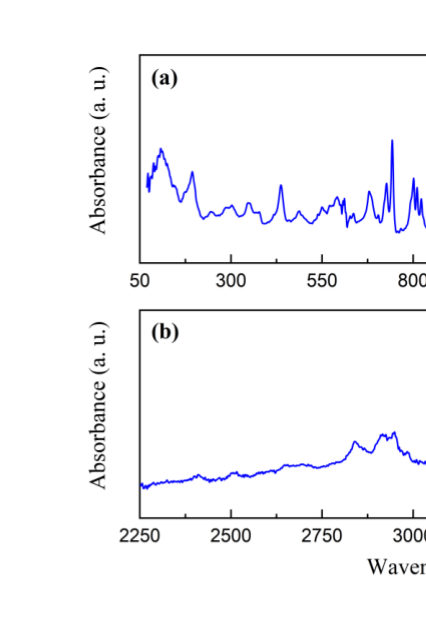
<figcaption class="paper-figure-caption"><b>Fig 1.</b> Figure 1. ATR spectrum of cis-[Cd(Tz)2(py)2] at 300 K in the range 70 to 4000 cm-1.</figcaption>
</figure>
<figure class="paper-figure-card">
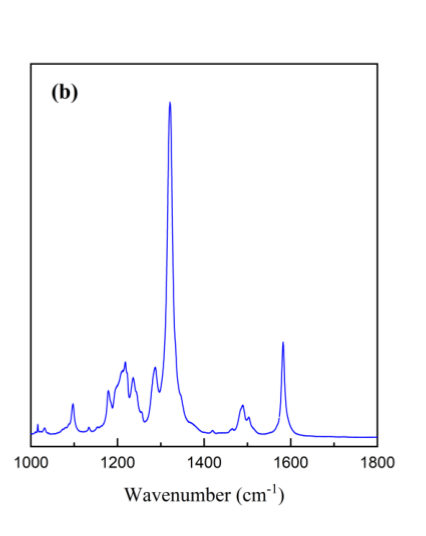
<figcaption class="paper-figure-caption"><b>Fig 2.</b> Figure 2. Raman spectrum of cis-[Cd(Tz)2(py)2] at 300 K with normalized intensity in</figcaption>
</figure>
<figure class="paper-figure-card">
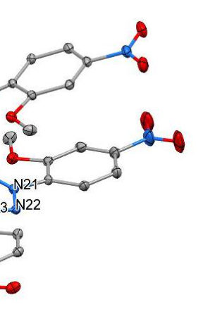
<figcaption class="paper-figure-caption"><b>Fig 3.</b> Figure 3. X-ray structure of cis-[Cd(Tz)2(py)2], for clarity only selected atoms are labeled</figcaption>
</figure>
<figure class="paper-figure-card">
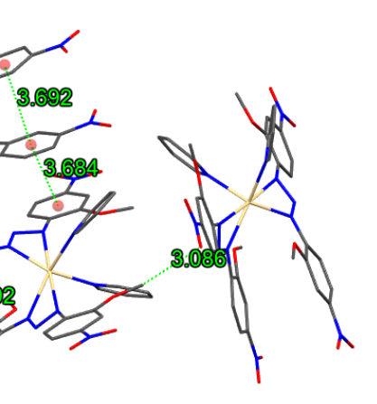
<figcaption class="paper-figure-caption"><b>Fig 4.</b> Figure 4. Intermolecular and intramolecular π-π stacking; Cσ-lone pair and Cπ···Cπ</figcaption>
</figure>
<figure class="paper-figure-card">
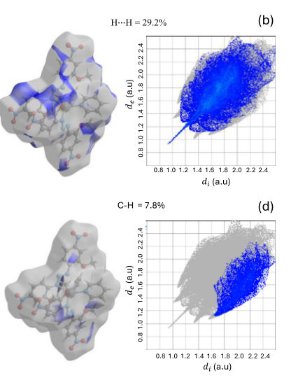
<figcaption class="paper-figure-caption"><b>Fig 5.</b> Figure 5: 2D fingerprint plots (overall and decomposed) and the corresponding 3D</figcaption>
</figure>

**Summary.** The study demonstrates that coordinating a Cd(II) ion to a triazene ligand allows for the tuning of red-region luminescence. This is achieved through structural changes that modify ligand-centered electronic transitions, making the complex a candidate for red-emitting optoelectronic devices.

**Why it may be interesting.** not directly relevant

Detailed structure

**Main problem.** Investigating how the coordination of a Cd(II) metal center to a triazene ligand modifies the electronic structure and tunes the red emission for potential LED applications.

**Main result.** The coordination of Cd(II) induces structural and electronic perturbations that enhance red emission (500-850 nm) and decrease the optical band gap to 1.83 eV.

**Method.** Chemical synthesis followed by X-ray single-crystal diffraction, Hirshfeld surface analysis, Raman and IR spectroscopy, and UV-Vis/Photoluminescence spectroscopy.

**Model / system.** An organometallic complex, cis-[Cd(Tz)2(py)2], featuring a distorted octahedral Cd(II) center coordinated by two triazene (Tz) ligands and two pyridine (py) ligands.

**Key observables.** Optical band gap (1.83 eV), emission wavelength (500-850 nm), CIE chromaticity coordinates, and vibrational frequency shifts.

**Important parameters / regimes.** Direct optical band gap of 1.83 eV, d10 electronic configuration of Cd(II), and CCT shift from 1974 K to 2325 K.

**Assumptions / limitations.** The d10 configuration of Cd(II) suppresses metal-centered and charge-transfer transitions, leaving ligand-centered transitions as the primary emission source.

**Figures summary.** Supplementary figures show normalized vibrational spectra (IR/Raman), Hirshfeld surface plots for intermolecular contacts, Tauc plots for bandgap determination, and deconvolution of photoluminescence emission spectra.

**Paper structure.** The paper describes the synthesis of the complex, followed by structural characterization via X-ray diffraction and Hirshfeld analysis, vibrational analysis using IR/Raman, and optical property investigation via UV-Vis and photoluminescence.

Abstract

Organic--inorganic complexes are promising materials for light-emitting applications. Here, we report a new organometallic complex, cis-[Cd(Tz)$_2$(py)$_2$], featuring a distorted octahedral Cd(II) coordination environment. IR and Raman spectroscopy reveal pronounced coordination-induced changes, particularly in the Raman response of the triazene moiety, indicating electronic and structural perturbation upon Cd(II) complexation. Hirshfeld surface analysis shows that the crystal packing is mainly governed by H$\cdots$H, O$\cdots$H/H$\cdots$O, and C$\cdots$H/H$\cdots$C contacts, whereas $π$--$π$ stacking interactions contribute modestly. Solid-state UV--Vis spectroscopy reveals broad absorption from $\sim$700 to 200 nm and a direct optical band gap of 1.83 eV, indicating semiconductor-like behavior. Photoluminescence measurements show a broad emission band at 500--850 nm with enhanced red contribution upon coordination. The emission is mainly assigned to ligand-centered transitions ($π\rightarrow π^*$ and $n \rightarrow π^*$), consistent with the $d^{10}$ configuration of Cd(II), which suppresses metal-centered and charge-transfer processes. The CIE chromaticity coordinates confirm warm emission, highlighting the potential of cis-[Cd(Tz)$_2$(py)$_2$] for red-emitting optoelectronic applications.

[↑ back to top](#top)

### [Determination of Density Functional Tight Binding Models for Cerium Allotropes](http://arxiv.org/abs/2605.00802v1)

**Authors:** Nir Goldman, Artem Samtsevych, Chiara Panosetti  
**Type:** theory · **Category:** strongly correlated electrons · **PDF:** <https://arxiv.org/pdf/2605.00802v1>  
**Analysis basis:** full PDF text, analyzed in chunks

↔ Scroll figures horizontally

<figure class="paper-figure-card">
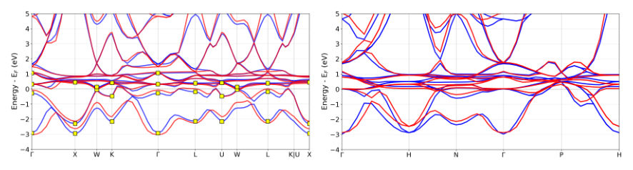
<figcaption class="paper-figure-caption"><b>Fig 1.</b> Figure 1: DFTB-PBE band structure predictions for fcc (left) and bcc cerium (right). Blue lines correspond to results from DFT and red to DFTB+. Yellow squares in the fcc result correspond to energies used in the DSKO decoding mask.</figcaption>
</figure>
<figure class="paper-figure-card">
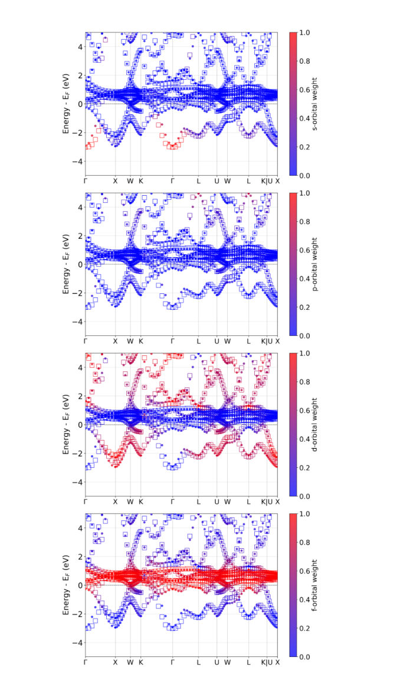
<figcaption class="paper-figure-caption"><b>Fig 2.</b> Figure 2: Band structure projections for α-Ce for s, p, d, and f-orbitals, starting from top to bottom from our DFTB-PBE model. Closed circles correspond to results from DFT and open squares to DFTB+. Red indicates larger orbital projection values, blue is smaller.</figcaption>
</figure>
<figure class="paper-figure-card">
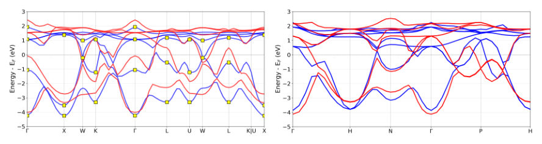
<figcaption class="paper-figure-caption"><b>Fig 3.</b> Figure 3: DFTB-PBE0 band structure predictions for fcc (left) and bcc cerium (right). Again, blue lines correspond to results from DFT, red to DFTB+, and yellow squares to the DSKO decoding mask. Higher energy conduction bands are removed for the sake of clarity.</figcaption>
</figure>
<figure class="paper-figure-card">
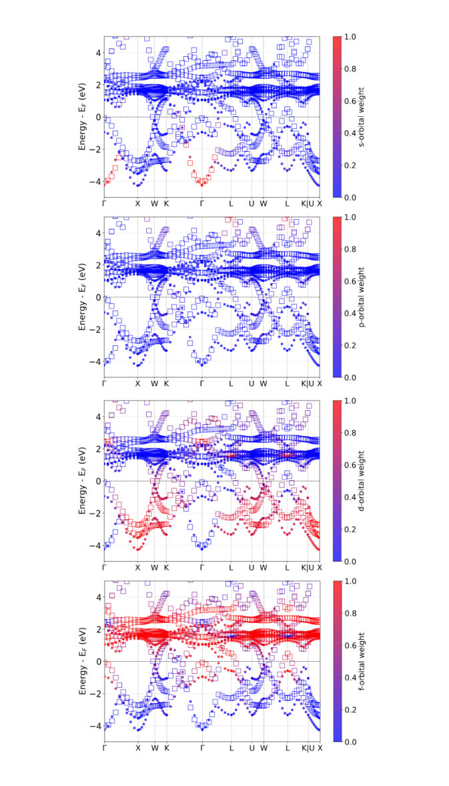
<figcaption class="paper-figure-caption"><b>Fig 4.</b> Figure 4: Band structure projections for α-Ce for s, p, d, and f-orbitals, starting from top to bottom from our DFTB-PBE0 model. Closed circles correspond to results from DFT and open squares to DFTB+. Red indicates increased orbital projection values.</figcaption>
</figure>
<figure class="paper-figure-card">
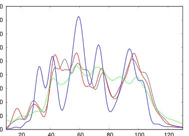
<figcaption class="paper-figure-caption"><b>Fig 5.</b> Figure 5: Vibrational density of states computed from MD simulations with DFTB- PBE at 600 K. The blue line corresponds to results from DFT, the red line to 3-body DFTB/ChIMES, black to 4-body DFTB/ChIMES, and the green to 2-body DFTB/ChIMES.</figcaption>
</figure>

**Summary.** The researchers created a highly efficient machine-learning-enhanced tight-binding model to study cerium, a material with complex f-electron interactions. The model accurately reproduces the electronic and vibrational properties of various cerium phases at a fraction of the computational cost of traditional DFT. This allows for much larger-scale simulations of lanthanide-based materials.

**Why it may be interesting.** not directly relevant

Detailed structure

**Main problem.** Developing a computationally efficient method to accurately simulate the complex f-electron physics and phase stability of cerium allotropes, which are too expensive for standard hybrid-functional DFT.

**Main result.** The developed DFTB/ChIMES model achieves a 100x increase in computational efficiency over DFT while accurately predicting band structures, phase energetic ordering, and vibrational density of states for various cerium polymorphs.

**Method.** A hybrid approach combining Density Functional Tight Binding (DFTB) with the ChIMES machine-learning formalism to determine the many-body repulsive energy term.

**Model / system.** The system consists of cerium (Ce) allotropes (alpha, beta, and delta phases). The model uses a DFTB Hamiltonian with Woods-Saxon type electronic confining potentials and a ChIMES-based many-body expansion (2B, 3B, and 4B) for the repulsive energy.

**Key observables.** Electronic band structure (topology and dispersion), orbital projections (s, p, d, f), phase stability (energetic ordering), nearest neighbor distances, and vibrational density of states (VDOS).

**Important parameters / regimes.** Hubbard U values (optimized at 0.36 au), Woods-Saxon confinement parameters (r0, a, W), and ChIMES polynomial orders (up to 12).

**Assumptions / limitations.** ChIMES coefficients are assumed to be permutationally invariant; stress tensor components were omitted from the ChIMES optimization in this specific work.

**Figures summary.** Figure 1 compares DFT and DFTB-PBE band structures for fcc and bcc Ce; Figure 2 shows orbital projections for alpha-Ce; Figures 3 and 4 present DFTB-PBE0 band structures and orbital projections.

**Paper structure.** The paper introduces the problem of f-electron simulation, describes the development of the DFTB/ChIMES model and its optimization strategy, presents validation against DFT for electronic and structural properties, and discusses the efficiency and transferability of the model.

Abstract

We have developed Density Functional Tight Binding (DFTB) models for cerium that accurately predict both the electronic band structure and energetic ordering of different allotropes. We show that global optimization of the electronic confining potentials minimize the errors in the predicted Kohn-Sham energies while facilitating determination of a many-body repulsive energy. Our results illustrate the ability of DFTB to accurately reproduce complex f-electron interactions for multiple phases while leveraging minimal Density Functional Theory data.

[↑ back to top](#top)

### [Dilute Zn alloying in biodegradable Mg wires: microstructure, mechanical performance, and degradation behavior](http://arxiv.org/abs/2605.00221v1)

**Authors:** Jiří Ryjáček, Leonard Hlodák, Jiří Liška, Jan Pinc, Tomáš Herma, Karel Tesař  
**Type:** experiment · **Category:** other · **PDF:** <https://arxiv.org/pdf/2605.00221v1>  
**Analysis basis:** full PDF text, analyzed in chunks

↔ Scroll figures horizontally

<figure class="paper-figure-card">
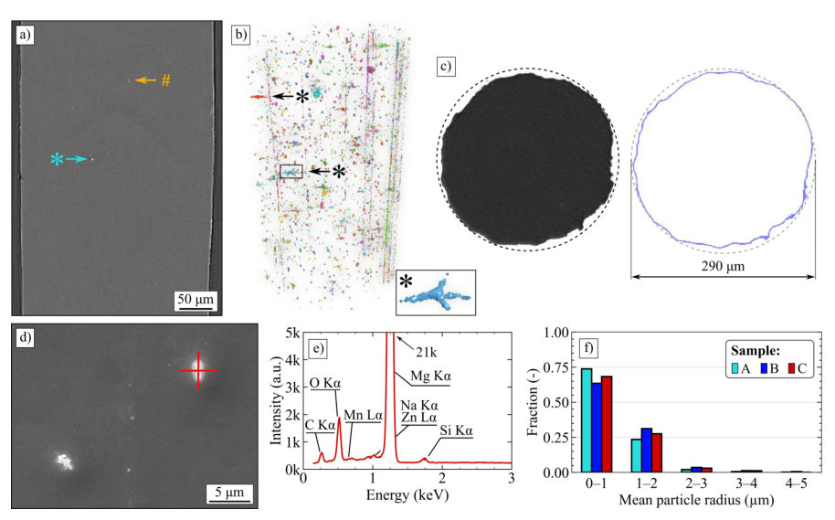
<figcaption class="paper-figure-caption"><b>Fig 1.</b> Fig. 1: Defects and surface features in extruded wires produced from a commercially prepared alloy. a) 2D µCT image of the wire cross-section showing impurities (#) and star-like segmentation artifacts (*). b) µCT reconstruction with highlighted impurity-related features; inset shows a star-like artifact. c) Outline of the actual wire cross-section indicating the increase in surface area compared with the ideal circular geometry. d, e) SEM image and EDS spectrum of oxide particles in the microstructure of the material. f) Impurity particle size distribution determined by µCT.</figcaption>
</figure>
<figure class="paper-figure-card">
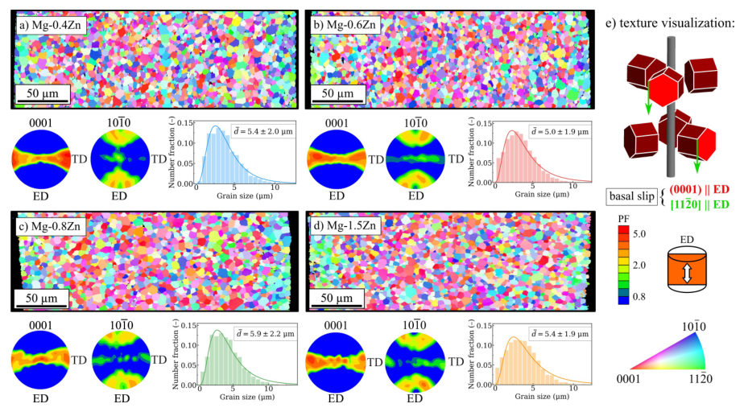
<figcaption class="paper-figure-caption"><b>Fig 2.</b> Fig. 2: a)–d) IPF map, PF, and histogram of the number fraction of the equivalent circle diameter, including the average grain diameter, for Mg-xZn (x = 0.4, 0.6, 0.8 and 1.5) wire, respectively. e) Illustration of the texture in as-extruded wires.</figcaption>
</figure>
<figure class="paper-figure-card">
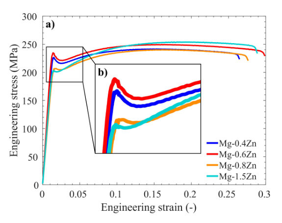
<figcaption class="paper-figure-caption"><b>Fig 3.</b> Fig. 3: Representative engineering stress–strain curves of extruded nital-pickled Mg-xZn (x = 0.4, 0.6, 0.8 and 1.5) wires: a) full curves; b) magnified view of the elastic–plastic transition, showing a pronounced post-yield stress drop in Mg-0.4Zn and Mg-0.6Zn and a less distinct one in Mg-0.8Zn and Mg-1.5Zn.</figcaption>
</figure>
<figure class="paper-figure-card">
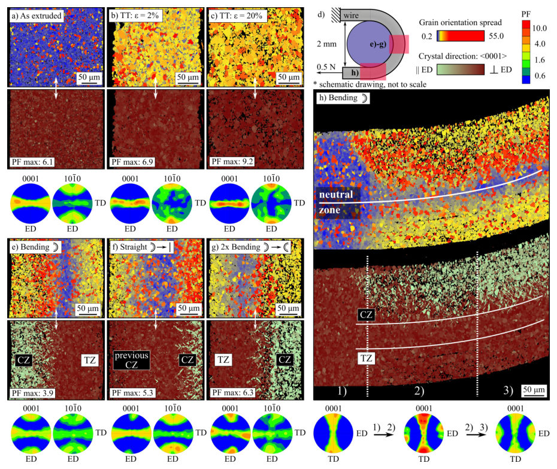
<figcaption class="paper-figure-caption"><b>Fig 4.</b> Fig. 4: EBSD analysis of Mg-0.6Zn wire deformation showing GOS maps, CD maps of 〈0001〉, and PFs (extrusion direction – ED; transversal direction – TD), with their corresponding maxima shown as an inset in the CD maps, for: a) as-extruded wire; b) and c) wire after 2 % and 20 % deformation (ε) during tensile test (TT), respectively; e)–g) wire after bending, subsequent straightening, and bending in the opposite direction, respectively (TZ and CZ denote the tensile and compression zone). d) Schematic drawing of the bending experiment, where red rectangles denote acquisition areas for e)–h). h) GOS map, CD map of 〈0001〉, and PFs after single bending (PFs were calculated from areas indicated by...</figcaption>
</figure>
<figure class="paper-figure-card">
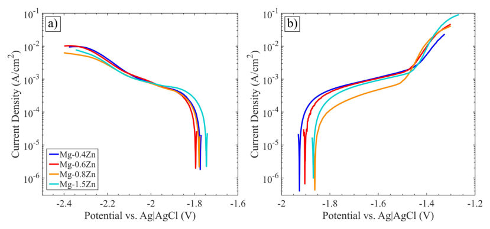
<figcaption class="paper-figure-caption"><b>Fig 5.</b> Fig. 5: Representative potentiodynamic polarization curves of Mg-xZn (x = 0.4, 0.6, 0.8 and 1.5) wires in SBF: a) cathodic branches; b) anodic branches.</figcaption>
</figure>

**Summary.** This study evaluates dilute Mg-Zn alloys for use in biodegradable bone fixation devices. It demonstrates that while Zn content has a limited effect on grain size and strength, it can influence strain hardening and that the choice of physiological medium significantly impacts the degradation rate and mechanical integrity of the wires.

**Why it may be interesting.** not directly relevant

Detailed structure

**Main problem.** Investigating the influence of dilute Zn alloying (0.4 to 1.5 wt.%) on the microstructure, mechanical performance, and degradation behavior of extruded Mg wires for use as biodegradable medical implants.

**Main result.** The alloys maintain similar grain sizes and mechanical strength, but higher Zn content enhances strain hardening by activating non-basal slip; degradation is rapid in SBF but more controlled in DMEM+FBS media.

**Method.** Single-step direct hot extrusion followed by microstructural characterization (EBSD, SEM, micro-CT), mechanical testing (tensile and bending), and in vitro degradation studies in SBF and DMEM+FBS.

**Model / system.** Thin-walled (290-300 um diameter) extruded Mg-xZn alloy wires (x = 0.4, 0.6, 0.8, 1.5 wt.%) intended for resorbable orthopedic applications.

**Key observables.** Grain size, ultimate tensile strength, elongation, 0.2% proof stress, corrosion rate, corrosion product composition (HA, brucite), and twinning/detwinning-induced plasticity.

**Important parameters / regimes.** Zn concentration (0.4-1.5 wt.%), extrusion temperature (300 C), extrusion ratio (1:400), and immersion time (up to 7 days).

**Assumptions / limitations.** The effective surface area for corrosion calculation is assumed to be a smooth cylinder, though micro-CT suggests a larger actual area due to extrusion grooves.

**Figures summary.** Stress-strain curves showing post-yield stress drops; EBSD maps (GOS, PF, IPF) showing texture evolution and twinning; electrochemical polarization curves; and SEM/XRD images showing the evolution of corrosion products like hydroxyapatite.

**Paper structure.** The paper introduces the biomedical motivation, details the alloy processing and characterization methods, presents microstructural and mechanical results, analyzes degradation behavior in different media, and concludes with the suitability of the platform for implants.

Abstract

Dilute Mg-Zn wires are of great interest for biodegradable small-bone fixation, as magnesium degradation can support bone-related processes, while low zinc additions may provide biological benefits without compromising biocompatibility. In this work, the influence of Zn content below the room-temperature solubility limit was assessed in Mg-Zn wires intended for resorbable implant applications. Mg-0.4Zn, Mg-0.6Zn, Mg-0.8Zn, and Mg-1.5Zn alloys were processed by single-step direct hot extrusion into thin wires and characterized by correlative microstructural analysis, tensile testing, bending experiments, and in vitro degradation. All compositions achieved a recrystallized fine equiaxed grain size of 5.0-5.9 um and exhibited ultimate tensile strengths of 246-256 MPa with elongations of 23-28 %. In these thin wires, Zn content had only a limited effect on grain size, tensile properties, and bending behavior, although lower-Zn alloys showed a pronounced sharp yield point. Bending was governed mainly by extrusion texture and preserved reversible plasticity through twinning and detwinning. Simulated body fluid caused rapid localized degradation and loss of mechanical integrity within 7 days, while the biologically more relevant DMEM-based medium better reflected the expected in vivo response. Together, these findings support dilute Mg-Zn wires as a simple material platform for the development of future resorbable bone fixation devices.

[↑ back to top](#top)

### [Dispersion of multiple charged species in an axially symmetric slowly varying channel](http://arxiv.org/abs/2605.00653v1)

**Authors:** Thakurdas Mahata, Anirban Chatterjee, Ameeya Kumar Nayak  
**Type:** theory · **Category:** other · **PDF:** <https://arxiv.org/pdf/2605.00653v1>  
**Analysis basis:** full PDF text, analyzed in chunks

↔ Scroll figures horizontally

<figure class="paper-figure-card">
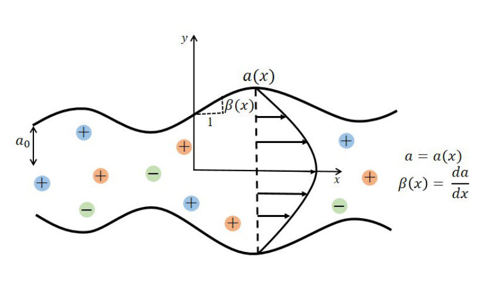
<figcaption class="paper-figure-caption"><b>Fig 1.</b> Figure 1: Schematic diagram of dispersion of multiple charged species under an induced electric field, driven by a Poiseuille flow.</figcaption>
</figure>
<figure class="paper-figure-card">
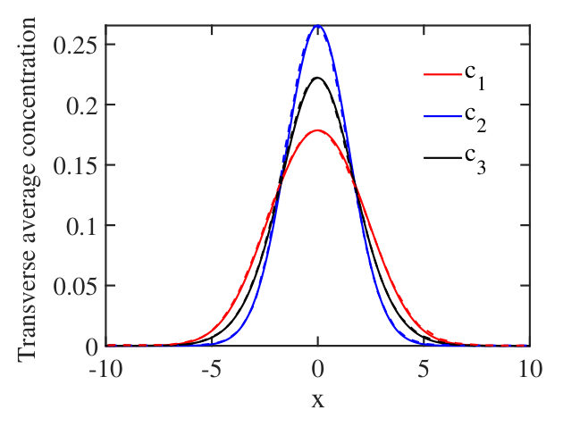
<figcaption class="paper-figure-caption"><b>Fig 2.</b> Figure 2: A comparison between the numerical results obtained in the present work (solid lines) and the results published by [23] (dashed lines), shown for time t=2.</figcaption>
</figure>
<figure class="paper-figure-card">
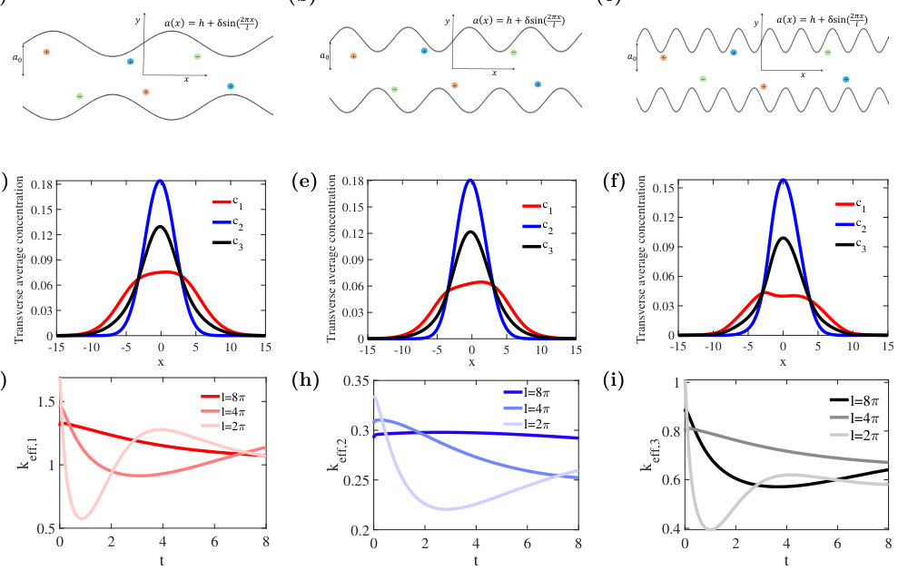
<figcaption class="paper-figure-caption"><b>Fig 3.</b> Figure 3: Schematic representation of the sinusoidal channel geometry with different periodic lengths, l (a) l = 8π (two period), (b) l = 4π (four period), and (c) l = 2π (eight period), with the inlet height a0 and amplitude δ = 0.5. (d-e) Represents the transverse-averaged concentration fields along the streamwise direction at time t = 8 for Pe = 2 and Q = 1 corresponding to different periodic lengths. (g-i) Represents temporal evaluation of effective tne diffusivities keff,i, i = 1, 2, 3 corresponding to the first, second, and third ionic species, respectively, in different periodic lengths.</figcaption>
</figure>
<figure class="paper-figure-card">
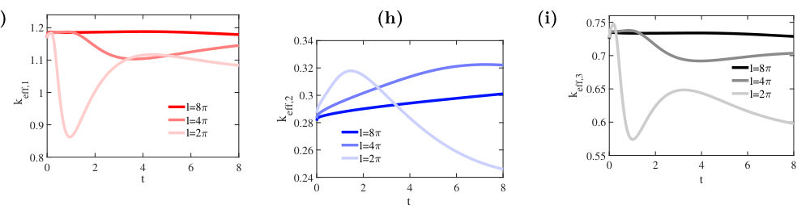
<figcaption class="paper-figure-caption"><b>Fig 4.</b> Figure 4: Schematic representation of the triangular wave channel geometry with different periodic lengths, l (a) l = 8π (two period), (b) l = 4π (four period), and (c) l = 2π (eight period), with the inlet height a0 and amplitude A = 0.5, where ω0 = 2π</figcaption>
</figure>
<figure class="paper-figure-card">
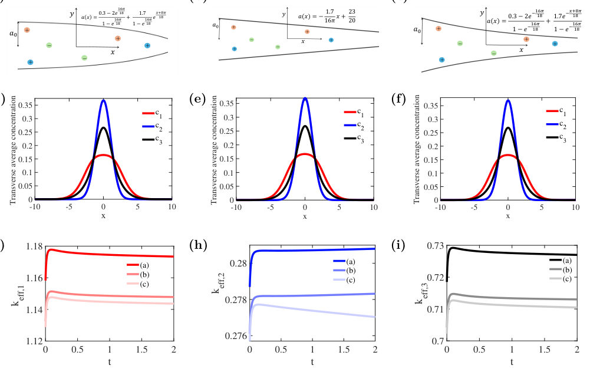
<figcaption class="paper-figure-caption"><b>Fig 5.</b> Figure 5: (a) −(c) Represents the schematic of the concave downward converging channel, convergent nozzle, and concave upward converging channel with the inlet height a0 and variable width a(x). (d) −(e) Represents the transverse averaged concentration distribution of three ionic species at time t = 2 for Pe = 2 and Q = 1 within the different channel geometries, respectively. (g)−(i) Represents the temporal evolution of the effective diffusivities keff,i, i = 1, 2, 3 for three ion species in the concave downward diverging channel, converging nozzle, and concave upward converging channel, respectively.</figcaption>
</figure>

**Summary.** This paper develops a theoretical framework to describe how the shape of a microchannel can be used to control the dispersion and separation of different ions. By leveraging geometry-induced electric fields, the authors show that certain channel configurations can significantly enhance the efficiency of ionic separation processes.

**Why it may be interesting.** not directly relevant

Detailed structure

**Main problem.** Investigating the dispersion and separation efficiency of multiple charged ionic species in axially symmetric, slowly varying microchannels, specifically looking at how channel geometry influences electro-diffusive coupling.

**Main result.** The study discovers a geometry-induced electro-diffusive coupling that can inhibit solute dispersion, leading to non-monotonic behavior in separation efficiency (NTP) and demonstrating that channel geometry can be tuned to enhance ionic separation.

**Method.** The authors use lubrication approximation, multiple-scale perturbation theory, and homogenization theory to derive a reduced-order macrotransport equation, which is then validated via numerical simulations using the Method of Lines.

**Model / system.** An electrolyte solution containing N different ionic species flowing through an axisymmetric channel with a slowly varying radius, governed by the Nernst-Planck and Navier-Stokes equations under electroneutrality and zero-current constraints.

**Key observables.** Effective dispersion coefficients (k_eff), Number of Theoretical Plates (NTP), and transverse-averaged concentration profiles.

**Important parameters / regimes.** Peclet number (Pe), wall slope/geometry (beta), ionic valency (z_i), ionic diffusivity (k_i), and the arc-to-chord ratio (Lambda).

**Assumptions / limitations.** The channel is axially symmetric and slowly varying; the system is in the low-Reynolds-number regime; electroneutrality and zero net current are enforced; and the model is valid at the long-time diffusion scale.

**Figures summary.** Figure 1 shows a schematic of ion dispersion; Figures 2-5 illustrate concentration profiles and effective diffusivity evolution for sinusoidal, triangular, and converging/diverging geometries; Figures 7-9 show the dependence of separation efficiency (N) and cumulative electric effects on geometric parameters.

**Paper structure.** The paper introduces the problem of multi-species dispersion, presents a mathematical framework using perturbation and homogenization methods, applies the model to various channel geometries (sinusoidal, triangular, converging, diverging), and concludes with an analysis of separation efficiency optimization.

Abstract

The transport and dispersion of multiple species of charged ions are central to many biological and physical processes, including electrokinetic ion separation. However, most theoretical studies of dispersion in channels have focused on neutral solutes, leaving the transport of multiple charged species comparatively unexplored. Differences in ionic diffusivities in a multispecies electrolyte solution generate an self-induced electric fields that drive electromigration. To capture these effects at the macroscopic scale, we combine the lubrication approximation with homogenization theory, under electroneutrality and zero-current constraints, to derive an effective transport equation governing the cross-sectionally averaged concentrations. We apply our model framework to a range of channel geometries and compute the resulting effective dispersion coefficients. Finally, we investigate how channel geometry can be tuned to enhance ionic separation. We observe a geometry-induced electro-diffusive coupling that inhibits solute dispersion in certain channels, leading to a non-monotonic Number of Theoretical Plates (NTP) and making such channels ideal for separation processes.

[↑ back to top](#top)

### [FitED: A User-Centric, Extensible Software Environment for Robust Peak-Profile and General Functional Data Fitting](http://arxiv.org/abs/2605.00172v1)

**Authors:** Mustafa Mahmoud Aboulsaad  
**Type:** both · **Category:** numerical methods · **PDF:** <https://arxiv.org/pdf/2605.00172v1>  
**Analysis basis:** full PDF text, analyzed in chunks

↔ Scroll figures horizontally

<figure class="paper-figure-card">
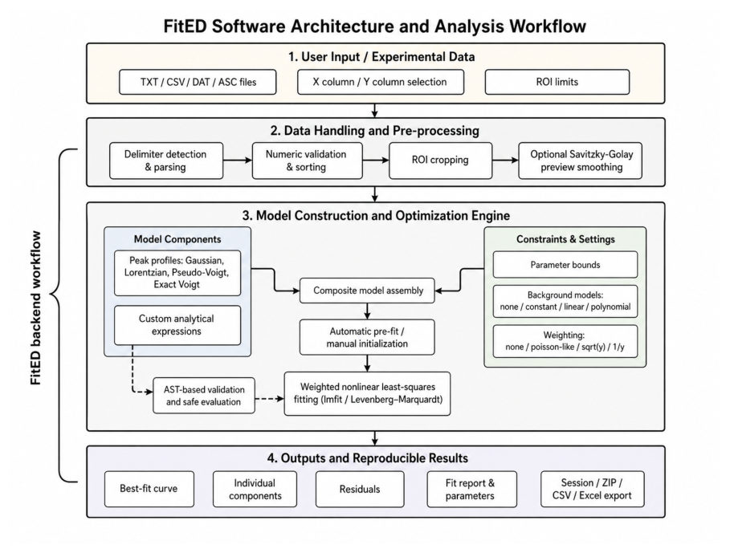
<figcaption class="paper-figure-caption"><b>Fig 1.</b> Figure 1: Software architecture and analysis workflow of FitED. Experimental data are imported, validated, cropped to a selected region of interest, and passed to the model-construction and optimization engine. The fitting engine combines built-in peak profiles, custom analytical expressions, background models, parameter constraints, and weighting strategies to produce reproducible fitted curves, residuals, component contributions, fit reports, and exportable session files.</figcaption>
</figure>

**Summary.** FitED is a new Python-based tool that simplifies the process of fitting complex peaks and custom functions to experimental data. It combines the ease of a graphical interface with the flexibility of the scientific Python ecosystem, ensuring that data analysis is both accessible and reproducible.

**Why it may be interesting.** not directly relevant

Detailed structure

**Main problem.** The difficulty of achieving reliable, reproducible, and accessible parameter extraction from complex 1D experimental data, specifically bridging the gap between overly restrictive GUI tools and complex, manual coding environments.

**Main result.** The development of FitED, a Python-based desktop application that provides a user-centric, extensible environment for both automated and interactive nonlinear fitting of peak profiles and custom analytical functions.

**Method.** A layered architecture using a numerical backend (NumPy, SciPy, lmfit) and a graphical interface, implementing weighted nonlinear least-squares minimization and an AST parser for custom mathematical expressions.

**Model / system.** The software is designed for 1D scientific data from platforms such as spectroscopy, diffraction, and time-resolved measurements, supporting models like Gaussian, Lorentzian, Pseudo-Voigt, and exact Voigt profiles, as well as custom decay and saturation curves.

**Key observables.** Peak centers, integrated areas, FWHM, Gaussian/Lorentzian widths, residuals, and chi-square values.

**Important parameters / regimes.** Parameter bounds, weighting strategies (unweighted, Poisson-like, etc.), and mixing fractions for Pseudo-Voigt profiles.

**Assumptions / limitations.** The software is currently limited to one-dimensional, two-column data and assumes that custom backgrounds remain well-defined over the fitting interval.

**Figures summary.** Figure 1 illustrates the software architecture and the complete analysis pipeline from data import and preprocessing to optimization and final export.

**Paper structure.** The paper introduces the scientific problem, details the software architecture and numerical backend, describes the mathematical models and functional capabilities, explains the user workflow, and discusses limitations and future development.

Abstract

Reliable parameter extraction from experimental data is central to quantitative analysis in spectroscopy, diffraction, photoluminescence, chromatography, microscopy, and time-resolved measurements. We present FitED, a Python-based desktop application for interactive and automated nonlinear fitting of one-dimensional scientific data. FitED combines an accessible graphical workflow with a numerical backend capable of fitting both conventional peak profiles and arbitrary user-defined analytical functions. The software supports Gaussian, Lorentzian, Pseudo-Voigt, and exact area-normalized Voigt profiles, together with custom functions such as exponential decays, stretched exponentials, saturation curves, and spectroscopy-specific response functions. It integrates robust text-file import, region-of-interest selection, background modeling, parameter bounds, weighting strategies, automated pre-fit search, iterative peak refinement, residual visualization, session persistence, and structured export of fitted curves, components, reports, and metadata. By combining mathematical transparency with practical usability, FitED aims to make nonlinear fitting more reproducible and accessible while preserving the parameter-level control required by experienced experimental researchers.

[↑ back to top](#top)

### [Insights into the electrorheological and electrohydrodynamic regimes in electrically driven emulsion](http://arxiv.org/abs/2605.00188v1)

**Authors:** Majid Bahraminasr, Anand Yethiraj  
**Type:** both · **Category:** statistical mechanics · **PDF:** <https://arxiv.org/pdf/2605.00188v1>  
**Analysis basis:** full PDF text, analyzed in chunks

↔ Scroll figures horizontally

<figure class="paper-figure-card">
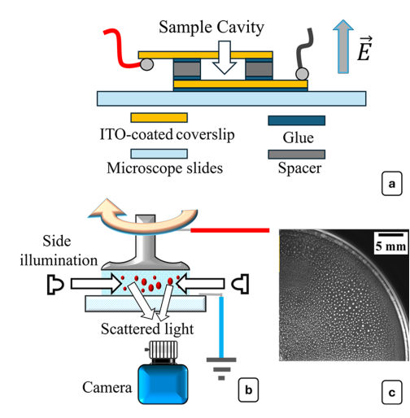
<figcaption class="paper-figure-caption"><b>Fig 1.</b> FIG. 1. Experimental Setup (a) Schematic of the vertical field sam- ple cell consisting of two parallel indium tin oxide (ITO)–coated glass coverslips separated by a 270µm spacer. (b) Schematic of electro-rheo-imaging (ERI) setup. Electrical contact is made with the high-voltage wire (red and blue) the sample illuminated from the side. Imaging is performed from the bottom with a camera. (c) A sample image of bright droplets against dark background.</figcaption>
</figure>
<figure class="paper-figure-card">
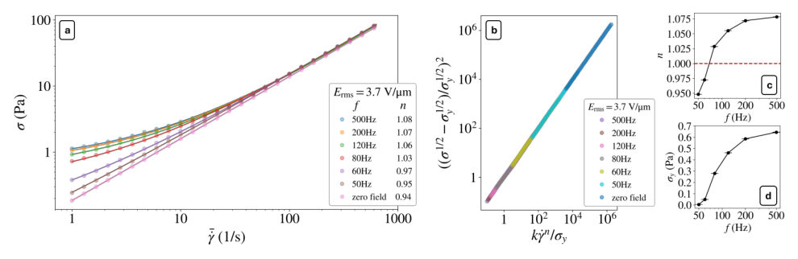
<figcaption class="paper-figure-caption"><b>Fig 2.</b> FIG. 2. Frequency-dependent flow curves: curve-fitting and data collapse. (a) Flow curves measured at fixed root-mean-square electric field, Erms = 3.7 V/µm, for frequencies between 50 and 500 Hz, fitted using gHB model in Eq. 7. The fitted shear-thinning exponent remains close to n = 1 (b) Master-curve representation of the data in (a), obtained by plotting the reduced shear stress (σ1/2 −σ1/2 y )/σ1/2 y )2 as a function of the rescaled shear rate k ˙γn</figcaption>
</figure>
<figure class="paper-figure-card">
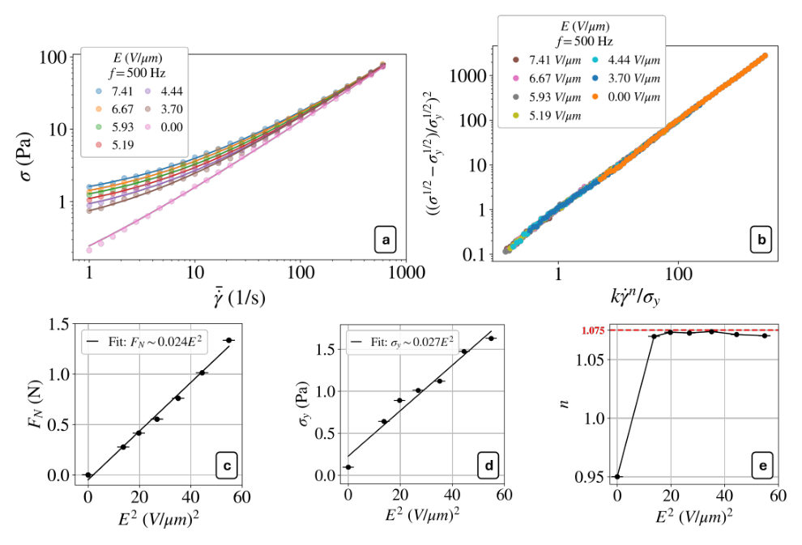
<figcaption class="paper-figure-caption"><b>Fig 3.</b> FIG. 3. Field-amplitude-dependent flow curves: curve-fitting and data collapse. (a) Flow curves measured at fixed frequency, 500 Hz, for different electric field strengths, showing that the Casson limit (n = 1) provides a good description over the full range of applied fields. (b) The corresponding rescaled data collapse onto a single master curve. (c) Measured normal force as a function of E2rms. The approximately linear dependence is consistent with the capacitor scaling FN = ¯κε0AE2/2, and the fitted effective dielectric constant is close to the expected value for the emulsion. (d) Fitted yield stress σy as a function of E2rms. The approximately linear increase indicates that the...</figcaption>
</figure>
<figure class="paper-figure-card">
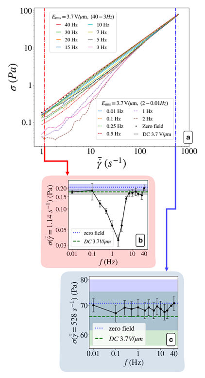
<figcaption class="paper-figure-caption"><b>Fig 4.</b> FIG. 4. Failure of collapse in the EHD regime: (a) Flow curves showing non-monotonic evolution of the shear stress σ with decreas- ing frequency in the EHD-dominated regime. Curves are shifted downward from 40 Hz to ∼2 Hz, and then upwards from 2 Hz to DC. (b,c) Shear stress at fixed shear rates, (b) ¯˙γ = 1.14 s−1 and (c) 528 s−1, highlight the contrasting behavior: strong frequency depen- dence at low shear (EHD-dominated) and convergence of all curves at high shear where hydrodynamic forcing dominates.</figcaption>
</figure>
<figure class="paper-figure-card">
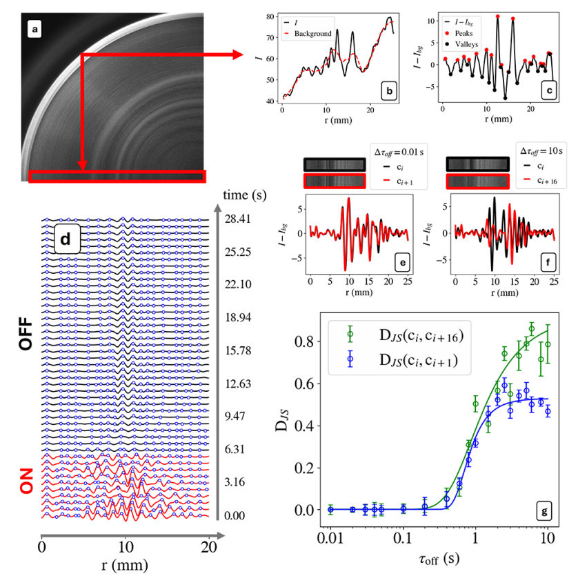
<figcaption class="paper-figure-caption"><b>Fig 5.</b> FIG. 5. Band identification via radial intensity analysis: (a) The full field of view of aand the extracted 1000×50 pixel strip used for analysis. (b) One-dimensional radial intensity profile I(r,t) obtained by averaging a 10-pixel-wide band, together with the smoothed background profile Ibg (200-pixel moving average). (c) Fluctuation signal ∆I(r,t) = I(r,t)−Ibg, where local maxima identify droplet-rich bands and local minima correspond to depletion regions. Recurrence as a function of the τoff timescale: Analysis of band formation and relaxation under intermittent electric field. (d) Single electric field on (red curves) and off (black curves) cycle: Temporal decay of band contrast...</figcaption>
</figure>

**Summary.** This paper explores how electric fields drive an emulsion into two distinct regimes: a predictable electrorheological state and a complex, banded electrohydrodynamic state. It demonstrates that the system's structural memory is tied to the lifetime of underlying convective flows. The work provides a bridge between microscopic droplet dynamics and macroscopic rheological properties.

**Why it may be interesting.** not directly relevant

Detailed structure

**Main problem.** Investigating the transition between electrorheological (ER) and electrohydrodynamic (EHD) regimes in electrically driven emulsions and quantifying the structural memory and decorrelation timescales in the EHD regime.

**Main result.** The ER regime behaves as a yield-stress fluid with a yield stress scaling as E^2, while the EHD regime exhibits banded structures that lose memory on a timescale of ~1s, matching the electroconvective roll turnover time.

**Method.** The study combines macroscopic rheology (SAOS and steady shear) with microscopic microrheology (Differential Dynamic Microscopy) and electrorheoimaging (ERI) using Jensen-Shannon divergence for structural analysis.

**Model / system.** An oil-in-oil emulsion (castor oil droplets in motor oil) subjected to frequency-dependent electric fields and controlled shear rates within a vertical field sample cell.

**Key observables.** Complex shear modulus (G', G''), yield stress (sigma_y), mean-squared displacement (MSD), radial intensity profiles, and Jensen-Shannon divergence.

**Important parameters / regimes.** Electric field strength (E_rms), driving frequency (f), shear rate (gamma_dot), and field-off interval (tau_off).

**Assumptions / limitations.** The ER regime can be modeled as a classic yield-stress fluid using the generalized Herschel-Bulkley model.

**Figures summary.** Fig 1: Experimental setup and ERI imaging; Fig 2: Flow curves and master curve data collapse; Fig 5: Evolution of intensity profiles and structural decorrelation; Fig 6: Comparison of macroscopic and microscopic viscoelastic moduli.

**Paper structure.** The paper introduces the ERI technique, characterizes the high-frequency ER regime via scaling and model fitting, compares macro- and microrheology, analyzes the low-frequency EHD regime's banding and memory effects, and concludes with implications for driven soft matter.

Abstract

Recently, we reported the electrorheoimaging (ERI) technique (Bahraminasr et al, 2026), and found that frequency-dependent electric field of an oil-in-oil emulsion yields two distinct regimes: a high-frequency dipolar, electrorheological (ER) regime and a low-frequency electrohydrodynamic (EHD) regime. In this work, we identify a phenomenological model to fit the results in the ER regime to a classic yield-stress fluid, and find collapse onto a master curve upon rescaling, consistent with a yield stress that grows approximately as $E^2$. Macroscopic small-amplitude oscillatory shear (SAOS) rheology is compared with passive microrheology employing differential dynamic microscopy (DDM), with the close agreement implying scale independence of the ER behaviour, and indicating that, unlike steady shear, SAOS measurements do not restructure these samples and probe underlying material properties. Finally, under the presence of both steady shear and electric fields in the EHD regime, the emulsion forms banded structures composed of alternating droplet-rich and droplet-depleted regions. We explore recurrence and divergence in the location of these bands: they emerge within seconds of field application and decay rapidly after the field is switched off. Using the Jensen--Shannon divergence between radial intensity profiles, we show that the driven structure loses memory on timescales of order $1~s$ commensurate with the timescale of the EHD convection roll. For much longer field-off intervals successive banding events become statistically independent.

[↑ back to top](#top)

### [Investigation of nonlocal transport associated with the orbital Hall effect in Ti](http://arxiv.org/abs/2605.00359v1)

**Authors:** Keitaro Takashina, Naoki Yano, Asahi Oe, Mari Taniguchi, Shuto Kimura, Kazuya Ando  
**Type:** both · **Category:** other · **PDF:** <https://arxiv.org/pdf/2605.00359v1>  
**Analysis basis:** full PDF text, analyzed in chunks

↔ Scroll figures horizontally

<figure class="paper-figure-card">
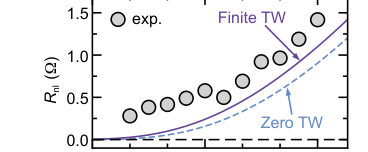
<figcaption class="paper-figure-caption"><b>Fig 1.</b> FIG. 2. Measured nonlocal resistance Rnl as a function of the central channel width W. The gray circles represent the ex- perimental data. The dashed curve represents the calculated bypass contribution using Eq. (1), which assumes negligible terminal widths (TWs) with respect to L. The solid curve shows the simulated bypass contribution accounting for fi- nite TWs using a Ti resistivity of 70 µΩcm determined from sheet-resistance measurements of a reference film (a Ti film fabricated under the same sputtering conditions on a different substrate).</figcaption>
</figure>
<figure class="paper-figure-card">
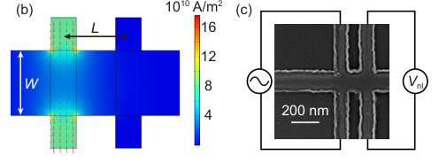
<figcaption class="paper-figure-caption"><b>Fig 2.</b> FIG. 1. (a) Schematic of the nonlocal measurement geom- etry for orbital transport. A charge current jc is injected through the left terminal along the y axis, which generates an orbital current jL flowing along the x axis in the central channel via the OHE. The orbital current is converted into a charge current along the y axis through the inverse OHE, giving rise to a nonlocal voltage Vnl detected at the right terminals. (b) Representative current-density distribution in the Ti Hall bar calculated using COMSOL Multiphysics, ex- plicitly taking into account the finite terminal widths. The color scale and arrows represent the magnitude and local flow direction of the current density,...</figcaption>
</figure>
<figure class="paper-figure-card">
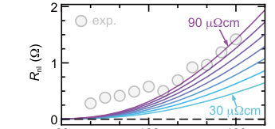
<figcaption class="paper-figure-caption"><b>Fig 3.</b> FIG. 3. Colored curves show simulated simulated bypass con- tribution as a function of the central channel width W for Ti resistivities ranging from 30 µΩcm to 90 µΩcm in steps of 10 µΩcm. Experimental data are also plotted for compari- son. The simulation shows that the bypass signal is strongly suppressed as W decreases, whereas the experimental values remain systematically larger than the simulated bypass con- tribution in the small-W regime.</figcaption>
</figure>

**Summary.** This paper investigates the origin of nonlocal resistance in titanium Hall bars. By comparing experimental data with finite-element simulations, the authors demonstrate that the signal cannot be explained by simple geometric leakage (Ohmic bypass), pointing toward the presence of the orbital Hall effect.

**Why it may be interesting.** not directly relevant

Detailed structure

**Main problem.** The study aims to determine whether the observed nonlocal resistance in Ti Hall bars is caused by an Ohmic bypass effect or by orbital-current transport driven by the orbital Hall effect (OHE).

**Main result.** The experimental nonlocal resistance remains significantly higher than the simulated Ohmic bypass contribution, especially in the small-width regime, suggesting an additional contribution from the orbital Hall effect.

**Method.** The researchers performed nonlocal resistance measurements on Ti Hall bars and used finite-element simulations (COMSOL) to model the current density distribution and the Ohmic bypass effect.

**Model / system.** The physical system consists of single-layer Ti (30-nm-thick) Hall bars with a 4-nm-thick SiO2 cap, featuring a central channel with varying widths (80 to 180 nm).

**Key observables.** Nonlocal resistance (Rnl), nonlocal voltage (Vnl), and current density distribution.

**Important parameters / regimes.** Central channel width (W), channel length (L), Ti resistivity, and terminal widths.

**Assumptions / limitations.** The study assumes the spin Hall effect in Ti is negligible and uses the Laplace equation to estimate the simplified bypass contribution.

**Figures summary.** Fig 1 shows the measurement geometry, COMSOL current density simulation, and SEM image of the device; Fig 2 compares measured Rnl vs W with simulated bypass contributions; Fig 3 shows a parameter sweep of Ti resistivity.

**Paper structure.** The paper introduces the problem of OHE in Ti, describes the device fabrication and measurement setup, presents the experimental results, compares these results to Ohmic bypass simulations, and concludes with evidence for OHE-driven transport.

Abstract

We investigate nonlocal transport in single-layer Ti Hall bars to explore signatures of orbital-current transport driven by the orbital Hall effect. Despite the negligible spin Hall effect in Ti, we observe a finite nonlocal resistance in the single-layer Ti Hall bar and study its dependence on the central channel width. Finite-element simulations show that the measured signal contains a sizable Ohmic bypass contribution. However, the bypass contribution is strongly suppressed at small channel widths and cannot fully account for the observed nonlocal resistance even when variations in the Ti resistivity are taken into account. Our results therefore suggest an additional nonlocal contribution distinct from the Ohmic bypass background, which may be associated with orbital transport driven by the orbital Hall effect in Ti.

[↑ back to top](#top)

### [Long range proximity effects in planar structures involving the halfmetal ferromagnet La0.7Sr0.3MnO3 and Pt interlayers](http://arxiv.org/abs/2605.00577v1)

**Authors:** Junxiang Yao, Julian van Doorn, Mariona Cabero, Jan Aarts  
**Type:** experiment · **Category:** strongly correlated electrons · **PDF:** <https://arxiv.org/pdf/2605.00577v1>  
**Analysis basis:** full PDF text, analyzed in chunks

↔ Scroll figures horizontally

<figure class="paper-figure-card">
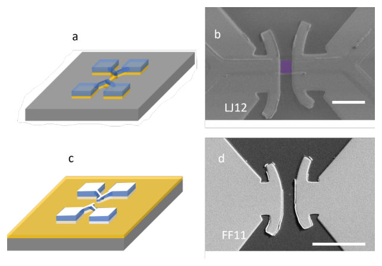
<figcaption class="paper-figure-caption"><b>Fig 1.</b> Figure 1: Layout and SEM image of the LJ (upper row) and FF (lower row) devices. (a) NbTi top layer contacts (blue) on LSMO/LSAT, with an LSMO connecting bridge (yellow). (b) SEM picture of device LJ12 (L = 1.58 µm), with the LSMO bridge in false-color purple. The scale bar is 5 µm. (c) Top contacts on a NbTi (blue)/ Pt (white) double layer on a full film of LSMO (yellow) on LSAT. (d) SEM picture of device FF11 (L = 2.1 µm). The scale bar is 10 µm.</figcaption>
</figure>
<figure class="paper-figure-card">
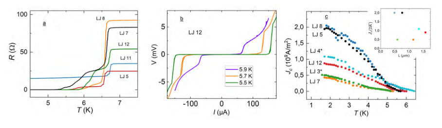
<figcaption class="paper-figure-caption"><b>Fig 2.</b> Figure 2: Transport properties of the LJ devices. (a) Resistance R versus temperature T for the devices as indicated. (b) Current I versus voltage V for LJ12 (L = 1.58 µm) at 5.9 K, 5.7 K and 5.5 K. (c) Critical current Jc as function of temperature T for the LJ devices as indicated, with the highest temperature showing the lowest Jc. The starred devices were reported on before [7]. The inset shows the behavior of Jc at 2 K as funciont of L, color-coded in the same manner as the main plot.</figcaption>
</figure>
<figure class="paper-figure-card">
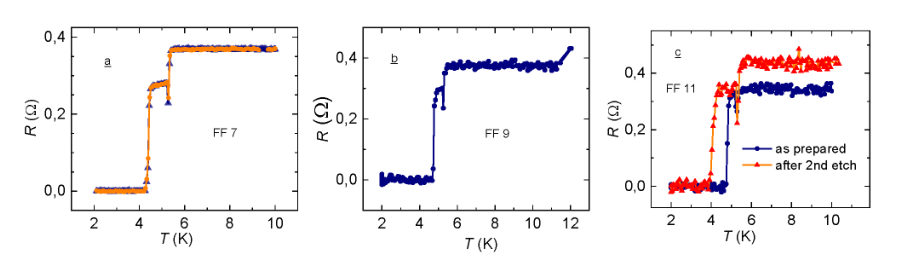
<figcaption class="paper-figure-caption"><b>Fig 3.</b> Figure 3: Resistance R versus temperature T for the three full film devices (a) FF7, (b) FF9 and (c) FF11, discussed in the text. In (a) two traces are shown, one for increasing temperature (orange circles), and one for decreasing temperature (blue triangles). In (c) the change in R(T) after another 2 minute Ar-etch step is also shown. The measurements were performed with an applied current of 1 µA.</figcaption>
</figure>
<figure class="paper-figure-card">
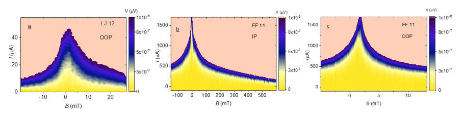
<figcaption class="paper-figure-caption"><b>Fig 4.</b> Figure 4: Superconducting Quantum Interference (SQI) patterns, represented as a color plot of voltage V versus applied current I, for (a) LJ12, measured with an OOP field (z-direction) at 5.65 K, (b) FF11 with an IP field along y (perpendicular to the axis between the contacts), at 4.65 K, and (c) FF11 with an OOP field, at 4.65 K.</figcaption>
</figure>
<figure class="paper-figure-card">
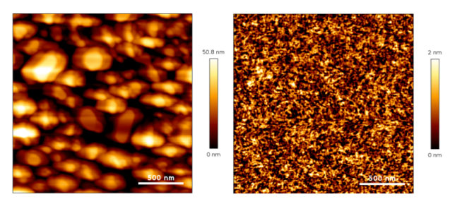
<figcaption class="paper-figure-caption"><b>Fig 5.</b> Figure 5: AFM images of the surface of (a) an LSMO/Ag bilayer and (b) an LSMO/Pt bilayer. In the case of Ag, high roughness and island formation is visible. In the case of Pt, the roughness is no more than 2 nm.</figcaption>
</figure>

**Summary.** The researchers investigated long-range proximity effects in junctions using the half-metal LSMO. They found that adding a Pt interlayer maintains strong supercurrents, suggesting that the heavy metal promotes triplet generation through spin-orbit coupling at the interface.

**Why it may be interesting.** not directly relevant

Detailed structure

**Main problem.** Investigating the mechanism of long-range triplet supercurrent transport and the role of the interface in LSMO-based Josephson junctions.

**Main result.** The study demonstrates that triplet supercurrents persist even with a Pt interlayer, suggesting that the Pt layer promotes triplet generation, potentially via Rashba-like spin-orbit coupling.

**Method.** Transport measurements (R vs T, I-V, SQI) and advanced microscopy (STEM-EELS, HAADF) were used to analyze junction properties and interface chemistry.

**Model / system.** Planar Josephson junctions and full-film electrode structures consisting of a half-metallic ferromagnet (La0.7Sr0.3MnO3), a Pt interlayer, and superconducting NbTi contacts.

**Key observables.** Critical current density (Jc), resistance (R), superconducting transition temperature (Tc), and Superconducting Quantum Interference (SQI) patterns.

**Important parameters / regimes.** Junction length (L), junction width (w), Pt interlayer thickness (7 nm), and temperature (down to 2 K).

**Assumptions / limitations.** The Pt interlayer is assumed to be wetting and non-oxidizing.

**Figures summary.** Fig 1 shows device layouts; Fig 2 displays transport properties (R vs T, I-V, Jc vs T) for long junctions; Fig 3 shows resistance for full-film devices; Fig 4 shows SQI patterns; Fig 6 shows high-resolution STEM-EELS imaging and atomic profiles.

**Paper structure.** The paper introduces the problem of triplet transport, describes the fabrication and characterization of long-junction and full-film devices, analyzes the impact of Pt interlayers on supercurrents, and concludes with structural/chemical analysis of the interfaces.

Abstract

Over the last decade, there has been steady research on superconducting junctions with a ferromagnet as the weak link, and where triplet correlations can transport supercurrents over a substantial distances. Of particular interest are halfmetallic ferromagnets, in which only one spin band is present, so that, presumably, the induced supercurrent is fully spin-polarized. We have earlier reported on a study of triplet transport in planar La0.7Sr0.3MnO3(LSMO) nanostrip Josephson junctions with NbTi superconducting contacts, where we found high values for the supercurrents, and large junction lengths (up to 1.3 μm). Here, we extend that work by studying the dependence of the critical current Ic on the length of the nanostrip between the contacts and the width of the strip. All junctions show strong supercurrents, but we do not observe simple systematics. Apparently, the fabrication process does not allow sufficient control over some of its parameters. To gain more insight in the mechanism for triplet generation at the LSMO/NbTi interface, we also studied the effect of Pt as an interlayer between the LSMO and the NbTi. For this, we etched a NbTi/Pt electrode structure on a full film of LSMO. The results are highly promising, showing sharp superconducting transitions and zero-resistance states being reached at an electrode distance of 2 μm, with indications that larger distances should be feasible.

[↑ back to top](#top)

### [Machine learning evaluation of structural descriptors for supercooled water](http://arxiv.org/abs/2605.00415v1)

**Authors:** Kohei Yoshikawa, Kokoro Shikata, Kang Kim, Nobuyuki Matubayasi  
**Type:** theory · **Category:** disordered systems and neural networks · **PDF:** <https://arxiv.org/pdf/2605.00415v1>  
**Analysis basis:** full PDF text, analyzed in chunks

↔ Scroll figures horizontally

<figure class="paper-figure-card">
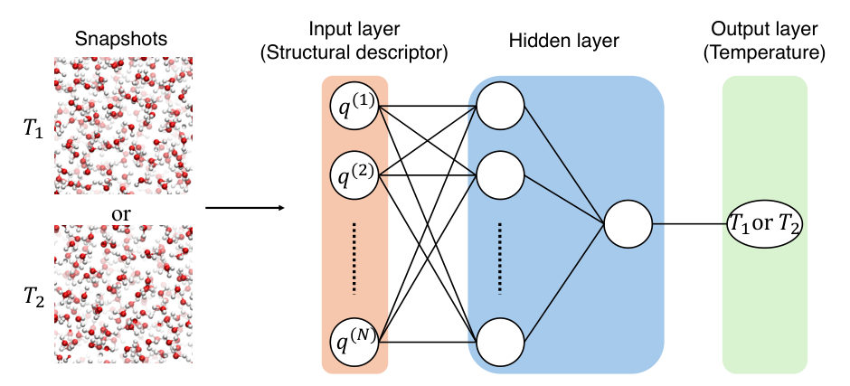
<figcaption class="paper-figure-caption"><b>Fig 1.</b> FIG. 1. Fully connecteed Neural network model for temperature classification. Schematic illustration of the neural network architecture used in this study. Structural descriptors (𝑞(1), 𝑞(2), · · · , 𝑞(𝑁)), assigned to individual molecules and computed from MD simulations of the two temperatures, 𝑇1 and 𝑇2, are provided as the input variables. Number of input nodes corresponds to the number of molecules in the MD snapshots (𝑁= 1000). Therefore, the input is a 1000 × 1 matrix. Network consists of a single hidden layer with the same number of nodes as that of the input layer, followed by a hidden layer with a single node, and employs a sigmoid function. Output layer produced a binary value (0...</figcaption>
</figure>
<figure class="paper-figure-card">
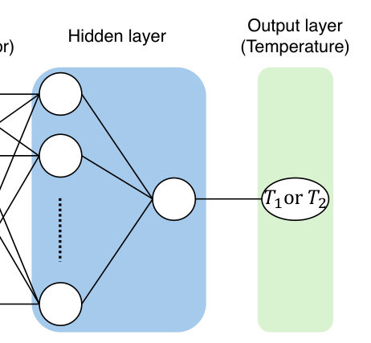
<figcaption class="paper-figure-caption"><b>Fig 2.</b> Figure 1 schematically depicts the fully connected neural network (FCNN) model employed in this study. This FCNN model quantitatively assesses the ability of each structural de- scriptor to distinguish between two different temperatures us- ing the area underthe Receiver Operating Characteristic (ROC) curve (ROC-AUC, hereinafter referred to as AUC) as the evalu- ation metric. A ROC curve is a graphical tool used to evaluate classification models in machine learning. The AUC quan- tifies the overall classification performance. An AUC value close to 1 indicates that the model can accurately distinguish between the two classes, whereas an AUC value close to 0.5 corresponds to random...</figcaption>
</figure>
<figure class="paper-figure-card">
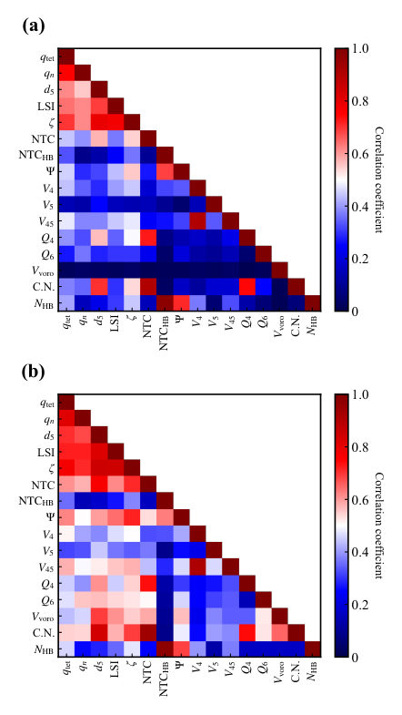
<figcaption class="paper-figure-caption"><b>Fig 3.</b> FIG. 2. Correlation coefficients among structural descriptors. (a) isochoric and (b) isobaric conditions.</figcaption>
</figure>
<figure class="paper-figure-card">
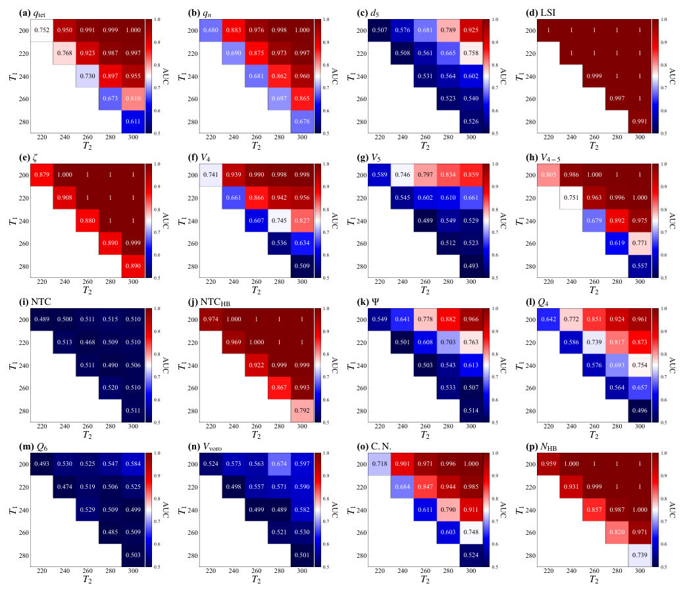
<figcaption class="paper-figure-caption"><b>Fig 4.</b> FIG. 3. Classification performance of structural descriptors under isochoric conditions. Combinations of AUC values for each structural descriptor under isochoric conditions. 𝑇1 and 𝑇2 denote temperature pairs with 𝑇1 &lt; 𝑇2. Color bar represents AUC values in the 0.5 ≤AUC ≤1.0 range. An entry of AUC= 1.000 represents a value of 0.999 . . . . Panels show results for (a) 𝑞tet, (b) 𝑞𝑛, (c) 𝑑5, (d) LSI, (e) 𝜁, (f) 𝑉4, (g) 𝑉5, (h) 𝑉4−5, (i) NTC, (j) NTCHB, (k) Ψ, (l) 𝑄4, (m) 𝑄6, (n) 𝑉voro, (o) C.N., and (p) 𝑁HB.</figcaption>
</figure>
<figure class="paper-figure-card">
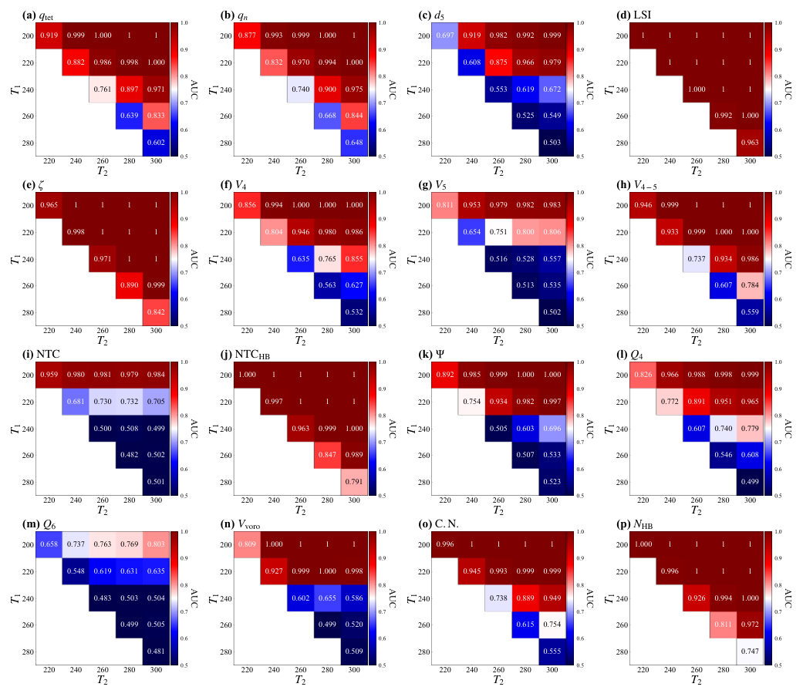
<figcaption class="paper-figure-caption"><b>Fig 5.</b> FIG. 4. Classification performances of structural descriptors under isobaric conditions. Definitions and color scales are identical to those in Fig 3.</figcaption>
</figure>

**Summary.** This paper provides a data-driven benchmark for 16 structural descriptors used to study supercooled water. By using neural networks to classify temperature states, the authors demonstrate that descriptors capturing coordination shell separation and H-bond topology are most effective at identifying the liquid-liquid phase transition signatures.

**Why it may be interesting.** not directly relevant

Detailed structure

**Main problem.** The lack of a systematic, objective framework to compare 16 different structural descriptors used to characterize the local molecular environments and temperature-dependent structural changes in supercooled water.

**Main result.** The study identifies LSI, zeta, NTCHB, and NHB as the most effective descriptors for distinguishing temperature states, revealing that the separation of coordination shells and H-bond connectivity are the primary drivers of structural changes.

**Method.** A machine learning framework using Fully Connected Neural Networks (FCNN) for a temperature classification proxy task, combined with Explainable AI (LIME) to interpret descriptor importance and Pearson correlation for redundancy analysis.

**Model / system.** Supercooled liquid water simulated using the TIP4P/2005 water model under both isochoric (constant volume) and isobaric (constant pressure) conditions in the temperature range of 200 K to 300 K.

**Key observables.** Area Under the Curve (AUC) for classification performance, Pearson correlation coefficients, LIME importance values, tetrahedral order (q_tet), Local Structure Index (LSI), and hydrogen-bond connectivity.

**Important parameters / regimes.** Temperature range (200-300 K), pressure (1 bar), mass density (1 g/cm^3), and radial cutoff distance (0.35 nm).

**Assumptions / limitations.** The FCNN is intentionally kept simple to focus on descriptor evaluation rather than maximizing model capacity; the study assumes the temperature classification task serves as a valid proxy for structural sensitivity.

**Figures summary.** Figure 1 shows the FCNN architecture; Figure 2 displays correlation heatmaps of descriptors; Figure 3 and 4 show classification performance (AUC) under isochoric and isobaric conditions; Figure 5 shows LIME-based feature interpretation.

**Paper structure.** The paper identifies the problem of descriptor comparison, describes the MD simulation and ML framework, presents correlation and classification results for various descriptor groups, uses XAI to interpret the physical drivers, and concludes with a benchmarking framework.

Abstract

The anomalous behavior of liquid water is widely associated with a liquid-liquid phase transition between high- and low-density states in the supercooled regime. At the microscopic level, tetrahedral hydrogen-bond networks govern these properties, motivating structural descriptors that characterize local molecular environments. These structural descriptors quantify features such as tetrahedral order, local density, and the separation between the first and second coordination shells; however, they have largely been proposed independently, with limited systematic comparison. Here we evaluate 16 previously proposed descriptors using a neural-network-based temperature classification framework, enabling an objective assessment of their ability to distinguish temperature-dependent structural changes in supercooled water. We further apply an explainable artificial intelligence method that identifies the structural features responsible for the model predictions. This approach reveals how different descriptors encode local structural information and establishes a data-driven framework for benchmarking structural descriptors in liquid water.

[↑ back to top](#top)

### [Magnetic Behavior of Ferro-, Antiferro-, and Ferrimagnetic Systems in the Griffiths Phase: A Theoretical Study](http://arxiv.org/abs/2605.00537v1)

**Authors:** Sumanta Mukherjee  
**Type:** theory · **Category:** disordered systems and neural networks · **PDF:** <https://arxiv.org/pdf/2605.00537v1>  
**Analysis basis:** full PDF text, analyzed in chunks

↔ Scroll figures horizontally

<figure class="paper-figure-card">
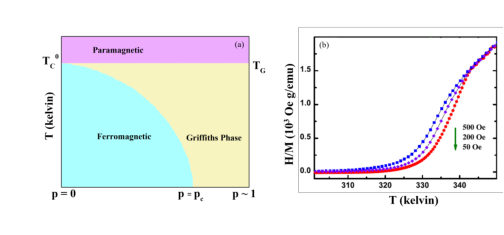
<figcaption class="paper-figure-caption"><b>Fig 1.</b> FIG. 1. (a) An approximate pictorial description of the ran- dom dilution effect on Tc of a FM system[1, 6]. (b) Typical inverse suceptibility behavior of a FM sample in the GP re- gion (reproduced with permission[16]).</figcaption>
</figure>
<figure class="paper-figure-card">
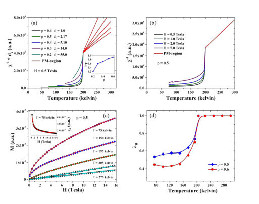
<figcaption class="paper-figure-caption"><b>Fig 2.</b> FIG. 2. (a) The calculated inverse susceptibility, χ−1, of a FM system, both above and below Tg, is plotted as a function of temperature for different disorder strengths, p. A magnetic field of H = 0.5 Tesla was used for these calculations. In order to compare the χ−1 values calculated at different disor- der strength, p, the calculated χ−1 values were multiplied by a constant factor di for better comparison. The inset of (a) shows the variation of λg(T) as a function of disorder strength p; see the manuscript for details. Also note that, restricted by the maximum cluster size, the calculations were performed up to ∼198 kelvin; the region between ∼198 kelvin and 200 kelvin is an...</figcaption>
</figure>
<figure class="paper-figure-card">
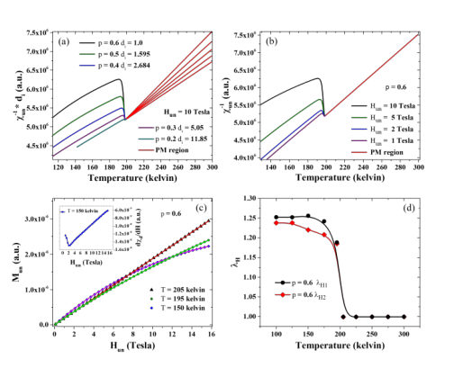
<figcaption class="paper-figure-caption"><b>Fig 3.</b> FIG. 3. (a) The calculated inverse susceptibility, χ−1 un, of an AFM system, both above and below Tg, is plotted as a func- tion of temperature for different disorder strengths, p. A mag- netic field of Hun = 10 Tesla was used for these calculations. In order to compare the χ−1 un values calculated at different disorder strength, p, the calculated χ−1 un values were multi- plied by a constant factor di for better comparison. Also note that, restricted by the maximum cluster size, the cal- culations were performed up to ∼198 kelvin; the region be- tween ∼198 kelvin and 200 kelvin is an extrapolation. (b) shows the variation of χ−1 un at different fields for a fixed dis- order strength of p =...</figcaption>
</figure>
<figure class="paper-figure-card">
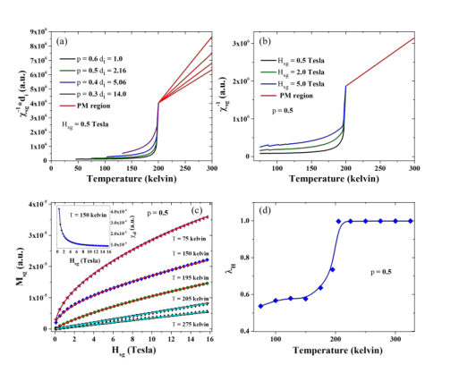
<figcaption class="paper-figure-caption"><b>Fig 4.</b> FIG. 4. (a) The calculated inverse susceptibility, χ−1 sg , of an AFM system, both above and below Tg, is plotted as a func- tion of temperature for different disorder strengths, p. A mag- netic field of Hsg = 0.5 Tesla was used for these calculations. In order to compare the χ−1 sg values calculated at different disorder strength, p, the calculated χ−1 sg values were multi- plied by a constant factor di for better comparison. Also note that, restricted by the maximum cluster size, the cal- culations were performed up to ∼198 kelvin; the region be- tween ∼198 kelvin and 200 kelvin is an extrapolation. (b) shows the variation of χ−1 sg at different fields for a fixed dis- order strength of p...</figcaption>
</figure>
<figure class="paper-figure-card">
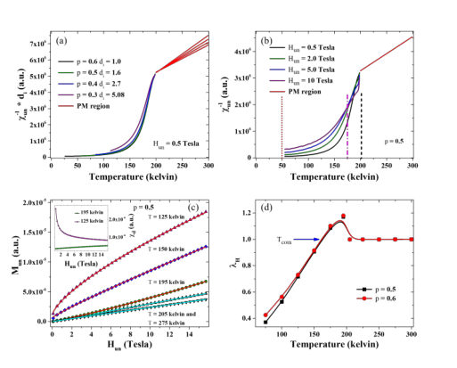
<figcaption class="paper-figure-caption"><b>Fig 5.</b> FIG. 5. (a) The calculated inverse susceptibility, χ−1 un, of a FiM system, both above and below Tg, is plotted as a function of temperature for different disorder strengths, p. A magnetic field of Hun = 0.5 Tesla was used for these calculations. In order to compare the χ−1 un values calculated at different disor- der strength, p, the calculated χ−1 un values were multiplied by a constant factor di for better comparison. (b) shows the vari- ation of χ−1 un at different fields for a fixed disorder strength of p = 0.5 (c) The calculated variation of Mun with Hun at a few selected temperatures for a fixed disorder strength of p = 0.5 is shown. The solid lines represent fits using a power-law...</figcaption>
</figure>

**Summary.** This paper provides a theoretical framework to identify the Griffiths phase in 3D antiferromagnetic and ferrimagnetic systems. It reveals that these systems exhibit much more complex magnetic signatures, such as upward deviations in inverse susceptibility, compared to standard ferromagnetic models. This work offers a way to experimentally distinguish true Griffiths singularities in disordered magnetic materials.

**Why it may be interesting.** not directly relevant

Detailed structure

**Main problem.** The study aims to extend the theoretical understanding of the Griffiths phase (GP) from well-documented ferromagnetic systems to more complex antiferromagnetic and ferrimagnetic systems.

**Main result.** The researchers found that while ferromagnetic systems show a downward deviation in inverse susceptibility, antiferromagnetic systems exhibit an upward deviation, and ferrimagnetic systems show a complex crossover behavior including a compensation point where the system becomes analytic.

**Method.** The study uses a Ginzburg-Landau-Wilson (GLW) framework incorporating quenched disorder, random dilution, and optimal fluctuation theory, supplemented by a quantum description of cluster magnetization.

**Model / system.** The model consists of 3D spin-1/2 Ising ferromagnetic, antiferromagnetic, and ferrimagnetic systems subject to random dilution of magnetic sites.

**Key observables.** Magnetization (M), inverse susceptibility (chi^-1), differential susceptibility (chi_d), and the power-law exponent (lambda_H).

**Important parameters / regimes.** Disorder strength (p), temperature (T), magnetic field (H), and the percolation limit (pc = 0.6884).

**Assumptions / limitations.** The study assumes a maximum cluster size of 7000 for computational tractability and uses a linear approximation for Tc suppression.

**Figures summary.** Figure 1 shows the effect of random dilution; Figure 2 displays inverse susceptibility and the temperature dependence of the exponent for FM systems; Figure 3 shows inverse susceptibility and magnetization for AFM systems; Figure 5 illustrates the power-law behavior and the compensation point in FiM systems.

**Paper structure.** The paper introduces the problem of Griffiths phase identification, develops a theoretical framework using GLW theory, applies this framework to FM, AFM, and FiM systems, and concludes with a discussion on the utility of the proposed identification methods.

Abstract

In this report, we provide a theoretical framework for the magnetic behavior of the Griffiths phase, which, along with three-dimensional spin-1/2 Ising ferromagnetic systems, can be extended to antiferromagnetic as well as ferrimagnetic systems. We find that the magnetic behavior in the Griffiths phase of three-dimensional antiferromagnetic and ferrimagnetic systems is more unusual than that of conventional ferromagnetic systems. However, this study offers a possible framework for the identification of Griffiths phase behavior in three-dimensional antiferromagnetic and ferrimagnetic systems.

[↑ back to top](#top)

### [More on Classical Stability of Hopf-like Solitons of the Toroidal-Twisted type](http://arxiv.org/abs/2605.00757v1)

**Authors:** Chao-Hsiang Sheu, Mikhail Shifman  
**Type:** theory · **Category:** other · **PDF:** <https://arxiv.org/pdf/2605.00757v1>  
**Analysis basis:** full PDF text, analyzed in chunks

↔ Scroll figures horizontally

<figure class="paper-figure-card">
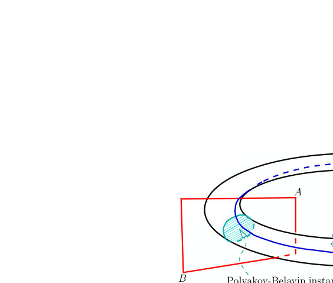
<figcaption class="paper-figure-caption"><b>Fig 1.</b> Figure 1: The simplest Hopf-like soliton as a string with the α twist illustrating the Faddeev-Niemi hypothesis [1]. A Belavin-Polyakov “instanton” on the plane AB is extended in one extra dimension ℓand bent into a torus, with a 2π twist of the instanton phase modulus.</figcaption>
</figure>
<figure class="paper-figure-card">
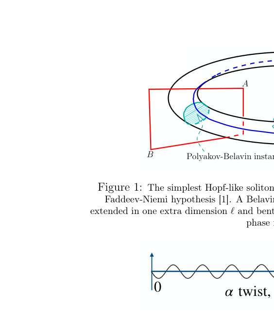
<figcaption class="paper-figure-caption"><b>Fig 2.</b> Figure 2: The twist of the angular modulus, with k = 7.</figcaption>
</figure>
<figure class="paper-figure-card">
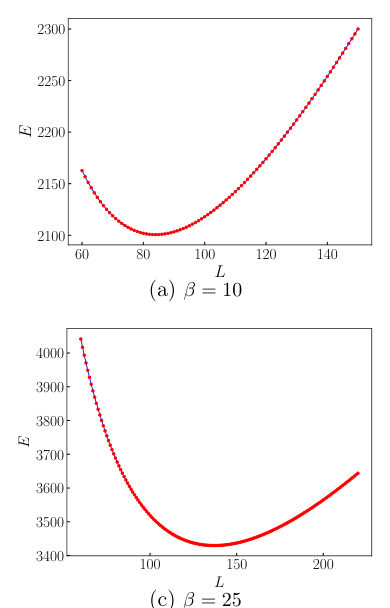
<figcaption class="paper-figure-caption"><b>Fig 3.</b> Figure 3: String energy versus the length of the string for n = 1, g = 1, m = 10.</figcaption>
</figure>
<figure class="paper-figure-card">
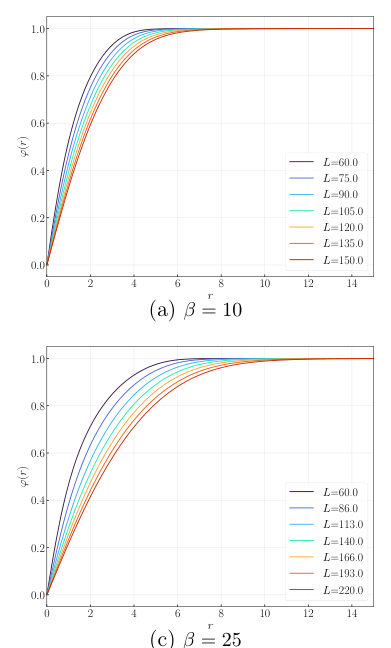
<figcaption class="paper-figure-caption"><b>Fig 4.</b> Figure 5: Profiles of the twisted vortex for n = 1, g = 1, m = 10</figcaption>
</figure>
<figure class="paper-figure-card">
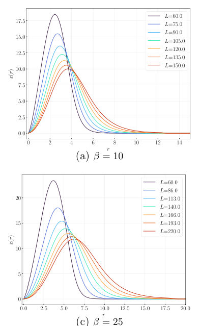
<figcaption class="paper-figure-caption"><b>Fig 5.</b> Figure 6: String energy distribution over the radial coordinate for n = 1, g = 1, m = 10</figcaption>
</figure>

**Summary.** This paper provides numerical evidence that twisted, toroidal-type solitons (vortons) are classically stable in a 4D scalar QED-derived model. It demonstrates that these structures reach a stable equilibrium length, preventing them from collapsing or expanding indefinitely. This confirms a long-standing conjecture regarding the existence of stable Hopf-like solitons in these field theories.

**Why it may be interesting.** not directly relevant

Detailed structure

**Main problem.** Investigating the classical stability of Hopf-like solitons (vortons) of the toroidal-twisted type and determining if they are dynamically stabilized at a finite equilibrium length.

**Main result.** Numerical analysis confirms that large-size Hopf-like solitons exist as local energy minima in the full QED theory, with the twisted string being dynamically stabilized at a finite equilibrium length L*.

**Method.** Numerical analysis using a Python-based implementation of a 4th-order finite difference stencil and scipy.optimize to solve nonlinear equations of motion.

**Model / system.** A deformed O(3) nonlinear sigma model (Faddeev-Hopf model) emerging from the low-energy limit of 4-dimensional scalar quantum electrodynamics (QED) with two charged scalar fields.

**Key observables.** Total energy E, equilibrium length L*, soliton mass M_sol, and the Hopf-like topological invariant h = kn.

**Important parameters / regimes.** The parameter beta (controlling the fourth-order term), winding numbers n (azimuthal) and k (longitudinal), and the scale hierarchy L* >> rho >> 1/m_gamma.

**Assumptions / limitations.** The analysis uses a twisted string ansatz in an R2 x S1 geometry, assuming negligible extrinsic curvature (large-loop limit) and a gauge field constraint where the current C = 0.

**Figures summary.** Figure 3 shows energy E vs. length L for various beta values; Figure 4 shows soliton mass growth with beta; Figure 6 shows radial energy density distribution; Figure 7 shows energy dependence based on previous analytic estimates.

**Paper structure.** The paper introduces the Faddeev-Hopf model and the vorton conjecture, presents the numerical methodology and discretization, details the energy minimization results and parameter dependence, compares findings with existing literature (Jäykkä-Speight and BDS models), and discusses stability and limitations.

Abstract

The Faddeev-Hopf model [1] supporting Hopfions was shown to emerge in the low-energy limit of four-dimensional scalar quantum electrodynamics (QED) with two charged scalar fields [2, 3]. Faddeev and Noemi conjectured that the Hopfions and Hopf-like solitons -- vortons -- can be based on a twisted toroidal structure inherent to QED [4-6]. This conjecture was discussed in detail in [2] in the approximation of negligibly small extrinsic curvature. Qualitative and semi-quantitative arguments were used to demonstrate the validity of the Faddeev-Noemi hypothesis. Here we further enhance the proof by applying a numerical analysis which confirms that large-size Hopf-like solitons exist as local energy minima in the full QED theory (in the Faddeev-Skyrme model they become topological solitons representing the global minima in the given topological sector).

[↑ back to top](#top)

### [Oxygen Vacancies at Dislocation Core Modulate Plasticity in Strontium Titanate](http://arxiv.org/abs/2605.00801v1)

**Authors:** Min-Chul Kang, Chunxu Yan, Alexander Frisch, Xufei Fang, Liming Xiong, Lin Zhou  
**Type:** both · **Category:** other · **PDF:** <https://arxiv.org/pdf/2605.00801v1>  
**Analysis basis:** full PDF text, analyzed in chunks

↔ Scroll figures horizontally

<figure class="paper-figure-card">
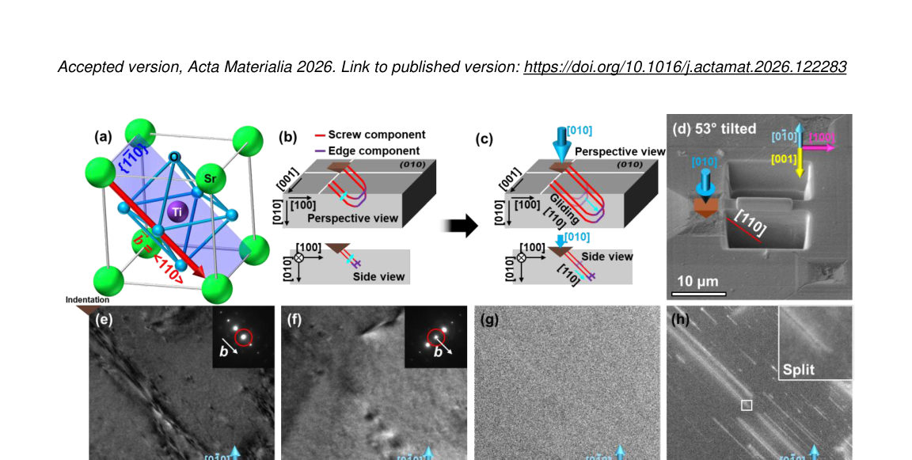
<figcaption class="paper-figure-caption"><b>Fig 1.</b> Figure 1. Indentation and overall structure of a ⟨110⟩{1̅10} dislocation loop. (a) Schematic diagram</figcaption>
</figure>
<figure class="paper-figure-card">
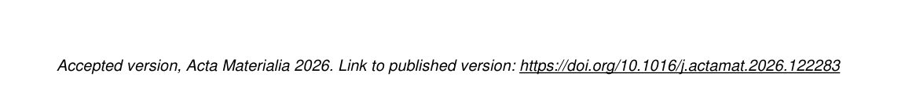
<figcaption class="paper-figure-caption"><b>Fig 2.</b> Figure 2. High resolution MAADF image and corresponding EELS spectra on ⟨110⟩{1̅10}</figcaption>
</figure>
<figure class="paper-figure-card">
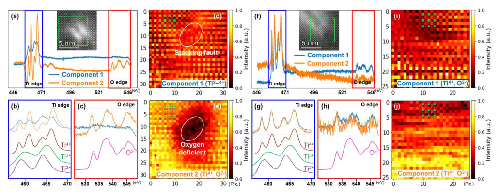
<figcaption class="paper-figure-caption"><b>Fig 3.</b> Figure 3. PCA result of EELS spectrum on relatively short loop edge core and relatively long loop.</figcaption>
</figure>
<figure class="paper-figure-card">

<figcaption class="paper-figure-caption"><b>Fig 4.</b> Figure 2a, and the EELS mapping region used for the PCA analysis is marked by a green square. (b)</figcaption>
</figure>
<figure class="paper-figure-card">
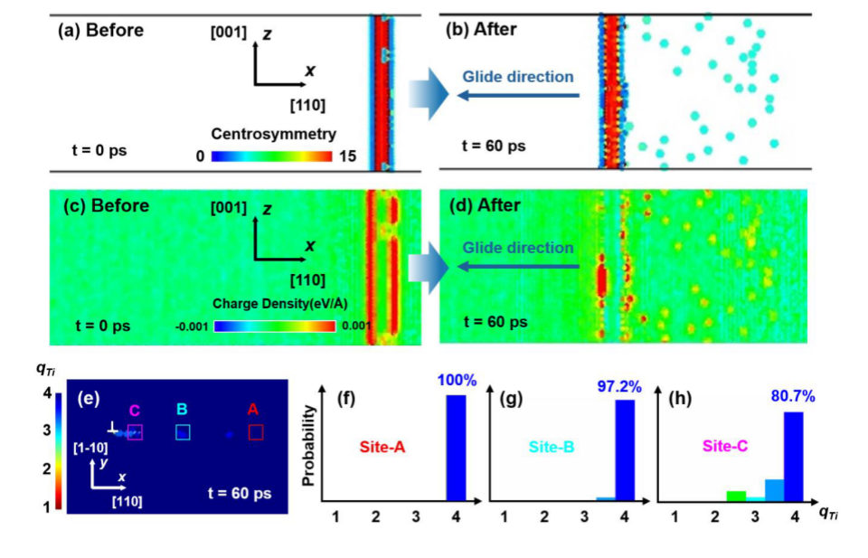
<figcaption class="paper-figure-caption"><b>Fig 5.</b> Figure 4. MD simulation results for a single-crystalline SrTiO3 sample containing a ⟨110⟩{1̅10} edge</figcaption>
</figure>

**Summary.** This paper demonstrates that the mobility of dislocations in SrTiO3 is intrinsically linked to the presence of oxygen vacancies at the dislocation core. By combining high-resolution electron microscopy with molecular dynamics, the authors show that moving dislocations leave behind oxygen-deficient trails, creating a direct coupling between defect chemistry and mechanical plasticity.

**Why it may be interesting.** not directly relevant

Detailed structure

**Main problem.** Understanding how oxygen vacancy density and local redox chemistry at dislocation cores modulate dislocation mobility and plasticity in ionic crystals like SrTiO3.

**Main result.** Small dislocation loops are oxygen-deficient and Ti-reduced, leading to low mobility, whereas larger loops are near-stoichiometric and highly mobile; MD simulations show that kink-mediated glide leaves behind oxygen-deficient trails.

**Method.** The study combines aberration-corrected STEM and EELS (with PCA and NNLS analysis) for experimental characterization with atomic-level Molecular Dynamics (MD) simulations using a rigid-ion potential.

**Model / system.** The physical system is single-crystalline Strontium Titanate (SrTiO3), a perovskite oxide, focusing on <110>{1-10} dislocation loops and their core chemistry.

**Key observables.** Ti valence states (Ti2+, Ti3+, Ti4+), oxygen vacancy density, dislocation glide distance, and dislocation core structure (edge vs. screw components).

**Important parameters / regimes.** Dislocation loop size (short vs. long), glide distance, shear stress (1.5-3.0 GPa in MD), and temperature (room temperature plasticity).

**Assumptions / limitations.** The MD simulations use a rigid-ion potential and high shear stress to facilitate observable dislocation motion within a limited simulation cell.

**Figures summary.** Fig 1 shows the slip system, indentation-induced loops, and TEM/STEM structural imaging; Fig 2 presents EELS/NNLS results for Ti oxidation states in short loops; Fig 3 shows PCA results for chemical component distribution; Fig 4 displays MD time-sequences of dislocation motion and charge density evolution.

**Paper structure.** The paper introduces the problem of dislocation chemistry in oxides, presents experimental evidence of chemical heterogeneity in dislocation loops via STEM-EELS, uses MD simulations to provide a mechanistic explanation via kink-mediated vacancy production, and concludes with implications for tailoring oxide plasticity.

Abstract

Dislocation core chemistry in oxides critically influences mechanical behavior and functionality; yet the evolution of core chemistry during the dislocation motion in them has not been directly observed. Here, using SrTiO3 as a model material, we combine aberration-corrected scanning transmission electron microscopy and electron energy-loss spectroscopy with atomic-level molecular dynamics (MD) simulations to correlate the <110>{1-10} dislocation core structure, oxygen vacancy density, charge state, and mobility with each other. We find that the mechanically induced dislocation loops exhibit dissociated cores, whose oxygen vacancy density depends on the gliding distance: short loops are Ti-reduced and oxygen-deficient at the edge dislocation core, whereas longer loops remain close to stoichiometry in both the edge and screw components. MD simulations reveal that kink-assisted edge dislocation glide in SrTiO3 leaves oxygen-deficient trails behind, modulating the oxygen content inside the edge core. These results demonstrate that oxygen-vacancy evolution at the dislocation core intrinsically couples with plasticity in ionic crystals, suggesting a mechanism for oxygen vacancy-dependent dislocation mobility in plastically deformed oxides.

[↑ back to top](#top)

### [Pre-charging polymer surfaces enhances droplet mobility and electrification](http://arxiv.org/abs/2605.00481v1)

**Authors:** Shuaijia Chen, Kenta Morita, Dumindu Dassanayaka, Hans-Jürgen Butt, Peter C. Sherrell, Amanda V. Ellis, Joseph D. Berry  
**Type:** experiment · **Category:** other · **PDF:** <https://arxiv.org/pdf/2605.00481v1>  
**Analysis basis:** full PDF text, analyzed in chunks

↔ Scroll figures horizontally

<figure class="paper-figure-card">
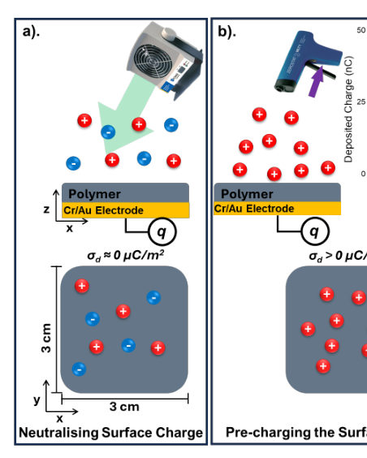
<figcaption class="paper-figure-caption"><b>Fig 1.</b> Figure 1. a. Schematic of neutralising surface charge with the ionizing blower to eliminate the effect of</figcaption>
</figure>
<figure class="paper-figure-card">
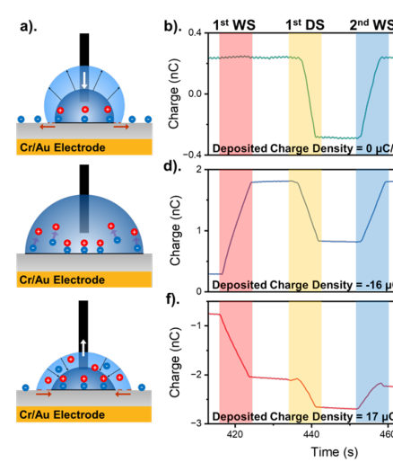
<figcaption class="paper-figure-caption"><b>Fig 2.</b> Figure 2. a. Schematic diagram of droplet interaction with deposited surface charge on dielectric surface</figcaption>
</figure>
<figure class="paper-figure-card">
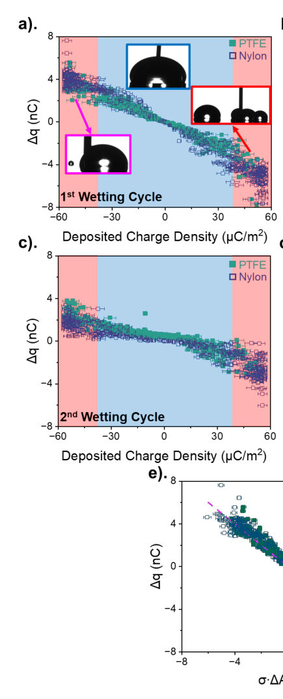
<figcaption class="paper-figure-caption"><b>Fig 3.</b> Figure 3. Charge transfer plotted against the magnitude of deposited surface charge density on PTFE and</figcaption>
</figure>
<figure class="paper-figure-card">
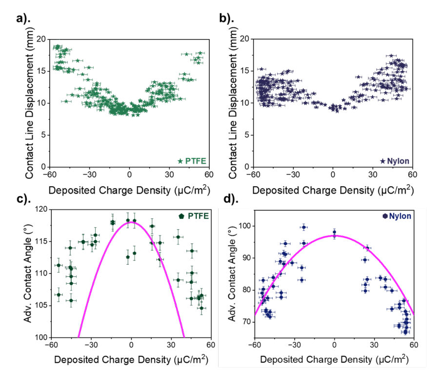
<figcaption class="paper-figure-caption"><b>Fig 4.</b> Figure 4. Corresponding contact line displacement (blue squares) plotted against the magnitude of deposited</figcaption>
</figure>

**Summary.** This study demonstrates that pre-charging polymer surfaces can be used to precisely control the electrification and motion of water droplets. By manipulating surface charge, the researchers showed they could increase droplet mobility or even induce droplet splitting, providing a method for directed fluid manipulation.

**Why it may be interesting.** not directly relevant

Detailed structure

**Main problem.** The mechanisms and methods for controlling solid-liquid charge transfer and droplet behavior influenced by pre-existing surface-bound electric charges on polymers are unclear.

**Main result.** Pre-charging polymer surfaces allows droplets to pick up deposited ions during initial wetting, where moderate charge densities lead to a linear correlation in charge transfer and increased contact-line mobility, while high densities trigger droplet splitting.

**Method.** The researchers used an ion gun to pre-charge PTFE and Nylon surfaces and an electrometer to monitor charge transfer during controlled wetting/dewetting cycles using a syringe pump and goniometer.

**Model / system.** The experimental platform consists of water droplets interacting with pre-charged dielectric polymer surfaces (PTFE and Nylon) mounted on electrodes.

**Key observables.** Surface charge density, charge transfer (delta q), contact angle, contact-line mobility, and droplet splitting/fission.

**Important parameters / regimes.** Surface charge density (up to +/- 60 uC/m2), moderate regime (|sigma| < 40 uC/m2), and humidity/temperature.

**Assumptions / limitations.** Assumed an infinite flat plate and homogeneous charge distribution for calibration; used Rayleigh's criterion for droplet stability analysis.

**Figures summary.** Figure 1 shows charging/neutralization protocols; Figure 2 shows charge measurement traces; Figure 3 plots charge transfer vs. deposited density and shows splitting; Figure 4 shows contact line displacement and contact angle vs. charge density.

**Paper structure.** The paper introduces the problem of surface charge control, describes the experimental setup and charging/calibration protocols, presents results on charge transfer linearity and material independence, discusses droplet instabilities and mobility, and concludes with a theoretical stability criterion.

Abstract

Surface-bound electric charge on polymer materials can strongly influence droplet behaviour and solid-liquid charge transfer, but the mechanisms and the means to control these effects remain unclear. In this work, we systematically controlled the surface charge on polymer surfaces, including polytetrafluoroethylene (PTFE) and Nylon-66, by first neutralising the surfaces with an anti-static ion blower and then applying charge using an ion gun. We find that droplets pick up pre-deposited surface ions during the first wetting of the surface, and that the transferred charge directly correlates with the deposited charge encountered by the wetted area for moderate deposited densities (|σ_d |<40 μC/m2) independent of material properties. We also demonstrate that the deposited charge reduces contact angle and increases contact-line mobility in a manner consistent with an increase in effective solid surface energy. For higher surface charge densities, we observe instabilities such as droplet splitting or detachment. This work demonstrates an effective approach to control solid-liquid electrification, enabling amplification or suppression of surface charge and the directed manipulation of fluid motion on surfaces.

[↑ back to top](#top)

### [Revealing the origin of XMCD in an altermagnet via three-dimensional control of spins](http://arxiv.org/abs/2605.00815v1)

**Authors:** Daire Mallon, Zixuan Wu, Jheng-Cyuan Lin, Ruiwen Xie, Bo Zhao, Charles Godfrey, Qing He, Lucia Iglesias, Pierluigi Gargiani, Manuel Valvidares, Peter Bencok, Francesco Maccherozzi, Larissa S. I. Veiga, Paul Steadman, Manuel Bibes, Hongbin Zhang, Paolo G. Radaelli, Hariom Jani  
**Type:** both · **Category:** strongly correlated electrons · **PDF:** <https://arxiv.org/pdf/2605.00815v1>  
**Analysis basis:** full PDF text, analyzed in chunks

↔ Scroll figures horizontally

<figure class="paper-figure-card">
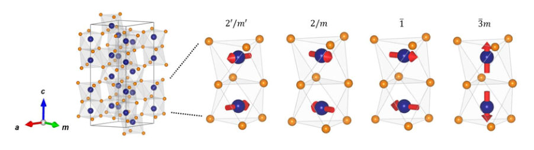
<figcaption class="paper-figure-caption"><b>Fig 1.</b> Figure 1 | The corundum crystal structure of α-Fe2O3 and the accessible magnetic point groups. The MPGs include 2’/𝑚’ (spins along the 2-fold axis), 2/𝑚 (spins orthogonal to the 2-fold axis), 1ത (spins in a low symmetry direction) and 3ത𝑚 (spins along the high-symmetry 3-fold axis). The Fe-spins are visualised within the adjacent face-sharing FeO6 octahedra, showing the opposite directions of the magnetic sub-lattices 𝑴ଵ and 𝑴ଶ. The 𝑎-axis and 𝑚-axis are orthogonal and span the basal plane.</figcaption>
</figure>
<figure class="paper-figure-card">
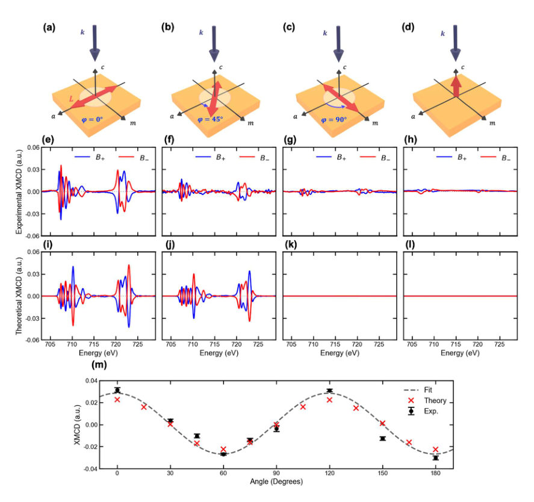
<figcaption class="paper-figure-caption"><b>Fig 2.</b> Figure 2 | Fe L-edge XMCD spectra with X-ray 𝒌-vector along the 𝒄-axis. (a-d) Experimental geometries (normal incidence) and 𝑳 orientations (defined by antiparallel sublattices - blue arrows) of MPGs present within α-Fe2O3, (a) 2’/𝑚’, (b) 1ത, (c) 2/𝑚 and (d) 3ത𝑚 with respect to crystal axes. (e-h) Measured and (i-l) calculated XMCD spectra for four accessible MPGs. Spectra in (e-g) were measured in the total electron yield mode at T = 300 K. An orthogonal magnetic field was applied to align 𝑳 parallel/antiparallel to the crystal directions indicated (blue/red). The out-of-plane 𝑳 orientation in (h) was achieved by cooling below 𝑇ெ (T = 12 K). (m) XMCD intensity at 𝐿ଶ-edge peak (722.25 eV)...</figcaption>
</figure>
<figure class="paper-figure-card">
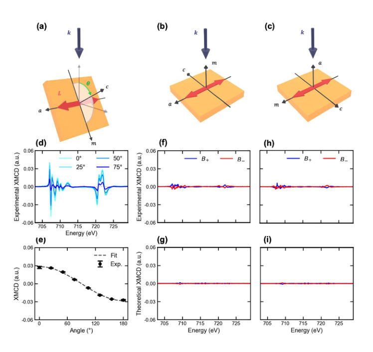
<figcaption class="paper-figure-caption"><b>Fig 3.</b> Figure 3 | Fe L-edge XMCD spectra with X-ray 𝒌-vector oblique and orthogonal to the 𝒄-axis. (a-c) Experimental geometries (oblique and normal incidence) and 𝑳 orientations (defined by antiparallel sublattices - blue arrows) used to measure: the (a) evolution of the 𝑇௭ component with rotation of the sample normal, and the (b,c) 𝑇௬,௫ components of the XMCD vector. (d) Modulation of the XMCD signal under increasing angle of incidence, 𝜃, from the normal, at T = 300 K. (e) XMCD intensity at 𝐿ଶ-edge peak (722.25 eV) as a function of 𝜃. Error bars represent the standard error of the mean, calculated from the distribution of XMCD values obtained from individual scans (left-right polarisation) at...</figcaption>
</figure>
<figure class="paper-figure-card">
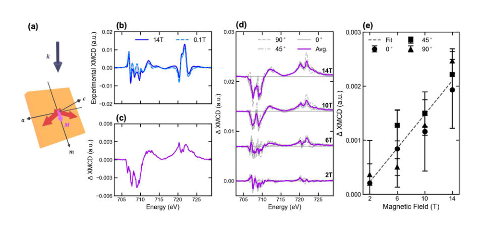
<figcaption class="paper-figure-caption"><b>Fig 4.</b> Figure 4 | Fe L-edge XMCD signature of the weak canted moment. (a) Experimental grazing-incidence (75°) geometry used to isolate the XMCD response of the weak moment (purple arrow), emerging from the canting of antiparallel sublattices (blue arrows). (b,c) XMCD spectra measured for c-cut crystal above 𝑇ெ (T = 300 K), under (b) positive (blue) and (c) negative (red) applied magnetic fields parallel to the X-ray beam. Dashed and solid lines correspond to field strengths of 0.1 T and 14 T, respectively. (d) Difference XMCD spectra under increasing applied magnetic fields for three in-plane 𝑳 orientations corresponding to the MPGs 2ᇱ/𝑚′, 2/𝑚, 1ത. (e) XMCD intensity at the 𝐿ଶ-edge (720 eV) of...</figcaption>
</figure>
<figure class="paper-figure-card">
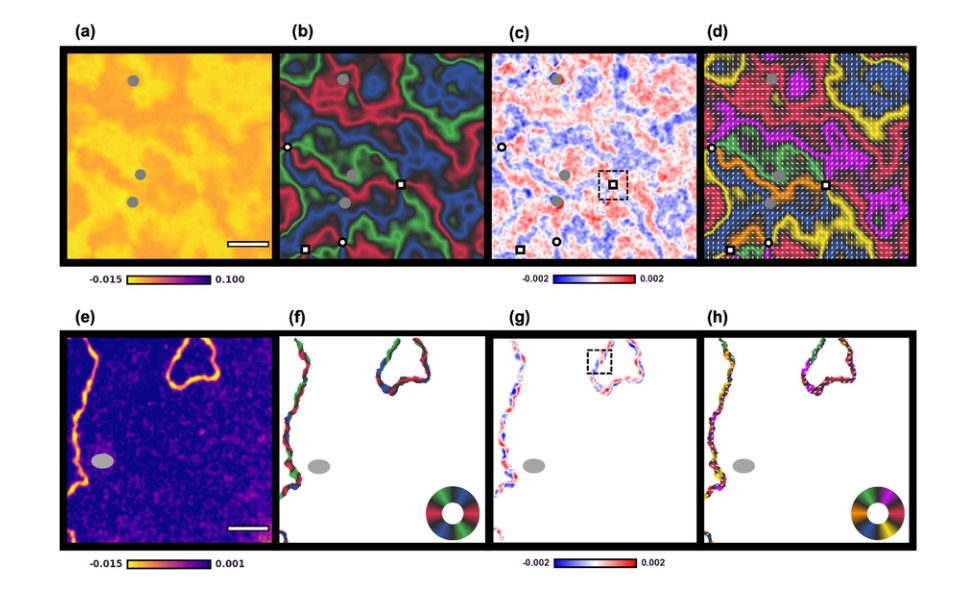
<figcaption class="paper-figure-caption"><b>Fig 5.</b> Figure 5 | Fe L-edge X-ray vectorial imaging of altermagnetic domains in thin films of α-Fe2O3. (a-d) X-PEEM imaging of the easy-plane phase (T = 400 K) and (e-h) easy-axis phase (T = 358 K). This includes: (a,e) XMLD X-PEEM images, (b,f) XMLD Néel vector maps, (c,g) XMCD-PEEM images and (d,h) the full vectorial maps, constructed as described in Methods. In (a,e), yellow and orange colours indicate orthogonal in-plane 𝑳 orientations, while purple defines out-of-plane 𝑳. In (b,f), R-G-B and black define in-plane 𝑳 orientations along the a-axes and m-axes, respectively. The angular dependence is defined by the inset colour wheel. In (c,g), blue-white-red contrast corresponds to negative, zero...</figcaption>
</figure>

**Summary.** This paper reveals that XMCD in altermagnets like hematite is driven by local spin-orbit coupling and anisotropy rather than being a direct signature of altermagnetic spin-splitting. By decoupling the XMCD signal from weak magnetic canting, the authors provide a new method for high-resolution, sign-sensitive imaging of complex magnetic textures.

**Why it may be interesting.** not directly relevant

Detailed structure

**Main problem.** The study investigates whether X-ray magnetic circular dichroism (XMCD) is a direct signature of altermagnetism or a non-co-rotating property driven by spin-orbit coupling and local anisotropy.

**Main result.** The researchers demonstrate that XMCD is not a direct proxy for altermagnetism but arises from spin-direction-induced symmetry breaking and local anisotropy. They successfully used XMCD to resolve the 180-degree ambiguity in the Néel vector orientation during imaging.

**Method.** The study combines X-ray spectroscopy (XMCD/XMLD) and X-ray photoemission electron microscopy (X-PEEM) with DFT and multiplet ligand-field theory calculations.

**Model / system.** The physical system is alpha-Fe2O3 (hematite), a g-wave altermagnet with a corundum crystal structure. The model utilizes a 3D Faraday tensor framework and magnetic point groups to describe the magneto-optical response.

**Key observables.** XMCD intensity, XMLD contrast, Néel vector (L), weak magnetization (M), and the effective magnetic dipole vector (T).

**Important parameters / regimes.** Morin transition temperature (Tm), spin-orbit coupling (SOC) strength, and the azimuthal angle (phi) between the Néel vector and the crystal axes.

**Assumptions / limitations.** The analysis assumes the XMCD response can be expanded via 1st and 3rd order Faraday tensors and relies on the accuracy of the DFT+MLFT for electronic structure.

**Figures summary.** Figures show the evolution of XMCD spectra with spin rotation, the control of the XMCD vector via geometry, and reconstructed 6-color vector maps of the Néel vector orientation.

**Paper structure.** The paper introduces the problem of XMCD as a proxy for altermagnetism, presents experimental measurements of spin rotation and anisotropy, provides a theoretical framework using Faraday tensors and symmetry groups, and concludes with the application of these findings to nanoscale texture imaging.

Abstract

Altermagnets are an emerging class of collinear antiferromagnets that exhibit unconventional spin-polarised electronic bands, potentially unlocking new functionalities that do not rely on spin-orbit coupling (SOC). Experimental signatures traditionally associated with spin polarisation, like X-ray magnetic circular dichroism (XMCD), are thus being used as a validation of altermagnetism. However, unlike altermagnetic spin-splitting, these responses require SOC and are not invariant under spin-space rotations. This brings into question the extent to which they can be considered direct signatures of altermagnetism. Here, we exploit the g-wave altermagnet $α$-Fe$_{2}$O$_{3}$ to demonstrate that XMCD is governed precisely by the spin-direction-induced symmetry breaking that altermagnetic spin groups are designed to ignore. Strikingly, the XMCD is highly anisotropic and is decoupled from the weak magnetic canting. We show that this anomalous XMCD can be described by on-site Faraday tensors capturing the locally uncompensated spin-orbital anisotropies - a scenario that can be applied to other altermagnets. Leveraging this, we reconstruct complete vectorial maps of nanoscale textures in $α$-Fe$_{2}$O$_{3}$ thin films, including domain walls and topological solitons, which are promising for building future spintronics and magnonics devices.

[↑ back to top](#top)

### [Suppressing Plasmonic Heating in Aqueous Environments with Hexagonal Boron Nitride](http://arxiv.org/abs/2605.00587v1)

**Authors:** Martina Russo, Roland van der Vegt, Bohai Liu, Sam Beijers, Sara Salera, Guillaume Baffou, Klaas-Jan Tielrooij, Peter Zijlstra  
**Type:** both · **Category:** other · **PDF:** <https://arxiv.org/pdf/2605.00587v1>  
**Analysis basis:** full PDF text, analyzed in chunks

↔ Scroll figures horizontally

<figure class="paper-figure-card">
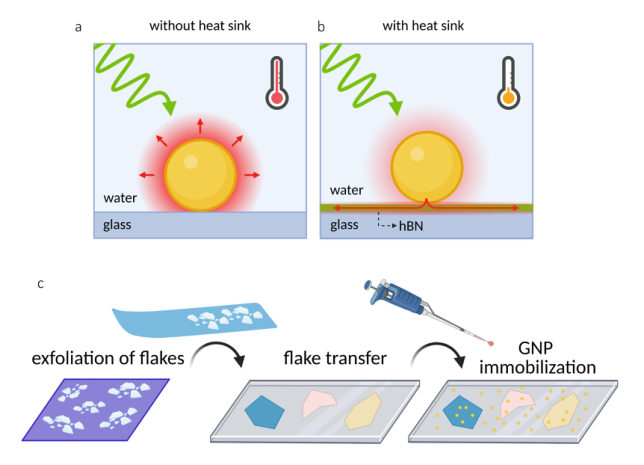
<figcaption class="paper-figure-caption"><b>Fig 1.</b> Figure 1: Illustration of the concept of laser heating and thermal management by hBN, and of the sample preparation. Plasmonic nanoparticles on glass (a) irradiated by a laser undergo an intense temperature in- crease. The addition of an hBN underneath the particles (b) results in an efficient heat dissipation, leading to a lower temperature increase. (c) Cartoon illustrating the sample preparation workflow. hBN flakes of different thicknesses (different colors in the cartoon) are exfoliated from hBN powder onto SiO2 substrates, and subse- quently transferred onto glass coverslip using a dry-transfer procedure. A solution of GNPs is then drop-casted onto the glass coverslip and rinsed after...</figcaption>
</figure>
<figure class="paper-figure-card">
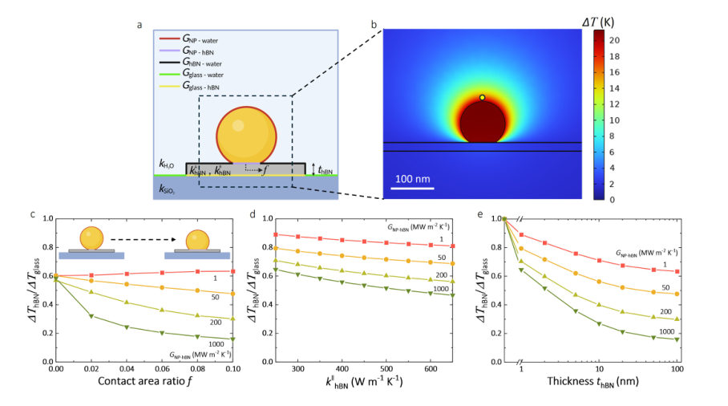
<figcaption class="paper-figure-caption"><b>Fig 2.</b> Figure 2: Simulations framework and main results. (a) Illustration of the simulated system, consisting of a 100 nm diameter GNP immobilized on a hBN flake, with thickness thBN and in-plane conductivity k∥ hBN, on glass. The contact area between the GNP and the hBN is described by the fraction f. The figure depicts the interfacial thermal conductance G of all the interfaces in the system. (b) Example distribution of the temperature increase for thBN = 20 nm. We probed the temperature increase at a 5 nm distance above the nanosphere. (c) Cooling factor, ( ∆ThBN</figcaption>
</figure>
<figure class="paper-figure-card">
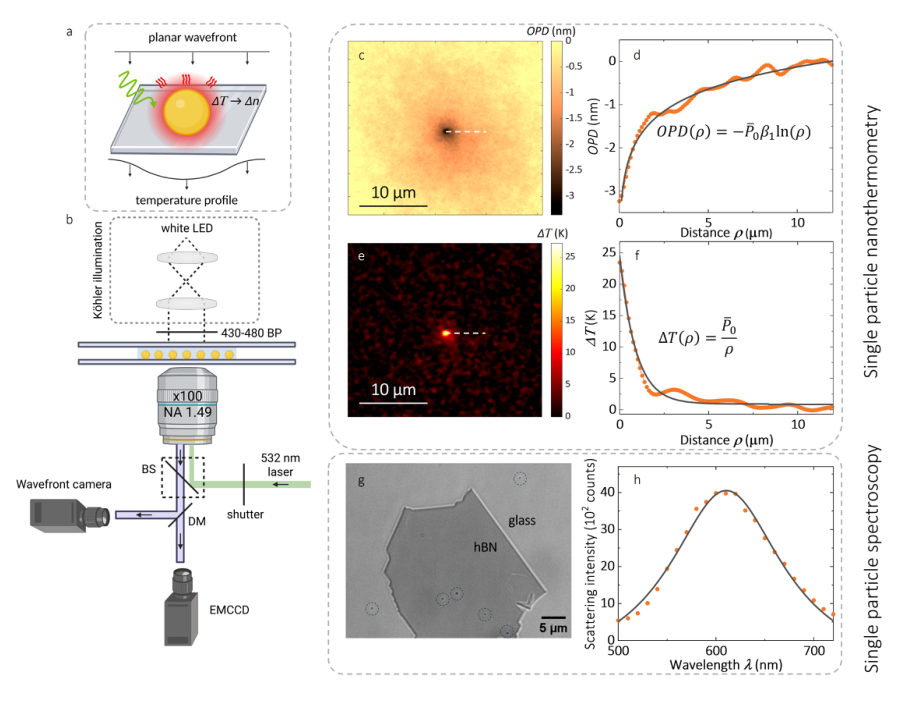
<figcaption class="paper-figure-caption"><b>Fig 3.</b> Figure 3: Experimental setup and measurements workflow. (a) Schematic working principle of the CGM technique and its application to measure the temperature increase of optically heated plasmonic nanoparticles. (b) Schematic of the optical setup used for CGM measurements. (c) Raw image of the OPD of a 100 nm GNP irradiated by the heating laser. (d) Measured radial profile (orange data points) of the OPD distribution in image c (dashed line) as a function of the radial distance from the center of the particle, and the theoretical description using the equation in the figure (solid black line). (e) Temperature increase distribution resulting from the OPD in image c. (f) Radial profile (orange...</figcaption>
</figure>
<figure class="paper-figure-card">
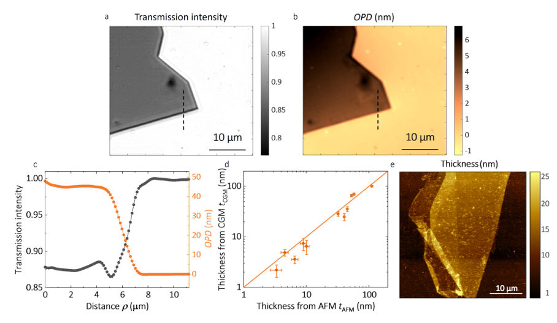
<figcaption class="paper-figure-caption"><b>Fig 4.</b> Figure 4: Workflow of the CGM data processing to characterize the hBN flakes thickness. (a) Transmission intensity (a) and OPD map (b) of a hBN flake (thBN = 37 nm). (c) Profile of the transmission intensity and OPD along the dashed lines in figures (a) and (b). (d) Comparison of the thickness characterization obtained from CGM and AFM measurements. Each data point represents one of the 11 measured flakes, with thickness ranging from 3 to 110 nm (error bars represent 68 % confidence interval). (e) AFM measurement of a hBN flake of graph (d) (thBN = 8.9 nm).</figcaption>
</figure>
<figure class="paper-figure-card">
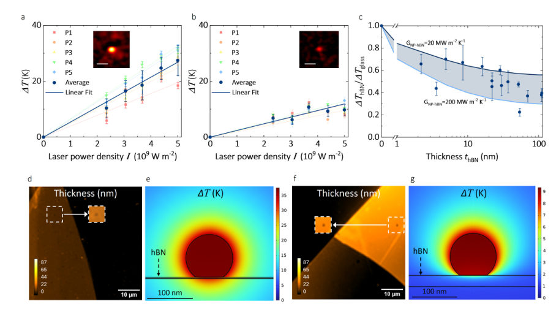
<figcaption class="paper-figure-caption"><b>Fig 5.</b> Figure 5: Overview of thickness dependence experimental results. Measured temperature increase of GNPs on glass (a) and hBN (thBN = 52 nm) (b) for increasing power densities. The average temperature increase of all the particles is described using a linear function. Insets show some example temperature maps for glass and hBN, respectively (scale bar of 1 µm). (c) Resulting experimental cooling factor as a function of the hBN flakes thickness from CGM. The data are compared with the simulations shown in Figure 3e, considering the standard deviation of the data-points (68 % confidence interval within the lines). (d) OPD map of a thin flake (thBN = 8.9 nm), with visible low phase contrast...</figcaption>
</figure>

**Summary.** This paper demonstrates that using hexagonal boron nitride (hBN) as a nanoscale heat spreader can significantly mitigate the temperature rise caused by plasmonic heating in gold nanoparticles. By combining numerical simulations with advanced wavefront microscopy, the authors establish design guidelines for using 2D materials to improve thermal management in nanophotonic and biosensing platforms.

**Why it may be interesting.** not directly relevant

Detailed structure

**Main problem.** Localized optical heating (plasmonic heating) in gold nanostructures can degrade the performance of heat-sensitive applications like biosensing and microelectronics. The challenge is to find efficient nanoscale thermal management strategies in aqueous environments.

**Main result.** Integrating hexagonal boron nitride (hBN) thin flakes as heat spreaders reduces the steady-state temperature rise by up to 60% compared to glass. The study identifies two heat dissipation pathways and shows that cooling efficiency depends on hBN thickness and interfacial thermal conductance.

**Method.** The study combines finite-element simulations (COMSOL) to model heat transport with experimental nanothermometry using Cross-Grating Wavefront Microscopy (CGM) to map temperature distributions.

**Model / system.** The system consists of 100 nm gold nanospheres immobilized on hBN flakes (ranging from 1 to 100 nm thick) deposited on glass, all immersed in an aqueous (water) environment.

**Key observables.** Steady-state temperature rise, 2D temperature distribution maps, optical path difference (OPD), and scattering spectra.

**Important parameters / regimes.** hBN thickness, in-plane thermal conductivity, interfacial thermal conductance, contact area fraction, and laser power density.

**Assumptions / limitations.** The gold nanoparticles are modeled as truncated spheres to account for realistic contact area; hBN is treated as thermally anisotropic.

**Figures summary.** Figure 3 shows the CGM setup and temperature maps; Figure 5 displays temperature rise vs. laser power and cooling factors vs. thickness; Figure 6 demonstrates the accuracy of CGM thickness measurements compared to AFM.

**Paper structure.** The paper introduces the problem of plasmonic heating, describes the experimental CGM setup and hBN transfer process, presents simulation results for heat dissipation regimes, validates the CGM technique against AFM, and concludes with the effectiveness of hBN as a heat spreader.

Abstract

Optical heating of plasmonic nanostructures is a critical challenge in nanoscale systems. Although plasmonic effects enable enhanced optical functionalities, the associated temperature rise can degrade performance in heat-sensitive applications such as biosensing, nanophotonics, and microelectronics. Conventional cooling strategies fail at these scales due to limited heat transport and high interfacial thermal resistance, motivating the integration of advanced materials for thermal management. Here, we investigate hexagonal boron nitride (hBN) thin flakes as heat spreaders to mitigate plasmonic heating of gold nanospheres immobilized on hBN deposited on glass and surrounded by water. Using finite-element simulations, we quantify the influence of hBN thickness, in-plane thermal conductivity, and interfacial thermal conductance on cooling efficiency. Complementary experiments employ cross-grating wavefront microscopy (CGM) for nanothermometry to map the temperature around optically heated gold nanoparticles and quantify the cooling effect of hBN. We extend the application of CGM for rapid, non-invasive, and all-optical characterization of non-absorbing 2D materials. Our results reveal a strong thickness dependence, where heat dissipation in thin flakes is limited by the heat capacity of hBN and in thick flakes by interfacial thermal conductance. Including hBN, we obtain a reduction in temperature rise by up to 60% compared to glass. In addition, the presence of two main heat dissipation pathways emerges: a direct one from the nanoparticle to the hBN and an indirect one from the particle via water to the hBN. This combined simulation-experiment framework offers a versatile approach to improve thermal management in plasmonic systems and beyond, establishing design guidelines for integrating 2D materials into thermally sensitive platforms such as biosensors and integrated circuits.

[↑ back to top](#top)

### [Surface-Adsorbed Nanodroplets of Symmetric Diblock Copolymers Form Versatile and Stimuli-Responsive Nanostructures](http://arxiv.org/abs/2605.00293v1)

**Authors:** Artem Petrov, Guillermo A. Hernández-Mendoza, Alfredo Alexander-Katz  
**Type:** theory · **Category:** statistical mechanics · **PDF:** <https://arxiv.org/pdf/2605.00293v1>  
**Analysis basis:** full PDF text, analyzed in chunks

↔ Scroll figures horizontally

<figure class="paper-figure-card">
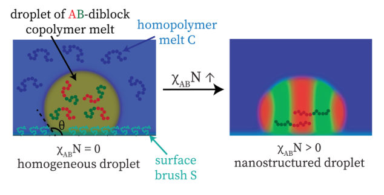
<figcaption class="paper-figure-caption"><b>Fig 1.</b> Figure 1: Sketch of the studied system. Symmetric diblock copolymers formed a droplet on the surface; A and B segments are shown in red and green, respectively. Surface was covered by the short brush S colored in light cyan. Melt of homopolymers C that modeled the surrounding medium (vacuum, gas, solvent or solvent vapor) is colored in dark blue. Before SCFT calculations, we prepared a homogeneous droplet (χAB = 0) having a certain contact angle θ (left). After this, χABN was set to a target value and a nanostructured droplet was formed (an example of such structure is shown on the right).</figcaption>
</figure>
<figure class="paper-figure-card">
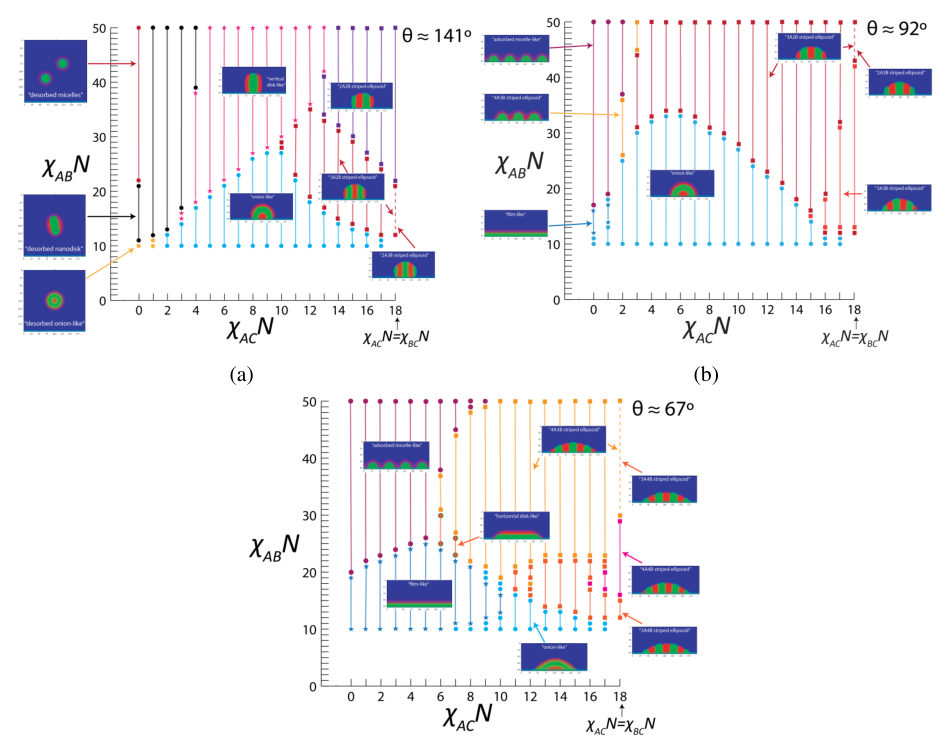
<figcaption class="paper-figure-caption"><b>Fig 2.</b> Figure 2: Equilibrium morphological diagram of nanodroplets adsorbed at a surface with no pref- erence towards any of the blocks (PrefA ≈0). SCFT calculations were performed in 2D space. Diagrams (a), (b), and (c) were obtained at θ ≈141◦, θ ≈92◦, and θ ≈67◦, respectively. Points of different colors represent the boundaries of different morphologies at a fixed χACN. Continuous lines between the boundary points show that this morphology was obtained at all values of χABN between these points. A characteristic snapshot for each structure as well as its short name are shown for each morphological region. A blocks are shown in red, B blocks are colored green, the surface-tethered S homopolymers...</figcaption>
</figure>
<figure class="paper-figure-card">
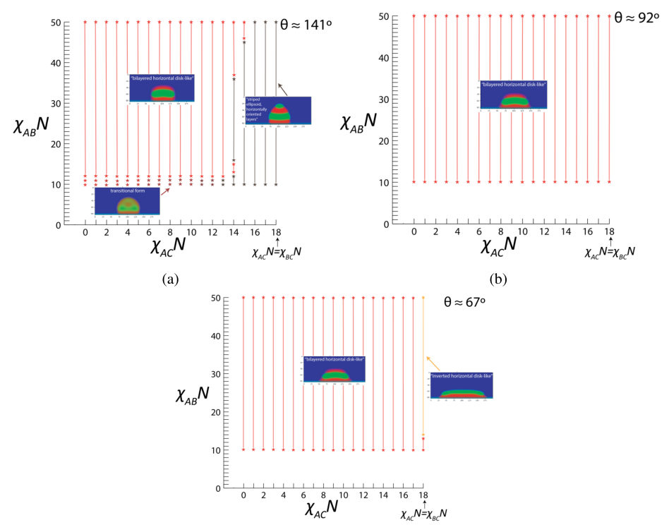
<figcaption class="paper-figure-caption"><b>Fig 3.</b> Figure 3: Morphological diagram of nanodroplets adsorbed at a surface with &quot;strong&quot; preference towards A blocks (PrefA ≈0.157); the surrounding medium is either neutral or preferential to the same block (χAC ≤χBC). SCFT calculations were performed in 2D space. Diagrams (a), (b), and (c) were obtained at θ ≈141◦, θ ≈92◦, and θ ≈67◦, respectively. Points of different colors repre- sent the boundary structures of different morphologies at a fixed χACN. Continuous lines between the boundary points show that this morphology was obtained at all values of χABN between these points. For θ ≈141◦and small χABN ≈10, the striped ellipsoidal droplet transitioned into disk- like structure smoothly. We...</figcaption>
</figure>
<figure class="paper-figure-card">
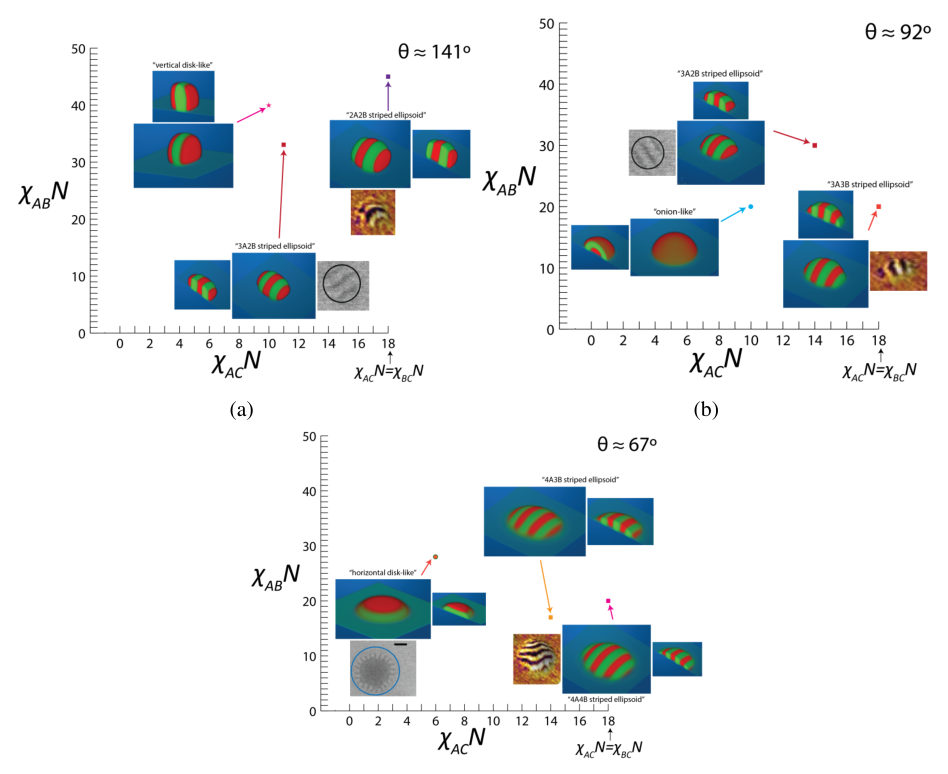
<figcaption class="paper-figure-caption"><b>Fig 4.</b> Figure 4: Equilibrium morphological diagram of three-dimensional nanodroplets adsorbed at a surface with no preference towards any of the blocks (PrefA ≈0). Diagrams (a), (b), and (c) were obtained at θ ≈141◦, θ ≈92◦, and θ ≈67◦, respectively. Points of different colors represent different morphologies. A characteristic snapshot for each structure as well as its short name are shown for each morphology. Smaller images located next to each structure show a slice of the morphology in the middle. A blocks are shown in red, B blocks are colored green, the surface- tethered S homopolymers are shown in light cyan, and homopolymers C modeling the surrounding medium are not shown. Experimental...</figcaption>
</figure>
<figure class="paper-figure-card">
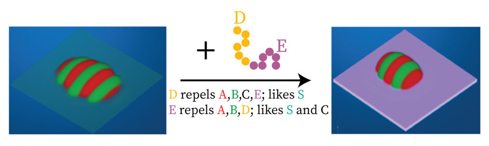
<figcaption class="paper-figure-caption"><b>Fig 5.</b> Figure 5: The change of equilibrium nanodroplet structure upon addition of short DE symmetric diblock copolymers that modeled amphiphilic surfactant molecules. A and B blocks are shown in red and green. Before the addition of surfactant, the surface only consisted of S homopolymers modeling the crosslinked random copolymer substrates used in experiment31 (light cyan). S was moderately incompatible with the surrounding medium modeled by homopolymer C (not shown). After the addition, DE diblock copolymers adsorbed at the surface forming a three-layer substrate (blocks D are shown in light orange, and blocks E are colored in violet). The blocks E are located at the top of the surface due to...</figcaption>
</figure>

**Summary.** This study uses SCFT to map the equilibrium phase behavior of small block copolymer nanodroplets on surfaces. It demonstrates that these droplets can undergo reversible structural transitions in response to external stimuli, offering a pathway to creating smart, switchable hierarchical coatings.

**Why it may be interesting.** not directly relevant

Detailed structure

**Main problem.** Understanding the structural versatility and stimuli-responsiveness of small (10-100 nm) surface-adsorbed symmetric diblock copolymer nanodroplets.

**Main result.** The discovery of a 4D morphological diagram showing that these droplets can form various switchable nanostructures, such as striped ellipsoids and onion-like particles, via external stimuli like temperature or surfactants.

**Method.** Large-scale Self-Consistent Field Theory (SCFT) calculations in 2D and 3D, augmented by a custom Iterative Correction Algorithm (ICA) to establish near-equilibrium morphologies.

**Model / system.** Small (10-100 nm) surface-adsorbed droplets of symmetric diblock copolymers (A and B blocks) in a surrounding medium (C) on a substrate modeled with tethered homopolymers (S).

**Key observables.** Droplet morphology/nanostructure classes, contact angle, surface preference, and free energy.

**Important parameters / regimes.** Flory-Huggins interaction parameters (chi_AB, chi_AC, etc.), contact angle (theta), and surface preference (Pref_A).

**Assumptions / limitations.** The 3D calculations focused on nanodroplets and excluded certain film-like or micelle-like structures; the surfactant model assumed incompatibility between surfactant blocks and the primary BCP blocks.

**Figures summary.** Figure 1 shows the model of the surface and medium; Figures 2 and 3 present 2D morphological diagrams under different wetting conditions; Figure 4 shows 3D equilibrium structures and comparison with experimental AFM/SEM; Figure 5 illustrates the effect of surfactant addition.

**Paper structure.** The paper introduces the problem of droplet versatility, describes the SCFT and ICA methodology, presents the 4D morphological phase diagrams, demonstrates stimuli-responsiveness through surfactant modeling, and validates results against experimental data.

Abstract

Block copolymers often create droplets when placed on a substrate. Such nanostructured droplets can be arranged into regular microstructured arrays, thereby forming hierarchically organized materials that can be used in microelectronics, plasmonics, sensing, photonics, metamaterials production, and even cryptography. However, it is unclear if such materials can be stimuli-responsive, i.e., be able to change their nanostructure on a single droplet level upon applying external stimuli. In this work, we discovered that small (10-100 nm) surface-adsorbed droplets of symmetric diblock copolymers can form a multitude of different externally switchable nanostructures. We obtained a near-equilibrium, comprehensive 4D diagram of droplet morphologies by performing large-scale self-consistent field theory (SCFT) calculations under various wetting and phase separation conditions. The SCFT modeling was augmented with a computational algorithm that established an equilibrium droplet morphology in a given system without assuming potentially equilibrium structures prior to simulation. The discovered droplet nanostructures agreed excellently with previously published experimental data. Crucially, we showed that direct and reversible transitions between different droplet morphologies are possible upon changing the interaction strength between components, which can be tuned externally in experiments by adding surfactants or controlling temperature. We confirmed experimental realizability of such stimuli-responsiveness by modeling surfactant addition that led to a switch between droplet nanostructures. This work demonstrates that even the simplest symmetric diblock copolymers are able to produce versatile and stimuli-responsive structures on a surface when confined to a small nanodroplet. This opens the possibility to produce smart coatings with externally switchable hierarchical micro- and nanostructures.

[↑ back to top](#top)

### [Tailoring Mechanical Properties of Germanium Anodes via Metal Incorporation for Improved Cycle Stability](http://arxiv.org/abs/2605.00304v1)

**Authors:** Koki Nozawa, Noriyuki Saitoh, Noriko Yoshizawa, Takashi Suemasu, Kaoru Toko  
**Type:** both · **Category:** other · **PDF:** <https://arxiv.org/pdf/2605.00304v1>  
**Analysis basis:** full PDF text, analyzed in chunks

↔ Scroll figures horizontally

<figure class="paper-figure-card">
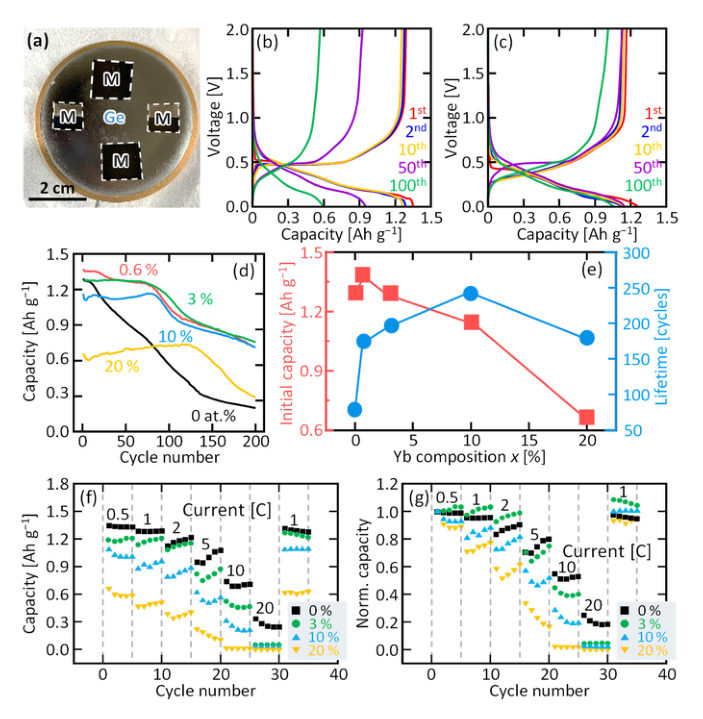
<figcaption class="paper-figure-caption"><b>Fig 1.</b> Figure 1. Effects of Yb addition on Ge anodes. (a) Photograph of the Ge sputtering target with</figcaption>
</figure>
<figure class="paper-figure-card">
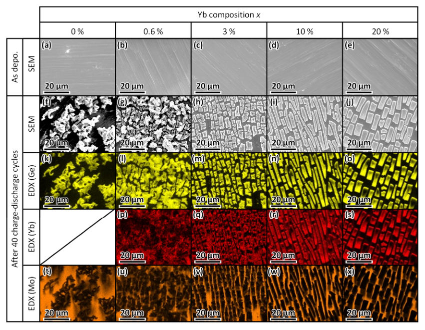
<figcaption class="paper-figure-caption"><b>Fig 2.</b> Figure 2. Surface characterization of Ge1−xYbx anodes (x = 0, 0.6, 3, 10, and 20%). SEM</figcaption>
</figure>
<figure class="paper-figure-card">
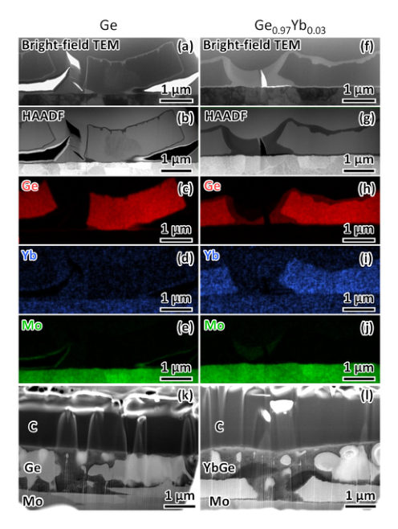
<figcaption class="paper-figure-caption"><b>Fig 3.</b> Figure 3. (a–j) Cross-sectional TEM analysis of the (a–e) Ge and (f–j) Ge0.97Yb0.03 anodes on</figcaption>
</figure>
<figure class="paper-figure-card">
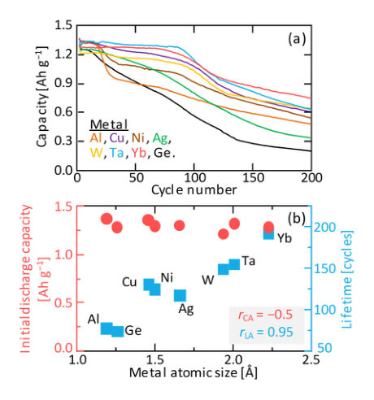
<figcaption class="paper-figure-caption"><b>Fig 4.</b> Figure 4. Electrochemical performance of the Ge0.97M0.03 (M = Al, Cu, Ni, Ag, W, Ta, Yb, and</figcaption>
</figure>
<figure class="paper-figure-card">
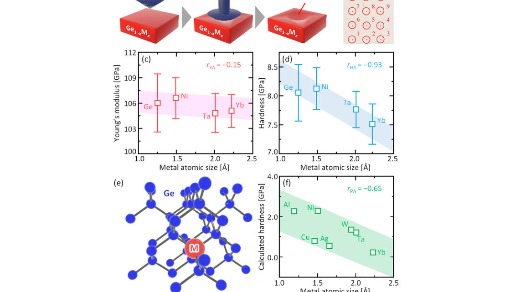
<figcaption class="paper-figure-caption"><b>Fig 5.</b> Figure 5. Mechanical properties of the Ge0.97M0.03 anodes evaluated using (a)−(d)</figcaption>
</figure>

**Summary.** This paper demonstrates that doping Germanium anodes with large-atom metals like Ytterbium can significantly extend battery life. By making the anode mechanically softer, the material can better accommodate the physical stress of expansion, preventing the cracking and peeling that typically destroy high-capacity anodes.

**Why it may be interesting.** not directly relevant

Detailed structure

**Main problem.** The rapid capacity degradation and mechanical failure (cracking and delamination) of high-capacity Germanium (Ge) anodes during lithiation/delithiation due to large volume expansion.

**Main result.** Trace doping of amorphous Ge with large-atom metals, specifically Ytterbium (Yb), enhances cycle life by approximately three times by inducing mechanical softening, which suppresses lithiation-induced damage.

**Method.** The study combines RF magnetron sputtering for film synthesis, electrochemical testing, nanoindentation for mechanical properties, and first-principles VASP calculations for hardness estimation.

**Model / system.** Amorphous Ge thin-film anodes doped with trace amounts (x ≈ 0.03) of various metals (Al, Cu, Ni, Ag, W, Ta, and Yb) deposited on Mo or SiO2 substrates.

**Key observables.** Initial discharge capacity, cycle life (lifetime), film hardness, Young's modulus, and metal atomic radius.

**Important parameters / regimes.** Metal dopant concentration (x ≈ 0.03), metal atomic radius, and C-rate.

**Assumptions / limitations.** The measured hardness is treated as a surrogate metric for fracture toughness; the supercell model assumes a 32-atom representation of the amorphous matrix.

**Figures summary.** Fig 1: Deposition setup and electrochemical performance (capacity, cycling, rate capability). Fig 2-3: Surface morphology (SEM) and cross-sectional TEM/STEM analysis of the anode structure. Fig 4: Correlation between metal size and electrochemical properties. Fig 5: Nanoindentation setup and correlation between dopant size and mechanical properties (Young's modulus, hardness) alongside computational supercell models.

**Paper structure.** Introduction of the Ge anode stability problem, followed by experimental synthesis and electrochemical characterization, then mechanical analysis via nanoindentation, computational validation of hardness trends, and a concluding discussion on the shift from volume-suppression to mechanical-compliance design.

Abstract

Achieving long-term stability in high-capacity lithium-ion battery anodes remains a critical challenge. In this study, we present a materials-intrinsic strategy for extending the cycle life of Ge, a promising next-generation anode material, through trace doping with metal elements. We systematically investigated the effects of small additions of various metals and found that elements with large atomic size, particularly Yb, markedly improved the cycling stability without sacrificing the initial capacity, while appropriate Yb doping enhanced the anode lifetime by approximately a factor of three. Structural and electrochemical analyses revealed that this improvement originates from mechanical softening of the Ge anode, which suppresses lithiation-induced damage such as cracking and delamination. Nanoindentation measurements further showed a strong negative correlation between dopant atomic size and film hardness, establishing anode softening as a new design principle for damage-tolerant electrodes. Although Yb doping reduced the rate capability at high C-rates, the present results demonstrate a clear shift in design strategy from volume-change suppression to mechanical compliance. These findings provide a useful framework for stabilizing high-capacity alloy anodes through atomic-scale mechanical control.

[↑ back to top](#top)

### [Thermodynamic Charge Partition in Accumulation-Layer Heterostructures](http://arxiv.org/abs/2605.00441v1)

**Authors:** Elmar Böckenhoff  
**Type:** theory · **Category:** statistical mechanics · **PDF:** <https://arxiv.org/pdf/2605.00441v1>  
**Analysis basis:** full PDF text, analyzed in chunks

↔ Scroll figures horizontally

<figure class="paper-figure-card">
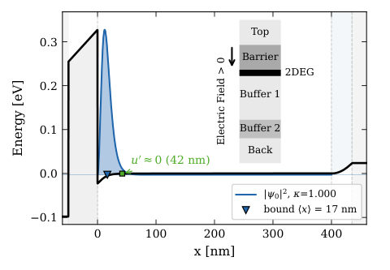
<figcaption class="paper-figure-caption"><b>Fig 1.</b> FIG. 1. Conduction-band edge of the full heterostructure on the compressible branch (ξ = 0.8, κphys = 1.000), corre- sponding to the conventional fully screened accumulation-layer picture. The blue fill shows the bound-state probability den- sity |ψ0|2 at eigenenergy ε0, with centroid ⟨x⟩bnd = 17 nm (blue ▼). All induced charge resides in this bound state; no extended states are occupied. The green square marks the screening boundary, defined by u′(s) &lt; 2%, at x ≃42 nm. The overlay indicates the layer sequence of the heterostructure and the positive electric-field direction.</figcaption>
</figure>
<figure class="paper-figure-card">
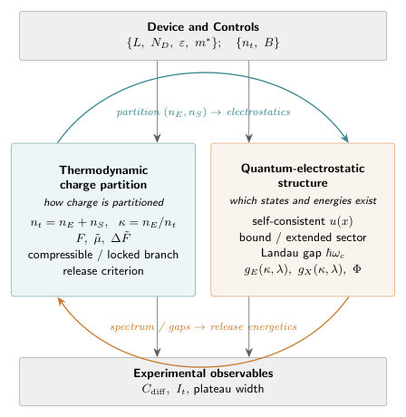
<figcaption class="paper-figure-caption"><b>Fig 2.</b> FIG. 2. Schematic overview of the coupled thermodynamic and quantum-electrostatic structure of the problem. The external device and control parameters (L, ND, ε, m∗; nt, B) define a heterostructure in which the total induced charge is partitioned thermodynamically into a bound accumulation-layer contribu- tion and a remote screening contribution, nt = nE + nS. This partition determines the electrostatic boundary conditions of the self-consistent Poisson–Schrödinger problem, which in turn provides the microscopic spectrum, the Landau gap, and the canonical response functions entering the release energetics. The central feedback loop therefore couples how charge is partitioned to which states...</figcaption>
</figure>
<figure class="paper-figure-card">
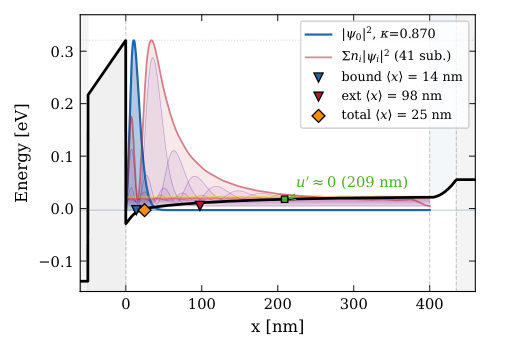
<figcaption class="paper-figure-caption"><b>Fig 3.</b> FIG. 3. Conduction-band edge of the full heterostructure (barrier, buffer 1, buffer 2, back contact) on the locked branch at mid-plateau (ξ = 1.15, κphys = 0.870). Blue fill: bound- state probability density |ψ0|2 at eigenenergy ε0. Colored fills: extended-subband densities ni|ψi|2 at their respective eigenenergies (plasma colormap, 41 occupied subbands; mag- nified by a factor of 35 for visibility). Markers indicate the centroids of the bound sector, ⟨x⟩bnd = 14 nm (blue ▼), the extended sector, ⟨x⟩ext = 98 nm (red ▼), and the total charge distribution, ⟨x⟩tot = 25 nm (orange ♦). The green square marks the screening boundary, u′(s) &lt; 0.02 (with u′(0) = 1 at the interface).</figcaption>
</figure>
<figure class="paper-figure-card">
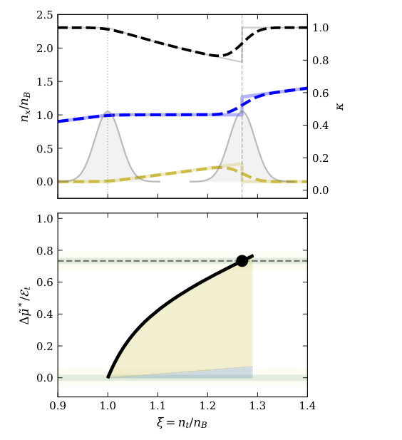
<figcaption class="paper-figure-caption"><b>Fig 4.</b> FIG. 4. Partition mechanics across a representative plateau interval. Top panel: evolution of the charge partition and of the realized path κphys(ξ) as functions of the total induced density ξ = nt/nD. The dotted vertical lines mark the entry into the locked branch and the release point. The gray profiles indicate the neighboring Landau-level spectral weight. Bottom panel: accumulated dimensionless release contribution ∆˜µ∗/Et along the locked branch. Starting from the compressible boundary, the release term grows monotonically, reaches the threshold marked by the dashed horizontal line, and thereby determines the endpoint of the plateau branch (black dot). The shaded area emphasizes the...</figcaption>
</figure>
<figure class="paper-figure-card">
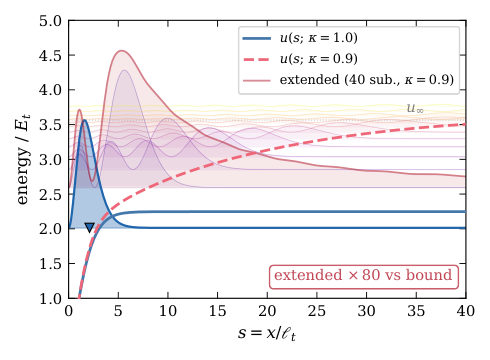
<figcaption class="paper-figure-caption"><b>Fig 5.</b> FIG. 5. Stage-2 canonical solution at λ1 = 54. The solid blue curve shows the band edge u(s; κ = 1.00, λ1 = 54) on the fully screened branch, while the dashed red curve shows u(s; κ = 0.90, λ1 = 54) after charge transfer into the screening channel. Wavefunctions are shown for κ = 0.90 only: blue fill, bound-state probability density |ψ0|2; colored fills (plasma colormap), extended-subband densities ni|ψi|2; red line, total extended density envelope. The asymptotic shelf at u∞is indicated. The text box indicates the visibility magnification of the extended contribution relative to the bound state.</figcaption>
</figure>

**Summary.** This paper provides a thermodynamic description of how charge is distributed between a bound interface layer and an extended screening layer in semiconductor heterostructures. It demonstrates that experimental phenomena like capacitance suppression and Hall plateaus are unified manifestations of the same underlying charge-partitioning mechanism. The theory uses a self-consistent Poisson-Schrödinger approach to make these effects calculable across different densities and geometries.

**Why it may be interesting.** not directly relevant

Detailed structure

**Main problem.** Understanding the thermodynamic mechanism of charge partitioning in semiconductor heterostructures when a spectral gap prevents continuous charge absorption.

**Main result.** The development of a unified thermodynamic framework where capacitance, tunneling, and Hall plateaus emerge as different projections of a single coupled thermodynamic and quantum-electrostatic structure.

**Method.** A two-stage self-consistent Poisson-Schrödinger reduction using a Helmholtz free energy formulation and dimensionless canonical scaling.

**Model / system.** Quantized accumulation-layer heterostructures (e.g., GaAs) modeled as a multi-layer electrostatic stack consisting of a barrier, an active buffer, and a compensating buffer.

**Key observables.** Differential capacitance, tunnel current, chemical potential, and Hall plateau width.

**Important parameters / regimes.** Partition fraction (kappa), total induced density (nt), magnetic field (B), buffer width (lambda), and spectral gap (delta_gap).

**Assumptions / limitations.** The theory does not address microscopic kinetics, hysteresis, or metastability; it assumes the physical path is selected spectrally.

**Figures summary.** Figure 1 shows conduction-band profiles on the compressible branch; Figure 2 provides a schematic of the coupled theory; Figure 3 illustrates the locked-branch band profile; Figure 12 shows the roadmap of the canonical PS formulation.

**Paper structure.** The paper defines the charge partition, formulates the Helmholtz free energy, identifies compressible and locked branches, applies the theory to predict experimental observables, and validates via comparison with magnetocapacitance data.

Abstract

We develop a thermodynamic description of accumulation-layer heterostructures in which the induced sheet density is partitioned between the near-interface accumulation-layer charge and a complementary screening charge in the surrounding structure. Treating this partition as the central state variable yields a complete Helmholtz free energy, a corrected locked-branch chemical potential, and a shifted release potential that separates energetic path selection from geometric capacitance. The physical path is selected spectrally: compressible segments remain fully screened, whereas incompressible segments evolve along a locked branch until release is triggered by the relevant gap. Differential capacitance, tunnel current and plateau width then emerge as different projections of the same coupled thermodynamic structure. A canonical two-stage self-consistent Poisson--Schrödinger reduction supplies universal master functions for the isolated accumulation layer and master surfaces for its finite-buffer extension, making the theory calculable across density and geometry. Comparison with magnetocapacitance and magnetotunneling data supports a picture in which nearby extended charge refills the accumulation layer and the effective screening depth grows with magnetic field.

[↑ back to top](#top)

### [TrueEBSD in MTEX: automatic image matching for correlative microscopy applications](http://arxiv.org/abs/2605.00703v1)

**Authors:** Vivian Tong, Stefan Olovsjö, Rachid M'Saoubi, Mathias Grabner, Manuel Petersmann, Liam Wright  
**Type:** both · **Category:** other · **PDF:** <https://arxiv.org/pdf/2605.00703v1>  
**Analysis basis:** full PDF text, analyzed in chunks

↔ Scroll figures horizontally

<figure class="paper-figure-card">
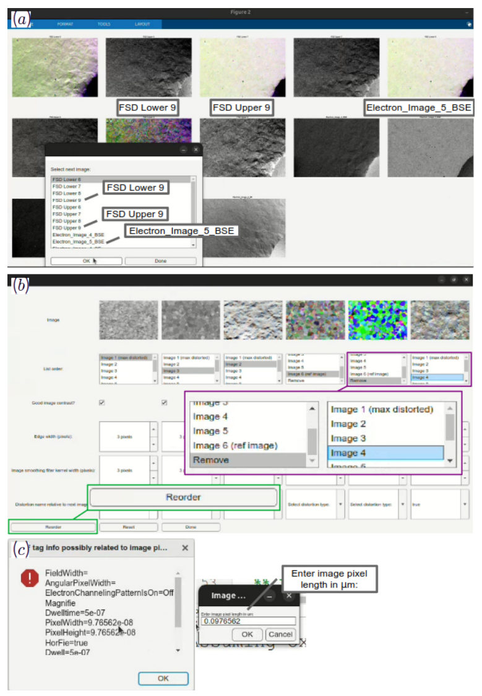
<figcaption class="paper-figure-caption"><b>Fig 1.</b> Figure 1: GUI for data import. (a) .h5oina file image preview tool; (b) TrueEBSD image sequence reordering and parameter selection tool. Outlined boxes show magnified text and portions of the GUI menu; (c) Image file metadata reader and image pixel size input tool.</figcaption>
</figure>
<figure class="paper-figure-card">
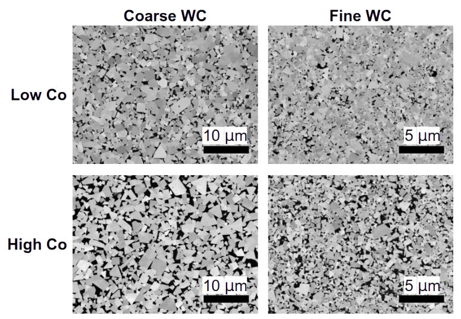
<figcaption class="paper-figure-caption"><b>Fig 2.</b> Figure 2: Example BSE images (0° sample tilt, 10 kV electrons) showing the four WC-Co microstructures used in this work. WC grains (bright phase) are cemented in a Co binder matrix (dark phase).</figcaption>
</figure>
<figure class="paper-figure-card">
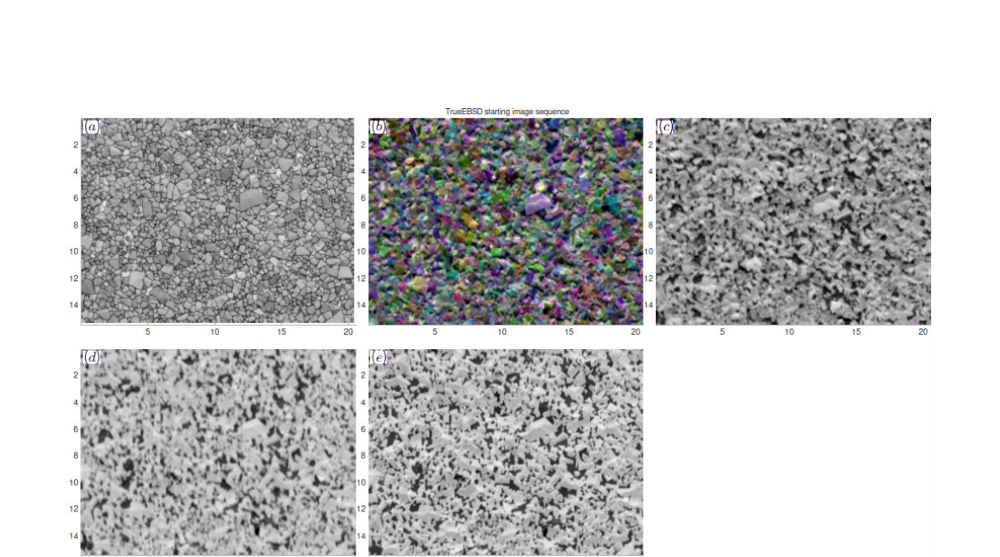
<figcaption class="paper-figure-caption"><b>Fig 3.</b> Figure 3: Imported image sequence. (a) EBSD band contrast map, (b) false-colour FSE image, bottom three diodes, 20 kV, detector retracted 25 mm, (c) FSE image, top two and bottom centre diodes, 20 kV, detector retracted 25 mm, (d) FSE image, top two diodes, 20 kV, detector fully inserted, (e) FSE image, top two and bottom centre diodes, 10 kV, detector fully inserted. Coordinate axes show image scales in μm.</figcaption>
</figure>
<figure class="paper-figure-card">
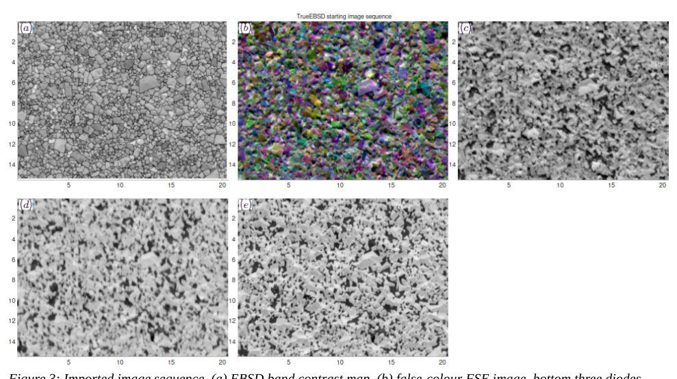
<figcaption class="paper-figure-caption"><b>Fig 4.</b> Figure 4 shows the same figures pre-processed for image alignment. The EBSD map, which had a 5 × longer step size than the pixel size of the FSE images, was upsampled using nearest-neighbour interpolation. Edge transforms of the EBSD band contrast map and false-colour FSE bottom-diode images (Figure 4 a, b) were used to generate similar features for image alignment, whereas the three FSE top-diode images (Figure 4 c, d, e) were aligned using the images themselves. The distortion types between sequential image pairs are listed in Table 2. The FSE top- and bottom-diode images (Figure 4 b, c) were acquired in the same scan. The change in SEM accelerating voltage from 20 kV to 10 kV (Figure 3...</figcaption>
</figure>
<figure class="paper-figure-card">
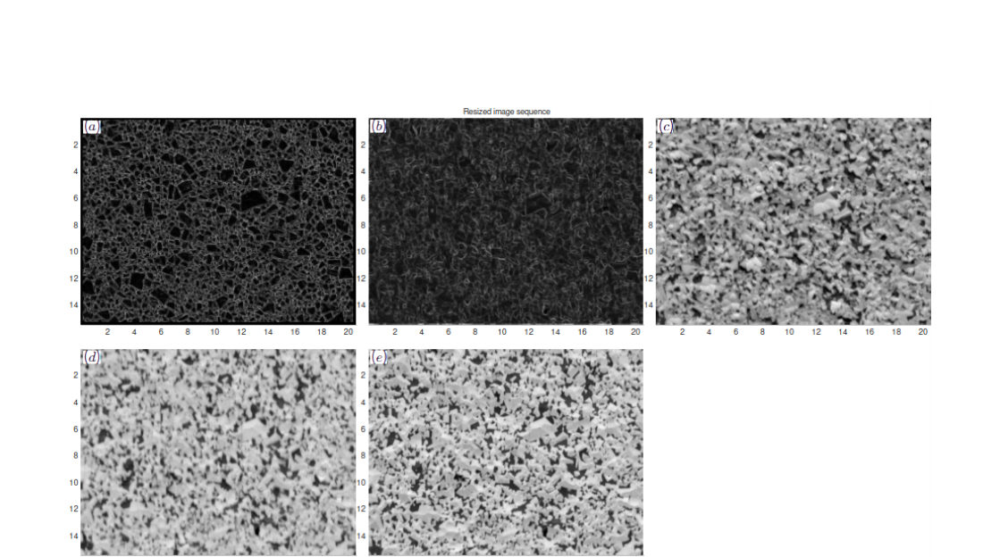
<figcaption class="paper-figure-caption"><b>Fig 5.</b> Figure 4: Pre-processed image sequence. The edge transforms of (a) the EBSD map and (b) the FSD bottom-diodes image have shared contrast for image matching even though the original images (Figure 3 a, b) do not. Coordinate axes show image scales in μm.</figcaption>
</figure>

**Summary.** This paper presents TrueEBSD, an open-source MATLAB/MTEX add-on designed to automatically align and correct spatial distortions in EBSD maps. By enabling precise overlay with other SEM images, it allows for more accurate quantitative analysis of microstructures, such as phase fractions in composites and void formation in metals.

**Why it may be interesting.** not directly relevant

Detailed structure

**Main problem.** Spatial distortions (drift, tilt, and electromagnetic shifts) in EBSD maps prevent accurate pixel-wise overlay with other SEM imaging modes, hindering quantitative correlative microscopy.

**Main result.** The implementation of TrueEBSD as an MTEX add-on enables automated image alignment and distortion correction, allowing for more accurate phase fraction and grain boundary void analysis.

**Method.** The tool uses FFT-based image cross-correlation of edge regions and fits local shifts to mathematical models (projective, affine, or linear spline) to align images.

**Model / system.** The software is applied to materials science systems, specifically WC-Co composites for studying phase fractions and copper polycrystals for investigating grain boundary voids.

**Key observables.** WC grain contiguity, Co phase fraction, grain boundary void statistics, and misorientation distributions.

**Important parameters / regimes.** Pixel size, ROI size, distortion type (affine, projective, or linear), and accelerating voltage.

**Assumptions / limitations.** The distortion model cannot correct highly localized, sharp-range distortions caused by surface topography, and alignment quality may decrease near image borders due to automation.

**Figures summary.** Figure 1 shows the GUI for data import; Figure 2 shows WC-Co microstructures; Figure 3-4 show EBSD/FSE input sequences and edge transforms; Figure 5-10 demonstrate alignment success, phase augmentation, and void analysis in copper.

**Paper structure.** The paper introduces the TrueEBSD software and its MTEX implementation, details the mathematical algorithms for distortion modeling, presents two case studies (WC-Co and copper), and discusses limitations regarding topography-induced errors.

Abstract

TrueEBSD is an open-source MATLAB program for image alignment and spatial distortion correction of images and electron backscatter diffraction (EBSD) maps. We have re-implemented TrueEBSD as an add-on to MTEX, an established toolbox for EBSD data analysis. Spatial alignment enables correlative analysis methods, such as augmenting EBSD orientation maps with data from other imaging modes. The augmented EBSD maps can then be analysed further using MTEX. We demonstrate TrueEBSD on two example case studies: one for measuring Co phase fraction and WC contiguity in a WC-Co composite, and another for determining the relative susceptibility of grain boundaries to void formation in a copper polycrystal. In both examples, the EBSD map was augmented with scanning electron microscopy (SEM) image data. This enabled quantitative crystallographic measurements which would not be possible from analysing the EBSD maps and images separately.

[↑ back to top](#top)

